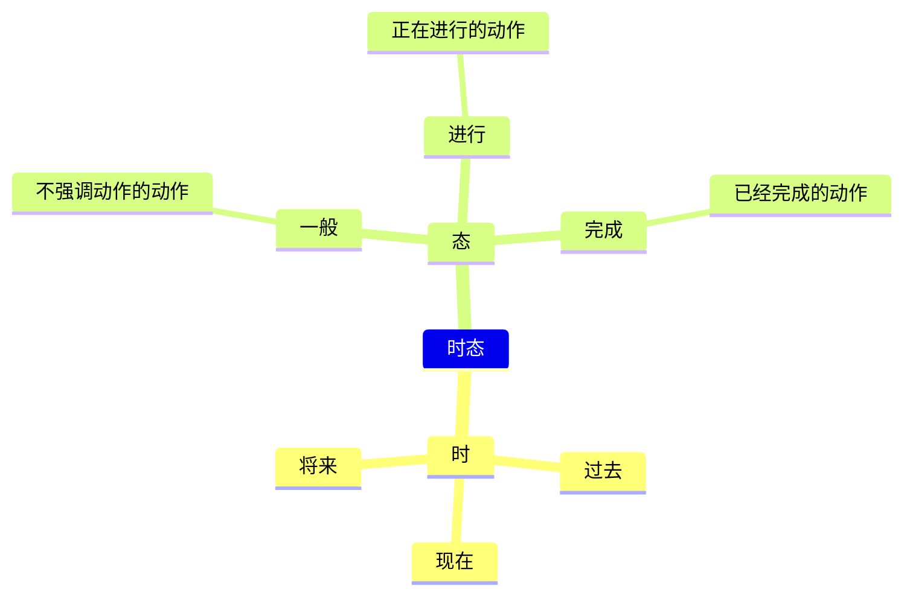

# 托福英语学习笔记

# 文档说明

| 编制人       | namelessmyth       |
| ------------ | ------------------ |
| 编制日期     | 2023年09月07日     |
| 编制单位     | 无                 |
| 文档分类     | 学习笔记-英语-托福 |
| 版本号       | 1.0                |
| 最后更新人   | namelessmyth       |
| 最后更新日期 | 2023年09月07日     |


## 文档更新记录

| 版本 | 编制/修改人  | 修改日期   | 备注（原因、进一步的说明等） | 评审人/日期 |
| ---- | ------------ | ---------- | ---------------------------- | ----------- |
| 1.0  | Namelessmyth | 2023-09-07 | 初版                         |             |
|      |              |            |                              |             |
|      |              |            |                              |             |
|      |              |            |                              |             |
|      |              |            |                              |             |
|      |              |            |                              |             |
|      |              |            |                              |             |


## 文档版权声明

本文档属于个人学习英语的经验总结。可随意分享和传播。如果写的有什么不对的，欢迎讨论交流。

 

## 文档受众

本文档主要分享给所有想学好英语的朋友以及想考托福的朋友。

 

## 文档参考说明

文档听力口语部分来源于小E老师听力口语课。根据视频内容整理而成。

文档听力口语部分来源于扇贝精听听力课程。根据教程内容整理而成。

 

 

# 学习工具

## 手机App

### 有道翻译官

·   优势：屏幕取词，查词翻译相对准确。

·   劣势：语音翻译不准确。

### 微软翻译

·    优势：语音翻译比较准确。练习听力听不懂单词不知道怎么拼写时，可以使用。

·    劣势：语音翻译结果，无法再次查询。显示的词义没有其他字典多。

### 词根词缀词典

没有第三方广告。词根词缀查询比较全面。

### 扇贝

比较全面的app，包含听说读写各种分类功能。但是要收费。

·   扇贝单词

·   扇贝听力口语

·   扇贝课堂

·   扇贝阅读


## 电脑软件

### 网易有道翻译

有网页版，还有电脑版。电脑版比较强大，可以实时翻译电脑上所有软件中出现的英文。


## 网站

### 英语词根词典

网址：https://www.quword.com/root/，但有些词查不出来。没有词根词缀词典强。


# 词汇

## 词义辨析

### 能力&才能

这些词都有能力、才能的意思，那么它们有什么区别呢？

#### Ability

Ability指的是人具备做某事的才能或者能力，包括智力和体力上的能力。这种能力可能是先天的，也可能是通过学习或锻炼等方法而获得的。

常用的搭配有ability in/for something，它的形容词形式也比较常见able，常用搭配是be able to do something。

其反义词是∶disability，inability，incapability，incapacity

例句如下：

She is a pianist of great ability.

*她是一个能力超群的钢琴家。*

I think he is able to finish the work.

*我觉得他有能力完成工作。*


#### capability

Capability指的是完成有难度的事情的能力和才能，意义与 ability 相同，可指人或物。

复数形式指潜在的能力。常用的搭配有capability to do something或者capability of something。

例句如下：

*The task is beyond his capabilities.*

*他不能胜任这项任务。*

*I don t think that boy has great capabilities.我认为那孩子没有多大潜力。The country has the capability to defeat the aggressor.*

*这个国家有能力击败任何侵略者。*


#### capacity

分辨完 ability 和 capability 的差别，再让我们来看capacity。

Capacity除了指做某事的能力之外，还可以指容量，常用的搭配有capacity of something或者capacity for doing something。

例句如下：

It's important to develop a child's capacity for learning. 

*发展一个小孩的学习能力很重要。*

The bottle has a capacity of 500ml.

*这个瓶子容量是500ml。*


#### competence

最后，我们来看competence。

Competence指的是能力、资格，特别是卓越的能力，等同于competency。

常用的搭配有competence in something/doing something。

例句如下：

A company's success is related to its managers' competence.

一个公司的成败跟它的管理者的能力紧密相关。


好了，希望通过我们的讲解，大家能对 ability , capability , capacity 和 competence之间的主要区别有了了解。我们现在来归纳一下它们的用法。

✅ ability和capability是同义词，没有区别，皆指做事情的能力

✅ capacity 侧重于指物体的容量或学习并掌握技能的能力

✅ competence是指按质按量完成既定任务或交付产品的能力，即"胜任工作"的能力，它更强调"胜任"而不是"有没有能力"


# 听力

## 体力提升


## 音标

### 元音

#### 双元音

 [ei]、[ai]、[ɔi]、[ɛə]、[uə]、[iə]、[au]、[əu]

#####  [ɔi]

**发音方法**

 [ɔ:]+[i]

**拼读规律**

oy

·   boy

·   joy

·   toy

oi

·   coin

·   join

·   voice

**练习**

key point

Boys will be boys. 男孩就是男孩


##### [iə]

**发音方法**

 [i]+[ə]，[iə]是单元音[i]和[ə]这两个元音的组合音。首先发[i]的音，嘴唇扁平，口腔放松，嘴微张然后很快的滑向[ə]音，发音过程中口型始终是半开的。发音时口型由小到大，音量由强到弱，由清晰到模糊。

英式音标中[ə]要扁平，没有卷舌音。美式发音中，凡是单词结尾加上r的都要卷舌发[r]。

**拼读规律**

**ear**

- hear /hiə(r)/
- near /niə(r)/
- tear /tiə(r)/

**ere**

- here /hiə(r)/ 这里
- sere /siə(r)/ 干枯的
- mere /miə(r)/ 仅仅的
- sincere /sinsiə(r)/ 真诚的

**eer**

- beer
- deer
- cheer

**短语句子**

burst into tears，突然哭起来

Everyone should be sincere，每个人都应该真诚。 	


##### [ɛə]&[eə]

**发音方法**

[eə]是单元音/e/和/ə/这两个元音的组合音。先发前元音/e/，嘴角轻扯，上下齿，自然分离大约1个手指的空间)然后很快滑向/a/音，发音过程中双唇半开口型由大变小，音量由强变弱。

英式发音发/ə/的时候不卷舌，美式发音单词词尾含有“r”需卷舌。

**拼读规律**

are

- care，照顾
- pare，削皮
- dare，敢

air

- air，/eə(r)/
- hair，/heə(r)/
- repair，/ri'peə(r)/

ear

- wear
- pear
- bear

**词组句子**

take care. 注意，小心。

I met an unfair affair. 我遇到一件不公平的事情。


# 语法

## 时态

如下图：时态可以分为2部分，“时”和"态"。时包含：过去，现在，将来。态包含：一般，进行，完成。




### 说明

https://zhuanlan.zhihu.com/p/88680858?ivk_sa=1024320u

 ```mermaid
 ---
 displayMode: compact
 ---
 gantt
     title 时态（假设今天是2023年5月1日）
     section now1
     现在          :a0, 2023-05-01, 1d
     section 一般
     一般过去时     :a1, 2023-04-11, 1d
 	现在进行时     :a2, 2023-04-26, 10d
     一般将来时     :a3, 2023-05-10, 1d
     section now2
     现在          :a0, 2023-05-01, 1d
     section 完成
     过去完成时     :a1, 2023-04-11, 8d
 	现在完成时     :a2, 2023-04-23, 8d
     一般将来时     :a3, 2023-05-10, 10d
 ```


###  例句

 通过一些例句来看看：

I often watch TV.
我经常看电视
**一般现在时**：发生在现在，不强调动作状态
do+do=do（watch看，用动词原形）


I watched TV just now.

我刚刚在看电视
**一般过去时**：发生在过去，不强调动作状态
do+did=did（watched看，过去式）

I am watching TV.
我正在看电视
**现在进行时**：发生在现在，正在进行的动作
do+be doing=be doing（am watching正在看）

I was watching TV when you came in.
**过去进行时**：发生在过去，正在进行的动作
did+be doing=was/were doing（was watching）

Yestday he told me he would go to the zoo next Sunday.
他昨天告诉我他下周天会去动物园.
**一般过去将来时**：主体动作发生在过去，客体动作是将来可能要发生的动作
do+would=would do（主体动作told，did形式）

I have finished my homework.
我完成了我的作业.
**现在完成时**：截止到现在已经完成了的动作对现在造成的影响.
do+have done= have done（have finished）

He had lived here for 20 years by the end of last year.
截止到去年末，他已经在这里居住了20年了
**过去完成时**：过去的过去发生的动作对过去赵成的影响
did+have done=had done

The students have been being taught by me for 10 years.
我教这些学生已经十年了。
**现在完成进行时**：（既强调动作又强调影响）截止到现在已经完成且未来还会进行的动作
do+have been doing=have been doing

I had been teaching here before you came to the city.
在你来这个城市之前我就在这教学了
**过去完成进行时**：did+have been doing=had been doing


We will be having a meeting at this time next Sunday.
下周天的这个时候我们将正在开会
**将来进行时**：发生在将来，正在进行的动作
will+be doing=will be doing

He said we would be having a meeting at this time next Sunday.

他说下星期天这个时候我们要开会。
**过去将来进行时**：would+be doing=would be doing

I will have finished the book by the end of this year.
我将在今年年底前完成这本书。
**将来完成时**：将来以前发生的动作对将来造成的影响
will+have done=will have done

He told us that he would have finished the book by the end of this year.
他告诉我们他将在今年年底完成这本书。
**过去将来完成时**：would have done

By next summer，he will have been teaching here for 30 years.
到明年夏天，他将在这里教书30年。
**将来完成进行时**：will+have been doing=will have been doing

He told us he would been teaching here for 30 years by next summer.
他告诉我们到明年夏天他将在这里教书30年。
**过去将来完成进行时**：would+have been doing=would have been doing