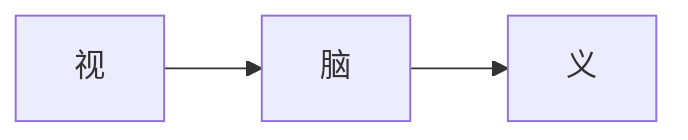

# 英语学习笔记

# 文档说明

本文档属于个人学习英语的经验总结，心得分享。如果对文档内容有任何问题，欢迎讨论交流。

| 编制日期     | 2023-09-07        |
| ------------ | ----------------- |
| 编制人       | namelessmyth(Gem) |
| 编制单位     | 无                |
| 文档分类     | 学习笔记-英语     |
| 版本号       | 1.3               |
| 最后更新日期 | 2023-09-27        |
| 最后更新人   | namelessmyth      |


## 文档更新记录

| 版本 | 编制/修改人  | 修改日期   | 备注（原因、进一步的说明等）                                 |
| ---- | ------------ | ---------- | ------------------------------------------------------------ |
| 1.0  | namelessmyth | 2023-09-07 | 初版                                                         |
| 1.1  | namelessmyth | 2023-09-16 | 完成[音标](#音标)部分，内容大部分来源于小E英语               |
| 1.2  | namelessmyth | 2023-09-20 | 新增[说话腔调](#说话腔调)章节以及[音变规则](#音变规则)，例如：辅元连读，浊化，弱读，击穿等。 |
| 1.3  | namelessmyth | 2023-09-27 | 完成小e英语彩蛋课内容，加入大量[口语习语](#口语习语)的案例。 |
|      |              |            |                                                              |
|      |              |            |                                                              |
|      |              |            |                                                              |

 

## 文档参考说明

文档听力口语部分内容主要有以下来源

- 小E老师听力口语课。根据视频内容整理而成。
- 扇贝听力口语App。根据教程内容整理而成。
- 通过百度搜索相关文章。


# 学习工具

## 手机App

### 有道翻译官

优势：屏幕取词，查词翻译相对准确。

劣势：语音翻译不准确。

### 微软翻译

 优势：语音翻译比较准确。练习听力听不懂单词不知道怎么拼写时，可以使用。

 劣势：语音翻译结果，无法再次查询。显示的词义没有其他字典多。

### 词根词缀词典

没有第三方广告。词根词缀查询比较全面。

### 扇贝

比较全面的app，包含听说读写各种分类功能。背单词不收费，其他高级功能要收费。

扇贝单词

扇贝听力口语

扇贝课堂

扇贝阅读


## 电脑软件

### 网易有道翻译

有网页版，还有电脑版。电脑版划词功能也比较实用，只要选中英文就会实时出现翻译和发音。在做英语笔记时有些音标用键盘打出来比较费时间。有了这个功能就能复制了。还有屏幕取词和截图翻译功能。


## 网站

### 英语词根词典

网址：https://www.quword.com/root/，但有些词查不出来。没有词根词缀词典强。


# 词汇

## 词组

#### wide awake

非常清醒（并警觉），记忆：在很宽的范围内保持清醒。


#### all the way

一直到底的，一路上；完全地，彻底地；达到最大程度或最高水平


#### go back to

返回某个地方; 回顾过去


#### grab information

获取信息。抓取信息。例如：Let me grab the information about the swimming。


## 中英

### 表情

斜眼看人：sideways glance

眨眼睛/使眼色：wink

眨眼睛：blink

震惊：shock

盯着人看：stare

怒视：glare


### 数学符号

`=` equals, /ˈiːkwəlz/

`+` plus, /plʌs/。例如：`2+2=4`, 2 plus 2 equals 4

`−` minus, /ˈmaɪnəs/。

`÷` divided by。 例如：`4÷2=2` ，4 divided by 2 equals 2

`×` times。 例如：5X2=10, 5 times 2 equlas 10


### 调料

调料品：seasonings

芝麻油/香油，sesame oil

麻油/辣椒油，chilli oil

酱油，soy sauce

老抽，dark soy sauce

生抽，light soy sauce

耗油，oyster sauce

花生油，peanut oil

大豆油，soybean oil

盐，salt

番茄酱，ketchup

辣酱，hot sauce

辣椒酱，chilli sauce

豆瓣酱，bean paste

芥末酱，mustard

烧烤酱，barbecue sauce

沙拉酱，salad dressing

醋，vinegar

糖，sugar

胡椒粉，pepper

辣椒粉，paprika

味精，Monosodium

料酒，cooking wine

香料，spices

土茴香，孜然，cumin

八角，star anise

香叶，bay leaf


### 表达数量

a couple of，两个（事物），几个（事物），一对


## 词义辨析

### 能力&才能

这些词都有能力、才能的意思，那么它们有什么区别呢？

#### Ability

Ability指的是人具备做某事的才能或者能力，包括智力和体力上的能力。这种能力可能是先天的，也可能是通过学习或锻炼等方法而获得的。

常用的搭配有ability in/for something，它的形容词形式也比较常见able，常用搭配是be able to do something。

其反义词是∶disability，inability，incapability，incapacity

例句如下：

She is a pianist of great ability.

她是一个能力超群的钢琴家。

I think he is able to finish the work.

我觉得他有能力完成工作。


#### capability

Capability指的是完成有难度的事情的能力和才能，意义与 ability 相同，可指人或物。

复数形式指潜在的能力。常用的搭配有capability to do something或者capability of something。

例句如下：

*The task is beyond his capabilities.*

*他不能胜任这项任务。*

*I don t think that boy has great capabilities.我认为那孩子没有多大潜力。The country has the capability to defeat the aggressor.*

*这个国家有能力击败任何侵略者。*


#### capacity

分辨完 ability 和 capability 的差别，再让我们来看capacity。

Capacity除了指做某事的能力之外，还可以指容量，常用的搭配有capacity of something或者capacity for doing something。

例句如下：

It's important to develop a child's capacity for learning. 

*发展一个小孩的学习能力很重要。*

The bottle has a capacity of 500ml.

*这个瓶子容量是500ml。*


#### competence

最后，我们来看competence。

Competence指的是能力、资格，特别是卓越的能力，等同于competency。

常用的搭配有competence in something/doing something。

例句如下：

A company's success is related to its managers' competence.

一个公司的成败跟它的管理者的能力紧密相关。


好了，希望通过我们的讲解，大家能对 ability , capability , capacity 和 competence之间的主要区别有了了解。我们现在来归纳一下它们的用法。

✅ ability和capability是同义词，没有区别，皆指做事情的能力

✅ capacity 侧重于指物体的容量或学习并掌握技能的能力

✅ competence是指按质按量完成既定任务或交付产品的能力，即"胜任工作"的能力，它更强调"胜任"而不是"有没有能力"


### 通用，公共

#### common

adj. 共同的，共享的；常见的，普遍的，一般的；普通的，平凡的；出于礼貌的，起码的；粗俗的，庸俗的
n. 公共用地，公地；校园公共食堂；<英，非正式>常识；（基督教教会适用于各种场合的）普通礼拜；平民


#### public

adj. 公众的，大众的；公共的，公用的；政府的，公众事务的；<英> 大学的，为大学的；（声明、事件等）公开的，公诸于众的；公开场合的，大庭广众的；上市的；众所周知的，广为人知的
n. 公众，大众（the public）；志趣相投（或从事同一类活动、具有共同特征）的群体；<非正式>（对某个艺术家、作家或表演家感兴趣的）读者，观众（one's public）


#### universal

dj. 普遍的，全体的，全世界的；通用的，万能的；（逻）全称的，总称的
n. 普遍原则，通用原理；普遍看法，普遍特征；（逻）全称命题；（哲）普遍，一般概念；（哲）共相；（语言学）普遍现象，通用规则


#### generic

adj. 一般的，通用的；（货物，尤指药品）没有牌子的，无商标的；属的，类的；（生）属的，类的
n. 无商标消费品，不受商标注册保护的消费品


#### general

adj. 总体的，普遍的；一般的，常规的；大致的，大概的；综合的，广泛的；首席的，总管的
n. 上将，将军；半军事化管理的宗教组织（如耶稣会修士、多明我会修士或救世军）的领袖；<古>大众，公众


# 听力

## 提升方法

### 有效听力输入量积累

#### 有效的含义


每一次听，都要重复这个过程：听->脑->义。也就是：听到声音➡️进入脑部➡️在脑中产生正确含义。否则就是无效听力积累。

有效的方法

- 根据自己实际听力水平选择合适的听力材料
- 循序渐进，从低到高

#### 无效的例子

用眼睛来练听力，其实是：视-->脑-->义，看到视觉图像➡️进入脑部➡️在脑中产生正确含义。



通过看美剧字幕练听力或者听到单词想出他的拼写。都是通过视脑义去记忆。这种其实都是在练习阅读理解而不是听力。

还有把听力当成背景音乐，但其实根本不知道听的句子意思。这种会发生认知过载。


#### 认知过载

一个人的认知是有上限的，一旦输入的知识超过认知上限就会产生认知过载。一句话如果大部分单词都不知意思或者一段话大部分内容都不知道意思。如果还去不断的去重复，大脑就会判定会噪音，根本接受不了。重复在多次也是白搭。


### 关注正确的语言单位

#### 音素

语言是由音素构成的，听到的音素和储存在大脑中的音素相匹配才能正确识别

背单词，如果不记忆单词的发音，并不能积累音素

#### 语块

- 一连串的自然节奏语言
- 语言中固定或者半固定的语言节奏
- 不要过多的关注单个单词

#### 语感

对语言中的语块的掌握程度

#### 方法

想要正确的积累语言单位，首先要学好[音标](#音标)，然后需要学习口语中实际存在的[音变规则](#音变规则)。接下来就是大量的积累提升语感。


### 听说结合起来练听力

听说是最基础的语言能力，他们之间是相辅相成的

口语表达式是音脑义的反向过程

口语好的没有一个是听力差的


### 提升托福听力的六大步骤

托福要拿到高分，要循序渐进，特别是在听力这个项目中，时间和努力是两项必要条件，缺一不可以。在以下内容中，我们就为大家整理了听力提高的六个步骤，考生可以用下面这个方法来对付听力考试。

　　1.High-quality extensive listening 是指高质量的泛听。泛听的最佳材料有两个：一个是National  Geographic（国家地理频道），另一个是Discovery（探索）。看的时候一定要有英文字幕，而不是随随便便听听即可。每天边听边看，养成习惯，会有很大收获。虽然有些考生认为泛听没有效果，关键开始因人而异，找到适合考生自己的听力训练方法，自然事半功倍。

　　2.Dictation 是指听写，将一篇听力录音中的原文全部听录下来，它是提高听力最有效的方法。对于准备新[托福考试](http://toefl.zhan.com/)的考生而言，最好的听写材料是老托福的lecture。对于基础比较薄弱的学生，材料也可以选定为新概念第二和第三册的美英版听写完，然后再来听写老托福的lecture。

　　3.Subconscious listening practice  是指“下意识的听力练习”。它是指为自己创造一个英文的环境，比如早晨一起床，我们就打开音箱播放英语，可以是托福的听力材料，可以是英文广播，也可以是一部英文电影等，这样做的好处是随时都可以听到英语，在潜移默化中不知不觉地加深对英语的敏感度。其实这点和泛听有点类似。

　　4.Summary 是“概述，大意”的意思，具体指学生在听到一篇听力材料后所进行的概括。考生不需要听懂材料的每一个细节，但要抓住说话人的思路和框架。这个训练对于托福听力至关重要。练习summary的方法很简单，可以托福听力讲座为材料，一边听一边记笔记，录音结束后，根据大脑记忆和笔记，对全文重点内容进行英文复述，反复练习，直到可以将一篇讲座顺畅复述出来为止。

　　5.Intensive listening  是指精听。我所说的“精听”步骤如下：一边听一边看原文，划出自己不认识或似曾相识但反应不过来的词;录音结束，开始查生词，写在原文的旁边，只要写出这个单词在这篇文章中的意思即可;将这篇材料当阅读文章快速精读一遍，彻底看懂;再一边看原文，一边放录音，嘴上要跟读，反复几遍，一直听到可以不看原文彻底听懂为止。精听材料有很多，我最推荐SSS(Scientific American’s Sixty-second Science)，它非常短，但信息量很大，更重要的是，它是[新托福](http://toefl.zhan.com/)听力出题的重要来源。

　　6.I Challenging  materials是指“有挑战性的材料”。备考托福听力挑战性的材料有这几类：一是美国大学上课的课堂录像或录音，现在很多美国大学已经将许多课堂录像放在了互联网上，这是一个极佳的挑战听力难度的材料。二是巴朗和Kaplan上的试题一定要做完，另外，如果觉得DELTA上的试题难度低，可以利用变速软件加2倍速来做，这样就会超越考试难度。

 　总之，在托福听力的备考过程中，掌握方法是非常关键的，以上的六个步骤希望大家融入到自己的复习过程中，让听力能力得以不断提升听力能力。


## 音标

音标总共48个，分元音和辅音2种。以下章节会分别讲解。

<table>
    <caption>音标汇总表</caption>
    <thead>
    	<tr>
        	<th>大分类</th><th>小分类</th><th>个数</th><th>音标</th>
        </tr>
    </thead>
    <tbody>
        <tr>
            <td rowspan=4>元音</td><td>单元音>前元音</td><td>4</td><td>[ɪ] [i:] [e] [æ]</td>
        </tr>
        <tr>
            <td>单元音>中元音</td><td>3</td><td>[ʌ] [ə] [ɜ:]</td>
        </tr>
        <tr>
            <td>单元音>后元音</td><td>5</td><td>[ɑ:] [ɒ] [ɔ:] [ʊ] [u:]</td>
        </tr>
        <tr>
            <td>双元音</td><td>8</td><td>[aɪ] [eɪ] [aʊ] [əʊ] [ɔɪ] [ɪə] [eə] [ʊə]</td>
        </tr>
        <tr>
            <td rowspan=6>辅音</td><td>爆破音</td><td>6</td><td>清辅音：[p] [t] [k]，浊辅音：[d] [b] [g]</td>
        </tr>
        <tr>
            <td>摩擦音</td><td>10</td><td>清辅音：[f] [θ] [s] [ʃ] [h]，浊辅音：[v] [ð] [z] [ʒ] [r]</td>
        </tr>
        <tr>
            <td>破擦音</td><td>6</td><td>清辅音：[tr] [ts] [tʃ]，浊辅音：[dr] [dz] [dʒ]</td>
        </tr>
        <tr>
            <td>鼻音</td><td>3</td><td>浊辅音：[m] [n] [η]</td>
        </tr>
        <tr>
            <td>舌边音</td><td>1</td><td>浊辅音：[l]</td>
        </tr>
        <tr>
            <td>半元音</td><td>2</td><td>浊辅音：[j] [w]</td>
        </tr>
    </tbody>
</table>


### 元音

[知乎-大概是最全的音标总结](https://zhuanlan.zhihu.com/p/79843578)

元音(Vowel)，又称母音，是[音素](https://baike.baidu.com/item/音素/5689615?fromModule=lemma_inlink)的一种，与辅音相对。元音是在发音过程中气流通过口腔而不受阻碍发出的音。

发元音时，气流从肺部通过[声门](https://baike.baidu.com/item/声门/4002352?fromModule=lemma_inlink)冲击声带，使声带发出均匀震动，然后震音气流不受阻碍地通过口腔，通过舌、唇的调节而发出不同的声音。发元音时声带必然震动的叫浊元音。有些语言发元音时声带不振动，发出清元音。

分类：

根据单个元音发音时是否需要进行舌位唇形变化，将元音分为：单元音和双元音。


#### 单元音

单元音共12个，按发音长短，分为短元音：/ʌ/ /ɒ/ /ə/ /ɪ/ /u/ /e/ /æ/，长元音：/ɑ:/ /ɔ:/ /u:/ /i:/ /ə:/

根据发音位置分为：前元音、中元音、后元音。下文将逐个讲解。

**前元音**：[ɪ] [i:] [e] [æ] 

##### [i:]

**e**

- he
- me
- be

**ea**

- eat
- sea
- seat

- dream

**ee**

- see
- week
- agree
- sweet，甜的

**ei**

- peice块
- thief小偷
- chief首领

**练习**

Sweet dreams. 做个好梦！ 

Steve keeps the cheese in the freezer. Steve将奶酪存放在冰箱里

##### [i]

i

- sit
- fish
- live

y

- family
- slowly
- bicycle

e

- ticket
- delay
- escape

**练习**

fish chips，炸鱼薯条

I swim like a fish. 我擅长游泳

##### [e]

e

- egg
- red
- bed

ea

- head
- bread
- heavy

练习

- best friend，/best/ /frend/
- East, west, home is best

##### [æ]

a

- dad
- hat
- glad

练习

- hand in hand，d in 连读

- The cat sat on the hat，sat on 连读 t 发 d


**中元音**

##### [ə:]

**发音方法**

美音：需要卷舌，带r音

英音：不带r音

er

- nervous /nə:(r)vəs/
- serve /sə:(r)v/

ur

- fur /fə:(r)/
- nurse /nə:(r)s/

ir

- sir /sə:(r)/
- skirt /skə:(r)t/

or

在w后发[ə:]

- worth
- worm

ear

后面接辅音发[ə:]

- earth
- early

练习

- urgent work
- the early bird catches the worm早起的鸟儿有虫吃

##### [ə]

##### [ʌ]

o

- love
- come
- mother

u

- number
- hurry
- but

练习

- just for fun


**后元音**

[ɔ]、[ɑ:]、

##### [a:]

ar

car

park

large

练习

car park

can you drive the large car to that bar

##### [ɒ]

o

body

nod

a 在w后

want

wash

wallet

美音 /a:/

练习

a hot dog

The clock stopped


##### [ɔ:]

**发音方法**

嘴唇向内收圆，口腔内上下垂直打开下颚向下拉想象口腔内含住一个鸡蛋的感觉，舌根向后缩，舌面下压tips：保持口腔姿势不变，发“哦”音 >声带振动

**拼读规律**

oar

- roar

- board

- soar


ore

- more

- store

- before


oor

- door

- floor

- more


aw

- law

- awful

- draw


au

- cause

- august

- taugust


or

- nor

- order

- border


**练习**

door to door

Paul slipped on the floor


##### [u:]

**发音方法**

嘴唇向前撅起，紧绷呈圆形口腔内上下垂直打开，下颚向下拉舌根向后缩，舌尖离开下齿内侧tips:保持口腔姿势不变，发“呜”音 >声带振动

**拼读规律**

o

lose

prove

movie

u

ruler

rule

polute

oo

food

noon

pool

练习

blue suit

He took the cooling pool for the swimming pool


##### [ʊ] [u]

拼读规律

oo

cook

look

took

u

put

push

bull

oul

- could
- would
- should

**练习**

- full of book
- the cook couldn't cook if he didn't look at a cook book


#### 双元音

双元音共8个，分别是 [ei]、[ai]、[ɔi]、[ɛə]、[uə]、[iə]、[au]、[əu]

#####  [ɔi]

**发音方法**

 [ɔ:]+[i]

**拼读规律**

oy

boy

joy

toy

oi

coin

join

voice

**练习**

key point

Boys will be boys. 男孩就是男孩


##### [iə]

**发音方法**

 [i]+[ə]，[iə]是单元音[i]和[ə]这两个元音的组合音。首先发[i]的音，嘴唇扁平，口腔放松，嘴微张然后很快的滑向[ə]音，发音过程中口型始终是半开的。发音时口型由小到大，音量由强到弱，由清晰到模糊。

英式音标中[ə]要扁平，没有卷舌音。美式发音中，凡是单词结尾加上r的都要卷舌发[r]。

**拼读规律**

**ear**

- hear /hiə(r)/
- near /niə(r)/
- tear /tiə(r)/

**ere**

- here /hiə(r)/ 这里
- sere /siə(r)/ 干枯的
- mere /miə(r)/ 仅仅的
- sincere /sinsiə(r)/ 真诚的

**eer**

- beer
- deer
- cheer

**短语句子**

burst into tears，突然哭起来

Everyone should be sincere，每个人都应该真诚。 	


##### [ɛə]&[eə]

**发音方法**

[eə]是单元音/e/和/ə/这两个元音的组合音。先发前元音/e/，嘴角轻扯，上下齿，自然分离大约1个手指的空间)然后很快滑向/a/音，发音过程中双唇半开口型由大变小，音量由强变弱。

英式发音发/ə/的时候不卷舌，美式发音单词词尾含有“r”需卷舌。

**拼读规律**

**are**

- care，照顾
- pare，削皮
- dare，敢

**air**

- air，/eə(r)/
- hair，/heə(r)/
- repair，/ri'peə(r)/

**ear**

- wear
- pear
- bear


**词组句子**

take care. 注意，小心。

I met an unfair affair. 我遇到一件不公平的事情。


##### [uə]

**发音方法**

/uə/是单元音/u/和/ə/这两个元音的组合音。首先发/u/的音，嘴唇横向呈正常宽度，双唇轻微发力，小幅度向前凸起

tips:保持口腔姿势不变，发“呜”音然后慢慢滑向/a/的音，发音时气息前长后短，音量由强变弱英式发音发/a/的时候不卷舌

美式发音单词词尾含有“r”需卷舌


**拼读规律**

**oor**

- poor
- boor，粗野的人
- moor，沼泽

**our**

- tour
- detour，绕道

**ure**

- sure，
- cure，治疗
- ensure，保证


**词组&句子**

pretty sure.

we‘re make plans for a tour.


### 辅音

https://zhuanlan.zhihu.com/p/83088691

[辅音](https://link.zhihu.com/?target=https%3A//baike.baidu.com/item/%E8%BE%85%E9%9F%B3/5689893%3Ffr%3Daladdin)，又叫子音，是指气流受到阻碍而形成的音。专业的语言学解释为：声道紧闭，或声道变窄的程度达到气流无法排出，一旦排出就会产生可闻的摩擦，这样的音叫做辅音。发辅音时，至少要有2个发音器官参与发音，导致从肺部呼出的气流在口腔或鼻腔时受阻（发元音时气流不受任何阻碍）。根据发音时声带是否震动，辅音又分为清辅音和浊辅音。

清辅音（voiceless consonant)：发音时声带不振动（发音时摸一下咽喉部，没有震动）

浊辅音 (voiced consonant)：发音时声带振动（发音时摸一下咽喉部，有震动）


#### 爆破音

爆破音（plosive）共6个，是指发音器官在口腔中形成阻碍，然后气流冲破阻碍而发出的音。英语中有6个爆破音，即[p] [b] [t] [d] [k] [g]。

##### [p] [b]

**发音方法**

相似:

紧闭双唇，阻止气流流出

突然分开双唇，气流冲出口腔，气流受嘴唇阻碍被爆破

区别:

/p/是清辅音，声带不震动，只有气流流出

/b/是浊辅音，声带震动，但送气力量很弱

**拼读规律**

p和pp常发/p/

- pig
- keep
- cup
- apply
- happen
- supper

字母b及字母组合bb时常发/b/

- bus /bʌs/

- herb /h3:(r)b/
- bride /braid/
- rubbish 垃圾
- hobby 嗜好
- rubber 橡胶

练习

best friend.

Practise makes perfect. 熟能生巧


##### [t] [d]

**发音方法**

相似

嘴微张，舌尖轻触上齿龈内侧，憋住气

舌尖离开上齿龈内侧，向下沉:使气流冲出口腔，形成爆破音

区别

/t/是清辅音，声带不震动，只有气流流出

/d/是浊辅音，声带震动，但送气力量很弱

**拼读规律**

字母t和组合tt常发/t/

- tea
- time
- today
- little
- better
- butter

字母d和组合dd常发/d/

- date
- desk
- dear
- odd
- middle
- sudden

练习

a waste of time. 浪费时间

why did you do that. 你为什么要这么做


##### [k] [g]

**发音方法**

相似:

嘴微张，舌根部上抬，贴住软腭，阻碍气流通过

舌根部离开软腭，使气流冲出口腔，形成爆破音

区别:
/k/是清辅音，声带不震动，只有气流流出

/g/是浊辅音，声带震动，但送气力量很弱


**拼读规律**

字母c、k及字母组合ch、ck时常发/k/

- cafe，咖啡馆
- cake，蛋糕
- case，实例
- keep
- kid
- kind
- chasm，峡谷
- ache，疼痛
- anchor，锚

字母g及字母组合gg、gu、gh时常发/g/

- game
- girl
- great
- beggar，乞丐
- swagger，炫耀的
- luggage，行李
- catalogue，目录
- ghost，鬼
- rogue，流氓

练习

keep company. 保持陪伴。

Grandma gave the guests some eggs. 奶奶给了客人一些鸡蛋。


#### 摩擦音

摩擦音有一下这些：[f] [v] [θ] [ð] [s] [z] [ʃ] [ʒ] [h] [r]。摩擦音也叫擦音，由发音器官造成的缝隙使气流产生摩擦而发出的声音。

##### [f] [v]

**发音方法**

相似:

1) 双唇微张，上齿轻触下唇

2. 口腔中的气流从唇齿间的缝隙流出

区别:

/f/是清辅音，声带不震动，只有气流流出声

/v/是浊辅音，声带震动，但送气力量很弱，

**拼读规律**

字母f及字母组合ff、ph、gh时常发/f/

- five
- life
- face
- offer
- office
- off
- photo
- phone
- alpha 开端
- laugh
- cough 咳嗽
- enough

字母v常发/v/

- drive
- video
- visit

**练习**

- fresh fruit 新鲜水果
- leave me alone 别管我


#####  [s] [z]

**发音方法**

相似:
1. 嘴唇微张，将舌前端抬起，靠近上齿龈内侧，但不要贴住

2. 腔中的气流由舌尖与齿龈之间的缝隙中流出，伴有嘶嘶声

区别:

/s/是清辅音，声带不震动，只有气流流出

/z/是浊辅音，声带震动，但送气力量很弱


**拼读规律**

字母s,c及字母组合ss,sc时常发/s/

- sea
- say
- smile
- ice
- city
- nice
- pass
- lesson
- mass 群众 大量
- science
- scene 场面
- scent 气味

字母s、z时常发/z/

- is
- nose
- rose
- zoo
- zap 活力
- zero

练习

blue sky 蓝天

can you fix this broken zipper 你能修好这个坏掉的拉链吗？


##### [θ] [ð]

**发音方法**

相似:

舌尖置于上下齿之间，舌身平放

气流由舌尖和牙齿之间的缝隙泻出2

区别:

[θ]是清辅音，声带不震动，只有气流流出

[ð]是浊辅音，声带震动，但送气力量很弱

**拼读规律**

th

- tooth
- booth货摊
- health健康

th

- father
- weather
- feather

**练习**

take a deep breath

he is under the weather. 他身体不舒服。


##### [ʃ] [ʒ]

**发音方法**

相似

双唇略微向前突出，呈扁平状，舌前端抬起，靠近齿龈后部，但不要贴住

舌中部抬起，贴近上颚中部，形成狭长的通道，气流通过通道时摩擦

牙齿轻轻咬合

区别:

/ʃ/ 是清辅音，声带不震动，只有气流流出

/ʒ/ 是浊辅音，声带震动，但送气力量很弱

**拼读规律**

sh, su

- wish
- ship
- shut
- sure
- sugar
- pressure

si, su, ge

- vision 视力，视野；幻想，想象
- collision 碰撞
- decision 决定
- pleasure 快乐
- measure 测量
- casual 随便的

**练习**

main dish 主菜

what do you do in your leisure time.


##### [r]

**发音方法**

双唇撅起收圆舌尖卷起，靠近上颚中部，气流通过舌尖及口腔形成轻微的摩擦

[r]是浊辅音，声带振动

**拼读规律**

字母r及字母组合rr，wr时常发/r/

- rose
- rise
- radio
- sorry
- ferry 渡船
- arrive
- write
- wrap
- wrist

**练习**

a red car
Are you free tomorrow? 


##### [h]

**发音方法**

嘴唇横向呈正常宽度，嘴巴微张，让气流自由流出

舌头放松，平躺于口腔内，保持口腔姿势不变，发“喝”音 (只有气息 )

/h/是清辅音，声带不震动，只有气流流出

**拼读规律**

字母组合h时常发/h/

- him
- high
- hill

**练习**

opera house

It's my pleasure to help you.


#### 破擦音

破擦音是摩擦音和爆破音的组合。破擦音有：[tr] [dr] [ts] [dz] [tʃ] [dʒ]

##### [tr] [dr]

**发音方法**

相似:

舌尖抵住上齿龈内侧，堵住气流，嘴唇凸起，呈扁平状，舌尖略微下降，气流随之流出

区别

/tr/是清辅音，声带不震动，只有气流流出

/dr/是浊辅音，声带震动，但送气力量很弱

**拼读规律**

tr

- tree
- truth
- traffic

dr

- drive
- dream
- dress

练习

trick or treat 招待或是使坏？

It's like a dream come true. 就像梦想成真。


##### [ts] [dz]

**发音方法**

相似:

舌尖抵住上齿龈内侧，堵住气流，上下齿自然合拢

嘴唇张开不要太大，舌尖略微下降，气流随之流出

tips：保持口腔姿势不变，发“次”音（只有气息）

区别

/ts/是清辅音，声带不震动，只有气流流出

/dz/是浊辅音，声带震动，但送气力量很弱

**拼读规律**

ts

- pets
- hats
- goats 山羊（复数）

ds

- hands
- beds
- friends

**练习**

play cards 打扑克

the peazants doff their hats. 农夫们脱去他们的帽子。


##### [tʃ] [dʒ]

**发音方法**

相似:

嘴微张，舌尖轻触上齿龈内侧做好发/t/音的嘴型，憋住气

舌尖离开上齿龈内侧，向下沉，转向发[ʃ]的音使气流冲出口腔

区别

[tʃ]是清辅音，声带不震动，只有气流流出。

[dʒ]是浊辅音，声带震动，但送气力量很弱。

**拼读规律**
ch，tch

- chick
- china
- chase：追逐
- catch
- kitchen：厨房
- match：比赛

j，g，dge

- job
- joke
- just
- jacket
- page
- cage笼子
- danger，危险
- edge边缘
- bridge
- fridge冰箱
- badge：徽章

**练习**

enough chitchat /ˈtʃɪtˌtʃæt/ 中间的t失去爆破，不发音。别闲聊了

He pinned a badge on his jacket，pinned和a连读，他把一枚徽章别在他的夹克上


#### 鼻音

一共3个，分别是[m] [n] [η]

##### [m]

**发音方法**

双唇闭拢，舌头自然放平。气流从鼻腔流出，鼻腔震动，声带振动

/m/是浊辅音，声带震动

**拼读规律**

m，mm

- make
- most
- magic
- summer
- common：共同的
- grammar：语法

**练习**

minor mistake：小错误

we all scream for ice cream：我们都叫喊着要冰激凌。


##### [n]

**发音方法**

双唇微张，舌尖抵住上齿龈内侧，气流从鼻腔出来，鼻腔震动，声带震动

/n/是浊辅音，声带震动

**拼读规律**

n，nn，gn

- line
- nine
- sun
- sunny
- funny
- dinner
- design
- sign，标志，迹象
- foreign /ˈfɔːrən/

**练习**

run down the hill 跑下山。

I'll bear it in my mind. 我会记住的。


##### [η]

**发音方法**

打开双唇分离，牙床上下2舌根部上抬，贴住软腭，阻止气流从口腔流出

气流从鼻腔出来，鼻腔震动，声带震动

/n/是浊辅音，声带震动

**拼读规律**

n，ng

- think
- thank
- pink
- sing
- spring
- ring戒指

**练习**

global warming 全球变暖

the spring brings many charming things. 春天带来了很多迷人的东西。


#### 舌边音

##### [l]

**发音方法**

出现在词首，或其后紧跟元音

双唇微张，上下齿自然分离舌尖上抬，抵住上齿龈内侧

舌面前侧高，后侧低。发声时，舌尖离开上齿内侧，气流泄出

/l/是浊辅音，声带震动，声音清晰

出现在音节结尾时:

双唇微张，上下齿自然分离。舌尖上抬，抵住上齿龈内侧。

发声时，舌根部后缩，气流从舌的两侧泄出。

tips：做好嘴形，朝着“呃”的方向发声

>/l/是浊辅音，声带震动>声音含糊

**拼读规律**

l，ll

- life
- lady
- lion
- wall
- well
- hill

**练习**

milk powder 奶粉

A little pill may cure a great ill. 一粒小药丸可以治愈大疾病。


#### 半元音

一共2个，分别是[j] [w]

##### [j]

**发音方法**

嘴角两侧略微向两边伸展，使嘴唇呈扁平状

舌前部向硬腭抬起，但不触碰。

气流从舌和硬聘的缝隙间通过，同时声带震动，发音短促

tips: /j/是半元音，发音时口型和元音/i:/有点相似，但/j/仍是个辅音。元音可单独成音可延长，半元音不可单独成音不可延长

>/j/是浊辅音，声带震动

**拼读规律**

y，i，u

- you
- yes
- yoga
- million
- billion
- rebellion：叛乱
- use
- student
- attitude

**练习**

year by year. 逐年，年年

The yellow bird has yelled for many years. 那只黄色的鸟歌唱好多年了。


##### [w]

**发音方法**

双唇收圆，向前突出，但不触碰舌后部向软聘抬起

气流从双唇间摩擦而过，同时声带需震动，发音短促

tips: /w/是半元音，和/u:/很相似，但元音可以单独成音可延长，半元音不能单独成音，不可延长

> /w/是浊辅音，声带震动

**拼读规律**

w，wh

- win
- wine
- window
- white
- while
- when

**练习**

fay away. 遥远的

Where there is a will, there is a way. 有志者事竟成。


### 音节

一个单词里，有几个元音音标，就有几个音节

每个单词里，都至少包含一个音节

tips: 请勿混滑 元音音标&元音字母

#### 案例

school，/skuːl/，1个音节，只有一个元音音标：/uː/

perhaps，/pərˈhæps/，2个音节，有2个元音音标：/ə/, /æ/

excited，/ɪkˈsaɪtɪd/，3个音节，有3个元音音标：/i/, /ai/, /i/

carefully，/ˈkerfəli/，3个音节，有3个元音音标：/e/, /ə/, /i/


### 重音

单音节词:绝大部分重读

双音节词:音节有重弱之分

多音节词:音节有重弱之分

重音符号:

- 单音节词无需重音符号
- 双音节&多音节词，根据重音符号 : perhaps，/pe(r)'haeps/

单词重音三原则

- 音调更高
- 声音更长
- 音量更响

tips：高 长 响

#### 案例

desk，桌子

driver，司机，/ˈdraɪvər/，总共2个音节，根据音标重音在第1个音节。

excited，/ɪkˈsaɪtɪd/，总共3个音节，根据音标重音在第2个音节。

international，/ˌ<u>ɪ</u>nt<u>ə</u>rˈn<u>æ</u>ʃ<u>ə</u>n<u>ə</u>l/，总共5个音节，根据音标重音在第3个音节。


## 单词发音

### s结尾

1) 当单词以清辅音结尾+s，读：/s/
   1) kicks
2) 当单词以浊辅音或者元音结尾+s,读：/z/
   1) bags
3) 当单词以发音/t/结尾时，末尾+s,读：/ts/
   1) hats
4) 当单词出现字母s/x/ch/sh/es结尾，读：/iz/
   1) kisses，/ˈkɪsɪz/


### ed结尾

**规则**

- 当单词以清辅音结尾+ed，读/t/
  - helped，/helpt/
- 当单词以浊辅音或者元音结尾+ed，读/d/
  - cleaned，/kliːnd/
- 当单词以/d/或者/t/结尾+ed，读 /id/
  - wanted，/ˈwɑːntɪd/

**练习**

danced，清辅音结尾，读/t/

hated，/t/结尾，读 /id/

agreed，元音结尾，读/d/

seemd，浊辅音结尾，读/d/

decide，以/d/结尾，读 /id/


### the

the有2个发音，/ðə; ði/

后面接辅音发ðə。例如：

- the book
- the girl
- face the music	勇于承担后果
- draw the line	加以限制
- wear the trousers	掌权当家 
- break the ice	打破沉默  

后面接元音发ði。例如：

- the egg
- the umbrella

注意：这里的辅音和元音指的是音标发音，而不是字母。例如：U虽然是元音字母，但是他的发音是/juː/第一个是/j/，是辅音。


# 口语

## 音变规则

英语中的音变现象源于一个“省力”(Economy)原则。牢记省力原则，让我们读英语时唇舌处于放松的状态，轻松的去读英语。

主要有连读、失音、弱化、浊化、同化、重音、缩读等形式。


### 分类

#### 失音


#### 失去爆破

由于失去爆破是失音的一种现象，摩擦音也会被失去，所以统称为失音。

注意：爆破音并不是完全失去，仍然形成阻碍，把气流堵在里面，但不爆破，直接发出相邻的辅音。

参考[爆破音+辅音](#爆破音+辅音)


#### 同化

音的同化也是一种连读的现象，两个词之间非常平滑的过渡，导致一个音受临音影响而变化。请参考[[j]同化](#[j]同化)


#### 击穿

[知乎-口语打卡14（击穿现象）](https://zhuanlan.zhihu.com/p/624467454)

—个单词以辅音音素结尾，遇到的下一个单词以字母 h 开头，这时候，h 的发音就会省略；这个辅音音素会直接和去掉 h 以后紧跟的元音音素进行连读。

出现这种现象是因为/h/是一个很轻的音，发音时声带不震动，所以/h/音总是被其后发音相对响亮的元音所掩盖。

[[h]击穿](#[h]击穿)，[th击穿](#th击穿)


#### 浊化

s后面的t浊化成d

steve：/sti:v/

s后面的k浊化成g

escape：/iskeip/


### [t]闪音(浊化)

闪音在有的地方也叫浊化。

**规则**

- 当字母“t”出现在两个元音之间
- 当字母“t”出现在字母I之前
- 当"t"在[s]之后。
- 当字母“t”处在非重音位置

闪音不仅存在于单词内部，也存在与单词与单词之间

**读法**

/t/会变成flap/t/，类似/d/，但是闪音的发音动作和标准/d/有区别

标准/d/：舌尖先贴上齿龈阻碍气流，再快速向下释

闪音: 舌尖先平放于牙床，舌尖快速抬起拍打上齿龈，再迅速落下，接后面的舌位。

**案例**

better，/ˈbetər/，但实际美国发音/ˈbedər/

bottle，/ˈbɑːt(ə)l/，但实际美国发音/ˈbɑːd(ə)l/

water

little

**练习**

- put it on，2个t都符合闪音规则，实际发音：/pudidɑn/

- not at all，2个t都符合闪音规则，实际发音：/nɑːdædɔːl/

- Get a better watar heater，所有t都符合闪音规则。get和a连读。

- get up，/ged ʌp/，起床，起立
- sit on，/sidɑn/，[视频链接](https://apppiagjo5r6056.h5.xiaoeknow.com/p/course/video/v_64a38c6ee4b04c10a3f3eae0?product_id=term_63e60228b5d8d_d1vpxz)。
  - sit on my bed
  - sit down please
  - sit on your lap
  - sit on your head. 坐在你头上 


### [s]清辅音浊化

/s/后面的[清辅音](https://www.baidu.com/s?ie=utf-8&wd=%E6%B8%85%E8%BE%85%E9%9F%B3&cl=3)要浊化。

- /k/浊化成/g/
  - scar
  - school
  - discussion。
- /t/浊化成/d/
  - stand
  - student
  - mistake
  - story
- /p/浊化成/b/
  - spring
  - spirit
  - expression

在美音中，当/t/出现在两个元音之间并且处于非重读位置的时候，/t/需要浊化近似于/d/的音。参考[[t]闪音(浊化)](#[t]闪音(浊化))


### nt不发音t

规则

- 当字母"t"处在字母"n"之后
- 上述组合处在非重音位置

"t"通常不发音，故叫做silent t

案例

- i<u>nt</u>erview，/ˈɪn~~t~~ərvjuː/
- ple<u>nt</u>y，/ˈplen~~t~~i/
- twe<u>nt</u>y，/ˈtwen~~t~~i/
- ninety，/ˈnaɪn~~t~~i/
- qua<u>nt</u>ity，/ˈkwɑːntə~~t~~i/
- center，/ˈsen~~t~~ər/，[视频链接](https://apppiagjo5r6056.h5.xiaoeknow.com/p/course/video/v_646d7112e4b0b0bc2be9c2a5?product_id=term_63e60228b5d8d_d1vpxz)
  - the health center. 健康中心
  - shopping center. 购物中心
  - city center. 市中心


练习

Orange Cou<u>nt</u>y，奥兰治县

Turn the printer on，打开打印机。

you want it. /juː wɑːni/. [视频链接](https://apppiagjo5r6056.h5.xiaoeknow.com/p/course/video/v_64658b6ce4b0b2d1c417c2bd?product_id=term_63e60228b5d8d_d1vpxz)


### tn&dn

[视频链接](https://apppiagjo5r6056.h5.xiaoeknow.com/p/course/video/v_63e5ffc0e4b0fc5d122faadc?product_id=term_63e60228b5d8d_d1vpxz)

也叫鼻腔爆破

**规则**

- 字母组合t_n 或 d_n 或 tn 或 dn
- 上述组合的发音处在非重音位置

`t_，d_，t，d`时常被弱化，只剩n，

**读法**

- 鼻腔爆破的发音动作和标准/n/有区别
- 鼻腔爆破就是原本应该发生在口腔中的爆破，被憋在了鼻腔中，取而代之的一个具有冲击力的鼻音，动静却不大，就像给枪口装了消声器的效果
- 发鼻腔爆破音时，保持/t/或者/d/的发音动作不变即舌尖一直抵于上齿龈，然后送气，这时就可以体会到憋气的感觉
- 让憋足的气流冲破鼻腔，爆破而出，发出/n/

**单词**

wri<u>tten</u>

co<u>tton</u>

moun<u>tain</u>

forgo<u>tten</u>

student，/stuː~~d~~n~~t~~/，[视频链接](https://apppiagjo5r6056.h5.xiaoeknow.com/p/course/video/v_64abfdfbe4b04c1004b932ef?product_id=term_63e60228b5d8d_d1vpxz)

**句子**

shor<u>ten</u> the cur<u>tain</u>，缩短窗帘

She has eaten the rotten food. 他吃了腐坏的食物。

### 辅元连读

连读规则：

- 以辅音结尾的单词+元音开头的单词
- 并且这2个单词处在同一个意群中

案例：

take it，/tei<u>k i</u>t/

hold on，/həʊl<u>d ɑ</u>ːn/

a frien<u>d o</u>f mine.

There i<u>s a</u> book unde<u>r i</u>t. 

Let me have a look at it.

I’d li<u>ke a</u>nother bow<u>l o</u>f rice. 

home is best，home is 可以连读成 /hoʊmis/ best

stand up，/stæn<u>d ʌ</u>(p)/，p可以不发音，[视频链接](https://apppiagjo5r6056.h5.xiaoeknow.com/p/course/video/v_6485da9ee4b0b0bc2bf22ea3?product_id=term_63e60228b5d8d_d1vpxz)

give up，/ɡɪ<u>v ʌ</u>(p)/


### [r]连读

[视频链接](https://apppiagjo5r6056.h5.xiaoeknow.com/p/course/video/v_63e5ffc8e4b07b0558338063?product_id=term_63e60228b5d8d_d1vpxz)

如果前一个词是以-r或者-re结尾，后一个词是以元音开头

这时的r或re不但要发/r/，而且还要与后面的元音拼起来连读

**案例**

far away，/fa:<u>r ə</u>ˈweɪ/

father and mother，/ˈfɑːðə<u>r ən</u>d ˈmʌðər/

He<u>re ar</u>e fou<u>r e</u>ggs. 这里有4个鸡蛋。

I looked fo<u>r i</u>t he<u>re an</u>d there. 我到处找他。


### [n]连读

[视频链接](https://apppiagjo5r6056.h5.xiaoeknow.com/p/course/video/v_63e5ffcae4b02685a441497e?product_id=term_63e60228b5d8d_d1vpxz)

如果前一个词是以结尾，后一个词是以元音开头
这时的n不但要发/n/，而且还要与后面的元音拼起来连读

**案例**

an apple，/ə<u>n ˈæ</u>p(ə)l/

half an hour，/hæ<u>f ə</u><u>n ˈaʊ</u>ər/，f和ən连读，n和aʊ连读

whe<u>n I</u> was young. 

I<u>t's an</u> old book.

I'<u>m an</u> English boy.


### [l]连读

[视频链接](https://apppiagjo5r6056.h5.xiaoeknow.com/p/course/video/v_63e5ffcbe4b02685a4414980?product_id=term_63e60228b5d8d_d1vpxz)

如果前一个词是以-l”或者“-II”结尾，后一个词是以元音开头

这时的“-I”或者不但要发/l/，而且还要与后面的元音拼起来连读

**案例**

feel unhappy. /fi:<u>l ʌn</u>ˈhæpi/

kill it. /kɪ<u>l i</u>t/

will ask you. /wɪ<u>l æ</u>sk juː/. 将要问你

When will I see you again. /wi<u>l ai</u> si:/. 我何时能再见到你。

Can you fee<u>l i</u>t. 你能感受到它么？


### 元音+元音

当前一个单词以某些元音结尾，下一个单词以元音开头

这两个音之间会增加半元音/w/或者/j/，使句子更加连贯流畅


### [w]加音

[视频链接](https://apppiagjo5r6056.h5.xiaoeknow.com/p/course/video/v_63e5ffcce4b030cacb134123?product_id=term_63e60228b5d8d_d1vpxz)

当前一个单词以/ʊ/或/u:/结尾，下一个单词以元音开头，并且这两个单词在后一个意群中

这两个单词可连读，在其间加入半元音/w/

tips: 这种现象不仅出现在单词与单词之间，也存在于单词内部

**案例**

going /ɡo<u>ʊɪ</u>ŋ/ 正在去

fluent /ˈfl<u>uːə</u>nt/ 流利

go out /ɡə<u>ʊ aʊ</u>t/ 出去

just do it /dʒʌst d<u>u:</u> it/ 去做吧

He gre<u>w u</u>p in beijing. 他在北京长大

Ho<u>w ol</u>d are you. 你多大了


### [j]加音

[视频链接](https://apppiagjo5r6056.h5.xiaoeknow.com/p/course/video/v_63e5ffcfe4b0fc5d122faaea?product_id=term_63e60228b5d8d_d1vpxz)

当前一个单词以/i:/或/i/结尾，下一个单词以元音开头，并且这两个单词在一个意群中

这两个单词可连读，其间加入半元音/j/

**案例**

I am. /a<u>i ə</u>m/

enjoy it. /ɪnˈdʒɔ<u>ɪ i</u>t/

stay awake. /ste<u>ɪ ə</u>ˈweɪk/ 保持清醒

try again. /tra<u>ɪ ə</u>ˈɡen/ 再试一次

I will b<u>e on</u> time. /b<u>i: ɒ</u>n/

These are my apples. /ma<u>i æ</u>plz/

hurry up，/hɜːri<u>j</u>ʌp /，[视频链接](https://apppiagjo5r6056.h5.xiaoeknow.com/p/course/video/v_6478b6f2e4b0b2d1c41ec5fc?product_id=term_63e60228b5d8d_d1vpxz)


### 辅音+辅音

[视频链接](https://apppiagjo5r6056.h5.xiaoeknow.com/p/course/video/v_63e5ffd1e4b02685a4414986?product_id=term_63e60228b5d8d_d1vpxz)

当前一个单词以辅音结尾，后一个辅音以相同辅音开头，并且这两个单词在同一个意群中

只发一个拖长的辅音。

**案例**

some milk. /sʌ<u>m m</u>ɪlk/

likes swimming. /laɪk<u>s ˈs</u>wɪmɪŋ/ 喜欢游泳

half full. /hæ<u>f f</u>ʊl/ 半满

gas station /ɡæ<u>s s</u>teɪʃ(ə)n/ 加油站

I received a gift fro<u>m m</u>y aunt. 我收到了小姨的礼物

There's something wrong wi<u>th th</u>e computer. 电脑出了问题


### 爆破音+辅音

当前一个单词以爆破音结尾（/p/ /b/ /t/ /d/ /k/ /g/） 后一个单词以辅音开头并且这两个单词在同一个意群中

前面的爆破音，只做口型，不发声

tips: 读出空间感，此规则不仅存在于单词与单词中也存在于单词内部

**案例**

breakfast，/bre~~k~~fəst/，只发f

postcard，/ˈpoʊs~~t~~kɑːrd/，只发k

help me，/hel~~p~~ mi:/

good morning，/ɡʊ<u>d m</u>ɔːrnɪŋ/

The firs<u>t l</u>esson is qui<u>te d</u>ifficult. 第一节课很难

The ol~~d~~ doctor has a ca~~t~~, too. 这位老医生也有只猫

What time. /wʌt ~~t~~aɪm/ [视频链接](https://apppiagjo5r6056.h5.xiaoeknow.com/p/course/video/v_646836a8e4b0b2d1c418dc20?product_id=term_63e60228b5d8d_d1vpxz)

bus stop. /bʌs ~~s~~tɑːp/


### [j]同化

[视频链接](https://apppiagjo5r6056.h5.xiaoeknow.com/p/course/video/v_63e5ffd3e4b0fc5d122faaf0?product_id=term_63e60228b5d8d_d1vpxz)

当前一个单词以/t/, /d/, /s/, /z/结尾，后面跟/j/这个音开头的单词，并且这两个单词在后一个意群中

两个音要连读

1) /t/+/j/=/tf/
2) /d/+/j/=/dʒ/
3) /s/+/j/=/ʃ/
4) /z/+/j/=/ʒ/

**案例**

1) /t/+/j/=/tf/
   1) let you know. /le<u>t j</u>u: nəʊ/
   2) Nice to meet you. /nais tu: mi:<u>t j</u>u:/
2) /d/+/j/=/dʒ/
   1) find your bag. /faɪn<u>d j</u>ʊr bæɡ/
   2) Di<u>d y</u>ou talk to him yet. 你还没和他谈话？
3) /s/+/j/=/ʃ/
   1) bless you. /ble<u>s j</u>u:/
4) /z/+/j/=/ʒ/
   1) How's your ... /haʊ<u>z j</u>ʊr/


### [h]击穿

[视频链接](https://apppiagjo5r6056.h5.xiaoeknow.com/p/course/video/v_63e5ffd3e4b0fc5d122faaf0?product_id=term_63e60228b5d8d_d1vpxz)

符合以下条件，前后单词可连读，/h/不发音，即被击穿

- 当单词辅音结尾，下一个单词以/h/开头时（该单词弱读时）

- 这两个单词在同一个意群中


常被击穿的词：has/have/had；he/him/his/her

**案例**

#### home

at home：/æ<u>d</u> əʊm/ t闪音


#### him

- tell ~~h~~im：/tel im/

- give him time：/givim taim/ [视频链接](https://apppiagjo5r6056.h5.xiaoeknow.com/p/course/video/v_6476c362e4b0b2d1c41de8a0?product_id=term_63e60228b5d8d_d1vpxz)
- call him：/kɔːlim/
- I like him：/ai laɪkim/
- miss ~~h~~im：/mis im/
- with him：/ɡəʊ wɪθim/，辅元连读，[视频链接](https://apppiagjo5r6056.h5.xiaoeknow.com/p/course/video/v_64803e63e4b0cf39e6d50a47?product_id=term_63e60228b5d8d_d1vpxz)
  - go with him
  - stay with him
  - talking with him
  - dance with him
- take him away，/teikiməwei/，[视频链接](https://apppiagjo5r6056.h5.xiaoeknow.com/p/course/video/v_64f73d19e4b04c1014b5b8ba?product_id=term_63e60228b5d8d_d1vpxz)
    - take him away from this. 把他从这里拿走
    - take him away to the closet. 把他带走去衣柜里。
    - could take him away forever. 能把永远他带走么。


#### he

Where is he ?  /we<u>r i</u>z i:/ [r]连读+击穿

I think he's waiting for her. /ai θɪŋk ~~h~~i:z wei<u>d</u>in  fɔːr ~~h~~ɜːr/ t闪音

what wil(l he) [wili]do?

Ha(s he) done it before?


#### her

- let ~~h~~er go ->/le<u>d</u> ɜːr go/
- like her. /laik ~~h~~ər/ [视频链接](https://apppiagjo5r6056.h5.xiaoeknow.com/p/course/video/v_64644560e4b0b0bc2be65e37?product_id=term_63e60228b5d8d_d1vpxz)
- sound like ~~h~~er or ac~~t~~ like ~~h~~er. 
- tell her. /tel ~~h~~ər/ [视频链接](https://apppiagjo5r6056.h5.xiaoeknow.com/p/course/video/v_646836a6e4b0b2d1c418dc1e?product_id=term_63e60228b5d8d_d1vpxz)
- I miss her./mis ~~h~~er/
- can he. /kæni:/，[视频链接](https://apppiagjo5r6056.h5.xiaoeknow.com/p/course/video/v_64a38c71e4b064a8136d5c42?product_id=term_63e60228b5d8d_d1vpxz)
  - /kæni:/ sing.
  - /kæni:/ drive.
  - /kæni:/ talk.
- take her away，/teikərəwei/，[视频链接](https://apppiagjo5r6056.h5.xiaoeknow.com/p/course/video/v_65029b12e4b064a83741cc19?product_id=term_63e60228b5d8d_d1vpxz)


### th击穿

th 的击穿现象，一般发生在单词 them 上。当我们的语流足够快时，就可以将 them 的 th 省略不读，直接发后面的/əm/。

e.g. pick 'em; show 'em

案例：

like them -> like em

ask them -> ask em

The soldier set 'em free.

I bet you're gonna like ~~th~~em. 我打赌你会喜欢他们的

注意：'em的缩写一般只用于非正式文体中，属于口头表达，写作时千万不能用。

注意：**可以击穿并不意味着一定要击穿**，如想要强调时，可以根据自己想表达的意思选择击穿或者不击穿。


### 重读

[视频链接](https://apppiagjo5r6056.h5.xiaoeknow.com/p/course/video/v_63e5ffd6e4b0fc5d122faaf4?product_id=term_63e60228b5d8d_d1vpxz)

#### 实词

在句子中携带了较为重要的信息如：名词，实意动词，形容词，副词，数词等

#### 功能词

不含重要信息，通常在句中不重读如：连词，代词，be动词，助动词，情态动词，介词，冠词等

#### 重读规则

1) 规则重读：不作任何个人感情的强调，实词重读
   1) 相较而言，多个实词同时出现，最后一个实词读音最重
2) 逻辑重读：根据个人感情的侧重点不同，重音落在你想强调的单词上

#### **案例**

a **sunny day**.

**catch** a **cold**.

**Put** the **book** on the **desk**.

根据自己的想法去强调

**I** want to go. **我**要走

I **want** to go. 我**要**走

I want to **go**. 我要**走**


### 弱读

[视频链接](https://apppiagjo5r6056.h5.xiaoeknow.com/p/course/video/v_63e5ffd9e4b07b055833806c?product_id=term_63e60228b5d8d_d1vpxz)

我们在看音标时会发现，某些单词有2个读音，后面那个发音就是弱读音。例如：

- for /fɔːr; fər/
- to /tuː; tə/
- can /kæn; kən/
- at /æt; ət/

#### 弱读规则

- 在句中，不含重要信息的词，通常会被弱读。如：功能词，介词，连词，代词，情态动词，be动词等
- 被弱读的单词，元音会变成 /ə/

#### 常见弱读单词

| 冠词            | 介词              | 代词            | 连词           | 助动词           |
| --------------- | ----------------- | --------------- | -------------- | ---------------- |
| an /æn; ən/     | at /æt; ət/       | us /ʌs; əs/     | and /ænd; ənd/ | am /æm; əm/      |
| some /sʌm; səm/ | to /kæn; kən/     | you /juː; jʊ/   | but /bʌt; bət/ | are /ɑːr; ər/    |
|                 | of /ʌv; əv/       | them /ðem; ðəm/ |                | do /duː; də/     |
|                 | from /frʌm; frəm/ | we /wi; wə/     |                | does /dʌz/       |
|                 | for /fɔːr; fər/   |                 |                | has /hæz; həz/   |
|                 | as /æz; əz/       |                 |                | have /hæv; həv/  |
|                 |                   |                 |                | can /kæn; kən/   |
|                 |                   |                 |                | could /kʊd; kəd/ |
|                 |                   |                 |                | should /ʃʊd; ʃəd |

**弱读案例**

#### an

an apple. /ə<u>n æ</u>p(ə)l/

Here's an idea. /hɪr<u>z ə</u> <u>n aɪ</u>ˈdiːə/ 这里有个想法

#### at

- look at me. /lʊk ə~~t~~ mi:/

- be good at. /bi: ɡʊ<u>d ə</u>t/

- I'm happy to stay at home. /aim hæpi t<u>ə</u> steɪ <u>j</u>ə<u>t ~~h~~oʊ</u>m/


#### of

one of them. /wʌ<u>n ə</u>v ðəm/

one of us. /wʌ<u>n ə</u>v əs/ [视频链接](https://apppiagjo5r6056.h5.xiaoeknow.com/p/course/video/v_646320f6e4b0b2d1c416bb5c?product_id=term_63e60228b5d8d_d1vpxz)

part of /pa:<u>t ə</u>v/ t闪音/d/

sort of /sɔːr<u>t ə</u>v/ 有点，某种程度上

#### can

I can't go，实际发音：/ai kæn ɡoʊ/ [nt组合](#tn&dn)t不发音，can有2个读音，否定时强读。

I can go，实际发音：/ai kən ɡoʊ/，can有2个读音，肯定时弱读

#### and

[视频链接](https://apppiagjo5r6056.h5.xiaoeknow.com/p/course/video/v_64658b6de4b0b0bc2be6e5a3?product_id=term_63e60228b5d8d_d1vpxz)

you and me. 

Boys and girls. /bɔɪzən ɡɜːrls/

come and go. /kʌmən ɡoʊ/ 来来去去

#### are

we are in./wə ~~ə~~r in/ 我们进来了


### to,do,that

[视频链接](https://apppiagjo5r6056.h5.xiaoeknow.com/p/course/video/v_63e5ffdae4b02685a441498d?product_id=term_63e60228b5d8d_d1vpxz)

#### to

to的后面接辅音时，读/tə/

to的后面接元音时，读/tu:/

- I went to a canteen to eat. 我去了一家餐厅吃东西。二个都是：/tu:/
- The man that I met said 'hello' to me. 我碰到的那位男士，对我说你好。/ðət/ /tə/
- How to smile. /haʊ tə/. t发闪音/d/.  [视频链接](https://apppiagjo5r6056.h5.xiaoeknow.com/p/course/video/v_6470342ee4b0f2aa7deff54c?product_id=term_63e60228b5d8d_d1vpxz)
  - How to smile. 怎么笑
  - How to speak. 怎么说
  - How to think. 怎么想
- like to. /laidə/. /tə/弱读，t闪音/d/，/k/不发音 [视频链接](https://apppiagjo5r6056.h5.xiaoeknow.com/p/course/video/v_6470342de4b0cf39e6cf90e4?product_id=term_63e60228b5d8d_d1vpxz)
  - We like to have fun. 我们喜欢玩的开心。
- need to. /ni:də/
  - I /ni:də/ pay.
  - I /ni:də/ think.
  - /ni:də/ finish. 需要完成

#### do

do的后面接辅音时，读/də/

do的后面接元音时，读/duː/

#### that

that作指示代词时，读/ðət/

that作关系代词或连词时，读/ðæt/

#### **案例**

Jack goes to work to earn money. 通过工作来赚钱。第一个：/tə/，第二个：/tu:/


Where do I go. 我该去哪里？/wer du: ɡoʊ/ [[w]加音](#[w]加音)

Do you understand ? 读/də/

I know that. 读/ðæt/


### 缩略语

[视频链接](https://apppiagjo5r6056.h5.xiaoeknow.com/p/course/video/v_63e5ffdde4b07b0558338070?product_id=term_63e60228b5d8d_d1vpxz)，本章节内容不适用于写作和书面语，仅适用于听力和口语。

#### going to

gonna，/'ɡɒnə/ = going to

I'm gonna do it. 我将要做。d<u>o i</u>t 符合[[w]加音](#[w]加音)

#### have got to

gotta /ˈɡɑː<u>t</u>ə/ [闪音]([t]闪音)= have got to 

You gotta be kidding. 你一定在开玩笑。

#### kind of

kinda /ˈkaɪndə/ = kind of 有一点

I kinda like running. 我有一点喜欢跑步。

[视频链接](https://apppiagjo5r6056.h5.xiaoeknow.com/p/course/video/v_6476c363e4b0cf39e6d1b4a0?product_id=term_63e60228b5d8d_d1vpxz)，发音：/kaindəv/，辅元连读，of弱读

That's kind of perfect. 那有点完美

She's kind of strange. 她有点陌生。

kind of small. 有点小

kind of cute. 有点可爱

kind of fun. 有点有趣

#### want to

[视频链接](https://apppiagjo5r6056.h5.xiaoeknow.com/p/course/video/v_6476c365e4b0b0bc2bed123e?product_id=term_63e60228b5d8d_d1vpxz)

wanna，想要，/ˈwɑnə/ = want to

I wanna go home. 我想回家。

I wanna see you now. 我现在就想见你。

I wanna know. 我想知道。

I wanna talk. 我想谈谈

I wanna go back. 我想要回去

#### out of

outta /ˈaʊtə/ = out of

Get outta here. 离开这里/走开

#### let me

lemme /'lemi/ = let me

Lemme show you how it works. 让我向你展示这是怎么回事。

#### give me

gimme /ˈɡɪmi/ = give me

gimm<u>e a</u> break. [[j]加音](#[j]加音) 让我休息一下。

#### don't know

dunno /dəˈnoʊ/ = don't know

I dunno. 我不知道。

#### 案例


## 说话腔调

### 断句

[视频链接](https://apppiagjo5r6056.h5.xiaoeknow.com/p/course/video/v_63e5ffdce4b030cacb13412d?product_id=term_63e60228b5d8d_d1vpxz)

**断句规则**

1) 意群。按照语义和语法的关系把句子分为小段，每一段就是一个意群
2) 断句-意群停顿。意群和意群之间可以有一定的停顿整个意群读下来就像一个长单词一样
3) 在连接词之后，当使用连接词（例如"and""but"、"or等）连接两个句子时，通常在连接词之后停顿
4) 在名词短语或动词短语之间，在较长的名词短语或动词短语之间，可以适当地停顿。
>tips：根据说话者的情况而定，并非一定要停顿意群间的停顿，但若是要停顿，则必须是在意群之间
>
>说句子尽量不要一个一个的蹦词。

**案例**

Repeating after tapes/ is very important/ for beginners. 跟读录音带对于初学者很重要。

My mother/ listens to music /in the evening/, plays tennis/ in the afternoon/, and cleans the house/ in the morning

She studied hard/ and she passed the exam.

She is a talented/ and hardworking/ musician.


### 语调

#### 降调

[视频链接](https://apppiagjo5r6056.h5.xiaoeknow.com/p/course/video/v_63e5ffdee4b0fc5d122faafc?product_id=term_63e60228b5d8d_d1vpxz)

语调，即说话的腔调，是一句话里声调高低、扣扬轻重的变化。

英语的基本语调包括升调和降调，降升调、升降调和平调等。

- 用不同的语调说句子就会有不同的意思。
- 语调的变化体现在元音发音上而非辅音。

降调：通常表“结束“，”肯定“，常见于陈述句、特殊疑问句和感叹句中。

**案例**

I got it↘️. 

There's a cup on the desk↘️.

What's your name↘️.

Who are you↘️.

Where is my umbrella↘️.

Ho<u>w o</u>l<u>d ar</u>e you↘️.

Wha<u>t a</u> beau<u>t</u>iful girl↘️.

How ho<u>t</u> the day is ↘️! t符合[失爆](#爆破音+辅音)规则，day is 可以连读，但分开更能表达感情。


#### 升调

[视频链接](https://apppiagjo5r6056.h5.xiaoeknow.com/p/course/video/v_63e5ffdee4b0fc5d122faafc?product_id=term_63e60228b5d8d_d1vpxz)

常见于:

一般疑问句，

祈使句（表鼓励、态度亲切或客气）

选择疑问句（or 之前的选项）

并列选项（and之前的选项）

**案例**

一般疑问句，答案一般是和否。

is  this your pen ?

Are you happy today ?

Could you do me a favor ?

祈使句（表鼓励、态度亲切或客气）

Help yourself, please↗️. 请自便。

Stand up, please↗️. 请站起来

选择疑问句

Is your dress white↗️, yellow↗️ or red↘️ ?

并列选项（and之前的选项）

I like to run↗️, to swim↗️ and to play baskball↘️.


## 口语习语

#### apple

[视频链接](https://apppiagjo5r6056.h5.xiaoeknow.com/p/course/video/v_64606fb0e4b0f2aa7de9f05b?product_id=term_63e60228b5d8d_d1vpxz)

an apple = /æn næ pəl/

two apples = /tu: wæpəlz/

three apples = /θri jæpelz/

four apples = /fɔ: ræpelz/

five apples = /fai væpelz/


#### give him a 

[视频链接](https://apppiagjo5r6056.h5.xiaoeknow.com/p/course/video/v_646320ffe4b0f2aa7deaeb1b?product_id=term_63e60228b5d8d_d1vpxz)

发音：/givimə/，说明：give him a 连在一起读，h不发音，v和i连读，m和a连读

give him a chance，/givimə tʃæns/，给他一个机会。

give him a car，/givimə kɑːr/，给他俩车。

give him a bottle，/givimə bɑːt(ə)l/，给他个瓶子。注意：美音发bɑːd(ə)l。


#### give him some

[视频链接](https://apppiagjo5r6056.h5.xiaoeknow.com/p/course/video/v_64b3ab61e4b064a82f7e298b?product_id=term_63e60228b5d8d_d1vpxz)，/givimsəm/，h击穿，have a：辅元连读

 /givimsəm/ food，给他一些食物

/givimsəm/ money，给他一些钱

/givimsəm/ water，给他一些水

/givimsəm/ juice，给他一些果汁

/givimsəm/ air，给他一些空气


#### give me a

[视频链接](https://apppiagjo5r6056.h5.xiaoeknow.com/p/course/video/v_64cc848ee4b064a82f05a2ec?product_id=term_63e60228b5d8d_d1vpxz)，/gimi:ə/，辅元连读

 /gimi:ə/ hug，给我一个拥抱

 /gimi:ə/ year，给我一年

 /gimi:ə/ break，让我休息吧。

 /gimi:ə/ ride，载我一程吧。


#### get out of

[视频链接](https://apppiagjo5r6056.h5.xiaoeknow.com/p/course/video/v_646320fce4b0b2d1c416bb6a?product_id=term_63e60228b5d8d_d1vpxz)

发音：/gedaʊdəv/。说明：t发音d，3个单词连读。

例子：

get out of my head. 滚出我的脑袋，表示想要摆脱某种思绪或者情感，通常用于表达对某人或某事的厌烦。

get out of my room. 

get out of here.


#### should have been

[视频链接](https://apppiagjo5r6056.h5.xiaoeknow.com/p/course/video/v_646320fde4b0b0bc2be5e199?product_id=term_63e60228b5d8d_d1vpxz)

发音：/ʃudəvbin/

例如：you should have been a doctor. 你本应该是一个医生

I should have been there. 我本应该在哪里。

I should have been told. 我本应该被告知。


#### stay up all night

[视频链接](https://apppiagjo5r6056.h5.xiaoeknow.com/p/course/video/v_64606fbee4b09d72379421c6?product_id=term_63e60228b5d8d_d1vpxz)

发音：/sdeijʌ bɔ: nait/，说明p发音b，整词连读 

例句：

I stay up all night. 我整晚熬夜。歌曲《Dancing With Your Ghost》歌词。

Don't stay up all night. t省略，不发音

We're going to stay up all night. /wər ɡənə sdeijʌ bɔ: nait/ 我们准备整晚熬夜


#### write it on

[视频链接](https://apppiagjo5r6056.h5.xiaoeknow.com/p/course/video/v_64606fbbe4b0b2d1c415bd20?product_id=term_63e60228b5d8d_d1vpxz)

发音：/raididʌn/，说明：t发音d，整词连读

例句：

write it on the board. /raididʌn/ the board. 把它写在这个板子上。

write it on my hand. /raididʌn/ my hand. 把它写在我手上。

write it on a piece of paper. /raididʌn ə piːsəf peɪpər/. 把它写在一张纸上。piece和of连读。

write it on your skin. /raididʌn ə piːsəf peibə/. 把它写在你的皮肤上。


#### where does he

[视频链接](https://apppiagjo5r6056.h5.xiaoeknow.com/p/course/video/v_64606fbde4b0b2d1c415bd22?product_id=term_63e60228b5d8d_d1vpxz)

发音：/weərdʌzi/，说明：h不发音，does和e连读

例句

where does he live，/weərdʌzi liv/，他住哪

where does he go，/weərdʌzi ɡoʊ/，他去哪

where does he work，/weərdʌzi wɜːrk/，他在哪里工作

where does he come from，/weərdʌzi kʌm frəm/，他在哪里工作


#### all I need is

[视频链接](https://apppiagjo5r6056.h5.xiaoeknow.com/p/course/video/v_64606fbae4b0cf39e6c989e3?product_id=term_63e60228b5d8d_d1vpxz)

发音：/ɔːlai ni:diz/，说明：all和I连读，need和is连读。

例句

all I need is someone. 我只需要一个人

all I need is you. 我只需要你

all I need is transport.  我只需要交通工具

all I need is a phone. /ɔːlai ni:dizə foʊn/ is和a连读。我只需要一部手机

all I need is one minute.  我只需要一分钟。


#### I hope you are

[视频链接](https://apppiagjo5r6056.h5.xiaoeknow.com/p/course/video/v_64606fb8e4b0f2aa7de9f061?product_id=term_63e60228b5d8d_d1vpxz)

发音：/ai həʊ pju:ər/，说明：hope和you连读，you和are连读。are发/ər/

例句

I hope you are okay. 我希望你好好的。我希望你没事。

I hope you are happy. 我希望你快乐。

I hope you are joking. 我希望你在开玩笑。


#### get him out of

[视频链接](https://apppiagjo5r6056.h5.xiaoeknow.com/p/course/video/v_64606fb7e4b0b2d1c415bd1d?product_id=term_63e60228b5d8d_d1vpxz)

发音：/gedi maudəv/，说明：h不发音，get和im连读，m和out连读。t发/d/，最后一个/v/有时候都会被省略。

例句

get him out of here. 让他离开这

get him out of my house. 让他离开我家

get him out of your life. 让他离开你的生活

get him out of that chair. /gedi maudəv ðæ tʃer/ 让他离开那把椅子。


#### What is he going to

[视频链接](https://apppiagjo5r6056.h5.xiaoeknow.com/p/course/video/v_64606fb6e4b0cf39e6c989e1?product_id=term_63e60228b5d8d_d1vpxz)

实际的口语发音：/wʌtsi: ɡənə/，

说明：going to [缩读](#缩略语)为 gonna，h被[击穿](#[h]击穿)不发音，ts 和 i: [辅元连读](#辅元连读)。

例句

what's he gonna become. 他将有成为什么

what's he gonna say. 他将要说什么？

what's he gonna talk about. 他将要谈论什么？

what's he gonna tell me. 他将要告诉我什么？

what's he gonna care. 他会关心什么？


#### make a, have a

[视频链接](https://apppiagjo5r6056.h5.xiaoeknow.com/p/course/video/v_646320f8e4b0b2d1c416bb63?product_id=term_63e60228b5d8d_d1vpxz)

实际的口语发音：a和前面的动词连读，/meɪkə/，/hævə/，[辅元连读](#辅元连读)。

例句

make a wish.

I make a joke. 我开了个玩笑

have a good time. 玩的愉快

have a look.

have a nice day.


#### I can't go

I can't go，实际发音是/ai kæn ɡoʊ/ [nt组合](#tn&dn)t不发音，can有2个读音，否定时强度，肯定时弱读。


#### When I was young

[视频链接](https://apppiagjo5r6056.h5.xiaoeknow.com/p/course/video/v_6464455ee4b0cf39e6cb040e?product_id=term_63e60228b5d8d_d1vpxz)

/wenaiwəz/

When I was young. I'd listen to the radio.

I recall when I was young.

When I was ten.

When I was little.

When I was hungry


#### he

[视频链接](https://apppiagjo5r6056.h5.xiaoeknow.com/p/course/video/v_64abfdfee4b04c10cd6c5a28?product_id=term_63e60228b5d8d_d1vpxz)

Could he /kʊdi:/

Could he pass. 他能过么？

Could he be ready. 他能准备好么？

Does he /dʌzi:/

Does he seem okay to you ?你觉得他看起来还好么？

Can he /kæni:/

can he ? dad , can he?

Can he hear me?


#### But I

/bʌdai/ 

[视频链接](https://apppiagjo5r6056.h5.xiaoeknow.com/p/course/video/v_64658b69e4b0b0bc2be6e59e?product_id=term_63e60228b5d8d_d1vpxz)

/bʌdai like it/. 但是我喜欢它

/bʌdai I do.但是我做了。

/bʌdai miss her/ 但是我想念他

/bʌdai can help/ 但是我可以帮忙

/bʌdai want you/ 但是我想要你

Try to forget but i won't let go.

There's a girl,but I let her get away.

But I can't stop to keep myself from thinking.


#### Does he have

[视频链接](https://apppiagjo5r6056.h5.xiaoeknow.com/p/course/video/v_64658b6be4b0b0bc2be6e5a1?product_id=term_63e60228b5d8d_d1vpxz)

/dʌzi:æv/

Does he have many frient

Does he have office hour. 他有办公时间么？


#### put it in

[视频链接](https://apppiagjo5r6056.h5.xiaoeknow.com/p/course/video/v_646d7113e4b0cf39e6ce626e?product_id=term_63e60228b5d8d_d1vpxz)，/pudidin/ 音变规则：[闪音](#[t]闪音)，[辅元连读](#辅元连读)

put it in the box. 放在盒子里。

put it in your mouse. 放在你嘴里。

put it in room. 

put it in the book.

put it in there.


#### put him in

[视频链接](https://apppiagjo5r6056.h5.xiaoeknow.com/p/course/video/v_646d7113e4b0cf39e6ce626e?product_id=term_63e60228b5d8d_d1vpxz)，/pudimin/ 音变规则：[闪音](#[t]闪音)，[辅元连读](#辅元连读)

/pudimin/ there. 把他放在那里。

/pudimin/ the bag. 把他放在袋里。

/pudimin/ my car，把他放在我车里。

/pudimin/ the bathroom.，把他放在卫生间


#### put her in

[视频链接](https://apppiagjo5r6056.h5.xiaoeknow.com/p/course/video/v_646d7113e4b0cf39e6ce626e?product_id=term_63e60228b5d8d_d1vpxz)，/pudərin/，将她放在。。。

音变规则：[t闪音发d](#[t]闪音)，[辅元连读](#辅元连读)，h击穿不发音。

/pudərin/ your office. 把她放在你办公室。

/pudərin/ the bed. 把她放在床上。

/pudərin/ the hole，把她放在洞里。

/pudərin/ your room.，把她放在你的房间

/pudərin/ the car. 把她放在你车里


#### It's an empty

[视频链接](https://apppiagjo5r6056.h5.xiaoeknow.com/p/course/video/v_646d7110e4b0b0bc2be9c2a3?product_id=term_63e60228b5d8d_d1vpxz)

/itsə nemti/，n和后面的连读，p发不发音

It's an empty house.

It's an empty apartment.

It's an empty track.

It's an empty water glass.


#### Can I have a

[视频链接](https://apppiagjo5r6056.h5.xiaoeknow.com/p/course/video/v_646d7115e4b0b0bc2be9c2ab?product_id=term_63e60228b5d8d_d1vpxz)，/kənaiəvə/，我能有。。。

发音说明：n和后面的[连读](#[n]连读)，[h不发音](#[h]击穿)。have[弱读](#弱读)

/kənaiəvə/ party. 我能办个party么

/kənaiəvə/ dog. 我能有只狗么

/kənaiəvə/ bite. 我能咬一口么

/kənaiəvə/ story. 我能有一个故事么？（听故事）


#### Can I have some

[视频链接](https://apppiagjo5r6056.h5.xiaoeknow.com/p/course/video/v_646d7115e4b0b0bc2be9c2ab?product_id=term_63e60228b5d8d_d1vpxz)，/kənaiævsəm/，我能有一些

/kənaiævsəm/ money，我能有一些钱么？

/kənaiævsəm/ milk. 我能喝一些牛奶么？

/kənaiævsəm/ ice cream. 我能吃一些冰激凌？

/kənaiævsəm/ more coffee. 我能喝更多一些咖啡么？

/kənaiævsəm/ melon. 我能吃一些瓜？


#### if you

/ifjuː/ [视频链接](https://apppiagjo5r6056.h5.xiaoeknow.com/p/course/video/v_647182a2e4b0f2aa7df06a1c?product_id=term_63e60228b5d8d_d1vpxz)

if you miss the train i'm on.

if you wanna go then I'll be so lonely.

Speak up if you want some bady.

if you go.

if you like.

if you miss he.


#### We‘re in

[视频链接](https://apppiagjo5r6056.h5.xiaoeknow.com/p/course/video/v_647182a4e4b0b0bc2beb632b?product_id=term_63e60228b5d8d_d1vpxz)，发音：/wə ~~ə~~<u>r i</u>n/ = /wərin/，we are in，

we，弱化发音：/wə/；are，弱化发音：/~~ə~~r/；are in，辅元连读。

We're in there.

We're in New York.


#### You can have some

[视频链接](https://apppiagjo5r6056.h5.xiaoeknow.com/p/course/video/v_647182a3e4b09d7237976016?product_id=term_63e60228b5d8d_d1vpxz)，发音：/ju:cənævsəm/

can弱化/kən/，some弱化/səm/，have弱化/həv/，整体连读

You can have some of mine. /ju:cənævsəməf main/, 你可以喝些我的。 

/ju:cənævsəm/ cake. 你可以吃些蛋糕。

/ju:cənævsəm/ orange juice. 你可以吃些橙汁。这里的/ɔrɪndʒ/要和前面的m连读

/ju:cənævsəm/ control. 你可以拥有一些控制力。


#### where am I going to 

[视频链接](https://apppiagjo5r6056.h5.xiaoeknow.com/p/course/video/v_6476c363e4b0cf39e6d1b4a0?product_id=term_63e60228b5d8d_d1vpxz)，/wərmai'gənə/

/wərmai'gənə/ go. 我要去哪里？

/wərmai'gənə/ put the star. 我要把星星放哪里？

/wərmai'gənə/ get the money. 我要在哪里得到钱

/wərmai'gənə/ hear. 我要在哪里听？

/wərmai'gənə/ put him. 我要把他放哪里？


#### She's an egg

[视频链接](https://apppiagjo5r6056.h5.xiaoeknow.com/p/course/video/v_6485da9ce4b0b2d1c42309c5?product_id=term_63e60228b5d8d_d1vpxz)，/ʃizə neɡ/，an弱化/ən/，辅元连读

Order me an egg. 给我点个鸡蛋。

It's just en egg. /its dʒʌsdən eɡ/这只是个蛋。


#### What else does he

[视频链接](https://apppiagjo5r6056.h5.xiaoeknow.com/p/course/video/v_6485da9fe4b0b2d1c42309c7?product_id=term_63e60228b5d8d_d1vpxz)，/wʌdels dʌzi:/，他还...什么？

/wʌdels dʌzi:/ do，他还做了什么？

/wʌdels dʌzi:/ say，他还说了什么？

/wʌdels dʌzi:/ tell you，他还对你说了什么？

/wʌdels dʌzi:/ need to sign，他还需要签署什么


#### He hasn't been

[视频链接](https://apppiagjo5r6056.h5.xiaoeknow.com/p/course/video/v_649be84fe4b04c10d0aa34d7?product_id=term_63e60228b5d8d_d1vpxz)，/hiːæznbɪn/，h击穿不发音，连读。

/hiːæznbɪn/ the same，他从来不会一样。

/hiːæznbɪn/ here，他从来不在这里/他还没到这里。

/hiːæznbɪn/ there，他从来不在那里。

/hiːæznbɪn/ alone，他从来不孤独。

/hiːæznbɪn/ for a long time，他很久没来了。

/hiːæznbɪn/ anywhere，他没有去任何地方。


#### you don't even

[视频链接](https://apppiagjo5r6056.h5.xiaoeknow.com/p/course/video/v_649be850e4b064a8136cce17?product_id=term_63e60228b5d8d_d1vpxz)，/juːdoʊniːv(ə)n/，t击穿不发音，连读。

/juːdoʊniːv(ə)n/ care，你甚至都不在乎。

/juːdoʊniːv(ə)n/ see it，他从来不在这里/他还没到这里。

/juːdoʊniːv(ə)n/ understand，你甚至都不明白。

/juːdoʊniːv(ə)n/ smile，你甚至都没笑。

/juːdoʊniːv(ə)n/ know him，你甚至都不认识他。


#### get up at

[视频链接](https://apppiagjo5r6056.h5.xiaoeknow.com/p/course/video/v_649be850e4b064a8136cce17?product_id=term_63e60228b5d8d_d1vpxz)，/gedʌbə~~t~~/，t浊化d，p浊化b，at弱读/ə~~t~~/，t失爆。

/gedʌbə~~t~~/ 2:00，2点起床。

/gedʌbə~~t~~/ 5:00 in the morning，2点起床。

/gedʌbə~~t~~/ 4:30，2点起床。


#### sick of

[视频链接](https://apppiagjo5r6056.h5.xiaoeknow.com/p/course/video/v_64abfdfde4b0694cbdc18d20?product_id=term_63e60228b5d8d_d1vpxz)，/sɪkəv/，of弱读，辅元连读

I'm sick of waiting.我讨厌等待。

I'm sick of girls. 我讨厌女孩

I'm sick of be angry. 我讨厌生气

I'm sick of school. 我厌恶学校


#### she has got a

[视频链接](https://apppiagjo5r6056.h5.xiaoeknow.com/p/course/video/v_64abfdfde4b0694cbdc18d20?product_id=term_63e60228b5d8d_d1vpxz)，/ʃiːzɡɑːdə/，of弱读，辅元连读

/ʃiːzɡɑːdə/ boyfriend. 她有一个男朋友。

/ʃiːzɡɑːdə/ secret. 她有一个秘密。

/ʃiːzɡɑːdə/ point. 她有一个观点。

/ʃiːzɡɑːdə/ kid. 她有一个孩子。

/ʃiːzɡɑːdə/ gift. 她有一个礼物。


#### does anyone have a

[视频链接](https://apppiagjo5r6056.h5.xiaoeknow.com/p/course/video/v_64ae8f13e4b064a8373bc6f1?product_id=term_63e60228b5d8d_d1vpxz)，/dʌz eniwʌnəvə/，have弱读，h击穿，have a：辅元连读

 /dʌz eniwʌnəvə/ pencil，有人有铅笔么？

/dʌz eniwʌnəvə/ pen，有人有钢笔么？

/dʌz eniwʌnəvə/ picture，有人有图片么？

/dʌz eniwʌnəvə/ question，有人有问题么？

/dʌz eniwʌnəv/ plan，有人有计划么？

/dʌz eniwʌnəv/ camera，有人有相机么？


#### How am i gonna

[视频链接](https://apppiagjo5r6056.h5.xiaoeknow.com/p/course/video/v_64b3ac2be4b064a863b274c8?product_id=term_63e60228b5d8d_d1vpxz)，/hauə mai gənə/  我将如何...

/hauə mai gənə/ cook，我要如何做饭？

/hauə mai gənə/ home，我要如何回家。

/hauə mai gənə/ make this pizza，我要如何做披萨。

/hauə mai gənə/ know，我要如何知道？

/hauə mai gənə/ help her，我要如何帮助他？


#### Can I give you a

[视频链接](https://apppiagjo5r6056.h5.xiaoeknow.com/p/course/video/v_64c33deae4b04c1014b24911?product_id=term_63e60228b5d8d_d1vpxz)，/kænai givju:ə/，辅元连读，

/kænai givju:ə/ kiss，我能给你一个吻么？

/kænai givju:ə/ hand，我能给你一只手么（搭把手）？

/kænai givju:ə/ little tip，我能给你一些建议么？

/kænai givju:ə/ hug，我能给你一个拥抱么？


#### get her out of

[视频链接](https://apppiagjo5r6056.h5.xiaoeknow.com/p/course/video/v_64c33efce4b064a82f05545b?product_id=term_63e60228b5d8d_d1vpxz)，/gedəraʊdəv/，t闪音/d/，h击穿，辅元连读，of弱读/əv/。

/gedəraʊdəv/ here，让她离开这里

/gedəraʊdəv/ my sight，让她离开我的视线。

/gedəraʊdəv/ there，让她远离那里。

/gedəraʊdəv/ my head，让她离开我的脑海。

/gedəraʊdəv/ my way，让她别挡我的道。


#### we are in a

[视频链接](https://apppiagjo5r6056.h5.xiaoeknow.com/p/course/video/v_64cc848be4b064a82f05a2ea?product_id=term_63e60228b5d8d_d1vpxz)，/wərɪnə/，我们在。。。里面

we弱读/wə/，are弱读/ər/，整体连读。

/wərɪnə/ game？

/wərɪnə/ war. 我们在一场战争里。

/wərɪnə/ meeting. 我们在开一个会议。

/wərɪnə/ a hole. 我们在一个洞里。

/wərɪnə/ a group.  我们在一个组里。

/wərɪnə/ a pub. 我们在一个酒馆里。


#### thought it‘d be

[视频链接](https://apppiagjo5r6056.h5.xiaoeknow.com/p/course/video/v_64cc848be4b064a82f05a2ea?product_id=term_63e60228b5d8d_d1vpxz)，/θɔːdibi:/，本以为它（这）。。。

/θɔːdibi:/ fun，本以为这很酷

/θɔːdibi:/ so easy，本以为很简单

/θɔːdibi:/ more，本以为有更多的

/θɔːdibi:/ bigger，本以为更大

/θɔːdibi:/ dangerous，本以为危险


#### Why does he

[视频链接](https://apppiagjo5r6056.h5.xiaoeknow.com/p/course/video/v_64cc848be4b064a82f05a2ea?product_id=term_63e60228b5d8d_d1vpxz)，/waɪdʌzi:/，他为什么。。。

he，h击穿不发音，整体连读。

/waɪdʌzi:/ do that，他为什么做那个？

/waɪdʌzi:/ talk again，他为什么又说一遍？

/waɪdʌzi:/ look like that，他为什么长得这样？

/waɪdʌzi:/ look sad，他为什么看起来悲伤？

/waɪdʌzi:/ have to lie，他为什么不得不撒谎呢？


#### this is our

[视频链接](https://apppiagjo5r6056.h5.xiaoeknow.com/p/course/video/v_64cc848be4b064a82f05a2ea?product_id=term_63e60228b5d8d_d1vpxz)，/ðɪsizaʊər/，这是我们的。。。

/ðɪsizaʊər/ time，这是我们的时间

/ðɪsizaʊər/ ship，这是我们的船

/ðɪsizaʊər/ life，这是我们的人生

/ðɪsizaʊər/ song，这是我们的歌

/ðɪsizaʊər/ day，这是我们的日子


I was at

[视频链接](https://apppiagjo5r6056.h5.xiaoeknow.com/p/course/video/v_64fadd35e4b0694ce9e84f40?product_id=term_63e60228b5d8d_d1vpxz)，/aiwəzə(~~t~~)/， 我(曾/刚刚/当时)在，

/aiwəzə/ home. 我当时在家

/aiwəzə/ the library. 我曾在图书馆

/aiwəzə/ that party. 我曾在那个派对

/aiwəzə/ the door. 我曾在门口

/aiwəzə/ work. 我曾在工作。


### 段落

#### 追梦的意义

Those times when you ge<u>t u</u>p early↗️ an~~d~~ you work hard↗️, 

those times when you stay<u>(j)</u> u~~p~~ late↗️ an~~d~~ you work hard↗️, 

those times when you don'~~t~~ feel like working↘️, you're too tired. 

You don'~~t~~ wan~~t~~ to push yourself bu<u>t y</u>ou d<u>o i</u>t anyway. 

Tha<u>t i</u>s actually↗️ the dream↘️. 闪音t

那些你很早爬起来努力的时光；那些你熬夜刻苦学习的日子；那些你因为太累而不想继续努力，并且不想强迫自己却仍咬牙坚持的时光，这才是追梦的意义。


# 语法

## 时态

如下图：时态可以分为2部分，“时”和"态"。时包含：过去，现在，将来。态包含：一般，进行，完成。


### 说明

https://zhuanlan.zhihu.com/p/88680858?ivk_sa=1024320u

 ```mermaid
 ---
 displayMode: compact
 ---
 gantt
     title 时态（假设今天是2023年5月1日）
     section now1
     现在          :a0, 2023-05-01, 1d
     section 一般
     一般过去时     :a1, 2023-04-11, 1d
 	现在进行时     :a2, 2023-04-26, 10d
     一般将来时     :a3, 2023-05-10, 1d
     section now2
     现在          :a0, 2023-05-01, 1d
     section 完成
     过去完成时     :a1, 2023-04-11, 8d
 	现在完成时     :a2, 2023-04-23, 8d
     将来完成时     :a3, 2023-05-10, 10d
 ```

###  例句

 通过一些例句来看看：

I often watch TV.
我经常看电视
**一般现在时**：发生在现在，不强调动作状态
do+do=do（watch看，用动词原形）


I watched TV just now.

我刚刚在看电视
**一般过去时**：发生在过去，不强调动作状态
do+did=did（watched看，过去式）

I am watching TV.
我正在看电视
**现在进行时**：发生在现在，正在进行的动作
do+be doing=be doing（am watching正在看）

I was watching TV when you came in.
**过去进行时**：发生在过去，正在进行的动作
did+be doing=was/were doing（was watching）

Yestday he told me he would go to the zoo next Sunday.
他昨天告诉我他下周天会去动物园.
**一般过去将来时**：主体动作发生在过去，客体动作是将来可能要发生的动作
do+would=would do（主体动作told，did形式）

I have finished my homework.
我完成了我的作业.
**现在完成时**：截止到现在已经完成了的动作对现在造成的影响.
do+have done= have done（have finished）

He had lived here for 20 years by the end of last year.
截止到去年末，他已经在这里居住了20年了
**过去完成时**：过去的过去发生的动作对过去赵成的影响
did+have done=had done

The students have been being taught by me for 10 years.
我教这些学生已经十年了。
**现在完成进行时**：（既强调动作又强调影响）截止到现在已经完成且未来还会进行的动作
do+have been doing=have been doing

I had been teaching here before you came to the city.
在你来这个城市之前我就在这教学了
**过去完成进行时**：did+have been doing=had been doing


We will be having a meeting at this time next Sunday.
下周天的这个时候我们将正在开会
**将来进行时**：发生在将来，正在进行的动作
will+be doing=will be doing

He said we would be having a meeting at this time next Sunday.

他说下星期天这个时候我们要开会。
**过去将来进行时**：would+be doing=would be doing

I will have finished the book by the end of this year.
我将在今年年底前完成这本书。
**将来完成时**：将来以前发生的动作对将来造成的影响
will+have done=will have done

He told us that he would have finished the book by the end of this year.
他告诉我们他将在今年年底完成这本书。
**过去将来完成时**：would have done

By next summer，he will have been teaching here for 30 years.
到明年夏天，他将在这里教书30年。
**将来完成进行时**：will+have been doing=will have been doing

He told us he would been teaching here for 30 years by next summer.
他告诉我们到明年夏天他将在这里教书30年。
**过去将来完成进行时**：would+have been doing=would have been doing


## 冠词

### the

定冠词the的12种用法

**一、用于上文提到过的或者交谈双方都知道的人、事、物的名词或代词前。**例如：

1、He has a car. The car is blue.(他有一辆车，这辆车是蓝色的。)

说明：句中the car特指上句提到过的a car。

2、Open the window, please.(请打开那扇窗户。）

说明：对话双方都知道句中the window所指的窗户。

**二、用于世界上独一无二的事物前。**例如：

The earth revolves around the sun.(地球绕着太阳转。)

说明：句中地球the earth和太阳the sun都是自然界中独一无二的存在。

**三、用于单数可数名词前，可以表示一类人或者事物。**例如：

1、The tiger is dangerous to other animals.(老虎对其它动物来说非常危险。)

说明：句中the tiger表示的是老虎这个种类。

2、The car goes faster than the bike.(汽车比自行车快。）

说明：句中the car和the bike都表示一类交通工具。

**四、用于序数词和形容词的最高级、特指的比较级前。**例如：

1、The game is on the sixth of June.(比赛在六月六日举行。)

2、Mike is the tallest boy in his class.(迈克是他班里最高的男孩。)

3、She likes the bigger of the two cars in her family.(她喜欢她家里两辆车中比较大的那辆。)

**五、用于“play+the+乐器”结构中。**例如：

1、She always plays the piano after school every day.(她每天放学后总是弹钢琴。)

2、He likes playing the violin.(他喜欢拉小提琴。)

**六、用于形容词或分词前，用来表示一类人或事物。**例如：

1、I think the rich should help the poor.(我认为富人应该帮助穷人。)

说明：句中the加形容词rich,poor表示富人和穷人。

2、The nurses are looking after the wounded.(护士正在照看伤员。)

说明：句中the加过去分词wounded表示伤员这一类人。

**七、用于“the+姓氏复数”，表示一家人或者夫妇两人。**例如：

1、The Browns will go to New York next month.(布朗一家人下个月要去纽约。)

2、The Greens want their son to give the girl a hand.(格林夫妇想要他们的儿子帮一下那个女孩。)

**八、用于某些由普通名词构成的专有名词前以及表示河海山川、国家政党的专有名词前。**例如：

1、the Great Wall(长城)，the Red Cross(红十字会)，the World Cup(世界杯)

2、the Himalayas(喜马拉雅山脉)，the Pacific Ocean(太平洋)

3、the Communist Party of China(中国共产党)

**九、用于表示时间、地点和方位的名词前。**例如：

1、in the morning(在早上)

2、at the airport(在机场)

3、in the east(在东方)

**十、用于“动词+sb.+介词+the+身体部位”结构里。**例如：

1、A book fell off the desk and hit him on the foot.(一本书从书桌上掉下来，砸在他的脚上。）

2、He caught her by the arm for help.(他抓住她的手臂求救。)

**十一、用于句型“the + 比较级...，the + 比较级...”结构中，表示“越……，就越......”。**例如：

1、The harder you study, the greater progress you'll make.(你越努力学习，你取得的进步就越大。)

2、The more you eat, the fatter you'll get.(你吃得越多，你就会变得越胖。)

**十二、用于一些固定短语中。**例如：

1、in the end(最终)

2、at the same time(同时)

3、all the best(万事如意)

 来自 <https://baijiahao.baidu.com/s?id=1734844633996578862&wfr=spider&for=pc>


# 问题疑惑

本章节主要记录学习过程中遇到的一些难解决的问题或者疑惑？


## 口语

### a bright red ball

这里面的red发音并不是/red/，听上去是/ved/。还没查到属于哪种音变规则。发音是在扇贝听力口语的《450句助力托福计划》-《单句特训-托福初级听力》article04中听到的。从百度上搜也是/ved/


### caps and clouds.

这里面的and，实际发音是/in/，d不发音属于失去爆破，但前半部分发音/in/就不明白了，and的音标里面有2个发音/ænd; ənd/

原句：Mars has its polar ice caps and clouds in its atomsphere.

出处：扇贝听力口语的《450句助力托福计划》-《单句特训-托福初级听力》-article06。