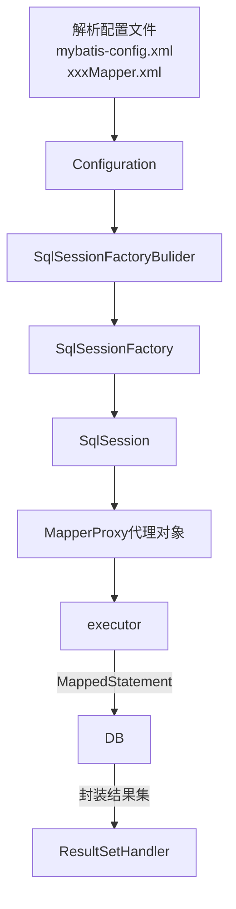
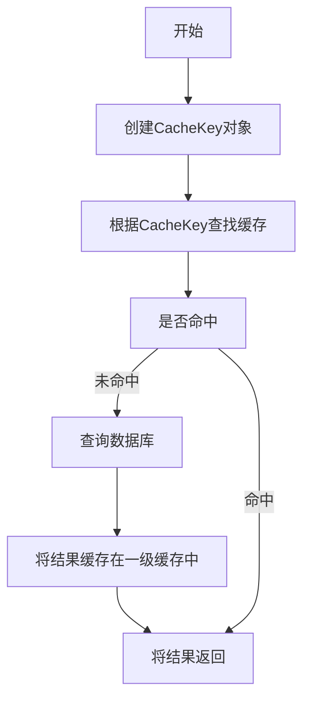

# 求职-面试题-J2SE

# 文档说明

本文档主要分享求职面试题。文档目前还在持续更新中，欢迎关注、收藏、点赞、加星喔😄O(∩_∩)O~。

| 文档名称     | Java面试题-J2SE |
| ------------ | --------------- |
| 文档分类     | 求职-面试       |
| 版本号       | 1.5             |
| 最后更新人   | Gem Shen        |
| 最后更新日期 | 2023-12-18      |
| 编制人       | Gem Shen        |
| 编制日期     | 2021-07-07      |


# 文档更新记录

| 版本 | 编制/修改人 | 修改日期   | 备注（原因、进一步的说明等）                         |
| ---- | ----------- | ---------- | ---------------------------------------------------- |
| 1.0  | Gem Shen    | 2021-07-07 | 初稿，整理了本次找工作积累到的所有面试题             |
| 1.1  | Gem Shen    | 2023-09-15 | 合并马士兵的面试笔记，重新整理目录结构               |
| 1.2  | Gem Shen    | 2023-09-19 | 整理Spring部分，将简历和沟通部分独立出去。           |
| 1.3  | Gem Shen    | 2023-09-30 | 完成Spring Framework面试题的初步整理。               |
| 1.4  | Gem Shen    | 2023-10-15 | 补充SpringBoot和SpringMVC面试题，将所有题目提升至3级 |
| 1.5  | Gem Shen    | 2023-12-18 | 文档过大，加载变慢，将每个一级标题单独拆分成一份文档 |
|      |             |            |                                                      |

### 


# ORM框架

## MyBatis

### Mybatis和Hibernate的异同

相同

分类上Hibernate和Mybatis都是ORM框架，都可以和Spring整合。

底层他们都支持JDBC和JTA

执行机制上都有SessionFactory，然后创建session和事务来执行SQL。

不同

Hibernate是全自动，Mybatis是半自动。

Hibernate可以完全的通过对象关系模型实现对数据库的操作，拥有完整的JavaBean对象与数据库的映射结构来自动生成sql，可以做到简单功能基本可以完全不用写SQL。而mybatis仅有基本的对象字段映射，对象数据以及对象实际关系仍然需要通过手写sql来实现和管理。

Hibernate数据库移植性远大于mybatis

基于第一点，加上它强大的映射结构和hql语言，大大降低了对象与数据库（Oracle、MySQL等）的耦合性，而mybatis由于需要手写sql，因此与数据库的耦合性直接取决于程序员写sql的方法，如果sql不具通用性而用了很多某数据库特性的sql语句的话，移植性也会随之降低很多，成本很高。

Hibernate更复杂开发难度更高

Hibernate的开发难度大于MyBatis，主要由于Hibernate有着自己独立的机制，例如：HQL，相对复杂，学习周期比较长。

MyBatis则相对简单，并且MyBatis主要依赖于xml的书写，让开发者可以直接编写SQL更熟悉。

在sql优化上，mybatis更方便

由于mybatis的sql都是写在xml里，因此优化sql比hibernate方便很多。而hibernate的sql很多都是自动生成的，无法直接维护sql；虽有hql，但功能还是不及sql强大，见到报表等变态需求时，hql也歇菜，也就是说hql是有局限的；hibernate虽然也支持原生sql，但开发模式上却与orm不同，需要转换思维，因此使用上不是非常方便。总之写sql的灵活度上hibernate不及mybatis。

Hibernate缓存机制要比mybatis更好一些

Hibernate的二级缓存配置在SessionFactory生成配置文件中进行详细配置，然后再在具体的表对象映射中配置那种缓存。

MyBatis的二级缓存配置都是在每个具体的表对象映射中进行详细配置，这样针对不同的表可以自定义不同的缓冲机制，并且MyBatis可以在命名空间中共享相同的缓存配置和实例，通过Cache-ref来实现。

两者比较，因为Hibernate对查询对象有着良好的管理机制，用户无需关心SQL，所以在使用二级缓存时如果出现脏数据，系统会报出错误提示。  而MyBatis在这一方面使用二级缓存时需要特别小心，如果不能完全确定数据更新操作的波及范围，避免cache的盲目使用，否则，脏数据的出现会给系统的正常运行带来很大的隐患。


### Mybatis的优缺点

优点：

基于SQL语句编程，相当灵活，不会对应用程序或者数据库的现有设计造成任何影响，SQL写在XML里，解除sql与程序代码的耦合，便于统一管理；提供XML标签，支持编写动态SQL语句，并可重用。

与JDBC相比，减少了大量JDBC冗余代码，不需要手动开关连接；

很好的与各种数据库与数据源兼容（底层基于JDBC，所以只要JDBC支持的数据库MyBatis都支持）。

能够与Spring，SpringBoot很好的集成；

提供映射标签，支持对象与数据库的ORM字段关系映射；提供对象关系映射标签，支持对象关系组件维护。

当SQL存在性能问题时，优化SQL较为方便。

缺点

SQL语句的编写工作量较大，尤其当字段多、关联表多时，对开发人员编写SQL语句的功底有一定要求。

SQL语句容易依赖于数据库，导致数据库移植性相对较差，不能随意更换数据库。


### 与SpringBoot集成使用步骤

集成前提：

- 已安装好MySQL，存在表和数据
- 已搭建好SpringBoot项目，需要加入Mybatis

集成步骤

1. 加入Maven依赖：mybatis的starter，分页插件，数据库驱动，数据源

   1. 参考

   2. ```xml
          <!-- SpringBoot的依赖配置-->
          <dependency>
              <groupId>org.springframework.boot</groupId>
              <artifactId>spring-boot-dependencies</artifactId>
              <version>${spring.boot.version}</version>
              <type>pom</type>
              <scope>import</scope>
          </dependency>    
      
      	<!--mybatis依赖-->
          <dependency>
              <groupId>org.mybatis.spring.boot</groupId>
              <artifactId>mybatis-spring-boot-starter</artifactId>
              <version>${mybatis.version}</version>
          </dependency>
      
          <!-- pagehelper 分页插件 -->
          <dependency>
              <groupId>com.github.pagehelper</groupId>
              <artifactId>pagehelper-spring-boot-starter</artifactId>
              <version>${pagehelper.boot.version}</version>
          </dependency>
      
      	<!-- 阿里数据源 -->
      	<dependency>
              <groupId>com.alibaba</groupId>
              <artifactId>druid-spring-boot-starter</artifactId>
              <version>${druid.version}</version>
          </dependency>
      
          <!--oracle驱动-->
          <dependency>
              <groupId>cn.easyproject</groupId>
              <artifactId>ojdbc6</artifactId>
              <version>12.1.0.2.0</version>
          </dependency>
      
          <!--sqlserver驱动-->
          <dependency>
              <groupId>com.microsoft.sqlserver</groupId>
              <artifactId>sqljdbc4</artifactId>
              <version>4.0</version>
          </dependency>
      ```

2. yml配置文件加入相关配置，mybatis配置，数据源配置，分页配置

   1. ```yml
      # Spring配置
      spring:
        # 数据源配置
        datasource:
          type: com.alibaba.druid.pool.DruidDataSource
          driverClassName: oracle.jdbc.OracleDriver
          druid:
            # 主库数据源
            master:
              url: jdbc:oracle:thin:@localhost:1521/test1
              username: admin
              password: admin123
            # 从库数据源
            slave:
              # 从数据源开关/默认关闭
              enabled: true
              url: jdbc:oracle:thin:@localhost:1521/test2
              username: admin
              password: admin123
            # 初始连接数,正式环境可以改大点
            initialSize: 1
            # 最小连接池数量
            minIdle: 1
            # 最大连接池数量
            maxActive: 20
            # 配置获取连接等待超时的时间
            maxWait: 60000
            # 配置间隔多久才进行一次检测，检测需要关闭的空闲连接，单位是毫秒
            timeBetweenEvictionRunsMillis: 60000
            # 配置一个连接在池中最小生存的时间，单位是毫秒
            minEvictableIdleTimeMillis: 300000
            # 配置一个连接在池中最大生存的时间，单位是毫秒
            maxEvictableIdleTimeMillis: 900000
            # 配置检测连接是否有效
            validationQuery: SELECT 1 FROM DUAL
            testWhileIdle: true
            testOnBorrow: false
            testOnReturn: false
            webStatFilter:
              enabled: true
            statViewServlet:
              enabled: true
              # 设置白名单，不填则允许所有访问
              allow:
              url-pattern: /druid/*
              login-username: superadmin
              login-password: tartan
            filter:
              stat:
                enabled: true
                # 慢SQL记录
                log-slow-sql: true
                slow-sql-millis: 3000
                merge-sql: false
              wall:
                config:
                  multi-statement-allow: true
      # MyBatis
      mybatis:
        # 搜索指定包别名
        typeAliasesPackage: com.ruoyi.**.domain, com.test.**.domain
        # 配置mapper的扫描，找到所有的mapper.xml映射文件
        mapperLocations: classpath*:mapper/**/*Mapper.xml
        # 加载全局的配置文件
        configLocation: classpath:mybatis/mybatis-config.xml
      
      # PageHelper分页插件
      pagehelper:
        helperDialect: oracle
        supportMethodsArguments: true
        params: count=countSql
      ```

3. 创建实体类，在指定的包路径底下。

   1. 例如：用户

   2. ```java
      @Data
      public class User {
        private long id;
      
        private String username;
      
        private String password;
      }
      ```

4. 创建mapper接口。Mybatis支持通过XML来定义SQL语句，或者通过注解的方式。

   1. 例如UserMapper.java

   2. ```java
      @Repository
      public interface UserMapper {
        int insertUser(User user);
          
        void deleteUser(User user);
      
        User getUser(User user);
      }
      ```

5. 创建xml，在指定的位置下。

   1. UserMapper.xml

   2. ```xml
      <?xml version="1.0" encoding="UTF-8" ?>
      <!DOCTYPE mapper
      PUBLIC "-//mybatis.org//DTD Mapper 3.0//EN"
      "http://mybatis.org/dtd/mybatis-3-mapper.dtd">
      <mapper namespace="com.test.demo.mapper.UserMapper">
      
          <insert id="insertUser" parameterType="User">
              insert into user (id, username, password) 
              values (#{id}, #{username}, #{password})
          </insert>
      
          <select id="getUser" parameterType="User" resultType="User">
              select * from user
              where id = #{id}
          </select>
          
          <delete id="deleteUser" parameterType="User" resultType="User">
              delete from user
              where id = #{id}
          </delete>
      </mapper>
      ```

6. 创建service和Controller调用mapper。此处代码略。

7. 


### #{}和${}的区别

#{}会在SQL拼接占位符，有预编译的功能，类似idbc中的PreparedStatement，对于传入的参数，在预处理阶段会使用?代替，可以有效的避免SQL注入。

${}是会直接将值写入到SQL中，有SQL注入的问题。

所以我们在Mybatis中，能使用#{}的地方应尽量使用#{}，但是有一些情况是必须要用${}的，比如我们要把他用在order by、group by 等语句后面的时候。

```sql
order by ${orderBy} ${orderType}
group by ${groupBy}

select ${fieldNames} from ${tableName}
```


### Mybatis的动态SQL标签

建议参考[官网动态标签说明](https://mybatis.org/mybatis-3/zh/dynamic-sql.html)。主要有if、choose、when、otherwise、trim、where、set


### MyBatis的执行流程

先看一下Mybatis的执行流程图：




### Mybatis如何生成Mapper接口实现类？

1. 每一个Mapper 接口在SqlSessionFactory被build出来的时候，就已经注册到了一个缓存中（Map<Class<?>, MapperProxyFactory> knownMappers）
2. 调用getMapper方法的时候，可以通过Mapper的class找到MapperProxyFactory。
3. MapperProxyFactory会调用Jdk动态代理方法将Mapper接口实例化出来；


### Mybatis用的什么连接池？

MyBatis支持第三方连接池和内置3种连接池。

#### 内置连接池

在主配置文件mybatis-config.xml的dataSource标签中配置，用type属性表示了采用了哪种连接池方式：

- **POOLED：**传统的javax.sql.DataSource规范中的连接池，MyBatis有规范的实现；
- **UNPOOLED：**传统的获取连接的方式，也实现了javax.sql.DataSource接口，但没有使用池的思想，每次用都是重新获取连接；
- **JNDI：**采用[服务器](https://cloud.tencent.com/act/pro/promotion-cvm?from_column=20065&from=20065)提供的JNDI技术实现，来获取DataSource对象，不同服务器能拿到的DataSource不同。需要注意的是，这种方式若不是web或maven的war工程，是不能使用的。如Tomcat服务器采用的是dbcp连接池。

#### 第三方连接池

Mybatis也可以使用三方数据源，如Druid，Hikari，C3P0等等。

一般情况下，我们不会使用Mybatis内置的连接池，而是会用Hikari，如果要增加Sql监控功能的话也可以使用Druid，这是因为自带的数据库连接池如下缺点：

空闲连接占用资源。连接池维护一定数量的空闲连接，这些连接会占用系统的资源，如果连接池设置过大，那么会浪费系统资源，如果设置过小，则会导致系统并发请求时连接不够用，影响系统性能。

连接池大小调优困难。连接池的大小设置需要根据系统的并发请求量、数据库的性能和系统的硬件配置等因素综合考虑，而这些因素都是难以预测和调整的。

连接泄漏。如果应用程序没有正确关闭连接，那么连接池中的连接就会泄漏，导致连接池中的连接数量不断增加，最终导致系统崩溃

总的来说，专业的事情交给专业的组件来做，Mybatis功能的核心是ORM映射和缓存，数据库连接池这种东西市场上已经有比它做的更好的，我们直接用那些更好的就行了

配置方法

```xml
<bean id="dataSource" class="com.alibaba.druid.pool.DruidDataSource" init-method="init" destroy-method="close">
    <property name="url" value="jdbc:mysql://docker-study:3306/test?serverTimezone=UTC&" />
    <property name="username" value="root" />
    <property name="password" value="123456" />

    <property name="maxActive" value="20" />
    <property name="initialSize" value="1" />
    <property name="maxWait" value="60000" />
    <property name="minIdle" value="1" />
</bean>
```


### Mybatis延迟加载

Mybatis支持延迟加载：https://www.cnblogs.com/hopeofthevillage/p/11415738.html


### Mybatis如何实现字段映射？

Mybatis底层调用了JDBC执行SQL，执行结果存在ResultSet对象中。Mybatis会首先读出ResultSet中的所有数据。

遍历ResultSet中的每一行每一列根据如下规则匹配

使用列名映射。Mybatis默认使用列名按照驼峰命名规则来映射查询结果集中的列与Java对象中的属性。

使用别名映射。如果查询语句中使用了别名，则Mybatis会优先使用列别名来映射Java对象属性名，而不是列名。

使用ResultMap映射。ResultMap是Mybatis用来映射查询结果集和Java对象属性的关系。可以在映射文件3中定义ResultMap，指定Java对象和列之间的映射关系。通过ResultMap，可以实现复杂的字段映射关系和转换。

自定义TypeHandler映射。如果默认的字段映射方式无法满足需求，可以通过实现TypeHandler接口来自定4义字段映射规则。TypeHandler可以将查询结果集中的列类型转换为Java对象属性类型，并将Java对象属性类型转换为SQL类型。可以通过在映射文件中定义TypeHandler，来实现自定义映射。


### Mybatis分页实现

Mybatis实现分页有如下方法。

#### 手动实现分页

手工在SQL中编写分页语句，例如：mysql就是limit 1,5。这种方式在项目中并不常见。

#### PageHelper分页插件

这是国人写的分页插件，大家可以直接看[官方说明文档](https://pagehelper.github.io/docs/howtouse/)。

对于SpringBoot项目可以参考[这篇文章](https://blog.csdn.net/pjymyself/article/details/119203900)配置分页插件。

原理

PageHelper主要是用来做物理分页的。它是Mybatis的一个插件，实现MyBatis提供的Interceptor接口。

当我们在代码中使用 PageHelper,startPage(int pageNum，int pageSize) 设置分页参数之后，其实PageHelper会把他们存储到ThreadLocal中。

PageHelper会在执行器的query方法执行之前，会从ThreadLocal中再获取分页参数信息，页码和页大小，然后执行分页算法，计算需要返回的数据块的起始位置和大小。最后，PageHelper会通过修改SQL语句的方式，在SOL后面动态拼接上limit语句，限定查询的数据范围，从而实现物理分页的效果。并且在查询结束后再清除ThreadLocal中的分页参数。

#### 基于RowBounds实现分页

RowBounds是MyBatis中提供的一个分页查询类，可以设置offset和limit参数，用于分页。

```java
int offset = 19;// 偏移量
int limit = 5;//每页数据条数
RowBounds rowBounds = new RowBounds(offset，limit);
List<User> userList = sqlSession.selectList("getUsers"， null，rowBounds);
```

这种方式实际项目用的也比较少，因为还是需要手动计算分页参数。而且这种方式属于逻辑分页。会一次性将所有数据查出来，然后在内存中分页。


T


### 如何找到执行的SQL语句？

1. 根据上面的描述实际执行的时Mapper接口的代理类方法。
2. 代理类方法还是会委托SqlSession的执行器去执行SQL；
3. SqlSession的执行器根据namespace和id找到SQL并执行；


### Mapper接口中的方法定义能否通过方法签名重载？

不能，接口名+方法名会生成唯一标识的StatementId


### Mybatis插件原理

https://zhuanlan.zhihu.com/p/250558017


### MyBatis缓存

Mybatis缓存分一级和二级缓存。一级缓存是默认就开启的。

缓存的公共接口为Cache，基础类是PerpetualCache，Mybatis通过装饰器给他增加了很多其他的功能。例如：LruCache，FifoCache

#### 缓存类型

##### PerpetualCache

永久缓存，一旦存入就一直保持。一级缓存就是这个类型

##### BlockingCache

阻塞式缓存，内部使用了ConcurrentHashMap实现了锁，它会保证只有一个线程到缓存中查找指定 key 对应的数据。

假设 线程A 从数据库中查找到 keyA 对应的结果对象后，将结果对象放入到 BlockingCache 中，此时 线程 A 会释放 keyA 对应的锁，唤醒阻塞在该锁上的线程。其它线程即可从 BlockingCache 中获取 keyA 对应的数据，而不是再次访问数据库。

##### FifoCache 和 LruCache

在很多场景中，为了控制缓存的大小，系统需要按照一定的规则清理缓存。FifoCache 是先入先出版本的装饰器，当向缓存添加数据时，如果缓存项的个数已经达到上限，则会将缓存中最老（即最早进入缓存）的缓存项删除。

LruCache 是按照"近期最少使用算法"（Least Recently Used, LRU）进行缓存清理的装饰器，在需要清理缓存时，它会清除最近最少使用的缓存项。

##### SoftCache 和 WeakCache

使用java的软引用和弱引用实现的缓存。

#### 一级缓存

一级缓存默认开启，缓存**命中条件**：

- 在同一个session中
- sql语句一样，参数一样
- mappedStatment的id一样。
- 指定查询结果集的范围不等于statement。

一级缓存**失效条件**，

- MyBatis全局属性为Statement时，完成查询会清除缓存。`<setting name="localCacheScope" value="STATEMENT"/>`

- 当执行增删改方法时会清除清除缓存。
- 某个语句如果配置了flushCache=true属性，执行完会自动清除一级缓存。
- 未开启事务的场景下，每次查询都会创建一个SqlSession。
- session提交的时候。

由上可以推断，一级缓存的实际命中概率很低。因为一般的业务场景，查询完了基本都会做更新操作。或者就是单独一次查询。

**存储位置**

在SimpleExecutor/ReuseExecutor/BatchExecutor的公共父类BaseExecutor中，有一个属性`protected PerpetualCache localCache;`就是一级缓存。它实际是HashMap的简单实现。

**原理**

每次查询都会先创建CacheKey缓存key对象，然后用CacheKey从缓存中查询，查询不到再去数据库查询。



org.apache.ibatis.executor.BaseExecutor#query

```java
public <E> List<E> query(MappedStatement ms, Object parameter, RowBounds rowBounds, ResultHandler resultHandler, CacheKey key, BoundSql boundSql) throws SQLException {
    ErrorContext.instance().resource(ms.getResource()).activity("executing a query").object(ms.getId());
    // 检测当前Executor是否已经关闭
    if (closed) {
      throw new ExecutorException("Executor was closed.");
    }
    if (queryStack == 0 && ms.isFlushCacheRequired()) {
      // 非嵌套查询，并且select节点配置的flushCache属性为true时，才会清空一级缓存，flushCache配置项是影响一级缓存中结果对象存活时长的第一个方面
      clearLocalCache();
    }
    List<E> list;
    try {
      // 增加查询层数
      queryStack++;
      // 查询一级缓存
      list = resultHandler == null ? (List<E>) localCache.getObject(key) : null;
      if (list != null) {
        // 针对存储过程调用的处理，在一级缓存命中时，获取缓存中保存的输出类型参数，并设置到用户传入的实参对象中
        handleLocallyCachedOutputParameters(ms, key, parameter, boundSql);
      } else {
        // 调用doQuery方法完成数据库查询，并得到映射后的结果对象
        list = queryFromDatabase(ms, parameter, rowBounds, resultHandler, key, boundSql);
      }
    } finally {
      // 当前查询完成，查询层数减少
      queryStack--;
    }
    if (queryStack == 0) {
      // 在最外层的查询结束时，所有嵌套查询也已经完成，相关缓存项也已经完全记载，所以在此处触发DeferredLoad加载一级缓存中记录的嵌套查询的结果对象
      for (DeferredLoad deferredLoad : deferredLoads) {
        deferredLoad.load();
      }
      // issue #601
      // 加载完成后，清空deferredLoads集合
      deferredLoads.clear();
      if (configuration.getLocalCacheScope() == LocalCacheScope.STATEMENT) {
        // issue #482
        // 根据LocalCacheScope配置决定是否清空一级缓存
        clearLocalCache();
      }
    }
    return list;
  }
```

**存在问题**

在多个SqlSession或分布式的环境下，多个session操作同一笔数据时可能会引起脏数据问题，建议关闭一级缓存。

在和Spring整合时，如果没有开启事务，每次查询，spring都会关闭旧的sqlSession而创建新的sqlSession，所以没问题。

但如果开启了事务，spring使用threadLocal获取当前线程绑定的同一个sqlSession，因此此时一级缓存是有效的。


#### 二级缓存

二级缓存默认关闭，一般不建议开启，开启方式如下：

- 全局开关，一般不用改，默认是true。`<setting name="cacheEnabled" value="true"/>`
- 单个xml文件中配置cache或者cache-ref。例如：`<cache/>`
  - `type`：cache使用的类型，默认是`PerpetualCache`。
  - `eviction`： 定义回收的策略，常见的有FIFO，LRU。
  - `flushInterval`： 配置一定时间自动刷新缓存，单位是毫秒。
  - `size`： 最多缓存对象的个数。
  - `readOnly`： 是否只读，若配置可读写，则需要对应的实体类能够序列化。
  - `blocking`： 若缓存中找不到对应的key，是否会一直blocking，直到有对应的数据进入缓存。
  - `cache-ref`代表引用别的命名空间的Cache配置，两个命名空间的操作使用的是同一个Cache。
  - 例如：`<cache-ref namespace="mapper.StudentMapper"/>`
- 单个sql里面的开关。查询默认true。修改方式：`<select id="xxx" resultType="map" useCache="false">`

**命中条件**

- 二级缓存开启且配置正确
- 同一个命名空间中
- 需要等事务提交后才会放入缓存。

**失效场景**

配置不正确，或者更新语句配置了刷新缓存。

**存储位置**

Configuration对象的成员变量

```java
// Configuration
protected final Map<String, Cache> caches = new StrictMap<>("Caches collection");
```

**原理**

当启用了二级缓存的时候，会将默认的Executor对象装饰成CacheExecutor对象。在进入一级缓存的查询流程前，先在CachingExecutor进行二级缓存的查询，如果命中就直接返回。同时同一个namespace下的所有操作语句，都影响着同一个Cache，即二级缓存被多个SqlSession共享，是一个全局的变量。


Configuration类的newExecutor方法源码

```java
  public Executor newExecutor(Transaction transaction, ExecutorType executorType) {
    executorType = executorType == null ? defaultExecutorType : executorType; // ?
    executorType = executorType == null ? ExecutorType.SIMPLE : executorType;
    Executor executor;
    // 根据参数，选择合适的Executor实现
    if (ExecutorType.BATCH == executorType) {
      executor = new BatchExecutor(this, transaction);
    } else if (ExecutorType.REUSE == executorType) {
      executor = new ReuseExecutor(this, transaction);
    } else {
      executor = new SimpleExecutor(this, transaction);
    }
    // 根据配置决定是否开启二级缓存的功能
    if (cacheEnabled) {
      executor = new CachingExecutor(executor);
    }
    // 此处调用插件,通过插件可以改变Executor行为
    executor = (Executor) interceptorChain.pluginAll(executor);
    return executor;
  }
```

**存在问题**

在分布式环境下或者多个namespace操作同一张表时或者多表查询时可能产生脏数据。

#### 三级缓存

三级缓存也称为自定义缓存。是Mybatis为我们预留了自定义缓存的能力。

我们可以集成很多第三方组件来做缓存。例如：redis，Ehcache。

##### Redis

maven依赖

```xml
    <dependency>
       <groupId>org.springframework.boot</groupId>
        <artifactId>spring-boot-starter-data-redis</artifactId>
    </dependency>

    <!-- 网上部分文章都建议使用这个实现类，但其实这个实现类内部用的Jedis，且很多代码都写死的，建议自己写 -->
	<dependency>
        <groupId>org.mybatis.caches</groupId>
        <artifactId>mybatis-redis</artifactId>
        <version>1.0.0-beta2</version>
    </dependency>
```

Spring配置文件：application.yml

```properties
spring:
  redis:
    # redis数据库索引（默认为0）
    database: 0
    # redis服务器地址（默认localhost）
    host: localhost
    # redis端口
    port: 6379
    # redis访问密码（默认为空）
    password:
    # redis连接超时时间（单位为毫秒）
    timeout: 0

```

如果用了mybatis-redis这个实现类，则必须创建一个redis.properties加入如下配置

```properties
redis.host=localhost
redis.port=6379
redis.connectionTimeout=5000
redis.password= redis.database=0
```

建议自己实现Mybatis的Cache接口。

```java
public class RedisCache implements Cache {
    private static final Logger logger = LoggerFactory.getLogger(RedisCache.class);
    private final ReadWriteLock readWriteLock = new ReentrantReadWriteLock();
    private final String id; // cache instance id
    @Autowired
    private RedisTemplate redisTemplate;
    private static final long EXPIRE_TIME_IN_MINUTES = 30; // redis过期时间
    public RedisCache(String id) {
        if (id == null) {
            throw new IllegalArgumentException("Cache instances require an ID");
        }
        this.id = id;
    }
    @Override
    public String getId() {
        return id;
    }
    /**
     * Put query result to redis
     *
     * @param key
     * @param value
     */
    @Override
    @SuppressWarnings("unchecked")
    public void putObject(Object key, Object value) {
        RedisTemplate redisTemplate = getRedisTemplate();
        ValueOperations opsForValue = redisTemplate.opsForValue();
        opsForValue.set(key, value, EXPIRE_TIME_IN_MINUTES, TimeUnit.MINUTES);
        logger.debug("Put query result to redis");
    }
    /**
     * Get cached query result from redis
     *
     * @param key
     * @return
     */
    @Override
    public Object getObject(Object key) {
        RedisTemplate redisTemplate = getRedisTemplate();
        ValueOperations opsForValue = redisTemplate.opsForValue();
        logger.debug("Get cached query result from redis");
        return opsForValue.get(key);
    }
    /**
     * Remove cached query result from redis
     *
     * @param key
     * @return
     */
    @Override
    @SuppressWarnings("unchecked")
    public Object removeObject(Object key) {
        RedisTemplate redisTemplate = getRedisTemplate();
        redisTemplate.delete(key);
        logger.debug("Remove cached query result from redis");
        return null;
    }
    /**
     * Clears this cache instance
     */
    @Override
    public void clear() {
        RedisTemplate redisTemplate = getRedisTemplate();
        redisTemplate.execute((RedisCallback) connection -> {
            connection.flushDb();
            return null;
        });
        logger.debug("Clear all the cached query result from redis");
    }
    @Override
    public int getSize() {
        return 0;
    }
    @Override
    public ReadWriteLock getReadWriteLock() {
        return readWriteLock;
    }
    private RedisTemplate getRedisTemplate() {
        if (redisTemplate == null) {
            redisTemplate = ApplicationContextHolder.getBean("redisTemplate");
        }
        return redisTemplate;
    }
}
```

在mapper的xml中，配置自定义缓存实现类

```xml
<?xml version="1.0" encoding="UTF-8" ?>
<!DOCTYPE mapper
        PUBLIC "-//mybatis.org//DTD Mapper 3.0//EN"
        "http://mybatis.org/dtd/mybatis-3-mapper.dtd">
<mapper namespace="com.gem.study.mapper.UserMapper">
    <!-- 推荐 -->
    <cache type="com.gem.study.util.RedisCache"></cache>

    <!-- 不推荐 -->
    <cache type="org.mybatis.caches.redis.RedisCache"></cache>
    
    <select id="getUser" resultType="User">
        SELECT * FROM User WHERE id = #{id}
    </select>
</mapper>
```


### 介绍下对MyBatis源码的理解

这是一个比较宽泛的开放性题目，只要涉及源码的都可以说，说的越多越精确越好。包含但不仅限于如下部分，

SQL解析机制。映射文件、注解--》映射器解析 XMLMapperBuilder MapperAnnotationBuilder

SQL执行机制。SqlSession 接口--》Executor --》 SimpleExecutor ReuseExecutor 【Statement--JDBC】

结果映射机制。

插件原理。

缓存原理。一二级缓存，自定义缓存。


### 对Mybatis日志模块的理解

定位你对MyBatis框架的理解：

日志模块使用到了适配器模式，对于MyBatis中的数据库的相关操作通过代理模式实现了日志的监控

### 对SqlSessionFactory的理解

SqlSessionFactory：工厂模式：负责SqlSession对象的管理

全局的。我们应该对SqlSessionFactory做单例处理；

完成全局配置文件和映射文件的加载解析--》Configuration对象

### 对SqlSession的理解

SqlSession具体处理每个CRUD操作

1。生命周期：需要做数据库操作的时候会创建。不需要操作数据库就关闭

2。作用：完成数据库的操作

3。线程安全：SqlSession是线程不安全的 --》 单纯的MyBatis的应用。我们就不能把SqlSession作用成员变量来使用 在Spring环境中怎么处理的  SqlSessionTemplate

### 对MyBatis中的Executor的源码理解

Executor：执行器。具体执行SQL操作

Executor：Simple Reuse Batch

CachingExecutor：缓存的装饰

### MyBatis如何对占位符进行赋值？

SQL解析 ##### $ ==> ParameterHandler

### 如何解决MySQL的SqlSession的线程安全问题

在SqlSession中介绍了

### 对MyBatis的Configuration源码的理解

Configuration：全局配置。映射文件解析的内容都保存在Configuration中


## Hibernate

### Hibernate延迟加载

通过设置属性`lazy=true`进行设置是否需要懒加载

当Hibernate在查询数据的时候，懒加载的字段数据并没有加载到内存中，当程序调用对应字段的get方法或者真正对数据的操作时，对象才会加载到内存中，就实现了延迟加载，他节省了服务器的内存开销，从而提高了服务器的性能。


### Hibernate中如何配置类的关系？

一对多 @OneToMany，多对一@ManyToOne


### hibernate的三种状态

对象刚new出来是临时态

持久态：save/saveOrUpdate/get/load/list

游离态：session关闭后，持久态的对象就变成了游离态


## Bean Searcher

https://bs.zhxu.cn/guide/latest/introduction.html

专注高级查询。号称仅需 **一行代码** 便可实现下面的需求！比Mybatis快100倍。


# 中间件

## Tomcat

### tomcat热部署，怎么做到的热加载？

​    

### tomcat类加载机制?


# 分布式

## 定时调度

### Quarts

### Quartz的核心组件有哪些？有什么作用

### 请简单描述下Quartz的运行时序！

### Elastic-Job


### ZooKeeper	

Zk的分布式锁和Redis的分布式锁分别应用于什么场景。


## 事务

实现分布式事务方式有哪些？

AT、TCC、Saga、XA

seata


## 分库分表

### 实现分布式ID的方案有哪些？

#### 雪花算法

一个64bit的长整型。


# 缓存

## Redis

### Redis内存在什么情况下会满？

内存里面的数据超过指定的最大内存。例如：key没有指定过期时间但一直在往里面新增key。或者有过期时间！但是短时间加的速度很快也会导致内存占满。


### Redis哨兵机制的原理

哨兵+主从实现Redis集群高可用
集群监控:负责监控Redis master和slave进程是否正常工作
消息通知:如果某个Redis实例有故障，哨兵负责发送消息给管理员进行报警
故障转移: master宕机后，Redis集群会自动将master身份转移到slave节点
配置中心:如果故障转移发生了，通知client客户端新的master地址


### Redis主从同步原理

启动一台slave实例后，slave会发送一个psync命令给master，如果该slave是第一次连接到master，那么就会触发一个全量复制,master节点fork一个子进程生成RDB快照，在快照生成过程中，会把新的请求全部写到Redis缓冲池中，RDB文件生成之后，master会将文件发送到slave, slave拿到文件后写入本地磁盘，然后再加载到内存中，待RDB文件同步完成后，会通知master， master再将缓冲池中新的写命令发送到slave进行同步，待完成后slave正式进入集群对外提供服务


### 请例举Redis常用的数据类型以及使用场景

String

缓存，分布式锁，分布式数据共享，计数器，全局ID。

Hash

String能干的他都能干，另外还有：存储对象类型数据，例如：购物车

List

列表，例如：通知列表，文章列表，公告列表等。

队列/栈

Set

抽奖，用户关注，点赞，签到打卡，商品标签等

ZSet

有顺序会动态变化的列表，例如，排行榜，百度热搜

bitmaps

在线用户统计。

GEO

用于计算地理位置


### 请说明Redis基本数据类型底层的数据结构

String

SDS，简单动态字符窜。他是redis自己实现的一个字符窜格式。解决了C语言字符数据的种种不足。

例如：\0，必须要循环才能知道字符长度。

有三种编码格式。

int，存储8个字节的长整型，long，2^63^-1

embstr，存储小于44字节的字符

raw，存储大于44字节的字符


​    

Hash

ziplist+hashtable

满足如下条件就是ziplist，否则就是hashtable

1. 键值对数量<512
2. 每一个键值对都小于64字节


​    

List

quicklist+ziplist，quicklist是双向链表，里面每一个节点是ziplist


​    

Set

intset+hashtable

满足如下条件用intset，否则就是hashtable

每一个元素都必须是int

元素个数小于512（可配置）

hashtable中的value为空。


​    

ZSet

ziplist+skiplist，如果元素个数大于128，或者任意一个元素大于64字节就使用skiplist，否则默认使用ziplist


​    

### redisKey的最大容量是多少，value存储最大容量是多少？

redisKey：512m；

String的value存储最大位512m，list中value存储最大为2^32-1（约40亿左右）


​    

### Redis为什么快？

1、在内存中存储数据；

2、使用单线程；

3、IO多路复用；


​    

### 为什么Redis用单线程就快

Redis本身是内存型数据库，速度本身要比磁盘快很多。性能瓶颈不在CPU，而是内存大小和网络。

使用单线程可以有效避免多线程的如下问题。线程创建销毁开销，上下文切换，并发资源竞争


### Redis过期策略，淘汰策略

#### 过期策略

过期策略主要针对设置了过期时间的key，策略分为三类，立即策略、惰性策略和定期策略。

立即策略

含义：

也叫定时策略，在设置key的过期时间的同时，为该key创建一个定时器，让定时器在key的过期时间来临时，对key进行删除。

优点：

保证内存被尽快释放，减少无效的缓存占用内存。

缺点：

若过期key很多，删除这些key会占用很多的CPU时间，在CPU时间紧张的情况下，CPU不能把所有的时间用来做要紧的事儿，还需要去花时间删除这些key。

定时器的创建耗时，若为每一个设置过期时间的key创建一个定时器（将会有大量的定时器产生），性能影响严重。一般来说，是不会选择该策略模式。 

惰性策略

含义：

key过期的时候不删除，每次从数据库获取key的时候去检查是否过期，若过期，则删除，返回null。

写入Key的时候，当发现内存不足时，也会释放一部分内存空间（调用activeExpireCycle）

expire.c 123行

> activeExpireCycle(int type)

优点：

删除操作只发生在从数据库取出key的时候发生，而且只删除当前key，所以对CPU时间的占用是比较少的，而且此时的删除是已经到了非做不可的地步（如果此时还不删除的话，我们就会获取到了已经过期的key了）。

缺点：

若大量的key在超出过期时间后，但没有被访问过就不会被清除，那么可能发生内存泄露（无用的垃圾占用了大量的内存）。 

定期策略

含义：每隔一段时间对设置了过期时间的key进行检测，从里面随机挑选部分已过期key，从内存中删除。设置了过期时间的key存在redis的expire字典中。server.h 661行

优点：

通过限制删除操作的时长和频率，来减少删除操作对CPU时间的占用--处理"定时删除"的缺点

定期删除过期key--处理"惰性删除"的缺点。

缺点:

在内存友好方面，不如"定时删除"，因为是随机遍历一些key，因此存在部分key过期，但遍历key时，没有被遍历到，过期的key仍在内存中。

在CPU时间友好方面，不如"惰性删除"，定期删除也会暂用CPU性能消耗。

难点:

合理设置删除操作的执行时长（每次删除执行多长时间）和执行频率（每隔多长时间做一次删除）（这个要根据服务器运行情况来定了）

#### 总结

Redis同时使用了惰性策略和定期策略，并不会到期立即删除过期key


​    

#### 淘汰策略

redis中还有很多Key没有设置过期时间，通过过期策略也不能保证内存不会满。所以还需要淘汰策略。

Redis当内存使用达到最大内存极限时，需要使用淘汰算法来决定清理掉哪些数据，以保证新数据的存入。

主要分为如下六种淘汰机制。

从前缀针对的对象来分: volatile是针对设置了过期时间的 key，allkeys是针对所有key。

LRU，LFU，RANDOM，TTL。

##### volatile-lru

当内存不足以容纳新写入数据时，在设置了过期时间的键空间中，移除最近最少使用的key。

##### allkeys-lru

当内存不足以容纳新写入数据时，在键空间中，移除最近最少使用的key（这个是最常用的）。

##### volatile-lfu

当内存不足以容纳新写入数据时，在过期密集的键中，使用LFU算法进行删除key。

##### allkeys-lfu

当内存不足以容纳新写入数据时，使用LFU算法移除所有的key。

##### volatile-random

当内存不足以容纳新写入数据时，在设置了过期的键中，随机删除一个key。

##### allkeys-random

当内存不足以容纳新写入数据时，随机删除一个或者多个key。

##### volatile-ttl

当内存不足以容纳新写入数据时，在设置了过期时间的键空间中，有更早过期时间的key优先移除。

##### noeviction

默认的淘汰策略。对于写请求不再提供服务，直接返回错误（DEL请求和部分特殊请求除外）。

当使用volatile-lru、volatile-random、volatile-ttl这三种策略时，如果没有key可以被淘汰，则和noeviction一样返回错误


​    

### Redis持久化的方式有哪些，有什么区别

    RDB
    
    RDB是Redis默认的持久化方案（注意如果开启了AOF，优先用AOF)。当满足一定条件的时候，会把当前内存中的数据写入磁盘，生成一个快照文件dump.rdb。Redis重启会通过加载dump.rdb文件恢复数据。
    
    RDB触发条件
    
    自动触发
    
    1. 配置规则触发。满足什么条件触发RDB，例如：save 900 1 #900秒内至少有一个key被修改
    2. shutdown触发，如果shutdown的时候，内存中还有key没有持久化就触发rdb。
    3. flushAll触发，但实际没啥意义，因为生成的rdb文件是空的
    
    手动触发
    
    1. save
    
        阻塞服务器直到服务器生成快照结束。生产环境不建议使用这个命令，可能会造成redis长时间阻塞。	
    
    2. bgsave
    
        在后台异步生成快照，不会阻塞。
    
    RDB优劣
    
    优势
    
    1. RDB是一个非常紧凑(compact)的文件，它保存了redis在某个时间点上的数据集。这种文件非常适合用于进行备份和灾难恢复。
    2. 生成RDB文件的时候，redis 主进程会 fork()一个子进程来处理所有保存工作，主进程不需要进行任何磁盘IO操作。
    3. RDB 在恢复大数据集时的速度比AOF的恢复速度要快。
    
    劣势
    
    1. RDB方式数据没办法做到实时持久化/秒级持久化。因为bgsave每次运行都要执行fork 操作创建子进程，频繁执行成本过高
    2. 在一定间隔时间做一次备份，所以如果redis意外down 掉的话，就会失去最后一次快照之后的所有修改（数据有丢失)。如果数据相对来说比较重要，希望将损失降到最小，则可以使用AOF方式进行持久。


​    

    AOF
    
    AOF: Redis 默认不开启。AOF 采用日志的形式来记录每个写操作，并追加到文件中。开启后，执行更改Redis数据的命令时，就会把命令写入到AOF文件中。写入频率可配置，默认每隔一秒写入一次。
    
    Redis重启时会根据日志文件的内容把写指令从前到后执行一次以完成数据的恢复工作。
    
    当文件越来越大时，如果满足一定条件，Redis会触发重写机制。用最小指令集来替换原来的AOF文件。
    
    AOF优劣
    
    优势
    
    AOF 持久化的方法提供了多种的同步频率，即使使用默认的同步频率每秒同步一次，Redis最多也就丢失1秒的数据而已。
    
    劣势
    
    1. 对于具有相同数据的的Redis，AOF文件通常会比RDF 文件体积更大(RDB存的是数据快照)。
    2. 虽然AOF提供了多种同步的频率，默认情况下，每秒同步一次的频率也具有较高的性能。
    3. 在高并发的情况下，RDB比AOF具好更好的性能保证。
    
    RDB和AOF比较
    
    如果可以接受一小段时间内数据的丢失，毫无疑问使用RDB是最好的。
    
    定时生成RDB快照(snapshot)非常便于进行数据库备份，并且RDB恢复数据集的速度也要比AOF恢复的速度要快。
    
    否则就使用AOF重写。但是一般情况下建议不要单独使用某一种持久化机制，而是2种一起用。在这种场景下，redis会优先使用aof文件来恢复原始数据。通常情况下，aof备份的数据要比rdb更完整。


​    

### Redis高并发的缓存问题与解决方案？

    缓存雪崩
    
    当存在大量key同时过期，并且并发量较大的情况，redis中没有数据，请求全部落在数据库，造成缓存雪崩。
    
    解决方法通常是：使用分布式锁、限制同一个Key只能有一个线程去访问数据库、使用消息队列的方式、设置不同的过期时间
    
    缓存穿透
    
    大量的访问redis不存在的值，导致redis被打穿。形同虚设，叫做缓存穿透。
    
    解决方法：
    
    布隆过滤器
    
    缓存击穿
    
    同一个不存在的key不停的访问redis；
    
    解决方法：为key设置空串或者一种标识符进行拦截，比如&&；

### 缓存雪崩

### 缓存穿透

### 缓存穿透


### 什么是缓存数据一致性问题?怎么解决的？

    redis缓存的数据和db数据不一致，导致客户端读取的数据过时导致一致性问题；
    
    解决：
    
    一般说数据一致性都是指最终一致性。可以使用延迟双删在一定程度上解决数据一致性问题，
    
    即先删除redis，在更新db，然后再删除一遍redis。从而保证数据一致性。
    
    但在高并发的场景下，也不能完全避免数据一致性的问题。
    
    如果需要完全的一致性，可以使用锁的方式，但会大大降低系统的吞吐，还是要根据业务场景选择最合适的方案。


​    

### Redis集群方案有哪些？用的是哪个？优势在哪里

    1.Sentinel哨兵集群
    
    2.Cluster集群
    
    3.Twemproxy	/Codis代理
    
    cluster集群，属于redis服务端提供的集群解决方案。
    
    优势：
    
    cluster既有主从复制，也有Sentinel的故障转移功能。
    
    cluster是无中心架构，配置比较少，运维成本低。
    
    cluster数据按照槽分布，可以通过动态调整槽位实现动态数据分布。
    
    cluster节点可以动态的扩展。


​    

### redis中String的底层数据结构是什么？优势在哪里

    SDS：简单动态字符串；
    
    优势：
    
    存储了字符窜长度，不需要循环遍历来获得长度。
    
    可以通过长度来判断循环是否结束，而不是根据\0判断，更加可靠
    
    支持扩容，有空间预分配和惰性空间释放机制

### 说说Redis的哈希槽概念

    Redis 集群没有使用一致性hash，而是引入了哈希槽（slot）的概念。
    
    Redis 集群有16384个哈希槽，每个key通过CRC16校验后对16384取模来决定放置哪个槽。
    
    集群的每个节点负责一部分hash槽。再通过上面得到槽位就将key放置到节点。
    
    使用哈希槽的好处就在于可以方便的添加或移除节点。不会造成集群不可用的状态。
    
    当需要增加节点时，只需要把其他节点的某些哈希槽挪到新节点就可以了；
    
    当需要移除节点时，只需要把移除节点上的哈希槽挪到其他节点就行了；
    
    在这一点上，我们以后新增或移除节点的时候不用先停掉所有的 redis 服务。

### redis集群，为什么是16384个slot？

     (1)因为每秒钟，redis节点需要发送一定数量的ping消息作为心跳包，如果槽位为65536，这个ping消息的消息头太大了，浪费带宽。如果槽位为65536，发送心跳信息的消息头达8k，发送的心跳包过于庞大。
    
      在消息头中，有一个存储当前分片管理槽位的字节数组` myslots[CLUSTER_SLOTS]`。
    
     如果槽位为65536，这个数组将达到8KB（ 65536÷8÷1024=8kb）
    
      (2)redis的集群主节点数量基本不可能超过1000个。
      如上所述，集群节点越多，心跳包的消息体内携带的数据越多。如果节点过1000个，也会导致网络拥堵。因此redis作者，不建议redis cluster节点数量超过1000个。
      那么，对于节点数在1000以内的redis cluster集群，16384个槽位够用了。没有必要拓展到65536个。
      (3)槽位越小，节点少的情况下，压缩比高
      Redis主节点的配置信息中，它所负责的哈希槽是通过一张bitmap的形式来保存的，在传输过程中，会对bitmap进行压缩，但是如果bitmap的填充率slots / N很高的话(N表示节点数)，bitmap的压缩率就很低。
      如果节点数很少，而哈希槽数量很多的话，bitmap的压缩率就很低。

### redis的分布式锁怎么实现

     setnx命令+lua脚本，同时加上redis的单线程命令执行
    
     redission封装的分布式锁，底层也属于lua脚本

### redis主从复制过程以及原理

     首先slave与master建立连接，slave会在本地保存master的ip和端口，通过定时任务检测是否有master节点需要连接和复制；
    
     然后slave通过定时ping与master建立通信，告诉master自己存活；如果slave在成为master从节点之前有数据，则会删除自身数据，保证和master的一致性；
    
     通过RDB进行全量复制，在RDB过程中继续写入的命令会加入的缓存中，和RDB一起发送的slave节点；
    
     后续会根据偏移量等节点信息来进行增量复制；

### Redis哨兵机制如何实现故障自动转移

     首先哨兵集群需要选举一个leader来进行redis节点的master节点选举与数据同步等操作；
    
     leader选举过程：通过raft算法进行选举，先到先得，少数服从多数；
    
     1、所有的sentinel初始都为跟随者，首先用random随机数为所有跟随者，设置一个倒计时时间，150ms~300ms，第一个倒计时结束的会成为候选者，候选者会发起投票，超过半数票给了自己，那么自己成为leader，后续所有操作由leader完成；
    
     2、leader记录操作日志并发给其他sentinel节点，没有同步到其他节点的日志，状态为uncommitted，等到超过了半数节点记录了日志，则变为committed，leader会通知其他节点日志已经提交，这样所有节点达成一致；
    
     3、节点只要收到了同步数据的消息，代表leader产生，就会取消倒计时；
    
     4、如果倒计时结束，还没有获得超过半数进行投票，那么重置倒计时，直至选出leader；
    
     5、如果倒计时一样，产生两个候选者，那么同时发出投票，先各自投自己一票，然后随机获取倒计时时间，发起新一轮选举，由于倒计时不一致，先获得更多投票的节点成为leader；
    
     选举出leader然后进行master选举：
    
     根据几条规则进行选举：节点是否存活、优先级、偏移量、进程id；
    
     1、通过心跳检测节点，超过时间，则认为节点出现故障，失去选举权；
    
     2、配置文件可以设置优先级，优先级高的成为master，默认一致；
    
     3、根据各节点记录的偏移量，偏移量最大的成为master；
    
     4、前边都相同，进程id最小的成为master；

### 你对Redis rehash的理解

     dictht有两个，dictht[0]、dictht[1]
    
     dictht[0]会存储数据，dictht[1]开始不会创建；扩容因子默认5，dictEntry采用链式地址法进行存储，当hash碰撞时，在同一位置进行链式存储；当碰撞过多，链式地址存储数据过多，hash查找的优势也就不复存在；
    
     1、当发生rehash时，dictht[1]进行创建，大小为dictht[0]的2倍的2的N次方；
    
     2、dictht[0]的数据进行重新hash运算，获取新的位置信息，存放到dictht[1]中；
    
     3、数据迁移完成后，清除dictht[0]，然后把dictht[1]改为dictht[0]，再创建一个dictht[1]，用于下次rehash；

18. 设置了过期时间的key怎么从内存中删除的？

19. redis内存耗光会怎么样？

     这个问题其实就是问的淘汰策略，把8种淘汰策略都说出来就行了。让用户自行选择。默认是noeviction

20. lua脚本

21. redlock

22. 延迟双删


# 微服务

## SpringCloudAlibaba

### SpringCloud核心组件介绍与使用

### 微服务如何保证事务的一致性


### GateWay

### gateway实现原理，画图


# 软件设计

## 功能设计

### 写个门票限时销售系统，架构图，业务流程图，随意发挥


### 直播、会议、在线教育这种功能的解决方案有哪些？

这种功能一般不用Java来做，涉及转码，视频数据存储，还要铺网，基建都要几千万起。目前比较成熟的解决方案有：保利威，七牛，网易云信

### 微信抢红包、红包雨实现


### 如何设计秒杀系统？场景：100万并发、100个商品


### 项目流量增大1000倍，项目如何架构升级

说了应用集群、拆分。缓存、搜索引擎。数据库集群，读写分离等）面试官说太简单了


### 抛开所有组件，如何从文件中10万条手机号找出想要的那个


### 设计一个商业停车场数据库表结构

然后进一步，划分公共的，公司的，公益的，如何计算收益


### 系统设计一个系统，输入hash查询注册名称

1、数据查询接口:
现有一张数据表(数据内容有11亿条),表格中的内容举例如下:

| ID    | 注册号码    | 注册名称 |
| ----- | ----------- | -------- |
| 10036 | 18972303692 | 张三     |
| 27999 | 18672352674 | 李四     |
| 33394 | 13681473563 | 王五     |

经常被查询的数据量在200万条以内，200万条数据中会有1%的数据会经常变化成其他的数据，变化之后会稳定一段时间，时间从8小时到数天不等，其余的数据基本上不会改变，请开发一个系统，输入注册号码的hash值，就能够查询到注册名称和ID。(特别注意，为保护数据，不允许直接传入注册号码作为输入）。


### 路由策略设计

场景:我们需要将2000w的商品信息缓存在redis中， key为uuid,value为商品基本信息。现有8台redis服务器，分成4组，每组两台(一主一从),每组存放的数据量为500w台。
设计一种路由策略。要求:
1、重复输入同一个uuid，路由到的redis服务组地址不变。
2、当数据量激增，增加redis机器时不会造成大规模的缓存雪崩。


### 查询功能设计原则


## 设计模式

### 单例模式

### 单例模式的介绍

### 写一个线程安全的单例模式

### String的设计模式

https://www.yuque.com/hollis666/vzy8n3/bxa45gl8rgg9slqw


### 不变模式介绍

https://www.yuque.com/hollis666/vzy8n3/qlohhe


# 算法

## 数组

### 两个有序char数组，找出不一致的那一个元素

例如：[a, b, c, d, e, f, g]，[a, b, c, d, f, g]


10万条数据，基于数组或者链表，如何占用最少内存排序


## 链表

### 反转一个链表

例如：输入：1，2，3，4，5，输出：5，4，3，2，1

```java
public class ListNode {
	int val;
	ListNode next;
    
    public ListNode(int val){
        this.val = val;
    }
}

public class solution {
    public ListNode reverseList(ListNode head){
        
    }
}
```


### 使用链表来实现2数相加

用2个链表来表示2个数字，例如：

输入：2->4->3，5->6->4

输出：7->0->8

原因：342+465=807

```java
public class ListNode {
	int val;
	ListNode next;
    
    public ListNode(int val){
        this.val = val;
    }
}

public class solution {
    public ListNode addTwoNumbers(ListNode head){
        
    }
}
```


## 动态规划

### 高楼扔鸡蛋

https://zhuanlan.zhihu.com/p/92288604


### LeetCode 45 跳跃游戏 II

https://zhuanlan.zhihu.com/p/82831669


有一栋100层高的大楼，给你两个完全相同的玻璃球，假设从某一层开始丢下玻璃球会摔碎,怎么利用手中的两个玻璃球，用什么最优策略(最坏情况下最少次数）知道这个临界的层是第几层


### LRU

Least Recently Used，最近最少使用。判断最近被使用的时间，离目前最远的数据优先被淘汰。

Redis LRU对传统的LRU算法进行了改良，通过随机采样来调整算法的精度。如果淘汰策略是LRU，则根据配置的采样值maxmemory_samples(默认是5个)，随机从数据库中选择m个key，淘汰其中热度最低的 key对应的缓存数据。所以采样参数m配置的数值越大，就越能精确的查找到待淘汰的缓存数据,但是也消耗更多的CPU计算,执行效率降低。

问题：如何找出热度最低的数据?
Redis 中所有对象结构都有一个lru字段且使用了unsigned的低24位,这个字段用来记录对象的热度。对象被创建时会记录lru值。在被访问的时候也会更新lru的值。但并不是获取系统当前的时间戳，而是设置为全局变量server.Ilruclock的值。

### LFU

Least Frequently Used，最不常用，按照使用频率删除

同样使用lru字段，但是前16位表示多久时间未访问，后8位表示访问次数（默认五次），长时间未访问，则次数会减少，最少为0，类似于心悦等级，长时间不充钱，就会降低，当次数小于5时，每次访问次数都会+1，当访问次数大于5时，随着访问次数越来越多，访问次数+1的概率就越来越小，最多加到255次，就会直接返回；


lru如何用链表实现


### 移除无效的括号

示例 1：

输入：s = “lee(to)de)”

输出：“lee(to)de”

解答：http://t.zoukankan.com/coding-gaga-p-12920164.html


### LeetCode1135 最低成本联通所有城市

想象一下你是个城市基建规划者，地图上有 N 座城市，它们按以 1 到 N 的次序编号。

给你一些可连接的选项 conections，其中每个选项 conections[i] = [city1, city2, cost] 表示将城市 city1 和城市 city2 连接所要的成本。（连接是双向的，也就是说城市 city1 和城市 city2 相连也同样意味着城市 city2 和城市 city1 相连）。

返回使得每对城市间都存在将它们连接在一起的连通路径（可能长度为 1 的）最小成本。该最小成本应该是所用全部连接代价的综合。如果根据已知条件无法完成该项任务，则请你返回 -1。

示例1：
输入：N = 3, conections = [[1,2,5],[1,3,6],[2,3,1]]
输出：6
解释：
选出任意 2 条边都可以连接所有城市，我们从中选取成本最小的 2 条

解答：参考[LeetCode1135](https://michael.blog.csdn.net/article/details/107796632)


### paxos


### raft


### zxid


### myid


### epoch


# 开发工具

## Git

### rebase和merge的区别

[全网最通俗易懂的讲解: git rebase和git merge的原理和区别](https://juejin.cn/post/7026724793047220254)

简单记忆：

- 当我们拉取公共分支最新代码到自己分支的时候，建议使用rebase。
  - 命令为：`git pull -r`或`git pull --rebase`
  - 缺点就是 rebase 以后我就不知道我的当前分支最早是从哪个分支拉出来的了，因为基底变了。
  - 如果使用 merge ，多出无意义的一条提交记录。
- 当我们把自己分支代码提交到公共分支上的时候，建议使用merge。
  - 如果使用 rebase ，那么其他开发人员想看主分支的历史，就不是原来的历史了，历史已经被你篡改了。
  - 例如：主分支是master分支，我们自己的分支是dev1分支，我们在 dev1分支上写了很多垃圾代码。这时候我把 dev1分支通过 rebase 命令合并到 master 分支，那对于master分支来说，它之前到提交历史就没了，别的同事突然想看master分支以前的提交历史，其实就看不到了，发现只能看到我 dev1的提交历


# 网络

### TCP和UDP的区别

TCP与UDP区别总结：

1、TCP面向连接（如打电话要先拨号建立连接）;UDP是无连接的，即发送数据之前不需要建立连接

2、TCP提供可靠的服务。也就是说，通过TCP连接传送的数据，无差错，不丢失，不重复，且按序到达;UDP尽最大努力交付，即不保证可靠交付
3、TCP面向字节流，实际上是TCP把数据看成一连串无结构的字节流;UDP是面向报文的
UDP没有拥塞控制，因此网络出现拥塞不会使源主机的发送速率降低（对实时应用很有用，如IP电话，实时视频会议等）
4、每一条TCP连接只能是点到点的;UDP支持一对一，一对多，多对一和多对多的交互通信
5、TCP首部开销20字节;UDP的首部开销小，只有8个字节

6、TCP的逻辑通信信道是全双工的可靠信道，UDP则是不可靠信道


### http和https的区别

1、https协议需要到ca申请证书，一般免费证书较少，因而需要一定费用。
2、http是超文本传输协议，信息是明文传输，https则是具有安全性的ssl加密传输协议。
3、http和https使用的是完全不同的连接方式，用的端口也不一样，前者是80，后者是443。
4、http的连接很简单，是无状态的；HTTPS协议是由SSL+HTTP协议构建的可进行加密传输、身份认证的网络协议，比http协议安全。


### 有没有排查解决过网络方面的问题。

没有


# 反问

公司领导对这个岗位的期待以及岗位的具体工作。

如果能入职，需要为这个工作做什么准备。


# 待分类

## 北京30K面试题

1、自我介绍，项目介绍，遇到的难点？产生原因？如何解决？
5、cms收集器过程，g1收集器原理，怎么实现可预测停顿的，region的大小结构？
6、
7、
8、
9、选举过程，会有脑裂问题么，raft算法，优缺点？
10、redis有序集合怎么实现的，跳表是什么？往跳表添加一个元素的过程获取分数的时间复杂度，为什么不用红黑树，红黑树有什么特点，左旋右旋操作？
11、锁升级过程，轻量锁可以变成偏向锁么？偏向锁可以变成无锁么？对象头结构，锁状态变化过程？

17、分布式事务出现过不一致吗？为什么？怎么解决？有什么方法避免？怎么监控？监控到怎么处理？什么时候需要人工接入？
18、io模型了解么？多路复用？selete，poll，epoll，epoll的结构？怎么注册事件？
19、你们用的什么消息中间件，kafka，为什么用kafka？kafka是怎么保证高吞吐量的？
20、kafka重平衡，重启服务怎么保证kafka不发生重平衡，有什么方案？
21、netty的原理和使用？tcp的连接过程？一台服务器能支持多少连接，为什么 ？tcp各个参数怎么设置？
22、Sping的AOP实现原理，以及对象生成方式的种类，单例的还是原型的？
23、讲讲调度接口是怎么实现的
24、分布式唯一ID是怎么实现的
25、设计模式，以及自己使用的场景
26、有没有用过分布式锁，怎么实现的，讲讲原理 
27、如何解决线上问题？cpu狂飙怎么办？频繁minor gc怎么办？可能造成的原因是什么？如何避免？
28、怎么理解分布式和微服务，为什么要拆分服务，会产生什么问题，怎么解决这些问题 ？
29、怎么理解高可用，如何保证高可用，有什么弊端，熔断机制，怎么实现 ？
30、对于高并发怎么看，怎么算高并发，你们项目有么，如果有会产生什么问题，怎么解决  
31、有没有做过压测的项目？首页接口优化是怎么做的？

数据pull模式，多久调用一次，这个时间是通过什么因素来抉择出来的，调用失败了如何补偿，补偿的机制是什么

集群部署策略是什么，集群运行状态如何监控，数据怎么采集的，采集后的存储和分析策略是什么

Nacos用来做注册中心的话，它是怎么贴合CAP理论的，C/A切换是怎么做的，配置属性是如何实现动态刷新的

你们项目的质量因素有哪些，模块之间划分的依据是什么，C&C是怎么设计的

项目峰值几万人:QPS和TPS是多少，有没有遇到过性能瓶颈，遇到性能瓶颈的告警机制是怎么设置的，流量激增的时候怎么自动扩容的

CPU、Memory、Load过高是如何监控、排查、修复的，遇到僵尸进程是如何处理的

单体项目、有容器、用的ssh:容器怎么进行管理的，高可用怎么做的

客户端多类、json通信:网关层怎么做的，怎么根据客户端类型做的转发，DDoS攻击怎么预防的

数据库∶用的什么架构，读写分离是怎么做的，主从切换是怎么切换的，切换之后VIP漂移是怎么做的

eureka如何处理高并发读写

mysql行锁没有释放怎么处理3.AQS底层是什么

new一个对象，几种内存分配方式

线程池有哪几种实现方式

netty的channel生命周期是怎么样的

1234567 7个数字分别用二叉树平衡二叉树b树b+树画图出来

mysql读写分离，从库没有同步主库的数据原因有哪些

G1收集器与CMS收集器三色回收算法的区别是什么

G1收集器与CMS收集器的区别在哪里

hystris原理(动态代理)

inodb和mysiam的区别

spring哪几种注入方式

mybatis一对一，一对多标签分别是啥?

线程的底层是什么

InnoDB存储引擎底层是如何实现的

MVCC的隐藏列是如何添加的，是持久化到磁盘上的，还是存于内存中的

InnoDB是通过什么方式加的行级锁

myisam为什么不支持行级锁，如果想让myisam支持行锁，应该怎么做

idb的存储结构是什么样子的，为什么表数据量过大会影响效率

一个区内的页，在磁盘上是如何存储的，区的大小是固定的吗?

当页发生分裂或合并时,大小会改变吗，会变换所在区吗


## Java

1.线上jvm环境 哪个命令 怎么写 可以查到每个类有多少个 占用多大
2.dump文件 用mat工具分析的时候 排在前面占用最多的不是自定义类 而是jdk自带的常用来 比如java.lang.string 怎么办？
4.什么时候用乐观锁 什么时候用悲观锁 数据库的锁有哪些有了解吗？
5.Mysql分库以后，多个库的分页排序查询怎么做？
6.SpringCloud Alibaba 里面的nacos注册中心 怎么做的高可用？
7.Redis集群为什么选Redis Cluster而不选代理+哨兵+主从，选型的时候怎么考虑的？
8.G1收集器说一说，然后他的缺点是什么,什么时候选CMS什么时候选G1？
9.分布式事务怎么搞的，有没有落地？怎么落地的？具体点 方案
10.线上一共有多少服务 服务直接调用链路说一说， 多少台机器  QPS有多少 有没有压测 怎么做的
11.有没有做自动化测试，怎么做的 

1. dubbo原理
2. zk的zab芬布式协议,cap理论满足哪几种?
3. 使用ZK有遇到哪些问题?
4. 6．变时遇到的线上问题﹖轵迥解界X的9加行抑整个链路串起来，一个服务调用另一个服务?.．链路白慧;整个公布追踪怎c做的0险
5. oo的问题怎么解决?是在什么切壹卜士现的Jg.线程池做哪些事情
   1i.线棹池的潇程核4程教，最大线程等12Redis作为分布骛袭存的的1医，壁13．限流sentinel原理,sentinel日的闫克，
   i4．限溢算法5.hystrix和sentine1这别_
6. mysql-innoDB的日善:.binlog，是服务器打得日志还是执行引擎打得日志22.m罗s用没有遇到过死锁的情浣
   24.平时有看什么技术书?
   25．在小组内处宇什之角色?是否是核心开发?二面:现场面试
   1.我齐络+项目经历
   2真体基系统展并来讲,技术架构,开发时常3．线程池考究点
   4.iute的Qs学人
   5．做这个项自遇到的问题l后.CRm数据黾级...
   7.MQ-消费者如何保证消息不丢失.
   8．为什公先落库再Ak,"设计惠想，为什么不等业务全部走完，再返回ACK9.m-生益者如何保证消息丕焉塞t .
   10.提高消是消葵职套额墨乒罗蠡一 “1i．菁虑分库分表噩
   12．数据库性能有问题通过社么方式看到有山)△老击到公店公表，加何进行拆分，拆分之后如何查询，轨迹表的Gdl， json的大13．真阵进讲分库分枣鹃诺
   小，T响应时便是贡复就堡口下为什人会产生性能影响导致慢sql14.原来没有分库岔季的情i
   15.mysqi不走索瓢的鲁禹.
   16.megl售如Y着新到讨幻读
   i18.Sri生事雾注解@ransactionai失效场景:为什么会生效
   20．针对@Transactionai失效场是,如何解决，二定要rivate
