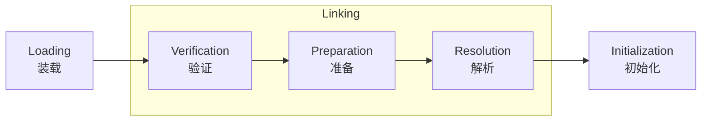
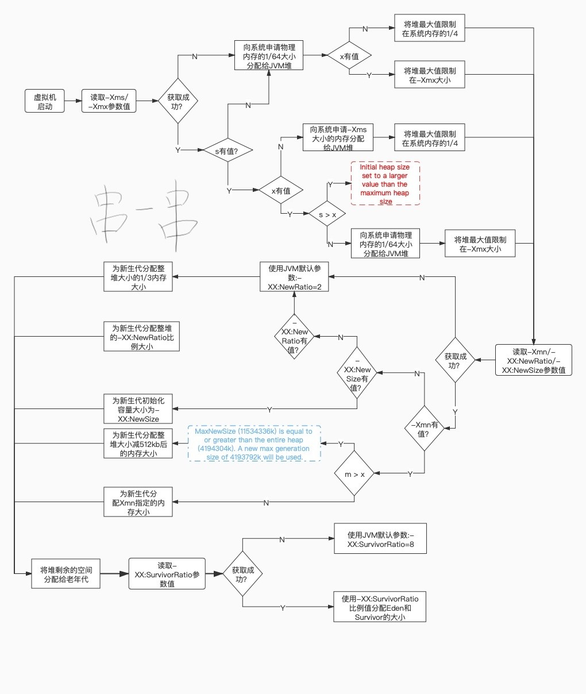
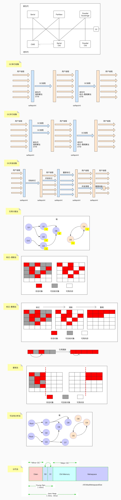
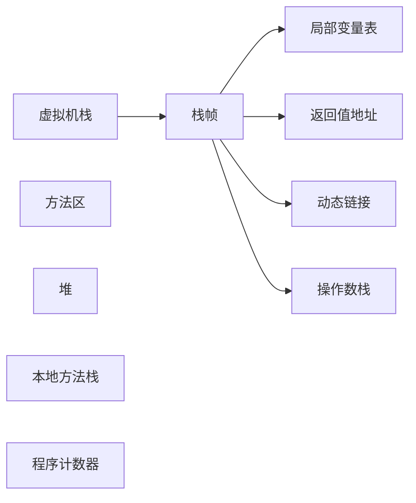

# 求职-面试题-JVM

## 文档说明

| 文档名称     | 求职-面试题-JVM |
| ----------- | ------------- |
| 文档分类     | 求职-面试题     |
| 版本号       | 1.2            |
| 编制人       | Gem Shen       |
| 编制日期     | 2021-07-07     |
| 最后更新人    | Gem Shen       |
| 最后更新日期  | 2024-02-26    |

# JVM

1. 基础知识
   - 
2. 内存结构：
   - JVM内存结构包括哪些部分？它们分别用来存储什么？
   - 堆内存、栈内存、方法区（元空间）的作用和区别是什么？
   - 垃圾回收算法有哪些？它们的原理和应用场景是什么？
3. 类加载机制：
   - 类加载的过程是怎样的？包括加载、链接和初始化三个阶段。
   - 类加载器有哪些？它们的加载顺序和关系是怎样的？
   - 双亲委派模型是什么？有什么作用？
4. 垃圾回收：
   - 垃圾回收的原理是什么？如何判断一个对象是否可以被回收？
   - 常见的垃圾回收算法有哪些？它们的特点和适用场景是什么？
   - 如何避免内存泄漏和内存溢出问题？
5. 性能调优：
   - JVM参数调优有哪些？如何选择合适的参数进行调优？
   - 如何监控JVM的性能指标？有哪些工具可以使用？
   - 如何进行代码优化以提升程序的性能？

## 架构和组成

### JVM、JRE、JDK的关系是？

关系：JDK 包含 JRE 包含 JVM。

**JVM**（Java虚拟机）是Java程序的运行环境，负责将Java字节码解释执行或编译成机器码。[详细介绍](#JVM是什么？它的作用？)

**JRE**（Java运行时环境）包含了运行Java程序所需的JVM和Java核心类库。

**JDK**（Java开发工具包）是Java开发人员用来开发Java程序的工具包，包含了JRE、编译器（javac）、调试器（jdb）等工具。JDK是JRE的扩展，除了JRE提供的运行环境，还提供了开发Java程序所需的工具和资源。

在开发Java程序时，需要安装JDK；在运行Java程序时，只需要安装JRE即可。

### JVM是什么？它的作用？

JVM（Java虚拟机）是Java程序运行的核心组件，它是一个能够执行Java字节码的虚拟机。JVM的主要作用包括以下几个方面：

1. 实现跨平台性：Java程序在编译后生成的是字节码文件，而不是特定平台的机器码。JVM负责将字节码文件解释或编译成特定平台的机器码，从而实现Java程序在不同平台上的运行。
2. 内存管理：JVM负责管理Java程序的内存，包括堆内存、栈内存、方法区（元空间）等。它提供自动内存管理机制，包括垃圾回收功能，用于回收不再使用的对象，防止内存泄漏和内存溢出问题。
3. 类加载机制：JVM负责加载、链接、初始化Java类和接口。它通过类加载器加载类文件，并在运行时动态链接和初始化类，实现Java程序的动态性和灵活性。
4. 执行字节码：JVM将字节码文件解释或编译成机器码，并执行程序逻辑。它提供了即时编译器（Just-In-Time Compiler，JIT）来优化字节码的执行，提升程序的执行效率。

总的来说，JVM作为Java程序的运行环境，扮演着解释、编译、执行、内存管理等多个角色，保证了Java程序的跨平台性、安全性和高性能。因此，JVM是Java程序运行的基础和核心组件。

### JVM的主要组成部分？

JVM（Java虚拟机）主要组成部分包括以下几个部分：

1. 类加载器（Class Loader）：
   - 功能：负责将class文件加载到内存中，并生成对应的Class对象。
   - 分为三个层次：启动类加载器、扩展类加载器和应用程序类加载器。
2. 运行时数据区（Runtime Data Area）：详细介绍。
3. 执行引擎（Execution Engine），包括解释器和即时编译器
   - 解释器：将字节码逐条解释为机器码执行。
   - 即时编译器：将热点代码编译为本地机器码提高执行效率。
4. 垃圾收集器（Garbage Collector）：
   - 负责自动回收不再使用的对象，释放内存空间。
   - 采用不同的算法和策略进行垃圾回收，如标记-清除、复制、标记-整理等。
5. JIT编译器（Just-In-Time Compiler）：
   - 将字节码编译为本地机器码，提高程序的执行效率。
   - 根据代码的热度和执行频率进行编译优化，提高性能。

### JVM类加载流程

详细介绍：

1. **加载（Loading）**：将类的字节码文件加载到内存中。在加载阶段，JVM会根据类的全限定名来定位并读取对应的字节码文件，通常是从磁盘或网络中加载。加载完成后，会生成一个代表该类的Class对象。
2. **验证（Verification）**：对加载的字节码进行验证，确保符合JVM规范和安全性要求。验证包括文件格式验证、元数据验证、字节码验证、符号引用验证等步骤，目的是保证字节码的正确性和安全性。
3. **准备（Preparation）**：为类的静态变量分配内存并设置默认初始值。在准备阶段，JVM会为类的静态变量（包括静态字段和静态常量）分配内存空间，并设置默认初始值（如0、null等）。
4. **解析（Resolution）**：将符号引用解析为直接引用。在解析阶段，JVM会将类、字段、方法等符号引用解析为直接引用，以便后续使用。解析过程可能会涉及动态链接、方法重写等操作。
5. **初始化（Initialization）**：执行类的初始化代码，包括静态变量赋值和静态代码块。在初始化阶段，JVM会执行类的静态代码块和静态变量赋值操作，完成类的初始化工作。只有在真正使用类时才会触发初始化操作。并不是JVM启动时就执行初始化的。

### 符合引用和直接引用

符号引用是一种符号化的引用，包含了类名、字段名、方法名等信息；而直接引用是直接指向内存地址的引用，指向实际的类、字段、方法等内存地址。

假设有一个类`Person`，其中定义了一个静态方法`sayHello()`，在另一个类`Main`中调用了`Person.sayHello()`方法。

1. **符号引用**：在编译阶段，编译器会生成符号引用，如`Person.sayHello()`。这个符号引用包含了类名和方法名，但并不包含具体的内存地址。
2. **直接引用**：在解析阶段，JVM将符号引用解析为直接引用。具体地，JVM会将`Person`类的符号引用解析为指向内存中`Person`类的实际地址，将`sayHello()`方法的符号引用解析为指向内存中该方法的实际地址。

通过解析符号引用为直接引用，JVM可以在运行时准确找到类、字段、方法等的实际内存地址，从而实现对类的动态加载和调用。

### JVM类加载器有哪些？

#### Bootstrap ClassLoader

启动类加载器（Bootstrap ClassLoader），负责加载JAVA_HOME中 jre/lib/rt.jar里所有的class或Xbootclasspath选项指定的jar包。由C++实现，不是ClassLoader子类。无法直接在Java代码中获取引用

#### Extension ClassLoader

扩展类加载器（Extension ClassLoader），继承自ClassLoader类，负责加载java平台中扩展功能的一些jar包，包括JAVA_HOME中jre/lib/*.jar 或 -Djava.ext.dirs指定目录下的jar包。

#### App ClassLoader

应用程序类加载器（Application ClassLoader），继承自ClassLoader类，负责加载应用程序的类（即开发者自己编写的类）以及classpath中指定的jar包及-Djava.class.path 所指定目录下的类和jar包。

#### Custom ClassLoader

自定义类加载器，继承自ClassLoader类，开发者可以根据需要自定义类加载器，实现特定的加载逻辑。例如：动态加载、热部署等功能。

### 自定义类加载器应用场景

自定义类加载器在Java中有许多应用场景，以下是一些常见的场景及相应的例子：

1. **模块化系统**：自定义类加载器可以实现模块化系统，动态加载和卸载模块，实现更灵活的系统架构。例如，OSGi（Open Services Gateway Initiative）框架使用自定义类加载器来实现模块化开发。
2. **热部署和动态更新**：自定义类加载器可以实现热部署和动态更新功能，允许在应用程序运行时加载新的类文件。例如，Java应用服务器中的热部署功能，可以通过自定义类加载器实现。
3. **插件系统**：自定义类加载器可以实现插件系统，允许动态加载插件来扩展应用程序的功能。例如，Eclipse IDE的插件系统就使用了自定义类加载器。
4. **类隔离和安全沙箱**：自定义类加载器可以实现安全沙箱机制，控制哪些类可以被加载和执行。例如：在Tomcat和JBoss等应用服务器中，为了确保不同的Web应用程序（WAR文件）之间相互隔离，通常会使用自定义类加载器来加载每个Web应用程序的类文件，以防止类文件之间的冲突和干扰。还有Java安全管理器可以使用自定义类加载器来实现受控的类加载。
5. **动态代理**：自定义类加载器可以实现动态代理功能，动态生成代理类并加载到内存中。例如，Java动态代理和CGLIB库就使用了自定义类加载器。
6. **代码混淆和加密**：自定义类加载器可以实现类文件的混淆和加密，提高代码的安全性。例如，Android应用程序中的代码混淆工具ProGuard就可以使用自定义类加载器加载混淆后的类文件。

总的来说，自定义类加载器在Java中有许多应用场景，可以实现一些高级的类加载需求和功能扩展，提高程序的灵活性和安全性。通过灵活运用自定义类加载器，可以实现更多定制化和高级功能的需求。

### 双亲委派机制介绍

在加载一个类A的时候，会依照这个顺序：custom > app > ext > bootstrap，根据类的全限定性名，在每个加载器的缓存中是否已经有了，如果有了就直接返回，不会重复加载。如果所有的缓存中都没有，再从上往下，根据各自职责范围去找对应的加载器加载。这种加载机制就是双亲委派。如果最终还是没找到，那就会报ClassNotFoundException

#### 这么做的原因

主要是出于安全考虑，如果不这么做，存在核心类被人恶意篡改的可能。例如：如果有人写一个java.lang.String类。那么这个类就可能改变java.lang包这个类的默认行为。对整个JVM造成安全隐患或者说漏洞。

#### 如何打破

继承ClassLoader，覆盖loadClass方法。

### 简单介绍JIT

想要把高级语言转变成计算机认识的机器语言有两种方式，分别是编译和解释，虽然Java转成机器语言的过程中有一个步骤是要编译成字节码，但是，这里的字节码并不能在机器上直接执行。

JVM中内置了解释器(interpreter)，它负责在运行时对字节码进行解释翻译成机器码，然后再执行。

解释器的执行方式是一边翻译，一边执行，因此执行效率略低。为了解决这样的低效问题，HotSpot引入了JIT技术(Just-In-Time)。

有了JIT技术之后，当JVM发现某个方法或代码块运行时执行的特别频繁的时候，就会认为这是“热点代码”(Hot Spot Code)。然后JIT会把部分“热点代码”翻译成本地机器相关的机器码，并进行优化，然后再把翻译后的机器码缓存起来，以备下次使用。这样就大大提升了执行性能。

### 对象头结构

### new一个对象的内存分配过程

在Java中，当使用`new`关键字创建一个对象时，内存分配过程如下：

1. 首先，Java虚拟机会在堆内存中为对象分配一块连续的内存空间。
2. 然后，Java虚拟机会调用对象的构造函数来初始化这块内存空间，为对象的成员变量赋初值。
3. 如果对象中包含引用类型的成员变量，Java虚拟机会为这些引用类型的成员变量分配内存空间，并递归地初始化这些引用类型的对象。
4. 最后，Java虚拟机会返回对象的引用，这个引用可以用来访问和操作这个对象。

需要注意的是，在Java中，对象的内存分配是在堆内存中进行的，而基本数据类型和引用类型的变量则是在栈内存中分配。此外，Java的垃圾回收机制会自动回收不再被引用的对象，释放其占用的内存空间。

### 内存溢出，内存泄漏遇到过吗？什么场景产生的，怎么解决的？

## 垃圾回收

### GC log分析方法？

https://www.cnblogs.com/qlqwjy/p/7929414.html

### 分代算法有哪些？

标记清除，标记整理，标记复制。并行，并发，串行。

### JVM内存中为什么会有新生代，老年代，新生代为什么有Eden跟Survivor?Survivor又有S0、S1

分为新生代老年代的原因：

如果不分新生代和老年代，每次GC都要扫描整个堆内存，扫描范围大，扫描效率低。

JVM垃圾收集采用分代回收算法，根据对象存活周期的不同将内存分为不同的分代。根据各个代的特点采用不同的垃圾回收算法。

分成Eden、Survivor。Survivor又有S0、S1的原因：

新生代大部分对象都是“朝生暮死”的，把这样的对象单独放在一个区，可以进一步缩小GC扫描范围和时间。每次扫描之后的存活对象会移动到Survivor区是为了避免因为空间不连续而产生空间碎片。Survivor要分成S0和S1也是同理，因为Survivor中垃圾对象被清除后也可能产生空间碎片。这是一种标记-复制算法的实现。

### 请描述下JVM中的垃圾回收算法与垃圾回收器，各回收器的场景以及区别

垃圾回收算法：

1. 标记-清除

   第一遍扫描所有对象标记出可以回收的。第二遍将标记的对象清除。

   缺点：

   对象清除以后内存不连续会产生空间碎片

   标记和清除都比较耗时效率低

2. 标记-复制

   将内存划分为2块相等的区域，每次只使用其中一块。将存活的对象复制到另一块区域中，然后将原来的区域全部清除。

   优点：内存连续，不会有空间碎片。

   缺点：其中一块内存区域空间浪费了。

   适用于存活对象较少的场景。所以不适用于老年代。

3. 标记-整理

   第一遍标记过程同标记-清除算法，标记完了之后将存活对象往空间一端移动，然后清理掉端边界之外的内存。

   优点：不会有空间浪费，内存连续

   缺点：移动对象需要额外开销

垃圾回收器：

1. Serial/Serial Old

   基于标记-复制算法，单线程，执行时会暂停所有应用程序线程。新生代的叫Serial，老年代的叫Serial Old。最古老的垃圾收集器

2. ParNew

   基于标记-复制算法，多线程，执行时也会暂停所有应用程序线程。适用于新生代。

3. Parallel Scavenge/Parallel Old

   基于标记-复制算法，多线程，约等于ParNew收集器。只是这个更关注吞吐量。即减少垃圾收集时间（就是每次垃圾收集时间短，但是收集次数多），让用户代码获得更长的运行时间；

4. CMS

   基于标记-清除算法，多线程并发类收集器。更加关注停顿时间。降低了吞吐量。

5. G1

   基于标记整理算法，更加关注停顿时间。

   引入分区的思路，弱化了分代的概念。

   G1可以根据用户设置的暂停时间目标进行动态调整以满足目标。

### 怎么去判断一个对象能够进行GC回收

引用计数

统计一个对象被强引用的次数，如果为0就是垃圾，可回收。但这种方式会有循环引用的问题JVM没有采用。

可达性分析

如果一个对象无法往上追溯到GC Root引用点的就是垃圾。

哪些可以作为GC Root引用点：

JVM stack中引用的对象 

方法区中静态引用指向的对象

方法区中常量引用指向的对象

Native方法中JNI引用指向的对象

Thread-活着的线程

### 类的生命周期是怎么样的？请说下类的装载机制

类的生命周期

装载、链接、初始化、使用、卸载

装载机制

1) 通过一个类的全限定名获取定义此类的二进制字节流，装载方式有多种。

2) 将这个字节流所代表的静态存储结构转化为方法区的运行时数据结构

3) 将类文件字节码流静态存储结构放到JVM的方法区

### 请谈谈JVM内存模型

也叫运行时数据区，主要分为下面5个

#### 方法区

线程共享，主要存放：静态变量，类信息，常量，即时编译器编译后的代码

堆

线程共享，主要存放对象和数组。

#### 虚拟机栈

线程私有，每一个线程都对应一个栈，每调用一个方法都会往栈中压入一个栈帧。栈帧中包含局部变量表，返回值地址，动态链接，操作数栈。方法返回则会弹出栈帧。

#### 本地方法栈

线程私有，Native方法在这个地方存储。

#### 程序计数器

记录正在执行的线程信息和字节码指令信息。当cpu调度时可以衔接上。

### JVM中heap的内存划分是什么样的

分为新生代，老年代，新生代又分为Eden和S0，S1区

### 新生代、老年代垃圾回收过程以及原理

对象在被实例化之后，都是属于新生代Eden区。

如果往Eden区放的时候，有足够空间则放完结束。

但如果没有足够空间则会触发Minor GC，即清除掉可回收的对象。在判断一次Eden空间是否足够。

如果足够则放完结束。但如果还不足够。则会判断Survive区空间是否足够。

如果足够会将Eden区的存活对象移动到Survive区。对象空间申请结束。

如果不足够会继续判断老年代空间是否足够。

如果足够则将Survive区的存活对象复制到老年代。

如果老年代的空间都不足够了。则会触发Full GC，回收堆中所有可回收的对象。

如果Full GC结束之后仍然没有足够空间，则会抛出OOM异常。

### 什么是内存泄露，什么是内存溢出，有什么区别

内存泄漏是指不再使用的对象无法得到及时的回收，持续占用内存空间，从而造成内存空间的浪费。

内存泄漏很容易导致内存溢出，但内存溢出不一定是内存泄漏导致的

### 请说下JDK的引用分类

+ 强引用，默认引用，只要gcroot可达，就不会被回收，会导致泄漏。
+ 软引用，只要发生GC且内存不足时，就会回收软引用对象
+ 弱引用，无论内存是否足够，只要 JVM 开始进行垃圾回收，那些被弱引用关联的对象都会被回收
+ 虚引用，一般很少使用。

### Minor GC和full GC分别在什么时候发生

#### minor GC

对象刚创建时，如果Eden区空间不足则会触发minor GC

#### major GC

Major GC在很多参考资料中是等价于 Full GC 的。精确的讲：Major GC不包括元空间垃圾回收

#### Full GC

一次 Full GC 将会对年轻代、老年代、元空间以及堆外内存进行垃圾回收

触发Full GC的原因：

当老年代空间不足时

当老年代的空间使用率超过某阈值时

当元空间不足时（JDK1.7永久代不足）

当调用 System.gc() 也会安排一次 Full GC。

### G1的回收过程

## JVM调优

### 能查看堆使用情况的工具

jconsole，jvisualvm，jmap，阿里的arthas

### JVM有哪些调优命令，有哪些调优工具

#### jps

查看java进程id

#### jstat

用于监控java进程的各种资源和性能，命令行模式。

#### jstack

用于排查线程问题，例如：线程死锁

#### jinfo

查看jvm进程的参数

#### jmap

用来导出dump文件。分析oom问题原因。也可以查看jvm各种状态。

#### jconsole

图形化工具展现JVM运行情况。堆信息，类加载信息

#### jvisualvm

同上，只是各有千秋。还可以显示堆

#### arthas

Alibaba开源的Java诊断工具，采用命令行交互模式，是排查jvm相关问题的利器

#### mat

分析dump文件的工具。

#### heaphero

在线dump文件分析工具

#### GCViewer

本地分析GC日志的工具

#### gceasy

在线GC日志分析工具

### JVM的参数有哪些，并说明参数作用

#### 标准参数

不会随着JDK版本变化而变化，例如：

-version
-help
-server
-cp

#### -X参数

非标准参数，也就是在JDK各个版本中可能会变动

-Xint

-Xcomp

-Xmixed

#### -XX参数

使用得最多的参数类型。非标准化参数，相对不稳定，主要用于JVM调优和Debug  

a.Boolean类型
格式：-XX:[+-]<name> +或-表示启用或者禁用name属性
比如：-XX:+UseConcMarkSweepGC 表示启用CMS类型的垃圾回收器
-XX:+UseG1GC 表示启用G1类型的垃圾回收器

b.非Boolean类型
格式：-XX<name>=<value>表示name属性的值是value
比如：-XX:MaxGCPauseMillis=500

#### 其他参数

这块也相当于是-XX类型参数的简化版

-Xms 1000M 等价于-XX:InitialHeapSize=1000M

-Xmx 1000M 等价于-XX:MaxHeapSize=1000M

-Xss100 等价于-XX:ThreadStackSize=100k

### 一般会怎么进行JVM调优，怎么找问题并解决问题

#### 问题反馈

用户反馈：正式环境使用一段时间后发现功能响应时间明显变慢了。甚至是直接无响应了。

#### 问题发现

OOM，GC次数，吞吐量，平均GC时间，线程死锁，CPU占用率

#### 原因排查

OOM，可以通过手动或自动的方式导出一份dump文件。通过MAT工具载入分析到底是哪段代码导致了OOM。

CPU占用率高/线程死锁，可用jstack命令查看线程堆栈信息，找到出问题的线程。看是否代码有问题。

如果通过上述方式都没找到具体的代码问题。可通过gc日志做进一步分析其他问题。

也可以在压测环境，使用jvisualvm，jconsole，arthas观察JVM状态。

#### 解决问题

- 代码问题：

  排查出来是代码问题的，及时修改代码并测试部署。

- 架构问题：

  引入消息中间件，异步削峰

  引入缓存，减少对后端的访问。

  引入分布式锁（zk，redis）

  集群+负载均衡

- JVM问题：

  尝试修改堆内存大小

  切换垃圾收集器，JDK7以后，多核大内存可以考虑G1

### 正式环境CPU100%，如何排查和解决问题

面对这样的问题，作为面试者，需要展示出系统性的思考和解决问题的能力。以下是一个结构化的回答方式：

#### 1. 初步分析

- **确认问题范围**：首先，我会确认问题的范围，了解CPU100%的持续时间、发生频率以及是否有特定的触发条件。
- **查看监控数据**：通过系统监控工具（如Nagios、Zabbix等）回顾问题发生前后的CPU使用率、内存、IO等相关指标的变化，以帮助定位问题。

#### 2. 详细排查

- **使用top命令**：通过`top`命令查看CPU使用率最高的进程，可以用`top -H`查看线程级的CPU使用情况。按c可以显示命令路径。键入P (大写p)，进程会按照CPU使用率排序。
- **使用pidstat和mpstat**：`pidstat`可以用来观察单个或多个进程的CPU使用情况（pidstat -u -p 12345），`mpstat`则可以查看各个CPU核心的使用情况，帮助判断是否有CPU亲和性（affinity）问题。
  - 注意：`pidstat`和`mpstat`是Linux系统上的性能监控工具，通常需要单独安装。这两个工具通常包含在`sysstat`软件包中。使用yum安装：`sudo yum install sysstat`
- **分析Java应用**：如果是Java应用导致的高CPU，可以使用`jstack`获取Java应用的线程堆栈信息，结合`top -H`的线程ID（PID）定位到具体的Java线程，分析是哪部分代码或哪个操作导致的高CPU。
  - 因为堆栈里线程id是用16进制表示的，可以使用这个命令转换：`printf "%x\n" 12345 | awk '{printf "0x%s\n", $1}'`
  - 查看堆栈，找到线程在干嘛：`jstack 12345 | grep ‘0x2a34’ -C5 --color`
  - 这样就能通过线程id，过滤得到线程堆栈(看到了该线程正在执行代码的堆栈)

#### 3. 问题解决

- **代码优化**：如果定位到具体的代码问题，比如无限循环、过度的锁竞争等，需要进行代码层面的优化。
- **资源调整**：如果是由于资源不足导致的问题，考虑增加服务器的CPU资源，或者通过负载均衡等方式分散请求压力。
- **配置调整**：检查Java虚拟机（JVM）的配置，优化GC策略和内存设置，减少GC导致的CPU负载。

#### 4. 防范措施

- **监控预警**：加强系统监控，设置合理的预警阈值，确保在问题发生之前能够得到预警。
- **性能测试**：在上线前进行充分的性能测试，确保系统能够承受预期的负载。
- **容量规划**：定期进行容量规划，根据业务增长趋势调整系统资源。

#### 5. 沟通和记录

- **沟通**：在处理过程中，及时与团队成员沟通进展情况，确保所有相关人员都了解问题状态。
- **文档记录**：问题解决后，详细记录问题的成因、解决过程和未来的预防措施，为未来遇到类似问题提供参考。

通过这样的回答，你不仅展示了你的技术能力，也展示了你的问题解决、沟通和文档记录能力。

 

### 正式环境的内存溢出，如何排查和解决？

面对正式环境Java进程内存溢出（OutOfMemoryError）的问题，排查和解决步骤可以分为以下几个阶段：

#### 1. 确认内存溢出

首先，确认系统是否真的发生了内存溢出。可通过查看错误日志或监控系统来确认是否出现了`OutOfMemoryError`。如果是，需要记录下溢出时的详细错误信息以及系统的运行状态。

#### 2. 收集信息

- **生成堆转储（Heap Dump）文件**：在JVM发生内存溢出时，可以通过配置JVM参数来自动生成堆转储文件，如使用`-XX:+HeapDumpOnOutOfMemoryError`参数。这个文件包含了内存溢出时的Java堆信息，是分析内存溢出原因的重要依据。
- **收集GC日志**：通过配置JVM参数来开启GC日志，如`-Xloggc:<file-path>`。GC日志记录了垃圾收集的详细信息，可以帮助分析内存使用情况和垃圾收集行为。
- **系统监控数据**：收集系统运行期间的监控数据，如CPU使用率、内存使用情况、线程数等，这有助于从宏观上分析系统状态。

#### 3. 分析原因

- **使用堆分析工具**：利用MAT（Memory Analyzer Tool）、VisualVM、JProfiler等工具分析堆转储文件。通过这些工具可以找到内存中对象的分布、大对象、内存泄露路径等关键信息。
- **分析GC日志**：通过GC日志分析工具（如GCViewer、GCEasy）来分析GC行为，了解内存分配与回收情况，识别是否存在频繁的Full GC、长时间的GC暂停等问题。
- **代码审查**：结合分析结果，回顾相关代码逻辑，特别是那些创建大量对象、使用了缓存、单例以及静态变量的地方，检查是否有内存泄露或不合理的内存使用模式。

#### 4. 解决方案

- **修复代码**：根据分析结果，修复内存泄露或不当的内存使用逻辑。可能包括但不限于优化数据结构的使用、修复缓存逻辑、优化算法减少内存占用等。
- **调整JVM参数**：根据应用的实际需要调整JVM堆大小、新生代与老年代的比例、垃圾收集器的选择等参数，以优化内存使用和垃圾收集效率。
- **资源清理**：确保在适当的时机进行资源释放，比如关闭文件流、数据库连接等。

#### 5. 防范措施

- **引入内存监控**：定期监控内存使用情况，提前发现潜在的内存问题。
- **代码质量控制**：加强代码审查，特别是对于那些容易引起内存问题的代码部分。
- **性能测试**：在发布前进行充分的性能测试，包括压力测试、长时间运行测试等，以发现并解决潜在的性能和内存问题。

通过上述步骤，可以系统地排查和解决Java进程内存溢出的问题。重要的是要建立起一套有效的内存问题预防和应对机制，减少内存溢出对正式环境的影响。

### kill -9对Java进程会有什么影响？

kill  -9 命令会立刻关闭Jvm进程。但是kill  -9的语意是强制关闭，会导致在jvm中执行的服务立刻关闭，来不及收尾。例如：导致java进程无法导出dump文件（如果配了的话），导致事务执行一半直接终止等等。

推荐使用kill -15命令来结束java进程。kill命令默认的信号就是15，当使用kill -15时，系统会发送一个SIGTERM的信号给应用程序。当程序接收到该信号后，具体要如何处理是自己可以决定的。这时候，应用程序可以选择：立即停止程序，释放响应资源后停止程序，忽略该信号，继续执行程序。
