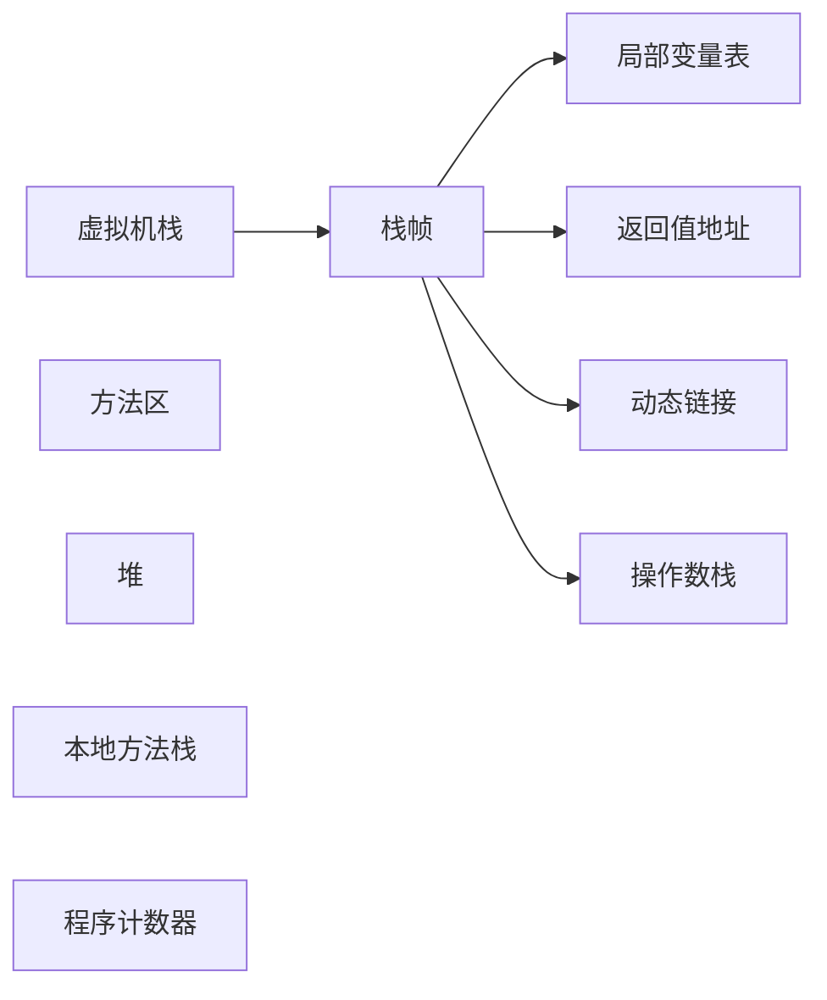

# 求职-面试题-JVM

# 文档说明

本文档主要分享求职面试题。文档目前还在持续更新中，欢迎关注、收藏、点赞、加星喔😄O(∩_∩)O~。

| 文档名称     | Java面试题-JVM |
| ----------- | ------------- |
| 文档分类     | 求职-面试      |
| 版本号       | 1.0            |
| 编制人       | Gem Shen       |
| 编制日期     | 2021-07-07     |
| 最后更新人    | Gem Shen       |
| 最后更新日期  | 2023-12-18     |

# 结构和组成

类加载器

运行时数据区域

执行引擎

### 对象头结构

### 内存溢出，内存泄漏遇到过吗？什么场景产生的，怎么解决的？

## 垃圾回收

### jvm类加载器有哪些？

AppClassload：负责加载classpath指定的jar包，以及目录下的class文件。

ExtensionClassload：负责加载Java平台中具有扩展功能的jar包，例如：jre/lib/*.jar

BootstrapClassload：负责加载java平台的核心代码，例如：rt.jar

CustomClassload：自定义类加载器。

### 自定义类加载器应用场景

比如，tomcat、jboss，都自定义了类加载器，确保每个war目录下的项目相互隔离

### 双亲委派机制，优缺点

### JVM内存中为什么会有新生代，老年代，新生代为什么有Eden跟Survivor?Survivor又有S0、S1

分为新生代老年代的原因：

如果不分新生代和老年代，每次GC都要扫描整个堆内存，扫描范围大，扫描效率低。

JVM垃圾收集采用分代回收算法，根据对象存活周期的不同将内存分为不同的分代。根据各个代的特点采用不同的垃圾回收算法。

分成Eden、Survivor。Survivor又有S0、S1的原因：

新生代大部分对象都是“朝生暮死”的，把这样的对象单独放在一个区，可以进一步缩小GC扫描范围和时间。每次扫描之后的存活对象会移动到Survivor区是为了避免因为空间不连续而产生空间碎片。Survivor要分成S0和S1也是同理，因为Survivor中垃圾对象被清除后也可能产生空间碎片。这是一种标记-复制算法的实现。

### 请描述下JVM中的垃圾回收算法与垃圾回收器，各回收器的场景以及区别

垃圾回收算法：

1. 标记-清除

   第一遍扫描所有对象标记出可以回收的。第二遍将标记的对象清除。

   缺点：

   对象清除以后内存不连续会产生空间碎片

   标记和清除都比较耗时效率低

2. 标记-复制

   将内存划分为2块相等的区域，每次只使用其中一块。将存活的对象复制到另一块区域中，然后将原来的区域全部清除。

   优点：内存连续，不会有空间碎片。

   缺点：其中一块内存区域空间浪费了。

   适用于存活对象较少的场景。所以不适用于老年代。

3. 标记-整理

   第一遍标记过程同标记-清除算法，标记完了之后将存活对象往空间一端移动，然后清理掉端边界之外的内存。

   优点：不会有空间浪费，内存连续

   缺点：移动对象需要额外开销

垃圾回收器：

1. Serial/Serial Old

   基于标记-复制算法，单线程，执行时会暂停所有应用程序线程。新生代的叫Serial，老年代的叫Serial Old。最古老的垃圾收集器

2. ParNew

   基于标记-复制算法，多线程，执行时也会暂停所有应用程序线程。适用于新生代。

3. Parallel Scavenge/Parallel Old

   基于标记-复制算法，多线程，约等于ParNew收集器。只是这个更关注吞吐量。即减少垃圾收集时间（就是每次垃圾收集时间短，但是收集次数多），让用户代码获得更长的运行时间；

4. CMS

   基于标记-清除算法，多线程并发类收集器。更加关注停顿时间。降低了吞吐量。

5. G1

   基于标记整理算法，更加关注停顿时间。

   引入分区的思路，弱化了分代的概念。

   G1可以根据用户设置的暂停时间目标进行动态调整以满足目标。

### 怎么去判断一个对象能够进行GC回收

引用计数

统计一个对象被强引用的次数，如果为0就是垃圾，可回收。但这种方式会有循环引用的问题JVM没有采用。

可达性分析

如果一个对象无法往上追溯到GC Root引用点的就是垃圾。

哪些可以作为GC Root引用点：

JVM stack中引用的对象 

方法区中静态引用指向的对象

方法区中常量引用指向的对象

Native方法中JNI引用指向的对象

Thread-活着的线程

### JVM的参数有哪些，并说明参数作用

#### 标准参数

不会随着JDK版本变化而变化，例如：

-version
-help
-server
-cp

#### -X参数

非标准参数，也就是在JDK各个版本中可能会变动

-Xint

-Xcomp

-Xmixed

#### -XX参数

使用得最多的参数类型。非标准化参数，相对不稳定，主要用于JVM调优和Debug  

a.Boolean类型
格式：-XX:[+-]<name> +或-表示启用或者禁用name属性
比如：-XX:+UseConcMarkSweepGC 表示启用CMS类型的垃圾回收器
-XX:+UseG1GC 表示启用G1类型的垃圾回收器

b.非Boolean类型
格式：-XX<name>=<value>表示name属性的值是value
比如：-XX:MaxGCPauseMillis=500

#### 其他参数

这块也相当于是-XX类型参数的简化版

-Xms1000M 等价于-XX:InitialHeapSize=1000M

-Xmx1000M 等价于-XX:MaxHeapSize=1000M

-Xss100 等价于-XX:ThreadStackSize=100k

### 一般会怎么进行JVM调优，怎么找问题并解决问题

#### 问题反馈

用户反馈：正式环境使用一段时间后发现功能响应时间明显变慢了。甚至是直接无响应了。

#### 问题发现

OOM，GC次数，吞吐量，平均GC时间，线程死锁，CPU占用率

#### 原因排查

OOM，可以通过手动或自动的方式导出一份dump文件。通过MAT工具载入分析到底是哪段代码导致了OOM。

CPU占用率高/线程死锁，可用jstack命令查看线程堆栈信息，找到出问题的线程。看是否代码有问题。

如果通过上述方式都没找到具体的代码问题。可通过gc日志做进一步分析其他问题。

也可以在压测环境，使用jvisualvm，jconsole，arthas观察JVM状态。

#### 解决问题

- 代码问题：

  排查出来是代码问题的，及时修改代码并测试部署。

- 架构问题：

  引入消息中间件，异步削峰

  引入缓存，减少对后端的访问。

  引入分布式锁（zk，redis）

  集群+负载均衡

- JVM问题：

  尝试修改堆内存大小

  切换垃圾收集器，JDK7以后，多核大内存可以考虑G1

### 类的生命周期是怎么样的？请说下类的装载机制

类的生命周期

装载、链接、初始化、使用、卸载

装载机制

1) 通过一个类的全限定名获取定义此类的二进制字节流，装载方式有多种。

2) 将这个字节流所代表的静态存储结构转化为方法区的运行时数据结构

3) 将类文件字节码流静态存储结构放到JVM的方法区

### new一个对象的内存分配过程

### 请谈谈JVM内存模型

也叫运行时数据区，主要分为下面5个

#### 方法区

线程共享，主要存放：静态变量，类信息，常量，即时编译器编译后的代码

堆

线程共享，主要存放对象和数组。

#### 虚拟机栈

线程私有，每一个线程都对应一个栈，每调用一个方法都会往栈中压入一个栈帧。栈帧中包含局部变量表，返回值地址，动态链接，操作数栈。方法返回则会弹出栈帧。

#### 本地方法栈

线程私有，Native方法在这个地方存储。

#### 程序计数器

记录正在执行的线程信息和字节码指令信息。当cpu调度时可以衔接上。

### JVM中heap的内存划分是什么样的

分为新生代，老年代，新生代又分为Eden和S0，S1区

### 新生代、老年代垃圾回收过程以及原理

对象在被实例化之后，都是属于新生代Eden区。

如果往Eden区放的时候，有足够空间则放完结束。

但如果没有足够空间则会触发Minor GC，即清除掉可回收的对象。在判断一次Eden空间是否足够。

如果足够则放完结束。但如果还不足够。则会判断Survive区空间是否足够。

如果足够会将Eden区的存活对象移动到Survive区。对象空间申请结束。

如果不足够会继续判断老年代空间是否足够。

如果足够则将Survive区的存活对象复制到老年代。

如果老年代的空间都不足够了。则会触发Full GC，回收堆中所有可回收的对象。

如果Full GC结束之后仍然没有足够空间，则会抛出OOM异常。

### 什么是内存泄露，什么是内存溢出，有什么区别

内存泄漏是指不再使用的对象无法得到及时的回收，持续占用内存空间，从而造成内存空间的浪费。

内存泄漏很容易导致内存溢出，但内存溢出不一定是内存泄漏导致的

### 请说下JDK的引用分类

+ 强引用，默认引用，只要gcroot可达，就不会被回收，会导致泄漏。
+ 软引用，只要发生GC且内存不足时，就会回收软引用对象
+ 弱引用，无论内存是否足够，只要 JVM 开始进行垃圾回收，那些被弱引用关联的对象都会被回收
+ 虚引用，一般很少使用。

### Minor GC和full GC分别在什么时候发生

#### minor GC

对象刚创建时，如果Eden区空间不足则会触发minor GC

#### major GC

Major GC在很多参考资料中是等价于 Full GC 的。精确的讲：Major GC不包括元空间垃圾回收

#### Full GC

一次 Full GC 将会对年轻代、老年代、元空间以及堆外内存进行垃圾回收

触发Full GC的原因：

当老年代空间不足时

当老年代的空间使用率超过某阈值时

当元空间不足时（JDK1.7永久代不足）

当调用 System.gc() 也会安排一次 Full GC。

### G1的回收过程

### JVM有哪些调优命令，有哪些调优工具

#### jps

查看java进程id

#### jstat

用于监控java进程的各种资源和性能，命令行模式。

#### jstack

用于排查线程问题，例如：线程死锁

#### jinfo

查看jvm进程的参数

#### jmap

用来导出dump文件。分析oom问题原因。也可以查看jvm各种状态。

#### jconsole

图形化工具展现JVM运行情况。堆信息，类加载信息

#### jvisualvm

同上，只是各有千秋。还可以显示堆

#### arthas

Alibaba开源的Java诊断工具，采用命令行交互模式，是排查jvm相关问题的利器

#### mat

分析dump文件的工具。

#### heaphero

在线dump文件分析工具

#### GCViewer

本地分析GC日志的工具

#### gceasy

在线GC日志分析工具

### 正式环境CPU100%，如何排查和解决问题

步骤一、找到最耗CPU的进程
 执行top -c ，显示进程运行信息列表

 键入P (大写p)，进程按照CPU使用率排序
步骤二：找到最耗CPU的线程
 top -Hp 10765 ，显示一个进程的线程运行信息列表

 键入P (大写p)，线程按照CPU使用率排序
步骤三：将线程PID转化为16进制(是因为堆栈里，线程id是用16进制表示的)
 printf “%x” pid
步骤四：查看堆栈，找到线程在干嘛
 jstack 10765 | grep ‘0x2a34’ -C5 --color

 打印进程堆栈

 通过线程id，过滤得到线程堆栈(看到了该线程正在执行代码的堆栈)

### 如何排查正式环境的内存溢出问题

### new一个对象的内存分配过程

### 有哪些方式能查看堆的使用情况

jconsole，jvisualvm，jmap，阿里的arthas

### GC log是怎么分析的？

https://www.cnblogs.com/qlqwjy/p/7929414.html

### 分代算法原理

标记清除，标记整理，标记复制。并行，并发，串行。

