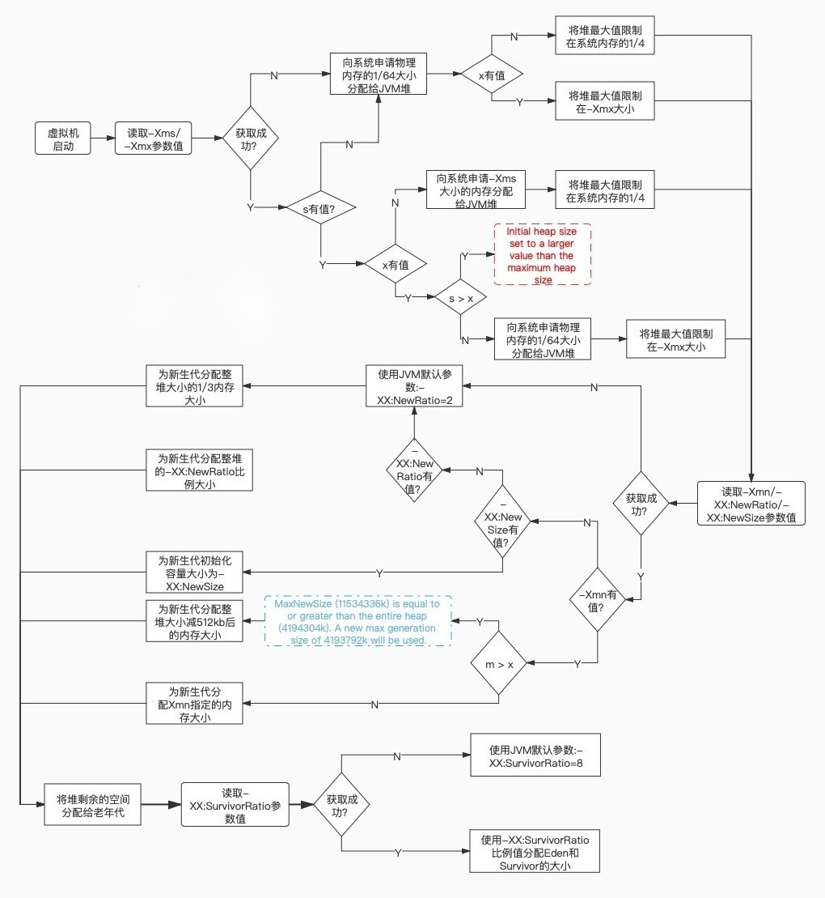

# 文档说明

本文档主要分享求职面试题。文档目前还在持续更新中，欢迎关注、收藏、点赞、加星喔😄O(∩_∩)O~。

同一个面试题往往会有很多种不同的问法，为了方便大家搜索，本文中面试题标题将尽量简洁，以涵盖同一面试题的不同问法。

| 文档名称     | 求职-面试题-JVM |
| ----------- | ------------- |
| 文档分类     | 求职-面试题     |
| 版本号       | 1.3            |
| 编制人       | Gem Shen       |
| 编制日期     | 2023-04-03     |
| 最后更新人    | Gem Shen       |
| 最后更新日期  | 2024-02-26    |

# JVM

1. 垃圾回收：
   - 垃圾回收的原理是什么？如何判断一个对象是否可以被回收？
   - 常见的垃圾回收算法有哪些？它们的特点和适用场景是什么？
   - 如何避免内存泄漏和内存溢出问题？
5. 性能调优：
   - JVM参数调优有哪些？如何选择合适的参数进行调优？
   - 如何监控JVM的性能指标？有哪些工具可以使用？
   - 如何进行代码优化以提升程序的性能？

## 架构和组成

### JVM、JRE、JDK的关系是？

关系：JDK 包含 JRE 包含 JVM。

**JVM**（Java虚拟机）是Java程序的运行环境，负责将Java字节码解释执行或编译成机器码。[详细介绍](#JVM是什么？它的作用？)

**JRE**（Java运行时环境）包含了运行Java程序所需的JVM和Java核心类库。

**JDK**（Java开发工具包）是Java开发人员用来开发Java程序的工具包，包含了JRE、编译器（javac）、调试器（jdb）等工具。JDK是JRE的扩展，除了JRE提供的运行环境，还提供了开发Java程序所需的工具和资源。

在开发Java程序时，需要安装JDK；在运行Java程序时，只需要安装JRE即可。

### JVM是什么？它的作用？

JVM（Java虚拟机）是Java程序运行的核心组件，它是一个能够执行Java字节码的虚拟机。JVM的主要作用包括以下几个方面：

1. 实现跨平台性：Java程序在编译后生成的是字节码文件，而不是特定平台的机器码。JVM负责将字节码文件解释或编译成特定平台的机器码，从而实现Java程序在不同平台上的运行。
2. 内存管理：JVM负责管理Java程序的内存，包括堆内存、栈内存、方法区（元空间）等。它提供自动内存管理机制，包括垃圾回收功能，用于回收不再使用的对象，防止内存泄漏和内存溢出问题。
3. 类加载机制：JVM负责加载、链接、初始化Java类和接口。它通过类加载器加载类文件，并在运行时动态链接和初始化类，实现Java程序的动态性和灵活性。
4. 执行字节码：JVM将字节码文件解释或编译成机器码，并执行程序逻辑。它提供了即时编译器（Just-In-Time Compiler，JIT）来优化字节码的执行，提升程序的执行效率。

总的来说，JVM作为Java程序的运行环境，扮演着解释、编译、执行、内存管理等多个角色，保证了Java程序的跨平台性、安全性和高性能。因此，JVM是Java程序运行的基础和核心组件。

### JVM的主要组成部分？

JVM（Java虚拟机）主要组成部分包括以下几个部分：

1. 类加载器（Class Loader）：
   - 功能：负责将class文件加载到内存中，并生成对应的Class对象。
   - 分为三个层次：启动类加载器、扩展类加载器和应用程序类加载器。
2. 运行时数据区（Runtime Data Area）：[详细介绍](#JVM运行时数据区)。
3. 执行引擎（Execution Engine），包括解释器和即时编译器
   - 解释器：将字节码逐条解释为机器码执行。
   - 即时编译器JIT（Just-In-Time Compiler）：将热点代码编译为本地机器码提高执行效率。
     - 根据代码的热度和执行频率进行编译优化，提高性能。
4. 垃圾收集器（Garbage Collector）：
   - 负责自动回收不再使用的对象，释放内存空间。
   - 采用不同的算法和策略进行垃圾回收，如标记-清除、复制、标记-整理等。

### JVM运行时数据区

**程序计数器（Program Counter Register）**

- 记录当前线程正在执行的字节码指令的地址。
- 线程私有，每个线程都有自己的程序计数器。
- 随着线程的执行，程序计数器会不断更新，指向下一条要执行的字节码指令。
- 例如：一个线程处理到一半，cpu跑去处理其他线程了，回来要靠pc中记录的上一次执行的指令位置继续处理。

**Java虚拟机栈（Java Virtual Machine Stack）**

- 一个线程对应一个虚拟机栈，线程每调用一个方法就会在栈中压入一个栈帧。方法返回时出栈。
- 每一个栈帧中都存储着：局部变量、操作数栈、动态链接、方法出口等信息。

**本地方法栈（Native Method Stack）**

- 与Java虚拟机栈类似，但用于存储本地方法（native method）的信息。

**堆（Heap）**

- 存储所有对象的实例和数组。
- 所有线程共享，是JVM中最大的内存区域。
- 垃圾收集器负责回收堆中不再使用的对象。

**方法区（Method Area）**

- 存储已加载的类信息、常量、静态变量等数据。
- 所有线程共享。
- 在Java 8及以后版本中，叫（Meta Space）元空间，8之前叫PermSpace。

**运行时常量池（Runtime Constant Pool）**

- 存储编译期生成的各种字面量和符号引用，包括整型、浮点型、字符串、类和接口的符号引用等。
- 运行时常量池和字符串常量池在Java 1.7及之前的版本中是同一个地方。它们都存储在方法区（Method Area）中。
- 从Java 1.8开始，字符串常量池从运行时常量池中分离出来，并移动到堆（Heap）中。

**直接内存（Direct Memory）**是Java 1.4版本引入的一个新的内存区域，它允许Java程序直接访问本机内存，而无需通过Java堆。这可以提高某些应用程序的性能。例如：在网络IO时，通过NIO使用。可以实现零拷贝。直接内存不是JVM运行时数据区规范的一部分，但它是一个重要的内存区域

### JVM类加载流程

详细介绍：

1. **加载（Loading）**：将类的字节码文件加载到内存中。在加载阶段，JVM会根据类的全限定名来定位并读取对应的字节码文件，通常是从磁盘或网络中加载。加载完成后，会生成一个代表该类的Class对象。
2. **验证（Verification）**：对加载的字节码进行验证，确保符合JVM规范和安全性要求。验证包括文件格式验证、元数据验证、字节码验证、符号引用验证等步骤，目的是保证字节码的正确性和安全性。
3. **准备（Preparation）**：为类的静态变量分配内存并设置默认初始值。在准备阶段，JVM会为类的静态变量（包括静态字段和静态常量）分配内存空间，并设置默认初始值（如0、null等）。
4. **解析（Resolution）**：将符号引用解析为直接引用。在解析阶段，JVM会将类、字段、方法等符号引用解析为直接引用，以便后续使用。解析过程可能会涉及动态链接、方法重写等操作。
5. **初始化（Initialization）**：执行类的初始化代码，包括静态变量赋值和静态代码块。在初始化阶段，JVM会执行类的静态代码块和静态变量赋值操作，完成类的初始化工作。只有在真正使用类时才会触发初始化操作。并不是JVM启动时就执行初始化的。

### 符合引用和直接引用

符号引用是一种符号化的引用，包含了类名、字段名、方法名等信息；而直接引用是直接指向内存地址的引用，指向实际的类、字段、方法等内存地址。

假设有一个类`Person`，其中定义了一个静态方法`sayHello()`，在另一个类`Main`中调用了`Person.sayHello()`方法。

1. **符号引用**：在编译阶段，编译器会生成符号引用，如`Person.sayHello()`。这个符号引用包含了类名和方法名，但并不包含具体的内存地址。
2. **直接引用**：在解析阶段，JVM将符号引用解析为直接引用。具体地，JVM会将`Person`类的符号引用解析为指向内存中`Person`类的实际地址，将`sayHello()`方法的符号引用解析为指向内存中该方法的实际地址。

通过解析符号引用为直接引用，JVM可以在运行时准确找到类、字段、方法等的实际内存地址，从而实现对类的动态加载和调用。

### JVM类加载器有哪些？

#### Bootstrap ClassLoader

启动类加载器（Bootstrap ClassLoader），负责加载JAVA_HOME中jre/lib/rt.jar里所有的class或Xbootclasspath选项指定的jar包。由C++实现，不是ClassLoader子类。无法直接在Java代码中获取引用

#### Extension ClassLoader

扩展类加载器（Extension ClassLoader），继承自ClassLoader类，负责加载java平台中扩展功能的一些jar包，包括JAVA_HOME中jre/lib/*.jar 或 -Djava.ext.dirs指定目录下的jar包。

#### App ClassLoader

应用程序类加载器（Application ClassLoader），继承自ClassLoader类，负责加载应用程序的类（即开发者自己编写的类）以及classpath中指定的jar包及-Djava.class.path 所指定目录下的类和jar包。

#### Custom ClassLoader

自定义类加载器，继承自ClassLoader类，开发者可以根据需要自定义类加载器，实现特定的加载逻辑。例如：动态加载、热部署等功能。

### 自定义类加载器应用场景

自定义类加载器在Java中有许多应用场景，以下是一些常见的场景及相应的例子：

1. **模块化系统**：自定义类加载器可以实现模块化系统，动态加载和卸载模块，实现更灵活的系统架构。例如，OSGi（Open Services Gateway Initiative）框架使用自定义类加载器来实现模块化开发。
2. **热部署和动态更新**：自定义类加载器可以实现热部署和动态更新功能，允许在应用程序运行时加载新的类文件。例如，Java应用服务器中的热部署功能，可以通过自定义类加载器实现。
3. **插件系统**：自定义类加载器可以实现插件系统，允许动态加载插件来扩展应用程序的功能。例如，Eclipse IDE的插件系统就使用了自定义类加载器。
4. **类隔离和安全沙箱**：自定义类加载器可以实现安全沙箱机制，控制哪些类可以被加载和执行。例如：在Tomcat和JBoss等应用服务器中，为了确保不同的Web应用程序（WAR文件）之间相互隔离，通常会使用自定义类加载器来加载每个Web应用程序的类文件，以防止类文件之间的冲突和干扰。还有Java安全管理器可以使用自定义类加载器来实现受控的类加载。
5. **动态代理**：自定义类加载器可以实现动态代理功能，动态生成代理类并加载到内存中。例如，Java动态代理和CGLIB库就使用了自定义类加载器。
6. **代码混淆和加密**：自定义类加载器可以实现类文件的混淆和加密，提高代码的安全性。例如，Android应用程序中的代码混淆工具ProGuard就可以使用自定义类加载器加载混淆后的类文件。

总的来说，自定义类加载器在Java中有许多应用场景，可以实现一些高级的类加载需求和功能扩展，提高程序的灵活性和安全性。通过灵活运用自定义类加载器，可以实现更多定制化和高级功能的需求。

### 双亲委派机制介绍

在加载一个类A的时候，会依照这个顺序：custom > app > ext > bootstrap，根据类的全限定性名，在每个加载器的缓存中是否已经有了，如果有了就直接返回，不会重复加载。如果所有的缓存中都没有，再从上往下，根据各自职责范围去找对应的加载器加载。这种加载机制就是双亲委派。如果最终还是没找到，那就会报ClassNotFoundException

#### 这么做的原因

主要是出于安全考虑，如果不这么做，存在核心类被人恶意篡改的可能。例如：如果有人写一个java.lang.String类。那么这个类就可能改变java.lang包这个类的默认行为。对整个JVM造成安全隐患或者说漏洞。

#### 如何打破

继承ClassLoader，覆盖loadClass方法。

### 简单介绍JIT

想要把高级语言转变成计算机认识的机器语言有两种方式，分别是编译和解释，虽然Java转成机器语言的过程中有一个步骤是要编译成字节码，但是，这里的字节码并不能在机器上直接执行。

JVM中内置了解释器(interpreter)，它负责在运行时对字节码进行解释翻译成机器码，然后再执行。

解释器的执行方式是一边翻译，一边执行，因此执行效率略低。为了解决这样的低效问题，HotSpot引入了JIT技术(Just-In-Time)。

有了JIT技术之后，当JVM发现某个方法或代码块运行时执行的特别频繁的时候，就会认为这是“热点代码”(Hot Spot Code)。然后JIT会把部分“热点代码”翻译成本地机器相关的机器码，并进行优化，然后再把翻译后的机器码缓存起来，以备下次使用。这样就大大提升了执行性能。

### JVM对象模型介绍

一个Java对象在内存中包括3个部分：对象头、实例数据和对齐填充。如下图：

#### 对象头

对象头(Object Header)是每个Java对象的固定部分。其结构一般情况下包含以下信息：

1. Class Metadata Address（类元数据地址）：指向对象所属类的元数据信息，包括类的类型、方法、字段等。
2. 数组长度：只有数组才有。
3. Mark Word（标记字）：主要记录锁状态，是否偏向锁，对象HashCode的值，分代年龄。部分字段的值会根据锁状态不同而不同。64位和32位也会不同。详见下图。
   1. 
   2. 

#### 实例数据

实例数据(Instance Data)：实例数据是对象的成员变量(字段)的实际存储区域，它包含了对象的各个字段的值。实例数据的大小取决于对象所包含的字段数量和字段类型。

#### 对齐填充

对齐填充(Padding)：对齐填充是为了使得对象的起始地址符合特定的对齐要求，以提高访问效率。由于虚拟机要求对象的起始地址必须是8字节的倍数(在某些平台上要求更大)，因此可能需要在对象的实例数据末尾添加额外的字节来对齐。

### JVM是如何创建对象的

1. 首先将去检查这个指令的参数是否能在常量池中定位到这个类的符号引用，并且检査这个符号引用代表的类是否已被加载过、解析和初始化过。如果没有，那必须先执行相应的类加载过程
2. 分配内存。JVM会在堆中为对象分配内存空间(无JIT优化情况下)。在HotSpot中，对象的内存分配有两种方式，分别是指针碰撞和空闲列表法。
   - 指针碰撞:当堆中的内存是连续的，IM使用一个指针来标记当前可用的内存位置，然后将指针向前移动分配对象所需的内存大小。
   - 空闲列表:当堆中的内存是离散的，JM会维护一个空闲列表，记录可用的内存块。在分配对象时JVM会遍历空闲列表，找到足够大小的内存块进行分配。
   - (分配内存解决并发有两种手段，一个是CAS+失败重试，一个是Thread Loca Allocation Buffer(TLAB))
3. 内存分配完成后，虚拟机需要将分配到的内存空间都初始化为零值，这一步确保了对象的字段在创建时都有默认值。如int被初始化为0，引用类型被初始化为null
4. 设置对象头。 该实例所对应的类、如何才能找到类的元数据信息、对象的哈希码、对象的 GC分代年龄，轻4.量级锁等等信息
   调用该类的构造方法，初始化对象。如按照程序员意愿进行赋值
5. 返回对象引用，当对象完成创建之后，返回一个该对象的引用，后续Java程序就可以使用这个引用来操作对象

### 字符窜常量池存在于什么位置？

## 垃圾回收

### 每个jdk版本的默认和推荐的垃圾回收器

以下是从 JDK 1.6 开始的每个长期支持版本的默认垃圾回收器和推荐的垃圾回收器：

1. JDK 1.6：
   - 默认垃圾回收器：Parallel Scavenge + Serial Old 收集器组合
   - 推荐的垃圾回收器：CMS 收集器
2. JDK 1.7：
   - 默认垃圾回收器：Parallel Scavenge + Serial Old 收集器组合
   - 推荐的垃圾回收器：CMS 收集器
3. JDK 1.8：
   - 默认垃圾回收器：Parallel Scavenge + Serial Old 收集器组合，也引入了 G1 垃圾回收器
   - 推荐的垃圾回收器：G1 垃圾回收器
4. JDK 9：默认和推荐垃圾回收器：G1 垃圾回收器
5. JDK 10：默认和推荐垃圾回收器：G1 垃圾回收器
6. JDK 11：默认和推荐垃圾回收器：G1 垃圾回收器
7. JDK 17：默认和推荐垃圾回收器：G1 垃圾回收器

### 垃圾回收器介绍

**串行垃圾回收器（Serial GC）**

- 单线程垃圾回收器，一次只处理一个 CPU 核心。
- 简单且易于实现，适用于小型应用程序或单核 CPU 系统。

**并行垃圾回收器（Parallel GC）**

- 多线程垃圾回收器，利用多核 CPU 的优势并行执行垃圾回收任务。
- 适用于具有大量可用内存和多核 CPU 的系统，目标是最大化应用程序吞吐量。

**并发标记清除垃圾回收器（CMS GC）**

- 并发垃圾回收器，在应用程序运行期间逐步执行垃圾回收任务，以减少暂停时间。
- 适用于具有大堆和低延迟要求的应用程序。

**G1 垃圾回收器**

- 基于标记-整理算法的多线程垃圾回收器，将堆划分为多个区域，并根据每个区域的收集历史和对象年龄进行垃圾回收。
- 适用于具有大堆和混合工作负载的应用程序，可以平衡吞吐量和延迟。

**ZGC（Z 垃圾回收器）**

- 低延迟垃圾回收器，使用并发标记和并行整理算法来实现近乎零的暂停时间。
- 适用于对延迟非常敏感的应用程序，例如金融交易系统和在线游戏。

### 垃圾回收算法介绍

垃圾回收算法：

1. 标记-清除

   第一遍扫描所有对象标记出可以回收的。第二遍将标记的对象清除。

   缺点：

   对象清除以后内存不连续会产生空间碎片

   标记和清除都比较耗时效率低

2. 标记-复制

   将内存划分为2块相等的区域，每次只使用其中一块。将存活的对象复制到另一块区域中，然后将原来的区域全部清除。

   优点：内存连续，不会有空间碎片。

   缺点：其中一块内存区域空间浪费了。

   适用于存活对象较少的场景。所以不适用于老年代。

3. 标记-压缩

   第一遍标记过程同标记-清除算法，标记完了之后将存活对象往空间一端移动，然后清理掉端边界之外的内存。

   优点：不会有空间浪费，内存连续

   缺点：移动对象需要额外开销

### 分代算法有哪些？

分代算法就是JVM内存分代模型。与其说它是算法，倒不是说它是一种策略，因为它是把上述几种算法整合在了一起。

这种算法整合了以上所有算法的优点，最大程度避免了它们的缺点。

老的垃圾回收器才分代，新的垃圾回收器很多都不分代。G1是逻辑分代，ZGC不分代。

分代算法将堆分成了新生代和老年代1：2，新生代有分成了Eden，S0，S1区，比例为：8：1：1。

在老年代使用的是标记整理算法；eden，s0，s1都是用的是标记复制算法

### GC中暂停时间和吞吐量的区别是？

**暂停时间：**

- 暂停时间是指 GC 停止应用程序执行以回收内存的时间段。
- 暂停时间越短，应用程序受到 GC 的影响就越小。
- 对于需要低延迟和高响应能力的应用程序（例如在线交易处理系统和游戏）来说，短的暂停时间至关重要。

**吞吐量：**

- 吞吐量是指 GC 在单位时间内回收内存的速率。
- 吞吐量越高，GC 就越能有效地回收内存，从而减少应用程序的内存占用。
- 对于需要处理大量数据的应用程序（例如大数据处理和机器学习）来说，高的吞吐量至关重要。

**区别：**

暂停时间和吞吐量是两个相互矛盾的目标：

- 为了减少暂停时间，GC 可能会牺牲吞吐量。
- 为了提高吞吐量，GC 可能会增加暂停时间。

因此，选择合适的 GC 算法时，需要在暂停时间和吞吐量之间进行权衡。

**示例：**

- **Concurrent Mark Sweep（CMS）垃圾回收器：**CMS 是一款并行垃圾回收器，具有较低的暂停时间，但吞吐量较低。它适用于需要低延迟的应用程序。
- **G1 垃圾回收器：**G1 是一款并行垃圾回收器，提供了可预测的暂停时间和较高的吞吐量。它适用于需要低延迟和高吞吐量的应用程序。
- **Parallel GC 垃圾回收器：**Parallel GC 是一款并行垃圾回收器，具有较高的吞吐量，但暂停时间较长。它适用于需要处理大量数据的应用程序。

**总结：**

- 暂停时间衡量 GC 对应用程序执行的影响，而吞吐量衡量 GC 回收内存的速率。
- 暂停时间和吞吐量是相互矛盾的目标，在选择 GC 算法时需要进行权衡。

### G1优缺点和适用场景

**优点：**

- **并行性和可预测性：**G1 是一款并行垃圾回收器，可以利用多核 CPU 的优势。它还提供了可预测的暂停时间，这对于需要低延迟的应用程序非常重要。
- **分代收集：**G1 采用分代收集算法，将堆划分为年轻代和老年代。年轻代中的对象存活时间较短，而老年代中的对象存活时间较长。G1 主要在年轻代进行垃圾回收，从而减少了对老年代的Full GC。
- **增量式标记：**G1 使用增量式标记算法，在后台并行地标记存活对象。这减少了标记阶段的暂停时间。
- **混合回收：**G1 可以根据堆的使用情况和应用程序的特性，在年轻代和老年代之间进行混合回收。这有助于优化垃圾回收的性能。
- **大堆支持：**G1 非常适合大堆，因为它可以有效地管理大型数据集。

**缺点：**

- **内存开销：**G1 需要额外的内存开销来维护其数据结构，例如 remembered set 和卡表。
- **复杂性：**G1 是一款复杂的垃圾回收器，需要仔细配置才能获得最佳性能。
- **吞吐量：**G1 的吞吐量可能低于其他垃圾回收器，例如 Parallel GC。

**适用场景：**

G1 垃圾回收器适用于以下场景：

- **需要低延迟的应用程序：**G1 的可预测暂停时间使其成为需要低延迟的应用程序的理想选择，例如在线交易处理系统和游戏。
- **大堆应用程序：**G1 非常适合管理大堆，因为它可以有效地处理大型数据集。
- **混合工作负载：**G1 可以根据堆的使用情况和应用程序的特性，在年轻代和老年代之间进行混合回收。这使其适用于具有混合工作负载的应用程序，例如既有短期又有长期存活的对象。
- **云环境：**G1 适用于云环境，因为它可以利用云平台提供的弹性资源。

### 判断对象能够进行GC回收的条件

引用计数

统计一个对象被强引用的次数，如果为0就是垃圾，可回收。但这种方式会有循环引用的问题JVM没有采用。

可达性分析

如果一个对象无法往上追溯到GC Root引用点的就是垃圾。

哪些可以作为GC Root引用点：

JVM stack中引用的对象 

方法区中静态引用指向的对象

方法区中常量引用指向的对象

Native方法中JNI引用指向的对象

Thread-活着的线程

### 垃圾回收器之间的比较

| 垃圾回收器        | 优点                                                 | 缺点                             | 适用场景                                 |
| ----------------- | ---------------------------------------------------- | -------------------------------- | ---------------------------------------- |
| **G1**            | 并行、可预测的暂停时间、分代收集、混合回收、大堆支持 | 内存开销、复杂性、吞吐量可能较低 | 需要低延迟、大堆、混合工作负载的应用程序 |
| **Parallel GC**   | 高吞吐量                                             | 长暂停时间                       | 需要高吞吐量、大堆的应用程序             |
| **CMS GC**        | 低暂停时间                                           | 吞吐量较低、内存开销大           | 需要低延迟、小堆的应用程序               |
| **Shenandoah GC** | 低暂停时间、低内存开销                               | 吞吐量可能较低、复杂性高         | 需要低延迟、大堆的应用程序               |
| **ZGC**           | 超低暂停时间、高吞吐量                               | 复杂性高、实验性                 | 需要超低延迟、大堆的应用程序             |

### GC log分析方法？

https://www.cnblogs.com/qlqwjy/p/7929414.html

### 内存泄露和内存溢出的区别和联系

内存泄漏很容易导致内存溢出，但内存溢出不一定是内存泄漏导致的

内存泄漏是指不再使用的对象无法得到及时的回收，持续占用内存空间，从而造成内存空间的浪费。

### 请说下JDK的引用分类

+ 强引用，默认引用，只要gcroot可达，就不会被回收，会导致泄漏。
+ 软引用，只要发生GC且内存不足时，就会回收软引用对象
+ 弱引用，无论内存是否足够，只要 JVM 开始进行垃圾回收，那些被弱引用关联的对象都会被回收
+ 虚引用，一般很少使用。

### Minor GC和full GC分别在什么时候发生

#### minor GC

对象刚创建时，如果Eden区空间不足则会触发minor GC

#### major GC

Major GC在很多参考资料中是等价于 Full GC 的。精确的讲：Major GC不包括元空间垃圾回收

#### Full GC

一次 Full GC 将会对年轻代、老年代、元空间以及堆外内存进行垃圾回收

触发Full GC的原因：

当老年代空间不足时

当老年代的空间使用率超过某阈值时

当元空间不足时（JDK1.7永久代不足）

当调用 System.gc() 也会安排一次 Full GC。

## JVM调优

### JVM调优工具使用介绍

JVM调优工具的主要关注点分三块：jvm信息，CPU，内存，线程。

基本除了内存之外，推荐使用：arthas，[arthas官网使用说明](https://arthas.aliyun.com/doc/)

arthas的优势：无需额外配置java端口，直接在服务器在线安装上执行。

- jvm信息使用jvm命令
- 线程信息使用thread命令，
  - 使用thread -b 显示当前阻塞其他线程的线程
  - thread -n 3：展示当前最忙的前3个线程并打印堆栈
  - thread id：显示指定线程id的运行堆栈
- CPU信息可以使用profile命令生成热力图
- 内存信息可以使用memory命令
  - 这个命令无法显示哪个对象占用内存较大
  - 可以使用heapdump或者jmap命令导出内存dump文件。
  - [分析dump文件的工具](#分析dump文件的工具)
- 方法执行监控
  - watch
  - trace。

### JVM的参数介绍与作用

#### 标准参数

不会随着JDK版本变化而变化，例如：

- **-version**：显示 JVM 版本。
- **-cp**：设置类路径。
- **-D**：设置系统属性。
- **-help**：显示帮助

#### -X参数

非标准参数，也就是在JDK各个版本中可能会变动

- **-Xdebug**：启用远程调试。
- **-Xint**：禁用 JIT 编译器，
- **-Xcomp**：启用 JIT 编译器，并强制所有 Java 字节码在类加载时编译为本地代码。这通常用于提高性能，因为本地代码比解释执行更快。
- **-Xmixed**：启用 JIT 编译器，但只编译那些经常执行的 Java 字节码。这是一种折衷方案，它提供了解释执行的灵活性，同时还提高了经常执行代码的性能。

#### -XX参数

使用得最多的参数类型。非标准化参数，相对不稳定，主要用于JVM调优和Debug  

a.Boolean类型
格式：-XX:[+-]<name> +或-表示启用或者禁用name属性
比如：-XX:+UseConcMarkSweepGC 表示启用CMS类型的垃圾回收器
-XX:+UseG1GC 表示启用G1类型的垃圾回收器

b.非Boolean类型
格式：-XX<name>=<value>表示name属性的值是value
比如：-XX:MaxGCPauseMillis=500

#### 其他参数

这块也相当于是-XX类型参数的简化版

-Xms 1000M 等价于-XX:InitialHeapSize=1000M

-Xmx 1000M 等价于-XX:MaxHeapSize=1000M

-Xss 100 等价于-XX:ThreadStackSize=100k

G1垃圾回收器哪些参数要调整？

**G1 垃圾回收器需要调整的常见参数及其默认值和建议的值：**

| 参数                                   | 默认值           | 建议值                | 描述                                                     |
| -------------------------------------- | ---------------- | --------------------- | -------------------------------------------------------- |
| **-XX:MaxGCPauseMillis**               | 200毫秒          | 100-200 毫秒          | 设置垃圾收集的最大暂停时间目标。                         |
| **-XX:ConcGCThreads**                  | （逻辑内核数）/2 | （逻辑内核数）/2      | 设置并发标记周期的线程数。                               |
| **-XX:G1HeapRegionSize**               | 1MB              | 年轻代大小的 2-4 倍   | 设置 Eden 空间的大小。                                   |
| **-XX:G1NewSizePercent**               | 5%               | 5-20%                 | 设置年轻代在堆中的百分比。                               |
| **-XX:G1MaxNewSizePercent**            | 60%              | 年轻代大小的 100-150% | 设置年轻代在堆中的最大百分比。                           |
| **-XX:G1MixedGCCountTarget**           | 4                | 4-8                   | 设置在触发混合垃圾收集之前要执行的年轻代垃圾收集的次数。 |
| **-XX:G1MixedGCLiveThresholdPercent**  | 80%              | 60-80%                | 设置混合垃圾收集期间存活对象的百分比阈值。               |
| **-XX:G1RSetUpdatingPauseTimePercent** | 92%              | 90-99%                | 设置引用集更新暂停时间的百分比阈值。                     |

**其他可能需要调整的参数：**

| 参数                            | 默认值 | 建议值 | 描述                                                         |
| ------------------------------- | ------ | ------ | ------------------------------------------------------------ |
| **-XX:+UseAdaptiveSizePolicy**  | 禁用   | 启用   | 启用自适应大小策略，该策略会根据应用程序的行为动态调整垃圾收集参数。 |
| **-XX:G1ReservePercent**        | 0%     | 10-20% | 保留一部分堆空间以避免碎片。                                 |
| **-XX:+ParallelRefProcEnabled** | 禁用   | 启用   | 启用并行引用处理，这可以提高垃圾收集的吞吐量。               |

### 导出dump文件分析问题的使用场景

导出 dump 文件可以分析以下类型的错误，这些错误通常难以通过打印日志来排查：

- **内存泄漏：**打印日志通常无法提供有关内存泄漏的足够信息。dump 文件包含有关堆中所有活动对象的详细信息，这有助于识别导致内存泄漏的对象。
- **死锁：**打印日志可能无法显示导致死锁的线程和锁的完整图片。dump 文件包含有关线程状态和锁的信息，这有助于识别导致死锁的根本原因。
- **复杂的对象引用问题：**打印日志可能无法显示导致对象引用问题（例如循环引用）的完整引用链。dump 文件包含有关对象引用的详细信息，这有助于识别导致引用问题的复杂引用链。
- **本机内存问题：**打印日志通常无法提供有关本机内存使用情况的信息。dump 文件包含有关本机内存分配和使用的信息，这有助于识别本机内存泄漏或其他问题。
- **间歇性错误：**打印日志可能无法捕获间歇性错误，因为这些错误可能不会在应用程序运行期间持续发生。dump 文件可以提供有关应用程序状态的快照，这有助于诊断间歇性错误。

### 正式环境CPU100%，如何排查和解决问题

面对这样的问题，作为面试者，需要展示出系统性的思考和解决问题的能力。以下是一个结构化的回答方式：

#### 1. 初步分析

- **确认问题范围**：首先，我会确认问题的范围，了解CPU100%的持续时间、发生频率以及是否有特定的触发条件。
- **查看监控数据**：通过系统监控工具（如Nagios、Zabbix等）回顾问题发生前后的CPU使用率、内存、IO等相关指标的变化，以帮助定位问题。

#### 2. 详细排查

- **使用top命令**：通过`top`命令查看CPU使用率最高的进程，可以用`top -H`查看线程级的CPU使用情况。按c可以显示命令路径。键入P (大写p)，进程会按照CPU使用率排序。
- **使用pidstat和mpstat**：`pidstat`可以用来观察单个或多个进程的CPU使用情况（pidstat -u -p 12345），`mpstat`则可以查看各个CPU核心的使用情况，帮助判断是否有CPU亲和性（affinity）问题。
  - 注意：`pidstat`和`mpstat`是Linux系统上的性能监控工具，通常需要单独安装。这两个工具通常包含在`sysstat`软件包中。使用yum安装：`sudo yum install sysstat`
- **分析Java应用**：如果是Java应用导致的高CPU，可以使用arthas的dashboad或者tread命令查看具体是哪个线程占用cpu高。
  - thread -n 3：展示当前最忙的前3个线程并打印堆栈。
  - 然后使用 thread [线程id] 就可以看到代码堆栈了。还可以使用trace命令来统计每一部分的执行时间。
  - 

#### 3. 问题解决

- **代码优化**：如果定位到具体的代码问题，比如无限循环、过度的锁竞争等，需要进行代码层面的优化。
- **资源调整**：如果是由于资源不足导致的问题，考虑增加服务器的CPU资源，或者通过负载均衡等方式分散请求压力。
- **配置调整**：检查Java虚拟机（JVM）的配置，优化GC策略和内存设置，减少GC导致的CPU负载。

#### 4. 防范措施

- **监控预警**：加强系统监控，设置合理的预警阈值，确保在问题发生之前能够得到预警。
- **性能测试**：在上线前进行充分的性能测试，确保系统能够承受预期的负载。
- **容量规划**：定期进行容量规划，根据业务增长趋势调整系统资源。

#### 5. 沟通和记录

- **沟通**：在处理过程中，及时与团队成员沟通进展情况，确保所有相关人员都了解问题状态。
- **文档记录**：问题解决后，详细记录问题的成因、解决过程和未来的预防措施，为未来遇到类似问题提供参考。

通过这样的回答，你不仅展示了你的技术能力，也展示了你的问题解决、沟通和文档记录能力。

 

### 正式环境的内存溢出，如何排查和解决？

面对正式环境Java进程内存溢出（OutOfMemoryError）的问题，排查和解决步骤可以分为以下几个阶段：

#### 1. 确认内存溢出

首先，确认系统是否真的发生了内存溢出。可通过查看错误日志或监控系统来确认是否出现了`OutOfMemoryError`。如果是，需要记录下溢出时的详细错误信息以及系统的运行状态。

#### 2. 收集信息

- **生成堆转储（Heap Dump）文件**：在JVM发生内存溢出时，可以通过配置JVM参数来自动生成堆转储文件，如使用`-XX:+HeapDumpOnOutOfMemoryError`参数。这个文件包含了内存溢出时的Java堆信息，是分析内存溢出原因的重要依据。
- **收集GC日志**：通过配置JVM参数来开启GC日志，如`-Xloggc:<file-path>`。GC日志记录了垃圾收集的详细信息，可以帮助分析内存使用情况和垃圾收集行为。
- **系统监控数据**：收集系统运行期间的监控数据，如CPU使用率、内存使用情况、线程数等，这有助于从宏观上分析系统状态。

#### 3. 分析原因

- **使用堆分析工具**：利用MAT（Memory Analyzer Tool）、VisualVM、JProfiler等工具分析堆转储文件。通过这些工具可以找到内存中对象的分布、大对象、内存泄露路径等关键信息。
- **分析GC日志**：通过GC日志分析工具（如GCViewer、GCEasy）来分析GC行为，了解内存分配与回收情况，识别是否存在频繁的Full GC、长时间的GC暂停等问题。
- **代码审查**：结合分析结果，回顾相关代码逻辑，特别是那些创建大量对象、使用了缓存、单例以及静态变量的地方，检查是否有内存泄露或不合理的内存使用模式。

#### 4. 解决方案

- **修复代码**：根据分析结果，修复内存泄露或不当的内存使用逻辑。可能包括但不限于优化数据结构的使用、修复缓存逻辑、优化算法减少内存占用等。
- **调整JVM参数**：根据应用的实际需要调整JVM堆大小、新生代与老年代的比例、垃圾收集器的选择等参数，以优化内存使用和垃圾收集效率。
- **资源清理**：确保在适当的时机进行资源释放，比如关闭文件流、数据库连接等。

#### 5. 防范措施

- **引入内存监控**：定期监控内存使用情况，提前发现潜在的内存问题。
- **代码质量控制**：加强代码审查，特别是对于那些容易引起内存问题的代码部分。
- **性能测试**：在发布前进行充分的性能测试，包括压力测试、长时间运行测试等，以发现并解决潜在的性能和内存问题。

通过上述步骤，可以系统地排查和解决Java进程内存溢出的问题。重要的是要建立起一套有效的内存问题预防和应对机制，减少内存溢出对正式环境的影响。

### kill -9对Java进程会有什么影响？

kill  -9 命令会立刻关闭Jvm进程。但是kill  -9的语意是强制关闭，会导致在jvm中执行的服务立刻关闭，来不及收尾。例如：导致java进程无法导出dump文件（如果配了的话），导致事务执行一半直接终止等等。

推荐使用kill -15命令来结束java进程。kill命令默认的信号就是15，当使用kill -15时，系统会发送一个SIGTERM的信号给应用程序。当程序接收到该信号后，具体要如何处理是自己可以决定的。这时候，应用程序可以选择：立即停止程序，释放响应资源后停止程序，忽略该信号，继续执行程序。

### 项目中的实际调优案例

以下是一些项目案例，大家可以结合自己的项目经验多准备几个。

案例一：同事在工作中写了类似while(true)的代码导致程序资源耗尽。

源代码是while(a==10)，这个a是另一个方法的返回值，这个判断是之前的老代码。同事改的就是返回a值的方法。他一直以为是他自己写的方法有问题。所以一直没查到是这段老代码有问题。

将项目重新启动之后使用arthas thread命令很快就发现一个线程一直是runnable。，cpu运行状态101.55%

然后用thread 线程id 命令看到异常堆栈。定位到具体的代码行数，然后就猜到a可能被改成了10，所以进入了这个分支

如果通过线程没有观察出异常线程，可以通过自动或者手动的方法导出dump文件，然后用jvisualvm.exe载入分析。可以看到某些类的实例会特别多。

案例2：定时任务偶发性卡死。

某一个程序的定时任务，每到晚上就会偶发性的卡死，就是程序执行到某个地方不动了。使用arthus的trace命令定位到了具体的某一行方法调用时间超长，然后这个方法是调用另外系统的一个查询接口，可能是这个接口的性能存在问题，程序会执行很长时间执行不出来。发这个报告发给他们后，他们就去改好了。

