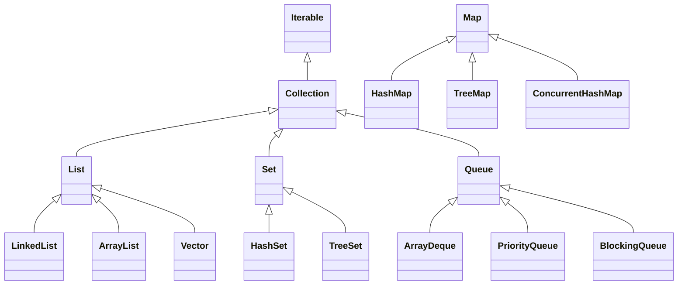

# 求职-面试题-Java核心

# 数据结构


## 字符

### String有长度限制么？

有，编译期和运行期不一样。

编译期需要用CONSTANT-UTF8-info 结构用于表示字符串常量的值，而这个结构是有长度限制，他的限制是65535。

运行期，String的length参数是Int类型的，那么也就是说，String定义的时候，最大支持的长度就是int的最大范围值。根据Integer类的定义，java.lang.Integer#MAX_VALUE的最大值是2^31^-1;


### String、StringBuilder、StringBuffer的区别?

典型回答

String是不可变的，StringBuilder和StringBuffer是可变的。而StringBuffer是线程安全的，而StringBuilder是非自线程安全的。


### String“+”的实现

使用+拼接字符串，其实只是Java提供的一个语法糖，那么他的内部原理是如何实现的?

这样一段代码。我们把他生成的字节码进行反编译，看看结果。

```java
String a = "123";
String b = "456";
String c = a +"."+ b;

//使用jad的反编译结果
String a = "123";
String b = "456";
String c = (new stringBuilder()).append(a).append(",").append(b).tostring();
```

通过反编译，我们可以发现，字符串常量在拼接过程中，是将String转成了StringBuilder后，使用其append方法进行处理的。


## 数字

### BigDecimal的equals方法不建议等值比较?

BigDecimal的equals方法和compareTo并不一样，equals方法会比较两部分内容，分别是值(value)和标度(scale)，而对于0.1和0.10这两个数字，使用equals比较的时候会返回false。因为他们的值一样，但是精度不一样。


### BigDecimal的构造方法建议使用哪个？

推荐使用String构造BigDecimal，禁止使用double创建BigDeciaml。

因为double是不精确的，所以使用一个不精确的数字来创建BigDeciaml，得到的数字也是不精确的。如0.1这个数字，double只能表示他的近似值

所以，主当我们使用new BigDecimal(0.1)创建一个BigDecimal 的时候，其实创建出来的值并不是正好等于0.1的。

而是0.1000000000000000055511151231257827021181583404541015625。这是因为double自身表示的只是一个近似值。

当我们使用new BigDecimal("0.1")创建一个BigDecimal 的时候，其实创建出来的 而对于BigDecimal(String)，值正好就是等于0.1的。
那么他的标度也就是1


## 集合

### Java中集合类介绍

常见集合类结构图



**Set**

TreeSet是二叉树实现的，TreeSet中的数据是自动排好序的，不允许放入nul值，底层基于TreeMap。

HashSet是哈希表实现的，HashSet中的数据是无序的，可以放入nul，但只能放入一个null，两者中的值都不能重复，就如数据库中唯一约束;底层基于HashMap

**Deque**

ArrayDeque：ArrayDeque也实现了Queue接口，是一个基于数组实现的双端队列（double-ended queue）。ArrayDeque在插入和删除元素时的效率比LinkedList更高。适用于栈和队列的应用以及需要高效的插入和删除操作的场景，例如生产者-消费者模式。

PriorityQueue：PriorityQueue是一个基于优先级堆的队列实现，它不是严格意义上的先进先出队列，而是根据元素的优先级进行排序。

PriorityQueue可以根据自定义的比较器来确定元素的优先级顺序。适用于需要按照一定优先级顺序处理元素的场景，例如任务调度等。


### 集合的排序方式

1. 调用Collections.sort(list)方法，然后List中的实体类实现实现Comparable接口。

2. 调用Collections.sort(list, Comparator)方法，通过lambda表达式。例如：`Collections.sort(list, (a, b) -> { ... })` 

   1. 这种方式还可以通过Comparator.comparing来构建Comparator。

   2. ```java
      List<Employee> employees = List.of(
          new Employee("John", 30),
          new Employee("Alice", 25),
          new Employee("Bob", 35),
          new Employee("John", 28)
      );
      
      Comparator<Employee> comparator = Comparator.comparing(Employee::getName)
          .thenComparing(Employee::getAge);
      
      Collections.sort(employees, comparator);
      
      // 输出：
      // [Employee{name='Alice', age=25}, Employee{name='Bob', age=35}, Employee{name='John', age=28}, Employee{name='John', age=30}]
      ```

3. list自己也有sort方法。例如： `list.sort((a, b) -> { ... })` 方法。


### 如何在循环中移除集合元素

**1. 使用迭代器**

使用 `Iterator` 遍历列表，并在需要时使用 `remove()` 方法删除元素。

```java
List<String> list = new ArrayList<>();
list.add("apple");
list.add("banana");
list.add("cherry");

Iterator<String> iterator = list.iterator();
while (iterator.hasNext()) {
    String fruit = iterator.next();
    if (fruit.equals("banana")) {
        iterator.remove();
    }
}

System.out.println(list); // 输出：[apple, cherry]
```


**2. 使用 `removeIf()` 方法 (Java 8+)**

`removeIf()` 方法接受一个 `Predicate`，并删除列表中所有满足该谓词的元素。

```java
List<String> list = new ArrayList<>();
list.add("apple");
list.add("banana");
list.add("cherry");

list.removeIf(fruit -> fruit.equals("banana"));

System.out.println(list); // 输出：[apple, cherry]
```


**3. 使用ConcurrentHashMap或CopyOnWriteArrayList**

```java
// 使用 ConcurrentHashMap
ConcurrentHashMap<String, Integer> map = new ConcurrentHashMap<>();
map.put("apple",  1);
map.put("banana", 2);
map.put("cherry", 3);

map.forEach((key, value) -> {
    if (key.equals("banana")) {
        map.remove(key);
    }
});

System.out.println(map); // 输出：{apple=1, cherry=3}

// 使用 CopyOnWriteArrayList
CopyOnWriteArrayList<String> list = new CopyOnWriteArrayList<>();
list.add("apple");
list.add("banana");
list.add("cherry");

list.forEach(fruit -> {
    if (fruit.equals("banana")) {
        list.remove(fruit);
    }
});

System.out.println(list); // 输出：[apple, cherry]
```


**4. 使用 Stream 删除元素**

可以使用 `Stream` 的 `filter()` 方法删除元素，该方法接受一个 `Predicate`，并返回一个只包含满足该谓词的元素的新流。然后，可以使用 `collect()` 方法将新流收集到一个新的列表中。

```java
List<String> list = new ArrayList<>();
list.add("apple");
list.add("banana");
list.add("cherry");

List<String> newList = list.stream()
    .filter(fruit -> !fruit.equals("banana"))
    .collect(Collectors.toList());

System.out.println(newList); // 输出：[apple, cherry]
```

**注意事项：**

- `filter()` 方法不会修改原始列表，它会创建一个新的流。
- `collect()` 方法会创建一个新的列表。


### HashMap的底层结构

[HashMap底层最全分析](https://blog.csdn.net/weixin_44141495/article/details/108327490)

HashMap在不同的Jdk版本的实现原理是不一样的。

JDK1.7的时候使用的是数组+ 单链表的数据结构。


在JDK1.8及之后时，使用的是数组+链表+红黑树的数据结构（当链表的深度达到8的时候，也就是默认阈值，就会自动扩容把链表转成红黑树的数据结构来把时间复杂度从O(n)变成O(logN)提高了效率）


put流程如下：

①.判断键值对数组table[]是否为空或为null，否则执行resize()进行扩容；

②.根据键值key计算hash值得到插入的数组索引i，如果table[i]==null，直接新建节点添加，转向⑥，如果 table[i]不为空，转向③；

③.判断table[i]的首个元素是否和key一样，如果相同直接覆盖value，否则转向④，这里的相同指的是hashCode以及equals；

④.判断table[i] 是否为treeNode，即table[i] 是否是红黑树，如果是红黑树，则直接在树中插入键值对，否则转向⑤；

⑤.遍历table[i]，判断链表长度是否大于8，大于8的话把链表转换为红黑树，在红黑树中执行插入操作，否则进行链表的插入操作；遍历过程中若发现key已经存在直接覆盖value即可；

⑥.插入成功后，判断实际存在的键值对数量size是否超多了最大容量threshold，如果超过，进行扩容。


### HashMap1.8与1.7区别

[参考答案](https://blog.csdn.net/weixin_44141495/article/details/108402128)


### 只重写equals不重写hashcode会有什么问题？


## 数组

### Arrays.sort()用的什么排序

sort()方法采用了一种自适应排序算法，会根据待排序数组的长度和元素类型选择最适合的排序算法，以提高排序的效率和性能。

在JDK8中

数组长度为n，则1 <= n < 47 使用插入排序，插入排序在小型数据集上的效率比较高

数组长度为n，则47 <= n < 286 使用使用快速排序

数组长度为n，则286 > n 使用归并排序或快速排序（有一定顺序使用归并排序，毫无顺序使用快排）

https://blog.csdn.net/yuanchangliang/article/details/107755756


## 链表

### 链表和数组的区别及应用

在Java中，链表（LinkedList）和数组（Array）是两种不同的数据结构，它们有以下区别：

1. 内存分配方式：
   - 数组在内存中是连续存储的，元素的访问速度较快，但大小固定，无法动态扩展。
   - 链表的节点在内存中可以是不连续的，通过指针将节点连接起来，可以动态增加或删除节点。
2. 插入和删除操作：
   - 数组的插入和删除操作可能会涉及元素的移动，时间复杂度为O(n)。
   - 链表的插入和删除操作只需要修改指针指向，时间复杂度为O(1)。
3. 随机访问：
   - 数组支持随机访问，可以通过下标直接访问元素，时间复杂度为O(1)。
   - 链表不支持随机访问，需要从头节点开始遍历到目标位置，时间复杂度为O(n)。
4. 空间占用：
   - 数组在内存中会占用一块连续的空间，需要预先分配固定大小的空间。
   - 链表的节点可以在内存中分散存储，不需要预先分配固定大小的空间。


### 判断链表是否有环

思路

 如果一个链表无环，那么遍历链表一定可以遇到链表的终点；如果链表有环，那么遍历链表就永远在环内转下去。具体如下：

 1.设置快慢指针分别为fast和slow。开始，slow和fast都指向链表的头节点head。然后slow每次移动一步，fast每次移动两部，在链表中遍历。

 2.如果链表无环，fast指针在移动过程一定先遇到终点，直接返回null，表示链表无环。

 3.如果有环，fast和slow一定在环中相遇。相遇时，fast重新回到head位置，slow不动。接下来，fast指针每次移动一步，slow依然每次移动一步，继续遍历。

 4.fast和slow指针一定会再次相遇，并在第一个入环的节点处相遇，证明略。

```java
public Node getLoopNode(Node head){
    if (head == null || head.next == null || head.next.next == null){
        return null;
    }
    Node n1 = head.next; //n1 -> slow
    Node n2 = head.next.next; // n2 -> fast
    while (n1 != n2){
        if (n2.next == null || n2.next.next == null){
            return null;
        }
        n2 = n2.next.next;
        n1 = n1.next;
    }
    n2 = head; // n2 -> walk again from head
    while (n1 != n2){
        n1 = n1.next;
        n2 = n2.next;
    }
    return n1;
}
```


# IO


# 异常

## 对象

### Throwable,Exception,Error,RuntimeException


## 处理

### finally中的代码一定执行么？

通常情况下，finally的代码被执行的前提是：

1、对应 try 语句块被执行,
2、程序正常运行。

如果没有符合这两个条件的话，finally中的代码就无法被执行，如发生以下情况，都会导致finally不会执行

1、System.exit()方法被执行
2、Runtime.getRuntime().halt()方法被执行
3、try或者catch中有死循环
4、操作系统强制杀掉了JM进程，如执行了kil -9
5、其他原因导致的虚拟机崩溃了
6、虚拟机所运行的环境挂了，如计算机电源断了
7、如果一个finally是由守护线程执行的，那么是不保证一定能执行的，如果这时候JM要退出，JM会检查其他非守护线程，如果都执行完了，那么就直接退出了。这时候finally可能就没办法执行完。


### try、catch、finally中都有return

例如：try中return A，catch中return B， finally中return c，最终返回值是什么?

最终的返回值将会是C!

finally块总是在try和catch块之后执行，无论是否有异常发生。如果finally块中有一个return语句，它将覆盖try块和catch块中的任何return语句。


