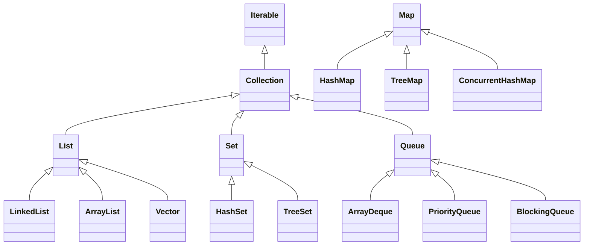

# 文档说明

本文档主要分享求职面试题。文档目前还在持续更新中，欢迎关注、收藏、点赞、加星喔😄O(∩_∩)O~。

同一个面试题往往会有很多种不同的问法，为了方便大家搜索，本文中面试题标题将尽量简洁，以涵盖同一面试题的不同问法。

| 文档名称     | 求职-面试题-Java基础 |
| ------------ | -------------------- |
| 文档分类     | 求职-面试题          |
| 版本号       | 1.3                  |
| 创建人       | Gem Shen             |
| 创建日期     | 2023-07-07           |
| 最后更新人   | Gem Shen             |
| 最后更新日期 | 2024-02-26           |


# 对象结构

## 字符

### String有长度限制么？

有，编译期和运行期不一样。

编译期需要用CONSTANT-UTF8-info 结构用于表示字符串常量的值，而这个结构是有长度限制，他的限制是65535。

运行期，String的length参数是Int类型的，那么也就是说，String定义的时候，最大支持的长度就是int的最大范围值。根据Integer类的定义，java.lang.Integer#MAX_VALUE的最大值是2^31^-1;


### String、StringBuilder、StringBuffer的区别?

典型回答

String是不可变的，StringBuilder和StringBuffer是可变的。而StringBuffer是线程安全的，而StringBuilder是非自线程安全的。


### String“+”的实现

使用+拼接字符串，其实只是Java提供的一个语法糖，那么他的内部原理是如何实现的?

这样一段代码。我们把他生成的字节码进行反编译，看看结果。

```java
String a = "123";
String b = "456";
String c = a +"."+ b;

//使用jad的反编译结果
String a = "123";
String b = "456";
String c = (new stringBuilder()).append(a).append(",").append(b).tostring();
```

通过反编译，我们可以发现，字符串常量在拼接过程中，是将String转成了StringBuilder后，使用其append方法进行处理的。


## 数字

### 为什么不建议用浮点数表示金额

因为不是所有的小数都能用二进制表示，所以为了解决这个问题，IEEE提出了一种使用近似值表示小数的方式，并且引入了精度的概念。这就是我们所熟知的浮点数。

比如0.1+0.2 != 0.3，而是等于0.300000000000000044。甚至有一个网站就叫做https://0.30000000000000004.com/，就是来解释这个现象的)

所以浮点数只是近似值，并不是精确值，所以不能用来表示金额。否则会有精度丢失

在Java中，使用float表示单精度浮点数，double表示双精度浮点数，表示的也都是近似值

所以，在Java代码中，千万不要使用foat或者double来进行高精度运算，尤其是金额运算，否则就很容易产生资损问题。

为了解决这样的精度问题，Java中提供了BigDecimal来进行精确运算。


### BigDecimal的equals方法不建议等值比较?

BigDecimal的equals方法和compareTo并不一样，equals方法会比较两部分内容，分别是值(value)和标度(scale)，而对于0.1和0.10这两个数字，使用equals比较的时候会返回false。因为他们的值一样，但是精度不一样。


### BigDecimal的构造方法建议使用哪个？

推荐使用String构造BigDecimal，禁止使用double创建BigDeciaml。

因为double是不精确的，所以使用一个不精确的数字来创建BigDeciaml，得到的数字也是不精确的。如0.1这个数字，double只能表示他的近似值

所以，主当我们使用new BigDecimal(0.1)创建一个BigDecimal 的时候，其实创建出来的值并不是正好等于0.1的。

而是0.1000000000000000055511151231257827021181583404541015625。这是因为double自身表示的只是一个近似值。

当我们使用new BigDecimal("0.1")创建一个BigDecimal 的时候，其实创建出来的 而对于BigDecimal(String)，值正好就是等于0.1的。
那么他的标度也就是1


## 集合

### Java中集合类介绍

常见集合类结构图



**Set**

HashSet

基于哈希表实现的，HashSet中的数据是无序的，可以放入nul，但只能放入一个null，两者中的值都不能重复，就如数据库中唯一约束;底层基于HashMap

TreeSet

基于二叉树实现的，TreeSet中的数据是有序的且自动排好序，不允许放入nul值，底层基于TreeMap。


**Deque**

ArrayDeque

ArrayDeque也实现了Queue接口，是一个基于数组实现的双端队列（double-ended queue）。ArrayDeque在插入和删除元素时的效率比LinkedList更高。适用于栈和队列的应用以及需要高效的插入和删除操作的场景，例如生产者-消费者模式。

PriorityQueue

PriorityQueue是一个基于优先级堆的队列实现，它不是严格意义上的先进先出队列，而是根据元素的优先级进行排序。

PriorityQueue可以根据自定义的比较器来确定元素的优先级顺序。适用于需要按照一定优先级顺序处理元素的场景，例如任务调度等。


### 集合的排序方式

1. 调用Collections.sort(list)方法，然后List中的实体类实现实现Comparable接口。

2. 调用Collections.sort(list, Comparator)方法，通过lambda表达式。例如：`Collections.sort(list, (a, b) -> { ... })` 

   1. 这种方式还可以通过Comparator.comparing来构建Comparator。

   2. ```java
      List<Employee> employees = List.of(
          new Employee("John", 30),
          new Employee("Alice", 25),
          new Employee("Bob", 35),
          new Employee("John", 28)
      );
      
      Comparator<Employee> comparator = Comparator.comparing(Employee::getName)
          .thenComparing(Employee::getAge);
      
      Collections.sort(employees, comparator);
      
      // 输出：
      // [Employee{name='Alice', age=25}, Employee{name='Bob', age=35}, Employee{name='John', age=28}, Employee{name='John', age=30}]
      ```

3. list自己也有sort方法。例如： `list.sort((a, b) -> { ... })` 方法。


### 如何在循环中移除集合元素

**1. 使用迭代器**

使用 `Iterator` 遍历列表，并在需要时使用 `remove()` 方法删除元素。

```java
List<String> list = new ArrayList<>();
list.add("apple");
list.add("banana");
list.add("cherry");

Iterator<String> iterator = list.iterator();
while (iterator.hasNext()) {
    String fruit = iterator.next();
    if (fruit.equals("banana")) {
        iterator.remove();
    }
}

System.out.println(list); // 输出：[apple, cherry]
```


**2. 使用 `removeIf()` 方法 (Java 8+)**

`removeIf()` 方法接受一个 `Predicate`，并删除列表中所有满足该谓词的元素。

```java
List<String> list = new ArrayList<>();
list.add("apple");
list.add("banana");
list.add("cherry");

list.removeIf(fruit -> fruit.equals("banana"));

System.out.println(list); // 输出：[apple, cherry]
```


**3. 使用ConcurrentHashMap或CopyOnWriteArrayList**

```java
// 使用 ConcurrentHashMap
ConcurrentHashMap<String, Integer> map = new ConcurrentHashMap<>();
map.put("apple",  1);
map.put("banana", 2);
map.put("cherry", 3);

map.forEach((key, value) -> {
    if (key.equals("banana")) {
        map.remove(key);
    }
});

System.out.println(map); // 输出：{apple=1, cherry=3}

// 使用 CopyOnWriteArrayList
CopyOnWriteArrayList<String> list = new CopyOnWriteArrayList<>();
list.add("apple");
list.add("banana");
list.add("cherry");

list.forEach(fruit -> {
    if (fruit.equals("banana")) {
        list.remove(fruit);
    }
});

System.out.println(list); // 输出：[apple, cherry]
```


**4. 使用 Stream 删除元素**

可以使用 `Stream` 的 `filter()` 方法删除元素，该方法接受一个 `Predicate`，并返回一个只包含满足该谓词的元素的新流。然后，可以使用 `collect()` 方法将新流收集到一个新的列表中。

```java
List<String> list = new ArrayList<>();
list.add("apple");
list.add("banana");
list.add("cherry");

List<String> newList = list.stream()
    .filter(fruit -> !fruit.equals("banana"))
    .collect(Collectors.toList());

System.out.println(newList); // 输出：[apple, cherry]
```

**注意事项：**

- `filter()` 方法不会修改原始列表，它会创建一个新的流。
- `collect()` 方法会创建一个新的列表。


### HashMap的底层结构

[HashMap底层最全分析](https://blog.csdn.net/weixin_44141495/article/details/108327490)

HashMap在不同的Jdk版本的实现原理是不一样的。大体上：

在JDK1.7中使用的是数组+ 单链表的数据结构。


在JDK1.8及之后版本，使用的是数组+链表+红黑树的数据结构（当链表的深度达到8的时候，也就是默认阈值，就会自动扩容把链表转成红黑树的数据结构来把时间复杂度从O(n)变成O(logN)提高了效率）


结合HashMap源码讲解：

HashMap内部有一个Node数组`Node<K,V>[] table`代表表数据，Node<K,V>是HashMap的内部类，实现Map.Entry<K,V>接口

Node<K,V>中维护着：确定位置的hash值，Key，Value，指向链表下一个元素的next指针。

当链表中的元素数量超过8后会将链表转换为红黑树，此时该下标的元素将成为TreeNode<K,V>，是Node<K,V>的子类

HashMap有4种构造方法，默认构造方法是懒加载，在第一次添加元素的时候才真正的初始化。
```java
//表数据，即Node键值对数组，Node是单向链表，它实现了Map.Entry接口，长度是2的幂次倍
transient Node<K,V>[] table;

static class Node<K,V> implements Map.Entry<K,V> {
    // 哈希值，HashMap根据该值确定记录的位置
    final int hash;
    // node的key
    final K key;
    // node的value
    V value;
    // 链表下一个节点
    Node<K,V> next;

    // 省略 。。。
}

//默认构造方法
public HashMap() {  
    this.loadFactor = DEFAULT_LOAD_FACTOR; // all other fields defaulted  
} 

```


put()方法流程如下：

1. 判断键值对数组table[]是否为空或为null，否则执行resize()进行扩容；

2. 根据键值key计算hash值得到插入的数组索引 i，如果table[i]==null，直接新建节点添加，转向⑥，如果 table[i]不为空，转向③；

3. 判断table[i]的首个元素的key是否和要放的相同，如果相同直接覆盖value，否则转向④，这里的相同指的是hashCode以及equals；

4. 判断table[i]是否为treeNode，即table[i]是否是红黑树，如果是红黑树，则直接在树中插入键值对，否则转向⑤；

5. 遍历table[i]的链表，判断长度是否大于8，大于8的话把链表转换为红黑树。
   1. 然后在红黑树中执行插入操作，否则进行链表的插入操作；遍历过程中若发现key已经存在直接覆盖value即可；
6. 插入成功后，判断实际存在的键值对数量size是否超多了最大容量threshold，如果超过，进行扩容。


### HashMap1.8与1.7区别

[参考答案](https://blog.csdn.net/weixin_44141495/article/details/108402128)


### equals和hashCode方法重写注意事项

在重写equals和hashCode方法时，需要注意以下事项：

1. 一致性：equals方法和hashCode方法的实现必须是一致的。即如果两个对象根据equals方法判断相等，它们的hashCode值必须相等。这是因为在哈希表中，如果两个对象相等（equals返回true），它们的hashCode值必须相等，否则会导致无法正确定位对象。
2. 相等对象的hashCode值必须相等：如果两个对象根据equals方法判断相等，那么它们的hashCode值必须相等。这是为了保证在哈希表中，相等的对象具有相同的哈希值，从而能够正确地进行查找、插入和删除操作。
3. hashCode方法应该具有良好的散列性能：hashCode方法的返回值应该尽可能地分布均匀，以减少哈希冲突的发生。这样可以提高HashMap等基于哈希表的数据结构的性能。
4. 不需要每个属性都参与hashCode计算：在重写hashCode方法时，不需要每个属性都参与计算哈希值，只需要选择一些重要的属性参与计算即可。这样可以避免不必要的复杂性和性能开销。
5. 谨慎处理null值：在重写equals方法时，需要谨慎处理null值的情况，避免出现空指针异常。通常可以使用Objects.equals方法来比较对象是否相等，该方法会处理null值的情况。

遵循以上注意事项可以确保重写的equals和hashCode方法在使用HashMap等数据结构时能够正确地工作，避免出现问题和错误。


### 重写equals和hashCode的推荐方式

以下是重写equals和hashCode方法时的一些推荐实现方式：

1. 使用instanceof关键字检查类型：在equals方法中，首先使用instanceof关键字检查对象是否为同一类型，然后再进行属性比较。

```java
@Override
public boolean equals(Object obj) {
    if (this == obj) {
        return true;
    }
    if (!(obj instanceof MyClass)) {
        return false;
    }
    MyClass other = (MyClass) obj;
    // 进行属性比较
    return this.field1.equals(other.field1) && this.field2 == other.field2;
}
```

1. 使用Objects.equals方法比较属性：在equals方法中，可以使用Objects.equals方法比较属性值，该方法会处理null值的情况。

```java
@Override
public boolean equals(Object obj) {
    if (this == obj) {
        return true;
    }
    if (!(obj instanceof MyClass)) {
        return false;
    }
    MyClass other = (MyClass) obj;
    // 使用Objects.equals比较属性
    return Objects.equals(this.field1, other.field1) && this.field2 == other.field2;
}
```

1. 在hashCode方法中使用Objects.hash方法计算哈希值：可以使用Objects.hash方法结合需要参与哈希计算的属性值来计算哈希值。

```java
@Override
public int hashCode() {
    return Objects.hash(field1, field2);
}
```

以上是一些推荐的实现方式，它们能够简洁、高效地实现重写equals和hashCode方法，并且能够正确地处理各种情况，避免出现问题。


## 数组

### Arrays.sort()用的什么排序

sort()方法采用了一种自适应排序算法，会根据待排序数组的长度和元素类型选择最适合的排序算法，以提高排序的效率和性能。

在JDK8中

数组长度为n，则1 <= n < 47 使用插入排序，插入排序在小型数据集上的效率比较高

数组长度为n，则47 <= n < 286 使用使用快速排序

数组长度为n，则286 > n 使用归并排序或快速排序（有一定顺序使用归并排序，毫无顺序使用快排）

https://blog.csdn.net/yuanchangliang/article/details/107755756


## 链表

### 链表和数组的区别及应用

在Java中，链表（LinkedList）和数组（Array）是两种不同的数据结构，它们有以下区别：

1. 内存分配方式：
   - 数组在内存中是连续存储的，元素的访问速度较快，但大小固定，无法动态扩展。
   - 链表的节点在内存中可以是不连续的，通过指针将节点连接起来，可以动态增加或删除节点。
2. 插入和删除操作：
   - 数组的插入和删除操作可能会涉及元素的移动，时间复杂度为O(n)。
   - 链表的插入和删除操作只需要修改指针指向，时间复杂度为O(1)。
3. 随机访问：
   - 数组支持随机访问，可以通过下标直接访问元素，时间复杂度为O(1)。
   - 链表不支持随机访问，需要从头节点开始遍历到目标位置，时间复杂度为O(n)。
4. 空间占用：
   - 数组在内存中会占用一块连续的空间，需要预先分配固定大小的空间。
   - 链表的节点可以在内存中分散存储，不需要预先分配固定大小的空间。


### 判断链表是否有环

思路

 如果一个链表无环，那么遍历链表一定可以遇到链表的终点；如果链表有环，那么遍历链表就永远在环内转下去。具体如下：

 1.设置快慢指针分别为fast和slow。开始，slow和fast都指向链表的头节点head。然后slow每次移动一步，fast每次移动两部，在链表中遍历。

 2.如果链表无环，fast指针在移动过程一定先遇到终点，直接返回null，表示链表无环。

 3.如果有环，fast和slow一定在环中相遇。相遇时，fast重新回到head位置，slow不动。接下来，fast指针每次移动一步，slow依然每次移动一步，继续遍历。

 4.fast和slow指针一定会再次相遇，并在第一个入环的节点处相遇，证明略。

```java
public Node getLoopNode(Node head){
    if (head == null || head.next == null || head.next.next == null){
        return null;
    }
    Node n1 = head.next; //n1 -> slow
    Node n2 = head.next.next; // n2 -> fast
    while (n1 != n2){
        if (n2.next == null || n2.next.next == null){
            return null;
        }
        n2 = n2.next.next;
        n1 = n1.next;
    }
    n2 = head; // n2 -> walk again from head
    while (n1 != n2){
        n1 = n1.next;
        n2 = n2.next;
    }
    return n1;
}
```


## 日期

### SimpleDateFormat是线程安全的吗

使用SimpleDateFormat类可以把时间显示成我们需要的格式。但它是非线程安全的。

在阿里巴巴Java开发手册中，有如下规定:

【强制】SimpleDateFormat 是线程不安全的类，一般不要定义为static变量，如果定义为static，必须加锁，或者使用 Dateutils工具类:

也就是说在多线程场景中，不能使用SimpleDateFormat作为共享变量.

因为SimpleDateFormat中的format方法在执行过程中，会使用一个成员变量calendar来保存时间。


# 基础

### Java为什么不能多继承

因为如果要实现多继承，就会像C++中一样，存在**菱形继承**的问题，C++为了解决菱形继承问题，又引入了虚继承。经过分析，人们发现我们其实真正想要使用多继承的情况并不多。所以，在 Java 中，不允许“多继承”，即一个类不允许继承多个父类。

除了萎形的问题，支持多继承复杂度也会增加。一个类继承了多个父类，可能会继承大量的属性和方法，导致类的接口变得庞大、难以理解和维护。此外，在修改一个父类时，可能会影响到多个子类，增加了代码的耦合度。

在Java 8以前，接口中是不能有方法的实现的。所以一个类同时实现多个接口的话，也不会出现C++中的歧义问题。因为所有方法都没有方法体，真正的实现还是在子类中的。但是，Java 8中支持了默认函数(defaultmethod )，即接口中可以定义一个有方法体的方法了。

而又因为Java支持同时实现多个接口，这就相当于通过implements就可以从多个接口中继承到多个方法了，但是，Java8中为了避免萎形继承的问题，在实现的多个接口中如果有相同方法，就会要求该类必须重写这个方法


### Java的语法糖介绍

语法糖(Syntactic sugar)，指在计算机语言中添加的某种语法，这种语法对语言的功能并没有影响，但是可以方便程序员更便捷的使用。

Java中有很多语法糖，但Java虚拟机并不支持这些语法糖，所以这些语法糖在编译阶段就会被还原成简单的基础语法结构，这样才能被虚拟机识别，这个过程就是解语法糖。

看过Java虛拟机的源码的小伙伴会发现，在编译过程中有一个重要的步骤就是调用desugar()方法，负责解语法糖的实现。

常见的语法糖

switch支持枚举及字符串、泛型、条件编译、断言、可变参数、自动装箱/拆箱、枚举、内部类增强for循环、try-with-resources语句、lambda表达式等。


### lambda表达式的底层实现

lambda表达式，属于Java的语法糖。实现方式是依赖了JVM底层提供的lambda相关api。

先来看案例代码:

```java
public static void main(String... args) {
	List<String> strList = ImmutableList.of("1", "2", "3");
    strList.forEach( s -> { System.out.println(s); } );
}
```

编译后的代码：

```java
public static /* varargs */ void main(String ... args) {
    ImmutableList strList = ImmutableList.of((Object)"1", (Object)"2", (Object)"3");
    strList.forEach((Consumer<String>)LambdaMetafactory.metafactory(null, null, null,(Ljava/lang/Object;)V, lambda$main$0(java.lang.String ), (Ljava/lang/String;)V)());
}

private static /* synthetic */ void lambda$main$0(String s) {
    System.out.println(s);
}
```

可以看到，在 forEach 方法中，其实是调用了 java.lang.invoke.LambdaMetafactory#metafactory 方法，该方法的第5个参数implMethod指定了方法实现。可以看到这里其实是调用了一个 `lambda$main$0` 静态方法进行了输出。而这个方法在编译时就被加到了class文件中。


### 什么是类型擦除？

类型擦除可以简单的理解为将泛型java代码转换为普通java代码，只不过编译器更直接点，将泛型java代码直接转换成普通java字节码。

也就是说，在代码中的List<String>和 List<Integer>使用的类，经过编译后都是同一个类。

所以说泛型技术实际上是Java语言的一颗语法糖，因为泛型经过编译器处理之后就被擦除了。

这种擦除的过程，被称之为--类型擦除。所以类型擦除指的是通过类型参数合并，将泛型类型实例关联到同份字节码上。编译器只为泛型类型生成一份字节码，并将其实例关联到这份字节码上。类型擦除的关键在于从泛型类型中清除类型参数的相关信息，并且在必要的时候添加类型检查和类型转换的方法。


### 泛型上下界限

`<? extends T>`表示类型的上界，表示参数化类型的可能是T 或是 T的子类

`<? super T>`表示类型下界(Java Core中叫超类型限定)，表示参数化类型是此类型的超类型(父类型)，直至Object


### SPI的应用场景

适用于：调用者可以根据实际使用需要，启用、扩展、或者替换框架的实现策略。比较常见的例子

1.数据库驱动加载接口实现类的加载

2.JDBC加载不同类型数据库的驱动

3.日志门面接口实现类加载

4.SLF4J加载不同提供商的日志实现类

Spring

Spring中大量使用了SPl。比如：对servlet3.0规范对ServletContainerlnitializer的实现、自动类型转换TypeConversion SPl(Converter SPl、Formatter SPl)等

Dubbo

Dubbo中也大量使用SPI的方式实现框架的扩展，不过它对Java提供的原生SPI做了封装，允许用户扩展实现Filter接口


### Java中创建对象的方式

使用new

使用反射。Class类或Constructor类的newInstance方法。

使用clone方法

使用反序列化。ObjectOutputStream

使用方法句柄。

```java
class MyClass {
    private String message;

    public MyClass(String message) {
        this.message = message;
    }

    public String getMessage() {
        return message;
    }
}

public class MethodHandleExample {
    public static void main(String[] args) throws Throwable {
        MethodHandles.Lookup lookup = MethodHandles.lookup();
        MethodType constructorType = MethodType.methodType(void.class, String.class);
        var constructor = lookup.findConstructor(MyClass.class, constructorType);
        
        MyClass myObject = (MyClass) constructor.invoke("Hello MethodHandle!"); // 使用方法句柄创建对象
        System.out.println("Created object with message: " + myObject.getMessage());
    }
}
```


### JDK新版本的特性

这道题面试官是想知道你是不是经常关心前沿技术。

- JDK 8中推出了Lambda表达式、Stream、Optional、新的日期API等JDK 9中推出了模块化
- JDK 10中推出了本地变量类型推断
- JDK 12中增加了switch表达式
- JDK13中增加了text block
- JDK 14中增加了Records，instance模式匹配
- JDK 15中增加了封闭类
- JDK 17中扩展了switch模式匹配
- JDK 19中增加了协程


# IO

## 概念与分类

### IO的概念及作用是？

IO是Input/Output的缩写，指的是计算机与外部设备之间的数据传输。在Java中，IO主要用于实现数据的输入和输出操作，包括读取文件、写入文件、网络通信等。

举例说明：假设我们需要读取一个文本文件中的内容并输出到控制台上，这就涉及到IO操作。我们可以使用Java的IO库中的FileInputStream来读取文件内容，然后使用System.out.println()方法将内容输出到控制台。这个过程就是一个典型的IO操作，实现了数据的输入和输出。


### 阻塞、非阻塞；异步、同步的区别是？

阻塞与非阻塞关注的是程序在等待调用结果（如I/O操作）时的状态。结果没有返回前调用者是否可以去做其他事情。

同步与异步关注的是调用结果的通知方式。是通过回调函数、事件、通知等机制来通知调用者还是要调用者一直等在哪里。

详细说明：

**阻塞与非阻塞**

- **阻塞（Blocking）**：当一个线程执行某个操作（如I/O操作）时，如果该操作需要一段时间才能返回结果，在这段时间内，当前线程会被挂起（即停止执行），直到操作完成并返回结果后，线程才会继续执行。在阻塞期间，线程不能做任何其他事情。
- **非阻塞（Non-blocking）**：当一个线程执行某个操作时，如果该操作可以立即返回一个状态（成功、失败或者其他状态码），则不管操作是否已经完成，线程都会继续执行下去，不会被挂起。对于未完成的操作，线程可以选择在未来某个时间点再检查操作是否完成，或者继续做其他事情。

**同步与异步**

- **同步（Synchronous）**：在同步操作中，调用者发起一个操作，并且必须等待操作完成后才能继续执行后续的代码。同步操作强调的是顺序性和等待的概念，即调用者主动等待这个调用的完成。
- **异步（Asynchronous）**：在异步操作中，调用者发起一个操作后，不需要等待操作完成即可继续执行后续的代码。通常，操作完成后，通过回调函数、事件、通知等机制来通知调用者。异步操作强调的是不阻塞调用者线程，允许调用者在等待被调用操作完成的同时，继续执行其他任务。

结合例子

- **阻塞同步**：一个线程调用读文件操作，并等待操作系统从磁盘中读取文件并返回内容，期间该线程被挂起，直到文件读取完成。
- **非阻塞同步**：一个线程发起读文件操作，操作系统立即返回一个状态表示开始读取文件，线程轮询检查文件是否读取完成，期间线程主动等待并频繁检查，直到文件读取完成。
- **阻塞异步**：这种组合在实际中不常见，因为如果使用了异步通知的方式调用者就不用一直等待返回结果了。
- **非阻塞异步**：一个线程发起网络请求操作后，立即继续执行其他任务，当网络请求完成后，通过回调函数或事件机制通知原线程，无需线程主动等待和检查。


### 同步和异步IO的实现

在Java中，同步IO（Synchronous I/O）和异步IO（Asynchronous I/O）是处理输入输出操作的两种主要方式，它们在数据读写时的行为和性能上有显著差别。

**同步IO**

同步IO模型中，当一个线程发起IO请求时，该线程必须等待IO操作完成才能继续执行。这意味着在IO操作（如文件读写、网络数据传输）执行期间，线程会被阻塞，直到操作完成。

实现方式：

- **传统的阻塞IO模型**，如Java中的`FileInputStream`、`FileOutputStream`、`Socket`等类，都是同步IO的实现。

  **示例**：使用`FileInputStream`读取文件内容。

  ```java
  try (FileInputStream fis = new FileInputStream("example.txt")) {
      byte[] buffer = new byte[1024];
      int bytesRead;
      while ((bytesRead = fis.read(buffer)) != -1) {
          // 处理读取的数据
      }
  } catch (IOException e) {
      e.printStackTrace();
  }
  ```

**异步IO**

异步IO模型允许线程发起IO请求后不必等待IO操作完成，即线程可以继续执行其他任务。当IO操作完成后，会通过某种方式（如回调函数、事件）通知调用者。

实现方式：

- **NIO.2（也称为Java New I/O 2）**，Java在JDK 7中引入了NIO.2，它提供了异步文件和网络IO操作。`java.nio.channels.AsynchronousFileChannel`和`java.nio.channels.AsynchronousSocketChannel`是异步IO的关键类。

  **示例**：使用`AsynchronousFileChannel`读取文件内容。

  ```java
  ByteBuffer buffer = ByteBuffer.allocate(1024);
  // 打开一个异步文件通道，读取指定的文件
  AsynchronousFileChannel fileChannel = AsynchronousFileChannel.open(Paths.get("input.txt"), StandardOpenOption.READ);
  // 使用CompletionHandler接口处理IO操作的结果
  fileChannel.read(buffer, 0, null, new CompletionHandler<Integer, Object>() {
      /**
       * 读取文件成功时调用
       * @param result 读取的字节数
       * @param attachment 附件
       */
      @Override
      public void completed(Integer result, Object attachment) {
          buffer.flip();
          while (buffer.hasRemaining()) {
              System.out.print((char) buffer.get());
          }
          try {
              //清空缓冲区并关闭文件通道
              buffer.clear();
              fileChannel.close();
          } catch (Exception e) {
              System.out.println(e);
          }
      }
  
      /**
       * 读取文件失败时调用
       * @param exc 异常
       * @param attachment 附件
       */
      @Override
      public void failed(Throwable exc, Object attachment) {
          System.out.println("Read file failed: " + exc.getMessage());
      }
  });
  ```

**区别总结**

- **性能和资源利用**：异步IO可以更高效地利用系统资源，减少等待时间，特别是在处理大量并发连接时，如高性能服务器。同步IO在IO操作期间会阻塞线程，可能导致资源利用不足。
- **编程模型复杂度**：异步IO的编程模型通常比同步IO复杂，因为需要处理回调、事件通知等异步编程模式。
- **适用场景**：同步IO编程模型简单直观，适用于客户端应用和IO操作不是性能瓶颈的场景。异步IO适用于IO密集型和高并发的应用，如服务器和大规模数据处理。

选择同步IO还是异步IO，需要根据应用的具体需求和性能目标来决定。


### 如何使用流的管道进行IO操作？

流的管道（Piped Streams）是Java中用于在不同线程之间进行通信的一种机制。它包括了两种类型的流：`PipedInputStream`和`PipedOutputStream`。`PipedInputStream`用于从另一个线程读取数据，而`PipedOutputStream`用于向另一个线程发送数据。

通过流的管道，可以实现多线程之间的数据传输，其中一个线程将数据写入`PipedOutputStream`，另一个线程从相应的`PipedInputStream`读取数据。这种方式可以实现线程间的数据传递和通信。


### 字节流和字符流的区别及适用场景？

在Java中，字节流和字符流是用于处理输入输出的两种基本流类型，它们之间的主要区别在于处理的数据单位不同。

1. 字节流（Byte Stream）：
   - 字节流以字节为单位进行读写操作，适用于处理二进制数据（如图片、视频、音频文件）或文本文件中的字节数据。
   - 字节流类通常以`InputStream`和`OutputStream`结尾，例如`FileInputStream`、`FileOutputStream`。
   - 字节流适用于处理二进制数据或不需要进行字符编码转换的情况，效率较高。
2. 字符流（Character Stream）：
   - 字符流以字符为单位进行读写操作，适用于处理文本数据，能够自动处理字符编码和解码。
   - 字符流类通常以`Reader`和`Writer`结尾，例如`FileReader`、`FileWriter`。
   - 字符流适用于处理文本数据或需要进行字符编码转换的情况，提供了更方便的字符处理功能。

适用场景：

- 如果需要处理文本数据，推荐使用字符流，因为字符流可以自动处理字符编码和解码，避免出现乱码问题。
- 如果需要处理二进制数据或不需要进行字符编码转换，可以使用字节流，因为字节流效率较高。


### 缓冲流的作用及使用方式

缓冲流是一种IO流的装饰器，它可以提高IO操作的效率。缓冲流通过在内存中创建缓冲区来减少实际的IO操作次数，从而减少与底层IO设备（如磁盘、网络）的交互次数，提高读写数据的效率。

缓冲流的主要作用包括以下几点：

1. 减少IO操作次数：缓冲流会在内存中创建一个缓冲区，将数据暂时存储在缓冲区中，然后批量进行IO操作，减少实际的读写操作次数。
2. 提高IO操作效率：通过批量读写数据，减少与底层IO设备的交互次数，可以提高IO操作的效率。
3. 提供缓冲功能：缓冲流还提供了缓冲功能，可以一次读取或写入多个字节或字符，减少了频繁的IO操作。

在Java中，可以通过`BufferedInputStream`和`BufferedOutputStream`来创建字节缓冲流，通过`BufferedReader`和`BufferedWriter`来创建字符缓冲流。以下是一个简单的示例，演示了如何使用缓冲流提高IO操作效率：

```Java
import java.io.*;

public class BufferedStreamExample {
    public static void main(String[] args) {
        try (BufferedReader reader = new BufferedReader(new FileReader("input.txt"));
             BufferedWriter writer = new BufferedWriter(new FileWriter("output.txt"))) {
            String line;
            while ((line = reader.readLine()) != null) {
                writer.write(line);
                writer.newLine(); // 换行
            }
        } catch (IOException e) {
            e.printStackTrace();
        }
    }
}
```


### 深拷贝和浅拷贝

Java中的深拷贝和浅拷贝是针对对象复制时的两种不同方式：

1. 浅拷贝（Shallow Copy）：浅拷贝是指只复制对象本身和其内部的基本数据类型的值，而不复制对象内部的引用类型的数据。即新对象和原对象的引用类型字段指向的是同一个对象。如果原对象内部包含引用类型字段，浅拷贝后的对象和原对象的引用类型字段指向的是同一个对象，修改其中一个对象的引用类型字段会影响另一个对象。
2. 深拷贝（Deep Copy）：深拷贝是指复制对象本身以及其所有内部的引用类型数据，即创建一个新的对象，同时复制原对象内部所有引用类型字段指向的对象。深拷贝后的对象和原对象完全独立，修改其中一个对象的引用类型字段不会影响另一个对象。

推荐实现深拷贝的方式是通过序列化和反序列化来实现，因为序列化会将对象及其内部的所有对象都进行序列化，然后再反序列化得到一个全新的对象，从而实现深拷贝。以下是一个简单的示例代码：

```java
import java.io.*;

class MyClass implements Serializable {
    private String message;

    public MyClass(String message) {
        this.message = message;
    }

    public String getMessage() {
        return message;
    }
}

public class DeepCopyExample {
    public static void main(String[] args) {
        MyClass original = new MyClass("Hello, World!");

        // 深拷贝对象original
        MyClass deepCopy = deepCopy(original);

        System.out.println("Original object message: " + original.getMessage());
        System.out.println("Deep copy object message: " + deepCopy.getMessage());
    }

    public static <T extends Serializable> T deepCopy(T object) {
        try {
            ByteArrayOutputStream bos = new ByteArrayOutputStream();
            ObjectOutputStream out = new ObjectOutputStream(bos);
            out.writeObject(object);
            out.flush();

            ByteArrayInputStream bis = new ByteArrayInputStream(bos.toByteArray());
            ObjectInputStream in = new ObjectInputStream(bis);
            return (T) in.readObject();
        } catch (IOException | ClassNotFoundException e) {
            e.printStackTrace();
            return null;
        }
    }
}
```

使用Hutool实现深拷贝

```java
public static void main(String[] args) {
    MyClass original = new MyClass("Hello, World!");
    MyClass deepCopy = ObjectUtil.cloneByStream(original);

    System.out.println("Original object message: " + original.getMessage());
    System.out.println("Deep copy object message: " + deepCopy.getMessage());
}
```

Apache Commons

```java
MyClass original = new MyClass("Hello, World!");
MyClass deepCopy = SerializationUtils.clone(original);
```

Gson库

```java
Gson gson = new Gson();
MyClass original = new MyClass("Hello, World!");
MyClass deepCopy = gson.fromJson(gson.toJson(original), MyClass.class);
```

Jackson库

```java
ObjectMapper objectMapper = new ObjectMapper();
MyClass original = new MyClass("Hello, World!"); 
MyClass deepCopy = objectMapper.readValue(objectMapper.writeValueAsString(original), MyClass.class);
```


### 序列化和反序列化是什么？

在Java中，我们可以通过多种方式来创建对象，并且只要对象没有被回收我们都可以复用该对象。

但是，我们创建出来的这些Java对象都是存在于JVM的堆内存中的。只有JVM处于运行状态的时候，这些对象才可能存在。一旦JVM停止运行，这些对象的状态也就随之而丢失了

但是在真实的应用场景中，我们需要将这些对象持久化下来，并且能够在需要的时候把对象重新读取出来。Java的对象序列化可以帮助我们实现该功能。

对象序列化机制是Java语言内建的一种对象持久化方式，通过对象序列化，可以把对象的状态保存为字节数组，并且可以在有需要的时候将这个字节数组通过反序列化的方式再转换成对象。对象序列化可以很容易的在JVM中的活动对象和字节数组(流)之间进行转换。

所以序列化就是把Java对象序列化成字节数组的过程，反序列化就是把字节数组再转换成Java对象的过程


## 文件操作

### 如何实现文件锁定操作？

在Java中，可以使用`FileChannel`类来实现文件锁定（File Locking）操作。文件锁定可以用于确保在多个线程或进程同时访问同一个文件时的数据一致性和安全性。

**实现文件锁定操作步骤**

1. **获取文件通道（FileChannel）**：首先需要获取要操作的文件的`FileChannel`对象，可以通过`FileInputStream`或`FileOutputStream`的`getChannel()`方法来获取文件通道。
2. **获取文件锁定**：通过`FileChannel`的`lock()`方法获取文件锁定。`lock()`方法有三种类型的文件锁定：
   - **排它锁（Exclusive Lock）**：只允许一个线程或进程对文件进行操作，其他线程或进程无法访问。
   - **共享锁（Shared Lock）**：允许多个线程或进程同时对文件进行读操作，但不允许写操作。
3. **释放文件锁定**：在完成文件操作后，需要使用`unlock()`方法释放文件锁定，以允许其他线程或进程访问文件。

示例代码：

```java
import java.io.RandomAccessFile;
import java.nio.channels.FileChannel;
import java.nio.channels.FileLock;

public class FileLockExample {
    public static void main(String[] args) {
        try (RandomAccessFile file = new RandomAccessFile("example.txt", "rw");
             FileChannel channel = file.getChannel()) {

            // 获取排他锁
            FileLock lock = channel.lock();
            // 获取共享锁
            //lock = channel.lock(0, Long.MAX_VALUE, true);

            // 在锁定期间对文件进行读写操作

            // 释放锁
            lock.release();
        } catch (Exception e) {
            e.printStackTrace();
        }
    }
}
```

在上面的示例中，我们通过`channel.lock()`方法获取了一个排他锁，然后在锁定期间可以对文件进行读写操作，最后通过`lock.release()`释放文件锁定。注意，文件锁定通常在多线程或多进程同时访问文件时使用，以确保数据的一致性和安全性。

FileInputStream的案例

```java
import java.io.FileInputStream;
import java.io.FileOutputStream;
import java.nio.channels.FileChannel;
import java.nio.channels.FileLock;

public class FileLockExample {
    public static void main(String[] args) {
        try (FileInputStream fis = new FileInputStream("example.txt");
             FileOutputStream fos = new FileOutputStream("example.txt");
             FileChannel channel = fis.getChannel();
             FileLock lock = channel.lock()) {

            // 在锁定期间对文件进行读写操作

            // 释放锁
            lock.release();
        } catch (Exception e) {
            e.printStackTrace();
        }
    }
}
```


### 如何处理大文件的读写操作？

处理大文件（例如：2GB文件）时，不能简单地一次性将整个文件加载到内存中，因为这将导致`OutOfMemoryError`错误。Java提供了几种方法来高效地处理大文件的读写操作，主要包括使用缓冲区、内存映射文件（Memory-Mapped Files）和流式处理。下面是一些处理超大文件的常用方法：

1. 使用`BufferedReader`和`BufferedWriter`

对于文本文件，可以使用`BufferedReader`和`BufferedWriter`来逐行读写，这样可以减少磁盘IO操作的次数，提高效率。

```Java
try (BufferedReader reader = new BufferedReader(new FileReader("large_file.txt"))) {
    String line;
    while ((line = reader.readLine()) != null) {
        // 处理每一行
    }
} catch (IOException e) {
    e.printStackTrace();
}

try (BufferedWriter writer = new BufferedWriter(new FileWriter("output_file.txt"))) {
    // 写入数据
    writer.write("some data");
} catch (IOException e) {
    e.printStackTrace();
}
```

2. 使用`FileChannel`和`ByteBuffer`

`FileChannel`与`ByteBuffer`提供了更底层的文件操作方式，能够通过操作系统的文件缓冲区来实现更高效的读写。

```java
RandomAccessFile file = new RandomAccessFile("large_file.dat", "rw");
FileChannel channel = file.getChannel();
ByteBuffer buffer = ByteBuffer.allocateDirect(1024); // 直接缓冲区

while (channel.read(buffer) != -1) {
    buffer.flip(); // 切换到读模式
    while (buffer.hasRemaining()) {
        // 读取数据
    }
    buffer.clear(); // 清空缓冲区，准备再次写入
}
file.close();
```

3. 内存映射文件（Memory-Mapped File）

内存映射文件是一种虚拟内存管理的技术，它将文件或者其它设备上的数据映射到进程的地址空间中，通过直接对这些地址空间的操作，可以实现对文件的操作。

```java
FileChannel channel = new RandomAccessFile("large_file.dat", "rw").getChannel();
MappedByteBuffer buffer = channel.map(FileChannel.MapMode.READ_WRITE, 0, channel.size());

while (buffer.hasRemaining()) {
    // 读取或写入数据
}
channel.close();
```

注意：内存映射文件虽然看起来是将整个文件映射到内存中，但实际上它依赖于操作系统的虚拟内存机制。操作系统只会将当前访问的文件部分加载到物理内存中，其余部分依然留在磁盘上。这种方式可以非常高效地访问大文件，而不会因为文件大小超过物理内存而导致内存溢出。但是，如果尝试访问映射区域中一个非常大的连续区域，而这个区域的大小超过了可用内存，那么可能会遇到性能问题或者操作系统无法提供足够的虚拟内存空间的问题。

4. 使用流(Streams)

Java 8 引入的流（Streams）API可以与`Files.lines()`方法结合使用，以懒加载的方式逐行读取文件，这对于处理大型文本文件特别有用。

```java
try (Stream<String> lines = Files.lines(Paths.get("large_file.txt"))) {
    lines.forEach(line -> {
        // 处理每一行
    });
} catch (IOException e) {
    e.printStackTrace();
}
```

注意事项

- 在处理大文件时，始终要注意内存使用情况和性能。
- 选择正确的方法取决于文件的类型（二进制或文本）、文件大小以及具体的应用场景。
- 对于极大的文件，考虑使用外部排序、分割文件等技术。


Java中如何实现文件的追加写入操作？

如何处理文件的删除和重命名操作？

Java中如何获取文件的基本信息（大小、创建时间等）？

Java中如何遍历文件夹及其子文件夹？

如何实现文件的批量操作（复制、移动、删除等）？

Java中如何处理文件路径的操作？

Java中如何实现文件的读取和写入异常处理？


## 网络编程

### 解释BIO、NIO、AIO

BIO(Blocking l/O)

同步阻塞l/O，是JDK1.4之前的传统IO模型。 线程发起IO请求后，一直阻塞，直到缓冲区数据就绪后，再进入下一步操作。

NIO(Non-Blocking l/O)

同步非阻塞IO，线程发起IO请求后，不需要阻塞，立即返回。用户线程不原地等待IO缓冲区，可以先做一些其他操作，只需要定时轮询检查IO缓冲区数据是否就绪即可。

AIO (Asynchronous I/O)

异步非阻塞l/O模型。线程发起IO请求后，不需要阻塞，立即返回，也不需要定时轮询检查结果，异步IO操作之后会回调通知调用方。


Java中如何实现TCP和UDP协议的网络通信？

Java中如何实现多线程下的网络IO操作？

Java中如何实现服务器端和客户端的通信？

Java中如何实现HTTP协议的网络通信？

Java中如何处理网络编程中的粘包和拆包问题？

Java中如何实现网络通信中的心跳检测机制？

如何实现基于NIO的高性能网络编程？

Java中如何处理网络编程中的安全性和加密通信？


# 异常

## 对象

### Throwable,Exception,Error,RuntimeException

- `Throwable`是Java中所有异常和错误的超类。
- `Exception`是程序中可以预料到的异常情况，分为检查异常和未检查异常。
- `Error`是程序无法处理的严重问题。例如内存溢出（OutOfMemoryError）、栈溢出（StackOverflowError）等
- `RuntimeException`是`Exception`的子类，属于未检查异常，通常是由程序员的错误引起。不用try catch


## 处理

### finally中的代码一定执行么？

通常情况下，finally的代码被执行的前提是：

1、对应 try 语句块被执行,
2、程序正常运行。

如果没有符合这两个条件的话，finally中的代码就无法被执行，如发生以下情况，都会导致finally不会执行

1、System.exit()方法被执行
2、Runtime.getRuntime().halt()方法被执行
3、try或者catch中有死循环
4、操作系统强制杀掉了JM进程，如执行了kil -9
5、其他原因导致的虚拟机崩溃了
6、虚拟机所运行的环境挂了，如计算机电源断了
7、如果一个finally是由守护线程执行的，那么是不保证一定能执行的，如果这时候JM要退出，JM会检查其他非守护线程，如果都执行完了，那么就直接退出了。这时候finally可能就没办法执行完。


### try、catch、finally中都有return

例如：try中return A，catch中return B， finally中return c，最终返回值是什么?

最终的返回值将会是C!

finally块总是在try和catch块之后执行，无论是否有异常发生。如果finally块中有一个return语句，它将覆盖try块和catch块中的任何return语句。


# 算法

## 数组

### 两个有序char数组，找出不一致的那一个元素

例如：[a, b, c, d, e, f, g]，[a, b, c, d, f, g]


10万条数据，基于数组或者链表，如何占用最少内存排序


## 链表

### 反转一个链表

例如：输入：1，2，3，4，5，输出：5，4，3，2，1

```java
public class ListNode {
	int val;
	ListNode next;
    
    public ListNode(int val){
        this.val = val;
    }
}

public class solution {
    public ListNode reverseList(ListNode head){
        
    }
}
```


### 使用链表来实现2数相加

用2个链表来表示2个数字，例如：

输入：2->4->3，5->6->4

输出：7 -> 0 -> 8

原因：342+465=807

```java
public class ListNode {
	int val;
	ListNode next;
    
    public ListNode(int val){
        this.val = val;
    }
}

public class solution {
    public ListNode addTwoNumbers(ListNode head){
        
    }
}
```


### LRU

Least Recently Used，最近最少使用。判断最近被使用的时间，离目前最远的数据优先被淘汰。

Redis LRU对传统的LRU算法进行了改良，通过随机采样来调整算法的精度。如果淘汰策略是LRU，则根据配置的采样值maxmemory_samples(默认是5个)，随机从数据库中选择m个key，淘汰其中热度最低的 key对应的缓存数据。所以采样参数m配置的数值越大，就越能精确的查找到待淘汰的缓存数据,但是也消耗更多的CPU计算,执行效率降低。

问题：如何找出热度最低的数据?
Redis 中所有对象结构都有一个lru字段且使用了unsigned的低24位,这个字段用来记录对象的热度。对象被创建时会记录lru值。在被访问的时候也会更新lru的值。但并不是获取系统当前的时间戳，而是设置为全局变量server.Ilruclock的值。

### LFU

Least Frequently Used，最不常用，按照使用频率删除

同样使用lru字段，但是前16位表示多久时间未访问，后8位表示访问次数（默认五次），长时间未访问，则次数会减少，最少为0，类似于心悦等级，长时间不充钱，就会降低，当次数小于5时，每次访问次数都会+1，当访问次数大于5时，随着访问次数越来越多，访问次数+1的概率就越来越小，最多加到255次，就会直接返回；


lru如何用链表实现


### 移除无效的括号

示例 1：

输入：s = “lee(to)de)”

输出：“lee(to)de”

解答：http://t.zoukankan.com/coding-gaga-p-12920164.html


### LeetCode1135 最低成本联通所有城市

想象一下你是个城市基建规划者，地图上有 N 座城市，它们按以 1 到 N 的次序编号。

给你一些可连接的选项 conections，其中每个选项 conections[i] = [city1, city2, cost] 表示将城市 city1 和城市 city2 连接所要的成本。（连接是双向的，也就是说城市 city1 和城市 city2 相连也同样意味着城市 city2 和城市 city1 相连）。

返回使得每对城市间都存在将它们连接在一起的连通路径（可能长度为 1 的）最小成本。该最小成本应该是所用全部连接代价的综合。如果根据已知条件无法完成该项任务，则请你返回 -1。

示例1：
输入：N = 3, conections = [[1,2,5],[1,3,6],[2,3,1]]
输出：6
解释：
选出任意 2 条边都可以连接所有城市，我们从中选取成本最小的 2 条

解答：参考[LeetCode1135](https://michael.blog.csdn.net/article/details/107796632)


### paxos


### raft


### zxid


### myid


### epoch
