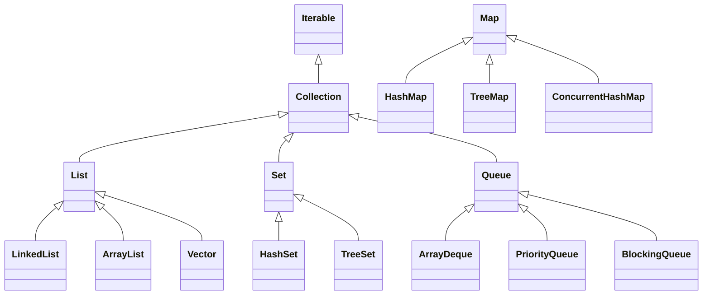

# 求职-面试题-Java核心

# 数据结构


## 字符

### String有长度限制么？

有，编译期和运行期不一样。

编译期需要用CONSTANT-UTF8-info 结构用于表示字符串常量的值，而这个结构是有长度限制，他的限制是65535。

运行期，String的length参数是Int类型的，那么也就是说，String定义的时候，最大支持的长度就是int的最大范围值。根据Integer类的定义，java.lang.Integer#MAX_VALUE的最大值是2^31^-1;


### String、StringBuilder、StringBuffer的区别?

典型回答

String是不可变的，StringBuilder和StringBuffer是可变的。而StringBuffer是线程安全的，而StringBuilder是非自线程安全的。


### String“+”的实现

使用+拼接字符串，其实只是Java提供的一个语法糖，那么他的内部原理是如何实现的?

这样一段代码。我们把他生成的字节码进行反编译，看看结果。

```java
String a = "123";
String b = "456";
String c = a +"."+ b;

//使用jad的反编译结果
String a = "123";
String b = "456";
String c = (new stringBuilder()).append(a).append(",").append(b).tostring();
```

通过反编译，我们可以发现，字符串常量在拼接过程中，是将String转成了StringBuilder后，使用其append方法进行处理的。


## 数字

### BigDecimal的equals方法不建议等值比较?

BigDecimal的equals方法和compareTo并不一样，equals方法会比较两部分内容，分别是值(value)和标度(scale)，而对于0.1和0.10这两个数字，使用equals比较的时候会返回false。因为他们的值一样，但是精度不一样。


### BigDecimal的构造方法建议使用哪个？

推荐使用String构造BigDecimal，禁止使用double创建BigDeciaml。

因为double是不精确的，所以使用一个不精确的数字来创建BigDeciaml，得到的数字也是不精确的。如0.1这个数字，double只能表示他的近似值

所以，主当我们使用new BigDecimal(0.1)创建一个BigDecimal 的时候，其实创建出来的值并不是正好等于0.1的。

而是0.1000000000000000055511151231257827021181583404541015625。这是因为double自身表示的只是一个近似值。

当我们使用new BigDecimal("0.1")创建一个BigDecimal 的时候，其实创建出来的 而对于BigDecimal(String)，值正好就是等于0.1的。
那么他的标度也就是1


## 集合

### Java中集合类介绍

常见集合类结构图



#### Set

TreeSet是二叉树实现的，TreeSet中的数据是自动排好序的，不允许放入nul值，底层基于TreeMap。

HashSet是哈希表实现的，HashSet中的数据是无序的，可以放入nul，但只能放入一个null，两者中的值都不能重复，就如数据库中唯一约束;底层基于HashMap

#### Deque

ArrayDeque：ArrayDeque也实现了Queue接口，是一个基于数组实现的双端队列（double-ended queue）。ArrayDeque在插入和删除元素时的效率比LinkedList更高。适用于栈和队列的应用以及需要高效的插入和删除操作的场景，例如生产者-消费者模式。

PriorityQueue：PriorityQueue是一个基于优先级堆的队列实现，它不是严格意义上的先进先出队列，而是根据元素的优先级进行排序。PriorityQueue可以根据自定义的比较器来确定元素的优先级顺序。适用于需要按照一定优先级顺序处理元素的场景，例如任务调度等。


### 集合的排序方式


### HashMap的底层结构

在Java 1.8中，HashMap的底层结构是数组+链表/红黑树的结合实现。具体来说，Java 1.8中的HashMap在解决哈希冲突时采用了“拉链法”（Separate Chaining）的方式，即在发生哈希冲突时，将具有相同哈希值的元素存储在同一个桶（bucket）中的链表中。

在Java 1.8中，HashMap的底层结构主要由以下几个重要部分组成：

1. Entry数组：HashMap内部维护了一个Entry数组，每个Entry实际上是一个键值对（key-value pair），用于存储实际的数据。
2. 桶（bucket）：每个桶对应HashMap中的一个位置，用于存储具有相同哈希值的元素。当发生哈希冲突时，将元素存储在同一个桶中的链表（或红黑树）中。
3. 链表/红黑树：在Java 1.8中，当链表长度达到一定阈值（默认为8），会将链表转换为红黑树，以提高查询效率。红黑树的查询、插入和删除操作的时间复杂度为O(log n)，相比链表能够更快地进行操作。

通过使用数组+链表/红黑树的结合实现，Java 1.8中的HashMap能够在绝大多数情况下实现快速的插入、删除和查找操作，平均情况下，这些操作的时间复杂度为O(1)。此设计在一定程度上提高了HashMap的性能和效率。	

### HashMap1.8与1.7区别

    [参考答案1](https://blog.csdn.net/qq_36520235/article/details/82417949) ，[参考答案2](https://blog.csdn.net/weixin_44141495/article/details/108402128)

### 只重写equals不重写hashcode会有什么问题？


## 数组

### Arrays.sort()用的什么排序

sort()方法采用了一种自适应排序算法，会根据待排序数组的长度和元素类型选择最适合的排序算法，以提高排序的效率和性能。

在JDK8中

数组长度为n，则1 <= n < 47 使用插入排序，插入排序在小型数据集上的效率比较高

数组长度为n，则47 <= n < 286 使用使用快速排序

数组长度为n，则286 > n 使用归并排序或快速排序（有一定顺序使用归并排序，毫无顺序使用快排）

https://blog.csdn.net/yuanchangliang/article/details/107755756


## 链表

### 链表和数组的区别及应用

在Java中，链表（LinkedList）和数组（Array）是两种不同的数据结构，它们有以下区别：

1. 内存分配方式：
   - 数组在内存中是连续存储的，元素的访问速度较快，但大小固定，无法动态扩展。
   - 链表的节点在内存中可以是不连续的，通过指针将节点连接起来，可以动态增加或删除节点。
2. 插入和删除操作：
   - 数组的插入和删除操作可能会涉及元素的移动，时间复杂度为O(n)。
   - 链表的插入和删除操作只需要修改指针指向，时间复杂度为O(1)。
3. 随机访问：
   - 数组支持随机访问，可以通过下标直接访问元素，时间复杂度为O(1)。
   - 链表不支持随机访问，需要从头节点开始遍历到目标位置，时间复杂度为O(n)。
4. 空间占用：
   - 数组在内存中会占用一块连续的空间，需要预先分配固定大小的空间。
   - 链表的节点可以在内存中分散存储，不需要预先分配固定大小的空间。


### 判断链表是否有环

思路

 如果一个链表无环，那么遍历链表一定可以遇到链表的终点；如果链表有环，那么遍历链表就永远在环内转下去。具体如下：

 1.设置快慢指针分别为fast和slow。开始，slow和fast都指向链表的头节点head。然后slow每次移动一步，fast每次移动两部，在链表中遍历。

 2.如果链表无环，fast指针在移动过程一定先遇到终点，直接返回null，表示链表无环。

 3.如果有环，fast和slow一定在环中相遇。相遇时，fast重新回到head位置，slow不动。接下来，fast指针每次移动一步，slow依然每次移动一步，继续遍历。

 4.fast和slow指针一定会再次相遇，并在第一个入环的节点处相遇，证明略。

```java
public Node getLoopNode(Node head){
    if (head == null || head.next == null || head.next.next == null){
        return null;
    }
    Node n1 = head.next; //n1 -> slow
    Node n2 = head.next.next; // n2 -> fast
    while (n1 != n2){
        if (n2.next == null || n2.next.next == null){
            return null;
        }
        n2 = n2.next.next;
        n1 = n1.next;
    }
    n2 = head; // n2 -> walk again from head
    while (n1 != n2){
        n1 = n1.next;
        n2 = n2.next;
    }
    return n1;
}
```


# IO


# 异常处理

### Throwable,Exception,Error,RuntimeException


