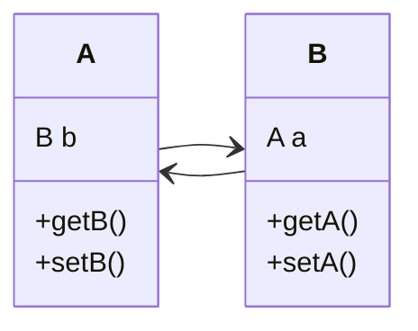

# 文档说明

本文档主要分享求职面试题。文档目前还在持续更新中，欢迎关注、收藏、点赞、加星喔😄O(∩_∩)O~。

同一个面试题往往会有很多种不同的问法，为了方便大家搜索，本文中面试题标题将尽量简洁，以涵盖同一面试题的不同问法。

| 文档名称     | Java面试题-Spring |
| ------------ | ----------------- |
| 文档分类     | 求职-面试         |
| 版本号       | 1.5               |
| 最后更新人   | Gem Shen          |
| 最后更新日期 | 2024-03-11        |
| 编制人       | Gem Shen          |
| 编制日期     | 2021-07-07        |


## 文档更新记录

| 版本 | 编制/修改人 | 修改日期   | 备注（原因、进一步的说明等）                         |
| ---- | ----------- | ---------- | ---------------------------------------------------- |
| 1.0  | Gem Shen    | 2021-07-07 | 初稿，整理了本次找工作积累到的所有面试题             |
| 1.1  | Gem Shen    | 2023-09-15 | 合并马士兵的面试笔记，重新整理目录结构               |
| 1.2  | Gem Shen    | 2023-09-19 | 整理Spring部分，将简历和沟通部分独立出去。           |
| 1.3  | Gem Shen    | 2023-09-30 | 完成Spring Framework面试题的初步整理。               |
| 1.4  | Gem Shen    | 2023-10-15 | 补充SpringBoot和SpringMVC面试题，将所有题目提升至3级 |
| 1.5  | Gem Shen    | 2023-12-18 | 文档过大，加载变慢，将每个一级标题单独拆分成一份文档 |
|      |             |            |                                                      |


# Spring

## Framework

### 对Spring框架的理解?

#### Spring发展历史

1. 2002 年，Rod Johnson 发表了他的专著 “Expert One-On-One J2EE Design and Development”，提出了 Spring 框架的思想。
2. 2003 年，Johnson 和一些开发者创建了 Spring Framework 项目，并在 SourceForge 上发布了第一个版本。
3. 2004 年，Spring Framework 1.0 版本发布，包括核心容器、AOP 模块、DAO 模块、JDBC 模块和 Web 模块等组成部分。
4. 2006 年，Spring Framework 2.0 版本发布，增加了对注解的支持、Web Services 支持、异步执行能力等新特性。
5. 2009 年，Spring Framework 3.0 版本发布，引入了对 Java 5、Java 6 特性的支持，包括泛型、注解、并发等。
6. 2013 年，Spring Framework 4.0 版本发布，提供对 Java 8 的支持，包括 lambda 表达式、Stream API 等。
7. 2015 年，Spring Framework 4.2 版本发布，增加了对 WebSocket 和 STOMP 协议的支持。
8. 2017 年，Spring Framework 5.0 版本发布，对响应式编程提供了支持，并对代码库进行了大规模升级和剪裁，去掉了过时和不必要的模块和类。
9. 2022年，Spring Framework 6.0 版本发布，基于jdk17，引入很多新特性和提升了性能。

自从 2003 年发布以来，Spring Framework 在 Java 开发社区中变得越来越流行，并成为了多个企业级应用开发的首选框架之一。


#### 模块介绍

官网的Spring5模块结构图

```mermaid
flowchart LR
spring-->cc["Core Container"]
cc-->Beans-->bd["提供bean的定义，加载，装配，解析。核心模块"]
cc-->Context-->ctd["提供对Bean的生命周期管理，国际化，事件"]
cc-->Core-->cod["是其他模块基本都依赖的公共核心模块，为他们提供基础能力"]
cc-->Expression-->exd["提供SpEL表达式，可以动态获取值"]

spring-->AOP-->ad["提供面向切面编程的能力，例如：事务切面"]
spring-->da["Data Access"]-->dad["提供对数据访问和系统集成的支持，例如：jdbc，ORM，事务，JMS"]
spring-->Web-->webd["提供Web基础能力以及对MVC的支持"]
```




##### spring beans

负责Bean的定义（BeanDefinition），Bean的装配（BeanFactory），Bean的解析（BeanDefinitionReader）。Spring是面向Bean编程的，所以Bean是Spring的核心主角。

##### Spring Context

spring-context模块构架于核心模块之上，扩展了BeanFactory，为它添加了Bean生命周期控制、框架事件体系及资源加载透明化等功能。此外，该模块还提供了许多企业级支持，如邮件访问、远程访问、任务调度等，ApplicationContext是该模块的核心接口，它的超类是BeanFactory。与BeanFactory不同，ApplicationContext实例化后会自动对所有的单实例Bean进行实例化与依赖关系的装配，使之处于待用状态。

##### Spring Core

这个模块是其他模块基本都依赖的公共核心模块，为他们提供基础能力。

##### Spring Expression

SpEL，Spring的一种表达式。用来动态的获取，值、对象等。例如：@value("#{'system.key.value'}")

##### Spring AOP

通过配置方式将面向切面编程技术集成到了框架之中；例如：事务切面

##### Spring aspects

模块集成自 AspectJ 框架，主要是为 Spring AOP 提供多种 AOP 实现方法。

##### Spring instrument

模块是基于 JAVA SE 中的 java.lang.instrument 进行设计的，应该算是AOP 的一个支援模块，主要作用是在 JVM 启用时，生成一个代理类，程序员通过代理类在运行时修改类的字节，从而改变一个类的功能，实现 AOP 的功能。在分类里，我把他分在了 AOP 模块下，在 Spring 官方文档里对这个地方也有点含糊不清。

##### Spring Data Access/Integration

此模块主要负责数据访问以及和其他系统的集成。例如：JDBC，ORM，事务，JMS的支持；在Spring源码中对应着很多子模块。

##### Spring Web

由 spring-web、spring-webmvc、spring-websocket和spring-webflux 4个模块组成。
spring-web 模块为 Spring 提供了最基础 Web 支持，主要建立于核心容器之上，通过 Servlet 或者 Listeners 来初始化 IOC 容器，也包含一些与 Web 相关的支持。
spring-webmvc 模块是一个的Web-Servlet 模 块 ， 实现了Spring MVC（model-view-Controller）的 Web 应用。
spring-websocket 模块主要是与 Web 前端的全双工通讯的协议。
spring-webflux 是一个新的非堵塞函数式 Reactive Web 框架，可以用来建立异步的，非阻塞，事件驱动的服务，并且扩展性非常好。

##### Spring messaging

从 Spring4 开始新加入的一个模块，主要职责是为 Spring 框架集成一些基础的报文传送应用。


### 对SpringIoC的理解

IOC（Inversion of control），即：控制反转，是指创建对象的控制权的转移，以前创建对象的控制权和时机是由程序员在代码中把控的，而现在这种控制权转移到Spring容器中，并由容器根据配置文件去创建实例和管理各个实例之间的依赖关系，对象与对象之间松散耦合DI依赖注入和IOC控制反转是同一个概念的不同角度的描述，即：应用程序在运行时依赖IoC容器来动态注入对象需要的外部资源。

IOC是一种设计思想（思想的转变）。最大的作用就是解耦（降低耦合性），也利于功能的复用。

[Spring IoC的实现原理](#Spring的IoC实现原理)


### Spring的IoC实现原理

#### 介绍

虽然问的是实现原理，但同一类型的题一般面试官会问一个。所以也可以讲下对IOC的理解。可以参考[对SpringIoC的理解](#对SpringIoC的理解)。讲了理解之后再讲实现。

#### 实现过程

IoC的核心组件是IOC容器，他会随着Spring的启动而自动初始化。过程中主要涉及依赖注入，动态代理技术，反射技术。

1. 在IOC容器启动时，读取并解析配置文件，注解中的Bean定义信息，将其封装成BeanDefinition对象存储在BeanFactory中
2. 对于单例非延迟加载的Bean，IOC容器初始化的时候会将其统一实例化好，放在缓存中。
3. 对于原型Bean，则是获取他的时候才会初始化。
4. 普通对象实例化时会用到反射技术，代理对象的实例化还会用到了动态代理技术。
5. Bean被实例化之后，需要给其属性进行赋值，属性的类型可能是另一个Bean，这个过程就是依赖注入。
6. 依赖注入完成以后，就是执行每一个Bean的初始化流程。这个流程中Spring定义了一些列的回调方法允许使用者扩展。

[参考文章](https://zhuanlan.zhihu.com/p/523343141?utm_id=0)

#### 源码层面

在源码层面，Spring IoC的核心组件是BeanFactory和BeanDefinition。BeanFactory是IoC容器的接口，它提供了管理和获取bean的方法。BeanDefinition是描述bean的元数据对象，包括bean的类型、作用域、依赖项和初始化参数等信息。BeanFactory通过BeanDefinition来创建、组装和管理bean。

在源码中，Spring IoC通过使用反射、动态代理和BeanPostProcessor等技术来实现依赖注入和组件的创建和管理。在创建bean时，IoC容器会解析BeanDefinition，然后通过反射创建bean实例，设置bean的属性并执行初始化方法。对于需要注入其他bean的属性，容器会自动查找相应的bean实例并进行注入。在完成bean的创建和依赖注入后，容器将bean放入自己的容器中进行管理，同时可以根据需要进行销毁或重置。

[ClassPathXmlApplicationContext初始化流程详细解析](..\mashibing\学习笔记-Spring-Gem.md#ClassPathXmlApplicationContext初始化)


### Spring Bean的生命周期

#### 本文作用

本文主要是为了说明Spring Bean的生命周期。这是一个高频面试题，这个问题即考察对Spring的微观了解，又考察对Spring的宏观认识，还考察对Spring源码的熟悉程度！

#### 宏观认识

Bean的生命周期宏观上可以表达为：

1. Bean工厂初始化（不熟的，这部分可以不提）
2. 实例化-Instantiation
3. 属性赋值-populate
4. 初始化-Initialization
5. 销毁-Destruction

有的人可能会疑惑，Bean工厂和Bean是两回事，为什么会和Bean的生命周期有关？

- Bean工厂中存放了BeanDefinition，这个就是Bean的定义，Bean就是根据这个实例化出来的。
- Bean工厂初始化的时候会调用一个特殊的后置处理器：ConfigurationClassPostProcessor。他会解析如下注解。
  - @Configuration的配置类
  - 解析@ComponentScan扫描的包
  - 解析@Import注解
- 所以这个类可能会增加Bean的数量。
- 下面是完整的Bean生命周期流程图来说明。（使用mermaid语法绘制）

```mermaid
flowchart TB
xml["配置文件，注解，启动类"]-->bf

subgraph bf[Bean工厂初始化]
    direction TB
    bfobtain["加载配置文件，创建容器对象(obtainFreshBeanFactory)"]
    -->bfprepare["beanFactory的准备工作，对他里面的BeanDefinition的各种属性进行填充(prepareBeanFactory)"]
    
    subgraph bfpost["调用各种beanFactory处理器(invokeBeanFactoryPostProcessors)"]
    	direction TB
    	ConfigurationClassPostProcessor
        -->config["解析@Configuration的配置类"]
        -->component["解析@ComponentScan扫描的包"]
        -->import["解析@Import注解"]
    end
    bfprepare-->bfpost
end

bfpost-->beanRegister["完成BeanPostProcessor的注册工作，以便后续在实例化完成之后调用before和after方法"]
-->finishInitial["Bean创建总方法(finishBeanFactoryInitialization)"]

direction TB
subgraph initantiation[实例化]
    direction TB
    doGetBean
    -->createBean
    -->doCreateBean
    -->createBeanInstance
    -->applyMergedBeanDefinitionPostProcessors
end

subgraph populate[属性赋值]
    setValue["属性填充"]-->createDepend["依赖对象创建"]
end

subgraph Initialization[初始化]
    direction TB
    subgraph invokeAware[invokeAwareMethod]
        BeanNameAware-->BeanClassLoaderAware-->BeanFactoryAware
    end
    subgraph bppbefore["执行BPP的before方法"]
    	subgraph ApplicationAwarePostProcessor
    		direction TB
    		EnvironmentAware-->EmbeddedValueResolverAware-->ResourceLoaderAware
    		-->ApplicationEventPublisherAware-->MessageSourceAware-->ApplicationContextAware
    	end
        ApplicationAwarePostProcessor-->CommonAnnotationBeanPostProcessor["CommonAnnotationBeanPostProcessor
        负责解析@Resource、@WebServiceRef
        、@EJB三个注解，这三个注解定义在javax.*包下"]
    end
    subgraph invokeInitMethod
        InitializingBean["InitializingBean.afterPropertiesSet"]
        -->initmethod["执行用户自定义的init-method"]
    end
    subgraph bffAfter["执行BFF的after方法"]
        AOP
    end
    invokeAware-->bppbefore-->invokeInitMethod-->bffAfter
end

subgraph destruct["销毁-Destruction"]
	DestructionAwareBPP["DestructionAwareBeanPostProcessors<br>.postProcessBeforeDestruction()"]
	-->DisposableBean["DisposableBean<br>.destroy()"]
	-->detroyMethod[自定义的destoryMethod]
end
finishInitial-->initantiation-->populate-->Initialization-->destruct
```



#### Spring源码

其实在Spring源码的BeanFactory这个类的注释中，Spring源码的作者已经告诉我们Bean完整的生命周期了。

下面就是Spring源码的摘录。大家本地有源码的朋友，可以把鼠标放到类名字上面去，就可以预览注释的实际效果了。

```java
/**
 * Bean工厂的根父类，定义获取bean及bean的各种属性。下面的注释中还列举了Bean的生命周期 <br>
 * The root interface for accessing a Spring bean container.
 *
 * <p>This is the basic client view of a bean container;
 * further interfaces such as {@link ListableBeanFactory} and
 * {@link org.springframework.beans.factory.config.ConfigurableBeanFactory}
 * are available for specific purposes.
 *
 * <p>This interface is implemented by objects that hold a number of bean definitions,
 * each uniquely identified by a String name. Depending on the bean definition,
 * the factory will return either an independent instance of a contained object
 * (the Prototype design pattern), or a single shared instance (a superior
 * alternative to the Singleton design pattern, in which the instance is a
 * singleton in the scope of the factory). Which type of instance will be returned
 * depends on the bean factory configuration: the API is the same. Since Spring
 * 2.0, further scopes are available depending on the concrete application
 * context (e.g. "request" and "session" scopes in a web environment).
 *
 * <p>The point of this approach is that the BeanFactory is a central registry
 * of application components, and centralizes configuration of application
 * components (no more do individual objects need to read properties files,
 * for example). See chapters 4 and 11 of "Expert One-on-One J2EE Design and
 * Development" for a discussion of the benefits of this approach.
 *
 * <p>Note that it is generally better to rely on Dependency Injection
 * ("push" configuration) to configure application objects through setters
 * or constructors, rather than use any form of "pull" configuration like a
 * BeanFactory lookup. Spring's Dependency Injection functionality is
 * implemented using this BeanFactory interface and its subinterfaces.
 *
 * <p>Normally a BeanFactory will load bean definitions stored in a configuration
 * source (such as an XML document), and use the {@code org.springframework.beans}
 * package to configure the beans. However, an implementation could simply return
 * Java objects it creates as necessary directly in Java code. There are no
 * constraints on how the definitions could be stored: LDAP, RDBMS, XML,
 * properties file, etc. Implementations are encouraged to support references
 * amongst beans (Dependency Injection).
 *
 * <p>In contrast to the methods in {@link ListableBeanFactory}, all of the
 * operations in this interface will also check parent factories if this is a
 * {@link HierarchicalBeanFactory}. If a bean is not found in this factory instance,
 * the immediate parent factory will be asked. Beans in this factory instance
 * are supposed to override beans of the same name in any parent factory.
 *
 * <p>Bean factory implementations should support the standard bean lifecycle interfaces
 * as far as possible. The full set of initialization methods and their standard order is:
 * <ol>
 * <li>BeanNameAware's {@code setBeanName}
 * <li>BeanClassLoaderAware's {@code setBeanClassLoader}
 * <li>BeanFactoryAware's {@code setBeanFactory}
 * <li>EnvironmentAware's {@code setEnvironment}
 * <li>EmbeddedValueResolverAware's {@code setEmbeddedValueResolver}
 * <li>ResourceLoaderAware's {@code setResourceLoader}
 * (only applicable when running in an application context)
 * <li>ApplicationEventPublisherAware's {@code setApplicationEventPublisher}
 * (only applicable when running in an application context)
 * <li>MessageSourceAware's {@code setMessageSource}
 * (only applicable when running in an application context)
 * <li>ApplicationContextAware's {@code setApplicationContext}
 * (only applicable when running in an application context)
 * <li>ServletContextAware's {@code setServletContext}
 * (only applicable when running in a web application context)
 * <li>{@code postProcessBeforeInitialization} methods of BeanPostProcessors
 * <li>InitializingBean's {@code afterPropertiesSet}
 * <li>a custom init-method definition
 * <li>{@code postProcessAfterInitialization} methods of BeanPostProcessors
 * </ol>
 *
 * <p>On shutdown of a bean factory, the following lifecycle methods apply:
 * <ol>
 * <li>{@code postProcessBeforeDestruction} methods of DestructionAwareBeanPostProcessors
 * <li>DisposableBean's {@code destroy}
 * <li>a custom destroy-method definition
 * </ol>
 *
 * @author Rod Johnson
 * @author Juergen Hoeller
 * @author Chris Beams
 * @since 13 April 2001
 * @see BeanNameAware#setBeanName
 * @see BeanClassLoaderAware#setBeanClassLoader
 * @see BeanFactoryAware#setBeanFactory
 * @see org.springframework.context.ResourceLoaderAware#setResourceLoader
 * @see org.springframework.context.ApplicationEventPublisherAware#setApplicationEventPublisher
 * @see org.springframework.context.MessageSourceAware#setMessageSource
 * @see org.springframework.context.ApplicationContextAware#setApplicationContext
 * @see org.springframework.web.context.ServletContextAware#setServletContext
 * @see org.springframework.beans.factory.config.BeanPostProcessor#postProcessBeforeInitialization
 * @see InitializingBean#afterPropertiesSet
 * @see org.springframework.beans.factory.support.RootBeanDefinition#getInitMethodName
 * @see org.springframework.beans.factory.config.BeanPostProcessor#postProcessAfterInitialization
 * @see DisposableBean#destroy
 * @see org.springframework.beans.factory.support.RootBeanDefinition#getDestroyMethodName
 */
public interface BeanFactory {
	//...... 此处省略代码细节	
}
```

根据这个注释，我们可以整理出一份简易文字版bean生命周期

1. BeanNameAware's setBeanName
2. BeanClassLoaderAware's setBeanClassLoader
3. BeanFactoryAware's setBeanFactory
4. EnvironmentAware's setEnvironment
5. EmbeddedValueResolverAware's setEmbeddedValueResolver
6. ResourceLoaderAware's setResourceLoader (only applicable when running in an application context)
7. ApplicationEventPublisherAware's setApplicationEventPublisher (only applicable when running in an application context)
8. MessageSourceAware's setMessageSource (only applicable when running in an application context)
9. ApplicationContextAware's setApplicationContext (only applicable when running in an application context)
10. ServletContextAware's setServletContext (only applicable when running in a web application context)
11. postProcessBeforeInitialization methods of BeanPostProcessors
12. InitializingBean's afterPropertiesSet
13. a custom init-method definition
14. postProcessAfterInitialization methods of BeanPostProcessors

在关闭bean工厂时，也就是销毁时，应用以下生命周期方法：

1. DestructionAwareBeanPostProcessors.postProcessBeforeDestruction()
2. DisposableBean的destroy方法
3. 自定义的destroy-method


#### 参考说明

https://zhuanlan.zhihu.com/p/622803858?utm_id=0

https://www.mashibing.com/study?courseNo=2154&sectionNo=36480&courseVersionId=1241


### Bean循环依赖，三级缓存

#### 本文目的

本文主要说明什么是Spring的循环依赖。哪些场景的循环依赖Spring可以解决。如何解决的。同时讲解了Spring的三级缓存。

#### 类图



#### 什么是循环依赖

参考上面的类图，Spring要初始化A类，但A类中有一个类型为B的属性，所以此时要去创建类型B。但是B类中又有一个A类型的属性，所以反过来又需要初始化A，但A此时又没有初始化完成。这就是循环依赖问题。

这个例子中说的是AB型循环依赖，还有ABC型。就是A中有B，B中有C，但C中又有A。

如果不考虑Spring，循环依赖其实并不是问题，因为对象之间相互依赖是很正常的事情。但在Spring中，一个对象并不是简单new出来就可以了，而是会经过一系列的Bean的生命周期。正式因为Beand生命周期的存在，才会出现循环依赖问题。所以建议大家可以先了解下[Bean的生命周期](https://blog.csdn.net/namelessmyth/article/details/133139513?spm=1001.2014.3001.5501)。

#### 如何解决

首先并不是所有场景的循环依赖Spring都能解决的。Spring只能解决单例对象且set方法的循环依赖。构造器或者多例对象目前Spring无法解决。这种情况需要程序员自己避免或者向其他办法解决。

接下来正式介绍Spring解决循环依赖的机制，叫做三级缓存。

#### Spring三级缓存

三级缓存说穿了，其实就是Spring中一个类的三个Map，

- 一级缓存：singletonObjects；
- 二级缓存为：earlySingletonObjects；
- 三级缓存为：singletonFactories；

类名：DefaultSingletonBeanRegistry，源码参考如下：

~~~java
public class DefaultSingletonBeanRegistry extends SimpleAliasRegistry implements SingletonBeanRegistry {

	/**
	 * 一级缓存
	 * 用于保存BeanName和创建bean实例之间的关系
	 *
	 * Cache of singleton objects: bean name to bean instance. */
	private final Map<String, Object> singletonObjects = new ConcurrentHashMap<>(256);

	/**
	 * 三级缓存
	 * 用于保存BeanName和创建bean的工厂之间的关系
	 *
	 * Cache of singleton factories: bean name to ObjectFactory. */
	private final Map<String, ObjectFactory<?>> singletonFactories = new HashMap<>(16);

	/**
	 * 二级缓存
	 * 保存BeanName和创建bean实例之间的关系，与singletonFactories的不同之处在于，当一个单例bean被放到这里之后，那么当
	 * bean还在创建过程中，就可以通过getBean方法获取到，可以方便进行循环依赖的检测
	 *
	 * Cache of early singleton objects: bean name to bean instance. */
	private final Map<String, Object> earlySingletonObjects = new ConcurrentHashMap<>(16);
    
}
~~~

#### 三个缓存分别放的是什么？

一级缓存（singletonObjects）中放的是已经初始化完成的bean对象。

二级缓存（earlySingletonObjects）比 singletonObjects 多了一个 early，表示存放的是实例化结束但还没初始化的bean对象。

三级缓存（singletonFactories）中存的是ObjectFactory，表示的是用来创建AOP代理对象的函数式接口。


#### 如果只有二级缓存

如果不考虑AOP对象代理，其实只需要二级缓存足以解决问题。

我们先使用二级缓存来把解决流程演示一遍。

1. 首先创建A的Bean对象，先依次在一二三级缓存中找。显然第一次肯定是找不到。
2. 然后开始实例化A，实例化A结束后，会将A对象放入二级缓存中。此时A还没初始化。
3. 然后进行属性赋值，遇到B对象。
4. 同样的流程，先依次在一二三级缓存找。肯定也是找不到。
5. 开始实例化B，实例化B结束，放入二级缓存中。此时B也没初始化。
6. 然后进行属性赋值，遇到A对象。也是依次在一二三级缓存找
7. 此时由于A对象已经在二级缓存中存在，所以找到后，完成B的属性赋值
8. 接着继续B的初始化，然后初始化完成之后，放入一级缓存中。
9. 接着A的属性赋值和初始化也能结束了。放入一级缓存中。
10. 下面是用mermaid画的流程图。

```mermaid
flowchart TB

subgraph cache["三级缓存"]
cache1[一级缓存]-->cache2[二级缓存]-->cache3[三级缓存]
end

subgraph A
getBeana["在一、二、三级缓存中查找A"]-->notfounda["没有找到A"]-->createBeana["实例化A"]
-->putCachea["放入二级缓存"]-->populatea["属性赋值B"]-->initA["初始化A"]-->finishA["A创建完成"]
end
putCachea-->|A|cache2

subgraph B
getBeanb["在一、二、三级缓存中查找B"]-->notfoundb["没有找到B"]-->createBeanb["实例化B"]
-->putCacheb["放入二级缓存"]-->populateb["属性赋值A"]-->getBa["去一、二、三级缓存中查找a"]
-->getA["在二级缓存中找到A"]-->initB["初始化B"]-->finishB["B创建完成"]
end
putCacheb-->|B|cache2
populatea-->getBeanb
finishB-->initA
```



#### 代理与三级缓存

既然二级缓存就能解决循环依赖，那为什么考虑了AOP代理之后就必须使用三级缓存了呢？首先要了解的一个知识就是Spring的AOP代理对象的产生是在填充属性后进入到初始化阶段才进行的，是通过后置处理器BeanPostProcessor来实现。如果用二级缓存来解决，那么就要在属性填充的时候，就要将代理对象生成好，放入二级缓存了。那这样就与Spring的Bean生命周期相悖了。所以这种方式不好，于是就引入了三级缓存以及ObjectFactory对象。

引入了三级缓存之后的流程。

1. 首先创建A的Bean对象，先依次在一二三级缓存中找。显然第一次肯定是找不到。
2. 然后开始实例化A，实例化A结束后，**那此时会将A放入三级缓存而不是二级缓存**。
3. **放入三级缓存中的A是一个函数式接口ObjectFactory对象。此时并没有调用接口方法**。
4. 然后进行属性赋值，遇到B对象。
5. 同样的流程，先依次在一二三级缓存找。肯定也是找不到。
6. 开始实例化B，实例化B结束，同样将ObjectFactory放入三级缓存中。
7. 然后进行属性赋值，遇到A对象。也是依次在一二三级缓存找。
8. 此时可以在三级缓存中找到A的ObjectFactory对象，找到后会调用ObjectFactory.getObject()方法，
9. 将生成的代理对象放到二级缓存中。同时删除三级缓存中的对象。
10. 接着继续B的初始化，然后初始化完成之后，放入一级缓存中。
11. 接着A的属性赋值和初始化也能结束了。放入一级缓存中。

```mermaid
flowchart TB

subgraph cache["三级缓存"]
cache1[一级缓存]-->cache2[二级缓存]-->cache3[三级缓存]

end

subgraph A
getBeana["在一、二、三级缓存中查找A"]-->notfounda["没有找到A"]-->createBeana["实例化A"]
-->putCachea["放入三级缓存"]-->populatea["属性赋值B"]-->initA["初始化A"]-->finishA["A创建完成"]
end
putCachea-->|"ObjectFactory(A)"|cache3

subgraph B
getBeanb["在一、二、三级缓存中查找B"]-->notfoundb["没有找到B"]-->createBeanb["实例化B"]
-->putCacheb["放入三级缓存"]-->populateb["属性赋值A"]-->getBa["去一、二、三级缓存中查找a"]
-->getA["在三级缓存中找到ObjectFactory(A)"]-->put2["通过ObjectFactory的getObject()<br>得到对象然后移入二级缓存"]
-->initB["初始化B"]-->finishB["B创建完成"]
end
putCacheb-->|"ObjectFactory(B)"|cache3
populatea-->getBeanb
put2-->cache2
finishB-->initA

```



##### 二级缓存在其中的作用

假设AB相互依赖，AC相互依赖。那么B实例化后，就该进行C的实例化，这时C就可以从二级缓存来获取A的实例引用了，就不需要再从三级缓存获取工厂让其生产实例。

即假设只有AB相互依赖，其他对象不依赖AB时，这里二级缓存是没用的，一级和三级缓存起作用。


#### 源码分析

接下来我们可以从Spring源码中印证上述想法的正确性。

##### 创建对象之前先从缓存中查找

AbstractBeanFactory.doGetBean()方法。第15行，先调用getSingleton方法去缓存中找。

```java
	/**
	 * 得到一个Bean实例的实例，
	 *
	 */
	protected <T> T doGetBean(
			String name, @Nullable Class<T> requiredType, @Nullable Object[] args, boolean typeCheckOnly)
			throws BeansException {

		/** 提取对应的beanName，这里需要转换的原因在于，当bean对象实现FactoryBean接口之后就会变成&beanName，同时如果存在别名，也需要把别名进行转换 */
		String beanName = transformedBeanName(name);
		Object bean;

		// Eagerly check singleton cache for manually registered singletons.
		/** 提前检查单例缓存中是否有手动注册的单例对象，跟循环依赖有关联 */
		Object sharedInstance = getSingleton(beanName);
		// 如果bean的单例对象找到了，且没有创建bean实例时要使用的参数
		if (sharedInstance != null && args == null) {
			if (logger.isTraceEnabled()) {
				if (isSingletonCurrentlyInCreation(beanName)) {
					logger.trace("Returning eagerly cached instance of singleton bean '" + beanName +
							"' that is not fully initialized yet - a consequence of a circular reference");
				}
				else {
					logger.trace("Returning cached instance of singleton bean '" + beanName + "'");
				}
			}
			// 返回对象的实例，当你实现了FactoryBean接口的对象，需要获取具体的对象的时候就需要此方法来进行获取了
			bean = getObjectForBeanInstance(sharedInstance, name, beanName, null);
		}

		else {
			// Fail if we're already creating this bean instance:
			// We're assumably within a circular reference.
			// 当对象都是单例的时候会尝试解决循环依赖的问题，但是原型模式下如果存在循环依赖的情况，那么直接抛出异常
			if (isPrototypeCurrentlyInCreation(beanName)) {
				throw new BeanCurrentlyInCreationException(beanName);
			}

			// Check if bean definition exists in this factory.
			// 如果bean定义不存在，就检查父工厂是否有
			BeanFactory parentBeanFactory = getParentBeanFactory();
			// 如果beanDefinitionMap中也就是在所有已经加载的类中不包含beanName，那么就尝试从父容器中获取
			if (parentBeanFactory != null && !containsBeanDefinition(beanName)) {
				// Not found -> check parent.
				// 获取name对应的规范名称【全类名】，如果name前面有'&'，则会返回'&'+规范名称【全类名】
				String nameToLookup = originalBeanName(name);
				// 如果父工厂是AbstractBeanFactory的实例
				if (parentBeanFactory instanceof AbstractBeanFactory) {
					// 调用父工厂的doGetBean方法，就是该方法。【递归】
					return ((AbstractBeanFactory) parentBeanFactory).doGetBean(
							nameToLookup, requiredType, args, typeCheckOnly);
				}
				else if (args != null) {
					// Delegation to parent with explicit args.
					// 如果有创建bean实例时要使用的参数
					// Delegation to parent with explicit args. 使用显示参数委派给父工厂
					// 使用父工厂获取该bean对象,通bean全类名和创建bean实例时要使用的参数
					return (T) parentBeanFactory.getBean(nameToLookup, args);
				}
				else if (requiredType != null) {
					// No args -> delegate to standard getBean method.
					// 没有创建bean实例时要使用的参数 -> 委托给标准的getBean方法。
					// 使用父工厂获取该bean对象,通bean全类名和所需的bean类型
					return parentBeanFactory.getBean(nameToLookup, requiredType);
				}
				else {
					// 使用父工厂获取bean，通过bean全类名
					return (T) parentBeanFactory.getBean(nameToLookup);
				}
			}
			// 如果不是做类型检查，那么表示要创建bean，此处在集合中做一个记录
			if (!typeCheckOnly) {
				// 为beanName标记为已经创建（或将要创建）
				markBeanAsCreated(beanName);
			}

			try {
				// 此处做了BeanDefinition对象的转换，当我们从xml文件中加载beandefinition对象的时候，封装的对象是GenericBeanDefinition,
				// 此处要做类型转换，如果是子类bean的话，会合并父类的相关属性
				RootBeanDefinition mbd = getMergedLocalBeanDefinition(beanName);
				// 检查mbd的合法性，不合格会引发验证异常
				checkMergedBeanDefinition(mbd, beanName, args);

				// Guarantee initialization of beans that the current bean depends on.
				// 如果存在依赖的bean的话，那么则优先实例化依赖的bean
				String[] dependsOn = mbd.getDependsOn();
				if (dependsOn != null) {
					// 如果存在依赖，则需要递归实例化依赖的bean
					for (String dep : dependsOn) {
						// 如果beanName已注册依赖于dependentBeanName的关系
						if (isDependent(beanName, dep)) {
							throw new BeanCreationException(mbd.getResourceDescription(), beanName,
									"Circular depends-on relationship between '" + beanName + "' and '" + dep + "'");
						}
						// 注册各个bean的依赖关系，方便进行销毁
						registerDependentBean(dep, beanName);
						try {
							// 递归优先实例化被依赖的Bean
							getBean(dep);
						}
						// 捕捉为找到BeanDefinition异常：'beanName'依赖于缺少的bean'dep'
						catch (NoSuchBeanDefinitionException ex) {
							throw new BeanCreationException(mbd.getResourceDescription(), beanName,
									"'" + beanName + "' depends on missing bean '" + dep + "'", ex);
						}
					}
				}

				// Create bean instance.
				// 创建bean的实例对象
				if (mbd.isSingleton()) {
					// 返回以beanName的(原始)单例对象，如果尚未注册，则使用singletonFactory创建并注册一个对象:
					sharedInstance = getSingleton(beanName, () -> {
						try {
							// 为给定的合并后BeanDefinition(和参数)创建一个bean实例
							return createBean(beanName, mbd, args);
						}
						catch (BeansException ex) {
							// Explicitly remove instance from singleton cache: It might have been put there
							// eagerly by the creation process, to allow for circular reference resolution.
							// Also remove any beans that received a temporary reference to the bean.
							// 显示地从单例缓存中删除实例：它可能是由创建过程急切地放在那里，以允许循环引用解析。还要删除
							// 接收到该Bean临时引用的任何Bean
							// 销毁给定的bean。如果找到相应的一次性Bean实例，则委托给destoryBean
							destroySingleton(beanName);
							// 重新抛出ex
							throw ex;
						}
					});
					// 从beanInstance中获取公开的Bean对象，主要处理beanInstance是FactoryBean对象的情况，如果不是
					// FactoryBean会直接返回beanInstance实例
					bean = getObjectForBeanInstance(sharedInstance, name, beanName, mbd);
				}
				// 原型模式的bean对象创建
				else if (mbd.isPrototype()) {
					// It's a prototype -> create a new instance.
					// 它是一个原型 -> 创建一个新实例
					// 定义prototype实例
					Object prototypeInstance = null;
					try {
						// 创建Prototype对象前的准备工作，默认实现将beanName添加到prototypesCurrentlyInCreation中
						beforePrototypeCreation(beanName);
						// 为mbd(和参数)创建一个bean实例
						prototypeInstance = createBean(beanName, mbd, args);
					}
					finally {
						// 创建完prototype实例后的回调，默认是将beanName从prototypesCurrentlyInCreation移除
						afterPrototypeCreation(beanName);
					}
					// 从beanInstance中获取公开的Bean对象，主要处理beanInstance是FactoryBean对象的情况，如果不是
					// FactoryBean会直接返回beanInstance实例
					bean = getObjectForBeanInstance(prototypeInstance, name, beanName, mbd);
				}

				else {
					// 指定的scope上实例化bean
					String scopeName = mbd.getScope();
					if (!StringUtils.hasLength(scopeName)) {
						throw new IllegalStateException("No scope name defined for bean ´" + beanName + "'");
					}
					// 从scopes中获取scopeName对于的Scope对象
					Scope scope = this.scopes.get(scopeName);
					// 如果scope为null
					if (scope == null) {
						// 抛出非法状态异常：没有名为'scopeName'的scope注册
						throw new IllegalStateException("No Scope registered for scope name '" + scopeName + "'");
					}
					try {
						// 从scope中获取beanName对应的实例对象
						Object scopedInstance = scope.get(beanName, () -> {
							// 创建Prototype对象前的准备工作，默认实现 将beanName添加到prototypesCurrentlyInCreation中
							beforePrototypeCreation(beanName);
							try {
								// 为mbd(和参数)创建一个bean实例
								return createBean(beanName, mbd, args);
							}
							finally {
								// 创建完prototype实例后的回调，默认是将beanName从prototypesCurrentlyInCreation移除
								afterPrototypeCreation(beanName);
							}
						});
						// 从beanInstance中获取公开的Bean对象，主要处理beanInstance是FactoryBean对象的情况，如果不是
						// FactoryBean会直接返回beanInstance实例
						bean = getObjectForBeanInstance(scopedInstance, name, beanName, mbd);
					}
					catch (IllegalStateException ex) {
						// 捕捉非法状态异常
						// 抛出Bean创建异常：作用域 'scopeName' 对于当前线程是不活动的；如果您打算从单个实例引用它，请考虑为此
						// beanDefinition一个作用域代理
						throw new BeanCreationException(beanName,
								"Scope '" + scopeName + "' is not active for the current thread; consider " +
								"defining a scoped proxy for this bean if you intend to refer to it from a singleton",
								ex);
					}
				}
			}
			catch (BeansException ex) {
				// 捕捉获取Bean对象抛出的Bean异常
				// 在Bean创建失败后，对缓存的元数据执行适当的清理
				cleanupAfterBeanCreationFailure(beanName);
				// 重新抛出ex
				throw ex;
			}
		}

		// Check if required type matches the type of the actual bean instance.
		// 检查requiredType是否与实际Bean实例的类型匹配
		// 如果requiredType不为null&&bean不是requiredType的实例
		if (requiredType != null && !requiredType.isInstance(bean)) {
			try {
				// 获取此BeanFactory使用的类型转换器，将bean转换为requiredType
				T convertedBean = getTypeConverter().convertIfNecessary(bean, requiredType);
				// 如果convertedBean为null
				if (convertedBean == null) {
					// 抛出Bean不是必要类型的异常
					throw new BeanNotOfRequiredTypeException(name, requiredType, bean.getClass());
				}
				// 返回convertedBean
				return convertedBean;
			}
			catch (TypeMismatchException ex) {
				if (logger.isTraceEnabled()) {
					logger.trace("Failed to convert bean '" + name + "' to required type '" +
							ClassUtils.getQualifiedName(requiredType) + "'", ex);
				}
				throw new BeanNotOfRequiredTypeException(name, requiredType, bean.getClass());
			}
		}
		// 将bean返回出去
		return (T) bean;
	}
```

##### 从一二三级缓存中依次查找对象

DefaultSingletonBeanRegistry.getSingleton()方法。从三级缓存中找到对象之后还会调用ObjectFactory的getObject()方法得到单例对象。放到二级缓存中，同时从三级缓存中移除。

```java
protected Object getSingleton(String beanName, boolean allowEarlyReference) {
		// Quick check for existing instance without full singleton lock
		// 从单例对象缓存（一级缓存）中获取beanName对应的单例对象
		Object singletonObject = this.singletonObjects.get(beanName);
		// 如果单例对象缓存中没有，并且该beanName对应的单例bean正在创建中
		if (singletonObject == null && isSingletonCurrentlyInCreation(beanName)) {
			// 从早期单例对象缓存（二级缓存）中获取单例对象（之所称成为早期单例对象，是因为earlySingletonObjects里的对象的都是通过提前曝光的ObjectFactory创建出来的，还未进行属性填充等操作）
			singletonObject = this.earlySingletonObjects.get(beanName);
			// 如果在早期单例对象缓存中也没有，并且允许创建早期单例对象引用
			if (singletonObject == null && allowEarlyReference) {
				// 如果为空，则锁定全局变量并进行处理
				synchronized (this.singletonObjects) {
					// Consistent creation of early reference within full singleton lock
					singletonObject = this.singletonObjects.get(beanName);
					if (singletonObject == null) {
						singletonObject = this.earlySingletonObjects.get(beanName);
						if (singletonObject == null) {
							// 当某些方法需要提前初始化的时候则会调用addSingletonFactory方法将对应的ObjectFactory初始化策略存储在singletonFactories
							ObjectFactory<?> singletonFactory = this.singletonFactories.get(beanName);
							if (singletonFactory != null) {
								// 如果存在单例对象工厂，则通过工厂创建一个单例对象
								singletonObject = singletonFactory.getObject();
								// 记录在缓存中，二级缓存和三级缓存的对象不能同时存在
								this.earlySingletonObjects.put(beanName, singletonObject);
								// 从三级缓存中移除
								this.singletonFactories.remove(beanName);
							}
						}
					}
				}
			}
		}
		return singletonObject;
	}
```

##### 对象实例化时放入到三级缓存中

AbstractAutowireCapableBeanFactory.doCreateBean()方法.对于符合循环依赖条件的bean，会往三级缓存中放入一个lambda表达式返回的ObjectFactory对象

```java
// ... 省略非关键代码
// 判断当前bean是否需要提前曝光：单例&允许循环依赖&当前bean正在创建中，检测循环依赖	
boolean earlySingletonExposure = (mbd.isSingleton() && this.allowCircularReferences &&
        isSingletonCurrentlyInCreation(beanName));
if (earlySingletonExposure) {
    if (logger.isTraceEnabled()) {
        logger.trace("Eagerly caching bean '" + beanName +
                "' to allow for resolving potential circular references");
    }
    // 为避免后期循环依赖，可以在bean初始化完成前将创建实例的ObjectFactory加入工厂
    addSingletonFactory(beanName, () -> getEarlyBeanReference(beanName, mbd, bean));

    synchronized (this.singletonObjects) {
        if (!this.singletonObjects.containsKey(beanName)) {
            //实例化后的对象先添加到三级缓存中，三级缓存对应beanName的是一个lambda表达式(能够触发创建代理对象的机制)
            this.singletonFactories.put(beanName, () -> getEarlyBeanReference(beanName, mbd, bean));
            this.registeredSingletons.add(beanName);
        }
    }

}

// Initialize the bean instance.
// 初始化bean实例
Object exposedObject = bean;
try {
    // 对bean的属性进行填充，将各个属性值注入，其中，可能存在依赖于其他bean的属性，则会递归初始化依赖的bean
    populateBean(beanName, mbd, instanceWrapper);
    // 执行初始化逻辑
    exposedObject = initializeBean(beanName, exposedObject, mbd);
}
catch (Throwable ex) {
    if (ex instanceof BeanCreationException && beanName.equals(((BeanCreationException) ex).getBeanName())) {
        throw (BeanCreationException) ex;
    }
    else {
        throw new BeanCreationException(
                mbd.getResourceDescription(), beanName, "Initialization of bean failed", ex);
    }
}
```

##### 何时放入一级缓存

AbstractBeanFactory的doGetBean()方法中。运行createBean方法后，会调用getSingleton方法。

```java
// 创建bean的实例对象
if (mbd.isSingleton()) {
    // 返回以beanName的(原始)单例对象，如果尚未注册，则使用singletonFactory创建并注册一个对象:
    sharedInstance = getSingleton(beanName, () -> {
        try {
            // 为给定的合并后BeanDefinition(和参数)创建一个bean实例
            return createBean(beanName, mbd, args);
        }
        catch (BeansException ex) {
            // Explicitly remove instance from singleton cache: It might have been put there
            // eagerly by the creation process, to allow for circular reference resolution.
            // Also remove any beans that received a temporary reference to the bean.
            // 显示地从单例缓存中删除实例：它可能是由创建过程急切地放在那里，以允许循环引用解析。还要删除
            // 接收到该Bean临时引用的任何Bean
            // 销毁给定的bean。如果找到相应的一次性Bean实例，则委托给destoryBean
            destroySingleton(beanName);
            // 重新抛出ex
            throw ex;
        }
    });
    // 从beanInstance中获取公开的Bean对象，主要处理beanInstance是FactoryBean对象的情况，如果不是
    // FactoryBean会直接返回beanInstance实例
    bean = getObjectForBeanInstance(sharedInstance, name, beanName, mbd);
}
```

这里的getSingleton方法和上面的不一样，如果从一级缓存没有找到，那么会调用addSingleton()方法将其加入到一级缓存中。

```java
	public Object getSingleton(String beanName, ObjectFactory<?> singletonFactory) {
		// 如果beanName为null，抛出异常
		Assert.notNull(beanName, "Bean name must not be null");
		// 使用单例对象的高速缓存Map作为锁，保证线程同步
		synchronized (this.singletonObjects) {
			// 从单例对象的高速缓存Map中获取beanName对应的单例对象
			Object singletonObject = this.singletonObjects.get(beanName);
			// 如果单例对象获取不到
			if (singletonObject == null) {
				// 如果当前在destorySingletons中
				if (this.singletonsCurrentlyInDestruction) {
					throw new BeanCreationNotAllowedException(beanName,
							"Singleton bean creation not allowed while singletons of this factory are in destruction " +
							"(Do not request a bean from a BeanFactory in a destroy method implementation!)");
				}
				// 如果当前日志级别时调试
				if (logger.isDebugEnabled()) {
					logger.debug("Creating shared instance of singleton bean '" + beanName + "'");
				}
				// 创建单例之前的回调,默认实现将单例注册为当前正在创建中
				beforeSingletonCreation(beanName);
				// 表示生成了新的单例对象的标记，默认为false，表示没有生成新的单例对象
				boolean newSingleton = false;
				// 有抑制异常记录标记,没有时为true,否则为false
				boolean recordSuppressedExceptions = (this.suppressedExceptions == null);
				// 如果没有抑制异常记录
				if (recordSuppressedExceptions) {
					// 对抑制的异常列表进行实例化(LinkedHashSet)
					this.suppressedExceptions = new LinkedHashSet<>();
				}
				try {
					// 从单例工厂中获取对象
					singletonObject = singletonFactory.getObject();
					// 生成了新的单例对象的标记为true，表示生成了新的单例对象
					newSingleton = true;
				}
				catch (IllegalStateException ex) {
					// Has the singleton object implicitly appeared in the meantime ->
					// if yes, proceed with it since the exception indicates that state.
					// 同时，单例对象是否隐式出现 -> 如果是，请继续操作，因为异常表明该状态
					// 尝试从单例对象的高速缓存Map中获取beanName的单例对象
					singletonObject = this.singletonObjects.get(beanName);
					// 如果获取失败，抛出异常
					if (singletonObject == null) {
						throw ex;
					}
				}
				// 捕捉Bean创建异常
				catch (BeanCreationException ex) {
					// 如果没有抑制异常记录
					if (recordSuppressedExceptions) {
						// 遍历抑制的异常列表
						for (Exception suppressedException : this.suppressedExceptions) {
							// 将抑制的异常对象添加到 bean创建异常 中，这样做的，就是相当于 '因XXX异常导致了Bean创建异常‘ 的说法
							ex.addRelatedCause(suppressedException);
						}
					}
					// 抛出异常
					throw ex;
				}
				finally {
					// 如果没有抑制异常记录
					if (recordSuppressedExceptions) {
						// 将抑制的异常列表置为null，因为suppressedExceptions是对应单个bean的异常记录，置为null
						// 可防止异常信息的混乱
						this.suppressedExceptions = null;
					}
					// 创建单例后的回调,默认实现将单例标记为不在创建中
					afterSingletonCreation(beanName);
				}
				// 生成了新的单例对象
				if (newSingleton) {
					// 将beanName和singletonObject的映射关系添加到该工厂的单例缓存中:
					addSingleton(beanName, singletonObject);
				}
			}
			// 返回该单例对象
			return singletonObject;
		}
	}

	/**
	 * 将beanName和singletonObject的映射关系添加到该工厂的单例缓存中
	 *
	 * Add the given singleton object to the singleton cache of this factory.
	 * <p>To be called for eager registration of singletons.
	 * @param beanName the name of the bean
	 * @param singletonObject the singleton object
	 */
	protected void addSingleton(String beanName, Object singletonObject) {
		synchronized (this.singletonObjects) {
			// 将映射关系添加到单例对象的高速缓存（一级缓存）中
			this.singletonObjects.put(beanName, singletonObject);
			// 移除beanName在单例工厂缓存中的数据（三级缓存）
			this.singletonFactories.remove(beanName);
			// 移除beanName在早期单例对象的高速缓存的数据（二级缓存）
			this.earlySingletonObjects.remove(beanName);
			// 将beanName添加到已注册的单例集中
			this.registeredSingletons.add(beanName);
		}
	}
```


### Bean的作用域

Bean的作用域是指Bean在Spring整个框架中的某种行为模式，比如singleton单例作用域，就表示Bean在整个Spring中只有一份，它是全局共享的，当其他人修改了这个值之后，另一个人读取到的就是被修改的值。
Spring容器在初始化一个Bean的实例时，同时会指定该实例的作用域，Spring有六种作用域，其中有四种是基于Spring MVC 生效的，Bean的六种作用域：
1，singleton ： 单例作用域
2，prototype：原型作用域（多例作用域）
3，request：请求作用域
4，session：回话作用域
5，application：全局作用域
6，websocket： HTTP WebSocket 作用域

#### singleton（单例作用域）

● 官⽅说明：(Default) Scopes a single bean definition to a single object instance for each Spring IoC container.
● 描述：该作⽤域下的Bean在IoC容器中只存在⼀个实例：获取Bean（即通过applicationContext.getBean等⽅法获取）及装配Bean（即通过@Autowired注⼊）都是同⼀个对象。
● 场景：通常⽆状态的Bean使⽤该作⽤域。⽆状态表示Bean对象的属性状态不需要更新
● 备注：Spring默认选择该作⽤域

#### prototype（原型作用域（多例））

● 官⽅说明：Scopes a single bean definition to any number of object instances.
● 描述：每次对该作⽤域下的Bean的请求都会创建新的实例：获取Bean（即通过applicationContext.getBean等⽅法获取）及装配Bean（即通过@Autowired注⼊）都是新的对象实例。
● 场景：通常有状态的Bean使⽤该作⽤域

#### request（请求作用域）

● 官⽅说明：Scopes a single bean definition to the lifecycle of a single HTTP request. That is, each HTTP request has its own instance of a bean created off the back of a single bean definition. Only valid in the context of a web-aware Spring ApplicationContext.
● 描述：每次http请求会创建新的Bean实例，类似于prototype
● 场景：⼀次http的请求和响应的共享Bean
● 备注：限定SpringMVC中使⽤

#### session（回话作用域）

● 官⽅说明：Scopes a single bean definition to the lifecycle of an HTTP Session. Only valid in the context of a web-aware Spring ApplicationContext.
● 描述：在⼀个http session中，定义⼀个Bean实例
● 场景：⽤户回话的共享Bean, ⽐如：记录⼀个⽤户的登陆信息
● 备注：限定SpringMVC中使⽤

#### application（全局作用域）

● 官⽅说明：Scopes a single bean definition to the lifecycle of a ServletContext. Only valid in the context of a web-aware Spring ApplicationContext.
● 描述：在⼀个http servlet Context中，定义⼀个Bean实例
● 场景：Web应⽤的上下⽂信息，⽐如：记录⼀个应⽤的共享信息
● 备注：限定SpringMVC中使⽤

#### websocket（ HTTP WebSocket 作用域）

● 官⽅说明：Scopes a single bean definition to the lifecycle of a WebSocket. Only valid in the context of a web-aware Spring ApplicationContext.
● 描述：在⼀个HTTP WebSocket的⽣命周期中，定义⼀个Bean实例
● 场景：WebSocket的每次会话中，保存了⼀个Map结构的头信息，将⽤来包裹客户端消息
头。第⼀次初始化后，直到WebSocket结束都是同⼀个Bean。
● 备注：限定Spring WebSocket中使⽤


### Spring Bean的注入方式

[文章参考](https://blog.csdn.net/a745233700/article/details/89307518)。

#### 基于XML的注入

- 属性注入，需要提供Set方法。无参构造函数；
- 构造器注入；
- 静态工厂注入；
- 实例工厂；

构造函数注入存在循环依赖问题。构造函数灵活性不强，需要为属性赋null值。

#### 基于注解的注入

@Resource

@Autowired


### Spring自动装配方式

在spring中，对象无需自己查找或创建与其关联的其他对象，由容器负责把需要相互协作的对象引用赋予各个对象，使用autowire来配置自动装载模式。

**xml配置中共有5种装配方式：**
 （1）no：默认的方式是不进行自动装配的，需要通过手工设置ref属性来进行装配bean。
 （2）byName：通过bean的名称进行自动装配，如果一个bean的 property 与另一bean 的name 相同，就进行自动装配。
 （3）byType：通过参数的数据类型进行自动装配。使用@autowire。
 （4）constructor：利用构造函数进行装配，并且构造函数的参数通过byType进行装配。
 （5）autodetect：自动探测，如果有构造方法，通过 construct的方式自动装配，否则使用  byType的方式自动装配。参考：https://www.yiibai.com/spring/spring-autowiring-by-autodetect.html

**使用注解的装配方式：**
 使用@Autowired注解来自动装配指定的bean。在使用@Autowired注解之前需要在Spring配置文件进行配置：
 <context:annotation-config />。
 在启动spring  IoC时，容器自动装载了一个AutowiredAnnotationBeanPostProcessor后置处理器，当容器扫描到@Autowied、@Resource或@Inject时，就会在IoC容器自动查找需要的bean，并装配给该对象的属性。
 在使用@Autowired时，首先在容器中查询对应类型的bean：
 （1）如果查询结果刚好为一个，就将该bean装配给@Autowired指定的数据；
 （2）如果查询的结果不止一个，那么@Autowired会根据名称来查找；
 （3）如果上述查找的结果为空，那么会抛出异常。解决方法时，使用required=false。

**@Autowired可用于：构造函数、成员变量、Setter方法**
 **注：@Autowired和@Resource之间的区别**
 (1) @Autowired默认是按照类型装配注入的，默认情况下它要求依赖对象必须存在（可以设置它required属性为false）。
 (2) @Resource默认是按照名称来装配注入的，只有当找不到与名称匹配的bean才会按照类型来装配注入。

**自动装配类型：**
 （1）autowire byName (按名称自动装配)
 ①将查找其类中所有的set方法名，例如setCat，获得将set去掉并且首字母小写的字符串，即cat。
 ②去spring容器中寻找是否有此字符串名称id的对象。
 如果有，就取出注入；如果没有，就报空指针异常。

（2）autowire byType (按类型自动装配)
 使用autowire byType首先需要保证：同一类型的对象，在spring容器中唯一。如果不唯一，会报不唯一的异常。

（3）自动装配autowire
 首先尝试使用constructor进行自动装配，如果失败，再尝试使用byType进行自动装配

（4）constructor
 把与Bean的构造器入参具有相同类型的其他Bean自动装配到Bean构造器的对应入参中。


### 为什么不建议字段注入


### 延迟加载和立即加载

#### 引言

在使用Spring框架进行开发时，掌握加载策略是至关重要的。Spring框架提供了两种主要的加载策略：立即加载（Eager Loading）和延迟加载（Lazy  Loading）。这两种加载策略在不同的场景下有各自的优势和适用性。本文将深入探讨Spring框架中的立即加载和延迟加载，并解释它们的用途和使用方法。

#### 立即加载（Eager Loading）

立即加载是指在容器启动时就完成Bean的创建和初始化。当Spring容器启动时，会一次性创建所有配置的Bean，并将它们准备好供使用。这种加载策略适用于那些在应用程序启动时就需要被使用的Bean，如数据源、缓存、日志记录器等。立即加载确保了这些Bean在应用程序运行期间的可用性，但也可能导致资源的浪费，特别是对于那些在应用程序中很少被使用的Bean。 

在Spring中，可以通过在Bean定义中使用`@Component`、`@Service`、`@Repository`等注解或在配置文件中使用`<bean>`元素来实现立即加载。例如：

```java
@Component
public class DataSource {
    // ...
}
```

#### 延迟加载（Lazy Loading）

延迟加载是指在第一次访问时才完成Bean的创建和初始化。相比于立即加载，延迟加载策略可以提高应用程序的启动速度和性能，因为只有当需要使用某个Bean时才会进行创建和初始化操作。延迟加载适用于那些占用资源较多、初始化较慢、或者在应用程序运行时可能不被用到的Bean。

在Spring中，可以通过在Bean定义中使用`@Lazy`注解或在配置文件中使用`lazy-init="true"`属性来实现延迟加载。例如：

```java
@Component
@Lazy
public class HeavyResource {
    // ...
}
```

#### 如何选择加载策略

选择合适的加载策略需要根据具体的应用场景进行考虑。一般而言，对于那些应用程序启动时必须要使用的Bean，应该选择立即加载策略。而对于那些资源消耗较大、使用频率较低、或者在特定条件下才会被使用的Bean，延迟加载策略是更好的选择。

此外，还可以结合使用这两种加载策略，例如通过立即加载一部分关键的Bean，而将其他不太重要或不常用的Bean设置为延迟加载，以达到更好的性能和资源利用的平衡。


### 对Spring AOP的理解

[介绍，AOP是什么？](#介绍，AOP是什么？)


### Spring中AOP的实现原理

[Spring AOP原理剖析](https://zhuanlan.zhihu.com/p/523107068)，[76 张图，剖析 Spring AOP 源码](https://zhuanlan.zhihu.com/p/572503780)，[Spring源码之AOP源码解析](https://blog.csdn.net/CX610602108/article/details/105904591)

#### 介绍，AOP是什么？

AOP称为面向切面编程，作为面向对象的一种补充，用于将那些与业务无关，但却对多个对象产生影响的那些公共行为和逻辑进行抽取并封装为一个可重用的模块，这个模块被命名为“切面（Aspect）”。切面可以减少系统中的重复代码，降低模块间的耦合度，同时提高系统的可维护性。可用于权限认证、日志、事务处理。

OOP面向对象其中一个优势就是继承，父类的代码可以被子类所复用，但平级关系类中使用相同的功能代码时会出现大量代码的重复，不利于各个模块的复用，这种情况可以使用AOP技术来解决。

####  AOP概念

```mermaid
flowchart LR

AOP-->Target["目标对象(Target)"]-->JoinPoint["连接点(JoinPoint)"]
AOP-->Aspect["切面(Aspect)"]

Aspect-->Pointcut["切点(Pointcut)"]
Aspect-->Advice["通知(Advice)"]
Advice-->Before["前置通知(Before)"]
Advice-->After["后置通知(After)"]
Advice-->AfterRetuning["返回后通知(After Retuning)"]
Advice-->AfterThrowing["异常抛出后通知(After Throwing)"]
Advice-->AroundAdvice["围绕通知(Around)"]
```



如上图，AOP有如下核心概念。

- **目标(Target)**：要被增强的方法所在的类，要被代理的目标对象。
- **连接点(JoinPoint)**：哪些方法需要被AOP增强，这些方法就叫做连接点。
- **切面(@Aspect)**：在Spring AOP中，切面就是带有@Aspect注解的类。切面是AOP的核心，它是将要被织入到目标类连接点中的可重用模块。这些可重用模块一般封装了多个类的通用行为，含有一组或者多组API功能。例如：日志输出模块。
- **切点(@Pointcut)**：切点是指表达式，用于匹配连接点。切点定义了哪些连接点与切面中的通知关联。
  - 例如：`@Pointcut("execution( * com.test.dao.*(..))")`
- **通知(Advice)**：在连接点进行具体操作的通知方式，分为前置、后置、异常、返回后、环绕这几种情况。
  - 前置通知(@Before)。在进入连接点方法之前执行，除非它抛出异常，否则不能中断执行流。使用@Before注解使用
  - 返回后通知(@AfterReturning)。连接点方法正常结束并且返回之后执行。如果抛异常不会执行。
  - 异常通知(@AfterThrowing)。连接点方法抛出异常之后执行。
  - 后置通知(@After)。无论连接点方法是通过什么方式退出的，正常返回或者抛出异常，都会执行。相当于finally。
  - 围绕通知(@Around)。前后都执行。最强大的Advice。
- **织入(Weaving)：**将增强处理添加到目标对象中，创建一个被增强代理对象的过程
- **引入（Introduction）：**允许我们向现有的类中添加新方法或者属性


#### AOP应用场景

1. 日志记录：通过AOP可以在方法执行前后记录日志，避免在每个方法中手动编写日志记录代码。
2. 事务管理：通过AOP可以在方法执行前后进行事务管理，避免在每个方法中手动编写事务管理代码。
3. 安全检查：通过AOP可以在方法执行前进行安全检查，例如检查用户是否有权限执行特定的方法。
4. 性能监控：通过AOP可以在方法执行前后进行性能监控，例如记录方法的执行时间、调用次数等指标。
5. 异常处理：通过AOP可以统一处理方法中抛出的异常，例如将异常转换为指定的错误码或错误信息。
6. 缓存管理：通过AOP可以在方法执行前后进行缓存管理，例如将方法的返回结果缓存起来以提高性能。
7. 参数验证：通过AOP可以在方法执行前对参数进行验证，例如：检查参数是否为空，是否合法，格式是否正确等。
8. 分布式追踪：通过AOP可以在方法执行前后进行分布式追踪，例如记录方法的调用链路、跟踪ID等信息。
9. 事件驱动：通过AOP可以在方法执行前后触发事件，例如在方法执行前发送一个通知或通知其他模块执行相应的操作。


#### 使用案例

文章参考：https://blog.csdn.net/weixin_45203607/article/details/120248631

**maven依赖，pom.xml**

```xml
    <!-- SpringBoot aop -->
    <dependency>
        <groupId>org.springframework.boot</groupId>
        <artifactId>spring-boot-starter-aop</artifactId>
    </dependency>
```

注意：不需要再添加aspectjweaver的依赖了，因为spring-boot-starter-aop中已包含，如果再添加老版本启动会报错。

**切面代码参考**

目标类

```java
@Service
public class TargetClass {

    public void method1() {
        System.out.println("连接点1");
    }
    
    public void method2() {
        System.out.println("连接点2");
    }
}
```

切面类

```java
import org.aspectj.lang.JoinPoint;
import org.aspectj.lang.ProceedingJoinPoint;
import org.aspectj.lang.annotation.*;

@Aspect
@Component
public class AspectTest {
    /**
    * 切点
    */
    @Pointcut("execution( * com.test.service.*(..))")
    public void poincut(){}
    
    /**
    * 前置通知
    */
    @Before("poincut()")
	public void before(JoinPoint joinPoint){
        System.out.println("前置通知");
        //获取目标方法的参数信息
        Object[] obj = joinPoint.getArgs();
        //AOP代理类的信息
        joinPoint.getThis();
        //代理的目标对象
        joinPoint.getTarget();
        //用的最多 通知的签名
        Signature signature = joinPoint.getSignature();
        //代理的是哪一个方法
        System.out.println("代理的是哪一个方法"+signature.getName());
        //AOP代理类的名字
        System.out.println("AOP代理类的名字"+signature.getDeclaringTypeName());
        //AOP代理类的类（class）信息
        signature.getDeclaringType();
        //获取RequestAttributes
        RequestAttributes requestAttributes = RequestContextHolder.getRequestAttributes();
        //请求
        HttpServletRequest request = (HttpServletRequest) requestAttributes.resolveReference(RequestAttributes.REFERENCE_REQUEST);
        //会话
        HttpSession session = (HttpSession) requestAttributes.resolveReference(RequestAttributes.REFERENCE_SESSION);
        //响应
        HttpServletResponse response = ((ServletRequestAttributes)requestAttributes).getResponse();
        //获取请求参数
        Enumeration<String> enumeration = request.getParameterNames();
        Map<String,String> parameterMap = new HashMap<>();
        while (enumeration.hasMoreElements()){
            String parameter = enumeration.nextElement();
            parameterMap.put(parameter,request.getParameter(parameter));
        }
        String str = JSON.toJSONString(parameterMap);
        if(obj.length > 0) {
            System.out.println("请求的参数信息为："+str);
        }
    }

    //返回通知
    @AfterReturning("poincut()")
    public void afterReturning(JoinPoint joinPoint){//使用JoinPoint接口实例作为参数获得目标对象的类名和方法名
        System.out.print("这是返回通知（方法不出现异常时调用）！");
        System.out.println("被织入增强处理的目标方法为："+joinPoint.getSignature().getName());
    }
    /**
     * 环绕通知
     * ProceedingJoinPoint是JoinPoint子接口，表示可以执行目标方法
     * 1.必须是Object类型的返回值
     * 2.必须接收一个参数，类型为ProceedingJoinPoint
     * 3.必须throws Throwable
     */
    @Around("poincut()")
    public Object around(ProceedingJoinPoint point)throws Throwable{//使用ProceedingJoinPoint接口实例作为参数获得目标对象的类名和方法名
        System.out.println("这是环绕通知之前的部分！");
        //调用目标方法
        Object object = point.proceed();
        System.out.println("这是环绕通知之前的部分！");
        return object;
    }
    //异常通知
    @AfterThrowing("poincut()")
    public void afterException(){
        System.out.println("异常通知！");
    }
    //后置通知
    @After("poincut()")
    public void after(){
        System.out.println("这是后置通知！");
    }
}
```

#### 源码分析

##### 流程图（mermaid）

https://www.processon.com/view/link/6512d5acef8960241ead31b9

##### 详细步骤解析

1. 从配置中的AOP配置，封装成BeanDefinition对象。aop的在xml中的配置是`<aop:config />`。

   1. 在IOC容器初始化时，是在obtainFreshBeanFactory()->loadBeanDefinitions()->parseBeanDefinitions() 方法中读取的。

   2. DefaultBeanDefinitionDocumentReader.parseBeanDefinitions()方法代码（第21行）

   3. ```java
      	/**
      	 * 解析文档中的根级元素:"import"、"alias"、"bean"。
      	 * Parse the elements at the root level in the document:
      	 * "import", "alias", "bean".
      	 * @param root the DOM root element of the document
      	 */
      	protected void parseBeanDefinitions(Element root, BeanDefinitionParserDelegate delegate) {
      		if (delegate.isDefaultNamespace(root)) {
      			//解析根节点下一级节点，循环处理
      			NodeList nl = root.getChildNodes();
      			for (int i = 0; i < nl.getLength(); i++) {
      				Node node = nl.item(i);
      				if (node instanceof Element) {
      					Element ele = (Element) node;
      					//Spring的配置文件是可以引入不同命名空间配置的。这里做了区分处理.
      					if (delegate.isDefaultNamespace(ele)) {
      						parseDefaultElement(ele, delegate);
      					}
      					else {
      						//非默认明明空间的处理。不同的命名空间调用不同的处理器。例如：<aop:config />
      						delegate.parseCustomElement(ele);
      					}
      				}
      			}
      		}
      		else {
      			delegate.parseCustomElement(root);
      		}
      	}
      ```

   4. 继续往里面点，找到ConfigBeanDefinitionParser.parse()就可以看到熟悉的aop元素解析了。

   5. ```java
      	public BeanDefinition parse(Element element, ParserContext parserContext) {
      		CompositeComponentDefinition compositeDef =
      				new CompositeComponentDefinition(element.getTagName(), parserContext.extractSource(element));
      		parserContext.pushContainingComponent(compositeDef);
      		// 注册自动代理模式创建器,AspectjAwareAdvisorAutoProxyCreator
      		configureAutoProxyCreator(parserContext, element);
      		// 解析aop:config子节点下的aop:pointcut，aop:advice，aop:aspect
      		List<Element> childElts = DomUtils.getChildElements(element);
      		for (Element elt: childElts) {
      			String localName = parserContext.getDelegate().getLocalName(elt);
      			if (POINTCUT.equals(localName)) {
      				parsePointcut(elt, parserContext);
      			}
      			else if (ADVISOR.equals(localName)) {
      				parseAdvisor(elt, parserContext);
      			}
      			else if (ASPECT.equals(localName)) {
      				parseAspect(elt, parserContext);
      			}
      		}
      
      		parserContext.popAndRegisterContainingComponent();
      		return null;
      	}
      ```

   6. 这个方法的第6行configureAutoProxyCreator也比较重要，这是在往IOC容器中注册自动代理模式创建器，AspectjAwareAdvisorAutoProxyCreator。这里是xml配置文件，如果是注解方式则是它的子类：AnnotationAwareAspectJAutoProxyCreator

   7. 这一步骤会将配置中涉及AOP的部分，解析成为BeanDefinition对象，并加入到BeanFactory中。

2. AOP相关的BeanPostProcessor注册到容器中以便后续调用。

   1. AbstractApplicationContext.registerBeanPostProcessors()方法内。

3. 遍历容器中所有的切面信息，然后将切面信息保存在缓存中。

   1. 这一块在处理时，会首先遍历容器中所有的类，然后判断是否切面，只有切面才会进入后面逻辑；

   2. 比如示例中类似AspectTest的就是一个切面类。然后获取每个Aspect的切面列表；

   3. 保存 Aspect 的切面列表到缓存 advisorsCache 中。

   4. 具体的实现是在创建Bean的方法中调用的，AbstractApplicationContext.finishBeanFactoryInitialization() -> AbstractAutowireCapableBeanFactory.createBean()

   5. ```java
      protected Object createBean(String beanName, RootBeanDefinition mbd, @Nullable Object[] args)
              throws BeanCreationException {
      
          if (logger.isTraceEnabled()) {
              logger.trace("Creating instance of bean '" + beanName + "'");
          }
          RootBeanDefinition mbdToUse = mbd;
      
          // Make sure bean class is actually resolved at this point, and
          // clone the bean definition in case of a dynamically resolved Class
          // which cannot be stored in the shared merged bean definition.
          // 锁定class，根据设置的class属性或者根据className来解析class
          Class<?> resolvedClass = resolveBeanClass(mbd, beanName);
          // 进行条件筛选，重新赋值RootBeanDefinition,并设置BeanClass属性
          if (resolvedClass != null && !mbd.hasBeanClass() && mbd.getBeanClassName() != null) {
              // 重新创建一个RootBeanDefinition对象
              mbdToUse = new RootBeanDefinition(mbd);
              // 设置BeanClass属性值
              mbdToUse.setBeanClass(resolvedClass);
          }
      
          // Prepare method overrides.
          // 验证及准备覆盖的方法,lookup-method  replace-method，当需要创建的bean对象中包含了lookup-method和replace-method标签的时候，会产生覆盖操作
          try {
              mbdToUse.prepareMethodOverrides();
          }
          catch (BeanDefinitionValidationException ex) {
              throw new BeanDefinitionStoreException(mbdToUse.getResourceDescription(),
                      beanName, "Validation of method overrides failed", ex);
          }
      
          try {
              // Give BeanPostProcessors a chance to return a proxy instead of the target bean instance.
              // 给BeanPostProcessors一个机会来返回代理来替代真正的实例，应用实例化前的前置处理器,用户自定义动态代理的方式，针对于当前的被代理类需要经过标准的代理流程来创建对象
              Object bean = resolveBeforeInstantiation(beanName, mbdToUse);
              if (bean != null) {
                  return bean;
              }
          }
          catch (Throwable ex) {
              throw new BeanCreationException(mbdToUse.getResourceDescription(), beanName,
                      "BeanPostProcessor before instantiation of bean failed", ex);
          }
      
          try {
              // 实际创建bean的调用
              Object beanInstance = doCreateBean(beanName, mbdToUse, args);
              if (logger.isTraceEnabled()) {
                  logger.trace("Finished creating instance of bean '" + beanName + "'");
              }
              return beanInstance;
          }
          catch (BeanCreationException | ImplicitlyAppearedSingletonException ex) {
              // A previously detected exception with proper bean creation context already,
              // or illegal singleton state to be communicated up to DefaultSingletonBeanRegistry.
              throw ex;
          }
          catch (Throwable ex) {
              throw new BeanCreationException(
                      mbdToUse.getResourceDescription(), beanName, "Unexpected exception during bean creation", ex);
          }
      }
      ```

   6. 第35行调用了resolveBeforeInstantiation方法。这个方法主要是在创建bean之前调用InstantiationAwareBeanPostProcessor后置处理器判断是否需要为这个类创建AOP,  也就是解析切面的过程。其主要代码如下：

   7. ```java
      	/**
      	 * 调用预实例化的postprocessor，处理是否有预实例化的快捷方式对于特殊的bean 
      	 */
      	@Nullable
      	protected Object resolveBeforeInstantiation(String beanName, RootBeanDefinition mbd) {
      		Object bean = null;
      		// 如果beforeInstantiationResolved值为null或者true，那么表示尚未被处理，进行后续的处理
      		if (!Boolean.FALSE.equals(mbd.beforeInstantiationResolved)) {
      			// Make sure bean class is actually resolved at this point.
      			// 确认beanclass确实在此处进行处理
      			// 判断当前mbd是否是合成的，只有在实现aop的时候synthetic的值才为true，并且是否实现了InstantiationAwareBeanPostProcessor接口
      			if (!mbd.isSynthetic() && hasInstantiationAwareBeanPostProcessors()) {
      				// 获取类型
      				Class<?> targetType = determineTargetType(beanName, mbd);
      				if (targetType != null) {
                          ////执行InstantiationAwareBeanPostProcessor类型的后置处理器,调用before方法
      					bean = applyBeanPostProcessorsBeforeInstantiation(targetType, beanName);
      					if (bean != null) {
      						bean = applyBeanPostProcessorsAfterInitialization(bean, beanName);
      					}
      				}
      			}
      			// 是否解析了
      			mbd.beforeInstantiationResolved = (bean != null);
      		}
      		return bean;
      	}
      ```

   8. applyBeanPostProcessorsBeforeInstantiation方法

   9. ```java
      	protected Object applyBeanPostProcessorsBeforeInstantiation(Class<?> beanClass, String beanName) {
      		for (BeanPostProcessor bp : getBeanPostProcessors()) {
      			if (bp instanceof InstantiationAwareBeanPostProcessor) {
      				InstantiationAwareBeanPostProcessor ibp = (InstantiationAwareBeanPostProcessor) bp;
      				Object result = ibp.postProcessBeforeInstantiation(beanClass, beanName);
      				if (result != null) {
      					return result;
      				}
      			}
      		}
      		return null;
      	}
      ```

   10. applyBeanPostProcessorsAfterInitialization方法

   11. ```java
       	public Object applyBeanPostProcessorsAfterInitialization(Object existingBean, String beanName)
       			throws BeansException {
       		//初始化结果对象为result，默认引用existingBean
       		Object result = existingBean;
       		//遍历该工厂创建的bean的BeanPostProcessors列表
       		for (BeanPostProcessor processor : getBeanPostProcessors()) {
       			//回调BeanPostProcessor#postProcessAfterInitialization来对现有的bean实例进行包装
       			Object current = processor.postProcessAfterInitialization(result, beanName);
       			//一般processor对不感兴趣的bean会回调直接返回result，使其能继续回调后续的BeanPostProcessor；
       			// 但有些processor会返回null来中断其后续的BeanPostProcessor
       			// 如果current为null
       			if (current == null) {
       				//直接返回result，中断其后续的BeanPostProcessor处理
       				return result;
       			}
       			//让result引用processor的返回结果,使其经过所有BeanPostProcess对象的后置处理的层层包装
       			result = current;
       		}
       		//返回经过所有BeanPostProcess对象的后置处理的层层包装后的result
       		return result;
       	}
       ```

   12. 将获取到的切面信息加入缓存的方法：buildAspectJAdvisors()

   13. ```java
       	/**
       	 * 寻找Aspect注解的面向对象，然后解析他的方法，通过注解来生成对应的通知器Advisor
       	 */
       	public List<Advisor> buildAspectJAdvisors() {
       		// 获取切面名字列表
       		List<String> aspectNames = this.aspectBeanNames;
       
       		// 缓存字段aspectNames没有值,注意实例化第一个单实例bean的时候就会触发解析切面
       		if (aspectNames == null) {
       			// 双重检查
       			synchronized (this) {
       				aspectNames = this.aspectBeanNames;
       				if (aspectNames == null) {
       					// 用于保存所有解析出来的Advisors集合对象
       					List<Advisor> advisors = new ArrayList<>();
       					// 用于保存切面的名称的集合
       					aspectNames = new ArrayList<>();
       					/**
       					 * AOP功能中在这里传入的是Object对象，代表去容器中获取到所有的组件的名称，然后再
       					 * 进行遍历，这个过程是十分的消耗性能的，所以说Spring会再这里加入了保存切面信息的缓存。
       					 * 但是事务功能不一样，事务模块的功能是直接去容器中获取Advisor类型的，选择范围小，且不消耗性能。
       					 * 所以Spring在事务模块中没有加入缓存来保存我们的事务相关的advisor
       					 */
       					String[] beanNames = BeanFactoryUtils.beanNamesForTypeIncludingAncestors(
       							this.beanFactory, Object.class, true, false);
       					// 遍历我们从IOC容器中获取处的所有Bean的名称
       					for (String beanName : beanNames) {
       						// 判断当前bean是否为子类定制的需要过滤的bean
       						if (!isEligibleBean(beanName)) {
       							continue;
       						}
       						// We must be careful not to instantiate beans eagerly as in this case they
       						// would be cached by the Spring container but would not have been weaved.
       						// 通过beanName去容器中获取到对应class对象
       						Class<?> beanType = this.beanFactory.getType(beanName, false);
       						if (beanType == null) {
       							continue;
       						}
       						// 判断当前bean是否使用了@Aspect注解进行标注
       						if (this.advisorFactory.isAspect(beanType)) {
       							aspectNames.add(beanName);
       							// 对于使用了@Aspect注解标注的bean，将其封装为一个AspectMetadata类型。
       							// 这里在封装的过程中会解析@Aspect注解上的参数指定的切面类型，如perthis
       							// 和pertarget等。这些被解析的注解都会被封装到其perClausePointcut属性中
       							AspectMetadata amd = new AspectMetadata(beanType, beanName);
       							// 判断@Aspect注解中标注的是否为singleton类型，默认的切面类都是singleton类型
       							if (amd.getAjType().getPerClause().getKind() == PerClauseKind.SINGLETON) {
       								// 将BeanFactory和当前bean封装为MetadataAwareAspect-
       								// InstanceFactory对象，这里会再次将@Aspect注解中的参数都封装
       								// 为一个AspectMetadata，并且保存在该factory中
       								MetadataAwareAspectInstanceFactory factory =
       										new BeanFactoryAspectInstanceFactory(this.beanFactory, beanName);
       								// 通过封装的bean获取其Advice，如@Before，@After等等，并且将这些
       								// Advice都解析并且封装为一个个的Advisor
       								List<Advisor> classAdvisors = this.advisorFactory.getAdvisors(factory);
       								// 如果切面类是singleton类型，则将解析得到的Advisor进行缓存，
       								// 否则将当前的factory进行缓存，以便再次获取时可以通过factory直接获取
       								if (this.beanFactory.isSingleton(beanName)) {
       									this.advisorsCache.put(beanName, classAdvisors);
       								}
       								else {
       									this.aspectFactoryCache.put(beanName, factory);
       								}
       								advisors.addAll(classAdvisors);
       							}
       							else {
       								// Per target or per this.
       								// 如果@Aspect注解标注的是perthis和pertarget类型，说明当前切面
       								// 不可能是单例的，因而这里判断其如果是单例的则抛出异常
       								if (this.beanFactory.isSingleton(beanName)) {
       									throw new IllegalArgumentException("Bean with name '" + beanName +
       											"' is a singleton, but aspect instantiation model is not singleton");
       								}
       								// 将当前BeanFactory和切面bean封装为一个多例类型的Factory
       								MetadataAwareAspectInstanceFactory factory =
       										new PrototypeAspectInstanceFactory(this.beanFactory, beanName);
       								// 对当前bean和factory进行缓存
       								this.aspectFactoryCache.put(beanName, factory);
       								advisors.addAll(this.advisorFactory.getAdvisors(factory));
       							}
       						}
       					}
       					this.aspectBeanNames = aspectNames;
       					return advisors;
       				}
       			}
       		}
       
       		if (aspectNames.isEmpty()) {
       			return Collections.emptyList();
       		}
       		// 通过所有的aspectNames在缓存中获取切面对应的Advisor，这里如果是单例的，则直接从advisorsCache
       		// 获取，如果是多例类型的，则通过MetadataAwareAspectInstanceFactory立即生成一个
       		List<Advisor> advisors = new ArrayList<>();
       		for (String aspectName : aspectNames) {
       			List<Advisor> cachedAdvisors = this.advisorsCache.get(aspectName);
       			// 如果是单例的Advisor bean，则直接添加到返回值列表中
       			if (cachedAdvisors != null) {
       				advisors.addAll(cachedAdvisors);
       			}
       			else {
       				// 如果是多例的Advisor bean，则通过MetadataAwareAspectInstanceFactory生成
       				MetadataAwareAspectInstanceFactory factory = this.aspectFactoryCache.get(aspectName);
       				advisors.addAll(this.advisorFactory.getAdvisors(factory));
       			}
       		}
       		return advisors;
       	}
       ```

   14. 

4. 接下来是创建Bean的后置处理。在这个步骤中会做下面这些事情。

   1. **获取所有的切面方法**：首先会从缓存中拿到所有的切面信息，和TargetClass的所有方法进行匹配，然后找到所有需要进行AOP增强的方法。
   2. **创建AOP代理对象**：结合TargetClass需要进行AOP的方法，选择 Cglib 或 JDK，创建 AOP 代理对象。
   3. **执行切面**：通过“责任链 + 递归”，去执行切面。
   4. 源码是从 doCreateBean()开始的。


### Spring事务启用方法

Spring的事务分2种使用方式，声明式和编程式。目前普遍采用的是声明式。

#### 声明式事务

[这篇文章](https://www.cnblogs.com/jtlgb/p/9882772.html)中详细的记录了之前的老项目通过xml配置文件来配置事务方式。补充一个SpringBoot中配置。

##### SpringBoot事务配置

在SpringBoot中，事务可使用全注解的配置方式，步骤如下：

1. 确认项目依赖中有aop的依赖。

2. 在@Configuration类中加入事务启用注解@EnableTransactionManagement

   1. ```java
      @SpringBootApplication(exclude = {DataSourceAutoConfiguration.class})
      @EnableAsync(proxyTargetClass = true)
      @EnableTransactionManagement
      @ComponentScan(value = {"com.ruoyi", "org.jeecg.modules.jmreport"})
      public class AgileExtApplication {
          public static void main(String[] args) {
              // System.setProperty("spring.devtools.restart.enabled", "false");
              SpringApplication.run(AgileExtApplication.class, args);
              System.out.println("(♥◠‿◠)ﾉﾞ  AgileExt-启动成功！   ლ(´ڡ`ლ)ﾞ  \n");
          }
      }
      ```

3. 在实际要使用事务的方法上加上注解@Transactional，此时事务已经生效。

4. 以上方式需要开发人工加上事务注解，也可以参考xml的事务切面全局事务配置类。

   1. ```java
      package com.study.config;
      
      import org.aspectj.lang.annotation.Aspect;
      import org.slf4j.Logger;
      import org.slf4j.LoggerFactory;
      import org.springframework.aop.Advisor;
      import org.springframework.aop.aspectj.AspectJExpressionPointcut;
      import org.springframework.aop.support.DefaultPointcutAdvisor;
      import org.springframework.beans.factory.annotation.Autowired;
      import org.springframework.context.annotation.Bean;
      import org.springframework.stereotype.Component;
      import org.springframework.transaction.PlatformTransactionManager;
      import org.springframework.transaction.TransactionDefinition;
      import org.springframework.transaction.TransactionManager;
      import org.springframework.transaction.interceptor.*;
      
      import java.util.Collections;
      import java.util.HashMap;
      import java.util.Map;
      
      /**
       * 配置全局事务
       */
      @Aspect
      @Configuration
      public class TransactionManagerConfig {
      
          private final static Logger logger = LoggerFactory.getLogger(TransactionManagerConfig.class);
          /**
           * 配置方法过期时间，默认-1,永不超时，单位毫秒
           */
          private static final int AOP_TIME_OUT = 50000;
          /**
           * Aop 切面切入点表达式
           */
          private static final String AOP_POINTCUT_EXPRESSION = "execution(* com.dw.study.service.impl.*.*(..)))";
      
          @Autowired
      //    private PlatformTransactionManager transactionManager;
          private TransactionManager transactionManager;
      
          @Bean
          public TransactionInterceptor txAdvice(){
              NameMatchTransactionAttributeSource source = new NameMatchTransactionAttributeSource();
      
              /** 查询方法， 只读事务，不做更新操作 */
              RuleBasedTransactionAttribute readOnlyTx = new RuleBasedTransactionAttribute();
              readOnlyTx.setReadOnly(true);
              readOnlyTx.setPropagationBehavior(TransactionDefinition.PROPAGATION_REQUIRED);
      
              /** 增、删、改 需要的事务 */
              RuleBasedTransactionAttribute requiredTx = new RuleBasedTransactionAttribute();
              /** 什么异常需要回滚 */
              requiredTx.setRollbackRules(Collections.singletonList(new RollbackRuleAttribute(Exception.class)));
              /** 当前存在事务就使用当前事务，当前不存在事务就创建一个新的事务 */
              requiredTx.setPropagationBehavior(TransactionDefinition.PROPAGATION_REQUIRED);
              requiredTx.setTimeout(AOP_TIME_OUT);
      
              Map<String, TransactionAttribute> methodMap = new HashMap<>();
      
              /** 可以提及事务或回滚事务的方法 */
              methodMap.put("add*", requiredTx);
              methodMap.put("save*", requiredTx);
              methodMap.put("creat*", requiredTx);
              methodMap.put("update*", requiredTx);
              methodMap.put("modify*", requiredTx);
              methodMap.put("edit*", requiredTx);
              methodMap.put("insert*", requiredTx);
              methodMap.put("delete*", requiredTx);
              methodMap.put("remove*", requiredTx);
              methodMap.put("repair*", requiredTx);
              methodMap.put("binding*", requiredTx);
      
              /** 其他方法无事务，只读 */
              methodMap.put("*", readOnlyTx);
              source.setNameMap(methodMap);
      
              TransactionInterceptor txAdvice = new TransactionInterceptor(transactionManager, source);
              return txAdvice;
          }
      
          @Bean(name = "txAdviceAdvisor")
          public Advisor txAdviceAdvisor(TransactionInterceptor txAdvice) {
              logger.info("===============================创建txAdviceAdvisor===================================");
              AspectJExpressionPointcut pointcut = new AspectJExpressionPointcut();
              pointcut.setExpression(AOP_POINTCUT_EXPRESSION);
              return new DefaultPointcutAdvisor(pointcut, txAdvice);
          }
      }
      ```


在SpringBoot中声明式事务最常见。在大部分场景下，该方法已经够用了。但在有些场景下，我们需要获取事务的状态，是执行成功了还是失败回滚了，那么使用声明式事务就不够用了，需要编程式事务。

Spring提供两种编程式事务管理方法，官方推荐第一种：

1. 使用TransactionTemplate 或 TransactionalOperator
2. 直接创建TransactionManager的实现

详细可参考[这篇文章](https://www.cnblogs.com/yydxxg/p/15004879.html)。


### Spring中事务的实现原理？

#### 什么是事务

一般所指的事务是数据库事务，是指一批不可分割的数据库操作序列，也是数据库并发控制的基本单位。其执行的结果必须使数据库从一种一致性状态到另一种一致性状态。事务必须满足[4个基本特性](#事务的4个基本特性)，即`ACID`（原子性、一致性、隔离性、持久性）。


#### Spring事务管理

Spring并不直接支持事务，只有当数据库支持事务时，Spring才支持。他只是通过AOP简化了开发人员使用事务的步骤。

Spring可通过xml和注解配置和一些关键类，确保bean中涉及数据库操作的方法执行符合事务的基本特性。

例如：一个业务调用了2个Service，他们分别操作了不同的数据表，必须确保这些数据一起成功或者一起失败。


#### Spring事务实现原理

首先介绍Spring中和事务实现密切相关的重要类。

##### 事务管理器

事务管理器的顶层接口是TransactionManager。以下是他的类图。


PlatformTransactionManager：平台事务管理器

ReactiveTransactionManager：响应式编程的事务管理器

Spring中事务关注的重点是：PlatformTransactionManager，以及有他的实现类

JtaTransactionManager：支持分布式事务（单个服务中的多数据源，默认只有weblogic和websphere2个实现）

DataSourceTransactionManager：单数据源事务管理器。平时用的最多的就是这个，是分析的重点。

```java
public interface PlatformTransactionManager extends TransactionManager {

	/**
     *      获取事务
	*/
	TransactionStatus getTransaction(@Nullable TransactionDefinition definition)
			throws TransactionException;

	/**
	 * 提交数据
	 */
	void commit(TransactionStatus status) throws TransactionException;

	/**
	 * 回滚数据
	 */
	void rollback(TransactionStatus status) throws TransactionException;

}
```

##### 事务定义

事务定义类为`TransactionDefinition`，在事务管理器获取事务时作为参数传入。它定义了事务的 传播属性，隔离级别，超时时间，是否只读等属性。

```java
public interface TransactionDefinition {

	/**
	 * 支持当前事务，若当前没有事务就创建一个事务
	 */
	int PROPAGATION_REQUIRED = 0;

	/**
	 * 如果当前存在事务，则加入该事务；如果当前没有事务，则以非事务的方式运行	
	 */
	int PROPAGATION_SUPPORTS = 1;

	/**
	 * 如果当前存在事务，则加入该事务；如果当前没有事务，则抛出异常
	 */
	int PROPAGATION_MANDATORY = 2;

	/**
	 * 创建一个新的事务，如果当前存在事务，则把当前事务挂起
	 */
	int PROPAGATION_REQUIRES_NEW = 3;

	/**
	 * 以非事务方式运行，如果当前存在事务，则把当前事务挂起
	 */
	int PROPAGATION_NOT_SUPPORTED = 4;

	/**
	 * 以非事务方式运行，如果当前存在事务，则抛出异常
	 */
	int PROPAGATION_NEVER = 5;

	/**
	 * 如果外层存在事务，就以嵌套事务运行，被嵌套的事务可以独立于外层事务进行提交或者回滚(保存点)，
	 * 如果外层不存在事务,行为跟PROPAGATION_REQUIRES_NEW
	 */
	int PROPAGATION_NESTED = 6;


	/**
	 * 使用数据库默认的隔离级别
	 */
	int ISOLATION_DEFAULT = -1;

	/**
	 * 读未提交
	 */
	int ISOLATION_READ_UNCOMMITTED = 1;  // same as java.sql.Connection.TRANSACTION_READ_UNCOMMITTED;

	/**
	 * 读已提交
	 */
	int ISOLATION_READ_COMMITTED = 2;  // same as java.sql.Connection.TRANSACTION_READ_COMMITTED;

	/**
	 * 可重复读
	 */
	int ISOLATION_REPEATABLE_READ = 4;  // same as java.sql.Connection.TRANSACTION_REPEATABLE_READ;

	/**
	 * 可串行化
	 */
	int ISOLATION_SERIALIZABLE = 8;  // same as java.sql.Connection.TRANSACTION_SERIALIZABLE;


	/**
	 * 使用默认的超时时间
	 */
	int TIMEOUT_DEFAULT = -1;


	/**
	 * 获取事务的传播行为
	 */
	default int getPropagationBehavior() {
		return PROPAGATION_REQUIRED;
	}

	/**
	 * 获取事务的隔离级别
	 */
	default int getIsolationLevel() {
		return ISOLATION_DEFAULT;
	}

	/**
	 * 获取事务的超时时间
	 */
	default int getTimeout() {
		return TIMEOUT_DEFAULT;
	}

	/**
	 * 是否为只读事务
	 */
	default boolean isReadOnly() {
		return false;
	}

	/**
	 * 获取当前事务的名称
	 */
	@Nullable
	default String getName() {
		return null;
	}

	static TransactionDefinition withDefaults() {
		return StaticTransactionDefinition.INSTANCE;
	}

}
```

TransactionDefinition的体系结构


DefaultTransactionDefinition：是事务定义的默认实现

DefaultTransactionAttribute：扩展了TransactionAttribute中的属性的实现

@Transactional:该组件会被解析加载为对应的 `TransactionDefinition`对象。


##### 事务的开启

在`PlatformTransactionManager`中获取事务的时候返回的是`TransactionStatus`对象。我们来看看这个对象。


子类中扩展了


##### 事务核心方法

事务核心方法： `AbstractPlatformTransactionManager.getTransaction()`

```java
	/**
	 * This implementation handles propagation behavior. Delegates to
	 * {@code doGetTransaction}, {@code isExistingTransaction}
	 * and {@code doBegin}.
	 * @see #doGetTransaction
	 * @see #isExistingTransaction
	 * @see #doBegin
	 */
	@Override
	public final TransactionStatus getTransaction(@Nullable TransactionDefinition definition)
			throws TransactionException {

		// Use defaults if no transaction definition given.
		// 如果没有事务定义信息则使用默认的事务管理器定义信息
		TransactionDefinition def = (definition != null ? definition : TransactionDefinition.withDefaults());

		// 获取事务
		Object transaction = doGetTransaction();
		boolean debugEnabled = logger.isDebugEnabled();

		// 判断当前线程是否存在事务，判断依据为当前线程记录的连接不为空且连接中的transactionActive属性不为空
		if (isExistingTransaction(transaction)) {
			// Existing transaction found -> check propagation behavior to find out how to behave.
			// 当前线程已经存在事务
			return handleExistingTransaction(def, transaction, debugEnabled);
		}

		// Check definition settings for new transaction.
		// 事务超时设置验证
		if (def.getTimeout() < TransactionDefinition.TIMEOUT_DEFAULT) {
			throw new InvalidTimeoutException("Invalid transaction timeout", def.getTimeout());
		}

		// No existing transaction found -> check propagation behavior to find out how to proceed.
		// 如果当前线程不存在事务，但是PropagationBehavior却被声明为PROPAGATION_MANDATORY抛出异常
		if (def.getPropagationBehavior() == TransactionDefinition.PROPAGATION_MANDATORY) {
			throw new IllegalTransactionStateException(
					"No existing transaction found for transaction marked with propagation 'mandatory'");
		}
		// PROPAGATION_REQUIRED，PROPAGATION_REQUIRES_NEW，PROPAGATION_NESTED都需要新建事务
		else if (def.getPropagationBehavior() == TransactionDefinition.PROPAGATION_REQUIRED ||
				def.getPropagationBehavior() == TransactionDefinition.PROPAGATION_REQUIRES_NEW ||
				def.getPropagationBehavior() == TransactionDefinition.PROPAGATION_NESTED) {
			//没有当前事务的话，REQUIRED，REQUIRES_NEW，NESTED挂起的是空事务，然后创建一个新事务
			SuspendedResourcesHolder suspendedResources = suspend(null);
			if (debugEnabled) {
				logger.debug("Creating new transaction with name [" + def.getName() + "]: " + def);
			}
			try {
				return startTransaction(def, transaction, debugEnabled, suspendedResources);
			}
			catch (RuntimeException | Error ex) {
				// 恢复挂起的事务
				resume(null, suspendedResources);
				throw ex;
			}
		}
		else {
			// Create "empty" transaction: no actual transaction, but potentially synchronization.
			// 创建一个空的事务
			if (def.getIsolationLevel() != TransactionDefinition.ISOLATION_DEFAULT && logger.isWarnEnabled()) {
				logger.warn("Custom isolation level specified but no actual transaction initiated; " +
						"isolation level will effectively be ignored: " + def);
			}
			boolean newSynchronization = (getTransactionSynchronization() == SYNCHRONIZATION_ALWAYS);
			return prepareTransactionStatus(def, null, true, newSynchronization, debugEnabled, null);
		}
	}
```

其中关键的方法：doGetTransaction()方法，有很多不同的实现类。我们来看下DataSourceTransactionManager的

```java
	/**
	 * 创建一个DataSourceTransactionObject当作事务，设置是否允许保存点，然后获取连接持有器ConnectionHolder
	 * 里面会存放JDBC的连接，设置给DataSourceTransactionObject,当然第一次是空的
	 *
	 * @return
	 */
	@Override
	protected Object doGetTransaction() {
		// 创建一个数据源事务对象
		DataSourceTransactionObject txObject = new DataSourceTransactionObject();
		// 是否允许当前事务设置保持点
		txObject.setSavepointAllowed(isNestedTransactionAllowed());
		/**
		 * TransactionSynchronizationManager 事务同步管理器对象(该类中都是局部线程变量)
		 * 用来保存当前事务的信息,我们第一次从这里去线程变量中获取 事务连接持有器对象 通过数据源为key去获取
		 * 由于第一次进来开始事务 我们的事务同步管理器中没有被存放.所以此时获取出来的conHolder为null
		 */
		ConnectionHolder conHolder =
				(ConnectionHolder) TransactionSynchronizationManager.getResource(obtainDataSource());
		// 非新创建连接则写false
		txObject.setConnectionHolder(conHolder, false);
		// 返回事务对象
		return txObject;
	}
```

然后事务管理的代码

```java
	/**
	 * Create a TransactionStatus for an existing transaction.
	 */
	private TransactionStatus handleExistingTransaction(
			TransactionDefinition definition, Object transaction, boolean debugEnabled)
			throws TransactionException {

		/**
		 * 判断当前的事务行为是不是PROPAGATION_NEVER的
		 * 表示为不支持事务,但是当前又存在一个事务,所以抛出异常
		 */
		if (definition.getPropagationBehavior() == TransactionDefinition.PROPAGATION_NEVER) {
			throw new IllegalTransactionStateException(
					"Existing transaction found for transaction marked with propagation 'never'");
		}

		/**
		 * 判断当前的事务属性不支持事务,PROPAGATION_NOT_SUPPORTED,所以需要先挂起已经存在的事务
		 */
		if (definition.getPropagationBehavior() == TransactionDefinition.PROPAGATION_NOT_SUPPORTED) {
			if (debugEnabled) {
				logger.debug("Suspending current transaction");
			}
			// 挂起当前事务
			Object suspendedResources = suspend(transaction);
			boolean newSynchronization = (getTransactionSynchronization() == SYNCHRONIZATION_ALWAYS);
			// 创建一个新的非事务状态(保存了上一个存在事务状态的属性)
			return prepareTransactionStatus(
					definition, null, false, newSynchronization, debugEnabled, suspendedResources);
		}

		/**
		 * 当前的事务属性状态是PROPAGATION_REQUIRES_NEW表示需要新开启一个事务状态
		 */
		if (definition.getPropagationBehavior() == TransactionDefinition.PROPAGATION_REQUIRES_NEW) {
			if (debugEnabled) {
				logger.debug("Suspending current transaction, creating new transaction with name [" +
						definition.getName() + "]");
			}
			// 挂起当前事务并返回挂起的资源持有器
			SuspendedResourcesHolder suspendedResources = suspend(transaction);
			try {
				// 创建一个新的非事务状态(保存了上一个存在事务状态的属性)
				return startTransaction(definition, transaction, debugEnabled, suspendedResources);
			}
			catch (RuntimeException | Error beginEx) {
				resumeAfterBeginException(transaction, suspendedResources, beginEx);
				throw beginEx;
			}
		}

		// 嵌套事务
		if (definition.getPropagationBehavior() == TransactionDefinition.PROPAGATION_NESTED) {
			// 不允许就报异常
			if (!isNestedTransactionAllowed()) {
				throw new NestedTransactionNotSupportedException(
						"Transaction manager does not allow nested transactions by default - " +
						"specify 'nestedTransactionAllowed' property with value 'true'");
			}
			if (debugEnabled) {
				logger.debug("Creating nested transaction with name [" + definition.getName() + "]");
			}
			// 嵌套事务的处理
			if (useSavepointForNestedTransaction()) {
				// Create savepoint within existing Spring-managed transaction,
				// through the SavepointManager API implemented by TransactionStatus.
				// Usually uses JDBC 3.0 savepoints. Never activates Spring synchronization.
				// 如果没有可以使用保存点的方式控制事务回滚，那么在嵌入式事务的建立初始简历保存点
				DefaultTransactionStatus status =
						prepareTransactionStatus(definition, transaction, false, false, debugEnabled, null);
				// 为事务设置一个回退点
				status.createAndHoldSavepoint();
				return status;
			}
			else {
				// Nested transaction through nested begin and commit/rollback calls.
				// Usually only for JTA: Spring synchronization might get activated here
				// in case of a pre-existing JTA transaction.
				// 有些情况是不能使用保存点操作
				return startTransaction(definition, transaction, debugEnabled, null);
			}
		}

		// Assumably PROPAGATION_SUPPORTS or PROPAGATION_REQUIRED.
		if (debugEnabled) {
			logger.debug("Participating in existing transaction");
		}
		if (isValidateExistingTransaction()) {
			if (definition.getIsolationLevel() != TransactionDefinition.ISOLATION_DEFAULT) {
				Integer currentIsolationLevel = TransactionSynchronizationManager.getCurrentTransactionIsolationLevel();
				if (currentIsolationLevel == null || currentIsolationLevel != definition.getIsolationLevel()) {
					Constants isoConstants = DefaultTransactionDefinition.constants;
					throw new IllegalTransactionStateException("Participating transaction with definition [" +
							definition + "] specifies isolation level which is incompatible with existing transaction: " +
							(currentIsolationLevel != null ?
									isoConstants.toCode(currentIsolationLevel, DefaultTransactionDefinition.PREFIX_ISOLATION) :
									"(unknown)"));
				}
			}
			if (!definition.isReadOnly()) {
				if (TransactionSynchronizationManager.isCurrentTransactionReadOnly()) {
					throw new IllegalTransactionStateException("Participating transaction with definition [" +
							definition + "] is not marked as read-only but existing transaction is");
				}
			}
		}
		boolean newSynchronization = (getTransactionSynchronization() != SYNCHRONIZATION_NEVER);
		return prepareTransactionStatus(definition, transaction, false, newSynchronization, debugEnabled, null);
	}
```

最后来看看 startTransaction() 方法

```java
	/**
	 * Start a new transaction.
	 */
	private TransactionStatus startTransaction(TransactionDefinition definition, Object transaction,
			boolean debugEnabled, @Nullable SuspendedResourcesHolder suspendedResources) {

		// 是否需要新同步
		boolean newSynchronization = (getTransactionSynchronization() != SYNCHRONIZATION_NEVER);
		// 创建新的事务
		DefaultTransactionStatus status = newTransactionStatus(
				definition, transaction, true, newSynchronization, debugEnabled, suspendedResources);
		// 开启事务和连接
		doBegin(transaction, definition);
		// 新同步事务的设置，针对于当前线程的设置
		prepareSynchronization(status, definition);
		return status;
	}
```

doBegin方法开启和连接事务

```java
	@Override
	protected void doBegin(Object transaction, TransactionDefinition definition) {
		// 强制转化事务对象
		DataSourceTransactionObject txObject = (DataSourceTransactionObject) transaction;
		Connection con = null;

		try {
			// 判断事务对象没有数据库连接持有器
			if (!txObject.hasConnectionHolder() ||
					txObject.getConnectionHolder().isSynchronizedWithTransaction()) {
				// 通过数据源获取一个数据库连接对象
				Connection newCon = obtainDataSource().getConnection();
				if (logger.isDebugEnabled()) {
					logger.debug("Acquired Connection [" + newCon + "] for JDBC transaction");
				}
				// 把我们的数据库连接包装成一个ConnectionHolder对象 然后设置到我们的txObject对象中去
				txObject.setConnectionHolder(new ConnectionHolder(newCon), true);
			}

			// 标记当前的连接是一个同步事务
			txObject.getConnectionHolder().setSynchronizedWithTransaction(true);
			con = txObject.getConnectionHolder().getConnection();

			// 为当前的事务设置隔离级别
			Integer previousIsolationLevel = DataSourceUtils.prepareConnectionForTransaction(con, definition);
			// 设置先前隔离级别
			txObject.setPreviousIsolationLevel(previousIsolationLevel);
			// 设置是否只读
			txObject.setReadOnly(definition.isReadOnly());

			// Switch to manual commit if necessary. This is very expensive in some JDBC drivers,
			// so we don't want to do it unnecessarily (for example if we've explicitly
			// configured the connection pool to set it already).
			// 关闭自动提交
			if (con.getAutoCommit()) {
				//设置需要恢复自动提交
				txObject.setMustRestoreAutoCommit(true);
				if (logger.isDebugEnabled()) {
					logger.debug("Switching JDBC Connection [" + con + "] to manual commit");
				}
				// 关闭自动提交
				con.setAutoCommit(false);
			}

			// 判断事务是否需要设置为只读事务
			prepareTransactionalConnection(con, definition);
			// 标记激活事务
			txObject.getConnectionHolder().setTransactionActive(true);

			// 设置事务超时时间
			int timeout = determineTimeout(definition);
			if (timeout != TransactionDefinition.TIMEOUT_DEFAULT) {
				txObject.getConnectionHolder().setTimeoutInSeconds(timeout);
			}

			// Bind the connection holder to the thread.
			// 绑定我们的数据源和连接到我们的同步管理器上，把数据源作为key,数据库连接作为value 设置到线程变量中
			if (txObject.isNewConnectionHolder()) {
				// 将当前获取到的连接绑定到当前线程
				TransactionSynchronizationManager.bindResource(obtainDataSource(), txObject.getConnectionHolder());
			}
		}

		catch (Throwable ex) {
			if (txObject.isNewConnectionHolder()) {
				// 释放数据库连接
				DataSourceUtils.releaseConnection(con, obtainDataSource());
				txObject.setConnectionHolder(null, false);
			}
			throw new CannotCreateTransactionException("Could not open JDBC Connection for transaction", ex);
		}
	}
```

注意：在上述doBegin方法源码中的第42行关闭了自动提交，同时第60行把连接绑定到本地线程中bindResource方法

##### 业务代码使用事务

业务代码使用事务的方式有如下2种，一种是编程式事务，另一种是AOP事务。

**编程式事务**

编程式事务要求开发人员手动使用事务管理器，创建事务，开始事务和结束事务。Spring只需要提前配置并实例化好事务管理器Bean，然后注入到Service中即可。参考如下案例代码：insertUser()方法为主要业务方法，其中调用了2个方法分别负责插入用户和插入业务日志。

```java
	@Autowired
	private UserDao userDao;

	@Autowired
	private PlatformTransactionManager txManager;

	@Autowired
	private LogService logService;

	@Transactional
	public void insertUser(User u) {

		// 1、创建事务定义
		DefaultTransactionDefinition definition = new DefaultTransactionDefinition();

		// 2、根据定义开启事务
		TransactionStatus status = txManager.getTransaction(definition);

		try {
			this.userDao.insert(u);
			Log log = new Log(System.currentTimeMillis() + "", System.currentTimeMillis() + "-" + u.getUserName());
			// this.doAddUser(u);
			this.logService.insertLog(log);
			// 3、提交事务
			txManager.commit(status);
		} catch (Exception e) {
			// 4、异常了，回滚事务
			txManager.rollback(status);
			throw e;
		}
	}
```

**AOP事务**

接下来是AOP事务，给事务方法加上@Transactional注解之后。来看看在Spring中这块是如何处理的。


通过Debug的方式可以看到，在调用@Transactional标记的方法之前，Spring自动创建了Cglib代理对象，调用的是代理对象的insertUser方法，处理的关键流程 `org.springframework.transaction.interceptor.TransactionInterceptor` 就是事务处理的Advisor。下面是的他的invoke方法。

```java
@Override
	@Nullable
	public Object invoke(MethodInvocation invocation) throws Throwable {
		// Work out the target class: may be {@code null}.
		// The TransactionAttributeSource should be passed the target class
		// as well as the method, which may be from an interface.
		Class<?> targetClass = (invocation.getThis() != null ? AopUtils.getTargetClass(invocation.getThis()) : null);

		// Adapt to TransactionAspectSupport's invokeWithinTransaction...
		return invokeWithinTransaction(invocation.getMethod(), targetClass, invocation::proceed);
	}
```

进入到TransactionAspectSupport.invokeWithinTransaction()方法中，其中第46行，会调用具体的业务方法完成事务操作。

```java
	@Nullable
	protected Object invokeWithinTransaction(Method method, @Nullable Class<?> targetClass,
			final InvocationCallback invocation) throws Throwable {

		// If the transaction attribute is null, the method is non-transactional.
		// 获取我们的事务属性源对象
		TransactionAttributeSource tas = getTransactionAttributeSource();
		// 通过事务属性源对象获取到当前方法的事务属性信息
		final TransactionAttribute txAttr = (tas != null ? tas.getTransactionAttribute(method, targetClass) : null);
		// 获取我们配置的事务管理器对象
		final TransactionManager tm = determineTransactionManager(txAttr);

		if (this.reactiveAdapterRegistry != null && tm instanceof ReactiveTransactionManager) {
			ReactiveTransactionSupport txSupport = this.transactionSupportCache.computeIfAbsent(method, key -> {
				if (KotlinDetector.isKotlinType(method.getDeclaringClass()) && KotlinDelegate.isSuspend(method)) {
					throw new TransactionUsageException(
							"Unsupported annotated transaction on suspending function detected: " + method +
							". Use TransactionalOperator.transactional extensions instead.");
				}
				ReactiveAdapter adapter = this.reactiveAdapterRegistry.getAdapter(method.getReturnType());
				if (adapter == null) {
					throw new IllegalStateException("Cannot apply reactive transaction to non-reactive return type: " +
							method.getReturnType());
				}
				return new ReactiveTransactionSupport(adapter);
			});
			return txSupport.invokeWithinTransaction(
					method, targetClass, invocation, txAttr, (ReactiveTransactionManager) tm);
		}

		PlatformTransactionManager ptm = asPlatformTransactionManager(tm);
		// 获取连接点的唯一标识  类名+方法名
		final String joinpointIdentification = methodIdentification(method, targetClass, txAttr);

		// 声明式事务处理
		if (txAttr == null || !(ptm instanceof CallbackPreferringPlatformTransactionManager)) {
			// Standard transaction demarcation with getTransaction and commit/rollback calls.
			// 创建TransactionInfo
			TransactionInfo txInfo = createTransactionIfNecessary(ptm, txAttr, joinpointIdentification);

			Object retVal;
			try {
				// This is an around advice: Invoke the next interceptor in the chain.
				// This will normally result in a target object being invoked.
				// 执行被增强方法,调用具体的业务处理逻辑
				retVal = invocation.proceedWithInvocation();
			}
			catch (Throwable ex) {
				// target invocation exception
				// 异常回滚
				completeTransactionAfterThrowing(txInfo, ex);
				throw ex;
			}
			finally {
				//清除事务信息，恢复线程私有的老的事务信息
				cleanupTransactionInfo(txInfo);
			}

			if (retVal != null && vavrPresent && VavrDelegate.isVavrTry(retVal)) {
				// Set rollback-only in case of Vavr failure matching our rollback rules...
				TransactionStatus status = txInfo.getTransactionStatus();

				if (status != null && txAttr != null) {
					retVal = VavrDelegate.evaluateTryFailure(retVal, txAttr, status);
				}
			}

			//成功后提交，会进行资源储量，连接释放，恢复挂起事务等操作
			commitTransactionAfterReturning(txInfo);
			return retVal;
		}

		else {
			// 编程式事务处理
			Object result;
			final ThrowableHolder throwableHolder = new ThrowableHolder();

			// It's a CallbackPreferringPlatformTransactionManager: pass a TransactionCallback in.
			try {
				result = ((CallbackPreferringPlatformTransactionManager) ptm).execute(txAttr, status -> {
					TransactionInfo txInfo = prepareTransactionInfo(ptm, txAttr, joinpointIdentification, status);
					try {
						Object retVal = invocation.proceedWithInvocation();
						if (retVal != null && vavrPresent && VavrDelegate.isVavrTry(retVal)) {
							// Set rollback-only in case of Vavr failure matching our rollback rules...
							retVal = VavrDelegate.evaluateTryFailure(retVal, txAttr, status);
						}
						return retVal;
					}
					catch (Throwable ex) {
						if (txAttr.rollbackOn(ex)) {
							// A RuntimeException: will lead to a rollback.
							if (ex instanceof RuntimeException) {
								throw (RuntimeException) ex;
							}
							else {
								throw new ThrowableHolderException(ex);
							}
						}
						else {
							// A normal return value: will lead to a commit.
							throwableHolder.throwable = ex;
							return null;
						}
					}
					finally {
						cleanupTransactionInfo(txInfo);
					}
				});
			}
			catch (ThrowableHolderException ex) {
				throw ex.getCause();
			}
			catch (TransactionSystemException ex2) {
				if (throwableHolder.throwable != null) {
					logger.error("Application exception overridden by commit exception", throwableHolder.throwable);
					ex2.initApplicationException(throwableHolder.throwable);
				}
				throw ex2;
			}
			catch (Throwable ex2) {
				if (throwableHolder.throwable != null) {
					logger.error("Application exception overridden by commit exception", throwableHolder.throwable);
				}
				throw ex2;
			}

			// Check result state: It might indicate a Throwable to rethrow.
			if (throwableHolder.throwable != null) {
				throw throwableHolder.throwable;
			}
			return result;
		}
	}
```

然后进入到createTransactionIfNecessary方法中

```java
	protected TransactionInfo createTransactionIfNecessary(@Nullable PlatformTransactionManager tm,
			@Nullable TransactionAttribute txAttr, final String joinpointIdentification) {

		// If no name specified, apply method identification as transaction name.
		// 如果没有名称指定则使用方法唯一标识，并使用DelegatingTransactionAttribute封装txAttr
		if (txAttr != null && txAttr.getName() == null) {
			txAttr = new DelegatingTransactionAttribute(txAttr) {
				@Override
				public String getName() {
					return joinpointIdentification;
				}
			};
		}

		TransactionStatus status = null;
		if (txAttr != null) {
			if (tm != null) {
				// 获取TransactionStatus事务状态信息
				status = tm.getTransaction(txAttr);
			}
			else {
				if (logger.isDebugEnabled()) {
					logger.debug("Skipping transactional joinpoint [" + joinpointIdentification +
							"] because no transaction manager has been configured");
				}
			}
		}
		// 根据指定的属性与status准备一个TransactionInfo，
		return prepareTransactionInfo(tm, txAttr, joinpointIdentification, status);
	}
```

其中第19行，进入 getTransaction()这个方法，开始事务。


核心的是doBegin方法。完成 自动提交的关闭和 本地线程 对象的存储


##### TransactionInterceptor

既然事务是通过TransactionInterceptor来创建的。那TransactionInterceptor是如何注入到容器中的？

首先来看看事务的开启注解@EnableTransactionManagement


可以看到这个注解导入了一个TransactionManagementConfigurationSelector类。


这个TransactionManagementConfigurationSelector的selectImports方法内部，引入了一个重要类，ProxyTransactionManagementConfiguration

```java
	@Override
	protected String[] selectImports(AdviceMode adviceMode) {
		switch (adviceMode) {
			case PROXY:
				return new String[] {AutoProxyRegistrar.class.getName(),
						ProxyTransactionManagementConfiguration.class.getName()};
			case ASPECTJ:
				return new String[] {determineTransactionAspectClass()};
			default:
				return null;
		}
	}
```

这个类是一个配置类，注册了事务的一些相关类，上文提到的TransactionInterceptor是其中之一。

```java
/**
 * 代理事务配置，注册事务需要用的一些类，而且Role=ROLE_INFRASTRUCTURE都是属于内部级别的
 */
@Configuration(proxyBeanMethods = false)
@Role(BeanDefinition.ROLE_INFRASTRUCTURE)
public class ProxyTransactionManagementConfiguration extends AbstractTransactionManagementConfiguration {

	/**
	 * 配置事务属性通知器，存放事务注解的方法相关的属性
	 * @return
	 */
	@Bean(name = TransactionManagementConfigUtils.TRANSACTION_ADVISOR_BEAN_NAME)
	@Role(BeanDefinition.ROLE_INFRASTRUCTURE)
	public BeanFactoryTransactionAttributeSourceAdvisor transactionAdvisor(
			TransactionAttributeSource transactionAttributeSource, TransactionInterceptor transactionInterceptor) {

		BeanFactoryTransactionAttributeSourceAdvisor advisor = new BeanFactoryTransactionAttributeSourceAdvisor();
		advisor.setTransactionAttributeSource(transactionAttributeSource);
		advisor.setAdvice(transactionInterceptor);
		if (this.enableTx != null) {
			advisor.setOrder(this.enableTx.<Integer>getNumber("order"));
		}
		return advisor;
	}

	@Bean
	@Role(BeanDefinition.ROLE_INFRASTRUCTURE)
	public TransactionAttributeSource transactionAttributeSource() {
		return new AnnotationTransactionAttributeSource();
	}

	/**
	 * 配置事务拦截器，实现了方法拦截器
	 */
	@Bean
	@Role(BeanDefinition.ROLE_INFRASTRUCTURE)
	public TransactionInterceptor transactionInterceptor(TransactionAttributeSource transactionAttributeSource) {
		TransactionInterceptor interceptor = new TransactionInterceptor();
		interceptor.setTransactionAttributeSource(transactionAttributeSource);
		if (this.txManager != null) {
			interceptor.setTransactionManager(this.txManager);
		}
		return interceptor;
	}
}
```

到这分析结束。


### Spring中事务的失效场景

[文章参考](https://baijiahao.baidu.com/s?id=1714667126401049636&wfr=spider&for=pc)

1. 类未被spring容器管理。例如：未用有效注解标记@Service。

2. 方法非public，不能被代理。

3. 方法为final或者static，无法被重写。

4. 同一个类内部方法内部调用。

   1. ```java
      @Service
      public class OrderServiceOrderServiceImpl implements OrderService
          public void update(Order order){
          	updateOrder(order);
      	}
      
          @Transactional
          public void updateOrder(Orderorder){
      		//todo
          }
      }
      
      ```

   2. updateOrder方法拥有事务的能力是因为spring aop生成代理了对象，但是这种方法直接调用了this对象的方法，所以updateOrder方法不会生成事务。如果有些场景，确实想在同一个类的某个方法中，调用它自己的另外一个方法，该怎么办呢?

      1. 将updateOrder方法放到新的Service类中。

      2. 在该Service类中注入自己。

      3. 使用AopContext.currentProxy()获取代理对象。

         1. ```java
                public Result saveTask(SynTask task) {
                    Result result = Result.getInstanceError();
                    if (!CacheUtils.putNx(Constants.CONCURRENT_CACHE, task.getDataKey(), new Date())) {
                        result.setMsg(String.format("您请求的数据正在处理中，请稍后再试！%s", task.getDataKey()));
                        return result;
                    }
                    try {
                        //一个任务一个事务
                        result = SpringUtils.getAopProxy(this).saveData(task,null);
                        CacheUtils.remove(Constants.CONCURRENT_CACHE, task.getDataKey());
                        if (Result.isSuccess(result)) {
                            saveAfter(task);
                        }
                    } catch (Exception e) {
                        log.error("saveDb.task:" + task.getDataKey(), e);
                        CacheUtils.remove(Constants.CONCURRENT_CACHE, task.getDataKey());
                        doException(task, e);
                    }
                    return result;
                }
            
            	public static <T> T getAopProxy(T invoker){
                    return (T) AopContext.currentProxy();
                }
            ```

         2. 

5. 自行使用多线程调用。例如：new Thread(() -> { xxxx }).start();

6. 指定了错误的传播属性。例如：Propagation.NOT_SUPPORTED

7. 抛出的异常，不是会回滚的异常。需要指定：@Transactional(rollbackFor = Exception.class)

8. 自行catch异常，未抛出，会导致异常无法回滚。

9. 嵌套事务回滚多了。

   1. 嵌套事务的默认规则是，一旦嵌套子事务发生异常，会导致事务整体回滚。
   2. 如果想只回滚当前事务，不影响其他事务，则可以在父方法内try catch子事务方法。


### Spring事务处理有哪两种方式

Spring事务的本质其实就是数据库对事务的支持，只不过Spring框架进行了封装，如果没有底层数据库对事务的支持，spring是无法提供事务功能的。Spring支持编程式事务管理和声明式事务管理两种方式

1.  编程式事务管理使用TransactionTemplate类，使用较少。
2.  声明式事务管理建立在AOP之上的，使用较多。

声明式事务本质是通过AOP功能对方法前后进行拦截，将事务处理的功能编织到拦截的方法中，也就是在目标方法开始之前加入一个事务，在执行完目标方法之后根据执行情况提交或者回滚事务。

声明式事务最大的优点就是不需要在业务逻辑代码中掺杂事务管理的相关代码，只需在配置文件中做相关的事务规则声明或通过@Transactional注解的方式，便可以将事务规则应用到业务逻辑中。

声明式事务管理要优于编程式事务管理，这正是spring倡导的非侵入式的开发方式，使业务代码不受污染，只要加上注解就可以获得完全的事务支持。唯一不足地方是，最细粒度只能作用到方法级别，无法做到像编程式事务那样可以作用到代码块级别。

透彻的掌握 Spring 中@Transactional 的使用

https://www.ibm.com/developerworks/cn/java/j-master-spring-transactional-use/index.html


### spring的事务传播行为

 spring事务的传播行为说的是，当多个事务同时存在的时候，spring如何处理这些事务的行为。
 （1）PROPAGATION_REQUIRED：如果当前没有事务，就创建一个新事务，如果当前存在事务，就加入该事务，该设置是最常用的设置。
 （2）PROPAGATION_SUPPORTS：支持当前事务，如果当前存在事务，就加入该事务，如果当前不存在事务，就以非事务执行。‘
 （3） PROPAGATION_MANDATORY：支持当前事务，如果当前存在事务，就加入该事务，如果当前不存在事务，就抛出异常。
 （4） PROPAGATION_REQUIRES_NEW：创建新事务，无论当前存不存在事务，都创建新事务。
 （5） PROPAGATION_NOT_SUPPORTED：以非事务方式执行操作，如果当前存在事务，就把当前事务挂起。
 （6） PROPAGATION_NEVER：以非事务方式执行，如果当前存在事务，则抛出异常。
 （7） PROPAGATION_NESTED：如果当前存在事务，则在嵌套事务内执行。如果当前没有事务，则按REQUIRED属性执行。

**我的总结：**
 （1）REQUIRED代表如果已经存在一个事务，就加入到这个事务中。如果当前没有事务，就新建一个事务，这是默认的事务传播设置。
 白话解释：如果马路上有车就搭车，如果马路上没有车就造一个车。
 （2）SUPPORTS代表如果已经存在一个事务，就加入到这个事务中。如果当前没有事务，就以非事务方式执行。
 白话解释：如果马路上有车就搭车，如果马路上没有车就自己走绿色环保。
 （3）MANDATORY代表如果已经存在一个事务，就加入到这个事务中。如果当前没有事务，就抛出异常。
 白话解释：如果马路上有车就搭车，如果马路上没有车就愤怒的爆炸。
 （4）REQUIRES_NEW代表新建事务，如果已经存在一个事务，就把这个事务挂起并创建新的事务。
 白话解释：如果马路上有车也不搭车，还要自己造车。
 （5）NOT_SUPPORTED代表如果已经存在一个事务，就把这个事务挂起。并以非事务方式执行操作。
 白话解释：如果马路上有车也不搭车，自己走绿色环保。
 （6）NEVER代表如果已经存在一个事务，则抛出异常。如果当前没有事务，以非事务方式执行。
 白话解释：马路上有车就愤怒的爆炸，一台车都没有时则自己走绿色环保。
 （7）NESTED代表创建当前事务的子事务。
 白话解释：水和鱼的关系，鱼（子事务）没有了但不影响水（父事务），但水（父事务）没有了则影响鱼（子事务）。


### Spring中的隔离级别

 （1） ISOLATION_DEFAULT：这是个 PlatfromTransactionManager 默认的隔离级别，使用数据库默认的事务隔离级别。
 （2） ISOLATION_READ_UNCOMMITTED：读未提交，允许另外一个事务可以看到这个事务未提交的数据。
 （3） ISOLATION_READ_COMMITTED：读已提交，保证一个事务修改的数据提交后才能被另一事务读取，而且能看到该事务对已有记录的更新。
 （4） ISOLATION_REPEATABLE_READ：可重复读，保证一个事务修改的数据提交后才能被另一事务读取，但是不能看到该事务对已有记录的更新。
 （5） ISOLATION_SERIALIZABLE：一个事务在执行的过程中完全看不到其他事务对数据库所做的更新。


### BeanFactory和FactoryBean

从字面意思区分，BeanFactory是Bean工厂，而FactroyBean是工厂Bean。

#### Bean Factory

在Spring中，Bean Factory是负责创建和管理Bean实例的核心容器。它是Spring框架的基础，提供了依赖注入和控制反转等重要特性。Bean Factory负责根据配置信息创建和维护Bean对象的生命周期。

Bean Factory的主要作用是将Bean的定义、依赖关系和配置信息解耦，使得应用程序的组件可以通过接口而不是直接依赖具体的实现类。它使用了延迟初始化和懒加载的策略，只有在需要时才会创建Bean实例。

#### FactoryBean

FactoryBean是一个特殊的Bean，它实现了Spring的FactoryBean接口。通过实现这个接口，我们可以自定义Bean的创建过程，灵活地控制Bean的实例化和配置。

FactoryBean的实现类本身是一个工厂，它负责产生其他Bean的实例。当我们在Spring配置文件中定义一个FactoryBean时，实际上创建的是这个工厂Bean本身。当需要使用这个Bean时，Spring容器会调用FactoryBean的getObject()方法来获取由工厂Bean产生的实例对象。

相比于普通的Bean，FactoryBean更加灵活和强大。我们可以在getObject()方法中编写自定义的逻辑来决定实例化哪个对象，并可以对其进行进一步的配置和处理。

#### 相同点：都是用来创建bean对象的

无论是beanFactory还是FactoryBean，**它们的共同点在于都是用来创建bean对象的。**beanFactory是Spring框架中的一个顶级接口，提供了创建和管理bean的基本功能。而FactoryBean则是一个扩展接口，通过实现该接口，我们可以对bean的创建过程进行更加灵活的控制。

那么，beanFactory和FactoryBean有哪些区别呢？下面我们详细对比一下它们的不同点。

#### 区别一：生命周期流程的“严格性”

使用beanFactory创建对象时，需要遵循严格的生命周期流程。它会按照预定的顺序执行各个生命周期阶段，包括实例化、属性填充、初始化和销毁等。这种**严格的生命周期管理确保了bean的正确创建和销毁，但也使得自定义对象的创建变得复杂。**

而在FactoryBean中，我们可以更加自由地定义对象的创建过程。通过实现FactoryBean接口，我们可以在getObject()方法中编写自定义的创建逻辑，从而实现更加灵活的对象创建方式。这使得我们能够**根据需求定制对象的创建过程，而不需要遵循严格的生命周期流程。**

#### 区别二：对象的管理方式

**使用beanFactory创建的对象由Spring容器负责管理，我们无需过多关心对象的创建和销毁。**Spring容器会在需要时自动创建bean，并在容器关闭时销毁它们。

而FactoryBean创建的对象**同样由Spring容器管理，**但我们**需要明确地将FactoryBean注册到容器中。**这意味着我们可以通过配置文件或编码的方式明确指定要创建的bean是一个FactoryBean。Spring容器会自动检测到FactoryBean接口，并调用其getObject()方法获取实际的bean对象。

#### 总结

通过上述的对比，我们可以看出，beanFactory和FactoryBean在创建对象的方式、生命周期管理和对象的管理方式等方面存在一些差异。

如果只需使用Spring提供的默认生命周期管理，那么直接使用beanFactory即可满足需求。但如果你希望自定义某个对象的创建过程，并将创建的对象交给Spring容器管理，那么FactoryBean将是一个更好的选择。通过实现FactoryBean接口，你可以灵活地控制对象的创建过程，满足个性化的需求。

好了，本期的技术分享就到这里啦！通过对比beanFactory和FactoryBean的区别，我们更深入地理解了Spring框架中的对象创建和管理机制。希望本文能给你带来一些启发和帮助。

#### 应用场景

生成AOP[代理对象](https://so.csdn.net/so/search?q=代理对象&spm=1001.2101.3001.7020)的ProxyFactoryBean

生成mapper代理对象的MapperFactoryBean

比如 MyBatis3 提供 mybatis-spring项目中的org.mybatis.spring.SqlSessionFactoryBean

```java
public class SqlSessionFactoryBean implements FactoryBean<SqlSessionFactory>, InitializingBean, ApplicationListener<ApplicationEvent> {
	// ...省略其他代码
	
	public SqlSessionFactory getObject() throws Exception {
        if (this.sqlSessionFactory == null) {
          afterPropertiesSet();
        }

		return this.sqlSessionFactory;
	}
    
    public void afterPropertiesSet() throws Exception {
        // buildSqlSessionFactory()方法会根据mybatis的配置进行初始化。
        this.sqlSessionFactory = buildSqlSessionFactory();
    }

}
```


### InitializingBean的功能和使用场景

InitializingBean是一个Spring提供的一个扩展接口。实现这个接口需要实现一个afterPropertiesSet方法。这个方法的调用时机：

- 在实例化以及属性赋值之后
- BeanPostProcessor和before和after方法之间
- invokeInitMethods方法之前调用

应用场景

afterPropertiesSet方法里面可以添加自定义的初始化方法或者做一些资源初始化操作。

这个方法可以在Bean中为static修饰的静态成员变量赋值（我们知道如果直接用@Auowired注解是不能为static修饰的成员变量赋值的）。

看过spring整合mybatis的源码的可以知道很多地方都用到这个方法，例如：SqlSessionFactoryBean.afterPropertiesSet()就是对它的巧妙应用


### 获取ApplicationContext的方式

#### 属性注入

@Autowired

```java
@Component
public class Test {
    @Autowired
    private ApplicationContext applicationContext;
}
```

该方式注入的实例对象在Java内存中加载顺序在静态代码块之后，所以无法使用在loadingcache等缓存操作中。

#### 构造器方法注入

    2、
    
    @Component
    public class Test{
        private ApplicationContext applicationContext;
     
        public Test(ApplicationContext applicationContext) {
            this.applicationContext = applicationContext;
        }
    }

 这种方式没使用过，在此仅做记录，有这种方式可以注入ApplicationContext实例对象。

#### 实现ApplicationContextAware接口

手动构建类实现接口，可以设置静态属性。

```java
@Component
public class SpringContextHolder implements ApplicationContextAware {
 
    private static ApplicationContext applicationContext;
 
    @Override
    public void setApplicationContext(ApplicationContext applicationContext) throws BeansException {
        if(this.applicationContext==null){
            this.applicationContext = applicationContext;
        }
    }
 
    public static ApplicationContext getApplicationContext() {
        return applicationContext;
    }
 
   /**
     * 通过name获取Bean
     *
     * @param name
     * @return Object 一个以所给名字注册的bean的实例
     * @throws BeansException
     */
    public static Object getBean(String name) throws BeansException {
        return getApplicationContext().getBean(name);
    }
    
    public static <T> T getBean(Class<T> clazz) {
		return context.getBean(clazz);
	}
 
	public static <T> T getBean(String name, Class<T> clazz) {
		return context.getBean(name, clazz);
	}
 
}
```

封装SpringContextUtil 工具类

```java
@Component
public class SpringContextUtil implements ApplicationContextAware {
    
    private static ApplicationContext applicationContext;
 
    @Override
    public void setApplicationContext(ApplicationContext applicationContext) throws BeansException {
        if(this.applicationContext==null){
            this.applicationContext = applicationContext;
        }
    }
 
    // 获取applicationContext
    public static ApplicationContext getApplicationContext() {
        return applicationContext;
    }
 
    /**
     * 通过name获取Bean
     *
     * @param name
     * @return Object 一个以所给名字注册的bean的实例
     * @throws BeansException
     */
    public static Object getBean(String name) throws BeansException {
        return getApplicationContext().getBean(name);
    }
 
    /**
     * 通过class获取Bean.
     * @param <T>
     * @param clazz
     * @return
     */
    public static <T> T getBean(Class<T> clazz){
        return getApplicationContext().getBean(clazz);
    }
 
    /**
     * 获取类型为requiredType的对象 如果bean不能被类型转换，相应的异常将会被抛出（BeanNotOfRequiredTypeException）
     *
     * @param name bean注册名
     * @param requiredType 返回对象类型
     * @return Object 返回requiredType类型对象
     * @throws BeansException
     */
    public <T> T getBean(String name, Class<T> requiredType) throws BeansException {
        return getApplicationContext().getBean(name, requiredType);
    }
 
    /**
     * 如果BeanFactory包含一个与所给名称匹配的bean定义，则返回true
     *
     * @param name
     * @return boolean
     */
    public boolean containsBean(String name) {
        return getApplicationContext().containsBean(name);
    }
 
    /**
     * 判断以给定名字注册的bean定义是一个singleton还是一个prototype。
     * 如果与给定名字相应的bean定义没有被找到，将会抛出一个异常（NoSuchBeanDefinitionException）
     *
     * @param name
     * @return boolean
     * @throws NoSuchBeanDefinitionException
     */
    public boolean isSingleton(String name) throws NoSuchBeanDefinitionException {
        return getApplicationContext().isSingleton(name);
    }
 
    /**
     * @param name
     * @return Class 注册对象的类型
     * @throws NoSuchBeanDefinitionException
     */
    public Class getType(String name) throws NoSuchBeanDefinitionException {
        return getApplicationContext().getType(name);
    }
 
    /**
     * 如果给定的bean名字在bean定义中有别名，则返回这些别名
     *
     * @param name
     * @return
     * @throws NoSuchBeanDefinitionException
     */
    public String[] getAliases(String name) throws NoSuchBeanDefinitionException {
        return getApplicationContext().getAliases(name);
    }
 
    /**
     * 获取配置文件配置项的值
     *
     * @param key 配置项key
     */
    public String getEnvironmentProperty(String key) {
        return getApplicationContext().getEnvironment().getProperty(key);
    }
 
    /**
     * 获取配置文件配置项的值，未获取到时返回默认值
     *
     * @param key 配置项key
     */
    public String getEnvironmentProperty(String key, String defaultVal) {
        return getEnvironmentProperty(key) == null ? defaultVal : getEnvironmentProperty(key);
    }
 
    /**
     * 获取spring.profiles.active
     */
    public String getActiveProfile() {
        return getApplicationContext().getEnvironment().getActiveProfiles()[0];
    }
 
}
```


### Spring中常用注解

参考[SpringBoot常用注解](#SpringBoot常用注解)


### @Import注解的作用与原理

@Import就是用来向Spring容器中导入bean的，可以导入实现了ImportSelector接口的类、实现了ImportBeanDefinitionRegistrar接口的类 ，也可以导入一个普通类。

被@Import标记的类里面如果有@Bean注解定义的bean也会被放入IOC容器中进行管理。

@Import的作用范围，可以作用于类、接口、枚举类。实际场景是用在标注了@Configuration的类上

接下来介绍@Import注解可以导入的类的区别

#### 普通类

如果@Import的是一个普通类，那直接会把这个类加入到Spring容器中。下面是案例。

定义普通java类

```java
package com.study.spring;

public class Normal {

	private String msg;

	public String getMsg() {
		return msg;
	}

	public void setMsg(String msg) {
		this.msg = msg;
	}
}
```

在@Configuration类上引入

```java
package com.study.spring;

import org.springframework.context.annotation.Configuration;
import org.springframework.context.annotation.Import;
import org.springframework.context.annotation.ComponentScan;

@Configuration
@Import(Normal.class)
@ComponentScan("com.study")
public class AppConfig {
   public static void main(String[] args) {
      AnnotationConfigApplicationContext ac = new AnnotationConfigApplicationContext(AppConfig.class);
      ac.start();
      NorMal normal = ac.getBean(NorMal.class);
      System.out.println(normal != null);
   }
}
```

运行的结果是输出true，证明Import注解起作用了


#### 实现了ImportSelector接口的类

https://blog.csdn.net/elim168/article/details/88131614

如果@Import的是实现了ImportSelector接口，那不会把这个类加入到Spring容器中。而是selectImports方法的返回值中的类。

先来看下这个接口源码

```java
public interface ImportSelector {

	/**
	 * 返回值就是要导入到容器中的组件全类名
	 */
	String[] selectImports(AnnotationMetadata importingClassMetadata);

	/**
	 * Return a predicate for excluding classes from the import candidates, to be
	 * transitively applied to all classes found through this selector's imports.
	 * <p>If this predicate returns {@code true} for a given fully-qualified
	 * class name, said class will not be considered as an imported configuration
	 * class, bypassing class file loading as well as metadata introspection.
	 * @return the filter predicate for fully-qualified candidate class names
	 * of transitively imported configuration classes, or {@code null} if none
	 * @since 5.2.4
	 */
	@Nullable
	default Predicate<String> getExclusionFilter() {
		return null;
	}

}
```

定义类实现这个接口。

```java
public class HelloImportSelector implements ImportSelector {

    @Override
    public String[] selectImports(AnnotationMetadata importingClassMetadata) {
        return new String[] {Normal.class.getName()};
    }

}
```

然后@Import

```java
package com.study.spring;

import org.springframework.context.annotation.Configuration;
import org.springframework.context.annotation.Import;
import org.springframework.context.annotation.ComponentScan;

@Configuration
@Import(HelloImportSelector.class)
@ComponentScan("com.study")
public class AppConfig {
   public static void main(String[] args) {
      AnnotationConfigApplicationContext ac = new AnnotationConfigApplicationContext(AppConfig.class);
      ac.start();
      NorMal normal = ac.getBean(NorMal.class);
      System.out.println(normal != null);
   }
}
```

可能会有疑问？这种方式这么复杂，它到底和直接在类上写@Component或者@Configuration有什么区别？

如果直接是固定的bean定义，那完全可以用上面的方式代替，但如果需要动态的带有逻辑性的定义bean，则使用ImportSelector还是很有用处的。因为在它的selectImports()你可以实现各种获取bean Class的逻辑，通过其参数AnnotationMetadata importingClassMetadata可以获取到@Import标注的Class的各种信息，包括其Class名称，实现的接口名称、父类名称、添加的其它注解等信息，通过这些额外的信息可以辅助我们选择需要定义为Spring bean的Class名称。现假设我们在HelloConfiguration上使用了@ComponentScan进行bean定义扫描，我们期望HelloImportSelector也可以扫描@ComponentScan指定的Package下HelloService实现类并把它们定义为bean，则HelloImportSelector和HelloConfiguration可以改为如下这样：
```java
public class HelloImportSelector implements ImportSelector {

    @Override
    public String[] selectImports(AnnotationMetadata importingClassMetadata) {
        Map<String, Object> annotationAttributes = importingClassMetadata.getAnnotationAttributes(ComponentScan.class.getName());
        String[] basePackages = (String[]) annotationAttributes.get("basePackages");
        ClassPathScanningCandidateComponentProvider scanner = new ClassPathScanningCandidateComponentProvider(false);
        TypeFilter helloServiceFilter = new AssignableTypeFilter(HelloService.class);
        scanner.addIncludeFilter(helloServiceFilter);
        Set<String> classes = new HashSet<>();
        for (String basePackage : basePackages) {
            scanner.findCandidateComponents(basePackage).forEach(beanDefinition -> classes.add(beanDefinition.getBeanClassName()));
        }
        return classes.toArray(new String[classes.size()]);
    }

}
```


#### 实现ImportBeanDefinitionRegistrar接口

https://blog.csdn.net/hsz2568952354/article/details/124172318

如果@Import的是实现了ImportBeanDefinitionRegistrar接口，那不会把这个类加入到Spring容器中。而是需要在接口方法中通过代码自行将需要的bean注入到容器中。方法参数中会比ImportSelector接口多一个BeanDefinitionRegistry参数，通过这个就可以将bean注入到容器中。例如：

```java
public class AttributeClassRegistrar implements ImportBeanDefinitionRegistrar {

    @Override
    public void registerBeanDefinitions(AnnotationMetadata importingClassMetadata, BeanDefinitionRegistry registry) {
        RootBeanDefinition beanDefinition = new RootBeanDefinition();
		beanDefinition.setBeanClass(Teacher.class);
		registry.registerBeanDefinition("teacher", beanDefinition);
        
        BeanDefinition definition = BeanDefinitionBuilder.genericBeanDefinition(
                RawWithAbstractObjectTypeFactoryBean.class).getBeanDefinition();
        definition.setAttribute(FactoryBean.OBJECT_TYPE_ATTRIBUTE, MyBean.class);
        registry.registerBeanDefinition("myBean", definition);
    }

}
```


#### Spring解析@import的时机

在IOC容器初始化过程中，在invokeBeanFactoryPostProcessors()方法中调用的，有一个BeanFactoryPostProcecessor叫做ConfigurationClassPostProcessor，这个类内部会调用到下面这个方法。第58行的processImports方法就是处理@import注解的。

```java
protected final SourceClass doProcessConfigurationClass(
			ConfigurationClass configClass, SourceClass sourceClass, Predicate<String> filter)
			throws IOException {
		// @Configuration继承了@Component
		if (configClass.getMetadata().isAnnotated(Component.class.getName())) {
			// Recursively process any member (nested) classes first
			// 递归处理内部类，因为内部类也是一个配置类，配置类上有@configuration注解，该注解继承@Component，if判断为true，调用processMemberClasses方法，递归解析配置类中的内部类
			processMemberClasses(configClass, sourceClass, filter);
		}

		// Process any @PropertySource annotations
		// 如果配置类上加了@PropertySource注解，那么就解析加载properties文件，并将属性添加到spring上下文中
		for (AnnotationAttributes propertySource : AnnotationConfigUtils.attributesForRepeatable(
				sourceClass.getMetadata(), PropertySources.class,
				org.springframework.context.annotation.PropertySource.class)) {
			if (this.environment instanceof ConfigurableEnvironment) {
				processPropertySource(propertySource);
			}
			else {
				logger.info("Ignoring @PropertySource annotation on [" + sourceClass.getMetadata().getClassName() +
						"]. Reason: Environment must implement ConfigurableEnvironment");
			}
		}

		// Process any @ComponentScan annotations
		// 处理@ComponentScan或者@ComponentScans注解，并将扫描包下的所有bean转换成填充后的ConfigurationClass
		// 此处就是将自定义的bean加载到IOC容器，因为扫描到的类可能也添加了@ComponentScan和@ComponentScans注解，因此需要进行递归解析
		Set<AnnotationAttributes> componentScans = AnnotationConfigUtils.attributesForRepeatable(
				sourceClass.getMetadata(), ComponentScans.class, ComponentScan.class);
		if (!componentScans.isEmpty() &&
				!this.conditionEvaluator.shouldSkip(sourceClass.getMetadata(), ConfigurationPhase.REGISTER_BEAN)) {
			for (AnnotationAttributes componentScan : componentScans) {
				// The config class is annotated with @ComponentScan -> perform the scan immediately
				// 解析@ComponentScan和@ComponentScans配置的扫描的包所包含的类
				// 比如 basePackages = com.mashibing, 那么在这一步会扫描出这个包及子包下的class，然后将其解析成BeanDefinition
				// (BeanDefinition可以理解为等价于BeanDefinitionHolder)
				Set<BeanDefinitionHolder> scannedBeanDefinitions =
						this.componentScanParser.parse(componentScan, sourceClass.getMetadata().getClassName());
				// Check the set of scanned definitions for any further config classes and parse recursively if needed
				// 通过上一步扫描包com.mashibing，有可能扫描出来的bean中可能也添加了ComponentScan或者ComponentScans注解.
				//所以这里需要循环遍历一次，进行递归(parse)，继续解析，直到解析出的类上没有ComponentScan和ComponentScans
				for (BeanDefinitionHolder holder : scannedBeanDefinitions) {
					BeanDefinition bdCand = holder.getBeanDefinition().getOriginatingBeanDefinition();
					if (bdCand == null) {
						bdCand = holder.getBeanDefinition();
					}
					// 判断是否是一个配置类，并设置full或lite属性
					if (ConfigurationClassUtils.checkConfigurationClassCandidate(bdCand, this.metadataReaderFactory)) {
						// 通过递归方法进行解析
						parse(bdCand.getBeanClassName(), holder.getBeanName());
					}
				}
			}
		}

		// Process any @Import annotations
		// 处理@Import注解
		processImports(configClass, sourceClass, getImports(sourceClass), filter, true);

		// Process any @ImportResource annotations
		// 处理@ImportResource注解，导入spring的配置文件
		AnnotationAttributes importResource =
				AnnotationConfigUtils.attributesFor(sourceClass.getMetadata(), ImportResource.class);
		if (importResource != null) {
			String[] resources = importResource.getStringArray("locations");
			Class<? extends BeanDefinitionReader> readerClass = importResource.getClass("reader");
			for (String resource : resources) {
				String resolvedResource = this.environment.resolveRequiredPlaceholders(resource);
				configClass.addImportedResource(resolvedResource, readerClass);
			}
		}

		// Process individual @Bean methods
		// 处理加了@Bean注解的方法，将@Bean方法转化为BeanMethod对象，保存再集合中
		Set<MethodMetadata> beanMethods = retrieveBeanMethodMetadata(sourceClass);
		for (MethodMetadata methodMetadata : beanMethods) {
			configClass.addBeanMethod(new BeanMethod(methodMetadata, configClass));
		}

		// Process default methods on interfaces
		// 处理接口的默认方法实现，从jdk8开始，接口中的方法可以有自己的默认实现，因此如果这个接口的方法加了@Bean注解，也需要被解析
		processInterfaces(configClass, sourceClass);

		// Process superclass, if any
		// 解析父类，如果被解析的配置类继承了某个类，那么配置类的父类也会被进行解析
		if (sourceClass.getMetadata().hasSuperClass()) {
			String superclass = sourceClass.getMetadata().getSuperClassName();
			if (superclass != null && !superclass.startsWith("java") &&
					!this.knownSuperclasses.containsKey(superclass)) {
				this.knownSuperclasses.put(superclass, configClass);
				// Superclass found, return its annotation metadata and recurse
				return sourceClass.getSuperClass();
			}
		}

		// No superclass -> processing is complete
		return null;
	}
```


### Spring的SpEL表达式的使用

- 在@Value注解中使用
- 在XML配置中使用
- 在代码中创建Expression对象，利用Expression对象来执行SpEL

https://blog.csdn.net/JokerLJG/article/details/124434854


### Spring事件机制

#### 参考文章

[聊透Spring事件机制](https://zhuanlan.zhihu.com/p/599880227)，[spring中的事件你真的懂吗？](https://zhuanlan.zhihu.com/p/547593002?utm_id=0)

#### 应用场景

例如：用户注册业务，当用户创建成功后，需要发邮件通知同时发送优惠卷给这个用户。参考代码如下：

```java
public void registerUser(UserModel user){
    //新增用户方法
    this.createUser(user);
    //发送邮件
    this.sendEmail(user);
    //发送优惠卷
    this.sendCoupon(user);
}
```

当功能开发测试通过后，如果后续业务有调整不发送优惠卷了，你会怎么怎么做？注释发送优惠卷的代码？那邮件也不需要发了呢？继续注释？然后又要发了呢？？就会来来回回修改代码。同时这么写的话还有一个问题，就是后面2个业务发生异常，还会导致用户注册失败。

使用事件机制就可以解决这个问题。当用户创建成功后可以广播一条用户注册成功的消息，后续业务A和B相当于一个监听者，只负责监听用户注册成功的消息，当听到有这个消息产生的时候，A和B就去做自己的事情。这里面注册器是感知不到A/B存在的，A和B也不用感知注册器的存在，A/B只用关注是否有人广播：`XXX注册成功了`的消息，当AB听到有人广播注册成功的消息，他们才做出反应，其他时间闲着休息。

当不想给用户发送优惠券的时候，只需要将B去掉就行了，此时基本上也不用测试，注册一下B的代码就行了。若注册成功之后需要更多业务，比如还需要给用户增加积分，只需新增一个监听者C，监听到注册成功消息后，负责给用户添加积分，此时根本不用去调整注册的代码，开发者和测试人员只需要确保监听者C中的正确性就可以了。

以上就是事件模式的作用。类似MQ的异步解耦，只是这个不需要额外安装消息中间件服务。

#### 概述

事件机制的几个概念：事件、发布器、监听器。事件是主体，发布器负责发布事件，监听器负责处理事件。

```mermaid
flowchart LR
root["Spring事件机制"]
root-->event["事件"]
root-->eventPub["事件发布"]
root-->eventListen["事件监听"]
root-->eventProblem["事件机制问题"]

event-->自定义事件
event-->内置事件

自定义事件-->继承ApplicationEvent
自定义事件-->unknown["不指定事件类型，默认包装为<br>PayloadApplicationEvent"]
内置事件-->ContextRefreshedEvent
内置事件-->ContextStartedEvent
内置事件-->ContextStoppedEvent
内置事件-->ContextClosedEvent

eventPub-->getPublisher["获取发布器"]
eventPub-->publisher["事件广播器"]

getPublisher-->autowire["通过@Autowired注入"]
getPublisher-->awarePub["实现ApplicationEventPublisherAware接口"]
publisher-->PubListener["事件通过广播器发送给监听器"]
publisher-->matchListener["事件通过事件类型匹配监听器"]

eventListen-->listenerDef["定义监听器"]
eventListen-->listenAsyn["异步处理"]
eventListen-->listenException["全局异常处理"]
listenerDef-->实现ApplicationListener
listenerDef-->eventListener["使用@EventListener"]
listenAsyn-->asyncListen["使用@Async"]
listenAsyn-->asyncTask["注入TaskExecutor"]
listenException-->setErrHandler["setErrorHandler设置统一异常处理器"]

eventProblem-->pubBlock["发布阻塞"]
eventProblem-->pubCustom["不能定制执行线程数"]
```

#### 自定义事件

流程

```mermaid
flowchart LR
定义事件-->定义监听器关联事件-->发布事件
```

**定义自定义事件**

自定义一个事件在使用上很简单，继承ApplicationEvent即可:

```java
 // 事件需要继承ApplicationEvent 
public class MyApplicationEvent extends ApplicationEvent {
    private Long id;
    public MyApplicationEvent(Long id) {
        super(id);
        this.id = id;
    }

    public Long getId() {
        return id;
    }
}
```

**处理自定义事件**

事件发布了，谁负责处理事件呢？当然是监听器了，Spring要求监听器需要实现`ApplicationListener`接口，同时需要`通过泛型参数指定处理的事件类型`。有了监听器需要处理的事件类型信息，Spring在进行事件广播的时候，就能找到需要广播的监听器了，从而准确传递事件了。

```java
// 需要继承ApplicationListener，并指定事件类型
public class MyEventListener implements ApplicationListener<MyApplicationEvent> {
    // 处理指定类型的事件
    @Override
    public void onApplicationEvent(MyApplicationEvent event) {
        System.out.println(Thread.currentThread().getName() + "接受到事件:"+event.getSource());
    }
}
```

**发布自定义事件**

现在自定义事件已经有了，该如何进行发布呢？Spring提供了`ApplicationEventPublisher`进行事件的发布，我们平常使用最多的`ApplicationContext`也继承了该发布器，所以我们可以直接使用applicationContext进行事件的发布。

[获取ApplicationContext的方式](#获取ApplicationContext的方式)，以下为参考代码。

```java
@RestController
public class TestController {
   	@Autowired
   	private ApplicationContext applicationContext;
    
    @Autowired
    private ApplicationEventPublisher applicationEventPublisher;
 
  @GetMapping("/hello")
  public void hello() {
    System.out.println("业务完成，准备发送事件");
    applicationContext.publishEvent(new MyApplicationEvent(1L));
    applicationEventPublisher.publishEvent(new MyApplicationEvent(2L));
    System.out.println("事件发送完毕");
  }
}
```

除了`@Autowired`注入，Spring还提供了使用`ApplicationEventPublisherAware`获取 `ApplicationEventPublisher`的方式，如果实现了这个感知接口，Spring会在合适的时机，回调`setApplicationEventPublisher()`，将`applicationEventPublisher`传递给我们。


#### Spring内置事件

**ContextRefreshedEvent**

在`ConfigurableApplicationContext`的`refresh()`执行完成时，会发出`ContextRefreshedEvent`事件。refresh()是Spring最核心的方法，该方法内部完成的Spring容器的启动，是研究Spring的重中之重。在该方法内部，当Spring容器启动完成，会在finishRefresh()发出ContextRefreshedEvent事件，通知容器刷新完成。我们一起来看一下源码：

```java
// ConfigurableApplicationContext.java
public void refresh() throws BeansException, IllegalStateException {
    try {
        // ...省略部分非关键代码
        //完成普通单例Bean的实例化(非延迟的)
        this.finishBeanFactoryInitialization(beanFactory);

        // 初始化声明周期处理器,并发出对应的时间通知
        this.finishRefresh();
    }
}

protected void finishRefresh() {
    // ...省略部分非核心代码
    // 发布上下文已经刷新完成的事件
    this.publishEvent(new ContextRefreshedEvent(this));
}
```

其实这是Spring提供给我们的拓展点，此时容器已经启动完成，容器中的bean也已经创建完成，对应的属性、init()、Aware回调等，也全部执行。很适合我们做一些系统启动后的准备工作，此时我们就可以监听该事件，作为系统启动后初始预热的契机。其实Spring内部也是这样使用ContextRefreshedEvent的， 比如我们常用的Spring内置的调度器，就是在接收到该事件后，才进行调度器的执行的。

```java
public class ScheduledAnnotationBeanPostProcessor implements ApplicationListener<ContextRefreshedEvent> {
  	@Override
    public void onApplicationEvent(ContextRefreshedEvent event) {
      if (event.getApplicationContext() == this.applicationContext) {
        finishRegistration();
      }
    }
}
```

**ContextStartedEvent**

在`ConfigurableApplicationContext`的`start()`执行完成时，会发出ContextStartedEvent事件。

```java
@Override
public void start() {
    this.getLifecycleProcessor().start();
    this.publishEvent(new ContextStartedEvent(this));
}
```

`ContextRefreshedEvent`事件的触发是所有的单例bean创建完成后发布，此时实现了`Lifecycle`接口的bean还没有回调start()，当这些`start()`被调用后，才会发布`ContextStartedEvent`事件。

**ContextClosedEvent**

在`ConfigurableApplicationContext`的`close()`执行完成时，会发出ContextStartedEvent事件。此时IOC容器已经关闭，但尚未销毁所有的bean。

```java
@Override
public void close() {
    synchronized (this.startupShutdownMonitor) {
        this.doClose();
    }
}

protected void doClose() {
    // 发布ContextClosedEvent事件
    this.publishEvent(new ContextClosedEvent(this));
}
```

**ContextStoppedEvent**

在`ConfigurableApplicationContext`的`stop()`执行完成时，会发出ContextStartedEvent事件。

```java
@Override
public void stop() {
    this.getLifecycleProcessor().stop();
    this.publishEvent(new ContextStoppedEvent(this));
}
```


该事件在ContextClosedEvent事件触发之后才会触发，此时单例bean还没有被销毁，要先把他们都停掉才可以释放资源，销毁bean。


#### Spring事件原理

在上述章节，我们直接通过`applicationContext`发布了事件，同时也提到了，它之所以能发布事件，是因为它是`ApplicationEventPublisher`的子类，因此是具备事件发布能力的。但按照接口隔离原则，如果我们只需要进行事件发布，`applicationContext`提供的能力太多，还是推荐直接使用`ApplicationEventPublisher`进行操作。

##### 获取事件发布器

先来`ApplicationEventPublisher`的提供的能力，它是一个接口，结构如下：

```java
@FunctionalInterface
public interface ApplicationEventPublisher {
    //发布ApplicationEvent事件
    default void publishEvent(ApplicationEvent event) {
        publishEvent((Object) event);
    }

    //发布PayloadApplicationEvent事件
    void publishEvent(Object event);
}
```

通过源码我们发现`ApplicationEventPublisher`仅仅提供了事件发布的能力，支持自定义类型和`PayloadApplicationEvent`类型(如果没有定义事件类型，默认包装为该类型)。那我们如何获取该发布器呢，我们最常使用的`@Autowired`注入是否可以呢？

**通过@Autowired注入ApplicationEventPublisher**

通过debug，可以看到：是可以的。而且注入的就是ApplicationContext实例。也就是说注入`ApplicationContext`和注入`ApplicationEventPublisher`是等价的，都是一个ApplicationContext实例。

**通过ApplicationEventPublisherAware获取**

除了`@Autowired`注入，Spring还提供了使用`ApplicationEventPublisherAware`获取 `ApplicationEventPublisher`的方式，如果实现了这个感知接口，Spring会在合适的时机，回调`setApplicationEventPublisher()`，将`applicationEventPublisher`传递给我们。使用起来也很方便。代码所示：

```java
public class UserService implements ApplicationEventPublisherAware {
    private ApplicationEventPublisher applicationEventPublisher;

    public void login(String username, String password){
        // 1： 进行登录处理
        ...
        // 2： 发送登录事件，用于记录操作
        applicationEventPublisher.publishEvent(new UserLoginEvent(userId));
    }

    // Aware接口回调注入applicationEventPublisher
    @Override
    public void setApplicationEventPublisher(ApplicationEventPublisher applicationEventPublisher) {
            this.applicationEventPublisher = applicationEventPublisher;
    }
}
```

**区别**

通过`@Autowired`和`ApplicationEventPublisherAware`回调都能获取到事件发布器，两种有什么区别吗?  其实区别不大，主要是调用时机的细小差别，另外就是某些特殊场景下，@Autowired注入可能无法正常注入，实际开发中完成可以忽略不计。所以优先推荐小伙伴们使用ApplicationEventPublisherAware，如果觉得麻烦，使用@Autowired也未尝不可。

##### 事件的广播方式

现在已经知道，可以通过`ApplicationEventPublisher`发送事件了，那么这个事件发送后肯定是要分发给对应的监听器处理啊，谁处理这个分发逻辑呢？又是怎么匹配对应的监听器的呢？我们带着这两个问题来看`ApplicationEventMulticaster`。

**事件是如何广播的**

要探查事件是如何广播的，需要跟随事件发布后的逻辑一起看一下：

```java
@Override
public void publishEvent(ApplicationEvent event) {
    this.publishEvent(event, null);
}

protected void publishEvent(Object event, @Nullable ResolvableType eventType) {
    // ...省略部分代码
    if (this.earlyApplicationEvents != null) {
      this.earlyApplicationEvents.add(applicationEvent);
    }
    else {
      // 将事件广播给Listener
      this.getApplicationEventMulticaster().multicastEvent(applicationEvent, eventType);
    }
}

// 获取事件广播器
ApplicationEventMulticaster getApplicationEventMulticaster() throws IllegalStateException {
    if (this.applicationEventMulticaster == null) {
      throw new IllegalStateException("ApplicationEventMulticaster not initialized - " +
                                      "call 'refresh' before multicasting events via the context: " + this);
    }
    return this.applicationEventMulticaster;
}
```

  通过上面源码，我们发现发布器直接把事件转交给applicationEventMulticaster了，我们再去里面看一下广播器里面做了什么。

```java
// SimpleApplicationEventMulticaster.java
public void multicastEvent(final ApplicationEvent event, @Nullable ResolvableType eventType) {
    // ...省略部分代码
    // getApplicationListeners 获取符合的监听器
    for (ApplicationListener<?> listener : getApplicationListeners(event, type)) {
        // 执行每个监听器的逻辑
        invokeListener(listener, event);
    }
}

private void doInvokeListener(ApplicationListener listener, ApplicationEvent event) {
    try {
      // 调用监听器的onApplicationEvent方法进行处理
      listener.onApplicationEvent(event);
    }
}
```

看到这里，我们发现事件的分发逻辑：先找到匹配的监听器，然后逐个循环调用onApplicationEvent()进行事件处理。

```mermaid
flowchart LR
事件源-->发布器-->|转交|广播器-->|筛选匹配之后广播|多个监听器
```

##### 事件和监听器如何匹配

通过上述源码，我们发现通过getApplicationListeners(event, type)找到了所有匹配的监听器，我们继续跟踪看一下是如何匹配的。

```java
protected Collection<ApplicationListener<?>> getApplicationListeners(
      ApplicationEvent event, ResolvableType eventType) {
   // 省略缓存相关代码
   return retrieveApplicationListeners(eventType, sourceType, newRetriever);
}


private Collection<ApplicationListener<?>> retrieveApplicationListeners(
ResolvableType eventType, @Nullable Class<?> sourceType, @Nullable CachedListenerRetriever retriever) {
    // 1: 获取所有的ApplicationListener
    Set<ApplicationListener<?>> listeners;
    Set<String> listenerBeans;
    synchronized (this.defaultRetriever) {
        listeners = new LinkedHashSet<>(this.defaultRetriever.applicationListeners);
        listenerBeans = new LinkedHashSet<>(this.defaultRetriever.applicationListenerBeans);
    }

    for (ApplicationListener<?> listener : listeners) {
        // 2: 遍历判断是否匹配
        if (supportsEvent(listener, eventType, sourceType)) {
            if (retriever != null) {
                filteredListeners.add(listener);
            }
            allListeners.add(listener);
        }
    }
}

protected boolean supportsEvent(
  ApplicationListener<?> listener, ResolvableType eventType, @Nullable Class<?> sourceType) {
  GenericApplicationListener smartListener = (listener instanceof GenericApplicationListener ?
                                              (GenericApplicationListener) listener : new GenericApplicationListenerAdapter(listener));
  // supportsEventType 根据ApplicationListener的泛型, 和事件类型,看是否匹配
  // supportsSourceType 根据事件源类型，判断是否匹配
  return (smartListener.supportsEventType(eventType) && smartListener.supportsSourceType(sourceType));
}
```

通过源码跟踪，我们发现监听器匹配是根据事件类型匹配的，先获取容器中所有的监听器，在用supportsEvent()去判断对应的监听器是否匹配事件。这里匹配主要看两点，如果两者都匹配，就转发给处理器处理：

1. 判断事件类型和监听器上的泛型类型，是否匹配(子类也能匹配)。

2. 监听器是否支持事件源类型，默认情况下，都是支持的。

##### 事件监听器

监听器是负责处理事件的，在广播器将对应的事件广播给它之后，它正式上岗开始处理事件。

Spring默认的监听器是同步执行的，并且支持一个事件由多个监听器处理，并可通过`@Order`指定监听器处理顺序。

定义监听器的方式

**实现ApplicationListener定义监听器**

第一种方式定义的方式当然是通过直接继承`ApplicationListener`，同时不要忘记通过泛型指定事件类型，它可是将事件广播给监听器的核心匹配标志。注意：通过ApplicationListener定义的监听器，本质上是一个单事件监听器，也就是只能处理一种类型的事件。

```java
public class MyEventListener implements ApplicationListener<MyApplicationEvent> {
    @Override
    public void onApplicationEvent(MyApplicationEvent event) {
            System.out.println(Thread.currentThread().getName() + "接受到事件:"+event.getSource());
    }
}
```

**使用@EventListener定义监听器**

第二种方式我们还可以使用`@EventListener`标注方法为监听器，该注解标注的方法上，方法参数为事件类型，标注该监听器要处理的事件类型。

```java
@Component
public class AnnotationEventListener {
    // 使用@EventListener标注方法为监听器，参数类型为事件类型
    @EventListener
    public void onApplicationEvent(MyApplicationEvent event) {
        System.out.println(Thread.currentThread().getName() + "接受到事件:"+event.getSource());
    }

    @EventListener
    public void onApplicationEvent(PayloadApplicationEvent payloadApplicationEvent) {
        System.out.println(Thread.currentThread().getName() + "接受到事件:"+payloadApplicationEvent.getPayload());
    }
}
```

> 通过广播器分发事件的逻辑，我们知道事件只能分发给ApplicationListener类型的监听器实例处理，这里仅仅是标注了@EventListener的方法，也能被是识别成ApplicationListener类型的监听器吗？答案是肯定的，只是Spring在底层进行了包装，偷偷把@EventListener标注的方法包装成了`ApplicationListenerMethodAdapter`，它也是ApplicationListener的子类，这样就成功的把方法转换成ApplicationListener实例了。


##### 异步处理事件

我们知道事件在广播时是同步执行的，广播流程为：先找到匹配的监听器 -> 逐个调用onApplicationEvent()进行事件处理，整个过程是同步处理的。现在的系统动辄就要求毫秒计返回，QPS没有1000+你都不好意思出门，哪怕只有十个用户 。

除了性能问题，我们基于真实业务场景出发，考虑一下什么场景下，我们使用事件比较合适。个人使用最多的场景是：在执行某个业务时，需要通知别的业务方，该业务的执行情况时，会使用事件机制进行通知。就拿这个场景来说，我们考虑几个问题：

1. 我们是否关心监听者的执行时机？
2. 我们是否关心监听者的执行结果？

大多数情况下，其实我们并不关心的监听者什么时候执行，执行结果如何的。如果对执行结果有依赖，通常直接调用了，如果有可能，还能享受事务的便利，还借助事件干什么呢。所以这里其实有个需求，希望Spring事件的处理是异步的，那如何实现呢？

**通过注入taskExecutor**

通过前文的分析，我们知道事件的广播是由ApplicationEventMulticaster进行处理的，那我们去看看，是否支持异步处理呢。

```java
@Override
public void multicastEvent(final ApplicationEvent event, @Nullable ResolvableType eventType) {
    // 获取执行线程池
    Executor executor = getTaskExecutor();
    for (ApplicationListener<?> listener : getApplicationListeners(event, type)) {
        // 如果存在线程池，使用线程池异步执行
        if (executor != null) {
            executor.execute(() -> invokeListener(listener, event));
        }
        // 如果不存在线程池，同步执行
        else {
            invokeListener(listener, event);
        }
    }
}

// 获取线程池
protected Executor getTaskExecutor() {
    return this.taskExecutor;
}

// 设置线程池
public void setTaskExecutor(@Nullable Executor taskExecutor) {
    this.taskExecutor = taskExecutor;
}
```

通过源码我们发现，其实Spring提供了使用线程池异步执行的逻辑，前提是需要先设置线程池，只是这里设置线程池的方式稍微麻烦些，需要通过applicationEventMulticaster实例的setTaskExecutor()设置，下面我们试一下是否可行。

```java
public void applicationListenerTest(){
    AnnotationConfigApplicationContext context = new AnnotationConfigApplicationContext();
    context.register(AnnotationEventListener.class);
    context.refresh();
    ApplicationEventMulticaster multicaster = context.getBean(AbstractApplicationContext.APPLICATION_EVENT_MULTICASTER_BEAN_NAME, ApplicationEventMulticaster.class);
    if (multicaster instanceof SimpleApplicationEventMulticaster) {
        ((SimpleApplicationEventMulticaster) multicaster).setTaskExecutor(Executors.newFixedThreadPool(10));
    }
    System.out.printf("线程:[%s],时间:[%s],开始发布事件\n", new Date(), Thread.currentThread().getName());
    context.publishEvent(new MyApplicationEvent(1L));
    System.out.printf("线程:[%s],时间:[%s],发布事件完成\n", new Date(), Thread.currentThread().getName());
    context.stop();
}

public class AnnotationEventListener {
    @EventListener
    @Order(1)
    public void onApplicationEvent(MyApplicationEvent event) {
        Date start = new Date();
        Thread.sleep(3000);
        System.out.printf("线程:[%s],监听器1,接收时间:[%s],处理完成时间:[%s],接收到事件:%s\n", Thread.currentThread().getName(), start, new Date(), event.getSource());
    }

    @EventListener
    @Order(2)
    public void onApplicationEvent2(MyApplicationEvent event) {
        Date start = new Date();
        System.out.printf("线程:[%s],监听器2,接收时间:[%s],处理完成时间:[%s],接收到事件:%s\n", Thread.currentThread().getName(), start, new Date(), event.getSource());
    }
}

// 输出信息:
// 线程:[main],时间[22:57:13],开始发布事件
// 线程:[main],时间[22:57:13],，发布事件完成
// 线程:[pool-2-thread-1],监听器2,接收时间:[22:57:13]，处理完成时间:[22:57:13],接收到事件:1
// 线程:[pool-2-thread-2],监听器1,接收时间:[22:57:13]，处理完成时间:[22:57:16],接收到事件:1
```

经过测试发现：设置了线程池之后，监听器确实是异步执行的，并且是全局生效，对所有类型的监听器都适用。只是这里的设置稍显不便，需要先获取到applicationEventMulticaster这个bean之后，再使用内置方法设置。

**使用@Async异步注解**

通过注入线程池，是全局生效的。如果我们项目中有些事件需要异步处理，又有些事件需要同步执行的，怎么办，总不能告诉你的leader做不了吧。NO，那不是显得我很没有用。面对这种情况，我们可以借助@Async注解，使单个监听器异步执行。我们测试一下：

```java
// 使用@EnableAsync开启异步
@EnableAsync
public class AnnotationEventListener {

    @EventListener
    @Order(1)
    public void onApplicationEvent(MyApplicationEvent event) {
        Date start = new Date();
        Thread.sleep(3000);
        System.out.printf("线程:[%s],监听器1,接收时间:[%s],处理完成时间:[%s],接收到事件:%s\n", Thread.currentThread().getName(), start, new Date(), event.getSource());
    }

    @EventListener
    @Order(2)
    public void onApplicationEvent2(MyApplicationEvent event) {
        Date start = new Date();
        Thread.sleep(1000);
        System.out.printf("线程:[%s],监听器2,接收时间:[%s],处理完成时间:[%s],接收到事件:%s\n", Thread.currentThread().getName(), start, new Date(), event.getSource());
    }
}

// 输出信息:
// 线程:[main],时间[23:18:32],开始发布事件
// 线程:[main],监听器1,接收时间:[23:18:32]，处理完成时间:[23:18:35],接收到事件:1
// 线程:[main],时间[23:18:35],，发布事件完成
// 线程:[SimpleAsyncTaskExecutor-1],监听器2,接收时间:[23:18:35]，处理完成时间:[23:18:36],接收到事件:1
```

经过测试发现：在@Async的加持下，确实可以控制某个监听器异步执行。其实@Async也是使用了线程池执行的，对@Async感兴趣的同学可以自行查阅资料，这里我们不做展开了。

##### 全局异常处理

Spring事件的处理，默认是同步依次执行。那如果前面的监听器出现了异常，并且没有处理异常，会对后续的监听器还能顺利接收该事件吗？其实不能的，因为异常中断了事件的发送了。

如果我们设置了异步执行呢，还会有影响吗，对线程池有所了解的同学肯定可以给出答案：不会，因为不是一个线程执行，是不会互相影响的。

难道同步执行我们就要在每个监听器都try catch一下，避免相互影响吗，不能全局处理吗？当前可以了，贴心的Spring为了简化我们的开发逻辑，特意提供了ErrorHandler来统一处理，话不多说，我们赶紧来试一下吧。

```java
public class AnnotationEventListener {

    @EventListener
    @Order(1)
    public void onApplicationEvent(MyApplicationEvent event) {
        Date start = new Date();
        // 制造异常
        int i = 1/0;
        System.out.printf("线程:[%s],监听器1,接收时间:[%s],处理完成时间:[%s],接收到事件:%s\n", Thread.currentThread().getName(), start, new Date(), event.getSource());
    }

    @EventListener
    @Order(2)
    public void onApplicationEvent2(MyApplicationEvent event) {
        Date start = new Date();
        System.out.printf("线程:[%s],监听器2,接收时间:[%s],处理完成时间:[%s],接收到事件:%s\n", Thread.currentThread().getName(), start, new Date(), event.getSource());
    }
}

// 测试方法
public void applicationListenerTest() throws InterruptedException {
    AnnotationConfigApplicationContext context = new AnnotationConfigApplicationContext();
    context.register(AnnotationEventListener.class);
    context.refresh();
    ApplicationEventMulticaster multicaster = context.getBean(AbstractApplicationContext.APPLICATION_EVENT_MULTICASTER_BEAN_NAME, ApplicationEventMulticaster.class);
    if (multicaster instanceof SimpleApplicationEventMulticaster) {
      	// 简单打印异常信息
      	((SimpleApplicationEventMulticaster) multicaster).setErrorHandler(t -> System.out.println(t));
    }
   System.out.printf("线程:[%s],时间:[%s],开始发布事件\n", new Date(), Thread.currentThread().getName());
    context.publishEvent(new MyApplicationEvent(1L));
    System.out.printf("线程:[%s],时间:[%s],发布事件完成\n", new Date(), Thread.currentThread().getName());
    context.stop();
}

// 输出信息:
// 线程:[main],时间[23:35:15],开始发布事件
// java.lang.ArithmeticException: / by zero
// 线程:[main],监听器2,接收时间:[23:35:15]，处理完成时间:[23:35:15],接收到事件:1
// 线程:[main],时间[23:35:15],，发布事件完成
```

经过测试发现：设置了ErrorHandler之后，确实可以对异常进行统一的管理了，再也不用繁琐的try  catch了，今天又多了快乐划水五分钟的理由呢。老规矩，我们不光要做到知其然，还要做到知其所以然，我们探究一下为什么加了ErrorHandler之后，就可以全局处理呢？

```java
protected void invokeListener(ApplicationListener<?> listener, ApplicationEvent event) {
    // 获取ErrorHandler
    ErrorHandler errorHandler = getErrorHandler();
    // 如果ErrorHandler存在，监听器执行出现异常，交给errorHandler处理，不会传递向上抛出异常。
    if (errorHandler != null) {
        try {
            doInvokeListener(listener, event);
        }
        catch (Throwable err) {
            errorHandler.handleError(err);
        }
    }
    else {
        // 调用监听器处理
        doInvokeListener(listener, event);
    }
}
```

经过阅读源码，我们发现：Sring先查找是否配置了ErrorHandler，如果配置了，在发生异常的时候，把异常信息转交给errorHandler处理，并且不会在向上传递异常了。这样可以达到异常全局处理的效果了。

#### 事件机制问题

##### 发布阻塞

Spring发布事件的时候，由applicationEventMulticaster来处理分发逻辑，这是单线程处理，处理逻辑我们分析过，就是：找到事件对应的监听器(有缓存) -> 逐个分发给监听器处理(默认同步，可异步)。我们考虑一下这种设计会不会有性能问题了？同步执行的情况我们就不讨论了，对应的场景一定是事件发生频率较低，这种场景讨论性能没有意义。

我们主要讨论异步模式，无论是@Async还是注入线程池，本质都是：通过线程池执行，并且线程池的线程是所有监听器共同使用的(@Async对应的线程池供所有加了@Async的方法使用)。我们都清楚线程池的执行流程：先创建线程执行任务，之后会放到缓冲队列，最后可能直接拒绝。

基于共享线程池执行的监听器的模式，有什么问题呢？**最严重的问题**就是：监听器的执行速度会互相影响、甚至会发生阻塞。假如某一个监听器执行的很慢，把线程池中线程都占用了，此时其他的事件虽然发布但没有资源执行，只能在缓存队列等待线程释放，哪怕该事件的处理很快、很重要，也不行。

其实这里可以参考Netty的boss-work工作模型，广播器只负责分发事件，调度执行监听器的逻辑交给由具体的work线程负责会更合适。

##### 无法订制监听器执行线程数

正是由于每种事件产生的数量、处理逻辑、处理速度差异化可能很大，所以每个监听器都有适合自己场景的线程数，所以为每个监听器配置线程池就显得尤为重要。Spring事件机制，无法单独为事件(或者监听器)设置线程池，只能共用线程池，无法做到精准控制，线程拥堵或者线程浪费出现的几率极大。当然，我们也可以在监听器内部，接收到事件后使用自定义的线程池处理，但是我们更希望简单化配置就能支持。

重启异常丢失？

集群环境下是否会重复监听？


#### 案例

##### 电商订单创建

直接将这个注解标注在一个bean的方法上，那么这个方法就可以用来处理感兴趣的事件，使用更简单，如下，注册成功之后：来2个监听器：一个负责发送邮件、一个负责发送优惠券。

```java
import org.springframework.context.event.EventListener;
import org.springframework.stereotype.Component;
 
/**
 * 用户注册监听器
 */
@Component
public class UserRegisterListener {
    @EventListener
    public void sendMail(UserRegisterEvent event) {
        System.out.println(String.format("给用户【%s】发送注册成功邮件!", event.getUserName()));
    }
 
    @EventListener
    public void sendCoupon(UserRegisterEvent event) {
        System.out.println(String.format("给用户【%s】发送优惠券!", event.getUserName()));
    }
}
```


### Spring的钩子接口和应用

在[bean的生命周期](#Spring Bean的生命周期)之中，Spring留给我们的一些回调方法，让我们可以Bean的生命周期之中执行我们的自定义方法和功能。

```mermaid
flowchart LR
BeanFactory-->BeanFactoryPostProcessor
Bean-->实例化前后-->InstantiationAwareBeanPostProcessor
Bean-->初始化-->3个Aware接口
初始化-->前-->BeanPostProcessor前置方法-->6个Aware接口
初始化-->initBean["InitializingBean.afterPropertiesSet()"]
初始化-->InitMethod
初始化-->后-->BeanPostProcessor后置方法
初始化-->顺序-->PriorityOrdered
顺序-->Ordered
Bean-->销毁-->DestructionAwareBPP["DestructionAwareBeanPostProcessors.postProcessBeforeDestruction()"]
销毁-->DisposableBean["DisposableBean.destroy()"]
销毁-->detroyMethod[自定义的destoryMethod]
```


#### 可以影响多个Bean的

InstantiationAwareBeanPostProcessor

作用于实例化阶段的前后

BeanPostProcessor

作用于初始化阶段的前后，两个方法postProcessBeforeInitialization和postProcessBeforeInitialization对所有Bean都会拦截。

有多个的时候可以implement了PriorityOrdered和Ordered接口，按照这两个的顺序来排序（PriorityOrdered优先于Ordered）

BeanFactoryPostProcessor

比实例化执行时机更早。是一个可以对BeanFactory修改的方法。修改这个context的beanfactory的properties value

SpringBoot的自动装配还有Spring-Mybatis的适配都是靠这个来实现的

#### 影响单个Bean的

Aware系列接口，是专门用来获取Spring的一些内部对象和属性的。所有的Aware方法都是在初始化阶段之前调用的

具体来说分2组，一组是在初始化方法最前面调用的。

BeanNameAware,
BeanClassLoaderAware,
BeanFactoryAware,

还有一组是通过BeanPostProcess的before方法调用的。

EnvironmentAware,
EmbeddedValueResolverAware,
ResourceLoaderAware,
ApplicationEventPublisherAware,
MessageSourceAware,
ApplicationContextAware,
ServletContextAware,

下面2个是生命周期接口，

在before和after之间的invokeInitMethods方法中调用，当BeanFactory 设置完所有的Bean属性之后才会调用

InitializingBean的afterPropertiesSet方法里面可以添加自定义的初始化方法或者做一些资源初始化操作

Bean销毁时

DestructionAwareBeanPostProcessors.postProcessBeforeDestruction()方法

单个bean：DisposableBean.destroy()方法，

单个bean：detroyMethod方法通过配置指定。


### Spring中的设计模式

#### 工厂模式

##### 简单工厂

又叫做静态工厂方法（StaticFactory Method）模式，但不属于23种GOF设计模式之一。

简单工厂模式的实质是由一个工厂类根据传入的参数，动态决定应该创建哪一个产品类。

Spring中的BeanFactory就是简单工厂模式的体现，根据传入一个唯一的标识来获得Bean对象，但是否是在传入参数后创建还是传入参数前创建这个要根据具体情况来定。

##### 工厂方法

定义一个用于创建对象的接口，让子类决定实例化哪一个类。Factory Method使一个类的实例化延迟到其子类。

Spring中的FactoryBean就是典型的工厂方法模式。

实现原理：实现了FactoryBean接口的bean是一类叫做factory的bean。其特点是，spring会在使用getBean()调用获得该bean时，会自动调用该bean的getObject()方法，所以返回的不是factory这个bean，而是这个bean.getOjbect()方法的返回值。 

典型的例子有Spring与MyBatis的结合。

SqlSessionFactoryBean实现了FactoryBean接口，所以返回的不是的他自己实例，而是它的 SqlSessionFactoryBean.getObject()的返回值也就是SqlSession。


#### 单例模式

保证一个类仅有一个实例，并提供一个访问它的全局访问点。

Spring中的单例模式完成了后半句话，即提供了全局的访问点BeanFactory。但没有从构造器级别去控制单例，我们依然可以创建该类的实例。Spring的单例指的是在他管理的IOC容器中是单例。


#### 代理模式

从结构上来看和Decorator模式类似，但Proxy是控制，更像是一种对功能的限制，而Decorator是增加职责。

Spring的AOP就是动态代理的具体实现，Spring也可以根据情况使用不同的动态代理实现，例如：JdkDynamicAopProxy和Cglib2AopProxy。


#### 适配器模式

`HandlerAdapter` 在 Spring MVC 中使用了适配器模式。`HandlerAdapter` 主要用于支持不同类型的处理器（如 Controller、HttpRequestHandler 或者 Servlet  等），让它们能够适配统一的请求处理流程。这样，Spring MVC 可以通过一个统一的接口来处理来自各种处理器的请求。在 Spring MVC  的工作流程中，`HandlerAdapter` 扮演了一个重要角色。以下是其工作原理的简化版：

1. 用户发起一个 HTTP 请求到 Spring MVC 应用。
2. `DispatcherServlet` 接收到请求后，首先会调用 `HandlerMapping`，寻找合适的处理器（Handler）来处理这个请求。
3. 找到合适的处理器后，`DispatcherServlet` 需要找到一个能够处理这个处理器的 `HandlerAdapter`。为此，它会遍历所有已注册的 `HandlerAdapter`，调用它们的 `supports` 方法，检查它们是否支持当前处理器。
4. 找到支持当前处理器的 `HandlerAdapter` 后，`DispatcherServlet` 会调用该 `HandlerAdapter` 的 `handle` 方法，将请求委托给处理器进行处理。
5. 处理器处理完请求后，会返回一个 `ModelAndView` 对象，`DispatcherServlet` 会将这个对象传递给适当的 `ViewResolver`，以解析视图并将响应返回给用户。

以下是一个简化的 `HandlerAdapter` 接口示例：

```java
public interface HandlerAdapter {
    boolean supports(Object handler);
    ModelAndView handle(HttpServletRequest request, HttpServletResponse response, Object handler) throws Exception;
}
```

Spring MVC 提供了一些内置的 `HandlerAdapter` 实现，如`RequestMappingHandlerAdapter`、`SimpleControllerHandlerAdapter`、`HttpRequestHandlerAdapter` 是 Spring MVC 中内置的几个 `HandlerAdapter` 实现，它们分别用于支持不同类型的处理器。

1. `RequestMappingHandlerAdapter`：支持基于注解的处理器，如使用 `@Controller` 和 `@RequestMapping` 注解的处理器方法。这是 Spring MVC 中最常用的处理器类型。
2. `SimpleControllerHandlerAdapter`：支持实现 `org.springframework.web.servlet.mvc.Controller` 接口的处理器。这是 Spring MVC 早期版本中的处理器类型，现在已经较少使用。
3. `HttpRequestHandlerAdapter`：支持实现 `org.springframework.web.HttpRequestHandler` 接口的处理器。这种类型的处理器主要用于处理静态资源，如图片、样式表等。

**自定义适配器**

要自定义一个 `HandlerAdapter`，你需要实现 `org.springframework.web.servlet.HandlerAdapter` 接口，并提供对你的自定义处理器的支持。下面是一个简单的自定义 `HandlerAdapter` 示例：

首先，创建一个自定义处理器：

```java
public class CustomHandler {
    public String handleRequest() {
        return "Hello, CustomHandler!";
    }
}
```

接着，实现一个自定义的 `HandlerAdapter`：

```java
import org.springframework.web.servlet.HandlerAdapter;
import org.springframework.web.servlet.ModelAndView;

import javax.servlet.http.HttpServletRequest;
import javax.servlet.http.HttpServletResponse;

public class CustomHandlerAdapter implements HandlerAdapter {
    @Override
    public boolean supports(Object handler) {
        return handler instanceof CustomHandler;
    }

    @Override
    public ModelAndView handle(HttpServletRequest request, HttpServletResponse response, Object handler) throws Exception {
        CustomHandler customHandler = (CustomHandler) handler;
        String result = customHandler.handleRequest();
        return new ModelAndView("customView", "message", result);
    }

    @Override
    public long getLastModified(HttpServletRequest request, Object handler) {
        return -1;
    }
}
```

要在 Spring MVC 应用中使用这个自定义的 `HandlerAdapter`，你需要将其注册到 `DispatcherServlet` 中。在基于 Java 配置的应用中，你可以这样做：

```java
import org.springframework.context.annotation.Configuration;
import org.springframework.web.servlet.HandlerAdapter;
import org.springframework.web.servlet.config.annotation.WebMvcConfigurationSupport;

@Configuration
public class WebMvcConfig extends WebMvcConfigurationSupport {
    @Override
    protected void addAdapters(List<HandlerAdapter> adapters) {
        adapters.add(new CustomHandlerAdapter());
        super.addAdapters(adapters);
    }
}
```

这样，你的自定义 `HandlerAdapter` 就会在 Spring MVC 应用中生效，并能处理 `CustomHandler` 类型的处理器。

SpringAOP中的AdvisorAdapter类，https://www.cnblogs.com/xcgShare/p/12190642.html


#### 装饰器模式

动态地给一个对象添加一些额外的职责。就增加功能来说，Decorator模式相比生成子类更为灵活。

Spring中用到的包装器模式在类名上有两种表现：一种是类名中含有Wrapper，另一种是类名中含有Decorator。基本上都是动态地给一个对象添加一些额外的职责。

#### 观察者模式

定义对象间的一种一对多的依赖关系，当一个对象的状态发生改变时，所有依赖于它的对象都得到通知并被自动更新。

Spring中观察者模式的体现就是其事件发布与监听机制。三个角色：

- Event事件（相当于消息），例如：ApplicationEvent继承自JDK的EventObject，Spring所有的事件都继承了ApplicationEvent，并且通过构造器参数source得到事件源。
- Listener监听者（相当于观察者）,例如：ApplicationListener，继承自JDK的EventListener，所有的监听器都要实现这个接口
  - 这个接口只有一个onApplicationEvent()方法，该方法接受一个ApplicationEvent或其子类对象作为参数，在方法体中，可以通过不同对Event类的判断来进行相应的处理。
- Publisher发送者（相当于被观察者）

```java
// Event事件
public class DemoEvent extends ApplicationEvent {
  private String message;

  public DemoEvent(Object source, String message) {
    super(source);
  }

  public String getMessage() {
    return this.message;
  }
}

// Listener监听者
@Component
public class DemoListener implements ApplicationListener {
  @Override
  public void onApplicationEvent(DemoEvent demoEvent) {
    String message = demoEvent.getMessage();
    System.out.println(message);
  }
}

// Publisher发送者
@Component
public class DemoPublisher {
  @Autowired
  private ApplicationContext applicationContext;

  public void publishEvent(DemoEvent demoEvent) {
    this.applicationContext.publishEvent(demoEvent);
  }
}
```


#### 模版方法模式

定义一个操作中的算法的骨架，而将一些步骤延迟到子类中。Template Method使得子类可以不改变一个算法的结构即可重定义该算法的某些特定步骤。

Template Method模式一般是需要继承的。这里想要探讨另一种对Template Method的理解。Spring中的JdbcTemplate，在用这个类时并不想去继承这个类，因为这个类的方法太多，但是我们还是想用到JdbcTemplate已有的稳定的、公用的数据库连接，那么我们怎么办呢？我们可以把变化的东西抽出来作为一个参数传入JdbcTemplate的方法中。但是变化的东西是一段代码，而且这段代码会用到JdbcTemplate中的变量。怎么办？那我们就用回调对象吧。在这个回调对象中定义一个操纵JdbcTemplate中变量的方法，我们去实现这个方法，就把变化的东西集中到这里了。然后我们再传入这个回调对象到JdbcTemplate，从而完成了调用。这可能是Template Method不需要继承的另一种实现方式吧。

以下是一个具体的例子：

JdbcTemplate执行execute方法：


类似的还有RedisTemplate、TransactionTemplate


#### 策略模式

Spring 的 BeanPostProcessor 就是基于策略模式实现的，通过在不同的时机调用不同的策略方法来实现对 bean 的后置处理。

Spring Aop支持JDK动态代理实现和cglib实现，AopProxy是策略接口，JdkDynamicAopProxy、CglibAopProxy是两个实现了AopProxy接口的策略类。

策略接口定义如下：

```java
public interface AopProxy {

    /**
     * Create a new proxy object.
     * <p>Uses the AopProxy's default class loader (if necessary for proxy creation):
     * usually, the thread context class loader.
     * @return the new proxy object (never {@code null})
     * @see Thread#getContextClassLoader()
     */
    Object getProxy();

    /**
     * Create a new proxy object.
     * <p>Uses the given class loader (if necessary for proxy creation).
     * {@code null} will simply be passed down and thus lead to the low-level
     * proxy facility's default, which is usually different from the default chosen
     * by the AopProxy implementation's {@link #getProxy()} method.
     * @param classLoader the class loader to create the proxy with
     * (or {@code null} for the low-level proxy facility's default)
     * @return the new proxy object (never {@code null})
     */
    Object getProxy(@Nullable ClassLoader classLoader);
}
```

策略模式中，策略一般通过策略类工厂来创建，在Spring源码中，可以看到AopProxyFactory是一个工厂类接口。

```java
public interface AopProxyFactory {

    /**
     * Create an {@link AopProxy} for the given AOP configuration.
     * @param config the AOP configuration in the form of an
     * AdvisedSupport object
     * @return the corresponding AOP proxy
     * @throws AopConfigException if the configuration is invalid
     */
    AopProxy createAopProxy(AdvisedSupport config) throws AopConfigException;

}
```

DefaultAopProxyFactory则是实现AopProxy的一个默认工厂类，用来创建AopProxy对象。如下图，策略实例在createAopProxy方法中创建。

（hasNoUserSuppliedProdyInterfaces方法则用于判断用哪种动态代理方式）

```java
public class DefaultAopProxyFactory implements AopProxyFactory, Serializable {

    @Override
    public AopProxy createAopProxy(AdvisedSupport config) throws AopConfigException {
        if (config.isOptimize() || config.isProxyTargetClass() || hasNoUserSuppliedProxyInterfaces(config)) {
            Class<?> targetClass = config.getTargetClass();
            if (targetClass == null) {
                throw new AopConfigException("TargetSource cannot determine target class: " +
                        "Either an interface or a target is required for proxy creation.");
            }
            if (targetClass.isInterface() || Proxy.isProxyClass(targetClass)) {
                return new JdkDynamicAopProxy(config);
            }
            return new ObjenesisCglibAopProxy(config);
        }
        else {
            return new JdkDynamicAopProxy(config);
        }
    }

    /**
     * Determine whether the supplied {@link AdvisedSupport} has only the
     * {@link org.springframework.aop.SpringProxy} interface specified
     * (or no proxy interfaces specified at all).
     */
    private boolean hasNoUserSuppliedProxyInterfaces(AdvisedSupport config) {
        Class<?>[] ifcs = config.getProxiedInterfaces();
        return (ifcs.length == 0 || (ifcs.length == 1 && SpringProxy.class.isAssignableFrom(ifcs[0])));
    }

}
```


#### 责任链模式

对于SpringMVC来说，他会通过一系列的拦截器来处理请求执行前，执行后，以及结束的response，核心的类是handlerExecutionChain ，它封装了 HandlerAdapter 和一系列的过滤器。

对于执行前的处理来说，DispatherServlet会先通过 handlerExecutionChain 获取所有的 HandlerIntercep然后再执行处理逻辑，如下代码所示:

```java
	protected void doDispatch(HttpServletRequest request, HttpServletResponse response) throws Exception {
		// 实际处理时所用的request，如果不是上传请求，则直接使用接收到的request，否则封装成上传类型的request
		HttpServletRequest processedRequest = request;
		// 处理请求的处理器链(包含处理器和对应的interceptor)
		HandlerExecutionChain mappedHandler = null;
		try{
			try {
				// 检测请求是否为上传请求，如果是则通过multipartResolver将其封装成MultipartHttpServletRequest对象
				processedRequest = checkMultipart(request);
				// 设置上传请求的标志
				multipartRequestParsed = (processedRequest != request);

				// Determine handler for the current request.
				// 获得请求对应的HandlerExecutionChain对象（HandlerMethod和HandlerInterceptor拦截器们）
				mappedHandler = getHandler(processedRequest);
				//  如果获取不到，则根据配置抛出异常或返回404错误
				if (mappedHandler == null) {
					noHandlerFound(processedRequest, response);
					return;
				}

				// Determine handler adapter for the current request.
				// 获得当前handler对应的HandlerAdapter对象
				HandlerAdapter ha = getHandlerAdapter(mappedHandler.getHandler());

				// Process last-modified header, if supported by the handler.
				// 处理GET、HEAD请求的Last-Modified,当浏览器第一次跟服务器请求资源时，服务器会在返回的请求头里包含一个last_modified的属性，
				// 代表资源最后时什么时候修改的，在浏览器以后发送请求的时候，会同时发送之前接收到的Last_modified.服务器接收到带last_modified的请求后，
				// 会跟实际资源的最后修改时间做对比，如果过期了返回新的资源，否则直接返回304表示未过期，直接使用之前缓存的结果即可
				String method = request.getMethod();
				boolean isGet = "GET".equals(method);
				if (isGet || "HEAD".equals(method)) {
					// 获取请求中服务器端最后被修改时间
					long lastModified = ha.getLastModified(request, mappedHandler.getHandler());
					if (new ServletWebRequest(request, response).checkNotModified(lastModified) && isGet) {
						return;
					}
				}

				// 执行响应的Interceptor的preHandler
				// 注意：该方法如果有一个拦截器的前置处理返回false，则开始倒序触发所有的拦截器的 已完成处理
				if (!mappedHandler.applyPreHandle(processedRequest, response)) {
					return;
				}

				// Actually invoke the handler.
				// 真正的调用handler方法，也就是执行对应的方法，并返回视图
				mv = ha.handle(processedRequest, response, mappedHandler.getHandler());

				// 如果需要异步处理，直接返回
				if (asyncManager.isConcurrentHandlingStarted()) {
					return;
				}

				// 当view为空时，根据request设置默认的view
				applyDefaultViewName(processedRequest, mv);
				// 执行响应的interceptor的postHandler方法
				mappedHandler.applyPostHandle(processedRequest, response, mv);
			}
			catch (Throwable err) {
				...
			}
			// 处理返回结果，包括处理异常、渲染页面、触发Interceptor的afterCompletion
			processDispatchResult(processedRequest, response, mappedHandler, mv, dispatchException);
		}
		catch (Exception ex) {
			// 已完成处理 拦截器
			triggerAfterCompletion(processedRequest, response, mappedHandler, ex);
		}
	}

	boolean applyPreHandle(HttpServletRequest request, HttpServletResponse response) throws Exception {
		// 获取拦截器数组
		HandlerInterceptor[] interceptors = getInterceptors();
		if (!ObjectUtils.isEmpty(interceptors)) {
			// 遍历拦截器数组
			for (int i = 0; i < interceptors.length; i++) {
				HandlerInterceptor interceptor = interceptors[i];
				// 前置处理
				if (!interceptor.preHandle(request, response, this.handler)) {
					// 已完成处理拦截器
					triggerAfterCompletion(request, response, null);
					// 返回false，前置处理失败
					return false;
				}
				// 标记interceptorIndex位置
				this.interceptorIndex = i;
			}
		}
		return true;
	}
```


#### 组合模式

组合模式在SpringMVC中用的比较多，其中的参数解析，响应值处理等模块就是使用了组合模式。拿参数解析模块举例：

类图如下:


可以发现，整体的参数解析模块中，由一个接口 HandlerMethodArgumentResolver 负责。其中父节点会实现该接口，同时对所有的具体的子接口进行聚合。其实这个里面不止用了组合模式，接口还提供了#supportsParamerter方法，去判断是否执行该resolver，这也是策略模式的一种。


### Spring线程并发问题处理？

 在一般情况下，只有无状态的Bean才可以在多线程环境下共享，在Spring中，绝大部分Bean都可以声明为singleton作用域，因为Spring对一些Bean中非线程安全状态采用ThreadLocal进行处理，解决线程安全问题。
 ThreadLocal和线程同步机制都是为了解决多线程中相同变量的访问冲突问题。同步机制采用了“时间换空间”的方式，仅提供一份变量，不同的线程在访问前需要获取锁，没获得锁的线程则需要排队。而ThreadLocal采用了“空间换时间”的方式。
 ThreadLocal会为每一个线程提供一个独立的变量副本，从而隔离了多个线程对数据的访问冲突。因为每一个线程都拥有自己的变量副本，从而也就没有必要对该变量进行同步了。
 ThreadLocal提供了线程安全的共享对象，在编写多线程代码时，可以把不安全的变量封装进ThreadLocal。


### Spring中的单例是线程安全的么？

非线程安全。

Spring中的非延迟加载单例是在应用启动时，此时是没有业务访问的，所以不涉及多线程同时访问问题。

Spring启动成功后，单例是否线程安全取决于Bean的写法。Spring框架没有对单例bean进行任何多线程的封装处理。

对于controller、service、dao这些类默认是单例，但其内部往往会定义方法，多线程调用同一个实例的方法时，每个线程都是一个独立的栈，每一个方法对应的是栈内部的栈帧，方法内部的局部变量，操作数栈，动态链接都存储在这个栈帧中，所以是线程安全的。如果多个方法同时访问操作同一个共享变量时，则可能出现线程安全问题。


### 举例说明Spring的应用场景

这道题最好结合自身的项目情况，举一些实际的使用案例。@Controller，@Service这些可以不用提。包括但不仅限于如下场景：

通过IOC容器来实现策略模式。例如：可以将实现类的Bean名字配置到配置文件或者数据库中通过Spring动态获取实现类。

通过AOP实现，统一参数校验，日志打印，缓存，全局异常处理等等

事务的应用。项目中事务切面的配置。

通过事件来异步解耦。例如：注册成功之后邮件通知，短信发送


### 如何统计Bean中某个方法的调用次数

https://www.yuque.com/hollis666/vzy8n3/mnnadn


## SpringMVC

### request是如何找到Controller的方法的

https://www.yuque.com/hollis666/vzy8n3/kdhprf


### SpringMVC的工作原理

https://cloud.fynote.com/share/s/IXvrMNIN


### SpringMVC响应请求时无状态的，但是到了dao层，数据库连接池是有状态的，两者怎么管理的呢

每个请求会独占一个连接池的连接，用完就归还，多个请求之间不会相互影响，这样就保证了每个请求都是无状态的。


### post为什么会发送两次请求

1. 预检请求：在跨域请求中，浏览器为了确保安全，会首先发送一个OPTIONS请求，也被称为预检请求。如果预检请求成功，浏览器才会发出实际的POST请求。
2. 代码问题：如果代码中不小心调用了两次POST请求，也会导致POST请求发送两次。
3. 浏览器行为：有些情况下，比如网络连接问题或者用户刷新页面，可能会导致浏览器重新发送POST请求。
4. 重定向：服务器在接收到POST请求后，如果返回了302等重定向状态，浏览器可能会再次发送POST请求到新的地址。

https://baijiahao.baidu.com/s?id=1777713292868376926&wfr=spider&for=pc


### SpringMVC常用注解

参考[SpringBoot常用注解](#SpringBoot常用注解)


## SpringBoot

### 谈谈对SpringBoot的理解

1.为什么会出现SpringBoot：

SSM：添加相关的依赖【依赖很大。版本兼容性问题】 添加各自的配置文件，还有添加相关的整合文件。web.xml中配置  每个项目都得干这些事情。---》有很多重复性的工作 --》约定由于配置--》SpringBoot【脚手架】

2.SpringBoot的发展

2014 1.x  2018  2.x  2022 3.x

3.从技术发展演变过程介绍SpringBoot ：Spring注解编程的发展

4.Spring和SpringBoot的关系


### SpringBoot与Spring的区别

https://www.yuque.com/hollis666/vzy8n3/meyfwphs8t6c3znd


### SpringBoot3.0新特性

这是一个非常非常重要的版本，意味着一个新的征程开始了！

这是自 4 年半前发布 2.0 版本以来，Spring Boot 的第一次重大修订。这也是第一个支持 Spring Framework 6.0 和 GraalVM 的 Spring Boot GA 版本。

由于这是 Spring Boot 的一个主要版本，因此升级现有应用程序可能比平时更复杂一些。官方整理了一份专门的迁移指南（迁移指南地址：https://github.com/spring-projects/spring-boot/wiki/Spring-Boot-3.0-Migration-Guide），以帮助升级现有的 Spring Boot 2.7 应用程序。如果你当前运行的是早期版本的 Spring Boot，建议先升级到 Spring Boot 2.7，然后再迁移到 Spring Boot 3.0。

新版本的亮点包括：

- **最低要求 Java 17 和 Java 19 支持** ：Spring Boot 3.0 要求 Java 17 作为最低版本。如果你当前使用的是 Java 8 或 Java 11，则需要先升级 JDK，然后才能开发 Spring Boot 3.0 应用程序。Spring Boot 3.0 运行良好，并已通过 JDK 19 测试。
- **支持用 GraalVM 生成原生镜像，取代了实验性的 Spring Native 项目** ：Spring Boot 3.0 应用程序现在可以转换为 GraalVM native images，这可以提供显着的内存和启动性能改进。支持 GraalVM Native Images 是整个 Spring 产品组合中的一项重大工程工作。要开始使用 GraalVM native images，可参阅更新后的 Spring Boot 参考文档。
- **通过 Micrometer 和 Micrometer 跟踪改进可观察性** ：Spring Boot 3.0 支持在 Micrometer 1.10 中引入的新的 observation APIs。新的 `ObservationRegistry` 接口可用于创建观测值，该 observations 为度量和跟踪提供了单个 API。Spring Boot 现在为您自动配置`ObservationRegistry`实例。并且，Spring Boot 现在为您自动配置 Micrometer Tracing。这包括对 Brave、opentelemeter、Zipkin 和 Wavefront 的支持。
- **支持具有 EE 9 baseline 的 Jakarta EE 10** ：对于所有依赖项，Spring Boot 3.0 已从 Java EE 迁移到 Jakarta EE api。

你可在 Spring Boot 的官方 wiki 中找到 3.0 版本的全面详细的新功能/新改进介绍，地址：https://github.com/spring-projects/spring-boot/wiki/Spring-Boot-3.0-Release-Notes。

可以在 start.spring.io上创建基于 Spring Boot 3.0 的项目了。


### SpringBoot自动装配

#### 前言

什么是自动装配？用过Spring的应该都知道，虽然后期Spring引入了注解功能，但开启某些特性或者功能的时候，还是不能完全省略xml配置文件。下面这些配置用过Spring的应该都很熟悉，几乎每个项目都有。

```xml
<?xml version="1.0" encoding="UTF-8"?>
<beans xmlns="http://www.springframework.org/schema/beans"
       xmlns:xsi="http://www.w3.org/2001/XMLSchema-instance"
       xmlns:context="http://www.springframework.org/schema/context"
       xsi:schemaLocation="http://www.springframework.org/schema/beans
       http://www.springframework.org/schema/beans/spring-beans.xsd
       http://www.springframework.org/schema/context
       http://www.springframework.org/schema/context/spring-context-3.0.xsd">
    <context:component-scan base-package="com.xxx" />
	<mvc:annotation-driven />
    <!-- 配置视图解析器 -->
    <bean id="viewResolver" class="org.springframework.web.servlet.view.InternalResourceViewResolver">
        <property name="prefix" value="/WEB-INF/jsp/"></property>
        <property name="suffix" value=".jsp"></property>
    </bean>
    
    <!--  文件模版引擎配置  -->
    <bean id="freemarkerConfiguration" class="org.springframework.ui.freemarker.FreeMarkerConfigurationFactoryBean">
        <property name="templateLoaderPath" value="classpath:tpl/"/>
        <property name="defaultEncoding" value="UTF-8"/>
    </bean>
    <bean id="freemarkEngine" class="com.kedacom.web.freemark.FreemarkEngine">
    	<property name="configuration" ref="freemarkerConfiguration"/>
    </bean>
    <!-- Spring RestTemplate config -->
    <bean id="httpClientFactory" class="org.springframework.http.client.SimpleClientHttpRequestFactory">
        <property name="connectTimeout" value="10000"/>
        <property name="readTimeout" value="10000"/>
    </bean>
    <bean id="restTemplate" class="org.springframework.web.client.RestTemplate">
    	<constructor-arg ref="httpClientFactory"/>
    </bean>
    
    <!-- 还会引入其他方面的配置，例如：数据库，事务，安全，邮件等等 -->
    <import resource="classpath*:/applicationContext-bean.xml"/>
    <import resource="classpath*:/applicationContext-orm.xml"/>
    <import resource="classpath*:/conf/application-security.xml"/>
    <import resource="classpath*:/conf/app-email.xml"/>
    <import resource="classpath*:/applicationContext-webservice.xml"/>
</beans>
```

而SpringBoot呢？只需要添加相关依赖，无需配置，通过 `main` 方法即可启动项目。如果要修改默认配置，可以局配置文件 `application.properties`或`application.yml`即可对项目进行定制化设置，比如：更换tomcat端口号，配置 JPA 属性等等。

而之所以如此简便就是得益于自动装配机制。

#### 介绍

什么是自动装配？自动装配其实在Spring Framework的后期版本中就实现了。Spring Boot只是在此基础上，使用SPI做了进一步优化。

SPI，全称为 Service Provider Interface，是一种服务发现机制。在JDK的JDBC中就已经使用过。Spring也是模仿JDK设计的。Spring的SPI机制规定：SpringBoot在启动时会扫描第三方 jar 包中的`META-INF/spring.factories`文件，将文件中配置的类型信息加载到 Spring容器中，并执行类中定义的各种操作。对于第三方jar 来说，只需要按照SpringBoot定义的标准，就能将自己的功能自动装配进 SpringBoot中。

有了自动装配，在Spring Boot中如果要引入一些新功能，只需要在依赖中引入一个starter和做一些简单配置即可。例如：要在项目中使用redis的话，只需要引入下面的starter。

```xml
<dependency>
    <groupId>org.springframework.boot</groupId>
    <artifactId>spring-boot-starter-data-redis</artifactId>
</dependency>
```

引入 starter 之后，我们通过少量注解和一些简单的配置就能使用第三方组件提供的功能了。

```yaml
spring:
    redis:
      host: 127.0.0.1 
      port: 6379
```

```java
	@Autowired
    private RedisTemplate<String,String> redisTemplate;
```

因此自动装配可以简单理解为：**通过starter、注解、配置等方式大大简化了Spring实现某些功能的步骤。**

#### 实现原理

##### @SpringBootApplication

那么SpringBoot是怎么实现自动装配的呢？我们在SpringBoot的启动类中基本都会用到这个注解`@SpringBootApplication`，我们可以看下他的源码：

```java
@Target(ElementType.TYPE)
@Retention(RetentionPolicy.RUNTIME)
@Documented
@Inherited
@SpringBootConfiguration
@EnableAutoConfiguration
@ComponentScan(excludeFilters = { @Filter(type = FilterType.CUSTOM, classes = TypeExcludeFilter.class),
		@Filter(type = FilterType.CUSTOM, classes = AutoConfigurationExcludeFilter.class) })
public @interface SpringBootApplication {
 
	@AliasFor(annotation = EnableAutoConfiguration.class)
	Class<?>[] exclude() default {};
 
	@AliasFor(annotation = EnableAutoConfiguration.class)
	String[] excludeName() default {};
 
	@AliasFor(annotation = ComponentScan.class, attribute = "basePackages")
	String[] scanBasePackages() default {};
 
	@AliasFor(annotation = ComponentScan.class, attribute = "basePackageClasses")
	Class<?>[] scanBasePackageClasses() default {};
 
	@AliasFor(annotation = ComponentScan.class, attribute = "nameGenerator")
	Class<? extends BeanNameGenerator> nameGenerator() default BeanNameGenerator.class;
 
	@AliasFor(annotation = Configuration.class)
	boolean proxyBeanMethods() default true;
}
```

在这个注解的上面几个注解中，其中上面4个是jdk的元注解，后面3个是重点：@SpringBootConfiguration，@EnableAutoConfiguration，@ComponentScan。

@ComponentScan：是Spring的注解，用来替换xml中的<context:component-scan />标签的。主要用于扫描被`@Component` `@Service`,`@Controller`注解的 bean的，这个注解默认会扫描启动类所在的包下所有的类。所以不指定basePackage也可以。

@SpringBootConfiguration：这个是Springboot的注解，我们可以把他看成优化版的@Configuration。看了它的源码就知道，它是在@Configuration注解的基础上加了一个@Indexed注解，用于优化Spring启动速度的。

@EnableAutoConfiguration这个注解就是自动装配的核心注解了。接下来，我们来详细分析下这个注解。

```java
@Target(ElementType.TYPE)
@Retention(RetentionPolicy.RUNTIME)
@Documented
@Inherited
@AutoConfigurationPackage
@Import(AutoConfigurationImportSelector.class)
public @interface EnableAutoConfiguration {
 
	String ENABLED_OVERRIDE_PROPERTY = "spring.boot.enableautoconfiguration";
 
	Class<?>[] exclude() default {};
 
	String[] excludeName() default {};

}
```

##### @EnableAutoConfiguration

@EnableAutoConfiguration的主要作用其实就是帮助springboot应用把所有符合条件的@Configuration配置都加载到当前SpringBoot的IoC容器中。

注解内部引用了@AutoConfigurationPackage注解以及导入了一个`AutoConfigurationImportSelector`类。

```java
@Target(ElementType.TYPE)
@Retention(RetentionPolicy.RUNTIME)
@Documented
@Inherited
@AutoConfigurationPackage
@Import(AutoConfigurationImportSelector.class)
public @interface EnableAutoConfiguration {
 
	String ENABLED_OVERRIDE_PROPERTY = "spring.boot.enableautoconfiguration";
 
	Class<?>[] exclude() default {};
 
	String[] excludeName() default {};

}
```

这个AutoConfigurationImportSelector类实现了DeferredImportSelector接口，是ImportSelector的子接口，所以根据[@Import注解的实现原理](#@Import注解的作用与原理)，实际会调用selectImports方法来实现导入。这个方法的返回值中的所有类都会被加入到IOC容器中，我们来看下方法源码：

```java
public String[] selectImports(AnnotationMetadata annotationMetadata) {
   if (!isEnabled(annotationMetadata)) {
      return NO_IMPORTS;
   }
	// 从配置文件（spring-autoconfigure-metadata.properties）中加载 AutoConfigurationMetadata
   AutoConfigurationMetadata autoConfigurationMetadata = AutoConfigurationMetadataLoader
         .loadMetadata(this.beanClassLoader);
	// 获取所有候选配置类EnableAutoConfiguration
   AutoConfigurationEntry autoConfigurationEntry = getAutoConfigurationEntry(
         autoConfigurationMetadata, annotationMetadata);
   return StringUtils.toStringArray(autoConfigurationEntry.getConfigurations());
}
```

重点关注第9行的getAutoConfigurationEntry方法。这个方法主要负责加载自动配置类。

```java
	protected AutoConfigurationEntry getAutoConfigurationEntry(AnnotationMetadata annotationMetadata) {
		//1.判断自动装配开关是否打开
        if (!isEnabled(annotationMetadata)) {
			return EMPTY_ENTRY;
		}
        //2.获取`EnableAutoConfiguration`注解中的属性
		AnnotationAttributes attributes = getAttributes(annotationMetadata);
        //3.加载当前项目类路径下 `META-INF/spring.factories` 文件中声明的配置类
		List<String> configurations = getCandidateConfigurations(annotationMetadata, attributes);
        //4.移除掉重复的
		configurations = removeDuplicates(configurations);
        //5.应用注解中的排除项
		Set<String> exclusions = getExclusions(annotationMetadata, attributes);
		checkExcludedClasses(configurations, exclusions);
		configurations.removeAll(exclusions);
        // 6.根据另一个配置文件中的配置，进一步过滤不符合条件的类
		configurations = getConfigurationClassFilter().filter(configurations);
		fireAutoConfigurationImportEvents(configurations, exclusions);
		return new AutoConfigurationEntry(configurations, exclusions);
	}
```

接下来详细分析一下这个方法的实现：

1. 判断自动装配开关是否打开。默认是打开的。`spring.boot.enableautoconfiguration=true`，可在 `application.properties` 或 `application.yml` 中设置。

2. 获取`EnableAutoConfiguration`注解中的属性，例如： `exclude` 和 `excludeName`。

3. 加载当前项目类路径下 `META-INF/spring.factories` 文件中声明的配置类。

   1. 注意：不光是SpringBoot自己的这个配置文件中的类，实际会加载项目中依赖的所有的这个文件。

   2. 如果你的项目引入了Mybatis-plus，可以清楚的看到，它的starter中也是有这个文件的。

   3. Maven: com.baomidou:mybatis-plus-boot-starter:3.5.1

   4. ```properties
      # Auto Configure
      org.springframework.boot.env.EnvironmentPostProcessor=\
        com.baomidou.mybatisplus.autoconfigure.SafetyEncryptProcessor
      org.springframework.boot.autoconfigure.EnableAutoConfiguration=\
        com.baomidou.mybatisplus.autoconfigure.IdentifierGeneratorAutoConfiguration,\
        com.baomidou.mybatisplus.autoconfigure.MybatisPlusLanguageDriverAutoConfiguration,\
        com.baomidou.mybatisplus.autoconfigure.MybatisPlusAutoConfiguration
      ```

4. 加载了这么多依赖包中的配置文件，肯定会有重复的。这部就是去重。

5. 在注解中会指定排除哪个类的，这一步就是应用排除项。例如：`@SpringBootApplication(exclude = {DataSourceAutoConfiguration.class})`

6. 根据另一个配置文件中的配置，进一步过滤不符合条件的类。

   1. 通过前面的步骤过滤了不少类，但还剩下很多类需要加载。

   2. 例如：Spring自己的配置文件中就有130多个配置类。难道全部都要加载？

      1. Maven: org.springframework.boot:spring-boot-autoconfigure:2.5.15中的配置。

      2. spring-boot-autoconfigure-2.5.15.jar!\META-INF\spring.factories

      3. ```properties
         # Auto Configure
         org.springframework.boot.autoconfigure.EnableAutoConfiguration=\
         org.springframework.boot.autoconfigure.admin.SpringApplicationAdminJmxAutoConfiguration,\
         org.springframework.boot.autoconfigure.aop.AopAutoConfiguration,\
         org.springframework.boot.autoconfigure.amqp.RabbitAutoConfiguration,\
         org.springframework.boot.autoconfigure.batch.BatchAutoConfiguration,\
         org.springframework.boot.autoconfigure.cache.CacheAutoConfiguration,\
         org.springframework.boot.autoconfigure.cassandra.CassandraAutoConfiguration,\
         org.springframework.boot.autoconfigure.context.ConfigurationPropertiesAutoConfiguration,\
         org.springframework.boot.autoconfigure.context.LifecycleAutoConfiguration,\
         org.springframework.boot.autoconfigure.context.MessageSourceAutoConfiguration,\
         org.springframework.boot.autoconfigure.context.PropertyPlaceholderAutoConfiguration,\
         org.springframework.boot.autoconfigure.couchbase.CouchbaseAutoConfiguration,\
         org.springframework.boot.autoconfigure.dao.PersistenceExceptionTranslationAutoConfiguration,\
         org.springframework.boot.autoconfigure.data.cassandra.CassandraDataAutoConfiguration,\
         org.springframework.boot.autoconfigure.data.cassandra.CassandraReactiveDataAutoConfiguration,\
         org.springframework.boot.autoconfigure.data.cassandra.CassandraReactiveRepositoriesAutoConfiguration,\
         org.springframework.boot.autoconfigure.data.cassandra.CassandraRepositoriesAutoConfiguration,\
         org.springframework.boot.autoconfigure.data.couchbase.CouchbaseDataAutoConfiguration,\
         org.springframework.boot.autoconfigure.data.couchbase.CouchbaseReactiveDataAutoConfiguration,\
         org.springframework.boot.autoconfigure.data.couchbase.CouchbaseReactiveRepositoriesAutoConfiguration,\
         org.springframework.boot.autoconfigure.data.couchbase.CouchbaseRepositoriesAutoConfiguration,\
         org.springframework.boot.autoconfigure.data.elasticsearch.ElasticsearchDataAutoConfiguration,\
         org.springframework.boot.autoconfigure.data.elasticsearch.ElasticsearchRepositoriesAutoConfiguration,\
         org.springframework.boot.autoconfigure.data.elasticsearch.ReactiveElasticsearchRepositoriesAutoConfiguration,\
         org.springframework.boot.autoconfigure.data.elasticsearch.ReactiveElasticsearchRestClientAutoConfiguration,\
         org.springframework.boot.autoconfigure.data.jdbc.JdbcRepositoriesAutoConfiguration,\
         org.springframework.boot.autoconfigure.data.jpa.JpaRepositoriesAutoConfiguration,\
         org.springframework.boot.autoconfigure.data.ldap.LdapRepositoriesAutoConfiguration,\
         org.springframework.boot.autoconfigure.data.mongo.MongoDataAutoConfiguration,\
         org.springframework.boot.autoconfigure.data.mongo.MongoReactiveDataAutoConfiguration,\
         org.springframework.boot.autoconfigure.data.mongo.MongoReactiveRepositoriesAutoConfiguration,\
         org.springframework.boot.autoconfigure.data.mongo.MongoRepositoriesAutoConfiguration,\
         org.springframework.boot.autoconfigure.data.neo4j.Neo4jDataAutoConfiguration,\
         org.springframework.boot.autoconfigure.data.neo4j.Neo4jReactiveDataAutoConfiguration,\
         org.springframework.boot.autoconfigure.data.neo4j.Neo4jReactiveRepositoriesAutoConfiguration,\
         org.springframework.boot.autoconfigure.data.neo4j.Neo4jRepositoriesAutoConfiguration,\
         org.springframework.boot.autoconfigure.data.r2dbc.R2dbcDataAutoConfiguration,\
         org.springframework.boot.autoconfigure.data.r2dbc.R2dbcRepositoriesAutoConfiguration,\
         org.springframework.boot.autoconfigure.data.redis.RedisAutoConfiguration,\
         org.springframework.boot.autoconfigure.data.redis.RedisReactiveAutoConfiguration,\
         org.springframework.boot.autoconfigure.data.redis.RedisRepositoriesAutoConfiguration,\
         org.springframework.boot.autoconfigure.data.rest.RepositoryRestMvcAutoConfiguration,\
         org.springframework.boot.autoconfigure.data.web.SpringDataWebAutoConfiguration,\
         org.springframework.boot.autoconfigure.elasticsearch.ElasticsearchRestClientAutoConfiguration,\
         org.springframework.boot.autoconfigure.flyway.FlywayAutoConfiguration,\
         org.springframework.boot.autoconfigure.freemarker.FreeMarkerAutoConfiguration,\
         org.springframework.boot.autoconfigure.groovy.template.GroovyTemplateAutoConfiguration,\
         org.springframework.boot.autoconfigure.gson.GsonAutoConfiguration,\
         org.springframework.boot.autoconfigure.h2.H2ConsoleAutoConfiguration,\
         org.springframework.boot.autoconfigure.hateoas.HypermediaAutoConfiguration,\
         org.springframework.boot.autoconfigure.hazelcast.HazelcastAutoConfiguration,\
         org.springframework.boot.autoconfigure.hazelcast.HazelcastJpaDependencyAutoConfiguration,\
         org.springframework.boot.autoconfigure.http.HttpMessageConvertersAutoConfiguration,\
         org.springframework.boot.autoconfigure.http.codec.CodecsAutoConfiguration,\
         org.springframework.boot.autoconfigure.influx.InfluxDbAutoConfiguration,\
         org.springframework.boot.autoconfigure.info.ProjectInfoAutoConfiguration,\
         org.springframework.boot.autoconfigure.integration.IntegrationAutoConfiguration,\
         org.springframework.boot.autoconfigure.jackson.JacksonAutoConfiguration,\
         org.springframework.boot.autoconfigure.jdbc.DataSourceAutoConfiguration,\
         org.springframework.boot.autoconfigure.jdbc.JdbcTemplateAutoConfiguration,\
         org.springframework.boot.autoconfigure.jdbc.JndiDataSourceAutoConfiguration,\
         org.springframework.boot.autoconfigure.jdbc.XADataSourceAutoConfiguration,\
         org.springframework.boot.autoconfigure.jdbc.DataSourceTransactionManagerAutoConfiguration,\
         org.springframework.boot.autoconfigure.jms.JmsAutoConfiguration,\
         org.springframework.boot.autoconfigure.jmx.JmxAutoConfiguration,\
         org.springframework.boot.autoconfigure.jms.JndiConnectionFactoryAutoConfiguration,\
         org.springframework.boot.autoconfigure.jms.activemq.ActiveMQAutoConfiguration,\
         org.springframework.boot.autoconfigure.jms.artemis.ArtemisAutoConfiguration,\
         org.springframework.boot.autoconfigure.jersey.JerseyAutoConfiguration,\
         org.springframework.boot.autoconfigure.jooq.JooqAutoConfiguration,\
         org.springframework.boot.autoconfigure.jsonb.JsonbAutoConfiguration,\
         org.springframework.boot.autoconfigure.kafka.KafkaAutoConfiguration,\
         org.springframework.boot.autoconfigure.availability.ApplicationAvailabilityAutoConfiguration,\
         org.springframework.boot.autoconfigure.ldap.embedded.EmbeddedLdapAutoConfiguration,\
         org.springframework.boot.autoconfigure.ldap.LdapAutoConfiguration,\
         org.springframework.boot.autoconfigure.liquibase.LiquibaseAutoConfiguration,\
         org.springframework.boot.autoconfigure.mail.MailSenderAutoConfiguration,\
         org.springframework.boot.autoconfigure.mail.MailSenderValidatorAutoConfiguration,\
         org.springframework.boot.autoconfigure.mongo.embedded.EmbeddedMongoAutoConfiguration,\
         org.springframework.boot.autoconfigure.mongo.MongoAutoConfiguration,\
         org.springframework.boot.autoconfigure.mongo.MongoReactiveAutoConfiguration,\
         org.springframework.boot.autoconfigure.mustache.MustacheAutoConfiguration,\
         org.springframework.boot.autoconfigure.neo4j.Neo4jAutoConfiguration,\
         org.springframework.boot.autoconfigure.netty.NettyAutoConfiguration,\
         org.springframework.boot.autoconfigure.orm.jpa.HibernateJpaAutoConfiguration,\
         org.springframework.boot.autoconfigure.quartz.QuartzAutoConfiguration,\
         org.springframework.boot.autoconfigure.r2dbc.R2dbcAutoConfiguration,\
         org.springframework.boot.autoconfigure.r2dbc.R2dbcTransactionManagerAutoConfiguration,\
         org.springframework.boot.autoconfigure.rsocket.RSocketMessagingAutoConfiguration,\
         org.springframework.boot.autoconfigure.rsocket.RSocketRequesterAutoConfiguration,\
         org.springframework.boot.autoconfigure.rsocket.RSocketServerAutoConfiguration,\
         org.springframework.boot.autoconfigure.rsocket.RSocketStrategiesAutoConfiguration,\
         org.springframework.boot.autoconfigure.security.servlet.SecurityAutoConfiguration,\
         org.springframework.boot.autoconfigure.security.servlet.UserDetailsServiceAutoConfiguration,\
         org.springframework.boot.autoconfigure.security.servlet.SecurityFilterAutoConfiguration,\
         org.springframework.boot.autoconfigure.security.reactive.ReactiveSecurityAutoConfiguration,\
         org.springframework.boot.autoconfigure.security.reactive.ReactiveUserDetailsServiceAutoConfiguration,\
         org.springframework.boot.autoconfigure.security.rsocket.RSocketSecurityAutoConfiguration,\
         org.springframework.boot.autoconfigure.security.saml2.Saml2RelyingPartyAutoConfiguration,\
         org.springframework.boot.autoconfigure.sendgrid.SendGridAutoConfiguration,\
         org.springframework.boot.autoconfigure.session.SessionAutoConfiguration,\
         org.springframework.boot.autoconfigure.security.oauth2.client.servlet.OAuth2ClientAutoConfiguration,\
         org.springframework.boot.autoconfigure.security.oauth2.client.reactive.ReactiveOAuth2ClientAutoConfiguration,\
         org.springframework.boot.autoconfigure.security.oauth2.resource.servlet.OAuth2ResourceServerAutoConfiguration,\
         org.springframework.boot.autoconfigure.security.oauth2.resource.reactive.ReactiveOAuth2ResourceServerAutoConfiguration,\
         org.springframework.boot.autoconfigure.solr.SolrAutoConfiguration,\
         org.springframework.boot.autoconfigure.sql.init.SqlInitializationAutoConfiguration,\
         org.springframework.boot.autoconfigure.task.TaskExecutionAutoConfiguration,\
         org.springframework.boot.autoconfigure.task.TaskSchedulingAutoConfiguration,\
         org.springframework.boot.autoconfigure.thymeleaf.ThymeleafAutoConfiguration,\
         org.springframework.boot.autoconfigure.transaction.TransactionAutoConfiguration,\
         org.springframework.boot.autoconfigure.transaction.jta.JtaAutoConfiguration,\
         org.springframework.boot.autoconfigure.validation.ValidationAutoConfiguration,\
         org.springframework.boot.autoconfigure.web.client.RestTemplateAutoConfiguration,\
         org.springframework.boot.autoconfigure.web.embedded.EmbeddedWebServerFactoryCustomizerAutoConfiguration,\
         org.springframework.boot.autoconfigure.web.reactive.HttpHandlerAutoConfiguration,\
         org.springframework.boot.autoconfigure.web.reactive.ReactiveWebServerFactoryAutoConfiguration,\
         org.springframework.boot.autoconfigure.web.reactive.WebFluxAutoConfiguration,\
         org.springframework.boot.autoconfigure.web.reactive.error.ErrorWebFluxAutoConfiguration,\
         org.springframework.boot.autoconfigure.web.reactive.function.client.ClientHttpConnectorAutoConfiguration,\
         org.springframework.boot.autoconfigure.web.reactive.function.client.WebClientAutoConfiguration,\
         org.springframework.boot.autoconfigure.web.servlet.DispatcherServletAutoConfiguration,\
         org.springframework.boot.autoconfigure.web.servlet.ServletWebServerFactoryAutoConfiguration,\
         org.springframework.boot.autoconfigure.web.servlet.error.ErrorMvcAutoConfiguration,\
         org.springframework.boot.autoconfigure.web.servlet.HttpEncodingAutoConfiguration,\
         org.springframework.boot.autoconfigure.web.servlet.MultipartAutoConfiguration,\
         org.springframework.boot.autoconfigure.web.servlet.WebMvcAutoConfiguration,\
         org.springframework.boot.autoconfigure.websocket.reactive.WebSocketReactiveAutoConfiguration,\
         org.springframework.boot.autoconfigure.websocket.servlet.WebSocketServletAutoConfiguration,\
         org.springframework.boot.autoconfigure.websocket.servlet.WebSocketMessagingAutoConfiguration,\
         org.springframework.boot.autoconfigure.webservices.WebServicesAutoConfiguration,\
         org.springframework.boot.autoconfigure.webservices.client.WebServiceTemplateAutoConfiguration
         ```

      4. 可以看到这里面其实有很多我们暂时用不到的类。例如：WebSocket相关的，mongodb相关的，ES相关的。等等。

   3. SpringBoot会从另一个配置文件中，加载上述类的加载条件：spring-autoconfigure-metadata.properties

      1. 例如上文提到的ES配置类，在这个文件中，有如下配置：

      2. ```properties
         org.springframework.boot.autoconfigure.data.elasticsearch.ElasticsearchDataAutoConfiguration=
         org.springframework.boot.autoconfigure.data.elasticsearch.ElasticsearchDataAutoConfiguration.AutoConfigureAfter=org.springframework.boot.autoconfigure.elasticsearch.ElasticsearchRestClientAutoConfiguration,org.springframework.boot.autoconfigure.data.elasticsearch.ReactiveElasticsearchRestClientAutoConfiguration
         org.springframework.boot.autoconfigure.data.elasticsearch.ElasticsearchDataAutoConfiguration.ConditionalOnClass=org.springframework.data.elasticsearch.core.ElasticsearchRestTemplate
         ```

      3. 其中ConditionalOnClass的意思就是只有当Classpath中存在这个类才会加载。

   4. 有兴趣的童鞋可以了解下，SpringBoot的所有条件注解。

      1. `@ConditionalOnBean`：当容器里有指定 Bean 的条件下
      2. `@ConditionalOnMissingBean`：当容器里没有指定 Bean 的情况下
      3. `@ConditionalOnSingleCandidate`：当指定 Bean 在容器中只有一个，或者虽然有多个但是指定首选 Bean
      4. `@ConditionalOnClass`：当类路径下有指定类的条件下
      5. `@ConditionalOnMissingClass`：当类路径下没有指定类的条件下
      6. `@ConditionalOnProperty`：指定的属性是否有指定的值
      7. `@ConditionalOnResource`：类路径是否有指定的值
      8. `@ConditionalOnExpression`：基于 SpEL 表达式作为判断条件
      9. `@ConditionalOnJava`：基于 Java 版本作为判断条件
      10. `@ConditionalOnJndi`：在 JNDI 存在的条件下差在指定的位置
      11. `@ConditionalOnNotWebApplication`：当前项目不是 Web 项目的条件下
      12. `@ConditionalOnWebApplication`：当前项目是 Web 项 目的条件下

7. 分析结束


##### selectImports方法没有走？

参考文章：https://zhuanlan.zhihu.com/p/458533586


#### 总结

1. SpringBoot通过`@EnableAutoConfiguration`开启自动装配
2. SpringBoot会加载所有Starter中`META-INF/spring.factories`文件中配置加载配置类
3. 通过spring-autoconfigure-metadata.properties加载配置类的过滤条件。


### 自定义Starter

这篇文章也写的不错，https://www.cnblogs.com/hello-shf/p/10864977.html


我们通过自定义Starter来加深对于自动装配的理解

#### 1.创建一个Maven项目，quick-starter

定义相关的依赖

```xml
<dependency>
    <groupId>org.springframework.boot</groupId>
    <artifactId>spring-boot-starter</artifactId>
    <version>2.1.6.RELEASE</version>
</dependency>
<dependency>
    <groupId>com.alibaba</groupId>
    <artifactId>fastjson</artifactId>
    <version>1.2.56</version>
    <!-- 可选 -->
    <optional>true</optional>
</dependency>
```

#### 2.定义Formate接口

定义的格式转换的接口，并且定义两个实现类

```java
public interface FormatProcessor {
    /**
     * 定义一个格式化的方法
     * @param obj
     * @param <T>
     * @return
     */
    <T> String formate(T obj);
}

```

```java
public class JsonFormatProcessor implements FormatProcessor {
    @Override
    public <T> String formate(T obj) {
        return "JsonFormatProcessor:" + JSON.toJSONString(obj);
    }
}
```

```java
public class StringFormatProcessor implements FormatProcessor {
    @Override
    public <T> String formate(T obj) {
        return "StringFormatProcessor:" + obj.toString();
    }
}
```

#### 3.定义相关的配置类

首先定义格式化加载的Java配置类

```java
@Configuration
public class FormatAutoConfiguration {

    @ConditionalOnMissingClass("com.alibaba.fastjson.JSON")
    @Bean
    @Primary // 优先加载
    public FormatProcessor stringFormatProcessor(){
        return new StringFormatProcessor();
    }

    @ConditionalOnClass(name="com.alibaba.fastjson.JSON")
    @Bean
    public FormatProcessor jsonFormatProcessor(){
        return new JsonFormatProcessor();
    }
}
```

定义一个模板工具类

```java
public class HelloFormatTemplate {

    private FormatProcessor formatProcessor;


    public HelloFormatTemplate(FormatProcessor processor){
        this.formatProcessor = processor;
    }

    public <T> String doFormat(T obj){
        StringBuilder builder = new StringBuilder();
        builder.append("Execute format : ").append("<br>");
        builder.append("Object format result:" ).append(formatProcessor.formate(obj));
        return builder.toString();
    }
}
```

再就是整合到SpringBoot中去的Java配置类

```java
@Configuration
@Import(FormatAutoConfiguration.class)
public class HelloAutoConfiguration {

    @Bean
    public HelloFormatTemplate helloFormatTemplate(FormatProcessor formatProcessor){
        return new HelloFormatTemplate(formatProcessor);
    }
}
```

#### 4.创建spring.factories文件

在resources下创建META-INF目录，再在其下创建spring.factories文件

```properties
org.springframework.boot.autoconfigure.EnableAutoConfiguration=\
  org.testedu.autoconfiguration.HelloAutoConfiguration
```

install 打包，然后就可以在SpringBoot项目中依赖改项目来操作了。

#### 5.测试

在SpringBoot中引入依赖

```xml
<dependency>
    <groupId>org.example</groupId>
    <artifactId>format-spring-boot-starter</artifactId>
    <version>1.0-SNAPSHOT</version>
</dependency>
```

在controller中使用

```
@RestController
public class UserController {

    @Autowired
    private HelloFormatTemplate helloFormatTemplate;

    @GetMapping("/format")
    public String format(){
        User user = new User();
        user.setName("BoBo");
        user.setAge(18);
        return helloFormatTemplate.doFormat(user);
    }
}
```

#### 6.自定义Starter关联配置信息

有些情况下我们可以需要用户在使用的时候动态的传递相关的配置信息，比如Redis的Ip，端口等等，这些信息显然是不能直接写到代码中的，这时我们就可以通过SpringBoot的配置类来实现。

首先引入依赖支持

```xml
<dependency>
    <groupId>org.springframework.boot</groupId>
    <artifactId>spring-boot-configuration-processor</artifactId>
    <version>2.2.6.RELEASE</version>
    <optional>true</optional>
</dependency>
```

然后创建对应的属性类

```java
@ConfigurationProperties(prefix = HelloProperties.HELLO_FORMAT_PREFIX)
public class HelloProperties {

    public static final String HELLO_FORMAT_PREFIX="test.hello.format";

    private String name;

    private Integer age;

    private Map<String,Object> info;

    public Map<String, Object> getInfo() {
        return info;
    }

    public void setInfo(Map<String, Object> info) {
        this.info = info;
    }

    public String getName() {
        return name;
    }

    public void setName(String name) {
        this.name = name;
    }

    public Integer getAge() {
        return age;
    }

    public void setAge(Integer age) {
        this.age = age;
    }
}
```

然后再Java配置类中关联

```java
@Configuration
@Import(FormatAutoConfiguration.class)
@EnableConfigurationProperties(HelloProperties.class)
public class HelloAutoConfiguration {

    @Bean
    public HelloFormatTemplate helloFormatTemplate(HelloProperties helloProperties,FormatProcessor formatProcessor){
        return new HelloFormatTemplate(helloProperties,formatProcessor);
    }
}
```

调整模板方法

```java
public class HelloFormatTemplate {

    private FormatProcessor formatProcessor;

    private HelloProperties helloProperties;

    public HelloFormatTemplate(HelloProperties helloProperties,FormatProcessor processor){
        this.helloProperties = helloProperties;
        this.formatProcessor = processor;
    }

    public <T> String doFormat(T obj){
        StringBuilder builder = new StringBuilder();
        builder.append("Execute format : ").append("<br>");
        builder.append("HelloProperties:").append(formatProcessor.formate(helloProperties.getInfo())).append("<br>");
        builder.append("Object format result:" ).append(formatProcessor.formate(obj));
        return builder.toString();
    }
}
```

增加提示

在这个工程的META-INF/下创建一个additional-spring-configuration-metadata.json，这个是设置属性的提示类型

```json
{
  "properties": [
    {
      "name": "mashibing.hello.format.name",
      "type": "java.lang.String",
      "description": "账号信息",
      "defaultValue": "root"
    },{
      "name": "mashibing.hello.format.age",
      "type": "java.lang.Integer",
      "description": "年龄",
      "defaultValue": 18
    }
  ]
}
```


```java
	protected AutoConfigurationEntry getAutoConfigurationEntry(AnnotationMetadata annotationMetadata) {
		if (!isEnabled(annotationMetadata)) {
			return EMPTY_ENTRY;
		}
		AnnotationAttributes attributes = getAttributes(annotationMetadata);
        // 加载当前系统下 META-INF/spring.factories 文件中声明的配置类
		List<String> configurations = getCandidateConfigurations(annotationMetadata, attributes);
        // 移除掉重复的
		configurations = removeDuplicates(configurations);
        // 移除掉显示排除的
		Set<String> exclusions = getExclusions(annotationMetadata, attributes);
		checkExcludedClasses(configurations, exclusions);
		configurations.removeAll(exclusions);
        // 过滤掉不需要载入的配置类
		configurations = getConfigurationClassFilter().filter(configurations);
		fireAutoConfigurationImportEvents(configurations, exclusions);
		return new AutoConfigurationEntry(configurations, exclusions);
	}
```


### SpringBoot的启动流程


### SpringBoot工作原理

SpringBoot：IoC  需要清楚Spring的加载过程

1。run方法干了什么事情 --》 IoC

2。SpringBootApplication注解做了什么事情  --》 通过EnableAutoConfiguration注解实现加载 META-INF/spring.factories 文件中的配置类

3。1和2是怎么关联的

BeanFactoryPostProcessor 完成对@Configuration注解的加载解析


### SpringBoot的main方法如何启动Web项目的

https://www.yuque.com/hollis666/vzy8n3/xc2sq4


### SpringBoot常用注解

#### Spring注解

##### @ComponentScan

配置包扫描路径，也可以进行类扫描。不然Spring不会自动扫描包下面的@Controller，@Service等注解。用来取代配置文件中的`<context:component-scan base-pacage="com.xxx" />`

默认包路径为注解所在类的包路径。也可以通过`basePackages="com.xxx"`来指定路径。

##### @Indexed

https://blog.csdn.net/securitit/article/details/110039718

Spring5.0中引入的注解，当应用中使用`<context:component-scan />`或`@ComponentScan`扫描的`package`包含的类越来越多的时候，Spring启动时模式注解解析时间就会变得越长。因此，Spring5.0引入@Indexed，为Spring模式注解添加索引。

当我们在项目中使用了 `@Indexed`之后，编译打包的时候会在项目中自动生成 `META-INT/spring.components`文件。当Spring应用上下文执行 `ComponentScan`扫描时，`META-INT/spring.components`将会被 `CandidateComponentsIndexLoader` 读取并加载，转换为 `CandidateComponentsIndex`对象，这样的话 `@ComponentScan`不在扫描指定的package，而是读取 `CandidateComponentsIndex`对象，从而达到提升性能的目的。

若要开启`@Indexed`索引功能，首先需要引入`spring-context-indexer`。

```xml
<dependency>
    <groupId>org.springframework</groupId>
    <artifactId>spring-context-indexer</artifactId>
    <version>${spring.version}</version>
    <optional>true</optional>
</dependency>
```

使用@Indexed注解


##### @Configuration

声明一个Java配置类，其内部包含了若干个@Bean注解用于声明Bean对象，相当于applicationContext.xml。


##### @Lazy

@Lazy(value=true)，配置bean的延迟加载。

##### @Value

用于将配置文件中的属性值注入到Spring Bean中的字段属性中。


##### @Autowired

自动装配，将需要的依赖注入到类中。通过使用不同的方式注入（如构造器注入、Setter注入、字段注入等）来指定要注入的实例对象。

##### @Qualifier

给service主键设置一个别名,注入指定别名的主键，适用于1个接口多个实现类


##### @autowired@resource区别

 **共同点**

 都可以将Bean注入到字段上，都可以写在字段和setter方法上。两者如果都写在字段上，那么就不需要再写setter方法。

 **不同点**

支持方不同，@Autowired为Spring提供的注解，必须添加Spring依赖才能使用。@Resource由JDK提供

作用域不同，@Autowired还可以用在构造器上，但@Resource不行。

匹配顺序不同，@Autowired在获取bean时，先byType再byName，如果通过类型匹配到多个在根据名字确定一个。@Resource则相反，默认先byName再byType，如果指定了type属性，才会通过type查找。


##### @Inject

和@Autowired注解一样，@Inject可以用来自动装配属性、方法和构造器；与@Autowired不同的是，@Inject没有required属性。因此@Inject注解所标注的依赖关系必须存在，如果不存在，则会抛出异常。

##### @Named

相对于@Autowired对应的Qualifier，@Inject所对应的是@Named注解。


##### @Bean

声明一个Bean，一般用于在@Configuration配置类中定义需要注入IOC容器中的Bean实例对象。


##### @Component

声明一个组件，将会由Spring框架进行扫描，并将其实例化作为一个Bean纳入Spring容器管理。


##### @Controller

声明一个MVC控制器，标记该类为Spring的控制器，处理Web请求。


##### @Service

声明一个服务类，标记该类为Spring的服务类，用于处理业务逻辑。


##### @Repository

声明一个数据访问类，标记该类为Spring的数据访问类，用于进行数据库操作。


##### @Conditional

配合@Bean使用，有条件的注册bean。注解内的Class必须实现Condition接口，并实现matches方法，方法返回true时才会注入bean

应用场景案例：

```java
/**
 * 定义一个 Condition 接口的实现
 */
public class MyCondition implements Condition {
    @Override
    public boolean matches(ConditionContext context, AnnotatedTypeMetadata metadata) {
        try{
            //如果类路径中存在某个类就返回true。
            Class.forName("com.bobo.test.test666");
            return true;
        }catch(ClassNotFoundException e){
            e.printStackTrace();
        }
        return false; // 默认返回false
    }
}
```


##### @Scope

@Scope(scopeName=“prototype”)：配置bean的作用域，多例


##### @Enable系列注解

@Enable系列注解基本都是通过内部的@Import注解实现动态导入相关联的类的。在Springboot中还可以搭配starter使用。

##### @EnableTransactionManagement

开启事务支持。

##### @EnableAsync

开启异步支持。在方法上标注后，该方法将在新线程中执行

##### @EnableScheduling

开启Spring的定时调度支持，开启后可配合@Scheduled实现方法的定时调度。

```java
@Scheduled(cron = "0 1 0 * * ?")
public void task1() {

}
```

##### @EnableWebSocket


##### @EnableCaching


**MVC注解**

##### @RequestMapping

用于将HTTP请求映射到对应的控制器中的处理方法上。

##### AOP注解

@Aspect：表明整个类是一个切面

@Pointcut：定义切点

@Before：前置通知

@Around：环绕通知

@After：后置通知

@AfterThrowing：异常通知

@AfterReturning：返回通知


#### SpringMVC注解

##### @RequestMapping

用来映射web请求（访问路径和参数），处理类和方法的。可以注解在类和方法上，注解在方法上的@RequestMapping路径会继承注解在类上的路径。同时支持Serlvet的request和response作为参数，也支持对request和response的媒体类型进行配置。其中有value(路径)，produces(定义返回的媒体类型和字符集)，method(指定请求方式)等属性。

注意
@GetMapping和@PostMapping是@RequestMapping的两种特例，一个是get方式请求，一个是post方式，此处不再描述。

##### @RequestParam

@RequestParam：将请求参数绑定到你控制器的方法参数上（是springmvc中接收普通参数的注解）

语法1：

@RequestParam(value=”参数名”,required=”true/false”,defaultValue=””)

value：参数名

required：是否包含该参数，默认为true，表示该请求路径中必须包含该参数，如果不包含就报错。

defaultValue：默认参数值，如果设置了该值，required=true将失效，自动为false,如果没有传该参数，就使用默认值

语法2：

@RequestParam("参数名")

```java
	@RequestMapping("/test3")
    @ResponseBody
    public String test3(@RequestParam(value="name",required=true,defaultValue="hello")String name3){
        System.out.println(name3);
        return name3;
    }
```

##### @PathVariable

@PathVariable 放置在参数前，用来接受路径参数。

```java
@RequestMapping(value = "user/{username}")
public String test(@PathVariable(value="username") String username) {
	return "user"+username;
}
```

这里的{username}就是我们定义的变量规则，username是变量的名字。例如：http://localhost/user/zhangsan，这时候username就等于`zhangsan`

@RequestParam和@PathVariable区别

前者是在url中以参数方式传输，后者在请求url路径中根据变量传输，二者的应用场景建议如下：

    1、当URL指向的是某一具体业务资源（或资源列表），例如个人博客或者用户时，使用@PathVariable
    2、当URL需要对资源或者资源列表进行过滤，筛选时，用@RequestParam

例如我们会这样设计URL：

    /blogs/{blogId} 这个对应的是@PathVariable
    /blogs?state=publish 这个对应的是@RequestParam

##### @ResponseBody

将返回值放在response体内。返回的是数据而不是页面。在异步请求返回json数据时使用。

##### @RequestBody

允许request的参数在request体中，而不是在直接链接在地址的后面。此注解放置在参数前。比如：直接以String接收前端传过来的json数据：

##### @RestController

1）组合注解，组合了@Controller和@ResponseBody，当我们只开发一个和页面交互数据的控制层的时候可以使用此注解。
2）使用此注解后，在方法层就不用添加@ResponseBody注解了，并且这个类中所有的方法都默认添加了@ResponseBody注解，都返回的是数据而不是界面。

##### @ControllerAdvice

类似@RestControllerAdvice

##### @RestControllerAdvice

作用是给Controller控制器添加统一的操作或处理，也可以理解成AOP的切面。同时也可以理解成@ControllerAdvice的子注解。

比较常见的用法是结合@ExceptionHandler用于全局异常的处理，但其作用不止于此。@ControllerAdvice拆开来就是Controller  Advice，关于Advice，在Spring的AOP中，是用来封装一个切面所有属性的，包括切入点和需要织入的切面逻辑。这里ControllerAdvice也可以这么理解，其抽象级别应该是用于对Controller进行切面环绕的，而具体的业务织入方式则是通过结合其他的注解来实现的。@ControllerAdvice是在类上声明的注解，其用法主要有三点：

1.结合方法型注解@ExceptionHandler，用于捕获Controller中抛出的指定类型的异常，从而达到不同类型的异常区别处理的目的。

2.结合方法型注解@InitBinder，用于request中自定义参数解析方式进行注册，从而达到自定义指定格式参数的目的。

3.结合方法型注解@ModelAttribute，表示其注解的方法将会在目标Controller方法执行之前执行。

```java
/**
 * 全局异常处理器
 * @author ruoyi
 */
@RestControllerAdvice
public class GlobalExceptionHandler {
    private static final Logger log = LoggerFactory.getLogger(GlobalExceptionHandler.class);

    /**
     * 权限校验异常（ajax请求返回json，redirect请求跳转页面）
     */
    @ExceptionHandler(AuthorizationException.class)
    public Object handleAuthorizationException(AuthorizationException e, HttpServletRequest request) {
        String requestURI = request.getRequestURI();
        log.error("请求地址'{}',权限校验失败'{}'", requestURI, e.getMessage());
        if (ServletUtils.isAjaxRequest(request)) {
            return AjaxResult.error(PermissionUtils.getMsg(e.getMessage()));
        } else {
            return new ModelAndView("error/unauth");
        }
    }

    /**
     * 系统异常
     */
    @ExceptionHandler(Exception.class)
    public AjaxResult handleException(Exception e, HttpServletRequest request) {
        String requestURI = request.getRequestURI();
        log.error("请求地址'{}',发生系统异常.", requestURI, e);
        return AjaxResult.error(e.getMessage());
    }

    @ExceptionHandler(Error.class)
    public AjaxResult handleException(Throwable e, HttpServletRequest request) {
        String requestURI = request.getRequestURI();
        log.error("请求地址'{}',发生系统错误.", requestURI, e);
        return AjaxResult.error(e.getMessage());
    }
}
```


#### SpringBoot注解

##### @SpringBootApplication

Springboot启动类注解，包含多个注解。

##### @SpringBootConfiguration

 这个注解就是 @Configuration 注解的变体，在它基础上加了一个@Indexed注解。只是用来修饰Spring Boot的配置类而已，或者可利于 Spring Boot 后续的扩展。

##### @EnableAutoConfiguration

自动装配注解，包含在@SpringBootApplication中。详细原理参考：[自动装配](@SpringBoot自动装配)。

##### **@AutoConfigureAfter**

用在自动配置类上面，表示该自动配置类需要在另外指定的自动配置类配置完之后。

如 Mybatis 的自动配置类，需要在数据源自动配置类之后。

```java
@AutoConfigureAfter(DataSourceAutoConfiguration.class)
public class MybatisAutoConfiguration {
}
```

##### **@AutoConfigureBefore**

 这个和@AutoConfigureAfter注解使用相反，表示该自动配置类需要在另外指定的自动配置类配置之前。

##### **@AutoConfigureOrder**

 Spring Boot 1.3.0中有一个新的注解@AutoConfigureOrder，用于确定配置加载的优先级顺序。

```less
  @AutoConfigureOrder(Ordered.HIGHEST_PRECEDENCE) // 自动配置里面的最高优先级
  @Configuration
  @ConditionalOnWebApplication // 仅限于web应用
  @Import(BeanPostProcessorsRegistrar.class) // 导入内置容器的设置
  public class EmbeddedServletContainerAutoConfiguration {
      @Configuration
      @ConditionalOnClass({ Servlet.class, Tomcat.class })
      @ConditionalOnMissingBean(value = EmbeddedServletContainerFactory.class, search = SearchStrategy.CURRENT)
      public static class EmbeddedTomcat {
         // ...
      }

      @Configuration
      @ConditionalOnClass({ Servlet.class, Server.class, Loader.class, WebAppContext.class })
      @ConditionalOnMissingBean(value = EmbeddedServletContainerFactory.class, search = SearchStrategy.CURRENT)
      public static class EmbeddedJetty {
         // ...
      }
}
```

##### @ConfigurationProperties

使用注解的方式将自定义的properties文件映射到实体bean中，比如config.properties文件。下面的例子将会读取yml文件中的slave数据源配置。如果spring.datasource.druid.slave的enable为true时才会注入bean，同时会将spring.datasource.druid.slave底下的属性都赋值到DataSource对象中。

```java
    @Bean
    @ConfigurationProperties("spring.datasource.druid.slave")
    @ConditionalOnProperty(prefix = "spring.datasource.druid.slave", name = "enabled", havingValue = "true")
    public DataSource slaveDataSource(DruidProperties druidProperties)
    {
        DruidDataSource dataSource = DruidDataSourceBuilder.create().build();
        return druidProperties.dataSource(dataSource);
    }
```

##### @Conditional系列

以下的注解是Springboot基于Spring的@Conditional注解衍生出来的

1. `@ConditionalOnBean`：当容器里有指定 Bean 的条件下
2. `@ConditionalOnMissingBean`：当容器里没有指定 Bean 的情况下
3. `@ConditionalOnSingleCandidate`：当指定 Bean 在容器中只有一个，或者虽然有多个但是指定首选 Bean
4. `@ConditionalOnClass`：当类路径下有指定类的条件下
5. `@ConditionalOnMissingClass`：当类路径下没有指定类的条件下
6. `@ConditionalOnProperty`：指定的属性是否有指定的值
7. `@ConditionalOnResource`：类路径是否有指定的值
8. `@ConditionalOnExpression`：基于 SpEL 表达式作为判断条件
9. `@ConditionalOnJava`：基于 Java 版本作为判断条件
10. `@ConditionalOnJndi`：在 JNDI 存在的条件下差在指定的位置
11. `@ConditionalOnNotWebApplication`：当前项目不是 Web 项目的条件下
12. `@ConditionalOnWebApplication`：当前项目是 Web 项 目的条件下
13. @ConditionalOnCloudPlatform：组合 @Conditional 注解，当指定的云平台激活时才开启配置
14. @ConditionalOnSingleCandidate：组合 @Conditional 注解，当指定的 class 在容器中只有一个 Bean，或者同时有多个但为首选时才开启配置


### SpringBoot中为什么用DeferredImportSelector?

为什么? 为什么要延迟加载？  本身逻辑代码是在BeanFactory的后置处理器中完成的

BeanFactory的后置处理器本身的作用就是要完善BeanDefinition的定义。所以我们需要在所有对应都完成了定义信息的加载后再去注入实例到容器中


### SpringBoot和SpringMVC的关系

SpringBoot是一个基于Spring的脚手架工具。我们要创建一个Web项目。那么我们需要引入spring-boot-starter-web 这个依赖。在这个依赖中会完成相关的SpringMVC和Spring的关联配置


### SpringBoot和Tomcat的关系

https://www.mashibing.com/course/1767

通过SpringBoot构建一个Web项目。默认依赖的Web容器就是Tomcat


### SpringBoot配置文件优先级

https://www.cnblogs.com/hans-hu/archive/2022/05/08/16247235.html


### SpringBoot如何确保Bean的加载顺序

从Bean初始化流程上来看，Bean有如下初始化时机：

1. Spring容器按照顺序主动去初始化该Bean
2. 被依赖的Bean，该Bean会先被初始化从。

有如下办法确保加载顺序。

**依赖**

A依赖B，则B一定会在A之前初始化好。

**@DependsOn注解**

```java
@Configuration
public class AppConfiguration {
    @Bean
	@DependsOn("beanB")
    public BeanA beanA(){
        return new BeanA();
    }
}

```


### @Async使用注意事项

@Async这个注解想必大家都用过，是用来实现异步调用的。一个方法加上这个注解以后，当被调用时会使用新的线程来调用。但其实这里面也有一个坑。

这个注解使用时存在如下问题：@Async如果不指定线程池的名称，则使用Spring默认的线程池SimpleAsyncTaskExecutor创建线程，线程池的最大大小为Integer.MAX_VALUE，相当于调用一次创建一个线程，缺乏线程重用机制。在并发大的场景下可能引发严重性能问题。下面是他的源代码：

```java
/**
 * {@link TaskExecutor} implementation that fires up a new Thread for each task,
 * executing it asynchronously.
 *
 * <p>Supports limiting concurrent threads through the "concurrencyLimit"
 * bean property. By default, the number of concurrent threads is unlimited.
 *
 * <p><b>NOTE: This implementation does not reuse threads!</b> Consider a
 * thread-pooling TaskExecutor implementation instead, in particular for
 * executing a large number of short-lived tasks.
 */
public class SimpleAsyncTaskExecutor extends CustomizableThreadCreator
		implements AsyncListenableTaskExecutor, Serializable {
    //省略不重要的方法
    
	@Override
	public void execute(Runnable task, long startTimeout) {
		Assert.notNull(task, "Runnable must not be null");
		Runnable taskToUse = (this.taskDecorator != null ? this.taskDecorator.decorate(task) : task);
		if (isThrottleActive() && startTimeout > TIMEOUT_IMMEDIATE) {
			this.concurrencyThrottle.beforeAccess();
			doExecute(new ConcurrencyThrottlingRunnable(taskToUse));
		}
		else {
			doExecute(taskToUse);
		}
	}
    
    /**
	 * 模板方法，用于实际执行任务.
	 * <p>默认实现创建一个新线程并启动它
	 */
	protected void doExecute(Runnable task) {
        //如果threadFactory为空则直接创建线程执行。
		Thread thread = (this.threadFactory != null ? this.threadFactory.newThread(task) : createThread(task));
		thread.start();
	}
    
}
```

那么如何解决这个问题呢？可以采用下面的方法：

#### 自定义线程池

有如下几种方式可以配置线程池，一种配置默认线程池，让所有@Async自动共享或者配置单独的线程池，使用@Async时指定线程池。

1. 使用配置文件中配置默认线程池

   1. application.properties参考配置，yml文件同理。

   2. ```properties
      # 线程池创建时的初始化线程数，默认为8
      spring.task.execution.pool.core-size=1
      # 线程池的最大线程数，默认为int最大值
      spring.task.execution.pool.max-size=1
      # 用来缓冲执行任务的队列，默认为int最大值
      spring.task.execution.pool.queue-capacity=10
      # 线程终止前允许保持空闲的时间
      spring.task.execution.pool.keep-alive=60s
      # 是否允许核心线程超时
      spring.task.execution.pool.allow-core-thread-timeout=true
      # 是否等待剩余任务完成后才关闭应用
      spring.task.execution.shutdown.await-termination=false
      # 等待剩余任务完成的最大时间
      spring.task.execution.shutdown.await-termination-period=
      # 线程名的前缀，设置好了之后可以方便我们在日志中查看处理任务所在的线程池
      spring.task.execution.thread-name-prefix=asynctask-
      ```
      
      

2. 通过实现接口配置默认线程池

   1. 实现AsyncConfigurer覆盖getAsyncExecutor()方法。**注意：这个方法的优先级比配置文件高**。

   2. ```java
      @Configuration
      @EnableAsync
      public class AsyncConfig implements AsyncConfigurer {
          public Executor getAsyncExecutor() {
              ThreadPoolTaskExecutor executor = new ThreadPoolTaskExecutor();
              executor.setCorePoolSize(3); //核心线程数
              executor.setMaxPoolSize(3);  //最大线程数
              executor.setQueueCapacity(1000); //队列大小
              executor.setKeepAliveSeconds(600); //线程最大空闲时间
              executor.setThreadNamePrefix("async-Executor-"); //指定用于新创建的线程名称的前缀。
              executor.setRejectedExecutionHandler(new ThreadPoolExecutor.CallerRunsPolicy()); // 拒绝策略（一共四种，此处省略）
              // 这一步千万不能忘了，否则报错： java.lang.IllegalStateException: ThreadPoolTaskExecutor not initialized
              executor.initialize();
              return executor;
          }
      }
      ```

   3. 

3. 单独配置线程池，使用@Async指定线程池

   1. 这种方式可以给每个async的方法指定单独的线程池，但缺点是开发得知道怎么去设置。

   2. ```java
      /**
      * 独立线程池配置
      */
      @Configuration
      public class TaskExecutorConfig {
          @Bean
          public TaskExecutor taskExecutor() {
              ThreadPoolTaskExecutor executor = new ThreadPoolTaskExecutor();
              // 设置核心线程数
              executor.setCorePoolSize(1);
              // 设置最大线程数
              executor.setMaxPoolSize(1);
              // 设置队列容量
              executor.setQueueCapacity(20);
              // 设置线程活跃时间（秒）
              executor.setKeepAliveSeconds(60);
              // 设置默认线程名称
              executor.setThreadNamePrefix("task-");
              // 设置拒绝策略
              executor.setRejectedExecutionHandler(new ThreadPoolExecutor.CallerRunsPolicy());
              // 等待所有任务结束后再关闭线程池
              executor.setWaitForTasksToCompleteOnShutdown(true);
              return executor;
          }
      }
      
      public class AsyncService {
          @Async("taskExecutor")
          public void task1() throws InterruptedException {
              TimeUnit.SECONDS.sleep(1L);
              log.info("task1 complete");
          }
      
      
          @Async("taskExecutor")
          public void task2() throws InterruptedException {
              TimeUnit.SECONDS.sleep(2L);
              log.info("task2 complete");
          }
      
          @Async("taskExecutor")
          public void task3() throws InterruptedException {
              TimeUnit.SECONDS.sleep(3L);
              log.info("task3 complete");
          }
      }
      ```

   3. 下面是测试代码，大家可以用这个代码分别测试上述3种方式。

```java
@RestController
@RequestMapping("/async")
public class AsyncController {
    @Autowired
    AsyncService asyncService;

    @RequestMapping("/test")
    public String test() throws InterruptedException {
        asyncService.task1();
        asyncService.task2();
        asyncService.task3();
        return "success";
    }
}

@Service
@Slf4j
public class AsyncService {
    @Async
    public void task1() throws InterruptedException {
        TimeUnit.SECONDS.sleep(1L);
        log.info("task1 complete");
    }

    @Async
    public void task2() throws InterruptedException {
        TimeUnit.SECONDS.sleep(2L);
        log.info("task2 complete");
    }

    @Async
    public void task3() throws InterruptedException {
        TimeUnit.SECONDS.sleep(3L);
        log.info("task3 complete");
    }
}
```

#### 线程池隔离

https://blog.csdn.net/dyc87112/article/details/120361886


## SpringSecurity

### SpringSecurity中是如何实现自定义认证的

1。回答具体的应用过程

2。SpringSecurity的工作原理：过滤器

https://www.mashibing.com/course/1834

@Async
