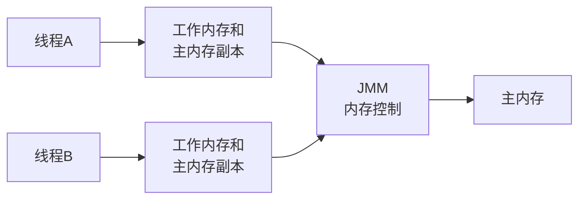
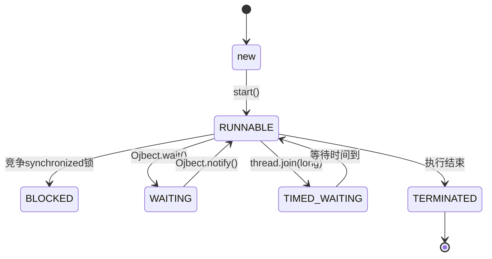
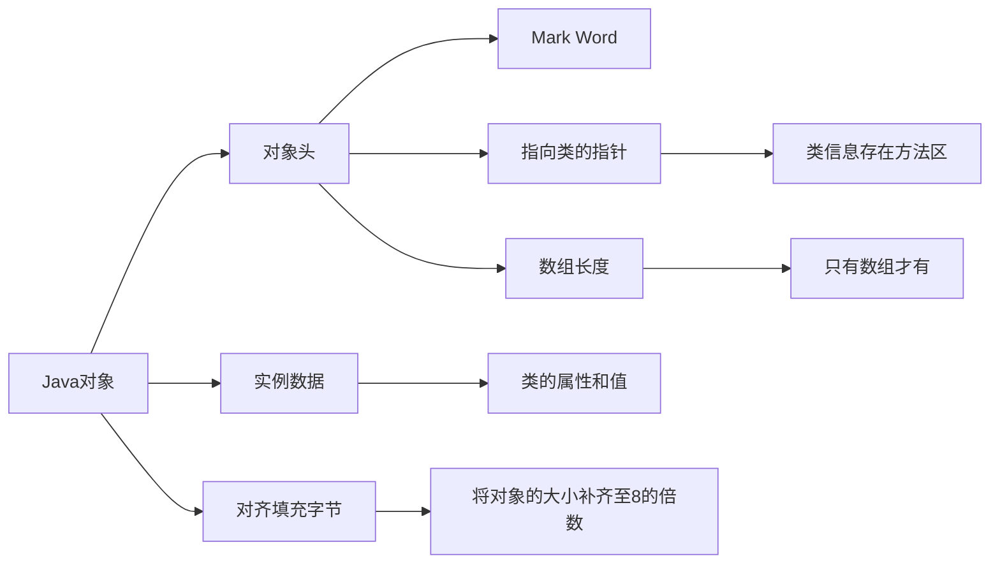
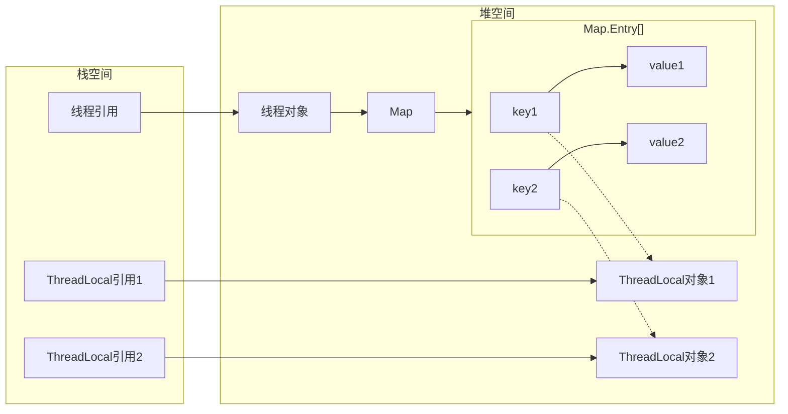
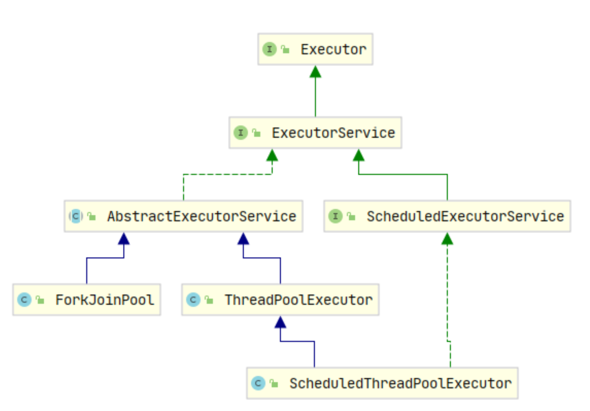
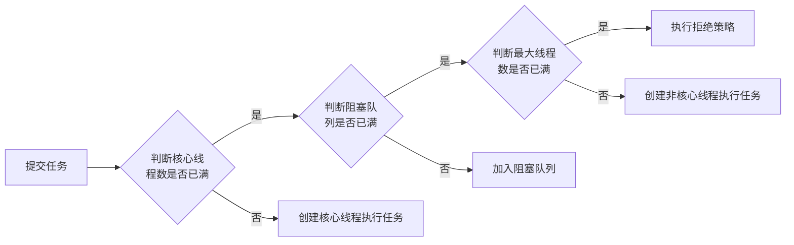

# 求职-面试题-多线程并发

# 文档说明

本文档主要分享求职面试题。如有问题，欢迎讨论交流。

| 文档名称     | Java面试题-多线程并发 |
| ------------ | --------------------- |
| 文档分类     | 求职-面试             |
| 版本号       | 1.5                   |
| 最后更新人   | namelessmyth          |
| 最后更新日期 | 2023-12-18            |
| 编制人       | namelessmyth          |
| 编制日期     | 2021-07-07            |


# 文档更新记录

| 版本 | 编制/修改人 | 修改日期   | 备注（原因、进一步的说明等）                         |
| ---- | ----------- | ---------- | ---------------------------------------------------- |
| 1.0  | Gem         | 2021-07-07 | 初稿，整理了本次找工作积累到的所有面试题             |
| 1.1  | Gem         | 2023-09-15 | 合并马士兵的面试笔记，重新整理目录结构               |
| 1.2  | Gem         | 2023-09-19 | 整理Spring部分，将简历和沟通部分独立出去。           |
| 1.3  | Gem         | 2023-09-30 | 完成Spring Framework面试题的初步整理。               |
| 1.4  | Gem         | 2023-10-15 | 补充SpringBoot和SpringMVC面试题，将所有题目提升至3级 |
| 1.5  | Gem         | 2023-12-18 | 第一轮并发面试题整理结束。                           |
|      |             |            |                                                      |


# 多线程并发

## 基本概念

### 并发和并行

并行(Parallel)，当系统有一个以上CPU时，当一个CPU执行一个进程时，另一个CPU可以执行另一个进程，两个进程互不抢占CPU资源，可以同时进行，这种方式我们称之为并行(Parallel)。

并发(Concurrent)，在操作系统中，是指一个时间段中有几个程序都处于已启动运行到运行完毕之间，目这几个程序都是在同一个处理器,上运行。

总结：

并发的多个任务之间是互相抢占资源的。 并发单核处理中也存在

并行的多个任务之间是不互相抢占资源的。并行只在多处理器中才会存在。


### 多线程上下文切换解释

**概念**

上下文切换是指CPU的控制权或者时间片从一个线程转到另一个线程，为了确保下一次恢复执行该线程时能够正确地运行，需要保存当前线程的上下文状态。

**线程和进程**

进程上下文切换与线程上下文切换最主要的区别就是线程的切换虚拟空间内存是相同的（因为都是属于自己的进程），但是，进程切换的虚拟空间内存则是不同的。线程上下文切换比进程上下文切换快的多。

**切换分类**

（1）主动切换或让步式上下文切换:

指执行线程时间片没到主动释放CPU，与锁竞争严重程度成正比，可通过减少锁竞争来避免；

（2）抢占式上下文切换:

指线程因分配的时间片用尽而被迫放弃CPU或者被其他优先级更高的线程所抢占，
一般由于线程数大于CPU可用核心数引起，可通过调整线程数，适当减少线程数来避免。

**上下文切换算法**

最简单最常用的就是基于时间片轮转调度算法。时间片轮转调度算法是非常公平的处理机分配方式，可以使就绪队列的每个进程每次仅运行一个时间片。 

原理：在时间片轮转调度算法中，系统根据先来先服务的原则，将所有的就绪进程排成一个就绪队列，并且每隔一段时间产生一次中断，激活系统中的进程调度程序，完成一次处理机调度，把处理机分配给就绪队列队首进程，让其执行指令。当时间片结束或进程执行结束，系统再次将CPU分配给队首进程。

**如何减少上下文切换**

（1）无锁并发编程。

多线程竞争时，会引起上下文切换，所以多线程处理数据时，可以用一些办法来避免使用锁，如将数据的ID按照Hash取模分段，不同的线程处理不同段的数据

（2）CAS算法。

  Java的Atomic包使用CAS算法来更新数据，而不需要加锁

（3）使用最少线程。

  避免创建不需要的线程，比如任务很少，但是创建了很多线程来处理，这样会造成大量线程都处于等待状态

（4）协程。

 在单线程里实现多任务的调度，并在单线程里维持多个任务间的切换。


### 对线程安全的理解

**线程安全是什么**

当多个线程访问一个对象时，如果不进行额外的同步控制或者其他的协调操作，调用这个对象的行为都可以获得正确的结果，我们就说这个对象是线程安全的。

线程安全也可以指某一段代码。例如：i++是不是线程安全的？答案：不是。

**原子性：** 提供互斥访问，同一时刻只能有一个线程对数据进行操作；例如：atomicXXX类，synchronized关键字的应用。

**有序性：** 一个线程观察其他线程中的指令执行顺序，由于指令重排序，该观察结果一般杂乱无序；例如，happens-before原则。

**可见性：** 一个线程对主内存的修改可以及时地被其他线程看到；例如：synchronized,volatile。

参考文章：[对线程安全的理解](https://zhuanlan.zhihu.com/p/446262986)


### Java线程异常对进程的影响

Java线程出现异常，如果这里的异常是我们认知中的Exception的话，JVM进程其实是不会退出的。

因为Java本身就是支持多线程的，每个Java线程都是相对独立的执行单元，每个线程是独立的执行上下文，异常只会影响抛出异常的线程。所以当一个线程抛出异常时，只会影响到该线程本身。其他线程将继续执行，不受异常的影响。

而且，在Java中，我们是可以自己主动的通过异常处理机制来捕获和处理异常的。如果在线程的代码中使用try.catch块来捕获异常，并在catch块中处理异常，那么异常不会传播到线程的外部，也不会影响整个进程的执行。

即使有的异常我们并没有捕获，Java也认为这些异常并不是特别严重(因为严重的话就不是异常，而是ERROR了)，所以JVM并不会因为一个线程的异常就直接把JVM进程直接退出。


### JMM介绍

#### JMM是什么

JMM就是Java内存模型(java memory model)。因为在不同的硬件生产商和不同的操作系统下，内存的访问有一定的差异，所以会造成相同的代码运行在不同的系统上会出现各种问题。所以java内存模型(JMM)屏蔽掉各种硬件和操作系统的内存访问差异，以实现让java程序在各种平台下都能达到一致的并发效果。

#### JMM规定了什么

Java内存模型规定所有的共享变量都存储在主内存中，包括实例变量，静态变量，但是不包括局部变量和方法参数。每个线程都有自己的工作内存，线程的工作内存保存了该线程用到的变量和主内存的副本拷贝，线程对变量的操作都在工作内存中进行。线程不能直接读写主内存中的变量。

不同的线程之间也无法访问对方工作内存中的变量。线程之间变量值的传递均需要通过主内存来完成。线程操作数据只能在工作内存中进行，然后刷回到主存。每个线程的工作内存都是独立的，这是 Java 内存模型定义的线程基本工作方式。如下图：



#### 硬件层面原因

首先CPU，内存，IO设备是存在速度差异的，可以形象描述为：CPU是天上1天，内存是地上1年。如果内存是天上1天，那IO设备就是地上10年。由于CPU和内存之间几个量级的速度差异，所以引入了高速缓存，但由于CPU每个核心的高速缓存互相之间的不可见性。出现缓存一致性问题。解决缓存一致性问题有2个方案：总线锁和MESI协议。

总线锁虽然能解决可行性问题但是会带来性能问题。因为一个cpu在操作共享变量时其他cpu都是阻塞的。

MESI协议，当CPU0修改变量时如果发现当前变量是共享状态（S），会通知其他cpu先将这个共享变量置为失效状态I，等到其他cpu修改完毕并且回复CPU0时，CPU0才会将共享变量改成E独占状态。修改完成之后改成M状态。然后数据写入缓存行中。

这样做性能虽然比总线锁提高了。但是有个缺点是CPU需要在等待所有的Invalid ack之后才会进行下面的操作。这会让CPU产生一定的阻塞，无法充分利用CPU。这个时候就出来了写缓冲器和无效队列化。

虽然写缓冲器虽然进一步优化了性能，但还是会带来可见性问题。这就需要借助内存屏障来配合解决可见性问题。

#### JMM3大特性

整个Java内存模型实际上是围绕着三个特征建立起来的。分别是：原子性，可见性，有序性。这三个特征可谓是整个Java并发的基础。

#### 原子性

原子性指的是一个操作是不可分割，不可中断的，一个线程在执行这个操作时不会被其他线程干扰。

**下面这几句代码是原子性的吗？**

```java
int i = 2;
int j = i;
i++;
i = i + 1;
```

第一句是基本类型赋值操作，必定是原子性操作。

第二句先读取i的值，再赋值到j，两步操作，不能保证原子性。

第三和第四句其实是等效的，先读取i的值，再+1，最后赋值到i，三步操作了，不能保证原子性。

JMM保证基本指令的原子性，如果要保证一个代码块的原子性，提供了monitorenter 和 moniterexit 两个字节码指令，也就是 synchronized 关键字。因此在 synchronized 块之间的操作都是原子性的。

##### 和数据库原子性的区别

数据库原子性强调的要么一起成功要么一起回滚。并发的原子性不会回滚不会被中断，也不会回滚。

#### 可见性

可见性指当一个线程修改共享变量的值，其他线程能够立即知道被修改了。Java是利用volatile关键字来提供可见性的。  当变量被volatile修饰时，这个变量被修改后会立刻刷新到主内存，当其它线程需要读取该变量时，会去主内存中读取新值。而普通变量则不能保证这一点。

除了volatile关键字之外，synchronized也能实现可见性。synchronized在修改了本地内存中的变量后，解锁前会将本地内存修改的内容刷新到主内存中，确保了共享变量的值是最新的，也就保证了可见性。

final修饰的普通字段也可以保证可见性，但当final修饰的是数组，List的时候，我们虽然不能将声明的变量重新指向别的内存地址，但是可以修改List里边的内容，所以无法保证可见性。

#### 有序性

对于多线程环境，可能出现乱序现象，因为程序编译成机器码指令后可能会出现指令重排现象，重排后的指令与原指令的顺序未必一致

在Java中，可以使用synchronized或者volatile保证多线程之间操作的有序性。实现原理有些区别：

volatile关键字是使用内存屏障达到禁止指令重排序，以保证有序性。

synchronized保证同一时刻只允许一个线程能够操作。一个线程lock之后，必须unlock后，其他线程才可以重新lock，使得被synchronized包住的代码块在多线程之间串行执行。


### JMM8种内存操作

- lock(锁定)，作用于**主内存**中的变量，把变量标识为线程独占的状态。
- read(读取)，作用于**主内存**的变量，把变量的值从主内存传输到线程的工作内存中，以便下一步的load操作使用。
- load(加载)，作用于**工作内存**的变量，把read操作主存的变量放入到工作内存的变量副本中。
- use(使用)，作用于**工作内存**的变量，把工作内存中的变量传输到执行引擎，每当虚拟机遇到一个需要使用到变量值的字节码指令时将会执行这个操作。
- assign(赋值)，作用于**工作内存**的变量，它把一个从执行引擎中接受到的值赋值给工作内存的变量副本中，每当虚拟机遇到一个给变量赋值的字节码指令时将会执行这个操作。
- store(存储)，作用于**工作内存**的变量，它把一个从工作内存中一个变量的值传送到主内存中，以便后续的write使用。
- write(写入)：作用于**主内存**中的变量，它把store操作从工作内存中得到的变量的值放入主内存的变量中。
- unlock(解锁)：作用于**主内存**的变量，它把一个处于锁定状态的变量释放出来，释放后的变量才可以被其他线程锁定。

补充一下JMM对8种内存交互操作制定的规则吧：

- 不允许read、load、store、write操作之一单独出现，也就是read操作后必须load，store操作后必须write。
- 不允许线程丢弃他最近的assign操作，即工作内存中的变量数据改变了之后，必须告知主存。
- 不允许线程将没有assign的数据从工作内存同步到主内存。
- 一个新的变量必须在主内存中诞生，不允许工作内存直接使用一个未被初始化的变量。就是对变量实施use、store操作之前，必须经过load和assign操作。
- 一个变量同一时间只能有一个线程对其进行lock操作。多次lock之后，必须执行相同次数unlock才可以解锁。
- 如果对一个变量进行lock操作，会清空所有工作内存中此变量的值。在执行引擎使用这个变量前，必须重新load或assign操作初始化变量的值。
- 如果一个变量没有被lock，就不能对其进行unlock操作。也不能unlock一个被其他线程锁住的变量。
- 一个线程对一个变量进行unlock操作之前，必须先把此变量同步回主内存。


### 总线嗅探和总线风暴

在JMM（Java内存模型）中，总线嗅探和总线风暴问题与CPU缓存一致性有关

在多线程编程中，如果多个线程共享同一个变量，且变量存储在主存中，则每个线程都有可能在自己的缓存中缓存该变量。如果一个线程修改了该变量的值，那么其他线程可能无法立即看到这个修改，因为它们缓存的是旧值。

为了保证缓存一致性，CPU 会使用**总线嗅探**机制来检测是否有其他处理器修改了该变量，如果有，则会将缓存中的旧值更新为新值。但是，如果多个线程频繁地读写共享变量，就会导致大量的总线通信，从而引发**总线风暴**的问题，降低系统的性能

总线嗅探是多处理器系统中的一种通信机制，用于处理多个处理器共享的数据。在这种机制下，每个处理器都可以监视系统总线上的数据传输，以便了解数据是否与自己相关。如果数据与某个处理器相关，则该处理器将接管该数据，进行相应的操作。总线嗅探机制能够提高系统的性能，因为它能够减少数据冲突和锁竞争等问题，提高系统的并行性和效率

总线嗅探也会引发总线风暴的问题。当多个处理器同时竞争总线上的资源时，就会产生大量的总线通信，从而导致总线风暴。总线风暴会降低系统的性能，并可能导致系统崩溃。

为了解决缓存一致性和总线风暴问题，Java内存模型提供了一系列同步机制，如synchronized、ReentrantLock等。这些机制能够保证线程之间的可见性和原子性，并通过锁竞争等方式减少总线通信，提高系统的性能和并发度


### 缓存一致性协议-MESI

https://www.yuque.com/hollis666/vzy8n3/gg2n5fqckk442ouf


### JDK21中的虚拟线程

JDK21中的虚拟线程其实这就是协程。是在JDK19中引入，在JDK21中成为正式功能。

在以前的JDK中，Java的线程模型比较简单，在大多数操作系统中，主要采用的是基于轻量级进程实现的一对的线程模型，简单来说就是每一个Java线程对应一个操作系统中的轻量级进程，这种线程模型中的线程创建、析构及同步等动作，都需要进行系统调用。而系统调用则需要在用户态 (User Mode) 和内核态(Kernel Mode)中来回切换，所以性能开销还是很大的。

而新引入的虚拟线程，是JDK实现的轻量级线程，他可以避免上下文切换带来的的额外耗费。他的实现原理其实是JDK不再是每一个线程都一对一的对应一个操作系统的线程了，而是会将多个虚拟线程映射到少量操作系统线程中，通过有效的调度来避免那些上下文切换

在JDK21中，创建协程的方法，如下

Thread.startVirtualThread()

Executors.newVirtualThreadPerTaskExecutor()

性能对比：有人测试过，相同的代码逻辑从线程改成携程后，执行时间从100秒降为1.6秒。

原文链接：https://www.yuque.com/hollis666/vzy8n3/ac1a0q


## 线程基础

### 线程的生命周期

#### 前言

线程的生命周期指的是线程从创建出来到最终消亡的整个过程，以及过程中的状态变化。

#### 线程状态图

以下图用mermaid语法绘制：



#### 状态变化说明

java线程对象的所有状态存放在**Thread类的内部类(State)**中：

1. 初始(NEW)
   1. 新创建了一个线程对象，但还没有调用start()方法
2. 运行(RUNNABLE)
   1. Java线程中将就绪(READY) 和运行中(RUNNING) 两种状笼统的称为“可运行"
   2. 就绪(READY)
      1. 线程对象创建后，其他线程(比如main线程调用了该对象的start()方法。该状态的线程位于可运行线程池中，等待被线程调度选中并分配cpu使用权
   3. 运行中 (RUNNING)
      1. 就绪(READY)的线程获得了cpu 时间片，开始执行程序代码
3. 阻塞(BLOCKED)
   1. 表示线程被锁阻塞时的状态。例如：多个线程竞争synchronized锁，有1个线程得到了锁，其他线程就是阻塞状态
4. 等待(WAITING)
   1. 线程暂停运行，等待其他线程唤醒之后再继续执行。
   2. 进入方法，例如：thread.join()，Ojbect.wait()，LockSupport.park()方法
   3. 唤醒方法，例如：Object.notify()，Object.notifyAll()
5. 定时等待(TIMED_WAITING)
   1. 该状态不同于WAITING，它可以在指定的时间后自行恢复
   2. 进入方法，例如：Thread.sleep(long)，Object.wait(long)，thread.join(long)，LockSupport.parkNanos，LockSupport.parkUntil
6. 终止(TERMINATED)
   1. 表示该线程已经执行结束或者异常中断；
   2. 线程一旦终止,就不能再重启启动,否则报错(IllegalThreadStateException)

#### 补充说明

在Thread类中过时的方法(因为存在线程安全问题,所以弃用了

-  void suspend()：暂停当前线程
-  void resume()：恢复当前线程
-  void stop()：结束当前线程


### 线程的创建方式

在Java中，有如下方式可以创建线程

1. 继承Thread类创建线程
2. 实现Runnable接口创建线程
3. 通过Callable和FutureTask创建线程
4. 通过线程池创建


### Callable和Runnable的区别

Runnable接口和Callable接口都可以用来创建新线程，他们有如下不同：

1. 实现Runnable接口，需要实现run方法；实现Callable接口的话，需要实现call方法。
2. Runnable的run方法无返回值，Callable的call方法有返回值，类型为Obiect
3. Callable中可以抛出checked exception，Runnable不可以。
4. Callable和Runnable都可以应用于executors。而Thread类只支持Runnable。


### run和start的区别

start是用来启动线程的。线程获得CPU时间片后执行的是run方法中的代码。


### wait/notify如何使用？

一个线程调用Object的 wait() 方法，使调用线程被阻塞；另一线程调用同一个Object的 notify()或notifyAll() 方法，使得wait() 阻塞的线程能够继续执行。

使用条件：

- 调用 wait 的线程和 notify 的线程必须已经拥有锁且是相同对象的锁
- wait() 方法和 notify() 方法必须在 Synchronized 方法或代码块中。
- 调用的是被锁定对象的wait和notify方法。

参考代码

```java
public class WaitNotifyTest1 {
    static Object object = new Object();

    public static void main(String[] args) {
        System.out.println("开始测试。" + new Date());
        new Thread(() -> {
            synchronized (object) {
                System.out.println("线程 A：已获得锁。" + new Date());
                try {
                    System.out.println("线程 A：准备wait。" + new Date());
                    object.wait();
                    System.out.println("线程 A：重新获取到锁，继续执行。" + new Date());
                } catch (InterruptedException e) {
                    e.printStackTrace();
                }
                System.out.println("线程 A：结束。" + new Date());
            }
        }, "线程 A。").start();

        new Thread(() -> {
            try {
                System.out.println("线程 B：先睡会。" + new Date());
                Thread.sleep(500L);
            } catch (InterruptedException e) {
                e.printStackTrace();
            }
            synchronized (object) {
                System.out.println("线程 B：nofiry A begin。" + new Date());
                object.notify();
                System.out.println("线程 B：nofiry A end。" + new Date());
                try {
                    // 试验执行完 notify() 方法后，A 线程是否能立即获取到锁
                    Thread.sleep(2000L);
                } catch (InterruptedException e) {
                    e.printStackTrace();
                }
                System.out.println("线程 B：结束。" + new Date());
            }
        }, "线程 B").start();
        System.out.println("主线程：结束。" + new Date());
    }
}

//控制台打印
开始测试。Mon Dec 18 20:57:20 CST 2023
线程 A：已获得锁。Mon Dec 18 20:57:20 CST 2023
主线程：结束。Mon Dec 18 20:57:20 CST 2023
线程 A：准备wait。Mon Dec 18 20:57:20 CST 2023
线程 B：先睡会。Mon Dec 18 20:57:20 CST 2023
线程 B：nofiry A begin。Mon Dec 18 20:57:20 CST 2023
线程 B：nofiry A end。Mon Dec 18 20:57:20 CST 2023
线程 B：结束。Mon Dec 18 20:57:22 CST 2023
线程 A：重新获取到锁，继续执行。Mon Dec 18 20:57:22 CST 2023
线程 A：结束。Mon Dec 18 20:57:22 CST 2023
```


### sleep和wait的区别

1. sleep是线程的静态方法，wait是Object对象方法。
2. sleep()方法可以在任何地方使用；而wait()方法则只能在同步方法或同步块中使用
3. wait()方法会释放对象锁，但sleep()方法不会；
4. wait后线程会进入到WAITING状态，直到被唤醒；sleep后进入到TIMED_WAITING状态。


### notify和notifyAll的区别

相同点

- 这2个方法都是用于唤醒waiting状态的线程，
- 唤醒的这些线程只是进入争夺队列，并不表示立即就可以获得CPU开始执行，因为wait方法被调用的时候线程已经释放了对象锁。
- notify和notifyAll因为也是操作对象的，所以把他们定义在Object类中。

区别是：

- 使用notifyAll可以唤醒所有处于waiting状态的线程，使其重新进入锁的争夺队列中，而notify只能唤醒一个。
- notifyAll可以把所有线程都唤醒，让他们都可以竞争锁，但是最终也只有一个可以获得锁并执行。


### 线程什么时候抛出InterruptedException

调用interrupt方法时。
抛出InterruptedException应该怎么处理
抛出异常后会默认复位。必须做出明确的处理。不能仅仅打印日志


### interrupt()的作用？线程复位及其方式

 interrupt()的作用是中断线程。将线程变量interrupt标记为true，

线程的复位就是将变量interrupt改为false，并且唤醒线程；

线程复位的方式有：抛出InterruptException异常，通过Thread.interrupted();


### interrupt, interrupted, isInterrupted()区别


### sleep，join，yield的区别。

sleep：睡眠指定时间，睡眠期间不会释放锁，超时后让出CPU时间片；

yield，和sleep(0)作用类似，让出当前线程的时间片

join：让调用该方法的线程的执行结果对主线程可见，内部基于wait notify实现；


### isAlive方法判断线程存活

通常情况下，只要线程状态不为new和terminated，thread.isAlive()都会返回true

```java
public static void main(String[] args) throws InterruptedException {

    Thread thread = new Thread(new Runnable() {
        @Override
        public void run() {
            try {
                Thread.sleep(10);
            } catch (InterruptedException e) {
                e.printStackTrace();
            }
        }
    });
    System.out.println(thread.getState().name() + " "+thread.isAlive());
    thread.start();
    while (true){
        System.out.println(thread.getState().name() + " "+thread.isAlive());
    }
}

//控制台输出
NEW false
RUNNABLE true
RUNNABLE true
TIMED_WAITING true
TIMED_WAITING true
RUNNABLE true
RUNNABLE true
RUNNABLE true
TERMINATED false
TERMINATED false
```

极少数情况，如果线程要修改状态的时候被其他线程锁定了，thread.isAlive()还是返回true。

```java
public class ThreadIsAlive {
    public static void main(String[] args) throws InterruptedException {
        Thread t1 = new Thread(() -> {
            System.out.println("t1 begin");
            try {
                Thread.sleep(1000);
            } catch (InterruptedException e) {
                System.out.println("t1 end");
            }
            System.out.println("t1 isAlive1:" + Thread.currentThread().isAlive());
        });

        Thread t2 = new Thread(() -> {
            synchronized (t1) {
                System.out.println("t2 begin");
                try {
                    Thread.sleep(2000);
                } catch (InterruptedException e) {
                }
                System.out.println("t2 end");
                System.out.println("t1 isAlive2:" + t1.isAlive());
            }
        });
        t1.start();
        t2.start();
        t1.join();
        System.out.println("t1 isAlive3:" + t1.isAlive());
    }
}

//控制台打印
t1 begin
t2 begin
t1 isAlive1:true
t2 end
t1 isAlive2:true
t1 isAlive3:false
```


### 守护线程是什么

在Java中线程分2类：User Thread(用户线程)、Daemon Thread(守护线程)。一般默认创建的就是用户线程，用于执行用户级任务。守护线程也就是“后台线程”，一般用来执行后台任务，守护线程的典型应用是GC(垃圾回收器)。

这两种线程唯一的区别是，Java虚拟机退出时会等待所有<用户线程>都结束而不会等<守护线程>执行完。

**守护线程创建**

可以通过使用setDaemon(true)方法，使线程成为一个守护线程。我们需要在启动线程之前调用一个线程的setDaemon(true)方法。否则，就会抛出一个java.lang.lllegalThreadStateException。可以使用isDaemon()方法来检查线程是否是守护线程。

```java
public class DeamonExit {
    /**
     * 此方法只会打印一遍守护线程中的内容就会退出。因为jvm不会等守护线程执行完毕才退出。
     * 但如果把 childThread.setDaemon(true);注释就会一直执行
     * @param args
     */
    public static void main(String[] args) {
        Thread childThread = new Thread(new Runnable() {
            @Override
            public void run() {
                try {
                    for (int i = 0; i < 1000; i++) {
                        System.out.println("I'm a Deamon thread:" + i);
                        TimeUnit.SECONDS.sleep(1);
                    }
                } catch (InterruptedException e) {
                    e.printStackTrace();
                }
            }
        });
        childThread.setDaemon(true);
        childThread.start();
        System.out.println("I'm a main thread...");
    }
}
```


### 线程如何被调度

https://zhuanlan.zhihu.com/p/359399947


## 锁与并发

### Synchronized是什么

Synchronized是一个java关键字，可以用在方法上和代码块上，主要用于保证在多线程的环境下多个线程同时访问共享资源时的线程同步的。简单来说就是synchronized可以使操作同一个共享资源的多个线程依次排队操作。

为什么不使用Synchronized就会出现问题？因为根据JMM的设计，共享变量是存储在主内存中，而线程他有自己的工作内存且他不能直接修改主内存的值，只能先把主内存中的值读取到自己的工作内存中形成副本，操作完了之后在同步到主内存中。在多线程环境下，如果他们不按照次序去操作同一个变量，就会出现其中一个线程并不是基于另一个线程的结果去做的操作，从而产生非预期的结果。

#### Synchronized作用范围

**修饰实例方法**

对当前方法所在的对象实例加锁，进入同步代码前要获得当前对象实例的锁。当对象的某个实例同步方法阻塞时，相同实例的其他同步方法也将阻塞。不同实例的同步实例方法不会阻塞，静态同步方法不会阻塞。非Synchronized方法不会被阻塞。

**修饰静态方法**

对当前类对象加锁，进入同步代码前要获得当前类对象的锁。当进入到某个类的同步静态方法后，其他同步静态方法也将阻塞。非Synchronized方法不会被阻塞。同步静态方法和实例方法不会相互阻塞。

**修饰代码块**

修饰代码块的时候要比上面两种方式更加灵活。可以指定加锁实例对象，也可以指定类对象加锁。根据锁定对象参考上述规则。

#### Synchronized锁类型

- 悲观锁：`synchronized`关键字实现的是悲观锁，每次访问共享资源时都会上锁。[悲观锁和乐观锁区别](#悲观锁和乐观锁)
- 非公平锁：`synchronized`关键字实现的是非公平锁，即线程获取锁的顺序并不一定是按照线程阻塞的顺序。
- 可重入锁：`synchronized`关键字实现的是可重入锁，即已经获取锁的线程可以再次获取锁。
- 独占锁或排他锁：`synchronized`关键字实现的是独占锁，即该锁只能被一个线程所持有，其他线程均被阻塞。


### Synchronized实现原理?

首先来看Synchronized修饰代码块的情况。以下是一段java代码以及经过javac编译之后的字节码。可以看到第6行有个monitorenter，第11行有monitorexit。这两个指令就是java实现锁的。这两个指令有一个reference类型的参数来指明要锁定和解锁的对象。

```java
	//java方法
    public static void main(String[] args) {
        int i = 0;
        //在project文件视图中选中java文件，然后选"view > view bytecode with Jclasslib"
        synchronized (SynchronizedByteCode.class){
            i++;
        }
    }

//此方法对应的字节码
 0 iconst_0
 1 istore_1
 2 ldc #4 <com/gem/j2se/thread/synchronize/SynchronizedByteCode>
 4 dup
 5 astore_2
 6 monitorenter
 7 iinc 1 by 1
10 aload_2
11 monitorexit
12 goto 20 (+8)
15 astore_3
16 aload_2
17 monitorexit
18 aload_3
19 athrow
20 return
```

在《[Java虚拟机规范](https://docs.oracle.com/javase/specs/jvms/se8/html/jvms-2.html#jvms-2.11.10)》中要求，在执行monitorenter指令时，首先要去尝试获取对象的锁。如果这个对象没被锁定，或者当前线程已经持有了那个对象的锁，就把锁的计数器的值增加一，而在执行 monitorexit  指令时会将锁计数器的值减一。一旦计数器的值为零，锁随即就被释放了。如果获取对象锁失败，那当前线程就应当被阻塞等待，直到请求锁定的对象被持有它的线程释放为止。

对于被Synchronized修饰的方法，通过查看字节码可知方法内部并没有 monitorenter 指令和 monitorexit 指令，取得代之的确实是方法的flags中出现ACC_SYNCHRONIZED标识，该标识指明了该方法是一个同步方法，JVM通过该ACC_SYNCHRONIZED访问标志来辨别一个方法是否声明为同步方法。如果是同步方法，则需要先获得监视器锁，然后开始执行方法，方法执行之后再释放监视器锁。这时如果其他线程来请求执行方法，会因为无法获得监视器锁而被阳阻断住。值得注意的是，如果在方法执行过程中，发生了异常，并且方法内部并没有处理该异常，那么在异常被抛到方法外面之前监视器锁会被自动释放。从上面的字节码中也可以看出，monitorexit出现了2次。第2次就是异常退出用的。

### Synchronized锁升级

参考自：https://zhuanlan.zhihu.com/p/377423211

锁升级是从JDK1.6开始引入的，原因是Synchronized阻塞或唤醒一条线程，需要操作系统来帮忙完成，这就不可避免地陷入用户态到核心态的转换中，进行这种状态转换需要很多的处理器时间。对于代码特别简单的同步块（例如：get或set方法被synchronized修饰了），状态转换消耗的时间甚至会比用户代码本身执行的时间还要长。所以JVM从1.6开始花了大量资源去实现各种锁优化技术，如适应性自旋锁(Adaptive Spinning)、锁消除(Lock  Elimination)、锁粗化(Lock Coarsening)、轻量级锁(Lightweight Locking)、偏向锁(Biased  Locking)等，这些技术都是为了提升锁的效率。

从JDK 1.6开始，synchronized锁的实现引入了“偏向锁”“轻量级锁”和“重量级锁”三种不同的状态，用来适应不同场景下的锁竞争情况。

在JDK15中，废弃了偏向锁 (https://openjdk.org/jeps/374 )

所以，在Java中，锁的状态分为四种，分别是无锁状态、偏向锁状态、轻量级锁状态和重量级锁状态。

在Java中，锁存储在java对象头的mark word中。首先来看Java对象的结构



在对象头的mark word中，低两位表示锁的状态，分别为“01” (无锁状态)、“01” (偏向锁状态)、"00” (轻量级锁状态)和“10” (重量级锁状态)。但是由于无锁状态和偏向锁都是"01"，所以在低三位引入偏向锁标记位，用"0"表示无锁，"1"表示偏向。


无锁 > 偏向锁 > 轻量级锁 > 重量级锁

#### 偏向锁

引入偏向锁的目的：减少只有一个线程执行同步代码块时的性能消耗，即在没有其他线程竞争的情况下，一个线程获得了锁。该线程不需要使用同步操作就可以访问对象。这种情况下，JVM会在对象头中记录该线程的 D 作为偏向锁的持有者，并将对象头中的 Mark Word 中的一部分作为偏向锁标识.在这种情况下，如果其他线程访问该对象，会先检查该对象的偏向锁标识，如果和自己的线程 ID 相同，则直接获取锁。如果不同，则该对象的锁状态就会升级到轻量级锁状态。

偏向锁的获取流程：

1. 检查对象头中Mark Word是否为可偏向状态，如果不是则直接升级为轻量级锁并记录线程ID。
2. 如果已经是偏向锁，判断Mark Work中的线程ID是否指向当前线程，如果是，则执行同步代码块。
3. 如果不是当前线程，则进行CAS操作竞争锁，如果竞争到锁，则将Mark Work中的线程ID设为当前线程ID，执行同步代码块。
4. 如果竞争失败，升级为轻量级锁。

偏向锁的获取流程如下图：


偏向锁的撤销：

只有等到竞争，持有偏向锁的线程才会撤销偏向锁。偏向锁撤销后会恢复到无锁或者轻量级锁的状态。

1. 偏向锁的撤销需要到达全局安全点，全局安全点表示一种状态，该状态下所有线程都处于暂停状态。
2. 判断锁对象是否处于无锁状态，即获得偏向锁的线程如果已经退出了临界区，表示同步代码已经执行完了。重新竞争锁的线程会进行CAS操作替代原来线程的ThreadID。
3. 如果获得偏向锁的线程还处于临界区之内，表示同步代码还未执行完，将获得偏向锁的线程升级为轻量级锁。

一句话简单总结偏向锁原理：使用CAS操作将当前线程的ID记录到对象的Mark Word中。

#### 轻量级锁

引入轻量级锁的目的：在多线程交替执行同步代码块时（未发生竞争），避免使用互斥量（重量锁）带来的性能消耗。但多个线程同时进入临界区（发生竞争）则会使得轻量级锁膨胀为重量级锁。

轻量级锁的获取流程：

- 首先判断当前对象是否处于一个无锁的状态，如果是，Java虚拟机将在当前线程的栈帧建立一个锁记录（Lock Record），用于存储对象目前的Mark  Word的拷贝，如图所示。


- 将对象的Mark Word复制到栈帧中的Lock Record中，并将Lock Record中的owner指向当前对象，并使用CAS操作将对象的Mark Word更新为指向Lock Record的指针，如图所示。


- 如果第二步执行成功，表示该线程获得了这个对象的锁，将对象Mark Word中锁的标志位设置为“00”轻量级锁，执行同步代码块。
- 如果第二步未执行成功，需要先判断当前对象的Mark  Word是否指向当前线程的栈帧，如果是，表示当前线程已经持有了当前对象的锁，这是一次重入，直接执行同步代码块。
- 如果不是表示多个线程存在竞争，该线程通过自旋尝试获得锁，即重复步骤2，自旋超过一定次数，轻量级锁升级为重量级锁。

轻量级锁的解锁：

轻量级的解锁同样是通过CAS操作进行的，线程会通过CAS操作将Lock Record中的Mark Word（官方称为Displaced Mark  Word）替换回来。如果成功表示没有竞争发生，成功释放锁，恢复到无锁的状态；如果失败，表示当前锁存在竞争，升级为重量级锁。

一句话总结轻量级锁的原理：将对象的Mark Word复制到当前线程的Lock Record中，并将对象的Mark Word更新为指向Lock  Record的指针。

#### 锁对比

|    锁    |                             优点                             |                     缺点                      |              实用场景              |
| :------: | :----------------------------------------------------------: | :-------------------------------------------: | :--------------------------------: |
|  偏向锁  | 加锁和解锁不需要额外的消耗，和执行非同步方法相比仅存在纳秒级的差距 |  如果线程间存在竞争，会额外带来锁撤销的消耗   |  适用于只有一个线程访问同步块场景  |
| 轻量级锁 |           竞争的线程不会阻塞，提高了程序的响应速度           | 如果始终得不到锁竞争的线程，使用自旋会消耗CPU | 追求响应时间，同步块执行速度非常快 |
| 重量级锁 |               线程竞争不使用自旋，不会消耗CPU                |            线程阻塞，响应时间缓慢             |   追求吞吐量，同步块执行速度较慢   |


### Synchronized锁升级中的自旋

基于Open JDK 8中源码显示，synchronized升级过程中有2次自旋

第1次自旋

第1次自旋发生在 synchronized 获取轻量级锁时，即当一个线程尝试获取一个被其他线程持有的轻量级锁时，它会自旋等待锁的持有者释放锁。

在OpenJDK 8中，轻量级锁的自旋默认是开启的，最多自旋15次，每次自旋的时间逐渐延长。如果15次自旋后仍然没有获取到锁，就会升级为重量级锁。

第2次自旋

第2次自旋发生在 synchronized 轻量级锁升级到重量级锁的过程中。即当一个线程尝试获取一个被其他线程持有的重量级锁时，它会自旋等待锁的持有者释放锁。

在OpenJDK 8中，默认情况下不会开启重量级锁自旋。如果线程在尝试获取重量级锁时，发现该锁已经被其他线程占用，那么线程会直接阻塞，等待锁被释放。如果锁被持有时间很短，可以考虑开启重量级锁自旋，避免线程挂起和恢复带来的性能损失

自适应自旋

在JDK6中之后的版本中，JVM引入了自适应的自旋机制。该机制通过监控轻量级锁自旋等待的情况，动态调整自旋等待的时间。

如果自旋等待的时间很短，说明锁的竞争不激烈，当前线程可以自旋等待一段时间，避免线程挂起和恢复带来的性能损失。如果自旋等待的时间较长，说明锁的竞争比较激烈，当前线程应该及时释放CPU资源，让其他线程有机会执行。

自适应的自旋实现在ObjectSynchronizer::fastHashCode()函数中。该函数会根据轻量级锁自旋等待的情况，调整自旋等待的时间。


### Synchronized锁优化

高效并发是从JDK 1.5 到 JDK 1.6的一个重要改进，HotSpot虚拟机开发团队在这个版本中花费了很大的精力去对Java中的锁进行优化，如**适应性自旋、锁消除、锁粗化、轻量级锁和偏向锁**等。这些技术都是为了在线程之间更高效的共享数据，以及解决竞争问题。

https://www.yuque.com/hollis666/vzy8n3/qewdiv


### JDK15废弃偏向锁的原因

在过去，Java 应用通常使用的都是 HashTable、 Vector 等比较老的集合库，这类集合库大量使用了synchronized 来保证线程安全。所以偏向锁技术作为synchronized的一种优化手段，可以减少无锁竞争情况下的开销，通过假定一个锁一直由同一线程拥有，从而避免执行比较和交换的原子操作。

但是，偏向锁的局限是当只有一个线程反复进入同步代码块时他才能快速获得，但是当有其他线程尝试获取锁的时侯，就需要等到 safe point 时，再将偏向锁撤销为无锁的状态或者升级为轻量级锁，而这个过程其实是会消耗定的性能的。

在高并发的场景下频繁的撤销偏向锁和重新偏向不仅不能提升性能，还会导致性能下降，特别是在那些锁竞争较为激烈的应用中。
并目，随着Java应用程序的发展和优化，过去能够从偏向锁中获得的性能提升在当今的应用中不再明显。许多现代应用程序使用了不需要同步的集合类或更高性能的并发数据结构 (如ConcurrentHashMap.CopyOnWriteArrayList等) ，而不再频繁地执行无争用的同步(synchronized)操作。

还有就是官方在文档中提到的，偏向锁的引入导致代码很复杂，给HotSpot虚拟机中锁相关部分与其他组件之间的交互也带来了复杂性。这种复杂性使得理解代码的各个部分变得困难，并且阻碍了在同步子系统内进行重大设计更改。因此，废弃偏向锁有助于减少复杂性，使代码更容易维护和改进

总之，废弃偏向锁是为了减少复杂性、提高代码可维护性，并鼓励开发人员采用更现代的并发编程技术，以适应当今Java应用程序的性能需求。


### volatile的介绍

volatile主要用于保证JMM的可见性和有序性。只能用于修饰变量，被volatile修饰的共享变量具有以下特点。

1. 对变量的修改会立刻刷新到主存，当其它线程需要读取该变量时，会去主存中读取新值
2. 禁止指令重排序


### volatile能保证原子性么

首先需要解释一下，原子性指的是一个操作是不可分割，不可中断的。而volatile只是用来修饰变量的并不像synchronized那样可以修饰方法或者代码快。

其次synchronized可以保证原子性是因为他在一段代码的开始和结束是加了锁的，从而实现了原子性。

而volatile不带锁的功能也没有任何保证原子性的处理，所以不能保证原子性。


### volatile如何保证可见性和有序性

#### volatile保证可见性

对于volatile修饰的变量，当对变量进行写操作的时候，JVM会向处理器发送一条lock前缀的指令，将这个缓存中的变量回写到系统主存中

所以volatile所修饰的变量，在每次数据变化之后，其值都会被强制刷入主存。而其他处理器的缓存由于遵守了[缓存一致性协议](https://www.yuque.com/hollis666/vzy8n3/gg2n5fqckk442ouf)，也会把这个变量的值从主存加载到自己的缓存中。这就保证了一个volatile的变量在并发编程中，其值在多个处理器缓存中是可见的。

#### volatile保证有序性

volatile除了可以保证数据的可见性之外，还有一个强大的功能，那就是他可以禁止指令重排优化等.

普通的变量仅仅会保证在该方法的执行过程中所依赖的赋值结果的地方都能获得正确的结果，而不能保证变量的赋值操作的顺序与程序代码中的执行顺序一致。

volatile是通过在生成的字节码中加入内存屏障来禁止指令重排的，这就保证了代码的执行顺序会严格按照代码的先后顺序执行。这就保证了有序性。被volatile修饰的变量的操作，会严格按照代码顺序执行，load->add->save 的执行顺序就是：load、add、save。

如经典的双重校验锁单例模式必须加volatile的问题，就是因为volatile加了内存屏障

Java中的内存屏障是一种CPU指令，它可以防止CPU对指令序列进行重排序，从而保证在代码执行过程中，对内存的读写操作按照程序员的意愿来进行。volatile变量的内存屏障是通过一组指令来实现的，包括LoadLoad、LoadStore、StoreStore和StoreLoad。这些指令用于保证在volatile变量的读取和写入操作中，相邻指令之间的顺序不会被改变。

1.LoadLoad：确保在读取一个volatile变量前，前面的所有读操作都已经完成
2.LoadStore：确保在读取一个volatile变量后，后面的所有写操作都还没有开始
3.StoreStore：确保在写入一个volatile变量前，前面的所有写操作都已经完成
4.StoreLoad：确保在写入一个volatile变量后，后面的所有读操作都还没有开始。

当一个线程执行一个读取volatile变量的操作时，Java会插入LoadLoad和LoadStore屏障。LoadLoad屏障会防止该读取操作和前面的任何读取操作被重排序，LoadStore屏障则会防止该读取操作和后续的写入操作被重排序.

当一个线程执行一个写入volatile变量的操作时，Java会插入StoreStore和StoreLoad屏障StoreStore屏障会上该写入操作和前面的任何写入操作被重排序，StoreLoad屏障则会防止该写入操作和后续的读取操作被重排席

```java
public class VolatileExample {
    private volatile int value = 0;
	public void setValue(int newValue) {
        value = newValue; // store操作
    }
    public int getvalue() {
        return value; // Lad操作
    }
}
```

在上面的例子中，当使用volatile关键字修饰value字段时，编译器和JVM会在编译和执行过程中插入内存屏障.

当执行setValue()方法时，编译器会插入StoreStore屏障，确保在value被修改之前，所有的写操作都已经完成.

然后，编译器会插入StoreLoad屏障，确保在value被修改之后，所有的读操作都还没有开始。

当执行getValue()方法时，编译器会插入LoadLoad屏障，确保在读取value之前，前面的所有读操作都已经完成。然后，编译器会插入LoadStore屏障，确保在读取value之后，后面的所有写操作都还没有开始。

通过插入这些内存屏障，Java确保了volatile变量的可见性和禁止重排序，从而使得多线程访问volatile变量时能够正确地同步数据


### 有了Synchronized为什么还要volatile

synchronized其实是一种加锁机制，那么既然是锁，天然就具备以下几个缺点

1、有性能损耗: 虽然在JDK 1.6中对synchronized做了很多优化，如适应性自旋、锁消除、锁粗化、轻量级锁和偏向铁等。但是他毕竟还是一种锁。所以，无论是使用同步方法还是同步代码块，在同步操作之前还是要进行加锁，同步操作之后需要进行解锁，这个加锁、解锁的过程是要有性能损耗的。

2、产生阻塞: 无论是同步方法还是同步代码块，无论是ACC SYNCHRONIZED还是monitorenter、monitorexit都是基于Monitor实现的。基于Monitor对象，当多个线程同时访问一段同步代码时，首先会进入Entry Set，当有一个线程获取到对象的锁之后，才能进行The Owner区域，其他线程还会继续在Entry Set等待。并目当某个线程调用了wait方法后，会释放锁并进入Wait Set等待。所以，synchronize实现的锁本质上是一种阻塞锁。

除了前面我们提到的volatile比synchronized性能好以外，volatile其实还有一个很好的附加功能，那就是禁止指令重排。因为volatile借助了内存屏障来帮助其解决可见性和有序性问题，而内存屏障的使用还为其带来了一个禁止指令重排的附加功能，所以在有些场景中是可以避免发生指令重排的问题的。


### Happens-Before原则

#### 介绍

happens-before是指如果A线程的写操作a，与B线程的读操作b之间存在happens-before关系，尽管a操作和b操作在不同的线程中执行，但JMM向程序员保证a操作将对b操作可见。具体的定义如下：

1. 如果一个操作happens-before另一个操作，那么第一个操作的执行结果将对第二个操作可见，而且第一个操作的执行顺序排在第二个操作之前。
2. 两个操作之间存在happens-before关系，并不意味着Java平台的具体实现必须要按照happens-before关系指定的顺序来执行。如果重排序之后的执行结果，与按happens-before关系来执行的结果一致，那么这种重排序并不非法（也就是说，JMM允许这种重排序）。

#### 程序顺序规则

一个线程中的每个操作，按照程序的先后顺序，前面的操作happens-before后续的任何操作。也就是说，单个线程内部每个操作都对后续操作可见。

对于这一点，可能会有疑问。顺序性是指，我们可以按照顺序推演程序的执行结果，但是编译器未必一定会按照这个顺序编译，但是编译器保证结果一定等于程序顺序推演的结果。

类似as-if-serial原则

```java
int a = 2;
int b = 3;
int c = a * b;//这里c=6，因为前面的行的值一定会被后面的读取到。
```


#### 传递性规则

如果 a happens before b, b happens before c

那 a happens before  c


#### volatile变量规则

对一个volatile变量的写操作，Happens-Before于后续对这个变量的读操作。

也就是说，只要有一个线程先对volatile变量进行写操作，那后面线程去读这个变量时一定能读到正确的结果。这个需要大家重点理解。

#### 监视器锁规则

如果存在锁，那一个线程对锁的释放，一定happens before其他线程对于这个变量的加锁操作。也就是说一定是一个线程先释放锁，其他线程才能加锁。

```java
//如果存在锁，那一个线程对锁的释放，一定happens before其他线程对于这个变量的加锁操作
int x = 0;
synchronized(this){
    //其他线程这个地方读到一定是12
    if(x < 12){
        X = 12;
    }
}
```

#### 线程启动规则

在主线程A中启动子线程B，那么主线程A在start子线程之前的操作对线程B中的所有操作可见。

```java
//在线程start之前的操作一定happens before 线程内部的操作。
public static void StartDemo(){
    int x = 0;
    Thread t = new Thread(()->{
        if(x == 20){
            //这里X一定是20
        }
    });
    
    x = 20;
    t.start();
}
```

#### 线程Join规则

一个线程join()之前的操作，一定对调用join方法的主线程可见

```java
int x = 0;
public static void joinDemo(){
    Thread t = new Thread(()->{
        x = 200;
    });
    t.start();
    t.join();
    //这里X一定是200
}
```

#### 线程中断规则

对线程interrupt()方法的调用Happens-Before于被中断线程的代码检测到中断事件的发生。

例如：下面的例子中在调用interrupt方法前x被改成了100，所以线程b判断中断代码的内部读到的一定是100。

```java
    //在线程A中将x变量的值初始化为0
    private int x = 0;

    public void execute(){
        //在线程A中初始化线程B
        Thread threadB = new Thread(()->{
            //线程B检测自己是否被中断
            if (Thread.currentThread().isInterrupted()){
                //如果线程B被中断，则此时X的值为100
                System.out.println(x);
            }
        });
        //在线程A中启动线程B
        threadB.start();
        //在线程A中将共享变量X的值修改为100
        x = 100;
        //在线程A中中断线程B
        threadB.interrupt();
    }
```


#### 对象终结规则

一个对象的初始化完成Happens-Before于它的finalize()方法的开始。就是初始化结束了之后才有可能会调用finalize方法。

下面代码执行结果一定是1，2。

```java
public class TestThread {

   public TestThread(){
       System.out.println("1");
   }

    @Override
    protected void finalize() throws Throwable {
        System.out.println("2");
    }

    public static void main(String[] args){
        new TestThread();
        System.gc();
    }
}
```


### As-if-serial介绍

as-if-serial语义的意思指：不管怎么重排序（编译器和处理器为了提高并行度），单线程程序的执行结果不能被改变。编译器、runtime和处理器都必须遵守as-if-serial语义。

为了遵守as-if-serial语义，编译器和处理器不会对存在数据依赖关系的操作做重排序，因为这种重排序会改变执行结果。但是，如果操作之间不存在数据依赖关系，这些操作可能被编译器和处理器重排序。

有点类似Happens-Before的程序顺序原则


### 死锁

#### 死锁介绍

死锁是指两个或两个以上的进程(或线程)在执行过程中，由于竞争资源或者由于彼此通信而造成的一种阻塞的现象，若无外力作用，它们都将无法推进下去。此时称系统处于死锁状态或系统产生了死锁，这些永远在互相等待的进程称为死锁进程。

比如: 丈母娘要求先买房才能结婚，但是女婿说先结婚买房

#### 死锁条件

1. 互斥条件: 一个资源每次只能被一个进程使用
2. 占有且等待:一个进程因请求资源而阻塞时，对已获得的资源保持不放。
3. 不可强行占有: 进程已获得的资源，在未使用完之前，不能强行剥夺
4. 循环等待条件: 若干进程之间形成一种头尾相接的循环等待资源关系

#### 死锁案例

```java
public class DeadLockDemo {
    public static void main(String[] args) {
        DeadLock d1 = new DeadLock(true);
        DeadLock d2 = new DeadLock(false);
        Thread t1 = new Thread(d1);
        Thread t2 = new Thread(d2);
        t1.start();
        t2.start();
    }
}

//定义锁对象
class MyLock {
    public static Object obj1 = new Object();
    public static Object obj2 = new Object();
}

//死锁代码
class DeadLock implements Runnable {
    private boolean flag;

    DeadLock(boolean flag) {
        this.flag = flag;
    }

    @Override
    public void run() {
        if (flag) {
            while (true) {
                synchronized (MyLock.obj1) {
                    System.out.println(Thread.currentThread().getName() + "----if获得obj1锁");
                    synchronized (MyLock.obj2) {
                        System.out.println(Thread.currentThread().getName() + "----if获得obj2锁");
                    }
                }
            }
        } else {
            while (true) {
                synchronized (MyLock.obj2) {
                    System.out.println(Thread.currentThread().getName() + "----否则获得obj2锁");
                    synchronized (MyLock.obj1) {
                        System.out.println(Thread.currentThread().getName() + "----否则获得obj1锁");
                    }
                }
            }
        }
    }
}
```

#### 解决死锁

想要解除和预防死锁，就避免4个条件同时发生就行了，一般从以下几个方面入手

破坏不可抢占: 设置优先级，使优先级高的可以抢占资源；

破坏循环等待:保证多个进程 (线程) 的执行顺序相同即可避免循环等待

如执行顺序都是: A->B->C，那就可以避免循环等待

最常用的避免方法就是破坏循环等待，就是当我们有多个事务的时候，最好让这几个事务的执行顺序相同。

如事务1: A->B->C，事务2: C->D->A，这种情况就有可能导致死锁

即事务1占有了A，等待C，而事务2占有了C在等待A。

所以，要避免死锁就把事务2改为: A -> D->C


### 可重入锁介绍与实现

可重入锁是一种多线程同步机制，允许同一线程多次获取同一个锁而不会导致死锁。同一个线程可以在持有锁的情况下再次请求并获得相同的锁，而不会被自己阻塞。可重入锁有助于避免死锁和提高代码的可维护性，因为它允许在一个线程中嵌套地调用锁定的方法。

我们常用的synchronized和ReentrantLock都是比较典型的可重入锁。也就是说，在一个线程调用synchronized方法的同时，可以在其方法体内部调用该对象另一个synchronized方法，也就是说一个线程得到个对象锁后可以再次请求该对象锁。

```java
public class ReEntryTest {
    public static void main(String[] args) {
        ReEntryTest reentrantLockTest = new ReEntryTest();
        reentrantLockTest.method1();
    }

    public synchronized void method1() {
        method2();
        System.out.println("invoke method1");
    }

    public synchronized void method2() {
        System.out.println("invoke method2");
    }
}
```

在可重入锁的实现上，一般是先要记录下来当前锁是归属于哪个线程的，然后再记录当前锁被重入了多少次。这样在加锁的时候判断是不是当前线程持有的锁，如果是则重入次数+1，否则重入失败。

在解锁时也同理，锁是当前线程加的，那就重入次数-1，直到等于0的时候，直接解锁。

reentrantLock也是同理


### ThreadLocal介绍

ThreadLocal又叫做线程本地变量，全称thread local variable，它的使用场合主要是为了解决多线程中因为数据并发产生不一致的问题。ThreadLocal为每一个线程都提供了变量的副本，使得每一个线程在某一时间访问到的并不是同一个对象，这样就隔离了多个线程对数据的数据共享，这样的结果无非是耗费了内存，也大大减少了线程同步所带来的性能消耗，也减少了线程并发控制的复杂度。

ThreadLocal的主要使用场景是：每个线程都需要存取一些变量，这些变量彼此独立、互不干扰、key重名，但值不相同。

#### 和Synchonized的区别

使用Synchronized就是为了解决并发访问共享变量问题的。Synchronized是利用锁的机制，使得变量或者是代码块在某一时刻里只能被一个线程来进行访问。并且一旦某个线程改了变量的值，其他线程读到的修改之后的值。

而ThreadLocal为每一个线程都提供了一个变量的副本，这样就是的每一个线程在某一时刻里访问到的不是同一个对象，这样就不会存在多线程访问共享变量的问题了。

ThreadLocal不可以使用原子类型，只能使用Object类型

#### 如何使用

https://juejin.cn/post/7251786209340407868

声明一个 `ThreadLocal` 类型的变量：

```java
private static ThreadLocal<T> threadLocal = new ThreadLocal<>();
```

其中 `T` 是存储在 `ThreadLocal` 中的值的类型。

使用 `ThreadLocal` 类的 `set()` 方法设置值：

```java
threadLocal.set(value);
```

这将把 `value` 存储在当前线程的 `ThreadLocal` 实例中。

使用 `ThreadLocal` 类的 `get()` 方法获取值：

```java
T value = threadLocal.get();
```

这将返回当前线程的 `ThreadLocal` 实例中存储的值。

使用 `ThreadLocal` 类的 `remove()` 方法清除值（可选）：

```java
threadLocal.remove();
```

这将从当前线程的 `ThreadLocal` 实例中移除值。

最后，在不再需要 `ThreadLocal` 对象时，应调用 `remove()` 方法来清理资源：

这样可以避免潜在的内存泄漏问题。

需要注意的是，`ThreadLocal` 的 `set()` 和 `get()` 方法都是针对当前线程的操作。因此，在使用 `ThreadLocal` 时，应确保在同一线程范围内使用相同的 `ThreadLocal` 对象。这样才能保证在同一线程中的多个方法或代码段中共享同一个 `ThreadLocal` 实例。

此外，可以为 `ThreadLocal` 提供初始值和默认值。例如，可以使用 `ThreadLocal` 的构造函数或 `initialValue()` 方法来设置初始值：

```java
private static ThreadLocal<T> threadLocal = new ThreadLocal<T>() {
    @Override
    protected T initialValue() {
        return initialValue;
    }
};
```

或者，可以在声明 `ThreadLocal` 变量时使用 lambada 表达式提供默认值：

```java
private static ThreadLocal<T> threadLocal = ThreadLocal.withInitial(() -> defaultValue);
```

以下是一个完整案例：

```java
public class ThreadLocalTest {
    public static ThreadLocal<Long> threadLocal = ThreadLocal.withInitial(() -> Thread.currentThread().getId());

    /**
     * 虽然threadLocal是定义在主线程中的，实际打印出来的值各不相同。
     * @param args
     * @throws InterruptedException
     */
    public static void main(String[] args) throws InterruptedException {
        for (int i = 0; i < 10; i++) {
            new Thread(() -> {
                System.out.println(threadLocal.get());
            }).start();
        }
        TimeUnit.SECONDS.sleep(5);
    }
}
```

#### 使用场景

1. 保存线程私有数据：`ThreadLocal` 可以用于保存每个线程所需的私有数据。例如，在多线程环境下，如果有一个对象需要在线程之间共享，但又希望每个线程都拥有它的私有拷贝，则可以使用 `ThreadLocal` 来存储这个对象。这样，每个线程都可以独立地读取和修改自己的私有拷贝，而互不干扰。
2. 提高性能：`ThreadLocal` 可以避免使用线程同步机制（如锁）来保护共享数据，从而提高程序的并发性能。由于每个线程都拥有自己的数据副本，因此不会出现线程间的竞争和冲突，从而避免了锁竞争带来的性能损耗。
3. 管理线程特定的资源：在某些场景下，我们需要为每个线程分配一些特定的资源，并且在线程结束时进行清理工作。`ThreadLocal` 可以通过在对象中存储和管理线程特定的资源，使得这些资源能够方便地与线程相关联，同时在线程结束时自动清理。
4. 解决上下文切换问题：在一些需要维护上下文关系的场景中，例如数据库连接、会话管理等，使用 `ThreadLocal` 可以很好地解决上下文切换的问题。通过将上下文相关的信息存储在 `ThreadLocal` 中，可以在同一线程内共享这些信息，而无需通过参数传递或全局变量访问来维护。比如像用户登录令牌解密后的信息传递、用户权限信息、从用户系统中获取到的用户名

```java
    // 用户微服务配置token解密信息传递例子
    public static ThreadLocal<LoginUser> threadLocal = new ThreadLocal<>();

    public void methodA(){
        LoginUser loginUser = new LoginUser();
        loginUser.setId(id);
        loginUser.setName(name);
        loginUser.setMail(mail);
        loginUser.setHeadImg(headImg);
        threadLocal.set(loginUser);
        //后续想直接获取到直接threadLocal.getxxx就可以了
    }   
```


### ThreadLocal实现原理

其实ThreadLocal本身并不存储数据，它更像是一个工具类，提供一些方法将数据存取在每个线程中。

ThreadLocal中用于保存每个线程独立变量的数据结构是一个内部类：ThreadLocalMap，也是K-V结构。

在Thread类中有一个ThreadLocalMap成员变量，这个就是数据真正存储的地方。

```java
public class Thread implements Runnable {

    /* ThreadLocal values pertaining to this thread. This map is maintained
     * by the ThreadLocal class. */
    ThreadLocal.ThreadLocalMap threadLocals = null;
   
}
```

因为一个线程可以有多个ThreadLocal变量，对应到ThreadLocalMap内部的Entry[] table数组，再基于ThreadLocal对象本身作为key，对value进行存取

```java
public class ThreadLocal<T> {
    private final int threadLocalHashCode = nextHashCode();
    
    static class ThreadLocalMap {
        static class Entry extends WeakReference<ThreadLocal<?>> {
            /** The value associated with this ThreadLocal. */
            Object value;

            Entry(ThreadLocal<?> k, Object v) {
                super(k);
                value = v;
            }
        }
        private static final int INITIAL_CAPACITY = 16;

        /**
         * 对应一个线程中的多个ThreadLocal变量
         */
        private Entry[] table;
        
        private Entry getEntry(ThreadLocal<?> key) {
            int i = key.threadLocalHashCode & (table.length - 1);
            Entry e = table[i];
            if (e != null && e.get() == key)
                return e;
            else
                return getEntryAfterMiss(key, i, e);
        }
    }
    
    public T get() {
        Thread t = Thread.currentThread();
        //根据当前线程取到线程自己的map对象
        ThreadLocalMap map = getMap(t);
        if (map != null) {
            //根据ThreadLocal对象获取Entry。
            ThreadLocalMap.Entry e = map.getEntry(this);
            if (e != null) {
                //不为空则返回其中的value
                @SuppressWarnings("unchecked")
                T result = (T)e.value;
                return result;
            }
        }
        return setInitialValue();
    }
}
```

结构图：



ThreadLocalMap的key是一个弱引用，弱引用的特点是，即便有弱引用存在，在GC时弱引用的对象也会被回收。


### ThreadLocal内存泄漏

#### 泄漏原因

ThreadLocal.ThreadLocalMap.Entry中的key是弱引用的，ThreadLocal对象一般会有2个引用指向它。一个是栈中对ThreadLocal强引用，另一个就是Map.Entry中key的弱引用。

一般情况下，ThreadLocal会作为静态变量，强引用一直存在。但还是存在定义成非静态变量的可能，那一边的强引用就可能会消失。此时弱引用的ThreadLocal对象就会被GC回收。此时如果value还有其他强引用时，内存中的value就会无法回收，同时也无法被获取到，这样就可能出现内存泄露情况。

如果不设计成弱引用而是强引用：那当一边的强引用消失后，ThreadLocal对象由于另一边还存在强引用而导致无法被回收，从而也可能导致内存泄漏问题。

#### 泄漏解决方案

在最新的ThreadLocal中已经做出了修改，即在调用set、get、remove方法时，会清除key为null的Entry。

但如果不调用这些方法，仍然还是会出现内存泄漏 。所以要养成用完ThreadLocal对象之后及时remove的习惯。


### ThreadLocal的局限性

ThreadLocal只能在同一个线程内部或者父子线程之间进行值传递，不能在线程间的进行值传递。


### ThreadLocal共享父线程的变量

https://blog.csdn.net/hewenbo111/article/details/80487252


### TransmittableThreadLocal介绍

已经有InheritableThreadLocal了，TransmittableThreadLocal是做什么的？

InheritableThreadLocal是用于主子线程之间参数传递的，但是这种方式有一个问题，那就是必须要是在主线程中手动创建的子线程才可以，而现在池化技术非常普遍了，很多时候线程都是通过线程池进行创建和复用的，这时候InheritableThreadLocal就不行了。

TransmittableThreadLocal是阿里开源的一个方案 (开源地址: https://github.com/alibaba/transmittable-thread-local )，这个类继承并加强InheritableThreadLocal类。用来实现线程之间的参数传递，一经常被用在以下场景中:

1. 分布式跟踪系统或全链路压测 (即链路打标)

2. 日志收集记录系统上下文
3. Session级Cache
4. 应用容器或上层框架跨应用代码给下层SDK传递信息


### 怎么样唤醒一个阻塞的线程?

https://blog.csdn.net/u014044812/article/details/79474575


### 是否能创建volatile数组？

可以，但volatile仅针对引用可见，数组中的数据不可见。


## JUC

### 实现线程同步的方式

线程同步指的就是让多个线程之间按照顺序访问同一个共享资源，避免因为并发冲突导致的问题，主要有以下几种方式:

#### synchronized

Java中最基本的线程同步机制，可以修饰代码块或方法，保证同一时间只有一个线程访问该代码块或方法，其他线程需要等待锁的释放


#### ReentrantLock

与synchronied关键字类似，也可以保证同一时间只有一个线程访问共享资源，但是更灵活支持公平锁、可中断锁、多个条件变量等功能


#### Semaphore

参考链接：https://zhuanlan.zhihu.com/p/98593407

**功能介绍**

Semaphore通常被称为信号量， 可以用来控制同时访问特定资源的线程数量，通过协调各个线程，以保证合理的使用资源。

可以把它简单的理解成我们停车场入口立着的那个显示屏，每有一辆车进入停车场显示屏就会显示剩余车位减1，每有一辆车从停车场出去，显示屏上显示的剩余车辆就会加1，当显示屏上的剩余车位为0时，停车场入口的栏杆就不会再打开，车辆就无法进入停车场了，直到有一辆车从停车场出去为止。

**使用场景**

通常用于那些资源有明确访问数量限制的场景，常用于限流 。

比如：数据库连接池，同时进行连接的线程有数量限制，连接不能超过一定的数量，当连接达到了限制数量后，后面的线程只能排队等前面的线程释放了数据库连接才能获得数据库连接。

比如：停车场场景，车位数量有限，同时只能容纳多少台车，车位满了之后只有等里面的车离开停车场外面的车才可以进入。

**使用步骤**

1. 初始化Semaphore，并设置最大值
2. 判断信号剩余量是否足够。
3. 足够则获得新的信号量。不够的话可以进行异常处理。
4. 业务做完，释放信号量。

案例代码

1、停车场容纳总停车量10。

2、当一辆车进入停车场后，显示牌的剩余车位数响应的减1.

3、每有一辆车驶出停车场后，显示牌的剩余车位数响应的加1。

4、停车场剩余车位不足时，车辆只能在外面等待。

```java
public class SemaphoreCar {
    /** 停车场允许最多容纳的车辆数：10 */
    private static Semaphore semaphore = new Semaphore(10);

    public static void main(String[] args) {
        //模拟100辆车进入停车场
        for (int i = 0; i < 100; i++) {
            Thread thread = new Thread(new Runnable() {
                public void run() {
                    try {
                        System.out.println("====" + Thread.currentThread().getName() + "来到停车场");
                        if (semaphore.availablePermits() == 0) {
                            System.out.println("停车位不足，请耐心等待");
                        }
                        //获取信号量-进入停车场
                        semaphore.acquire();
						//模拟车辆在停车场停留的时间
                        System.out.println(Thread.currentThread().getName() + "成功进入停车场");
                        Thread.sleep(new Random().nextInt(10 * 1000));
                        System.out.println(Thread.currentThread().getName() + "驶出停车场");
                        //释放令牌，腾出停车场车位
                        semaphore.release();
                    } catch (InterruptedException e) {
                        e.printStackTrace();
                    }
                }
            }, i + "号车");
            thread.start();
        }
        //程序会等到所有的车进入停车场并离开之后才会退出
    }
}
```


#### CountDownLatch

参考链接：https://www.cnblogs.com/Lee_xy_z/p/10470181.html

**介绍**

CountDownLatch是java.util.concurrent包中的一个线程同步工具类，他主要用来协调多个线程之间的同步或者起到线程之间的通信（而不是用作互斥的作用）。他可以让一个或多个线程在运行过程中的某个时间点能停下来等待其他的一些线程完成某些任务后再继续运行。

CountDownLatch使用一个计数器进行实现。计数器初始值为线程的数量。每当一个线程完成自己任务后，计数器的值就会减1。当计数器的值为0时，表示所有的线程都已经完成了他们的任务，然后在CountDownLatch上等待的线程就可以恢复执行接下来的任务。

类似的效果也可以使用线程的join()方法实现：在等待时间点调用其他线程的join()方法，当前线程就会等待join线程执行完之后才继续执行，但CountDownLatch实现更加简单，并且比join的功能更多。

**不足**

CountDownLatch是一次性的，计算器的值只能在构造方法中初始化一次，之后没有任何机制再次对其设置值，当CountDownLatch使用完毕后，它不能再次被使用。

**使用步骤**

1. 初始化CountDownLatch，并设置计数器大小。
2. 让符合条件之后要执行的线程等待，计数器归零之后。会自动执行。
3. 当条件线程执行完之后，让计数器减一。

案例代码：

```java
/**
 * CountDownLatch案例<br>
 * 主线程会等待子线程执行完毕之后才开始执行<br>
 * @author namelessmyth
 * @version 1.0
 * @date 2023/12/13
 */
public class CountDownLatchDemo1 {
    public static void main(String[] args) {
        ExecutorService service = Executors.newFixedThreadPool(3);
        //计数器为3
        final CountDownLatch latch = new CountDownLatch(3);
        for (int i = 0; i < 3; i++) {
            Runnable runnable = new Runnable() {
                @Override
                public void run() {
                    try {
                        System.out.println("子线程" + Thread.currentThread().getName() + "开始执行");
                       TimeUnit.SECONDS.sleep(new Random().nextInt(10));
                        System.out.println("子线程" + Thread.currentThread().getName() + "执行完成");
                        //执行完毕，计数器-1
                        latch.countDown();
                    } catch (InterruptedException e) {
                        e.printStackTrace();
                    }
                }
            };
            service.execute(runnable);
        }

        try {
            System.out.println("主线程" + Thread.currentThread().getName() + "等待子线程执行完成...");
            //主线程等待直到计数器的值为0才会开始执行
            latch.await();
            System.out.println("主线程" + Thread.currentThread().getName() + "执行完毕");
            service.shutdown();
        } catch (InterruptedException e) {
            e.printStackTrace();
        }
    }
}
```


#### CyclicBarrier

https://zhuanlan.zhihu.com/p/363411257

**介绍**

CyclicBarrier是java.util.concurrent包中的一个线程同步工具类，中文为“循环栅栏”，他作用是让一组线程相互等待，当达到一个共同点时，所有之前等待的线程再继续执行，且 CyclicBarrier 功能可重复使用。

举个例子，比如张三，李四，王五，赵六几人相约一起聚餐，然而他们每个人到达约会地点的耗时都不一样，有的人会早到，有的人会晚到，但是他们要都到齐了以后才可以决定点那些菜。这个案例里，人可以看成是线程，而到达餐厅就是CyclicBarrier的栅栏。

CyclicBarrier可以使一定数量的线程反复地在栅栏位置处汇集。当线程到达栅栏位置时将调用await方法，这个方法将阻塞直到所有线程都到达栅栏位置。如果所有线程都到达栅栏位置，那么栅栏将打开，此时所有的线程都将被释放，而栅栏将被重置以便下次使用。

CyclicBarrier字面意思是“可重复使用的栅栏”，CyclicBarrier 和 CountDownLatch 很像，只是 CyclicBarrier 可以有不止一个栅栏，因为它的栅栏（Barrier）可以重复使用（Cyclic）。


**使用场景**

场景1：所有玩家到齐之后开始匹配玩家，然后下一次到齐开始选择角色，再次到齐开始游戏加载。


场景2：我们坐大巴回老家，营运公司为了收益最大化，一般会等人满之后再发车。像这种等人坐满就发一班车的场景，就是 CyclicBarrier 所擅长的，因为它可以重复使用。 

**和CountDownLatch的区别**

- CountDownLatch的计数器只能使用一次，而CyclicBarrier的计数器可以使用reset()方法重置，可以使用多次，所以CyclicBarrier能够处理更为复杂的场景；
- CyclicBarrier还提供了一些其他有用的方法，比如getNumberWaiting()方法可以获得CyclicBarrier阻塞的线程数量，isBroken()方法用来了解阻塞的线程是否被中断；
- CountDownLatch允许一个或多个线程等待一组事件的产生，而CyclicBarrier用于等待其他线程运行到栅栏位置。

**案例代码**

```java
public class CyclicBarrierDemo1 {
    public static void main(String[] args) {
        // 创建大巴车，人数到达2就发车
        final CyclicBarrier cyclicBarrier = new CyclicBarrier(2, new Runnable() {
            @Override
            public void run() {
                System.out.println("人满了，准备发车：" + new Date());
            }
        });

        // 创建线程池
        ExecutorService threadPool = Executors.newFixedThreadPool(10);
        for (int i = 0; i < 10; i++) {
            threadPool.submit(() -> {
                // 进入任务
                try {
                    // 模拟不同的人不同时间上车
                    TimeUnit.SECONDS.sleep(new Random().nextInt(10));
                    // 任务执行
                    System.out.println(String.format("线程：%s 上车，到达时间：%s",
                            Thread.currentThread().getName(), new Date()));
                    // 到达后在栅栏处等待。
                    cyclicBarrier.await();
                } catch (Exception e) {
                    e.printStackTrace();
                }
            });
        }
        // 等待所有任务执行完终止线程池
        threadPool.shutdown();
    }
}
```


#### Phaser

https://www.cnblogs.com/54chensongxia/p/12884523.html

**简介**

Phaser是JDK1.7开始引入的一个同步工具类，适用于一些需要分阶段的任务的处理。它的功能与 **CyclicBarrier**和**CountDownLatch**有些类似，类似于一个多阶段的栅栏，并且功能更强大。可以在初始时设定参与线程数，也可以中途注册/注销参与者，当到达的参与者数量满足栅栏设定的数量后，会进行阶段升级（advance）

**使用场景**

1. 一种任务可以分为多个阶段，现希望多个线程去处理该批任务，对于每个阶段，多个线程可以并发进行，但是希望保证只有前面一个阶段的任务完成之后才能开始后面的任务。这种场景可以使用多个CyclicBarrier来实现，每个CyclicBarrier负责等待一个阶段的任务全部完成。但是使用CyclicBarrier的缺点在于，需要明确知道总共有多少个阶段，同时并行的任务数需要提前预定义好，且无法动态修改。而Phaser可同时解决这两个问题。
   - 拿PLM系统举例：一次数据同步可能会出来多个变更，每个变更还包含多个受影响物件。对于每一个变更中的受影响物件可以多线程并发执行，但是变更单之间还是希望按顺序执行。

**使用案例**

当所有注册线程到齐之后，每个线程才会继续执行。

```java
public class PhaserDemo1 {
    public static void main(String[] args) {
        Phaser phaser = new Phaser();
        for (int i = 0; i < 3; i++) {
            // 注册每个线程，所有注册的线程到齐之后才会继续。
            phaser.register();
            new Thread(new Task(phaser), "Thread-" + i).start();
        }
        System.out.println(Thread.currentThread().getName() + ": 主线程执行，时间 =" + new Date());
    }
}

class Task implements Runnable {
    private final Phaser phaser;

    Task(Phaser phaser) {
        this.phaser = phaser;
    }

    @Override
    public void run() {
        try {
            TimeUnit.SECONDS.sleep(new Random().nextInt(10));
            System.out.println(Thread.currentThread().getName() + ": 已到达，时间 =" + new Date());
            // 等待其它参与者线程到达
            int i = phaser.arriveAndAwaitAdvance();
            // do something
            System.out.println(Thread.currentThread().getName() + ": 已到齐继续，时间 =" + new Date());
        } catch (InterruptedException e) {
            throw new RuntimeException(e);
        }
    }
}

//打印结果
main: 主线程执行，时间 =Wed Dec 13 21:15:51 CST 2023
Thread-0: 已到达，时间 =Wed Dec 13 21:15:54 CST 2023
Thread-2: 已到达，时间 =Wed Dec 13 21:15:57 CST 2023
Thread-1: 已到达，时间 =Wed Dec 13 21:16:00 CST 2023
Thread-1: 已到齐继续，时间 =Wed Dec 13 21:16:00 CST 2023
Thread-0: 已到齐继续，时间 =Wed Dec 13 21:16:00 CST 2023
Thread-2: 已到齐继续，时间 =Wed Dec 13 21:16:00 CST 2023

Process finished with exit code 0
```


#### 他们的区别是什么

CountDownLatch是一个计数器，它允许一个或多个线程等待其他线程完成操作。它通常用来实现一个线程等待其他多个线程完成操作之后再继续执行的操作。

CyclicBarrier是一个同步屏障，它允许多个线程相互等待，直到到达某个公共屏障点，才能继续执行。它通常用来实现多个线程在同一个屏障处等待，然后再一起继续执行的操作。

Semaphore是一个计数信号量，它允许多个线程同时访问共享资源，并通过计数器来控制访问数量。它通常用来实现一个线程需要等待获取一个许可证才能访问共享资源，或者需要释放一个许可证才能完成操作的操作。


### 实现线程安全的方式

在编程中，如果遇到并发安全的情况，有哪些方案可以来实现线程安全呢? 以下是几个常见的方案

1、单线程

想要实现线程安全，最简单的方式就是干脆不支持多线程，只用单线程来执行，那么就可以从根本上杜绝线程安全的问题了。比如Redis，就是这种思想，在命令执行时，只依赖单线程进行.

2、互斥锁

如果一定要用多线程，比较有效的方式就是排队，那么加锁是一种比较常见的排队方式，无论是synchronized、ReentrantLock这种单机锁，还是Redis实现的分布式锁，还是数据库中的乐观锁、悲观锁，本地思想都是通过加互斥锁的方式让多个并发请求排队执行。

3、读写分

除了加锁以外，还有一种做法，那就是读写分离，比如Java并发包中有一种COW机制，即写时复制，主要就是读和写作分离的思想，因为读操作并发是没什么影响的，而写操作的话，只需要让他不发生并发就行了
比如，CopyOnWriteArrayList使用了一种叫写时复制的方法，当有新元素add到CopyOnWriteArrayList时，先从原有的数组中拷贝一份出来，然后在新的数组做写操作，写完之后，再将原来的数组引用指向到新数组.

4、原子操作

原子操作是不可中断的操作，要么全部执行成功，要么全部失败。在多线程环境中，可以使用原子操作来实现对共享资源的安全访问，例如Java中的AtomicInteger等操作。

原子操作底层一般都是依赖的操作系统的CAS指令，思想也就是Compare And Swap

5、不可变模式

并发问题之所以发生，有个重要原因就是因为多个线程间需要操作共享变量，试想一下，如果只有读的情况，那么永远也不会出现线程安全的问题，因为多线程读永远是线程安全的，但是多线程读写一定会存在线程安全的问题。

那既然这么说是不是通过只读就能解决并发问题呢? 其实最简单的办法就是让共享变量只有读操作，而没有写操作。这个办法如此重要，以至于被上升到了一种解决并发问题的设计模式: 不变性(mmutability) 模式

Java中的String就是不变模式的一种体现，他的好处是不会出现线程安全问题。

6、数据不共享

如果没有共享数据，那么就不会有线程安全问题了，除了不可变模式，还有一种我们常用的手段来避免并发问题。那就是用ThreadLocal来让每个线程的数据隔离。


### ReentrantLock是什么?底层怎么实现锁的?


### ReentrantLock和synchronized的区别

ReentrantLock和synchronized都是用于线程的同步控制，但它们在功能上来说差别比较大的。ReentrantLock的功能要丰富的多

相同点：都是可重入锁。不同点如下：

- Lock是一个接口底下有很多实现类，是JDK实现的。synchronized是一个关键字，是依赖JVM实现的。
- Lock是显式锁，需要手动开启和关闭。synchronized是隐式锁，可以自动释放锁。
- Lock是可中断锁，synchronized是不可中断锁，需要线程执行完才能释放锁。
- 发生异常时，Lock不会主动释放占有的锁，必须通过unlock进行手动释放，因此可能引发死锁。synchronized在发生异常时会自动释放占有的锁，不会出现死锁的情况。
- Lock可以判断锁的状态，synchronized不可以判断锁的状态。
- Lock实现锁的类型是可重入锁、公平锁、非公平锁。synchronized实现锁的类型是可重入锁，非公平锁。
- Lock适用于大量同步代码块的场景，synchronized适用于少量同步代码块的场景。


### 公平锁和非公平锁

多个线程共同争夺锁资源，只有一个能获取到锁，其他锁会进入阻塞队列。但锁被释放后，如果是按阻塞队列的顺序去获得锁，那就是公平锁。如果不按队列顺序，每个线程都有可能获取到锁那就是非公平锁。

两种锁分别适合不同的场景中，存在着各自的优缺点，对于公平锁来说，他的优点是所有的线程都能得到资源，不会饿死在队列中。但是他存在着吞吐量会下降很多，队列里面除了第一个线程，其他的线程都会阻塞，cpu唤醒阻塞线程的开销会很大的缺点。

而对于非公平锁来说，他可以减少CPU唤醒线程的开销，整体的吞吐效率会高点，CPU也不必去唤醒所有线程会减少唤起线程的数量。但是他可能会导致队列中排队的线程一直获取不到锁或者长时间获取不到锁，一直等待的情况。

#### ReentrantLock的2种实现

ReentrantLock2种锁都支持，默认的构造方法是非公平锁，如果想要公平锁可以用`new ReentrantLock(true);`如上所述非公平锁的效率和吞吐量要比公平锁高。

```java
public ReentrantLock() {
    sync = new NonfairSync();
}

public ReentrantLock(boolean fair) {
    sync = fair ? new FairSync() : new NonfairSync();
}
```


### LockSupport是什么？如何使用

`LockSupport`是一个线程阻塞和唤醒工具类，所有的方法都是静态方法，可以让线程在任意位置阻塞。

LockSupport常用方法

```java
public static void park(Object blocker); // 暂停当前线程
public static void parkNanos(Object blocker, long nanos); // 暂停当前线程，不过有超时时间的限制
public static void parkUntil(Object blocker, long deadline); // 暂停当前线程，直到某个时间
public static void park(); // 无期限暂停当前线程
public static void parkNanos(long nanos); // 暂停当前线程，不过有超时时间的限制
public static void parkUntil(long deadline); // 暂停当前线程，直到某个时间
public static void unpark(Thread thread); // 恢复当前线程
public static Object getBlocker(Thread t);
```

这里的park和unpark类似，wait和notify。其特点是：

1. wait和notify要在已锁定的对象上调用，park和unpark是在线程上调用。
2. notify方法是随机唤醒线程，unpark是唤醒指定线程。
3. `park`执行时不需要获取某个对象的锁，park执行后会响应中断。
4. LockSupport是非重入锁。
5. blocker的作用是在dump线程的时候看到阻塞对象的信息

参考使用案例

```java
public class LockSupportTest {
    public static Object u = new Object();

    public static void main(String[] args) throws InterruptedException {
        ChangeObjectThread t1 = new ChangeObjectThread("t1");
        t1.start();
        Thread.sleep(1000L);

        ChangeObjectThread t2 = new ChangeObjectThread("t2");
        t2.start();
        Thread.sleep(2000L);

        System.out.println("主线程中断t1。" + new Date());
        t1.interrupt();

        System.out.println("主线程unparkt2。" + new Date());
        LockSupport.unpark(t2);
        
        System.out.println("主线程等待t1 t2。" + new Date());
        t1.join();
        t2.join();
    }

    public static class ChangeObjectThread extends Thread {
        public ChangeObjectThread(String name) {
            super(name);
        }

        @Override
        public void run() {
            synchronized (u) {
                System.out.println(getName() + "开始park。" + new Date());
                LockSupport.park();
                if (Thread.currentThread().isInterrupted()) {
                    System.out.println(getName() + "被中断了。" + new Date());
                }
                System.out.println(getName() + "继续执行。"+ new Date());
            }
        }
    }
}

//打印结果
t1开始park。Mon Dec 18 23:13:50 CST 2023
主线程中断t1。Mon Dec 18 23:13:53 CST 2023
主线程unparkt2。Mon Dec 18 23:13:53 CST 2023
主线程等待t1 t2。Mon Dec 18 23:13:53 CST 2023
t1被中断了。Mon Dec 18 23:13:53 CST 2023
t1继续执行。Mon Dec 18 23:13:53 CST 2023
t2开始park。Mon Dec 18 23:13:53 CST 2023
t2继续执行。Mon Dec 18 23:13:53 CST 2023
```


### LongAdder是什么

LongAdder是Java 8中推出了一个新的类，主要是为了解决AtomicLong在多线程竞争激烈的情况下性能并不高的问题。它主要是采用分段+CAS的方式来提升原子操作的性能。

相比于AtomicLong，LongAdder有更好的性能，但是LongAdder是典型的以空间换时间的实现方式，所以他所需要用到的空间更大，而且LongAdder可能存在结果不准确的问题，而AtomicLong并不会

#### 适用场景

相比于AtomicLong，LongAdder性能更好，但是有一个小缺点就是有可能返回值没那么准确，但是也只是在并发极高，刚好返回sum时候有其他原子操作在进行累加的时候才会出现。

基于以上的特性，LongAdder比较适合于并发竞争激烈，但是对数据准确度要求并不是百分之百准确的场景，比如微博点赞、文章阅读量的统计等等场景中。

https://www.yuque.com/hollis666/vzy8n3/dhzyrg


### 父子线程如何共享数据

当我们在同一个线程中，想要共享变量的话，是可以直接使用ThreadLocal的，但是如果在父子线程之间，共享变量，ThreadLocal就不行了。

如以下代码，会抛出空指针异常:

```java
public class ThreadLocalParentChild {
    public static ThreadLocal<Integer> sharedData = new ThreadLocal<>();

    public static void main(String[] args) throws InterruptedException {
        sharedData.set(0);
        MyThread thread = new MyThread();
        thread.start();
        sharedData.set(sharedData.get() + 1);
        System.out.println("sharedData in main thread: " + sharedData.get());
    }

    static class MyThread extends Thread {
        @Override
        public void run() {
            System.out.println("sharedData in child thread: " + sharedData.get());
            //子线程这个地方没有初始化过，所以会空指针
            sharedData.set(sharedData.get() + 1);
            System.out.println("sharedData in child thread after increment: " + sharedData.get());
        }
    }
}
```

因为ThreadLocal 变量是为每个线程提供了独立的副本，因此不同线程之间只能访问它们自己的副本。

那么，想要实现数据共享，主要有两个办法，第一个是成员变量直接传递，第二个是借助InheritableThreadLocal

#### 成员变量直接传递

我们可以在子线程中创建一个成员变量，这样在主线程创建子线程的时候，可以给成员变量赋值，这样实现数据共享

#### InheritableThreadLocal

代码和上面的错误案例基本一样，只要把ThreadLocal改成InheritableThreadLocal就可以了。

```java
public class ParentChildInheritThreadLocal {
    public static InheritableThreadLocal<Integer> sharedData = new InheritableThreadLocal<>();

    public static void main(String[] args) throws InterruptedException {
        sharedData.set(0);
        MyThread thread = new MyThread();
        thread.start();
        TimeUnit.SECONDS.sleep(1);
        sharedData.set(sharedData.get() + 1);
        System.out.println("sharedData in main thread: " + sharedData.get());
    }

    static class MyThread extends Thread {
        @Override
        public void run() {
            System.out.println("sharedData in child thread: " + sharedData.get());
            //子线程这个地方没有初始化过，所以会空指针
            sharedData.set(sharedData.get() + 1);
            System.out.println("sharedData in child thread after increment: " + sharedData.get());
        }
    }
}

//控制台输出
sharedData in child thread: 0
sharedData in child thread after increment: 1
sharedData in main thread: 1
```

实现原理

在创建线程的时候，会调用线程的Thread.init()私有方法，有如下关键代码：

```java
if (inheritThreadLocals && parent.inheritableThreadLocals != null){
   this.inheritableThreadLocals = ThreadLocal.createInheritedMap(parent.inheritableThreadLocals); 
}
```

如上可知，线程创建的时候会判断父线程的inheritableThreadLocal是否为空，不为空则自动复制到子线程中。


### CompletableFuture多线程编排

https://juejin.cn/post/6970558076642394142

#### 前言

熟悉Java多线程并发的童鞋一定知道这些比较实用的工具类：Semaphore，CountDownLatch，CyclicBarrier，Phaser。今天在介绍一款比前面这些更加灵活而且强大的多线程编排利器：CompletableFuture。

什么是多线程编排？例如：线程A执行完了再执行线程B。线程A和B，有1个执行完了就执行线程C。线程A异常了就执行线程B。诸如此类。

CompletableFuture是在Java 8中新增加的，它提供了非常强大的Future的扩展功能（50多个方法），可以帮助我们简化异步编程的复杂性，提供了函数式编程的能力，可以通过回调的方式处理计算结果，并且提供了转换和组合CompletableFuture的方法

CompletableFuture类实现了Future接口，所以你还是可以像以前一样通过get方法阻塞或者轮询的方式获得结果，但是这种方式不推荐使用。CompletableFuture和FutureTask同属于Future接口的实现类，都可以获取线程的执行结果。


**常用方法介绍**

#### 创建异步任务

- supplyAsync执行CompletableFuture任务，支持返回值

- runAsync执行CompletableFuture任务，没有返回值。

##### supplyAsync


  ```java
  //使用默认内置线程池ForkJoinPool.commonPool()，根据supplier构建执行任务
  public static <U> CompletableFuture<U> supplyAsync(Supplier<U> supplier)
  //使用自定义线程池，根据supplier构建执行任务
  public static <U> CompletableFuture<U> supplyAsync(Supplier<U> supplier, Executor executor)
  ```

##### runAsync

```java
//使用默认内置线程池ForkJoinPool.commonPool()，根据runnable构建执行任务
public static CompletableFuture<Void> runAsync(Runnable runnable) 
//自定义线程，根据runnable构建执行任务
public static CompletableFuture<Void> runAsync(Runnable runnable,  Executor executor)
```

##### 代码案例

```java
public class CompletableFutureDemo {
    public static void main(String[] args) {
        //可以自定义线程池
        ExecutorService executor = Executors.newCachedThreadPool();
        //runAsync的使用
        CompletableFuture<Void> runFuture = CompletableFuture.runAsync(() -> System.out.println("runFuture 自定义线程池"), executor);
        //supplyAsync的使用
        CompletableFuture<String> supplyFuture = CompletableFuture.supplyAsync(() -> {
            System.out.println("supplyFuture 自定义线程池");
            return "返回值";
        }, executor);
        System.out.println(runFuture.join());
        System.out.println(supplyFuture.join());
        executor.shutdown();
    }
}
```

#### 任务异步回调

##### thenRun/thenRunAsync

做完第一个任务后，再做第二个任务。某个任务执行完成后，执行回调方法；但是前后两个任务**没有参数传递，第二个任务也没有返回值**

```java
public CompletableFuture<Void> thenRun(Runnable action);
public CompletableFuture<Void> thenRunAsync(Runnable action);
```

**案例代码**

```java
public class FutureThenRunTest {
    public static void main(String[] args) throws Exception {
        CompletableFuture<String> orgFuture = CompletableFuture.supplyAsync(() -> {
                    System.out.println("先执行第一个任务");
                    return "第一个方法返回值";
                }
        );

        CompletableFuture thenRunFuture = orgFuture.thenRun(() -> {
            System.out.println("接着执行第二个任务");
        });

        System.out.println(thenRunFuture.get());
    }
}

//控制台输出
先执行第一个任务
接着执行第二个任务
null
```

**两个方法的区别**

如果你执行第一个任务的时候，传入了一个自定义线程池

调用thenRun方法执行第二个任务时，则第二个任务和第一个任务是**共用同一个线程池**。

调用thenRunAsync执行第二个任务时，则第一个任务使用的是你自己传入的线程池，**第二个任务使用的是ForkJoin线程池**

后面介绍的thenAccept和thenAcceptAsync，thenApply和thenApplyAsync等，它们之间的区别也是这个

**源码**

```java
private static final Executor asyncPool = useCommonPool ?
     ForkJoinPool.commonPool() : new ThreadPerTaskExecutor();
     
 public CompletableFuture<Void> thenRun(Runnable action) {
     return uniRunStage(null, action);
 }
   
 public CompletableFuture<Void> thenRunAsync(Runnable action) {
     return uniRunStage(asyncPool, action);
 }
```

##### thenAccept/thenAcceptAsync

thenAccept方法表示：第一个任务执行完成后，执行第二个回调方法任务，会将该任务的执行结果，作为入参，传递到回调方法中，但是回调方法是**没有返回值**的

```java
public class FutureThenAcceptTest {
    public static void main(String[] args) throws Exception {
        CompletableFuture<String> orgFuture = CompletableFuture.supplyAsync(() -> {
                    System.out.println("第一个任务已执行");
                    return "第一个任务返回值";
                }
        );

        CompletableFuture thenAcceptFuture = orgFuture.thenAccept((a) -> {
            if ("第一个任务返回值".equals(a)) {
                System.out.println("满足条件，第二个任务已执行");
            } else {
                System.out.println("不满足条件，第二个任务未执行");
            }
        });
        System.out.println(thenAcceptFuture.get());
    }
}

//控制台输出
第一个任务已执行
满足条件，第二个任务已执行
null
```

##### thenApply/thenApplyAsync

thenApply方法表示，第一个任务执行完成后，执行第二个回调方法任务，会将该任务的执行结果，作为入参，传递到回调方法中，并且回调方法是有返回值的。

```java
public class FutureThenApplyTest {
    public static void main(String[] args) throws Exception {
        CompletableFuture<String> orgFuture = CompletableFuture.supplyAsync(() -> {
                    System.out.println("第一个任务");
                    return "第一个任务返回值";
                }
        );

        CompletableFuture<String> thenAcceptFuture = orgFuture.thenApply((a) -> {
            if ("第一个任务返回值".equals(a)) {
                System.out.println("满足条件，第二个任务已执行");
            } else {
                System.out.println("不满足条件，第二个任务未执行");
            }
            return "第二个任务返回值";
        });
        System.out.println(thenAcceptFuture.get());
    }
}

//控制台输出
第一个任务
满足条件，第二个任务已执行
第二个任务返回值
```

##### exceptionally

1. exceptionally方法表示，某个任务执行异常时，执行回调方法;并且会将该任务**抛出的异常作为参数**，传递到回调方法中。

2. ```java
   public class FutureExceptionTest {
       public static void main(String[] args) throws Exception {
           CompletableFuture<String> orgFuture = CompletableFuture.supplyAsync(() -> {
                       System.out.println("第一个任务:"+ Thread.currentThread().getName());
                       throw new RuntimeException();
                   }
           );
   
           CompletableFuture<String> exceptionFuture = orgFuture.exceptionally((e) -> {
               e.printStackTrace();
               System.out.println("异常回调任务:"+ Thread.currentThread().getName());
               return "异常回调任务返回值";
           });
   
           System.out.println(exceptionFuture.get());
       }
   }
   
   //控制台输出
   第一个任务:ForkJoinPool.commonPool-worker-9
   异常回调任务:ForkJoinPool.commonPool-worker-9
   异常回调任务返回值
   java.util.concurrent.CompletionException: java.lang.RuntimeException
   	at java.util.concurrent.CompletableFuture.encodeThrowable(CompletableFuture.java:273)
   	at java.util.concurrent.CompletableFuture.completeThrowable(CompletableFuture.java:280)
   	at java.util.concurrent.CompletableFuture$AsyncSupply.run(CompletableFuture.java:1606)
   	at java.util.concurrent.CompletableFuture$AsyncSupply.exec(CompletableFuture.java:1596)
   	at java.util.concurrent.ForkJoinTask.doExec(ForkJoinTask.java:289)
   	at java.util.concurrent.ForkJoinPool$WorkQueue.runTask(ForkJoinPool.java:1067)
   	at java.util.concurrent.ForkJoinPool.runWorker(ForkJoinPool.java:1703)
   	at java.util.concurrent.ForkJoinWorkerThread.run(ForkJoinWorkerThread.java:172)
   Caused by: java.lang.RuntimeException
   	at com.gem.j2se.thread.future.FutureExceptionTest.lambda$main$0(FutureExceptionTest.java:16)
   	at java.util.concurrent.CompletableFuture$AsyncSupply.run(CompletableFuture.java:1604)
   	... 5 more
   ```

##### whenComplete

1. 某个任务执行完成后，执行回调方法，回调方法无返回值；whenComplete方法返回的CompletableFuture的result是上个任务的结果。

2. ```java
   public class FutureWhenCompleteTest {
       public static void main(String[] args) throws Exception {
           CompletableFuture<String> orgFuture = CompletableFuture.supplyAsync(() -> {
                       System.out.println("第一个任务：" + Thread.currentThread().getName());
                       return "第一个任务返回值";
                   }
           );
   
           CompletableFuture<String> rstFuture = orgFuture.whenComplete((a, throwable) -> {
               System.out.println("whenComplete任务：" + Thread.currentThread().getName());
               System.out.println("上个任务返回值：" + a);
               System.out.println("上个任务异常：" + throwable);
           });
   
           System.out.println(rstFuture.get());
       }
   }
   
   //控制台输出
   第一个任务：ForkJoinPool.commonPool-worker-9
   whenComplete任务：main
   上个任务返回值：第一个任务返回值
   上个任务异常：null
   ```

##### handle

1. 某个任务执行完成后，执行回调方法，回调方法有返回值;并且handle方法返回的CompletableFuture的result是回调方法执行的结果。

2. ```java
   public class FutureHandlerTest {
       public static void main(String[] args) throws Exception {
           CompletableFuture<String> orgFuture = CompletableFuture.supplyAsync(() -> {
                       System.out.println("第一个任务：" + Thread.currentThread().getName());
                       return "第一个任务返回值";
                   }
           );
   
           CompletableFuture<String> rstFuture = orgFuture.handle((a, throwable) -> {
               System.out.println("whenComplete任务：" + Thread.currentThread().getName());
               System.out.println("上个任务返回值：" + a);
               System.out.println("上个任务异常：" + throwable);
               return "回调方法返回值";
           });
   
           System.out.println(rstFuture.get());
       }
   }
   
   //控制台输出
   第一个任务：ForkJoinPool.commonPool-worker-9
   whenComplete任务：main
   上个任务返回值：第一个任务返回值
   上个任务异常：null
   回调方法返回值
   ```


#### 多个任务条件组合

**AND组合关系**

thenCombine / thenAcceptBoth / runAfterBoth都表示：将两个CompletableFuture组合起来，只有这两个都正常执行完了，才会执行某个任务。

##### thenCombine

将两个任务的执行结果作为方法入参，传递到指定方法中，且**有返回值**

##### thenAcceptBoth

将两个任务的执行结果作为方法入参，传递到指定方法中，且**无返回值**

##### runAfterBoth

不会把执行结果当做方法入参，且没有返回值。


**OR组合的关系**

applyToEither / acceptEither / runAfterEither 都表示：将两个CompletableFuture组合起来，只要其中一个执行完了,就会执行某个任务。

##### applyToEither

将已经执行完成的任务，作为方法入参，传递到指定方法中，且有返回值

##### acceptEither

将已经执行完成的任务，作为方法入参，传递到指定方法中，且无返回值

##### runAfterEither

不会把执行结果当做方法入参，且没有返回值。


##### allOf

多个任务都执行完成后，才执行allOf返回的CompletableFuture。如果任意一个任务异常，allOf的CompletableFuture，执行get方法，会抛出异常

```java
public class FutureAllOfTest {
    public static void main(String[] args) throws Exception {
        CompletableFuture<String> a = CompletableFuture.supplyAsync(() -> {
            System.out.println("第一个任务：" + Thread.currentThread().getName());
            return "第一个任务返回值";
        });
        CompletableFuture<String> b = CompletableFuture.supplyAsync(() -> {
            System.out.println("第二个任务：" + Thread.currentThread().getName());
            return "第二个任务返回值";
        });
        CompletableFuture<String> c = CompletableFuture.supplyAsync(() -> {
            System.out.println("第三个任务：" + Thread.currentThread().getName());
            return "第三个任务返回值";
        });
        CompletableFuture<Void> future = CompletableFuture.allOf(a, b, c).whenComplete((result, ex) -> {
            System.out.println("回调任务入参：" + result + "," + ex);
        });
    }
}

//控制台输出
第一个任务：ForkJoinPool.commonPool-worker-9
第二个任务：ForkJoinPool.commonPool-worker-2
第三个任务：ForkJoinPool.commonPool-worker-2
回调任务入参：null,null
```


##### anyOf

任意一个任务执行完，就执行anyOf返回的CompletableFuture。如果执行的任务异常，anyOf的CompletableFuture，执行get方法，会抛出异常

```java
public class FutureAnyOfTest {
    public static void main(String[] args) throws Exception {
        CompletableFuture<String> a = CompletableFuture.supplyAsync(() -> {
            System.out.println("第一个任务：" + Thread.currentThread().getName());
            return "第一个任务返回值";
        });
        CompletableFuture<String> b = CompletableFuture.supplyAsync(() -> {
            System.out.println("第二个任务：" + Thread.currentThread().getName());
            return "第二个任务返回值";
        });
        CompletableFuture<Object> anyOfFuture = CompletableFuture.anyOf(a, b).whenComplete((result, ex) -> {
            System.out.println("回调任务入参：" + result + "," + ex);
        });
        anyOfFuture.join();
    }
}

//控制台输出
第一个任务：ForkJoinPool.commonPool-worker-9
第二个任务：ForkJoinPool.commonPool-worker-9
回调任务入参：第一个任务返回值,null
```


##### thenCompose

thenCompose 可以用于组合多个CompletableFuture的结果，将前一个任务的返回结果作为下一个任务的参数，它们之间存在着业务逻辑上的先后顺序。

thenCompose方法会在某个任务执行完成后，将该任务的执行结果作为方法入参然后执行指定的方法，该方法会返回一个新的CompletableFuture实例。

```java
public <U> CompletableFuture<U> thenCompose(Function<? super T, ? extends CompletionStage<U>> fn);
public <U> CompletableFuture<U> thenComposeAsync(Function<? super T, ? extends CompletionStage<U>> fn) ;
public <U> CompletableFuture<U> thenComposeAsync(Function<? super T, ? extends CompletionStage<U>> fn, Executor executor) ;
```

案例

```java
public class FutureThenComposeTest {
    public static void main(String[] args) throws Exception {
        CompletableFuture<String> a = CompletableFuture.supplyAsync(() -> {
            System.out.println("第一个任务：" + Thread.currentThread().getName());
            return "第一个任务返回值";
        });
        CompletableFuture<String> b = a.thenCompose(result -> CompletableFuture.supplyAsync(() -> {
            System.out.println("第二个任务：" + Thread.currentThread().getName());
            return result+", 第二个任务返回值";
        }));
        CompletableFuture<String> c = b.thenCompose(result -> CompletableFuture.supplyAsync(() -> {
            System.out.println("第三个任务：" + Thread.currentThread().getName());
            return result+", 第三个任务返回值";
        }));
        System.out.println(c.join());
    }
}

//控制台输出
第一个任务：ForkJoinPool.commonPool-worker-9
第二个任务：ForkJoinPool.commonPool-worker-9
第三个任务：ForkJoinPool.commonPool-worker-9
第一个任务返回值, 第二个任务返回值, 第三个任务返回值
```

#### 使用注意事项

##### Future需要获取返回值才能获取异常

Future需要获取返回值，才能获取到异常信息。如果不加 get()/join()方法，看不到异常信息。大家使用的时候，最好注意一下。

##### CompletableFuture的get()是阻塞的

CompletableFuture的get()方法是阻塞的，如果使用它来获取异步调用的返回值，可以考虑添加超时时间

```java
CompletableFuture.get();
//超时时间和时间单位
CompletableFuture.get(5, TimeUnit.SECONDS);
```

##### 注意默认线程池

CompletableFuture代码中又使用了默认的线程池，处理的线程个数是电脑CPU核数-1。在大量请求过来的时候，处理逻辑复杂的话，响应可能会很慢。建议使用自定义线程池并优化线程池配置参数。

##### 注意自定义线程池的饱和策略

CompletableFuture的get()方法是阻塞的，一般建议使用带超时时间的get方法。并且建议使用自定义线程池。

但是如果线程池拒绝策略是`DiscardPolicy`或者`DiscardOldestPolicy`，当线程池饱和时，会直接丢弃任务，不会抛弃异常。因此建议，CompletableFuture线程池策略**最好使用AbortPolicy**，然后耗时的异步线程，建议做好线程池隔离。


### CompletableFuture应用场景

CompletableFuture可以用在多个场景中，比如有多线程编排的需求的话，可以使用CompletableFuture实现。

CompletableFuture非常适合实现异步计算，在异步计算过程中，可以将计算任务提交到线程池中，并等待计算结果。在计算完成后，可以将结果传递给下一个阶段，以继续进行计算。

CompletableFuture可以用来实现批量执行异步任务，所有任务都执行成功后，执行下一个动作。

CompletableFuture 可以非常方便地实现并发编程。在并发编程中，可以使用 CompletableFuture 来实现任务调度、资源竞争等。

https://www.yuque.com/hollis666/vzy8n3/qgrygdsu04a6vfzw


### CompletableFuture实现原理

CompletableFuture是Java 8中引入的一个新特性，它提供了一种简单的方法来实现异步编程和任务组合。

他的底层实现主要涉及到了几个重要的技术手段，如Completion链式异步处理、事件驱动、ForkJoinPool线程池，以及CountDownLatch控制计算状态、通过CompletionException捕获异常等。

CompletableFuture 内部采用了一种链式的结构来处理异步计算的结果，每个 CompletableFuture 都有一个与之关联的 Completion 链，它可以包含多个 Completion 阶段，每个阶段都代表一个异步操作，并且可以指定它所依赖的前一个阶段的计算结果。 (在 CompletableFuture 类中，定义了一个内部类 Completion，它表示Completion 链的一个阶段，其中包含了前一个阶段的计算结果、下一个阶段的计算操作以及执行计算操作的线程池等信息。)

CompletableFuture 还使用了一种事件驱动的机制来处理异步计算的完成事件。在一 CompletableFuture 对象上注册的 Completion 阶段完成后，它会触发一个完成事件，然后 CompletableFuture 对象会执行与之关联的下一个 Completion 阶段。

CompletableFuture 的异步计算是通讨线程池来实现的。CompletableFuture在内部使用了一个ForkJoinPoo线程池来执行异步任务。当我们创建一个CompletableFuture对象时，它会在内部创建一个任务，并提交到ForkJoinPool中去执行。


### CAS是什么？常见问题

CAS是Compare And Swap的简称，它是一项乐观锁技术，顾名思义就是先比较再替换。

CAS操作包含三个操作数内存位置(V)、预期原值(A) 和新值(B)。在进行并发修改的时候，会先比较A和V的值是否相等，如果相等，则会把值替换成B，否则就不做任何操作。

当多个线程尝试使用CAS同时更新同一个变量时，只有其中一个线程能更新变量的值，而其它线程都失败，失败的线程并不会被挂起，而是被告知这次竞争中失败，并可以再次尝试。

在JDK1.5 中新增java.util.concurrent(J.U.C)就是建立在CAS之上的。相对于synchronized这种阻塞算法，CAS是非阻塞算法的一种常见实现。所以J.U.C在性能上有了很大的提升

CAS的主要应用就是实现乐观锁和锁自旋


#### ABA问题

CAS算法实现一个重要前提需要取出内存中某时刻的数据，而在下时刻比较并替换，那么在这个时间差类会导致数据的变化。

比如说一个线程1从内存位置V中取出A，这时候另一个线程2也从内存中取出A，并2进行了一些操作变成了B然后2又将V位置的数据变成A，这时候线程1进行CAS操作发现内存中仍然是A，然后1操作成功。尽管线程1的CAS操作成功，但是不代表这个过程就是没有问题的。
举个例子，线程1和线程2同时通过CAS尝试修改用户A余额，线程1和线程2同时查询当前余额为100元，然后线程2因为用户A要把钱借给用户B，先把余额从100改成50。然后又有用户C还给用户A 50元，线程2则又把50改成了100。这是线程1继续修改，把余额从100改成200。

虽然过程上金额都没问题，都改成功了，但是对于用户余额来说，丢失了两次修改的过程，在修改前用户C欠用户A 50元，但是修改后，用户C不欠钱了，而用户B欠用户A 50元了。而这个过程数据是很重要的。

部分乐观锁的实现是通过版本号(version)的方式来解决ABA问题，乐观锁每次在执行数据的修改操作时，都会带上一个版本号，一旦版本号和数据的版本号一致就可以执行修改操作并对版本号执行+1操作，否则就执行失败。因为每次操作的版本号都会随之增加，所以不会出现ABA问题，因为版本号只会增加不会减少。


#### 忙等待

因为CAS基本都是要自旋的，这种情况下，如果并发冲突比较大的话，就会导致CAS一直在不断地重复执行，就会进入忙等待

忙等待定义：一种进程执行状态。进程执行到一段循环程序的时候，由于循环判断条件不能满足而导致处理器反复循环，处于繁忙状态，该进程虽然繁忙但无法前进

所以，一旦CAS进入忙等待状态一直执行不成功的话，会对CPU造成较大的执行开销.


### CAS一定有自旋么

通常情况下，CAS 操作都会采用自旋的方式，当 CAS 失败时，会重新尝试执行 CAS 操作，直到操作成功或达到最大重试次数为止。

因为，CAS 操作一般都是在多线程并发访问时使用，如果直接阻塞线程，会导致性能下降，而采用自旋的方式可以让 CPU 空转一段时间，等待锁被释放，从而避免线程切换和阻塞的开销。

但是，如果自旋时间过长或者线程数过多，就会占用过多的 CPU 资源，导致系统性能下降，因此在使用 CAS 操作时，需要根据实际情况进行适当的调整.


### CAS如何在底层保证原子性

CAS是一种基本的原子操作，用于解决并发问题。在操作系统层面，CAS 操作的原理是基于硬件提供的原子操作指令。在x86架构的CPU中，CAS 操作通常使用 cmpxchg 指令实现。

为啥cmpxchg指令可以保证原子性呢? 主要由以下几个方面的保障

1.cmpxchg 指令是一条原子指令。在 CPU 执行 cpxchg 指令时，处理器会自动锁定总线，防止其他 CPU访问共享变量，然后执行比较和交换操作，最后释放总线。

2.cmpxchg 指令在执行期间，CPU 会自动禁止中断。这样可以确保 CAS 操作的原子性，避免中断或其他干扰对操作的影响。

3.cmpxchg 指令是硬件实现的，可以保证其原子性和正确性。CPU 中的硬件电路确保了 cmpxchg 指令的正确执行，以及对共享变量的访问是原子的。


### Unsafe是什么

Unsafe是CAS的核心类。因为Java无法直接访问底层操作系统，而是通过本地(native) 方法来访问。不过尽管如此，JVM还是开了一个后门，JDK中有一个类Unsafe，它提供了硬件级别的原子操作。

Unsafe是Java中一个底层类，包含了很多基础的操作，比如数组操作、对象操作、内存操作、CAS操作、线程(park)操作、栅栏(Fence) 操作，JUC包、一些第三方框架都使用Unsafe类来保证并发安全。

Unsafe类在JDK源码的多个类中用到，这个类的提供了一些绕开JVM的更底层功能，基于它的实现可以提高效率。但是，它是一把双刃剑：正如它的名字所预示的那样，它是Unsafe的，它所分配的内存需要手动free (不被GC回收)。Unsafe类，提供了JNI某些功能的简单替代：确保高效性的同时，使事情变得更简单.

Unsafe类提供了硬件级别的原子操作，主要提供了以下功能:

1. 通过Unsafe类可以分配内存，可以释放内存:
2. 可以定位对象某字段的内存位置，也可以修改对象的字段值，即使它是私有的:
3. 将线程进行挂起与恢复
4. CAS操作


### AQS介绍

https://www.cnblogs.com/zyrblog/p/9866140.html


### AQS如何实现线程等待和唤醒

AOS (AbstractQueuedSynchronizer)是Java中实现锁和同步器的基础类，通过FIFO双向队列来管理等待线程和阻塞线程，实现线程之间的协作。

AQS中线程等待和唤醒主要依赖park和unpark实现的。

当一个线程尝试获取锁或者同步器时，如果获取失败，AQS会将该线程封装成一个Node并添加到等待队列中，然后通过LockSupport.park()将该线程阻塞。

当一个线程释放锁或者同步器时，AQS会通过LockSupport.unpark()方法将等待队列中的第一个线程唤醒，并让其重新尝试获取锁或者同步器。

除了基本的等待和唤醒机制，AQS还提供了条件变量(Condition)的实现，用于在某些条件不满足时让线程等待，并在条件满足时唤醒线程。具体实现是通过创建一个等待队列，将等待的线程封装成Node并添加到队列中然后将这些线程从同步队列中移除，并在条件满足时将等待队列中的所有线程唤醒。


### ConcurrentHashMap使用及原理

https://www.cnblogs.com/zwh0910/p/14440248.html


## 线程池

### 线程池介绍

线程池是一种线程的使用模式，他是一种池化技术的典型实现，线程池就是提前创建好一定数量的线程，然后维护在线程池中。当有任务需要执行的时候，从线程池中选一个线程来执行任务。

在编程领域，比较典型的池化技术有：线程池、数据库连接池、对象池（字符窜常量池，Integer常亮池）等。

#### 线程池的优势

- 降低资源消耗：通过池化技术重复利用已创建的线程，降低线程创建和销毁造成的损耗。
- 提高响应速度：任务到达时，无需等待线程创建即可立即执行。
- 提高线程的可管理性：线程是稀缺资源，如果无限制创建，不仅会消耗系统资源，还会因为线程的不合理分布导致资源调度失衡，降低系统的稳定性。使用线程池可以进行统一的分配、调优和监控。
- 提供更多更强大的功能：线程池具备可拓展性，允许开发人员向其中增加更多的功能。比如延时定时线程池 ScheduledThreadPoolExecutor，就允许任务延期执行或定期执行。

#### 线程池创建

线程池的创建通过Executors类，创建出来的线程池都实现了ExecutorService接口。常用方法有以下几个：

newFixedThreadPool(int Threads)：创建固定数目线程的线程池。

newCachedThreadPool()：创建一个可缓存的线程池，调用execute 将重用以前构造的线程（如果线程可用）。如果没有可用的线程，则创建一个新线程并添加到池中。终止并从缓存中移除那些已有 60 秒钟未被使用的线程。

newSingleThreadExecutor()：创建一个单线程的线程池。

newScheduledThreadPool(int corePoolSize)：创建一个支持定时及周期性的任务执行的线程池，多数情况下可用来替代Timer类。

#### 线程池实现原理

类图（绿色：接口集成，蓝色：类继承，虚线：接口实现）



上面不同类型的线程池创建方法，底层都复用了这个方法。

```java
public ThreadPoolExecutor(int corePoolSize,
                          int maximumPoolSize,
                          long keepAliveTime,
                          TimeUnit unit,
                          BlockingQueue<Runnable> workQueue,
                          ThreadFactory threadFactory,
                          RejectedExecutionHandler handler) {
    if (corePoolSize < 0 ||
        maximumPoolSize <= 0 ||
        maximumPoolSize < corePoolSize ||
        keepAliveTime < 0)
        throw new IllegalArgumentException();
    if (workQueue == null || threadFactory == null || handler == null)
        throw new NullPointerException();
    this.acc = System.getSecurityManager() == null ?
            null :
            AccessController.getContext();
    this.corePoolSize = corePoolSize;
    this.maximumPoolSize = maximumPoolSize;
    this.workQueue = workQueue;
    this.keepAliveTime = unit.toNanos(keepAliveTime);
    this.threadFactory = threadFactory;
    this.handler = handler;
}
```

参数说明

- acc: 获取调用上下文
- corePoolSize: 核心线程数量或保留线程数量，即使空闲也不会回收。
- maximumPoolSize: 最大的线程数量，常驻+临时线程数量
- workQueue: 当提交的任务数超过核心线程数后，再提交的任务就存放在这里。它仅仅用来存放被 execute 方法提交的 Runnable 任务.
- keepAliveTime: 非核心线程空闲时间，当临时线程空闲超过这个时间，就自动销毁。
- unit：keepAliveTime 的时间单位
- threadFactory: 创建线程的工厂，在这个地方可以统一处理创建线程的属性。
- handler: 当提交的任务超过了最大线程数量时的拒绝策略。默认是不处理，抛出异常告诉任务提交者，我这忙不过来了

#### 流程图




线程池源码分析：https://zhuanlan.zhihu.com/p/350067478


### 线程池执行原理

无论是哪种类型的线程池最终都会创建一个ThreadPoolExecutor（线程池执行器），只是不同的线程池传入的参数不一样。

每一个线程执行execute方法的过程

如果在运行的线程小于核心线程数，则通过addWorker方法将线程添加为核心线程。

​	添加成功直接返回继续处理下一个执行下一个线程。直到工作线程数大于等于核心线程数量。

​	如果添加失败则获取线程池的最新状态。

如果线程池正在执行，则尝试将当前线程加入到工作队列。加入成功后，再次获取线程池状态。

​	如果线程池没有正在运行。则将任务从阻塞队列移除。成功则执行拒绝策略。

​	如果线程数等于0，则添加一个空的工作线程。这段不知道什么场景会进来。

如果前面加入工作队列失败，则以非核心线程身份包装任务（false标志）

​	失败则执行拒绝策略

```java
public void execute(Runnable command) {
    if (command == null)
        throw new NullPointerException();
    //获取线程池状态及当前线程数记录，高3位记录状态，低29位记录线程数
    int c = ctl.get();   
    //如果线程数小于核心线程阈值
    if (workerCountOf(c) < corePoolSize) {
        //直接包装成Worker运行（true表示将任务以核心线程身份包装）
        if (addWorker(command, true))   
            return;
        c = ctl.get();   //如果上一步失败，则获取最新的状态
    }
    //如果线程池还在运行，则尝试将任务加入阻塞队列
    if (isRunning(c) && workQueue.offer(command)) {
        int recheck = ctl.get();   //加入成功后再检查线程池状态
        //如果加入后线程池没有在运行，将任务从队列中移除
        if (! isRunning(recheck) && remove(command))  
            //成功则执行拒绝策略
            reject(command);
        //如果当前线程数为0
        else if (workerCountOf(recheck) == 0)
            //则添加一个空的工作线程。这段不知道什么场景会进来。
            addWorker(null, false);
    }
    //如果前面加入工作队列失败，则以非核心线程身份包装任务（false标志）
    else if (!addWorker(command, false))
        //如果添加失败，则执行拒绝策略
        reject(command);  
}
```

addWorker添加工作线程的过程：

通过自旋做一些基础校验和当前线程数量，如果超出阈值则直接返回false

如果没有超出则使用CAS将工作线程数+1

然后将当前线程封装成Worker对象。

执行lock方法锁定，防止并发

将Worder对象加入到一个工作线程的Set里面

然后解锁。

如果成功添加则调用线程的start方法启动线程

Worker本身实现了Ruunable接口有一个run方法，Worker对象持有提交来的task和一个线程对象，这个线程对象根据Worker对象生成所以运行的是Worker的run方法，而Worker的run方法里又是调用了task的run方法。

```java
private boolean addWorker(Runnable firstTask, boolean core) {
    /**
        此处省略一段代码，大致工作是通过自旋检查当前线程数量是否小于阈值（否就返回false），
        CAS的检查线程池状态和CAS的将线程数+1。
    */
    boolean workerStarted = false;
    boolean workerAdded = false;
    Worker w = null;
    try {
        //根据任务包装Worker，Worker对象有一个线程对象也在此时根据Worker对象生成，Worker实现了Runnable接口
        w = new Worker(firstTask);   
        //获取Worker里生成的线程对象
        final Thread t = w.thread;   
        if (t != null) {
            final ReentrantLock mainLock = this.mainLock;
            mainLock.lock();
            try {
                //获取线程状态
                int rs = runStateOf(ctl.get());
                //检查线程池状态的合法性
                if (rs < SHUTDOWN ||(rs == SHUTDOWN && firstTask == null)) {
                    if (t.isAlive()) // 如果此刻线程就已经活跃，那么就是出错了
                        throw new IllegalThreadStateException();
                    workers.add(w);      //将生成的Worker对象放到Set集合
                    int s = workers.size();
                    if (s > largestPoolSize)
                        largestPoolSize = s;
                    workerAdded = true;  //记录Worker已经成功添加到集合
                }
            } finally {
                mainLock.unlock();
            }
            if (workerAdded) {
                t.start();     //如果Worker对象已经成功添加，则启动这个对象的线程
                workerStarted = true;  //记录任务已经开始执行
            }
        }
    } finally {
        if (! workerStarted)
            addWorkerFailed(w);   //如果最终发现任务没有标志为开始，则调用响应处理方法
    }
    return workerStarted;
}
```

在worker的run方法里预留了2个钩子方法，在before和after的时候可以执行自定义的业务

```java
final void runWorker(Worker w) {
        Thread wt = Thread.currentThread();
        Runnable task = w.firstTask;  //首先拿到提交的那个task
        w.firstTask = null;
        w.unlock(); // allow interrupts
        boolean completedAbruptly = true;
        try {
            //核心操作就是循环的getTask()，从阻塞队列里拿task来执行
            while (task != null || (task = getTask()) != null) {
                w.lock();
                //检查线程池状态
                if ((runStateAtLeast(ctl.get(), STOP) ||(Thread.interrupted() &&
                      runStateAtLeast(ctl.get(), STOP))) &&!wt.isInterrupted())
                    wt.interrupt();  //不合法就中断执行此任务的线程
                try {
                    beforeExecute(wt, task);
                    Throwable thrown = null;
                    try {
                        task.run();    //执行真实角色的run方法
                    } catch (RuntimeException x) {
                        thrown = x; throw x;
                    } catch (Error x) {
                        thrown = x; throw x;
                    } catch (Throwable x) {
                        thrown = x; throw new Error(x);
                    } finally {
                        afterExecute(task, thrown);
                    }
                } finally {
                    task = null;
                    w.completedTasks++;
                    w.unlock();
                }
            }
            completedAbruptly = false;
        } finally {
            processWorkerExit(w, completedAbruptly);
        }
    }
```


### 线程池有哪些使用建议

#### 使用 ThreadPoolExecutor 的构造函数创建线程池

避免使用`Executors` 类的方法来创建线程池，可能会有 OOM 的风险。

- `FixedThreadPool` 和 `SingleThreadExecutor` ： 允许请求的队列长度为 `Integer.MAX_VALUE`，可能堆积大量的请求，从而导致 OOM。
- `CachedThreadPool` 和 `ScheduledThreadPool` ： 允许创建的线程数量为 `Integer.MAX_VALUE` ，可能会创建大量线程，从而导致 OOM。

实际使用中需要根据自己机器的性能、业务场景来手动配置线程池的参数比如核心线程数、使用的任务队列、饱和策略等等。

我们应该显示地给我们的线程池命名，这样有助于我们定位问题

案例代码：

```java
public class ThreadPoolExecutorTest {
    public static ExecutorService NamedExecutor1(String[] args) throws Exception {
        //自己创建ThreadFactory
        ThreadFactory threadFactory = new ThreadFactoryBuilder().setNamePrefix("gem-test-").setDaemon(false).setPriority(Thread.NORM_PRIORITY).build();
        ExecutorService executorService = Executors.newFixedThreadPool(2, threadFactory);
        return executorService;
    }

    public static ThreadPoolExecutor NamedExecutor2() {
        //使用Hutool的ThreadFactory
        return new ThreadPoolExecutor(10, 30, 60L,
                TimeUnit.SECONDS,
                new ArrayBlockingQueue<>(1000), new NamedThreadFactory("gem-test", false));
    }

    public static ExecutorService NamedExecutor3(String[] args) throws Exception {
        //自己创建ThreadFactory
        ThreadFactory threadFactory = new ThreadFactory() {
            @Override
            public Thread newThread(Runnable r) {
                //要把任务Runnable设置给新创建的线程
                Thread thread = new Thread(r);
                //设置线程的命名规则
                thread.setName("我的线程" + r.hashCode());
                //设置线程的优先级
                thread.setPriority(Thread.MAX_PRIORITY);
                return thread;
            }
        };
        ExecutorService executorService = Executors.newFixedThreadPool(2, threadFactory);
        return executorService;
    }
}
```

#### 合理分配线程池参数

要想合理的配置线程池，就必须首先分析任务特性，可以从以下几个角度来进行分析：

1. 任务的性质：CPU密集型任务，IO密集型任务和混合型任务。
2. 任务的优先级：高，中和低。
3. 任务的执行时间：长，中和短。
4. 任务的依赖性：是否依赖其他系统资源，如数据库连接。

任务性质不同的任务可以用不同规模的线程池分开处理。

CPU密集型任务配置尽可能少的线程数量，如配置：**N~cpu~+1**个线程的线程池。

IO密集型任务则由于需要等待IO操作，线程并不是一直在执行任务，则配置尽可能多的线程，如：**2*N~cpu~+1**。

混合型的任务，如果可以拆分，则将其拆分成一个CPU密集型任务和一个IO密集型任务，只要这两个任务执行的时间相差不是太大，那么分解后执行的吞吐率要高于串行执行的吞吐率，如果这两个任务执行时间相差太大，则没必要进行分解。

N~cpu~为CPU的核心数。可以通过`Runtime.getRuntime().availableProcessors()`方法获得当前设备的CPU个数。

优先级不同的任务可以使用优先级队列PriorityBlockingQueue来处理。它可以让优先级高的任务先得到执行，需要注意的是如果一直有优先级高的任务提交到队列里，那么优先级低的任务可能永远不能执行。

执行时间不同的任务可以交给不同规模的线程池来处理，或者也可以使用优先级队列，让执行时间短的任务先执行。

依赖数据库连接池的任务，因为线程提交SQL后需要等待数据库返回结果，如果等待的时间越长CPU空闲时间就越长，那么线程数应该设置越大，这样才能更好的利用CPU。

并且，阻塞队列**最好是使用有界队列**，如果采用无界队列的话，一旦任务积压在阻塞队列中的话就会占用过多的内存资源，甚至会使得系统崩溃。

#### 监测线程池运行状态

可以通过一些手段来检测线程池的运行状态比如 SpringBoot 中的 Actuator 组件。

除此之外，我们还可以利用 `ThreadPoolExecutor` 的相关 API 做一个简陋的监控。从下图可以看出， `ThreadPoolExecutor`提供了线程池当前的线程数和活跃线程数、已经执行完成的任务数、正在排队中的任务数等等。

案例代码：

```java
/**
     * 打印线程池的状态
     *
     * @param threadPool 线程池对象
     */
    public static void printThreadPoolStatus(ThreadPoolExecutor threadPool) {
        ScheduledExecutorService scheduledExecutorService = new ScheduledThreadPoolExecutor(1, createThreadFactory("print-thread-pool-status", false));
        scheduledExecutorService.scheduleAtFixedRate(() -> {
            log.info("=========================");
            log.info("ThreadPool Size: [{}]", threadPool.getPoolSize());
            log.info("Active Threads: {}", threadPool.getActiveCount());
            log.info("Number of Tasks : {}", threadPool.getCompletedTaskCount());
            log.info("Number of Tasks in Queue: {}", threadPool.getQueue().size());
            log.info("=========================");
        }, 0, 1, TimeUnit.SECONDS);
    }
```

#### 建议不同类别的业务用不同的线程池

很多人在实际项目中都会有类似这样的问题：**项目中多个业务需要用到线程池，是为每个线程池都定义一个还是说定义一个公共的线程池呢？**

一般建议是不同的业务使用不同的线程池，配置线程池的时候根据当前业务的情况对当前线程池进行配置，因为不同的业务的并发以及对资源的使用情况都不同，重心优化系统性能瓶颈相关的业务。


### 如何让线程池按顺序执行

首先线程池设计出来就是用来提升并发处理性能的，他本身并不提供内部线程顺序执行的方法。这道题主要考察开发人员对线程池类型的掌握

#### 单线程线程池

单线程池中只有1个线程，自然提交进去的线程只能顺序执行。

#### 返回值依赖

线程提交到线程池时，有一个得到返回值的方法，可以让另一个线程必须得到上一个线程的返回值之后才开始执行。

```java
public class PoolSequential {
    public static void singleThreadPool() {
        ExecutorService executor = Executors.newSingleThreadExecutor();
        executor.submit(() -> System.out.println("t1..."));
        executor.submit(() -> System.out.println("t2..."));
        executor.submit(() -> System.out.println("t3..."));
        executor.shutdown();
    }

    public static void ScheduledExecutor() throws ExecutionException, InterruptedException {
        ScheduledExecutorService executor = Executors.newScheduledThreadPool(1);
        Callable t1 = new Callable() {
            @Override
            public Long call() throws Exception {
                System.out.println("t1...");
                return 0L;
            }
        };
        ScheduledFuture<?> future1 = executor.schedule(t1, 0, TimeUnit.MILLISECONDS);
        Callable t2 = new Callable() {
            @Override
            public Long call() throws Exception {
                System.out.println("t2...");
                return 0L;
            }
        };
        ScheduledFuture<?> future2 = executor.schedule(t2, (Long) future1.get(), TimeUnit.MILLISECONDS);

        Callable t3 = new Callable() {
            @Override
            public Long call() throws Exception {
                System.out.println("t3...");
                return 0L;
            }
        };
        ScheduledFuture<?> future3 = executor.schedule(t3, (Long) future2.get(), TimeUnit.MILLISECONDS);
        executor.shutdown();
    }

    public static void main(String[] args) throws ExecutionException, InterruptedException {
        singleThreadPool();
        System.out.println("...");
        ScheduledExecutor();
    }
}
```


### 线程池submit和execute方法

共同点：都可以执行任务，submit内部还是会调用execute方法

区别：

submit的参数是callable和runnable，execute方法只能是runnable。

submit有future返回值，execute无返回值。

execute在执行任务时，如果遇到异常会直接抛出，而submit不会直接抛出，只有在使用Future的get方法获取返回值时，才会抛出异常。

https://www.cnblogs.com/jxxblogs/p/11882381.html


### 线程池的拒绝策略

- AbortPolicy - 这是默认的拒绝策略，当线程池无法接受新任务时，会抛出RejectedExecutionException异常。这意味着新任务会被立即拒绝，不会加入到任务队列中，也不会执行。通常情况下都是使用这种拒绝策

- DiscardPolicy - 这个策略在任务队列已满时，会丢弃新的任务而且不会抛出异常。新任务提交后会被默默地丢弃，不会有任何提示或执行。这个策略一般用于日志记录、统计等不是非常关键的任务。

- DiscardOldestPolicy - 这个策略也会丢弃新的任务，但它会先尝试将任务队列中最早的任务删除，然后再尝试提交新任务。如果任务队列已满，且线程池中的线程都在工作，可能会导致一些任务被丢弃。这个策略对于些实时性要求较高的场景比较合适。

- CallerRunsPolicy - 这个策略将任务回退给调用线程，而不会抛出异常。调用线程会尝试执行任务。这个策略可以降低任务提交速度，适用于任务提交者能够承受任务执行的压力，但希望有一种缓冲机制的情况。

一般来说，默认的拒绝策略还是比较常用的，因为大多数情况下我们不太会让任务多到线程池中放不下，要不然就提升执行速度，要不然就提升队列长度了
需要拒绝的情况一般是特殊情况比较多，所以在实际工作中基本就是拒绝并抛异常的方式比较多


### ForkJoinPool和其他线程池的区别

ForkJoinPool和ExecutorService都是Java中常用的线程池的实现，他们主要在实现方式和适用场景上有区别。

首先在实现方式上，ForkJoinPool 是基于工作窃取 (Work-Stealing) 算法实现的线程池，ForkJoinPool 中每个线程都有自己的工作队列，用于存储待执行的任务。当一个线程执行完自己的任务之后，会从其他线程的工作队列中窃取任务执行，以此来实现任务的动态均衡和线程的利用率最大化

ThreadPoolExecutor 是基于任务分配 (Task-Assignment)算法实现的线程池，ThreadPoolExecutor 中线程池中有一个共享的工作队列，所有任务都将提交到这个队列中。线程池中的线程会从队列中获取任务执行，如果队列为空，则线程会等待，直到队列中有任务为止。

ForkJoinPool 中的任务通常是一些可以分割成多个子任务的任务，例如递归地计算斐波那契数列。每个任务都可以分成两个或多个子任务，然后由不同的线程来执行这些子任务在这个过程中，ForkJoinPool 会自动管理任务的执行、分割和合并，从而实现任务的动态分配和最优化执行

ForkJoinPool 中的工作线程是一种特殊的线程，与普通线程池中的工作线程有所不同。它们会自动地创建和销毁，以及自动地管理线程的数量和调度。这种方式可以降低线程池的管理成本，提高线程的利用率和并行度。

ThreadPoolExecutor 中线程的创建和销毁是静态的，线程池创建后会预先创建一定数量的线程，根据任务的数量动态调整线程的利用率，不会销毁线程。如果线程长时间处于空闲状态，可能会占用过多的资源。

在使用场景上也有区别，ForkJoinPool 适用于处理大量、独立、可分解的任务，并且任务之间不存在依赖关系例如，计算斐波那契数列、归并排序、图像处理等任务

ExecutorService 适用于处理较小的、相对独立的任务，任务之间存在一定的依赖关系。例如，处理网络请求、读取文件、执行数据库操作等任务。

https://www.yuque.com/hollis666/vzy8n3/wl8s1swvh7g841be


## 实战

### i++是线程安全的么？

不是。虽然是一行代码，但是编译成的字节码指令其实有多个。所以++操作不符合原子性。


### 如何使i++线程安全

想要保证多线程情况下，i++的正确性，需要考虑可见性、原子性及有序性

可以考虑使用synchronized，reentrantLock，AtomicInteger等。

参考代码：

```java
public class ThreadSafeIPlusPlus {
    public static void main(String[] args) throws Exception {
        //使用AtomicInteger
        AtomicInteger i = new AtomicInteger(0);
        //i++
        i.getAndIncrement();
        //++i
        i.incrementAndGet();
        System.out.println(i);

        //使用synchronized
        int i1 = 0;
        synchronized (ThreadSafeIPlusPlus.class) {
            i1++;
        }

        //使用lock
        ReentrantLock lock = new ReentrantLock(true);
        lock.lock();
        try {
            i1++;
        } finally {
            lock.unlock();
        }
    }
}
```


### sleep(0)的作用

Thread的sleep方法会让线程暂时释放CPU资源，然后进入到TIMED_WAITING状态，等到指定时间之后会再尝试获取CPU时间片。

sleep方法需要指定一个时间，表示sleep的毫秒数，但有时候我们会见到Thread.sleep(0)

这种用法其实就是让当前线程释放一下CPU时间片，然后重新开始争抢。

这种用法一般比较少见，很多时候在一些底层框架中，可以用来做线程调度，比如某个线程长时间占用CPU资源，这时候通过sleep(0)让线程主动释放CPU时间片，让其他线程可以进行一次公平的争抢。


### 如何让多个线程按顺序执行

例如：有t1、t2、t3三个线程，怎么让他的顺序是t1, t2 , t3。大体思路是要让这三个线程可以互相通信或者可以排队。方法如下：

#### join()

创建3个线程之后，依次调用线程的join()方法。

```java
public class ThreadOrderJoin {
    public static void main(String[] args) throws InterruptedException {
        for (int i = 0; i <3; i++) {
            Thread t = new Thread(()->{
                System.out.println(Thread.currentThread().getName()+new Date());
            },"thread-"+i);
            t.start();
            //去掉下面这行代码，执行结果就是随机的
            t.join();
        }
    }
}
```

#### Callable+FutureTask

通过Callable创建线程，然后通过FutureTask等待并得到返回值。

```java
public class ThreadOrderFuture {
    public static void main(String[] args) throws ExecutionException, InterruptedException {
        for (int i = 0; i <3; i++) {
            FutureTask task = new FutureTask(()->{
                System.out.println(Thread.currentThread().getName()+new Date());
                return "执行结束";
            });
            new Thread(task,"thread-"+i).start();
            //去掉下面这行代码，执行结果就是随机的
            task.get();
        }
    }
}
```

#### 单线程线程池

使用一个单线程的线程池，由于这种线程池中只有一个线程，相应的，内部的线程会按加入的顺序来执行。

```java
public class ThreadOrderSinglePool {
    public static void main(String[] args) throws InterruptedException {
        ExecutorService executor = Executors.newSingleThreadExecutor();
        for (int i = 0; i < 3; i++) {
            executor.submit(new MyTask("thread-" + i));
        }
        executor.shutdown();
    }

    static class MyTask implements Runnable {
        String name;

        public MyTask(String name) {
            this.name = name;
        }

        @Override
        public void run() {
            System.out.println(this.name + ": " + new Date());
        }
    }
}

//控制台打印
thread-0: Fri Dec 15 00:34:01 CST 2023
thread-1: Fri Dec 15 00:34:01 CST 2023
thread-2: Fri Dec 15 00:34:01 CST 2023
```

#### CompletableFuture

Java 8引入了CompletableFuture， 它是一个用于异步编程的新的强大工具。CompletableFuture提供了一系列的方法，可以用来创建、组合、转换和管理异步任务，并且可以让你实现异步流水线，在多个任务之间轻松传递结果。

```java
public class ThreadOrderCompletableFuture {
    public static void main(String[] args) throws Exception {
        CompletableFuture<Void> future = CompletableFuture.runAsync(new MyTask("T1")).thenRun(new MyTask("T2")).thenRun(new MyTask("T3"));
        future.get();
        //下面2种方式也可以
        get();
        join();
    }

    public static void get() throws Exception {
        CompletableFuture<Void> future = CompletableFuture.runAsync(new MyTask("T1"));
        future.get();

        future = CompletableFuture.runAsync(new MyTask("T2"));
        future.get();

        future = CompletableFuture.runAsync(new MyTask("T3"));
        future.get();
    }

    public static void join() throws Exception {
        CompletableFuture<Void> future = CompletableFuture.runAsync(new MyTask("T1"));
        future.join();

        future = CompletableFuture.runAsync(new MyTask("T2"));
        future.join();

        future = CompletableFuture.runAsync(new MyTask("T3"));
        future.join();
    }

    static class MyTask implements Runnable {
        String name;

        public MyTask(String name) {
            this.name = name;
        }

        @Override
        public void run() {
            System.out.println(this.name + ": " + new Date());
        }
    }
}

//控制台打印
T1: Fri Dec 15 00:44:16 CST 2023
T2: Fri Dec 15 00:44:16 CST 2023
T3: Fri Dec 15 00:44:16 CST 2023
T1: Fri Dec 15 00:44:16 CST 2023
T2: Fri Dec 15 00:44:16 CST 2023
T3: Fri Dec 15 00:44:16 CST 2023
T1: Fri Dec 15 00:44:16 CST 2023
T2: Fri Dec 15 00:44:16 CST 2023
T3: Fri Dec 15 00:44:16 CST 2023
```


### 如何让多个线程轮流打印1~100

例如：打印出如下效果

> 线程1打印1
>
> 线程2打印2
>
> 线程3打印3
>
> 线程1打印4
>
> 线程2打印5
>
> .......
>
> 以此类推。

参考代码1：

```java
package com.gem.j2se.thread.order;

/**
 * 多个线程轮流打印1~100<br>
 *
 * @author namelessmyth
 * @version 1.0
 * @date 2023/12/14
 */
public class ThreadRotation1 {
    private static volatile int i = 1;
    private static volatile int flag = 0;

    public static void main(String [] args) throws Exception {
        Thread thread1 = new Thread(new Thread1());
        Thread thread2 = new Thread(new Thread2());
        Thread thread3 = new Thread(new Thread3());
        thread1.start();
        thread2.start();
        thread3.start();
    }
    public static class Thread1 implements Runnable {
        public void run() {
            while (i < 100) {
                if (flag == 0) {
                    System.out.println("t1=" + i);
                    i++;
                    flag = 1;
                }
            }
        }
    }
    public static class Thread2 implements Runnable {
        public void run() {
            while (i < 100) {
                if (flag == 1) {
                    System.out.println("t2=" + i);
                    i++;
                    flag = 2;
                }
            }
        }
    }
    public static class Thread3 implements Runnable {
        public void run() {
            while (i < 100) {
                if (flag == 2) {
                    System.out.println("t3=" + i);
                    i++;
                    flag = 0;
                }
            }
        }
    }
}

```


### 如何保证多个线程不重复处理相同的数据。

1. 一个线程处理时，可以通过redis的setNx方法，存入业务主键，等到业务完成在通过del key命令删除。如果setNx返回错误代表另一个线程已经在处理了。
2. 当一个线程开始处理一个条数据，单独一个事务将这条记录改成处理中。如果没有修改成功代表已经有其他线程在处理了。等到业务结束，再将记录改成处理成功状态。
3. 给每个任务分配一个唯一ID，将所有待处理的任务加载到一个Map里面，key存任务ID，value存任务状态。当有线程处理任务时直接修改这个map的状态。如果处理成功则将key移除。


### 主线程如何处理子线程的异常

有如下方案可以实现

#### Future

如果想要在主线程能够捕获子线程的异常，可以考虑使用Callable和Future，它们允许主线程获取子线程的执行结果和异常。这样，主线程可以检查子线程是否抛出了异常，并在必要时处理它。

#### UncaughtExceptionHandler

UncaughtExceptionHandler 是Java中的一个接口，用于处理未捕获异常，即那些没有被 try-catch 块捕获的异常。它允许定义自定义异常处理器，以便在线程出现未捕获异常时采取特定的操作。

有了它，我们就可以为线程设置一个自定义的末捕获异常处理器，当线程抛出未捕获异常时，该处理器会被调用我们可以在其中记录异常信息、执行清理操作等。

```java
public class UncaughtExceptionHandlerTest implements Thread.UncaughtExceptionHandler{
    @Override
    public void uncaughtException(Thread t, Throwable e) {
        System.out.println(String.format("线程：%s，异常：%s", t.getName(), e));
    }

    public static void main(String[] args) {
        Thread t = new Thread(()->{
            throw new RuntimeException("线程异常");
        });
        t.setUncaughtExceptionHandler(new UncaughtExceptionHandlerTest());
        t.start();
    }
}
```

#### CompletableFuture

CompletableFuture有很多方法可以处理子线程的异常。例如：handle()，exceptionally()等等。具体可参考[CompletableFuture多线程编排](#CompletableFuture多线程编排)


### 为什么下面的源码在多个生产者的时候会超？怎么解决？

有多个生产者时，当达到生产上限时，调用notify方法唤醒的可能不是消费者，而是其他生产者。

第一次达到生产上限时。可能会有多个生产者处在wait状态。

等消费者消费之后。通知生产者生产第二次达到生产上限，这个时候如果唤醒的还是生产者。那就会超过生产上限。

但第6行如果用while，唤醒之后还是会判断是否达到上限。就不会出现这个问题了。

```java
public void run() {
        int i = 0;
        while (true) {
            i++;
            synchronized (msg) { //同一把锁.
                if (msg.size() == maxSize) {
                    //如果生产满了
                    try {
                        System.out.println(String.format("已达到生产上限%s，停止生产！线程名称：%s", msg.size(), Thread.currentThread().getName()));
                        msg.wait(); //在这里等待，也在这里恢复执行。这时候msg已经达到5了
                    } catch (InterruptedException e) {
                        e.printStackTrace();
                    }
                    System.out.println(String.format("恢复生产，消息大小：%s，线程名称：%s", msg.size(), Thread.currentThread().getName()));
                }
                try {
                    Thread.sleep(1000);
                } catch (InterruptedException e) {
                    e.printStackTrace();
                }
                msg.add("消息-" + i);
                System.out.println(String.format("生产者生产：消息-%s，线程名称：%s，此时消息大小：%s", i, Thread.currentThread().getName(),msg.size()));
                msg.notify(); //唤醒处于阻塞状态下的线程
                //msg.notifyAll();
            }
        }
    }

 public static void main(String[] args) {
     Queue<String> queue = new LinkedList<>();
     int maxSize = 5;

     ProductIf p1 = new ProductIf(queue, maxSize);
     ProductIf p2 = new ProductIf(queue, maxSize);
     ProductIf p3 = new ProductIf(queue, maxSize);
     ProductIf p4 = new ProductIf(queue, maxSize);
     ProductIf p5 = new ProductIf(queue, maxSize);

     Consumer consumer = new Consumer(queue, maxSize);

     Thread t1 = new Thread(p1,"product-1");
     Thread t2 = new Thread(consumer);

     Thread t3 = new Thread(p2,"product-2");
     Thread t4 = new Thread(p3,"product-3");
     Thread t5 = new Thread(p4,"product-4");
     Thread t6 = new Thread(p5,"product-5");

     t1.start();
     t2.start();
     t3.start();
     t4.start();
     t5.start();
     t6.start();
 }
```

日志如下：

> 生产者生产：消息-3，线程名称：product-5，此时消息大小：4
> 生产者生产：消息-4，线程名称：product-5，此时消息大小：5
> 已达到生产上限5，停止生产！线程名称：product-5
> 已达到生产上限5，停止生产！线程名称：product-4
> 已达到生产上限5，停止生产！线程名称：product-3
> 已达到生产上限5，停止生产！线程名称：product-2
> 消费者消费：消息-1，线程名称：Thread-0
> 恢复生产，消息大小：4，线程名称：product-5
> 生产者生产：消息-5，线程名称：product-5，此时消息大小：5
> 已达到生产上限5，停止生产！线程名称：product-5
> 恢复生产，消息大小：5，线程名称：product-4
> 生产者生产：消息-1，线程名称：product-4，此时消息大小：6
> 生产者生产：消息-2，线程名称：product-4，此时消息大小：7

从日志看出product-5生产后达到上限5，唤醒了product-4继续生产，导致上限突破5


# 待更新问题

Condition功能使用介绍

Condition实现原理
