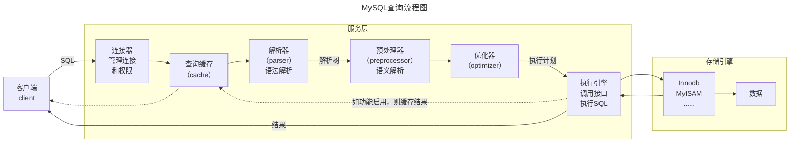

# 文档说明

本文档主要分享求职面试题。文档目前还在持续更新中，欢迎关注、收藏、点赞、加星喔😄O(∩_∩)O~。

| 文档名称     | Java面试题-数据库 |
| ------------ | ----------------- |
| 文档分类     | 求职-面试         |
| 版本号       | 1.5               |
| 最后更新人   | Gem Shen          |
| 最后更新日期 | 2023-12-18        |
| 编制人       | Gem Shen          |
| 编制日期     | 2021-07-07        |


# 文档更新记录

| 版本 | 编制/修改人 | 修改日期   | 备注（原因、进一步的说明等）                         |
| ---- | ----------- | ---------- | ---------------------------------------------------- |
| 1.0  | Gem Shen    | 2021-07-07 | 初稿，整理了本次找工作积累到的所有面试题             |
| 1.1  | Gem Shen    | 2023-09-15 | 合并马士兵的面试笔记，重新整理目录结构               |
| 1.2  | Gem Shen    | 2023-09-19 | 整理Spring部分，将简历和沟通部分独立出去。           |
| 1.3  | Gem Shen    | 2023-09-30 | 完成Spring Framework面试题的初步整理。               |
| 1.4  | Gem Shen    | 2023-10-15 | 补充SpringBoot和SpringMVC面试题，将所有题目提升至3级 |
| 1.5  | Gem Shen    | 2023-12-18 | 文档过大，加载变慢，将每个一级标题单独拆分成一份文档 |
|      |             |            |                                                      |


# 数据库

## 公共

### 事务4个基本特性

A，Atomicity，原子性，事务包含的一系列操作是一个整体，要么一起成功要么一起回滚。

C，Consistency，一致性，事务发生前后没有改变数据库约束和数据完整性。例如：主键约束，非空约束。

I，Isolation，隔离性，当前事务与其他同时发生的事务应当保持隔离，其结果应该被其他事务所影响，即使操作同一张表。

D，Durability，持久性，事务的操作结果一定持久保持下去。即使数据库故障也不能丢失。


### 事务并发问题

脏读（读未提交）。读到另一个事务未提交的数据。

不可重复读。由于其他事务提交了更新操作，导致当前事务多次读到的结果不一致。

幻读。由于其他事务提交了插入和删除操作。导致当前事务读到的数量不一致或者发生了不符合预期的结果。


### 事务隔离级别

读未提交，所有问题都会发生。一般不会使用

读已提交，可能发生不可重复读和幻读，解决脏读。

可重复读，解决不可重复读，可能发生幻读

序列化，解决幻读，所有问题都不会发生。性能最低。


### 数据库范式和反范式

#### 数据库三大范式

1. 表中的每一列必须具备原子性，即不可再分。
   1. 例如：地址这个字段可能包含国家，省市区等信息，严格按照第一范式就应该拆分成多个列分别存储。但实际也要结合业务。如果没有按照省，市，区查询的业务场景，那也可以设计成一列。
2. 表中的每一列必须和主键相关。而不是和主键的一部分相关。
   1. 首先表里得有主键，其次是当出现联合主键时，必须和主键的全部相关而不是一部分。
   2. 例如：设计一个订单信息表，因为订单中可能会有多种商品，所以要将订单编号和商品编号作为数据库表的联合主键。这样就产生一个问题：这个表中是以订单编号和商品编号作为联合主键。如果表中出现商品名称、单位、商品价格等信息不与该表的主键相关，而仅仅是与商品编号相关。这样就违反了第二范式的设计原则。
   3. 如果把这个订单信息表进行拆分，把商品信息分离到单独的表中，把订单项目表也分离到另一个表中，就对了。
3. 确保每列都和主键列直接相关，而不是间接相关。即非主键字段互相不能依赖。
   1. 反例：设计一张表，字段有：学生id，学生姓名，学生籍贯，院系，院系电话。
   2. 这里的院系电话就不是和主键学生id直接相关的，而是间接相关，它依赖的是院系这个字段。
   3. 所以符合范式的做法应该是，在这个表中放院系id，然后单独创建表存放：院系id，院系名称，院系电话。

#### 反范式

遵循了范式之后，每一张表只会存储一种类型的内容，所以就会经常有多表关联查询。这种在数据库不是特别大的场景下一般不会有什么问题。但在互联网业务场景中，比较典型的就是数据量大，并发高，并且通常查询的频率要远高于写入的频率，所以适当的做一些反范式，通过做一些字段的冗余，可以提升查询性能，降低响应时长，从而提升并发度。

我们可以在表中增加一些冗余字段，方便我们进行数据查询，而不再需要经常做多表join，但同时，这也会带来一个问题，那就是这些冗余字段之间的一致性如何保证，这个问题本来在遵守范式的设计中是不会有的，一旦做了反范式，那就需要开发者自行解决了。
反范式其实本质上是软件开发中一个比较典型的方案，那就是”用空间换时间"，通过做一些数据冗余，来提升查询速度。


### PK，UK，CK，FK，DF是什么

PK: Primary Key ，主键约束

UK: Unique Key，唯一约束

CK: check()，检查约束

FK: Foreign Key，外键约束

DF: default ，默认约束


### 锁的种类和区别

#### 悲观锁和乐观锁

悲观锁一般会数据操作之前就把数据锁住，直至操作完毕提交之后才会解锁。具有排他性和独占性，效率不高。

乐观锁一般数据操作时不会锁定数据，到提交的时候才会通过一种机制检查是否存在冲突。一般通过版本比对来实现。

注意：乐观锁本身不对数据进行加锁而是通过业务实现锁的功能，允许多个请求同时访问数据，省掉了对数据加锁和解锁的过程，在一定程度上提升了性能。在并发非常高的情况下，会导致大量的请求冲突，冲突导致大部分操作无功而返而浪费资源，所以在高并发的场景下，乐观锁的性能却反而不如悲观锁。


## MySQL

### MySQL8.0新特性

https://juejin.cn/post/7156151435967594509


### 查询语句执行流程

流程图




连接层

连接器负责跟客户端建立连接、获取权限、维持和管理连接。

5.7版本的最大连接数是151，最大可修改为10万。超过一定时间不活动连接会自动释放，默认超时时间是8小时。

查询缓存

如果同样的sql之前已经执行过了会直接从缓存中读。但这个功能已经默认关闭了。8.0版本中已经彻底移除。

解析器

sql在这边做词法解析和语法解析

预处理器

在这里做语义解析。

优化器

一个sql可以有很多执行计划，优化器将会根据规则自动选择一个成本最小的。

执行引擎

根据执行计划，调用存储引擎的接口获取数据。

存储引擎

MySQL有很多存储引擎，不同的存储引擎，读写方式是不同的。存储引擎负责给服务器提供内存或者硬盘的数据的访问接口

MySQL5.5.5之前默认的存储引擎是MyISAM，之后默认的是InnoDB。


### 更新语句执行流程

这里的更新指：update、insert、delete。

基本流程同查询，区别在于执行引擎通过查询拿到要更新的数据之后。

1. 事务开始。

2. 将从磁盘中取到要更新的数据页放入BufferPool。

3. 执行器执行数据修改。（在执行器内部）

4. 记录修改前的数据到undo log

5. 记录修改后的数据到redo log，标记状态为prepared

6. 调用存储引擎接口，将数据更新记录到Buffer Pool中

7. 如果bin log开关开启，记录bin log

8. 提交事务

9. 将redolog中的记录状态改成已提交。


### 事务的2阶段提交

https://www.yuque.com/hollis666/vzy8n3/geuks1bbiwd39h1r


### Mysql的存储引擎及区别

innodb，5.5之后默认的存储引擎。支持表锁行锁，聚集索引，外键。不保存表的总行数。

MyISAM，只支持表锁、非聚集索引，不支持外键。会保存表的总行数。

csv，一般用于不同数据库中间同步数据

Memory，一般用于缓存

Archive，一般用于存不会修改的归档数据。


### Innodb和MyISAM的区别

1. InnoDB 支持事务，MyISAM 不支持事务。这是MySQL将默认存储引擎从MyISAM变成 InnoDB 的重要原因之一；

2. InnoDB 支持外键，而 MyISAM 不支持。对一个包含外键的 InnoDB 表转为 MYISAM 会失败；  

3. InnoDB 是聚集索引，MyISAM 是非聚集索引。聚簇索引的文件存放在主键索引的叶子节点上，因此 InnoDB 必须要有主键，通过主键索引效率很高。但是辅助索引需要两次查询，先查询到主键，然后再通过主键查询到数据。因此，主键不应该过大，因为主键太大，其他索引也都会很大。而 MyISAM 是非聚集索引，数据文件是分离的，索引保存的是数据文件的指针。主键索引和辅助索引是独立的。 
4. 5.6之前Innodb不支持全文索引，

4. InnoDB 不保存表的具体行数，执行 select count(*) from table 时需要全表扫描。而MyISAM 用一个变量保存了整个表的行数，执行上述语句时只需要读出该变量即可，速度很快；    

5. InnoDB 最小的锁粒度是行锁，MyISAM 最小的锁粒度是表锁。一个更新语句会锁住整张表，导致其他查询和更新都会被阻塞，因此并发访问受限。这也是 MySQL 将默认存储引擎从 MyISAM 变成 InnoDB 的重要原因之一；
6. 清空表时，Innodb是一行行删除，MyISAM会整表删除然后重建。


### MySQL数据只能存硬盘么？

不是的，MySQL建表时可以指定存储引擎等于Memory。他会将数据和索引存储到内存中。


### 大厂为什么不建议多表关联？

最主要的原因就是在数据量足够大的场景下join的效率比较低。

MySQL是使用了嵌套循环(Nested-Loop Join)的方式来实现关联查询的，简单点说就是要通过两层循环，用第一张表做外循环，第二张表做内循环，外循环的每一条记录跟内循环中的记录作比较，符合条件的就输出。

而具体到算法实现上主要有simple nested loop，block nested loop和index nested loop这三种。而且这三种的效率都没有特别高。

MySQL是使用了嵌套循环(Nested-Lop Join) 的方式来实现关联查询的，如果有2张表join的话，复杂度最高是O(n^2^)，3张表则是O(n^3^)随着表越多，表中的数据量越多，JOIN的效率会呈指数级下降.

PS：MySQL 8.0.18中新增了 hash join算法。


### Innodb数据表的行格式

在 innodb 引擎中数据是以页为基本单位读取的，而一个页中又包含多个行数据，那么对应地就会有不同的行格式来存储数据，innodb  中的行格式有四种：compact、redundant、dynamic、compressed。redundant 是 5.0  之前用的行格式。

默认行格式由innodb_default_row_format定义，其默认值为DYNAMIC。 如果未明确定义ROW_FORMAT表选项或指定了ROW_FORMAT = DEFAULT，则使用默认行格式。

```sql
-- 创建数据表时,显示指定行格式
CREATE TABLE 表名 (列的信息) ROW_FORMAT=行格式名称;
-- 创建数据表时,修改行格式
ALTER TABLE 表名 ROW_FORMAT=行格式名称;
-- 查看某数据表的行格式
show table status from 数据库名 like '<数据表名>';
```

原文链接：https://cloud.tencent.com/developer/article/2194819


### Innodb更新事务的实现流程

同[更新语句执行流程](#更新语句执行流程)

一次InnnoDB的update操作，涉及到BufferPool、BinLog、UndoLog、RedoLog以及物理磁盘，完整的一次操作过程基本如下:

1. 在Buffer Pool中读取数据：当InnoDB需要更新一条记录时，首先会在Buffer Pool中查找该记录是否在内存中，如果没有在内存中，则从磁盘读取该页到Buffer Pool中。
2. 记录UndoLog：在修改操作前，InnoDB会在Undo Log中记录修改前的数据。Undo Log是用来保证事务原子性和一致性的一种机制，用于在发生事务回滚等情况时，将修改操作回滚到修改前的状态，以达到事务的原子性和一致性。UndoLog的写入最开始写到内存中的，然后由1个后台线程定时刷新到磁盘中的。
3. 在Buffer Pool中更新：当执行update语句时，InnoDB会先更新已经读取到Buffer Pool中的数据，而不是直接写入磁盘。同时，InnoDB会将修改后的数据页状态设置为“脏页”（Dirty Page）状态，表示该页已经被修改但尚未写入磁盘
4. 记录RedoLog Buffer：InnoDB在Buffer Pool中记录修改操作的同时，InnoDB 会先将修改操作写入到redoLog buffer 中
5. 提交事务。在执行完所有修改操作后，事务被提交。在提交事务时，InnoDB会将Redo Log写入磁盘，以保证事务持久性
6. 写入磁盘。在提交过程后，lnnoDB会将Buffer Pool中的脏页写入磁盘，以保证数据的持久性。但是这个写入过程并不是立即执行的，是有一个后台线程异步执行的，所以可能会延迟写入，总之就是MYSQL会选择合适的时机把数据写入磁盘做持久化。
7. 记录Binlog。在提交过程中，lnnoDB会将事务提交的信息记录到Binlog中。Binlog是MySQL用来实现主从复制的一种机制，用于将主库上的事务同步到从库上。在Binlog中记录的信息包括: 事务开始的时间、数据库名表名、事务ID、SQL语句等。


### buffer pool介绍

https://www.yuque.com/hollis666/vzy8n3/cskzcn42f9dggat0

https://www.yuque.com/hollis666/vzy8n3/npkvvofcuc0g9n7m


### Mysql锁分类

**按操作分**：DML锁，DDL锁。

**按锁的粒度分**：表锁，行锁，页锁。

**按锁的机制分**：共享锁和排他锁。

**按锁的对象分**，记录锁，间隙锁，临建锁。

**按加锁方式分**：自动锁和显示锁。

**按使用方式分**：乐观锁和悲观锁。

接下来简单介绍

**表锁**

锁定整个表，前提是表内没有行锁

**行锁**

锁定某一行数据，同时给表加入相应的意向锁。只有执行计划真正使用了索引才会加上行锁。

**共享锁**

又叫读锁，当一个事务获得共享锁时，允许其他事务同时也获取共享锁。但是不允许同时获得排他锁。同时会在表上加上意向共享锁。

**排他锁**

又叫写锁，当一个事务获得排他锁时，不允许其他事务同时也获取共享锁和排他锁。同时会在表上加上意向排他锁。

**记录锁**

Record Lock，行锁的一种。锁的是索引记录。即使表没有定义索引，InnoDB也会创建一个隐藏的聚集索引，并使用这个索引来锁定记录。

**间隙锁**

Gap Lock，锁的是索引记录之间的间隙。当使用范围查询时，会锁定一个区间以防止范围插入数据。

**临建锁**

行锁+间隙锁，目的是为了解决幻读。

**自增锁**

一种特殊的表锁，用来防止自增字段重复，数据插入后就会释放，不需要等到事务提交才释放


### 乐观锁和悲观锁

https://www.yuque.com/hollis666/vzy8n3/ionc18


### MySQL乐观锁没有用任何锁？

https://www.yuque.com/hollis666/vzy8n3/vk7tpwcpzfh35d04


### 记录锁，间隙锁，临建锁

https://www.yuque.com/hollis666/vzy8n3/kfygzw


### MySQL意向锁

https://www.yuque.com/hollis666/vzy8n3/zf7nalngrigml547


### MySQL字典锁

https://www.yuque.com/hollis666/vzy8n3/ru6eaoolefdo0lor


### MySQL死锁排查

https://www.yuque.com/hollis666/vzy8n3/yywypm


### MySQL死锁解决

https://www.yuque.com/hollis666/vzy8n3/ut71vg


### OnlineDDL是什么

https://www.yuque.com/hollis666/vzy8n3/lwxtmggon7ir4zzz


### Innodb加索引时会锁表么

在 MySQL 5.6 之前，lnnoD 索引构建期间会对表进行排它锁定，这意味着在索引构建期间，其他会话不能读取或修改表中的任何数据。这将导致长时间阻塞和性能问题。

自 MySQL 5.6 开始，lnnoDB 使用一种称为“Online DDL”的技术，允许在不阻塞其他会话的情况下创建或删除索引。Online DDL针对不同的操作，有多种实现方式，包括COPY，INSTANT以及INPLACE。

因为DDL有很多种操作，比如创建索引、增加字段、增加外键等，所以不同的操作支持的类型也不一样，具体支持方式可以在mysql官方可以看到 (https://dev.mysql.com/doc/refman/5.7/en/innodb-online-ddl-operations.html) ，拿索引创建举例:

| Operation                            | In Place | Rebuilds Table | Permits Concurrent DML | Only Modifies Metadata |
| ------------------------------------ | -------- | -------------- | ---------------------- | ---------------------- |
| Creating or adding a secondary index | Yes      | No             | Yes                    | No                     |
| Dropping an index                    | Yes      | No             | Yes                    | Yes                    |
| Renaming an index                    | Yes      | No             | Yes                    | Yes                    |
| Adding a `FULLTEXT` index            | Yes*     | No*            | No                     | No                     |
| Adding a `SPATIAL` index             | Yes      | No             | No                     | No                     |
| Changing the index type              | Yes      | No             | Yes                    | Yes                    |

从上表中可以看到，当我们创建、删除或者重命名一个索引的时候，是会用到in place的模式.

需要注意的是，虽然Online DDL 可以减少锁定时间和对性能的影响，但在索引构建期间仍然可能出现锁定和阻塞。例如，在添加索引时，如果表中有许多未提交的事务，则需要等待这些事务提交后才能开始索引构建。因此建议在非高峰期进行此类操作，以避免影响用户的正常使用。在进行任何DDL操作之前，最好进行充分的测试和规划，并且确保有备份和回滚计划，以防意外情况的发生


### MySQL自增ID

一张表里面有ID自增主键，insert了17条记录后，删除第15.16.17条记录，把Mysql直接重启，再insert一条记录，这条记录的ID是？

如果是MyISAM引擎，自增值保存在数据库文件中。答案是18

如果是InnoDB引擎，8.0版本之前都是存储在内存里。没有持久化。答案是15。

8.0之后的版本，自增值的变更记录在了redo log中。重启之后会恢复重启之前的值。答案是18.


### MySQL表的设计原则


### 为什么不建议使用外键

https://www.yuque.com/hollis666/vzy8n3/tm4gg1mwdsgaqy9a


### 缓冲区和磁盘数据不一致怎么办？

### 服务器突然宕机了数据会丢失么？


### Mysql中char和vachar的区别

char，最大长度255，一旦确定后长度固定， 即每行数据占用等长字节空间；存储时会自动使用空格来补足位数。适合用在身份证号码、手机号码等定长字符。

varchar，最大长度为65535，确定后可以存储在长度范围内的字符，只存储实际字符的内容。

按照查询速度： char > varchar


### binlog，redolog，undolog

https://www.yuque.com/hollis666/vzy8n3/tdlgfm


### binlog是何时写入？提交前提交后？

参考[更新语句执行流程](#更新语句执行流程)。提交前。


### binlog有哪几种格式？

https://www.yuque.com/hollis666/vzy8n3/pl5wcg4cmn8dgufn


### InnoDB怎么解决脏读，不可重复读，幻读问题？

MySQL的Innodb引擎默认隔离级别为RR，可重复读。已经解决脏读和不可重复读。

在Innodb中，通过MVCC解决脏读和不可重复读，通过MVCC+间隙锁解决幻读。

如果查询没有明确指定锁，MySQL会使用MVCC来解决幻读

如果查询指定了锁，则使用LBCC来解决

MVCC

MySQL每行记录都有两个隐藏列：创建版本号和删除版本号

- select：事务每次只能读到创建版本号小于等于此次系统版本号的记录，同时行的删除版本号不存在或者大于当前事务的版本号。
- update：插入一条新记录，并把当前系统版本号作为行记录的创建版本号，同时保存当前系统版本号到原有的行作为删除版本号。
- delete：把当前系统版本号作为行记录的删除版本号
- insert：把当前系统版本号作为行记录的版本号

LBCC

基于锁的并发控制，有记录锁，间隙锁，临键锁，当判断条件等于记录值时，使用记录锁；当判断条件在两个值区间时，使用间隙锁锁定这个区间；临键锁=记录锁+间隙锁；InnoDB默认临键锁；


### InnoDB的RR如何解决幻读问题？

InnoDB的RR只是解决了大部分的幻读问题，但不是所有都解决了。要想彻底解决幻读问题，需要使用序列化的隔离级别。

- 在快照读读情况下，mysql通过mvcc来避免幻读。RR中的快照读只有第一次会进行数据查询，后面都是直接
  读取快照，所以不会发生幻读
- 在当前读读情况下，mysql通过临建锁来避免幻读。通过临建锁将记录之间的间隙锁住，避免新数据插入。

**以下场景还是可能发生幻读**

如果两个事务，事务1先进行快照读，然后事务2插入了一条记录并提交，再在事务1中进行update，新插入的这条记录是可以更新出成功的，这就是发生了幻读。

还有一种场景，如果两个事务，事务1先进行快照读，然后事务2插入了一条记录并提交，在事务1中进行了当前读之后，再进行快照读也会发生幻读。


### 当前读和快照读

**快照读**

快照读，就是读取的是快照数据，即快照生成的那一刻的数据，像我们常用的普通的SELECT语句在不加锁情况下就是快照读。如:

select * from tableA where ....

**当前读**

当前读就是读取最新数据。加锁的 SELECT，或者对数据进行增删改都会进行当前读，比如:

```sql
SELECT * FROM tableA LOCK IN SHARE MODE;

SELECT * FROM tableA FOR UPDATE;

INSERT INTO tableA ...
DELETE FROM tableA ...
UPDATE tableA ...
```

在MySQL 中，只有READ COMMITTED 和 REPEATABLE READ这两种事务隔离级别才会使用快照读.

在RR 中，快照会在事务中第一次SELECT语句执行时生成，只有在本事务中对数据进行更改才会更新快照

在 RC 中，每次读取都会重新生成一个快照，总是读取行的最新版本。


### MySQL索引类型

lnnoDB存储引擎支持两种常见的索引数据结构: B+树索引、Hash索引，其中B+树索引是目前关系型数据库系统中最常见、最有效的索引。

数据库中的B+树索引分为聚集索引和非聚集索引。聚集索引就是按照每张表的主键构造一个B+树，B+树的叶子节点中记录着表中一行记录的所有值。只要找到这个叶子节点也就得到了这条记录的所有值。非聚簇索引的叶节点中不包含行记录的所有值。只包含索引值和主键的值。

根据索引的唯一性，有可以把索引分为唯一索引和普通索引。唯一索引要求索引的列值必须唯一，不能重复。

另外，在MySQL 5.6中还增加了全文索引，5.7版本之后通过使用ngram插件开始支持中文


### 为什么使用B+数实现索引

https://www.yuque.com/hollis666/vzy8n3/uh3cy1


### 如何保证唯一索引的唯一性

https://www.yuque.com/hollis666/vzy8n3/gliyvzp21uq8uakh


### 聚集索引和非聚集索引

https://www.yuque.com/hollis666/vzy8n3/le8gbo472cpxv63z


### MySQL索引失效场景

索引列使用了函数

索引列发生了隐式转换，例如：字符窜没有加单引号导致，强转成int

反式判断，例如 !=, <>, not in

is null is not null

like %出现在了最前面

联合主键没有出现第一个字段


### 聚集索引，非聚集索引以及区别

https://www.yuque.com/hollis666/vzy8n3/le8gbo472cpxv63z

聚集索引

聚集索引在一个表中只会有一个，是唯一且非空的。一般是主键索引

如果表里没有主键，则MySQL自动挑选表里的唯一且非空字段作为聚集索引。

如果还没有则MySQL会在表中创建一个唯一且非空的隐藏列作为聚集索引。

非聚集索引

普通索引，非主键索引

两者的区别

聚集索引是一级索引，非聚集索引是二级。

聚集索引查询不会回表，非聚集索引查询时先定位到主键值，然后在根据聚集索引查询，可能会回表


### MySQL索引建立原则

https://www.yuque.com/hollis666/vzy8n3/ygxb9f

#### 离散度高

有个公式count(distinct(column_name))/count(*)，列的全部不同值和所有数据行的比例。数据行数相同的情况下，分子越大，列的离散度就越高。

简单来说，如果列的重复值越多，离散度就越低，重复值越少，离散度就越高。不建议在离散度低的字段上建立索引。

#### 查询条件

在用于where判断、order排序和join的(on) 、group by的字段上创建索引

#### 索引个数

索引并不是越多越好，会影响更新效率而且浪费空间。优先考虑联合索引并且尽量将离散度高的列放在最前面

#### 更新频率

不要给频繁更新的字段建立索引。会有页分裂问题。

#### 有序性

不建议给随机无序的字段建立索引。例如：UUID。


### MySQL索引覆盖

https://www.yuque.com/hollis666/vzy8n3/gpg6mivy21wg0r55

查询时如果select中的字段全部在二级索引中，这时候就不需要根据主键在去找聚集索引了。


### MySQL索引下推

5.6版本才推出的功能，如果查询条件中的列，存在索引时。MySQL会将这个列的判断条件传给存储引擎。让他直接来做判断。然后

将符合条件的数据返回给MySQL服务器，从而减少查询基础表的次数。

假设有表tableA,字段有id，a，b，c 4个字段，a是字符型字段。b是数字型。有组合索引（a，b）

现有sql语句`select * from tableA where a like 'a%' and b = 3;`

进行查询时如果没有索引下推过程是这样的：

存储引擎会使用联合索引上符合a like 'a%' 的数据，可能有10条，这时候还需要回表10次查询出全部字段。返回给MySQL服务器。然后由MySQL服务器从10条数据中筛选出b = 3的1条。

如果有了索引下推是这样的：

存储引擎将使用索引数据中的a，b字段找到`a like 'a%' and b = 3`的1条记录，然后回表1次找到所有记录。返回给服务器

索引下推可以减少存储引擎查询基础表的次数，也可以减少MySQL服务器从存储引擎接收数据的次数


### 回表，如何减少回表次数

https://www.yuque.com/hollis666/vzy8n3/le8gbo472cpxv63z

非主键索引，先通过索引找到主键索引的键值，再通过主键值查出索引里面没有的数据，它比基于主键索引的查询多扫描了一棵索引树，这个过程就叫回表。

在二级索引里面，不管是单列索引还是联合索引，如果select的数据列只用从索引中就能够取得，不必从回表获取，这时候使用的索引就叫做覆盖索引，这样就避免了回表。

例如：组合索引a，b，但是select后面还有c字段。就需要回表了。


### MySQL索引的最左匹配

https://www.yuque.com/hollis666/vzy8n3/cc9mglopp4nigg59

https://www.yuque.com/hollis666/vzy8n3/nz5520o4qu5yohzv


### 聚集索引的叶子节点存的是什么？

聚集索引，叶子节点存的是整行数据，直接通过这个聚集索引的键值找到某行

非聚集索引，叶子节点存的是索引字段和聚集索引的键值，通过聚集索引键值找到表的某行


### 索引失效问题排查方法

https://www.yuque.com/hollis666/vzy8n3/gux80i


### Innodb数据页和B+树的关系

https://www.yuque.com/hollis666/vzy8n3/vebvlntlc6rnvuu0


### 页分裂和页合并

https://www.yuque.com/hollis666/vzy8n3/lq17kh7gaf8ayipw


### Order By的实现

https://www.yuque.com/hollis666/vzy8n3/caou56


### 更新同一条记录，可能会死锁么？

https://www.yuque.com/hollis666/vzy8n3/wbgxhl2d85zlome3


### 主键一定要自增么？

https://www.yuque.com/hollis666/vzy8n3/glycgnryk8953c24


### 主键自增用完了怎么办？

https://www.yuque.com/hollis666/vzy8n3/eob7raeqaenifzpp


### UUID和自增哪个更适合主键

https://www.yuque.com/hollis666/vzy8n3/uted9tvkngs62pmu


### 介绍MySQL的Hash Join

https://www.yuque.com/hollis666/vzy8n3/ci3ae75ktzkmz1dw

Hash Join是MySQL8.0.18推出的一种多表join算法。


### count(1), count(*), count(列名)

https://www.yuque.com/hollis666/vzy8n3/sckebi


### limit 0,10和limit 10000,10一样么

https://www.yuque.com/hollis666/vzy8n3/gtpc5u4i7xmy13el


### where条件的顺序影响索引么

假如有一个联合索引 (a,b) ，那么如下两个SQL的性能有差别么?
```sql
SELECT * FROM tableA WHERE a = 'value1' AND b ='value2';
SELECT * FROM tableA WHERE b = 'value2' AND a ='value1';
```

结论是没影响的，也就是说WHERE子句后面多个字段的先后顺序通常不会影响查询的结果。MySQL查询的WHERE子句只是用来过滤满足指定条件的行，而不涉及字段之间的顺序。

因为有查询优化器的存在，字段的先后顺序并不重要，不信的话可以explain看一下上面两个SQL的执行计划，都是可以命中(a,b)的联合索引的。


### MySQL如何实现InsertOrUpdate

https://www.yuque.com/hollis666/vzy8n3/gal4lxk8ug9g2bwk


### MySQL是否支持emoji表情

支持，但是要选择utf8mb4。如果是mb3可能会无法解析。


### MySQL主键设计原则

一般会设计2个主键，一个业务主键一个逻辑主键即ID字段。一般采用自增。

也有部分系统用的uuid方式。这种方式比较适合用在分库分表的场景下。


### MySQL组提交

https://www.yuque.com/hollis666/vzy8n3/bb860tpuha0cuza2


### MySQL慢查询是怎么分析的

https://www.yuque.com/hollis666/vzy8n3/zhfa5g

开启慢查询日志。有2种方式。

1、set动态修改参数（重启后失效)。

```sql
-- 1开启，О关闭，重启后失效
set @@global.slow_query_log=l;
-- 默认10秒，另开一个窗口后才会查到最新值
set @@global.long_query_time=3; 

show variables like '%long_query%';
show variables like '%slow_query%';
```

2、修改配置文件my.cnf。

以下配置定义了慢查询日志的开关、慢查询的时间、日志文件的存放路径。

slow_query_log= ON
long_query_time=2
slow_query_log_file =/var/lib/mysql/localhost-slow.log

慢查询模拟

-- 例如：不使用索引查询一张数据量500万的表。

select * from large_user where phone like '%3423%'

**日志内容分析**

```sh
less /var/lib/mysql/localhost-slow.log

# Time: 2020-05-12T05:59:59.373938Z
# User@Host: root[root] [192.168.44.1]Id:30
# Query_time: 229.418907  Lock_time: 0.000275 Rows_sent: 0

SET timestamp=1589263199;
DELETE from test_data;
```

有了慢查询日志,怎么去还需要分析统计，比如哪条SQL语句的出现的慢查询次数最多，平均每次执行了多久?靠肉眼分析是不可能的

MySQL提供了mysqldumpslow的工具，在MySQL的bin目录下。

```sh
mysqldumpslow --help
#查询用时最多的10条慢SQL:
mysqldumpslow -s -t 10 -g 'select'/var/lib/mysql/localhost-slow.log

Reading mysql slow query log from /var/lib/mysql/localhost-slow.logCount: 1 Time=25.26s (25s) Lock=0.00s (0s) Rows=5000000.0 (500000092.168.8.1]
SELECT * FROM 'user_innodb`
Count: 1 Time=20.87s (20s) Lock=0.00s (0s) Rows=2499866.0 (249986692.168.8.1]
SELECT * FROM `user_innodb` where gender= N
Count: 2 Time=9.33s (18s) Lock=0.00s (0s) Rows=1.0 (2), root [root]
select * from user innodb where name='s'
```

Count代表这个SQL执行了多少次;

Time代表执行的时间，括号里面是累计时间;Lock表示锁定的时间，括号是累计;

Rows表示返回的记录数，括号是累计。

PS：有的时候查询慢，不一定是SQL语句的问题，也有可能是服务器状态的问题。我们需要掌握一些查看服务器和存储引擎状态的命令。


### MySQL服务器CPU占用率高怎么解决？

首先使用top命令看看是否是MySQL的进程占用CPU过多。

如果是的话登录mysql执行show full processlist; 

如果是查询慢的话会打印出慢的SQL语句。

使用explain分析查询语句。根据不同的场景做不同的处理。

如果是全表扫描，考虑增加索引。

如果有索引，排查是否索引抑制的条件。

如果是排序问题。减少不必要的排序条件。如果要对上万条记录做排序，在并发升高后，cpu占用就会升高。


### MySQL执行计划要关注哪些

https://www.yuque.com/hollis666/vzy8n3/fho0bamf4qpcril5


### 走了索引还是慢的原因

https://www.yuque.com/hollis666/vzy8n3/st7he2np7e9trg9k


### 执行计划Key有值还是慢咋办

https://www.yuque.com/hollis666/vzy8n3/upcggbxiyk11gudc


### 大规模数据库的优化办法

https://www.yuque.com/hollis666/vzy8n3/qimt8ayyqk8y5qc7


### SQL调优方法

https://www.yuque.com/hollis666/vzy8n3/mgpczmz7la99dkft


### MySQL如何选择驱动表

https://www.yuque.com/hollis666/vzy8n3/vs83kfhxbz19mkcg


### MySQL如何优化like查询

https://www.yuque.com/hollis666/vzy8n3/zrt2y30mhdgiremc


### MySQL大事务存在的问题

所谓大事务，一般是指事务中要执行的SQL很多，事务的时间比较长。

这样的事务会有如下问题：

1. 占用数据库连接。这个很容易理解，SQL多了，执行的就会很慢，那么大的事务就会很长时间占用数据库链接，但是因为数据库连接是有限的，被长事务占用后，就会导致其他事务可能无法获取连接，导致应用的吞吐量下降，影响系统可用性。
2. 难以回滚。由于大事务涉及的数据量较大，执行回滚操作可能会变得非常耗时。如果事务需要回滚或失败，可能需要花费很长时间才能完全回滚所有修改，这会对数据库的可用性和性能造成负面影响。
3. 锁竞争。大事务的话，写操作多了就可能要锁定许多数据。这可能导致其他并发事务在访问相同资源时遇到锁3竞争，从而导致性能下降和延迟增加。长时间的锁定还可能导致其他事务的等待和阻塞。
4. 日志空间占用。大事务会生成大量的日志，尤其是Binlog，当单个事务最大允许使用的Binlog文件的大小超过了max_binlog_cache_size时，会导致报错: Multi-statement transaction required more than max_binlog_cache_size' bytes of storage; increase this mysqld variable and try again

解决方案

拆分。把大事务拆分成一个个小事务。尽量把不需要放在事务中的操作挪到事务外面。例如：内存计算，IO操作，读操作，远程调用等。


### MySQL性能优化实际经验


### 数据量突增怎么解决？


### MySQL热点数据如何高效更新

https://www.yuque.com/hollis666/vzy8n3/rfqcbz190k9egley


### MySQL如何加密解密

https://www.yuque.com/hollis666/vzy8n3/xg32pfnstsrh9pdp


### 加密之后如何查询？

https://www.yuque.com/hollis666/vzy8n3/ri2ky6kb6pvxy656


### MySQL主从复制过程

https://www.yuque.com/hollis666/vzy8n3/hoi4ql


### MySQL并行复制原理

https://www.yuque.com/hollis666/vzy8n3/igarxy867n7bgq1q


### MySQL延迟复制原理

https://www.yuque.com/hollis666/vzy8n3/et8lo7l10rg7g7iy


### MySQL分库分表是怎么实现？


### 怎么解决主从复制延迟

https://www.yuque.com/hollis666/vzy8n3/weszn2kock8k8wld


### 分库分表时跨库join如何解决？


### MyISAM的索引结构

https://www.yuque.com/hollis666/vzy8n3/mcl4sn8mcutieesz


## MongoDB

https://juejin.cn/post/6844904186300071943


## Oracle
