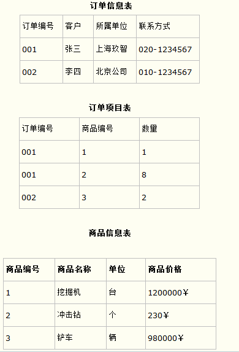
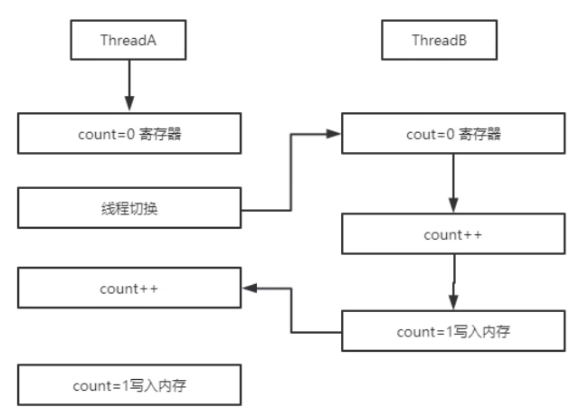
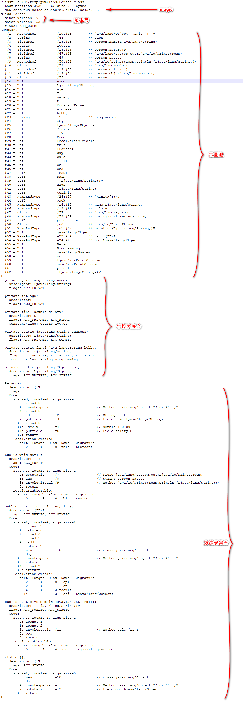
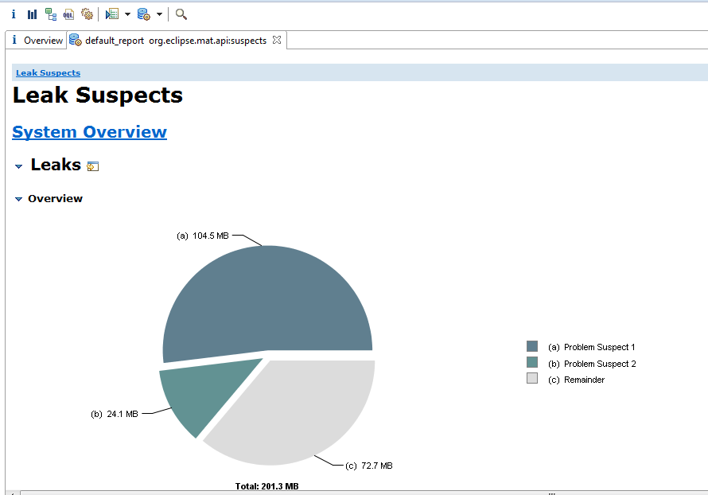
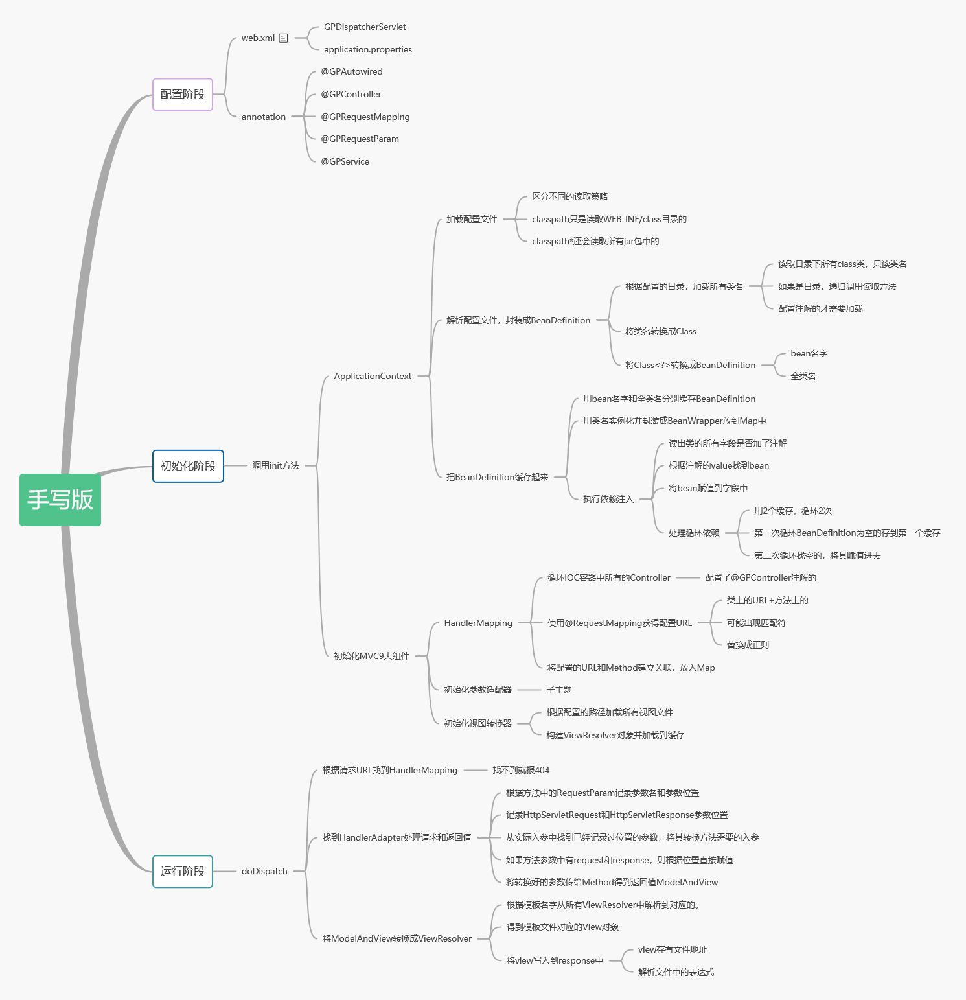
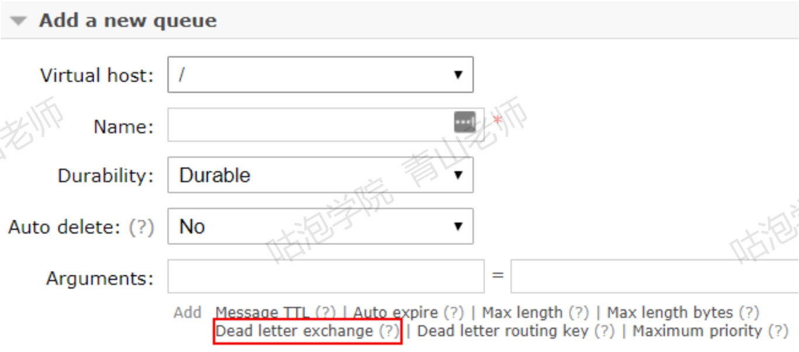
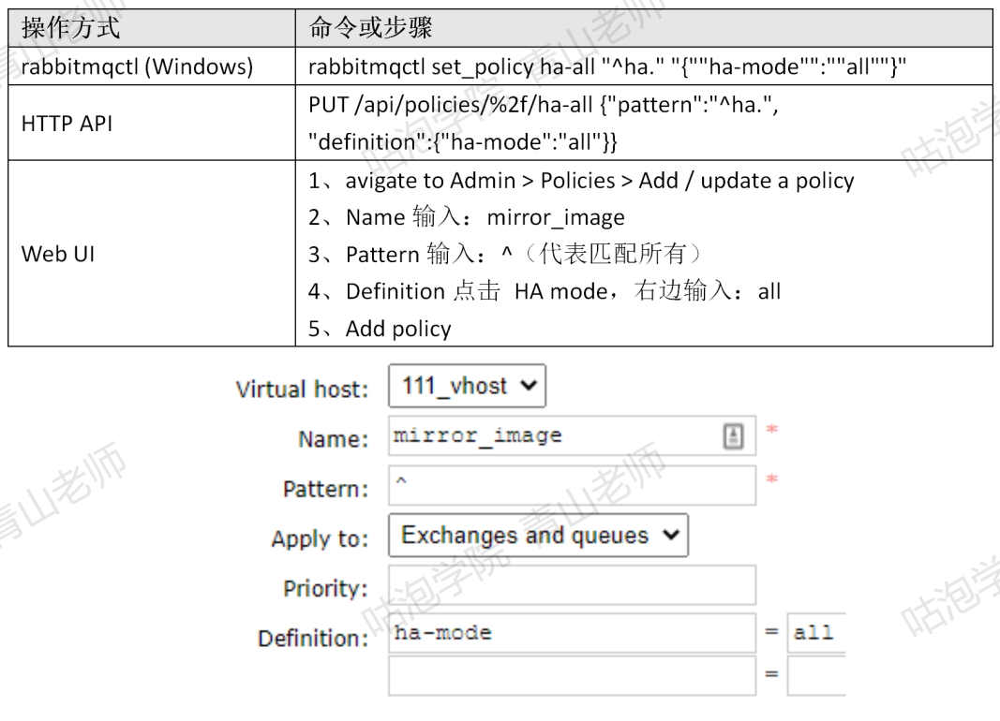

# 学习方法

Smart原则

高效能人士的7个习惯

- 学习的深度点到为止，不建议钻牛角尖。（例如：有同学学习redis想把redis底层每一行C的代码都搞懂）
- 社群化学习，知识互补，每个人都会有自己擅长的方面。
- 直播时间，每周六或周日，同时公布下次直播时间。


## 学习内容

- 由总体到细节，不要从细节去验证整体。
- 逐层深入。事先想好要深入到哪一层，重点关注这个层次的东西。时间够才往更深的层次研究。
- 精细复述，记住关键信息，然后自己复述。
- 连点成线，记少不记多。
- 学习一个新技术，首先应该关注的是为什么要用？行业内是否有同类型技术？这个技术的特点或者优缺点是啥？记住这些东西后，在未来工作中遇到问题时，才有可能想起用这个技术。然后才是怎么使用，知道怎么使用之后再去研究实现原理。

### 学习源码的目的

很多次在学习学习原理的时候都会感觉特别费劲。然后就会对自己说学这东西干啥？工作中哪里能用到？

1. 源码中也会用到很多底层的工具类，自己也可以积累下来。学以致用。避免自己重复造轮子

2. 源码中还会出现一些算法，学会了之后也可以运用到实践中。

    例如：LRU，LFU

3. 源码中会用到很多设计模式，相当于设计模式的实际运用场景。如果单学设计模式，可能并不知道他的运用场景。

4. 源码中解决的问题在实际工作中也会出现。明白大牛解决问题的思路。自己将来也可以尝试解决。

    例如：当明白tomcat是怎么实现热加载的时候，自己在工作中如果遇到需要热加载的场景就知道怎么弄了。

总之，要不要学习源码主要还是取决于自己的职业规划。如果未来想在技术路线上走得很远，学习大牛写的源码肯定能派上用场。但如果想往项目经理或者产品经理发展那确实没必要。但无论想往哪个方向发展都在花时间去学习这个方向内的专业知识。想要脱颖而出就必须比别人付出的更多。除非是富二代官二代，否则虚度年华得过且过，时间长了都要付出代价的。


## 邓宁克鲁格心理效应

当自己学习学到一定程序可能会发现怎么自己这么多东西不会。有些知识可能短时间怎么都理解不了，此时自己的自信心会越来越低，就相当于处于**绝望之谷**，但等我们明白了就是因为有东西不会才要学习，如果都会了还学什么？还有就是学习是没有止境的，学会了一个知识还有千千万万知识等着你，我们要做的是将学习变成一种习惯每天坚持才能不断成长。所以再苦再累都不能放弃，只要坚持就会逐步走向**开悟之坡**，最终会到达**持续平稳高原**。当我们不知道自己已经知道了，那就是大师的境界了。


## 笔记模板

What（介绍，相关知识点）

Why（为什么要用，能解决什么问题）

Where When（什么条件下用，使用场景）

How to use（怎么用，使用步骤，demo）

How to implement（怎么实现的，原理）


## 学习状态

每天都在补作业，追进度，却总也追不上。有些知识点还没学会，下一个知识点已经开始了。


## 遇到的问题

1. redis集群环境搭建
2. redis实际项目使用场景
3. MySQL的LRU使用场景和机制
4. 写笔记也是一个比较耗时间的工作。但如果写的太简单，学完之后都没有一个可以复习的东西。都不知道学了啥。
5. 老师也说过时间不够有些东西没必要深究，但是实际看视频或者笔记，看着看着就陷入细节里面了等回过神来就几个小时没了。最好是能在学习之前给列一个提纲。明确哪些东西重要的一定要掌握，哪些次要的有时间在掌握。避免陷入细节里面。
6. myBatis-config.xml这个配置文件的名字是固定的么？MyBatis启动的时候是根据文件名来加载配置文件的还是文件内容？


# 找工作

## 工作选择

平台>业务

## 面试技巧

### 自我介绍

姓名，工作经验。之前的角色

突出亮点。项目是亮点就讲项目。技术是亮点就讲技术

最好不要超过3分钟。察言观色，及时停止。


### 简历

简要经历，但不是简短。一定要突出优势。

突出重点：

HR筛选：学历，年限。技术关键词。

面试官：能力，项目经验（涉及到的技术要弄清楚）

大厂会对所有工作经历教育经历进行核查，切勿作假。


跟HR谈薪资

根据对方的岗位的薪资范围，以及自己的面试情况来报价。一般要留给HR，2k~5K的砍价空间


#### 个人信息

姓名，工作年限，电话，邮箱。

职位，城市，薪资（面谈）除非有最低要求。入职时间。

个人敏感信息不要写，例如：身份证号


#### 教育经历

#### 技能特长

按照熟练度排序。对方公司要求的。

不要写精通Java

精通，熟练，深入了解，尽量不要写精通。

细节体现专业，也可以诱导面试管问问题。

例如：

深入了解Spring框架，看过Spring源码，了解DI、aop、ioc原理，知道Bean的生命周期和循环依赖。

Redis，知道数据类型以及底层结构，过期淘汰策略。持久化机制的实现，集群。

无关紧要的不用写，例如：office，postman，eclipse，idea，git。

代码质量。sonar


#### 工作经历

公司和项目分开。

2003-2005 公司A，工作职责：

2005-2009 公司B，工作职责：

一年以下的工作经历可以省略，除非是阿里等级别的。

大厂要求5年3跳。

#### 项目经验

比较重要的，挑2-3个

如果将你的项目分布式化，或者QPS到1万以上你怎么设计

要知道模块的业务，而不仅仅是自己负责的。

项目描述：不要写的太多。描述清楚背景。模块，目的。

个人职责：（写的高大上一点）项目负责人，项目协调，任务分配，表结构

亮点：技术解决什么问题，难点的业务场景。性能要求。QPS。


沟通，思维清楚

项目经验里面写的技术一定要弄懂。


### 自我介绍

简要，突出重点，讲对方关心的。最好1-2分钟。

阿波罗配置中心


### 心态调整

平常心，双向选择，语速放慢。梳理思路，手忙脚乱。提升自己的短板

找到自己的弱点，演练，可以去面试官。你觉得我有什么不足的。

沟通的时候，可以带着面试官走。聊的时候带出一些技术点但不要自己去解释。


# 架构设计

## 算法


### Raft算法

当主节点出现故障被哨兵发现时，哨兵需要选出一个领导来进行主从切换。这时候就需要用到raft算法。

Raft是一个共识算法(consensus algorithm)。比如比特币之类的加密货币，就需要共识算法。Spring Cloud 的注册中心解决方案Consul也用到了Raft协议。

Raft的核心思想：先到先得，少数服从多数。

先说一下，Sentinel的 Raft实现跟原生的算法是有所区别的，但是大体思想一致。

Raft算法演示:

[算法可视化演示](http://thesecretlivesofdata.com/raft/)

文字描述:

1、分布式环境中的节点有三个状态:Follower、Candidate(虚线外框)、Leader(实线外框)。

2、一开始所有的节点都是Follower状态。如果Follower连接不到Leader(Leader挂了)，它就会成为Candidate。Candidate请求其他节点的投票，其他的节点会投给它。如果它得到了大多数节点的投票，它就成为了主节点。这个过程就叫做LeaderElection。

3、现在所有的写操作需要在Leader节点上发生。Leader 会记录操作日志。没有同步到其他Follower节点的日志，状态是uncommitted。等到超过半数的Follower同步了这条记录，日志状态就会变成committed。Leader 会通知所有的Follower日志已经committed，这个时候所有的节点就达成了一致。这个过程叫Log Replication。

4、在Raft协议里面，选举的时候有两个超时时间。第一个叫election timeout.也就是说，为了防止同一时间大量节点参与选举，每个节点在变成Candidate之前需要随机等待一段时间，时间范围是150ms and 300ms之间。第一个变成Candidate的节点会先发起投票。它会先投给自己，然后请求其他节点投票(Request Vote)。

5、如果还没有收到投票结果，又到了超时时间，需要重置超时时间。只要有大部分节点投给了一个节点，它就会变成Leader。

6、成为Leader之后，它会发消息让来同步数据(Append Entries)，发消息的间隔是由heartbeat timeout来控制的。Followers 会回复同步数据的消息。

7、只要Followers收到了同步数据的消息，代表Leader没挂，他们就会清除heartbeat timeout的计时。

8、但是一旦Followers在heartbeat timeout时间之内没有收到Append Entries消息，它就会认为Leader挂了，开始让其他节点投票，成为新的 Leader。

9、必须超过半数以上节点投票，保证只有一个Leader被选出来。

10、如果两个Follower同时变成了Candidate，就会出现分割投票。比如有两个节点同时变成Candidate，而且各自有一个投票请求先达到了其他的节点。加上他们给自己的投票，每个Candidate手上有2票。但是，因为他们的election timeout不同，在发起新的一轮选举的时候，有一个节点收到了更多的投票，所以它变成了Leader。


### 雪花算法

使用场景

主要生成分布式ID，分库分表时使用。


## 中台

中台包含些什么东西？中台通常可以分为三个层面： 业务层面，数据层面和技术底层。

- **业务中台**  业务服务将业务的公共需求组合成服务，比如电商公司，客户，商品，物流，支付就是公共需要，比如汽车制造商，用户，车辆，订单，交付都是公共需求。将这些公共业务组合成统一的业务服务，供各个业务单元使用。
- **数据中台**  数据服务数据时代，业务中越来越依赖于数据，包含：数据的收集，数据处理，数据算法和分析，报表，以及数据的治理。
- **技术中台**  基础服务通常是底层的服务，面向技术。这些底层技术包括：安全认证，权限管理，流程引擎，门户，消息，通知等等。这些组件通常与业务关联度不大，属于每个应用都需要使用的功能。

现阶段，大多数提出中台战略或是建设大中台的公司，大多都有类似的困境。业务高速发展多年，许多问题积重难返或者大量在解决“重复造轮子”的问题，中台这个概念，很多情况下是因为契合了大公司业务的发展的情况，而被大家广泛认可。对于很多中小公司，当他们走出生存困境，进入到高速发展阶段时，会遇到很多的问题，但大概率会遇到的一个问题是，过往的业务模型，产品能力很有可能没法完全承接住大规模用户增长带来的压力。


## DDD

[领域驱动设计](https://blog.csdn.net/wwd0501/article/details/95062535/)


## UML

### 对象关系

| 类型 | 说明                                                 | 图示               | 代码体现                         | 图例 |
| ---- | ---------------------------------------------------- | ------------------ | -------------------------------- | ---- |
| 泛化 | Generalization，也叫继承，一般化                     | 实线+三角形        | extends                          | ─▷   |
| 实现 | Implementation，接口和其实现类的关系                 | 虚线+三角形        | implements                       | ┄▷   |
| 依赖 | Dependence，是一种使用关系，A类的变化引起了B类的变化 | 虚线+箭头          | 方法入参，局部变量，调用静态方法 | ┄>   |
| 关联 | Association，是一种拥有关系，分单向和双向关联        | 实线+箭头          | 成员变量（实例变量）             | ─>   |
| 聚合 | 特殊的关联关系，整体与部分，可以分离独立存在         | 空心菱形+实线+箭头 | 电脑中的各个部件                 | ◇─>  |
| 合成 | 特殊的关联关系，整体与部分，不可分离独立存在         | 实心菱形+实线+箭头 | 公司与部门                       | ♦─>  |


## 7大设计原则

### ★开闭原则

定义：

对扩展开放，对修改关闭。一个软件实体如类，模块和函数应该符合开闭原则。

内容：

开闭原则其含义是说一个软件实体应该通过扩展来实现变化，而不是通过修改已有的代码来实现变化。

什么是变化？

逻辑变化

只变化了一个逻辑，而不涉及其他模块，比如一个算法是a\*b\*c，现在需要修改为a+b+c，可以直接通过修改原有类中的方法的方式来完成，前提条件是所有依赖或关联类都按照相同的逻辑处理

模块变化

一个模块变化，会对其它的模块产生影响，特别是一个低层次的模块变化必然引起高层模块的变化，因此在通过扩展完成变化。

为什么要遵循：

开闭原则是基础原则

开闭原则是其他原则的精神领袖，可以说其他原则都是开闭原则的具体形态。

提高软件系统的可复用性。

在面向对象的软件设计中，所有逻辑都是由原子逻辑组合而成。而不是在一个类中实现所有逻辑，逻辑粒度越小可复用性越高。

提高软件系统的可维护性。

对于一个软件的整个生命周期而言，维护周期大于开发周期。而维护人员更愿意扩展代码而不是修改老代码。修改老代码首先要看懂代码，如果修改到了公共代码还需要进行波及分析然后进行测试。维护成本较大，风险也较大。

### 依赖倒置原则

（Dependence Inversion Principle，DIP）是指设计代码结构时，高层模块不应该依赖低层模块，二者都应该依赖其抽象。

抽象不应该依赖于细节，细节应该依赖于抽象。通过依赖倒置，可以减少类与类之间的耦合性，提高系统的稳定性，提高代码的可读性和可维护性，并且能够降低修改程序所造成的风险。

更为精简的定义：面向接口编程(Object-Oriented Design, OOD)

https://blog.csdn.net/king123456man/article/details/81626127

### 迪米特法则

也叫最少知道原则，一个类所依赖的类依赖的越少越好。主要强调低耦合。

### 单一职责原则

一个类的功能尽量单一。

主要针对的是实现，在做面向对象的设计时，类，接口，方法的具体实现尽可能做到职责单一。这么做的目的主要是为了高内聚。

### 接口隔离原则

一个接口的功能尽量单一。

客户端不应该被强迫实现一些他们不会使用的接口，应该把胖接口中的方法分组，然后用多个接口替代它，每个接口服务于一个子模块。

接口中的方法定义过多，也不利于实现类的单一职责。

简单地说，就是使用多个专门的接口比使用单个接口要好很多。

### 里氏替换原则

子类继承父类时，不要修改父类的方法。即可以实现父类抽象方法，但不要覆盖父类的非抽象方法。

目的是：所有使用父类的地方都可以替换成子类，而不会改变程序的行为和正确性

### 合成复用原则

多用组合聚合少用继承

继承复用虽然简单，但是存在很大的缺点：
  （1）耦合度高，父类代码的修改会影响到子类，不利于代码的维护。
  （2）破坏了类的封装性，因为继承会将父类的实现细节暴露给子类，所以又叫做 "白箱" 复用。
  （3）限制了复用的灵活性，从父类继承来的实现是静态的，在运行期是无法改变的。

合成复用是将已有的对象作为新对象的成员对象来实现，新对象调用已有对象的功能，达到复用：
  （1）不会破坏封装性，因为新对象只能调用已有对象暴露出来的方法，所以又叫做 "黑箱" 复用
  （2）耦合度低，已有对象的变化对新对象的影响较小，可以在新对象的中，根据需要调用已有对象的一些操作。
  （3）复用的灵活性高，可以在代码的运行中，动态选择相同类型的其他具体类。


## 设计模式

### 设计模式分类

#### 创建型（5个）

主要关注对象创建

1. 单例模式。某个类只能生成一个实例，该类提供了一个全局访问点供外部获取该实例
2. 工厂方法。定义一个用于创建产品的接口，由子类决定生产什么产品。
3. 抽象工厂。主要关注多维度产品的创建。
4. 建造者模式。将一个复杂对象分解成多个相对简单的部分，然后根据不同需要分别创建它们，最后构建成该复杂对象
5. 原型模式。将一个对象作为原型，通过对其进行复制而克隆出多个和原型类似的新实例。

#### 结构型（7种）

通过组织类和对象的结构以实现更多功能

1. 代理（Proxy）模式：为某对象提供一种代理以控制对该对象的访问。即客户端通过代理间接地访问该对象，从而限制、增强或修改该对象的一些特性。
2. 适配器（Adapter）模式：将一个类的接口转换成客户希望的另外一个接口，使得原本由于接口不兼容而不能一起工作的那些类能一起工作。
3. 桥接（Bridge）模式：将抽象与实现分离，使它们可以独立变化。它是用组合关系代替继承关系来实现的，从而降低了抽象和实现这两个可变维度的耦合度。
4. 装饰（Decorator）模式：动态地给对象增加一些职责，即增加其额外的功能。
5. 外观（Facade）模式：为多个复杂的子系统提供一个一致的接口，使这些子系统更加容易被访问。
6. 享元（Flyweight）模式：运用共享技术来有效地支持大量细粒度对象的复用。
7. 组合（Composite）模式：将对象组合成树状层次结构，使用户对单个对象和组合对象具有一致的访问性。

#### 行为型（11种）

描述多个类或对象之间怎样相互协作共同完成单个对象都无法单独完成的任务

1. 模板方法模式（Template Method）：定义一个操作中的算法骨架，将算法的一些步骤延迟到子类中，使得子类在可以不改变该算法结构的情况下重定义该算法的某些特定步骤。
2. 策略模式（Strategy）：定义了一系列算法，并将每个算法封装起来，使它们可以相互替换，且算法的改变不会影响使用算法的客户端。
3. 命令模式（Command）：将一个请求封装为一个对象，使发出请求的责任和执行请求的责任分割开。
4. 职责链（Chain of Responsibility）模式：把请求从链中的一个对象传到下一个对象，直到请求被响应为止。通过这种方式去除对象之间的耦合。
5. 状态（State）模式：允许一个对象在其内部状态发生改变时改变其行为能力。
6. 观察者（Observer）模式：多个对象间存在一对多关系，当一个对象发生改变时，把这种改变通知给其他多个对象，从而影响其他对象的行为。
7. 中介者（Mediator）模式：定义一个中介对象来简化原有对象之间的交互关系，降低系统中对象间的耦合度，使原有对象之间不必相互了解。
8. 迭代器（Iterator）模式：提供一种方法来顺序访问聚合对象中的一系列数据，而不暴露聚合对象的内部表示。
9. 访问者（Visitor）模式：在不改变集合元素的前提下，为一个集合中的每个元素提供多种访问方式，即每个元素有多个访问者对象访问。
10. 备忘录（Memento）模式：在不破坏封装性的前提下，获取并保存一个对象的内部状态，以便以后恢复它。
11. 解释器（Interpreter）模式：提供如何定义语言的文法，以及对语言句子的解释方法，即解释器。


### ★单例模式

#### 饿汉式单例

类的实例在类加载之前就实例化了。也就是在线程出现之前就实例化了，绝对线程安全。

优点：执行效率高，线程安全。

缺点：当系统中这种单例模式的类大量存在时，会造成内存浪费。

代码参考：

```java
public class HungrySingleton {
    // 注意这里最好加上final，不然可以用反射破解
    private static final HungrySingleton instance = new HungrySingleton();
    
    /** 饿汉式单例也可以这么写
    static {
        instance = new HungrySingleton();
    }
     */

    private HungrySingleton() {
    }

    public HungrySingleton getInstance(){
        return instance;
    }
}
```


#### 简单懒汉单例

为了解决饿汉式单例的内存浪费问题，懒汉式单例会在需要时才初始化。定义一个静态方法，但调用时判断实例为空时才初始化。

缺点：存在线程安全问题；

代码参考：

```java
public class LazySingleton {
    private static LazySingleton instance = null;

    private LazySingleton() {
    }

    public static LazySingleton getInstance(){
        if(instance == null){
            instance = new LazySingleton();
        }
        return instance;
    }
}
```

线程安全测试类：

```java
public class SingletonThread implements Runnable {
    @Override
    public void run() {
        LazySingleton instance = LazySingleton.getInstance();
        System.out.println(String.format("线程名称：%s，实例：%s", Thread.currentThread().getName(), instance));
    }

    public static void main(String[] args) {
        Thread t1 = new Thread(new SingletonThread());
        Thread t2 = new Thread(new SingletonThread());
        t1.start();
        t2.start();
        System.out.println("end");
        //执行结果：有的时候是同一个实例有的时候就不是同一个实例。
    }
}
```

根据执行结果可看出，有的时候是不同实例有的时候是同一个实例。


那么如何解决线程安全问题？


#### 线程安全懒汉单例

给实例化方法加synchronized，使用这个方法虽然能解决线程安全问题，但是当线程很多时也会造成阻塞，会造成线程阻塞，从而导致性能下降。


#### 双重检查锁懒汉单例

代码如下：

```java
public class LazyDoubleCheckSingleton {
    private static volatile LazyDoubleCheckSingleton instance = null;

    private LazyDoubleCheckSingleton() {
    }

    public static LazyDoubleCheckSingleton getInstance() {
        if (instance == null) {
            synchronized (LazyDoubleCheckSingleton.class) {
                instance = new LazyDoubleCheckSingleton();
            }
        }
        return instance;
    }
}
```


这种方式只有程序执行到同步代码块才会阻塞比起之前的类阻塞性能会高很多，只是依然会有阻塞的问题出现。

缺点：可以被反射破坏。


#### 静态内部类懒汉单例模式

代码参考

```java
public class LazyInnerClassSingleton {
    private static LazyInnerClassSingleton instance = null;

    private LazyInnerClassSingleton() {
    }

    public static LazyInnerClassSingleton getInstance() {
        return LazyHolder.instance;
    }

    private static class LazyHolder{
        private static final LazyInnerClassSingleton instance = new LazyInnerClassSingleton();
    }
}
```

优点：

没有用synchronized不会阻塞，性能更高。要等到getInstance方法调用才会初始化内部类，所以内存占用也小。实例初始化要等到静态内部类初始化之后，不会有线程安全问题。

缺点

可以被反射破坏。


#### 枚举单例

由于JDK枚举语法的特殊性，使得枚举单例不会被序列化和反射破坏。现在已经是effective java推荐的单例实现。

缺点：

同饿汉式单例，枚举会在类加载时就将所有对象初始化放到内存中，不适合在系统中大量存在。


代码：

```java
/**
 * 枚举单例
 */
public enum EnumSingleton {
    INSTANCE;

    //这里可以定义一些其他字段
    private Object f1;
    private Object f2;

    //定义一些其他方法
    public void doSomething(){
        System.out.println("doSomething");
    }

    public static EnumSingleton getInstance(){
        return INSTANCE;
    }

    public static void main(String[] args) {
        //可以使用方法也可以直接用字段来得到实例
        EnumSingleton o = EnumSingleton.getInstance();
        //EnumSingleton o = EnumSingleton.INSTANCE;
    }
}
```

#### 容器式单例

适用于需要大量创建单例对象的场景，非线程安全。

```java
/**
 * 容器单例
 */
public class ContainerSingleton {

    private ContainerSingleton() {
    }

    private static Map<String, Object> ioc = new ConcurrentHashMap<String, Object>();

    public static Object getInstance(String className) {
        Object instance = null;
        if (!ioc.containsKey(className)) {
            try {
                instance = Class.forName(className).newInstance();
                ioc.put(className, instance);
            } catch (Exception e) {
                e.printStackTrace();
            }
            return instance;
        } else {
            return ioc.get(className);
        }
    }
}
```


#### 本地线程单例

不能保证全局唯一，但是可以线程唯一

```java
/**
 * 线程单例
 */
public class ThreadLocalSingleton {
    private static final ThreadLocal<ThreadLocalSingleton> threadLocaLInstance =
            new ThreadLocal<ThreadLocalSingleton>() {
                @Override
                protected ThreadLocalSingleton initialValue() {
                    return new ThreadLocalSingleton();
                }
            };

    private ThreadLocalSingleton() {
    }

    public static ThreadLocalSingleton getInstance() {
        return threadLocaLInstance.get();
    }
}
```


#### 反射破坏单例

代码如下：

```java
public class LazyInnerClassSingletonTest {
    public static void main(String[] args) throws Exception {
        Constructor<LazyInnerClassSingleton> c = LazyInnerClassSingleton.class.getDeclaredConstructor(null);
        c.setAccessible(true);

        LazyInnerClassSingleton a1 = c.newInstance();
        LazyInnerClassSingleton a2 = c.newInstance();
        System.out.println("成功破坏单例：" + (a1 == a2));
    }
}
```

避免反射破坏单例的代码如下，将构造方法做如下修改

```java
    private LazyInnerClassSingleton() {
        if(LazyHolder.instance != null){
            throw new RuntimeException("请使用getInstance方法初始化");
        }
    }
```

#### 序列化破坏单例

一个单例对象创建好后，有时候需要将对象序列化然后写入磁盘，下次使用时再从磁盘中读取对象并进行反序列化，将其转化为内存对象。反序列化后的对象会重新分配内存，即重新创建。如果序列化的目标对象为单例对象，就违背了单例模式的初衷，相当于破坏了单例，来看一段代码︰

```java
public class SerializableBrokeSingleton implements Serializable {
    //序列化就是把内存中的状态通过转换成字节码的形式
    //从而转换一个I/O流，写入其他地方（可以是磁盘、网络I/O)
    //内存中的状态会永久保存下来
    //反序列化就是将己经持久化的字节码内容转换为I/0流
    //通过I/O流的读取，进而将读取的内容转换为Java对象
    //在转换过程中会新创注对象new
    public final static SerializableBrokeSingleton INSTANCE = new SerializableBrokeSingleton();

    private SerializableBrokeSingleton() {
    }

    public static SerializableBrokeSingleton getInstance() {
        return INSTANCE;
    }

    public static void main(String[] args) throws Exception {
        SerializableBrokeSingleton s1 = null;
        SerializableBrokeSingleton s2 = SerializableBrokeSingleton.getInstance();

        FileOutputStream fos = new FileOutputStream("SerializableBrokeSingleton.obj");
        ObjectOutputStream oos = new ObjectOutputStream(fos);
        oos.writeObject(s2);
        oos.flush();
        oos.close();

        FileInputStream fis = new FileInputStream("SerializableBrokeSingleton.obj");
        ObjectInputStream ois = new ObjectInputStream(fis);
        s1 = (SerializableBrokeSingleton) ois.readObject();
        ois.close();
        
        System.out.println(s1);
        System.out.println(s2);
        System.out.println(s1 == s2);
    }
}
```

执行结果

> com.panda.design.pattern.singleton.SerializableBrokeSingleton@3941a79c
> com.panda.design.pattern.singleton.SerializableBrokeSingleton@3cd1a2f1
> false

解决办法：

增加readResolve方法。

```java
private Object readResolve(){
    return INSTANCE;
}
```

原理分析

readObject方法中会判断当前序列化的这个类是否有readResolve方法，如果有的话会通过反射调用，然后将得到的对象替换之前的实例化对象返回。

```java
private Object readOrdinaryObject(boolean unshared)
        throws IOException
{
    //此处省略部分代码

    Object obj;
    try {
        //首先通过反射实例化对象
        obj = desc.isInstantiable() ? desc.newInstance() : null;
    } catch (Exception ex) {
        throw (IOException) new InvalidClassException(
            desc.forClass().getName(),
            "unable to create instance").initCause(ex);
    }

    //此处省略部分代码

    if (obj != null &&
        handles.lookupException(passHandle) == null &&
        //判断对象是否有ReadResolve方法
        desc.hasReadResolveMethod())
    {
        Object rep = desc.invokeReadResolve(obj);
        if (unshared && rep.getClass().isArray()) {
            rep = cloneArray(rep);
        }
        if (rep != obj) {
            //替换返回值
            handles.setObject(passHandle, obj = rep);
        }
    }

    return obj;
}
```


### ★工厂模式

#### 简单工厂模式

由工厂对象类来决定生产哪种产品类的实例。属于创建型设计模式，但不属于GOF23种设计模式。

适用场景

适用于工厂负责创建的对象较少的场景。

优点：

简单工厂模式能够根据外界给定的信息，决定究竟应该创建哪个具体类的对象。明确区分了各自的职责和权力，有利于整个软件体系结构的优化。

缺点：

工厂类集中了所有类型实例的创建逻辑，违反单一职责原则

代码参考：

首先定义一些课程类

```java
/**
 * 课程接口
 */
public interface ICourse {
    /**
     * 录制视频
     */
    void record();
}

/**
 * Java课程
 */
public class JavaCourse implements ICourse{
    @Override
    public void record() {
        System.out.println("录制Java课程");
    }
}

/**
 * Python课程
 */
public class PythonCourse implements ICourse{
    @Override
    public void record() {
        System.out.println("录制Python课程");
    }
}
```

简单工厂代码如下：

```java
public class CourseFactory {
    public static ICourse create(String name) {
        if ("java".equals(name)) {
            return new JavaCourse();
        } else if ("python".equals(name)) {
            return new PythonCourse();
        } else {
            return null;
        }
    }
}
```

简单工厂反射优化版

```java
    public static ICourse createByReflect(Class<? extends ICourse> c) {
        if (c != null) {
            try {
                return c.newInstance();
            } catch (Exception e) {
                e.printStackTrace();
            }
        }
        return null;
    }
```

JDK中的案例：Calendar.getInstance();


#### 工厂方法模式

介绍

工厂方法的用意是定义一个创建产品对象的工厂接口，将创建对象的任务交给子类去做。该核心类成为一个抽象工厂角色，仅负责给出具体工厂子类必须实现的接口，而不接触哪一个产品类应当被实例化这种细节。工厂方法模式是简单工厂模式的衍生，解决了许多简单工厂模式的问题。实现了开闭原则，实现了可扩展。其次更复杂的层次结构，可以应用于产品结果复杂的场合。

适用场景

1. 创建对象需要大量重复代码。
2. 客户端（应用层）不依赖于具体产品的创建逻辑
3. 一个类通过其子类来指定创建哪个对象。

缺点

1. 增加了类的个数，更复杂
2. 增加了系统的抽象性和理解难度

代码：

课程类：

```java
/**
 * 课程接口
 */
public interface ICourse {
    /**
     * 录制视频
     */
    void record();
}

/**
 * Java课程
 */
public class JavaCourse implements ICourse {

    public void record() {
        System.out.println("录制Java课程");
    }
}

/**
 * python课程
 */
public class PythonCourse implements ICourse {

    public void record() {
        System.out.println("录制Python课程");
    }
}
```

课程工厂相关类：

```java
/**
 * 课程接口
 */
public interface ICourseFactory {
    /**
     * 创建课程
     */
    ICourse create();
}

/**
 * Python课程工厂
 */
public class PythonCourseFactory implements ICourseFactory {
    public ICourse create() {
        return new PythonCourse();
    }
}


/**
 * Java课程工厂
 */
public class JavaCourseFactory implements ICourseFactory {
    public ICourse create() {
        return new JavaCourse();
    }
}
```

客户端代码：

```java
/**
 * 抽象方法模式客户端
 */
public class FactoryMethodTest {
    public static void main(String[] args) {
        ICourseFactory factory = new JavaCourseFactory();
        ICourse c1 = factory.create();
        c1.record();

        ICourseFactory f2 = new PythonCourseFactory();
        ICourse c2 = f2.create();
        c2.record();
    }
}
```


#### ！！抽象工厂模式

What（介绍，相关知识点）

Why（为什么要用，能解决什么问题）

Where When（什么条件下用，使用场景）

How to use（怎么用，使用步骤，demo）

How to implement（怎么实现的，原理）


介绍

提供一个创建一系列相关或是相互依赖对象的接口，无需指定具体的类。客户端不依赖于产品对象如何被创建，实现等细节。强调的是一系列相关对象的创建包含大量重复代码。需要提供一个产品类的接口，所有子类实现其接口，从而使客户端不依赖于具体实现。

代码参考：

抽象工厂：

```java
/**
 * 抽象工厂
 */
public abstract class CourseFactory {

    public void init(){
        System.out.println("初始化基础数据");
    }

    protected abstract INote createNote();
    protected abstract IVideo createVideo();
}
```

新增2个产品等级。

```java
/**
 * 录播视频
 */
public interface IVideo {
    void record();
}

/**
 * Java录播视频
 */
public class JavaVideo implements IVideo {
    public void record() {
        System.out.println("录制Java视频");
    }
}

/**
 * Python录播视频
 */
public class PythonVideo implements IVideo {
    public void record() {
        System.out.println("录制Python视频");
    }
}


/**
 * 课堂笔记
 */
public interface INote {
    void edit();
}

/**
 * Java笔记
 */
public class JavaNote implements INote {

    public void edit() {
        System.out.println("编写Java笔记");
    }
}


/**
 * Python笔记
 */
public class PythonNote implements INote {

    public void edit() {
        System.out.println("编写Python笔记");
    }
}
```

课程工厂修改

```java
/**
 * java课程工厂
 */
public class JavaCourseFactory extends CourseFactory {

    public INote createNote() {
        super.init();
        return new JavaNote();
    }

    public IVideo createVideo() {
        super.init();
        return new JavaVideo();
    }
}

/**
 * python课程工厂
 */
public class PythonCourseFactory extends CourseFactory {

    public INote createNote() {
        super.init();
        return new PythonNote();
    }

    public IVideo createVideo() {
        super.init();
        return new PythonVideo();
    }
}
```

客户端调用

```java
/**
 * 抽象工厂客户端
 */
public class AbstractFactoryTest {

    public static void main(String[] args) {
        JavaCourseFactory factory = new JavaCourseFactory();

        factory.createNote().edit();
        factory.createVideo().record();
    }

}
```

#### ！！工厂模式的区别

简单工厂就是用一个类生产所有的车

工厂方法就是定义一个公共的用不同的工厂类生产不同的车，比如，宝马的工厂 生产宝马的车，奔驰的工厂生产奔驰的。


### 原型模式

#### 介绍

用原型实例确定创建对象的种类，并且通过拷贝这些原型创建新的对象。


#### 适用场景

1、当一个系统应该独立于它的产品创建，构成和表示时。 

2、当要实例化的类是在运行时刻指定时，例如，通过动态装载。 

3、为了避免创建一个与产品类层次平行的工厂类层次时。 

4、当一个类的实例只能有几个不同状态组合中的一种时。建立相应数目的原型并克隆它们可能比每次用合适的状态手工实例化该类更方便一些。


#### 缺点

1. 配备克隆方法时需要对类的所有层级结构和功能有了解，对于已有的类有的时候很复杂。
2. 有的时候会存在循环引用或者不支持序列化接口的情况。
3. 必须实现Cloneable接口。


#### 实现深克隆的方式

FastJSON

序列化，Apache commons的SerializationUtils.clone()

递归实现Clone方法


##### 深克隆和浅克隆的区别

浅克隆不会克隆原对象中的引用类型，仅仅拷贝了引用类型的指向。也就说如果原对象的引用类型改变了，那克隆对象也会同时改变。

浅克隆只复制基本数据类型的值。


### ★建造者模式

#### 介绍

指将一个复杂对象的构造与它的表示分离，使同样的构建过程可以创建不同的表示，这样的[设计模式](http://c.biancheng.net/design_pattern/)被称为建造者模式。它是将一个复杂的对象分解为多个简单的对象，然后一步一步构建而成。它将变与不变相分离，即产品的组成部分是不变的，但每一部分是可以灵活选择的。


#### 使用场景

创建对象有好多步骤且步骤顺序不一定固定

创建对象的部件基本变化，但其组合经常变化时


#### 角色

产品（Product），要创建的产品类对象

建造者抽象（Builder），建造的抽象类，规范产品对象各个组成部分的建造

建造者（ConcreteBuilder），具体的建造类，根据不同的业务规则，具体化对象的各个组成部分的创建

调用者（Director），调用建造者，来创建对象的各个部分。在调用者中不涉及具体的产品信息。

代码

```java
/**
 * 课程（Product）.
 */
@Data
public class Course {

    private String name;
    private String ppt;
    private String video;
    private String note;

    private String homework;

    @Override
    public String toString() {
        return "CourseBuilder{" +
                "name='" + name + '\'' +
                ", ppt='" + ppt + '\'' +
                ", video='" + video + '\'' +
                ", note='" + note + '\'' +
                ", homework='" + homework + '\'' +
                '}';
    }
}

/**
 * 课程建造者.
 */
public class CourseBuilder {
    private Course course = new Course();

    public CourseBuilder addName(String name) {
        course.setName(name);
        return this;
    }

    public CourseBuilder addPPT(String ppt) {
        course.setPpt(ppt);
        return this;
    }

    public CourseBuilder addVideo(String video) {
        course.setVideo(video);
        return this;
    }

    public CourseBuilder addNote(String note) {
        course.setNote(note);
        return this;
    }

    public CourseBuilder addHomework(String homework) {
        course.setHomework(homework);
        return this;
    }

    public Course build() {
        return this.course;
    }

    public class Course {

        private String name;
        private String ppt;
        private String video;
        private String note;

        private String homework;

        @Override
        public String toString() {
            return "CourseBuilder{" +
                    "name='" + name + '\'' +
                    ", ppt='" + ppt + '\'' +
                    ", video='" + video + '\'' +
                    ", note='" + note + '\'' +
                    ", homework='" + homework + '\'' +
                    '}';
        }
    }
}

/**
 * 调用者
 */
public class Test {
    public static void main(String[] args) {
        CourseBuilder builder = new CourseBuilder();

        builder.addName("设计模式");
        builder.addPPT("【PPT课件】");
        builder.addVideo("【回放视频】");
        builder.addNote("【课堂笔记】");
        builder.addHomework("【课后作业】");

        System.out.println(builder.build());

    }
}
```

#### 案例

StringBuilder


#### 和工厂模式的区别。

工厂方法模式注重的是**整体对象的创建方法**，而建造者模式注重的是**部件构建的过程**，旨在通过一步一步地（调用者也会参与）精确构造创建出一个复杂的对象。

工厂模式关心整体，建造者模式关心细节。

创建对象的力度不同，建造者模式创建复杂的对象，由各种复杂的部件组成，工厂模式创建出来的对象都一样


### ★代理模式

介绍

代理模式( Proxy Pattern )是指为其他对象提供一种代埋，以控制对这个对象的访问，属于结构模式。在某些情况下，一个对象不适合或者不能直接访问另一个对象，而代理对象可以在客户端和目标对象之间起到中介的作用。

官方原文: Provide a surrogate or placeholder for another object to control access to it.

使用代理模式主要有两个目的：一是保护目标对象，二是增强目标对象。

角色


抽象主题角色（subject）

声明真实主题和代理的共同方法，可以是接口也可以是抽象类

真实主题角色

代理所表示的真实对象，是系统执行的真正逻辑业务对象。

代理主题角色

也称为代理类

##### 静态代理

代码参考：

```java
/**
 * 抽象主题
 */
public interface ISubject {
    void request();
}

/**
 * 真实主题
 */
public class RealSubject implements ISubject{
    @Override
    public void request() {
        System.out.println("真实对象请求。");
    }
}

/**
 * 静态代理主题
 */
public class StaticProxy implements ISubject{
    ISubject subject;

    public StaticProxy(ISubject subject) {
        this.subject = subject;
    }

    public ISubject getSubject() {
        return subject;
    }

    public void setSubject(ISubject subject) {
        this.subject = subject;
    }

    @Override
    public void request() {
        this.before();
        getSubject().request();
        this.after();
    }

    public void before(){
        System.out.println("代理请求开始");
    }

    public void after(){
        System.out.println("代理请求结束");
    }
}

/**
 * 静态代理调用
 */
public class StaticClient {
    public static void main(String[] args) {
        StaticProxy proxy = new StaticProxy(new RealSubject());
        proxy.request();
    }
}
```


##### 动态代理(JDK)

代码参考：

```java
/**
 * 抽象方法
 */
public interface IPerson {
    void findLove();
    void buyInsure();
}

/**
 * 真实主题 1
 */
public class Zhangsan implements IPerson {

    public void findLove() {
        System.out.println("张三要求：肤白貌美大长腿");
    }

    public void buyInsure() {
        System.out.println("30万");
    }
}

/**
 * 真实主题 2
 */
public class ZhaoLiu implements IPerson {

    public void findLove() {
        System.out.println("赵六要求：有车有房学历高");
    }

    public void buyInsure() {

    }
}

/**
 * JDK动态代理主题
 */
public class JdkMeipo implements InvocationHandler {
    private IPerson target;

    public IPerson getInstance(IPerson target) {
        this.target = target;
        Class<?> clazz = target.getClass();
        return (IPerson) Proxy.newProxyInstance(clazz.getClassLoader(), clazz.getInterfaces(), this);
    }

    public Object invoke(Object proxy, Method method, Object[] args) throws Throwable {
        before();
        Object result = method.invoke(this.target, args);
        after();
        return result;
    }

    private void after() {
        System.out.println("双方同意，开始交往");
    }

    private void before() {
        System.out.println("我是媒婆，已经收集到你的需求，开始物色");
    }
}

/**
 * 客户端调用
 */
public class Client {
    public static void main(String[] args) {
        JdkMeipo jdkMeipo = new JdkMeipo();
        IPerson zhangsan = jdkMeipo.getInstance(new Zhangsan());
        zhangsan.findLove();

        IPerson zhaoliu = jdkMeipo.getInstance(new www.java.com.designPattern.Proxy.dynamic.jdk.ZhaoLiu());
        zhaoliu.findLove();

    }
}
```

##### 动态代理(CGLIB)

代码参考：

```java
/**
 * 真实主题 1，不需要实现接口
 */
public class Customer {

    public void findLove() {
        System.out.println("张三要求：肤白貌美大长腿");
    }
}

/**
 * cglib动态代理主题
 */
public class CGlibMeipo implements MethodInterceptor {

    public Object getInstance(Class<?> clazz) throws Exception {
        Enhancer enhancer = new Enhancer();
        enhancer.setSuperclass(clazz);
        enhancer.setCallback(this);
        return enhancer.create();
    }

    public Object intercept(Object o, Method method, Object[] objects, MethodProxy methodProxy) throws Throwable {
        before();
        Object obj = methodProxy.invokeSuper(o, objects);
        after();
        return obj;
    }

    private void before() {
        System.out.println("开始物色");
    }

    private void after() {
        System.out.println("OK的话，准备办事");
    }
}

/**
 * 客户端调用
 */
public static void main(String[] args) {

        try {
            System.setProperty(DebuggingClassWriter.DEBUG_LOCATION_PROPERTY,"E://cglib_classes");

            Customer obj = (Customer) new CGlibMeipo().getInstance(Customer.class);
            System.out.println(obj);
            obj.findLove();
        } catch (Exception e) {
            e.printStackTrace();
        }

    }
```


##### 静态代理和动态代理的区别

引入动态代理是为了解决静态代理的缺点。缺点如下：

- 如果抽象主题接口增加一个方法，除了所有实现类需要实现这个方法外，所有代理类也需要实现此方法。增加了代码维护的复杂度。也不符合开闭原则。
- 代理对象只代理一种类型的对象，如果要服务多种类型的对象。就要为每一种对象都进行代理，静态代理在要代理的对象变多时规模就无法胜任了。

而动态代理与静态代理相比，最大的好处是接口中声明的所有方法都被转移到调用处理器一个集中的方法中处理。这样，在接口方法数量比较多的时候，我们可以进行灵活处理，而不需要像静态代理那样每一个方法进行中转。而且动态代理的应用使我们的类职责更加单一，复用性更强


##### JDK代理与CGLIB代理的区别

实现方式区别：

JDK动态代理只能对实现了接口的类生成代理，而不能针对没有实现接口的类

CGLIB代理是针对类实现代理，主要是对指定的类生成一个子类，覆盖其中的方法（继承）

性能及原理上的区别

CGLib动态代理，底层采用ASM字节码生成框架，使用字节码技术生成代理类，所以生成代理类速度慢，但执行效率比JDK要高。但CGLib不能对声明为final的方法进行代理，因为CGLib原理是动态生成被代理类的子类。


### ★装饰器模式

介绍

也叫包装模式，允许向一个现有的对象添加新的功能，同时又不改变其结构。属于结构型模式，它是作为现有的类的一个包装。

这种模式创建了一个装饰类，用来包装原有的类，核心是透明且动态扩展类的功能。


角色

Component，抽象构件

　　Component是一个接口或者抽象类，是定义我们最核心的对象，也可以说是最原始的对象，比如上面的肉夹馍。

ConcreteComponent，具体构件，或者基础构件

　　ConcreteComponent是最核心、最原始、最基本的接口或抽象类Component的实现，可以单独用，也可将其进行装饰，比如上面的简单肉夹馍。

Decorator，装饰角色

　　一般是一个抽象类，继承自或实现Component，在它的属性里面有一个变量指向Component抽象构件，我觉得这是装饰器最关键的地方。

ConcreteDecorator，具体装饰角色

　　ConcreteDecoratorA和ConcreteDecoratorB是两个具体的装饰类，它们可以把基础构件装饰成新的东西，比如把一个普通肉夹馍装饰成鸡蛋里脊肉夹馍。

　　光解释比较抽象，我们再来看看代码实现，先看抽象构件：


代码案例：

先看抽象构件：

```java
public abstract class Component{
    // 抽象地方法
    public abstract void cost();
}
```

然后是具体构件：

```java
public class ConcreteComponent extends Component{
    @Override
    public void cost(){
        // do something ...
    }
}
```

抽象装饰角色：

```java
public abstract class Decorator extends Component{
    private Component component = null;
    public Decorator(Component component){
        this.component = component;
    }
    @Override
    public void cost(){
        this.component.cost();
    }
}
```

　　具体装饰角色：

```java
public class ConcreteDecorator extends Decorator{
    public ConcreteDecorator(Component component){
        super(component);
    }

    // 定义自己的修饰逻辑
    private void decorateMethod(){
        // do somethind ... 
    }

    // 重写父类的方法
    public void cost(){
        this.decorateMethod();
        super.cost();
    }
}
```

 　我们可以通过一个具体例子来看一下装饰器模式是如何运行的：

```java
public class DecoratorDemo{
    public static void main(String[] args){
        Component component = new ConcreteComponent();
        // 第一次修饰，比如，加鸡蛋，加1块
        component = new ConcreteDecorator(component);
        // 第二次修饰，比如，加烤肠，加2块
        component = new ConcreteDecorator(component);
        // 修饰后运行，将钱加在一起
        component.cost();
    }
}
```

 

#### 装饰器实际案例

IO相关类，InputStream，FileInputStream。

Mybatis中的CachedExecutor装饰了3个BaseExecutor


##### 和代理模式的区别

都要实现相同的接口，都可以增强原来方法的功能。

使用场景不同，装饰模式用于给基础组件叠加功能而且是可以层层叠加的。代理模式用于给被代理类增加一些被代理类并不关心的功能。有些动态代理不支持多层叠加

1、装饰器模式强调的是增强自身，在被装饰之后你能够在被增强的类上使用增强后的功能。增强后你还是你，只不过能力更强了而已；代理模式强调要让别人帮你去做一些本身与你业务没有太多关系的职责（记录日志、设置缓存）。代理模式是为了实现对象的控制，因为被代理的对象往往难以直接获得或者是其内部不想暴露出来。

2、装饰模式是以对客户端透明的方式扩展对象的功能，是继承方案的一个替代方案；代理模式则是给一个对象提供一个代理对象，并由代理对象来控制对原有对象的引用；

3、装饰模式是为装饰的对象增强功能；而代理模式对代理的对象施加控制，但不对对象本身的功能进行增强；


### 门面模式

介绍

又叫外观模式，它是指提供一个统一的接口去访问多个子系统的多个不同的接口，它为子系统中的一组接口提供一个统一的高层接口。使用子系统更容易使用。


使用场景

1. 简化子系统复杂性时。 
2. 监控所有子系统时；通过门面控制了入口，可以统一监控；
3. 希望封装和隐藏子系统时；
4. 两历史系统进行改造并打通关系时；


实际案例

spring ApplicationContext; 
它实现了Factory、ResourceLoader等接口，并通过引用这些接口的实例，对外统一提供：加载配置、解析资源、创建Bean、提供环境、启动流程等功能；

Spring DbUtils，它底下也封装了和JDBC相关的很多很多方法。很多其他Utils类其实也都是门面模式。


优点：

- 松耦合 
    用户与子系统解耦，屏蔽子系统；可以提高子系统的独立性；
- 使用简单 
    简化用户与子系统的依赖关系； 
    用户只与门面对接，有统一的入口；不需要知道所有子系统及内部构造；
- 遵循迪米特法则，即最少知道原则

缺点：

- 不符合开闭原则，增加新的方法时只能修改Facade类。
- 某些情况下可能违背单一职责原则


角色

外观角色（Facade）

子系统角色（SubSystem）：可以同时有一个或多个子系统，每个子系统都不是一个单独的类，而是一个类的集合。SubSystem并不知道Facade的存在。Facade只是另一个客户端而已。


##### 和代理模式的区别

- 代理侧重于对原对象的访问控制（当然也可以不是控制而是功能增强） 
- 代理与原类实现相同的抽象（相同接口或直接继承原业） 
- 代理一般只代理一个类 
- 门面侧重于功能整合（多个小系统或小对象整合成一个功能丰富的大对象） 
- 门面可以与子系统具有不同的抽象（具有不同的接口，可以对方法重新起名） 
- 门面代理的是一系列类


### 享元模式

What（该技术相关知识点，介绍）

享元模式，又叫轻量级模式，是对象池的一种实现。其宗旨是共享细粒度对象，将多个对同一个对象的访问集中起来。不必给每个访问者创建一个单独的对象，以此来降低内存消耗。

他把对象的状态分为内部状态和外部状态，可以共享的相同内容称为内部状态(Intrinsic State)，而那些需要外部环境来设置的不能共享的内容称为外部状态(Extrinsic State)。其中外部状态和内部状态是相互独立的，外部状态的变化不会引起内部状态的变化。由于区分了内部状态和外部状态，因此可以通过设置不同的外部状态使得相同的对象可以具有一些不同的特征，而相同的内部状态是可以共享的。也就是说，享元模式的本质是分离与共享 ：分离变与不变，并且共享不变。


Why（为什么要用，能解决什么问题）

在某些业务场景下，享元模式能能大大降低不断创建对象给系统造成的资源占用。


Where When（什么条件下使用）

- 系统中有大量对象时
- 这些对象消耗大量内存时
- 这些对象的状态大部分可以外部化时


How to use（怎么用，demo）

角色

Flyweight：享元接口，通过这个接口传入外部状态并作用于外部状态；
ConcreteFlyweight：具体的享元实现对象，必须是可共享的，需要封装享元对象的内部状态；
UnsharedConcreteFlyweight：非共享的享元实现对象，并不是所有的享元对象都可以共享，非共享的享元对象通常是享元对象的组合对象；
FlyweightFactory：享元工厂，主要用来创建并管理共享的享元对象，并对外提供访问共享享元的接口；


使用案例

线程池，字符窜池，Integer池，数据库连接池等。


How to implement（怎么实现的，原理）

#### 区分

1. 享元模式和单例模式的区分

    单例模式要求系统对于同一个类最多只能有1个实例，而享元模式可以取缓存对象也可以创建对象

2. 享元模式和池化技术

    池化技术关注的是重复使用。使用者和被使用者是独占的。

    享元模式在意的是共同使用。不一定独占。


### 组合模式

What（该技术相关知识点，介绍）

又叫整体部分模式，通过用相同的接口表示组合对象和单一对象，使得客户端对于组合和单一对象的调用保持一致性。属于结构型模式。


Why（为什么要用，能解决什么问题）

不需要对每个节点进行不同的判断，使得子系统内部各个对象的行为操作具备一致性。无需进行区分


Where When（什么条件下使用）

- 当子系统与其内各个对象的结构呈现树形结构时。


How to use（怎么用，demo）

角色

抽象根节点（Component）；
数值节点
叶子节点


使用案例

组织架构，树形菜单，树形目录。


How to implement（怎么实现的，原理）

#### 区分

透明组合和安全组合的区别。

### 适配器模式

What（技术介绍，相关知识点）

又叫变压器模式，他的作用是将一个类的接口变成客户端所期望的样子，使得本来不匹配的两个接口能够一起工作。属于结构型设计模式。


Why（为什么要用，能解决什么问题）

老的接口不能直接满足要求需要转换之后才能满足，不能直接去修改老的接口，因为不符合开闭原则，而且老的接口也会有很多地方调用。这个时候适配器就能在不改老接口的情况下实现新的功能。


Where When（什么条件下使用）

- 系统需要复用现有的类，但该类的接口不满足系统的需求。
- 通过接口转换，将一个类插入另一个类系中。


How to use（怎么用，demo）

角色

Target（目标抽象类）

Adapter（适配器类）

Adaptee（适配者类）

##### 类适配器


##### 对象适配器


##### 接口适配器

也叫缺省适配器，目标接口中可能会有很多方法，但是适配的时候只想适配个别方法。可以设计一个抽象类把目标接口中的所有方法都实现。然后适配器继承这个中间类，这样就可以选择性的适配想要的方法了。

```java
//目标接口，有多个方法
public interface IDCOutput {
    public int output5V();
    public int output12V();
    public int output20V();
}

//中间类，空实现所有方法，这是一个抽象类
public abstract class DefaultAdapter implements IDCOutput {
    @Override
    public int output5V() {
        return 0;
    }

    @Override
    public int output12V() {
        return 0;
    }

    @Override
    public int output20V() {
        return 0;
    }
}

//我的mac电源适配器只需要实现20V的方法即可
public class MacAdatper extends DefaultAdapter {

    private AC ac;

    public MacAdatper(AC ac){
        this.ac = ac;
    }

    @Override
    public int output20V() {
        return ac.outputAC()/11;
    }

    public static void main(String[] args) {
        MacAdatper adatper = new MacAdatper(new AC());
        System.out.println("mac电脑电压:" + adatper.output20V());
    }
}
```


使用案例

电源转换器，接口转换器。


How to implement（怎么实现的，原理）

##### 区分

3种适配器的区别

1. 类适配器模式，**继承**源类，实现目标接口。
2. 对象适配器模式，**持有**源类的对象，把继承关系改变为组合关系。
3. 接口适配器模式，借助中间抽象类空**实现**目标接口所有方法，选择性适配接口。


#### ！！桥接模式（2021-2-23）

What（技术介绍，相关知识点）

又叫桥梁模式，他的作用是将抽象和实现解耦合使得他们可以独力变化。通过组合而不是继承的方式建立2个类的关系，是比多重继承更好的替代方案。


使用案例

JDBC Driver类。


### ★委派模式

#### 介绍

行为型设计模式，不属于Gof23种设计模式，主要负责任务的调度和分配。是一种特殊的静态代理。可以理解为全权代理

#### 使用场景

1. 委派对象本身不知道如何处理一个任务，需要把任务交由其他对象处理。
2. 任务需要多个对象配合才能完成，需要有对象调度。

#### 角色和类图

抽象任务角色

具体任务角色

委派角色


代码：

```java
/**
 * 抽象任务角色
 */
public interface Task {
    void doTask();
}

/**
 * 具体实现类A
 */
public class ConcreteTaskA implements Task {
    public void doTask() {
        System.out.println("执行 , 由A实现");
    }
}

/**
 * 具体实现类B
 */
public class ConcreteTaskB implements Task {
    public void doTask() {
        System.out.println("执行 , 由B实现");
    }
}

import java.util.Random;
/**
 * 代理角色
 */
public class TaskDelegate implements Task{
    public void doTask() {
        System.out.println("代理执行开始....");

        Task task = null;
        if (new Random().nextBoolean()){
        task = new ConcreteTaskA();
        task.doTask();
        }else{
            task = new ConcreteTaskB();
            task.doTask();
        }

        System.out.println("代理执行完毕....");
    }
}

public class TaskTest {
    public static void main(String[] args) {
        new TaskDelegate().doTask();
    }
}
```


#### 案例

类加载器

Spring DispatcherServlet根据URI找到对应的Controller处理请求


#### 区别

与代理模式的区别

1. 代理模式是结构型模式，委派模式是行为型模式

2. 代理模式更关注对原接口的加强，而委派模式更关注任务调用和分配

3. 可以把委派模式看成一种特殊的静态代理，相当于全权代理。


与策略模式的区别

例如：老板给项目经理安排任务，项目经理自己不干活只是负责调度，他根据分配方案，将活分配给了真正的干活得人。

委派模式：项目经理自己不干活而只是分配给真正干活的人体现的是委派模式。 

策略模式：分配的时候存在多种分配方案体现的是策略模式。

#### 双亲委派

类加载器在加载类时会首先委派父类加载器，每一个层级都是如此，只有当父类加载器在搜索范围内无法找到类，子类才会尝试自己加载。

优点是：避免重复加载+避免核心类篡改。

采用双亲委派模式的是好处是Java类随着它的类加载器一起具备了一种带有优先级的层次关系，通过这种层级关可以避免类的重复加载，当父亲已经加载了该类时，就没有必要子ClassLoader再加载一次。

其次是考虑到安全因素，java核心api中定义类型不会被随意替换，假设通过网络传递一个名为java.lang.Integer的类，通过双亲委托模式传递到启动类加载器，而启动类加载器在核心Java API发现这个名字的类，发现该类已被加载，并不会重新加载网络传递的过来的java.lang.Integer，而直接返回已加载过的Integer.class，这样便可以防止核心API库被随意篡改。


### 模板方法模式

What（介绍，相关知识点）

将一个算法的框架或者固定流程封装到一个抽象类中，让其子类都能遵循这个流程并实现。

Why（为什么要用，能解决什么问题）

如果希望所有子类都按照一个固定的框架或者流程来实现就可以考虑采用。

Where When（什么条件下用，使用场景）

业务具备固定流程或者固定步骤。

How to use（怎么用，使用步骤，demo）


How to implement（怎么实现的，原理）

### ★策略模式

#### 介绍

行为型设计模式，定义一系列的算法,把它们一个个封装起来, 并且使它们可相互替换。

**优点：** 1、算法可以自由切换。 2、避免使用多重条件判断。 3、扩展性良好。

**缺点：** 1、策略类会增多。 2、所有策略类都需要对外暴露。


#### 使用场景

1. 如果在一个系统里面有许多类，它们之间的区别仅在于它们的行为，那么使用策略模式可以动态地让一个对象在许多行为中选择一种行为。
2. 一个系统需要动态地在几种算法中选择一种。 


#### 角色

抽象策略，通常为接口，定义每个策略或算法必须具有的方法和属性。

具体策略类，即实现具体的算法

上下文（Context），起承上启下的作用，屏蔽高层模块对策略、算法的直接访问，封装可能存在的变化


#### 实现

```java
public interface Strategy {
   public int doOperation(int num1, int num2);
}


public class OperationAdd implements Strategy{
   @Override
   public int doOperation(int num1, int num2) {
      return num1 + num2;
   }
}


public class OperationSubtract implements Strategy{
   @Override
   public int doOperation(int num1, int num2) {
      return num1 - num2;
   }
}


public class OperationMultiply implements Strategy{
   @Override
   public int doOperation(int num1, int num2) {
      return num1 * num2;
   }
}


public class Context {
   private Strategy strategy;
 
   public Context(Strategy strategy){
      this.strategy = strategy;
   }
 
   public int executeStrategy(int num1, int num2){
      return strategy.doOperation(num1, num2);
   }
}


public class StrategyDemo {
   public static void main(String[] args) {
      Context context = new Context(new OperationAdd());    
      System.out.println("10 + 5 = " + context.executeStrategy(10, 5));
 
      context = new Context(new OperationSubtract());      
      System.out.println("10 - 5 = " + context.executeStrategy(10, 5));
 
      context = new Context(new OperationMultiply());    
      System.out.println("10 * 5 = " + context.executeStrategy(10, 5));
   }
}

```


#### 案例

-  JDK comparator，我们通过实现compare方法来去实现各种不同的排序算法。
-  JDK comparable，通过实现compareTo方法来实现各种不同的排序算法
-  Spring的Resource接口有很多子类，实现很多不同的初始化策略


### 责任链模式

What（介绍，相关知识点）

（Chain of Responsibility Pattern）为请求创建了一个接收者对象的链。这种模式给予请求的类型，对请求的发送者和接收者进行解耦。这种类型的设计模式属于行为型模式。

在这种模式中，通常每个接收者都包含对另一个接收者的引用。如果一个对象不能处理该请求，那么它会把相同的请求传给下一个接收者，依此类推。

**优点：** 1、降低耦合度。它将请求的发送者和接收者解耦。 2、简化了对象。使得对象不需要知道链的结构。 3、增强给对象指派职责的灵活性。通过改变链内的成员或者调动它们的次序，允许动态地新增或者删除责任。 4、增加新的请求处理类很方便。

**缺点：** 1、不能保证请求一定被接收。 2、系统性能将受到一定影响，而且在进行代码调试时不太方便，可能会造成循环调用。 3、可能不容易观察运行时的特征，有碍于除错。

Why（为什么要用，能解决什么问题）

职责链上的处理者负责处理请求，客户只需要将请求发送到职责链上即可，无须关心请求的处理细节和请求的传递，所以职责链将请求的发送者和请求的处理者解耦了。

Where When（什么条件下用，使用场景）

1、有多个对象可以处理同一个请求，具体哪个对象处理该请求由运行时刻自动确定。 

2、在不明确指定接收者的情况下，向多个对象中的一个提交一个请求。

3、可动态指定一组对象处理请求。

How to use（怎么用，使用步骤，demo）


参考代码：

```java
public abstract class Handler {
    protected Handler next;
    public void next(Handler next) {
        this.next = next;
    }
    public abstract void doHandler(Member member);
}

public class ValidateHandler extends Handler {
    public void doHandler(Member member) {
        if (StringUtils.isEmpty(member.getLoginName()) ||
                StringUtils.isEmpty(member.getLoginPass())) {
            System.out.println("用户名和密码为空");
            return;
        }
        System.out.println("用户名和密码不为空，可以往下执行");
        next.doHandler(member);
    }
}

public class LoginHandler extends Handler {
    public void doHandler(Member member) {
        System.out.println("登录成功！");
        member.setRoleName("管理员");
        next.doHandler(member);
    }
}

public class AuthHandler extends Handler {
    public void doHandler(Member member) {
        if (!"管理员".equals(member.getRoleName())) {
            System.out.println("您不是管理员，没有操作权限");
            return;
        }
        System.out.println("允许操作");
    }
}

public class MemberService {
    public void login(String loginName,String loginPass){
        Handler validateHandler = new ValidateHandler();
        Handler loginHandler = new LoginHandler();
        Handler authHandler = new AuthHandler();

        validateHandler.next(loginHandler);
        loginHandler.next(authHandler);

        validateHandler.doHandler(new Member(loginName,loginPass));
    }
}
```


How to implement（怎么实现的，原理）


### 迭代器模式

What（介绍，相关知识点）

迭代器模式提供了一种方法顺序访问一个聚合对象中的各个元素，而又无需暴露该对象的内部实现，这样既可以做到不暴露集合的内部结构，又可让外部代码透明地访问集合内部的数据

Why（为什么要用，能解决什么问题）

**优点：**

- 迭代器模式使得访问一个聚合对象的内容而无需暴露它的内部表示，即迭代抽象。
- 迭代器模式为遍历不同的集合结构提供了一个统一的接口，从而支持同样的算法在不同的集合结构上进行操作

**缺点：**

- 迭代器模式在遍历的同时更改迭代器所在的集合结构会导致出现异常。所以使用foreach语句只能在对集合进行遍历，不能在遍历的同时更改集合中的元素。

Where When（什么条件下用，使用场景）

- 访问一个集合对象的内容而无需暴露它的内部表示
- 为遍历不同的集合结构提供一个统一的接口

How to use（怎么用，使用步骤，demo）

一般不会自己写，JDK已有案例：Iterator

How to implement（怎么实现的，原理）


### 命令模式

What（介绍，相关知识点）

命令模式可以将请求发送者和接收者解耦，发送者与接收者之间没有直接引用关系，发送请求的对象只需要知道如何发送请求，而不必知道如何完成请求。

Why（为什么要用，能解决什么问题）

优点

​    (1) **降低系统的耦合度**。由于请求者与接收者之间不存在直接引用，因此请求者与接收者之间实现完全解耦，相同的请求者可以对应不同的接收者，同样，相同的接收者也可以供不同的请求者使用，两者之间具有良好的独立性。

​    (2) **新的命令可以很容易地加入到系统中**。由于增加新的具体命令类不会影响到其他类，因此增加新的具体命令类很容易，无须修改原有系统源代码，甚至客户类代码，满足“开闭原则”的要求。

​    (3) **可以比较容易地设计一个命令队列或宏命令（组合命令）**。

​    (4) **为请求的撤销(Undo)和恢复(Redo)操作提供了一种设计和实现方案**。

 缺点

​    **使用命令模式可能会导致某些系统有过多的具体命令类**。因为针对每一个对请求接收者的调用操作都需要设计一个具体命令类，因此在某些系统中可能需要提供大量的具体命令类，这将影响命令模式的使用。

Where When（什么条件下用，使用场景）

1. 系统需要将请求调用者和请求接收者解耦，使得调用者和接收者不直接交互。请求调用者无须知道接收者的存在，也无须知道接收者是谁，接收者也无须关心何时被调用。
2. 系统需要在不同的时间指定请求、将请求排队和执行请求。一个命令对象和请求的初始调用者可以有不同的生命期，换言之，最初的请求发出者可能已经不在了，而命令对象本身仍然是活动的，可以通过该命令对象去调用请求接收者，而无须关心请求调用者的存在性，可以通过请求日志文件等机制来具体实现。
3. 系统需要支持命令的撤销(Undo)操作和恢复(Redo)操作。
4. 系统需要将一组操作组合在一起形成宏命令。

How to use（怎么用，使用步骤，demo）

How to implement（怎么实现的，原理）


### 状态模式

What（介绍，相关知识点）

在软件开发过程中，应用程序中的部分对象可能会根据不同的情况做出不同的行为，我们把这种对象称为有状态的对象，而把影响对象行为的一个或多个动态变化的属性称为状态。当有状态的对象与外部事件产生互动时，其内部状态就会发生改变，从而使其行为也发生改变。如人都有高兴和伤心的时候，不同的情绪有不同的行为，当然外界也会影响其情绪变化。

 对这种有状态的对象编程，传统的解决方案是：将这些所有可能发生的情况全都考虑到，然后使用 if-else 或 switch-case  语句来做状态判断，再进行不同情况的处理。但是显然这种做法对复杂的状态判断存在天然弊端，条件判断语句会过于臃肿，可读性差，且不具备扩展性，维护难度也大。且增加新的状态时要添加新的 if-else 语句，这违背了“开闭原则”，不利于程序的扩展。

 以上问题如果采用“状态模式”就能很好地得到解决。状态模式的解决思想是：当控制一个对象状态转换的条件表达式过于复杂时，把相关“判断逻辑”提取出来，用各个不同的类进行表示，系统处于哪种情况，直接使用相应的状态类对象进行处理，这样能把原来复杂的逻辑判断简单化，消除了 if-else、switch-case 等冗余语句，代码更有层次性，并且具备良好的扩展力。

Why（为什么要用，能解决什么问题）

优点。

1. 结构清晰，状态模式将与特定状态相关的行为局部化到一个状态中，并且将不同状态的行为分割开来，满足“单一职责原则”。
2. 将状态转换显示化，减少对象间的相互依赖。将不同的状态引入独立的对象中会使得状态转换变得更加明确，且减少对象间的相互依赖。
3. 状态类职责明确，有利于程序的扩展。通过定义新的子类很容易地增加新的状态和转换。


缺点。

1. 状态模式的使用必然会增加系统的类与对象的个数。
2. 状态模式的结构与实现都较为复杂，如果使用不当会导致程序结构和代码的混乱。
3. 状态模式对开闭原则的支持并不太好，对于可以切换状态的状态模式，增加新的状态类需要修改那些负责状态转换的源码，否则无法切换到新增状态，而且修改某个状态类的行为也需要修改对应类的源码。

Where When（什么条件下用，使用场景）

通常在以下情况下可以考虑使用状态模式。

- 当一个对象的行为取决于它的状态，并且它必须在运行时根据状态改变它的行为时，就可以考虑使用状态模式。
- 一个操作中含有庞大的分支结构，并且这些分支决定于对象的状态时。

How to use（怎么用，使用步骤，demo）


How to implement（怎么实现的，原理）

```java
    public class StatePatternClient {
        public static void main(String[] args) {
            Context context = new Context();    //创建环境      
            context.Handle();    //处理请求
            context.Handle();
            context.Handle();
            context.Handle();
        }
    }
    //环境类
    class Context {
        private State state;
        //定义环境类的初始状态
        public Context() {
            this.state = new ConcreteStateA();
        }
        //设置新状态
        public void setState(State state) {
            this.state = state;
        }
        //读取状态
        public State getState() {
            return (state);
        }
        //对请求做处理
        public void Handle() {
            state.Handle(this);
        }
    }
    //抽象状态类
    abstract class State {
        public abstract void Handle(Context context);
    }
    //具体状态A类
    class ConcreteStateA extends State {
        public void Handle(Context context) {
            System.out.println("当前状态是 A.");
            context.setState(new ConcreteStateB());
        }
    }
    //具体状态B类
    class ConcreteStateB extends State {
        public void Handle(Context context) {
            System.out.println("当前状态是 B.");
            context.setState(new ConcreteStateA());
        }
    }
```


### 中介者模式

What（介绍，相关知识点）

行为型模式，定义一个中介对象来封装一系列对象之间的交互，使原有对象之间的耦合松散，且可以独立地改变它们之间的交互。中介者模式又叫调停模式，它是迪米特法则的典型应用

优点

1. 类之间各司其职，符合迪米特法则。
2. 降低了对象之间的耦合性，使得对象易于独立地被复用。
3. 将对象间的一对多关联转变为一对一的关联，提高系统的灵活性，使得系统易于维护和扩展。


 缺点：

中介者模式将原本多个对象直接的相互依赖变成了中介者和多个同事类的依赖关系。当同事类越多时，中介者就会越臃肿，变得复杂且难以维护。

Why（为什么要用，能解决什么问题）

中介者模式可以用来解决多个类或者对象的通信复杂性，通过一个中介类，将系统各层次对象的多对多关系变成了一对多关系。将网状结构变成以中介者为中心的星型结构。

Where When（什么条件下用，使用场景）

How to use（怎么用，使用步骤，demo）


代码参考：

```java
public class SimpleMediatorPattern {
    public static void main(String[] args) {
        SimpleColleague c1, c2;
        c1 = new SimpleConcreteColleague1();
        c2 = new SimpleConcreteColleague2();
        c1.send();
        System.out.println("-----------------");
        c2.send();
    }
}
//简单单例中介者
class SimpleMediator {
    private static SimpleMediator smd = new SimpleMediator();
    private List<SimpleColleague> colleagues = new ArrayList<SimpleColleague>();
    private SimpleMediator() {
    }
    public static SimpleMediator getMedium() {
        return (smd);
    }
    public void register(SimpleColleague colleague) {
        if (!colleagues.contains(colleague)) {
            colleagues.add(colleague);
        }
    }
    public void relay(SimpleColleague scl) {
        for (SimpleColleague ob : colleagues) {
            if (!ob.equals(scl)) {
                ((SimpleColleague) ob).receive();
            }
        }
    }
}
//抽象同事类
interface SimpleColleague {
    void receive();
    void send();
}
//具体同事类
class SimpleConcreteColleague1 implements SimpleColleague {
    SimpleConcreteColleague1() {
        SimpleMediator smd = SimpleMediator.getMedium();
        smd.register(this);
    }
    public void receive() {
        System.out.println("具体同事类1：收到请求。");
    }
    public void send() {
        SimpleMediator smd = SimpleMediator.getMedium();
        System.out.println("具体同事类1：发出请求...");
        smd.relay(this); //请中介者转发
    }
}
//具体同事类
class SimpleConcreteColleague2 implements SimpleColleague {
    SimpleConcreteColleague2() {
        SimpleMediator smd = SimpleMediator.getMedium();
        smd.register(this);
    }
    public void receive() {
        System.out.println("具体同事类2：收到请求。");
    }
    public void send() {
        SimpleMediator smd = SimpleMediator.getMedium();
        System.out.println("具体同事类2：发出请求...");
        smd.relay(this); //请中介者转发
    }
}
```


How to implement（怎么实现的，原理）


### 观察者模式

What（介绍，相关知识点）

行为型设计模式。一个主题可被多个对象监听，当主题对象发生变更时，监听他的对象会收到通知并自动更新。

核心是将观察者和被观察者解耦，用类似消息/广播的机制联动两者，使被观察者的变化能够及时通知到观察者们并及时作出响应。


Why（为什么要用，能解决什么问题）

Where When（什么条件下用，使用场景）

How to use（怎么用，使用步骤，demo）


代码参考：

```java
/**
 * 被观察者，咕咆生态圈。
 */
public class GPer extends Observable {
    private String name = "GPer生态圈";
    private static final GPer gper = new GPer();

    private GPer() {}

    public static GPer getInstance(){
        return gper;
    }

    public String getName() {
        return name;
    }

    /**
     * 可以理解为发布一个主题
     */
    public void publishQuestion(Question question){
        System.out.println(question.getUserName() + "在" + this.name + "上提交了一个问题。");
        setChanged();
        notifyObservers(question);
    }
}

/**
 * 主题（一个问题）
 */
public class Question {
    private String userName;
    private String content;

    public String getUserName() {
        return userName;
    }

    public void setUserName(String userName) {
        this.userName = userName;
    }

    public String getContent() {
        return content;
    }

    public void setContent(String content) {
        this.content = content;
    }
}

/**
 * 观察者（老师）
 */
public class Teacher implements Observer {

    private String name;

    public Teacher(String name) {
        this.name = name;
    }

    /**
     * 接收主题之后的更新方法
     */
    public void update(Observable o, Object arg) {
        GPer gper = (GPer)o;
        Question question = (Question)arg;
        System.out.println("======================");
        System.out.println(name + "老师，你好！\n" +
                        "您收到了一个来自" + gper.getName() + "的提问，希望您解答。问题内容如下：\n" +
                        question.getContent() + "\n" +
                        "提问者：" + question.getUserName());
    }
}

/**
 * 客户端，首先注册2个老师（观察者），论坛发出一个问题后（主题），自动通知老师去响应。
 */
public class Test {
    public static void main(String[] args) {
        GPer gper = GPer.getInstance();
        Teacher tom = new Teacher("Tom");
        Teacher jerry = new Teacher("Jerry");

        gper.addObserver(tom);
        gper.addObserver(jerry);

        //用户行为
        Question question = new Question();
        question.setUserName("张三");
        question.setContent("观察者模式适用于哪些场景？");

        gper.publishQuestion(question);
    }
}
```

案例：

How to implement（怎么实现的，原理）


### 访问者模式

What（介绍，相关知识点）

访问者模式是一种将数据操作和数据结构分离的设计模式。

访问者模式的优点。

1. **各角色职责分离，符合单一职责原则**
    通过UML类图和上面的示例可以看出来，Visitor、ConcreteVisitor、Element 、ObjectStructure，职责单一，各司其责。
2. **具有优秀的扩展性**
    如果需要增加新的访问者，增加实现类 ConcreteVisitor 就可以快速扩展。
3. **使得数据结构和作用于结构上的操作解耦，使得操作集合可以独立变化**
    员工属性（数据结构）和CEO、CTO访问者（数据操作）的解耦。
4. **灵活性**

访问者模式的缺点。

1. **具体元素对访问者公布细节，违反了迪米特原则**
    CEO、CTO需要调用具体员工的方法。

2. **具体元素变更时导致修改成本大**
    变更员工属性时，多个访问者都要修改。

3. **违反了依赖倒置原则，为了达到“区别对待”而依赖了具体类，没有以来抽象**
    访问者 visit 方法中，依赖了具体员工的具体方法。

   

Why（为什么要用，能解决什么问题）

Where When（什么条件下用，使用场景）

1. 对象结构比较稳定，但经常需要在此对象结构上定义新的操作。
2. 需要对一个对象结构中的对象进行很多不同的并且不相关的操作，而需要避免这些操作“污染”这些对象的类，也不希望在增加新操作时修改这些类。

How to use（怎么用，使用步骤，demo）


代码参考：

```java
// 员工
public abstract class Staff {

    public String name;//员工姓名
    public int kpi;// 员工KPI

    public Staff(String name) {
        this.name = name;
        kpi = new Random().nextInt(10);
    }
    // 核心方法，接受Visitor的访问
    public abstract void accept(Visitor visitor);
}

// 工程师
public class Engineer extends Staff {

    public Engineer(String name) {
        super(name);
    }

    @Override
    public void accept(Visitor visitor) {
        visitor.visit(this);
    }
    // 工程师一年的代码数量
    public int getCodeLines() {
        return new Random().nextInt(10 * 10000);
    }
}

// 经理
public class Manager extends Staff {

    public Manager(String name) {
        super(name);
    }

    @Override
    public void accept(Visitor visitor) {
        visitor.visit(this);
    }
    // 一年做的产品数量
    public int getProducts() {
        return new Random().nextInt(10);
    }
}

//访问者接口
public interface Visitor {
    // 访问工程师类型
    void visit(Engineer engineer);

    // 访问经理类型
    void visit(Manager manager);
}

// CEO访问者
public class CEOVisitor implements Visitor {
    @Override
    public void visit(Engineer engineer) {
        System.out.println("工程师: " + engineer.name + ", KPI: " + engineer.kpi);
    }

    @Override
    public void visit(Manager manager) {
        System.out.println("经理: " + manager.name + ", KPI: " + manager.kpi +
                ", 新产品数量: " + manager.getProducts());
    }
}

// CTO访问者
public class CTOVisitor implements Visitor {
    @Override
    public void visit(Engineer engineer) {
        System.out.println("工程师: " + engineer.name + ", 代码行数: " + engineer.getCodeLines());
    }

    @Override
    public void visit(Manager manager) {
        System.out.println("经理: " + manager.name + ", 产品数量: " + manager.getProducts());
    }
}

// 员工业务报表类
public class BusinessReport {

    private List<Staff> mStaffs = new LinkedList<>();

    public BusinessReport() {
        mStaffs.add(new Manager("经理-A"));
        mStaffs.add(new Engineer("工程师-A"));
        mStaffs.add(new Engineer("工程师-B"));
        mStaffs.add(new Engineer("工程师-C"));
        mStaffs.add(new Manager("经理-B"));
        mStaffs.add(new Engineer("工程师-D"));
    }

    /**
     * 为访问者展示报表
     * @param visitor 公司高层，如CEO、CTO
     */
    public void showReport(Visitor visitor) {
        for (Staff staff : mStaffs) {
            staff.accept(visitor);
        }
    }
}

public class ReportUtil {
    public void visit(Staff staff) {
        if (staff instanceof Manager) {
            Manager manager = (Manager) staff;
            System.out.println("经理: " + manager.name + ", KPI: " + manager.kpi +
                    ", 新产品数量: " + manager.getProducts());
        } else if (staff instanceof Engineer) {
            Engineer engineer = (Engineer) staff;
            System.out.println("工程师: " + engineer.name + ", KPI: " + engineer.kpi);
        }
    }
}

public class Client {

    public static void main(String[] args) {
        // 构建报表
        BusinessReport report = new BusinessReport();
        System.out.println("=========== CEO看报表 ===========");
        report.showReport(new CEOVisitor());
        System.out.println("=========== CTO看报表 ===========");
        report.showReport(new CTOVisitor());
    }
}

```


How to implement（怎么实现的，原理）

### 各种模式总结对比

#### 设计原则总结

#### 设计模式总结

| 设计模式   | 一句话归纳                     | 目的                   | 生活案例     | 源码举例                      |
| ---------- | ------------------------------ | ---------------------- | ------------ | ----------------------------- |
| 工厂模式   | 产品标准化，使用更方便         | 封装创建细节           | 实体工厂     | Spring IOC，LogFactory        |
| 单例模式   | 世上只有一个你                 | 保证独一无二           | CEO          | BeanFactory，Calendar         |
| 原型模式   | 拔一根猴毛，变出千万个         | 高效创建对象           | 克隆         | ArrayList                     |
| 建造者模式 | 高配中配与低配，想选哪配就哪配 | 开放个性配置步骤       | 选配         | StringBuilder                 |
| 代理模式   | 没资源没时间得找媒婆来解决     | 增强职责               | 媒婆         | JdkDynamicAopProxy            |
| 门面模式   | 打开一扇门，走向全世界         | 统一访问入口           | 前台         | JdbcUtils，StringUtils        |
| 装饰器模式 | 他大舅他二舅，都是他舅         | 灵活扩展，同宗同源     | 煎饼         | InputStream                   |
| 享元模式   | 优化资源配置，减少重复浪费     | 共享资源池             | 全国社保联网 | ObjectPool，String，Long      |
| 组合模式   | 人在一起叫团伙，心在一起叫团队 | 统一整体和个体         | 组织架构树   | HashMap、SqlNode              |
| 适配器模式 | 适合自己的，才是最好的         | 兼容转换               | 转接头       | AdvisorAdapter                |
| 桥接模式   | 约定由于配置                   | 不允许用继承           | 桥           | DriverManager                 |
| 委派模式   | 这个需求很简单，怎么实现我不管 | 只对结果负责           | 授权委托书   | ClassLoader                   |
| 模板方法   | 流程全部标准化，需要微调请覆盖 | 逻辑复用               | 把大象装进   | JdbcTemplate                  |
| 策略模式   | 条条大道同北京，具体哪条你来定 | 把选择权交给用户       | 选择支付方式 | Comparator                    |
| 责任链模式 | 各人自扫门前雪，莫管他人瓦上霜 | 解耦处理逻辑           | 踢皮球       | FilterChain                   |
| 迭代器模式 | 流水线上做一天，每个包裹扫一遍 | 统一集合访问方式       | 检票进站     | Iterator                      |
| 命令模式   | 运筹帷幄之中，决胜千里之外     | 解耦请求和处理         | 遥控器       | Runnable                      |
| 状态模式   | 状态决定行为，行为决定状态     | 绑定状态和行为         | 订单状态跟踪 | Lifycycle                     |
| 备忘录模式 | 给我一杯后悔药                 | 备份                   | 草稿箱       | StateManageableMessageContext |
| 中介者模式 | 联系方式我给你，怎么搞定你来   | 统一管理网状资源       | 朋友圈       | Timer                         |
| 解释器模式 | 我想说方言，解释权归我         | 实现特定语法解析       | 摩斯密码     | Pattern，正则                 |
| 观察者模式 | 到点就通知我                   | 解耦观察者与被观察者   | 闹钟         | ContextLoaderListener         |
| 访问者模式 | 横看成岭侧成峰，远近高低各不同 | 解耦数据结构和数据操作 | KPI考核      | FileVisitor                   |


## 数据库设计

### 设计三大范式

1. 确保每列保持原子性。

    第一范式的合理遵循需要根据系统的实际需求来定。比如某些数据库系统中需要用到“地址”这个属性，本来直接将“地址”属性设计成一个数据库表的字段就行。但是如果系统经常会访问“地址”属性中的“城市”部分，那么就非要将“地址”这个属性重新拆分为省份、城市、详细地址等多个部分进行存储，这样在对地址中某一部分操作的时候将非常方便。这样设计才算满足了数据库的第一范式。

2. 确保表中的每列都和主键相关

    第二范式在第一范式的基础之上更进一层。第二范式需要确保数据库表中的每一列都和主键相关，而不能只与主键的某一部分相关（主要针对联合主键而言）。也就是说在一个数据库表中，一个表中只能保存一种数据，不可以把多种数据保存在同一张数据库表中。

    比如要设计一个订单信息表，因为订单中可能会有多种商品，所以要将订单编号和商品编号作为数据库表的联合主键，如下表所示。

    

    这样就产生一个问题：这个表中是以订单编号和商品编号作为联合主键。这样在该表中商品名称、单位、商品价格等信息不与该表的主键相关，而仅仅是与商品编号相关。所以在这里违反了第二范式的设计原则。

    而如果把这个订单信息表进行拆分，把商品信息分离到另一个表中，把订单项目表也分离到另一个表中，就非常完美了。如下所示。

    

    这样设计，在很大程度上减小了数据库的冗余。如果要获取订单的商品信息，使用商品编号到商品信息表中查询即可。

3. 确保每列都和主键列直接相关,而不是间接相关

    第三范式需要确保数据表中的每一列数据都和主键直接相关，而不能间接相关。

    比如在设计一个订单数据表的时候，可以将客户编号作为一个外键和订单表建立相应的关系。而不可以在订单表中添加关于客户其它信息（比如姓名、所属公司等）的字段。如下面这两个表所示的设计就是一个满足第三范式的数据库表。

    

    这样在查询订单信息的时候，就可以使用客户编号来引用客户信息表中的记录，也不必在订单信息表中多次输入客户信息的内容，减小了数据冗余。


## 功能设计

### 查询功能设计原则

http://www.woshipm.com/pd/925650.html


## 分布式架构

### 什么是架构

> 类似建筑架构，造一个3层的房子或者30层甚至300层的建筑，底层架构肯定是不一样的。否则它无法支撑起上层建筑。
>
> 软件也是类似如果对于tps、qps，rt，高可用有着较高的要求。那底层架构就不一样。

一个软件系统随着功能越来越多以后，业务越来越复杂，用户量调用量会逐步上升，并发量相应上升。越来越碎片化，就是无序。最终就是难以维护。


对系统进行有序化重构。

拆分

横向（水平）

大的系统 -> 小系统、模块、组件

边界划分

纵向（垂直）


### CAP定律

在分布式系统中，同时满足CAP定律中的一致性Consistency、可用性Availability和分区容错性Partition Tolerance三者是不可能的。

在绝大多数的场景，都需要牺牲强一致性来换取系统的高可用性，系统往往只需要保证最终一致性。

分布式事务服务(Distributed Transaction Service, DTS )是一个分布式事务框架，用来保障在大规模分布式环境下事务的最终一致性。

CAP理论告诉我们在分布式存储系统中，最多只能实现上面的两点。而由于当前的网络硬件肯定会出现延迟丢包等问题，所以分区容忍性是我们必须需要实现的，所以我们只能在一致性和可用性之间进行权衡。

为了保障系统的可用性，互联网系统大多将强一致性需求转换成最终一致性的需求，并
通过系统执行幂等性的保证，保证数据的最终一致性。

数据一致性理解:

强一致性︰当更新操作完成之后，任何多个后续进程或者线程的访问都会返回最新的更新过的值。这种是对用户最友好的，就是用户上一次写什么，下一次就保证能读到什么。根据CAP理论，这种实现需要牺牲可用性。

弱一致性︰系统并不保证后续进程或者线程的访问都会返回最新的更新过的值。系统在数据写入成功之后，不承诺立即可以读到最新写入的值，也不会具体的承诺多久之后可以读到。

最终一致性︰弱一致性的特定形式。系统保证在没有后续更新的前提下，系统最终返回上一次更新操作的值。在没有故障发生的前提下，不一致窗口的时间主要受通信延迟，系统负载和复制副本的个数影响。DNS是一个典型的最终一致性系统。


## 架构师能力

### 管理能力

架构师有时候也需要管理开发人员的。管理能力也是必须的。

### 技术能力

T型人才

广度

深度，技术选型

技术前瞻性

算法

### 沟通能力

结构化思维（大咖秀），如何表达自己的观点，如何让别人快速的听懂和接受自己的想法。

有的时候别人无法接受你的观点，是眼界和认知层次太低

### 抽象思维能力


## 架构发展的几个阶段

jsp/servlet --> SSH (SI) --> Spring Boot --> Spring Cloud


## 大型网站的演进过程


# J2SE

[编程语言排行榜](https://www.tiobe.com/tiobe-index/)

## CoreJava

### 常用对象

#### HashMap

底层是基于 `数组 + 链表` 组成的，不过在 jdk1.7 和 1.8 中具体实现稍有不同。

##### 重要变量

```java
    /**
     * The maximum capacity, used if a higher value is implicitly specified
     * by either of the constructors with arguments.
     * MUST be a power of two <= 1<<30.
     */
    static final int MAXIMUM_CAPACITY = 1 << 30;

	/**
     * The load factor for the hash table.
     *
     * @serial
     */
    final float loadFactor;

    /**
     * The number of key-value mappings contained in this map.
     */
    transient int size;

    /**
     * The table, initialized on first use, and resized as
     * necessary. When allocated, length is always a power of two.
     * (We also tolerate length zero in some operations to allow
     * bootstrapping mechanics that are currently not needed.)
     */
    transient Node<K,V>[] table;


```


1. 桶最大值。默认：1 << 30
2. `table` 真正存放数据的数组。Entry<K, V> []
3. `size`：map存放数据的大小。
4. 桶大小，可在初始化时显式指定。默认：16
5. 负载因子（默认：0.75）当数量达到了 `16 * 0.75 = 12` 就需要将当前 16 的容量进行扩容，而扩容这个过程涉及到 rehash、复制数据等操作，所以非常消耗性能

##### 数据结构

##### 存在的问题

在高并发场景下插入可能会出现环形链表问题。让下一次读操作出现死循环。


解决方案：

使用hashtable或者Collections.synchronizedMap();这个方法都有性能问题。无论读写操作都会给整个集合加锁导致其他操作阻塞。

另一个方案就是使用[ConcurrentHashMap](#ConcurrentHashMap)


#### Collection


### 表达式

#### 正则

#### Lambda


### StreamAPI


## 多线程

mic（2020）

### 基础概念

#### 进程与线程

进程是指一个内存中运行的应用程序，每个进程都有自己独立的一块内存空间，即进程空间或（虚空间）。进程不依赖于线程而独立存在，一个进程中可以启动多个线程。比如在Windows系统中，一个运行的exe就是一个进程。

 线程是操作系统能够进行运算调度的最小单位，他是进程中的一个执行流程，一个进程中可以运行多个线程。比如java.exe进程中可以运行很多线程。线程总是属于某个进程，线程没有自己的虚拟地址空间，与进程内的其他线程一起共享分配给该进程的所有资源。

 在Java中，JVM就是一个进程，一个JVM运行至少启动2个线程：一个是main线程，一个是垃圾收集线程。

如下一个请求发给tomcat，tomcat处理请求到给出返回值就是一个线程。


#### 吞吐量

吞吐量指**系统在单位时间内处理请求的数量**

一个系统的吞吐量（承压能力）与request对CPU的消耗、外部接口、IO等紧密关联。单个reqeust 对CPU消耗越高，外部系统接口、IO影响速度越慢，系统吞吐能力越低，反之越高。

系统吞吐量几个重要参数：QPS（TPS）、并发数、响应时间

#### tps

TransactionsPerSecond，每秒事务数，它是软件测试结果的测量单位。一个事务是指一个客户机向服务器发送请求然后服务器做出反应的过程。客户机在发送请求时开始计时，收到服务器响应后结束计时，以此来计算使用的时间和完成的事务个数。

TPS即每秒处理事务数，包括以下三个过程：

1. 用户请求服务器
2. 服务器自己的内部处理
3. 服务器返回给用户

#### qps

Queries Per Second，每秒查询率，是一台服务器每秒能够响应的查询次数，是对一个特定的查询服务器在规定时间内所处理流量多少的衡量标准。

#### rt

Reaction Time，响应时间，系统对请求做出响应的时间，一般取平均响应时间


#### 影响吞吐量的因素

**硬件**

硬件是基础。

cpu：核心数、核心速度

内存：大小，速度

磁盘：类型（固态硬盘，raid 0），大小

网络：带宽，网速


**软件**

最大化的利用硬件的资源。

线程数量

JVM参数配置

网络通信机制（NIO，BIO，AIO）

磁盘IO（数据持久化方式，缓存）


#### 并发和并行

并行，多个任务，在同时间点内，同时运行。任务之间不会互相抢占资源。

并发，多个任务，在同时间段内，同时运行。任务之间会互相抢占资源。

并发的任务是由CPU不断切换时间片执行的。只是CPU切换的速度太快了，看上去像是同时执行。


#### 并发数

系统能同时处理的请求数量

tomcat默认承载的最大并发数是150；当超过这个并发数之后，就会发生响应延迟和连接丢失。

##### 线程数量如何提升服务器并发数量。


线程数量最好和CPU核心数匹配

单核CPU也可以支持多线程，通过CPU时间片切换来实现。


#### 多线程应用

在网络请求分发时

文件导入（分片上传）

短信发送场景

如下图案例，可以使用线程来异步发送短信，这样就不需要等待整个过程结束在返回了


### 多线程使用

#### 线程的生命周期

（面试题）

- 创建（NEW）：创建一个线程，但是还没有调用执行方法；
- 就绪（Runnable）：调用线程的start()方法，进入就绪状态，告诉CPU我已经准备好了，可以执行了，进行抢占CPU；
- 运行（running）：从就绪状态抢占到CPU，开始执行工作，就是运行状态；
- 堵塞（BLOCKED）：多个线程竞争synchronized锁，有一个线程得到了锁，其他线程就是阻塞状态。 Object.wait.
- 等待（WAITING）：线程暂停运行，等待唤醒之后再继续执行。例如：Thread.join()，Ojbect.wait方法；这时候需要其他线程将处于等待状态的线程唤醒，比如调用Object.notify或者Object.notifyAll方法，唤醒的线程不会立即执行run方法，需要再次等待CPU分配资源进入运行状态
- 超时等待（Timed Waiting）：有时间的等待状态，时间一到，自动结束等待状态，进行CPU争夺；例如：Thread.sleep(long)，Object.wait(long)，Thread.join(long)
- 死亡（TERMINATED）：run方法执行结束，或者异常中断，调用stop()方法等；


#### 线程创建

```java
// 实现Runnable接口
private static class RunnableDemo implements Runnable {
    @Override
    public void run() {
        System.out.println("实现Runnable接口的线程");
    }
}

// 继承Thread
private static class ThreadDemo extends Thread {
    @Override
    public void run() {
        System.out.println("继承Thread的线程");
    }
}

// 实现Callable接口，泛型中标明返回值类型
private static class CallableDemo implements Callable<String> {
    @Override
    public String call() throws Exception {
        return "success";
    }
}

//客户端
public static void main(String[] args) {
    Thread t1 = new ThreadDemo();
    t1.start();

    Thread t2 = new Thread(new RunnableDemo());
    t2.start();
    
    //callable有2种方式调用
    Callable callable = new CallableDemo();
    FutureTask task = new FutureTask(callable);
    new Thread(task).start();
    System.out.println(task.get());
    
	//callable使用线程池
    ExecutorService executorService = Executors.newFixedThreadPool(1);
    CallableDemo callableDemo = new CallableDemo();
    Future<String> future = executorService.submit(callableDemo);
    System.out.println(future.get()); //阻塞
}
```

##### 三种方式的区别

类继承的方式。

缺点：Java中只能单继承。所以线程类就无法继承其他类了。

优点：无需使用Thread.currentThread()方法，直接使用this，即可获得当前线程。

实现Runnable接口。

缺点：比起继承稍显复杂，访问当前线程，必须使用Thread.currentThread()方法。

优点：还可以继承其他类，可以多个线程共享同一个目标对象，适合多个相同线程来处理同一份资源的情况，从而可以将CPU代码和数据分开，形成清晰的模型，较好地体现了面向对象的思想。

实现Callable接口。

要实现的方法不一样，Callable接口要实现的方法为call。Runnable要实现的方法是run()。

call方法可以抛异常，run方法不可以。

运行Callable任务可以拿到一个Future对象，返回异步计算的结果。它提供了计算是否完成的方法，并检索计算的结果。通过Future对象可以了解任务执行情况，可取消任务的执行，还可获取执行结果。

使用Callable可以实现如下的功能。t1，t2，t3三个线程，返回值不同，执行时间不同，但是主线程可以吧3个线程的的返回值都获取到。且总的执行时间只是3个线程中最大的。而不是他们的和。

```java
public class CallableMain {
    public static void main(String[] args) throws Exception{
        long start = System.currentTimeMillis();

        ExecutorService executorService = Executors.newFixedThreadPool(3);

        Callable<List<Integer>> t1 = new CallableTask1();
        Future<List<Integer>> f1 = executorService.submit(t1);

        Callable<List<Integer>> t2 = new CallableTask2();
        Future<List<Integer>> f2 = executorService.submit(t2);

        Callable<List<Integer>> t3 = new CallableTask3();
        Future<List<Integer>> f3 = executorService.submit(t3);

        //得到三个线程的返回值
        List<Integer> l1 = f1.get();
        List<Integer> l2 = f2.get();
        List<Integer> l3 = f3.get();

        //将返回值累加
        List<Integer> result = new ArrayList<>();
        result.addAll(l1);
        result.addAll(l2);
        result.addAll(l3);

        long end = System.currentTimeMillis();
        executorService.shutdown();
        System.out.println(String.format("总体执行时间:%s, 执行结果:%s",end - start, result));
    }
}
```


#### 线程启动

线程启动调用start方法,进入就绪状态等待cpu分配时间片执行,等到CPU真正执行了会执行run方法中的代码.

如果直接调用是在主线程中直接执行,不会启动一个新的线程.

如下图，当实例化一个线程时，JVM会调用操作系统的api创建一个线程，此时线程状态为就绪

调用start方法后，操作系统会使用调度算法找到可以执行的线程。

如果找到则会调用线程本身的run方法来运行线程，此时状态为运行（running）。


#### 线程终止

自然终止。线程内部任务执行完会自动终止

意外终止。线程内部报异常。

人工终止。

首先非常不建议调用stop方法终止线程。因为主线程无法知道子线程的运行情况。贸然终止可能会导致数据异常。

建议调用interrupt方法，并且线程内部应该判断中断状态，给出响应的处理方法。

对于会报InterruptedException的方法，建议在catch中明确处理异常而不是忽略，因为线程会自动复位。


**interrupt()、interrupted() 、isInterrupted()的区别**

interrupt()，将线程标记成中断状态。但到底能不能中断由线程自己决定。可以使wait和sleep后的线程抛出异常。

interrupted()，将线程中断状态重置为false，如果返回方法调用前的中断状态

isInterrupted()，返回线程的中断标识。

```java
try {
    TimeUnit.SECONDS.sleep(200);
} catch (InterruptedException e) {
    //此时线程已复位
    e.printStackTrace();
    //可以继续中断 ->
    Thread.currentThread().interrupt(); //再次中断
    //或者抛出异常。。
    throw e;
}
```


### 并发挑战

#### 概念

原子性：即一个操作或者多个操作 要么全部执行并且执行的过程不会被任何因素打断，要么就都不执行。

可见性：是指当多个线程访问同一个变量时，一个线程修改了这个变量的值，其他线程能够立即看得到修改的值。

有序性：即程序执行的顺序按照代码的先后顺序执行。


#### 问题引入

案例1

请看如下代码，最终结果小于1000

```java
public class App {
    public static int count=0;
    public static void incr(){
        try {
            Thread.sleep(1);
        } catch (InterruptedException e) {
            e.printStackTrace();
        }
        count++;
    }
    public static void main( String[] args ) throws InterruptedException {
        for(int i=0;i<1000;i++){
            new Thread(()->App.incr()).start();
        }
        Thread.sleep(3000); //保证线程执行结束
        System.out.println("运行结果："+count);
    }
}
```

原因分析：

可见性，每个线程内部都会缓存一份数据，线程之间不可见。

原子性，count++这个指令看上去虽然是一行，但是底层其实是4个指令，并不是原子操作。

可以在IDEA中找到刚刚App.class，然后右击Open in Terminal

执行javap -v App.class找到如下JVM源码：

```java
18: getstatic     #6                  // 拿到count的值
21: iconst_1
22: iadd                              // 执行 ++
23: putstatic     #6                  // 将新值赋给变量
```

解析，当线程A读到count的值0时，发生线程切换，切换到线程B，这个时候线程B执行加1变成1.然后写入内存。

但是由于线程间变量是不可见的。所以切换回线程A时，线程A还是0，然后继续执行，写入内存中的count1值为1

此时切换回线程B，继续执行最终结果也是1。但实际运行了2个线程，结果应该是2。如图：



案例2

2个线程同时读取数据库的值，并且同时执行update操作。且修改了同一行数据。此时MySQL会采取行锁的机制来防止出错。


#### 并发问题硬件原因

##### 缓存一致性

由于CPU的高速发展，CPU的处理速度和主内存的速度的严重脱节。所以出现了存在于内存和处理器之间的高速缓存。


每一个核都会去维护其自己的高速缓存，而每个核的高速缓存是互相不可见的。进而就产生了缓存一致性问题。


例如：一句最简单的代码`i = i + 1；`

线程执行这个语句时，会先从主存当中读取i的值，然后复制一份到高速缓存当中，然后CPU执行指令对i进行加1操作，然后将数据写入高速缓存，最后将高速缓存中i最新的值刷新到主存当中。

　　这个代码在单线程中运行是没有任何问题的，但是在多线程中运行就会有问题了。在多核CPU中，每条线程可能运行于不同的CPU中，因此每个线程运行时有自己的高速缓存（对单核CPU来说，其实也会出现这种问题，只不过是以线程调度的形式来分别执行的）。本文我们以多核CPU为例。

　　比如同时有2个线程执行这段代码，假如初始时i的值为0，那么我们希望两个线程执行完之后i的值变为2。但是事实会是这样吗？

　　可能存在下面一种情况：初始时，两个线程分别读取i的值存入各自所在的CPU的高速缓存当中，然后线程1进行加1操作，然后把i的最新值1写入到内存。此时线程2的高速缓存当中i的值还是0，进行加1操作之后，i的值为1，然后线程2把i的值写入内存。

　最终结果i的值是1，而不是2。这就是著名的缓存一致性问题。通常称这种被多个线程访问的变量为共享变量。

##### 总线锁和MESI

为了解决缓存不一致性问题，通常来说有以下2种解决方法：

　　1）通过在总线加LOCK#锁的方式

　　2）通过缓存一致性协议

这2种方式都是硬件层面上提供的方式。


在早期的CPU当中，是通过在总线上加LOCK#锁的形式来解决缓存不一致的问题。因为CPU和其他部件进行通信都是通过总线来进行的，如果对总线加LOCK#锁的话，也就是说阻塞了其他CPU对其他部件访问（如内存），从而使得只能有一个CPU能使用这个变量的内存。比如上面例子中 如果一个线程在执行 i = i  +1，如果在执行这段代码的过程中，在总线上发出了LCOK#锁的信号，那么只有等待这段代码完全执行完毕之后，其他CPU才能从变量i所在的内存读取变量，然后进行相应的操作。这样就解决了缓存不一致的问题。

但是上面的方式会有一个问题，由于在锁住总线期间，其他CPU无法访问内存，导致效率低下。

所以就出现了缓存一致性协议。最出名的就是Intel  的MESI协议，MESI有4中状态：

无效态（Invalid）此缓存行内容无效（空行）

共享态（Shared）此缓存行内容同于主存，并且其他处理器上的缓存也可能包含内存地址对应的副本数据。

独占态（Exclusive）此缓存行内容同于主存，并且这个内存地址的数据不存在与其他处理器缓存中。

修改态（Modified）此缓存行内容已被修改，不同于主存。

如果变量是共享变量，当某个CPU修改这个变量的时候，发出信号将其他CPU的变量置为失效状态，其他CPU再使用这一变量的时候会从内存中加载这一变量。

修改共享数据的时候,发现相应 缓存行的状态是S,  就是共享,说明其他cpu也有副本, 这时候要发 无效  的通知出去广播给其他cpu把缓存里面的值为无效(Invalid)状态，然后待收到各个缓存的（Invalid  ack）已经完成无效状态修改的回应之后，再把自己的状态改为Exclusive，之后再进行修改,修改后再改为Modified状态，数据写入缓存行。

这样会有一个缺点，CPU需要在等待所有的Invalid ack之后才会进行下面的操作。这会让CPU产生一定的阻塞，无法充分利用CPU。这个时候就出来了写缓冲器和无效队列化。

##### 写缓冲器

写的时候,发现相应 缓存行的状态是S, 就是共享，说明其他cpu也有副本，这时候要发 无效 的通知出去广播给其他cpu把缓存里面的值为无效(Invalid)状态 **本来是要等回复才能继续的**, 有了**写缓冲器**就可以先把修改的数据放到写缓冲器，然后通知等其他cpu等他们回复(ack), 这个时候不会造成线程阻塞，cpu可以利用等待的时间继续向下执行，**等回复都到了以后cpu再来把数据从写缓冲器搬运到缓存行**。

##### 存储转发

cpu读取数据的时候先从写缓存器读，没有再去读高速缓存，这样就可以还是读到真的数据了。

##### 无效化队列

其他cpu收到无效通知以后, 并不把数据无效化, 而是存入`无效化队列` 就回复 收到无效Ack,这样可以让对方早点收到回复，等cpu忙完当前的事在进行读取无效化队列。

这样会造成一些问题

1. **无效化队列**：其他CPU已经给对方应答的时候自己本身还没有去把这个值改为无效状态,这样就造成当前变量已经无效，但是通知还在无效队列化中，会取到旧值。
2. **写缓冲器**：其他CPU还没有给当前CPU应答的时候我们已经执行下一步代码了。
3. **存储转发**：cpu0 更新了a的值, 写到`写缓冲器`就往下走了，过一阵,要读a，这时先去`写缓存器`读, 读到的自以为是最新的,但是没准这一阵时间里面, cpu1已经改过a的值了,但是cpu1发过来的无效通知, 是管不到 cpu0的`写缓冲器`的。

总之, 写缓冲器，无效化队列。就是导致了可见性问题。明明写了 其他线程看不到这就需要编译器等底层系统 借助**内存屏障**

原文链接：https://www.jianshu.com/p/8a95094fb344


##### 内存屏障 

基本内存屏障可以分为：LoadLoad屏障、LoadStore屏障、StoreStore屏障和StoreLoad屏障。这些屏障可统一用XY来表示，XY屏障的作用是禁止屏障左侧的任何X操作与屏障右侧的任何Y操作之间进行重排序。

**LoadLoad屏障**：

对于这样的语句 Load1; LoadLoad; Load2，在Load2及后续读取操作要读取的数据被访问前，保证Load1要读取的数据被读取完毕。

**StoreStore屏障**：

对于这样的语句 Store1; StoreStore; Store2，在Store2及后续写入操作执行前，保证Store1的写入操作对其它处理器可见。

**LoadStore屏障**：

对于这样的语句Load1; LoadStore; Store2，在Store2及后续写入操作被执行前，保证Load1要读取的数据被读取完毕。

**StoreLoad屏障**：

对于这样的语句Store1; StoreLoad;  Load2，在Load2及后续所有读取操作执行前，保证Store1的写入对所有处理器可见。它的开销是四种屏障中最大的（冲刷写缓冲器，清空无效化队列）。在大多数处理器的实现中，这个屏障是个万能屏障，兼具其它三种内存屏障的功能.

1. **按照可见性保障来划分**
     内存屏障可分为：加载屏障（Load Barrier）和存储屏障（Store Barrier）。
     加载屏障：StoreLoad屏障可充当加载屏障，作用是刷新处理器缓存，即清空无效化队列，使处理器在读取共享变量时，先从主内存或其他处理器的高速缓存中读取相应变量，更新到自己的缓存中
     存储屏障：StoreLoad屏障可充当存储屏障，作用是冲刷处理器缓存，即将写缓冲器内容写入高速缓存中，使处理器对共享变量的更新写入高速缓存或者主内存中
     这两个屏障一起保证了数据在多处理器之间是可见的。
2. **按照有序性保障来划分**
     内存屏障分为：获取屏障（Acquire Barrier）和释放屏障（Release Barrier）。
     获取屏障：相当于LoadLoad屏障与LoadStore屏障的组合。在读操作后插入，禁止该读操作与其后的任何读写操作发生重排序；
     释放屏障：相当于LoadStore屏障与StoreStore屏障的组合。在一个写操作之前插入，禁止该写操作与其前面的任何读写操作发生重排序。
     这两个屏障一起保证了临界区中的任何读写操作不可能被重排序到临界区之外。

原文链接：https://blog.csdn.net/Double_Face/article/details/105121227


#### Java内存模型

https://zhuanlan.zhihu.com/p/29881777

**非面试重点，只要知道是什么干啥用的就行。**

硬件层面的原因参考前文

Java虚拟机规范中定义了Java内存模型（Java Memory  Model，JMM）JMM规范了Java虚拟机与计算机内存是如何协同工作的：规定了一个线程如何和何时可以看到由其他线程修改过后的共享变量的值，以及如何同步的访问共享变量。JMM屏蔽掉各种硬件和操作系统的内存访问差异，以实现让Java程序在各种平台下都能达到一致的并发效果，

##### 内容

JMM规定了成员变量，局部变量的存放位置。

所有的引用都是放在线程栈中，对象放在堆上。只有原始类型的本地变量放在线程栈中。

- 一个本地变量如果是原始类型，它总是“呆在”线程栈上。
- 一个本地变量如果是指向一个对象的一个引用。那引用（这个本地变量）存放在线程栈上，但是对象本身存放在堆上。
- 一个对象可能包含方法，这些方法可能包含本地变量。这些本地变量仍然存放在线程栈上，即使这些方法所属的对象存放在堆上。
- 一个对象的成员变量可能随着这个对象自身存放在堆上。不管这个成员变量是原始类型还是引用类型。
- 静态成员变量跟随着类定义一起也存放在堆上。
- 存放在堆上的对象可以被所有持有对这个对象引用的线程访问。当一个线程可以访问一个对象时，它也可以访问这个对象的成员变量。如果两个线程同时调用同一个对象上的同一个方法，它们将会都访问这个对象的成员变量，但是每一个线程都拥有这个成员变量的私有拷贝。 


##### 内存间交互操作

　　关于主内存与工作内存之间的具体交互协议，即一个变量如何从主内存拷贝到工作内存、如何从工作内存同步到主内存之间的实现细节，Java内存模型定义了以下八种操作来完成：

- lock（锁定）：作用于主内存的变量，把一个变量标识为一条线程独占状态。
- unlock（解锁）：作用于主内存变量，把一个处于锁定状态的变量释放出来，释放后的变量才可以被其他线程锁定。
- read（读取）：作用于主内存变量，把一个变量值从主内存传输到线程的工作内存中，以便随后的load动作使用
- load（载入）：作用于工作内存的变量，它把read操作从主内存中得到的变量值放入工作内存的变量副本中。
- use（使用）：作用于工作内存的变量，把工作内存中的一个变量值传递给执行引擎，每当虚拟机遇到一个需要使用变量的值的字节码指令时将会执行这个操作。
- assign（赋值）：作用于工作内存的变量，它把一个从执行引擎接收到的值赋值给工作内存的变量，每当虚拟机遇到一个给变量赋值的字节码指令时执行这个操作。
- store（存储）：作用于工作内存的变量，把工作内存中的一个变量的值传送到主内存中，以便随后的write的操作。
- write（写入）：作用于主内存的变量，它把store操作从工作内存中一个变量的值传送到主内存的变量中。

如果要把一个变量从主内存中复制到工作内存，就需要按顺寻地执行read和load操作，如果把变量从工作内存中同步回主内存中，就要按顺序地执行store和write操作。Java内存模型只要求上述操作必须按顺序执行，而没有保证必须是连续执行。也就是read和load之间，store和write之间是可以插入其他指令的，如对主内存中的变量a、b进行访问时，可能的顺序是read a，read b，load b， load a。Java内存模型还规定了在执行上述八种基本操作时，必须满足如下规则：

- 不允许read和load、store和write操作之一单独出现
- 不允许一个线程丢弃它的最近assign的操作，即变量在工作内存中改变了之后必须同步到主内存中。
- 不允许一个线程无原因地（没有发生过任何assign操作）把数据从工作内存同步回主内存中。
- 一个新的变量只能在主内存中诞生，不允许在工作内存中直接使用一个未被初始化（load或assign）的变量。即就是对一个变量实施use和store操作之前，必须先执行过了assign和load操作。
- 一个变量在同一时刻只允许一条线程对其进行lock操作，lock和unlock必须成对出现
- 如果对一个变量执行lock操作，将会清空工作内存中此变量的值，在执行引擎使用这个变量前需要重新执行load或assign操作初始化变量的值
- 如果一个变量事先没有被lock操作锁定，则不允许对它执行unlock操作；也不允许去unlock一个被其他线程锁定的变量。
- 对一个变量执行unlock操作之前，必须先把此变量同步到主内存中（执行store和write操作）。


#### volatile

##### 简介

一个Java关键字，被volatile修饰的变量能够保证每个线程能够获取该变量的最新值，从而确保多线程环境下共享变量的可见性。

[java内存模型](https://www.javazhiyin.com/857.html)告诉我们，各个线程会将共享变量从主内存中拷贝到工作内存，然后执行引擎会基于工作内存中的数据进行操作处理。线程在工作内存进行操作后何时会写到主内存中？这个时机对普通变量是没有规定的，而针对volatile修饰的变量给java虚拟机特殊的约定，线程对volatile变量的修改会立刻被其他线程所感知，即不会出现数据脏读的现象，从而保证数据的“可见性”。

##### 使用案例

如下代码如果不加volatile，子线程一直不会结束。因为主线程对于共享变量的修改对子线程是不可见的。

```java
public class VolatileDemo {
    public static boolean stop = false;

    public static void main(String[] args) throws InterruptedException {
        Thread t = new Thread(() -> {
            int i = 0;
            while (!stop) {
                i++;
                //System.out.println("子线程当前数字：" + i);
            }
            System.out.println("子线程执行完成：" + i);
        });
        t.start();

        Thread.sleep(500);
        stop = true;
        System.out.println("主线程执行完毕");
    }
}
```


##### 原理分析

[硬件层面原因](#并发问题硬件原因)

###### 软件层面

Java内存模型（JMM）针对不同CPU架构，不同的操作系统，提供了高级API来生成内存屏障，来解决可见性问题。

硬件层面有lock指令，然后lock指令会触发 总线锁/缓存一致性协议；缓存一致性协议中有MESI协议；

防止指令重排序，禁止高速缓存，最终保证线程安全性。

当修改该变量后,加入写屏障, 防止指令重排序, 确保新的值从线程工作内存同步到主内存

当读取该变量前,加入内存屏障确保从主内存中读取最新值


#### Synchronized

Synchronized是一种同步锁，当多线程并发操作同一个资源时，某个线程持有锁时，其他线程将进入阻塞状态。

##### 锁的类别与范围

类锁, 锁的是类的Class对象, 在静态方法上加锁。所有加锁的静态方法互斥

对象锁, 锁的类的实例对象, 在实例方法上加锁。同一个实例中加锁方法互斥。和类锁不互斥。

代码块锁, 锁的是代码块, 锁对象也可由代码决定, 效果同对象锁只是粒度更小


##### 锁的存储

Java对象结构，锁存储在对象头的MarkWord中


###### MarkWord


##### 锁升级

JDK1.6新加入了锁升级的机制：偏向锁->轻量级->重量级锁

当没有线程竞争是偏向锁状态.

如果有线程竞争但是没超过重试次数则升级为轻量级锁（重试次数1.6之前是10次，之后是会自动判断上次的重试时间）

如果有线程竞争但是超过重试次数则升级为重量级锁

**偏向锁的升级**

当线程1访问代码块并获取锁对象时，会在java对象头和栈帧中记录偏向的锁的threadID，因为偏向锁不会主动释放锁，因此以后线程1再次获取锁的时候，需要比较当前线程的threadID和Java对象头中的threadID是否一致，如果一致（还是线程1获取锁对象），则无需使用CAS来加锁、解锁；如果不一致（其他线程，如线程2要竞争锁对象，而偏向锁不会主动释放因此还是存储的线程1的threadID），那么需要查看Java对象头中记录的线程1是否存活，如果没有存活，那么锁对象被重置为无锁状态，其它线程（线程2）可以竞争将其设置为偏向锁；如果存活，那么立刻查找该线程（线程1）的栈帧信息，如果还是需要继续持有这个锁对象，那么暂停当前线程1，撤销偏向锁，升级为轻量级锁，如果线程1 不再使用该锁对象，那么将锁对象状态设为无锁状态，重新偏向新的线程。

**为什么要引入轻量级锁？**

轻量级锁考虑的是竞争锁对象的线程不多，而且线程持有锁的时间也不长的情景。因为阻塞线程需要CPU从用户态转到内核态，代价较大，如果刚刚阻塞不久这个锁就被释放了，那这个代价就有点得不偿失了，因此这个时候就干脆不阻塞这个线程，让它自旋这等待锁释放。

**轻量级锁升级为重量级锁**

线程1获取轻量级锁时会先把锁对象的对象头MarkWord复制一份到线程1的栈帧中创建的用于存储锁记录的空间（称为DisplacedMarkWord），然后使用CAS把对象头中的内容替换为线程1存储的锁记录（DisplacedMarkWord）的地址；

如果在线程1复制对象头的同时（在线程1CAS之前），线程2也准备获取锁，复制了对象头到线程2的锁记录空间中，但是在线程2CAS的时候，发现线程1已经把对象头换了，线程2的CAS失败，那么线程2就尝试使用自旋锁来等待线程1释放锁。

但是如果自旋的时间太长也不行，因为自旋是要消耗CPU的，因此自旋的次数是有限制的，比如10次或者100次，如果自旋次数到了线程1还没有释放锁，或者线程1还在执行，线程2还在自旋等待，这时又有一个线程3过来竞争这个锁对象，那么这个时候轻量级锁就会膨胀为重量级锁。重量级锁把除了拥有锁的线程都阻塞，防止CPU空转。

重量级锁对应的锁标志位是10，存储了指向重量级监视器锁的指针，在Hotspot中，对象的监视器（monitor）锁对象由ObjectMonitor对象实现（C++），其跟同步相关的数据结构如下：

```c++
ObjectMonitor() {
    _count        = 0; //用来记录该对象被线程获取锁的次数
    _waiters      = 0;
    _recursions   = 0; //锁的重入次数
    _owner        = NULL; //指向持有ObjectMonitor对象的线程 
    _WaitSet      = NULL; //处于wait状态的线程，会被加入到_WaitSet
    _WaitSetLock  = 0 ;
    _EntryList    = NULL ; //处于等待锁block状态的线程，会被加入到该队列
  }
```

当多个线程同时访问该方法，那么这些线程会先被放进_EntryList同步队列，此时线程处于blocking状态

当一个线程获取到了实例对象的监视器（monitor）锁，那么就可以进入running状态，执行方法，此时，ObjectMonitor对象的_owner指向当前线程，_count加1表示当前对象锁被一个线程获取

当running状态的线程调用wait()方法，那么当前线程释放monitor对象，进入waiting状态，ObjectMonitor对象的_owner变为null，_count减1，同时线程进入_WaitSet队列，直到有线程调用notify()方法唤醒该线程，则该线程重新获取monitor对象进入_Owner区

如果当前线程执行完毕，那么也会释放monitor对象，进入waiting状态，ObjectMonitor对象的_owner变为null，_count减1

原文链接：https://blog.csdn.net/tongdanping/article/details/79647337


#### 线程间通信

##### Thread.join()

如果期望子线程的结果对主线程可见，可以使用。

```java
public class JoinDemo {
    private static int i = 10;
    public static void main(String[] args) throws InterruptedException {
        Thread t = new Thread(() -> {
            i = 30;
            try {
                Thread.sleep(3000);
            } catch (InterruptedException e) {
                e.printStackTrace();
            }
        });
        //Callable/Future（阻塞）
        t.start();
        //t线程中的执行结果对于main线程可见.
        t.join(); //Happens-Before模型 |
        //我希望t线程的执行结果可见
        System.out.println("i:" + i);
    }
}
```

底层实现。

join方法内部，会调用主线程的wait方法，同时他会锁住子线程。等到子线程运行结束，Java本身就有一个机制就是检查当前线程是不是被join过，找到join他的线程然后notify唤醒主线程。


##### wait/notify

还有个notifyAll

Object.wait() ：在已获得锁的前提下, 使调用的线程进入等待状态，并且释放锁。如果此时线程无锁则抛异常java.lang.IllegalMonitorStateException

只有当 notify/notifyAll() 被执行时候，才会唤醒一个或多个正处于等待状态的线程，然后继续往下执行，直到执行完synchronized 代码块的代码或是中途遇到wait() ，再次释放锁。

Object.wait(long)：不需要唤醒，超时自动进入就绪状态

如果用的ReentrantLock，则需要通过signal和await方法来实现上述效果。

**线程唤醒**

sleep和wait都可以设置超时时间，到时间自己切换成就绪状态。

wait的方法可以通过notify或者notifyAll方法唤醒。

park的资源可以通过unpark方法唤醒。

await可以通过signal方法唤醒。

阻塞的方式有wait，sleep，await，park等方式；

wait等待的话可以通过notify去唤醒；sleep等待可以通过interrupt去友好的唤醒堵塞线程；await等待可以通过signal去唤醒；park可以通过unpark去唤醒；当然以上这些都可以通过interrupt去友好的唤醒，因为interrupt拥有最高优先级；

##### park/unpark


#### Happens-Before

##### 介绍

JSR-133使用happens-before的概念来指定两个操作之间的执行顺序。由于这两个操作可以在一个线程之内，也可以是在不同线程之间。因此，JMM可以通过happens-before关系向程序员提供跨线程的内存可见性保证（如果A线程的写操作a与B线程的读操作b之间存在happens-before关系，尽管a操作和b操作在不同的线程中执行，但JMM向程序员保证a操作将对b操作可见）。具体的定义为：

1）如果一个操作happens-before另一个操作，那么第一个操作的执行结果将对第二个操作可见，而且第一个操作的执行顺序排在第二个操作之前。

2）两个操作之间存在happens-before关系，并不意味着Java平台的具体实现必须要按照happens-before关系指定的顺序来执行。如果重排序之后的执行结果，与按happens-before关系来执行的结果一致，那么这种重排序并不非法（也就是说，JMM允许这种重排序）。

上面的1）是JMM对程序员的承诺。从程序员的角度来说，可以这样理解happens-before关系：如果A happens-before  B，那么Java内存模型将向程序员保证——A操作的结果将对B可见，且A的执行顺序排在B之前。注意，这只是Java内存模型向程序员做出的保证！

上面的2）是JMM对编译器和处理器重排序的约束原则。正如前面所言，JMM其实是在遵循一个基本原则：只要不改变程序的执行结果（指的是单线程程序和正确同步的多线程程序），编译器和处理器怎么优化都行。JMM这么做的原因是：程序员对于这两个操作是否真的被重排序并不关心，程序员关心的是程序执行时的语义不能被改变（即执行结果不能被改变）。因此，happens-before关系本质上和as-if-serial语义是一回事。

##### 程序顺序规则

一个线程中，按照程序的顺序，前面的操作happens-before后续的任何操作。

对于这一点，可能会有疑问。顺序性是指，我们可以按照顺序推演程序的执行结果，但是编译器未必一定会按照这个顺序编译，但是编译器保证结果一定==顺序推演的结果。

```java
int a = 2;
int b = 3;
int c = a*b;//无论怎么排序不能改变单线程下 c=6的这个结果
```

##### volatile变量规则

一个线程对volatile修饰变量的写操作，一定happens before后续其他线程对于volatile变量的读操作。


##### 监视器锁规则

```java
//如果存在锁，那一个线程对锁的释放，一定happens before其他线程对于这个变量的加锁操作
int x = 0;
synchronized(this){
    //其他线程这个地方读到一定是12
    if(x < 12){
        X = 12;
    }
}
```

##### 线程启动规则（Start）

在主线程A执行过程中，启动子线程B，那么主线程A在启动子线程之前操作对start之后的线程B可见。

```java
//在线程start之前的操作一定happens before 线程内部的操作。
public static void StartDemo(){
    int x = 0;
    Thread t = new Thread(()->{
        if(x == 20){
            //这里X一定是20
        }
    });
    
    x = 20;
    t.start();
}
```

##### Join规则（线程终止规则）

```java
//一个线程join()之前的操作，一定对join之后的主线程可见。
int x = 0;
public static void joinDemo(){
    Thread t = new Thread(()->{
        x = 200;
    });
    t.start();
    t.join();
    //这里X一定是200
}
```

##### 中断规则

interrupt() 方法的调用，happens before线程检测到中断事件的发生，即你检测到中断事件时，一定是在 interrupt 方法后

##### 对象终结规则

一个对象的初始化完成，也就是构造函数执行的结束一定 happens-before它的finalize()方法。

##### 传递性规则

如果 a happens before b, b happens before c

那 a happens before  c


#### 死锁

线程之间相互等待，导致永久阻塞。

死锁条件，必须同时满足。	

1. 互斥，共享资源X和Y只能被一个线程占用。

2. 占有且保持，线程1已经取得资源x后，在去占有新的资源Y时，不能释放已经占有的资源X。

3. 不可抢占，进程所获得的资源在未使用完毕之前，不被其他进程强行剥夺，而只能由获得该资源的进程资源释放。

4. 循环等待，线程1等待线程2占有的资源，线程2等待线程1占有的资源。或是形成一个等待环路。


例子参考：TransferAccount.java

```java
public class DeadLockDemo {
    public static void main(String[] args) {
        DeadLock d1 = new DeadLock(true);
        DeadLock d2 = new DeadLock(false);
        Thread t1 = new Thread(d1);
        Thread t2 = new Thread(d2);
        t1.start();
        t2.start();
    }
}

//定义锁对象
class MyLock {
    public static Object obj1 = new Object();
    public static Object obj2 = new Object();
}

//死锁代码
class DeadLock implements Runnable {
    private boolean flag;

    DeadLock(boolean flag) {
        this.flag = flag;
    }

    public void run() {
        if (flag) {
            while (true) {
                synchronized (MyLock.obj1) {
                    System.out.println(Thread.currentThread().getName() + "----if获得obj1锁");
                    synchronized (MyLock.obj2) {
                        System.out.println(Thread.currentThread().getName() + "----if获得obj2锁");
                    }
                }
            }
        } else {
            while (true) {
                synchronized (MyLock.obj2) {
                    System.out.println(Thread.currentThread().getName() + "----否则获得obj2锁");
                    synchronized (MyLock.obj1) {
                        System.out.println(Thread.currentThread().getName() + "----否则获得obj1锁");
                    }
                }
            }
        }
    }
}	
```


#### ThreadLocal

##### 概述

ThreadLocal是用来保存每个线程的私有数据的。他并不是设计用于保存共享变量的。

多线程访问同一个共享变量的时候容易出现并发问题，特别是多个线程对一个变量进行写入的时候，为了保证线程安全，一般使用者在访问共享变量的时候需要进行额外的同步措施才能保证线程安全性。ThreadLocal是除了加锁这种同步方式之外的一种保证一种规避多线程访问出现线程不安全的方法，当我们在创建一个变量后，如果每个线程对其进行访问的时候访问的都是线程自己的变量这样就不会存在线程不安全问题。

从实现上讲：每个线程内部都维护了一个map，而这个map的key就是threadLocal，而值就是我们set的那个值，每次线程在get的时候，都从自己的变量中取值，既然从自己的变量中取值，那就解决了线程安全问题，总体来讲，ThreadLocal这个变量的状态根本没有发生变化，他仅仅是充当一个key的角色，另外提供给每一个线程一个初始值。如果允许的话，我们自己就能实现一个这样的功能，只不过恰好JDK就已经帮我们做了这个事情。这个map的key是弱引用，而value是强引用。

##### 使用

```java
/**
 * shenjunjie
 */
public class ThreadLocalDemo {
    static ThreadLocal<String> local = new ThreadLocal<String>();

    public static void main(String[] args) {
        System.out.println("main before:" + local.get());
        local.set("main.local");
        Thread t1 = new Thread(new Runnable() {
            public void run() {
                System.out.println("t1 before:" + local.get());
                local.set("t1.local");
                System.out.println("t1 after:" + local.get());
            }
        });

        Thread t2 = new Thread(new Runnable() {
            public void run() {
                System.out.println("t2 before:" + local.get());
                local.set("t2.local");
                System.out.println("t2 after:" + local.get());
            }
        });
        t1.start();
        t2.start();
        System.out.println("main after:" + local.get());
    }
}
```


##### 原理分析

Thread类中有两个变量threadLocals和inheritableThreadLocals，二者都是ThreadLocal内部类ThreadLocalMap类型的变量，我们通过查看内部内ThreadLocalMap可以发现实际上它类似于一个HashMap。在默认情况下，每个线程中的这两个变量都为null，只有当线程第一次调用ThreadLocal的set或者get方法的时候才会创建他们（后面我们会查看这两个方法的源码）。除此之外，每个线程的本地变量不是存放在ThreadLocal实例中，而是放在调用线程的ThreadLocals变量里面（前面也说过，该变量是Thread类的变量）。也就是说，ThreadLocal类型的本地变量是存放在具体的线程空间上，其本身相当于一个装载本地变量的工具壳，通过set方法将value添加到调用线程的threadLocals中，当调用线程调用get方法时候能够从它的threadLocals中取出变量。如果调用线程一直不终止，那么这个本地变量将会一直存放在他的threadLocals中，所以不使用本地变量的时候需要调用remove方法将threadLocals中删除不用的本地变量。下面我们通过查看ThreadLocal的set、get以及remove方法来查看ThreadLocal具体实怎样工作的


源码：

```java
/* 
* ThreadLocal values pertaining to this thread. This map is maintained
* by the ThreadLocal class. 
*/
ThreadLocal.ThreadLocalMap threadLocals = null;

/*
 * InheritableThreadLocal values pertaining to this thread. This map is
 * maintained by the InheritableThreadLocal class.
 */
ThreadLocal.ThreadLocalMap inheritableThreadLocals = null;

public void set(T value) {
    //(1)获取当前线程（调用者线程）
    Thread t = Thread.currentThread();
    //(2)以当前线程作为key值，去查找对应的线程变量，找到对应的map
    ThreadLocalMap map = getMap(t);
    //(3)如果map不为null，就直接添加本地变量，key为当前定义的ThreadLocal变量的this引用，值为添加的本地变量值
    if (map != null)
       	//使用hash算法得到数组下标，还会用线性探测解决冲突。
        map.set(this, value);
    else
        //(4)如果map为null，说明首次添加，需要首先创建出对应的map
        createMap(t, value);
}

ThreadLocalMap getMap(Thread t) {
    return t.threadLocals; //获取线程自己的变量threadLocals，并绑定到当前调用线程的成员变量threadLocals上
}

/**
* 如果调用getMap方法返回值不为null，就直接将value值设置到threadLocals中（key为当前线程引用，值为本地变量）；如果getMap方法返回null说明是第一次调用set方法（前面说到过，threadLocals默认值为null，只有调用set方法的时候才会创建map），这个时候就需要调用createMap方法创建threadLocals
*/
void createMap(Thread t, T firstValue) {
    //createMap方法不仅创建了threadLocals，同时也将要添加的本地变量值添加到了threadLocals中
    t.threadLocals = new ThreadLocalMap(this, firstValue);
}
```

在get方法的实现中，首先获取当前调用者线程，如果当前线程的threadLocals不为null，就直接返回当前线程绑定的本地变量值，否则执行setInitialValue方法初始化threadLocals变量。在setInitialValue方法中，类似于set方法的实现，都是判断当前线程的threadLocals变量是否为null，是则添加本地变量（这个时候由于是初始化，所以添加的值为null），否则创建threadLocals变量，同样添加的值为null。


```java
public T get() {
    //(1)获取当前线程
    Thread t = Thread.currentThread();
    //(2)获取当前线程的threadLocals变量
    ThreadLocalMap map = getMap(t);
    //(3)如果threadLocals变量不为null，就可以在map中查找到本地变量的值
    if (map != null) {
        ThreadLocalMap.Entry e = map.getEntry(this);
        if (e != null) {
            @SuppressWarnings("unchecked")
            T result = (T)e.value;
            return result;
        }
    }
    //(4)执行到此处，threadLocals为null，调用该更改初始化当前线程的threadLocals变量
    return setInitialValue();
}

private T setInitialValue() {
    //protected T initialValue() {return null;}
    T value = initialValue();
    //获取当前线程
    Thread t = Thread.currentThread();
    //以当前线程作为key值，去查找对应的线程变量，找到对应的map
    ThreadLocalMap map = getMap(t);
    //如果map不为null，就直接添加本地变量，key为当前线程，值为添加的本地变量值
    if (map != null)
        map.set(this, value);
    //如果map为null，说明首次添加，需要首先创建出对应的map
    else
        createMap(t, value);
    return value;
}

public void remove() {
    //获取当前线程绑定的threadLocals
     ThreadLocalMap m = getMap(Thread.currentThread());
     //如果map不为null，就移除当前线程中指定ThreadLocal实例的本地变量
     if (m != null)
         m.remove(this);
 }
```


##### 父线程变量共享

[InheritableThreadLocal](https://blog.csdn.net/hewenbo111/article/details/80487252)

在上面说到的ThreadLocal类是不能提供子线程访问父线程的本地变量的，而InheritableThreadLocal类则可以做到这个功能，下面是该类的源码。

从代码可以看出，InheritableThreadLocal类继承了ThreadLocal类，并重写了childValue、getMap、createMap三个方法。其中createMap方法在被调用（当前线程调用set方法时得到的map为null的时候需要调用该方法）的时候，创建的是inheritableThreadLocal而不是threadLocals。同理，getMap方法在当前调用者线程调用get方法的时候返回的也不是threadLocals而是inheritableThreadLocal。

```java
public class InheritableThreadLocal<T> extends ThreadLocal<T> {

    protected T childValue(T parentValue) {
        return parentValue;
    }

    ThreadLocalMap getMap(Thread t) {
       return t.inheritableThreadLocals;
    }

    void createMap(Thread t, T firstValue) {
        t.inheritableThreadLocals = new ThreadLocalMap(this, firstValue);
    }
}
```

使用略


##### 内存泄漏问题

上面我们知道ThreadLocalMap是ThreadLocal的一个静态内部类，其内部实际上是一个Entry数组，Entry为弱引用，它的key是ThreadLocal，value为要存的对象，为强引用。弱引用在GC时会被自动清理，也就是key变成了null，但value没有。所以如果线程对象生命周期一直不结束（例如：线程池的情况），ThreadLocalMap中类似情况就会不断增多。从而导致内存泄漏问题。

```java
static class ThreadLocalMap {
    private Entry[] table;
    /**
     * 是继承自WeakReference的一个类，该类中实际存放的key是
     * 指向ThreadLocal的弱引用和与之对应的value值(该value值
     * 就是通过ThreadLocal的set方法传递过来的值)
     * 由于是弱引用，当get方法返回null的时候意味着坑能引用
     */
    static class Entry extends WeakReference<ThreadLocal<?>> {
        /** value就是和ThreadLocal绑定的 */
        Object value;

        //k：ThreadLocal的引用，被传递给WeakReference的构造方法
        Entry(ThreadLocal<?> k, Object v) {
            super(k);
            value = v;
        }
    }
    //WeakReference构造方法(public class WeakReference<T> extends Reference<T> )
    public WeakReference(T referent) {
        super(referent); //referent：ThreadLocal的引用
    }

    //Reference构造方法
    Reference(T referent) {
        this(referent, null);//referent：ThreadLocal的引用
    }

    Reference(T referent, ReferenceQueue<? super T> queue) {
        this.referent = referent;
        this.queue = (queue == null) ? ReferenceQueue.NULL : queue;
    }
}
```

解决办法

使用完threadlocal后，调用remove方法。

ThreadLocal 在线程池中使用时，需特别注意，因为它与线程的生命周期同步，意味着其保存的数据可能被下一个任务读取到（线程池中的线程会复用）


##### 线性探测

在把entry放入数组时会通过hashcode来计算数组下标。这个时候会有一个hash冲突的问题。线性探测是用来解决Hash冲突的一种策略。可以想象成一个停车问题。若当前车位已经有车，则你就继续往前开，直到找到下一个为空的车位。

具体实现为：

1. 得到 key
2. 计算得 hashValue
3. 若不冲突，则直接填入数组
4. 若冲突，则使 hashValue++ ，也就是往后找，直到找到第一个 data[hashValue] 为空的情况,则填入。若到了尾部可循环到前面。


### JUC

JUC指的是java.util.concurrent包下的相关类

#### ReentrantLock

可重入锁

##### 同Synchronized区别

相同点:

1. 都是独占锁，只允许线程互斥的访问临界区
2. ReentrantLock和synchronized都是可重入的

不同点：

1. ReentrantLock是Java层面的实现，synchronized是JVM层面的实现。
2. ReentrantLock可以实现公平和非公平锁。synchronized则是非公平的
3. ReentantLock获取锁时，限时等待，配合重试机制更好的解决死锁
4. ReentrantLock可响应中断

5. 等待通知机制。使用synchronized时是用Object上的wait和notify方法。ReentrantLock需要结合Condition接口来实现。相比前者使用起来更清晰也更简单。
6. 加锁解锁。synchronized加锁解锁的过程是隐式的。用户不用手动操作。不用考虑重入次数问题。优点是操作简单，但不够灵活。一般并发场景使用synchronized的就够了；ReentrantLock需要手动加锁和解锁，解锁的操作尽量要放在finally代码块中，保证线程正确释放锁。需要确保重复获取锁的次数必须和重复释放锁的次数一样。ReentrantLock操作较为复杂，但是因为可以手动控制加锁和解锁过程,在复杂的并发场景中能派上用场。


##### 接口方法说明

| return    | Method                            | Description                                           |
| --------- | --------------------------------- | ----------------------------------------------------- |
| void      | lockInterruptibly()               | 除非当前线程被中断，否则获取锁定                      |
| Condition | newCondition()                    | 返回绑定到此Lock实例的新Condition实例                 |
| boolean   | tryLock()                         | 只有当无锁时才会获取锁。如果已经锁定直接返回false     |
| boolean   | tryLock(long time, TimeUnit unit) | 在给定的时间内获取锁，如果超时还未获取到锁则返回false |
| void      | lock()                            | 获取锁                                                |
| void      | unlock()                          | 释放锁                                                |


##### lock使用参考

```java
public class ReentrantLockDemo {

    private static int count = 0;
    static Lock lock = new ReentrantLock(true);

    public static void inc() {
        lock.lock(); //获得锁(互斥锁) ThreadA 获得了锁
        try {
            Thread.sleep(1);
            count++;
            decr();
        } catch (InterruptedException e) {
            e.printStackTrace();
        } finally {
            lock.unlock();//释放锁 ThreadA释放锁  state=1-1=0
        }
    }

    public static void decr() {
        lock.lock(); //state=2   //ThreadA再次来抢占锁 : 不需要再次抢占锁，而是只增加重入的次数
        try {
            count--;
        } finally {
            lock.unlock(); //state=1
        }
    }

    public static void main(String[] args) throws InterruptedException {
        Thread t1 = new Thread(() -> ReentrantLockDemo.inc());
        t1.start();

        Thread t2 = new Thread(() -> ReentrantLockDemo.inc());
        t2.start();
        t2.interrupt(); //中断线程。

        for (int i = 0; i < 1000; i++) {
            new Thread(() -> ReentrantLockDemo.inc()).start();
        }
        Thread.sleep(2000);
        System.out.println("result:" + count);
    }
}
```
##### lockInterruptibly使用参考

```java
public class ReentrantLockDemo implements Runnable {
    private Lock lock = new ReentrantLock();

    @Override
    public void run() {
        try {
            lock.lockInterruptibly();
            System.out.println(Thread.currentThread().getName() + " running");
            Thread.sleep(2000);
            System.out.println(Thread.currentThread().getName() + " finished");
            lock.unlock();
        } catch (InterruptedException e) {
            System.out.println(Thread.currentThread().getName() + " interrupted");
        }
    }

    public static void main(String[] args) {
        ReentrantLockDemo reentrantLockDemo = new ReentrantLockDemo();
        Thread thread01 = new Thread(reentrantLockDemo, "thread01");
        Thread thread02 = new Thread(reentrantLockDemo, "thread02");
        thread01.start();
        thread02.start();
        thread02.interrupt();
    }
}
```

##### trylock使用参考

```java
Lock lock = ...;
//根据尝试获取锁的值来判断具体执行的代码
try{
    if(lock.tryLock(10, TimeUnit.SECONDS)) {
        //10秒内不断尝试是否能获取锁，超时就返回false
         try{
             //处理任务
         }catch(Exception ex){

         }finally{
            //当获取锁成功时最后一定要记住finally去关闭锁
             lock.unlock();   //释放锁
         } 
    }else {
        //else时为未获取锁，则无需去关闭锁
        //如果不能获取锁，则直接做其他事情
    }
}catch(InterruptedException e){
    //等待时间内如果中断进到这里
    e.printStackTrace();
}
```


##### CAS

ReentrantLock的源码中多次使用到了CAS，这里来做个介绍。

CAS，即：Compare And Sway，比较并替换。CAS有3个操作数：内存值V、预期值A、要修改的新值B。当且仅当预期值A和内存值V相同时，将内存值V修改为B，否则什么都不做。该操作是一个原子操作，被广泛的应用在Java的底层实现中。在Java中，CAS主要是由sun.misc.Unsafe这个类通过JNI调用CPU底层指令实现。

问题：

ABA问题

假设初始条件是A，去修改数据时，发现是A就会执行修改。但是看到的虽然是A，中间可能发生了A变B，B又变回A的情况。此时A已经非彼A，数据即使成功修改，也可能有问题。

解决：添加版本号，比如AtomicStampedReference类，像 AtomicInteger、AtomicLong这些都是没法解决ABA，AtomicStampedReference进行辅助开发。AtomicStampedReference内部本身不能避免ABA，但它通过设置版本号，每次设置完成后对版本号进行比对，以此验证更新是否正确，不正确则重试。

Pair下的stamp就是版本号

不能保证代码块的原子性，只能保证单个变量的原子性

一定的cpu开销： 如果是自旋cas的话，会一直尝试去cas，所以会带来一定的cpu消耗，所以我们一般会设置最大的自旋次数，避免一直死循环


##### AQS

AbstractQueuedSynchronizer，是一个用于构建锁和同步容器的框架。事实上concurrent包内许多类都是基于AQS构建，例如ReentrantLock，Semaphore，CountDownLatch，ReentrantReadWriteLock，FutureTask等。AQS解决了在实现同步容器时设计的大量细节问题。

AQS使用一个FIFO的队列表示排队等待锁的线程，队列头节点称作“哨兵节点”或者“哑节点”，它不与任何线程关联。其他的节点与等待线程关联，每个节点维护一个等待状态waitStatus


##### 实现原理	

**加锁实现流程**

总体：ReentrantLock主要利用CAS+AQS队列来实现。它支持公平锁和非公平锁，两者的实现类似。

1. 当多个线程同时走到lock方法时，通过cas机制只会有一个线程能获取到锁。获得锁的线程会修改锁的状态为1并且修改为锁的持有者为当前线程。
2. 已经获得锁的线程如果进入另一个相同锁的lock方法，不需要再次竞争锁，直接通过cas机制将重入次数+1。
4. 没有获取到的锁的线程会调用acquire方法再次尝试获取锁，如果成功则直接返回。
5. 如果失败则会加入AQS等待队列。加入时会判断尾结点是否为空，为空会初始化AQS队列。不为空的话把新来的线程加到队列尾部。
6. 已经入队的第一个线程（head除外）再次尝试获取锁。如果获取成功则变成新的head，后面的线程位置前移。
7. 如果获取失败则会调用LockSupport的park方法将线程挂起。后续节点也依次处理。
7. “非公平”即体现在步骤一，如果占用锁的线程刚释放锁，state置为0，而排队等待锁的线程还未唤醒时，新来的线程就直接抢占了该锁，那么就“插队”了。

**源码分析**

从lock()开始

```java
final void lock() {
    // 使用cas机制获取并设置锁状态.多个线程下只会有1个线程抢占到锁
    if (compareAndSetState(0, 1))
        //将当前线程设置成锁的拥有者
        setExclusiveOwnerThread(Thread.currentThread());
    else
        //第一次没有抢占到锁的以及锁的拥有者第二次进入, 都会到这里
        acquire(1);
}

/*
* 直接比较内存中的偏移量, 如果内存中的值和期望值相同, 则更新, 否则直接返回false
*/
protected final boolean compareAndSetState(int expect, int update) {
    //cas方法是原子方法, 不会有线程安全问题.
    return unsafe.compareAndSwapInt(this, stateOffset, expect, update);
}

/**
* 处理没有获得锁和重入的情况, 有公平和非公平2个实现
*/
public final void acquire(int arg) {
    if (!tryAcquire(arg) &&
        acquireQueued(addWaiter(Node.EXCLUSIVE), arg))
        //如果线程等待过程中被中断过，acquireQueued会返回true，等待线程获得锁后需要响应中断
        selfInterrupt();
}

/**
* 非公平方式尝试获得锁,true代表重入成功或者获得锁成功
*/
final boolean nonfairTryAcquire(int acquires) {
    final Thread current = Thread.currentThread();
    //得到当前线程状态
    int c = getState();
    if (c == 0) {
        //如果没有锁则使用cas重新设置锁状态
        if (compareAndSetState(0, acquires)) {
            setExclusiveOwnerThread(current);
            return true;
        }
    }
    else if (current == getExclusiveOwnerThread()) {
        //如果是之前的锁持有者重入的.则直接获得次数加1
        int nextc = c + acquires;
        if (nextc < 0) // overflow
            throw new Error("Maximum lock count exceeded");
        setState(nextc);
        return true;
    }
    return false;
}

/*
* 没有获得锁的线程加入等待队列(双向链表),并且将当前线程返回.
*/
private Node addWaiter(Node mode) {
    Node node = new Node(Thread.currentThread(), mode);
    // 前面的节点, 这里如果第一次进来就是空
    Node pred = tail;
    if (pred != null) {
        // 设置当前节点的前一个节点
        node.prev = pred;
        if (compareAndSetTail(pred, node)) {
            //设置前一个节点后一个节点,建立双向关联
            pred.next = node;
            return node;
        }
    }
    enq(node);
    return node;
}

/*
* CAS"自旋", 直到成功当前节点加入到队尾
*/
private Node enq(final Node node) {
    for (;;) {
        Node t = tail;
        //第一次进来tail为空, 第二循环就是空节点.
        if (t == null) { 
            // 队列为空，创建一个空的标志结点作为head结点，并将tail也指向它。
            if (compareAndSetHead(new Node()))
                tail = head;
            //还要接着循环, 这个时候尾节点就是刚刚的空节点
        } else {
            // 队列不为空, 设置当前节点的前一个节点=尾节点
            node.prev = t;
            // 将当前节点设置成尾节点
            if (compareAndSetTail(t, node)) {
                // 将tail指向刚刚的尾节点
                t.next = node;
                //这时候队列head为空node，队列只有1个节点并且是尾结点。
                return t;
            }
        }
    }
}

final boolean acquireQueued(final Node node, int arg) {
    boolean failed = true;
    try {
        boolean interrupted = false;
        //自旋, 主线程执行完之后,唤醒等待队列的线程,直至所有线程都处理完.
        for (;;) {
            //获得前一个节点
            final Node p = node.predecessor();
            //如果当前线程是第一个节点,那么便可以再获取锁(可能是前面那个释放完资源唤醒自己的，当然也可能被interrupt了)
            if (p == head && tryAcquire(arg)) {
                //获取锁成功,将当前线程设置为头节点，并且将当前节点线程置空。
                setHead(node);
                // head.next置为null，就是为了方便GC回收以前的head结点。也就意味着之前拿完资源的结点出队了！
                p.next = null;
                // 成功获取资源
                failed = false;
                // 返回等待过程中是否被中断过
                return interrupted;
            }
            //判断当前线程是否需要挂起
            if (shouldParkAfterFailedAcquire(p, node) &&
                //检查中断状态并且阻塞线程
                parkAndCheckInterrupt())
                //如果线程阻塞期间被中断，返回中断标识。在下一个方法里面还会重新中断。
                interrupted = true;
            //接着下一个循环，被唤醒的线程会尝试获得锁
        }
    } finally {
        if (failed)
            //如果等待过程中没有成功获取资源（如timeout或者被中断了），那么取消结点在队列中的等待。
            cancelAcquire(node);
    }
}

/**
 * 判断当前线程是否需要挂起.同时修改前节点的waitStatus
 */
private static boolean shouldParkAfterFailedAcquire(Node pred, Node node) {
    //这个方法每个节点都会进来2次，第一次前面节点的状态为0，就会改成-1，第二次进来就return true了
    //前驱节点的状态
    int ws = pred.waitStatus;
    if (ws == Node.SIGNAL)
        // 前驱节点状态为signal即-1,返回true
        return true;
    // 前驱节点状态为CANCELLED
    if (ws > 0) {
        // 从队尾向前寻找第一个状态不为CANCELLED的节点
        do {
            node.prev = pred = pred.prev;
        } while (pred.waitStatus > 0);
        pred.next = node;
    } else {
        // 将前驱节点的状态设置为SIGNAL
        compareAndSetWaitStatus(pred, ws, Node.SIGNAL);
    }
    return false;
}
  
/**
 * 挂起当前线程,返回线程中断状态并重置
 */
private final boolean parkAndCheckInterrupt() {
    //将入队线程挂起
    LockSupport.park(this);
    //唤醒之后从这开始执行，如果线程被中断过，这里将中断标识返回并重置
    return Thread.interrupted();
}

private void setHead(Node node) {
    //将传入的节点变成head节点，这里不需要cas因为走到这里肯定是获得锁的线程。
    head = node;
    //将节点对应的线程置空
    node.thread = null;
    //将前面的节点也置空，因为当前节点已经是head节点了
    node.prev = null;
}
```

释放锁流程

1. 先尝试释放锁：判断当前线程是否是锁的持有者，锁状态（重入次数）-1
2. 若释放成功，那么先找到队列的head节点，然后找到head结点的下个节点。如果下一个节点状态不是已取消，则将节点对应的线程唤醒。如果下一个节点状态为signal已取消，则从tail开始从后往前找，直到找到没有取消的节点。
3. 线程唤醒后会去尝试获取锁，获取锁成功后会将自己变成新的head节点并将节点对应的线程置空。如果获取锁失败还会将自己挂起。
4. 如果这个获得锁的线程在阻塞过程中被中断过，那需要响应中断。

源码解析:

```java
public final boolean release(int arg) {
    //尝试释放锁
    if (tryRelease(arg)) {
        //释放成功,找到等待节点的head节点（哨兵节点）
        Node h = head;
        //如果等待节点状态需要唤醒
        if (h != null && h.waitStatus != 0)
            //唤醒头节点线程
            unparkSuccessor(h);
        return true;
    }
    return false;
}

protected final boolean tryRelease(int releases) {
    //减掉之前累加的那个重入次数
    int c = getState() - releases;
    if (Thread.currentThread() != getExclusiveOwnerThread())
        //如果当前线程非锁的持有者
        throw new IllegalMonitorStateException();
    boolean free = false;
    if (c == 0) {
        //之前的锁如果彻底释放完了
        free = true;
        //清空锁的持有者信息
        setExclusiveOwnerThread(null);
    }
    //更新锁状态.
    setState(c);
    return free;
}

private void unparkSuccessor(Node node) {
    int ws = node.waitStatus;
    //如果当前节点状态为-1也就是signal
    if (ws < 0)
        //更新当前线程的等待状态为0(无须等待)
        compareAndSetWaitStatus(node, ws, 0);
    //找到head节点的下一个节点
    Node s = node.next;
    if (s == null || s.waitStatus > 0) {
        //如果下一个节点状态是取消
        s = null;
        // 从tail节点开始从后向前找,直到找到没有取消的节点最前面节点
        for (Node t = tail; t != null && t != node; t = t.prev)
            if (t.waitStatus <= 0)
                s = t;
    }
    if (s != null)
        //唤醒节点对应的线程
        LockSupport.unpark(s.thread);
}
```

##### 公平锁和非公共锁

简单来说，公平锁会按照等待的次序来抢占锁资源。不允许插队。而非公平锁则允许插队。

在一个线程释放了锁资源后，非公平锁允许非等待队列的线程插队获取锁。

Synchronized也是非公平锁。


#### Condition

功能：配合ReentrantLock用于实现类似 wait/notify的线程通信功能。

##### 案例1：简单场景

```java
package com.panda.thread.condition;

import java.util.concurrent.locks.Condition;
import java.util.concurrent.locks.Lock;

public class ConditionDemoWait implements Runnable {
    private Lock lock;
    private Condition condition;

    public ConditionDemoWait(Lock lock, Condition condition) {
        this.lock = lock;
        this.condition = condition;
    }

    @Override
    public void run() {
        System.out.println("begin - ConditionDemoWait");
        try {
            lock.lock();
            condition.await();
            System.out.println("end - ConditionDemoWait");
        } catch (InterruptedException e) {
            e.printStackTrace();
        } finally {
            lock.unlock();
        }
    }
}

package com.panda.thread.condition;

import java.util.concurrent.locks.Condition;
import java.util.concurrent.locks.Lock;

public class ConditionDemoSignal implements Runnable {
    private Lock lock;
    private Condition condition;

    public ConditionDemoSignal(Lock lock, Condition condition) {
        this.lock = lock;
        this.condition = condition;
    }

    @Override
    public void run() {
        System.out.println("begin - ConditionDemoSignal");
        try {
            lock.lock();
            condition.signal();
            System.out.println("end - ConditionDemoSignal");
        } finally {
            lock.unlock();
        }
    }
}

```


##### 案例2：生产者消费者

```java
public class Producer implements Runnable {

    private Queue<String> msg;
    private int maxSize;

    Lock lock;
    Condition condition;

    public Producer(Queue<String> msg, int maxSize, Lock lock, Condition condition) {
        this.msg = msg;
        this.maxSize = maxSize;
        this.lock = lock;
        this.condition = condition;
    }

    @Override
    public void run() {
        int i = 0;
        while (true) {
            i++;
            lock.lock();
            while (msg.size() == maxSize) {
                System.out.println("生产者队列满了，先等待");
                try {
                    condition.await(); //阻塞线程并释放锁
                } catch (InterruptedException e) {
                    e.printStackTrace();
                }
            }
            try {
                Thread.sleep(1000);
            } catch (InterruptedException e) {
                e.printStackTrace();
            }
            System.out.println("生产消息：" + i);
            msg.add("生产者的消息内容" + i);
            condition.signal(); //唤醒阻塞状态下的线程
            lock.unlock();
        }
    }
}

public class Consumer implements Runnable{
    private Queue<String> msg;

    private int maxSize;

    Lock lock;
    Condition condition;

    public Consumer(Queue<String> msg, int maxSize, Lock lock, Condition condition) {
        this.msg = msg;
        this.maxSize = maxSize;
        this.lock = lock;
        this.condition = condition;
    }

    @Override
    public void run() {
        int i=0;
        while(true){
            i++;
            lock.lock(); //synchronized
            while(msg.isEmpty()){
                System.out.println("消费者队列空了，先等待");
                try {
                    condition.await(); //阻塞线程并释放锁   wait
                } catch (InterruptedException e) {
                    e.printStackTrace();
                }
            }
            try {
                Thread.sleep(1000);
            } catch (InterruptedException e) {
                e.printStackTrace();
            }
            System.out.println("消费消息："+msg.remove());
            condition.signal(); //唤醒阻塞状态下的线程
            lock.unlock();
        }
    }
}

public class App {
    public static void main(String[] args) {
        Queue<String> queue = new LinkedList<>();
        Lock lock = new ReentrantLock(); //重入锁
        Condition condition = lock.newCondition();
        int maxSize = 5;

        Producer producer = new Producer(queue, maxSize, lock, condition);
        Consumer consumer = new Consumer(queue, maxSize, lock, condition);

        Thread t1 = new Thread(producer);
        Thread t2 = new Thread(consumer);
        t1.start();
        t2.start();
    }
}
```

##### 原理分析

[原文链接](https://www.cnblogs.com/nevermorewang/p/9905939.html)

1. AQS有2种队列，同步队列和等待队列。同步队列只有1个。等待队列可以有多个（1个lock可以new很多个Condition对象）。
2. 同步队列为双向队列，等待队列是单向队列头结点为firstWaiter，尾结点为lastWaiter
3. 能调用await()方法的一定是已经获得锁的线程所以不需要使用cas方法
4. 调用await()方法以后会将当前线程封装成node节点，添加到AQS等待队列的尾部。
5. 释放当前线程重入锁，并将重入次数(state)改成0，无论之前重入次数是几。
6. 使用LockSupport.part()将当前线程挂起。
7. 等到有线程调用signal方法时，将唤醒等待队列中排在首位的节点并且将其移动到同步队列的末尾。
8. 如果线程调用的是signalAll方法时，将唤醒等待队列中的所有节点并且移动到同步队列的末尾。

源码解析

```java
public final void await() throws InterruptedException {
    //如果当前线程中断，抛出异常
    if (Thread.interrupted())
        throw new InterruptedException();
        //1.将当前线程封装成一个node并加入到等待队列队尾(这里如果lastWaiter是CANCELLED取消状态，那么会把它踢出Condition队列)。
    Node node = addConditionWaiter();
    //2.释放当前线程的独占锁，不管重入几次，都把state释放为0
    int savedState = fullyRelease(node);
    int interruptMode = 0;
    //3.判断当前节点没有在同步队列上，没有在同步队列上(即还没有被signal)，则将当前线程阻塞
    while (!isOnSyncQueue(node)) {
            LockSupport.park(this);
    	//4.判断标记两种中断：是在被signal前中断还是在被signal后中断,分别标记上THROW_IE和REINTERRUPT。
    	if ((interruptMode = checkInterruptWhileWaiting(node)) != 0)
    	break;
    }
    //5.这个时候线程已经被signal()或者signalAll()操作给唤醒了，退出了3中的while循环自旋等待，尝试再次获取锁
    if (acquireQueued(node, savedState) && interruptMode != THROW_IE)
            interruptMode = REINTERRUPT;
    if (node.nextWaiter != null) 
    // clean up if cancelled 清除等待队列中等待状态不为CONDITION的节点
            unlinkCancelledWaiters();
    //6.在第4步中标记的中断状态，如果是在被signal前中断还是在被signal后中断，如果是被signal前就被中断则抛出 InterruptedException，否则执行 Thread.currentThread().interrupt();
    if (interruptMode != 0)
            reportInterruptAfterWait(interruptMode);
}
```


#### ConcurrentHashMap

[原文链接](https://blog.csdn.net/weixin_44460333/article/details/86770169)

##### 为什么要用？

[HashMap](HashMap)在高并发场景下存在环形链表问题，如果使用其他的类虽然能解决并发，但是存在性能问题。

##### 底层数据结构

不同JDK版本实现不一样。JDK8中用的是：数组+链表+红黑树，当链表长度达到8时并且数组长度大于64时转化为红黑树。


##### 1.7和1.8的区别

在JDK1.7中ConcurrentHashMap采用了**数组+Segment+分段锁**的方式实现。

- **Segment(分段锁)：**ConcurrentHashMap中的分段锁称为Segment，它即类似于HashMap的结构，即内部拥有一个Entry数组，数组中的每个元素又是一个链表,同时又是一个ReentrantLock（Segment继承了ReentrantLock）。
- **内部结构：**ConcurrentHashMap使用分段锁技术，将数据分成一段一段的存储，然后给每一段数据配一把锁，当一个线程占用锁访问其中一个段数据的时候，其他段的数据也能被其他线程访问，能够实现真正的并发访问。从下面的结构我们可以了解到，ConcurrentHashMap定位一个元素的过程需要进行两次Hash操作。第一次Hash定位到Segment，第二次Hash定位到元素所在的链表的头部。


JDK8中ConcurrentHashMap参考了JDK8 HashMap的实现，采用了数组+链表+红黑树的实现方式来设计，内部大量采用CAS操作。并发控制使⽤**synchronized 和 CAS 来操作。**（JDK1.6 以后 对 synchronized 锁做了很多优化） 整个看起来就像是优化过且线程安全的 HashMap，虽然在 JDK1.8 中还能看到 Segment 的数据结构，但
 是已经简化了属性，只是为了兼容旧版本；

JDK1.8的Node节点中value和next都用volatile修饰，保证并发的可见性。

可以理解为，synchronized 只锁定当前链表或红⿊⼆叉树的⾸节点，这样只要 hash 不冲突，就不会产⽣并发，效率⼜提升 N 倍。


**解决hash冲突的方法**

链地址法


#### ReentrantReadWriteLock

读写锁，读和写互斥，读和读不互斥。

使用参考：

```java
public class ReadWrite {

    static Map<String, Object> cacheMap = new HashMap<>();
    static ReentrantReadWriteLock rwl = new ReentrantReadWriteLock();
    static Lock read = rwl.readLock();
    static Lock write = rwl.writeLock();

    public static Object get(String key) {
        read.lock(); //读锁 ThreadA 阻塞
        try {
            return cacheMap.get(key);
        } finally {
            read.unlock(); //释放读锁
        }
    }

    public static Object write(String key, Object value) {
        write.lock(); //Other Thread 获得了写锁
        try {
            return cacheMap.put(key, value);
        } finally {
            write.unlock();
        }
    }

}
```


#### StampedLock

StampedLock类，在JDK1.8时引入，是对读写锁ReentrantReadWriteLock的增强，该类提供了一些功能，优化了读锁、写锁的访问，同时使读写锁之间可以互相转换，更细粒度控制并发。

在API上增加了stamp的入参和返回值

不支持重入

https://www.cnblogs.com/zxporz/p/11642176.html


### 并发工具

#### Semaphore

[ˈseməfɔːr]

Semaphore也是一个线程同步的辅助类，可以维护当前访问自身的线程个数，并提供了同步机制。使用Semaphore可以控制同时访问资源的线程个数，例如，实现一个文件允许的并发访问数。

##### 主要方法说明

　　void acquire():从此信号量获取一个许可，在提供一个许可前一直将线程阻塞，否则线程被中断。

　　void release():释放一个许可，将其返回给信号量。

　　int availablePermits():返回此信号量中当前可用的许可数。

　　boolean hasQueuedThreads():查询是否有线程正在等待获取。

##### 使用案例

```java
public class SemaphoreDemo {
    public static void main(String[] args) {
        ExecutorService service = Executors.newCachedThreadPool();
        final Semaphore sp = new Semaphore(3);//创建Semaphore信号量，初始化许可大小为3
        for (int i = 0; i < 10; i++) {
            try {
                Thread.sleep(100);
            } catch (InterruptedException e2) {
                e2.printStackTrace();
            }
            Runnable runnable = new Runnable() {
                public void run() {
                    try {
                        sp.acquire();//请求获得许可，如果有可获得的许可则继续往下执行，许可数减1。否则进入阻塞状态
                    } catch (InterruptedException e1) {
                        e1.printStackTrace();
                    }
                    System.out.println("线程" + Thread.currentThread().getName() +
                            "进入，当前已有" + (3 - sp.availablePermits()) + "个并发");
                    try {
                        Thread.sleep((long) (Math.random() * 10000));
                    } catch (InterruptedException e) {
                        e.printStackTrace();
                    }
                    System.out.println("线程" + Thread.currentThread().getName() +
                            "即将离开");
                    sp.release();//释放许可，许可数加1
                    //下面代码有时候执行不准确，因为其没有和上面的代码合成原子单元
                    System.out.println("线程" + Thread.currentThread().getName() +
                            "已离开，当前已有" + (3 - sp.availablePermits()) + "个并发");
                }
            };
            service.execute(runnable);
        }
    }
}
```


#### CountDownLatch

https://zhuanlan.zhihu.com/p/148231820

它是一个同步工具类，允许一个或多个线程一直等待，直到其他线程运行完成后再执行。

通过描述，可以清晰的看出，CountDownLatch的两种使用场景：

- 场景1：让多个线程等待
- 场景2：和让单个线程等待。


**场景1 让多个线程等待：模拟并发，让并发线程一起执行**

为了模拟高并发，让一组线程在指定时刻(秒杀时间)执行抢购，这些线程在准备就绪后，进行等待(CountDownLatch.await())，直到秒杀时刻的到来，然后一拥而上；
这也是本地测试接口并发的一个简易实现。

在这个场景中，CountDownLatch充当的是一个`发令枪`的角色；
就像田径赛跑时，运动员会在起跑线做准备动作，等到发令枪一声响，运动员就会奋力奔跑。和上面的秒杀场景类似，代码实现如下：

```java
CountDownLatch countDownLatch = new CountDownLatch(1);
for (int i = 0; i < 5; i++) {
    new Thread(() -> {
        try {
            //准备完毕……运动员都阻塞在这，等待号令
            countDownLatch.await();
            String parter = "【" + Thread.currentThread().getName() + "】";
            System.out.println(parter + "开始执行……");
        } catch (InterruptedException e) {
            e.printStackTrace();
        }
    }).start();
}

Thread.sleep(2000);// 裁判准备发令
countDownLatch.countDown();// 发令枪：执行发令
```

运行结果：

> 【Thread-0】开始执行……
> 【Thread-1】开始执行……
> 【Thread-4】开始执行……
> 【Thread-3】开始执行……
> 【Thread-2】开始执行……


**场景2 让单个线程等待：多个线程(任务)完成后，进行汇总合并**

很多时候，我们的并发任务，存在前后依赖关系；比如数据详情页需要同时调用多个接口获取数据，并发请求获取到数据后、需要进行结果合并；或者多个数据操作完成后，需要数据check；
这其实都是：在多个线程(任务)完成后，进行汇总合并的场景。

```java
CountDownLatch countDownLatch = new CountDownLatch(5);
for (int i = 0; i < 5; i++) {
    final int index = i;
    new Thread(() -> {
        try {
            Thread.sleep(1000 + ThreadLocalRandom.current().nextInt(1000));
            System.out.println("finish" + index + Thread.currentThread().getName());
            countDownLatch.countDown();
        } catch (InterruptedException e) {
            e.printStackTrace();
        }
    }).start();
}

countDownLatch.await();// 主线程在阻塞，当计数器==0，就唤醒主线程往下执行。
System.out.println("主线程:在所有任务运行完成后，进行结果汇总");
```

执行结果：

```text
finish4Thread-4
finish1Thread-1
finish2Thread-2
finish3Thread-3
finish0Thread-0
主线程:在所有任务运行完成后，进行结果汇总
```

在每个线程(任务) 完成的最后一行加上CountDownLatch.countDown()，让计数器-1；
当所有线程完成-1，计数器减到0后，主线程往下执行汇总任务。

从上面两个例子的代码，可以看出 CountDownLatch 的API并不多；

- CountDownLatch的构造函数中的count就是闭锁需要等待的线程数量。这个值只能被设置一次，而且不能重新设置；
- await()：调用该方法的线程会被阻塞，直到构造方法传入的 N 减到 0 的时候，才能继续往下执行；
- countDown()：使 CountDownLatch 计数值 减 1；

**工作原理**

略


#### Exchanger

[参考文章](https://blog.csdn.net/carson0408/article/details/79477280)

Exchanger（交换者）是一个用于线程间协作的工具类。Exchanger用于进行线程间的数据交换。它提供一个同步点，在这个同步点两个线程可以交换彼此的数据。这两个线程通过exchange方法交换数据， 如果第一个线程先执行exchange方法，它会一直等待第二个线程也执行exchange，当两个线程都到达同步点时，这两个线程就可以交换数据，将本线程生产出来的数据传递给对方。因此使用Exchanger的重点是成对的线程使用exchange()方法，当有一对线程达到了同步点，就会进行交换数据。因此该工具类的线程对象是成对的。

Exchanger类提供了两个方法

String exchange(V x)

用于交换，启动交换并等待另一个线程调用exchange；

String exchange(V x,long timeout,TimeUnit unit)

用于交换，启动交换并等待另一个线程调用exchange，并且设置最大等待时间，当等待时间超过timeout便停止等待。

##### 使用案例

```java
import java.util.concurrent.Exchanger;
import java.util.concurrent.ExecutorService;
import java.util.concurrent.Executors;

public class ExchangerDemo {
    public static void main(String[] args) {
        ExecutorService executor = Executors.newCachedThreadPool();

        final Exchanger exchanger = new Exchanger();
        executor.execute(new Runnable() {
            String data1 = "哈登";

            @Override
            public void run() {
                nbaTrade(data1, exchanger);
            }
        });


        executor.execute(new Runnable() {
            String data1 = "巴特勒";

            @Override
            public void run() {
                nbaTrade(data1, exchanger);
            }
        });

        executor.execute(new Runnable() {
            String data1 = "杜兰特";

            @Override
            public void run() {
                nbaTrade(data1, exchanger);
            }
        });

        executor.execute(new Runnable() {
            String data1 = "库里";

            @Override
            public void run() {
                nbaTrade(data1, exchanger);
            }
        });
        executor.shutdown();
    }

    private static void nbaTrade(String data1, Exchanger exchanger) {
        try {
            System.out.println(Thread.currentThread().getName() + "在交易截止之前把 " + data1 + " 交易出去");
            Thread.sleep((long) (Math.random() * 1000));

            String data2 = (String) exchanger.exchange(data1);
            System.out.println(Thread.currentThread().getName() + "交易得到 " + data2);
        } catch (InterruptedException e) {
            e.printStackTrace();
        }
    }
}
```

运行结果

> pool-1-thread-1在交易截止之前把 哈登 交易出去
> pool-1-thread-2在交易截止之前把 巴特勒 交易出去
> pool-1-thread-3在交易截止之前把 杜兰特 交易出去
> pool-1-thread-4在交易截止之前把 库里 交易出去
> pool-1-thread-2交易得到 杜兰特
> pool-1-thread-3交易得到 巴特勒
> pool-1-thread-4交易得到 哈登
> pool-1-thread-1交易得到 库里

如果把4个线程改成3个线程，那会有一个线程一直等待线程与他交换数据。


常见并发工具的使用以及原理解析


#### BlockingQueue

https://www.jianshu.com/p/7b2f1fa616c6

##### 概念

BlockingQueue即阻塞队列，它是基于ReentrantLock，依据它的基本原理，我们可以实现Web中的长连接聊天功能，当然其最常用的还是用于实现生产者与消费者模式：

当队列中没有数据的情况下，消费者端的所有线程都会被自动阻塞（挂起），直到有数据放入队列。

当队列中填满数据的情况下，生产者端的所有线程都会被自动阻塞（挂起），直到队列中有空的位置，线程被自动唤醒。

在Java中，BlockingQueue是一个接口，它的实现类有ArrayBlockingQueue、DelayQueue、 LinkedBlockingDeque、LinkedBlockingQueue、PriorityBlockingQueue、SynchronousQueue等，它们的区别主要体现在存储结构上或对元素操作上的不同，但是对于take与put操作的原理，却是类似的。


##### 为什么要用BlockingQueue

作为BlockingQueue的使用者，不需要关心什么时候需要阻塞线程，什么时候需要唤醒线程，一切有BlockingQueue一手包办。

##### 方法介绍

入队：

offer(E e)：如果队列没满，立即返回true； 如果队列满了，立即返回false-->不阻塞

put(E e)：如果队列满了，一直阻塞，直到队列不满了或者线程被中断-->阻塞

offer(E e, long timeout, TimeUnit unit)：在队尾插入一个元素,，如果队列已满，则进入等待，直到出现以下三种情况：-->阻塞，被唤醒，等待时间超时，当前线程被中断

出队：

poll(time):取走BlockingQueue里排在首位的对象, 若不能立即取出, 则可以等time参数规定的时间, 取不到时返回null;

poll(long timeout, TimeUnit unit)：从BlockingQueue取出一个队首的对象，如果在指定时间内，队列一旦有数据可取，则立即返回队列中的数据。否则知道时间超时还没有数据可取，返回失败。

take():取走BlockingQueue里排在首位的对象,若BlockingQueue为空,阻断进入等待状态直到BlockingQueue有新的数据被加入; 

drainTo():一次性从BlockingQueue获取所有可用的数据对象（还可以指定获取数据的个数），通过该方法，可以提升获取数据效率；不需要多次分批加锁或释放锁。

##### 使用

##### 原理分析

LinkedBlockingQueue是一个基于链表实现的可选容量的阻塞队列。队头的元素是插入时间最长的，队尾的元素是最新插入的。新的元素将会被插入到队列的尾部。 

LinkedBlockingQueue的容量限制是可选的，如果在初始化时没有指定容量，那么默认使用int的最大值作为队列容量。

LinkedBlockingQueue内部是使用链表实现一个队列的，但是却有别于一般的队列，在于该队列至少有一个节点，头节点不含有元素。结构图如下：

LinkedBlockingQueue中维持两把锁，一把锁用于入队，一把锁用于出队，这也就意味着，同一时刻，只能有一个线程执行入队，其余执行入队的线程将会被阻塞；同时，可以有另一个线程执行出队，其余执行出队的线程将会被阻塞。换句话说，虽然入队和出队两个操作同时均只能有一个线程操作，但是可以一个入队线程和一个出队线程共同执行，也就意味着可能同时有两个线程在操作队列，那么为了维持线程安全，LinkedBlockingQueue使用一个AtomicInterger类型的变量表示当前队列中含有的元素个数，所以可以确保两个线程之间操作底层队列是线程安全的。


#### 原子并发操作


### 线程池

#### 优点

区别与单独新建线程或停止线程，线程池内的线程用完还可以继续使用。这样做可以让线程做到最大程度的复用，节省线程创建和销毁的开销。

#### 预定义线程池

newFixedThreadPool：创建固定线程数的线程池，里面的线程长期存在不会自动销毁；

newSingleThreadPool；创建一个线程的线程池，若空闲则执行，若没有空闲线程则暂缓在任务队列中。

newCachedThreadPool；创建一个可根据情况调整线程数量的线程池，如果线程空闲超过一定时间（60秒）则自动回收，若无可用线程，则新建线程。

newScheduledThreadPool：定时循环执行的线程池；

#### 参数

corePoolSize：核心线程数；

maximumPoolSize：最大线程数；

keepAliveTime：核心线程外的其他线程在空闲时的最大存活时间；

TimeUnit unit：临时线程存活时间单位；

BlockingQueue<Runnable> workQueue：保存执行任务的队列

ThreadFactory threadFactory：创建线程的工厂；

RejectedExecutionHandler handler //当任务无法执行的时候的处理方式)/如果核心线程数、阻塞队列、最大线程数都满了的话


#### 使用

```java
public class ThreadPoolDemo {
    public static class RunnableTest implements Runnable {
        private String taskName;

        public RunnableTest(final String taskName) {
            this.taskName = taskName;
        }

        public void run() {
            System.out.println("Inside " + taskName);
            throw new RuntimeException("RuntimeException from inside " + taskName);
        }
    }

    public static void main(String[] args) {
        ExecutorService pool = Executors.newFixedThreadPool(2);

        //execute没有返回值。可以执行任务，但无法判断任务是否成功完成。
        pool.execute(new RunnableTest("Task1"));

        //submit(Runnable x) 返回一个future。可以用这个future来判断任务是否成功完成。请看下面：
        Future future = pool.submit(new RunnableTest("Task2"));

        try {
            if (future.get() == null) {//如果Future's get返回null，任务完成
                System.out.println("任务完成");
            }
        } catch (Exception e) {
            //否则我们可以看看任务失败的原因是什么
            System.out.println(e.getCause().getMessage());
        }
    }
}
```


#### submit和execute区别

submit，参数可以为Callable，返回Future<T>；

execute，参数只能是Runnable，无返回值；


## JVM

### JVM简介

Java Virtual Machine（Java虚拟机）

核心思想：Write Once Run Anywhere

[Java与JVM说明文档](https://docs.oracle.com/javase/specs/index.html)，[JVM官方说明文档（J2SE8）](https://docs.oracle.com/javase/specs/jvms/se8/html/index.html)，[官网对JVM的介绍](https://docs.oracle.com/javase/specs/jvms/se8/html/jvms-1.html#jvms-1.2)


#### JDK JRE JVM

https://docs.oracle.com/javase/8/
Reference -> Developer Guides -> 定位到:https://docs.oracle.com/javase/8/docs/index.html  

**JVM** ：英文名称（Java Virtual Machine），就是我们耳熟能详的 Java 虚拟机。它只认识 xxx.class 这种类型的文件，它能够将 class 文件中的字节码指令进行识别并调用操作系统向上的 API 完成动作。所以说，jvm 是 Java 能够跨平台的核心。

**JRE** ：英文名称（Java Runtime Environment），我们叫它：Java 运行时环境。它主要包含两个部分，jvm 的标准实现和 Java 的一些基本类库。它相对于 jvm 来说，多出来的是一部分的 Java 类库。

**JDK** ：英文名称（Java Development Kit），Java 开发工具包。jdk 是整个 Java 开发的核心，它集成了 jre 和一些好用的小工具。例如：javac.exe，java.exe，jar.exe 等。

显然，这三者的关系是：一层层的嵌套关系。JDK>JRE>JVM。

如下图：


#### JVM学什么


(1)源码到类文件

(2)类文件到JVM

(3)JVM各种折腾[内部结构、执行方式、垃圾回收、本地调用等]


### 源码到class

即：将.java源码文件编译成.class文件

#### 源码demo

```java
public class Person {
    private String name = "Jack";
    private int age;
    private final double salary = 100;
    private static String address;
    private final static String hobby = "Programming";
    private static Object obj = new Object();
    
    public void say(){
    	System.out.println("person say...");
    }
    
    public static int calc(int op1,int op2){
        op1=3;
        int result = op1 + op2;
        Object obj = new Object();
        return result;
	}
    
    public static void main(String[] args){
        calc(1,2);
    }
}
```

> javac -g:vars Person.java ---> Person.class  


#### class解析流程


#### 反解析

##### javap介绍

javap是jdk自带的反解析工具。它的作用就是根据class字节码文件，反解析出当前类对应的code区（汇编指令）、本地变量表、异常表和代码行偏移量映射表、常量池等等信息。

> -help  --help  -?        输出此用法消息
> -version                 版本信息，其实是当前javap所在jdk的版本信息，不是class在哪个jdk下生成的。
> -v  -verbose             输出附加信息（包括行号、本地变量表，反汇编等详细信息）
> -l                       输出行号和本地变量表
> -public                  仅显示公共类和成员
> -protected               显示受保护的/公共类和成员
> -package                 显示程序包/受保护的/公共类 和成员 (默认)
> -p  -private             显示所有类和成员
> -c                       对代码进行反汇编
> -s                       输出内部类型签名
> -sysinfo                 显示正在处理的类的系统信息 (路径, 大小, 日期, MD5 散列)
> -constants               显示静态最终常量
> -classpath <path>        指定查找用户类文件的位置
> -bootclasspath <path>    覆盖引导类文件的位置

使用案例

```bash
javap -v -p -c Person.class > person.java  
```

反解析之后得到的信息如下：




#### 类文件(Class)

16进制格式

```text
cafe babe 0000 0034 003f 0a00 0a00 2b08
002c 0900 0d00 2d06 4059 0000 0000 0000
0900 0d00 2e09 002f 0030 0800 310a 0032
0033 0700 340a 000d 0035 0900 0d00 3607
0037 0100 046e 616d 6501 0012 4c6a 6176
612f 6c61 6e67 2f53 7472 696e 673b 0100
0361 6765 0100 0149 0100 0673 616c 6172
7901 0001 4401 000d 436f 6e73 7461 6e74
......
```


##### 类文件大体结构

```java
ClassFile {
    u4             magic;
    u2             minor_version;
    u2             major_version;
    u2             constant_pool_count;
    cp_info        constant_pool[constant_pool_count-1];
    u2             access_flags;
    u2             this_class;
    u2             super_class;
    u2             interfaces_count;
    u2             interfaces[interfaces_count];
    u2             fields_count;
    field_info     fields[fields_count];
    u2             methods_count;
    method_info    methods[methods_count];
    u2             attributes_count;
    attribute_info attributes[attributes_count];
}
```

每个部分详细讲解

##### 魔数

1. 每个Class文件的头4个字节称为魔数（Magic Number）
2. 唯一作用是用于确定这个文件是否为一个能被虚拟机接受的Class文件。
3. Class文件魔数的值为0xCAFEBABE。如果一个文件不是以0xCAFEBABE开头，那它就肯定不是[Java ](http://lib.csdn.net/base/java)class文件。

很多文件存储标准中都使用魔数来进行身份识别，譬如图片格式，如gif或jpeg等在文件头中都存有魔数。使用魔术而不是使用扩展名是基于安全性考虑的，扩展名可以随意被改变!!!


##### 主次版本号

紧接着魔数的4个字节是Class文件版本号，版本号又分为：

1. 次版本号(minor_version): 前2字节用于表示次版本号
2. 主版本号(major_version): 后2字节用于表示主版本号。

这个的版本号是随着jdk版本的不同而表示不同的版本范围的。Java的版本号是从45开始的。如果Class文件的版本号超过虚拟机版本，将被拒绝执行。

0X0034（对应十进制的50）：JDK1.8    
0X0033（对应十进制的50）：JDK1.7    
0X0032（对应十进制的50）：JDK1.6    
0X0031（对应十进制的49）：JDK1.5　　
0X0030（对应十进制的48）：JDK1.4　　
0X002F（对应十进制的47）：JDK1.3　　
0X002E（对应十进制的46）：JDK1.2 
0X表示16进制


##### 常量池

紧接着魔数与版本号之后的是常量池入口.常量池简单理解为class文件的资源从库

1. 是Class文件结构中与其它项目关联最多的数据类型
2. 是占用Class文件空间最大的数据项目之一
3. 是在文件中第一个出现的表类型数据项目

由于常量池中常量的数量是不固定的，所以在常量池的入口需要放置一项u2类型的数据，代表常量池容量计数值(constant_pool_count)。

从1开始计数。Class文件结构中只有常量池的容量计数是从1开始的，第0项腾出来满足后面某些指向常量池的索引值的数据在特定情况下需要表达"不引用任何一个常量池项目"的意思，这种情况就可以把索引值置为0来表示(留给JVM自己用的)。但尽管constant_pool列表中没有索引值为0的入口，缺失的这一入口也被constant_pool_count计数在内。例如，当constant_pool中有14项，constant_poo_count的值为15。

**常量池之中主要存放两大类常量**：

1. **字面量**: 1.文本字符串 2.八种基本类型的值 3.被声明为final的常量等;
2. **符号引用**: 属于编译原理方面的概念，包括了下面三类常量:

- 类和接口的全限定名
- 字段的名称和描述符
- 方法的名称和描述符

Java代码在进行Java编译的时候，并不像C和C++那样有"连接"这一步骤，而是在虚拟机加载Class文件的时候进行动态连接。也就是说，在Class文件中不会保存各个方法和字段的最终内存布局信息，因此这些字段和方法的符号引用不经过转换的话是无法被虚拟机使用的。当虚拟机运行时，需要从常量池获得对应的符号引用，再在类创建时或运行时解析并翻译到具体的内存地址之中。
**constant_pool_count**：占2字节，本例为0x0016，转化为十进制为22，即说明常量池中有21个常量（只有常量池的计数是从1开始的，其它集合类型均从0开始），索引值为1~21。第0项常量具有特殊意义，如果某些指向常量池索引值的数据在特定情况下需要表达“不引用任何一个常量池项目”的含义，这种情况可以将索引值置为0来表示
**constant_pool**：表类型数据集合，即常量池中每一项常量都是一个表，共有14种(JDK1.7前只有11种)结构各不相同的表结构数据。这14种表都有一个共同的特点，即均由一个u1类型的标志位开始，可以通过这个标志位来判断这个常量属于哪种常量类型，常量类型及其数据结构如下表所示：


#####  类的访问标志

常量池之后的数据结构是访问标志(access_flags)，2字节，这个标志主要用于识别类或接口层次的访问信息，主要包括：

- 是否final
- 是否public，否则是private
- 是否是接口
- 是否可用invokespecial字节码指令
- 是否是abstact
- 是否是注解
- 是否是枚举


#####  类索引、父类索引和接口索引

这三项数据主要用于确定这个类的继承关系。

其中类索引(this_class)和父类索引(super_class)都是一个u2类型的数据，而接口索引(interface)集合是一组u2类型的数据。(多实现单继承)

类索引(this_class)，用于确定这个类的全限定名，占2字节

父类索引(super_class)，用于确定这个类父类的全限定名（Java语言不允许多重继承，故父类索引只有一个。除了java.lang.Object类之外所有类都有父类，故除了java.lang.Object类之外，所有类该字段值都不为0），占2字节

接口索引计数器(interfaces_count)，占2字节。如果该类没有实现任何接口，则该计数器值为0，并且后面的接口的索引集合将不占用任何字节

接口索引集合(interfaces)，一组u2类型数据的集合。用来描述这个类实现了哪些接口，这些被实现的接口将按implements语句（如果该类本身为接口，则为extends语句）后的接口顺序从左至右排列在接口的索引集合中

this_class、super_class与interfaces按顺序排列在访问标志之后，它们中保存的索引值均指向常量池中一个CONSTANT_Class_info类型的常量，通过这个常量中保存的索引值可以找到定义在CONSTANT_Utf8_info类型的常量中的全限定名字符串


##### 字段表集合

fields_count：字段表计数器，即字段表集合中的字段表数据个数，占2字节。本测试类其值为0x0001，即只有一个字段表数据，也就是测试类中只包含一个变量（不算方法内部变量）

fields：字段表集合，一组字段表类型数据的集合。字段表用于描述接口或类中声明的变量，包括类级别（static）和实例级别变量，不包括在方法内部声明的变量

在Java中一般通过如下几项描述一个字段：字段作用域（public、protected、private修饰符）、是类级别变量还是实例级别变量（static修饰符）、可变性（final修饰符）、并发可见性（volatile修饰符）、可序列化与否（transient修饰符）、字段数据类型（基本类型、对象、数组）以及字段名称。在字段表中，变量修饰符使用标志位表示，字段数据类型和字段名称则引用常量池中常量表示。


##### 方法表集合

methods_count：方法表计数器，即方法表集合中的方法表数据个数。占2字节，其值为0x0002，即测试类中有2个方法

methods：方法表集合，一组方法表类型数据的集合。方法表结构和字段表结构一样。

2个字节为属性计数器，其值为0x0001，说明这个方法的属性表集合中有一个属性（详细说明见后面“属性表集合”）
 属性名称为接下来2个字节0x0009，指向常量池中第9个常量，Code。
 接下来4个字节为0x0000002F，表示Code属性值的字节长度为47。
 接下来2个字节为0x0001，表示该方法的操作数栈的深度最大值为1。
 接下来2个字节依然为0x0001，表示该方法的局部变量占用空间为1。
 接下来4个字节为0x00000005，则紧接着的5个字节0x2AB70001B1为该方法编译后生成的字节码指令。
 接下来2个字节为0x0000，说明Code属性异常表集合为空。
 接下来2个字节为0x0002，说明Code属性带有2个属性，
 接下来2个字节0x000A即为Code属性第一个属性的属性名称，指向常量池中第10个常量：LineNumberTable。
 接下来4个字节为0x00000006，表示LineNumberTable属性值所占字节长度为6。
 接下来2个字节为0x0001，line_number_table中只有一个line_number_info表，start_pc为0x0000，line_number为0x0003，LineNumberTable属性结束。
 接下来2位0x000B为Code属性第二个属性的属性名，指向常量池中第11个常量：LocalVariableTable。该属性值所占的字节长度为0x0000000C=12。
  接下来2位为0x0001，说明local_variable_table中只有一个local_variable_info表，按照local_variable_info表结构，start_pc为0x0000，length为0x0005，name_index为0x000C，指向常量池中第12个常量：this，descriptor_index为0x000D，指向常量池中第13个常量：LTestClass;，index为0x0000。

如果子类没有重写父类的方法，方法表集合中就不会出现父类方法的信息；有可能会出现由编译器自动添加的方法（如：最典型的<init>，实例类构造器）在Java语言中，重载一个方法除了要求和原方法拥有相同的简单名称外，还要求必须拥有一个与原方法不同的特征签名（，由于特征签名不包含返回值，故Java语言中不能仅仅依靠返回值的不同对一个已有的方法重载；但是在Class文件格式中，特征签名即为方法描述符，只要是描述符不完全相同的2个方法也可以合法共存，即2个除了返回值不同之外完全相同的方法在Class文件中也可以合法共存。

注意：Java代码的方法特征签名只包括方法名称、参数顺序、参数类型。 而字节码的特征签名还包括方法返回值和受异常表。


##### 属性表集合

用于描述某些场景专有的信息，如字节码的指令信息等等。

集合中各属性表没有严格的顺序；

可以自定义属性信息，JVM会忽略不认识的属性表；

在Class文件的 ClassFile结构、字段表、方法表中都可以存储放自己的属性表集合，所以并不像最前面那Class文件结构那么直观，即属性不都是放在Class文件的最后：

五个属性对于Java虚拟机正确解释Class文件至关重要：

ConstantValue、Code、StackMapTable、Exceptions、BootstrapMethods；

十二个属性对于通过Java SE平台的类库来正确解释Class文件至关重要：

InnerClasses、EnclosingMethod、Synthetic、Signature、RuntimeVisibleAnnotations、RuntimeInvisibleAnnotations、RuntimeVisibleParameterAnnotations、RuntimeInvisibleParameterAnnotations、RuntimeVisibleTypeAnnotations、RuntimeInvisibleTypeAnnotations、AnnotationDefault、MethodParameters；

**六个属性**对于通过Java虚拟机或Java SE平台的类库来正确解释Class文件并**不重要，但对于工具非常有用**：

SourceFile、SourceDebugExtension、LineNumberTable、LocalVariableTable、LocalVariableTypeTable、Deprecated；


### 类加载机制

类加载机制也叫做**类的生命周期**，是指我们将类的字节码文件所包含的数据读入内存，同时我们会生成数据的访问入口的一种特殊机制。那么我们可以得知，类加载的最终产品是数据访问入口。  

总体流程


#### 装载(Loading)

装载方式

1. 从本地系统中直接加载

    典型场景：这个我就不废话了

2. 通过网络下载.class文件

    典型场景：Web Applet，也就是我们的小程序应用

3. 从zip，jar等归档文件中加载.class文件

    典型场景：后续演变为jar、war格式

4. 从专有数据库中提取.class文件

    典型场景：JSP应用从专有数据库中提取.class文件，较为少见

5. 将Java源文件动态编译为.class文件，也就是运行时计算而成

    典型场景：动态代理技术

6. 从加密文件中获取，

    典型场景：典型的防Class文件被反编译的保护措施  


查找和导入class文件  

（1）通过一个类的全限定名获取定义此类的二进制字节流（由上可知，我们不一定从字节码文件中获得，还有上述很多种方式）

思考：那么这个时候我们是不是需要一个工具，寻找器，来寻找获取我们的二进制字节流。而我们的java中恰好有这么一段代码模块。可以实现通过类全名来获取此类的二进制字节流这个动作，并且将这个动作放到java虚拟机外部去实现，以便让应用程序决定如何获取所需要的类，实现这个动作的代码模块成为“[类加载器](#类加载器)”。

（2）将这个字节流所代表的静态存储结构转化为方法区的运行时数据结构

（3）在Java堆中生成一个代表这个类的java.lang.Class对象，作为对方法区中这些数据的访问入口

获取类的二进制字节流的阶段是我们JAVA程序员最关注的阶段，也是操控性最强的一个阶段。因为这个阶段我们可以对于我们的类加载器进行操作，比如我们想自定义类加载器进行操作用以完成加载，又或者我们想通过JAVA Agent来完成我们的字节码增强操作。  

在我们的装载阶段完成之后，这个时候在我们的内存当中，我们的运行时数据区的方法区以及堆就已经有数据了。（即时编译之后的热点代码并不在这个阶段进入方法区）

- 方法区：类信息，静态变量，常量
- 堆：代表被加载类的java.lang.Class对象


#### 链接(Link)

##### 验证(Verify)

验证主要是为了确保Class文件中的字节流包含的信息完全符合当前虚拟机的要求，并且还要求我们的信息不会危害虚拟机自身的安全，导致虚拟机的崩溃。

1. **文件格式验证**

    验证字节流是否符合Class文件格式的规范，并且能被当前版本的虚拟机处理，该验证的主要目的是保证输入的字节流能正确地解析并存储于方法区之内。这阶段的验证是基于二进制字节流进行的，只有经过该阶段的验证后，字节流才会进入内存的方法区中进行存储，后面验证都是基于方法区的存储结构进行的。

    举例：

    是否以16进制cafebaby开头

    版本号是否正确

2. **元数据验证**

    对类的元数据信息进行语义校验（其实就是对Java语法校验），保证不存在不符合Java语法规范的元数据信息。

    举例：

    是否有父类

    是否继承了final类

    > 因为我们的final类是不能被继承的，继承了就会出现问题。

    一个非抽象类是否实现了所有的抽象方法

    > 如果没有实现，那么这个类也是无效的。

3. **字节码验证**

    进行数据流和控制流分析，确定程序语义是合法的、符合逻辑的。对类的方法体进行校验分析，保证被校验的类的方法在运行时不会做出危害虚拟机安全的行为。

    举例：

    运行检查

    栈数据类型和操作码操作参数吻合（比如栈空间只有4个字节，但是我们实际需要的远远大于4个字节，那么这个时候这个字节码就是有问题的）

    跳转指令指向合理的位置

4. **符号引用验证**

    这是最后一个阶段的验证，它发生在虚拟机将符号引用转化为直接引用的时候(解析阶段)，可以看作是对类自身以外的信息（常量池中的各种符号引用）进行匹配性的校验。符号引用验证的目的是确保解析动作能正常执行。

    举例：

    常量池中描述类是否存在

    访问的方法或者字段是否存在且具有足够的权限

    如果我们认为代码肯定是没问题的，验证的过程完全没必要，那么我们可以添加参数取消验证。
    -Xverify:none   

##### 准备(Prepare)

为类变量（静态变量）分配内存并且设置该类变量的默认初始值

这里不包含用final static修饰的，因为final在编译的时候就会赋值了，准备阶段会显式初始化；

这里不会为实例变量（也就是没加static）分配初始化，类变量会分配在方法区中，而实例变量是会随着对象一起分配到Java堆中  

通常情况下，初始值为零值，假设public static int a=1；那么a在准备阶段过后的初始值为0，不为1，这时候只是开辟了内存空间，并没有运行java代码，a赋值为1的指令是程序被编译后，存放于类构造器()方法之中，所以a被赋值为1是在初始化阶段才会执行。

对于一些特殊情况，如果类字段属性表中存在ConstantValue属性，那在准备阶段变量a就会被初始化
为ContstantValue属性所指的值。

在实际的程序中，只有同时被final和static修饰的字段才有ConstantValue属性，且限于基本类型和String。编译时Javac将会为该常量生成ConstantValue属性，在类加载的准备阶段虚拟机便会根据ConstantValue为常量设置相应的值，如果该变量没有被final修饰，或者并非基本类型及字符串，则选择在类构造器中进行初始化。

举个例子:

假设类变量a被定义为: private static final int a = 1;
编译时Javac将会为a生成ConstantValue属性，在准备阶段虚拟机就会根据Constantvalue的设置将value赋值为1。我们可以理解为static final常量在编译期就将其结果放入了调用它的类的常量池中

##### 解析(Resolve)

**把类中的符号引用转换为直接引用**

符号引用就是一组符号来描述目标，可以是任何字面量。引用的目标并不一定已经加载到了内存中。

直接引用就是直接指向目标的指针、相对偏移量或一个间接定位到目标的句柄。  

解析阶段是虚拟机将常量池内的符号引用替换为直接引用的过程。

解析动作主要针对类或接口、字段、类方法、接口方法、方法类型、方法句柄和调用限定符7类符号引用进
行。  

**对解析结果进行缓存**

同一符号引用进行多次解析请求是很常见的，除invokedynamic指令以外，虚拟机实现可以对第一次解析结果进行缓存，来避免解析动作重复进行。无论是否真正执行了多次解析动作，虚拟机需要保证的是在同一个实体中，如果一个引用符号之前已经被成功解析过，那么后续的引用解析请求就应当一直成功；同样的，如果第一次解析失败，那么其他指令对这个符号的解析请求也应该收到相同的异常。

inDy（invokedynamic）是 java 7 引入的一条新的虚拟机指令，这是自 1.0 以来第一次引入新的虚拟机指令。到了 java 8 这条指令才第一次在 java 应用，用在 lambda 表达式中。 indy 与其他 invoke 指令不同的是它允许由应用级的代码来决定方法解析。这里不演示  

#### 初始化(Initialize)

初始化是类加载过程的最后一步，到了此阶段，才真正开始执行类中定义的Java程序代码。在准备阶段，类变量已经被赋过一次系统要求的初始值，而在初始化阶段，则是根据程序员通过程序指定的主观计划去初始化类变量和其他资源，或者可以从另一个角度来表达：初始化阶段是执行类构造器<clinit>()方法的过程。

这里简单说明下<clinit>()方法的执行规则:

​    1、<clinit>()方法是由编译器自动收集类中的所有类变量的赋值动作和静态语句块中的语句合并产生的，编译器收集的顺序是由语句在源文件中出现的顺序所决定的，静态语句块中只能访问到定义在静态语句块之前的变量，定义在它之后的变量，在前面的静态语句中可以赋值，但是不能访问。

​    2、<clinit>()方法与实例构造器<init>()方法（类的构造函数）不同，它不需要显式地调用父类构造器，虚拟机会保证在子类的<clinit>()方法执行之前，父类的<clinit>()方法已经执行完毕。因此，在虚拟机中第一个被执行的<clinit>()方法的类肯定是java.lang.Object。

​    3、<clinit>()方法对于类或接口来说并不是必须的，如果一个类中没有静态语句块，也没有对类变量的赋值操作，那么编译器可以不为这个类生成<clinit>()方法。

​    4、接口中不能使用静态语句块，但仍然有类变量（final static）初始化的赋值操作，因此接口与类一样会生成<clinit>()方法。但是与接口类不同的是：执行接口的<clinit>()方法不需要先执行父接口的<clinit>()方法，只有当父接口中定义的变量被使用时，父接口才会被初始化。另外，接口的实现类在初始化时也一样不会执行接口的<clinit>()方法。

​    5、虚拟机会保证一个类的<clinit>()方法在多线程环境中被正确地加锁和同步，如果多个线程同时去初始化一个类，那么只会有一个线程去执行这个类的<clinit>()方法，其他线程都需要阻塞等待，直到活动线程执行<clinit>()方法完毕。如果在一个类的<clinit>()方法中有耗时很长的操作，那就可能造成多个线程阻塞，在实际应用中这种阻塞往往是很隐蔽的。

下面给出一个简单的例子，以便更清晰地说明如上规则：

```java
class Father{
	public static int a = 1;
	static{
		a = 2;
	}
}
 
class Child extends Father{
	public static int b = a;
}
 
public class ClinitTest{
	public static void main(String[] args){
		System.out.println(Child.b);
	}
}
```

执行上面的代码，会打印出2，也就是说b的值被赋为了2。
    我们来看得到该结果的步骤。首先在准备阶段为类变量分配内存并设置类变量初始值，这样A和B均被赋值为默认值0，而后再在调用<clinit>（）方法时给他们赋予程序中指定的值。当我们调用Child.b时，触发Child的<clinit>（）方法，根据规则2，在此之前，要先执行完其父类Father的<clinit>（）方法，又根据规则1，在执行<clinit>（）方法时，需要按static语句或static变量赋值操作等在代码中出现的顺序来执行相关的static语句，因此当触发执行Father的<clinit>（）方法时，会先将a赋值为1，再执行static语句块中语句，将a赋值为2，而后再执行Child类的<clinit>（）方法，这样便会将b的赋值为2.
    如果我们颠倒一下Father类中“public static int a = 1;”语句和“static语句块”的顺序，程序执行后，则会打印出1。很明显是根据规则1，执行Father的<clinit>（）方法时，根据顺序先执行了static语句块中的内容，后执行了“public static int a = 1;”语句。
    另外，在颠倒二者的顺序之后，如果在static语句块中对a进行访问（比如将a赋给某个变量），在编译时将会报错，因为根据规则1，它只能对a进行赋值，而不能访问。


#### 使用

初始化过程什么时候会被触发？

主动引用

- 只有当对类的主动使用的时候才会导致类的初始化，类的主动使用有六种：
- 创建类的实例，也就是new的方式
- 访问某个类或接口的静态变量，或者对该静态变量赋值
- 调用类的静态方法
- 反射（如 Class.forName(“com.carl.Test”) ）
- 初始化某个类的子类，则其父类也会被初始化
- Java虚拟机启动时被标明为启动类的类（ JvmCaseApplication ），直接使用 java.exe 命令来运行某个主类

被动引用

- 解析阶段时虚拟机将常量池内的符号引用替换为直接引用的过程。
- 解析动作主要针对类或接口、字段、类方法、接口方法、方法类型、方法句柄和调用限定符7类符号引用进
    行。
- 引用父类的静态字段，只会引起父类的初始化，而不会引起子类的初始化。
- 定义类数组，不会引起类的初始化。
- 引用类的static final常量，不会引起类的初始化（如果只有static修饰，还是会引起该类初始化的）。  


#### 卸载

在类使用完之后，如果满足下面的情况，类就会被卸载：

- 该类所有的实例都已经被回收，也就是java堆中不存在该类的任何实例。
- 加载该类的ClassLoader已经被回收。
- 该类对应的java.lang.Class对象没有任何地方被引用，无法在任何地方通过反射访问该类的方法。
- Java虚拟机本身会始终引用这些类加载器，而这些类加载器则会始终引用它们所加载的类的Class对象，因此这些Class对象始终是可触及的。

如果以上三个条件全部满足，jvm就会在方法区垃圾回收的时候对类进行卸载，类的卸载过程其实就是在方法区中清空类信息，java类的整个生命周期就结束了。但是一般情况下启动类加载器加载的类不会被卸载，而我们的其他两种基础类型的类加载器只有在极少数情况下才会被卸载。  


#### 类加载器

ClassLoader，负责读取 Java 字节代码，并转换成 java.lang.Class 类的一个实例的代码模块。

类加载器除了用于加载类外，还可用于确定类在Java虚拟机中的唯一性。

一个类在同一个类加载器中具有唯一性(Uniqueness)，而不同类加载器中是允许同名类存在的，这里的同名是指全限定名相同。但是在整个JVM里，纵然全限定名相同，若类加载器不同，则仍然不算作是同一个类，无法通过 instanceOf 、equals 等方式的校验。

##### 分类

1）Bootstrap ClassLoader

负责加载JAVA_HOME中 jre/lib/rt.jar 里所有的class或Xbootclassoath选项指定的jar包。由C++实现，不是ClassLoader子类。

2）Extension ClassLoader

负责加载java平台中扩展功能的一些jar包，包括​JAVA_HOME中jre/lib/*.jar 或 -Djava.ext.dirs指定目录下的jar包。

3）App ClassLoader

负责加载classpath中指定的jar包及 Djava.class.path 所指定目录下的类和jar包。

4）Custom ClassLoader

通过java.lang.ClassLoader的子类自定义加载class，属于应用程序根据自身需要自定义的ClassLoader，例如：

使用SPI server provider模式的JDBC JAXP都是破坏了双亲委托模式的，在核心类库rt.jar的加载过程中需要加载第三方厂商的类，直接指定使用线程上下文类加载器也就是应用程序类加载器来加载这些类；

tomcat、jboss中的web容器类加载器也是破坏了双亲委托模式的，自定义的WebApplicationClassLoader除了核心类库外，都是优先加载自己路径下的Class。  


##### 为什么类加载器要分层?

1.2版本的JVM中，只有一个类加载器，就是现在的“Bootstrap”类加载器。也就是根类加载器。但是这样会出现一个问题。

假如用户调用他编写的java.lang.String类。理论上该类可以访问和改变java.lang包下其他类的默认访问修饰符的属性和方法的能力。也就是说，我们其他的类使用String时也会调用这个类，因为只有一个类加载器，我无法判定到底加载哪个。因为Java语言本身并没有阻止这种行为，所以会出现问题。这个时候，我们就想到，可不可以使用不同级别的类加载器来对我们的信任级别做一个区分呢？

比如用三种基础的类加载器做为我们的三种不同的信任级别。最可信的级别是java核心API类。然后是安装的拓展类，最后才是在类路径中的类（属于你本机的类）。

所以，我们三种基础的类加载器由此而生。但是这是我们开发人员的视角。

```java
public class Demo3 {
    public static void main(String[] args) {
        // App ClassLoader
        System.out.println(new Worker().getClass().getClassLoader());
        // Ext ClassLoader
        System.out.println(new Worker().getClass().getClassLoader().getParent());
        // Bootstrap ClassLoader
        System.out.println(new Worker().getClass().getClassLoader().getParent().getParent());
        System.out.println(new String().getClass().getClassLoader());
    }
}
```

运行结果：

```java
sun.misc.Launcher$AppClassLoader@18b4aac2
sun.misc.Launcher$ExtClassLoader@3a71f4dd
null
null
```


##### 类加载方式

**全盘负责**

当一个类加载器负责加载某个Class时，该Class所依赖的和引用的其他Class也将由该类加载器负责载入，除非显示使用另外一个类加载器来载入 。

**双亲委派**

“双亲委派”是指子类加载器如果没有加载过该目标类，就先委托父类加载器加载该目标类，只有在父类加载器找不到字节码文件的情况下才从自己的类路径中查找并装载目标类。 确保相同的类不被重复加载以及核心类不被篡改。

具体过程

1. ClassLoader先判断该Class是否已加载，如果已加载，则返回Class对象；如果没有则委托给父类加载器。
2. 父类加载器判断是否加载过该Class，如果已加载，则返回Class对象；如果没有则委托给祖父类加载器。
3. 依此类推，直到始祖类加载器（引用类加载器）。
4. 始祖类加载器判断是否加载过该Class，如果已加载，则返回Class对象；如果没有则尝试从其对应的类路径下寻找class字节码文件并载入。如果载入成功，则返回Class对象；如果载入失败，则委托给始祖类加载器的子类加载器。
5. 始祖类加载器的子类加载器尝试从其对应的类路径下寻找class字节码文件并载入。如果载入成功，则返回Class对象；如果载入失败，则委托给始祖类加载器的孙类加载器。
6. 依此类推，直到源ClassLoader。
7. 源ClassLoader尝试从其对应的类路径下寻找class字节码文件并载入。如果载入成功，则返回Class对象；如果载入失败，源ClassLoader不会再委托其子类加载器，而是抛出异常。

“双亲委派”机制只是Java推荐的机制，并不是强制的机制。

我们可以继承java.lang.ClassLoader类，实现自己的类加载器。

如果想保持双亲委派模型，就应该重写findClass(name)方法；

如果想破坏双亲委派模型，可以重写loadClass(name)方法。  


**缓存机制**

缓存机制将会保证所有加载过的Class都将在内存中缓存，当程序中需要使用某个Class时，类加载器先从内存的缓存区寻找该Class，只有缓存区不存在，系统才会读取该类对应的二进制数据，并将其转换成Class对象，存入缓存区。这就是为什么修改了Class后，必须重启JVM，程序的修改才会生效.对于一个类加载器实例来说，相同全名的类只加载一次，即 loadClass方法不会被重复调用。  


##### 打破双亲委派

###### 为什么要打破？

理由1：

双亲委派中BootstrapClassloader是顶级类加载器，BootstrapClassloader无法委派AppClassLoader来加载类，也就是说BootstrapClassloader中加载的类中无法使用由AppClassLoader加载的类，所以它无法解决由JAVA定义接口具体实现由第三方提供的这种场景。

例如：

JDBC中的java.sql.Driver。定义在java.sql包中，包所在的位置是：jdk\jre\lib\rt.jar中，java.sql包中还提供了其它相应的类和接口比如管理驱动的类:DriverManager类，很明显java.sql包是由BootstrapClassloader加载器加载的；而接口的实现类com.mysql.jdbc.Driver是由第三方实现的类库，由AppClassLoader加载器进行加载的，我们的问题是DriverManager再获取链接的时候必然要加载到com.mysql.jdbc.Driver类，这就是由BootstrapClassloader加载的类使用了由AppClassLoader加载的类，很明显和双亲委托机制的原理相悖。

还有JNDI，JCE、JAXB和JBI也是类似情况。

SPI

SPI就是为了优雅的解决这类问题——JDK提供接口，供应商提供服务。编程人员编码时面向接口编程，然后JDK能够自动找到合适的实现，岂不是很爽？  

Java 在核心类库中定义了许多接口，并且还给出了针对这些接口的调用逻辑，然而并未给出实现。开发者要做的就是定制一个实现类，在 META-INF/services 中注册实现类信息，以供核心类库使用。

[DriverManager使用SPI打破双亲委派解析](https://zhuanlan.zhihu.com/p/185612299)


理由2：

Tomcat也自定义了自己的类加载器。来看看他的原因：

1. 一个web容器可能要部署两个或者多个应用程序，不同的应用程序，可能会依赖同一个第三方类库的不同版本，因此要保证每一个应用程序的类库都是独立、相互隔离的。

2. 部署在同一个web容器中的相同类库的相同版本可以共享，否则，会有重复的类库被加载进JVM

3. web容器也有自己的类库，不能和应用程序的类库混淆，需要相互隔离

4. web容器支持jsp文件修改后不用重启，jsp文件也是要编译成.class文件的，支持HotSwap功能

tomcat使用Java默认类加载器的问题

1. 默认的类加载器无法加载两个相同类库的不同版本，它只在乎类的全限定类名，并且只有一份，所以无法解决上面1和3，相互隔离的问题

2. 修改jsp文件后，因为类名一样，默认的类加载器不会重新加载，而是使用方法区中已经存在的类；所以需要每个jsp对应一个唯一的类加载器，当修改jsp的时候，直接卸载唯一的类加载器，然后重新创建类加载器，并加载jsp文件


###### 自定义类加载器

```java
package www.java.com.jvm.classloader;

import java.io.*;

public class MyClassLoader extends ClassLoader {
    private String root;

    protected Class<?> findClass(String name) throws ClassNotFoundException {
        byte[] classData = loadClassData(name);
        if (classData == null) {
            throw new ClassNotFoundException();
        } else {
            return defineClass(name, classData, 0, classData.length);
        }
    }

    private byte[] loadClassData(String className) {
        String fileName = root +
                File.separatorChar + className.replace('.', File.separatorChar)
                + ".class";
        try {
            InputStream ins = new FileInputStream(fileName);
            ByteArrayOutputStream baos = new ByteArrayOutputStream();
            int bufferSize = 1024;
            byte[] buffer = new byte[bufferSize];
            int length = 0;
            while ((length = ins.read(buffer)) != -1) {
                baos.write(buffer, 0, length);
            }
            return baos.toByteArray();
        } catch (IOException e) {
            e.printStackTrace();
        }
        return null;
    }

    public String getRoot() {
        return root;
    }

    public void setRoot(String root) {
        this.root = root;
    }

    public static void main(String[] args) {
        MyClassLoader classLoader = new MyClassLoader();
        classLoader.setRoot("E:\\temp");
        Class<?> testClass = null;
        try {
            testClass = classLoader.loadClass("com.neo.classloader.Test2");
            Object object = testClass.newInstance();
            System.out.println(object.getClass().getClassLoader());
        } catch (ClassNotFoundException e) {
            e.printStackTrace();
        } catch (InstantiationException e) {
            e.printStackTrace();
        } catch (IllegalAccessException e) {
            e.printStackTrace();
        }
    }
}
```

输出结果：

> class Test
> com.example.jvmcase.loader.MyClassLoader@27d6c5e0  


### JVM内存结构

#### 常量池

jvm中的常量池分为三种

  1.类文件常量池(Class Constant Pool)

  2.运行时常量池(Runtime Constant Pool)

  3.字符串常量池(String Constant Pool)


##### 类文件常量池

编译出来的class文件中也有一个class常量池。

主要用于存放编译器生成的各种字面量(Literal)和符号引用(Symbolic References)。

细节请参考[常量池](#常量池)


##### 运行时常量池

是什么？

运行时常量池存在于方法区中，也就是类文件常量池被加载到内存之后的版本，不同之处是：

它的字面量可以动态的添加(String#intern())

符号引用可以被解析为直接引用。

JVM在执行某个类的时候，必须经过加载、连接、初始化，而连接又包括验证、准备、解析三个阶段。

而当类加载到内存中后，jvm就会将class常量池中的内容存放到运行时常量池中，由此可知，运行时常量池也是每个类都有一个。


放什么？

class文件元信息描述，编译后的代码数据，引用类型数据，类文件常量池


##### 字符串常量池

是什么？

字符串在java程序中被大量使用，为了避免每次都创建相同的字符串对象及内存分配，JVM内部对字符串对象的创建做了一定的优化，在方法区中专门有一块区域用来存储字符串常量池（一组指针指向Heap中的String对象的内存地址）。

https://blog.csdn.net/weixin_40304387/article/details/81071816

```java
    public static void testAdd() {
        String s1 = "abc1";//此处是数字1
        String s2 = "abc" + 1;
        System.out.println(s1 == s2);// 第一次比较
        String s3 = "ab";
        String s4 = "c";
        String s5 = "abc";
        String s6 = s3 + s4;
        System.out.println(s5 == s6);// 第二次比较
    }

    public static void testNew() {
        String s1 = new String("a");
        String s2 = new String("a");
        System.out.println(String.format("s1==s2:%s", s1 == s2));

        String s3 = "a";
        System.out.println(String.format("s2==s3:%s", s3 == s2));
        String s4 = "a";
        System.out.println(String.format("s3==s4:%s", s3 == s4));
    }

    public static void testNew2() {
        String s1 = "a";
        String s2 = "a";
        String s3 = new String("a");
        System.out.println(String.format("s1==s2:%s", s1 == s2));
        System.out.println(String.format("s3==s2:%s", s3 == s2));
    }

    public static void testIntern() {
        String s1 = new String("1");
        String s3 = s1.intern();
        String s2 = "1";
        System.out.println(s2 == s3);
        System.out.println(s1 == s3);
        //第二种情况
        String s4 = new String("1") + new String("1");
        String s5 = s3.intern();
        String s6 = "11";
        System.out.println(s6 == s4);
        System.out.println(s4 == s5);
    }
```


#### 运行时数据区

总体图：


JVM运行时数据区是一种规范，真正的实现是下面的几个区域。

##### 方法区

Method Area

1. 方法区是各个线程共享的内存区域，在虚拟机启动时创建

2. 虽然Java虚拟机规范把方法区描述为堆的一个逻辑部分，但是它却又一个别名叫做Non-Heap(非堆)，目的是与Java堆区分开来

3. 用于存储已被虚拟机加载的类信息、常量、静态变量、即时编译器编译后的代码等数据

4. 当方法区无法满足内存分配需求时，将抛出OutOfMemoryError异常
5. 可以简单记忆，方法区是一种规范。metaspace，PermGenSpace都是方法区的在不同JDK的实现。如果想详细了解看下面的。

**PermGen（永久代）**

PermGen ， 就是PermGen space ，全称是 Permanent Generation space ，是指内存的永久保存区域。这块内存主要是被JVM存放Class和Meta信息的， Class 在被 Loader 时就会被放到 PermGen space 中。

绝大部分 Java 程序员应该都见过 java.lang.OutOfMemoryError: PermGen space 这个异常。
这里的 PermGen space 其实指的就是 方法区 。不过方法区和PermGen space又有一定的区别。

方法区是 VM 的规范，所有虚拟机必须遵守的。常见的JVM 虚拟机Hotspot、JRockit（Oracle）、J9（IBM）

PermGen space则是 HotSpot 虚拟机基于JVM规范对方法区的一个落地实现，并且只有HotSpot才有 PermGen space。

而如 JRockit（Oracle）、J9（IBM） 虚拟机有方法区 ，但是就没有PermGen space。

PermGen space 是 JDK7及之前， HotSpot虚拟机对方法区的一个落地实现。在JDK8被移除。

Metaspace（元空间）是 JDK8及之后， HotSpot 虚拟机对方法区的新的实现。

JDK6、JDK7 时，方法区 就是 PermGen（永久代）

JDK8 时，方法区就是 Metaspace（元空间）


##### 堆

Heap

（1）Java堆是Java虚拟机所管理内存中最大的一块，在虚拟机启动时创建，被所有线程共享。
（2）Java对象实例以及数组都在堆上分配。  

 

##### 虚拟机栈

JVM Stack

（1）虚拟机栈是一个线程执行的区域，保存着一个线程中方法的调用状态。换句话说，一个Java线程的运行状态，由一个虚拟机栈来保存，所以虚拟机栈肯定是线程私有的，独有的，随着线程的创建而创建。

（2）每一个被线程执行的方法，为该栈中的栈帧，即每个方法对应一个栈帧。调用一个方法，就会向栈中压入一个栈帧；一个方法调用完成，就会把该栈帧从栈中弹出。

```java
void a(){
	b();
}

void b(){
	c();
}

void c(){
    
}
```


每个栈帧中包括局部变量表(Local Variables)、操作数栈(Operand Stack)、指向运行时常量池的引用(Areference to the run-time constant pool)、方法返回地址(Return Address)和附加信息

局部变量表

方法中定义的局部变量以及方法的参数存放在这张表中。

局部变量表中的变量不可直接使用，如需要使用的话，必须通过相关指令将其加载至操作数栈中作为操作数使用。

操作数栈

以压栈和出栈的方式存储操作数的。就是方法中局部变量的值。

动态链接

每一个栈帧内部都包含一个指向运行时常量池中该栈帧所属方法的引用。 包含这个引用的目的就是为了支持当前方法的代码能够实现动态链接( Dynamic Linking）。比如: invokedynamic指令

在Java源文件被编译到字节码文件中时，所有的变量和方法引用都作为符号引用（ symbolic Reference）保存在class文件的常量池里。 比如:描述一个方法调用了另外的其他方法时，就是通过常量池中指向方法的符号引用来表示的，那么动态链接的作用就是为了将这些符号引用转换为调用方法的直接引用。

理解：代码中可能写的调用接口或者父类的方法，但代码实际运行的时候是他们的实现类。动态链接中记录的就是真正的运行时对象的方法。有了动态链接JVM才能去调用真正对象的方法。

方法返回地址

一个方法执行完了需要返回一个地址，这样调用这个方法的方法才能接着执行。一个方法有两种方式可以退出，一种是遇到方法返回的字节码指令；一种是遇见异常并且这个异常没有在方法体内得到处理。


案例分析

```java
    public static int calc(int a, int b) {
        a = 3;
        int c = a + b;
        return c;
    }
```

上面的案例，a，b，c就存在于局部变量表，假设b等于7，那数字3,7,10就存在于操作数栈中。如果还不理解可以参考Jack老师的视频“JVM进行篇(上)”从6分钟开始看。


##### 程序计数器

The pc Register

我们都知道一个JVM进程中有多个线程在执行，而线程中的内容是否能够拥有执行权，是根据CPU调度来的。

假如线程A正在执行到某个地方，突然失去了CPU的执行权，切换到线程B了，然后当线程A再获得CPU执行权的时候，怎么能继续执行呢？这就是需要在线程中维护一个变量，记录线程执行到的位置  

如果线程正在执行Java方法，则计数器记录的是正在执行的虚拟机字节码指令的地址；

如果正在执行的是Native方法，则这个计数器为空。  


##### 本地方法栈

Native Method Stacks

如果当前线程执行的方法是Native类型的，这些方法就会在本地方法栈中执行。

那如果在Java方法执行的时候调用native的方法呢？  


##### 其他

除了上面五块内存之外,其实我们的JVM还会使用到其他两块内存
直接内存（Direct Memory）
并不是虚拟机运行时数据区的一部分，也不是JVM规范中定义的内存区域，但是这部分内存也被频
繁地使用，而且也可能导致OutOfMemoryError 异常出现，所以我们放到这里一起讲解。在JDK
1.4 中新加入了NIO（New Input/Output）类，引入了一种基于通道（Channel）与缓冲区
（Buffer）的I/O 方式，它可以使用Native 函数库直接分配堆外内存，然后通过一个存储在Java 堆
里面的DirectByteBuffer 对象作为这块内存的引用进行操作。这样能在一些场景中显著提高性能，
因为避免了在Java 堆和Native 堆中来回复制数据。
本机直接内存的分配不会受到Java 堆大小的限制，但是，既然是内存，则肯定还是会受到本机总
内存的大小及处理器寻址空间的限制。因此在分配JVM空间的时候应该考虑直接内存所带来的影
响，特别是应用到NIO的场景。
其他内存:
Code Cache：**JVM本身是个本地程序，还需要其他的内存去完成各种基本任务，比如，JIT
编译器在运行时对热点方法进行编译，就会将编译后的方法储存在Code Cache里面；GC等
功能。需要运行在本地线程之中，类似部分都需要占用内存空间。这些是实现JVM JIT等功能
的需要，但规范中并不涉及  


##### 栈指向堆

如果在栈帧中有一个变量，类型为引用类型，比如Object obj=new Object()，这时候就是典型的栈中元素指向堆中的对象。


#####  方法区指向堆

方法区中会存放静态变量，常量等数据。如果是下面这种情况，就是典型的方法区中元素指向堆中的对象。  

>  private static Object obj=new Object();  


##### 堆指向方法区

堆中会有对象，那一个对象怎么知道它是由哪个类创建出来的？怎么记录？Java对象头中存储着一个Class Pointer指向方法区的类信息


#### Java对象模型

一个Java对象在内存中包括3个部分：对象头、实例数据和对齐填充


**对象头**

##### [Mark Word](#MarkWord)

建议参考多线程中的讲解，主要用来实现synchronize和存放hashcode；这里面有个比较重要的字段是分代年龄。

##### Class Pointer

指向对象对应的类元数据的内存地址。

引用定位到对象的方式有两种，一种叫句柄池访问，一种叫直接访问

就**HotSpot**而言，他使用的是**直接指针访问方式**进行对象访问，但从整个软件开发的范围来看，各种语言和框架使用句柄来访问的情况也十分常见。

由于reference类型在Java虚拟机规范里只规定了一个指向对象的引用，并没有定义这个引用应该通过哪种方式去定位，以及访问到Java堆中的对象的具体位置，因此不同虚拟机实现的对象访问方式会有所不同，主流的访问方式有两种：使用句柄和直接指针。

**1、使用句柄访问方式**

如果使用句柄访问方式，Java堆中会划分出一块内存来作为句柄池，reference中存储的就是对象的句柄地址，而句柄中包含了对象实例数据和类型数据各自的具体地址信息。使用句柄方式最大的好处就是reference中存储的是稳定的句柄地址，在对象被移动（垃圾收集时移动对象是非常普遍的行为）时只会改变句柄中的实例数据指针，而reference本身不需要被修改。

**二、使用直接指针访问方式**

如果使用该方式，Java堆对象的布局就必须考虑如何放置访问类型数据的相关信息，reference中直接存储的就是对象地址。使用直接指针方式最大的好处就是**速度更快**，他**节省了一次指针定位的时间开销**。


#### JVM内存模型

将两块线程共享的区域单独出来，将方法区作为非堆，主要关注堆内部结构，就是JVM内存模型。

堆分为老年代（Old区），新生代（young区）。其中新生代又可以分为Eden和Survivor。Survivor分s1和s2。Eden、S1、S2的空间比例为8:1:1。


##### 新对象内存分配

一般情况下，新对象刚创建会放到eden区。一些特殊的大对象如果eden放不下会直接分配到老年代。

如果eden区空间不够，会运行Minor GC，回收eden区对象。

GC每运行一次，如果这个对象没被回收掉，那这个对象的分代年龄+1。

分代年龄大于0的对象会被移动到Survivor区。如果s1当前非空，那就连同s1移动到s2。如果s2当前非空，则连同s2移动到s1。

如果回收完了之后，Eden区空间仍然不够，则会判断Survivor区空间是否够。如果够则会将eden区对象移动到Survivor区。

如果不够，则继续判断Old区是否足够，够的话就讲Survivor区的部分对象移动到Old区。如果不够则运行Full GC

Full GC之后再次判断空间是否足够，如果还不够那就抛出OutOfMemory异常。


一般情况下：Survivor中分代年龄为16的对象会进入老年代。


**为什么堆要分成那么多区域？一个区域不行么？**

如果不分区的话，每次GC要回收对象都要扫描整个堆。效率很低。

实际情况，大部分对象都是”朝生暮死“的。例如：一个request对象查询出来很多对象，要么返回到前端要么持久化到数据库。

**为什么需要Survivor区?只有Eden不行吗？**

如果没有Survivor,Eden区每进行一次Minor GC,存活的对象就会被送到老年代。
这样一来，老年代很快被填满,触发Major GC(因为Major GC一般伴随着Minor GC,也可以看做触发了
Full GC)。
老年代的内存空间远大于新生代,进行一次Full GC消耗的时间比Minor GC长得多。
执行时间长有什么坏处?频发的Full GC消耗的时间很长,会影响大型程序的执行和响应速度。
可能你会说，那就对老年代的空间进行增加或者较少咯。
假如增加老年代空间，更多存活对象才能填满老年代。虽然降低Full GC频率，但是随着老年代空间加大,一
旦发生Full GC,执行所需要的时间更长。
假如减少老年代空间，虽然Full GC所需时间减少，但是老年代很快被存活对象填满,Full GC频率增加。
所以Survivor的存在意义,就是减少被送到老年代的对象,进而减少Full GC的发生,Survivor的预筛选保
证,只有经历16次Minor GC还能在新生代中存活的对象,才会被送到老年代。

**为什么需要两个Survivor区**

最大的好处就是解决了碎片化。如果只有一个Survivor区，那对象从Survivor区移动到Old区时，可能会出现空间不连续的问题。会造成明明空间够但是对象无法放入的问题。有了2个Survior，当有新对象进入时，可以把其中一个区的数据移动到另一个里面去。

**新生代中Eden:S1:S2为什么是8:1:1**  

新生代中的可用内存：复制算法用来担保的内存为9:1，可用内存中Eden：S1区为8:1，即新生代中Eden:S1:S2 = 8:1:1
现代的商业虚拟机都采用这种收集算法来回收新生代，IBM公司的专门研究表明，新生代中的对象大概98%是“朝生夕死”的  


##### 体验与验证

**使用visualvm**

visualgc插件下载链接 ：https://visualvm.github.io/pluginscenters.html
选择对应JDK版本链接--->Tools--->Visual GC  


**堆内存溢出**

```java
@RestController
//记得设置参数比如-Xmx20M -Xms20M
public class HeapController {
    List<Person> list=new ArrayList<Person>();
    @GetMapping("/heap")
    public String heap(){
        while(true){
            list.add(new Person());
        }
    }
}
```


**方法区内存溢出**

**虚拟机栈溢出**

```java
public class StackDemo {
    public static long count=0;
    public static void method(long i){
        System.out.println(count++);
        method(i);
    } 
    
    public static void main(String[] args) {
        method(1);
    }
}
```

运行结果
7252

7253

7254

7255
Exception in thread "main" java.lang.stackOverflowError
at sun.nio.cs.UTF_8$Encoder.encodeLoop(UTF_8.java : 691)
at java.nio.charset.CharsetEncoder.encode (CharsetEncoder.java:579)

说明：

Stack Space用来做方法的递归调用时压入Stack Frame(栈帧)。所以当递归调用太深的时候，就有可能耗
尽Stack Space，爆出StackOverflow的错误。
-Xss128k：设置每个线程的堆栈大小。JDK 5以后每个线程堆栈大小为1M，以前每个线程堆栈大小为256K。
根据应用的线程所需内存大小进行调整。在相同物理内存下，减小这个值能生成更多的线程。但是操作系统对
一个进程内的线程数还是有限制的，不能无限生成，经验值在3000~5000左右。
线程栈的大小是个双刃剑，如果设置过小，可能会出现栈溢出，特别是在该线程内有递归、大的循环时出现溢
出的可能性更大，如果该值设置过大，就有影响到创建栈的数量，如果是多线程的应用，就会出现内存溢出的
错误。  


### 垃圾回收

#### GC类型

**minor GC**

对象刚创建时，如果Eden区空间不足则会触发minor GC，仅回收Eden区的对象

**major GC**

Major GC在很多参考资料中是等价于 Full GC 的。精确的讲：Major GC不包括元空间垃圾回收

**Full GC**

一次 Full GC 将会对年轻代、老年代、元空间以及堆外内存进行垃圾回收

触发Full GC的原因：

当老年代空间不足时

当老年代的空间使用率超过某阈值时

当元空间不足时（JDK1.7永久代不足）

当调用 System.gc() 也会安排一次 Full GC。


#### 垃圾的标准

##### 可达性分析

如果一个对象往上追溯无法找到GC Root引用点的就是垃圾。GC Root引用点如下：

1. JVM stack中引用的对象 

2. 方法区中静态引用指向的对象

3. 方法区中常量引用指向的对象

4. 本地方法栈中的JNI（native方法）引用的对象
5. Thread-活着的线程

引用计数

统计一个对象被强引用的次数，如果为0就是垃圾，可回收。但这种方式会有循环引用的问题JVM没有采用。


#### Java引用类型

+ 强引用，只要gcroot可达，就不会被回收，会导致泄漏。
+ 软引用，内存不足时，会回收软引用对象
+ 弱引用，无论内存是否足够，只要 JVM 开始进行垃圾回收，那些被弱引用关联的对象都会被回收
+ 虚引用，实际应用场景极少。无须关注。


####  回收算法

1. 标记-清除（Mark-Sweep）

    第一遍：扫描整个堆，标记出可回收的垃圾。

    第二遍：扫描整个堆，将刚刚标记出来的垃圾清除。

    缺点：

    对象清除以后内存不连续会产生空间碎片

    标记和清除比较耗时，效率比较低。

    

2. 标记-复制(Mark-Copying)  

    也叫复制算法，将内存划分为两块相等的区域，每次只使用其中一块，当其中一块内存使用完了，就将还存活的对象复制到另外一块上面，然后把已经使用过的内存空间一次清除掉。

    

    缺点：空间浪费，复制会增加额外开销。

    优点：空间连续，没有碎片

    适用场景：少量对象存活的场景

3. 标记-整理

    标记过程仍然与"标记-清除"算法一样，但是后续步骤不是直接对可回收对象进行清理，而是让所有存活
    的对象都向一端移动，然后直接清理掉端边界以外的内存。

    

    


##### 算法落地

由不同的垃圾收集器来实现不同的算法，不同的分代对应不同的垃圾回收器。

新生代（Young区）：复制算法，大部分对象都是“朝生暮死”

老年代（Old区）：标记-整理/标记-清除算法。老年代大部分对象会一直存活下去。如果复制性能很低。

Old区：标记清除或标记整理(Old区对象存活时间比较长，复制来复制去没必要，不如做个标记再清理)  


#### 垃圾收集目标

或者叫关注点

（1）、停顿时间

也叫暂停时间，是指一个时间段内应用程序线程让与GC线程执行而完全暂停。 例如，GC期间100毫秒的暂停时间意味着在这100毫秒期间内没有应用程序线程是活动的。 如果说一个正在运行的应用程序有100毫秒的“平均暂停时间”，那么就是说该应用程序所有的暂停时间平均长度为100毫秒。 同样，100毫秒的“最大暂停时间”是指该应用程序所有的暂停时间最大不超过100毫秒。

停顿时间越短就适合需要与用户交互的程序；良好的响应速度能提升用户体验；

（2）、吞吐量

吞吐量是指应用程序线程用时占程序总用时的比例。 例如，吞吐量99/100意味着100秒的程序执行时间应用程序线程运行了99秒， 而在这一时间段内GC线程只运行了1秒。

吞吐量越大，垃圾收集时间越短，用户代码就可以充分利用CPU资源，尽快完成程序的运算任务。

主要适合在后台计算而不需要太多交互的任务

（3）、覆盖区（Footprint）

在达到前面两个目标的情况下，尽量减少堆的内存空间；

可以获得更好的空间局部性；


#### 垃圾收集器

JDK7/JDK8的默认垃圾收集器是Parallel Scavenge（新生代）+ Parallel Old（老年代）

JDK9默认垃圾收集器G1


（A）图中展示了7种不同分代的收集器：

​    Serial、ParNew、Parallel Scavenge、Serial Old、Parallel Old、CMS、G1；

（B）而它们所处区域，则表明其是属于新生代收集器还是老年代收集器：

   新生代收集器：Serial、ParNew、Parallel Scavenge；

   老年代收集器：Serial Old、Parallel Old、CMS；

   整堆收集器：G1；

（C）两个收集器间有连线，表明它们可以搭配使用：

​    Serial/Serial Old、Serial/CMS、ParNew/Serial Old、ParNew/CMS、Parallel Scavenge/Serial Old、Parallel Scavenge/Parallel Old、G1；

（D）其中Serial Old作为CMS出现"Concurrent Mode Failure"失败的后备预案（后面介绍）；

**并发垃圾收集和并行垃圾收集的区别**

（A）并行（Parallel）

 指多条垃圾收集线程并行工作，但此时用户线程仍然处于等待状态；

 如ParNew、Parallel Scavenge、Parallel Old；

（B）并发（Concurrent）

 指用户线程与垃圾收集线程同时执行（但不一定是并行的，可能会交替执行）；

 用户程序在继续运行，而垃圾收集程序线程运行于另一个CPU上；  

 如CMS、G1（也有并行）；


##### Serial/Serial Old

基于标记-复制算法，单线程，执行时会暂停所有应用程序线程。新生代的叫Serial，老年代的叫Serial Old。最古老的垃圾收集器，JDK1.3.1前是HotSpot新生代收集的唯一选择；


##### ParNew

ParNew垃圾收集器是Serial收集器的多线程版本。基于标记-复制算法，执行时也会暂停所有应用程序线程

优点：在多CPU时，比Serial效率高。
缺点：收集过程暂停所有应用程序线程，单CPU时比Serial效率差。
算法：标记-复制算法
适用范围：新生代
应用：ParNew收集器是一个非常重要的收集器，因为除Serial外，目前只有它能与CMS收集器配合工作；  


##### Parallel Scavenge

基于标记-复制算法，多线程，约等于ParNew收集器，只是这个更关注吞吐量。即减少垃圾收集时间（就是每次垃圾收集时间短，但是收集次数多），让用户代码获得更长的运行时间；

使用场景：

当应用程序运行在具有多个CPU上，对暂停时间没有特别高的要求时，即程序主要在**后台进行计算，而不需要与用户进行太多交互** ；就是说可以计算完后进行一次长时间的GC。

例如：那些**执行批量处理** 、订单处理、工资支付、 科学计算的应用程序。

参数：

（A）、"-XX:MaxGCPauseMillis"

控制最大垃圾收集停顿时间，大于0的毫秒数；

MaxGCPauseMillis设置得稍小，停顿时间可能会缩短，但也可能会使得吞吐量下降；

因为可能导致垃圾收集发生得更频繁；

（B）、"-XX:GCTimeRatio"

设置垃圾收集时间占总时间的比率，0<n<100的整数；

GCTimeRatio相当于设置吞吐量大小；

垃圾收集执行时间占应用程序执行时间的比例的计算方法是：

> 1 / (1 + n)
>
> 例如，选项-XX:GCTimeRatio=19，设置了垃圾收集时间占总时间的5%--1/(1+19)；
>
> 默认值是1%--1/(1+99)，即n=99；


##### Parallel Old

上述收集器的老年代版本，采用标记整理算法，并行多线程，关注吞吐量


##### CMS

Concurrent Mark Sweep，并发类的垃圾收集器。基于标记-清除算法，用户线程和垃圾线程一起执行。关注停顿时间。降低了吞吐量。

3次标记，第1次初始标记，用单线程并行标记出初步需要清理的垃圾；第2次并发标记，在第1次的基础上深层次标记出所有要清理的垃圾对象。第3次重新标记，用多线程并行标记出前2次之后的增量垃圾对象。最后并发清理，把前3次标记出来的垃圾对象清理掉。


##### G1

https://blog.csdn.net/coderlius/article/details/79272773

###### 简介

G1（Garbage-First）收集器，设计原则是"首先收集尽可能多的垃圾(Garbage First)"

G1是在2012年jdk1.7u4中可用。是jdk1.9的默认垃圾收集器。G1是一个分代的，增量的，并行与并发的标记-复制垃圾回收器。它的设计目标是为了适应现在不断扩大的内存和不断增加的处理器数量，进一步降低暂停时间（pause time），同时兼顾良好的吞吐量。

官方推荐使用G1来代替CMS。


###### 特点

G1最大的特点是引入分区的思路，弱化了分代的概念，合理利用垃圾收集各个周期的资源，解决了其他收集器甚至CMS的众多缺陷。

G1可以根据用户设置的暂停时间目标自动调整年轻代和总堆大小，暂停目标越短年轻代空间越小、总空间就越大；

G1的收集都是STW的，但年轻代和老年代的收集界限比较模糊，采用了混合(mixed)收集的方式。即每次收集既可能只收集年轻代分区(年轻代收集)，也可能在收集年轻代的同时，包含部分老年代分区(混合收集)，这样即使堆内存很大时，也可以限制收集范围，从而降低停顿。


###### G1和CMS的区别

- G1采用标记-整理算法，CMS采用标记-清除算法，所以G1不会产生很多垃圾碎片。
- G1的STW(stop the world)可控，G1在停顿时间上添加了预测机制，用户可以指定期望时间。
- G1的Young GC模式可以工作在年轻代,而单独的CMS只能工作在老年代。


###### G1应用场景

服务端多核CPU,JVM占用较大的应用(至少大于4G)。

应用在运行过程中产生大量的碎片,需要经常压缩。

想要更可控,可预期的停顿时间;防止高并发下应用雪崩现象。


###### 底层原理

**（1）Region区域化垃圾收集器**

区域化内存划片Region，整体编为了一些列不连续的内存区域，避免了全内存区的GC操作。

核心思想是将整个堆内存区域分成大小相同的子区域(Region)，在JVM启动时会自动设置这些子区域的大小，在堆的使用上，G1并不要求对象的存储一定是物理上连续的只要逻辑上连续即可，每个分区也不会固定地为某个代服务，可以按需在年轻代和老年代之间切换。启动时可以通过参数-XX:G1HeapRegionSize=n可指定分区大小(1MB~32MB，且必须是2的幂)，默认将整堆划分为2048个分区。

大小范围在1MB~32MB，最多能设置2048个区域，也即能够支持的最大内存为:32MB*2048=65536MB=64G内存

G1算法将堆划分为若干个区域( Region)，它仍然属于分代收集器

这些Region的一部分包含新生代，新生代的垃圾收集依然采用暂停所有应用线程的方式，将存活对象拷贝到老年代或者Survivor空间。

这些Region的一部分包含老年代，G1收集器通过将对象从一个区域复制到另外一个区域，完成了清理工作。这就意味着，在正常的处理过程中，G1完成了堆的压缩（至少是部分堆的压缩），这样也就不会有CMS内存碎片问题的存在了。

巨型对象 Humongous Region

*一个大小达到甚至超过分区大小一半的对象称为巨型对象（Humongous Object）*。当线程为巨型分配空间时，不能简单在TLAB进行分配，因为巨型对象的移动成本很高，而且有可能一个分区不能容纳巨型对象。因此，巨型对象会直接在老年代分配，所占用的连续空间称为巨型分区(Humongous Region)。*G1内部做了一个优化，一旦发现没有引用指向巨型对象，则可直接在年轻代收集周期中被回收*。

巨型对象会独占一个、或多个连续分区，其中第一个分区被标记为开始巨型(StartsHumongous)，相邻连续分区被标记为连续巨型(ContinuesHumongous)。由于无法享受Lab带来的优化，并且确定一片连续的内存空间需要扫描整堆，因此确定巨型对象开始位置的成本非常高，如果可以，应用程序应避免生成巨型对象。


**（2）回收步骤**

针对Eden区进行收集，Eden区耗尽后会被触发，主要是小区域收集＋形成连续的内存块，避免内存碎片

- Eden区的数据移动到Survivor区，假如出现Survivor区空间不够，Eden区部分数据会晋升到OId区。
- Survivor区的数据移动到新的Survivor区，部会数据晋升到Old区。
- 最后Eden区收拾干净了，GC结束，用户的应用程序继续执行。

针对混合收集

年轻代收集不断活动后，老年代的空间也会被逐渐填充。当老年代占用空间超过整堆比IHOP阈值-XX:InitiatingHeapOccupancyPercent(默认45%)时，G1就会启动一次混合垃圾收集周期。为了满足暂停目标，G1可能不能一口气将所有的候选分区收集掉，因此G1可能会产生连续多次的混合收集与应用线程交替执行，每次STW的混合收集与年轻代收集过程相类似。

为了确定包含到年轻代收集集合CSet的老年代分区，JVM通过参数混合周期的最大总次数-XX:G1MixedGCCountTarget(默认8)、堆废物百分比-XX:G1HeapWastePercent(默认5%)。通过候选老年代分区总数与混合周期最大总次数，确定每次包含到CSet的最小分区数量；根据堆废物百分比，当收集达到参数时，不再启动新的混合收集。而每次添加到CSet的分区，则通过计算得到的GC效率进行安排


**（3）4步过程**

初始标记

只标记GC Roots能直接关联到的对象(stop the world)，同时标记GC Roots对象所在的Region称为Root Region

并发标记

进行GC Roots Tracing的过程。遍历根分区扫描步骤标记好Region,标记所有可达对象,和应用线程并发执行

最终标记

修正并发标记期间，因程序运行导致标记发生变化的那一部分对象。

G1 GC清空 SATB缓冲区，跟踪未被访问的存活对象，并执行引用处理。

筛选回收

根据时间来进行价值最大化的回收。评估每个Region的垃圾量,选取回收效果最好的若干Region收集(取决于-XX:MaxGCPauseMillis设置值,默认是200ms)。在规定停顿时间内,获取最大的吞吐量。


###### 相关参数

**-XX:+UseG1GC**

**-XX:G1HeapRegionSize=n :** 

> 设置G1区域的大小。值是2的幂，范围是1M到32M。目标是根据最小的Java堆大小划分出约2048个区域

**-XX:MaxGCPauseMillis=n :** 

> 最大停顿时间，这是个软目标，JVM将尽可能（但不保证）停顿时间小于这个时间

**-XX:InitiatingHeapOccupancyPercent=n**  

> 堆占用了多少的时候就触发GC，默认是45

**-XX:ConcGCThreads=n**  

> 并发GC使用的线程数

**-XX:G1ReservePercent=n** 

> 设置作为空闲空间的预留内存百分比，以降低目标空间溢出的风险，默认值是10%


##### ZGC

JDK11新引入的ZGC收集器，不管是物理上还是逻辑上，ZGC中已经不存在新老年代的概念了会分为一个个page，当进行GC操作时会对page进行压缩，因此没有碎片问题

只能在64位的linux上使用，目前用得还比较少

(1)可以达到10ms以内的停顿时间要求

(2)支持TB级别的内存

(3)堆内存变大后停顿时间还是在10ms以内

[详细介绍](https://mp.weixin.qq.com/s?__biz=MzAxODcyNjEzNQ==&mid=2247486840&idx=2&sn=6c56d50ca24423e7983838ab897e858a&chksm=9bd0a0e0aca729f6ca6094fbb84cb84650442cf3098a07c95634a1a67266766f29499fdfe2c8&mpshare=1&scene=24&srcid=0212syAB4F12xadGQ5TnDH7I#rd)


##### 垃圾收集器类型查看

```bash
#记录下java的进程ID
jps -l
4256
8036 sun.tools.jps.Jps
1272 org.jetbrains.jps.cmdline.Launcher

jinfo -flag UseG1GC 1272
#如果打印结果带-号就是用的这个。
-XX:-UseG1GC

jinfo -flag UseParallelGC 1272
#如果打印结果带+号就是用的这个。
-XX:+UseParallelGC

```

(1）串行
-XX:+UseSerialGc

-XX:+UseSerialOldGc

(2)并行(吞吐量优先):

-XX:+UseParallelGc

-XX:+UseParalle1OldGc

(3)并发收集器(响应时间优先)

-XX:+UseConcMarkSweepGc

-XX:+UseG1Gc


### JVM参数

#### 标准参数

不会随着JDK版本变化而变化。

```bash
-version
-help
-server
-cp
```


#### -X参数

非标准参数，也就是在JDK各个版本中可能会变动  

-Xint

-Xcomp

-Xmixed

```bash
java -version
java version "1.8.0_261"
Java(TM) SE Runtime Environment (build 1.8.0_261-b12)
#mixed mode 代表混合模式，可解释执行也可编译执行。
#
Java HotSpot(TM) 64-Bit Server VM (build 25.261-b12, mixed mode)

#切换成解释执行模式
java -Xint -version
java version "1.8.0_31"
Java(TM) SE Runtime Environment (build 1.8.0_31-b13)
Java HotSpot(TM)64-Bit Server VM (build 25.31-b07,interpreted mode)
#切换成编译执行模式
java -Xcomp -version
java version "1.8.0_31"
Java(TM) SE Runtime Environment (build 1.8.0_31-b13)
Java HotSpot(TM)64-Bit Server VM (build 25.31-b07，compiled mode)
#切换成混合模式
java -Xmixed version
```

比较常用的参数举例：

-Xms20m ：设置jvm初始化堆大小为20m，一般与-Xmx相同避免垃圾回收完成后jvm重新分。

-Xmx20m：设置jvm最大可用内存大小为20m。

-Xmn10m：设置新生代大小为20m。

-Xss128k：设置每个线程的栈大小为128k。


#### -XX参数

使用得最多的参数类型。非标准化参数，相对不稳定，主要用于JVM调优和Debug  

a.Boolean类型
格式：-XX:[+-]<name> +或-表示启用或者禁用name属性
比如：-XX:+UseConcMarkSweepGC 表示启用CMS类型的垃圾回收器
-XX:+UseG1GC 表示启用G1类型的垃圾回收器

b.非Boolean类型
格式：-XX<name>=<value>表示name属性的值是value
比如：-XX:MaxGCPauseMillis=500

常用参数含义

| 参数                                                         | 含义                                                         | 说明                                                         |
| ------------------------------------------------------------ | ------------------------------------------------------------ | ------------------------------------------------------------ |
| -XX:CICompilerCount=3                                        | 最大并行编译数                                               | 如果设置大于1，虽然编译速度 会提高，但是同样影响系统稳 定性，会增加JVM崩溃的可能 |
| -XX:InitialHeapSize=100M                                     | 初始化堆大小                                                 | 简写-Xms100M                                                 |
| -XX:MaxHeapSize=100M                                         | 最大堆大小                                                   | 简写-Xms100M                                                 |
| -XX:NewSize=20M                                              | 设置年轻代的大小                                             |                                                              |
| -XX:MaxNewSize=50M                                           | 年轻代最大大小                                               |                                                              |
| -XX:OldSize=50M                                              | 设置老年代大小                                               |                                                              |
| -XX:MetaspaceSize=50M                                        | 设置方法区大小                                               |                                                              |
| -XX:MaxMetaspaceSize=50M                                     | 方法区最大大小                                               |                                                              |
| -XX:+UseParallelGC                                           | 使用UseParallelGC                                            | 新生代，吞吐量优先                                           |
| -XX:+UseParallelOldGC                                        | 使用UseParallelOldGC                                         | 老年代，吞吐量优先                                           |
| -XX:+UseConcMarkSweepGC                                      | 使用CMS                                                      | 老年代，停顿时间优先                                         |
| -XX:+UseG1GC                                                 | 使用G1GC                                                     | 新生代，老年代，停顿时间优 先                                |
| -XX:NewRatio                                                 | 新老生代的比值                                               | 比如-XX:Ratio=4，则表示新生 代:老年代=1:4，也就是新生代 占整个堆内存的1/5 |
| -XX:SurvivorRatio                                            | 两个S区和Eden区的比值                                        | 比如-XX:SurvivorRatio=8，也 就是(S0+S1):Eden=2:8，也就 是一个S占整个新生代的1/10 |
| -XX:+HeapDumpOnOutOfMemoryError                              | 启动堆内存溢出打印                                           | 当JVM堆内存发生溢出时，也 就是OOM，自动生成dump文 件         |
| -XX:HeapDumpPath=heap.hprof                                  | 指定堆内存溢出打印目录                                       | 表示在当前目录生成一个 heap.hprof文件                        |
| -XX:+PrintGCDetails <br/>-XX:+PrintGCTimeStamps <br/>-XX:+PrintGCDateStamps <br/>-Xloggc:g1-gc.log | 打印出GC日志                                                 | 可以使用不同的垃圾收集器， 对比查看GC情况                    |
| -Xss128k                                                     | 设置每个线程的堆栈大小                                       | 经验值是3000-5000最佳                                        |
| -XX:MaxTenuringThreshold=6                                   | 提升年老代的最大临界值                                       | 默认值为 15                                                  |
| -XX:InitiatingHeapOccupancyPercent                           | 启动并发GC周期时堆内存使用占比                               | G1之类的垃圾收集器用它来触 发并发GC周期,基于整个堆的使 用率,而不只是某一代内存的使 用比. 值为 0 则表示”一直执行 GC循环”. 默认值为 45. |
| -XX:G1HeapWastePercent                                       | 允许的浪费堆空间的占比                                       | 默认是10%，如果并发标记可 回收的空间小于10%,则不会触 发MixedGC。 |
| -XX:MaxGCPauseMillis=200ms                                   | G1最大停顿时间                                               | 暂停时间不能太小，太小的话 就会导致出现G1跟不上垃圾产 生的速度。最终退化成Full GC。所以对这个参数的调优是 一个持续的过程，逐步调整到 最佳状态。 |
| -XX:ConcGCThreads=n                                          | 并发垃圾收集器使用的线程数量                                 | 默认值随JVM运行的平台不同 而不同                             |
| -XX:G1MixedGCLiveThresholdPercent=65                         | 混合垃圾回收周期中要包括的旧区 域设置占用率阈值              | 默认占用率为 65%                                             |
| -XX:G1MixedGCCountTarget=8                                   | 设置标记周期完成后，对存活数据 上限为 G1MixedGCLIveThresholdPercent 的旧区域执行混合垃圾回收的目标 次数 | 默认8次混合垃圾回收，混合回 收的目标是要控制在此目标次 数以内 |
| -XX:G1OldCSetRegionThresholdPercent=1                        | 描述Mixed GC时，Old Region被加 入到CSet中                    | 默认情况下，G1只把10%的 Old Region加入到CSet中               |


#### 其他参数

这块也相当于是-XX类型参数的简化版

-Xms1000M 等价于-XX:InitialHeapSize=1000M

-Xmx1000M 等价于-XX:MaxHeapSize=1000M

-Xss100 等价于-XX:ThreadStackSize=100k


#### 设置参数

##### 启动时设置

开发工具中设置比如IDEA，eclipse，在运行配置里面有个VM Options可以将参数填在那里。

运行jar包的时候:java -XX:+UseG1GC xxx.jar

web容器比如tomcat，可以bin目录的sh脚本中的进行修改


#### 查看参数

查看jvm的所有参数：

java -XX:+PrintFlagsFinal -version > flags.txt

也可以参考上述方法，在启动参数中加入 `-XX:+PrintFlagsFinal`

结果中："="表示默认值，":="表示被用户或JVM修改后的值

还可以通过[jinfo命令](#jinfo)查看


### 性能调优

#### Java自带工具

##### jps

查看java进程ID

 jps -l，jps -v


##### jinfo

查看jvm进程所有非默认参数：jinfo -flags [pid]

查看jvm进程的某个参数：jinfo -flag [name] [pid]

修改运行时参数

jinfo -flag [name]=[value] [PID]

案例演示

```bash
#列出所有Java进程
C:\Users\Administrator>jps -l
14536 org.jetbrains.jps.cmdline.Launcher
2216 www.java.com.jvm.jmm.HeapException
15308 sun.tools.jps.Jps

#查询java进程所有修改过的参数
C:\Users\Administrator>jinfo -flags 2216
Attaching to process ID 2216, please wait...
Debugger attached successfully.
Server compiler detected.
JVM version is 25.261-b12
Non-default VM flags: -XX:CICompilerCount=4 -XX:InitialHeapSize=10485760 -XX:MaxHeapSize=10485760 -XX:MaxNewSize=3145728 -XX:MinHeapDeltaBytes=524288 -XX:NewSize=3145728 -XX:OldSize=7340032 -XX:+UseCompressedClassPointers -XX:+UseCompressedOops -XX:+UseFastUnorderedTimeStamps -XX:-UseLargePagesIndividualAllocation -XX:+UseParallelGC
Command line:  -Xms10m -Xmx10m -javaagent:D:\ProgramFiles\IntelliJ IDEA 2020.2\lib\idea_rt.jar=53703:D:\ProgramFiles\IntelliJ IDEA 2020.2\bin -Dfile.encoding=UTF-8

#查询某个参数
C:\Users\Administrator>jinfo -flag MaxHeapSize 2216
-XX:MaxHeapSize=20971520
C:\Users\Administrator>jinfo -flag UseG1GC 2216
-XX:-UseG1GC

#修改manageable参数值
C:\Users\Administrator>jinfo -flag MaxHeapFreeRatio=99 2216

```


##### jstat

[详细说明](https://blog.csdn.net/zhaozheng7758/article/details/8623549)

对Java应用程序的资源和性能进行实时的命令行的监控，包括了对Heap size和垃圾回收状况的监控

jstat -options [PID]

可以列出当前JVM版本支持的选项，常见的有

class (类加载器) 
compiler (JIT) 
gc (GC堆状态) 
gccapacity (各区大小) 
gccause (最近一次GC统计和原因) 
gcnew (新区统计)
gcnewcapacity (新区大小)
gcold (老区统计)
gcoldcapacity (老区大小)
gcpermcapacity (永久区大小)
gcutil (GC统计汇总)
printcompilation (HotSpot编译统计)

案例演示：

每隔1000ms打印一下gc信息，一共打印10次：jstat -gc 60356 1000 10


##### jstack

如果线程出问题了，可以用这个来排查，比如：死锁。 

命令格式：jstack [pid]

案例：执行如下代码

```java
package www.java.com.thread;

public class DeadLockDemo {
    public static void main(String[] args) {
        DeadLock d1 = new DeadLock(true);
        DeadLock d2 = new DeadLock(false);
        Thread t1 = new Thread(d1);
        Thread t2 = new Thread(d2);
        t1.start();
        t2.start();
    }
}

//定义锁对象
class MyLock {
    public static Object obj1 = new Object();
    public static Object obj2 = new Object();
}

//死锁代码
class DeadLock implements Runnable {
    private boolean flag;

    DeadLock(boolean flag) {
        this.flag = flag;
    }

    public void run() {
        if (flag) {
            while (true) {
                synchronized (MyLock.obj1) {
                    System.out.println(Thread.currentThread().getName() + "----if获得obj1锁");
                    synchronized (MyLock.obj2) {
                        System.out.println(Thread.currentThread().getName() + "----if获得obj2锁");
                    }
                }
            }
        } else {
            while (true) {
                synchronized (MyLock.obj2) {
                    System.out.println(Thread.currentThread().getName() + "----否则获得obj2锁");
                    synchronized (MyLock.obj1) {
                        System.out.println(Thread.currentThread().getName() + "----否则获得obj1锁");
                    }
                }
            }
        }
    }
}
```


然后使用jstack pid命令会打印如下信息

> Java stack information for the threads listed above:
> ===================================================
>
> "Thread-1":
> at www.java.com.thread.DeadLock.run(DeadLockDemo.java:43)
>         - waiting to lock <0x000000076c68c6c0> (a java.lang.Object)
>                 - locked <0x000000076c68c6d0> (a java.lang.Object)
>                 at java.lang.Thread.run(Thread.java:748)
> "Thread-0":
>                 at www.java.com.thread.DeadLock.run(DeadLockDemo.java:34)
>                 - waiting to lock <0x000000076c68c6d0> (a java.lang.Object)
>                         - locked <0x000000076c68c6c0> (a java.lang.Object)
>                             at java.lang.Thread.run(Thread.java:748)
>
> Found 1 deadlock.


##### jmap

打印堆内存相关信息

jmap -heap [PID]

```bash
C:\Users\Administrator.SC-202102060004>jmap -heap 5488
Attaching to process ID 5488, please wait...
Debugger attached successfully.
Server compiler detected.
JVM version is 25.261-b12

using thread-local object allocation.
Parallel GC with 8 thread(s)

Heap Configuration:
   MinHeapFreeRatio         = 0
   MaxHeapFreeRatio         = 100
   MaxHeapSize              = 734003200 (700.0MB)
   NewSize                  = 88080384 (84.0MB)
   MaxNewSize               = 244318208 (233.0MB)
   OldSize                  = 176160768 (168.0MB)
   NewRatio                 = 2
   SurvivorRatio            = 8
   MetaspaceSize            = 21807104 (20.796875MB)
   CompressedClassSpaceSize = 1073741824 (1024.0MB)
   MaxMetaspaceSize         = 17592186044415 MB
   G1HeapRegionSize         = 0 (0.0MB)

Heap Usage:
PS Young Generation
Eden Space:
   capacity = 66060288 (63.0MB)
   used     = 5635168 (5.374114990234375MB)
   free     = 60425120 (57.625885009765625MB)
   8.530341254340279% used
From Space:
   capacity = 11010048 (10.5MB)
   used     = 4448512 (4.242431640625MB)
   free     = 6561536 (6.257568359375MB)
   40.40411086309524% used
To Space:
   capacity = 11010048 (10.5MB)
   used     = 0 (0.0MB)
   free     = 11010048 (10.5MB)
   0.0% used
PS Old Generation
   capacity = 176160768 (168.0MB)
   used     = 147488 (0.140655517578125MB)
   free     = 176013280 (167.85934448242188MB)
   0.08372352236793154% used

5255 interned Strings occupying 446824 bytes.  
```

**手动成堆转储快照**

jmap -dump:format=b,file=heap.hprof [PID] 


**自动生成堆转储快照**

在项目中，JVM参数可以加上下面两句，当内存溢出时，会自动dump出文件
-XX:+HeapDumpOnOutOfMemoryError -XX:HeapDumpPath=heap.hprof 

dump文件的分析方法，请参考[MAT介绍](#MAT)。


##### jconsole

JConsole工具是JDK自带的可视化监控工具。

查看java应用程序的运行概况、监控堆信息、永久区使用情况、类加载情况、线程信息等。  

命令行中输入：jconsole


##### jvisualvm

另一个java自带的可视化监控工具。和jconsole各有千秋。

命令行中输入：jvisualvm

Visual GC插件下载地址 ：https://visualvm.github.io/pluginscenters.html  

监控远端Java进程

（1）在visualvm中选中“远程”，右击“添加”
（2）主机名上写服务器的ip地址，比如39.100.39.63，然后点击“确定”
（3）右击该主机"39.100.39.63"，添加“JMX”，也就是通过JMX技术具体监控远端服务器哪个Java进程
（4）要想让服务器上的tomcat被连接，需要改一下Catalina.sh这个文件  

> #注意下面的8998不要和服务器上其他端口冲突  
>
> JAVA_OPTS="$JAVA_OPTS -Dcom.sun.management.jmxremote -
> Djava.rmi.server.hostname=39.100.39.63 -Dcom.sun.management.jmxremote.port=8998
> -Dcom.sun.management.jmxremote.ssl=false -
> Dcom.sun.management.jmxremote.authenticate=true -
> Dcom.sun.management.jmxremote.access.file=../conf/jmxremote.access -
> Dcom.sun.management.jmxremote.password.file=../conf/jmxremote.password"  

（5）在../conf文件中添加两个文件jmxremote.access和jmxremote.password  

jmxremote.access

> guest readonly
> manager readwrite  

jmxremote.password

> guest guest
> manager manager

授予权限：chmod 600 jmxremot

（6）将连接服务器地址改为公网ip地址

> hostname -i 查看输出情况
> 172.26.225.240 172.17.0.1
>
> vim /etc/hosts
> 172.26.255.240 39.100.39.63  

（7）设置上述端口对应的阿里云安全策略和防火墙策略

（8）启动tomcat，来到bin目录

> ./startup.sh

（9）查看tomcat启动日志以及端口监听  

> tail -f ../logs/catalina.out
> lsof -i tcp:8080  

（10）查看8998监听情况，可以发现多开了几个端口

> lsof -i:8998 得到PID
> netstat -antup | grep PID

（11）在刚才的JMX中输入8998端口，并且输入用户名和密码则登录成功

> 端口:8998
> 用户名:manager
> 密码:manager


#### 第三方调优工具

##### arthas

Arthas 是Alibaba开源的Java诊断工具，采用命令行交互模式，提供了丰富的功能，是排查jvm相关问题的利器。
下面先列举一下它能做的一些事情：

- 提供性能看板，包括线程、cpu、内存等信息，并且会定时的刷新。
- 根据各种条件查看线程快照。比如找出cpu占用率最高的n个线程等
- 输出jvm的各种信息，如gc算法、jdk版本、ClassPath等
- 查看/设置sysprop和sysenv
- 查看某个类的静态属性，也可以通过ognl语法执行一些语句
- 查看已加载的类的详细信息，比如这个类从哪个jar包加载的。也可以查看类的方法的信息
- dump某个类的字节码到指定目录
- 直接反编译指定的类
- 查看类加载器的一些信息
- 可以让jvm重新加载某个类
- 监控方法的执行，同时可以获取到执行的入参、出参以及抛出的异常
- 追踪方法执行的调用栈，以及各个方法的调用时间


**使用**

windows

下载地址：https://github.com/alibaba/arthas，打开页面后在右侧找到releasees下载最新的安装包：arthas-bin.zip

linux中下载：

```sh
curl -O https://alibaba.github.io/arthas/arthas-boot.jar

java -jar arthas-boot.jar
or
java -jar arthas-boot.jar -h
# 然后可以选择一个Java进程
```

https://www.cnblogs.com/qiaoyihang/p/10533672.html


##### MAT

Java堆分析器，用于分析dump文件，查找内存泄漏的原因

Heap Dump，称为堆转储文件，是Java进程在某个时间内的快照。它在触发快照的时候保存了很多信息：Java对象和类信息。
通常在写Heap Dump文件前会触发一次Full GC。

**安装使用**

下载地址 ：https://www.eclipse.org/mat/downloads.php 

有2中安装包，一种是eclipse的插件，还有一种是独立运行包。

(1) 获取dump文件

手动

jps -l

jmap -dump:format=b,file=heap.hprof 44808

自动

-XX:+HeapDumpOnOutOfMemoryError -XX:HeapDumpPath=heap.hprof

(2) 打开工具载入dump文件

(3) 打开Leak Suspects Report，快速查看内存泄漏报告。


(4) 分析问题



首先由此饼状图就可以看出问题出现a、b上，再看两问题的简单描述，b是出现在org.apache.catalina.loader.WebappClassLoader 中的，此是容器涉及的区域，可以排除，再看a描述为一个Timer-5的线程占据的51%的堆空间，所以基本可以断定问题出现在a上（这里还有一个比较直观，但不高效的办法，就是重新设置一下运行容器的参数，运行直到出错，再导入dump的文件，就可以对比饼状图，百分百变化很明显的就是问题原因出现的位置）

[详细使用说明](https://www.jianshu.com/p/c6e2abb9f657)

**dump文件过大问题**

通常，正式环境的文件都会很大，使用eclipse的mat图形化工具打开dump的时候都会内存溢出。[解决办法](https://www.cnblogs.com/liangzs/p/8489321.html)


##### IBM HeapAnalyzer

也是一个内存分析工具，[官网介绍](https://www.ibm.com/support/pages/ibm-heapanalyzer)


##### heaphero

在线dump文件分析工具

https://heaphero.io/


##### perfma

在线内存分析工具

https://console.perfma.com/


##### GCViewer

本地GC日志分析工具

java -jar gcviewer-1.36-SNAPSHOT.jar

###### 日志文件获取

在tomcat的catalina.sh文件中加入下面参数

-XX:+PrintGCDetails -XX:+PrintGCTimeStamps -XX:+PrintGCDateStamps -Xloggc:$CATALINA_HOME/logs/gc.log  


##### gcplot

部署（同官网）https://gcplot.com/

           1. 安装docker；
           2. 终端运行命令：docker run -d -p 80:80 gcplot/gcplot
           3. 在浏览器访问地址：http://127.0.0.1；用户名和密码，均为admin；
           4. General --> Upload GC Log --> 选择文件 --> 点击Upload按钮；
           5. Analysis Groups --> Files --> 点击上传的GC日志gc.txt --> 将会JVM info，指标按tab页分类；

https://it.gcplot.com/  


##### gceasy

在线GC日志分析工具

http://gceasy.io


#### 调优步骤

脑图：JVM最终篇2,53:00

**问题反馈**

CPU过高

功能响应太慢

内存溢出，服务器重启

**问题分析**

导出dump文件 工具分析

导出GC日志，工具分析

得到：GC次数，吞吐量，平均GC时间，线程死锁情况，CPU占用率

**原因排查**

OOM，可以通过手动或自动的方式导出一份dump文件。通过MAT工具载入分析到底是哪段代码导致了OOM。

CPU占用率高/线程死锁，可用jstack命令查看线程堆栈信息，找到出问题的线程。看是否代码有问题。

如果通过上述方式都没找到具体的代码问题。可通过gc日志做进一步分析其他问题。

也可以在压测环境，使用jvisualvm，jconsole，arthas观察JVM状态。

**解决问题**

- 代码问题：

    排查出来是代码问题的，及时修改代码并测试部署。

- 架构问题：

    引入消息中间件，异步削峰

    引入缓存，减少对后端的访问。

    引入分布式锁（zk，redis）

    集群+负载均衡

- JVM问题：

    尝试修改堆内存大小

    切换垃圾收集器，JDK7以后，多核大内存可以考虑G1

##### 日志解析

GC (Allocation Failure)： GC原因：内存空间分配失败

65536K->7936K (76288K)：总大小76288K，gc之前65536K，gc之后7936K

PSYoungGen：表示新生代，这个名称由收集器决定。

PS是Parallel Scavenge收集器的缩写，它配套的新生代称为PSYoungGen

ParOldGen：Parallel Scavenge收集器配套的老年代

Metaspace：Parallel Scavenge收集器配套的永久代

```bash
2019-12-18T20:43:34.090+0800: 1.612:
[GC (Allocation Failure)
#第一个新生代大小，后面那个是总堆大小
PSYoungGen: 65536K->7936K (76288K)]65536K->7952K(251392K)，0.0083874 secs]
[Times: user=0.00 sys=0.00，real=0.01 secs]
2019-12-18T20:43:34.492+0800:2.013:
[GC (Metadata GC Threshold)[PSYoungGen:66177K->106B1K(76288K)]66193K->10705K(251392K)，0.0175893 secs] [Times: user=0.05 sys=0.02,real=0.02 secs]
2019-12-18T20:43:34.509+0800:2.031: 
[Full GC (Metadata GC Threshold)[PSYoungGen: 10681K->OK(76288K)]
[ParOldGen: 24K->10237K(111616K)]10705K->10237K(187904K)，[Metaspace:20704K->20702K(1067008K)]0.0553927secs]
[ Times: user=0.11 sys=0.00, real=0.05 secs]
2019-12-18T20:43:35.697+0800:3.218:[GC(Allocation Failure) [PSYoungGen: 65536K->7130K(76288K) ]75773K->17439K(187904K)，0.0131611 secs] [Times: user=0.03 sys=0.00，real=0.01 secs] I
2019-12-18T20:43:37.055+0800:4.576: [GC (Allocation Failure) [PSYoungGen: 72666K->10561K(103424K)]82975K->20942K(215040K)，0.0242064 secs] [Times: user=0.00 sys=0.00,real=0.02 secs]

```


#### 问题

##### 内存泄漏和内存溢出的区别

内存泄漏是指不再使用的对象无法得到及时的回收，持续占用内存空间，从而造成内存空间的浪费。

内存泄漏很容易导致内存溢出，但内存溢出不一定是内存泄漏导致的。  


##### 不可达对象一定会被回收么？

不一定。


##### 什么情况下会栈溢出？

定时任务，如果是不同的线程执行不同的任务，但某个线程处理数据时，数据存在递归引用就可能导致栈溢出。


# 网络

## HTTP

### IP和端口

IP是分配给网卡的地址，用来找到网络上的一台设备，实现相互通信。他的格式是四个8位的二进制整数，可以转换成0-255的十进制数字。因为接入网络的设备越来越多，IPV4不够用了，所以现在又诞生了IPV6。

只有IP还不够，因为一个设备上运行的程序很多，如果要找到指定的程序，必须给每个程序分配一个端口。端口的范围是О到65535。

**常见端口**

比如 FTP服务的21端口，HTTP服务的80端口,MySQL默认3306端口，Redis默认6379端口。


### 域名URL

因为IP端口对于用户来说非常难以识别和记忆，所以我们又发明了域名(DomainName)。因为域名是唯一的，而且会包含一些特殊含义，域名资源也非常珍贵，早年就有人靠炒域名发了家。

我们在浏览器输入域名，就会自动地转换成IP，访问到相应的服务器。这个把域名转换成IP的系统叫做DNS (Domain Name Server)，域名解析服务。

URL的格式:
https://www.baidu.com
https://map.baidu.com
包括几项:
**协议**，比如FTP、HTTP、HTTPS等等。
**子域名**，顶级域名的前缀，其实www就是一个约定俗成的二级域名，也叫子域名，子域名可以有多级，比如QQ空间的地址，就是二级子域名:https://user.qzone.qq.com/694100510

**域名类型**，比如.com（commercial商业网站）、.net（）、.cn、.edu（  教育类网站）、.org（公立组织） 等等，是不同的组织机构管理的。

**端口号**，如果不写的话就是默认端口，比如HTTP的80端口，HTTPS的443端口。后面就是资源路径和参数。


### HTTP协议特点

简单快速:格式简单，通信快速灵活:传输数据类型丰富

无连接:收到应答断开连接

无状态:不需要先前的信息，cookie，session。


### HTTP请求格式

主要包含：请求行，请求头，空行和请求数据。

Body没写，Post会携带请求数据。

```http
GET /item/咕泡学院/23753047?fr=aladdin 
HTTP/1.1 
Host: baike.baidu.com
Connection: keep-alive
Cache-Control: max-age=0
Upgrade-Insecure-Requests: l
User-Agent: Mozilla/ 5.0 (Windows NT 10.0; WOW64)AppleWebKit/537.36 (KHTML, like Gecko)Chrome/57.0.2987.98 Safari/537.36 LBBROWSER
Accept: text/html,application/xhtml+xml,application/xml;q=0.9,image/webp,*/*; q=0.8
Referer: https://www.baidu.com/link?url=WiJWxIZKtr&wd=&eqid=86b000
Accept-Encoding: gzip, deflate, sdch, br
Accept-Language: zh-CN,zh;q=0.8
Cookie: BAIKE_SHITONG=%7B%22dBAIA18d7c93a=1609302264
```


### HTTP请求类型

GET:请求指定的页面信息，并返回实体主体。

HEAD:类似于GET请求，只不过返回的响应中没有具体的内容，用于获取报头。

POST:向指定资源提交数据进行处理请求，数据被包含在请求体中。

PUT:从客户端向服务器传送的数据取代指定的文档的内容。

DELETE:请求服务器删除指定的页面。

CONNECT: HTTP/1.1协议中预留给能够将连接改为管道方式的代理服务器。

OPTIONS:允许客户端查看服务器的性能。

TRACE:回显服务器收到的请求，主要用于测试或诊断。


### HTTP响应格式

主要包含：状态行，消息头，空行和响应正文

```http
HTTP/1.1 200 OK
Connection: keep-alive
Content-Encoding: deflate
Content-Security-Policy-Report-Only : default-src https: 'unsafe-inline" 'unsafe-eval' data: blob: ; report-urihttps://reports.baidu.com/csp-report/baike
Content-Type: text/html; charset=UTF-8
Date: Wed,30 Dec 2020 04:57:22 GMT
Server: Apache
Set-Cookie:BDUSS_BFESS=ZoWHk4VIQxVllseGs5dXVary: Accept-Encoding
Transfer-Encoding: chunked
```


#### http响应码

#### 请求响应的Header字段

https://developer.mozilla.org/zh-CN/docs/Web/HTTP/Headers


### http和https的区别

1、https协议需要到ca申请证书，一般免费证书较少，因而需要一定费用。
2、http是超文本传输协议，信息是明文传输，https则是具有安全性的ssl加密传输协议。
3、http和https使用的是完全不同的连接方式，用的端口也不一样，前者是80，后者是443。
4、http的连接很简单，是无状态的；HTTPS协议是由SSL+HTTP协议构建的可进行加密传输、身份认证的网络协议，比http协议安全。


## TCP

### TCP和UDP的区别

区别总结：

1、TCP面向连接（如打电话要先拨号建立连接）;UDP是无连接的，即发送数据之前不需要建立连接

2、TCP提供可靠的服务。也就是说，通过TCP连接传送的数据，无差错，不丢失，不重复，且按序到达;UDP尽最大努力交付，即不保证可靠交付
3、TCP面向字节流，实际上是TCP把数据看成一连串无结构的字节流;UDP是面向报文的
UDP没有拥塞控制，因此网络出现拥塞不会使源主机的发送速率降低（对实时应用很有用，如IP电话，实时视频会议等）
4、每一条TCP连接只能是点到点的;UDP支持一对一，一对多，多对一和多对多的交互通信
5、TCP首部开销20字节;UDP的首部开销小，只有8个字节

6、TCP的逻辑通信信道是全双工的可靠信道，UDP则是不可靠信道


# 服务器

## Nginx

### 介绍

#### 简介

Nginx是一款高性能的http 服务器/反向代理服务器及电子邮件（IMAP/POP3）代理服务器。

由俄罗斯的程序设计师Igor Sysoev所开发，官方测试nginx能够支支撑5万并发链接，

并且cpu、内存等资源消耗却非常低，运行非常稳定。


#### 地位

从1995年以来的市场占有率变化，可以看到最近几年Nginx已经超过Apache 成为Web Server霸主。

[Web服务器调查结果](https://news.netcraft.com/archives/category/web-server-survey/)


#### C10K问题

20多年的时间里面，网络对于生活的渗透越来越全面，中国以及全球网民的数量越来越多，计算机的计算效率越来越高、存储空间越来越大、网速越来越快、体积越来越小。

也就是在2000年以后，互联网用户数量持续增加，网站的活跃用户也大大增加，如何支撑上万个用户同时访问成了一个突出的问题。Dan Kegel发表了著名的C10K问题的论文，也就是单机1万个并发连接的问题(Concurrency 10K)。

http://www.kegel.com/c10k.html

在这里面，Dan说升级硬件代价太大了，必须从软件设计的层面来解决。在这样的时代背景中，在2000年前后的节点，Nginx (Engine X)诞生了。https://www.nginx.com/people/igor-sysoev/

#### 诞生

官网: http://nginx.org

2000年左右，时年42岁的俄罗斯系统管理员lgor Sysoev开始启动Nginx项目。2002年十月Sysoev发布了第一段公共简码，它是用C语言编写的。2004年Nginx开源了。

Nginx轻松地解决了C10K的问题，单机性能可以达到5W左右的并发，慢慢地流行起来。

2011年，Igor Sysoev成立了商业公司，12年开始为企业提供商业支持，13年发布了商业版本的 Nginx Plus。我们一般说的Nginx版本指的是开源的版本，域名是nginx.org。商业版本的Nginx域名是nginx.com。

在2019年5月，美国公司F5 Networks 以 6.7亿美元的价格收购了Nginx 公司。有的同学可能有所耳闻，F5是一种硬件负载均衡器，价格昂贵，动辄几十万上百万，很多银行在用。

2019年12月Nginx之父俄罗斯程序员lgor Sysoev被警方带走，他的老东家Rambler集团起诉了他，声称其拥有NginxWeb服务器代码的完全所有权。主要争议点就在于，Nginx是Sysoev在 Rambler上班的时候开发的，所以是属于公司的。当然后面因证据不足被释放了。

#### 与其他服务器对比

Nginx是一个轻量级的HTTP服务器(HTTP Server)。当然除了HTTP，Nginx也支持SMTPPOP3和IMAP协议。还可以通过模块支持TCP。

##### 和Apache的区别

和Apache (全名Apache HTTP Server Project , https://httpd.apache.org/)一样，它们都是用来负责处理和响应用户请求的。Apache在零几年的时候非常流行，LAMP (Linux+Apache+MySQL+PHP）中的A就是Apache。

Nginx和Apache的最大的区别就是Nginx能支持更大的并发量。

##### 和Tomcat的区别

注意，Tomcat是 Application Server。一般我们说的应用服务器(ApplicationServer)是用来存放和运行系统程序的服务器，负责处理程序中的业务逻辑,如Tomcat.Weblogic、Jboss(现在大多数应用服务器也包含了web服务器的功能）。

HTTP服务器一般是用来访问静态的资源，而应用服务器可以动态生成资源内容，比如Java的 Servlet。

Nginx也可以通过模块开发来提供应用功能，Tomcat也可以直接提供HTTP服务，通常用在内网和不需要流控等小型服务的场景(小型的应用服务器，不追求性能的业务，用不到Nginx)。

因为HTTP服务器跑在应用服务器的前面，所以也叫做代理服务器。

一般来说HTTP服务器和应用服务器是一起使用的。比如运行多个Tomcat，通过Nginx实现负载均衡。或者把静态资源放在Nginx，动态资源放在Tomcat，实现动静分离。


#### 应用场景

1、http服务器。Nginx是一个http服务可以独立提供http服务。可以做网页静态服务器。

2、虚拟主机。可以实现在一台服务器虚拟出多个网站。例如个人网站使用的虚拟主机。

3、反向代理。当网站的访问量达到一定程度后，单台服务器不能满足用户的请求时，需要用多台服务器集群可以使用nginx做反向代理。

4、负载均衡。多台服务器可以平均分担负载，不会因为某台服务器负载高宕机而某台服务器闲置的情况。


#### 优缺点

##### 优点

1.nginx由C编写，同样的web服务器，占用的资源和内存低、性能高。

2.当启动nginx服务器，会生成一个master进程，master进程会fork出多个worker线程，由worker线程处理客户端的请求。

3.nginx支持高并发，每个worker子进程是独立平等的，当有客户端请求时，worker进程公平竞争，抢到的worker进程会把请求提交给后端服务器，当后端服务器没有及时响应时，此worker进程会继续接收下一个request,当上一个请求有响应后会触发事件，此worker进程继续之前的执行，知道响应结束。 一个request不会被两个worker进程执行。

4.nginx支持反向代理（用户有感知的访问叫正向代理如使用vpn访问youtube，用户无感知访问叫反向代理如负载均衡），支持7层负载均衡（拓展负载均衡的好处）。

5.nginx是异步非阻塞型处理请求（第三点印证），采用的epollandqueue模式，apache是阻塞型处理请求。

6.nginx处理静态文件速度快（原因：通过socket发送一个文件流程大概如下： 1. 打开文件2.把文件数据读到内存3.把内存里的数据写到socket而nginx通过open_file_cache可以减少重复打开文件，然后通过sendfile系统调用减少内核空间和用户空间间的内存复制，直接把文件内存写到socket，通过这些就能对单次返送进行优化。注：这是我查的那位大神觉得不对欢迎指教）。

7.nginx高度模块化，配置简单。

8.nginx是单进程多线程（印证1）。

##### 缺点

1.对比apache不稳定，由于是单进程多线程，进程死掉会影响很多用户。

apache

1.apache 是阻塞型处理请求。

2.apache是一个连接对应一个进程，比较占资源，请求数量过多时极容易出现服务器卡死现象，好处是比较稳定，一个进程死掉只会影响一个人。

3.apache有三种模式 perfork(单进程)，worker(多进程多线程：当一个线程被长时间占用时，会一直卡在那，并会影响其他用户，直到超时才会释放。原因：阻塞型)，event (处理worker进程被长时间占用问题)。


### 安装

[青山老师CentOS7源码方式安装nginx](https://gper.club/articles/7e7e7f7ff3g5agc0g6b)

#### Windows

本文使用的是Windows的安装方式，[参考链接](https://www.cnblogs.com/jiangwangxiang/p/8481661.html)。

下载zip安装包nginx-1.18.0.zip，解压到一个运行目录（D:\Server\nginx-1.18.0），直接双击nginx.exe。

打开浏览器输入地址：http://localhost/

如果看到：`Welcome to nginx!`就代表nginx启动成功了。

##### 修改默认配置

[配置文件详解](https://www.cnblogs.com/knowledgesea/p/5175711.html)

```json
#工作进程：数目。根据硬件调整，通常等于CPU数量或者2倍于CPU。
worker_processes  1;
http {
    include       mime.types;
    default_type  application/octet-stream;

    sendfile        on;

    #keepalive_timeout  0;
    keepalive_timeout  65;

    server {
        # 在这里修改nginx的默认端口和服务名
        listen       8083;
        server_name  localhost;

        #charset koi8-r;

        #access_log  logs/host.access.log  main;

        location / {
            root   html;
            index  index.html index.htm;
        }
    }
}

```

##### 相关命令

启动服务器：start nginx 

检查端口是否被占用的命令： netstat -ano | findstr 0.0.0.0:80 或 netstat -ano | findstr "80"

重新载入配置文件：nginx -s reload 

快速停止nginx：nginx -s stop

完整有序的停止nginx：nginx -s quit

使用taskkill结束nginx进程：taskkill /f /t /im nginx.exe


### 使用

[nginx location指令详解](https://www.cnblogs.com/xiaoliangup/articles/9175932.html)


### 实战

#### 实现虚拟主机

#### 实现反向代理

反向代理就是为服务端创建一个代理。反向代理跟正向代理的区别是什么?

##### 正向代理和反向代理的区别

在种花家，有些网站是无法打开的，比如google、facebook、twitter，为什么打不开我也不知道。肯定不是因为它的服务器坏了，而是这条路被封了。

你去哪里?到二仙桥!走哪个道?走重华大道!但是现在重华大道不允许电动车三轮车通过怎么办?你是不是只能绕路了?
所以访问这些网站的思路也是一样的。我的IP访问不了目标地址，但是其他的IP可以访问这些网站啊。而且我又可以访问其他的IP。所以我先请求其他的IP，他帮我把内容取回来，再发给我。这种方式很科学吧?所以叫科学上网。
这种模式就叫做正向的代理。市面上有很多VPN代理的工具，是运行在客户端的，这个我就不介绍了，介绍了大家也搜不到。

正向代理是为客户端工作的。客户端把请求发给代理服务器，代理服务器向目标服务器请求获得内容，转发给客户端。

##### 什么是反向代理

Reverse Proxy Server

假设我们的应用服务器部署了三个节点，应用需要根据一定的策略去选择服务器访问，比如随机、轮询、最小连接数等等。我们可以把路由的逻辑在客户端实现，但是它不具有通用性，而且会对客户端代码造成入侵。

我们可以把这个路由逻辑做成一个服务，单独部署，监听一个端口。反向代理是为服务端工作的，访问这个代理服务器，就跟访问真实服务器一样。这个就叫反向代理。

当然，负载均衡仅仅是反向代理服务器一个最基础的用途，基于反向代理服务器，我们可以做的事情非常地多。

总而言之，正向代理隐藏了真实的客户端，反向代理隐藏了真实的服务端。一个为客户端打工，一个为服务端打工。

我们要做的事情:让Nginx服务代理一个Tomcat的应用服务。

在IDEA中创建一个Spring Boot工程，添加一个Controller。

```java
@RestController
public class NginxController {
    @RequestMapping("user/query")
    public String query(HttpServletRequest request){
    	System.out.println("访问成功: "+request.getMethod());
        return "nice";
    }
}
```

修改端口为9096，启动工程。
本机访问: http://localhost:9096/user/query，代表Tomcat服务正常。

Nginx配置，配置文件nginx-reverse.conf:

```json
server {
    listen  80;
    server_name localhost;
    location / {
        proxy_pass http://192.168.44.1:9096
    }
}
```

这里的location / 表示匹配所有的URL，也就是只要访问192.168.44.181:80，都会走到这里。

location的匹配有优先级:

| 模式                | 含义                                                         |
| ------------------- | ------------------------------------------------------------ |
| location = /uri     | =表示精确匹配，只有完全匹配上才能生效                        |
| location ^~/uri     | ~开头对URL路径进行前缀匹配，并且在正则之前。                 |
| location ~ pattern  | 开头表示区分大小写的正则匹配                                 |
| location ~* pattern | 开头表示不区分大小写的正则匹配                               |
| location /uri       | 不带任何修饰符，也表示前缀匹配，但是在正则匹配之后           |
| location /          | 通用匹配，任何未匹配到其它location的请求都会匹配到，相当于switch中的default |

proxy_pass代表代理的目标服务，也可以IP、域名，也可以写一个服务器组，实现负载均衡。

使用指定配置文件nginx-reverse.conf，启动Nginx服务。

浏览器访问Nginx所在服务器: http://192.168.44.181/user/query


Nginx还可以修改客户端的请求方式，比如:在配置文件中添加一行:

proxy_method  POST;

浏览器访问Nginx是GET，但Nginx转发给Tomcat的时候变成了POST。在应用中获取请求方式，可以看到是POST。
相当于Nginx自己作为一个客户端，再请求了一次目标服务器。

##### 获取真实IP

前面我们了解到，HTTP请求头包含了一些关键信息。如图，这是HTTP访问一个网站的原始请求头信息。

> Request Headers
> view source
> Accept:* /*
> Accept-Encoding: gzip， deflate, brAccept-Language: zh-CN,zh;q=8.9Connection: keep-alive
> Host: gper.club
> Referer: https : //gper. club/articles/7e7e7f7ff5g5fgc5g6cSec-Fetch-Dest: empty
> Sec-Fetch-Mode: cors
> Sec-Fetch-Site: same-origin
> User-Agent: Mozilla/5.0 (windows NT 10.0; win64; x64) ApplewebKit/537.36 (KHTML，like Gecko) Chrome/87.0.4280.88 Safari/537.36

在Nginx转发请求之后，某些请求头的部分内容会被覆盖。

比如客户端IP原来是本机IP，但是变成了Nginx的IP。怎么获取到原始请求头中的相关信息呢?

Nginx配置中的的proxy_set_header指令用来设定被代理服务器(目标服务器)接收到的header信息。

Nginx添加配置，获取原始信息，赋值给自定义变量:

```json
proxy_set_header Host $host;
#获取客户端的ip地址设置到header中
proxy_set_header X-Real-IP $remote_addr;
#获取所有转发请求的ip 信息列表
proxy_set_header X-Forwarded-For $proxy_add_x_forwarded_for;
```

首先，我们可以通过系统预置的变量名获取到客户端请求头的内容。我们能够用到哪些变量，官网有说明:

Modules reference
Alphabetical index of directives
Alphabetical index of variables
http://nginx.org/en/docs/varindex.html

比如，remote_addr代表客户端地址，$proxy_add_x_forwarded_for代表客户端的X-Forwarded-For值。

二步，我们自定相关变量。

X-Real-IP是随便取的名字，Nginx转发请求的时候，把客户端的真实IP赋值给它。

X-Forwarded-For头域是为了说明请求经过了哪些服务器。

举例:如果一个HTTP请求到达服务器之前，经过了三个代理Proxy1、Proxy2、Proxy3，IP分别为IP1、IP2、IP3，用户真实IP为IPO，那么服务端最终会收到以下信息:

> X-Forwarded-For: IPO,IP1,IP2

应用从HttpServletRequest中获取请求头的x-Real-IP字段，就可以获取到客户端的真实IP了:


#### 实现负载均衡

#### 实现HTTP缓存

#### 实现动静分离

#### 实现数据压缩

#### 实现跨域访问


## Tomcat


# Spring

## 学习要求

tom老师的项目调通。

一定先看明白视频里面的思想

看源码学习方法：

- 先学会怎么用，再去弄懂为什么。知其然知其所以然，首先要知其然啊。
- 先粗读，也就是不断的单步调试，不必每个方法都step into想一看究竟，多step over，了解一下大概，然后记下疑问，进行第二版精读。
- 抓住重点，最好带着问题去看。
- 掌握流程，理解思想
- 总结输出：层次，核心对象，关系。
- 培养感觉，自己动手。尽量debug

记住Spring中一些重要类和他的作用


## 简介

Spring目前已不仅是一个框架，目前已然发展成为一个生态。目前Java领域涉及到的功能Spring都包含。


### Spring简化开发的4个策略：

基于POJO的轻量级和最小侵入性编程

通过依赖注入和面向接口松耦合

基于切面和惯性进行申明式编程（惯性指的是更符合我们的开发习惯）

通过切面减少样板式代码


### Spring编程思想

OOP，面向对象编程，封装、继承、多态

BOP（Bean Oriented Programming），面向Bean编程

AOP（Aspect Oriented Programming），面向切面编程

IOC（Inversion Of Control）；控制反转；Bean创建、销毁、管理由调用者交给Spring容器来做。

DI（Dependency Injection）；依赖注入；创建出来的Bean会有依赖关系，不管是引用类型还是基础类型，Spring会给他一一赋值。


### Spring发展历程

1.x | 注解驱动启蒙（JDK5） | @Transactional、@ManageResource

2.0 | 注解驱动过度时代 | @Required、@Repository、@Aspect

2.5 | 引入骨架式注解 | @service、@Controller、@RequestMapping、@ModelAttribute、@Resource

3.0 | 注解驱动黄金时代 | @Configuration、@Component

4.0 | 注解驱动完善时代 | @Condition、@ComponentScans、@EventListener

5.0 | 注解驱动成熟时代 | Spring boot 2支持，基本摆脱xml，实现零配置。


## Spring5模块架构图


**Spring框架的功能大约由20个模块组成，这些模块按组可以分为：**

### Core Container

（核心容器）

#### Beans

负责Bean的定义（BeanDefinition）Bean的装配（BeanFactory），以及Bean的解析（BeanDefinitionReader）。Spring是面向Bean编程，所以Bean是Spring的核心主角。


#### Context

Spring的IOC容器，为Spring提供一个运行时环境，维护Bean之间的关系。核心接口是ApplicationContext，它继承了BeanFactory接口和 ResourceLoader接口，使得他可以访问外部资源。

ApplicationContext有2个直接子类

ConfigurableApplicationContext表示该 Context 是可修改的，也就是在构建 Context 中用户可以动态添加或修改已有的配置信息，它下面又有多个子类，其中最经常使用的是可更新的 Context，即 AbstractRefreshableApplicationContext 类。

WebApplicationContext 顾名思义，就是为 web 准备的 Context 他可以直接访问到 ServletContext，通常情况下，这个接口使用的少。
 再往下分就是按照构建 Context 的文件类型，接着就是访问 Context 的方式。这样一级一级构成了完整的 Context 等级层次。


#### Core

这个模块主要是为Beans和Context模块提供基础的能力；其中一个重要组成部分就是定义了资源的访问方式。这种把所有资源都抽象成一个接口的方式很值得在以后的设计中拿来学习。下面就重要看一下这个部分在 Spring 的作用。

下图是 Resource 相关的类结构图：


从上图可以看出 Resource  接口封装了各种可能的资源类型，也就是对使用者来说屏蔽了文件类型的不同。对资源的提供者来说，如何把资源包装起来交给其他人用这也是一个问题，我们看到 Resource 接口继承了 InputStreamSource 接口，这个接口中有个 getInputStream 方法，返回的是  InputStream 类。这样所有的资源都被可以通过 InputStream  这个类来获取，所以也屏蔽了资源的提供者。另外还有一个问题就是加载资源的问题，也就是资源的加载者要统一，从上图中可以看出这个任务是由  ResourceLoader 接口完成，他屏蔽了所有的资源加载者的差异，只需要实现这个接口就可以加载所有的资源，他的默认实现是  DefaultResourceLoader。

#### Expression

SpEL，Spring的一种表达式。用来动态的获取，值、对象等。例如：@value("#{'system.key.value'}")

 

### Data Access/Integration

（数据访问/集成）

- JDBC：对JDBC的简单封装；
- ORM：支持数据集成框架的封装（如Mybatis，Hibernate）；
- OXM：即Object XML Mapper，它的作用是在Java对象和XML文档之间来回转换；
- JMS：指Java消息传递服务，包含用于生产和使用消息的功能。自Spring4.1以后，提供了与Spring-messaging模块的集成。
- Transations：事务管理；

 

### Web

- WebSocket：提供Socket通信，web端的的推送功能；
- Servlet：也称为Spring-webmvc模块，包含了Spring的模型—视图—控制器(MVC)和REST Web Services实现的Web应用程序；
- Web：提供了基本的Web开发集成特性，例如：多文件上传功能、使用Servlet监听器来初始化IoC容器以及Web应用上下文；
- Portlet：提供了在Portlet环境中使用MVC实现，类似Servlet模块的功能；

 

### AOP

- 面向切面编程；

 

### Aspects

- 同样是面向切面的一个重要的组成部分，提供对AspectJ框架的整合；

 

### Instrumentation

提供了类植入(*Instrumentation*)支持和类加载器的实现，可以在特定的应用服务器中使用。例如：可以为Tomcat提供了一个织入代理，能够为Tomcat传递类文件，就像这些文件是被类加载器加载的一样。

包含的Jar包
    spring-instrument.jar
    spring-Instrument-tomcat.jar

 

### Messaging

Spring Messaging是Spring Framework  4中添加的模块，是Spring与消息系统集成的一个扩展性的支持。它实现了从基于JmsTemplate的简单的使用JMS接口到异步接收消息的一整套完整的基础架构，Spring AMQP提供了该协议所要求的类似的功能集。 在与Spring  Boot的集成后，它拥有了自动配置能力，能够在测试和运行时与相应的消息传递系统进行集成。

单纯对于客户端而言，Spring  Messaging提供了一套抽象的API或者说是约定的标准，对消息发送端和消息接收端的模式进行规定，不同的消息中间件提供商可以在这个模式下提供自己的Spring实现：在消息发送端需要实现的是一个XXXTemplate形式的Java Bean，结合Spring  Boot的自动化配置选项提供多个不同的发送消息方法；在消息的消费端是一个XXXMessageListener接口（实现方式通常会使用一个注解来声明一个消息驱动的POJO），提供回调方法来监听和消费消息，这个接口同样可以使用Spring Boot的自动化选项和一些定制化的属性。

如果有兴趣深入的了解Spring Messaging及针对不同的消息产品的使用，推荐阅读这个文件。参考Spring  Messaging的既有实现，RocketMQ的spring-boot-starter中遵循了相关的设计模式并结合RocketMQ自身的功能特点提供了相应的API(如，顺序，异步和事务半消息等)。

 

### Test

我们在做单元测试时，Spring会帮我们初始化一些测试过程当中需要用到的资源对象；


Spring5逐渐开始去Servlet化


Servlet是阻塞式BIO

命名规则


## Spring 注解

### 容器注解

@Configuration 这个注解用来标记Spring配置类，还需要配合其他注解使用

@ComponentScan：可指定扫描的包路径，默认只读@Controller，@Service，@Repository，@Component

@Component：当组件不好归类时就用这个注解。

@Import：通过快速导入的方式实现把实例加入spring的IOC容器中，可以导入第三方Jar

@Service：服务层组件

@Controller：控制器层组件

@Repository：数据访问组件，一般是dao层

### Bean注解 

@Bean：用来替换xml的<bean />

@DependsOn：控制bean加载顺序，参数为Bean的ID

@Lazy：延迟初始化bean，等到容器加载完在加载。

@Conditional：用于实现不同的条件，初始化不同的Bean或者配置。

@Scope：指定bean的作用域，默认单例。

@PostConstruct：Bean初始化之后要调用的方法，

@PreDestroy：销毁之前要调用的方法

### DI

@Autowired：默认按类型装配，如果要按名称可配合@Qualifier一起使用

@Resource：默认按名称装配。可以使用name明确指定bean名称，也可以使用type指定类型。

@Primary：自动装配时，如果出现多个Bean候选者，这个注解标记的就是首选。不然就会抛异常。

@PropertySource：读取配置文件赋值，@PropertySource("classpath:values.properties")

@Value：普通数据类型赋值，可以读配置文件的值@Value("${key.key}")


## Spring-手写版

Tom老师

#### V1版实现思路


#### V1版问题解决

##### 环境准备：


##### 问题原因分析：

debug的时候发现这个Map明明有5个值但是循环2次就退出了。猜测可能循环过程中抛异常了。


加入异常打印代码后，发现报的异常是：

java.util.ConcurrentModificationException

​    at java.util.HashMap$HashIterator.nextNode(HashMap.java:1442)

​    at java.util.HashMap$KeyIterator.next(HashMap.java:1466)

​    at com.gupaoedu.mvcframework.v1.servlet.GPDispatcherServlet.init(GPDispatcherServlet.java:66)

##### 解决方法：

将Map改成ConcurrentHashMap


ConcurrentHashMap不允许put null，所以这里也要改：


##### 最终结果：


#### V2版实现思路-IOC/DI




#### 手写AOP实现思路

AOP在IOC和DI之间初始化。

Bean初始化时用BeanDefinitionReader读取配置文件，封装成AopConfig，

使用AopConfig实例化AdvisedSupport。

将原始Bean实例和Class信息放入AdvisedSupport中，并触发解析逻辑。

解析逻辑会将Spring的切面表达式转换成匹配类名和方法的正则

将Method和advise放到缓存池中.

当bean实例化以后，如果发现bean满足aop的配置，就直接生成代理类，替换原来的实例


## Spring  IOC

什么是IOC，IOC就是控制反转，IOC反转了依赖关系的满足方式，由之前的自己创建依赖对象，变为由工厂推送。（变主动为被动，即反转）它解决了具有依赖关系的组件之间的强耦合，使得项目形态更加稳健。


### IOC注册Bean的方式

xml配置文件方式

1. @ComponentScan配置扫描包路径，如果带有@Component及子注解的就会注册。

2. @Bean ：多用于第三方的包的注入

3. @Import：直接注入


通过注册配置类：AnnotationConfigApplicationContext


WebAppicationContext初始化过程

通过web.xml中的配置，在容器启动时调用DispatcherServlet的init方法找到核心配置文件

通过


### 重要类功能说明

#### BeanFactory

Spring Bean的创建是典型的工厂模式，这一系列的Bean 工厂，也即IOC容器为开发者管理对象间的依赖关系提供了很多便利和基础服务，在Spring 中有许多的IOC容器的实现供用户选择和使用，其相互关系如下∶


BeanFactory有三个重要子类：

HierarchicalBeanFactory，存在继承关系的Bean，也就是说实现这个接口的bean有可能有父Bean或者子Bean

ListableBeanFactory，表示这些Bean可列表化。

AutowireCapableBeanFactory，定义Bean的自动装配规则。

其中最底层的实现类是DefaultListableBeanFactory。它实现了所有接口。

BeanFactory的主要方法说明：

```java
public interface BeanFactory {

	/**
	 * 如果想使用bean名字来得到factoryBean，可以使用这个转义字符。否则就会得到Bean
	 */
	String FACTORY_BEAN_PREFIX = "&";

	/**
	 * 根据名称获取在IOC容器中已存在的Bean实例.参数如果有Class<T>，会做类型安全验证机制
	 */
    Object getBean(String name) throws BeansException;
	<T> T getBean(String name, Class<T> requiredType) throws BeansException;
	Object getBean(String name, Object... args) throws BeansException;
	<T> T getBean(Class<T> requiredType) throws BeansException;
	<T> T getBean(Class<T> requiredType, Object... args) throws BeansException;
	
    /**
	 * 根据Bean的名字在IOC容器中查询是否包含这个Bean
	 */
	boolean containsBean(String name);
	
	/**
	 * 判断这个Bean是不是单例的。
	 */
	boolean isSingleton(String name) throws NoSuchBeanDefinitionException;
	boolean isPrototype(String name) throws NoSuchBeanDefinitionException;
	boolean isTypeMatch(String name, ResolvableType typeToMatch) throws NoSuchBeanDefinitionException;
	boolean isTypeMatch(String name, Class<?> typeToMatch) throws NoSuchBeanDefinitionException;
	
	/**
	 * 得到Bean实例的Class类型
	 */
	Class<?> getType(String name) throws NoSuchBeanDefinitionException;
	Class<?> getType(String name, boolean allowFactoryBeanInit) throws NoSuchBeanDefinitionException;
	
	/**
	 * 得到Bean的别名
	 */
	String[] getAliases(String name);
	
```


#### ApplicationContext

主要的实现类有：ClassPathApplicationContext，WebApplicationContext，AnnotationApplicationContext。

Spring的IOC容器，除IOC容器外的基础功能外，还提供了一下功能。

- 实现国际化（MessageResource）
- 访问资源（ResourcePatternResolver）
- 支持应用事件（实现ApplicationEventPublisher）接口


#### BeanDefinition

封装了Bean的信息，以及Bean之间的关系。类图如下：


#### BeanDefinitionReader

负责读取Spring配置文件或者注解，将其解析成BeanDefinition对象。


#### BeanFactory和FactoryBean的区别

[百度结果](https://www.baidu.com/s?ie=utf-8&f=8&rsv_bp=1&tn=monline_4_dg&wd=beanfactory%20factorybean%20%E5%8C%BA%E5%88%AB&oq=beanfactory%2520factorybean%25E5%258C%25BA%25E5%2588%25AB&rsv_pq=dbf4fbff0012e3a1&rsv_t=6c23xvHRNeO5WngxkXskMc6Kygaij9E3l7JYekXCMg21AzETXdzhHTPFCMFiaST7GoZv&rqlang=cn&rsv_dl=tb&rsv_enter=1&rsv_sug3=1&bs=beanfactory%20factorybean%E5%8C%BA%E5%88%AB)


### 源码解析

#### SpringIOC容器启动。

AbstractApplicationContext.refresh()

```java
@Override
public void refresh() throws BeansException, IllegalStateException {
    synchronized (this.startupShutdownMonitor) {
        // Prepare this context for refreshing.
        //1、调用容器准备刷新的方法，获取容器的当时时间，同时给容器设置同步标识
        prepareRefresh();

        // Tell the subclass to refresh the internal bean factory.
        //2、告诉子类启动refreshBeanFactory()方法，Bean定义资源文件的载入从子类的refreshBeanFactory()方法启动
        ConfigurableListableBeanFactory beanFactory = obtainFreshBeanFactory();

        // Prepare the bean factory for use in this context.
        //3、为BeanFactory配置容器特性，例如类加载器、事件处理器等
        prepareBeanFactory(beanFactory);

        try {
            // Allows post-processing of the bean factory in context subclasses.
            //4、为容器的某些子类指定特殊的BeanPost事件处理器
            postProcessBeanFactory(beanFactory);

            // Invoke factory processors registered as beans in the context.
            //5、调用所有注册的BeanFactoryPostProcessor的Bean
            invokeBeanFactoryPostProcessors(beanFactory);

            // Register bean processors that intercept bean creation.
            //6、为BeanFactory注册BeanPost事件处理器.
            //BeanPostProcessor是Bean后置处理器，用于监听容器触发的事件
            registerBeanPostProcessors(beanFactory);

            // Initialize message source for this context.
            //7、初始化信息源，和国际化相关.
            initMessageSource();

            // Initialize event multicaster for this context.
            //8、初始化容器事件传播器.
            initApplicationEventMulticaster();

            // Initialize other special beans in specific context subclasses.
            //9、调用子类的某些特殊Bean初始化方法
            onRefresh();

            // Check for listener beans and register them.
            //10、为事件传播器注册事件监听器.
            registerListeners();

            // Instantiate all remaining (non-lazy-init) singletons.
            //11、初始化所有剩余的单例Bean
            finishBeanFactoryInitialization(beanFactory);

            // Last step: publish corresponding event.
            //12、初始化容器的生命周期事件处理器，并发布容器的生命周期事件
            finishRefresh();
        }

        catch (BeansException ex) {
            if (logger.isWarnEnabled()) {
                logger.warn("Exception encountered during context initialization - " +
                            "cancelling refresh attempt: " + ex);
            }

            // Destroy already created singletons to avoid dangling resources.
            //13、销毁已创建的Bean
            destroyBeans();

            // Reset 'active' flag.
            //14、取消refresh操作，重置容器的同步标识。
            cancelRefresh(ex);

            // Propagate exception to caller.
            throw ex;
        }

        finally {
            // Reset common introspection caches in Spring's core, since we
            // might not ever need metadata for singleton beans anymore...
            //15、重设公共缓存
            resetCommonCaches();
        }
    }
}
```

refresh方法主要为IOC容器Bean的生命周期管理提供条件，Spring lOC容器载入Bean配置信息从其子类容器的refreshBeanFactory)方法启动，所以整个refresh()中"ConfigurableListableBeanFactory beanFactory = obtainFreshBeanFactory();”这句以后代码的都是注册容器的信息源和生命周期事件，我们前面说的载入就是从这句代码开始启动。

refresh()方法的主要作用是∶在创建IOC容器前，如果已经有容器存在，则需要把已有的容器销毁和关闭，以保证在refresh之后使用的是新建立起来的IOC容器。它类似于对IOC容器的重启，在新建立好的容器中对容器进行初始化，对Bean配置资源进行载入。


#### 容器创建

obtainFreshBeanFactory()方法调用子类容器的refreshBeanFactory()方法,启动容器载入Bean配置信息的过程，代码如下∶

```java
protected ConfigurableListableBeanFactory obtainFreshBeanFactory() {
    //这里使用了委派设计模式，父类定义了抽象的refreshBeanFactory()方法，具体实现调用子类容器的refreshBeanFactory()方法
    refreshBeanFactory();
    ConfigurableListableBeanFactory beanFactory = getBeanFactory();
    if (logger.isDebugEnabled()) {
        logger.debug("Bean factory for " + getDisplayName() + ": " + beanFactory);
    }
    return beanFactory;
}
```

AbstractApplicationContext类中只抽象定义了refreshBeanFactory()方法，容器真正调用的是其子类AbstractRefreshableApplicationContext 实现的refreshBeanFactory()方法，方法的源码如下:

```java
protected final void refreshBeanFactory() throws BeansException {
    //如果已经有容器，销毁容器中的bean，关闭容器
    if (hasBeanFactory()) {
        destroyBeans();
        closeBeanFactory();
    }
    try {
        //创建IOC容器
        DefaultListableBeanFactory beanFactory = createBeanFactory();
        beanFactory.setSerializationId(getId());
        //对IOC容器进行定制化，如设置启动参数，开启注解的自动装配等
        customizeBeanFactory(beanFactory);
        //调用载入Bean定义的方法，主要这里又使用了一个委派模式，在当前类中只定义了抽象的loadBeanDefinitions方法，具体的实现调用子类容器
        loadBeanDefinitions(beanFactory);
        synchronized (this.beanFactoryMonitor) {
            this.beanFactory = beanFactory;
        }
    }
    catch (IOException ex) {
        throw new ApplicationContextException("I/O error parsing bean definition source for " + getDisplayName(), ex);
    }
}
```

在这个方法中，先判断BeanFactory是否存在，如果存在则先销毁beans并关闭beanFactory，接着创建DefaultListableBeanFactory，并调用loadBeanDefinitions(beanFactory)装载 bean定义。

#### 5、载入配置路径

AbstractRefreshableApplicationContext中只定义了抽象的loadBeanDefinitions方法，容器真正调用的是其子类AbstractXmlApplicationContext对该方法的实现，AbstractXmIApplicationContext的主要源码如下∶
loadBeanDefinitions()方法同样是抽象方法，是由其子类实现的，也即在AbstractXmlApplicationContext 中。

```java
protected void loadBeanDefinitions(DefaultListableBeanFactory beanFactory) throws BeansException, IOException {
    // Create a new XmlBeanDefinitionReader for the given BeanFactory.
    //创建XmlBeanDefinitionReader，即创建Bean读取器，并通过回调设置到容器中去，容  器使用该读取器读取Bean定义资源
    XmlBeanDefinitionReader beanDefinitionReader = new XmlBeanDefinitionReader(beanFactory);

    // Configure the bean definition reader with this context's
    // resource loading environment.
    //为Bean读取器设置Spring资源加载器，AbstractXmlApplicationContext的
    //祖先父类AbstractApplicationContext继承DefaultResourceLoader，因此，容器本身也是一个资源加载器
    beanDefinitionReader.setEnvironment(this.getEnvironment());
    beanDefinitionReader.setResourceLoader(this);
    //为Bean读取器设置SAX xml解析器
    beanDefinitionReader.setEntityResolver(new ResourceEntityResolver(this));

    // Allow a subclass to provide custom initialization of the reader,
    // then proceed with actually loading the bean definitions.
    //当Bean读取器读取Bean定义的Xml资源文件时，启用Xml的校验机制
    initBeanDefinitionReader(beanDefinitionReader);
    //Bean读取器真正实现加载的方法
    loadBeanDefinitions(beanDefinitionReader);
}

protected void initBeanDefinitionReader(XmlBeanDefinitionReader reader) {
    reader.setValidating(this.validating);
}

protected void loadBeanDefinitions(XmlBeanDefinitionReader reader) throws BeansException, IOException {
    //获取Bean定义资源的定位
    Resource[] configResources = getConfigResources();
    if (configResources != null) {
        //Xml Bean读取器调用其父类AbstractBeanDefinitionReader读取定位
        //的Bean定义资源
        reader.loadBeanDefinitions(configResources);
    }
    //如果子类中获取的Bean定义资源定位为空，则获取FileSystemXmlApplicationContext构造方法中setConfigLocations方法设置的资源
    String[] configLocations = getConfigLocations();
    if (configLocations != null) {
        //Xml Bean读取器调用其父类AbstractBeanDefinitionReader读取定位
        //的Bean定义资源
        reader.loadBeanDefinitions(configLocations);
    }
}

//这里又使用了一个委托模式，调用子类的获取Bean定义资源定位的方法
//该方法在ClassPathXmlApplicationContext中进行实现，对于我们
//举例分析源码的FileSystemXmlApplicationContext没有使用该方法
@Nullable
protected Resource[] getConfigResources() {
    return null;
}

```

以XmlBean读取器的其中一种策略XmlBeanDefinitionReader为例。XmlBeanDefinitionReader调用其父类AbstractBeanDefinitionReader的reader.loadBeanDefinitions()方法读取Bean配置资源。由于我们使用ClassPathXmIApplicationContext作为例子分析，因此 getConfigResources的返回值为null，因此程序执行reader.loadBeanDefinitions(configLocations)分支。

#### 16、分配注册策略

让我们继续跟踪程序的执行顺序，接下来我们来分析DefaultBeanDefinitionDocumentReader对Bean定义转换的Document对象解析的流程中，在其parseDefaultElement()方法中完成对Document对象的解析后得到封装 BeanDefinition 的 BeanDefinitionHold对象，然后调用BeanDefinitionReaderUtils的 registerBeanDefinition()方法向IOC容器注册解析的Bean ,BeanDefinitionReaderUtils的注册的源码如下∶

```java
//将解析的BeanDefinitionHold注册到容器中
public static void registerBeanDefinition(
    BeanDefinitionHolder definitionHolder, BeanDefinitionRegistry registry)
    throws BeanDefinitionStoreException {

    // Register bean definition under primary name.
    //获取解析的BeanDefinition的名称
    String beanName = definitionHolder.getBeanName();
    //向IOC容器注册BeanDefinition
    registry.registerBeanDefinition(beanName, definitionHolder.getBeanDefinition());

    // Register aliases for bean name, if any.
    //如果解析的BeanDefinition有别名，向容器为其注册别名
    String[] aliases = definitionHolder.getAliases();
    if (aliases != null) {
        for (String alias : aliases) {
            registry.registerAlias(beanName, alias);
        }
    }
}
```

当调用BeanDefinitionReaderUtils向IOC容器注册解析的BeanDefinition时，真正完成注册功能的是DefaultListableBeanFactory。

#### 17、向容器注册

DefaultListableBeanFactory 中使用一个 HashMap的集合对象存放IOC容器中注册解析的BeanDefinition，向IOC容器注册的主要源码如下:

```java
//存储注册信息的BeanDefinition
private final Map<String, BeanDefinition> beanDefinitionMap = new ConcurrentHashMap<>(256);

//向IOC容器注册解析的BeanDefiniton
@Override
public void registerBeanDefinition(String beanName, BeanDefinition beanDefinition)
    throws BeanDefinitionStoreException {

    Assert.hasText(beanName, "Bean name must not be empty");
    Assert.notNull(beanDefinition, "BeanDefinition must not be null");

    //校验解析的BeanDefiniton
    if (beanDefinition instanceof AbstractBeanDefinition) {
        try {
            ((AbstractBeanDefinition) beanDefinition).validate();
        }
        catch (BeanDefinitionValidationException ex) {
            throw new BeanDefinitionStoreException(beanDefinition.getResourceDescription(), beanName,
                                                   "Validation of bean definition failed", ex);
        }
    }

    BeanDefinition oldBeanDefinition;

    oldBeanDefinition = this.beanDefinitionMap.get(beanName);

    if (oldBeanDefinition != null) {
        if (!isAllowBeanDefinitionOverriding()) {
            throw new BeanDefinitionStoreException(beanDefinition.getResourceDescription(), beanName,
                                                   "Cannot register bean definition [" + beanDefinition + "] for bean '" + beanName +
                                                   "': There is already [" + oldBeanDefinition + "] bound.");
        }
        else if (oldBeanDefinition.getRole() < beanDefinition.getRole()) {
            // e.g. was ROLE_APPLICATION, now overriding with ROLE_SUPPORT or ROLE_INFRASTRUCTURE
            if (this.logger.isWarnEnabled()) {
                this.logger.warn("Overriding user-defined bean definition for bean '" + beanName +
                                 "' with a framework-generated bean definition: replacing [" +
                                 oldBeanDefinition + "] with [" + beanDefinition + "]");
            }
        }
        else if (!beanDefinition.equals(oldBeanDefinition)) {
            if (this.logger.isInfoEnabled()) {
                this.logger.info("Overriding bean definition for bean '" + beanName +
                                 "' with a different definition: replacing [" + oldBeanDefinition +
                                 "] with [" + beanDefinition + "]");
            }
        }
        else {
            if (this.logger.isDebugEnabled()) {
                this.logger.debug("Overriding bean definition for bean '" + beanName +
                                  "' with an equivalent definition: replacing [" + oldBeanDefinition +
                                  "] with [" + beanDefinition + "]");
            }
        }
        this.beanDefinitionMap.put(beanName, beanDefinition);
    }
    else {
        if (hasBeanCreationStarted()) {
            // Cannot modify startup-time collection elements anymore (for stable iteration)
            //注册的过程中需要线程同步，以保证数据的一致性
            synchronized (this.beanDefinitionMap) {
                this.beanDefinitionMap.put(beanName, beanDefinition);
                List<String> updatedDefinitions = new ArrayList<>(this.beanDefinitionNames.size() + 1);
                updatedDefinitions.addAll(this.beanDefinitionNames);
                updatedDefinitions.add(beanName);
                this.beanDefinitionNames = updatedDefinitions;
                if (this.manualSingletonNames.contains(beanName)) {
                    Set<String> updatedSingletons = new LinkedHashSet<>(this.manualSingletonNames);
                    updatedSingletons.remove(beanName);
                    this.manualSingletonNames = updatedSingletons;
                }
            }
        }
        else {
            // Still in startup registration phase
            this.beanDefinitionMap.put(beanName, beanDefinition);
            this.beanDefinitionNames.add(beanName);
            this.manualSingletonNames.remove(beanName);
        }
        this.frozenBeanDefinitionNames = null;
    }

    //检查是否有同名的BeanDefinition已经在IOC容器中注册
    if (oldBeanDefinition != null || containsSingleton(beanName)) {
        //重置所有已经注册过的BeanDefinition的缓存
        resetBeanDefinition(beanName);
    }
}
```

至此，Bean配置信息中配置的Bean被解析过后，已经注册到IOC容器中，被容器管理起来，真正完成了IOC容器初始化所做的全部工作。现在IOC容器中已经建立了整个Bean的配置信息，这些BeanDefinition信息已经可以使用，并且可以被检索，IOC容器的作用就是对这些注册的Bean定义信息进行处理和维护。这些的注册的Bean定义信息是IOC容器控制反转的基础，正是有了这些注册的数据，容器才可以进行依赖注入。

#### IOC容器初始化小结

现在通过上面的代码，总结一下IOC容器初始化的基本步骤︰
1、初始化的入口在容器实现中的refresh()调用来完成。

2、对 Bean定义载入IOC容器使用的方法是 loadBeanDefinition),

其中的大致过程如下︰通过ResourceLoader来完成资源文件位置的定位，DefaultResourceLoader是默认的实现，同时上下文本身就给出了ResourceLoader的实现，可以从类路径，文件系统URL等方式来定为资源位置。如果是XmIBeanFactory作为IOC容器，那么需要为它指定Bean定义的资源，也就是说Bean定义文件时通过抽象成Resource 来被IOC容器处理的，容器通过BeanDefinitionReader来完成定义信息的解析和Bean信息的注册，往往使用的是XmlBeanDefinitionReader 来解析Bean 的 XML定义文件-实际的处理过程是委托给BeanDefinitionParserDelegate来完成的，从而得到bean的定义信息，这些信息在Spring 中使用BeanDefinition对象来表示-这个名字可以让我们想到loadBeanDefinition(), registerBeanDefinition()这些相关方法。它们都是为处理BeanDefinitin服务的，容器解析得到BeanDefinition 以后，需要把它在IOC容器中注册，这由IOC实现 BeanDefinitionRegistry接口来实现。注册过程就是在IOC容器内部维护的一个HashMap来保存得到的BeanDefinition的过程。这个HashMap是IOC容器持有Bean 信息的场所，以后对Bean的操作都是围绕这个HashMap来实现的。

然后我们就可以通过BeanFactory和ApplicationContext 来享受到Spring lOC的服务了,在使用IOC容器的时候，我们注意到除了少量粘合代码，绝大多数以正确IOC风格编写的应用程序代码完全不用关心如何到达工厂，因为容器将把这些对象与容器管理的其他对象钩在一起。基本的策略是把工厂放到已知的地方,最好是放在对预期使用的上下文有意义的地方,以及代码将实际需要访问工厂的地方。Spring本身提供了对声明式载入web应用程序用法的应用程序上下文,并将其存储在ServletContext 中的框架实现。

以下是容器初始化全过程的时序图∶

以ClassPathXmlApplicationContext的构造方法开始。


## Spring DI 

### 什么是DI

DI就是依赖注入，在实例化对象时，对象的属性Spring容器也会帮他自动创建并注入，这个过程就是DI


### 注入Bean的方式

构造器注入，属性注入，setter方法注入。


### DI发生时机

当Spring loC容器完成了Bean定义资源的定位.载入和解析注册以后,loC容器中已经管理类Bean定义的相关数据，但是此时loC容器还没有对所管理的Bean进行依赖注入，依赖注入在以下两种情况发生:

1)、客户端第一次调用getBean()方法时，loC容器触发依赖注入。

2)、当用户在配置文件中将<bean>元素配置了lazy-init=false属性，即让容器在解析注册Bean定义时进行预实例化，触发依赖注入。

### 源码解析

BeanFactory接口定义了Spring loC容器的基本功能规范，是Spring loC容器所应遵守的最底层和最基本的编程规范。BeanFactory 接口中定义了几个getBean()方法，就是用户向loC容器索取管理的Bean的方法，我们通过分析其子类的具体实现，理解Spring loC容器在用户索取 Bean时如何完成依赖注入。

在BeanFactory 中我们可以看到getBean(String...)方法，但它具体实现在AbstractBeanFactory 中。


#### 寻找获取 Bean的入口

AbstractBeanFactory的 getBean()相关方法的源码如下∶

```java
//获取IOC容器中指定名称的Bean
@Override
public Object getBean(String name) throws BeansException {
    //doGetBean才是真正向IoC容器获取被管理Bean的过程
    return doGetBean(name, null, null, false);
}

//真正实现向IOC容器获取Bean的功能，也是触发依赖注入功能的地方
protected <T> T doGetBean(final String name, @Nullable final Class<T> requiredType,
                          @Nullable final Object[] args, boolean typeCheckOnly) throws BeansException {

    //根据指定的名称获取被管理Bean的名称，剥离指定名称中对容器的相关依赖
    //如果指定的是别名，将别名转换为规范的Bean名称
    final String beanName = transformedBeanName(name);
    Object bean;

    // Eagerly check singleton cache for manually registered singletons.
    //先从缓存中取是否已经有被创建过的单态类型的Bean
    //对于单例模式的Bean整个IOC容器中只创建一次，不需要重复创建
    Object sharedInstance = getSingleton(beanName);
    //IOC容器创建单例模式Bean实例对象
    if (sharedInstance != null && args == null) {
        if (logger.isDebugEnabled()) {
            //如果指定名称的Bean在容器中已有单例模式的Bean被创建
            //直接返回已经创建的Bean
            if (isSingletonCurrentlyInCreation(beanName)) {
                logger.debug("Returning eagerly cached instance of singleton bean '" + beanName +
                             "' that is not fully initialized yet - a consequence of a circular reference");
            }
            else {
                logger.debug("Returning cached instance of singleton bean '" + beanName + "'");
            }
        }
        //获取给定Bean的实例对象，主要是完成FactoryBean的相关处理
        //注意：BeanFactory是管理容器中Bean的工厂，而FactoryBean是
        //创建创建对象的工厂Bean，两者之间有区别
        bean = getObjectForBeanInstance(sharedInstance, name, beanName, null);
    }

    else {
        // Fail if we're already creating this bean instance:
        // We're assumably within a circular reference.
        //缓存没有正在创建的单例模式Bean
        //缓存中已经有已经创建的原型模式Bean
        //但是由于循环引用的问题导致实例化对象失败
        if (isPrototypeCurrentlyInCreation(beanName)) {
            throw new BeanCurrentlyInCreationException(beanName);
        }

        // Check if bean definition exists in this factory.
        //对IOC容器中是否存在指定名称的BeanDefinition进行检查，首先检查是否
        //能在当前的BeanFactory中获取的所需要的Bean，如果不能则委托当前容器
        //的父级容器去查找，如果还是找不到则沿着容器的继承体系向父级容器查找
        BeanFactory parentBeanFactory = getParentBeanFactory();
        //当前容器的父级容器存在，且当前容器中不存在指定名称的Bean
        if (parentBeanFactory != null && !containsBeanDefinition(beanName)) {
            // Not found -> check parent.
            //解析指定Bean名称的原始名称
            String nameToLookup = originalBeanName(name);
            if (parentBeanFactory instanceof AbstractBeanFactory) {
                return ((AbstractBeanFactory) parentBeanFactory).doGetBean(
                    nameToLookup, requiredType, args, typeCheckOnly);
            }
            else if (args != null) {
                // Delegation to parent with explicit args.
                //委派父级容器根据指定名称和显式的参数查找
                return (T) parentBeanFactory.getBean(nameToLookup, args);
            }
            else {
                // No args -> delegate to standard getBean method.
                //委派父级容器根据指定名称和类型查找
                return parentBeanFactory.getBean(nameToLookup, requiredType);
            }
        }

        //创建的Bean是否需要进行类型验证，一般不需要
        if (!typeCheckOnly) {
            //向容器标记指定的Bean已经被创建
            markBeanAsCreated(beanName);
        }

        try {
            //根据指定Bean名称获取其父级的Bean定义
            //主要解决Bean继承时子类合并父类公共属性问题
            final RootBeanDefinition mbd = getMergedLocalBeanDefinition(beanName);
            checkMergedBeanDefinition(mbd, beanName, args);

            // Guarantee initialization of beans that the current bean depends on.
            //获取当前Bean所有依赖Bean的名称
            String[] dependsOn = mbd.getDependsOn();
            //如果当前Bean有依赖Bean
            if (dependsOn != null) {
                for (String dep : dependsOn) {
                    if (isDependent(beanName, dep)) {
                        throw new BeanCreationException(mbd.getResourceDescription(), beanName,
                                                        "Circular depends-on relationship between '" + beanName + "' and '" + dep + "'");
                    }
                    //递归调用getBean方法，获取当前Bean的依赖Bean
                    registerDependentBean(dep, beanName);
                    //把被依赖Bean注册给当前依赖的Bean
                    getBean(dep);
                }
            }

            // Create bean instance.
            //创建单例模式Bean的实例对象
            if (mbd.isSingleton()) {
                //这里使用了一个匿名内部类，创建Bean实例对象，并且注册给所依赖的对象
                sharedInstance = getSingleton(beanName, () -> {
                    try {
                        //创建一个指定Bean实例对象，如果有父级继承，则合并子类和父类的定义
                        return createBean(beanName, mbd, args);
                    }
                    catch (BeansException ex) {
                        // Explicitly remove instance from singleton cache: It might have been put there
                        // eagerly by the creation process, to allow for circular reference resolution.
                        // Also remove any beans that received a temporary reference to the bean.
                        //显式地从容器单例模式Bean缓存中清除实例对象
                        destroySingleton(beanName);
                        throw ex;
                    }
                });
                //获取给定Bean的实例对象
                bean = getObjectForBeanInstance(sharedInstance, name, beanName, mbd);
            }

            //IOC容器创建原型模式Bean实例对象
            else if (mbd.isPrototype()) {
                // It's a prototype -> create a new instance.
                //原型模式(Prototype)是每次都会创建一个新的对象
                Object prototypeInstance = null;
                try {
                    //回调beforePrototypeCreation方法，默认的功能是注册当前创建的原型对象
                    beforePrototypeCreation(beanName);
                    //创建指定Bean对象实例
                    prototypeInstance = createBean(beanName, mbd, args);
                }
                finally {
                    //回调afterPrototypeCreation方法，默认的功能告诉IOC容器指定Bean的原型对象不再创建
                    afterPrototypeCreation(beanName);
                }
                //获取给定Bean的实例对象
                bean = getObjectForBeanInstance(prototypeInstance, name, beanName, mbd);
            }

            //要创建的Bean既不是单例模式，也不是原型模式，则根据Bean定义资源中
            //配置的生命周期范围，选择实例化Bean的合适方法，这种在Web应用程序中
            //比较常用，如：request、session、application等生命周期
            else {
                String scopeName = mbd.getScope();
                final Scope scope = this.scopes.get(scopeName);
                //Bean定义资源中没有配置生命周期范围，则Bean定义不合法
                if (scope == null) {
                    throw new IllegalStateException("No Scope registered for scope name '" + scopeName + "'");
                }
                try {
                    //这里又使用了一个匿名内部类，获取一个指定生命周期范围的实例
                    Object scopedInstance = scope.get(beanName, () -> {
                        beforePrototypeCreation(beanName);
                        try {
                            return createBean(beanName, mbd, args);
                        }
                        finally {
                            afterPrototypeCreation(beanName);
                        }
                    });
                    //获取给定Bean的实例对象
                    bean = getObjectForBeanInstance(scopedInstance, name, beanName, mbd);
                }
                catch (IllegalStateException ex) {
                    throw new BeanCreationException(beanName,
                                                    "Scope '" + scopeName + "' is not active for the current thread; consider " +
                                                    "defining a scoped proxy for this bean if you intend to refer to it from a singleton",
                                                    ex);
                }
            }
        }
        catch (BeansException ex) {
            cleanupAfterBeanCreationFailure(beanName);
            throw ex;
        }
    }

    // Check if required type matches the type of the actual bean instance.
    //对创建的Bean实例对象进行类型检查
    if (requiredType != null && !requiredType.isInstance(bean)) {
        try {
            T convertedBean = getTypeConverter().convertIfNecessary(bean, requiredType);
            if (convertedBean == null) {
                throw new BeanNotOfRequiredTypeException(name, requiredType, bean.getClass());
            }
            return convertedBean;
        }
        catch (TypeMismatchException ex) {
            if (logger.isDebugEnabled()) {
                logger.debug("Failed to convert bean '" + name + "' to required type '" +
                             ClassUtils.getQualifiedName(requiredType) + "'", ex);
            }
            throw new BeanNotOfRequiredTypeException(name, requiredType, bean.getClass());
        }
    }
    return (T) bean;
}
```

通过上面对向loC容器获取Bean方法的分析，我们可以看到在Spring中，如果Bean定义的单例模式(Singleton)，则容器在创建之前先从缓存中查找，以确保整个容器中只存在一个实例对象。如果Bean定义的是原型模式(Prototype)，则容器每次都会创建一个新的实例对象。除此之外，Bean定义还可以扩展为指定其生命周期范围。

上面的源码只是定义了根据Bean定义的模式采取的不同创建Bean实例对象的策略具体的Bean实例对象的创建过程由实现了bjectFactory接口的匿名内部类的createBean()方法完成，ObjectFactory使用委派模式，具体的 Bean实例创建过程交由其实现类
AbstractAutowireCapableBeanFactory完成我们继续分析AbstractAutowireCapableBeanFactory的createBean()方法的源码，理解其创建Bean 实例的具体实现过程。

#### 开始实例化

AbstractAutowireCapableBeanFactory类实现了ObjectFactory接口，创建容器指定的Bean实例对象，同时还对创建的Bean 实例对象进行初始化处理。其创建Bean实例对象的方法源码如下︰

通过上面的源码注释，我们看到具体的依赖注入实现其实就在以下两个方法中:

1)、createBeanInstance()方法，生成Bean所包含的java对象实例。

2)、populateBean()方法，对 Bean属性的依赖注入进行处理。

下面继续分析这两个方法的代码实现。

#### 选择Bean实例化策略

在createBeanInstance()方法中，根据指定的初始化策略，使用简单工厂、工厂方法或者容器的自动装配特性生成Java实例对象，创建对象的源码如下:


#### ApplicationContext.getBean()时序图


#### 循环依赖

什么是循环依赖，就是相互依赖。例如：A类里面有个属性B，B类里面有个属性A。

哪些情况Spring无法处理

- 循环依赖的是原型Bean，报异常：BeanCurrentlyInCreationException
- 构造参数中存在循环依赖

如何关闭循环依赖

```java
public class Main {
    public static void main(String[] args) {
        AnnotationConfigApplicationContext applicationContext = new AnnotationConfigApplicationContext();
        applicationContext.setAllowCircularReferences(false);
        applicationContext.register(AppConfig.class);
        applicationContext.refresh();
    }
}
```


Spring如何解决简单的循环依赖

利用三级缓存，Bean刚实例化以后就放入三级缓存。当A中有B时，A先实例化完，此时A已经在三级缓存中。

再去实例化B时，B里面也有A，此时可以直接从第三级缓存中找到A（此时还会将A从三级缓存中移动到二级缓存中），将A赋给B，此时B的初始化就可以完成。再回去接着初始化A，A也可以实例化完成。

等到所有Bean都初始化完成后，将所有二级，三级缓存中的对象移动到一级缓存中


为什么构造函数的循环依赖无法解决

拿A依赖于B举例：

如果A的构造函数依赖于B，那A的初始化方法createBeanInstance还没走完就会去实例化B了。

此时还没走到放入三级缓存的方法。故三级缓存中没有A。

所以去实例化B的时候是无法在三级缓存中找到A的。这时候就会报异常。


三级缓存赋值

一级缓存

doGetBean方法中，Bean实例化完成后会调用getSingleton方法

```java
sharedInstance = getSingleton(beanName, () -> {
   try {
      //创建一个指定Bean实例对象，如果有父级继承，则合并子类和父类的定义
      //----------------------------往下走创建Bean-----------------------------------
      return createBean(beanName, mbd, args);
   }
```

getSingleton方法中在DefaultSingletonBeanRegistry.java（242行）调用addSingleton()方法

```java
//方法会加入一级缓存，同时清空2.3级缓存
protected void addSingleton(String beanName, Object singletonObject) {
   synchronized (this.singletonObjects) {
      this.singletonObjects.put(beanName, singletonObject);
      this.singletonFactories.remove(beanName);
      this.earlySingletonObjects.remove(beanName);
      this.registeredSingletons.add(beanName);
   }
}
```

所以，一级缓存是存的我们完整的Bean对象，就是除了销毁整个生命流程结束了的Bean


三级缓存

那么我们3级缓存是个什么东西呢？我们可以看下，它是在哪里put值的，我们发现，singletonFactories是在

```java
protected void addSingletonFactory(String beanName, ObjectFactory<?> singletonFactory) {
   Assert.notNull(singletonFactory, "Singleton factory must not be null");
   synchronized (this.singletonObjects) {
      if (!this.singletonObjects.containsKey(beanName)) {
         this.singletonFactories.put(beanName, singletonFactory);
         this.earlySingletonObjects.remove(beanName);
         this.registeredSingletons.add(beanName);
      }
   }
}
```

中赋值，而该方法就是在doCreateBean（）中调用，但是调用时间是在实例化之后，在populateBean之前！！所以，三级缓存为我们实例化了，但是没有进行DI的一个半成品的Bean的集合！！

所以为什么Spring没有解决构造方法的循环依赖问题？  因为构造方法在实例化的时候调用，所以不会存到三级缓存!!


总结：

1.A实例化后放入三级缓存singletonFactories中，进行populateBean，发现我A依赖B，并且B是没有实例化完成的

2.去实例化B,发现B又依赖于A,这个时候，我去一级缓存获取A,发现A也还没有bean完成，那么我会继续去三级缓存获取，发现了A

3.那么拿到A以后，B就能顺利的实例化完成，就算A不是完全的，但是B里面有A的对象引用。

4.B实例化完成后，继续A完成实例化。

5.整个A跟B全部实例化成功


为什么要用三级缓存？

从刚才那个例子来看，我们二级缓存完全没有任何问题，那么spring为什么还要加一个三层！！

我们忽略了一个点，就是我bean实例化后的对象后面可能会改变，也就是我们的aop，会变成我们的代理类！！

大家看过源码应该都知道，我们的aop是哪里实现的？

是在我们初始化的方法，不是实例化的方法，也不是DI的方法，而是在

```java
initializeBean(beanName, exposedObject, mbd);  //里面的after方法，既然是代理增强，肯定得类初始化完成，不然没有任何意义
```

然后跳转至AbstractAutowireCapableBeanFactory.java(445)

```java
Object current = beanProcessor.postProcessAfterInitialization(result, beanName);
```

跳转至实现类AbstractAutoProxyCreator.java（303行）

最终调用AbstractAutoProxyCreator.java的wrapIfNecessary方法（342行）


所以，如果是AOP,如果只是用二级缓存的话，我们会得到一个什么问题？

singletonFactories 中是我们的原型对象，而singletonObjects中是我们的代理对象！！

因为singletonFactories是在我们代理之前加入的，而singletonObjects是在我对象初始化完后才进入的！！！

这样我缓存依赖的时候，B我拿到的是原型对象，但是其实我应该依赖的是代理对象！！所以，如果只有二级缓存依赖的话，会导致2个缓存的对象不一致


那么三级为什么能解决？

缓存里面如果放对象的话，别说3层了，4层也解决不了啊，因为它肯定放的对象也是不一样的！！

所以，我们来看下spring里面的三层为什么能解决！！关键点在于三级缓存存的东西！

```java
private final Map<String, ObjectFactory<?>> singletonFactories = new HashMap<>(16);
```

我们发现三级缓存，跟1.2级的缓存不一样，存的不是Object，而是一个匿名内部类，调用getEarlyBeanReference方法

最终调用到AbstractAutoProxyCreator.java的wrapIfNecessary，就是我们动态代理的方法


### 循环依赖

#### 问题描述

循环依赖就是指A里面有一个属性B，B里面有一个属性A；给A进行依赖注入的时候A还没有完成初始化过程，但B里面此时又要注入A。

主要有三种循环依赖：属性循环依赖，构造器循环依赖，非单例Bean的循环依赖。Spring只能解决第一种。

#### 解决方法

利用三级缓存，Bean刚实例化以后就放入三级缓存。当A中有B时，A先实例化完，此时A已经在三级缓存中。

再去实例化B时，B里面也有A，此时可以直接从第三级缓存中找到A（此时还会将A从三级缓存中移动到二级缓存中），将A赋给B，此时B的初始化就可以完成。再回去接着初始化A，A也可以实例化完成。

等到所有Bean都初始化完成后，将所有二级，三级缓存中的对象移动到一级缓存中

#### 问题

**为什么构造函数依赖注入循环依赖没有解决**

拿A依赖于B举例：

如果A的构造函数依赖于B，那A的初始化方法createBeanInstance还没走完就会去实例化B了。

此时还没走到放入三级缓存的方法。故三级缓存中没有A。

所以去实例化B的时候是无法在三级缓存中找到A的。这时候就会报异常。


**为什么需要三级缓存来解决循环依赖，为什么三级就能解决**

Spring设计三级缓存是有特殊作用的。三级缓存中存的和一级，二级并不一样，他存的是对象的ObjectFactory。由于Spring要等到对象初始化方法结束之后才会创建AOP代理对象，所以为了解决循环依赖中的AOP代理对象问题又不破坏整体的设计。所以当循环依赖遇到AOP代理时，从三级缓存取出往二级缓存放的是代理对象而不是原对象。这样二级和一级放的都的对象就是一致的。

二级缓存也是可以解决循环依赖的。为什么 Spring 不选择二级缓存，而要额外多添加一层缓存呢？

如果 Spring 选择二级缓存来解决循环依赖的话，那么就意味着所有 Bean 都需要在实例化完成之后就立马为其创建代理，而 Spring 的设计原则是在 Bean 初始化完成之后才为其创建代理。所以，Spring 选择了三级缓存。但是因为循环依赖的出现，导致了 Spring  不得不提前去创建代理，因为如果不提前创建代理对象，那么注入的就是原始对象，这样就会产生错误。

[浅谈Spring 解决循环依赖必须要三级缓存吗](https://www.jb51.net/article/197450.htm)


## Spring AOP

### AOP术语介绍：

#### AOP

AOP是OOP的延续，是Aspect Oriented Programming 的缩写，意思是面向切面编程。将分散在各个业务代码中的公共部分以横向切割的方式抽象到一个公共模块中。让各个业务代码更专注于自己的业务。

可以通过预编译方式和运行期动态代理实现在不修改源代码的情况下给程序动态统一添加功能的一种技术。AOP设计模式孜孜不倦追求的是调用者和被调用者之间的解耦，AOP可以说也是这种目标的一种实现。

我们现在做的一些非业务，如∶日志、事务、安全等都会写在业务代码中(也即是说，这些非业务类横切于业务类)，但这些代码往往是重复，复制分一粘贴式的代码会给程序的维护带来不便，AOP就实现了把这些业务需求与系统需求分开来做。这种解决的方式也称代理机制。

#### 连接点（Join point）

定义：连接点是一个应用执行过程中能够插入一个切面的点。
连接点可以是调用方法时、抛出异常时、甚至修改字段时、
切面代码可以利用这些点插入到应用的正规流程中
程序执行过程中能够应用通知的所有点。

#### 切点（Pointcut）

定义：如果通知定义了“什么”和“何时”。那么切点就定义了“何处”。切点会匹配通知所要织入的一个或者多个连接点。
通常使用明确的类或者方法来指定这些切点。
作用：定义通知被应用的位置（在哪些连接点）

#### 切点和连接点的区别

请看下面的切点定义：

```java
    /** 
     * 
     * execution(* com.sample.service.impl..*.*(..)) 
     * <p> 解释如下： execution（）表达式的主体；
     * <p> 第一个”*“符号：表示返回值的类型任意；
     * <p> com.sample.service.impl：表示AOP所切的服务的包名， 
     * <p> 包名后面的”..“表示当前包及子包，第二个”*“ 表示类名，*即所有类。
     * <p> .*(..) 表示任何方法名，括号内表示参数，两个点表示任何参数类型 
     * <p> execution(<修饰符模式>?<返回类型模式><方法名模式>(<参数模式>)<异常模式>?)  除了返回类型模式、方法名模式和参数模式外，其它项都是可选的。
     * @param joinPoint 
     */ 
    @AfterReturning("execution(* com.zxl.examples.service..*.*(..))")  
    public void logServiceAccessAfterReturning(JoinPoint joinPoint) {  
        System.out.println("Completed: " + joinPoint);  
    }
```

好比上面这个例子

@AfterReturning("execution(\* com.zxl.examples.service..\*.\*(..))") 是一个切点，而这个切点会选择所有符合筛选条件的点切入，就是看看某个包下面的函数符合不符合条件，符合条件的话，那么就在该函数AfterReturning后执行logServiceAccessAfterReturning函数，那么我们所谓的该函数，或者说这些函数就称之为连接点。注意啊：execution(\* com.zxl.examples.service..\*.\*(..))是筛选条件，所以符合条件的点可能有一个，或者多个，那么我们称这些点为连接点


#### 通知（Advice）

     切面的工作被称为通知。通知定义了切面是什么、何时使用、何时执行。
5种通知类型：

引入（Introduction）

     引入允许我们向现有的类添加新方法或属性。

织入（Weaving）

     织入是把切面应用到目标对象并创建新的代理对象的过程。切面在指定的连接点被织入到目标对象中。在目标对象的生命周期中有很多个点可以进行织入：

> **前置通知**（Before）：在目标方法被调用之前调用通知功能
> **后置通知**（After）：在目标方法完成之后调用通知，此时不会关心方法的输出是什么
> **返回通知**（After-returning）：在目标方法成功执行之后调用通知
> **异常通知**（After-throwing）：在目标方法抛出异常后调用通知
> **环绕通知**（Around）：通知包裹了被通知的方法，在被通知的方
> 法调用之前和之后执行自定义的行为
>
> 后置通知和返回通知的区别是，后置通知是不管方法是否有异常，都会执行该通知；而返回通知是方法正常结束时才会执行。

> **编译期**：切面在目标类编译时被织入。这种方式需要特殊的编译器。AspectJ的织入编译器就是以这种方式织入切面的。
> **类加载期**：切面在目标类加载到JVM时被织入。这种方式需要特殊的类加载器，它可以在目标类被引入应用之前增强该目标类的字节码。AspectJ 5的加载时织入就支持这种方式织入切面。
> **运行期**：切面在应用运行的某个时刻被织入。一般情况下，在织入切面时，AOP容器会为目标对象动态的创建一个代理对象。Spring AOP就是以这种方式织入切面的。


#### 切面（Aspect）

     切面是通知和切点的结合。通知和切点共同定义了切面的全部内容——它是什么，在何时和在何处完成其功能。

xml中<aop:aspect />标签表示


### Spring对AOP的支持

并不是所有的 AOP 框架都是一样的，他们在连接点模型上可能有强弱之分。有些允许对字段修饰符级别应用通知。有些支持方法调用连接点。

Spring 提供的 4 种各具特色的 AOP 支持

- 基于代理的经典 AOP；
- @AspectJ 注解驱动的切面；
- 纯 POJO 切面；
- 注入式 AspectJ 切面； Spring

在运行期间通知对象

​        当应用真正需要被代理的Bean时，Spring 才创建代理对象。如果使用 ApplicationContext，在 ApplicationContext 从 BeanFactory 中加载所有 Bean 时，Spring 创建代理对象，因为 Spring 在运行时候创建代理对象，所以我们不需要特殊的编译器来织入 Spring AOP 的切面。

Spring 支持方法创建连接点 

- 因为 Spring 基于动态代理，所以 Spring 只支持方法连接点。
- Spring 缺失对字段连接点的支持，无法让我们更加细粒度的通知，例如拦截对象字段的修改
- Spring 缺失对构造器连接点支持，我发在 Bean 创建时候进行通知。


### AOP使用场景

 Authentication 权限

 Caching 缓存

 Context passing 内容传递

 Error handling 错误处理

 Lazy loading　懒加载

 Debugging　　调试

 logging, tracing, profiling and monitoring　记录跟踪　优化　校准

 Performance optimization　性能优化

 Persistence　　持久化

 Resource pooling　资源池

 Synchronization　同步

 Transactions 事务


### AOP使用步骤

#### 引入依赖

SpringBoot项目需要引入如下依赖

```xml
        <dependency>
            <groupId>org.springframework.boot</groupId>
            <artifactId>spring-boot-starter-aop</artifactId>
        </dependency>
```


#### 启用AOP

在SpringBoot项目中只要引入上面的Starter就自动开启了AOP不需要额外在开启AOP，下面的注解只是确保开启注解配置

<context:annotation-config />


#### 切面配置类

```java
package com.panda.study.springbootstudy.aop;

import org.aspectj.lang.JoinPoint;
import org.aspectj.lang.ProceedingJoinPoint;
import org.aspectj.lang.annotation.*;
import org.slf4j.Logger;
import org.slf4j.LoggerFactory;
import org.springframework.stereotype.Component;

//声明这是一个组件
@Component
//声明这是一个切面Bean
@Aspect
public class AnnotationAspect {
    private final Logger log = LoggerFactory.getLogger(AnnotationAspect.class);

    //配置切入点,该方法无方法体,主要为方便同类中其他方法使用此处配置的切入点
    @Pointcut("execution(* com.panda.study.springbootstudy..*(..))")
    public void aspect() {
    }

    /*
     * 配置前置通知,使用在方法aspect()上注册的切入点
     * 同时接受JoinPoint切入点对象,可以没有该参数
     */
    @Before("aspect()")
    public void before(JoinPoint joinPoint) {
        log.info("before通知“+joinPoint);");
    }

    //配置后置通知,使用在方法aspect()上注册的切入点
    @After("aspect()")
    public void after(JoinPoint joinPoint) {
        log.info("after通知" + joinPoint);
    }

    //配置环绕通知,使用在方法aspect()上注册的切入点@Around( "aspect()")
    public void around(JoinPoint joinPoint) {
        long start = System.currentTimeMillis();
        try {
            ((ProceedingJoinPoint) joinPoint).proceed();
            long end = System.currentTimeMillis();
            log.info(" around通知" + joinPoint + "\tUse time : " + (end - start) + " ms! ");
        } catch (Throwable e) {
            long end = System.currentTimeMillis();
            log.info(" around通知" + joinPoint + "\tUse time : " + (end - start) + " ms with exception : " + e.getMessage());
        }
    }

    //配置后置返回通知,使用在方法aspect()上注册的切入点
    @AfterReturning("aspect()")
    public void afterReturn(JoinPoint joinPoint) {
        log.info("afterReturn通知" + joinPoint);
    }

    //配置抛出异常后通知,使用在方法aspect()上注册的切入点
    @AfterThrowing(pointcut = "aspect()", throwing = "ex")
    public void afterThrow(JoinPoint joinPoint, Exception ex) {
        log.info("afterThrow通知" + joinPoint + "\t" + ex.getMessage());
    }
}

```

测试切面执行

```java
package com.panda.study.springbootstudy;

import com.panda.study.springbootstudy.Service.MemberService;
import com.panda.study.springbootstudy.aop.AnnotationAspect;
import org.junit.jupiter.api.Test;
import org.junit.runner.RunWith;
import org.springframework.beans.factory.annotation.Autowired;
import org.springframework.boot.test.context.SpringBootTest;
import org.springframework.context.ApplicationContext;
import org.springframework.test.context.ContextConfiguration;
import org.springframework.test.context.junit4.SpringRunner;

@SpringBootTest
@RunWith(SpringRunner.class)
public class AspectTester {

    @Autowired
    MemberService annotationService;

    @Autowired
    ApplicationContext app;

    //@Ignore
    @Test
    public void test() {
        System.out.println("=====这是一条华丽的分割线======");
        AnnotationAspect aspect = app.getBean(AnnotationAspect.class);
        System.out.println(aspect);
        annotationService.save(new Object());
        System.out.println("=====这是一条华丽的分割线======");
        try {
            annotationService.delete(1L);
        } catch (Exception e) {
            e.printStackTrace();
        }
    }
}
```


### AOP源码解析

#### 入口

Spring的 AOP是通过接入BeanPostProcessor后置处理器开始的，它是Spring lOC容器经常使用到的一个特性，这个Bean后置处理器是一个监听器，可以监听容器触发的Bean生命周期事件。后置处理器向容器注册以后，容器中管理的Bean就具备了接收IOC容器事件回调的能力。BeanPostProcessor的使用非常简单，只需要提供一个实现接口BeanPostProcessor的实现类，然后在Bean 的配置文件中设置即可。

1、BeanPostProcessor 源码

```java
public interface BeanPostProcessor {
    //为在Bean 的初始化前提供回调入口
    @Nullable
    default 0bject postProcessBeforeInitialization(Object bean，String beanName) throws BeansException {
        return bean;
    }
    
	//为在 Bean的初始化之后提供回调入口
    @Nullable
	default object postProcessAfterInitialization(Object bean，String beanName) throws BeansException {
        return bean;
    }
}
```

这两个回调的入口都是和容器管理的Bean的生命周期事件紧密相关，可以为用户提供在Spring lOC容器初始化 Bean过程中自定义的处理操作。

2、AbstractAutowireCapableBeanFactory类对容器生成的Bean添加后置处理器

BeanPostProcessor后置处理器的调用发生在Spring lOC容器完成对Bean实例对象的创建和属性的依赖注入完成之后，在对Spring依赖注入的源码分析过程中我们知道, 当应用程序第一次调用getBean()方法(lazy-init 预实例化除外)向Spring lOC容器索取指定Bean时触发Spring lOC容器创建Bean 实例对象并进行依赖注入的过程，其中真正实现创建Bean对象并进行依赖注入的方法是AbstractAutowireCapableBeanFactory类的doCreateBean()方法，而给Bean实例对象添加BeanPostProcessor后置处理器的入口是initializeBean()方法。

```java
//真正创建Bean的方法
protected Object doCreateBean(final String beanName, final RootBeanDefinition mbd, final @Nullable Object[] args)
    throws BeanCreationException {

    // Instantiate the bean.
    //封装被创建的Bean对象
    BeanWrapper instanceWrapper = null;
    if (mbd.isSingleton()) {
        instanceWrapper = this.factoryBeanInstanceCache.remove(beanName);
    }
    if (instanceWrapper == null) {
        instanceWrapper = createBeanInstance(beanName, mbd, args);
    }
    final Object bean = instanceWrapper.getWrappedInstance();
    //获取实例化对象的类型
    Class<?> beanType = instanceWrapper.getWrappedClass();
    if (beanType != NullBean.class) {
        mbd.resolvedTargetType = beanType;
    }

    // Allow post-processors to modify the merged bean definition.
    //调用PostProcessor后置处理器
    synchronized (mbd.postProcessingLock) {
        if (!mbd.postProcessed) {
            try {
                applyMergedBeanDefinitionPostProcessors(mbd, beanType, beanName);
            }
            catch (Throwable ex) {
                throw new BeanCreationException(mbd.getResourceDescription(), beanName,
                                                "Post-processing of merged bean definition failed", ex);
            }
            mbd.postProcessed = true;
        }
    }

    // Eagerly cache singletons to be able to resolve circular references
    // even when triggered by lifecycle interfaces like BeanFactoryAware.
    //向容器中缓存单例模式的Bean对象，以防循环引用
    boolean earlySingletonExposure = (mbd.isSingleton() && this.allowCircularReferences &&
                                      isSingletonCurrentlyInCreation(beanName));
    if (earlySingletonExposure) {
        if (logger.isDebugEnabled()) {
            logger.debug("Eagerly caching bean '" + beanName +
                         "' to allow for resolving potential circular references");
        }
        //这里是一个匿名内部类，为了防止循环引用，尽早持有对象的引用
        addSingletonFactory(beanName, () -> getEarlyBeanReference(beanName, mbd, bean));
    }

    // Initialize the bean instance.
    //Bean对象的初始化，依赖注入在此触发
    //这个exposedObject在初始化完成之后返回作为依赖注入完成后的Bean
    Object exposedObject = bean;
    try {
        //将Bean实例对象封装，并且Bean定义中配置的属性值赋值给实例对象
        populateBean(beanName, mbd, instanceWrapper);
        //初始化Bean对象
        exposedObject = initializeBean(beanName, exposedObject, mbd);
    }
    catch (Throwable ex) {
        if (ex instanceof BeanCreationException && beanName.equals(((BeanCreationException) ex).getBeanName())) {
            throw (BeanCreationException) ex;
        }
        else {
            throw new BeanCreationException(
                mbd.getResourceDescription(), beanName, "Initialization of bean failed", ex);
        }
    }

    if (earlySingletonExposure) {
        //获取指定名称的已注册的单例模式Bean对象
        Object earlySingletonReference = getSingleton(beanName, false);
        if (earlySingletonReference != null) {
            //根据名称获取的已注册的Bean和正在实例化的Bean是同一个
            if (exposedObject == bean) {
                //当前实例化的Bean初始化完成
                exposedObject = earlySingletonReference;
            }
            //当前Bean依赖其他Bean，并且当发生循环引用时不允许新创建实例对象
            else if (!this.allowRawInjectionDespiteWrapping && hasDependentBean(beanName)) {
                String[] dependentBeans = getDependentBeans(beanName);
                Set<String> actualDependentBeans = new LinkedHashSet<>(dependentBeans.length);
                //获取当前Bean所依赖的其他Bean
                for (String dependentBean : dependentBeans) {
                    //对依赖Bean进行类型检查
                    if (!removeSingletonIfCreatedForTypeCheckOnly(dependentBean)) {
                        actualDependentBeans.add(dependentBean);
                    }
                }
                if (!actualDependentBeans.isEmpty()) {
                    throw new BeanCurrentlyInCreationException(beanName);
                }
            }
        }
    }

    // Register bean as disposable.
    //注册完成依赖注入的Bean
    try {
        registerDisposableBeanIfNecessary(beanName, bean, mbd);
    }
    catch (BeanDefinitionValidationException ex) {
        throw new BeanCreationException(
            mbd.getResourceDescription(), beanName, "Invalid destruction signature", ex);
    }

    return exposedObject;
}
```

3、initializeBean()方法为容器产生的Bean实例对象添加BeanPostProcessor后置处理器

同样在AbstractAutowireCapableBeanFactory类中，initializeBean()方法实现为容器创建的Bean实例对象添加BeanPostProcessor后置处理器，源码如下:

```java
//初始容器创建的Bean实例对象，为其添加BeanPostProcessor后置处理器
protected Object initializeBean(final String beanName, final Object bean, @Nullable RootBeanDefinition mbd) {
    //JDK的安全机制验证权限
    if (System.getSecurityManager() != null) {
        //实现PrivilegedAction接口的匿名内部类
        AccessController.doPrivileged((PrivilegedAction<Object>) () -> {
            invokeAwareMethods(beanName, bean);
            return null;
        }, getAccessControlContext());
    }
    else {
        //为Bean实例对象包装相关属性，如名称，类加载器，所属容器等信息
        invokeAwareMethods(beanName, bean);
    }

    Object wrappedBean = bean;
    //对BeanPostProcessor后置处理器的postProcessBeforeInitialization
    //回调方法的调用，为Bean实例初始化前做一些处理
    if (mbd == null || !mbd.isSynthetic()) {
        wrappedBean = applyBeanPostProcessorsBeforeInitialization(wrappedBean, beanName);
    }

    //调用Bean实例对象初始化的方法，这个初始化方法是在Spring Bean定义配置
    //文件中通过init-method属性指定的
    try {
        invokeInitMethods(beanName, wrappedBean, mbd);
    }
    catch (Throwable ex) {
        throw new BeanCreationException(
            (mbd != null ? mbd.getResourceDescription() : null),
            beanName, "Invocation of init method failed", ex);
    }
    //对BeanPostProcessor后置处理器的postProcessAfterInitialization
    //回调方法的调用，为Bean实例初始化之后做一些处理
    if (mbd == null || !mbd.isSynthetic()) {
        wrappedBean = applyBeanPostProcessorsAfterInitialization(wrappedBean, beanName);
    }

    return wrappedBean;
}

//调用BeanPostProcessor后置处理器实例对象初始化之前的处理方法
public Object applyBeanPostProcessorsBeforeInitialization(Object existingBean, String beanName)
    throws BeansException {
    Object result = existingBean;
    //遍历容器为所创建的Bean添加的所有BeanPostProcessor后置处理器
    for (BeanPostProcessor beanProcessor : getBeanPostProcessors()) {
        //调用Bean实例所有的后置处理中的初始化前处理方法，为Bean实例对象在
        //初始化之前做一些自定义的处理操作
        Object current = beanProcessor.postProcessBeforeInitialization(result, beanName);
        if (current == null) {
            return result;
        }
        result = current;
    }
    return result;
}

@Override
//调用BeanPostProcessor后置处理器实例对象初始化之后的处理方法
public Object applyBeanPostProcessorsAfterInitialization(Object existingBean, String beanName)
    throws BeansException {

    Object result = existingBean;
    //遍历容器为所创建的Bean添加的所有BeanPostProcessor后置处理器
    for (BeanPostProcessor beanProcessor : getBeanPostProcessors()) {
        //调用Bean实例所有的后置处理中的初始化后处理方法，为Bean实例对象在
        //初始化之后做一些自定义的处理操作
        Object current = beanProcessor.postProcessAfterInitialization(result, beanName);
        if (current == null) {
            return result;
        }
        result = current;
    }
    return result;
}

```

BeanPostProcessor是一个接口,其初始化前的操作方法和初始化后的操作方法均委托其实现子类来实现，在Spring 中，BeanPostProcessor的实现子类非常的多，分别完成不同的操作，如∶**AOP面向切面编程的注册通知适配器**、Bean对象的数据校验、Bean继承属性、方法的合并等等。也就是说AOP其实是作为BeanPostProcessor的一个实现类来产生作用的。

我们以最简单的AOP切面织入来简单了解其主要的功能。下面我们来分析其中一个创建AOP代理对象的子类AbstractAutoProxyCreator类。该类重写了postProcessAfterlnitialization()方法。

```java
public abstract class AbstractAutoProxyCreator extends ProxyProcessorSupport
		implements SmartInstantiationAwareBeanPostProcessor, BeanFactoryAware {
    	
    @Override
	public Object postProcessAfterInitialization(@Nullable Object bean, String beanName) throws BeansException {
		if (bean != null) {
			Object cacheKey = getCacheKey(bean.getClass(), beanName);
			if (!this.earlyProxyReferences.contains(cacheKey)) {
				return wrapIfNecessary(bean, beanName, cacheKey);
			}
		}
		return bean;
	}
    
    protected Object wrapIfNecessary(Object bean, String beanName, Object cacheKey) {
		if (StringUtils.hasLength(beanName) && this.targetSourcedBeans.contains(beanName)) {
			return bean;
		}

		// 判断是否不应该代理这个bean
		if (Boolean.FALSE.equals(this.advisedBeans.get(cacheKey))) {
			return bean;
		}
		/*
		 * 判断是否是一些InfrastructureClass或者是否应该跳过这个bean。
		 * 所谓InfrastructureClass就是指Advice/PointCut/Advisor等接口的实现类。
		 * shouldSkip默认实现为返回false,由于是protected方法，子类可以覆盖。
		 */
		if (isInfrastructureClass(bean.getClass()) || shouldSkip(bean.getClass(), beanName)) {
			this.advisedBeans.put(cacheKey, Boolean.FALSE);
			return bean;
		}

		// 获取这个bean的advice
		// Create proxy if we have advice.
		//一会再讲，扫描所有的相关的方法（PointCut原始方法，哪些方法需要被代理）
		Object[] specificInterceptors = getAdvicesAndAdvisorsForBean(bean.getClass(), beanName, null);
		if (specificInterceptors != DO_NOT_PROXY) {
			this.advisedBeans.put(cacheKey, Boolean.TRUE);
			// 创建代理
			Object proxy = createProxy(
					bean.getClass(), beanName, specificInterceptors, new SingletonTargetSource(bean));
			this.proxyTypes.put(cacheKey, proxy.getClass());
			return proxy;
		}

		this.advisedBeans.put(cacheKey, Boolean.FALSE);
		return bean;
	}
    
    protected Object createProxy(Class<?> beanClass, @Nullable String beanName,
			@Nullable Object[] specificInterceptors, TargetSource targetSource) {

		if (this.beanFactory instanceof ConfigurableListableBeanFactory) {
			AutoProxyUtils.exposeTargetClass((ConfigurableListableBeanFactory) this.beanFactory, beanName, beanClass);
		}

		ProxyFactory proxyFactory = new ProxyFactory();
		proxyFactory.copyFrom(this);

		if (!proxyFactory.isProxyTargetClass()) {
			if (shouldProxyTargetClass(beanClass, beanName)) {
				proxyFactory.setProxyTargetClass(true);
			}
			else {
				evaluateProxyInterfaces(beanClass, proxyFactory);
			}
		}

		Advisor[] advisors = buildAdvisors(beanName, specificInterceptors);
		proxyFactory.addAdvisors(advisors);
		proxyFactory.setTargetSource(targetSource);
		customizeProxyFactory(proxyFactory);

		proxyFactory.setFrozen(this.freezeProxy);
		if (advisorsPreFiltered()) {
			proxyFactory.setPreFiltered(true);
		}

		return proxyFactory.getProxy(getProxyClassLoader());
	}

}
```

整个过程跟下来，我发现最终调用的是proxyFactory.getProxy)方法。到这里我们大概能够猜到proxyFactory有JDK和CGLib的，那么我们该如何选择呢?最终调用的是DefaultAopProxyFactory的createAopProxy)方法∶


#### 调用代理方法

分析调用逻辑之前先上类图，看看Spring中主要的AOP组件:

时序图：


## Spring MVC

### 介绍

Spring MVC是Spring提供的一个强大而灵活的web框架。借助于注解，Spring MVC提供了几乎是POJO的开发模式，使得控制器的开发和测试更加简单。这些控制器一般不直接处理请求，而是将其委托给Spring上下文中的其他bean，通过Spring的依赖注入功能，这些bean被注入到控制器中。

Spring MVC主要由DispatcherServlet、处理器映射、处理器(控制器)、视图解析器、视图组成。他的两个核心是两个核心：

处理器映射：选择使用哪个控制器来处理请求
视图解析器：选择结果应该如何渲染

通过以上两点，Spring MVC保证了如何选择控制处理请求和如何选择视图展现输出之间的松耦合。


### 初始化

在通过DispatcherServlet的init方法，初始化IOC容器时会调用onRefresh方法，在这里初始化MVC的九大组件。

```java
@Override
protected void onRefresh(ApplicationContext context) {
    initStrategies(context);
}

//初始化策略
protected void initStrategies(ApplicationContext context) {
    //多文件上传的组件
    initMultipartResolver(context);
    //初始化本地语言环境
    initLocaleResolver(context);
    //初始化模板处理器
    initThemeResolver(context);
    //handlerMapping
    initHandlerMappings(context);
    //初始化参数适配器
    initHandlerAdapters(context);
    //初始化异常拦截器
    initHandlerExceptionResolvers(context);
    //初始化视图预处理器
    initRequestToViewNameTranslator(context);
    //初始化视图转换器
    initViewResolvers(context);
    //FlashMap管理器
    initFlashMapManager(context);
}

```


### 运用

DispatchServlet的doService()找到URL和controller，并将参数注入进去。

### MVC时序图


### SpringMVC 9大组件介绍。

在学习9个组件之前，我们需要先了解Handler的概念，也就是处理器。它直接应对着MVC中的C也就是Controller层，它的具体表现形式有很多，可以是类，也可以是方法。在Controller层中@RequestMapping标注的所有方法都可以看成是一个Handler，只要可以实际处理请求就可以是Handler。

#### （1） HandlerMapping

　　保存URL映射关系，用于查找请求对应的Handler的。Handler是Controller中的某个方法

#### （2） HandlerAdapter

　　动态参数适配器。将Servlet中的2个参数request和response，转换为handler中任意形式的参数。

#### （3）HandlerExceptionResolver

　　异常拦截器。其它组件在执行时如果发生异常，通过这个组件来处理。页面处理过程中的异常不是他负责的。

#### （4）ViewResolver

　　视图转换器。Controller层返回的String类型的视图名，会在这里转换成View，解析页面中的动态参数并赋值也是在这里。

#### （5）RequestToViewNameTranslator

　　视图提取器，从request中或者handler中获取ViewName。有的handler处理完成之后，没有设置View也没有设置ViewName，这时候就需要这个组件来获取viewName了。

#### （6）LocaleResolver

　　本地语言环境处理器。LocaleResolver从request解析出Locale，Locale就是zh-cn之类，表示一个区域，有了这个就可以对不同区域的用户显示不同的结果。

#### （7）ThemeResolver

　　主题模板处理器。用于解析主题。一个主题对应一个properties文件，里面存放着跟当前主题相关的所有资源、如图片、css样式等。

#### （8）MultipartResolver

　　多文件上传组件，用于处理上传请求。处理方法是将普通的request包装成MultipartHttpServletRequest，后者可以直接调用getFile方法获取File，如果上传多个文件，还可以调用getFileMap得到FileName->File结构的Map

#### （9）FlashMapManager

　　参数缓存器，用来管理FlashMap的，FlashMap主要用在redirect中传递参数。


## Spring bean

### 作用域

singleton：默认，每个容器中只有一个 Bean 的实例，单例的模式由 BeanFactory 自身来维护；

prototype：为每一个 Bean 请求提供一个实例；

request：为每一个网络请求创建一个实例，在请求完成以后，Bean 会失效并被垃圾回收器回收；

session：与 request 范围类似，确保每个 session 中有一个 Bean 实例，在 session 过期后，Bean 会随之失效；

global-session：全局作用域，global-session 和 Portlet 应用相关；当你的应用部署在 Portlet 容器中工作时，它包含很多 Portlet；如果你想要声明让所有的 Portlet 共用全局的存储变量的话，那么这全局变量需要存储在 global-session中；全局作用域与 Servlet 中的 session 作用域效果相同；

### 生命周期

[这篇文章总结的不错](https://www.jianshu.com/p/1dec08d290c1)

doCreateBean方法

1. 实例化

    类名：AbstractAutowireCapableBeanFactory.java （551行）

    方法名：createBeanInstance()，方法中：createBeanInstance(beanName, mbd, args);（562行）

    根据 BeanDefinition 对象选择合适的实例化策略创建对象封装成 BeanWarpper 对象返回。

2. 属性赋值（依赖注入）

    类：AbstractAutowireCapableBeanFactory.java （551行）

    方法：populateBean(beanName, mbd, instanceWrapper)（608行），

    根据BeanDefinition中的信息进行依赖注入并且通过BeanWrapper提供的设置属性的接口完成依赖注入。 

3. 初始化

    类：AbstractAutowireCapableBeanFactory.java （551行）

    方法：initializeBean(beanName, exposedObject, mbd); 方法中（610行）

    对实现了一系列Aware接口的Bean做特殊处理，例如： BeanNameAware， BeanFactoryAware

    将Bean实例传递给Bean的前置处理器的方法
    调用Bean的初始化方法initializeBean()
    将Bean实例传递给Bean的后置处理器的方法，在这里完成AOP。

    里面又分了几步

    ```java
    private void invokeAwareMethods(final String beanName, final Object bean) {
        //实现了BeanNameAware接口的话，Spring将Bean的Id传递给setBeanName()方法
        if (bean instanceof Aware) {
          if (bean instanceof BeanNameAware) {
             ((BeanNameAware) bean).setBeanName(beanName);
          }
             //BeanClassLoaderAware，Spring将getBeanClassLoader传给Bean
          if (bean instanceof BeanClassLoaderAware) {
             ClassLoader bcl = getBeanClassLoader();
             if (bcl != null) {
                ((BeanClassLoaderAware) bean).setBeanClassLoader(bcl);
             }
          }
           //如果Bean实现了BeanFactoryAware接口的话，Spring将调用setBeanFactory()方法，将BeanFactory容器实例传入
          if (bean instanceof BeanFactoryAware) {
             ((BeanFactoryAware) bean).setBeanFactory(AbstractAutowireCapableBeanFactory.this);
          }
       }
    }
    ```

    1. 实现了BeanNameAware接口的话，Spring将Bean的Id传递给setBeanName()方法

    2. 实现了BeanClassLoaderAware接口的话，Spring将getBeanClassLoader传给Bean

    3. 如果Bean实现了BeanFactoryAware接口的话，Spring将调用setBeanFactory()方法，将BeanFactory容器实例传入

    4. 如果Bean 实现了BeanPostProcessor接口，Spring就将调用他们的postProcessAfterInitialization()方法。 源码在AbstractAutowireCapableBeanFactory.java （1811行）

        ```java
        if (mbd == null || !mbd.isSynthetic()) {
           wrappedBean = applyBeanPostProcessorsBeforeInitialization(wrappedBean, beanName);
        }
        ```

    5. 初始化Bean方法invokeInitMethods(beanName, wrappedBean, mbd); 设置值，中间会判断是否实现InitializingBean

    6. 如果Bean 实现了BeanPostProcessor接口，Spring就将调用他们的postProcessAfterInitialization()方法

        ```java
        if (mbd == null || !mbd.isSynthetic()) {
           //---------------------------Bean生命周期一部分,调用postProcessAfterInitialization----------------
           wrappedBean = applyBeanPostProcessorsAfterInitialization(wrappedBean, beanName);
        }
        ```

    7. 此时，Bean已经准备就绪，他们将一直驻留在应用上下文中，直到应用上下文被销毁。但是如果bean实现了DisposableBean接口，pring将调用它的destory()接口方法，同样，如果bean使用了destory-method 声明销毁方法，该方法也会被调用。

4. 销毁

    Spring容器关闭时调用Bean的销毁方法。整个链路为

    AbstractApplicationContext.java-close(991)------->doClose()------>destroyBeans()销毁Bean---->

    DefaultListableBeanFactory.java-destroySingletons(940)----------->DefaultSingletonBeanRegistry.java.destroySingletons(507)

    ---->destroySingleton(542)------>destroyBean（551）-------->bean.destroy()------DisposableBeanAdapter.destroy(237)

    举例子，但是只针对singleton类型，@Scope("prototype")有点区别，他的生命周期在调用时创建，销毁也不会根据前后文close而删除

如果是原型模式，是在调用getBean方法时才会初始化，不用的时候由Jvm垃圾回收机制销毁。


## Spring 设计模式

创建Bean用到了BeanFactory，简单工厂模式。

FactoryBean，工厂方法模式。

singleton的bean，全局只会有一个实例，单例模式

HandlerAdapter，适配器模式

BeanWrapper，装饰器模式

Spring AOP，代理模式。动态代理。

ApplicationListener，观察者模式。

JdbcTemplate，模板方法模式。

ClasspathXmlApplicationContext，策略模式


## Data access

### 事务

#### 事务配置

1. 配置数据源DataSource
2. 配置事务管理器TransactionManager
3. 配置事务切面
4. 配置切点
5. 配置事务声明

```xml
<?xml version="1.0" encoding="UTF-8"?>
<beans xmlns="http://www.springframework.org/schema/beans"
	xmlns:xsi="http://www.w3.org/2001/XMLSchema-instance"
	xmlns:aop="http://www.springframework.org/schema/aop"
    xmlns:tx="http://www.springframework.org/schema/tx"
    xmlns:jdbc="http://www.springframework.org/schema/jdbc"
    xmlns:mvc="http://www.springframework.org/schema/mvc"
    xmlns:jpa="http://www.springframework.org/schema/data/jpa"
    xsi:schemaLocation="http://www.springframework.org/schema/beans http://www.springframework.org/schema/beans/spring-beans-4.1.xsd
           http://www.springframework.org/schema/aop http://www.springframework.org/schema/aop/spring-aop-4.1.xsd
           http://www.springframework.org/schema/tx http://www.springframework.org/schema/tx/spring-tx-4.1.xsd
           http://www.springframework.org/schema/jdbc http://www.springframework.org/schema/jdbc/spring-jdbc-4.1.xsd
           http://www.springframework.org/schema/mvc http://www.springframework.org/schema/mvc/spring-mvc-4.1.xsd
           http://www.springframework.org/schema/data/jpa http://www.springframework.org/schema/data/jpa/spring-jpa-1.3.xsd"
	default-autowire="byName" default-lazy-init="false">

	<!-- jdbc template 配置 -->
    <bean id="jdbcTemplate" class="org.springframework.jdbc.core.JdbcTemplate">
		<property name="dataSource" ref="dataSource" />
	</bean>
    
	<bean id="ajdbcTemplate" class="org.springframework.jdbc.core.JdbcTemplate">
       <property name="dataSource" ref="adataSource" />
     </bean>
     
     <!-- data source 配置 -->
	<bean id="dataSource" class="com.alibaba.druid.pool.DruidDataSource" init-method="init" destroy-method="close">
		<property name="driverClassName" value="${jdbc.driver}" />
		<property name="url" value="${jdbc.url}" />
		<property name="username" value="${jdbc.username}" />
		<property name="password" value="${jdbc.password}" />
		<property name="maxActive" value="${db.maxActive}" />
		<property name="initialSize" value="${db.initialSize}" />
		<property name="validationQuery" value="${db.validationQuery}" />
		<property name="filters" value="${db.filters}" />
		<property name="connectionProperties" value="${db.connectionProperties}" />
		<property name="maxWait" value="${db.maxWait}" />
		<property name="minIdle" value="${db.minIdle}" />
		<property name="timeBetweenEvictionRunsMillis" value="${db.timeBetweenEvictionRunsMillis}" />
		<property name="minEvictableIdleTimeMillis" value="${db.minEvictableIdleTimeMillis}" />
		<property name="testWhileIdle" value="${db.testWhileIdle}" />
		<property name="testOnBorrow" value="${db.testOnBorrow}" />
		<property name="testOnReturn" value="${db.testOnReturn}" />
	</bean>

    <!-- 初始化数据表结构 -->
    <!--<jdbc:initialize-database data-source="dataSource" ignore-failures="ALL">-->
        <!--<jdbc:script location="classpath:sql/h2/schema.sql" />-->
    <!--</jdbc:initialize-database>-->
	
	<bean id="adataSource" class="com.alibaba.druid.pool.DruidDataSource"	init-method="init" destroy-method="close">
     	<property name="driverClassName" value="${agile.jdbc.driver}" />
		<property name="url" value="${agile.jdbc.url}" />
		<property name="username" value="${agile.jdbc.username}" />
		<property name="password" value="${agile.jdbc.password}" />
        <property name="maxActive" value="${db.maxActive}" />
		<property name="initialSize" value="${db.initialSize}" />
		<property name="validationQuery" value="${db.validationQuery}" />
		<property name="filters" value="${db.filters}" />
		<property name="connectionProperties" value="${db.connectionProperties}" />
		<property name="maxWait" value="${db.maxWait}" />
		<property name="minIdle" value="${db.minIdle}" />
		<property name="timeBetweenEvictionRunsMillis" value="${db.timeBetweenEvictionRunsMillis}" />
		<property name="minEvictableIdleTimeMillis" value="${db.minEvictableIdleTimeMillis}" />
		<property name="testWhileIdle" value="${db.testWhileIdle}" />
		<property name="testOnBorrow" value="${db.testOnBorrow}" />
		<property name="testOnReturn" value="${db.testOnReturn}" />
    </bean>
    
    <!-- Jpa Entity Manager 配置 -->
    <bean id="entityManagerFactory" class="org.springframework.orm.jpa.LocalContainerEntityManagerFactoryBean">
        <property name="dataSource" ref="dataSource"/>
        <property name="jpaVendorAdapter" ref="hibernateJpaVendorAdapter"/>
        <property name="packagesToScan" value="com.kedacom.plmext.model.jpa,com.kedacom.security.model"/>
        <property name="jpaProperties">
            <props>
                <!-- 命名规则 My_NAME-> -->
                <prop key="hibernate.ejb.naming_strategy">com.kedacom.core.cfg.NoConverterImprovedNamingStrategy</prop>
                <!-- 格式化sql语句 -->
                <prop key="hibernate.format_sql">${hibernate.format_sql}</prop>
                <!-- 指出是什么操作生成了该语句 -->
                <prop key="hibernate.use_sql_comments">${hibernate.use_sql_comments}</prop>
            </props>
        </property>
    </bean>

    <bean id="hibernateJpaVendorAdapter" class="org.springframework.orm.jpa.vendor.HibernateJpaVendorAdapter" >
        <property name="databasePlatform">
            <bean factory-method="getDialect" class="com.kedacom.core.utils.Hibernates">
                <constructor-arg ref="dataSource"/>
            </bean>
        </property>
        <property name="showSql">
                <value>${hibernate.show_sql}</value>
        </property>
    </bean>

    <!-- Spring Data Jpa配置 -->
    <jpa:repositories base-package="com.kedacom.plmext"  transaction-manager-ref="transactionManager"
                      entity-manager-factory-ref="entityManagerFactory"/>

     <!--  事务配置 开始 -->
    <!-- Jpa 事务配置 -->
     <bean id="transactionManager" class="org.springframework.orm.jpa.JpaTransactionManager"> 
        <property name="entityManagerFactory" ref="entityManagerFactory"/> 
        <qualifier value="jpa" />
     </bean> 
     
    <!-- mybatis 事务管理器-->
    <bean id="transactionManagerMybatis" class="org.springframework.jdbc.datasource.DataSourceTransactionManager">
		<property name="dataSource" ref="dataSource" />
		<qualifier value="mybatis" />
	</bean> 
    
    <tx:advice id="txAdvice" transaction-manager="transactionManager">
		<tx:attributes>
		  	<tx:method name="get*" read-only="true"/>
			<tx:method name="is*" read-only="true"/>
			<tx:method name="find*" read-only="true"/>
			<tx:method name="list*" read-only="true"/>
			<tx:method name="*" isolation="DEFAULT"  rollback-for="java.lang.Exception"/>
		</tx:attributes>
	</tx:advice>

	<aop:config proxy-target-class="true">
		<aop:advisor advice-ref="txAdvice" pointcut="execution(* com.kedacom.plmext.*.service..*.*(..))"  order="2"/>
	</aop:config>

    <!-- 使用annotation定义事务 -->
    <tx:annotation-driven transaction-manager="transactionManager" proxy-target-class="true" order="1"/>
    <tx:annotation-driven transaction-manager="transactionManagerMybatis" proxy-target-class="true" order="1"/>


	<!-- 默认mybatis配置 -->
    <bean id="sqlSessionFactoryBean" class="org.mybatis.spring.SqlSessionFactoryBean" lazy-init="true">
        <property name="dataSource" ref="dataSource" />
        <!-- 自动扫描entity目录, 省掉Configuration.xml里的手工配置 -->
        <property name="typeAliasesPackage" value="com.kedacom.plmext.model" />
        <!-- 显式指定Mapper文件位置 -->
        <property name="mapperLocations">
            <list>
                <value>classpath:/mapper/*.map.xml</value>
                <value>classpath*:/security/map/*.map.xml</value>
            </list>
        </property>
        <property name="configLocation" value="classpath:/conf/mybatis-configuration.xml" />
        <property name="plugins">
            <array>
                <bean class="com.kedacom.mybatis.ext.PageHelper">
                    <property name="properties">
                        <value>
                            dialect=${jdbc.dbType}
                            offsetAsPageNum=true
                            rowBoundsWithCount=true
                            pageSizeZero=true
                            reasonable=true
                            firstPageIsZero=true
                            sortNamingStrategy=default
                        </value>
                    </property>
                </bean>
            </array>
        </property>
    </bean>
    <!-- 扫描basePackage下所有以@MyBatisRepository标识的 接口-->
    <bean class="org.mybatis.spring.mapper.MapperScannerConfigurer">
        <property name="basePackage" value="com.kedacom.security.dao,com.kedacom.plmext.dao.mybatis" />
        <property name="annotationClass" value="com.kedacom.core.annotion.MyBatisRepository"/>
        <property name="sqlSessionFactoryBeanName" value="sqlSessionFactoryBean"></property>
    </bean>
<!-- 默认mybatis配置 结束--> 

    <!-- agile mybatis配置 -->
    <bean id="sqlSessionFactoryBean2" class="org.mybatis.spring.SqlSessionFactoryBean" lazy-init="true">
        <property name="dataSource" ref="adataSource" />
        <!-- 自动扫描entity目录, 省掉Configuration.xml里的手工配置 -->
        <property name="typeAliasesPackage" value="com.kedacom.plmext.model" />
        <!-- 显式指定Mapper文件位置 -->
        <property name="mapperLocations">
            <list>
                <value>classpath:/mapper/agile/*.map.xml</value>
            </list>
        </property>
        <property name="configLocation" value="classpath:/conf/mybatis-configuration.xml" />
        <property name="plugins">
            <array>
                <bean class="com.kedacom.mybatis.ext.PageHelper">
                    <property name="properties">
                        <value>
                            dialect=oracle
                            offsetAsPageNum=true
                            rowBoundsWithCount=true
                            pageSizeZero=true
                            reasonable=true
                            firstPageIsZero=true
                            sortNamingStrategy=default
                        </value>
                    </property>
                </bean>
            </array>
        </property>
    </bean>
    <!-- 扫描basePackage下所有以@MyBatisRepository标识的 接口-->
    <bean class="org.mybatis.spring.mapper.MapperScannerConfigurer">
        <property name="basePackage" value="com.kedacom.plmext.dao.mybatisagile" />
        <property name="annotationClass" value="com.kedacom.core.annotion.MyBatisRepository"/>
        <property name="sqlSessionFactoryBeanName" value="sqlSessionFactoryBean2"></property>
    </bean>
<!-- agile mybatis 配置 结束--> 
	
</beans>

```

#### 事务回滚

Spring默认情况下会对运行期例外(RunTimeException)，即uncheck异常，进行事务回滚。
如果遇到checked异常就不回滚。
如何改变默认规则：

1 让checked例外也回滚：在整个方法前加上 @Transactional(rollbackFor=Exception.class)


2 让unchecked例外不回滚： @Transactional(notRollbackFor=RunTimeException.class)


3 不需要事务管理的(只查询的)方法：@Transactional(propagation=Propagation.NOT_SUPPORTED)
上面三种方式也可在xml配置


#### 事务超时

默认是永不超时，单位是秒；


#### 传播属性

PROPAGATION_REQUIRED -- 支持当前事务，如果当前没有事务，就新建一个事务。这是最常见的选择。 
PROPAGATION_SUPPORTS -- 支持当前事务，如果当前没有事务，就以非事务方式执行。 
PROPAGATION_MANDATORY -- 支持当前事务，如果当前没有事务，就抛出异常。 
PROPAGATION_REQUIRES_NEW -- 新建事务，如果当前存在事务，把当前事务挂起。 
PROPAGATION_NOT_SUPPORTED -- 以非事务方式执行操作，如果当前存在事务，就把当前事务挂起。 
PROPAGATION_NEVER -- 以非事务方式执行，如果当前存在事务，则抛出异常。 
PROPAGATION_NESTED -- 如果当前存在事务，则在嵌套事务内执行。如果当前没有事务，则进行与PROPAGATION_REQUIRED类似的操作。

前六个策略类似于EJB CMT，第七个（PROPAGATION_NESTED）是Spring所提供的一个特殊变量。 
它要求事务管理器或者使用JDBC 3.0 Savepoint API提供嵌套事务行为（如Spring的DataSourceTransactionManager）

#### 隔离级别

数据库隔离级别

| 隔离级别         | 值   | 导致的问题                                             |
| ---------------- | ---- | ------------------------------------------------------ |
| Read-Uncommitted | 0    | 导致脏读                                               |
| Read-Committed   | 1    | 避免脏读，允许不可重复读和幻读                         |
| Repeatable-Read  | 2    | 避免脏读，不可重复读，允许幻读                         |
| Serializable     | 3    | 串行化读，事务只能一个一个执行，执行效率慢，使用时慎重 |

Spring隔离级别

比上面的多一个ISOLATION DEFAULT，使用数据库默认的隔离级别。


#### 事务嵌套

所谓事务的嵌套就是两个事务方法之间相互调用。Spring事务开启 ，或者是基于接口的或者是基于类的代理被创建（ 注意一定要是代理，不能手动new 一个对象，并且此类（有无接口都行）一定要被代理——Spring中的bean只要纳入了IOC管理都是被代理的 ）。所以在同一个类中一个方法调用另一个方法有事务的方法，事务是不会起作用的。


举例浅析Spring嵌套事务 

 **ServiceA#methodA(我们称之为外部事务)，ServiceB#methodB(我们称之为外部事务)**

```java
ServiceA {      
     void methodA() {  
         ServiceB.methodB();  
     }
}  
    
ServiceB {
     void methodB() {};  
}
```

PROPAGATION_REQUIRED
假如当前正要执行的事务不在另外一个事务里，那么就起一个新的事务 
比如说，ServiceB.methodB的事务级别定义为PROPAGATION_REQUIRED, 那么由于执行ServiceA.methodA的时候
  1、如果ServiceA.methodA已经起了事务，这时调用ServiceB.methodB，ServiceB.methodB看到自己已经运行在ServiceA.methodA的事务内部，就不再起新的事务。这时只有外部事务并且他们是共用的，所以这时ServiceA.methodA或者ServiceB.methodB无论哪个发生异常methodA和methodB作为一个整体都将一起回滚。
  2、如果ServiceA.methodA没有事务，ServiceB.methodB就会为自己分配一个事务。这样，在ServiceA.methodA中是没有事务控制的。只是在ServiceB.methodB内的任何地方出现异常，ServiceB.methodB将会被回滚，不会引起ServiceA.methodA的回滚

PROPAGATION_SUPPORTS
如果当前在事务中，即以事务的形式运行，如果当前不再一个事务中，那么就以非事务的形式运行 
PROPAGATION_MANDATORY
必须在一个事务中运行。也就是说，他只能被一个父事务调用。否则，他就要抛出异常
PROPAGATION_REQUIRES_NEW
启动一个新的, 不依赖于环境的 "内部" 事务. 这个事务将被完全 commited 或 rolled back 而不依赖于外部事务, 它拥有自己的隔离范围, 自己的锁, 等等. 当内部事务开始执行时, 外部事务将被挂起, 内务事务结束时, 外部事务将继续执行. 
 比如我们设计ServiceA.methodA的事务级别为PROPAGATION_REQUIRED，ServiceB.methodB的事务级别为PROPAGATION_REQUIRES_NEW，那么当执行到ServiceB.methodB的时候，ServiceA.methodA所在的事务就会挂起，ServiceB.methodB会起一个新的事务，等待ServiceB.methodB的事务完成以后，他才继续执行。他与PROPAGATION_REQUIRED 的事务区别在于事务的回滚程度了。因为ServiceB.methodB是新起一个事务，那么就是存在两个不同的事务。
1、如果ServiceB.methodB已经提交，那么ServiceA.methodA失败回滚，ServiceB.methodB是不会回滚的。
2、如果ServiceB.methodB失败回滚，如果他抛出的异常被ServiceA.methodA的try..catch捕获并处理，ServiceA.methodA事务仍然可能提交；如果他抛出的异常未被ServiceA.methodA捕获处理，ServiceA.methodA事务将回滚。

使用场景：
不管业务逻辑的service是否有异常，Log Service都应该能够记录成功，所以Log Service的传播属性可以配为此属性。最下面将会贴出配置代码。

PROPAGATION_NOT_SUPPORTED
当前不支持事务。比如ServiceA.methodA的事务级别是PROPAGATION_REQUIRED ，而ServiceB.methodB的事务级别是PROPAGATION_NOT_SUPPORTED ，那么当执行到ServiceB.methodB时，ServiceA.methodA的事务挂起，而他以非事务的状态运行完，再继续ServiceA.methodA的事务。
PROPAGATION_NEVER
不能在事务中运行。假设ServiceA.methodA的事务级别是PROPAGATION_REQUIRED， 而ServiceB.methodB的事务级别是PROPAGATION_NEVER ，那么ServiceB.methodB就要抛出异常了。 
PROPAGATION_NESTED
开始一个 "嵌套的" 事务,  它是已经存在事务的一个真正的子事务. 潜套事务开始执行时,  它将取得一个 savepoint. 如果这个嵌套事务失败, 我们将回滚到此 savepoint. 潜套事务是外部事务的一部分, 只有外部事务结束后它才会被提交. 

比如我们设计ServiceA.methodA的事务级别为PROPAGATION_REQUIRED，ServiceB.methodB的事务级别为PROPAGATION_NESTED，那么当执行到ServiceB.methodB的时候，ServiceA.methodA所在的事务就会挂起，ServiceB.methodB会起一个新的子事务并设置savepoint，等待ServiceB.methodB的事务完成以后，他才继续执行。。因为ServiceB.methodB是外部事务的子事务，那么
1、如果ServiceB.methodB已经提交，那么ServiceA.methodA失败回滚，ServiceB.methodB也将回滚。
2、如果ServiceB.methodB失败回滚，如果他抛出的异常被ServiceA.methodA的try..catch捕获并处理，ServiceA.methodA事务仍然可能提交；如果他抛出的异常未被ServiceA.methodA捕获处理，ServiceA.methodA事务将回滚。

理解Nested的关键是savepoint。他与PROPAGATION_REQUIRES_NEW的区别是：
PROPAGATION_REQUIRES_NEW 完全是一个新的事务,它与外部事务相互独立； 而 PROPAGATION_NESTED 则是外部事务的子事务, 如果外部事务 commit, 嵌套事务也会被 commit, 这个规则同样适用于 roll back. 

在 spring 中使用 PROPAGATION_NESTED的前提：

1. 我们要设置 transactionManager 的 nestedTransactionAllowed 属性为 true, 注意, 此属性默认为 false!!! 
2. java.sql.Savepoint 必须存在, 即 jdk 版本要 1.4+ 
3. Connection.getMetaData().supportsSavepoints() 必须为 true, 即 jdbc drive 必须支持 JDBC 3.0 

确保以上条件都满足后, 你就可以尝试使用 PROPAGATION_NESTED 了. 

##############################################################################
Log Service配置事务传播
不管业务逻辑的service是否有异常，Log Service都应该能够记录成功，通常有异常的调用更是用户关心的。Log Service如果沿用业务逻辑Service的事务的话在抛出异常时将没有办法记录日志(事实上是回滚了)。所以希望Log Service能够有独立的事务。日志和普通的服务应该具有不同的策略。Spring 配置文件transaction.xml:

```xml
<?xml version="1.0" encoding="UTF-8"?>  
<beans xmlns="http://www.springframework.org/schema/beans"  
    xmlns:xsi="http://www.w3.org/2001/XMLSchema-instance" xmlns:aop="http://www.springframework.org/schema/aop"  
    xmlns:tx="http://www.springframework.org/schema/tx"  
    xsi:schemaLocation="http://www.springframework.org/schema/beans http://www.springframework.org/schema/beans/spring-beans-2.0.xsd http://www.springframework.org/schema/tx http://www.springframework.org/schema/tx/spring-tx-2.0.xsd http://www.springframework.org/schema/aop http://www.springframework.org/schema/aop/spring-aop-2.0.xsd">  
    <!-- configure transaction -->  
  
    <tx:advice id="defaultTxAdvice" transaction-manager="transactionManager">  
        <tx:attributes>  
            <tx:method name="get*" read-only="true" />  
            <tx:method name="query*" read-only="true" />  
            <tx:method name="find*" read-only="true" />  
            <tx:method name="*" propagation="REQUIRED" rollback-for="java.lang.Exception" />  
        </tx:attributes>  
    </tx:advice>  
  
    <tx:advice id="logTxAdvice" transaction-manager="transactionManager">  
        <tx:attributes>  
            <tx:method name="get*" read-only="true" />  
            <tx:method name="query*" read-only="true" />  
            <tx:method name="find*" read-only="true" />  
            <tx:method name="*" propagation="REQUIRES_NEW"  
                rollback-for="java.lang.Exception" />  
        </tx:attributes>  
    </tx:advice>  
  
    <aop:config>  
        <aop:pointcut id="defaultOperation"  
            expression="@within(com.homent.util.DefaultTransaction)" />  
        <aop:pointcut id="logServiceOperation"  
            expression="execution(* com.homent.service.LogService.*(..))" />  
              
        <aop:advisor advice-ref="defaultTxAdvice" pointcut-ref="defaultOperation" />  
        <aop:advisor advice-ref="logTxAdvice" pointcut-ref="logServiceOperation" />  
    </aop:config>  
</beans>
```

如上面的Spring配置文件所示，日志服务的事务策略配置为propagation="REQUIRES_NEW"，告诉Spring不管上下文是否有事务，Log Service被调用时都要求一个完全新的只属于Log Service自己的事务。通过该事务策略，Log Service可以独立的记录日志信息，不再受到业务逻辑事务的干扰。


### JDBC

#### Spring事务API架构


使用Spring进行基本的JDBC访问数据库有多种选择。Spring 至少提供了三种不同的工作模式:JdbcTemplate，一个在Spring2.5中新提供的SimpleJdbc类能够更好的处理数据库元数据;还有一种称之为RDBMS Object的风格的面向对象封装方式，有点类似于JDO的查询设计。我们在这里简要列举你采取某一种工作方式的主要理由.不过请注意，即使你选择了其中的一种工作模式，你依然可以在你的代码中混用其他任何一种模式以获取其带来的好处和优势。所有的工作模式都必须要求JDBC 2.0以上的数据库驱动的支持，其中一些高级的功能可能需要JDBC3.0以上的数据库驱动支持。

JdbcTemplate -这是经典的也是最常用的Spring对手JDBC 访问的方案。这也是最低级别的封装，其他的工作模式事实上在底层使用了JdbcTemplate作为其底层的实现基础。JdbcTemplate在JDK 1.4以上的环境上工作得很好。

NamedParameterJdbcTemplate -对JdbcTemplate做了封装，提供了更加便捷的基于命名参数的使用方式而不是传统的JDBC所使用的“?”作为参数的占位符。这种方式


## Spring Boot

### 介绍

#### 诞生

Spring诞生时是Java企业版（ Java Enterprise Edition， JEE，也称J2EE）的轻量级代替品。无需开发重量级的Enterprise JavaBean（ EJB）， Spring为企业级Java开发提供了一种相对简单的方法，通过依赖注入和面向切面编程，用简单的Java对象（ Plain Old Java Object， POJO）实现了EJB的功能。

虽然Spring的组件代码是轻量级的，但它的配置却是重量级的。一开始， Spring用XML配置，而且是很多XML配置。 Spring 2.5引入了基于注解的组件扫描，这消除了大量针对应用程序自身组件的显式XML配置。 Spring 3.0引入了基于Java的配置，这是一种类型安全的可重构配置方式，可以代替XML。尽管如此，我们依旧没能逃脱配置的魔爪。开启某些Spring特性时，比如事务管理和Spring MVC，还是需要用XML或Java进行显式配置。启用第三方库时也需要显式配置，比如基于Thymeleaf的Web视图。配置Servlet和过滤器（比如Spring的DispatcherServlet）同样需要在web.xml或Servlet初始化代码里进行显式配置。组件扫描减少了配置量， Java配置让它看上去简洁
不少，但Spring还是需要不少配置。

所有这些配置都代表了开发时的损耗。因为在思考Spring特性配置和解决业务问题之间需要进行思维切换，所以写配置挤占了写应用程序逻辑的时间。和所有框架一样， Spring实用，但与此同时它要求的回报也不少。

除此之外，项目的依赖管理也是件吃力不讨好的事情。决定项目里要用哪些库就已经够让人头痛的了，你还要知道这些库的哪个版本和其他库不会有冲突，这难题实在太棘手。并且，依赖管理也是一种损耗，添加依赖不是写应用程序代码。一旦选错了依赖的版本，随之而来的不兼容问题毫无疑问会是生产力杀手。

Spring Boot让这一切成为了过去。 


#### 特性

SpringBoot是在约定优于配置理念下的一个基于Spring的产物，他有如下特性

- **EnableAutoConfiguration**

    自动装配

- **Starter**

    启动依赖，依赖于自动装配功能

- **Actuator**

    帮助你监控和管理Spring Boot应用，比如健康检查、审计、统计和HTTP追踪等。所有的这些特性可以通过JMX或者HTTP endpoints来获得

- **Spring Boot CLI**

    命令行工具，可以用它来快速构建Spring原型应用。通过Spring Boot CLI，我们可以通过编写Groovy脚本来快速的构建出Spring Boot应用，并通过命令行的方式将其运行起来


#### 和SpringCloud的区别

为什么Spring Cloud会采用Spring Boot来作为基础框架呢？原因很简单

1. Spring Cloud它是关注服务治理领域的解决方案，而服务治理是依托于服务架构之上，所以它仍然需要一个承载框架
2. Spring Boot可以简单认为它是一套快速配置Spring应用的脚手架，它可以快速开发单个微服务。所以spring cloud的版本和spring boot版本的兼容性有很大关联


[官网所有版本文档](https://docs.spring.io/spring-boot/docs/)，[2.4.x开发文档](https://docs.spring.io/spring-boot/docs/2.4.x/reference/html/howto.html)

### 快速创建项目

#### 创建步骤

选择new-->Project-->Spring Initializr


根据项目实际情况选择依赖包，Spring Boot版本也是可以改的。


确认一下项目存放路径然后finish


然后新建一个Controller

```java
@RestController
public class HelloController {
    @GetMapping
    public String test(){
        return "Hello Spring Boot";
    }
}
```

然后通过SpringBootDemoApplication.java启动。（内置Tomcat不需要额外配置）

在浏览器输入localhost:8080就会打印：Hello Spring Boot

这时候一个最简单的hello world算是完成了 总共也就3分钟。


#### 默认配置

只要依赖的spring-boot-starter-web的jar，就会自动内置一个tomcat容器。这个也可以修改：[修改默认的内置容器](https://docs.spring.io/spring-boot/docs/2.4.x/reference/html/howto.html#howto-use-another-web-server)

默认的项目结构。

```yaml
project: 项目根目录
	src:
		main:
			java: 源代码目录
			resources: 配置文件目录
				static: 静态资源。例如：css、js、jpeg等
				templates: 模板文件。例如：freemark，velocity等
		test: 单元测试
	pom.xml: pom文件
	
```

默认提供了配置文件application.properties

starter启动依赖，如果是一个webstarter ，默认认为你是去构建一个spring mvc的应用。


### Spring注解驱动

#### 发展历史

##### Spring 1.X

在SpringFramework1.x时代，其中在1.2.0是这个时代的分水岭，当时Java5刚刚发布，业界正兴起了使用Annotation的技术风，Spring Framework自然也提供了支持，比如当时已经支持了@Transactional等注解，但是这个时候，XML配置方式还是唯一选择。 

```xml
<bean name="" class="" />
```

 

##### Spring 2.X

Spring Framework2.x时代，2.0版本在Annotation中添加了@Required、@Repository以及AOP相关的@Aspect等注解，同时也提升了XML配置能力，也就是可扩展的XML，比如Dubbo这样的开源框架就是基于Spring XML的扩展来完美的集成Spring，从而降低了Dubbo使用的门槛。

在2.x时代，2.5版本也是这个时代的分水岭， 它引入了一些很核心的Annotation

@Autowired 依赖注入

@Qualifier 依赖查找

@Component、@Service 组件声明

@Controller、@RequestMappring等spring mvc的注解

尽管Spring 2.x时代提供了不少的注解，但是仍然没有脱离XML配置驱动，比如context:annotation-config，context:componet-scan，前者的职责是注册Annotation处理器，后者是负责扫描classpath下指定包路径下被Spring模式注解标注的类，将他们注册成为Spring Bean。

##### Spring 3.x  

Spring Framework 3.0是一个里程碑式的时代，他的功能特性开始出现了非常大的扩展，比如全面拥抱J2EE5、以及Spring Annotation。更重要的是，它提供了配置类注解@Configuration， 他出现的首要任务就是取代XML配置方式。

@Configuration 去xml化。核心目的是：把bean对象如何更加便捷的方式去加载到Spring IOC容器中

@ComponentScan，用来代替xml的 `<context:component-scan base-package="com.xxx.xxx" />`

@Service @Repository @Controller

@Import  用来导入其他的配置类

@Profile 用于区分不同的环境载入不同的资源。例如：区分开发，测试，正式环境。

@Enable* 开启一个模块功能关联的所有配置，不需要一个个配置了。

1. @EnableAutoConfiguration 开启自动扫描装配Bean，组合成@SpringBootApplication注解之一

2. @EnableScheduling 开启计划任务的支持

3. @EnableTransactionManagement 开启注解式事务的支持。

4. @EnableCaching 开启注解式的缓存支持。

5. @EnableAspectJAutoProxy 开启对AspectJ自动代理的支持。

6. @EnableEurekaServer 开启Euraka Service 的支持，开启spring cloud的服务注册与发现

7. @EnableDiscoveryClient 开启服务提供者或消费者，客户端的支持，用来注册服务或连接到如Eureka之类的注册中心

8. @EnableFeignClients 开启Feign功能

##### Spring 4.X

注解完善阶段。

@Conditional：满足某些条件才装载；满足什么条件不装载；已经装载过了，不重复装载。

##### Spring 5.x

@Indexed：为Spring的**模式注解**添加索引，以提升应用启动性能。[说明](https://www.cnblogs.com/aflyun/p/11992101.html)


### Spring自动装配

主要有三种方式。

#### 使用方式

##### ImportSelector

新增一个类实现ImportSelector接口。在方法中写明要加载哪几个配置类。

```java
public class GpDefineImportSelector implements ImportSelector{
    @Override
    public String[] selectImports(AnnotationMetadata importingClassMetadata) {
        // 动态导入bean, 告诉了Spring  ， 两个配置类在哪里
        // TODO 在这里去加载所有的配置类就行？
        // 通过某种机制去完成指定路径的配置类的扫描就行？
        //package.class.classname
        return new String[]{GpSqlSessionFactory.class.getName(), RedisConfiguration.class.getName()};
    }
}
```

定义一个注解，@Import刚才的类，例如：

```java
@Target(ElementType.TYPE)
@Retention(RetentionPolicy.RUNTIME)
@Import(GpDefineImportSelector.class)
public @interface EnableConfiguration {

}
```

将这个注解加到Spring启动类上

```java
@EnableConfiguration
@SpringBootApplication
public class SpringBootDemoApplication {
    public static void main(String[] args) {
        ConfigurableApplicationContext ca = SpringApplication.run(SpringBootDemoApplication.class, args);
    }
}
```

参考: DeferredImportSelector

##### Registrar 

ImportBeanDefinitionRegistrar  

##### SPI机制

Service provider interface，针对某个接口的实现由第三方来做（Spring自己不做），对于不同的第三方实现只要引入不同的Jar就行。

###### SpringBoot中的SPI

由不同的starter来实现。

对于官方组件，是基于@condition条件来决定对于类是否要自动装配，

对于第三方组件，是采用spi机制来实现扩展

官方：spring-boot-starter-xxx

第三方： xxx-spring-boot-starter  

###### Java中的SPI

Spring其实也是使用的JavaSpi思想。主要需要满足如下几个点

- 需要在接口实现项目的classpath目录下创建一个META-INF/services
- 在该目录下创建一个扩展点（接口）的全路径名.
    - 文件中填写这个扩展点（接口）的实现类名
    - 文件编码格式UTF-8
- ServiceLoader去进行加载 

###### 案例

首先创建一个扩展点，也就是接口项目`DataBaseDriver`，定义一个接口。

```java
public interface DataBaseDriver {
    String buildCOnnect(String host);
}
```

然后创建一个第三方实现项目`mysql-driver`，pom中引入刚才那个接口项目

```xml
<dependencies>
  <dependency>
    <groupId>junit</groupId>
    <artifactId>junit</artifactId>
    <version>4.11</version>
    <scope>test</scope>
  </dependency>
  <dependency>
    <groupId>com.gupao.spi</groupId>
    <artifactId>DataBaseDriver</artifactId>
    <version>1.0-SNAPSHOT</version>
  </dependency>
</dependencies>
```

在这个项目中实现刚才那个接口

```java
public class MysqlDriver implements DataBaseDriver {
    @Override
    public String buildCOnnect(String s) {
        return "Mysql的驱动实现:"+s;
    }
}
```

在resources目录中创建META-INF\services目录，放入com.gupao.spi.DataBaseDriver文件，里面内容为上面的实现类全类名。


在其他项目中引入这个接口和实现。然后用ServiceLoader加载。就可以获取到这个接口的全部实现类了。

```java
public class App {
    public static void main(String[] args) {
        ServiceLoader<DataBaseDriver> serviceLoader = ServiceLoader.load(DataBaseDriver.class);
        for (DataBaseDriver dbd : serviceLoader) {
            //这里会打印“Mysql的驱动实现:Test”
            System.out.println(dbd.buildCOnnect("Test"));
        }
    }
}
```

这个案例模仿的是我们平时经常使用的：`<artifactId>mysql-connector-java</artifactId>`


##### 条件装配

官方组件，是基于@condition条件来决定对于类是否要自动装配；

就是当某个条件成立时，才装备Bean。相关的注解有：

@Conditional（具体的条件可通过实现Condition接口，覆盖Matches方法来定义）

@ConditionalOnBean（仅仅在当前上下文中存在某个对象时，才会实例化一个Bean）

@ConditionalOnClass（某个class位于类路径上，才会实例化一个Bean）

@ConditionalOnExpression（当表达式为true的时候，才会实例化一个Bean）

@ConditionalOnMissingBean（仅仅在当前上下文中不存在某个对象时，才会实例化一个Bean）

@ConditionalOnMissingClass（某个class类路径上不存在的时候，才会实例化一个Bean）

@ConditionalOnNotWebApplication（不是web应用）

例如：RedisAutoConfiguration就是用了@ConditionalOnClass(RedisOperations.class)，就是项目中必须有RedisOperations.class才会装配。


#### 原理

链接：https://www.cnblogs.com/niechen/p/9027804.html


### SpringBoot启动流程

[SpringBoot启动流程及其原理](https://www.cnblogs.com/theRhyme/p/11057233.html#_label0)

https://www.cnblogs.com/lgg20/articles/12917808.html


### Starter组件

#### 自定义Starter

https://www.cnblogs.com/hello-shf/p/10864977.html


#### Actuator(监控)  

[官网说明](https://docs.spring.io/spring-boot/docs/current/reference/html/production-ready-features.html#production-ready-endpoints)，参考IDEA项目：spring-boot-demo-02

pom.xml

```xml
<dependency>
    <groupId>org.springframework.boot</groupId>
    <artifactId>spring-boot-starter-actuator</artifactId>
</dependency>
```

Actuator.properties

```properties
management.endpoints.web.exposure.include=*
management.endpoints.jmx.exposure.include=*

spring.jmx.enabled=true
management.endpoint.health.show-details=always

info.app.name=@project.name@
```


##### health 健康检测

http://localhost:8080/actuator/health

Spring服务状态，磁盘占用，关联服务状态。例如：redis

返回值：

```json
{
    status: "UP"，
    components: {
    	diskSpace: {
    		status: "UP"，
    		details: {
    			total : 131486183424,
    			free: 90927734784,
    			threshold: 10485760,
    			exists: true
    		}
    	}，
	ping: {
    	status: "UP"
    }，
    redis: {
    	status: "UP"，
        dtails: {
        	version: "4.0.11"
        }
    }
}

```


##### Metrics

http://localhost:8080/actuator/metrics

- JVM（垃圾收集器 / 内存/堆）
- 系统（运行时间、平均负载、处理器的信息）
- 线程池信息
- tomcat会话信息
- Pheuthous / Grafana(图表展示)  

##### loggers

http://localhost:8080/actuator/loggers

可以打印出整个项目不同包的日志级别。

也可以通过Postman的post请求来临时修改日志级别


##### Actuator有两种形态的监控

http（web）
jmx  (Java Management Extensions)


##### Prometheus

开源的监控系统 。

数据采集 : http://localhost:8080/actuator/prometheus

time-series 存储metrics

可视化 : http://locahost:9090

###### Prometheus安装

下载Prometheus，https://github.com/prometheus/prometheus/releases

tar -zxvf prometheus-2.19.1.linux-amd64

修改prometheus.yml，增加需要监控的应用节点  

```yaml
scrape_configs:
# The job name is added as a label `job=<job_name>` to any timeseries
scraped from this config.
- job_name: 'prometheus'
# metrics_path defaults to '/metrics'
# scheme defaults to 'http'.
static_configs:
- targets: ['localhost:9090']
- job_name: 'spring-actuator'
metrics_path: '/actuator/prometheus'
scrape_interval: 5s
static_configs:
- targets: ['192.168.8.174:8080'] #需要监控的应用节点
```

- job_name：任务名称
- metrics_path： 指标路径
- targets：实例地址/项目地址，可配置多个
- scrape_interval： 多久采集一次
- scrape_timeout： 采集超时时间

pom.xml

```xml
<dependency>
    <groupId>io.micrometer</groupId>
    <artifactId>micrometer-registry-prometheus</artifactId>
</dependency>
```

Prometheus服务器可以周期性的爬取这个endpoint来获取metrics数据  


# 常用框架

## MyBatis

### 介绍

#### 为什么用Mybatis

JDBC存在的问题：

使用步骤繁琐
大量重复代码
手动管理连接
结果集处理复杂
SQL语句硬编码

ApacheDbUtils的问题

SQL硬编码
支持数据源传入
支持结果集映射

JdbcTemplate

SQL硬编码
参数必须按顺序传入，不能直接传对象
没有实现实体类到数据库的映射
没有缓存
支持数据源传入
支持结果集映射

##### MyBatis的优势：

使用连接池对连接进行统一管理
SQL和业务代码分离
参数映射和动态SQL
结果集映射
缓存管理
重复SQL提取


### 使用

#### 引入

##### Java中单独使用

pom.xml中引入依赖

```xml
<dependency>
    <groupId>org.mybatis</groupId>
    <artifactId>mybatis</artifactId>
    <version>3.5.4</version>
</dependency>

<!-- 根据情况引入 -->
<dependency>
    <groupId>mysql</groupId>
    <artifactId>mysql-connector-java</artifactId>
    <version>5.1.21</version>
</dependency>
```

##### 在Spring中

```xml
<!--mybatis 和Spring整合 -->
<dependency>
    <groupId>org.mybatis</groupId>
    <artifactId>mybatis-spring</artifactId>
    <version>2.0.4</version>
</dependency>

<!-- mybatis -->
<dependency>
    <groupId>org.mybatis</groupId>
    <artifactId>mybatis</artifactId>
    <version>3.5.1</version>
</dependency>
```

##### 在SpringBoot中使用

```xml
<dependency>
    <groupId>org.mybatis.spring.boot</groupId>
    <artifactId>mybatis-spring-boot-starter</artifactId>
    <version>2.1.3</version>
</dependency>
```


#### 全局配置

##### 文件位置

###### Java单独使用

mybatis-config.xml，名字可以在SqlSessionFactoryBuilder中指定

###### 集成Spring使用

在Spring的 applicationContext.xml里面配置 SqlSessionFactoryBean。很明显，这个Bean 会初始化一个 SqlSessionFactory，用来帮助创建SqlSession。

它的属性还要指定全局配置文件mybatis-config.xml和 Mapper映射器文件的路径。数据源也是由Spring来管理。

```xml
<!-- 在Spring启动时创建 sqlSessionFactory -->
<bean id="sqlSessionFactory" class="org.mybatis.spring.SqlSessionFactoryBean">
    <property name="configLocation" value="classpath:mybatis-config.xml"></property>
    <property name="mapperLocations" value="classpath:mapper/*.xml"></property>
    <property name="dataSource" ref="dataSource"/>
</bean>

    <!--配置Mapper扫描路径，以下2种方式任选其一  -->
<!--
    <mybatis-spring:scan base-package="com.gupaoedu.crud.dao"/>
-->
    <bean id="mapperScanner" class="org.mybatis.spring.mapper.MapperScannerConfigurer">
        <property name="basePackage" value="com.gupaoedu.crud.dao"/>
    </bean>
```

注解方式配置mapper扫描路径。

```java
@SpringBootApplication
@MapperScan("com.gupaoedu.crud.dao")
public class MybaitsApp {
    public static void main(String[] args){
        SpringApplication.run(MybaitsApp.class, args);
    }
}
```


##### configuration

configuration是整个配置文件的根标签，实际上也对应着MyBatis里面最重要的配置类Configuration。它贯穿MyBatis执行流程的每一个环节。我们打开这个类看一下，这里面有很多的属性，跟其他的子标签也能对应上。

##### properties

第一个一级标签是properties，用来配置参数信息，比如最常见的数据库连接信息。为了避免直接把参数写死在xml配置文件中，我们可以把这些参数单独放在properties文件中，用properties标签引入进来，然后在xml配置文件中用$0引用就可以了。
可以用resource引用应用里面的相对路径，也可以用url指定本地服务器或者网络的绝对路径。

##### typeAliases

TypeAlias是类型的别名，跟Linux系统里面的alias一样，主要用来简化类名全路径的拼写。比如我们的参数类型和返回值类型都可能会用到我们的 Bean，如果每个地方都配置全路径的话，那么内容就比较多，还可能会写错。

我们可以为自己的 Bean 创建别名，既可以指定单个类，也可以指定一个package,自动转换。

```xml
<typeAliases>
	<typeAlias alias="blog" type="com.gupaoedu.domain.Blog" />
</typeAliases>
```

配置了别名以后，在配置文件中只需要写别名就可以了，比如com.gupaoedu.domain.Blog可以简化成blog。

```xml
<select id="selectBlogByBean" parameterType="blog" resultType="blog" >
    select bid, name, author_id authorId from blog where name = '${name}'
</select>
```

MyBatis 里面有很多系统预先定义好的类型别名，在TypeAliasRegistry中。所以可以用string代替java.lang.String。

##### typeHandlers

由于Java类型和数据库的JDBC类型不是一一对应的(比如String与varchar、char、text)，所以我们把Java对象转换为数据库的值，和把数据库的值转换成Java对象，需要经过一定的转换，这两个方向的转换就要用到TypeHandler。

当参数类型和返回值是一个对象的时候，我没有做任何的配置，为什么对象里面的一个String属性，可以转换成数据库里面的varchar字段?

这是因为MyBatis已经内置了很多TypeHandler(在type包下)，它们全部全部注册在TypeHandlerRegistry中，他们都继承了抽象类BaseTypeHandler，泛型就是要处理的Java数据类型。

这个也是为什么大部分类型都不需要处理。当我们查询数据和登记数据，做数据类型转换的时候，就会自动调用对应的TypeHandler的方法。

如果我们需要自定义一些类型转换规则，或者要在处理类型的时候做一些特殊的动作，就可以编写自己的TypeHandler，跟系统自定义的TypeHandler一样，继承抽象类BaseTypeHandler<T>。有4个抽象方法必须实现，我们把它分成两类:

set方法从Java类型转换成JDBC类型的,get方法是从JDBC类型转换成Java类型的。


举个例子:

一个商户，在登记的时候需要注册它的经营范围。比如1手机，2电脑，3相机，4平板，在界面上是一个复选框(checkbox)。
在数据库保存的是用逗号分隔的字符串，例如“1,3,4”，而返回给程序的时候是整形数组{1,3,4}。

在每次获取数据的时候转换?还是在bean的get方法里面转换?似乎都不太合适。这时候我们可以写一个Integer[]类型的TypeHandler。

```java
public class MyTypeHandler extends BaseTypeHandler<String> {
    public void setNonNullParameter(PreparedStatement ps, int i, String parameter, JdbcType jdbcType)
            throws SQLException {
        // 设置 String 类型的参数的时候调用，Java类型到JDBC类型
        // 注意只有在字段上添加typeHandler属性才会生效
        // insertBlog name字段
        System.out.println("---------------setNonNullParameter1："+parameter);
        ps.setString(i, parameter);
    }

    public String getNullableResult(ResultSet rs, String columnName) throws SQLException {
        // 根据列名获取 String 类型的参数的时候调用，JDBC类型到java类型
        // 注意只有在字段上添加typeHandler属性才会生效
        System.out.println("---------------getNullableResult1："+columnName);
        return rs.getString(columnName);
    }

    public String getNullableResult(ResultSet rs, int columnIndex) throws SQLException {
        // 根据下标获取 String 类型的参数的时候调用
        System.out.println("---------------getNullableResult2："+columnIndex);
        return rs.getString(columnIndex);
    }

    public String getNullableResult(CallableStatement cs, int columnIndex) throws SQLException {
        System.out.println("---------------getNullableResult3：");
        return cs.getString(columnIndex);
    }
}
```

第二步，在mybatis-config.xml文件中注册:

```xml
<typeHandlers>
	<typeHandler handler="com.gupaoedu.type.MyTypeHandler"></typeHandler>
</typeHandlers>
```

第三步，在我们需要使用的字段上指定，比如:

插入值的时候，从Java类型到JDBC类型，在字段属性中指定typehandler:

```xml
<insert id="insertBlog" parameterType="com.gupaoedu.domain.Blog">
    insert into blog (bid, name, author_id)
    values (
        #{bid,jdbcType=INTEGER}，
        #{name,jdbcType=VARCHAR,typeHandler=com.gupaoedu.type.MyTypeHandler}，
        #{authorId,jdbcType=INTEGER}
    )
</insert>
```

返回值的时候，从JDBC类型到Java类型,在resultMap 的列上指定typehandler:

```xml
<result column="name" property="name" jdbcType="VARCHAR"
typeHandler="com.gupaoedu.type.MyTypeHandler"/>
```

##### objectFactory

当我们把数据库返回的结果集转换为实体类的时候，需要创建对象的实例，由于我们不知道需要处理的类型是什么，有哪些属性，所以不能用new的方式去创建。只能通过反射来创建。在MyBatis里面，它提供了一个工厂类的接口，叫做ObjectFactory，专门用来创建对象的实例(MyBatis封装之后，简化了对象的创建)，里面定义了4个方法。


ObjectFactory有一个默认的实现类DefaultObjectFactory。创建对象的方法最终都调用了instantiateClass()，这里面能看到反射的代码。
默认情况下，所有的对象都是由DefaultObjectFactory 创建。我们可以直接用自定义的工厂类来创建对象:

```java
public class ObjectFactoryTest {
    public static void main(String[] args) {
        GPObjectFactory factory = new GPObjectFactory();
        Blog myBlog = (Blog) factory.create(Blog.class);
        System.out.println(myBlog);
    }
}
```


如果想要修改对象工厂在初始化实体类的时候的行为，就可以通过创建自己的对象工厂，继承DefaultObjectFactory来实现(不再需要实现 ObjectFactory接口)。

例如:

```java
public class GPObjectFactory extends DefaultObjectFactory {
    @Override
    public Object create(Class type) {
        System.out.println("创建对象方法：" + type);
        if (type.equals(Blog.class)) {
            Blog blog = (Blog) super.create(type);
            blog.setName("object factory");
            blog.setBid(1111);
            blog.setAuthorId(2222);
            return blog;
        }
        Object result = super.create(type);
        return result;
    }
}
```

这样我们就直接拿到了一个对象。

如果在config文件里面注册，在创建对象的时候会被自动调用:

```xml
<objectFactory type="org.mybatis.example.GPObjectFactory">
    <!--对象工厂注入的参数-->
    <property name="gupao" value="666" />
</objectFactory>
```


这样，就可以让 MyBatis 的创建实体类的时候使用我们自己的对象工厂。
附:
1、什么时候调用了objectFactory.create()?

创建DefaultResultSetHandler的时候，和创建对象的时候。

2、创建对象后，已有的属性为什么被覆盖了?

在DefaultResultSetHandler类的395行getRowValue()方法里面里面调用了applyPropertyMappings()。

3、返回结果的时候，ObjectFactory和TypeHandler哪个先工作?

肯定是先创建对象，所以先是 ObjectFactory，再是TypeHandler。PS: step out可以看到一步步调用的层级

##### environments

environments标签用来管理数据库的环境，比如我们可以有开发环境、测试环境、生产环境的数据库。可以在不同的环境中使用不同的数据库地址或者类型。

一个environment标签就是一个数据源，代表一个数据库。这里面有两个关键的标签，一个是事务管理器，一个是数据源。

##### settings

这是 MyBatis 中极为重要的调整设置，它们会改变 MyBatis 的运行时行为。下表描述了设置中各项设置的含义、默认值等。

https://mybatis.org/mybatis-3/zh/configuration.html#settings

例子：

```xml
<settings>
  <setting name="cacheEnabled" value="true"/>
  <setting name="lazyLoadingEnabled" value="true"/>
  <setting name="multipleResultSetsEnabled" value="true"/>
  <setting name="useColumnLabel" value="true"/>
  <setting name="useGeneratedKeys" value="false"/>
  <setting name="autoMappingBehavior" value="PARTIAL"/>
  <setting name="autoMappingUnknownColumnBehavior" value="WARNING"/>
  <setting name="defaultExecutorType" value="SIMPLE"/>
  <setting name="defaultStatementTimeout" value="25"/>
  <setting name="defaultFetchSize" value="100"/>
  <setting name="safeRowBoundsEnabled" value="false"/>
  <setting name="mapUnderscoreToCamelCase" value="false"/>
  <setting name="localCacheScope" value="SESSION"/>
  <setting name="jdbcTypeForNull" value="OTHER"/>
  <setting name="lazyLoadTriggerMethods" value="equals,clone,hashCode,toString"/>
</settings>
```

**执行器**

在我们的全局配置文件中，可以配置默认的 Executor的类型（默认是SIMPLE)。其中有一种 BatchExecutor。

`<setting name="defaultExecutorType" value="BATCH"/>`

也可以在创建会话的时候指定执行器类型:
`SqlSession session = sqISessionFactory.openSession(ExecutorType.BATCH)`


##### transactionManager

如果配置的是JDBC，则会使用Connection对象的commit()、rollback()、close()管理事务。

如果配置成MANAGED，会把事务交给容器来管理，比如JBOSS，Weblogic。因为我们跑的是本地程序，如果配置成 MANAGE不会有任何事务。

如果是Spring + MyBatis, 则没有必要配置，因为我们会直接在applicationContext.xml里面配置数据源和事务，覆盖MyBatis的配置。
dataSource

##### DataSource

数据源，顾名思义，就是数据的来源，一个数据源就对应一个数据库。在Java里面，它是对数据库连接的一个抽象。

一般的数据源都会包括连接池管理的功能，所以很多时候也把DataSource直接称为连接池，准确的说法应该是:带连接池功能的数据源。

为什么要用连接池?

除了连接池之外，大家应该也听过很多其他的池，比如线程池，内存池，对象池，这种池化技术达到的目的基本上一样的。

如果没有连接池，那么每一个用户、每一次会话连接数据库都需要直接创建和释放连接，这个过程是会消耗的一定的时间的，并且会消耗应用和服务器的性能。

当我们没有使用连接池的时候，客户程序得到的连接是一个物理连接，我们调用close()方法会把这个连接真正地关闭。

如果采用连接池技术，在应用程序里面关闭连接的时候，物理连接没有被真正关闭掉，只是回到了连接池里面。

从这个角度来考虑，一般的连接池都会有初始连接数、最大连接数、回收时间等等这些参数，提供提前创建/资源重用/数量控制/超时管理等等这些功能。

MyBatis自带了两种数据源，UNPOOLED和POOLED。也可以配置成其他数据库，比如C3PO、Hikari等等。市面上流行的数据源，一般都有连接池功能。

在跟Spring集成的时候,事务和数据源都会交给Spring来管理,不再使用MyBatis配置的数据源。


##### 映射文件位置

告诉 MyBatis 到哪里去找到映射文件。可以使用相对于类路径的资源引用或完全限定资源定位符（包括 `file:///` 形式的 URL），或类名和包名等。例如：

```xml
<!-- 使用相对于类路径的资源引用 -->
<mappers>
  <mapper resource="org/mybatis/builder/AuthorMapper.xml"/>
  <mapper resource="org/mybatis/builder/BlogMapper.xml"/>
  <mapper resource="org/mybatis/builder/PostMapper.xml"/>
</mappers>

<!-- 使用完全限定资源定位符（URL） -->
<mappers>
  <mapper url="file:///var/mappers/AuthorMapper.xml"/>
  <mapper url="file:///var/mappers/BlogMapper.xml"/>
  <mapper url="file:///var/mappers/PostMapper.xml"/>
</mappers>

<!-- 使用映射器接口实现类的完全限定类名 -->
<mappers>
  <mapper class="org.mybatis.builder.AuthorMapper"/>
  <mapper class="org.mybatis.builder.BlogMapper"/>
  <mapper class="org.mybatis.builder.PostMapper"/>
</mappers>

<!-- 将包内的映射器接口实现全部注册为映射器 -->
<mappers>
  <package name="org.mybatis.builder"/>
</mappers>
```


#### XML映射配置

映射器里面最主要的是配置了SQL语句，也解决了我们的参数映射和结果集映射的问题。一共有8个标签:
<cache>-给定命名空间的缓存配置（是否开启二级缓存)。

<cache-ref>-其他命名空间缓存配置的引用。缓存相关两个标签我们在讲解缓存的时候会详细讲到。

<resultMap>—是最复杂也是最强大的元素，用来描述如何从数据库结果集中来加载对象。

<sql>–可被其他语句引用的可重用语句块。

##### 常用配置

bind，可以用来解决like的sql注入问题。

```xml
<select id="getEmpList_bind" resultType="empResultMap" parameterType="Employee">
    <bind name="patternl " value="'%'+ empName + '%'" />
	<bind name="pattern2" value="'%'+email +'%'" />
    SELECT * FROM tbl_emp
    <where>
        <if test="empld != null">
        	emp_id=#{empId, jdbcType=INTEGER}，
        </if>
    	<if test="empName != null and empName !=''">
            AND emp_name LIKE #{patternl}
    	</if>
    	<if test="email != null and email !=''">
            AND email LIKE #{pattern2}
        </if>
    </where>
    ORDER BY emp_id
</select>
```


##### 动态SQL

作用：动态SQL可以根据不同的场景动态生成SQL语句。可以用来执行批量操作。也可以动态拼接SQL。

###### where/if

###### choose/when/otherwise

###### foreach

###### trim

```xml
prefix：前缀覆盖并增加其内容。也就是给中的sql语句加上前缀；
suffix：后缀覆盖并增加其内容。给包裹的sql语句加上后缀；
prefixOverrides：前缀判断的条件。取消指定的前缀，如where；
suffixOverrides：后缀判断的条件。取消指定的后缀，如and | or.，逗号等。
```


```xml
<insert id="insertMessage" parameterType="com.sf.ccsp.member.client.request.MessageReq">
       insert customer_message
        <trim prefix="(" suffix=")" suffixOverrides="," >
          ID,MEMBERID,
          <if test='messageClassify != null and messageClassify != "" '>
             MESSAGEE_CLASSIFY,
          </if>
          <if test='messageCode != null and messageCode != "" '>
             MESSAGE_CODE,
          </if>
        </trim>

        <trim prefix="values (" suffix=")" suffixOverrides="," >
          #{id, jdbcType=VARCHAR},
          #{memberId, jdbcType=VARCHAR},
          <if test='messageClassify != null and messageClassify != "" '>
            #{messageClassify, jdbcType=VARCHAR},
          </if>
          <if test='messageCode != null and messageCode != "" '>
            #{messageCode, jdbcType=VARCHAR},
          </if>
        </trim>  
</insert>
```

###### set

主要用来生成update语句。

```xml
<update id="updateAuthorIfNecessary">
  update Author
    <set>
      <if test="username != null">username=#{username},</if>
      <if test="password != null">password=#{password},</if>
      <if test="email != null">email=#{email},</if>
      <if test="bio != null">bio=#{bio}</if>
    </set>
  where id=#{id}
</update>
```


##### 关联查询

我们在查询业务数据的时候经常会遇到关联查询的情况，比如查询员工就会关联部门(一对一)，查询学生成绩就会关联课程（一对一)，查询订单就会关联商品（一对多)，等等。


如果用<resultMap>映射，要么就是修改dto (Data Transfer Object)，在里面增加字段，这个会导致增加很多无关的字段。要么就是引用关联的对象，比如Blog里面包含了一个Author对象(多对一)，这种情况下就要用到关联查询(association，或者嵌套查询)，MyBatis可以帮我们自动做结果的映射。

association和collection的区别:

association是用于一对一和多对一，而collection是用于一对多的关系。
一对一的关联查询有两种配置方式:

1、嵌套结果:

单元测试类: com.gupaoedu.MyBatisTest#testSelectBlogWithAuthorResult

```xml
<!-- 根据文章查询作者，一对一，嵌套结果，无N+1问题 -->
<select id="selectBlogWithAuthorResult" resultMap="BlogWithAuthorResultMap" >
    select b.bid, b.name, b.author_id, a.author_id , a.author_name
    from blog b
    left join author a
    on b.author_id=a.author_id
    where b.bid = #{bid, jdbcType=INTEGER}
</select>

<resultMap id="BlogWithAuthorResultMap" type="com.gupaoedu.domain.associate.BlogAndAuthor">
    <id column="bid" property="bid" jdbcType="INTEGER"/>
    <result column="name" property="name" jdbcType="VARCHAR"/>
    <!-- 联合查询，将author的属性映射到ResultMap -->
    <association property="author" javaType="com.gupaoedu.domain.Author">
        <id column="author_id" property="authorId"/>
        <result column="author_name" property="authorName"/>
    </association>
</resultMap>嵌套查询
```

2、嵌套查询

```xml
<!-- 根据文章查询作者，一对一，嵌套查询，存在N+1问题，可通过开启延迟加载解决 -->
<select id="selectBlogWithAuthorQuery" resultMap="BlogWithAuthorQueryMap" >
    select b.bid, b.name, b.author_id, a.author_id , a.author_name
    from blog b
    left join author a
    on b.author_id=a.author_id
    where b.bid = #{bid, jdbcType=INTEGER}
</select>

<!-- 另一种联合查询(一对一)的实现，但是这种方式有“N+1”的问题 -->
<resultMap id="BlogWithAuthorQueryMap" type="com.gupaoedu.domain.associate.BlogAndAuthor">
    <id column="bid" property="bid" jdbcType="INTEGER"/>
    <result column="name" property="name" jdbcType="VARCHAR"/>
    <association property="author" javaType="com.gupaoedu.domain.Author"
                 column="author_id" select="selectAuthor"/> <!-- selectAuthor 定义在下面-->
</resultMap>

<!-- 嵌套查询 -->
<select id="selectAuthor" parameterType="int" resultType="com.gupaoedu.domain.Author">
    select author_id authorId, author_name authorName
    from author where author_id = #{authorId}
</select>
```

其中第二种方式:嵌套查询，由于是分两次查询，当我们查询了Blog信息之后，会再发送一条SQL到数据库查询部门信息。

我们只执行了一次查询Blog信息的SQL（所谓的1)，如果返回了N条记录（比如10条Blog)，因为一个Blog就有至少一个Author，就会再发送N条到数据库查询Author信息（所谓的N)，这个就是我们所说的N+1的问题。这样会白白地浪费我们的应用和数据库的性能。
如果我们用了嵌套查询的方式，怎么解决这个问题?能不能等到使用Author信息的时候再去查询?这个就是我们所说的延迟加载，或者叫懒加载。

在MyBatis里面可以通过开启延迟加载的开关来解决这个问题。在settings标签里面可以配置:

```xml
<!-- 延迟加载的全局开关。当开启时，所有关联对象都会延迟加载。默认 false  -->
<setting name="lazyLoadingEnabled" value="true"/>
<!-- true表示如果对具有懒加载特性的对象的任意调用会导致这个对象的完整加载，false表示每种属性按照需要加载。3.4.1之后默认false-->
<setting name="aggressiveLazyLoading" value="false"/>
<!--  Mybatis 创建具有延迟加载能力的对象所用到的代理工具，默认JAVASSIST -->
<setting name="proxyFactory" value="CGLIB" />
```


#### 调用

##### Java单独调用

```java
String resource = "mybatis-config.xml";
InputStream inputStream = Resources.getResourceAsStream(resource);
SqlSessionFactory sqlSessionFactory = new SqlSessionFactoryBuilder().build(inputStream);

SqlSession session1 = sqlSessionFactory.openSession();
try {
    BlogMapper mapper0 = session1.getMapper(BlogMapper.class);
    Blog blog = mapper0.selectBlogById(1);
    System.out.println(blog);
} finally {
    session1.close();
}
```

##### Spring集成

在Spring中，不需要SqlSession，配置好Mapper和xml之后，调用Mapper方法就会得到结果。


##### 返回对象ID

在MySQL的插入数据使用自增ID这种场景,有的时候我们需要获得最新的自增ID，比如获取最新的用户ID。常见的做法是执行一次查询,max或者order by 倒序获取最大的ID（低效、存在并发问题)。在 MyBatis里面还有一种更简单的方式:

insert成功之后，mybatis 会将插入的值自动绑定到插入的对象的ld属性中，我们用getld就能取到最新的ID。


#### 翻页

逻辑翻页与物理翻页

在我们查询数据库的操作中，有两种翻页方式，一种是逻辑翻页（假分页)，一种是物理翻页（真分页)。逻辑翻页的原理是把所有数据查出来，在内存中删选数据。物理翻页是真正的翻页，比如MySQL使用limit语句,Oracle使用rownum语句，SQLServer使用top语句。

逻辑翻页

MyBatis里面有一个逻辑分页对象RowBounds，里面主要有两个属性,offset和limit(从第几条开始，查询多少条)。

我们可以在Mapper接口的方法上加上这个参数,不需要修改xml里面的SQL语句。

```java
    @Test
    public void testPlugin() {
        SqlSession session = sqlSessionFactory.openSession();
        try {
            int start = 5; // offset
            int pageSize = 5; // limit
            RowBounds rb = new RowBounds(start, pageSize);
            BlogMapper mapper = session.getMapper(BlogMapper.class);
            List<Blog> list = mapper.selectBlogList(rb);
        } finally {
            session.close();
        }
    }

    /**
     * 文章列表翻页查询
     * @param rowBounds
     * @return
     */
    public List<Blog> selectBlogList(RowBounds rowBounds);
```

RowBounds的工作原理其实是对ResultSet的处理。它会舍弃掉前面offset条数据，然后再取剩下的数据的limit 条。

很明显，如果数据量大的话，这种翻页方式效率会很低（跟查询到内存中再使用subList(start,end)没什么区别)。所以我们要用到物理翻页。

物理翻页
物理翻页是真正的翻页，它是通过数据库支持的语句来翻页。
第一种简单的办法就是传入参数(或者包装一个page对象)，在SQL语句中翻页。
```xml
<select id="selectBlogPage" parameterType="map" resultMap="BaseResultMap">
	select * from blog limit #{curIndex} ,#{pageSize}
</select>
```
第一个问题是我们要在Java业务代码里面去计算起止序号;第二个问题是:每个需要翻页的Statement都要编写limit语句，会造成Mapper映射器里面很多代码冗余。
那我们就需要一种通用的方式，不需要去修改配置的任何一条SQL语句，我们只要传入当前是第几页，每页多少条就可以了，自动计算出来起止序号。
我们最常用的做法就是使用翻页的插件，比如PageHelper。

PageHelper是通过MyBatis 的拦截器实现的，插件的具体原理将在下面章节中分析。简单地来说，它会根据PageHelper的参数，改写我们的SQL语句。比如 MySQL会生成limit语句，Oracle 会生成rownum语句，SQL Server 会生成top语句。


#### 通用Mapper

##### Mapper继承

问题:当我们的表字段发生变化的时候，我们需要修改实体类和Mapper文件定义的字段和方法。如果是增量维护，那么一个个文件去修改。如果是全量替换，我们还要去对比用MBG生成的文件。字段变动一次就要修改一次，维护起来非常麻烦。

解决这个问题，我们有两种思路。

第―个，因为MyBatis的Mapper是支持继承的(见:https://github.com/mybatis/mybatis-3/issues/35 )。所以我们可以把我们的Mapper.xml和 Mapper接口都分成两个文件。一个是MBG生成的，这部分是固定不变的。然后创建DAO类继承生成的接口，变化的部分就在DAO里面维护。

```java
public interface BlogMapperExt extends BlogMapper {
    /**
     * 根据名称查询文章
     * @param name
     * @return
     */
    public Blog selectBlogByName(String name);
}
```

BlogMapperExt.xml

```xml
<mapper namespace="com.gupaoedu.mapper.BlogMapperExt">
    <!-- 只能继承statement，不能继承sql、resultMap等标签 -->
    <resultMap id="BaseResultMap" type="blog">
        <id column="bid" property="bid" jdbcType="INTEGER"/>
        <result column="name" property="name" jdbcType="VARCHAR"/>
        <result column="author_id" property="authorId" jdbcType="INTEGER"/>
    </resultMap>

    <!-- 在parent xml 和child xml 的 statement id相同的情况下，会使用child xml 的statement id -->
    <select id="selectBlogByName" resultMap="BaseResultMap" statementType="PREPARED">
        select * from blog where name = #{name}
    </select>
</mapper>

<!-- MyBatis-config.xml中也要配置 -->
<mappers>
    <mapper resource="BlogMapper.xml"/>
    <mapper resource="BlogMapperExt.xml"/>
</mappers>
```

所以以后只要修改Ext的文件就可以了。这么做有一个缺点，就是文件会增多。

##### 通用Mapper

思考:既然针对每张表生成的基本方法都是一样的，也就是公共的方法部分代码都是一样的，我们能不能把这部分合并成一个文件，让它支持泛型呢?

当然可以!

编写一个支持泛型的通用接口，比如叫GPBaseMapper<T>，把实体类作为参数传入。这个接口里面定义了大量的增删改查的基础方法，这些方法都是支持泛型的。

自定义的Mapper 接口继承该通用接口，例如BlogMapper extends GPBaseMapper<Blog>，自动获得对实体类的操作方法。遇到没有的方法，我们依然可以在我们自己的Mapper里面编写。

我们能想到的解决方案，早就有人做了这个事了，这个东西就叫做通用Mapper。

https://github.com/abel533/Mapper/wiki

用途:主要解决单表的增删改查问题，并不适用于多表关联查询的场景。

除了配置文件变动的问题之外，通用Mapper还可以解决:

1、每个Mapper接口中大量的重复方法的定义;

2、屏蔽数据库的差异;

3、提供批量操作的方法;

4、实现分页。

使用方式:在Spring 中使用时，引入jar包，替换applicationContext.xml中的sqlSessionFactory和configure。

```xml
<bean class="tk.mybatis.spring.mapper.MapperScannerConfigurer">
    <property name="basePackage" value="com.gupaoedu.crud.dao"/>
</bean>
```

另外还有一个现成的框架，已经把这一切都封装好了，[MyBatis-Plus](#MyBatis-Plus)


### 体系结构和工作原理

#### 工作流程

Java单独调用流程图


1. 解析配置文件（Configuration）

    首先在MyBatis启动的时候我们要去解析配置文件，包括全局配置文件和映射器配置文件，这里面包含了我们怎么控制 MyBatis的行为，和我们要对数据库下达的指令，就是我们的SQL信息。我们会把它们解析成一个Configuration对象。

2. 提供操作接口（SqlSession）

    接下来就是我们操作数据库的接口，它在应用程序和数据库中间，代表我们跟数据库之间的一次连接:这个就是SqlSession对象。
    我们要获得一个会话，必须有一个会话工厂SqlSessionFactory。SqlSessionFactory里面又必须包含我们的所有的配置信息，所以我们会通过new一个Builder来创建工厂类。
    MyBatis是对JDBC的封装，也就是意味着底层一定会出现JDBC的一些核心对象，比如执行SQL的Statement，结果集ResultSet。在 Mybatis里面，SqlSession只是提供给应用的一个接口，还不是SQL的真正的执行对象。

3. 执行SQL操作（Executor）

    SqlSession持有了一个Executor对象，用来封装对数据库的操作。

    在执行器Executor执行query或者update 操作的时候我们创建一系列的对象，来处理参数（ParameterHandler，TypeHandler）、执行SQL（StatementHandler）、处理结果集（ResultSetHandler）。
    
    https://www.cnblogs.com/-beyond/p/13232624.html


#### 架构分层和模块划分


##### 接口层

首先接口层是我们打交道最多的。核心对象是SqlSession，它是上层应用和MyBatis打交道的桥梁，SqlSession 上定义了非常多的对数据库的操作方法。接口层在接收到调用请求的时候，会调用核心处理层的相应模块来完成具体的数据库操作。

##### 核心处理层

接下来是核心处理层。既然叫核心处理层，也就是跟数据库操作相关的动作都是在这一层完成的。

核心处理层主要做了这几件事:

1．把接口中传入的参数解析并且映射成JDBC类型;

2．解析xml文件中的SQL语句，包括插入参数，和动态SQL的生成;

3．执行SQL语句;

4．处理结果集，并映射成Java对象。

插件也属于核心层，这是由它的工作方式和拦截的对象决定的。


##### 基础支持层

最后一个就是基础支持层。基础支持层主要是一些抽取出来的通用的功能（实现复用)，用来支持核心处理层的功能。比如数据源、缓存、日志、xml解析、反射、IO、事务等等这些功能。


#### 缓存详解

和Hibernate一样，Mybatis也有一级、二级缓存。并且预留了集成第三方缓存的接口。


##### 缓存体系结构

跟缓存相关的类都在cache包里面，其中有一个Cache接口，只有一个默认的实现类PerpetualCache，用HashMap 实现。

PerpetualCache这个对象一定会创建，属于基础缓存。可以给基础缓存增加额外的功能，例如：回收策略、日志记录、定时刷新等等。

MyBatis 通过装饰器，同样实现了Cache接口，增加了额外的很多功能。


##### 缓存分类


##### 一级缓存

###### 使用条件

默认开启。但必须在同一个Session中且执行的查询SQL要一样。

###### 失效场景

当前会话提交或回滚。

执行了更新语句且提交。

###### 缺点

当另一个session改了同一个对象且提交之后，当前session由于一级缓存没失效。会依然从缓存里面读数据。造成读到的是旧数据。

如果需要解决这个问题就需要用到二级缓存。

###### 开启方式

```xml
<!--一级缓存，默认SESSION开启-->
<setting name="localCacheScope" value="STATEMENT"/>
```

###### 存储位置

在的SqlSession的executor中，是在SimpleExecutor/ReuseExecutor/BatchExecutor的父类BaseExecutor中

###### 实现原理

一级缓存在BaseExecutor的 query()——queryFromDatabase()中存入。在queryFromDatabase之前会get()。

一级缓存什么时候会被清空呢? 一级缓存是在 BaseExecutor中的update()方法中调用clearLocalCache()清空的(无条件)，如果是query会判断(只有select标签的flushCache=true才清空)。


##### 二级缓存

二级缓存用来解决一级缓存解决不了的跨会话共享问题。

###### 开启方式

全局配置，可以不用修改，默认为true

```xml
<!-- 控制全局缓存（二级缓存），默认true-->
<setting name="cacheEnabled" value="true"/>
```

每一个mapper文件内部还要加个配置，否则即使开启缓存也是空。

每一个SQL(update/select/insert/delete)也可以单独指定是否使用二级缓存

useCache：表示是否要使用二级缓存。update语句默认false（不可修改），查询语句默认true

flushCache：表示sql执行完之后要不要刷新缓存。update语句默认true，查询语句默认false

```xml
<!-- 声明这个namespace使用二级缓存size缓存大小 -->
<!-- 简写方式 -->
<cache />
<!-- 复杂方式 -->
<!-- eviction：回收策略，flushInterval刷新间隔，如果不配置只有调用时刷新 -->
<cache type="org.apache.ibatis.cache.impl.PerpetualCache"
               size="1024"
               eviction="LRU"
               flushInterval="120000"
               readOnly="false"/>

<!--  -->
<select id="selectBlogById" resultMap="BaseResultMap" useCache="true" flushCache="true">
    select * from tableA
</select>
```


###### 使用条件

1. 必须在同一个namespace中
2. 执行的查询SQL要一样，
3. 事务必须提交。二级缓存数据才会刷新
4. 二级缓存相关配置已开启。

###### 失效场景

1. 不在同一个namespace的session中
2. 同一个namespace下，其他session执行了更新语句且提交了且配置了flushCache=“true”
3. 查询语句配置了useCache="false"或者flushCache="true"

###### 存储位置

Configuration.caches Map<String, Cache> 

###### 实现原理

MyBatis用了一个装饰器的类来维护，就是CachingExecutor。如果启用了二级缓存（默认是启用的，除非特意关闭），MyBatis在创建Executor对象的时候会对Executor进行装饰。CachingExecutor对于查询请求，会判断二级缓存是否有缓存结果，如果有就直接返回，如果没有委派交给真正的查询器Executor实现类，比如SimpleExecutor来执行查询，再走到一级缓存的流程。最后会把结果缓存起来，并且返回给用户。

###### 应用场景

1、因为所有的增删改都会刷新二级缓存，导致二级缓存失效，所以适合在查询为主的应用中使用，比如历史交易、历史订单的查询。否则缓存就失去了意义。

2、如果多个namespace 中有针对于同一个表的操作，比如Blog表，如果在一个namespace中刷新了缓存，另一个namespace中没有刷新，就会出现读到脏数据的情况。

所以，推荐在一个Mapper 里面只操作单表的情况使用。如果要让多个namespace共享一个二级缓存，应该怎么做?

跨namespace的缓存共享的问题，可以使用<cache-ref>来解决:

`<cache-ref namespace="com.gupaoedu.crud.dao.DepartmentMapper">`

cache-ref代表引用别的命名空间的Cache配置，两个命名空间的操作使用的是同一个Cache。在关联的表比较少，或者按照业务可以对表进行分组的时候可以使用。

注意:在这种情况下，多个Mapper的操作都会引起缓存刷新，缓存的意义已经不大了。


##### 使用redis缓存

```xml
<!-- pom文件中引入redis -->
        <dependency>
            <groupId>org.mybatis.caches</groupId>
            <artifactId>mybatis-redis</artifactId>
            <version>1.0.0-beta2</version>
        </dependency>

<!-- 这个地方配置成redis缓存实现类 -->
<cache type="org.mybatis.caches.redis.RedisCache"
               size="1024"
               eviction="LRU"
               flushInterval="120000"
               readOnly="false"/>
```

将redis.properties放到resource目录。配置redis地址。

```properties
host=localhost
port=6379
connectionTimeout=5000
soTimeout=5000
database=0
```


#### 源码分析

#### 配置解析

#### 会话创建

#### 获得Mapper

由于我们的接口名称跟Mapper.xml的namespace是对应的，接口的方法跟statement lD也都是对应的，所以根据方法就能找到对应的要执行的SQL。

`BlogMapper mapper = session.getMapper(BlogMapper.class);`

这里有两个问题需要解决:

1、getMapper获得的是一个什么对象?为什么可以执行它的方法?

2、到底是怎么根据Mapper 找到XML中的SQL执行的?

1、getMapper()

DefaultsqlSession的getMapper()方法，调用了Configuration的getMapper()方法。

`configuration.<T>getMapper()`

Configuration的 getMapper()方法，又调用了MapperRegistry的getMapper()方法。

`return mapperRegistry.getMapper(type, sqlSession);`

我们知道，在解析mapper标签和Mapper.xml的时候已经把接口类型和类型对应的MapperProxyFactory放到了一个Map中。获取 Mapper代理对象，实际上是从Map中获取对应的工厂类后，调用以下方法创建对象:

```java
public<T> T getMapper(Class<T>type, SqlSession sqlSession) {
    final MapperProxyFactory<T> mapperProxyFactory =(MapperProxyFactory<T>) knownMappers.get(type);
    return mapperProxyFactory.newlnstance(sqlSession);
}
```

在newlnstance()方法中，先创建MapperProxy。

MapperProxy实现了InvocationHandler接口，主要属性有三个: sqlSession、mapperlnterface、methodCache。

最终通过JDK动态代理模式创建、返回代理对象。也就是说getMapper()返回的是一个JDK动态代理对象（类型是$Proxy数字)。这个代理对象会继承 Proxy类，实现被代理的接口，里面持有了一个MapperProxy类型的触发管理类。

```java
public T newInstance(SqlSession sqlSession) {
	final MapperProxy<T> mapperProxy = new MapperProxy<>(sqlSession, mapperInterface,methodCache);
    return newInstance(mapperProxy);
}

protected T newInstance(MapperProxy<T> mapperProxy) {
    return (T) Proxy.newProxyInstance(mapperInterface.getClassLoader()
                                      , new Class[] { mapperInterface }, mapperProxy);
}
```

回答了前面的问题:为什么要在MapperRegistry中保存一个工厂类

原来它是用来创建返回代理类的。这里是代理模式的一个非常经典的应用。

但是为什么要直接代理一个接口呢?

2、MapperProxy 如何实现对接口的代理

我们知道，JDK的动态代理，有三个核心角色:被代理类（实现类)、接口、实现了InvocationHandler的触发管理类，用来生成代理对象。
被代理类必须实现接口，因为要通过接口获取方法，而且代理类也要实现这个接口。

而MyBatis里面的Mapper没有实现类，怎么被代理呢?它忽略了实现类，直接对接口进行代理。

MyBatis的动态代理:


在MyBatis里面，动态代理为什么不需要实现类呢?

这里我们要想想我们的目的。我们的目的是根据一个可以执行的方法，直接找到Mapper.xml中的 Statement ID，方便调用。

如果根据接口类型+方法的名称找到Statement ID这个逻辑在Handler类(MapperProxy)中就可以完成，其实也就没有实现类的什么事了。

3、总结
获得Mapper对象的过程，实质上是获取了一个JDK动态代理对象（类型是$Proxy数字)。这个代理类会继承Proxy类，实现被代理的接口，里面持有了一个MapperProxy类型的触发管理类。


#### 执行SQL


### 插件

#### 插件使用

mybatis-config.xml以分页插件举例：

```xml
<!--分页插件的注册-->
    <plugins>
        <plugin interceptor="com.github.pagehelper.PageInterceptor">
            <!-- 4.0.0以后版本可以不设置该参数 ,可以自动识别
            <property name="dialect" value="mysql"/>  -->
            <!-- 该参数默认为false -->
            <!-- 设置为true时，会将RowBounds第一个参数offset当成pageNum页码使用 -->
            <!-- 和startPage中的pageNum效果一样-->
            <property name="offsetAsPageNum" value="true"/>
            <!-- 该参数默认为false -->
            <!-- 设置为true时，使用RowBounds分页会进行count查询 -->
            <property name="rowBoundsWithCount" value="true"/>
            <!-- 设置为true时，如果pageSize=0或者RowBounds.limit = 0就会查询出全部的结果 -->
            <!-- （相当于没有执行分页查询，但是返回结果仍然是Page类型）-->
            <property name="pageSizeZero" value="true"/>
            <!-- 3.3.0版本可用 - 分页参数合理化，默认false禁用 -->
            <!-- 启用合理化时，如果pageNum<1会查询第一页，如果pageNum>pages会查询最后一页 -->
            <!-- 禁用合理化时，如果pageNum<1或pageNum>pages会返回空数据 -->
            <property name="reasonable" value="true"/>
            <!-- 3.5.0版本可用 - 为了支持startPage(Object params)方法 -->
            <!-- 增加了一个`params`参数来配置参数映射，用于从Map或ServletRequest中取值 -->
            <!-- 可以配置pageNum,pageSize,count,pageSizeZero,reasonable,orderBy,不配置映射的用默认值 -->
            <!-- 不理解该含义的前提下，不要随便复制该配置 -->
            <property name="params" value="pageNum=start;pageSize=limit;"/>
            <!-- 支持通过Mapper接口参数来传递分页参数 -->
            <property name="supportMethodsArguments" value="true"/>
            <!-- always总是返回PageInfo类型,check检查返回类型是否为PageInfo,none返回Page -->
            <property name="returnPageInfo" value="check"/>
        </plugin>
    </plugins>
```


#### 插件原理

##### 实质

插件其实就是mybatis的拦截器。所有的插件都要实现Interceptor接口并且需要配置要拦截哪些类的哪些方法。Mybatis允许插件拦截的方法有：拦截执行器的方法，拦截参数的处理，拦截结果集的处理，拦截Sql语法构建的处理

接口中如下三个方法要实现。

```java
public interface Interceptor {
    Object intercept(Invocation var1) throws Throwable;

    Object plugin(Object var1);

    void setProperties(Properties var1);
}
```

setProperties方法是给插件进行参数配置。对于Mybatis配置文件的参数，可以进行校验，转换，默认值等处理。

plugin方法是插件用于封装目标对象的，通过该方法我们可以返回目标对象本身，也可以返回一个它的代理，可以决定是否要进行拦截进而决定要返回一个什么样的目标对象。

intercept方法就是要进行拦截的时候要执行的方法。理解这个接口的定义，先要知道java动态代理机制。plugin接口即返回参数target对象(Executor/ParameterHandler/ResultSetHander/StatementHandler)的代理对象。在调用对应对象的接口的时候，可以进行拦截并处理。


#### MGB

我们在项目中使用MyBaits 的时候，针对需要操作的一张表，需要创建实体类、Mapper映射器、Mapper接口，里面又有很多的字段和方法的配置，这部分的工作是非常繁琐的。而大部分时候我们对于表的基本操作是相同的，比如根据主键查询、根据Map查询、单条插入、批量插入、根据主键删除等等等等。当我们的表很多的时候，意味着有大量的重复工作。

所以有没有一种办法，可以根据我们的表，自动生成实体类、Mapper映射器、Mapper接口，里面包含了我们需要用到的这些基本方法和SQL呢?

MyBatis 也提供了一个代码生成器，叫做 MyBatis Generator，简称MBG(它是MyBatis 的一个插件)。我们只需要修改一个配置文件，使用相关的jar包命令或者Java代码就可以帮助我们生成实体类、映射器和接口文件。

MBG的配置文件里面有一个Example的开关，这个东西用来构造复杂的筛选条件的，换句话说就是根据我们的代码去生成where条件。
原理:在实体类中包含了两个有继承关系的Criteria，用其中自动生成的方法来构建查询条件。把这个包含了Criteria的实体类作为参数传到查询参数中，在解析Mapper映射器的时候会转换成SQL条件。


### 手写MyBatis

#### V1.0-完成功能

#### V2.0-优化完善


### MyBatis-plus

#### 介绍

MyBatis-Plus是原生MyBatis的一个增强工具，可以在使用原生MyBatis 的所有功能的基础上，使用plus特有的功能。

MyBatis-Plus特性介绍

- **无侵入**：只做增强不做改变，引入它不会对现有工程产生影响，如丝般顺滑
- **损耗小**：启动即会自动注入基本 CURD，性能基本无损耗，直接面向对象操作
- **强大的 CRUD 操作**：内置通用 Mapper、通用 Service，仅仅通过少量配置即可实现单表大部分 CRUD 操作，更有强大的条件构造器，满足各类使用需求
- **支持 Lambda 形式调用**：通过 Lambda 表达式，方便的编写各类查询条件，无需再担心字段写错
- **支持主键自动生成**：支持多达 4 种主键策略（内含分布式唯一 ID 生成器 - Sequence），可自由配置，完美解决主键问题
- **支持 ActiveRecord 模式**：支持 ActiveRecord 形式调用，实体类只需继承 Model 类即可进行强大的 CRUD 操作
- **支持自定义全局通用操作**：支持全局通用方法注入（ Write once, use anywhere ）
- **内置代码生成器**：采用代码或者 Maven 插件可快速生成 Mapper 、 Model 、 Service 、 Controller 层代码，支持模板引擎，更有超多自定义配置等您来使用
- **内置分页插件**：基于 MyBatis 物理分页，开发者无需关心具体操作，配置好插件之后，写分页等同于普通 List 查询
- **分页插件支持多种数据库**：支持 MySQL、MariaDB、Oracle、DB2、H2、HSQL、SQLite、Postgre、SQLServer 等多种数据库
- **内置性能分析插件**：可输出 Sql 语句以及其执行时间，建议开发测试时启用该功能，能快速揪出慢查询
- **内置全局拦截插件**：提供全表 delete 、 update 操作智能分析阻断，也可自定义拦截规则，预防误操作

[详情请参考官网](https://mybatis.plus/guide)


## Hibernate


# 分布式

## 为什么要用分布式

### 银行系统发展阶段


第0个阶段叫做手工时代，银行的账务管理都是用账簿登记，算账是打算盘的。80年，开始了金融电子化阶段，计算机系统替代了账簿和人工记账，这个时候使用的PC机+终端。最初没有互联网，不仅各家银行不互通，一家银行的不同网点也不互通。91年人行上线了基于卫星通信的电子联行系统，网点和网点、银行和银行可以互联了，用小型机处理业务，实现了全面网络化。90年代中后期，各大银行开始数据大集中，把全国所有网点的数据打通，全部放在总行处理。这个时候大型机和银行系统都是几乎都是被美国和日本垄断。

第二个阶段叫金融信息化阶段。从2000年之后，中国进入互联网时代，各大银行纷纷推出网上支付系统，不需要到网点也能办理业务了。

第三个阶段叫互联网金融阶段，从2007年开始。手机银行，直销银行，社区银行，个人理财产品、开放银行就是在这个阶段出现的。不变革不行，因为央行开始发放小贷和第三方支付牌照，市面上出现了P2P、余额宝、小贷产品。

第四个阶段叫金融科技阶段，从2016年开始，人工智能、大数据、区块链、云容器开始驱动金融创新。

金融行业是一个非常能体现我国的IT技术发展历程的行业，同样地也经历了从集中式到分布式的发展过程。我们现在说的微服务、服务网格、中台技术，只不过是分布式的进一步演进。

### 集中式系统

下面我们来聊一下，为什么分布式是大势所趋? 到底什么叫做分布式呢?还是要先从集中式的系统说起。

集中式的系统，就是它有一个中心化的节点，可能是一台或者多台机器组成的，所有的数据存储、计算都在主机上完成。集中式的架构流行了这么多年，必然也有它的道理，比如架构部署简单，可靠性高，数据一致性强等等。

随着客户数量、交易量地不断增加，建立在大型主机上的集中式架构系统性能越来越吃紧，这个时候采用的优化手段是提升硬件配置，比如加内存，扩展磁盘，升级CPU等等，这种扩展方式叫做向上扩展(scale up)


但是这种扩展方式成本太高，收效又越来越小，所以我们不得不把数据存储和计算分散，变成了分布式的架构。


### 分布式的出发点

我们要把集中式的架构改造成分布式的架构，出发点有两个。因为在业务发展的过程中，集中式的架构系统变得越来越慢，时不时的宕机，所以我们想要获得高性能和高可用性。

什么叫做高性能？包括几个点:

1、更高的吞吐量，以每秒钟能处理的请求数来衡量。

2、更低的延迟，以交易平均完成时间来衡量。

3、更高的并发量，系统同时能支持的最大请求数。

4、更高的可用性也可以叫做容错性，以请求的成功率来衡量。可以用请求成功次数比例来算，也可以用正常服务时间比例来算。我们见到的多少个9——99.9999%，就是对可用性的描述。
高性能怎么实现呢?

举两个例子:

1. 某小区门口有一个快递点，代理所有的快递。但是随着小区一万多户慢慢地入住,一个仓库已经存不下这些快件了。所以老板又租了一个门面。两个门面还放不下，干脆在南门、北门、东门各开一个分点。

2. 某小区有个人考了厨师证，在小区里做小龙虾和其他一些菜亲自送货上门。因为味道好，他的客户越来越多，有点忙不过来了。以前晚上11点下班，现在凌晨两三点还没收摊，他个人的能力是有限的。后来他就租了一个门面，招了洗菜工、洗碗工、收银员.服务员、配送员来分摊他的工作，他只负责烹饪小龙虾就行了。
    所以，这里面有一个最核心的思路就是：分片(partition)。我们说分布式，到底把什么东西分片了呢?在上面的两个例子中已经有体现。

### 分布式的实现思路

第一个是存储的分片。数据的分片，从一个节点分布到多个节点。300亿条数据，3个节点，每个节点存储100亿。

第二个是计算的分片，比如原来一个业务流程由一个节点完成，现在可以由多个节点共同完成，每个节点只做一部分。比如一笔贷款，要经过提单系统、信审系统、审批系统、风控系统、资金系统、放款系统等等共同完成。或者，原来是1000个任务，5个节点，每个节点只需要执行200个任务。

### 分布式的定义

所以，我们对于分布式系统的定义是:一组计算机节点，通过网络通信，相互协调完成共同的任务，这样的系统就叫做分布式系统。


分布式系统的扩展方式叫做横向的扩展(scale out)，也就是说，性能不足的时候只要增加廉价的小型机就OK了，可以达到线性扩展的目标。

分布式系统解决了高性能、可扩展的问题，当然也会带来更高的设计和运维成本。节点拆分之后，需要考虑节点故障（进程crash、断电、硬件损坏)的问题，相互通信，需要解决网络故障（断网、延迟、丢包、乱序)的问题，不确定性更高。

当然，仅仅是分片，并不能解决高可用和高可靠的问题。如果你只有一个服务员，而这个服务员因为身体原因请假了呢?系统整体的可用性还是会受到影响。所以在分布式系统里面还有另外一个重要的思想，就是冗余（replication)的思想。所有的节点都应该有一个backup，一旦主节点挂掉了，它可以立即顶上去。如果主节点出现硬件故障，因为有多份副本，数据也不会彻底丢失。


副本机制是分布式系统中必然要采用的一种手段。但是，一旦有了一份数据的多个副本，一个新的问题就出现了∶就是数据的一致性问题。如果多个副本数据不一致，读写数据肯定会影响业务，利用副本恢复数据也会出现异常。

### 分布式的一致性问题

怎么做到一致呢?肯定要有一个指导思想。所以有计算机大牛提出了CAP理论、BASE 理论，给大家实现一致性提供参考。后面又有了ZAB协议、Paxos算法、Raft算法等等来帮助大家实现一致性或者说达成共识。

我们说数据库的本地事务是为了保证一致性，那么分布式事务就是为了保证分布式环境的一致性。当然，一致性并不一定只有事务一种手段去保证，因为分布式环境不一定需要实时一致。


### 分布式的开源技术

对于分布式环境存储、通信、计算的需求，出现了各种各样的开源技术，比如:

1、服务协调。如果要管理分布式环境中的服务节点，或者协调节点之间的操作，必须要有一个中心化的节点，代表技术:Zookeeper，它可以用来实现分布式锁，注册中心等等。

2、消息中间件。如果要实现异步通信，需要用到存储和转发消息的中间件，代表技术: RabbitMQ、 Kafka、RocketMQ，还可以用来实现服务解耦、削峰。

3、NoSQL存储。如果要实现非关系型数据的存储，提供很高的读写速度，需要NoSQL存储的存储:代表技术: Redis，可以实现缓存、分布式锁、分布式ID、分布式Session等。

4、任务调度。为了避免多个节点任务重复执行和漏掉执行，必须要有分布式环境下的任务调度工具，代表技术: Elastic-Job、xxl-job。

5、数据存储。为了实现分布式环境下的数据分片存储和一致性，关系型数据库本身是做不到的，必须提供动态数据源选择、数据源路由、SQL改写、结果汇总等功能，代表技术:Mycat、 Sharding-JDBC。

6、负载均衡。为了解决分摊访问压力和提供统一入口的问题，需要有负载均衡的组件。代表技术:Nginx、HAProxy。

7、日志。当系统拆分后，根据日志追踪问题变得非常麻烦，需要一个个节点去查看，所以需要一个可以聚合日志并且提供搜索功能的系统，代表技术:ELK。

8、通信。分布式环境中的通信，代表技术:Netty。很多中间件的底层通信都是用

7、Dubbo基于Netty 实现了RPC。

9、文件系统。为了解决文件的分片管理，比如淘宝的商品图片，一个节点肯定是搞不定的，需要分布式的文件管理系统:GFS、HDFS。

10、内容分发(CDN)。为了解决地域带来的网络延迟问题，需要把内容缓存在不同区域的节点上，用户访问时就近选择节点。这个需要网络提供商实现。

11、容器。为了提升硬件资源的利用效率，解决环境差异和组件依赖带来的部署问题，需要容器化技术，代表技术:Docker、K8s。


## Redis

### 简介

Remote Dictionary Service，远程字典服务。是一个开源的使用ANSI C语言编写、支持网络、可基于内存亦可持久化的日志型、Key-Value数据库，目前比较多的常用场景是作为数据库的缓存使用。

#### 特点

- 内存型，Key-Value数据库，
- 单线程。速度快，IO多路复用
- 支持持久化、集群、分布式


#### 为什么要将数据放在内存中

内存的速度更快，10W QPS

减少计算的时间，减轻数据库压力。


#### 和HashMap和Memcached的区别

更丰富的数据类型

支持多种编程语言

功能丰富：持久化机制，内存淘汰策略，事务，发布订阅，pipeline，lua

支持集群，分布式


#### 和Memcached的区别

Memcached只能存KV，不能持久化，不支持主从复制，是多线程的。


#### Redis快的原因

1、在内存中存储数据；

2、使用单线程；

3、IO多路复用；

##### IO多路复用

[IO多路复用讲解参考]: https://blog.csdn.net/diweikang/article/details/90346020


### 安装

#### 环境准备

本文的redis是安装在虚拟机的centos中的。具体安装步骤参考：[虚拟机centos安装步骤](#CentOS安装)


#### 下载redis

可以通过windows下载然后放入虚拟机中，也可以直接执行以下命令。前提是虚拟机可以正常访问网络。

redis安装包下载目录：http://download.redis.io/releases/

> wget http://download.redis.io/releases/redis-6.2.1.tar.gz


#### 安装redis

```sh
tar xzf redis-6.2.1.tar.gz
cd redis-6.2.1
make
#安装并指定安装目录
make install PREFIX=/opt/redis6

vi /etc/profile
# 将如下redis命令放到profile文件中
export REDIS_HOME=/opt/redis6
export PATH=$PATH:$REDIS_HOME/bin

# 让环境变量生效
source /etc/profile

# 将redis注册成系统服务，自动启动
cd /usr/lib/redis-6.2.1/utils
./install_server.sh
```

##### 错误处理

上面的脚本如果报错：

> Welcome to the redis service installer
> This script will help you easily set up a running redis server
>
> This systems seems to use systemd.
> Please take a look at the provided example service unit files in this directory, and adapt and install them. Sorry!

vi编辑install_server.sh，注释掉如下内容

```sh
#_pid_1_exe="$(readlink -f /proc/1/exe)"
#if [ "${_pid_1_exe##*/}" = systemd ]
#then
#	echo "This systems seems to use systemd."
#	echo "Please take a look at the provided example service unit files in this directory, and adapt and install them. Sorry!"
#	exit 1
#fi
#unset _pid_1_exe

:wq
```

如果出现下面的提示代表安装成功

> Copied /tmp/6379.conf => /etc/init.d/redis_6379
> Installing service...
> Successfully added to chkconfig!
> Successfully added to runlevels 345!
> Starting Redis server...
> Installation successful!

修改配置文件。

```sh
vim /etc/redis/6379.conf

#下面要是改的参数 可以通过vim的 /查找内容
#这个是redis数据持久化存放的地方
dir /var/lib/redis/6379
#去除bind的ip，注释掉下面这一行，否则无法使用远程连接，只能本地连接redis。
# bind 127.0.0.1
#关闭保护模式，将protected-mode的yes改为no，也是开启远程连接
protected-mode no
```

#### 启动redis

```sh
# 首先关闭redis，也可以kill -9
redis-cli shutdown

# 直接启动redis，按ctrl+c会关闭
redis-server
# 以服务方式启动redis
redis-server /etc/redis/6379.conf

#将redis安装成服务以后，会随linux启动自动启动。所以可以直接进入控制台。
#进入redis控制台
redis-cli

# 查看所有的key
127.0.0.1:6379>keys *
```


### 常用命令

[runoob-redis命令介绍](https://www.runoob.com/redis/redis-commands.html)


### 数据类型

#### String

##### 相关命令

GETRANGE key start end

返回 key 中字符串值的子字符

MGET key1 [key2..]

获取所有(一个或多个)给定 key 的值。 

MSET key value [key value ...]

同时设置一个或多个 key-value 对。

INCR key

将 key 中储存的数字值增一。

INCRBY key increment

将 key 所储存的值加上给定的增量值（increment） 。

DECR key

将 key 中储存的数字值减一。

DECRBY key decrement

key 所储存的值减去给定的减量值（decrement） 。

APPEND key value

如果 key 已经存在并且是一个字符串， APPEND 命令将指定的 value 追加到该 key 原来值（value）的末尾。 

STRLEN key

返回 key 所储存的字符串值的长度。

object encoding key

查看key对应的字符编码


**使用案例**

```sql
set strNumber 1
set strNumberStr "12345678901234567890"
set strNoQuote yes

get strNumber 
get strNumberStr 
get strNoQuote 

type strNumber
type strNumberStr
type strNoQuote

object encoding strNumber
object encoding strNumberStr
object encoding strNoQuote
```

以上三个key的type都是String，但是内部编码格式不相同。可以用如下命令查看编码格式。get命令返回值如下

```text
"1"
"12345678901234567890"
"yes"
```


##### 存储结构

**redis外层结构**

Redis是KV的数据库，Key-Value我们一般会用什么数据结构来存储它?哈希表。

Redis的最外层确实是通过hashtable 实现的（(我们把这个叫做外层的哈希)。

在Redis里面，这个哈希表怎么实现呢?

我们看一下C语言的源码（dict.h 47行)，

每个键值对都是一个dictEntry(怪不得叫远程字典服务)，

通过指针指向key的存储结构和value的存储结构，而且next存储了指向下一个键值对的指针。

```c++
typedef struct dictEntry {
    void *key; /* key关键字定义*/
    union {
        void *val;/* value定义*/
        uint64_t u64;
        int64_t s64;
        double d;
    }v;
    struct dictEntry *next;/*指向下一个键值对节点*/
}dictEntry;
```

实际上最外层是redisDb,redisDb里面放的是dict，后面讲到 hash 我们会把这部分串起来。源码server.h 661行

```c++
typedef struct redisDb {
    dict*dict;
    /*所有的键值对*//*The keyspace for this DB*/
    dict *expires;
    /*设置了过期时间的键值对*//*Timeout of keys with a timeout set*/
    dict *blocking_keys;
    /*Keys with clients waiting for data (BLPOP)*/
    dict *ready_keys;
    /* Blocked keys that received a PUSH */
    dict *watched_keys;
    /*WATCHED keys for MULTI/EXEC CAS*/
    int id;
    /* Database ID*/
    long long avg_ttl;
    /*Average TTL, just for stats*/
    unsigned long expires_cursor;/*Cursor of the active expire cycle.
    */
    list *defrag_later;
    /* List of key names to attempt to defr:
    ag one by one, gradually.*/
}redisDb;

```


**String的三种编码格式**

int，存储8个字节的长整型（long，2^63^-1）

embstr，代表embstr的SDS，存储小于44个字节的字符窜。

raw，存储大于44个字节的字符窜。


**SDS**

Redis字符窜的实现，Simple Dynamic String，简单动态字符窜。


**为什么Redis要自己去实现字符窜**

我们知道，因为C语言本身没有字符串类型，只能用字符数组char[]实现。

1、使用字符数组必须先给目标变量分配足够的空间，否则可能会溢出。

2、如果要获取字符长度，必须遍历字符数组，时间复杂度是O(n)。

3、C字符串长度的变更会对字符数组做内存重分配。

4、通过从字符串开始到结尾碰到的第一个'\0'来标记字符串的结束，因此不能保存图片、音频、视频、压缩文件等二进制(bytes)保存的内容，二进制不安全。


**embstr和raw编码的区别**

为什么要为不同大小设计不同编码?
embstr的使用只分配一次内存空间(因为RedisObject和SDS是连续的)，而raw需要分配两次内存空间(分别为RedisObject和SDS分配空间)。教
因此与raw 相比,embstr 的好处在于创建时少分配一次空间，删除时少释放一次空间，以及对象的所有数据连在一起，寻找方便。

而embstr的坏处也很明显，如果字符串的长度增加需要重新分配内存时，整个RedisObject和SDS都需要重新分配空间，因此 Redis 中的embstr 实现为只读（这种编码的内容是不能修改的)。


**int和embstr什么时候转化为raw**

1. int 数据不再是整数———raw
2. int大小超过了long的范围(2^63^-1) —-embstr
3. embstr长度超过了44个字节———raw
4. 因此,只要是修改embstr 对象,修改后的对象一定是raw 的，无论是否达到了44个字节。

代码演示

```sh
set kl l
object encoding kl
append kl a
object encoding kl
set k2 9223372036854775807object encoding k2
object encoding k3
set k3 9223372036854775808
object encoding k3
set k4 aaaaaaaaaabbbbbbbbbbccccccccccddddddddddeeeeobjec encoding k4
object encoding k4
set k5 aaaaaaaaaabbbbbbbbbbccccccccccddddddddddeeeeeobject encoding k5
object encoding k5
```


**当长度小于阈值时，会还原吗?**

关于Redis内部编码的转换，都符合以下规律:编码转换在Redis 写入数据时完成，且转换过程不可逆，只能从小内存编码向大内存编码转

换（但是不包括重新set).


**为什么要对底层的数据结构使用redisObject进行一层包装**

总结一下:其实无论是设计redisObject，还是对存储字符设计这么多的SDS，都是为了根据存储的不同内容选择不同的存储方式，这样可

以实现尽量地节省内存空间和提升查询速度的目的。


##### String应用场景

###### 缓存

String类型，缓存热点数据。例如明星出轨、网站首页、报表数据等等。可以显著提升热点数据的访问速度。

###### 分布式数据共享

String类型，因为Redis是分布式的独立服务，可以在多个应用之间共享

例如︰分布式Session

```xml
<dependency>
	<groupld>org.springframework.session</groupld>
    <artifactId>spring-session-data-redis</artifactId>
</dependency>
```

###### 分布式锁

String类型的setnx方法，只有不存在时才能添加成功，返回true。

```java
public Boolean getLock(Object lockObject){
    jedisUtil = getJedisConnetion();
	boolean flag =jedisUtil.setNX(lockObj, l);
    if(flag){
    	expire(locakObj,10);
    }
	return flag;
}

public void releaseLock(Object lockObject){
    del(lockObj);
}
```

###### 全局ID

​	int类型，incrby，利用redis的原子性实现自增。

```sh
# 分库分表的场景，一次性拿一段
incrby userid 1000
```

###### 计数器

INT类型，INCR方法

例如：文章的阅读量，微博点赞数，允许一定的延迟，先写入Redis再定时同步到数据库。

###### 限流

访问次数限制：以访问者的IP和其他信息作为 key,访问一次增加一次计数，超过次数则返回false。

总结一下:利用redis本身的特性，和String内存的存储内容，以及提供的操作方法，我们可以用来达到很多的业务目的。


#### Hash

Hash 用来存储多个无序的键值对。最大存储数量2^32^-1 (40亿左右)。


注意:前面我们说Redis所有的KV本身就是键值对，用dictEntry实现的，叫做外层的哈希。现在我们讲的是内层的哈希。

注意:Hash 的value只能是字符串，不能嵌套其他类型，比如hash或者list。同样是存储字符串，Hash 与String的主要区别?

1. 把所有相关的值聚集到一个key中，节省内存空间
2. 只使用一个key，减少key 冲突
3. 当需要批量获取值的时候，只需要使用一个命令，减少内存/IO/CPU的消耗

##### 相关命令

```sh
#新建一个hash表，key为hashtest，field为name，value为sjj
hset hashtest name sjj
hset hashtest age 27
hmset hashtest a l b 2 c 3 d 4
#取出hashtest中key为a对应的value值
hget hashtest a
#取出hashtest中key为a b c d对应的value值
hmget hl a b c d
#取出hashtest中的所有key
hkeys hashtest
#取出hashtest中的所有value
hvals hashtest
#取出hashtest中的所有key，value，返回值中key和value各占一行
hgetall hashtest

#删除hash中的key
hdel hashtest a
#得到hash的大小
hlen hashtest
```

[更多redis的hash命令](https://www.runoob.com/redis/redis-hashes.html)


##### 存储原理

Redis 的Hash本身也是一个KV的结构。是不是跟外层的哈希一样，用dictEntry实现呢?

内层的哈希底层可以使用两种数据结构实现:

ziplist: OBJ_ENCODING_ZIPLIST (压缩列表)

hashtable: OBJ_ENCODING_HT(哈希表)


###### ziplist压缩列表

ziplist是一个经过特殊编码的，由连续内存块组成的双向链表。

它不存储指向上一个链表节点和指向下一个链表节点的指针，而是存储上一个节点长度和当前节点长度。

这样读写可能会慢一些，因为你要去算长度，但是可以节省内存，是一种时间换空间的思想。

ziplist的内部结构?


什么时候使用ziplist存储?

当hash对象同时满足以下两个条件的时候，使用ziplist编码

1)哈希对象保存的键值对数量<512个;

2)所有的键值对的健和值的字符串长度都<64byte (一个英文字母一个字节)。在src/redis.conf中可配置


如果超过这两个阈值的任何一个，存储结构就会转换成hashtable。

总结：字段个数少，字段值小，用ziplist。这是我们新掌握的一种数据结构。


###### hashtable (dict)

在Redis 中, hashtable被称为字典(dictionary)。

前面我们知道了，Redis的KV结构是通过一个dictEntry来实现的。在hashtable 中，又对dictEntry进行了多层的封装。


为什么要定义两个哈希表，其中一个不用呢?
redis的 hash默认使用的是 ht[0],ht[1]不会初始化和分配空间。

哈希表dictht是用链地址法来解决碰撞问题的。

在这种情况下，哈希表的性能取决于它的大小(size属性）和它所保存的节点的数量(used属性)之间的比率:

比率在1:1时(一个哈希表ht只存储一个节点entry) ,

- 哈希表的性能最好;
- 如果节点数量比哈希表的大小要大很多的话(这个比例用ratio表示，5表示平均一个ht存储5个entry)，那么哈希表就会退化成多个链表，哈希表本身的性能优势就不再存在。


###### rehash

如果单个哈希表的节点数量过多，哈希表的大小需要扩容。Redis里面的这种操作叫做rehash。

rehash 的步骤:

1、为字符ht[1]哈希表分配空间。ht[1]的大小为第一个大于等于ht[0].used*2的2的N次方幂。比如已经使用了10000，那就是16384。
2、将所有的 ht[0]上的节点rehash 到 ht[1]上，重新计算hash值和索引，然后放入指定的位置。
3、当ht[0]全部迁移到了ht[1]之后，释放ht[0]的空间，将ht[1]设置为ht[0]表，并创建新的 ht[1]，为下次rehash做准备。


##### Hash 不适合的场景

1. Field不能单独设置过期时间
2. 需要考虑数据量分布的问题。（Field非常多的时候，无法分布到多个节点）


##### 应用场景

###### 跟String一样

String能做的，Hash都能做

###### 存储对象类型的数据

比如对象或者一张表的数据，比String节省了更多key的空间，也更加便于集中管理。

补充一个案例:

###### 购物车


key:用户id;

field:商品id; value:商品数量。

+1: hincr。
-1: hdecr。
删除: hincrby key field -1。

全选: hgetall。商品数: hlen。简单总结一下:
String 底层编码有INT和emstr、raw。Hash用ziplist和hashtable 实现。


#### List

##### 存储类型

存储有序的字符串(从左到右)，元素可以重复。最大存储数量2^32^-1 (40亿左右)


##### 相关命令

```sh
#元素增减 lpush key [element...]
#往key为queue的list的左侧放入一个a
lpush queue a
lpush queue b c
#往key为queue的list的右侧放入一个a
rpush queue d e
#从key为queue的list的左侧弹出一个元素，返回弹出的元素内容
lpop queue
#从key为queue的list的右侧弹出一个元素，返回弹出的元素内容
rpop queue
#从key为queue的list的左侧取出第一个值
lindex queue 0
#从key为queue的list中取出第一个到最后一个元素。
lrange queue 0 -1
```


##### 存储（实现）原理

在早期的版本中，数据量较小时用ziplist存储（特殊编码的双向链表)，达到临界值时转换为linkedlist进行存储，分别对应

OBJ_ENCODING_ZIPLIST和OBJ_ENCODING_LINKEDLIST。

3.2版本之后，统一用quicklist来存储。quicklist存储了一个双向链表，每个节点都是一个ziplist，所以是ziplist和linkedlist的结合体。

> object encoding queue


###### quicklist

总体结构


ziplist的结构前面已经说过了，不再重复。

总结一下: quicklist是一个数组+链表的结构。


##### 应用场景

List主要用在存储有序内容的场景。

大家在各种各样的网站系统里面见过什么按顺序排列的列表?

###### 列表

例如用户的消息列表、网站的公告列表、活动列表、博客的文章列表、评论列表等等。

思路:存储所有字段，LRANGE取出一页，按顺序显示。


###### 队列/栈

List 还可以当做分布式环境的队列/栈使用。

List提供了两个阻塞的弹出操作:BLPOP/BRPOP，可以设置超时时间(单位:秒)。

> blpop queue
> brpop queue

BLPOP: BLPOP key1 timeout移出并获取列表的第一个元素，如果列表没有元素会阻塞列表直到等待超时或发现可弹出元素为止。
BRPOP: BRPOP key1 timeout移出并获取列表的最后一个元素，如果列表没有元素会阻塞列表直到等待超时或发现可弹出元素为止。


队列:先进先出: rpush blpop，左头右尾，右边进入队列，左边出队列.栈:先进后出: rpush brpop

##### 总结

List存储有序的内容，用quicklist实现，本质上是数组+链表。

Hashtable也是数组加链表，只是内部编码结构不一样。


#### Set

##### 存储类型

Set存储String类型的无序集合，不可重复，最大存储数量2^32^-1 (40亿左右)。

##### 操作命令

```sh
#添加一个或者多个元素
sadd myset a b c d e f g
#获取所有元素
smembers myset
#统计元素个数
scard myset
#随机获取一个元素
srandmember myset
#随机弹出1个元素
spop myset
#移除一个或者多个元素
srem myset d e f
#查看元素是否存在
sismember myset a
```

##### 存储原理

Redis 用intset或 hashtable存储set。如果元素都是整数类型，就用intset存储。

inset.h 35行

``` c++
typedef struct intset {
    uint32_t encoding;//编码类型int16_t、int32_t、int64_t
    uint32_t length; //长度最大长度:2^32
    int8_t contents[];//用来存储成员的动态数组
}intset;
```

如果不是整数类型，就用hashtable (数组+链表的存来储结构)。

如果元素个数超过512个，也会用hashtable存储。跟一个配置有关:

>  set-max-intset-entries 512

问题: set的key没有value，怎么用hashtable存储? 

value存null 就好了。结合set的存储的内容和提供的方法，大家觉得set可以用来实现什么功能?


##### 应用场景

###### 抽奖

随机获取元素：spop myset


###### 点赞、签到、打卡


这条微博的ID是t1001，用户ID是u3001。

用like:t1001作为key来维护t1001这条微博的所有点赞用户。

点赞了这条微博：sadd like:t1001 u3001

取消点赞：srem like:t1001 u3001

是否点赞：sismember like:t1001 u3001

比关系型数据库简单很多。


###### 商品标签，用户画像

人口属性，信用属性，社交，兴趣爱好。。。


用tags:i5001作为key来维护商品所有的标签。

sadd tags:i5001 画面清晰细腻

sadd tags:i5001 真彩清晰显示屏

sadd tags:i5001 流畅至极


###### 商品筛选

```sh
#获取差集
sdiff setl set2
#小获取交集( intersection )
sinter setl set2
#获取并集
sunion setl set2

#P40上市了。
#在华为品牌里面添加p40
sadd brand:huawei p40
#在安卓机里面加入p40
sadd os:android p40
#在屏幕尺寸里面添加p40
sadd screensize:6.0-6.24 p40

#查询华为，安卓，屏幕6.0-6.24中间的手机有哪些。
sinter brand:huawei os:android screensize:6.0-6.24

```


###### 用户关注，推荐模型

1) 相互关注?

2) 我关注的人也关注了他?

3) 可能认识的人?


#### Zset

##### 介绍

sorted set存储有序的元素。每个元素有个score，按照score 从小到大排名。score相同时，按照 key的ASCII码排序。score是double型。


##### 数据结构对比

| 数据结构 | 是否允许重复元素 | 有序实现方式 | 有序实现方式 |
| -------- | ---------------- | ------------ | ------------ |
| 列表list | 是               | 是           | 索引下标     |
| 集合set  | 否               | 否           | 无           |
| zset     | 否               | 是           | 分值score    |


##### 操作命令

```sh
#添加元素
zadd myzset 10 java 20 php 30 ruby 40 cpp 50 python
#获取全部元素
zrange myzset 0 -l withscores
zrevrange myzset 0 -l withscores
#根据分值区间获取元素
zrangebyscore myzset 20 30
#移除元素也可以根据score rank删除
zrem myzset php cpp
#统计元素个数
zcard myzset
#分值递增5
zincrby myzset 5 python
#根据分值统计个数
zcount myzset 20 60
#获取元素
rankzrank myzset python
#获取元素
scorezscore myzset python
#也有倒序的rev操作（ reverse)

```

##### 存储结构

默认使用ziplist编码（第三次见到了，hash的小编码，quicklist的Node，都是ziplist) 。

在ziplist的内部，按照score排序递增来存储。插入的时候要移动之后的数据。

如果元素数量大于等于128个，或者任一member长度大于等于64字节使用skiplist+dict存储。

> zset-max-ziplist-entries 128
>
> zset-max-ziplist-value 64

##### 应用场景

有顺序会动态变化的列表。

###### 排行榜

例如: 百度热榜、微博热搜。

id为6001的新闻点击数加1

zincrby hotNews:20201231 1 n6001

获取今天点击最多的15条

zrevrange hotNews:20201231 0 15 withscores


#### bitmaps

Bitmaps是在字符串类型上面定义的位操作。一个字节由8个二进制位组成。

##### 相关命令

```sql
set kl a

-- 获取 value在 offset处的值（a对应的AScIl码是97，转换为二进制数据是01100001
getbit k1 0

-- 修改二进制数据
setbit k1 6 1
setbit k1 7 0

get kl
-- 问题:怎么变成b了?(b对应的ASCIl码是98，转换为二进制数据是01100010)

-- 统计二进制位中1的个数
bitcount kl

-- 获取第一个1或者0的位置
bitpos kl 1
bitpos kl 0

--支持按位与、按位或等等操作。
BITOP AND destkey key [key ...] --对一个或多个key求逻辑并，并将结果保存到destkey 。
BITOP OR destkey key [key...] --对一个或多个key 求逻辑或，并将结果保存到 destkey 。
BITOP XOR destkey key [key ...] --对一个或多个key求逻辑异或，并将结果保存到 destkey 。
BITOP NOT destkey key --对给定key求逻辑非，并将结果保存到 destkey 。
```


##### 应用场景

因为 bit非常节省空间(1 MB=8388608 bit)，可以用来做大数据量的统计。

例如:

###### 在线用户统计

###### 用户访问统计

```sh
setbit onlineusers 0 1
setbit onlineusers 1 1
setbit onlineusers 2 0
```


计算出7天都在线的用户（假设用户编号有序，依次放在位图)︰

BITOP "AND""7_days_both_online_users""day_l_online_users""day_2_online_users"... "day_7_online_users"


#### Hyberloglogs

HyperLogLog是Redis的高级数据结构，提供了一种不太精确的基数统计方法，用来统计一个集合中不重复的元素个数;

**基数**

在数学上，基数或势，即集合中包含的元素的“个数”（参见势的比较），是日常交流中基数的概念在数学上的精确化（并使之不再受限于有限情形）。有限集合的基数，其意义与日常用语中的“基数”相同，例如{{a,b,c}的基数是3。无限集合的基数，其意义在于比较两个集的大小，例如整数集和有理数集的基数相同；整数集的基数比实数集的小。


##### 相关命令

```sql
PFADD key element [element ...]：添加指定元素到HyperLogLog中
PFCOUNT key [key ...]：返回给定HyperLogLog的基数估算值
PFMERGE destkey sourcekey [sourcekey ...]：将多个HyperLogLog合并为一个HyperLogLog
```


##### 使用场景

基数不大、数据量不大就用不上，会有点大材小用浪费空间

有局限性，就是只能统计基数数量，而没办法知道具体内容是什么

统计注册 IP 数
统计每日访问 IP 数
统计页面实时 UV 数
统计在线用户数
统计每天搜索不同词条的个数
统计真实文章阅读数

**总结**

HyperLogLog是一种算法，并非redis独有，目的是做基数统计，故不是集合，不会保存元数据，知识记录数量而不是数值；
耗费空间小，支持输入非常大体积的数据量；


#### GEO

Redis GEO 主要用于存储地理位置信息，并对存储的信息进行操作，该功能在 Redis 3.2 版本新增。


##### 相关命令

###### geoadd

geoadd 用于存储指定的地理空间位置，可以将一个或多个经度(longitude)、纬度(latitude)、位置名称(member)添加到指定的 key 中。

geoadd 语法格式如下：

```sql
GEOADD key longitude latitude member [longitude latitude member ...]
```

###### geodist

geodist 用于返回两个给定位置之间的距离。

geodist 语法格式如下：

```
GEODIST key member1 member2 [m|km|ft|mi]
```

###### georadius、georadiusbymember

georadius 以给定的经纬度为中心， 返回键包含的位置元素当中， 与中心的距离不超过给定最大距离的所有位置元素。

georadiusbymember 和 GEORADIUS 命令一样， 都可以找出位于指定范围内的元素， 但是 georadiusbymember 的中心点是由给定的位置元素决定的， 而不是使用经度和纬度来决定中心点。

georadius 与 georadiusbymember 语法格式如下：

```
GEORADIUS key longitude latitude radius m|km|ft|mi [WITHCOORD] [WITHDIST] [WITHHASH] [COUNT count] [ASC|DESC] [STORE key] [STOREDIST key]
GEORADIUSBYMEMBER key member radius m|km|ft|mi [WITHCOORD] [WITHDIST] [WITHHASH] [COUNT count] [ASC|DESC] [STORE key] [STOREDIST key]
```

使用案例

```sql
redis> GEOADD Sicily 13.361389 38.115556 "Palermo" 15.087269 37.502669 "Catania"
(integer) 2
redis> GEODIST Sicily Palermo Catania
"166274.1516"
redis> GEODIST Sicily Palermo Catania km
"166.2742"
redis> GEODIST Sicily Palermo Catania mi
"103.3182"
redis> GEODIST Sicily Foo Bar
(nil)
redis>
```


##### 使用场景

操作: 增加地址位置信息、获取地址位置信息、计算两个位置的距离、获取指定范围内的地理位置集合等等。


#### Streams

5.0推出的数据类型。支持多播的可持久化的消息队列，用于买现发布订阅功能，值鉴了kafka的设计。


#### 总结

##### 数据结构总结


##### 编码转换总结


##### 应用场景总结

缓存——提升热点数据的访问速度

共享数据——数据的存储和共享的问题

全局ID——分布式全局ID的生成方案（分库分表)

分布式锁——进程间共享数据的原子操作保证

在线用户统计和计数

队列、栈——跨进程的队列/栈

消息队列——异步解耦的消息机制

服务注册与发现——RPC通信机制的服务协调中心(Dubbo支持Redis)

购物车

新浪/Twitter用户消息时间线抽奖逻辑（礼物、转发)

抽奖逻辑（礼物、转发)

点赞、签到、打卡

商品标签

用户(商品)关注（推荐)模型

电商产品筛选

排行榜


### 内存回收

#### 过期策略

过期策略主要针对设置了过期时间的key，策略分为三类，立即策略、惰性策略和定期策略。


##### 立即策略

含义：

也叫定时策略，在设置key的过期时间的同时，为该key创建一个定时器，让定时器在key的过期时间来临时，对key进行删除。

优点：

保证内存被尽快释放，减少无效的缓存占用内存。

缺点：

若过期key很多，删除这些key会占用很多的CPU时间，在CPU时间紧张的情况下，CPU不能把所有的时间用来做要紧的事儿，还需要去花时间删除这些key。

定时器的创建耗时，若为每一个设置过期时间的key创建一个定时器（将会有大量的定时器产生），性能影响严重。一般来说，是不会选择该策略模式。 


##### 惰性策略

含义：

key过期的时候不删除，每次从数据库获取key的时候去检查是否过期，若过期，则删除，返回null。

写入Key的时候，当发现内存不足时，也会释放一部分内存空间（调用activeExpireCycle）

expire.c 123行

> activeExpireCycle(int type)

优点：

删除操作只发生在从数据库取出key的时候发生，而且只删除当前key，所以对CPU时间的占用是比较少的，而且此时的删除是已经到了非做不可的地步（如果此时还不删除的话，我们就会获取到了已经过期的key了）。

缺点：

若大量的key在超出过期时间后，但没有被访问过就不会被清除，那么可能发生内存泄露（无用的垃圾占用了大量的内存）。 


##### 定期策略

含义：每隔一段时间对设置了过期时间的key进行检测，从里面随机挑选部分已过期key，从内存中删除。设置了过期时间的key存在redis的expire字典中。server.h 661行

```c++
typedef struct redisDb {
    dict *dict; /*所有的键值对*/ /*The keyspace for this DB*/
    dict *expires; /*设置了过期时间的键值对*/ /* Timeout of keys with a timeout set*/
    dict *blocking_keys; /*Keys with clients waiting for data (BLPOP)*/   
    dict *ready_keys; /*Blocked keys that received a PUSH */
    dict *watched_keys; /*WATCHED keys for MULTI/EXEC CAS */
    int id; /*Database ID*/
    long long avg_ttl; /*Average TTL, just for stats*/
    unsigned long expires_cursor; /* Cursor of the active expire cycle.*/
    list *defrag_later; /*List of key names to attempt to defrag one by one, gradually.*/
}redisDb;
```


优点：

通过限制删除操作的时长和频率，来减少删除操作对CPU时间的占用--处理"立即删除"的缺点

定期删除过期key--处理"惰性删除"的缺点。

缺点:

在内存友好方面，不如"立即删除"，因为是随机遍历一些key，因此存在部分key过期，但遍历key时，没有被遍历到，过期的key仍在内存中。

在CPU时间友好方面，不如"惰性删除"，定期删除也会暂用CPU性能消耗。

难点:

合理设置删除操作的执行时长（每次删除执行多长时间）和执行频率（每隔多长时间做一次删除）（这个要根据服务器运行情况来定了）


##### 总结

Redis默认同时使用了惰性策略和定期策略，并不会到期立即删除过期key


#### 淘汰策略

redis中还有很多Key没有设置过期时间，通过过期策略也不能保证内存不会满。所以还需要淘汰策略。

Redis当内存使用达到最大内存极限时，需要使用淘汰算法来决定清理掉哪些数据，以保证新数据的存入。


**最大内存设置**

redis.conf参数配置:

```properties
# 最大内存配置
# maxmemory <bytes> 
# 8种淘汰策略
# volatile-lru -> Evict using approximated LRU among the keys with an expire set.
# allkeys-lru -> Evict any key using approximated LRU.
# volatile-lfu -> Evict using approximated LFU among the keys with an expire set.
# allkeys-lfu -> Evict any key using approximated LFU.
# volatile-random -> Remove a random key among the ones with an expire set.
# allkeys-random -> Remove a random key, any key.
# volatile-ttl -> Remove the key with the nearest expire time (minor TTL)
# noeviction -> Don't evict anything, just return an error on write operations.
```

如果不设置maxmemory或者设置为0，32位系统最多使用3GB内存，64位系统不限制内存。

根据redis.conf的配置文件中，我们可以得出，主要分为如下8种淘汰机制。

按算法来分，有如下5种。

LRU，LFU，RANDOM，TTL，NoEviction。

##### LRU

**volatile-lru**

当内存不足以容纳新写入数据时，在设置了过期时间的键空间中，移除最近最少使用的key。

**allkeys-lru**

当内存不足以容纳新写入数据时，在键空间中，移除最近最少使用的key（这个是最常用的）。


##### LFU

**volatile-lfu**

当内存不足以容纳新写入数据时，在过期密集的键中，使用LFU算法进行删除key。

**allkeys-lfu**

当内存不足以容纳新写入数据时，使用LFU算法移除所有的key。


##### Random

**volatile-random**

当内存不足以容纳新写入数据时，在设置了过期的键中，随机删除一个key。

**allkeys-random**

当内存不足以容纳新写入数据时，随机删除一个或者多个key。


##### TTL

**volatile-ttl**

当内存不足以容纳新写入数据时，在设置了过期时间的键空间中，有更早过期时间的key优先移除。


##### noeviction

默认的淘汰策略。对于写请求不再提供服务，直接返回错误（DEL请求和部分特殊请求除外）。

当使用volatile-lru、volatile-random、volatile-ttl这三种策略时，如果没有key可以被淘汰，则和noeviction一样返回错误


##### 算法分析

**LRU**

Least Recently Used，最近最少使用。判断最近被使用的时间，离当前时间最远的（也就是最小的时间）数据优先被淘汰。

传统的LRU：通过链表+HashMap实现，设置链表长度，如果新增或者被访问，就移动到头节点。超过链表长度，末尾的节点被删除。


传统算法的问题：

需要额外的数据结构存储，消耗内存。

假设有数据A和B，A在10秒内被访问了5次，B在10秒内被访问了1次，但是B的最后访问时间比A晚，A会优先被回收


Redis LRU对传统的LRU算法进行了改良，通过随机采样来调整算法的精度。如果淘汰策略是LRU，则根据配置的采样值maxmemory_samples(默认是5个)，随机从数据库中选择m个key，淘汰其中热度最低的 key对应的缓存数据。所以采样参数m配置的数值越大，就越能精确的查找到待淘汰的缓存数据,但是也消耗更多的CPU计算,执行效率降低。

问题：如何找出热度最低的数据?

Redis 中所有对象结构都有一个lru字段且使用了unsigned的低24位,这个字段用来记录对象的热度。对象被创建时会记录lru值。在被访问的时候也会更新lru的值。但并不是获取系统当前的时间戳，而是设置为全局变量server.Ilruclock的值。


**LFU**

Least Frequently Used，最不常用，按照使用频率删除

同样使用lru字段，但是前16位表示多久时间未访问，后8位表示访问次数（默认五次），长时间未访问，则次数会减少，最少为0，类似于心悦等级，长时间不充钱，就会降低，当次数小于5时，每次访问次数都会+1，当访问次数大于5时，随着访问次数越来越多，访问次数+1的概率就越来越小，最多加到255次，就会直接返回；


##### 配置说明

```properties
# Set a memory usage limit to the specified amount of bytes.
#将内存使用限制设置为指定的字节数。
# When the memory limit is reached Redis will try to remove keys
#当达到内存限制时，Redis将尝试删除密钥
# according to the eviction policy selected (see maxmemory-policy).
#根据所选的逐出策略（请参阅maxmemory策略）。
#
#
# If Redis can't remove keys according to the policy, or if the policy is
#如果Redis不能根据策略删除密钥，或者如果策略是
# set to 'noeviction', Redis will start to reply with errors to commands
#设置为“noeviction”时，Redis将开始对命令进行错误的应答
# that would use more memory, like SET, LPUSH, and so on, and will continue
#这将使用更多内存，如SET、LPUSH等，并将继续
# to reply to read-only commands like GET.
#回复像GET这样的只读命令。
#
#
# This option is usually useful when using Redis as an LRU or LFU cache, or to
#当将Redis用作LRU或LFU缓存或
# set a hard memory limit for an instance (using the 'noeviction' policy).
#为实例设置硬内存限制（使用“noeviction”策略）。
#
#
# WARNING: If you have replicas attached to an instance with maxmemory on,
#警告：如果将副本附加到启用了maxmemory的实例，
# the size of the output buffers needed to feed the replicas are subtracted
#减去为复制副本提供数据所需的输出缓冲区的大小
# from the used memory count, so that network problems / resyncs will
#从网络中重新同步使用的问题
# not trigger a loop where keys are evicted, and in turn the output
#不触发一个循环，其中键被逐出，而反过来输出
# buffer of replicas is full with DELs of keys evicted triggering the deletion
#复制副本的缓冲区已满，退出的密钥将触发删除
# of more keys, and so forth until the database is completely emptied.
#直到数据库完全清空。
#
# In short... if you have replicas attached it is suggested that you set a lower
#简而言之。。。如果您附加了副本，建议您设置较低的
# limit for maxmemory so that there is some free RAM on the system for replica
#限制maxmemory，以便系统上有一些可用的RAM用于复制
# output buffers (but this is not needed if the policy is 'noeviction').
#输出缓冲区（但如果策略为“noeviction”，则不需要此缓冲区）。
# maxmemory <bytes>
#最大内存<字节>
# MAXMEMORY POLICY: how Redis will select what to remove when maxmemory
#MAXMEMORY策略：当MAXMEMORY时Redis如何选择要删除的内容
# is reached. You can select among five behaviors:
#已到达。您可以从五种行为中进行选择：
#
# volatile-lru -> Evict using approximated LRU among the keys with an expire set.
#volatile lru->在具有expire集的密钥中使用近似的lru进行逐出。
# allkeys-lru -> Evict any key using approximated LRU.
#allkeys lru->使用近似的lru逐出任何键。
# volatile-lfu -> Evict using approximated LFU among the keys with an expire set.
#volatile lfu->在具有expire集的密钥中使用近似的lfu进行逐出。
# allkeys-lfu -> Evict any key using approximated LFU.
#allkeys lfu->使用近似的lfu逐出任何键。
# volatile-random -> Remove a random key among the ones with an expire set.
#volatile random->从具有expire集的密钥中删除一个随机密钥。
# allkeys-random -> Remove a random key, any key.
#allkeys random->移除一个随机键，任意键。
# volatile-ttl -> Remove the key with the nearest expire time (minor TTL)
#volatile ttl->删除最接近过期时间的密钥（minor ttl）
# noeviction -> Don't evict anything, just return an error on write operations.
#noeviction->不要逐出任何内容，只要在写操作时返回一个错误。
# LRU means Least Recently Used
#LRU表示最近最少使用
# LFU means Least Frequently Used
#LFU表示使用频率最低
# Both LRU, LFU and volatile-ttl are implemented using approximated
#LRU、LFU和volatile ttl都是用近似方法实现的
# randomized algorithms.
#随机算法。
# Note: with any of the above policies, Redis will return an error on write
#注意：如果使用上述任何策略，Redis将在写入时返回错误
#       operations, when there are no suitable keys for eviction.
#操作，当没有合适的钥匙驱逐。
#
#At the date of writing these commands are: set setnx setex append
#在编写这些命令的日期是：set setnx setex append
#incr decr rpush lpush rpushx lpushx linsert lset rpoplpush sadd
#增加/减少脉冲低压脉冲rpushx lpushx linsert lset RPOPPLPUSH sadd
#sinter sinterstore sunion sunionstore sdiff sdiffstore zadd zincrby
#sinter sinterstore sunion sunionstore sdiffstore zadd zincrby
#zunionstore zinterstore hset hsetnx hmset hincrby incrby decrby
#zunionstore zinterstore hset hsetnx hmset hincrby incrby递减
#getset mset msetnx exec sort
#getset mset msetnx exec排序
#
#
# The default is:
#默认值为：
#
#
# maxmemory-policy noeviction
#maxmemory策略不可用
# LRU, LFU and minimal TTL algorithms are not precise algorithms but approximated
#LRU、LFU和最小TTL算法不是精确算法而是近似算法
# algorithms (in order to save memory), so you can tune it for speed or
#算法（为了节省内存），所以你可以调整它的速度或
# accuracy. For default Redis will check five keys and pick the one that was
#准确度。对于默认的Redis将检查五个键并选择一个
# used less recently, you can change the sample size using the following
#最近使用较少，可以使用以下命令更改样本大小
# configuration directive.
#配置指令。
#
#
# The default of 5 produces good enough results. 10 Approximates very closely
#默认值为5会产生足够好的结果。10非常接近
# true LRU but costs more CPU. 3 is faster but not very accurate.
#真正的外场可更换单元，但占用更多的CPU。3更快，但不是很准确。
# maxmemory-samples 5
#maxmemory示例5
# Starting from Redis 5, by default a replica will ignore its maxmemory setting
#从Redis 5开始，默认情况下副本将忽略其maxmemory设置
# (unless it is promoted to master after a failover or manually). It means
#（除非在故障转移后或手动升级为主节点）。意思是
# that the eviction of keys will be just handled by the master, sending the
#密钥的收回将由主机处理，发送
# DEL commands to the replica as keys evict in the master side.
#DEL命令在主服务器端作为密钥收回。
#
# This behavior ensures that masters and replicas stay consistent, and is usually
#这种行为可以确保主机和副本保持一致，并且通常
# what you want, however if your replica is writable, or you want the replica to have
#但是，如果您的复制副本是可写的，或者您希望复制副本具有
# a different memory setting, and you are sure all the writes performed to the
#不同的内存设置，并且您确定对
# replica are idempotent, then you may change this default (but be sure to understand
#复制副本是幂等的，那么您可以更改这个默认值（但是一定要理解
# what you are doing).
#你在做什么）。
#
# Note that since the replica by default does not evict, it may end using more
#请注意，由于复制副本在默认情况下不会逐出，它可能会使用更多
# memory than the one set via maxmemory (there are certain buffers that may
#内存大于通过maxmemory设置的内存（有某些缓冲区可能
# be larger on the replica, or data structures may sometimes take more memory and so
#复制副本越大，或者数据结构有时可能占用更多内存，因此
# forth). So make sure you monitor your replicas and make sure they have enough
#第四）。所以一定要监控你的复制品，确保它们有足够的
# memory to never hit a real out-of-memory condition before the master hits
#内存在主机命中之前永远不会遇到内存不足的情况
# the configured maxmemory setting.
#配置的maxmemory设置。
#
#
# replica-ignore-maxmemory yes
#复制副本忽略maxmemory是
```


### 持久化机制

[官网持久化说明]: https://redis.io/topics/persistence

Redis速度快，很大一部分原因是因为它所有的数据都存储在内存中。如果断电或者宕机，都会导致内存中的数据丢失。为了实现重启后数据不丢失，Redis提供了两种持久化的方案。一种是 RDB快照（Redis DataBase），一种是AOF(Append Only File)。持久化是 Redis 跟 Memcache的主要区别之一。


#### RDB

RDB是Redis默认的持久化方案（注意如果开启了AOF，优先用AOF)。

当满足一定条件的时候，会把当前内存中的数据写入磁盘，生成一个快照文件dump.rdb。Redis重启会通过加载dump.rdb文件恢复数据。

什么时候写入rdb文件?

RDB触发条件

##### 自动触发

1. 配置规则触发。

    redis.conf， SNAPSHOTTING，其中定义了触发把数据保存到磁盘的触发频率。如果不需要rdb方案，注释save或者配置成空字符串""。

    ```text
    save 900 1 #900秒内至少有一个key被修改（包括添加)
    save 300 10 #300秒内至少有10个key被修改
    save 60 10000 #60秒内至少有10000个key被修改
    ```

    注意上面的配置是不冲突的，只要满足任意一个都会触发。

    用lastsave命令可以查看最近一次成功生成快照的时间。rdb文件位置和目录（默认在安装根目录下)∶

    ```properties
    #文件路径，
    dir ./
    #文件名称
    dbfilename dump.rdb
    #是否以LZF压缩rdb文件
    rdbcompression yes
    #开启数据校验
    rdbchecksum yes
    ```

2. shutdown触发

    如果shutdown的时候，内存中还有key没有持久化就触发rdb。

3. flushAll触发

    执行flushAll的时候触发，但实际没啥意义，因为生成的rdb文件是空的

##### 手动触发

使用场景：当我们需要重启数据库或者数据迁移时。有2条命令可以手动生成快照。

1. save

    阻塞服务器直到服务器生成快照结束。生产环境不建议使用这个命令，可能会造成redis长时间阻塞。	

2. bgsave

    在后台异步生成快照，不会阻塞。

    具体实现

    redis进程执行fork操作创建子进程（copy-on-write），rdb持久化由子进程负责，完成后自动结束。它不会记录fork之后的产生的数据。但fork阶段会阻塞发生阻塞，只是时间较短。


##### 数据恢复

重启的时候如果发现存在RDB备份文件就会自动恢复。


##### RDB操作演示

步骤参考青山老师笔记。【课堂笔记】Redis原理篇.pdf


##### RDB优劣

优势

1. RDB是一个非常紧凑(compact)的文件，它保存了redis在某个时间点上的数据集。这种文件非常适合用于进行备份和灾难恢复。
2. 生成RDB文件的时候，redis 主进程会 fork()一个子进程来处理所有保存工作，主进程不需要进行任何磁盘IO操作。
3. RDB 在恢复大数据集时的速度比AOF的恢复速度要快。

劣势

1. RDB方式数据没办法做到实时持久化/秒级持久化。因为bgsave每次运行都要执行fork 操作创建子进程，频繁执行成本过高
2. 在一定间隔时间做一次备份，所以如果redis意外down 掉的话，就会失去最后一次快照之后的所有修改（数据有丢失)。如果数据相对来说比较重要，希望将损失降到最小，则可以使用AOF方式进行持久。


#### AOF

AOF: Redis 默认不开启。AOF 采用日志的形式来记录每个写操作，并追加到文件中。开启后，执行更改Redis数据的命令时，就会把命令写入到AOF文件中。

Redis重启时会根据日志文件的内容把写指令从前到后执行一次以完成数据的恢复工作。

##### 配置

配置文件redis.conf

```properties
# 开关，默认关闭，改成yes代表开启
appendonly no

#文件名，路径也是通过dir参数配置config get dir
appendfilename "appendonly.aof"
```


##### 写入磁盘频率

由于操作系统的缓存机制，AOF数据并没有真正地写入硬盘，而是进入了系统的硬盘缓存。什么时候把缓冲区的内容写入到AOF文件?

决定于AOF持久化策略配置项的值：appendfsync，默认everysec。

- no表示不执行fsync，由操作系统保证数据同步到磁盘，速度最快，但是不太安全;
- always表示每次写入都执行fsync，以保证数据同步到磁盘，效率很低;
- everysec表示每秒执行一次 fsync，可能会导致丢失这1s数据。默认everysec ,兼顾安全性和效率。


##### AOF文件重写

**原因**

由于AOF持久化是 Redis不断将写命令记录到AOF文件中，随着 Redis不断的进行，AOF 的文件会越来越大，文件越大，占用服务器内存越大以及AOF 恢复要求时间越长。

例如：计数器增加100万次，100万个命令都记录进去了，但是结果只有1个。为了解决这个问题Redis新增了重写机制，


**触发条件**

当AOF文件的大小超过所设定的阈值时，Redis就会启动AOF文件的内容压缩，只保留可以恢复数据的最小指令集。

重写触发配置项

> auto-aof-rewrite-percentage 100
>
> auto-aof-rewrite-min-size 64mb

参数说明

auto-aof-rewrite-percentage

默认值为100。aof自动重写配置，当目前aof文件大小超过上一次重写的aof文件天小的百分之多少进行重写，即当aof文件增长到一定大小的时候，Redis能够调用bgrewriteaof对日志文件进行重写。当前AOF文件大小是上次日志重写得到AOF文件大小的二倍（设置为100）时，自动启动新的日志重写过程。

auto-aof-rewrite-min-size

默认64M。设置允许重写的最小aof文件大小，避免了达到约定百分比但尺寸仍然很小的情况还要重写。

手动触发重写：

使用命令`bgrewriteaof`来重写。


**重写机制**

AOF 文件重写并不是对原文件进行重新整理，而是直接读取服务器现有的键值对，然后用一条命令去代替之前记录这个键值对的多条命令，生成一个新的文件后去替换原来的AOF文件。


**重写过程中，AOF文件被更改？**


##### AOF数据恢复

重启的时候如果发现存在aof备份文件就会自动恢复。


##### AOF优劣

优势

AOF 持久化的方法提供了多种的同步频率，即使使用默认的同步频率每秒同步一次，Redis最多也就丢失1秒的数据而已。

劣势

1. 对于具有相同数据的的Redis，AOF文件通常会比RDF 文件体积更大(RDB存的是数据快照)。
2. 虽然AOF提供了多种同步的频率，默认情况下，每秒同步一次的频率也具有较高的性能。
3. 在高并发的情况下，RDB比AOF具好更好的性能保证。


#### RDB和AOF选择

如果可以接受一小段时间内数据的丢失，毫无疑问使用RDB是最好的。

定时生成RDB快照(snapshot)非常便于进行数据库备份，并且RDB恢复数据集的速度也要比AOF恢复的速度要快。

否则就使用AOF重写。但是一般情况下建议不要单独使用某一种持久化机制，而是2种一起用。在这种场景下，redis会优先使用aof文件来恢复原始数据。通常情况下，aof备份的数据要比rdb更完整。


### 集群&分布式

#### 作用与意义

性能

虽然redis本身的QPS已经很高了。但并发非常高时，更多的redis服务器可以分摊压力，实现负载均衡。

高可用

一旦一台服务器关闭了。整个服务陷入瘫痪。一台服务器如果硬盘损坏，可能造成重要数据丢失。

可扩展

redis数据都存储在内存中，如果数据量很大，单单升级硬件成效和成本比太低。而且单台服务器是有性能上限的。更好的是横向扩展。


Redis的集群方案目前有三种：**主从复制**、**Sentinel（哨兵）模式**、**Cluster模式**。下面会详细介绍。

#### 主从复制

##### 介绍

主从模式下，只有主节点能写入数据，从节点写入会报错。从节点会自动同步主节点的数据。

架构图：


具体工作机制为：

1. slave启动后，向master发送SYNC命令，master接收到SYNC命令后通过bgsave保存快照（即上文所介绍的RDB持久化），并使用缓冲区记录保存快照这段时间内执行的写命令

2. master将保存的快照文件发送给slave，并继续记录执行的写命令

3. slave接收到快照文件后，加载快照文件，载入数据

4. master快照发送完后开始向slave发送缓冲区的写命令，slave接收命令并执行，完成复制初始化

5. 此后master每次执行一个写命令都会同步发送给slave，保持master与slave之间数据的一致性


##### 启用

**配置文件**

编辑 conf配置文件 添加注释：replicaof <masterip> <masterport>

配置完之后，这台机器启动之后就会变成主节点的从节点，自动从主节点复制数据


**启动时修改**

在启动Redis服务器时，通过参数配置：`./redis-server --slaveof 192.168.44.186 6379`


**运行时修改**

在redis服务器运行时切换从服务器，执行命令：slaveof <masterip> <masterport>

查看主从配置命令：info replication


##### 关闭

在想要独立的从节点上执行：slaveof no one


##### 实现分析

Redis 的主从复制分为两类，一种叫全量复制，就是一个节点第一次连接到master节点，需要全部的数据。第二种叫做增量复制，比如之前已经连接到master节点，但是中间网络断开，或者slave节点宕机了，缺了一部分的数据。

**连接阶段**

1、slave节点启动时（或者执行slaveof命令时)，会在自己本地保存master节点的信息，包括master node的 host和ip。

2、slave节点内部有个定时任务replicationCron，每隔1秒钟检查是否有新的master node要连接和复制。源码replication.c 3132行。
如果发现有master节点，就跟master节点建立连接。如果连接成功，从节点就为连接连理一个专门处理复制工作的文件事件处理器负责后续的复制工作。为了让主节点感知到slave节点的存活， slave节点定时会给主节点发送ping请求。
建立连接以后，就可以同步数据了，这里也分成两个阶段。

**数据同步阶段**

如果是新加入的slave节点，那就需要全量复制。master通过bgsave命令在本地生成一份RDB 快照，将RDB快照文件发给slave节点(如果超时会重连，可以调大repl-timeout的值)。

问题:如果slave节点自己本来有数据怎么办?

slave节点首先需要清除自己的旧数据，然后用RDB文件加载数据。

问题: master节点生成RDB期间，接收到的写命令怎么处理?

开始生成RDB文件时,master 会把所有新的写命令缓存在内存中。在 slave节点保存了RDB之后，再将新的写命令复制给slave节点。(跟AOF重写rewrite期间接收到的命令的处理思路是一样的)

第一次全量同步完了，主从已经保持一致了，后面就是持续把接收到的命令发送给slave节点。

**命令传播阶段**

master node会持续把写命令，异步复制给slave node。

总结起来非常地简单，前面用RDB文件，后面把命令发给slave节点，就实现了主从复制。

注意，一般情况下我们不会用Redis做读写分离，因为Redis的吞吐量已经够高了，做集群分片之后并发的问题更少，所以不需要考虑主从延迟的问题。

跟MySQL一样，主从之间复制延迟是不可避免的，只能通过优化网络来改善。

第二种情况就是增量复制了。

如果从节点有一段时间断开了与主节点的连接，是不是要把原来的数据全部清空，重新全量复制一遍?这样效率太低了吧?
如果可以增量复制，怎么知道上次复制到哪里?

slave通过master_repl_offset记录的偏移量

redis≥ info replication

master_repl_offset : 7324556


**无盘复制**

主节点生成rdb文件后不存磁盘直接通过网络发送给从节点。

这么做是为了降低主节点磁盘开销。无盘复制适用于主节点所在机器磁盘性能较差但网络宽带较充裕的场景。

启用无盘复制：repl-diskless-sync no改成yes


##### 缺点不足

主从复制只解决了数据备份和一部分性能的问题，但没有解决高可用的问题。

在一主一从或者一主多从的情况下，如果主服务器挂了，对外提供的服务就不可用了，单点问题没有得到解决。

需要手动将从服务器切换成主服务器，然后再把剩余节点设置为它的从节点，费时费力，会造成一定时间的服务不可用。


#### Sentinel（哨兵）

##### 介绍

哨兵模式基于主从复制模式，只是引入了哨兵来监控与自动处理故障。哨兵模式是一种redis运行的特殊模式，Redis提供了哨兵的命令，哨兵是一个独立的进程，独立运行。其原理是哨兵通过发送命令，等待Redis主从服务器响应，从而监控运行的多个Redis实例。

哨兵的作用如下：

对于服务端来说，通过监控主从服务器实现自动故障转移。即主从切换并发出通知。

对于客户端来说，如果发生了主从切换，它需要获取最新的master节点。

多个哨兵可以监控同一个Redis，哨兵之间也会自动监控。防止哨兵挂了之后上述功能失效。


##### 优缺点

优点：

哨兵模式基于主从复制模式，所以主从复制模式有的优点，哨兵模式也有

哨兵模式下，master挂掉可以自动进行切换，系统可用性更高

缺点：

同样也继承了主从模式难以在线扩容的缺点，Redis的容量受限于单机配置

需要额外的资源来启动sentinel进程，实现相对复杂一点，同时slave节点作为备份节点不提供服务


##### Sentinel实战

Sentinel配置

为了保证Sentinel的高可用，Sentinel也需要做集群部署，集群中至少需要三个Sentinel实例(推荐奇数个，防止脑裂)。

| hostname | ip             | 角色&端口                       |
| -------- | -------------- | ------------------------------- |
| master   | 192.168.44.186 | Master:6379 / Sentinel : 26379  |
| slave1   | 192.168.44.187 | Slave : 6379 / Sentinel : 26379 |
| Slave2   | 192.168.44.188 | Slave : 6379 / Sentinel : 26379 |

以Redis安装路径/usr/local/soft/redis-6.0.9/为例。在204和205的src/redis.conf配置文件中添加

replicaof 192.168.44.186 6379

在203、204、205创建sentinel配置文件(安装后根目录下默认有sentinel.conf):

```sh
cd /usr/local/soft/redis-6.0.9mkdir logs
mkdir rdbs
mkdir sentinel-tmpvim sentinel.conf
#三台服务器内容相同:
daemonize yes
port 26379
protected-mode no
dir "/usr/local/soft/redis-6.0.9/sentinel-tmp"
sentinel monitor redis-master 192.168.44.186 6379 2
sentinel down-after-milliseconds redis-master 30000
sentinel failover-timeout redis-master 180000
sentinel parallel-syncs redis-master l
```

上面出现了4个'redis-master'，这个名称要统一，并且使用客户端比如Jedis)连接的时候要使用这个名字。

**Sentinel验证**

```sh
#启动Redis服务和Sentinel
cd /usr/local/soft/redis-6.0.9/src

#启动Redis节点
./redis-server ../redis.conf
#启动Sentinel节点
./redis-sentinel ../sentinel.conf
#或者
./redis-server ../sentinel.conf --sentinel

#查看集群状态:
redis> info replication
#模拟master宕机，在主节点执行:
redis> shutdown
```

某个节点会被选为新的Master，只有一个 Slave节点。注意看sentinel.conf里面的redis-master被修改了!

模拟原master恢复，启动redis-server。master又有两个slave 了。slave宕机和恢复省略。

**Sentinel连接使用**

Jedis连接Sentinel (gupao-jedis: JedisSentinelTest.java)

master name来自于sentinel.conf的配置。

```java
public class JedisSentinelTest {
    private static JedisSentinelPool pool;

    private static JedisSentinelPool createJedisPool() {
        // master的名字是sentinel.conf配置文件里面的名称
        String masterName = "redis-master";
        Set<String> sentinels = new HashSet<String>();
        sentinels.add("192.168.8.203:26379");
        sentinels.add("192.168.8.204:26379");
        sentinels.add("192.168.8.205:26379");
        pool = new JedisSentinelPool(masterName, sentinels);
        return pool;
    }

    public static void main(String[] args) {
        JedisSentinelPool pool = createJedisPool();
        pool.getResource().set("qingshan", "qq"+System.currentTimeMillis()+"盆鱼宴");
        System.out.println(pool.getResource().get("qingshan"));
    }
}
```

Spring Boot连接Sentinel (springboot-redis: RedisAppTests.java)

```properties
spring.redis.sentinel.master=redis-master
spring-redis.sentinel.nodes=192.168.44.186:26379,192.168.44.187:26379,192.168.44.188:26379
```


无论是Jedis还是Spring Boot (2.x版本默认是 Lettuce)，都只需要配置全部哨兵的地址，由哨兵返回当前的master节点地址。


##### Sentinel原理

###### 实现思路

创建一台监控服务器来监控所有Redis服务节点的状态，比如，master节点超过一定时间没有给监控服务器发送心跳报文，就把master标记为下线，然后把某一个slave变成master。应用每一次都是从这个监控服务器拿到master的地址。

从Redis2.8版本起，提供了一个稳定版本的Sentinel (哨兵)，用来解决高可用的问题。

我们会启动奇数个的Sentinel的服务（通过src/redis-sentinel) 。

可以用sentinel的脚本启动，也可以用redis-server的脚本加sentinel参数启动:

> ./redis-sentinel ../sentinel.conf
> 或者:
> ./redis-server ../sentinel.conf --sentinel

它本质上只是一个运行在特殊模式之下的Redis。Sentinel通过info命令得到被监听Redis机器的master，slave 等信息。


为了保证监控服务器的可用性，我们会对Sentinel做集群的部署。Sentinel既监控所有的Redis服务，Sentinel之间也相互监控。

注意:Sentinel本身没有主从之分，地位是平等的，只有Redis服务节点有主从之分。

这里就有个问题了，Sentinel唯一的联系，就是他们监控相同的master，那一个Sentinel节点是怎么知道其他的 Sentinle节点存在的呢?

因为Sentinel是一个特殊状态的 Redis节点，它也有发布订阅的功能。

哨兵上线时，给所有的Reids 节点(master/slave)的名字为`_sentinel_:hello`的channle发送消息。

每个哨兵都订阅了所有Reids节点名字为`_sentinel_:hello`的channle,所以能互相感知对方的存在，而进行监控。

Sentinel和Sentinel集群是怎么运行的我们知道了，下面来看看它是怎么干活的。它最大的作用就是管理Redis节点服务状态，还有切换主从。


###### 服务下线

第一个问题，Sentinel是怎么知道master节点挂了。

Sentinel默认以每秒钟1次的频率向Redis服务节点发送PING命令。如果在指定时间内没有收到有效回复，Sentinel会将该服务器标记为下线（主观下线)由这个参数控制:

> #sentinel.conf
>
> sentinel down-after-milliseconds <master-name><milliseconds>

默认是30秒。

但是，只有你发现master下线，并不代表master真的下线了。也有可能是你自己的网络出问题了。所以，这个时候第一个发现 master下线的Sentinel节点会继续询问其他的Sentinel节点，确认这个节点是否下线,如果多数Sentinel节点都认为master下线,master才真正确认被下线（客观下线)。

确定master下线之后，就需要重新选举master。

好了，问题又来了，选举这件事情谁来做呢? Redis节点自己选举?还是谁?

这里我们回想一下，Kafka副本的选举是怎么做的? RocketMQ副本的选举是怎么做的?

Kafka有会在Broker里面选一个Controller 出来。

RocketMQ用Dledger技术选举(基于Raft 协议)。


###### 故障转移

Redis的选举和故障转移都是由Sentinel完成的。有这么多的Sentinel节点，由谁来做故障转移的事情呢?

故障转移流程的第一步就是在Sentinel集群选择一个Leader，由Leader完成故障转移流程。Sentinle通过Raft算法，实现Sentinel选举。

###### [raft算法](#raft算法)

Sentinle的 Raft算法和Raft 论文略有不同。

1、master客观下线触发选举，而不是过了election timeout时间开始选举。

2、Leader并不会把自己成为Leader的消息发给其他Sentinel。其他Sentinel等待Leader 从 slave选出 master后，检测到新的master 正常工作后，就会去掉客观下线的标识，从而不需要进入故障转移流程。

OK，到了这一步，我们还只是从所有的Sentinle节点里面选出来了一个Leader而已，也就是所谓了选举委员会主席。下面才是真正的选举。


**Master选举**

Redis 的master节点的选举规则又是什么样的呢?

对于所有的slave节点，一共有四个因素影响选举的结果，分别是断开连接时长、优先级排序、复制数量、进程id。

1、如果与哨兵连接断开的比较久，超过了某个阈值，就直接失去了选举权。

2、如果拥有选举权，那就看谁的优先级高，这个在配置文件里可以设置(replica-priority 100)，数值越小优先级越高。

3、如果优先级相同，就看谁从master 中复制的数据最多（复制偏移量最大)，选最多的那个

4、如果复制数量也相同，就选择进程id最小的那个。

master节点确定之后，又怎么让其他的节点变成它的从节点呢?

我们前面学了两个命令可以用起来:

1、选出 Sentinel Leader之后，由Sentinel Leader向某个节点发送slaveof no one命令，让它成为独立节点。

2、然后向其他节点发送slaveof x.x.x.x Xxxx(本机IP端口)，让它们成为这个节点的从节点,故障转移完成。


#### Cluster模式

https://www.cnblogs.com/williamjie/p/11132211.html

##### 介绍

哨兵模式解决了主从复制不能自动故障转移，达不到高可用的问题，但还是存在难以在线扩容，Redis容量受限于单机配置的问题。Cluster模式实现了Redis的分布式存储，即每台节点存储不同的内容，来解决在线扩容的问题。如图

特点

1. 采用无中心结构，所有的redis节点彼此互联(PING-PONG机制),内部使用二进制协议优化传输速度和带宽
2. 节点的fail是通过集群中超过半数的节点检测失效时才生效
3. 客户端与redis节点直连,不需要中间代理层.客户端不需要连接集群所有节点,连接集群中任何一个可用节点即可

工作机制：

1. 在Redis的每个节点上，都有一个插槽（slot），取值范围为0-16383
2. 当我们存取key的时候，Redis会根据CRC16的算法得出一个结果，然后把结果对16384求余数，这样每个key都会对应一个编号在0-16383之间的哈希槽，通过这个值，去找到对应的插槽所对应的节点，然后直接自动跳转到这个对应的节点上进行存取操作
3. 为了保证高可用，Cluster模式也引入主从复制模式，一个主节点对应一个或者多个从节点，当主节点宕机的时候，就会启用从节点
4. 当其它主节点ping一个主节点A时，如果半数以上的主节点与A通信超时，那么认为主节点A宕机了。如果主节点A和它的从节点都宕机了，那么该集群就无法再提供服务了

Cluster模式集群节点最小配置6个节点(3主3从，因为需要半数以上)，其中主节点提供读写操作，从节点作为备用节点，不提供请求，只作为故障转移使用。

##### 优缺点

优点：

1. 无中心架构，数据按照slot分布在多个节点。

2. 集群中的每个节点都是平等的关系，每个节点都保存各自的数据和整个集群的状态。每个节点都和其他所有节点连接，而且这些连接保持活跃，这样就保证了我们只需要连接集群中的任意一个节点，就可以获取到其他节点的数据。

3. 可线性扩展到1000多个节点，节点可动态添加或删除

4. 能够实现自动故障转移，节点之间通过gossip协议交换状态信息，用投票机制完成slave到master的角色转换


缺点：

1. 客户端实现复杂，驱动要求实现Smart Client，缓存slots mapping信息并及时更新，提高了开发难度。目前仅JedisCluster相对成熟，异常处理还不完善，比如常见的“max redirect exception”

2. 节点会因为某些原因发生阻塞（阻塞时间大于 cluster-node-timeout）被判断下线，这种failover是没有必要的

3. 数据通过异步复制，不保证数据的强一致性

4. slave充当“冷备”，不能缓解读压力

5. 批量操作限制，目前只支持具有相同slot值的key执行批量操作，对mset、mget、sunion等操作支持不友好

6. key事务操作支持有线，只支持多key在同一节点的事务操作，多key分布不同节点时无法使用事务功能

7. 不支持多数据库空间，单机redis可以支持16个db，集群模式下只能使用一个，即db 0

8. Redis Cluster模式不建议使用pipeline和multi-keys操作，减少max redirect产生的场景。

##### 实战

参考青山老师的笔记：【课堂笔记】Redis分布式篇.pdf

##### 原理分析

###### 数据分片原理

Redis 既没有用哈希取模，也没有用一致性哈希，而是用虚拟槽来实现的。

Redis 创建了16384个槽(slot)，每个节点负责一定区间的slot。比如：Node1负责0-5460，Node2负责5461-10922，Node3负责10923-16383。

对象分布到Redis节点上时，对key 用CRC16算法计算再%16384，得到一个slot的值，数据落到负责这个slot的 Redis节点上。

Redis的每个master节点都会维护自己负责的slot。用一个bit序列实现，比如:序列的第0位是1，就代表第一个slot是它负责;序列的第1位是0，代表第二个slot不归它负责。

```sh
redis-cli -p 7291
redis-cli -p 7292
redis-cli -p 7293
#查看key属于哪个slot:
redis> cluster keyslot qingshan
```

注意: key 与slot的关系是永远不会变的，会变的只有slot和Redis节点的关系。问题:怎么让相关的数据落到同一个节点上?

比如有些multi key操作是不能跨节点的，例如用户2673的基本信息和金融信息?在key里面加入{hash tag}即可。Redis在计算槽编号的时候只会获取(之间的字符串进行槽编号计算，这样由于上面两个不同的键，0里面的字符串是相同的，因此他们可以被计算出相同的槽。

user{2673}base=...

user{2673}fin=...

127.0.0.1:7293> set a{qs}a 1oK
127.0.0.1:7293> set a{qs}b 1OK
127.0.0.1:7293> set a{qs}c 1oK
127.0.0.1:7293> set a{qs}d 1OK
127.0.0.1:7293> set a{qs}e 1oK


#### 分布式

##### 分布方案

数据源的动态选择?分库分表的分片策略?问题是这段代码逻辑在哪里实现?如果要实现Redis数据的分片，我们有三种方案。

第一种是在客户端实现相关的逻辑，例如用取模或者一致性哈希对key进行分片法查询和修改都先判断key的路由。

第二种是把做分片处理的逻辑抽取出来，运行一个独立的代理服务，客户端连接到这个代理服务，代理服务做请求的转发。

第三种就是基于服务端实现。


##### 客户端sharding

###### 一致性hash


##### 代理分片


### redis实战

#### 客户端介绍

官网推荐的Java客户端有3个: Jedis，Redisson和lettuce。

| 客户端   | 介绍                                                         |
| -------- | ------------------------------------------------------------ |
| Jedis    | A blazingly small and sane redis java client（体系非常小，但是功能很完善） |
| lettuce  | Advanced Redis client for thread-safe sync, async, and reactive usage. Supports Cluster, Sentinel,Pipelining, and codecs.(高级客户端，支持线程安全、异步、反应式编程、支持集群、哨兵、pipeline、编解码) |
| Redisson | distributed and scalable Java data structures on top of Redis server(基于Redis服务实现的Java分布式可扩展的数据结构) |


##### Spring集成

Spring操作Redis提供了一个模板方法，RedisTemplate。这个是不是Spring官方开发的一个客户端呢?实际上并没有。

Spring定义了定义了一个连接工厂接口: RedisConnectionFactory。这个接口有很多实现，例如: JedisConnectionFactory . JredisConnectionFactory .LettuceConnectionFactory、SrpConnectionFactory。

也就是说，RedisTemplate对其他现成的客户端再进行了一层封装而已。

在Spring Boot 2.x版本之前,RedisTemplate默认使用Jedis。2.x版本之后，默认使用Lettuce。


##### Jedis

Jedis是我们最熟悉和最常用的客户端。如果不用RedisTemplate，就可以直接创建Jedis的连接。

依赖添加：

```xml
<dependency>
    <groupId>redis.clients</groupId>
    <artifactId>jedis</artifactId>
    <version>2.9.0</version>
    <!--<version>3.3.0</version>-->
</dependency>
```

gupao-jedis: BasicTest.java

```java
public static void main(String[] args){
	Jedis jedis = new Jedis("127.0.0.1", 6379);
    jedis.set("qingshan", "2673");
	System.out.printIn(jedis.get("qingshan"));
    jedis.close();
}
```

Jedis有一个问题:多个线程使用一个连接的时候线程不安全。

解决思路:使用连接池，为每个请求创建不同的连接，基于Apachecommon pool实现。

Jedis 的连接池有三个实现：JedisPool、ShardedJedisPool、JedisSentinelPool。都是用getResource从连接池获取一个连接。
代码: gupao-jedis: poolJedisPoolTest

```java
package pool;

import redis.clients.jedis.*;

import java.util.Arrays;
import java.util.HashSet;
import java.util.List;
import java.util.Set;

public class JedisPoolTest {

    public static void main(String[] args) {
        ordinaryPool();
        shardedPool();
        sentinelPool();
    }

    /**
     * 普通连接池
     */
    public static void ordinaryPool(){
        JedisPool pool = new JedisPool("192.168.44.181",6379);
        Jedis jedis = pool.getResource();
        jedis.set("qingshan","平平无奇盆鱼宴");
        System.out.println(jedis.get("qingshan"));
    }

    /**
     * 分片连接池
     */
    public static void shardedPool() {
        JedisPoolConfig poolConfig = new JedisPoolConfig();

        // Redis服务器
        JedisShardInfo shardInfo1 = new JedisShardInfo("192.168.44.181", 6379);

        // 连接池
        List<JedisShardInfo> infoList = Arrays.asList(shardInfo1);
        ShardedJedisPool jedisPool = new ShardedJedisPool(poolConfig, infoList);

        ShardedJedis jedis = jedisPool.getResource();
        jedis.set("qingshan","分片测试");
        System.out.println(jedis.get("qingshan"));
    }

    /**
     * 哨兵连接池
     */
    public static void sentinelPool() {
        String masterName = "redis-master";
        Set<String> sentinels = new HashSet<String>();
        sentinels.add("192.168.44.186:26379");
        sentinels.add("192.168.44.187:26379");
        sentinels.add("192.168.44.188:26379");

        JedisSentinelPool pool = new JedisSentinelPool(masterName, sentinels);
        pool.getResource().set("qingshan", "哨兵" + System.currentTimeMillis() + "盆鱼宴");
        System.out.println(pool.getResource().get("qingshan"));
    }
}
```

**PipeLine**

Jedis支持的功能:发布订阅、事务、Lua脚本、客户端分片、哨兵、集群我们都知道是怎么回事，唯独有一个叫 pipeline的不知道是什么。

我们平时说Redis是单线程的，说的是 Redis的请求是单线程处理的，只有上一个命令的结果响应以后，下一个命令才会处理。

如果要一次操作10万个key，客户端跟服务端就要交互10万次，排队的时间加上网络通信的时间，就会慢得不得了。举个例子，假设一次交互的网络延迟是1毫秒，客户端1秒钟最多也只能发送1000个命令。这个就太浪费服务端的性能了。

联想一下: kafka是怎么解决这个问题的?MySQL是怎么解决这个问题的?

能不能像把一组命令组装在一起发送给Redis服务端执行，然后一次性获得返回结果呢?这个就是Pipeline的作用。Pipeline通过一个队列把所有的命令缓存起来，然后把多个命令在一次连接中发送给服务器。

先来看一下Jedis Pipeline的效果(先flushall) :

gupao-jedis: PipelineSet.java，PipelineGet.java

```java
import redis.clients.jedis.Jedis;
import redis.clients.jedis.Pipeline;

/**
 * qingshan
 */
public class PipelineSet {
    public static void main(String[] args) {
        Jedis jedis = new Jedis("192.168.44.181", 6379);
        Pipeline pipelined = jedis.pipelined();
        long t1 = System.currentTimeMillis();
        for (int i=0; i < 1000000; i++) {
            pipelined.set("batch"+i,""+i);
        }
        pipelined.syncAndReturnAll();
        long t2 = System.currentTimeMillis();
        System.out.println("耗时："+(t2-t1)+"ms");
    }
}
public class PipelineGet {
    public static void main(String[] args) {
        new Thread(){
            public void run(){
                Jedis jedis = new Jedis("192.168.44.181", 6379);
                Set<String> keys = jedis.keys("batch*");
                List<String> result = new ArrayList();
                long t1 = System.currentTimeMillis();
                for (String key : keys) {
                    result.add(jedis.get(key));
                }
                for (String src : result) {
                    //System.out.println(src);
                }
                System.out.println("直接get耗时："+(System.currentTimeMillis() - t1));
            }
        }.start();

        new Thread(){
            public void run(){
                Jedis jedis = new Jedis("192.168.44.181", 6379);
                //jedis.auth("qingshan@gupao666");
                Set<String> keys = jedis.keys("batch*");
                List<Object> result = new ArrayList();
                Pipeline pipelined = jedis.pipelined();
                long t1 = System.currentTimeMillis();
                for (String key : keys) {
                    pipelined.get(key);
                }
                result = pipelined.syncAndReturnAll();
                for (Object src : result) {
                    //System.out.println(src);
                }
                System.out.println("Pipeline get耗时："+(System.currentTimeMillis() - t1));
            }
        }.start();
    }
}
```

要实现 Pipeline，既要服务端的支持，也要客户端的支持。对于服务端来说，需要能够处理客户端通过一个TCP连接发来的多个命令，并且逐个地执行命令一起返回。

对于客户端来说，要把多个命令缓存起来，达到一定的条件就发送出去，最后才处理Redis的应答(这里也要注意对客户端内存的消耗)。
jedis-pipeline的client-buffer限制:8192bytes，客户端堆积的命令超过8M时，会发送给服务端。

pipeline对于命令条数没有限制，但是命令可能会受限于TCP包大小。需要注意的是，并不是所有的业务场景都要用pipeline。
如果其此提/儿IE月的业务场景都要日i巴大小。l有些场景，例如批量写入数据，对于结果的实时性和成功性要求不高，就可以用Pipeline。


##### Lettece

与Jedis相比，Lettuce则完全克服了其线程不安全的缺点:Lettuce是一个可伸缩的线程安全的 Redis客户端，支持同步、异步和响应式模式(Reactive)。多个线程可以共享一个连接实例，而不必担心多线程并发问题。

工程: springboot-redis

同步调用: com.gupaoedu.lettuce.LettuceSyncTest

异步的结果使用RedisFuture包装，提供了大量回调的方法。

异步调用: com.gupaoedu.lettuce.LettuceASyncTest

Lettuce基于Netty框架构建，支持Redis的全部高级功能，如发布订阅、事务、lua脚本、Sentinel、集群、Pipeline支持连接池。

Lettuce是 Spring Boot 2.x默认的客户端，替换了Jedis。集成之后我们不需要单独使用它，直接调用Spring的RedisTemplate操作，连接和创建和关闭也不需要我们操心。


##### Redission

Redisson是一个在 Redis的基础上实现的Java驻内存数据网格(In-MemoryData Grid)，提供了分布式和可扩展的Java数据结构，比如分布式的 Map、List、Queue、Set，不需要自己去运行一个服务实现。

为什么中文文档这么详细，因为主要是由一个俄罗斯人和一个中国人共同发起的。

特点

基于Netty实现，采用非阻塞IO，性能高;支持异步请求。

支持连接池、pipeline、LUA Scripting、Redis Sentinel、Redis Cluster

不支持事务，官方建议以LUA Scripting 代替事务

主从、哨兵、集群都支持。Spring 也可以配置和注入 RedissonClient。

分布式锁

Redission的实现更加简单：

```java
public static void main(String[] args) throws InterruptedException {
    RLock rLock=redissonClient.getLock("updateAccount");
    //最多等待100秒、上锁10s以后自动解锁
    if(rLock.tryLock(100,10,TimeUnit.SECONDS)){
    	System.out.println("获取锁成功");
    }
    // do something
    rLock.unlock();
}
```

在获得RLock之后，只需要一个tryLock方法，里面有3个参数:

1、watiTime:获取锁的最大等待时间，超过这个时间不再尝试获取锁

2、leaseTime:如果没有调用unlock，超过了这个时间会自动释放锁

3、TimeUnit:释放时间的单位

问题

1、业务没执行完，锁到期了怎么办?

答: watchdog (Redisson github wiki)

2、集群模式下，如果对多个master加锁，导致重复加锁怎么办?

答: Redisson 会自动选择同一个master
3、业务没执行完，Redis master挂了怎么办?

没关系，Redis slave 还有这个数据。slave没有这个数据呢?餐厅都着火了，你还问我菜不好吃怎么办?先救火。

Redisson跟Jedis定位不同，它不是一个单纯的Redis客户端，而是基于Redis实现的分布式的服务，如果有需要用到一些分布式的数据结构，比如我们还可以基于Redisson的分布式队列实现分布式事务，就可以引入 Redisson的依赖实现。


#### 分布式锁

##### Jedis

首先分布式锁的实现是多种多样的，越安全的代码也越复杂。分布式锁的基本需求:

1、互斥性:只有一个客户端能够持有锁。

2、不会产生死锁:即使持有锁的客户端崩溃，也能保证后续其他客户端可以获取锁。

3、只有持有这把锁的客户端才能解锁。

代码参考：

```java
public class DistLock {
    private static final String LOCK_SUCCESS = "OK";
    private static final String SET_IF_NOT_EXIST = "NX";
    private static final String SET_WITH_EXPIRE_TIME = "PX";
    private static final Long RELEASE_SUCCESS = 1L;

    /**
     * 尝试获取分布式锁
     * @param jedis Redis客户端
     * @param lockKey 锁
     * @param requestId 请求标识
     * @param expireTime 超期时间
     * @return 是否获取成功
     */
    public static boolean tryGetDistributedLock(Jedis jedis, String lockKey, String requestId, int expireTime) {
        // set支持多个参数 NX（not exist） XX（exist） EX（seconds） PX（million seconds）
        String result = jedis.set(lockKey, requestId, SET_IF_NOT_EXIST
                                  , SET_WITH_EXPIRE_TIME, expireTime);
        if (LOCK_SUCCESS.equals(result)) {
            return true;
        }
        return false;
    }

    /**
     * 释放分布式锁
     * @param jedis Redis客户端
     * @param lockKey 锁
     * @param requestId 请求标识
     * @return 是否释放成功
     */
    public static boolean releaseDistributedLock(Jedis jedis, String lockKey, String requestId) {
        String script = "if redis.call('get', KEYS[1]) == ARGV[1] then return redis.call('del', KEYS[1]) else return 0 end";
        Object result = jedis.eval(script, Collections.singletonList(lockKey), Collections.singletonList(requestId));
        if (RELEASE_SUCCESS.equals(result)) {
            return true;
        }
        return false;
    }
    
    
    public static void wrongReleaseLock(Jedis jedis, String lockKey) {
        //错误的释放锁。
        jedis.del(lockKey);
    }


    public static void wrongReleaseLock2(Jedis jedis, String lockKey, String requestId) {
        // 判断加锁与解锁是不是同一个客户端
        if (requestId.equals(jedis.get(lockKey))) {
            // 若在此时，这把锁突然不是这个客户端的，还是有可能会误解锁
            // 这是两个操作，不能保证原子性
            jedis.del(lockKey);
        }
    }
}
```

参数解读:

1、lockKey是Redis key的名称，谁添加成功这个key，就代表谁获取锁成功。比如有一把修改1001账户余额的锁。

2、requestld是客户端的ID(设置成value)，如果我们要保证只有加锁的客户端才能释放锁，就必须获得客户端的ID(保证第3点，自己才能解锁)。

3、SET_IF_NOT_EXIST是我们的命令里面加上NX(保证第1点，互斥)。4、SET_WITH_EXPIRE_TIME，PX代表以毫秒为单位设置key的过期时间（保证第⒉点，不会死锁)。expireTime是自动释放锁的时间，比如5000代表5秒。

释放锁，不能直接删除key来释放锁，而是要先判断客户端requestId。

在方法wrongReleaseLock2中，如果在释放锁的时候，这把锁已经不属于这个客户端（例如已经过期，并且被别的客户端获取锁成功了)，那就会出现释放了其他客户端的锁的情况。

所以，为了保证原子性，把二部操作合并为一步。我们把判断客户端是否相等和删除key的操作放在Lua脚本里面执行。就是方法：releaseDistributedLock


#### 数据一致性

##### 缓存使用场景

针对读多写少的高并发场景，我们可以使用缓存来提升查询速度。

当我们使用Redis 作为缓存的时候，一般流程是这样的:

1、如果数据在Redis存在，应用就可以直接从Redis拿到数据，不用访问数据库。


2、应用新增了数据，只保存在数据库中，这个时候Redis没有这条数据。如果Redis里面没有，先到数据库查询，然后写入到 Redis，再返回给应用。


原则：以数据库数据为准

实时一致性和最终一致性


##### 一致性问题定义

因为数据最终是以数据库为准的(这是我们的原则)，如果Redis没有数据就不存在这个问题。当Redis和数据库都有同一条记录，而这条记录发生变化的时候就可能出现一致性的问题。一旦被缓存的数据发生变化（比如修改、删除）的时候，我们既要操作数据库的数也要操作Redis 的数据，才能让Redis和数据库保持一致。所以问题来了。现在我们有两种选择:

1、先操作Redis的数据再操作数据库的数据

2、先操作数据库的数据再操作Redis的数据

到底选哪一种?

首先需要明确的是，不管选择哪一种方案，我们肯定是希望两个操作要么都成功，要么都一个都不成功。但是，Redis的数据和数据库的数据是不可能通过事务达到统一的，我们只能根据相应的场景和所需要付出的代价来采取一些措施降低数据不一致的问题出现的概率，在数据─致性和性能之间取得一个权衡。

比如，对于数据库的实时性一致性要求不是特别高的场合，比如T+1的报表可以采用定时任务查询数据库数据同步到Redis的方案。

由于我们是以数据库的数据为准的,所以给缓存设置一个过期时间，删除Redis的数据，也能保证最终一致性。

我们既然提到了Redis和数据库一致性的问题，一般是希望尽可能靠近实时一致性，操作延迟带来的不一致的时间越少越好。

##### 方案选择

1. 先更新数据库再删除缓存
2. 先删除缓存在更新数据库

我们先看第一种方案。

先更新数据库,再删除缓存

正常情况:

更新数据库，成功。

删除缓存，成功。

异常情况:

1、更新数据库失败，程序捕获异常，不会走到下一步，所以数据不会出现不一致。

2、更新数据库成功，删除缓存失败。数据库是新数据，缓存是旧数据，发生了不-致的情况。

这种问题怎么解决呢?我们可以提供一个重试的机制。

比如:如果删除缓存失败，我们捕获这个异常，把需要删除的key发送到消息队列。让后自己创建一个消费者消费，尝试再次删除这个key。

这种方式有个缺点，会对业务代码造成入侵。所以我们又有了第二种方案（异步更新缓存)∶

因为更新数据库时会往binlog 写入日志，所以我们可以通过一个服务来监听binlog的变化(比如阿里的canal)，然后在客户端完成删除key的操作。如果删除失败的话，再发送到消息队列。

https://gper.club/articles/7e7e7f7ff3g59gc6g6d (canal)

总之，对于后删除缓存失败的情况，我们的做法是不断地重试删除，直到成功。无论是重试还是异步删除，都是最终一致性的思想。

先删除缓存，再更新数据库

正常情况:

删除缓存，成功。

更新数据库，成功。

异常情况:

1、删除缓存，程序捕获异常，不会走到下一步，所以数据不会出现不一致。

2、删除缓存成功，更新数据库失败。因为以数据库的数据为准，所以不存在数据不一致的情况。

看起来好像没问题，但是如果有程序并发操作的情况下:

1）线程A需要更新数据，首先删除了Redis 缓存

2）线程B查询数据，发现缓存不存在，到数据库查询旧值，写入Redis，返回

3）线程A更新了数据库


这个时候，Redis是旧的值，数据库是新的值，发生了数据不一致的情况。

这个是由于线程并发造成的问题。能不能让对同一条数据的访问串行化呢?

代码肯定保证不了，因为有多个线程，即使做了任务队列也可能有多个应用实例(应用做了集群部署)。

数据库也保证不了，因为会有多个数据库的连接。只有一个数据库只提供一个连接的情况下，才能保证读写的操作是串行的，或者我们把所有的读写请求放到同一个内存队列当中，但是强制串行操作，吞吐量太低了。

怎么办呢?删一次不放心，隔一段时间再删一次。

所以我们有一种延时双删的策略，在写入数据之后，再删除一次缓存。

A线程:
1）删除缓存

2）更新数据库

3）休眠500ms(这个时间，依据读取数据的耗时而定)

4)再次删除缓存


#### 高并发

##### 发现热点数据

在Redis存储的所有数据中，有一部分是被频繁访问的。有两种情况可能会导致热点问题的产生，一个是用户集中访问的数据，比如抢购的商品，明星结婚和明星出轨的微博。还有一种就是在数据进行分片的情况下，负载不均衡，超过了单个服务器的承受能力。热点问题可能引起缓存服务的不可用，最终造成压力堆积到数据库。

出于存储和流量优化的角度，我们必须要找到这些热点数据。

如何发现

首先，Redis的缓存淘汰机制，能够留下那些热点的key，不管是LRU还是 LFU。除了自动的缓存淘汰机制之外，怎么找出那些访问频率高的key呢?或者说可以在哪里记录key被访问的情况呢?

客户端

代理层

服务端

第三种就是在服务端统计，Redis有一个monitor的命令，可以监控到所有Redis执行的命令。

代码:

```java
jedis.monitor(new JedisMonitor(){
    @Override
	public void onCommand(String command){
		System.out.println("#monitor: " + command);
	}
});
```

Facebook的开源项目redis-faina就是基于这个原理实现的。它是一个python脚本，可以分析monitor的数据。

https://github.com/facebookarchive/redis-faina.git

redis-cli -p 6379 monitor | head -n 100000 | ./redis-faina.py

这种方法也会有两个问题: 

1) monitor命令在高并发的场景下，会影响性能，所以不适合长时间使用。

2)只能统计一个Redis节点的热点key.


##### 缓存雪崩

缓存雪崩就是Redis的大量热点数据同时过期（失效），因为设置了相同的过期时间，刚好这个时候Redis请求的并发量又很大，就会导致所有的请求落到数据库。

问题解决

1）加互斥锁或者使用队列，针对同一个key只允许一个线程到数据库查询

2）缓存定时预先更新，避免同时失效

3）通过ttl加随机数，使key在不同的时间过期

4）对于预估可能成为热点的数据，缓存永不过期


##### 缓存击穿

**描述：**

缓存击穿是指缓存中没有但数据库中有的数据（一般是缓存时间到期），这时由于并发用户特别多，同时读缓存没读到数据，又同时去数据库去取数据，引起数据库压力瞬间增大，造成过大压力

**解决方案：**

1. 设置热点数据永远不过期。

2. 在去数据读数据时加互斥锁(tryLock)，互斥锁参考代码如下：

    


##### 缓存穿透

描述：

缓存穿透是指缓存和数据库中都没有的数据，而用户不断发起请求，如发起为id为“-1”的数据或id为特别大不存在的数据。这时的用户很可能是攻击者，攻击会导致数据库压力过大。

解决方案：

接口层增加校验，如用户鉴权校验，id做基础校验，id<=0的直接拦截；

从缓存取不到的数据，在数据库中也没有取到，这时也可以将key-value对写为key-null，缓存有效时间可以设置短点，如30秒（设置太长会导致正常情况也没法使用）。这样可以防止攻击用户反复用同一个id暴力攻击

但是如果攻击者反复使用一个随机数来攻击呢？？随机数中很多都不在数据库中存在。这时候可以考虑布隆过滤器

##### 布隆过滤器

https://www.cnblogs.com/liyulong1982/p/6013002.html

**特点**

从容器的角度来说:

1、如果布隆过滤器判断元素在集合中存在，不一定存在

2、如果布隆过滤器判断不存在，一定不存在

从元素的角度来说:

3、如果元素实际存在，布隆过滤器一定判断存在

4、如果元素实际不存在，布隆过滤器可能判断存在

**使用**

因为要判断数据库的值是否存在，所以第一步是加载数据库所有的数据。在去 Redis查询之前，先在布隆过滤器查询，如果bf说没有，那数据库肯定没有，也不用去查了。如果bf说有，才走之前的流程。

代码: com.gupaoedu.BloomTestsConcurrency

**不足与变种**

如果数据库删除了，布隆过滤器的数据也要删除。但是布隆过滤器里面没有提供删除的方法。为什么布隆过滤器不提供删除的方法呢?或者说，如果删除了布隆过滤器的元素，会发生什么问题?

实际上在布隆过滤器提出来的几十年里面，出现了很多布隆过滤器的变种，这种通过计数器提供删除功能的 bf就叫做Counting Bloom Filter。

代码:com.gupaoedu.CountingBloomFilterTest

布谷鸟过滤器

分布式环境的布隆过滤器?

https://github.com/redisson/redisson/wiki/目录


## 消息队列

### 公共

#### 为什么要使用MQ

如果是为了解决通信的问题，有那么不同协议的通信方式，比如TCP、HTTP、RPC，为什么偏偏要选择MQ?

因为MQ有一些特性是传统通信协议所不具备的，所以在一些特殊场景下更有优势。

总结出来就是：异步解耦，流量削峰。

##### 实现异步通信

同步的通信是什么样的?

发出一个调用请求之后，在没有得到结果之前，就不返回。由调用者主动等待这个调用的结果。

而异步是相反的，调用在发出之后，这个调用就直接返回了，所以没有返回结果。也就是说，当一个异步过程调用发出后，调用者不会马上得到结果。而是在调用发出后，被调用者通过状态、通知来通知调用者，或通过回调函数处理这个调用。

举个例子:

大家都用过手机银行的跨行转账功能。大家用APP的转账功能的时候，有一个实时模式，有一个非实时模式。

实时转账实际上是异步通信，因为这个里面涉及的机构比较多，调用链路比较长，本行做了一些列的处理之后，转发给银联或者人民银行的支付系统，再转发给接收行，接受行处理以后再原路返回。

所以转账以后会有一行小字提示:具体到账时间以对方行处理为准，也就是说转出行只保证了这个转账的消息发出。那为什么到账时间又这么快呢?很多时候我们转账之后，不用几秒钟对方就收到了。是因为大部分的MQ都有一个低延迟的特性，能在短时间内处理非常多的消息。

很多理财软件提现也是一样，先提交请求，到账时间不定。这个是用MQ实现系统间异步通信的一个场景。

异步通信不需要客户端等待，可以减少客服端性能消耗，大大地提升用户体验。


##### 实现解耦

第二个主要的功能，是用来实现系统解耦。既然说到解耦，那我们要先来了解一下耦合的概念。

耦合是系统内部或者系统之间存在相互作用，相互影响，相互依赖

在分布式系统中，一个业务流程涉及多个系统的时候，他们之间就会形成一个依赖关系。


比如我们以12306网站退票为例，在传统的通信方式中，订单系统发生了退货的动作，那么要依次调用所有下游系统的API，比如调用库存系统的API恢复库存，因为这张火车票还要释放出去给其他乘客购买;调用支付系统的APIl，不论是支付宝微信还是银行卡，要把手续费扣掉以后，原路退回给消费者;调用通知系统API通知用户退货成功。

这个过程是串行执行的，如果在恢复库存的时候发生了异常，那么后面的代码都不会执行。由于这一系列的动作，恢复库存，资金退还，发送通知，本质上没有一个严格的先后顺序，也没有直接的依赖关系,也就是说，只要用户提交了退货的请求，后面的这些动作都是要完成的。库存有没有恢复成功，不影响资金的退还和发送通知。

如果把串行改成并行，我们有什么思路?

(多线程)

多线程或者线程池是可以实现的，但是每一个需要并行执行的地方都引入线程，又会带来线程或者线程池的管理问题。

所以，这种情况下，我们可以引入MQ实现系统之间依赖关系的解耦合引入MQ以后:


订单系统只需要把退货的消息发送到消息队列上，由各个下游的业务系统自己创建队列，然后监听队列消费消息。

1、如果其他系统做了网络迁移，以前需要在订单系统配置和修改IP、端口、接口地址，现在不需要，因为它不需要关心消费者在网络上的什么位置，只需要配置MQ服务器的地址。

2、如果某一个下游系统宕机了或者在停机升级，调用接口超时会导致订单系统业务逻辑失败。引入MQ以后没有任何影响，消息保存在MQ服务器，什么时候下游系统恢复了自己去消费就OK了。

3、假如下游业务系统运行正常，但是消费出了问题，比如改代码该出问题了或者数据库异常，生产者也不会受到影响。因为它只关心一件事情，就是消息有没有成功地发送到MQ服务器。

(如果要确保消费成功或者确保数据一致性肯定要靠其他的手段来解决，后面会说)引入MQ以后，实现了系统之间依赖关系的解耦，系统的可扩展性和可维护性得到了提升。

##### 实现流量削峰

在很多的电商系统里面，有一个瞬间流量达到峰值的情况，比如京东的618，淘宝的双11，还有小米抢购。普通的硬件服务器肯定支撑不了这种百万或者千万级别的并发量，就像2012年的小米一样，动不动服务器就崩溃。

如果通过堆硬件的方式去解决，那么在流量峰值过去以后就会出现巨大的资源浪费。那要怎么办呢?一个饭店，在国庆期间一天有几万个人想去吃饭，为什么它不马上扩张门店呢?它的实际做法是什么?首先肯定不能拒绝顾客，说没位置了回家吧(排队啊)。

如果说要保护我们的应用服务器和数据库，限流也是可以的，但是这样又会导致订单的丢失，没有达到我们的目的。

为了解决这个问题，我们就可以引入MQ。MQ既然是Queue，一定有队列的特性，

我们知道队列的特性是什么?

(先进先出FIFO)

先进先出，有一个排队的模型。这个饭店它就有排队的通道，不会因为想吃饭的人太多了就把饭店鸡煲或者把服务员累趴。而且它还可以线上排队，你都不用一直站着。

我们可以先把所有的流量承接下来，转换成MQ消息发送到消息队列服务器上，业务层就可以根据自己的消费速率去处理这些消息，处理之后再返回结果。

如果要处理快一点，大不了就是增加几个消费者。就像火车站在春运期间会多开几个窗口处理购票请求。

##### 实现广播通信

实现一对多通信。以订单系统退货为例，如果新增了积分系统，需要获取订单状态变化信息，只需要增加队列监听就可以了,生产者没有任何代码修改。

比如你买了辆保时捷，如果要让村里所有人知道，只要跟一个大妈说一下就行了。


总结起来:

1)对于数据量大或者处理耗时长的操作，我们可以引入MQ实现异步通信，减少客户端的等待，提升响应速度，优化客户体验。

2)对于改动影响大的系统之间，可以引入MQ实现解耦，减少系统之间的直接依赖，提升可维护性和可扩展性。

3)对于会出现瞬间的流量峰值的系统，我们可以引入MQ实现流量削峰，达到保护应用和数据库的目的。

4)一对多的广播通信。


#### 介绍

以前网络上的计算机(或者说不同的进程)传递数据，通信都是点对点的，而且要实现相同的协议（例如HTTP、TCP、WebService)。1983年的时候，有个在MIT工作的印度小伙突发奇想，能不能发明一种专门用来通信的中间件，就像主板(BUS)一样，把不同的软件集成起来呢?于是他搞了一家公司(Teknekron)，开发了世界上第一个消息队列软件The Information Bus(TIB)。最开始的时候，它被高盛这些公司用在金融交易里面。


##### 什么是MQ？

从世界上第一个MQ的诞生历程来看，它最初是为了解决通信的问题。

消息队列，又叫做消息中间件。是指用高效可靠的消息传递机制进行与平台无关的数据交流，并基于数据通信来进行分布式系统的集成。

通过提供消息传递和消息队列模型，可以在分布式环境下扩展进程的通信。

基于以上的描述，MQ具备几个主要特点:

1、是一个独立运行的服务。生产者发送消息，消费者接收消费，需要先跟服务器建立连接。

2、采用队列作为数据结构，有先进先出的特点。

3、具有发布订阅的模型，消费者可以获取自己需要的消息。


我们可以把MQ类比成邮局和邮差，它是用来帮我们存储和转发消息的。


#### 带来的问题

对于一些特定的业务场景，MQ对于优化我们的系统性能还是有很大的帮助的。我们讲了这么多好处,以后只要是系统之间通信我全部用MQ,不再考虑HTTP接口和RPC调用，可以吗?

肯定不行。下面我们分析一下使用MQ会带来的一些问题。

第一个就是运维成本的增加。既然要用MQ，必须要分配资源部署MQ，还要保证它时刻正常运行。

第二个是系统的可用性降低。原来是两个节点的通信，现在还需要独立运行一个服务。虽然一般的MQ都有很高的可靠性和低延迟的特性，但是一旦网络或者MQ服务器出现问题，就会导致请求失败，严重地影响业务。

第三个是系统复杂性提高。为什么说复杂?作为开发人员，要使用MQ，首先必须要理解相关的模型和概念，才能正确地配置和使用MQ。其次，使用MQ发送消息必须要考虑消息丢失和消息重复消费的问题。一旦消息没有被正确地消费，就会带来数据一致性的问题。

所以，我们在做系统架构，选择通信方式的时候一定要根据实际情况来分析，不要因为我们说了这么多的MQ能解决的问题，就盲目地引入MQ。


##### AMQP

下面我们讲讲什么是AMQP协议。

历史

因为世界上第一个MQTIB实现了发布订阅(Publish/Subscribe)模型，消息的生产者和消费者可以完全解耦，这个特性引起了电信行业特别是新闻机构的注意。1994年路透社收购了Teknekron。

TIB的成功马上引起了业界大佬IBM的注意，他们研发了自己的IBM MQ (IBMWesphere——人民银行主导研发的二代支付系统用的就是IBM MQ)。后面微软也加入了这场战斗，研发了MSMQ。这个时候，每个厂商的产品是孤立的，大家都有自己的技术壁垒。比如一个应用订阅了IBM MQ的消息，如果有要订阅MSMQ的消息，因为协议、API不同，又要重复去实现。为什么大家都不愿意去创建标准接口，来实现不同的MQ产品的互通呢?跟现在微信里面不能打开淘宝页面是一个道理（商业竞争)。

JDBC协议大家非常熟悉吧?J2EE制定了JDBC的规范，那么那么各个数据库厂商自己去实现协议，提供jar包，在Java里面就可以使用相同的API做操作不同的数据库了。MQ产品的问题也是一样的，2001年的时候，SUN公司发布了JMS规范，它想要在各大厂商的MQ上面统一包装一层Java的规范,大家都只需要针对API编程就可以了，不需要关注使用了什么样的消息中间件，只要选择合适的MQ驱动。但是JMS只适用于Java语言，它是跟语言绑定的，没有从根本上解决这个问题(只是一个API)。

所以在2004年，几个大公司开始开发AMQP标准。2006年，AMQP规范发布了。

**AMQP是什么**

AMQP的全称是：Advanced Message Queuing Protocol，高级消息队列协议。本质上是一种进程间传递异步消息的网络协议。它是跨语言和跨平台的，不管是什么样的MQ服务器，不管是什么语言的客户端，只要遵循AMQP协议，就可以实现消息的交互。真正地促进了消息队列的繁荣发展。

AMQP是一个工作于应用层的协议，最新的版本是1.0版本。可以使用 WireShark等工具对RabbitMQ通信的AMQP协议进行抓包。

既然它是一种协议或者规范，不是RabbitMQ专门设计的，市面上肯定还有很多其他实现了AMQP协议的消息中间件，比如: OpenAMQ、 Apache Qpid、RedhatEnterprise MRG、AMQP Infrastructure、OMQ、Zyre。


既然它是一种协议或者规范，不是RabbitMQ专门设计的，市面上肯定还有很多其他实现了AMQP协议的消息中间件，比如:
OpenAMQ、Apache Qpid、Redhat、Enterprise MRG、AMQP Infrastructure、∅MQ、zyre。


#### 消息队列框架比较

Kafka、ActiveMQ、RabbitMQ、RocketMQ 有什么优缺点？

| 特性                     | ActiveMQ                              | RabbitMQ                                           | RocketMQ                                                     | Kafka                                                        |
| ------------------------ | ------------------------------------- | -------------------------------------------------- | ------------------------------------------------------------ | ------------------------------------------------------------ |
| 单机吞吐量               | 万级，比 RocketMQ、Kafka 低一个数量级 | 同 ActiveMQ                                        | 10 万级，支撑高吞吐                                          | 10 万级，高吞吐，一般配合大数据类的系统来进行实时数据计算、日志采集等场景 |
| topic 数量对吞吐量的影响 |                                       |                                                    | topic 可以达到几百/几千的级别，吞吐量会有较小幅度的下降，这是 RocketMQ 的一大优势，在同等机器下，可以支撑大量的 topic | topic 从几十到几百个时候，吞吐量会大幅度下降，在同等机器下，Kafka 尽量保证 topic 数量不要过多，如果要支撑大规模的 topic，需要增加更多的机器资源 |
| 时效性                   | ms 级                                 | 微秒级，这是 RabbitMQ 的一大特点，延迟最低         | ms 级                                                        | 延迟在 ms 级以内                                             |
| 可用性                   | 高，基于主从架构实现高可用            | 同 ActiveMQ                                        | 非常高，分布式架构                                           | 非常高，分布式，一个数据多个副本，少数机器宕机，不会丢失数据，不会导致不可用 |
| 消息可靠性               | 有较低的概率丢失数据                  | 基本不丢                                           | 经过参数优化配置，可以做到 0 丢失                            | 同 RocketMQ                                                  |
| 功能支持                 | MQ 领域的功能极其完备                 | 基于 erlang 开发，并发能力很强，性能极好，延时很低 | MQ 功能较为完善，还是分布式的，扩展性好                      | 功能较为简单，主要支持简单的 MQ 功能，在大数据领域的实时计算以及日志采集被大规模使用 |

 


### RabbitMQ

#### 为什么要用？

首先RabbitMQ具备[MQ的基本特点](#为什么要使用MQ)，然后是RabbitMQ自身的一些特点：

##### 背景

官网https://www.rabbitmq.com/getstarted.html

诞生于2007年，是一个由 Erlang 语言开发的 [AMQP](#AMQP是什么) 的开源实现。支持多种协议：STOMP、MQTT、HTTP、WebSockets

RabbitMQ和Spring家族属于同一家公司：Pivotal。

从最开始用在金融行业里面，现在RabbitMQ已经在世界各地的公司中遍地开花。国内的绝大部分大厂都在用RabbitMQ，包括头条，美团，滴滴（TMD)，去哪儿，艺龙也有用。

##### 特点

1. 可靠性（Reliability）
    RabbitMQ 使用一些机制来保证可靠性，如持久化、传输确认、发布确认。
2. 灵活的路由（Flexible Routing）
    在消息进入队列之前，通过 Exchange 来路由消息的。对于典型的路由功能，RabbitMQ 已经提供了一些内置的 Exchange 来实现。针对更复杂的路由功能，可以将多个 Exchange 绑定在一起，也通过插件机制实现自己的 Exchange 。
3. 消息集群（Clustering）
     多个RabbitMQ服务器可以组成一个集群，形成一个逻辑Broker。
4. 高可用（Highly Available Queues）
     队列可以在集群中的机器上进行镜像，使得在部分节点出问题的情况下队列仍然可用。
5. 多种协议（Multi-protocol）
     RabbitMQ 支持多种消息队列协议，比如 STOMP、MQTT 等等。
6. 多语言客户端（Many Clients）
     RabbitMQ 几乎支持所有常用语言，比如 Java、.NET、Ruby 等等。与Spring集成: Spring 对AMQP进行了封装。
7. 管理界面（Management UI）
     RabbitMQ 提供了一个易用的用户界面，使得用户可以监控和管理消息 Broker 的许多方面。
8. 跟踪机制（Tracing）
     如果消息异常，RabbitMQ 提供了消息跟踪机制，使用者可以找出发生了什么。
9. 插件机制（Plugin System）
     RabbitMQ 提供了许多插件，来从多方面进行扩展，也可以编写自己的插件。


#### 安装

##### windows安装

###### 先安装erlang

下载地址：https://www.erlang.org/downloads，本文选择[OTP 23.3 Windows 64-bit Binary File](https://erlang.org/download/otp_win64_23.3.exe)(248)  

设置环境变量，新建ERLANG_HOME

修改环境变量path，增加ERLANG_HOME变量至path，%ERLANG_HOME%\bin

打开cmd命令框，输入erl，如果出现版本号代表安装成功

> Eshell V11.2  (abort with ^G)


###### 安装rabbitmq

下载地址：http://www.rabbitmq.com/download.html

exe安装地址：http://www.rabbitmq.com/install-windows.html

解压缩安装地址：http://www.rabbitmq.com/install-windows-manual.html

本文选择exe安装：[rabbitmq-server-3.8.14.exe](https://github.com/rabbitmq/rabbitmq-server/releases/download/v3.8.14/rabbitmq-server-3.8.14.exe)

下载成功后，双击安装至D:\ProgramFiles目录下。

安装成功后，会将rabbitmq服务设置成自动启动，如果不想要的，可以改成手动。需要的时候在启动


###### rabbitmq环境变量

设置环境变量，新建RABBITMQ=实际安装目录

修改环境变量path，增加rabbitmq变量至path，%RABBITMQ%\sbin;


###### 启用RabbitMQ管理插件

进入cmd，执行如下命令：

```bash
C:\Users\Administrator>rabbitmq-plugins.bat enable rabbitmq_management

Enabling plugins on node rabbit@DESKTOP-R0SVHS9:
rabbitmq_management
The following plugins have been configured:
  rabbitmq_management
  rabbitmq_management_agent
  rabbitmq_web_dispatch
Applying plugin configuration to rabbit@DESKTOP-R0SVHS9...
The following plugins have been enabled:
  rabbitmq_management
  rabbitmq_management_agent
  rabbitmq_web_dispatch

set 3 plugins.
Offline change; changes will take effect at broker restart.

#rabbitmqctl status，出现以下内容，说明启动成功
C:\Users\Administrator.SC-202102060004>rabbitmqctl status
Status of node rabbit@DESKTOP-R0SVHS9 ...
Runtime

OS PID: 3292
OS: Windows
Uptime (seconds): 254
Is under maintenance?: false
RabbitMQ version: 3.8.14
Node name: rabbit@DESKTOP-R0SVHS9
Erlang configuration: Erlang/OTP 23 [erts-11.2] [source] [64-bit] [smp:8:8] [ds:8:8:10] [async-threads:1]
Erlang processes: 474 used, 1048576 limit
Scheduler run queue: 1
Cluster heartbeat timeout (net_ticktime): 60

11mPlugins10m

```

###### 问题解决

 如果遇到无法启动的问题，先尝试在控制面板 —— 服务 —— 中启动。
 如果已经启动了，先服务里面停掉
 或者尝试用命令

```bash
 .\rabbitmq-server.bat stop
 .\rabbitmq-server.bat start
```

注意只能用CMD，不要用powershell

如果要初始化RabbitMQ，移除全部数据：

```bash
rabbitmq-service stop
rabbitmq-service remove
rabbitmq-service install
rabbitmq-service start
```


###### 安装完成

在浏览器访问http://localhost:15672/，默认用户guest/guest，登录成功代表安装成功。

说明：

默认配置文件：

```
C:\Users\你的用户名\AppData\Roaming\RabbitMQ\advanced.config
```

数据目录：

```
C:\Users\用户名\AppData\Roaming\RabbitMQ\db\rabbit@用户名-mnesia
```


##### 其他环境安装

由于RabbitMQ是用Erlang语言编写的，必须要先安装Erlang环境。

本机安装步骤已在上文提及，以下是青山老师的windows安装教程3.8.9

https://gper.club/articles/7e7e7f7ff3g58gceg64

CentOS7安装RabbitMQ单机版(3.8.4)

https://gper.club/articles/7e7e7f7ff4g56gceg6e

Docker 安装RabbitMQ集群：https://gper.club/articles/7e7e7f7ff7g5fgc4g6b

HAProxy+Keepalived搭建RabbitMQ高可用集群：https://gper.club/articles/7e7e7f7ff3g5bgc5g6c

安装成功以后，会提供默认的VHost、Exchange。


#### 基础功能

##### 工作模型

由于RabbitMQ实现了AMQP协议，所以RabbitMQ的工作模型也是基于AMQP的。理解这张图片至关重要。


**Broker**

表示消息队列服务器实体。我们要使用RabbitMQ来收发消息，必须要安装一个RabbitMQ的服务，可以安装在Windows上面也可以安装在Linux上面，默认是5672的端口。这台RabbitMQ的服务器我们把它叫做Broker，中文翻译是代理/中介，因为MQ服务器帮助我们做的事情就是存储、转发消息。

**Vhost**

我们每个需要实现基于RabbitMQ的异步通信的系统，都需要在Broker上创建自己要用到的交换机、队列和它们的绑定关系。如果某个业务系统不想跟别人混用一个Broker，怎么办?再采购一台硬件服务器单独安装一个RabbitMQ服务?这种方式成本太高了。在同一个硬件服务器上安装多个RabbitMQ的服务呢?比如再运行一个5673的端口?

没有必要这样做，因为RabbitMQ也考虑到了这一点，设计了虚拟主机 VHOST。VHOST除了可以提高硬件资源的利用率之外，还可以实现资源的隔离和权限的控制。它的作用类似于编程语言中的namespace和package，不同的VHOST中可以有同名的Exchange和Queue，它们是完全透明的。

这个时候，我们可以为不同的业务系统创建专属于他们自己的VHOST，然后再为他们创建专属的用户，给用户分配对应的VHOST 的权限。比如给风控系统的用户分配风控系统的VHOST的权限，这个用户可以访问里面的交换机和队列。给超级管理员分配所有VHOST的权限。我们安装RabbitMQ的时候会自带一个默认的VHOST，名字是“/”。

**Connection**

无论是生产者发送消息，还是消费者接收消息，都必须要跟Broker之间建立一个连接，这个连接是一个TCP的长连接。

**Producer**

消息的生产者，也是一个向交换器发布消息的客户端应用程序。

**Message**

消息，消息是不具名的，它由消息头和消息体组成。消息体是不透明的，而消息头则由一系列的可选属性组成，这些属性包括routing-key（路由键）、priority（相对于其他消息的优先权）、delivery-mode（指出该消息可能需要持久性存储）等。

**Exchange**

现在我们来思考一个问题，如果要把一条消息发送给多个队列，被多个消费者消费，应该怎么做?生产者是不是必须要调用多次basicPublish的方法，依次发送给多个队列?就像消息推送的这种场景，有成千上万个队列的时候，对生产者来说压力太大了。

有没有更好的办法呢?其实，RabbitMQ已经为我们考虑到了这一点，它设计了一个帮我们路由消息的组件，叫做Exchange。
也就是说，不管有多少个队列需要接收消息，我都只需要发送到Exchange 就 OK了，由它帮我来分发。Exchange是不会存储消息的，它只做一件事情，根据规则分发消息。
那么，Exchange和这些需要接收消息的队列必须建立一个绑定关系，并且为每个队列指定一个特殊的标识。

Exchange和队列是多对多的绑定关系，也就说，一个交换机的消息一个路由给多个队列，一个队列也可以接收来自多个交换机的消息。
绑定关系建立好之后，生产者发送消息到Exchange，也会携带一个特殊的标识。当这个标识跟绑定的标识匹配的时候，消息就会发给一个或者多个符合规则的队列。
这个特殊的标识是怎么运作的，Exchange有哪些类型，我们下一节再展开。

**Queue**

连接到Broker以后，就可以收发消息了。

在Broker上有一个对象用来存储消息，在RabbitMQ里面这个对象叫做Queue。
实际上RabbitMQ是用数据库来存储消息的,这个数据库跟RabbitMQ一样是用Erlang开发的，名字叫Mnesia。我们可以在磁盘上找到Mnesia 的存储路径。

C:\Users\用户名\AppData\Roaming\RabbitMQ\db\rabbit@用户名-mnesia队列也是生产者和消费者的纽带，生产者发送的消息到达队列，在队列中存储。消费者从队列消费消息。

**Channel**

一旦 TCP 连接建立起来，客户端紧接着可以创建一个 AMQP 信道（Channel），每个信道都会被指派一个唯一的 ID。

信道是建立在 Connection 之上的虚拟连接，RabbitMQ 处理的每条 AMQP 指令都是通过信道完成的。

我们完全可以使用 Connection 就能完成信道的工作，为什么还要引入信道呢？

试想这样一个场景，一个应用程序中有很多个线程需要从 RabbitMQ 中消费消息，或者生产消息，那么必然需要建立很多个 Connection，也就是多个 TCP 连接。

然而对于操作系统而言，建立和销毁 TCP 连接是非常昂贵的开销，如果遇到使用高峰，性能瓶颈也随之显现。

RabbitMQ 采用类似 NIO（Non-blocking I/O）的做法，选择 TCP 连接复用，不仅可以减少性能开销，同时也便于管理。

每个线程把持一个信道，所以信道复用了 Connection 的 TCP 连接。同时 RabbitMQ  可以确保每个线程的私密性，就像拥有独立的连接一样。当每个信道的流量不是很大时，复用单一的 Connection  可以在产生性能瓶颈的情况下有效地节省 TCP 连接资源。但是信道本身的流量很大时，这时候多个信道复用一个 Connection  就会产生性能瓶颈，进而使整体的流量被限制了。此时就需要开辟多个 Connection，将这些信道均摊到这些 Connection  中，至于这些相关的调优策略需要根据业务自身的实际情况进行调节。

**Consumer**

消息到底是Broker推送给消费者的?还是消费者主动获取的?消费者消费消息有两种模式。
一种是Pul模式，对应的方法是basicGet。消息存放在服务端，只有消费者主动获取才能拿到消息。如果每隔一段时间获取一次消息，消息的实时性会降低。但是好处是可以根据自己的消费能力决定获取消息的频率。

另一种是Push模式，对应的方法是basicConsume，只要生产者发消息到服务器，就马上推送给消费者，消息保存在客户端，实时性很高，如果消费不过来有可能会造成消息积压。Spring AMQP是push方式，通过事件机制对队列进行监听，只要有消息到达队列，就会触发消费消息的方法。

RabbitMQ中pull和push都有实现。kafka和RocketMQ只有pull。

由于队列有FIFO的特性，只有确定前一条消息被消费者接收之后，Broker才会把这条消息从数据库删除，继续投递下一条消息。

一个消费者是可以监听多个队列的，一个队列也可以被多个消费者监听。

但是在生产环境中，我们一般是建议一个消费者只处理一个队列的消息。如果需要提升处理消息的能力，可以增加多个消费者。这个时候消息会在多个消费者之间轮询。


##### 交换机


###### 交换机属性

Durability：持久化标志，如果为true，则表明此exchange是持久化的。

Auto delete：默认No。如果设置成yes，the exchange will delete itself after at least one queue or exchange has been bound to this one, and then all queues or exchanges have been  unbound.  。

Internal：默认No，如果设置成yes，客户端无法发送消息到这个交换机，仅能用来给其他交换机绑定。

alternate-exchange：指定备份交换机，用于交换机无法将消息投递到队列时会将消息发送到这个交换机。


###### 路由方式

RabbitMQ中一共有四种类型的交换机，Direct、Topic、Fanout、Headers。其中Headers不常用。

交换机的类型可以在新建交换机的type中指定。

RabbitMQ模拟器：http://tryrabbitmq.com/

使用方法:

1、直接将画框左面的图标拖进画图区，构建想要的拓扑图。

2、按住ALT或者SHIFT键，鼠标点击需要连接的图标（如果不能连接，试试相反方向绘制)。

3、双击图标进行编辑设置各项功能;

4、binding key在连线上双击设置。

**Direct直连**

一个队列与直连类型的交换机绑定，需指定一个明确的绑定键(binding key)。生产者发送消息时会携带一个路由键(routing key) 。
当消息的路由键与某个队列的绑定键完全匹配时，这条消息才会从交换机路由到这个队列上。多个队列也可以使用相同的绑定键。


例如: `channel.basicPublish(“MY_DIRECT_EXCHANGE”,"spring” ," msg1”);`

只有第一个队列能收到消息。

直连类型的交换机，适用于一些业务用途明确的消息。比如HR系统跟销售系统之间通信，传输的是销售系统专用的消息，就可以建一个直连类型的交换机，使用明确的绑定键。

**Topic主题**


以上图为例，有4个队列绑定到我创建的主题类型的交换机，使用不同的绑定键。解读：第一个队列支持路由键以junior开头的消息路由，后面可以有单词，也可以没有。

第二个队列支持路由键以netty结尾，前面可以有也可以没有单词的消息路由。四单个队列支持路由键以senior开头，并且后面是一个单词的消息路由。第四个队列支持路由键以jvm结尾，并且前面是一个单词的消息路由。

现在我们尝试发送消息，看看那些队列能收到:

channel.basicPublish("MY_TOPIC_EXCHANGE" ,"junior.abc.jvm" ,"msg 2");只有第一个队列能收到消息。

channel.basicPublish("MY_TOPIC_EXCHANGE" ,"senior.netty", "msg 3");第二个队列和第三个队列能收到消息。

主题类型的交换机适用于一些根据业务主题或者消息等级过滤消息的场景，比如说一条消息可能既跟资金有关，又跟风控有关，那就可以让这个消息指定一个多级的路由键。第一个单词代表跟资金相关，第二个单词代表跟风控相关。下游的业务系统的队列就可以使用不同的绑定键去接收消息了。

**广播（Fanout）**

广播类型的交换机与队列绑定时，不需要指定绑定键。因此生产者发送消息到广播类型的交换机上，也不需要携带路由键。消息达到交换机时，所有与之绑定了的队列，都会收到相同的消息的副本。


例如:
channel.basicPublish("MY_FANOUT_EXCHANGE","", "msg 4");三个队列都会收到msg 4。

广播类型的消息适用于一些通用的业务消息。比如产品系统产品数据变化的消息，是所有的系统都会用到的，就可以创建一个广播类型的交换机，大家自己建队列就绑定就OK了。


##### 队列

###### 队列属性


durable：没有持久化的队列，保存在内存中，服务重启后队列和消息都会消失。

autoDelete：没有消费者连接的时候，自动删除。


###### 队列长度

队列有两个控制长度的属性:

x-max-length：队列中最大存储最大消息数，超过这个数量，队头的消息会被丢弃。

x-max-length-bytes：队列中存储的最大消息容量（单位bytes)，超过这个容量，队头的消息会被丢弃。
需要注意的是，设置队列长度只在消息堆积的情况下有意义，而且会删除先入队的消息，不能真正地实现服务端限流。

建议使用其他办法实现服务端限流


###### 队列模式

队列有6种队列模式：简单队列、工作队列、发布订阅、路由模式、主题模式。这6种模式和之前介绍的路由方式有点类似，可能是老版本rabbitMQ中的概念。先忽略，这里留下一个文章地址吧：

https://www.cnblogs.com/niceyoo/p/11448111.html


###### 队列过期属性

队列有一个消息过期属性。就像丰巢超过24小时就收费一样，通过设置这个属性，超过了指定时间的消息将会被丢弃。

这个属性叫：x-message-ttl

所有队列中的消息超过时间未被消费时，都会过期。不管是谁的包裹都一视同仁。

缺点：通过这种方式设置，那这个队列中的所有消息都是这个时间自动过期。如果要不同的时间过期，那要创建很多个队列。也可以在消息的属性中设置过期时间。

代码位置：com.gupaoedu.ttl.TtlConfig.java

```java
@Configuration
public class TtlConfig {
    @Bean
    public ConnectionFactory connectionFactory() throws Exception {
        CachingConnectionFactory cachingConnectionFactory = new CachingConnectionFactory();
        cachingConnectionFactory.setUri(ResourceUtil.getKey("rabbitmq.uri"));
        return cachingConnectionFactory;
    }

    @Bean
    public RabbitAdmin rabbitAdmin(ConnectionFactory connectionFactory) {
        return new RabbitAdmin(connectionFactory);
    }

    @Bean
    public RabbitTemplate rabbitTemplate(ConnectionFactory connectionFactory) {
        return new RabbitTemplate(connectionFactory);
    }

    @Bean("ttlQueue")
    public Queue queue() {
        Map<String, Object> map = new HashMap<String, Object>();
        map.put("x-message-ttl", 11000); // 队列中的消息未被消费11秒后过期
        // map.put("x-expire", 30000); // 队列30秒没有使用以后会被删除
        return new Queue("GP_TTL_QUEUE", true, false, false, map);
    }

    @Bean("expireQueue")
    public Queue expireQueue() {
        Map<String, Object> map = new HashMap<String, Object>();
        map.put("x-expire", 30000); // 队列30秒没有使用以后会被删除
        return new Queue("GP_EXPIRE_QUEUE", true, false, false, map);
    }

    @Bean("ttlExchange")
    public DirectExchange exchange() {
        return new DirectExchange("GP_TTL_EXCHANGE", true, false, new HashMap<>());
    }

    @Bean
    public Binding binding(@Qualifier("ttlQueue") Queue queue
                           ,@Qualifier("ttlExchange") DirectExchange exchange) {
        return BindingBuilder.bind(queue).to(exchange).with("gupao.ttl");
    }
}
```

消息过期后，就会变成死信，如果没有配置死信队列就会丢失。


##### 死信队列

###### 死信

消息过期以后，如果没有任何配置，是会直接丢弃的。我们可以通过配置让这样的消息变成死信(Dead Letter)，在别的地方存储。

补充:除了消息过期，还有什么情况消息会变成死信?

1）消息被消费者拒绝并且未设置重回队列:(NACK || Reject ) && requeue ==false

2）队列达到最大长度，超过了Max length(消息数）或者Max length bytes (字节数)，最先入队的消息会被发送到DLX。

消息过期有2种配置，一种是配置[队列过期属性](#队列过期属性)，还有就是配置**消息过期属性**。详情如下：

在发送消息的时候通过MessageProperties指定消息属性。

代码位置: com.gupaoedu.ttl.TtlSender.java

```java
MessageProperties messageProperties = new MessageProperties();
messageProperties.setExpiration("4000");//消息的过期属性，单位ms
Message message = new Message("这条消息4秒后过期".getBytes(), messageProperties);
rabbitTemplate.send("GP_TTL_EXCHANGE", "gupao.ttl" , message);
```


问题：如果队列 msg TTL是6秒钟过期,msg TTL是10秒钟过期，这个消息会在什么时候被丢弃?

如果同时指定了Message TTL和Queue TTL，则小的那个时间生效。

当配置了过期时间后，时间到期这个消息不能直接丢弃，不然就没办法消费了。最好是丢到一个容器里面，这个时候就需要配置死信队列了。

**死信队列**

队列在创建的时候可以指定一个死信交换机DLX (Dead Letter Exchange)。死信交换机绑定的队列被称为死信队列DLQ(Dead Letter Queue)，DLX实际上也是普通的交换机，DLQ也是普通的队列（例如替补球员也是普通球员)。

也就是说，如果消息过期了，队列指定了DLX，就会发送到DLX。如果DLX绑定了DLQ，就会路由到DLQ。路由到DLQ之后，我们就可以消费了。

**死信队列使用**



下面我们通过一个例子来演示死信队列的使用。

第一步︰声明原交换机(GP_ORI_USE_EXCHANGE ) 、原队列( GP_ORI_uSE_QUEUE )，相互绑定。指定原队列的死信交换机(GP_DEAD_LETTER_EXCHANGE)。

第二步:声明死信交换机 （ GP_DEAD_LETTER_EXCHANGE) 、死信队列(GP_DEAD_LETTER_QUEUE)，并且通过"#"绑定，代表无条件路由

3、最终消费者监听死信队列，在这里面可以实现**延迟消费**业务。例如：订单30分钟如果没有支付自动取消。

4、生产者发送消息测试，设置消息10秒过期。
代码位置: com.gupaoedu.dlx.DlxConsumer

```java
public class DlxConsumer {
    public static void main(String[] args) throws Exception {
        ConnectionFactory factory = new ConnectionFactory();
        factory.setUri(ResourceUtil.getKey("rabbitmq.uri"));
        // 建立连接
        Connection conn = factory.newConnection();
        // 创建消息通道
        Channel channel = conn.createChannel();

        // 指定队列的死信交换机
        Map<String,Object> arguments = new HashMap<String,Object>();
        arguments.put("x-dead-letter-exchange","GP_DEAD_LETTER_EXCHANGE");
        // arguments.put("x-expires",9000L); // 设置队列的TTL
        // arguments.put("x-max-length", 4); // 如果设置了队列的最大长度，超过长度时，先入队的消息会被发送到DLX

        // 声明队列（默认交换机AMQP default，Direct）
        // String queue, boolean durable, boolean exclusive, boolean autoDelete, Map<String, Object> arguments
        channel.queueDeclare("GP_ORI_USE_QUEUE", false, false, false, arguments);

        // 声明死信交换机
        channel.exchangeDeclare("GP_DEAD_LETTER_EXCHANGE","topic", false, false, false, null);
        // 声明死信队列
        channel.queueDeclare("GP_DEAD_LETTER_QUEUE", false, false, false, null);
        // 绑定，此处 Dead letter routing key 设置为 #
        channel.queueBind("GP_DEAD_LETTER_QUEUE","GP_DEAD_LETTER_EXCHANGE","#");
        System.out.println(" Waiting for message....");

        // 创建消费者
        Consumer consumer = new DefaultConsumer(channel) {
            @Override
            public void handleDelivery(String consumerTag, Envelope envelope, AMQP.BasicProperties properties, byte[] body) throws IOException {
                String msg = new String(body, "UTF-8");
                System.out.println("Received message : '" + msg + "'");
            }
        };

        // 开始获取消息
        // String queue, boolean autoAck, Consumer callback
        channel.basicConsume("GP_DEAD_LETTER_QUEUE", true, consumer);
    }
}
```

消息流转图


总结一下，利用消息的过期时间，过期之后投递到DLX，路由到DLQ，监听 DLQ,实现了延迟队列。

消息的流转流程:

生产者-->原交换机-->原队列(超过TTL之后)-->死信交换机-->死信队列-->最终消费者


我们知道，RabbitMQ的消息是存在磁盘上的，如果是内存节点，会同时存在磁盘和内存中。当RabbitMQ生产MQ消息的速度远大于消费消息的速度时，会产生大量的消息堆积，占用系统资源，导致机器的性能下降。我们想要控制服务端接收的消息的数量，应该怎么做呢?
流量控制我们可以从几方面来控制，一个是服务端，一个是消费端


##### 流量控制

https://www.rabbitmq.com/configure.html

https://www.rabbitmq.com/flow-control.html

https://www.rabbitmq.com/memory.html

https://www.rabbitmq.com/disk-alarms.html


###### 队列控制

通过[队列长度](#队列长度)也能实现服务端流量控制。但这种方式并不推荐


###### 内存控制

https://www.rabbitmq.com/configure.html

RabbitMQ会在启动时检测机器的物理内存数值。默认当MQ占用40%以上内存时，MQ会主动抛出一个内存警告并阻塞所有连接(Connections)。可以通过修改rabbitmq.config 文件来调整内存阈值，默认值是0.4，如下所示:
Windows默认配置文件: advanced.config

> [{rabbit,[{vm_memory_high_watermark, 0.4}]3].

也可以用命令动态设置，如果设置成0，则所有的消息都不能发布。

>  rabbitmqctl set_vm_memory_high_watermark 0.3 


###### 磁盘控制

另一种方式是通过磁盘来控制消息的发布。当磁盘剩余可用空间低于指定的值时(默认50MB)，触发流控措施。

例如:指定为磁盘的30%（百分比）或者2GB（定值）

https://www.rabbitmq.com/configure.html

> disk_frec_limit.relative = 3.0
> disk_free_limit.absolute = 2GB

还有一种情况，虽然Broker消息存储得过来，但是在push模型下(consume，有消息就消费)，消费者消费不过来了，这个时候也要对流量进行控制。


###### 消费端流控

https://www.rabbitmq.com/consumer-prefetch.html

默认情况下，如果不进行配置，RabbitMQ 会尽可能快速地把队列中的消息发送到消费者。因为消费者会在本地缓存消息，如果消息数量过多，可能会导致OOM或者影响其他进程的正常运行。

在消费者处理消息的能力有限，例如消费者数量太少，或者单条消息的处理时间过长的情况下，如果我们希望在一定数量的消息消费完之前，不再推送消息过来，就要用到消费端的流量限制措施。

可以基于Consumer或者channel设置prefetch count的值，含义为Consumer端的最大的 unacked messages数目。当超过这个数值的消息未被确认，RabbitMQ会停止投递新的消息给该消费者。

> channel.basicQos(2);//如果超过2条消息没有发送ACK，当前消费者不再接受队列消息
>
> channel.basicConsume(QUEUE_NAME, false, consumer);

参考:com.gupaoedu.limit

启动两个消费者，其中一个Consumer2消费很慢，qos 设置为2，最多一次给它发两条消息，其他的消息都被Consumer1接收了。这个叫能者多劳。


#### 可靠性投递

一个经典的面试题：在使用MQ实现异步通信的过程中，有消息丢了怎么办?或者MQ消息重复了怎么办?

这个就是我们今天讲的RabbitMQ的可靠性投递。当然，RabbitMQ在设计的时候其实就考虑了这一点，提供了很多保证消息可靠投递的机制。这个可以说是RabbitMQ比较突出的一个特性。

这里要先跟大家交个底，可靠性只是问题的一个方面，发送消息的效率同样是我们需要考虑的问题，而这两个因素是无法兼得的。如果在发送消息的每一个环节都采取相关措施来保证可靠性，势必会对消息的收发效率造成影响。

所以，这些手段大家都可以用，但并不是一定要用。

例如：一些业务实时一致性要求不是特别高的场合，可以牺牲一些可靠性来换取效率。比如发送通知或者记录日志的这种场景，如果用户没有收到通知，不会造成很大的影响，就不需要严格保证所有的消息都发送成功。如果失败了，只要再次发送就可以了。


##### 服务端接收确认

消息发送到RabbitMQ服务器

第一个环节是生产者发送消息到Broker。先来说一下什么情况下会发送消息失败?可能因为网络连接或者Broker的问题（比如硬盘故障、硬盘写满了）导致消息发送失败，生产者不能确定Broker有没有正确的接收。

如果我们去设计，肯定要给生产者发送消息的接口一个应答，生产者才可以明确知道消息有没有发送成功。

在RabbitMQ里面提供了两种机制服务端确认机制，也就是在生产者发送消息给RabbitMQ的服务端的时候，服务端会通过某种方式返回一个应答，只要生产者收到了这个应答，就知道消息发送成功了。
第一种是Transaction(事务）模式，第二种Confirm(确认）模式

**Transaction(事务）模式**

事务模式怎么使用呢?它在创建channel的时候，可以把信道设置成事务模式，然后就可以发布消息给RabbitMQ了。如果channel.txCommit();的方法调用成功，就说明事务提交成功，则消息一定到达了RabbitMQ中。

```java
try {
    channel.txSelect();/发送消息
    // String exchange, String routingKey, BasicProperties props, byte[] body
    channel.basicPublish("", QUEUE_NAME, null, (msg).getBytes());
    //int i =1/0;
    channel.txCommit();
    System.out.println("消息发送成功");
}catch (Exception e){
    channel.txRollback();
    System.out.println("消息已经回滚");
}
```

如果在事务提交执行之前由于RabbitMQ异常崩溃或者其他原因抛出异常，这个时候我们便可以将其捕获，进而通过执行channel.txRollback()方法来实现事务回滚。
代码: gupaoedu-vip-rabbitmq-javaapi: com.gupaoedu.transaction

在事务模式里面，只有收到了服务端的Commit-OK的指令，才能提交成功。所以可以解决生产者和服务端确认的问题。

事务模式缺点

事务模式它是阻塞的，一条消息没有发送完毕，不能发送下一条消息，它会榨干RabbitMQ服务器的性能。所以不建议大家在生产环境使用。

Spring Boot 中的设置:

`rabbitTemplate.setChannelTransacted(true);`

那么有没有其他可以保证消息被Broker接收，但是又不大量消耗性能的方式呢?这个就是第二种模式，叫做确认(Confirm)模式。

**Confirm(确认)模式**

确认模式有三种，一种是**普通确认模式**。

在生产者这边通过调用channel.confirmSelect()方法将信道设置为Confirm模式，然后发送消息。一旦消息被投递到交换机之后(跟是否路由到队列没有关系)，RabbitMQ就会发送一个确认(Basic.Ack）给生产者，也就是调用channel.waitForConfirms()返回true，这样生产者就知道消息被服务端接收了。
如果网络错误，会抛出连接异常。如果交换机不存在，会抛出404错误。

```java
//开启发送方确认模式
channel.confirmSelect();
channel.basicPublish("",QUEUE_NAME, null, msg.getBytes());//普通Confirm，发送一条，确认一条
if (channel.waitForConfirms()){
	System.out.println("消息发送成功" );
}
```

这种发送1条确认1条的方式消息还不是太高，所以我们还有一种方式是批量确认。

**批量确认**，就是在开启Confirm模式后，先发送一批消息。

```java
try {
	channel.confirmSelect();
    for (int i= 0; i <5; i++){
		//发送消息
		//String exchange, String routingKey, BasicProperties props, byte[] body
        channel.basicPublish("",QUEUE_NAME, null, (msg +"-"+ i).getBytes());
    }
	//批量确认结果，ACK如果是Multiple=True，代表ACK里面的Delivery-Tag 之前的消息都被确认了
    //比如5条消息可能只收到1个ACK，也可能收到2个（抓包才看得到)
	//直到所有信息都发布，只要有一个未被 Broker确认就会IOException
    channel.waitForConfirmsOrDie();
	System.out.println("消息发送完毕，批量确认成功");
}catch (Exception e){
//发生异常，可能需要对所有消息进行重发
    e.printStackTrace();
}
```

只要channel.waitForConfirmsOrDie();方法没有抛出异常，就代表消息都被服务端接收了。

批量确认的方式比单条确认的方式效率要高，但是也有**两个问题**:

第一个就是批量的数量的确定。对于不同的业务，到底发送多少条消息确认一次?数量太少，效率提升不上去。数量多的话，又会带来另一个问题，比如我们发1000条消息才确认一次，如果前面999条消息都被服务端接收了，如果第1000条消息被拒绝了，那么前面所有的消息都要重发。

有没有一种方式，可以一边发送一边确认的呢?这个就是**异步确认模式**。

异步确认模式需要添加一个ConfirmListener，并且用一个 SortedSet来维护一个批次中没有被确认的消息。

Spring Boot:

Confirm模式是在Channel上开启的，RabbitTemplate对Channel进行了封装。

```java
rabbitTemplate.setConfirmCallback(new RabbitTemplate.ConfirmCallback() {
    @Override
    public void confirm(CorrelationData correlationData, boolean ack , String cause){
        if (!ack){
            System.out.println("发送消息失败:"+cause);
            throw new RuntimeException("发送异常: "+cause);
        }
    }
});
```

参考:
gupaoedu-vip-rabbitmq-javaapi: com.gupaoedu.confirm

gupaoedu-vip-springboot-amqp com.gupaoedu.amqp.template.TemplateConfig


##### 消息从交换机路由到队列

第二个环节就是消息从交换机路由到队列。大家来思考一下，在什么情况下，消息会无法路由到正确的队列?

可能因为routingkey错误，或者队列不存在（但是生产环境基本上不会出现这两种问题)。

我们有两种方式处理无法路由的消息，一种就是让服务端重发给生产者，一种是让交换机路由到另一个备份的交换机。

1、**服务端回发消息**

```java
channel.addReturnListener(new ReturnListener() {
    public void handleReturn(int replyCode,
		String replyText,
        String exchange,
        String routingKey,
		AMQP.BasicProperties properties,
		byte[] body)
	throws IOException {
    System.out.println("====群====监听器收到了无法路由，被返回的消息===日==4日===");
    System.out.println("replyText:"+replyText);
	System.out.println("exchange:"+exchange);
    System.out.println("routingKey:"+routingKey);
    System.out.println("message:"+new String(body));
});

```

Spring Boot消息回发的方式:

使用mandatory参数和ReturnListener(在 SpringAMQP中是ReturnCallback)。

```java
rabbitTemplate.setMandatory(true);
rabbitTemplate.setReturnCallback(new RabbitTemplate.ReturnCallback(){
    public void returnedMessage(Message message,
    int replyCode,
    String replyText,
    String exchange,String routingKey){
        System.out.println("回发的消息:");
        System.out.println("replyCode: "+replyCode);
        System.out.println("replyText: "+replyText);
        System.out.println("exchange: "+exchange);
        System.out.println("routingKey: "+routingKey);
    }
});
```

2、**备份交换机**方式。

在创建交换机的时候，可以从[交换机属性](#交换机属性)中指定备份交换机。也可以通过如下的代码指定：

```java
Map<String,Object> arguments = new HashMap<String,Object>();
arguments.put("alternate-exchange" ,"ALTERNATE_EXCHANGE");
//指定交换机的备份交换机
channel.exchangeDeclare("TEST_EXCHANGE" ,"topic" , false, false, false, arguments);
```

(注意区别，队列可以指定死信交换机;交换机可以指定备份交换机)参考:

gupaoedu-vip-rabbitmq-javaapi: com.gupaoedu.returnlistener
gupaoedu-vip-springboot-amqp: com.gupaoedu.amqp.template.TemplateConfig


##### 队列存储消息

第三个环节是消息在队列存储，如果没有消费者的话，队列一直存在在数据库中。如果RabbitMQ的服务或者硬件发生故障，比如系统宕机、重启、关闭等等，可能会导致内存中的消息丢失，所以我们要把消息本身和元数据（队列、交换机、绑定）都保存到磁盘。

**队列持久化**

在[队列属性](#队列属性)中可以配置。实际业务场景，很可能是队列创建时就指定好了。

也可以通过代码设置：

com.gupaoedu.simple.MyConsumer

`channel.queueDeclare(QUEUE_NAME, false, false, false, null);`


**交换机持久化**

在交换机属性中配置。也可以通过代码配置。


**消息持久化**

com.gupaoedu.ttl.TTLProducer

```java
AMQP.BasicProperties properties = new AMQP.BasicProperties.Builder()
	.deliveryMode(2) //2代表持久化
	.contentEncoding("UTF-8")//编码
    .expiration("10000")// TTL，过期时间
    .headers(headers)// 自定义属性
	.priority(5)//优先级，默认为5，配合队列的 x-max-priority属性使用
    .messageld(String.valueOf(UUID.randomUUID())
.build();
```

如果消息没有持久化，保存在内存中，重启后队列还在，但是消息没了。

**集群**，在下面章节中介绍。


##### 消费者接收确认

如果消费者收到消息后没来得及处理即发生异常，或者处理过程中发生异常，会导致④失败。服务端应该以某种方式得知消费者对消息的接收情况，并决定是否重新投递这条消息给其他消费者。

RabbitMQ提供了消费者的消息确认机制(message acknowledgement)，消费者可以自动或者手动地发送ACK给服务端。

如果没有ACK会怎么办?永远等待下去?也不会。

没有收到ACK的消息，消费者断开连接后，RabbitMQ会把这条消息发送给其他消费者。如果没有其他消费者，消费者重启后会重新消费这条消息，重复执行业务逻辑（如果代码修复好了还好)。

消费者怎么给Broker应答呢?有两种方式，一种是自动ACK，一种是手动ACK。

首先是自动ACK，这个也是默认的情况。也就是我们没有在消费者处编写ACK的代码,消费者会在收到消息的时候就自动发送ACK,而不是在方法执行完毕的时候发送ACK(并不关心你有没有正常消息)。

如果想要等消息消费完毕或者方法执行完毕才发送ACK，需要先把自动ACK设置成手动ACK。把autoAck设置成false。
com.gupaoedu.ack.AckConsumer

`channel.basicConsume(QUEUE_NAME, false, consumer);`

这个时候RabbitMQ会等待消费者显式地回复ACK后才从队列中移去消息。

`channel.basicAck(envelope.getDeliveryTag(), true);`
在Spring Boot中:

application.properties

```properties
spring.rabbitmq.listener.direct.acknowledge-mode=manual
spring.rabbitmq.listener.simple.acknowledge-mode=manual
```

注意这三个值的区别:

NONE:自动ACK

MANUAL:手动ACK

AUTO:如果方法未抛出异常，则发送ack。如果方法抛出异常，并且不是AmqpRejectAndDontRequeueException则发送nack，并且重新入队列。如果抛出异常时AmqpRejectAndDontRequeueException则发送nack不会重新入队列。

消费者又怎么调用ACK，或者说怎么获得Channel参数呢?

引入com.rabbitmq.client.Channel。
参考: gupaoedu-vip-springboot-project : com.gupaoedu.consumer.SecondConsumer

```java
@Component
@PropertySource("classpath:gupaomq.properties")
@RabbitListener(queues = "${com.gupaoedu.secondqueue}", containerFactory="rabbitListenerContainerFactory")
public class SecondConsumer {
    @RabbitHandler
    public void process(String msgContent,Channel channel, Message message) throws IOException {
        System.out.println("Second Queue received msg : " + msgContent );
        //接收应答
        channel.basicAck(message.getMessageProperties().getDeliveryTag(), false);
        //一次只接受1个，不然消费者会一下子把所有的消息都接受下来
        //channel.basicQos(1);
    }
}
```

这么改了之后，虽然服务器会等消息应答之后在删除消息。但是任务依旧会平均分配，也就是说就算其中一个消费者电脑明显处理的要比另一个消费者处理的慢，但他们的任务量还是相同的。那有没有办法可以让处理快的消费者处理更多的消息呢？

上述代码中的channel.basicQos(1);就可以实现这个效果，就是每次只取1条记录处理。

如果消费出了问题，确实是不能发送ACK告诉服务端成功消费了怎么办?当然也有拒绝消息的指令，而且还可以让消息重新入队给其他消费者消费。

如果消息无法处理或者消费失败，也有两种拒绝的方式,Basic.Reject()拒绝单条，Basic.Nack()批量拒绝。

```java
if (msg.contains("拒收")){
    //拒绝消息
	// requeue:是否重新入队列，true:是; false:直接丢弃，相当于告诉队列可以直接删除掉
    // TODO 如果只有这一个消费者，requeue 为 true 的时候会造成消息重复消费
    channel.basicReject(envelope.getDeliveryTag(), false);
}else if (msg.contains("异常")){
    //批量拒绝
    // requeue:是否重新入队列
    //TODO 如果只有这一个消费者，requeue为 true 的时候会造成消息重复消费
    channel.basicNack(envelope.getDeliveryTag(), true, false);
}
```

如果requeue参数设置为true，可以把这条消息重新存入队列，以便发给下一个消费者（当然，只有一个消费者的时候，这种方式可能会出现无限循环重复消费的情况。可以投递到新的队列中，或者只打印异常日志)。

简单地总结一下:

从生产者到Broker、交换机到队列，队列本身，队列到消费者，我们都有相应的方法知道消费有没有正常流转，或者说当消息没有正常流转的时候采取相关措施。


##### 消费成功通知

思考:服务端收到了ACK或者NACK，生产者会知道吗?即使消费者没有接收到消息，或者消费时出现异常，生产者也是完全不知情的。这个是符合解耦思想的，不然你用MQ干嘛?

但是如果现在为了保证一致性，生产者必须知道消费者有没有成功消费，怎么办?例如，我们寄出去一个快递，是怎么知道收件人有没有收到的?
因为有物流跟踪和签收反馈，所以寄件人可以知道。

但是，在没有用上电话的年代，我们寄出去一封信，是怎么知道收信人有没有收到信件?只有收到回信，才知道寄出的信被收到了。
所以，这个是生产者最终确定消费者有没有消费成功的两种方式:

1) 消费者收到消息，处理完毕后，调用生产者的API(思考:是否破坏解耦?)

例如:提单系统给其他系统发送了保险消息后(通知通知!发生了一笔保险)其他系统必须在处理完消息后调用提单系统提供的API,来修改提单系统中这笔数据的状态。只要API没有被调用，数据状态没有被修改，提单系统就认为下游系统没有收到这条消息。

2) 消费者收到消息，处理完毕后，发送响应消息给生产者 。

例如:商业银行与人民银行二代支付通信(使用IBM MQ)，无论是人行收到了商业银行的消息， 还是商业银行收到了人行的消息，都必须发送一条响应消息 (叫整个通信的流程设计得非常复杂，但是对于金融场景下的消息可靠性保证，是很有用的。


##### 补偿机制

如果生产者的API就是没有被调用，也没有收到消费者的响应消息，怎么办?不要着急，先等等，可能是消费者处理时间太长或者网络超时。
你发微信消息给朋友去吃烧烤，他没有立即回复消息，别担心，可能是路上出车祸了。但是如果一直不回复消息就不行了。
生产者与消费者之间应该约定一个超时时间，对于超出这个时间没有得到响应的消息，才确定为消费失败，比如5分钟。
5分钟，对于临时性故障的处理，比如网络恢复，或者重启应用，重启数据库，应该够了。
过了5分钟依然没有得到回复的消息，我们才判断为消费失败。

确定消费失败以后怎么办呢?肯定要重发消息了。

不过这里面有几个问题:

1、谁来重发?

假设这个消息是由业务人员操作产生的，对于异步的操作来说，他只要提交了请求就OK了，后面成不成功是不归他管的。所以肯定是后台的代码重发的。不可能让业务人员重新做一笔交易。
先创建一个定时任务，比如每30秒跑一次，找到业务表里面的这条业务状态是中间状态的记录，查询出来，构建为MQ消息，重新发送。
也可以单独设计设计一张消息表，把本系统所有发送出去的消息全部异步地登记起来，找出状态是未回复的消息发送（注意注意:这种做法毫无疑问会消耗性能、消耗数据库存储空间)。

2、隔多久重发一次?

假如消费者一直没有回复，比如它重启要20分钟，你5分钟之内尝试重发，肯定还不能正常消费。所以重发肯定不只发一次，要尝试多次，但是又不能发得太频繁，给它一点恢复的时间。比如可以设置为1分钟重发一次。也可以设置衰减机制
第一次隔一分钟，第二次隔两分钟（谈恋爱的时候，发消息不回复，开始一天联系一次，后来一周联系一次，慢慢地失去了信心）。
时间由定时任务的执行时间决定。

3、一共重发几次?

好了，终极的问题来了，消费者真的是死了!你跟对方项目经理反馈了这个问题,）他说暂时恢复不了，明天才能修复这个bug。而你的程序10分钟重发一次，一个小时6条消息，一天就重发了100多条消息，后面绝大部分时间都是在做无用功还无端造成了服务端的MQ消息堆积。

所以，重发消息务必要控制次数，比如设置成3次。这个要在消息表里面记录次数来实现，发一次就加1。

4、重发什么内容?

重发，是否发送一模一样的消息?
参考:
ATM机上运行的系统叫C端(ATMC)，银行的前置系统或者渠道系统叫Р端(ATMC)，它接收ATMC的消息，再转发给卡系统或者核心系统。

1）如果客户存款，没有收到核心系统的应答。怎么处理?

因为不知道有没有记账成功，不能给客户吐钞，否则会造成银行短款。因为已经吞钞了，所以要保证成功。最多发送3次存款确认报文;

2）如果客户取款，ATMC未得到核心系统的应答时，怎么处理?因为没有吐钞，所以要保证失败。最多发送3次存款冲正报文。到这里故事讲完了吗?还没有。


##### 消息幂等

如果消费者状态是正常的，每一条消息都可以正常处理。只是在响应或者调用API的时候出了问题，会不会出现消息的重复处理?例如:存款1000元，ATMC重发了3次存款消息，核心系统一共处理了4次，账户余额增加了4000元。

所以，为了避免相同消息的重复处理，必须要采取一定的措施。RabbitMQ服务端是没有这种控制的(同一批的消息有个递增的DeliveryTag)，它并不知道对于你的业务来说什么才是重复的消息。所以这个只能在消费端控制。

如何避免消息的重复消费?

消息出现重复可能会有两个原因:

1、生产者的问题，环节①重复发送消息，比如在开启了Confirm模式但未收到确认，消费者重复投递。

2、环节④出了问题，由于消费者未发送ACK或者其他原因，消息重复消费。

3、生产者代码或者网络问题。

对于重复发送的消息，可以对每一条消息生成一个唯一的业务ID，通过日志或者消息落库来做重复控制。

例如：在金融系统中有一个叫流水号的东西。不管你在柜面汇款，还是 ATM取款，或者信用卡消费，都会有一个唯一的序号。通过这个序号就可以找到唯一的一笔消息。

参考:银行的重账控制环节，对于进来的每一笔交易，第一件要做的事情就是查询
是否重复。
大家有没有用微信支付的时候被提示可能是重复支付?
业务要素一致(付款人ID、商户ID、交易类型、金额、交易地点、交易时间)，可能是同一笔消息。


##### 最终一致性

如果确实是消费者宕机了，或者代码出现了BUG导致无法正常消费，在我们尝试多次重发以后，消息最终也没有得到处理，怎么办?
刚刚我们说了，如果对方项目经理很屌，他说今天修复不了，那怎么办?不可能我们这边的消息一直是未回复的状态吧?

例如存款的场景，客户的钱已经被吞了，但是余额没有增加，这个时候银行出现了长款，应该怎么处理?（那还用说，到了我的机器里面不就是我的? )

如果客户没有主动通知银行，他没有及时查询余额，这个问题是怎么发现的?银行最终怎么把这个账务做平?

在我们的金融系统中，都会有双方对账或者多方对账的操作，通常是在一天的业务结束之后，第二天营业之前。金融系统里面，多一分钱少一分钱都是非常严重的问题。

我们会约定一个标准，比如ATM跟核心系统对账，肯定是以核心系统的账务为准。ATMC 获取到核心的对账文件，然后解析，登记成数据，然后跟自己记录的流水比较，找出核心有ATM没有，或者ATM有核心没有，或者两边都有但是金额不一致的数据。
对账之后，我们再手工平账。比如取款记了账但是没吐钞的，做一笔冲正。存款吞了钞没记账的，要么把钱退给客户，要么补一笔账。


##### 消息顺序性

消息的顺序性指的是消费者消费消息的顺序跟生产者生产消息的顺序是一致的。例如:商户信息同步到其他系统，有三个业务操作:1、新增门店2、绑定产品3、激活门店，这种情况下消息消费顺序不能颠倒（门店不存在时无法绑定产品和激活)。

又比如:1、发表微博;2、发表评论;3、删除微博。顺序不能颠倒。

在RabbitMQ中，一个队列有多个消费者时，由于不同的消费者消费消息的速度是不一样的，顺序无法保证。只有一个队列仅有一个消费者的情况才能保证顺序消费（不同的业务消息发送到不同的专用的队列)。


#### 集群与高可用

##### 为什么需要集群

集群主要用于实现高可用与负载均衡。

高可用:如果集群中的某些MQ服务器不可用，客户端还可以连接到其他MQ服务器。不至于影响业务。

负载均衡:在高并发的场景下，单台MQ服务器能处理的消息有限，可以分发给多台MQ服务器。减少消息延迟。


##### 集群使用

应用做集群，需要面对数据同步和通信的问题。因为Erlang天生具备分布式的特性，所以 RabbitMQ天然支持集群，不需要通过引入ZK来实现数据同步。

RabbitMQ通过.erlang.cookie(默认路径:/var/lib/rabbitmq/）来验证身份，需要在所有节点上保持一致。这个cookie 就像暗号一样，只要喊出2673，就知道是青山的粉丝。
服务的端口是5672，UI的端口是15672，集群的端口是25672。集群通过25672端口两两通信，需要开放防火墙的端口。
需要注意的是，RabbitMQ集群无法搭建在广域网上，除非使用federation或者shovel等插件（没这个必要，在同一个机房做集群)。


##### 集群节点类型

集群有两种节点类型，一种是磁盘节点(Disc Node)，一种是内存节点（RAMNode)。

磁盘节点:将元数据(包括队列名字属性、交换机的类型名字属性、绑定、vhost)放在磁盘中。未指定类型的情况下，默认为磁盘节点。

更改节点类型的方法：https://www.linuxhub.cn/2018/08/13/conf-rabbitmq-node.html

集群中至少需要一个磁盘节点用来持久化元数据，否则全部内存节点崩溃时，就无从同步元数据。

内存节点:将元数据放在内存中。

PS:内存节点会将磁盘节点的地址存放在磁盘(不然重启后就没有办法同步数据了)。如果是持久化的消息，会同时存放在内存和磁盘。
我们一般把应用连接到内存节点（读写快)，磁盘节点用来备份。

集群的配置步骤:

1、配置hosts以便相互通信
2、同步erlang.cookie
3、加入集群(join cluster命令)

RabbitMQ有两种集群模式:普通集群模式和镜像队列模式。

##### 普通集群

普通集群模式下，不同的节点之间只会相互同步元数据（交换机、队列、绑定关系、Vhost的定义)，而不会同步消息。

比如，队列1的消息只存储在节点1上。节点2和节点3同步了队列1的定义，但是没有同步消息。

假如生产者连接的是==节点3==，要将消息通过交换机A路由到队列1，最终消息还是会转发到==节点1==上存储，因为队列1的内容只在节点1上。

同理，如果消费者连接是==节点2==，要从队列1上拉取消息，消息会从==节点1==转发到==节点2==。其它节点起到一个路由的作用，类似于指针。

这样是不是会有一个问题:如果节点1挂了，队列1的所有数据就全部丢失了。为什么不直接把消息在所有节点上复制一份?

主要是出于存储和同步数据的网络开销的考虑，如果所有节点都存储相同的数据，就无法达到线性地增加性能和存储容量的目的(堆机器)。
这就是一个分片存储的思想。

当然，如果需要保证队列的高可用性，就不能用这种集群模式了，因为节点失效将导致相关队列不可用。因此我们需要第二种集群模式。


##### 镜像队列


镜像队列模式下，消息内容会在镜像节点间同步，可用性更高。不过也有一定的副作用，系统性能会降低，节点过多的情况下同步的代价比较大。

集群模式可以通过U或者CLI或者HTTP操作。

Admin———Policies



##### 高可用实现

https://gper.club/articles/7e7e7f7ff3g5bgc5g6c

集群搭建成功后，如果有多个内存节点，那么生产者和消费者应该连接到哪个内存节点?如果我们在客户端代码中根据一定的策略来选择要使用的服务器，那每个地方都要修改，客户端的代码就会出现很多的重复，修改起来也比较麻烦。

所以需要一个负载均衡的组件（例如HAProxy,LVS，Nignx)，由负载的组件来做路由。这个时候，只需要连接到负载组件的IP地址就可以了。

负载分为四层负载和七层负载。


四层负载：工作在OSI模型的第四层，即传输层（TCP位于第四层)，它是根据IP端口进行转发(LVS支持四层负载)。RabbitMQ是TCP的5672端口。

七层负载：工作在第七层，应用层(HTTP位于第七层)。可以根据请求资源类型分配到后端服务器(Nginx支持七层负载;HAProxy支持四层和七层负载)。

但是，如果这个负载的组件也挂了呢?客户端就无法连接到任意一台MQ的服务器了。所以负载软件本身也需要做一个集群。新的问题又来了，如果有两台负载的软件，客户端应该连哪个?

负载之上再负载?陷入死循环了。这个时候我们就要换个思路了。我们应该需要这样一个组件:

1、它本身有路由(负载）功能，可以监控集群中节点的状态（比如监控HAProxy)，如果某个节点出现异常或者发生故障，就把它剔除掉。

2、为了提高可用性，它也可以部署多个服务，但是只有一个自动选举出来的MASTER服务器（叫做主路由器)，通过广播心跳消息实现。

3、 MASTER服务器对外提供一个虚拟IP，提供各种网络功能。也就是谁抢占到VIP，就由谁对外提供网络服务。应用端只需要连接到这一个IP就行了。

这个协议叫做VRRP协议（虚拟路由冗余协议Virtual Router RedundancyProtocol)，这个组件就是Keepalived，它具有Load Balance和High Availability的功能。

下面我们看下用HAProxy和Keepalived如何实现RabbitMQ的高可用(MySQL、Mycat、Redis类似)。


###### 基于Docker安装HAproxy负载+Keepalived高可用


规划:币
内存节点1：192.168.44.156

内存节点2：192.168.44.157

磁盘节点：192.168.44.158

VIP：192.168.44.159

1、我们规划了两个内存节点，一个磁盘节点。所有的节点之间通过镜像队列的方式同步数据。内存节点用来给应用访问，磁盘节点用来持久化数据。

2、为了实现对两个内存节点的负载,我们安装了两个HAProxy,监听两个5672和15672的端口。

3、安装两个Keepalived ,一主一备。两个Keepalived抢占一个VIP192.168.44.159。谁抢占到这个VIP，应用就连接到谁，来执行对MQ的负载。

这种情况下，我们的Keepalived挂了一个节点，没有影响，因为BACKUP 会变成MASTER，抢占VIP。HAProxy挂了一个节点，没有影响，我们的VIP会自动路由的可用的 HAProxy服务。RabbitMQ挂了一个节点，没有影响，因为HAProxy会自动负载到可用的节点。


#### 实战

##### Java API编程

虽然大部分时候都是在Spring里面用RabbitMQ，但我们还是从Java API开始，可以知道它的本质，而且在脱离Spring之后一样可以编程管理对象和消息。

https://www.rabbitmq.com/api-guide.html


##### SpringBoot集成

###### 参考项目

`gupaoedu-vip-springboot-project`这个项目里面有2个子项目，一个生产者一个消费者。

父项目POM

```xml
<?xml version="1.0" encoding="UTF-8"?>
<project xmlns="http://maven.apache.org/POM/4.0.0" xmlns:xsi="http://www.w3.org/2001/XMLSchema-instance"
	xsi:schemaLocation="http://maven.apache.org/POM/4.0.0 http://maven.apache.org/xsd/maven-4.0.0.xsd">
	<modelVersion>4.0.0</modelVersion>
	<groupId>com.gupaoedu</groupId>
	<artifactId>gupaoedu-vip-springboot-project</artifactId>
	<version>0.0.1-SNAPSHOT</version>
	<packaging>pom</packaging>
	<name>gupaoedu-vip-springboot-project</name>

	<dependencyManagement>
		<dependencies>
			<dependency>
				<groupId>org.springframework.boot</groupId>
				<artifactId>spring-boot-dependencies</artifactId>
				<version>2.0.6.RELEASE</version>
				<type>pom</type>
				<scope>import</scope>
			</dependency>
			<dependency>
				<groupId>org.springframework.boot</groupId>
				<artifactId>spring-boot-starter-tomcat</artifactId>
				<!--<scope>provided</scope>-->
			</dependency>
		</dependencies>
	</dependencyManagement>

	<!--maven的插件 -->
	<build>
		<finalName>eci</finalName>
		<plugins>
			<plugin>
				<groupId>org.apache.maven.plugins</groupId>
				<artifactId>maven-war-plugin</artifactId>
				<version>2.4</version>
				<configuration>
					<failOnMissingWebXml>false</failOnMissingWebXml>
				</configuration>
			</plugin>
		</plugins>
		<!-- 配置java版本 不配置的话默认父类配置的是1.6 -->
		<pluginManagement>
			<plugins>
				<plugin>
					<artifactId>maven-compiler-plugin</artifactId>
					<configuration>
						<source>1.8</source>
						<target>1.8</target>
					</configuration>
				</plugin>
			</plugins>
		</pluginManagement>
	</build>

	<modules>
		<module>springboot-rabbit-consumer</module>
		<module>springboot-rabbit-producer</module>
	</modules>
</project>
```

###### 消费者

pom

```xml
<?xml version="1.0" encoding="UTF-8"?>
<project xmlns="http://maven.apache.org/POM/4.0.0" xmlns:xsi="http://www.w3.org/2001/XMLSchema-instance"
	xsi:schemaLocation="http://maven.apache.org/POM/4.0.0 http://maven.apache.org/xsd/maven-4.0.0.xsd">
	<modelVersion>4.0.0</modelVersion>

	<groupId>com.gupaoedu</groupId>
	<artifactId>springboot-rabbit-consumer</artifactId>
	<version>0.0.1-SNAPSHOT</version>
	<packaging>jar</packaging>

	<name>springboot-rabbit-consumer</name>
	<description>Demo project for RabbitMQ Consumer</description>

	<parent>
		<groupId>org.springframework.boot</groupId>
		<artifactId>spring-boot-starter-parent</artifactId>
		<version>2.0.6.RELEASE</version>
		<relativePath/> <!-- lookup parent from repository -->
	</parent>

	<properties>
		<project.build.sourceEncoding>UTF-8</project.build.sourceEncoding>
		<project.reporting.outputEncoding>UTF-8</project.reporting.outputEncoding>
		<java.version>1.8</java.version>
	</properties>

	<dependencies>
		<dependency>
			<groupId>org.springframework.boot</groupId>
			<artifactId>spring-boot-starter-amqp</artifactId>
		</dependency>

		<dependency>
			<groupId>com.fasterxml.jackson.core</groupId>
			<artifactId>jackson-databind</artifactId>
			<version>2.9.5</version>
		</dependency>

		<dependency>
			<groupId>com.alibaba</groupId>
			<artifactId>fastjson</artifactId>
			<version>1.2.21</version>
		</dependency>

		<dependency>
			<groupId>org.springframework.boot</groupId>
			<artifactId>spring-boot-starter-test</artifactId>
			<scope>test</scope>
		</dependency>
	</dependencies>

	<build>
		<plugins>
			<plugin>
				<groupId>org.springframework.boot</groupId>
				<artifactId>spring-boot-maven-plugin</artifactId>
			</plugin>
		</plugins>
	</build>
</project>
```

application.properties

```properties
server.port=9072
spring.rabbitmq.listener.direct.acknowledge-mode=manual
spring.rabbitmq.listener.simple.acknowledge-mode=manual
spring.rabbitmq.cache.channel.size=
```

mq.properties

```properties
com.gupaoedu.directexchange=GP_DIRECT_EXCHANGE
com.gupaoedu.topicexchange=GP_TOPIC_EXCHANGE
com.gupaoedu.fanoutexchange=GP_FANOUT_EXCHANGE
com.gupaoedu.firstqueue=GP_FIRST_QUEUE
com.gupaoedu.secondqueue=GP_SECOND_QUEUE
com.gupaoedu.thirdqueue=GP_THIRD_QUEUE
com.gupaoedu.fourthqueue=GP_FOURTH_QUEUE
```

RabbitConfig

```java
@Configuration
@PropertySource("classpath:gupaomq.properties")
public class RabbitConfig {
    @Value("${com.gupaoedu.firstqueue}")
    private String firstQueue;

    @Value("${com.gupaoedu.secondqueue}")
    private String secondQueue;

    @Value("${com.gupaoedu.thirdqueue}")
    private String thirdQueue;

    @Value("${com.gupaoedu.fourthqueue}")
    private String fourthQueue;

    @Value("${com.gupaoedu.directexchange}")
    private String directExchange;

    @Value("${com.gupaoedu.topicexchange}")
    private String topicExchange;

    @Value("${com.gupaoedu.fanoutexchange}")
    private String fanoutExchange;

    // 创建四个队列
    @Bean("vipFirstQueue")
    public Queue getFirstQueue(){
        return new Queue(firstQueue);
    }

    @Bean("vipSecondQueue")
    public Queue getSecondQueue(){
        return new Queue(secondQueue);
    }

    @Bean("vipThirdQueue")
    public Queue getThirdQueue(){
        return  new Queue(thirdQueue);
    }

    @Bean("vipFourthQueue")
    public Queue getFourthQueue(){
        return  new Queue(fourthQueue);
    }

    // 创建三个交换机
    @Bean("vipDirectExchange")
    public DirectExchange getDirectExchange(){
        return new DirectExchange(directExchange);
    }

    @Bean("vipTopicExchange")
    public TopicExchange getTopicExchange(){
        return new TopicExchange(topicExchange);
    }

    @Bean("vipFanoutExchange")
    public FanoutExchange getFanoutExchange(){
        return new FanoutExchange(fanoutExchange);
    }

    // 定义四个绑定关系
    @Bean
    public Binding bindFirst(@Qualifier("vipFirstQueue") Queue queue, @Qualifier("vipDirectExchange") DirectExchange exchange){
        return BindingBuilder.bind(queue).to(exchange).with("gupao.best");
    }

    @Bean
    public Binding bindSecond(@Qualifier("vipSecondQueue") Queue queue, @Qualifier("vipTopicExchange") TopicExchange exchange){
        return BindingBuilder.bind(queue).to(exchange).with("*.gupao.*");
    }

    @Bean
    public Binding bindThird(@Qualifier("vipThirdQueue") Queue queue, @Qualifier("vipFanoutExchange") FanoutExchange exchange){
        return BindingBuilder.bind(queue).to(exchange);
    }

    @Bean
    public Binding bindFourth(@Qualifier("vipFourthQueue") Queue queue, @Qualifier("vipFanoutExchange") FanoutExchange exchange){
        return BindingBuilder.bind(queue).to(exchange);
    }

    /**
     * 在消费端转换JSON消息
     * 监听类都要加上containerFactory属性
     * @param connectionFactory
     * @return
     */
    @Bean
    public SimpleRabbitListenerContainerFactory rabbitListenerContainerFactory(ConnectionFactory connectionFactory) {
        SimpleRabbitListenerContainerFactory factory = new SimpleRabbitListenerContainerFactory();
        factory.setConnectionFactory(connectionFactory);
        factory.setMessageConverter(new Jackson2JsonMessageConverter());
        factory.setAcknowledgeMode(AcknowledgeMode.MANUAL);
        factory.setAutoStartup(true);
        return factory;
    }
}
```

消费者接受消息

```java
@Component
@PropertySource("classpath:gupaomq.properties")
@RabbitListener(queues = "${com.gupaoedu.firstqueue}", containerFactory="rabbitListenerContainerFactory")
public class FirstConsumer {
    @RabbitHandler
    public void process(@Payload Merchant merchant){
        System.out.println("First Queue received msg : " + merchant.getName());
    }
}

@Component
@PropertySource("classpath:gupaomq.properties")
@RabbitListener(queues = "${com.gupaoedu.secondqueue}", containerFactory="rabbitListenerContainerFactory")
public class SecondConsumer {
    @RabbitHandler
    public void process(String msgContent,Channel channel, Message message) throws IOException {
        System.out.println("Second Queue received msg : " + msgContent );
        //接收应答
        channel.basicAck(message.getMessageProperties().getDeliveryTag(), false);
    }
}
```


###### 生产者

pom

```xml
<?xml version="1.0" encoding="UTF-8"?>
<project xmlns="http://maven.apache.org/POM/4.0.0" xmlns:xsi="http://www.w3.org/2001/XMLSchema-instance"
	xsi:schemaLocation="http://maven.apache.org/POM/4.0.0 http://maven.apache.org/xsd/maven-4.0.0.xsd">
	<modelVersion>4.0.0</modelVersion>

	<groupId>com.gupaoedu</groupId>
	<artifactId>springboot-rabbit-producer</artifactId>
	<version>0.0.1-SNAPSHOT</version>
	<packaging>jar</packaging>

	<name>springboot-rabbit-producer</name>
	<description>Demo project for Rabbit Producer</description>

	<parent>
		<groupId>org.springframework.boot</groupId>
		<artifactId>spring-boot-starter-parent</artifactId>
		<version>2.0.6.RELEASE</version>
		<relativePath/> <!-- lookup parent from repository -->
	</parent>

	<properties>
		<project.build.sourceEncoding>UTF-8</project.build.sourceEncoding>
		<project.reporting.outputEncoding>UTF-8</project.reporting.outputEncoding>
		<java.version>1.8</java.version>
	</properties>

	<dependencies>
		<dependency>
			<groupId>org.springframework.boot</groupId>
			<artifactId>spring-boot-starter-amqp</artifactId>
		</dependency>

		<dependency>
			<groupId>com.fasterxml.jackson.core</groupId>
			<artifactId>jackson-databind</artifactId>
			<version>2.9.5</version>
		</dependency>

		<dependency>
			<groupId>org.springframework.boot</groupId>
			<artifactId>spring-boot-starter-test</artifactId>
			<scope>test</scope>
		</dependency>
		<dependency>
			<groupId>org.springframework.boot</groupId>
			<artifactId>spring-boot-starter</artifactId>
		</dependency>
		<dependency>
			<groupId>org.springframework.boot</groupId>
			<artifactId>spring-boot-starter-test</artifactId>
			<scope>test</scope>
		</dependency>
		<dependency>
			<groupId>org.mybatis.spring.boot</groupId>
			<artifactId>mybatis-spring-boot-starter</artifactId>
			<version>1.1.1</version>
		</dependency>
		<dependency>
			<groupId>mysql</groupId>
			<artifactId>mysql-connector-java</artifactId>
			<version>5.1.21</version>
		</dependency>
		<dependency>
			<groupId>org.springframework.boot</groupId>
			<artifactId>spring-boot-starter-web</artifactId>
		</dependency>
		<!--Thymeleaf模板-->
		<dependency>
			<groupId>org.springframework.boot</groupId>
			<artifactId>spring-boot-starter-thymeleaf</artifactId>
		</dependency>
		<!-- aop -->
		<dependency>
			<groupId>org.springframework.boot</groupId>
			<artifactId>spring-boot-starter-aop</artifactId>
		</dependency>
		<dependency>
			<groupId>com.alibaba</groupId>
			<artifactId>fastjson</artifactId>
			<version>1.2.21</version>
		</dependency>

	</dependencies>

	<build>
		<plugins>
			<plugin>
				<groupId>org.springframework.boot</groupId>
				<artifactId>spring-boot-maven-plugin</artifactId>
			</plugin>
		</plugins>
	</build>
</project>
```

application.properties

```properties
server.port=9071

spring.datasource.url=jdbc:mysql://localhost:3306/gupao?useUnicode=true&characterEncoding=utf8
spring.datasource.username=root
spring.datasource.password=123456
spring.datasource.driver-class-name=com.mysql.jdbc.Driver
propertiesspring.thymeleaf.cache=false
mybatis.typeAliasesPackage=com.gupaoedu.entity
mybatis.mapperLocations=classpath:mybatis/mapper/*.xml

logging.level.com.gupaoedu.mapper=debug
```

mq.properties

```properties
com.gupaoedu.directexchange=GP_DIRECT_EXCHANGE
com.gupaoedu.topicexchange=GP_TOPIC_EXCHANGE
com.gupaoedu.fanoutexchange=GP_FANOUT_EXCHANGE
com.gupaoedu.directroutingkey=gupao.best
com.gupaoedu.topicroutingkey1=shanghai.gupao.teacher
com.gupaoedu.topicroutingkey2=changsha.gupao.student
```

config

```java
@Configuration
public class RabbitConfig {
    /**
     * 所有的消息发送都会转换成JSON格式发到交换机
     * @param connectionFactory
     * @return
     */
    @Bean
    public RabbitTemplate gupaoTemplate(final ConnectionFactory connectionFactory) {
        final RabbitTemplate rabbitTemplate = new RabbitTemplate(connectionFactory);
        rabbitTemplate.setMessageConverter(new Jackson2JsonMessageConverter());
        return rabbitTemplate;
    }
}
```

生产者发送消息

```java
@Service
public class MerchantServiceImpl implements MerchantService {


    @Value("${com.gupaoedu.topicexchange}")
    private String topicExchange;

    @Value("${com.gupaoedu.topicroutingkey1}")
    private String topicRoutingKey;

    @Autowired
    private MerchantMapper merchantMapper;

    @Autowired
    AmqpTemplate gupaoTemplate;


    @Override
    public List<Merchant> getMerchantList(String name, int page, int limit) {
        return  merchantMapper.getMerchantList(name,page,limit);
    }

    @Override
    public Merchant getMerchantById(Integer id) {
        return merchantMapper.getMerchantById(id);
    }

    @Override
    public int add(Merchant merchant) {
        int k = merchantMapper.add(merchant);
        System.out.println("aaa : "+merchant.getId());
        JSONObject title = new JSONObject();
        String jsonBody = JSONObject.toJSONString(merchant);
        title.put("type","add");
        title.put("desc","新增商户");
        title.put("content",jsonBody);
        gupaoTemplate.convertAndSend(topicExchange,topicRoutingKey, title.toJSONString());

        return k;
    }

    @Override
    public int updateState(Merchant merchant) {

        int k = merchantMapper.updateState(merchant);

        JSONObject title = new JSONObject();
        String jsonBody = JSONObject.toJSONString(merchant);
        title.put("type","state");
        title.put("desc","更新商户状态");
        title.put("content",jsonBody);
        gupaoTemplate.convertAndSend(topicExchange,topicRoutingKey, title.toJSONString());

        return k;
    }

    @Override
    public int update(Merchant merchant) {

        int k = merchantMapper.update(merchant);

        // 发送消息失败了？？？
        JSONObject title = new JSONObject();
        String jsonBody = JSONObject.toJSONString(merchant);
        title.put("type","update");
        title.put("desc","更新商户信息");
        title.put("content",jsonBody);
        gupaoTemplate.convertAndSend(topicExchange,topicRoutingKey, title.toJSONString());

        return k;
    }

    @Override
    public int delete(Integer id) {

        int k = merchantMapper.delete(id);

        JSONObject title = new JSONObject();
        Merchant merchant = new Merchant();
        merchant.setId(id);
        String jsonBody = JSONObject.toJSONString(merchant);
        title.put("type","delete");
        title.put("desc","删除商户");
        title.put("content",jsonBody);

        gupaoTemplate.convertAndSend(topicExchange,topicRoutingKey, title.toJSONString());

        return k;
    }

    @Override
    public int getMerchantCount() {

        return merchantMapper.getMerchantCount();
    }
}
```


###### SpringBoot参数

https:/docs.spring.io/spring-boot/docs/2.1.6.RELEASE/reference/html/common-application-properties.html

https://docs.spring.io/spring-boot/docs/current/reference/html/common-application-properties.html

注:前缀spring.rabbitmq.全部省略

全部配置总体上分成三大类:连接类、消息消费类、消息发送类基于Spring Boot 2.1.5


##### 调用封装

在项目中可以对Template做进一步封装，简化消息的发送。

例如:如果交换机、路由键是固定的，封装之后就只需要一个参数:消息内容。

另外，如果想要平滑地迁移不同的MQ(如果有这种需求的话)，也可以再做一层简单的封装。

```java
gpSendMsg(Objetc msg){
	jmsTemplate.send(destination,msg);
}
//这时，如果要把ActiveMQ替换为RabbitMQ，只需要修改:
gpSendMsg(Object msg){
	RabbitTemplate.send(exchange,routingKey,msg);
}
```

##### 信息入库，定时任务

将需要发送的消息保存在数据库中，可以实现消息的可追溯和重复控制，需要配合定时任务来实现。

1) 将需要发送的消息登记在消息表中。

2) 定时任务一分钟或半分钟扫描一次，将未发送的消息发送到MQ服务器，并且修改状态为已发送。

3) 如果需要重发消息，将指定消息的状态修改为未发送即可。


##### 实现订单延迟关闭

**业务场景**

假设有一个业务场景:

超过30分钟未付款的订单自动关闭,这个功能应该怎么实现?

思路:发一条跟订单相关的消息，30分钟以后被消费，在消费者的代码中查询订单数据，如果支付状态是未付款，就关闭订单。

问题来了，怎么实现在指定的时候之后消息才发给消费者呢?

RabbitMQ本身不支持延迟投递，总的来说有2种实现方案:

1、先存储到数据库，用定时任务扫描

2、利用RabbitMQ的死信队列(Dead Letter Queue）实现

方案一

定时任务比较容易实现,比如每隔1分钟扫描一次，查出30分钟之前未付款的订单，把状态改成关闭。但是如果瞬间要处理的数据量过大，比如10万条，把这些全部的数据查询到内存中逐条处理，也会给服务器带来很大的压力，影响正常业务的运行。

方案二

利用RabbitMQ的死信队列，给每个消息设置30分钟的超时时间，超时自动进入死信交换机，然后路由到死信队列，再到消费者消费。[死信队列配置参考](#死信队列)。

**其他方案**

使用死信队列实现延时消息的缺点:

1)如果统一用队列来设置消息的TTL，当梯度非常多的情况下，比如1分钟，2分钟，5分钟，10分钟，20分钟，30分钟....….需要创建很多交换机和队列来路由消息。

2)如果单独设置消息的TTL，则可能会造成队列中的消息阻塞——前一条消息没有出队（没有被消费)，后面的消息无法投递（比如第一条消息过期TTL是 30min，第二条消息TTL是10min。10分钟后，即使第二条消息应该投递了，但是由于第一条消息还未出队，所以无法投递)。

3)可能存在一定的时间误差。

在RabbitMQ 3.5.7及以后的版本提供了一个插件(rabbitmq-delayed-message-exchange)来实现延时队列功能(Linux和 Windows都可用)。同时插件依赖Erlang/OPT 18.0及以上。

插件源码地址:

https://github.com/rabbitmq/rabbitmq-delayed-message-exchange

插件下载地址:

https://bintray.com/rabbitmq/community-plugins/rabbitmq_delayed_message_exchange

1、进入插件目录

```sh
# 1 进入插件目录
whereis rabbitmq
cd /usr/lib/rabbitmq/lib/rabbitmq _server-3.6.12/plugins

# 2 下载插件
wget https://bintray.com/rabbitmq/community-plugins/download_file?file_path=rabbitmq_delayed_message_exchange-0.0.1.ez

#如果下载的文件名带问号则需要改名，如图:
"download_file?file_path=rabbitmq_delayed_message_exchange-o.0.1.ez"[32019/32019])

mv download_file?file_path=rabbitmq_delayed_message_exchange-0.0.1.ez rabbitmq_delayed_message_exchange-0.0.1.ez

rabbit_common-3.6.12.ez
rabbitmq _amgp1_0-3.6.12.ez
rabbitmq_auth_backendldap-3.6.12.ez
rabbitmg_auth mechanism ssl-3.6.12.ez
rabbitmq_consistent_hash_exchange-3.6.12.ez
rabbitmg_delayed_message_exchange-0.0.1.ez
rabbitmq_event_exchange-3.6.12.ez
rabbitmq_federation-3.6.12.ez
rabbitmq_federation_management-3.6.12.ez

#3、启用插件
rabbitmq-plugins enable rabbitmq_delayed_message_exchange

#4、停用插件
rabbitmq-plugins disable rabbitmq _delayed_message_exchange
```

5、插件使用
通过声明一个x-delayed-message类型的Exchange来使用delayed-messaging特性。

x-delayed-message是插件提供的类型,并不是rabbitmq本身的(区别于direct,topic、fanout、headers)。


代码位置:com.gupaoedu.dlx.delayplugin.DelayPluginConfig.java

```java
    @Bean("delayExchange")
    public TopicExchange exchange() {
        Map<String, Object> argss = new HashMap<String, Object>();
        argss.put("x-delayed-type", "direct");
        return new TopicExchange("GP_DELAY_EXCHANGE", true, false, argss);
    }
```


生产者:
	消息属性中指定x-delay参数。

代码位置:com.gupaoedu.dlx.delayplugin.DelayPluginProducer.java

```java
@ComponentScan(basePackages = "com.gupaoedu.dlx.delayplugin")
public class DelayPluginProducer {
    public static void main(String[] args) {
        AnnotationConfigApplicationContext context = new AnnotationConfigApplicationContext(DelayPluginProducer.class);
        RabbitAdmin rabbitAdmin = context.getBean(RabbitAdmin.class);
        RabbitTemplate rabbitTemplate = context.getBean(RabbitTemplate.class);

        // 延时投递，比如延时4秒
        Date now = new Date();
        Calendar calendar = Calendar.getInstance();
        calendar.add(Calendar.SECOND, +4);
        Date delayTime = calendar.getTime();

        // 定时投递，把这个值替换delayTime即可
        // Date exactDealyTime = new Date("2019/06/24,22:30:00");
        SimpleDateFormat sf = new SimpleDateFormat("yyyy-MM-dd HH:mm:ss.SSS");
        String msg = "延时插件测试消息，发送时间：" + sf.format(now) + "，理论路由时间：" + sf.format(delayTime);

        MessageProperties messageProperties = new MessageProperties();
        // 延迟的间隔时间，目标时刻减去当前时刻
        messageProperties.setHeader("x-delay", delayTime.getTime() - now.getTime());
        Message message = new Message(msg.getBytes(), messageProperties);

        // 不能在本地测试，必须发送消息到安装了插件的服务端
        rabbitTemplate.send("GP_DELAY_EXCHANGE", "#", message);

    }
}
```


##### 资源管理

到底在消费者创建还是在生产者创建?

如果A项目和B项目有相互发送和接收消息,应该创建几个Vhost,几个Exchange?

一般来说遵循谁使用谁管理，谁污染谁治理的原则。

交换机和队列，实际上是作为资源，由运维管理员创建的。

为什么仍然需要在代码中定义?重复创建不报错吗?


##### 生产环境运维监控

虽然RabbitMQ提供了一个简单的管理界面，但是如果对于系统性能、高可用和其他参数有一些定制化的监控需求的话，我们就需要通过其他方式来实现监控了。

生产环境可以使用zabbix+grafana 实现。

主要关注:磁盘、内存、连接数


##### 日志监控

RabbitMQ可以通过Firehose功能来记录消息流入流出的情况，用于调试，排错。它是通过创建一个TOPIC类型的交换机(amq.rabbitmq.trace)，把生产者发送给Broker的消息或者Broker发送给消费者的消息发到这个默认的交换机上面来实现的。

另外RabbitMQ也提供了一个Firehose的GUI版本，就是Tracing插件。

启用Tracing 插件后管理界面右侧选项卡会多一个Tracing，可以添加相应的策略。

RabbitMQ还提供了其他的插件来增强功能。

https://www.rabbitmq.com/firehose.html
https://www.rabbitmq.com/plugins.html


##### 减少连接数

在发送大批量消息的情况下，创建和释放连接依然有不小的开销。我们可以跟接收方约定批量消息的格式，比如支持JSON数组的格式，通过合并消息内容，可以减少生产者/消费者与Broker的连接。
比如:活动过后，要全范围下线产品，通过Excel导入模板，通常有几万到几十万条解绑数据，合并发送的效率更高。
建议单条消息不要超过4M (4096KB)，一次发送的消息数需要合理地控制。

```java
/**
*将MQ消息分成10个一条记录，并批量登记数据库@param list
*@param dType
*/
private void partAndInsertMq(List<StoreProdToAlsBean> list,String dType){
    //1条记录包含1日个MQ消息
    List<List<StoreProdToAlsBean>> partLists = getAverRange(list,10);
    List<MQTask> mqList = new ArrayList<MQTask>();
    for(List<SimsstoreProdToAlsBean> partList: partLists ){
        JSONArray jsonArry = JSONArray.fromobject(partList);
        JSONObject pdDelJson = new JSONObject();
        pdDelJson.put( "data", jsonArry);
        pdDel7son.put( "title", "storeProd");
        pdDelJson.put( "dType",dType);
        MQTask mqMsg = new MQTask();
  		mqMsg.setRoutingKey(Constant.MQRoutingKeys.MQ_CXF.getRoutingKey());
        mqMsg.setsonDatastr(pdDelJson.toString());
        Long regDay = Long.parseLong(Datesutil.dateToString(new Date()
        DatesUti1. SIMPLE_TIME));
        mqMsg.setRegDay(regDay ) ;
        mqMsg.setLastUpTms(regDay);mqMsg.setMqStatus ( "e");
        mqList.add(mqMsg);
    }
    NewBatchImportDao.batachInsertMQTask(mqList);
}

/**
*把一个数组按每份N个划分，返回一个大的数组*@param list数组
*param average每份包含多少个*@return新的数组
*/
public <T> List<List<T>> getAverRange( List<T> list,int average ){
    List<List<T>> newArrays = new ArrayList<List<T>>();
    int start= 0;
    int end= 0;
    for (int i = e; i <= list.size() l average; i++) {
        List<T> partList = new ArrayList<T>();
        end = start + average;
        if (start >= list.size()) {
            break;
        }
        if (end >= list.size()) {
        	end = list.size() ;
        }
        partList = list.subList(start， end);
        newArrays.add(partList);
        start = end;
    }
    return newArrays;
}

```

```json
msgContent={
    "type":"add",
    "num":3，
    "detail" : [
		{ "merchName":"黄金手机店", "address":"黄金路999号"}，
		{ "merchName":"尖山手机店", "address":"尖山路168号"},
		{ "merchName":"青山手机店", "address":"青山路73号"}
	]
}
```

##### 商户管理系统

项目介绍

商户管理系统，用于管理与公司合作的商户信息，包括商户准入和审核的全流程。有很多下游业务系统要用到商户信息，每一个系统都会在自己的数据库里面存放商户的关键信息。比如提单系统提单，要商户的名称。放款系统要放款，需要商户的账号户名。风控系统也要关注商户信息的变动。

这种同步数据的场景，我们原来用的是ETL，定时同步，也就是依赖于一个核心的数据库，我们只修改核心数据的商户信息，其他系统自己定时去核心系统拉取数据。

ETL同步有两个缺点，一个是实时性不高，因为ETL的定时任务也不可能每时每分都运行。还有一个，是依赖于核心的数据库，一旦核心的数据库出现问题其他所有的系统都无法同步，耦合性过高。

所以这种情况就可以改成用MQ同步，因为考虑到还有其他系统也要用到商户信息，我们采用了广播的方式。

**SSM增删改查**

这里我们做了一个界面，模拟商户信息增删改查的情况。一旦商户信息发生变化，除了修改我们自己系统的数据之外，我们还要发送MQ广播出去，让所有的下游系统拿到消息，修改自己数据库的商户信息。

商户数据增删改查这一块我们就不用说了，SSM的框架，非常简单。关键就是MQ的消息什么时候发，在哪一层发，是先更新数据库后发送MQ消息还是后先发送MQ消息发送数据库。

**消息发送**

我们看一下 Service的实现类。以更新商户信息为例。我们先更新数据库，然后调用注入的template 发送消息。

gupaoedu-vip-springboot-project，生产者工程:

com.gupaoedu.service.impl.MerchantServicelmpl

这里的顺序千万要注意。一定是先更新数据库后发送消息。否则，数据库回滚的话这里的顺序千万要注意。一定是先更新数据库后发送消息。否则，数据库回滚的话就会导致数据一致性问题。

但是，如果先更新数据库成功，后发送消息失败了呢?比如，服务器没有成功接收，或者路由出现问题，或者在Queue存储出现问题，或者消费者消费时出现问题，怎么解决?
参考可靠性投递问题。


### Kafka


### RocketMQ


## 任务调度

### Quarts


### Elastic-Job

#### 简介

##### 为什么要用Elastic Job

Quartz的不足︰

1、作业只能通过DB抢占随机负载，无法协调

2、任务不能分片——单个任务数据太多了跑不完，消耗线程，负载不均

3、作业日志可视化监控、统计


##### 功能特性

●分布式调度协调∶用ZK实现注册中心

●错过执行作业重触发(Misfire )

●支持并行调度（任务分片)

●作业分片一致性，保证同一分片在分布式环境中仅一个执行实例

●弹性扩容缩容:将任务拆分为n个任务项后，各个服务器分别执行各自分配到的任务项。一旦有新的服务器加入集群，或现有服务器下线，elastic-job将在保留本次任务执行不变的情况下，下次任务开始前触发任务重分片。

●失效转移failover:弹性扩容缩容在下次作业运行前重分片，但本次作业执行的过程中，下线的服务器所分配的作业将不会重新被分配。失效转移功能可以在本次作业运行中用空闲服务器抓取孤儿作业分片执行。同样失效转移功能也会牺牲部分性能。

●支持作业生命周期操作(Listener )

●丰富的作业类型(Simple、DataFlow、Script )

●Spring整合以及命名空间提供

●运维平台


##### 架构

应用在各自的节点执行任务，通过ZK注册中心协调。节点注册、节点选举、任务分片、监听都在E-Job的代码中完成。


#### 基本使用

##### Java独立使用

参考项目ejob-standalone

pom.xml

```xml
<dependencies>
    <dependency>
        <!-- 核心依赖 -->
        <groupId>com.dangdang</groupId>
        <artifactId>elastic-job-lite-core</artifactId>
        <version>2.1.5</version>
    </dependency>
    <dependency>
        <!-- 必要依賴，Apache ZooKeeper的Java客户端库 -->
        <groupId>org.apache.curator</groupId>
        <artifactId>curator-client</artifactId>
        <version>2.11.1</version>
    </dependency>
    <dependency>
        <!-- 数据源库 -->
        <groupId>commons-dbcp</groupId>
        <artifactId>commons-dbcp</artifactId>
        <version>1.4</version>
    </dependency>
    <dependency>
        <groupId>mysql</groupId>
        <artifactId>mysql-connector-java</artifactId>
        <version>5.1.21</version>
    </dependency>
</dependencies>
```


###### 任务类型

有三种任务类型

###### Simple Job

SimpleJob:简单实现，未经任何封装的类型。需实现 SimpleJob接口。

ejob-standalone MySimpleJob.java

```java
public class MySimpleJob implements SimpleJob {
    public void execute(ShardingContext context) {
        System.out.println(String.format("分片项 ShardingItem: %s | 运行时间: %s | 线程ID: %s | 分片参数: %s ", context.getShardingItem(), new SimpleDateFormat("HH:mm:ss").format(new Date()),
                Thread.currentThread().getId(), context.getShardingParameter()));
    }
}
```


###### DataFlowJob

DataFlowJob : Dataflow类型用于处理数据流，必须实现fetchData()和processData()的方法，一个用来获取数据，一个用来处理获取到的数据。
ejob-standalone MyDataFlowJob.java

```java
public class MyDataFlowJob implements DataflowJob<String> {
    public List<String> fetchData(ShardingContext shardingContext) {
        System.out.println("开始获取数据");
        // 假装从文件或者数据库中获取到了数据
        Random random = new Random();
        /* if( random.nextInt() % 3 != 0 ){
            return null;
        }*/
        return Arrays.asList("qingshan","jack","seven");
    }

    public void processData(ShardingContext shardingContext, List<String> data) {
        for(String val : data){
            // 处理完数据要移除掉，不然就会一直跑
            System.out.println("开始处理数据："+val);
        }
    }
}
```


###### ScriptJob

Script: Script类型作业意为脚本类型作业，支持shell, python , perl 等所有类型脚本。D盘下新建1.bat，内容:

> @echo ------【脚本任务】Sharding Context: %*

ejob-standalone script.ScriptJobTest

```java
public class ScriptJobTest {
    // 如果修改了代码，跑之前清空ZK
    public static void main(String[] args) {
        // ZK注册中心
        CoordinatorRegistryCenter regCenter = new ZookeeperRegistryCenter(new ZookeeperConfiguration("localhost:2181", "gupao-ejob-standalone"));
        regCenter.init();

        // 定义作业核心配置
        JobCoreConfiguration scriptJobCoreConfig = JobCoreConfiguration.newBuilder("MyScriptJob", "0/4 * * * * ?", 2).build();
        // 定义SCRIPT类型配置
        ScriptJobConfiguration scriptJobConfig = new ScriptJobConfiguration(scriptJobCoreConfig,"D:/1.bat");

        // 作业分片策略
        // 基于平均分配算法的分片策略
        String jobShardingStrategyClass = AverageAllocationJobShardingStrategy.class.getCanonicalName();

        // 定义Lite作业根配置
        // LiteJobConfiguration scriptJobRootConfig = LiteJobConfiguration.newBuilder(scriptJobConfig).jobShardingStrategyClass(jobShardingStrategyClass).build();
        LiteJobConfiguration scriptJobRootConfig = LiteJobConfiguration.newBuilder(scriptJobConfig).build();

        // 构建Job
        new JobScheduler(regCenter, scriptJobRootConfig).init();
        // new JobScheduler(regCenter, scriptJobRootConfig, jobEventConfig).init();
    }
}
```


###### 配置步骤

配置手册︰http://elasticjob.io/docs/elastic-job-lite/02-guide/config-manual/

1、ZK注册中心配置（后面继续分析)

2、作业配置（从底层往上层:Core—Type—Lite )


```java
public class SimpleJobTest {
    // TODO 如果修改了代码，跑之前清空ZK
    public static void main(String[] args) {
        // ZK注册中心
        CoordinatorRegistryCenter regCenter = new ZookeeperRegistryCenter(new ZookeeperConfiguration("localhost:2181", "gupao-ejob-standalone"));
        regCenter.init();

        // 数据源，使用DBCP
/*        BasicDataSource dataSource = new BasicDataSource();
        dataSource.setDriverClassName("com.mysql.jdbc.Driver");
        dataSource.setUrl("jdbc:mysql://localhost:3306/elastic_job_log");
        dataSource.setUsername("root");
        dataSource.setPassword("123456");
        JobEventConfiguration jobEventConfig = new JobEventRdbConfiguration(dataSource);*/

        // 定义作业核心配置
        // TODO 如果修改了代码，跑之前清空ZK
        JobCoreConfiguration coreConfig = JobCoreConfiguration.newBuilder("MySimpleJob", "0/2 * * * * ?", 4).shardingItemParameters("0=RDP, 1=CORE, 2=SIMS, 3=ECIF").failover(true).build();
        // 定义SIMPLE类型配置
        SimpleJobConfiguration simpleJobConfig = new SimpleJobConfiguration(coreConfig, MySimpleJob.class.getCanonicalName());

        // 作业分片策略
        // 基于平均分配算法的分片策略
        String jobShardingStrategyClass = AverageAllocationJobShardingStrategy.class.getCanonicalName();

        // 定义Lite作业根配置
        // LiteJobConfiguration simpleJobRootConfig = LiteJobConfiguration.newBuilder(simpleJobConfig).jobShardingStrategyClass(jobShardingStrategyClass).build();
        LiteJobConfiguration simpleJobRootConfig = LiteJobConfiguration.newBuilder(simpleJobConfig).build();

        // 构建Job
        new JobScheduler(regCenter, simpleJobRootConfig).init();
        // new JobScheduler(regCenter, simpleJobRootConfig, jobEventConfig).init();
    }
}
```

###### ZK注册中心

一个任务一个二级节点。

这里面有些节点是临时节点，只有任务运行的时候才能看到。

注意:修改了任务重新运行任务不生效，是因为ZK的信息不会更新，除非把overwrite修改成true。


config节点

JSON格式存储。

存储任务的配置信息，包含执行类，cron表达式，分片算法类，分片数量，分片参数等等。

```json
{
    "jobName" : "MySimpleJob",
	"jobClass": "job.MySimpleJob",
    "jobType": "SIMPLE",
	"cron": "O/2 * * * * ?"，
	"shardingTotalCount": 1,
    "shardingltemParameters": "",
    "jobParameter": "",
	"failover": false,
    "misfire": true,
    "description":""，
    "jobProperties": {
	"job_exception_handler":"com.dangdang.ddframe.job.executor.handler.impl.DefaultJobExceptionHandler",
"executor_service_handler":"com.dangdang.ddframe.job.executor.handler.impl.DefaultExecutorServiceHandler"},
    "monitorExecution": true,
    "maxTimeDiffSeconds": -1,
    "monitorPort": -1,
    "jobShardingStrategyClass":"",
    "reconcileIntervalMinutes": 10,
    "disabled": false,
    "overwrite": false
}
```

config节点的数据是通过ConfigService持久化到zookeeper中去的.默认状态下，如果你修改了Job的配置比如cron表达式、分片数量等是不会更新到zookeeper上去的，除非你在Lite级别的配置把参数overwrite修改成true。

> LiteJobConfiguration simpleJobRootConfig = LiteJobConfiguration.newBuilder(simpleJobConfig).overwrite(true).build();

instances 节点

同一个Job下的elastic-job 的部署实例。一台机器上可以启动多个Job实例，也就是Jar包。instances的命名是IP+@-@+PID。只有在运行的时候能看到。

leader节点

任务实例的主节点信息，通过zookeeper的主节点选举，选出来的主节点信息。在elastic job中，任务的执行可以分布在不同的实例(节点)中，但任务分片等核心控制，需要由主节点完成。因此，任务执行前，需要选举出主节点。

下面有三个子节点︰

election :主节点选举

sharding :分片

failover:失效转移

election下面的instance节点显示了当前主节点的实例ID:jobInstanceld。

election下面的 latch 节点也是一个永久节点用于选举时候的实现分布式锁。

sharding 节点下面有一个临时节点，necessary，是否需要重新分片的标记。如果分片总数变化，或任务实例节点上下线或启用/禁用，以及主节点选举，都会触发设置重分片标记，主节点会进行分片计算。


##### 运维平台

###### 下载解压运行

git下载源码 https://github.com/elasticjob/elastic-job-lite

对elastic-job-lite-console打包得到安装包（网盘已提供现成的console包)。

解压缩elastic-job-lite-console-${version}.tar.gz并执行bin\start.sh ( Windows运行.bat)。

打开浏览器访问http://localhost:8899/即可访问控制台。

8899为默认端口号，可通过启动脚本输入-p自定义端口号。默认管理员用户名和密码是root/root。右上角可以切换语言。

添加ZK注册中心

第一步，添加注册中心，输入ZK地址和命名空间，并连接。

| 注册中心名称 | 注册中心地址   | 命名空间              |
| ------------ | -------------- | --------------------- |
| standalone   | localhost:2181 | gupao-ejob-standalone |

运维平台和elastic-job-lite并无直接关系，是通过读取作业注册中心数据展现作业状态，或更新注册中心数据修改全局配置。

控制台只能控制作业本身是否运行，但不能控制作业进程的启动，因为控制台和作业本身服务器是完全分离的，控制台并不能控制作业服务器。

可以对作业进行操作。


###### 事件追踪

Elastic-Job提供了事件追踪功能,可通过事件订阅的方式处理调度过程的重要事件，用于查询、统计和监控。

Elastic-Job-Lite在配置中提供了JobEventConfiguration，目前支持数据库方式配置。

ejob-standalone : simple.SimpleJobTest

```java
BasicDataSource dataSource = new BasicDataSource(;
dataSource.setDriverClassName("com.mysql.jdbe.Driver");
dataSource.setUrl(""jdbc:mysql://localhost:3306/elastic_job_log"");dataSource.setUsername("root");
dataSource.setPassword("123456"");
JobEventConfiguration jobEventConfig = new JobEventRdbConfiguration(dataSource);
--------
new JobScheduler(regCenter, simpleJobRootConfig, jobEventConfig).init();
```

事件追踪的event_trace_rdb_url属性对应库自动创建JOB_EXECUTION_LOG和JOB_STATUS_TRACE_LOG两张表以及若干索引。

需要在运维平台中添加数据源信息，并且连接︰


在作业历史中查询


##### Spring集成使用

###### pom.xml

```xml
	<parent>
		<groupId>org.springframework.boot</groupId>
		<artifactId>spring-boot-starter-parent</artifactId>
		<version>2.1.8.RELEASE</version>
		<relativePath/> <!-- lookup parent from repository -->
	</parent>

	<properties>
		<java.version>1.8</java.version>
		<elastic-job.version>2.1.5</elastic-job.version>
	</properties>

	<dependencies>
		<dependency>
			<groupId>org.springframework.boot</groupId>
			<artifactId>spring-boot-starter</artifactId>
		</dependency>

		<dependency>
			<groupId>org.springframework.boot</groupId>
			<artifactId>spring-boot-starter-test</artifactId>
			<scope>test</scope>
		</dependency>

		<dependency>
			<groupId>com.dangdang</groupId>
			<artifactId>elastic-job-lite-core</artifactId>
			<version>${elastic-job.version}</version>
		</dependency>
		<!-- elastic-job-lite-spring -->
		<dependency>
			<groupId>com.dangdang</groupId>
			<artifactId>elastic-job-lite-spring</artifactId>
			<version>${elastic-job.version}</version>
		</dependency>
        <dependency>
            <groupId>org.springframework.boot</groupId>
            <artifactId>spring-boot-starter-web</artifactId>
            <version>RELEASE</version>
        </dependency>
        <dependency>
            <groupId>org.springframework.boot</groupId>
            <artifactId>spring-boot-starter-web</artifactId>
            <version>RELEASE</version>
        </dependency>
        <dependency>
            <groupId>org.springframework.boot</groupId>
            <artifactId>spring-boot-starter-web</artifactId>
            <version>RELEASE</version>
        </dependency>
    </dependencies>
```


application.properties

```properties
server.port=${random.int[10000,19999]}
regCenter.serverList = localhost:2181
regCenter.namespace = gupao-ejob-springboot

gupaoJob.cron = 0/3 * * * * ?
gupaoJob.shardingTotalCount = 4
gupaoJob.shardingItemParameters = 0=qingshan,1=jack, 2=mic, 3=tom
gupaoJob.jobParameter = gupao2673

gupaoJob.dataflow.cron = 0/10 * * * * ?
gupaoJob.dataflow.shardingTotalCount = 1
gupaoJob.dataflow.shardingItemParameters = 0=hunan
gupaoJob.dataflow.jobParameter = penyuyan

gupaoJob.script.cron = 0/5 * * * * ?
gupaoJob.script.shardingTotalCount = 2
gupaoJob.script.shardingItemParameters = 0=python,1=java
gupaoJob.script.jobParameter = lueluelue
```


###### 创建任务

任务类，加上@Component

```java
@Component
public class MySimpleJob implements SimpleJob {
    public void execute(ShardingContext shardingContext) {
        System.out.println(String.format("------【简单任务】Thread ID: %s, %s,任务总片数: %s, " +
                        "当前分片项: %s.当前参数: %s," +
                        "当前任务名称: %s.当前任务参数 %s",
                Thread.currentThread().getId(),
                new SimpleDateFormat("HH:mm:ss").format(new Date()),
                shardingContext.getShardingTotalCount(),
                shardingContext.getShardingItem(),
                shardingContext.getShardingParameter(),
                shardingContext.getJobName(),
                shardingContext.getJobParameter()
        ));
    }
}
```


###### 注册中心配置

```java
@Configuration
public class ElasticRegCenterConfig {
    @Bean(initMethod = "init")
    public ZookeeperRegistryCenter regCenter(
            @Value("${regCenter.serverList}") final String serverList,
            @Value("${regCenter.namespace}") final String namespace) {
        return new ZookeeperRegistryCenter(new ZookeeperConfiguration(serverList, namespace));
    }
}
```


作业三级配置

core-->type-->lite

ElasticJobConfig.java

```java
public class ElasticJobConfig {
    @Autowired
    private ZookeeperRegistryCenter regCenter;

    // 定义调度器
    @Bean(initMethod = "init")
    public JobScheduler simpleJobScheduler(final MySimpleJob simpleJob, @Value("${gupaoJob.cron}") final String cron
            , @Value("${gupaoJob.shardingTotalCount}") final int shardingTotalCount, @Value("${gupaoJob.shardingItemParameters}") final String shardingItemParameters
            , @Value("${gupaoJob.jobParameter}") final String jobParameter) {
        return new SpringJobScheduler(simpleJob, regCenter
                , getLiteJobConfiguration(simpleJob.getClass(), cron, shardingTotalCount, shardingItemParameters, jobParameter));
    }
    
        // 配置任务详细信息
    private LiteJobConfiguration getLiteJobConfiguration(final Class<? extends SimpleJob> jobClass
            , final String cron, final int shardingTotalCount, final String shardingItemParameters
            , final String jobParameter) {
        return LiteJobConfiguration.newBuilder(new SimpleJobConfiguration(
                JobCoreConfiguration.newBuilder(jobClass.getName(), cron, shardingTotalCount) .shardingItemParameters(shardingItemParameters).jobParameter(jobParameter).build()
                , jobClass.getCanonicalName())
        ).overwrite(true).build();
    }
}
```

###### 运行

先把application.properties中的分片数全部改成1

启动com.gupaoedu.EjobApp 的main方法


#### 分片策略

##### 分片项与分片参数

任务分片，是为了实现把一个任务拆分成多个子任务，在不同的 ejob 实例上执行。

例如 100W 条数据，在配置文件中指定分成 10 个子任务（分片项），这 10 个子任务再按照一定的规则分配到 5 个实际运行的服务器上执行。除了直接用分片项 ShardingItem获取分片任务之外，还可以用 item 对应的 parameter 获取任务。

standalone 工程：simple.SimpleJobTest  

```java
JobCoreConfiguration coreConfig = JobCoreConfiguration.newBuilder("MySimpleJob", "0/2 * * * * ?",
4).shardingItemParameters("0=RDP, 1=CORE, 2=SIMS, 3=ECIF").build();
```

springboot 工程，在 application.properties 中定义。

定义几个分片项，一个任务就会有几个线程去运行它。

注意：分片个数和分片参数要一一对应。通常把分片项设置得比 E-Job 服务器个数大一些，比如 3 台服务器，分成 9 片，这样如果有服务器宕机，分片还可以相对均匀。

##### 分片验证

为避免运行的任务太多看不清楚运行结果，可以注释在 ElasticJobConfig 中注释DataFlowJob 和 ScriptJob。SimpleJob 的分片项改成 2。

直接运行 com.gupaoedu.EjobApp。

或者打成 jar 包：mvn package -Dmaven.test.skip=true

Jar 包路径：ejob-springboot\target\ejob-springboot-0.0.1-SNAPSHOT.jar

修改名称为 ejob.jar 放到 D 盘下。

多实例运行（单机）：

java –jar ejob.jar

1、 多运行一个点，任务不会重跑（两个节点各获得一个分片项）

2、 关闭一个节点，任务不会漏跑  


##### 分片策略

http://elasticjob.io/docs/elastic-job-lite/02-guide/job-sharding-strategy/

分片项如何分配到服务器？这个跟分片策略有关  

| 策略类                                 | 描述                                                         | 具体规则                                                     |
| -------------------------------------- | ------------------------------------------------------------ | ------------------------------------------------------------ |
| AverageAllocationJobShardin gStrategy  | 基于平均分配算法的分片策 略， 也是默认的分片策略。           | 如果分片不能整除， 则不能整除的多余分片将依 次追加到序号小的服务器。 如：  如果有 3 台服务器， 分成 9 片， 则每台服务 器 分 到 的 分 片 是 ： 1=[0,1,2], 2=[3,4,5], 3=[6,7,8]  如果有 3 台服务器， 分成 8 片， 则每台服务 器分到的分片是： 1=[0,1,6], 2=[2,3,7], 3=[4,5]  如果有 3 台服务器， 分成 10 片， 则每台服务 器 分 到 的 分 片 是 ： 1=[0,1,2,9], 2=[3,4,5], 3=[6,7,8] |
| OdevitySortByNameJobShar dingStrategy  | 根据作业名的哈希值奇偶数 决定 IP 升降序算法的分片策 略。     | 根据作业名的哈希值奇偶数决定 IP 升降序算法的 分片策略。  作业名的哈希值为奇数则 IP 升序。  作业名的哈希值为偶数则 IP 降序。 用于不同的作业平均分配负载至不同的服务器。 |
| RotateServerByNameJobSha rdingStrategy | 根据作业名的哈希值对服务 器 列 表 进 行 轮 转 的 分 片 策 略。 |                                                              |
| 自定义分片策略                         | 实现 JobShardingStrategy 接口并实现 sharding 方 法， 接口方法参数为作业服务器 IP 列表和分片策 略选项， 分片策略选项包括作业名称， 分片总数 以及分片序列号和个性化参数对照表， 可以根据 需求定制化自己的分片策略。 |                                                              |

AverageAllocationJobShardingStrategy 的缺点是， 一旦分片数小于作业服务器数， 作业将永远分配至 IP 地址靠前的服务器， 导致 IP 地址靠后的服务器空闲。 而 OdevitySortByNameJobShardingStrategy 则可以根据作业名称重新分配服务器负载。 如：

如果有 3 台服务器， 分成 2 片， 作业名称的哈希值为奇数， 则每台服务器分到的分片是： 1=[0], 2=[1], 3=[]

如果有 3 台服务器， 分成 2 片， 作业名称的哈希值为偶数， 则每台服务器分到的分片是： 3=[0], 2=[1], 1=[]  

在 Lite 配置中指定分片策略：

> String jobShardingStrategyClass = AverageAllocationJobShardingStrategy.class.getCanonicalName();
> LiteJobConfiguration simpleJobRootConfig =
> LiteJobConfiguration.newBuilder(simpleJobConfig).jobShardingStrategyClass(jobShardingStrategyClass).build();  


##### 分片方案

获取到分片项 shardingItem 之后，怎么对数据进行分片嗯？

1、对业务主键进行取模，获取余数等于分片项的数据

举例：获取到的 sharding item 是 0,1

在 SQL 中加入过滤条件：where mod(id, 4) in (1, 2)。

这种方式的缺点：会导致索引失效，查询数据时会全表扫描。

解决方案：在查询条件中在增加一个索引条件进行过滤。

2、在表中增加一个字段，根据分片数生成一个 mod 值。取模的基数要大于机器数。否则在增加机器后，会导致机器空闲。例如取模基数是 2，而服务器有 5 台，那么有三台服务器永远空闲。而取模基数是 10，生成 10 个 shardingItem，可以分配到 5 台服务器。当然，取模基数也可以调整。

3、如果从业务层面，可以用 ShardingParamter 进行分片。

例如 0=RDP, 1=CORE, 2=SIMS, 3=ECIF

List<users> = SELECT * FROM user WHERE status = 0 AND SYSTEM_ID = 'RDP' limit 0, 100。

在 Spring Boot 中要 Elastic-Job 要配置的内容太多了，有没有更简单的添加任务的

方法呢？比如在类上添加一个注解？这个时候我们就要用到 starter 了。  


#### e-job starter

Git 上有一个现成的实现

https://github.com/TFdream/elasticjob-spring-boot-starter

工程：elasticjob-spring-boot-starter

需求（一个 starter 应该有什么样子）：

| 需求                                               | 实现                                       | 作用                                                         |
| -------------------------------------------------- | ------------------------------------------ | ------------------------------------------------------------ |
| 可以在启动类上使用@Enable 功 能开启 E-Job 任务调度 | 注解@EnableElasticJob                      | 在自动配置类上用@ConditionalOnBean 决定是否自动配置          |
| 可以在 properties 或 yml 中识别配 置内容           | 配置类 RegCenterProperties.java            | 支 持 在 properties 文 件 中 使 用 elasticjob.regCenter 前缀， 配置注册中心 参数 |
| 在类上加上注解， 直接创建任务                      | 注解 @JobScheduled                         | 配置任务参数， 包括定分片项、 分片参 数等等                  |
| 不用创建 ZK 注册中心                               | 自动配置类 RegCentreAutoConfiguration.java | 注入从 RegCenterProperties.java 读取到 的参数， 自动创 ZookeeperConfiguration |
| 不用创建三级（ Core、 Type、 Lite） 配置           | 自动配置类 JobAutoConfiguration.java       | 读 取 注 解 的 参 数 ， 创 建                                |
| Spring Boot 启动时自动配置                         | 创 建 Resource/META-INF/spring.factori es  | 指定两个自动配置类                                           |

JobCoreConfiguration 、JobTypeConfiguration 、LiteJobConfiguration

在注册中心创建之后再创建

```properties
org.springframework.boot.autoconfigure.EnableAutoConfiguration=\
io.dreamstudio.elasticjob.autoconfigure.RegCentreAutoConfiguration,\
io.dreamstudio.elasticjob.autoconfigure.JobAutoConfiguration
```


打包 starter 的工程，引入 starter 的依赖，即可在项目中使用注解开启任务调度功能。


#### Elastic-Job原理（略）


### xxl-job


## 分库分表

### 总体

#### 为什么要分库分表

1. 用户越来越多，业务越来越复杂，系统越来越慢，时不时宕机，需要解决高性能高可用问题。
2. 数据库数据量变大，查询效率变低，数据库所在机器硬件性能下降。
3. 采用升级配置的方式收效和投入比越来越低。
4. 表加了索引，但查询效果还是不理想。
5. 采用主从复制，读写分离的集群架构，但写的压力还是过大。

#### 分库分表原则

《阿里巴巴 Java 开发手册》推荐的理论分界线。

【推荐】单表行数超过500万或者单表容量超过2GB，才推荐分库分表。

说明： 如果预计三年后的数据量根本达不到这个级别，请不要在创建表时就分库分表。  

1、第一，如果可以不用分库分表，我们尽量不要分库分表。因为它会大大地提升系统的复杂度，带来很多新的问题。如果对于一个很简单的项目，一上线就分库分表，这个就叫过度设计了，也不符合项目迭代和演进的规律。

2、第二，分库分表是一个长期的规划，要解决的不只是现在的问题。它不需要经常性地去实施，但是一旦做了，在几年之内是不需要变动的。  

到底是不是 500 万呢？这个也不一定，还是要以业务的实际的情况为准。如果我们创建的表结构合理，字段不是太多，并且索引创建正确的情况下，单张表存储几千万的数据是完全没有问题的，这个还是以应用的实际情况为准。如果是真的慢了，而且其他的方案都用过了，性能还是跟不上，这个时候才考虑分库分表。 

#### 分库分表种类

我们把前面的拆分方式归纳了一下，一共就两种，一种叫垂直拆分，一种叫水平拆分。  


##### 垂直切分

垂直分表有两种，一种是单库的，一种是多库的。字段太多了，就要拆表，表太多了，就要拆库。

单库垂直拆分

垂直分表有两种，一种是单库的，一种是多库的。字段太多了，就要拆表，表太多了，就要拆库。 


多库垂直分表

多库垂直分表就是把原来存储在一个库的不同的表，拆分到不同的数据库。比如：消费金融核心系统数据库，有很多客户相关的表，这些客户相关的表，全部单独存放到客户的数据库里面。合同，放款，风控相关的业务表也是一样的。  

当我们对原来的一张表做了分库的处理，如果某些业务系统的数据还是有一个非常快的增长速度，比如说还款数据库的还款历史表，数据量达到了几个亿，这个时候硬件限制导致的性能问题还是会出现，所以从这个角度来说垂直切分并没有从根本上解决单库单表数据量过大的问题。在这个时候，我们还需要对我们的数据做一个水平的切分。这个时候，一个应用需要多个数据库。  

##### 水平切分

水平切分就是按照数据的维度分布不同的表中，可以是单库的，也可以是多库的。  

单库水平切分

两个案例：
银行的交易流水表，所有进出的交易都需要登记这张表，因为绝大部分时候客户都是查询当天的交易和一个月以内的交易数据，所以我们根据使用频率把这张表拆分成三张表：
当天表 channel_transaction：只存储当天的数据。
当月表 channel_transaction_month：我们在夜间运行一个定时任务，前一天的数据，全部迁移到当月表。用的是 insert into select，然后 delete。历史表 channel_transaction_history：同样是通过定时任务，把登记时间超过30 天的数据，迁移到 history 历史表（历史表的数据非常大，我们按照月度，每个月建立分区）。
费用明细表：
消费金融公司跟线下商户合作，给客户办理了贷款以后，消费金融公司要给商户返费用，或者叫提成，每天都会产生很多的费用的数据。为了方便管理，我们每个月建立一张费用表，例如 fee_detail_202501……fee_detail_202512。但是注意，跟分区一样，在一个数据库分表的方式虽然可以一定程度解决单表查询性能的问题，但是并不能解决单机存储瓶颈的问题，因为所有的表占用的是相同的磁盘存储空间。  

多库水平切分

另一种是多库的水平分表。比如客户表，我们拆分到多个库存储，表结构是完全一样的。  


一般我们说的分库分表都是跨库的分表。  

既然分库分表能够帮助我们解决性能的问题，那我们是不是马上动手去做，甚至在项目设计的时候就先给它分几个库呢？先冷静一下，我们来看一下分库分表会带来哪些问题，也就是我们前面说的分库分表之后带来的复杂性。  


#### 分库分表带来的问题

##### 跨库关联查询

##### 分布式事务

比如在一个贷款的流程里面，合同系统登记了数据，放款系统也必须生成放款记录，如果两个操作不是同时成功或者同时失败，就会出现数据一致性的问题。

如果是在一个数据库里面，我们可以用本地事务来控制，但是在不同的数据库里面就不行了。这里必须要出现一个协调者的角色，让大家统一行动，而且要分成多个阶段，一般是先确定都能成功才成功，只要有一个人不能成功，就要全部失败。

核心思想其实是在预先提交能够成功的情况下，尽量缩短同时提交的时间差，来提升成功的概率。

分布式事务的课程，在微服务架构，Spring Cloud Alibaba 里面，已经讲了。  

##### 排序、 翻页、 函数计算问题

跨节点多库进行查询时，会出现 limit 分页，order by 排序的问题。比如有两个节点，节点 1 存的是奇数 id=1,3,5,7,9……；节点 2 存的是偶数 id=2,4,6,8,10……如果查询语句是查出第一页的 10 条数据：

select * from user_info order by id limit 0,10

需要在两个节点上各取出 10 条（为什么都要查 10 条？假设 10 条都在第 2 个节点上？），然后合并数据，重新排序，节点多的话就更麻烦了。max、min、sum、count 之类的函数在进行计算的时候，也需要先在每个分片上执行相应的函数，然后将各个分片的结果集进行汇总和再次计算，最终将结果返回。

##### 全局主键避重问题

MySQL 的数据库里面字段有一个自增的属性，Oracle 也有 Sequence 序列。如果是一个数据库，那么可以保证 ID 是不重复的，但是水平分表以后，每个表都按照自己的规律自增，不同的表之间肯定会出现 ID 重复的问题。


#### 多数据源解决方案

#### SSM 项目查询的一般流程：


### MyCat

官网链接，基于 Mycat 1.6.7.3 版本

#### 基本介绍

历史：从阿里 cobar 升级而来，由开源组织维护（兼职）。

定位：运行在应用和数据库之间，可以当做一个 MySQL 服务器使用（不论是在工具还是在代码或者命令行中都可以直接连接）。实现对 MySQL 数据库的分库分表，也可以通过 JDBC 支持其他的数据库。

##### 关键特性

1、可以当做一个 MySQL 数据库来使用

2、支持 MySQL 之外的数据库，通过 JDBC 实现

3、解决了我们提到的所有问题，多表 join、分布式事务、全局序列号、翻页排序

4、支持 ZK 配置，带监控 mycat-web（已经停止维护）

5、2.0 已经发布；文档许久没有更新

##### 概念

| 概念       | 含义                                                         |
| ---------- | ------------------------------------------------------------ |
| 主机       | 物理主机， 一台服务器， 一个数据库服务， 一个 3306 端口      |
| 物理数据库 | 真实的数据库， 例如 146、 150、 151 的 gpcat 数据库          |
| 物理表     | 真实的表， 例如 146、 150、 151 的 gpcat 数据库的 order_info 表 |
| 分片       | 将原来单个数据库的数据切分后分散存储在不同的数据库节点       |
| 分片节点   | 分片以后数据存储的节点                                       |
| 分片键     | 分片依据的字段， 例如 order_info 表以 id 为依据分片,id 就是分片键， 通常是主键 |
| 分片算法   | 分片的规则， 例如随机、 取模、 范围、 哈希、 枚举以及各种组合算法 |
| 逻辑表     | 相对于物理表，是分片表聚合后的结果，对于客户端来说跟真实的表没有区别 |
| 逻辑数据库 | 相对于物理数据库， 是数据节点聚合后的结果， 例如 imall       |


#### 安装

##### server.xml

##### schema.xml

##### rule.xml

##### ZK配置

##### 启动停止


#### 分片验证

##### 范围分片

##### 取模分片表

##### 取模分片（ER）

##### 全局表

##### 非分片表

##### 库内分表


#### 全局ID

##### 文件方式

##### 数据库方式

##### 本地时间戳方式

类似雪花算法。

##### ZK方式

##### 使用


#### 监控与日志查看

##### 命令行监控

连接到管理端口 9066（注意不是 8066），注意必须要带 IP  

> mysql -uroot -h127.0.0.1 -p123456 -P9066  
>
> mysql>show @@help;  

| 命令                    | 作用                                                         |
| ----------------------- | ------------------------------------------------------------ |
| show @@server;          | 查看服务器状态， 包括占用内存等                              |
| show @@database;        | 查看数据库                                                   |
| show @@datanode;        | 查看数据节点                                                 |
| show @@datasource;      | 查看数据源                                                   |
| show @@connection;      | 该命令用于获取 Mycat 的前端连接状态， 即应用与 mycat 的连接  |
| show @@backend;         | 查看后端连接状态                                             |
| show @@cache;           | 查看缓存使用情况 SQLRouteCache： sql 路由缓存。 TableID2DataNodeCache ： 缓存表主键与分片对应关系。 ER_SQL2PARENTID ： 缓存 ER 分片中子表与父表关系 |
| reload @@config;        | 重新加载基本配置（热加载） ， 使用这个命令时 mycat 服务不可用 |
| show @@sysparam;        | 查询 mycat 服务的系统参数                                    |
| show @@sql.high;        | 执行频率高的 SQL                                             |
| show @@sql.slow;        | 慢 SQL 设置慢 SQL 的命令： reload @@sqlslow=5 ;              |
| show @@syslog limit=50; | 查看最近 50 条系统日志                                       |


### Sharding-JDBC

#### 简介

[官网链接](https://shardingsphere.apache.org/index_zh.html)，[4.x官方文档](https://shardingsphere.apache.org/document/legacy/4.x/document/cn/overview/)，[最新版官方文档](https://shardingsphere.apache.org/document/current/cn/overview/)

Sharding-JDBC是ShardingSphere的第一个产品，也是ShardingSphere的前身。 它定位为轻量级Java框架，在Java的JDBC层提供的额外服务。它使用客户端直连数据库，以jar包形式提供服务，无需额外部署和依赖，可理解为增强版的JDBC驱动，完全兼容JDBC和各种ORM框架。

- 适用于任何基于JDBC的ORM框架，如：JPA, Hibernate, Mybatis, Spring JDBC Template或直接使用JDBC。
- 支持任何第三方的数据库连接池，如：DBCP, C3P0, BoneCP, Druid, HikariCP等。
- 支持任意实现JDBC规范的数据库。目前支持MySQL，Oracle，SQLServer，PostgreSQL以及任何遵循SQL92标准的数据库。


##### 架构图


##### 核心概念


###### 逻辑表

会在 SQL 解析和路由时被替换成真实的表名

###### 动态表


###### 绑定表

跟MyCat的ER表对应，绑定之后父子表会按绑定键拆分


###### 广播表

对应MyCat的全局表，广播表的数据不会拆分，在每个库中都一样


#### 使用场景

基本同MyCat，只是Sharding-JDBC的很多配置都是放在客户端的。但Sharding-Proxy就是和MyCat类似的产品。


#### 在Spring中使用

[官网使用教程](https://shardingsphere.apache.org/document/legacy/4.x/document/cn/manual/sharding-jdbc/usage/sharding/#%E4%BD%BF%E7%94%A8spring)

参考项目：spring-boot-sharding-jdbc

##### pom.xml

```xml
<!-- for spring boot -->
<dependency>
    <groupId>org.apache.shardingsphere</groupId>
    <artifactId>sharding-jdbc-spring-boot-starter</artifactId>
    <version>4.1.1</version>
</dependency>

<!-- for spring namespace -->
<dependency>
    <groupId>org.apache.shardingsphere</groupId>
    <artifactId>sharding-jdbc-spring-namespace</artifactId>
    <version>4.1.1</version>
</dependency>

<!-- XA的核心依赖 -->
<dependency>
    <groupId>org.apache.shardingsphere</groupId>
    <artifactId>sharding-transaction-xa-core</artifactId>
    <version>4.1.1</version>
</dependency>
```

application.yml

```yaml
mybatis:
  mapper-locations: classpath*:mapper/*.xml
  type-aliases-package: com.qingshan.entity

server:
  port: 8080

spring:
  application:
    name: spring-boot-sharding-jdbc
  # 数据源
  shardingsphere:
    datasource:
      names: master0,master1,slave0,slave1
      #数据库db
      master0:
        type: com.alibaba.druid.pool.DruidDataSource
        driver-class-name: com.mysql.jdbc.Driver
        url: jdbc:mysql://192.168.44.121:3306/ds0
        username: root
        password: 123456
      master1:
        type: com.alibaba.druid.pool.DruidDataSource
        driver-class-name: com.mysql.jdbc.Driver
        url: jdbc:mysql://192.168.44.121:3306/ds1
        username: root
        password: 123456
      slave0:
        type: com.alibaba.druid.pool.DruidDataSource
        driver-class-name: com.mysql.jdbc.Driver
        url: jdbc:mysql://192.168.44.128:3306/ds0
        username: root
        password: 123456
      slave1:
        type: com.alibaba.druid.pool.DruidDataSource
        driver-class-name: com.mysql.jdbc.Driver
        url: jdbc:mysql://192.168.44.128:3306/ds1
        username: root
        password: 123456
    sharding:
#      default-database-strategy:
#        inline:
#          sharding-column: user_id
#          algorithm-expression: master$->{user_id % 2}
      tables:
        user_info: #user_info表
          #key-generator-column-name: user_id #主键
          actual-data-nodes: master$->{0..1}.user_info    #数据节点,均匀分布
          database-strategy:   #分库策略
            inline: #行表达式
              sharding-column: user_id        #列名称，多个列以逗号分隔
              algorithm-expression: master$->{user_id % 2}    #按模运算分配
#          table-strategy:  #分表策略
#            inline: #行表达式
#              sharding-column: user_id
#              algorithm-expression: user_info_$->{user_id % 2}
        t_order: # order表
          #key-generator-column-name: order_id #主键
          actual-data-nodes: master$->{0..1}.t_order   #数据节点,均匀分布
          database-strategy:   #分库策略
            inline: #行表达式
              sharding-column: order_id        #列名称，多个列以逗号分隔
              algorithm-expression: master$->{order_id % 2}    #按模运算分配
        t_order_item: # t_order_item 表
          #key-generator-column-name: order_id #主键
          actual-data-nodes: master$->{0..1}.t_order_item   #数据节点,均匀分布
          database-strategy:   #分库策略
            inline: #行表达式
              sharding-column: order_id        #列名称，多个列以逗号分隔
              algorithm-expression: master$->{order_id % 2}    #按模运算分配
#          table-strategy:  #分表策略
#            inline: #行表达式
#              sharding-column: order_id
#              algorithm-expression: t_order_item_$->{order_id % 2}
#      masterslave: #读写分离
#        load-balance-algorithm-type: round_robin
#        name: ms
      master-slave-rules: #这里配置读写分离的时候一定要记得添加主库的数据源名称 这里为master0
        master0: #指定master0为主库，slave0为它的从库
          master-data-source-name: master0
          slave-data-source-names: slave0
        master1: #指定master1为主库，slave1为它的从库
          master-data-source-name: master1
          slave-data-source-names: slave1
      binding-tables: t_order,t_order_item
      broadcast-tables:
    props:
      sql: #打印sql
        show: true
```


#### 与MyCat对比

|            | Sharding-JDBC             | Mycat                                |
| ---------- | ------------------------- | ------------------------------------ |
| 工作层面   | JDBC 协议                 | MySQL 协议/JDBC 协议                 |
| 运行方式   | Jar 包， 客户端           | 独立服务， 服务端                    |
| 开发方式   | 代码/配置改动             | 连接地址（ 数据源）                  |
| 运维方式   | 无                        | 管理独立服务， 运维成本高            |
| 性能       | 多线程并发按操作， 性能高 | 独立服务+网络开销， 存在性能损失风险 |
| 功能范围   | 协议层面                  | 包括分布式事务、 数据迁移等          |
| 适用操作   | OLTP                      | OLTP+OLAP                            |
| 支持数据库 | 基于 JDBC 协议的数据库    | MySQL 和其他支持 JDBC 协议的数据库   |
| 支持语言   | Java 项目中使用           | 支持 JDBC 协议的语言                 |

从易用性和功能完善的角度来说，Mycat 似乎比 Sharding-JDBC 要好，因为有现成的分片规则，也提供了 4 种 ID 生成方式，通过注解可以支持高级功能，比如跨库关联查询。

建议：小型项目可以用 Sharding-JDBC。大型项目，可以用 Mycat。  


### Sharding-Proxy

Sharding-Proxy是ShardingSphere的第二个产品（类似MyCat）。 它定位为透明化的数据库代理端，提供封装了数据库二进制协议的服务端版本，用于完成对异构语言的支持。 目前先提供MySQL/PostgreSQL版本，它可以使用任何兼容MySQL/PostgreSQL协议的访问客户端(如：MySQL Command Client, MySQL Workbench, Navicat等)操作数据，对DBA更加友好。

- 向应用程序完全透明，可直接当做MySQL/PostgreSQL使用。
- 适用于任何兼容MySQL/PostgreSQL协议的的客户端。


## ZooKeeper

主要用于分布式协调，协调在分布式环境下，各节点访问的顺序一致性问题。


## Seata


# 数据库

## 公共

### 事务

#### 事务4大特性

ACID，即原子性，一致性，隔离性，持久性。

A，Atomicity，原子性。所有操作一起成功一起失败。不允许单个失败。

C，一致性。其他三个特性都是为了保证一致性。事务发生前后，数据库的约束不会发生改变。例如，唯一的字段不会出现重复。非空的字段不会出现空值等。

I，lsolation，隔离性。当多个事务并发执行时，最终结果应该和挨个执行结果一致。即，事务之间相互独立互不影响。

D，Durability，持久性。事务结束之后的结果会存储到硬盘上。不会改变。


#### 事务并发带来的问题

##### 脏读

能读到另一个事务还未提交的数据。

##### 不可重复读

一个事务2次查询，如果其他事务发生修改和删除操作。导致2次结果不一致。

##### 幻读

一个事务2次查询，如果其他事务发生新增和删除操作。导致2次结果记录数不一致了。


#### 事务隔离级别

**READ UNCOMMITTED**

可以读取未提交的数据，未提交的数据称为脏数据，所以又称脏读。此时：幻读，不可重复读和脏读均允许；

**READ COMMITTED（RC）**

只能读取已经提交的数据；此时：允许幻读和不可重复读，但不允许脏读，所以RC隔离级别要求解决脏读；

**REPEATABLE READ（RR）**

同一个事务中多次执行同一个select,读取到的数据没有发生改变；此时：允许幻读，但不允许不可重复读和脏读，所以RR隔离级别要求解决不可重复读；

**SERIALIZABLE**

幻读，不可重复读和脏读都不允许，所以serializable要求解决幻读；


## MySQL

### 安装

#### zip安装包

声明：以下安装步骤已在5.7.33的zip版本中验证过

先从官网下载zip安装包 ，[官网5.7版本zip安装包下载](https://dev.mysql.com/downloads/mysql/5.7.html)

下载下来之后解压缩到一个安装目录中，准备开始安装。

在安装目录中新建文件my.ini，文件内容如下：

```ini
[mysql]
# 设置mysql客户端默认字符集
default-character-set=utf8

[mysqld]
#设置3306端口
port = 3306

# 设置mysql的安装目录（！！！请根据实际情况修改）
basedir=D:\\ProgramFiles\\Database\\mysql-5.7.33-winx64
# 设置mysql数据库的数据的存放目录（！！！请根据实际情况修改）
datadir=D:\\ProgramFiles\\Database\\mysql-5.7.33-winx64\\data

# 当数据被更新时是否默认更新timestamp的值为当前日期,off为不更新
explicit_defaults_for_timestamp=off

# 允许最大连接数
max_connections=100
# 服务端使用的字符集默认为UTF8
character-set-server=utf8
# 创建新表时将使用的默认存储引擎
default-storage-engine=INNODB
```

然后进入命令提示符（管理员）。必须是管理员，否则可能出问题。

依次执行如下三个命令

初始化命令：mysqld --initialize --console

注意：执行成功后root 密码会显示在下方，后面登录时会用到。

> [Note] A temporary password is generated for root@localhost: XXXXXX

安装命令：mysqld install

启动服务：net start mysql

如果不希望MySQL的服务和电脑一起启动，可以修改下启动类型。

登录：mysql -u root -p

输入刚才生成的密码

登录成功后

修改root用户密码：ALTER USER 'root'@'localhost' IDENTIFIED WITH mysql_native_password BY 'root';

##### 问题解决

1. 如果执行SQL报如下错误。

    > [Err] 1055 - Expression #1 of ORDER BY clause is not in GROUP BY clause  and contains nonaggregated column 'information_schema.PROFILING.SEQ'  which is not functionally dependent on columns in GROUP BY clause; this  is incompatible with sql_mode=only_full_group_by

    原因：

    MySQL 5.7.5及以上功能依赖检测功能。如果启用了ONLY_FULL_GROUP_BY  SQL模式（默认情况下），MySQL将拒绝选择列表，HAVING条件或ORDER BY列表的查询引用在GROUP  BY子句中既未命名的非集合列，也不在功能上依赖于它们。（5.7.5之前，MySQL没有检测到功能依赖关系，默认情况下不启用ONLY_FULL_GROUP_BY。有关5.7.5之前的行为的说明，请参见“MySQL 5.6参考手册”。）

    解决方案。执行下面的SQL；

    ```sql
    -- 当前session变量生效
    SET sql_mode=(SELECT REPLACE(@@sql_mode,'ONLY_FULL_GROUP_BY',''));
    -- 全局变量生效
    SET global sql_mode=(SELECT REPLACE(@@sql_mode,'ONLY_FULL_GROUP_BY',''));
    ```

    


### 使用

#### 字段类型

##### char、varchar、text的区别

 char长度固定， 即每条数据占用等长字节空间；适合用在身份证号码、手机号码等定

 varchar可变长度，可以设置最大长度；适合用在长度可变的属性。

text不设置长度， 当不知道属性的最大长度时，适合用text。

按照查询速度： char最快， varchar次之，text最慢。


### 体系结构


#### 查询SQL执行流程

##### 流程图


##### 连接

客户端的sql通过3306端口传给MySQL建立连接，每一个连接MySQL都会建立一个线程来处理。5.7版本默认最大连接数是151，可以最大修改为100000。超过一定时间不活动，MySQL也会自动断开，默认是8小时。


##### 查询缓存

这个功能在MySQL5.7中默认关闭了。比较鸡肋。很多场景都会导致缓存失效。MySQL已经放弃了，在8.0版本中已移除


##### 解析器parser

主要负责SQL语句的词法和语法解析。

词法解析负责将SQL语句拆分成一个个单词，检查每一个词是否正确。

语法解析负责将SQL是否符合MySQL定义的语法规则。最终会生成一个解析树。如下图。


##### 预处理器

负责语义解析。例如：如果语法解析都没有问题，但是解析出来的表或字段不存在在这里报错。

##### 优化器（Optimizer）

一个SQL语句可以有很多种执行路径。优化器会根据一系列规则选择一条成本最小的执行路径。

子查询优化

等价谓词重写

条件化简

外连接消除

嵌套连接消除

连接的消除

语义优化

非SPJ优化

##### 执行引擎

根据执行计划，调用存储引擎的接口获取数据。

##### 存储引擎

MySQL有很多存储引擎，不同的存储引擎，读写方式是不同的。存储引擎负责给服务器提供内存或者硬盘的数据的访问接口

MySQL5.5.5之前默认的存储引擎是MyISAM，之后默认的是InnoDB。


#### 模块分析


##### 连接层

管理连接，权限验证

##### 服务层

词法分析，语法分析，预处理，优化器，执行器

##### 存储引擎层

数据真正存放的地方，再往下就是内存和磁盘了。提供读写接口给服务器调用

InnoDB

默认的存储引擎，支持事务、外键、行锁、索引。

MyISAM

不支持事务和聚集索引。只支持表锁。查询和新增比较快。表里记录了总行数。不像InnoDB要扫表才知道总行数

Memory

所有的数据都是在内存中读写，优点是速度快，缺点是无法持久化，一旦宕机数据会全部丢失。

使用场景，建议是用来做缓存或者是存临时数据。

CSV

一种文本格式。可以用Excel打开。使用场景：不同的数据库中同步数据。

archive。

用于存储归档数据。无索引。

[官方存储引擎介绍]: https://dev.mysql.com/doc/refman/5.7/en/storage-engines.html


##### InnoDB和MyISAM 的区别

\1. InnoDB 支持事务，MyISAM 不支持事务。这是 MySQL 将默认存储引擎从 MyISAM 变成 InnoDB 的重要原因之一；

\2. InnoDB 支持外键，而 MyISAM 不支持。对一个包含外键的 InnoDB 表转为 MYISAM 会失败；  

\3. InnoDB 是聚集索引，MyISAM 是非聚集索引。聚簇索引的文件存放在主键索引的叶子节点上，因此 InnoDB 必须要有主键，通过主键索引效率很高。但是辅助索引需要两次查询，先查询到主键，然后再通过主键查询到数据。因此，主键不应该过大，因为主键太大，其他索引也都会很大。而 MyISAM 是非聚集索引，数据文件是分离的，索引保存的是数据文件的指针。主键索引和辅助索引是独立的。 

\4. InnoDB 不保存表的具体行数，执行 select count(*) from table 时需要全表扫描。而MyISAM 用一个变量保存了整个表的行数，执行上述语句时只需要读出该变量即可，速度很快；    

\5. InnoDB 最小的锁粒度是行锁，MyISAM 最小的锁粒度是表锁。一个更新语句会锁住整张表，导致其他查询和更新都会被阻塞，因此并发访问受限。这也是 MySQL 将默认存储引擎从 MyISAM 变成 InnoDB 的重要原因之一；

**如何选择：**

1. 是否要支持事务，如果要请选择 InnoDB，如果不需要可以考虑 MyISAM；

2. 如果表中绝大多数都只是读查询，可以考虑 MyISAM，如果既有读，写也挺频繁，请使用InnoDB。

3. 系统奔溃后，MyISAM恢复起来更困难，能否接受，不能接受就选 InnoDB；

4. MySQL5.5版本开始Innodb已经成为Mysql的默认引擎(之前是MyISAM)，说明其优势是有目共睹的。如果你不知道用什么存储引擎，那就用InnoDB，至少不会差。


#### 更新SQL执行流程

这里的更新指update、insert、delete。

基本流程同查询，区别在于执行引擎拿到要更新的数据之后。

1. 事务开始。

2. 将从磁盘中取到要更新的数据页放入BufferPool。

3. 执行器执行数据修改。（在执行器内部）

4. 记录修改前的数据到undo log

5. 记录修改后的数据到redo log，标记状态为prepared

6. 调用存储引擎接口，将数据更新记录到Buffer Pool中

7. 如果bin log开关开启，记录bin log

8. 提交事务

9. 将redolog中的记录状态改成已提交。

     

#### Undo Log

undo log(撤销日志或回滚日志)记录了事务发生之前的数据状态,分为insert undolog和update undo log。如果修改数据时出现异常,可以用undo log来实现回滚操作(保持原子性)。

可以理解为undo log记录的是反向的操作，比如insert 会记录 delete，update会记录update 原来的值，跟redolog记录在哪个物理页面做了什么操作不同，所以叫做逻辑格式的日志。

`show global variables like '%undo%';`


#### Redo Log

思考一个问题：因为刷脏不是实时的，如果Buffer Pool里面的脏页还没有刷入磁盘时，数据库宕机或者重启，这些数据就会丢失。
所以内存的数据必须要有一个持久化的措施。

为了避免这个问题，InnoDB把所有对页面的修改操作专门写入一个日志文件。如果有未同步到磁盘的数据，数据库在启动的时候，会从这个日志文件进行恢复操作(实现crash-safe)。我们说的事务的ACID里面D(持久性)，就是用它来实现的。

这个日志文件就是磁盘的redo log (叫做重做日志)。

同样是写磁盘，为什么不直接写到db file里面去？为什么先写日志再写磁盘？
写日志文件和和写到数据文件有什么区别?
先说一下磁盘寻址的过程。这个是磁盘的构造。磁盘的盘片不停地旋转，磁头会在磁盘表面画出一个圆形轨迹，这个就叫磁道。从内到位半径不同有很多磁道。然后又用半径线，把磁道分割成了扇区(两根射线之内的扇区组成扇面)。如果要读写数据，必须找到数据对应的扇区，这个过程就叫寻址。


如果我们所需要的数据是随机分散在磁盘上不同页的不同扇区中，那么找到相应的数据需要等到磁臂旋转到指定的页，然后盘片寻找到对应的扇区，才能找到我们所需要的一块数据，一次进行此过程直到找完所有数据,这个就是随机I/O,读取数据速度较慢。

假设我们已经找到了第一块数据，并且其他所需的数据就在这一块数据后边， 那么就不需要重新寻址，可以依次拿到我们所需的数据，这个就叫顺序I/O。

刷盘是随机I/O，而记录日志是顺序1/O (连续写的)，顺序I/O效率更高，本质上是数据集中存储和分散存储的区别。因此先把修改写入日志文件，在保证了内存数据的安全性的情况下，可以延迟刷盘时机，进而提升系统吞吐。

redo log位于/var/ib/mysql/目录下的ib_logfile0 和ib_logfile1，默认2个文件，每个48M。

这个redo log有什么特点?

1、redo log是InnoDB存储引擎实现的，并不是所有存储引擎都有。支持崩溃恢复是InnoDB的一个特性。

2、redo log 不是记录数据页更新之后的状态，而是记录的是“在某个数据页上做了什么修改”。属于物理日志。

3、redo log的大小是固定的,前面的内容会被覆盖,一旦写满,就会触发buffer pool到磁盘的同步，以便腾出空间记录后面的修改。
除了redo log之外,还有一个跟修改有关的日志,叫做undo log.redo log和undolog 与事务密切相关，统称为事务日志。


#### Bin Log

Bin log 以事件的形式记录了系统中所有的DDL语句和DML语句（记录的是操作而不是数据值，属于逻辑日志），可以用来做主从复制和数据恢复。

它的文件内容没有固定内容限制，可以无限追加。

如果开启了bin log功能，就可以导出成sql语句。把所有操作重放一遍。实现数据恢复。


#### InnoDB总体架构


##### 内存结构

###### Buffer Pool

Buffer Pool缓存的是页面信息，包括数据页、索引页。

Buffer Pool默认大小是128M (134217728字节)，可以调整。

查看系统变量：`SHOW VARIABLES like '%innodb_buffer_pool%';`

查看服务器状态，里面有很多跟Buffer Pool相关的信息：`SHOW STATUS LIKE '%innodb_buffer_pool%';`

这些参数都可以在官网查到详细的含义，用搜索功能。https://dev.mysql.com/doc/refman/5.7/en/server-system-variables.html


###### Change Buffer

Change Buffer是 Buffer Pool的一部分。

如果要更新的这个数据页不是唯一索引列，不存在数据重复的情况，也就不需要从磁盘加载索引页判断数据是不是重复（唯一性检查)。这种情况下可以先把修改记录在内存的缓冲池中，从而提升更新语句(Insert、Delete、Update)的执行速度。

这一块区域就是Change Buffer。5.5之前叫Insert Buffer插入缓冲，现在也能支持delete和update。

最后把Change Buffer记录到数据页的操作叫做 merge。什么时候发生merge?有几种情况:在访问这个数据页的时候，或者通过后台线程、或者数据库shut down、redo log 写满时触发。

如果数据库大部分索引都是非唯一索引，并且业务是写多读少，不会在写数据后立刻读取，就可以使用Change Buffer (写缓冲)。
可以通过调大这个值，来扩大Change的大小，以支持写多读少的业务场景。


###### Adaptive Hash Index

**用来解决什么问题？**

随着MySQL单表数据量增大。B+树的层数也会越来越大(虽然B+树算法很好的控制了层数)。

检索某个数据页需要沿着B+树逐层往下找，所以检索时间也会延长。

为了解决这个问题，MySQL就相出了一种缓存结构，根据某个条件跳过逐层查找直接找到数据页。这个缓存结构就是AHI。

**建立条件**

AHI本质就是哈希表。但不能太大也不能太小。太大了维护成本上升大于产生的收益。太小了命中率低根本没有收益。

MySQL自动根据条件建立一个不大不小刚刚好的哈希表，这个过程就是自适应（Adaptive），条件如下：

1. 某个索引树要被使用足够多次（17次）

2. 该索引树上的某个检索条件要被经常使用

    - 检索条件与索引匹配的列数
    - 第一个不匹配的列中，两者匹配的字节数
    - 匹配的方向是否从左往右进行

    我们通过一个例子来简要介绍 hash info 中第一项。假设一张表 table1，其索引是(A1, A2)两列构成的索引：

    - 如果检索条件是(A1=1 and A2=1)，那么此次检索使用了该索引的最左两列，hash info 就是(2,0,true)
    - 如果检索条件是(A1=1), 那么此次检索使用了该索引的最左一列，hash info 就是(1,0,true)

3. 该索引树上的某个数据页要被经常使用

    如果我们为表中所有数据建立 AHI，那 AHI  就失去了缓存的意义：内存已不足以存放其身躯，必然要放到磁盘上，那么其成本显然已经不低于收益。回忆一下，AHI 是为了缩短 B+  树的查询成本设计的，如果把自己再放到磁盘上，就得变成另一颗 B+ 树（B+ 树算法是处理磁盘查询的高效结构），如此循环往复，呜呼哀哉。

    因此我们只能为表中经常被查询的部分数据建立 AHI。所以关卡 3 的任务就是找出哪些数据页是经常被使用的数据页。

    https://zhuanlan.zhihu.com/p/106941474


###### (Redo) log buffer

Redo log 也不是每一次都直接写入磁盘,在Buffer Pool里面有一块内存区域(Log Buffer)专门用来保存即将要写入日志文件的数据，默认16M，它一样可以节省磁盘IO。

需要注意:redo log 的内容主要是用于崩溃恢复。磁盘的数据文件，数据来自buffer pool。redo log写入磁盘，不是写入数据文件。
那么，Log Buffer什么时候写入log file?

在我们写入数据到磁盘的时候，操作系统本身是有缓存的。flush就是把操作系统缓冲区写入到磁盘。
log buffer写入磁盘的时机，由一个参数控制，默认是1。


##### LRU

缓冲池满了的处理

会采用LRU算法淘汰非热点数据。MySQL在原来的基础上做了冷热分离。新数据包含预读的和普通读的第一次加载时先放到冷区head。放到LRU List之后再次被访问到的。就会放到热区中。热区的数据长时间没被访问，会被先移动到冷区head。

预读机制

线性预读，随机预读。将可能用到的数据提前加载到内存中。提升IO性能。


##### 磁盘结构

磁盘结构主要是各种各种的表空间，表空间可以看做是InnoDB存储引擎逻辑结构的最高层，所有的数据都存放在表空间中。InnoDB的表空间分为5大类。

###### 系统表空间

InnoDB系统表空间包含InnoDB数据字典和双写缓冲区，Change Buffer和UndoLogs)，如果没有指定file-per-table，也包含用户创建的表和索引数据。

1、undo在后面介绍，因为也可以设置独立的表空间

2、数据字典：由内部系统表组成，存储表和索引的元数据（(定义信息)3、双写缓冲(InnoDB的一大特性)︰
InnoDB的页和操作系统的页大小不一致，InnoDB页大小一般为16K，操作系统页大小为4K,InnoDB的页写入到磁盘时，一个页需要分4次写。


如果存储引擎正在写入页的数据到磁盘时发生了宕机，可能出现页只写了一部分的情况，比如只写了4K，就宕机了，这种情况叫做部分写失效(partial page write)，可能会导致数据丢失。

我们不是有redo log吗?但是有个问题，如果这个页本身已经损坏了，用它来做崩溃恢复是没有意义的。所以在对于应用redo log之前，需要一个页的副本。如果出现了写入失效,就用页的副本来还原这个页，然后再应用redo log。这个页的副本就是doublewrite, InnoDB的双写技术。通过它实现了数据页的可靠性。

跟redo log一样,double write由两部分组成，一部分是内存的double write,一个部分是磁盘上的double write。因为double write是顺序写入的，不会带来很大的开销。

在默认情况下，所有的表共享一个系统表空间，这个文件会越来越大，而且它的空间不会收缩。


###### 独占表空间

我们可以让每张表独占一个表空间。这个开关通过innodb_file_per_table设置，默认开启。

`SHOW VARIABLES LIKE 'innodb_file_per_table';`

开启后，则每张表会开辟一个表空间，这个文件就是数据目录下的ibd文件（例如/var/lib/mysql/gupao/user_innodb.ibd)，存放表的索引和数据。

但是其他类的数据，如回滚(undo）信息，插入缓冲索引页、系统事务信息，二次写缓冲(Double write buffer)等还是存放在原来的共享表空间内。


###### 通用表空间

###### 临时表空间

存储临时表的数据，包括用户创建的临时表，和磁盘的内部临时表。对应数据目录下的ibtmp1文件。当数据服务器正常关闭时，该表空间被删除，下次重新产生。


###### undo表空间

undo Log的数据默认在系统表空间ibdata1文件中，因为共享表空间不会自动收缩，也可以单独创建一个undo表空间。


##### 后台线程

后台线程的主要作用是负责刷新内存池中的数据和把修改的数据页刷新到磁盘。后台线程分为: master thread,lO thread,purge thread,page cleaner thread。

master thread：负责刷新缓存数据到磁盘并协调调度其它后台进程。

lO thread 分为insert buffer、log、read、write进程。分别用来处理insert buffer、重做日志、读写请求的IO回调。

purge thread 用来回收undo页

page cleaner thread用来刷新脏页。


### 索引

#### 介绍

索引是DBMS中一个排序的数据结构。用于协助快速查询和更新数据库中的数据。


#### 索引分类

普通索引，唯一索引，全文索引

##### 唯一索引

唯一索引要求键值不能重复。另外需要注意的是，主键索引是一种特殊的唯一索引，它还多了一个限制条件，要求键值不能为空。主键索引用primay key创建。

##### 全文索引

针对比较大的数据，比如我们存放的是消息内容、一篇文章，有几KB的数据的这种情况，如果要解决like查询在全文匹配的时候效率低的问题，可以创建全文索引。只有文本类型的字段才可以创建全文索引，比如char、varchar、text。

MylSAM和InnoDB支持全文索引。

```sql
CREATE TABLE `fulltext_test`(
`content` varchar(50)DEFAULT NULL,
FULLTEXT KEY `content` (`content`)
);

select * from fulltext_test where match(content) against('咕泡学院' IN NATURAL LANGUAGE MODE);
```


##### 聚集索引和非聚集索引

###### 聚集索引

一般是指在非空且唯一的字段上建立的索引，通常是主键、一个表只能有一个聚集索引。

如果不存在主键，就自动选择唯一索引不为空的字段作为聚集索引。

如果还不存在，Mysql会自动生成一个隐藏的字段用于标记每一行数据，作为聚集索引。

###### 非聚集索引

是指普通的索引，非主键索引。

###### 两者的关联

（1）聚集索引属于一级索引，非聚集索引为二级索引

（2）聚集索引查询不需要回表，非聚集索引查询时首先找到主键值，然后再到一级索引查询，可能需要回表。


#### 索引结构

Hash和B+树。

##### Hash索引

HASH:以KV的形式检索数据，也就是说，它会根据索引字段生成哈希码和指针，指针指向数据。

哈希索引有什么特点呢?

第一个，它的时间复杂度是O(1)，查询速度比较快。因为哈希索引里面的数据不是按顺序存储的，所以不能用于排序。

第二个，我们在查询数据的时候要根据键值计算哈希码，所以它只能支持等值查询(= lN)，不支持范围查询(><>= <= between and) 。

另外一个就是如果字段重复值很多的时候，会出现大量的哈希冲突（采用拉链法解决)，效率会降低。


##### B+树索引

##### 使用B+树优势

[mysql 使用B+树索引有哪些优势](https://blog.csdn.net/weixin_31186111/article/details/113589684)

MySQL中的B+Tree有几个特点:

1、关键字的数量是跟路数相等

2、B+Tree的根节点和枝节点中都不会存储数据，只有叶子节点才存储数据。是完整记录的地址。

3、B+Tree的每个叶子节点增加了一个指向相邻叶子节点的指针，它的最后一个数据会指向下一个叶子节点的第一个数据，形成了一个有序链表的结构。

因为特性带来的优势:

1)它是B Tree 的变种，BTree 能解决的问题，它都能解决。B Tree解决的两大问题是什么?(每个节点存储更多关键字;路数更多)

2)扫库、扫表能力更强(如果我们要对表进行全表扫描，只需要遍历叶子节点就可以了，不需要遍历整棵B+Tree拿到所有的数据)

3)B+Tree的磁盘读写能力相对于BTree来说更强(根节点和枝节点不保存数据区，所以一个节点可以保存更多的关键字，一次磁盘加载的关键字更多)

4)排序能力更强（因为叶子节点上有下一个数据区的指针，数据形成了链表)5)效率更加稳定(B+Tree永远是在叶子节点拿到数据，所以IO次数是稳定的)


#### 索引创建原则

##### 离散度高

有个公式count(distinct(column_name))/count(*)，列的全部不同值和所有数据行的比例。数据行数相同的情况下，分子越大，列的离散度就越高。

简单来说，如果列的重复值越多，离散度就越低，重复值越少，离散度就越高。不建议在离散度低的字段上建立索引。

##### 查询条件

在用于where判断、order排序和join的(on) 、group by的字段上创建索引

##### 索引个数

索引并不是越多越好，会影响更新效率而且浪费空间。优先考虑联合索引并且尽量将离散度高的列放在最前面

##### 更新频率

不要给频繁更新的字段建立索引。会有页分裂问题。

##### 有序性

不建议给随机无序的字段建立索引。例如：UUID。


#### 索引使用原则

##### 联合索引最左匹配

当多个条件经常组合查询时会考虑建立联合索引，联合索引遵循最左匹配原则。例如：如有有联合索引a，b，c，其实等价于3个索引。

a，ab，abc。如果此时查询条件中只出现a，那就只能用到a索引。如果没有a的话就用不到索引。所以建立联合索引的时候尽量把最常用的查询条件放在前面。

值得注意的是，当遇到范围查询(>、<、between、like)就会停止匹配


##### 覆盖索引

回表:

非主键索引，先通过索引找到主键索引的键值，再通过主键值查出索引里面没有的数据，它比基于主键索引的查询多扫描了一棵索引树，这个过程就叫回表。

在二级索引里面，不管是单列索引还是联合索引，如果select的数据列只用从索引中就能够取得，不必从回表获取，这时候使用的索引就叫做覆盖索引，这样就避免了回表。

例如：组合索引a，b，但是select后面还有c字段。就需要回表了。


##### 索引下推

索引下推（index condition pushdown ）简称ICP，在Mysql5.6的版本上推出，用于优化查询

为啥要用？

在不使用ICP的情况下，在使用非主键索引（又叫普通索引或者二级索引）进行查询时，存储引擎通过索引检索到数据，然后返回给MySQL服务器，服务器然后判断数据是否符合条件 。

在使用ICP的情况下，如果存在某些被索引的列的判断条件时，MySQL服务器将这一部分判断条件传递给存储引擎，然后由存储引擎通过判断索引是否符合MySQL服务器传递的条件，只有当索引符合条件时才会将数据检索出来返回给MySQL服务器 。

索引条件下推优化可以减少存储引擎查询基础表的次数，也可以减少MySQL服务器从存储引擎接收数据的次数。 

举例说明：

- 在开始之前先先准备一张用户表(user)，其中主要几个字段有：id、name、age、address。建立联合索引（name，age）。
- 假设有一个需求，要求匹配姓名第一个为陈的所有用户，sql语句如下：

```sql
SELECT * from user where  name like '陈%'
```

- 根据 "最佳左前缀" 的原则，这里使用了联合索引（name，age）进行了查询，性能要比全表扫描肯定要高。
- 问题来了，如果有其他的条件呢？假设又有一个需求，要求匹配姓名第一个字为陈，年龄为20岁的用户，此时的sql语句如下：

```sql
SELECT * from user where  name like '陈%' and age=20
```

- 这条sql语句应该如何执行呢？下面对Mysql5.6之前版本和之后版本进行分析。

###### Mysql5.6之前的版本

- 5.6之前的版本是没有索引下推这个优化的，因此执行的过程如下图：


- 会忽略age这个字段，直接通过name进行查询，在(name,age)这课树上查找到了两个结果，id分别为2,1，然后拿着取到的id值一次次的回表查询，因此这个过程需要**回表两次**。


###### Mysql5.6及之后版本

- 5.6版本添加了索引下推这个优化，执行的过程如下图：


- InnoDB并没有忽略age这个字段，而是在索引内部就判断了age是否等于20，对于不等于20的记录直接跳过，因此在(name,age)这棵索引树中只匹配到了一个记录，此时拿着这个id去主键索引树中回表查询全部数据，这个过程只需要回表一次。


###### 实践

- 当然上述的分析只是原理上的，我们可以实战分析一下，因此陈某装了Mysql5.6版本的Mysql，解析了上述的语句，如下图：


- 根据explain解析结果可以看出Extra的值为**Using index condition**，表示已经使用了索引下推。


###### 总结

- 索引下推在**非主键索引**上的优化，可以有效减少回表的次数，大大提升了查询的效率。
- 默认开启，如果关闭索引下推可以使用如下命令，但这么优秀的功能干嘛关闭呢：

```sql
set optimizer_switch='index_condition_pushdown=off';
```


#### 索引失效

##### 下一个索引失效

1. 反向语义，例如：not in、not like、<>，!=；

2. 范围查询，例如：between and，>，<，

##### 当前索引失效

1. 索引列使用函数，例如：count、sum、substr等；

2. 字符窜不加引号，发生隐式转换。

    如果字段是int型，值是字符。不会导致索引失效。因为执行前MySQL会将字符解析成数字在执行。并不会对字段做转换。字符窜包含数字的，会自动解析出里面的数字。如果没有数字的就是0。

3. like值的前边加'%'，后面如果有就不会影响。

##### 全部失效

走了索引之后，如果查询结果为总数量的30%，（这只是一个估值，实际由优化器决定）

1. 

    

#### 索引合并

MySQL 5.0版本之前，一个表一次只能选择并使用一个索引。

MySQL 5.1版本开始，引入了Index Merge Optimization技术，使得MySQL支持一个表一次查询同时使用多个索引。

官方文档：[MySQL Index Merge Optimization](https://dev.mysql.com/doc/refman/5.5/en/index-merge-optimization.html)

https://blog.csdn.net/weixin_43318367/article/details/108745650


### 事务和锁

#### [事务公共知识](#事务)

MySQL默认RR验证

```sql
-- 查看mysql版本 5.7.33
select version();
-- 关闭自动提交，不然每执行一句SQL都是一个事务
set AUTOCOMMIT=0;
-- 查看当前session是否已关闭自动提交。其他session应该还是on
show variables like 'autocommit';
-- 默认隔离级别REPEATABLE-READ
show VARIABLES  like '%isolation%';

-- 第一步 当前age=15
select * from student where id = 1;

-- 第二步，这句sql要再开一个navicat执行。不然还属于当前事务。
update student set age = 10 where id = 1;

-- 第三步，查询出来还是age=15，MySQL默认RR
select * from student where id = 1;
COMMIT;

-- 第四步，提交之后再查询，结果age=10
select * from student where id = 1;

-- 改回事务自动提交
set AUTOCOMMIT=1;
```

#### 事务开启方式

##### 自动

单条增删改语句及时没有明确声明事务，MySQL会自动开启事务，自动提交；

如果是多条语句，如果没有明确声明事务，默认也是一条SQL一个事务。

InnoDB里面有一个autocommit的参数（分为两个级别，session级别和global级别）

`show variables like 'autocommit';`

它的默认值是ON。如果它的值是true/on的话，我们在操作数据的时候，会自动提交事务。

否则的话，如果我们把autocommit设置成false/off，那么数据库的事务就需要我们手动地结束，用rollback或者commit。

还有一种情况，客户端的连接断开的时候,事务也会结束。

##### 手动

开始事务：begin或者start transaction

结束事务：commit

回滚事务：rollback


#### MVCC

https://www.jianshu.com/p/8845ddca3b23

https://blog.csdn.net/weixin_39645308/article/details/110863265

multi-version concurrent control（多版本并发控制）。mysql把每个操作都定义成一个事务，每开启一个事务，系统的事务版本号自动递增。每行记录都有两个隐藏列：创建版本号和删除版本号

- select：事务每次只能读到创建版本号小于等于此次系统版本号的记录，同时行的删除版本号不存在或者大于当前事务的版本号。
- update：插入一条新记录，并把当前系统版本号作为行记录的版本号，同时保存当前系统版本号到原有的行作为删除版本号。
- delete：把当前系统版本号作为行记录的删除版本号
- insert：把当前系统版本号作为行记录的版本号

#### LBCC

基于锁的并发控制，有记录锁，间隙锁，临键锁，当判断条件等于记录值时，使用记录锁；当判断条件在两个值区间时，使用间隙锁锁定这个区间；临键锁=记录锁+间隙锁；InnoDB默认临键锁；


#### 锁

不同的存储引擎，锁的实现是不同的。

- MyISAM 和 MEMORY 存储引擎采用的是表级锁（table-level locking）
- BDB 存储引擎采用的是页面锁（page-level locking），但也支持表级锁
- InnoDB 存储引擎既支持行级锁（row-level locking），也支持表级锁，但默认情况下是采用行级锁。

以下内容如无特别说明，介绍的都是innodb的实现

按锁的机制分：

##### 共享锁/排他锁

- 共享锁（读锁）：其他事务可以读，但不能写。

    显式加锁：

    SELECT * FROM table_name WHERE ... LOCK IN SHARE MODE。 

    其他 session  仍然可以查询记录，并也可以对该记录加 share mode 的共享锁。但是如果当前事务需要对该记录进行更新操作，则很有可能造成死锁。

- 排他锁（写锁） ：其他事务不能读取，也不能写。

    显式加锁：

    SELECT * FROM table_name WHERE ... FOR UPDATE

    其他 session 可以查询该记录，但是不能对该记录加共享锁或排他锁，而是等待获得锁

为了允许行锁和表锁共存，实现多粒度锁机制，InnoDB 还有两种内部使用的意向锁（Intention Locks），这两种意向锁都是**表锁**：

- 意向共享锁（IS）：事务打算给数据行加行共享锁，事务在给一个数据行加共享锁前必须先取得该表的 IS 锁。 
- 意向排他锁（IX）：事务打算给数据行加行排他锁，事务在给一个数据行加排他锁前必须先取得该表的 IX 锁。

##### 锁模式的兼容情况

如果一个事务请求的锁模式与当前的锁兼容， InnoDB 就将请求的锁授予该事务； 反之， 如果两者不兼容，该事务就要等待锁释放。


##### 加锁方法：

- 意向锁是 InnoDB 自动加的， 不需用户干预。 
- 对于 UPDATE、 DELETE 和 INSERT 语句， InnoDB
    会自动给涉及数据集加排他锁（X)；
- 对于普通 SELECT 语句，如果没有事务，InnoDB 不会加任何锁；

- **隐式锁定：** 

InnoDB在事务执行过程中，使用两阶段锁协议：

随时都可以执行锁定，InnoDB会根据事务隔离级别在需要的时候自动加锁；

锁只有在执行commit或者rollback的时候才会释放，并且所有的锁都是在**同一时刻**被释放。 

- **显式锁定 ：** 

```sql
SELECT * FROM table_name WHERE 1=1 in share mode //共享锁 
SELECT * FROM table_name WHERE 1=1 for update //排他锁 
```

**select for update：**

在执行这个 select 查询语句的时候，会将对应的索引访问条目进行上排他锁（X 锁），也就是说这个语句对应的锁就相当于update带来的效果。

select *** for update 的使用场景：为了让自己查到的数据确保是最新数据，并且查到后的数据只允许自己来修改的时候，需要用到 for update 子句。

**select lock in share mode ：**in share mode 子句的作用就是将查找到的数据加上一个 share 锁，这个就是表示其他的事务只能对这些数据进行简单的select  操作，并不能够进行 DML 操作。select *** lock in share mode  使用场景：为了确保自己查到的数据没有被其他的事务正在修改，也就是说确保查到的数据是最新的数据，并且不允许其他人来修改数据。但是自己不一定能够修改数据，因为有可能其他的事务也对这些数据 使用了 in share mode 的方式上了 S 锁。

**性能影响：**
select for update 语句，相当于一个 update 语句。在业务繁忙的情况下，如果事务没有及时的commit或者rollback 可能会造成其他事务长时间的等待，从而影响数据库的并发使用效率。
select lock in share mode 语句是一个给查找的数据上一个共享锁（S 锁）的功能，它允许其他的事务也对该数据上S锁，但是不能够允许对该数据进行修改。如果不及时的commit 或者rollback 也可能会造成大量的事务等待。


**for update 和 lock in share mode 的区别：**

前一个上的是排他锁（X 锁），一旦一个事务获取了这个锁，其他的事务是没法在这些数据上执行 for update ；后一个是共享锁，多个事务可以同时的对相同数据执行 lock in share mode。


按锁的范围分

##### 表级锁

开销小，加锁快；不会出现死锁；锁定粒度大，发生锁冲突的概率最高，并发度最低

##### 行级锁

开销大，加锁慢；会出现死锁；锁定粒度最小，发生锁冲突的概率最低，并发度也最高。


##### LOCK TABLES 和 UNLOCK TABLES

- 在用 LOCK TABLES 对 InnoDB 表加锁时要注意，要将 AUTOCOMMIT 设为 0，否则MySQL 不会给表加锁；
- 事务结束前，不要用 UNLOCK TABLES 释放表锁，因为 UNLOCK TABLES会隐含地提交事务；
- COMMIT 或 ROLLBACK 并不能释放用 LOCK TABLES 加的表级锁，必须用UNLOCK TABLES 释放表锁。

正确的方式见如下语句：
例如，如果需要写表 t1 并从表 t 读，可以按如下做：

```sql
SET AUTOCOMMIT=0; 
LOCK TABLES t1 WRITE, t2 READ, ...; 
[do something with tables t1 and t2 here]; 
COMMIT; 
UNLOCK TABLES;
```


##### InnoDB 在不同隔离级别下的一致性读及锁的差异

锁和多版本数据（MVCC）是 InnoDB 实现一致性读和 ISO/ANSI SQL92 隔离级别的手段。

因此，在不同的隔离级别下，InnoDB 处理 SQL 时采用的一致性读策略和需要的锁是不同的


##### 死锁

**InnoDB避免死锁：**

- 为了在单个InnoDB表上执行多个并发写入操作时避免死锁，可以在事务开始时通过为预期要修改的每个元祖（行）使用SELECT ... FOR UPDATE语句来获取必要的锁，即使这些行的更改语句是在之后才执行的。 
- 在事务中，如果要更新记录，应该直接申请足够级别的锁，即排他锁，而不应先申请共享锁、更新时再申请排他锁，因为这时候当用户再申请排他锁时，其他事务可能又已经获得了相同记录的共享锁，从而造成锁冲突，甚至死锁
- 如果事务需要修改或锁定多个表，则应在每个事务中以相同的顺序使用加锁语句。 在应用中，如果不同的程序会并发存取多个表，应尽量约定以相同的顺序来访问表，这样可以大大降低产生死锁的机会
- 通过SELECT ... LOCK IN SHARE MODE获取行的读锁后，如果当前事务再需要对该记录进行更新操作，则很有可能造成死锁。
- 改变事务隔离级别

如果出现死锁，可以用 SHOW INNODB STATUS 命令来确定最后一个死锁产生的原因。返回结果中包括死锁相关事务的详细信息，如引发死锁的 SQL 语句，事务已经获得的锁，正在等待什么锁，以及被回滚的事务等。据此可以分析死锁产生的原因和改进措施。


##### 乐观锁、悲观锁

- **乐观锁(Optimistic Lock)**：假设不会发生并发冲突，只在提交操作时检查是否违反数据完整性。 乐观锁不能解决脏读的问题。

乐观锁,  顾名思义，就是很乐观，每次去拿数据的时候都认为别人不会修改，所以不会上锁，但是在更新的时候会判断一下在此期间别人有没有去更新这个数据，可以使用版本号等机制。乐观锁适用于多读的应用类型，这样可以提高吞吐量，像数据库如果提供类似于write_condition机制的其实都是提供的乐观锁。

- **悲观锁(Pessimistic Lock)**：假定会发生并发冲突，屏蔽一切可能违反数据完整性的操作。

悲观锁，顾名思义，就是很悲观，每次去拿数据的时候都认为别人会修改，所以每次在拿数据的时候都会上锁，这样别人想拿这个数据就会block直到它拿到锁。传统的关系型数据库里边就用到了很多这种锁机制，比如行锁，表锁等，读锁，写锁等，都是在做操作之前先上锁。


#### Innodb锁

##### 行锁原理

InnoDB行锁是通过给索引项加锁来实现的，这一点mysql和oracle不同，后者是通过在数据库中对相应的数据行加锁来实现的，InnoDB这种行级锁决定，只有通过索引条件来检索数据，才能使用行级锁，否则，直接使用表级锁。

为什么通过唯一索引给数据行加锁，主键索引也会被锁住?

在InnoDB里面，在辅助索引里面，索引存储的是二级索引和主键的值。比如name=4,存储的是name的索引和主键id的值4。
而主键索引里面除了索引之外，还存储了完整的数据。所以我们通过辅助索引锁定一行数据的时候，它跟我们检索数据的步骤是一样的，会通过主键值找到主键索引，然后也锁定。
本质上是因为锁定的是同一行数据，是相互冲突的。


以下是Innodb行锁的三个实现：

##### Innodb记录锁

##### InnoDB的间隙锁

适用条件

innodb，隔离级别RR（可重复读）下，SQL语句中有锁（例如：for update，update会自动加排他锁）

当我们用范围条件而不是相等条件检索数据，并请求共享或排他锁时，InnoDB会给符合条件的已有数据记录的索引项加锁；对于键值在条件范围内但并不存在的记录，叫做“间隙（GAP)”，InnoDB也会对这个“间隙”加锁，这种锁机制就是所谓的间隙锁（Next-Key锁）。

很显然，在使用范围条件检索并锁定记录时，InnoDB这种加锁机制会阻塞符合条件范围内键值的并发插入，这往往会造成严重的锁等待。因此，在实际应用开发中，尤其是并发插入比较多的应用，我们要尽量优化业务逻辑，尽量使用相等条件来访问更新数据，避免使用范围条件。 

**InnoDB使用间隙锁的目的：**

1. 防止幻读，以满足相关隔离级别的要求；
2. 满足恢复和复制的需要：


##### InnoDB的临建锁

临键锁，是记录锁与间隙锁的组合，它的封锁范围，既包含索引记录，又包含索引区间。

注：临键锁的主要目的，也是为了避免幻读(Phantom Read)。如果把事务的隔离级别降级为RC，临键锁则也会失效。

##### 自增锁

是一种特殊的表锁，用来防止自增字段重复，数据插入后就会释放，不需要等到事务提交才释放


#### MySQL隔离级别

| 隔离级别 | 脏读   | 不可重复读 | 幻读         |
| -------- | ------ | ---------- | ------------ |
| 脏读     | 可能   | 可能       | 可能         |
| 提交读   | 不可能 | 可能       | 可能         |
| 重复读   | 不可能 | 不可能     | innodb不可能 |
| 序列化   | 不可能 | 不可能     | 不可能       |

##### 重复读

MySQL默认的隔离级别就是RR，重复读。

- 查询如果没有加锁，mysql通过mvcc来避免幻读。
- 查询如果加锁，mysql通过临建锁来避免幻读。

##### 序列化

所有的查询语句都会被隐式转换成：select ... lock in share mode

##### 提交读

普通select，用MVCC实现。

加锁的select，不会有间隙锁。


### 性能优化

#### 优化思路

联系一个查询SQL的执行流程，可以从每一个环节入手。看看是否有优化空间。

解析器和预处理，主要做词法，语法，语义解析。优化空间比较小。其他步骤的优化在下面的章节中说明。

看一下当前的环境。

```sql
select version();
show variables like '%engine%';
```


#### 连接配置优化

##### 服务端连接优化

```sql
-- 增加服务端可用连接数。默认151，最大10万个。连接数越大配置要求越高。
show variables like 'max_connections';

--超时释放连接数，默认：8小时。可以调小
show global variables like 'wait_timeout';

```


##### 客户端连接优化

不要每次都创建一个新的连接。建议使用连接池，例如：druid，hikari，c3p0，DBCP

连接池并不是越大越好，只要维护一定数量大小的连接池，其他的客户端排队等待获取连接就可以了。有的时候连接池越大，效率反而越低。

Druid 的默认最大连接池大小是8。Hikari的默认最大连接池大小是10。为什么默认值都是这么小呢?

在Hikari的github文档中,给出了一个PostgreSQL数据库建议的设置连接池大小的公式。

它的建议是机器核数乘以2加1。也就是说，4核的机器，连接池维护9个连接就够了。这个公式从一定程度上来说对其他数据库也是适用的。这里面还有一个减少连接池大小实现提升并发度和吞吐量的案例。

为什么有的情况下，减少连接数反而会提升吞吐量呢?为什么建议设置的连接池大小要跟CPU的核数相关呢?

每一个连接，服务端都需要创建一个线程去处理它。连接数越多，服务端创建的线程数就会越多。

问题:CPU是怎么同时执行远远超过它的核数大小的任务的?分配时间片。上下文切换。

而CPU的核数是有限的，频繁的上下文切换会造成比较大的性能开销。


##### 配置参数优化

这块一般是由DBA去优化的。只需要知道有个宝塔面板可以自动修改MySQL的配置。具体可以参考官网

https://www.bt.cn/download/linux.html


#### 架构优化

##### 缓存优化

在系统里面有一些很慢的查询，要么是数据量大，要么是关联的表多，要么是计算逻辑非常复杂，这样的查询每次会占用连接很长的时间。

所以为了减轻数据库的压力，和提升查询效率，我们可以把数据放到内存缓存起来，比如使用Redis。

缓存适用于实时性不是特别高的业务，例如报表数据，一次查询要2分钟，但是一天只需要更新一次。

运行独立的缓存服务，属于架构层面的优化。

为了减少单台数据库服务器的读写压力，在架构层面我们还可以做其他哪些优化措施?


##### 集群主从复制

在分布式开篇的课程里面，我们说到了一种提升可用性的手段，叫做冗余，也就是创建集群。

集群的话必然会面临一个问题，就是不同的节点之间数据一致性的问题。如果同时读写多台数据库节点，怎么让所有的节点数据保持一致?

这个时候我们需要用到复制技术(replication)，被复制的节点称为master，复制的节点称为slave。slave本身也可以作为其他节点的数据来源，这个叫做级联复制。

MySQL的主从复制是怎么实现的呢?

MySQL所有更新语句都会记录到Server层的binlog。有了这个binlog，从服务器会不断获取主服务器的binlog文件，然后解析里面的SQL语句，在从服务器上面执行一遍，保持主从的数据一致。

这里面涉及到三个线程，连接到master获取 binlog，并且解析binlog 写入中继日志，这个线程叫做I/О线程。

Master节点上有一个log dump线程，是用来发送binlog给slave的。从库的SQL线程，是用来读取relay log，把数据写入到数据库的。(主从同步配置和原理，详细内容见Mycat第二节课)

做了主从复制配置案之后，我们只把数据写入master节点，而读的请求可以分担到slave节点。
我们把这种方案叫做读写分离。

对于读多写少的项目来说，读写分离对于减轻主服务器的访问压力很有用。

在集群的架构中，所有的节点存储的都是相同的数据。如果单张表存储的数据过大的时候，比如一张表有上亿的数据，每天以百万的量级增加，单表的查询性能还是会大幅下降。这个时候我们应该怎么办呢?

这个时候就要用到分布式架构中的第二个重要的手段，叫做分片。把单个节点的数据分散到多个节点存储，减少存储和访问压力，这个就是分库分表。


原理图


##### 分库分表

分库分表总体上可以分为两类。具体内容可以参考[分库分表](#分库分表)。

垂直分库，减少并发压力。水平分表，解决存储瓶颈。

垂直分库的做法，把一个数据库按照业务拆分成不同的数据库:

水平分库分表的做法，把单张表的数据按照一定的规则分布到多个数据库。

以上是架构层面的优化，可以用缓存，读写分离，分库分表。这些措施都可以减轻服务端的访问压力，提升客户端的响应效率。


#### 优化器优化

优化器的作用就是对我们的SQL语句进行优化分析，生成执行计划。

问题:在我们做项目的时候，有时会收到DBA的邮件，里面列出了我们项目上几个耗时比较长的查询语句，让我们去优化，这些语句是从哪里来的呢?

我们的服务层每天执行了这么多SQL语句，它怎么知道哪些SQL语句比较慢呢?

第一步，我们要把SQL执行情况记录下来，用到服务端的慢查询日志。

##### 慢查询日志

因为开启慢查询日志是有代价的(跟binlog、optimizer-trace一样)，所以它默认是关闭的:

```sql
-- 慢查询功能开启
show variables like 'slow_query%';
-- 多长时间算慢
show variables like '%long_query%';

-- 通过命令来查询最慢的几句SQL
mysqldumpslow
```

参数的两种修改方式:

1、set动态修改参数（重启后失效)。

```sql
-- 1开启，О关闭，重启后失效
set @@global.slow_query_log=l;
-- 默认10秒，另开一个窗口后才会查到最新值
set @@global.long_query_time=3; 

show variables like '%long_query%';
show variables like '%slow_query%';
```

2、修改配置文件my.cnf。

以下配置定义了慢查询日志的开关、慢查询的时间、日志文件的存放路径。

slow_query_log= ON
long_query_time=2
slow_query_log_file =/var/lib/mysql/localhost-slow.log

慢查询模拟

-- 例如：不使用索引查询一张数据量500万的表。

select * from large_user where phone like '%3423%'

##### 日志内容分析

```sh
less /var/lib/mysql/localhost-slow.log

# Time: 2020-05-12T05:59:59.373938Z
# User@Host: root[root] [192.168.44.1]Id:30
# Query_time: 229.418907  Lock_time: 0.000275 Rows_sent: 0

SET timestamp=1589263199;
DELETE from test_data;
```

有了慢查询日志,怎么去还需要分析统计，比如哪条SQL语句的出现的慢查询次数最多，平均每次执行了多久?靠肉眼分析是不可能的

MySQL提供了mysqldumpslow的工具，在MySQL的bin目录下。

```sh
mysqldumpslow --help
#查询用时最多的10条慢SQL:
mysqldumpslow -s -t 10 -g 'select'/var/lib/mysql/localhost-slow.log

Reading mysql slow query log from /var/lib/mysql/localhost-slow.logCount: 1 Time=25.26s (25s) Lock=0.00s (0s) Rows=5000000.0 (500000092.168.8.1]
SELECT * FROM 'user_innodb`
Count: 1 Time=20.87s (20s) Lock=0.00s (0s) Rows=2499866.0 (249986692.168.8.1]
SELECT * FROM `user_innodb` where gender= N
Count: 2 Time=9.33s (18s) Lock=0.00s (0s) Rows=1.0 (2), root [root]
select * from user innodb where name='s'
```

Count代表这个SQL执行了多少次;

Time代表执行的时间，括号里面是累计时间;Lock表示锁定的时间，括号是累计;

Rows表示返回的记录数，括号是累计。

PS：有的时候查询慢，不一定是SQL语句的问题，也有可能是服务器状态的问题。我们需要掌握一些查看服务器和存储引擎状态的命令。

例如：show full processlist;


##### 其他系统命令

```sql
-- 显示全部mysql进程信息
show full processlist;
+----+------+-----------------+-------+---------+-------+----------+-----------------------+
| Id | User | Host            | db    | Command | Time  | State    | Info                  |
+----+------+-----------------+-------+---------+-------+----------+-----------------------+
|  2 | root | localhost:61450 | NULL  | Sleep   | 27534 |          | NULL                  |
|  4 | root | localhost:63719 | gupao | Sleep   | 11122 |          | NULL                  |
|  5 | root | localhost:63720 | gupao | Sleep   | 11114 |          | NULL                  |
|  6 | root | localhost:63721 | gupao | Sleep   |  9042 |          | NULL                  |
|  7 | root | localhost:64652 | gupao | Query   |     0 | starting | show full processlist |
+----+------+-----------------+-------+---------+-------+----------+-----------------------+
kill [id]
```

列的含义

| 列      | 含义                                                         |
| ------- | ------------------------------------------------------------ |
| ld      | 线程的唯一标志，可以根据它kill线程                           |
| User    | 启动这个线程的用户，普通用户只能看到自己的线程               |
| Host    | 哪个IP端口发起的连接                                         |
| db      | 操作的数据库                                                 |
| Command | 线程的命令<br/>https://dev.mysql.com/doc/refman/5.7/en/thread-commands.html |
| Time    | 操作持续时间，单位秒                                         |
| State   | 线程状态，比如查询可能有copying to tmp table，Sorting result，Sending data<br/>https://dev.mysql.com/doc/refman/5.7/en/general-thread-states.html |
| Info    | SQL语句的前100个字符,如果要查看完整的sQL语句,用SHOW FULL PROCESSLIST |

show status服务器运行状态

SHOW STATUS用于查看MySQL服务器运行状态（重启后会清空)。

SHOW GLOBAL STATUS;

有session和global两种作用域，格式:参数-值。可以用like带通配符过滤。

SHOW GLOBAL STATUS LIKE 'com_select'; --查看select次数

show engine 存储引擎运行信息

show engine 用来显示存储引擎的当前运行信息，包括事务持有的表锁、行锁信息;

事务的锁等待情况;线程信号量等待;文件IO请求; buffer pool统计信息。

例如∶

show engine innodb status;

开启InnoDB监控:

开启标准监控和锁监控

set GLOBAL innodb_status_output=ON;

set GLOBAL innodb_status_output_locks=ON;

很多开源的MySQL监控工具，其实他们的原理也都是读取的服务器、操作系统、MySQL服务的状态和变量。

#### 执行计划分析

现在我们已经知道哪些SQL慢了，为什么慢呢?慢在哪里?

MySQL提供了一个执行计划的工具。通过EXPLAIN我们可以模拟服务端执行SQL查询语句的过程。通过这种方式我们可以分析语句或者表的性能瓶颈。

MySQL 5.6.3以前只能分析SELECT; MySQL5.6.3以后就可以分析update.delete.insert了。

例如：

```sql
-- 查看单个SQL的执行计划
explain select * from document_form;

-- 查看单个SQL的执行计划，json格式（会有cost信息）
explain FORMAT=json select * from document_form;

-- 最后一句sql的整体开销
show status like 'last_query_cost';

-- 如果觉得上面的还不够详细，开启sql语句的实际执行计划。
SET OPTIMIZER_TRACE="enabled=on",END_MARKERS_IN_JSON=on;
-- optimizer_trace_limit：控制optimizer_trace展示多少条结果，默认1
-- optimizer_trace_offset：第一个要展示的optimizer trace的偏移量，默认-1
SET optimizer_trace_offset=-30, optimizer_trace_limit=30;
-- 执行正常sql
select * from document_form;
-- 功能开启后每次执行都会把执行计划显示到这张表
select * from information_schema.OPTIMIZER_TRACE ;
-- 用完记得关闭 否则会有性能问题
SET optimizer_trace="enabled=off";
```

**列说明**

##### ID

id是查询序列编号，每张表都是单独访问的，一个SELECT 就会有一个序号。

id值不同的时候，先查询id值大的(先大后小)。


id值相同时，表的查询顺序是从上往下顺序执行。例如这次查询的id 都是1(说明子查询被优化器转换成了连接查询)，查询的顺序是teacher t (3条)——course c (4条)——teacher_contact tc (3条)。

在连接查询中，先查询的叫做驱动表，后查询的叫做被驱动表。应该先查小表（得到结果少的表)还是大表（得到结果多的表)?我们肯定要把小表放在前面查询，因为它的中间结果最少。

如果ID有相同也有不同，就是ID不同的先大后小，ID相同的从上往下。


##### select type

这里并没有列举全部(其它:DEPENDENT UNION、DEPENDENT SUBQUERY、MATERIALIZED、UNCACHEABLE SUBQUERY、UNCACHEABLE UNION).

下面列举了一些常见的查询类型:

SIMPLE

简单查询，不包含子查询，不包含关联查询union。

PRIMARY

子查询SQL语句中的主查询，也就是最外面的那层查询。

SUBQUERY

子查询中所有的内层查询都是SUBQUERY类型的。

DERIVED

衍生查询，表示在得到最终查询结果之前会用到临时表。例如:

```sql
--查询D为Ⅰ或2的老师教授的课程
EXPLAIN SELECT cr.cname
FROM(
SELECT * FROM course WHERE tid = l
    UNION
SELECT * FROM course WHERE tid = 2
) cr;

```

对于关联查询，先执行右边的table (UNION)，再执行左边的table，类型是DERIVED。
UNION

用到了UNION查询。同上例。

UNION RESULT

主要是显示哪些表之间存在UNION查询。<union2,3>代表id=2和id=3的查询存在UNION。同上例。


##### type

所有的连接类型中，上面的最好，越往下越差。

在常用的链接类型中: system > const > eq_ref > ref > range > index > all

这里并没有列举全部（其他: fulltext、ref_or_null 、index_merger、unique_subquery、index_subquery)。

以上访问类刑除了all，都能用到索引。

**const**

主键索引或者唯一索引，只能查到一条数据的SQL。

**system**

system是const的一种特例，只有一行满足条件，对于MylSAM、Memory的表，只查询到一条记录，也是system。

比如系统库的这张表（8.0的版本中系统表全部变成lnnoDB存储引擎了)∶

**eq_ref**

通常出现在多表的 join查询，被驱动表通过唯一性索引(UNIQUE或 PRIMARYKEY)进行访问，此时被驱动表的访问方式就是eq_ref。

eq_ref是除const之外最好的访问类型。

先删除teacher表中多余的数据，teacher_contact有3条数据，teacher表有3条数据。

为teacher_contact表的tcid(第一个字段）创建主键索引。

```sql
ALTER TABLE teacher_contact ADD PRIMARY KEY(tcid);
explain select t.tcid from teacher t,teacher_contact tc where t.tcid = tc.tcid;
```

此时的执行计划(先大后小，从上往下，tc是被驱动表。tc表是eq_ref) :被驱动表用主键索引进行访问。


小结:
以上三种system，const，eq_ref，都是可遇而不可求的，基本上很难优化到这个状态。

**ref**

查询用到了非唯一性索引，或者关联操作只使用了索引的最左前缀。

**range**

索引范围扫描。

如果where后面是between and或<或>或>=或<=或in这些,type类型就为range。

不走索引一定是全表扫描(ALL)，所以先加上普通索引。

```sql
-- ALTER TABLE teacher DROP INDEX idx_tid;
ALTER TABLE teacher ADD INDEX idx_tid (tid);
-- 执行范围查询（字段上有普通索引)∶
EXPLAIN SELECT * FROM teacher t WHERE t.tid <3;
--或
EXPLAIN SELECT * FROM teacher t WHERE tid BETWEEN 1 AND 2;
--in 也是 范围查询
EXPLAIN SELECT * FROM teacher t WHERE tid in (1,2);
```

**index**

Full Index Scan，全索引扫描，查询全部索引中的数据。比不走索引要快

EXPLAIN SELECT tid FROM teacher;

**all**

Full Table Scan，如果没有索引或者没有用到索引，type就是ALL。代表全表扫描。

**NULL**

不用访问表或者索引就能得到结果，例如:

```sql
EXPLAIN select 1 from dual where l=l;
```

**小结**

一般来说，需要保证查询的type至少达到range 级别，最好能达到ref。ALL(全表扫描)和index(查询全部索引）都是需要优化的。


##### possible_key&key

可能用到的索引和实际用到的索引。如果是NULL就代表没有用到索引。possible_key 可以有一个或者多个，可能用到索引不代表一定用到索引。反过来,possible_key为空，key可能有值吗?


##### key_len

索引的长度(使用的字节数)。跟索引字段的类型、长度有关。

表上有联合索引: 

KEY `comidx_name_phone ` ( name , phone')
explain select* from user_innodb where name='青山';

key_len =1023，为什么不是255+11=266呢?

这里的索引只用到了name字段，定义长度255。

utf8mb4编码1个字符4个字节。所以是255*4=1020。

使用变长字段varchar需要额外增加⒉个字节，允许 NULL需要额外增加1个字节。所以一共是1023。


##### rows

MySQL认为扫描多少行才能返回请求的数据，是一个预估值。一般来说行数越少越好。


##### filtered

这个字段表示存储引擎返回的数据在server层过滤后，剩下多少满足查询的记录数量的比例，它是一个百分比。

如果比例很低，说明存储引擎层返回的数据需要经过大量过滤，这个是会消耗性能的，需要关注。

##### ref

使用哪个列或者常数和索引一起从表中筛选数据。


##### Extra

执行计划给出的额外的信息说明。

**using index**

用到了覆盖索引，不需要回表。

**using where**

使用了where过滤，表示存储引擎返回的记录并不是所有的都满足查询条件，需要在server层进行过滤（跟是否使用索引没有关系)。

`EXPLAIN select * from user_innodb where phone ='l3866667777";`

**Using index condition**

索引条件下推，之前已经阐述过。

**using filesort**

不能使用索引来排序，用到了额外的排序（跟磁盘或文件没有关系)。需要优化。

**using temporary**

用到了临时表。例如(以下不是全部的情况)

1、distinct非索引列(确定tid字段是否有索引)

EXPLAIN select DISTINCT(tid) from teacher t;

2、group by非索引列

EXPLAIN select tname from teacher group by tname;

3、使用join 的时候,group任意列(t表的结果)

EXPLAIN select t.tid from teacher t join course c on t.tid = c.tid group by t.tid;

需要优化，例如创建复合索引。

如果需要具体的cost信息，可以用:


#### SQL改写

知道了一句SQL为什么慢，接下来就要改写SQL了。例如：

1) 使用小表驱动大表

2) 用join来代替子查询

3) not exist转换为left join lS NULL

4) or改成union

5) 如果结果集重复，用union all 代替 union

6) 大偏移的limit，先过滤再排序。

```sql
--大偏移量的limit
select * from user_innodb limit 900000,10;
--改成先过滤ID，再 limit
SELECT * FROM user_innodb WHERE id > 900000 LIMIT 10;
```

一个sum语句性能提升3倍的优化案例:

https://gper.club/articles/7e7e7f7ff4g5egc2g63

对于具体的SQL语句的优化，MySQL官网也提供了很多建议，这个是我们在分析

具体的SQL语句的时候需要注意的，也是大家在以后的工作里面要去慢慢地积累的(这里我们就不一—地分析了)。

这一步是SQL语句的优化，目的是让SQL语句的的 cost 更小。


#### 存储引擎优化

5.1 存储引擎的选择

为不同的业务表选择不同的存储引擎,例如:查询插入操作多的业务表，用MylSAM。临时数据用Memeroy。常规的并发大更新多的表用InnoDB。

5.2分表或者分区

交易历史表:在年底为下一年度建立12个分区，每个月一个分区。渠道交易表:分成:当日表、当月表、历史表，历史表再做分区。5.3字段定义

原则:使用可以正确存储数据的最小数据类型。

为每一列选择合适的字段类型:

整数类型

INT有6种类型，不同的类型的最大存储范围是不一样的，占用的存储空间也是不—样的。

举例:存储性别字段?用TINYINT，因为ENUM也是整数存储。

5.3.2字符类型

变长情况下，varchar更节省空间，但是对于varchar字段，需要一个字节来记录长度。比如:联系地址。

固定长度的用char，不要用varchar。比如:行政区划编码。

5.3.3非空

非空字段尽量定义成NOT NULL,提供默认值，或者使用特殊值、空串代替null。NULL类型的存储、优化、使用都会存在问题。

5.3.4不要用外键、触发器、视图

降低了可读性;影响数据库性能，应该把把计算的事情交给程序，数据库专心做存储;数据的完整性应该在程序中检查。

5.3.5大文件存储

图片和音频、视频怎么存储?

不要用数据库存储图片（比如base64编码）或者大文件。

把文件放在NAS上，数据库只需要存储URI(相对路径)，在应用中配置NAS服务器地址。

表拆分:
将不常用的字段拆分出去，避免列数过多和数据量过大。

淘宝的商品表。商户信息表。

比如在业务系统中，要记录所有接收和发送的消息，这个消息是XML格式的，用blob或者text存储，用来追踪和判断重复，可以建立一张表专门用来存储报文。

字段冗余:

合同表的客户姓名。


#### 业务优化

除了对于代码、SQL语句、表定义、架构、配置优化之外，业务层面的优化也不能忽视。举两个例子:

1）在某一年的双十一，为什么会做一个充值到余额宝和余额有奖金的活动?现在会推荐大家用花呗支付，而不是银行卡支付?

因为使用余额或者余额宝付款是记录本地或者内部数据库，而使用银行卡付款，需要调用接口，操作内部数据库肯定更快。

2)在某一年的双十一，为什么在凌晨禁止查询今天之外的账单?为什么小鸡的饲料发放延迟了?

这是一种降级措施，用来保证当前最核心的业务。3）某银行的交易记录，只能按月份查询。

4）最近几年的双十一，为什么11月1日就开始了?变成了各种定金红包模式?

预售分流。

在应用层面同样有很多其他的方案来优化，达到尽量减轻数据库的压力的目的，比如限流，或者引入MQ削峰，等等等等。

为什么同样用MySQL，有的公司可以抗住百万千万级别的并发，而有的公司几百个并发都扛不住，关键在于怎么用。所以，用数据库慢，不代表数据库本身慢，有的时候还要往上层去优化。

当然，如果关系型数据库解决不了的问题，我们可能需要用到搜索引擎或者大数据的方案了，并不是所有的数据都要放到关系型数据库存储。


#### 硬件优化

搭建磁盘阵列，机械硬盘换固态硬盘，这块更不是开发能优化的了的。


#### 优化案例

服务端状态分析:

如果出现连接变慢，查询被阻塞，无法获取连接的情况。

1、重启!

2、 show processlist查看线程状态，连接数数量、连接时间、状态

3、查看锁状态

4、kill有问题的线程

对于具体的慢SQL:
一、分析查询基本情况
涉及到的表的表结构，字段的索引情况、每张表的数据量、查询的业务含义。

这个非常重要，因为有的时候你会发现SQL根本没必要这么写，或者表设计是有问题的。

二、找出慢的原因

1、查看执行计划，分析SQL的执行情况，了解表访问顺序、访问类型、索引、扫描行数等信息。

2、如果总体的时间很长，不确定哪一个因素影响最大，通过条件的增减，顺序的调整，找出引起查询慢的主要原因，不断地尝试验证。
找到原因:比如是没有走索引引起的，还是关联查询引起的，还是order by 引起的。

找到原因之后:

三、对症下药

1、创建索引或者联合索引

2、改写SQL，这里需要平时积累经验，参考上述章节中提到的。

如果SQL本身解决不了了，就要上升到表结构和架构了。

3、表结构(冗余、拆分、not null等)、架构优化(缓存读写分离分库分表)。

4、业务层的优化，必须条件是否必要。

掌握正确的调优思路，才是解决数据库性能问题的根本。


## Oracle

局域网访问

数据库装好以后，默认是只能本地（localhost）访问的。如果要想


## SqlServer 


## PostgreSQL

### 和MySQL比对

链接：https://www.zhihu.com/question/20010554/answer/15863274
一、 PostgreSQL 的稳定性极强， Innodb 等引擎在崩溃、断电之类的灾难场景下抗打击能力有了长足进步，然而很多 MySQL 用户都遇到过Server级的数据库丢失的场景——mysql系统库是MyISAM的，相比之下，PG数据库这方面要好一些。
二、任何系统都有它的性能极限，在高并发读写，负载逼近极限下，PG的性能指标仍可以维持双曲线甚至对数曲线，到顶峰之后不再下降，而 MySQL 明显出现一个波峰后下滑（5.5版本之后，在企业级版本中有个插件可以改善很多，不过需要付费）。
三、PG 多年来在 GIS 领域处于优势地位，因为它有丰富的几何类型，实际上不止几何类型，PG有大量字典、数组、bitmap 等数据类型，相比之下mysql就差很多，instagram就是因为PG的空间数据库扩展POSTGIS远远强于MYSQL的my spatial而采用PGSQL的。

四、PG 的“无锁定”特性非常突出，甚至包括 vacuum 这样的整理数据空间的操作，这个和PGSQL的MVCC实现有关系。
五、PG 的可以使用函数和条件索引，这使得PG数据库的调优非常灵活，mysql就没有这个功能，条件索引在web应用中很重要。
六、PG有极其强悍的 SQL 编程能力（9.x 图灵完备，支持递归！），有非常丰富的统计函数和统计语法支持，比如分析函数（ORACLE的叫法，PG里叫window函数），还可以用多种语言来写存储过程，对于R的支持也很好。这一点上MYSQL就差的很远，很多分析功能都不支持，腾讯内部数据存储主要是MYSQL，但是数据分析主要是HADOOP+PGSQL（听李元佳说过，但是没有验证过）。
七、PG 的有多种集群架构可以选择，plproxy 可以支持语句级的镜像或分片，slony 可以进行字段级的同步设置，standby 可以构建WAL文件级或流式的读写分离集群，同步频率和集群策略调整方便，操作非常简单。
八、一般关系型数据库的字符串有限定长度8k左右，无限长 TEXT 类型的功能受限，只能作为外部大数据访问。而 PG 的 TEXT 类型可以直接访问，SQL语法内置正则表达式，可以索引，还可以全文检索，或使用xml xpath。用PG的话，文档数据库都可以省了。
九，对于WEB应用来说，复制的特性很重要，mysql到现在也是异步复制，pgsql可以做到同步，异步，半同步复制。还有mysql的同步是基于binlog复制，类似oracle golden gate,是基于stream的复制，做到同步很困难，这种方式更加适合异地复制，pgsql的复制基于wal，可以做到同步复制。同时，pgsql还提供stream复制。
十，pgsql对于numa架构的支持比mysql强一些，比MYSQL对于读的性能更好一些，pgsql提交可以完全异步，而mysql的内存表不够实用（因为表锁的原因）

最后说一下我感觉 PG 不如 MySQL 的地方。
第一，MySQL有一些实用的运维支持，如 slow-query.log ，这个pg肯定可以定制出来，但是如果可以配置使用就更好了。
第二是mysql的innodb引擎，可以充分优化利用系统所有内存，超大内存下PG对内存使用的不那么充分，
第三点，MySQL的复制可以用多级从库，但是在9.2之前，PGSQL不能用从库带从库。
第四点，从测试结果上看，mysql 5.5的性能提升很大，单机性能强于pgsql，5.6应该会强更多.
第五点，对于web应用来说,mysql 5.6 的内置MC API功能很好用，PGSQL差一些。

另外一些：
pgsql和mysql都是背后有商业公司，而且都不是一个公司。大部分开发者，都是拿工资的。
说mysql的执行速度比pgsql快很多是不对的，速度接近，而且很多时候取决于你的配置。
对于存储过程，函数，视图之类的功能，现在两个数据库都可以支持了。
另外多线程架构和多进程架构之间没有绝对的好坏，oracle在unix上是多进程架构，在windows上是多线程架构。
很多pg应用也是24/7的应用，比如skype. 最近几个版本VACUUM基本不影响PGSQL 运行，8.0之后的PGSQL不需要cygwin就可以在windows上运行。
至于说对于事务的支持，mysql和pgsql都没有问题。


## TDSQL

### 介绍

分布式数据库（Tencent Distributed SQL，TDSQL） 是腾讯推出的一款兼容MySQL的自主可控的、高一致性、分布式的数据库产品。它支持自动水平拆分，业务感受完整的逻辑表，而数据却均匀的拆分到多个物理分片中，可以有效解决超大并发、超高性能、超大容量的 OLTP 类场景；  

TDSQL 的每个分片默认采用主从高可用架构，提供弹性扩展、备份、恢复、监控等全套解决方案，为您有效解决业务快速发展时面临的各种数据库需求和挑战。  


# 虚拟化

## Linux发行版

Linux 已经有几百个发行版本。几乎所有新手刚接触 Linux 时，都会被它众多的发行版本搞得一头雾水。

Linux 代表着自由和探索。因为，从技术上来说，Linux  只是一个内核，内核指的是一个提供设备驱动、文件系统、进程管理、网络通信等功能的系统软件，并不是一套完整的操作系统。一些组织或厂商将 Linux  内核与各种软件和文档包装起来，并提供系统安装界面和系统配置、设定与管理工具，就构成了 Linux 的发行版本。

在数百个 Linux 版本中，**CentOS 和 Ubuntu 应该是最有名的两个。**无论您是专业人士还是初学者，通常都会在二者中选择一个。同时，该选择 CentOS 还是 Ubuntu 也是大家经常讨论的问题。


### CentOS

CentOS是Community Enterprise  Operating System的缩写，也叫做社区企业操作系统。是企业Linux发行版领头羊Red Hat Enterprise  Linux（以下称之为RHEL）的再编译版本（是一个再发行版本），而且在RHEL的基础上修正了不少已知的 Bug ，相对于其他 Linux  发行版，其稳定性值得信赖。

CentOS是免费的，你可以使用它像使用RHEL一样去构筑企业级的Linux系统环境，但不需要向RedHat付任何的费用。CentOS的技术支持主要通过社区的官方邮件列表、论坛和聊天室。

每个版本的 CentOS都会获得十年的支持（通过安全更新方式），新版本的 CentOS 大约每两年发行一次。而每个版本的 CentOS  会定期（大概每六个月）更新一次，以便支持新的硬件。通过这样建立一个安全、低维护、稳定、高预测性、高重复性的 Linux 环境。


### Ubuntu

Ubuntu 基于 Debian 架构，自 2004 年首次发布以来，Ubuntu  一直是个人和专业用户的热门人选。它是开源的，并且经常更新以删除任何已识别的错误。它拥有丰富的软件包组和功能，能够满足任何项目的要求。Ubuntu 附带了大量的应用程序。Ubuntu 软件中心拥有超过 40,000 个应用程序！此外，操作系统具有高度可定制性，并具有一流的安全功能。


### 使用统计

下面的表格展示了，世界上所有Web站点使用CentOS和Ubuntu的百分比。


上面的统计是外国人做的。在国内，CentOS 的市场份额遥遥领先；在国际上， Ubuntu web server 的市场份额是 CentOS 的 2-4 倍


### Linux命令

#### top

##### 参数说明

> d 指定每两次屏幕信息刷新之间的时间间隔。当然用户可以使用s交互命令来改变之。
> p 通过指定监控进程ID来仅仅监控某个进程的状态。
> q 该选项将使top没有任何延迟的进行刷新。如果调用程序有超级用户权限，那么top将以尽可能高的优先级运行。
> S 指定累计模式。
> s 使top命令在安全模式中运行。这将去除交互命令所带来的潜在危险。
> i 使top不显示任何闲置或者僵死进程。
> c 显示整个命令行而不只是显示命令名。
> H 显示线程信息
> -n ：与 -b 搭配，意义是，需要进行几次 top 的输出结果。
>
> 在 top 执行过程当中可以使用的按键指令：
> ? ：显示在 top 当中可以输入的按键指令；
> P ：以 CPU 的使用资源排序显示；
> M ：以 Memory 的使用资源排序显示；
> N ：以 PID 来排序喔！
> T ：由该 Process 使用的 CPU 时间累积 (TIME+) 排序。
> k ：给予某个 PID 一个讯号 (signal)
> r ：给予某个 PID 重新制订一个 nice 值。
> 数字1 出现执行结果之后显示各个CPU的核心命令。

##### 案例

top -H -p 2308 

显示进程2308的线程信息

top -b -n 2 > /tmp/top.txt

将 top 的信息进行 2 次，然后将结果[输出](http://www.169it.com/tag/输出)到 /[tmp](http://www.169it.com/tag/tmp)/top.[txt](http://www.169it.com/tag/txt)，-B -N参数


#### find


## VMware

本文使用的是VMware 16.1，下载地址: https://www.vmware.com/cn/products/workstation-pro/workstation-pro-evaluation.html

VMware安装过程略。 

如果报错：

> Setup failed to generate the SSL keys necessary to run VMware Server. Click Ok to cancel this installation.

可以将安装步骤第一步的2个勾都去掉。

### 虚拟机文件共享

在虚拟操作系统中开启ssh和sftp服务，使用sftp工具实现文件共享。

通过U盘或者移动硬盘，插入的时候有个选项的，是连接到宿主系统还是虚拟机操作系统。连到虚拟机操作系统后通过配置可以看到移动硬盘盘符。

如果虚拟机操作系统可以上网，可以直接上网下载或者云盘共享。


### CentOS安装

#### 下载CentOS

[centos官网下载地址]: https://www.centos.org/download/	"根据CPU架构选择不同的版本，一般都是X86_64的"


#### 安装CentOS

VMware安装完成之后，点新建虚拟机 --> 典型配置，选中刚刚下载下来的centos安装文件


然后给虚拟机起个名字,并且设置好Linux管理员用户名和密码

指定虚拟机的安装位置

选自定义硬件-->网络模式选桥接


#### JDK8安装

先将JDK的解压包放到centos的一个目录中，例如：/usr/java/jdk1.8.0_261

然后切换root用户，修改环境变量

> su root
>
> vi /etc/profile
>
> -- 将下面这段文本黏贴至文件的最下方。里面的JAVA_HOME路径请根据情况修改。
>
> export JAVA_HOME=/usr/java/jdk1.8.0_261
> export PATH=$JAVA_HOME/bin:$PATH
> export CLASSPATH=.:$JAVA_HOME/lib/dt.jar:$JAVA_HOME/lib/tools.jar
>
> -- 退出编辑模式并保存
>
> :wq
>
> -- 让环境变量生效
>
> source /etc/profile
>
> -- 看一下是否安装完成
>
> java -version
>
> Java(TM) SE Runtime Environment (build 1.8.0_261-b12)
> Java HotSpot(TM) 64-Bit Server VM (build 25.261-b12, mixed mode)


#### 安装gcc

redis 6 的安装需要依赖于gcc 5.3以上的版本，所以安装redis 6 之前需要先安装gcc

```sh
#查看gcc版本
gcc -v

#如果gcc版本低于5则需要升级
yum -y install centos-release-scl

yum -y install devtoolset-9-gcc devtoolset-9-gcc-c++ devtoolset-9-binutils

scl enable devtoolset-9 bash

echo "source /opt/rh/devtoolset-9/enable" >>/etc/profile
```


### Ubuntu安装

### Windows Server 2008


## VirtualBox

### 简介

*VirtualBox* 是一款开源虚拟机软件。*VirtualBox* 是由德国 Innotek 公司开发，由Sun Microsystems公司出品的软件，使用Qt编写，在 Sun 被 Oracle 收购后正式更名成 Oracle VM *VirtualBox*


## Docker

### 介绍

#### 发展历史

远古时代

问题：成本高，部署慢，浪费资源，硬件限制，不利于迁移扩展。


虚拟化时代

优点：相对利用好资源，相对容易扩展。

缺点：虚拟机太重，占用较多物理资源，移植性差，资源利用率太低。


容器时代


#### 是什么

Docker 是一个开源的应用容器引擎，基于 [Go 语言](https://www.runoob.com/go/go-tutorial.html) ，并遵从 Apache2.0 协议开源。

Docker 可以让开发者打包他们的应用以及依赖包到一个轻量级、可移植的容器中，然后发布到任何流行的 Linux 机器上，也可以实现虚拟化。

容器是完全使用沙箱机制，相互之间不会有任何接口（类似 iPhone 的 app）,更重要的是容器性能开销极低。


#### 应用场景

- Web 应用的自动化打包和发布。
- 自动化测试和持续集成、发布。
- 在服务型环境中部署和调整数据库或其他的后台应用。
- 从头编译或者扩展现有的 OpenShift 或 Cloud Foundry 平台来搭建自己的 PaaS 环境。


#### 优势

Docker 是一个用于开发，交付和运行应用程序的开放平台。Docker使您能够将应用程序与基础架构分开，从而可以快速交付软件。借助  Docker，您可以与管理应用程序相同的方式来管理基础架构。通过利用Docker的方法来快速交付，测试和部署代码，您可以大大减少编写代码和在生产环境中运行代码之间的延迟。

##### 1、快速，一致地交付您的应用程序

Docker 允许开发人员使用您提供的应用程序或服务的本地容器在标准化环境中工作，从而简化了开发的生命周期。

容器非常适合持续集成和持续交付（CI / CD）工作流程，请考虑以下示例方案：

- 您的开发人员在本地编写代码，并使用 Docker 容器与同事共享他们的工作。
- 他们使用 Docker 将其应用程序推送到测试环境中，并执行自动或手动测试。
- 当开发人员发现错误时，他们可以在开发环境中对其进行修复，然后将其重新部署到测试环境中，以进行测试和验证。
- 测试完成后，将修补程序推送给生产环境，就像将更新的镜像推送到生产环境一样简单。

##### 2、响应式部署和扩展

Docker 是基于容器的平台，允许高度可移植的工作负载。Docker 容器可以在开发人员的本机上，数据中心的物理或虚拟机上，云服务上或混合环境中运行。

Docker 的可移植性和轻量级的特性，还可以使您轻松地完成动态管理的工作负担，并根据业务需求指示，实时扩展或拆除应用程序和服务。

##### 3、在同一硬件上运行更多工作负载

Docker 轻巧快速。它为基于虚拟机管理程序的虚拟机提供了可行、经济、高效的替代方案，因此您可以利用更多的计算能力来实现业务目标。Docker 非常适合于高密度环境以及中小型部署，而您可以用更少的资源做更多的事情。


#### 三个概念

- **镜像（Image）**：Docker 镜像（Image），就相当于是一个 root 文件系统。比如官方镜像 ubuntu:16.04 就包含了完整的一套 Ubuntu16.04 最小系统的 root 文件系统。
- **容器（Container）**：镜像（Image）和容器（Container）的关系，就像是面向对象程序设计中的类和实例一样，镜像是静态的定义，容器是镜像运行时的实体。容器可以被创建、启动、停止、删除、暂停等。
- **仓库（Repository）**：仓库可看成一个代码控制中心，用来保存镜像。


### 安装

安装docker的方式有多种。可以在windows上也可以在传统的虚拟机软件里面安装。

#### Windows安装

windows上安装docker其实原理还是先安装虚拟机，只不过用的是windows自己的虚拟机程序Hyper-V。安装好后会虚拟出一个linux环境，然后在这个上面再运行docker。这种方式的优点是对于没用过VirtualBox的用户，可以省去很多学习成本。但缺点是非常占用C盘空间。灵活性也不够。

具体步骤如下：

1. 首先从[官网](https://hub.docker.com/editions/community/docker-ce-desktop-windows?tab=description)下载docker windows的安装包，本文使用的是3.5.1版本。
2. 下载成功之后直接双击。第一个界面有如下2个选项，全部勾选。
    - 是否启用Hyper-V（一旦启用之后，你电脑上的其他虚拟机就无法使用了。例如：VMware，android虚拟机。
    - 在桌面上添加一个快捷方式。
3. 点击OK之后就只需要静静等待安装完成。以下几点请注意
    - docker默认安装位置为：C:\Program Files\Docker。目前暂无办法修改安装位置。
    - 占用C盘空间大小约为2.53G，后续还会不断增大。如果想要修改镜像文件请参考这篇文章。
4. 安装完成之后需要重启。第一次使用会弹出使用教程。你也可以选择跳过教程。

#### 在虚拟机Centos中安装

虚拟机Centos可以使用VirtualBox也可以使用VMware。虚拟机安装步骤此处不做详细介绍。

[Docker官网安装步骤](https://docs.docker.com/engine/install/centos/#uninstall-old-versions)

[添加阿里云镜像服务器](https://cr.console.aliyun.com/cn-hangzhou/instances/mirrors)

如下步骤和官网不同。

docker安装完成之后，也就是看到屏幕打印Complete！之后。执行如下步骤

```sh
# 启动docker服务
sudo systemctl start docker

# 开启开机自启动
sudo systemctl enable docker

# 查看docker版本，安装成功的话，会打印client和server的版本
docker version

# 测试一下docker是否能正常执行
sudo docker run hello-world

# 查看当前docker装了哪些镜像
docker images
```


------

# 开发工具

## IDEA

### 设置

#### 代码注释显示

File | Settings | Editor | General | Appearance

Render documentation comments 自动渲染文档注释，就是代码一打开就会自动将注释显示成html的样子

File | Settings | Editor | Code Editing

show quick documentation on mouse move 当鼠标移动时自动显示文档注释。经测试只有在编辑代码时才会。点源码进入后并不会自动显示。

看源码时如果要显示文档注释，需要按F2


#### 修改Idea默认路径

idea默认的缓存和配置路径在操作系统的用户目录中。时间长了以后大概会占用1G+的C盘空间。如果介意C盘大小的，可以通过修改idea.properties来改变这些默认的配置。改完之后，点File --> Invalidate Caches and Restart

```properties
idea.config.path=${idea.home.path}/.IntelliJIdea/config
idea.system.path=${idea.home.path}/.IntelliJIdea/system
idea.plugins.path=${idea.config.path}/plugins
idea.log.path=${idea.system.path}/log
```


### 问题解决

#### Compilation failed: internal java compiler error

详细错误

java: javacTask: 源发行版 8 需要目标发行版 1.8
java: Compilation failed: internal java compiler error
java: Errors occurred while compiling module 'MavenStudy'
javac 1.8.0_261 was used to compile java sources
Finished, saving caches...

解决办法：

File-->Setting...-->Build,Execution,Deployment-->Compiler-->Java Compiler 

设置相应Module的target bytecode version的合适版本（跟你jkd版本一致），这里我改成1.8版本的。


### 插件

Alibaba JavaCoding

Guidelines

SonarLint


### 问题解决

pom.xml文件报错：Plugin 'org.springframework.boot:spring-boot-maven-plugin' not found

通过百度，按照网上说的加了版本号依然无法解决。后来发现了，这个版本号必须和spring-boot-starter-parent一致才行

代码如下：

```xml
        <plugins>
            <plugin>
                <groupId>org.springframework.boot</groupId>
                <artifactId>spring-boot-maven-plugin</artifactId>
                <version>2.3.0.RELEASE</version>
            </plugin>
        </plugins>
```

## Git


## Maven


#### Postman

前后端分离开发现阶段越来越流行，而前后端分离开发的好处之一就是前端和后端开发人员可以分别调试自己的程序，完成基本的单元测试，加快开发效率。

POSTMAN其实就是一款Chrome的插件，用于模拟HTTP请求，帮助后端人员进行单元的工具。它可以自定义请求URL、请求的类型【GET,POST等】，可以加入Head头信息以及HTTP body信息等，让我们简单直观的进行HTTP请求测试。

https://zhuanlan.zhihu.com/p/41212281


## typora

### 简介：

目前一个比较知名的markdown编辑器。

### 问题

1. （严重）文档变大了之后，搜索很慢。600KB左右的时候就开始了。

2. （严重）光标总是会莫名其妙的跳到最后面甚至直接跳没了。有的时候都不知道字打到哪里去了或者删掉了什么内容。
3. 大纲级别建议增加一个显示到第几层。或者展开某一级的所有子级。目前级别多了以后如果全部展示太多找起来慢。但如果折叠起来又得一个个点才能点到自己想看的章节。
4. 大纲级别调整没有级联功能。比如将1级调整为2级时，原来的2级可以自动变成3级。现在得手工一个个调整。很费时。
5. 某一些操作场景下，大纲级别会自动刷新。然后又得从第一级慢慢点到刚刚那个级别。
6. 有序列表样式应该多加点。目前按tab缩进的时候还是一个样式，不好区分。
7. 希望可以出个手机端的app，目前手机端只能导出pdf或者word


## Swagger

使用Swagger UI自动生成接口文档，不需要频繁更新接口文档，保证接口文档与代码的一致。

### 引入

```xml
<dependency>
    <groupId>io.springfox</groupId>
    <artifactId>springfox-swagger2</artifactId>
    <version>2.9.2</version>
</dependency>
<dependency>
    <groupId>io.springfox</groupId>
    <artifactId>springfox-swagger-ui</artifactId>
    <version>2.9.2</version>
</dependency>
```

代码

```java
import org.springframework.context.annotation.Bean;
import org.springframework.context.annotation.Configuration;

import springfox.documentation.builders.ApiInfoBuilder;
import springfox.documentation.builders.PathSelectors;
import springfox.documentation.builders.RequestHandlerSelectors;
import springfox.documentation.service.ApiInfo;
import springfox.documentation.service.Contact;
import springfox.documentation.spi.DocumentationType;
import springfox.documentation.spring.web.plugins.Docket;
import springfox.documentation.swagger2.annotations.EnableSwagger2;

/**
* Swagger配置类
*/
@Configuration
@EnableSwagger2
public class SwaggerConfig {

    @Bean
    public Docket createRestApi() {
        return new Docket(DocumentationType.SWAGGER_2)
                //apiInfo指定测试文档基本信息，这部分将在页面展示
                .apiInfo(apiInfo())
                .select()
                //apis() 控制哪些接口暴露给swagger，
                // RequestHandlerSelectors.any() 所有都暴露
                // RequestHandlerSelectors.basePackage("com.info.*")  指定包位置
                .apis(RequestHandlerSelectors.any())
                .paths(PathSelectors.any())
                .build();
    }

    //基本信息，页面展示
    private ApiInfo apiInfo() {
        return new ApiInfoBuilder()
                .title("测试项目标题")
                .description("接口描述")
                //联系人实体类
                .contact(
                        new Contact("名字", "网址", "邮箱")
                )
                //版本号
                .version("1.0.0-SNAPSHOT")
                .build();
    }
}

@RestController
@RequestMapping
//Api注解，描述信息 可通过tag进行分类
@Api(value = "HelloController", description = "HelloController")
public class HelloController {
    @PostMapping("/addPerson")
    //方法描述
    @ApiOperation(notes = "添加人员", value = "addPerson")
    public Person addPerson(
            @ApiParam(name = "name", value = "姓名") @RequestParam("name") String name,
            @ApiParam(name = "age", value = "年龄")  @RequestParam("age") Integer age) {
        Person person = new Person();
        person.setAge(age);
        person.setName(name);

        return repository.save(person);
    }
}
```

以上配置完成之后，直接启动项目，访问地址：localhost:8080/swagger-ui.html，即可打开如下页面


Controller下的所有接口得到展示。展开其中一个可以看到接口详情：


十分强大的工具，只需简单注解即可生成接口文档，代码入侵小。