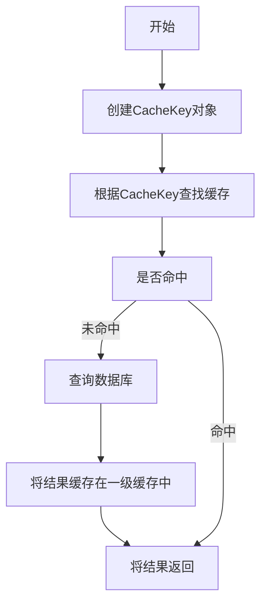

# ORM

## ORM简介

什么是ORM？ORM即Object Relational Mapping ，就是是对象关系映射。将数据库中对象映射到面向对象编程语言中的对象。使得开发人员可以用操作对象的方式来操作数据库，从而屏蔽数据库之间的差异。

## 优点


数据模型都在一个地方定义，更容易更新和维护，也利于重用代码

ORM 有现成的工具，很多功能都可以自动完成，比如：数据消毒、预处理、事务等等。

> 数据消毒是指对用户输入的数据进行处理，以防止恶意数据或不合法数据对应用程序的攻击或错误影响。常见的数据消毒操作包括转义特殊字符、验证输入、限制输入长度等。ORM框架可以做参数化查询、数据类型验证等可以实现数据消毒

更适合MVC 架构，ORM 就是天然的 Model，使代码更加清晰。

基于 ORM 的业务代码比较简单，代码量少，语义性好，容易理解。不必编写性能不佳的 SQL。

## 缺点

ORM库本身是有学习成本，需要花精力学习和配置，不是轻量级工具。

对于复杂的查询，ORM可能无法表达，或者性能不如原生的 SQL。

ORM减少了开发者对数据库层的直接操作，开发者对数据库底层的认识也减少了，需要写复杂SQL时变的更加困难。

## ORM工具

Hibernate，Mybatis，MybatisPlus，Spring Data JPA

### Spring Data JPA

spirng data jpa是spring提供的一套简化JPA开发的框架，按照约定好的【方法命名规则】写dao层接口，就可以在不写接口实现的情况下，实现对数据库的访问和操作。同时提供了很多除了CRUD之外的功能，如分页、排序、复杂查询等等。

Spring Data JPA 可以理解为 JPA 规范的再次封装抽象，底层还是使用了 Hibernate 的 JPA 技术实现。

### gaarason

-  让连接数据库以及对数据库进行增删改查操作变得非常简单，不论希望使用原生 SQL、还是查询构造器，还是 Eloquent ORM。 
-  Eloquent ORM 提供一个美观、简单的与数据库打交道的 ActiveRecord  实现，每个数据表都对应一个与该表数据结构对应的实体（Entity），以及的进行交互的模型（Model），通过模型类，你可以对数据表进行查询、插入、更新、删除等操作，并将结果反映到实体实例化的 java 对象中。
-  对于关联关系 Eloquent ORM 提供了富有表现力的声明方式，与简洁的使用方法，并专注在内部进行查询与内存优化，在复杂的关系中有仍然有着良好的体验。
-  兼容于其他常见的 ORM 框架, 以及常见的数据源 (DataSource)

### 

# Mybatis

## 参考说明

本文内容主要来源于马士兵教育视频教程（[Mybatis源码精讲-连鹏举](https://www.mashibing.com/study?courseNo=286&sectionNo=35746&courseVersionId=1242)），结合了老师的讲课内容以及自己的实践做了一些修改。


## 架构

1. Configuration，配置文件
   1. 框架配置文件，mybatis-config.xml
      1. 数据源，DataSource
      2. 事务管理器，TransactionManager
      3. mapper文件配置，mappers
   2. mapper配置文件，存储sql
2. StatementHandler，封装SQL和参数。
3. 执行器，执行SQL
4. ResultSetHandler，将执行结果映射成为实体类。


## 配置

Mybatis所有支持的配置参考[官网说明](https://mybatis.org/mybatis-3/zh/configuration.html)。


## 源码解析

### 前置知识

#### JDBC使用步骤

1. 加载驱动
2. 获取连接
3. 创建sql语句
4. 获取Statement对象
5. 执行sql语句
6. 处理结果集
7. 关闭连接


#### Mybatis使用步骤

1. 创建xml配置文件
2. 搞个mapper接口
3. SqlSessionFactory
4. SqlSession


### 前置准备

- 下载Mybatis源码。可以下载官方的，也可以下载别人写好注释的版本。如果看视频学习源码，推荐下载老师提供的版本。
- 准备好一个可以连接的数据库，有表有数据。例如：MySQL自带demo数据库，有一张emp表。
- 参考[官方入门案例](https://mybatis.org/mybatis-3/zh/getting-started.html)，创建好实体类，mapper，mybatis-config.xml以及测试启动代码。

本文使用的马士兵连老师的注释版本，载入之后修改maven路径，等他依赖包下载完毕就可以开始debug了。


### 框架脉络

强烈建议，看框架源码时，先梳理脉络，再去抠细节。千万别每看到一行就点进去。不断的层层深入到方法细节中。这样看很容易晕的。可以根据老师的注释，或者方法名，或者方法注释等猜测方法意图。看完当前方法内部的所有细节再点到某一行的细节中，这样逐层深入看源码效果会提升很多。

所以我们可以先使用一个简单的案例，来初步理清楚Mybatis源码的脉络。


### 配置文件解析

配置文件对应的类：Configuration

入口方法：

```java
SqlSessionFactory sqlSessionFactory = null;

@Before
public void init() throws Exception{
    // 根据全局配置文件创建出SqlSessionFactory
    // SqlSessionFactory:负责创建SqlSession对象的工厂
    // SqlSession:表示跟数据库建议的一次会话
    String resource = "mybatis-config.xml";
    InputStream inputStream = Resources.getResourceAsStream(resource);
    sqlSessionFactory = new SqlSessionFactoryBuilder().build(inputStream);
}
```

#### Configuration类解析

源码

```java
/**
 * Mybatis全局配置类
 */
public class Configuration {

  //环境信息
  protected Environment environment;

  //---------以下设置项对应<settings>节点，可以在官网找到-------
  protected boolean safeRowBoundsEnabled;
  protected boolean safeResultHandlerEnabled = true;
  protected boolean mapUnderscoreToCamelCase;
  protected boolean aggressiveLazyLoading;
  protected boolean multipleResultSetsEnabled = true;
  protected boolean useGeneratedKeys;
  protected boolean useColumnLabel = true;
  //默认启用缓存
  protected boolean cacheEnabled = true;
  protected boolean callSettersOnNulls;
  protected boolean useActualParamName = true;
  protected boolean returnInstanceForEmptyRow;
  protected boolean shrinkWhitespacesInSql;

  protected String logPrefix;
  protected Class<? extends Log> logImpl;
  protected Class<? extends VFS> vfsImpl;
  protected Class<?> defaultSqlProviderType;
  protected LocalCacheScope localCacheScope = LocalCacheScope.SESSION;
  protected JdbcType jdbcTypeForNull = JdbcType.OTHER;
  protected Set<String> lazyLoadTriggerMethods = new HashSet<>(Arrays.asList("equals", "clone", "hashCode", "toString"));
  protected Integer defaultStatementTimeout;
  protected Integer defaultFetchSize;
  protected ResultSetType defaultResultSetType;
  //默认为简单执行器
  protected ExecutorType defaultExecutorType = ExecutorType.SIMPLE;
  protected AutoMappingBehavior autoMappingBehavior = AutoMappingBehavior.PARTIAL;
  protected AutoMappingUnknownColumnBehavior autoMappingUnknownColumnBehavior = AutoMappingUnknownColumnBehavior.NONE;
  //---------以上都是<settings>节点-------
  protected Properties variables = new Properties();
  //对象工厂和对象包装器工厂
  protected ReflectorFactory reflectorFactory = new DefaultReflectorFactory();
  protected ObjectFactory objectFactory = new DefaultObjectFactory();
  protected ObjectWrapperFactory objectWrapperFactory = new DefaultObjectWrapperFactory();

  //默认禁用延迟加载
  protected boolean lazyLoadingEnabled = false;
  protected ProxyFactory proxyFactory = new JavassistProxyFactory(); // #224 Using internal Javassist instead of OGNL

  protected String databaseId;
  /**
   * Configuration factory class.
   * Used to create Configuration for loading deserialized unread properties.
   *
   * @see <a href='https://github.com/mybatis/old-google-code-issues/issues/300'>Issue 300 (google code)</a>
   */
  protected Class<?> configurationFactory;

  //Mapper注册器，负责对mapper进行新增和查询
  protected final MapperRegistry mapperRegistry = new MapperRegistry(this);
  //拦截器链
  protected final InterceptorChain interceptorChain = new InterceptorChain();
  //类型处理器注册机（里面注册了每一种JdbcType和java类型的处理类）
  protected final TypeHandlerRegistry typeHandlerRegistry = new TypeHandlerRegistry(this);
  //类型别名注册机
  protected final TypeAliasRegistry typeAliasRegistry = new TypeAliasRegistry();
  protected final LanguageDriverRegistry languageRegistry = new LanguageDriverRegistry();

  //映射的语句,存在Map里
  protected final Map<String, MappedStatement> mappedStatements = new StrictMap<MappedStatement>("Mapped Statements collection")
      .conflictMessageProducer((savedValue, targetValue) ->
          ". please check " + savedValue.getResource() + " and " + targetValue.getResource());
  //缓存,存在Map里
  protected final Map<String, Cache> caches = new StrictMap<>("Caches collection");
  //结果映射,存在Map里
  protected final Map<String, ResultMap> resultMaps = new StrictMap<>("Result Maps collection");
  protected final Map<String, ParameterMap> parameterMaps = new StrictMap<>("Parameter Maps collection");
  protected final Map<String, KeyGenerator> keyGenerators = new StrictMap<>("Key Generators collection");

  protected final Set<String> loadedResources = new HashSet<>();
  protected final Map<String, XNode> sqlFragments = new StrictMap<>("XML fragments parsed from previous mappers");

  //不完整的SQL语句
  protected final Collection<XMLStatementBuilder> incompleteStatements = new LinkedList<>();
  protected final Collection<CacheRefResolver> incompleteCacheRefs = new LinkedList<>();
  protected final Collection<ResultMapResolver> incompleteResultMaps = new LinkedList<>();
  protected final Collection<MethodResolver> incompleteMethods = new LinkedList<>();

  /*
   * A map holds cache-ref relationship. The key is the namespace that
   * references a cache bound to another namespace and the value is the
   * namespace which the actual cache is bound to.
   */
  protected final Map<String, String> cacheRefMap = new HashMap<>();

  public Configuration(Environment environment) {
    this();
    this.environment = environment;
  }

  public Configuration() {
      //注册别名和java类之间的关系
    typeAliasRegistry.registerAlias("JDBC", JdbcTransactionFactory.class);
    typeAliasRegistry.registerAlias("MANAGED", ManagedTransactionFactory.class);

    typeAliasRegistry.registerAlias("JNDI", JndiDataSourceFactory.class);
    typeAliasRegistry.registerAlias("POOLED", PooledDataSourceFactory.class);
    typeAliasRegistry.registerAlias("UNPOOLED", UnpooledDataSourceFactory.class);

    typeAliasRegistry.registerAlias("PERPETUAL", PerpetualCache.class);
    typeAliasRegistry.registerAlias("FIFO", FifoCache.class);
    typeAliasRegistry.registerAlias("LRU", LruCache.class);
    typeAliasRegistry.registerAlias("SOFT", SoftCache.class);
    typeAliasRegistry.registerAlias("WEAK", WeakCache.class);

    typeAliasRegistry.registerAlias("DB_VENDOR", VendorDatabaseIdProvider.class);

    typeAliasRegistry.registerAlias("XML", XMLLanguageDriver.class);
    typeAliasRegistry.registerAlias("RAW", RawLanguageDriver.class);

    typeAliasRegistry.registerAlias("SLF4J", Slf4jImpl.class);
    typeAliasRegistry.registerAlias("COMMONS_LOGGING", JakartaCommonsLoggingImpl.class);
    typeAliasRegistry.registerAlias("LOG4J", Log4jImpl.class);
    typeAliasRegistry.registerAlias("LOG4J2", Log4j2Impl.class);
    typeAliasRegistry.registerAlias("JDK_LOGGING", Jdk14LoggingImpl.class);
    typeAliasRegistry.registerAlias("STDOUT_LOGGING", StdOutImpl.class);
    typeAliasRegistry.registerAlias("NO_LOGGING", NoLoggingImpl.class);

    typeAliasRegistry.registerAlias("CGLIB", CglibProxyFactory.class);
    typeAliasRegistry.registerAlias("JAVASSIST", JavassistProxyFactory.class);

    languageRegistry.setDefaultDriverClass(XMLLanguageDriver.class);
    languageRegistry.register(RawLanguageDriver.class);
  }
}
```


#### XMLConfigBuilder.parse()

配置文件解析

```java
// 解析配置
  public Configuration parse() {
    // 根据parsed变量的值判断是否已经完成了对mybatis-config.xml配置文件的解析
    if (parsed) {
      throw new BuilderException("Each XMLConfigBuilder can only be used once.");
    }
    parsed = true;
    // 在mybatis-config.xml配置文件中查找<configuration>节点，并开始解析
    parseConfiguration(parser.evalNode("/configuration"));
    return configuration;
  }

  // 解析配置
  private void parseConfiguration(XNode root) {
    try {
      // issue #117 read properties first
      // 解析properties
      propertiesElement(root.evalNode("properties"));
      // 解析settings
      Properties settings = settingsAsProperties(root.evalNode("settings"));
      // 设置vfsImpl字段
      loadCustomVfs(settings);
      loadCustomLogImpl(settings);
      // 解析类型别名（可以在这里给类定义别名，以便在配置文件中直接使用，也可以通过注解@Alias("xxx")）
      typeAliasesElement(root.evalNode("typeAliases"));
      // 解析插件(例如：分页插件
      pluginElement(root.evalNode("plugins"));
      // 对象工厂
      objectFactoryElement(root.evalNode("objectFactory"));
      // 对象包装工厂
      objectWrapperFactoryElement(root.evalNode("objectWrapperFactory"));
      // 反射工厂
      reflectorFactoryElement(root.evalNode("reflectorFactory"));
      //设置具体的属性到configuration对象
      settingsElement(settings);
      // read it after objectFactory and objectWrapperFactory issue #631
      // 环境(涉及DataSource和TransactionManager)
      environmentsElement(root.evalNode("environments"));
      // databaseIdProvider
      databaseIdProviderElement(root.evalNode("databaseIdProvider"));
      // 类型处理器
      typeHandlerElement(root.evalNode("typeHandlers"));
      // 映射器
      mapperElement(root.evalNode("mappers"));
    } catch (Exception e) {
      throw new BuilderException("Error parsing SQL Mapper Configuration. Cause: " + e, e);
    }
  }
```


#### Mappers元素解析

mappers元素是配置文件中相对比较重要的元素。参考[官网说明](https://mybatis.org/mybatis-3/zh/configuration.html#mappers)。Mappers底下可以配置一个包路径，xml文件地址，或者mapper类。

```xml
<!-- 将包内的映射器接口全部注册为映射器 -->
<mappers>
  <package name="org.mybatis.builder"/>
</mappers>

<!-- 使用相对于类路径的资源引用 -->
<mappers>
  <mapper resource="org/mybatis/builder/AuthorMapper.xml"/>
  <mapper resource="org/mybatis/builder/BlogMapper.xml"/>
  <mapper resource="org/mybatis/builder/PostMapper.xml"/>
</mappers>

<!-- 使用映射器接口实现类的完全限定类名 -->
<mappers>
  <mapper class="org.mybatis.builder.AuthorMapper"/>
  <mapper class="org.mybatis.builder.BlogMapper"/>
  <mapper class="org.mybatis.builder.PostMapper"/>
</mappers>
```


## 核心类和接口

### Reflector

反射器，主要用于封装一个类的反射信息，支持缓存。例如：get，set方法即使类中实际没有get、set方法。

使用：调用构造方法，传入要反射的类型，也可以使用ReflectorFactory。可参考ReflectorTest来理解这个类的具体用处


### Invoker

配合Reflector，负责方法的调用，具体可以参考下文的案例。


### MetaObject

封装对象，使其支持表达式方式调用get set。

```java
  @Test
  void testGetSetterType() {
    ReflectorFactory reflectorFactory = new DefaultReflectorFactory();
    Reflector reflector = reflectorFactory.findForClass(Section.class);
    Assertions.assertEquals(Long.class, reflector.getSetterType("id"));
  }

  @Test
  public void test01(){
    Reflector reflector = new Reflector(Person.class);
    System.out.println(reflector);
  }

  @Test
  public void test02(){
    ReflectorFactory reflectorFactory = new DefaultReflectorFactory();
    Reflector reflector = reflectorFactory.findForClass(Student.class);
    System.out.println(Arrays.asList(reflector.getGetablePropertyNames()));
    System.out.println(Arrays.asList(reflector.getSetablePropertyNames()));
    System.out.println(reflector.hasDefaultConstructor());
    System.out.println(reflector.getGetterType("id"));
  }

  @Test
  public void test03() throws Exception {
    ReflectorFactory reflectorFactory = new DefaultReflectorFactory();
    Reflector reflector = reflectorFactory.findForClass(Student.class);
    Object o = reflector.getDefaultConstructor().newInstance();
    //设置
    Invoker invoker = reflector.getSetInvoker("id");
    invoker.invoke(o,new Object[]{1111});
    // 获取
    Invoker id = reflector.getGetInvoker("id");
    id.invoke(o,null);
  }

  @Test
  public void test04(){
    ReflectorFactory reflectorFactory = new DefaultReflectorFactory();
    MetaClass metaClass = MetaClass.forClass(User.class, reflectorFactory);
    System.out.println(metaClass.hasGetter("userField"));
    System.out.println(metaClass.hasGetter("userProperty"));
    System.out.println(metaClass.hasGetter("userMap"));
    System.out.println(metaClass.hasGetter("user"));
    System.out.println(metaClass.hasGetter("userlist"));
    System.out.println(metaClass.hasGetter("userlist[0]"));
    System.out.println("-----------");
    System.out.println(metaClass.hasGetter("user.userField"));
    System.out.println(metaClass.hasGetter("user.userProperty"));
    System.out.println(metaClass.hasGetter("user.userMap"));
    System.out.println(metaClass.hasGetter("user.userlist"));
    System.out.println(metaClass.hasGetter("user.user"));
    System.out.println("------------");
    System.out.println(Arrays.asList(metaClass.getGetterNames()));
    System.out.println(Arrays.asList(metaClass.getSetterNames()));
  }

  @Test
  public void test05(){
    User user = new User();
    MetaObject metaObject = SystemMetaObject.forObject(user);
    metaObject.setValue("userField","lian");
    System.out.println(metaObject.getValue("userField"));

    metaObject.setValue("user.userField","lian");
    System.out.println(metaObject.getValue("user.userField"));

    metaObject.setValue("userMap[key]","lian");
    System.out.println(metaObject.getValue("userMap[key]"));
  }
```


### Typehandler


### MapperMethod

封装方法，方法签名，方法类型等，用于执行mapper类中的方法。

1. 获取到SqlSession
2. getMapper获取到映射，MapperRegistry
3. 根据接口来获取工厂类型，MapperProxyFactory
4. 获取工厂实例newInstance()，MapperProxy
5. 通过工厂创建出具体的代理对象
6. 进行SQL处理工作。


### logging

用于支持各种日志打印格式。通过LogFactory来自动检查不同的日志框架。也可以在配置文件中指定。

```java
public final class LogFactory {

  /**
   * Marker to be used by logging implementations that support markers.
   */
  public static final String MARKER = "MYBATIS";

  private static Constructor<? extends Log> logConstructor;

  static {
    tryImplementation(LogFactory::useSlf4jLogging);
    tryImplementation(LogFactory::useCommonsLogging);
    tryImplementation(LogFactory::useLog4J2Logging);
    tryImplementation(LogFactory::useLog4JLogging);
    tryImplementation(LogFactory::useJdkLogging);
    tryImplementation(LogFactory::useNoLogging);
  }

  private LogFactory() {
    // disable construction
  }

  public static Log getLog(Class<?> clazz) {
    return getLog(clazz.getName());
  }

  public static Log getLog(String logger) {
    try {
      return logConstructor.newInstance(logger);
    } catch (Throwable t) {
      throw new LogException("Error creating logger for logger " + logger + ".  Cause: " + t, t);
    }
  }
}
```

配置文件支持的配置。（一般不用）

| 设置名    | 描述                                                  | 有效值                                                       | 默认值 |
| --------- | ----------------------------------------------------- | ------------------------------------------------------------ | ------ |
| logPrefix | 指定 MyBatis 增加到日志名称的前缀。                   | 任何字符串                                                   | 未设置 |
| logImpl   | 指定 MyBatis 所用日志的具体实现，未指定时将自动查找。 | SLF4J \| LOG4J（3.5.9 起废弃） \| LOG4J2 \| JDK_LOGGING \| COMMONS_LOGGING \| STDOUT_LOGGING \| NO_LOGGING | 未设置 |

这里面的这些日志名称，在Configuration类的构造方法中注册过别名和实现类。

```java
    typeAliasRegistry.registerAlias("SLF4J", Slf4jImpl.class);
    typeAliasRegistry.registerAlias("COMMONS_LOGGING", JakartaCommonsLoggingImpl.class);
    typeAliasRegistry.registerAlias("LOG4J", Log4jImpl.class);
    typeAliasRegistry.registerAlias("LOG4J2", Log4j2Impl.class);
    typeAliasRegistry.registerAlias("JDK_LOGGING", Jdk14LoggingImpl.class);
    typeAliasRegistry.registerAlias("STDOUT_LOGGING", StdOutImpl.class);
    typeAliasRegistry.registerAlias("NO_LOGGING", NoLoggingImpl.class);
```

这里面的这些实现类都是Mybatis自己定义的。在这些类的内部还会去依赖真正的日志实现。同时这些依赖的optional=true。

```java
import org.apache.ibatis.logging.Log;
import org.apache.logging.log4j.LogManager;
import org.apache.logging.log4j.Logger;
import org.apache.logging.log4j.spi.AbstractLogger;

/**
 * 调用Log4j2框架实现日志功能。
 */
public class Log4j2Impl implements Log {

  private final Log log;

  public Log4j2Impl(String clazz) {
    Logger logger = LogManager.getLogger(clazz);

    if (logger instanceof AbstractLogger) {
      log = new Log4j2AbstractLoggerImpl((AbstractLogger) logger);
    } else {
      log = new Log4j2LoggerImpl(logger);
    }
  }

  @Override
  public boolean isDebugEnabled() {
    return log.isDebugEnabled();
  }

  @Override
  public boolean isTraceEnabled() {
    return log.isTraceEnabled();
  }

  @Override
  public void error(String s, Throwable e) {
    log.error(s, e);
  }

  @Override
  public void error(String s) {
    log.error(s);
  }

  @Override
  public void debug(String s) {
    log.debug(s);
  }

  @Override
  public void trace(String s) {
    log.trace(s);
  }

  @Override
  public void warn(String s) {
    log.warn(s);
  }

}
```

maven依赖

```xml
    <dependency>
      <groupId>org.apache.logging.log4j</groupId>
      <artifactId>log4j-core</artifactId>
      <version>2.14.1</version>
      <optional>true</optional>
    </dependency>
```


## 缓存

所有缓存都实现的接口Cache，不同的缓存实现之间使用了装饰器模式。

```java
package org.apache.ibatis.cache;

import java.util.concurrent.locks.ReadWriteLock;

/**
 * Mybatis缓存接口
 */
public interface Cache {

  /**
   * 该缓存对象的id
   * @return The identifier of this cache
   */
  String getId();

  /**
   * 向缓存中添加数据，key是CacheKey，value是查询结果
   */
  void putObject(Object key, Object value);

  /**
   * 根据指定的key，在缓存中查找对应的结果对象
   */
  Object getObject(Object key);

  /**
   * 删除key对应的缓存项
   */
  Object removeObject(Object key);

  /**
   * 清空缓存
   */
  void clear();

  /**
   * 缓存项的个数
   */
  int getSize();

  /**
   * 获取读写锁
   */
  default ReadWriteLock getReadWriteLock() {
    return null;
  }

}

```

### 缓存类型

#### PerpetualCache

永久缓存，一旦存入就一直保持。一级缓存就是这个类型

#### BlockingCache

阻塞式缓存，内部使用了ConcurrentHashMap实现了锁，它会保证只有一个线程到缓存中查找指定 key 对应的数据。

假设 线程A 从数据库中查找到 keyA 对应的结果对象后，将结果对象放入到 BlockingCache 中，此时 线程 A 会释放 keyA 对应的锁，唤醒阻塞在该锁上的线程。其它线程即可从 BlockingCache 中获取 keyA 对应的数据，而不是再次访问数据库。

#### FifoCache 和 LruCache

在很多场景中，为了控制缓存的大小，系统需要按照一定的规则清理缓存。FifoCache 是先入先出版本的装饰器，当向缓存添加数据时，如果缓存项的个数已经达到上限，则会将缓存中最老（即最早进入缓存）的缓存项删除。

LruCache 是按照"近期最少使用算法"（Least Recently Used, LRU）进行缓存清理的装饰器，在需要清理缓存时，它会清除最近最少使用的缓存项。

#### SoftCache 和 WeakCache

使用java的软引用和弱引用实现的缓存。


### 一级缓存

BaseExecutor中有一个属性`protected PerpetualCache localCache;`就是一级缓存。默认开启。作用域为session。

执行流程如下图：




### 二级缓存

默认不开启，作用域为SessionFactory，多个session之间可以共享。

具体使用二级缓存的源码，CachingExecutor.query()：

```java
public <E> List<E> query(MappedStatement ms, Object parameterObject, RowBounds rowBounds, ResultHandler resultHandler, CacheKey key, BoundSql boundSql)
      throws SQLException {
    // 获取查询语句所在命名空间对应的二级缓存
    Cache cache = ms.getCache();
    // 是否开启了二级缓存
    if (cache != null) {
      // 根据select节点的配置，决定是否需要清空二级缓存
      flushCacheIfRequired(ms);
      // 检测SQL节点的useCache配置以及是否使用了resultHandler配置
      if (ms.isUseCache() && resultHandler == null) {
        // 二级缓存不能保存输出类型的参数，如果查询操作调用了包含输出参数的存储过程，则报错
        ensureNoOutParams(ms, boundSql);
        @SuppressWarnings("unchecked")
        // 查询二级缓存
        List<E> list = (List<E>) tcm.getObject(cache, key);
        if (list == null) {
          // 二级缓存没有相应的结果对，调用封装的Executor对象的query方法
          list = delegate.query(ms, parameterObject, rowBounds, resultHandler, key, boundSql);
          // 将查询结果保存到TransactionalCache.entriesToAddOnCommit集合中
          tcm.putObject(cache, key, list); // issue #578 and #116
        }
        return list;
      }
    }
    // 没有启动二级缓存，直接调用底层Executor执行数据库查询操作
    return delegate.query(ms, parameterObject, rowBounds, resultHandler, key, boundSql);
  }
```


### 三级缓存

除了上述缓存之外，还可以实现自己的缓存。或者使用第三方缓存来覆盖缓存行为。


## 整合Spring

### 整合步骤

### 依赖

在项目的maven依赖中添加Spring的依赖，Mybatis整合Spring的依赖。

#### 配置文件

使用spring配置文件替换mybatis-config.xml，在配置文件中配置如下几个关键类。


### 整合原理

核心在于SqlSessionFactoryBean，这个类实现了FactoryBean接口，可以通过getObject方法创建SqlSessionFactory对象。实现InitializingBean初始化时会调用afterPropertiesSet()方法。实现ApplicationListener接口，监听容器refresh事件。

```java
public class SqlSessionFactoryBean
    implements FactoryBean<SqlSessionFactory>, InitializingBean, ApplicationListener<ApplicationEvent> {

  private Resource configLocation;

  private Configuration configuration;

  private Resource[] mapperLocations;

  private DataSource dataSource;

  private TransactionFactory transactionFactory;

  private Properties configurationProperties;

  private SqlSessionFactoryBuilder sqlSessionFactoryBuilder = new SqlSessionFactoryBuilder();

  private SqlSessionFactory sqlSessionFactory;

  // EnvironmentAware requires spring 3.1
  private String environment = SqlSessionFactoryBean.class.getSimpleName();

  private Interceptor[] plugins;

  private TypeHandler<?>[] typeHandlers;

  private String typeHandlersPackage;

  @SuppressWarnings("rawtypes")
  private Class<? extends TypeHandler> defaultEnumTypeHandler;

  private Class<?>[] typeAliases;

  private String typeAliasesPackage;

  private Class<?> typeAliasesSuperType;

  private LanguageDriver[] scriptingLanguageDrivers;

  // issue #19. No default provider.
  private DatabaseIdProvider databaseIdProvider;

  private Cache cache;

  private ObjectFactory objectFactory;

  private ObjectWrapperFactory objectWrapperFactory;

  /**
   * {@inheritDoc}
   */
  @Override
  public void afterPropertiesSet() throws Exception {
    notNull(dataSource, "Property 'dataSource' is required");
    notNull(sqlSessionFactoryBuilder, "Property 'sqlSessionFactoryBuilder' is required");
    state((configuration == null && configLocation == null) || !(configuration != null && configLocation != null),
        "Property 'configuration' and 'configLocation' can not specified with together");

    this.sqlSessionFactory = buildSqlSessionFactory();
  }

  /**
   * Build a {@code SqlSessionFactory} instance.
   *
   * The default implementation uses the standard MyBatis {@code XMLConfigBuilder} API to build a
   * {@code SqlSessionFactory} instance based on a Reader. Since 1.3.0, it can be specified a {@link Configuration}
   * instance directly(without config file).
   *
   * @return SqlSessionFactory
   * @throws Exception
   *           if configuration is failed
   */
  protected SqlSessionFactory buildSqlSessionFactory() throws Exception {

    final Configuration targetConfiguration;

    XMLConfigBuilder xmlConfigBuilder = null;
    if (this.configuration != null) {
      targetConfiguration = this.configuration;
      if (targetConfiguration.getVariables() == null) {
        targetConfiguration.setVariables(this.configurationProperties);
      } else if (this.configurationProperties != null) {
        targetConfiguration.getVariables().putAll(this.configurationProperties);
      }
    } else if (this.configLocation != null) {
      xmlConfigBuilder = new XMLConfigBuilder(this.configLocation.getInputStream(), null, this.configurationProperties);
      targetConfiguration = xmlConfigBuilder.getConfiguration();
    } else {
      LOGGER.debug(
          () -> "Property 'configuration' or 'configLocation' not specified, using default MyBatis Configuration");
      targetConfiguration = new Configuration();
      Optional.ofNullable(this.configurationProperties).ifPresent(targetConfiguration::setVariables);
    }

    Optional.ofNullable(this.objectFactory).ifPresent(targetConfiguration::setObjectFactory);
    Optional.ofNullable(this.objectWrapperFactory).ifPresent(targetConfiguration::setObjectWrapperFactory);
    Optional.ofNullable(this.vfs).ifPresent(targetConfiguration::setVfsImpl);

    if (hasLength(this.typeAliasesPackage)) {
      scanClasses(this.typeAliasesPackage, this.typeAliasesSuperType).stream()
          .filter(clazz -> !clazz.isAnonymousClass()).filter(clazz -> !clazz.isInterface())
          .filter(clazz -> !clazz.isMemberClass()).forEach(targetConfiguration.getTypeAliasRegistry()::registerAlias);
    }

    if (!isEmpty(this.typeAliases)) {
      Stream.of(this.typeAliases).forEach(typeAlias -> {
        targetConfiguration.getTypeAliasRegistry().registerAlias(typeAlias);
        LOGGER.debug(() -> "Registered type alias: '" + typeAlias + "'");
      });
    }

    if (!isEmpty(this.plugins)) {
      Stream.of(this.plugins).forEach(plugin -> {
        targetConfiguration.addInterceptor(plugin);
        LOGGER.debug(() -> "Registered plugin: '" + plugin + "'");
      });
    }

    if (hasLength(this.typeHandlersPackage)) {
      scanClasses(this.typeHandlersPackage, TypeHandler.class).stream().filter(clazz -> !clazz.isAnonymousClass())
          .filter(clazz -> !clazz.isInterface()).filter(clazz -> !Modifier.isAbstract(clazz.getModifiers()))
          .forEach(targetConfiguration.getTypeHandlerRegistry()::register);
    }

    if (!isEmpty(this.typeHandlers)) {
      Stream.of(this.typeHandlers).forEach(typeHandler -> {
        targetConfiguration.getTypeHandlerRegistry().register(typeHandler);
        LOGGER.debug(() -> "Registered type handler: '" + typeHandler + "'");
      });
    }

    targetConfiguration.setDefaultEnumTypeHandler(defaultEnumTypeHandler);

    if (!isEmpty(this.scriptingLanguageDrivers)) {
      Stream.of(this.scriptingLanguageDrivers).forEach(languageDriver -> {
        targetConfiguration.getLanguageRegistry().register(languageDriver);
        LOGGER.debug(() -> "Registered scripting language driver: '" + languageDriver + "'");
      });
    }
    Optional.ofNullable(this.defaultScriptingLanguageDriver)
        .ifPresent(targetConfiguration::setDefaultScriptingLanguage);

    if (this.databaseIdProvider != null) {// fix #64 set databaseId before parse mapper xmls
      try {
        targetConfiguration.setDatabaseId(this.databaseIdProvider.getDatabaseId(this.dataSource));
      } catch (SQLException e) {
        throw new NestedIOException("Failed getting a databaseId", e);
      }
    }

    Optional.ofNullable(this.cache).ifPresent(targetConfiguration::addCache);

    if (xmlConfigBuilder != null) {
      try {
        xmlConfigBuilder.parse();
        LOGGER.debug(() -> "Parsed configuration file: '" + this.configLocation + "'");
      } catch (Exception ex) {
        throw new NestedIOException("Failed to parse config resource: " + this.configLocation, ex);
      } finally {
        ErrorContext.instance().reset();
      }
    }

    targetConfiguration.setEnvironment(new Environment(this.environment,
        this.transactionFactory == null ? new SpringManagedTransactionFactory() : this.transactionFactory,
        this.dataSource));

    if (this.mapperLocations != null) {
      if (this.mapperLocations.length == 0) {
        LOGGER.warn(() -> "Property 'mapperLocations' was specified but matching resources are not found.");
      } else {
        for (Resource mapperLocation : this.mapperLocations) {
          if (mapperLocation == null) {
            continue;
          }
          try {
            XMLMapperBuilder xmlMapperBuilder = new XMLMapperBuilder(mapperLocation.getInputStream(),
                targetConfiguration, mapperLocation.toString(), targetConfiguration.getSqlFragments());
            xmlMapperBuilder.parse();
          } catch (Exception e) {
            throw new NestedIOException("Failed to parse mapping resource: '" + mapperLocation + "'", e);
          } finally {
            ErrorContext.instance().reset();
          }
          LOGGER.debug(() -> "Parsed mapper file: '" + mapperLocation + "'");
        }
      }
    } else {
      LOGGER.debug(() -> "Property 'mapperLocations' was not specified.");
    }

    return this.sqlSessionFactoryBuilder.build(targetConfiguration);
  }

  /**
   * {@inheritDoc}
   */
  @Override
  public SqlSessionFactory getObject() throws Exception {
    if (this.sqlSessionFactory == null) {
      afterPropertiesSet();
    }

    return this.sqlSessionFactory;
  }

  /**
   * {@inheritDoc}
   */
  @Override
  public Class<? extends SqlSessionFactory> getObjectType() {
    return this.sqlSessionFactory == null ? SqlSessionFactory.class : this.sqlSessionFactory.getClass();
  }

  /**
   * {@inheritDoc}
   */
  @Override
  public boolean isSingleton() {
    return true;
  }

  /**
   * {@inheritDoc}
   */
  @Override
  public void onApplicationEvent(ApplicationEvent event) {
    if (failFast && event instanceof ContextRefreshedEvent) {
      // fail-fast -> check all statements are completed
      this.sqlSessionFactory.getConfiguration().getMappedStatementNames();
    }
  }

}
```

另一个重要类是MapperScannerConfigurer，它实现了BeanDefinitionRegistryPostProcessor, InitializingBean接口，当Spring容器refresh的时候会在BeanFactory初始化完成之后调用，根据配置的包路径，扫描mapper类或者Dao类，将其纳入到Spring容器管理。


# Mybatis-plus
