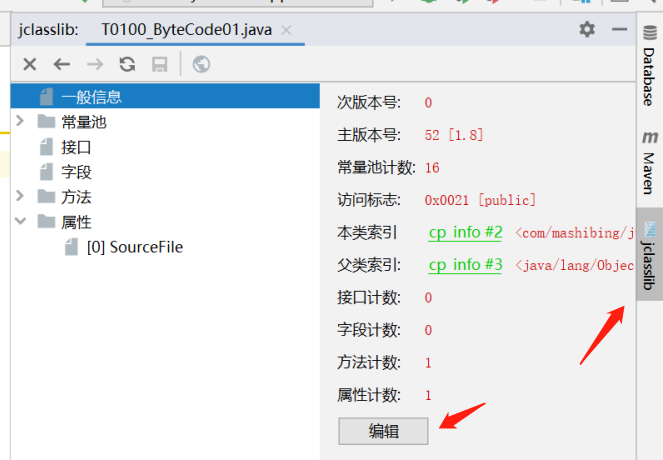

# JVM

# 参考文档

如果在网上看文章遇到分歧，建议大家看最权威文档：[The Java Virtual Machine Specification（Java虚拟机规范）](https://docs.oracle.com/javase/specs/jvms/se8/jvms8.pdf)

上面的是JDK8的，不同版本的可以在这里找：[Oracle官方所有版本Java规范文档](https://docs.oracle.com/javase/specs/)。

以下笔记内容参考的视频地址：https://www.mashibing.com/study?courseNo=245&sectionNo=53557


# JVM基础知识

## JVM是什么

1. Java Virtual Machine（Java虚拟机）
2. JVM是一种规范，它有很多种实现。

## 常见的JVM实现

1. Hotspot：Oracle官方
2. JRockit：bea公司，号称最快的虚拟机，已被Oracle收购，并入Hotspot
3. J9： IBM，Microsoft VM
4. LiquidVM
5. azul zing：收费
6. Taobao VM，Hotspot深度定制版
7. 阿里VM，每个租户单独空间。
   1. session based GC，针对基于web的java应用很多都是基于session，session结束触发GC，回收session相关的数据，要比后台单独GC效率高很多。


## JVM支持的语言

1.  java
2.  groovy
3.  kotlin
4.  scala
5.  Jython
6.  JRuby
7.  从跨平台的语言到跨语言的平台，JVM大概支持约100种语言。

## JDK，JRE，JVM关系

1. JDK = JRE + Development Kit
2. JRE = JVM + Java 类库


# 从编译到执行

## 流程图


## 其他语言在JVM中如何运行

1. 虽然JVM叫Java虚拟机，但原理上其实他是基于class的。
2. 任何一种语言只要能生成符合jvm要求的class文件就能被执行。
3. java可以通过javac命令生成class文件，其他语言也能用自己的方式生成class文件


## Class文件结构

### 底层结构

- 底层：二进制字节流

- 数据类型：u1 u2 u4 u8 和 _info 表类型

  - _info 的来源是hotspot源码中的写法
  - u1代表1个字节，8位，16进制有2个数
  - u2代表2个字节，16位，16禁止有4个数

### 查看工具

#### 16进制工具

- sublime
- notepad++ (需要装HexEditor插件)
- BinEd：IDEA插件

16进制文件案例

~~~
cafe babe 0000 0034 003f 0a00 0a00 2b08
002c 0900 0d00 2d06 4059 0000 0000 0000
0900 0d00 2e09 002f 0030 0800 310a 0032
0033 0700 340a 000d 0035 0900 0d00 3607
0037 0100 046e 616d 6501 0012 4c6a 6176
612f 6c61 6e67 2f53 7472 696e 673b 0100
0361 6765 0100 0149 0100 0673 616c 6172
7901 0001 4401 000d 436f 6e73 7461 6e74
......
~~~

####    字节码工具

- javap，在idea中，在project文件视图中选中java文件，然后选"view > view bytecode"就是调用的这个命令

- JBE -可以直接修改0
- JClassLib-->IDEA插件。安装之后，在project文件视图中选中java文件，然后选"view > view bytecode with Jclasslib"
  - 推荐安装这个工具，他会将class信息归类，并且还能编辑，比上面的工具强大很多。


### 构成

#### 一般信息

##### 魔数

1. 每个Class文件的头4个字节称为魔数（Magic Number）
2. 唯一作用是用于确定这个文件是否为一个能被虚拟机接受的Class文件。
3. Class文件魔数的值为0xCAFEBABE。如果一个文件不是以0xCAFEBABE开头，那它就肯定不是[Java ](http://lib.csdn.net/base/java)class文件。

很多文件存储标准中都使用魔数来进行身份识别，譬如图片格式，如gif或jpeg等在文件头中都存有魔数。使用魔数而不是使用扩展名是基于安全性考虑的，扩展名可以随意被改变!!!


##### 主次版本号

紧接着魔数的4个字节是Class文件版本号，版本号又分为：

1. 次版本号(minor_version): 前2字节，4个16进制，用于表示次版本号
2. 主版本号(major_version): 后2字节，4个16进制，用于表示主版本号。

这个的版本号是随着jdk版本的不同而表示不同的版本范围的。Java的版本号是从45开始的。如果Class文件的版本号超过虚拟机版本，将被拒绝执行。

0X0034（对应十进制的50）：JDK1.8    
0X0033（对应十进制的50）：JDK1.7    
0X0032（对应十进制的50）：JDK1.6    
0X0031（对应十进制的49）：JDK1.5　　
0X0030（对应十进制的48）：JDK1.4　　
0X002F（对应十进制的47）：JDK1.3　　
0X002E（对应十进制的46）：JDK1.2 
0X表示16进制

#####  类的访问标志

常量池之后的数据结构是访问标志(access_flags)，2字节，16位，这个标志主要用于识别类或接口层次的访问信息，主要包括：

- 是否final
- 是否public，否则是private
- 是否是接口
- 是否可用invokespecial字节码指令
- 是否是abstact
- 是否是注解
- 是否是枚举


#####  类索引、父类索引、接口

这三项数据主要用于确定这个类的继承关系。

其中类索引(this_class)和父类索引(super_class)都是一个u2类型的数据，而接口索引(interface)集合是一组u2类型的数据。(多实现单继承)

类索引(this_class)，用于确定这个类的全限定名，占2字节

父类索引(super_class)，用于确定这个类父类的全限定名（Java语言不允许多重继承，故父类索引只有一个。除了java.lang.Object类之外所有类都有父类，故除了java.lang.Object类之外，所有类该字段值都不为0），占2字节

接口索引计数器(interfaces_count)，占2字节。如果该类没有实现任何接口，则该计数器值为0，并且后面的接口的索引集合将不占用任何字节

接口索引集合(interfaces)，一组u2类型数据的集合。用来描述这个类实现了哪些接口，这些被实现的接口将按implements语句（如果该类本身为接口，则为extends语句）后的接口顺序从左至右排列在接口的索引集合中

this_class、super_class与interfaces按顺序排列在访问标志之后，它们中保存的索引值均指向常量池中一个CONSTANT_Class_info类型的常量，通过这个常量中保存的索引值可以找到定义在CONSTANT_Utf8_info类型的常量中的全限定名字符串

#### 常量池

紧接着魔数与版本号之后的是常量池入口.常量池简单理解为class文件的资源从库

1. 是Class文件结构中与其它项目关联最多的数据类型
2. 是占用Class文件空间最大的数据项目之一
3. 是在文件中第一个出现的表类型数据项目

由于常量池中常量的数量是不固定的，所以在常量池的入口需要放置一项u2类型的数据，代表常量池容量计数值(constant_pool_count)。

从1开始计数。Class文件结构中只有常量池的容量计数是从1开始的，第0项腾出来满足后面某些指向常量池的索引值的数据在特定情况下需要表达"不引用任何一个常量池项目"的意思，这种情况就可以把索引值置为0来表示(留给JVM自己用的)。但尽管constant_pool列表中没有索引值为0的入口，缺失的这一入口也被constant_pool_count计数在内。例如，当constant_pool中有14项，constant_poo_count的值为15。

**常量池之中主要存放两大类常量**：

1. **字面量**: 1.文本字符串 2.八种基本类型的值 3.被声明为final的常量等;
2. **符号引用**: 属于编译原理方面的概念，包括了下面三类常量:

- 类和接口的全限定名
- 字段的名称和描述符
- 方法的名称和描述符

Java代码在进行Java编译的时候，并不像C和C++那样有"连接"这一步骤，而是在虚拟机加载Class文件的时候进行动态连接。也就是说，在Class文件中不会保存各个方法和字段的最终内存布局信息，因此这些字段和方法的符号引用不经过转换的话是无法被虚拟机使用的。当虚拟机运行时，需要从常量池获得对应的符号引用，再在类创建时或运行时解析并翻译到具体的内存地址之中。
**constant_pool_count**：占2字节，本例为0x0016，转化为十进制为22，即说明常量池中有21个常量（只有常量池的计数是从1开始的，其它集合类型均从0开始），索引值为1~21。第0项常量具有特殊意义，如果某些指向常量池索引值的数据在特定情况下需要表达“不引用任何一个常量池项目”的含义，这种情况可以将索引值置为0来表示
**constant_pool**：表类型数据集合，即常量池中每一项常量都是一个表，共有14种(JDK1.7前只有11种)结构各不相同的表结构数据。这14种表都有一个共同的特点，即均由一个u1类型的标志位开始，可以通过这个标志位来判断这个常量属于哪种常量类型，常量类型及其数据结构如下表所示：


#### 接口

上文已经介绍过，主要是interfaces_count和interfaces


#### 字段

fields_count：字段表计数器，即字段表集合中的字段表数据个数，占2字节。本测试类其值为0x0001，即只有一个字段表数据，也就是测试类中只包含一个变量（不算方法内部变量）

fields：字段表集合，一组字段表类型数据的集合。字段表用于描述接口或类中声明的变量，包括类级别（static）和实例级别变量，不包括在方法内部声明的变量

在Java中一般通过如下几项描述一个字段：字段作用域（public、protected、private修饰符）、是类级别变量还是实例级别变量（static修饰符）、可变性（final修饰符）、并发可见性（volatile修饰符）、可序列化与否（transient修饰符）、字段数据类型（基本类型、对象、数组）以及字段名称。在字段表中，变量修饰符使用标志位表示，字段数据类型和字段名称则引用常量池中常量表示。

#### 方法

methods_count：方法表计数器，即方法表集合中的方法表数据个数。占2字节，其值为0x0002，即测试类中有2个方法

methods：方法表集合，一组方法表类型数据的集合。方法表结构和字段表结构一样。

2个字节为属性计数器，其值为0x0001，说明这个方法的属性表集合中有一个属性（详细说明见后面“属性表集合”）
 属性名称为接下来2个字节0x0009，指向常量池中第9个常量，Code。
 接下来4个字节为0x0000002F，表示Code属性值的字节长度为47。
 接下来2个字节为0x0001，表示该方法的操作数栈的深度最大值为1。
 接下来2个字节依然为0x0001，表示该方法的局部变量占用空间为1。
 接下来4个字节为0x00000005，则紧接着的5个字节0x2AB70001B1为该方法编译后生成的字节码指令。
 接下来2个字节为0x0000，说明Code属性异常表集合为空。
 接下来2个字节为0x0002，说明Code属性带有2个属性，
 接下来2个字节0x000A即为Code属性第一个属性的属性名称，指向常量池中第10个常量：LineNumberTable。
 接下来4个字节为0x00000006，表示LineNumberTable属性值所占字节长度为6。
 接下来2个字节为0x0001，line_number_table中只有一个line_number_info表，start_pc为0x0000，line_number为0x0003，LineNumberTable属性结束。
 接下来2位0x000B为Code属性第二个属性的属性名，指向常量池中第11个常量：LocalVariableTable。该属性值所占的字节长度为0x0000000C=12。
  接下来2位为0x0001，说明local_variable_table中只有一个local_variable_info表，按照local_variable_info表结构，start_pc为0x0000，length为0x0005，name_index为0x000C，指向常量池中第12个常量：this，descriptor_index为0x000D，指向常量池中第13个常量：LTestClass;，index为0x0000。

如果子类没有重写父类的方法，方法表集合中就不会出现父类方法的信息；有可能会出现由编译器自动添加的方法（如：最典型的<init>，实例类构造器）在Java语言中，重载一个方法除了要求和原方法拥有相同的简单名称外，还要求必须拥有一个与原方法不同的特征签名（，由于特征签名不包含返回值，故Java语言中不能仅仅依靠返回值的不同对一个已有的方法重载；但是在Class文件格式中，特征签名即为方法描述符，只要是描述符不完全相同的2个方法也可以合法共存，即2个除了返回值不同之外完全相同的方法在Class文件中也可以合法共存。

注意：Java代码的方法特征签名只包括方法名称、参数顺序、参数类型。 而字节码的特征签名还包括方法返回值和受异常表。


#### 属性

用于描述某些场景专有的信息，如字节码的指令信息等等。

集合中各属性表没有严格的顺序；

可以自定义属性信息，JVM会忽略不认识的属性表；

在Class文件的 ClassFile结构、字段表、方法表中都可以存储放自己的属性表集合，所以并不像最前面那Class文件结构那么直观，即属性不都是放在Class文件的最后：

五个属性对于Java虚拟机正确解释Class文件至关重要：

ConstantValue、Code、StackMapTable、Exceptions、BootstrapMethods；

十二个属性对于通过Java SE平台的类库来正确解释Class文件至关重要：

InnerClasses、EnclosingMethod、Synthetic、Signature、RuntimeVisibleAnnotations、RuntimeInvisibleAnnotations、RuntimeVisibleParameterAnnotations、RuntimeInvisibleParameterAnnotations、RuntimeVisibleTypeAnnotations、RuntimeInvisibleTypeAnnotations、AnnotationDefault、MethodParameters；

**六个属性**对于通过Java虚拟机或Java SE平台的类库来正确解释Class文件并**不重要，但对于工具非常有用**：

SourceFile、SourceDebugExtension、LineNumberTable、LocalVariableTable、LocalVariableTypeTable、Deprecated；


## 类加载

### 类加载流程


流程说明

#### Loading装载

此步骤主要是将硬盘上的class文件装载到内存中。

将这个class的字节流所代表的静态存储结构加载到Meta space中（方法区）。

在Java堆中生成一个代表这个类的java.lang.Class对象，指向class文件在内存中的数据。

加载的时候不同的类是由不同的类加载器加载的。

**装载方式**

1. 从本地系统（硬盘）中直接加载，也是最常见的场景。

2. 通过网络下载.class文件

   典型场景：Web Applet，也就是我们的小程序应用

3. 从zip，jar等归档文件中加载.class文件

   典型场景：后续演变为jar、war格式

4. 从专有数据库中提取.class文件

   典型场景：JSP应用从专有数据库中提取.class文件，较为少见

5. 将Java源文件动态编译为.class文件，也就是运行时计算而成

   典型场景：动态代理技术

6. 从加密文件中获取

   典型场景：典型的防Class文件被反编译的保护措施  


1. LazyLoading 五种情况

   1. –new getstatic putstatic invokestatic指令，访问final变量除外

      –java.lang.reflect对类进行反射调用时

      –初始化子类的时候，父类首先初始化

      –虚拟机启动时，被执行的主类必须初始化

      –动态语言支持java.lang.invoke.MethodHandle解析的结果为REF_getstatic REF_putstatic REF_invokestatic的方法句柄时，该类必须初始化

2. ClassLoader的源码

   1. findInCache -> parent.loadClass -> findClass()

3. 自定义类加载器

   1. extends ClassLoader
   2. overwrite findClass() -> defineClass(byte[] -> Class clazz)
   3. 加密
   4. parent是如何指定的，打破双亲委派
      1. 用super(parent)指定
      2. 双亲委派的打破
         1. 如何打破：重写loadClass（）
         2. 何时打破过？
            1. JDK1.2之前，自定义ClassLoader都必须重写loadClass()
            2. ThreadContextClassLoader可以实现基础类调用实现类代码，通过thread.setContextClassLoader指定
            3. 热启动，热部署
               1. osgi tomcat 都有自己的模块指定classloader（可以加载同一类库的不同版本）

4. 混合执行 编译执行 解释执行

   1. 检测热点代码：-XX:CompileThreshold = 10000

#### Verification校验

这一步主要是校验加载到内存中的数据是否符合JVM规定。例如：文件是否cafe baby开头。


#### Preparation准备

静态成员变量赋默认值。（注意不是文件中指定的值）

例如：如果有成员变量private static int = 5; 这个时候只会等于0


#### Resolution解析

1. 将类、方法、属性等符号引用解析为直接引用。
   1. 符号引用指的是class文件中的那些字符，例如：<java/lang/String>
   2. 直接引用指的是，这个类对象在JVM内存中的地址。
2. 常量池中的各种符号引用解析为指针、偏移量等内存地址的直接引用

##### 符合引用和直接引用

符号引用是一种符号化的引用，包含了类名、字段名、方法名等信息；而直接引用是直接指向内存地址的引用，指向实际的类、字段、方法等内存地址。

假设有一个类`Person`，其中定义了一个静态方法`sayHello()`，在另一个类`Main`中调用了`Person.sayHello()`方法。

1. **符号引用**：在编译阶段，编译器会生成符号引用，如`Person.sayHello()`。这个符号引用包含了类名和方法名，但并不包含具体的内存地址。
2. **直接引用**：在解析阶段，JVM将符号引用解析为直接引用。具体地，JVM会将`Person`类的符号引用解析为指向内存中`Person`类的实际地址，将`sayHello()`方法的符号引用解析为指向内存中该方法的实际地址。

通过解析符号引用为直接引用，JVM可以在运行时准确找到类、字段、方法等的实际内存地址，从而实现对类的动态加载和调用。


#### Initializing

执行类的初始化代码，包括静态变量赋值和静态代码块。在初始化阶段，JVM会执行类的静态代码块和静态变量赋值操作，完成类的初始化工作。只有在真正使用类时才会触发初始化操作。并不是JVM启动时就执行初始化的。

**案例**

如下代码将输出：2

执行main方法时，jvm首先加载T这个类，在preparation时，t=null，count=0

等到Initializing时按照顺序先给初始化，此时count=1

给count初始化的时候，会将count重新改成2.

如果2段代码交换位置，将会输出：3.

```java
public class ClassLoadingPreparation {
    public static void main(String[] args) {
        System.out.println(T.count);
    }
}

class T {
    public static T t = new T(); // null
    public static int count = 2; // 0

    private T() {
        count ++;
    }
}
```

案例2

单例模式中的DCL单例，是否一定要加volatile关键字？

答：必须要加，因为不加的话可能会发生指令重排序。导致实例创建了之后，可能属性还没初始化值就被另一个线程读到了。一个对象初始化指令如下，正常是先执行invokespecial执行构造方法初始化的，然后在让指针指向这个实例的内存地址。但如果发生了指令重排，这2个指令可能会颠倒导致指针指向实例时，里面的属性值还没有初始化。

> 0 new #3 <com/mashibing/jvm/c0_basic/TT>
> 3 dup
> 4 invokespecial #4 <com/mashibing/jvm/c0_basic/TT.<init> : ()V>
> 7 astore_1
> 8 return   


### 类加载器

ClassLoader，负责读取和加载 Java 字节码，并转换成 java.lang.Class 类的一个实例的代码模块。

类加载器除了用于加载类外，还可用于确定类在Java虚拟机中的唯一性。

**分类**


#### Bootstrap ClassLoader

启动类加载器（Bootstrap ClassLoader），负责加载JAVA_HOME中 jre/lib/rt.jar里所有的class或Xbootclasspath选项指定的jar包。由C++实现，不是ClassLoader子类。无法直接在Java代码中获取引用

#### Extension ClassLoader

扩展类加载器（Extension ClassLoader），继承自ClassLoader类，负责加载java平台中扩展功能的一些jar包，包括JAVA_HOME中jre/lib/*.jar 或 -Djava.ext.dirs指定目录下的jar包。

#### App ClassLoader

应用程序类加载器（Application ClassLoader），继承自ClassLoader类，负责加载应用程序的类（即开发者自己编写的类）以及classpath中指定的jar包及-Djava.class.path 所指定目录下的类和jar包。

#### Custom ClassLoader

自定义类加载器，继承自ClassLoader类，开发者可以根据需要自定义类加载器，实现特定的加载逻辑。例如：动态加载、热部署等功能。


#### 类加载器范围

app和ext类加器，在上文的打印中可以发现，其实是sun.misc.Launcher的内部类，他们各自的加载范围其实通过查看源码就可以看出来。

```java
public static ClassLoader getAppClassLoader(final ClassLoader var0) throws IOException {
    final String var1 = System.getProperty("java.class.path");
    final File[] var2 = var1 == null ? new File[0] : Launcher.getClassPath(var1);
    return (ClassLoader)AccessController.doPrivileged(new PrivilegedAction<Launcher.AppClassLoader>() {
        public Launcher.AppClassLoader run() {
            URL[] var1x = var1 == null ? new URL[0] : Launcher.pathToURLs(var2);
            return new Launcher.AppClassLoader(var1x, var0);
        }
    });
}

private static File[] getExtDirs() {
    String var0 = System.getProperty("java.ext.dirs");
    File[] var1;
    if (var0 != null) {
        StringTokenizer var2 = new StringTokenizer(var0, File.pathSeparator);
        int var3 = var2.countTokens();
        var1 = new File[var3];

        for(int var4 = 0; var4 < var3; ++var4) {
            var1[var4] = new File(var2.nextToken());
        }
    } else {
        var1 = new File[0];
    }

    return var1;
}

public class T003_ClassLoaderScope {
    /**
     * 通过这些代码打印每个类加载实际的负责加载的范围
     */
    public static void main(String[] args) {
        String pathBoot = System.getProperty("sun.boot.class.path");
        System.out.println("sun.boot.class.path--------------------");
        System.out.println(pathBoot.replaceAll(";", System.lineSeparator()));

        System.out.println("java.ext.dirs--------------------");
        String pathExt = System.getProperty("java.ext.dirs");
        System.out.println(pathExt.replaceAll(";", System.lineSeparator()));

        System.out.println("java.class.path--------------------");
        String pathApp = System.getProperty("java.class.path");
        System.out.println(pathApp.replaceAll(";", System.lineSeparator()));
    }
}
```


#### 自定义类加载器

**步骤**

1. extends ClassLoader
2. overwrite findClass() -> defineClass(byte[] -> Class clazz)

**使用场景**

##### Tomcat案例

- Tomcat自定义了自己的类加载器，来实现如下功能：
  - 一个web容器可能要部署两个或者多个应用程序，不同的应用程序，可能会依赖同一个第三方类库的不同版本，因此要保证每一个应用程序的类库都是独立、相互隔离的。
  - 部署在同一个web容器中的相同类库的相同版本可以共享，否则，会有重复的类库被加载进JVM
  - web容器也有自己的类库，不能和应用程序的类库混淆，需要相互隔离
  - web容器支持jsp文件修改后不用重启，jsp文件也是要编译成.class文件的，支持HotSwap功能
- 如果Tomcat使用java默认类加载器，会有如下问题：
  - 默认的类加载器无法加载两个相同类库的不同版本，它只在乎类的全限定类名，并且只有一份，所以无法解决上面1和3，相互隔离的问题
  - 修改jsp文件后，因为类名一样，默认的类加载器不会重新加载，而是使用方法区中已经存在的类；所以需要每个jsp对应一个唯一的类加载器，当修改jsp的时候，直接卸载唯一的类加载器，然后重新创建类加载器，并加载jsp文件

##### class加密解密

执行main方法将指定目录中的class文件进行加密，加密方式为对读到的每个字节进行异或加密子的操作。改掉原来的class后缀生成新的后缀文件。

在加载类的时候会调用findClass方法进行解密。解密就是再次对加密子进行异或操作。

对于不知道加密子和加密方法的人拿到文件后，就无法使用正常的反编译工具来反编译了。

参考代码：

```java
public class ClassLoaderWithEncription extends ClassLoader {
	//加密子
    public static int seed = 0B10110110;

    @Override
    protected Class<?> findClass(String name) throws ClassNotFoundException {
        File f = new File("c:/test/", name.replace('.', '/').concat(".msbclass"));

        try {
            FileInputStream fis = new FileInputStream(f);
            ByteArrayOutputStream baos = new ByteArrayOutputStream();
            int b = 0;

            while ((b=fis.read()) !=0) {
                baos.write(b ^ seed);
            }

            byte[] bytes = baos.toByteArray();
            baos.close();
            fis.close();//可以写的更加严谨

            return defineClass(name, bytes, 0, bytes.length);
        } catch (Exception e) {
            e.printStackTrace();
        }
        return super.findClass(name); //throws ClassNotFoundException
    }

    public static void main(String[] args) throws Exception {

        encFile("com.mashibing.jvm.hello");
        ClassLoader l = new T007_MSBClassLoaderWithEncription();
        Class clazz = l.loadClass("com.mashibing.jvm.Hello");
        Hello h = (Hello)clazz.newInstance();
        h.m();

        System.out.println(l.getClass().getClassLoader());
        System.out.println(l.getParent());
    }

    private static void encFile(String name) throws Exception {
        File f = new File("c:/test/", name.replace('.', '/').concat(".class"));
        FileInputStream fis = new FileInputStream(f);
        FileOutputStream fos = new FileOutputStream(new File("c:/test/", name.replaceAll(".", "/").concat(".msbclass")));
        int b = 0;

        while((b = fis.read()) != -1) {
            fos.write(b ^ seed);
        }

        fis.close();
        fos.close();
    }
}
```


### 双亲委派

在加载一个类A的时候，会依照这个顺序：custom > app > ext > bootstrap，根据类的全限定性名，在每个加载器的缓存中是否已经有了，如果有了就直接返回，不会重复加载。如果所有的缓存中都没有，再从上往下，根据各自职责范围去找对应的加载器加载。这种加载机制就是双亲委派。如果最终还是没找到，那就会报ClassNotFoundException


#### 这么做的原因

主要是出于安全考虑，如果不这么做，存在核心类被人恶意篡改的可能。例如：如果有人写一个java.lang.String类。那么这个类就可能改变java.lang包这个类的默认行为。对整个JVM造成安全隐患或者说漏洞。

#### 如何打破

继承ClassLoader，覆盖loadClass方法。

#### 打破案例

1. Java1.2之前，都必须覆盖loadClass方法，因为那时还没有findClass方法。

2. ThreadContextClassLoader可以实现基础类调用实现类代码，通过thread.setContextClassLoader指定

   1. 这个极少用。

3. osgi tomcat 都有自己的模块指定classloader（可以加载同一类库的不同版本）

4. 热启动，热部署

   1. 错误代码

      ```java
      public class ClassReloadingError1 {
          public static void main(String[] args) throws Exception {
              ClassLoader classLoader1 = new MyLoader();
              Class clazz = classLoader1.loadClass("com.sjj.jvm.Hello");
      
              msbClassLoader = null;
              System.out.println(clazz.hashCode());
      
              msbClassLoader = null;
      
              //再次初始化
              classLoader1 = new MyLoader();
              //由于默认的逻辑会自动判断cache中是否存在，存在是不会重新加载的。
              Class clazz1 = classLoader1.loadClass("com.mashibing.jvm.Hello");
              System.out.println(clazz1.hashCode());
      		//2次加载到的是同一个class。
              System.out.println(clazz == clazz1);
          }
      }
      ```

      

   2. 正确代码

      ```java
      public class ClassReloading2 {
          private static class MyLoader extends ClassLoader {
              @Override
              public Class<?> loadClass(String name) throws ClassNotFoundException {
      
                  File f = new File("D:/JVM/out/" + name.replace(".", "/").concat(".class"));
      
                  if(!f.exists()) return super.loadClass(name);
      
                  try {
                      //只要这个目录存在就从目录中加载新的class文件
                      InputStream is = new FileInputStream(f);
                      byte[] b = new byte[is.available()];
                      is.read(b);
                      return defineClass(name, b, 0, b.length);
                  } catch (IOException e) {
                      e.printStackTrace();
                  }
      
                  return super.loadClass(name);
              }
          }
      
          public static void main(String[] args) throws Exception {
              MyLoader m = new MyLoader();
              Class clazz = m.loadClass("com.mashibing.jvm.Hello");
      
              m = new MyLoader();
              Class clazzNew = m.loadClass("com.mashibing.jvm.Hello");
      
              System.out.println(clazz == clazzNew);
          }
      }
      ```

      

## 类执行

Java的类被加载到内存后，默认通过混合模式进行执行。即：解释器+热点代码编译的方式。

解释器：bytecode interpreter

编译器：JIT，Just in time compiler

起始阶段使用解释器执行。通过热点代码检测机制来动态判断需要编译的代码。

- 方法计数器，检测方法调用频率。
- 循环计数器，检测循环调用频率。

对于判断出来需要编译，jvm会将他编译成为本地代码。windows是exe，linux是elf。

相关配置项

- -Xmixed：混合模式
- -Xint：解释模式，启动很快，执行稍慢。
- -Xcomp：编译模式，启动贼慢，执行很快。

**代码测试**

分别使用3种模式执行下列代码。（idea中，可以打开运行配置界面，在vm option中加入-Xint）

混合模式下，大概需要4秒左右，当执行第一遍循环后，jvm会将循环种的代码编译成本地代码，第二次在循环就会变快。

解释模式下，这段代码远远不止4秒。

编译模式下，大概需要3秒，启动稍慢，但后面执行就会变快。

```java
public class TestClassRun {
    public static void main(String[] args) {
        for(int i=0; i<10_0000; i++)
            m();

        long start = System.currentTimeMillis();
        for(int i=0; i<10_0000; i++) {
            m();
        }
        long end = System.currentTimeMillis();
        System.out.println(end - start);
    }

    public static void m() {
        for(long i=0; i<10_0000L; i++) {
            long j = i%3;
        }
    }
}

```


## 字节码指令

store

load

pop

mul

sub

invoke

1. InvokeStatic
2. InvokeVirtual
3. InvokeInterface
4. InovkeSpecial
   可以直接定位，不需要多态的方法
   private 方法 ， 构造方法
5. InvokeDynamic
   JVM最难的指令
   lambda表达式或者反射或者其他动态语言scala kotlin，或者CGLib ASM，动态产生的class，会用到的指令


# 并发原理

## 硬件层面

存储器层次结构

越往金字塔底部，速度越慢，空间越大，成本越低

越往金字塔顶部，速度越快，空间越小，成本越高

cpu在读取数据是从上往下读的。cpu的速度大概是主存的100倍，是硬盘的100万倍。


当一个值，例如：x，y，被读到2个cpu时，如果其中一个cpu改了他们的值，那对于另一个cpu而言就会产生数据一致性问题。

如何解决一致性问题？协议很多，intel cpu 用MESI

https://www.cnblogs.com/z00377750/p/9180644.html

现代CPU的数据一致性实现 = 缓存锁(MESI ...) + 总线锁

### 缓存行

读取缓存以cache line为基本单位，目前64bytes

位于同一缓存行的两个不同数据，被两个不同CPU锁定，产生互相影响的伪共享问题

伪共享问题：JUC/c_028_FalseSharing

使用缓存行的对齐能够提高效率

### 乱序问题

CPU为了提高指令执行效率，会在一条指令执行过程中（比如去内存读数据（慢100倍）），去同时执行另一条指令，前提是，两条指令没有依赖关系

https://www.cnblogs.com/liushaodong/p/4777308.html

写操作也可以进行合并

https://www.cnblogs.com/liushaodong/p/4777308.html

JUC/029_WriteCombining

乱序执行的证明：JVM/jmm/Disorder.java

原始参考：https://preshing.com/20120515/memory-reordering-caught-in-the-act/

### 如何保证特定情况下不乱序

硬件内存屏障 X86

>  sfence:  store| 在sfence指令前的写操作当必须在sfence指令后的写操作前完成。
>  lfence：load | 在lfence指令前的读操作当必须在lfence指令后的读操作前完成。
>  mfence：modify/mix | 在mfence指令前的读写操作当必须在mfence指令后的读写操作前完成。

> 原子指令，如x86上的”lock …” 指令是一个Full Barrier，执行时会锁住内存子系统来确保执行顺序，甚至跨多个CPU。Software Locks通常使用了内存屏障或原子指令来实现变量可见性和保持程序顺序

JVM级别如何规范（JSR133）

> LoadLoad屏障：
> 	对于这样的语句Load1; LoadLoad; Load2， 
>
> 	在Load2及后续读取操作要读取的数据被访问前，保证Load1要读取的数据被读取完毕。
>
> StoreStore屏障：
>
> 	对于这样的语句Store1; StoreStore; Store2，
> 																																				
> 	在Store2及后续写入操作执行前，保证Store1的写入操作对其它处理器可见。
>
> LoadStore屏障：
>
> 	对于这样的语句Load1; LoadStore; Store2，
> 																																				
> 	在Store2及后续写入操作被刷出前，保证Load1要读取的数据被读取完毕。
>
> StoreLoad屏障：
> 	对于这样的语句Store1; StoreLoad; Load2，
>
> ​	 在Load2及后续所有读取操作执行前，保证Store1的写入对所有处理器可见。

## volatile

1. 字节码层面
   ACC_VOLATILE

2. JVM层面
   volatile内存区的读写 都加屏障

   > StoreStoreBarrier
   >
   > volatile 写操作
   >
   > StoreLoadBarrier

   > LoadLoadBarrier
   >
   > volatile 读操作
   >
   > LoadStoreBarrier

3. OS和硬件层面
   https://blog.csdn.net/qq_26222859/article/details/52235930
   hsdis - HotSpot Dis Assembler
   windows lock 指令实现 | MESI实现

## synchronized

1. 字节码层面
   ACC_SYNCHRONIZED
   monitorenter monitorexit
2. JVM层面
   C C++ 调用了操作系统提供的同步机制
3. OS和硬件层面
   X86 : lock cmpxchg / xxx
   [https](https://blog.csdn.net/21aspnet/article/details/88571740)[://blog.csdn.net/21aspnet/article/details/](https://blog.csdn.net/21aspnet/article/details/88571740)[88571740](https://blog.csdn.net/21aspnet/article/details/88571740)


# 对象模型

## 对象创建过程

1.  类加载流程
2.  根据对象的大小，并在内存中申请内存区域
5. 成员变量给默认值。
6. 调用构造方法<init>
   1. 成员变量顺序赋初始值。
   2. 执行构造方法语句。


## 对象模型

一个Java对象在内存中包括3个部分：对象头、实例数据和对齐填充。如下图：


### 对象头

对象头(Object Header)是每个Java对象的固定部分。其结构一般情况下包含以下信息：

1. Class Metadata Address（类元数据地址）：指向对象所属类的元数据信息，包括类的类型、方法、字段等。
2. 数组长度：只有数组才有。
3. Mark Word（标记字）：主要记录锁状态，是否偏向锁，对象HashCode的值，分代年龄。部分字段的值会根据锁状态不同而不同。64位和32位也会不同。详见下图。
   1. 
   2. 

### 实例数据

实例数据(Instance Data)：实例数据是对象的成员变量(字段)的实际存储区域，它包含了对象的各个字段的值。实例数据的大小取决于对象所包含的字段数量和字段类型。

### 对齐填充

对齐填充(Padding)：对齐填充是为了使得对象的起始地址符合特定的对齐要求，以提高访问效率。由于虚拟机要求对象的起始地址必须是8字节的倍数(在某些平台上要求更大)，因此可能需要在对象的实例数据末尾添加额外的字节来对齐。


## 对象大小（64位机）

### 观察虚拟机配置

java -XX:+PrintCommandLineFlags -version

### 普通对象

1. 对象头：markword  8
2. ClassPointer指针：-XX:+UseCompressedClassPointers 为4字节 不开启为8字节
3. 实例数据
   1. 引用类型：-XX:+UseCompressedOops 为4字节 不开启为8字节 
      Oops Ordinary Object Pointers
4. Padding对齐，8的倍数

### 数组对象

1. 对象头：markword 8
2. ClassPointer指针同上
3. 数组长度：4字节
4. 数组数据
5. 对齐 8的倍数

### 对象大小获取

获取java对象在内存中的大小，有以下方法

1. 使用ObjectSizeCalculator.getObjectSize("123")方法

   参考代码：

   ```java
   public class ObjectSize {
       public static void main(String[] args) {
           System.out.println(ObjectSizeCalculator.getObjectSize("123"));
           System.out.println(ObjectSizeCalculator.getObjectSize(123));
           System.out.println(ObjectSizeCalculator.getObjectSize(123.0));
           System.out.println(ObjectSizeCalculator.getObjectSize(123L));
           System.out.println(ObjectSizeCalculator.getObjectSize(new BigDecimal(123)));
       }
   }
   ```

   

2. 使用Instrumentation的getObjectSize方法。

   创建文件ObjectSizeAgent

   ```java
   package com.mashibing.jvm.agent;
   
   import java.lang.instrument.Instrumentation;
   
   public class ObjectSizeAgent {
       private static Instrumentation inst;
   
       public static void premain(String agentArgs, Instrumentation _inst) {
           inst = _inst;
       }
   
       public static long sizeOf(Object o) {
           return inst.getObjectSize(o);
       }
   }
   ```

   src目录下创建META-INF/MANIFEST.MF

   ```java
   Manifest-Version: 1.0
   Created-By: mashibing.com
   Premain-Class: com.mashibing.jvm.agent.ObjectSizeAgent
   ```

   注意Premain-Class这行必须是新的一行（回车 + 换行），确认idea不能有任何错误提示

   打包jar文件

   在需要使用该Agent Jar的项目中引入该Jar包

   project structure - project settings - library 

   添加该jar包运行时需要该Agent Jar的类，加入参数：

   ```java
   -javaagent:C:\work\ijprojects\ObjectSize\out\artifacts\ObjectSize_jar\ObjectSize.jar
   ```

   如何使用该类：

   ```java
   ```java
      package com.mashibing.jvm.c3_jmm;
      
      import com.mashibing.jvm.agent.ObjectSizeAgent;
      
      public class T03_SizeOfAnObject {
          public static void main(String[] args) {
              System.out.println(ObjectSizeAgent.sizeOf(new Object()));
              System.out.println(ObjectSizeAgent.sizeOf(new int[] {}));
              System.out.println(ObjectSizeAgent.sizeOf(new P()));
          }
      
          private static class P {
                              //8 _markword
                              //4 _oop指针
              int id;         //4
              String name;    //4
              int age;        //4
      
              byte b1;        //1
              byte b2;        //1
      
              Object o;       //4
              byte b3;        //1
      
          }
      }
   ```


## Hotspot开启内存压缩的规则（64位机）

1. 4G以下，直接砍掉高32位
2. 4G - 32G，默认开启内存压缩 ClassPointers Oops
3. 32G，压缩无效，使用64位
   内存并不是越大越好

## IdentityHashCode的问题

回答白马非马的问题：

当一个对象计算过identityHashCode之后，不能进入偏向锁状态

https://cloud.tencent.com/developer/article/1480590
 https://cloud.tencent.com/developer/article/1484167

https://cloud.tencent.com/developer/article/1485795

https://cloud.tencent.com/developer/article/1482500


## 对象类信息

对象如何找到他对应的类信息？

https://blog.csdn.net/clover_lily/article/details/80095580

1. 句柄池
2. 直接指针


# 运行时数据区

英语：Run-Time Data Area。

## 结构图


## Program Counter

缩写：PC，**程序计数器**是JVM运行时数据区的一个组成部分，它是一个非常小的内存空间，可以看作是当前线程所执行的字节码指令的地址计数器。程序计数器主要用于控制当前线程所执行的字节码指令的顺序，确保线程按照正确的顺序执行字节码指令。

程序计数器的作用：

- 记录当前线程正在执行的字节码指令的地址。
- 随着线程的执行，程序计数器会不断更新，指向下一条要执行的字节码指令。
- 如果线程执行的是本地方法（native method），则程序计数器为空（undefined）。

例如：一个线程处理到一半，cpu跑去处理其他线程了，回来要靠pc中记录的上一次执行的指令位置继续处理。

**示例：**

假设有一个Java方法`foo()`，其字节码指令如下：

```java
0: aload_0
1: getfield #1 MyClass.name : java.lang.String
4: invokevirtual #2 java.lang.String.length() : int
7: ireturn
```

当线程执行`foo()`方法时，程序计数器会依次指向以下地址：

- **0：** aload_0指令的地址。
- **1：** getfield指令的地址。
- **4：** invokevirtual指令的地址。
- **7：** ireturn指令的地址。

随着线程的执行，程序计数器会不断更新，指向下一条要执行的字节码指令。

**注意：**

- 程序计数器是线程私有的，每个线程都有自己的程序计数器。
- 程序计数器的大小通常很小，通常只有32位或64位。
- 程序计数器不会在Java虚拟机栈或本地方法栈中保存。


## JVM Stacks

### 栈帧

JVM中，每个线程对应一个栈，每个方法对应一个栈帧（Frame）。每个栈帧都包含下面这些东西。

### Local Variable Table

方法的局部变量表。如下的参考代码，打开JClassLib，可以明显看到main方法底下有2个表，其中之一就是LocalVariableTable


其中args是方法入参，另一个是局部变量i，最终输入结果是8


### Operand Stack

每一个独立的栈帧除了包含局部变量表以外，还包含一个后进先出（Last - In - First -Out）的 操作数栈，也可以称之为 表达式栈（Expression Stack）

操作数栈，在方法执行过程中，根据字节码指令，往栈中写入数据或提取数据，即入栈（push）和 出栈（pop）

某些字节码指令将值压入操作数栈，其余的字节码指令将操作数取出栈。使用它们后再把结果压入栈

比如：执行复制、交换、求和等操作

操作数栈，主要用于保存计算过程的中间结果，同时作为计算过程中变量临时的存储空间。

操作数栈就是JVM执行引擎的一个工作区，当一个方法刚开始执行的时候，一个新的栈帧也会随之被创建出来，这个方法的操作数栈是空的。.

这个时候数组是有长度的，因为数组一旦创建，那么就是不可变的

每一个操作数栈都会拥有一个明确的栈深度用于存储数值，其所需的最大深度在编译期就定义好了，保存在方法的Code属性中，为maxstack的值。

栈中的任何一个元素都是可以任意的Java数据类型

- 32bit的类型占用一个栈单位深度
- 64bit的类型占用两个栈单位深度

操作数栈并非采用访问索引的方式来进行数据访问的，而是只能通过标准的入栈和出栈操作来完成一次数据访问

如果被调用的方法带有返回值的话，其返回值将会被压入当前栈帧的操作数栈中，并更新PC寄存器中下一条需要执行的字节码指令。

操作数栈中元素的数据类型必须与字节码指令的序列严格匹配，这由编译器在编译器期间进行验证，同时在类加载过程中的类检验阶段的数据流分析阶段要再次验证。|

另外，我们说Java虚拟机的解释引擎是基于栈的执行引擎，其中的栈指的就是操作数栈。

我们来看一段java代码：

```java
    public void testAddOperation() {
        //byte、short、char、boolean：都以int型来保存
        byte i = 15;
        int j = 8;
        int k = i + j;
    }
```

下面是它的字节码指令。


```java
stack=2, locals=4, args_size=1
0: bipush        15
2: istore_1
3: bipush        8
5: istore_2
6: iload_1
7: iload_2
8: iadd
9: istore_3
10: return
```

`stack=2, locals=4, args_size=1` ： `stack=2`表示的是操作数栈的大小为`2`。`locals=4`表示的是局部变量表的长度是`4`。

如下图所示： 在刚开始执行这个方法的时候，PC寄存器记录了下一条要执行的字节码指令的起始地址。局部变量表和操作数栈都是空的。

1. 第一条指令是`0: bipush 15`。表示的是将数字`15`压入操作数栈。 
2. 第二条指令是 `2: istore_1`。`i`表示的是存储在操作数栈中的数据的类型是`int`。 `istore_1`表示的是将操作数栈中的数据取出来放到局部变量表的索引等于`1`的位置。（为什么不是放在局部变量表索引为`0`的位置？因为对于非静态的方法，局部变量表中索引为`0`的位置存放的是`this`）。 
3. 第三条指令是 `3: bipush 8`。表示的是将数字`8`压入操作数栈。 
4. 第四条指令是 `5: istore_2`。表示的是将操作数栈中的数字`8`取出来放入局部变量表中索引为`2`的位置。
5. 第五条指令是 `6: iload_1`。表示的是将数字`15`从局部变量表中索引为1的位置取出来压入操作数栈。 
6. 第六条指令是 `7: iload_2`。表示的是将数字`8`从局部变量表中索引为`2`的位置取出来压入操作数栈。 这时候操作数栈中有两个数据：`8`和`15`。
7. 第七条指令`8: iadd`。表示的是将操作数栈中的两个数据出栈并且做一个求和运算，最后将求得的结果`23`压入操作数栈。 
8. 第八条指令`9: istore_3`。表示的是将操作数栈中的数据`23`出栈并且放入局部变量表的索引为`3`的位置。 
9. 最后的指令 `10: return`。表示的是直接返回。


### Dynamic Linking

1. 主要是指向运行时常量池的符号链接。例如：这个方法的名字，这个方法的类型等等
2. 找到之后看看有没有解析，如果没解析就动态解析。
3. 例如：a()方法里面调用了b()方法，那这个b方法就得去常量池中找。
4. 代码中可能写的调用接口或者父类的方法，但代码实际运行的时候是他们的实现类。动态链接中记录的就是真正的运行时对象的方法。有了动态链接JVM才能去调用真正对象的方法。
5. https://blog.csdn.net/qq_41813060/article/details/88379473 
6. jvms 2.6.3 章节

### return address

a() 调用了 b()，b方法的返回值放在什么地方以及b方法结束之后要从哪里继续。


### 案例分析

#### 案例一

参考代码

```java
public class Hello_02 {
    public static void main(String[] args) {
        Hello_02 h = new Hello_02();
        h.m1();
    }

    public void m1() {
        int i = 200;
    }

    public void m2(int k) {
        int i = 300;
    }

    public void add(int a, int b) {
        int c = a + b;
    }

    public void m3() {
        Object o = null;
    }

    public void m4() {
        Object o = new Object();
    }
}
```

main方法字节码指令分析

```java
 // 在堆中创建一块内存区域，先赋默认值。然后将对象的内存地址压栈。
 0 new #2 <com/mashibing/jvm/c4_RuntimeDataAreaAndInstructionSet/Hello_02>
 // 将上一步的内存地址复制一份，此时有2个地址都指向这个对象。
 3 dup
 // 执行对象的init初始化，然后将其中一个内存地址出栈。
 4 invokespecial #3 <com/mashibing/jvm/c4_RuntimeDataAreaAndInstructionSet/Hello_02.<init> : ()V>
 // 将内存地址弹出栈，赋给本地变量表的h    
 7 astore_1
 // 将h继续压栈
 8 aload_1
 // 调用h的m1方法，此时会在jvm栈中新建一个m1的栈帧，继续执行m1中的代码。
 9 invokevirtual #4 <com/mashibing/jvm/c4_RuntimeDataAreaAndInstructionSet/Hello_02.m1 : ()V>
12 return

//m1的字节码指令
// 将200压入m1栈帧的操作数栈中
0 sipush 200
// 将200弹出赋给i
3 istore_1
// 此时m1方法结束，m1方法栈帧弹出，根据return address继续执行main方法下面的代码
4 return

```

#### 案例二

上述代码改成，调用m1方法之后，还要接收m1方法的返回值。

```java
public class Hello_03 {
    public static void main(String[] args) {
        Hello_03 h = new Hello_03();
        int i = h.m1();
    }

    public int m1() {
        return 100;
    }
}
```

此时的字节码比案例一多了一行指令istore_2，因为m1方法的返回值会压入main方法的操作数栈的顶部。所以通过该指令可以将顶部的值弹出赋给本地变量表的i。

```java
 0 new #2 <com/mashibing/jvm/c4_RuntimeDataAreaAndInstructionSet/Hello_03>
 3 dup
 4 invokespecial #3 <com/mashibing/jvm/c4_RuntimeDataAreaAndInstructionSet/Hello_03.<init> : ()V>
 7 astore_1
 8 aload_1
 9 invokevirtual #4 <com/mashibing/jvm/c4_RuntimeDataAreaAndInstructionSet/Hello_03.m1 : ()I>
12 istore_2
13 return
```

#### 案例三-递归

main方法代码基本不变，但是m方法改成递归调用自己。简单理解为一个阶乘的实现。

```java
public class Hello_04 {
    public static void main(String[] args) {
        Hello_04 h = new Hello_04();
        int i = h.m(3);
    }

    public int m(int n) {
        if(n == 1) return 1;
        return n * m(n-1);
    }
}
```

main方法的字节码略，直接分析m方法的。

```java
 //将传入的参数3压入操作数栈中
 0 iload_1
 // 将常量值1压入操作数栈
 1 iconst_1
 // icmp 代表int值作比较，ne代表not equals不等。意思是，如果不等就跳到第7行代码继续执行，如果相等就执行第5行    
 2 if_icmpne 7 (+5)
 // 将常量值1压入操作数栈
 5 iconst_1
 // 将常量值返回
 6 ireturn
 // 将入参3压入操作数栈
 7 iload_1
 // 将0位置的引用值this，压入操作数栈
 8 aload_0
 // 将入参3，压入操作数栈
 9 iload_1
 // 将常量1，压入操作数栈
10 iconst_1
// 执行3-1=2，并将3和1弹出，留下2
11 isub
// 继续调用m方法
12 invokevirtual #4 <com/mashibing/jvm/c4_RuntimeDataAreaAndInstructionSet/Hello_04.m : (I)I>
// 将上述方法在操作数栈中的返回值和n相乘。
15 imul
// m(3)调用m(2)再调用m(1),m(1)返回值1，和m(2)的n相乘得到返回值，再和m(3)相乘得到最终返回值。返回到main方法中
16 ireturn
```


## Native Method Stacks

类似JVM Stacks，只是给native方法用的。


## Direct Memory

**直接内存**是Java 1.4版本引入的一个新的内存区域，它允许Java程序直接访问本机内存，而无需通过Java堆。这可以提高某些应用程序的性能。例如：需要处理大量数据或与本地代码交互的应用程序。

直接内存不是JVM运行时数据区规范的一部分，但它是一个重要的内存区域，可以提高某些应用程序的性能。

直接内存通常用于以下场景：

- **内存映射文件：**直接内存可以用来映射文件到内存，从而提高文件读写的性能。
- **本地库交互：**直接内存可以用来与本地库交互，例如JNI（Java Native Interface）。
- **大数据处理：**直接内存可以用来处理大数据集，避免频繁的垃圾回收。
- 在网络IO时，通过NIO使用。可以实现零拷贝。

需要注意的是，直接内存不受Java垃圾收集器的管理，因此需要程序员手动释放直接内存。


## Heap

堆，被所有线程共享，主要存放运行时数据，


## Method Area

方法区，被所有线程共享，里面存放类结构数据、代码编译信息、各种各样的层次信息、jit相关信息。他有2个实现：

1. 1.8之前，Perm Space
   1. 字符串常量位于PermSpace
   2. FGC不会清理
   3. 大小启动的时候指定，不能变
2. 1.8开始，Meta Space。
   1. 字符串常量位于堆
   2. 会触发FGC清理
   3. 默认情况下不限制大小，最大就是物理内存


## Runtime Constants Pool

运行时常量池，在类加载时，通过解析class文件，然后加载到这个区域里面。

运行时常量池和字符串常量池在Java 1.7及之前的版本中是同一个地方。它们都存储在方法区（Method Area）中。

从Java 1.8开始，字符串常量池从运行时常量池中分离出来，并移动到堆（Heap）中。这是因为字符串常量池中的字符串通常是不可变的，将它们移动到堆中可以提高垃圾收集的效率。

**运行时常量池和字符串常量池的区别：**

- **运行时常量池：**存储编译期生成的各种字面量和符号引用，包括整型、浮点型、字符串、类和接口的符号引用等。
- **字符串常量池：**专门存储字符串字面量。


# GC垃圾回收

## 基础知识

### 什么是垃圾

简单说就是没有被任何引用指向的对象就是垃圾。后面会有详细说明。


### 和C++的区别

java：GC处理垃圾，开发效率高，执行效率低

C++：手工处理垃圾，如果忘记回收，会导致内存泄漏问题。如果回收多次，则会导致非法访问问题。开发效率低，执行效率高


## 如何定位垃圾

### 引用计数法

英文：reference count，当有引用指向对象时，给引用的数量计数，当引用数量等于0时，对象就被判定为垃圾。

这种方法无法解决的问题：循环引用。例如：A > B > C > A，彼此互相引用，引用计数都是1，但其实没有任何其他引用指向他们。使用引用计数法，这些对象将永远无法垃圾回收。所以需要其他算法。Python用的是这种算法。


### 根可达算法

英文：Root Searching，这是JVM实际使用的算法。首先定义好一系列的根对象（GC Root），如果一个对象向上追溯没有被GC Root引用就是垃圾。那么GC Root有哪些？

#### 线程栈变量

从main方法开始，会启动一个主线程，然后会有一个main的栈帧，这里面中的对象就是线程栈变量。

#### 静态变量

静态变量一个类只有一个，当类初始化时，马上就会引用到静态变量，所以静态变量也是Root对象。被静态变量引用的对象不能被回收。

#### 常量池

Runtime constant pool，常量池中引用指向的对象，类似静态变量。

#### JNI指针

本地方法（native）用到的类或者对象。


## 垃圾回收算法

### 标记清除(mark sweep)

第一遍：扫描整个堆，标记出可回收的垃圾。

第二遍：扫描整个堆，将刚刚标记出来的垃圾清除。

缺点：

对象清除以后内存不连续会产生空间碎片

标记和清除比较耗时，效率比较低。


### 拷贝算法 (copying) 

也叫复制算法，将内存划分为两块相等的区域，每次只使用其中一块，当其中一块内存使用完了，就将还存活的对象复制到另外一块上面，然后把已经使用过的内存空间一次清除掉。

缺点：空间浪费，复制操作会增加额外开销。

优点：空间连续，没有碎片

适用场景：少量对象存活的场景


### 标记压缩(mark compact) 

复制算法在 GC 之后存活对象较少的情况下效率比较高，但如果存活对象比较多时，会执行较多的复制操作，效率就会下降。而老年代的对象在 GC 之后的存活率就比较高，所以就有人提出了“标记-整理算法”。

标记过程与"标记-清除"算法类似，但是后续步骤不是直接对可回收对象进行清理，而是将所有存活的对象都向一端移动，然后清理掉端边界以外的内存。

没有碎片，效率偏低（两遍扫描，指针需要调整）


## 内存分代模型

内存分代模型也有另一个名字：分代收集算法。这种算法整合了以上所有算法的优点，最大程度避免了它们的缺点。

与其说它是算法，倒不是说它是一种策略，因为它是把上述几种算法整合在了一起。

内存分代模型是部分垃圾回收器使用的模型，也有新的垃圾回收器是不分代的。例如：Epsilon，ZGC，Shenandoah。G1 是逻辑分代，物理不分代。

根据实际场景，其实大部分的对象都很短命，一般来说，98% 的对象都是朝生夕死的，所以分代收集算法根据对象存活周期的不同将堆分成新生代和老年代。

如下图：新生代和老年代的默认比例为 1 : 2，新生代又分为 Eden 区， from Survivor 区（简称 S0 ），to Survivor 区(简称 S1 )，三者的比例为 8: 1 : 1。


### 一个对象从出生到死亡的过程


对象分配过程


1. 刚刚诞生的新对象首先会尝试在栈上分配。什么样的对象会分配到栈上？
   1. 线程私有小对象。
   2. 无逃逸。（就在某1个方法中使用的对象，没有其他地方引用）
   3. 支持标量替换（例如：某些对象就2个int属性，那就可以用2个int来代替整个对象）
   4. （一般无需调整）
2. 如果在栈上分配不下且这个对象又很大，则会直接进入老年代。
   1. 多大算大，是由一个参数控制的。

3. 如果栈分配不下且对象不够大，默认优先放到eden区的TLAB（Thread Local Allocation Buffer）
   1. 每个线程独有区域，默认占用eden的1%
   2. 避免多线程的时候eden空间的竞争，提高效率
   3. 小对象（[证明TLAB的案例](#证明TLAB的案例)）
   4. 通过`-XX:-UseTLAB`可以关闭（一般无需调整）
4. eden区的对象经过一次垃圾回收之后，能回收的直接回收了。不能回收的，会移动到S1区。
5. 再回收1次就会连同eden区的某些存活对象一起进入S2区。再回收又会进入S1区，以此往复。每次回收都会让年龄+1。
6. 当对象的年领大于设置的值时，对象就会进入到老年代。具体要符合下面条件的任意一个。
   1. 年龄大于XX:MaxTenuringThreshold中配置的值。不同的垃圾回收器，默认值不同。
      1. Parallel Scavenge：15
      2. CMS：6
      3. G1：15
      4. 由于JVM对象结构中GC年龄是4位，所以年龄最大就是15。
   2. 动态年龄
      1. 当S1把符合条件的对象拷贝到S2时（反过来也一样）
      2. 如果此时S2的空间占用超过50%，就会把年龄最大的对象放入老年代
   3. 分配担保
      1. YGC期间 survivor区空间不够了 空间担保直接进入老年代
      2. 参考：https://cloud.tencent.com/developer/article/1082730
7. 老年代
   1. 顽固分子
   2. 老年代满了FGC Full GC


#### 证明TLAB的案例

下面的代码，大家可以使用idea和jvm的默认参数执行一下，然后记录一下平均执行时间。

然后加上这些jvm参数后在执行一下：`-XX:-DoEscapeAnalysis -XX:-EliminateAllocations -XX:-UseTLAB`，应该会发现执行时间翻了接近一倍。

这些参数的含义。-XX:-DoEscapeAnalysis 关闭逃逸分析，-XX:-EliminateAllocations关闭标量替换，-XX:-UseTLAB关闭TLAB。关闭这些功能后会导致所有的对象都直接在eden区创建而不是栈中或者tlab，从而导致程序性能下降。

```java
public class TestTLAB {
    class User {
        int id;
        String name;

        public User(int id, String name) {
            this.id = id;
            this.name = name;
        }
    }

    void alloc(int i) {
        new User(i, "name " + i);
    }

    public static void main(String[] args) {
        TestTLAB t = new TestTLAB();
        long start = System.currentTimeMillis();
        for (int i = 0; i < 1000_0000; i++) {
            t.alloc(i);
        }
        long end = System.currentTimeMillis();
        System.out.println(end - start);
    }
}
```


### GC特点

当新生代空间不足时发生的 GC 称为 Young GC（YGC，也叫 Minor GC ）

当老年代空间不足时发生的 GC 称为 MajorGC（也称为 Full GC ）。此时新生代和老年代同时GC。

Minor GC 非常频繁，一般回收速度也比较快；出现了 Full GC，经常会伴随至少一次的 Minor GC，Full GC 的速度一般会比 Minor GC 慢10倍以上。


## 垃圾回收器

### Serial

新生代垃圾回收器，单线程，会产生STW（Stop The World），采用拷贝算法。

它在停止线程时，并不是直接将线程强行停止，而是等线程运行到一个安全点（Safe Point）的时候才停止。

JDK刚诞生时的垃圾回收器，那个时候内存都比较小，所以停顿时间也不长。但如果现在的机器再用这个垃圾回收器，停顿时间就不可接受了，所以这个目前来说不怎么用了。


### Serial Old

配合Serial回收器使用，用在老年代，特点同上。采用标记清除或者标记压缩算法。也基本不用了。


### Parallel Scavenge

很多JDK版本的默认垃圾回收器，作用于新生代，采用拷贝算法。也会STW。只是STW之后，通过多线程来清理垃圾。


### Parallel Old

一般和Parallel Scavenge配套使用，作用与老年代，采用标记压缩算法。


### ParNew

在Parallel Scavenge基础上的新垃圾回收器，作用于新生代，大部分特点和Parallel Scavenge差不多。只是针对和CMS的配合他做了增强。所以他更适合配合CMS使用。在CMS运行到某个特定阶段时，它会同时运行。

[PS 和 PN区别的延伸阅读](https://docs.oracle.com/en/java/javase/13/gctuning/ergonomics.html)


### CMS

JDK1.4开始引入，作用于老年代，采用concurrent mark sweep算法，头一个支持垃圾回收线程和工作线程可以同时进行的垃圾回收器。

由于CMS先天存在很多问题，所以现在没有一个版本默认是CMS，只能手工指定。

#### 阶段

1. 初始标记。
   1. 单线程。STW。
   2. 主要是收集GC roots直接引用的对象并标记这些对象为存活对象，这些对象可能在新生代或者老年代，即需要对整个堆进行扫描，不过由于直接引用的对象较少，故不需要消耗很长的时间；
2. 并发标记。
   1. 与应用程序并发执行，从初始标记阶段所收集到的GC roots直接引用的对象出发，继续扫描查找和标记可达的对象，这个过程涉及到整个堆，即包括新生代和老年代，故需要耗费较长时间，所以与应用程序并发执行，不会对应用程序造成干扰
3. 并发预清理
   1. 有的文档中会有这个过程，有的没有。
   2. 并发预清理主要是将新生代中在并发标记阶段中晋升到老年代的对象进行清理，减少新生代中对象的数量，减少下一阶段重新标记需要扫描的对象数量。并发预清理阶段默认执行时间不能超过5s，否则直接进入重新标记阶段，默认值5s可以通过JVM参数：-XX:CMSMaxAbortablePrecleanTime 来调整。除此之外，还可以通过JVM参数：-XX:+CMSScavengeBeforeRemark 来开启在进行重新标记Remark之前，强制对新生代执行一次MinorGC，从而减少重新标记阶段需要扫描的对象数量，减少Remark的执行时间；
4. 重新标记。
   1. 多线程。STW。由于第二步运行了以后会产生新的垃圾，同时之前被标记为垃圾的也可能不在是垃圾。
   2. 由于并发标记阶段，应用程序在并发执行，会产生新的垃圾，同时之前被标记为垃圾的也可能不在是垃圾。故在该阶段暂停应用，然后对在并发标记阶段中状态发生了变化的对象进行重新标记，此过程涉及到整个堆中，即从GC roots引用的对象出发，对新生代和老年代中发生了变化的对象进行重新标记。具体remark阶段的执行时间，可以通过GC日志的CMS-remark日志内存来查看
5. 并发清除。
   1. 将之前标记为垃圾的对象清理掉。
6. 并发重置
   1. 此步骤也在部分文档中出现。
   2. 对该次CMS垃圾回收中的数据结构进行重置，以便下次进行CMS


#### 标记算法

CMS标记使用的算法是：三色标记算法+Incremental Update


#### 优缺点

- CMS垃圾回收的特点是应用程序可以并发执行，所以应用停顿时间较短，实现了高响应时间的目的。
- 应用线程和垃圾回收线程同时执行，需要消耗较多的CPU资源外
- 由于是基于标记清除算法，故会造成内存碎片。
  - 为了解决内存碎片问题，CMS提供了JVM参数：-XX:+UseCMSCompactAtFullCollection -XX:CMSFullGCsBeforeCompaction=1，来配置在进行了Full GC时，对老年代进行压缩整理，处理掉内存碎片，其中CMSFullGCsBeforeCompaction配置进行了多少次Full GC之后执行一次内存压缩。
  - 与Parallel一样，也可以通过：-XX:ParallelGCThreads来配置并行垃圾回收线程数。
- Concurrent Mode Failure
  - 由于CMS在执行过程中是与应用程序并发执行的，如果在此过程中，应用程序需要在老年代分配空间来存放对象，而老年代此时没有足够的空闲空间，此时会触发Concurrent Mode Failure，之后会进行一次Full GC，老年代降级为使用Serial Old垃圾回收器，此时会暂停所有的应用线程的执行。
    


### G1

#### 介绍

[官方文档](https://www.oracle.com/technical-resources/articles/java/g1gc.html)

G1在JDK1.7出现，1.8成熟，1.9开始成为默认垃圾回收器。英语：[Garbage First Garbage Collector (G1 GC)](https://www.oracle.com/java/technologies/javase/hotspot-garbage-collection.html) 

G1是一个分代的，增量的，并行与并发的标记-复制垃圾回收器。它的设计目标是为了适应现在不断扩大的内存和不断增加的处理器数量，进一步降低暂停时间（pause time），同时兼顾良好的吞吐量。

G1还有一个及其重要的特性：软实时（soft real-time）。所谓的实时垃圾回收，是指在要求的时间内完成垃圾回收。“软实时”则是指，用户可以指定垃圾回收时间的限时，G1会努力在这个时限内完成垃圾回收，但是G1并不担保每次都能在这个时限内完成垃圾回收。通过设定一个合理的目标，可以让达到90%以上的垃圾回收时间都在这个时限内。


#### 特点

- 并发收集，标记算法：三色标记
- 压缩空闲空间不会延长GC的暂停时间
- 更易预测的GC暂停时间;
- 适用不需要实现很高的吞吐量的场景


#### 内存模型

##### 分区（Region）


上图摘自官网，可以看到G1和之前垃圾回收器的分代模型完全不一样！

G1将Java堆划分为多个大小相等的独立区域（Region）。JVM目标是不超过2048个Region，实际可以超过该值，但是不推荐。每个分区的大小从1M到32M不等，但是都是2的冥次方。一般Region大小约等于堆大小除以2048，比如堆大小为4096M，则Region大小为2M，当然也可以用参数"-XX:G1HeapRegionSize"手动指定Region大小，但是推荐默认的计算方式。

每个分区可能是年轻代也可能是老年代，但是在同一时刻只能属于某个代。年轻代、幸存区、老年代这些概念还存在，成为逻辑上的概念，这样方便复用之前分代框架的逻辑。在物理上不需要连续，则带来了额外的好处。有的分区内垃圾对象特别多，有的分区内垃圾对象很少，G1会优先回收垃圾对象特别多的分区，这样可以花费较少的时间来回收这些分区的垃圾，这也就是G1名字的由来，即首先收集垃圾最多的分区。

新生代其实并不是适用于这种算法的，依然是在新生代满了的时候，对整个新生代进行回收。整个新生代中的对象要么被回收、要么晋升。至于新生代也采取分区机制的原因，则是因为这样跟老年代的策略统一，方便调整代的大小。G1还是一种带压缩的收集器，在回收老年代的分区时，是将存活的对象从一个分区拷贝到另一个可用分区，这个拷贝的过程就实现了局部的压缩。

默认年轻代对堆内存的占比是5%，如果堆大小为4096M，那么年轻代占据200MB左右的内存，对应大概是100个Region，可以通过“-XX:G1NewSizePercent”设置新生代初始占比。在系统运行中，JVM会不停的给年轻代增加更多的Region，但是最多新生代的占比不会超过60%，可以通过“-XX:G1MaxNewSizePercent”调整。年轻代中的Eden和Survivor对应的region也跟之前一样，默认8:1:1，假设年轻代现在有1000个region，eden区对应800个，s0对应100个，s1对应100个。

##### 巨形对象(Humongous Object)

一个大小达到甚至超过分区大小一半的对象称为巨型对象(Humongous Object)。当线程为巨型分配空间时，不能简单在TLAB进行分配，因为巨型对象的移动成本很高，而且有可能一个分区不能容纳巨型对象。因此，巨型对象会直接在老年代分配，所占用的连续空间称为巨型分区(Humongous Region)。G1内部做了一个优化，一旦发现没有引用指向巨型对象，则可直接在年轻代收集周期中被回收。

巨型对象会独占一个、或多个连续分区，其中第一个分区被标记为开始巨型(StartsHumongous)，相邻连续分区被标记为连续巨型(ContinuesHumongous)。由于无法享受Lab带来的优化，并且确定一片连续的内存空间需要扫描整堆，因此确定巨型对象开始位置的成本非常高，如果可以，应用程序应避免生成巨型对象。

##### 卡片Card

由于老年代对象也可能指向新生代，所以做YGC时，需要扫描整个OLD区，效率非常低。因此设计了CardTable

在每个分区内部又被分成了若干个大小为512 Byte卡片(Card)，标识堆内存最小可用粒度所有分区的卡片将会记录在全局卡片表(Global Card Table)中，分配的对象会占用物理上连续的若干个卡片，当查找对分区内对象的引用时便可通过记录卡片来查找该引用对象(见[RSet](#RSet))。每次对内存的回收，都是对指定分区的卡片进行处理。结构上，Card Table用BitMap来实现

如果一个OLD区的Card中有对象指向Y区，就将它设为Dirty，下次扫描时，只需要扫描Dirty Card

##### CSet

CSet = Collection Set，用于记录堆中可被回收的分区的集合。等到回阶段时，会从CSet中查找可回收的分区。

在CSet中存活的数据会在GC过程中被移动到另一个可用分区，CSet中的分区可以来自Eden空间、survivor空间、或者老年代CSet会占用不到整个堆空间的1%大小。

##### RSet

RememberedSet，记录了其他Region中的对象到本Region的引用。RSet的价值在于使得垃圾收集器不需要扫描整个堆找到谁引用了当前分区中的对象，只需要扫描RSet即可。

缺点：每个分区存储这种指针，大概要占10%的空间，所以到了ZGC中取消了这个RSet。


#### 垃圾回收流程

1. 年轻代垃圾收集. 当年轻一代的占用率达到某个阈值时，就开始年轻代的垃圾回收,G1开始并发收集年轻代。 
2. 并发收集阶段. 并发标记确定了在下一个空间回收阶段中要保留的内存中所有当前可达的（活动）对象。标记尚未完全完成时,年轻代的垃圾收集同时开始时进行.
  1. 初始标记（Initial Mark）这个过程共用了Minor GC的暂停，这是因为它们可以复用root scan操作。虽然是STW的，但是过程很短
  2. Root区扫描 （Root Region Scan）即suvivor区域扫描.可能会有老年代的引用.
  3. 并发标记（Concurrent Mark）这个阶段从GC Roots 开始对heap中的对象标记，标记线程与应用线程并行执行，并且收集各个Region的存活对象信息
  4. 重新标记 （Remarking）和CMS类似，也是STW的。标记那些在并发标记发生变化的对象,使用了snapshot-at-the-beginning (SATB) 算法,比cms收集器remark阶段更高效.
  5. 清理阶段 （Cleanup） 不需要STW。如果发现Region里全是垃圾，这个阶段立马被清理掉。不全是垃圾的Region，并不会被立马处理，它会在Mixed GC阶段，进行收集。


##### MixedGC

当新对象产生的特别多时，YGC之后，空间依然达到了指定值（-XX:InitiatingHeapOccupancyPercent，默认：45%）启动MixedGC。

过程，类似CMS

- 初始标记STW，标记根对象
- 并发标记，从根对象往下找
- 最终标记STW(重新标记)。找的过程中如果有新的变化，标记出来。
- 筛选回收STW(并行)。对最需要回收，垃圾最多的区域进行回收。

##### FullGC

G1也会FullGC的，而且Java10以前是串行的，之后是并行。如何避免FGC？
1. 扩内存
2. 提高CPU性能（回收的快，业务逻辑产生对象的速度固定，垃圾回收越快，内存空间越大）
3. 降低MixedGC触发的阈值，让MixedGC提早发生（默认是45%）

##### GC何时触发

YGC

- Eden空间不足

- 多线程并行执行

FGC

- Old空间不足

- System.gc()


#### 三色标记算法

将对象标记成3种颜色，白色：未被标记对象，灰色：自身被标记，成员变量未被标记，黑色：自身和成员变量均已标记完成。

漏标

在remark过程中，黑色指向了白色如果不对黑色重新扫描，则会漏标会把白色D对象当做没有新引用指向从而回收掉
并发标记过程中，Mutator删除了所有从灰色到白色的引用，会产生漏标此时白色对象应该被回收

解决方案

打破上述两个条件之一即可
incrementalupdate -- 增量更新，关注引用的增加,把黑色重新标记为灰色，下次重新扫描属性SATB snapshot at the beginning-关注引用的删除当B->D消失时，要把这个引用推到GC的堆栈，保证D还能被GC扫描到

为什么G1用SATB?

灰色>白色引用消失时，如果没有黑色指向白色引用会被push到堆栈下次扫描时拿到这个引用，由于有RSet的存在，不需要扫描整个堆去查找指向白色的引用，效率比较高SATB配合RSet，浑然天成

#### [日志分析](#G1日志分析)


### ZGC

ZGC（The Z Garbage Collector）是JDK 11中推出的一款追求极致低延迟的实验性质的垃圾收集器，它曾经设计目标包括：

    停顿时间不超过10ms；
    停顿时间不会随着堆的大小，或者活跃对象的大小而增加；
    支持8MB~4TB级别的堆（未来支持16TB）。

当初，提出这个目标的时候，有很多人都觉得设计者在吹牛逼。

但今天看来，这些“吹下的牛逼”都在一个个被实现。

基于最新的JDK15来看，“停顿时间不超过10ms”和“支持16TB的堆”这两个目标已经实现，并且官方明确指出JDK15中的ZGC不再是实验性质的垃圾收集器，且建议投入生产了。

#### ZGC内存布局

为了细粒度的控制内存的分配，和G1垃圾收集器一样，ZGC讲内存划分为小的分区，在ZGC中称为页面(page)，ZGC中没有新生代、老年代分代的概念。ZGC支持3种页面，分别为小页面、中页面和大页面。其中小页面指的是2MB的页面空间，中页面指32MB的页面空间，大页面指受操作系统控制的大页。

当对象大小小于等于256KB时，对象分配在小页面。

当对象大小在256KB和4MB之间，对象分配在中页面。

当对象大于4MB，对象分配在大页面。


#### 颜色指针算法

在JVM对象头的64bit中拿出3位，当对象的指针发生变化时，就在这里做记录。


### 总结

所有的垃圾回收器都会产生STW，只是时间长短而已，ZGC号称可以控制STW在10ms内。实际可以达到2ms。

在G1之前的垃圾回收器都进行了物理分代（年轻代，老年代），G1是逻辑分代。

#### 垃圾回收和内存大小关系

Serial，几十M

PS，几个G

CMS，20G

G1，上百G

ZGC，4TB


### 常见组合

Serial+SerialOld，单线程的垃圾回收器，

Parallel Scavenge + Parallel Old，后面为了提高效率，诞生了PS（ParallelScavenge），为并发垃圾回收是因为无法忍受STW

ParNew+CMS，了配合CMS，诞生了PN，CMS是1.4版本后期引入，CMS是里程碑式的GC，它开启了并发回收的过程，但是CMS毛病较多，因此目前任何一个JDK版本默认是CMS


## GC日志分析

### 内存溢出案例

使用如下参数执行代码（也可以使用IDEA）[JVM-GC相关参数参考](#GC参数)：

java -Xmn10M -Xms40M -Xmx60M -XX:+PrintCommandLineFlags -XX:+PrintGC  HelloGC

```java
import java.util.List;
import java.util.LinkedList;

public class HelloGC {
    public static void main(String[] args) {
        List list = new LinkedList();
        for (int i = 0; i < 100_0000; i++) {
            byte[] b = new byte[1024 * 1024];
            list.add(b);
        }
    }
}
```

**输出日志分析**

1. 由于主线程不断地创建byte对象，不一会儿就触发了YGC
   1. [GC (Allocation Failure)  7992K->6976K(39936K), 0.0014415 secs] 
   2. GC：表明进行了一次垃圾回收，前面没有Full修饰，表明这是一次Minor GC ,注意它不表示只GC新生代，并且现有的不管是新生代还是老年代都会STW
   3. Allocation Failure：表明本次引起GC的原因是因为在年轻代中没有足够的空间能够存储新的数据了
   4.  7992K->6976K(39936K) 三个参数分别为：GC前该内存区域(这里是年轻代)使用容量，GC后该内存区域使用容量，该内存区域总容量
   5. 0.0014415 secs 该内存区域GC耗时，单位是秒
2. 但由于byte对象被加入到了list中无法回收，所以只能移动到老年代，然后就触发了Full GC
   1. [Full GC (Ergonomics)  28416K->28256K(55296K), 0.0094428 secs]
3. 但到了老年代之后，对象依然无法回收，所以老年代空间也不足了
   1. [Full GC (Allocation Failure)  56953K->56936K(59904K), 0.0135332 secs]
4. 最后触发了内存溢出异常，程序退出。
   1. Exception in thread "main" java.lang.OutOfMemoryError: Java heap space

```java
D:\ProgramFiles\Java\jdk1.8.0_351\bin\java.exe -Xmn10M -Xms40M -Xmx60M -XX:+PrintCommandLineFlags -XX:+PrintGC "-javaagent:D:\ProgramFiles\JetBrains\IntelliJ IDEA 2021.3.3\lib\idea_rt.jar=50206:D:\ProgramFiles\JetBrains\IntelliJ IDEA 2021.3.3\bin" -Dfile.encoding=UTF-8 -classpath D:\ProgramFiles\Java\jdk1.8.0_351\jre\lib\charsets.jar;D:\ProgramFiles\Java\jdk1.8.0_351\jre\lib\deploy.jar;D:\ProgramFiles\Java\jdk1.8.0_351\jre\lib\ext\access-bridge-64.jar;D:\ProgramFiles\Java\jdk1.8.0_351\jre\lib\ext\cldrdata.jar;D:\ProgramFiles\Java\jdk1.8.0_351\jre\lib\ext\dnsns.jar;D:\ProgramFiles\Java\jdk1.8.0_351\jre\lib\ext\jaccess.jar;D:\ProgramFiles\Java\jdk1.8.0_351\jre\lib\ext\jfxrt.jar;D:\ProgramFiles\Java\jdk1.8.0_351\jre\lib\ext\localedata.jar;D:\ProgramFiles\Java\jdk1.8.0_351\jre\lib\ext\nashorn.jar;D:\ProgramFiles\Java\jdk1.8.0_351\jre\lib\ext\sunec.jar;D:\ProgramFiles\Java\jdk1.8.0_351\jre\lib\ext\sunjce_provider.jar;D:\ProgramFiles\Java\jdk1.8.0_351\jre\lib\ext\sunmscapi.jar;D:\ProgramFiles\Java\jdk1.8.0_351\jre\lib\ext\sunpkcs11.jar;D:\ProgramFiles\Java\jdk1.8.0_351\jre\lib\ext\zipfs.jar;D:\ProgramFiles\Java\jdk1.8.0_351\jre\lib\javaws.jar;D:\ProgramFiles\Java\jdk1.8.0_351\jre\lib\jce.jar;D:\ProgramFiles\Java\jdk1.8.0_351\jre\lib\jfr.jar;D:\ProgramFiles\Java\jdk1.8.0_351\jre\lib\jfxswt.jar;D:\ProgramFiles\Java\jdk1.8.0_351\jre\lib\jsse.jar;D:\ProgramFiles\Java\jdk1.8.0_351\jre\lib\management-agent.jar;D:\ProgramFiles\Java\jdk1.8.0_351\jre\lib\plugin.jar;D:\ProgramFiles\Java\jdk1.8.0_351\jre\lib\resources.jar;D:\ProgramFiles\Java\jdk1.8.0_351\jre\lib\rt.jar;D:\Workspace\idea\mashibing\mashibing\JVM\target\classes;C:\Users\Administrator\.m2\repository\cn\hutool\hutool-all\5.8.15\hutool-all-5.8.15.jar;C:\Users\Administrator\.m2\repository\org\projectlombok\lombok\1.18.26\lombok-1.18.26.jar com.mashibing.jvm.c5_gc.T01_HelloGC
-XX:InitialHeapSize=41943040 -XX:MaxHeapSize=62914560 -XX:MaxNewSize=10485760 -XX:NewSize=10485760 -XX:+PrintCommandLineFlags -XX:+PrintGC -XX:+UseCompressedClassPointers -XX:+UseCompressedOops -XX:-UseLargePagesIndividualAllocation -XX:+UseParallelGC 
[GC (Allocation Failure)  7992K->6976K(39936K), 0.0014415 secs]
[GC (Allocation Failure)  14550K->14136K(39936K), 0.0015173 secs]
[GC (Allocation Failure)  21673K->21264K(39936K), 0.0017133 secs]
[GC (Allocation Failure)  28620K->28416K(39936K), 0.0015645 secs]
[Full GC (Ergonomics)  28416K->28256K(55296K), 0.0094428 secs]
[GC (Allocation Failure)  35618K->35712K(55296K), 0.0014990 secs]
[GC (Allocation Failure)  43028K->42816K(54272K), 0.0011932 secs]
[Full GC (Ergonomics)  42816K->42617K(59392K), 0.0050657 secs]
[GC (Allocation Failure)  48894K->48921K(59904K), 0.0011720 secs]
[Full GC (Ergonomics)  48921K->48761K(59904K), 0.0018693 secs]
[Full GC (Ergonomics)  55033K->54905K(59904K), 0.0021826 secs]
[Full GC (Ergonomics)  57077K->56953K(59904K), 0.0016148 secs]
[Full GC (Allocation Failure)  56953K->56936K(59904K), 0.0135332 secs]
Exception in thread "main" java.lang.OutOfMemoryError: Java heap space
	at com.sjj.jvm.c5_gc.T01_HelloGC.main(HelloGC.java:11)

Process finished with exit code 1
```


### CMS日志分析

### G1日志分析

使用如下命令执行类：java -Xms20M -Xmx20M -XX:+PrintGCDetails -XX:+UseG1GC com.sjj.jvm.gc.T15_FullGC_Problem01

```java
public class T15_FullGC_Problem01 {
    private static ScheduledThreadPoolExecutor executor = new ScheduledThreadPoolExecutor(50,
            new ThreadPoolExecutor.DiscardOldestPolicy());

    /**
     * 模拟信用卡记录
     */
    private static class CardInfo {
        BigDecimal price = new BigDecimal(0.0);
        String name = "张三";
        int age = 5;
        Date birthdate = new Date();

        public void m() {
        }
    }

    public static void main(String[] args) throws Exception {
        executor.setMaximumPoolSize(50);
        for (; ; ) {
            //不停的循环，逐渐耗尽内存。
            modelFit();
            Thread.sleep(100);
        }
    }

    /**
     * 使用信用卡记录，匹配风险模型。
     */
    private static void modelFit() {
        List<CardInfo> taskList = getAllCardInfo();
        taskList.forEach(info -> {
            executor.scheduleWithFixedDelay(() -> {
                info.m();
            }, 2, 3, TimeUnit.SECONDS);
        });
    }

    /**
     * 模拟从数据库中读取信用卡记录，每次读取100条记录。
     */
    private static List<CardInfo> getAllCardInfo() {
        List<CardInfo> taskList = new ArrayList<>();

        for (int i = 0; i < 100; i++) {
            CardInfo ci = new CardInfo();
            taskList.add(ci);
        }

        return taskList;
    }
}
```

**日志说明**

日志中的缩进代表是对上一行的细节说明。

出现pause，代表暂停，STW。

(G1 Evacuation Pause) ，疏散停顿，是指将复制存活对象，是将活着的对象从一个区域拷贝到另一个区域

 (young)，表示这是一个 Young GC 事件。

RS：[RSet](#RSet)

CT：Card Table

Full GC：出现这个要重点关注，本例中full gc都没有回收到多少空间。所以后面内存溢出了。 

```java
//young -> 年轻代 Evacuation-> 复制存活对象
//initial-mark 混合回收的阶段，这里是YGC混合老年代回收
[GC pause (G1 Evacuation Pause) (young) (initial-mark), 0.0015790 secs
   //GC Workers：表示 GC 的工作线程目前是 1 个
   [Parallel Time: 1.5 ms, GC Workers: 1] 
      [GC Worker Start (ms):  92635.7]
      [Ext Root Scanning (ms):  1.1]
 	 // RS
      [Update RS (ms):  0.0]
         [Processed Buffers:  1]
      [Scan RS (ms):  0.0]
      [Code Root Scanning (ms):  0.0]
      [Object Copy (ms):  0.1]
      [Termination (ms):  0.0]
         [Termination Attempts:  1]
      [GC Worker Other (ms):  0.0]
      [GC Worker Total (ms):  1.2]
      [GC Worker End (ms):  92636.9]
   [Code Root Fixup: 0.0 ms]
   [Code Root Purge: 0.0 ms]
   [Clear CT: 0.0 ms]
   [Other: 0.1 ms]
      [Choose CSet: 0.0 ms]
      [Ref Proc: 0.0 ms]
      [Ref Enq: 0.0 ms]
      [Redirty Cards: 0.0 ms]
      [Humongous Register: 0.0 ms]
      [Humongous Reclaim: 0.0 ms]
      [Free CSet: 0.0 ms]
   [Eden: 0.0B(1024.0K)->0.0B(1024.0K) Survivors: 0.0B->0.0B Heap: 18.8M(20.0M)->18.8M(20.0M)]
 [Times: user=0.00 sys=0.00, real=0.00 secs] 
//以下是混合回收其他阶段
[GC concurrent-root-region-scan-start]
[GC concurrent-root-region-scan-end, 0.0000078 secs]
[GC concurrent-mark-start]
//无法evacuation，进行FGC，要重点关注。
[Full GC (Allocation Failure)  18M->18M(20M), 0.0719656 secs]
   [Eden: 0.0B(1024.0K)->0.0B(1024.0K) Survivors: 0.0B->0.0B Heap: 18.8M(20.0M)->18.8M(20.0M)], [Metaspace: 3876K->3876K(1056768K)] [Times: user=0.07 sys=0.00, real=0.07 secs]
Exception: java.lang.OutOfMemoryError thrown from the UncaughtExceptionHandler in thread "pool-1-thread-47"
```


# JVM参数

## 参考文档

https://docs.oracle.com/javase/8/docs/technotes/tools/unix/java.html


## 参数分类

以下说明为HotSpot JVM

### 标准参数

"-" 开头，所有的HotSpot都支持。这类选项的功能是很稳定的，在后续版本中也不太会发生变化。

运行java 或 java -? 或 java -help 可以看到所有的标准参数。 

例如：java -version，java -D<名称>=<值>等。

### X参数

"-X" 开头，特定版本HotSpot支持特定命令。这类选项的功能还是很稳定，但官方的说法是它们的行为可能会在后续版本中改变，也有可能不在后续版本中提供了.

执行 java -X 命令可以看到所有的X选项。

-Xmixed           混合模式执行（默认）
-Xint             仅解释模式执行
-Xbootclasspath:  <用 ; 分隔的目录和 zip/jar 文件> 设置引导类和资源的搜索路径
-Xbootclasspath /a: <用 ; 分隔的目录和 zip/jar 文件> 附加在引导类路径末尾
-Xbootclasspath/p: <用 ; 分隔的目录和 zip/jar 文件> 置于引导类路径之前
-Xdiag            显示附加诊断消息
-Xnoclassgc        禁用类垃圾收集
-Xincgc           启用增量垃圾收集
-Xloggc:<file>    将 GC 状态记录在文件中（带时间戳）
-Xbatch           禁用后台编译
-Xms<size>        设置初始 Java 堆大小
-Xmx<size>        设置最大 Java 堆大小
-Xss<size>          设置 Java 单个线程堆栈大小。默认1024KB。（这个参数决定了函数调用的最大深度，默认值大概能支持7625次函数调用。超出就会抛异常：java.lang.StackOverflowError）
-Xmn<size>        堆内新生代的大小。通过这个值也可以得到老生代的大小：-Xmx减去-Xmn
-Xprof            输出 cpu 分析数据
-Xfuture          启用最严格的检查，预计会成为将来的默认值
-Xrs              减少 Java/VM 对操作系统信号的使用（请参阅文档）
-Xcheck:jni       对 JNI 函数执行其他检查
-Xshare:off       不尝试使用共享类数据
-Xshare:auto      在可能的情况下使用共享类数据（默认）
-Xshare:on        要求使用共享类数据，否则将失败。
-XshowSettings    显示所有设置并继续
-XshowSettings:system （仅限 Linux）显示系统或容器 配置并继续
-XshowSettings:all 显示所有设置并继续
-XshowSettings:vm 显示所有与 vm 相关的设置并继续
-XshowSettings:properties 显示所有属性设置并继续
-XshowSettings:locale 显示所有与区域设置相关的设置并继续


### XX参数

-XX 开头，这类选项是属于实验性，主要是给JVM开发者用于开发和调试JVM的，在后续的版本中行为有可能会变化。

语法：

如果是布尔类型的选项，它的格式为-XX:+flag或者-XX:-flag，分别表示开启和关闭该选项。

针对非布尔类型的选项，它的格式为-XX:flag=value


## 最佳实践

### G1

#### 使用G1垃圾回收

推荐JDK1.8使用，堆内存大小请根据实际情况调整

java -jar -Xms2048m -Xmx2048m -XX:+UseG1GC -XX:+PrintCommandLineFlags xxx.jar


#### GC日志滚动输出

推荐JDK1.8+使用，堆内存大小请根据实际情况调整

java -jar -Xms2048m -Xmx2048m -XX:+PrintCommandLineFlags -XX:+UseG1GC -Xloggc:gc.log -XX:+PrintGCDetails -XX:+PrintGCDateStamps -XX:+PrintGCApplicationStoppedTime -XX:+UseGCLogFileRotation -XX:NumberOfGCLogFiles=10 -XX:GCLogFileSize=30m xxx.jar


## 参数打印

- java -XX:+PrintFlagsInitial
  - 参数会打印所以得系统参数的值，如果需要了解更多的系统详细参数，尽情使用这个参数吧
  - 开启这个参数会输出所有的系统参数，大概500多行，感兴趣的话可以一一输出打印

- java -XX:+PrintCommandLineFlags
  - 可以打印传递给虚拟机的显示和隐式参数，隐式参数未必是通过命令行直接给出的，可能是由虚拟机启动时自行设置的；

- java -XX:+PrintFlagsFinal
  - 显示最终参数值，最终值和指定的值可能会不同，默认情况下，堆的大小是2MB对齐的

- -XX:+PrintVMOptions：可在程序运行时，打印虚拟机接受到的命令行显示参数

  - VM option '+PrintVMOptions'
  - VM option '+PrintCommandLineFlags'
  - 这两个参数我们并没有指定，而是虚拟机指定的两个参数。

- -verbose:class
  类加载详细过程

- 

  


## GC参数

### GC日志参数

- -XX:+PrintGC 打印简单的GC参数。
- -XX:+PrintGCDetails 打印GC的详细信息
  - 不同的垃圾回收器，GC日志(表示年代的词)可能会不一样， 通常包含GC前后各分区的使用量
  - Times: user表示用户态CPU耗时，sys表示系统CPU耗时，real表示GC实际耗时
- -XX:+PrintGCTimeStamps  GC时，打印进程启动到现在经历的时间
- -Xloggc:<filename>
  - 例如：java -jar -Xloggc:gclog/gc.log -XX:+PrintGCDetails -XX:+PrintGCDateStamps test.jar
  - GC日志默认打印到控制台，如果需要输出到文件，可以使用这个参数。
  - <filename>是要输出的日志文件名，路径为应用启动路径的相对路径下，也可以使用绝对路径
- -XX:+PrintHeapAtGC，GC时打印堆栈情况。
  - 一般来说，JVM在运行中，是没法直接了解到堆的概况的，只有程序结束后，才会在最后输出堆的概况
  - 而如果想要知道每次GC前后，GC堆的概况，就可以加上
  - 

- -XX:+PrintGCApplicationConcurrentTime (低)
  打印应用程序时间
- -XX:+PrintGCApplicationStoppedTime （低）
  打印暂停时长
- -XX:+PrintReferenceGC （低）
  记录回收了多少种不同引用类型的引用
- -verbose:class
  类加载详细过程
- 锁自旋次数 -XX:PreBlockSpin 热点代码检测参数-XX:CompileThreshold 逃逸分析 标量替换 ... 
  这些不建议设置


### 分代参数

- -XX:NewRatio=<n>
  - 新生代和老年代的比例，默认2。表示新生代和老年代空间比例为1：2。新生代占整个堆空间的 1/(2+1)=1/3。
- -XX:SurvivorRatio=<n>
  - Eden 区和 Survivor 区的比例大小，默认8。表示Eden 区和 Survivor 区比例为8：1：1

- -XX:+UseTLAB
  - 使用TLAB，默认打开

- -XX:+PrintTLAB
  - 打印TLAB的使用情况

- -XX:TLABSize
  - 设置TLAB大小

- -XX:+DisableExplictGC
  - 默认：true，不要改。让System.gc()不管用 。防止程序猿写了这样的代码导致系统FullGC。

- -XX:MaxTenuringThreshold
  升代年龄，最大值15


### 垃圾回收器参数

* -XX:+UseSerialGC
  * 小型程序。默认情况下不会是这种选项，HotSpot会根据计算及配置和JDK版本自动选择收集器
* -XX:+UseParNewGC
  * 老年代默认使用 Serial Old收集器
  * 这个组合已经很少用（在某些版本中已经废弃）
  * https://stackoverflow.com/questions/34962257/why-remove-support-for-parnewserialold-anddefnewcms-in-the-future
* -XX:+UseConcMarkSweepGC
  * 使用CMS作为老年代垃圾回收器，ParNew + CMS + Serial Old

* -XX:+UseParallelGC
  * 使用Parallel Scavenge作为新生代垃圾回收器，Parallel Scavenge + Parallel Old (1.8默认) 【PS + SerialOld】

* -XX:+UseParallelOldGC
  * 使用Parallel Old作为老年代垃圾回收器，配合上面的命令使用。

* -XX:+UseG1GC
  * 使用G1作为垃圾回收器。


### Parallel常用参数

* -XX:SurvivorRatio
* -XX:PreTenureSizeThreshold
  到底多大算大对象
* -XX:MaxTenuringThreshold
* -XX:+ParallelGCThreads
  并行收集器的线程数，同样适用于CMS，一般设为和CPU核数相同
* -XX:+UseAdaptiveSizePolicy
  自动选择各区大小比例


### CMS常用参数

* -XX:+UseConcMarkSweepGC
* -XX:ParallelCMSThreads
  CMS线程数量
* -XX:CMSInitiatingOccupancyFraction
  使用多少比例的老年代后开始CMS收集，默认是68%(近似值)，如果频繁发生SerialOld卡顿，应该调小，（频繁CMS回收）
* -XX:+UseCMSCompactAtFullCollection
  在FGC时进行压缩
* -XX:CMSFullGCsBeforeCompaction
  多少次FGC之后进行压缩
* -XX:+CMSClassUnloadingEnabled
* -XX:CMSInitiatingPermOccupancyFraction
  达到什么比例时进行Perm回收
* GCTimeRatio
  设置GC时间占用程序运行时间的百分比
* -XX:MaxGCPauseMillis
  停顿时间，是一个建议时间，GC会尝试用各种手段达到这个时间，比如减小年轻代


### G1常用参数

* -XX:+UseG1GC，使用G1回收器。
* -XX:MaxGCPauseMillis，最大GC停顿时间，默认：200毫秒。
  建议值，G1会尝试调整Young区的块数来达到这个值
* -XX:GCPauseIntervalMillis，GC的间隔时间
* -XX:+G1HeapRegionSize
  * 分区大小，单位：MB，建议逐渐增大该值，1 2 4 8 16 32。
  * 随着size增加，垃圾的存活时间更长，GC间隔更长，但每次GC的时间也会更长
  * **不建议调整该参数**，G1会动态修改这个值。
  * ZGC做了改进（动态区块大小）
  
* -XX:+G1NewSizePercent
  新生代最小比例，默认为5%
* -XX:+G1MaxNewSizePercent
  新生代最大比例，默认为60%
* -XX:+GCTimeRatio
  GC时间建议比例，G1会根据这个值调整堆空间
* -XX:+ConcGCThreads
  线程数量
* -XX:+InitiatingHeapOccupancyPercent
  启动G1的堆空间占用比例


## 并发参数

-XX:PreBlockSpin，锁自旋次数

-XX:CompileThreshold，热点代码检测参数逃逸分析，标量替换 ... 
这些不建议设置


# JVM调优

## 前置概念

### 吞吐量

吞吐量是指 GC 在单位时间内回收内存的速率。吞吐量越高，GC 就越能有效地回收内存，从而减少应用程序的内存占用。。

### 响应时间

响应时间越快，用户线程停顿的时间短，Stop-The-World越短。

### 调优之前

确定到底是哪个优先，是吞吐量优先还是响应时间优先。

吞吐量优先：科学计算，数据挖掘，等等后台需要大量时间运算的场景。（PS+PO）

响应时间优先：网站，有界面提供日常操作，提供API系统给他系统调用的。（JDK1.8，优先考虑G1）

### 内存溢出与泄露

内存泄露是指程序在申请内存后，无法释放已申请的内存空间。

内存溢出指程序申请内存时，没有足够的内存供申请者使用。

https://blog.csdn.net/qq_37933128/article/details/126969220


## 调优介绍

1. 根据需求进行JVM规划和预调优
2. 优化运行JVM运行环境（慢，卡顿）
3. 解决JVM运行过程中出现的各种问题(OOM)


### 调优规划

* 调优，从业务场景开始，没有业务场景的调优都是耍流氓。

  * 不是所有的调优都必须通过技术实现，有的场景下调整下业务场景就能起到很好的调优效果
  * 如果有人上来就问如何靠调优撑住百万并发，那根本无法实现。淘宝双11的TPS都不到百万。12306高峰才会超过百万并发。

* 无监控，不调优

  * 有压力测试，能验证调优结果
  * 有监控数据，在开始调优前才能分析问题出在哪里，同时制定调优方案。

* 步骤：

  1. 熟悉业务场景（没有最好的垃圾回收器，只有最合适的垃圾回收器）
     1. 响应时间、停顿时间 [CMS G1 ZGC] （需要给用户作响应）
     2. 吞吐量 = 用户时间 /( 用户时间 + GC时间) [PS]
  2. 选择回收器组合
  3. 计算内存需求（经验值 1.5G 16G）
  4. 选定CPU（越高越好）
  5. 设定年代大小、升级年龄
  6. 设定日志参数
     1. -Xloggc:/opt/xxx/logs/xxx-xxx-gc-%t.log -XX:+UseGCLogFileRotation -XX:NumberOfGCLogFiles=5 -XX:GCLogFileSize=20M -XX:+PrintGCDetails -XX:+PrintGCDateStamps -XX:+PrintGCCause
        1. 上述参数含义：设定日志按系统时间产生，通用格式为 YYYY-MM-DD_HH-MM-SS
        2. UseGCLogFileRotation，滚动生成日志。即生成gc1、2、3之后还会从1、2、3开始
        3. NumberOfGCLogFiles=5代表日志最大是5个，每个最大20M。
        4. 生产环境如果不指定GC日志大小，会存在日志文件过大，甚至会上T的问题。
     2. 或者每天产生一个日志文件
  7. 观察日志情况

* 案例1：垂直电商，最高每日百万订单，处理订单系统需要什么样的服务器配置？

  > 这个问题比较业余，因为很多不同的服务器内存配置都能支撑(1.5G、16G都可以)，还需要继续分析。
  >
  > 业务角度，垂直电商，就是类似李宁这种只卖单品类的电商，每日百万订单，那基本每天营业额1个亿。1年100万订单在垂直电商里都算非常好的了。所以这种业务场景就有问题。当然不能直接怼提问的人。还是继续分析。
  >
  > 可以考虑1天的大部分订单会在2个小时内产生，例如2小时产生72万订单。
  >
  > 相当于1小时产生36万订单，100个订单/秒（考虑一小时内可能出现的高峰期，1000订单/秒）
  >
  > 经验分析：一个订单的预估内存（订单对象，地址对象，用户信息对象，约512K）1秒的订单内存占用：512K*1000=500M
  >
  > 但问题是内存中不仅仅只有订单对象，而且也不能确定垃圾回收机制要多久才能将500M的数据回收。
  >
  > 专业一点儿问法：要求响应时间在100ms以内，服务器需要什么样的配置？
  >
  > 无论什么配置，都必须经过压测验证！

* 案例2：12306遭遇春节大规模抢票应该如何支撑？

  > 这道题更多是架构设计，并不是一个JVM调优案例。
  >
  > 12306应该是中国并发量最大的秒杀网站：号称并发量最高100W
  >
  > CDN -> LVS -> NGINX -> 业务系统 -> 每台机器1W并发（10K问题） 100台机器
  >
  > 普通电商订单 -> 下单 ->订单系统（IO）减库存 ->等待用户付款
  >
  > 12306的一种可能的模型： 下单 -> 减库存 和 订单(redis kafka) 同时异步进行 ->等付款
  >
  > 将库存最后还会把压力压到一台服务器，库存在专门的服务器上存着。
  >
  > 可以做分布式本地库存 + 单独服务器做库存均衡。例如：如果总共1万张票，每个服务器负责100张。
  >
  > 大流量的处理原则：分而治之

* 怎么得到一个事务会消耗多少内存？

  > 1. 弄台机器，看能承受多少TPS？是不是达到目标？扩容或调优，让它达到
  >
  > 2. 用压测来确定


### 优化环境

1. 有一个50万PV的资料类网站（从磁盘提取文档到内存）原服务器32位，1.5G
   的堆，用户反馈网站比较缓慢，因此公司决定升级，新的服务器为64位，16G
   的堆内存，结果用户反馈卡顿十分严重，反而比以前效率更低了
   1. 为什么原网站慢?
      很多用户浏览数据，很多数据load到内存，内存不足，频繁GC，STW长，响应时间变慢
   2. 为什么会更卡顿？
      内存越大，虽然FGC的间隔可能边长，但1次FGC时间也会越长。
   3. 咋办？
      将 PS 改成 PN + CMS 或者 G1
2. 系统CPU经常100%，如何调优？(面试高频)
   CPU100%那么一定有线程在占用系统资源，
   1. 找出哪个进程cpu高（top）
   2. 该进程中的哪个线程cpu高（top -Hp 进程ID）
   3. 如果是Java线程，导出该线程的堆栈 (jstack)
   4. 查找哪个方法（栈帧）消耗时间 (jstack)
   5. 工作线程占比高 | 垃圾回收线程占比高
3. 系统内存飙高，如何查找问题？（面试高频）
   1. 导出堆内存 (jmap)
   2. 分析 (jhat jvisualvm mat jprofiler ... )
4. 如何监控JVM
   1. jstat jvisualvm jprofiler arthas top...


## 调优工具

### jps

使用jps命令，可以直接显示java的进程。类似ps -ef|grep java


### jstack

用法：jstack 进程id，定位进程内部的线程运行状况，重点关注线程状态：WAITING，BLOCKED，


上图中：waiting on <0x0000000088ca3310> (a java.lang.Object)，意思是这个t2线程一直在等<0x0000000088ca3310>这把锁释放。

假如有一个进程中100个线程，很多线程都在waiting on <xx> ，一定要找到是哪个线程持有这把锁。怎么找？

搜索jstack dump的信息，找<xx> ，看哪个线程持有这把锁RUNNABLE

为什么阿里规范里规定，线程的名称（尤其是线程池）都要写有意义的名称

怎么样自定义线程池里的线程名称？（自定义ThreadFactory）


### jinfo

用法：jinfo pid，查看虚拟机配置参数信思，也可用于调整虚拟机的配置参数。[详细说明](https://blog.csdn.net/K_520_W/article/details/121572228)。 


### jstat

jstat -gc pid 500，后面的500指每隔500ms刷新一下显示，也可以不指定。这个命令可以动态观察gc情况。阅读GC日志发现频繁GC。

这个命令的的显示效果并不直观。所以使用频率并不高。


### jmap

1. jmap - histo 4655 | head -20，查找JVM的进程中内存占用排在前20的对象。

2. jmap -dump:format=b,file=xxx pid

   1. 注意：这句指令执行期间会对进程产生很大影响，线上系统，内存很大，可能会卡死（电商尤其不适合）

   2. 建议设定参数HeapDump，OOM的时候会自动产生堆转储文件

   3. 很多服务器备份（高可用），停掉这台服务器对其他服务器不影响

   4. 在线定位(一般小点儿公司用不到)

3. java -Xms20M -Xmx20M -XX:+UseParallelGC -XX:+HeapDumpOnOutOfMemoryError com.mashibing.jvm.gc.T15_FullGC_Problem01

4. 对于导出的dump文件分析方法可以参考[dump文件分析](#dump文件分析)

    

### Jconsole

Jdk自带的图形化调优工具。支持链接远程的JVM。目前此工具使用频率也比较低。

使用这个工具需要启动JMX，而JMX本身就有额外的性能损耗。所以一下内容仅供学习：

一般在jdk的bin目录下。双击就可以运行。但启动之前需要做一些准备工作。

1. 程序启动加入参数：

   > ```java
   > java -Djava.rmi.server.hostname=192.168.17.11 
   > 
   > -Dcom.sun.management.jmxremote
   > -Dcom.sun.management.jmxremote.port=9899
   > -Dcom.sun.management.jmxremote.authenticate=false
   > -Dcom.sun.management.jmxremote.ssl=false
   > ```

2. 如果遭遇 Local host name unknown：XXX的错误，修改/etc/hosts文件，把XXX加入进去

   > ```java
   > 192.168.17.11 basic localhost localhost.localdomain localhost4 localhost4.localdomain4
   > ::1         localhost localhost.localdomain localhost6 localhost6.localdomain6
   > ```

3. 关闭linux防火墙（实战中应该打开对应端口）

   > ```shell
   > service iptables stop
   > chkconfig iptables off #永久关闭
   > ```

4. windows上打开 jconsole远程连接 192.168.17.11:9899


### JVisualVM

java的另一款图形化调优工具，类似jconsole，但要易用性比前者好很多。

程序打开后，在本地目录下，会默认检测出本地的java进程。

也可以添加远程服务器。有2种方式监控远程服务器，一种是参考文章中介绍的jstatd，还有一种是JMX

```java
-Dcom.sun.management.jmxremote
-Dcom.sun.management.jmxremote.port=9899
-Dcom.sun.management.jmxremote.authenticate=false
-Dcom.sun.management.jmxremote.ssl=false
```

**Dump文件分析**

首先请先确保JVisualVM的运行内存要大于dump文件大小，载入文件会崩溃。

修改JAVA_HOME/lib/visualvm/etc/visualvm.conf文件中的visualvm_default_options="-J-client -J-Xms24 -J-Xmx256m"，然后重启jvisualVM即可

参考文章：https://www.cnblogs.com/liugh/p/7620336.html 

马士兵视频：https://www.mashibing.com/study?courseNo=245&sectionNo=53582


### JProfiler

号称最好用的调优工具，可惜收费。


### arthas

[官网文档](https://arthas.aliyun.com/doc/)

阿里开发的一款在线排查工具，基本在免费的工具里面可以算最好用的了，强烈推荐。

#### 介绍

**为什么需要在线排查**

在生产上我们经常会碰到一些不好排查的问题，例如线程安全问题，用最简单的threaddump或者heapdump不好查到问题原因。为了排查这些问题，有时我们会临时加一些日志，比如在一些关键的函数里打印出入参，然后重新打包发布，如果打了日志还是没找到问题，继续加日志，重新打包发布。对于上线流程复杂而且审核比较严的公司，从改代码到上线需要层层的流转，会大大影响问题排查的进度。 

**arthas功能介绍**

以下内容摘自arthas官网

1. 这个类从哪个 jar 包加载的？为什么会报各种类相关的 Exception？
2. 我改的代码为什么没有执行到？难道是我没 commit？分支搞错了？
3. 遇到问题无法在线上 debug，难道只能通过加日志再重新发布吗？
4. 线上遇到某个用户的数据处理有问题，但线上同样无法 debug，线下无法重现！
5. 是否有一个全局视角来查看系统的运行状况？
6. 有什么办法可以监控到 JVM 的实时运行状态？
7. 怎么快速定位应用的热点，生成火焰图？
8. 怎样直接从 JVM 内查找某个类的实例？


#### 下载安装

在线安装：`curl -O https://arthas.aliyun.com/arthas-boot.jar`

离线安装：https://github.com/alibaba/arthas/releases，如果安装环境不能访问阿里云，可以下载离线安装包。


#### 启动

`java -jar arthas-boot.jar`

执行之后，会自动列出当前环境上所有正在运行的java进程，可以选择一个进入。如果当前环境没有java进程在执行，程序无法执行。


#### 常用命令

##### help

查看帮助，help xx 查看具体命令帮助


##### dashboard

观察系统整体情况。会定时刷新，可以关注内存和cpu的变化。


##### jvm

相当于jinfo，可以查看当前 JVM 的信息

##### thread

[官方介绍](https://arthas.aliyun.com/doc/thread.html#%E6%94%AF%E6%8C%81%E4%B8%80%E9%94%AE%E5%B1%95%E7%A4%BA%E5%BD%93%E5%89%8D%E6%9C%80%E5%BF%99%E7%9A%84%E5%89%8D-n-%E4%B8%AA%E7%BA%BF%E7%A8%8B%E5%B9%B6%E6%89%93%E5%8D%B0%E5%A0%86%E6%A0%88)

直接执行显示所有线程信息。thread id，显示某个线程的信息。

thread -n 3：展示当前最忙的前3个线程并打印堆栈

thread --all：显示所有匹配的线程

thread id：显示指定线程id的运行堆栈

thread -b：✔️找出当前阻塞其他线程的线程

`thread -i 1000` : 统计最近 1000ms 内的线程 CPU 时间

`thread -n 3 -i 1000` : 列出 1000ms 内最忙的 3 个线程栈


##### monitor

✔️强烈推荐。主要作用就是监控方法执行，可以监控方法的这些信息。

| 监控项    | 说明                       |
| --------- | -------------------------- |
| timestamp | 时间戳                     |
| class     | Java 类                    |
| method    | 方法（构造方法、普通方法） |
| total     | 调用次数                   |
| success   | 成功次数                   |
| fail      | 失败次数                   |
| rt        | 平均 RT                    |
| fail-rate | 失败率                     |

使用案例：

```bat
[arthas@14800]$ monitor demo.MathGame primeFactors -c 5
Press Q or Ctrl+C to abort.
Affect(class count: 1 , method count: 1) cost in 72 ms, listenerId: 1
 timestamp         class             method          total    success   fail     avg-rt(  fail-ra
                                                                                 ms)      te
--------------------------------------------------------------------------------------------------
 2024-02-29 21:43  demo.MathGame     primeFactors    5        1         4        0.51     80.00%
 :20

 timestamp         class             method          total    success   fail     avg-rt(  fail-ra
                                                                                 ms)      te
--------------------------------------------------------------------------------------------------
 2024-02-29 21:43  demo.MathGame     primeFactors    5        3         2        0.20     40.00%
 :25

 timestamp         class             method          total    success   fail     avg-rt(  fail-ra
                                                                                 ms)      te
--------------------------------------------------------------------------------------------------
 2024-02-29 21:43  demo.MathGame     primeFactors    4        2         2        0.34     50.00%
```


##### trace

✔️强烈推荐。可以跟踪指定方法调用的耗时（仅一层）。参考结果如下：


使用说明

```sh
# 跟踪指定类的指定方法中的耗时
trace <全限定性类名> <方法名>

# -n选项指定捕捉结果的次数
trace -n 5 com.gem.Arthas.TestTrace serviceA

# 跟踪多个方法
trace -E com.gem.Arthas.TestTrace serviceC|serviceA|serviceB

# 使用正则表达式过滤方法名
trace -E com.gem.Arthas.TestTrace add2.*

# 默认不会对JDK方法调用进行耗时统计,需要显示开启
trace --skipJDKMethod false com.gem.Arthas.TestTrace serviceA
```


##### watch

✔️强烈推荐。方法执行数据观测，让你能方便的观察到指定方法的调用情况。能观察到的范围为：返回值、抛出异常、入参，通过编写 OGNL 表达式进行对应变量的查看。[官方说明](https://arthas.aliyun.com/doc/watch.html)。


##### heapdump

类似jmap -dump，对正式环境影响很大。 结果可以用 jhat分析

##### jad

✔️推荐。[官网说明](https://arthas.aliyun.com/doc/jad.html)，作用：反编译class，查看源代码，使用场景如下：

1. 确定环境上的代码是否是最新版本。（节约下载下来反编译的时间）
2. 第三方的类（观察代码）
3. 动态代理生成类的问题定位

使用案例

```sh
# 反编译java.lang.String
$ jad java.lang.String
# 只打印源代码, 默认反编译结果里会带有ClassLoader信息
$ jad --source-only demo.MathGame
```


##### redefine

热替换class，目前有些限制条件：只能改方法实现（方法已经运行完成），不能改方法名， 不能改属性
m() -> mm()

##### sc

“Search-Class” 的简写，这个命令能搜索出所有已经加载到 JVM 中的 Class 信息，

class-pattern 支持全限定名，如 com.taobao.test.AAA，也支持 com/taobao/test/AAA 这样的格式，这样，我们从异常堆栈里面把类名拷贝过来的时候，不需要在手动把`/`替换为`.`啦

```sh
$ sc demo.*
demo.MathGame
Affect(row-cnt:1) cost in 55 ms.

# 打印类的详细信息
[arthas@19524]$ sc -d demo.MathGame
 class-info        demo.MathGame
 code-source       /D:/ProgramFiles/arthas/math-game.jar
 name              demo.MathGame
 isInterface       false
 isAnnotation      false
 isEnum            false
 isAnonymousClass  false
 isArray           false
 isLocalClass      false
 isMemberClass     false
 isPrimitive       false
 isSynthetic       false
 simple-name       MathGame
 modifier          public
 annotation
 interfaces
 super-class       +-java.lang.Object
 class-loader      +-sun.misc.Launcher$AppClassLoader@5c647e05
                     +-sun.misc.Launcher$ExtClassLoader@28d93b30
 classLoaderHash   5c647e05
 
# 打印类的字段信息
[arthas@19524]$ sc -d -f demo.MathGame
```


##### profiler

https://arthas.aliyun.com/doc/profiler.html

命令支持生成应用热点的火焰图。本质上是通过不断的采样，然后把收集到的采样结果生成火焰图。

注意：仅支持 Linux/Mac.

```shell
# 开始分析
$ profiler start
# 查看 profiler 状态
$ profiler status
[cpu] profiling is running for 4 seconds
# 获取已采集的 sample 的数量
$ profiler 


#间隔一段时间后执行
profiler stop
#打开浏览器查看报告 http://localhost:3658/arthas-output/
```


火焰图里，X轴越长,代表使用的越多,Y轴是调用堆栈信息。当前收集的是什么类型的数据，比如cpu 那么x轴长度越大,占用的cpu资源就越多~。

### dump文件分析

#### MAT

这个工具并不是特别好用，启动前需要调整运行内存，基本必须大于dump文件的大小才行。

1）修改启动参数 MemoryAnalyzer.exe -vmargs -Xmx4g
 2）编辑文件 MemoryAnalyzer.ini 添加 -vmargs – Xmx4g

如果正式环境的dump文件实在太大，基本只有在服务器上运行MAT才能分析。而且需要服务器支持图形化界面。

#### jhat

1. 这个工具是jdk自带的命令行。

2. 文章参考：https://www.cnblogs.com/baihuitestsoftware/articles/6406271.html 

3. 使用案例：jhat -J-mx512M xxx.hprof。不指定的话可能会内存溢出。

4. 运行成功后，会自动在7000端口生成web报告，可以通过浏览器访问http://192.168.17.11:7000。
5. 界面打开后，拉到最下方，找到对应链接，可以使用OQL查找特定问题对象

**JVisualVM**

参考[JVisualVM章节](#JVisualVM)说明


### 日志分析

首先日志分析分如下几种：业务日志，垃圾回收日志。

一般出现性能问题，程序员会第一时间去业务日志中去分析问题，如果内存溢出在业务日志中也会打印。

但有些情况，性能问题是GC造成的。需要进行[GC日志分析](#GC日志分析)。

下文中有1个[调优案例](#JIRA优化案例)，将系统的GC换成G1之后，就解决了OOM问题


### Actuator

SpringBoot的监控神器之一，只需要在pom中引入一个依赖就能以URL的方式对程序内部运行情况监控，比如监控状况、Bean加载情况、环境变量、日志信息、线程信息等。[文章1](https://developer.aliyun.com/article/1264486)，[文章2](https://blog.51cto.com/u_11979904/5522922)


## 调优案例

### 风险评控案例

案例代码

main方法会不断创建线程，并逐渐耗尽内存。

```java
package com.mashibing.jvm.gc;

import java.math.BigDecimal;
import java.util.ArrayList;
import java.util.Date;
import java.util.List;
import java.util.concurrent.ScheduledThreadPoolExecutor;
import java.util.concurrent.ThreadPoolExecutor;
import java.util.concurrent.TimeUnit;

/**
 * 一个银行经理在决定贷款给一个人的时候，由于担心这个人可能不还钱，所以会做风险控制。
 * 具体办法就是从各种数据库中读取这个人的相关信用数据，经过分析后套用风险模型，并把风险评估结果进行记录和传输
 */
public class T15_FullGC_Problem01 {
    private static ScheduledThreadPoolExecutor executor = new ScheduledThreadPoolExecutor(50,
            new ThreadPoolExecutor.DiscardOldestPolicy());

    /**
     * 模拟信用卡记录
     */
    private static class CardInfo {
        BigDecimal price = new BigDecimal(0.0);
        String name = "张三";
        int age = 5;
        Date birthdate = new Date();

        public void m() {
        }
    }

    public static void main(String[] args) throws Exception {
        executor.setMaximumPoolSize(50);
        for (; ; ) {
            //不停的循环，逐渐耗尽内存。
            modelFit();
            Thread.sleep(100);
        }
    }

    /**
     * 使用信用卡记录，匹配风险模型。
     */
    private static void modelFit() {
        List<CardInfo> taskList = getAllCardInfo();
        taskList.forEach(info -> {
            // do something
            executor.scheduleWithFixedDelay(() -> {
                //do sth with info
                info.m();
            }, 2, 3, TimeUnit.SECONDS);
        });
    }

    /**
     * 模拟从数据库中读取信用卡记录，每次读取100条记录。
     */
    private static List<CardInfo> getAllCardInfo() {
        List<CardInfo> taskList = new ArrayList<>();

        for (int i = 0; i < 100; i++) {
            CardInfo ci = new CardInfo();
            taskList.add(ci);
        }

        return taskList;
    }
}
```

在linux中使用命令执行：

```she
java -Xms200M -Xmx200M -XX:+PrintGC com.mashibing.jvm.gc.T15_FullGC_Problem01
```

1. 如果公司有运维团队，服务器一般会安装监控软件（例如：ansible）会首先发出报警信息（CPU Memory）

2. 运维会通知相关程序员上服务器分析问题。

3. top -c 命令观察到问题：内存不断增长，CPU占用率居高不下

4. top -Hp 进程id，观察进程中的线程，哪个线程CPU和内存占比高

   1. 这种方式可以定位cpu和内存占用较高的线程id，记录下来。下一步要用。


### JIRA优化案例

公司正式环境的JIRA运行很慢，经常重启的问题

1. 运行内存16G，但用着用着就会OOM。需要重启

2. 加入启动参数，让oom时可以自动导出dump文件。

3. 但由于dump文件过大，10个多G，分析了好几天也没有分析出来原因。

4. 后面就只能将内存升级到32G，虽然还是有点卡慢，但是OOM的时间变长了，基本每天重启一次就行。

5. 后面尝试将垃圾回收器改成了G1，1个月内都没卡过了。


### Tomcat http-header-size过大

在Tomcat中有一个最大请求头的配置，默认是8KB。一般不需要改。

假设发送的请求的总 HTTP header大小大于max-http-header-size值。服务器以“400 Bad request”错误拒绝请求。

但有一些特殊业务场景，请求头可能超出8KB，所以需要修改。

配置方式

application.properties中加入配置，server.max-http-header-size=1024000

过大问题

如果设置的过大，例如：50M，那如果系统有100个并发，那已进入controller，header对象的内存占用就会到达5G，导致内存溢出。

[详细说明](https://blog.csdn.net/Mr__simon/article/details/126102971)


### lambda表达式导致方法区溢出

这个案例，一般情况下不会发生，尽量不要在面试时说。

参考代码：

```java
public class LambdaGC {
    public static void main(String[] args) {
        for(;;) {
            I i = C::n;
        }
    }

    public static interface I {
        void m();
    }

    public static class C {
        static void n() {
            System.out.println("hello");
        }
    }
}
```

lambda表达式会不断地创建新的class，而class是存储在方法区的。部分垃圾回收器不会回收方法区，即使有也有条件的。例如：class的所有对象都被回收了。

这个案例里面由于是在main方法中的。所以垃圾回收不会回收的。但在生产环境中，内存往往很大，所以产生这个问题的可能性比较低。这里如果要重现问题，可以设置方法区大小。-XX:MaxMetaspaceSize=9M -XX:+PrintGCDetails

日志如下：

```java
"C:\Program Files\Java\jdk1.8.0_181\bin\java.exe" -XX:MaxMetaspaceSize=9M -XX:+PrintGCDetails "-javaagent:C:\Program Files\JetBrains\IntelliJ IDEA Community Edition 2019.1\lib\idea_rt.jar=49316:C:\Program Files\JetBrains\IntelliJ IDEA Community Edition 2019.1\bin" -Dfile.encoding=UTF-8 -classpath "C:\Program Files\Java\jdk1.8.0_181\jre\lib\charsets.jar;C:\Program Files\Java\jdk1.8.0_181\jre\lib\deploy.jar;C:\Program Files\Java\jdk1.8.0_181\jre\lib\ext\access-bridge-64.jar;C:\Program Files\Java\jdk1.8.0_181\jre\lib\ext\cldrdata.jar;C:\Program Files\Java\jdk1.8.0_181\jre\lib\ext\dnsns.jar;C:\Program Files\Java\jdk1.8.0_181\jre\lib\ext\jaccess.jar;C:\Program Files\Java\jdk1.8.0_181\jre\lib\ext\jfxrt.jar;C:\Program Files\Java\jdk1.8.0_181\jre\lib\ext\localedata.jar;C:\Program Files\Java\jdk1.8.0_181\jre\lib\ext\nashorn.jar;C:\Program Files\Java\jdk1.8.0_181\jre\lib\ext\sunec.jar;C:\Program Files\Java\jdk1.8.0_181\jre\lib\ext\sunjce_provider.jar;C:\Program Files\Java\jdk1.8.0_181\jre\lib\ext\sunmscapi.jar;C:\Program Files\Java\jdk1.8.0_181\jre\lib\ext\sunpkcs11.jar;C:\Program Files\Java\jdk1.8.0_181\jre\lib\ext\zipfs.jar;C:\Program Files\Java\jdk1.8.0_181\jre\lib\javaws.jar;C:\Program Files\Java\jdk1.8.0_181\jre\lib\jce.jar;C:\Program Files\Java\jdk1.8.0_181\jre\lib\jfr.jar;C:\Program Files\Java\jdk1.8.0_181\jre\lib\jfxswt.jar;C:\Program Files\Java\jdk1.8.0_181\jre\lib\jsse.jar;C:\Program Files\Java\jdk1.8.0_181\jre\lib\management-agent.jar;C:\Program Files\Java\jdk1.8.0_181\jre\lib\plugin.jar;C:\Program Files\Java\jdk1.8.0_181\jre\lib\resources.jar;C:\Program Files\Java\jdk1.8.0_181\jre\lib\rt.jar;C:\work\ijprojects\JVM\out\production\JVM;C:\work\ijprojects\ObjectSize\out\artifacts\ObjectSize_jar\ObjectSize.jar" com.mashibing.jvm.gc.LambdaGC
[GC (Metadata GC Threshold) [PSYoungGen: 11341K->1880K(38400K)] 11341K->1888K(125952K), 0.0022190 secs] [Times: user=0.00 sys=0.00, real=0.00 secs] 
[Full GC (Metadata GC Threshold) [PSYoungGen: 1880K->0K(38400K)] [ParOldGen: 8K->1777K(35328K)] 1888K->1777K(73728K), [Metaspace: 8164K->8164K(1056768K)], 0.0100681 secs] [Times: user=0.02 sys=0.00, real=0.01 secs] 
[GC (Last ditch collection) [PSYoungGen: 0K->0K(38400K)] 1777K->1777K(73728K), 0.0005698 secs] [Times: user=0.00 sys=0.00, real=0.00 secs] 
[Full GC (Last ditch collection) [PSYoungGen: 0K->0K(38400K)] [ParOldGen: 1777K->1629K(67584K)] 1777K->1629K(105984K), [Metaspace: 8164K->8156K(1056768K)], 0.0124299 secs] [Times: user=0.06 sys=0.00, real=0.01 secs] 
java.lang.reflect.InvocationTargetException
	at sun.reflect.NativeMethodAccessorImpl.invoke0(Native Method)
	at sun.reflect.NativeMethodAccessorImpl.invoke(NativeMethodAccessorImpl.java:62)
	at sun.reflect.DelegatingMethodAccessorImpl.invoke(DelegatingMethodAccessorImpl.java:43)
	at java.lang.reflect.Method.invoke(Method.java:498)
	at sun.instrument.InstrumentationImpl.loadClassAndStartAgent(InstrumentationImpl.java:388)
	at sun.instrument.InstrumentationImpl.loadClassAndCallAgentmain(InstrumentationImpl.java:411)
Caused by: java.lang.OutOfMemoryError: Compressed class space
	at sun.misc.Unsafe.defineClass(Native Method)
	at sun.reflect.ClassDefiner.defineClass(ClassDefiner.java:63)
	at sun.reflect.MethodAccessorGenerator$1.run(MethodAccessorGenerator.java:399)
	at sun.reflect.MethodAccessorGenerator$1.run(MethodAccessorGenerator.java:394)
	at java.security.AccessController.doPrivileged(Native Method)
	at sun.reflect.MethodAccessorGenerator.generate(MethodAccessorGenerator.java:393)
	at sun.reflect.MethodAccessorGenerator.generateSerializationConstructor(MethodAccessorGenerator.java:112)
	at sun.reflect.ReflectionFactory.generateConstructor(ReflectionFactory.java:398)
	at sun.reflect.ReflectionFactory.newConstructorForSerialization(ReflectionFactory.java:360)
	at java.io.ObjectStreamClass.getSerializableConstructor(ObjectStreamClass.java:1574)
	at java.io.ObjectStreamClass.access$1500(ObjectStreamClass.java:79)
	at java.io.ObjectStreamClass$3.run(ObjectStreamClass.java:519)
	at java.io.ObjectStreamClass$3.run(ObjectStreamClass.java:494)
	at java.security.AccessController.doPrivileged(Native Method)
	at java.io.ObjectStreamClass.<init>(ObjectStreamClass.java:494)
	at java.io.ObjectStreamClass.lookup(ObjectStreamClass.java:391)
	at java.io.ObjectOutputStream.writeObject0(ObjectOutputStream.java:1134)
	at java.io.ObjectOutputStream.defaultWriteFields(ObjectOutputStream.java:1548)
	at java.io.ObjectOutputStream.writeSerialData(ObjectOutputStream.java:1509)
	at java.io.ObjectOutputStream.writeOrdinaryObject(ObjectOutputStream.java:1432)
	at java.io.ObjectOutputStream.writeObject0(ObjectOutputStream.java:1178)
	at java.io.ObjectOutputStream.writeObject(ObjectOutputStream.java:348)
	at javax.management.remote.rmi.RMIConnectorServer.encodeJRMPStub(RMIConnectorServer.java:727)
	at javax.management.remote.rmi.RMIConnectorServer.encodeStub(RMIConnectorServer.java:719)
	at javax.management.remote.rmi.RMIConnectorServer.encodeStubInAddress(RMIConnectorServer.java:690)
	at javax.management.remote.rmi.RMIConnectorServer.start(RMIConnectorServer.java:439)
	at sun.management.jmxremote.ConnectorBootstrap.startLocalConnectorServer(ConnectorBootstrap.java:550)
	at sun.management.Agent.startLocalManagementAgent(Agent.java:137)
```


### 栈溢出

**产生原因**

一个方法调用另一个方法，就会产生一个栈帧。

如果方法嵌套太深，或者递归调用就会产生栈溢出。

**解决方案**

首先排查是否存在递归调用，如果有需要修改程序

-Xss设定太小，调大就行

**参考代码**

```java
public class StackOverFlow {
    public static void main(String[] args) {
        m();
    }

    static void m() {
        m();
    }
}
```


### 零散案例

OOM产生的原因多种多样，有些程序未必产生OOM，不断FGC(CPU飙高，但内存回收特别少) （上面案例）

1. 不断的往list里面加对象，或者没有做分页，一次从数据库里面查询出太多对象。导致OOM。

2. 线程池不当运用产生OOM问题（见上）

3. 直接内存溢出问题（少见）
   《深入理解Java虚拟机》P59，使用Unsafe分配直接内存，或者使用NIO的问题

4. 栈溢出问题.

5. 比较一下这两段程序的异同，分析哪一个是更优的写法：

   ```java 
   Object o = null;
   for(int i=0; i<100; i++) {
       //这种写法在栈帧中只会有一个引用指向堆中的对象，等到下一次循环时，对象就没有引用指向了。此时就满足回收条件了。
       o = new Object();
   }
   ```

   ```java
   for(int i=0; i<100; i++) {
       //这种写法每个对象都会有一个引用，等到下一次循环时，还是有引用指向对象。要循环结束才能回收。
       Object o = new Object();
   }
   ```

6. 重写finalize引发频繁GC

   1. 小米云，HBase同步系统，系统通过nginx访问超时报警，最后排查，C++程序员重写finalize引发频繁GC问题
   2. 为什么C++程序员会重写finalize？因为C++都是手动回收对象的，一般会有一个析构负责回收，所以他会相当然觉得java应该也有一个析构函数，然后就发现了finallize方法。
   3. 为什么重写就会导致频繁GC？因为他重写的这个方法有问题大概耗时200ms，一个对象回收就要200ms，那一千个就要200s。所以会导致每次回收的时间显著延长。

7. 如果有一个系统，堆内存消耗一直不超过10%，但是观察GC日志，发现FGC总是频繁产生，会是什么引起的？
   可能有人在代码里手动调用了System.gc() 

8. istuptor有个可以设置链的长度，如果过大，然后对象大，消费完不主动释放，会溢出 (来自 死物风情)

9. 用jvm都会溢出，mycat用崩过，1.6.5某个临时版本解析sql子查询算法有问题，9个exists的联合sql就导致生成几百万的对象（来自 死物风情）

10. new 大量线程，会产生 native thread OOM，应该用线程池，（low）
    解决方案：减少堆空间（太TMlow了）,预留更多内存产生native thread
    JVM内存占物理内存比例 50% - 80%


# 纤程

有这么几个概念：程序，进程，线程，纤程。

假设硬盘上有一个程序QQ.exe，他在跑起来之后就会产生一个进程。在windows中可以通过任务管理器查看进程。Linux则可以通过ps或top命令查看进程。

如果有多个QQ号，那就会相应的启动多个进程。即：一个程序可以产生多个进程。

一个进程内部可以拆分成好多线程。例如：守护线程，任务线程。

一个线程还可以拆分成多个**纤程**。线程和纤程的区别是，线程通过内核空间切换，纤程通过用户空间切换。所以纤程效率更高。


## 什么样的功能适合纤程？

用于计算的功能，将100万的数据读进来，运算得到结果的。


## Java支持

JAVA官方库目前截止到13是不支持纤程的，可以使用库quasar-core。

GO、Kotlin语言天生支持纤程。


## 测试

通过代码测试，同样的计算过程，新建1万个线程的执行结果为4s，改成纤程之后，时间缩短到1~2s。性能提升2-3倍。


