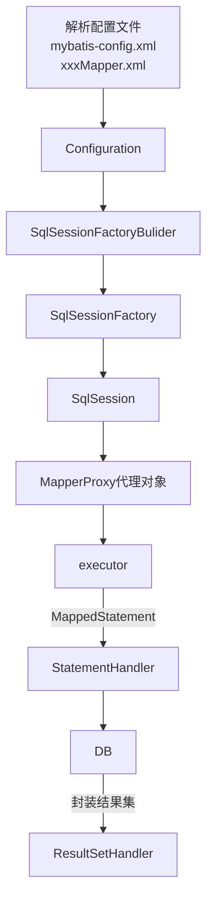
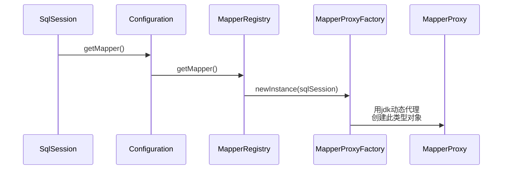
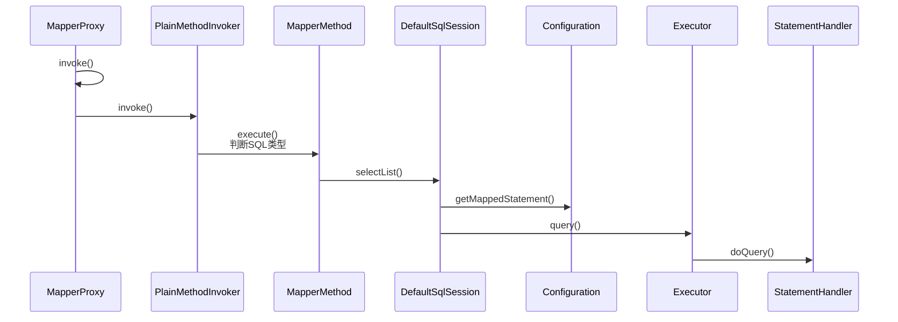
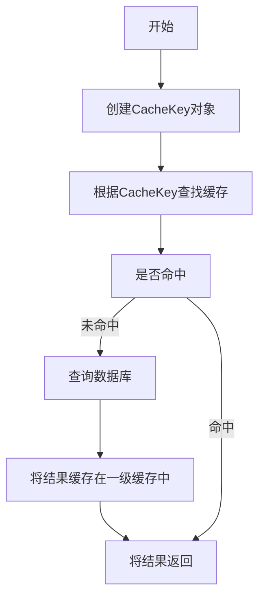

# ORM

## ORM简介

什么是ORM？ORM即Object Relational Mapping ，就是是对象关系映射。将数据库中对象映射到面向对象编程语言中的对象。使得开发人员可以用操作对象的方式来操作数据库，从而屏蔽数据库之间的差异。

## 优点


数据模型都在一个地方定义，更容易更新和维护，也利于重用代码

ORM 有现成的工具，很多功能都可以自动完成，比如：数据消毒、预处理、事务等等。

> 数据消毒是指对用户输入的数据进行处理，以防止恶意数据或不合法数据对应用程序的攻击或错误影响。常见的数据消毒操作包括转义特殊字符、验证输入、限制输入长度等。ORM框架可以做参数化查询、数据类型验证等可以实现数据消毒

更适合MVC 架构，ORM 就是天然的 Model，使代码更加清晰。

基于 ORM 的业务代码比较简单，代码量少，语义性好，容易理解。不必编写性能不佳的 SQL。

## 缺点

ORM库本身是有学习成本，需要花精力学习和配置，不是轻量级工具。

对于复杂的查询，ORM可能无法表达，或者性能不如原生的 SQL。

ORM减少了开发者对数据库层的直接操作，开发者对数据库底层的认识也减少了，需要写复杂SQL时变的更加困难。

## ORM工具

Hibernate，Mybatis，MybatisPlus，Spring Data JPA

### Spring Data JPA

spirng data jpa是spring提供的一套简化JPA开发的框架，按照约定好的【方法命名规则】写dao层接口，就可以在不写接口实现的情况下，实现对数据库的访问和操作。同时提供了很多除了CRUD之外的功能，如分页、排序、复杂查询等等。

Spring Data JPA 可以理解为 JPA 规范的再次封装抽象，底层还是使用了 Hibernate 的 JPA 技术实现。

### gaarason

-  让连接数据库以及对数据库进行增删改查操作变得非常简单，不论希望使用原生 SQL、还是查询构造器，还是 Eloquent ORM。 
-  Eloquent ORM 提供一个美观、简单的与数据库打交道的 ActiveRecord  实现，每个数据表都对应一个与该表数据结构对应的实体（Entity），以及的进行交互的模型（Model），通过模型类，你可以对数据表进行查询、插入、更新、删除等操作，并将结果反映到实体实例化的 java 对象中。
-  对于关联关系 Eloquent ORM 提供了富有表现力的声明方式，与简洁的使用方法，并专注在内部进行查询与内存优化，在复杂的关系中有仍然有着良好的体验。
-  兼容于其他常见的 ORM 框架, 以及常见的数据源 (DataSource)

### 

# Mybatis

## 参考说明

本文内容主要来源于马士兵教育视频教程（[Mybatis源码精讲-连鹏举](https://www.mashibing.com/study?courseNo=286&sectionNo=35746&courseVersionId=1242)），结合了老师的讲课内容以及自己的实践做了一些修改。


## 架构

1. Configuration，配置文件
   1. 框架配置文件，mybatis-config.xml
      1. 数据源，DataSource
      2. 事务管理器，TransactionManager
      3. mapper文件配置，mappers
   2. mapper配置文件，存储sql
2. StatementHandler，封装SQL和参数。
3. 执行器，执行SQL
4. ResultSetHandler，将执行结果映射成为实体类。


## 配置

Mybatis所有支持的配置参考[官网说明](https://mybatis.org/mybatis-3/zh/configuration.html)。


## 源码解析

### 前置知识

#### JDBC使用步骤

1. 加载驱动
2. 获取连接
3. 创建sql语句
4. 获取Statement对象
5. 执行sql语句
6. 处理结果集
7. 关闭连接


#### Mybatis使用步骤

1. 创建xml配置文件
2. 搞个mapper接口
3. SqlSessionFactory
4. SqlSession


### 前置准备

- 下载Mybatis源码。可以下载官方的，也可以下载别人写好注释的版本。如果看视频学习源码，推荐下载老师提供的版本。
- 准备好一个可以连接的数据库，有表有数据。例如：MySQL自带demo数据库，有一张emp表。
- 参考[官方入门案例](https://mybatis.org/mybatis-3/zh/getting-started.html)，创建好实体类，mapper，mybatis-config.xml以及测试启动代码。

本文使用的马士兵连老师的注释版本，载入之后修改maven路径，等他依赖包下载完毕就可以开始debug了。


### 源码分析方法

强烈建议，看框架源码时，先梳理脉络，再去抠细节。千万别每看到一行就点进去。不断的层层深入到方法细节中。这样看很容易晕的。可以根据老师的注释，或者方法名，或者方法注释等猜测方法意图。看完当前方法内部的所有细节再点到某一行的细节中，这样逐层深入看源码效果会提升很多。

所以我们可以先使用一个简单的案例，来初步理清楚Mybatis源码的脉络。


### 配置文件解析

配置文件对应的类：Configuration

入口方法：

```java
SqlSessionFactory sqlSessionFactory = null;

@Before
public void init() throws Exception{
    // 根据全局配置文件创建出SqlSessionFactory
    // SqlSessionFactory:负责创建SqlSession对象的工厂
    // SqlSession:表示跟数据库建议的一次会话
    String resource = "mybatis-config.xml";
    InputStream inputStream = Resources.getResourceAsStream(resource);
    sqlSessionFactory = new SqlSessionFactoryBuilder().build(inputStream);
}
```

#### Configuration类解析

源码

```java
/**
 * Mybatis全局配置类
 */
public class Configuration {

  //环境信息
  protected Environment environment;

  //---------以下设置项对应<settings>节点，可以在官网找到-------
  protected boolean safeRowBoundsEnabled;
  protected boolean safeResultHandlerEnabled = true;
  protected boolean mapUnderscoreToCamelCase;
  protected boolean aggressiveLazyLoading;
  protected boolean multipleResultSetsEnabled = true;
  protected boolean useGeneratedKeys;
  protected boolean useColumnLabel = true;
  //默认启用缓存
  protected boolean cacheEnabled = true;
  protected boolean callSettersOnNulls;
  protected boolean useActualParamName = true;
  protected boolean returnInstanceForEmptyRow;
  protected boolean shrinkWhitespacesInSql;

  protected String logPrefix;
  protected Class<? extends Log> logImpl;
  protected Class<? extends VFS> vfsImpl;
  protected Class<?> defaultSqlProviderType;
  protected LocalCacheScope localCacheScope = LocalCacheScope.SESSION;
  protected JdbcType jdbcTypeForNull = JdbcType.OTHER;
  protected Set<String> lazyLoadTriggerMethods = new HashSet<>(Arrays.asList("equals", "clone", "hashCode", "toString"));
  protected Integer defaultStatementTimeout;
  protected Integer defaultFetchSize;
  protected ResultSetType defaultResultSetType;
  //默认为简单执行器
  protected ExecutorType defaultExecutorType = ExecutorType.SIMPLE;
  protected AutoMappingBehavior autoMappingBehavior = AutoMappingBehavior.PARTIAL;
  protected AutoMappingUnknownColumnBehavior autoMappingUnknownColumnBehavior = AutoMappingUnknownColumnBehavior.NONE;
  //---------以上都是<settings>节点-------
  protected Properties variables = new Properties();
  //对象工厂和对象包装器工厂
  protected ReflectorFactory reflectorFactory = new DefaultReflectorFactory();
  protected ObjectFactory objectFactory = new DefaultObjectFactory();
  protected ObjectWrapperFactory objectWrapperFactory = new DefaultObjectWrapperFactory();

  //默认禁用延迟加载
  protected boolean lazyLoadingEnabled = false;
  protected ProxyFactory proxyFactory = new JavassistProxyFactory(); // #224 Using internal Javassist instead of OGNL

  protected String databaseId;
  /**
   * Configuration factory class.
   * Used to create Configuration for loading deserialized unread properties.
   *
   * @see <a href='https://github.com/mybatis/old-google-code-issues/issues/300'>Issue 300 (google code)</a>
   */
  protected Class<?> configurationFactory;

  //Mapper注册器，负责对mapper进行新增和查询
  protected final MapperRegistry mapperRegistry = new MapperRegistry(this);
  //拦截器链
  protected final InterceptorChain interceptorChain = new InterceptorChain();
  //类型处理器注册机（里面注册了每一种JdbcType和java类型的处理类）
  protected final TypeHandlerRegistry typeHandlerRegistry = new TypeHandlerRegistry(this);
  //类型别名注册机
  protected final TypeAliasRegistry typeAliasRegistry = new TypeAliasRegistry();
  protected final LanguageDriverRegistry languageRegistry = new LanguageDriverRegistry();

  //映射的语句,存在Map里
  protected final Map<String, MappedStatement> mappedStatements = new StrictMap<MappedStatement>("Mapped Statements collection")
      .conflictMessageProducer((savedValue, targetValue) ->
          ". please check " + savedValue.getResource() + " and " + targetValue.getResource());
  //缓存,存在Map里
  protected final Map<String, Cache> caches = new StrictMap<>("Caches collection");
  //结果映射,存在Map里
  protected final Map<String, ResultMap> resultMaps = new StrictMap<>("Result Maps collection");
  protected final Map<String, ParameterMap> parameterMaps = new StrictMap<>("Parameter Maps collection");
  protected final Map<String, KeyGenerator> keyGenerators = new StrictMap<>("Key Generators collection");

  protected final Set<String> loadedResources = new HashSet<>();
  protected final Map<String, XNode> sqlFragments = new StrictMap<>("XML fragments parsed from previous mappers");

  //不完整的SQL语句
  protected final Collection<XMLStatementBuilder> incompleteStatements = new LinkedList<>();
  protected final Collection<CacheRefResolver> incompleteCacheRefs = new LinkedList<>();
  protected final Collection<ResultMapResolver> incompleteResultMaps = new LinkedList<>();
  protected final Collection<MethodResolver> incompleteMethods = new LinkedList<>();

  /*
   * A map holds cache-ref relationship. The key is the namespace that
   * references a cache bound to another namespace and the value is the
   * namespace which the actual cache is bound to.
   */
  protected final Map<String, String> cacheRefMap = new HashMap<>();

  public Configuration(Environment environment) {
    this();
    this.environment = environment;
  }

  public Configuration() {
      //注册别名和java类之间的关系
    typeAliasRegistry.registerAlias("JDBC", JdbcTransactionFactory.class);
    typeAliasRegistry.registerAlias("MANAGED", ManagedTransactionFactory.class);

    typeAliasRegistry.registerAlias("JNDI", JndiDataSourceFactory.class);
    typeAliasRegistry.registerAlias("POOLED", PooledDataSourceFactory.class);
    typeAliasRegistry.registerAlias("UNPOOLED", UnpooledDataSourceFactory.class);

    typeAliasRegistry.registerAlias("PERPETUAL", PerpetualCache.class);
    typeAliasRegistry.registerAlias("FIFO", FifoCache.class);
    typeAliasRegistry.registerAlias("LRU", LruCache.class);
    typeAliasRegistry.registerAlias("SOFT", SoftCache.class);
    typeAliasRegistry.registerAlias("WEAK", WeakCache.class);

    typeAliasRegistry.registerAlias("DB_VENDOR", VendorDatabaseIdProvider.class);

    typeAliasRegistry.registerAlias("XML", XMLLanguageDriver.class);
    typeAliasRegistry.registerAlias("RAW", RawLanguageDriver.class);

    typeAliasRegistry.registerAlias("SLF4J", Slf4jImpl.class);
    typeAliasRegistry.registerAlias("COMMONS_LOGGING", JakartaCommonsLoggingImpl.class);
    typeAliasRegistry.registerAlias("LOG4J", Log4jImpl.class);
    typeAliasRegistry.registerAlias("LOG4J2", Log4j2Impl.class);
    typeAliasRegistry.registerAlias("JDK_LOGGING", Jdk14LoggingImpl.class);
    typeAliasRegistry.registerAlias("STDOUT_LOGGING", StdOutImpl.class);
    typeAliasRegistry.registerAlias("NO_LOGGING", NoLoggingImpl.class);

    typeAliasRegistry.registerAlias("CGLIB", CglibProxyFactory.class);
    typeAliasRegistry.registerAlias("JAVASSIST", JavassistProxyFactory.class);

    languageRegistry.setDefaultDriverClass(XMLLanguageDriver.class);
    languageRegistry.register(RawLanguageDriver.class);
  }
}
```


#### XMLConfigBuilder.parse()

配置文件解析

```java
// 解析配置
  public Configuration parse() {
    // 根据parsed变量的值判断是否已经完成了对mybatis-config.xml配置文件的解析
    if (parsed) {
      throw new BuilderException("Each XMLConfigBuilder can only be used once.");
    }
    parsed = true;
    // 在mybatis-config.xml配置文件中查找<configuration>节点，并开始解析
    parseConfiguration(parser.evalNode("/configuration"));
    return configuration;
  }

  // 解析配置
  private void parseConfiguration(XNode root) {
    try {
      // issue #117 read properties first
      // 解析properties
      propertiesElement(root.evalNode("properties"));
      // 解析settings
      Properties settings = settingsAsProperties(root.evalNode("settings"));
      // 设置vfsImpl字段
      loadCustomVfs(settings);
      loadCustomLogImpl(settings);
      // 解析类型别名（可以在这里给类定义别名，以便在配置文件中直接使用，也可以通过注解@Alias("xxx")）
      typeAliasesElement(root.evalNode("typeAliases"));
      // 解析插件(例如：分页插件
      pluginElement(root.evalNode("plugins"));
      // 对象工厂
      objectFactoryElement(root.evalNode("objectFactory"));
      // 对象包装工厂
      objectWrapperFactoryElement(root.evalNode("objectWrapperFactory"));
      // 反射工厂
      reflectorFactoryElement(root.evalNode("reflectorFactory"));
      //设置具体的属性到configuration对象
      settingsElement(settings);
      // read it after objectFactory and objectWrapperFactory issue #631
      // 环境(涉及DataSource和TransactionManager)
      environmentsElement(root.evalNode("environments"));
      // databaseIdProvider
      databaseIdProviderElement(root.evalNode("databaseIdProvider"));
      // 类型处理器
      typeHandlerElement(root.evalNode("typeHandlers"));
      // 映射器
      mapperElement(root.evalNode("mappers"));
    } catch (Exception e) {
      throw new BuilderException("Error parsing SQL Mapper Configuration. Cause: " + e, e);
    }
  }
```


#### Mappers元素解析

mappers元素是配置文件中相对比较重要的元素。参考[官网说明](https://mybatis.org/mybatis-3/zh/configuration.html#mappers)。Mappers底下可以配置一个包路径，xml文件地址，或者mapper类。

```xml
<!-- 将包内的映射器接口全部注册为映射器 -->
<mappers>
  <package name="org.mybatis.builder"/>
</mappers>

<!-- 使用相对于类路径的资源引用 -->
<mappers>
  <mapper resource="org/mybatis/builder/AuthorMapper.xml"/>
  <mapper resource="org/mybatis/builder/BlogMapper.xml"/>
  <mapper resource="org/mybatis/builder/PostMapper.xml"/>
</mappers>

<!-- 使用映射器接口实现类的完全限定类名 -->
<mappers>
  <mapper class="org.mybatis.builder.AuthorMapper"/>
  <mapper class="org.mybatis.builder.BlogMapper"/>
  <mapper class="org.mybatis.builder.PostMapper"/>
</mappers>
```


### 查询流程分析

#### 前言

本文主要说明Mybatis的查询机制或者工作原理。基于Mybatis独立运行模式，不集成Spring。

Mybatis源码版本为3.5.9。


#### 总体流程图

先看一下Mybatis的执行流程图：



#### 案例代码

下文的执行流程基于如下测试代码：

```java
public class MybatisTest {

    SqlSessionFactory sqlSessionFactory = null;

    @Before
    public void init() throws Exception{
      String resource = "mybatis-config.xml";
      InputStream inputStream = Resources.getResourceAsStream(resource);
      // 根据全局配置文件创建出SqlSessionFactory（负责创建SqlSession对象的工厂）
      sqlSessionFactory = new SqlSessionFactoryBuilder().build(inputStream);
    }

    @Test
    public void test01() {
        // 获取数据库的会话,创建出数据库连接的会话对象（事务工厂，事务对象，执行器，如果有插件的话会进行插件的解析）
        SqlSession sqlSession = sqlSessionFactory.openSession();
        Emp empByEmpno = null;
        try {
            // 获取要调用的接口类,创建出对应的mapper的动态代理对象（mapperRegistry.knownMapper）
            EmpDao mapper = sqlSession.getMapper(EmpDao.class);
            // 调用方法开始执行
            empByEmpno = mapper.findEmpByEmpno(7369);
        } catch (Exception e) {
            e.printStackTrace();
        } finally {
            sqlSession.close();
        }
        System.out.println(empByEmpno);
    }
}
```

#### 解析配置文件

当Mybatis启动的时候，会加载2种配置文件，一种是全局配置文件（mybatis-config.xml），另一种是映射配置文件。全局配置文件决定Mybatis的整体行为模式。映射配置文件一般用于存储SQL。这些配置文件解析完成之后会将配置文件信息封装成Configuration对象。

```java
  // 解析配置文件，封装成Configuration对象
  public Configuration parse() {
    // 根据parsed变量的值判断是否已经完成了对mybatis-config.xml配置文件的解析
    if (parsed) {
      throw new BuilderException("Each XMLConfigBuilder can only be used once.");
    }
    parsed = true;
    // 在mybatis-config.xml配置文件中查找<configuration>节点，并开始解析
    parseConfiguration(parser.evalNode("/configuration"));
    return configuration;
  }

  // 解析配置文件根节点
  private void parseConfiguration(XNode root) {
    try {
      // issue #117 read properties first
      // 解析properties
      propertiesElement(root.evalNode("properties"));
      // 解析settings
      Properties settings = settingsAsProperties(root.evalNode("settings"));
      // 设置vfsImpl字段
      loadCustomVfs(settings);
      loadCustomLogImpl(settings);
      // 解析类型别名（可以在这里给类定义别名，以便在配置文件中直接使用，也可以通过注解@Alias("xxx")）
      typeAliasesElement(root.evalNode("typeAliases"));
      // 解析插件(例如：分页插件
      pluginElement(root.evalNode("plugins"));
      // 对象工厂
      objectFactoryElement(root.evalNode("objectFactory"));
      // 对象包装工厂
      objectWrapperFactoryElement(root.evalNode("objectWrapperFactory"));
      // 反射工厂
      reflectorFactoryElement(root.evalNode("reflectorFactory"));
      //设置具体的属性到configuration对象
      settingsElement(settings);
      // read it after objectFactory and objectWrapperFactory issue #631
      // 环境
      environmentsElement(root.evalNode("environments"));
      // databaseIdProvider
      databaseIdProviderElement(root.evalNode("databaseIdProvider"));
      // 类型处理器
      typeHandlerElement(root.evalNode("typeHandlers"));
      // 映射器
      mapperElement(root.evalNode("mappers"));
    } catch (Exception e) {
      throw new BuilderException("Error parsing SQL Mapper Configuration. Cause: " + e, e);
    }
  }
```


#### 创建SqlSessionFactory

SqlSessionFactoryBuilder对象使用之前的Configuration配置文件对象，构建出SqlSessionFactory对象，然后由它负责创建SqlSession对象。这一步骤相对简单。

```java
  public SqlSessionFactory build(Configuration config) {
    return new DefaultSqlSessionFactory(config);
  }
```


#### 创建SqlSession

SqlSessionFactory根据之前解析到的环境信息创建TransactionFactory和Transaction。

根据执行器类型，创建Executor。然后创建SqlSession对象。

```java
  public SqlSession openSession() {
    // 获取默认的执行器类型
    return openSessionFromDataSource(configuration.getDefaultExecutorType(), null, false);
  }

  private SqlSession openSessionFromDataSource(ExecutorType execType, TransactionIsolationLevel level, boolean autoCommit) {
    Transaction tx = null;
    try {
      // 获取mybatis-config.xml配置文件中配置的Environment对象，
      final Environment environment = configuration.getEnvironment();
      // 获取TransactionFactory对象
      final TransactionFactory transactionFactory = getTransactionFactoryFromEnvironment(environment);
      // 创建Transaction对象
      tx = transactionFactory.newTransaction(environment.getDataSource(), level, autoCommit);
      // 根据配置创建Executor对象
      final Executor executor = configuration.newExecutor(tx, execType);
      //然后产生一个DefaultSqlSession
      return new DefaultSqlSession(configuration, executor, autoCommit);
    } catch (Exception e) {
      //如果打开事务出错，则关闭它
      closeTransaction(tx); // may have fetched a connection so lets call close()
      throw ExceptionFactory.wrapException("Error opening session.  Cause: " + e, e);
    } finally {
      //最后清空错误上下文
      ErrorContext.instance().reset();
    }
  }
```

#### 创建Executor

创建执行器时，会根据如下规则创建对应的执行器。

执行类型BATCH，对应BatchExecutor，批处理执行器

执行类型REUSE，对应ReuseExecutor，执行器会重用预处理语句（PreparedStatements）

其他情况就是，SimpleExecutor，普通执行器。

还会读取缓存配置。如果开启了二级缓存，会用CachingExecutor装饰器类装饰上面的执行器。

```java
  public Executor newExecutor(Transaction transaction, ExecutorType executorType) {
    executorType = executorType == null ? defaultExecutorType : executorType; // ?
    executorType = executorType == null ? ExecutorType.SIMPLE : executorType;
    Executor executor;
    // 根据参数，选择合适的Executor实现
    if (ExecutorType.BATCH == executorType) {
      executor = new BatchExecutor(this, transaction);
    } else if (ExecutorType.REUSE == executorType) {
      executor = new ReuseExecutor(this, transaction);
    } else {
      executor = new SimpleExecutor(this, transaction);
    }
    // 根据配置决定是否开启二级缓存的功能
    if (cacheEnabled) {
      executor = new CachingExecutor(executor);
    }
    // 此处调用插件,通过插件可以改变Executor行为
    executor = (Executor) interceptorChain.pluginAll(executor);
    return executor;
  }
```

#### MapperProxy代理对象

创建Mapper接口的代理对象时序图如下：最终是通过JDK动态代理创建了MapperProxy的代理对象。



源码如下，在找MapperProxyFactory时，会根据mapper接口的类型，从MapperRegistry对象中的knownMappers属性中获取到对应的代理工厂类，这个属性是在解析mybatis-config.xml的时候初始化的。

```java
  @Override
  public <T> T getMapper(Class<T> type) {
    //调用configuration的getMapper()方法
    return configuration.getMapper(type, this);
  }

  public <T> T getMapper(Class<T> type, SqlSession sqlSession) {
    //configuration调用mapperRegistry的getMapper()方法
    return mapperRegistry.getMapper(type, sqlSession);
  }

  // 返回代理类
  @SuppressWarnings("unchecked")
  public <T> T getMapper(Class<T> type, SqlSession sqlSession) {
    // 查找指定type对应MapperProxyFactory对象,knownMappers在加载mybatis-config.xml的时候存储进去的
    final MapperProxyFactory<T> mapperProxyFactory = (MapperProxyFactory<T>) knownMappers.get(type);
    // 如果mapperProxyFactory为空，则抛出异常
    if (mapperProxyFactory == null) {
      throw new BindingException("Type " + type + " is not known to the MapperRegistry.");
    }
    try {
      // 创建实现了type接口的代理对象
      return mapperProxyFactory.newInstance(sqlSession);
    } catch (Exception e) {
      throw new BindingException("Error getting mapper instance. Cause: " + e, e);
    }
  }
```

然后创建MapperProxy对象，使用Jdk动态代理创建MapperProxy的对象。

```java
  public T newInstance(SqlSession sqlSession) {
    // 创建MapperProxy对象，每次调用都会创建新的mapperProxy对象
    final MapperProxy<T> mapperProxy = new MapperProxy<>(sqlSession, mapperInterface, methodCache);
    return newInstance(mapperProxy);
  }

  protected T newInstance(MapperProxy<T> mapperProxy) {
    // 创建实现了mapperInterface接口的代理对象
    return (T) Proxy.newProxyInstance(mapperInterface.getClassLoader(), new Class[] { mapperInterface }, mapperProxy);
  }
```

#### 执行SQL

这一步骤主要就是通过代理对象调用执行器去执行SQL。调用过程见下面的时序图：



**源码分析**

1. 首先根据JDK动态代理机制，调用被代理对象的方法之后实际上执行的就是代理对象的invoke方法。

2. 根据被调用接口方法的**method**对象，从缓存中获取**MapperMethodInvoker**对象，如果没有则创建一个并放入缓存，然后调用invoke方法

3. 构造MapperMethod对象并且调用他的execute方法。这个方法内部会根据不同的SQL语句类型做不同的处理。我们此时分析的是查询方法，他还会根据返回值类型进行区分处理。

   1. 源码参考

   2. ```java
      @Override
        public Object invoke(Object proxy, Method method, Object[] args) throws Throwable {
          try {
            // 如果目标方法继承自Object,则直接调用目标方法
            if (Object.class.equals(method.getDeclaringClass())) {
              return method.invoke(this, args);
            } else {
              // 根据被调用接口方法的method对象，从缓存中获取MapperMethodInvoker对象，如果没有则创建一个并放入缓存，然后调用invoke
              return cachedInvoker(method).invoke(proxy, method, args, sqlSession);
            }
          } catch (Throwable t) {
            throw ExceptionUtil.unwrapThrowable(t);
          }
        }
      
        // 获取缓存中MapperMethodInvoker,如果没有则创建一个，而MapperMethodInvoker内部封装这一个MethodHandler
        private MapperMethodInvoker cachedInvoker(Method method) throws Throwable {
          try {
            return MapUtil.computeIfAbsent(methodCache, method, m -> {
              if (m.isDefault()) {
                // 如果调用接口的是默认方法
                try {
                  if (privateLookupInMethod == null) {
                    return new DefaultMethodInvoker(getMethodHandleJava8(method));
                  } else {
                    return new DefaultMethodInvoker(getMethodHandleJava9(method));
                  }
                } catch (IllegalAccessException | InstantiationException | InvocationTargetException
                    | NoSuchMethodException e) {
                  throw new RuntimeException(e);
                }
              } else {
                // 如果调用的普通方法，则创建一个PlainMethodInvoker并放入缓存，其中MapperMethod保存对应接口方法的SQL以及入参和出参的数据类型等信息
                return new PlainMethodInvoker(new MapperMethod(mapperInterface, method, sqlSession.getConfiguration()));
              }
            });
          } catch (RuntimeException re) {
            Throwable cause = re.getCause();
            throw cause == null ? re : cause;
          }
        }
      
      public Object execute(SqlSession sqlSession, Object[] args) {
          Object result;
          // 根据SQL语句的类型调用SqlSession对应的方法
          switch (command.getType()) {
            case INSERT: {
              // 使用ParamNameResolver处理args数组，将用户传入的实参与指定参数名称关联起来
              Object param = method.convertArgsToSqlCommandParam(args);
              // 调用sqlSession.insert方法，rowCountResult方法会根据method字段中记录的方法的返回值类型对结果进行转换
              result = rowCountResult(sqlSession.insert(command.getName(), param));
              break;
            }
            case UPDATE: {
              Object param = method.convertArgsToSqlCommandParam(args);
              result = rowCountResult(sqlSession.update(command.getName(), param));
              break;
            }
            case DELETE: {
              Object param = method.convertArgsToSqlCommandParam(args);
              result = rowCountResult(sqlSession.delete(command.getName(), param));
              break;
            }
            case SELECT:
              // 处理返回值为void是ResultSet通过ResultHandler处理的方法
              if (method.returnsVoid() && method.hasResultHandler()) {
                // 如果有结果处理器
                executeWithResultHandler(sqlSession, args);
                result = null;
                // 处理返回值为集合和数组的方法
              } else if (method.returnsMany()) {
                // 如果结果有多条记录
                result = executeForMany(sqlSession, args);
                // 处理返回值为map的方法
              } else if (method.returnsMap()) {
                // 如果结果是map
                result = executeForMap(sqlSession, args);
                // 处理返回值为cursor的方法
              } else if (method.returnsCursor()) {
                result = executeForCursor(sqlSession, args);
              } else {
                // 处理返回值为单一对象的方法
                Object param = method.convertArgsToSqlCommandParam(args);
                result = sqlSession.selectOne(command.getName(), param);
                if (method.returnsOptional()
                    && (result == null || !method.getReturnType().equals(result.getClass()))) {
                  result = Optional.ofNullable(result);
                }
              }
              break;
            case FLUSH:
              result = sqlSession.flushStatements();
              break;
            default:
              throw new BindingException("Unknown execution method for: " + command.getName());
          }
          if (result == null && method.getReturnType().isPrimitive() && !method.returnsVoid()) {
            throw new BindingException("Mapper method '" + command.getName()
                + " attempted to return null from a method with a primitive return type (" + method.getReturnType() + ").");
          }
          return result;
        }
      ```

4. 调用DefaultSqlSession的查询方法进行查询。SqlSession会并继续调用内部执行器的查询方法。调用时还需要MappedStatement, RowBounds , ResultHandler这几个入参。

   1. 源码参考：

   2. ```java
      //sqlSession  
      private <E> List<E> selectList(String statement, Object parameter, RowBounds rowBounds, ResultHandler handler) {
          try {
            //根据statement id找到对应的MappedStatement
            MappedStatement ms = configuration.getMappedStatement(statement);
            //转而用执行器来查询结果,注意这里传入的ResultHandler是null
            return executor.query(ms, wrapCollection(parameter), rowBounds, handler);
          } catch (Exception e) {
            throw ExceptionFactory.wrapException("Error querying database.  Cause: " + e, e);
          } finally {
            ErrorContext.instance().reset();
          }
        }
      //执行器查询方法
        @Override
        public <E> List<E> query(MappedStatement ms, Object parameter, RowBounds rowBounds, ResultHandler resultHandler) throws SQLException {
          // 获取BoundSql对象
          BoundSql boundSql = ms.getBoundSql(parameter);
          // 创建CacheKey对象
          CacheKey key = createCacheKey(ms, parameter, rowBounds, boundSql);
          // 查询
          return query(ms, parameter, rowBounds, resultHandler, key, boundSql);
        }
      ```

5. 查询时会优先根据CacheKey去查询缓存，没有命中缓存才会去查询数据库

   1. BaseExecutor查询方法，如果开启了二级缓存则是CachingExecutor

   2. ```java
      public <E> List<E> query(MappedStatement ms, Object parameter, RowBounds rowBounds, ResultHandler resultHandler, CacheKey key, BoundSql boundSql) throws SQLException {
          ErrorContext.instance().resource(ms.getResource()).activity("executing a query").object(ms.getId());
          // 检测当前Executor是否已经关闭
          if (closed) {
            throw new ExecutorException("Executor was closed.");
          }
          if (queryStack == 0 && ms.isFlushCacheRequired()) {
            // 非嵌套查询，并且select节点配置的flushCache属性为true时，才会清空一级缓存，flushCache配置项是影响一级缓存中结果对象存活时长的第一个方面
            clearLocalCache();
          }
          List<E> list;
          try {
            // 增加查询层数
            queryStack++;
            // 查询一级缓存
            list = resultHandler == null ? (List<E>) localCache.getObject(key) : null;
            if (list != null) {
              // 针对存储过程调用的处理，在一级缓存命中时，获取缓存中保存的输出类型参数，并设置到用户传入的实参对象中
              handleLocallyCachedOutputParameters(ms, key, parameter, boundSql);
            } else {
              // 调用doQuery方法完成数据库查询，并得到映射后的结果对象
              list = queryFromDatabase(ms, parameter, rowBounds, resultHandler, key, boundSql);
            }
          } finally {
            // 当前查询完成，查询层数减少
            queryStack--;
          }
          if (queryStack == 0) {
            // 在最外层的查询结束时，所有嵌套查询也已经完成，相关缓存项也已经完全记载，所以在此处触发DeferredLoad加载一级缓存中记录的嵌套查询的结果对象
            for (DeferredLoad deferredLoad : deferredLoads) {
              deferredLoad.load();
            }
            // issue #601
            // 加载完成后，清空deferredLoads集合
            deferredLoads.clear();
            if (configuration.getLocalCacheScope() == LocalCacheScope.STATEMENT) {
              // issue #482
              // 根据LocalCacheScope配置决定是否清空一级缓存
              clearLocalCache();
            }
          }
          return list;
        }
      ```

6. 数据库查询方法，这里的doQuery使用了模版方法模式，交由子类完成

   1. ```java
        // 从数据库查
        private <E> List<E> queryFromDatabase(MappedStatement ms, Object parameter, RowBounds rowBounds, ResultHandler resultHandler, CacheKey key, BoundSql boundSql) throws SQLException {
          List<E> list;
          // 在缓存中添加占位符
          localCache.putObject(key, EXECUTION_PLACEHOLDER);
          try {
            // 完成数据库查询操作，并返回结果对象
            list = doQuery(ms, parameter, rowBounds, resultHandler, boundSql);
          } finally {
            // 删除占位符
            localCache.removeObject(key);
          }
          // 将真正的结果对象添加到一级缓存中
          localCache.putObject(key, list);
          // 是否未存储过程调用
          if (ms.getStatementType() == StatementType.CALLABLE) {
            // 缓存输出类型的参数
            localOutputParameterCache.putObject(key, parameter);
          }
          return list;
        }
      ```

7. 子类ReuseExecutor的doQuery查询方法。源码中一般看到do开头的就是真正要开始做事情的方法了。

   1. 此处创建了StatementHandler对SQL语句做了处理。还创建了JDBC的Statement对象

   2. ```java
        public <E> List<E> doQuery(MappedStatement ms, Object parameter, RowBounds rowBounds, ResultHandler resultHandler, BoundSql boundSql) throws SQLException {
          Configuration configuration = ms.getConfiguration();
          StatementHandler handler = configuration.newStatementHandler(wrapper, ms, parameter, rowBounds, resultHandler, boundSql);
          Statement stmt = prepareStatement(handler, ms.getStatementLog());
          return handler.query(stmt, resultHandler);
        }
      ```

8. 通过StatementHandler去数据库执行查询。

   1. PreparedStatementHandler源码。还有其他的实现类：SimpleStatementHandler，CallableStatementHandler（用于处理存储过程）

      1. ```java
           public <E> List<E> query(Statement statement, ResultHandler resultHandler) throws SQLException {
             PreparedStatement ps = (PreparedStatement) statement;
             ps.execute();
             return resultSetHandler.handleResultSets(ps);
           }
         ```

      2. 从数据库返回的方法，将交由ResultHandler处理


#### ResultSetHandler

这一步骤主要是将数据库返回的对象根据mybatis配置文件的要求，封装结果集。

可以封装成多种类型，可以是基本数据类型，也可以是Map、List、POJO类型复杂数据类型。有两个常用的属性resultType和resultMap。这里面的逻辑相对来说还是挺复杂的，因为要考虑到非常多的情况，这里我们就不深入详细解析了。

带大家看一下重要代码

```java
public List<Object> handleResultSets(Statement stmt) throws SQLException {
    ErrorContext.instance().activity("handling results").object(mappedStatement.getId());

    // 该集合用于保存映射结果得到的结果对象
    final List<Object> multipleResults = new ArrayList<>();

    int resultSetCount = 0;
    // 获取第一个ResultSet对象
    ResultSetWrapper rsw = getFirstResultSet(stmt);

    // 获取MappedStatement.resultMaps集合
    List<ResultMap> resultMaps = mappedStatement.getResultMaps();
    int resultMapCount = resultMaps.size();
    // 如果集合集不为空，则resultMaps集合不能为空，否则抛出异常
    validateResultMapsCount(rsw, resultMapCount);
    // 遍历resultMaps集合
    while (rsw != null && resultMapCount > resultSetCount) {
      // 获取该结果集对应的ResultMap对象
      ResultMap resultMap = resultMaps.get(resultSetCount);
      // 根据ResultMap中定义的映射规则对ResultSet进行映射，并将映射的结果对象添加到multipleResult集合中保存
      handleResultSet(rsw, resultMap, multipleResults, null);
      // 获取下一个结果集
      rsw = getNextResultSet(stmt);
      // 清空nestedResultObjects集合
      cleanUpAfterHandlingResultSet();
      // 递增resultSetCount
      resultSetCount++;
    }

    // 获取MappedStatement.resultSets属性，该属性对多结果集的情况使用，该属性将列出语句执行后返回的结果集，并给每个结果集一个名称，名称是逗号分隔的，
    String[] resultSets = mappedStatement.getResultSets();
    if (resultSets != null) {
      while (rsw != null && resultSetCount < resultSets.length) {
        // 根据resultSet的名称，获取未处理的ResultMapping
        ResultMapping parentMapping = nextResultMaps.get(resultSets[resultSetCount]);
        if (parentMapping != null) {
          String nestedResultMapId = parentMapping.getNestedResultMapId();
          ResultMap resultMap = configuration.getResultMap(nestedResultMapId);
          // 根据ResultMap对象映射结果集
          handleResultSet(rsw, resultMap, null, parentMapping);
        }
        // 获取下一个结果集
        rsw = getNextResultSet(stmt);
        // 清空nestedResultObjects集合
        cleanUpAfterHandlingResultSet();
        // 递增resultSetCount
        resultSetCount++;
      }
    }

    return collapseSingleResultList(multipleResults);
  }
```


## 核心类和接口

### Reflector

反射器，主要用于封装一个类的反射信息，支持缓存。例如：get，set方法即使类中实际没有get、set方法。

使用：调用构造方法，传入要反射的类型，也可以使用ReflectorFactory。可参考ReflectorTest来理解这个类的具体用处


### Invoker

配合Reflector，负责方法的调用，具体可以参考下文的案例。


### MetaObject

封装对象，使其支持表达式方式调用get set。

```java
  @Test
  void testGetSetterType() {
    ReflectorFactory reflectorFactory = new DefaultReflectorFactory();
    Reflector reflector = reflectorFactory.findForClass(Section.class);
    Assertions.assertEquals(Long.class, reflector.getSetterType("id"));
  }

  @Test
  public void test01(){
    Reflector reflector = new Reflector(Person.class);
    System.out.println(reflector);
  }

  @Test
  public void test02(){
    ReflectorFactory reflectorFactory = new DefaultReflectorFactory();
    Reflector reflector = reflectorFactory.findForClass(Student.class);
    System.out.println(Arrays.asList(reflector.getGetablePropertyNames()));
    System.out.println(Arrays.asList(reflector.getSetablePropertyNames()));
    System.out.println(reflector.hasDefaultConstructor());
    System.out.println(reflector.getGetterType("id"));
  }

  @Test
  public void test03() throws Exception {
    ReflectorFactory reflectorFactory = new DefaultReflectorFactory();
    Reflector reflector = reflectorFactory.findForClass(Student.class);
    Object o = reflector.getDefaultConstructor().newInstance();
    //设置
    Invoker invoker = reflector.getSetInvoker("id");
    invoker.invoke(o,new Object[]{1111});
    // 获取
    Invoker id = reflector.getGetInvoker("id");
    id.invoke(o,null);
  }

  @Test
  public void test04(){
    ReflectorFactory reflectorFactory = new DefaultReflectorFactory();
    MetaClass metaClass = MetaClass.forClass(User.class, reflectorFactory);
    System.out.println(metaClass.hasGetter("userField"));
    System.out.println(metaClass.hasGetter("userProperty"));
    System.out.println(metaClass.hasGetter("userMap"));
    System.out.println(metaClass.hasGetter("user"));
    System.out.println(metaClass.hasGetter("userlist"));
    System.out.println(metaClass.hasGetter("userlist[0]"));
    System.out.println("-----------");
    System.out.println(metaClass.hasGetter("user.userField"));
    System.out.println(metaClass.hasGetter("user.userProperty"));
    System.out.println(metaClass.hasGetter("user.userMap"));
    System.out.println(metaClass.hasGetter("user.userlist"));
    System.out.println(metaClass.hasGetter("user.user"));
    System.out.println("------------");
    System.out.println(Arrays.asList(metaClass.getGetterNames()));
    System.out.println(Arrays.asList(metaClass.getSetterNames()));
  }

  @Test
  public void test05(){
    User user = new User();
    MetaObject metaObject = SystemMetaObject.forObject(user);
    metaObject.setValue("userField","lian");
    System.out.println(metaObject.getValue("userField"));

    metaObject.setValue("user.userField","lian");
    System.out.println(metaObject.getValue("user.userField"));

    metaObject.setValue("userMap[key]","lian");
    System.out.println(metaObject.getValue("userMap[key]"));
  }
```


### Typehandler


### MapperMethod

封装方法，方法签名，方法类型等，用于执行mapper类中的方法。

1. 获取到SqlSession
2. getMapper获取到映射，MapperRegistry
3. 根据接口来获取工厂类型，MapperProxyFactory
4. 获取工厂实例newInstance()，MapperProxy
5. 通过工厂创建出具体的代理对象
6. 进行SQL处理工作。


### logging

用于支持各种日志打印格式。通过LogFactory来自动检查不同的日志框架。也可以在配置文件中指定。

```java
public final class LogFactory {

  /**
   * Marker to be used by logging implementations that support markers.
   */
  public static final String MARKER = "MYBATIS";

  private static Constructor<? extends Log> logConstructor;

  static {
    tryImplementation(LogFactory::useSlf4jLogging);
    tryImplementation(LogFactory::useCommonsLogging);
    tryImplementation(LogFactory::useLog4J2Logging);
    tryImplementation(LogFactory::useLog4JLogging);
    tryImplementation(LogFactory::useJdkLogging);
    tryImplementation(LogFactory::useNoLogging);
  }

  private LogFactory() {
    // disable construction
  }

  public static Log getLog(Class<?> clazz) {
    return getLog(clazz.getName());
  }

  public static Log getLog(String logger) {
    try {
      return logConstructor.newInstance(logger);
    } catch (Throwable t) {
      throw new LogException("Error creating logger for logger " + logger + ".  Cause: " + t, t);
    }
  }
}
```

配置文件支持的配置。（一般不用）

| 设置名    | 描述                                                  | 有效值                                                       | 默认值 |
| --------- | ----------------------------------------------------- | ------------------------------------------------------------ | ------ |
| logPrefix | 指定 MyBatis 增加到日志名称的前缀。                   | 任何字符串                                                   | 未设置 |
| logImpl   | 指定 MyBatis 所用日志的具体实现，未指定时将自动查找。 | SLF4J \| LOG4J（3.5.9 起废弃） \| LOG4J2 \| JDK_LOGGING \| COMMONS_LOGGING \| STDOUT_LOGGING \| NO_LOGGING | 未设置 |

这里面的这些日志名称，在Configuration类的构造方法中注册过别名和实现类。

```java
    typeAliasRegistry.registerAlias("SLF4J", Slf4jImpl.class);
    typeAliasRegistry.registerAlias("COMMONS_LOGGING", JakartaCommonsLoggingImpl.class);
    typeAliasRegistry.registerAlias("LOG4J", Log4jImpl.class);
    typeAliasRegistry.registerAlias("LOG4J2", Log4j2Impl.class);
    typeAliasRegistry.registerAlias("JDK_LOGGING", Jdk14LoggingImpl.class);
    typeAliasRegistry.registerAlias("STDOUT_LOGGING", StdOutImpl.class);
    typeAliasRegistry.registerAlias("NO_LOGGING", NoLoggingImpl.class);
```

这里面的这些实现类都是Mybatis自己定义的。在这些类的内部还会去依赖真正的日志实现。同时这些依赖的optional=true。

```java
import org.apache.ibatis.logging.Log;
import org.apache.logging.log4j.LogManager;
import org.apache.logging.log4j.Logger;
import org.apache.logging.log4j.spi.AbstractLogger;

/**
 * 调用Log4j2框架实现日志功能。
 */
public class Log4j2Impl implements Log {

  private final Log log;

  public Log4j2Impl(String clazz) {
    Logger logger = LogManager.getLogger(clazz);

    if (logger instanceof AbstractLogger) {
      log = new Log4j2AbstractLoggerImpl((AbstractLogger) logger);
    } else {
      log = new Log4j2LoggerImpl(logger);
    }
  }

  @Override
  public boolean isDebugEnabled() {
    return log.isDebugEnabled();
  }

  @Override
  public boolean isTraceEnabled() {
    return log.isTraceEnabled();
  }

  @Override
  public void error(String s, Throwable e) {
    log.error(s, e);
  }

  @Override
  public void error(String s) {
    log.error(s);
  }

  @Override
  public void debug(String s) {
    log.debug(s);
  }

  @Override
  public void trace(String s) {
    log.trace(s);
  }

  @Override
  public void warn(String s) {
    log.warn(s);
  }

}
```

maven依赖

```xml
    <dependency>
      <groupId>org.apache.logging.log4j</groupId>
      <artifactId>log4j-core</artifactId>
      <version>2.14.1</version>
      <optional>true</optional>
    </dependency>
```


## 缓存

所有缓存都实现的接口Cache，不同的缓存实现之间使用了装饰器模式。

```java
package org.apache.ibatis.cache;

import java.util.concurrent.locks.ReadWriteLock;

/**
 * Mybatis缓存接口
 */
public interface Cache {

  /**
   * 该缓存对象的id
   * @return The identifier of this cache
   */
  String getId();

  /**
   * 向缓存中添加数据，key是CacheKey，value是查询结果
   */
  void putObject(Object key, Object value);

  /**
   * 根据指定的key，在缓存中查找对应的结果对象
   */
  Object getObject(Object key);

  /**
   * 删除key对应的缓存项
   */
  Object removeObject(Object key);

  /**
   * 清空缓存
   */
  void clear();

  /**
   * 缓存项的个数
   */
  int getSize();

  /**
   * 获取读写锁
   */
  default ReadWriteLock getReadWriteLock() {
    return null;
  }

}

```

### 缓存类型

#### PerpetualCache

永久缓存，一旦存入就一直保持。一级缓存就是这个类型

#### BlockingCache

阻塞式缓存，内部使用了ConcurrentHashMap实现了锁，它会保证只有一个线程到缓存中查找指定 key 对应的数据。

假设 线程A 从数据库中查找到 keyA 对应的结果对象后，将结果对象放入到 BlockingCache 中，此时 线程 A 会释放 keyA 对应的锁，唤醒阻塞在该锁上的线程。其它线程即可从 BlockingCache 中获取 keyA 对应的数据，而不是再次访问数据库。

#### FifoCache 和 LruCache

在很多场景中，为了控制缓存的大小，系统需要按照一定的规则清理缓存。FifoCache 是先入先出版本的装饰器，当向缓存添加数据时，如果缓存项的个数已经达到上限，则会将缓存中最老（即最早进入缓存）的缓存项删除。

LruCache 是按照"近期最少使用算法"（Least Recently Used, LRU）进行缓存清理的装饰器，在需要清理缓存时，它会清除最近最少使用的缓存项。

#### SoftCache 和 WeakCache

使用java的软引用和弱引用实现的缓存。


### 一级缓存

BaseExecutor中有一个属性`protected PerpetualCache localCache;`就是一级缓存。默认开启。作用域为session。

执行流程如下图：




### 二级缓存

默认不开启，作用域为SessionFactory，多个session之间可以共享。

具体使用二级缓存的源码，CachingExecutor.query()：

```java
public <E> List<E> query(MappedStatement ms, Object parameterObject, RowBounds rowBounds, ResultHandler resultHandler, CacheKey key, BoundSql boundSql)
      throws SQLException {
    // 获取查询语句所在命名空间对应的二级缓存
    Cache cache = ms.getCache();
    // 是否开启了二级缓存
    if (cache != null) {
      // 根据select节点的配置，决定是否需要清空二级缓存
      flushCacheIfRequired(ms);
      // 检测SQL节点的useCache配置以及是否使用了resultHandler配置
      if (ms.isUseCache() && resultHandler == null) {
        // 二级缓存不能保存输出类型的参数，如果查询操作调用了包含输出参数的存储过程，则报错
        ensureNoOutParams(ms, boundSql);
        @SuppressWarnings("unchecked")
        // 查询二级缓存
        List<E> list = (List<E>) tcm.getObject(cache, key);
        if (list == null) {
          // 二级缓存没有相应的结果对，调用封装的Executor对象的query方法
          list = delegate.query(ms, parameterObject, rowBounds, resultHandler, key, boundSql);
          // 将查询结果保存到TransactionalCache.entriesToAddOnCommit集合中
          tcm.putObject(cache, key, list); // issue #578 and #116
        }
        return list;
      }
    }
    // 没有启动二级缓存，直接调用底层Executor执行数据库查询操作
    return delegate.query(ms, parameterObject, rowBounds, resultHandler, key, boundSql);
  }
```


### 三级缓存

除了上述缓存之外，还可以实现自己的缓存。或者使用第三方缓存来覆盖缓存行为。


## 集成Spring

### 整合步骤

### 依赖

在项目的maven依赖中添加Spring的依赖，Mybatis整合Spring的依赖。

#### 配置文件

使用spring配置文件替换mybatis-config.xml，在配置文件中配置如下几个关键类。


### 整合原理

核心在于SqlSessionFactoryBean，这个类实现了FactoryBean接口，可以通过getObject方法创建SqlSessionFactory对象。实现InitializingBean初始化时会调用afterPropertiesSet()方法。实现ApplicationListener接口，监听容器refresh事件。

```java
public class SqlSessionFactoryBean
    implements FactoryBean<SqlSessionFactory>, InitializingBean, ApplicationListener<ApplicationEvent> {

  private Resource configLocation;

  private Configuration configuration;

  private Resource[] mapperLocations;

  private DataSource dataSource;

  private TransactionFactory transactionFactory;

  private Properties configurationProperties;

  private SqlSessionFactoryBuilder sqlSessionFactoryBuilder = new SqlSessionFactoryBuilder();

  private SqlSessionFactory sqlSessionFactory;

  // EnvironmentAware requires spring 3.1
  private String environment = SqlSessionFactoryBean.class.getSimpleName();

  private Interceptor[] plugins;

  private TypeHandler<?>[] typeHandlers;

  private String typeHandlersPackage;

  @SuppressWarnings("rawtypes")
  private Class<? extends TypeHandler> defaultEnumTypeHandler;

  private Class<?>[] typeAliases;

  private String typeAliasesPackage;

  private Class<?> typeAliasesSuperType;

  private LanguageDriver[] scriptingLanguageDrivers;

  // issue #19. No default provider.
  private DatabaseIdProvider databaseIdProvider;

  private Cache cache;

  private ObjectFactory objectFactory;

  private ObjectWrapperFactory objectWrapperFactory;

  /**
   * {@inheritDoc}
   */
  @Override
  public void afterPropertiesSet() throws Exception {
    notNull(dataSource, "Property 'dataSource' is required");
    notNull(sqlSessionFactoryBuilder, "Property 'sqlSessionFactoryBuilder' is required");
    state((configuration == null && configLocation == null) || !(configuration != null && configLocation != null),
        "Property 'configuration' and 'configLocation' can not specified with together");

    this.sqlSessionFactory = buildSqlSessionFactory();
  }

  /**
   * Build a {@code SqlSessionFactory} instance.
   *
   * The default implementation uses the standard MyBatis {@code XMLConfigBuilder} API to build a
   * {@code SqlSessionFactory} instance based on a Reader. Since 1.3.0, it can be specified a {@link Configuration}
   * instance directly(without config file).
   *
   * @return SqlSessionFactory
   * @throws Exception
   *           if configuration is failed
   */
  protected SqlSessionFactory buildSqlSessionFactory() throws Exception {

    final Configuration targetConfiguration;

    XMLConfigBuilder xmlConfigBuilder = null;
    if (this.configuration != null) {
      targetConfiguration = this.configuration;
      if (targetConfiguration.getVariables() == null) {
        targetConfiguration.setVariables(this.configurationProperties);
      } else if (this.configurationProperties != null) {
        targetConfiguration.getVariables().putAll(this.configurationProperties);
      }
    } else if (this.configLocation != null) {
      xmlConfigBuilder = new XMLConfigBuilder(this.configLocation.getInputStream(), null, this.configurationProperties);
      targetConfiguration = xmlConfigBuilder.getConfiguration();
    } else {
      LOGGER.debug(
          () -> "Property 'configuration' or 'configLocation' not specified, using default MyBatis Configuration");
      targetConfiguration = new Configuration();
      Optional.ofNullable(this.configurationProperties).ifPresent(targetConfiguration::setVariables);
    }

    Optional.ofNullable(this.objectFactory).ifPresent(targetConfiguration::setObjectFactory);
    Optional.ofNullable(this.objectWrapperFactory).ifPresent(targetConfiguration::setObjectWrapperFactory);
    Optional.ofNullable(this.vfs).ifPresent(targetConfiguration::setVfsImpl);

    if (hasLength(this.typeAliasesPackage)) {
      scanClasses(this.typeAliasesPackage, this.typeAliasesSuperType).stream()
          .filter(clazz -> !clazz.isAnonymousClass()).filter(clazz -> !clazz.isInterface())
          .filter(clazz -> !clazz.isMemberClass()).forEach(targetConfiguration.getTypeAliasRegistry()::registerAlias);
    }

    if (!isEmpty(this.typeAliases)) {
      Stream.of(this.typeAliases).forEach(typeAlias -> {
        targetConfiguration.getTypeAliasRegistry().registerAlias(typeAlias);
        LOGGER.debug(() -> "Registered type alias: '" + typeAlias + "'");
      });
    }

    if (!isEmpty(this.plugins)) {
      Stream.of(this.plugins).forEach(plugin -> {
        targetConfiguration.addInterceptor(plugin);
        LOGGER.debug(() -> "Registered plugin: '" + plugin + "'");
      });
    }

    if (hasLength(this.typeHandlersPackage)) {
      scanClasses(this.typeHandlersPackage, TypeHandler.class).stream().filter(clazz -> !clazz.isAnonymousClass())
          .filter(clazz -> !clazz.isInterface()).filter(clazz -> !Modifier.isAbstract(clazz.getModifiers()))
          .forEach(targetConfiguration.getTypeHandlerRegistry()::register);
    }

    if (!isEmpty(this.typeHandlers)) {
      Stream.of(this.typeHandlers).forEach(typeHandler -> {
        targetConfiguration.getTypeHandlerRegistry().register(typeHandler);
        LOGGER.debug(() -> "Registered type handler: '" + typeHandler + "'");
      });
    }

    targetConfiguration.setDefaultEnumTypeHandler(defaultEnumTypeHandler);

    if (!isEmpty(this.scriptingLanguageDrivers)) {
      Stream.of(this.scriptingLanguageDrivers).forEach(languageDriver -> {
        targetConfiguration.getLanguageRegistry().register(languageDriver);
        LOGGER.debug(() -> "Registered scripting language driver: '" + languageDriver + "'");
      });
    }
    Optional.ofNullable(this.defaultScriptingLanguageDriver)
        .ifPresent(targetConfiguration::setDefaultScriptingLanguage);

    if (this.databaseIdProvider != null) {// fix #64 set databaseId before parse mapper xmls
      try {
        targetConfiguration.setDatabaseId(this.databaseIdProvider.getDatabaseId(this.dataSource));
      } catch (SQLException e) {
        throw new NestedIOException("Failed getting a databaseId", e);
      }
    }

    Optional.ofNullable(this.cache).ifPresent(targetConfiguration::addCache);

    if (xmlConfigBuilder != null) {
      try {
        xmlConfigBuilder.parse();
        LOGGER.debug(() -> "Parsed configuration file: '" + this.configLocation + "'");
      } catch (Exception ex) {
        throw new NestedIOException("Failed to parse config resource: " + this.configLocation, ex);
      } finally {
        ErrorContext.instance().reset();
      }
    }

    targetConfiguration.setEnvironment(new Environment(this.environment,
        this.transactionFactory == null ? new SpringManagedTransactionFactory() : this.transactionFactory,
        this.dataSource));

    if (this.mapperLocations != null) {
      if (this.mapperLocations.length == 0) {
        LOGGER.warn(() -> "Property 'mapperLocations' was specified but matching resources are not found.");
      } else {
        for (Resource mapperLocation : this.mapperLocations) {
          if (mapperLocation == null) {
            continue;
          }
          try {
            XMLMapperBuilder xmlMapperBuilder = new XMLMapperBuilder(mapperLocation.getInputStream(),
                targetConfiguration, mapperLocation.toString(), targetConfiguration.getSqlFragments());
            xmlMapperBuilder.parse();
          } catch (Exception e) {
            throw new NestedIOException("Failed to parse mapping resource: '" + mapperLocation + "'", e);
          } finally {
            ErrorContext.instance().reset();
          }
          LOGGER.debug(() -> "Parsed mapper file: '" + mapperLocation + "'");
        }
      }
    } else {
      LOGGER.debug(() -> "Property 'mapperLocations' was not specified.");
    }

    return this.sqlSessionFactoryBuilder.build(targetConfiguration);
  }

  /**
   * {@inheritDoc}
   */
  @Override
  public SqlSessionFactory getObject() throws Exception {
    if (this.sqlSessionFactory == null) {
      afterPropertiesSet();
    }

    return this.sqlSessionFactory;
  }

  /**
   * {@inheritDoc}
   */
  @Override
  public Class<? extends SqlSessionFactory> getObjectType() {
    return this.sqlSessionFactory == null ? SqlSessionFactory.class : this.sqlSessionFactory.getClass();
  }

  /**
   * {@inheritDoc}
   */
  @Override
  public boolean isSingleton() {
    return true;
  }

  /**
   * {@inheritDoc}
   */
  @Override
  public void onApplicationEvent(ApplicationEvent event) {
    if (failFast && event instanceof ContextRefreshedEvent) {
      // fail-fast -> check all statements are completed
      this.sqlSessionFactory.getConfiguration().getMappedStatementNames();
    }
  }

}
```

另一个重要类是MapperScannerConfigurer，它实现了BeanDefinitionRegistryPostProcessor, InitializingBean接口，当Spring容器refresh的时候会在BeanFactory初始化完成之后调用，根据配置的包路径，扫描mapper类或者Dao类，将其纳入到Spring容器管理。


### 与SpringBoot集成步骤

集成前提：

- 已安装好MySQL，存在表和数据
- 已搭建好SpringBoot项目，需要加入Mybatis

集成步骤

1. 加入Maven依赖：mybatis的starter，分页插件，数据库驱动，数据源

   1. 参考

   2. ```xml
          <!-- SpringBoot的依赖配置-->
          <dependency>
              <groupId>org.springframework.boot</groupId>
              <artifactId>spring-boot-dependencies</artifactId>
              <version>${spring.boot.version}</version>
              <type>pom</type>
              <scope>import</scope>
          </dependency>    
      
      	<!--mybatis依赖-->
          <dependency>
              <groupId>org.mybatis.spring.boot</groupId>
              <artifactId>mybatis-spring-boot-starter</artifactId>
              <version>${mybatis.version}</version>
          </dependency>
      
          <!-- pagehelper 分页插件 -->
          <dependency>
              <groupId>com.github.pagehelper</groupId>
              <artifactId>pagehelper-spring-boot-starter</artifactId>
              <version>${pagehelper.boot.version}</version>
          </dependency>
      
      	<!-- 阿里数据源 -->
      	<dependency>
              <groupId>com.alibaba</groupId>
              <artifactId>druid-spring-boot-starter</artifactId>
              <version>${druid.version}</version>
          </dependency>
      
          <!--oracle驱动-->
          <dependency>
              <groupId>cn.easyproject</groupId>
              <artifactId>ojdbc6</artifactId>
              <version>12.1.0.2.0</version>
          </dependency>
      
          <!--sqlserver驱动-->
          <dependency>
              <groupId>com.microsoft.sqlserver</groupId>
              <artifactId>sqljdbc4</artifactId>
              <version>4.0</version>
          </dependency>
      ```

2. yml配置文件加入相关配置，mybatis配置，数据源配置，分页配置

   1. ```yml
      # Spring配置
      spring:
        # 数据源配置
        datasource:
          type: com.alibaba.druid.pool.DruidDataSource
          driverClassName: oracle.jdbc.OracleDriver
          druid:
            # 主库数据源
            master:
              url: jdbc:oracle:thin:@localhost:1521/test1
              username: admin
              password: admin123
            # 从库数据源
            slave:
              # 从数据源开关/默认关闭
              enabled: true
              url: jdbc:oracle:thin:@localhost:1521/test2
              username: admin
              password: admin123
            # 初始连接数,正式环境可以改大点
            initialSize: 1
            # 最小连接池数量
            minIdle: 1
            # 最大连接池数量
            maxActive: 20
            # 配置获取连接等待超时的时间
            maxWait: 60000
            # 配置间隔多久才进行一次检测，检测需要关闭的空闲连接，单位是毫秒
            timeBetweenEvictionRunsMillis: 60000
            # 配置一个连接在池中最小生存的时间，单位是毫秒
            minEvictableIdleTimeMillis: 300000
            # 配置一个连接在池中最大生存的时间，单位是毫秒
            maxEvictableIdleTimeMillis: 900000
            # 配置检测连接是否有效
            validationQuery: SELECT 1 FROM DUAL
            testWhileIdle: true
            testOnBorrow: false
            testOnReturn: false
            webStatFilter:
              enabled: true
            statViewServlet:
              enabled: true
              # 设置白名单，不填则允许所有访问
              allow:
              url-pattern: /druid/*
              login-username: superadmin
              login-password: tartan
            filter:
              stat:
                enabled: true
                # 慢SQL记录
                log-slow-sql: true
                slow-sql-millis: 3000
                merge-sql: false
              wall:
                config:
                  multi-statement-allow: true
      # MyBatis
      mybatis:
        # 搜索指定包别名
        typeAliasesPackage: com.ruoyi.**.domain, com.test.**.domain
        # 配置mapper的扫描，找到所有的mapper.xml映射文件
        mapperLocations: classpath*:mapper/**/*Mapper.xml
        # 加载全局的配置文件
        configLocation: classpath:mybatis/mybatis-config.xml
      
      # PageHelper分页插件
      pagehelper:
        helperDialect: oracle
        supportMethodsArguments: true
        params: count=countSql
      ```

3. 创建实体类，在指定的包路径底下。

   1. 例如：用户

   2. ```java
      @Data
      public class User {
        private long id;
      
        private String username;
      
        private String password;
      }
      ```

4. 创建mapper接口。Mybatis支持通过XML来定义SQL语句，或者通过注解的方式。

   1. 例如UserMapper.java

   2. ```java
      @Repository
      public interface UserMapper {
        int insertUser(User user);
          
        void deleteUser(User user);
      
        User getUser(User user);
      }
      ```

5. 创建xml，在指定的位置下。

   1. UserMapper.xml

   2. ```xml
      <?xml version="1.0" encoding="UTF-8" ?>
      <!DOCTYPE mapper
      PUBLIC "-//mybatis.org//DTD Mapper 3.0//EN"
      "http://mybatis.org/dtd/mybatis-3-mapper.dtd">
      <mapper namespace="com.test.demo.mapper.UserMapper">
      
          <insert id="insertUser" parameterType="User">
              insert into user (id, username, password) 
              values (#{id}, #{username}, #{password})
          </insert>
      
          <select id="getUser" parameterType="User" resultType="User">
              select * from user
              where id = #{id}
          </select>
          
          <delete id="deleteUser" parameterType="User" resultType="User">
              delete from user
              where id = #{id}
          </delete>
      </mapper>
      ```

6. 创建service和Controller调用mapper。此处代码略。


# Mybatis-plus

#### 介绍

MyBatis-Plus是原生MyBatis的一个增强工具，可以在使用原生MyBatis 的所有功能的基础上，使用plus特有的功能。

MyBatis-Plus特性介绍

- **无侵入**：只做增强不做改变，引入它不会对现有工程产生影响，如丝般顺滑
- **损耗小**：启动即会自动注入基本 CURD，性能基本无损耗，直接面向对象操作
- **强大的 CRUD 操作**：内置通用 Mapper、通用 Service，仅仅通过少量配置即可实现单表大部分 CRUD 操作，更有强大的条件构造器，满足各类使用需求
- **支持 Lambda 形式调用**：通过 Lambda 表达式，方便的编写各类查询条件，无需再担心字段写错
- **支持主键自动生成**：支持多达 4 种主键策略（内含分布式唯一 ID 生成器 - Sequence），可自由配置，完美解决主键问题
- **支持 ActiveRecord 模式**：支持 ActiveRecord 形式调用，实体类只需继承 Model 类即可进行强大的 CRUD 操作
- **支持自定义全局通用操作**：支持全局通用方法注入（ Write once, use anywhere ）
- **内置代码生成器**：采用代码或者 Maven 插件可快速生成 Mapper 、 Model 、 Service 、 Controller 层代码，支持模板引擎，更有超多自定义配置等您来使用
- **内置分页插件**：基于 MyBatis 物理分页，开发者无需关心具体操作，配置好插件之后，写分页等同于普通 List 查询
- **分页插件支持多种数据库**：支持 MySQL、MariaDB、Oracle、DB2、H2、HSQL、SQLite、Postgre、SQLServer 等多种数据库
- **内置性能分析插件**：可输出 Sql 语句以及其执行时间，建议开发测试时启用该功能，能快速揪出慢查询
- **内置全局拦截插件**：提供全表 delete 、 update 操作智能分析阻断，也可自定义拦截规则，预防误操作

[详情请参考官网](https://mybatis.plus/guide)
