# 微服务

# 微服务-公共

2014年，Martin Fowler（**马丁·福勒** ） 提出了微服务的概念，定义了微服务是由以单一应用程序构成的小服务，自己拥有自己的进程与轻量化处理，服务依业务功能设计，以全自动的方式部署，与其他服务使用 HTTP API 通信。同时服务会使用最小的规模的集中管理能力，服务可以用不同的编程语言与数据库等组件实现。


马丁·福勒是敏捷联盟的成员，于2001年，同其他16名合著者一起协助创作了“敏捷软件开发宣言”。他负责维护一个bliki网站---一种blog和wiki的混合衍生物，他还使控制反转(Inversion of Control)“依赖注入模式(Dependency Injection)”一词得到普及。

## 架构的演变

随着互联网的发展，网站应用的规模也不断的扩大，进而导致系统架构也在不断的进行变化，从互联网早起到现在，系统架构大体经历了下面几个过程：


### 单体应用架构：

把所有功能都集中在一个应用中，统一部署，开发成本、部署成本和维护成本低

* 优点：项目架构简单，适合用户量少的项目，开发成本低，项目部署在一个节点上，维护方便。
* 缺点：功能集中在一个工程中，对于大型项目比较难开发和维护，单点容错率低，无法对不同的模块功能进行针对性的优化和水平拓展

### 垂直应用架构：

所谓垂直应用架构，其实就是把之前的单体应用拆分成多个应用，以提升效率，比如电商系统可以拆分成：电商系统、后台系统、CMS系统

* 优点：项目拆分实现了流量分担，解决了并发问题，而且可以针对不同模块进行优化和水平拓展，同时不同的系统之间不会互相影响，提高容错率
* 缺点：系统之间互相存在，无法进行相互调用，系统之间互相独立，会造成一部分功能的冗余

### 分布式架构：

随着业务的增加，在垂直应用架构中冗余的业务代码越来越多，就需要将冗余的部分抽取出来，统一做成业务层单独处理，变成一个单独的服务，控制层调用不同的业务层服务就能完成不同的业务功能，具体表现就是一个项目拆分成表现层和服务层两个部分，服务层中包含业务逻辑，表现层只需要处理和页面的交互，业务逻辑都是调用服务层的服务来实现，这就是分布式架构。

* 优点：抽取公共的功能作为服务层，提高代码复用行。
* 缺点：系统间耦合度变高，调用关系错综复杂，难以维护。

### SOA架构：

分布式架构中的缺点就是调用复杂，而且当服务越来越多，或者当某一个服务压力过大需要水平拓展和负载均衡，对于资源调度和治理就需要用到治理中心SOA（Service Oriented Architecture）为核心来解决，同时治理中心还可以帮助我们解决服务之间协议不同的问题。

* 优点：使用治理中心（ESB\dubbo）解决了服务见调用关系的自动调节
* 缺点：服务间会有依赖关系，一旦某个环节出错会影响较大（服务雪崩），服务关系复杂，运维、测试部署困难。

### 微服务架构：

微服务架构在某种程度上面架构SOA继续发展的下一步，它更加强调服务的“彻底拆分”，目的就是提高效率，微服务架构中，每个服务必须独立部署同时互不影响，微服务架构更加轻巧，轻量级。

### 微服务架构与SOA架构的不同

1. 微服务架构比SOA架构会更加的精细，让专业的人去做专业的。
2. 目的是提高效率每个服务之间互不影响，微服务架构中，每个服务需要独立部署
3. SOA架构中可能数据库存储会发生共享，微服务强调每个服务都是单独数据库，保证每个服务之间互不影响。
4. 微服务项目架构比SOA架构更加适合与互联网公司迅捷开发、快速迭代版本，因为粒度非常精细。

为何使用微服务呢？


微服务就像集群作战，可以提升性能


微服务架构：


* 优点：服务原子化拆分，独立打包、部署和升级，保证每个微服务清晰的任务划分，利于扩展
* 缺点：分布式系统开发的技术成本高（容错、分布式事务等），复杂性更高，每个微服务进行分布式独立部署，当进行模块调用的时候，分布式将会变得更加麻烦。

### Spring Cloud 发展历史

**Spring Cloud netflix -> Spring Cloud Alibaba**

1. 2020-12-22日**Spring** 官方博客宣布，`Spring Cloud 2020.0.0`正式发布。`2020.0.0`是第一个使用新的版本号命名方案的**Spring Cloud** 发行版本。在此之前**Spring Cloud** 使用英国伦敦地铁站的命名方式来命名一个大版本（`train version`），如果不按照新的版本号命名的话，本次的版本号应该是Ilford。
2. 更新版本没有什么大惊小怪的，但是本次更新却正式开启了**Spring Cloud Netflix** 体系的终结进程。**Netflix** 公司是目前微服务落地中最成功的公司。它开源了诸如**Eureka** 、**Hystrix** 、**Zuul** 、**Feign** 、**Ribbon** 等等广大开发者所知微服务套件，统称为**Netflix OSS** 。在当时**Netflix OSS** 成为微服务组件上事实的标准。但是在2018年**Netflix** 公司宣布其核心组件**Hystrix** 、**Ribbon** 、**Zuul** 、**Eureka** 等进入**维护状态** ，不再进行新特性开发，只修BUG。这直接影响了**Spring Cloud** 项目的发展路线，**Spring** 官方不得不采取了应对措施，在2019年的在 **SpringOne 2019** 大会中，**Spring Cloud** 宣布 **Spring Cloud Netflix项目进入维护模式** ，并在2020年移除相关的**Netflix OSS** 组件。
3. Spring Cloud Aalibaba 成为了主流


## 分布式事务

### 基础概念

基本概念：事务ACID

* A（Atomic）：原子性，构成事务的所有操作，要么都执行完成，要么全部不执行，不可能出现部分成功部分失 败的情况。
* C（Consistency）：一致性，在事务执行前后，数据库的一致性约束没有被破坏。比如：张三向李四转100元， 转账前和转账后的数据是正确状态这叫一致性，如果出现张三转出100元，李四账户没有增加100元这就出现了数 据错误，就没有达到一致性。
* I（Isolation）：隔离性，数据库中的事务一般都是并发的，隔离性是指并发的两个事务的执行互不干扰，一个事 务不能看到其他事务运行过程的中间状态。通过配置事务隔离级别可以避脏读、重复读等问题。
* D（Durability）：持久性，事务完成之后，该事务对数据的更改会被持久化到数据库，且不会被回滚。

### 事务

* 本地事务：同一数据库和服务器，称为本地事务
  在计算机系统中，更多的是通过关系型数据库来控制事务，这是利用数据库本身的事务特性来实现的，因此叫数据库事务，由于应用主要靠关系数据库来控制事务，而数据库通常和应用在同一个服务器，所以基于关系型数据库的事务又被称为本地事务。
* 分布式事务：
  分布式事务指事务的参与者、支持事务的服务器、资源服务器以及事务管理器分别位于**不同的分布式系统**的不同节点之上，且属于不同的应用，分布式事务需要保证这些操作要么全部成功，要么全部失败。本质上来说，分布式事务就是为了保证不同数据库的数据一致性。
* 举例：
  分布式系统会把一个应用系统拆分为可独立部署的多个服务，因此需要服务与服务之间远程协作才能完成事务操 作，这种分布式系统环境下由不同的服务之间通过网络远程协作完成事务称之为分布式事务，例如用户注册送积分事务、创建订单减库存事务，银行转账事务等都是分布式事务。


通过以上的图中我们可以看出，其实只要涉及到操作多个数据源，就可能会产生事务问题，当然在实际开发中我们要尽量避免这种问题的出现，当然如果避免不了，我们就需要进行解决，在我们的微服务系统架构中，目前比较好，比较常用的解决方案就是Seata。

### 分布式事务理论

随着互联化的蔓延，各种项目都逐渐向分布式服务做转换。如今微服务已经普遍存在，本地事务已经无法满足分布式的要求，由此分布式事务问题诞生。 分布式事务被称为世界性的难题，目前分布式事务存在两大理论依据：CAP定律 BASE理论。

#### CAP定律

计算机专家 埃里克·布鲁尔（Eric Brewer）于 2000 年在 ACM 分布式计算机原理专题讨论会（简称：PODC）中提出的分布式系统设计要考虑的三个核心要素。

这个定理的内容是指的是在一个分布式系统中、Consistency（一致性）、 Availability（可用性）、Partition tolerance（分区容错性），三者不可得兼。

- 一致性（C）

  在分布式系统中的所有数据备份，在同一时刻是否同样的值。（等同于所有节点访问同一份最新的数据副本）

  > 我们平时理解的一致性是指。例如：当发生付款操作时，银行账户如果扣了50，那我方系统也得相应减少50元，如果有一方系统出现错误，另一方需要回滚以确保数据一致。在nacos集群里，一致性的意思，如果集群中某台服务器的数据发生了变化，必须实时更新到其他服务器上，确保集群数据的一致性。

- 可用性（A）

  在集群中一部分节点故障后，集群整体是否还能响应客户端的读写请求。（对数据更新具备高可用性）

  > 意思时当我们发出任何请求给服务器时，服务器应当及时给与相应。例如：当我们访问购物网站时，选中某个商品点购买，此时服务器半天没响应，一直在转圈。这个就是反例。可用性主要偏向软件层面的问题。

- 分区容错性（P）

  是指在网络异常，光缆断裂，设备故障，宕机等的情况下（**硬件问题**），系统仍能提供正常的服务。以实际效果而言，分区相当于对通信的时限要求。系统如果不能在时限内达成数据一致性，就意味着发生了分区的情况，必须就当前操作在C和A之间做出选择

**CP原则**

CP 原则指：一致性 + 分区容错性原则，属于强一致性原则。要求所有节点可以查询的数据随时都要保持一致（如果有数据在同步中则不可查询）。即：若干个节点形成一个逻辑的共享区域，某一个节点更新的数据都会立即同步到其他数据节点之中，当数据同步完成后才能返回成功的结果。但是在实际的运行过程中网络故障在所难免，如果此时若干个服务节点之间无法通讯时就会出现错误，从而导致服务器一直无法响应。所以牺牲了可用性原则（A）。例如：关系型数据库中的事务。


**AP原则**

AP原则指：可用性原则 + 分区容错性原则，属于弱一致性原则。在集群中只要有存活的节点那么所发送来的所有请求都可以得到正确的响应（哪怕告诉用户当前系统繁忙）。在进行数据同步处理操作中即便某些节点没有成功的实现数据同步也返回成功。这样就牺牲一致性原则（C 原则）。

使用场景：对于数据的同步一定会发出指令，但是最终的节点是否真的实现了同步，并不保证。可是却可以及时的得到数据更新成功的响应，可以应用在网络环境不是很好的场景中。


CAP是无法同时存在的，一下通过这个例子来说明


1. 当库存服务减库存以后，那么需要将数据同步到其他的服务上，这是为了保证数据一致性C，但是网络是不可靠的，所以我们系统就需要保证分区容错性P，也就是我们必须容忍网络所带来的的一些问题，此时如果我们想保证C那么就需要舍弃A，也就是说我们在保证C的情况下，就必须舍弃A，也就是CP无法保证高可用。
2. 如果为了保证A，高可用的情况下，也就是必须在限定时间内给出响应，同样由于网络不可靠P，订单服务就有可能无法拿到新的数据，但是也要给用户作出响应，那么也就无法保证C一致性。所以AP是无法保证强一致性的。
3. 如果我们想保证CA，也就是高可用和一致性，也就是必须保证网络良好才能实现，那么也就是说我们需要将库存、订单、用户放到一起，但是这种情况也就丧失了P这个保证，这个时候系统也就不是分布式系统了。
4. 总结：在分布式系统中，p是必然的存在的，所以我们只能在C和A之间进行取舍，在这种条件下就诞生了BASE理论

#### BASE理论

BASE是Basically Available（基本可用）、Soft state（软状态）和 Eventually consistent（最终一致性）三个短语的缩写。BASE理论是对CAP中一致性和可用性权衡的结果，其来源于对大规模互联网系统分布式实践的总结， 是基于CAP定理逐步演化而来的。BASE理论的核心思想是：即使无法做到强一致性，但每个应用都可以根据自身业务特点，采用适当的方式来使系统达到最终一致性。

- 基本可用

  基本可用是指分布式系统在出现不可预知故障的时候，允许损失部分可用性—-注意，这绝不等价于系统不可用。比如：

  （1）响应时间上的损失。正常情况下，一个在线搜索引擎需要在0.5秒之内返回给用户相应的查询结果，但由于出现故障，查询结果的响应时间增加了1~2秒

  （2）系统功能上的损失：正常情况下，在一个电子商务网站上进行购物的时候，消费者几乎能够顺利完成每一笔订单，但是在一些节日大促购物高峰的时候，由于消费者的购物行为激增，为了保护购物系统的稳定性，部分消费者可能会被引导到一个降级页面

- 软状态

  软状态指允许系统中的数据存在中间状态，并认为该中间状态的存在不会影响系统的整体可用性，即允许系统在不同节点的数据副本之间进行数据同步的过程存在延时

- 最终一致性

  最终一致性强调的是所有的数据副本，在经过一段时间的同步之后，最终都能够达到一个一致的状态。因此，最终一致性的本质是需要系统保证最终数据能够达到一致，而不需要实时保证系统数据的强一致性。

那这个位置我们依旧可以用我们刚才的例子来进行说明

**基本可用：**保证核心服务是可以使用的，至于其他的服务可以适当的降低响应时间，甚至是服务降级


**软状态：**存在中间状态，不影响整体系统使用，数据同步存在延时


**最终一致性：**再过了流量高峰期以后，经过一段时间的同步，保持各服务数据的一致


### 分布式事务解决方案

2PC即两阶段提交协议，是将整个事务流程分为两个阶段，P是指准备阶段，C是指提交阶段。

1. 准备阶段（Prepare phase）
2. 提交阶段（commit phase）

举例：比如说相亲对象两个人去吃饭，店老板要求，先付钱在吃饭，这是男女双方提出了AA，也就是说只有男女双方都付钱，才能落座吃饭，但是只要两个人中有一个不统一付款就不能落座吃饭。

- 准备阶段：老板要求男方付款，男方付款。老板要求女方付款，女方付款
- 提交阶段：老板出餐，两人纷纷落座

其实此例子就形成了一个事务，如果男女双方有一个人拒绝付款，那么老板就不会出餐，并且会把已收取的钱原路退回。

整个事务过程是由事务管理器和参与者组成的，店老板就是事务管管理器，男女双发就是参与者，事务管理器决策整个分布式事务在计算机中关系数据库支持的两阶段提交协议：

- 准备阶段（Prepare phase）：事务管理器给每个参与者发送Prepare消息，每个数据库参与者在本地执行事务，并写本地的Undo/Redo日志，此时事务没有提交。
- （Undo日志是记录修改前的数据，用于数据库回滚，Redo日志是记录修改后的数据，用于提交事务后写入数据文件）
- 提交阶段（commit phase）：如果事务管理器收到了参与者的执行失败或者超时消息时，直接给每个参与者发送回滚(Rollback)消息；否则，发送提交(Commit)消息；参与者根据事务管理器的指令执行提交或者回滚操作，并释放事务处理过程中使用的资源。

具体步骤图例：

成功：


失败：


## 服务注册中心对比

| 服务注册与发现框架 | CAP模型 | 控制台管理 | 社区活跃度      |
| ------------------ | ------- | ---------- | --------------- |
| Eureka             | AP      | 支持       | 低(2.x版本闭源) |
| Zookeeper          | CP      | 不支持     | 中              |
| Consul             | CP      | 支持       | 高              |
| Nacos              | AP/CP   | 支持       | 高              |


# SpringCloud Alibaba

## 介绍

Spring Cloud Alibaba 致力于提供微服务开发的一站式解决方案。此项目包含开发分布式应用微服务的必需组件，方便开发者通过 Spring Cloud 编程模型轻松使用这些组件来开发分布式应用服务。

依托 Spring Cloud Alibaba，您只需要添加一些注解和少量配置，就可以将 Spring Cloud 应用接入阿里微服务解决方案，通过阿里中间件来迅速搭建分布式应用系统。

### 主要功能

* **服务限流降级** ：默认支持 WebServlet、WebFlux, OpenFeign、RestTemplate、Spring Cloud Gateway, Zuul, Dubbo 和 RocketMQ 限流降级功能的接入，可以在运行时通过控制台实时修改限流降级规则，还支持查看限流降级 Metrics 监控。
* **服务注册与发现** ：适配 Spring Cloud 服务注册与发现标准，默认集成了 Ribbon 的支持。
* **分布式配置管理** ：支持分布式系统中的外部化配置，配置更改时自动刷新。
* **消息驱动能力** ：基于 Spring Cloud Stream 为微服务应用构建消息驱动能力。
* **分布式事务** ：使用 @GlobalTransactional 注解， 高效并且对业务零侵入地解决分布式事务问题。
* **阿里云对象存储** ：阿里云提供的海量、安全、低成本、高可靠的云存储服务。支持在任何应用、任何时间、任何地点存储和访问任意类型的数据。
* **分布式任务调度** ：提供秒级、精准、高可靠、高可用的定时（基于 Cron 表达式）任务调度服务。同时提供分布式的任务执行模型，如网格任务。网格任务支持海量子任务均匀分配到所有 Worker（schedulerx-client）上执行。
* **阿里云短信服务** ：覆盖全球的短信服务，友好、高效、智能的互联化通讯能力，帮助企业迅速搭建客户触达通道。

### 组件

**[Sentinel]** ：阿里巴巴源产品，把流量作为切入点，从流量控制、熔断降级、系统负载保护等多个维度保护服务的稳定性。

**[Nacos]** ：一个更易于构建云原生应用的动态服务发现、配置管理和服务管理平台。

**[RocketMQ]** ：一款开源的分布式消息系统，基于高可用分布式集群技术，提供低延时的、高可靠的消息发布与订阅服务。

**[Dubbo]** ：Apache Dubbo™ 是一款高性能 Java RPC 框架。

**[Seata]** ：阿里巴巴开源产品，一个易于使用的高性能微服务分布式事务解决方案。

**[Alibaba Cloud OSS]** : 阿里云对象存储服务（Object Storage Service，简称 OSS），是阿里云提供的海量、安全、低成本、高可靠的云存储服务。您可以在任何应用、任何时间、任何地点存储和访问任意类型的数据。

**[Alibaba Cloud SchedulerX]**: 阿里中间件团队开发的一款分布式任务调度产品，提供秒级、精准、高可靠、高可用的定时（基于 Cron 表达式）任务调度服务。

**[Alibaba Cloud SMS]** : 覆盖全球的短信服务，友好、高效、智能的互联化通讯能力，帮助企业迅速搭建客户触达通道。


### 版本对照

1. 直接参考官方给出的版本说明，具体地址：https://github.com/alibaba/spring-cloud-alibaba/wiki/%E7%89%88%E6%9C%AC%E8%AF%B4%E6%98%8E

   | Spring Cloud Alibaba Version                              | Sentinel Version | Nacos Version | RocketMQ Version | Dubbo Version | Seata Version |
   | --------------------------------------------------------- | ---------------- | ------------- | ---------------- | ------------- | ------------- |
   | 2021.0.1.0*                                               | 1.8.3            | 1.4.2         | 4.9.2            | 2.7.15        | 1.4.2         |
   | 2.2.7.RELEASE                                             | 1.8.1            | 2.0.3         | 4.6.1            | 2.7.13        | 1.3.0         |
   | 2.2.6.RELEASE                                             | 1.8.1            | 1.4.2         | 4.4.0            | 2.7.8         | 1.3.0         |
   | 2021.1 or 2.2.5.RELEASE or 2.1.4.RELEASE or 2.0.4.RELEASE | 1.8.0            | 1.4.1         | 4.4.0            | 2.7.8         | 1.3.0         |
   | 2.2.3.RELEASE or 2.1.3.RELEASE or 2.0.3.RELEASE           | 1.8.0            | 1.3.3         | 4.4.0            | 2.7.8         | 1.3.0         |
   | 2.2.1.RELEASE or 2.1.2.RELEASE or 2.0.2.RELEASE           | 1.7.1            | 1.2.1         | 4.4.0            | 2.7.6         | 1.2.0         |
   | 2.2.0.RELEASE                                             | 1.7.1            | 1.1.4         | 4.4.0            | 2.7.4.1       | 1.0.0         |
   | 2.1.1.RELEASE or 2.0.1.RELEASE or 1.5.1.RELEASE           | 1.7.0            | 1.1.4         | 4.4.0            | 2.7.3         | 0.9.0         |
   | 2.1.0.RELEASE or 2.0.0.RELEASE or 1.5.0.RELEASE           | 1.6.3            | 1.1.1         | 4.4.0            | 2.7.3         | 0.7.1         |

   # 毕业版本依赖关系(推荐使用)

   下表为按时间顺序发布的 Spring Cloud Alibaba 以及对应的适配 Spring Cloud 和 Spring Boot 版本关系（由于 Spring Cloud 版本命名有调整，所以对应的 Spring Cloud Alibaba 版本号也做了对应变化）

   | Spring Cloud Alibaba Version      | Spring Cloud Version        | Spring Boot Version |
   | --------------------------------- | --------------------------- | ------------------- |
   | 2021.0.1.0                        | Spring Cloud 2021.0.1       | 2.6.3               |
   | 2.2.7.RELEASE                     | Spring Cloud Hoxton.SR12    | 2.3.12.RELEASE      |
   | 2021.1                            | Spring Cloud 2020.0.1       | 2.4.2               |
   | 2.2.6.RELEASE                     | Spring Cloud Hoxton.SR9     | 2.3.2.RELEASE       |
   | 2.1.4.RELEASE                     | Spring Cloud Greenwich.SR6  | 2.1.13.RELEASE      |
   | 2.2.1.RELEASE                     | Spring Cloud Hoxton.SR3     | 2.2.5.RELEASE       |
   | 2.2.0.RELEASE                     | Spring Cloud Hoxton.RELEASE | 2.2.X.RELEASE       |
   | 2.1.2.RELEASE                     | Spring Cloud Greenwich      | 2.1.X.RELEASE       |
   | 2.0.4.RELEASE(停止维护，建议升级) | Spring Cloud Finchley       | 2.0.X.RELEASE       |
   | 1.5.1.RELEASE(停止维护，建议升级) | Spring Cloud Edgware        | 1.5.X.RELEASE       |


## Nacos

### Nacos介绍

Nacos（Naming Configuration Service） 是一个易于使用的动态服务发现、配置和服务管理平台，用于构建云原生应用程序

**服务发现是微服务架构中的关键组件之一**。Nacos 致力于帮助您发现、配置和管理微服务。Nacos 提供了一组简单易用的特性集，帮助您快速实现动态服务发现、服务配置、服务元数据及流量管理。

Nacos 帮助您更敏捷和容易地构建、交付和管理微服务平台。 Nacos 是构建以“服务”为中心的现代应用架构 (例如：微服务范式、云原生范式) 的服务基础设施。


#### 什么是Nacos？

1. Nacos = **注册中心+配置中心组合**

2. Nacos支持几乎所有主流类型的“服务”的发现、配置和管理，常见的服务如下：

   Kubernetes Service

   gRPC & Dubbo RPC Service

   Spring Cloud RESTful Service

   

#### 为何使用Nacos？

​	为何使用注册中心呢？我们以入住酒店的前台为例子，稍微加以解释。先设想一个没有服务前台的酒店，客人入住需要自己寻找合适居住的房间，客人不知道每个房间的情况，无法确定那个房间是打扫干净可以入住，客人只能逐个房间寻找，如果遇到已经居住房客的房间一定很尴尬，显然这是不正常的情况。正常的情况是酒店会安排服务台，酒店打扫干净可以入住的房间会登记注册到服务台，这样客人来住店，只需要在前台就可以查找到可以入住的房间，这样就无需等待快速的入住。显然，服务器提供发注册和发现机制可以让房客快速找到合适的房间，快速解决入住问题。


采用微服务以后，软件微服务组件各自独立，但最终还要组合为一个整体作为一个软件系统服务于最终客户，这时软件组件之间也需要彼此通讯，彼此调用方法。微服务架构内部发起通讯调用方法的一方成为“**服务消费者**”，提供远程方法调用的服务器称为“**服务提供者**”，往往为了提高系统性能，会提供多个服务器作为**服务提供者**，此时**服务消费者**找到**服务提供者**的过程，就类似于用户在找房间的过程。为了帮助**服务消费者**快速的发现**服务提供者**，在微服务框架中都会引入**注册中心。注册中心**类似于酒店的前台，提供在软件服务的注册和发现功能，**服务提供者**会先在注册中心进行**注册**，声明可以对外提供服务，而**服务消费者**只需要在注册中心就可以快速**发现**找到可以使用的服务，快速使用服务。注册中心实现了服务提供和服务消费的快速撮合功能。


### Nacos下载和安装

官网网址：https://nacos.io/zh-cn/index.html

官网文档网址：https://nacos.io/zh-cn/docs/quick-start.html

注意：新项目可以使用官网推荐的最新稳定版本。如果是老项目需要根据SpringBoot版本先找到SpringCloud版本，再找到对应的Nacos版本。[SpringCloud版本对照](#版本对照)

Nacos下载地址：https://github.com/alibaba/nacos/releases

本文编写时，官方推荐的稳定版本是：2.1.2（推荐使用下载工具下载，例如：BitComet）

本文实际使用的版本是1.4.4（为了适配SpringBoot2.6.6）


#### 下载之后安装过程

1. 解压以后找到bin目录


2. 执行指令：

   **Linux/Unix/Mac**

   启动命令(standalone代表着单机模式运行，非集群模式):

   ```
   sh startup.sh -m standalone
   ```

   **Windows**

   启动命令(standalone代表着单机模式运行，非集群模式):

   ```
   startup.cmd -m standalone
   ```

3. 结果：

   

4. 得到结果以后为了验证是否成功开启Nacos，我们需要访问：http://localhost:8848/nacos


5. 出现此界面表示已经成功启动Nacos，默认的账号密码是：nacos/nacos


6. 到这里就是成功开启了Nacos服务了。


### 服务提供者注册

#### Nacos代替Eureka

​	Nacos可以直接提供注册中心（Eureka）+配置中心（Config），所以它的好处显而易见，Nacos本身就是一个小平台，它要比Eureka更加方便，不需要我们在自己做配置。


#### Nacos服务注册中心

​	服务发现是微服务架构中的关键组件之一。在这样的架构中，手动为每个客户端配置服务列表可能是一项艰巨的任务，并且使得动态扩展极其困难。Nacos Discovery 帮助您自动将您的服务注册到 Nacos 服务器，Nacos 服务器会跟踪服务并动态刷新服务列表。此外，Nacos Discovery 将服务实例的一些元数据，如主机、端口、健康检查 URL、主页等注册到 Nacos。

​	学习任何知识我们都需要从它的官方文档入手，所以我们直接来看官网给我们提供的文档：https://spring.io/projects/spring-cloud-alibaba#learn


PS：如果不习惯看英语文档的，可以使用谷歌内核浏览器自带的自动翻译功能。


#### 引入Nacos Discovery进行服务注册/发现

##### 创建新项目

聚合项目：由于聚合带来的诸多好处，在SpringBoot项目开发中也广泛采用，开发中将SpringBoot项目按照功能分成子模块开发，所以我们在使用Spring Cloud Alibaba完成项目的时候，也是采用聚合项目来完成。

父项目


​	子项目


##### POM

​	父项目pom文件

```xml
<?xml version="1.0" encoding="UTF-8"?>
<project xmlns="http://maven.apache.org/POM/4.0.0" xmlns:xsi="http://www.w3.org/2001/XMLSchema-instance"
         xsi:schemaLocation="http://maven.apache.org/POM/4.0.0 https://maven.apache.org/xsd/maven-4.0.0.xsd">
    <modelVersion>4.0.0</modelVersion>
    <parent>
        <groupId>org.springframework.boot</groupId>
        <artifactId>spring-boot-starter-parent</artifactId>
        <version>2.4.10</version>
        <relativePath/> <!-- lookup parent from repository -->
    </parent>
    <groupId>com.mashibing</groupId>
    <artifactId>SpringCloudAlibabaMSB</artifactId>
    <version>0.0.1-SNAPSHOT</version>
    <name>SpringCloudAlibabaMSB</name>
    <packaging>pom</packaging>
    <description>SpringCloudAlibabaMSB</description>
    
    <properties>
        <java.version>1.8</java.version>
        <spring-cloud-alibaba-version>2.2.5.RELEASE</spring-cloud-alibaba-version>
    </properties>
    
    <dependencies>
        <dependency>
            <groupId>org.springframework.boot</groupId>
            <artifactId>spring-boot-starter-web</artifactId>
        </dependency>
        <dependency>
            <groupId>org.springframework.boot</groupId>
            <artifactId>spring-boot-starter-tomcat</artifactId>
            <scope>provided</scope>
        </dependency>
        <dependency>
            <groupId>org.springframework.boot</groupId>
            <artifactId>spring-boot-starter-test</artifactId>
            <scope>test</scope>
        </dependency>
    </dependencies>
    
    <dependencyManagement>
        <dependencies>
            <dependency>
                <groupId>com.alibaba.cloud</groupId>
                <artifactId>spring-cloud-alibaba-dependencies</artifactId>
                <version>${spring-cloud-alibaba-version}</version>
                <type>pom</type>
                <scope>import</scope>
            </dependency>
        </dependencies>
    </dependencyManagement>

    <modules>
        <module>cloudAlibaba-Nacos-9001</module>
    </modules>

</project>
```

​	子项目pom文件

```xml
<?xml version="1.0" encoding="UTF-8"?>
<project xmlns="http://maven.apache.org/POM/4.0.0" xmlns:xsi="http://www.w3.org/2001/XMLSchema-instance"
         xsi:schemaLocation="http://maven.apache.org/POM/4.0.0 https://maven.apache.org/xsd/maven-4.0.0.xsd">
    <modelVersion>4.0.0</modelVersion>
    <parent>
        <groupId>com.mashibing</groupId>
        <artifactId>SpringAlibabaMSB</artifactId>
        <version>0.0.1-SNAPSHOT</version>
        <relativePath/> <!-- lookup parent from repository -->
    </parent>
    <groupId>com.mashibing</groupId>
    <artifactId>cloudalibaba-nacos-9001</artifactId>
    <version>0.0.1-SNAPSHOT</version>
    <name>cloudalibaba-nacos-9001</name>
    <description>cloudalibaba-nacos-9001</description>

    <dependencies>
        <dependency>
            <groupId>org.springframework.boot</groupId>
            <artifactId>spring-boot-starter-web</artifactId>
        </dependency>
        <dependency>
            <groupId>com.alibaba.cloud</groupId>
            <artifactId>spring-cloud-starter-alibaba-nacos-discovery</artifactId>
        </dependency>
    </dependencies>
</project>
```


##### YML


```java
server:
  port: 9001
spring:
  application:
    name: nacos-provider
  cloud:
    discovery:
      server-addr: 127.0.0.1:8848

management:
  endpoint:
    web:
      exposure:
        include:'*'
```

##### 启动类

```java
package com.mashibing.cloudalibabanacos9001;

import org.springframework.boot.SpringApplication;
import org.springframework.boot.autoconfigure.SpringBootApplication;
import org.springframework.cloud.client.discovery.EnableDiscoveryClient;

@SpringBootApplication
@EnableDiscoveryClient//加此注解
public class CloudalibabaNacos9001Application {

    public static void main(String[] args) {
        SpringApplication.run(CloudalibabaNacos9001Application.class, args);
    }

}

```


##### 业务类

```java
package com.mashibing.cloudalibabanacos9001.controller;

import org.springframework.beans.factory.annotation.Value;
import org.springframework.web.bind.annotation.GetMapping;
import org.springframework.web.bind.annotation.PathVariable;
import org.springframework.web.bind.annotation.RestController;

@RestController
public class DemoController {

    @Value("${server.port}")
    private String serverPort;

    @GetMapping(value = "/mashibing")
    public String getServerPort(){
        return "Hello Nacos Discovery"+serverPort;
    }

}
```


##### 测试

**注意，在启动项目前一定要启动Nacos**


##### 练习

​	根据上面的练习演示，在创建一个新的9002端口作为服务注册到Nacos中，为了下节课来做准备


### 消费者注册和负载均衡

#### 服务消费者

​	上节课我们成功配置了Nacos服务提供者的注册，那么这节课我们将配置服务消费者，同时来验证Nacos自带负载均衡。


#### 具体配置

##### 新建Module


##### pom

```java
<?xml version="1.0" encoding="UTF-8"?>
<project xmlns="http://maven.apache.org/POM/4.0.0" xmlns:xsi="http://www.w3.org/2001/XMLSchema-instance"
         xsi:schemaLocation="http://maven.apache.org/POM/4.0.0 https://maven.apache.org/xsd/maven-4.0.0.xsd">
    <modelVersion>4.0.0</modelVersion>
    <parent>
        <groupId>com.mashibing</groupId>
        <artifactId>SpringAlibabaMSB</artifactId>
        <version>0.0.1-SNAPSHOT</version>
        <relativePath/> <!-- lookup parent from repository -->
    </parent>
    <groupId>com.mashibing</groupId>
    <artifactId>cloudalibaba-consumer-nacos-8083</artifactId>
    <version>0.0.1-SNAPSHOT</version>
    <name>cloudalibaba-consumer-nacos-8083</name>
    <description>cloudalibaba-consumer-nacos-8083</description>
    <properties>
        <java.version>1.8</java.version>
    </properties>
    <dependencies>
        <dependency>
            <groupId>org.springframework.boot</groupId>
            <artifactId>spring-boot-starter-web</artifactId>
        </dependency>
        <dependency>
            <groupId>com.alibaba.cloud</groupId>
            <artifactId>spring-cloud-starter-alibaba-nacos-discovery</artifactId>
        </dependency>
    </dependencies>
</project>
```

注意父项目要添加<models>标记

```java
<modules>
    <module>cloudalibaba-nacos-9001</module>
    <module>cloudalibaba-nacos-9002</module>
    <module>cloudalibaba-consumer-nacos-8083</module>
</modules>
```


##### yml

```java
server:
  port: 8083
spring:
  application:
    name: nacos-consumer
  cloud:
    discovery:
      server-addr: localhost:8848

```


##### 主启动

```java
package com.mashibing.cloudalibabaconsumernacos8083;

import org.springframework.boot.SpringApplication;
import org.springframework.boot.autoconfigure.SpringBootApplication;
import org.springframework.cloud.client.discovery.EnableDiscoveryClient;

@SpringBootApplication
@EnableDiscoveryClient
public class CloudalibabaConsumerNacos8083Application {

    public static void main(String[] args) {
        SpringApplication.run(CloudalibabaConsumerNacos8083Application.class, args);
    }

}
```

##### 测试

注意：要先启动Nacos，然后再来启动服务


#### 远程调用Ribbon

​	大家现在肯定很疑惑，这个服务消费者不是要调用具体服务吗？但是现在仅仅是创建出来了，和上节课创建的服务者也没有多大的区别啊？这具体怎么用那？

是这样的，我们现在想要让这个服务的消费者去调用服务提供者，我们就需要通过Ribbon来进行调用，那么首先我们先来了解Ribbon。


##### 什么是Ribbon

​	它是一个基于HTTP和TCP**客户端**负载均衡器。它虽然只是一个工具类库，它却是**每一个微服务**的基础设施。因为实际上，对于服务间调用、API网关请求转发都需要经过Ribbon负载均衡来实现。总体来说，Ribbon的主要作用是：从注册服务器端拿到对应服务列表后以负载均衡的方式访问对应服务。

​	何时使用Ribbon呢？一般情况下当一个模块需要从另外一个模块获取数据时候就需要使用Ribbon的远程访问功能了。

​	要注意的是Nacos已经整合了Ribbon，所以我们想要使用只需要导入Spring Cloud Alibaba Nacos的依赖就可以直接使用了。


​	

##### 具体使用

RestTemplate封装了Ribbon调用的过程，其中getForObject是最常用方法，同时还要在服务消费者中配置RestTemplate：

```java
//这段代码可以加到启动类中
@Bean
@LoadBalanced
public RestTemplate restTemplate(){
    return new RestTemplate();
}

//这段代码可以加到controller类中
restTemplate.getForObject(arg1,arg2,arg3...);
```

**第一个参数url表示被调用的目标Rest接口位置**

```
	1. url的第一部分是在Nacos中注册的服务提供者名称，如果多个服务提供者注册相同名称，Ribbon会自动寻找其中一个服务提供者，并且调用接口方法。这个就是负载均衡功能。
	2. url后半部是控制器的请求路径。
```

**第二个参数是返回值类型**

1. JavaBean类型或者JavaBean数组类型，如果控制器返回的是List集合，需要使用数组类型接收。

**第三个参数是可变参数**

1. 是传递给url的动态参数，使用参数时候需要在url上需要使用{1}、{2}、{3}进行参数占位，这样传递的参数就会自动替换占位符。


#### 验证Nacos自带负载均衡

​	我们现在知道了如果我们想要让服务消费者consumer-nacos-8083调用服务提供者nacos-9001或者9002，那么必然要使用Ribbon，所以我们要做的第一件事情就是先让9001或者9002服务对外提供接口，用于访问，由于9001已经有对外提供的接口了，所以我们只需要仿照完成9002即可

```java
package com.mashibing.cloudalibabanacos9002.controller;

import org.springframework.beans.factory.annotation.Value;
import org.springframework.web.bind.annotation.GetMapping;
import org.springframework.web.bind.annotation.RestController;

@RestController
public class DemoController {

    @Value("${server.port}")
    private String serverPort;

    @GetMapping(value = "/mashibing")
    public String getServerPort(){
        return "Hello Nacos Discovery"+serverPort;
    }

}
```

​	接下来我们就需要通过服务消费8083者来访问9001或者9002，但是在这之前，我们先在consumer-nacos-8083模块中的yml文件里添加一句话

```java
server:
  port: 8083
spring:
  application:
    name: nacos-consumer
  cloud:
    discovery:
      server-addr: localhost:8848

# 消费者将要去访问的微服务名称（注册成功的Nacos的微服务提供者）
service-url:
  nacos-user-service: http://nacos-provider
```

​	因为我们要是使用Ribbon，所以我们还需要在启动类上配置restTemplate

```java
package com.mashibing.cloudalibabaconsumernacos8083;

import org.springframework.boot.SpringApplication;
import org.springframework.boot.autoconfigure.SpringBootApplication;
import org.springframework.cloud.client.discovery.EnableDiscoveryClient;
import org.springframework.cloud.client.loadbalancer.LoadBalanced;
import org.springframework.context.annotation.Bean;
import org.springframework.web.client.RestTemplate;

@SpringBootApplication
@EnableDiscoveryClient
public class CloudalibabaConsumerNacos8083Application {

    public static void main(String[] args) {
        SpringApplication.run(CloudalibabaConsumerNacos8083Application.class, args);
    }

    @Bean
    @LoadBalanced
    public RestTemplate restTemplate(){
        return new RestTemplate();
    }

}
```

​	配置好之后，我们就可以在8083的消费者上来通过Ribbon来自动的负载均衡调用9001或者9002的服务提供者了

```java
package com.mashibing.cloudalibabaconsumernacos8083.controller;

import org.springframework.beans.factory.annotation.Value;
import org.springframework.web.bind.annotation.GetMapping;
import org.springframework.web.bind.annotation.PathVariable;
import org.springframework.web.bind.annotation.RestController;
import org.springframework.web.client.RestTemplate;

import javax.annotation.Resource;

@RestController
public class DemoController {

    @Resource
    private RestTemplate restTemplate;

    /**
     * 消费者去访问具体服务，这种写法可以实现
     * 配置文件和代码的分离
     */
    @Value("${service-url.nacos-user-service}")
    private String serverURL;


    @GetMapping(value = "consumer/nacos")
    public String getDiscovery(){
        System.err.println(serverURL);
        return restTemplate.getForObject(serverURL+"/mashibing",String.class);
    }
}
```

测试结果：

```java
访问：http://localhost:8083/consumer/nacos
结果：Hello Nacos Discovery9001/9002(负载均衡切换显示)
```

总结：因为Nacos中本身就集成了Ribbon所以它本身就自带负载均衡


#### 问题处理

在consumer中调用provider的接口异常：java.net.UnknownHostException: nacos-provider

**出错环境信息**

SpringBoot：2.6.6，SpringCloudAlibaba：2021.0.1.0，Nacos：1.4.4

SpringBoot：2.6.6，SpringCloudAlibaba：2021.0.1.0，Nacos：1.4.2

SpringBoot：2.6.3，SpringCloudAlibaba：2021.0.1.0，Nacos：1.4.2

**原因分析**

应该是SpringBoot，SpringCloudAlibaba，Nacos版本不匹配

**解决方案**

不修改代码，将各个组件的版本调整成如下组合就能成功。

SpringBoot：2.3.2.RELEASE，SpringCloudAlibaba：2.2.6.RELEASE，Nacos：1.4.4

SpringBoot：2.3.12.RELEASE，SpringCloudAlibaba：2.2.9.RELEASE，Nacos：2.1.2


### CAP支持

关于[CAP](#CAP定律)的支持情况，cp和ap，Nacos都支持。Nacos无缝支持一些主流的开源生态，同时再阿里进行Nacos设计的时候重复的考虑到了市场化的运作（市面上大多都是以单一的实现形式为主，例如：Zookeeper使用的是 CP、而 Eureka采用的是AP），在Nacos中提供了两种模式的动态切换。


#### 何时选择切换模式

1. 一般来说，如果不需要储存服务界别的信息且服务实例通过nacos-client注册，并能够保持心跳上报，那么就可以选择AP模式。如Spring Cloud 和 Dubbo，都适用于AP模式，AP模式为了服务的可用性减弱了一致性，因此AP模式下只支持注册临时实例。
2. 如果需要在服务级别编辑或者储存配置信息，那么CP是必须的，K8S服务和DNS服务则是用于CP模式。CP模式下则支持注册持久化实例，此时则是以Raft协议为集群运行模式，该模式下注册实例之前必须先注册服务，如果服务不存在，则会返回错误。
3. 切换命令（默认是AP）：

```bash
curl -X PUT '$NACOS_SERVER:8848/nacos/v1/ns/operator/switches?entry=serverMode&value=CP'
```

注意：临时和持久化的区别主要在健康检查失败后的表现。持久化实例健康检查失败后会被标记成不健康，而临时实例会直接从列表中被删除。


### 配置中心

####  基础配置

Nacos不仅仅可以作为注册中心来使用，同时它支持作为配置中心

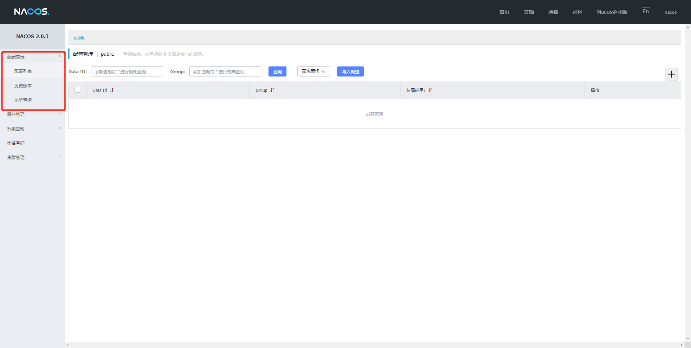


首先我们还是新建Model：cloudalibaba-config-3377

**pom文件**

​	这里我们主要要引入的是此依赖，这个依赖依据在官网上可以找到：[Nacos Spring Cloud 快速开始](https://nacos.io/zh-cn/docs/quick-start-spring-cloud.html)。搜索关键字”nacos-config“。

```xml
<dependency> 
    <groupId>com.alibaba.cloud</groupId> 
    <artifactId>spring-cloud-starter-alibaba-nacos-config</artifactId> 
</dependency>
```


**YML配置**

要注意的是这里我们要配置两个，因为Nacos同SpringCloud-config一样，在项目初始化时，要保证先从配置中心进行配置拉取，拉取配置之后，才能保证项目的正常启动。

springboot中配置文件的加载是存在优先级顺序的，bootstrap优先级高于application

分别要配置的是，这里bootstrap.yml配置好了以后，作用是两个，第一个让3377这个服务注册到Nacos中，第二个作用就是去Nacos中去读取指定后缀为yaml的配置文件：

bootstrap.yml

```java
# nacos配置
server:
  port: 3377

spring:
  application:
    name: nacos-config-client
  cloud:
    nacos:
      discovery:
        server-addr: localhost:8848 #Nacos服务注册中心地址
      config:
        server-addr: localhost:8848 #Nacos作为配置中心地址
        file-extension: yaml #指定yaml格式的配置
```

**application.yml**

```java
spring:
  profiles:
    active: dev # 表示开发环境
```


**主启动**

```java
package com.mashibing.cloudalibabaconfig3377;

import org.springframework.boot.SpringApplication;
import org.springframework.boot.autoconfigure.SpringBootApplication;
import org.springframework.cloud.client.discovery.EnableDiscoveryClient;

@SpringBootApplication
@EnableDiscoveryClient
public class CloudalibabaConfig3377Application {

    public static void main(String[] args) {
        SpringApplication.run(CloudalibabaConfig3377Application.class, args);
    }

}
```


**业务类**

这里的@RefreshScope实现配置自动更新，意思为当服务器配置文件中的配置修改后不用重启项目即生效

```java
package com.mashibing.cloudalibabaconfig3377.controller;

import org.springframework.beans.factory.annotation.Value;
import org.springframework.cloud.context.config.annotation.RefreshScope;
import org.springframework.web.bind.annotation.RestController;

@RestController
@RefreshScope //支持Nacos的动态刷新功能
public class ConfigClientController {

    @Value("${config.info}")
    private String configInfo;

    @GetMapping("/config/info")
    public String getConfigInfo(){
        return configInfo;
    }

}
```

**Nacos配置规则**

在 Nacos Spring Cloud 中新建配置时，需要用到`dataId` ，他的完整格式如下（详情可以参考[官网](https://nacos.io/zh-cn/docs/quick-start-spring-cloud.html)）

```java
${prefix}-${spring.profiles.active}.${file-extension}
```

```text
1. `prefix` 默认为 `spring.application.name` 的值，也可以通过配置项 `spring.cloud.nacos.config.prefix`来配置。
2. `spring.profiles.active` 即为当前环境对应的 profile，注意：**当 `spring.profiles.active` 为空时，对应的连接符 `-` 也将不存在，dataId 的拼接格式变成 `${prefix}.${file-extension}`**（不能删除）
3. `file-exetension` 为配置内容的数据格式，可以通过配置项 `spring.cloud.nacos.config.file-extension` 来配置。目前只支持 `properties` 和 `yaml` 类型。
4. 通过 Spring Cloud 原生注解 `@RefreshScope` 实现配置自动更新：
5. 所以根据官方给出的规则我们最终需要在Nacos配置中心添加的配置文件的名字规则和名字为：
```

```java
# ${spring.application.name}-${spring.profiles.active}.${file-extension}
# 本案例的文件名：nacos-config-client-dev.yaml
# 微服务名称-当前环境-文件格式
```

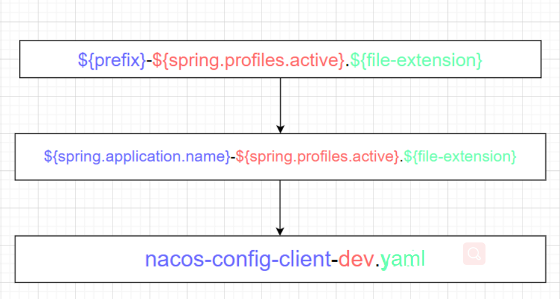

#### Nacos平台创建配置操作

增加配置


```java
config: 
    info: nacos config center,version = 1
```

然后在配置中心就会看到刚刚发布的配置


#### 自动配置更新

修改Nacos配置，不需要重启项目即可自动刷新


修改版本号为2，点击发布


#### 测试

 启动服务访问服务来测试（没有修改之前是1，修改之后不需要重启项目既可以直接获取最新配置）：http://localhost:3377/config/info


#### 命名空间分组和DataID三者关系

**名词解释**

**命名空间**（Namespace）

​	用于进行租户粒度的配置隔离。不同的命名空间下，可以存在相同的 Group 或 Data ID 的配置。Namespace 的常用场景之一是不同环境的配置的区分隔离，例如开发测试环境和生产环境的资源（如配置、服务）隔离等。

**配置分组**（Group）

​	Nacos 中的一组配置集，是组织配置的维度之一。通过一个有意义的字符串（如 Buy 或 Trade ）对配置集进行分组，从而区分 Data ID 相同的配置集。当您在 Nacos 上创建一个配置时，如果未填写配置分组的名称，则配置分组的名称默认采用 DEFAULT_GROUP 。配置分组的常见场景：不同的应用或组件使用了相同的配置类型，如 database_url 配置和 MQ_topic 配置。

**配置集 ID**（Data ID）

​	Nacos 中的某个配置集的 ID。配置集 ID 是组织划分配置的维度之一。Data ID 通常用于组织划分系统的配置集。一个系统或者应用可以包含多个配置集，每个配置集都可以被一个有意义的名称标识。Data ID 通常采用类 Java 包（如 com.taobao.tc.refund.log.level）的命名规则保证全局唯一性。此命名规则非强制。

​	配置集：一组相关或者不相关的配置项的集合称为配置集。在系统中，一个配置文件通常就是一个配置集，包含了系统各个方面的配置。例如，一个配置集可能包含了数据源、线程池、日志级别等配置项。


**三者关系**

​	这三者的关系类似于Java里面的package名和类名，最外层的Namespace是可以用于区分部署环境的，Group和DataID逻辑上区分两个目标对象。


**默认情况**

Namespace=public，Group=DEFAULT_GROUP，默认Cluster是DEFAULT


**具体情况**

​	Nacos默认的命名空间是public，我们就可以利用Namespace来实现隔离，比如我们现在有三个环境：开发、测试、生产环境，我们就可以创建三个Namespace，不同的Namespace之间是隔离的。

​	Group本身就是分组的意思，它可以把不同的微服务划分到同一个分组里面去。

​	剩下的就是具体微服务，一个Service可以包含多个Cluster，Nacos默认Cluster是DEFAULT，Cluster是对指定微服务的一个虚拟划分。比如说，将一个Service部署在北京和和杭州的机房中，北京机房的Service就可以起名为（BJ），杭州机房中的Service就可以起名为（HZ），这样就可以尽量让同一个机房的微服务互相调用，提升性能。


**切换不同环境**

**DataID方案**

1. 指定spring.profile.active和配置文件的DataID来使不同环境下读取不同的配置，配置规则：默认空间+新建dev和test两个DataId：

   1. 新建dev配置DataID（已经创建完成）
   2. 新建test配置DataID

   

2. 通过spring.profile.active属性就能进行多环境下配置文件的读取

   

   

   ```java
   spring:
     profiles:
       # active: dev #表示开发环境
       active: test #表示测试环境
   ```

   

3. 测试

   最后再次访问：http://localhost:3377/localhost/config/info

   

**Group方案**

​	根据之前的讲解我们都知道Group为分组默认是：DEFAULT_GROUP，所以现在我们就需要分出两组，一组是“Dev开发组”，一组是“test测试组”

 1. 新建Group

    DEV_GROUP


​		TEST_GROUP


配置列表，两个DataID一致，但是分组不同的配置文件：


2. 完成以上配置以后，接下来就需要通过bootstrap+application来配合完成，具体方式：在config下增加一条Group的配置即可，可以配置为DEV_GROUP或TEST_GROUP

​	bootstrap:

```java
# nacos配置
server:
  port: 3377

spring:
  application:
    name: nacos-config-client
  cloud:
    nacos:
      discovery:
        server-addr: localhost:8848 #Nacos服务注册中心地址
      config:
        server-addr: localhost:8848 #Nacos作为配置中心地址
        file-extension: yaml #指定yaml格式的配置
        group: TEST_GROUP #增加分组

```

​	application:

```java
spring:
  profiles:
    # active: dev #表示开发环境	
    # active: test #表示测试环境
    active: info
```

3. 测试（可以测试不同分组）：

   最后再次访问：http://localhost:3377/localhost/config/info


**Namespace空间方案**

我们已经把DataID方案和Group方案完成了，然后接下来我们来看一下Namespace（命名空间）方案，默认此方案为public，此方案不能删除，我们现在来新建两个命名空间方案


1. 新建dev/test的Namespace


1. 服务管理-服务列表页面查看

   此时我们就可以切换对应的命名空间，然后再通过Group和DataID来进行切换，如果想要切换命名空间，我们就需要通过命名空间ID来进行切换

   

2. 按照域名配置（Namespace+Group+DataId）编写

   ​	先通过namespace命名空间ID来确认使用的命名空间

   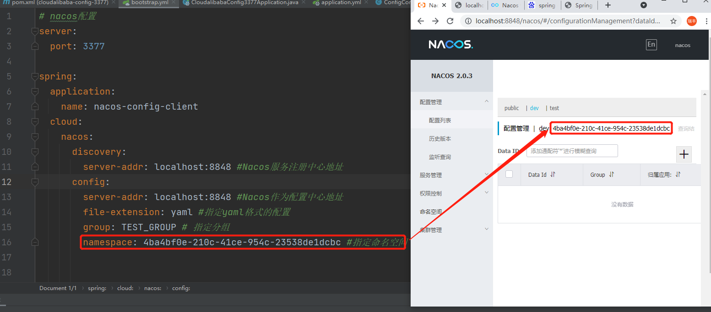

   ```java
   # nacos配置
   server:
     port: 3377
   
   spring:
     application:
       name: nacos-config-client
     cloud:
       nacos:
         discovery:
           server-addr: localhost:8848 #Nacos服务注册中心地址
         config:
           server-addr: localhost:8848 #Nacos作为配置中心地址
           file-extension: yaml #指定yaml格式的配置
           group: TEST_GROUP # 指定分组
           namespace: 4ba4bf0e-210c-41ce-954c-23538de1dcbc #指定命名空间
   ```

   ```java
   spring:
     profiles:
       active: dev #表示开发环境
       # active: test #表示测试环境
       # active: info
   ```

   ​	

   然后再回到Nacos配置列表，添加Dev命名空间下的配置，添加3条

   

   

   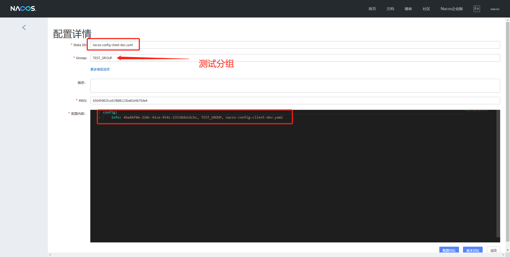

3. 测试：访问http://localhost:3377/localhost/config/info来进行测试


### 持久化配置

​	Nacos默认自带嵌入式数据库derby，所以我们每次创建一个Nacos实例就会有一个derby，当有多个Nacos节点的时候，就会出现一致性问题，所以Nacos支持了外部数据库统一数据管理MySql。


#### 默认derby切换MySql

具体配置方式可以参考官网：https://nacos.io/zh-cn/docs/deployment.html

1. 我们需要找到Nacos安装目录下的conf目录中的Sql脚本，然后在数据库中进行执行

   注意：需要我们先创建好数据库并且使用：

   ```java
   CREATE DATABASE nacos_config;
   USE nacos_config;
   ```


2. 修改conf/application.properties文件，增加支持mysql数据源配置（目前只支持mysql），添加mysql数据源的url、用户名和密码。

```java
spring.datasource.platform=mysql

db.num=1
db.url.0=jdbc:mysql://127.0.0.1:3306/nacos_config?characterEncoding=utf8&connectTimeout=1000&socketTimeout=3000&autoReconnect=true&serverTimezone=UTC
db.user=root
db.password=root
```

这里表示更改Nacos数据库为本机MySql数据库

**注意：**这里需要注意几个点，一个是url地址需要改，另外数据库的用户和密码也需要更改，同时还有一个是官网上在**db.url.0=jdbc:mysql**这个属性上少了一个属性为**serverTimezone=UTC**需要我们手动添加


#### 测试

重启Nacos服务，此时之前所创建的Namespace+Group+DataID将全部消失，因为这些数据是保存在之前Nacos内嵌的derby数据库中，现在使用的是本地的MySql数据库，此时我们可以添加配置测试，在查看数据库nacos_config中的config_info表，此时就会有新添加的配置内容


### Nacos集群

到目前为止，我们已经对Nacos的一些基本使用和配置已经掌握，但是这些还不够，我们还需要了解一个非常重要的点，就是Nacos的集群相关的操作，那我们就先从Nacos集群配置的概念说起。

#### 三种部署模式

1. 单机模式 - 用于测试和单机试用
2. 集群模式 - 用于生产环境，确保高可用
3. 多集群模式 - 用于多数据中心场景

#### 集群部署说明

参考网站：https://nacos.io/zh-cn/docs/cluster-mode-quick-start.html

**架构图**

部署生产使用的集群模式


**具体拆分**


#### 预备环境

默认Nacos使用嵌入式数据库实现数据的存储，所以，如果启动多个默认配置下的Nacos节点，数据储存存在一致性问题，为了解决这个问题，Nacos采用了集中存储方式来支持集群化部署，目前仅支持MySql的存储。

1. 推荐使用Linux版的nacos
2. 推荐使用外部数据源MySql
3. 总共需要1个Nginx+3个Nacos注册中心+1个MySql
4. 每个linux虚拟机至少4G以上内存。


#### 操作步骤

1. 在官网上下载对应Nacos Linux版本：https://github.com/alibaba/nacos/releases

   

2. 在Linux系统中解压此文件，并且把其中nacos目录拷贝到nacos目录中

   ```bash
   tar -zxvf nacos-server-2.0.3.tar.gz
   ```

   

3. 打开nacos目录下的bin目录输入命令即可执行

   

4. 修改nacos连接mysql外置数据源。步骤同windows只是需要用linux命令。

5. 这里开始正式配置集群，首先更改cluter.conf这个配置文件，修改之前也需要备份，但是这里它的原始名称为：cluster.conf.example，我们需要把它保留同时复制出一个cluster.conf来进行更改

   

6. 具体配置内容，这里我们在配置集群的时候不能直接写127.0.0.1这样，这样分不清楚，所以我们需要知道具体的IP地址，我们可以通过：

   > ip a #查看具体ip	
   >
   > 

7. 具体需修改内容，这里注意，我们在修改端口的时候一定要有一定的偏移量，因为Nacos2.0本身新增了占用端口，所以我们在设置端口号的时候注意要避开，不要占用端口，以下是官网截图：

   

   ```properties
   # 格式： ip地址:端口号
   192.168.189.129:8848
   192.168.189.129:8868
   192.168.189.129:8888
   ```

   

8. 配置完成之后，我们此时就可以启动三个节点的Nacos进行测试，启动方式和Win上区别不大

   1. 要注意一点，因为我们要开放端口测试，所以我们在启动nacos之前，要进行关闭防火墙操作：

      ```bash
      // 关闭防火墙服务-但是开启还会自动启动
      systemctl stop firewalld
      // 彻底关闭-开机不会启动防火墙
      systemctl disable firewalld
      ```

      

   2. 启动三个nacos节点，分别进入到三个Nacos节点的bin目录中进行启动：

      

      ```bash
      sh startup.sh //启动命令
      ```

      

   3. 启动完成以后，我们可以分别看一下启动日志，防止启动出现问题，启动路径：

      

   4. 这里我们可以通过cat命令或者tail -f命令

      ```java
      cat /home/msb/opt/nacos3/logs/start.out
      tail -f /home/msb/opt/nacos3/logs/start.out
      ```

      

   5. 通过浏览器分别访问三个阶段的Nacos，测试是否成功启动

      在看到所有服务都启动成功之后，我们通过浏览器访问对应地址，就可以进入到对应节点的Nacos控制台上，然后我们可以查看集群管理，节点列表

      

##### Nginx配置

1. 我们需要找到Nginx的配置文件，然后做备份

```java
cd /usr/local/nginx
cp nginx.conf nginx.conf.bk
```


2. 修改nginx.conf

```java
worker_processes  1;

events {
    worker_connections  1024;
}

stream {
      upstream nacos {
        server 192.168.189.129:8848;
        server 192.168.189.129:8868;
        server 192.168.189.129:8888;
      }


     server {
        listen  81;
        proxy_pass nacos;
     }
}
```

##### 测试启动

1. 首先进入到Nginx目录下，启动Nginx，同时要带着我们设置过得配置文件启动

```java
cd /usr/local/nginx/sbin
./nginx
```

2. 通过访问Nginx来测试是否能够访问到Nacos，在win系统浏览器网址上输入：

```java
http://192.168.189.129:81/nacos/
```


3. 使用账号密码nacos，nacos成功登录就表示此时已经完成全部配置


##### 添加配置

1. 在Nacos平台上添加配置

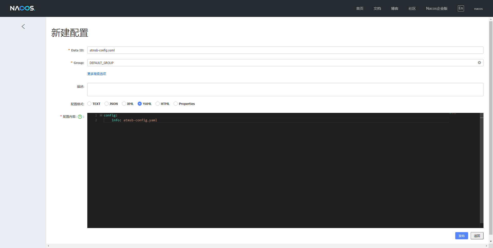

2. 在数据库中检查是否有这一条配置，如果有表示成功添加


##### 配置微服务为Linux版Nacos集群并注册进Nacos

1. 我们以9002为例，此时我们要修改application.yaml文件，把之前的Nacos端口换成Nacos集群

```java
server:
  port: 9002
spring:
  application:
    name: nacos-provider
  cloud:
    nacos:
      discovery:
        # server-addr: localhost:8848
        # 换成nginx的81端口，做集群
        server-addr: http://192.168.189.129:81


management:
  endpoint:
    web:
      exponsure:
        include: '*'

```

2. 配置完成启动服务，我们就可以在Naocs平台上看见对应的微服务了，此时表示服务注册成功

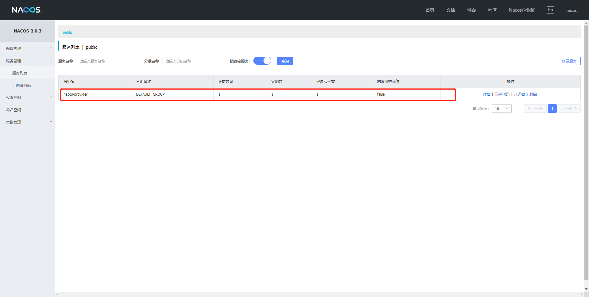


## Sentinel

### Sentinel介绍

#### 什么是Sentinel

1. **分布式系统的流量防卫兵**：随着微服务的普及，服务调用的稳定性变得越来越重要。[Sentinel](https://github.com/alibaba/Sentinel)以“流量”为切入点，在流量控制、断路、负载保护等多个领域开展工作，保障服务可靠性。

2. 特点：
   1. **丰富的应用场景**：Sentinel 承接了阿里巴巴近 10 年的双十一大促流量的核心场景，例如秒杀（即突发流量控制在系统容量可以承受的范围）、消息削峰填谷、集群流量控制、实时熔断下游不可用应用等。
   2. **完备的实时监控**：Sentinel 同时提供实时的监控功能。您可以在控制台中看到接入应用的单台机器秒级数据，甚至 500 台以下规模的集群的汇总运行情况。
   3. **广泛的开源生态**：Sentinel 提供开箱即用的与其它开源框架/库的整合模块，例如与 Spring Cloud、Apache Dubbo、gRPC、Quarkus 的整合。您只需要引入相应的依赖并进行简单的配置即可快速地接入 Sentinel。同时 Sentinel 提供 Java/Go/C++ 等多语言的原生实现。
   4. **完善的 SPI 扩展机制**：Sentinel 提供简单易用、完善的 SPI 扩展接口。您可以通过实现扩展接口来快速地定制逻辑。例如定制规则管理、适配动态数据源等。

3. 官网文档：https://github.com/alibaba/Sentinel/wiki/%E4%BB%8B%E7%BB%8D


#### Sentinel好处

​	分布式系统面临的问题：复杂的体系结构中的应用程序有数十个依赖关系，每个依赖关系在某些时候将不可避免的失败，比如如下的例子中，当我们调用A、E、F、J、K这几个服务的时候如果其中一个服务出现问题会造成什么问题？其实就会出现整体系统效率全部下降，而且严重就会出现**服务雪崩**的问题！


​	**服务雪崩：**

​		多个微服务之间调用的时候，假设A调用B和C，B和C又调用其他的微服务，这就是所谓的**扇出**。如果扇出的某个链路上某个微服务调用的响应时间过程或者不可用，微服务A的调用就用占用越来越多的系统资源，从而引起系统崩溃，这也就是**服务雪崩**。其实就是服务的**高可用**遭到了破坏。

​		对于高流量的应用来说，单一的后端依赖可能会导致服务器上的所有资源都在几秒钟内饱和。同时还有可能造成这些应用程序导致服务之间的延迟增加，备份列队，线程和其他的系统资源紧张，导致整个系统发生更多的级联故障。这些都表示需要对故障和延迟进行隔离和管理，以便单个依赖关系失败，不能取消整个应用程序或系统，所以通常发生了一个模块的某个实例失败后，这时候这个模块依然还会接受流量，然后这个有问题的模块还调用其他的模块，这样就会发生级联故障，或者叫做**雪崩**。

​		要解决这种问题的出现我们就需要用到服务降级，而Sentinel就可以保证在一个依赖出现问题的情况下，不会导致整体服务失败，避免级联故障，提高分布式系统的弹性。

​	**Sentinel的熔断降级通过断路器实现：**

​		断路器：它本身是一种开关装置，当某个服务单元发生故障之后，通过断路器的故障监控（类似于熔断保险丝），向调用方返回一个符合预期的、可处理的备选响应（FallBack），而不是长时间的等待或者抛出调用方法无法出的异常，这样就保证了服务调用方的不会被长时间、不必要的占用，从而避免了故障在分布式系统中蔓延（类似于病毒传染），从而避免了故障在系统中蔓延，乃至崩溃。

​	**好处体现：**

​	对比与其他的产品而言，比如说Hystrix，他不需要我们自己手动搭建监控平台，而且它有一套类似于Nacos的Web界面，可以让我们进行更加细粒度的配置流控、速率、服务熔断、服务降级等

​	目前主流编程都是 约定>配置>代码，虽然我们的配置都可以写在代码中，但是我们还是要大面积的学习配置和注解的方式，尽量少些代码，这也是Sentinel的理念和初衷。

 


### 下载和安装

​	下载地址：https://github.com/alibaba/Sentinel/releases

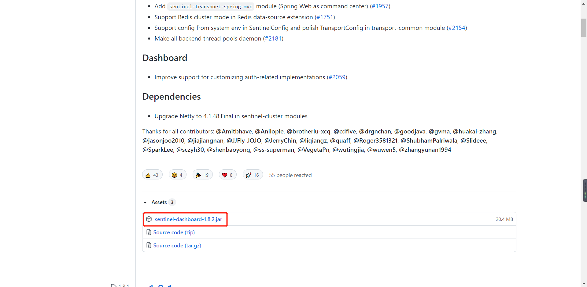

官方提供的手册：https://spring-cloud-alibaba-group.github.io/github-pages/hoxton/en-us/index.html#_spring_cloud_alibaba_sentinel


**Sentinel 分为两个部分**

- 核心库（Java客户端）不依赖任何框架/库，只需要Java运行时环境，同时对Dubbo/SpringCloud 等框架也有较好的支持。 
- 控制台（Dashboard）基于 SpringBoot开发，打包后可以直接运行，不需要额外的Tomcat等应用容器。

**启动步骤**

- 前提：jdk1.8环境和8080端口不能被占用

- 启动命令：java -jar sentinel-dashboard-1.8.2.jar

- 访问地址：localhost:8080

- 输入默认账号密码：sentinel/sentinel

  

  


到这里为止，我们的Sentinel安装成功。


### Sentinel初始化监控

#### Sentinel初始化工程演示

​	我们现在通过一个案例来让大家了解Sentinel的初始化演示，现在我们需要做几件事：

1. 启动Nacos8848成功
2. 创建新的Module：sentinel-init-8401
3. 启动Sentinel8080
4. 启动微服务8401
5. 启动8401微服务后查看Sentinel控制台


#### 搭建Sentinel项目

1. Sentinel的官方文档网址：https://sentinelguard.io/zh-cn/docs/quick-start.html

2. 在已有的项目创建子Module：sentinel-init-8401

   

3. 导入依赖：

```xml
    <dependencies>
        <!-- Nacos客户端依赖 -->
        <dependency>
            <groupId>com.alibaba.cloud</groupId>
            <artifactId>spring-cloud-starter-alibaba-nacos-discovery</artifactId>
        </dependency>
        <!-- sentinel依赖 -->
        <dependency>
            <groupId>com.alibaba.cloud</groupId>
            <artifactId>spring-cloud-starter-alibaba-sentinel</artifactId>
        </dependency>
    </dependencies>
```

4. 配置yaml文件，目的是让当前8401注册进Nacos，然后被Sentinel8080进行监控

   SpringCloudAlibaba\sentinel-init-8401\src\main\resources\application.yml

```yaml
server:
  port: 8401

spring:
  application:
    name: sentinel-init-8401
  cloud:
    nacos:
      discovery:
        server-addr: localhost:8848
    sentinel:
      transport:
        # 配置Sentinel dashboard地址
        dashboard: localhost:8080
        # 默认8719端口，键入被占用会自动从8719+1，直到找到未被占用的端口
        port: 8719

management:
  endpoints:
    web:
      exposure:
        include: '*'
```

5. 编写FlowLimitController

```java
package com.example.cloudalibabasentinel8401.controller;

import org.springframework.web.bind.annotation.GetMapping;
import org.springframework.web.bind.annotation.RestController;

@RestController
public class FlowLimitController {
    @GetMapping("/testA")
    public String testA(){
        return "-----testA";
    }

    @GetMapping("/testB")
    public String testB(){
        return "-----testB";
    }
}
```


#### 测试

1. 当以上的这些配置配置好以后，我们就可以进行测试了，那我们的测试方式就是，首先保证Nacos和Sentinel都是启动状态，然后再来启动项目，按照我们的理解这个时候，就应该在Sentinel的dashboard上能体现出它监控的服务，但是此时并没有，原因是因为Sentinel本身采用的是懒加载机制，所以我们需要首先访问服务对应的接口，Sentinel才能工作。

```java
http://localhost:8401/testA
http://localhost:8401/testB
```

2. 访问之后我们来查看Sentinel的dashboard


3. 那么这个时候我们频繁快速的访问testA或者testB那么我们再来查看实时监控的时候，就会出现波动，体现此时Sentinel正在监控这我们的8401这个服务

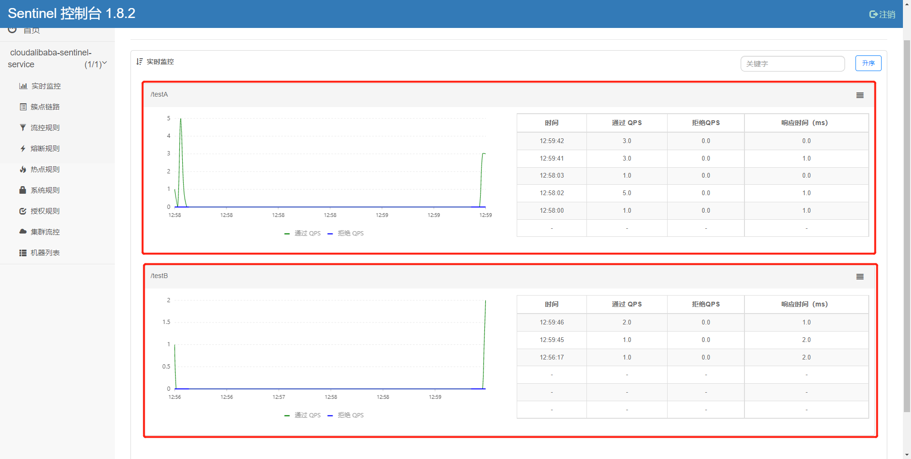


### Sentinel流控规则

#### 流控规则-基本介绍

点击“流控规则”菜单，然后点“新增流控规则”按钮，出现如下界面。


**界面名词解释**

- 资源名：唯一名称，一般填写要监控流量的请求路径地址。例如：http://localhost:8401/testA
- 针对来源：Sentinel可以针对调用者进行限流，填写微服务名，默认：default（不区分来源）
- 阈值类型/单机阈值：
  - QPS（一般指每秒查询率）：当调用该API的QPS达到阈值的时候，进行限流
  - 线程数：当调用该API的线程数量达到阈值的时候，进行限流
- 是否集群：不勾，当前无集群。
- 流控模式：
  - 直接：API达到限流条件时，直接限流
  - 关联：当关联的资源达到阈值时，就限流自己
  - 链路：只记录指定链路上的流量（指定资源从入口资源进来的流量，如果达到阈值，就进行限流）(API级别的针对来源)
- 流控效果：
  - 快速失败：直接失败，即：有请求过来时直接抛异常。
  - Wam Up：根据codeFactor（冷加载因子，默认3）的值，从阈值/codeFacotor，经过预热时长，才达到设置的QPS阈值
  - 排队等待：匀速排队，让请求以匀速的速度通过，阈值类型必须设置为QPS，否则无效


**具体操作开始**

#### 流控规则-直接失败

**QPS直接失败案例**

1. 添加有两种方式，除了上面介绍的从“流控规则”菜单进入，也可以在“簇点链路”中添加，一般会采取第二种方式
2. 使用第二种方式，可以看到每种资源名的数据，然后选中资源名再新建流控规则。


2. 现在我们给"/testA"添加流控。


3. 这里的意思就是我们现在单机阈值设定为1，代表的是当前这个接口只能被1秒访问一次，超过这个阈值，就会被Sentinel阻塞，现在默认为直接失败，也就是会在前台有一个体现

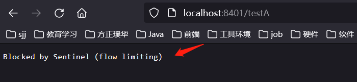

**线程数直接失败案例**

1. 刚才我们可以的设置是通过QPS（每秒钟请求的数量）来设置的限流规则，但是我们这里其实还有一个线程数


2. QPS和并发线程数规则详解

   用银行网点处理客户存款来举例。QPS就好比每秒中允许进入银行的人的数量。而并发线程数代表的是处理操作的柜台数量。


3. 要演示这种效果，我们可以新建一个请求处理方法，这个方法处理一次请求要1秒。如果用户的请求数大于每秒1个，那系统就会有并发线程来处理。但是由于有流控规则在，所以后面的线程就会被sentinel处理。

```java
@RestController
public class FlowLimitController {
    @GetMapping("/testA")
    public String testA(){
        return "-----testA";
    }

    @GetMapping("/testB")
    public String testB(){
        return "-----testB";
    }

    @GetMapping("/testC")
    public String testC() throws InterruptedException {
        TimeUnit.SECONDS.sleep(1);
        return "-----testC";
    }
}
```

4. 这个时候我们重启项目，访问testC请求，然后给testC增加并发线程数的流控规则。
5. 通过两个网页来快速访问（1个也会出现），这个时候就会出现被sentinel阻止的返回界面了。


**注意：这个时候虽然效果一致，但是是两种完全不同的规则，一种是QPS，一种是并发线程！**


#### 流控规则-关联

**关联**，官方解释：当关联的资源达到阈值时，就限流自己。

通俗来说，如果A接口关联B接口，当B接口达到阈值后，就限流A接口自己。举一个电商系统的例子：订单模块负责用户下单，它关联支付模块。如果支付系统达到阈值，就需要限流订单系统。否则订单源源不断继续过来，会拖累支付模块导致其不可用。


**具体演示**

​	当关联资源**/testB**的qps阈值超时1时，就限流**/testA**的Rest访问地址，当关联资源到阈值后限制配置好的资源名

```java
@RestController
public class FlowLimitController {
    @GetMapping("/testA")
    public String testA(){
        return "-----testA";
    }

    @GetMapping("/testB")
    public String testB(){
        return "-----testB";
    }
}
```

​	给testA添加流控规则


​	为了演示效果，我们需要借助工具Postman，来模仿并发密集访问/testB，先来测试访问testB接口

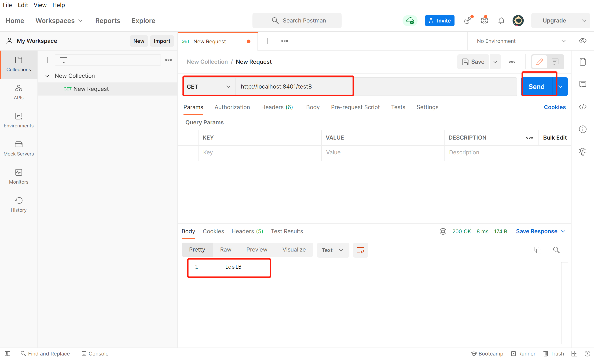

这个时候我们需要多次密集访问TestB接口，所以我们需要添加配置，具体操作如下：

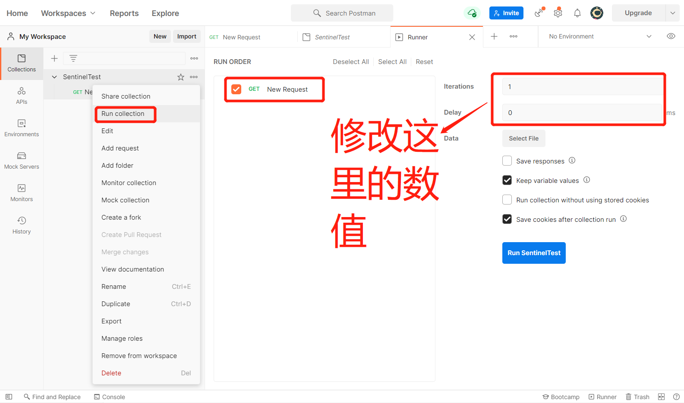

把数值修改为：

- Iterations：为20
- Delay：300

意思就是20个线程每间隔0.3秒访问一次，然后跑起来


这个时候我们来看网页中testA接口的效果：


**Apipost**

如果本地没有postman，也可以使用其他调试工具，例如：Apipost，按照如下步骤，在Api调试页签中新建接口


点“一键压测”填入压测参数后，开始压测，此时再去访问testA就会看到sentinel拦截界面。


#### 流控规则-链路

**链路**

链路流控模式指的是，当从某个接口过来的资源达到限流条件时，开启限流，它的功能有点类似于针对来源配置项，区别在于：针对来源是针对上级微服务，而链路流控是针对上级接口，也就是说它的粒度更细。

比如在一个微服务中，两个接口都调用了同一个Service中的方法，并且该方法用SentinelResource（用于定义资源）注解标注了，然后对该注解标注的资源（方法）进行配置，则可以选择链路模式。

​	

**具体演示**

首先我们编写一个Service

```java
//service.TestService
@Service
public class TestService {
    // 定义限流资源
    @SentinelResource("common")
    public String common(){
        return "common";
    }
}
```

然后更改接口调用这个Service方法

```java
@RestController
public class FlowLimitController {
    @Autowired
    TestService testService;
    
    @GetMapping("/testD")
    public String testD() {
        return testService.common();
    }

    @GetMapping("/testE")
    public String testE() {
        return testService.common();
    }
}
```

接下来配置流控规则：

这里要注意不要对 /testD 或者 /testE 进行限流规则的配置，要给用SentinelResource注解标注的资源进行配置限流规则，这里的意思为当我们用入口资源访问被SentinelResource注解标注的资源方法时，当超过阈值就会被限流，但是此时实际效果是没有效果。


没有效果的原因是因为我们还需要添加配置，让Sentinel 源码中 CommonFilter 中的 WEB_CONTEXT_UNIFY 参数为 false，将其配置为 false 即可根据不同的URL 进行链路限流，如果不配置将不会生效。

```java
spring:
  application:
    name: cloudalibaba-sentinel-service
  cloud:
    nacos:
      discovery:
        server-addr: localhost:8848
    sentinel:
      transport:
        # 配置Sentinel dashboard地址
        dashboard: localhost:8080
        # 默认8719端口，键入被占用会自动从8719+1，直到找到未被占用的端口
        port: 8719
      # 配置为false
      web-context-unify: false
```

最后这个时候我们再来频繁的访问testB接口，就会出现异常的情况，这也是流量效果快速失败在链路上的体现，是直接抛出异常。


#### 流控效果-预热

**预热**

官网手册地址：https://sentinelguard.io/zh-cn/docs/flow-control.html

概念：Warm Up方式，即预热/冷启动方式。该方式主要用于系统长期处于低水位的情况下，当流量突然增加时，直接把系统拉升到高水位可能瞬间把系统压垮。通过"冷启动"，让通过的流量缓慢增加，在一定时间内逐渐增加到阈值上限，给冷系统一个预热的时间，避免冷系统被压垮的情况。

​	预热公式：阈值/coldFactor（默认值为3），经过预热时间后才会达到阈值。

​	冷启动的过程系统允许通过的QPS曲线如下图：


简单理解：


使用场景：一般秒杀系统中会有这样的流控设置，为了防止秒杀瞬间造成系统崩溃。


**案例**

默认coldFactor为3，当发起请求即请求QPS从（阈值/3）开始，经过多长预热时长才逐步升至设定的QPS阈值，当前阈值设置为10，预热时长设置为5秒。

最终的效果，系统初始化时阈值/3约等于3，即阈值在此时为3，经过5秒后阈值才慢慢升高到10

首先我们先来设置流控效果：


测试，我们用最简单的方法进行测试，直接在浏览器上手动刷新，然后我们来看Sentinel的实时监控


#### 流控效果-排队等待

**排队等待**

​	官方文档：https://sentinelguard.io/zh-cn/docs/flow-control.html

​	概念：匀速排队方式会严格控制请求通过的间隔时间，也即是让请求以均匀的速度通过，对应的是漏桶算法。

​	这种方式主要用于处理间隔性突发的流量，例如消息队列。想象一下这样的场景，在某一秒有大量的请求到来，而接下来的几秒则处于空闲状态，我们希望系统能够在接下来的空闲期间逐渐处理这些请求，而不是在第一秒直接拒绝多余的请求（削峰填谷）。

​	例图：


**匀速器**

​	它的中心思想是，以固定的间隔时间让请求通过。当请求到来的时候，如果当前请求距离上个通过的请求通过的时间间隔不小于预设值，则让当前请求通过。否则，计算当前请求的预期通过时间，如果该请求的预期通过时间小于规则预设的 timeout 时间，则该请求会等待直到预设时间到来通过（排队等待处理）；若预期的通过时间超出最大排队时长，则直接拒接这个请求。

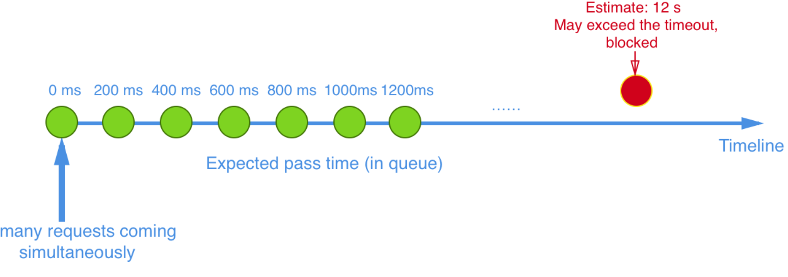

​	Sentinel 匀速排队等待策略是漏桶算法结合虚拟队列等待机制实现的。

​	注意：匀速排队模式暂时不支持 QPS > 1000 的场景。


**演示**

流控规则：


为了看到效果，我们在代码中进行打印，更改8401微服务中的FlowLimitController

```java
package com.example.cloudalibabasentinel8401.controller;

import com.alibaba.csp.sentinel.annotation.SentinelResource;
import com.example.cloudalibabasentinel8401.service.TestService;
import lombok.extern.slf4j.Slf4j;
import org.springframework.beans.factory.annotation.Autowired;
import org.springframework.web.bind.annotation.GetMapping;
import org.springframework.web.bind.annotation.RestController;

import java.util.concurrent.TimeUnit;

@RestController
@Slf4j
public class FlowLimitController {
    @Autowired
    TestService testService;
    @GetMapping("/testA")
    public String testA(){
        log.info(Thread.currentThread().getName()+"：testA");
        return testService.common();
    }

    @GetMapping("/testB")
    public String testB(){
        return testService.common();
    }
}
```

最后我们可以通过Postman来进行测试，发送请求时没有延迟，同时发送10条请求，然后我们会发现就是排队效果1秒执行一个请求，同时我们在Idea中也可以看到打桩效果


### Sentinel熔断降级

#### 基本介绍

除了流量控制以外，对调用链路中不稳定的资源进行熔断降级也是保障高可用的重要措施之一。一个服务常常会调用别的模块，可能是另外的一个远程服务、数据库，或者第三方 API 等。例如，支付的时候，可能需要远程调用银联提供的 API；查询某个商品的价格，可能需要进行数据库查询。然而，这个被依赖服务的稳定性是不能保证的。如果依赖的服务出现了不稳定的情况，请求的响应时间变长，那么调用服务的方法的响应时间也会变长，线程会产生堆积，最终可能耗尽业务自身的线程池，服务本身也变得不可用。


现代微服务架构都是分布式的，由非常多的服务组成。不同服务之间相互调用，组成复杂的调用链路。以上的问题在链路调用中会产生放大的效果。复杂链路上的某一环不稳定，就可能会层层级联，最终导致整个链路都不可用。因此我们需要对不稳定的**弱依赖服务调用**进行熔断降级，暂时切断不稳定调用，避免局部不稳定因素导致整体的雪崩。熔断降级作为保护自身的手段，通常在客户端（调用端）进行配置。上图中：如果Service D不稳定，响应时间过长势必会影响调用他的Service G、F，A，B。


#### 熔断策略

​	Sentinel 提供了一下几种熔断策略，此处简单概述，下文还会详细介绍：

- 慢调用比例 (`SLOW_REQUEST_RATIO`)：选择以慢调用比例作为阈值，需要设置允许的慢调用 RT（即最大的响应时间），请求的响应时间大于该值则统计为慢调用。当单位统计时长（`statIntervalMs`）内请求数目大于设置的最小请求数目，并且慢调用的比例大于阈值，则接下来的熔断时长内请求会自动被熔断。经过熔断时长后熔断器会进入探测恢复状态（HALF-OPEN 状态），若接下来的一个请求响应时间小于设置的慢调用 RT 则结束熔断，若大于设置的慢调用 RT 则会再次被熔断。

- 异常比例 (`ERROR_RATIO`)：当单位统计时长（`statIntervalMs`）内请求数目大于设置的最小请求数目，并且异常的比例大于阈值，则接下来的熔断时长内请求会自动被熔断。经过熔断时长后熔断器会进入探测恢复状态（HALF-OPEN 状态），若接下来的一个请求成功完成（没有错误）则结束熔断，否则会再次被熔断。异常比率的阈值范围是 `[0.0, 1.0]`，代表 0% - 100%。
- 异常数 (`ERROR_COUNT`)：当单位统计时长内的异常数目超过阈值之后会自动进行熔断。经过熔断时长后熔断器会进入探测恢复状态（HALF-OPEN 状态），若接下来的一个请求成功完成（没有错误）则结束熔断，否则会再次被熔断。


Sentinel在1.8.0版本对熔断降级做了大的调整，可以定义任意时长的熔断时间，引入了半开启恢复支持。下面梳理下相关特性。

熔断状态有三种状态，非别为OPEN、HALF_OPEN、CLOSED

| 状态      | 说明                                                         |
| --------- | ------------------------------------------------------------ |
| OPEN      | 表示熔断开启，拒绝所有请求                                   |
| HALF_OPEN | 探测恢复状态，如果接下来的一个请求顺利通过则表示结束熔断，否则继续熔断 |
| CLOSE     | 表示熔断关闭，请求顺利通过                                   |

#### 熔断规则

熔断降级规则包含下面几个重要的属性：

| Field              | 说明                                                         | 默认值     |
| ------------------ | ------------------------------------------------------------ | ---------- |
| resource           | 资源名，即规则的作用对象                                     |            |
| grade              | 熔断策略，支持慢调用比例/异常比例/异常数策略                 | 慢调用比例 |
| count              | 慢调用比例模式下为慢调用临界 RT（超出该值计为慢调用）；异常比例/异常数模式下为对应的阈值 |            |
| timeWindow         | 熔断时长，单位为 s                                           |            |
| minRequestAmount   | 熔断触发的最小请求数，请求数小于该值时即使异常比率超出阈值也不会熔断（1.7.0 引入） | 5          |
| statIntervalMs     | 统计时长（单位为 ms），如 60*1000 代表分钟级（1.8.0 引入）   | 1000 ms    |
| slowRatioThreshold | 慢调用比例阈值，仅慢调用比例模式有效（1.8.0 引入）           |            |

官方文档网址：https://sentinelguard.io/zh-cn/docs/circuit-breaking.html


#### 慢调用比例

概念：选择以慢调用比例作为阈值，需要设置允许的慢调用 RT（即最大的响应时间），请求的响应时间大于该值则统计为慢调用。当单位统计时长（`statIntervalMs`）内请求数目大于设置的最小请求数目，并且慢调用的比例大于阈值，则接下来的熔断时长内请求会自动被熔断。经过熔断时长后，熔断器会进入探测恢复状态（HALF-OPEN 状态），若接下来的一个请求响应时间小于设置的慢调用 RT 则结束熔断，若大于设置的慢调用 RT 则会再次被熔断。


​	简单理解：


举例：


**案例演示**

首先我们先添加一个控制器方法：

```java
//FlowLimitController.java
@GetMapping("/testC")
public String testC(){
    try {
        TimeUnit.SECONDS.sleep(5);
    } catch (InterruptedException e) {
        e.printStackTrace();
    }
    return "----testC";
}
```

设置熔断策略，1秒内，QPS>5 并且这些请求的RT>300ms，并且大于比例阈值触发熔断，熔断持续10秒。


**测试**

通过JMeter测试，1秒钟发起10个线程请求/testC，此时就会触发熔断效果，停止测试以后，10秒钟以后恢复正常


通过Apipost测试。


#### 异常比例

​	概念：异常比例 (`ERROR_RATIO`)：当单位统计时长（`statIntervalMs`）内请求数目大于设置的最小请求数目，并且异常的比例大于阈值，则接下来的熔断时长内请求会自动被熔断。经过熔断时长后熔断器会进入探测恢复状态（HALF-OPEN 状态），若接下来的一个请求成功完成（没有错误）则结束熔断，否则会再次被熔断。异常比率的阈值范围是 `[0.0, 1.0]`，代表 0% - 100%。

​	注意：异常降级**仅针对业务异常**，对 Sentinel 限流降级本身的异常（`BlockException`）不生效。


简单理解：

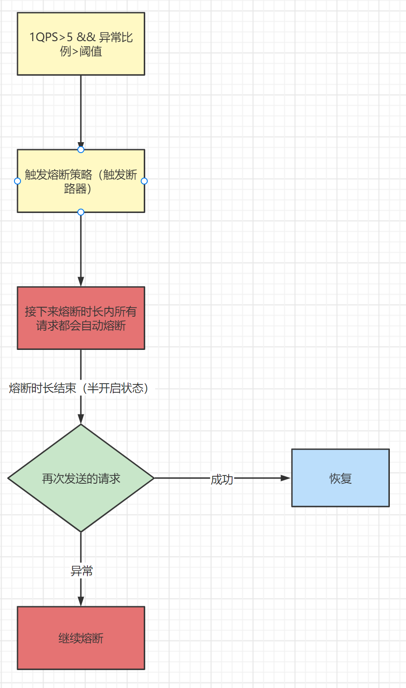

**案例**

编写测试接口

```java
//FlowLimitController
@GetMapping("/testD")
public String testD(Integer id){
    if(id != null && id > 1){
        throw new RuntimeException("异常比例测试");
    }
    return "------------testD";
}
```

设置熔断策略异常比例


**测试**

我们通过JMeter来测试，设定HTTP请求地址


1秒钟发送10个请求


当启动JMeter的时候，就会触发熔断，因为此时我们1秒钟发送10个请求超过了最小请求数5，同时超过了阈值，满足了两个条件，当熔断时长过后就会恢复正常。


#### 异常数

​	概念：异常数 (`ERROR_COUNT`)：当单位统计时长内的异常数目超过阈值之后会自动进行熔断。经过熔断时长后熔断器会进入探测恢复状态（HALF-OPEN 状态），若接下来的一个请求成功完成（没有错误）则结束熔断，否则会再次被熔断。

​	注意：异常降级**仅针对业务异常**，对 Sentinel 限流降级本身的异常（`BlockException`）不生效。


简单理解：


**案例演示**

编写接口

```java
//FlowLimitController
@GetMapping("/testE")
public String testE(Integer id){
    if(id != null && id > 1){
        throw new RuntimeException("异常数测试");
    }
    return "------------testE";
}
```

设置异常数策略，当1秒钟内请求超过5并且异常数大约5个的时候触发熔断

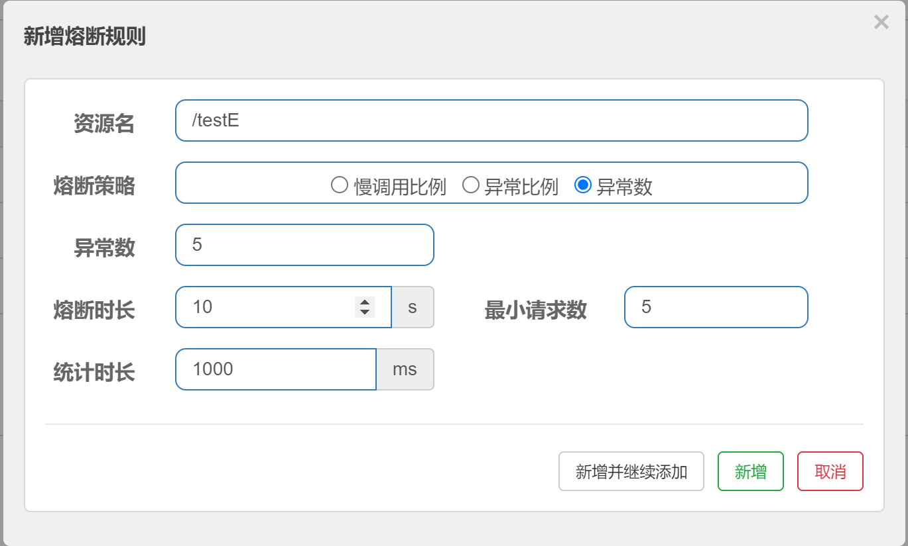

**测试**

通过JMeter来测试


1秒钟发送10个请求


此时就会触发熔断


### Sentinel热点规则

#### 概念

何为热点？热点即经常访问的数据。很多时候我们希望统计某个热点数据中访问频次最高的 Top K 数据，并对其访问进行限制。比如：

- 商品 ID 为参数，统计一段时间内最常购买的商品 ID 并进行限制
- 用户 ID 为参数，针对一段时间内频繁访问的用户 ID 进行限制

热点参数限流会统计传入参数中的热点参数，并根据配置的限流阈值与模式，对包含热点参数的资源调用进行限流。热点参数限流可以看做是一种特殊的流量控制，仅对包含热点参数的资源调用生效

官网：https://sentinelguard.io/zh-cn/docs/parameter-flow-control.html


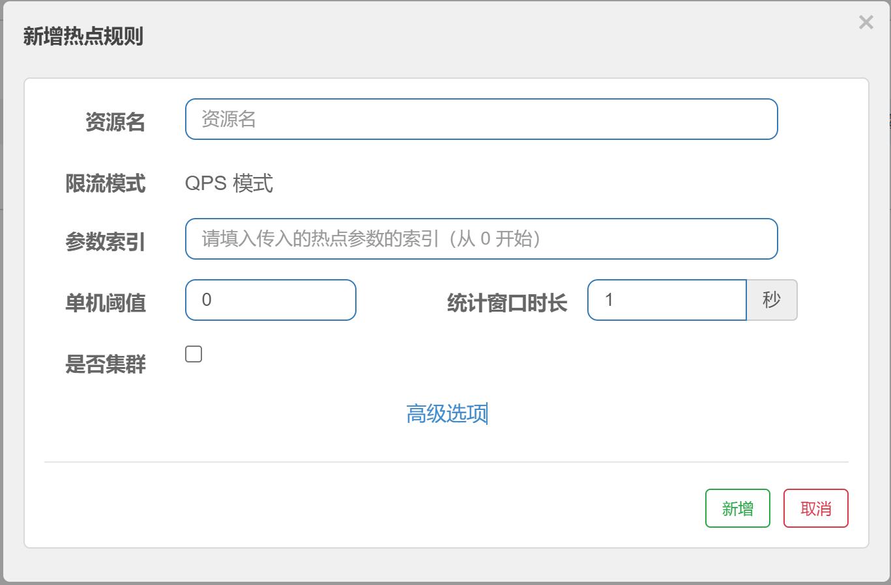

这里还有相对应的高级选项，我们这里先了解基本规则。

#### @SentinelResource注解

其实这个热点限流其实就是更加细粒度的流控规则，那么如果想使用它就必须要配合对应SentinelResource注解。

Sentinel 提供了 @SentinelResource 注解用于定义资源，它有很多的参数，我们这里主要关注两个参数：

1. value：代表资源名称，必需项，因为需要通过resource name找到对应的规则，这个是必须配置的
2. blockHandler：blockHandler 对应处理 BlockException 的方法名称，可选项，访问范围需要是 public，返回类型需要与原方法相匹配，参数类型需要和原方法相匹配并且最后加一个额外的参数，类型为 BlockException。

**案例讲解**


@SentinelResource(value="xxx")

那现在我们要完成以上图中的效果，这个时候我们首先要编写代码，在FlowLimitController中编写代码

```java
@GetMapping("/testHotKey")
@SentinelResource("testHotKey")
public String testHotKey(@RequestParam(value = "hot1",required = false) String hot1,
                         @RequestParam(value = "hot2",required = false)String hot2,
                         @RequestParam(value = "hot13",required = false) String hot3){
    return "----testHotKey";
}
```

然后再来配置热点规则


这里要说明一下，参数索引0实际上代表的就是我们设置的hot1参数


测试，此时如果我们传入参数hot1，并且超过阈值，就会出现限流，但是此时的限流效果为报错，显示不友好


**@SentinelResource(value="xxx",blockHandler="xxx")**

刚才的演示中，我们明显发现这种限流方法的提示效果非常不友好，所以如果我们需要能够得到友好的提示，我们就需要使用@SentinelResource注解提供的另外一个参数blockHandler，这个参数是可以指定当出现异常时的处理方法，具体操作如下：

```java
    @GetMapping("/testHotKey")
    @SentinelResource(value = "testHotKey",blockHandler = "blockHandler")
    public String testHotKey(@RequestParam(value = "hot1", required = false) String hot1,
                             @RequestParam(value = "hot2", required = false) String hot2,
                             @RequestParam(value = "hot3", required = false) String hot3) {
        return StrUtil.format("testHotKey,hot1:{},hot2:{},hot3:{}。", hot1, hot2, hot3);
    }

    //处理异常方法，方法签名要和对应的接口方法保持一致
    public String blockHandler(String hot1, String hot2, String hot3, BlockException exception){
        return StrUtil.format("您请求的数据访问人数过多，请稍后再试。hot1:{},hot2:{},hot3:{}。", hot1, hot2, hot3);
    }
```

然后热点规则不变，我们最终的到的限流效果如下：


#### 参数例外项

​	其实参数例外项就是可以达到更加细粒度的控制，比如我们当前的例子中，目前hot1参数在访问时超过阈值就会被限流，但是我们可以通过参数例外项设置hot1具体等于特殊的某个值的时候，触发不同的限流效果。假如hot1的值等于5时，它的阈值可以达到200。

​	**注意：**参数例外项中的参数类型仅支持一下7种数据类型


**案例演示**

当前我们需要让hot1的值为5的时候阈值可以达到200，首先Sentinel页面中修改对应热点规则（在这之前，先演示传递一个参数，否则配置失败）


此时的规则为：如果当前hot1值为除5以外的其他值，都会走普通的阈值规则，但是如果一旦hot1的值为5的时候，将会走参数例外项，此时的阈值为200，我们通过浏览器测试，当hot1的值等于5是只要阈值不超过200就不会出现限流。

注意：题我们到现在代码中使用了@SentinelResource注解，此注解处理的是**Sentinel控制台配置的异常**，通过blockHandler属性设置对应方法来处理和程序本身异常无关。

所以以下程序中如果hot1的值等于6还是会出现RuntimeException。

```java
@SentinelResource(value = "testHotKey",blockHandler = "handler_HotKey")
public String testHotKey(@RequestParam(value = "hot1",required = false) String hot1,
                         @RequestParam(value = "hot2",required = false) String hot2,
                         @RequestParam(value = "hot3",required = false) String hot3){
    if("6".equals(hot1)){
        throw new RuntimeException("运行时异常");
    }
    return "-----testHotKey";
}
```


### Sentinel系统规则

Sentinel 系统自适应限流从整体维度对应用入口流量进行控制，结合应用的 Load、CPU 使用率、总体平均 RT、入口 QPS 和并发线程数等几个维度的监控指标，通过自适应的流控策略，让系统的入口流量和系统的负载达到一个平衡，让系统尽可能跑在最大吞吐量的同时保证系统整体的稳定性。

**系统规则**

系统保护规则是从应用级别的入口流量进行控制，从单台机器的 load、CPU 使用率、平均 RT、入口 QPS 和并发线程数等几个维度监控应用指标，让系统尽可能跑在最大吞吐量的同时保证系统整体的稳定性。

系统保护规则是应用整体维度的，而不是资源维度的，并且**仅对入口流量生效**。入口流量指的是进入应用的流量，比如 Web 服务或 Dubbo 服务端接收的请求，都属于入口流量。


**系统规则支持一下的模式：**

- **Load 自适应**（仅对 Linux/Unix-like 机器生效）：系统的 load1（1分钟平均负载） 作为启发指标，进行自适应系统保护。当系统 load1（1分钟平均负载） 超过设定的启发值（阈值），且系统当前的并发线程数超过估算的系统容量时才会触发系统保护（BBR 阶段）。系统容量由系统的 `maxQps(秒级统计的最大QPS) * minRt(秒级统计的最小响应时间)` 估算得出。设定参考值一般是 `CPU cores * 2.5`。
- **CPU usage**（1.5.0+ 版本）：当系统 CPU 使用率超过阈值即触发系统保护（取值范围 0.0-1.0），比较灵敏。
- **平均 RT**：当单台机器上所有入口流量的平均 RT 达到阈值即触发系统保护，单位是毫秒。
- **并发线程数**：当单台机器上所有入口流量的并发线程数达到阈值即触发系统保护。
- **入口 QPS**：当单台机器上所有入口流量的 QPS 达到阈值即触发系统保护。

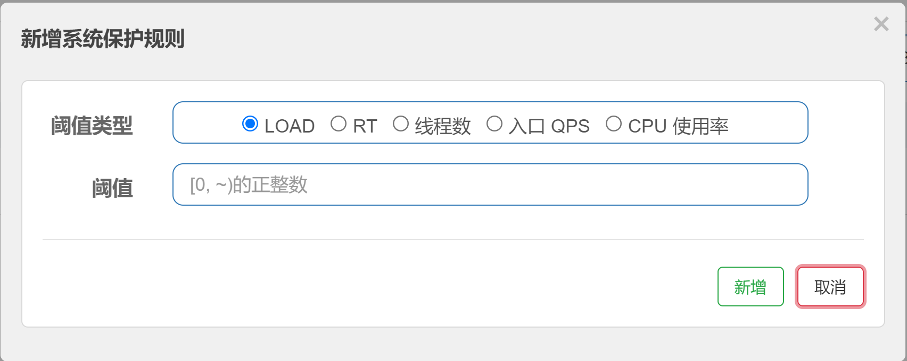


**案例演示**

这里我们只通过入口QPS来进行测试，直接设置规则


最后测试效果不管现在我们访问那个接口只要超过阈值就会被限流


### 自定义限流逻辑处理

Sentinel 提供了**@SentinelResource**注解用于定义资源，并提供了AspectJ的扩展用于自定义资源，处理BlockException等。

在之前的案例中我们用过这个注解，其实这个注解不仅仅可以用到热点规则上，还可以用到流控上。

1. @SentinelResource 既可以配置资源名称也可以配置URL
2. 如果配置了@SentinelResource的blockHandler属性对应方法，出现限流会调用对应方法
3. 如果没有配置@SentinelResource的blockHandler属性，系统会走默认的限流处理。


#### 缺点

其实我们在使用@SentinelResource注解这两种方案的时候，会出现一些问题：

1. 没有体现我们自己的业务要求。
2. 自定义处理方法和业务代码耦合在一起。
3. 每个业务方法都添加一个限流处理方法，代码将会加剧膨胀。
4. 无法实现统一全局处理。 

解决：@SentinelResource除了blockHandler可以设置自定义限流处理逻辑方法以外，还提供另外一个属性来设置限流处理逻辑类型blockHandlerClass属性，此属性中设置的方法必需为 static 函数，否则无法解析。

#### 操作步骤

**第一步**

创建CustomerBlockHandler类型用于处理自定义限流处理逻辑，首先创建MyBlockHandler。在里面添加静态方法。

```java
/**
 * Sentinel阻塞处理器<br>
 */
public class MyBlockHandler {
    public static String handlerException1(BlockException exception){
        return "handlerException1：系统异常，请稍后重试！";
    }
    public static String handlerException2(BlockException exception){
        return "handlerException2：网络崩溃了，请稍后重试！";
    }
}
```

**第二步**

我们在SentinelResourceTestController类中添加一个接口方法，同时设置@SentinelResource注解和blockHandlerClass属性对应的类型和这个类型中对应的处理方法

```java
@GetMapping("/testHandlerClass")
@SentinelResource(value = "testHandlerClass", blockHandlerClass = {MyBlockHandler.class}, blockHandler = "handlerException1")
public String testHandlerClass() {
    return "-----testHandlerClass";
}
```

**第三步**

测试：给testHandlerClass资源添加限流规则，然后来测试实际阻塞效果。

添加流控规则以后，我们频繁访问http://localhost:8401/bycustomer，就会看见是CustomerBlockHandler类型的handlerException1方法来处理自定义限流逻辑


### 服务熔断环境搭建

上面章节中所讲的案例基本都是基于本地单个微服务环境，但实际生产环境中的服务熔断主要应对多个微服务雪崩效应的一种链路保护机制，类似保险丝。本章节主要讲解多微服务环境的熔断搭建。

需要完成Sentinel整合Ribbon+openFeign，先从整合Ribbon开始

**操作步骤**

创建1个服务消费者nacos-consumer-8095和2个服务提供者nacos-provider-8090和nacos-provider-8091，以下是结构图


#### 新建公共项目

在父项目下新建cloud-alibaba-commons公共子项目，并创建下面的公共类给其他项目引入。

```java
package com.sjj.mashibing.entity;

import lombok.AllArgsConstructor;
import lombok.Data;
import lombok.NoArgsConstructor;
import lombok.ToString;

/**
 * 公共返回值<br>
 */
@Data
@AllArgsConstructor
@NoArgsConstructor
@ToString
public class JsonResult<T> {
    private Integer code;
    private String serverPort;
    private T data;
}
```


#### 创建服务提供者

在父项目下创建2个服务器提供者子项目：nacos-provider-8090和nacos-provider-8091

请注意端口号尽量不要和之前的重复。可以通过复制老项目的方式创建，然后在父项目中添加module。

**pom**

```xml
<?xml version="1.0" encoding="UTF-8"?>
<project xmlns="http://maven.apache.org/POM/4.0.0" xmlns:xsi="http://www.w3.org/2001/XMLSchema-instance"
         xsi:schemaLocation="http://maven.apache.org/POM/4.0.0 https://maven.apache.org/xsd/maven-4.0.0.xsd">
    <modelVersion>4.0.0</modelVersion>
    <parent>
        <groupId>com.sjj.mashibing</groupId>
        <artifactId>SpringCloudAlibaba</artifactId>
        <version>0.0.1-SNAPSHOT</version>
    </parent>
    <artifactId>nacos-provider-8090</artifactId>
    <version>0.0.1-SNAPSHOT</version>

    <properties>
        <java.version>1.8</java.version>
    </properties>

    <dependencies>
        <dependency>
            <groupId>com.sjj.mashibing</groupId>
            <artifactId>cloud-alibaba-commons</artifactId>
            <version>0.0.1-SNAPSHOT</version>
        </dependency>
        <dependency>
            <groupId>org.springframework.boot</groupId>
            <artifactId>spring-boot-starter-web</artifactId>
        </dependency>
        <dependency>
            <groupId>com.alibaba.cloud</groupId>
            <artifactId>spring-cloud-starter-alibaba-nacos-discovery</artifactId>
        </dependency>
    </dependencies>

    <build>
        <plugins>
            <plugin>
                <groupId>org.springframework.boot</groupId>
                <artifactId>spring-boot-maven-plugin</artifactId>
            </plugin>
        </plugins>
    </build>

</project>
```

**yml**

```yaml
server:
  port: 8090
spring:
  application:
    name: nacos-provider
  cloud:
    discovery:
      server-addr: localhost:8848

management:
  endpoint:
    web:
      exposure:
        include:'*'
```

**主启动类**

```java
package com.sjj.mashibing.nacosprovider8090;

import org.springframework.boot.SpringApplication;
import org.springframework.boot.autoconfigure.SpringBootApplication;
import org.springframework.cloud.client.discovery.EnableDiscoveryClient;

@SpringBootApplication
@EnableDiscoveryClient//加此注解
public class NacosProvider8090Application {

    public static void main(String[] args) {
        SpringApplication.run(NacosProvider8090Application.class, args);
    }

}

```

**控制器**

```java
package com.sjj.mashibing.nacosprovider8090.controller;

import com.sjj.mashibing.entity.JsonResult;
import org.springframework.beans.factory.annotation.Value;
import org.springframework.web.bind.annotation.GetMapping;
import org.springframework.web.bind.annotation.PathVariable;
import org.springframework.web.bind.annotation.RestController;

import java.util.HashMap;

/**
 * sentinel服务熔断测试类<br>
 */
@RestController
public class BreakerController {
    @Value("${server.port}")
    private String serverPort;

    //模仿数据库存储数据
    public static HashMap<Long, String> hashMap = new HashMap<>();

    static {
        hashMap.put(1L, "鼠标");
        hashMap.put(2L, "键盘");
        hashMap.put(3L, "耳机");
    }

    @GetMapping("info/{id}")
    public JsonResult<String> msbSql(@PathVariable("id") Long id) {
        JsonResult<String> result = new JsonResult(200, serverPort, hashMap.get(id));
        return result;
    }
}
```

**注意：**8091和8090一致，但是要注意修改yml文件端口号

#### 创建消费者

在父项目中创建消费者项目nacos-consumer-8095

**pom**

```xml
<?xml version="1.0" encoding="UTF-8"?>
<project xmlns="http://maven.apache.org/POM/4.0.0"
         xmlns:xsi="http://www.w3.org/2001/XMLSchema-instance"
         xsi:schemaLocation="http://maven.apache.org/POM/4.0.0 http://maven.apache.org/xsd/maven-4.0.0.xsd">
    <parent>
        <artifactId>SpringCloudAlibaba</artifactId>
        <groupId>com.sjj.mashibing</groupId>
        <version>0.0.1-SNAPSHOT</version>
    </parent>
    <modelVersion>4.0.0</modelVersion>
    <version>0.0.1-SNAPSHOT</version>

    <artifactId>nacos-consumer-8095</artifactId>

    <properties>
        <maven.compiler.source>8</maven.compiler.source>
        <maven.compiler.target>8</maven.compiler.target>
    </properties>

    <dependencies>
        <dependency>
            <groupId>com.sjj.mashibing</groupId>
            <artifactId>cloud-alibaba-commons</artifactId>
            <version>0.0.1-SNAPSHOT</version>
        </dependency>
        <dependency>
            <groupId>org.springframework.boot</groupId>
            <artifactId>spring-boot-starter-web</artifactId>
        </dependency>
        <dependency>
            <groupId>com.alibaba.cloud</groupId>
            <artifactId>spring-cloud-starter-alibaba-nacos-discovery</artifactId>
        </dependency>
        <!-- sentinel依赖 -->
        <dependency>
            <groupId>com.alibaba.cloud</groupId>
            <artifactId>spring-cloud-starter-alibaba-sentinel</artifactId>
        </dependency>
    </dependencies>

</project>
```

**yml**

```yaml
server:
  port: 8084
spring:
  application:
    name: nacos-consumer
  cloud:
    nacos:
      discovery:
        server-addr: localhost:8848
    sentinel:
      transport:
        #配置Sentinel dashboard地址
        dashboard: localhost:8080
        #默认8719端口，假如被占用会自动从8719开始依次+1扫描,直至找到未被占用的端口
        port: 8719

#消费者将要去访问的微服务名称(注册成功进nacos的微服务提供者)
service-url:
  nacos-user-service: http://nacos-provider
```

主启动添加注解和服务提供者项目一致

**控制器**

```java
package com.sjj.mashibing.nacos.controller;

import com.sjj.mashibing.entity.JsonResult;
import lombok.extern.slf4j.Slf4j;
import org.springframework.beans.factory.annotation.Autowired;
import org.springframework.beans.factory.annotation.Value;
import org.springframework.web.bind.annotation.GetMapping;
import org.springframework.web.bind.annotation.PathVariable;
import org.springframework.web.bind.annotation.RestController;
import org.springframework.web.client.RestTemplate;

/**
 * 类功能说明<br>
 *
 * @author namelessmyth
 * @version 1.0
 * @date 2023/4/18/0018
 */
@RestController
@Slf4j
public class BreakerController {
    //服务提供者URL
    @Value("${service-url.nacos-user-service}")
    private String SERVICE_URL;

    @Autowired
    private RestTemplate restTemplate;

    @GetMapping("/consumer/fallback/{id}")
    public JsonResult<String> fallback(@PathVariable Long id){
        //通过Ribbon发起远程访问，访问9003/9004
        JsonResult<String> result = restTemplate.getForObject(SERVICE_URL+"/info/"+id,JsonResult.class);
        return result;
    }
}
```


#### 最后测试

访问http://localhost:8095/consumer/fallback/2


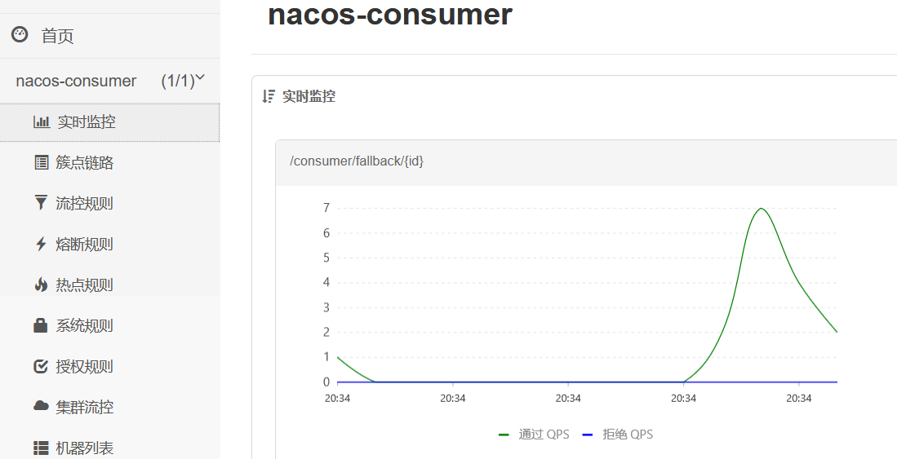


### SentinelResource的fallback属性

#### fallback属性

**概念：**fallback 函数名称，可选项，用于在抛出异常的时候提供 fallback 处理逻辑。fallback 函数可以针对所有类型的异常（除了 `exceptionsToIgnore` 里面排除掉的异常类型）进行处理。fallback 函数签名和位置要求：

- 返回值类型必须与原函数返回值类型一致；
- 方法参数列表需要和原函数一致，或者可以额外多一个 `Throwable` 类型的参数用于接收对应的异常。
- fallback 函数默认需要和原方法在同一个类中。若希望使用其他类的函数，则可以指定 `fallbackClass` 为对应的类的 `Class` 对象，注意对应的函数必需为 static 函数，否则无法解析。

其实通过官网上提供的概念，我们不难看出这个属性类似于blockHandler，但是各位一定要注意他们有本质的不同。

**注意：**fallback属性和blockHandler属性的本质不同在于他们作用的异常不同：

- blockHandler：针对违反Sentinel控制台配置规则时触发BlockException异常时对应处理的属性
- fallback：针对Java本身出现的异常进行处理的对应属性。


#### 案例演示

上节课我们已经完成环境的搭建，那我们就直接在8095项目的DemoController中修改原方法代码

```java
    @GetMapping("/consumer/fallback/{id}")
    public JsonResult<String> fallback(@PathVariable Long id){
        if(id > 3L){
            throw new NullPointerException("没有找到对应的数据！");
        }
        //通过Ribbon发起远程访问，访问9003/9004
        JsonResult<String> result = restTemplate.getForObject(SERVICE_URL+"/info/"+id,JsonResult.class);
        return result;
    }
```

此时我们任务添加了异常，如果我们访问http://localhost:8095/consumer/fallback/4（id非法）地址时，就会出现对应的显示效果：


明显此时显示效果非常不好，我们就可以通过@SentinelResource注解的fallback属性来解决这种java异常，给出友好提示

```java
package com.sjj.mashibing.nacos.controller;

import com.alibaba.csp.sentinel.annotation.SentinelResource;
import com.sjj.mashibing.entity.JsonResult;
import lombok.extern.slf4j.Slf4j;
import org.springframework.beans.factory.annotation.Autowired;
import org.springframework.beans.factory.annotation.Value;
import org.springframework.web.bind.annotation.GetMapping;
import org.springframework.web.bind.annotation.PathVariable;
import org.springframework.web.bind.annotation.RestController;
import org.springframework.web.client.RestTemplate;

/**
 * 类功能说明<br>
 *
 * @author namelessmyth
 * @version 1.0
 * @date 2023/4/18/0018
 */
@RestController
@Slf4j
public class BreakerController {
    //服务提供者URL
    @Value("${service-url.nacos-user-service}")
    private String SERVICE_URL;

    @Autowired
    private RestTemplate restTemplate;

    @GetMapping("/consumer/fallback/{id}")
    @SentinelResource(value="fallback", fallback = "fallbackHandler")
    public JsonResult<String> fallback(@PathVariable Long id){
        if(id > 3L){
            throw new NullPointerException("没有找到对应的数据！");
        }
        //通过Ribbon发起远程访问，访问9003/9004
        JsonResult<String> result = restTemplate.getForObject(SERVICE_URL+"/info/"+id,JsonResult.class);
        return result;
    }

    //保证方法签名基本保持一致，但是要添加异常类型参数
    public JsonResult<String> fallbackHandler(Long id,Throwable e){
        JsonResult<String> result = new JsonResult<>(500,"8095","出现未知商品id");
        return result;
    }
}

```

到这里为止，我们就很清楚的知道了fallback属性的作用，同时它和blockHandler属性类似，也可以设置fallbackClass属性，来指定对应类型，来处理对应的Java异常，当然要注意和blockHandlerClass属性一样，也需要让所有的方法都必需为 static 函数，否则无法解析。

#### 同时配置blockHandler和fallback属性

通过上述的内容，我们很清楚的知道了fallback属性的作用，但是大家现在想一个问题，如果我们在使用@SentinelResource属性的时候，同时设置blockHandler属性和fallback属性时，并且同时出现了Sentinel异常和Java异常，这个时候会执行哪个方法？

#### 案例演示

我们现在同时在DemoController中设置fallback属性和blockHandler属性

```java
@RestController
@Slf4j
public class BreakerController {
    //服务提供者URL
    @Value("${service-url.nacos-user-service}")
    private String SERVICE_URL;

    @Autowired
    private RestTemplate restTemplate;

    @GetMapping("/consumer/fallback/{id}")
    //同时添加SentinelResource注解的fallback和blockHandler属性
    @SentinelResource(value = "falllback",fallback = "fallbackHandler",blockHandler = "blockHandler")
    public JsonResult<String> fallback(@PathVariable Long id){
        if(id<=3){
            //通过Ribbon发起远程访问，访问9003/9004
            JsonResult<String> result = restTemplate.getForObject(SERVICE_URL+"/info/"+id,JsonResult.class);
            System.err.println(result.getData());
            return result;
        }else{
            throw new NullPointerException("没有对应的数据记录");
        }
    }
    //处理Java异常
    public JsonResult<String> fallbackHandler(Long id,Throwable e){
        JsonResult<String> result = new JsonResult<>(444,"NullPointerException异常");
        return result;
    }

    //处理Sentinel限流
    public JsonResult<String> blockHandler(Long id, BlockException e){
        JsonResult<String> result = new JsonResult<>(445,"BlockException限流");
        return result;
    }
}
```

此时我们来设置Sentinel配置，我们通过熔断规则中的异常数来演示（当然也可以用其他的）

规则：在一秒内超过最小访问次数5次，并且异常数超过2的时候，就会触发熔断规则。


此时我们来访问http://localhost:8084/consumer/fallback/6看效果：

- 在没有触发熔断之前的异常交给fallback来处理

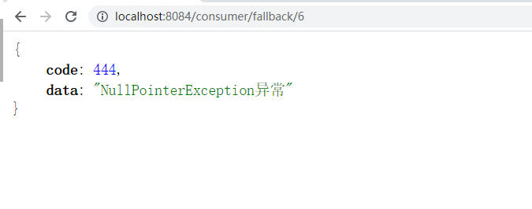

- 但是一旦触发熔断规则就变成了blockHandler来处理


#### exceptionsToIgnore属性

- `exceptionsToIgnore`（since 1.6.0）：用于指定哪些异常被排除掉，不会计入异常统计中，也不会进入 fallback 逻辑中，而是会原样抛出。

```java
@RestController
@Slf4j
public class DemoController {
    //服务提供者URL
    @Value("${service-url.nacos-user-service}")
    private String SERVICE_URL;

    @Autowired
    private RestTemplate restTemplate;

    @GetMapping("/consumer/fallback/{id}")
    //同时添加SentinelResource注解的fallback和blockHandler属性
    @SentinelResource(value = "falllback",fallback = "fallbackHandler",blockHandler = "blockHandler",
            exceptionsToIgnore = {NullPointerException.class})//被标注的异常将会被 原样抛出
    public JsonResult<String> fallback(@PathVariable Long id){
        if(id<=3){
            //通过Ribbon发起远程访问，访问9003/9004
            JsonResult<String> result = restTemplate.getForObject(SERVICE_URL+"/info/"+id,JsonResult.class);
            System.err.println(result.getData());
            return result;
        }else{
            throw new NullPointerException("没有对应的数据记录");
        }
    }
    //处理Java异常
    public JsonResult<String> fallbackHandler(Long id,Throwable e){
        JsonResult<String> result = new JsonResult<>(444,"NullPointerException异常");
        return result;
    }

    //处理Sentinel限流
    public JsonResult<String> blockHandler(Long id, BlockException e){
        JsonResult<String> result = new JsonResult<>(445,"BlockException限流");
        return result;
    }
}
```


### Sentinel持久化配置

 我们首先需要知道：在Sentinel Dashboard中配置规则之后重启应用就会丢失，所以实际生产环境中需要配置规则的持久化实现，Sentinel提供多种不同的数据源来持久化规则配置，包括file，redis、nacos、zk。


#### Sentinel规则持久化到Nacos

将限流规则持久化进Nacos保存，只要刷新8401某个接口地址，Sentinel控制台的流控规则就能感应到，同时只要Nacos里面的配置不删除，针对8401上Sentinel的流控规则就持续有效。


其实就是实现Sentinel Dashboard与Nacos之间的相互通信

通过Nacos配置文件修改流控规则---拉取--->Sentinel Dashboard界面显示最新的流控规则

**注意：**在Nacos控制台上修改流控制，虽然可以同步到Sentinel Dashboard，但是Nacos此时应该作为一个流控规则的持久化平台，所以正常操作过程应该是开发者在Sentinel Dashboard上修改流控规则后同步到Nacos，遗憾的是目前Sentinel Dashboard不支持该功能。

#### 具体操作

第一件事情我们首先要引入依赖：

```java
<dependency>
    <groupId>com.alibaba.csp</groupId>
    <artifactId>sentinel-datasource-nacos</artifactId>
    <version>1.8.1</version>
</dependency>
```

第二件事情我们需要配置YML

```java
# 端口号
server:
  port: 8890
# 服务名
spring:
  application:
    name: order
  cloud:
    nacos:
      discovery:
        # nacos注册中心地址
        server-addr: localhost:8848
    sentinel:
      transport:
        dashboard: localhost:8080
      datasource: # 配置Sentinel的持久化
        nacos:
          nacos:
            serverAddr: localhost:8848
            groupId: DEFAULT_GROUP
            dataId: order-sentinel.json
            ruleType: flow
  profiles:
    active: dev


```

第三步我们需要进入到Nacos控制台，添加配置

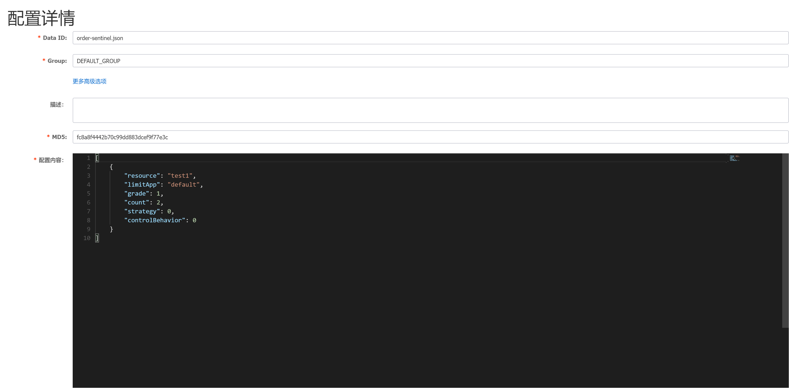

具体配置内容：

```java
[   
    {
        "resource": "test1",
        "limitApp": "default",
        "grade": 1,
        "count": 2,
        "strategy": 0,
        "controlBehavior": 0
        "clusterMode": false
    }
]
---------------具体内容含义-----------------
resource：资源名称；
limitApp：来源应用；
grade：阈值类型，0表示线程数，1表示QPS；
count：单机阈值；
strategy：流控模式，0表示直接，1表示关联，2表示链路；
controlBehavior：流控效果，0表示快速失败，1表示Warm Up，2表示排队等待；
clusterMode：是否集群。
```

控制器

```java
@RestController
public class OrderController {
    @GetMapping("/order/test1")
    @SentinelResource(value = "test1")
    public String test1() throws InterruptedException {
        return "test1 ";
    }
}
```


#### 测试

当我们重启项目以后，我们访问对应接口http://localhost:8890/order/test1，就会在Sentinel界面上看到对应的限流规则：

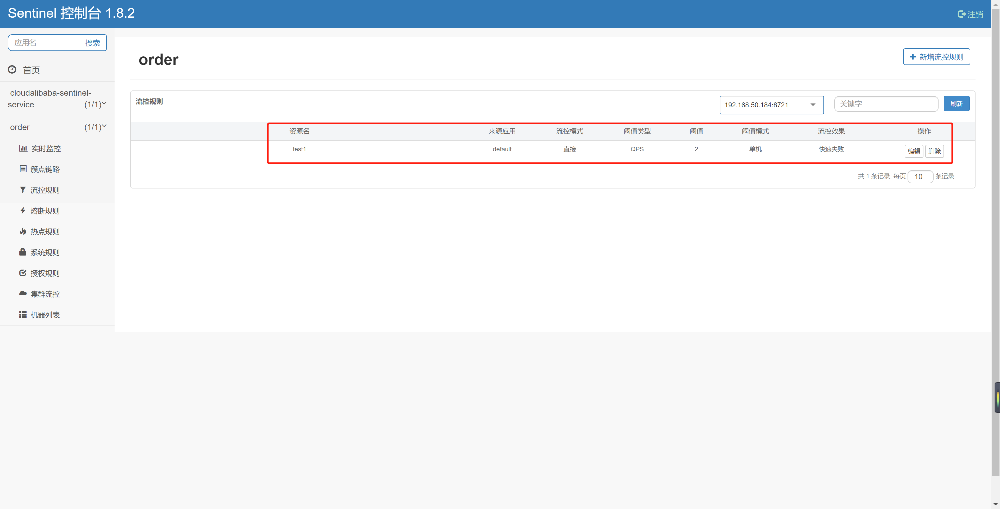


## OpenFeign

### 介绍

#### 概念

OpenFeign是一种声明式、模板化的HTTP客户端。在Spring Cloud中使用OpenFeign，可以做到使用HTTP请求访问远程服务，就像调用本地方法一样的，开发者完全感知不到这是在调用远程方法，更感知不到在访问HTTP请求，用法其实就是编写一个接口，在接口上添加注解即可。

可以简单理解它是借鉴Ribbon的基础之上，封装的一套服务接口+注解的方式的远程调用器。


#### 能干什么

它的宗旨是在编写Java Http客户端接口的时候变得更加容易，其底层整合了Ribbon，所以也支持负载均衡。

之前我们使用Ribbon的时候，利用RestTemplate对Http请求进行封装处理，但是在实际开发中，由于对服务依赖的调用不可能就一处，往往一个接口会被多处调用，所以通常都会针对每个微服务自行封装一些客户端类来包装这些依赖服务的调用。所以OpenFeign在此基础之上做了进一步的封装，由它来帮助我们定义和实现依赖服务接口的定义，我们只需创建一个接口并使用注解的方式来配置它，即可完成对微服务提供方的接口绑定，简化Ribbon的操作。


### 使用案例

 这里我们通过一个案例来演示，首先我们要明确使用OpenFeign是使用在消费者端去远程调用，就必须要是用FeignClient注解，来标注要调用的服务提供者名称，然后在通过一个接口来定义要调用的方法，所以我们首先新建一个Model：cloudalibaba-openFeign-consumer-8888


**pom**

注意：需要在父级和子级项目都引入对应依赖坐标

```java
<dependency>
    <groupId>org.springframework.cloud</groupId>
    <artifactId>spring-cloud-starter-openfeign</artifactId>
    <version>${openfeign-version}</version>
</dependency>
```

**YML配置**

```java
server:
  port: 8888
spring:
  application:
    name: nacos-consumer-openFeign
  cloud:
    nacos:
      discovery:
        server-addr: localhost:8848

management:
  endpoints:
    web:
      exposure:
        include: '*'
```

**主启动中添加注解**

```java
package com.sjj.mashibing.nacos;

@SpringBootApplication
@EnableDiscoveryClient//加此注解
@EnableFeignClients//添加此注解
public class FeignConsumer8888Application {

    public static void main(String[] args) {
        SpringApplication.run(FeignConsumer8888Application.class, args);
    }

}
```

**调用服务提供者对外提供接口**

这里要调用的是服务提供者8090/8091

```java
package com.sjj.mashibing.nacos.service;

import com.sjj.mashibing.entity.JsonResult;
import org.springframework.cloud.openfeign.FeignClient;
import org.springframework.stereotype.Service;
import org.springframework.web.bind.annotation.GetMapping;
import org.springframework.web.bind.annotation.PathVariable;

/**
 * OpenFeign的接口，
 * 在此接口中添加@FeignClient接口同时标注要调用的服务端名称，
 * 同时使用与服务提供者方法签名一致的抽象方法来表示远程调用的
 */
@Service
@FeignClient("nacos-provider")
public interface OpenFeignService {

    @GetMapping("info/{id}")
    public JsonResult<String> msbSql(@PathVariable("id") Long id);
}

```

**控制器**

```java
package com.sjj.mashibing.nacos.controller;

import com.sjj.mashibing.entity.JsonResult;
import com.sjj.mashibing.nacos.service.OpenFeignService;
import org.springframework.beans.factory.annotation.Autowired;
import org.springframework.web.bind.annotation.GetMapping;
import org.springframework.web.bind.annotation.PathVariable;
import org.springframework.web.bind.annotation.RestController;

@RestController
public class OpenFeignController {

    @Autowired
    private OpenFeignService openFeignService;

    @GetMapping("getInfo/{id}")
    public JsonResult<String> getInfo(@PathVariable("id") Long id){
        return openFeignService.msbSql(id);
    }

}
```


**测试结果**

启动nacos，2个服务端，还有这个feign的客户端。浏览器访问http://localhost:8888/getInfo/1。确认负载均衡效果


### 超时时间控制

#### 概念

OpenFeign 客户端默认等待1秒钟，但是如果服务端业务超过1秒，则会报错。为了避免这样的情况，我们需要设置feign客户端的超时控制。


#### 超时案例演示

首先演示超时效果，我们现在9003/9004上设置一个延迟3秒执行的方法，来模仿长业务线调用。

```java
@GetMapping("/timeOut")
public String timeOut() {
    try {
        System.out.println("延迟响应");
        TimeUnit.SECONDS.sleep(3);
    } catch (InterruptedException e) {
        e.printStackTrace();
    }
    return serverPort;
}
```

客户端8888通过OpenFeign来进行调用

```java
//OpenFeginController
@GetMapping("/testTimeout")
    public String TestTimeout(){
        return openFeginService.timeOut();
    }
}
```

**测试结果**

客户端报错：


#### 解决办法

由于OpenFeign 底层是ribbon 。所以超时控制由ribbon来控制。在yml文件中配置


**设置超时控制案例演示**

首先我们需要在8888消费者端的yml文件中配置超时时间，因为OpenFeign本身整合了Ribbon所以，这里其实我们用的是Ribbon来配置

**YML**

```yaml
server:
  port: 8888
spring:
  application:
    name: nacos-consumer-openfegin
  cloud:
    nacos:
      discovery:
        server-addr: localhost:8848

#设置feign客户端超时时间(OpenFeign默认支持ribbon)
ribbon:
  #指的是建立连接所用的时间，适用于网络状况正常的情况下,两端连接所用的时间
  ReadTimeout: 5000
  #指的是建立连接后从服务器读取到可用资源所用的时间
  ConnectTimeout: 5000

management:
  endpoints:
    web:
      exposure:
        include: '*'
```

**测试结果**

正常响应


### 日志打印

#### 概念

Feign 提供了日志打印功能，我们可以通过配置来调整日志级别，从而了解 Feign 中 Http 请求的细节。
简单理解，就是对Feign接口的调用情况进行监控和输出


**日志级别：**

- NONE：默认的，不显示任何日志；

- BASIC：仅记录请求方法、URL、响应状态码及执行时间；

- HEADERS：除了 BASIC 中定义的信息之外，还有请求和响应的头信息；

- FULL：除了 HEADERS 中定义的信息之外，还有请求和响应的正文及元数据。

#### 具体使用

需要在启动类中通过@Bean注解注入OpenFeign的日志功能

```java
@SpringBootApplication
@EnableFeignClients
public class CloudalibabaOpenFeginConsumer8888Application {

    public static void main(String[] args) {
        SpringApplication.run(CloudalibabaOpenFeginConsumer8888Application.class, args);
    }

    @Bean
    Logger.Level feignLoggerLevel(){
        //开启详细日志
        return Logger.Level.FULL;
    }
}

```

在yml中配置中配置

```yaml
server:
  port: 8888
spring:
  application:
    name: nacos-consumer-openfegin
  cloud:
    nacos:
      discovery:
        server-addr: localhost:8848

#设置feign客户端超时时间(OpenFeign默认支持ribbon)
ribbon:
  #指的是建立连接所用的时间，适用于网络状况正常的情况下,两端连接所用的时间
  ReadTimeout: 5000
  #指的是建立连接后从服务器读取到可用资源所用的时间
  ConnectTimeout: 5000

logging:
  level:
    # openfeign日志以什么级别监控哪个接口
    com.sjj.mashibing.nacos.service.OpenFeginService: debug

management:
  endpoints:
    web:
      exposure:
        include: '*'
```

测试效果，发起一次调用以后的日志内容：

```java
2023-04-20 22:45:21.942  INFO 11684 --- [nio-8888-exec-1] c.netflix.config.ChainedDynamicProperty  : Flipping property: nacos-provider.ribbon.ActiveConnectionsLimit to use NEXT property: niws.loadbalancer.availabilityFilteringRule.activeConnectionsLimit = 2147483647
2023-04-20 22:45:21.968  INFO 11684 --- [nio-8888-exec-1] c.netflix.loadbalancer.BaseLoadBalancer  : Client: nacos-provider instantiated a LoadBalancer: DynamicServerListLoadBalancer:{NFLoadBalancer:name=nacos-provider,current list of Servers=[],Load balancer stats=Zone stats: {},Server stats: []}ServerList:null
2023-04-20 22:45:21.974  INFO 11684 --- [nio-8888-exec-1] c.n.l.DynamicServerListLoadBalancer      : Using serverListUpdater PollingServerListUpdater
2023-04-20 22:45:21.997  INFO 11684 --- [nio-8888-exec-1] c.netflix.config.ChainedDynamicProperty  : Flipping property: nacos-provider.ribbon.ActiveConnectionsLimit to use NEXT property: niws.loadbalancer.availabilityFilteringRule.activeConnectionsLimit = 2147483647
2023-04-20 22:45:21.999  INFO 11684 --- [nio-8888-exec-1] c.n.l.DynamicServerListLoadBalancer      : DynamicServerListLoadBalancer for client nacos-provider initialized: DynamicServerListLoadBalancer:{NFLoadBalancer:name=nacos-provider,current list of Servers=[192.168.2.1:8090, 192.168.2.1:8091],Load balancer stats=Zone stats: {unknown=[Zone:unknown;	Instance count:2;	Active connections count: 0;	Circuit breaker tripped count: 0;	Active connections per server: 0.0;]
},Server stats: [[Server:192.168.2.1:8090;	Zone:UNKNOWN;	Total Requests:0;	Successive connection failure:0;	Total blackout seconds:0;	Last connection made:Thu Jan 01 08:00:00 CST 1970;	First connection made: Thu Jan 01 08:00:00 CST 1970;	Active Connections:0;	total failure count in last (1000) msecs:0;	average resp time:0.0;	90 percentile resp time:0.0;	95 percentile resp time:0.0;	min resp time:0.0;	max resp time:0.0;	stddev resp time:0.0]
, [Server:192.168.2.1:8091;	Zone:UNKNOWN;	Total Requests:0;	Successive connection failure:0;	Total blackout seconds:0;	Last connection made:Thu Jan 01 08:00:00 CST 1970;	First connection made: Thu Jan 01 08:00:00 CST 1970;	Active Connections:0;	total failure count in last (1000) msecs:0;	average resp time:0.0;	90 percentile resp time:0.0;	95 percentile resp time:0.0;	min resp time:0.0;	max resp time:0.0;	stddev resp time:0.0]
]}ServerList:com.alibaba.cloud.nacos.ribbon.NacosServerList@1a390ee3
2023-04-20 22:45:22.980  INFO 11684 --- [erListUpdater-0] c.netflix.config.ChainedDynamicProperty  : Flipping property: nacos-provider.ribbon.ActiveConnectionsLimit to use NEXT property: niws.loadbalancer.availabilityFilteringRule.activeConnectionsLimit = 2147483647
```


### 整合Sentinel

根据之前的学习，我们已经学习过了包括Sentinel整合Ribbon，包括对OpenFegin的基本学习，那么这节课，我们就需要通过Sentinel来进行整合OpenFegin

#### 引入OpenFegin

我们需要在当前的8084项目中引入对应的依赖

```java
<dependency>
    <groupId>org.springframework.cloud</groupId>
    <artifactId>spring-cloud-starter-openfeign</artifactId>
</dependency>
```

激活Sentinel对OpenFeign的支持，所以配置yml

```java
# 激活Sentinel对OpenFeign的支持
feign:
  sentinel:
    enabled: true
```

主启动类要添加@EnableFeignClients注解

```java
@SpringBootApplication
@EnableDiscoveryClient
@EnableFeignClients//注入Feign
public class CloudalibabaConsumer8084Application {

    public static void main(String[] args) {
        SpringApplication.run(CloudalibabaConsumer8084Application.class, args);
    }
    
    @Bean
    @LoadBalanced
    public RestTemplate getRestTemplate() {
        return new RestTemplate();
    }
}
```

#### OpenFegin接口编写

这里我们的接口写法和之前保持一致，但是要注意，我们这里要多增加一个FeignClient的属性：

- fallback: 定义容错的处理类，当调用远程接口失败或超时时，会调用对应接口的容错逻辑，fallback指定的类必须实现@FeignClient标记的接口

```java
//当没有成功调用/info/{id}接口时会走fallback属性标注的类型的处理方法
@Service
@FeignClient(value = "nacos-provider",fallback = FeignServiceImpl.class)
public interface FeignService {
    /**
     * 远程调用对应方法
     */
    @GetMapping("info/{id}")
    public JsonResult<String> msbSql(@PathVariable("id") Long id);
}
```

实现类必须添加@Component注解，否则无法注入到容器中

```java
@Component
public class FeignServiceImpl implements FeignService{
    @Override
    public JsonResult<String> msbSql(Long id) {
        return new JsonResult<>(444,"服务降级返回！");
    }
}
```

这里完成后我们来编写控制器

```java
@Autowired
private FeignService feignService;

@GetMapping("getInfo/{id}")
public JsonResult<String> getInfo(@PathVariable("id") Long id){
    if(id > 3){
        throw new RuntimeException("没有该id");
    }
    return feignService.msbSql(id);
}
```

#### 测试

此时如果我们访问http://localhost:8084/getInfo/1的地址，是没有问题的，但是如果此时我们人为结束9003/9004服务，这个时候就会触发fallback属性对应的处理类型，完成服务降级。


断开服务以后


## GateWay

### 网关介绍

在微服务架构中，一个系统会被拆分为很多个微服务。那么作为客户端要如何去调用这么多的微服务呢？如果没有网关的存在，我们只能在客户端记录每个微服务的地址，然后分别去调用。这样的话会产生很多问题，例如：

* 客户端多次请求不同的微服务，增加客户端代码或配置编写的复杂性
* 认证复杂，每个微服务都有独立认证
* 存在跨域请求，在一定场景下处理相对复杂

为解决上面的问题所以引入了网关的概念：所谓的API网关，就是指系统的统一入口，提供内部服务的路由中转，为客户端提供统一服务，一些与业务本身功能无关的公共逻辑可以在这里实现，诸如认证、鉴权、监控、路由转发等。


#### 网关对比

* Zuul 1.x
  Netflix开源的网关，基于Servlet框架构建，功能丰富，使用JAVA开发，易于二次开发 问题：即一个线程处理一次连接请求，这种方式在内部延迟严重、设备故障较多情况下会引起存活的连接增多和线程增加的情况发生。
* Zuul 2.x
  Zuul2 采用了Netty实现异步非阻塞编程模型，每个 CPU 核一个线程，处理所有的请求和响应，请求和响应的生命周期是通过事件和回调来处理的，这种方式减少了线程数量，因此开销较小。
* GateWay
  Spring公司为了替换Zuul而开发的网关服务，底层为Netty，将在下面具体介绍。
* Nginx+lua
  使用nginx的反向代理和负载均衡可实现对api服务器的负载均衡及高可用，lua是一种脚本语言，可以来编写一些简单的逻辑, nginx支持lua脚本，问题在于：无法融入到微服务架构中
* Kong
  基于Nginx+Lua开发，性能高，稳定，有多个可用的插件(限流、鉴权等等)可以开箱即用。 问题：只支持Http协议；二次开发，自由扩展困难；提供管理API，缺乏更易用的管控、配置方式。

**Gateway**

Spring Cloud Gateway 基于Spring Boot 2.x、Spring WebFlux和Project Reactor，它旨在为微服务架构提供一种简单有效的统一的 API 路由管理方式。它的目标是替代Netflix Zuul，其不仅提供统一的路由方式，并且基于 Filter 链的方式提供了网关基本的功能，例如：安全，监控和限流。

特点：

1. 性能强劲：是Zuul的1.6倍
2. 功能强大：内置了很多实用的功能，例如转发、监控、限流等
3. 设计优雅，容易扩展

**基本概念：**

路由(Route) 是 gateway 中最基本的组件之一，表示一个具体的路由信息载体。主要定义了下面的几个信息:

* id：路由标识、区别于其他route
* uri：路由指向的目的地uri，即客户端请求最终被转发到的微服务
* order：用于多个route之间的排序，数值越小排序越靠前，匹配优先级越高
* predicate：断言的作用是进行条件判断，只有断言都返回真，才会真正的执行路由
* filter：过滤器用于修改请求和响应信息

#### 执行流程：

1. Gateway Client向Gateway Server发送请求
2. 请求首先会被HttpWebHandlerAdapter进行提取组装成网关上下文
3. 然后网关的上下文会传递到DispatcherHandler，它负责将请求分发给RoutePredicateHandlerMapping
4. RoutePredicateHandlerMapping负责路由查找，并根据路由断言判断路由是否可用
5. 如果过断言成功，由FilteringWebHandler创建过滤器链并调用
6. 请求会一次经过PreFilter--微服务--PostFilter的方法，最终返回响应

#### 总结：

SpringCloud GateWay使用的是Webflux中的reactor-netty响应式编程组件，底层使用了Netty通讯框架。


### 工作流程&基础搭建

核心流程图如下：


**核心概念：**

客户端向 Spring Cloud Gateway 发出请求。如果Gateway Handler Mapping确定请求与路由匹配，则将其发送到Gateway Web Handler 处理程序。此处理程序通过特定于请求的Fliter链运行请求。Fliter被虚线分隔的原因是Fliter可以在发送代理请求之前（pre）和之后（post）运行逻辑。执行所有pre过滤器逻辑。然后进行代理请求。发出代理请求后，将运行“post”过滤器逻辑。

**过滤器作用：**

* Filter在pre类型的过滤器可以做参数效验、权限效验、流量监控、日志输出、协议转换等。
* Filter在post类型的过滤器可以做响应内容、响应头的修改、日志输出、流量监控等
* 这两种类型的过滤器有着非常重要的作用

在GateWay的内部有三个核心点，我们先来看一下：

#### 核心点

* Route（路由）
  路由是构建网关的基础模块，它由ID，目标URI，包括一些列的断言和过滤器组成，如果断言为true则匹配该路由
* Predicate（断言）
  参考的是Java8的java.util.function.Predicate，开发人员可以匹配HTTP请求中的所有内容（例如请求头或请求参数），请求与断言匹配则进行路由
* Filter（过滤）
  指的是Spring框架中GateWayFilter的实例，使用过滤器，可以在请求被路由前或者之后对请求进行修改。
* 三个核心点连起来：
  当用户发出请求到达GateWay，GateWay会通过一些匹配条件，定位到真正的服务节点，并在这个转发过程前后，进行一些及细化控制。其中Predicate就是我们匹配的条件，而Filter可以理解为一个过滤器，有了这两个点，再加上目标URI，就可以实现一个具体的路由了。

**总结**

GateWay核心的流程就是：路由转发+执行过滤器链

#### GateWay搭建

那么我们现在已经了解了整体的基础概念以后，我们现在来搭建一个GateWay项目：gateway-init-9999


因为GateWay属于SpringCloud的，所以我们要导入对应依赖，一定要注意版本关系：

版本对应地址：[https://spring.io/projects/spring-cloud](https://spring.io/projects/spring-cloud)

这里使用的是SpringBoot2.3.12的版本所以配合的是SpringCloud的Hoxton.SR12版本

**注意：引入GateWay一定要删除spring-boot-starter-web依赖，否则会有冲突无法启动**

父级项目引入

```xml
<!--spring cloud version: Hoxton.SR12-->
<dependency>
    <groupId>org.springframework.cloud</groupId>
    <artifactId>spring-cloud-dependencies</artifactId>
    <version>${spring-cloud-varsion}</version>
    <type>pom</type>
    <scope>import</scope>
</dependency>
```

子级项目，因为GateWay也需要注册进Nacos，所以也需要Nacos的依赖

```xml
    <dependencies>
        <dependency>
            <groupId>com.alibaba.cloud</groupId>
            <artifactId>spring-cloud-starter-alibaba-nacos-discovery</artifactId>
        </dependency>
        <dependency>
            <groupId>org.springframework.cloud</groupId>
            <artifactId>spring-cloud-starter-gateway</artifactId>
        </dependency>
    </dependencies>
```

接着配置YML文件

```yaml
server:
   port: 9999
spring:
   application:
     name: cloud-gateway-service
   cloud:
     nacos:
       discovery:
         server-addr: localhost:8848
     gateway:
       discovery:
         locator:
           enabled: true #开启注册中心路由功能
       routes:  # 路由
         - id: nacos-provider #路由ID，没有固定要求，但是要保证唯一，建议配合服务名
           uri: http://localhost:9001/nacos-provider # 匹配提供服务的路由地址
           predicates: # 断言
             - Path=/msb/** # 断言，路径相匹配进行路由
```

java

```java
@SpringBootApplication
@EnableDiscoveryClient
public class GatewayInit9999Application {

    public static void main(String[] args) {
        SpringApplication.run(GatewayInit9999Application.class, args);
    }

}
```


**9001项目配置**

pom.xml

```xml
    <dependencies>
        <dependency>
            <groupId>org.springframework.boot</groupId>
            <artifactId>spring-boot-starter-web</artifactId>
        </dependency>
        <dependency>
            <groupId>com.alibaba.cloud</groupId>
            <artifactId>spring-cloud-starter-alibaba-nacos-discovery</artifactId>
        </dependency>
    </dependencies>
```

application.yml

```yaml
server:
  port: 9001
spring:
  application:
    name: nacos-provider
  cloud:
    nacos:
      discovery:
        server-addr: localhost:8848
management:
  endpoint:
    web:
      exposure:
        include:'*'
```

java

```java
@RestController
@RequestMapping("/msb")
public class DemoController {

    @Value("${server.port}")
    private String serverPort;

    @GetMapping(value = "/get")
    public String getServerPort(){
        return "库存-1："+serverPort;
    }

}


@SpringBootApplication
@EnableDiscoveryClient
public class CloudalibabaNacos9001Application {

    public static void main(String[] args) {
        SpringApplication.run(CloudalibabaNacos9001Application.class, args);
    }

}
```

最后测试，启动Nacos、9001和9999网关，通过网关访问9001的/msb/get接口同时查看Nacos控制台


### 配置路由的两种方式

经过上节课的讲解，我们现在知道了GateWay的基本配置路由的方式，通过YML来完成，但是实际上GateWay还提供了另外一种配置方式

#### GatewayConfig

其实这种配置方式就是通过代码的方式进行配置，也就是通过@Bean注入一个RouteLocator

那我们直接来操作一下

**具体操作**

首先我们在新建一个GateWayConfig，其实这里的配置对应的就是我们之前在YML中配置的对应内容

```java
@Configuration
public class GateWayConfig {
    /**
     * 配置了一个id为path_msb1的路由规则
     * 当访问地址http://localhost:9999/msb/**
     * 就会转发到http://localhost:9001/nacos-provider/msb/任何地址
     */
    @Bean
    public RouteLocator customRouteLocator(RouteLocatorBuilder routeLocatorBuilder) {
        // 构建routes
        RouteLocatorBuilder.Builder routes = routeLocatorBuilder.routes();
        // 具体的路由地址
        routes.route("path_msb", r -> r.path("/msb/**").uri("http://localhost:9001/nacos-provider")).build();
        // 返回所有的理由规则
        return routes.build();
    }
}

    //在9001项目的DemoController中添加一个方法
    @GetMapping(value = "/custom")
    public String customTest() {
        return "网关配置测试~~costom";
    }
```

这个时候我们就可以测试了，启动9999网关服务和9001微服务，然后访问地址：[http://localhost:9999/msb/custom](http://localhost:9999/msb/custom) 就可以转发到9001中具体的接口中了


### 负载均衡实现

在之前的学习中，我们已经掌握了GateWay的一些基本配置，包括两种配置方法，我们现在的配置是写死的具体端口号，那么这节课，我们要实现通过GateWay实现负载均衡的两种方式

#### 自动负载均衡

首先我们看一下我们之前的网关服务9999的yml配置，这里的配置信息，其实有一些，咱们目前是不清楚的，比如：

1. gateway.discovery.locator.enabled: true #开启自动路由功能
2. routes中的uri其实最后是不需要服务名称的，这个位置其实只需要指定的localhost:9001即可

```yaml
server:
  port: 9999
spring:
  application:
    name: gateway-init-9999
  cloud:
    nacos:
      discovery:
        server-addr: localhost:8848
    gateway:
      discovery:
        locator:
          enabled: true #开启注册中心路由功能
      routes:  # 路由
        - id: nacos-provider #路由ID，没有固定要求，但是要保证唯一，建议配合服务名
          uri: http://localhost:9001/nacos-provider # 匹配提供服务的路由地址
          predicates: # 断言
            - Path=/msb/** # 断言，路径相匹配进行路由
```

所以这个位置我们可以把当前的配置优化为以下情况，它是一样可以启动的，我们可以进行测试启动9001和网关9999，通过网关来访问"localhost:9999/msb/get"

```yaml
server:
  port: 9999
spring:
  application:
    name: gateway-init-9999
  cloud:
    nacos:
      discovery:
        server-addr: localhost:8848
    gateway:
      discovery:
        locator:
          enabled: true #开启注册中心路由功能
      routes:  # 路由
        - id: nacos-provider #路由ID，没有固定要求，但是要保证唯一，建议配合服务名
          uri: http://localhost:9001 # 匹配提供服务的路由地址
          predicates: # 断言
            - Path=/msb/** # 断言，路径相匹配进行路由
```

GateWay还提供了和Zuul类似的自动路由规则，具体配置如下：

1. discovery.locator.enabled: true #这个配置默认为false，但是如果为true，就是开启了通过serviceId转发到具体的服务实例。“localhost:9999/ServiceID/msb/**”
2. 在配置好这些以后，我们可以直接通过服务名称来进行访问Nacos中注册的服务和对应的接口
3. 这个位置我们为了测试可以启动2个微服务9001、9002
4. GateWay在开启了自动路由以后，还自带负载均衡

```yaml
server:
  port: 9999
spring:
  application:
    name: cloud-gateway-service
  cloud:
    nacos:
      discovery:
        server-addr: localhost:8848
    gateway:
      discovery:
        locator:
          enabled: true #是否与服务发现组件进行结合，通过serviceId转发到具体的服务实例。默认为false，设为true便开启通过服务中心的自动根据 serviceId 创建路由的功能。
```

9002和9001保持一致，Controller保持不变，负载均衡测试

* 访问地址：
  * [http://localhost:9999/nacos-provider/msb/get](http://localhost:9999/nacos-provider/msb/get)


#### 手动负载均衡

在以上的配置中，其实是有问题的，问题在于当前的服务名称暴露，并且太过于灵活，那么如果想解决的话，其实我们可以进行手动配置。

具体配置如下：

```yaml
server:
  port: 9999
spring:
  application:
    name: gateway-LoadBalance-9999
  cloud:
    nacos:
      discovery:
        server-addr: localhost:8848
    gateway:
      discovery:
        locator:
          #是否与服务发现组件进行结合，通过serviceId转发到具体的服务实例。默认为false，设为true便开启通过服务中心的自动根据 serviceId 创建路由的功能。
          enabled: true #开启注册中心路由功能(关闭也可以)
      routes: # 手动配置路由后，自动功能会自动禁用。
        - id: nacos-provider #路由ID，没有固定要求，但是要保证唯一，建议配合服务名
          uri: lb://nacos-provider # 匹配提供服务的路由地址
          predicates: # 断言
            - Path=/msb/**
```

**测试**

我们现在开启9001/9002两个服务和9999网关服务，然后此时我们可以通过网关去访问：[http://localhost:9999/msb/get](http://localhost:9999/msb/get)


### 断言Predicate

这节课我们来研究一下GateWay的Predicate（断言）

每一个Predicate的使用，可以理解为：当满足条件后才会进行转发，如果是多个，那就是满足所有条件才会转发

#### 断言种类

1. After：匹配在指定日期时间之后发生的请求。
2. Before：匹配在指定日期之前发生的请求。
3. Between：需要指定两个日期参数，设定一个时间区间，匹配此时间区间内的请求。
4. Cookie：需要指定两个参数，分别为name和regexp（正则表达式），也可以理解Key和Value，匹配具有给定名称且其值与正则表达式匹配的Cookie。
5. Header：需要两个参数header和regexp（正则表达式），也可以理解为Key和Value，匹配请求携带信息。
6. Host：匹配当前请求是否来自于设置的主机。
7. Method：可以设置一个或多个参数，匹配HTTP请求，比如GET、POST
8. Path：匹配指定路径下的请求，可以是多个用逗号分隔
9. Query：需要指定一个或者多个参数，一个必须参数和一个可选的正则表达式，匹配请求中是否包含第一个参数，如果有两个参数，则匹配请求中第一个参数的值是否符合正则表达式。
10. RemoteAddr：匹配指定IP或IP段，符合条件转发。
11. Weight：需要两个参数group和weight（int），实现了路由权重功能，按照路由权重选择同一个分组中的路由

#### 常用断言演示

以上这么多的断言，我们不可能一一的去演示，我们挑出一些比较常用的来给大家做演示，这些具体的演示在官网上都有提供，具体地址为：[https://docs.spring.io/spring-cloud-gateway/docs/current/reference/html/#gateway-request-predicates-factories](https://docs.spring.io/spring-cloud-gateway/docs/current/reference/html/#gateway-request-predicates-factories)

##### After

匹配在指定时间之后发生的请求，可以对应提前上线业务

yml配置

```yaml
server:
  port: 9999
spring:
  application:
    name: cloud-gateway-service
  cloud:
    nacos:
      discovery:
        server-addr: localhost:8848
    gateway:
      discovery:
        locator:
          enabled: false # 是否与服务发现进行组合，通过ServiceID转发到具体的服务实例，默认为false，
                        # 设置为true便开启通过服务注册中心来自动根据SeviceID创建路由功能。
      routes:
        - id: nacos-provider # 路由ID，唯一不可重复，最好配合服务名
          uri: lb://nacos-provider # 匹配提供服务的路由地址 lb://代表开启负载均衡
          predicates: # 断言
            - Path=/msb/** # 匹配对应地址
            - After=2022-01-07T14:39:10.529+08:00[Asia/Shanghai] # 在这个时间之后的请求都能通过，当前没有为题以后，故意改为1个小时以后
```

写一个测试类，来获取当前时间

```java
public class TestDateTime {
    public static void main(String[] args) {
        ZonedDateTime zbj = ZonedDateTime.now();//默认时区
        System.out.println(zbj);
    }
}
```

测试：

当前时间之后请求没有问题


设置为1个小时会后访问404


当这个After理解了以后，剩下的关于日期时间的设置Before、Between道理都是一样的，只不过是限定不同的日期时间区间

##### Cookie

需要指定两个参数，分别为name和regexp（正则表达式），也可以理解Key和Value，匹配具有给定名称且其值与正则表达式匹配的Cookie。

简单理解就是路由规则会通过获取Cookie name值和正则表达式去匹配，如果匹配上就会执行路由，如果匹配不上则不执行。

我们可以分为两种情况演示，Cookie匹配，Cookie不匹配

yml

```yaml
server:
  port: 9999
spring:
  application:
    name: cloud-gateway-service
  cloud:
    nacos:
      discovery:
        server-addr: localhost:8848
    gateway:
      discovery:
        locator:
          enabled: false # 是否与服务发现进行组合，通过ServiceID转发到具体的服务实例，默认为false，
                        # 设置为true便开启通过服务注册中心来自动根据SeviceID创建路由功能。
      routes:
        - id: nacos-provider # 路由ID，唯一不可重复，最好配合服务名
          uri: lb://nacos-provider # 匹配提供服务的路由地址 lb://代表开启负载均衡
          predicates: # 断言
            - Path=/msb/** # 匹配对应地址
            - Cookie=username,[a-z]+ # 匹配Cookie的key和value（正则表达式）
```

那么我们通过apipost来进行测试

在顶部Cookie管理器中，添加域名：localhost，然后添加cookie：


返回值：


当Cookie不匹配时，会报404错误：


##### Header

需要两个参数header和regexp（正则表达式），也可以理解为Key和Value，匹配请求携带信息。

实际上就是请求头携带的信息，官网给出的案例是X-Request-Id，那我们就用这个做实验

yml

```yaml
server:
  port: 9999
spring:
  application:
    name: cloud-gateway-service
  cloud:
    nacos:
      discovery:
        server-addr: localhost:8848
    gateway:
      discovery:
        locator:
          enabled: false # 是否与服务发现进行组合，通过ServiceID转发到具体的服务实例，默认为false，
                        # 设置为true便开启通过服务注册中心来自动根据SeviceID创建路由功能。
      routes:
        - id: nacos-provider # 路由ID，唯一不可重复，最好配合服务名
          uri: lb://nacos-provider # 匹配提供服务的路由地址 lb://代表开启负载均衡
          predicates: # 断言
            - Path=/msb/** # 匹配对应地址
            - Header=X-Request-Id,\d+ #表示数字
```

测试


##### Host

匹配当前请求是否来自于设置的主机。

这个比较比较简单，我们直接来试验

yml

```yaml
server:
  port: 9999
spring:
  application:
    name: cloud-gateway-service
  cloud:
    nacos:
      discovery:
        server-addr: localhost:8848
    gateway:
      discovery:
        locator:
          enabled: false # 是否与服务发现进行组合，通过ServiceID转发到具体的服务实例，默认为false，
                        # 设置为true便开启通过服务注册中心来自动根据SeviceID创建路由功能。
      routes:
        - id: nacos-provider # 路由ID，唯一不可重复，最好配合服务名
          uri: lb://nacos-provider # 匹配提供服务的路由地址 lb://代表开启负载均衡
          predicates: # 断言
            - Path=/msb/** # 匹配对应地址
            - Host=**.mashibing.com #匹配当前的主机地址发出的请求
```

下图是postman，apipost也是在header中配置的。


##### Method

可以设置一个或多个参数，匹配HTTP请求，比如GET、POST

yml

```yaml
    gateway:
      discovery:
        locator:
          enabled: false # 是否与服务发现进行组合，通过ServiceID转发到具体的服务实例，默认为false，
                        # 设置为true便开启通过服务注册中心来自动根据SeviceID创建路由功能。
      routes:
        - id: nacos-provider # 路由ID，唯一不可重复，最好配合服务名
          uri: lb://nacos-provider # 匹配提供服务的路由地址 lb://代表开启负载均衡
          predicates: # 断言
            - Method=GET,POST # 匹配GET请求或者POST请求
```

##### Query

需要指定一个或者多个参数，一个必须参数和一个可选的正则表达式，匹配请求中是否包含第一个参数，如果有两个参数，则匹配请求中第一个参数的值是否符合正则表达式。

yml

```yaml
    gateway:
      discovery:
        locator:
          enabled: false # 是否与服务发现进行组合，通过ServiceID转发到具体的服务实例，默认为false，
                        # 设置为true便开启通过服务注册中心来自动根据SeviceID创建路由功能。
      routes:
        - id: nacos-provider # 路由ID，唯一不可重复，最好配合服务名
          uri: lb://nacos-provider # 匹配提供服务的路由地址 lb://代表开启负载均衡
          predicates: # 断言
            - Query=id,.+ # 匹配请求参数，这里如果需要匹配多个参数，可以写多个Query
```

测试：


##### Weight

需要两个参数group和weight（int），实现了路由权重功能，按照路由权重选择同一个分组中的路由

官网提供的演示yml

```yaml
spring:
  cloud:
    gateway:
      routes:
      - id: weight_high
        uri: https://weighthigh.org
        predicates:
        - Weight=group1, 8
      - id: weight_low
        uri: https://weightlow.org
        predicates:
        - Weight=group1, 2
```

该路由会将约 80% 的流量转发到[weighthigh.org](https://weighthigh.org/)，将约 20% 的流量[转发](https://weighlow.org/)到[weightlow.org](https://weighlow.org/)

#### 总结：

Predicate就是为了实现一组匹配规则，让请求过来找到对应的Route进行处理。


### 过滤器Filter

路由过滤器允许以某种方式修改传入的 HTTP 请求或传出的 HTTP 响应。路由过滤器的范围是特定的路由。Spring Cloud Gateway 包含许多内置的 GatewayFilter 工厂。


#### 内置Filter

1. GateWay内置的Filter生命周期为两种：pre（业务逻辑之前）、post（业务逻辑之后）
2. GateWay本身自带的Filter分为两种： GateWayFilter（单一）、GlobalFilter（全局）
3. 单一的有32种，全局的有9种
4. 官方网址：[https://docs.spring.io/spring-cloud-gateway/docs/current/reference/html/#global-filters](https://docs.spring.io/spring-cloud-gateway/docs/current/reference/html/#global-filters)

这个数量实在是太惊人了，而且用法都比较简单，所以这里大家可以自行根据官网给出的演示进行练习，在这里给大家举一个例子

##### StripPrefix

该StripPrefix有一个参数，parts。该parts参数指示在将请求发送到下游之前要从请求中剥离的路径中的部分数。

案例：比如我们现在在9001微服务上加一个context-path配置

```yaml
server:
  port: 9001
  servlet:
    context-path: /nacos-provider
.....
```

现在9001的访问路径变为[http://localhost:9001/nacos-provider/msb/get](http://localhost:9001/nacos-provider/msb/get)

目前的网关9999配置信息为

```yaml
server:
  port: 9999
spring:
  application:
    name: cloud-gateway-service
  cloud:
    nacos:
      discovery:
        server-addr: localhost:8848
    gateway:
      discovery:
        locator:
          enabled: false # 是否与服务发现进行组合，通过ServiceID转发到具体的服务实例，默认为false，
                        # 设置为true便开启通过服务注册中心来自动根据SeviceID创建路由功能。
      routes:
        - id: nacos-provider # 路由ID，唯一不可重复，最好配合服务名
          uri: lb://nacos-provider # 匹配提供服务的路由地址 lb://代表开启负载均衡
          predicates: # 断言
            - Path=/msb/** # 匹配对应地址
```

为了保证断言能够匹配，此时通过网关的访问地址应该改为：[http://localhost:9999/msb/nacos-provider/msb/get](http://localhost:9999/msb/nacos-provider/msb/get)，但是出现了404，因为多了一层路径[http://localhost:9001/msb/nacos-provider/msb/get](http://localhost:9001/msb/nacos-provider/msb/get)


那么如果想要解决，我们应该在转发的时候去地址中最前面的/msb，所以我们就需要使用FIlter：StripPrefix

yml

```yaml
server:
  port: 9999
spring:
  application:
    name: cloud-gateway-service
  cloud:
    nacos:
      discovery:
        server-addr: localhost:8848
    gateway:
      discovery:
        locator:
          enabled: false # 是否与服务发现进行组合，通过ServiceID转发到具体的服务实例，默认为false，
                        # 设置为true便开启通过服务注册中心来自动根据SeviceID创建路由功能。
      routes:
        - id: nacos-provider # 路由ID，唯一不可重复，最好配合服务名
          uri: lb://nacos-provider # 匹配提供服务的路由地址 lb://代表开启负载均衡
          predicates: # 断言
            - Path=/msb/** # 匹配对应地址
          filters:
            - StripPrefix=1 # 去掉地址中的第一部分
          # http://localhost:9999/msb/nacos-provider/msb/get
          # http://localhost:9999/nacos-provider/msb/get
```

最后我们来看效果，成功转发


#### 自定义Filter

要实现GateWay自定义过滤器，那么我们需要实现两个接口

* GlobalFilter
* Ordered

#### 演示

首先我们新建一个类MyFilter

```java
@Component
@Slf4j
public class MyFilter implements Ordered, GlobalFilter {
    /**
     * @param exchange 可以拿到对应的request和response
     * @param chain 过滤器链
     * @return 是否放行
     */
    @Override
    public Mono<Void> filter(ServerWebExchange exchange, GatewayFilterChain chain) {
        String username = exchange.getRequest().getQueryParams().getFirst("username");
        log.info("*************MyFilter:"+new Date());
        if(username == null){
            log.info("**********用户名为null，非法用户，请求被拒绝！");
            //如果username为空，返回状态码为406，不可接受的请求
            exchange.getResponse().setStatusCode(HttpStatus.NOT_ACCEPTABLE);
            return exchange.getResponse().setComplete();
        }
        return chain.filter(exchange);
    }

    /**
     * 加载过滤器的顺序
     * @return 数字越小优先级越高
     */
    @Override
    public int getOrder() {
        return 0;
    }
}

```

测试，此时我们的逻辑是在访问同时要传入username参数同时不能为空，否则不会放行本次请求。

传入正确参数：


未传入正确参数：


## Seata

### Seata简介

官网：https://seata.io/zh-cn/docs/overview/what-is-seata.html

概念：Seata 是一款开源的分布式事务解决方案，致力于提供高性能和简单易用的分布式事务服务。Seata 将为用户提供了 AT、TCC、SAGA 和 XA 事务模式，为用户打造一站式的分布式解决方案。


在我们的微服务系统中，对应业务被对应的拆分成独立模块，在官方提供的架构图中，我们可以看出当前是三个服务：

- 仓储服务：对给定的商品进行增删操作记录数量
- 订单服务：根据采购者的需求创建订单
- 账户服务：从用户账户中扣除余额、积分等

在这套架构中，用户下单购买商品的业务，就需要三个服务来完成，每个服务内部的数据一致性由本地事务来保证，但是全局的数据一致性问题就没办法保证，Seata就是来进行解决这种问题的解决方案。

### Seata概念

官网地址：https://seata.io/zh-cn/docs/overview/terminology.html

要了解Seata，首先我们要了解一下Seata的几个关键的概念：

- TC (Transaction Coordinator) - 事务协调者

  维护全局和分支事务的状态，驱动全局事务提交或回滚。

  

- TM (Transaction Manager) - 事务管理器（发起者，同时也是RM的一种）

  定义全局事务的范围：开始全局事务、提交或回滚全局事务。

  

- RM (Resource Manager) - 资源管理器（每个参与事务的微服务）

  管理分支事务处理的资源，与TC交谈以注册分支事务和报告分支事务的状态，并驱动分支事务提交或回滚。


### Server安装

#### Server下载

官方下载地址：https://github.com/seata/seata/releases


下载完成之后需要解压


#### Server配置

1. 需要打开conf目录


2. 先配置registry.conf配置文件，修改Seata的注册中心和配置中心为Nacos


```java
registry {
  # file 、nacos 、eureka、redis、zk、consul、etcd3、sofa
  type = "nacos"

  nacos {
    application = "seata-server"
    serverAddr = "127.0.0.1:8848"
    group = "SEATA_GROUP"
    namespace = ""
    cluster = "default"
    username = ""
    password = ""
  }
  eureka {
    serviceUrl = "http://localhost:8761/eureka"
    application = "default"
    weight = "1"
  }
  redis {
    serverAddr = "localhost:6379"
    db = 0
    password = ""
    cluster = "default"
    timeout = 0
  }
  zk {
    cluster = "default"
    serverAddr = "127.0.0.1:2181"
    sessionTimeout = 6000
    connectTimeout = 2000
    username = ""
    password = ""
  }
  consul {
    cluster = "default"
    serverAddr = "127.0.0.1:8500"
    aclToken = ""
  }
  etcd3 {
    cluster = "default"
    serverAddr = "http://localhost:2379"
  }
  sofa {
    serverAddr = "127.0.0.1:9603"
    application = "default"
    region = "DEFAULT_ZONE"
    datacenter = "DefaultDataCenter"
    cluster = "default"
    group = "SEATA_GROUP"
    addressWaitTime = "3000"
  }
  file {
    name = "file.conf"
  }
}

config {
  # file、nacos 、apollo、zk、consul、etcd3
  type = "nacos"

  nacos {
    serverAddr = "127.0.0.1:8848"
    namespace = ""
    group = "SEATA_GROUP"
    username = ""
    password = ""
    dataId = "seataServer.properties"
  }
  consul {
    serverAddr = "127.0.0.1:8500"
    aclToken = ""
  }
  apollo {
    appId = "seata-server"
    # apolloConfigService will cover apolloMeta
    apolloMeta = "http://192.168.1.204:8801"
    apolloConfigService = "http://192.168.1.204:8080"
    namespace = "application"
    apolloAccesskeySecret = ""
    cluster = "seata"
  }
  zk {
    serverAddr = "127.0.0.1:2181"
    sessionTimeout = 6000
    connectTimeout = 2000
    username = ""
    password = ""
    nodePath = "/seata/seata.properties"
  }
  etcd3 {
    serverAddr = "http://localhost:2379"
  }
  file {
    name = "file.conf"
  }
}
```

3. 接着我们需要修改Seata的存储模式，修改file.conf文件，把Seata的默认存储模式修改为数据库"DB"，同时需要配置JDBC


```java
# transaction log store, only used in seata-server
store {
  # store mode: file、db、redis
  mode = "db"
  # rsa decryption public key
  publicKey = ""
  # file store property
  file {
    # store location dir
    dir = "sessionStore"
    # branch session size , if exceeded first try compress lockkey, still exceeded throws exceptions
    maxBranchSessionSize = 16384
    # globe session size , if exceeded throws exceptions
    maxGlobalSessionSize = 512
    # file buffer size , if exceeded allocate new buffer
    fileWriteBufferCacheSize = 16384
    # when recover batch read size
    sessionReloadReadSize = 100
    # async, sync
    flushDiskMode = async
  }

  # database store property
  db {
    # the implement of javax.sql.DataSource, such as DruidDataSource(druid)/BasicDataSource(dbcp)/HikariDataSource(hikari) etc.
    datasource = "druid"
    # mysql/oracle/postgresql/h2/oceanbase etc.
    dbType = "mysql"
    driverClassName = "com.mysql.jdbc.Driver"
    # if using mysql to store the data, recommend add rewriteBatchedStatements=true in jdbc connection param
    url = "jdbc:mysql://localhost:3306/seata?useUnicode=true&characterEncoding=UTF-8"
    user = "root"
    password = "root"
    minConn = 5
    maxConn = 100
    globalTable = "global_table"
    branchTable = "branch_table"
    lockTable = "lock_table"
    queryLimit = 100
    maxWait = 5000
  }

  # redis store property
  redis {
    # redis mode: single、sentinel
    mode = "single"
    # single mode property
    single {
      host = "127.0.0.1"
      port = "6379"
    }
    # sentinel mode property
    sentinel {
      masterName = ""
      # such as "10.28.235.65:26379,10.28.235.65:26380,10.28.235.65:26381"
      sentinelHosts = ""
    }
    password = ""
    database = "0"
    minConn = 1
    maxConn = 10
    maxTotal = 100
    queryLimit = 100
  }
}

```

**启动**

启动步骤为，先启动nacos然后在启动Seata-Server

启动Seata-Server的方式非常简单，直接双击此文件即可:seata-server-1.4.2\bin\seata-server.bat


启动完成效果


然后在nacos控制台上就可以看到Seata-Server


#### 存储模式

Server端存储模式（store.mode）支持三种：

1. file：单机模式，全局事务会话信息内存中读写并持久化本地文件root.data，性能较高（默认）
2. DB：高可用模式，全局事务会话信息通过DB共享，相对性能差一些
3. redis：Seata-Server1.3及以上版本支持，性能较高，存在事务信息丢失风险，需要配合实际场景使用。

**具体操作**

1. 修改Seata-Server模式为DB高可用模式


找到以下对应的db配置，要修改其中的jdbc连接，以及要注意其中涉及到了三个表，分别是global_table，branch_table，lock_table分别是全局事务会话表，分支事务会话表，锁数据表；


2. 建表语句地址：https://github.com/seata/seata/blob/develop/script/server/db/mysql.sql

```java
-- the table to store GlobalSession data
CREATE TABLE IF NOT EXISTS `global_table`
(
    `xid`                       VARCHAR(128) NOT NULL,
    `transaction_id`            BIGINT,
    `status`                    TINYINT      NOT NULL,
    `application_id`            VARCHAR(32),
    `transaction_service_group` VARCHAR(32),
    `transaction_name`          VARCHAR(128),
    `timeout`                   INT,
    `begin_time`                BIGINT,
    `application_data`          VARCHAR(2000),
    `gmt_create`                DATETIME,
    `gmt_modified`              DATETIME,
    PRIMARY KEY (`xid`),
    KEY `idx_gmt_modified_status` (`gmt_modified`, `status`),
    KEY `idx_transaction_id` (`transaction_id`)
) ENGINE = InnoDB
  DEFAULT CHARSET = utf8;

-- the table to store BranchSession data
CREATE TABLE IF NOT EXISTS `branch_table`
(
    `branch_id`         BIGINT       NOT NULL,
    `xid`               VARCHAR(128) NOT NULL,
    `transaction_id`    BIGINT,
    `resource_group_id` VARCHAR(32),
    `resource_id`       VARCHAR(256),
    `branch_type`       VARCHAR(8),
    `status`            TINYINT,
    `client_id`         VARCHAR(64),
    `application_data`  VARCHAR(2000),
    `gmt_create`        DATETIME(6),
    `gmt_modified`      DATETIME(6),
    PRIMARY KEY (`branch_id`),
    KEY `idx_xid` (`xid`)
) ENGINE = InnoDB
  DEFAULT CHARSET = utf8;

-- the table to store lock data
CREATE TABLE IF NOT EXISTS `lock_table`
(
    `row_key`        VARCHAR(128) NOT NULL,
    `xid`            VARCHAR(128),
    `transaction_id` BIGINT,
    `branch_id`      BIGINT       NOT NULL,
    `resource_id`    VARCHAR(256),
    `table_name`     VARCHAR(32),
    `pk`             VARCHAR(36),
    `status`         TINYINT      NOT NULL DEFAULT '0' COMMENT '0:locked ,1:rollbacking',
    `gmt_create`     DATETIME,
    `gmt_modified`   DATETIME,
    PRIMARY KEY (`row_key`),
    KEY `idx_status` (`status`),
    KEY `idx_branch_id` (`branch_id`)
) ENGINE = InnoDB
  DEFAULT CHARSET = utf8;
```

3. 重启Seata即可生效。


### 集成Nacos

Seata支持注册服务到Nacos，以及支持Seata所有配置放到Nacos配置中心，在Nacos中统一维护；

高可用模式下就需要配合Nacos来完成


具体配置如下

#### 注册中心

Seata-server端配置注册中心，在registry.conf中加入配置注册中心nacos

**注意：确保client与server的注册处于同一个namespace和group，不然会找不到服务。**

```java
registry {
  # file 、nacos 、eureka、redis、zk、consul、etcd3、sofa
  type = "nacos"

  nacos {
    application = "seata-server"
    serverAddr = "127.0.0.1:8848"
    group = "SEATA_GROUP" # 这里的配置要和客户端保持一致
    namespace = "" # 这里的配置要和客户端保持一致
    cluster = "default"
    username = "nacos"
    password = "nacos"
  }
    ......
```

#### 配置中心

1. Seata-Server配置中心，在registry.conf中加入配置使用nacos作为配置中心

```java
config {
  # file、nacos 、apollo、zk、consul、etcd3
  type = "nacos"

  nacos {
    serverAddr = "127.0.0.1:8848"
    namespace = ""
    group = "SEATA_GROUP"
    username = ""
    password = ""
    dataId = "seataServer.properties"
  }
............
```

2. 我们需要把Seata的一些配置上传到Nacos中，配置比较多，所以官方给我们提供了一个config.txt，我们下载并且修改其中参数，上传到Nacos中

   下载地址：https://github.com/seata/seata/tree/develop/script/config-center

3. 具体修改：

   **注意：**事务分组：用于防护机房停电，来启用备用机房，或者异地机房，容错机制，当然如果Seata-Server配置了对应的事务分组，Client也需要配置相同的事务分组

   ```java
   service.vgroupMapping.可以自定义=default
   default这里必须等于 registry.config 中的cluster="default"(当然可以更改 )
   ```

```properties
transport.type=TCP
transport.server=NIO
transport.heartbeat=true
transport.enableTmClientBatchSendRequest=false
transport.enableRmClientBatchSendRequest=true
transport.rpcRmRequestTimeout=5000
transport.rpcTmRequestTimeout=10000
transport.rpcTcRequestTimeout=10000
transport.threadFactory.bossThreadPrefix=NettyBoss
transport.threadFactory.workerThreadPrefix=NettyServerNIOWorker
transport.threadFactory.serverExecutorThreadPrefix=NettyServerBizHandler
transport.threadFactory.shareBossWorker=false
transport.threadFactory.clientSelectorThreadPrefix=NettyClientSelector
transport.threadFactory.clientSelectorThreadSize=1
transport.threadFactory.clientWorkerThreadPrefix=NettyClientWorkerThread
transport.threadFactory.bossThreadSize=1
transport.threadFactory.workerThreadSize=default
#-------------修改这个区域的映射--------------    
transport.shutdown.wait=3
service.vgroupMapping.mygroup=default # 事务分组
service.default.grouplist=127.0.0.1:8091
service.enableDegrade=false
service.disableGlobalTransaction=false
#------------------------------------------    
client.rm.asyncCommitBufferLimit=10000
client.rm.lock.retryInterval=10
client.rm.lock.retryTimes=30
client.rm.lock.retryPolicyBranchRollbackOnConflict=true
client.rm.reportRetryCount=5
client.rm.tableMetaCheckEnable=false
client.rm.tableMetaCheckerInterval=60000
client.rm.sqlParserType=druid
client.rm.reportSuccessEnable=false
client.rm.sagaBranchRegisterEnable=false
client.rm.sagaJsonParser=fastjson
client.rm.tccActionInterceptorOrder=-2147482648
client.tm.commitRetryCount=5
client.tm.rollbackRetryCount=5
client.tm.defaultGlobalTransactionTimeout=60000
client.tm.degradeCheck=false
client.tm.degradeCheckAllowTimes=10
client.tm.degradeCheckPeriod=2000
client.tm.interceptorOrder=-2147482648
# 修改
store.mode=db
store.lock.mode=file
store.session.mode=file
store.publicKey=
store.file.dir=file_store/data
store.file.maxBranchSessionSize=16384
store.file.maxGlobalSessionSize=512
store.file.fileWriteBufferCacheSize=16384
store.file.flushDiskMode=async
store.file.sessionReloadReadSize=100
#-----------修改这个区域的JDBC连接-----------    
store.db.datasource=druid
store.db.dbType=mysql
store.db.driverClassName=com.mysql.jdbc.Driver
store.db.url=jdbc:mysql://127.0.0.1:3306/seata?useUnicode=true&rewriteBatchedStatements=true
store.db.user=root
store.db.password=root
store.db.minConn=5
store.db.maxConn=30
#------------------------------------------    
store.db.globalTable=global_table
store.db.branchTable=branch_table
store.db.distributedLockTable=distributed_lock
store.db.queryLimit=100
store.db.lockTable=lock_table
store.db.maxWait=5000
store.redis.mode=single
store.redis.single.host=127.0.0.1
store.redis.single.port=6379
store.redis.sentinel.masterName=
store.redis.sentinel.sentinelHosts=
store.redis.maxConn=10
store.redis.minConn=1
store.redis.maxTotal=100
store.redis.database=0
store.redis.password=
store.redis.queryLimit=100
server.recovery.committingRetryPeriod=1000
server.recovery.asynCommittingRetryPeriod=1000
server.recovery.rollbackingRetryPeriod=1000
server.recovery.timeoutRetryPeriod=1000
server.maxCommitRetryTimeout=-1
server.maxRollbackRetryTimeout=-1
server.rollbackRetryTimeoutUnlockEnable=false
server.distributedLockExpireTime=10000
client.undo.dataValidation=true
client.undo.logSerialization=jackson
client.undo.onlyCareUpdateColumns=true
server.undo.logSaveDays=7
server.undo.logDeletePeriod=86400000
client.undo.logTable=undo_log
client.undo.compress.enable=true
client.undo.compress.type=zip
client.undo.compress.threshold=64k
log.exceptionRate=100
transport.serialization=seata
transport.compressor=none
metrics.enabled=false
metrics.registryType=compact
metrics.exporterList=prometheus
metrics.exporterPrometheusPort=9898
tcc.fence.logTableName=tcc_fence_log
tcc.fence.cleanPeriod=1h
```

4. 修改好这个文件以后，我们就需要把这个文件放到seata目录下


5. 此时我们需要把这些配置一个个的加入到Nacos配置中，所以我们需要一个脚本来进行执行，官方已经提供好了，地址为：https://github.com/seata/seata/blob/develop/script/config-center/nacos/nacos-config.sh

6. 我们需要在seata-server-1.4.2文件夹中新建一个脚本文件nacos-config.sh，然后把脚本内容复制进去


7. 利用git来进行执行命令：

```java
sh nacos-config.sh -h localhost -p 8848 -g SEATA_GROUP -t 命名空间 -u nacos -w nacos
```

参数说明：

-h：host，默认值localhost

-p：port，默认值8848

-g：配置分组，默认为SEATA_GROUP

-t：租户信息，对应Nacos的命名空间ID，默认为空


8. 在执行naocs-config文件的时候要注意，它默认寻找config.txt的路径和我们的路径不同，所以要打开naocs-config文件进行修改，否则无法执行。


 #### 测试启动

当以上的这些配置完成以后，我们就可以启动nacos和seata-server了，此时我们查看Nacos的配置中心，就会看到我们传入的所有配置信息


#### 附加

各位我们Seata-Server默认端口是8091，那么如果我们是集群部署方式，我们如何修改端口那？

在 Linux/Mac 下

```bash
$ sh ./bin/seata-server.sh
```

在 Windows 下

```cmd
bin\seata-server.bat
```

#### 支持的启动参数

| 参数 | 全写         | 作用                       | 备注                                                         |
| :--- | :----------- | :------------------------- | :----------------------------------------------------------- |
| -h   | --host       | 指定在注册中心注册的 IP    | 不指定时获取当前的 IP，外部访问部署在云环境和容器中的 server 建议指定 |
| -p   | --port       | 指定 server 启动的端口     | 默认为 8091                                                  |
| -m   | --storeMode  | 事务日志存储方式           | 支持`file`,`db`,`redis`，默认为 `file` 注:redis需seata-server 1.3版本及以上 |
| -n   | --serverNode | 用于指定seata-server节点ID | 如 `1`,`2`,`3`..., 默认为 `1`                                |
| -e   | --seataEnv   | 指定 seata-server 运行环境 | 如 `dev`, `test` 等, 服务启动时会使用 `registry-dev.conf` 这样的配置 |

如：

```bash
$ sh ./bin/seata-server.sh -p 8091 -h 127.0.0.1 -m file
```


### AT模式

AT 模式是一种无侵入的分布式事务解决方案。在 AT 模式下，用户只需关注自己的“业务 SQL”，用户的 “业务 SQL” 作为一阶段，Seata 框架会自动生成事务的二阶段提交和回滚操作。


**模式原理**

在介绍AT 模式的时候它是无侵入的分布式事务解决方案, 那么如何做到对业务的无侵入的呢?

一阶段：

在一阶段，Seata 会拦截“业务 SQL”，首先解析 SQL 语义，找到“业务 SQL”要更新的业务数据，在业务数据被更新前，将其保存成“before image”，然后执行“业务 SQL”更新业务数据，在业务数据更新之后，再将其保存成“after image”，最后生成行锁。以上操作全部在一个数据库事务内完成，这样保证了一阶段操作的原子性。


二阶段：

提交：二阶段如果是提交的话，因为“业务 SQL”在一阶段已经提交支数据库， 所以 Seata 框架只需将一阶段保存的快照数据和行锁删掉，完成数据清理即可。


回滚：二阶段如果是回滚的话，Seata 就需要回滚一阶段已经执行的“业务 SQL”，还原业务数据。回滚方式便是用“before image”还原业务数据；但在还原前要首先要校验脏写，对比“数据库当前业务数据”和 “after image”，如果两份数据完全⼀致就说明没有脏写，可以还原业务数据，如果不一致就说明有脏写，出现脏写就需要转人工处理。


AT 模式的一阶段、二阶段提交和回滚均由 Seata 框架自动生成，用户只需编写“业务SQL”，便能轻松接入分布式事务，AT 模式是一种对业务无任何侵入的分布式事务解决方案。 


#### 案例

1. 首先设计两个服务，一个订单order8801 一个库存stock8802

2. stock库存表为：

   

3. order订单表为：

   

4. 订单服务通过OpenFegin远程调用库存服务，然后库存服务减库存，订单服务生成订单，完成基本的调用以后我们给订单服务添加异常

```java
@Service
public class OrderServiceImpl implements OrderService {
    @Resource
    private OrderMapper orderMapper;

    @Resource
    private StockClient stockClient;

    @Override
    public void create() {
        // 减库存
        stockClient.decrement();

        // 添加异常
        int i = 1/0;

        // 创建订单
        orderMapper.create();
    }
}
```

5. 此时我们会发现访问接口出现异常情况，但是库存减少，订单没有增加此时已经出现了分布式事务的问题


订单表，没有增加数据


#### 通过AT模式解决分布式事务

1. 首先增加对应的Seata依赖

```xml
<dependency>
    <groupId>com.alibaba.cloud</groupId>
    <artifactId>spring-cloud-starter-alibaba-seata</artifactId>
</dependency>
```

2. 在对应的微服务数据库上加上undo_log表，此表用于数据的回滚

```java
CREATE TABLE `undo_log` (
  `id` bigint(20) NOT NULL AUTO_INCREMENT,
  `branch_id` bigint(20) NOT NULL,
  `xid` varchar(100) NOT NULL,
  `context` varchar(128) NOT NULL,
  `rollback_info` longblob NOT NULL,
  `log_status` int(11) NOT NULL,
  `log_created` datetime NOT NULL,
  `log_modified` datetime NOT NULL,
  `ext` varchar(100) DEFAULT NULL,
  PRIMARY KEY (`id`),
  UNIQUE KEY `ux_undo_log` (`xid`,`branch_id`)
) ENGINE=InnoDB AUTO_INCREMENT=1 DEFAULT CHARSET=utf8;
```


3. 配置yml（8801和8802Seata的配置保持一致）

```java
server:
  port: 8801
spring:
  application:
    name: seata-order
  cloud:
    nacos:
      discovery:
        server-addr: localhost:8848
    alibaba:
      seata:
        tx-service-group: mygroup   # 事务组, 随便写
  datasource:
    driver-class-name: com.mysql.jdbc.Driver
    url: jdbc:mysql://localhost:3306/test_at?characterEncoding=utf8&useSSL=false&serverTimezone=Asia/Shanghai&rewriteBatchedStatements=true
    username: root
    password: root
    type: com.alibaba.druid.pool.DruidDataSource

seata:
  tx-service-group: mygroup # 事务组名称，要和服务端对应
  service:
    vgroup-mapping:
      mygroup: default # key是事务组名称 value要和服务端的机房名称保持一致

```

4. 需要在order8801(TM)的Controller上添加注解

```java
@RestController
public class OrderController {
    @Autowired
    private OrderService orderService;

    @GetMapping("/order/create")
    @GlobalTransactional// 开启分布式事务
    public String create(){
        orderService.create();
        return "生成订单";
    }
}
```

5. 把8801和8802都跑起来，当然Nacos和Seata都要进行启动，这个时候我们进行访问Order的REST接口：http://localhost:8801/order/create，我们就会发现此时已经解决了分布式事务问题

   库存没有减少

   订单也没有增加


6. 那么为了验证undo_log表用于存储回滚的数据，我们在OrderServiceImpl上异常位置添加断点，同时以debug方式来启动8801订单服务

```java
@Service
public class OrderServiceImpl implements OrderService {
    @Resource
    private OrderMapper orderMapper;

    @Resource
    private StockClient stockClient;

    @Override
    public void create() {
        // 减库存
        stockClient.decrement();

        // 添加异常
        int i = 1/0;// 此处添加断点

        // 创建订单
        orderMapper.create();
    }
}
```

7. 然后访问接口：http://localhost:8801/order/create，程序会卡在断点上，此时我们来查看undo_log表和库存表，此时我们会发现，库存确实减少了，但是在undo_log表中出现了快照记录了当前修改前的数据，这个数据就是用于回滚的数据

   库存减少


​		undo_log表记录快照

 

​		放行以后，库存数量回复，回滚生效


8. 此时我们就验证了AT事务的执行过程。


### XA模式

Seata 1.2.0 版本重磅发布新的事务模式：XA 模式，实现对 XA 协议的支持。

我们从三个方面来深入分析：

1. XA模式是什么？
2. 为什么支持XA？
3. XA模式如何实现的，以及如何使用？

#### 什么是XA

首先我们需要先了解一下什么是XA？

XA 规范早在上世纪 90 年代初就被提出，用以解决分布式事务处理这个领域的问题。

注意：不存在某一种分布式事务机制可以完美适应所有场景，满足所有需求。

现在，无论 AT 模式、TCC 模式还是 Saga 模式，这些模式的提出，本质上都源自 XA 规范对某些场景需求的无法满足。

**DTP**

XA 规范 是 X/Open 组织定义的分布式事务处理（DTP，Distributed Transaction Processing）标准

XA 规范 描述了全局的事务管理器与局部的资源管理器之间的接口。 XA规范 的目的是允许的多个资源（如数据库，应用服务器，消息队列等）在同一事务中访问，这样可以使 ACID 属性跨越应用程序而保持有效。

XA 规范 使用两阶段提交（2PC，Two-Phase Commit）来保证所有资源同时提交或回滚任何特定的事务。

XA 规范 在上世纪 90 年代初就被提出。目前，几乎所有主流的数据库都对 XA 规范 提供了支持。

DTP模型定义如下角色：

- AP：即应用程序，可以理解为使用DTP分布式事务的程序
- RM：资源管理器，可以理解为事务的参与者，一般情况下是指一个数据库的实例（MySql），通过资源管理器对该数据库进行控制，资源管理器控制着分支事务
- TM：事务管理器，负责协调和管理事务，事务管理器控制着全局事务，管理实务生命周期，并协调各个RM。全局事务是指分布式事务处理环境中，需要操作多个数据库共同完成一个工作，这个工作即是一个全局事务。
- DTP模式定义TM和RM之间通讯的接口规范叫XA，简单理解为数据库提供的2PC接口协议，基于数据库的XA协议来实现的2PC又称为XA方案。


**案例解释**

1. 应用程序（AP）持有订单库和商品库两个数据源。
2. 应用程序（AP）通过TM通知订单库（RM）和商品库（RM），来创建订单和减库存，RM此时未提交事务，此时商品和订单资源锁定。
3. TM收到执行回复，只要有一方失败则分别向其他RM发送回滚事务，回滚完毕，资源锁释放。
4. TM收到执行回复，全部成功，此时向所有的RM发起提交事务，提交完毕，资源锁释放。


#### XA协议的痛点

如果一个参与全局事务的资源 “失联” 了（收不到分支事务结束的命令），那么它锁定的数据，将一直被锁定。进而，甚至可能因此产生死锁。

这是 XA 协议的核心痛点，也是 Seata 引入 XA 模式要重点解决的问题。

#### Seata的事务模式

Seata 定义了全局事务的框架。

全局事务 定义为若干 分支事务 的整体协调：

1. TM 向 TC 请求发起（Begin）、提交（Commit）、回滚（Rollback）全局事务。
2. TM 把代表全局事务的 XID 绑定到分支事务上。
3. RM 向 TC 注册，把分支事务关联到 XID 代表的全局事务中。
4. RM 把分支事务的执行结果上报给 TC。（可选）
5. TC 发送分支提交（Branch Commit）或分支回滚（Branch Rollback）命令给 RM。


Seata 的 全局事务 处理过程，分为两个阶段：

- 执行阶段 ：执行分支事务，并保证执行结果满足是 *可回滚的（Rollbackable）* 和 *持久化的（Durable）*。
- 完成阶段： 根据 执行阶段 结果形成的决议，应用通过 TM 发出的全局提交或回滚的请求给 TC，TC 命令 RM 驱动 分支事务 进行 Commit 或 Rollback。

Seata 的所谓事务模式是指：运行在 Seata 全局事务框架下的 分支事务 的行为模式。准确地讲，应该叫作 分支事务模式。

不同的 事务模式 区别在于 分支事务 使用不同的方式达到全局事务两个阶段的目标。即，回答以下两个问题：

- 执行阶段 ：如何执行并 保证 执行结果满足是 *可回滚的（Rollbackable）* 和 *持久化的（Durable）*。
  - 完成阶段： 收到 TC 的命令后，如何做到分支的提交或回滚？

我们以AT模式举例：


- 执行阶段：
  - 可回滚：根据 SQL 解析结果，记录回滚日志
  - 持久化：回滚日志和业务 SQL 在同一个本地事务中提交到数据库
- 完成阶段：
  - 分支提交：异步删除回滚日志记录
  - 分支回滚：依据回滚日志进行反向补偿更新

#### Seata的XA模式

XA模式：

在 Seata 定义的分布式事务框架内，利用事务资源（数据库、消息服务等）对 XA 协议的支持，以 XA 协议的机制来管理分支事务的一种 事务模式。


- 执行阶段：
  - 可回滚：业务 SQL 操作放在 XA 分支中进行，由资源对 XA 协议的支持来保证 可回滚
  - 持久化：XA 分支完成后，执行 XA prepare，同样，由资源对 XA 协议的支持来保证 *持久化*（即，之后任何意外都不会造成无法回滚的情况）
- 完成阶段：
  - 分支提交：执行 XA 分支的 commit
  - 分支回滚：执行 XA 分支的 rollback

#### 为什么要在Seata中支持XA

为什么要在 Seata 中增加 XA 模式呢？支持 XA 的意义在哪里呢？

本质上，Seata 已经支持的 3 大事务模式：AT、TCC、Saga 都是 补偿型 的。

补偿型 事务处理机制构建在 事务资源 之上（要么在中间件层面，要么在应用层面），事务资源 本身对分布式事务是无感知的。

事务资源 对分布式事务的无感知存在一个根本性的问题：无法做到真正的 全局一致性 。

比如，一条库存记录，处在 补偿型 事务处理过程中，由 100 扣减为 50。此时，仓库管理员连接数据库，查询统计库存，就看到当前的 50。之后，事务因为异外回滚，库存会被补偿回滚为 100。显然，仓库管理员查询统计到的 50 就是 脏 数据。所以补偿型事务是存在中间状态的（中途可能读到脏数据）

#### XA的价值

与 补偿型 不同，XA 协议 要求 事务资源 本身提供对规范和协议的支持。

因为 事务资源 感知并参与分布式事务处理过程，所以 事务资源（如数据库）可以保障从任意视角对数据的访问有效隔离，满足全局数据一致性。

比如，刚才提到的库存更新场景，XA 事务处理过程中，中间状态数据库存 50 由数据库本身保证，是不会仓库管理员的查询统计看到的。

除了 全局一致性 这个根本性的价值外，支持 XA 还有如下几个方面的好处：

1. 业务无侵入：和 AT 一样，XA 模式将是业务无侵入的，不给应用设计和开发带来额外负担。
2. 数据库的支持广泛：XA 协议被主流关系型数据库广泛支持，不需要额外的适配即可使用。
3. 多语言支持容易：因为不涉及 SQL 解析，XA 模式对 Seata 的 RM 的要求比较少。
4. 传统基于 XA 应用的迁移：传统的，基于 XA 协议的应用，迁移到 Seata 平台，使用 XA 模式将更平滑。

#### XA模式的使用

我们从官方案例入手，具体的官方案例下载地址：https://github.com/seata/seata-samples

官方案例演示图：


案例解析：


整体运行机制：

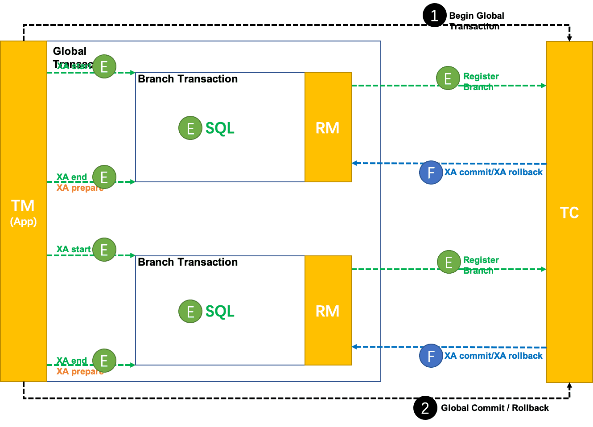

**总结**

在当前的技术发展阶段，不存一个分布式事务处理机制可以完美满足所有场景的需求。

一致性、可靠性、易用性、性能等诸多方面的系统设计约束，需要用不同的事务处理机制去满足。

Seata 项目最核心的价值在于：构建一个全面解决分布式事务问题的 标准化 平台。

基于 Seata，上层应用架构可以根据实际场景的需求，灵活选择合适的分布式事务解决方案。


XA 模式的加入，补齐了 Seata 在 全局一致性 场景下的缺口，形成 AT、TCC、Saga、XA 四大 事务模式 的版图，基本可以满足所有场景的分布式事务处理诉求。


### TCC模式

首先我们先来了解常规的TCC模式。

#### 什么是TCC

TCC 是分布式事务中的二阶段提交协议，它的全称为 Try-Confirm-Cancel，即资源预留（Try）、确认操作（Confirm）、取消操作（Cancel），他们的具体含义如下：

1. Try：对业务资源的检查并预留；
2. Confirm：对业务处理进行提交，即 commit 操作，只要 Try 成功，那么该步骤一定成功；
3. Cancel：对业务处理进行取消，即回滚操作，该步骤回对 Try 预留的资源进行释放。

TCC 是一种侵入式的分布式事务解决方案，以上三个操作都需要业务系统自行实现，对业务系统有着非常大的入侵性，设计相对复杂，但优点是 TCC 完全不依赖数据库，能够实现跨数据库、跨应用资源管理，对这些不同数据访问通过侵入式的编码方式实现一个原子操作，更好地解决了在各种复杂业务场景下的分布式事务问题。


#### Seata的TCC模式

Seata TCC 模式跟通用型 TCC 模式原理一致。

#### TCC和AT区别

AT 模式基于 **支持本地 ACID 事务** 的 **关系型数据库**：

- 一阶段 prepare 行为：在本地事务中，一并提交业务数据更新和相应回滚日志记录。
- 二阶段 commit 行为：马上成功结束，**自动** 异步批量清理回滚日志。
- 二阶段 rollback 行为：通过回滚日志，**自动** 生成补偿操作，完成数据回滚。

相应的，TCC 模式，不依赖于底层数据资源的事务支持：

- 一阶段 prepare 行为：调用 **自定义** 的 prepare 逻辑。
- 二阶段 commit 行为：调用 **自定义** 的 commit 逻辑。
- 二阶段 rollback 行为：调用 **自定义** 的 rollback 逻辑。

所谓 TCC 模式，是指支持把 **自定义** 的分支事务纳入到全局事务的管理中。


#### 特点：

1. 侵入性比较强，并且需要自己实现相关事务控制逻辑
2. 在整个过程基本没有锁，性能较强

**详细讲解**


具体使用案例：https://seata.io/zh-cn/blog/integrate-seata-tcc-mode-with-spring-cloud.html


### Saga模式

#### 基本概念

Saga模式是SEATA提供的长事务解决方案，在Saga模式中，业务流程中每个参与者都提交本地事务，当出现某一个参与者失败则补偿前面已经成功的参与者，一阶段正向服务和二阶段补偿服务（执行处理时候出错了，给一个修复的机会）都由业务开发实现。

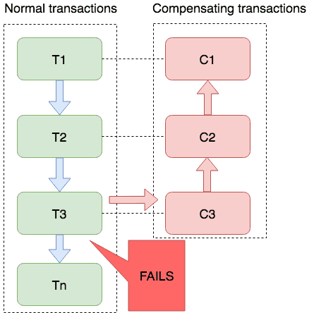

Saga 模式下分布式事务通常是由事件驱动的，各个参与者之间是异步执行的，Saga 模式是一种长事务解决方案。

#### 为什么需要Saga

之前我们学习的Seata分布式三种操作模型中所使用的的微服务全部可以根据开发者的需求进行修改，但是在一些特殊环境下，比如老系统，封闭的系统（无法修改，同时没有任何分布式事务引入），那么AT、XA、TCC模型将全部不能使用，为了解决这样的问题，才引用了Saga模型。

比如：事务参与者可能是其他公司的服务或者是遗留系统，无法改造，可以使用Saga模式。


Saga模式是Seata提供的长事务解决方案，提供了**异构系统的事务统一处理模型**。在Saga模式中，所有的子业务都不在直接参与整体事务的处理（只负责本地事务的处理），而是全部交由了最终调用端来负责实现，而在进行总业务逻辑处理时，在某一个子业务出现问题时，则自动补偿全面已经成功的其他参与者，这样一阶段的正向服务调用和二阶段的服务补偿处理全部由总业务开发实现。


#### Saga状态机

目前Seata提供的Saga模式只能通过状态机引擎来实现，需要开发者手工的进行Saga业务流程绘制，并且将其转换为Json配置文件，而后在程序运行时，将依据子配置文件实现业务处理以及服务补偿处理，而要想进行Saga状态图的绘制，一般需要通过Saga状态机来实现。

基本原理：

- 通过状态图来定义服务调用的流程并生成json定义文件
- 状态图中一个节点可以调用一个服务，节点可以配置它的补偿节点
- 状态图 json 由状态机引擎驱动执行，当出现异常时状态引擎反向执行已成功节点对应的补偿节点将事务回滚
- 可以实现服务编排需求，支持单项选择、并发、子流程、参数转换、参数映射、服务执行状态判断、异常捕获等功能


#### Saga状态机的应用

官方提供了一个状态机设计器


官方文档地址：https://seata.io/zh-cn/docs/user/saga.html

Seata Safa状态机可视化图形设计器使用地址：https://github.com/seata/seata/blob/develop/saga/seata-saga-statemachine-designer/README.zh-CN.md


## 源码分析


