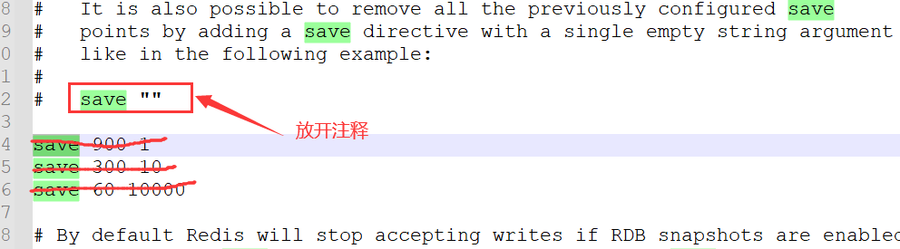

# 缓存

# 多级缓存

## J2Cache

### 介绍

J2Cache 是开源中国（OSChina）的两级缓存框架（要求 JDK8+）。第一级缓存使用内存(同时支持 Ehcache 2.x、Ehcache 3.x 和 Caffeine)，第二级缓存使用 Redis(推荐)/Memcached 。 由于大量的缓存读取会导致 L2 的网络成为整个系统的瓶颈，因此 L1 的目标是降低对 L2 的读取次数。 该缓存框架主要用于集群环境中。单机也可使用，用于避免应用重启导致的缓存冷启动后对后端业务的冲击。

L1：进程内的缓存：Caffeine/ehcache，类似于Map。

L2：集中式缓存：Redis/Memcached，

如果只用L1，程序重启，缓存会丢失。

如果只用L2，读写缓存，会造成网络的浪费。

#### 好处

通过对L1的读取，来降低对L2的读写次数。通过利用L2的持久化，防止程序重启缓存的丢失。

缓存的读取顺序：L1 > L2 > DB


### 项目实战

#### 引入

1. 创建SpringBoot项目。

2. 加入J2Cache依赖。

   1. ```xml
      <dependency>
          <groupId>net.oschina.j2cache</groupId>
          <artifactId>j2cache-spring-boot2-starter</artifactId>
          <version>2.8.0-release</version>
      </dependency>
      <dependency>
          <groupId>net.oschina.j2cache</groupId>
          <artifactId>j2cache-core</artifactId>
          <version>2.8.0-release</version>
          <exclusions>
              <exclusion>
                  <groupId>org.slf4j</groupId>
                  <artifactId>slf4j-simple</artifactId>
              </exclusion>
              <exclusion>
                  <groupId>org.slf4j</groupId>
                  <artifactId>slf4j-api</artifactId>
              </exclusion>
          </exclusions>
      </dependency>
      ```

3. 加入配置

   1. application.yml

   2. ```yml
      server:
        port: 8080
      
      # 缓存公共配置，供其他地方引用
      cache:
        redis:
          ip: docker-study
          port: 6379
          password: redis123
          database: 0
      
      spring:
        application:
          name: springboot_cache
        cache:
          type: redis
        redis:
          host: ${cache.redis.ip}
          password: ${cache.redis.password}
          port: ${cache.redis.port}
          database: ${cache.redis.database}
      j2cache:
        open-spring-cache: true
        cache-clean-mode: passive
        allow-null-values: true
        #指定redis客户端使用lettuce，也可以使用Jedis
        redis-client: lettuce
        #开启二级缓存，false则表示只使用一级缓存
        l2-cache-open: true
        
        #事件通知的机制，j2cache从1.3.0版本开始支持JGroups和Redis Pub/Sub两种方式进行缓存事件的通知。
        #此处我们使用基于redis的发布订阅模式来通知缓存的各个节点来进行缓存数据的同步（由j2cache进行实现，我们写上配置
        broadcast: net.oschina.j2cache.cache.support.redis.SpringRedisPubSubPolicy
        #broadcast: jgroups
        #指定一级缓存提供者为caffeine
        L1:
          provider_class: caffeine
        #指定二级缓存提供者为redis
        L2:
          provider_class: net.oschina.j2cache.cache.support.redis.SpringRedisProvider
          config_section: lettuce
          sync_ttl_to_redis: true
          default_cache_null_object: false
          serialization: fst
      
      caffeine:
        properties: /caffeine.properties # 这个配置文件需要放在项目中
        
      #lettuce是redis的一个客户端，也可以使用jedis，都是用来操作redis的java客户端
      lettuce:
        mode: single
        namespace:
        storage: generic
        channel: j2cache
        scheme: redis
        hosts: ${cache.redis.ip}:${cache.redis.port}
        password: ${cache.redis.password}
        database: ${cache.redis.database}
        sentinelMasterId:
        maxTotal: 100
        maxIdle: 10
        minIdle: 10
        timeout: 10000
      
      ```

   3. caffeine.properties

   4. ```properties
      #50是缓存的数量，2h是缓存的有效期。
      testRegion=50,2h
      ```

4. 测试类

   1. J2CacheController.java

   2. ```java
      /*
       * Copyright 2013-2018 the original author or authors.
       *
       * Licensed under the Apache License, Version 2.0 (the "License");
       * you may not use this file except in compliance with the License.
       * You may obtain a copy of the License at
       *
       *      https://www.apache.org/licenses/LICENSE-2.0
       *
       * Unless required by applicable law or agreed to in writing, software
       * distributed under the License is distributed on an "AS IS" BASIS,
       * WITHOUT WARRANTIES OR CONDITIONS OF ANY KIND, either express or implied.
       * See the License for the specific language governing permissions and
       * limitations under the License.
       */
      package com.gem.springbootcache.j2cache;
      
      import net.oschina.j2cache.CacheChannel;
      import net.oschina.j2cache.CacheObject;
      import org.springframework.beans.factory.annotation.Autowired;
      import org.springframework.web.bind.annotation.GetMapping;
      import org.springframework.web.bind.annotation.RequestMapping;
      import org.springframework.web.bind.annotation.RestController;
      
      @RestController
      @RequestMapping("/j2cache")
      public class J2CacheController {
          private String key = "j2cacheKey";
          private String testRegion = "testRegion";
          @Autowired
          private CacheChannel cacheChannel;
      
          @GetMapping("/getValue")
          public String getValue() {
              CacheObject cacheObject = cacheChannel.get(testRegion, key);
              if (cacheObject.getValue() == null) {
                  // 从缓存取不到值，我们从数据库去查询
                  String dbString = "数据库的值";
                  // 放入缓存
                  cacheChannel.set(testRegion, key, dbString);
                  return dbString;
              }
              return cacheObject.getValue().toString();
          }
      
          @GetMapping("/getValue1")
          public String getValue1() {
              CacheObject cacheObject = cacheChannel.get(testRegion, key);
              return cacheObject.getValue().toString();
          }
      
          /**
           * 一级缓存和二级缓存都会清理。
           *
           * @return
           */
          @GetMapping("/evict")
          public String evict() {
              cacheChannel.evict(testRegion, key);
              return "evice success";
          }
      
          /**
           * 清理指定区域。
           *
           * @return
           */
          @GetMapping("/clear")
          public String clear() {
              cacheChannel.clear(testRegion);
              return "clear success";
          }
      
          /**
           * 判断缓存中的数据是否存在
           *
           * @return
           */
          @GetMapping("/exists")
          public String exists() {
              boolean result = cacheChannel.exists(testRegion, key);
              return "exists:" + result;
          }
      
          /**
           * 判断数据从哪一级获取
           *
           * @return
           */
          @GetMapping("/check")
          public String check() {
              int level = cacheChannel.check(testRegion, key);
              return "level:" + level;
          }
      }
      ```
      

5. 打开浏览器，分别测试链接：http://localhost:8080/j2cache/getValue，http://localhost:8080/j2cache/check，http://localhost:8080/j2cache/exists


## jetcache

### 介绍

`jetcache`是阿里开源的基于java开发的缓存框架，支持多种缓存类型：本地缓存、分布式缓存、多级缓存。能够满足不同业务场景的缓存需求。

jetcache具有上手简单、性能高效、拓展性强的特点。支持缓存预热 、缓存key前缀等功能。结合spring-cache使用，可以实现十分优雅的缓存类型切换

官网地址：[github.com/alibaba/jet…](https://link.juejin.cn?target=https%3A%2F%2Fgithub.com%2Falibaba%2Fjetcache) 官方文档：[github.com/alibaba/jet…](https://link.juejin.cn?target=https%3A%2F%2Fgithub.com%2Falibaba%2Fjetcache%2Ftree%2Fmaster%2Fdocs%2FCN)


# Redis

视频地址：https://www.mashibing.com/study?courseNo=2185&sectionNo=89779&courseVersionId=2977

## 介绍

相关网站：[Redis中文网站 (redis.cn)](http://redis.cn/)，[Redis官网](https://redis.io/)。

Remote Dictionary Service，远程字典服务。是一个开源的使用ANSI C语言编写、支持网络、可基于内存亦可持久化的日志型、Key-Value数据库，目前比较多的常用场景是作为数据库的缓存使用。

Redis 是一个开源（BSD许可）的，内存中的数据结构存储系统，它可以用作数据库、缓存和消息中间件。 它支持多种类型的数据结构，如 [字符串（strings）](http://redis.cn/topics/data-types-intro.html#strings)， [散列（hashes）](http://redis.cn/topics/data-types-intro.html#hashes)， [列表（lists）](http://redis.cn/topics/data-types-intro.html#lists)， [集合（sets）](http://redis.cn/topics/data-types-intro.html#sets)， [有序集合（sorted sets）](http://redis.cn/topics/data-types-intro.html#sorted-sets) 与范围查询， [bitmaps](http://redis.cn/topics/data-types-intro.html#bitmaps)， [hyperloglogs](http://redis.cn/topics/data-types-intro.html#hyperloglogs) 和 [地理空间（geospatial）](http://redis.cn/commands/geoadd.html) 索引半径查询。 Redis 内置了 [复制（replication）](http://redis.cn/topics/replication.html)，[LUA脚本（Lua scripting）](http://redis.cn/commands/eval.html)， [LRU驱动事件（LRU eviction）](http://redis.cn/topics/lru-cache.html)，[事务（transactions）](http://redis.cn/topics/transactions.html) 和不同级别的 [磁盘持久化（persistence）](http://redis.cn/topics/persistence.html)， 并通过 [Redis哨兵（Sentinel）](http://redis.cn/topics/sentinel.html)和自动 [分区（Cluster）](http://redis.cn/topics/cluster-tutorial.html)提供高可用性（high availability）。


### 特点

- 内存型，Key-Value数据库，
- 单线程。速度快，IO多路复用
- 支持持久化、集群、分布式


### 和HashMap和Memcached的区别

- redis支持更丰富的数据类型，Memcached的value没有类型（或者只能用json）
  - 对于复杂类型，redis可以从服务端直接取出值的某个部分，Memcached得把所有值都读到客户端。
  - Memcached的客户端需要额外有解析逻辑。
  - 对于不同的数据类型，redis提供不同的操作方法。
- redis支持更多种的编程语言

- redis功能丰富：持久化机制，内存淘汰策略，事务，发布订阅，pipeline，lua

- redis支持集群，分布式


### 为什么要将数据放在内存中

内存的速度更快，10W QPS

减少计算的时间，减轻数据库压力。


### Redis快的原因

1. 在内存中存储数据；
2. 使用单线程；

3. [IO多路复用](https://cloud.tencent.com/developer/beta/article/1680732)；
   1. 当有多个客户端连接到达时，用户线程调用内核的epoll方法。
   2. epoll和用户线程之间会通过create函数创建一个mmap的共享空间
   3. 然后对于每一个连接，会使用epoll ctl的add方法创建一个epoll的描述符
   4. 调用每个描述符的wait()函数，让他们等待。
   5. 当某一些连接数据到达且已就绪的时候，这些连接会通过事件被加入到一个链表中
   6. 用户线程read已就绪的连接开始对应的操作。


**基础原理**

磁盘，寻址：ms，带宽：G/M(每分钟多少G或M)

内存，寻址：ns，带宽：具体数值不确定，但肯定要比磁盘大很多。

秒=1000毫秒=1000微妙=1000纳米，所以内存比磁盘寻址快10万倍。

io buffer，由于磁盘每个扇区是512byte，会带来索引成本变大问题。所以硬盘有个4K对齐问题，硬盘会一次性最少返回4k数据。

对于磁盘上的文件来说，如果文件越大，读取速度越慢，硬盘i/0会成为瓶颈。

对于数据库而言，有个data page概念，由于需要从磁盘读取数据，所以最小的建议也是4K。当从表中加载数据时，首先会根据where后面的查询条件，看是否命中索引，如果命中就会首先加载索引到内存中。而索引也是一个数据存储结构，最小单位也是4K。加载到内存中之后是一个B+Tree结构。内存中存的是B+树的树干，如果全部加载到内存中会严重占用内存空间。根据叶子加载索引以及数据。


### 数据库引擎网站

https://db-engines.com/en/ranking

关系型数据库，目前排名第一的是Oracle

key-value数据库，排名第一的是Redis

如果需要做数据库的技术选型，可以点进去看每个数据库的介绍。[Redis介绍](https://db-engines.com/en/system/Redis)


## 安装配置

### 下载

推荐下载linux版的redis安装包。windows版本的安装包并不是Redis官方提供的。

linux安装包下载：https://redis.io/download/

windows安装包下载：https://github.com/tporadowski/redis/releases

### 安装

#### 宝塔安装

下文的安装步骤是在Vmware中的CentOS7.9中进行的。CentOS7.9安装步骤可以参考：[CentOS7.9宝塔安装步骤](https://blog.csdn.net/namelessmyth/article/details/123979428)

redis安装步骤：https://blog.csdn.net/qq_51745363/article/details/126189635

安装成功建议使用客户端测试redis是否可连接。例如：Another Redis Desktop Manager


### 配置

#### redis.conf

redis的启动配置文件，里面有很多重要的配置项。这里面的配置也可以通过启动命令载入。使用时可以参考配置文件中的说明。

例如：

include：载入其他conf配置文件。

loadmodule 可以在启动时加载其他module。

logfile：日志文件地址，相应的还有一个日志级别。

database：redis的数据库数量，默认是16个。

renamed-command：将某些危险的命令重命名。例如：flushall，flushdb。

maxmemory：redis占用的最大内存大小。建议：1G~10G范围内。


## 基础使用

### 常用命令

[Redis中文网-命令介绍](http://redis.cn/commands.html)

#### Bitmap

bitmap也是string的一种，是由多个二进制位组成的数组，数组中的每个二进制位都有与之对应的偏移量，可以通过这些偏移量对位图中指定的一个或多个二进制位进行操作。一个字节8位。

**相关命令**

setbit：设置二进制位

getbit：获取二进制位的值

bitcount：统计指定位置的被设置为1的位数。

bitop：执行二进制位运算

[以上内容或者更详细的说明，可参考这篇文章](https://blog.csdn.net/w915209092/article/details/126038873)

**使用案例**

> -- 将k1的第1位改成1，即：01000000
>
> 127.0.0.1:6379> setbit k1 1 1
>
> --结果为1
>
> 127.0.0.1:6379> strlen k1
>
> --结果为@，因为在ascii中01000000代表@
>
> 127.0.0.1:6379> get k1
>
> -- 将k1的第7位改成1，即：01000001
>
> 127.0.0.1:6379> setbit k1 7 1
>
> 127.0.0.1:6379> strlen k1
>
> 1
>
> 127.0.0.1:6379> get k1
>
> A
>
> -- 将k1的第9位改成1，一个字节存不下，变为2个字节：01000001 01000000
>
> 127.0.0.1:6379> setbit k1 9 1
>
> 127.0.0.1:6379> get k1
>
> A@
>
> 127.0.0.1:6379> strlen k1
>
> 2
>
> 


#### List

同向为栈，例如：lpush之后lpop，rpush之后rpop。

```bash
> lpush ll a b c d e
5
> lpop ll
e
> lpop ll
d
> lrange ll 0 -1
```

逆向为队列。例如：lpush之后rpop。

数组。

阻塞单播队列。


#### Hash

类似java的hashmap。

```bash
> set hashjack::name sjj
OK
> set hashjack::age 38
OK
> get hashjack
null
> get hashjack::name
sjj
> get hashjack::age
38
> keys hash*
hashjack::age
hashjack::name
> hmset rose name sjj age 48
OK
> hkeys rose
name
age
> hvals rose
sjj
48
> HGETALL rose
name
sjj
age
48
```


#### Set

和java类似，Set是无序但不会重复

sadd：往set添加元素，会自动去重

scard：给出集合元素格式

sismember：判断某个值是否是集合元素

smembers：返回set中的所有元素。正式环境慎用，如果set中元素过多，会消耗网络带宽。


#### SortedSet

和Set的区别是有序，需要给出每个元素的分值score做为排序依据。

如果score相同会使用名称的字典序排序。

还需要给出正负项索引来区分正序或者逆序。

zadd：zadd z1 9 apple 2 pair

zcard

zcount

zrange

zrevrange：逆序获取元素

zrangebyscore：根据分值获取元素。

zscore：获取元素分值

zrank：获取元素排名

zunionstore：合并集合并生成新的集合。最后一个参数可以指定相同元素分值的处理方式（最大值，最小值，求和）还可以设置权重。


### 编码问题

redis是二进制安全的，存到redis中的都是字节。

例如：当执行`set k1 中`命令时，实际存到redis中的是字节

客户端在写入和读取时需要自己统一编码方式，否则可能出现乱码。


### 发布/订阅

**概述**

Redis提供了基于“发布/订阅”模式的消息机制。此种模式下，消息发布者和订阅者不进行直接通信，发布者客户端向指定的频道（channel）  发布消息，订阅该频道的每个客户端都可以收到该消息，如图1所示。Redis提供了若干命令支持该功能，在实际应用开发时，能够为此类问题提供实现方法。


**使用场景**

[聊天室](#聊天室)、公告牌、服务之间利用消息解耦都可以使用发布订阅模式。


**操作命令**

**订阅消息**

```shell
127.0.0.1:6379> subscribe channel [channel ...]
Reading messages... (press Ctrl-C to quit)
1) "subscribe"
2) "channel"
3) (integer) 1		# 返回值为当前已订阅的频道数量

# 以下是客户端接收到的订阅消息
1) "message"
2) "channel"
3) "hello"
12345678910
```

**发布消息**

新建另一个会话窗口，发布消息

```shell
127.0.0.1:6379> publish channel "hello"
(integer) 1		# 返回值为订阅当前频道的客户端数量
12
```

**按模式订阅频道**

```shell
127.0.0.1:6379> psubscribe pattern [pattern ...]
1
```

> 每个模式以 * 作为匹配符，比如 it* 匹配所有以 it 开头的频道( it.news 、 it.blog 、 it.tweets  等等)， news.* 匹配所有以 news. 开头的频道( news.it 、news.global.today 等)，诸如此类。

**退订频道**

```shell
127.0.0.1:6379> unsubscribe pattern [pattern ...]
# 返回值为当前客户端订阅的频道和模式的数量
12
```

**按模式退订频道**

```shell
127.0.0.1:6379> punsubscribe pattern [pattern ...]
# 返回值为当前客户端订阅的频道和模式的数量
12
```

有关订阅命令有两点需要注意：

1. 客户端在执行订阅命令之后进入了订阅状态，只能接收 subscribe、psubscribe、 unsubscribe、 punsubscribe 的四个命令。
2. 新开启的订阅客户端，无法收到该频道之前的消息，因为 Redis 不会对发布的消息进行持久化。

**与ActiveMQ的比较**

1. ActiveMQ 支持多种消息协议，包括 AMQP，MQTT，Stomp 等，并且支持 JMS 规范，但 Redis 没有提供对这些协议的支持；
2. ActiveMQ 提供持久化功能，但 Redis无法对消息持久化存储，一旦消息被发送，如果没有订阅者接收，那么消息就会丢失；
3. ActiveMQ 提供了消息传输保障，当客户端连接超时或事务回滚等情况发生时，消息会被重新发送给客户端，Redis 没有提供消息传输保障。


### Key过期

Redis做为缓存，是运行在内存中的。内存速度虽然快但他的容量相对硬盘是偏小的。所以一般不会将全量业务数据都放在Redis中。

Redis当中应当存的是会随着业务变化的热数据。所以他的key有一个有效期的概念。

- 由业务逻辑决定有效期

例如：当天的用户登录次数，那过期时间就是1天。

- 由业务运转情况决定有效期

例如：某个key的访问次数，访问频率，内存回收策略（maxmemory-policy）等等。

**过期规则**

设置`key`的过期时间，超过时间后，将会自动删除该`key`。在Redis的术语中一个`key`的相关超时是不确定的。

超时后只有对`key`执行[DEL](http://redis.cn/commands/del.html)命令或者[SET](http://redis.cn/commands/set.html)命令或者[GETSET](http://redis.cn/commands/getset.html)时才会清除。 这意味着，从概念上讲所有改变`key`的值的操作都会使他清除。 例如，[INCR](http://redis.cn/commands/incr.html)递增key的值，执行[LPUSH](http://redis.cn/commands/lpush.html)操作，或者用[HSET](http://redis.cn/commands/hset.html)改变hash的`field`所有这些操作都会触发删除动作。

使用[PERSIST](http://redis.cn/commands/persist.html)命令可以清除超时，使其变成一个永久的`key`。

如果`key`被[RENAME](http://redis.cn/commands/rename.html)命令修改，相关的超时时间会转移到新`key`上面。

如果`key`被[RENAME](http://redis.cn/commands/rename.html)命令修改，比如原来就存在`Key_A`,然后调用`RENAME Key_B Key_A`命令，这时不管原来`Key_A`是永久的还是设置为超时的，都会由`Key_B`的有效期状态覆盖。

**刷新过期时间**

对已经有过期时间的`key`执行`EXPIRE`操作，将会更新它的过期时间。有很多应用有这种业务场景，例如：记录会话的session。

```shell
redis> SET mykey "Hello"
OK
redis> EXPIRE mykey 10
(integer) 1
redis> TTL mykey
(integer) 10
redis> SET mykey "Hello World"
OK
redis> TTL mykey
(integer) -1
redis> 
```


**Redis如何淘汰过期的keys**

Redis keys过期有两种方式：被动和主动方式。

当一些客户端尝试访问它时，key会被发现并主动的过期。

当然，这样是不够的，因为有些过期的keys，永远不会访问他们。 无论如何，这些keys应该过期，所以定时随机测试设置keys的过期时间。所有这些过期的keys将会从密钥空间删除。

具体就是Redis每秒10次做的事情：

1. 测试随机的20个keys进行相关过期检测。
2. 删除所有已经过期的keys。
3. 如果有多于25%的keys过期，重复步奏1.

这是一个平凡的概率算法，基本上的假设是，我们的样本是这个密钥控件，并且我们不断重复过期检测，直到过期的keys的百分百低于25%,这意味着，在任何给定的时刻，最多会清除1/4的过期keys。


**在复制AOF文件时如何处理过期**

为了获得正确的行为而不牺牲一致性，当一个key过期，`DEL`将会随着AOF文字一起合成到所有附加的slaves。在master实例中，这种方法是集中的，并且不存在一致性错误的机会。

然而，当slaves连接到master时，不会独立过期keys（会等到master执行DEL命令），他们任然会在数据集里面存在，所以当slave当选为master时淘汰keys会独立执行，然后成为master。


### 内存回收策略

参考redis中文网：http://redis.cn/topics/lru-cache.html

lru：主要是看访问次数，lfu是看访问时间。

allkeys：是在所有key中。volatile是在快过期的key中。

一般的建议是：如果项目上没有给key设置过期时间则用：**allkeys-lru**，如果都考虑了过期时间则用：**volatile-lru**


### 持久化

Redis虽然是个内存数据库，但是Redis支持RDB和AOF两种持久化机制，将数据写往磁盘，可以有效地避免因进程退出造成的数据丢失问题，当下次重启时利用之前持久化的文件即可实现数据恢复。

#### RDB

RDB持久化是把当前进程数据生成快照保存到硬盘的过程。所谓内存快照，就是指内存中的数据在某一个时刻的状态记录。这就类似于照片，当你给朋友拍照时，一张照片就能把朋友一瞬间的形象完全记下来。RDB 就是Redis DataBase 的缩写。

**给哪些内存数据做快照?**

Redis 的数据都在内存中，为了提供所有数据的可靠性保证，它执行的是全量快照，也就是说，把内存中的所有数据都记录到磁盘中。但是，RDB 文件就越大，往磁盘上写数据的时间开销就越大。

**RDB文件的生成是否会阻塞主线程**

Redis 提供了两个手动命令来生成 RDB 文件，分别是 save 和 bgsave。

save：在主线程中执行，会导致阻塞；对于内存比较大的实例会造成长时间阻塞，线上环境不建议使用。
bgsave：创建一个子进程，专门用于写入 RDB 文件，避免了主线程的阻塞，这也是Redis RDB 文件生成的默认配置。

命令实战演示


除了执行命令手动触发之外，Redis内部还存在自动触发RDB 的持久化机制，例如以下场景:

1)使用save相关配置,如“save m n”。表示m秒内数据集存在n次修改时，自动触发bgsave。


2） ，主节点自动执行bgsave生成RDB文件并发送给从节点。

3)执行debug reload命令重新加载Redis 时，也会自动触发save操作。


4）默认情况下执行shutdown命令时，如果没有开启AOF持久化功能则自动执行bgsave。


关闭RDB持久化，在课程讲述的Redis版本（6.2.4）上，是将配置文件中的save配置改为 save “”



**bgsave执的行流程**

为了快照而暂停写操作，肯定是不能接受的。所以这个时候，Redis 就会借助操作系统提供的写时复制技术（Copy-On-Write, COW），在执行快照的同时，正常处理写操作。


bgsave 子进程是由主线程 fork 生成的，可以共享主线程的所有内存数据。bgsave 子进程运行后，开始读取主线程的内存数据，并把它们写入 RDB 文件。

如果主线程对这些数据也都是读操作（例如图中的键值对 A），那么，主线程和bgsave 子进程相互不影响。但是，如果主线程要修改一块数据（例如图中的键值对 B），那么，这块数据就会被复制一份，生成该数据的副本。然后，bgsave 子进程会把这个副本数据写入 RDB 文件，而在这个过程中，主线程仍然可以直接修改原来的数据。

这既保证了快照的完整性，也允许主线程同时对数据进行修改，避免了对正常业务的影响。

**RDB文件**

RDB文件保存在dir配置指定的目录下，文件名通过dbfilename配置指定。


可以通过执行config set dir {newDir}和config set dbfilename (newFileName}运行期动态执行,当下次运行时RDB文件会保存到新目录。


Redis默认采用LZF算法对生成的RDB文件做压缩处理，压缩后的文件远远小于内存大小，默认开启，可以通过参数config set rdbcompression { yes |no}动态修改。
虽然压缩RDB会消耗CPU，但可大幅降低文件的体积，方便保存到硬盘或通过网维示络发送给从节点,因此线上建议开启。
如果 Redis加载损坏的RDB文件时拒绝启动,并打印如下日志:

```
Short read or OOM loading DB. Unrecoverable error，aborting now.
```

这时可以使用Redis提供的redis-check-rdb工具(老版本是redis-check-dump)检测RDB文件并获取对应的错误报告。


##### RDB的优缺点

**优点**

RDB是一个紧凑压缩的二进制文件，代表Redis在某个时间点上的数据快照。非常适用于备份,全量复制等场景。

比如每隔几小时执行bgsave备份，并把 RDB文件拷贝到远程机器或者文件系统中(如hdfs),，用于灾难恢复。

Redis加载RDB恢复数据远远快于AOF的方式。

**缺点**

RDB方式数据没办法做到实时持久化/秒级持久化。因为bgsave每次运行都要执行fork操作创建子进程,属于重量级操作,频繁执行成本过高。

RDB文件使用特定二进制格式保存，Redis版本演进过程中有多个格式的RDB版本，存在老版本Redis服务无法兼容新版RDB格式的问题。

##### RDB导致的数据丢失问题

针对RDB不适合实时持久化的问题,Redis提供了AOF持久化方式来解决。

如下图所示，我们先在 T0 时刻做了一次快照（下一次快照是T4时刻），然后在T1时刻，数据块 5 和 8 被修改了。如果在T2时刻，机器宕机了，那么，只能按照 T0 时刻的快照进行恢复。此时，数据块 5 和 8 的修改值因为没有快照记录，就无法恢复了。


所以这里可以看出，如果想丢失较少的数据，那么T4-T0就要尽可能的小，但是如果频繁地执行全量
快照，也会带来两方面的开销：

1、频繁将全量数据写入磁盘，会给磁盘带来很大压力，多个快照竞争有限的磁盘带宽，前一个快照还没有做完，后一个又开始做了，容易造成恶性循环。

2、另一方面，bgsave 子进程需要通过 fork 操作从主线程创建出来。虽然子进程在创建后不会再阻塞主线程，但是，fork 这个创建过程本身会阻塞主线程，而且主线程的内存越大，阻塞时间越长。如果频繁fork出bgsave 子进程，这就会频繁阻塞主线程了。

所以基于这种情况，我们就需要AOF的持久化机制。

#### AOF

AOF(append only file)持久化:以独立日志的方式记录每次写命令，重启时再重新执行AOF文件中的命令达到恢复数据的目的。AOF的主要作用是解决了数据持久化的实时性,目前已经是Redis持久化的主流方式。理解掌握好AOF持久化机制对我们兼顾数据安全性和性能非常有帮助。

##### 使用AOF

开启AOF功能需要设置配置:appendonly yes，默认不开启。


AOF文件名通过appendfilename配置设置，默认文件名是appendonly.aof。保存路径同RDB持久化方式一致，通过dir配置指定。


##### AOF的工作流程

AOF的工作流程主要是4个部分:命令写入( append)、文件同步( sync)、文件重写(rewrite)、重启加载( load)。


##### 命令写入

AOF命令写入的内容直接是RESP文本协议格式。例如lpush lijin A B这条命令，在AOF缓冲区会追加如下文本:

```
*3\r\n$6\r\nlupush\r\n$5\r\nlijin\r\n$3\r\nA B
```

看看 AOF 日志的内容。其中，“*3”表示当前命令有三个部分，每部分都是由“$+数字”开头，后面紧跟着
具体的命令、键或值。这里，“数字”表示这部分中的命令、键或值一共有多少字节。例如，“$3 set”表示这部分有 3 个字节，也就是“set”命令。

1 )AOF为什么直接采用文本协议格式?

文本协议具有很好的兼容性。开启AOF后，所有写入命令都包含追加操作，直接采用协议格式，避免了二次处理开销。文本协议具有可读性,方便直接修改和处理。

2）AOF为什么把命令追加到aof_buf中?

Redis使用单线程响应命令，如果每次写AOF文件命令都直接追加到硬盘，那么性能完全取决于当前硬盘负载。先写入缓冲区aof_buf中，还有另一个好处，Redis可以提供多种缓冲区同步硬盘的策略，在性能和安全性方面做出平衡。

Redis提供了多种AOF缓冲区同步文件策略，由参数appendfsync控制。


**always**

同步写回：每个写命令执行完，立马同步地将日志写回磁盘；

**everysec**

每秒写回：每个写命令执行完，只是先把日志写到 AOF 文件的内存缓冲区，每隔一秒把缓冲区中的内容写入磁盘；

**no**

操作系统控制的写回：每个写命令执行完，只是先把日志写到 AOF 文件的内存缓冲区，由操作系统决定何时将缓冲区内容写回磁盘，通常同步周期最长30秒。

很明显，配置为always时，每次写入都要同步AOF文件，在一般的SATA 硬盘上，Redis只能支持大约几百TPS写入,显然跟Redis高性能特性背道而驰,不建议配置。

配置为no，由于操作系统每次同步AOF文件的周期不可控,而且会加大每次同步硬盘的数据量,虽然提升了性能,但数据安全性无法保证。

配置为everysec，是建议的同步策略，也是默认配置，做到兼顾性能和数据安全性。理论上只有在系统突然宕机的情况下丢失1秒的数据。(严格来说最多丢失1秒数据是不准确的)

想要获得高性能，就选择 no 策略；如果想要得到高可靠性保证，就选择always 策略；如果允许数据有一点丢失，又希望性能别受太大影响的话，那么就选择everysec 策略。

##### 重写机制

随着命令不断写入AOF，文件会越来越大，为了解决这个问题，Redis引入AOF重写机制压缩文件体积。AOF文件重写是把Redis进程内的数据转化为写命令同步到新AOF文件的过程。

**重写后的AOF 文件为什么可以变小?有如下原因:**

1)进程内已经超时的数据不再写入文件。

2)旧的AOF文件含有无效命令，如set a 111、set a 222等。重写使用进程内数据直接生成，这样新的AOF文件只保留最终数据的写入命令。


3）多条写命令可以合并为一个，如:lpush list a、lpush list b、lpush list c可以转化为: lpush list a b c。为了防止单条命令过大造成客户端缓冲区溢出，对于list、set、hash、zset等类型操作，以64个元素为界拆分为多条。

AOF重写降低了文件占用空间，除此之外，另一个目的是:更小的AOF文件可以更快地被Redis加载。

AOF重写过程可以手动触发和自动触发:

手动触发:直接调用bgrewriteaof命令。


自动触发:根据auto-aof-rewrite-min-size和 auto-aof-rewrite-percentage参数确定自动触发时机。


auto-aof-rewrite-min-size:表示运行AOF重写时文件最小体积，默认为64MB。

auto-aof-rewrite-percentage  :代表当前AOF 文件空间(aof_currentsize）和上一次重写后AOF 文件空间(aof_base_size)的比值。

**另外，如果在Redis在进行AOF重写时，有写入操作，这个操作也会被写到重写日志的缓冲区。这样，重写日志也不会丢失最新的操作。**

##### 重启加载

AOF和 RDB 文件都可以用于服务器重启时的数据恢复。redis重启时加载AOF与RDB的顺序是怎么样的呢？


1，当AOF和RDB文件同时存在时，优先加载AOF

2，若关闭了AOF，加载RDB文件

3，加载AOF/RDB成功，redis重启成功

4，AOF/RDB存在错误，启动失败打印错误信息

##### 文件校验

加载损坏的AOF 文件时会拒绝启动，对于错误格式的AOF文件，先进行备份，然后采用redis-check-aof --fix命令进行修复，对比数据的差异，找出丢失的数据，有些可以人工修改补全。

AOF文件可能存在结尾不完整的情况，比如机器突然掉电导致AOF尾部文件命令写入不全。Redis为我们提供了aof-load-truncated  配置来兼容这种情况，默认开启。加载AOF时当遇到此问题时会忽略并继续启动,同时如下警告日志。


#### RDB-AOF混合持久化

通过 `aof-use-rdb-preamble`  配置项可以打开混合开关，yes则表示开启，no表示禁用，默认是禁用的，可通过config set修改


该状态开启后，如果执行bgrewriteaof命令，则会把当前内存中已有的数据弄成二进程存放在aof文件中，这个过程模拟了rdb生成的过程，然后Redis后面有其他命令，在触发下次重写之前，依然采用AOF追加的方式


#### 持久化相关问题

##### 主线程、子进程和后台线程的联系与区别？


**进程和线程的区别**

从操作系统的角度来看，进程一般是指资源分配单元，例如一个进程拥有自己的堆、栈、虚存空间（页表）、文件描述符等；

而线程一般是指 CPU 进行调度和执行的实体。

一个进程启动后，没有再创建额外的线程，那么，这样的进程一般称为主进程或主线程。

Redis 启动以后，本身就是一个进程，它会接收客户端发送的请求，并处理读写操作请求。而且，接收请求和处理请求操作是 Redis 的主要工作，Redis 没有再依赖于其他线程，所以，我一般把完成这个主要工作的 Redis 进程，称为主进程或主线程。

**主线程与子进程**

通过fork创建的子进程，一般和主线程会共用同一片内存区域，所以上面就需要使用到写时复制技术确保安全。

**后台线程**

从 4.0 版本开始，Redis 也开始使用pthread_create 创建线程，这些线程在创建后，一般会自行执行一些任务，例如执行异步删除任务

##### Redis持久化过程中有没有其他潜在的阻塞风险？

当Redis做RDB或AOF重写时，一个必不可少的操作就是执行**fork操作创建子进程**,对于大多数操作系统来说fork是个重量级错误。虽然fork创建的子进程不需要拷贝父进程的物理内存空间，但是会复制父进程的空间内存页表。例如对于10GB的Redis进程，需要复制大约20MB的内存页表，因此fork操作耗时跟进程总内存量息息相关，如果使用虚拟化技术，特别是Xen虚拟机,fork操作会更耗时。

**fork耗时问题定位:**

对于高流量的Redis实例OPS可达5万以上，如果fork操作耗时在秒级别将拖慢Redis几万条命令执行，对线上应用延迟影响非常明显。正常情况下fork耗时应该是每GB消耗20毫秒左右。可以在info stats统计中查latest_fork_usec指标获取最近一次fork操作耗时,单位微秒。


如何改善fork操作的耗时:

1）优先使用物理机或者高效支持fork操作的虚拟化技术

2）控制Redis实例最大可用内存，fork耗时跟内存量成正比,线上建议每个Redis实例内存控制在10GB 以内。

3）降低fork操作的频率，如适度放宽AOF自动触发时机，避免不必要的全量复制等。

##### 为什么主从库间的复制不使用 AOF？

1、RDB 文件是二进制文件，无论是要把 RDB 写入磁盘，还是要通过网络传输 RDB，IO效率都比记录和传输 AOF 的高。

2、在从库端进行恢复时，用 RDB 的恢复效率要高于用 AOF。


## 高级特性

### Redis慢查询

许多存储系统（例如 ：MySQL）提供慢查询日志帮助开发和运维人员定位系统存在的慢操作。所谓慢查询日志就是系统在命令执行前后计算每条命令的执行时间，当超过预设阀值,就将这条命令的相关信息（例如:发生时间，耗时，命令的详细信息）记录下来，Redis也提供了类似的功能。

Redis客户端执行一条命令分为如下4个部分：


1、发送命令

2、命令排队

3、命令执行

4、返回结果

需要注意，慢查询只统计步骤3的时间，所以没有慢查询并不代表客户端没有超时问题。因为有可能是命令的网络问题或者是命令在Redis在排队，所以不是说命令执行很慢就说是慢查询，而有可能是网络的问题或者是Redis服务非常繁忙（队列等待长）。


#### 慢查询配置

对于任何慢查询功能,需要明确两件事：多慢算慢，也就是预设阀值怎么设置？慢查询记录存放在哪？

Redis提供了两种方式进行慢查询的配置

**1、动态设置**

慢查询的阈值默认值是10毫秒

参数：slowlog-log-slower-than就是时间预设阀值，它的单位是微秒(1秒=1000毫秒=1 000 000微秒)，默认值是10 000，假如执行了一条“很慢”的命令（例如keys *)，如果它的执行时间超过了10 000微秒，也就是10毫秒，那么它将被记录在慢查询日志中。

我们通过动态命令修改

```
config set slowlog-log-slower-than 20000  
```


使用config set完后,若想将配置持久化保存到Redis.conf，要执行config rewrite


```
config rewrite
```


**注意：**

如果配置slowlog-log-slower-than=0表示会记录所有的命令，slowlog-log-slower-than&#x3c;0对于任何命令都不会进行记录。

**2、配置文件设置（修改后需重启服务才生效）**

打开Redis的配置文件redis.conf，就可以看到以下配置：


slowlog-max-len用来设置慢查询日志最多存储多少条


另外Redis还提供了slowlog-max-len配置来通过命令解决存储空间的问题。


实际上Redis服务器将所有的慢查询日志保存在服务器状态的slowlog链表中（内存列表），slowlog-max-len就是列表的最大长度（默认128条）。当慢查询日志列表被填满后，新的慢查询命令则会继续入队，队列中的第一条数据机会出列。

虽然慢查询日志是存放在Redis内存列表中的，但是Redis并没有告诉我们这里列表是什么。而是通过一组命令来实现对慢查询日志的访问和管理。并没有说明存放在哪。这个怎么办呢？Redis提供了一系列的慢查询操作命令让我们可以方便的操作。

#### 慢查询操作命令

**获取慢查询日志**

```
slowlog get [n] 
```

参数n可以指定查询条数。


可以看到每个慢查询日志有6个属性组成，分别是慢查询日志的标识id、发生时间戳、命令耗时（单位微秒）、执行命令和参数，客户端IP+端口和客户端名称。

获取慢查询日志列表当前的长度

```
slowlog len
```


慢查询日志重置

```
slowlog reset
```

实际是对列表做清理操作


#### 慢查询建议

慢查询功能可以有效地帮助我们找到Redis可能存在的瓶颈,但在实际使用过程中要注意以下几点:

**slowlog-max-len配置建议:**

建议调大慢查询列表，记录慢查询时Redis会对长命令做截断操作，并不会占用大量内存。增大慢查询列表可以减缓慢查询被剔除的可能，线上生产建议设置为1000以上。

**slowlog-log-slower-than配置建议:**
配置建议：默认值超过10毫秒判定为慢查询，需要根据Redis并发量调整该值。

由于Redis采用单线程响应命令，对于高流量的场景，如果命令执行时间在1毫秒以上，那么Redis最多可支撑OPS不到1000。因此对于高OPS场景的Redis建议设置为1毫秒或者更低比如100微秒。

慢查询只记录命令执行时间，并不包括命令排队和网络传输时间。因此客户端执行命令的时间会大于命令实际执行时间。因为命令执行排队机制,慢查询会导致其他命令级联阻塞，因此当客户端出现请求超时,需要检查该时间点是否有对应的慢查询，从而分析出是否为慢查询导致的命令级联阻塞。


由于慢查询日志是一个先进先出的队列，也就是说如果慢查询比较多的情况下，可能会丢失部分慢查询命令，为了防止这种情况发生，可以定期执行slow get命令将慢查询日志持久化到其他存储中。


### Pipeline管道

前面我们已经说过，Redis客户端执行一条命令分为如下4个部分:1）发送命令2）命令排队3）命令执行4）返回结果。


其中1和4花费的时间称为Round Trip Time (RTT,往返时间)，也就是数据在网络上传输的时间。

Redis提供了批量操作命令(例如mget、mset等)，有效地节约RTT。

但大部分命令是不支持批量操作的，例如要执行n次 hgetall命令，并没有mhgetall命令存在，需要消耗n次RTT。

举例：Redis的客户端和服务端可能部署在不同的机器上。例如客户端在本地，Redis服务器在阿里云的广州，两地直线距离约为800公里，那么1次RTT时间=800 x2/ ( 300000×2/3 ) =8毫秒，(光在真空中传输速度为每秒30万公里,这里假设光纤为光速的2/3 )。而Redis命令真正执行的时间通常在微秒(1000微妙=1毫秒)级别，所以才会有Redis 性能瓶颈是网络这样的说法。

Pipeline（流水线)机制能改善上面这类问题,它能将一组 Redis命令进行组装,通过一次RTT传输给Redis,再将这组Redis命令的执行结果按顺序返回给客户端,没有使用Pipeline执行了n条命令,整个过程需要n次RTT。


使用Pipeline 执行了n次命令，整个过程需要1次RTT。


Pipeline并不是什么新的技术或机制，很多技术上都使用过。而且RTT在不同网络环境下会有不同，例如同机房和同机器会比较快，跨机房跨地区会比较慢。

redis-cli的--pipe选项实际上就是使用Pipeline机制，但绝对部分情况下，我们使用Java语言的Redis客户端中的Pipeline会更多一点。

代码参见：

```
com.msb.redis.adv.RedisPipeline
```


总的来说，在不同网络环境下非Pipeline和Pipeline执行10000次set操作的效果，在执行时间上的比对如下：


差距有100多倍，可以得到如下两个结论:

1、Pipeline执行速度一般比逐条执行要快。

2、客户端和服务端的网络延时越大，Pipeline的效果越明显。

Pipeline虽然好用,但是每次Pipeline组装的命令个数不能没有节制，否则一次组装Pipeline数据量过大，一方面会增加客户端的等待时间，另一方面会造成一定的网络阻塞,可以将一次包含大量命令的Pipeline拆分成多次较小的Pipeline来完成，比如可以将Pipeline的总发送大小控制在内核输入输出缓冲区大小之内或者控制在单个TCP 报文最大值1460字节之内。

内核的输入输出缓冲区大小一般是4K-8K，不同操作系统会不同（当然也可以配置修改）

最大传输单元（Maximum Transmission Unit，MTU）,这个在以太网中最大值是1500字节。那为什么单个TCP 报文最大值是1460，因为因为还要扣减20个字节的IP头和20个字节的TCP头，所以是1460。

同时Pipeline只能操作一个Redis实例，但是即使在分布式Redis场景中，也可以作为批量操作的重要优化手段。

[其他文章参考](https://blog.csdn.net/ldw201510803006/article/details/126093441)


### 发布和订阅

Redis提供了基于“发布/订阅”模式的消息机制，此种模式下，消息发布者和订阅者不进行直接通信,发布者客户端向指定的频道( channel)发布消息，订阅该频道的每个客户端都可以收到该消息。


**操作命令**

Redis主要提供了发布消息、订阅频道、取消订阅以及按照模式订阅和取消订阅等命令。

#### 发布消息

```
publish channel message
```


返回值是接收到信息的订阅者数量，如果是0说明没有订阅者，这条消息就丢了（再启动订阅者也不会收到）。

#### 订阅消息

```
subscribe channel [channel ...]
```

订阅者可以订阅一个或多个频道，如果此时另一个客户端发布一条消息，当前订阅者客户端会收到消息。


如果有多个客户端同时订阅了同一个频道，都会收到消息。


客户端在执行订阅命令之后进入了订阅状态（类似于监听），只能接收subscribe、psubscribe,unsubscribe、 punsubscribe的四个命令。

#### 查询订阅情况

#### 查看活跃的频道

```
pubsub channels [pattern]
```


Pubsub 命令用于查看订阅与发布系统状态，包括活跃的频道（是指当前频道至少有一个订阅者），其中[pattern]是可以指定具体的模式，类似于通配符。


#### 查看频道订阅数

```
pubsub numsub channel
```


最后也可以通过 help看具体的参数运用


#### 使用场景和缺点

需要消息解耦又并不关注消息可靠性的地方都可以使用发布订阅模式。

**缺点总结**

1.消费者下线，数据会丢失。

2.不支持数据持久化，Redis 宕机，数据也会丢失，Pub/Sub 没有基于任何数据类型实现，不会写入到 RDB 和 AOF 中，当 Redis 宕机重启，Pub/Sub 的数据也会全部丢失。

3.消息堆积，缓冲区溢出，消费者会被强制踢下线，数据也会丢失。

缓冲区的默认配置：client-output-buffer-limit pubsub 32mb 8mb 60。它的参数含义如下：
32mb：缓冲区一旦超过 32MB，Redis 直接强制把消费者踢下线。
8mb + 60：缓冲区超过 8MB，并且持续 60 秒，Redis 也会把消费者踢下线。


### Redis Stream

Redis5.0 最大的新特性就是多出了一个数据结构 Stream，它是一个新的强大的支持多播的可持久化的消息队列，Redis的作者声明Redis Stream地借鉴了 Kafka 的设计。

#### Stream总述


Redis Stream 的结构如上图所示,每一个Stream都有一个消息链表，将所有加入的消息都串起来，每个消息都有一个唯一的 ID 和对应的内容。消息是持久化的，Redis 重启后，内容还在。

**具体的玩法如下：**

1、每个 Stream 都有唯一的名称，它就是 Redis 的 key，在我们首次使用xadd指令追加消息时自动创建。


消息 ID 的形式是timestampInMillis-sequence，例如1527846880572-5，它表示当前的消息在毫米时间戳1527846880572时产生，并且是该毫秒内产生的第 5 条消息。消息 ID 可以由服务器自动生成（*代表默认自动），也可以由客户端自己指定，但是形式必须是整数-整数，而且必须是后面加入的消息的 ID 要大于前面的消息 ID。


消息内容就是键值对，形如 hash 结构的键值对，这没什么特别之处。

2、每个 Stream 都可以挂多个消费组，每个消费组会有个游标last_delivered_id在 Stream 数组之上往前移动，表示当前消费组已经消费到哪条消息了。


每个消费组都有一个Stream 内唯一的名称，消费组不会自动创建，它需要单独的指令xgroup create进行创建，需要指定从 Stream 的某个消息 ID 开始消费，这个 ID 用来初始化last_delivered_id变量。

3、每个消费组 (Consumer Group) 的状态都是独立的，相互不受影响。也就是说同一份 Stream 内部的消息会被每个消费组都消费到。


4、同一个消费组 (Consumer Group) 可以挂接多个消费者 (Consumer)，这些消费者之间是竞争关系，任意一个消费者读取了消息都会使游标last_delivered_id往前移动。每个消费者有一个组内唯一名称。

5、消费者 (Consumer) 内部会有个状态变量pending_ids，它记录了当前已经被客户端读取,但是还没有 ack的消息。如果客户端没有 ack，这个变量里面的消息 ID 会越来越多，一旦某个消息被 ack，它就开始减少。这个 pending_ids 变量在 Redis 官方被称之为PEL，也就是Pending Entries List，这是一个很核心的数据结构，它用来确保客户端至少消费了消息一次，而不会在网络传输的中途丢失了没处理。

#### 常用操作命令

##### 生产端

**xadd 追加消息**

xadd第一次对于一个stream使用可以生成一个stream的结构

```
xadd streamtest * name lijin age 18
```


*号表示服务器自动生成 ID，后面顺序跟着一堆 key/value

1626705954593-0 则是生成的消息 ID，由两部分组成：时间戳-序号。时间戳时毫秒级单位，是生成消息的Redis服务器时间，它是个64位整型。序号是在这个毫秒时间点内的消息序号。它也是个64位整型。

为了保证消息是有序的，因此Redis生成的ID是单调递增有序的。由于ID中包含时间戳部分，为了避免服务器时间错误而带来的问题（例如服务器时间延后了），Redis的每个Stream类型数据都维护一个latest_generated_id属性，用于记录最后一个消息的ID。若发现当前时间戳退后（小于latest_generated_id所记录的），则采用时间戳不变而序号递增的方案来作为新消息ID（这也是序号为什么使用int64的原因，保证有足够多的的序号），从而保证ID的单调递增性质。

强烈建议使用Redis的方案生成消息ID，因为这种时间戳+序号的单调递增的ID方案，几乎可以满足你全部的需求。但ID是支持自定义的。

**xrange 获取消息列表，会自动过滤已经删除的消息**

```
xrange streamtest - +
```

其中-表示最小值 , + 表示最大值


或者我们可以指定消息 ID 的列表：

```
xrange streamtest - 1665646270814-0
```


**xlen 消息长度**

```
xlen streamtest
```


**del 删除 Stream**

del streamtest  删除整个 Stream


xdel可以删除指定的消息(指定ID)


##### 消费端

**单消费者**

虽然Stream中有消费者组的概念，但是可以在不定义消费组的情况下进行 Stream 消息的独立消费，当 Stream 没有新消息时，甚至可以阻塞等待。Redis 设计了一个单独的消费指令xread，可以将 Stream 当成普通的消息队列 (list) 来使用。使用 xread 时，我们可以完全忽略消费组 (Consumer Group) 的存在，就好比 Stream 就是一个普通的列表 (list)。

```
xread count 1 streams stream2 0-0
```

表示从 Stream 头部读取1条消息，0-0指从头开始


```
xread count 2 streams stream1 1665644057564-0
```

也可以指定从streams的消息Id开始(不包括命令中的消息id)


```
xread count 1 streams stream1 $
```


$代表从尾部读取，上面的意思就是从尾部读取最新的一条消息,此时默认不返回任何消息

应该以阻塞的方式读取尾部最新的一条消息，直到新的消息的到来

```
xread block 0 count 1 streams stream1 $
```

block后面的数字代表阻塞时间，单位毫秒，0代表一直阻塞

此时我们新开一个客户端，往stream1中写入一条消息


可以看到看到阻塞解除了，返回了新的消息内容，而且还显示了一个等待时间，这里我们等待了10.82s

一般来说客户端如果想要使用 xread 进行顺序消费，一定要记住当前消费到哪里了，也就是返回的消息 ID。下次继续调用 xread 时，将上次返回的最后一个消息 ID 作为参数传递进去，就可以继续消费后续的消息。不然很容易重复消息，基于这点单消费者基本上没啥运用场景，本课也不深入去讲。

##### 消费组

**创建消费组**

Stream 通过xgroup create指令创建消费组 (Consumer Group)，需要传递起始消息 ID 参数用来初始化last_delivered_id变量。

0-表示从头开始消费

```
xgroup create stream1 c1 0-0
```

$ 表示从尾部开始消费，只接受新消息，当前 Stream 消息会全部忽略

```
xgroup create stream1 c2 $
```


现在我们可以用xinfo命令来看看stream1的情况：

```
xinfo stream stream1
```


查看stream1的消费组的情况：

```
xinfo groups stream1
```


##### 消息消费

有了消费组，自然还需要消费者，Stream提供了 xreadgroup 指令可以进行消费组的组内消费，需要提供消费组名称、消费者名称和起始消息 ID。

它同 xread 一样，也可以阻塞等待新消息。读到新消息后，对应的消息 ID 就会进入消费者的PEL(正在处理的消息) 结构里，客户端处理完毕后使用 xack 指令通知服务器，本条消息已经处理完毕，该消息 ID 就会从 PEL 中移除。

```
xreadgroup GROUP c1 consumer1 count 1 streams stream1 >
```


consumer1代表消费者的名字。

">"表示从当前消费组的 last_delivered_id 后面开始读，每当消费者读取一条消息，last_delivered_id 变量就会前进。前面我们定义cg1的时候是从头开始消费的，自然就获得stream1中第一条消息再执行一次上面的命令

自然就读取到了下条消息。我们将Stream1中的消息读取完，很自然就没有消息可读了。

然后设置阻塞等待

我们新开一个客户端，发送消息到stream1回到原来的客户端，发现阻塞解除，收到新消息


我们来观察一下观察消费组状态


如果同一个消费组有多个消费者，我们还可以通过 xinfo consumers 指令观察每个消费者的状态

```
xinfo consumers stream2 c1
```


可以看到目前c1这个消费者有 7 条待ACK的消息，空闲了2086176ms 没有读取消息。

如果我们确认一条消息

```
xack stream1 c1 1665647371850-0
```


就可以看到待确认消息变成了6条


xack允许带多个消息id，比如 同时Stream还提供了命令XPENDING 用来获消费组或消费内消费者的未处理完毕的消息。

```
xpending stream1 c1
```

具体操作细节可以参考：[xpending 命令 -- Redis中国用户组（CRUG）](http://www.redis.cn/commands/xpending.html)

命令XCLAIM[kleɪm]用以进行消息转移的操作，将某个消息转移到自己的Pending[ˈpendɪŋ]列表中。需要设置组、转移的目标消费者和消息ID，同时需要提供IDLE（已被读取时长），只有超过这个时长，才能被转移。

[]

具体操作细节可参考：[xclaim 命令 -- Redis中国用户组（CRUG）](http://www.redis.cn/commands/xclaim.html)

#### 在Redis中实现消息队列


##### 基于pub/sub

注意必须继承JedisPubSub这个抽象类


##### 基于Stream


java封装了两个类用于处理消息及消息的元数据。

StreamEntry和StreamEntryID


#### Redis中几种消息队列实现的总结

##### 基于List的 LPUSH+BRPOP 的实现

足够简单，消费消息延迟几乎为零，但是需要处理空闲连接的问题。

如果线程一直阻塞在那里，Redis客户端的连接就成了闲置连接，闲置过久，服务器一般会主动断开连接，减少闲置资源占用，这个时候blpop和brpop或抛出异常，所以在编写客户端消费者的时候要小心，如果捕获到异常，还有重试。

其他缺点包括：

做消费者确认ACK麻烦，不能保证消费者消费消息后是否成功处理的问题（宕机或处理异常等），通常需要维护一个Pending列表，保证消息处理确认；不能做广播模式，如pub/sub，消息发布/订阅模型；不能重复消费，一旦消费就会被删除；不支持分组消费。

##### 基于Sorted-Set的实现

多用来实现延迟队列，当然也可以实现有序的普通的消息队列，但是消费者无法阻塞的获取消息，只能轮询，不允许重复消息。

##### PUB/SUB，订阅/发布模式

优点：

典型的广播模式，一个消息可以发布到多个消费者；多信道订阅，消费者可以同时订阅多个信道，从而接收多类消息；消息即时发送，消息不用等待消费者读取，消费者会自动接收到信道发布的消息。

缺点：

消息一旦发布，不能接收。换句话就是发布时若客户端不在线，则消息丢失，不能寻回；不能保证每个消费者接收的时间是一致的；若消费者客户端出现消息积压，到一定程度，会被强制断开，导致消息意外丢失。通常发生在消息的生产远大于消费速度时；可见，Pub/Sub 模式不适合做消息存储，消息积压类的业务，而是擅长处理广播，即时通讯，即时反馈的业务。


##### 基于Stream类型的实现

基本上已经有了一个消息中间件的雏形，可以考虑在生产过程中使用。


#### 消息队列问题

从我们上面对Stream的使用表明，Stream已经具备了一个消息队列的基本要素，生产者API、消费者API，消息Broker，消息的确认机制等等，所以在使用消息中间件中产生的问题，这里一样也会遇到。

##### Stream 消息太多怎么办?

要是消息积累太多，Stream 的链表岂不是很长，内容会不会爆掉?xdel 指令又不会删除消息，它只是给消息做了个标志位。

Redis 自然考虑到了这一点，所以它提供了一个定长 Stream 功能。在 xadd 的指令提供一个定长长度 maxlen，就可以将老的消息干掉，确保最多不超过指定长度。

##### 消息如果忘记 ACK 会怎样?

Stream 在每个消费者结构中保存了正在处理中的消息 ID 列表 PEL，如果消费者收到了消息处理完了但是没有回复 ack，就会导致 PEL 列表不断增长，如果有很多消费组的话，那么这个 PEL 占用的内存就会放大。所以消息要尽可能的快速消费并确认。

##### PEL 如何避免消息丢失?

在客户端消费者读取 Stream 消息时，Redis 服务器将消息回复给客户端的过程中，客户端突然断开了连接，消息就丢失了。但是 PEL 里已经保存了发出去的消息 ID。待客户端重新连上之后，可以再次收到 PEL 中的消息 ID 列表。不过此时 xreadgroup 的起始消息 ID 不能为参数>，而必须是任意有效的消息 ID，一般将参数设为 0-0，表示读取所有的 PEL 消息以及自last_delivered_id之后的新消息。

##### 死信问题

如果某个消息，不能被消费者处理，也就是不能被XACK，这是要长时间处于Pending列表中，即使被反复的转移给各个消费者也是如此。此时该消息的delivery counter（通过XPENDING可以查询到）就会累加，当累加到某个我们预设的临界值时，我们就认为是坏消息（也叫死信，DeadLetter，无法投递的消息），由于有了判定条件，我们将坏消息处理掉即可，删除即可。删除一个消息，使用XDEL语法，注意，这个命令并没有删除Pending中的消息，因此查看Pending，消息还会在，可以在执行执行XDEL之后，XACK这个消息标识其处理完毕。

##### Stream 的高可用

Stream 的高可用是建立主从复制基础上的，它和其它数据结构的复制机制没有区别，也就是说在 Sentinel 和 Cluster 集群环境下 Stream 是可以支持高可用的。不过鉴于 Redis 的指令复制是异步的，在 failover 发生时，Redis 可能会丢失极小部分数据，这点 Redis 的其它数据结构也是一样的。

##### 分区 Partition

Redis 的服务器没有原生支持分区能力，如果想要使用分区，那就需要分配多个 Stream，然后在客户端使用一定的策略来生产消息到不同的 Stream。

#### Stream小结

Stream 的消费模型借鉴了Kafka 的消费分组的概念，它弥补了 Redis Pub/Sub 不能持久化消息的缺陷。但是它又不同于 kafka，Kafka 的消息可以分 partition，而 Stream 不行。如果非要分 parition 的话，得在客户端做，提供不同的 Stream 名称，对消息进行 hash 取模来选择往哪个 Stream 里塞。

关于 Redis 是否适合做消息队列，业界一直是有争论的。很多人认为，要使用消息队列，就应该采用 Kafka、RabbitMQ 这些专门面向消息队列场景的软件，而 Redis 更加适合做缓存。

根据这些年做 Redis 研发工作的经验，我的看法是：Redis 是一个非常轻量级的键值数据库，部署一个 Redis 实例就是启动一个进程，部署 Redis 集群，也就是部署多个 Redis 实例。而 Kafka、RabbitMQ 部署时，涉及额外的组件，例如 Kafka 的运行就需要再部署ZooKeeper。相比 Redis 来说，Kafka 和 RabbitMQ 一般被认为是重量级的消息队列。

所以，关于是否用 Redis 做消息队列的问题，不能一概而论，我们需要考虑业务层面的数据体量，以及对性能、可靠性、可扩展性的需求。如果分布式系统中的组件消息通信量不大，那么，Redis 只需要使用有限的内存空间就能满足消息存储的需求，而且，Redis 的高性能特性能支持快速的消息读写，不失为消息队列的一个好的解决方案。


### 事务

大家应该对事务比较了解，简单地说，事务表示一组动作，要么全部执行，要么全部不执行。

例如在社交网站上用户A关注了用户B，那么需要在用户A的关注表中加入用户B，并且在用户B的粉丝表中添加用户A，这两个行为要么全部执行，要么全部不执行,否则会出现数据不一致的情况。

Redis提供了简单的事务功能，将一组需要一起执行的命令放到multi和exec两个命令之间。multi 命令代表事务开始，exec命令代表事务结束。另外discard命令是回滚。

一个客户端


另外一个客户端

在事务没有提交的时查询（查不到数据）


在事务提交后查询（可以查到数据）


可以看到sadd命令此时的返回结果是QUEUED，代表命令并没有真正执行，而是暂时保存在Redis中的一个缓存队列（所以discard也只是丢弃这个缓存队列中的未执行命令，并不会回滚已经操作过的数据，这一点要和关系型数据库的Rollback操作区分开）。

只有当exec执行后，用户A关注用户B的行为才算完成，如下所示exec返回的两个结果对应sadd命令。

**但是要注意Redis的事务功能很弱。在事务回滚机制上，Redis只能对基本的语法错误进行判断。**

如果事务中的命令出现错误,Redis 的处理机制也不尽相同。

1、语法命令错误


例如下面操作错将set写成了sett，属于语法错误，会造成整个事务无法执行，事务内的操作都没有执行:

2、运行时错误

例如：事务内第一个命令简单的设置一个string类型，第二个对这个key进行sadd命令，这种就是运行时命令错误，因为语法是正确的:


可以看到Redis并不支持回滚功能，第一个set命令已经执行成功,开发人员需要自己修复这类问题。

#### **Redis的事务原理**

事务是Redis实现在服务器端的行为，用户执行MULTI命令时，服务器会将对应这个用户的客户端对象设置为一个特殊的状态，在这个状态下后续用户执行的查询命令不会被真的执行，而是被服务器缓存起来，直到用户执行EXEC命令为止，服务器会将这个用户对应的客户端对象中缓存的命令按照提交的顺序依次执行。

#### Redis的watch命令

有些应用场景需要在事务之前，确保事务中的key没有被其他客户端修改过，才执行事务，否则不执行(类似乐观锁)。Redis 提供了watch命令来解决这类问题。

客户端1：


客户端2：


客户端1继续：


可以看到“客户端-1”在执行multi之前执行了watch命令，“客户端-2”在“客户端-1”执行exec之前修改了key值，造成客户端-1事务没有执行(exec结果为nil)。

Redis客户端中的事务使用代码参见：

com.msb.redis.adv.RedisTransaction


#### Pipeline和事务的区别

PipeLine看起来和事务很类似，感觉都是一批批处理，但两者还是有很大的区别。简单来说。

1、pipeline是客户端的行为，对于服务器来说是透明的，可以认为服务器无法区分客户端发送来的查询命令是以普通命令的形式还是以pipeline的形式发送到服务器的；

2、而事务则是实现在服务器端的行为，用户执行MULTI命令时，服务器会将对应这个用户的客户端对象设置为一个特殊的状态，在这个状态下后续用户执行的查询命令不会被真的执行，而是被服务器缓存起来，直到用户执行EXEC命令为止，服务器会将这个用户对应的客户端对象中缓存的命令按照提交的顺序依次执行。

3、应用pipeline可以提服务器的吞吐能力，并提高Redis处理查询请求的能力。

但是这里存在一个问题，当通过pipeline提交的查询命令数据较少，可以被内核缓冲区所容纳时，Redis可以保证这些命令执行的原子性。然而一旦数据量过大，超过了内核缓冲区的接收大小，那么命令的执行将会被打断，原子性也就无法得到保证。因此pipeline只是一种提升服务器吞吐能力的机制，如果想要命令以事务的方式原子性的被执行，还是需要事务机制，或者使用更高级的脚本功能以及模块功能。

4、可以将事务和pipeline结合起来使用，减少事务的命令在网络上的传输时间，将多次网络IO缩减为一次网络IO。

Redis提供了简单的事务，之所以说它简单，主要是因为它不支持事务中的回滚特性,同时无法实现命令之间的逻辑关系计算，当然也体现了Redis 的“keep it simple”的特性，下一小节介绍的Lua脚本同样可以实现事务的相关功能,但是功能要强大很多。


### Lua

Lua语言是在1993年由巴西一个大学研究小组发明，其设计目标是作为嵌入式程序移植到其他应用程序,它是由C语言实现的，虽然简单小巧但是功能强大，所以许多应用都选用它作为脚本语言，尤其是在游戏领域，暴雪公司的“魔兽世界”，“愤怒的小鸟”，Nginx将Lua语言作为扩展。Redis将Lua作为脚本语言可帮助开发者定制自己的Redis命令。

Redis 2.6 版本通过内嵌支持 Lua 环境。也就是说一般的运用，是不需要单独安装Lua的。

**通过使用LUA脚本：**

1、减少网络开销，在Lua脚本中可以把多个命令放在同一个脚本中运行；

2、原子操作，redis会将整个脚本作为一个整体执行，中间不会被其他命令插入（Redis执行命令是单线程）。

3、复用性，客户端发送的脚本会永远存储在redis中，这意味着其他客户端可以复用这一脚本来完成同样的逻辑。

不过为了我们方便学习Lua语言，我们还是单独安装一个Lua。

在Redis使用LUA脚本的好处包括：

1、减少网络开销，在Lua脚本中可以把多个命令放在同一个脚本中运行；

2、原子操作，Redis会将整个脚本作为一个整体执行，中间不会被其他命令插入。换句话说，编写脚本的过程中无需担心会出现竞态条件；

3、复用性，客户端发送的脚本会存储在Redis中，这意味着其他客户端可以复用这一脚本来完成同样的逻辑


#### 安装Lua

Lua在linux中的安装

到官网下载lua的tar.gz的源码包

```
1、wget http://www.lua.org/ftp/lua-5.3.6.tar.gz

2、tar -zxvf
lua-5.3.6.tar.gz

进入解压的目录：

3、cd lua-5.3.6

4、make linux

5、make install（需要在root用户下）

如果报错，说找不到readline/readline.h,
可以root用户下通过yum命令安装
yum -y install
libtermcap-devel ncurses-devel libevent-devel readline-devel

安装完以后再make linux  / make install

最后，直接输入 lua命令即可进入lua的控制台：
```

#### Lua基本语法

Lua 学习起来非常简单，当然再简单，它也是个独立的语言，自成体系，不可能完全在本课中全部讲述完毕，如果工作中有深研Lua的需要，可以参考《Lua程序设计》，作者罗伯拖·鲁萨利姆斯奇 (Roberto Ierusalimschy)。


现在我们需要：print("Hello World！")

可以在命令行中输入程序并立即查看效果。

或者编写一个Lua脚本

~~~bash
vim hello.lua
# 文件内容
print("Hello World")

# 执行
lua ./hello.lua
~~~


#### 注释

单行注释

```
两个减号是单行注释:  --
```

多行注释

```
--[[

注释内容

注释内容

--]]
```

#### 标示符

Lua 标示符用于定义一个变量，函数获取其他用户定义的项。标示符以一个字母 A 到 Z 或 a 到 z 或下划线 _ 开头后加上 0 个或多个字母，下划线，数字（0 到 9）。

最好不要使用下划线加大写字母的标示符，因为Lua的语言内部的一些保留字也是这样的。

Lua 不允许使用特殊字符如 @, $, 和 % 来定义标示符。 Lua 是一个区分大小写的编程语言。因此在 Lua 中
LIJIN与lijin 是两个不同的标示符。以下列出了一些正确的标示符：


#### 关键词

以下列出了 Lua 的保留关键词。保留关键字不能作为常量或变量或其他用户自定义标示符：


同时一般约定，以下划线开头连接一串大写字母的名字（比如 _VERSION）被保留用于 Lua 内部全局变量。

#### 全局变量

在默认情况下，变量总是认为是全局的。

全局变量不需要声明，给一个变量赋值后即创建了这个全局变量，访问一个没有初始化的全局变量也不会出错，只不过得到的结果是：nil。


如果你想删除一个全局变量，只需要将变量赋值为nil。这样变量b就好像从没被使用过一样。换句话说, 当且仅当一个变量不等于nil时，这个变量即存在。


#### Lua中的数据类型

Lua 是动态类型语言，变量不要类型定义,只需要为变量赋值。
值可以存储在变量中，作为参数传递或结果返回。

Lua 中有 8 个基本类型分别为：nil、boolean、number、string、userdata、function、thread 和 table。


我们可以使用 type 函数测试给定变量或者值的类型。


我们只选择几个要点做说明：

1、nil 类型表示一种没有任何有效值，它只有一个值 – nil，对于全局变量和 table，nil 还有一个"删除"作用，给全局变量或者 table 表里的变量赋一个 nil 值，等同于把它们删掉，nil 作类型比较时应该加上双引号 "。

                  

2、boolean 类型只有两个可选值：true（真） 和 false（假），Lua 把 false 和 nil 看作是 false，其他的都为 true，数字 0 也是 true。

3、Lua 默认只有一种 number类型 -- double（双精度）类型。

```
print(type(2))

print(type(2.2))

print(type(0.2))

print(type(2e+1))

print(type(0.2e-1))
```

都被看作是 number 类型

4、字符串由一对双引号或单引号来表示，也可以用[[ 与 ]] 表示，一般来说，单行文本用双引号或单引号，多行文本用[[ 与 ]] 。


5、在对一个数字字符串上进行算术操作时，Lua 会尝试将这个数字字符串转成一个数字。


6、字符串连接使用的是 ..


7、使用 # 来计算字符串的长度，放在字符串前面


8、table可以做为数组，也可以作为为Hash，table 不会固定长度大小，有新数据添加时 table 长度会自动增长，没初始的 table 都是 nil


不同于其他语言的数组把 0 作为数组的初始索引，可以看到在Lua里表的默认初始索引一般以 1 开始。

把table做hash表用：


#### Lua 中的函数

在 Lua中，函数以function开头，以end结尾，funcName是函数名，中间部分是函数体:

```
function
funcName ()

--[[

函数内容

--]]

end
```

比如定义一个字符串连接函数：

```
function
contact(str1,str2)

return
str1..str2

end

print(contact("hello","Lijin"))
```

#### Lua 变量

变量在使用前，需要在代码中进行声明，即创建该变量。

编译程序执行代码之前编译器需要知道如何给语句变量开辟存储区，用于存储变量的值。

Lua 变量有：全局变量、局部变量。

Lua 中的变量全是全局变量，那怕是语句块或是函数里，除非用 local 显式声明为局部变量。局部变量的作用域为从声明位置开始到所在语句块结束。

变量的默认值均为 nil。


#### Lua中的控制语句

Lua中的控制语句和Java语言的差不多。

##### 循环控制

Lua支持while 循环、for 循环、repeat...until循环和循环嵌套，同时，Lua提供了break 语句和goto 语句。

我们重点来看看while 循环、for 循环。

##### **for 循环**

Lua 编程语言中 for语句有两大类：数值for循环、泛型for循环。

##### **数值for循环**

Lua 编程语言中数值 for 循环语法格式:

```
for var=exp1,exp2,exp3 do  
    <执行体>  
end  
```

var 从 exp1 变化到 exp2，每次变化以 exp3 为步长递增 var，并执行一次 "执行体"。exp3 是可选的，如果不指定，默认为1。

##### **泛型for循环**

泛型 for 循环通过一个迭代器函数来遍历所有值，类似 java 中的 foreach 语句。Lua 编程语言中泛型 for 循环语法格式:

--打印数组a的所有值

```
a = {"one", "two", "three"}
for i, v in ipairs(a) do
    print(i, v)
end 
```


i是数组索引值，v是对应索引的数组元素值。ipairs是Lua提供的一个迭代器函数，用来迭代数组。

```
tbl3={age=18,name='lijin'}
	for i, v in pairs(tbl3) do
	print(i,v)
end
```

while循环

```
while(condition)
do
   statements
end
a=10 while(a<20)  do  print("a= ",a)  a=a+1 end
```

##### if条件控制

Lua支持if 语句、if...else 语句和if 嵌套语句。

if **语句语法格式如下：**

```
if(布尔表达式)
then
   --[ 在布尔表达式为 true 时执行的语句 --]
end
if...else 语句语法格式如下：
if(布尔表达式)
then
   --[ 布尔表达式为 true 时执行该语句块 --]
else
   --[ 布尔表达式为 false 时执行该语句块 --]
end
```

#### Lua 运算符

Lua提供了以下几种运算符类型：

算术运算符

```
+	加法
-	减法
*	乘法
/	除法
%	取余
^	乘幂
-	负号
关系运算符
==	等于
~=	不等于
>	大于
<	小于
>=	大于等于
<=	小于等于
逻辑运算符
and	逻辑与操作符
or	逻辑或操作符
not	逻辑非操作符
```

#### Lua其他特性

Lua支持模块与包，也就是封装库，支持元表(Metatable)，支持协程(coroutine)，支持文件IO操作，支持错误处理，支持代码调试，支持Lua垃圾回收，支持面向对象和数据库访问，更多详情请参考对应书籍。

#### Java对Lua的支持

目前Java生态中，对Lua的支持是LuaJ，是一个 Java 的 Lua 解释器，基于 Lua 5.2.x 版本。

**Maven**

```xml
<dependency>
    <groupId>org.luaj</groupId>
    <artifactId>luaj-jse</artifactId>
    <version>3.0.1</version>
</dependency>
```

**参考代码**

参见luaj模块，请注意，本代码仅供参考，在工作中需要使用Lua语言或者Java中执行Lua脚本的，请自行仔细学习Lua语言本身和luaj-jse使用，不提供任何技术支持。一般这种形式用得非常少。


#### Redis中的Lua

##### eval 命令

**命令格式**

```
EVAL script numkeys key [key ...] arg [arg ...]
```

**命令说明**

**1、script 参数：**

是一段 Lua 脚本程序，它会被运行在Redis 服务器上下文中，这段脚本不必（也不应该）定义为一个 Lua 函数。

**2、numkeys 参数：**

用于指定键名参数的个数。

**3、key [key...] 参数：**
从EVAL 的第三个参数开始算起，使用了 numkeys 个键（key），表示在脚本中所用到的那些 Redis 键（key），这些键名参数可以在 Lua 中通过全局变量 KEYS 数组，用1为基址的形式访问（KEYS[1],KEYS[2]···）。

**4、arg [arg...]参数：**

可以在 Lua 中通过全局变量 ARGV 数组访问，访问的形式和 KEYS 变量类似（ARGV[1],ARGV[2]···）。

**示例**

```
eval "return {KEYS[1],KEYS[2],ARGV[1],ARGV[2]}" 2 key1 key2 first second
```


在这个范例中key [key ...] 参数的作用不明显，其实它最大的作用是方便我们在Lua 脚本中调用 Redis 命令

##### Lua 脚本中调用 Redis 命令

这里我们主要记住 call() 命令即可：

```
eval "return redis.call('mset',KEYS[1],ARGV[1],KEYS[2],ARGV[2])" 2 key1 key2 first second
```


##### evalsha 命令

但是eval命令要求你在每次执行脚本的时候都发送一次脚本，所以Redis 有一个内部的缓存机制，因此它不会每次都重新编译脚本，不过在很多场合，付出无谓的带宽来传送脚本主体并不是最佳选择。

为了减少带宽的消耗， Redis 提供了evalsha 命令，它的作用和 EVAL一样，都用于对脚本求值，但它接受的第一个参数不是脚本，而是脚本的 SHA1 摘要。

这里就需要借助script命令。

script flush ：清除所有脚本缓存。

script exists ：根据给定的脚本校验，检查指定的脚本是否存在于脚本缓存。

script load ：将一个脚本装入脚本缓存，返回SHA1摘要，但并不立即运行它。

script kill ：杀死当前正在运行的脚本。

这里的 SCRIPT LOAD 命令就可以用来生成脚本的 SHA1 摘要

```
script load "return redis.call('set',KEYS[1],ARGV[1])"
```


然后就可以执行这个脚本

```
evalsha "c686f316aaf1eb01d5a4de1b0b63cd233010e63d" 1 key1 testscript
```

##### redis-cli 执行脚本

可以使用 redis-cli 命令直接执行脚本，这里我们直接新建一个 lua 脚本文件，用来获取刚刚存入 Redis 的
key1的值，vim redis.lua，然后编写 Lua 命令：

```
local value = redis.call('get','key1')
return value
```


然后执行

```
./redis-cli -p 6379 --eval ../scripts/test.lua
```

也可以

```
./redis-cli -p 6379 script load "$(cat ../scripts/test.lua)"
```


### Redis限流

#### 使用Redis+Lua语言实现限流

项目代码


**方案好处：**

支持分布式

**使用lua脚本的好处：**

减少网络开销

原子操作

复用

#### 限流算法


##### 固定窗口算法

简单粗暴，但是有临界问题


##### 滑动窗口算法

在线演示滑动窗口:

```
https://media.pearsoncmg.com/aw/ecs_kurose_compnetwork_7/cw/content/interactiveanimations/selective-repeat-protocol/index.html
```


滑动窗口通俗来讲就是一种流量控制技术。

它本质上是描述接收方的TCP数据报缓冲区大小的数据，发送方根据这个数据来计算自己最多能发送多长的数据，如果发送方收到接收方的窗口大小为0的TCP数据报，那么发送方将停止发送数据，等到接收方发送窗口大小不为0的数据报的到来。

首先是第一次发送数据这个时候的窗口大小是根据链路带宽的大小来决定的。我们假设这个时候窗口的大小是3。这个时候接受方收到数据以后会对数据进行确认告诉发送方我下次希望手到的是数据是多少。这里我们看到接收方发送的ACK=3(这是发送方发送序列2的回答确认，下一次接收方期望接收到的是3序列信号)。这个时候发送方收到这个数据以后就知道我第一次发送的3个数据对方只收到了2个。就知道第3个数据对方没有收到。下次在发送的时候就从第3个数据开始发。

此时窗口大小变成了2 。

于是发送方发送2个数据。看到接收方发送的ACK是5就表示他下一次希望收到的数据是5，发送方就知道我刚才发送的2个数据对方收了这个时候开始发送第5个数据。

这就是滑动窗口的工作机制，当链路变好了或者变差了这个窗口还会发生变话，并不是第一次协商好了以后就永远不变了。

所以滑动窗口协议，是TCP使用的一种流量控制方法。该协议允许发送方在停止并等待确认前可以连续发送多个分组。由于发送方不必每发一个分组就停下来等待确认，因此该协议可以加速数据的传输。

只有在接收窗口向前滑动时（与此同时也发送了确认），发送窗口才有可能向前滑动。

收发两端的窗口按照以上规律不断地向前滑动，因此这种协议又称为滑动窗口协议。

#### TCP中的滑动窗口

发送方和接收方都会维护一个数据帧的序列，这个序列被称作窗口。发送方的窗口大小由接收方确认，目的是控制发送速度，以免接收方的缓存不够大导致溢出，同时控制流量也可以避免网络拥塞。


在TCP 的可靠性的图中，我们可以看到，发送方每发送一个数据接收方就要给发送方一个ACK对这个数据进行确认。只有接收了这个确认数据以后发送方才能传输下个数据。

存在的问题：如果窗口过小，当传输比较大的数据的时候需要不停的对数据进行确认，这个时候就会造成很大的延迟。

如果窗口过大，我们假设发送方一次发送100个数据，但接收方只能处理50个数据，这样每次都只对这50个数据进行确认。发送方下一次还是发送100个数据，但接受方还是只能处理50个数据。这样就避免了不必要的数据来拥塞我们的链路。

因此，我们引入了滑动窗口。

##### 漏洞算法


**定义**

先有一个桶，桶的容量是固定的。

以任意速率向桶流入水滴，如果桶满了则溢出(被丢弃)。

桶底下有个洞，按照固定的速率从桶中流出水滴。

**特点**

漏桶核心是：请求来了以后，直接进桶，然后桶根据自己的漏洞大小慢慢往外面漏。

具体实现的时候要考虑性能（比如Redis实现的时候数据结构的操作是不是会导致性能问题）

##### 令牌算法


**定义**

先有一个桶，容量是固定的，是用来放令牌的。

以固定速率向桶放令牌，如果桶满了就不放令牌了。

Ø处理请求是先从桶拿令牌，先拿到令牌再处理请求，拿不到令牌同样也被限流了。

**特点**

突发情况下可以一次拿多个令牌进行处理。

具体实现的时候要考虑性能（比如Redis实现的时候数据结构的操作是不是会导致性能问题）


### 分布式锁

#### 分布式锁最简单实现

想要实现分布式锁，必须要求 Redis 有「互斥」的能力，我们可以使用 SETNX 命令，这个命令表示SET if Not Exists，即如果 key 不存在，才会设置它的值，否则什么也不做。

两个客户端进程可以执行这个命令，达到互斥，就可以实现一个分布式锁。

客户端 1 申请加锁，加锁成功：

客户端 2 申请加锁，因为它后到达，加锁失败：


此时，加锁成功的客户端，就可以去操作「共享资源」，例如，修改 MySQL 的某一行数据，或者调用一个 API 请求。

操作完成后，还要及时释放锁，给后来者让出操作共享资源的机会。如何释放锁呢？

也很简单，直接使用 DEL 命令删除这个 key 即可，这个逻辑非常简单。


#### 死锁问题

如上方式，存在一些可能的问题，当客户端 1 拿到锁后，如果发生下面的场景，就会造成**「死锁」**：

1、程序处理业务逻辑异常，没及时释放锁

2、进程挂了，没机会释放锁

这时，这个客户端就会一直占用这个锁，而其它客户端就「永远」拿不到这把锁了。怎么解决这个问题呢？

我们很容易想到的方案是，在申请锁时，给这把锁设置一个「租期」。

在 Redis 中实现时，就是给这个 key 设置一个「过期时间」。这里我们假设，操作共享资源的时间不会超过 10s，那么在加锁时，给这个 key 设置 10s 过期即可：

```
SETNX lock 1    // 加锁
EXPIRE lock 10  // 10s后自动过期
```


这样一来，无论客户端是否异常，这个锁都可以在 10s 后被「自动释放」，其它客户端依旧可以拿到锁。

但现在还是有问题：

现在的操作，加锁、设置过期是 2 条命令，有没有可能只执行了第一条，第二条却「来不及」执行的情况发生呢？例如：

* SETNX 执行成功，执行EXPIRE  时由于网络问题，执行失败
* SETNX 执行成功，Redis 异常宕机，EXPIRE 没有机会执行
* SETNX 执行成功，客户端异常崩溃，EXPIRE也没有机会执行

总之，这两条命令不能保证是原子操作（一起成功），就有潜在的风险导致过期时间设置失败，依旧发生「死锁」问题。

在 Redis 2.6.12 之后，Redis 扩展了 SET 命令的参数，用这一条命令就可以了：

```
# EX后面的是过期时间，单位：秒，NX代表不存在才执行。
SET lock 1 EX 10 NX
```


#### 锁被别人释放

上面的命令执行时，每个客户端在释放锁时，都是「无脑」操作，并没有检查这把锁是否还「归自己持有」，所以就会发生释放别人锁的风险，这样的解锁流程，很不「严谨」！如何解决这个问题呢？

解决办法是：客户端在加锁时，设置一个只有自己知道的「唯一标识」进去。

例如，可以是自己的线程 ID，也可以是一个 UUID（随机且唯一），这里我们以UUID 举例：

```
SET lock $uuid EX 20 NX
```

之后，在释放锁时，要先判断这把锁是否还归自己持有，伪代码可以这么写：

```
if redis.get("lock") == $uuid:
    redis.del("lock")
```

这里释放锁使用的是 GET + DEL 两条命令，这时，又会遇到我们前面讲的原子性问题了。这里可以使用lua脚本来解决。

安全释放锁的 Lua 脚本如下：

```lua
if redis.call("GET",KEYS[1]) == ARGV[1]
then
    return redis.call("DEL",KEYS[1])
else
    return 0
end
```

好了，这样一路优化，整个的加锁、解锁的流程就更「严谨」了。

这里我们先小结一下，基于 Redis 实现的分布式锁，一个严谨的的流程如下：

1、加锁

```lua
SET lock_key $unique_id EX $expire_time NX
```

2、操作共享资源

3、释放锁：Lua 脚本，先 GET 判断锁是否归属自己，再DEL 释放锁

#### Java代码实现分布式锁

首先来看单机锁

```java
package com.msb.redis.lock;

import java.util.concurrent.LinkedBlockingQueue;
import java.util.concurrent.TimeUnit;
import java.util.concurrent.atomic.AtomicReference;
import java.util.concurrent.locks.Condition;
import java.util.concurrent.locks.Lock;
import java.util.concurrent.locks.LockSupport;

public class AloneLock implements Lock {
    //抢到锁的线程
    AtomicReference<Thread> owner = new AtomicReference<>();
    //队列--存放没有抢到锁的线程
    LinkedBlockingQueue<Thread> waiters = new LinkedBlockingQueue<>();
    
    //实现加锁
    @Override
    public void lock() {
        //判断owner是否为空，如果为空把进来的线程变成锁的owner，不为空则把线程加入到等待队列，
        while (!owner.compareAndSet(null,Thread.currentThread())){
            waiters.add(Thread.currentThread());
            LockSupport.park();//让当前线程阻塞
            waiters.remove(Thread.currentThread());//解锁了，就需要把线程从等待列表中删除
        }
    }
    //实现解锁
    @Override
    public void unlock() {
        if(owner.compareAndSet(Thread.currentThread(),null)){
            //如果当前线程就是加锁的线程，则将唤醒阻塞线程。
            for (Object  object:waiters.toArray()){
                Thread  next= (Thread) object;
                LockSupport.unpark(next);
            }
        }
    }

    @Override
    public void lockInterruptibly() throws InterruptedException {
    }

    @Override
    public boolean tryLock() {
        return false;
    }

    @Override
    public boolean tryLock(long time, TimeUnit unit) throws InterruptedException {
        return false;
    }

    @Override
    public Condition newCondition() {
        return null;
    }
}
```


然后再看分布式锁

```java
package com.msb.redis.lock;

import org.springframework.beans.factory.annotation.Autowired;
import org.springframework.stereotype.Component;
import redis.clients.jedis.Jedis;
import redis.clients.jedis.JedisPool;
import redis.clients.jedis.params.SetParams;

import java.util.Arrays;
import java.util.UUID;
import java.util.concurrent.TimeUnit;
import java.util.concurrent.locks.Condition;
import java.util.concurrent.locks.Lock;

/**
 * 分布式锁的实现
 */
@Component
public class RedisDistLock implements Lock {

    private final static int LOCK_TIME = 5*1000;
    private final static String RS_DISTLOCK_NS = "tdln:";
    /*
     if redis.call('get',KEYS[1])==ARGV[1] then
        return redis.call('del', KEYS[1])
    else return 0 end
     */
    private final static String RELEASE_LOCK_LUA =
            "if redis.call('get',KEYS[1])==ARGV[1] then\n" +
                    "        return redis.call('del', KEYS[1])\n" +
                    "    else return 0 end";
    /*保存每个线程的独有的ID值*/
    private ThreadLocal<String> lockerId = new ThreadLocal<>();

    /*解决锁的重入*/
    private Thread ownerThread;
    private String lockName = "lock";

    @Autowired
    private JedisPool jedisPool;

    public String getLockName() {
        return lockName;
    }

    public void setLockName(String lockName) {
        this.lockName = lockName;
    }

    public Thread getOwnerThread() {
        return ownerThread;
    }

    public void setOwnerThread(Thread ownerThread) {
        this.ownerThread = ownerThread;
    }

    @Override
    public void lock() {
        while(!tryLock()){
            try {
                //如果没有获取到锁，隔一段时间重试
                Thread.sleep(100);
            } catch (InterruptedException e) {
                e.printStackTrace();
            }
        }
    }

    @Override
    public void lockInterruptibly() throws InterruptedException {
        throw new UnsupportedOperationException("不支持可中断获取锁！");
    }

    @Override
    public boolean tryLock() {
        Thread t = Thread.currentThread();
        if(ownerThread==t) {/*说明当前线程已经持有锁，避免重入*/
            return true;
        } else if(ownerThread!=null){/*当前JVM进程里已经有其他线程持有分布式锁*/
            return false;
        }
        Jedis jedis = null;
        try {
            String id = UUID.randomUUID().toString();
            SetParams params = new SetParams();
            params.px(LOCK_TIME);
            params.nx();
            synchronized (this){/*线程们，本地抢锁*/
                if((ownerThread==null)&&
                "OK".equals(jedis.set(RS_DISTLOCK_NS+lockName,id,params))){
                    lockerId.set(id);
                    setOwnerThread(t);
                    return true;
                }else{
                    return false;
                }
            }
        } catch (Exception e) {
            throw new RuntimeException("分布式锁尝试加锁失败！");
        } finally {
            jedis.close();
        }
    }

    @Override
    public boolean tryLock(long time, TimeUnit unit) throws InterruptedException {
        throw new UnsupportedOperationException("不支持等待尝试获取锁！");
    }

    @Override
    public void unlock() {
        if(ownerThread!=Thread.currentThread()) {
            throw new RuntimeException("试图释放无所有权的锁！");
        }
        Jedis jedis = null;
        try {
            jedis = jedisPool.getResource();
            Long result = (Long)jedis.eval(RELEASE_LOCK_LUA,
                    Arrays.asList(RS_DISTLOCK_NS+lockName),
                    Arrays.asList(lockerId.get()));
            if(result.longValue()!=0L){
                System.out.println("Redis上的锁已释放！");
            }else{
                System.out.println("Redis上的锁释放失败！");
            }
        } catch (Exception e) {
            throw new RuntimeException("释放锁失败！",e);
        } finally {
            if(jedis!=null) jedis.close();
            lockerId.remove();
            setOwnerThread(null);
            System.out.println("本地锁所有权已释放！");
        }
    }

    @Override
    public Condition newCondition() {
        throw new UnsupportedOperationException("不支持等待通知操作！");
    }

}

```


#### 锁过期时间不够


看上面这张图，加入key的失效时间是10s，但是客户端C在拿到分布式锁之后，然后业务逻辑执行超过10s，那么问题来了，在客户端C释放锁之前，其实这把锁已经失效了，那么客户端A和客户端B都可以去拿锁，这样就已经失去了分布式锁的功能了！！！

比较简单的妥协方案是，尽量「冗余」过期时间，降低锁提前过期的概率，但是这个并不能完美解决问题，那怎么办呢？

##### 加入看门狗

加锁时，先设置一个过期时间，然后我们开启一个「守护线程」，定时去检测这个锁的失效时间，如果锁快要过期了，操作共享资源还未完成，那么就自动对锁进行「续期」，重新设置过期时间。

这个守护线程我们一般也把它叫做「看门狗」线程。

为什么要使用守护线程：


##### 看门狗代码实现

pom.xml

```xml
<?xml version="1.0" encoding="UTF-8"?>
<project xmlns="http://maven.apache.org/POM/4.0.0" xmlns:xsi="http://www.w3.org/2001/XMLSchema-instance"
         xsi:schemaLocation="http://maven.apache.org/POM/4.0.0 https://maven.apache.org/xsd/maven-4.0.0.xsd">
    <modelVersion>4.0.0</modelVersion>
    <parent>
        <groupId>org.springframework.boot</groupId>
        <artifactId>spring-boot-starter-parent</artifactId>
        <version>2.5.3</version>
        <relativePath/> <!-- lookup parent from repository -->
    </parent>
    <groupId>com.msb</groupId>
    <artifactId>redis-base</artifactId>
    <version>0.0.1-SNAPSHOT</version>
    <name>redis-base</name>
    <description>Demo project for Spring Boot</description>
    <properties>
        <java.version>1.8</java.version>
    </properties>
    <dependencies>
        <dependency>
            <groupId>org.springframework.boot</groupId>
            <artifactId>spring-boot-starter-web</artifactId>
        </dependency>

        <dependency>
            <groupId>org.springframework.boot</groupId>
            <artifactId>spring-boot-starter-test</artifactId>
            <scope>test</scope>
        </dependency>

        <!-- https://mvnrepository.com/artifact/redis.clients/jedis -->
        <dependency>
            <groupId>redis.clients</groupId>
            <artifactId>jedis</artifactId>
            <version>3.6.3</version>
        </dependency>

        <!--引入Redis-->
        <dependency>
            <groupId>org.springframework.boot</groupId>
            <artifactId>spring-boot-starter-redis</artifactId>
            <version>1.4.2.RELEASE</version>
        </dependency>

        <dependency>
            <groupId>org.redisson</groupId>
            <artifactId>redisson</artifactId>
            <version>3.12.3</version>
        </dependency>

        <dependency>
            <groupId>com.google.guava</groupId>
            <artifactId>guava</artifactId>
            <version>30.1.1-jre</version>
        </dependency>
        <dependency>
            <!-- this is needed or IntelliJ gives junit.jar or junit-platform-launcher:1.3.2 not found errors -->
            <groupId>org.junit.platform</groupId>
            <artifactId>junit-platform-launcher</artifactId>
            <scope>test</scope>
        </dependency>

    </dependencies>

    <build>
        <plugins>
            <plugin>
                <groupId>org.springframework.boot</groupId>
                <artifactId>spring-boot-maven-plugin</artifactId>
            </plugin>
        </plugins>
    </build>

</project>

```

加锁解锁主体逻辑：RedisDistLockWithDog.java

```java
package com.msb.redis.lock.rdl;

import org.springframework.beans.factory.annotation.Autowired;
import org.springframework.stereotype.Component;
import redis.clients.jedis.Jedis;
import redis.clients.jedis.JedisPool;
import redis.clients.jedis.params.SetParams;

import javax.annotation.PreDestroy;
import java.util.Arrays;
import java.util.UUID;
import java.util.concurrent.DelayQueue;
import java.util.concurrent.TimeUnit;
import java.util.concurrent.locks.Condition;
import java.util.concurrent.locks.Lock;

/**
 * 分布式锁，附带看门狗线程的实现:加锁，保持锁1秒
 */
@Component
public class RedisDistLockWithDog implements Lock {

    private final static int LOCK_TIME = 1*1000;
    private final static String LOCK_TIME_STR = String.valueOf(LOCK_TIME);
    private final static String RS_DISTLOCK_NS = "tdln2:";
    /*
     if redis.call('get',KEYS[1])==ARGV[1] then
        return redis.call('del', KEYS[1])
    else return 0 end
     */
    private final static String RELEASE_LOCK_LUA =
            "if redis.call('get',KEYS[1])==ARGV[1] then\n" +
                    "        return redis.call('del', KEYS[1])\n" +
                    "    else return 0 end";
    /*还有并发问题，考虑ThreadLocal*/
    private ThreadLocal<String> lockerId = new ThreadLocal<>();

    private Thread ownerThread;
    private String lockName = "lock";

    @Autowired
    private JedisPool jedisPool;

    public String getLockName() {
        return lockName;
    }

    public void setLockName(String lockName) {
        this.lockName = lockName;
    }

    public Thread getOwnerThread() {
        return ownerThread;
    }

    public void setOwnerThread(Thread ownerThread) {
        this.ownerThread = ownerThread;
    }

    @Override
    public void lock() {
        while(!tryLock()){
            try {
                Thread.sleep(100);
            } catch (InterruptedException e) {
                e.printStackTrace();
            }
        }
    }

    @Override
    public void lockInterruptibly() throws InterruptedException {
        throw new UnsupportedOperationException("不支持可中断获取锁！");
    }

    @Override
    public boolean tryLock() {
        Thread t=Thread.currentThread();
        /*说明本线程正在持有锁*/
        if(ownerThread==t) {
            return true;
        }else if(ownerThread!=null){/*说明本进程中有别的线程正在持有分布式锁*/
            return false;
        }
        Jedis jedis = null;
        try {
            jedis = jedisPool.getResource();
            /*每一个锁的持有人都分配一个唯一的id，也可采用snowflake算法*/
            String id = UUID.randomUUID().toString();

            SetParams params = new SetParams();
            params.px(LOCK_TIME); //加锁时间1s
            params.nx();
            synchronized (this){
                if ((ownerThread==null)&&
                        "OK".equals(jedis.set(RS_DISTLOCK_NS+lockName,id,params))) {
                    lockerId.set(id);
                    setOwnerThread(t);
                    if(expireThread == null){//看门狗线程启动
                        expireThread = new Thread(new ExpireTask(),"expireThread");
                        expireThread.setDaemon(true);//设置为守护线程
                        expireThread.start();
                    }
                    //往延迟阻塞队列中加入元素（让看门口可以在过期之前一点点的时间去做锁的续期）
                    delayDog.add(new ItemVo<>((int)LOCK_TIME,new LockItem(lockName,id)));
                    System.out.println(Thread.currentThread().getName()+"已获得锁----");
                    return true;
                }else{
                    System.out.println(Thread.currentThread().getName()+"无法获得锁----");
                    return false;
                }
            }
        } catch (Exception e) {
            throw new RuntimeException("分布式锁尝试加锁失败！",e);
        } finally {
            jedis.close();
        }
    }

    @Override
    public boolean tryLock(long time, TimeUnit unit) throws InterruptedException {
        throw new UnsupportedOperationException("不支持等待尝试获取锁！");
    }

    @Override
    public void unlock() {
        if(ownerThread!=Thread.currentThread()) {
            throw new RuntimeException("试图释放无所有权的锁！");
        }
        Jedis jedis = null;
        try {
            jedis = jedisPool.getResource();
            Long result = (Long)jedis.eval(RELEASE_LOCK_LUA,
                    Arrays.asList(RS_DISTLOCK_NS+lockName),
                    Arrays.asList(lockerId.get()));
            System.out.println(result);
            if(result.longValue()!=0L){
                System.out.println("Redis上的锁已释放！");
            }else{
                System.out.println("Redis上的锁释放失败！");
            }
        } catch (Exception e) {
            throw new RuntimeException("释放锁失败！",e);
        } finally {
            if(jedis!=null) jedis.close();
            lockerId.remove();
            setOwnerThread(null);
        }
    }

    @Override
    public Condition newCondition() {
        throw new UnsupportedOperationException("不支持等待通知操作！");
    }

    /*看门狗线程*/
    private Thread expireThread;
    //通过delayDog 避免无谓的轮询，减少看门狗线程的轮序次数   阻塞延迟队列   刷1  没有刷2
    private static DelayQueue<ItemVo<LockItem>> delayDog = new DelayQueue<>();
    //续锁逻辑：判断是持有锁的线程才能续锁
    private final static String DELAY_LOCK_LUA =
            "if redis.call('get',KEYS[1])==ARGV[1] then\n" +
                    "        return redis.call('pexpire', KEYS[1],ARGV[2])\n" +
                    "    else return 0 end";
    private class ExpireTask implements Runnable{

        @Override
        public void run() {
            System.out.println("看门狗线程已启动......");
            while(!Thread.currentThread().isInterrupted()) {
                try {
                    LockItem lockItem = delayDog.take().getData();//只有元素快到期了才能take到  0.9s
                    Jedis jedis = null;
                    try {
                        jedis = jedisPool.getResource();
                        Long result = (Long)jedis.eval(DELAY_LOCK_LUA,
                                Arrays.asList(RS_DISTLOCK_NS+lockItem.getKey ()),
                                Arrays.asList(lockItem.getValue(),LOCK_TIME_STR));
                        if(result.longValue()==0L){
                            System.out.println("Redis上的锁已释放，无需续期！");
                        }else{
                            delayDog.add(new ItemVo<>((int)LOCK_TIME,
                                    new LockItem(lockItem.getKey(),lockItem.getValue())));
                            System.out.println("Redis上的锁已续期:"+LOCK_TIME);
                        }
                    } catch (Exception e) {
                        throw new RuntimeException("锁续期失败！",e);
                    } finally {
                        if(jedis!=null) jedis.close();
                    }
                } catch (InterruptedException e) {
                    System.out.println("看门狗线程被中断");
                    break;
                }
            }
            System.out.println("看门狗线程准备关闭......");
        }
    }

    @PreDestroy
    public void closeExpireThread(){
        if(null!=expireThread){
            expireThread.interrupt();
        }
    }
}

```

ItemVo.java

```java
package com.msb.redis.lock.rdl;

import java.util.concurrent.Delayed;
import java.util.concurrent.TimeUnit;

/**
 *
 *类说明：存放到延迟队列的元素，比标准的delay的实现要提前一点时间
 */
public class ItemVo<T> implements Delayed{

    /*到期时刻  20:00:35,234*/
    private long activeTime;
    /*业务数据，泛型*/
    private T data;

	/*传入的数值代表过期的时长，单位毫秒，需要乘1000转换为毫秒和到期时间
	* 同时提前100毫秒续期,具体的时间可以自己决定*/
	public ItemVo(long expirationTime, T data) {
		super();
		this.activeTime = expirationTime+System.currentTimeMillis()-100;
		this.data = data;
	}

	public long getActiveTime() {
		return activeTime;
	}

	public T getData() {
		return data;
	}
	
	/**
	 * 返回元素到激活时刻的剩余时长
	 */
	public long getDelay(TimeUnit unit) {
		long d = unit.convert(this.activeTime
						- System.currentTimeMillis(),unit);
		return d;
	}

	/**按剩余时长排序*/
	public int compareTo(Delayed o) {
        long d = (getDelay(TimeUnit.MILLISECONDS)
				-o.getDelay(TimeUnit.MILLISECONDS));
        if (d==0){
        	return 0;
		}else{
        	if (d<0){
        		return -1;
			}else{
        		return  1;
			}
		}
	}

}
```

LockItem.java

```java
package com.msb.redis.lock.rdl;
/**
 *
 *类说明：Redis的key-value结构
 */
public class LockItem {
    private final String key;
    private final String value;

    public LockItem(String key, String value) {
        this.key = key;
        this.value = value;
    }

    public String getKey() {
        return key;
    }

    public String getValue() {
        return value;
    }
}

```

测试代码

```java
package com.msb.redis.redisbase.adv;


import com.msb.redis.lock.rdl.RedisDistLockWithDog;
import org.junit.jupiter.api.Test;
import org.springframework.beans.factory.annotation.Autowired;
import org.springframework.boot.test.context.SpringBootTest;

import java.util.concurrent.CountDownLatch;
import java.util.concurrent.ExecutorService;
import java.util.concurrent.Executors;

@SpringBootTest
public class TestRedisDistLockWithDog {

    @Autowired
    private RedisDistLockWithDog redisDistLockWithDog;
    private int count = 0;


    @Test
    public void testLockWithDog() throws InterruptedException {
        int clientCount =3;
        CountDownLatch countDownLatch = new CountDownLatch(clientCount);
        ExecutorService executorService = Executors.newFixedThreadPool(clientCount);
        for (int i = 0;i<clientCount;i++){
            executorService.execute(() -> {
                try {
                    redisDistLockWithDog.lock(); //锁的有效时间1秒
                    System.out.println(Thread.currentThread().getName()+"准备进行累加。");
                    Thread.sleep(2000);
                    count++;
                } catch (InterruptedException e) {
                    e.printStackTrace();
                } finally {
                    redisDistLockWithDog.unlock();
                }
                countDownLatch.countDown();
            });
        }
        countDownLatch.await();
        System.out.println(count);
    }

    @Test
    public void testTryLock2() {
        int clientCount =1000;
        for (int i = 0;i<clientCount;i++) {
            if (redisDistLockWithDog.tryLock()) {
                System.out.println("已获得锁！");
                redisDistLockWithDog.unlock();
            } else {
                System.out.println("未能获得锁！");
            }
        }
    }

}
```


运行效果：


#### Redisson中的分布式锁

Redisson把这些工作都封装好了

```xml
     <dependency>
            <groupId>org.redisson</groupId>
            <artifactId>redisson</artifactId>
            <version>3.12.3</version>
        </dependency>
```

```java
package com.msb.redis.config;

import org.redisson.Redisson;
import org.redisson.api.RedissonClient;
import org.redisson.config.Config;
import org.springframework.context.annotation.Bean;
import org.springframework.context.annotation.Configuration;

@Configuration
public class MyRedissonConfig {
    /**
     * 所有对Redisson的使用都是通过RedissonClient
     */
    @Bean(destroyMethod="shutdown")
    public RedissonClient redisson(){
        //1、创建配置
        Config config = new Config();
        config.useSingleServer().setAddress("redis://127.0.0.1:6379");

        //2、根据Config创建出RedissonClient实例
        RedissonClient redisson = Redisson.create(config);
        return redisson;
    }
}

```

```java
package com.msb.redis.redisbase.adv;


import com.msb.redis.lock.rdl.RedisDistLockWithDog;
import org.junit.jupiter.api.Test;
import org.redisson.Redisson;
import org.redisson.api.RLock;
import org.redisson.api.RedissonClient;
import org.redisson.config.Config;
import org.springframework.beans.factory.annotation.Autowired;
import org.springframework.boot.test.context.SpringBootTest;

import java.util.concurrent.CountDownLatch;
import java.util.concurrent.ExecutorService;
import java.util.concurrent.Executors;
import java.util.concurrent.TimeUnit;

@SpringBootTest
public class TestRedissionLock {

    private int count = 0;
    @Autowired
    private RedissonClient redisson;

    @Test
    public void testLockWithDog() throws InterruptedException {
        int clientCount =3;
        RLock lock = redisson.getLock("RD-lock");
        CountDownLatch countDownLatch = new CountDownLatch(clientCount);
        ExecutorService executorService = Executors.newFixedThreadPool(clientCount);
        for (int i = 0;i<clientCount;i++){
            executorService.execute(() -> {
                try {
                    lock.lock(10, TimeUnit.SECONDS);
                    System.out.println(Thread.currentThread().getName()+"准备进行累加。");
                    Thread.sleep(2000);
                    count++;
                } catch (InterruptedException e) {
                    e.printStackTrace();
                } finally {
                    lock.unlock();
                }
                countDownLatch.countDown();
            });
        }
        countDownLatch.await();
        System.out.println(count);
    }
}

```

https://github.com/redisson/redisson/

[https://redisson.org/](https://redisson.org/)


#### 集群下锁的安全问题

基于 Redis 的实现分布式锁，前面遇到的问题，以及对应的解决方案：

1、死锁：设置过期时间

2、过期时间评估不好，锁提前过期：守护线程，自动续期

3、锁被别人释放：锁写入唯一标识，释放锁先检查标识，再释放

之前分析的场景都是，锁在「单个」Redis实例中可能产生的问题，并没有涉及到 Redis 的部署架构细节。

而我们在使用 Redis 时，一般会采用主从集群 +哨兵的模式部署，这样做的好处在于，当主库异常宕机时，哨兵可以实现「故障自动切换」，把从库提升为主库，继续提供服务，以此保证可用性。

但是因为主从复制是异步的，那么就不可避免会发生的锁数据丢失问题（**加了锁却没来得及同步过来**）。从库被哨兵提升为新主库，这个锁在新的主库上，丢失了！


#### Redlock

Redis 作者提出的 Redlock方案，是如何解决主从切换后，锁失效问题的。

**Redlock 的方案基于一个前提：**

不再需要部署从库和哨兵实例，只部署主库；但主库要部署多个，官方推荐至少 5 个实例。

**注意：不是部署 Redis Cluster，就是部署 5 个简单的 Redis 实例。它们之间没有任何关系，都是一个个孤立的实例。**

做完之后，我们看官网代码怎么去用的：

[8. 分布式锁和同步器 · redisson/redisson Wiki · GitHub](https://github.com/redisson/redisson/wiki/8.-%E5%88%86%E5%B8%83%E5%BC%8F%E9%94%81%E5%92%8C%E5%90%8C%E6%AD%A5%E5%99%A8#84-%E7%BA%A2%E9%94%81redlock)

**8.4. 红锁（RedLock）**

基于Redis的Redisson红锁 `RedissonRedLock`对象实现了[Redlock](http://redis.cn/topics/distlock.html)介绍的加锁算法。该对象也可以用来将多个 `RLock`对象关联为一个红锁，每个 `RLock`对象实例可以来自于不同的Redisson实例。

```java
RLock lock1 = redissonInstance1.getLock("lock1");
RLock lock2 = redissonInstance2.getLock("lock2");
RLock lock3 = redissonInstance3.getLock("lock3");

RedissonRedLock lock = new RedissonRedLock(lock1, lock2, lock3);
// 同时加锁：lock1 lock2 lock3
// 红锁在大部分节点上加锁成功就算成功。
lock.lock();
...
lock.unlock();
```

大家都知道，如果负责储存某些分布式锁的某些Redis节点宕机以后，而且这些锁正好处于锁住的状态时，这些锁会出现锁死的状态。为了避免这种情况的发生，Redisson内部提供了一个监控锁的看门狗，它的作用是在Redisson实例被关闭前，不断的延长锁的有效期。默认情况下，看门狗的检查锁的超时时间是30秒钟，也可以通过修改[Config.lockWatchdogTimeout](https://github.com/redisson/redisson/wiki/2.-%E9%85%8D%E7%BD%AE%E6%96%B9%E6%B3%95#lockwatchdogtimeout%E7%9B%91%E6%8E%A7%E9%94%81%E7%9A%84%E7%9C%8B%E9%97%A8%E7%8B%97%E8%B6%85%E6%97%B6%E5%8D%95%E4%BD%8D%E6%AF%AB%E7%A7%92)来另行指定。

另外Redisson还通过加锁的方法提供了 `leaseTime`的参数来指定加锁的时间。超过这个时间后锁便自动解开了。

```java
RedissonRedLock lock = new RedissonRedLock(lock1, lock2, lock3);
// 给lock1，lock2，lock3加锁，如果没有手动解开的话，10秒钟后将会自动解开
lock.lock(10, TimeUnit.SECONDS);

// 为加锁等待100秒时间，并在加锁成功10秒钟后自动解开
boolean res = lock.tryLock(100, 10, TimeUnit.SECONDS);
...
lock.unlock();
```

#### Redlock实现整体流程

1、客户端先获取「当前时间戳T1」

2、客户端依次向这 5 个 Redis 实例发起加锁请求

3、如果客户端从 >=3 个（大多数）以上Redis 实例加锁成功，则再次获取「当前时间戳T2」，如果 T2 - T1 &#x3c; 锁的过期时间，此时，认为客户端加锁成功，否则认为加锁失败。

4、加锁成功，去操作共享资源

5、加锁失败/释放锁，向「全部节点」发起释放锁请求。

所以总的来说：客户端在多个 Redis 实例上申请加锁；必须保证大多数节点加锁成功；大多数节点加锁的总耗时，要小于锁设置的过期时间；释放锁，要向全部节点发起释放锁请求。

**我们来看 Redlock 为什么要这么做？**

1) **为什么要在多个实例上加锁？**

本质上是为了「容错」，部分实例异常宕机，剩余的实例加锁成功，整个锁服务依旧可用。

2) **为什么大多数加锁成功，才算成功？**

多个 Redis 实例一起来用，其实就组成了一个「分布式系统」。在分布式系统中，总会出现「异常节点」，所以，在谈论分布式系统问题时，需要考虑异常节点达到多少个，也依旧不会影响整个系统的「正确性」。

这是一个分布式系统「容错」问题，这个问题的结论是：如果只存在「故障」节点，只要大多数节点正常，那么整个系统依旧是可以提供正确服务的。

3) **为什么步骤 3 加锁成功后，还要计算加锁的累计耗时？**

因为操作的是多个节点，所以耗时肯定会比操作单个实例耗时更久，而且，因为是网络请求，网络情况是复杂的，有可能存在延迟、丢包、超时等情况发生，网络请求越多，异常发生的概率就越大。

所以，即使大多数节点加锁成功，但如果加锁的累计耗时已经「超过」了锁的过期时间，那此时有些实例上的锁可能已经失效了，这个锁就没有意义了。

4) **为什么释放锁，要操作所有节点？**

在某一个 Redis 节点加锁时，可能因为「网络原因」导致加锁失败。

例如，客户端在一个 Redis 实例上加锁成功，但在读取响应结果时，网络问题导致读取失败，那这把锁其实已经在 Redis 上加锁成功了。

所以，释放锁时，不管之前有没有加锁成功，需要释放「所有节点」的锁，以保证清理节点上「残留」的锁。

好了，明白了 Redlock 的流程和相关问题，看似Redlock 确实解决了 Redis 节点异常宕机锁失效的问题，保证了锁的「安全性」。

但事实真的如此吗？

#### RedLock的是是非非

一个分布式系统，更像一个复杂的「野兽」，存在着你想不到的各种异常情况。

这些异常场景主要包括三大块，这也是分布式系统会遇到的三座大山：NPC。

N：Network Delay，网络延迟

P：Process Pause，进程暂停（GC）

C：Clock Drift，时钟漂移

比如一个进程暂停（GC）的例子


1）客户端 1 请求锁定节点 A、B、C、D、E

2）客户端 1 的拿到锁后，进入 GC（时间比较久）

3）所有 Redis 节点上的锁都过期了

4）客户端 2 获取到了 A、B、C、D、E 上的锁

5）客户端 1 GC 结束，认为成功获取锁

6）客户端 2 也认为获取到了锁，发生「冲突」

GC 和网络延迟问题：这两点可以在红锁实现流程的第3步来解决这个问题。

但是最核心的还是时钟漂移，因为时钟漂移，就有可能导致第3步的判断本身就是一个BUG，所以当多个 Redis 节点「时钟」发生问题时，也会导致 Redlock 锁失效。

#### RedLock总结

Redlock 只有建立在「时钟正确」的前提下，才能正常工作，如果你可以保证这个前提，那么可以拿来使用。

但是时钟偏移在现实中是存在的：

第一，从硬件角度来说，时钟发生偏移是时有发生，无法避免。例如，CPU 温度、机器负载、芯片材料都是有可能导致时钟发生偏移的。

第二，人为错误也是很难完全避免的。

所以，Redlock尽量不用它，而且它的性能不如单机版 Redis，部署成本也高，优先考虑使用主从+ 哨兵的模式
实现分布式锁（只会有很小的记录发生主从切换时的锁丢失问题）。


## Redis高可用高并发

### 主从复制

在分布式系统中为了解决单点问题，通常会把数据复制多个副本部署到其他机器，满足故障恢复和负载均衡等需求。Redis也是如此，它为我们提供了复制功能，实现了相同数据的多个Redis 副本。复制功能是高可用Redis的基础，后面章节的哨兵和集群都是在复制的基础上实现高可用的。

默认情况下，Redis都是主节点。每个从节点只能有一个主节点，而主节点可以同时具有多个从节点。复制的数据流是单向的，只能由主节点复制到从节点。

#### 复制的拓扑结构

Redis 的复制拓扑结构可以支持单层或多层复制关系，根据拓扑复杂性可以分为以下三种:一主一从、一主多从、树状主从结构,下面分别介绍。

##### 一主一从结构

一主一从结构是最简单的复制拓扑结构，用于主节点出现宕机时从节点提供故障转移支持。


当应用写命令并发量较高且需要持久化时,可以只在从节点上开启AOF ,这样既保证数据安全性同时也避免了持久化对主节点的性能干扰。但需要注意的是，当主节点关闭持久化功能时，如果主节点脱机要避免自动重启操作。

因为主节点之前没有开启持久化功能自动重启后数据集为空，这时从节点如果继续复制主节点会导致从节点数据也被清空的情况,丧失了持久化的意义。安全的做法是在从节点上执行slaveof no one断开与主节点的复制关系，再重启主节点从而避免这一问题。

##### 一主多从结构

一主多从结构(又称为星形拓扑结构）使得应用端可以利用多个从节点实现读写分离。


对于读占比较大的场景，可以把读命令发送到从节点来分担主节点压力。同时在日常开发中如果需要执行一些比较耗时的读命令，如:keys、sort等，可以在其中一台从节点上执行，防止慢查询对主节点造成阻塞从而影响线上服务的稳定性。对于写并发量较高的场景,多个从节点会导致主节点写命令的多次发送从而过度消耗网络带宽，同时也加重了主节点的负载影响服务稳定性。

##### 树状主从结构

树状主从结构(又称为树状拓扑结构）使得从节点不但可以复制主节点数据，同时可以作为其他从节点的主节点继续向下层复制。通过引入复制中间层，可以有效降低主节点负载和需要传送给从节点的数据量。


数据写入节点A后会同步到B和C节点,B节点再把数据同步到D和E节点,数据实现了一层一层的向下复制。当主节点需要挂载多个从节点时为了避免对主节点的性能干扰,可以采用树状主从结构降低主节点压力。

#### 复制的配置

##### 建立复制

参与复制的Redis实例划分为主节点(master)和从节点(slave)。默认情况下，Redis都是主节点。每个从节点只能有一个主节点，而主节点可以同时具有多个从节点。复制的数据流是单向的，只能由主节点复制到从节点。

**配置复制的方式有以下三种**

1)在配置文件中加入slaveof{masterHost } {masterPort}随 Redis启动生效。

2)在redis-server启动命令后加入--slaveof{masterHost} {masterPort }生效。

3）直接使用命令:slaveof {masterHost} { masterPort}生效。

综上所述，slaveof命令在使用时，可以运行期动态配置,也可以提前写到配置文件中。

比如：我在机器上启动2台Redis, 分别是6379 和6380 两个端口。


slaveof本身是异步命令，执行slaveof命令时，节点只保存主节点信息后返回，后续复制流程在节点内部异步执行,具体细节见之后。主从节点复制成功建立后,可以使用info replication命令查看复制相关状态。

##### 断开复制

slaveof命令不但可以建立复制，还可以在从节点执行slaveof no one来断开与主节点复制关系。例如在6881节点上执行slaveof no one来断开复制。


slaveof本身是异步命令，执行slaveof命令时，节点只保存主节点信息后返回，后续复制流程在节点内部异步执行,具体细节见之后。主从节点复制成功建立后,可以使用info replication命令查看复制相关状态。

**断开复制主要流程:**

1）断开与主节点复制关系。2)从节点晋升为主节点。

从节点断开复制后并不会抛弃原有数据，只是无法再获取主节点上的数据变化。

通过slaveof命令还可以实现切主操作，所谓切主是指把当前从节点对主节点的复制切换到另一个主节点。

执行slaveof{ newMasterIp} { newMasterPort}命令即可，例如把6881节点从原来的复制6880节点变为复制6879节点。


切主内部流程如下:

1)断开与旧主节点复制关系。

2）与新主节点建立复制关系。

3）删除从节点当前所有数据。

4）对新主节点进行复制操作。

##### 只读

默认情况下，从节点使用slave-read-only=yes配置为只读模式。由于复制只能从主节点到从节点，对于从节点的任何修改主节点都无法感知，修改从节点会造成主从数据不一致。因此建议线上不要修改从节点的只读模式。


##### 传输延迟

主从节点一般部署在不同机器上，复制时的网络延迟就成为需要考虑的问题,Redis为我们提供了repl-disable-tcp-nodelay参数用于控制是否关闭TCP_NODELAY，默认关闭，说明如下:


当关闭时，主节点产生的命令数据无论大小都会及时地发送给从节点，这样主从之间延迟会变小，但增加了网络带宽的消耗。适用于主从之间的网络环境良好的场景，如同机架或同机房部署。

当开启时，主节点会合并较小的TCP数据包从而节省带宽。默认发送时间间隔取决于Linux的内核，一般默认为40毫秒。这种配置节省了带宽但增大主从之间的延迟。适用于主从网络环境复杂或带宽紧张的场景,如跨机房部署。

#### Redis主从复制原理


在从节点执行slaveof命令后，复制过程便开始运作。

##### 1）保存主节点信息

执行slaveof后从节点只保存主节点的地址信息便直接返回，这时建立复制流程还没有开始。

##### 2）建立主从socket连接

从节点(slave)内部通过每秒运行的定时任务维护复制相关逻辑，当定时任务发现存在新的主节点后，会尝试与该节点建立网络连接。

从节点会建立一个socket套接字，专门用于接受主节点发送的复制命令。从节点连接成功后打印日志。

如果从节点无法建立连接，定时任务会无限重试直到连接成功或者执行slaveof no one取消复制。


##### 3）发送ping命令

连接建立成功后从节点发送ping请求进行首次通信，ping请求主要目的：检测主从之间网络套接字是否可用、检测主节点当前是否可接受处理命令。


从节点发送的ping命令成功返回，Redis打印日志，并继续后续复制流程:

##### 4）权限验证

如果主节点设置了requirepass参数，则需要密码验证，从节点必须配置masterauth参数保证与主节点相同的密码才能通过验证;如果验证失败复制将终止，从节点重新发起复制流程。


##### 5) 同步数据集

主从复制连接正常通信后，对于首次建立复制的场景,主节点会把持有的数据全部发送给从节点，这部分操作是耗时最长的步骤。Redis在2.8版本以后采用新复制命令 psync进行数据同步，原来的sync命令依然支持，保证新旧版本的兼容性。新版同步划分两种情况:全量同步和部分同步。

##### 6) 命令持续复制

当主节点把当前的数据同步给从节点后，便完成了复制的建立流程。接下来主节点会持续地把写命令发送给从节点,保证主从数据一致性。

#### Redis数据同步

Redis早期支持的复制功能只有全量复制（sync命令），它会把主节点全部数据一次性发送给从节点，当数据量较大时，会对主从节点和网络造成很大的开销。

Redis在2.8版本以后采用新复制命令psync进行数据同步，原来的sync命令依然支持，保证新旧版本的兼容性。新版同步划分两种情况:全量复制和部分复制。

##### 全量同步

全量复制:一般用于初次复制场景，Redis早期支持的复制功能只有全量复制，它会把主节点全部数据一次性发送给从节点，当数据量较大时，会对主从节点和网络造成很大的开销。

全量复制是Redis最早支持的复制方式,也是主从第一次建立复制时必须经历的阶段。触发全量复制的命令是sync和psync。

psync全量复制流程,它与2.8以前的sync全量复制机制基本一致。

**流程说明**


1)发送psync命令进行数据同步，由于是第一次进行复制，从节点没有复制偏移量和主节点的运行ID,所以发送psync ? -1。

2）主节点根据psync ? -1解析出当前为全量复制，回复 +FULLRESYNC响应，从节点接收主节点的响应数据保存运行ID和偏移量offset，并打印日志。

3）主节点执行bgsave保存RDB 文件到本地。

4）主节点发送RDB文件给从节点，从节点把接收的RDB文件保存在本地并直接作为从节点的数据文件,接收完RDB后从节点打印相关日志，可以在日志中查看主节点发送的数据量。


5）对于从节点开始接收RDB快照到接收完成期间，主节点仍然响应读写命令，因此主节点会把这期间写命令数据保存在复制客户端缓冲区内，当从节点加载完RDB文件后，主节点再把缓冲区内的数据发送给从节点,保证主从之间数据一致性。


需要注意,对于数据量较大的主节点,比如生成的RDB文件超过6GB 以上时要格外小心。传输文件这一步操作非常耗时，速度取决于主从节点之间网络带宽

**问题**

通过分析全量复制的所有流程,会发现全量复制是一个非常耗时费力的操作。它的时间开销主要包括:

1、主节点bgsave时间。

2、RDB文件网络传输时间。

3、从节点清空数据时间。

4、从节点加载RDB的时间。

5、可能的AOF重写时间。

因此当数据量达到一定规模之后，由于全量复制过程中将进行多次持久化相关操作和网络数据传输，这期间会大量消耗主从节点所在服务器的CPU、内存和网络资源。

**另外最大的问题，复制还会失败！！！**

例如我们线上数据量在6G左右的主节点，从节点发起全量复制的总耗时在2分钟左右。

1、如果总时间超过repl-timeout所配置的值（默认60秒)，从节点将放弃接受RDB文件并清理已经下载的临时文件，导致全量复制失败。


2、如果主节点创建和传输RDB的时间过长，对于高流量写入场景非常容易造成主节点复制客户端缓冲区溢出。默认配置为


意思是如果60秒内缓冲区消耗持续大于64MB或者直接超过256MB时，主节点将直接关闭复制客户端连接，造成全量同步失败。

所以除了第一次复制时采用全量复制在所难免之外，对于其他场景应该规避全量复制的发生。正因为全量复制的成本问题。

##### 部分同步

部分复制主要是Redis针对全量复制的过高开销做出的一种优化措施。

使用psync  {runId}   {offset}  命令实现

当从节点(slave)正在复制主节点（master)时，如果出现网络闪断或者命令丢失等异常情况时，从节点会向主节点要求补发丢失的命令数据，如果主节点的复制积压缓冲区内存在这部分数据则直接发送给从节点，这样就可以保持主从节点复制的一致性。


流程说明

1)当主从节点之间网络出现中断时，如果超过repl-timeout时间，主节点会认为从节点故障并中断复制连接,打印日志。如果此时从节点没有宕机，也会打印与主节点连接丢失日志。

2）主从连接中断期间主节点依然响应命令，但因复制连接中断命令无法发送给从节点,不过主节点内部存在的复制积压缓冲区，依然可以保存最近一段时间的写命令数据，默认最大缓存1MB。

3)当主从节点网络恢复后,从节点会再次连上主节点,打印日志。

4）当主从连接恢复后，由于从节点之前保存了自身已复制的偏移量和主节点的运行ID。因此会把它们当作psync参数发送给主节点，要求进行部分复制操作。

5)主节点接到psync命令后首先核对参数runId是否与自身一致,如果一致，说明之前复制的是当前主节点;之后根据参数offset在自身复制积压缓冲区查找，如果偏移量之后的数据存在缓冲区中，则对从节点发送+CONTINUE响应，表示可以进行部分复制。如果不再，则退化为全量复制。

6）主节点根据偏移量把复制积压缓冲区里的数据发送给从节点，保证主从复制进入正常状态。发送的数据量可以在主节点的日志，传递的数据远远小于全量数据。

##### 心跳

主从节点在建立复制后,它们之间维护着长连接并彼此发送心跳命令。

主从心跳判断机制:

1)主从节点彼此都有心跳检测机制，各自模拟成对方的客户端进行通信,通过client list命令查看复制相关客户端信息，主节点的连接状态为flags=M，从节点连接状态为flags=S。

2）主节点默认每隔10秒对从节点发送ping命令，判断从节点的存活性和连接状态。

可通过参数repl-ping-slave-period控制发送频率。

3)从节点在主线程中每隔1秒发送replconf ack {offset}命令，给主节点上报自身当前的复制偏移量。replconf命令主要作用如下:

实时监测主从节点网络状态；

上报自身复制偏移量,检查复制数据是否丢失,如果从节点数据丢失，再从主节点的复制缓冲区中拉取丢失数据

实现保证从节点的数量和延迟性功能，通过min-slaves-to-write、min-slaves-max-lag参数配置定义；

主节点根据replconf命令判断从节点超时时间，体现在info replication统计中的lag信息中，lag表示与从节点最后一次通信延迟的秒数，正常延迟应该在0和1之间。如果超过repl-timeout配置的值(（默认60秒)，则判定从节点下线并断开复制客户端连接。即使主节点判定从节点下线后,如果从节点重新恢复，心跳检测会继续进行。

##### 异步复制机制

主节点不但负责数据读写，还负责把写命令同步给从节点。写命令的发送过程是异步完成,也就是说主节点自身处理完写命令后直接返回给客户端,并不等待从节点复制完成。

由于主从复制过程是异步的，就会造成从节点的数据相对主节点存在延迟。具体延迟多少字节,我们可以在主节点执行info replication命令查看相关指标获得。

在统计信息中可以看到从节点slave信息，分别记录了从节点的ip和 port，从节点的状态，offset表示当前从节点的复制偏移量，master_repl_offset表示当前主节点的复制偏移量，两者的差值就是当前从节点复制延迟量。Redis 的复制速度取决于主从之间网络环境，repl-disable-tcp-nodelay，命令处理速度等。正常情况下，延迟在1秒以内。

### 哨兵Redis Sentinel

Redis 的主从复制模式下，一旦主节点由于故障不能提供服务，需要人工将从节点晋升为主节点，同时还要通知应用方更新主节点地址，对于很多应用场景这种故障处理的方式是无法接受的。

Redis 从 2.8开始正式提供了Redis Sentinel(哨兵）架构来解决这个问题。

#### 主从复制的问题

Redis 的主从复制模式可以将主节点的数据改变同步给从节点，这样从节点就可以起到两个作用

第一，作为主节点的一个备份，一旦主节点出了故障不可达的情况，从节点可以作为后备“顶”上来，并且保证数据尽量不丢失(主从复制是最终一致性)。

第二，从节点可以扩展主节点的读能力，一旦主节点不能支撑住大并发量的读操作，从节点可以在一定程度上帮助主节点分担读压力。

但是主从复制也带来了以下问题:

1、一旦主节点出现故障，需要手动将一个从节点晋升为主节点，同时需要修改应用方的主节点地址，还需要命令其他从节点去复制新的主节点,整个过程都需要人工干预。

2、主节点的写能力受到单机的限制。

3、主节点的存储能力受到单机的限制。

#### Redis Sentinel

Redis Sentinel是一个分布式架构，其中包含若干个Sentinel节点和Redis数据节点，每个Sentinel节点会对数据节点和其余Sentinel节点进行监控，当它发现节点不可达时，会对节点做下线标识。如果被标识的是主节点，它还会和其他Sentinel节点进行“协商”，当大多数Sentinel节点都认为主节点不可达时，它们会选举出一个Sentinel节点来完成自动故障转移的工作，同时会将这个变化实时通知给Redis应用方。整个过程完全是自动的，不需要人工来介入，所以这套方案很有效地解决了Redis的高可用问题。


#### Redis Sentinel的搭建

我们以以3个 Sentinel节点、1个主节点、2个从节点组成一个Redis Sentinel进行说明。

启动主从的方式和普通的主从没有不同。

##### 启动Sentinel节点

Sentinel节点的启动方法有两种:

方法一,使用redis-sentinel命令:

```
./redis-sentinel   ../conf/reids.conf
```

方法二，使用redis-server命令加--sentinel参数:

```
./redis-server ../conf/reids.conf  --sentinel
```

两种方法本质上是—样的。

#### 确认

Sentinel节点本质上是一个特殊的Redis节点，所以也可以通过info命令来查询它的相关信息


#### 实现原理

Redis Sentinel的基本实现中包含以下：
Redis Sentinel 的定时任务、主观下线和客观下线、Sentinel领导者选举、故障转移等等知识点，学习这些可以让我们对Redis Sentinel的高可用特性有更加深入的理解和认识。

##### 三个定时监控任务

一套合理的监控机制是Sentinel节点判定节点不可达的重要保证，Redis Sentinel通过三个定时监控任务完成对各个节点发现和监控：

**1、每隔10秒的定时监控**


每隔10秒，每个Sentinel节点会向主节点和从节点发送info命令获取最新的拓扑结构，Sentinel节点通过对上述结果进行解析就可以找到相应的从节点。

这个定时任务的作用具体可以表现在三个方面:

1、通过向主节点执行info命令，获取从节点的信息,这也是为什么Sentinel节点不需要显式配置监控从节点。

2、当有新的从节点加入时都可以立刻感知出来。

3、节点不可达或者故障转移后，可以通过info命令实时更新节点拓扑信息。

#### 2、每隔2秒的定时监控


每隔2秒,每个Sentinel节点会向Redis数据节点的_sentinel_:hello频道上发送该Sentinel节点对于主节点的判断以及当前Sentinel节点的信息，同时每个Sentinel节点也会订阅该频道，来了解其他Sentinel节点以及它们对主节点的判断,所以这个定时任务可以完成以下两个工作:

发现新的Sentinel节点:通过订阅主节点的__sentinel__:hello了解其他的Sentinel节点信息，如果是新加入的Sentinel节点，将该Sentinel节点信息保存起来,并与该 Sentinel节点创建连接。

Sentinel节点之间交换主节点的状态，作为后面客观下线以及领导者选举的依据。

#### 3、每隔1秒的定时监控


每隔1秒，每个Sentinel节点会向主节点、从节点、其余Sentinel节点发送一条ping命令做一次心跳检测，来确认这些节点当前是否可达。

通过上面的定时任务，Sentinel节点对主节点、从节点、其余Sentinel节点都建立起连接，实现了对每个节点的监控,这个定时任务是节点失败判定的重要依据。


##### 主观下线和客观下线

**主观下线**


上一小节介绍的第三个定时任务，每个Sentinel节点会每隔1秒对主节点、从节点、其他Sentinel节点发送ping命令做心跳检测,当这些节点超过down-after-milliseconds没有进行有效回复，Sentinel节点就会对该节点做失败判定，这个行为叫做主观下线。从字面意思也可以很容易看出主观下线是当前Sentinel节点的一家之言,存在误判的可能。

**客观下线**


当Sentinel主观下线的节点是主节点时，该Sentinel节点会通过sentinel is-master-down-by-addr命令向其他Sentinel节点询问对主节点的判断，当超过&#x3c;quorum>个数,Sentinel节点认为主节点确实有问题，这时该Sentinel节点会做出客观下线的决定，这样客观下线的含义是比较明显了，也就是大部分Sentinel节点都对主节点的下线做了同意的判定，那么这个判定就是客观的。


**领导者Sentinel节点选举**


假如Sentinel节点对于主节点已经做了客观下线，那么是不是就可以立即进行故障转移了？当然不是，实际上故障转移的工作只需要一个Sentinel节点来完成即可，所以 Sentinel节点之间会做一个领导者选举的工作，选出一个Sentinel节点作为领导者进行故障转移的工作。Redis使用了Raft算法实现领导者选举，Redis Sentinel进行领导者选举的大致思路如下:

1 ) 每个在线的Sentinel节点都有资格成为领导者，当它确认主节点主观下线时候，会向其他Sentinel节点发送sentinel is-master-down-by-addr命令，要求将自己设置为领导者。

2) 收到命令的Sentinel节点，如果没有同意过其他Sentinel节点的sentinel is-master-down-by-addr命令,将同意该请求,否则拒绝。

3）如果该Sentinel节点发现自己的票数已经大于等于max (quorum，num(sentinels)/2+1）,那么它将成为领导者。

4）如果此过程没有选举出领导者,将进入下一次选举。

选举的过程非常快,基本上谁先完成客观下线,谁就是领导者。

Raft协议的详细版本：

[raft-zh_cn/raft-zh_cn.md at master · maemual/raft-zh_cn · GitHub](https://github.com/maemual/raft-zh_cn/blob/master/raft-zh_cn.md)

如果你想手写一个Raft协议，可以看下蚂蚁金服的开发生产的raft算法组件

[GitHub - sofastack/sofa-jraft: A production-grade java implementation of RAFT consensus algorithm.](https://github.com/sofastack/sofa-jraft)

选举很快的！！


##### 故障转移

领导者选举出的Sentinel节点负责故障转移，具体步骤如下:


1)在从节点列表中选出一个节点作为新的主节点,选择方法如下:

```
a)过滤:“不健康”(主观下线、断线)、5秒内没有回复过Sentinel节点 ping响应、与主节点失联超过down-after-milliseconds*10秒。
```

```
b)选择slave-priority(从节点优先级)最高的从节点列表，如果存在则返回,不存在则继续。
```

```
c）选择复制偏移量最大的从节点(复制的最完整)，如果存在则返回,不存在则继续。
```

```
d）选择runid最小的从节点。
```

2 ) Sentinel领导者节点会对第一步选出来的从节点执行slaveof no one命令让其成为主节点。

3 ) Sentinel领导者节点会向剩余的从节点发送命令，让它们成为新主节点的从节点,复制规则和parallel-syncs参数有关。

4 ) Sentinel节点集合会将原来的主节点更新为从节点，并保持着对其关注，当其恢复后命令它去复制新的主节点。

#### Redis Sentinel的客户端

如果主节点挂掉了，虽然Redis Sentinel可以完成故障转移，但是客户端无法获取这个变化，那么使用Redis Sentinel的意义就不大了，所以各个语言的客户端需要对Redis Sentinel进行显式的支持。

Sentinel节点集合具备了监控、通知、自动故障转移、配置提供者若干功能，也就是说实际上最了解主节点信息的就是Sentinel节点集合，而各个主节点可以通过&#x3c;host-name>进行标识的，所以，无论是哪种编程语言的客户端，如果需要正确地连接Redis Sentinel，必须有Sentinel节点集合和masterName两个参数。

我们依然使用Jedis 作为Redis 的 Java客户端，Jedis能够很好地支持Redis
Sentinel，并且使用Jedis连接Redis Sentinel也很简单，按照Redis Sentinel的原理，需要有masterName和Sentinel节点集合两个参数。Jedis针对Redis Sentinel给出了一个 JedisSentinelPool。

具体代码可以参见redis-sentinel：


实现一个Redis Sentinel客户端一般来说需要:

1）遍历Sentinel节点集合获取一个可用的Sentinel节点，Sentinel节点之间可以共享数据，所以从任意一个Sentinel节点获取主节点信息都是可以的。

2)通过sentinel get-master-addr-by-name host-name这个API来获取对应主节点的相关信息。

3）验证当前获取的“主节点”是真正的主节点，这样做的目的是为了防止故障转移期间主节点的变化。

4）保持和 Sentinel节点集合的“联系”，时刻获取关于主节点的相关“信息”。

但是注意，JedisSentinel的实现是不支持读写分离的，所有的连接都是连接到Master上面，Slave就完全当成Master的备份，存在着性能浪费。因此如果想支持读写分离，需要自行实现，这里给一个参考

[基于Spring 的 Redis Sentinel 读写分离 Slave 连接池 (jack-yin.com)](https://www.jack-yin.com/coding/spring-boot/2683.html)

#### 高可用读写分离

##### 从节点的作用

第一，当主节点出现故障时，作为主节点的后备“顶”上来实现故障转移，Redis Sentinel已经实现了该功能的自动化,实现了真正的高可用。

第二，扩展主节点的读能力，尤其是在读多写少的场景非常适用。

但上述模型中，从节点不是高可用的:

如果slave-1节点出现故障，首先客户端client-1将与其失联，其次Sentinel节点只会对该节点做主观下线，因为Redis Sentinel的故障转移是针对主节点的。所以很多时候，Redis Sentinel中的从节点仅仅是作为主节点一个热备，不让它参与客户端的读操作，就是为了保证整体高可用性，但实际上这种使用方法还是有一些浪费，尤其是在有很多从节点或者确实需要读写分离的场景，所以如何实现从节点的高可用是非常有必要的。

##### Redis Sentinel读写分离设计思路参考

Redis Sentinel在对各个节点的监控中，如果有对应事件的发生，都会发出相应的事件消息，其中和从节点变动的事件有以下几个:

**+switch-master**

切换主节点(原来的从节点晋升为主节点)，说明减少了某个从节点。

**+convert-to-slave**
切换从节点(原来的主节点降级为从节点)，说明添加了某个从节点。

**+sdown**

主观下线，说明可能某个从节点可能不可用(因为对从节点不会做客观下线)，所以在实现客户端时可以采用自身策略来实现类似主观下线的功能。

**+reboot**

重新启动了某个节点,如果它的角色是slave，那么说明添加了某个从节点。

所以在设计Redis Sentinel的从节点高可用时，只要能够实时掌握所有从节点的状态,把所有从节点看做一个资源池，无论是上线还是下线从节点，客户端都能及时感知到(将其从资源池中添加或者删除)，这样从节点的高可用目标就达到了。


## RedisCluster集群

Redis Cluster是Redis的分布式解决方案，在3.0版本正式推出，有效地解决了Redis分布式方面的需求。当遇到单机内存、并发、流量等瓶颈时，可以采用Cluster架构方案达到负载均衡的目的。之前,Redis分布式方案一般有两种:

1、客户端分区方案，优点是分区逻辑可控，缺点是需要自己处理数据路由、高可用、故障转移等问题。

2、代理方案，优点是简化客户端分布式逻辑和升级维护便利,缺点是加重架构部署复杂度和性能损耗。

现在官方为我们提供了专有的集群方案:Redis Cluster，它非常优雅地解决了Redis集群方面的问题，因此理解应用好 Redis Cluster将极大地解放我们使用分布式Redis 的工作量。

### 集群前置知识

#### 数据分布理论

分布式数据库首先要解决把整个数据集按照分区规则映射到多个节点的问题，即把数据集划分到多个节点上，每个节点负责整体数据的一个子集。。

需要重点关注的是数据分区规则。常见的分区规则有哈希分区和顺序分区两种，哈希分区离散度好、数据分布业务无关、无法顺序访问，顺序分区离散度易倾斜、数据分布业务相关、可顺序访问。

##### 节点取余分区

使用特定的数据，如Redis的键或用户ID，再根据节点数量N使用公式:
hash(key)%N计算出哈希值，用来决定数据映射到哪一个节点上。这种方案存在一个问题:当节点数量变化时，如扩容或收缩节点，数据节点映射关系需要重新计算，会导致数据的重新迁移。

这种方式的突出优点是简单性，常用于数据库的分库分表规则，一般采用预分区的方式，提前根据数据量规划好分区数，比如划分为512或1024张表，保证可支撑未来一段时间的数据量,再根据负载情况将表迁移到其他数据库中。扩容时通常采用翻倍扩容，避免数据映射全部被打乱导致全量迁移的情况,如图10-2所示。

##### 一致性哈希分区

一致性哈希分区（ Distributed Hash Table)实现思路是为系统中每个节点分配一个 token,范围一般在0~23，这些token构成一个哈希环。数据读写执行节点查找操作时，先根据key计算hash值，然后顺时针找到第一个大于等于该哈希值的token节点。例如：

集群中有三个节点（Node1、Node2、Node3），五个键（key1、key2、key3、key4、key5），其路由规则为：


当集群中增加节点时，比如当在Node2和Node3之间增加了一个节点Node4，此时再访问节点key4时，不能在Node4中命中，更一般的，介于Node2和Node4之间的key均失效，这样的失效方式太过于“集中”和“暴力”，更好的方式应该是“平滑”和“分散”地失效。


这种方式相比节点取余最大的好处在于加入和删除节点只影响哈希环中相邻的节点，对其他节点无影响。但一致性哈希分区存在几个问题:

1、当使用少量节点时，节点变化将大范围影响哈希环中数据映射，因此这种方式不适合少量数据节点的分布式方案。

2、增加节点只能对下一个相邻节点有比较好的负载分担效果，例如上图中增加了节点Node4只能够对Node3分担部分负载，对集群中其他的节点基本没有起到负载分担的效果；类似地，删除节点会导致下一个相邻节点负载增加，而其他节点却不能有效分担负载压力。

正因为一致性哈希分区的这些缺点，一些分布式系统采用虚拟槽对一致性哈希进行改进，比如虚拟一致性哈希分区。

虚拟一致性哈希分区


为了在增删节点的时候，各节点能够保持动态的均衡，将每个真实节点虚拟出若干个虚拟节点，再将这些虚拟节点随机映射到环上。此时每个真实节点不再映射到环上，真实节点只是用来存储键值对，它负责接应各自的一组环上虚拟节点。当对键值对进行存取路由时，首先路由到虚拟节点上，再由虚拟节点找到真实的节点。

如下图所示，三个节点真实节点：Node1、Node2和Node3，每个真实节点虚拟出三个虚拟节点：X#V1、X#V2和X#V3，这样每个真实节点所负责的hash空间不再是连续的一段，而是分散在环上的各处，这样就可以将局部的压力均衡到不同的节点，虚拟节点越多，分散性越好，理论上负载就越倾向均匀。

##### 虚拟槽分区

Redis则是利用了虚拟槽分区，可以算上面虚拟一致性哈希分区的变种，它使用分散度良好的哈希函数把所有数据映射到一个固定范围的整数集合中，整数定义为槽( slot)。这个范围一般远远大于节点数，比如RedisCluster槽范围是0 ～16383。槽是集群内数据管理和迁移的基本单位。采用大范围槽的主要目的是为了方便数据拆分和集群扩展。每个节点会负责一定数量的槽。

比如集群有3个节点，则每个节点平均大约负责5460个槽。由于采用高质量的哈希算法，每个槽所映射的数据通常比较均匀，将数据平均划分到5个节点进行数据分区。Redis Cluster就是采用虚拟槽分区,下面就介绍Redis 数据分区方法。


##### 为什么槽的范围是0 ～16383？

为什么槽的范围是0 ～16383，也就是说槽的个数在16384个？redis的作者在github上有个回答：[https://github.com/redis/redis/issues/2576](https://github.com/redis/redis/issues/2576)


这个意思是：

Redis集群中，在握手成功后，各个节点之间会定期发送ping/pong消息，交换数据信息，集群中节点数量越多，消息体内容越大，比如说10个节点的状态信息约1kb，同时redis集群内节点，每秒都在发ping消息。例如，一个总节点数为200的Redis集群，默认情况下，这时ping/pong消息占用带宽达到25M。

那么如果槽位为65536，发送心跳信息的消息头达8k，发送的心跳包过于庞大，非常浪费带宽。

其次redis的集群主节点数量基本不可能超过1000个。集群节点越多，心跳包的消息体内携带的数据越多。如果节点过1000个，也会导致网络拥堵。因此redis作者，不建议redis cluster节点数量超过1000个。

那么，对于节点数在1000以内的redis cluster集群，16384个槽位够用了，可以以确保每个 master 有足够的插槽，没有必要拓展到65536个。

再者Redis主节点的配置信息中，它所负责的哈希槽是通过一张bitmap的形式来保存的，在传输过程中，会对bitmap进行压缩，但是如果bitmap的填充率slots / N很高的话(N表示节点数)，也就是节点数很少，而哈希槽数量很多的话，bitmap的压缩率就很低，也会浪费资源。

所以Redis作者决定取16384个槽，作为一个比较好的设计权衡。

#### Redis数据分区

Redis Cluser采用虚拟槽分区，所有的键根据哈希函数映射到0 ~16383整数槽内，计算公式:slot=CRC16(key) &16383。每一个节点负责维护―部分槽以及槽所映射的键值数据。


##### Redis 虚拟槽分区的特点

1、解耦数据和节点之间的关系,简化了节点扩容和收缩难度。

2、节点自身维护槽的映射关系，不需要客户端或者代理服务维护槽分区元数据。口支持节点、槽、键之间的映射查询,用于数据路由、在线伸缩等场景。

3、数据分区是分布式存储的核心，理解和灵活运用数据分区规则对于掌握Redis Cluster非常有帮助。

#### 集群缺陷

Redis集群相对单机在功能上存在一些限制，需要开发人员提前了解，在使用时做好规避。限制如下:

1. key批量操作支持有限。如mset、mget，目前只支持具有相同slot值的key执行批量操作。对于映射为不同slot值的key由于执行mget、mget等操作可能存在于多个节点上因此不被支持。

2. key事务操作支持有限。只支持多key在同一节点上的事务操作，如果多个key分布在不同的节点上时无法使用事务功能。
3. key作为数据分区的最小粒度，因此不能将一个大的键值对象，如hash、list等映射到不同的节点。
4. 不支持多数据库。单机下的Redis可以支持16个数据库，集群模式下只能使用一个数据库空间,即 db 0。
5. 主从复制结构只支持一层，可以一主多从，但不支持树状复制结构，例如：从某个从节点复制数据。


### 搭建集群

介绍完Redis集群分区规则之后，下面我们开始搭建Redis集群。搭建集群有几种方式：

1. 依照Redis 协议手工搭建。使用cluster meet、cluster addslots、cluster replicate等命令。
   1. 这种方式比较复杂，需要了解redis的底层协议。目前比较少用。
2. 5.0之前使用由ruby语言编写的redis-trib.rb，在使用前需要安装ruby语言环境。
   1. 比上面的方式简单，但还是比较复杂。
3. 5.0及其之后，redis摒弃了redis-trib.rb，将搭建集群的功能合并到了redis-cli。
   1. 目前最常用。推荐。

我们简单点，采用第三种方式搭建。集群中至少应该有奇数个节点，所以至少有三个节点，官方推荐三主三从的配置方式，我们就来搭建一个三主三从的集群。

#### 节点配置

我们现在规定，主节点的端口为6900、6901、6902，从节点的端口为6930、6931、6932。

首先需要配置节点的conf文件，这个比较统一，所有的节点的配置文件都是类似的，我们以端口为6900的节点举例：

```
port 6900

# 这个部分是为了在一台服务上启动多台Redis服务，相关的资源要改
pidfile /var/run/redis_6900.pid
logfile "/home/lijin/redis/redis/log/6900.log"
dir "/home/lijin/redis/redis/data/"
dbfilename dump-6900.rdb

# Cluster Config
daemonize yes
cluster-enabled yes
cluster-config-file nodes-6900.conf
cluster-node-timeout 15000
appendonly yes
appendfilename "appendonly-6900.aof"

```

在上述配置中，以下配置是集群相关的：

```
cluster-enabled yes # 是否启动集群模式(集群需要修改为yes)

cluster-node-timeout 15000 指定集群节点超时时间(打开注释即可)

cluster-config-file nodes-6900.conf  指定集群节点的配置文件(打开注释即可)，这个文件不需要手工编辑,它由Redis节点创建和更新.每个Redis群集节点都需要不同的群集配置文件.确保在同一系统中运行的实例没有重叠群集配置文件名

appendonly yes  指定redis集群持久化方式(默认rdb,建议使用aof方式,此处是否修改不影响集群的搭建)
```

#### 集群创建

##### 启动节点

使用不同的配置文件依次启动3个主节点和3个从节点

```shell
./redis-server ./conf/cluster_m_6900.conf
./redis-server ./conf/cluster_m_6901.conf
./redis-server ./conf/cluster_m_6902.conf

./redis-server ./conf/cluster_s_6930.conf
./redis-server ./conf/cluster_s_6931.conf
./redis-server ./conf/cluster_s_6932.conf
```


##### 创建集群随机主从节点

执行下方的语句 让redis随机分配主从。

```
./redis-cli --cluster create 127.0.0.1:6900 127.0.0.1:6901 127.0.0.1:6902 127.0.0.1:6930 127.0.0.1:6931
127.0.0.1:6932 --cluster-replicas 1
```

说明：--cluster-replicas 参数为数字，1表示每个主节点需要1个从节点。

通过该方式创建的带有从节点的机器不能够自己手动指定主节点，不符合我们的要求。所以如果需要指定的话，需要自己手动指定，先创建好主节点后，再添加从节点。

##### 指定主从节点

##### 创建集群主节点

```
./redis-cli --cluster create  127.0.0.1:6900 127.0.0.1:6901 127.0.0.1:6902
```


注意：

1、请记录下每个M后形如“dcd818ab48166ccea9563544839187ffa5d79f62”的字符串，在后面添加从节点时有用；

2、如果服务器存在着防火墙，那么在进行安全设置的时候，除了redis服务器本身的端口，比如6900 要加入允许列表之外，Redis服务在集群中还有一个叫集群总线端口，其端口为客户端连接端口加上10000，即 6900 + 10000 = 16900 。所以开放每个集群节点的客户端端口和集群总线端口才能成功创建集群！

##### 添加集群从节点

命令类似：

```
./redis-cli --cluster add-node 127.0.0.1:6930 127.0.0.1:6900 --cluster-slave --cluster-master-id dcd818ab48166ccea9563544839187ffa5d79f62
```

说明：上述命令把6382节点加入到6379节点的集群中，并且当做node_id为dcd818ab48166ccea9563544839187ffa5d79f62 的从节点。如果不指定 --cluster-master-id 会随机分配到任意一个主节点

效果如下：


第二个从，第三个从类似。

#### 集群管理

##### 检查集群

```
./redis-cli --cluster check 127.0.0.1:6900 --cluster-search-multiple-owners
```

说明：任意连接一个集群节点，进行集群状态检查

##### 集群信息查看

```
./redis-cli --cluster info 127.0.0.1:6900
```

说明：检查key、slots、从节点个数的分配情况

##### 修复集群

```
redis-cli --cluster fix 127.0.0.1:6900 --cluster-search-multiple-owners
```

说明：修复集群和槽的重复分配问题

##### 设置集群的超时时间

```
redis-cli --cluster set-timeout 127.0.0.1:6900 10000
```

说明：连接到集群的任意一节点来设置集群的超时时间参数cluster-node-timeout

##### 集群配置

```
redis-cli --cluster call 127.0.0.1:6900 config set requirepass cc

redis-cli --cluster call 127.0.0.1:6900 config set masterauth cc

redis-cli --cluster call 127.0.0.1:6900 config rewrite
```

说明：连接到集群的任意一节点来对整个集群的所有节点进行设置。

##### key重定向

在集群环境下，所有的请求都会被进行重定向。详细说明可参考[相应的章节](#请求重定向)。

Java使用客户端访问redis的时候，如果想减少重定向的次数，可以在客户端缓存节点和槽的信息。详细内容请参考[相应的章节](#smart客户端原理)。

#### redis-cli –cluster 参数参考

```
redis-cli --cluster help
Cluster Manager Commands:
  create         host1:port1 ... hostN:portN   #创建集群
                 --cluster-replicas <arg>      #从节点个数
  check          host:port                     #检查集群
                 --cluster-search-multiple-owners #检查是否有槽同时被分配给了多个节点
  info           host:port                     #查看集群状态
  fix            host:port                     #修复集群
                 --cluster-search-multiple-owners #修复槽的重复分配问题
  reshard        host:port                     #指定集群的任意一节点进行迁移slot，重新分slots
                 --cluster-from <arg>          #需要从哪些源节点上迁移slot，可从多个源节点完成迁移，以逗号隔开，传递的是节点的node id，还可以直接传递--from all，这样源节点就是集群的所有节点，不传递该参数的话，则会在迁移过程中提示用户输入
                 --cluster-to <arg>            #slot需要迁移的目的节点的node id，目的节点只能填写一个，不传递该参数的话，则会在迁移过程中提示用户输入
                 --cluster-slots <arg>         #需要迁移的slot数量，不传递该参数的话，则会在迁移过程中提示用户输入。
                 --cluster-yes                 #指定迁移时的确认输入
                 --cluster-timeout <arg>       #设置migrate命令的超时时间
                 --cluster-pipeline <arg>      #定义cluster getkeysinslot命令一次取出的key数量，不传的话使用默认值为10
                 --cluster-replace             #是否直接replace到目标节点
  rebalance      host:port                                      #指定集群的任意一节点进行平衡集群节点slot数量 
                 --cluster-weight <node1=w1...nodeN=wN>         #指定集群节点的权重
                 --cluster-use-empty-masters                    #设置可以让没有分配slot的主节点参与，默认不允许
                 --cluster-timeout <arg>                        #设置migrate命令的超时时间
                 --cluster-simulate                             #模拟rebalance操作，不会真正执行迁移操作
                 --cluster-pipeline <arg>                       #定义cluster getkeysinslot命令一次取出的key数量，默认值为10
                 --cluster-threshold <arg>                      #迁移的slot阈值超过threshold，执行rebalance操作
                 --cluster-replace                              #是否直接replace到目标节点
  add-node       new_host:new_port existing_host:existing_port  #添加节点，把新节点加入到指定的集群，默认添加主节点
                 --cluster-slave                                #新节点作为从节点，默认随机一个主节点
                 --cluster-master-id <arg>                      #给新节点指定主节点
  del-node       host:port node_id                              #删除给定的一个节点，成功后关闭该节点服务
  call           host:port command arg arg .. arg               #在集群的所有节点执行相关命令
  set-timeout    host:port milliseconds                         #设置cluster-node-timeout
  import         host:port                                      #将外部redis数据导入集群
                 --cluster-from <arg>                           #将指定实例的数据导入到集群
                 --cluster-copy                                 #migrate时指定copy
                 --cluster-replace                              #migrate时指定replace

```

### 集群伸缩

Redis集群提供了灵活的节点扩容和收缩方案。在不影响集群对外服务的情况下，可以为集群添加节点进行扩容也可以下线部分节点进行缩容。

Redis集群可以实现对节点的灵活上下线控制。其中原理可抽象为槽和对应数据在不同节点之间灵活移动。首先来看我们之前搭建的集群槽和数据与节点的对应关系。


三个主节点分别维护自己负责的槽和对应的数据，如果希望加入1个节点实现集群扩容时，需要通过相关命令把一部分槽和数据迁移给新节点。

#### 集群扩容

##### 节点配置和启动节点

我们加入两个节点，主节点的端口为6903，从节点的端口为6933。配置与前面的6900类似，不再赘述。

启动这两个节点。

./redis-server ../conf/cluster_m_6903.conf

./redis-server ../conf/cluster_s_6933.conf

##### 加入集群

执行命令

```
./redis-cli --cluster info 127.0.0.1:6900
```

执行命令

```
./redis-cli -p 6900  cluster nodes
```

可以看到，6903和6933还属于孤立节点，需要将这两个实例节点加入到集群中。

##### 将主节点6903加入集群

执行命令

```
./redis-cli --cluster add-node 127.0.0.1:6903 127.0.0.1:6900
```

执行命令

```
./redis-cli --cluster info 127.0.0.1:6900
```

执行命令

```
./redis-cli -p 6900  cluster nodes
```

##### 将从节点6933加入集群

执行命令

```
./redis-cli --cluster add-node 127.0.0.1:6933 127.0.0.1:6900 --cluster-slave --cluster-master-id 67dd0e8160a5bf8cd0ca02c2c6268bb9cc17884c
```

同时将刚刚加入的节点6903作为从节点6933的主节点

##### 迁移槽和数据

上面的图中可以看到，6903和6933已正确添加到集群中，接下来就开始分配槽位。我们将6900、6901、6902三个节点中的槽位分别迁出一些槽位给6903，假设分配后的每个节点槽位平均，那么应该分出（16384/4）=4096个槽位。

执行命令

```
./redis-cli --cluster reshard 127.0.01:6900
```

Redis会提问要迁移的槽位数和接受槽位的节点id，我们这里输入4096 67dd0e8160a5bf8cd0ca02c2c6268bb9cc17884c。


接下来，Redis会提问从哪些源节点进行迁移，我们输入“all”

Redis会显示一个分配计划：

填入“yes”。

Redis会开始进行迁移

**这个时间会比较长.........................**

稍等一会，等待Redis迁移完成。

迁移完成后，执行命令

```
./redis-cli -p 6900  cluster nodes
```

```
./redis-cli --cluster info 127.0.0.1:6900
```

可以看到槽位确实被迁移到了节点6903之上。这样就实现了集群的扩容。

#### 集群缩容

##### 迁移槽和数据

命令语法：

```
redis-cli --cluster reshard --cluster-from 要迁出节点ID --cluster-to 接收槽节点ID --cluster-slots 迁出槽数量已存在节点ip 端口
```

例如：

迁出1365个槽位到6900节点

```
./redis-cli --cluster reshard --cluster-from 67dd0e8160a5bf8cd0ca02c2c6268bb9cc17884c
--cluster-to 7353cda9e84f6d85c0b6e41bb03d9c4bd2545c07 --cluster-slots 1365
127.0.0.1:6900
```

迁出1365个槽位到6901节点

```
./redis-cli --cluster reshard --cluster-from 67dd0e8160a5bf8cd0ca02c2c6268bb9cc17884c
--cluster-to 41ca2d569068043a5f2544c598edd1e45a0c1f91 --cluster-slots 1365
127.0.0.1:6900
```

迁出1366个槽位到6902节点

```
./redis-cli --cluster reshard --cluster-from 67dd0e8160a5bf8cd0ca02c2c6268bb9cc17884c
--cluster-to d53bb67e4c82b89a8d04d572364c07b3285e271f --cluster-slots 1366
127.0.0.1:6900
```

稍等片刻，等全部槽迁移完成后，执行命令

```
./redis-cli -p 6900  cluster nodes
```

```
./redis-cli --cluster info 127.0.0.1:6900
```

可以看到6903上不再存在着槽了。

##### 下线节点

执行命令格式redis-cli --cluster del-node 已存在节点:端口 要删除的节点ID

例如：

```
./redis-cli --cluster del-node 127.0.0.1:6900 67dd0e8160a5bf8cd0ca02c2c6268bb9cc17884c
```

```
./redis-cli --cluster del-node 127.0.0.1:6900 23c0ca7519a181f6ff61580eca014dde209f7a67
```

可以看到这两个节点确实脱离集群了，这样就完成了集群的缩容

再关闭节点即可。

#### 迁移相关

##### 在线迁移slot

在线把集群的一些slot从集群原来slot节点迁移到新的节点。其实在前面扩容集群的时候我们已经看到了相关的用法

直接连接到集群的任意一节点

redis-cli --cluster reshard XXXXXXXXXXX:XXXX

按提示操作即可。

##### 平衡（rebalance）slot

1）平衡集群中各个节点的slot数量

redis-cli --cluster rebalance XXXXXXXXXXX:XXXX

2）还可以根据集群中各个节点设置的权重来平衡slot数量

```
./redis-cli --cluster rebalance --cluster-weight 117457eab5071954faab5e81c3170600d5192270=5
815da8448f5d5a304df0353ca10d8f9b77016b28=4
56005b9413cbf225783906307a2631109e753f8f=3 --cluster-simulate
127.0.0.1:6900
```

### 请求路由

目前我们已经搭建好Redis集群并且理解了通信和伸缩细节，但还没有使用客户端去操作集群。Redis集群对客户端通信协议做了比较大的修改,为了追求性能最大化，并没有采用代理的方式而是采用客户端直连节点的方式。因此对于希望从单机切换到集群环境的应用需要修改客户端代码。

#### 请求重定向

在集群模式下，Redis接收任何键相关命令时首先计算键对应的槽,再根据槽找出所对应的节点，如果节点是自身，则处理键命令;否则回复MOVED重定向错误，通知客户端请求正确的节点。这个过程称为MOVED重定向。

例如,在之前搭建的集群上执行如下命令:


执行set命令成功，因为键hello对应槽正好位于6900节点负责的槽范围内，可以借助cluster keyslot { key}命令返回key所对应的槽，如下所示:


再执行以下命令:


由于键对应槽是5798，不属于6900节点，则回复 MOVED (slot}{ip} {port]格式重定向信息，重定向信息包含了键所对应的槽以及负责该槽的节点地址,根据这些信息客户端就可以向正确的节点发起请求。

需要我们在6901节点上成功执行之前的命令:


使用redis-cli命令时，可以加入-c参数支持自动重定向，简化手动发起重定向操作,如下所示:


redis-cli自动帮我们连接到正确的节点执行命令，这个过程是在redis-cli内部维护，实质上是client端接到MOVED信息之后再次发起请求,并不在Redis节点中完成请求转发。

同节点对于不属于它的键命令只回复重定向响应，并不负责转发。。正因为集群模式下把解析发起重定向的过程放到客户端完成,所以集群客户端协议相对于单机有了很大的变化。

键命令执行步骤主要分两步:计算槽,查找槽所对应的节点。。

#### 计算槽

Redis首先需要计算键所对应的槽。根据键的有效部分使用CRC16函数计算出散列值,再取对16383的余数,使每个键都可以映射到0 ~16383槽范围内。

#### 槽节点查找

Redis计算得到键对应的槽后，需要查找槽所对应的节点。集群内通过消息交换每个节点都会知道所有节点的槽信息。

根据MOVED重定向机制，客户端可以随机连接集群内任一Redis获取键所在节点，这种客户端又叫 Dummy（傀儡）客户端，它优点是代码实现简单,对客户端协议影响较小，只需要根据重定向信息再次发送请求即可。但是它的弊端很明显,每次执行键命令前都要到Redis上进行重定向才能找到要执行命令的节点,额外增加了IO开销，这不是Redis集群高效的使用方式。

正因为如此通常集群客户端都采用另一种实现:Smart(智能)客户端，我们后面再说。

#### call命令

call命令可以用来在集群的全部节点执行相同的命令。call命令也是需要通过集群的一个节点地址，连上整个集群，然后在集群的每个节点执行该命令。

./redis-cli --cluster call 47.112.44.148:6900 get name


### Smart客户端

#### smart客户端原理

大多数开发语言的Redis客户端都采用Smart 客户端支持集群协议。Smart客户端通过在内部维护 slot →node的映射关系，本地就可实现键到节点的查找，从而保证IO效率的最大化，而MOVED重定向负责协助Smart客户端更新slot →node映射。Java的Jedis就默认实现了这个功能

#### ASK 重定向

1.客户端ASK 重定向流程

Redis集群支持在线迁移槽（slot)和数据来完成水平伸缩，当slot对应的数据从源节点到目标节点迁移过程中，客户端需要做到智能识别，保证键命令可正常执行。例如当一个slot数据从源节点迁移到目标节点时，期间可能出现一部分数据在源节点，而另一部分在目标节点。

当出现上述情况时,客户端键命令执行流程将发生变化:

1）客户端根据本地slots缓存发送命令到源节点，如果存在键对象则直接执行并返回结果给客户端。

2）如果键对象不存在，则可能存在于目标节点，这时源节点会回复ASK重定向异常。格式如下:(error) ASK (slot} {targetIP}:{targetPort}。

3)客户端从ASK重定向异常提取出目标节点信息，发送asking命令到目标节点打开客户端连接标识，再执行键命令。如果存在则执行,不存在则返回不存在信息。

ASK与MOVED虽然都是对客户端的重定向控制，但是有着本质区别。ASK重定向说明集群正在进行slot数据迁移，客户端无法知道什么时候迁移完成，因此只能是临时性的重定向，客户端不会更新slots缓存。但是MOVED重定向说明键对应的槽已经明确指定到新的节点,因此需要更新slots缓存。

#### 集群下的Jedis客户端

参见模块redis-cluster。

同时集群下的Jedis客户端只能支持有限的有限的批量操作，必须要求所有key的slot值相等。这时可以考虑使用hash tags。

##### Hash tags

集群支持hash tags功能，即可以把一类key定位到同一个slot，tag的标识目前不支持配置，只能使用{}，redis处理hash tag的逻辑也很简单，redis只计算从第一次出现{，到第一次出现}的substring的hash值，substring为空，则仍然计算整个key的值。

比如这两个键{user1000}.following 和 {user1000}.followers 会被哈希到同一个哈希槽里，因为只有 user1000 这个子串会被用来计算哈希值。

对于 foo{}{bar} 这个键，整个键都会被用来计算哈希值，因为第一个出现的 { 和它右边第一个出现的 } 之间没有任何字符。

对于 foo{bar}{zap} 这个键，用来计算哈希值的是 bar 这个子串。


我们在使用hashtag特性时，一定要注意，不能把key的离散性变得非常差。

比如，没有利用hashtag特性之前，key是这样的：mall:sale:freq:ctrl:860000000000001，很明显这种key由于与用户相关，所以离散性非常好。

而使用hashtag以后，key是这样的：mall:sale:freq:ctrl:{860000000000001}，这种key还是与用户相关，所以离散性依然非常好。

我们千万不要这样来使用hashtag特性，例如将key设置为：mall:{sale:freq:ctrl}:860000000000001。

这样的话，无论有多少个用户多少个key，其{}中的内容完全一样都是sale:freq:ctrl，也就是说，所有的key都会落在同一个slot上，导致整个Redis集群出现严重的倾斜问题。

### 集群原理

#### 节点通信

##### 通信流程

在分布式存储中需要提供维护节点元数据信息的机制,所谓元数据是指:节点负责哪些数据,是否出现故障等状态信息。常见的元数据维护方式分为:集中式和P2P方式。Redis集群采用P2P的Gossip（流言)协议，Gossip协议工作原理就是节点彼此不断通信交换信息,一段时间后所有的节点都会知道集群完整的信息,这种方式类似流言传播。

通信过程说明:

1)集群中的每个节点都会单独开辟一个TCP通道,用于节点之间彼此通信,通信端口号在基础端口上加10000。

2)每个节点在固定周期内通过特定规则选择几个节点发送ping消息。

3）接收到ping消息的节点用pong消息作为响应。

集群中每个节点通过一定规则挑选要通信的节点，每个节点可能知道全部节点,也可能仅知道部分节点，只要这些节点彼此可以正常通信，最终它们会达到一致的状态。当节点出故障、新节点加入、主从角色变化、槽信息变更等事件发生时，通过不断的ping/pong消息通信，经过一段时间后所有的节点都会知道整个集群全部节点的最新状态，从而达到集群状态同步的目的。

##### Gossip 消息

Gossip协议的主要职责就是信息交换。信息交换的载体就是节点彼此发送的Gossip消息，了解这些消息有助于我们理解集群如何完成信息交换。

常用的Gossip消息可分为:ping消息、pong消息、meet消息、fail消息等，

**meet消息:**

用于通知新节点加入。消息发送者通知接收者加入到当前集群，meet消息通信正常完成后，接收节点会加入到集群中并进行周期性的ping、pong消息交换。

**ping消息:**

集群内交换最频繁的消息，集群内每个节点每秒向多个其他节点发送ping消息,用于检测节点是否在线和交换彼此状态信息。ping消息发送封装了自身节点和部分其他节点的状态数据。

**pong消息:**

当接收到ping、meet消息时，作为响应消息回复给发送方确认消息正常通信。pong消息内部封装了自身状态数据。节点也可以向集群内广播自身的pong消息来通知整个集群对自身状态进行更新。

**fail消息:**

当节点判定集群内另一个节点下线时，会向集群内广播一个fail消息,其他节点接收到fail消息之后把对应节点更新为下线状态。

所有的消息格式划分为:消息头和消息体。消息头包含发送节点自身状态数据，接收节点根据消息头就可以获取到发送节点的相关数据。

集群内所有的消息都采用相同的消息头结构clusterMsg，它包含了发送节点关键信息，如节点id、槽映射、节点标识(主从角色，是否下线）等。消息体在Redis内部采用clusterMsg Data 结构声明。

消息体clusterMsgData定义发送消息的数据,其中ping,meet、pong都采用clusterMsgDataGossip数组作为消息体数据，实际消息类型使用消息头的type属性区分。每个消息体包含该节点的多个clusterMsgDataGossip结构数据，用于信息交换。

当接收到ping、meet消息时,接收节点会解析消息内容并根据自身的识别情况做出相应处理。

##### 节点选择

虽然Gossip协议的信息交换机制具有天然的分布式特性，但它是有成本的。由于内部需要频繁地进行节点信息交换，而ping/pong消息会携带当前节点和部分其他节点的状态数据，势必会加重带宽和计算的负担。Redis集群内节点通信采用固定频率(定时任务每秒执行10次)。

因此节点每次选择需要通信的节点列表变得非常重要。通信节点选择过多虽然可以做到信息及时交换但成本过高。节点选择过少会降低集群内所有节点彼此信息交换频率，从而影响故障判定、新节点发现等需求的速度。因此Redis集群的Gossip协议需要兼顾信息交换实时性和成本开销。

消息交换的成本主要体现在单位时间选择发送消息的节点数量和每个消息携带的数据量。

1.选择发送消息的节点数量

集群内每个节点维护定时任务默认间隔1秒，每秒执行10次，定时任务里每秒随机选取5个节点，找出最久没有通信的节点发送ping消息，用于保证 Gossip信息交换的随机性。同时每100毫秒都会扫描本地节点列表，如果发现节点最近一次接受pong消息的时间大于cluster_node_timeout/2，则立刻发送ping消息，防止该节点信息太长时间未更新。

根据以上规则得出每个节点每秒需要发送ping消息的数量= 1 +10

* num(node.pong_received >cluster_node_timeout/2)，因此cluster_node_timeout参数对消息发送的节点数量影响非常大。当我们的带宽资源紧张时，可以适当调大这个参数，如从默认15秒改为30秒来降低带宽占用率。过度调大cluster_node_timeout 会影响消息交换的频率从而影响故障转移、槽信息更新、新节点发现的速度。因此需要根据业务容忍度和资源消耗进行平衡。同时整个集群消息总交换量也跟节点数成正比。

⒉消息数据量

每个ping消息的数据量体现在消息头和消息体中,其中消息头主要占用空间的字段是myslots [CLUSTER_SLOTS/8]，占用2KB，这块空间占用相对固定。消息体会携带一定数量的其他节点信息用于信息交换。

根消息体携带数据量跟集群的节点数息息相关，更大的集群每次消息通信的成本也就更高，因此对于Redis集群来说并不是大而全的集群更好。

#### 故障转移

Redis集群自身实现了高可用。高可用首先需要解决集群部分失败的场景：当集群内少量节点出现故障时通过自动故障转移保证集群可以正常对外提供服务。

#### 故障发现

当集群内某个节点出现问题时，需要通过一种健壮的方式保证识别出节点是否发生了故障。Redis集群内节点通过ping/pong消息实现节点通信，消息不但可以传播节点槽信息，还可以传播其他状态如:主从状态、节点故障等。因此故障发现也是通过消息传播机制实现的,主要环节包括:主观下线(pfail)和客观下线(fail)。

**主观下线**

指某个节点认为另一个节点不可用，即下线状态，这个状态并不是最终的故障判定,只能代表一个节点的意见,可能存在误判情况。

**客观下线**

指标记一个节点真正的下线，集群内多个节点都认为该节点不可用,从而达成共识的结果。如果是持有槽的主节点故障，需要为该节点进行故障转移。

##### 主观下线

集群中每个节点都会定期向其他节点发送ping消息，接收节点回复pong消息作为响应。如果在cluster-node-timeout时间内通信一直失败,则发送节点会认为接收节点存在故障，把接收节点标记为主观下线(pfail)状态。

流程说明:

1）节点a发送ping消息给节点b，如果通信正常将接收到pong消息，节点 a更新最近一次与节点b的通信时间。

2）如果节点 a与节点b通信出现问题则断开连接，下次会进行重连。如果一直通信失败,则节点a记录的与节点b最后通信时间将无法更新。

3）节点a内的定时任务检测到与节点b最后通信时间超高cluster-node-timeout时，更新本地对节点b的状态为主观下线(pfail)。

主观下线简单来讲就是，当cluster-note-timeout时间内某节点无法与另一个节点顺利完成ping消息通信时，则将该节点标记为主观下线状态。每个节点内的clusterstate结构都需要保存其他节点信息,用于从自身视角判断其他节点的状态。

Redis集群对于节点最终是否故障判断非常严谨，只有一个节点认为主观下线并不能准确判断是否故障。

比如节点6379与6385通信中断，导致6379判断6385为主观下线状态，但是6380与6385节点之间通信正常,这种情况不能判定节点6385发生故障。因此对于一个健壮的故障发现机制,需要集群内大多数节点都判断6385故障时,才能认为6385确实发生故障,然后为6385节点进行故障转移。而这种多个节点协作完成故障发现的过程叫做客观下线。

##### 客观下线

当某个节点判断另一个节点主观下线后，相应的节点状态会跟随消息在集群内传播。

ping/pong消息的消息体会携带集群1/10的其他节点状态数据，当接受节点发现消息体中含有主观下线的节点状态时，会在本地找到故障节点的ClusterNode结构，保存到下线报告链表中。

通过Gossip消息传播，集群内节点不断收集到故障节点的下线报告。当半数以上持有槽的主节点都标记某个节点是主观下线时。触发客观下线流程。这里有两个问题:

1)为什么必须是负责槽的主节点参与故障发现决策?因为集群模式下只有处理槽的主节点才负责读写请求和集群槽等关键信息维护，而从节点只进行主节点数据和状态信息的复制。

2）为什么半数以上处理槽的主节点？必须半数以上是为了应对网络分区等原因造成的集群分割情况，被分割的小集群因为无法完成从主观下线到客观下线这一关键过程，从而防止小集群完成故障转移之后继续对外提供服务。

尝试客观下线

集群中的节点每次接收到其他节点的pfail状态，都会尝试触发客观下线，

流程说明:

1)首先统计有效的下线报告数量,如果小于集群内持有槽的主节点总数的一半则退出。

2）当下线报告大于槽主节点数量一半时，标记对应故障节点为客观下线状态。

3)向集群广播一条fail消息，通知所有的节点将故障节点标记为客观下线,fail消息的消息体只包含故障节点的ID。

广播fail消息是客观下线的最后一步,它承担着非常重要的职责:

通知集群内所有的节点标记故障节点为客观下线状态并立刻生效。

通知故障节点的从节点触发故障转移流程。

#### 故障恢复

故障节点变为客观下线后,如果下线节点是持有槽的主节点则需要在它的从节点中选出一个替换它,从而保证集群的高可用。下线主节点的所有从节点承担故障恢复的义务，当从节点通过内部定时任务发现自身复制的主节点进入客观下线时,将会触发故障恢复流程。

##### 资格检查

每个从节点都要检查最后与主节点断线时间，判断是否有资格替换故障的主节点。如果从节点与主节点断线时间超过cluster-node-time * cluster-slave-validity-factor，则当前从节点不具备故障转移资格。参数cluster-slave-validity-factor用于从节点的有效因子，默认为10。

##### 准备选举时间

当从节点符合故障转移资格后，更新触发故障选举的时间，只有到达该时间后才能执行后续流程。

这里之所以采用延迟触发机制，主要是通过对多个从节点使用不同的延迟选举时间来支持优先级问题。复制偏移量越大说明从节点延迟越低，那么它应该具有更高的优先级来替换故障主节点。

所有的从节点中复制偏移量最大的将提前触发故障选举流程。

主节点b进入客观下线后，它的三个从节点根据自身复制偏移量设置延迟选举时间，如复制偏移量最大的节点slave b-1延迟1秒执行，保证复制延迟低的从节点优先发起选举。

##### 发起选举

当从节点定时任务检测到达故障选举时间(failover_auth_time）到达后，发起选举流程如下:

(1）更新配置纪元

配置纪元是一个只增不减的整数，每个主节点自身维护一个配置纪元(clusterNode .configEpoch)标示当前主节点的版本，所有主节点的配置纪元都不相等，从节点会复制主节点的配置纪元。整个集群又维护一个全局的配置纪元(clusterstate.currentEpoch)，用于记录集群内所有主节点配置纪元的最大版本。执行cluster info命令可以查看配置纪元信息:


配置纪元的主要作用:

标示集群内每个主节点的不同版本和当前集群最大的版本。

每次集群发生重要事件时，这里的重要事件指出现新的主节点(新加入的或者由从节点转换而来)，从节点竞争选举。都会递增集群全局的配置纪元并赋值给相关主节点,用于记录这一关键事件。

主节点具有更大的配置纪元代表了更新的集群状态，因此当节点间进行ping/pong消息交换时，如出现slots等关键信息不一致时，以配置纪元更大的一方为准，防止过时的消息状态污染集群。

配置纪元的应用场景有:

新节点加入。槽节点映射冲突检测。从节点投票选举冲突检测。

##### 选举投票

只有持有槽的主节点才会处理故障选举消息(FAILOVER_AUTH_REQUEST)，因为每个持有槽的节点在一个配置纪元内都有唯一的一张选票，当接到第一个请求投票的从节点消息时回复FAILOVER_AUTH_ACK消息作为投票，之后相同配置纪元内其他从节点的选举消息将忽略。

投票过程其实是一个领导者选举的过程，如集群内有N个持有槽的主节点代表有N张选票。由于在每个配置纪元内持有槽的主节点只能投票给一个从节点，因此只能有一个从节点获得 N/2+1的选票,保证能够找出唯一的从节点。

Redis集群没有直接使用从节点进行领导者选举，主要因为从节点数必须大于等于3个才能保证凑够N/2+1个节点，将导致从节点资源浪费。使用集群内所有持有槽的主节点进行领导者选举,即使只有一个从节点也可以完成选举过程。

当从节点收集到N/2+1个持有槽的主节点投票时，从节点可以执行替换主节点操作，例如集群内有5个持有槽的主节点，主节点b故障后还有4个，当其中一个从节点收集到3张投票时代表获得了足够的选票可以进行替换主节点操作,。

投票作废:每个配置纪元代表了一次选举周期,如果在开始投票之后的cluster-node-timeout*2时间内从节点没有获取足够数量的投票，则本次选举作废。从节点对配置纪元自增并发起下一轮投票,直到选举成功为止。

##### 替换主节点

当从节点收集到足够的选票之后,触发替换主节点操作:

1)当前从节点取消复制变为主节点。

2)执行clusterDelslot 操作撤销故障主节点负责的槽，并执行clusterAddSlot把这些槽委派给自己。

3)向集群广播自己的pong消息，通知集群内所有的节点当前从节点变为主节点并接管了故障主节点的槽信息。

#### 故障转移时间

在介绍完故障发现和恢复的流程后,这时我们可以估算出故障转移时间:

1）主观下线(pfail）识别时间=cluster-node-timeout。

2）主观下线状态消息传播时间<=cluster-node-timeout/2。消息通信机制对超过cluster-node-timeout/2未通信节点会发起ping消息，消息体在选择包含哪些节点时会优先选取下线状态节点，所以通常这段时间内能够收集到半数以上主节点的pfail 报告从而完成故障发现。

3)从节点转移时间<=1000毫秒。由于存在延迟发起选举机制,偏移量最大的从节点会最多延迟1秒发起选举。通常第一次选举就会成功，所以从节点执行转移时间在1秒以内。

根据以上分析可以预估出故障转移时间，如下:

failover-time(毫秒)≤cluster-node-timeout

+ cluster-node-timeout/2 + 1000

因此，故障转移时间跟cluster-node-timeout参数息息相关，默认15秒。配置时可以根据业务容忍度做出适当调整，但不是越小越好。

#### 集群不可用判定

为了保证集群完整性，默认情况下当集群16384个槽任何一个没有指派到节点时整个集群不可用。执行任何键命令返回( error)CLUSTERDOWN Hash slot not served错误。这是对集群完整性的一种保护措施，保证所有的槽都指派给在线的节点。但是当持有槽的主节点下线时，从故障发现到自动完成转移期间整个集群是不可用状态，对于大多数业务无法容忍这种情况，因此可以将参数cluster-require-full-coverage配置为no，当主节点故障时只影响它负责槽的相关命令执行，不会影响其他主节点的可用性。

但是从集群的故障转移的原理来说，集群会出现不可用，当：

1、当访问一个 Master 和 Slave 节点都挂了的时候，cluster-require-full-coverage=yes，会报槽无法获取。

2、集群主库半数宕机(根据 failover 原理，fail 掉一个主需要一半以上主都投票通过才可以)。

另外，当集群 Master 节点个数小于 3 个的时候，或者集群可用节点个数为偶数的时候，基于 fail 的这种选举机制的自动主从切换过程可能会不能正常工作，一个是标记 fail 的过程，一个是选举新的 master 的过程，都有可能异常。

#### 集群读写分离

1.只读连接

集群模式下从节点不接受任何读写请求，发送过来的键命令会重定向到负责槽的主节点上(其中包括它的主节点)。当需要使用从节点分担主节点读压力时，可以使用readonly命令打开客户端连接只读状态。之前的复制配置slave-read-only在集群模式下无效。当开启只读状态时，从节点接收读命令处理流程变为:如果对应的槽属于自己正在复制的主节点则直接执行读命令，否则返回重定向信息。

readonly命令是连接级别生效，因此每次新建连接时都需要执行readonly开启只读状态。执行readwrite命令可以关闭连接只读状态。

2.读写分离

集群模式下的读写分离，同样会遇到:复制延迟，读取过期数据,从节点故障等问题。针对从节点故障问题,客户端需要维护可用节点列表，集群提供了cluster slaves {nodeld}命令，返回nodeId对应主节点下所有从节点信息，命令如下:

cluster slave
41ca2d569068043a5f2544c598edd1e45a0c1f91

解析以上从节点列表信息,排除fail状态节点，这样客户端对从节点的故障判定可以委托给集群处理,简化维护可用从节点列表难度。

同时集群模式下读写分离涉及对客户端修改如下:

1）维护每个主节点可用从节点列表。

2）针对读命令维护请求节点路由。

3）从节点新建连接开启readonly状态。

集群模式下读写分离成本比较高，可以直接扩展主节点数量提高集群性能，一般不建议集群模式下做读写分离。


## 结构原理

redis中key都是一种类型：字符型，而value则存在多种类型。

### SortedList

实现类型：skip list 跳跃表。


### KeyValue全局结构

#### 全局哈希表

为了实现从键到值的快速访问，Redis 使用了一个哈希表来保存所有键值对。一个哈希表，其实就是一个数组，数组的每个元素称为一个哈希桶。所以，我们常说，一个哈希表是由多个哈希桶组成的，每个哈希桶中保存了键值对数据。


哈希桶中的 entry 元素中保存了*key和*value指针，分别指向了实际的键和值，这样一来，即使值是一个集合，也可以通过*value指针被查找到。因为这个哈希表保存了所有的键值对，所以，我也把它称为全局哈希表。

哈希表的最大好处很明显，就是让我们可以用 O(1) 的时间复杂度来快速查找到键值对：我们只需要计算键的哈希值，就可以知道它所对应的哈希桶位置，然后就可以访问相应的 entry 元素。

但当你往 Redis 中写入大量数据后，就可能发现操作有时候会突然变慢了。这其实是因为你忽略了一个潜在
的风险点，那就是哈希表的冲突问题和 rehash 可能带来的操作阻塞。

当你往哈希表中写入更多数据时，哈希冲突是不可避免的问题。这里的哈希冲突，两个 key 的哈希值和哈希桶计算对应关系时，正好落在了同一个哈希桶中。


Redis 解决哈希冲突的方式，就是链式哈希。链式哈希也很容易理解，就是指同一个哈希桶中的多个元素用一个链表来保存，它们之间依次用指针连接。

当然如果这个数组一直不变，那么hash冲突会变很多，这个时候检索效率会大打折扣，所以Redis就需要把数组进行扩容（一般是扩大到原来的两倍），但是问题来了，扩容后每个hash桶的数据会分散到不同的位置，这里设计到元素的移动，必定会阻塞IO，所以这个ReHash过程会导致很多请求阻塞。

#### 渐进式rehash

为了避免这个问题，Redis 采用了渐进式 rehash。

首先、Redis 默认使用了两个全局哈希表：哈希表 1 和哈希表 2。一开始，当你刚插入数据时，默认使用哈希表 1，此时的哈希表 2 并没有被分配空间。随着数据逐步增多，Redis 开始执行 rehash。

1、给哈希表 2 分配更大的空间，例如是当前哈希表 1 大小的两倍

2、把哈希表 1 中的数据重新映射并拷贝到哈希表 2 中

3、释放哈希表 1 的空间

在上面的第二步涉及大量的数据拷贝，如果一次性把哈希表 1 中的数据都迁移完，会造成 Redis 线程阻塞，无法服务其他请求。此时，Redis 就无法快速访问数据了。


在Redis 开始执行 rehash，Redis仍然正常处理客户端请求，但是要加入一个额外的处理：

处理第1个请求时，把哈希表 1中的第1个索引位置上的所有 entries 拷贝到哈希表 2 中

处理第2个请求时，把哈希表 1中的第2个索引位置上的所有 entries 拷贝到哈希表 2 中

如此循环，直到把所有的索引位置的数据都拷贝到哈希表 2 中。

这样就巧妙地把一次性大量拷贝的开销，分摊到了多次处理请求的过程中，避免了耗时操作，保证了数据的快速访问。

所以这里基本上也可以确保根据key找value的操作在O（1）左右。

不过这里要注意，如果Redis中有海量的key值的话，这个Rehash过程会很长很长，虽然采用渐进式Rehash，但在Rehash的过程中还是会导致请求有不小的卡顿。并且像一些统计命令也会非常卡顿：比如keys

按照Redis的配置每个实例能存储的最大*的key的数量*为2的32次方,即2.5亿，但是尽量把key的数量控制在千万以下，这样就可以避免Rehash导致的卡顿问题，如果数量确实比较多，建议采用分区hash存储。


## 模块扩展

在Redis的官网有个[Modules模块](https://redis.io/resources/modules/)章节，这里主要列举了一下Redis标准功能之外的模块扩展功能。


### RedisBloom

主要用于实现布隆过滤器。安装步骤可以参考github上的说明。

安装之后，可以使用布隆过滤器的相关命令（BF开头）解决缓存穿透问题。

```shell
# 127.0.0.1:6379> BF.ADD newFilter foo
(integer) 1
# 127.0.0.1:6379> BF.EXISTS newFilter foo
(integer) 1
```


## 实战案例

### 缓存一致性-延迟双删

只要使用到缓存，无论是本地内存做缓存还是使用 redis 做缓存，那么就会存在数据同步的问题。

我以 Tomcat 向 MySQL 中写入和删改数据为例，来给你解释一下，数据的增删改操作具体是如何进行的。


我们分析一下几种解决方案，

1、~~先更新缓存，再更新数据库~~（不推荐）

2、~~先更新数据库，再更新缓存~~（不推荐）

3、先删除缓存，后更新数据库

4、先更新数据库，后删除缓存（推荐）

#### 新增数据类

如果是新增数据，数据会直接写到数据库中，不用对缓存做任何操作，此时，缓存中本身就没有新增数据，而数据库中是最新值，此时，缓存和数据库的数据是一致的。

#### 更新缓存类

##### 1、先更新缓存，再更新DB

这个方案我们一般不考虑。原因是更新缓存成功，更新数据库出现异常了，导致缓存数据与数据库数据完全不一致，而且很难察觉，因为缓存中的数据一直都存在。


##### 2、先更新DB，再更新缓存

这个方案也我们一般不考虑，原因跟第一个一样，数据库更新成功了，缓存更新失败，同样会出现数据不一致问题。同时还有以下问题

*1* *）并发问题：*

*同时有请求A**和请求B**进行更新操作，那么会出现*

*（1* *）线程A*更新了数据库

*（2* *）线程B*更新了数据库

*（3* *）线程B*更新了缓存

*（4* *）线程A*更新了缓存

*这就出现请求A**更新缓存应该比请求B**更新缓存早才对，但是因为网络等原因，B**却比A**更早更新了缓存。这就导致了脏数据，因此不考虑。*

*2* *）业务场景问题*

*如果你是一个写数据库场景比较多，而读数据场景比较少的业务需求，采用这种方案就会导致，数据压根还没读到，缓存就被频繁的更新，浪费性能。*

**除了更新缓存之外，我们还有一种就是删除缓存。**

到底是选择更新缓存还是淘汰缓存呢？

主要取决于“更新缓存的复杂度”，更新缓存的代价很小，此时我们应该更倾向于更新缓存，以保证更高的缓存命中率，更新缓存的代价很大，此时我们应该更倾向于淘汰缓存。

#### 删除缓存类

##### 3、先删除缓存，后更新DB

该方案也会出问题，具体出现的原因如下。

1、此时来了两个请求，请求 A（更新操作） 和请求 B（查询操作）

2、请求 A 会先删除 Redis 中的数据，然后去数据库进行更新操作；

3、此时请求 B 看到 Redis 中的数据时空的，会去数据库中查询该值，补录到 Redis 中；

4、但是此时请求 A 并没有更新成功，或者事务还未提交，请求B去数据库查询得到旧值；

5、那么这时候就会产生数据库和 Redis 数据不一致的问题。

如何解决呢？其实最简单的解决办法就是延时双删的策略。就是

（1）先淘汰缓存

（2）再写数据库

（3）休眠1秒，再次淘汰缓存

**这段伪代码就是“延迟双删”**

```java
redis.delKey(X)
db.update(X)
Thread.sleep(N)
redis.delKey(X)
```

这么做，可以将1秒内所造成的缓存脏数据，再次删除。

那么，这个1秒怎么确定的，具体该休眠多久呢？

针对上面的情形，读该自行评估自己的项目的读数据业务逻辑的耗时。然后写数据的休眠时间则在读数据业务逻辑的耗时基础上，加几百ms即可。这么做的目的，就是确保读请求结束，写请求可以删除读请求造成的缓存脏数据。

但是上述的保证事务提交完以后再进行删除缓存还有一个问题，就是如果你使用的是** Mysql ****的读写分离的架构**的话，那么其实主从同步之间也会有时间差。

此时来了两个请求，请求 A（更新操作） 和请求 B（查询操作）

请求 A 更新操作，删除了
Redis，

请求主库进行更新操作，主库与从库进行同步数据的操作，

请 B 查询操作，发现 Redis
中没有数据，

去从库中拿去数据，此时同步数据还未完成，拿到的数据是旧数据。

此时的解决办法有两个：

1、还是使用双删延时策略。只是，睡眠时间修改为在主从同步的延时时间基础上，加几百ms。

2、就是如果是对 Redis
进行填充数据的查询数据库操作，那么就强制将其指向主库进行查询。

继续深入，**采用这种同步淘汰策略，吞吐量降低怎么办？**

那就将第二次删除作为异步的。自己起一个线程，异步删除。这样，写的请求就不用沉睡一段时间后了，再返回。这么做，加大吞吐量。

继续深入，**第二次删除,如果删除失败怎么办？**

所以，我们引出了，下面的第四种策略，先更新数据库，再删缓存。

##### 4、先更新DB，后删除缓存

这种方式，被称为Cache Aside Pattern，读的时候，先读缓存，缓存没有的话，就读数据库，然后取出数据后放入缓存，同时返回响应。更新的时候，先更新数据库，然后再删除缓存。

#### 如何选择问题

一般在线上，更多的偏向与使用删除缓存类操作，因为这种方式的话，会更容易避免一些问题。

因为删除缓存更新缓存的速度比在DB中要快一些，所以一般情况下我们可能会先用先更新DB，后删除缓存的操作。因为这种情况下缓存不一致性的情况只有可能是查询比删除慢的情况，而这种情况相对来说会少很多。同时结合延时双删的处理，可以有效的避免缓存不一致的情况。


### 穿透&击穿&雪崩

#### 缓存穿透

是指查询一个根本不存在的数据，缓存层和存储层都不会命中，于是这个请求就可以随意访问数据库，这个就是缓存穿透，缓存穿透将导致不存在的数据每次请求都要到存储层去查询，失去了缓存保护后端存储的意义。

缓存穿透问题可能会使后端存储负载加大，由于很多后端存储不具备高并发性，甚至可能造成后端存储宕掉。通常可以在程序中分别统计总调用数、缓存层命中数、存储层命中数，如果发现大量存储层空命中，可能就是出现了缓存穿透问题。

造成缓存穿透的基本原因有两个。

第一，自身业务代码或者数据出现问题，比如，我们数据库的 id 都是1开始自增上去的，如发起为id值为 -1 的数据或 id 为特别大不存在的数据。如果不对参数做校验，数据库id都是大于0的，我一直用小于0的参数去请求你，每次都能绕开Redis直接打到数据库，数据库也查不到，每次都这样，并发高点就容易崩掉了。

第二,一些恶意攻击、爬虫等造成大量空命中。下面我们来看一下如何解决缓存穿透问题。

1.缓存空对象

当存储层不命中，到数据库查发现也没有命中，那么仍然将空对象保留到缓存层中，之后再访问这个数据将会从缓存中获取,这样就保护了后端数据源。

缓存空对象会有两个问题:

第一，空值做了缓存，意味着缓存层中存了更多的键，需要更多的内存空间(如果是攻击，问题更严重),比较有效的方法是针对这类数据设置一个较短的过期时间，让其自动剔除。

第二，缓存层和存储层的数据会有一段时间窗口的不一致，可能会对业务有一定影响。例如过期时间设置为5分钟，如果此时存储层添加了这个数据，那此段时间就会出现缓存层和存储层数据的不一致，此时可以利用消前面所说的数据一致性方案处理。

2.布隆过滤器拦截

在访问缓存层和存储层之前,将存在的key用布隆过滤器提前保存起来,做第一层拦截。例如:一个推荐系统有4亿个用户id，每个小时算法工程师会根据每个用户之前历史行为计算出推荐数据放到存储层中,但是最新的用户由于没有历史行为,就会发生缓存穿透的行为,为此可以将所有推荐数据的用户做成布隆过滤器。如果布隆过滤器认为该用户id不存在,那么就不会访问存储层,在一定程度保护了存储层。


这种方法适用于数据命中不高、数据相对固定、实时性低(通常是数据集较大)的应用场景,代码维护较为复杂,但是缓存空间占用少。

#### 缓存击穿

缓存击穿是指一个Key非常热点，在不停的扛着大并发，大并发集中对这一个点进行访问，当这个Key在失效的瞬间，持续的大并发就穿破缓存，直接请求数据库，就像在一个完好无损的桶上凿开了一个洞。

缓存击穿的话，设置热点数据永远不过期。或者加上互斥锁就能搞定了。

##### 使用互斥锁(mutex key)

业界比较常用的做法，是使用mutex。简单地来说，就是在缓存失效的时候（判断拿出来的值为空），不是立即去load db，而是先使用缓存工具的某些带成功操作返回值的操作（比如Redis的SETNX或者Memcache的ADD）去set一个mutex key，当操作返回成功时，再进行load db的操作并回设缓存；否则，就重试整个get缓存的方法。

伪代码如下图：


##### 永远不过期

这里的“永远不过期”包含两层意思：

(1) 从redis上看，确实没有设置过期时间，这就保证了，不会出现热点key过期问题，也就是“物理”不过期。

(2) 从功能上看，如果不过期，那不就成静态的了吗？所以我们把过期时间存在key对应的value里，如果发现要过期了，通过一个后台的异步线程进行缓存的构建，也就是“逻辑”过期

从实战看，这种方法对于性能非常友好，唯一不足的就是构建缓存时候，其余线程(非构建缓存的线程)可能访问的是老数据，但是对于一般的互联网功能来说这个还是可以忍受。

#### 缓存雪崩

缓存雪崩:由于缓存层承载着大量请求,有效地保护了存储层,但是如果缓存层由于某些原因不能提供服务，比如同一时间缓存数据大面积失效，那一瞬间Redis跟没有一样，于是所有的请求都会达到存储层，存储层的调用量会暴增，造成存储层也会级联宕机的情况。

缓存雪崩的英文原意是stampeding herd(奔逃的野牛)，指的是缓存层宕掉后，流量会像奔逃的野牛一样,打向后端存储。

预防和解决缓存雪崩问题,可以从以下三个方面进行着手。

1）保证缓存层服务高可用性。和飞机都有多个引擎一样，如果缓存层设计成高可用的,即使个别节点、个别机器、甚至是机房宕掉，依然可以提供服务，例如前面介绍过的Redis

Sentinel和 Redis Cluster都实现了高可用。

2）依赖隔离组件为后端限流并降级。无论是缓存层还是存储层都会有出错的概率，可以将它们视同为资源。作为并发量较大的系统，假如有一个资源不可用，可能会造成线程全部阻塞(hang)在这个资源上，造成整个系统不可用。

3）提前演练。在项目上线前，演练缓存层宕掉后，应用以及后端的负载情况以及可能出现的问题,在此基础上做一些预案设定。

4）将缓存失效时间分散开，比如我们可以在原有的失效时间基础上增加一个随机值，比如1-5分钟随机，这样每一个缓存的过期时间的重复率就会降低，就很难引发集体失效的事件。

### 热点Key

在Redis中，访问频率高的key称为热点key。

#### 产生原因和危害

##### 原因

热点问题产生的原因大致有以下两种：

用户消费的数据远大于生产的数据（热卖商品、热点新闻、热点评论、明星直播）。

在日常工作生活中一些突发的事件，例如：双十一期间某些热门商品的降价促销，当这其中的某一件商品被数万次点击浏览或者购买时，会形成一个较大的需求量，这种情况下就会造成热点问题。同理，被大量刊发、浏览的热点新闻、热点评论、明星直播等，这些典型的读多写少的场景也会产生热点问题。

请求分片集中，超过单Server的性能极限。在服务端读数据进行访问时，往往会对数据进行分片切分，此过程中会在某一主机Server上对相应的Key进行访问，当访问超过Server极限时，就会导致热点Key问题的产生。

##### 危害

1、流量集中，达到物理网卡上限。

2、请求过多，缓存分片服务被打垮。

3、DB击穿，引起业务雪崩。

#### 发现热点key

##### 预估发现

针对业务提前预估出访问频繁的热点key，例如秒杀商品业务中，秒杀的商品都是热点key。

当然并非所有的业务都容易预估出热点key，可能出现漏掉或者预估错误的情况。

##### 客户端发现

客户端其实是距离key"最近"的地方，因为Redis命令就是从客户端发出的，以Jedis为例，可以在核心命令入口，使用这个Google Guava中的AtomicLongMap进行记录，如下所示。

使用客户端进行热点key的统计非常容易实现，但是同时问题也非常多：

(1) 无法预知key的个数，存在内存泄露的危险。

(2) 对于客户端代码有侵入，各个语言的客户端都需要维护此逻辑，维护成本较高。

(3) 规模化汇总实现比较复杂。

##### Redis发现

**monitor命令**

monitor命令可以监控到Redis执行的所有命令，利用monitor的结果就可以统计出一段时间内的热点key排行榜，命令排行榜，客户端分布等数据。


Facebook开源的redis-faina正是利用上述原理使用Python语言实现的，例如下面获取最近10万条命令的热点key、热点命令、耗时分布等数据。为了减少网络开销以及加快输出缓冲区的消费速度，monitor尽可能在本机执行。

**此种方法会有两个问题：**

1、monitor命令在高并发条件下，内存暴增同时会影响Redis的性能，所以此种方法适合在短时间内使用。

2、只能统计一个Redis节点的热点key，对于Redis集群需要进行汇总统计。

**可以参考的框架：Facebook开源的redis-faina正是利用上述原理使用Python语言实现的**

**hotkeys**

Redis在4.0.3中为redis-cli提供了--hotkeys，用于找到热点key。


如果有错误，需要先把内存逐出策略设置为allkeys-lfu或者volatile-lfu，否则会返回错误。


但是如果键值较多，执行较慢，和热点的概念的有点背道而驰，同时热度定义的不够准确。

##### 抓取TCP包发现

Redis客户端使用TCP协议与服务端进行交互，通信协议采用的是RESP。如果站在机器的角度，可以通过对机器上所有Redis端口的TCP数据包进行抓取完成热点key的统计

此种方法对于Redis客户端和服务端来说毫无侵入，是比较完美的方案，但是依然存在3个问题：

(1) 需要一定的开发成本

(2) 对于高流量的机器抓包，对机器网络可能会有干扰，同时抓包时候会有丢包的可能性。

(3) 维护成本过高。

对于成本问题，有一些开源方案实现了该功能，例如ELK(ElasticSearch Logstash Kibana)体系下的packetbeat[2] 插件，可以实现对Redis、MySQL等众多主流服务的数据包抓取、分析、报表展示

#### 解决热点key

发现热点key之后，需要对热点key进行处理。

##### 使用二级缓存

可以使用 guava-cache或hcache，发现热点key之后，将这些热点key加载到JVM中作为本地缓存。访问这些key时直接从本地缓存获取即可，不会直接访问到redis层了，有效的保护了缓存服务器。

##### key分散

将热点key分散为多个子key，然后存储到缓存集群的不同机器上，这些子key对应的value都和热点key是一样的。当通过热点key去查询数据时，通过某种hash算法随机选择一个子key，然后再去访问缓存机器，将热点分散到了多个子key上。

### BigKey

#### 什么是bigkey

bigkey是指key对应的value所占的内存空间比较大，例如一个字符串类型的value可以最大存到512MB，一个列表类型的value最多可以存储23-1个元素。

如果按照数据结构来细分的话，一般分为字符串类型bigkey和非字符串类型bigkey。

字符串类型：体现在单个value值很大，一般认为超过10KB就是bigkey，但这个值和具体的OPS相关。

非字符串类型：哈希、列表、集合、有序集合,体现在元素个数过多。

bigkey无论是空间复杂度和时间复杂度都不太友好，下面我们将介绍它的危害。

#### bigkey的危害

bigkey的危害体现在三个方面:

1、内存空间不均匀.(平衡):例如在Redis Cluster中，bigkey 会造成节点的内存空间使用不均匀。

2、超时阻塞:由于Redis单线程的特性，操作bigkey比较耗时，也就意味着阻塞Redis可能性增大。

3、网络拥塞:每次获取bigkey产生的网络流量较大

假设一个bigkey为1MB，每秒访问量为1000，那么每秒产生1000MB 的流量,对于普通的千兆网卡(按照字节算是128MB/s)的服务器来说简直是灭顶之灾，而且一般服务器会采用单机多实例的方式来部署,也就是说一个bigkey可能会对其他实例造成影响,其后果不堪设想。

bigkey的存在并不是完全致命的：

如果这个bigkey存在但是几乎不被访问,那么只有内存空间不均匀的问题存在,相对于另外两个问题没有那么重要紧急,但是如果bigkey是一个热点key(频繁访问)，那么其带来的危害不可想象,所以在实际开发和运维时一定要密切关注bigkey的存在。

#### 发现bigkey

redis-cli --bigkeys可以命令统计bigkey的分布。


但是在生产环境中，开发和运维人员更希望自己可以定义bigkey的大小，而且更希望找到真正的bigkey都有哪些,这样才可以去定位、解决、优化问题。

判断一个key是否为bigkey，只需要执行debug object key查看serializedlength属性即可，它表示 key对应的value序列化之后的字节数。


如果是要遍历多个，则尽量不要使用keys的命令，可以使用scan的命令来减少压力。

#### scan

Redis 从2.8版本后，提供了一个新的命令scan，它能有效的解决keys命令存在的问题。和keys命令执行时会遍历所有键不同,scan采用渐进式遍历的方式来解决 keys命令可能带来的阻塞问题，但是要真正实现keys的功能,需要执行多次scan。可以想象成只扫描一个字典中的一部分键，直到将字典中的所有键遍历完毕。scan的使用方法如下:

```
scan cursor [match pattern] [count number]
```

cursor ：是必需参数，实际上cursor是一个游标，第一次遍历从0开始，每次scan遍历完都会返回当前游标的值,直到游标值为0,表示遍历结束。

Match pattern ：是可选参数,它的作用的是做模式的匹配,这点和keys的模式匹配很像。

Count number ：是可选参数,它的作用是表明每次要遍历的键个数,默认值是10,此参数可以适当增大。


可以看到，第一次执行scan 0，返回结果分为两个部分:

第一个部分9就是下次scan需要的cursor

第二个部分是10个键。接下来继续

直到得到结果cursor变为0，说明所有的键已经被遍历过了。

除了scan 以外，Redis提供了面向哈希类型、集合类型、有序集合的扫描遍历命令，解决诸如hgetall、smembers、zrange可能产生的阻塞问题，对应的命令分别是hscan、sscan、zscan，它们的用法和scan基本类似，请自行参考Redis官网。


渐进式遍历可以有效的解决keys命令可能产生的阻塞问题，但是scan并非完美无瑕，如果在scan 的过程中如果有键的变化(增加、删除、修改)，那么遍历效果可能会碰到如下问题:新增的键可能没有遍历到，遍历出了重复的键等情况，也就是说scan并不能保证完整的遍历出来所有的键，这些是我们在开发时需要考虑的。

如果键值个数比较多，scan + debug object会比较慢，可以利用Pipeline机制完成。对于元素个数较多的数据结构，debug object执行速度比较慢，存在阻塞Redis的可能，所以如果有从节点,可以考虑在从节点上执行。

#### 解决bigkey

主要思路为拆分，对 big key 存储的数据 （big value）进行拆分，变成value1，value2… valueN等等。

例如big value 是个大json 通过 mset 的方式，将这个 key 的内容打散到各个实例中，或者一个hash，每个field代表一个具体属性，通过hget、hmget获取部分value，hset、hmset来更新部分属性。

例如big value 是个大list，可以拆成将list拆成。= list_1， list_2, list3, ...listN

其他数据类型同理。

### 数据倾斜

数据倾斜其实分为访问量倾斜或者数据量倾斜:

1、hotkey出现造成集群访问量倾斜

2、bigkey 造成集群数据量倾斜

解决方案前面已经说过了，这里不再赘述。

### Redis脑裂

所谓的脑裂，就是指在有主从集群中，同时有两个主节点，它们都能接收写请求。而脑裂最直接的影响，就是客户端不知道应该往哪个主节点写入数据，结果就是不同的客户端会往不同的主节点上写入数据。而且，严重的话，脑裂会进一步导致数据丢失。

#### 哨兵主从集群脑裂

现在假设：有三台服务器一台主服务器，两台从服务器，还有一个哨兵。

基于上边的环境，这时候网络环境发生了波动导致了sentinel没有能够心跳感知到master，但是哨兵与slave之间通讯正常。所以通过选举的方式提升了一个salve为新master。如果恰好此时server1仍然连接的是旧的master，而server2连接到了新的master上。数据就不一致了，哨兵恢复对老master节点的感知后，会将其降级为slave节点，然后从新maste同步数据（full resynchronization），导致脑裂期间老master写入的数据丢失。

而且基于setNX指令的分布式锁，可能会拿到相同的锁；基于incr生成的全局唯一id，也可能出现重复。通过配置参数


```
min-replicas-to-write 2
min-replicas-max-lag 10
```

第一个参数表示最少的salve节点为2个

第二个参数表示数据复制和同步的延迟不能超过10秒

配置了这两个参数：如果发生脑裂：原master会在客户端写入操作的时候拒绝请求。这样可以避免大量数据丢失。

#### 集群脑裂

Redis集群的脑裂一般是不存在的，因为Redis集群中存在着过半选举机制，而且当集群16384个槽任何一个没有指派到节点时整个集群不可用。所以我们在构建Redis集群时，应该让集群 Master 节点个数最少为 3 个，且集群可用节点个数为奇数。

不过脑裂问题不是是可以完全避免，只要是分布式系统，必然就会一定的几率出现这个问题，CAP的理论就决定了。

### 多级缓存实例

一个使用了Redis集群和其他多种缓存技术的应用系统架构如图


首先，用户的请求被负载均衡服务分发到Nginx上，此处常用的负载均衡算法是轮询或者一致性哈希，轮询可以使服务器的请求更加均衡，而一致性哈希可以提升Nginx应用的缓存命中率。

接着，Nginx应用服务器读取本地缓存，实现本地缓存的方式可以是Lua Shared Dict,或者面向磁盘或内存的Nginx Proxy Cache，以及本地的Redis实现等，如果本地缓存命中则直接返回。Nginx应用服务器使用本地缓存可以提升整体的吞吐量，降低后端的压力，尤其应对热点数据的反复读取问题非常有效。

如果Nginx应用服务器的本地缓存没有命中，就会进一步读取相应的分布式缓存——Redis分布式缓存的集群，可以考虑使用主从架构来提升性能和吞吐量，如果分布式缓存命中则直接返回相应数据，并回写到Nginx应用服务器的本地缓存中。

如果Redis分布式缓存也没有命中，则会回源到Tomcat集群，在回源到Tomcat集群时也可以使用轮询和一致性哈希作为负载均衡算法。当然，如果Redis分布式缓存没有命中的话，Nginx应用服务器还可以再尝试一次读主Redis集群操作，目的是防止当从 Redis集群有问题时可能发生的流量冲击。

在Tomcat集群应用中，首先读取本地平台级缓存，如果平台级缓存命中则直接返回数据，并会同步写到主Redis集群，然后再同步到从Redis集群。此处可能存在多个Tomcat实例同时写主Redis集群的情况，可能会造成数据错乱，需要注意缓存的更新机制和原子化操作。

如果所有缓存都没有命中，系统就只能查询数据库或其他相关服务获取相关数据并返回，当然,我们已经知道数据库也是有缓存的。

整体来看，这是一个使用了多级缓存的系统。Nginx应用服务器的本地缓存解决了热点数据的缓存问题，Redis分布式缓存集群减少了访问回源率，Tomcat应用集群使用的平台级缓存防止了相关缓存失效崩溃之后的冲击，数据库缓存提升数据库查询时的效率。正是多级缓存的使用，才能保障系统具备优良的性能。

### 携程金融-缓存方案

经过几年演进，携程金融形成了自顶向下的多层次系统架构，如业务层、平台层、基础服务层等，其中用户信息、产品信息、订单信息等基础数据由基础平台等底层系统产生，服务于所有的金融系统，对这部分基础数据我们引入了统一的缓存服务（系统名utag）。


缓存数据有三大特点：全量、准实时、永久有效，在数据实时性要求不高的场景下，业务系统可直接调用统一的缓存查询接口。

在构建此统一缓存服务时候，有三个关键目标：

数据准确性：DB中单条数据的更新一定要准确同步到缓存服务。

数据完整性：将对应DB表的全量数据进行缓存且永久有效，从而可以替代对应的DB查询。

系统可用性：我们多个产品线的多个核心服务都已经接入，utag的高可用性显得尤为关键。

#### 整体方案


系统在多地都有部署，故缓存服务也做了相应的异地多机房部署，一来可以让不同地区的服务调用本地区服务，无需跨越网络专线，二来也可以作为一种灾备方案，增加可用性。

对于缓存的写入，由于缓存服务是独立部署的，因此需要感知业务DB数据变更然后触发缓存的更新，本着“可以多次更新，但不能漏更新”的原则，设计了多种数据更新触发源：定时任务扫描，业务系统MQ、binlog变更MQ，相互之间作为互补来保证数据不会漏更新。

对于MQ使用携程开源消息中间件QMQ 和 Kafka，在公司内部QMQ和Kafka也做了异地机房的互通。

使用MQ来驱动多地多机房的缓存更新，在不同的触发源触发后，会查询最新的DB数据，然后发出一个缓存更新的MQ消息，不同地区机房的缓存系统同时监听该主题并各自进行缓存的更新。

对于缓存的读取，utag系统提供dubbo协议的缓存查询接口，业务系统可调用本地区的接口，省去了网络专线的耗时（50ms延迟）。在utag内部查询redis数据，并反序列化为对应的业务model，再通过接口返回给业务方。

#### 数据准确性

不同的触发源，对缓存更新过程是一样的，整个更新步骤可抽象为4步：

step1：触发更新，查询DB中的新数据，并发送统一的MQ

step2：接收MQ，查询缓存中的老数据

step3：新老数据对比，判断是否需要更新

step4：若需要，则更新缓存

##### 并发控制

若一条DB数据出现了多次更新，且刚好被不同的触发源触发，更新缓存时候若未加控制，可能出现数据更新错乱，如下图所示：


故需要将第2、3、4步加锁，使得缓存刷新操作全部串行化。由于utag本身就依赖了redis，此处我们的分布式锁就基于redis实现。

##### 基于updateTime的更新顺序控制

即使加了锁，也需要进一步判断当前db数据与缓存数据的新老，因为到达缓存更新流程的顺序并不代表数据的真正更新顺序。我们通过对比新老数据的更新时间来实现数据更新顺序的控制。若新数据的更新时间大于老数据的更新时间，则认为当前数据可以直接写入缓存。

我们系统从建立之初就有自己的MySQL规范，每张表都必须有update_time字段，且设置为ON
UPDATE CURRENT_TIMESTAMP，但是并没有约束时间字段的精度，大部分都是秒级别的，因此在同一秒内的多次更新操作就无法识别出数据的新老。

针对同一秒数据的更新策略我们采用的方案是：先进行数据对比，若当前数据与缓存数据不相等，则直接更新，并且发送一条延迟消息，延迟1秒后再次触发更新流程。

举个例子：假设同一秒内同一条数据出现了两次更新，value=1和value=2，期望最终缓存中的数据是value=2。若这两次更新后的数据被先后触发，分两种情况：

case1：若value=1先更新，value=2后更新，（两者都可更新到缓存中，因为虽然是同一秒，但是值不相等）则缓存中最终数据为value=2。

case2：若value=2先更新，value=1后更新，则第一轮更新后缓存数据为value=1，不是期望数据，之后对比发现是同一秒数据后会通过消息触发二次更新，重新查询DB数据为value=2，可以更新到缓存中。如下图所示：


#### 数据完整性设计

上述数据准确性是从单条数据更新角度的设计，而我们构建缓存服务的目的是替代对应DB表的查询，因此需要缓存对应DB表的全量数据，而数据的完整性从以下三个方面得到保证：

（1）“把鸡蛋放到多个篮子里”，使用多种触发源（定时任务，业务MQ，binglog MQ）来最大限度降低单条数据更新缺失的可能性。

单一触发源有可能出现问题，比如消息类的触发依赖业务系统、中间件canel、中间件QMQ和Kafka，扫表任务依赖分布式调度平台、MySQL等。中间任何一环都可能出现问题，而这些中间服务同时出概率的可能相对来说就极小了，相互之间可以作为互补。

（2）全量数据刷新任务：全表扫描定时任务，每周执行一次来进行兜底，确保缓存数据的全量准确同步。

（3）数据校验任务：监控Redis和DB数据是否同步并进行补偿。


### 统计用户登录次数

要求统计一年的登录天数，登录窗口随机，只要登录成功就算1次。

**常规解决方案**

设计用户登录历史表，每次登录成功在表里新增一条记录。记录登录时间。

缺点：一行记录，至少要记录用户ID（4字节），登录时间（4字节），约8字节。（实际可能还有其他字段，先忽略）

当用户非常多时，例如：京东这种购物网站，可能会有2亿注册用户，假设每天可能有2百万用户登录，一年365天。光一年的数据就有2000000*365 =7.3亿（大概5G数据），查询性能会显著下降。

**Redis解决方案**

设计一个bitmap字段，一年365天就是365个0，当某个用户登录之后，可以对应的位置上的0改成1。统计一年的登录天数可以使用bitcount命令统计。具体操作如下：

> -- jack为用户id，第1天登录执行命令如下：
>
> setbit jack 0 1
>
> -- 第20天登录执行命令如下：
>
> setbit jack 19 1
>
> -- 统计jack一年的总登录天数
>
> bitcount jack
>
> -- 统计jack第3天是否登录
>
> bitcount jack 2 2


### 统计618活动需要准备多少礼物

假设京东要准备618活动，只要用户登录就赠送礼物，京东用户约为2亿，请问仓库大概要给礼物准备多少库存？

**需求分析**

用户区分：僵尸用户，冷热用户，忠诚用户。（例如：我们每个人都不止一个QQ号，当经常登录的一般就1个）

可以统计从1月1日至6月1日的活跃用户数作为参考。

**解决方案**
使用日期做为key，用户id做为二进制的位数，例如：第1个用户就是第0位，第2个第1位，以此类推。

如果，用户jack是第一个用户，他在20230101登录过，执行：`setbit 20230101 0 1`

用户smith是第100个用户，他在20230102登录过，执行：`setbit 20230102 99 1`

同一个用户如果在很多天内登录多次需要去重。执行：`bitop or userLoginStat 20230101 20230102`

获取总的用户登录数也就是这段时间内的活跃用户数。执行：`bitcount userLoginStat`

**分析**

这个问题如果计算准确可以帮助购物网站使用精确的成本达到活动的效果，反之，如果计算错误，导致库存准备过少或者库存准备过多，都会给网站带来经济损失。使用redis的这个方案：如果有2百万的活跃用户，大约占2000000/8*180=45MB


### 点赞、收藏

可以使用hash的hincrebyfloat方法。


### 抽奖

使用set的srandmember [key] [count]。可以在set中放入所有待抽奖的人，然后让方法


### 聊天室

聊天室，一般实时消息发送会用发布订阅。例如：2个客户端共同订阅一个聊天室的channel。

全量历史消息还是优先考虑放在数据库中。因为这部分数据量会比较大。如果客户端要查询最近3天的消息，可以根据数据量放入redis的SortedSet中。但用户一边查询历史数据一边也可能发送新的消息，新的消息要如何进入这个Sorted Set。这时候可以考虑新增一个Redis服务器订阅另一个Redis的channel，这样就可以让新的消息进入到这个Sorted Set中了。同时查询历史数据的请求调用这个微服务Redis来查询。同时每一个新消息还需要通过MQ（karfka）进入关系型数据库（MySQL）。


### 穿透/击穿/雪崩

以下内容的[参考文章链接](https://blog.csdn.net/starboyxyh/article/details/127131427)。

三者的根本原因：redis命中率下降，请求直接打在db上。

正常情况下，大量的资源请求都会被redis响应，在redis得不到响应的小部分请求才会去请求DB，这样DB的压力是非常小的，是可以正常工作的。如果大量的请求在redis上得不到响应，那么就会导致这些请求会直接去访问DB，导致DB的压力瞬间变大而卡死或者宕机。

① 大量的高并发的请求打在redis上

② 这些请求发现redis上并没有需要请求的资源，redis命中率降低

③ 因此这些大量的高并发请求转向DB（数据库服务器）请求对应的资源

④ DB压力瞬间增大，直接将DB打垮，进而引发一系列“灾害

 为什么redis会没有需要访问的数据呢？通过分析大致可以总结为三种情况，也就对应着redis的雪崩、穿透和击穿

| 问题名称                     | 缓存穿透                     | 缓存击穿    | 缓存雪崩          |
| ---------------------------- | ---------------------------- | ----------- | ----------------- |
| 资源是否存在DB数据库服务器中 | ×                            | √           | √                 |
| 资源是否存在Redis中          | ×                            | ×           | ×                 |
| redis没有对应资源的原因      | 根本不存在该资源（DB也没有） | 热点key过期 | 大部分key集体过期 |


#### 缓存穿透

缓存穿透产生的原因：请求根本不存在的资源（DB本身就不存在，Redis更是不存在）

举例：当大量的客户端发出类似于：http://localhost:8080/user/19833?id=-3872 的请求，就可能导致出现缓存穿透的情况。因为数据库DB中本身就没有id=-3872的用户的数据，所以Redis也没有对应的数据，那么这些请求在redis就得不到响应，就会直接打在DB上，导致DB压力过大而卡死情景在线或宕机。

> 缓存穿透很有可能是黑客攻击所为，黑客通过发送大量的高并发的无法响应的请求给服务器，由于请求的资源根本就不存在，DB就很容易被打垮了。

**解决方案**

- 对空值进行缓存

类似于上面的例子，虽然数据库中没有id=-3872的用户的数据，但是在redis中对他进行缓存（key=-3872，value=null），这样当请求到达redis的时候就会直接返回一个null的值给客户端，避免了大量无法访问的数据直接打在DB上

实时监控，将访问对象加入黑名单。

对redis进行实时监控，当发现redis中的命中率下降的时候进行原因的排查，配合运维人员对访问对象和访问数据进行分析查询，从而进行黑名单的设置限制服务（拒绝黑客攻击）

- 布隆过滤器

使用BitMap作为布隆过滤器，将目前所有可以访问到的资源通过简单的映射关系放入到布隆过滤器中（哈希计算），当一个请求来临的时候先进行布隆过滤器的判断，如果有那么才进行放行，否则就直接拦截。

- 接口校验

类似于用户权限的拦截，对于id=-3872这些无效访问就直接拦截，不允许这些请求到达Redis、DB上

**注意事项**

```tex
使用空值作为缓存的时候，key设置的过期时间不能太长，防止占用太多redis资源
对空值缓存是一种被动的防御方式，当遇到黑客暴力请求很多不存在的数据就需要写入大量的null值到Redis中，可能导致Redis内存占用不足的情况
使用布隆过滤器，可以在用户访问的时候判断该资源是否存在，不存在则直接拒绝访问
布隆过滤器是有一定的误差，所以一般需要配合一些接口流量的限制（规定用户在一段时间内访问的频率）、权限校验、黑名单等来解决缓存穿透的问题
```

#### 缓存雪崩

缓存雪崩产生的原因：redis中大量的key集体过期

举例：

    当redis中的大量key集体过期，可以理解为redis中的大部分数据都被清空了（失效了），那么这时候如果有大量并发的请求来到，那么redis就无法进行有效的响应（命中率急剧下降），请求就都打到DB上了，到时DB直接崩溃

解决方式：

- 将失效时间分散开

通过使用自动生成随机数使得key的过期时间是随机的，防止集体过期

- 使用多级架构

使用nginx缓存+redis缓存+其他缓存，不同层使用不同的缓存，可靠性更强

- 设置缓存标记

记录缓存数据是否过期，如果过期会触发通知另外的线程在后台去更新实际的key

- 使用锁或者队列的方式

如果查不到就加上排它锁，其他请求只能进行等待


#### 缓存击穿

redis中的某个热点key过期，但是此时有大量的用户访问该过期key

举例：

- 类似于“某男明星塌房事件”上了热搜，这时候大量的“粉丝”都在访问该热点事件，但是可能优于某种原因，redis的这个热点key过期了，那么这时候大量高并发对于该key的请求就得不到redis的响应，那么就会将请求直接打在DB服务器上，导致整个DB瘫痪。

**解决方案**

- 提前对热点数据进行设置

类似于新闻、某博等软件都需要对热点数据进行预先设置在redis中。可以考虑热点key永不过期。

- 监控数据，适时调整

监控哪些数据是热门数据，实时的调整key的过期时长。

- 使用锁机制

只有一个请求可以获取到互斥锁，然后到DB中将数据查询并返回到Redis，之后所有请求就可以从Redis中得到响应


# Memcached


