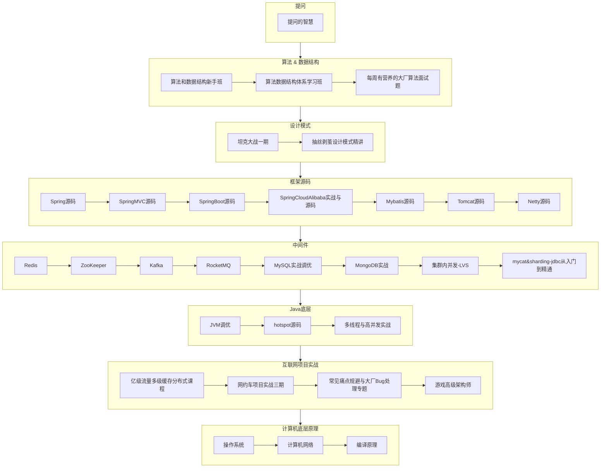

# 每日学习记录-课程

## 学习路线

马士兵官网个人学习路线链接：https://www.mashibing.com/subject/studyline/1?courseId=18870



## 个人心得

今天用笔记把老师给我设计的学习路线重新复习了一遍，加深些印象。

努力很重要，努力之前的选择更重要。选择的合理性取决于我们之前努力所积累的经验和认知。

我们每天仅仅努力做好领导分配的工作是远远不够的。白天8小时的工作决定现在，下班8小时做的事情决定未来。

我们应该给自己设定好职业规划或者一个清晰明确的目标。每天的努力如果是沙子，那目标就像是石灰，他能把砂子凝结成水泥，从而使我们能够建造我们的参天大厦。

关于年薪百万这个目标，虽然对于我们普通人都觉得很难实现。但对于曾今实现过这个目标的人就不会觉得很难，因为他知道实现方法。相信在马士兵不止一位老师实现过年薪百万的目标。希望各位老师能给那些在路上前行的人一些宝贵的建议。有了老师的帮助能降低我们摸索，走弯路花费的时间。

最后，不管年薪百万的目标是否能实现，能够有一个目标去努力，总比每天把时间花在无意义的事情上或者浪费生命强。


## 提问的智慧

沟通的核心思想：沟通以对方为中心。

用最快最舒服的方式让对方知道你想表达的意思。了解前因后果和目前的问题。


### 专业术语的使用

尽量使用行业专业术语，不要自己造词汇。但也不要过度使用专业术语，使得一个简单问题变成一个学术论文。

如果要问老师，尽量使用老师说过的专业术语。


### 问题描述准确具体

能截图就尽量截图，截图时最好把重点圈出来。


### 提供分析材料

可以换位思考：如果是你在处理别人的问题，那针对这个问题，你想看到哪些材料？

例如：如果想让别人帮忙分析SQL语句，最好除了把SQL语句发给对方之外，最好还能提供表结构说明文档，建表和数据插入语句。

必要时最好能提供运行环境说明。例如：jdk版本，编辑工具，服务器环境。


## 程序调试技巧

### 日志查看

精确定位异常的代码行。灰色的行代表并不是自己项目的源代码，蓝色的才是。

从上往下看cause by：一般看最下面的异常。


### 博客和工具网站介绍

日志中如果出现一些没见过的异常，可以去网上搜索。例如：百度、csdn。

随着处理的问题越来越多，学到的东西也越来越多。

一个问题至少查阅3篇文章。

csdn：开发者社区网站。

菜鸟教程：https://www.runoob.com/

w3school（偏前端）：https://www.w3school.com.cn/


## 线上教育平台问答系统

1. 账号注册与登录 联系班主任
2. 知识问答。一般30分钟之内回复。可以悬赏。在我的问答中会显示别人的回复。
3. 题库。汇集了常见的面试题。


# 2023-01

## 2023-01-06

打卡时间：2023-01-06

**今日所学内容**

复习了一遍学习路线

**遇到的问题：**

1. 目前的这个学习路线对应职业规划是什么？我的情况未来还是适合往开发经理发展还是架构师？

a.   严镇涛老师：这个学习路线对应的是架构师，你这边我觉得最重要的是两块：

b.   第一个就是微服务，第二个就是并发类解决方案。微服务体系是包括了微服务框架源码，中间件（消息，缓存），分布式解决方案（事务，锁 ）定时任务。并发则是并发编程，原生限流，性能优化处理。

2. 如果要达到-薪百万，是不是最好去大厂？大厂是指什么行业？互联网，金融？外企能去么？

a.   严镇涛老师：达到-薪百万 其实有很多选择，大厂指的是公司规模 很多公司都能给，微软比如64级以上基本都是百万

3. 这些推荐的课程要全部学完才能找工作？

a.   严镇涛老师：推送的项目，可以选择性的学习几个模块 即可

4. docker，k8s，我之前也没接触过，是否要学习？

a.   严镇涛老师：这个没必要 一般项目负责人才需要对于项目整体把控才学习的

5. 如果每天只有2-3小时的学习时间，这些课程能否在6个月内学完。如果当前选择这个行业没什么发展前景，希望能尽快换工作。

a.   严镇涛老师：6个月学完就要有选择性学习了

b.   糖糖老师：算法课程和架构课程最好是并行学习

是否解决：

已解决。

建议：

用时：约40分钟

 

## 2023-01-07

打卡时间：2023-01-08

今日所学内容：

提问的智慧；位运算（没学完）

总结：

沟通的核心思想：为对方考虑。

用最快最舒服的方式让对方知道你想表达的意思。了解前因后果和目前的问题。

遇到的问题：

1. 由于大学是化工系的。对位运算理解起来有点困难。
2. 今天只看了一点还没有全部看完，打算自己再理解一下，如果实在理解不了再问老师。

是否解决：暂时没问题要解决

建议：无

用时：约2小时

 

## 2023-01-09

打卡时间：2023-01-09

今日所学内容：

位运算（视频看到了37:30）

理解了老师写的那段打印整数32位信息程序的意思。

左移的10进制含义

反码和补码

为什么负数要取反+1

总结：

见"马士兵-学习笔记-Gem.md"

 

遇到的问题：

1. 之前理解不了位运算，后面不断的把位运算的步骤拆分，不断的举例子最后终于有点理解了。

 

是否解决：是

建议：无

用时：约1.5小时

 

## 2023-01-11

打卡时间：2023-01-11

**今日所学内容：**

位运算种类；右移；取反；算法分类，阶乘题目。

**总结：**

见"马士兵-学习笔记-Gem.md"

**遇到的问题：**

1. 暂无。

**是否解决**

暂时没问题要解决

**建议**

无

**用时**

时长：1.5小时，22:00~23:30

 

## 2023-01-12

打卡时间：2023-01-12

**今日所学内容：**

选择排序和冒泡排序。

**总结：**

见"马士兵-学习笔记-Gem.md"

**遇到的问题：**

1. 暂无。

**是否解决**

暂时没问题要解决

**建议**

无

**用时**

时长：1.5小时，22:17~23:50

 

## 2023-01-14

打卡时间：2023-01-14

 

**今日所学内容：**

插入排序，数据结构大类。

 

**总结：**

见"马士兵-学习笔记-Gem.md"

 

**遇到的问题：**

1. 暂无。

 

**是否解决**

没问题要解决

 

**建议**

无

 

**用时**

时长：2小时左右，21:45~23:59

 

## 2023-01-15

打卡时间：2023-01-15

 

**今日所学内容：**

如何求数组指定范围内值的和。1.预处理结构建立。2.前缀和数组建立。

Math.random()通过代码检查random函数的实际概率是否符合预期。学到11:32。

 

**总结**：

见"马士兵-学习笔记-Gem.md"

 

**遇到的问题：**

1. 暂无。

 

**是否解决**

没问题要解决

 

**建议**

无

 

**用时**

时长：2小时左右，22:00~23:59

 

## 2023-01-16

打卡时间：2023-01-16

**今日所学内容：**

如果将生成概率调整到X的平方

**总结：**

见"马士兵-学习笔记-Gem.md"

**遇到的问题：**

1. 暂无。

**是否解决**

没问题要解决

**建议**

无

**用时**

时长：1小时左右，22:20~23:35

 

## 2023-01-24

打卡时间：2023-01-24

**今日所学内容：**

从1-5随机到1-7随机；从3-19到17-56随机；遇到偶数怎么办；从01不等概率到01等概率

算法视频14已看完

**总结：**

见"马士兵-学习笔记-Gem.md"

**遇到的问题：**

1. 暂无。

**是否解决**

没问题要解决

**建议**

无

**用时**

时长：3.5小时左右，20:40~00:10

 

## 2023-01-25

打卡时间：2023-01-25

**今日所学内容：**

对数器的使用。对数器就是生成数据样本，自己做比对的机器（程序）。生成数据样本可以是随机也可以是暴力方式。总体目的还是控制程序bug，不依赖线上测试。

微服务架构介绍

nacos下载和安装

nacos服务提供者注册，消费者注册和负载均衡

用手机学的，没有做详细笔记。

**总结：**

见"马士兵-学习笔记-Gem.md"

**遇到的问题：**

1. 暂无。

**是否解决**

没问题要解决

**建议**

无

**用时**

时长：3小时左右，20:20~0:10

 

## 2023-01-27

打卡时间：2023-01-27

**今日所学内容：**

补充了25号学习内容对应的笔记。搜索老师笔记的时候耗费了一些时间，最终还是找到了。略作修改，补充到了自己的笔记中。

对照笔记实际操作的过程中遇到了一些问题，目前只是安装好了nacos。明天继续弄

**总结：**

见"马士兵-学习笔记-Gem.md"

**遇到的问题：**

1. 视频附件中的git地址http://git.mashibing.com/xinxin/spring-cloud-alibaba无法打开。把里面的git改成了git2之后，打开是可以打开了，但是无权限下载，加了ssh key也不行。后面发现了百度网盘下载链接才把笔记下载下来。

**是否解决**

已自行解决。

**建议**

希望可以在视频中附带最新的笔记或者代码的下载链接。

**用时**

时长：5小时左右，20:20~01:12

 

## 2023-01-29

打卡时间：2023-01-29

**今日所学内容**

1. 由于Springboot版本是2.6.6，今天重新下载并安装了nacos1.4.4，
2. 补充nacos服务提供者注册的实战代码。目前已经可以在nacos服务列表中看到新建的Provider服务了
3. 项目启动中遇到问题，花费了一下时间，目前已解决。

**总结：**

见"马士兵-学习笔记-Gem.md"

**遇到的问题：**

1. 启动服务提供方服务时报错：Param 'serviceName' is illegal, serviceName is blank。

**是否解决**

1. 经排查是因为父项目的pom文件中写了<**packaging**>pom</**packaging**>。导致子项目的application.yml文件没有编译到target目录导致spring根本没加载到配置文件。端口号也是默认的8080.解决方案就是将<**packaging**>pom</**packaging**>删除或者改成<**packaging**>jar</**packaging**>

**建议**

**用时**

时长：2小时左右，23:00~01:26

 

## 2023-01-30

打卡时间：2023-01-30

**今日所学内容：**

1. 补充nacos服务消费者注册的实战代码。目前已经可以在nacos服务列表中看到新建的2个Provider服务和1个consumer服务。
2. 在consumer中调用provider异常：java.net.UnknownHostException: nacos-provider

**总结：**

见"马士兵-学习笔记-Gem.md"

**遇到的问题**

1. consumer的controller中调用provider的接口（

http://localhost:8095/consumer/test）异常：java.net.UnknownHostException: nacos-provider

2. 单独调用2个provider的方法都可以正常返回：（http://localhost:8090/test）
3. <**spring-cloud-alibaba-version**>2021.0.1.0</**spring-cloud-alibaba-version**>
4. nacos版本：1.4.4

**是否解决**

**否**

**建议**

**用时**

时长：3小时左右，21:30~00:21

 

## 2023-01-31

打卡时间：2023-01-31

**今日所学内容：**

1. 二分法。
2. 在有序数组中找到指定的数
3. 在有序数组中找到<=num最右的位置
4. 在有序数组中找到>=num最左的位置
5. 局部最小值（未写代码）

**总结：**

见"马士兵-学习笔记-Gem.md"

**遇到的问题：**

1. 暂无。

**是否解决**

**建议**

**用时**

时长：2小时左右，21:20~23:38

 

# 2023-02

## 2023-02-01

打卡时间：2023-02-01

**今日所学内容：**

1. 解决前天遇到的微服务调用问题。
2. 补充局部最小值的代码。发现了一种求局部最小值的新写法； 

​        public static int    find(int[] input) {        int index = -1;        if (input == null || input.length    == 0) {          return index;        }        int length = input.length;        if (length == 1) {          return 0;        } else if (input[0] < input[1])    {          //最左就是最小值的情况          return 0;        } else if (input[length - 2] >    input[length - 1]) {          //最右就是最小值的情况          return length - 1;        }        //排除了上面的情况后，下面数组长度一定至少3个，用二分法查找剩余范围内的局部最小值。        int L = 1;        int R = length - 2;        while (L <= R) {          int mid = (L + R) / 2;          if (input[mid - 1] >    input[mid] && input[mid] < input[mid + 1]) {            index = mid;            break;          } else {            //如果左边的值比中间值小，则去掉右半边。            if (input[mid - 1] <    input[mid]) {              R = mid - 1;            } else {              L = mid + 1;            }          }        }        return index;      }        


**总结：**

见"马士兵-学习笔记-Gem.md"

 

**遇到的问题：**

1. 在consumer中调用provider的接口异常：java.net.UnknownHostException: nacos-provider

**出错环境信息**

SpringBoot：2.6.6，SpringCloudAlibaba：2021.0.1.0，Nacos：1.4.4

SpringBoot：2.6.6，SpringCloudAlibaba：2021.0.1.0，Nacos：1.4.2

SpringBoot：2.6.3，SpringCloudAlibaba：2021.0.1.0，Nacos：1.4.2

**原因分析**

应该是SpringBoot，SpringCloudAlibaba，Nacos版本不匹配

**解决方案**

不修改代码，将各个组件的版本调整成如下组合就能成功。

SpringBoot：2.3.2.RELEASE，SpringCloudAlibaba：2.2.6.RELEASE，Nacos：1.4.4

SpringBoot：2.3.12.RELEASE，SpringCloudAlibaba：2.2.9.RELEASE，Nacos：2.1.2

 

**是否解决**

已解决，感谢糖糖老师和马坤鹏老师

**建议**

**用时**

时长：2小时左右，21:10~23:30

 

## 2023-02-03

打卡时间：2023-02-03

 

**今日所学内容：**

1. 时间复杂度

a.  常数操作

b.  时间复杂度

c.   常见算法的时间复杂度

2. 动态数组

a.  动态数组扩容时间复杂度

 

**总结：**

见"马士兵-学习笔记-Gem.md"

 

**遇到的问题：**

**是否解决**

**建议**

**用时**

时长：2小时左右，21:50~23:50

 

## 2023-02-06

打卡时间：2023-02-06

 

**今日所学内容：**

1. CAP模型
2. 服务注册中心对比
3. Nacos之服务配置中心（示例代码运行成功）

 

**总结：**

见"马士兵-学习笔记-Gem.md"

 

**遇到的问题：**

**是否解决**

**建议**

**用时**

时长：2小时左右，21:39~23:52

 

## 2023-02-07

打卡时间：2023-02-07

 

**今日所学内容：**

1. 2023金三银四面试突击班关于面试表达

 

**总结：**

面试

突击班上课形式：第一节课讲宏观形势。

往期的视频要去看，后面的课程都是对前面的扩充。例如：马老师的面试指导课要去看。

看完之后要对自己有个准确的评估，然后跟老师交流。如果发现自己很多东西不懂，不要着急。

并不一定要金三银四找工作的。找工作需要额外花时间的。同一家公司如果面试失败，短时间不会让人重复面试的。所以不要轻易的去面试。

每天坚持，建立习惯。

面试准备

确定目标，比如，-薪50万，然后把简历写成值50万，然后根据自己的情况，逐个补不足。

P8，P9的管理课，产品课，可以找老师说的100句话，背出来，学到30句就不错了，先抄袭再超越。

1、微服务 2、中间件 3、分布式 4、数据库: 5、缓存： 6、JVM , 7、并发

简单的东西不用写了，要写能突出自己特长的词汇。例如：idea，maven，eclipse等

如果时间实在不够还要去面试，那就先把自己不会的技术写上去，先把面试机会拿到手再说。

能写精通就写精通，精通取决于面试官的水平。丢脸没事，出去之后面试官就把你忘了。

1.技术栈，特别的饱满

2.项目。对自己的项目业务技术非常了解。严选项目，生产事故bug分享课。在MCA体系课里面有。

项目没有高并发场景怎么办？其实全国没有几个公司会接触高并发场景的，面试官问只是想知道你有没有技术储备，有没有解决方案。

如果没有标准，永远没有准备好的，越学越会觉得自己不会的越多。所以在准备之前一定要确定好准备范围。

面试前：开始录音

面试后：分析录音。复盘。

 

**遇到的问题：**

**是否解决**

**建议**

**用时**

时长：2小时左右，20:00~22:00

 

## 2023-02-08

打卡时间：2023-02-08

 

**今日所学内容：**

1. 哈希表
2. 有序表
3. 单双链表
4. 单链表反转

 

**总结：**

见"马士兵-学习笔记-Gem.md"

 

**遇到的问题：无**

**是否解决**

**建议：无**

**用时**：2小时左右，时间范围：21:30~00:06

 

## 2023-02-09

打卡时间：2023-02-09

 

**今日所学内容：**

1. 双链表的反转

a.  使用mermaid流程图画了链表反转示意图。

2. 用单链表实现队列，思路如下：

 

**总结：**见"马士兵-学习笔记-Gem.md"

**遇到的问题：**

1. 双链表的反转理解起来比较困难，单链表的时候就没理解透，到了双链表就更晕了。

a.  花了点时间用mermaid画了前后的对比图，但感觉还是没理解透。

b.  后面OneNote的绘图功能，像老师一样，一步步对着代码画图总算理解了。

**是否解决：已自行解决**

**建议**

**用时**

时长：2小时左右，22:00~00:25

 

## 2023-02-10

打卡时间：2023-02-10

 

**今日所学内容：**

1. 用单链表实现栈
2. 用双链表实现双端队列
3. K个节点的组内逆序调整（还没理解）

 

**总结：**见"马士兵-学习笔记-Gem.md"

**遇到的问题：**

第一次接触leecode题目，暂时还没理解，明天继续尝试，如果不行再问老师。

**是否解决：否**

**建议**

**用时**

时长：2小时左右，21:50~00:10

 

## 2023-02-11

打卡时间：2023-02-11

 

**今日所学内容：**

1. 用单链表实现栈
2. 用双链表实现双端队列
3. K个节点的组内逆序调整（还没理解）

 

**总结：**见"马士兵-学习笔记-Gem.md"

**遇到的问题：**

第一次接触leecode题目，暂时还没理解，明天继续尝试，如果不行再问老师。

**是否解决：否**

**建议**

**用时**

时长：2小时左右，21:50~00:10

 

## 2023-02-12

打卡时间：2023-02-12

 

**今日所学内容：**

1. K个节点的组内逆序调整（已经理解老师的解题思路）
2. 仅仅理解老师的思路是不够的，明天准备自己写一遍。

 

**总结：**见"马士兵-学习笔记-Gem.md"

**遇到的问题：**

**是否解决：是**

**建议**

**用时**

时长：1小时左右，23:00~00:45

 

## 2023-02-13

打卡时间：2023-02-13

 

**今日所学内容：**

1. K个节点的组内逆序调整（已经理解老师的解题思路）
2. 仅仅理解老师的思路是不够的，明天准备自己写一遍。

 

**总结：**见"马士兵-学习笔记-Gem.md"

**遇到的问题：**

**是否解决：是**

**建议**

**用时**

时长：1小时左右，22:45~00:45

 

## 2023-02-14

打卡时间：2023-02-14

 

**今日所学内容：**

1. 按照自己的理解把K个节点的组内逆序调整代码写了一下。
2. 原来能听明白别人的思路，不代表自己就能写出来了。发现自己对链表的操作很陌生，之前的课也只是停留于听明白了，并没有按照自己的思路写一遍。
3. 真正写的时候，就完全不知道怎么写了，又去把老师的代码debug了好几遍才写出来。

 

**总结：**见"马士兵-学习笔记-Gem.md"

**遇到的问题：**

**是否解决**

**建议**

**用时**

时长：2小时左右，22:20~01:00

 

## 2023-02-15

打卡时间：2023-02-15

 

**今日所学内容：**

1. 学习了2个链表数值相加。理解了老师的思路。根据老师的思路想了另一个解题思路
2. 按自己的思路也写了一遍代码。提交leetcode通过。

a.  首先写一个获取2个链表长度的方法，区分出长的链表为L，短的为S，用长的来循环

b.  从第1个节点开始，首先获取每个节点当前的值。短的链表如果当前节点为空，则当成0。

c.   将2个节点的值相加，再加上进位。如果这个和大于等于10，则进位更新为1，否则还是0

d.  将这个和对10取余之后的值更新到长链表的节点值中。继续下一个处理下一个节点。

e.  如果处理到最后一个节点进位还是大于0，则需要在长链表的最后面新增一个节点，值为1

f.   结束循环，将长链表的head作为结果返回。

 

**总结：**见"马士兵-学习笔记-Gem.md"

**遇到的问题：**

**是否解决**

**建议**

**用时**

时长：2小时左右，22:20~1:20

 

## 2023-02-16

打卡时间：2023-02-16

 

**今日所学内容：**

1. 学习2个有序列表合并视频
2. 按照老师讲解写了一遍代码,leetcode已通过

 

**总结：**见"马士兵-学习笔记-Gem.md"

**遇到的问题：**

**是否解决**

**建议**

**用时**

时长：1小时左右，23:10~0:20

 

## 2023-02-17

打卡时间：2023-02-17

 

**今日所学内容：**

1. 位图功能
2. 位图实现（取模的位运算实现听的有点晕，明天继续）

 

**总结：**见"马士兵-学习笔记-Gem.md"

**遇到的问题：**

**是否解决**

**建议**

**用时**

时长：1小时左右，23:10~0:10

 

## 2023-02-19

打卡时间：2023-02-19

 

**今日所学内容：**

1. 位图实现（放慢速度，一步一步慢慢理解左老师的讲解，终于明白了）

 

**总结：**见"马士兵-学习笔记-Gem.md"

**遇到的问题：**

**是否解决**

**建议**

**用时**

时长：2小时左右，22:40~01:30

 

## 2023-02-20

打卡时间：2023-02-20

 

**今日所学内容：**

1. 位运算实现加法和减法
2. 乘法目前听了一半

 

**总结：**见"马士兵-学习笔记-Gem.md"

**遇到的问题：**

**是否解决**

**建议**

**用时**

时长：1小时左右，22:00~23:30

 

## 2023-02-21

打卡时间：2023-02-21

 

**今日所学内容：**

1. 位运算-乘法。跟着写了一遍代码
2. 位运算-除法。还没听懂。明天继续。

 

**总结：**见"马士兵-学习笔记-Gem.md"

**遇到的问题：**

**是否解决**

**建议**

**用时**

时长：2小时左右，22:00~00:07

 

## 2023-02-22

打卡时间：2023-02-22

 

**今日所学内容：**

1. 位运算-除法。一步步跟着左老师的思路屡了好几遍终于明白了。

 

**总结：**见"马士兵-学习笔记-Gem.md"

**遇到的问题：**

**是否解决**

**建议**

**用时**

时长：2小时左右，22:40~00:33

 

## 2023-02-23

打卡时间：2023-02-23

 

**今日所学内容：**

1. 位运算-除法。自己根据记忆写了一遍代码。发现只要自己写就没思路了，还是参考老师的代码
2. 处理最小值不能转绝对值的问题

 

**总结：**见"马士兵-学习笔记-Gem.md"

**遇到的问题：**

**是否解决**

**建议**

**用时**

时长：1小时左右，22:40~00:00

 

## 2023-02-27

打卡时间：2023-02-27

 

**今日所学内容：**

1. 比较器
2. 合并K个升序链表

 

**总结：**见"马士兵-学习笔记-Gem.md"

**遇到的问题：**

**是否解决**

**建议**

**用时**

时长：2小时左右，22:10~00:30

 

## 2023-02-28

打卡时间：2023-02-28

 

**今日所学内容：**

1. 将合并K个升序链表的代码根据自己的理解在写一遍。
2. 二叉树，了解先序，中序，后序打印，递归续还没理解。明天继续

 

**总结：**见"马士兵-学习笔记-Gem.md"

**遇到的问题：**

**是否解决**

**建议**

**用时**

时长：2小时左右，22:10~23:30

 

# 2023-03

## 2023-03-01

打卡时间：2023-03-01

 

**今日所学内容：**

1. 递归续已理解。
2. 理解并写了一遍判断两颗二叉树相等的代码。

 

**总结：**见"马士兵-学习笔记-Gem.md"

**遇到的问题：**

**是否解决**

**建议**

**用时**

时长：1.5小时左右，22:50~00:40

 

## 2023-03-02

打卡时间：2023-03-02

昨天的打卡时间有误，应该是：2023-03-01

 

**今日所学内容：**

1. 判断一棵树是否是镜面树，代码已提交通过
2. 返回一棵树的最大深度，代码已提交通过
3. 用先序数组和中序数组重建一棵树，看了好几遍左老师的视频终于理解了，但是自己写还是写不出来。明天再写一遍。

 

**总结：**见"马士兵-学习笔记-Gem.md"

**遇到的问题：**

**是否解决**

**建议**

**用时**

时长：4小时左右，20:30~00:50

 

## 2023-03-03

打卡时间：2023-03-03

 

**今日所学内容：**

1. 用先序数组和中序数组重建一棵树，将左老师的代码看了2遍，自己也写了2遍

 

**总结：**见"马士兵-学习笔记-Gem.md"

**遇到的问题：**

**是否解决**

**建议**

**用时**

时长：1小时左右，23:10~00:10

 

## 2023-03-05

打卡时间：2023-03-05

 

**今日所学内容：**

1. 按层遍历收集节点
2. 判断平衡二叉树
3. 判断平衡搜索二叉树（未看完）

 

**总结：**见"马士兵-学习笔记-Gem.md"

**遇到的问题：**

**是否解决**

**建议**

**用时**

时长：2小时左右，23:05~01:40

 

## 2023-03-06

打卡时间：2023-03-06

 

**今日所学内容：**

1. 架构师定义分类，按职责分，按工作分。
2. 判断平衡搜索二叉树

 

**总结：**见"马士兵-学习笔记-Gem.md"

**遇到的问题：**

**是否解决**

**建议**

**用时**

时长：2小时左右，22:05~00:15

 

## 2023-03-07

打卡时间：2023-03-07

 

**今日所学内容：**

1. 能否组成路径和。
2. 收集达标路径和。

 

**总结：**见"马士兵-学习笔记-Gem.md"

**遇到的问题：**

**是否解决**

**建议**

**用时**

时长：2小时左右，21:04~00:15

 

## 2023-03-08

打卡时间：2023-03-08

 

**今日所学内容：**

1. 归并排序-递归写法。理解了一遍。
2. 打算明天再自己写一遍。

 

**总结：**见"马士兵-学习笔记-Gem.md"

**遇到的问题：**

**是否解决**

**建议**

**用时**

时长：1小时左右，22:45~00:00

 

## 2023-03-09

打卡时间：2023-03-09

 

**今日所学内容：**

1. 归并排序-递归写法。自己写了一遍。
2. 归并排序-非递归写法。视频已看完。

 

**总结：**见"马士兵-学习笔记-Gem.md"

**遇到的问题：**

**是否解决**

**建议**

**用时**

时长：2小时左右，21:00~23:30

 

## 2023-03-12

打卡时间：2023-03-12

 

**今日所学内容：**

1. 快速排序-分2个区。代码自己写了一遍。
2. 快速排序-分3个区。代码自己写了一遍。
3. 快速排序-分区加排序-递归。视频已看完。

 

**总结：**见"马士兵-学习笔记-Gem.md"

**遇到的问题：**

**是否解决**

**建议**

**用时**

时长：2小时左右，22:50~00:50

 

## 2023-03-14

打卡时间：2023-03-14

 

**今日所学内容：**

1. 重新复习了，快速排序-递归实现。
2. 学习了，快速排序-非递归栈实现。
3. 整理笔记，目前所有算法入门视频都已经看完。

 

**总结：**见"马士兵-学习笔记-Gem.md"

**遇到的问题：**

**是否解决**

**建议**

**用时**

时长：1小时左右，22:05~23:45

 

## 2023-03-15

打卡时间：2023-03-15

 

**今日所学内容：**

1. 代码好坏评价标准
2. 编程方法论
3. 设计模式概述
4. 设计模式分类

 

**总结：**见"马士兵-学习笔记-Gem.md"

**遇到的问题：**

**是否解决**

**建议**

**用时**

时长：1.5小时左右，22:30~00:00

 

## 2023-03-16

打卡时间：2023-03-16

 

**今日所学内容：**

1. 单一职责原则
2. 开闭原则
3. 里氏替换原则
4. 依赖倒置原则
5. 迪米特法则
6. 接口隔离原则

 

**总结：**见"马士兵-学习笔记-Gem.md"

**遇到的问题：**

**是否解决**

**建议**

**用时**

时长：2小时左右，22:00~00:30

 

## 2023-03-17

打卡时间：2023-03-17

 

**今日所学内容：**

1. 单例模式介绍
2. 饿汉式
3. 懒汉式(线程不安全)
4. 懒汉式(线程安全)
5. 双重校验
6. 静态内部类
7. 单例的破坏
8. 枚举(推荐方式)

 

**总结：**见"马士兵-学习笔记-Gem.md"

**遇到的问题：**

**是否解决**

**建议**

用**时**

时长：1小时左右，22:10~23:15

 

## 2023-03-19

打卡时间：2023-03-19

 

**今日所学内容：**

1. 简单工厂模式介绍、原理，重构、总结
2. 抽象工厂介绍

 

**总结：**见"马士兵-学习笔记-Gem.md"

**遇到的问题：**

**是否解决**

**建议**

用**时**

时长：1小时左右，22:45~00:15

 

## 2023-03-20

打卡时间：2023-03-20

 

**今日所学内容：**

1. 根据自己的理解重新写了一遍工厂方法和简单工厂的代码
2. 抽象工厂简介，实现，总结已学习完。

 

**总结：**见"马士兵-学习笔记-Gem.md"

**遇到的问题：**

**是否解决**

**建议**

用**时**

时长：2小时左右，22:00~23:51

 

## 2023-03-22

打卡时间：2023-03-22

 

**今日所学内容：**

1. 建造者模式介绍，原理，2种实现方式，总结。
2. 根据自己的理解新写了1个案例代码。

 

**总结：**见"马士兵-学习笔记-Gem.md"

**遇到的问题：**

**是否解决**

**建议**

用**时**

时长：2小时左右，22:13~00:01

 

## 2023-03-23

打卡时间：2023-03-23

 

**今日所学内容：**

1. 原型模式介绍，原理，实现方式，总结。
2. 补充了一个种Hutool的深克隆方法。

 

**总结：**见"马士兵-学习笔记-Gem.md"

**遇到的问题：**

**是否解决**

**建议**

用**时**

时长：1小时左右，22:45~23:55

 

## 2023-03-24

打卡时间：2023-03-24

 

**今日所学内容：**

1. 代理模式介绍，原理。静态代理实现
2. JDK动态代理实现。
3. CGLib动态代理实现（正在学）

 

**总结：**见"马士兵-学习笔记-Gem.md"

**遇到的问题：**

**是否解决**

**建议**

用**时**

时长：1小时左右，23:00~00:05

 

## 2023-03-27

打卡时间：2023-03-27

 

**今日所学内容：**

1. 代理模式-cglib实现。代理流程。
2. 代理模式-总结。
3. 在电脑上安装了arthas，并学习了基本的命令：dashboard，jad，thread 1

 

**总结：**见"马士兵-学习笔记-Gem.md"

**遇到的问题：**

**是否解决**

**建议**

**用时**

时长：1.5小时左右，22:25~00:02

 

## 2023-03-28

打卡时间：2023-03-28

 

**今日所学内容：**

1. 将之前学的比较重要的模式复习一下，重新整理笔记。
2. 代理模式笔记重新整理。
3. 单例模式笔记重新整理。
4. 新增合成复用原则

 

**总结：**见"马士兵-学习笔记-Gem.md"

**遇到的问题：**

**是否解决**

**建议**

**用时**：3.5小时左右，14:30~18:00

 

## 2023-03-29

打卡时间：2023-03-29

 

**今日所学内容：**

1. 写了一段多线程代码，测试普通懒汉单例是否会被破坏。

​      

​        /**     * 测试在多线程环境下，普通懒汉单例是否线程安全<br>     * @author namelessmyth     * @version 1.0     * @date 2023/3/29     */    public class    SingletonThreadSafeTest implements Runnable {           @Override      public void run() {        SingletonLasy instance =    SingletonLasy.getInstance();         System.out.println(instance);      }           public static void main(String[] args)    throws Exception {        //SingletonLasy s1 =    SingletonLasy.getInstance();        //多线程下，下面的代码运行多次，会发现实例不是同一个。但上面的代码如果先执行，就不会破坏单例。        Thread t1 = new Thread(new SingletonThreadSafeTest());        Thread t2 = new Thread(new    SingletonThreadSafeTest());        t1.start();        t2.start();        }    }        


2. 桥接模式学习，笔记整理，代码案例编写。
3. 装饰模式学习，笔记整理。（未完待续）

 

**总结：**见"马士兵-学习笔记-Gem.md"

**遇到的问题：**

**是否解决**

**建议**

**用时**：3小时左右，20:30~23:40

 

## 2023-03-30

打卡时间：2023-03-30

 

**今日所学内容：**

1. 装饰模式学习，笔记整理，代码案例编写
2. 适配器模式学习，笔记整理，代码案例编写

 

**总结：**见"马士兵-学习笔记-Gem.md"

**遇到的问题：**

**是否解决**

**建议**

**用时**：3小时左右，20:00~23:00

 

## 2023-03-31

打卡时间：2023-03-31

 

**今日所学内容：**

1. 重新理解枚举单例，写了一个枚举局部单例。
2. 主要应用场景：某些对象的初始化时间较长。客户端可通过公共方法统一实例化（单例），但也允许自行实例化。

 

**总结：**见"马士兵-学习笔记-Gem.md"

**遇到的问题：**

**是否解决**

**建议**

**用时**：2小时左右，22:30~00:35

 

# 2023-04

## 2023-04-02

打卡时间：2023-04-02 星期日

 

**今日所学内容：**

1. 重新复习了一遍适配器模式，发现对适配器的理解存在问题。
2. 外观模式学习，笔记整理，代码案例编写。

 

**总结：**见"马士兵-学习笔记-Gem.md"

**遇到的问题：**

**是否解决**

**建议**

**用时**：2小时左右，21:40~00:09

 

## 2023-04-03

打卡时间：2023-04-03 星期一

 

**今日所学内容：**

1. 看了丛庆老师的设计模式面试直播课。学习设计模式的学习方法。

a.   学习设计模式不能死记硬背。

b.   首先理解设计原则。设计模式是什么，然后他的3种分类。

c.   理解设计模式的使用场景，在工作中使用正确的设计模式。

d.   面试的时候，可以挑几个自己比较熟的讲

2. 组合模式学习。分透明和安全2种，以及结合自己公司的业务写了一个案例。
3. 享元模式学习。案例代码编写。
4. 观察者模式学习。案例代码编写。

 

**总结：**见"马士兵-学习笔记-Gem.md"

**遇到的问题：**

**是否解决**

**建议**

**用时**：5小时左右，15:00~21:25

 

## 2023-04-05

打卡时间：2023-04-05 星期三

 

**今日所学内容：**

1. 看了丛庆老师的设计模式面试直播课。学习设计模式的学习方法。

a.   学习设计模式不能死记硬背。

b.   首先理解设计原则。设计模式是什么，然后他的3种分类。

c.   理解设计模式的使用场景，在工作中使用正确的设计模式。

d.   面试的时候，可以挑几个自己比较熟的讲

2. 组合模式学习。分透明和安全2种，以及结合自己公司的业务写了一个案例。
3. 享元模式学习。案例代码编写。
4. 观察者模式学习。案例代码编写。

 

**总结：**见"马士兵-学习笔记-Gem.md"

**遇到的问题：**

**是否解决**

**建议**

**用时**：5小时左右，15:00~21:25

 

## 2023-04-06

打卡时间：2023-04-06 星期四

 

**今日所学内容：**

1. 模板方法学习。这个模式平时用的比较多，案例没跟着写。
2. 策略模式学习。案例代码编写。
3. 职责链模式学习。案例代码编写。
4. 状态模式学习。案例代码编写。

 

**总结：**见"马士兵-学习笔记-Gem.md"

**遇到的问题：**

**是否解决**

**建议**

**用时**：4小时左右，18:30~22:30

 

## 2023-04-07

打卡时间：2023-04-07 星期五

 

**今日所学内容：**

1. 迭代器模式学习。只记了优缺点和使用场景，平时很少用。
2. 访问者模式学习。案例代码编写。
3. 备忘录模式学习。案例代码编写。
4. 今天学的后面2个模式，感觉还是不怎么懂，明天继续学习。

 

**总结：**见"马士兵-学习笔记-Gem.md"

**遇到的问题：**

**是否解决**

**建议**

**用时**：2小时左右，20:45~22:52

 

## 2023-04-10

打卡时间：2023-04-10 星期一

 

**今日所学内容：**

1. 命令模式学习。案例代码编写。
2. 解释器模式学习。案例代码编写。
3. 中介者模式学习。案例代码编写。
4. 重新学习备忘录模式。
5. 重新学习访问者模式。

 

**总结：**见"马士兵-学习笔记-Gem.md"

**遇到的问题：**

**是否解决**

**建议**

**用时**：6小时左右，13:30~22:00

 

## 2023-04-11

打卡时间：2023-04-11 星期二

 

**今日所学内容：**

1. 换电脑了，重新安装了nacos2.1.2，运行了之前的nacos负载均衡案例
2. 重新学习cap理论，nacos配置中心。编写并执行配置中心代码案例。
3. 学习nacos集群，已看完第1个视频。目前正在学习nacos的持久化配置
4. 执行了mysql的nacos脚本，由于MySQL密码忘了，目前nacos还没启动起来

 

**总结：**见"马士兵-学习笔记-Gem.md"

**遇到的问题：**

**是否解决**

**建议**

**用时**：6小时左右，13:30~22:00

 

## 2023-04-12

打卡时间：2023-04-12 星期三

 

**今日所学内容：**

1. MySQL密码找到，本次Nacos已经连接MySQL成功。
2. 熟悉Nacos集群的搭建步骤，后面考虑搭建linux环境，跟着视频操作一遍。
3. sentinel介绍，下载、安装、运行。
4. sentinel初始化监控，案例运行成功。
5. sentinel流控规则-直接失败-QPS和并发线程数，案例运行成功。
6. sentinel流控规则-关联，视频已看完，电脑无postman，案例未执行。

 

**总结：**见"马士兵-学习笔记-Gem.md"

**遇到的问题：**

**是否解决**

**建议**

**用时**：5小时左右，16:30~22:30

 

## 2023-04-13

打卡时间：2023-04-13 星期四

 

**今日所学内容：**

1. sentinel流控规则-链路，案例已执行。
2. sentine流控效果-预热，案例已执行。
3. sentine流控效果-排队等待，视频已学习。

 

**总结：**见"马士兵-学习笔记-Gem.md"

**遇到的问题：**

**是否解决**

**建议**

**用时**：2小时左右，22:15~00:15

 

## 2023-04-17

打卡时间：2023-04-17 星期一

 

**今日所学内容：**

1. 学习了新的api调试工具Apipost，执行了之前的流控关联案例。
2. 使用apipost成功执行了排队等待的案例。
3. 学习sentinel熔断降级-慢调用比例，异常比例，异常数。
4. 学习sentinel热点规则。执行代码案例。
5. 学习sentinel系统规则。

 

**总结：**见"马士兵-学习笔记-Gem.md"

**遇到的问题：**

**是否解决**

**建议**

**用时**：5小时左右，15:00~22:30

 

## 2023-04-18

打卡时间：2023-04-18 星期二

 

**今日所学内容：**

1. 写了一个脚本，先后启动电脑上的nacos，sentinel，后面服务多了可以追加

​      

​        cd D:\Server\sentinel    start cmd /k java    -jar sentinel-dashboard-1.8.6.jar         timeout /t 10 >    nul    cd    D:\Server\nacos\nacos-2.1.2\bin    start cmd /k    startup.cmd -m standalone        


2. 学习sentinel自定义限流逻辑处理。案例执行成功。
3. 学习sentinel服务熔断环境搭建。案例执行成功。
4. 学习。SentinelResource的fallback属性, 案例执行成功。
5. OpenFeigh学习中

 

**总结：**见"马士兵-学习笔记-Gem.md"

**遇到的问题：**

**是否解决**

**建议**

**用时**：6小时左右，14:00~22:00

 

## 2023-04-20

打卡时间：2023-04-20 星期四

 

**今日所学内容：**

1. OpenFeigh基础应用，超时时间控制，日志打印学习。案例行成功

 

**总结：**见"马士兵-学习笔记-Gem.md"

**遇到的问题：**

**是否解决**

**建议**

**用时**：2小时左右，20:30~22:50

 

## 2023-04-23

打卡时间：2023-04-23 星期日

 

**今日所学内容：**

1. 视频学习，Sentinel整合Openfeign，22分钟
2. 视频学习，Sentinel持久化配置，18分钟
3. 视频学习，网关介绍，16分钟

 

**总结：**见"马士兵-学习笔记-Gem.md"

**遇到的问题：**

**是否解决**

**建议**

**用时**：3小时左右，21:00~24:00

 

## 2023-04-24

打卡时间：2023-04-24 星期一

 

**今日所学内容：**

1. 学习视频。Gateway 工作流程&基础搭建。运行案例时，遇到环境问题卡了很久。

a.   后面把server.servlet.context-path: /nacos-provider这个去掉才可以了。

 

**总结：**见"马士兵-学习笔记-Gem.md"

**遇到的问题：**

**是否解决**

**建议**

**用时**：4小时左右，20:00~00:25

 

## 2023-04-25

打卡时间：2023-04-25 星期二

 

**今日所学内容：**

1. 学习视频：Gateway配置路由方式。
2. 学习视频：Gateway实现负载均衡。
3. 学习视频：Gateway断言，过滤器。
4. 学习视频：分布式事务简介

 

**总结：**见"马士兵-学习笔记-Gem.md"

**遇到的问题：**

**是否解决**

**建议**

**用时**：5小时左右，15:30~23:30

 

## 2023-04-26

打卡时间：2023-04-26 星期三

 

**今日所学内容：**

1. 看了一下马老师关于进大厂的视频，并做了笔记。
2. 学习视频：Seata简介，server安装，TC环境搭建，集成nacos

 

**总结：**见"马士兵-学习笔记-Gem.md"

**遇到的问题：**

**是否解决**

**建议**

**用时**：6小时左右，13:30~23:50

 

## 2023-04-27

打卡时间：2023-04-27 星期四

 

**今日所学内容：**

1. 学习视频：at模式，XA模式，XA模式应用

 

**总结：**见"马士兵-学习笔记-Gem.md"

**遇到的问题：**

**是否解决**

**建议**

**用时**：2小时左右，20:45~23:30

 

## 2023-04-28

打卡时间：2023-04-28 星期五

 

**今日所学内容：**

1. 学习视频：saga模式，tcc模式

 

**总结：**见"马士兵-学习笔记-Gem.md"

**遇到的问题：**

**是否解决**

**建议**

**用时**：2小时左右，22:00~23:30

 

# 2023-05

## 2023-05-03

打卡时间：2023-05-03 星期一

 

**今日所学内容：**

1. 使用脑图复习并整理微服务的相关知识。

 

**总结：**见"马士兵-学习笔记-Gem.md"

**遇到的问题：**

**是否解决**

**建议**

**用时**：1小时左右，21:50~22:50

 

## 2023-05-03

打卡时间：2023-05-03 星期一

 

**今日所学内容：**

1. 使用脑图复习并整理微服务的相关知识。

 

**总结：**见"马士兵-学习笔记-Gem.md"

**遇到的问题：**

**是否解决**

**建议**

**用时**：1小时左右，21:50~22:50

 

## 2023-05-05

打卡时间：2023-05-05 星期五

 

**今日所学内容：**

1. 听了一下redis6源码课程，由于没接触过C，听起来比较费劲，已改成Redis缓存数据库。
2. 学习视频：redis基础尝试，介绍，下载安装
3. 在本机装了centos7.9，并安装了宝塔和redis6.2

 

**总结：**见"马士兵-学习笔记-Gem.md"

**遇到的问题：**

**是否解决**

**建议**

**用时**：6小时左右，15:30~23:42

 

## 2023-05-08

打卡时间：2023-05-08 星期一

 

今日所学内容：

1. redis的IO多路复用原理学习-epoll。
2. redis基础命令与练习，String相关

 

总结：见"马士兵-学习笔记-Gem.md"

遇到的问题：

是否解决

建议

用时：4小时左右，19:00~00:00

 

## 2023-05-09

打卡时间：2023-05-09 星期二

 

今日所学内容：

1. 学习了redis的list，hash，set，SortedSet的相关操作和知识。

 

总结：见"马士兵-学习笔记-Gem.md"

遇到的问题：

是否解决

建议

用时：4小时左右，17:00~23:50

 

## 2023-05-11

打卡时间：2023-05-11 星期四

 

今日所学内容：

1. 学习了如下章节：redis的管道，发布订阅，事务，布置实例，。
2. 缓存穿透，击穿，雪崩，内存回收策略，过期策略。

 

总结：见"马士兵-学习笔记-Gem.md"

遇到的问题：

是否解决

建议

用时：7小时左右，15:00~23:00

 

## 2023-05-14

打卡时间：2023-05-14 星期日

 

今日所学内容：

1. 学习慢查询。

 

总结：见"马士兵-学习笔记-Gem.md"

遇到的问题：

是否解决

建议

用时：1小时左右，22:45~00:45

 

## 2023-05-15

打卡时间：2023-05-15 星期一

 

今日所学内容：

1. lua脚本学习。

 

总结：见"马士兵-学习笔记-Gem.md"

遇到的问题：

是否解决

建议

用时：1小时左右，23:30~00:25

 

## 2023-05-16

打卡时间：2023-05-16 星期二

 

今日所学内容：

1. Redis Stream学习。
2. key和value的数据结构组织。
3. 听了一小时ES的直播课，发现ES确实很强大，2000w数据查询竟然只要45ms

 

总结：见"马士兵-学习笔记-Gem.md"

遇到的问题：

是否解决

建议

用时：5小时左右，14:00~22:30

 

## 2023-05-17

打卡时间：2023-05-17 星期四

 

今日所学内容：

1. 学习redis持久化（RDB，AOF，混合模式）
2. 学习redis分布式锁

 

总结：见"马士兵-学习笔记-Gem.md"

遇到的问题：

是否解决

建议

用时：4.5小时左右，18:00~23:45

 

## 2023-05-18

打卡时间：2023-05-18 星期五

 

今日所学内容：

1. 学习redis持久化（RDB，AOF，混合模式）
2. 学习redis分布式锁

 

总结：见"马士兵-学习笔记-Gem.md"

遇到的问题：

是否解决

建议

用时：4.5小时左右，18:00~23:45

 

 

## 2023-05-21

打卡时间：2023-05-21 星期日

 

今日所学内容：

1. 学习redis集群（数据分区规则：虚拟槽）
2. 学习redis集群搭建步骤，

 

总结：见"马士兵-学习笔记-Gem.md"

遇到的问题：

是否解决

建议

用时：1小时左右，23:00~00:10

 

## 2023-05-23

打卡时间：2023-05-23 星期二

 

今日所学内容：

1. redis集群，全量复制，部分复制原理。以及操作。
2. redis sentinal，配置，启动，三个任务，主从切换

 

总结：见"马士兵-学习笔记-Gem.md"

遇到的问题：

是否解决

建议

用时：6小时左右，13:45~23:50

 

## 2023-05-25

**打卡时间**：2023-05-25 星期四

 

**今日所学内容**：

1. 复习之前的微服务。使用ProcessOn脑图重新整理了知识点
2. 数据一致性问题，缓存击穿，穿透，雪崩。携程金融-缓存方案
3. 更新了一下简历，发现里面有很多知识忘记了，还是得继续学习。

 

**总结**：见"马士兵-学习笔记-Gem.md"

**遇到的问题**：

**是否解决**

**建议**

**用时**：6小时左右，14:00~23:20

 

## 2023-05-26

**打卡时间**：2023-05-26 星期五

 

**今日所学内容**：

1. 复习之前的微服务。使用ProcessOn脑图重新整理了知识点

https://www.processon.com/v/6470d2bd1527b726f809ded4

 

**总结**：见"马士兵-学习笔记-Gem.md"

**遇到的问题**：

**是否解决**

**建议**

**用时**：1小时左右，21:10~23:38

 

## 2023-05-29

**打卡时间**：2023-05-29 星期一

 

**今日所学内容**：

1. JVM基础知识：jvm是什么，jvm有哪几种实现，哪些语言可以跑在jvm上。
2. Class文件结构：查看工具，一般信息，常量池，接口，方法，属性等

 

**总结**：见"马士兵-学习笔记-Gem.md"

**遇到的问题**：

**是否解决**

**建议**

**用时**：6.5小时左右，14:15~23:45

 

## 2023-05-30

**打卡时间**：2023-05-30 星期二

 

**今日所学内容**：

1. JVM：类加载机制，加载，链接，初始化，类加载器，加载范围

 

**总结**：见"马士兵-学习笔记-Gem.md"

**遇到的问题**：

**是否解决**

**建议**

**用时**：4小时左右，18:00~23:00

 

## 2023-05-31

**打卡时间**：2023-05-31 星期三

 

**今日所学内容**：

1. 性能调优基础概念：吞吐量，响应时间。
2. 调优规划，优化环境
3. 调优工具：jps，jinfo，jconsole，jvisualvm，jmap，jprofile

 

**总结**：见"马士兵-学习笔记-Gem.md"

**遇到的问题**：

**是否解决**

**建议**

**用时**：5小时左右，16:00~23:40

 

# 2023-06

## 2023-06-01

**打卡时间**：2023-06-01 星期四

 

**今日所学内容**：

1. dump文件解析工具，与解析步骤
2. arthas安装，基础命令使用。
3. 调优案例学习，错误使用线程池，jira慢的问题

 

**总结**：见"马士兵-学习笔记-Gem.md"

**遇到的问题**：

**是否解决**

**建议**

**用时**：2小时左右，21:00~23:40

 

## 2023-06-05

**打卡时间**：2023-06-05 星期一

 

**今日所学内容**：

1. class文件加密解密。
2. 编译器。

 

**总结**：见"马士兵-学习笔记-Gem.md"

**遇到的问题**：

**是否解决**

**建议**

**用时**：1小时左右，21:30~23:00

 

## 2023-06-07

**打卡时间**：2023-06-07 星期三

 

**今日所学内容**：

1. 双亲委派如何打破，为啥要打破，何时打破。
2. 类的热部署实现。
3. 初始化过程

 

**总结**：见"马士兵-学习笔记-Gem.md"

**遇到的问题**：

**是否解决**

**建议**

**用时**：2小时左右，20:45~23:00

 

## 2023-06-08

**打卡时间**：2023-06-08 星期四

 

**今日所学内容**：

1. 按照大类重新整理笔记，之前把所有的都写在一起，笔记越来越大了。
2. 单例模式中的DCL单例，是否一定要加volatile关键字？

必须要加，因为不加的话可能会发生指令重排序。导致实例创建了之后，可能属性还没初始化值就被另一个线程读到了。一个对象初始化指令如下，正常是先执行invokespecial执行构造方法初始化的，然后在让指针指向这个实例的内存地址。但如果发生了指令重排，这2个指令可能会颠倒导致指针指向实例时，里面的属性值还没有初始化。

 

\> 0 new #3 <com/mashibing/jvm/c0_basic/TT>

\> 3 dup

\> 4 invokespecial #4 <com/mashibing/jvm/c0_basic/TT.<init> : ()V>

\> 7 astore_1

\> 8 return  

3. 硬件层一致性问题与解决
4. Volatile，synchronized实现细节
5. 对象创建过程，对象存储布局，对象头组成，对象定位

 

**总结**：见"Gem-马士兵笔记-jvm.md"

**遇到的问题**：

**是否解决**

**建议**

**用时**：4小时左右，17:30~22:50

 

## 2023-06-12

**打卡时间**：2023-06-12 星期一

 

**今日所学内容**：

1. 运行时数据区

a.   Program Counter

b.   JVM Stacks

c.   Native Method Stacks

d.   Direct Memory

e.   Heap

f.   Method Area

i.   <1.8 Perm Space

ii.   >=1.8 Meta Space

g.   Runtime Constants Pool

**2.**   

**总结**：见"Gem-马士兵笔记-jvm.md"

**遇到的问题**：

**是否解决**

**建议**

**用时**：1.5小时左右，21:30~23:00

 

## 2023-06-14

**打卡时间**：2023-06-12 星期三

 

**今日所学内容**：

1. JVM Stack深入讲解
2. 栈帧
3. 本地变量表
4. 操作数栈
5. 动态链接
6. Return address
7. 通过实际的代码案例分析字节码指令的作用

 

**总结**：见"Gem-马士兵笔记-jvm.md"

**遇到的问题**：

**是否解决**

**建议**

**用时**：2小时左右，20:30~22:50

 

## 2023-06-15

**打卡时间**：2023-06-15 星期四

 

**今日所学内容**：

1. 什么是垃圾，和C++的区别
2. 如何定位垃圾
3. 垃圾回收算法
4. 内存分代

 

**总结**：见"Gem-马士兵笔记-jvm.md"

**遇到的问题**：

**是否解决**

**建议**

**用时**：3小时左右，19:30~23:30

 

## 2023-06-19

**打卡时间**：2023-06-19 星期一

 

**今日所学内容**：

1. 内存分代模型
2. 一个对象从出生到死亡的过程

a.   对象分配过程

b.   证明TLAB的案例

c.   动态-龄

d.   分配担保

 

**总结**：见"Gem-马士兵笔记-jvm.md"

**遇到的问题**：

**是否解决**

**建议**

**用时**：2小时左右，19:00~23:00

 

## 2023-06-21

**打卡时间**：2023-06-21 星期三

 

**今日所学内容**：

1. 常用垃圾回收器

a.   Serial+SerialOld

b.   Parallel Scavenge+Parallel Old

c.   ParNew+CMS

 

**总结**：见"Gem-马士兵笔记-jvm.md"

**遇到的问题**：

**是否解决**

**建议**

**用时**：1小时左右，22:00~23:00

 

## 2023-06-23

**打卡时间**：2023-06-23 星期五

 

**今日所学内容**：

1. CMS垃圾回收器：介绍，问题，解决方案。
2. JVM垃圾回收相关参数整理。

 

**总结**：见"Gem-马士兵笔记-jvm.md"

**遇到的问题**：

**是否解决**

**建议**

**用时**：2小时左右，21:30~23:56

## 2023-06-26

**打卡时间**：2023-06-26 星期一

 

**今日所学内容**：

1. GC日志详解。
2. 运行程序观察GC日志格式。
3. 整理之前的笔记

 

**总结**：见"Gem-马士兵笔记-jvm.md"

**遇到的问题**：

**是否解决**

**建议**

**用时**：2小时左右，21:30~23:56

 

## 2023-06-28

**打卡时间**：2023-06-28 星期三

 

**今日所学内容**：

1. G1学习。基本概念，特点。
2. Cardtable学习。MixedGC
3. Cset，Rset。G1常用参数 

 

**总结**：见"Gem-马士兵笔记-jvm.md"

**遇到的问题**：

**是否解决**

**建议**

**用时**：2小时左右，20:00~23:00

 

## 2023-06-29

**打卡时间**：2023-06-29 星期四

 

**今日所学内容**：

1. G1日志详解
2. Cset，Rset。
3. G1常用参数 
4. 调优案例

 

**总结**：见"Gem-马士兵笔记-jvm.md"

**遇到的问题**：

**是否解决**

**建议**

**用时**：4小时左右，18:00~23:00

 

## 2023-06-30

**打卡时间**：2023-06-30 星期五

 

**今日所学内容**：

1. 调优案例3
2. 纤程
3. 至此，JVM已经全部学完，再次整理笔记。

 

**总结**：见"Gem-马士兵笔记-jvm.md"

**遇到的问题**：

**是否解决**

**建议**

**用时**：2小时左右，19:00~22:20

 

# 2023-07

## 2023-07-04

**打卡时间**：2023-07-04 星期二

 

**今日所学内容**：

1. 回顾并整理JVM知识点
2. https://www.processon.com/view/link/64a425a6a61578473adf581b

 

**总结**：见"Gem-马士兵笔记-jvm.md"

**遇到的问题**：

**是否解决**

**建议**

**用时**：1小时左右，22:00~23:00

 

## 2023-07-05

**打卡时间**：2023-07-05 星期三

 

**今日所学内容**：

1. MQ基础知识，作用，常见MQ对比，问题
2. Kafka介绍

 

**总结**：见"Gem-马士兵笔记-mq.md"

**遇到的问题**：

**是否解决**

**建议**

**用时**：3小时左右，20:00~23:00

 

 

## 2023-07-06

**打卡时间**：2023-07-06 星期四

 

**今日所学内容**：

1. Kafka架构和概念，集群topic，日志分区，zookeeper
2. 消费者，消费者组

 

**总结**：见"Gem-马士兵笔记-mq.md"

**遇到的问题**：

**是否解决**

**建议**

**用时**：3小时左右，16:00~23:00

 

## 2023-07-10

**打卡时间**：2023-07-10 星期一

 

**今日所学内容**：

1. Kafka消费者组

 

**总结**：见"Gem-马士兵笔记-mq.md"

**遇到的问题**：

**是否解决**

**建议**

**用时**：1小时左右，21:00~23:00

 

## 2023-07-11

**打卡时间**：2023-07-11 星期二

 

**今日所学内容**：

1. Kafka高性能之道：顺序写入，MMFile，ZeroCopy
2. 安装Kafka，目前安装好zk。

 

**总结**：见"Gem-马士兵笔记-mq.md"

**遇到的问题**：

**是否解决**

**建议**

**用时**：3小时左右，19:00~23:00

 

## 2023-07-12

**打卡时间**：2023-07-12星期三

 

**今日所学内容**：

1. 今天接触到了SpringBoot的监控神器Actuator，补充到了JVM笔记中
2. 同时还补充了，如果遇到当JvisualVM载入超大dump的处理方式

 

**总结**：见"Gem-马士兵笔记-jvm.md"

**遇到的问题**：

**是否解决**

**建议**

**用时**：1小时左右，22:00~23:30

 

## 2023-07-13

**打卡时间**：2023-07-13星期四

 

**今日所学内容**：

1. Kafka，zookeeper安装完成。
2. 通过kafka脚本实现topic新增删除，消费，生产
3. 通过api实现topic打印，新建，删除，生产，消费，自定义分区

 

**总结**：见"Gem-马士兵笔记-mq.md"

**遇到的问题**：

**是否解决**

**建议**

**用时**：5小时左右，16:00~23:30

 

## 2023-07-14

**打卡时间**：2023-07-14星期五

 

**今日所学内容**：

1. Kafka-eagle安装，未学完。
2. Kafka-springboot集成

 

**总结**：见"Gem-马士兵笔记-mq.md"

**遇到的问题**：

**是否解决**

**建议**

**用时**：1小时左右，22:00~23:00

 

## 2023-07-16

**打卡时间**：2023-07-16星期日

 

**今日所学内容**：

1. Kafka-eagle安装完成。学习他的一些基础功能如何使用。
2. Dashboard，topic，consumers

 

**总结**：见"Gem-马士兵笔记-mq.md"

**遇到的问题**：

**是否解决**

**建议**

**用时**：1.5小时左右，21:15~23:00

 

## 2023-07-17

**打卡时间**：2023-07-17星期一

 

**今日所学内容**：

1. SpringBoot集成Kafka，服务启动，消息消费，消费转发。
2. 今晚大部分时间在解决环境问题，学习进度有点慢

a.   虚拟机挂了，启动不了，后来删除lck文件夹后恢复正常。

b.   然后SpringBoot启动不起来，调整jvm参数后启动起来了。

c.   浏览器都打不开，说是内存不足。最后只能重启电脑。

 

**总结**：见"Gem-马士兵笔记-mq.md"

**遇到的问题**：

**是否解决**

**建议**

**用时**：2小时左右，21:30~23:30

 

## 2023-07-18

**打卡时间**：2023-07-18星期二

 

**今日所学内容**：

1. 写了一个脚本先后启动zookeeper，kafka，eagle。简化启动步骤
2. 将目前学到的MQ和Kafka相关知识整理成脑图。

a.   https://www.processon.com/view/link/64b65e23cf023908bc04068f

3. RocketMQ学习

a.   发展历史

b.   角色介绍：NameServer，主机，生产者，消费者，消息

c.   基本概念：主题，topic，消息队列，分组，标签，偏移量

d.   Windows安装包下载

**总结**：见"Gem-马士兵笔记-mq.md"

**遇到的问题**：

**是否解决**

**建议**

**用时**：6小时左右，14:15~22:50

 

## 2023-07-19

**打卡时间**：2023-07-19星期三

 

**今日所学内容**：

1. 继续完善kafka启动脚本。启动前后自动判断服务是否已经启动成功。

a.   之前的脚本eagle启动起来之后，可能kafka还没启动好，读不到topic

2. RocketMQ学习

a.   Windows安装完成

b.   Linux安装完成

**总结**：见"Gem-马士兵笔记-mq.md"，“kafka_start_all.sh”

**遇到的问题**：

**是否解决**

**建议**

**用时**：2小时左右，22:15~00:30

 

 

## 2023-07-20

**打卡时间**：2023-07-20星期四

 

**今日所学内容**：

1. 完成源代码安装和控制台安装。
2. 普通消息发送

**总结**：见"Gem-马士兵笔记-mq.md"

**遇到的问题**：

**是否解决**

**建议**

**用时**：2小时左右，20:15~23:30

 

## 2023-07-21

打卡时间：2023-07-21星期五

 今日所学内容：

1. 完成源代码安装和控制台安装。
2. 普通消息，同步发送，异步发送，单向发送
3. 集群消费模式，广播消费模式
4. 以下内容只是看完了视频，还没整理笔记

 a.   顺序消息，延时消息，批量消息，过滤消息
 b.   消息发送和消费时的属性。
 总结：见"Gem-马士兵笔记-mq.md"
 遇到的问题：
 是否解决
 建议
 用时：5小时左右，21:20~03:00

 

## 2023-07-22

**打卡时间**：2023-07-22星期六

 

**今日所学内容**：

1. 复习rocket的启动过程。写了一个脚本启动name server，broker，dashboard
2. 学到了一些shell脚本的语法

 

**总结**：见"start_rocketmq_all.sh"

**遇到的问题**：

**是否解决**

**建议**

**用时**：2小时左右，22:20~00:20

 

## 2023-07-24

**打卡时间**：2023-07-24星期一

 

**今日所学内容**：

1. 补充RocketMQ消息顺序的笔记和代码
2. 复习RocketMQ消息集群消费和广播消费

 

**总结**：见"Gem-马士兵笔记-mq.md "

**遇到的问题**：

**是否解决**

**建议**

**用时**：1.5小时左右，21:30~23:00

 

## 2023-07-25

**打卡时间**：2023-07-25星期二

 

**今日所学内容**：

1. 补充RocketMQ笔记和代码：延时消息，批量消息
2. RocketMQ集成SpringBoot，各种消息的发送。

 

**总结**：见"Gem-马士兵笔记-mq.md "

**遇到的问题**：

**是否解决**

**建议**

**用时**：4小时左右，17:30~23:30

 

## 2023-07-26

**打卡时间**：2023-07-26星期三

 

**今日所学内容**：

1. 补充消息过滤的代码和整理笔记
2. 分布式事务消息学习
3. 总结目前学到的MQ知识，整理脑图。
4. 补充Kafka，RocketMQ本身的优缺点，方便后续做技术选型

 

**总结**：见"Gem-马士兵笔记-mq.md"

**遇到的问题**：

**是否解决**

**建议**

**用时**：5.5小时左右，16:45~22:45

 

## 2023-07-27

**打卡时间**：2023-07-27星期四

 

**今日所学内容**：

1. 进一步整理MQ的笔记。
2. RocketMQ，零拷贝和MMAP学习
3. 面试题整理

 

**总结**：见"Gem-马士兵笔记-mq.md"

**遇到的问题**：

**是否解决**

**建议**

**用时**：5小时左右，14:15~23:20

1小时，修改+购买玩具

2小时，休息+工作

 

## 2023-07-28

**打卡时间**：2023-07-28星期五

 

**今日所学内容**：

1. 算法题积累。https://leetcode.cn/problems/find-words-that-can-be-formed-by-characters/submissions/
2. 补充获取对象大小的方法

 

**总结**：见"Gem-马士兵笔记-jvm.md"

**遇到的问题**：

**是否解决**

**建议**

**用时**：1.5小时左右，21:15~23:00

 

## 2023-07-31

**打卡时间**：2023-07-31星期一

 

**今日所学内容**：

1. 找到并下载了阿里最新版开发手册（黄山版）1.7.1。http://www.java1234.com/a/javabook/javabase/2023/0523/23619.html
2. 坦克大战第一节第一个视频学完，并跟着写了代码和笔记。

 

**总结**：见"Gem-马士兵笔记-jvm.md"

**遇到的问题**：

**是否解决**

**建议**

**用时**：3.5小时左右，18:30~23:50

 

 

# 2023-08

## 2023-08-01

**打卡时间**：2023-08-01星期二

 

**今日所学内容**：

1. 学习坦克大战第二节第一个视频，跟着写了代码和笔记。
2. 给项目引入并执行图片的单元测试方法。在idea中也可以使用Code > generate > Test 来自动生成单元测试代码。

 

**总结**：见"Gem-马士兵-架构设计.md "

**遇到的问题**：

**是否解决**

**建议**

**用时**：2小时左右，20:00~23:00

 

## 2023-08-02

**打卡时间**：2023-08-02星期三

 

**今日所学内容**：

1. 学习完坦克大战第二节，跟着写完了代码和笔记。
2. 目前坦克已经可以根据ctrl键发射多发子弹。

 

**总结**：见"Gem-马士兵-架构设计.md "

**遇到的问题**：

**是否解决**

**建议**

**用时**：4小时左右，19:20~23:40

 

## 2023-08-03

**打卡时间**：2023-08-03星期四

 

**今日所学内容**：

1. 学习坦克大战第三节，跟着写完了代码和笔记。
2. 当子弹超出边界自动移除。

 

**总结**：见"Gem-马士兵-架构设计.md "

**遇到的问题**：

**是否解决**

**建议**

**用时**：1.5小时左右，22:00~23:30

 

## 2023-08-06

**打卡时间**：2023-08-06星期日

 

**今日所学内容**：

1. 学习坦克大战第5个视频。目前学到43:09
2. 已实现坦克发射子弹后机种地方，地方消失。
3. 在项目中加入了log4j2作为日志框架。

 

**总结**：见"Gem-马士兵-架构设计.md "

**遇到的问题**：

**是否解决**

**建议**

**用时**：2小时左右，21:30~23:50

 

## 2023-08-07

**打卡时间**：2023-08-07星期一

**今日所学内容**：

1. 学习坦克大战第5个视频。目前学到43:09
2. 已实现让敌方坦克自己动起来。学到01:05:44
3. 中间学了一些docker的知识。

**总结**：见"Gem-马士兵-架构设计.md "

**遇到的问题**：

**是否解决**

**建议**

**用时**：1小时左右，22:20~23:30

 

## 2023-08-08

**打卡时间**：2023-08-08 星期二

**今日所学内容**：

1. 学习坦克大战第7个视频。目前学到01:29:45
2. 防止坦克开到窗口边界之外。新增加几辆敌方坦克。
3. 子弹打中坦克时出现爆炸效果，同时加入声音效果
4. 使用策略模式，根据配置文件中的配置，来切换不同的开火策略

**总结**：见"Gem-马士兵-架构设计.md"

**遇到的问题**：

**是否解决**

**建议**

**用时**：6小时左右，15:30~23:20


## 2023-08-09

**打卡时间**：2023-08-09 星期三

**今日所学内容**：

1. 复习策略模式，整理笔记。
2. 学习到坦克大战第11个视频。目前学到01:34:47
3. 创建游戏对象抽象类，所有游戏对象继承这个父类，并优化代码。
4. 通过职责链实现游戏对象的碰撞逻辑。碰撞实现类放在配置文件中。

**总结**：见"Gem-马士兵-架构设计.md"

**遇到的问题**：

**是否解决**

**建议**

**用时**：6小时左右，14:30~23:30


## 2023-08-10

**打卡时间**：2023-08-10 星期四

**今日所学内容**：

1. 学习坦克大战二期，到第七节第14个视频，35:18
2. 进一步优化代码，将公共字段放到抽象父类中，加入子弹和墙的碰撞效果
3. 加入坦克的后退方法，实现坦克和墙的碰撞效果。
4. 在责任链中加入终止条件，如果某个对象已经die了就返回false。终止循环。
5. 复习了责任链和门面模式：UML图，适用场景，优缺点等。

**总结**：见"Gem-马士兵-架构设计.md"

**遇到的问题**：

**是否解决**

**建议**

**用时**：7小时左右，13:00~23:00


## 2023-08-11

**打卡时间**：2023-08-11 星期五

**今日所学内容**：

1. 复习了中介者模式：UML图，适用场景，优缺点等。
2. 学习了坦克大战游戏如何存盘和加载。代码还没写完。
3. 学习线程的创建，TCP，UDP的区别。UDP速度更快，但可能会丢包，用来发送游戏数据时，可能会发生游戏人物闪现的问题。TCP不会丢包，但可能出现顿和卡的问题。因为当网络不好的情况下，服务器可能没接收到客户端的数据，客户端会一直卡在这等服务器响应。

**总结**：见"Gem-马士兵-架构设计.md"

**遇到的问题**：

**是否解决**

**建议**

**用时**：1.5小时左右，21:30~23:00


## 2023-08-12

**打卡时间**：2023-08-12 星期六

**今日所学内容**：

1. 将昨天没写完的代码写完。已实现坦克大战的存盘和加载以及视图和Model的分离

**总结**：见"Gem-马士兵-架构设计.md"

**遇到的问题**：

**是否解决**

**建议**

**用时**：2小时左右，22:00~00:00


## 2023-08-13

**打卡时间**：2023-08-13 星期日

**今日所学内容**：

1. 学习坦克大战二期，第8节第15个视频，学到49:42
2. 通过代码学习BIO网络模型。

**总结**：见"Gem-马士兵-架构设计.md"

**遇到的问题**：

**是否解决**

**建议**

**用时**：1.5小时左右，21:50~23:20


## 2023-08-14

**打卡时间**：2023-08-14 星期一

**今日所学内容**：

1. 学习坦克大战二期，第8节第15个视频，已看完。
2. 熟悉了网络模型，NIO和AIO。

**总结**：见"Gem-马士兵-架构设计.md"

**遇到的问题**：

**是否解决**

**建议**

**用时**：2小时左右，20:30~23:30


## 2023-08-15

**打卡时间**：2023-08-15 星期二

**今日所学内容**：

1. 重新总结并整理了笔记：网络模型，BIO、NIO、AIO。
2. Netty服务端和客户端的基础使用。
3. 跟着视频写了聊天室程序。
4. 坦克大战二期，目前学到第9节第18个视频。

**总结**：见"Gem-马士兵-架构设计.md"

**遇到的问题**：

**是否解决**

**建议**

**用时**：7小时左右，14:30~01:20


## 2023-08-16

**打卡时间**：2023-08-16 星期三

**今日所学内容**：

1. 重新总结并整理聊天室的代码和笔记。
2. 跟着视频写了坦克大战联机版初版程序。目前启动时已经能收到客户端的消息。
3. 使用单元测试和EmbeddedChannel给编解码器做了测试。
4. 坦克大战二期，目前学到第11节第22个视频。

**总结**：见"Gem-马士兵-架构设计.md"

**遇到的问题**：

**是否解决**

**建议**

**用时**：7小时左右，16:30~00:30


## 2023-08-17

**打卡时间**：2023-08-17 星期四

**今日所学内容**：

1. 跟着视频重新改造了之前单机版的坦克大战，目前客户端启动后已经可以看到其他客户端的坦克。
2. 给新的编解码器写了单元测试。熟悉了Netty的处理流程。

**总结**：见"Gem-马士兵-架构设计.md"

**遇到的问题**：

**是否解决**：

**建议**：

坦克大战二期第十一节的两个视频（21，22）顺序应该是颠倒了？建议调整一下。

**用时**：6小时左右，13:30~23:00


## 2023-08-18

**打卡时间**：2023-08-18 星期五

**今日所学内容**：

1. 以前不怎么用枚举类的，喜欢定义各种Constants。通过这次实战发现了枚举类的作用。并且考虑了，如果枚举值的名字和类型不对应是否也可以动态创建消息类。

2. ```java
    /**
     * 消息类型枚举类<br>
     * msgClass必须是Msg的子类，否则会报错<br>
     * @author namelessmyth
     * @date 2023/7/31
     */
    public enum MsgType {
        /**
         * 坦克加入消息
         */
        JOIN(TankJoinMsg.class.getName()),
        /**
         * 坦克移动消息
         */
        MOVE(TankMoveMsg.class.getName());
        /**
         * 消息类型对应的类
         */
        String msgClass;
    
        MsgType(String msgClass) {
            this.msgClass = msgClass;
        }
    
        public String getMsgClass() {
            return msgClass;
        }
    }
    ```
    
3. 视频学习到第24个，目前程序已实现多客户端之间坦克的位置共享。

**总结**：见"Gem-马士兵-架构设计.md"

**遇到的问题**：

**是否解决**：

**建议**：

**用时**：6小时左右，15:30~23:30


## 2023-08-20

**打卡时间**：2023-08-20 星期日

**今日所学内容**：

1. 补充之前已经做好的坦克移动，位置共享的功能笔记。
1. 坦克大战二期，目前学到第14节第26个视频。目前坦克已经实现子弹发射数据共享

**总结**：见"Gem-马士兵-架构设计.md"

**遇到的问题**：

**是否解决**：

**建议**：坦克大战二期第12节第24个视频，里面内容是一张屏保？

**用时**：3小时左右，17:00~00:30


## 2023-08-22

**打卡时间**：2023-08-22 星期二

**今日所学内容**：

1. 补充之前已经做好的坦克移动，位置共享的功能笔记。
1. 学习坦克大战二期第14节第26个视频，坦克die的消息发送。
1. 坦克大战二期内容已经基本学完，后面的视频，讲的是Slf4j，JVM，已经学过了。

**总结**：见"Gem-马士兵-架构设计.md"

**遇到的问题**：

**是否解决**：

**建议**：

**用时**：2小时左右，21:00~23:30


## 2023-08-24

**打卡时间**：2023-08-24 星期四

**今日所学内容**：

1. 回顾坦克大战的学习内容，补充笔记和脑图。
1. 总结学到的Netty知识，同时去网上搜了一些面试题。

**总结**：见"Gem-马士兵-架构设计.md"

**遇到的问题**：

**是否解决**：

**建议**：

**用时**：4小时左右，19:00~00:00


## 2023-08-25 星期五

**今日所学内容**：

1. 回顾坦克大战的学习内容，补充笔记和脑图。

1. 复习之前学过的算法题，阶乘相加。之前没弄明白为什么2种写法会相差那么大的。现在搞清楚了。

   1. 超过20以上的阶乘结果其实已经超出long的最大值，其实后面的数，结果都是0.

   1. f1由于是嵌套循环，所以循环次数都是f2的平方。所以慢的主要原因是循环次数过多了。

   1. ```java
          public static long f1(int n) {
              long result = 0;
              for (int i = 1; i <= n; i++) {
                  result += factorial(i);
              }
              return result;
          }
      
      
          public static long f2(int n) {
              long result = 0;
              long temp = 1;
              for (int i = 1; i <= n; i++) {
                  temp = temp * i;
                  result = result + temp;
              }
              return result;
          }
      ```

   1. 

1. 由于目前用到了docker，想学习下他的基础操作，视频“容器管理工具 Docker”目前看到第8个视频。

**总结**：

**遇到的问题**：

**是否解决**：

**建议**：

**用时**：6小时左右，16:30~22:30


## 2023-08-28 星期一

**今日所学内容**：

1. 复习之前学的算法内容
1. 打印任意整数的32位信息，JDK也有一个自带方法Integer.*toBinaryString*(num)，写了对书器比对了正确性和性能。差距不大。
1. 从1-5随机到1-7随机，复习这个的时候发现看自己之前的笔记看不懂。重新去看了一遍左老师的视频，重新整理了笔记。

**总结**：见"Gem-马士兵-算法结构.md"

**遇到的问题**：

**是否解决**：

**建议**：

**用时**：3小时左右，21:00~00:00


## 2023-08-29 星期二

**今日所学内容**：

1. 简单学习：docker底层-linux关键技术。
   1. 前世今生，docker依赖于2008年出现的LXC
   1. namespace，系统资源隔离（进程，网络，文件系统）
   1. CGroups，可以限制、记录、隔离进程组所使用的物理资源。例如：内存占用，cpu优先级，资源统计，进程控制等。
   1. docker部署，目前已经安装docker-ce到centos7.9中

1. 容器管理工具docker，目前学习到第18个视频。

**总结**：见"Gem-马士兵-云原生.md"

**遇到的问题**：

**是否解决**：

**建议**：

**用时**：3小时左右，20:00~23:30


## 2023-08-30 星期三

**今日所学内容**：

1. 已将docker安装到虚拟机中，配置文件已修改，使用docker version查看版本

1. docker命令学习：run，ps，inspect，exec，attach，stop，start，top，rm

1. 容器管理工具docker，目前学习到第31个视频。

**总结**：见"Gem-马士兵-云原生.md"

**遇到的问题**：

**是否解决**：

**建议**：

**用时**：5小时左右，16:30~23:00


## 2023-08-31 星期四

**今日所学内容**：

1. docker容器镜像操作：docker image。镜像搜索：docker search nginx，镜像下载：docker pull mysql，
1. 镜像删除：docker rmi nginx，镜像提交：docker commit，镜像导出导入：docker save docker load，
1. 镜像加速，镜像本地仓库harbor安装。本地镜像push到私服上。

**总结**：见"Gem-马士兵-云原生.md"

**遇到的问题**：

**是否解决**：

**建议**：

**用时**：6小时左右，15:00~23:00


# 2023-09

## 2023-09-01 星期五

**今日所学内容**：

1. docker企业应用的必要性和资料。docker desktop的安装与使用。
1. 使用docker部署Nginx，mysql，Oracle
1. 了解dockerfile，组成，命令，使用

**总结**：见"Gem-马士兵-云原生.md"

**遇到的问题**：

**是否解决**：

**建议**：

**用时**：8小时左右，14:00~00:00


## 2023-09-03 星期日

**今日所学内容**：

1. 重新复习和整理Docker学习笔记。
1. docker环境修复。安装了Docker Desktop后，VMware启动不了了。折腾了很久。最后把Vmware卸载重装后解决了。

**总结**：见"Gem-马士兵-云原生.md"

**遇到的问题**：

**是否解决**：

**建议**：

**用时**：2小时左右，21:30~23:30


## 2023-09-04 星期一

**今日所学内容**：

1. Docker学习笔记以及脑图已经整理完毕。
1. 全网上找资料，补充了云原生的笔记。
1. ”Spring源码精讲“学习到第7个视频。

**总结**：见"Gem-马士兵-云原生.md，Gem-马士兵-spring.md"

**遇到的问题**：

**是否解决**：

**建议**：

**用时**：6小时左右，15:00~00:30


## 2023-09-05 星期二

**今日所学内容**：

1. 载入Spring源码。学习Spring IOC流程。
1. ”Spring源码精讲“学习到第12个视频。

**总结**：见"Gem-马士兵-spring.md"

**遇到的问题**：

**是否解决**：

**建议**：

**用时**：5小时左右，14:00~23:00


## 2023-09-06 星期三

**今日所学内容**：

1. 使用IDEA载入Spring源码。学习Spring IOC流程。
1. ”Spring源码精讲“学习到第12个视频。

**总结**：见"Gem-马士兵-spring.md"

**遇到的问题**：

**是否解决**：

**建议**：

**用时**：6小时左右，14:00~22:00


## 2023-09-07 星期四

**今日所学内容**：

1. 跟着老师的视频学习了一遍Spring ApplicationContext初始化的大致过程。
1. 看视频的时候感觉听懂了，但是自己看代码和整理笔记的时候，发现还是没懂。
1. ”Spring源码精讲“课程学习到第28个视频。

**总结**：见"Gem-马士兵-spring.md"

**遇到的问题**：

**是否解决**：

**建议**：

**用时**：6小时左右，15:00~23:10


## 2023-09-08 星期五

**今日所学内容**：

1. 跟着视频中老师的讲解，学习了prepareRefresh,obtainFreshBeanFactory的详细过程。
1. ”Spring源码精讲“课程学习到第35个视频。

**总结**：见"Gem-马士兵-spring.md"

**遇到的问题**：

**是否解决**：

**建议**：

**用时**：6小时左右，14:00~22:00


## 2023-09-11 星期一

**今日所学内容**：

1. 跟着视频中老师的讲解，学习了loadBeanDefinitions的详细过程。
1. 复习设计模式：适配器模式。
1. ”Spring源码精讲“课程学习到第37个视频。

**总结**：见"Gem-马士兵-spring.md"

**遇到的问题**：

**是否解决**：

**建议**：

**用时**：3小时左右，17:00~23:50


## 2023-09-12 星期二

**今日所学内容**：

1. ”Spring源码精讲“课程学习到第40个视频。
1. 学习了面试技巧，修改了以下自己的简历，发现简历上有很多知识点不熟悉。后续学习要多关注下面试题了。学了再多东西，都在心里，表达不出来也是没用的。

**总结**：见"Gem-马士兵-spring.md"

**遇到的问题**：

**是否解决**：

**建议**：

**用时**：6小时左右，15:30~22:30


## 2023-09-13 星期三

**今日所学内容**：

1. ”Spring源码精讲“课程学习到第44个视频。
1. 跟着视频写了一个自定义标签<test:user email=“”>，并且写了笔记

**总结**：见"Gem-马士兵-spring.md"

**遇到的问题**：

**是否解决**：

**建议**：

**用时**：6小时左右，14:00~23:00


## 2023-09-14 星期四

**今日所学内容**：

1. ”Spring源码精讲“课程学习到第52个视频。
1. 学习了一个新的扩展点，自定义属性编辑器。

**总结**：见"Gem-马士兵-spring.md"

**遇到的问题**：

**是否解决**：

**建议**：

**用时**：7小时左右，14:50~23:50


## 2023-09-15 星期五

**今日所学内容**：

1. ”Spring源码精讲“课程学习到第55个视频。
1. Leetcode面试经典150题，做了2题，[Merge Sorted Array](https://leetcode.cn/problems/merge-sorted-array/)，[1757. Recyclable and Low Fat Products](https://leetcode.cn/problems/recyclable-and-low-fat-products/)
1. 学习了3节左老师算法课，先前都已经把新手班视频全部学完了，没想到几个月没看，回来直接看大厂面试题，完全听不懂了。大厂把算法作为题目还是有原因的，这东西真不是突击1个月就能搞得定的。

**总结**：见"Gem-马士兵-spring.md"

**遇到的问题**：

**是否解决**：

**建议**：

**用时**：7小时左右，13:40~23:40


## 2023-09-16 星期六

**今日所学内容**：

1. 看了左老师的视频后，将自己之前写的代码和文档push到了Github上。同时学习了一个目录如何push到2个远程仓库中。
1. 做了2道Leetcode面试题，[[27. Remove Element]](https://leetcode.cn/problems/merge-sorted-array/)，[[584. Find Customer Referee]](https://leetcode.cn/problems/recyclable-and-low-fat-products/)
1. ”Spring源码精讲“连老师的课程学习到第56个视频。

**总结**：见"Gem-马士兵-spring.md"

**遇到的问题**：

**是否解决**：

**建议**：

**用时**：4小时左右，18:40~23:40


## 2023-09-18 星期一

**今日所学内容**：

1. ”Spring源码精讲“连老师的课程学习到第60个视频。学习到了为什么Spring多次读取BeanDefinitionRegistryPostProcessor的实例。因为invokeBeanDefinitionRegistryPostProcessors是有可能新增BeanDefinition的。
1. 目前发现Spring源码视频的学习时间和实际所用时间是1:3，总共70小时的视频，按照目前的速度得210小时才可能学完。就算每天学6小时，也得35天才能学完，😂，急着找工作，后面得加速或者选择性学习了。
1. 做了2道Leetcode面试题，[26. 删除有序数组中的重复项](https://leetcode.cn/problems/remove-duplicates-from-sorted-array/)，[595. Big Countries](https://leetcode.cn/problems/big-countries/)，学习了快慢指针。

**总结**：见"Gem-马士兵-spring.md"

**遇到的问题**：

**是否解决**：

**建议**：

**用时**：6小时左右，14:00~23:40


## 2023-09-19 星期二

**今日所学内容**：

1. 做了2道Leetcode面试题，[80. 删除有序数组中的重复项 II](https://leetcode.cn/problems/remove-duplicates-from-sorted-array-ii/)，[1148. 文章浏览 I](https://leetcode.cn/problems/article-views-i/)，发现目前中等难度的题做起来比较吃力花了2小时。
1. ”Spring源码精讲“连老师的课程学习到第66个视频。
1. 整理了面试题。虽然最近一直在看Spring视频，但发现大部分面试题都回答不上来。看来要专门花时间整理面试题。每个知识点都要能用自己的语言说出来。不仅仅要自己懂，能表达出来让别人也明白才是真的懂。

**总结**：见"Gem-马士兵-spring.md"

**遇到的问题**：

**是否解决**：

**建议**：

**用时**：6小时左右，14:00~23:10


## 2023-09-20 星期三

**今日所学内容**：

1. 做了2道Leetcode面试题，[169. 多数元素](https://leetcode.cn/problems/majority-element/)，[1683. 无效的推文](https://leetcode.cn/problems/invalid-tweets/)。
1. ”Spring源码精讲“连老师的课程学习了第136个视频。学习了Bean生命周期的整个流程。对着视频自己画了一遍Bean的生命周期全流程。自己整理一遍才知道，老师能够随手画出流程图是要多么深厚的沉淀。目前的水平只能硬背了。
1. 学习，整理，演练面试题。对Spring的理解，对ioc的理解，对aop的理解，Bean的生命周期

**总结**：见"[求职-Java面试题.md](..\..\Job\求职-Java面试题.md)"

**遇到的问题**：

**是否解决**：

**建议**：

**用时**：8小时左右，14:00~00:30


## 2023-09-21 星期四

**今日所学内容**：

1. 做了2道Leetcode面试题，121. 买卖股票的最佳时机，[1378. 使用唯一标识码替换员工ID](https://leetcode.cn/problems/replace-employee-id-with-the-unique-identifier/)。
1. ”Spring源码精讲“连老师的课程学习了第137个视频。学习了Bean的循环依赖。
1. 学习，整理，演练面试题。对Spring循环依赖，Bean的生命周期

**总结**：见"[求职-Java面试题.md](..\..\Job\求职-Java面试题.md)"

**遇到的问题**：

**是否解决**：

**建议**：

**用时**：6小时左右，15:30~00:20


## 2023-09-22 星期五

**今日所学内容**：

1. 做了3道leetcode题: 1581. 进店却未进行过交易的顾客,1068. 产品销售分析 I, 189. 轮转数组
1. ”Spring源码精讲“连老师的课程学习了第139-141个视频。学习aop实现原理。
1. 学习，整理面试题。Spring循环依赖源码分析。IOC实现原理。IOC注入方式。AOP实现原理。

**总结**：见"[求职-Java面试题.md](..\..\Job\求职-Java面试题.md)"

**遇到的问题**：

**是否解决**：

**建议**：

**用时**：6小时左右，15:30~23:30


## 2023-09-25 星期一

**今日所学内容**：

1. ”Spring源码精讲“连老师的课程学习了第142-157个视频。继续学习aop实现原理。
1. 做了2道leetcode题: 197. 上升的温度，1661. 每台机器的进程平均运行时间
1. 学习，整理面试题。Spring循环依赖源码分析。IOC实现原理。IOC注入方式。AOP实现原理。

**总结**：见"[求职-Java面试题.md](..\..\Job\求职-Java面试题.md)"

**遇到的问题**：

**是否解决**：

**建议**：

**用时**：6小时左右，13:40~23:20


## 2023-09-26 星期二

**今日所学内容**：

1. 做了2道leetcode题: 122.买卖股票的最佳时机 II，这次居然在没看答案的前提上做出来了，看来持续的积累还是有用的。
1. 根据之前看的视频以及搜集到的文章，整理了AOP实现原理笔记和流程图。
1. 整理了事务相关面试题：事务的配置方式，事务失效的场景，事务实现原理，

**总结**：见"[求职-Java面试题.md](..\..\Job\求职-Java面试题.md)"

**遇到的问题**：

**是否解决**：

**建议**：

**用时**：6小时左右，15:45->23:45


## 2023-09-27 星期三

**今日所学内容**：

1. 做了2道leetcode题:1280. 学生们参加各科测试的次数，55. 跳跃游戏，这次的题比较难，后面那题答案都看了很久才理解。
1. 继续整理Spring面试题：事务配置方法，事务的实现原理，BeanFactory和FactoryBean的区别，InitializingBean使用场景，Spring常用注解。

**总结**：见"[求职-Java面试题.md](..\..\Job\求职-Java面试题.md)"

**遇到的问题**：

**是否解决**：

**建议**：

**用时**：7小时左右，14:30->23:45


## 2023-09-28 星期四

**今日所学内容**：

1. 做了2道leetcode题：至少有5名直接下属的经理,45. 跳跃游戏 II。
1. Spring面试题整理：Spring中的设计模式，bean注入方式，@Import注解原理。Spring事件机制。中间还整理了其他面试题。

**总结**：见"[求职-Java面试题.md](..\..\Job\求职-Java面试题.md)"

**遇到的问题**：

**是否解决**：

**建议**：

**用时**：5小时左右，16:00->23:45


# 2023-10

## 2023-10-04 星期三

**今日所学内容**：

1. 做了2道leetcode题：1251. 平均售价, [1075. 项目员工 I](https://leetcode.cn/problems/project-employees-i/)。
1. 制定接下去10天的学习计划。

**总结**：

白天想学习的。但是花在玩上的精力过多。假期开始前也没制定明确的计划。哪几天玩，哪几天学习。导致前5天全部在玩。还好今天晚上把接下来10天的计划做好了。接下来必须收心了，继续朝着目标前进。

**遇到的问题**：

**是否解决**：

**建议**：

**用时**：1小时左右，21:30->23:30


## 2023-10-05 星期四

**今日所学内容**：

1. 做了2道leetcode题：1633. 各赛事的用户注册率，238. 除自身以外数组的乘积。
1. SpringBoot源码-看了5个视频，整理面试题。SpringBoot发展历史，@Configuration，@ComponentScan，@Import注解使用。

**总结**：

今天花在宠物上的时间过多。下午进入了学习状态。见"求职-Java面试题.md"

**遇到的问题**：

**是否解决**：

**建议**：

**用时**：4小时左右，19:30->00:30


## 2023-10-06 星期五

**今日所学内容**：

1. 做了2道leetcode题：1211. 查询结果的质量和占比，134. 加油站。
1. SpringBoot源码学习，看了视频6-10，同时整理面试题。
   1. @Conditional及其系列注解的作用。
   1. Java SPI机制与源码。
   1. 自动装配原理


**总结**：

见"求职-Java面试题.md"

**遇到的问题**：

**是否解决**：

**建议**：

**用时**：6小时左右，17:00->1:30


## 2023-10-07 星期六

**今日所学内容**：

1. 做了2道leetcode题：13. 罗马数字转整数，[1193. 每月交易 I](https://leetcode.cn/problems/monthly-transactions-i/)。
1. SpringBoot源码学习，看了视频11，跟着老师一起debug Spring的自动装配源码。
   1. 对于项目中依赖的jar，只要下载了源代码就可以debug。
   1. Spring内置的META-INF\spring.factories文件中有很多需要加载的配置类，同时在spring-autoconfigure-metadata.properties文件中设置了加载条件，如果不符合条件的会被过滤掉。


**总结**：

**遇到的问题**：

**是否解决**：

**建议**：

**用时**：3小时左右，21:00->1:00


## 2023-10-08 星期日

**今日所学内容**：

1. 做了2道leetcode题：[1174. 即时食物配送 II](https://leetcode.cn/problems/immediate-food-delivery-ii/)，[58. 最后一个单词的长度](https://leetcode.cn/problems/length-of-last-word/)。
   1. 第58题本以为很简单的，5分钟写完，结果提交才发现居然排名倒数。
   1. 看了其他同学的答案才知道原来用正则表达式简单是简单，但性能并不是最优的。


**总结**：

**遇到的问题**：

**是否解决**：

**建议**：

**用时**：1小时左右，22:00->23:00


## 2023-10-09 星期一

**今日所学内容**：

1. 做了2道leetcode题：[2356. 每位教师所教授的科目种类的数量](https://leetcode.cn/problems/number-of-unique-subjects-taught-by-each-teacher/)，[14. 最长公共前缀](https://leetcode.cn/problems/longest-common-prefix/)。
2. 根据之前学习的视频内容，整理了笔记，SpringBoot自动装配实现原理。
3. SpringBoot源码，看了第12~15个视频。

**总结**："Gem-马士兵-spring.md"

**遇到的问题**：

**是否解决**：

**建议**：

**用时**：7小时左右，15:00->23:30


## 2023-10-10 星期二

**今日所学内容**：

1. 做了2道leetcode题：550. 游戏玩法分析 IV; 28. 找出字符串中第一个匹配项的下标。
2. SpringBoot源码，看了第15~16个视频。整理了笔记：为什么debug没有进入selectImports方法
3. 下载了课程附件中的源码，并在本地载入。
**总结**："Gem-马士兵-spring.md"

**遇到的问题**：

**是否解决**：

**建议**：

**用时**：6小时左右，17:30->01:20


## 2023-10-11 星期三

**今日所学内容**：

1. 做了1道leetcode题：125. 验证回文串。题目很简单，但是用了正则后发现性能略低。可能因为正则匹配是通用算法，所以会引入很多额外的判断和分支，导致时间常数偏大。
2. SpringBoot源码，看了第17~20个视频。学习到了run方法的主体流程和监听的设计

**总结**："Gem-马士兵-spring.md"

**遇到的问题**：

**是否解决**：

**建议**：

**用时**：6小时左右，17:30->01:20


## 2023-10-12 星期四

**今日所学内容**：

1. 今天大概花了4个多小时编译源码。之前一直在尝试执行maven install，后面还好波波老师提醒，可以在现有代码上附加源代码。还有就是只要idea编译通过就能debug了。目前自己下载的2.2.13.RELEASE版本已经可以单独debug了。
2. SpringBoot源码，看了第21~29个视频。学习了配置文件的加载原理和启动流程。
   1. 配置文件优先级properties > yml，外部 > 内部，
   2. 引入SpringCloud后，会加载bootstrap配置文件，优先级 > applicaiton
   3. bootstrap和application是2个独立的容器，相当于父子容器
   4. 引入springcloud后，由于自动装配原理，它内部新增了3个Listener，当第1个SpringAppication发布environmentPrepared事件时，监听器会创建一个新的SpringApplicaiton并调用run方法。作为当前这个SpringApplication的Parent。


**总结**："Gem-马士兵-spring.md"，笔记还没来得及记。

**遇到的问题**：使用mvn clean install -DskipTests报错。

**是否解决**：已解决

**建议**：可以在课程文档中写一下使用源码的推荐方式。以及maven install不通过时的应对办法。

**用时**：8小时左右，14:00->01:00


## 2023-10-13 星期五

**今日所学内容**：

1. SpringBoot源码，看了第30~46个视频。目前视频已经基本看完。
2. 学习SpringBoot Actuator的使用步骤和应用场景。
3. 学习SpringBoot Admin在单机和SpringCloud环境下的使用。
4. 整理SpringBoot面试题。如何确保Bean的加载顺序。Springboot3.0新特性。

**总结**："Gem-马士兵-spring.md"

**遇到的问题**：

**是否解决**：

**建议**：

**用时**：7小时左右，13:00->23:50


## 2023-10-14 星期六

**今日所学内容**：

1. 整理Spring面试题。包含Spring，SpringMVC，SpringBoot。
   1. Spring的事务使用方法，编程式和声明式。
   2. @Async注解为什么不建议使用？
   3. Spring中的设计模式补充
   4. Spring，SpringMVC，Springboot


**总结**："求职-Java面试题.md"

**遇到的问题**：

**是否解决**：

**建议**：

**用时**：7小时左右，14:40->00:40


## 2023-10-16 星期一

**今日所学内容**：

1. Mybatis源码视频，看了第1~20个视频。学习Mybatis源码的架构脉络。
2. 跟着视频debug了一遍Mybatis的脉络，明天准备安装一个Mysql自己也debug一遍。
3. 已下载连老师的源码，目前已经可以debug了。用docker安装mysql8的时候发现已经忘了怎么操作了。明天继续。
4. 做了2道leetcode题：1141，392。

**总结**："Mybatis学习笔记-GEM.md"

**遇到的问题**：

**是否解决**：

**建议**：

**用时**：5小时左右，18:00~00:20


## 2023-10-17 星期二

**今日所学内容**：

1. 做了2道leetcode题：1084. 销售分析III，383. 赎金信。
   1. 学到一个新的MySQL语法，count( a>1 or null) 统计a列符合要求的数据数量
   2. 统计字母的次数可以用array[ i - 'a' ] ++，这样空间复杂度就是常数了。

2. 通过docker中安装了MySQL8。新建了测试表和数据
3. Mybatis源码视频，看了第20~27个视频。学习Mybatis解析xml的过程。

**总结**："Mybatis学习笔记-GEM.md"

**遇到的问题**：

**是否解决**：

**建议**：

**用时**：4小时左右，19:00~01:00


## 2023-10-18 星期三

**今日所学内容**：

1. 做了4道leetcode题：leetcode:205. 同构字符串，596. 超过5名学生的课，1729. 求关注者的数量，619. 只出现一次的最大数字
2. Mybatis源码视频，看了第28~38个视频。学习Mappers解析过程。openSession代码流程，mapper方法执行流程。

**总结**：

可以使用`int[] asc = new int[128]`来记录acsii的128个字符，`asc[char1] = char2` 来记录和另一个字符的映射关系。

**遇到的问题**：

**是否解决**：

**建议**：

**用时**：5小时左右，16:30~23:30


## 2023-10-19 星期四

**今日所学内容**：

1. 做了3道leetcode题：[1045. 买下所有产品的客户](https://leetcode.cn/problems/customers-who-bought-all-products/)，[1731. 每位经理的下属员工数量](https://leetcode.cn/problems/the-number-of-employees-which-report-to-each-employee/)，[12. 整数转罗马数字](https://leetcode.cn/problems/integer-to-roman/)
2. Mybatis源码视频，看了第39~50个视频。学习SqlSession对象创建。invoke方法执行，ResultSet处理。

**总结**：

**遇到的问题**：

**是否解决**：

**建议**：

**用时**：4小时左右，17:30~23:00


## 2023-10-20 星期五

**今日所学内容**：

1. 做了2道leetcode题：1789. 员工的直属部门，135. 分发糖果
2. Mybatis源码视频，看了第51~80个视频。学习Mybatis重要类和接口作用。一二三级缓存。整合Spring的原理。
3. 之前看视频速度太快，都没有记笔记，感觉效果不是很好。今天跟着视频写了笔记。学习效果提升不少。

**总结**："Mybatis学习笔记-GEM.md"

**遇到的问题**：

**是否解决**：

**建议**：

**用时**：7小时左右，14:30~23:30


## 2023-10-21 星期六

**今日所学内容**：

1. Mybatis面试题整理。
   1. Mybatis和Hibernate的异同。Mybatis优缺点
   2. 与Springboot集成步骤
   3. #{}和${}的区别


**总结**："求职-Java面试题.md"

**遇到的问题**：

**是否解决**：

**建议**：

**用时**：2小时左右，21:00~23:30


## 2023-10-22 星期日

**今日所学内容**：

1. Mybatis面试题整理。
   1. Mybatis一二级缓存，自定义缓存（Redis）
   2. Mybatis执行机制
   3. Mybatis动态sql标签

**总结**："求职-Java面试题.md"

**遇到的问题**：

**是否解决**：

**建议**：

**用时**：4小时左右，17:00~01:20


## 2023-10-23 星期一

**今日所学内容**：

1. Leetcode做了2题：610. 判断三角形，151. 反转字符串中的单词
2. Mybatis面试题整理。
   1. Mybatis执行机制
3. MongoDB学习
   1. NoSQL简介，优缺点，NoSQL类型
   2. MongoDB简介，应用场景，不适合使用的场景。
   3. 在docker中安装了mongodb，还没研究怎么连接。


**总结**："求职-Java面试题.md"

**遇到的问题**：

**是否解决**：

**建议**：

**用时**：6小时左右，16:30~01:30


## 2023-10-24 星期二

**今日所学内容**：

1. Leetcode做了2题：180. 连续出现的数字，11. 盛最多水的容器
2. Mybatis面试题整理。目前已经整理完成。
   1. Mybatis查询机制和工作原理。
   2. Mybatis分页实现方式
   3. Mybatis连接池使用。
   4. Mybatis的延迟加载
   5. Mybatis如何实现字段映射？
3. MongoDB学习
   1. 在docker中安装好了mongodb5.0.5，并且已经执行了一些命令。例如：显示所有数据库，插入集合

**总结**："求职-Java面试题.md"，"学习笔记-数据库-Gem.md"

**遇到的问题**：

**是否解决**：

**建议**：

**用时**：6小时左右，16:00~00:20


## 2023-10-25 星期三

**今日所学内容**：

1. Leetcode做了2题：1164. 指定日期的产品价格,1204. 最后一个能进入巴士的人,104. 二叉树的最大深度。
2. MongoDB学习，看了《MongoDB最热门NoSql数据库》视频3~8，学习了MongoDB的基本操作。

**总结**："求职-Java面试题.md"，"学习笔记-数据库-Gem.md"

**遇到的问题**：

**是否解决**：

**建议**：

**用时**：3小时左右，16:00~21:20


## 2023-10-26 星期四

**今日所学内容**：

1. Leetcode做了2题：1907. 按分类统计薪水,167. 两数之和 II - 输入有序数组,优化之后性能提升了400倍。
2. MongoDB学习，看了《MongoDB最热门NoSql数据库》部分视频。
   1. 使用Springboot连接MongoDB插入数据成功.
   2. 学习了MongoDb的特点和应用场景。

**总结**："学习笔记-数据库-Gem.md"

**遇到的问题**：

使用非Spring的客户端方式连接MongoDb报错，认证信息无效。已提交到：https://www.mashibing.com/question/detail/84889

**是否解决**：暂未解决。

**建议**：

**用时**：5小时左右，10:00~16:00


## 2023-10-27 星期五

**今日所学内容**：

1. Leetcode做了2题：[1978. 上级经理已离职的公司员工](https://leetcode.cn/problems/employees-whose-manager-left-the-company/)，[15. 三数之和](https://leetcode.cn/problems/3sum/)
2. 看了一篇文章不建议在docker中使用数据库，于是在虚拟机中重新安装了MySQL8
   1. 开通root用户外网访问权限。`update user set host = '%' where user = 'root';`

3. 视频《MySQL实战调优》看了1~2，学习了show profile;命令

**总结**："学习笔记-数据库-Gem.md"

**遇到的问题**：

使用非Spring的客户端方式连接MongoDb报错，认证信息无效。已提交到：https://www.mashibing.com/question/detail/84889

**是否解决**：暂未解决。

**建议**：

**用时**：3小时左右，18:00~23:50


## 2023-10-30 星期一

**今日所学内容**：

1. 周六周日做了4道leetcode题：626. 换座位，1341. 电影评分，1321. 餐馆营业额变化增长。602. 好友申请 II ：谁有最多的好友。
2. 今天Leetcode做了2题：585. 2016年的投资。185. 部门工资前三高的所有员工。
   1. dense_rank()和rank()的区别,rank当存在并列时会跳过。

3. 视频《MySQL实战调优》看了2~7，约1小时。
   1. 学习了show profile 命令如何显示其他类型的信息。

   2. 学习 performace schema的特点，入门，关闭方式。重要配置表的相关说明。

   3. show processlist; 使用

   4. 数据类型优化，更小的通常更好，通过案例发现：虽然数据文件大小一样，但是占用空间不一样。

   5. 越简单越好，int比string更好，日期比string更好。

   6. 尽量避免使用null。


**总结**："学习笔记-数据库-Gem.md"

**遇到的问题**：

https://www.mashibing.com/question/detail/84889，之前提交的问题去掉密码之后还是报错，麻烦老师有空再看下。

**是否解决**：暂未解决。

**建议**：

**用时**：4小时左右，18:00~23:50


## 2023-10-31 星期二

**今日所学内容**：

1. 今天Leetcode做了2题：1667. 修复表中的名字, 209. 长度最小的子数组。学到了滑动窗口的处理方法。
2. 视频《MySQL实战调优》看了25~34，约2小时。个别章节没听懂，明天重新听一下。
   1. 索引的匹配方式。哈希索引。组合索引。聚簇索引。覆盖索引。前缀索引。优化细节

   2. MySQL的每一种数据类型的优化建议：整形，字符型，日期型，枚举型，特殊类型

   3. 数据库的范式和反范式的应用。适当冗余，适当拆分。

   4. 主键选择：代理主键，自然主键，推荐使用代理

   5. 字符集选择：并不是一定必须要UTF8，utf8只能存储2个字节，推荐使用utf8mb4。

   6. 存储引擎选择：innodb，myisam，memory。innodb是默认的存储引擎。支持行锁表锁，事务，聚集索引和全文索引。

   7. 索引优化：为什么一定要用B+数，B+数的结构，索引的优点和分类。

**总结**："学习笔记-数据库-Gem.md"

**遇到的问题**：

https://www.mashibing.com/question/detail/84889，已经解决，之前的代码验证数据库写错了。

**是否解决**：已解决。

**建议**：

**用时**：6小时左右，16:00~23:30


# 2023-11

## 2023-11-01 星期三

**今日所学内容**：

1. 学习并总结了英语的16种时态：https://blog.csdn.net/namelessmyth/article/details/134161822?spm=1001.2014.3001.5501
2. Leetcode做了2题：1527. 患某种疾病的患者, 196. 删除重复的电子邮箱.学习到了一个删除表中重复数据的好办法。
3. 导入MySQL官网的sakila-db脚本。Dbeaver用不习惯，安装了Navicat Premium 16.1.15
   1. 老的注册机在win11上运行总是无响应。无法破解。
   2. 在github上下载了新版的注册机破解成功。

4. 视频《MySQL实战调优》看了25~34，约2小时。个别章节没听懂，明天重新听一下。
   1. 索引的匹配方式。哈希索引。组合索引。聚簇索引。覆盖索引。前缀索引。优化细节
   2. MySQL的每一种数据类型的优化建议：整形，字符型，日期型，枚举型，特殊类型

**总结**："学习笔记-数据库-Gem.md"

**遇到的问题**：

**是否解决**：

**建议**：

**用时**：5小时左右，16:00~23:59


## 2023-11-02 星期四

**今日所学内容**：

1. 英语：重听单句托福计划-高级I-article5,7，总结英语句子成分（未结束）。
2. Leetcode：做了4题：176. 第二高的薪水，1484. 按日期分组销售产品，[1327. 列出指定时间段内所有的下单产品](https://leetcode.cn/problems/list-the-products-ordered-in-a-period/)，[1327. 列出指定时间段内所有的下单产品](https://leetcode.cn/problems/list-the-products-ordered-in-a-period/)，[1517. 查找拥有有效邮箱的用户](https://leetcode.cn/problems/find-users-with-valid-e-mails/)
   1. 在select之外再写一个select，就可以把无转换成null
   2. mysql中类似oracle的listagg函数，GROUP_CONCAT）
   3. mysql正则匹配`REGEXP '^[a-zA-Z]+[\\w.-]*\\@leetcode\\.com$'`

3. [MySQL调优视频](https://www.mashibing.com/study?courseNo=392&sectionNo=2801&courseVersionId=1297)看了35~43，约2小时。学习了很多索引优化细节。
   1. 索引列尽量不要为null。能使用limit尽量用limit。但limit如果过大也会有性能问题
   2. 单表索引数量尽量不要超过5个，组合索引字段不要超过5个。
   3. 索引监控方式。查询慢的原因。
   4. 执行过程优化。

**总结**："学习笔记-数据库-Gem.md"

**遇到的问题**：

**是否解决**：

**建议**：

**用时**：6小时左右，17:00~00:40


## 2023-11-03 星期五

**今日所学内容**：

1. 英语：新增总结英语句子成分，基本句型。
2. [MySQL调优视频](https://www.mashibing.com/study?courseNo=392&sectionNo=2801&courseVersionId=1297)看了44，约1小时。学习了很多索引优化细节。
   1. mysql选择错误执行计划的原因
   2. 优化器的优化策略
   3. 优化器的优化类型
   4. 关联查询

**总结**："学习笔记-数据库-Gem.md"

**遇到的问题**：

**是否解决**：

**建议**：

**用时**：2小时左右，21:00~23:00


## 2023-11-06 星期一

**今日所学内容**：

1. 英语：托福模考冲刺计划tpo45-Conversation1，cristin老师视频。
2. Leetcode：[6. N 字形变换-中级](https://leetcode.cn/problems/zigzag-conversion/)，[290. 单词规律-简单](https://leetcode.cn/problems/word-pattern/)
3. [MySQL调优视频](https://www.mashibing.com/study?courseNo=392&sectionNo=2801&courseVersionId=1297)看了45~51。学习了很多索引优化细节。
   1. Join原理学习，如果join列有索引用的是Nested-Loop Join，如果没索引则用的是Block Nested-Loop Join Algorithm
   2. 优化count()查询，优化关联查询，优化子查询，union优化，limit优化
   3. 用户自定义变量的使用，限制，案例。
   4. 分区表应用场景，限制，原理，类型，何时使用。

**总结**："学习笔记-数据库-Gem.md"

**遇到的问题**：

**是否解决**：

**建议**：

**用时**：7小时左右，18:10~02:20


## 2023-11-07 星期二

**今日所学内容**：

1. 英语：继续复习tpo45-Conversation1，之前听过的今天听还是有些听不出来。感觉英语比机器语言难学很多。
2. Leetcode：[3. 无重复字符的最长子串](https://leetcode.cn/problems/longest-substring-without-repeating-characters/)，[209. 长度最小的子数组（复习）](https://leetcode.cn/problems/minimum-size-subarray-sum/)
   1. 第3题硬是花了几个小时才理解。后面又复习了同是滑动窗口算法的第209题。之前是直接看答案的并没有真正学会。

3. [MySQL调优视频](https://www.mashibing.com/study?courseNo=392&sectionNo=2801&courseVersionId=1297)今天没看。今天晚上状态不太好。

**总结**：""

**遇到的问题**：

**是否解决**：

**建议**：

**用时**：4小时左右，18:00~23:00


## 2023-11-08 星期三

**今日所学内容**：

1. 英语：学习tpo45-Conversation2，找了一些托福英语的模考网站。
2. Leetcode：[42. 接雨水-困难](https://leetcode.cn/problems/trapping-rain-water/)，学习了动态规划算法。

3. [MySQL调优视频](https://www.mashibing.com/study?courseNo=392&sectionNo=2801&courseVersionId=1297)，看了52~63。学习了MySQL服务器参数的含义和配置方式。
   1. 学习redolog，undolog，binlog，[SQL执行流程](https://www.mashibing.com/study?courseNo=392&sectionNo=32314&courseVersionId=1297)
   2. 学习了通用，字符，连接，日志，缓存，线程，innodb等相关参数设置。


**总结**："学习笔记-数据库-Gem.md"

**遇到的问题**：

**是否解决**：

**建议**：

**用时**：6小时左右，15:40~23:00


## 2023-11-09 星期四

**今日所学内容**：

1. 英语：补充缩读案例，继续学习tpo45-Conversation2。
2. Leetcode：[36. Valid Sudoku](https://leetcode.cn/problems/valid-sudoku/)，学习了多维数组判断重复的方法。
3. [MySQL调优](https://www.mashibing.com/study?courseNo=392&sectionNo=2801&courseVersionId=1297)，笔记和面试题整理。
   1. 目前正在整理show profile部分

**总结**："学习笔记-数据库-Gem.md"

**遇到的问题**：

**是否解决**：

**建议**：

**用时**：4小时左右，15:40~23:50


## 2023-11-10 星期五

**今日所学内容**：

1. 英语：做了一篇阅读理解：MileStone Anxiety，继续学习tpo45-Conversation2。
2. [MySQL调优](https://www.mashibing.com/study?courseNo=392&sectionNo=2801&courseVersionId=1297)，笔记和面试题整理。
   1. MySQL的windows安装步骤。
   2. performance_schema介绍和使用。
   3. MySQL慢查询分析，2个日志分析工具：mysqldumpslow，pt-query-digest

**总结**："学习笔记-数据库-Gem.md"

**遇到的问题**：

**是否解决**：

**建议**：

**用时**：4小时左右，15:00~23:50


## 2023-11-13 星期一

**今日所学内容**：

1. 英语：练习听力，tpo45-Lecture2，尝试边听边跟读，发现效果比纯听好。
2. [MySQL调优](https://www.mashibing.com/study?courseNo=392&sectionNo=2801&courseVersionId=1297)，笔记、复习、面试题整理。
   1. 实际操作了一下MySQL慢查询分析工具。
   2. 整理笔记：字段类型优化，数据库范式与反范式，主键选择，字符集选择，存储引擎选择。
3. Leetcode：[242. 有效的字母异位词](https://leetcode.cn/problems/valid-anagram/)，[1. 两数之和](https://leetcode.cn/problems/two-sum/)。

**总结**："学习笔记-数据库-Gem.md"

**遇到的问题**：

**是否解决**：

**建议**：

**用时**：6小时左右，15:30~23:50


## 2023-11-14 星期二

**今日所学内容**：

1. 英语：练习听力，tpo45-Lecture2，第一遍听完。
2. Leetcode：[202. 快乐数](https://leetcode.cn/problems/happy-number/)。学习快慢指针的运用。
3. [MySQL调优](https://www.mashibing.com/study?courseNo=392&sectionNo=2801&courseVersionId=1297)，笔记、复习、面试题整理。
   1. 新增MySQL-Windows-Zip格式安装步骤总结。
   2. 整理笔记：binlog，redolog，undolog。
   3. 补充内容：事务4大特性，并发问题，隔离级别。
   4. 补充内容：innodb架构介绍，行锁，表锁，MVCC，LBCC。
   5. 补充笔记：show status，show engine

**总结**："学习笔记-数据库-Gem.md"

**遇到的问题**：

**是否解决**：

**建议**：

**用时**：6小时左右，16:30~23:50


## 2023-11-15 星期三

**今日所学内容**：

1. 英语：继续精听：tpo45-Lecture2。寻找英语在线1v1培训机构。倾向于Cambly
   1. Cambly，挺专业的，界面上有每个外教老师的自我介绍视频，以及详细文字介绍。明码标价，价格在一节课15~85之间。网上的评价老师确实很多都是北美的，但更像聊天软件，没有明确的教学大纲，就是随性发挥，不适合英语基础差的人。
   2. 必克英语，网上没搜索到差评，应该是在线语音教学，非面对面。看了一下网页，老师也是语音介绍，也没价格说明。
   3. 沪江网校，51talk，vipkid，阿卡索。网上差评挺多，双减之后不行了。网页都及其简单。
   4. 新东方：价格略高，最低都是1万起步。
2. Leetcode：[219. 存在重复元素 II（简单）](https://leetcode.cn/problems/contains-duplicate-ii/)。这次终于没看答案自己做出来了。
3. [MySQL调优](https://www.mashibing.com/study?courseNo=392&sectionNo=2801&courseVersionId=1297)，笔记、复习、面试题整理。
   1. 执行计划复习以及笔记整理。
   2. 整理Navicat的性能分析相关功能。
   3. 补充内容：业务优化，硬件优化，优化案例。
   4. 面试题补充：git merge和rebase的区别。

**总结**："学习笔记-数据库-Gem.md"

**遇到的问题**：

**是否解决**：

**建议**：

**用时**：6小时左右，17:10~23:50


## 2023-11-16 星期四

**今日所学内容**：

1. 英语：阅读tpo45-Lecture3听力材料，明天开始精听。
2. Leetcode：[100. 相同的树（简单）](https://leetcode.cn/problems/same-tree/)。没看答案直接写出来了，坚持还是有用的。
3. [MySQL调优](https://www.mashibing.com/study?courseNo=392&sectionNo=2801&courseVersionId=1297)，复习、面试题整理。
   1. 补充了大量面试题。关于MySQL索引，锁，调优细节，事务等。

**总结**："求职-Java面试题.md"

**遇到的问题**：

**是否解决**：

**建议**：

**用时**：6小时左右，16:00~23:30


## 2023-11-17 星期五

**今日所学内容**：

1. 英语：tpo45-Lecture3第1遍精听。
2. Leetcode：[226. 翻转二叉树（简单）](https://leetcode.cn/problems/invert-binary-tree/)，[101. 对称二叉树（简单）](https://leetcode.cn/problems/symmetric-tree/)。
3. [MySQL调优](https://www.mashibing.com/study?courseNo=392&sectionNo=2801&courseVersionId=1297)，复习、面试题整理。
   1. 补充了大量面试题。关于MySQL索引，锁，调优细节，事务等。

**总结**："求职-Java面试题.md"

**遇到的问题**：

**是否解决**：

**建议**：

**用时**：6小时左右，16:00~23:50


## 2023-11-17 星期日

**今日所学内容**：

1. 英语：tpo45-Lecture3第1遍精听。
2. Leetcode：[226. 翻转二叉树（简单）](https://leetcode.cn/problems/invert-binary-tree/)，[101. 对称二叉树（简单）](https://leetcode.cn/problems/symmetric-tree/)。
3. [MySQL调优](https://www.mashibing.com/study?courseNo=392&sectionNo=2801&courseVersionId=1297)，复习、面试题整理。
   1. 补充了大量面试题。关于MySQL索引，锁，调优细节，事务等。

**总结**："求职-Java面试题.md"

**遇到的问题**：

**是否解决**：

**建议**：

**用时**：6小时左右，16:00~23:50


## 2023-11-20 星期一

**今日所学内容**：

1. 周末两天，将MySQL面试题整理完毕。部分题目只是做了记录。没有细看。之前也复习过好几次，工作中没用的，很快就忘了。所以打算找工作之前，集中复习面试题。同时听了2小时的英语听力。继续磨耳朵。
2. [Oracle关系型数据库2023版](https://www.mashibing.com/study?courseNo=2280&sectionNo=94022&courseVersionId=3084)，学习了里面还不怎么熟得知识。
   1. 对着视频在本机安装了Oracle11g，并且配置了远程访问，在另一台电脑上已经可以连接
   2. 熟悉了SQL类型，DML, DDL, TCL, DCL, DQL
   3. 学习了，交叉连接（原来就是不写join），内连接，左右连接，全连接。
   4. 学习了PLSQL编程，触发器，视图。
3. 没有搜索到Oracle性能优化的相关视频，明天去其他网站上搜索学习一下，平时工作中用的还是蛮多。
4. Leetcode：[49. 字母异位词分组](https://leetcode.cn/problems/group-anagrams/)。
5. 英语听力练习，《海贼王真人版》，3小时听到00:11:00😂

**总结**："学习笔记-数据库-Gem.md"

**遇到的问题**：

**是否解决**：

**建议**：

**用时**：5小时左右，09:00~18:00


## 2023-11-21 星期二

**今日所学内容**：

1. Leetcode：[128. 最长连续序列（中等）](https://leetcode.cn/problems/longest-consecutive-sequence/)。没看答案自己写的，12ms，没想到击败95.58%使用 Java 的用户。😎

2. [Oracle性能调优-B站](https://www.bilibili.com/video/BV1PY4y1E7A5/?spm_id_from=333.337.search-card.all.click&vd_source=cbae38ae3b5a4c826df018bbf1c10a9d)，学习到P3。
1. 性能优化原则，导致性能问题的可能原因，性能问题定位，不要迷恋优化器
3. 英语听力练习，《海贼王真人版》，听到00:22:54

**总结**："学习笔记-数据库-Gem.md"

**遇到的问题**：

**是否解决**：

**建议**：

**用时**：5小时左右，18:00~23:55


## 2023-11-22 星期三

**今日所学内容**：

1. Leetcode：[228. 汇总区间（简单）](https://leetcode.cn/problems/summary-ranges/)。判断数组两个数是否连续建议用Math.*abs*(number1 - number2) == 1。
   1. 使用nums[i] - nums[i - 1] > 1或者`nums[i] > nums[i - 1] + 1`可能存在超出范围导致判断不准的问题。
   2. java 中 Integer.*MAX_VALUE* + 1 = Integer.MIN_VALUE，Integer.MAX_VALUE - Integer.MIN_VALUE = -1

2. [Oracle性能调优-B站](https://www.bilibili.com/video/BV1PY4y1E7A5/?spm_id_from=333.337.search-card.all.click&vd_source=cbae38ae3b5a4c826df018bbf1c10a9d)，学习到P4 00:30:23。
   1. 学习到同一个业务，完全两种不同的SQL写法，导致的性能差异。
   2. 锁的种类，锁的产生条件，以及具体的案例。
3. 英语听力练习，《海贼王真人版》，听到00:35:32

**总结**："学习笔记-数据库-Gem.md"

**遇到的问题**：

**是否解决**：

**建议**：

**用时**：4小时左右，16:22~23:08


## 2023-11-23 星期四

**今日所学内容**：

1. Leetcode：[54. 螺旋矩阵（中等）](https://leetcode.cn/problems/spiral-matrix/)。矩阵题看答案都要理解好一阵。
2. [Oracle性能调优-B站](https://www.bilibili.com/video/BV1PY4y1E7A5/?spm_id_from=333.337.search-card.all.click&vd_source=cbae38ae3b5a4c826df018bbf1c10a9d)，学习到P10 00:25:48。
   1. Oracle的各种锁机制，死锁，Latch，执行计划，优化器机制，hint。
3. 英语听力练习，《海贼王真人版》，第1集听到01:00:00，今天速度比昨天快了一些。

**总结**："学习笔记-数据库-Gem.md"

**遇到的问题**：

**是否解决**：

**建议**：

**用时**：6小时左右，15:00~23:15


## 2023-11-24 星期五

**今日所学内容**：

1. Leetcode：[48. 旋转图像（中等）](https://leetcode.cn/problems/rotate-image/)。做了1小时。
2. [Oracle性能调优-B站](https://www.bilibili.com/video/BV1PY4y1E7A5?p=15)，学习到P15 00:01:48。
   1. 等待产生场景，查看方式，原因定位。常见的等待事件以其原因分析与解决。
3. 英语听力练习，《海贼王真人版》，第2集听到00:15:32。

**总结**："学习笔记-数据库-Gem.md"

**遇到的问题**：

**是否解决**：

**建议**：

**用时**：3小时左右，17:00~23:01


## 2023-11-26 星期日

**今日所学内容**：

1. Leetcode：[20. 有效的括号](https://leetcode.cn/problems/valid-parentheses/)。学习了栈的使用。HashMap初始化时就直接put值的方法。
2. [Oracle性能调优-B站](https://www.bilibili.com/video/BV1PY4y1E7A5?p=15)，学习到P15 00:11:52。学习Oracle索引类型
3. 英语听力练习，1.5小时，《海贼王真人版》，第2集听到00:16:56。
4. 完成每周周报，1小时。

**总结**："学习笔记-数据库-Gem.md"

**遇到的问题**：

**是否解决**：

**建议**：

**用时**：5小时左右


## 2023-11-27 星期一

**今日所学内容**：

1. Leetcode：[141. 环形链表](https://leetcode.cn/problems/linked-list-cycle/)，[142. 环形链表 II（中等）](https://leetcode.cn/problems/linked-list-cycle-ii/)。
2. [Oracle性能调优-B站](https://www.bilibili.com/video/BV1PY4y1E7A5?p=17)，学习到P17 00:01:52。学习Oracle索引类型
   1. B树索引，位图索引，全文索引。分区索引：本地索引，全局索引。
   2. set autotrace 命令详解。

3. 英语听力练习，《海贼王真人版》，听到第2集00:50:56。

**总结**："学习笔记-数据库-Gem.md"

**遇到的问题**：

**是否解决**：

**建议**：

**用时**：6小时左右


## 2023-11-28 星期二

**今日所学内容**：

1. Leetcode：[21. 合并两个有序链表](https://leetcode.cn/problems/merge-two-sorted-lists/)，
2. [Oracle性能调优-B站](https://www.bilibili.com/video/BV1PY4y1E7A5?p=27)，学习到P27 18:53。
   1. 补充全文索引案例，数据分析的作用以及方法
   2. 全局参数，cpu，内存。
3. 英语听力练习，《海贼王真人版》，听到第3集00:10:56。

**总结**："学习笔记-数据库-Gem.md"

**遇到的问题**：

**是否解决**：

**建议**：

**用时**：5小时左右，17:12~23:20


## 2023-11-29 星期三

**今日所学内容**：

1. Leetcode：[112. 路径总和](https://leetcode.cn/problems/path-sum/)，
2. [Oracle性能调优-B站](https://www.bilibili.com/video/BV1PY4y1E7A5?p=27)，已学习结束。
   1. 补充了自己之前写过的一个物化视图案例。
   2. 全局参数，cpu，内存，IO，优化器。
   3. 性能视图：cpu，内存，IO。AWR和ASH报告。
3. 英语听力练习，《海贼王真人版》，听到第3集00:31:20。

**总结**："学习笔记-数据库-Gem.md"

**遇到的问题**：

**是否解决**：

**建议**：

**用时**：6小时左右，15:34~23:20


## 2023-11-29 星期三

**今日所学内容**：

1. Leetcode：[112. 路径总和](https://leetcode.cn/problems/path-sum/)，
2. [PostgreSQL关系型数据库（分章节版）](https://www.mashibing.com/study?courseNo=2312&sectionNo=94926&systemId=1&courseVersionId=3118)，看到视频9。
   1. 补充了自己之前写过的一个物化视图案例。
   2. 全局参数，cpu，内存，IO，优化器。
   3. 性能视图：cpu，内存，IO。AWR和ASH报告。
3. 英语听力练习，《海贼王真人版》，听到第3集00:31:20。

**总结**："学习笔记-数据库-Gem.md"

**遇到的问题**：

**是否解决**：

**建议**：

**用时**：6小时左右，15:34~23:20


## 2023-11-30 星期四

**今日所学内容**：

1. Leetcode：[2. 两数相加（中等）](https://leetcode.cn/problems/add-two-numbers/)，2月份的时候看左老师的视频写过一遍，这次没看答案自己用递归写出来。
2. [PostgreSQL关系型数据库（分章节版）](https://www.mashibing.com/study?courseNo=2312&sectionNo=94948&systemId=1&courseVersionId=3118)，看到视频27。
   1. 在虚拟机中安装了Postgresql 14.2，创建了用户和数据库。
   2. 整理和MySQL的区别，加深记忆。配置远程连接
   3. 数据类型及其基本操作。布尔，枚举，IP，JSONB，
3. 英语听力练习，《海贼王真人版》，听到第4集00:03:19。

**总结**："学习笔记-数据库-Gem.md"

**遇到的问题**：

**是否解决**：

**建议**：

**用时**：6小时左右，16:03~23:10


# 2023-12

## 2023-12-01 星期五

**今日所学内容**：

1. Leetcode：[138. 随机链表的复制（中等）](https://leetcode.cn/problems/copy-list-with-random-pointer/)，递归+哈希表实现。
2. [PostgreSQL关系型数据库（分章节版）](https://www.mashibing.com/study?courseNo=2312&sectionNo=94948&systemId=1&courseVersionId=3118)，看到视频56。
   1. 补充新的数据类型，identity，几何类型，文本搜索类型。
   2. 表约束：primary key，not null，check(price > 0)，default current_timestamp
   3. 事务，MVCC(xmin，xmax)，锁（行锁，表锁，共享锁，排他锁）
   4. 备份&恢复的3种方式，数据迁移，主从切换。
3. 英语听力练习，《海贼王真人版》，听到第4集00:56:08。

**总结**："学习笔记-数据库-Gem.md"

**遇到的问题**：

**是否解决**：

**建议**：

**用时**：2小时左右，15:03~23:10


## 2023-12-03 星期日

**今日所学内容**：

1. Leetcode：[73. 矩阵置零（中等）](https://leetcode.cn/problems/set-matrix-zeroes/)，递归+哈希表实现。
2. 英语听力练习，《海贼王真人版》，听到第5集-00:00:28。
3. 今天白天学习时间较短，放松过度，到晚上完成了周报。

**总结**："学习笔记-数据库-Gem.md"

**遇到的问题**：

**是否解决**：

**建议**：

**用时**：4小时左右，15:03~23:50


## 2023-12-04 星期一

**今日所学内容**：

1. Leetcode：[222. 完全二叉树的节点个数](https://leetcode.cn/problems/count-complete-tree-nodes/)，*289.* *生命游戏（中等）*。
2. 技术：多线程并发，面试题整理。
   1. 并行和并发，线程上下文切换，线程上下文切换，jdk21中的虚拟线程
   2. sleep和wait的区别，notify和notifyAll的区别，run和start的区别，Callable和Runnable的区别

3. 英语：《海贼王真人版》，听力听到第5集-00:12:18。遇到难句应该适可而止，不能浪费太多时间。

**总结**："学习笔记-数据库-Gem.md"

**遇到的问题**：

**是否解决**：

**建议**：

**用时**：6小时左右，17:03~23:20


## 2023-12-05 星期二

**今日所学内容**：

1. 技术：多线程并发，面试题整理。
   1. Happens-Before原则，线程池介绍，实现原理
2. 英语：《海贼王真人版》，听到第5集-00:21:00，复习之前遇到的词汇。

**总结**："求职-java面试题.md"

**遇到的问题**：

**是否解决**：

**建议**：

**用时**：2小时左右，13:45~17:30


## 2023-12-06 星期三

**今日所学内容**：

1. Leetcode：[637. 二叉树的层平均值](https://leetcode.cn/problems/average-of-levels-in-binary-tree/)
2. 技术：多线程并发，面试题整理。
   1. 线程池的实现原理，使用建议，自定义名字方法，Executors中方法的问题，参数设置方法。
   2. SpringBoot中使用@Async注解，配置线程池隔离。
3. 英语：《海贼王真人版》，听到第5集-00:46:00，复习之前遇到的词汇。

**总结**："求职-java面试题.md"

**遇到的问题**：

**是否解决**：

**建议**：

**用时**：6小时左右，17:00~23:20


## 2023-12-07 星期四

**今日所学内容**：

1. leetcode：[206. 反转链表](https://leetcode.cn/problems/reverse-linked-list/)，[92. 反转链表 II（中等）](https://leetcode.cn/problems/reverse-linked-list-ii/)，第二题花的时间比较长。
2. 技术：多线程并发，面试题整理。
   1. ThreadLocal是什么，实现原理
3. 英语：《海贼王真人版》，听到第6集-00:08:08，复习之前遇到的词汇。

**总结**："求职-java面试题.md"

**遇到的问题**：

**是否解决**：

**建议**：

**用时**：4小时左右，16:00~23:15


## 2023-12-08 星期五

**今日所学内容**：

1. leetcode：[92. 反转链表 II（中等）](https://leetcode.cn/problems/reverse-linked-list-ii/)，昨天花的时间比较长，今天又自己写了一遍，加深记忆。
2. 技术：多线程并发，面试题整理。JDK的4种引用
   1. ThreadLocal实现原理，内存泄漏原因及处理。
   2. 守护线程案例代码。实现线程同步的方法。
3. 英语：《海贼王真人版》，听到第6集-00:38:56，复习之前遇到的词汇。

**总结**："求职-java面试题.md"

**遇到的问题**：

**是否解决**：

**建议**：

**用时**：6小时左右，15:52~23:20


## 2023-12-09 星期六

**今日所学内容**：

1. leetcode：[200. 岛屿数量](https://leetcode.cn/problems/number-of-islands/)，第一次接触图结构，看答案都理解了好久。学习了dfs算法。
2. 技术：多线程并发，面试题整理。
   1. JMM是什么，JMM规定了哪些内容，原子性，可见性，有序性。JMM8种内存操作
   2. synchronized锁的范围。
   3. 了解常见性能测试工具。了解Dataway。
3. 英语：《海贼王真人版》，听到第7集-00:01:09，复习之前遇到的词汇。

**总结**："求职-java面试题.md"

**遇到的问题**：

**是否解决**：

**建议**：

**用时**：4小时左右，15:52~23:07


## 2023-12-11 星期一

**今日所学内容**：

1. leetcode：[98. 验证二叉搜索树（中等）](https://leetcode.cn/problems/validate-binary-search-tree/)。
2. 技术：多线程并发，面试题整理。
   1. Synchronized的功能，锁范围，锁类型（顺带复习了悲观锁和乐观锁的区别），实现原理，锁升级。
   2. 复习JVM对象头，字节码查看方法。
3. 英语：《海贼王真人版》，第1遍听力，第7集-00:33:12，复习之前遇到的词汇。

**总结**："求职-java面试题.md"

**遇到的问题**：

**是否解决**：

**建议**：

**用时**：6小时左右，16:00~23:15


## 2023-12-12 星期二

**今日所学内容**：

1. leetcode：[530. 二叉搜索树的最小绝对差](https://leetcode.cn/problems/minimum-absolute-difference-in-bst/)。
2. 技术：多线程并发，面试题整理。
   1. Synchronized锁升级以及升级过程中的自旋、有了Synchronized为什么还要volatile
   2. volatile介绍，如何保证可见性和有序性，是否保证原子性。
   3. 对AQS的理解，CAS是什么？常见问题，CAS一定有自旋么，CAS如何在底层保证原子性
3. 英语：《海贼王真人版》，第1遍听力，第8集-00:00:46，复习之前遇到的词汇。

**总结**："求职-java面试题.md"

**遇到的问题**：

**是否解决**：

**建议**：

**用时**：4小时左右，16:45~23:13


## 2023-12-13 星期三

**今日所学内容**：

1. leetcode：[530. 二叉搜索树的最小绝对差（复习）](https://leetcode.cn/problems/minimum-absolute-difference-in-bst/)，[98. 验证二叉搜索树（复习）](https://leetcode.cn/problems/validate-binary-search-tree/)。
2. 技术：多线程并发，面试题整理。
   1. 补充每个线程同步工具的详细说明和案例代码：Semaphore，CountDownLatch，CyclicBarrier，Phaser
   2. ReentrantLock和synchronized的区别，公平锁和非公平锁

**总结**："求职-java面试题.md"

**遇到的问题**：

**是否解决**：

**建议**：

**用时**：6小时左右，15:20~23:20


## 2023-12-14 星期四

**今日所学内容**：

1. leetcode：[56. 合并区间（中等）](https://leetcode.cn/problems/merge-intervals/)。
2. 技术：多线程并发，面试题整理。
   1. ReentrantLock与公平锁和非公平锁，补充Phaser使用场景说明（多个任务按阶段并发执行）
   2. 如何让三个线程按顺序执行（join，callable，CountDownLatch，单线程池，CompletableFuture）
   3. LongAdder，父子线程共享数据的方法。
3. 英语：《海贼王真人版》，第1遍听力全部结束，复习之前遇到的词汇。

**总结**："求职-java面试题.md"

**遇到的问题**：

**是否解决**：

**建议**：

**用时**：6小时左右，16:10~00:48


## 2023-12-15 星期五

**今日所学内容**：

1. leetcode：[56. 合并区间（复习）](https://leetcode.cn/problems/merge-intervals/)。重新复习并自己写了一遍代码。
2. 技术：多线程并发，面试题整理。
   1. as-if-serial原则，程序顺序原则。
   2. CompletableFuture多线程编排，常用方法介绍已经案例代码学习，应用场景，实现原理。
   3. 多个线程轮流打印1~100
3. 英语：《海贼王真人版》，第2遍听力，听至第1集00:01:52，复习之前遇到的词汇。

**总结**："求职-java面试题.md"

**遇到的问题**：

**是否解决**：

**建议**：

**用时**：6小时左右，15:10~23:20


## 2023-12-17 周末2天

**今日所学内容**：

1. 技术：多线程并发，面试题整理。
   1. ForkJoinPool和其他线程池的区别。实现线程安全的方式。线程池的拒绝策略
   2. TransmittableThreadLocal使用介绍。主线程如何处理子线程的异常。如何使i++线程安全
   3. Java线程异常对进程的影响，AQS如何实现线程等待和唤醒，sleep(0)的作用
   4. String的设计模式，不变模式介绍，JDK15废弃偏向锁的原因，isAlive方法判断线程存活
2. 英语：《海贼王真人版》，第2遍听力，听至第1集00:01:52，复习之前遇到的词汇。
3. 完成本周周报，计划下周周报。

**总结**："求职-java面试题.md"

**遇到的问题**：

**是否解决**：

**建议**：

**用时**：6小时左右，15:10~23:20


## 2023-12-18 星期一

**今日所学内容**：

1. leetcode：[57. 插入区间（中等）](https://leetcode.cn/problems/insert-interval/)。
2. 技术：多线程并发，面试题整理结束。
   1. Locksupport使用即参考案例，ConcurrentHashMap使用及原理
   2. 将面试题文档按一级标题拆分，并重新修改Git文档的readme文件。
3. 英语：《海贼王真人版》，第2遍听力，听至第1集00:15:51，复习之前遇到的词汇。

**总结**：https://gitee.com/namelessmyth/document/blob/master/Java/Job/%E6%B1%82%E8%81%8C-%E9%9D%A2%E8%AF%95%E9%A2%98-%E5%A4%9A%E7%BA%BF%E7%A8%8B%E5%B9%B6%E5%8F%91.md

**遇到的问题**：

**是否解决**：

**建议**：

**用时**：6小时左右，17:13~23:25


## 2023-12-19 星期二

**今日所学内容**：

1. 技术：前端学习，《java架构师需要掌握的前端架构》看到视频18。
   1. 前端架构演进：无架构 > MVC架构 > 多页面架构 > 单页面架构 > 大前端时代 > 微前端
   2. TypeScript，工具插件安装，Hello world项目搭建，基本数据类型学习。
   3. Vue，如何学习Vue。
2. 英语：《海贼王真人版》，第2遍听力，听至第1集00:25:51，复习之前遇到的词汇。

**总结**：https://gitee.com/namelessmyth/document/blob/master/Java/Job/%E6%B1%82%E8%81%8C-%E9%9D%A2%E8%AF%95%E9%A2%98-%E5%A4%9A%E7%BA%BF%E7%A8%8B%E5%B9%B6%E5%8F%91.md

**遇到的问题**：

**是否解决**：

**建议**：

**用时**：6小时左右，17:13~23:25


## 2023-12-20 星期三

**今日所学内容**：

1. 技术：前端学习，《[java架构师需要掌握的前端架构](https://www.mashibing.com/study?courseNo=552&sectionNo=53278&systemId=1&courseVersionId=1397)》看到视频27。第一次学习Vue，源码讲解部分跳过了
   1. Vue hello world项目执行。vue2生命周期
   2. Vue3性能提升分析，新特性。

2. leetcode：[71. 简化路径（中等）](https://leetcode.cn/problems/simplify-path/)。学习栈的使用。
3. 英语：《海贼王真人版》，第2遍听力，听至第1集00:44:28，复习之前遇到的词汇。

**总结**：今日学习总结已提交gitee，https://gitee.com/namelessmyth

**遇到的问题**：

**是否解决**：

**建议**：

**用时**：5小时左右，09:06~17:40


## 2023-12-21 星期四

**今日所学内容**：

1. leetcode：[155. 最小栈（中等）](https://leetcode.cn/problems/min-stack/)。自己用LinkedList写了一个，489ms，学习了别人的实现提升至：3ms。

2. 技术：前端学习，《[前端技术之Vue框架](https://www.mashibing.com/study?courseNo=146&sectionNo=4011&systemId=1&courseVersionId=1163&versionsId=133)》看到视频6。
    1. 和Js进行对比，为什么Vue是一个渐进式的，对新手更友好的框架。
    2. Vue的插值语法，如何判断Vue.js是否引入成功。
    3. Vue指令学习：v-if, v-show, v-for
    
3. 英语：《海贼王真人版》，第2遍听力，听至第2集00:00:52，复习之前遇到的词汇。

**总结**：今日学习总结已提交gitee，https://gitee.com/namelessmyth

**遇到的问题**：

**是否解决**：

**建议**：

**用时**：5小时左右，14:30~23:00


## 2023-12-22 星期五

**今日所学内容**：

1. leetcode：[452. 用最少数量的箭引爆气球（中等）](https://leetcode.cn/problems/minimum-number-of-arrows-to-burst-balloons/)。学习贪心算法，这道题理解了很久。
    1. 开始题都看不懂，看题解，题解也看不懂，后面用数据debug才明白。

2. 技术：前端学习，《[前端技术之Vue框架](https://www.mashibing.com/study?courseNo=146&sectionNo=4011&systemId=1&courseVersionId=1163&versionsId=133)》看到视频17。
   1. Vue指令学习：v-html，v-text，v-cloak，v-once，v-pre，v-on，v-bind，v-model
   1. 事件修饰符：stop，self，prevent
   
3. 英语：《海贼王真人版》，第2遍听力，听至第2集00:15:52，复习之前遇到的词汇。

**总结**：今日学习总结已提交gitee，https://gitee.com/namelessmyth

**遇到的问题**：

**是否解决**：

**建议**：

**用时**：5小时左右，14:30~23:20


## 2023-12-23 星期六

**今日所学内容**：

1. 技术：前端学习，《[前端技术之Vue框架](https://www.mashibing.com/study?courseNo=146&sectionNo=4011&systemId=1&courseVersionId=1163&versionsId=133)》看到视频17。
   1. Vue事件修饰符：capture，once。按键修饰符，系统修饰符（鼠标+按键），exact
   2. 鼠标按键修饰符，表单修饰符（v-model）lazy，number，trim
   3. Vue脚手架，项目搭建，启动服务，cli目录结构，启动文件
   4. Vue组件，组件结构，自定义组件

2. 英语：《海贼王真人版》，第2遍听力，听至第2集00:17:04，复习之前遇到的词汇。

**总结**：今日学习总结已提交gitee，https://gitee.com/namelessmyth

**遇到的问题**：

**是否解决**：

**建议**：

**用时**：4小时左右，12:13~23:20


## 2023-12-24 星期日

**今日所学内容**：

1. 技术：前端学习，《[前端技术之Vue框架](https://www.mashibing.com/study?courseNo=146&sectionNo=4011&systemId=1&courseVersionId=1163&versionsId=133)》已全部学习完毕。
   1. Vue组件，父给子组件传值，子修改父组件值。

2. 英语：再次研究英语培训机构，打算下周报名。自己摸黑前进，效率太低。

3. 完成本周周报，计划下周周报。

**总结**：今日学习总结已提交gitee，https://gitee.com/namelessmyth

**遇到的问题**：

**是否解决**：

**建议**：

**用时**：3小时左右，15:00~23:20


## 2023-12-25 星期一

**今日所学内容**：

1. Leetcode：[9. 回文数](https://leetcode.cn/problems/palindrome-number/)，使用左右指针做出来了，同时将一半数反转也做了一遍。
2. 技术：架构设计实战，《[亿级流量多级缓存分布式课程](https://www.mashibing.com/live/1282?r=175&courseVersionId=1853)》看完视频1。
   1. 整理之前写的笔记，移出不相关内容。将本次学习内容放在单独的架构设计文档中。整理readme.md
   2. 系统设计原则和技术指标：好系统是迭代出来的，无状态原则，服务化原则。业务设计原则
   3. 软件质量衡量标准
3. 英语：咨询新东方英语培训。推荐了3个课程，vip小班课（25800），直播大班课（7980），录播课+8小时1v1（15580）
   1. 月底前报名有个8.8折扣券。还告诉我，如果想短时间考个证用于面试的话，雅思更合适。

   2. 整体沟通下来，还是挺专业的。了解到我觉得课程太贵还有其他选择时，也没有死缠烂打。


**总结**：今日学习总结已提交gitee，https://gitee.com/namelessmyth，

**遇到的问题**：

**是否解决**：

**建议**：

**用时**：3小时左右，15:00~23:20


## 2023-12-26 星期二

**今日所学内容**：

1. Leetcode：[108. 将有序数组转换为二叉搜索树](https://leetcode.cn/problems/convert-sorted-array-to-binary-search-tree/)，同时将一半数反转也做了一遍。
2. 技术：架构设计实战，《[亿级流量多级缓存分布式课程](https://www.mashibing.com/study?courseNo=1345&sectionNo=52221&systemId=1&courseVersionId=1896)》看到视频3。
   1. 系统衡量指标，吞吐量，tps，qps，并发数，并发用户数，并发请求书，并发连接数
   2. 响应时间RT，可靠性指标，客户端优化，资源下载，http请求压缩，减少请求次数
3. 英语：记忆之前学过的美剧中出现的单词，准备自我介绍以及沟通中可能遇到的句子，想试一下能否与外教沟通

**总结**：今日学习总结已提交gitee，https://gitee.com/namelessmyth，

**遇到的问题**：

**是否解决**：

**建议**：

**用时**：6小时左右，16:20~23:20


## 2023-12-27 星期三

**今日所学内容**：

1. Leetcode：[108. 将有序数组转换为二叉搜索树](https://leetcode.cn/problems/convert-sorted-array-to-binary-search-tree/)，复习昨天的题。
2. 技术：架构设计实战，《[亿级流量多级缓存分布式课程](https://www.mashibing.com/study?courseNo=1345&sectionNo=52221&systemId=1&courseVersionId=1896)》看到视频3，00:41:30。
   1. 今天花在英语上的时间过多，影响了技术学习，明天应该就能恢复。
   2. 学习长短连接，长轮询，
3. 英语：记忆之前学过的美剧中出现的单词，在Cambly上约了一节试听课和英国外教沟通了20分钟，晚上订了艾力老师的课程。
   1. 简单的问题可以听懂，但是如何表达自己的想法是个问题，大部分时间都靠查字典。全程尬聊。
   3. 在Cambly上找外教学英语，优势是可以了解外国人的思维习惯，文化差异，克服和外国人沟通的障碍。缺点是需要一定的口语基础否则就是全程尬聊。靠词典沟通。还有并不是每个外教都有体系化的教学方法的，今天遇到的只是在和我闲聊。
   4. 下午在抖音上找到了一位北大的艾力老师(https://www.zhihu.com/question/27061190)，花了1元预定了4天的直播课。本想慢慢观察一下效果怎么样。但晚上上了他的直播课之后，想法改变了，这个老师的英语水平应该已经超过很多普通的外国人了。被这个老师的人格魅力和专业水平深深吸引，晚上就下单买了全部课程（￥3980）。1月1日正式开始学习。

**总结**：今日学习总结已提交gitee，https://gitee.com/namelessmyth，

**遇到的问题**：

**是否解决**：

**建议**：

**用时**：3小时左右，16:20~23:30


## 2023-12-28 星期四

**今日所学内容**：

1. Leetcode：[148. 排序链表（中等）](https://leetcode.cn/problems/sort-list/)，学习了2种解法，一种用数组记录每个元素出现的次数，然后修改链表的值。
    1. 一种是将链表转成arraylist使用jdk的排序方法，然后转成链表。

2. 技术：架构设计实战，《[亿级流量多级缓存分布式课程](https://www.mashibing.com/study?courseNo=1345&sectionNo=52223&systemId=1&courseVersionId=1896)》看到视频4，00:17:50。
    1. 长轮询，双工通信，资源的缓存，缓存控制，页面解析优化
3. 英语：记忆之前学过的美剧中出现的单词，复习昨天直播课中学到的知识。晚上英语直播，学习单词记忆方法

**总结**：今日学习总结已提交gitee，https://gitee.com/namelessmyth，

**遇到的问题**：

**是否解决**：

**建议**：

**用时**：6小时左右，09:40~18:50


## 2023-12-29 星期五

**今日所学内容**：

1. Leetcode：复习[148. 排序链表（中等）](https://leetcode.cn/problems/sort-list/)，复习[142. 环形链表 II（中等）](https://leetcode.cn/problems/linked-list-cycle-ii/)。

2. 技术：架构设计实战，《[亿级流量多级缓存分布式课程](https://www.mashibing.com/study?courseNo=1345&sectionNo=52223&systemId=1&courseVersionId=1896)》看到视频5，00:17:21。
    1. 虚拟DOM的优缺点。页面加载优化，懒加载和预加载，动静分离，静态数据缓存，客户端数据库，特殊元素分离。
3. 英语：复习昨天直播课中学到的知识。晚上英语直播，学习英语语法。。

**总结**：今日学习总结已提交gitee，https://gitee.com/namelessmyth，

**遇到的问题**：

**是否解决**：

**建议**：

**用时**：6小时左右，09:30~18:50


## 2023-12-31 星期日

**今日所学内容**：

1. 技术：架构设计实战，《[亿级流量多级缓存分布式课程](https://www.mashibing.com/study?courseNo=1345&sectionNo=52225&systemId=1&courseVersion)》看到视频6, 00:00:21。
   1. 学习网络分发，DNS优化，CDN优化
2. 进度：完成本周周报，计划下周周报。更新总体目标进度。
3. 英语：学习导致口语不好的一般原因，母语陷阱，常用口语词汇2700。周日参加了班会。

**总结**：今日学习总结已提交gitee，https://gitee.com/namelessmyth，

**遇到的问题**：

**是否解决**：

**建议**：

**用时**：5小时左右，15:00~22:45


# 2024-01

## 2024-01-01 星期一

**今日所学内容**：

1. 技术：架构设计实战，《[亿级流量多级缓存分布式课程](https://www.mashibing.com/study?courseNo=1345&sectionNo=52848&systemId=1&courseVersionId=1896)》看到视频8, 00:00:12。
   1. 复习了DNS解析流程，学习域名分级，多地址直连。
2. 进度：完成本周周报，计划下周周报。更新总体目标进度。
3. 英语：06:30~08:00跟着艾力老师晨读。20:30-23:00:音标学习，以及托福学习规划
   1. 睡觉时间太少的副作用比较大，白天睡着了2次，晚上21点就开始发困。后面要逐渐调整作息，23点前必须睡觉，否则会影响第二天的状态。


**总结**：今日学习总结已提交gitee，https://gitee.com/namelessmyth，

**遇到的问题**：

**是否解决**：

**建议**：

**用时**：6小时左右，06:30~23:00


## 2024-01-02 星期二

**今日所学内容**：

1. 技术：架构设计实战，《[亿级流量多级缓存分布式课程](https://www.mashibing.com/study?courseNo=1345&sectionNo=52848&systemId=1&courseVersionId=1896)》看到视频11, 00:13:58。
   1. 代理：反向代理，正向代理。如何识别用户请求
   1. 负载均衡算法：轮询，加权，随机，最少连接，hash
   1. 服务集群方案：无状态节点集群，单一服务节点集群，信息共享节点集群，信息一致节点集群，
   1. 分布式系统：存在问题，微服务。
2. 英语：06:30晨读打卡。单词记忆，继续复习托福学习规划。睡前名著故事。老友记第1集

**总结**：今日学习总结已提交gitee，https://gitee.com/namelessmyth，

**遇到的问题**：

**是否解决**：昨天23点就睡了，白天精神好多了。今晚继续坚持。

**建议**：

**用时**：11小时左右，06:30~22:40


## 2024-01-03 星期三

**今日所学内容**：

1. Leetcode：[25. K 个一组翻转链表（困难）](https://leetcode.cn/problems/reverse-nodes-in-k-group/)，
2. 技术：架构设计实战，《[亿级流量多级缓存分布式课程](https://www.mashibing.com/study?courseNo=1345&sectionNo=52850&systemId=1&courseVersionId=1896)》看到视频12, 00:08:50。
   1. 高并发优化，CAP，服务内并发，多进程，多线程
3. 英语：06:30晨读打卡。背单词：90，托福学习规划学习结束。魔鬼的三根金发12~13。

**总结**：今日学习总结已提交gitee，https://gitee.com/namelessmyth，

**遇到的问题**：

**是否解决**：

**建议**：

**用时**：10小时左右，06:30~22:50


## 2024-01-04 星期四

**今日所学内容**：

1. 技术：架构设计实战，《[亿级流量多级缓存分布式课程](https://www.mashibing.com/study?courseNo=1345&sectionNo=52850&systemId=1&courseVersionId=1896)》看到视频13, 00:13:52。
    1. 线程数计算，缓存设计，缓存的收益，缓存键设计，缓存更新机制：被动更新
3. 英语：06:30晨读打卡。背新词：90，旧词：90。魔鬼的三根金发1。

**总结**：今日学习总结已提交gitee，https://gitee.com/namelessmyth，

**遇到的问题**：TPS,QPS,RT,并发用户数这些性能指标是怎么定的？是在功能设计时由架构师给出一个目标值？还是说测试人员测出多少就是多少？如果是架构师来给的，那这些指标是如何定的？

**是否解决**：是，感谢王鑫雨老师的回复。https://www.mashibing.com/question/detail/90864

**建议**：

**用时**：11小时左右，06:30~22:30

 

## 2024-01-05 星期五

**今日所学内容**：

1. Leetcode：复习[25. K 个一组翻转链表（困难）](https://leetcode.cn/problems/reverse-nodes-in-k-group/)，
2. 技术：架构设计实战，《[亿级流量多级缓存分布式课程](https://www.mashibing.com/study?courseNo=1345&sectionNo=52850&systemId=1&courseVersionId=1896)》看到视频15, 00:00:22。
    1. 缓存更新机制：主动更新，更新方式，延迟双删，先更新数据库在删除缓存。
    1. 缓存数据清理：随机，fifo，lru，时效性清理
3. 英语：06:30晨读打卡。发音基础-辅音-完成课后练习，背新词：90，旧词：90。魔鬼的三根金发2。

**总结**：今日学习总结已提交gitee，https://gitee.com/namelessmyth，

**遇到的问题**：

**是否解决**：

**建议**：

**用时**：12小时左右，06:30~22:50


## 2024-01-06 星期六

**今日所学内容**：

1. 技术：架构设计实战，《[亿级流量多级缓存分布式课程](https://www.mashibing.com/study?courseNo=1345&sectionNo=52850&systemId=1&courseVersionId=1896)》看到视频16, 00:02:24。
   1. 缓存清理机制：软引用清理。看了好几遍代码，最后debug了才明白。
2. 英语：06:30晨读打卡。背新词：90，旧词：50。复习之前文章中的词汇。

**总结**：今日学习总结已提交gitee，https://gitee.com/namelessmyth，

**遇到的问题**：

**是否解决**：

**建议**：

**用时**：4小时左右，06:30~23:00


## 2024-01-07 星期日

**今日所学内容**：

1. 完成本周周报，更新目标进度，下周计划。
2. 技术：架构设计实战，《[亿级流量多级缓存分布式课程](https://www.mashibing.com/study?courseNo=1345&sectionNo=52850&systemId=1&courseVersionId=1896)》看到视频23, 00:00:38。
   1. 缓存清理总结。缓存风险：缓存穿透，缓存击穿，缓存雪崩，缓存预热。风险总结。
3. 英语：06:30晨读打卡。背新词：90，旧词：0。复习之前文章中的词汇。单词发音讲解。
   1. 浊化，失去爆破，三单规则。过去式过去分词发音。


**总结**：今日学习总结已提交gitee，https://gitee.com/namelessmyth，

**遇到的问题**：

**是否解决**：

**建议**：

**用时**：4小时左右，06:30~22:40


## 2024-01-08 星期一

**今日所学内容**：

1. 技术：架构设计实战，《[亿级流量多级缓存分布式课程](https://www.mashibing.com/study?courseNo=1345&sectionNo=52850&systemId=1&courseVersionId=1896)》看到视频33, 00:00:06。
   1. 缓存位置：级联系统缓存，客户端缓存位置，静态缓存，服务器缓存，数据库缓存，写缓存
2. 英语：06:30晨读打卡。背新词：90，复习之前文章中的词汇。句子发音规律学习。魔鬼的三根金发-3
   1. 辅元连读，击穿，重读弱读，降调升调。


**总结**：今日学习总结已提交gitee，https://gitee.com/namelessmyth，

**遇到的问题**：

**是否解决**：

**建议**：

**用时**：9小时左右，06:30~22:40


## 2024-01-09 星期二

**今日所学内容**：

1. 技术：架构设计实战，《[亿级流量多级缓存分布式课程](https://www.mashibing.com/study?courseNo=1345&sectionNo=52850&systemId=1&courseVersionId=1896)》看到视频41, 00:00:06。
   1. 数据库优化：优化理由，数据冗余，设计范式。分库分表，如何分，代价，问题。
   2. Sql审核平台学习：Yearning vs Archery
2. 英语：06:30晨读打卡。背新词：120，复习老词汇。老友记第2集。魔鬼的三根金发-4

**总结**：今日学习总结已提交gitee，https://gitee.com/namelessmyth，

**遇到的问题**：

**是否解决**：

**建议**：

**用时**：12小时左右，06:30~22:50


## 2024-01-10 星期三

**今日所学内容**：

1. 技术：架构设计实战，《[亿级流量多级缓存分布式课程](https://www.mashibing.com/study?courseNo=1345&sectionNo=53881&systemId=1&courseVersionId=1896)》看到视频49, 00:17:31。
   1. 读写分离，使用场景，问题，实现。应用保护：为什么要保护，降级，熔断，限流。
   1. 好的Github项目记录分享。Chat2db，排行榜等
2. 英语：06:30晨读打卡。背单词：120，复习老词汇。听力学习方法，绕口令，魔鬼的三根金发-5

**总结**：今日学习总结已提交gitee，https://gitee.com/namelessmyth，

**遇到的问题**：

**是否解决**：

**建议**：

**用时**：11小时左右，06:30~21:50


## 2024-01-11 星期四

**今日所学内容**：

1. 技术：《[亿级流量多级缓存分布式课程](https://www.mashibing.com/study?courseNo=1345&sectionNo=53881&systemId=1&courseVersionId=1896)》看到视频51, 00:07:17。
   1. 限流：漏桶算法，令牌桶算法，限流框架。节流，隔离
   2. 开源报表工具记录：DataBase，AJ-report，Grafana，DataV，Superset
2. 英语：06:30晨读打卡。背单词：120，复习老词汇。老友记3，魔鬼的三根金发-5

**总结**：今日学习总结已提交gitee，https://gitee.com/namelessmyth，

**遇到的问题**：

**是否解决**：

**建议**：

**用时**：12小时左右，06:30~22:50


## 2024-01-12 星期五

**今日所学内容**：

1. 技术：《[亿级流量多级缓存分布式课程](https://www.mashibing.com/study?courseNo=1345&sectionNo=53881&systemId=1&courseVersionId=1896)》看到视频53, 00:01:17。
   1. 应用保护：恢复，半开关。异地多活：介绍，种类，异常处理，不一致问题，J2Cache介绍
2. 英语：06:30晨读打卡。背单词：120，复习老词汇。词法-介词，魔鬼的三根金发-7

**总结**：今日学习总结已提交gitee，https://gitee.com/namelessmyth，

**遇到的问题**：

**是否解决**：

**建议**：

**用时**：12小时左右，06:30~22:50


## 2024-01-13 星期六

**今日所学内容**：

1. 技术：《[亿级流量多级缓存分布式课程](https://www.mashibing.com/study?courseNo=1345&sectionNo=53881&systemId=1&courseVersionId=1896)》视频已全部看完，学习了J2Cache在项目中的使用。
2. 英语：06:30晨读打卡。背单词：120，复习老词汇。

**总结**：今日学习总结已提交gitee，https://gitee.com/namelessmyth，

**遇到的问题**：

**是否解决**：

**建议**：

**用时**：3小时左右，06:30~23:16


## 2024-01-14 星期日

**今日所学内容**：

1. 技术：《[亿级流量多级缓存分布式课程](https://www.mashibing.com/study?courseNo=1345&sectionNo=53881&systemId=1&courseVersionId=1896)》J2Cache项目实战。
2. 英语：06:30晨读打卡。背单词：150，复习单词：50，复习老词汇。学习老友记第4集
3. 周报：完成本周周报，和下周计划。

**总结**：今日学习总结已提交gitee，https://gitee.com/namelessmyth，

**遇到的问题**：

**是否解决**：

**建议**：

**用时**：5小时左右，06:30~23:10


## 2024-01-15 星期一

**今日所学内容**：

1. 技术：《[亿级流量多级缓存分布式课程](https://www.mashibing.com/study?courseNo=1345&sectionNo=53881&systemId=1&courseVersionId=1896)》复习与整理：系统设计原则
2. 英语：06:30晨读打卡。复习已背单词：150。学习语法动词2，魔鬼的三根金发-8

**总结**：今日学习总结已提交gitee，https://gitee.com/namelessmyth，

**遇到的问题**：

**是否解决**：

**建议**：

**用时**：12小时左右，06:30~22:40


## 2024-01-16 星期二

**今日所学内容**：

1. 技术：《[亿级流量多级缓存分布式课程](https://www.mashibing.com/study?courseNo=1345&sectionNo=53881&systemId=1&courseVersionId=1896)》复习与整理：软件质量评估标准。根据：国际软件质量评价标准ISO/IEC 25010又重新整理了笔记。同时按自己的思路理了一遍。总结和整理速度较慢，在整理过程中还在学习新知识。
2. 英语：06:30晨读打卡。复习已背单词：150和学习中记录的单词。魔鬼的三根金发-9，

**总结**：今日学习总结已提交gitee，https://gitee.com/namelessmyth，

**遇到的问题**：

**是否解决**：

**建议**：

**用时**：10小时左右，06:30~22:40


## 2024-01-17 星期三

**今日所学内容**：

1. 技术：《[亿级流量多级缓存分布式课程](https://www.mashibing.com/study?courseNo=1345&sectionNo=53881&systemId=1&courseVersionId=1896)》复习与整理：客户端优化：连接优化，浏览器缓存，页面解析优化
2. 英语：06:30晨读打卡。背单词：60，复习旧词。魔鬼的三根金发-10，11，词法-动词2

**总结**：今日学习总结已提交gitee，https://gitee.com/namelessmyth，

**遇到的问题**：

**是否解决**：

**建议**：

**用时**：10小时左右，06:30~22:40


## 2024-01-18 星期四

**今日所学内容**：

1. 技术：《[亿级流量多级缓存分布式课程](https://www.mashibing.com/study?courseNo=1345&sectionNo=53881&systemId=1&courseVersionId=1896)》复习与整理：客户端优化， 提前计算，减少请求次数，降低请求量，资源压缩
2. 英语：06:30晨读打卡。背单词：60，复习旧词。小王子1-1，老友记5

**总结**：今日学习总结已提交gitee，https://gitee.com/namelessmyth，

**遇到的问题**：

**是否解决**：

**建议**：

**用时**：12小时左右，06:30~23:10


## 2024-01-19 星期五

**今日所学内容**：

1. 技术：《[亿级流量多级缓存分布式课程](https://www.mashibing.com/study?courseNo=1345&sectionNo=53881&systemId=1&courseVersionId=1896)》复习与整理：客户端优化， 加载优化，懒加载，预加载，客户端数据库，动静分离
   1. 网络优化：DNS优化，CDN优化

2. 英语：06:30晨读打卡。背单词：60，复习旧词。老友记6

**总结**：今日学习总结已提交gitee，https://gitee.com/namelessmyth，

**遇到的问题**：

**是否解决**：

**建议**：

**用时**：12小时左右，06:30~23:10


## 2024-01-20 星期六

**今日所学内容**：

1. 技术：《[亿级流量多级缓存分布式课程](https://www.mashibing.com/study?courseNo=1345&sectionNo=53881&systemId=1&courseVersionId=1896)》复习与整理：CDN优化，cdn优化步骤。正向代理，反向代理，负载均衡算法。多地址连接
2. 英语：06:30晨读打卡。背单词：60，复习旧词

**总结**：今日学习总结已提交gitee，https://gitee.com/namelessmyth，

**遇到的问题**：

**是否解决**：

**建议**：

**用时**：4小时左右，06:30~01:06


## 2024-01-22 星期一

**今日所学内容**：

1. 技术：《[亿级流量多级缓存分布式课程](https://www.mashibing.com/study?courseNo=1345&sectionNo=53881&systemId=1&courseVersionId=1896)》复习与整理：服务集群方案（集群介绍，集群分类，分布式系统），服务内优化（多进程，多线程）
2. 英语：06:30晨读打卡。背单词：60，复习旧词。背单词时间太长了。小王子1-2

**总结**：今日学习总结已提交gitee，https://gitee.com/namelessmyth，

**遇到的问题**：

**是否解决**：

**建议**：

**用时**：12小时左右，06:30~23:30


## 2024-01-23 星期二

**今日所学内容**：

1. 技术：《[亿级流量多级缓存分布式课程](https://www.mashibing.com/study?courseNo=1345&sectionNo=53881&systemId=1&courseVersionId=1896)》复习与整理。缓存设计，缓存分类，缓存使用目的。缓存收益，成本，命中率。缓存键值设计。缓存更新，被动更新，主动更新。
2. 英语：06:30晨读打卡。背单词：60，复习旧词。语法学习-名词。小王子1-3

**总结**：今日学习总结已提交gitee，https://gitee.com/namelessmyth，

**遇到的问题**：

**是否解决**：

**建议**：

**用时**：8小时左右，06:30~23:40


## 2024-01-24 星期三

**今日所学内容**：

1. 技术：《[亿级流量多级缓存分布式课程](https://www.mashibing.com/study?courseNo=1345&sectionNo=53881&systemId=1&courseVersionId=1896)》复习与整理。缓存更新：延迟双删；更新数据库，删除缓存；Read/Writer through。
   1. 缓存清理：为啥清理，何时清理，如何清理。LRU，LFU，FIFO，随机，软引用。
   2. 缓存位置设计：级联系统尽量考前，前置缓存，后置缓存，客户端缓存，服务器缓存，数据库缓存，静态缓存。写缓存

2. 英语：06:30晨读打卡。语法学习-名词-蔬菜。小王子2-1，老友记7。

**总结**：今日学习总结已提交gitee，https://gitee.com/namelessmyth，

**遇到的问题**：

**是否解决**：

**建议**：

**用时**：11小时左右，06:30~23:10


## 2024-01-25 星期四

**今日所学内容**：

1. 技术：《[亿级流量多级缓存分布式课程](https://www.mashibing.com/study?courseNo=1345&sectionNo=53881&systemId=1&courseVersionId=1896)》复习与整理。应用防护。熔断，降级，限流，节流，隔离，恢复，灰度发布，异地多活。
2. 英语：06:30晨读打卡。语法学习-名词-结束。老友记8。

**总结**：今日学习总结已提交gitee，https://gitee.com/namelessmyth，

**遇到的问题**：

**是否解决**：

**建议**：

**用时**：11小时左右，06:30~23:30


## 2024-01-26 星期五

**今日所学内容**：

1. 技术：《[飞滴出行网约车项目](https://www.mashibing.com/study?courseNo=1537&sectionNo=71640&callbackUrl=/subject/studyline/1?courseId=18870&courseVersionId=2128)》学习。功能模块，业务架构，架构图，架构介绍，项目技术，项目设计原则。
2. 英语：06:30晨读打卡。语法学习-形容词。老友记9。

**总结**：今日学习总结已提交gitee，https://gitee.com/namelessmyth，

**遇到的问题**：

**是否解决**：

**建议**：

**用时**：11小时左右，06:30~22:40


## 2024-01-29 星期一

**今日所学内容**：

1. 技术：《[飞滴出行网约车项目](https://www.mashibing.com/study?courseNo=1537&sectionNo=71571)》学到29。项目设计原则：单一职责，高内聚，低耦合，粒度控制原则，AKF原则
2. 英语：06:30晨读打卡。语法学习-副词和连词。老友记10。

**总结**：今日学习总结已提交gitee，https://gitee.com/namelessmyth，

**遇到的问题**：

**是否解决**：

**建议**：

**用时**：8小时左右，06:30~23:40


## 2024-01-30 星期二

**今日所学内容**：

1. 技术：《[飞滴出行网约车项目](https://www.mashibing.com/study?courseNo=1537&sectionNo=71571)》学到视频21。短信验证码设计，restful设计风格。
2. Leetcode：复习[155. 最小栈（中等）](https://leetcode.cn/problems/min-stack/)，
3. 英语：06:30晨读打卡。口语-自我介绍，老友记11。

**总结**：今日学习总结已提交gitee，https://gitee.com/namelessmyth，

**遇到的问题**：已经提交到相关视频的问答中。

- https://www.mashibing.com/question/detail/92926
- https://www.mashibing.com/question/detail/92924

**是否解决**：已解决

**建议**：

**用时**：12小时左右，06:30~23:40


## 2024-01-31 星期三

**今日所学内容**：

1. 技术：《[飞滴出行网约车项目](https://www.mashibing.com/study?courseNo=1537&sectionNo=76012)》学到视频29。目前本地api-passenger服务已启动。通过Apifox访问验证码接口，已可以进入断点
2. Leetcode：[35. 搜索插入位置](https://leetcode.cn/problems/search-insert-position/)，
3. 英语：06:30晨读打卡。口语-兴趣爱好+直播课。

**总结**：今日学习总结已提交gitee，https://gitee.com/namelessmyth，

**遇到的问题**：

**是否解决**：

**建议**：

**用时**：12小时左右，06:30~00:10


# 2024-02

## 2024-02-01 星期四

**今日所学内容**：

1. 技术：《[飞滴出行网约车项目](https://www.mashibing.com/study?courseNo=1537&sectionNo=76012)》学到视频41。目前验证码生成功能已经可以完全跑通。Apifox调用返回成功。
2. 英语：06:30晨读打卡。制作自我介绍视频，复习之前学过的单词。

**总结**：今日学习总结已提交gitee，https://gitee.com/namelessmyth，

**遇到的问题**：

**是否解决**：

**建议**：

**用时**：10小时左右，06:30~00:10


## 2024-02-02 星期五

**今日所学内容**：

1. 技术：《[飞滴出行网约车项目](https://www.mashibing.com/study?courseNo=1537&sectionNo=76412)》学到视频57。验证码校验功能业务流程，开发流程梳理结束，但本地还未运行。
2. 英语：06:30晨读打卡。复习之前学过的单词。

**总结**：今日学习总结已提交gitee，https://gitee.com/namelessmyth，

**遇到的问题**：

**是否解决**：

**建议**：

**用时**：12小时左右，06:30~00:35


## 2024-02-03 星期六

**今日所学内容**：

1. 技术：《[飞滴出行网约车项目](https://www.mashibing.com/study?courseNo=1537&sectionNo=76412)》学到视频68。学习验证码的生成，jwt的使用。token拦截器。服务器存储token
   1. 学习了Hutool的JwtUtil，视频中的代码和本地不一致，准备章节学完再运行。
2. 英语：06:30晨读打卡。复习之前学过的单词。

**总结**：今日学习总结已提交gitee，https://gitee.com/namelessmyth，

**遇到的问题**：

**是否解决**：

**建议**：

**用时**：11小时左右，06:30~22:45


## 2024-02-04 星期日

**今日所学内容**：

1. 技术：《[飞滴出行网约车项目](https://www.mashibing.com/study?courseNo=1537&sectionNo=76581)》学到视频68。验证码校验功能本地运行通过。
2. 完成本周周报与下周计划。
3. 英语：06:30晨读打卡。口语学习-购物。

**总结**：今日学习总结已提交gitee，https://gitee.com/namelessmyth，

**遇到的问题**：

**是否解决**：

**建议**：

**用时**：4小时左右，06:30~22:45


## 2024-02-05 星期一

**今日所学内容**：

1. 技术：《[飞滴出行网约车项目](https://www.mashibing.com/study?courseNo=1537&sectionNo=76581)》学到视频79。双token设计思想与实现，用户信息查询设计。
2. leetcode：[67. 二进制求和](https://leetcode.cn/problems/add-binary/)。
3. 英语：06:30晨读打卡。口语学习-餐饮 14:21。复习之前学过的名词，将生词加入扇贝生词本记忆。

**总结**：今日学习总结已提交gitee，https://gitee.com/namelessmyth，

**遇到的问题**：

**是否解决**：

**建议**：

**用时**：10小时左右，06:30~22:45


## 2024-02-06 星期二

**今日所学内容**：

1. 英语：06:30晨读打卡。口语学习-餐饮-学习。复习之前学过的单词。

**总结**：今日学习总结已提交gitee，https://gitee.com/namelessmyth，

**遇到的问题**：

**是否解决**：

**建议**：

**用时**：5小时左右，06:30~22:55


## 2024-02-07 星期三

**今日所学内容**：

1. 英语：06:30晨读打卡。老友记-12。复习之前学过的单词。
2. 技术：《[飞滴出行网约车项目](https://www.mashibing.com/study?courseNo=1537&sectionNo=76690)》学到视频83。学习用户信息查询代码实现。

**总结**：今日学习总结已提交gitee，https://gitee.com/namelessmyth，

**遇到的问题**：

**是否解决**：

**建议**：

**用时**：4小时左右，06:30~23:07


## 2024-02-08 星期四

**今日所学内容**：

1. 英语：06:30晨读打卡。老友记-12。复习之前学过的单词。
2. 今天状态不好，一直头疼。不知道是火车上空调太热，还是忘吃降血压药。到了旅馆才学了1小时英语。

**总结**：今日学习总结已提交gitee，https://gitee.com/namelessmyth，

**遇到的问题**：

**是否解决**：

**建议**：

**用时**：1小时左右，06:30~23:17


## 2024-02-10 星期六

**今日所学内容**：

1. 技术：《[飞滴出行网约车项目](https://www.mashibing.com/study?courseNo=1537&sectionNo=76763)》学到视频87。
2. 英语：06:30晨读打卡。复习之前学过的单词。
3. 白天出去玩，晚上到了旅馆终于心收回来了，学习了4小时。

**总结**：今日学习总结已提交gitee，https://gitee.com/namelessmyth，

**遇到的问题**：

**是否解决**：

**建议**：

**用时**：4小时左右，20:00~01:15


## 2024-02-12 星期一

**今日所学内容**：

1. 技术：《[飞滴出行网约车项目](https://www.mashibing.com/study?courseNo=1537&sectionNo=76763)》学到视频91。学习价格模块的时序图、设计思路和实现。
2. 英语：06:30晨读打卡。复习之前学过的单词。TPO-46-lecture4

**总结**：今日学习总结已提交gitee，https://gitee.com/namelessmyth，

**遇到的问题**：

**是否解决**：

**建议**：

**用时**：4小时左右，06:30~22:50
