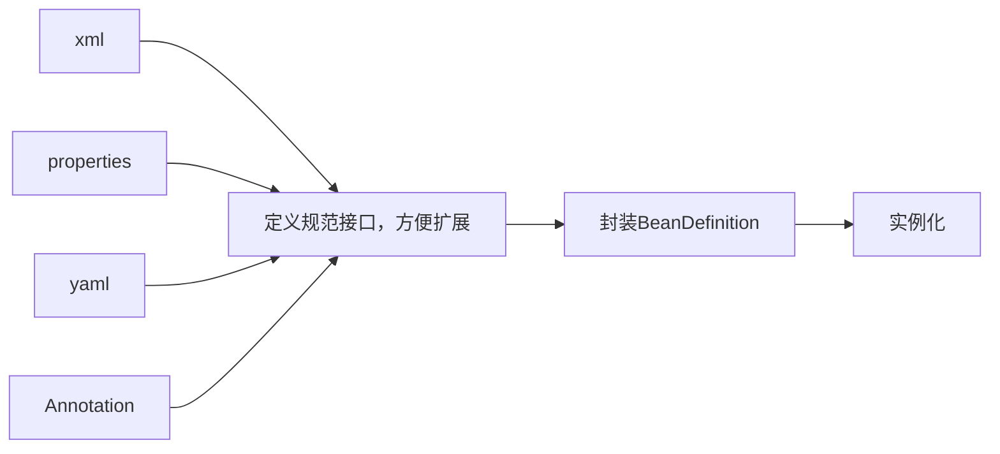
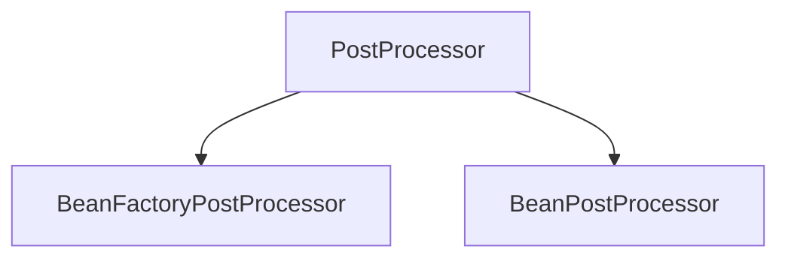
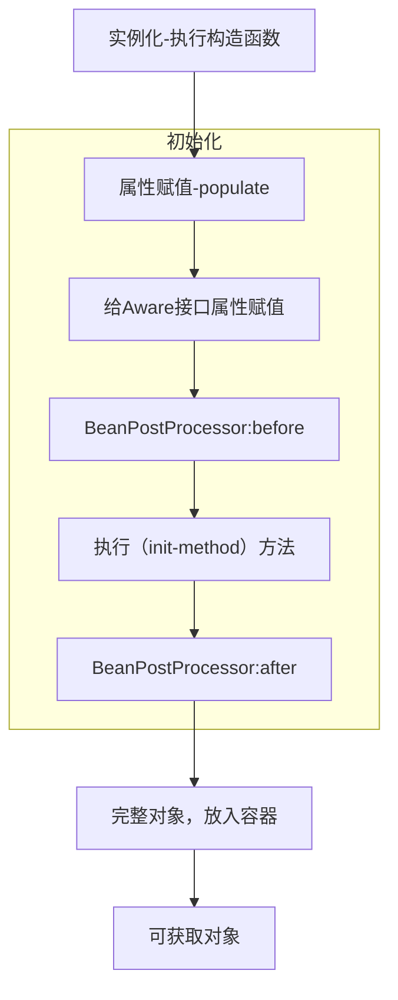
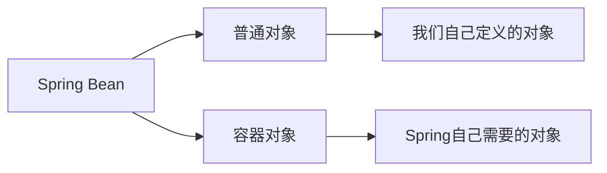
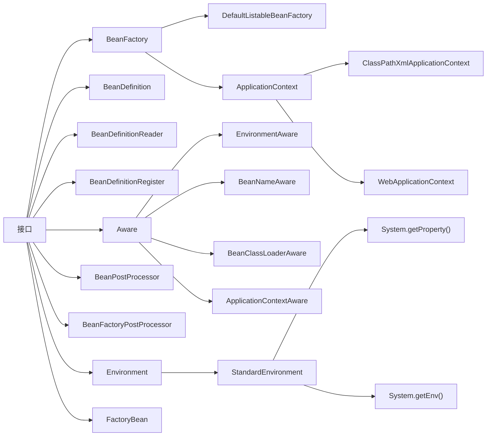
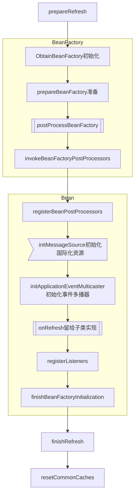
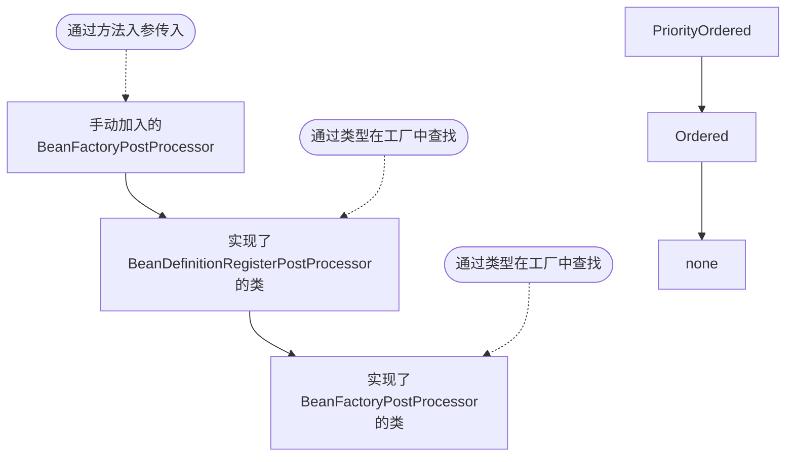
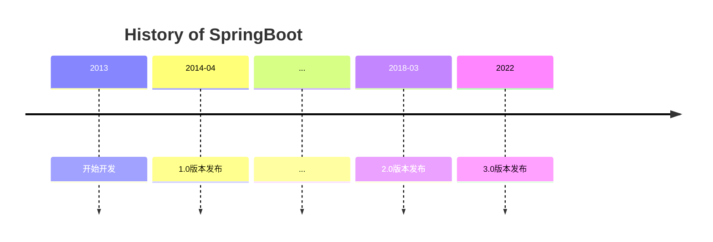
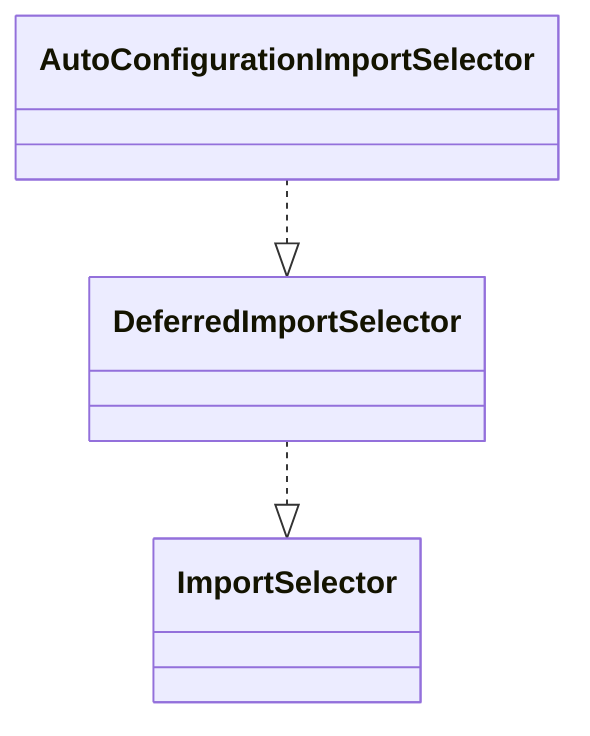
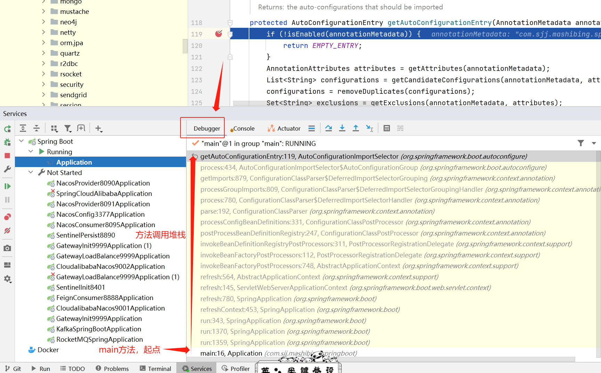

# 源码学习

## 为什么要学源码

- **源码是大厂面试的必要环节**。目前源码是很多大厂面试的必要环节。一些要求有自研产品的小厂也会问源码。所以如果不会源码的话，面试这关就无法加分了。大家也可以根据自己的职业规划自行判断。想不想进大厂或者去自研型企业？还是一直写CRUD代码？还是后续转业务或者转管理？
- **对源码的理解是一种加分项**。即使有的公司不一定会问源码，但只要简历上写了，面试的时候找机会表现出来，会是一种加分项。在公司内部工作，如果能向领导和同事很好的展现对源码的认知，也会加分。毕竟大家都知道要看懂源码比较难，所以能真正理解源码的人是少数。
- **工作中可以使用**。源码中有很多很好的设计思想，公共方法，学会了之后实际是可以在项目中运用的。看了源码之后会知道源码预留了哪些扩展点。具体是怎么用的。有很多技术很强的大厂，外面的开源框架不一定能符合自己公司的业务场景，例如：阿里。直接用源码扛不住双11的并发量，所以他们在老的微服务框架基础上修改，开发出了SpringCloudAlibaba，并重新开源给其他公司使用。在工作中实际是否能用到源码还取决于能力。大厂也不会让所有人都去写框架，而是会挑有能力的人去做这些事情。当然，不管大厂小厂，只要不严重影响任务进度，领导也不会强制员工不能使用。


## 学习思路

- 基础知识储备。
  - 设计模式。学习源码非常重要的基础知识。会了设计模式之后能够更好的理解源码的思想。否则，可能会觉得源码写的很乱，明明一个类能解决的事情，非得搞出几十个类。看着会反感，然后就看不下去了。
  - 数据结构与算法。
  - 反射。Java基础，源码中会有很多地方将类名写在配置中，然后通过反射得到实例。
  - 多线程。例如：AbstractAppicationContext.refresh()为什么要加锁？
  - JVM。
- 不要太关注细节。不要一上来就一个个方法点进去看。要先摸清流程脉络。
- 多看注释。源码不是每行代码都有注释，写了注释的尽量先看。看不懂可以用有道翻译。
- 见名知意。好的代码命名都是自注释的。
- 大胆猜测，小心验证。
- 多画图（总结图，时序图，结构图）。别人画的图，代表的是别人的收获。
- 坚持。看源码是一件很容易放弃的事情，一定要坚持。这也是大厂喜欢问源码的原因。因为他们想通过这件事来筛选能够坚持到底的人。


## 适合人群

适合任何阶段的开发人员学习。刚入行也适合。除非连Spring是啥都不知道的。


# Spring

## 参考说明

本文内容主要来源于马士兵教育视频教程（[Spring源码精讲-连鹏举](https://www.mashibing.com/study?courseNo=2154&sectionNo=13868&courseVersionId=1241)），结合了老师的笔记以及自己的实践做了一些修改。


## Spring基础概念

### IOC

什么是IOC？IOC的字面意思是控制反转。控制反转就是反转了依赖关系的满足方式，由之前的自己创建依赖对象，变为由SpringIOC容器推送。（变主动为被动，即反转）它解决了具有依赖关系的组件之间的强耦合。

#### IOC容器

可以理解为ApplicationContext，在Spring启动时，会根据配置和规则将所有的bean初始化在这里。

初始化大致流程如下，Spring在实现的时候还加入了很多扩展点。

~~~mermaid
flowchart LR
xml-->load
load[加载配置]-->parse
parse[解析配置]-->BeanDefinition
BeanDefinition[封装BeanDefinition]-->instantiation
instantiation[实例化]-->push
push[放入容器]-->pull
pull[从容器获取]
~~~

#### 配置加载

加载和解析配置文件的时候，考虑到后续配置格式可能增多，根据开闭原则为了方便后续的扩展，Spring定义了解析规范和接口。BeanDefinitionReader，通过IDEA的Type Hierarch看下他的类继承结构.

> BeanDefinitionReader (org.springframework.beans.factory.support)
> ⊦AbstractBeanDefinitionReader (org.springframework.beans.factory.support)
> ⊦⊦PropertiesBeanDefinitionReader (org.springframework.beans.factory.support)
> ⊦⊦GroovyBeanDefinitionReader (org.springframework.beans.factory.groovy)
> ⊦⊦XmlBeanDefinitionReader (org.springframework.beans.factory.xml)

所以流程扩充成这样：



#### BeanDefinition封装

在得到BeanDefinition之后，且在实例化之前，如果要动态修改Bean的信息怎么办？例如下面的配置：

```xml
<property name=url value="${jdbc.url}" />
```

于是Spring定义了Bean后置处理器，主要有2种后置处理器：



案例：

在Spring中有这样一个类AbstractAutoProxyCreator，大家可以打开源码，然后查看一下类图。他就是BeanPostProcessor的实现类。

主要负责自动创建代理对象的类。我们在使用**AOP**的时候基本上都是用的这个类来进程**Bean**的拦截，创建代理对象。

还有一个类PlaceholderConfigurerSupport，他是BeanFactoryPostProcessor的实现类。主要用于解析**bean**定义中属性值里面的占位符。就是上文提到的案例。详细说明可以参考它的类注释。


#### 实例化流程

在上面的流程中，有一步是实例化，这个过程也分为很多步骤，见下图：



#### Aware接口

Spring中的Aware接口主要用于让当前bean对象获取到Spring容器中的其他Bean信息的。有如下子接口，分别用于获取不同的容器对象。

> Aware (org.springframework.beans.factory)
> ⊦ApplicationEventPublisherAware (org.springframework.context)
> ⊦ServletContextAware (org.springframework.web.context)
> ⊦MessageSourceAware (org.springframework.context)
> ⊦ResourceLoaderAware (org.springframework.context)
> ⊦SchedulerContextAware (org.springframework.scheduling.quartz)
> ⊦NotificationPublisherAware (org.springframework.jmx.export.notification)
> ⊦BeanFactoryAware (org.springframework.beans.factory)
> ⊦EnvironmentAware (org.springframework.context)
> ⊦EmbeddedValueResolverAware (org.springframework.context)
> ⊦ImportAware (org.springframework.context.annotation)
> ⊦BootstrapContextAware (org.springframework.jca.context)
> ⊦ServletConfigAware (org.springframework.web.context)
> ⊦LoadTimeWeaverAware (org.springframework.context.weaving)
> ⊦BeanNameAware (org.springframework.beans.factory)：用于获取当前Bean的名字。
> ⊦BeanClassLoaderAware (org.springframework.beans.factory)：用于获取bean的classload。
> ⊦ApplicationContextAware (org.springframework.context)：用于获取ApplicationContext

部分Aware实现类的方法是在下面的方法中调用的。可以通过ctrl+alt+H查看调用堆栈。

org.springframework.beans.factory.support.AbstractAutowireCapableBeanFactory#invokeAwareMethods

```java
private void invokeAwareMethods(String beanName, Object bean) {
		//如果 bean 是 Aware 实例
		if (bean instanceof Aware) {
			//如果bean是BeanNameAware实例
			if (bean instanceof BeanNameAware) {
				//调用 bean 的setBeanName方法
				((BeanNameAware) bean).setBeanName(beanName);
			}
			//如果bean是 BeanClassLoaderAware 实例
			if (bean instanceof BeanClassLoaderAware) {
				//获取此工厂的类加载器以加载Bean类(即使无法使用系统ClassLoader,也只能为null)
				ClassLoader bcl = getBeanClassLoader();
				if (bcl != null) {
					//调用 bean 的 setBeanClassLoader 方法
					((BeanClassLoaderAware) bean).setBeanClassLoader(bcl);
				}
			}
			//如果bean是 BeanFactoryAware 实例
			if (bean instanceof BeanFactoryAware) {
				// //调用 bean 的 setBeanFactory 方法
				((BeanFactoryAware) bean).setBeanFactory(AbstractAutowireCapableBeanFactory.this);
			}
		}
	}
```


在AbstractApplicationContext类的prepareBeanFactory方法中有如下代码：

```java
protected void prepareBeanFactory(ConfigurableListableBeanFactory beanFactory) {
		//省略一些代码
		......
            
		// Configure the bean factory with context callbacks.
		// 添加beanPostProcessor,ApplicationContextAwareProcessor此类用来完成某些Aware对象的注入
		beanFactory.addBeanPostProcessor(new ApplicationContextAwareProcessor(this));
		// 设置要忽略自动装配的接口。因为这些接口已经通过上面的ApplicationContextAwareProcessor相当于是容器负责赋值的。，
		// 所以在使用autowire进行注入的时候需要将这些接口进行忽略
		beanFactory.ignoreDependencyInterface(EnvironmentAware.class);
		beanFactory.ignoreDependencyInterface(EmbeddedValueResolverAware.class);
		beanFactory.ignoreDependencyInterface(ResourceLoaderAware.class);
		beanFactory.ignoreDependencyInterface(ApplicationEventPublisherAware.class);
		beanFactory.ignoreDependencyInterface(MessageSourceAware.class);
		beanFactory.ignoreDependencyInterface(ApplicationContextAware.class);

		//省略一些代码
		......
	}
```

#### AOP

上文提到了一个实现AOP的类AbstractAutoProxyCreator，它实现了BeanPostProcessor接口，在after方法中创建了对象的代理。

```java
/**
	 * 此处是真正创建aop代理的地方，在实例化之后，初始化之后就进行处理
	 * 首先查看是否在earlyProxyReferences里存在，如果有就说明处理过了，不存在就考虑是否要包装，也就是代理
	 *
	 * Create a proxy with the configured interceptors if the bean is
	 * identified as one to proxy by the subclass.
	 * @see #getAdvicesAndAdvisorsForBean
	 */
	@Override
	public Object postProcessAfterInitialization(@Nullable Object bean, String beanName) {
		if (bean != null) {
			// 获取当前bean的key：如果beanName不为空，则以beanName为key，如果为FactoryBean类型，
			// 前面还会添加&符号，如果beanName为空，则以当前bean对应的class为key
			Object cacheKey = getCacheKey(bean.getClass(), beanName);
			// 判断当前bean是否正在被代理，如果正在被代理则不进行封装
			if (this.earlyProxyReferences.remove(cacheKey) != bean) {
				// 如果它需要被代理，则需要封装指定的bean
				return wrapIfNecessary(bean, beanName, cacheKey);
			}
		}
		return bean;
	}
```


#### Bean分类




Spring容器中的bean分2类，上述讲得其实都是普通对象，也就是我们自己定义的对象。在这些对象创建之前，Spring还有一些自身的对象需要它自己new的。

```java
	protected ConfigurableEnvironment createEnvironment() {
		return new StandardEnvironment();
	}
```


### DI


### AOP


### 监听器

主要体现了观察者模式，在Spring容器初始化到不同阶段时，触发不同的事件监听方法，来达到不同的目的。


## 类和接口

### 重要类和接口



#### FactoryBean

当配置文件中<bean>的 class 属性配置的实现类是 FactoryBean 时，通过 getBean()方法返回的不是 FactoryBean 本身，而是 FactoryBean#getObject() 方法所返回的对象。相当于FactoryBean#getObject()代理了 getBean()方法。这种方式的Bean不需要遵守SpringBean的生命周期。

举例来说，一个类User，实现了FactoryBean接口，代码如下。

当在Spring容器（ApplicationContext）初始化的时候，没有自动初始化User这个类的，而是初始化FactoryBean这个类。

等到调用getBean("FactoryBean名字")方法时，User才被实例化。或者调用FactoryBean的getObject方法也可以实例化。

```java
public class MyFactoryBean implements FactoryBean<User> {

    @Override
    public User getObject() throws Exception {
        return new User("zhangsan");
    }

    @Override
    public Class<?> getObjectType() {
        return User.class;
    }

    @Override
    public boolean isSingleton() {
        return false;
    }
}

public class Test {
    public static void main(String[] args) {
        //此时User类没有初始化
        ApplicationContext ac = new ClassPathXmlApplicationContext("factoryBean.xml");
        
        //通过FactoryBean名字获取User实例
        User bean1 = (User) ac.getBean("myFactoryBean");
        System.out.println(bean1.getUsername());
        
        //通过&FactoryBean名字获取FactoryBean实例
        MyFactoryBean bean2 = (MyFactoryBean) ac.getBean( "&myFactoryBean");
        System.out.println(bean2.getObject());
	}
}

```

**Spring为什么使用FactoryBean**

一般情况下，Spring 通过反射机制利用 bean 的 class 属性指定实现类来实例化 bean。

在某些情况下，实例化 bean 过程比较复杂，如果按照传统的方式，则需要在中提供大量的配置信息，配置方式的灵活性是受限的，这时采用编码的方式可能会得到一个简单的方案。

FactoryBean接口对于 Spring 框架来说占有重要的地位，Spring 自身就提供了 70 多个FactoryBean 的实现。它们隐藏了实例化一些复杂 bean 的细节，给上层应用带来了便利。

[应用场景](https://blog.csdn.net/qq_44543508/article/details/130472391)


## 源码

### 设计思想

Spring源码针对同一种类型的类为什么要设计那么复杂的继承关系？

例如：BeanFactory接口有几十个子类，而我们平时自己开发的时候往往是一个类搞定所有。

回答：我们平时大部分做的是基于某一个特定业务场景的定制开发，而Spring作为通用的底层框架，他需要兼容所有可能出现的功能场景。将每一个类的功能设计的精细化，再通过两两组合能够灵活兼容更多的功能场景。如果只设计很少的类，那意味着每一个类将拥有更多的功能，而这些功能，我们在做某个功能场景下，可能是用不到的。但设计了就得去实现里面的方法。

例如：假设现在有10个独立的功能方法，如果分布在10个子类中，那我们某个具体业务场景如果要用其中的2个（A和B），那我们可以选择用1个类实现A和B接口即可。实现他们的方法即可。但如果10个方法全设计在一个子类中，那我们就得实现它10个方法。还得花时间去研究哪个方法是真正要实现的。哪个可以不实现。


### 源码载入

载入源码前一定要选择一个合适的Spring源码版本，因为它和Gradle版本，JDK版本是有对应关系的。

高版本的Spring源码，一般需要高版本的JDK版本和Gradle版本，配合使用。

如果你是通过视频教程在看Spring源码，那建议使用视频中老师用的那个Spring版本，老师一般也会提供给你配套的Spring，Gradle和JDK。

本文使用的是马士兵教育的视频教程（[Spring源码精讲](https://www.mashibing.com/study?courseNo=2154&sectionNo=13868)）课程资料中对应的Spring源码包以及对应的Gradle版本。


#### 版本说明

##### Spring

本文使用的Spring版本是5.3.2，如果想看更高版本的Spring源码的话，需要换更高版本的JDK。


##### Gradle

建议去Spring源码的这个文件（spring源码目录\gradle\wrapper\gradle-wrapper.properties）中查看对应的Gradle版本。然后去

[Gradle版本下载地址](https://services.gradle.org/distributions/)中下载。下载好Gradle的zip包之后，可以替换上面这个文件中的内容。不然后续构建的时候还会重复下载的。

```properties
#distributionUrl=https\://services.gradle.org/distributions/gradle-5.6.4-all.zip
distributionUrl=file:///D:/ProgramFiles/gradle/gradle-5.6.4-bin.zip
distributionBase=GRADLE_USER_HOME
distributionPath=wrapper/dists
zipStorePath=wrapper/dists
zipStoreBase=GRADLE_USER_HOME
```

Gradle解压之后，请添加2个环境变量，GRADLE_HOME，PATH。


##### JDK

java version "1.8.0_351"
Java(TM) SE Runtime Environment (build 1.8.0_351-b10)
Java HotSpot(TM) 64-Bit Server VM (build 25.351-b10, mixed mode)


##### IDE

我用的是IDEA 2023.01。IDEA版本尽量不要用太旧的。可能不兼容高版本Gradle。


#### IDEA载入

以上都准备好，就可以载入已经下载好的Spring源码了。Spring源码本地路径：D:\Workspace\idea\mashibing\lianpengju-spring

载入Spring源码后，记得修改“File | Settings | Build, Execution, Deployment | Build Tools | Gradle | Gradle User Home”这里面的路径。这个路径相当于是Maven的本地仓库地址。

载入后，IDEA会根据依赖下载依赖包，此过程根据网速会比较漫长。笔者至少用了好几个小时才下载完成。

如果报错：Error resolving plugin [id: ‘io.spring.gradle-enterprise-conventions’, version: ‘0.0.2’]

解决方法：去文件build.gradle中，注释id "io.spring.gradle-enterprise-conventions" version "0.0.2

代码编译成功后，可以按照下面的步骤写一个简单的测试类，看看是否能够debug。


### ClassPathXmlApplicationContext初始化

#### 起点

可以自己在Spring-debug模块中自己建一个main方法和xml配置文件，然后写好测试代码开始debug。

```java
public class TestPopulate {

    public static void main(String[] args) {
        ApplicationContext ac = new ClassPathXmlApplicationContext("populateBean.xml");
        ac.close();
    }
}
```

然后进入到ClassPathXmlApplicationContext的构造方法中。

```java
	public ClassPathXmlApplicationContext(
			String[] configLocations, boolean refresh, @Nullable ApplicationContext parent)
			throws BeansException {
		// 调用父类构造方法，对成员变量进行初始化，进行相关的对象创建等操作。
		super(parent);
        // 设置应用程序上下文的配置文件路径，解析多环境
		setConfigLocations(configLocations);
		if (refresh) {
			refresh();
		}
	}
```


#### super(parent)

调用父类构造方法，对成员变量进行初始化，进行相关的对象创建等操作。

- 创建资源模式解析器。用于xml等配置文件的加载
- 给上下文创建一个ID。ObjectUtils.identityToString(this)
- 初始化同步监视器，用于在refresh和destroy的时候，加锁。
- 合并环境信息(Environment)，如果存在父容器。SpringMVC时会存在父容器。
- 设置xml文件验证标识。默认为true。xml的文件格式由xsd和dtd规定。


#### setConfigLocations

设置应用程序上下文的配置文件路径，解析多环境。

- Spring支持通过spring.profiles.actvie多环境配置。程序需要读到正确的配置文件。
- Spring支持在配置文件中使用占位符。例如：application-${username}.xml。程序需要根据环境变量替换。
- 实例化Environment对象，并通过父类构造方法调用StandardEnvironment#customizePropertySources方法。
  - 将System.getProperties加载到systemProperties中。(jvm参数)
  - 将System.getEnv()加载到systemEnvironment中。(jvm所在的服务器的环境参数)
- 将解析到的配置文件路径放入实例变量中。configLocations


#### refresh()

AbstractApplicationContext#refresh()方法是IOC容器初始化的核心方法，它内部分成12个方法。

```java
	public void refresh() throws BeansException, IllegalStateException {
		synchronized (this.startupShutdownMonitor) {
			// Prepare this context for refreshing.
			/**
			 * 前戏，做容器刷新前的准备工作
			 * 1、设置容器的启动时间
			 * 2、设置活跃状态为true
			 * 3、设置关闭状态为false
			 * 4、获取Environment对象，并加载当前系统的属性值到Environment对象中
			 * 5、准备监听器和事件的集合对象，默认为空的集合
			 */
			prepareRefresh();

			// Tell the subclass to refresh the internal bean factory.
			// 创建BeanFactory容器对象：DefaultListableBeanFactory
			// 加载xml配置文件的属性值到当前工厂中，最重要的就是BeanDefinition
			ConfigurableListableBeanFactory beanFactory = obtainFreshBeanFactory();

			// Prepare the bean factory for use in this context.
			// beanFactory的准备工作，对他里面的BeanDefinition的各种属性进行填充，上一步只是初始化
			prepareBeanFactory(beanFactory);

			try {
				// Allows post-processing of the bean factory in context subclasses.
				// 子类覆盖方法做额外的处理，此处我们自己一般不做任何扩展工作，但是可以查看web中的代码，是有具体实现的
				postProcessBeanFactory(beanFactory);

				// Invoke factory processors registered as beans in the context.
				// 调用各种beanFactory处理器
				invokeBeanFactoryPostProcessors(beanFactory);

				// Register bean processors that intercept bean creation.
				// 注册bean处理器，这里只是注册功能，真正调用的是getBean方法
				registerBeanPostProcessors(beanFactory);

				// Initialize message source for this context.
				// 为上下文初始化message源，即不同语言的消息体，国际化处理,在springmvc的时候通过国际化的代码重点讲
				initMessageSource();

				// Initialize event multicaster for this context.
				// 初始化事件监听多路广播器
				initApplicationEventMulticaster();

				// Initialize other special beans in specific context subclasses.
				// 留给子类来初始化其他的bean，SpringBoot启动时，在这里会初始化Tomcat
				onRefresh();

				// Check for listener beans and register them.
				// 在所有注册的bean中查找listener bean,注册到消息广播器中
				registerListeners();

				// Instantiate all remaining (non-lazy-init) singletons.
				// 实例化剩下的单例模式对象（非懒加载的）
				finishBeanFactoryInitialization(beanFactory);

				// Last step: publish corresponding event.
				// 完成刷新过程，通知生命周期处理器lifecycleProcessor刷新过程，同时发出ContextRefreshEvent通知别人
				finishRefresh();
			}

			catch (BeansException ex) {
				if (logger.isWarnEnabled()) {
					logger.warn("Exception encountered during context initialization - " +
							"cancelling refresh attempt: " + ex);
				}

				// Destroy already created singletons to avoid dangling resources.
				// 为防止bean资源占用，在异常处理中，销毁已经在前面过程中生成的单件bean
				destroyBeans();

				// Reset 'active' flag.
				// 重置active标志
				cancelRefresh(ex);

				// Propagate exception to caller.
				throw ex;
			}

			finally {
				// Reset common introspection caches in Spring's core, since we
				// might not ever need metadata for singleton beans anymore...
				resetCommonCaches();
			}
		}
	}
```

##### 流程图



##### prepareRefresh()

主要做容器刷新前的准备工作。

- 设置容器启动时间，活动标识，关闭标识。

- initPropertySources()，初始化资源文件（子类扩展点）

  - 应用场景，我们可以自己写一个类继承ClassPathXmlApplicationContext

  - 在自定义类中覆盖方法，实现如下功能。

  - 检查Properties中必须包含某个属性值，否则容器启动报错。

  - 往Properties中放入一个新的属性值。

  - ```java
    public class MyClassPathXmlApplicationContext extends ClassPathXmlApplicationContext {
    
        public MyClassPathXmlApplicationContext(String... configLocations){
            super(configLocations);
        }
    
        @Override
        protected void initPropertySources() {
            System.out.println("自定义initPropertySource");
            getEnvironment().getSystemProperties().put("name","bobo");
            getEnvironment().setRequiredProperties("key");
        }
    
        public static void main(String[] args) {
            ApplicationContext context = new MyClassPathXmlApplicationContext("spring.xml");
            User user = (User)context.getBean("a");
        }
    }
    ```

  - 通过源码上的注解可以发现，有一个工具类*WebApplicationContextUtils#initServletPropertySources*，当在Web环境下启动时，会用ServletContext中解析到的参数替换原来的参数。 

- 获取 Environment 对象，校验属性值并赋值到 Environment 对象中

- 初始化Application监听器和事件。从Spring启动时这里为空，但从Springboot启动时，这里就不为空。

- ```java
  	protected void prepareRefresh() {
  		// Switch to active.
  		// 设置容器启动的时间
  		this.startupDate = System.currentTimeMillis();
  		// 容器的关闭标志位
  		this.closed.set(false);
  		// 容器的激活标志位
  		this.active.set(true);
  
  		// 记录日志
  		if (logger.isDebugEnabled()) {
  			if (logger.isTraceEnabled()) {
  				logger.trace("Refreshing " + this);
  			}
  			else {
  				logger.debug("Refreshing " + getDisplayName());
  			}
  		}
  
  		// Initialize any placeholder property sources in the context environment.
  		// 留给子类覆盖，初始化属性资源
  		initPropertySources();
  
  		// Validate that all properties marked as required are resolvable:
  		// see ConfigurablePropertyResolver#setRequiredProperties
  		// 创建并获取环境对象，验证必要的属性文件是否都已经放入环境中，验证不通过会抛异常
  		getEnvironment().validateRequiredProperties();
  
  		// Store pre-refresh ApplicationListeners...
  		// 判断刷新前的应用程序监听器集合是否为空，如果为空，则将监听器添加到此集合中
  		if (this.earlyApplicationListeners == null) {
  			// 从SpringBoot应用启动时这里就不为空。
  			this.earlyApplicationListeners = new LinkedHashSet<>(this.applicationListeners);
  		}
  		else {
  			// Reset local application listeners to pre-refresh state.
  			// 如果不等于空，则清空集合元素对象
  			this.applicationListeners.clear();
  			this.applicationListeners.addAll(this.earlyApplicationListeners);
  		}
  
  		// Allow for the collection of early ApplicationEvents,
  		// to be published once the multicaster is available...
  		// 创建刷新前的监听事件集合
  		this.earlyApplicationEvents = new LinkedHashSet<>();
  	}
  ```

- 

  

##### obtainFreshBeanFactory()

初始化BeanFactory。加载并解析xml配置文件得到BeanDefinition。

- refreshBeanFactory。调用的是父类AbstractRefreshableApplicationContext中的方法。

  - ```java
    	protected final void refreshBeanFactory() throws BeansException {
    		// 如果存在beanFactory，则销毁beanFactory
    		if (hasBeanFactory()) {
    			destroyBeans();
    			closeBeanFactory();
    		}
    		try {
    			// 创建DefaultListableBeanFactory对象
    			DefaultListableBeanFactory beanFactory = createBeanFactory();
    			// 为了序列化指定id，可以从id反序列化到beanFactory对象
    			beanFactory.setSerializationId(getId());
    			// 定制beanFactory，设置相关属性，包括是否允许覆盖同名称的不同定义的对象以及循环依赖
    			customizeBeanFactory(beanFactory);
    			// 初始化documentReader,并进行XML文件读取及解析,默认命名空间的解析，自定义标签的解析
    			loadBeanDefinitions(beanFactory);
    			this.beanFactory = beanFactory;
    		}
    		catch (IOException ex) {
    			throw new ApplicationContextException("I/O error parsing bean definition source for " + getDisplayName(), ex);
    		}
    	}
    ```

  - 如果BeanFactory已经存在，则先销毁里面的所有beans。再关闭BeanFactory。

  - 初始化BeanFactory，此时很多属性都是初始值。使用applicationContext的id，设置序列化id

  - customizeBeanFactory。定制BeanFactory。主要设置2个重要属性（allowBeanDefinitionOverriding：是否允许覆盖名称相同的BeanDefinition，allowCircularReferences：是否允许循环依赖）。
  
    - 如果想要覆盖初始值，可以写一个类继承ApplicationContext。这算是一个子类扩展点，参考代码如下：
  
    - ```java
      public class MyClassPathXmlApplicationContext extends ClassPathXmlApplicationContext {
      
          MyClassPathXmlApplicationContext(String... locations){
              super(locations);
          }
      
          @Override
          protected void customizeBeanFactory(DefaultListableBeanFactory beanFactory) {
              super.setAllowBeanDefinitionOverriding(true);
              super.setAllowCircularReferences(true);
              super.customizeBeanFactory(beanFactory);
          }
      }
      ```
  
    - 是否允许覆盖名称相同的BeanDefinition，这是用在replace-method和lookup-method上的。
  
  - loadBeanDefinitions。加载配置文件，解析BeanDefinitions。
  
    - 实例化XmlBeanDefinitionReader，这里用到了适配器模式。
      - 初始化dtd和xsd解析器。
    - 设置属性
      - environment，用于替换配置文件中的占位符。
      - resourceLoader，资源加载器，就是当前对象。
      - entityResolver，解析xml的，内部会读取dts或xsd
        - 本地schemas路径：spring-beans\src\main\resources\META-INF\spring.schemas
        - 即使断网也可以根据此文件中的映射，找到本地文件。
        - PluggableSchemaResolver的toString方法会读取spring.schemas中的文件内容。
    - initBeanDefinitionReader，设置是否使用XML校验，默认true。
    - 调用reader的loadBeanDefinitions方法，从之前读取到的configLocation中读取配置文件。
      - 配置文件可能有多个，循环读取。
      - 解析配置文件地址中的路径修饰字符。例如："classpath:xxx.xml"
      - doLoadBeanDefinitions。
        - doLoadDocument。使用SAX，从String[]到Resource[]，再将resource读取成Document文档对象（此步骤不建议深入研究）。并将其封装成BeanDefinition对象。
        - registerBeanDefinitions。解析并读取配置文件。区分不同的命名空间做不同的处理。对于非默认命名空间的配置通过resources\META-INF\spring.handlers文件中对应的类进行处理。基于此，我们也可以自定义标签的处理类。
      - 这里预留了一个扩展点，[自定义标签](#配置文件自定义标签)。
  
  - 


##### prepareBeanFactory

beanFactory的准备工作，对他里面的BeanDefinition的各种属性进行填充，配置工厂的标准上下文特征，后置处理器等

1. 设置beanFactory的classloader为当前context的classloader

2. 设置beanfactory的SpEL表达式语言的Resolver。内部还会创建SpelExpressionParser

   1. 创建Parser的时候还创建了一个配置类。SpelParserConfiguration
   2. 这里仅仅时注册，并没有正真开始解析。

3. 为beanFactory增加一个默认的PropertyEditorRegistrar，这个主要是对bean的属性等设置管理的一个工具类

   1. 这里是Spring预留的一个扩展点。可以[自定义属性编辑器](#自定义属性编辑器)。

4. 为beanFactory增加一个BeanPostProcessor，ApplicationContextAwareProcessor。

   1. 这个Aware接口是用来调用其他6个aware接口的。在他的before方法中

   2. ```java
      /**
      	 * 接口beanPostProcessor规定的方法，会在bean创建时，实例化后，初始化前，对bean对象应用
      	 * @param bean the new bean instance
      	 * @param beanName the name of the bean
      	 * @return
      	 * @throws BeansException
      	 */
      	@Override
      	@Nullable
      	public Object postProcessBeforeInitialization(Object bean, String beanName) throws BeansException {
      		if (!(bean instanceof EnvironmentAware || bean instanceof EmbeddedValueResolverAware ||
      				bean instanceof ResourceLoaderAware || bean instanceof ApplicationEventPublisherAware ||
      				bean instanceof MessageSourceAware || bean instanceof ApplicationContextAware)){
      			return bean;
      		}
      
      		AccessControlContext acc = null;
      
      		if (System.getSecurityManager() != null) {
      			acc = this.applicationContext.getBeanFactory().getAccessControlContext();
      		}
      
      		if (acc != null) {
      			AccessController.doPrivileged((PrivilegedAction<Object>) () -> {
      				// 检测bean上是否实现了某个aware接口，有的话进行相关的调用
      				invokeAwareInterfaces(bean);
      				return null;
      			}, acc);
      		}
      		else {
      			invokeAwareInterfaces(bean);
      		}
      
      		return bean;
      	}
      
      	/**
      	 * 如果某个bean实现了某个aware接口，给指定的bean设置相应的属性值
      	 *
      	 * @param bean
      	 */
      	private void invokeAwareInterfaces(Object bean) {
      		if (bean instanceof EnvironmentAware) {
      			((EnvironmentAware) bean).setEnvironment(this.applicationContext.getEnvironment());
      		}
      		if (bean instanceof EmbeddedValueResolverAware) {
      			((EmbeddedValueResolverAware) bean).setEmbeddedValueResolver(this.embeddedValueResolver);
      		}
      		if (bean instanceof ResourceLoaderAware) {
      			((ResourceLoaderAware) bean).setResourceLoader(this.applicationContext);
      		}
      		if (bean instanceof ApplicationEventPublisherAware) {
      			((ApplicationEventPublisherAware) bean).setApplicationEventPublisher(this.applicationContext);
      		}
      		if (bean instanceof MessageSourceAware) {
      			((MessageSourceAware) bean).setMessageSource(this.applicationContext);
      		}
      		if (bean instanceof ApplicationContextAware) {
      			((ApplicationContextAware) bean).setApplicationContext(this.applicationContext);
      		}
      	}
      ```

   3. 另有3个aware接口是在invokeAwareMethods方法中调用。BeanNameAware，BeanClassLoaderAware，BeanFactoryAware

5. 设置要忽略自动装配的接口。这6个接口已经通过上面的ApplicationContextAwareProcessor相当于是容器自动赋值的。所以需要在DI（autowired）的时候过滤掉他们。

6. 设置几个自动装配的特殊规则,当在进行自动注入的时候，如果某个类有多个实现，那么就使用指定的对象进行注入

7. 为beanFactory增加一个BeanPostProcessor，此类用来检测bean是否实现了ApplicationListener接口

   1. 实例化完成之后，如果bean为单例并且属于ApplicationListener接口，则加入到多播器中。
   2. bean销毁之前，如果bean是一个applicationListener，则从多播器中提前删除

8. 如果BeanFactory包含某个特殊的Bean（用于AOP）就做一些特殊处理

   1. 主要为了增加对AspectJ的支持，在java中织入分为三种方式，分为编译器织入，类加载器织入，运行期织入，编译器织入是指在java编译器，采用特殊的编译器，将切面织入到java类中
   2. 而类加载期织入则指通过特殊的类加载器，在类字节码加载到JVM时，织入切面，运行期织入则是采用cglib和jdk进行切面的织入
   3. aspectj提供了两种织入方式，第一种是通过特殊编译器，在编译器，将aspectj语言编写的切面类织入到java类中，第二种是类加载期织入，就是下面的load time weaving，此处后续讲

9. 注册默认的系统环境bean到一级缓存中。便于后续使用。


##### postProcessBeanFactory()

默认空。这个方法是留给子类实现的。也算是一个扩展点。可以参考AbstractRefreshableWebApplicationContext中的实现。


##### invokeBeanFactoryPostProcessors()

调用各种beanFactory的后置处理器（BFPP）。




1. 使用委派类（PostProcessorRegistrationDelegate）来调用BeanFactoryPostProcessors
2. 判断beanFactory是否是BeanDefinitionRegistry类型，如果是
   1. 由于ConfigurableListableBeanFactory默认是继承BeanDefinitionRegistry接口的，所以会走这里。
   2. BeanDefinitionRegistry接口提供了对BeanDefinition进行增删改查的方法。
   3. 程序创建了2个list，分别处理2个父子接口BeanFactoryPostProcessor和BeanDefinitionRegistryPostProcessor
   4. 优先处理传进来的BFPP，如果不为空，则根据类型放入到上面的2个list中。
   5. 放的时候BeanDefinitionRegistryPostProcessor的实例会额外调用postProcessBeanDefinitionRegistry方法。
   6. 读取Spring中所有BeanDefinitionRegistryPostProcessor的Bean名称，如果定制实现了这个接口就会被读到。
   7. 循环处理读出来的所有Bean名字，判断这个bean是否实现了PriorityOrdered接口。
      1. 如果实现了，则将他的bean实例加入到当前正在处理的BeanDefinitionRegistryPostProcessor的list中。
      2. 同时将要被执行的BFPP名称添加到processedBeans，避免后续重复执行。
   8. 对当前正在处理的list按照优先级进行排序。
   9. 将排好序的list追加到上面那个BeanDefinitionRegistryPostProcessor的list中。
   10. 遍历currentRegistryProcessors，执行postProcessBeanDefinitionRegistry方法
   11. 执行完毕之后，清空currentRegistryProcessors
   12. 到这里程序只是处理了实现了PriorityOrdered接口的bean，后面还会有类似的程序处理Ordered接口和没实现接口的。
   13. 后面的程序执行逻辑和这部分大同小异，程序每次都要读出bean之后在处理的原因是。
       1. 因为每次在调用invokeBeanDefinitionRegistryPostProcessors方法后，是可能会创建新的BeanDefinitionRegistryPostProcessor实例的。
       2. postProcessBeanDefinitionRegistry(BeanDefinitionRegistry registry)方法会将BeanDefinitionRegistry传入
       3. BeanDefinitionRegistry有registerBeanDefinition方法可以动态加入BeanDefinitionRegistryPostProcessor实例
   14. 3段逻辑都会调用sortPostProcessors方法进行排序。排序规则如下
       1. 首先判断当前beanFactory是否是DefaultListableBeanFactory子类，是否存在依赖比较器。
       2. 如果依赖比较器为空则使用OrderComparator进行排序。
       3. OrderComparator会将实现了PriorityOrdered接口的实例排在前面。
       4. 如果2个实例都实现或者都没有实现PriorityOrdered接口，程序会调用getOrder方法获取Order值
          1. getOrder方法对于没有实现Ordered接口的实例，直接返回Integer最大值，确保其顺序排在最后。
          2. 对于实现了Ordered接口的实例，则调用Ordered接口的getOrder方法的值进行比较。
       5. 使用这个整型的Order值，进行比较。order值越小，优先级越高。
3. 如果beanFactory不是BeanDefinitionRegistry类型。
   1. 循环调用每一个实例的postProcessBeanFactory方法，无特殊处理。

4. 到这里，入参中的和容器中的所有BeanDefinitionRegistryPostProcessor已经全部处理完毕，下面开始处理容器中的所有的BeanFactoryPostProcessor
5. 读出所有BeanFactoryPostProcessor的Bean，接下来的处理逻辑同上面也是类似的。
6. 先处理PriorityOrdered和Ordered的实例，然后是普通的bean。对于已经处理过的会跳过。
7. 在处理BeanFactoryPostProcessor的bean时并没有像上面一样，重复的读取BeanFactoryPostProcessor的子类
   1. 原因是BeanFactoryPostProcessor的接口方法不能够动态新增BeanFactoryPostProcessor的实例。


Spring中比较重要的BeanDefinitionRegistryPostProcessor实例

- [ConfigurationClassPostProcessor](#ConfigurationClassPostProcessor)
- [EventListenerMethodProcessor](#EventListenerMethodProcessor)


##### registerBeanPostProcessors(beanFactory)

注册BeanPostProcessors。真正调用要到后面的**getBean**方法。


##### initMessageSource();

初始化国际化资源文件。


##### initApplicationEventMulticaster();

初始化事件监听多路广播器。用于发布事件和监听器。


##### onRefresh()

刷新时需要触发的方法，留给子类自定义的。SpringBoot启动的时候就会在这个方法里启动Tomcat容器。


##### registerListeners()

将监听器注册到容器中。


##### finishBeanFactoryInitialization(beanFactory)

核心方法，在这里实例化BeanFactory中的所有实例。


##### finishRefresh()

完成整个刷新过程。做一些通知工作。


##### resetCommonCaches()

重置公共缓存。


### 扩展点

#### 配置文件自定义标签

##### 说明

自定义标签的意思是，在Spring的配置文件中（例如：applicationContext.xml）加入自己定义的标签，同时加入处理类，让IOC容器启动时可以自动解析到beanFactory中。

##### 代码出处

在ioc容器初始化过程中，会调用类（XmlBeanDefinitionReader.java）的下面这个方法。在这个方法的（createReaderContext(resource)）中会初始化上下文。同时会确定配置文件地址。

```java
//org/springframework/beans/factory/xml/XmlBeanDefinitionReader.java
    public int registerBeanDefinitions(Document doc, Resource resource) throws BeanDefinitionStoreException {
        // 对xml的beanDefinition进行解析
        BeanDefinitionDocumentReader documentReader = createBeanDefinitionDocumentReader();
        int countBefore = getRegistry().getBeanDefinitionCount();
        // 完成具体的解析过程,createReaderContext这个方法会读取配置文件，读出不同命名空间对应的处理类
        documentReader.registerBeanDefinitions(doc, createReaderContext(resource));
        return getRegistry().getBeanDefinitionCount() - countBefore;
    }

	/**
	 * 接着进入getNamespaceHandlerResolver()这个方法
	 */
	public XmlReaderContext createReaderContext(Resource resource) {
		return new XmlReaderContext(resource, this.problemReporter, this.eventListener,
				this.sourceExtractor, this, getNamespaceHandlerResolver());
	}

	/**
	 * 第一次进来肯定为空，所以进入createDefaultNamespaceHandlerResolver()
	 */
	public NamespaceHandlerResolver getNamespaceHandlerResolver() {
		if (this.namespaceHandlerResolver == null) {
			this.namespaceHandlerResolver = createDefaultNamespaceHandlerResolver();
		}
		return this.namespaceHandlerResolver;
	}

	/**
	 * 进到这个方法后，配置文件路径确定
	 */
	protected NamespaceHandlerResolver createDefaultNamespaceHandlerResolver() {
		ClassLoader cl = (getResourceLoader() != null ? getResourceLoader().getClassLoader() : getBeanClassLoader());
		return new DefaultNamespaceHandlerResolver(cl);
	}
```

在下面的这个parseCustomElement方法，会解析非默认命名空间的配置项。这里面会使用上下文调用resolve方法找到命名空间对应的处理类。针对不同命名空间调用不同类的方法来解析。

```java
//org.springframework.beans.factory.xml.BeanDefinitionParserDelegate	
	public BeanDefinition parseCustomElement(Element ele, @Nullable BeanDefinition containingBd) {
		// 获取对应的命名空间
		String namespaceUri = getNamespaceURI(ele);
		if (namespaceUri == null) {
			return null;
		}
		// 根据命名空间找到对应的Namespace Handler
		NamespaceHandler handler = this.readerContext.getNamespaceHandlerResolver().resolve(namespaceUri);
		if (handler == null) {
			error("Unable to locate Spring NamespaceHandler for XML schema namespace [" + namespaceUri + "]", ele);
			return null;
		}
		// 调用自定义的NamespaceHandler进行解析
		return handler.parse(ele, new ParserContext(this.readerContext, this, containingBd));
	}

//org.springframework.beans.factory.xml.DefaultNamespaceHandlerResolver
	public NamespaceHandler resolve(String namespaceUri) {
		// 获取所有已经配置好的handler映射
		Map<String, Object> handlerMappings = getHandlerMappings();
		// 根据命名空间找到对应的信息
		Object handlerOrClassName = handlerMappings.get(namespaceUri);
		if (handlerOrClassName == null) {
			return null;
		}
		else if (handlerOrClassName instanceof NamespaceHandler) {
			// 如果已经做过解析，直接从缓存中读取
			return (NamespaceHandler) handlerOrClassName;
		}
		else {
			// 没有做过解析，则返回的是类路径
			String className = (String) handlerOrClassName;
			try {
				// 通过反射将类路径转化为类
				Class<?> handlerClass = ClassUtils.forName(className, this.classLoader);
				if (!NamespaceHandler.class.isAssignableFrom(handlerClass)) {
					throw new FatalBeanException("Class [" + className + "] for namespace [" + namespaceUri +
							"] does not implement the [" + NamespaceHandler.class.getName() + "] interface");
				}
				// 实例化类
				NamespaceHandler namespaceHandler = (NamespaceHandler) BeanUtils.instantiateClass(handlerClass);
				// 调用自定义的namespaceHandler的初始化方法
				namespaceHandler.init();
				// 讲结果记录在缓存中
				handlerMappings.put(namespaceUri, namespaceHandler);
				return namespaceHandler;
			}
			catch (ClassNotFoundException ex) {
				throw new FatalBeanException("Could not find NamespaceHandler class [" + className +
						"] for namespace [" + namespaceUri + "]", ex);
			}
			catch (LinkageError err) {
				throw new FatalBeanException("Unresolvable class definition for NamespaceHandler class [" +
						className + "] for namespace [" + namespaceUri + "]", err);
			}
		}
	}
```


##### 步骤

例如：我们自定义一个标签<test:user username="zhangsan" email="testEmail" password="test123456" />

1. 定义一个实体类User

2. 写一个类继承AbstractSingleBeanDefinitionParser，并覆盖父类方法。

3. 写一个类继承NamespaceHandlerSupport，覆盖父类方法。可参考ContextNamespaceHandler。

   1. 上述步骤参考代码

   2. ```java
      /**
      * 1.实体类，用于承载自定义标签中的信息
      */
      public class User {
          private String username;
          private String email;
          private String password;
      
          public String getUsername() {
              return username;
          }
      
          public void setUsername(String username) {
              this.username = username;
          }
      
          public String getEmail() {
              return email;
          }
      
          public void setEmail(String email) {
              this.email = email;
          }
      
          public String getPassword() {
              return password;
          }
      
          public void setPassword(String password) {
              this.password = password;
          }
      }
      
      /**
       * 自定义标签分析器。<br>
       * 不继承AbstractPropertyLoadingBeanDefinitionParser是因为，我们标签中暂时不需要location，properties-ref等等属性。
       */
      public class UserBeanDefinitionParser extends AbstractSingleBeanDefinitionParser {
      
          /**
           * 返回属性值所对应的对象
           *
           * @param element the {@code Element} that is being parsed
           * @return
           */
          @Override
          protected Class<?> getBeanClass(Element element) {
              return User.class;
          }
      
          /**
           * 标签解析方法。负责解析标签的自定义属性。
           *
           * @param element the XML element being parsed
           * @param builder used to define the {@code BeanDefinition}
           */
          @Override
          protected void doParse(Element element, BeanDefinitionBuilder builder) {
              String userName = element.getAttribute("userName");
              String email = element.getAttribute("email");
              String password = element.getAttribute("password");
      
              if (StringUtils.hasText(userName)) {
                  builder.addPropertyValue("username", userName);
              }
              if (StringUtils.hasText(email)) {
                  builder.addPropertyValue("email", email);
              }
              if (StringUtils.hasText(password)) {
                  builder.addPropertyValue("password", password);
              }
          }
      }
      
      /**
       * 3.自定义命名空间处理类。参考ContextNamespaceHandler
       */
      public class UserNamespaceHandler extends NamespaceHandlerSupport {
          @Override
          public void init() {
              registerBeanDefinitionParser("user",new UserBeanDefinitionParser());
          }
      }
      ```

4. 在项目配置文件目录（resources/META-INF/）中，新增文件spring.handlers，加入处理类的映射。

   1. 注意：在idea中创建这个文件时，要确保他是properties类型的。不能是txt类型的。
   2. `http\://www.test.com/schema/user=com.test.selftag.UserNamespaceHandler`

5. 在项目配置文件目录（resources/META-INF/）中，新增文件spring.schemas，加入命名空间和xsd的映射。

   1. 注意：在idea中创建这个文件时，要确保他是properties类型的。不能是txt类型的。
   2. `http\://www.test.com/schema/user.xsd=META-INF/user.xsd`

6. 在项目配置文件目录（resources/META-INF/）中，新增文件user.xsd。

   1. ```xml
      <?xml version="1.0" encoding="UTF-8"?>
      <schema xmlns="http://www.w3.org/2001/XMLSchema"
              targetNamespace="http://www.test.com/schema/user"
              xmlns:tns="http://www.test.com/schema/user"
              elementFormDefault="qualified">
          <element name="user">
              <complexType>
                  <attribute name ="id" type = "string"/>
                  <attribute name ="userName" type = "string"/>
                  <attribute name ="email" type = "string"/>
                  <attribute name ="password" type="string"/>
              </complexType>
          </element>
      </schema>
      ```

7. 在Spring配置文件中，使用我们的自定义标签。

   1. applicationContext.xml

   2. ```xml
      <?xml version="1.0" encoding="UTF-8"?>
      <beans xmlns="http://www.springframework.org/schema/beans"
             xmlns:context="http://www.springframework.org/schema/context"
             xmlns:test="http://www.test.com/schema/user"
             xmlns:xsi="http://www.w3.org/2001/XMLSchema-instance"
             xsi:schemaLocation="http://www.springframework.org/schema/beans http://www.springframework.org/schema/beans/spring-beans.xsd
              http://www.springframework.org/schema/context  http://www.springframework.org/schema/context/spring-context.xsd
              http://www.test.com/schema/user http://www.test.com/schema/user.xsd">
      
      	<test:user id="testTag" username="lisi" email="lisi@163.com" password="123456"></test:user>
      
          <bean id="person"  class="com.test.Person" scope="prototype">
              <property name="id" value="1"></property>
              <property name="name" value="zhangsan"></property>
          </bean>
      </beans>
      ```

8. 写一个容器启动测试类。测试刚才的自定义标签。

   1. ```java
      public class Test {
          public static void main(String[] args) {
       		ApplicationContext ac = new ClassPathXmlApplicationContext("applicationContext.xml");
              User user = (User) ac.getBean("testTag");
              System.out.println(user);
          }
      }
      ```

9. 问题排查。

   1. 如果报错assert short name !=key，可能是docs.gradle中的这段代码引起的，把它注释掉就行了。

   2. ```groovy
      task schemaZip(type: Zip) {
      	group = "Distribution"
      	archiveBaseName.set("spring-framework")
      	archiveClassifier.set("schema")
      	description = "Builds -${archiveClassifier} archive containing all " +
      			"XSDs for deployment at https://springframework.org/schema."
      	duplicatesStrategy DuplicatesStrategy.EXCLUDE
      	moduleProjects.each { module ->
      		def Properties schemas = new Properties();
      
      		module.sourceSets.main.resources.find {
      			(it.path.endsWith("META-INF/spring.schemas") || it.path.endsWith("META-INF\\spring.schemas"))
      		}?.withInputStream { schemas.load(it) }
      
      //把下面的代码注释。
      //		for (def key : schemas.keySet()) {
      //			def shortName = key.replaceAll(/http.*schema.(.*).spring-.*/, '$1')
      //			assert shortName != key
      //			File xsdFile = module.sourceSets.main.resources.find {
      //				(it.path.endsWith(schemas.get(key)) || it.path.endsWith(schemas.get(key).replaceAll('\\/','\\\\')))
      //			}
      //			assert xsdFile != null
      //			into (shortName) {
      //				from xsdFile.path
      //			}
      //		}
      	}
      }
      ```

   3. 

##### 应用场景

暂无。工作中很少用到。


#### 自定义属性编辑器

##### 说明

Spring允许用户自定义属性编辑器。当对象实例化后，可以对某一个字段进行定制化修改。例如：从某个对象的文本address字段中解析出，省市区3个字段。

##### 代码出处

1. 在ioc容器初始化过程中，在类（AbstractApplicationContext）的prepareBeanFactory方法中会初始化PropertyEditorRegistrar。

2. ```java
   	protected void prepareBeanFactory(ConfigurableListableBeanFactory beanFactory) {
   		// Tell the internal bean factory to use the context's class loader etc.
   		// 设置beanFactory的classloader为当前context的classloader
   		beanFactory.setBeanClassLoader(getClassLoader());
   		// 设置beanfactory的SpEL表达式语言的Resolver。内部还会创建SpelExpressionParser
   		beanFactory.setBeanExpressionResolver(new StandardBeanExpressionResolver(beanFactory.getBeanClassLoader()));
   		// 为beanFactory增加一个默认的PropertyEditorRegistrar，这个主要是对bean的属性等设置管理的一个工具类
   		beanFactory.addPropertyEditorRegistrar(new ResourceEditorRegistrar(this, getEnvironment()));
   		//上面就是PropertyEditorRegistrar初始化的地方，忽略其他不相关代码
   	}
   ```

3. invokeBeanFactoryPostProcessors()方法会调用CustomEditorConfigurer.postProcessBeanFactory()方法，会循环自身的数组属性propertyEditorRegistrar。将其添加到BeanFactory中。同时还会循环另一个属性customEditors也加入到BeanFactory中。

   1. 参考代码

   2. ```java
      	public void postProcessBeanFactory(ConfigurableListableBeanFactory beanFactory) throws BeansException {
      		// 如果属性编辑注册器不等于空
      		if (this.propertyEditorRegistrars != null) {
      			// 遍历属性编辑注册器的集合
      			for (PropertyEditorRegistrar propertyEditorRegistrar : this.propertyEditorRegistrars) {
      				// 将属性编辑注册器添加到beanFactory
      				beanFactory.addPropertyEditorRegistrar(propertyEditorRegistrar);
      			}
      		}
      		// 如果自定义编辑器不等于空
      		if (this.customEditors != null) {
      			// 遍历自定义编辑器集合将自定义编辑器添加到beanFactory中
      			this.customEditors.forEach(beanFactory::registerCustomEditor);
      		}
      	}
      ```

   3. 调用堆栈，可通过Idea的Call Hierarchy功能反查得到

   4. CustomEditorConfigurer.postProcessBeanFactory(ConfigurableListableBeanFactory)  (org.springframework.beans.factory.config)  

      - PostProcessorRegistrationDelegate.invokeBeanFactoryPostProcessors(Collection, ConfigurableListableBeanFactory)  (org.springframework.context.support)  
        - PostProcessorRegistrationDelegate.invokeBeanFactoryPostProcessors(ConfigurableListableBeanFactory, List)(6 usages)  (org.springframework.context.support)  
          - AbstractApplicationContext.invokeBeanFactoryPostProcessors(ConfigurableListableBeanFactory)  (org.springframework.context.support)  
            - AbstractApplicationContext.refresh()  (org.springframework.context.support)

4. 在AbstractBeanFactory.registerCustomEditors()方法中，会调用我们自定义的注册器，将属性和编辑器绑定。

   1. 源代码

   2. ```java
      	protected void initBeanWrapper(BeanWrapper bw) {
      		// 使用该工厂的ConversionService来作为bw的ConversionService，用于转换属性值，以替换JavaBeans PropertyEditor
      		bw.setConversionService(getConversionService());
      		// 将工厂中所有定制PropertyEditor注册到bw中
      		registerCustomEditors(bw);
      	}
      
      	protected void registerCustomEditors(PropertyEditorRegistry registry) {
      		// PropertyEditorRegistrySupport是PropertyEditorRegistry接口的默认实现
      		// 将registry强转成PropertyEditorRegistrySupport对象，如果registry不能强转则为null
      		PropertyEditorRegistrySupport registrySupport =
      				(registry instanceof PropertyEditorRegistrySupport ? (PropertyEditorRegistrySupport) registry : null);
      		// 如果成功获取PropertyEditorRegistrySupport对象
      		if (registrySupport != null) {
      			// 激活仅用于配置目的的配置值编辑器
      			registrySupport.useConfigValueEditors();
      		}
      		// PropertyEditorRegistrar：各种业务的PropertyEditorSupport一般都会先注册到PropertyEditorRegistrar中，再通过PropertyEditorRegistrar
      		// 将PropertyEditorSupport注册到PropertyEditorRegistry中
      		// 如果该工厂的propertyEditorRegistrar列表不为空
      		if (!this.propertyEditorRegistrars.isEmpty()) {
      			// propertyEditorRegistrars默认情况下只有一个元素对象，该对象为ResourceEditorRegistrar。
      			// 遍历propertyEditorRegistrars
      			for (PropertyEditorRegistrar registrar : this.propertyEditorRegistrars) {
      				try {
      					// ResourceEditorRegistrar会将ResourceEditor, InputStreamEditor, InputSourceEditor,
      					// FileEditor, URLEditor, URIEditor, ClassEditor, ClassArrayEditor注册到registry中，
      					// 如果registry已配置了ResourcePatternResolver,则还将注册ResourceArrayPropertyEditor
      					// 将registrar中的所有PropertyEditor注册到PropertyEditorRegistry中
      					registrar.registerCustomEditors(registry);
      				}
      				// 捕捉Bean创建异常
      				catch (BeanCreationException ex) {
      					Throwable rootCause = ex.getMostSpecificCause();
      					if (rootCause instanceof BeanCurrentlyInCreationException) {
      						BeanCreationException bce = (BeanCreationException) rootCause;
      						String bceBeanName = bce.getBeanName();
      						if (bceBeanName != null && isCurrentlyInCreation(bceBeanName)) {
      							if (logger.isDebugEnabled()) {
      								logger.debug("PropertyEditorRegistrar [" + registrar.getClass().getName() +
      										"] failed because it tried to obtain currently created bean '" +
      										ex.getBeanName() + "': " + ex.getMessage());
      							}
      							onSuppressedException(ex);
      							continue;
      						}
      					}
      					// 重写抛出ex
      					throw ex;
      				}
      			}
      		}
      		// 如果该工厂的自定义PropertyEditor集合有元素，在SpringBoot中，customEditors默认是空的
      		if (!this.customEditors.isEmpty()) {
      			// 遍历自定义PropertyEditor集合,将其元素注册到registry中
      			this.customEditors.forEach((requiredType, editorClass) ->
      					registry.registerCustomEditor(requiredType, BeanUtils.instantiateClass(editorClass)));
      		}
      	}
      ```

   3. 调用堆栈。是在实例化对象时调用进来的。

   4. AbstractBeanFactory.registerCustomEditors(PropertyEditorRegistry)  (org.springframework.beans.factory.support)

      - AbstractBeanFactory.initBeanWrapper(BeanWrapper)  (org.springframework.beans.factory.support)
        - AbstractAutowireCapableBeanFactory.instantiateBean(String, RootBeanDefinition)  (org.springframework.beans.factory.support)
          - AbstractAutowireCapableBeanFactory.createBeanInstance(String, RootBeanDefinition, Object[])(2 usages)  (org.springframework.beans.factory.support)
            - AbstractAutowireCapableBeanFactory.doCreateBean(String, RootBeanDefinition, Object[])  (org.springframework.beans.factory.support)

5. 在TypeConverterDelegate.convertIfNecessary()方法中，会根据属性类型去自定义属性编辑器中查找，如果找到就会对值进行转化和赋值操作

   1. 源代码。在第7行会进行查找，然后在第64行进行值的转换。并且在这个里面会调用我们自己写的编辑器。

   2. ```java
      public <T> T convertIfNecessary(@Nullable String propertyName, @Nullable Object oldValue, @Nullable Object newValue,
      			@Nullable Class<T> requiredType, @Nullable TypeDescriptor typeDescriptor) throws IllegalArgumentException {
      
      		// Custom editor for this type? 自定义编辑这个类型吗？
      		// PropertyEditor是属性编辑器的接口，它规定了将外部设置值转换为内部JavaBean属性值的转换接口方法。
      		// 为requiredType和propertyName找到一个自定义属性编辑器
      		PropertyEditor editor = this.propertyEditorRegistry.findCustomEditor(requiredType, propertyName);
      
      		// 尝试使用自定义ConversionService转换newValue转换失败后抛出的异常
      		ConversionFailedException conversionAttemptEx = null;
      
      		// No custom editor but custom ConversionService specified?
      		// 没有自定以编辑器，但自定以 ConversionService 指定了？
      		// ConversionService :  一个类型转换的服务接口。这个转换系统的入口。
      		// 获取类型转换服务
      		ConversionService conversionService = this.propertyEditorRegistry.getConversionService();
      		// 如果editor为null且cnversionService不为null&&新值不为null&&类型描述符不为null
      		if (editor == null && conversionService != null && newValue != null && typeDescriptor != null) {
      			// 将newValue封装成TypeDescriptor对象
      			TypeDescriptor sourceTypeDesc = TypeDescriptor.forObject(newValue);
      			// 如果sourceTypeDesc的对象能被转换成typeDescriptor.
      			if (conversionService.canConvert(sourceTypeDesc, typeDescriptor)) {
      				try {
      					// 从conversionService 中找到 sourceTypeDesc,typeDesriptor对于的转换器进行对newValue的转换成符合typeDesciptor类型的对象，并返回出去
      					return (T) conversionService.convert(newValue, sourceTypeDesc, typeDescriptor);
      				}
      				catch (ConversionFailedException ex) {
      					// fallback to default conversion logic below
      					// 返回到下面的默认转换逻辑
      					conversionAttemptEx = ex;
      				}
      			}
      		}
      
      		// 默认转换后的值为newValue
      		Object convertedValue = newValue;
      
      		// Value not of required type?
      		// 值不是必需的类型
      		// 如果editor不为null||(requiredType不为null&&convertedValue不是requiredType的实例)
      		if (editor != null || (requiredType != null && !ClassUtils.isAssignableValue(requiredType, convertedValue))) {
      			// 如果typeDescriptor不为null&&requiredType不为null&&requiredType是Collection的子类或实现&&conventedValue是String类型
      			if (typeDescriptor != null && requiredType != null && Collection.class.isAssignableFrom(requiredType) &&
      					convertedValue instanceof String) {
      				// 获取该typeDescriptor的元素TypeDescriptor
      				TypeDescriptor elementTypeDesc = typeDescriptor.getElementTypeDescriptor();
      				// 如果elementTypeDesc不为null
      				if (elementTypeDesc != null) {
      					// 获取elementTypeDesc的类型
      					Class<?> elementType = elementTypeDesc.getType();
      					// 如果elementType是Class类||elementType是Enum的子类或实现
      					if (Class.class == elementType || Enum.class.isAssignableFrom(elementType)) {
      						// 将convertedValue强转为String，以逗号分割convertedValue返回空字符串
      						convertedValue = StringUtils.commaDelimitedListToStringArray((String) convertedValue);
      					}
      				}
      			}
      			// 如果editor为null
      			if (editor == null) {
      				// 找到requiredType的默认编辑器
      				editor = findDefaultEditor(requiredType);
      			}
      			// 使用editor将convertedValue转换为requiredType
      			convertedValue = doConvertValue(oldValue, convertedValue, requiredType, editor);
      		}
      
      		// 标准转换标记，convertedValue是Collection类型，Map类型，数组类型，可转换成Enum类型的String对象，Number类型并成功进行转换后即为true
      		boolean standardConversion = false;
      
      		// 如果requiredType不为null
      		if (requiredType != null) {
      			// Try to apply some standard type conversion rules if appropriate.
      			// 如果合适，尝试应用一些标准类型转换规则
      			// convertedValue不为null
      			if (convertedValue != null) {
      				// 如果requiredType是Object类型
      				if (Object.class == requiredType) {
      					// 直接返回convertedValue
      					return (T) convertedValue;
      				}
      				// 如果requiredType是数组
      				else if (requiredType.isArray()) {
      					// Array required -> apply appropriate conversion of elements.
      					// 数组所需 -> 应用适当的元素转换
      					// 如果convertedValue是String的实例&&requiredType的元素类型是Enum的子类或实现
      					if (convertedValue instanceof String && Enum.class.isAssignableFrom(requiredType.getComponentType())) {
      						// 将逗号分割的列表(例如 csv 文件中的一行)转换为字符串数组
      						convertedValue = StringUtils.commaDelimitedListToStringArray((String) convertedValue);
      					}
      					// 将convertedValue转换为componentType类型数组对象
      					return (T) convertToTypedArray(convertedValue, propertyName, requiredType.getComponentType());
      				}
      				// 如果convertedValue是Collection对象
      				else if (convertedValue instanceof Collection) {
      					// Convert elements to target type, if determined.
      					// 如果确定，则将元素转换为目标类型
      					// 将convertedValue转换为Collection类型对象
      					convertedValue = convertToTypedCollection(
      							(Collection<?>) convertedValue, propertyName, requiredType, typeDescriptor);
      					// 更新standardConversion标记
      					standardConversion = true;
      				}
      				// 如果convertedValue是Map对象
      				else if (convertedValue instanceof Map) {
      					// Convert keys and values to respective target type, if determined.
      					// 如果确定了，则将建和值转换为相应的目标类型
      					convertedValue = convertToTypedMap(
      							(Map<?, ?>) convertedValue, propertyName, requiredType, typeDescriptor);
      					// 更新standardConversion标记
      					standardConversion = true;
      				}
      				// 如果convertedValue是数组类型，并且长度为1，那么就把get(0)赋值给本身
      				if (convertedValue.getClass().isArray() && Array.getLength(convertedValue) == 1) {
      					// 获取convertedValue的第一个元素对象
      					convertedValue = Array.get(convertedValue, 0);
      					// 更新standardConversion标记
      					standardConversion = true;
      				}
      				// 如果需要的类型是String，并且convertedValue的类型是基本类型或者装箱类型，那就直接toString 后强行转换
      				if (String.class == requiredType && ClassUtils.isPrimitiveOrWrapper(convertedValue.getClass())) {
      					// We can stringify any primitive value...
      					// 将convertedValue转换为字符转返回出去
      					return (T) convertedValue.toString();
      				}
      				// 如果convertedValue是String类型&& convertedValue不是requiredType类型
      				else if (convertedValue instanceof String && !requiredType.isInstance(convertedValue)) {
      					// conversionAttemptEx为null意味着自定义ConversionService转换newValue转换失败或者没有自定义ConversionService
      					// 如果conversionAttemptEx为null&&requiredType不是接口&&requireType不是枚举类
      					if (conversionAttemptEx == null && !requiredType.isInterface() && !requiredType.isEnum()) {
      						try {
      							// 获取requiredType的接收一个String类型参数的构造函数对象
      							Constructor<T> strCtor = requiredType.getConstructor(String.class);
      							// 使用strCtor构造函数，传入convertedValue实例化对象并返回出去
      							return BeanUtils.instantiateClass(strCtor, convertedValue);
      						}
      						catch (NoSuchMethodException ex) {
      							// proceed with field lookup
      							if (logger.isTraceEnabled()) {
      								logger.trace("No String constructor found on type [" + requiredType.getName() + "]", ex);
      							}
      						}
      						catch (Exception ex) {
      							if (logger.isDebugEnabled()) {
      								logger.debug("Construction via String failed for type [" + requiredType.getName() + "]", ex);
      							}
      						}
      					}
      					// 将convertedValue强转为字符串，并去掉前后的空格
      					String trimmedValue = ((String) convertedValue).trim();
      					// 如果requireType是枚举&&trimmedValue是空字符串
      					if (requiredType.isEnum() && trimmedValue.isEmpty()) {
      						// It's an empty enum identifier: reset the enum value to null.
      						// 这个一个空枚举标识符：重置枚举值为null
      						return null;
      					}
      					// 尝试转换String对象为Enum对象
      					convertedValue = attemptToConvertStringToEnum(requiredType, trimmedValue, convertedValue);
      					// 更新standardConversion标记
      					standardConversion = true;
      				}
      				// 如果convertedValue是Number实例&&requiredType是Number的实现或子类
      				else if (convertedValue instanceof Number && Number.class.isAssignableFrom(requiredType)) {
      					// NumberUtils.convertNumberToTargetClass：将convertedValue为requiredType的实例
      					convertedValue = NumberUtils.convertNumberToTargetClass(
      							(Number) convertedValue, (Class<Number>) requiredType);
      					// 更新standardConversion标记
      					standardConversion = true;
      				}
      			}
      			else {
      				// convertedValue == null
      				// 如果requiredType为Optional类
      				if (requiredType == Optional.class) {
      					// 将convertedValue设置Optional空对象
      					convertedValue = Optional.empty();
      				}
      			}
      
      			// 如果convertedValue不是requiredType的实例
      			if (!ClassUtils.isAssignableValue(requiredType, convertedValue)) {
      				// conversionAttemptEx：尝试使用自定义ConversionService转换newValue转换失败后抛出的异常
      				// conversionAttemptEx不为null
      				if (conversionAttemptEx != null) {
      					// Original exception from former ConversionService call above...
      					// 从前面的ConversionService调用的原始异常
      					// 重新抛出conversionAttemptEx
      					throw conversionAttemptEx;
      				}
      				// 如果conversionService不为null&&typeDescriptor不为null
      				else if (conversionService != null && typeDescriptor != null) {
      					// ConversionService not tried before, probably custom editor found
      					// but editor couldn't produce the required type...
      					// ConversionService之前没有尝试过，可能找到了自定义编辑器，但编辑器不能产生所需的类型获取newValue的类型描述符
      					TypeDescriptor sourceTypeDesc = TypeDescriptor.forObject(newValue);
      					// 如果sourceTypeDesc的对象能被转换成typeDescriptor
      					if (conversionService.canConvert(sourceTypeDesc, typeDescriptor)) {
      						// 将newValue转换为typeDescriptor对应类型的对象
      						return (T) conversionService.convert(newValue, sourceTypeDesc, typeDescriptor);
      					}
      				}
      
      				// Definitely doesn't match: throw IllegalArgumentException/IllegalStateException
      				// 绝对不匹配：抛出IllegalArgumentException/IllegalStateException
      				// 拼接异常信息
      				StringBuilder msg = new StringBuilder();
      				msg.append("Cannot convert value of type '").append(ClassUtils.getDescriptiveType(newValue));
      				msg.append("' to required type '").append(ClassUtils.getQualifiedName(requiredType)).append("'");
      				if (propertyName != null) {
      					msg.append(" for property '").append(propertyName).append("'");
      				}
      				if (editor != null) {
      					msg.append(": PropertyEditor [").append(editor.getClass().getName()).append(
      							"] returned inappropriate value of type '").append(
      							ClassUtils.getDescriptiveType(convertedValue)).append("'");
      					throw new IllegalArgumentException(msg.toString());
      				}
      				else {
      					msg.append(": no matching editors or conversion strategy found");
      					throw new IllegalStateException(msg.toString());
      				}
      			}
      		}
      
      		// conversionAttemptEx：尝试使用自定义ConversionService转换newValue转换失败后抛出的异常
      		// conversionAttemptEx不为null
      		if (conversionAttemptEx != null) {
      			// editor：requiredType和propertyName对应一个自定义属性编辑器
      			// standardConversion:标准转换标记，convertedValue是Collection类型，Map类型，数组类型，
      			// 可转换成Enum类型的String对象，Number类型并成功进行转换后即为true
      			// editor为null&&不是标准转换&&要转换的类型不为null&&requiedType不是Object类
      			if (editor == null && !standardConversion && requiredType != null && Object.class != requiredType) {
      				// 重新抛出conversionAttemptEx
      				throw conversionAttemptEx;
      			}
      			logger.debug("Original ConversionService attempt failed - ignored since " +
      					"PropertyEditor based conversion eventually succeeded", conversionAttemptEx);
      		}
      
      		// 返回转换后的值
      		return (T) convertedValue;
      	}
      ```

   3. 此方法的调用堆栈比较长，他是在AbstractApplicationContext.finishBeanFactoryInitialization()中调用的

6. 

##### 步骤

1. 定义2个实体类，一个是Customer，一个是Address

   1. ```java
      /**
       * 地址类：包含省市区。
       */
      public class Address {
          private String province;
          private String city;
          private String town;
      
          public String getProvince() {
              return province;
          }
      
          public void setProvince(String province) {
              this.province = province;
          }
      
          public String getCity() {
              return city;
          }
      
          public void setCity(String city) {
              this.city = city;
          }
      
          public String getTown() {
              return town;
          }
      
          public void setTown(String town) {
              this.town = town;
          }
      
          @Override
          public String toString() {
              return "Address{" +
                      "province='" + province + '\'' +
                      ", city='" + city + '\'' +
                      ", town='" + town + '\'' +
                      '}';
          }
      }
      
      /**
       * 客户类
       */
      public class Customer {
          private String name;
          private Address address;
      
          public String getName() {
              return name;
          }
      
          public void setName(String name) {
              this.name = name;
          }
      
          public Address getAddress() {
              return address;
          }
      
          public void setAddress(Address address) {
              this.address = address;
          }
      
          @Override
          public String toString() {
              return "Customer{" +
                      "name='" + name + '\'' +
                      ", address=" + address +
                      '}';
          }
      }
      ```

2. 写一个类继承PropertyEditorSupport。可参考FileEditor。

   1. ```java
      public class AddressPropertyEditor extends PropertyEditorSupport {
          /**
           * 将传入的String解析成省市区。按"_"分割
           * @param text The string to be parsed.
           * @throws IllegalArgumentException
           */
          @Override
          public void setAsText(String text) throws IllegalArgumentException {
              String[] s = text.split("_");
              Address address = new Address();
              address.setProvince(s[0]);
              address.setCity(s[1]);
              address.setTown(s[2]);
              //调用父类的setValue方法将address赋值到父对象上。
              this.setValue(address);
          }
      }
      ```

3. 写一个类实现PropertyEditorRegistrar接口

   1. ```java
      public class AddressPropertyEditorRegistrar implements PropertyEditorRegistrar {
          /**
           * 自定义属性编辑器注册。将Address类型和其绑定。
           * @param registry the {@code PropertyEditorRegistry} to register the
           * custom {@code PropertyEditors} with
           */
          @Override
          public void registerCustomEditors(PropertyEditorRegistry registry) {
              registry.registerCustomEditor(Address.class, new AddressPropertyEditor());
          }
      }
      ```

4. 在配置文件中配置customer类，并且将自定义编辑器加入到Spring内部。

   1. ```xml
      <?xml version="1.0" encoding="UTF-8"?>
      <beans xmlns="http://www.springframework.org/schema/beans"
             xmlns:xsi="http://www.w3.org/2001/XMLSchema-instance"
             xsi:schemaLocation="http://www.springframework.org/schema/beans http://www.springframework.org/schema/beans/spring-beans.xsd">
      
          <bean id="customer" class="com.test.selfEditor.Customer">
              <property name="name" value="zhangsan"></property>
              <property name="address" value="江苏省_苏州市_唯亭镇"></property>
          </bean>
          
          <!-- 往Spring内部增加自定义属性注册器 -->
          <bean class="org.springframework.beans.factory.config.CustomEditorConfigurer">
              <property name="propertyEditorRegistrars">
                  <list>
                      <bean class="com.test.selfEditor.AddressPropertyEditorRegistrar"></bean>
                  </list>
              </property>
          </bean>
      </beans>
      ```

   2. 另一种配置方式。

      1. 上面是通过往propertyEditorRegistrars放入注册器实现的，通过看代码可以知道，其实这种方式Spring最终还是会customEditors写入属性编辑器。所以我们也可以直接在配置文件中新增属性编辑器。

      2. ```xml
         <?xml version="1.0" encoding="UTF-8"?>
         <beans xmlns="http://www.springframework.org/schema/beans"
                xmlns:xsi="http://www.w3.org/2001/XMLSchema-instance"
                xsi:schemaLocation="http://www.springframework.org/schema/beans http://www.springframework.org/schema/beans/spring-beans.xsd">
         
             <bean id="customer" class="com.test.selfEditor.Customer">
                 <property name="name" value="zhangsan"></property>
                 <property name="address" value="江苏省_苏州市_唯亭镇"></property>
             </bean>
             
             <!-- 往customEditors直接增加自定义属性编辑器 -->
             <bean class="org.springframework.beans.factory.config.CustomEditorConfigurer">
                 <property name="customEditors">
                     <map>
                         <entry key="com.test.selfEditor.Address">
                             <value>com.test.selfEditor.AddressPropertyEditor</value>
                         </entry>
                     </map>
                 </property>
             </bean>
         </beans>
         ```

5. 写一个容器启动的测试类。

   1. ```java
      public class Test {
          public static void main(String[] args) {
       		ApplicationContext ac = new ClassPathXmlApplicationContext("customPropertyEditor.xml");
              Customer c = (Customer)ac.getBean("customer");
              System.out.println(c);
          }
      }
      ```

   2. 控制台打印

      1. > Customer{name='zhangsan', address=Address{province='江苏省', city='苏州市', town='唯亭镇'}}

##### 应用场景

暂无。工作中很少用到。


### 工具类

https://blog.csdn.net/f641385712/article/details/89417895

#### AopUtils

Spring非常重要的一个AOP工具类。可以判断当前实例是否是aop代理对象、是jdk代理还是cglib代理的还可以拿到代理对象。

```java
   public static void main(String[] args) {
        HelloService helloService = getProxy(new HelloServiceImpl());
        //===============演示AopUtils==================

        // AopUtils.isAopProxy:是否是代理对象
        System.out.println(AopUtils.isAopProxy(helloService)); // true
        System.out.println(AopUtils.isJdkDynamicProxy(helloService)); // false
        System.out.println(AopUtils.isCglibProxy(helloService)); // true

        // 拿到目标对象
        System.out.println(AopUtils.getTargetClass(helloService)); //class com.fsx.service.HelloServiceImpl

        // selectInvocableMethod:方法@since 4.3  底层依赖于方法MethodIntrospector.selectInvocableMethod
        // 只是在他技术上做了一个判断： 必须是被代理的方法才行（targetType是SpringProxy的子类,且是private这种方法，且不是static的就不行）
        // Spring MVC的detectHandlerMethods对此方法有大量调用~~~~~
        Method method = ClassUtils.getMethod(HelloServiceImpl.class, "hello");
        System.out.println(AopUtils.selectInvocableMethod(method, HelloServiceImpl.class)); //public java.lang.Object com.fsx.service.HelloServiceImpl.hello()

        // 是否是equals方法
        // isToStringMethod、isHashCodeMethod、isFinalizeMethod  都是类似的
        System.out.println(AopUtils.isEqualsMethod(method)); //false

        // 它是对ClassUtils.getMostSpecificMethod,增加了对代理对象的特殊处理。。。
        System.out.println(AopUtils.getMostSpecificMethod(method,HelloService.class));
	｝
```

#### AopConfigUtils

AOP配置的工具类。配置AOP的方式有多种（比如xml、注解等），此工具类针对不同配置，提供不同的工具方法。

不管什么配置，最终走底层逻辑都统一了。

注意：请尽量不要自定义`自动代理创建器`，也不要轻易使用低级别的创建器，若你对原理不是非常懂的话，慎重

```java
public abstract class AopConfigUtils {

	// 这是注册自动代理创建器，默认的BeanName（若想覆盖，需要使用这个BeanName）
	public static final String AUTO_PROXY_CREATOR_BEAN_NAME = "org.springframework.aop.config.internalAutoProxyCreator";

	// 按照升级顺序 存储自动代理创建器（注意这里是升级的顺序 一个比一个强的）
	private static final List<Class<?>> APC_PRIORITY_LIST = new ArrayList<>();
	static {
		APC_PRIORITY_LIST.add(InfrastructureAdvisorAutoProxyCreator.class);
		APC_PRIORITY_LIST.add(AspectJAwareAdvisorAutoProxyCreator.class);
		APC_PRIORITY_LIST.add(AnnotationAwareAspectJAutoProxyCreator.class);
	}

	// 这两个：注册的是`InfrastructureAdvisorAutoProxyCreator`  
	// 调用处为：AutoProxyRegistrar#registerBeanDefinitions（它是一个ImportBeanDefinitionRegistrar实现类） 
	// 而AutoProxyRegistrar使用处为CachingConfigurationSelector，和`@EnableCaching`注解有关
	// 其次就是AopNamespaceUtils有点用，这个下面再分析
	@Nullable
	public static BeanDefinition registerAutoProxyCreatorIfNecessary(BeanDefinitionRegistry registry,
			@Nullable Object source) {
		return registerOrEscalateApcAsRequired(InfrastructureAdvisorAutoProxyCreator.class, registry, source);
	}
	@Nullable
	public static BeanDefinition registerAspectJAutoProxyCreatorIfNecessary(BeanDefinitionRegistry registry) {
		return registerAspectJAutoProxyCreatorIfNecessary(registry, null);
	}
	
	// 下面这两个是注入：AspectJAwareAdvisorAutoProxyCreator
	// 目前没有地方默认调用~~~~和Aop的xml配置方案有关的
	@Nullable
	public static BeanDefinition registerAspectJAutoProxyCreatorIfNecessary(BeanDefinitionRegistry registry) {
		return registerAspectJAutoProxyCreatorIfNecessary(registry, null);
	}
	@Nullable
	public static BeanDefinition registerAspectJAutoProxyCreatorIfNecessary(BeanDefinitionRegistry registry,
			@Nullable Object source) {
		return registerOrEscalateApcAsRequired(AspectJAwareAdvisorAutoProxyCreator.class, registry, source);
	}

	// 这个就是最常用的，注入的是：AnnotationAwareAspectJAutoProxyCreator  注解驱动的自动代理创建器
	// `@EnableAspectJAutoProxy`注入进来的就是它了
	@Nullable
	public static BeanDefinition registerAspectJAnnotationAutoProxyCreatorIfNecessary(BeanDefinitionRegistry registry) {
		return registerAspectJAnnotationAutoProxyCreatorIfNecessary(registry, null);
	}
	@Nullable
	public static BeanDefinition registerAspectJAnnotationAutoProxyCreatorIfNecessary(BeanDefinitionRegistry registry,
			@Nullable Object source) {
		return registerOrEscalateApcAsRequired(AnnotationAwareAspectJAutoProxyCreator.class, registry, source);
	}


	// 这两个方法，很显然，就是处理注解的两个属性值
	// proxyTargetClass：true表示强制使用CGLIB的动态代理
	// exposeProxy：true暴露当前代理对象到线程上绑定
	// 最终都会放到自动代理创建器得BeanDefinition 里面去~~~创建代理的时候会用到此属性值
	public static void forceAutoProxyCreatorToUseClassProxying(BeanDefinitionRegistry registry) {
		if (registry.containsBeanDefinition(AUTO_PROXY_CREATOR_BEAN_NAME)) {
			BeanDefinition definition = registry.getBeanDefinition(AUTO_PROXY_CREATOR_BEAN_NAME);
			definition.getPropertyValues().add("proxyTargetClass", Boolean.TRUE);
		}
	}
	public static void forceAutoProxyCreatorToExposeProxy(BeanDefinitionRegistry registry) {
		if (registry.containsBeanDefinition(AUTO_PROXY_CREATOR_BEAN_NAME)) {
			BeanDefinition definition = registry.getBeanDefinition(AUTO_PROXY_CREATOR_BEAN_NAME);
			definition.getPropertyValues().add("exposeProxy", Boolean.TRUE);
		}
	}

	//上面的注册自动代理创建器IfNecessary之类的方法，最终都是调用了这里========
	@Nullable
	private static BeanDefinition registerOrEscalateApcAsRequired(Class<?> cls, BeanDefinitionRegistry registry,
			@Nullable Object source) {
		
		// 这里相当于，如果你自己定义了一个名称为这个的自动代理创建器，那也是ok的（需要注意的是使用工厂方法@Bean的方式定义，这里是会报错的）
		if (registry.containsBeanDefinition(AUTO_PROXY_CREATOR_BEAN_NAME)) {
			BeanDefinition apcDefinition = registry.getBeanDefinition(AUTO_PROXY_CREATOR_BEAN_NAME);
			
			// 若使用@Bean的方法定义，这里apcDefinition.getBeanClassName()就是null，导致后面的findPriorityForClass(apcDefinition.getBeanClassName())就会报错~~~~~~~  需要特别的注意哦~~~~~
			if (!cls.getName().equals(apcDefinition.getBeanClassName())) {
				int currentPriority = findPriorityForClass(apcDefinition.getBeanClassName());
				int requiredPriority = findPriorityForClass(cls);
				if (currentPriority < requiredPriority) {
					apcDefinition.setBeanClassName(cls.getName());
				}
			}
			return null;
		}

		// 绝大部分情况下都会走这里，new一个Bean定义信息出来，然后order属性值为HIGHEST_PRECEDENCE
		// role是：ROLE_INFRASTRUCTURE属于Spring框架自己使用的Bean
		// BeanName为：AUTO_PROXY_CREATOR_BEAN_NAME
		RootBeanDefinition beanDefinition = new RootBeanDefinition(cls);
		beanDefinition.setSource(source);
		beanDefinition.getPropertyValues().add("order", Ordered.HIGHEST_PRECEDENCE);
		beanDefinition.setRole(BeanDefinition.ROLE_INFRASTRUCTURE);
		registry.registerBeanDefinition(AUTO_PROXY_CREATOR_BEAN_NAME, beanDefinition);
		return beanDefinition;
	}

	...findPriorityForClass的逻辑省略
}
```


#### ConfigurationClassPostProcessor

`ConfigurationClassPostProcessor`主要解决的问题就是去处理spring定义的一些配置注解，例如`@Configuration`，`@Import`，`@ComponentScan`，`@Bean`等。

- 实现了BeanDefinitionRegistryPostProcessor(BeanFactoryPostProcessor的子类)。
- PriorityOrdered，该类优先执行。
- ResourceLoaderAware，获取资源加载器。
- BeanClassLoaderAware，获取类加载器。
- EnviromentAware，获取环境信息。

##### postProcessBeanDefinitionRegistry()

通过注册器获取**当前**注册器中所有的注册信息。并且找到有@[Configuration](https://so.csdn.net/so/search?q=Configuration&spm=1001.2101.3001.7020)注解的类。

这里的时间节点非常重要。（这时候只有一些内置类和启动类在注册器中，因此`@SpringBootApplication`中必定有`@Configuration`注解）

```java
	public void postProcessBeanDefinitionRegistry(BeanDefinitionRegistry registry) {
		// 根据对应的registry对象生成hashcode值，此对象只会操作一次，如果之前处理过则抛出异常
		int registryId = System.identityHashCode(registry);
		if (this.registriesPostProcessed.contains(registryId)) {
			throw new IllegalStateException(
					"postProcessBeanDefinitionRegistry already called on this post-processor against " + registry);
		}
		if (this.factoriesPostProcessed.contains(registryId)) {
			throw new IllegalStateException(
					"postProcessBeanFactory already called on this post-processor against " + registry);
		}
		// 将马上要进行处理的registry对象的id值放到已经处理的集合对象中
		this.registriesPostProcessed.add(registryId);

		// 处理配置类的bean定义信息
		processConfigBeanDefinitions(registry);
	}
```


#### EventListenerMethodProcessor

此类用来对@EventListener提供支持 

1、解析@EventListener,获取拦截方法 

2、对拦截方法进行转换，编程ApplicationListener 

3、将转换的ApplicationListener放到Spring容器中 Registers


# SpringMVC


# SpringBoot

## 参考说明

本文内容主要来源于马士兵教育视频教程（[SpringBoot源码2022-邓鹏波](https://www.mashibing.com/study?courseNo=1288&sectionNo=49808)），结合了老师的笔记以及自己的实践做了一些修改。


## Spring相关知识

为了更好的掌握SpringBoot的内容，需要先给大家介绍下Spring注解编程的发展过程，通过该过程的演变能够让大家更加清楚SpringBoot的由来。


### 1.1 Spring 1.x

  2004年3月24日，Spring1.0 正式发布，提供了IoC，AOP及XML配置的方式。

  在Spring1.x版本中提供的是纯XML配置的方式，也就是在该版本中我们必须要提供xml的配置文件，在该文件中我们通过 `<bean>` 标签来配置需要被IoC容器管理的Bean。

```
<?xml version="1.0" encoding="UTF-8"?>
<beans xmlns="http://www.springframework.org/schema/beans"
       xmlns:xsi="http://www.w3.org/2001/XMLSchema-instance"
       xsi:schemaLocation="http://www.springframework.org/schema/beans
       http://www.springframework.org/schema/beans/spring-beans.xsd">


    <bean class="com.bobo.demo01.UserService" />
</beans>
```

  调试代码

```
public static void main(String[] args) {
    ApplicationContext ac = new FileSystemXmlApplicationContext("classpath:applicationContext01.xml");
    System.out.println("ac.getBean(UserService.class) = " + ac.getBean(UserService.class));
}
```

  输出结果


  在Spring1.2版本的时候提供了@Transaction (org.springframework.transaction.annotation )注解。简化了事务的操作.


### 1.2 Spring 2.x

  在2006年10月3日 Spring2.0问世了，在2.x版本中，比较重要的特点是增加了很多注解

#### Spring 2.5之前

  在2.5版本之前新增的有 `@Required` `@Repository` `@Aspect`,同时也扩展了XML的配置能力，提供了第三方的扩展标签，比如 `<dubbo>`

##### @Required

  如果你在某个java类的某个set方法上使用了该注释，那么该set方法对应的属性在xml配置文件中必须被设置，否则就会报错！！！

```
public class UserService {


    private String userName;

    public String getUserName() {
        return userName;
    }

    @Required
    public void setUserName(String userName) {
        this.userName = userName;
    }
}
```

  如果在xml文件中我们不设置对应的属性就会给出错误的提示。


  设置好属性后就没有了错误提示了


  源码中可以看到 `@Required`从2.0开始提供


##### @Repository

  @Repository 对应数据访问层Bean.这个注解在Spring2.0版本就提供的有哦，大家可能没有想到。


##### @Aspect

  @Aspect是AOP相关的一个注解，用来标识配置类。

#### Spring2.5 之后

  在2007年11月19日，Spring更新到了2.5版本，新增了很多常用注解，大大的简化配置操作。

| 注解            | 说明                   |
| --------------- | ---------------------- |
| @Autowired      | 依赖注入               |
| @Qualifier      | 配置@Autowired注解使用 |
| @Component      | 声明组件               |
| @Service        | 声明业务层组件         |
| @Controller     | 声明控制层组件         |
| @RequestMapping | 声明请求对应的处理方法 |

  在这些注解的作用下，我们可以不用在xml文件中去注册没有bean，这时我们只需要指定扫码路径，然后在对应的Bean头部添加相关的注解即可，这大大的简化了我们的配置及维护工作。案例如下：

  我们在配置文件中只需要配置扫码路径即可：

```
<?xml version="1.0" encoding="UTF-8"?>
<beans xmlns="http://www.springframework.org/schema/beans"
       xmlns:xsi="http://www.w3.org/2001/XMLSchema-instance"
       xmlns:context="http://www.springframework.org/schema/context"
       xsi:schemaLocation="http://www.springframework.org/schema/beans http://www.springframework.org/schema/beans/spring-beans.xsd
       http://www.springframework.org/schema/context http://www.springframework.org/schema/context/spring-context.xsd">

    <context:component-scan base-package="com.bobo" />

</beans>
```

  持久层代码：

```
@Repository
public class UserDao {

    public void query(){
        System.out.println("dao query ..." );
    }
}
```

  业务逻辑层代码

```
@Service
public class UserService {

    @Autowired
    private UserDao dao;

    public void query(){
        dao.query();
    }
}
```

  控制层代码：

```
@Controller
public class UserController {

    @Autowired
    private UserService service;

    public void query(){
        service.query();
    }
}
```

  测试代码

```
public class Demo02Main {
    public static void main(String[] args) {
        ApplicationContext ac = new ClassPathXmlApplicationContext("applicationContext02.xml");
        UserController acBean = ac.getBean(UserController.class);
        acBean.query();
    }
}
```

  虽然在Spring的2.5版本提供了很多的注解，也大大的简化了我们的开发，但是任然没有摆脱XML配置驱动。

### 1.3 Spring 3.x

  在2009年12月16日发布了Spring3.0版本，这是一个注解编程发展的里程碑版本，在该版本中全面拥抱Java5。提供了 `@Configuration`注解，目的就是去xml化。同时通过 `@ImportResource`来实现Java配置类和XML配置的混合使用来实现平稳过渡。

```
/**
 * @Configuration 标注的Java类 相当于 application.xml 配置文件
 */
@Configuration
public class JavaConfig {

    /**
     * @Bean 注解 标注的方法就相当于 <bean></bean> 标签
              也是 Spring3.0 提供的注解
     * @return
     */
    @Bean
    public UserService userService(){
        return new UserService();
    }
}
```

   在Spring3.1 版之前配置扫描路径我们还只能在 XML 配置文件中通过 `component-scan` 标签来实现，在3.1之前还不能够完全实现去XML配置，在3.1 版本到来的时候，提供了一个 `@ComponentScan`注解，该注解的作用是替换掉 `component-scan`标签，是注解编程很大的进步，也是Spring实现无配置话的坚实基础。

#### @ComponentScan

  @ComponentScan的作用是指定扫码路径，用来替代在XML中的 `<component-scan>`标签，默认的扫码路径是当前注解标注的类所在的包及其子包。

  定义UserService

```
@Service
public class UserService {
}
```

  创建对于的Java配置类

```
@Configuration
@ComponentScan
public class JavaConfig {

    public static void main(String[] args) {
        ApplicationContext ac = new AnnotationConfigApplicationContext(JavaConfig.class);
        System.out.println("ac.getBean(UserService.class) = " + ac.getBean(UserService.class));
    }
}
```

  输出的结果


  当然也可以指定特定的扫描路径

```
@Configuration
// 指定特定的扫描路径
@ComponentScan(value = {"com.bobo.demo04"})
public class JavaConfig {

    public static void main(String[] args) {
        ApplicationContext ac = new AnnotationConfigApplicationContext(JavaConfig.class);
        System.out.println("ac.getBean(UserService.class) = " + ac.getBean(UserService.class));
    }
}
```

#### @Import

  @Import注解只能用在类上，作用是快速的将实例导入到Spring的IoC容器中，将实例导入到IoC容器中的方式有很多种，比如 `@Bean`注解,@Import注解可以用于导入第三方包。具体的使用方式有三种。

##### 静态导入

  静态导入的方式是直接将我们需要导入到IoC容器中的对象类型直接添加进去即可。


  这种方式的好处是简单，直接，但是缺点是如果要导入的比较多，则不太方便，而且也不灵活。

##### ImportSelector

  `@Import`注解中我们也可以添加一个实现了 `ImportSelector`接口的类型，这时不会将该类型导入IoC容器中，而是会调用 `ImportSelector`接口中定义的 `selectImports`方法，将该方法的返回的字符串数组的类型添加到容器中。

  定义两个业务类

```
public class Cache {
}
public class Logger {
}
```

  定义ImportSelector接口的实现,方法返回的是需要添加到IoC容器中的对象对应的类型的全类路径的字符串数组，我们可以根据不同的业务需求而导入不同的类型，会更加的灵活些。

```
public class MyImportSelector implements ImportSelector {
    @Override
    public String[] selectImports(AnnotationMetadata importingClassMetadata) {
        return new String[]{Logger.class.getName(),Cache.class.getName()};
    }
}
```

  导入测试案例

```
@Configuration
@Import(MyImportSelector.class)
public class JavaConfig {
    public static void main(String[] args) {
        ApplicationContext ac = new AnnotationConfigApplicationContext(JavaConfig.class);
        for (String beanDefinitionName : ac.getBeanDefinitionNames()) {
            System.out.println("beanDefinitionName = " + beanDefinitionName);
        }
    }
}
```

  输出结果：


##### ImportBeanDefinitionRegistrar

  除了上面所介绍的ImportSelector方式灵活导入以外还提供了 `ImportBeanDefinitionRegistrar` 接口,也可以实现，相比 `ImportSelector` 接口的方式,ImportBeanDefinitionRegistrar 的方式是直接在定义的方法中提供了 `BeanDefinitionRegistry` ,自己在方法中实现注册。

```
public class MyImportBeanDefinitionRegistrar implements ImportBeanDefinitionRegistrar {
    @Override
    public void registerBeanDefinitions(AnnotationMetadata importingClassMetadata, BeanDefinitionRegistry registry) {
        // 将需要注册的对象封装为 RootBeanDefinition 对象
        RootBeanDefinition cache = new RootBeanDefinition(Cache.class);
        registry.registerBeanDefinition("cache",cache);

        RootBeanDefinition logger = new RootBeanDefinition(Logger.class);
        registry.registerBeanDefinition("logger",logger);
    }
}
```

  测试代码

```
@Configuration
@Import(MyImportBeanDefinitionRegistrar.class)
public class JavaConfig {
    public static void main(String[] args) {
        ApplicationContext ac = new AnnotationConfigApplicationContext(JavaConfig.class);
        for (String beanDefinitionName : ac.getBeanDefinitionNames()) {
            System.out.println("beanDefinitionName = " + beanDefinitionName);
        }
    }
}
```

  输出结果


#### @EnableXXX

  @Enable模块驱动，其实是在系统中我们先开发好各个功能独立的模块，比如 Web MVC 模块， AspectJ代理模块，Caching模块等。


  案例说明，先定义好功能模块

```java
/**
 * 定义一个Java配置类
 */
@Configuration
public class HelloWorldConfiguration {

    @Bean
    public String helloWorld(){
        return "Hello World";
    }
}
```

  然后定义@Enable注解

```java
/**
 * 定义@Enable注解
 * 在该注解中通过 @Import 注解导入我们自定义的模块，使之生效。
 */
@Target(ElementType.TYPE)
@Retention(RetentionPolicy.RUNTIME)
@Documented
@Import(HelloWorldConfiguration.class)
public @interface EnableHelloWorld {
}
```

  测试代码

```java
@Configuration
// 加载 自定义 模块
@EnableHelloWorld
public class JavaMian {

    public static void main(String[] args) {
        ApplicationContext ac = new AnnotationConfigApplicationContext(JavaMian.class);
        String helloWorld = ac.getBean("helloWorld", String.class);
        System.out.println("helloWorld = " + helloWorld);
    }
}
```

  效果


### 1.4 Spring 4.x

  2013年11月1 日更新的Spring 4.0 ，完全支持Java8.这是一个注解完善的时代，提供的核心注解是@Conditional条件注解。@Conditional 注解的作用是按照一定的条件进行判断，满足条件就给容器注册Bean实例。

  @Conditional的定义为：

```java
// 该注解可以在 类和方法中使用
@Target({ElementType.TYPE, ElementType.METHOD})
@Retention(RetentionPolicy.RUNTIME)
@Documented
public @interface Conditional {

    /**
     * 注解中添加的类型必须是 实现了 Condition 接口的类型
     */
    Class<? extends Condition>[] value();

}
```

Condition是个接口，需要实现matches方法，返回true则注入bean，false则不注入。

案例讲解，这个案例功能和SpringBoot的@ConditionalOnClass注解类似：

```java
/**
 * 定义一个 Condition 接口的是实现
 */
public class MyCondition implements Condition {
    @Override
    public boolean matches(ConditionContext context, AnnotatedTypeMetadata metadata) {
        try{
            //如果类路径中存在某个类就返回true。
            Class.forName("com.bobo.test.test666");
            return true;
        }catch(ClassNotFoundException e){
            e.printStackTrace();
        }
        return false; // 默认返回false
    }
}
```

创建Java配置类

```java
@Configuration
public class JavaConfig {

    @Bean
    // 条件注解，添加的类型必须是 实现了 Condition 接口的类型
    // MyCondition的 matches 方法返回true 则注入，返回false 则不注入
    @Conditional(MyCondition.class)
    public StudentService studentService(){
        return new StudentService();
    }

    public static void main(String[] args) {
        ApplicationContext ac = new AnnotationConfigApplicationContext(JavaConfig.class);
        for (String beanDefinitionName : ac.getBeanDefinitionNames()) {
            System.out.println("beanDefinitionName = " + beanDefinitionName);
        }
    }
}
```

  测试：


  但是将 matchs方法的返回结果设置为 true 则效果不同


  所以@Conditional的作用就是给我们提供了对象导入IoC容器的条件机制，这也是SpringBoot中的自动装配的核心关键。当然在4.x还提供一些其他的注解支持，比如 `@EventListener`,作为ApplicationListener接口编程的第二选择,`@AliasFor`解除注解派生的时候冲突限制。`@CrossOrigin`作为浏览器跨域资源的解决方案。

### 1.5 Spring 5.x

2017年9月28日，Spring来到了5.0版本。5.0同时也是SpringBoot2.0的底层。注解驱动的性能提升方面不是很明显。在Spring Boot应用场景中，大量使用@ComponentScan扫描，导致Spring模式的注解解析时间耗时增大，因此，Spring5.0引入@Indexed，为Spring模式注解添加索引。

当我们在项目中使用了 `@Indexed`之后，编译打包的时候会在项目中自动生成 `META-INT/spring.components`文件。当Spring应用上下文执行 `ComponentScan`扫描时，`META-INT/spring.components`将会被 `CandidateComponentsIndexLoader` 读取并加载，转换为 `CandidateComponentsIndex`对象，这样的话 `@ComponentScan`不在扫描指定的package，而是读取 `CandidateComponentsIndex`对象，从而达到提升性能的目的。

若要开启`@Indexed`索引功能，首先需要引入`spring-context-indexer`。

```xml
<dependency>
    <groupId>org.springframework</groupId>
    <artifactId>spring-context-indexer</artifactId>
    <version>${spring.version}</version>
    <optional>true</optional>
</dependency>
```

使用@Indexed注解


### 2. 什么是SPI

  为什么要讲SPI呢？因为在SpringBoot的自动装配中其实有使用到SPI机制，所以掌握了这部分对于SpringBoot的学习还是很有帮助的。

  **SPI** ，全称为 Service Provider Interface，是一种服务发现机制。它通过在ClassPath路径下的META-INF/services文件夹查找文件，自动加载文件里所定义的类。这一机制为很多框架扩展提供了可能，比如在Dubbo、JDBC中都使用到了SPI机制。我们先通过一个很简单的例子来看下它是怎么用的。

### 案例介绍

  先定义接口项目


  然后创建一个扩展的实现，先导入上面接口项目的依赖

```xml
    <dependencies>
        <dependency>
            <groupId>com.bobo</groupId>
            <artifactId>JavaSPIBase</artifactId>
            <version>1.0-SNAPSHOT</version>
        </dependency>
    </dependencies>
```

  然后创建接口的实现

```java
/**
 * SPI：MySQL对于 baseURL 的一种实现
 */
public class MySQLData implements BaseData {
    @Override
    public void baseURL() {
        System.out.println("mysql 的扩展实现....");
    }
}
```

  然后在resources目录下创建 META-INF/services 目录，然后在目录中创建一个文件，名称必须是定义的接口的全类路径名称。然后在文件中写上接口的实现类的全类路径名称。


  同样的再创建一个案例


  然后在测试的项目中测试

```java
    public static void main(String[] args) {
        ServiceLoader<BaseData> providers = ServiceLoader.load(BaseData.class);
        Iterator<BaseData> iterator = providers.iterator();
        while(iterator.hasNext()){
            BaseData next = iterator.next();
            next.baseURL();
        }
    }
```

  根据不同的导入，执行的逻辑会有不同


### 源码查看

ServiceLoader

  首先来看下ServiceLoader的类结构

```java
   // 配置文件的路径
    private static final String PREFIX = "META-INF/services/";

    // 加载的服务  类或者接口
    private final Class<S> service;

    // 类加载器
    private final ClassLoader loader;

    // 访问权限的上下文对象
    private final AccessControlContext acc;

    // 保存已经加载的服务类
    private LinkedHashMap<String,S> providers = new LinkedHashMap<>();

    // 内部类，真正加载服务类
    private LazyIterator lookupIterator;
```

load

  load方法创建了一些属性，重要的是实例化了内部类，LazyIterator。

```java
public final class ServiceLoader<S> implements Iterable<S>
    private ServiceLoader(Class<S> svc, ClassLoader cl) {
        //要加载的接口
        service = Objects.requireNonNull(svc, "Service interface cannot be null");
        //类加载器
        loader = (cl == null) ? ClassLoader.getSystemClassLoader() : cl;
        //访问控制器
        acc = (System.getSecurityManager() != null) ? AccessController.getContext() : null;
         reload();
        
    }
    public void reload() {
        //先清空
        providers.clear();
        //实例化内部类 
        LazyIterator lookupIterator = new LazyIterator(service, loader);
    }
}
```

  查找实现类和创建实现类的过程，都在LazyIterator完成。当我们调用iterator.hasNext和iterator.next方法的时候，实际上调用的都是LazyIterator的相应方法。

```java
private class LazyIterator implements Iterator<S>{
    Class<S> service;
    ClassLoader loader;
    Enumeration<URL> configs = null;
    Iterator<String> pending = null;
    String nextName = null; 
    private boolean hasNextService() {
        //第二次调用的时候，已经解析完成了，直接返回
        if (nextName != null) {
            return true;
        }
        if (configs == null) {
            //META-INF/services/ 加上接口的全限定类名，就是文件服务类的文件
            //META-INF/services/com.viewscenes.netsupervisor.spi.SPIService
            String fullName = PREFIX + service.getName();
            //将文件路径转成URL对象
            configs = loader.getResources(fullName);
        }
        while ((pending == null) || !pending.hasNext()) {
            //解析URL文件对象，读取内容，最后返回
            pending = parse(service, configs.nextElement());
        }
        //拿到第一个实现类的类名
        nextName = pending.next();
        return true;
    }
}

```

  创建实例对象，当然，调用next方法的时候，实际调用到的是，lookupIterator.nextService。它通过反射的方式，创建实现类的实例并返回。

```java
private class LazyIterator implements Iterator<S>{
    private S nextService() {
        //全限定类名
        String cn = nextName;
        nextName = null;
        //创建类的Class对象
        Class<?> c = Class.forName(cn, false, loader);
        //通过newInstance实例化
        S p = service.cast(c.newInstance());
        //放入集合，返回实例
        providers.put(cn, p);
        return p; 
    }
}
```

  看到这儿，我想已经很清楚了。获取到类的实例，我们自然就可以对它为所欲为了！


## SpringBoot发展历史




## 自动装配

### 前言

什么是自动装配？用过Spring的应该都知道，虽然后期Spring引入了注解功能，但开启某些特性或者功能的时候，还是不能完全省略xml配置文件。下面这些配置用过Spring的应该都很熟悉，几乎每个项目都有。

```xml
<?xml version="1.0" encoding="UTF-8"?>
<beans xmlns="http://www.springframework.org/schema/beans"
       xmlns:xsi="http://www.w3.org/2001/XMLSchema-instance"
       xmlns:context="http://www.springframework.org/schema/context"
       xsi:schemaLocation="http://www.springframework.org/schema/beans
       http://www.springframework.org/schema/beans/spring-beans.xsd
       http://www.springframework.org/schema/context
       http://www.springframework.org/schema/context/spring-context-3.0.xsd">
    <context:component-scan base-package="com.xxx" />
	<mvc:annotation-driven />
    <!-- 配置视图解析器 -->
    <bean id="viewResolver" class="org.springframework.web.servlet.view.InternalResourceViewResolver">
        <property name="prefix" value="/WEB-INF/jsp/"></property>
        <property name="suffix" value=".jsp"></property>
    </bean>
    
    <!--  文件模版引擎配置  -->
    <bean id="freemarkerConfiguration" class="org.springframework.ui.freemarker.FreeMarkerConfigurationFactoryBean">
        <property name="templateLoaderPath" value="classpath:tpl/"/>
        <property name="defaultEncoding" value="UTF-8"/>
    </bean>
    <bean id="freemarkEngine" class="com.kedacom.web.freemark.FreemarkEngine">
    	<property name="configuration" ref="freemarkerConfiguration"/>
    </bean>
    <!-- Spring RestTemplate config -->
    <bean id="httpClientFactory" class="org.springframework.http.client.SimpleClientHttpRequestFactory">
        <property name="connectTimeout" value="10000"/>
        <property name="readTimeout" value="10000"/>
    </bean>
    <bean id="restTemplate" class="org.springframework.web.client.RestTemplate">
    	<constructor-arg ref="httpClientFactory"/>
    </bean>
    
    <!-- 还会引入其他方面的配置，例如：数据库，事务，安全，邮件等等 -->
    <import resource="classpath*:/applicationContext-bean.xml"/>
    <import resource="classpath*:/applicationContext-orm.xml"/>
    <import resource="classpath*:/conf/application-security.xml"/>
    <import resource="classpath*:/conf/app-email.xml"/>
    <import resource="classpath*:/applicationContext-webservice.xml"/>
</beans>
```

而SpringBoot呢？只需要添加相关依赖，无需配置，通过 `main` 方法即可启动项目。如果要修改默认配置，可以局配置文件 `application.properties`或`application.yml`即可对项目进行定制化设置，比如：更换tomcat端口号，配置 JPA 属性等等。

而之所以如此简便就是得益于自动装配机制。

### 介绍

什么是自动装配？自动装配其实在Spring Framework的后期版本中就实现了。Spring Boot只是在此基础上，使用SPI做了进一步优化。

SPI，全称为 Service Provider Interface，是一种服务发现机制。在JDK的JDBC中就已经使用过。Spring也是模仿JDK设计的。Spring的SPI机制规定：SpringBoot在启动时会扫描第三方 jar 包中的`META-INF/spring.factories`文件，将文件中配置的类型信息加载到 Spring容器中，并执行类中定义的各种操作。对于第三方jar 来说，只需要按照SpringBoot定义的标准，就能将自己的功能自动装配进 SpringBoot中。

有了自动装配，在Spring Boot中如果要引入一些新功能，只需要在依赖中引入一个starter和做一些简单配置即可。例如：要在项目中使用redis的话，只需要引入下面的starter。

```xml
<dependency>
    <groupId>org.springframework.boot</groupId>
    <artifactId>spring-boot-starter-data-redis</artifactId>
</dependency>
```

引入 starter 之后，我们通过少量注解和一些简单的配置就能使用第三方组件提供的功能了。

```yaml
spring:
    redis:
      host: 127.0.0.1 
      port: 6379
```

```java
	@Autowired
    private RedisTemplate<String,String> redisTemplate;
```

因此自动装配可以简单理解为：**通过starter、注解、配置等方式大大简化了Spring实现某些功能的步骤。**

### 实现原理

#### @SpringBootApplication

那么SpringBoot是怎么实现自动装配的呢？我们在SpringBoot的启动类中基本都会用到这个注解`@SpringBootApplication`，我们可以看下他的源码：

```java
@Target(ElementType.TYPE)
@Retention(RetentionPolicy.RUNTIME)
@Documented
@Inherited
@SpringBootConfiguration
@EnableAutoConfiguration
@ComponentScan(excludeFilters = { @Filter(type = FilterType.CUSTOM, classes = TypeExcludeFilter.class),
		@Filter(type = FilterType.CUSTOM, classes = AutoConfigurationExcludeFilter.class) })
public @interface SpringBootApplication {
 
	@AliasFor(annotation = EnableAutoConfiguration.class)
	Class<?>[] exclude() default {};
 
	@AliasFor(annotation = EnableAutoConfiguration.class)
	String[] excludeName() default {};
 
	@AliasFor(annotation = ComponentScan.class, attribute = "basePackages")
	String[] scanBasePackages() default {};
 
	@AliasFor(annotation = ComponentScan.class, attribute = "basePackageClasses")
	Class<?>[] scanBasePackageClasses() default {};
 
	@AliasFor(annotation = ComponentScan.class, attribute = "nameGenerator")
	Class<? extends BeanNameGenerator> nameGenerator() default BeanNameGenerator.class;
 
	@AliasFor(annotation = Configuration.class)
	boolean proxyBeanMethods() default true;
}
```

在这个注解的上面几个注解中，其中上面4个是jdk的元注解，后面3个是重点：@SpringBootConfiguration，@EnableAutoConfiguration，@ComponentScan。

@ComponentScan：是Spring的注解，用来替换xml中的<context:component-scan />标签的。主要用于扫描被`@Component` `@Service`,`@Controller`注解的 bean的，这个注解默认会扫描启动类所在的包下所有的类。所以不指定basePackage也可以。

@SpringBootConfiguration：这个是Springboot的注解，我们可以把他看成优化版的@Configuration。看了它的源码就知道，它是在@Configuration注解的基础上加了一个@Indexed注解，用于优化Spring启动速度的。

@EnableAutoConfiguration这个注解就是自动装配的核心注解了。接下来，我们来详细分析下这个注解。

```java
@Target(ElementType.TYPE)
@Retention(RetentionPolicy.RUNTIME)
@Documented
@Inherited
@AutoConfigurationPackage
@Import(AutoConfigurationImportSelector.class)
public @interface EnableAutoConfiguration {
 
	String ENABLED_OVERRIDE_PROPERTY = "spring.boot.enableautoconfiguration";
 
	Class<?>[] exclude() default {};
 
	String[] excludeName() default {};

}
```

#### @EnableAutoConfiguration

@EnableAutoConfiguration的主要作用其实就是帮助springboot应用把所有符合条件的@Configuration配置都加载到当前SpringBoot的IoC容器中。

注解内部引用了@AutoConfigurationPackage注解以及导入了一个`AutoConfigurationImportSelector`类。

```java
@Target(ElementType.TYPE)
@Retention(RetentionPolicy.RUNTIME)
@Documented
@Inherited
@AutoConfigurationPackage
@Import(AutoConfigurationImportSelector.class)
public @interface EnableAutoConfiguration {
 
	String ENABLED_OVERRIDE_PROPERTY = "spring.boot.enableautoconfiguration";
 
	Class<?>[] exclude() default {};
 
	String[] excludeName() default {};

}
```

这个AutoConfigurationImportSelector类实现了DeferredImportSelector接口，是ImportSelector的子接口，所以根据[@Import注解的实现原理](#@Import注解的作用与原理)，实际会调用selectImports方法来实现导入。这个方法的返回值中的所有类都会被加入到IOC容器中，我们来看下方法源码：

```java
public String[] selectImports(AnnotationMetadata annotationMetadata) {
   if (!isEnabled(annotationMetadata)) {
      return NO_IMPORTS;
   }
	// 从配置文件（spring-autoconfigure-metadata.properties）中加载 AutoConfigurationMetadata
   AutoConfigurationMetadata autoConfigurationMetadata = AutoConfigurationMetadataLoader
         .loadMetadata(this.beanClassLoader);
	// 获取所有候选配置类EnableAutoConfiguration
   AutoConfigurationEntry autoConfigurationEntry = getAutoConfigurationEntry(
         autoConfigurationMetadata, annotationMetadata);
   return StringUtils.toStringArray(autoConfigurationEntry.getConfigurations());
}
```

重点关注第9行的getAutoConfigurationEntry方法。这个方法主要负责加载自动配置类。

```java
	protected AutoConfigurationEntry getAutoConfigurationEntry(AnnotationMetadata annotationMetadata) {
		//1.判断自动装配开关是否打开
        if (!isEnabled(annotationMetadata)) {
			return EMPTY_ENTRY;
		}
        //2.获取`EnableAutoConfiguration`注解中的属性
		AnnotationAttributes attributes = getAttributes(annotationMetadata);
        //3.加载当前项目类路径下 `META-INF/spring.factories` 文件中声明的配置类
		List<String> configurations = getCandidateConfigurations(annotationMetadata, attributes);
        //4.移除掉重复的
		configurations = removeDuplicates(configurations);
        //5.应用注解中的排除项
		Set<String> exclusions = getExclusions(annotationMetadata, attributes);
		checkExcludedClasses(configurations, exclusions);
		configurations.removeAll(exclusions);
        // 6.根据另一个配置文件中的配置，进一步过滤不符合条件的类
		configurations = getConfigurationClassFilter().filter(configurations);
		fireAutoConfigurationImportEvents(configurations, exclusions);
		return new AutoConfigurationEntry(configurations, exclusions);
	}
```

接下来详细分析一下这个方法的实现：

1. 判断自动装配开关是否打开。默认是打开的。`spring.boot.enableautoconfiguration=true`，可在 `application.properties` 或 `application.yml` 中设置。

2. 获取`EnableAutoConfiguration`注解中的属性，例如： `exclude` 和 `excludeName`。

3. 加载当前项目类路径下 `META-INF/spring.factories` 文件中声明的配置类。

   1. 注意：不光是SpringBoot自己的这个配置文件中的类，实际会加载项目中依赖的所有的这个文件。

   2. 如果你的项目引入了Mybatis-plus，可以清楚的看到，它的starter中也是有这个文件的。

   3. Maven: com.baomidou:mybatis-plus-boot-starter:3.5.1

   4. ```properties
      # Auto Configure
      org.springframework.boot.env.EnvironmentPostProcessor=\
        com.baomidou.mybatisplus.autoconfigure.SafetyEncryptProcessor
      org.springframework.boot.autoconfigure.EnableAutoConfiguration=\
        com.baomidou.mybatisplus.autoconfigure.IdentifierGeneratorAutoConfiguration,\
        com.baomidou.mybatisplus.autoconfigure.MybatisPlusLanguageDriverAutoConfiguration,\
        com.baomidou.mybatisplus.autoconfigure.MybatisPlusAutoConfiguration
      ```

4. 加载了这么多依赖包中的配置文件，肯定会有重复的。这部就是去重。

5. 在注解中会指定排除哪个类的，这一步就是应用排除项。例如：`@SpringBootApplication(exclude = {DataSourceAutoConfiguration.class})`

6. 根据另一个配置文件中的配置，进一步过滤不符合条件的类。

   1. 通过前面的步骤过滤了不少类，但还剩下很多类需要加载。

   2. 例如：Spring自己的配置文件中就有130多个配置类。难道全部都要加载？

      1. Maven: org.springframework.boot:spring-boot-autoconfigure:2.5.15中的配置。

      2. spring-boot-autoconfigure-2.5.15.jar!\META-INF\spring.factories

      3. ```properties
         # Auto Configure
         org.springframework.boot.autoconfigure.EnableAutoConfiguration=\
         org.springframework.boot.autoconfigure.admin.SpringApplicationAdminJmxAutoConfiguration,\
         org.springframework.boot.autoconfigure.aop.AopAutoConfiguration,\
         org.springframework.boot.autoconfigure.amqp.RabbitAutoConfiguration,\
         org.springframework.boot.autoconfigure.batch.BatchAutoConfiguration,\
         org.springframework.boot.autoconfigure.cache.CacheAutoConfiguration,\
         org.springframework.boot.autoconfigure.cassandra.CassandraAutoConfiguration,\
         org.springframework.boot.autoconfigure.context.ConfigurationPropertiesAutoConfiguration,\
         org.springframework.boot.autoconfigure.context.LifecycleAutoConfiguration,\
         org.springframework.boot.autoconfigure.context.MessageSourceAutoConfiguration,\
         org.springframework.boot.autoconfigure.context.PropertyPlaceholderAutoConfiguration,\
         org.springframework.boot.autoconfigure.couchbase.CouchbaseAutoConfiguration,\
         org.springframework.boot.autoconfigure.dao.PersistenceExceptionTranslationAutoConfiguration,\
         org.springframework.boot.autoconfigure.data.cassandra.CassandraDataAutoConfiguration,\
         org.springframework.boot.autoconfigure.data.cassandra.CassandraReactiveDataAutoConfiguration,\
         org.springframework.boot.autoconfigure.data.cassandra.CassandraReactiveRepositoriesAutoConfiguration,\
         org.springframework.boot.autoconfigure.data.cassandra.CassandraRepositoriesAutoConfiguration,\
         org.springframework.boot.autoconfigure.data.couchbase.CouchbaseDataAutoConfiguration,\
         org.springframework.boot.autoconfigure.data.couchbase.CouchbaseReactiveDataAutoConfiguration,\
         org.springframework.boot.autoconfigure.data.couchbase.CouchbaseReactiveRepositoriesAutoConfiguration,\
         org.springframework.boot.autoconfigure.data.couchbase.CouchbaseRepositoriesAutoConfiguration,\
         org.springframework.boot.autoconfigure.data.elasticsearch.ElasticsearchDataAutoConfiguration,\
         org.springframework.boot.autoconfigure.data.elasticsearch.ElasticsearchRepositoriesAutoConfiguration,\
         org.springframework.boot.autoconfigure.data.elasticsearch.ReactiveElasticsearchRepositoriesAutoConfiguration,\
         org.springframework.boot.autoconfigure.data.elasticsearch.ReactiveElasticsearchRestClientAutoConfiguration,\
         org.springframework.boot.autoconfigure.data.jdbc.JdbcRepositoriesAutoConfiguration,\
         org.springframework.boot.autoconfigure.data.jpa.JpaRepositoriesAutoConfiguration,\
         org.springframework.boot.autoconfigure.data.ldap.LdapRepositoriesAutoConfiguration,\
         org.springframework.boot.autoconfigure.data.mongo.MongoDataAutoConfiguration,\
         org.springframework.boot.autoconfigure.data.mongo.MongoReactiveDataAutoConfiguration,\
         org.springframework.boot.autoconfigure.data.mongo.MongoReactiveRepositoriesAutoConfiguration,\
         org.springframework.boot.autoconfigure.data.mongo.MongoRepositoriesAutoConfiguration,\
         org.springframework.boot.autoconfigure.data.neo4j.Neo4jDataAutoConfiguration,\
         org.springframework.boot.autoconfigure.data.neo4j.Neo4jReactiveDataAutoConfiguration,\
         org.springframework.boot.autoconfigure.data.neo4j.Neo4jReactiveRepositoriesAutoConfiguration,\
         org.springframework.boot.autoconfigure.data.neo4j.Neo4jRepositoriesAutoConfiguration,\
         org.springframework.boot.autoconfigure.data.r2dbc.R2dbcDataAutoConfiguration,\
         org.springframework.boot.autoconfigure.data.r2dbc.R2dbcRepositoriesAutoConfiguration,\
         org.springframework.boot.autoconfigure.data.redis.RedisAutoConfiguration,\
         org.springframework.boot.autoconfigure.data.redis.RedisReactiveAutoConfiguration,\
         org.springframework.boot.autoconfigure.data.redis.RedisRepositoriesAutoConfiguration,\
         org.springframework.boot.autoconfigure.data.rest.RepositoryRestMvcAutoConfiguration,\
         org.springframework.boot.autoconfigure.data.web.SpringDataWebAutoConfiguration,\
         org.springframework.boot.autoconfigure.elasticsearch.ElasticsearchRestClientAutoConfiguration,\
         org.springframework.boot.autoconfigure.flyway.FlywayAutoConfiguration,\
         org.springframework.boot.autoconfigure.freemarker.FreeMarkerAutoConfiguration,\
         org.springframework.boot.autoconfigure.groovy.template.GroovyTemplateAutoConfiguration,\
         org.springframework.boot.autoconfigure.gson.GsonAutoConfiguration,\
         org.springframework.boot.autoconfigure.h2.H2ConsoleAutoConfiguration,\
         org.springframework.boot.autoconfigure.hateoas.HypermediaAutoConfiguration,\
         org.springframework.boot.autoconfigure.hazelcast.HazelcastAutoConfiguration,\
         org.springframework.boot.autoconfigure.hazelcast.HazelcastJpaDependencyAutoConfiguration,\
         org.springframework.boot.autoconfigure.http.HttpMessageConvertersAutoConfiguration,\
         org.springframework.boot.autoconfigure.http.codec.CodecsAutoConfiguration,\
         org.springframework.boot.autoconfigure.influx.InfluxDbAutoConfiguration,\
         org.springframework.boot.autoconfigure.info.ProjectInfoAutoConfiguration,\
         org.springframework.boot.autoconfigure.integration.IntegrationAutoConfiguration,\
         org.springframework.boot.autoconfigure.jackson.JacksonAutoConfiguration,\
         org.springframework.boot.autoconfigure.jdbc.DataSourceAutoConfiguration,\
         org.springframework.boot.autoconfigure.jdbc.JdbcTemplateAutoConfiguration,\
         org.springframework.boot.autoconfigure.jdbc.JndiDataSourceAutoConfiguration,\
         org.springframework.boot.autoconfigure.jdbc.XADataSourceAutoConfiguration,\
         org.springframework.boot.autoconfigure.jdbc.DataSourceTransactionManagerAutoConfiguration,\
         org.springframework.boot.autoconfigure.jms.JmsAutoConfiguration,\
         org.springframework.boot.autoconfigure.jmx.JmxAutoConfiguration,\
         org.springframework.boot.autoconfigure.jms.JndiConnectionFactoryAutoConfiguration,\
         org.springframework.boot.autoconfigure.jms.activemq.ActiveMQAutoConfiguration,\
         org.springframework.boot.autoconfigure.jms.artemis.ArtemisAutoConfiguration,\
         org.springframework.boot.autoconfigure.jersey.JerseyAutoConfiguration,\
         org.springframework.boot.autoconfigure.jooq.JooqAutoConfiguration,\
         org.springframework.boot.autoconfigure.jsonb.JsonbAutoConfiguration,\
         org.springframework.boot.autoconfigure.kafka.KafkaAutoConfiguration,\
         org.springframework.boot.autoconfigure.availability.ApplicationAvailabilityAutoConfiguration,\
         org.springframework.boot.autoconfigure.ldap.embedded.EmbeddedLdapAutoConfiguration,\
         org.springframework.boot.autoconfigure.ldap.LdapAutoConfiguration,\
         org.springframework.boot.autoconfigure.liquibase.LiquibaseAutoConfiguration,\
         org.springframework.boot.autoconfigure.mail.MailSenderAutoConfiguration,\
         org.springframework.boot.autoconfigure.mail.MailSenderValidatorAutoConfiguration,\
         org.springframework.boot.autoconfigure.mongo.embedded.EmbeddedMongoAutoConfiguration,\
         org.springframework.boot.autoconfigure.mongo.MongoAutoConfiguration,\
         org.springframework.boot.autoconfigure.mongo.MongoReactiveAutoConfiguration,\
         org.springframework.boot.autoconfigure.mustache.MustacheAutoConfiguration,\
         org.springframework.boot.autoconfigure.neo4j.Neo4jAutoConfiguration,\
         org.springframework.boot.autoconfigure.netty.NettyAutoConfiguration,\
         org.springframework.boot.autoconfigure.orm.jpa.HibernateJpaAutoConfiguration,\
         org.springframework.boot.autoconfigure.quartz.QuartzAutoConfiguration,\
         org.springframework.boot.autoconfigure.r2dbc.R2dbcAutoConfiguration,\
         org.springframework.boot.autoconfigure.r2dbc.R2dbcTransactionManagerAutoConfiguration,\
         org.springframework.boot.autoconfigure.rsocket.RSocketMessagingAutoConfiguration,\
         org.springframework.boot.autoconfigure.rsocket.RSocketRequesterAutoConfiguration,\
         org.springframework.boot.autoconfigure.rsocket.RSocketServerAutoConfiguration,\
         org.springframework.boot.autoconfigure.rsocket.RSocketStrategiesAutoConfiguration,\
         org.springframework.boot.autoconfigure.security.servlet.SecurityAutoConfiguration,\
         org.springframework.boot.autoconfigure.security.servlet.UserDetailsServiceAutoConfiguration,\
         org.springframework.boot.autoconfigure.security.servlet.SecurityFilterAutoConfiguration,\
         org.springframework.boot.autoconfigure.security.reactive.ReactiveSecurityAutoConfiguration,\
         org.springframework.boot.autoconfigure.security.reactive.ReactiveUserDetailsServiceAutoConfiguration,\
         org.springframework.boot.autoconfigure.security.rsocket.RSocketSecurityAutoConfiguration,\
         org.springframework.boot.autoconfigure.security.saml2.Saml2RelyingPartyAutoConfiguration,\
         org.springframework.boot.autoconfigure.sendgrid.SendGridAutoConfiguration,\
         org.springframework.boot.autoconfigure.session.SessionAutoConfiguration,\
         org.springframework.boot.autoconfigure.security.oauth2.client.servlet.OAuth2ClientAutoConfiguration,\
         org.springframework.boot.autoconfigure.security.oauth2.client.reactive.ReactiveOAuth2ClientAutoConfiguration,\
         org.springframework.boot.autoconfigure.security.oauth2.resource.servlet.OAuth2ResourceServerAutoConfiguration,\
         org.springframework.boot.autoconfigure.security.oauth2.resource.reactive.ReactiveOAuth2ResourceServerAutoConfiguration,\
         org.springframework.boot.autoconfigure.solr.SolrAutoConfiguration,\
         org.springframework.boot.autoconfigure.sql.init.SqlInitializationAutoConfiguration,\
         org.springframework.boot.autoconfigure.task.TaskExecutionAutoConfiguration,\
         org.springframework.boot.autoconfigure.task.TaskSchedulingAutoConfiguration,\
         org.springframework.boot.autoconfigure.thymeleaf.ThymeleafAutoConfiguration,\
         org.springframework.boot.autoconfigure.transaction.TransactionAutoConfiguration,\
         org.springframework.boot.autoconfigure.transaction.jta.JtaAutoConfiguration,\
         org.springframework.boot.autoconfigure.validation.ValidationAutoConfiguration,\
         org.springframework.boot.autoconfigure.web.client.RestTemplateAutoConfiguration,\
         org.springframework.boot.autoconfigure.web.embedded.EmbeddedWebServerFactoryCustomizerAutoConfiguration,\
         org.springframework.boot.autoconfigure.web.reactive.HttpHandlerAutoConfiguration,\
         org.springframework.boot.autoconfigure.web.reactive.ReactiveWebServerFactoryAutoConfiguration,\
         org.springframework.boot.autoconfigure.web.reactive.WebFluxAutoConfiguration,\
         org.springframework.boot.autoconfigure.web.reactive.error.ErrorWebFluxAutoConfiguration,\
         org.springframework.boot.autoconfigure.web.reactive.function.client.ClientHttpConnectorAutoConfiguration,\
         org.springframework.boot.autoconfigure.web.reactive.function.client.WebClientAutoConfiguration,\
         org.springframework.boot.autoconfigure.web.servlet.DispatcherServletAutoConfiguration,\
         org.springframework.boot.autoconfigure.web.servlet.ServletWebServerFactoryAutoConfiguration,\
         org.springframework.boot.autoconfigure.web.servlet.error.ErrorMvcAutoConfiguration,\
         org.springframework.boot.autoconfigure.web.servlet.HttpEncodingAutoConfiguration,\
         org.springframework.boot.autoconfigure.web.servlet.MultipartAutoConfiguration,\
         org.springframework.boot.autoconfigure.web.servlet.WebMvcAutoConfiguration,\
         org.springframework.boot.autoconfigure.websocket.reactive.WebSocketReactiveAutoConfiguration,\
         org.springframework.boot.autoconfigure.websocket.servlet.WebSocketServletAutoConfiguration,\
         org.springframework.boot.autoconfigure.websocket.servlet.WebSocketMessagingAutoConfiguration,\
         org.springframework.boot.autoconfigure.webservices.WebServicesAutoConfiguration,\
         org.springframework.boot.autoconfigure.webservices.client.WebServiceTemplateAutoConfiguration
         ```

      4. 可以看到这里面其实有很多我们暂时用不到的类。例如：WebSocket相关的，mongodb相关的，ES相关的。等等。

   3. SpringBoot会从另一个配置文件中，加载上述类的加载条件：spring-autoconfigure-metadata.properties

      1. 例如上文提到的ES配置类，在这个文件中，有如下配置：

      2. ```properties
         org.springframework.boot.autoconfigure.data.elasticsearch.ElasticsearchDataAutoConfiguration=
         org.springframework.boot.autoconfigure.data.elasticsearch.ElasticsearchDataAutoConfiguration.AutoConfigureAfter=org.springframework.boot.autoconfigure.elasticsearch.ElasticsearchRestClientAutoConfiguration,org.springframework.boot.autoconfigure.data.elasticsearch.ReactiveElasticsearchRestClientAutoConfiguration
         org.springframework.boot.autoconfigure.data.elasticsearch.ElasticsearchDataAutoConfiguration.ConditionalOnClass=org.springframework.data.elasticsearch.core.ElasticsearchRestTemplate
         ```

      3. 其中ConditionalOnClass的意思就是只有当Classpath中存在这个类才会加载。

   4. 有兴趣的童鞋可以了解下，SpringBoot的所有条件注解。

      1. `@ConditionalOnBean`：当容器里有指定 Bean 的条件下
      2. `@ConditionalOnMissingBean`：当容器里没有指定 Bean 的情况下
      3. `@ConditionalOnSingleCandidate`：当指定 Bean 在容器中只有一个，或者虽然有多个但是指定首选 Bean
      4. `@ConditionalOnClass`：当类路径下有指定类的条件下
      5. `@ConditionalOnMissingClass`：当类路径下没有指定类的条件下
      6. `@ConditionalOnProperty`：指定的属性是否有指定的值
      7. `@ConditionalOnResource`：类路径是否有指定的值
      8. `@ConditionalOnExpression`：基于 SpEL 表达式作为判断条件
      9. `@ConditionalOnJava`：基于 Java 版本作为判断条件
      10. `@ConditionalOnJndi`：在 JNDI 存在的条件下差在指定的位置
      11. `@ConditionalOnNotWebApplication`：当前项目不是 Web 项目的条件下
      12. `@ConditionalOnWebApplication`：当前项目是 Web 项 目的条件下

7. 分析结束


#### selectImports方法没有走？

参考文章：https://zhuanlan.zhihu.com/p/458533586

上面我们在分析自动装配实现原理的时候说过，`@EnableAutoConfiguration`注解通过 `@Import`注解导入了一个 `ImportSelector`接口的实现类 `AutoConfigurationImportSelector`。按照我们对 `@Import` 注解的理解，应该会执行 `selectImports` 接口方法，但调试的时候，执行的情况好像和我们期待的不一样哦，没有走 `selectImports()`方法中。但是实际确实能进到`getAutoConfigurationEntry()`方法中。那这是为什么呢？原因就在于AutoConfigurationImportSelector实现的这个接口DeferredImportSelector有点特殊。

##### DeferredImportSelector



从上面的类图中可以看到。DeferredImportSelector接口是ImportSelector的子接口，所以他也具备ImportSelector的功能。

如果我们仅仅是实现了DeferredImportSelector接口，重写了selectImports方法，那么selectImports方法是会被执行的。

我们可以用代码测试一下。

```java
public class MyDeferredImportSelector implements DeferredImportSelector {

    @Override
    public String[] selectImports(AnnotationMetadata importingClassMetadata) {
        System.out.println("MyDeferredImportSelector.selectImports()方法执行...");
        return new String[0];
    }
}

/**
 * SpringBoot应用启动类
 */
@Import(MyDeferredImportSelector.class)
@SpringBootApplication
public class Application {

    public static void main(String[] args) {
        SpringApplication.run(Application.class, args);
    }

}

//启动执行效果：
2023-10-10 17:40:04.653  INFO 14304 --- [           main] c.sjj.mashibing.springboot.Application   : No active profile set, falling back to 1 default profile: "default"
MyDeferredImportSelector.selectImports()方法执行...
2023-10-10 17:40:05.257  INFO 14304 --- [           main] o.s.b.w.embedded.tomcat.TomcatWebServer  : Tomcat initialized with port(s): 8080 (http)
2023-10-10 17:40:05.262  INFO 14304 --- [           main] o.apache.catalina.core.StandardService   : Starting service [Tomcat]
2023-10-10 17:40:05.263  INFO 14304 --- [           main] org.apache.catalina.core.StandardEngine  : Starting Servlet engine: [Apache Tomcat/9.0.75]
    
```

所以AutoConfigurationImportSelector中应该是做了什么特殊处理导致的没进入selectImports()方法。进一步观察源码会发现，AutoConfigurationImportSelector类内部还覆盖了getImportGroup()方法，同时还返回了它自己内部的一个实现了Group接口的静态内部类的Class对象。然后我们在自己创建的类内部也模仿这覆盖一下这个方法试试。覆盖getImportGroup()方法，同时返回静态内部类。

```java
public class MyDeferredImportSelector implements DeferredImportSelector {
    @Override
    public String[] selectImports(AnnotationMetadata importingClassMetadata) {
        System.out.println("MyDeferredImportSelector.selectImports()方法执行...");
        return new String[0];
    }

    @Override
    public Class<? extends Group> getImportGroup() {
        System.out.println("MyDeferredImportSelector.getImportGroup()方法执行...");
        return MyDeferredImportSelectorGroup.class;
    }

    public static class MyDeferredImportSelectorGroup implements Group{
        private final List<Entry> imports = new ArrayList<>();
        @Override
        public void process(AnnotationMetadata metadata, DeferredImportSelector selector) {
            System.out.println("MyDeferredImportSelectorGroup.process()");
        }

        @Override
        public Iterable<Entry> selectImports() {
            System.out.println("MyDeferredImportSelectorGroup.selectImports()");
            return imports;
        }
    }
}
```

然后运行项目就会发现同样的现象出现了，MyDeferredImportSelector的selectImports方法没有执行。执行的是getImportGroup()方法和MyDeferredImportSelectorGroup中的process()和selectImports()方法。

```java
2023-10-10 17:56:20.711  INFO 16552 --- [           main] c.sjj.mashibing.springboot.Application   : No active profile set, falling back to 1 default profile: "default"
MyDeferredImportSelector.getImportGroup()方法执行...
MyDeferredImportSelectorGroup.process()
MyDeferredImportSelectorGroup.selectImports()
2023-10-10 17:56:21.286  INFO 16552 --- [           main] o.s.b.w.embedded.tomcat.TomcatWebServer  : Tomcat initialized with port(s): 8080 (http)
```

至此我们就可以推导出一个结论：

如果一个类实现了DeferredImportSelector接口，如果它没有实现getImportGroup()接口方法的话（这个接口方法有default实现，所以可以不实现），那就会走入getImportGroup()方法。

如果他实现了getImportGroup()方法，那就不会走自己的selectImports()方法。而是会走入getImportGroup()这个方法返回类型的内部类的实现方法中。

##### 源码分析

上文我们是通过现象推断出的结论，那么SpringBoot是在哪里对DeferredImportSelector接口做的特殊处理？又为什么要这么设计呢？

我们可以继续分析源码，这个就需要追溯到@Import注解的实现原理了。

有一个简单办法，可以快速追溯到调用路径，就是使用IDEA在进行debug的时候，在debug窗口是可以看到方法调用堆栈的。

我们可以将断点先设置在getAutoConfigurationEntry()方法中，然后当进入到断点看Debugger窗口，如下图：



从方法调用堆栈中可以看到@Import注解是在这里被处理：

1. 首先是启动项目的main方法，然后调用run方法。

2. 接着会调用AbstractApplicationContext.refresh()进行ioc容器的初始化

3. 然后进入到refresh的第四个方法invokeBeanFactoryPostProcessors()中，这里会调用所有的BeanFactory后处理器

4. 接着进入到负责处理@Configuration、@Import等注解的ConfigurationClassPostProcessor类中。

5. 然后重点关注的代码来了。ConfigurationClassParser.parse()方法。我们来看下这里面的代码：

6. ```java
   	public void parse(Set<BeanDefinitionHolder> configCandidates) {
   		// 循环遍历configCandidates
   		for (BeanDefinitionHolder holder : configCandidates) {
   			// 获取BeanDefinition
   			BeanDefinition bd = holder.getBeanDefinition();
   			// 根据BeanDefinition类型的不同，调用parse不同的重载方法，实际上最终都是调用processConfigurationClass()方法
   			try {
   				if (bd instanceof AnnotatedBeanDefinition) {
   					// 解析注解类型（@Import注解就在这里解析）
   					parse(((AnnotatedBeanDefinition) bd).getMetadata(), holder.getBeanName());
   				}
   				else if (bd instanceof AbstractBeanDefinition && ((AbstractBeanDefinition) bd).hasBeanClass()) {
   					// 解析有class对象的
   					parse(((AbstractBeanDefinition) bd).getBeanClass(), holder.getBeanName());
   				}
   				else {
   					parse(bd.getBeanClassName(), holder.getBeanName());
   				}
   			}
   			catch (BeanDefinitionStoreException ex) {
   				throw ex;
   			}
   			catch (Throwable ex) {
   				throw new BeanDefinitionStoreException(
   						"Failed to parse configuration class [" + bd.getBeanClassName() + "]", ex);
   			}
   		}
   
   		// 执行找到的DeferredImportSelector
   		// ImportSelector被设计成和@Import注解同样的效果，但是实现了ImportSelector的类可以条件性的决定导入某些配置
   		// DeferredImportSelector的设计是在所有其他的配置类被处理后才进行处理
   		this.deferredImportSelectorHandler.process();
   	}
   ```

7. 然后注解类的解析会进入到第一个if分支的parse方法中。最终都是调用processConfigurationClass方法

8. ```java
   protected void  processConfigurationClass(ConfigurationClass configClass, Predicate<String> filter) throws IOException {
   		// 判断是否跳过解析
   		if (this.conditionEvaluator.shouldSkip(configClass.getMetadata(), ConfigurationPhase.PARSE_CONFIGURATION)) {
   			return;
   		}
   
   		// 第一次进入的时候，configurationClass的size为0，existingClass肯定为null，在此处处理configuration重复import
   		// 如果同一个配置类被处理两次，两次都属于被import的则合并导入类，返回，如果配置类不是被导入的，则移除旧的使用新的配置类
   		ConfigurationClass existingClass = this.configurationClasses.get(configClass);
   		if (existingClass != null) {
   			if (configClass.isImported()) {
   				if (existingClass.isImported()) {
   					// 如果要处理的配置类configclass在已经分析处理的配置类记录中已存在，合并两者的importBy属性
   					existingClass.mergeImportedBy(configClass);
   				}
   				return;
   			}
   			else {
   				this.configurationClasses.remove(configClass);
   				this.knownSuperclasses.values().removeIf(configClass::equals);
   			}
   		}
   		// 处理配置类，由于配置类可能存在父类(若父类的全类名是以java开头的，则除外)，所有需要将configClass变成sourceClass去解析，然后返回sourceClass的父类。
   		// 如果此时父类为空，则不会进行while循环去解析，如果父类不为空，则会循环的去解析父类
   		// SourceClass的意义：简单的包装类，目的是为了以统一的方式去处理带有注解的类，不管这些类是如何加载的
   		// 如果无法理解，可以把它当做一个黑盒，不会影响看spring源码的主流程
   		SourceClass sourceClass = asSourceClass(configClass, filter);
   		do {
   			// 解析各种注解
   			sourceClass = doProcessConfigurationClass(configClass, sourceClass, filter);
   		}
   		while (sourceClass != null);
   
   		// 将解析的配置类存储起来，这样回到parse方法时，能取到值
   		this.configurationClasses.put(configClass, configClass);
   	}
   ```

9. 接下来就到处理各种配置注解的总方法doProcessConfigurationClass()了

10. ```java
    	protected final SourceClass doProcessConfigurationClass(
    			ConfigurationClass configClass, SourceClass sourceClass, Predicate<String> filter)
    			throws IOException {
    		// @Configuration继承了@Component
    		if (configClass.getMetadata().isAnnotated(Component.class.getName())) {
    			// Recursively process any member (nested) classes first
    			// 递归处理内部类，因为内部类也是一个配置类，配置类上有@configuration注解，该注解继承@Component，if判断为true，调用processMemberClasses方法，递归解析配置类中的内部类
    			processMemberClasses(configClass, sourceClass, filter);
    		}
    
    		// Process any @PropertySource annotations
    		// 如果配置类上加了@PropertySource注解，那么就解析加载properties文件，并将属性添加到spring上下文中
    		for (AnnotationAttributes propertySource : AnnotationConfigUtils.attributesForRepeatable(
    				sourceClass.getMetadata(), PropertySources.class,
    				org.springframework.context.annotation.PropertySource.class)) {
    			if (this.environment instanceof ConfigurableEnvironment) {
    				processPropertySource(propertySource);
    			}
    			else {
    				logger.info("Ignoring @PropertySource annotation on [" + sourceClass.getMetadata().getClassName() +
    						"]. Reason: Environment must implement ConfigurableEnvironment");
    			}
    		}
    
    		// Process any @ComponentScan annotations
    		// 处理@ComponentScan或者@ComponentScans注解，并将扫描包下的所有bean转换成填充后的ConfigurationClass
    		// 此处就是将自定义的bean加载到IOC容器，因为扫描到的类可能也添加了@ComponentScan和@ComponentScans注解，因此需要进行递归解析
    		Set<AnnotationAttributes> componentScans = AnnotationConfigUtils.attributesForRepeatable(
    				sourceClass.getMetadata(), ComponentScans.class, ComponentScan.class);
    		if (!componentScans.isEmpty() &&
    				!this.conditionEvaluator.shouldSkip(sourceClass.getMetadata(), ConfigurationPhase.REGISTER_BEAN)) {
    			for (AnnotationAttributes componentScan : componentScans) {
    				// The config class is annotated with @ComponentScan -> perform the scan immediately
    				// 解析@ComponentScan和@ComponentScans配置的扫描的包所包含的类
    				// 比如 basePackages = com.mashibing, 那么在这一步会扫描出这个包及子包下的class，然后将其解析成BeanDefinition
    				// (BeanDefinition可以理解为等价于BeanDefinitionHolder)
    				Set<BeanDefinitionHolder> scannedBeanDefinitions =
    						this.componentScanParser.parse(componentScan, sourceClass.getMetadata().getClassName());
    				// Check the set of scanned definitions for any further config classes and parse recursively if needed
    				// 通过上一步扫描包com.mashibing，有可能扫描出来的bean中可能也添加了ComponentScan或者ComponentScans注解.
    				//所以这里需要循环遍历一次，进行递归(parse)，继续解析，直到解析出的类上没有ComponentScan和ComponentScans
    				for (BeanDefinitionHolder holder : scannedBeanDefinitions) {
    					BeanDefinition bdCand = holder.getBeanDefinition().getOriginatingBeanDefinition();
    					if (bdCand == null) {
    						bdCand = holder.getBeanDefinition();
    					}
    					// 判断是否是一个配置类，并设置full或lite属性
    					if (ConfigurationClassUtils.checkConfigurationClassCandidate(bdCand, this.metadataReaderFactory)) {
    						// 通过递归方法进行解析
    						parse(bdCand.getBeanClassName(), holder.getBeanName());
    					}
    				}
    			}
    		}
    
    		// Process any @Import annotations
    		// 处理@Import注解
    		processImports(configClass, sourceClass, getImports(sourceClass), filter, true);
    
    		// Process any @ImportResource annotations
    		// 处理@ImportResource注解，导入spring的配置文件
    		AnnotationAttributes importResource =
    				AnnotationConfigUtils.attributesFor(sourceClass.getMetadata(), ImportResource.class);
    		if (importResource != null) {
    			String[] resources = importResource.getStringArray("locations");
    			Class<? extends BeanDefinitionReader> readerClass = importResource.getClass("reader");
    			for (String resource : resources) {
    				String resolvedResource = this.environment.resolveRequiredPlaceholders(resource);
    				configClass.addImportedResource(resolvedResource, readerClass);
    			}
    		}
    
    		// Process individual @Bean methods
    		// 处理加了@Bean注解的方法，将@Bean方法转化为BeanMethod对象，保存再集合中
    		Set<MethodMetadata> beanMethods = retrieveBeanMethodMetadata(sourceClass);
    		for (MethodMetadata methodMetadata : beanMethods) {
    			configClass.addBeanMethod(new BeanMethod(methodMetadata, configClass));
    		}
    
    		// Process default methods on interfaces
    		// 处理接口的默认方法实现，从jdk8开始，接口中的方法可以有自己的默认实现，因此如果这个接口的方法加了@Bean注解，也需要被解析
    		processInterfaces(configClass, sourceClass);
    
    		// Process superclass, if any
    		// 解析父类，如果被解析的配置类继承了某个类，那么配置类的父类也会被进行解析
    		if (sourceClass.getMetadata().hasSuperClass()) {
    			String superclass = sourceClass.getMetadata().getSuperClassName();
    			if (superclass != null && !superclass.startsWith("java") &&
    					!this.knownSuperclasses.containsKey(superclass)) {
    				this.knownSuperclasses.put(superclass, configClass);
    				// Superclass found, return its annotation metadata and recurse
    				return sourceClass.getSuperClass();
    			}
    		}
    
    		// No superclass -> processing is complete
    		return null;
    	}
    ```

11. 可以看到@Import注解是在processImports()方法中处理的。在这之前要先处理@Configuration,@ComponentScan等注解。

12. 然后我们进入到processImports()方法中。可以看到在处理时分成了3个部分。实现了ImportSelector接口的，实现ImportBeanDefinitionRegistrar接口的。else就是普通类。然后我们直接看本次讨论的重点代码就是ImportSelector接口部分。

13. ```java
    // 检验配置类Import引入的类是否是ImportSelector子类
    if (candidate.isAssignable(ImportSelector.class)) {
        // Candidate class is an ImportSelector -> delegate to it to determine imports
        // 候选类是一个导入选择器->委托来确定是否进行导入
        Class<?> candidateClass = candidate.loadClass();
        // 通过反射生成一个ImportSelect对象
        ImportSelector selector = ParserStrategyUtils.instantiateClass(candidateClass, ImportSelector.class,
                this.environment, this.resourceLoader, this.registry);
        // 获取选择器的额外过滤器
        Predicate<String> selectorFilter = selector.getExclusionFilter();
        if (selectorFilter != null) {
            exclusionFilter = exclusionFilter.or(selectorFilter);
        }
        // 判断引用选择器是否是DeferredImportSelector接口的实例
        // 如果是则应用选择器将会在所有的配置类都加载完毕后加载
        if (selector instanceof DeferredImportSelector) {
            // 将选择器添加到deferredImportSelectorHandler实例中，预留到所有的配置类加载完成后统一处理自动化配置类
            this.deferredImportSelectorHandler.handle(configClass, (DeferredImportSelector) selector);
        }
        else {
            // 获取引入的类，然后使用递归方式将这些类中同样添加了@Import注解引用的类
            String[] importClassNames = selector.selectImports(currentSourceClass.getMetadata());
            Collection<SourceClass> importSourceClasses = asSourceClasses(importClassNames, exclusionFilter);
            // 递归处理，被Import进来的类也有可能@Import注解
            processImports(configClass, currentSourceClass, importSourceClasses, exclusionFilter, false);
        }
    }
    ```

14. 如果是DeferredImportSelector实现类会进入到deferredImportSelectorHandler.handle方法中。这个方法只是注册和存储，并不会执行。但如果是非DeferredImportSelector实现类就会直接调用selectImports方法执行。

15. ```java
    public void handle(ConfigurationClass configClass, DeferredImportSelector importSelector) {
        DeferredImportSelectorHolder holder = new DeferredImportSelectorHolder(configClass, importSelector);
        if (this.deferredImportSelectors == null) {
            DeferredImportSelectorGroupingHandler handler = new DeferredImportSelectorGroupingHandler();
            handler.register(holder);
            handler.processGroupImports();
        }
        else {
            this.deferredImportSelectors.add(holder);
        }
    }
    ```

16. 那DeferredImportSelector的方法会在哪里调用呢？其实就是在我们刚刚分析过的parse方法的最后一行中。大家可以回过头去看步骤6，最后有一行：`this.deferredImportSelectorHandler.process();`

17. ```java
    public void process() {
        // 此处获取前面存储的deferredImportSelector实例
        List<DeferredImportSelectorHolder> deferredImports = this.deferredImportSelectors;
        this.deferredImportSelectors = null;
        try {
            if (deferredImports != null) {
                //获取处理器
                DeferredImportSelectorGroupingHandler handler = new DeferredImportSelectorGroupingHandler();
                deferredImports.sort(DEFERRED_IMPORT_COMPARATOR);
                //注册所有的import，关键方法，进入
                deferredImports.forEach(handler::register);
                // 核心处理类，此处完成自动配置功能
                handler.processGroupImports();
            }
        }
        finally {
            this.deferredImportSelectors = new ArrayList<>();
        }
    }
    ```

18. 先看register方法

19. ```java
        public void register(DeferredImportSelectorHolder deferredImport) {
            //获取我们重写的getImportGroup方法返回值
            Class<? extends Group> group = deferredImport.getImportSelector().getImportGroup();
            //如果为空就说明没有重写，使用原来的deferredImport对象
            DeferredImportSelectorGrouping grouping = this.groupings.computeIfAbsent(
                    (group != null ? group : deferredImport),
                    key -> new DeferredImportSelectorGrouping(createGroup(group)));
            //到这里放进去的要么是默认的，要么是我们自定义重写的类。
            grouping.add(deferredImport);
            this.configurationClasses.put(deferredImport.getConfigurationClass().getMetadata(),
                    deferredImport.getConfigurationClass());
        }
    ```

20. 再看processGroupImports方法，重点在getImports()方法。

21. ```java
    public void processGroupImports() {
        for (DeferredImportSelectorGrouping grouping : this.groupings.values()) {
            Predicate<String> exclusionFilter = grouping.getCandidateFilter();
            // getImports()方法内部会调用默认的或者我们覆盖过的process方法和selectImports方法
            grouping.getImports().forEach(entry -> {
                ConfigurationClass configurationClass = this.configurationClasses.get(entry.getMetadata());
                try {
                    // 配置类中可能会包含@Import注解引入的类，通过此方法将引入的类注入
                    processImports(configurationClass, asSourceClass(configurationClass, exclusionFilter),
                            Collections.singleton(asSourceClass(entry.getImportClassName(), exclusionFilter)),
                            exclusionFilter, false);
                }
                catch (BeanDefinitionStoreException ex) {
                    throw ex;
                }
                catch (Throwable ex) {
                    throw new BeanDefinitionStoreException(
                            "Failed to process import candidates for configuration class [" +
                                    configurationClass.getMetadata().getClassName() + "]", ex);
                }
            });
        }
    }
    ```

22. getImports()方法内部调用了process()方法，然后process()调用了getAutoConfigurationEntry()方法

23. ```java
    public void process(AnnotationMetadata annotationMetadata, DeferredImportSelector deferredImportSelector) {
        Assert.state(deferredImportSelector instanceof AutoConfigurationImportSelector,
                () -> String.format("Only %s implementations are supported, got %s",
                        AutoConfigurationImportSelector.class.getSimpleName(),
                        deferredImportSelector.getClass().getName()));
        AutoConfigurationEntry autoConfigurationEntry = ((AutoConfigurationImportSelector) deferredImportSelector)
            //这里调用了我们设置断点的地方
                .getAutoConfigurationEntry(annotationMetadata);
        this.autoConfigurationEntries.add(autoConfigurationEntry);
        for (String importClassName : autoConfigurationEntry.getConfigurations()) {
            this.entries.putIfAbsent(importClassName, annotationMetadata);
        }
    }
    ```

24. 至此，我们就应该知道为什么默认的selectImports没走，而是走的内部类的方法了。

##### 设计目的

可能有人会问，Spring设计这个DeferredImportSelector类的目的是什么？通过上面的分析可知DeferredImportSelector是在处理了所有配置注解之后才执行的，而ImportSelector是在处理完@Configuration,@ComponentScan就执行了。SpringBoot设计这个类，应该是为了某些特殊场景下，让DeferredImportSelector执行的时候可以配合后面的注解一起使用。例如：@Bean，@ImportResource，父类注解等等。但实际工作中，我也没遇到过必须要用DeferredImportSelector的场景。


### 总结

1. SpringBoot通过`@EnableAutoConfiguration`开启自动装配
2. SpringBoot会加载所有Starter中`META-INF/spring.factories`文件中配置加载配置类
3. 通过spring-autoconfigure-metadata.properties加载配置类的过滤条件。


