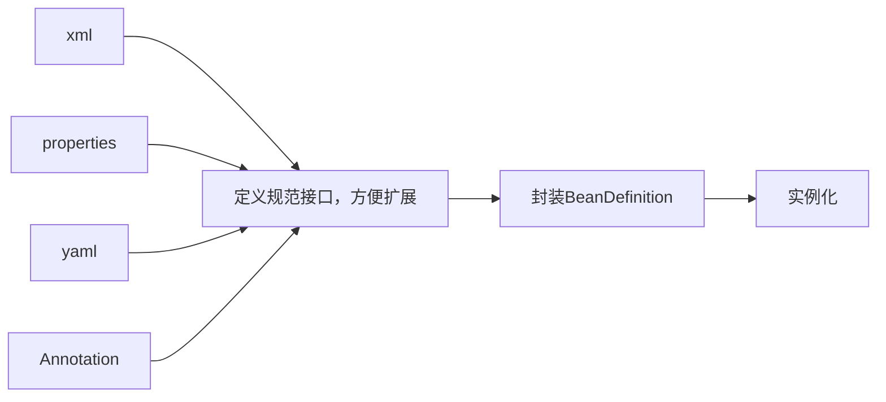
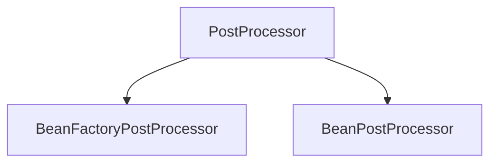
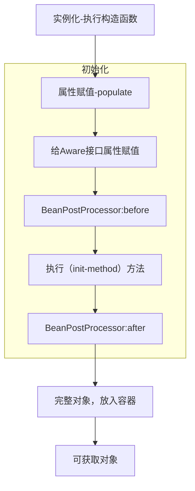
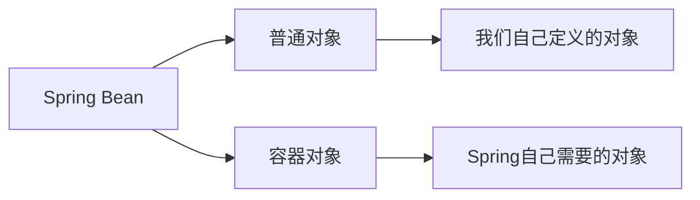
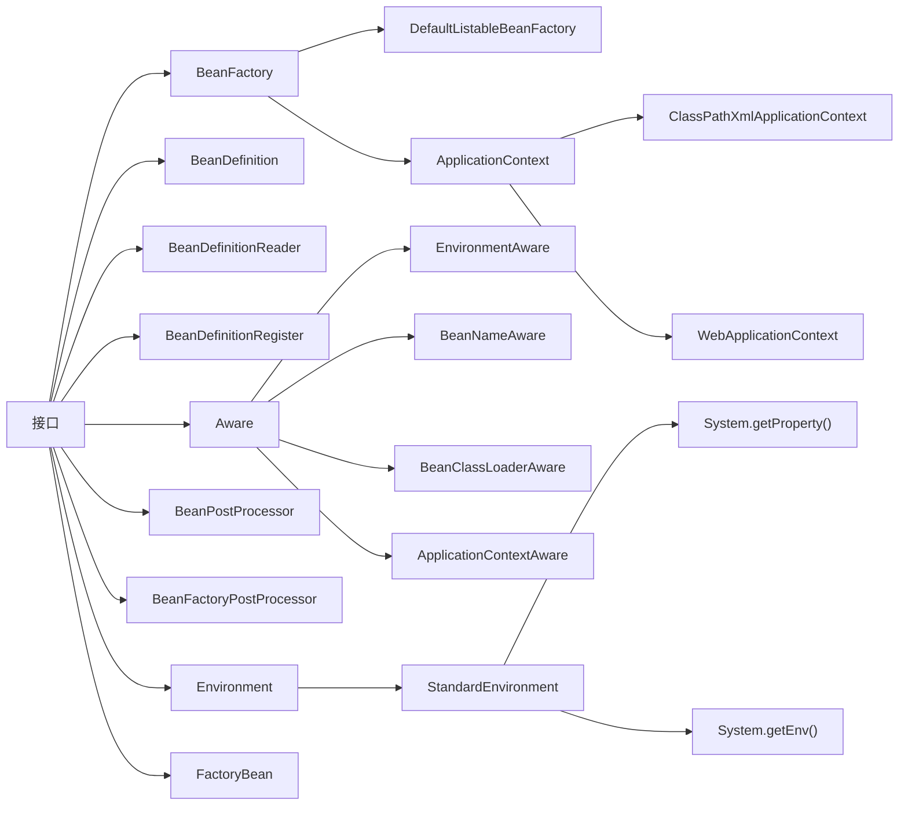
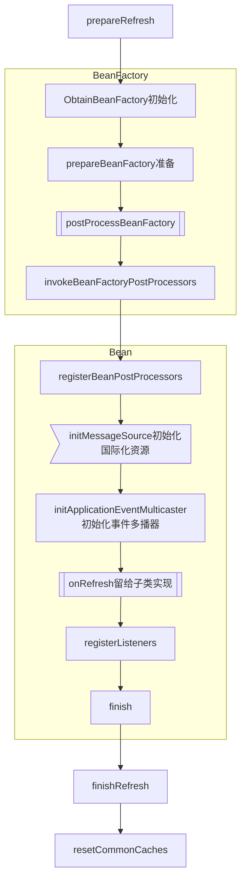

# 源码学习

## 为什么要学源码

- **源码是大厂面试的必要环节。**目前源码是很多大厂面试的必要环节。一些要求有自研产品的小厂也会问源码。所以如果不会源码的话，面试这关就无法加分了。大家也可以根据自己的职业规划自行判断。想不想进大厂或者去自研型企业？还是一直写CRUD代码？还是后续转业务或者转管理？
- **对源码的理解是一种加分项**。即使有的公司不一定会问源码，但只要简历上写了，面试的时候找机会表现出来，会是一种加分项。进入公司内部之后，如果能向领导和同事很好的展现对源码的认知，也会加分。毕竟大家都知道看懂源码比较难，所以能真正理解源码的人是少数。
- **工作中其实可以使用**。源码中有很多好的设计思想和公共方法，看懂了之后实际是可以在项目中运用的。有很多技术很强的大厂，外面的开源框架不一定能符合自己公司的业务场景，例如：阿里。直接用源码扛不住双11的并发量，所以他们在老的微服务框架基础上修改，开发出了SpringCloudAlibaba，并重新开源给其他公司使用。在工作中实际是否能用到源码还取决于能力。大厂也不会让所有人都去写框架，而是会挑有能力的人去做这些事情。当然，不管大厂小厂，只要不严重影响任务进度，领导也不会强制员工不能使用。


## 学习思路

- 储备基础知识。
  - 设计模式。学习源码非常重要的基础知识。会了设计模式之后能够更好的理解源码的思想。否则，可能会觉得源码写的很乱，明明一个类能解决的事情，非得搞出几十个类。看着看着就会反感，就看不下去了。
  - 数据结构与算法。
  - 反射。Java基础，源码中会有很多地方将类名写在配置中，然后通过反射得到实例。
  - 多线程。例如：AbstractAppicationContext.refresh()为什么要加锁？
  - JVM。
- 不要太关注细节。不要一上来就一个个方法点进去看。要先摸清流程脉络。
- 多看注释。源码不是每行代码都有注释，写了注释的尽量先看。看不懂可以用有道翻译。
- 见名知意。好的代码命名都是自注释的。
- 大胆猜测，小心验证。
- 多画图（总结图，时序图，结构图）。别人画的图，代表的是别人的收获。
- 坚持。看源码是一件很容易放弃的事情，一定要坚持。这也是大厂喜欢问源码的原因。因为他们想通过这件事来筛选能够坚持到底的人。


## 适合人群

适合任何阶段的开发人员学习。刚入行也适合。除非连Spring是啥都不知道的。


# Spring

## 参考说明

本文内容主要来源于马士兵教育视频教程（[Spring源码精讲-连鹏举](https://www.mashibing.com/study?courseNo=2154&sectionNo=13868&courseVersionId=1241)），结合了老师的笔记以及自己的实践做了一些修改。


## Spring基础概念

### IOC

什么是IOC？IOC的字面意思是控制反转。控制反转就是反转了依赖关系的满足方式，由之前的自己创建依赖对象，变为由SpringIOC容器推送。（变主动为被动，即反转）它解决了具有依赖关系的组件之间的强耦合。

#### IOC容器

可以理解为ApplicationContext，在Spring启动时，会根据配置和规则将所有的bean初始化在这里。

初始化大致流程如下，Spring在实现的时候还加入了很多扩展点。

~~~mermaid
flowchart LR
xml-->load
load[加载配置]-->parse
parse[解析配置]-->BeanDefinition
BeanDefinition[封装BeanDefinition]-->instantiation
instantiation[实例化]-->push
push[放入容器]-->pull
pull[从容器获取]
~~~

#### 配置加载

加载和解析配置文件的时候，考虑到后续配置格式可能增多，根据开闭原则为了方便后续的扩展，Spring定义了解析规范和接口。BeanDefinitionReader，通过IDEA的Type Hierarch看下他的类继承结构.

BeanDefinitionReader (org.springframework.beans.factory.support)
⊦AbstractBeanDefinitionReader (org.springframework.beans.factory.support)
⊦⊦PropertiesBeanDefinitionReader (org.springframework.beans.factory.support)
⊦⊦GroovyBeanDefinitionReader (org.springframework.beans.factory.groovy)
⊦⊦XmlBeanDefinitionReader (org.springframework.beans.factory.xml)

所以流程扩充成这样：



#### BeanDefinition封装

在得到BeanDefinition之后，且在实例化之前，如果要动态修改Bean的信息怎么办？例如下面的配置：

```xml
<property name=url value="${jdbc.url}" />
```

于是Spring定义了Bean后置处理器，主要有2种后置处理器：



案例：

在Spring中有这样一个类AbstractAutoProxyCreator，大家可以打开源码，然后查看一下类图。他就是BeanPostProcessor的实现类。

主要负责自动创建代理对象的类。我们在使用**AOP**的时候基本上都是用的这个类来进程**Bean**的拦截，创建代理对象。

还有一个类PlaceholderConfigurerSupport，他是BeanFactoryPostProcessor的实现类。主要用于解析**bean**定义中属性值里面的占位符。就是上文提到的案例。详细说明可以参考它的类注释。


#### 实例化流程

在上面的流程中，有一步是实例化，这个过程也分为很多步骤，见下图：



#### Aware接口

Spring中的Aware接口主要用于让当前bean对象获取到Spring容器中的其他Bean信息的。有如下子接口，分别用于获取不同的容器对象。

Aware (org.springframework.beans.factory)
⊦ApplicationEventPublisherAware (org.springframework.context)
⊦ServletContextAware (org.springframework.web.context)
⊦MessageSourceAware (org.springframework.context)
⊦ResourceLoaderAware (org.springframework.context)
⊦SchedulerContextAware (org.springframework.scheduling.quartz)
⊦NotificationPublisherAware (org.springframework.jmx.export.notification)
⊦BeanFactoryAware (org.springframework.beans.factory)
⊦EnvironmentAware (org.springframework.context)
⊦EmbeddedValueResolverAware (org.springframework.context)
⊦ImportAware (org.springframework.context.annotation)
⊦BootstrapContextAware (org.springframework.jca.context)
⊦ServletConfigAware (org.springframework.web.context)
⊦LoadTimeWeaverAware (org.springframework.context.weaving)
⊦BeanNameAware (org.springframework.beans.factory)：用于获取当前Bean的名字。
⊦BeanClassLoaderAware (org.springframework.beans.factory)：用于获取bean的classload。
⊦ApplicationContextAware (org.springframework.context)：用于获取ApplicationContext

部分Aware实现类的方法是在下面的方法中调用的。可以通过ctrl+alt+H查看调用堆栈。

org.springframework.beans.factory.support.AbstractAutowireCapableBeanFactory#invokeAwareMethods

```java
private void invokeAwareMethods(String beanName, Object bean) {
		//如果 bean 是 Aware 实例
		if (bean instanceof Aware) {
			//如果bean是BeanNameAware实例
			if (bean instanceof BeanNameAware) {
				//调用 bean 的setBeanName方法
				((BeanNameAware) bean).setBeanName(beanName);
			}
			//如果bean是 BeanClassLoaderAware 实例
			if (bean instanceof BeanClassLoaderAware) {
				//获取此工厂的类加载器以加载Bean类(即使无法使用系统ClassLoader,也只能为null)
				ClassLoader bcl = getBeanClassLoader();
				if (bcl != null) {
					//调用 bean 的 setBeanClassLoader 方法
					((BeanClassLoaderAware) bean).setBeanClassLoader(bcl);
				}
			}
			//如果bean是 BeanFactoryAware 实例
			if (bean instanceof BeanFactoryAware) {
				// //调用 bean 的 setBeanFactory 方法
				((BeanFactoryAware) bean).setBeanFactory(AbstractAutowireCapableBeanFactory.this);
			}
		}
	}
```


在AbstractApplicationContext类的prepareBeanFactory方法中有如下代码：

```java
protected void prepareBeanFactory(ConfigurableListableBeanFactory beanFactory) {
		//省略一些代码
		......
            
		// Configure the bean factory with context callbacks.
		// 添加beanPostProcessor,ApplicationContextAwareProcessor此类用来完成某些Aware对象的注入
		beanFactory.addBeanPostProcessor(new ApplicationContextAwareProcessor(this));
		// 设置要忽略自动装配的接口，很多同学理解不了为什么此处要对这些接口进行忽略，原因非常简单，这些接口的实现是由容器通过set方法进行注入的，
		// 所以在使用autowire进行注入的时候需要将这些接口进行忽略
		beanFactory.ignoreDependencyInterface(EnvironmentAware.class);
		beanFactory.ignoreDependencyInterface(EmbeddedValueResolverAware.class);
		beanFactory.ignoreDependencyInterface(ResourceLoaderAware.class);
		beanFactory.ignoreDependencyInterface(ApplicationEventPublisherAware.class);
		beanFactory.ignoreDependencyInterface(MessageSourceAware.class);
		beanFactory.ignoreDependencyInterface(ApplicationContextAware.class);

		//省略一些代码
		......
	}
```

#### AOP

上文提到了一个实现AOP的类AbstractAutoProxyCreator，它实现了BeanPostProcessor接口，在after方法中创建了对象的代理。

```java
/**
	 * 此处是真正创建aop代理的地方，在实例化之后，初始化之后就进行处理
	 * 首先查看是否在earlyProxyReferences里存在，如果有就说明处理过了，不存在就考虑是否要包装，也就是代理
	 *
	 * Create a proxy with the configured interceptors if the bean is
	 * identified as one to proxy by the subclass.
	 * @see #getAdvicesAndAdvisorsForBean
	 */
	@Override
	public Object postProcessAfterInitialization(@Nullable Object bean, String beanName) {
		if (bean != null) {
			// 获取当前bean的key：如果beanName不为空，则以beanName为key，如果为FactoryBean类型，
			// 前面还会添加&符号，如果beanName为空，则以当前bean对应的class为key
			Object cacheKey = getCacheKey(bean.getClass(), beanName);
			// 判断当前bean是否正在被代理，如果正在被代理则不进行封装
			if (this.earlyProxyReferences.remove(cacheKey) != bean) {
				// 如果它需要被代理，则需要封装指定的bean
				return wrapIfNecessary(bean, beanName, cacheKey);
			}
		}
		return bean;
	}
```


#### Bean分类




Spring容器中的bean分2类，上述讲得其实都是普通对象，也就是我们自己定义的对象。在这些对象创建之前，Spring还有一些自身的对象需要它自己new的。

```java
	protected ConfigurableEnvironment createEnvironment() {
		return new StandardEnvironment();
	}
```


### DI


### AOP


### 监听器

主要体现了观察者模式，在Spring容器初始化到不同阶段时，触发不同的事件监听方法，来达到不同的目的。


## 类和接口

### 重要类和接口



#### FactoryBean

当配置文件中<bean>的 class 属性配置的实现类是 FactoryBean 时，通过 getBean()方法返回的不是 FactoryBean 本身，而是 FactoryBean#getObject() 方法所返回的对象。相当于FactoryBean#getObject()代理了 getBean()方法。这种方式的Bean不需要遵守SpringBean的生命周期。

举例来说，一个类User，实现了FactoryBean接口，代码如下。

当在Spring容器（ApplicationContext）初始化的时候，没有自动初始化User这个类的，而是初始化FactoryBean这个类。

等到调用getBean("FactoryBean名字")方法时，User才被实例化。或者调用FactoryBean的getObject方法也可以实例化。

```java
public class MyFactoryBean implements FactoryBean<User> {

    @Override
    public User getObject() throws Exception {
        return new User("zhangsan");
    }

    @Override
    public Class<?> getObjectType() {
        return User.class;
    }

    @Override
    public boolean isSingleton() {
        return false;
    }
}

public class Test {
    public static void main(String[] args) {
        //此时User类没有初始化
        ApplicationContext ac = new ClassPathXmlApplicationContext("factoryBean.xml");
        
        //通过FactoryBean名字获取User实例
        User bean1 = (User) ac.getBean("myFactoryBean");
        System.out.println(bean1.getUsername());
        
        //通过&FactoryBean名字获取FactoryBean实例
        MyFactoryBean bean2 = (MyFactoryBean) ac.getBean( "&myFactoryBean");
        System.out.println(bean2.getObject());
	}
}

```

**Spring为什么使用FactoryBean**

一般情况下，Spring 通过反射机制利用 bean 的 class 属性指定实现类来实例化 bean。

在某些情况下，实例化 bean 过程比较复杂，如果按照传统的方式，则需要在中提供大量的配置信息，配置方式的灵活性是受限的，这时采用编码的方式可能会得到一个简单的方案。

FactoryBean接口对于 Spring 框架来说占有重要的地位，Spring 自身就提供了 70 多个FactoryBean 的实现。它们隐藏了实例化一些复杂 bean 的细节，给上层应用带来了便利。

[应用场景](https://blog.csdn.net/qq_44543508/article/details/130472391)


## 源码

### 设计思想

Spring源码针对同一种类型的类为什么要设计那么复杂的继承关系？

例如：BeanFactory接口有几十个子类，而我们平时自己开发的时候往往是一个类搞定所有。

回答：我们平时大部分做的是基于某一个特定业务场景的定制开发，而Spring作为通用的底层框架，他需要兼容所有可能出现的功能场景。将每一个类的功能设计的精细化，再通过两两组合能够灵活兼容更多的功能场景。如果只设计很少的类，那意味着每一个类将拥有更多的功能，而这些功能，我们在做某个功能场景下，可能是用不到的。但设计了就得去实现里面的方法。

例如：假设现在有10个独立的功能方法，如果分布在10个子类中，那我们某个具体业务场景如果要用其中的2个（A和B），那我们可以选择用1个类实现A和B接口即可。实现他们的方法即可。但如果10个方法全设计在一个子类中，那我们就得实现它10个方法。还得花时间去研究哪个方法是真正要实现的。哪个可以不实现。


### 源码载入

载入源码前一定要选择一个合适的Spring源码版本，因为它和Gradle版本，JDK版本是有对应关系的。

高版本的Spring源码，一般需要高版本的JDK版本和Gradle版本，配合使用。

如果你是通过视频教程在看Spring源码，那建议使用视频中老师用的那个Spring版本，老师一般也会提供给你配套的Spring，Gradle和JDK。

本文使用的是马士兵教育的视频教程（[Spring源码精讲](https://www.mashibing.com/study?courseNo=2154&sectionNo=13868)）课程资料中对应的Spring源码包以及对应的Gradle版本。


#### 版本说明

##### Spring

本文使用的Spring版本是5.3.2，如果想看更高版本的Spring源码的话，需要换更高版本的JDK。


##### Gradle

建议去Spring源码的这个文件（spring源码目录\gradle\wrapper\gradle-wrapper.properties）中查看对应的Gradle版本。然后去

[Gradle版本下载地址](https://services.gradle.org/distributions/)中下载。下载好Gradle的zip包之后，可以替换上面这个文件中的内容。不然后续构建的时候还会重复下载的。

```properties
#distributionUrl=https\://services.gradle.org/distributions/gradle-5.6.4-all.zip
distributionUrl=file:///D:/ProgramFiles/gradle/gradle-5.6.4-bin.zip
distributionBase=GRADLE_USER_HOME
distributionPath=wrapper/dists
zipStorePath=wrapper/dists
zipStoreBase=GRADLE_USER_HOME
```

Gradle解压之后，请添加2个环境变量，GRADLE_HOME，PATH。


##### JDK

java version "1.8.0_351"
Java(TM) SE Runtime Environment (build 1.8.0_351-b10)
Java HotSpot(TM) 64-Bit Server VM (build 25.351-b10, mixed mode)


##### IDE

我用的是IDEA 2023.01。IDEA版本尽量不要用太旧的。可能不兼容高版本Gradle。


#### IDEA载入

以上都准备好，就可以载入已经下载好的Spring源码了。Spring源码本地路径：D:\Workspace\idea\mashibing\lianpengju-spring

载入Spring源码后，记得修改“File | Settings | Build, Execution, Deployment | Build Tools | Gradle | Gradle User Home”这里面的路径。这个路径相当于是Maven的本地仓库地址。

载入后，IDEA会根据依赖下载依赖包，此过程根据网速会比较漫长。笔者至少用了好几个小时才下载完成。

如果报错：Error resolving plugin [id: ‘io.spring.gradle-enterprise-conventions’, version: ‘0.0.2’]

解决方法：去文件build.gradle中，注释id "io.spring.gradle-enterprise-conventions" version "0.0.2

代码编译成功后，可以按照下面的步骤写一个简单的测试类，看看是否能够debug。


### ApplicationContext初始化

#### 起点

可以自己在Spring-debug模块中自己建一个main方法和xml配置文件，然后写好测试代码开始debug。

```java
public class TestPopulate {

    public static void main(String[] args) {
        ApplicationContext ac = new ClassPathXmlApplicationContext("populateBean.xml");
        ac.close();
    }
}
```

然后进入到ClassPathXmlApplicationContext的构造方法中。

```java
	public ClassPathXmlApplicationContext(
			String[] configLocations, boolean refresh, @Nullable ApplicationContext parent)
			throws BeansException {
		// 调用父类构造方法，对成员变量进行初始化，进行相关的对象创建等操作。
		super(parent);
		setConfigLocations(configLocations);
		if (refresh) {
			refresh();
		}
	}
```


#### super(parent)

调用父类构造方法，对成员变量进行初始化，进行相关的对象创建等操作。

- 创建资源模式解析器。用于xml等配置文件的加载
- 给上下文创建一个ID。ObjectUtils.identityToString(this)
- 初始化同步监视器，用于在refresh和destroy的时候，加锁。
- 合并环境信息(Environment)，如果存在父容器。SpringMVC时会存在父容器。
- 设置xml文件验证标识。默认为true。xml的文件格式由xsd和dtd规定。


#### setConfigLocations

设置应用程序上下文的配置文件路径。

- Spring支持通过spring.profiles.actvie多环境配置。程序需要读到正确的配置文件。
- Spring支持在配置文件中使用占位符。例如：application-${username}.xml。程序需要根据环境变量替换。
- 实例化Environment对象，并通过父类构造方法调用StandardEnvironment#customizePropertySources方法。
  - 将System.getProperties加载到systemProperties中。(jvm参数)
  - 将System.getEnv()加载到systemEnvironment中。(jvm所在的服务器的环境参数)
- 将解析到的配置文件路径放入实例变量中。configLocations


#### refresh()

AbstractApplicationContext#refresh()方法是IOC容器初始化的核心方法，它内部分成12个方法。

```java
	public void refresh() throws BeansException, IllegalStateException {
		synchronized (this.startupShutdownMonitor) {
			// Prepare this context for refreshing.
			/**
			 * 前戏，做容器刷新前的准备工作
			 * 1、设置容器的启动时间
			 * 2、设置活跃状态为true
			 * 3、设置关闭状态为false
			 * 4、获取Environment对象，并加载当前系统的属性值到Environment对象中
			 * 5、准备监听器和事件的集合对象，默认为空的集合
			 */
			prepareRefresh();

			// Tell the subclass to refresh the internal bean factory.
			// 创建BeanFactory容器对象：DefaultListableBeanFactory
			// 加载xml配置文件的属性值到当前工厂中，最重要的就是BeanDefinition
			ConfigurableListableBeanFactory beanFactory = obtainFreshBeanFactory();

			// Prepare the bean factory for use in this context.
			// beanFactory的准备工作，对他里面的BeanDefinition的各种属性进行填充，上一步只是初始化
			prepareBeanFactory(beanFactory);

			try {
				// Allows post-processing of the bean factory in context subclasses.
				// 子类覆盖方法做额外的处理，此处我们自己一般不做任何扩展工作，但是可以查看web中的代码，是有具体实现的
				postProcessBeanFactory(beanFactory);

				// Invoke factory processors registered as beans in the context.
				// 调用各种beanFactory处理器
				invokeBeanFactoryPostProcessors(beanFactory);

				// Register bean processors that intercept bean creation.
				// 注册bean处理器，这里只是注册功能，真正调用的是getBean方法
				registerBeanPostProcessors(beanFactory);

				// Initialize message source for this context.
				// 为上下文初始化message源，即不同语言的消息体，国际化处理,在springmvc的时候通过国际化的代码重点讲
				initMessageSource();

				// Initialize event multicaster for this context.
				// 初始化事件监听多路广播器
				initApplicationEventMulticaster();

				// Initialize other special beans in specific context subclasses.
				// 留给子类来初始化其他的bean，SpringBoot启动时，在这里会初始化Tomcat
				onRefresh();

				// Check for listener beans and register them.
				// 在所有注册的bean中查找listener bean,注册到消息广播器中
				registerListeners();

				// Instantiate all remaining (non-lazy-init) singletons.
				// 实例化剩下的单例模式对象（非懒加载的）
				finishBeanFactoryInitialization(beanFactory);

				// Last step: publish corresponding event.
				// 完成刷新过程，通知生命周期处理器lifecycleProcessor刷新过程，同时发出ContextRefreshEvent通知别人
				finishRefresh();
			}

			catch (BeansException ex) {
				if (logger.isWarnEnabled()) {
					logger.warn("Exception encountered during context initialization - " +
							"cancelling refresh attempt: " + ex);
				}

				// Destroy already created singletons to avoid dangling resources.
				// 为防止bean资源占用，在异常处理中，销毁已经在前面过程中生成的单件bean
				destroyBeans();

				// Reset 'active' flag.
				// 重置active标志
				cancelRefresh(ex);

				// Propagate exception to caller.
				throw ex;
			}

			finally {
				// Reset common introspection caches in Spring's core, since we
				// might not ever need metadata for singleton beans anymore...
				resetCommonCaches();
			}
		}
	}
```

##### 流程图



##### prepareRefresh()

主要做容器刷新前的准备工作。

- 设置容器启动时间，活动标识，关闭标识。

- initPropertySources()，初始化资源文件（子类扩展点）

  - 应用场景，我们可以自己写一个类继承ClassPathXmlApplicationContext

  - 在自定义类中覆盖方法，实现如下功能。

  - 检查Properties中必须包含某个属性值，否则容器启动报错。

  - 往Properties中放入一个新的属性值。

  - ```java
    public class MyClassPathXmlApplicationContext extends ClassPathXmlApplicationContext {
    
        public MyClassPathXmlApplicationContext(String... configLocations){
            super(configLocations);
        }
    
        @Override
        protected void initPropertySources() {
            System.out.println("自定义initPropertySource");
            getEnvironment().getSystemProperties().put("name","bobo");
            getEnvironment().setRequiredProperties("key");
        }
    
        public static void main(String[] args) {
            ApplicationContext context = new MyClassPathXmlApplicationContext("spring.xml");
            User user = (User)context.getBean("a");
        }
    }
    ```

  - 通过源码上的注解可以发现，有一个工具类*WebApplicationContextUtils#initServletPropertySources*，当在Web环境下启动时，会用ServletContext中解析到的参数替换原来的参数。 

- 获取 Environment 对象，校验属性值并赋值到 Environment 对象中

- 初始化Application监听器和事件。从Spring启动时这里为空，但从Springboot启动时，这里就不为空。

- ```java
  	protected void prepareRefresh() {
  		// Switch to active.
  		// 设置容器启动的时间
  		this.startupDate = System.currentTimeMillis();
  		// 容器的关闭标志位
  		this.closed.set(false);
  		// 容器的激活标志位
  		this.active.set(true);
  
  		// 记录日志
  		if (logger.isDebugEnabled()) {
  			if (logger.isTraceEnabled()) {
  				logger.trace("Refreshing " + this);
  			}
  			else {
  				logger.debug("Refreshing " + getDisplayName());
  			}
  		}
  
  		// Initialize any placeholder property sources in the context environment.
  		// 留给子类覆盖，初始化属性资源
  		initPropertySources();
  
  		// Validate that all properties marked as required are resolvable:
  		// see ConfigurablePropertyResolver#setRequiredProperties
  		// 创建并获取环境对象，验证必要的属性文件是否都已经放入环境中，验证不通过会抛异常
  		getEnvironment().validateRequiredProperties();
  
  		// Store pre-refresh ApplicationListeners...
  		// 判断刷新前的应用程序监听器集合是否为空，如果为空，则将监听器添加到此集合中
  		if (this.earlyApplicationListeners == null) {
  			// 从SpringBoot应用启动时这里就不为空。
  			this.earlyApplicationListeners = new LinkedHashSet<>(this.applicationListeners);
  		}
  		else {
  			// Reset local application listeners to pre-refresh state.
  			// 如果不等于空，则清空集合元素对象
  			this.applicationListeners.clear();
  			this.applicationListeners.addAll(this.earlyApplicationListeners);
  		}
  
  		// Allow for the collection of early ApplicationEvents,
  		// to be published once the multicaster is available...
  		// 创建刷新前的监听事件集合
  		this.earlyApplicationEvents = new LinkedHashSet<>();
  	}
  ```

- 

  

##### obtainFreshBeanFactory()

初始化BeanFactory。加载并解析xml配置文件得到BeanDefinition。

- refreshBeanFactory。调用的是父类AbstractRefreshableApplicationContext中的方法。

  - ```java
    	protected final void refreshBeanFactory() throws BeansException {
    		// 如果存在beanFactory，则销毁beanFactory
    		if (hasBeanFactory()) {
    			destroyBeans();
    			closeBeanFactory();
    		}
    		try {
    			// 创建DefaultListableBeanFactory对象
    			DefaultListableBeanFactory beanFactory = createBeanFactory();
    			// 为了序列化指定id，可以从id反序列化到beanFactory对象
    			beanFactory.setSerializationId(getId());
    			// 定制beanFactory，设置相关属性，包括是否允许覆盖同名称的不同定义的对象以及循环依赖
    			customizeBeanFactory(beanFactory);
    			// 初始化documentReader,并进行XML文件读取及解析,默认命名空间的解析，自定义标签的解析
    			loadBeanDefinitions(beanFactory);
    			this.beanFactory = beanFactory;
    		}
    		catch (IOException ex) {
    			throw new ApplicationContextException("I/O error parsing bean definition source for " + getDisplayName(), ex);
    		}
    	}
    ```

  - 如果BeanFactory已经存在，则先销毁里面的所有beans。再关闭BeanFactory。

  - 初始化BeanFactory，此时很多属性都是初始值。使用applicationContext的id，设置序列化id

  - customizeBeanFactory。定制BeanFactory。主要设置2个重要属性（allowBeanDefinitionOverriding：是否允许覆盖名称相同的BeanDefinition，allowCircularReferences：是否允许循环依赖）。
  
    - 如果想要覆盖初始值，可以写一个类继承ApplicationContext。这算是一个子类扩展点，参考代码如下：
  
    - ```java
      public class MyClassPathXmlApplicationContext extends ClassPathXmlApplicationContext {
      
          MyClassPathXmlApplicationContext(String... locations){
              super(locations);
          }
      
          @Override
          protected void customizeBeanFactory(DefaultListableBeanFactory beanFactory) {
              super.setAllowBeanDefinitionOverriding(true);
              super.setAllowCircularReferences(true);
              super.customizeBeanFactory(beanFactory);
          }
      }
      ```
  
    - 是否允许覆盖名称相同的BeanDefinition，这是用在replace-method和lookup-method上的。
  
  - loadBeanDefinitions。加载配置文件，解析BeanDefinitions。
  
    - 实例化XmlBeanDefinitionReader，这里用到了适配器模式。
      - 初始化dtd和xsd解析器。
    - 设置属性
      - environment，用于替换配置文件中的占位符。
      - resourceLoader，资源加载器，就是当前对象。
      - entityResolver，解析xml的，内部会读取dts或xsd
        - 本地schemas路径：spring-beans\src\main\resources\META-INF\spring.schemas
        - 即使断网也可以根据此文件中的映射，找到本地文件。
        - PluggableSchemaResolver的toString方法会读取spring.schemas中的文件内容。
    - initBeanDefinitionReader，设置是否使用XML校验，默认true。
    - 调用reader的loadBeanDefinitions方法，从之前读取到的configLocation中读取配置文件。
      - 配置文件可能有多个，循环读取。
      - 解析配置文件地址中的路径修饰字符。例如："classpath:xxx.xml"
      - doLoadBeanDefinitions。
        - doLoadDocument。使用SAX，从String[]到Resource[]，再将resource读取成Document文档对象（此步骤不建议深入研究）。并将其封装成BeanDefinition对象。
        - registerBeanDefinitions。解析并读取配置文件。区分不同的命名空间做不同的处理。对于非默认命名空间的配置通过resources\META-INF\spring.handlers文件中对应的类进行处理。基于此，我们也可以自定义标签的处理类。
      - 这里预留了一个扩展点，[自定义标签](#配置文件自定义标签)。
  
  - 


##### prepareBeanFactory(beanFactory)

beanFactory的准备工作，对他里面的BeanDefinition的各种属性进行填充


##### postProcessBeanFactory()

略。


##### invokeBeanFactoryPostProcessors()

调用各种beanFactory处理器


##### registerBeanPostProcessors(beanFactory)

注册BeanPostProcessors。真正调用要到后面的**getBean**方法。


##### initMessageSource();

初始化国际化资源文件。


##### initApplicationEventMulticaster();

初始化事件监听多路广播器。用于发布事件和监听器。


##### onRefresh()

刷新时需要触发的方法，留给子类自定义的。SpringBoot启动的时候就会在这个方法里启动Tomcat容器。


##### registerListeners()

将监听器注册到容器中。


##### finishBeanFactoryInitialization(beanFactory)

核心方法，在这里实例化BeanFactory中的所有实例。


##### finishRefresh()

完成整个刷新过程。做一些通知工作。


##### resetCommonCaches()

重置公共缓存。


### 扩展点

#### 配置文件自定义标签

自定义标签的意思是，在Spring的配置文件中（applicationContext.xml）加入自己定义的标签，同时加入处理类，让IOC容器启动时可以自动解析到beanFactory中。

##### 代码出处

在ioc容器初始化过程中，会调用类（XmlBeanDefinitionReader.java）的下面这个方法。在这个方法的（createReaderContext(resource)）中会初始化上下文。同时会确定配置文件地址。

```java
//org/springframework/beans/factory/xml/XmlBeanDefinitionReader.java
    public int registerBeanDefinitions(Document doc, Resource resource) throws BeanDefinitionStoreException {
        // 对xml的beanDefinition进行解析
        BeanDefinitionDocumentReader documentReader = createBeanDefinitionDocumentReader();
        int countBefore = getRegistry().getBeanDefinitionCount();
        // 完成具体的解析过程,createReaderContext这个方法会读取配置文件，读出不同命名空间对应的处理类
        documentReader.registerBeanDefinitions(doc, createReaderContext(resource));
        return getRegistry().getBeanDefinitionCount() - countBefore;
    }

	/**
	 * 接着进入getNamespaceHandlerResolver()这个方法
	 */
	public XmlReaderContext createReaderContext(Resource resource) {
		return new XmlReaderContext(resource, this.problemReporter, this.eventListener,
				this.sourceExtractor, this, getNamespaceHandlerResolver());
	}

	/**
	 * 第一次进来肯定为空，所以进入createDefaultNamespaceHandlerResolver()
	 */
	public NamespaceHandlerResolver getNamespaceHandlerResolver() {
		if (this.namespaceHandlerResolver == null) {
			this.namespaceHandlerResolver = createDefaultNamespaceHandlerResolver();
		}
		return this.namespaceHandlerResolver;
	}

	/**
	 * 进到这个方法后，配置文件路径确定
	 */
	protected NamespaceHandlerResolver createDefaultNamespaceHandlerResolver() {
		ClassLoader cl = (getResourceLoader() != null ? getResourceLoader().getClassLoader() : getBeanClassLoader());
		return new DefaultNamespaceHandlerResolver(cl);
	}
```

在下面的这个parseCustomElement方法，会解析非默认命名空间的配置项。这里面会使用上下文调用resolve方法找到命名空间对应的处理类。针对不同命名空间调用不同类的方法来解析。

```java
//org.springframework.beans.factory.xml.BeanDefinitionParserDelegate	
	public BeanDefinition parseCustomElement(Element ele, @Nullable BeanDefinition containingBd) {
		// 获取对应的命名空间
		String namespaceUri = getNamespaceURI(ele);
		if (namespaceUri == null) {
			return null;
		}
		// 根据命名空间找到对应的Namespace Handler
		NamespaceHandler handler = this.readerContext.getNamespaceHandlerResolver().resolve(namespaceUri);
		if (handler == null) {
			error("Unable to locate Spring NamespaceHandler for XML schema namespace [" + namespaceUri + "]", ele);
			return null;
		}
		// 调用自定义的NamespaceHandler进行解析
		return handler.parse(ele, new ParserContext(this.readerContext, this, containingBd));
	}

//org.springframework.beans.factory.xml.DefaultNamespaceHandlerResolver
	public NamespaceHandler resolve(String namespaceUri) {
		// 获取所有已经配置好的handler映射
		Map<String, Object> handlerMappings = getHandlerMappings();
		// 根据命名空间找到对应的信息
		Object handlerOrClassName = handlerMappings.get(namespaceUri);
		if (handlerOrClassName == null) {
			return null;
		}
		else if (handlerOrClassName instanceof NamespaceHandler) {
			// 如果已经做过解析，直接从缓存中读取
			return (NamespaceHandler) handlerOrClassName;
		}
		else {
			// 没有做过解析，则返回的是类路径
			String className = (String) handlerOrClassName;
			try {
				// 通过反射将类路径转化为类
				Class<?> handlerClass = ClassUtils.forName(className, this.classLoader);
				if (!NamespaceHandler.class.isAssignableFrom(handlerClass)) {
					throw new FatalBeanException("Class [" + className + "] for namespace [" + namespaceUri +
							"] does not implement the [" + NamespaceHandler.class.getName() + "] interface");
				}
				// 实例化类
				NamespaceHandler namespaceHandler = (NamespaceHandler) BeanUtils.instantiateClass(handlerClass);
				// 调用自定义的namespaceHandler的初始化方法
				namespaceHandler.init();
				// 讲结果记录在缓存中
				handlerMappings.put(namespaceUri, namespaceHandler);
				return namespaceHandler;
			}
			catch (ClassNotFoundException ex) {
				throw new FatalBeanException("Could not find NamespaceHandler class [" + className +
						"] for namespace [" + namespaceUri + "]", ex);
			}
			catch (LinkageError err) {
				throw new FatalBeanException("Unresolvable class definition for NamespaceHandler class [" +
						className + "] for namespace [" + namespaceUri + "]", err);
			}
		}
	}
```


##### 步骤

例如：我们自定义一个标签<test:user username="zhangsan" email="testEmail" password="test123456" />

1. 定义一个实体类User

2. 写一个类继承AbstractSingleBeanDefinitionParser，并覆盖父类方法。

3. 写一个类继承NamespaceHandlerSupport，覆盖父类方法。可参考ContextNamespaceHandler。

   1. 上述步骤参考代码

   2. ```java
      /**
      * 1.实体类，用于承载自定义标签中的信息
      */
      public class User {
          private String username;
          private String email;
          private String password;
      
          public String getUsername() {
              return username;
          }
      
          public void setUsername(String username) {
              this.username = username;
          }
      
          public String getEmail() {
              return email;
          }
      
          public void setEmail(String email) {
              this.email = email;
          }
      
          public String getPassword() {
              return password;
          }
      
          public void setPassword(String password) {
              this.password = password;
          }
      }
      
      /**
       * 自定义标签分析器。<br>
       * 不继承AbstractPropertyLoadingBeanDefinitionParser是因为，我们标签中暂时不需要location，properties-ref等等属性。
       */
      public class UserBeanDefinitionParser extends AbstractSingleBeanDefinitionParser {
      
          /**
           * 返回属性值所对应的对象
           *
           * @param element the {@code Element} that is being parsed
           * @return
           */
          @Override
          protected Class<?> getBeanClass(Element element) {
              return User.class;
          }
      
          /**
           * 标签解析方法。负责解析标签的自定义属性。
           *
           * @param element the XML element being parsed
           * @param builder used to define the {@code BeanDefinition}
           */
          @Override
          protected void doParse(Element element, BeanDefinitionBuilder builder) {
              String userName = element.getAttribute("userName");
              String email = element.getAttribute("email");
              String password = element.getAttribute("password");
      
              if (StringUtils.hasText(userName)) {
                  builder.addPropertyValue("username", userName);
              }
              if (StringUtils.hasText(email)) {
                  builder.addPropertyValue("email", email);
              }
              if (StringUtils.hasText(password)) {
                  builder.addPropertyValue("password", password);
              }
          }
      }
      
      /**
       * 3.自定义命名空间处理类。参考ContextNamespaceHandler
       */
      public class UserNamespaceHandler extends NamespaceHandlerSupport {
          @Override
          public void init() {
              registerBeanDefinitionParser("user",new UserBeanDefinitionParser());
          }
      }
      ```

4. 在项目配置文件目录（resources/META-INF/）中，新增文件spring.handlers，加入处理类的映射。

   1. 注意：在idea中创建这个文件时，要确保他是properties类型的。不能是txt类型的。
   2. `http\://www.test.com/schema/user=com.test.selftag.UserNamespaceHandler`

5. 在项目配置文件目录（resources/META-INF/）中，新增文件spring.schemas，加入命名空间和xsd的映射。

   1. 注意：在idea中创建这个文件时，要确保他是properties类型的。不能是txt类型的。
   2. `http\://www.test.com/schema/user.xsd=META-INF/user.xsd`

6. 在项目配置文件目录（resources/META-INF/）中，新增文件user.xsd。

   1. ```xml
      <?xml version="1.0" encoding="UTF-8"?>
      <schema xmlns="http://www.w3.org/2001/XMLSchema"
              targetNamespace="http://www.test.com/schema/user"
              xmlns:tns="http://www.test.com/schema/user"
              elementFormDefault="qualified">
          <element name="user">
              <complexType>
                  <attribute name ="id" type = "string"/>
                  <attribute name ="userName" type = "string"/>
                  <attribute name ="email" type = "string"/>
                  <attribute name ="password" type="string"/>
              </complexType>
          </element>
      </schema>
      ```

7. 在Spring配置文件中，使用我们的自定义标签。

   1. applicationContext.xml

   2. ```xml
      <?xml version="1.0" encoding="UTF-8"?>
      <beans xmlns="http://www.springframework.org/schema/beans"
             xmlns:context="http://www.springframework.org/schema/context"
             xmlns:test="http://www.test.com/schema/user"
             xmlns:xsi="http://www.w3.org/2001/XMLSchema-instance"
             xsi:schemaLocation="http://www.springframework.org/schema/beans http://www.springframework.org/schema/beans/spring-beans.xsd
              http://www.springframework.org/schema/context  http://www.springframework.org/schema/context/spring-context.xsd
              http://www.test.com/schema/user http://www.test.com/schema/user.xsd">
      
      	<test:user id="testTag" username="lisi" email="lisi@163.com" password="123456"></test:user>
      
          <bean id="person"  class="com.test.Person" scope="prototype">
              <property name="id" value="1"></property>
              <property name="name" value="zhangsan"></property>
          </bean>
      </beans>
      ```

8. 写一个容器启动测试类。测试刚才的自定义标签。

   1. ```java
      public class Test {
          public static void main(String[] args) {
       		ApplicationContext ac = new ClassPathXmlApplicationContext("applicationContext.xml");
              User user = ac.getBean("testTag");
              System.out.println(user);
          }
      }
      ```

9. 问题排查。

   1. 如果报错assert short name !=key，可能是docs.gradle中的这段代码引起的，把它注释掉就行了。

   2. ```groovy
      task schemaZip(type: Zip) {
      	group = "Distribution"
      	archiveBaseName.set("spring-framework")
      	archiveClassifier.set("schema")
      	description = "Builds -${archiveClassifier} archive containing all " +
      			"XSDs for deployment at https://springframework.org/schema."
      	duplicatesStrategy DuplicatesStrategy.EXCLUDE
      	moduleProjects.each { module ->
      		def Properties schemas = new Properties();
      
      		module.sourceSets.main.resources.find {
      			(it.path.endsWith("META-INF/spring.schemas") || it.path.endsWith("META-INF\\spring.schemas"))
      		}?.withInputStream { schemas.load(it) }
      
      //把下面的代码注释。
      //		for (def key : schemas.keySet()) {
      //			def shortName = key.replaceAll(/http.*schema.(.*).spring-.*/, '$1')
      //			assert shortName != key
      //			File xsdFile = module.sourceSets.main.resources.find {
      //				(it.path.endsWith(schemas.get(key)) || it.path.endsWith(schemas.get(key).replaceAll('\\/','\\\\')))
      //			}
      //			assert xsdFile != null
      //			into (shortName) {
      //				from xsdFile.path
      //			}
      //		}
      	}
      }
      ```

   3. 


# SpringMVC


# SpringBoot
