# 云原生

## 何为云原生

“云原生”顾名思义，就是“生在云上、长在云上”。早在云原生概念被提出前，企业中就已有相关实践。

比如，谷歌在2004年就开始使用了容器技术，2006推出的进程容器（Process Container），就是一种具有“云原生”特征的技术实践；2009年，Netflix等厂商就开始开始启动上公有云战略，将 IT  基础架构从自己的数据中心迁移到公共云上之外，并通过微服务架构，用较小的易管理软件组件替换单体程序。

业界公认的云原生概念，是在2013年由Pivotal公司的Matt  Stine首次提出的，他将其定义为一系列云计算技术和开发管理方法的合集。包含如下部分，DevOps，持续交付，微服务(MicroServices)，敏捷基础设施(Agile Infrastructure)，12要素(The Twelve-Factor App)等等。

2015年，云原生领域最具话语权的组织CNCF（Cloud Native Computing Foundation）成立，该组织对云原生的最初定义主要包含三个方面：应用容器化；面向微服务架构；应用支持容器的编排调度。2018年，随着云原生生态的壮大，CNCF更新了对云原生的定义：**云原生技术有利于各组织在公有云、私有云和混合云等新型动态环境中，构建和运行可弹性扩展的应用。**

由此可见，云原生从诞生起便不仅仅只是一项技术或一个产品，而是一种系统化方法论和技术的集合。

经过不断地演进与发展，目前云原生的核心主要是微服务、容器、服务网格、不可变基础设施和声明式API这五大关键技术。


## 云原生核心技术与架构

### 微服务

微服务区别于单体应用而生。传统的单体应用由于耦合度高、扩展性差、迭代缓慢等缺点，已无法适应移动互联时代用户体量以及访问量几何式倍增、用户需求快速变化的现状。微服务便应运而生，其本质上是对传统的单体应用根据业务领域和模块进行划分、解耦，拆分成一个一个单独部署、运行的微小应用。


例：上图中将单体销售系统重构微服务商城系统。


### 容器

容器是是一种轻量级、可移植、自包含的软件打包技术，能够使应用程序在几乎任何地方以相同的方式运行。开发人员只要编写一次应用程序，无须任何修改就能够在生产系统的虚拟机、物理服务器或公有云主机上等任意位置运行。这种级别的可移动性，对于开发进程和供应商兼容性而言意义重大。


### 不可变基础设施

基础设施的不可变性是指运行服务的服务器在完成部署后，就不再进行更改。如果需要以任何方式更新，修复或修改某些内容，则会根据具有相应更改的公共镜像构建新服务器以替换旧服务器。

不可变基础架构的好处包括基础架构中更高的一致性和可靠性，以及更简单，更可预测的部署过程，它可以缓解或完全防止可变基础架构中常见的问题，例如：配置漂移和雪花服务器。


### 服务网格

服务网格是指用以处理服务与服务之间通信的基础设施层。在实践中，它是一组和应用服务部署在一起的轻量级的网络代理，并且对应用服务透明。


### 声明式API

声明式API是一种能够一次处理多个写操作、具备Merge能力的API。区别于命令式API直接发出的让服务器执行的命令，声明式API声明的是期望的状态，系统将不断地调整实际状态，直到与期望状态保持一致。


**基于云原生技术的一组架构原则和设计模式的集合便是云原生架构。**云原生架构可以帮助企业和开发充分利用云平台所提供的平台化能力和弹性资源能力，让开发人员将精力聚焦于业务。

云原生架构的架构原则如下图所示，通过遵从这些架构原则可以让技术主管和架构师在做技术选择时不会出现大的偏差。


## 优势

拥抱云原生，释放新生产力。越来越多的行业已入局云原生赛道。

根据全球企业增长咨询公司沙利文的报告，除互联网和信息服务等数字原生行业外，**制造、政务、医疗等传统行业的云原生用户占比呈现较强的增长态势**。据中国信通院调查，不同行业对云原生应用的核心诉求存在一定差异，细粒度、极致弹性、交付标准化、异构资源统一纳管、开放架构是企业对云原生的主要关注点。


云原生由数字化转型催生，同时，它又以其极致弹性、自动部署、开放共享、按需服务、自治管理、独立高效等特性，帮助政企数字化释放新生产力。

**1、极致弹性**

弹性计算是云计算的核心特征，也是云原生技术中容器的重要特征。云原生应用弹性，包括应用使用资源的弹性和应用实例弹性扩展的弹性。在单实例扩展资源遭遇瓶颈时，可以配合负载均衡机制实现容器实例的弹性扩展。如以Kubernetes为代表的容器来提供离散和可重用的功能，这些功能以良好描述的方式集成，甚至跨越多云等技术边界，这使得交付团队可以使用重复的自动化和编排来快速迭代。

**2、自动部署**

云原生方法远优于传统的面向虚拟化的业务流程，传统方法需要投入大量的精力来构建开发环境，以及软件交付过程中的其他不同环境。而云原生架构具备自动化和组合功能，并且依赖于可靠、经过验证和审核的已知良好流程的基础，交付十分敏捷，而不再需要人工干预重复执行。

**3、开放共享**

云计算可以分为IaaS、PaaS、SaaS三种类型，分别通过这三种类型实现资源共享、平台共享、应用共享。而云原生应用则是部署在IaaS或PaaS层，通过SaaS层提供开放式服务。

**4、按需服务**

云应用部署在云端，客户可以根据自己的需求，通过网络访问，自助使用服务，不需要联系云应用管理人员。通常会有个云应用服务目录，每个应用服务都有使用说明，通过服务目录可以找到适合自己满足自身需求的应用。

**5、自治管理**

云原生应用的交付一定是按照标准交付，可以在云端任何支持标准的位置部署，这样就与位置和环境无关，同时构建应用所需要的依赖包、配置文件和后端服务等都是和应用构成一个整体，实现自治管理。使用容器的好处就是可以使得应用以标准化镜像的方式交付和运行，而用微服务实现云原生应用，也正是符合这一自治原则的。

**6、独立高效**

云原生带来了微服务化架构，一个微服务基本是一个能独立发布的应用服务，因此可以作为独立组件升级、灰度或复用等，对整个大应用的影响也较小，每个服务可以由专门的组织来单独完成，依赖方只要定好输入和输出口即可完全开发、甚至整个团队的组织架构也会更精简，因此沟通成本低、效率高。

云原生的这些特性极大地释放了云的红利，它能帮助企业构建弹性可靠、松耦合、易管理可观测的应用系统，提升交付效率，降低运维复杂度，让企业在竞争激烈以及疫情等不确定背景下保持一种高速迭代、持续创新的能力，成为驱动业务增长的重要引擎。


## 云原生落地

**落地云原生的一点建议**

云原生带来的不仅仅是应用的云上部署，而是意味着全新IT的重塑，包括开发模式、系统架构、部署模式、基础设施、组织文化等一系列的自动化、敏捷化演进和迭代，这些为企业的数字化转型带来了更多可能性，同时也带来了诸多挑战。

要进行全面云原生化的转型并非易事，抛开最基础的技术和资金的挑战不谈，在云原生的落地推广阶段，企业还需解决人员的思维与认知更新、新老技术如何融合、多云资源的管理、如何保障信息安全等问题。

**首先是人员的思维和认知方面。**目前各行业对云原生的认知尚有待完善。云原生有着庞大的技术与方法论体系，各行业的云原生应该是以更加全面的视角覆盖应用全生命周期的体系，而不只是简单的技术堆叠。而且云原生的学习成本较高，从开发阶段贯穿到运维阶段，云原生引入许多复杂、全新的技术，不只是编程语言，还有从K8S管理到各种CI/CD工具，学习难度与成本相当高。

**其次是新旧技术的融合应用层面。**目前许多企业倾向于对增量应用做云原生转型，但绝大部分的存量应用依旧在云下，是单体式架构。若想将所有存量应用从单体式重构成为分布式，需要按批次、慢节奏的逐步转型。而在转型分布式架构后，仍需选型应用层面的开发框架，做统一的技术栈管理。

**然后是多云资源的管理方面。**在公有云、私有云等多元化的云环境下，大家手头往往都有两套或者多套云资源，如何让这些割裂的云资源统一进行管理？如何基于一个平台让应用快速进行跨云迁移、发布？比如：开发在私有云，生产在公有云等这些问题伴随资源环境多元化问题会越来越突出。

**最后是安全层面。**云原生环境下，一些传统的安全工具无法适应新的云环境，无法有效保护跨集群、跨云的信息；此外，容器环境的快速发展迭代，也给安全保护策略的制定带来了难题；同时，虚拟化技术本身也对安全管控形成了一定的屏障。

对于要入局云原生的企业来说，首先要梳理好完整的云原生全景图，并对自身做好充分的现状分析，并基于业务目标梳理并制定平台与应用两方面的目标架构，制定可执行的分阶段的实施计划，并完善更新相应的安全保护策略与工具，从而在保障安全的前提下，将云原生的效能最大化。


# Docker

## 参考说明

本文内容主要来源于马士兵视频教程（[容器管理工具 Docker](https://www.mashibing.com/study?courseNo=1174&sectionNo=45147&systemId=1&courseVersionId=1783)），结合了老师的笔记以及自己的实践做了一些修改。


## 为什么要用

### 企业应用程序部署痛点

#### 部署流程

案例：将一个开发好的JavaWeb程序部署到用户环境中

安装配置Java运行环境，JDK或JRE

安装配置中间件，例如：Tomcat。

将程序的war包，部署到中间件中。

在服务器上启动tomcat。

首次安装，还需要安装数据库和以及其他中间件（例如：Redis，MQ等）

在集群或者分布式环境下，上述每个节点都可能存在多个节点。


### 应用程序扩容缩容

上述所有服务器都可能涉及扩容和缩容。涉及多台服务器部署。

痛点：上述环境部署要重新实施一遍，较浪费人力与物力成本


### 应用程序多环境部署

- 环境：本地测试环境、预发布环境、生产环境
- 在本地测试环境运行没有问题，但在预发布环境中出现了问题，甚至上面2种环境都没有问题，到了生产环境就有问题了。
- 需求：一次成功，可到处运行。


### 物理服务器痛点


- 从物理服务器自身管理角度

  - 物理服务器环境部署人力成本大，特别是在自动化手段不足的情况下，依靠人力运维的方式解决。
  - 当物理服务器出现宕机后，服务器重启时间过长，短则1-2分钟，长则3-5分钟，有背于服务器在线时长达到99.999999999%标准的要求
  - 物理服务器在应用程序运行期间硬件出现故障，解决较麻烦
  - 物理服务器计算资源不能有效调度使用，无法发挥其充足资源的优势

  

- 从物理服务器部署应用程序角度

  - 物理服务器环境部署浪费时间，没有自动化运维手段，时间是成倍增加的
  - 在物理服务器上进行应用程序配置变更，需要重新实施前述步骤


### 虚拟机优点与缺点


#### 虚拟机优点

- 从虚拟机本身管理角度
  - 虚拟机较物理服务器轻量，可借助虚拟机模板实现虚拟机快捷生成及应用
  - 虚拟机中部署应用与物理服务器一样可控性强，且当虚拟机出现故障时，可直接使用新的虚拟机代替
  - 在物理服务器中使用虚拟机可高效使用物理服务器的资源
  - 虚拟机与物理服务器一样可达到良好的应用程序运行环境的隔离

- 从在虚拟机中部署应用程序角度
  - 在虚拟机中部署应用，容易扩容及缩容实现
  - 与物理服务器相比较，当部署应用程序的虚拟机出现宕机时，可以快速启动，时间通常可达秒级，10秒或20秒即可启动，应用程序可以继续提供服务
  - 应用程序迁移方便


#### 虚拟机缺点

- 虚拟机管理软件本身占用物理服务器计算资源较多，例如:VMware Workstation Pro就会占用物理服务器大量资源，所以一般在企业应用中使用KVM虚拟机较多。
- 虚拟机底层硬件消耗物理服务器资源较大，例如：虚拟机操作系统硬盘，会直接占用大量物理服务器硬盘空间
- 相较于容器技术，虚拟机启动时间过长，容器启动可按毫秒级计算
- 虚拟机对物理服务器硬件资源调用添加了调链条，存在浪费时间的现象，所以虚拟机性能弱于物理服务器
- 由于应用程序是直接部署在虚拟机硬盘上，应用程序迁移时，需要连同虚拟机硬盘中的操作系统一同迁移，会导致迁移文件过大，浪费更多的存储空间及时间消耗过长


### 使用容器的优点与缺点


#### 使用容器的优点

- 不需要为容器安装操作系统，可以节约大量时间
- 不需要通过手动的方式在容器中部署应用程序的运行环境，直接部署应用就可以了
- 不需要管理容器网络，以自动调用的方式访问容器中应用提供的服务
- 方便分享与构建应用容器，一次构建，到处运行
- 毫秒级启动
- 容器可直接使用物理服务器硬件资源，物理服务器硬件资源利用率高，性能较好。


#### 使用容器的缺点

对于对使用物理服务器、虚拟机已成为习惯的小伙伴来说，容器化可控性不强，最直观的就是对容器管理访问，总想按物理服务器或虚拟机的方式去管理它，其实容器与物理服务器、虚拟机管理方式上有着本质的区别的，最好不要管理。


## 容器介绍

### 容器定义


- 虚拟机
  - 采用虚拟化技术手段实现物理服务器计算资源打包的方式，为应用程序提供类物理服务器运行环境
  - 能够实现应用程序与应用程序之间的隔离
  - 使用自动化技术部署应用程序及应用程序迁移较方便
  - 可横向扩展
- 容器
  - 容器是轻量级物理服务器计算资源的打包方式，即轻量级虚拟机，为应用程序提供类虚拟机运行环境。
  - 可在物理服务器中实现高密度部署


- 容器与虚拟机对比


| 对比属性               | 容器（Container） | 虚拟机（VM）       |
| ---------------------- | ----------------- | ------------------ |
| 隔离性                 | 基于进程隔离      | 提供资源的完全隔离 |
| 启动时间               | 毫秒级或秒级      | 秒级或分钟级       |
| 内核                   | 共用宿主机内核    | 使用独立内核       |
| 占用资源               | MB级              | GB级               |
| 系统支持容量（同级别） | 支持上千个容器    | 几十台虚拟机       |


### 容器功能

- 安装容器管理工具，例如Docker, Containerd等，把应用以容器化的方式运行

- 应用在自己的容器中运行，实现应用程序间隔离

- 应用程序运行的容器可以生成应用程序模板文件，即容器镜像（Image），其不可变，即为云原生代表技术基础设施不可变,且可以在其它的物理服务器中运行。

  

### 容器解决了什么问题

- 快速交付和部署应用 (镜像与容器)
- 资源的高效利用和隔离 (在物理机上实现高密度部署)
- 便捷迁移和扩缩容(一次构建，多处运行)


### 使用容器步骤

- 安装容器管理工具 
  - Docker   (Docker公司)
  - Containerd  (2017年docker捐给CNCF云原生计算基金会)
  - Pouch  (阿里云)

- 搜索/下载容器镜像(Image)
- 使用容器镜像生成容器(容器镜像中的应用程序启动)
- 终端用户(互联网用户或其它应用程序)访问
- 迁移部署(可直接把正在运行的容器打包成新的容器镜像，在其它主机上运行即可。)


### 容器技术发展历史

#### 1979年 — chroot

- 容器技术的概念可以追溯到1979年的UNIX chroot。
- 它是一套“UNIX操作系统”系统，旨在将其root目录及其它子目录变更至文件系统内的新位置，且只接受特定进程的访问。
- 这项功能的设计目的在于为每个进程提供一套隔离化磁盘空间。
- 1982年其被添加至BSD当中。

#### 2000年 — FreeBSD Jails

- FreeBSD Jails是由Derrick T. Woolworth于2000年在FreeBSD研发协会中构建而成的早期容器技术之一。
- 这是一套“操作系统”系统，与chroot的定位类似，不过其中包含有其它进程沙箱机制以对文件系统、用户及网络等资源进行隔离。
- 通过这种方式，它能够为每个Jail、定制化软件安装包乃至配置方案等提供一个对应的IP地址。

#### 2001年 — Linux VServer

- Linux VServer属于另一种jail机制，其能够被用于保护计算机系统之上各分区资源的安全(包括文件系统、CPU时间、网络地址以及内存等)。
- 每个分区被称为一套安全背景(security context)，而其中的虚拟化系统则被称为一套虚拟私有服务器。

#### 2004年 — Solaris容器

- Solaris容器诞生之时面向x86与SPARC系统架构，其最初亮相于2004年2月的Solaris 10 Build 51 beta当中，随后于2005年正式登陆Solaris 10的完整版本。
- Solaris容器相当于将系统资源控制与由分区提供的边界加以结合。各分区立足于单一操作系统实例之内以完全隔离的虚拟服务器形式运行。

#### 2005年 — OpenVZ

- OpenVZ与Solaris容器非常相似，且使用安装有补丁的Linux内核以实现虚拟化、隔离能力、资源管理以及检查点交付。
- 每套OpenVZ容器拥有一套隔离化文件系统、用户与用户群组、一套进程树、网络、设备以及IPC对象。

#### 2006年 — Process容器

- Process容器于2006年由谷歌公司推出，旨在对一整套进程集合中的资源使用量(包括CPU、内存、磁盘I/O以及网络等等)加以限制、分配与隔离。
- 此后其被更名为Control Groups(即控制组)，从而避免其中的“容器”字眼与Linux内核2.6.24中的另一术语出现冲突。这表明了谷歌公司率先重视容器技术的敏锐眼光以及为其做出的突出贡献。

#### 2007年 — Control Groups

Control Groups也就是谷歌实现的cgroups，其于2007年被添加至Linux内核当中。

#### 2008年 — LXC

- LXC指代的是Linux Containers
- 是第一套完整的Linux容器管理实现方案。
- 其功能通过cgroups以及Linux namespaces实现。
- LXC通过liblxc库进行交付，并提供可与Python3、Python2、Lua、Go、Ruby以及Haskell等语言相对接的API。
- 相较于其它容器技术，LXC能够在无需任何额外补丁的前提下运行在原版Linux内核之上。

#### 2011年 — Warden

- Warden由CloudFoundry公司于2011年所建立，其利用LXC作为初始阶段，随后又将其替换为自家实现方案。
- 与LXC不同，Warden并不会与Linux紧密耦合。相反，其能够运行在任意能够提供多种隔离环境方式的操作系统之上。Warden以后台进程方式运行并提供API以实现容器管理。

#### 2013年 — LMCTFY

- Lmctfy代表的是“Let Me Contain That For You(帮你实现容器化)”。它其实属于谷歌容器技术堆栈的开源版本，负责提供Linux应用程序容器。谷歌公司在该项目的起步阶段宣称其能够提供值得信赖的性能表现、高资源利用率、共享资源机制、充裕的发展空间以及趋近于零的额外资源消耗。
- 2013年10月lmctfy的首个版本正式推出，谷歌公司在2015年决定将lmctfy的核心概念与抽象机制转化为libcontainer。在失去了主干之后，如今lmctfy已经失去一切积极的发展势头。

　　Libcontainer项目最初由Docker公司建立，如今已经被归入开放容器基金会的管辖范畴。

#### 2013年-Docker

- 在2013年Docker刚发布的时候，它是一款基于LXC的开源容器管理引擎。
- 把LXC复杂的容器创建与使用方式简化为Docker自己的一套命令体系。
- 随着Docker的不断发展，它开始有了更为远大的目标，那就是反向定义容器的实现标准，将底层实现都抽象化到Libcontainer的接口。这就意味着，底层容器的实现方式变成了一种可变的方案，无论是使用namespace、cgroups技术抑或是使用systemd等其他方案，只要实现了Libcontainer定义的一组接口，Docker都可以运行。这也为Docker实现全面的跨平台带来了可能。


## 容器架构与原理

### Linux关键技术

### NameSpace

#### 2.1 NameSpace介绍

- 很多编程语言都包含了命名空间的概念，我们可以认为命名空间是一种封装，封装本身实际上实现了代码的隔离


- 在操作系统中命名空间命名空间提供的是系统资源的隔离，其中系统资源包括了：进程、网络、文件系统......


- 实际上linux系统实现命名空间主要目的之一就是为了实现轻量级虚拟化服务，也就是我们说的容器，在同一个命名空间下的进程可以感知彼此的变化，而对其他命名空间的进程一无所知，这样就可以让容器中的进程产生一个错觉，仿佛它自己置身于一个独立的系统环境当中，以此达到独立和隔离的目的。


#### 2.2 Linux系统中NameSpace分类


|   命名空间   |             描述             |                             作用                             |                             备注                             |
| :----------: | :--------------------------: | :----------------------------------------------------------: | :----------------------------------------------------------: |
| 进程命名空间 |          隔离进程ID          | Linux通过命名空间管理进程号，同一个进程，在不同的命名空间进程号不同 |       进程命名空间是一个父子结构，子空间对于父空间可见       |
| 网络命名空间 | 隔离网络设备、协议栈、端口等 |                通过网络命名空间，实现网络隔离                |  docker采用虚拟网络设备，将不同命名空间的网络设备连接到一起  |
| IPC命名空间  |        隔离进程间通信        |                        进程间交互方法                        | PID命名空间和IPC命名空间可以组合起来用，同一个IPC名字空间内的进程可以彼此看见，允许进行交互，不同空间进程无法交互 |
| 挂载命名空间 |          隔离挂载点          |                         隔离文件目录                         | 进程运行时可以将挂载点与系统分离，使用这个功能时，我们可以达到 chroot 的功能，而在安全性方面比 chroot 更高 |
| UTS命名空间  |    隔离Hostname和NIS域名     | 让容器拥有独立的主机名和域名，从而让容器看起来像个独立的主机 |           目的是独立出主机名和网络信息服务（NIS）            |
| 用户命名空间 |      隔离用户和group ID      |        每个容器内上的用户跟宿主主机上不在一个命名空间        | 同进程 ID 一样，用户 ID 和组 ID 在命名空间内外是不一样的，并且在不同命名空间内可以存在相同的 ID |


#### 2.3 NameSpace应用案例

> 以net namespace为例


- 在 Linux 中，网络命名空间可以被认为是隔离的拥有单独网络栈（网卡、路由转发表、iptables）的环境。网络命名空间经常用来隔离网络设备和服务，只有拥有同样网络命名空间的设备，才能看到彼此。
- 从逻辑上说，网络命名空间是网络栈的副本，拥有自己的网络设备、路由选择表、邻接表、Netfilter表、网络套接字、网络procfs条目、网络sysfs条目和其他网络资源。
- 从系统的角度来看，当通过clone()系统调用创建新进程时，传递标志CLONE_NEWNET将在新进程中创建一个全新的网络命名空间。
- 从用户的角度来看，我们只需使用工具ip（package is iproute2）来创建一个新的持久网络命名空间。


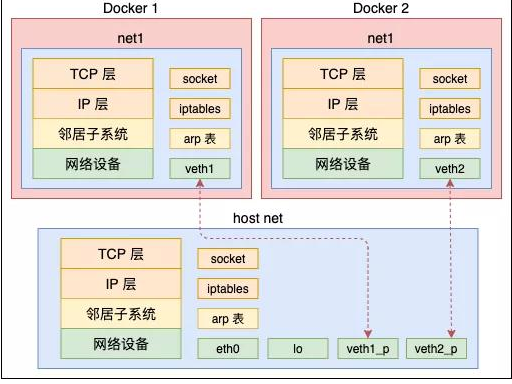


##### 2.3.1 创建net命名空间


~~~powershell
创建名称为msb的网络命名空间
# ip netns add msb
~~~


~~~powershell
查看已创建的网络命名空间
# ip netns ls
msb
~~~


##### 2.3.2 删除net命名空间


~~~powershell
删除已创建的网络命名空间
# ip netns delete msb
~~~


##### 2.3.3 在net命名空间中执行命令


~~~powershell
在网络命名空间中执行bash命令，如果想退出，需要使用exit
# ip netns exec msb bash
~~~


##### 2.3.4 在net命令空间中执行查看网络连接(网卡)命令


~~~powershell
在网络命名空间中查看网络命名空间中的网卡信息
# ip link
1: lo: <LOOPBACK> mtu 65536 qdisc noop state DOWN mode DEFAULT group default qlen 1000
    link/loopback 00:00:00:00:00:00 brd 00:00:00:00:00:00
~~~


~~~powershell
在Linux主机系统中查看
# ip netns exec msb ip link list
1: lo: <LOOPBACK> mtu 65536 qdisc noop state DOWN mode DEFAULT group default qlen 1000
    link/loopback 00:00:00:00:00:00 brd 00:00:00:00:00:00
~~~


##### 2.3.5 退出当前的net命名空间


~~~powershell
退出已进入的网络命名空间
# exit
exit
~~~


##### 2.3.6 在net命名空间中执行多条命令


~~~powershell
在网络命名空间中查看路由表
# route -n
Kernel IP routing table
Destination     Gateway         Genmask         Flags Metric Ref    Use Iface
~~~


~~~powershell
在网络命名空间中查看防火墙规则
# iptables -t nat -nL
Chain PREROUTING (policy ACCEPT)
target     prot opt source               destination         

Chain INPUT (policy ACCEPT)
target     prot opt source               destination         

Chain OUTPUT (policy ACCEPT)
target     prot opt source               destination         

Chain POSTROUTING (policy ACCEPT)
target     prot opt source               destination
~~~


##### 2.3.7 创建虚拟网卡

> 同时创建一对虚拟网卡


~~~powershell
创建虚拟网卡对
# ip link add veth0 type veth peer name veth1
~~~


~~~powershell
在物理机上查看
# ip a s
......
10: veth1@veth0: <BROADCAST,MULTICAST,M-DOWN> mtu 1500 qdisc noop state DOWN group default qlen 1000
    link/ether de:44:f8:b7:12:65 brd ff:ff:ff:ff:ff:ff
11: veth0@veth1: <BROADCAST,MULTICAST,M-DOWN> mtu 1500 qdisc noop state DOWN group default qlen 1000
    link/ether 46:5e:89:8c:cb:b3 brd ff:ff:ff:ff:ff:ff
~~~


##### 2.3.8 迁移虚拟网卡到命名空间中

>这两个网卡还都属于“default”或“global”命名空间，和物理网卡一样。把其中一个网卡转移到命名空间msb中。


~~~powershell
把创建的veth1网卡添加到msb网络命名空间中
# ip link set veth1 netns msb
~~~


~~~powershell
在Linux系统命令行查看网络命名空间中的网络
# ip netns exec msb ip link
1: lo: <LOOPBACK> mtu 65536 qdisc noop state DOWN mode DEFAULT group default qlen 1000
    link/loopback 00:00:00:00:00:00 brd 00:00:00:00:00:00
10: veth1@if11: <BROADCAST,MULTICAST> mtu 1500 qdisc noop state DOWN mode DEFAULT group default qlen 1000
    link/ether de:44:f8:b7:12:65 brd ff:ff:ff:ff:ff:ff link-netnsid 0
~~~


##### 2.3.9 命名空间中迁出虚拟网卡


~~~powershell
在Linux系统命令行把虚拟网卡veth1从网络命名空间删除
# ip netns exec msb ip link delete veth1
~~~


~~~powershell
在Linux系统命令行查看结果
# ip netns exec msb ip link
1: lo: <LOOPBACK> mtu 65536 qdisc noop state DOWN mode DEFAULT group default qlen 1000
    link/loopback 00:00:00:00:00:00 brd 00:00:00:00:00:00
~~~


##### 2.3.10 配置虚拟网卡IP地址


~~~powershell
再次创建虚拟网卡，添加到msb网络命名空间，并设置IP地址
# ip link add veth0 type veth peer name veth1
# ip link set veth1 netns msb
# ip netns exec msb ip addr add 192.168.50.2/24 dev veth1
~~~


~~~powershell
在Linux系统命令行查看网络状态
# ip netns exec msb ip addr
1: lo: <LOOPBACK> mtu 65536 qdisc noop state DOWN group default qlen 1000
    link/loopback 00:00:00:00:00:00 brd 00:00:00:00:00:00
12: veth1@if13: <BROADCAST,MULTICAST> mtu 1500 qdisc noop state DOWN group default qlen 1000
    link/ether fe:20:ac:a8:13:4c brd ff:ff:ff:ff:ff:ff link-netnsid 0
    inet 192.168.50.2/24 scope global veth1
       valid_lft forever preferred_lft forever
~~~


~~~powershell
启动虚拟网卡,veth1与lo全部要启动
# ip netns exec msb ip link set veth1 up

# ip netns exec msb ip link set lo up
~~~


~~~powershell
为物理机veth0添加IP地址

# ip a s
......
15: veth0@if14: <BROADCAST,MULTICAST> mtu 1500 qdisc noop state DOWN group defau
lt qlen 1000
    link/ether 2e:b4:40:c8:73:dc brd ff:ff:ff:ff:ff:ff link-netnsid 0
~~~


~~~powershell
# ip addr add 192.168.50.3/24 dev veth0

# ip a s veth0
15: veth0@if14: <BROADCAST,MULTICAST> mtu 1500 qdisc noop state DOWN group default qlen 1000
    link/ether 2e:b4:40:c8:73:dc brd ff:ff:ff:ff:ff:ff link-netnsid 0
    inet 192.168.50.3/24 scope global veth0
       valid_lft forever preferred_lft forever
~~~


~~~powershell
# ip link set veth0 up
~~~


~~~powershell
在宿主机上ping msb中的veth1
# ping 192.168.50.2
PING 192.168.50.2 (192.168.50.2) 56(84) bytes of data.
64 bytes from 192.168.50.2: icmp_seq=1 ttl=64 time=0.102 ms
64 bytes from 192.168.50.2: icmp_seq=2 ttl=64 time=0.068 ms
64 bytes from 192.168.50.2: icmp_seq=3 ttl=64 time=0.068 ms
~~~


~~~powershell
在msb中的veth1 ping 宿主机上veth0
# ip netns exec msb ping 192.168.50.3
PING 192.168.50.3 (192.168.50.3) 56(84) bytes of data.
64 bytes from 192.168.50.3: icmp_seq=1 ttl=64 time=0.053 ms
64 bytes from 192.168.50.3: icmp_seq=2 ttl=64 time=0.031 ms
64 bytes from 192.168.50.3: icmp_seq=3 ttl=64 time=0.029 ms
~~~


~~~powershell
如果需要访问本机的其它网段，可手动添加如下默认路由条目。
# ip netns exec msb ip route add default via 192.168.50.3
~~~


> 关于如何ping通外网主机，可设置路由转发完成。


### CGroups

#### 3.1 CGroups介绍

- Control groups(cgroups) 控制组


- linux内核提供的可以限制、记录、隔离进程组所使用的物理资源的机制。为容器而生，没有cgroups就没有今天的容器技术。


#### 3.2 CGroups功能

- 资源限制（Resource Limitation）：cgroups 可以对进程组使用的资源总额进行限制。如设定应用运行时使用内存的上限，一旦超过这个配额就发出 OOM（Out of Memory）。
- 优先级分配（Prioritization）：通过分配的 CPU 时间片数量及硬盘 IO 带宽大小，实际上就相当于控制了进程运行的优先级。
- 资源统计（Accounting）： cgroups 可以统计系统的资源使用量，如 CPU 使用时长、内存用量等等，这个功能非常适用于计费。
- 进程控制（Control）：cgroups 可以对进程组执行挂起、恢复等操作。


#### 3.3 CGroups应用案例


##### 3.3.1 安装及开启服务


~~~shell
[root@localhost ~]# yum -y install libcgroup
[root@localhost ~]# systemctl start cgconfig.service 	
[root@localhost ~]# systemctl enable cgconfig.service
~~~


##### 3.3.2 限制进程使用CPU

###### 3.3.2.1 查看cpu shares

~~~powershell
查看资源限制子系统
[root@localhost ~]# lssubsys
cpuset
cpu,cpuacct
memory
devices
freezer
net_cls,net_prio
blkio
perf_event
hugetlb
pids

查看子系统配置文件所在位置
[root@localhost ~]# ls /sys/fs/cgroup/
blkio  cpuacct      cpuset   freezer  memory   net_cls,net_prio  perf_event  systemd
cpu    cpu,cpuacct  devices  hugetlb  net_cls  net_prio          pids
[root@localhost ~]# ls /sys/fs/cgroup/cpu
cgroup.clone_children  cpuacct.stat          cpu.cfs_quota_us   cpu.stat
cgroup.event_control   cpuacct.usage         cpu.rt_period_us   notify_on_release
cgroup.procs           cpuacct.usage_percpu  cpu.rt_runtime_us  release_agent
cgroup.sane_behavior   cpu.cfs_period_us     cpu.shares         tasks

查看CPU时间分片，用于保证分组所得到的CPU分片总量。
[root@localhost ~]# cat /sys/fs/cgroup/cpu/cpu.shares
1024
~~~


###### 3.3.2.2 使用CPU子系统创建2个group分组

~~~shell
[root@localhost ~]# vim /etc/cgconfig.conf
group lesscpu {
	cpu{
		cpu.shares=200;
	}	
}
group morecpu {
	cpu{
		cpu.shares=800;
	}	
}

[root@localhost ~]# systemctl restart cgconfig
~~~

准备一个脚本

~~~powershell
#!/bin/bash

a=1
while true
do

        a=$[$a+1]
done

~~~


将将要运行的应用程序分配到指定分组(**请使用单CPU机器,三个终端验证**)

~~~shell
终端1# cgexec -g cpu:lesscpu sh /tmp/1.sh

终端2# cgexec -g cpu:morecpu sh /tmp/1.sh

终端3# top
~~~


**PS: 如果主机有多CPU，为了验证效果，可以进行如下操作**

~~~shell
# lscpu
# echo 0 > /sys/devices/system/cpu/cpu0/online
# echo 1 > /sys/devices/system/cpu/cpu1/online
~~~


## Docker介绍

### 部署地点

Docker可以安装部署在如下地方


### 生态架构


#### Docker Host

用于安装Docker daemon的主机，即为Docker Host，并且该主机中可基于容器镜像运行容器。


#### Docker client

Docker Daemon客户端工具，用于同Docker Daemon进行通信，执行用户指令，可部署在Docker Host上，也可以部署在其它主机，能够连接到Docker Daemon即可操作。


#### Docker daemon

本文撰写时，daemon 主要功能包括镜像管理、镜像构建、REST API、身份验证、安全、核心网络以及编排。
在早期的 Docker 架构中，Docker 所有的功能都是在 Docker daemon 中，如果你是开发人员，可以理解成早期的 Docker 架构是单体架构，随着 OCI 开放容器标准的推行，Docker daemon 这个大杂烩，渐渐被拆分为多个模块了，拆分工作一直在进行。

#### Registry

容器镜像仓库，用于存储已生成容器运行模板的仓库，用户使用时，可直接从容器镜像仓库中下载容器镜像，即容器运行模板，就可以运行容器镜像中包含的应用了。例如：Docker Hub,也可以使用Harbor实现企业私有的容器镜像仓库。


#### Image

容器镜像，把应用运行环境及计算资源打包方式生成可再用于启动容器的不可变的基础设施的模板文件，主要用于基于其启动一个容器。


#### Container

由容器镜像生成，用于应用程序运行的环境，包含容器镜像中所有文件及用户后添加的文件，属于基于容器镜像生成的可读写层，这也是应用程序活跃的空间。


#### Docker Dashboard

> 仅限于MAC与Windows操作系统上安装使用。

Docker Dashboard 提供了一个简单的界面，使您能够直接从您的机器管理您的容器、应用程序和映像，而无需使用 CLI 来执行核心操作。


## Docker安装

### 文章目的 

本文主要说明Docker及其相关组件，在Linux和Windows上的安装步骤。


### 安装版本 

- Docker版本为：24.0.5 Docker社区版
- Linux版本：CentOS 7.9
- 虚拟机版本：VMware Workstation 16
- Windows版本：Windows11 2022H2


### Docker版本

- Docker-ce Docker社区版，主要用于个人开发者测试使用，免费版本
- Docker-ee Docker企业版，主要用于为企业开发及应用部署使用，收费版本，免费试用一个月，2020年因国际政治原因曾一度限制中国企业使用。


### 安装部署前提

- 在Vmware虚拟机中已安装好CentOS 7.9。且虚拟机可以通过ssh访问。
- 登录linux后，执行firewall-cmd --state确认防火墙已关闭。
- 执行iptables -nL，继续确认网络。
- 执行sestatus确保selinux为disable状态


### Linux安装

#### 使用YUM源部署

YUM源可以使用官方YUM源、清华大学开源镜像站配置YUM源，也可以使用阿里云开源镜像站提供的YUM源，建议选择使用阿里云开源镜像站提供的YUM源，原因速度快。


##### 获取阿里云开源镜像站YUM源文件

可以直接访问这个网址：https://developer.aliyun.com/mirror/docker-ce?spm=a2c6h.13651102.0.0.4c9b1b119z027O，如果网址失效，可以在百度上搜索关键字：“阿里云开源镜像站”。

在打开的网站上找到如下图中的地址


在Linux中执行如下命令：

~~~shell
在docker host上使用 wget下载到/etc/yum.repos.d目录中即可。
# wget -O /etc/yum.repos.d/docker-ce.repo https://mirrors.aliyun.com/docker-ce/linux/centos/docker-ce.repo

以下是执行结果：
--2023-08-29 23:13:40--  https://mirrors.aliyun.com/docker-ce/linux/centos/docker-ce.repo
正在解析主机 mirrors.aliyun.com (mirrors.aliyun.com)... 27.128.223.241, 221.230.245.103, 120.39.195.185, ...
正在连接 mirrors.aliyun.com (mirrors.aliyun.com)|27.128.223.241|:443... 已连接。
已发出 HTTP 请求，正在等待回应... 200 OK
长度：2081 (2.0K) [application/octet-stream]
正在保存至: “/etc/yum.repos.d/docker-ce.repo”

100%[===========================================================================================================================>] 2,081       --.-K/s 用时 0s      

2023-08-29 23:13:40 (1000 MB/s) - 已保存 “/etc/yum.repos.d/docker-ce.repo” [2081/2081])

查看当前主机yum源
[root@~]# yum repolist
~~~

执行命令yum repolist，如果看到关键字docker-ce-stable，代表可用。


##### 安装Docker-ce

在docker host上安装即可，本次使用YUM源中稳定版本，由于版本在不断更新，不同的时间安装版本也不相同，使用方法基本一致。

~~~shell
直接安装docker-ce，此为docker daemon，所有依赖将被yum自动安装，含docker client等。
# yum -y install docker-ce
~~~


##### 配置Docker Daemon启动文件

由于Docker使用过程中会对Centos操作系统中的Iptables防火墙中的FORWARD链默认规划产生影响及需要让Docker Daemon接受用户自定义的daemon.json文件，需要要按使用者要求的方式修改。

~~~powershell
# vi /usr/lib/systemd/system/docker.service
~~~

具体操作见下图，删除这个部分：” -H fd:// --containerd=/run/containerd/containerd.sock“

新增这个部分：”ExecStartPost=/sbin/iptables -P FORWARD ACCEPT”


##### 启动Docker服务并查看已安装版本

~~~shell
重启加载daemon文件（也可以直接执行下面的命令，报错在执行这个）
# systemctl daemon-reload

启动docker daemon
# systemctl start docker

设置开机自启动
# systemctl enable docker
~~~


~~~shell
使用docker version客户端命令查看已安装docker软件版本
# docker version
Client: Docker Engine - Community 客户端
 Version:           20.10.12
 API version:       1.41
 Go version:        go1.16.12
 Git commit:        e91ed57
 Built:             Mon Dec 13 11:45:41 2021
 OS/Arch:           linux/amd64
 Context:           default
 Experimental:      true

Server: Docker Engine - Community Docker管理引擎
 Engine:
  Version:          20.10.12
  API version:      1.41 (minimum version 1.12)
  Go version:       go1.16.12
  Git commit:       459d0df
  Built:            Mon Dec 13 11:44:05 2021
  OS/Arch:          linux/amd64
  Experimental:     false
 containerd:
  Version:          1.4.12
  GitCommit:        7b11cfaabd73bb80907dd23182b9347b4245eb5d
 runc:
  Version:          1.0.2
  GitCommit:        v1.0.2-0-g52b36a2
 docker-init:
  Version:          0.19.0
  GitCommit:        de40ad0
~~~


2.1.5 卸载docker

```sh
停止docker服务
# systemctl stop docker
使用yum命令卸载docker组件
# yum remove docker-ce containerd.io docker-ce-cli
```

更详细的卸载方法详见[官方文档](https://docs.docker.com/engine/install/centos/)。


#### 使用二进制文件部署

> 官方不建议此种部署方式，主要因为不能自动更新，在条件有限制的情况下才使用。

二进制安装参考网址：https://docs.docker.com/engine/install/binaries/

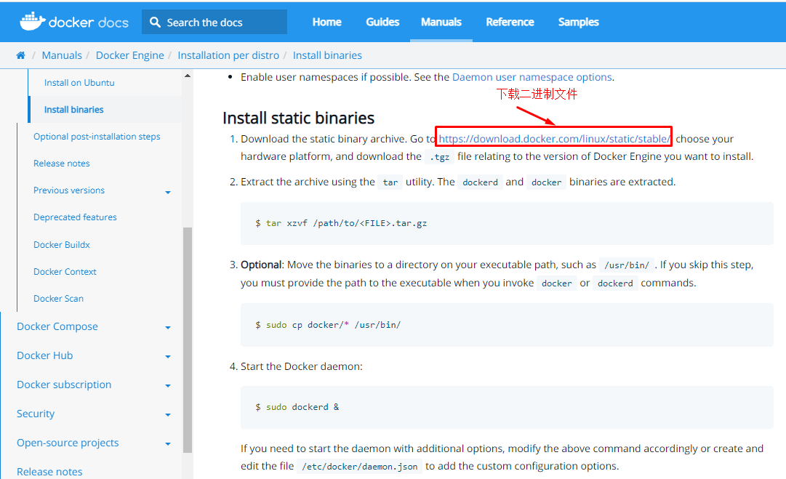


[二进制安装包下载地址](https://download.docker.com/linux/static/stable/?_gl=1*1sa56vl*_ga*MTkyNzYxMzA3Mi4xNjkzMzg4NjM1*_ga_XJWPQMJYHQ*MTY5MzM5MTQwNy4yLjEuMTY5MzM5MTQxMy41NC4wLjA.)，打开后，根据uname -r命令结果，来选择对应的内核版本，一般会选x86_64


根据时间选择最新版本，本文用的是：docker-24.0.5.tgz。

找到后，如果不想用浏览器自带的下载工具下载，可以复制链接，然后在linux中使用wget下载。也可以用第三方下载工具下载，下载完了在传到linux里面。

~~~shell
获取二进制文件，此文件中包含dockerd与docker 2个文件。
# wget https://download.docker.com/linux/static/stable/x86_64/docker-24.0.5.tgz

下载完毕之后，解压下载的文件
# tar xf docker-24.0.5.tgz
查看解压出的目录，docker
# ls docker
containerd       containerd-shim-runc-v2  docker   docker-init   runc
containerd-shim  ctr                      dockerd  docker-proxy

安装解压后的所有二进制文件
# cp docker/* /usr/bin/

运行Daemon
# dockerd &

回车后会有大量的信息输出，停止后，直接回车即可使用。
如果您需要使用其他选项启动守护程序，请相应地修改上述命令或创建并编辑文件`/etc/docker/daemon.json` 以添加自定义配置选项。

确认是否可以使用docker客户端命令
# which docker
/usr/bin/docker

使用二进制安装的docker客户端
# docker version
Client:
 Version:           24.0.5
 ......
~~~


### Windows安装

在Windows下安装Docker需要下载Docker Desktop。[官网下载地址](https://www.docker.com/products/docker-desktop/)。
> Docker Desktop和Vmware不兼容，安装上之后可能会导致Vmware虚拟机无法启动。
>
> 将Docker Desktop卸载之后，需要重装VMware Workstation 16，才能正常使用VMware。
>
> 推荐大家在Linux中的使用Docker，绝大部分企业环境用的还是Linux。


#### 实现原理

docker desktop可以在windows 上来运行docker的应用服务，是基于windows的Hyper-V服务和WSL2内核在Windows上创建了一个子系统（linux），从而实现其在windows上运行docker。所以电脑上需要开启Hyper-V服务和安装WSL2。

实测目前最新的安全包会自动开启Hyper-V服务，但是WSL服务需要手动更新到最新版。[微软WSL更新程序下载](https://wslstorestorage.blob.core.windows.net/wslblob/wsl_update_x64.msi)。

以下是安装步骤，大家也可以参考[这篇文章](https://blog.csdn.net/GoodburghCottage/article/details/131413312)，写的更详细。


#### 安装步骤

1. 下载完安装包后，双击即可开始安装。
2. 默认安装到C盘，无法选择安装路径。其他安装选项保持默认即可。
3. 等待一段时间后，安装结束，双击桌面上的Docker Desktop图标。
4. 可能会弹出一段声明，大体意思是Docker Desktop个人或者小型企业使用免费，中大型企业使用收费。点accept即可
5. 
6. 然后点“Continue without signing in”，不注册使用。
7. 然后就可以看到主界面了。

#### 基本使用


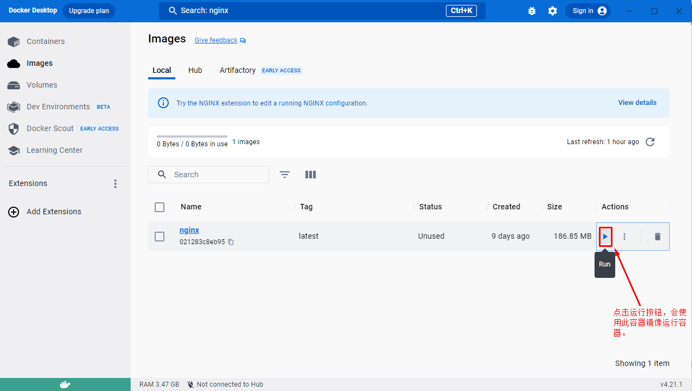


### 安装测试-运行Nginx

此章节通过运行一个简单案例，来测试安装是否已经成功。同时也可以练习以下Docker的基本使用。

#### 部署Nginx

##### 观察下载容器镜像过程

> 查找本地容器镜像文件

~~~powershell
docker run 执行应用，nginx为应用的模板名字，:latest为最新版，-d为后台运行
# docker run -d nginx:latest
先从本地找，本地找不到去网上下载
Unable to find image 'nginx:latest' locally
latest: Pulling from library/nginx
a2abf6c4d29d: Downloading  1.966MB/31.36MB 下载中
a9edb18cadd1: Downloading  1.572MB/25.35MB
589b7251471a: Download complete 下载完成
186b1aaa4aa6: Download complete
b4df32aa5a72: Waiting 等待下载
a0bcbecc962e: Waiting
下载并安装完成
Status: Downloaded newer image for nginx:latest
应用id
51bbe4e8ffd543082e64a4878cb69e48ee45dee290e15204dad2c6b5f889ce6e
~~~

```powershell
命令解释
docker run 启动一个容器
-d 把容器镜像中需要执行的命令以daemon（守护进程）的方式运行
nginx 应用容器镜像的名称，通常表示该镜像为某一个软件
latest 表示上述容器镜像的版本，表示最新版本，用户可自定义其标识，例如v1或v2等
```


##### 3.1.2 观察容器运行情况

~~~powershell
# docker ps
CONTAINER ID   IMAGE        COMMAND                  CREATED          STATUS        PORTS     NAMES
9834c8c18a7c   nginx:latest "/docker-entrypoint.…"   24 seconds ago   Up 23 seconds 80/tcp condescending_pare
~~~

[docker ps 命令说明](#2.3.2 docker ps)


#### 3.2 访问容器中Nginx服务

##### 3.2.1 确认容器IP地址

实际工作中不需要此步操作。

~~~powershell
命令解释
docker inspect 为查看容器结构信息命令，后面的id通过docker ps命令获得。
9834 为前面生成的容器ID号前4位，使用这个ID号时，由于其较长，使用时能最短识别即可。
~~~

~~~powershell
 # docker inspect 9834
 
 "GlobalIPv6Address": "",
            "GlobalIPv6PrefixLen": 0,
            "IPAddress": "172.17.0.2", 容器IP地址
            "IPPrefixLen": 16,
            "IPv6Gateway": "",
            "MacAddress": "02:42:ac:11:00:02",
            "Networks": {
                "bridge": {
                    "IPAMConfig": null,
                    "Links": null,
                    "Aliases": null,
                    "NetworkID": "d3de2fdbc30ee36a55c1431ef3ae4578392e552009f00b2019b4720735fe5a60",
                    "EndpointID": "d91f47c9f756ff22dc599a207164f2e9366bd0c530882ce0f08ae2278fb3d50c",
                    "Gateway": "172.17.0.1",
                    "IPAddress": "172.17.0.2",   容器IP地址
                    "IPPrefixLen": 16,
                    "IPv6Gateway": "",
                    "GlobalIPv6Address": "",
                    "GlobalIPv6PrefixLen": 0,
                    "MacAddress": "02:42:ac:11:00:02",
                    "DriverOpts": null
                }
            }
        }
    }
]
~~~


##### 3.2.2 容器网络说明


~~~powershell
# ip a s
......
docker0网桥，用于为容器提供桥接，转发到主机之外的网络
5: docker0: <BROADCAST,MULTICAST,UP,LOWER_UP> mtu 1500 qdisc noqueue state UP group default
    link/ether 02:42:d5:c3:d4:cc brd ff:ff:ff:ff:ff:ff
    inet 172.17.0.1/16 brd 172.17.255.255 scope global docker0
       valid_lft forever preferred_lft forever
    inet6 fe80::42:d5ff:fec3:d4cc/64 scope link
       valid_lft forever preferred_lft forever
       
       
与容器中的虚拟网络设备在同一个命名空间中，用于把容器中的网络连接到主机
9: veth393dece@if8: <BROADCAST,MULTICAST,UP,LOWER_UP> mtu 1500 qdisc noqueue master docker0 state UP group default
    link/ether 02:e3:11:58:54:0f brd ff:ff:ff:ff:ff:ff link-netnsid 0
    inet6 fe80::e3:11ff:fe58:540f/64 scope link
       valid_lft forever preferred_lft forever
~~~


##### 3.2.3 使用curl命令访问

~~~powershell
# curl http://172.17.0.2

返回结果，表示访问成功！
<!DOCTYPE html>
<html>
<head>
<title>Welcome to nginx!</title>
<style>
html { color-scheme: light dark; }
body { width: 35em; margin: 0 auto;
font-family: Tahoma, Verdana, Arial, sans-serif; }
</style>
</head>
<body>
<h1>Welcome to nginx!</h1>
<p>If you see this page, the nginx web server is successfully installed and
working. Further configuration is required.</p>

<p>For online documentation and support please refer to
<a href="http://nginx.org/">nginx.org</a>.<br/>
Commercial support is available at
<a href="http://nginx.com/">nginx.com</a>.</p>

<p><em>Thank you for using nginx.</em></p>
</body>
</html>
~~~


## Docker基础使用

### 前言

本文主要介绍Docker基础命令的使用方法。


### 命令帮助

**Docker命令获取帮助方法**

~~~powershell
# docker -h
Flag shorthand -h has been deprecated, please use --help

Usage:  docker [OPTIONS] COMMAND  用法

A self-sufficient runtime for containers 功能介绍

Options: 选项
      --config string      Location of client config files (default "/root/.docker")
  -c, --context string     Name of the context to use to connect to the daemon (overrides
                           DOCKER_HOST env var and default context set with "docker context use")
  -D, --debug              Enable debug mode
  -H, --host list          Daemon socket(s) to connect to
  -l, --log-level string   Set the logging level ("debug"|"info"|"warn"|"error"|"fatal")
                           (default "info")
...
查看某个命令的帮助
# docker run --help

Usage:  docker run [OPTIONS] IMAGE [COMMAND] [ARG...]
Create and run a new container from an image
Aliases:
  docker container run, docker run

Options:
      --add-host list                  Add a custom host-to-IP mapping (host:ip)
      --annotation map                 Add an annotation to the container (passed through to the OCI runtime) (default map[])
...

~~~


**Docker官网提供的命令说明**

网址链接：https://docs.docker.com/engine/reference/commandline/run/


### 命令执行示意图


### 基本命令

#### docker run

~~~powershell
命令解释
docker run 运行一个命令在容器中，命令是主体，没有命令容器就会消亡
-i 交互式
-t 提供终端
--name c1 把将运行的容器命名为c1
centos:latest 使用centos最新版本容器镜像
bash 在容器中执行的命令
~~~

~~~powershell
# docker run -i -t --name c1 centos:latest bash
...

下载并安装完镜像后，直接进入容器中的命令行
[root@948f234e22a1 /]#

查看主机名
[root@948f234e22a1 /]# hostname
948f234e22a1

查看网络信息
[root@948f234e22a1 /]# ip a s
1: lo: <LOOPBACK,UP,LOWER_UP> mtu 65536 qdisc noqueue state UNKNOWN group default qlen 1000
    link/loopback 00:00:00:00:00:00 brd 00:00:00:00:00:00
    inet 127.0.0.1/8 scope host lo
       valid_lft forever preferred_lft forever
12: eth0@if13: <BROADCAST,MULTICAST,UP,LOWER_UP> mtu 1500 qdisc noqueue state UP group default
    link/ether 02:42:ac:11:00:03 brd ff:ff:ff:ff:ff:ff link-netnsid 0
    inet 172.17.0.3/16 brd 172.17.255.255 scope global eth0
       valid_lft forever preferred_lft forever

查看进程
[root@948f234e22a1 /]# ps aux
USER        PID %CPU %MEM    VSZ   RSS TTY      STAT START   TIME COMMAND
root          1  0.0  0.1  12036  2172 pts/0    Ss   09:58   0:00 bash
root         16  0.0  0.0  44652  1784 pts/0    R+   10:02   0:00 ps aux

查看用户
[root@948f234e22a1 /]# cat /etc/passwd
root:x:0:0:root:/root:/bin/bash
bin:x:1:1:bin:/bin:/sbin/nologin
daemon:x:2:2:daemon:/sbin:/sbin/nologin
adm:x:3:4:adm:/var/adm:/sbin/nologin
lp:x:4:7:lp:/var/spool/lpd:/sbin/nologin
sync:x:5:0:sync:/sbin:/bin/sync
shutdown:x:6:0:shutdown:/sbin:/sbin/shutdown
halt:x:7:0:halt:/sbin:/sbin/halt
mail:x:8:12:mail:/var/spool/mail:/sbin/nologin
operator:x:11:0:operator:/root:/sbin/nologin
games:x:12:100:games:/usr/games:/sbin/nologin
ftp:x:14:50:FTP User:/var/ftp:/sbin/nologin
nobody:x:65534:65534:Kernel Overflow User:/:/sbin/nologin
dbus:x:81:81:System message bus:/:/sbin/nologin
systemd-coredump:x:999:997:systemd Core Dumper:/:/sbin/nologin
systemd-resolve:x:193:193:systemd Resolver:/:/sbin/nologin

查看当前目录
[root@948f234e22a1 /]# pwd
/

查看根目录，每个容器拥有自己独立的文件系统
[root@948f234e22a1 /]# ls
bin  etc   lib    lost+found  mnt  proc  run   srv  tmp  var
dev  home  lib64  media       opt  root  sbin  sys  usr

退出bash命令执行，观察容器运行情况
[root@948f234e22a1 /]# exit
exit
[root@localhost ~]#
~~~


#### docker ps

**命令解释**
docker ps 查看正在运行的容器，本案例由于没有命令在容器中运行，因此容器被停止了，所以本次查看没有结果。

docker ps --all 可以查看正在运行的和停止运行的容器

~~~powershell
# docker ps
CONTAINER ID   IMAGE     COMMAND   CREATED   STATUS    PORTS     NAMES

# docker ps --all
CONTAINER ID   IMAGE           COMMAND     CREATED             STATUS                         PORTS     NAMES
948f234e22a1   centos:latest   "bash"    10 minutes ago      Exited (0) 2 minutes ago                    c1
~~~

**输出内容解释**

| CONTAINERID  | IMAGE        | COMMAND                | CREATED        | STATUS        | PORTS  | NAMES              |
| ------------ | ------------ | ---------------------- | -------------- | ------------- | ------ | ------------------ |
| 容器ID       | 容器镜像名   | 容器中运行的命令       | 创建时间       | 状态          | 端口   | 容器名称           |
| 9834c8c18a7c | nginx:latest | "/docker-entrypoint.…" | 24 seconds ago | Up 23 seconds | 80/tcp | condescending_pare |


#### docker inspect

**命令解释**
docker inpect 查看容器详细信息

操作说明
在上述提示符处按住ctrl键，再按p键与q键，可以退出交互式的容器，容器会处于运行状态。

~~~powershell
# docker run -it --name c2 centos:latest bash
[root@7a2bba37d65c /]# 

# docker ps
CONTAINER ID   IMAGE           COMMAND   CREATED          STATUS          PORTS     NAMES
9f2eea16da4c   centos:latest   "bash"    37 seconds ago   Up 35 seconds             c2

# docker inspect c2

"Networks": {
                "bridge": {
                    "IPAMConfig": null,
                    "Links": null,
                    "Aliases": null,
                    "NetworkID": "d3de2fdbc30ee36a55c1431ef3ae4578392e552009f00b2019b4720735fe5a60",
                    "EndpointID": "d1a2b7609f2f73a6cac67229a4395eef293f695c0ac4fd6c9c9e6913c9c85c1c",
                    "Gateway": "172.17.0.1",
                    "IPAddress": "172.17.0.2",
                    "IPPrefixLen": 16,
                    "IPv6Gateway": "",
                    "GlobalIPv6Address": "",
                    "GlobalIPv6PrefixLen": 0,
                    "MacAddress": "02:42:ac:11:00:02",
                    "DriverOpts": null
                }
            }
        }
    }
]
~~~


#### docker  exec 

~~~powershell
命令解释
docker exec 在容器外实现与容器交互执行某命令
-it 交互式
c2 正在运行的容器名称
ls /root 在正在运行的容器中运行相关的命令
~~~

~~~powershell
让c2容器执行命令 ls /root
# docker exec -it c2 ls /root
anaconda-ks.cfg  anaconda-post.log  original-ks.cfg

下面命令与上面命令执行效果一致
# docker exec c2 ls /root
anaconda-ks.cfg
anaconda-post.log
original-ks.cfg
~~~


#### docker attach

**命令解释**
docker attach 类似于ssh命令，可以进入到正在运行的容器中
c2 正在运行的容器名称，也可以使用容器id
如果进入的一个容器是无法交互的，则会卡住。

**退出说明**
docker attach 退出容器时，如不需要容器再运行，可直接使用exit退出；如需要容器继续运行，可使用ctrl+p+q

**案例**


~~~powershell
查看正在运行的容器
# docker ps
CONTAINER ID   IMAGE           COMMAND   CREATED          STATUS          PORTS     NAMES
9f2eea16da4c   centos:latest   "bash"    13 minutes ago   Up 13 minutes             c2

进入c2容器内部
[root@localhost ~]# docker attach c2
[root@7a2bba37d65c /]#
~~~


#### docker stop

**命令说明**

停止一个正在运行的容器，可以通过docker ps -all查看到。


~~~powershell
# docker ps
CONTAINER ID   IMAGE           COMMAND   CREATED          STATUS          PORTS     NAMES
9f2eea16da4c   centos:latest   "bash"    22 minutes ago   Up 22 minutes             c2

# docker stop 9f2eea16da4c
9f2eea16da4c

# docker ps --all
CONTAINER ID   IMAGE           COMMAND                  CREATED          STATUS                       PORTS     NAMES
9f2eea16da4c   centos:latest   "bash"                   22 minutes ago   Exited (137) 4 seconds ago  c2
~~~


#### docker start

**命令解释**

启动一个或多个已经停止的容器。如果容器已经移除则无法启动

~~~powershell
# docker ps --all
CONTAINER ID   IMAGE           COMMAND     CREATED          STATUS                       PORTS     NAMES
9f2eea16da4c   centos:latest   "bash"      22 minutes ago   Exited (137) 4 seconds ago              c2

# docker start 9f2eea
9f2eea

# docker ps
CONTAINER ID   IMAGE           COMMAND   CREATED          STATUS          PORTS     NAMES
9f2eea16da4c   centos:latest   "bash"    24 minutes ago   Up 16 seconds             c2
~~~


#### docker top

**命令解释**

在Docker Host查看容器中运行的进程信息

docker top 查看container内进程信息，指在docker host上查看，与docker exec -it c2 ps -ef不同。

~~~powershell
# docker top c2
UID    PID     PPID      C      STIME        TTY              TIME                CMD
root  69040   69020      0      18:37       pts/0           00:00:00              bash
~~~

**返回结果说明**

| UID    | PID          | PPID   | C       | STIME    | TTY        | TIME        | CMD        |
| ------ | ------------ | ------ | ------- | -------- | ---------- | ----------- | ---------- |
| 用户id | 容器中进程id | 容器id | cpu占用 | 启动时间 | 所在的终端 | 占用cpu总长 | 执行的命令 |
| root   | 69040        | 69020  | 0       | 18:37    | pts/0      | 00:00:00    | bash       |


#### docker rm

**命令解释**

如果容器已停止，使用此命令可以直接删除；如果容器处于运行状态，则需要提前关闭容器后，再删除容器。

删除时可以使用容器名称或者id。

```shell
[root@dev-study ~]# docker ps --all
CONTAINER ID   IMAGE          COMMAND                   CREATED       STATUS                     PORTS     NAMES
afce7660b05f   nginx:latest   "/docker-entrypoint.…"   2 hours ago   Exited (0) 9 seconds ago             eloquent_hodgkin
51bbe4e8ffd5   nginx:latest   "/docker-entrypoint.…"   2 hours ago   Up 2 hours                 80/tcp    frosty_hodgkin

[root@dev-study ~]# docker remove 7660
Error response from daemon: No such container: 7660
[root@dev-study ~]# docker remove afce7660b05f
afce7660b05f
[root@dev-study ~]# docker ps -all
CONTAINER ID   IMAGE          COMMAND                   CREATED       STATUS       PORTS     NAMES
51bbe4e8ffd5   nginx:latest   "/docker-entrypoint.…"   3 hours ago   Up 3 hours   80/tcp    frosty_hodgkin
[root@dev-study ~]# 
```

**批量删除容器**

如果存在大量容器需要删除，可以使用管道方式来批量删除

~~~powershell
# docker ps --all
CONTAINER ID   IMAGE           COMMAND          CREATED      STATUS                  PORTS    NAMES
948f234e22a1   centos:latest   "bash"           2 days ago   Exited (0) 2 days ago            c1
01cb3e01273c   centos:latest   "bash"           2 days ago   Exited (0) 2 days ago            systemimage1
46d950fdfb33   nginx:latest    "/docker-ent..." 2 days ago   Exited (0) 2 days ago            upbeat_goldberg

NR>=2代表从第二行开始，print $1 代表只要第一列的容器id
# docker ps --all | awk '{if (NR>=2){print $1}}' | xargs docker rm
~~~


#### docker prune

**命令解释**

Docker 1.13.0+ 引入了这个清理命令。[官方文档](https://docs.docker.com/engine/admin/pruning/)。prune 命令用来删除不再使用的 docker 对象。删除所有未被 tag 标记和未被容器使用的镜像。

**使用案例**

~~~powershell
删除未使用的容器镜像
# docker image prune

删除所有未使用的容器镜像
# docker image prune -a

删除所有停止运行的容器
# docker container prune

删除所有未被挂载的卷
# docker volume prune

删除所有网络
# docker network prune

删除docker所有资源
# docker system prune
~~~


### Docker镜像

#### 1. Docker镜像操作

##### 2.1 查看本地容器镜像

###### 2.1.1 使用docker images命令查看

~~~powershell
#### docker images
REPOSITORY   TAG       IMAGE ID       CREATED        SIZE
bash         latest    5557e073f11c   2 weeks ago    13MB
nginx        latest    605c77e624dd   3 weeks ago    141MB
centos       latest    5d0da3dc9764   4 months ago   231MB
~~~


###### 2.1.2 使用docker image命令查看

~~~powershell
#### docker image list
REPOSITORY   TAG       IMAGE ID       CREATED        SIZE
bash         latest    5557e073f11c   2 weeks ago    13MB
nginx        latest    605c77e624dd   3 weeks ago    141MB
centos       latest    5d0da3dc9764   4 months ago   231MB
~~~


###### 2.1.3 查看docker容器镜像本地存储位置

考虑到docker容器镜像会占用本地存储空间，建议搭建其它存储系统挂载到本地以便解决占用大量本地存储的问题。

~~~powershell
#### ls /var/lib/docker
buildkit  containers  image  network  overlay2  plugins  runtimes  swarm  tmp  trust  volumes
~~~


##### 2.2 搜索Docker Hub容器镜像

###### 2.2.1 命令行搜索

stars代表星数，official代表是否官方。

~~~powershell
# docker search centos
输出
NAME                              DESCRIPTION                                     STARS     OFFICIAL   AUTOMATED
centos                            The official build of CentOS.                   6987      [OK]
ansible/centos7-ansible           Ansible on Centos7                              135                  [OK]
consol/centos-xfce-vnc            Centos container with "headless" VNC session…   135                  [OK]
jdeathe/centos-ssh                OpenSSH / Supervisor / EPEL/IUS/SCL Repos - …   121                  [OK]
~~~


###### 2.2.2 Docker Hub Web界面搜索

http://hub.docker.com.cn/ 从2023年5月开始不能访问了。需要使用魔法上网。


##### 2.3 Docker 容器镜像下载

~~~powershell
#### docker pull centos
~~~


##### 2.4 Docker容器镜像删除方法

注意：必须容器已经停止且移除，才能删除其对应的镜像。

~~~powershell
#### docker images
REPOSITORY   TAG       IMAGE ID       CREATED        SIZE
bash         latest    5557e073f11c   2 weeks ago    13MB
nginx        latest    605c77e624dd   3 weeks ago    141MB
centos       latest    5d0da3dc9764   4 months ago   231MB
~~~


~~~powershell
#### docker rmi centos
Untagged: centos:latest
Untagged: centos@sha256:a27fd8080b517143cbbbab9dfb7c8571c40d67d534bbdee55bd6c473f432b177
Deleted: sha256:5d0da3dc976460b72c77d94c8a1ad043720b0416bfc16c52c45d4847e53fadb6
Deleted: sha256:74ddd0ec08fa43d09f32636ba91a0a3053b02cb4627c35051aff89f853606b59
~~~

或

~~~powershell
#### docker images
REPOSITORY   TAG       IMAGE ID       CREATED        SIZE
centos       latest    5d0da3dc9764   4 months ago   231MB
~~~


~~~powershell
#### docker rmi 5d0da3dc9764
~~~


#### 2. Docker容器镜像介绍

##### 2.1 Docker Image

- Docker 镜像是只读的容器模板，是Docker容器基础
- 为Docker容器提供了静态文件系统运行环境（rootfs）
- 镜像是容器的静止状态
- 容器是镜像的运行状态


##### 2.2 联合文件系统

###### 2.2.1 联合文件系统定义

- 联合文件系统(union filesystem)
- 联合文件系统是实现联合挂载技术的文件系统
- 联合挂载技术可以实现在一个挂载点同时挂载多个文件系统，将挂载点的原目录与被挂载内容进行整合，使得最终可见的文件系统包含整合之后的各层文件和目录


###### 2.2.2 图解


##### 2.3 Docker Overlay2

容器文件系统有多种存储驱动实现方式：aufs，devicemapper，overlay，overlay2 等，本次以overlay2为例进行说明。

###### 2.3.1 概念

- registry/repository： registry 是 repository 的集合，repository 是镜像的集合。
- image：image 是存储镜像相关的元数据，包括镜像的架构，镜像默认配置信息，镜像的容器配置信息等等。它是“逻辑”上的概念，并无物理上的镜像文件与之对应。
- layer：layer(镜像层) 组成了镜像，单个 layer 可以被多个镜像共享。


###### 2.3.2 查看Docker Host存储驱动方式


~~~powershell
#### docker info | grep overlay
 Storage Driver: overlay2
~~~


###### 2.3.3 了解images分层


~~~powershell
#### docker pull nginx
Using default tag: latest
latest: Pulling from library/nginx
a2abf6c4d29d: Pull complete
a9edb18cadd1: Pull complete
589b7251471a: Pull complete
186b1aaa4aa6: Pull complete
b4df32aa5a72: Pull complete
a0bcbecc962e: Pull complete
Digest: sha256:0d17b565c37bcbd895e9d92315a05c1c3c9a29f762b011a10c54a66cd53c9b31
Status: Downloaded newer image for nginx:latest
docker.io/library/nginx:latest
~~~


可以看到上述下载的镜像分为6层，如何找到这6层存储在Docker Host哪个位置呢？

首先查看nginx镜像

~~~powershell
#### docker images
REPOSITORY   TAG       IMAGE ID       CREATED        SIZE
nginx        latest    605c77e624dd   3 weeks ago    141MB
~~~


通过其Image ID 605c77e624dd 就可以找到存储位置


~~~powershell
#### ls /var/lib/docker/image/overlay2/
distribution  imagedb  layerdb  repositories.json
~~~


这个目录是查找的入口，非常重要。它存储了镜像管理的元数据。

- repositories.json 记录了 repo 与镜像 ID 的映射关系
- imagedb 记录了镜像架构，操作系统，构建镜像的容器 ID 和配置以及 rootfs 等信息
- layerdb 记录了每层镜像层的元数据。


通过短 ID 查找 repositories.json 文件，找到镜像 nginx 的长 ID，通过长 ID 在 imagedb 中找到该镜像的元数据：


~~~powershell
#### cat /var/lib/docker/image/overlay2/repositories.json | grep 605c77e624dd
{"Repositories":"nginx":{"nginx:latest":"sha256:605c77e624ddb75e6110f997c58876baa13f8754486b461117934b24a9dc3a85","nginx@sha256:0d17b565c37bcbd895e9d92315a05c1c3c9a29f762b011a10c54a66cd53c9b31":"sha256:605c77e624ddb75e6110f997c58876baa13f8754486b461117934b24a9dc3a85"}}}}
~~~


~~~powershell
#### cat /var/lib/docker/image/overlay2/imagedb/content/sha256/605c77e624ddb75e6110f997c58876baa13f8754486b461117934b24a9dc3a85
......
"os":"linux","rootfs":{"type":"layers","diff_ids":["sha256:2edcec3590a4ec7f40cf0743c15d78fb39d8326bc029073b41ef9727da6c851f","sha256:e379e8aedd4d72bb4c529a4ca07a4e4d230b5a1d3f7a61bc80179e8f02421ad8","sha256:b8d6e692a25e11b0d32c5c3dd544b71b1085ddc1fddad08e68cbd7fda7f70221","sha256:f1db227348d0a5e0b99b15a096d930d1a69db7474a1847acbc31f05e4ef8df8c","sha256:32ce5f6a5106cc637d09a98289782edf47c32cb082dc475dd47cbf19a4f866da","sha256:d874fd2bc83bb3322b566df739681fbd2248c58d3369cb25908d68e7ed6040a6"]}}
~~~


这里仅保留我们想要的元数据 rootfs。在 rootfs 中看到 layers 有6层，这6层即对应镜像的6层镜像层。并且，自上而下分别映射到容器的底层到顶层。找到了镜像的6层，接下来的问题是每层的文件内容在哪里呢？

layerdb 元数据会给我们想要的信息，通过底层 diff-id: 2edcec3590a4ec7f40cf0743c15d78fb39d8326bc029073b41ef9727da6c851f 我们查到最底层镜像层的 cache_id，通过 cache_id 即可查找到镜像层的文件内容：


~~~powershell
#### ls /var/lib/docker/image/overlay2/layerdb/sha256/2edcec3590a4ec7f40cf0743c15d78fb39d8326bc029073b41ef9727da6c851f
cache-id  diff  size  tar-split.json.gz
~~~


~~~powershell
#### cat /var/lib/docker/image/overlay2/layerdb/sha256/2edcec3590a4ec7f40cf0743c15d78fb39d8326bc029073b41ef9727da6c851f/cache-id
85c4c5ecdac6c0d197f899dac227b9d493911a9a5820eac501bb5e9ae361f4c7
~~~


~~~powershell
#### cat /var/lib/docker/image/overlay2/layerdb/sha256/2edcec3590a4ec7f40cf0743c15d78fb39d8326bc029073b41ef9727da6c851f/diff
sha256:2edcec3590a4ec7f40cf0743c15d78fb39d8326bc029073b41ef9727da6c851f
~~~


使用 cacheID 查找文件内容


~~~powershell
#### ls /var/lib/docker/overlay2/85c4c5ecdac6c0d197f899dac227b9d493911a9a5820eac501bb5e9ae361f4c7
committed  diff  link
#### ls /var/lib/docker/overlay2/85c4c5ecdac6c0d197f899dac227b9d493911a9a5820eac501bb5e9ae361f4c7/diff
bin   dev  home  lib64  mnt  proc  run   srv  tmp  var
boot  etc  lib   media  opt  root  sbin  sys  usr
~~~


上示例中，镜像元数据和镜像层内容是分开存储的。因此通过 cache-id 我们需要到 /var/lib/docker/overlay2 目录下查看镜像层内容，它就存在 diff 目录下，其中 link 存储的是镜像层对应的短 ID，后面会看到它的用场。


找到了镜像层的最底层，接着查找镜像层的“中间层”，发现在 layerdb 目录下没有 diff-id e379e8aedd4d72bb4c529a4ca07a4e4d230b5a1d3f7a61bc80179e8f02421ad8的镜像层：


~~~powershell
#### ls /var/lib/docker/image/overlay2/layerdb/sha256/e379e8aedd4d72bb4c529a4ca07a4e4d230b5a1d3f7a61bc80179e8f02421ad8
ls: 无法访问/var/lib/docker/image/overlay2/layerdb/sha256/e379e8aedd4d72bb4c529a4ca07a4e4d230b5a1d3f7a61bc80179e8f02421ad8: 没有那个文件或目录
~~~


这是因为 docker 引入了内容寻址机制，该机制会根据文件内容来索引镜像和镜像层。docker 利用 rootfs 中的 diff_id 计算出内容寻址的 chainID，通过 chainID 获取 layer 相关信息，最终索引到镜像层文件内容。

对于最底层镜像层其 diff_id 即是 chainID。因此我们可以查找到它的文件内容。除最底层外，chainID 需通过公式 chainID(n) = SHA256(chain(n-1) diffID(n)) 计算得到，计算“中间层” chainID：


~~~powershell
#### echo -n "sha256:2edcec3590a4ec7f40cf0743c15d78fb39d8326bc029073b41ef9727da6c851f sha256:e379e8aedd4d72bb4c529a4ca07a4e4d230b5a1d3f7a61bc80179e8f02421ad8" | sha256sum -
780238f18c540007376dd5e904f583896a69fe620876cabc06977a3af4ba4fb5  -
~~~


根据 “中间层” chainID 查找文件内容：

~~~powershell
#### ls /var/lib/docker/image/overlay2/layerdb/sha256/780238f18c540007376dd5e904f583896a69fe620876cabc06977a3af4ba4fb5
cache-id  diff  parent  size  tar-split.json.gz
~~~


~~~powershell
#### cat /var/lib/docker/image/overlay2/layerdb/sha256/780238f18c540007376dd5e904f583896a69fe620876cabc06977a3af4ba4fb5/cache-id
57e1f1b11e26f748161b7fccbf2ba6b24c2f98dc8a821729f0be215ad267498c
~~~


~~~powershell
#### cat /var/lib/docker/image/overlay2/layerdb/sha256/780238f18c540007376dd5e904f583896a69fe620876cabc06977a3af4ba4fb5/diff
sha256:e379e8aedd4d72bb4c529a4ca07a4e4d230b5a1d3f7a61bc80179e8f02421ad8
~~~


~~~powershell
#### cat /var/lib/docker/image/overlay2/layerdb/sha256/780238f18c540007376dd5e904f583896a69fe620876cabc06977a3af4ba4fb5/parent
sha256:2edcec3590a4ec7f40cf0743c15d78fb39d8326bc029073b41ef9727da6c851f
~~~


~~~powershell
镜像层文件内容
#### ls /var/lib/docker/overlay2/57e1f1b11e26f748161b7fccbf2ba6b24c2f98dc8a821729f0be215ad267498c
committed  diff  link  lower  work
#### ls /var/lib/docker/overlay2/57e1f1b11e26f748161b7fccbf2ba6b24c2f98dc8a821729f0be215ad267498c/diff/
docker-entrypoint.d  etc  lib  tmp  usr  var
~~~


~~~powershell
镜像层文件内容短 ID
#### cat /var/lib/docker/overlay2/57e1f1b11e26f748161b7fccbf2ba6b24c2f98dc8a821729f0be215ad267498c/link
24GM2IZVPTUROAG7AWJO5ZWE6B
~~~


~~~powershell
“父”镜像层文件内容短 ID
#### cat /var/lib/docker/overlay2/57e1f1b11e26f748161b7fccbf2ba6b24c2f98dc8a821729f0be215ad267498c/lower
l/SICZO4QNVZEVOIJ4HDXVDKNYA2
~~~


找到最底层文件内容和“中间层”文件内容，再去找最顶层文件内容就变的不难了


##### 2.4 Docker容器与镜像


通过 docker run 命令启动一个镜像为 nginx的容器：


~~~powershell
#### docker run -d nginx:latest
3272831107a3499afe8160b0cd423e2ac4223522f1995b7be3504a1d3d272878
#### docker ps | grep nginx
3272831107a3   nginx:latest   "/docker-entrypoint.…"   11 seconds ago   Up 9 seconds   80/tcp    angry_beaver
~~~


~~~powershell
#### mount | grep overlay
overlay on /var/lib/docker/overlay2/b3f5c8b42ac055c715216e376cfe44571f618a876f481533ec1434aa0bc4f8ed/merged type overlay (rw,relatime,seclabel,lowerdir=/var/lib/docker/overlay2/l/MS2X66BYF6UZ7EKUWMZJKCF4HO:/var/lib/docker/overlay2/l/ODJROQUGY3WQMOGQ3BLYZGIAG4:/var/lib/docker/overlay2/l/Q5LOBFJRH5M7M5CMSWW5L4VYOY:/var/lib/docker/overlay2/l/ZR35FN2E3WEARZV4HLRU373FT7:/var/lib/docker/overlay2/l/NSM2PTAT6TIT2H6G3HFNGZJH5N:/var/lib/docker/overlay2/l/24GM2IZVPTUROAG7AWJO5ZWE6B:/var/lib/docker/overlay2/l/SICZO4QNVZEVOIJ4HDXVDKNYA2,upperdir=/var/lib/docker/overlay2/b3f5c8b42ac055c715216e376cfe44571f618a876f481533ec1434aa0bc4f8ed/diff,workdir=/var/lib/docker/overla 2/b3f5c8b42ac055c715216e376cfe44571f618a876f481533ec1434aa0bc4f8ed/work)
~~~


可以看到，启动容器会 mount 一个 overlay 的联合文件系统到容器内。这个文件系统由三层组成：

- lowerdir：只读层，即为镜像的镜像层。
- upperdir：读写层，该层是容器的读写层，对容器的读写操作将反映在读写层。
- workdir： overlayfs 的内部层，用于实现从只读层到读写层的 copy_up 操作。
- merge：容器内作为同一视图联合挂载点的目录。


这里需要着重介绍的是容器的 lowerdir 镜像只读层，查看只读层的短 ID：


~~~powershell
lowerdir=/var/lib/docker/overlay2/l/MS2X66BYF6UZ7EKUWMZJKCF4HO
/var/lib/docker/overlay2/l/ODJROQUGY3WQMOGQ3BLYZGIAG4
/var/lib/docker/overlay2/l/Q5LOBFJRH5M7M5CMSWW5L4VYOY
/var/lib/docker/overlay2/l/ZR35FN2E3WEARZV4HLRU373FT7
/var/lib/docker/overlay2/l/NSM2PTAT6TIT2H6G3HFNGZJH5N
/var/lib/docker/overlay2/l/24GM2IZVPTUROAG7AWJO5ZWE6B
/var/lib/docker/overlay2/l/SICZO4QNVZEVOIJ4HDXVDKNYA2
~~~


镜像层只有6层这里的短 ID 却有7个？
在 /var/lib/docker/overlay2/l 目录下我们找到了答案：


~~~powershell
#### cd /var/lib/docker/overlay2/l
#### pwd
/var/lib/docker/overlay2/l
#### ls
24GM2IZVPTUROAG7AWJO5ZWE6B  LZEAXJGRW6HKBBGGB2N4CWMSVJ  R2XTGODAA67NQJM44MIKMDUF4W
5OI5WMJ2FP7QI7IFWDMHLBRDDN  MS2X66BYF6UZ7EKUWMZJKCF4HO  SICZO4QNVZEVOIJ4HDXVDKNYA2
644ISPHLTBSSC2KLP6BGHHHZPR  NSM2PTAT6TIT2H6G3HFNGZJH5N  ZR35FN2E3WEARZV4HLRU373FT7
6CQUILQSJNVTMFFV3ABCCOGOYG  ODJROQUGY3WQMOGQ3BLYZGIAG4
BQENAYC44O2ZCZFT5URMH5OADK  Q5LOBFJRH5M7M5CMSWW5L4VYOY
~~~


~~~powershell
#### ls -l MS2X66BYF6UZ7EKUWMZJKCF4HO/
总用量 0
drwxr-xr-x. 4 root root 43 1月  25 01:27 dev
drwxr-xr-x. 2 root root 66 1月  25 01:27 etc
[root@192 l]#### ls -l ODJROQUGY3WQMOGQ3BLYZGIAG4/
总用量 0
drwxr-xr-x. 2 root root 41 12月 30 03:28 docker-entrypoint.d

[root@192 l]#### ls -l Q5LOBFJRH5M7M5CMSWW5L4VYOY/
总用量 0
drwxr-xr-x. 2 root root 41 12月 30 03:28 docker-entrypoint.d
[root@192 l]#### ls -l ZR35FN2E3WEARZV4HLRU373FT7/
总用量 0
drwxr-xr-x. 2 root root 45 12月 30 03:28 docker-entrypoint.d
[root@192 l]#### ls -l NSM2PTAT6TIT2H6G3HFNGZJH5N/
总用量 4
-rwxrwxr-x. 1 root root 1202 12月 30 03:28 docker-entrypoint.sh
[root@192 l]#### ls -l 24GM2IZVPTUROAG7AWJO5ZWE6B/
总用量 4
drwxr-xr-x.  2 root root    6 12月 30 03:28 docker-entrypoint.d
drwxr-xr-x. 18 root root 4096 12月 30 03:28 etc
drwxr-xr-x.  4 root root   45 12月 20 08:00 lib
drwxrwxrwt.  2 root root    6 12月 30 03:28 tmp
drwxr-xr-x.  7 root root   66 12月 20 08:00 usr
drwxr-xr-x.  5 root root   41 12月 20 08:00 var
[root@192 l]#### ls -l SICZO4QNVZEVOIJ4HDXVDKNYA2/
总用量 12
drwxr-xr-x.  2 root root 4096 12月 20 08:00 bin
drwxr-xr-x.  2 root root    6 12月 12 01:25 boot
drwxr-xr-x.  2 root root    6 12月 20 08:00 dev
drwxr-xr-x. 30 root root 4096 12月 20 08:00 etc
drwxr-xr-x.  2 root root    6 12月 12 01:25 home
drwxr-xr-x.  8 root root   96 12月 20 08:00 lib
drwxr-xr-x.  2 root root   34 12月 20 08:00 lib64
drwxr-xr-x.  2 root root    6 12月 20 08:00 media
drwxr-xr-x.  2 root root    6 12月 20 08:00 mnt
drwxr-xr-x.  2 root root    6 12月 20 08:00 opt
drwxr-xr-x.  2 root root    6 12月 12 01:25 proc
drwx------.  2 root root   37 12月 20 08:00 root
drwxr-xr-x.  3 root root   30 12月 20 08:00 run
drwxr-xr-x.  2 root root 4096 12月 20 08:00 sbin
drwxr-xr-x.  2 root root    6 12月 20 08:00 srv
drwxr-xr-x.  2 root root    6 12月 12 01:25 sys
drwxrwxrwt.  2 root root    6 12月 20 08:00 tmp
drwxr-xr-x. 11 root root  120 12月 20 08:00 usr
drwxr-xr-x. 11 root root  139 12月 20 08:00 var
~~~


镜像层ODJROQUGY3WQMOGQ3BLYZGIAG4/Q5LOBFJRH5M7M5CMSWW5L4VYOY/ZR35FN2E3WEARZV4HLRU373FT7/NSM2PTAT6TIT2H6G3HFNGZJH5N/24GM2IZVPTUROAG7AWJO5ZWE6B/SICZO4QNVZEVOIJ4HDXVDKNYA2 分别对应镜像的6层镜像层文件内容，它们分别映射到镜像层的 diff 目录。而 MS2X66BYF6UZ7EKUWMZJKCF4HO映射的是容器的初始化层 init，该层内容是和容器配置相关的文件内容，它是只读的。

启动了容器，docker 将镜像的内容 mount 到容器中。那么，如果在容器内写文件会对镜像有什么影响呢？


##### 2.5 容器内写文件

不难理解，镜像层是只读的，在容器中写文件其实是将文件写入到 overlay 的可读写层。

这里有几个 case 可以测试：

- 读写层不存在该文件，只读层存在。
- 读写层存在该文件，只读层不存在。
- 读写层和只读层都不存在该文件。

我们简单构建一种读写层和只读层都不存在的场景：


~~~powershell
#### docker run -it centos:latest bash
[root@355e99982248 /]#### touch msb.txt
[root@355e99982248 /]#### ls
bin  etc   lib    lost+found  mnt      opt   root  sbin  sys  usr
dev  home  lib64  media       msb.txt  proc  run   srv   tmp  var
~~~


查看读写层是否有该文件：

~~~powershell
查看镜像是否有变化
#### docker images
REPOSITORY   TAG       IMAGE ID       CREATED        SIZE
ubuntu       latest    d13c942271d6   2 weeks ago    72.8MB
bash         latest    5557e073f11c   2 weeks ago    13MB
nginx        latest    605c77e624dd   3 weeks ago    141MB
centos       latest    5d0da3dc9764   4 months ago   231MB

[root@localhost ~]#### cat /var/lib/docker/image/overlay2/repositories.json | grep 5d0da3dc9764
{"Repositories"{"centos:latest":"sha256:5d0da3dc976460b72c77d94c8a1ad043720b0416bfc16c52c45d4847e53fadb6","centos@sha256:a27fd8080b517143cbbbab9dfb7c8571c40d67d534bbdee55bd6c473f432b177":"sha256:5d0da3dc976460b72c77d94c8a1ad043720b0416bfc16c52c45d4847e53fadb6"}}}


[root@localhost ~]#### cat /var/lib/docker/image/overlay2/imagedb/content/sha256/5d0da3dc976460b72c77d94c8a1ad043720b0416bfc16c52c45d4847e53fadb6
{"os":"linux","rootfs":{"type":"layers","diff_ids":["sha256:74ddd0ec08fa43d09f32636ba91a0a3053b02cb4627c35051aff89f853606b59"]}}


[root@localhost ~]#### ls 
/var/lib/docker/image/overlay2/layerdb/sha256/74ddd0ec08fa43d09f32636ba91a0a3053b02cb4627c35051aff89f853606b59:
cache-id  diff  size  tar-split.json.gz
[root@localhost ~]#### cat /var/lib/docker/image/overlay2/layerdb/sha256/74ddd0ec08fa43d09f32636ba91a0a3053b02cb4627c35051aff89f853606b59/cache-id
b17bc5c5103514923a30983c48f909e06f366b7aa1e85f112b67abb3ef5cd0cb

[root@localhost ~]#### cat /var/lib/docker/image/overlay2/layerdb/sha256/74ddd0ec08fa43d09f32636ba91a0a3053b02cb4627c35051aff89f853606b59/diff
sha256:74ddd0ec08fa43d09f32636ba91a0a3053b02cb4627c35051aff89f853606b59


[root@localhost ~]#### ls /var/lib/docker/overlay2/b17bc5c5103514923a30983c48f909e06f366b7aa1e85f112b67abb3ef5cd0cb
committed  diff  link
[root@localhost ~]#### ls /var/lib/docker/overlay2/b17bc5c5103514923a30983c48f909e06f366b7aa1e85f112b67abb3ef5cd0cb/diff/
bin  etc   lib    lost+found  mnt  proc  run   srv  tmp  var
dev  home  lib64  media       opt  root  sbin  sys  usr


查看容器是否有变化
[root@localhost ~]#### mount | grep overlay
type overlay (rw,relatime,seclabel,lowerdir=/var/lib/docker/overlay2/l/R2W2LEMDPRIUFYDVSLIQSCYTGX:/var/lib/docker/overlay2/l/R2XTGODAA67NQJM44MIKMDUF4W,upperdir=/var/lib/docker overlay2/7f0b54c748171872ce564305e394547555cb1182abf802c2262384be3dc78a8f/diff,workdir=/var/lib/docker/overlay2/7f0b54c748171872ce564305e394547555cb1182abf802c2262384be3dc78a8f/work)


[root@localhost ~]#### ls -l /var/lib/docker/overlay2/l/
总用量 0

lrwxrwxrwx. 1 root root 77 1月  25 01:41 R2W2LEMDPRIUFYDVSLIQSCYTGX -> ../7f0b54c748171872ce564305e394547555cb1182abf802c2262384be3dc78a8f-init/diff
lrwxrwxrwx. 1 root root 72 1月  25 00:29 R2XTGODAA67NQJM44MIKMDUF4W -> ../b17bc5c5103514923a30983c48f909e06f366b7aa1e85f112b67abb3ef5cd0cb/diff


[root@localhost ~]#### ls /var/lib/docker/overlay2/7f0b54c748171872ce564305e394547555cb1182abf802c2262384be3dc78a8f/diff
msb.txt


[root@localhost ~]#### ls /var/lib/docker/overlay2/7f0b54c748171872ce564305e394547555cb1182abf802c2262384be3dc78a8f/merged/
bin  etc   lib    lost+found  mnt      opt   root  sbin  sys  usr
dev  home  lib64  media       msb.txt  proc  run   srv   tmp  var

~~~


#### 3. Docker容器镜像操作命令

##### 3.1  docker commit

上节提到容器内写文件会反映在 overlay 的可读写层，那么读写层的文件内容可以做成镜像吗？

可以。docker 通过 commit 和 build 操作实现镜像的构建。commit 将容器提交为一个镜像，build 在一个镜像的基础上构建镜像。

使用 commit 将上节的容器提交为一个镜像：


~~~powershell
[root@355e99982248 /]####   ctrl+p+q
~~~


~~~powershell
#### docker ps
CONTAINER ID   IMAGE           COMMAND                  CREATED          STATUS          PORTS     NAMES
355e99982248   centos:latest   "bash"                   21 minutes ago   Up 21 minutes             fervent_perlman

#### docker commit 355e99982248
sha256:8965dcf23201ed42d4904e2f10854d301ad93b34bea73f384440692e006943de

#### docker images
REPOSITORY   TAG       IMAGE ID       CREATED              SIZE
<none>       <none>    8965dcf23201   About a minute ago   231MB
~~~

image 短 ID 8965dcf23201 即为容器提交的镜像，查看镜像的 imagedb 元数据：


~~~powershell
#### cat  /var/lib/docker/image/overlay2/imagedb/content/sha256/8965dcf23201ed42d4904e2f10854d301ad93b34bea73f384440692e006943de
......
"os":"linux","rootfs":{"type":"layers","diff_ids":["sha256:74ddd0ec08fa43d09f32636ba91a0a3053b02cb4627c35051aff89f853606b59","sha256:551c3089b186b4027e949910981ff1ba54114610f2aab9359d28694c18b0203b"]}}
~~~


可以看到镜像层自上而下的前1个镜像层 diff_id 和 centos 镜像层 diff_id 是一样的，说明每层镜像层可以被多个镜像共享。而多出来的一层镜像层内容即是上节我们写入文件的内容：


~~~powershell
#### echo -n "sha256:74ddd0ec08fa43d09f32636ba91a0a3053b02cb4627c35051aff89f853606b59 sha256:551c3089b186b4027e949910981ff1ba54114610f2aab9359d28694c18b0203b" | sha256sum -
92f7208b1cc0b5cc8fe214a4b0178aa4962b58af8ec535ee7211f335b1e0ed3b  -
~~~


~~~powershell
#### cd /var/lib/docker/image/overlay2/layerdb/sha256/92f7208b1cc0b5cc8fe214a4b0178aa4962b58af8ec535ee7211f335b1e0ed3b
[root@192 92f7208b1cc0b5cc8fe214a4b0178aa4962b58af8ec535ee7211f335b1e0ed3b]#### ls
cache-id  diff  parent  size  tar-split.json.gz


[root@192 92f7208b1cc0b5cc8fe214a4b0178aa4962b58af8ec535ee7211f335b1e0ed3b]#### cat cache-id
250dc0b4f2c5f27952241a55cd4c286bfaaf8af4b77c9d0a38976df4c147cb95


[root@192 92f7208b1cc0b5cc8fe214a4b0178aa4962b58af8ec535ee7211f335b1e0ed3b]#### ls /var/lib/docker/overlay2/250dc0b4f2c5f27952241a55cd4c286bfaaf8af4b77c9d0a38976df4c147cb95
diff  link  lower  work


[root@192 92f7208b1cc0b5cc8fe214a4b0178aa4962b58af8ec535ee7211f335b1e0ed3b]#### ls /var/lib/docker/overlay2/250dc0b4f2c5f27952241a55cd4c286bfaaf8af4b77c9d0a38976df4c147cb95/diff
msb.txt

~~~


##### 3.2 docker save

> 导出容器镜像，方便分享。


~~~powershell
#### docker save -o centos.tar centos:latest  
~~~


~~~powershell
#### ls

centos.tar  
~~~


##### 3.3 docker load

> 把他人分享的容器镜像导入到本地，这通常是容器镜像分发方式之一。


~~~powershell
#### docker load -i centos.tar
~~~


##### 3.4 docker export

> 把正在运行的容器导出


~~~powershell
#### docker ps
CONTAINER ID   IMAGE           COMMAND                  CREATED       STATUS       PORTS     NAMES
355e99982248   centos:latest   "bash"                   7 hours ago   Up 7 hours             fervent_perlman
~~~


~~~powershell
#### docker export -o centos7.tar 355e99982248
~~~


~~~powershell
#### ls
centos7.tar
~~~


##### 3.5 docker import

> 导入使用docker export导入的容器做为本地容器镜像。


~~~powershell
#### ls
centos7.tar 
~~~


~~~powershell
#### docker import centos7.tar centos7:v1
~~~


~~~powershell
#### docker images
REPOSITORY   TAG       IMAGE ID       CREATED              SIZE
centos7      v1        3639f9a13231   17 seconds ago       231MB
~~~


通过docker save与docker load及docker export与docker import分享容器镜像都是非常麻烦的，有没有更方便的方式分享容器镜像呢？


#### 4. 容器镜像加速器

> 由于国内访问国外的容器镜像仓库速度比较慢，因此国内企业创建了容器镜像加速器，以方便国内用户使用容器镜像。


##### 1.1 获取阿里云容器镜像加速地址

https://www.aliyun.com/product/acr?utm_content=se_1014367940，打开网页后，选择管理控制台。


##### 1.2 配置docker daemon使用加速器

如果服务器之前没有添加过镜像服务器，可以直接将阿里云页面中的命令直接复制到ssh中执行。

如果之前添加过，建议手动执行。

~~~powershell
#### vi /etc/docker/daemon.json
加入下面内容。
{
        "registry-mirrors": ["https://s27w6kze.mirror.aliyuncs.com"]
}
:wq

重启docker
#### systemctl daemon-reload
#### systemctl restart docker

尝试下载容器镜像,看速度是否加快了
#### docker pull centos
~~~


#### 5. 容器镜像仓库

##### 2.1 docker hub

Docker hub顾名思义就是储藏docker的一个中心，他的名字和github非常相似。

两者可以比较着来看，github存放code，docker hub存放docker images。

个人使用docker hub，无非就这么几种情况，

1. 在上面找一些成熟的docker image，比如说像python, ubuntu等，然后pull到本地进行使用
2. 另外就是把docker hub当做个人的docker image的储存中心，把自己的image push上去。

###### 2.1.1 注册

准备邮箱及用户ID


###### 2.1.2 登录


###### 2.1.3 创建容器镜像仓库


###### 2.1.4 在本地登录Docker Hub


~~~powershell
默认可以不添加docker hub容器镜像仓库地址
#### docker login 
Login with your Docker ID to push and pull images from Docker Hub. If you don't have a Docker ID, head over to https://hub.docker.com to create one.
Username: dockerxxxx
Password:
WARNING! Your password will be stored unencrypted in /root/.docker/config.json.
Configure a credential helper to remove this warning. See
https://docs.docker.com/engine/reference/commandline/login/#credentials-store

Login Succeeded 成功

登出
#### docker logout
Removing login credentials for https://index.docker.io/v1/
~~~


###### 2.1.5 上传容器镜像

> 在登录Docker Hub主机上传容器镜像,向全球用户共享容器镜像。


~~~powershell
为容器镜像重新打标记

原始容器镜像
#### docker images
REPOSITORY   TAG       IMAGE ID       CREATED        SIZE
centos       latest    5d0da3dc9764   4 months ago   231MB

重新为容器镜像打标记
#### docker tag centos:latest dockersmartmsb/centos:v1

重新打标记后容器镜像
#### docker images
REPOSITORY              TAG       IMAGE ID       CREATED        SIZE
dockersmartmsb/centos   v1        5d0da3dc9764   4 months ago   231MB
centos                  latest    5d0da3dc9764   4 months ago   231MB
~~~


~~~powershell
上传容器镜像至docker hub
#### docker push dockersmartmsb/centos:v1
The push refers to repository [docker.io/dockersmartmsb/centos]
74ddd0ec08fa: Mounted from library/centos
v1: digest: sha256:a1801b843b1bfaf77c501e7a6d3f709401a1e0c83863037fa3aab063a7fdb9dc size: 529
~~~


###### 2.1.6 下载容器镜像


~~~powershell
在其它主机上下载

下载
#### docker pull dockersmartmsb/centos:v1
v1: Pulling from dockersmartmsb/centos
a1d0c7532777: Pull complete
Digest: sha256:a1801b843b1bfaf77c501e7a6d3f709401a1e0c83863037fa3aab063a7fdb9dc
Status: Downloaded newer image for dockersmartmsb/centos:v1
docker.io/dockersmartmsb/centos:v1


查看下载后容器镜像
#### docker images
REPOSITORY              TAG       IMAGE ID       CREATED        SIZE
dockersmartmsb/centos   v1        5d0da3dc9764   4 months ago   231MB
~~~


##### 2.2 harbor

harbor是docker的企业镜像私服，相当于GitLab。

harbor服务器的配置推荐，CPU至少2核，内存4G以上，硬盘100G以上。

###### 2.2.1 获取 docker compose二进制文件

[下载页面](https://github.com/docker/compose/releases)，打开页面后，可以从asset中找到下载地址。（打开很慢的，请自行科学上网）

~~~powershell
下载docker-compose二进制文件
#### wget https://github.com/docker/compose/releases/download/v2.21.0/docker-compose-linux-x86_64

查看已下载二进制文件
#### ll -h
-rw-r--r-- 1 root root 17M 12月  7 2021 docker-compose-Linux-x86_64

查看$PATH目录
#### echo $PATH
/usr/local/sbin:/usr/local/bin:/usr/sbin:/usr/bin:/usr/java/latest/bin:/root/bin

移动二进制文件到$PATH中的任意一个目录，并更名为docker-compose
#### mv docker-compose-Linux-x86_64 /root/bin/docker-compose

为二进制文件添加可执行权限
#### chmod +x /root/bin/docker-compose

安装完成后，查看docker-compse版本
#### docker-compose version
Docker Compose version v2.21.0

~~~


###### 2.2.2 获取harbor安装文件

[下载页面](https://github.com/goharbor/harbor/releases)，打开页面后找到标记为latest的Asset。文件名为：harbor-offline-installer-v2.8.4.tgz


~~~powershell
下载harbor离线安装包
#### wget https://github.com/goharbor/harbor/releases/download/v2.8.4/harbor-offline-installer-v2.8.4.tgz

查看已下载的离线安装包
#### ls
harbor-offline-installer-v2.8.4.tgz

查看那个分区磁盘空间最大
#### df -h
文件系统                 容量  已用  可用 已用% 挂载点
devtmpfs                 3.8G     0  3.8G    0% /dev
tmpfs                    3.9G   16K  3.9G    1% /dev/shm
tmpfs                    3.9G   12M  3.8G    1% /run
tmpfs                    3.9G     0  3.9G    0% /sys/fs/cgroup
/dev/mapper/centos-root   37G   11G   26G   30% /
/dev/sda1               1014M  150M  865M   15% /boot
/dev/mapper/centos-home   18G   33M   18G    1% /home
tmpfs                    781M     0  781M    0% /run/user/1001
tmpfs                    781M     0  781M    0% /run/user/0
~~~


###### 2.2.3 获取TLS文件

可以基于域名去阿里云申请免费的SSL证书，申请好了之后放到harbor所在的主机上。以便后续用https协议去访问它。

~~~powershell
查看准备好的证书
#### ls
kubemsb.com_nginx.zip

解压证书压缩包文件
#### unzip kubemsb.com_nginx.zip
Archive:  kubemsb.com_nginx.zip
Aliyun Certificate Download
  inflating: 6864844_kubemsb.com.pem
  inflating: 6864844_kubemsb.com.key
  
查看解压出的文件
#### ls
6864844_kubemsb.com.key
6864844_kubemsb.com.pem
~~~


###### 2.2.4 修改配置文件


~~~powershell
解压harbor离线安装包
#### tar xf harbor-offline-installer-v2.4.1.tgz

查看解压出来的目录
#### ls
harbor
~~~


~~~powershell
移动证书到harbor目录
#### #### mv 6864844_kubemsb.com.* harbor

查看harbor目录
#### ls harbor
6864844_kubemsb.com.key  6864844_kubemsb.com.pem  common.sh  harbor.v2.4.1.tar.gz  harbor.yml.tmpl  install.sh  LICENSE  prepare
~~~


~~~powershell
创建配置文件
#### cd harbor/
#### mv harbor.yml.tmpl harbor.yml
~~~


~~~powershell
修改配置文件内容

#### vim harbor.yml

#### Configuration file of Harbor

#### The IP address or hostname to access admin UI and registry service.
#### DO NOT use localhost or 127.0.0.1, because Harbor needs to be accessed by external clients.
hostname: www.kubemsb.com 修改为域名，而且一定是证书签发的域名

#### http related config
http:
  #### port for http, default is 80. If https enabled, this port will redirect to https port
  port: 80

#### https related config
https:
  #### https port for harbor, default is 443
  port: 443
  #### The path of cert and key files for nginx
  certificate: /root/harbor/6864844_kubemsb.com.pem 证书
  private_key: /root/harbor/6864844_kubemsb.com.key 密钥

#### #### Uncomment following will enable tls communication between all harbor components
#### internal_tls:
####   #### set enabled to true means internal tls is enabled
####   enabled: true
####   #### put your cert and key files on dir
####   dir: /etc/harbor/tls/internal

#### Uncomment external_url if you want to enable external proxy
#### And when it enabled the hostname will no longer used
#### external_url: https://reg.mydomain.com:8433

#### The initial password of Harbor admin
#### It only works in first time to install harbor
#### Remember Change the admin password from UI after launching Harbor.
harbor_admin_password: 12345 访问密码
......
~~~


###### 2.2.5 执行预备脚本


~~~powershell
#### ./prepare
~~~


~~~powershell
输出
prepare base dir is set to /root/harbor
Clearing the configuration file: /config/portal/nginx.conf
Clearing the configuration file: /config/log/logrotate.conf
Clearing the configuration file: /config/log/rsyslog_docker.conf
Generated configuration file: /config/portal/nginx.conf
Generated configuration file: /config/log/logrotate.conf
Generated configuration file: /config/log/rsyslog_docker.conf
Generated configuration file: /config/nginx/nginx.conf
Generated configuration file: /config/core/env
Generated configuration file: /config/core/app.conf
Generated configuration file: /config/registry/config.yml
Generated configuration file: /config/registryctl/env
Generated configuration file: /config/registryctl/config.yml
Generated configuration file: /config/db/env
Generated configuration file: /config/jobservice/env
Generated configuration file: /config/jobservice/config.yml
Generated and saved secret to file: /data/secret/keys/secretkey
Successfully called func: create_root_cert
Generated configuration file: /compose_location/docker-compose.yml
Clean up the input dir
~~~


###### 2.2.6 执行安装脚本


~~~powershell
#### ./install.sh
~~~


~~~powershell
输出
[Step 0]: checking if docker is installed ...

Note: docker version: 20.10.12

[Step 1]: checking docker-compose is installed ...

Note: docker-compose version: 1.25.0

[Step 2]: loading Harbor images ...

[Step 3]: preparing environment ...

[Step 4]: preparing harbor configs ...
prepare base dir is set to /root/harbor

[Step 5]: starting Harbor ...
Creating network "harbor_harbor" with the default driver
Creating harbor-log ... done
Creating harbor-db     ... done
Creating registry      ... done
Creating registryctl   ... done
Creating redis         ... done
Creating harbor-portal ... done
Creating harbor-core   ... done
Creating harbor-jobservice ... done
Creating nginx             ... done
✔ ----Harbor has been installed and started successfully.----
~~~


###### 2.2.7 验证运行情况


~~~powershell
#### docker ps
CONTAINER ID   IMAGE                                COMMAND                  CREATED              STATUS                        PORTS                                                                            NAMES
71c0db683e4a   goharbor/nginx-photon:v2.4.1         "nginx -g 'daemon of…"   About a minute ago   Up About a minute (healthy)   0.0.0.0:80->8080/tcp, :::80->8080/tcp, 0.0.0.0:443->8443/tcp, :::443->8443/tcp   nginx
4e3b53a86f01   goharbor/harbor-jobservice:v2.4.1    "/harbor/entrypoint.…"   About a minute ago   Up About a minute (healthy)                                                                                    harbor-jobservice
df76e1eabbf7   goharbor/harbor-core:v2.4.1          "/harbor/entrypoint.…"   About a minute ago   Up About a minute (healthy)                                                                                    harbor-core
eeb4d224dfc4   goharbor/harbor-portal:v2.4.1        "nginx -g 'daemon of…"   About a minute ago   Up About a minute (healthy)                                                                                    harbor-portal
70e162c38b59   goharbor/redis-photon:v2.4.1         "redis-server /etc/r…"   About a minute ago   Up About a minute (healthy)                                                                                    redis
8bcc0e9b06ec   goharbor/harbor-registryctl:v2.4.1   "/home/harbor/start.…"   About a minute ago   Up About a minute (healthy)                                                                                    registryctl
d88196398df7   goharbor/registry-photon:v2.4.1      "/home/harbor/entryp…"   About a minute ago   Up About a minute (healthy)                                                                                    registry
ed5ba2ba9c82   goharbor/harbor-db:v2.4.1            "/docker-entrypoint.…"   About a minute ago   Up About a minute (healthy)                                                                                    harbor-db
dcb4b57c7542   goharbor/harbor-log:v2.4.1           "/bin/sh -c /usr/loc…"   About a minute ago   Up About a minute (healthy)   127.0.0.1:1514->10514/tcp                                                        harbor-log

~~~


###### 2.2.8 访问harbor UI界面


####### 2.2.8.1 在物理机通过浏览器访问


####### 2.2.8.2 在Docker Host主机通过域名访问


~~~powershell
添加域名解析
#### vim /etc/hosts
#### cat /etc/hosts
127.0.0.1   localhost localhost.localdomain localhost4 localhost4.localdomain4
::1         localhost localhost.localdomain localhost6 localhost6.localdomain6
192.168.10.155 www.kubemsb.com
~~~


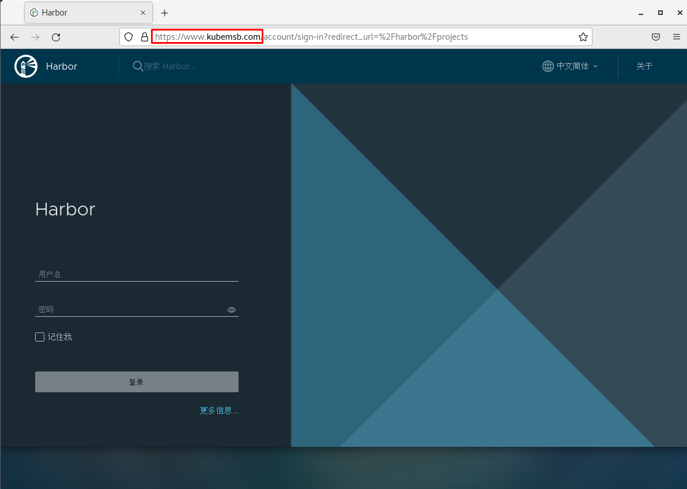


#### 6. 镜像上传及下载

##### 3.1  修改docker daemon使用harbor


~~~powershell
添加/etc/docker/daemon.json文件，默认不存在，需要手动添加
#### vi /etc/docker/daemon.json
#### cat /etc/docker/daemon.json
{
        "insecure-registries": ["www.kubemsb.com"]
}

重启加载daemon配置
#### systemctl daemon-reload
重启docker
#### systemctl restart docker
~~~


##### 3.2 docker tag


~~~powershell
查看已有容器镜像文件
#### docker images
REPOSITORY                      TAG       IMAGE ID       CREATED        SIZE
centos                          latest    5d0da3dc9764   4 months ago   231MB

为已存在镜像重新添加tag
#### docker tag centos:latest www.kubemsb.com/library/centos:v1

再次查看本地容器镜像
#### docker images
REPOSITORY                       TAG       IMAGE ID       CREATED        SIZE
centos                           latest    5d0da3dc9764   4 months ago   231MB
www.kubemsb.com/library/centos   v1        5d0da3dc9764   4 months ago   231MB
~~~


##### 3.3 docker push

~~~powershell
#### docker login www.kubemsb.com
Username: admin  用户名 admin
Password:        密码   12345
WARNING! Your password will be stored unencrypted in /root/.docker/config.json.
Configure a credential helper to remove this warning. See
https://docs.docker.com/engine/reference/commandline/login/#credentials-store

Login Succeeded 登陆成功

推送本地容器镜像到harbor仓库
#### docker push www.kubemsb.com/library/centos:v1
~~~


##### 3.4 docker pull

> 在其它主机上下载或使用harbor容器镜像仓库中的容器镜像


~~~powershell
在本地添加域名解析
#### vim /etc/hosts
#### cat /etc/hosts
127.0.0.1   localhost localhost.localdomain localhost4 localhost4.localdomain4
::1         localhost localhost.localdomain localhost6 localhost6.localdomain6
192.168.10.155 www.kubemsb.com

在本地添加/etc/docker/daemon.json文件，其中为本地主机访问的容器镜像仓库
#### vim /etc/docker/daemon.json
#### cat /etc/docker/daemon.json
{
        "insecure-registries": ["www.kubemsb.com"]
}

#### systemctl daemon-reload
#### systemctl restart docker

下载容器镜像
#### docker pull www.kubemsb.com/library/centos:v1
v1: Pulling from library/centos
Digest: sha256:a1801b843b1bfaf77c501e7a6d3f709401a1e0c83863037fa3aab063a7fdb9dc
Status: Downloaded newer image for www.kubemsb.com/library/centos:v1
www.kubemsb.com/library/centos:v1

查看已下载的容器镜像
#### docker images
REPOSITORY                       TAG       IMAGE ID       CREATED        SIZE
www.kubemsb.com/library/centos   v1        5d0da3dc9764   4 months ago   231MB
~~~


## Docker File

### 一、容器与镜像的关系

说到Docker管理的容器不得不说容器镜像，主要因为容器镜像是容器模板，通过容器镜像我们才能快速创建容器。

如下图所示：


> Docker Daemon通过容器镜像创建容器。

 

### 二、容器镜像分类

- 操作系统类
  - CentOS
  - Ubuntu
  - 在dockerhub下载或自行制作
- 应用类
  - Tomcat
  - Nginx
  - MySQL
  - Redis


### 三、容器镜像获取的方法

主要有以下几种：

1、在DockerHub直接下载

2、把操作系统中文件系统打包为容器镜像

3、把正在运行的容器打包为容器镜像，即docker commit

4、通过Dockerfile实现容器镜像的自定义及生成


### 四、容器镜像获取方法演示

#### 4.1 在DockerHub直接下载


~~~powershell
### docker pull centos:latest
~~~


~~~powershell
### docker pull nginx:latest
~~~


#### 4.2 把操作系统中文件系统打包为容器镜像

##### 4.2.1 安装一个最化的操作系统


##### 4.2.2 把操作系统中文件系统进行打包

~~~powershell
### tar --numeric-owner --exclude=/proc --exclude=/sys -cvf centos7u6.tar /
~~~


##### 4.2.3 把打包后文件加载至本地文件系统生成本地容器镜像


~~~powershell
### ls
centos7u6.tar
~~~


~~~powershell
### docker import centos7u6.tar centos7u6:v1
~~~


~~~powershell
### docker images
REPOSITORY   TAG       IMAGE ID       CREATED         SIZE
centos7u6    v1        130cb005b2dc   7 seconds ago   1.09GB
~~~


~~~powershell
### docker run -it centos7u6:v1 bash
[root@50f24f688b4d /]### ip a s
1: lo: <LOOPBACK,UP,LOWER_UP> mtu 65536 qdisc noqueue state UNKNOWN group default qlen 1000
    link/loopback 00:00:00:00:00:00 brd 00:00:00:00:00:00
    inet 127.0.0.1/8 scope host lo
       valid_lft forever preferred_lft forever
7: eth0@if8: <BROADCAST,MULTICAST,UP,LOWER_UP> mtu 1500 qdisc noqueue state UP group default
    link/ether 02:42:ac:11:00:02 brd ff:ff:ff:ff:ff:ff link-netnsid 0
    inet 172.17.0.2/16 brd 172.17.255.255 scope global eth0
       valid_lft forever preferred_lft forever
~~~


#### 4.3 把正在运行的容器打包为容器镜像

##### 4.3.1 运行一个容器

~~~powershell
### docker run -it centos7u6:v1 bash
~~~


##### 4.3.2 在容器中安装应用

~~~powershell
[root@064aace45718 /]### yum -y install httpd
~~~


##### 4.3.3 把正在运行的容器打包为容器镜像


~~~powershell
[root@064aace45718 /]### ctrl + p +q
~~~


~~~powershell
### docker commit 064aace45718 centos7u6-httpd:v1
~~~


~~~powershell
### docker images
REPOSITORY        TAG       IMAGE ID       CREATED         SIZE
centos7u6-httpd   v1        30ec9d728880   6 seconds ago   1.29GB
~~~


~~~powershell
### docker run -it centos7u6-httpd:v1 bash
[root@01a1373b4a3f /]### rpm -qa | grep httpd
httpd-tools-2.4.6-97.el7.centos.4.x86_64
httpd-2.4.6-97.el7.centos.4.x86_64
~~~


#### 4.4 通过Dockerfile实现容器镜像的自定义及生成

##### 4.4.1 Dockerfile介绍

Dockerfile是一种能够被Docker程序解释的剧本。Dockerfile由一条一条的指令组成，并且有自己的书写格式和支持的命令。当我们需要在容器镜像中指定自己额外的需求时，只需在Dockerfile上添加或修改指令，然后通过docker build生成我们自定义的容器镜像（image）。


##### 4.4.2 Dockerfile指令

- 构建类指令
  - 用于构建image
  - 其指定的操作不会在运行image的容器上执行（FROM、MAINTAINER、RUN、ENV、ADD、COPY）

 

- 设置类指令
  - 用于设置image的属性
  - 其指定的操作将在运行image的容器中执行（CMD、ENTRYPOINT、USER 、EXPOSE、VOLUME、WORKDIR、ONBUILD）


- 指令说明


| 指令    | 描述                                                |
| ------- | --------------------------------------------------- |
| FROM    | 构建新镜像基于的基础镜像                            |
| LABEL   | 标签                                                |
| RUN     | 构建镜像时运行的Shell命令                           |
| COPY    | 拷贝文件或目录到镜像中                              |
| ADD     | 解压压缩包并拷贝                                    |
| ENV     | 设置环境变量                                        |
| USER    | 为RUN、CMD和ENTRYPOINT执行命令指定运行用户          |
| EXPOSE  | 声明容器运行的服务端口                              |
| WORKDIR | 为RUN、CMD、ENTRYPOINT、COPY和ADD设置工作目录       |
| CMD     | 运行容器时默认执行，如果有多个CMD指令，最后一个生效 |


- 指令详细解释


通过`man dockerfile`可以查看到详细的说明,这里简单的翻译并列出常用的指令

1, **FROM**

FROM指令用于指定其后构建新镜像所使用的基础镜像。

FROM指令必是Dockerfile文件中的首条命令。

FROM指令指定的基础image可以是官方远程仓库中的，也可以位于本地仓库，优先本地仓库。

```powershell
格式:FROM <image>:<tag>
例:FROM centos:latest
```

2, **RUN**

RUN指令用于在**构建**镜像中执行命令，有以下两种格式:

* shell格式

~~~powershell
格式:RUN <命令>
例:RUN echo 'kubemsb' > /var/www/html/index.html
~~~

* exec格式

~~~powershell
格式:RUN ["可执行文件", "参数1", "参数2"]
例:RUN ["/bin/bash", "-c", "echo kubemsb > /var/www/html/index.html"]
~~~

**注意:** 按优化的角度来讲:当有多条要执行的命令,不要使用多条RUN,尽量使用&&符号与\符号连接成一行。因为多条RUN命令会让镜像建立多层(总之就是会变得臃肿了:smiley:)。

~~~powershell
RUN yum install httpd httpd-devel -y
RUN echo test > /var/www/html/index.html
可以改成
RUN yum install httpd httpd-devel -y && echo test > /var/www/html/index.html
或者改成
RUN yum install httpd httpd-devel -y  \
    && echo test > /var/www/html/index.html
~~~

3, **CMD**

CMD不同于RUN,CMD用于指定在容器启动时所要执行的命令,而RUN用于指定镜像构建时所要执行的命令。

~~~powershell
格式有三种:
CMD ["executable","param1","param2"]
CMD ["param1","param2"]
CMD command param1 param2
~~~

每个Dockerfile只能有一条CMD命令。如果指定了多条命令，只有最后一条会被执行。

如果用户启动容器时候指定了运行的命令，则会覆盖掉CMD指定的命令。

~~~powershell
什么是启动容器时指定运行的命令?
### docker run -d -p 80:80 镜像名 运行的命令
~~~


4, **EXPOSE**

EXPOSE指令用于指定容器在运行时监听的端口

~~~powershell
格式:EXPOSE <port> [<port>...]
例:EXPOSE 80 3306 8080
~~~

上述运行的端口还需要使用docker run运行容器时通过-p参数映射到宿主机的端口.

5, **ENV**

ENV指令用于指定一个环境变量.

~~~powershell
格式:ENV <key> <value> 或者 ENV <key>=<value>
例:ENV JAVA_HOME /usr/local/jdkxxxx/
~~~

6, **ADD**

ADD指令用于把宿主机上的文件拷贝到镜像中

~~~powershell
格式:ADD <src> <dest>
<src>可以是一个本地文件或本地压缩文件，还可以是一个url,
如果把<src>写成一个url，那么ADD就类似于wget命令
<dest>路径的填写可以是容器内的绝对路径，也可以是相对于工作目录的相对路径
~~~

7, **COPY**

COPY指令与ADD指令类似,但COPY的源文件只能是本地文件

~~~powershell
格式:COPY <src> <dest>
~~~

8, **ENTRYPOINT**

ENTRYPOINT与CMD非常类似

相同点：
一个Dockerfile只写一条，如果写了多条，那么只有最后一条生效
都是容器启动时才运行

不同点：
如果用户启动容器时候指定了运行的命令，ENTRYPOINT不会被运行的命令覆盖，而CMD则会被覆盖

~~~powershell
格式有两种:
ENTRYPOINT ["executable", "param1", "param2"]
ENTRYPOINT command param1 param2
~~~

9,  **VOLUME**

VOLUME指令用于把宿主机里的目录与容器里的目录映射. 

只指定挂载点,docker宿主机映射的目录为自动生成的。

~~~powershell
格式:VOLUME ["<mountpoint>"]
~~~

10, **USER**

USER指令设置启动容器的用户(像hadoop需要hadoop用户操作，oracle需要oracle用户操作),可以是用户名或UID

~~~powershell
USER daemon
USER 1001
~~~

**注意**：如果设置了容器以daemon用户去运行，那么RUN,CMD和ENTRYPOINT都会以这个用户去运行
镜像构建完成后，通过docker run运行容器时，可以通过-u参数来覆盖所指定的用户

11, **WORKDIR**

WORKDIR指令设置工作目录,类似于cd命令。不建议使用`RUN cd /root` ,建议使用WORKDIR

~~~powershell
WORKDIR /root
~~~


##### 4.4.3 Dockerfile基本构成

- 基础镜像信息

- 维护者信息

- 镜像操作指令

- 容器启动时执行指令

##### 4.4.4 Dockerfile生成容器镜像方法


##### 4.4.5 Dockerfile生成容器镜像案例

###### 4.4.5.0 使用Dockerfile生成容器镜像步骤


~~~powershell
第一步：创建一个文件夹（目录）

第二步：在文件夹（目录）中创建Dockerfile文件(并编写)及其它文件

第三步：使用`docker build`命令构建镜像

第四步：使用构建的镜像启动容器
~~~


###### 4.4.5.1 使用Dockerfile生成Nginx容器镜像


~~~powershell
[root@localhost ~]### mkdir nginxroot
[root@localhost ~]### cd nginxroot
[root@localhost nginxroot]#
~~~


~~~powershell
[root@localhost nginxroot]### echo "nginx's running" >> index.html
[root@localhost nginxroot]### ls
index.html
[root@localhost nginxroot]### cat index.html
nginx's running
~~~


~~~powershell
[root@localhost nginxroot]### vim Dockerfile
[root@localhost nginxroot]### cat Dockerfile
FROM centos:centos7

MAINTAINER "www.kubemsb.com"

RUN yum -y install wget

RUN wget -O /etc/yum.repos.d/epel.repo http://mirrors.aliyun.com/repo/epel-7.repo

RUN yum -y install nginx

ADD index.html /usr/share/nginx/html/

RUN echo "daemon off;" >> /etc/nginx/nginx.conf

EXPOSE 80

CMD /usr/sbin/nginx
~~~


~~~powershell
[root@localhost nginxroot]### docker build -t centos7-nginx:v1 .
~~~


~~~powershell
输出：
Sending build context to Docker daemon  3.072kB
第一步：下载基础镜像
Step 1/9 : FROM centos:centos7
 ---> eeb6ee3f44bd
第二步：维护者信息
Step 2/9 : MAINTAINER "www.kubemsb.com"
 ---> Using cache
 ---> f978e524772c
 
第三步：安装wget
Step 3/9 : RUN yum -y install wget
 ---> Running in 4e0fc3854088
Loaded plugins: fastestmirror, ovl
Determining fastest mirrors
 * base: mirrors.huaweicloud.com
 * extras: mirrors.tuna.tsinghua.edu.cn
 * updates: mirrors.tuna.tsinghua.edu.cn
Resolving Dependencies
--> Running transaction check
---> Package wget.x86_64 0:1.14-18.el7_6.1 will be installed
--> Finished Dependency Resolution

Dependencies Resolved

================================================================================
 Package        Arch             Version                   Repository      Size
================================================================================
Installing:
 wget           x86_64           1.14-18.el7_6.1           base           547 k

Transaction Summary
================================================================================
Install  1 Package

Total download size: 547 k
Installed size: 2.0 M
Downloading packages:
warning: /var/cache/yum/x86_64/7/base/packages/wget-1.14-18.el7_6.1.x86_64.rpm: Header V3 RSA/SHA256 Signature, key ID f4a80eb5: NOKEY
Public key for wget-1.14-18.el7_6.1.x86_64.rpm is not installed
Retrieving key from file:///etc/pki/rpm-gpg/RPM-GPG-KEY-CentOS-7
Importing GPG key 0xF4A80EB5:
 Userid     : "CentOS-7 Key (CentOS 7 Official Signing Key) <security@centos.org>"
 Fingerprint: 6341 ab27 53d7 8a78 a7c2 7bb1 24c6 a8a7 f4a8 0eb5
 Package    : centos-release-7-9.2009.0.el7.centos.x86_64 (@CentOS)
 From       : /etc/pki/rpm-gpg/RPM-GPG-KEY-CentOS-7
Running transaction check
Running transaction test
Transaction test succeeded
Running transaction
  Installing : wget-1.14-18.el7_6.1.x86_64                                  1/1
install-info: No such file or directory for /usr/share/info/wget.info.gz
  Verifying  : wget-1.14-18.el7_6.1.x86_64                                  1/1

Installed:
  wget.x86_64 0:1.14-18.el7_6.1

Complete!
Removing intermediate container 4e0fc3854088
 ---> 369e33a2152a
 
第四步：使用wget下载YUM源
Step 4/9 : RUN wget -O /etc/yum.repos.d/epel.repo http://mirrors.aliyun.com/repo/epel-7.repo
 ---> Running in 4bdfc0a1c844
--2022-02-10 06:18:07--  http://mirrors.aliyun.com/repo/epel-7.repo
Resolving mirrors.aliyun.com (mirrors.aliyun.com)... 221.195.209.65, 221.195.209.64, 221.195.209.70, ...
Connecting to mirrors.aliyun.com (mirrors.aliyun.com)|221.195.209.65|:80... connected.
HTTP request sent, awaiting response... 200 OK
Length: 664 [application/octet-stream]
Saving to: '/etc/yum.repos.d/epel.repo'

     0K                                                       100%  158M=0s

2022-02-10 06:18:07 (158 MB/s) - '/etc/yum.repos.d/epel.repo' saved [664/664]

Removing intermediate container 4bdfc0a1c844
 ---> 1d73faa62447
 
第五步：安装Nginx
Step 5/9 : RUN yum -y install nginx
 ---> Running in 51b50c2ce841
Loaded plugins: fastestmirror, ovl
Loading mirror speeds from cached hostfile
 * base: mirrors.huaweicloud.com
 * extras: mirrors.tuna.tsinghua.edu.cn
 * updates: mirrors.tuna.tsinghua.edu.cn
Resolving Dependencies
--> Running transaction check
---> Package nginx.x86_64 1:1.20.1-9.el7 will be installed
--> Processing Dependency: nginx-filesystem = 1:1.20.1-9.el7 for package: 1:nginx-1.20.1-9.el7.x86_64
--> Processing Dependency: libcrypto.so.1.1(OPENSSL_1_1_0)(64bit) for package: 1:nginx-1.20.1-9.el7.x86_64
--> Processing Dependency: libssl.so.1.1(OPENSSL_1_1_0)(64bit) for package: 1:nginx-1.20.1-9.el7.x86_64
--> Processing Dependency: libssl.so.1.1(OPENSSL_1_1_1)(64bit) for package: 1:nginx-1.20.1-9.el7.x86_64
--> Processing Dependency: nginx-filesystem for package: 1:nginx-1.20.1-9.el7.x86_64
--> Processing Dependency: openssl for package: 1:nginx-1.20.1-9.el7.x86_64
--> Processing Dependency: redhat-indexhtml for package: 1:nginx-1.20.1-9.el7.x86_64
--> Processing Dependency: system-logos for package: 1:nginx-1.20.1-9.el7.x86_64
--> Processing Dependency: libcrypto.so.1.1()(64bit) for package: 1:nginx-1.20.1-9.el7.x86_64
--> Processing Dependency: libprofiler.so.0()(64bit) for package: 1:nginx-1.20.1-9.el7.x86_64
--> Processing Dependency: libssl.so.1.1()(64bit) for package: 1:nginx-1.20.1-9.el7.x86_64
--> Running transaction check
---> Package centos-indexhtml.noarch 0:7-9.el7.centos will be installed
---> Package centos-logos.noarch 0:70.0.6-3.el7.centos will be installed
---> Package gperftools-libs.x86_64 0:2.6.1-1.el7 will be installed
---> Package nginx-filesystem.noarch 1:1.20.1-9.el7 will be installed
---> Package openssl.x86_64 1:1.0.2k-24.el7_9 will be installed
--> Processing Dependency: openssl-libs(x86-64) = 1:1.0.2k-24.el7_9 for package: 1:openssl-1.0.2k-24.el7_9.x86_64
--> Processing Dependency: make for package: 1:openssl-1.0.2k-24.el7_9.x86_64
---> Package openssl11-libs.x86_64 1:1.1.1k-2.el7 will be installed
--> Running transaction check
---> Package make.x86_64 1:3.82-24.el7 will be installed
---> Package openssl-libs.x86_64 1:1.0.2k-19.el7 will be updated
---> Package openssl-libs.x86_64 1:1.0.2k-24.el7_9 will be an update
--> Finished Dependency Resolution

Dependencies Resolved

================================================================================
 Package               Arch        Version                   Repository    Size
================================================================================
Installing:
 nginx                 x86_64      1:1.20.1-9.el7            epel         587 k
Installing for dependencies:
 centos-indexhtml      noarch      7-9.el7.centos            base          92 k
 centos-logos          noarch      70.0.6-3.el7.centos       base          21 M
 gperftools-libs       x86_64      2.6.1-1.el7               base         272 k
 make                  x86_64      1:3.82-24.el7             base         421 k
 nginx-filesystem      noarch      1:1.20.1-9.el7            epel          24 k
 openssl               x86_64      1:1.0.2k-24.el7_9         updates      494 k
 openssl11-libs        x86_64      1:1.1.1k-2.el7            epel         1.5 M
Updating for dependencies:
 openssl-libs          x86_64      1:1.0.2k-24.el7_9         updates      1.2 M

Transaction Summary
================================================================================
Install  1 Package  (+7 Dependent packages)
Upgrade             ( 1 Dependent package)

Total download size: 26 M
Downloading packages:
Delta RPMs disabled because /usr/bin/applydeltarpm not installed.
--------------------------------------------------------------------------------
Total                                              3.1 MB/s |  26 MB  00:08
Running transaction check
Running transaction test
Transaction test succeeded
Running transaction
  Installing : centos-logos-70.0.6-3.el7.centos.noarch                     1/10
  Installing : centos-indexhtml-7-9.el7.centos.noarch                      2/10
  Installing : 1:make-3.82-24.el7.x86_64                                   3/10
  Installing : gperftools-libs-2.6.1-1.el7.x86_64                          4/10
  Installing : 1:openssl11-libs-1.1.1k-2.el7.x86_64                        5/10
  Updating   : 1:openssl-libs-1.0.2k-24.el7_9.x86_64                       6/10
  Installing : 1:openssl-1.0.2k-24.el7_9.x86_64                            7/10
  Installing : 1:nginx-filesystem-1.20.1-9.el7.noarch                      8/10
  Installing : 1:nginx-1.20.1-9.el7.x86_64                                 9/10
  Cleanup    : 1:openssl-libs-1.0.2k-19.el7.x86_64                        10/10
  Verifying  : 1:nginx-filesystem-1.20.1-9.el7.noarch                      1/10
  Verifying  : 1:nginx-1.20.1-9.el7.x86_64                                 2/10
  Verifying  : 1:openssl-libs-1.0.2k-24.el7_9.x86_64                       3/10
  Verifying  : 1:openssl11-libs-1.1.1k-2.el7.x86_64                        4/10
  Verifying  : gperftools-libs-2.6.1-1.el7.x86_64                          5/10
  Verifying  : 1:make-3.82-24.el7.x86_64                                   6/10
  Verifying  : 1:openssl-1.0.2k-24.el7_9.x86_64                            7/10
  Verifying  : centos-indexhtml-7-9.el7.centos.noarch                      8/10
  Verifying  : centos-logos-70.0.6-3.el7.centos.noarch                     9/10
  Verifying  : 1:openssl-libs-1.0.2k-19.el7.x86_64                        10/10

Installed:
  nginx.x86_64 1:1.20.1-9.el7

Dependency Installed:
  centos-indexhtml.noarch 0:7-9.el7.centos
  centos-logos.noarch 0:70.0.6-3.el7.centos
  gperftools-libs.x86_64 0:2.6.1-1.el7
  make.x86_64 1:3.82-24.el7
  nginx-filesystem.noarch 1:1.20.1-9.el7
  openssl.x86_64 1:1.0.2k-24.el7_9
  openssl11-libs.x86_64 1:1.1.1k-2.el7

Dependency Updated:
  openssl-libs.x86_64 1:1.0.2k-24.el7_9

Complete!
Removing intermediate container 51b50c2ce841
 ---> 88a7d7a2c522
 
第六步：添加文件至容器
Step 6/9 : ADD index.html /usr/share/nginx/html/
 ---> a2226a4d6720
第七步：设置nginx服务运行方式
Step 7/9 : RUN echo "daemon off;" >> /etc/nginx/nginx.conf
 ---> Running in 01d623937807
Removing intermediate container 01d623937807
 ---> 53fddea5b491
 
第八步：暴露端口
Step 8/9 : EXPOSE 80
 ---> Running in 9b73fcf7ee1b
Removing intermediate container 9b73fcf7ee1b
 ---> 903377216b23
第九步：运行命令，执行nginx二进制文件
Step 9/9 : CMD /usr/sbin/nginx
 ---> Running in 58037652952c
Removing intermediate container 58037652952c
 ---> 944d27b80f1f
 
生成镜像，并为镜像打标记：
Successfully built 944d27b80f1f
Successfully tagged centos7-nginx:v1
~~~


~~~powershell
[root@localhost nginxroot]### docker images
REPOSITORY        TAG       IMAGE ID       CREATED             SIZE
centos7-nginx     v1        944d27b80f1f   3 minutes ago       587MB
~~~


~~~powershell
[root@localhost ~]### docker run -d -p 8081:80 centos7-nginx:v1
~~~


~~~powershell
[root@localhost ~]### curl http://localhost:8081
nginx's running
~~~


###### 4.4.5.2 使用Dockerfile生成Tomcat容器镜像


~~~powershell
[root@localhost ~]### mkdir tomcatdir
[root@localhost ~]### cd tomcatdir/
[root@localhost tomcatdir]#
~~~


~~~powershell
[root@localhost tomcatdir]### echo "tomcat is running" >> index.html
~~~


~~~powershell
[root@localhost tomcatdir]### ls
Dockerfile  jdk index.html
jdk为目录
index.html 网站首页
~~~


~~~powershell
[root@localhost tomcatdir]### vim Dockerfile
[root@localhost tomcatdir]### cat Dockerfile
FROM centos:centos7

MAINTAINER "www.kubemsb.com"

ENV VERSION=8.5.75
ENV JAVA_HOME=/usr/local/jdk
ENV TOMCAT_HOME=/usr/local/tomcat

RUN yum -y install wget

RUN wget https://dlcdn.apache.org/tomcat/tomcat-8/v${VERSION}/bin/apache-tomcat-${VERSION}.tar.gz

RUN tar xf apache-tomcat-${VERSION}.tar.gz

RUN mv apache-tomcat-${VERSION} /usr/local/tomcat

RUN rm -rf apache-tomcat-${VERSION}.tar.gz /usr/local/tomcat/webapps/*

RUN mkdir /usr/local/tomcat/webapps/ROOT

ADD ./index.html /usr/local/tomcat/webapps/ROOT/

ADD ./jdk /usr/local/jdk


RUN echo "export TOMCAT_HOME=/usr/local/tomcat" >> /etc/profile

RUN echo "export JAVA_HOME=/usr/local/jdk" >> /etc/profile

RUN echo "export PATH=${TOMCAT_HOME}/bin:${JAVA_HOME}/bin:$PATH" >> /etc/profile

RUN echo "export CLASSPATH=.:${JAVA_HOME}/lib/dt.jar:${JAVA_HOME}/lib/tools.jar" >> /etc/profile


RUN source /etc/profile

EXPOSE 8080

CMD ["/usr/local/tomcat/bin/catalina.sh","run"]
~~~


~~~powershell
[root@localhost tomcatdir]### docker build -t centos-tomcat:v1 .                           

Sending build context to Docker daemon  398.9MB
Step 1/20 : FROM centos:centos7
 ---> eeb6ee3f44bd
Step 2/20 : MAINTAINER "www.kubemsb.com"
 ---> Using cache
 ---> f978e524772c
Step 3/20 : ENV VERSION=8.5.75
 ---> Using cache
 ---> 792767bbdb22
Step 4/20 : ENV JAVA_HOME=/usr/local/jdk
 ---> Using cache
 ---> 6eb3855650f0
Step 5/20 : ENV TOMCAT_HOME=/usr/local/tomcat
 ---> Using cache
 ---> e38bdbbfd19d
Step 6/20 : RUN yum -y install wget
 ---> Using cache
 ---> 4c6aafa6d8ba
Step 7/20 : RUN wget http://dlcdn.apache.org/tomcat/tomcat-8/v${VERSION}/bin/apache-tomcat-${VERSION}.tar.gz
 ---> Using cache
 ---> 9bdb6f636a5f
Step 8/20 : RUN tar xf apache-tomcat-${VERSION}.tar.gz
 ---> Using cache
 ---> 6abe5cb0ef26
Step 9/20 : RUN mv apache-tomcat-${VERSION} /usr/local/tomcat
 ---> Using cache
 ---> b3907af15c22
Step 10/20 : RUN rm -rf apache-tomcat-${VERSION}.tar.gz /usr/local/tomcat/webapps/*
 ---> Using cache
 ---> b775439344e3
Step 11/20 : RUN mkdir /usr/local/tomcat/webapps/ROOT
 ---> Using cache
 ---> 149ad46776eb
Step 12/20 : ADD ./index.html /usr/local/tomcat/webapps/ROOT/
 ---> 064579c39a46
Step 13/20 : ADD ./jdk /usr/local/jdk
 ---> 477fd38dfbcf
Step 14/20 : RUN echo "export TOMCAT_HOME=/usr/local/tomcat" >> /etc/profile
 ---> Running in 3fc9bc5e8ba5
Removing intermediate container 3fc9bc5e8ba5
 ---> 3c43bccd5779
Step 15/20 : RUN echo "export JAVA_HOME=/usr/local/jdk" >> /etc/profile
 ---> Running in 80f8150f0e80
Removing intermediate container 80f8150f0e80
 ---> e01307ccb02a
Step 16/20 : RUN echo "export PATH=${TOMCAT_HOME}/bin:${JAVA_HOME}/bin:$PATH" >> /etc/profile
 ---> Running in 92a6a4fd1cbc
Removing intermediate container 92a6a4fd1cbc
 ---> 1d26f53b7095
Step 17/20 : RUN echo "export CLASSPATH=.:${JAVA_HOME}/lib/dt.jar:${JAVA_HOME}/lib/tools.jar" >> /etc/profile
 ---> Running in fb5ee1710c36
Removing intermediate container fb5ee1710c36
 ---> d2eaff35dce3
Step 18/20 : RUN source /etc/profile
 ---> Running in 0422af810b35
Removing intermediate container 0422af810b35
 ---> fc6d285288ca
Step 19/20 : EXPOSE 8080
 ---> Running in eeb64d4f9e94
Removing intermediate container eeb64d4f9e94
 ---> 05ec1c6d06cf
Step 20/20 : CMD ["/usr/local/tomcat/bin/catalina.sh","run"]
 ---> Running in 66b7851e2772
Removing intermediate container 66b7851e2772
 ---> ad338289055c
Successfully built ad338289055c
Successfully tagged centos-tomcat:v1
~~~


~~~powershell
### docker images
REPOSITORY        TAG       IMAGE ID       CREATED          SIZE
centos-tomcat     v1        ad338289055c   6 minutes ago    797MB
~~~


~~~powershell
### docker run -d -p 8082:8080 centos-tomcat:v1
~~~


~~~powershell
### curl http://localhost:8082
tomcat is running
~~~


##### 4.4.6 使用Dockerfile生成容器镜像优化

###### 4.4.6.1 减少镜像分层

Dockerfile中包含多种指令，如果涉及到部署最多使用的算是RUN命令了，使用RUN命令时，不建议每次安装都使用一条单独的RUN命令，可以把能够合并安装指令合并为一条，这样就可以减少镜像分层。

~~~powershell
FROM centos:latest
MAINTAINER www.kubemsb.com
RUN yum install epel-release -y 
RUN yum install -y gcc gcc-c++ make -y
RUN wget http://docs.php.net/distributions/php-5.6.36.tar.gz
RUN tar zxf php-5.6.36.tar.gz
RUN cd php-5.6.36
RUN ./configure --prefix=/usr/local/php 
RUN make -j 4 
RUN make install
EXPOSE 9000
CMD ["php-fpm"]
~~~


**优化内容如下：**


~~~powershell
FROM centos:latest
MAINTAINER www.kubemsb.com
RUN yum install epel-release -y && \
    yum install -y gcc gcc-c++ make

RUN wget http://docs.php.net/distributions/php-5.6.36.tar.gz && \
    tar zxf php-5.6.36.tar.gz && \
    cd php-5.6.36 && \
    ./configure --prefix=/usr/local/php && \
    make -j 4 && make install
EXPOSE 9000
CMD ["php-fpm"]
~~~


###### 4.4.6.2 清理无用数据

- 一次RUN形成新的一层，如果没有在同一层删除，无论文件是否最后删除，都会带到下一层，所以要在每一层清理对应的残留数据，减小镜像大小。
- 把生成容器镜像过程中部署的应用软件包做删除处理


~~~powershell
FROM centos:latest
MAINTAINER www.kubemsb.com
RUN yum install epel-release -y && \
    yum install -y gcc gcc-c++ make gd-devel libxml2-devel \
    libcurl-devel libjpeg-devel libpng-devel openssl-devel \
    libmcrypt-devel libxslt-devel libtidy-devel autoconf \
    iproute net-tools telnet wget curl && \
    yum clean all && \
    rm -rf /var/cache/yum/*

RUN wget http://docs.php.net/distributions/php-5.6.36.tar.gz && \
    tar zxf php-5.6.36.tar.gz && \
    cd php-5.6.36 && \
    ./configure --prefix=/usr/local/php \
    make -j 4 && make install && \
    cd / && rm -rf php*
~~~


###### 4.4.6.3 多阶段构建镜像

项目容器镜像有两种，一种直接把项目代码复制到容器镜像中，下次使用容器镜像时即可直接启动；另一种把需要对项目源码进行编译，再复制到容器镜像中使用。

不论是哪种方法都会让制作镜像复杂了些，并也会让容器镜像比较大，建议采用分阶段构建镜像的方法实现。


~~~powershell
$ git clone https://github.com/kubemsb/tomcat-java-demo
$ cd tomcat-java-demo
$ vi Dockerfile
FROM maven AS build
ADD ./pom.xml pom.xml
ADD ./src src/
RUN mvn clean package

FROM kubemsb/tomcat
RUN rm -rf /usr/local/tomcat/webapps/ROOT
COPY --from=build target/*.war /usr/local/tomcat/webapps/ROOT.war

$ docker build -t demo:v1 .
$ docker container run -d -v demo:v1
~~~


~~~powershell
第一个 FROM 后边多了个 AS 关键字，可以给这个阶段起个名字
第二个 FROM 使用上面构建的 Tomcat 镜像，COPY 关键字增加了 —from 参数，用于拷贝某个阶段的文件到当前阶段。
~~~


### 五、新型容器镜像构建技术 BuildPacks


## Docker企业应用案例

### 必要性及参考资料

#### 1.1 使用Docker的必要性

参考前文提到过的[企业应用部署痛点](#应用程序部署痛点)，相对于物理机，虚拟机，docker有如下优势。

- 有利于快速实现企业级应用部署
- 有利于快速实现企业级应用恢复


#### 1.2 参考资料

官网：https://hub.docker.com/，可以在搜索栏中直接搜索镜像名称。


### Docker部署Nginx

#### 2.1 获取参考资料


#### 2.2 运行Nginx-无端口

不在docker host暴露端口

~~~powershell
### docker run -d --name nginx-docker -v /opt/nginx-docker:/usr/share/nginx/html:ro nginx
664cd1bbda4ad2a71cbd09f0c6baa9b34db80db2d69496670a960be07b9521cb

### docker ps
CONTAINER ID   IMAGE       COMMAND                  CREATED          STATUS          PORTS                                                  NAMES
664cd1bbda4a   nginx       "/docker-entrypoint.…"   4 seconds ago    Up 3 seconds    80/tcp                                                 nginx-docker

### docker inspect 664 | grep IPAddress
            "SecondaryIPAddresses": null,
            "IPAddress": "172.17.0.3",
                    "IPAddress": "172.17.0.3",

访问主页，但由于现在还没有主页所以肯定报错。
### curl http://172.17.0.3
<html>
<head><title>403 Forbidden</title></head>
<body>
<center><h1>403 Forbidden</h1></center>
<hr><center>nginx/1.21.6</center>
</body>
</html>

### ls /opt
nginx-docker

生成主页
### echo "nginx is working" > /opt/nginx-docker/index.html

重新访问就有响应了
### curl http://172.17.0.3
nginx is working
~~~


#### 2.3 运行Nginx-端口映射

上述操作，只能在docker host中访问容器中的80端口，如何让其他主机t也能访问容器中的端口呢？

~~~powershell
### docker run -d -p 80:80 --name nginx-docker-port -v /opt/nginx-docker-port:/usr/share/nginx/html:ro nginx

### docker ps
CONTAINER ID   IMAGE       COMMAND                  CREATED             STATUS             PORTS                                                  NAMES
74dddf51983d   nginx       "/docker-entrypoint.…"   3 seconds ago       Up 2 seconds       0.0.0.0:80->80/tcp, :::80->80/tcp                      nginx-server-port

### ls /opt
nginx-server  nginx-server-port

### echo "nginx is running" > /opt/nginx-docker-port/index.html

### curl http://172.17.0.2
nginx is working

### docker top nginx-docker-port
UID                 PID                 PPID                C                   STIME               TTY                 TIME                CMD
root                22195               22163               0                   15:08               ?                   00:00:00            nginx: master process nginx -g daemon off;
101                 22387               22195               0                   15:08               ?                   00:00:00            nginx: worker process
~~~


**在宿主机上访问**


如果经过上述步骤宿主机无法访问nginx服务器，可以尝试vi /etc/sysctl.conf，开启内核ipv4转发。

```shell
### vi /etc/sysctl.conf
net.ipv4.ip_forward=1

:wq

### sysctl -p
net.ipv4.ip_forward=1

然后再去从宿主访问nginx服务
```


#### 2.4 运行Nginx-配置文件

此章节主要介绍如何修改容器中的nginx的配置文件。

可以先把容器中的nginx配置文件复制出来。修改后挂载到外部，再启动nginx容器。

~~~powershell
使用docker cp命令复制到外部
### docker cp nginx-docker-port:/etc/nginx/nginx.conf /opt/nginx-docker/conf/

修改配置文件后保存。
### vi /opt/nginx-docker/conf/nginx.conf

停止服务
### docker stop nginx-docker-port

启动服务，映射目录和端口
### docker run -d \
-p 8082:80 --name nginx-server-conf \
-v /opt/nginx-docker/html:/usr/share/nginx/html:ro \
-v /opt/nginx-docker/conf/nginx.conf:/etc/nginx/nginx.conf:ro \
nginx

76251ec44e5049445399303944fc96eb8161ccb49e27b673b99cb2492009523c

### docker ps
CONTAINER ID   IMAGE     COMMAND                   CREATED         STATUS         PORTS                                   NAMES
a16b78d93e64   nginx     "/docker-entrypoint.…"   5 minutes ago   Up 5 minutes   0.0.0.0:8081->80/tcp, :::8081->80/tcp   nginx-server-conf

### docker inspect a16b78d93e64 | grep IP
            "LinkLocalIPv6Address": "",
            "LinkLocalIPv6PrefixLen": 0,
            "SecondaryIPAddresses": null,
            "SecondaryIPv6Addresses": null,
            "GlobalIPv6Address": "",
            "GlobalIPv6PrefixLen": 0,
            "IPAddress": "172.17.0.2",
            "IPPrefixLen": 16,
            "IPv6Gateway": "",
                    "IPAMConfig": null,
                    "IPAddress": "172.17.0.2",
                    "IPPrefixLen": 16,
                    "IPv6Gateway": "",
                    "GlobalIPv6Address": "",
                    "GlobalIPv6PrefixLen": 0,

直接查看容器中的配置文件是否已经修改
### docker exec -it nginx-server-conf cat /etc/nginx/nginx.conf

~~~


### Docker部署Tomcat

#### 3.1 获取参考资料


大家注意，虽然官网用的是交换式启动-it，但企业中更多用的还是-d。--rm选项表示退出容器时会自动将其删除


#### 3.2 运行tomcat应用容器

##### 3.2.1 不暴露端口运行

~~~powershell
### docker run -d --rm tomcat:9.0

### docker ps
CONTAINER ID   IMAGE        COMMAND                  CREATED             STATUS             PORTS                                                  NAMES
c20a0e781246   tomcat:9.0   "catalina.sh run"        27 seconds ago      Up 25 seconds      8080/tcp                                               heuristic_cori
~~~


##### 3.2.2 暴露端口运行

~~~powershell
### docker run -d -p 8080:8080 --rm tomcat:9.0
2fcf5762314373c824928490b871138a01a94abedd7e6814ad5f361d09fbe1de

### docker ps
CONTAINER ID   IMAGE        COMMAND                  CREATED             STATUS             PORTS                                                  NAMES
2fcf57623143   tomcat:9.0   "catalina.sh run"        3 seconds ago       Up 1 second        0.0.0.0:8080->8080/tcp, :::8080->8080/tcp              eloquent_chatelet
~~~


~~~powershell

~~~


**在宿主机访问**


~~~powershell
### docker exec 2fc ls /usr/local/tomcat/webapps
里面为空，所以可以添加网站文件。
~~~


##### 3.2.3 暴露端口及添加网站文件


~~~powershell
### docker run -d -p 8081:8080 -v /opt/tomcat-server:/usr/local/tomcat/webapps/ROOT tomcat:9.0
f456e705d48fc603b7243a435f0edd6284558c194e105d87befff2dccddc0b63
~~~


~~~powershell
### docker ps
CONTAINER ID   IMAGE        COMMAND             CREATED         STATUS         PORTS                                       NAMES
f456e705d48f   tomcat:9.0   "catalina.sh run"   3 seconds ago   Up 2 seconds   0.0.0.0:8081->8080/tcp, :::8081->8080/tcp   cool_germain
~~~


~~~powershell
### echo "tomcat running" > /opt/tomcat-server/index.html
~~~


**在宿主机访问**

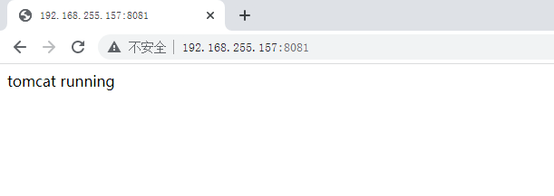

### Docker部署MySQL

#### 4.1 单节点MySQL部署


~~~powershell
先下载
### docker pull mysql:5.7
5.7: Pulling from library/mysql
72a69066d2fe: Pull complete 
93619dbc5b36: Pull complete 
99da31dd6142: Pull complete 
626033c43d70: Pull complete 
37d5d7efb64e: Pull complete 
ac563158d721: Pull complete 
d2ba16033dad: Pull complete 
0ceb82207cd7: Pull complete 
37f2405cae96: Pull complete 
e2482e017e53: Pull complete 
70deed891d42: Pull complete 
Digest: sha256:f2ad209efe9c67104167fc609cca6973c8422939491c9345270175a300419f94
Status: Downloaded newer image for mysql:5.7
docker.io/library/mysql:5.7

后台运行
### docker run -d -p 3306:3306 \
 --name mysql-docker \
 -v /opt/mysql/log:/var/log/mysql \
 -v /opt/mysql/data:/var/lib/mysql \
 -v /opt/mysql/conf:/etc/mysql \
 -e MYSQL_ROOT_PASSWORD=root \
 -d \
 mysql:5.7
 
 1ec4bc062c6fb17e54eb65919630d05082a21999185115823cfbb11379510204
 
 查看Mysql容器进程
 ### docker ps
CONTAINER ID   IMAGE       COMMAND                   CREATED         STATUS         PORTS                                                  NAMES
5b7cac68f2e0   mysql:5.7   "docker-entrypoint.s…"   5 seconds ago   Up 4 seconds   0.0.0.0:3306->3306/tcp, :::3306->3306/tcp, 33060/tcp   mysql-docker

通过容器中内置的客户端访问
### docker exec -it mysql-docker mysql -uroot -proot
mysql: [Warning] Using a password on the command line interface can be insecure.
Welcome to the MySQL monitor.  Commands end with ; or \g.
Your MySQL connection id is 4
Server version: 5.7.37 MySQL Community Server (GPL)

Copyright (c) 2000, 2022, Oracle and/or its affiliates.

Oracle is a registered trademark of Oracle Corporation and/or its
affiliates. Other names may be trademarks of their respective
owners.

Type 'help;' or '\h' for help. Type '\c' to clear the current input statement.
进入到容器的命令行中
mysql>show databases;
+--------------------+
| Database           |
+--------------------+
| information_schema |
| mysql              |
| performance_schema |
| sys                |
+--------------------+
4 rows in set (0.00 sec)

~~~

有很多客户端工具都可以连接MySQL，例如：Navicat，Idea，Dbeaver

以下案例为通过mariadb来访问MySQL。mariadb是mysql的一个分支。

~~~powershell
安装mariadb
### yum -y install mariadb

在docker host上访问
### mysql -h 192.168.255.157 -uroot -proot -P 3306
Welcome to the MariaDB monitor.  Commands end with ; or \g.
Your MySQL connection id is 7
Server version: 5.7.37 MySQL Community Server (GPL)

Copyright (c) 2000, 2018, Oracle, MariaDB Corporation Ab and others.

Type 'help;' or '\h' for help. Type '\c' to clear the current input statement.

MySQL [(none)]> show databases;
+--------------------+
| Database           |
+--------------------+
| information_schema |
| mysql              |
| performance_schema |
| sys                |
+--------------------+
4 rows in set (0.00 sec)
~~~


#### 4.2 MySQL主从复制集群部署

##### 4.2.1 MySQL主节点部署

~~~powershell
### docker run -d -p 3306:3306 \
 --name mysql-master \
 -v /opt/mysql-master/log:/var/log/mysql \
 -v /opt/mysql-master/data:/var/lib/mysql \
 -v /opt/mysql-master/conf:/etc/mysql \
 -e MYSQL_ROOT_PASSWORD=root \
 -d mysql:5.7
 
 
 ### docker ps
CONTAINER ID   IMAGE       COMMAND                  CREATED          STATUS          PORTS                                                  NAMES
2dbbed8e35c7   mysql:5.7   "docker-entrypoint.s…"   58 seconds ago   Up 57 seconds   0.0.0.0:3306->3306/tcp, :::3306->3306/tcp, 33060/tcp   mysql-master
~~~


~~~powershell

~~~


##### 4.2.2 MySQL主节点配置


~~~powershell
### vim /opt/mysql-master/conf/my.cnf
### cat /opt/mysql-master/conf/my.cnf
[client]
default-character-set=utf8

[mysql]
default-character-set=utf8

[mysqld]
init_connect='SET collation_connection = utf8_unicode_ci'
init_connect='SET NAMES utf8'
character-set-server=utf8
collation-server=utf8_unicode_ci
skip-character-set-client-handshake
skip-name-resolve

server_id=1
log-bin=mysql-bin
read-only=0
binlog-do-db=kubemsb_test

replicate-ignore-db=mysql
replicate-ignore-db=sys
replicate-ignore-db=information_schema
replicate-ignore-db=performance_schema
~~~


##### 4.2.3 MySQL从节点部署

~~~powershell
### docker run -p 3307:3306 \
 --name mysql-slave \
 -v /opt/mysql-slave/log:/var/log/mysql \
 -v /opt/mysql-slave/data:/var/lib/mysql \
 -v /opt/mysql-slave/conf:/etc/mysql \
 -e MYSQL_ROOT_PASSWORD=root \
 -d 
 --link mysql-master:mysql-master
 mysql:5.7
~~~


~~~powershell
### docker ps
CONTAINER ID   IMAGE       COMMAND                  CREATED         STATUS         PORTS                                                  NAMES
caf7bf3fc68f   mysql:5.7   "docker-entrypoint.s…"   8 seconds ago   Up 6 seconds   33060/tcp, 0.0.0.0:3307->3306/tcp, :::3307->3306/tcp   mysql-slave
~~~


##### 4.2.4 MySQL从节点配置

~~~powershell
### vim /opt/mysql-slave/conf/my.cnf
### cat /opt/mysql-slave/conf/my.cnf
[client]
default-character-set=utf8

[mysql]
default-character-set=utf8

[mysqld]
init_connect='SET collation_connection = utf8_unicode_ci'
init_connect='SET NAMES utf8'
character-set-server=utf8
collation-server=utf8_unicode_ci
skip-character-set-client-handshake
skip-name-resolve

server_id=2
log-bin=mysql-bin
read-only=1
binlog-do-db=kubemsb_test

replicate-ignore-db=mysql
replicate-ignore-db=sys
replicate-ignore-db=information_schema
replicate-ignore-db=performance_schema
~~~


##### 4.2.5 master节点配置


~~~powershell
### mysql -h 192.168.255.157 -uroot -proot -P 3306
Welcome to the MariaDB monitor.  Commands end with ; or \g.
Your MySQL connection id is 2
Server version: 5.7.37 MySQL Community Server (GPL)

Copyright (c) 2000, 2018, Oracle, MariaDB Corporation Ab and others.

Type 'help;' or '\h' for help. Type '\c' to clear the current input statement.

MySQL [(none)]>
~~~


~~~powershell
授权
MySQL [(none)]> grant replication slave on *.* to 'backup'@'%' identified by '123456';
~~~


~~~powershell
重启容器，使用配置生效
### docker restart mysql-master
~~~


~~~powershell
查看状态
MySQL [(none)]> show master status\G
*************************** 1. row ***************************
             File: mysql-bin.000001
         Position: 154
     Binlog_Do_DB: kubemsb_test
 Binlog_Ignore_DB:
Executed_Gtid_Set:
1 row in set (0.00 sec)
~~~


##### 4.2.6 slave节点配置


~~~powershell
### docker restart mysql-slave
~~~


~~~powershell
### mysql -h 192.168.255.157 -uroot -proot -P 3307
Welcome to the MariaDB monitor.  Commands end with ; or \g.
Your MySQL connection id is 2
Server version: 5.7.37 MySQL Community Server (GPL)

Copyright (c) 2000, 2018, Oracle, MariaDB Corporation Ab and others.

Type 'help;' or '\h' for help. Type '\c' to clear the current input statement.

MySQL [(none)]>
~~~


~~~powershell
MySQL [(none)]> change master to master_host='mysql-master', master_user='backup', master_password='123456', master_log_file='mysql-bin.000001', master_log_pos=154, master_port=3306;
~~~


~~~powershell
MySQL [(none)]> start slave;
~~~


~~~powershell
MySQL [(none)]> show slave status\G
*************************** 1. row ***************************
               Slave_IO_State: Waiting for master to send event
                  Master_Host: mysql-master
                  Master_User: backup
                  Master_Port: 3306
                Connect_Retry: 60
              Master_Log_File: mysql-bin.000001
          Read_Master_Log_Pos: 154
               Relay_Log_File: e0872f94c377-relay-bin.000002
                Relay_Log_Pos: 320
        Relay_Master_Log_File: mysql-bin.000001
             Slave_IO_Running: Yes
            Slave_SQL_Running: Yes
              Replicate_Do_DB:
          Replicate_Ignore_DB: mysql,sys,information_schema,performance_schema
           Replicate_Do_Table:
       Replicate_Ignore_Table:
      Replicate_Wild_Do_Table:
  Replicate_Wild_Ignore_Table:
                   Last_Errno: 0
                   Last_Error:
                 Skip_Counter: 0
          Exec_Master_Log_Pos: 154
              Relay_Log_Space: 534
              Until_Condition: None
               Until_Log_File:
                Until_Log_Pos: 0
           Master_SSL_Allowed: No
           Master_SSL_CA_File:
           Master_SSL_CA_Path:
              Master_SSL_Cert:
            Master_SSL_Cipher:
               Master_SSL_Key:
        Seconds_Behind_Master: 0
Master_SSL_Verify_Server_Cert: No
                Last_IO_Errno: 0
                Last_IO_Error:
               Last_SQL_Errno: 0
               Last_SQL_Error:
  Replicate_Ignore_Server_Ids:
             Master_Server_Id: 1
                  Master_UUID: 0130b415-8b21-11ec-8982-0242ac110002
             Master_Info_File: /var/lib/mysql/master.info
                    SQL_Delay: 0
          SQL_Remaining_Delay: NULL
      Slave_SQL_Running_State: Slave has read all relay log; waiting for more updates
           Master_Retry_Count: 86400
                  Master_Bind:
      Last_IO_Error_Timestamp:
     Last_SQL_Error_Timestamp:
               Master_SSL_Crl:
           Master_SSL_Crlpath:
           Retrieved_Gtid_Set:
            Executed_Gtid_Set:
                Auto_Position: 0
         Replicate_Rewrite_DB:
                 Channel_Name:
           Master_TLS_Version:
1 row in set (0.00 sec)
~~~


##### 4.2.7 验证MySQL集群可用性


~~~powershell
在MySQL Master节点添加kubemsb_test数据库
### mysql -h 192.168.255.157 -uroot -proot -P3306

MySQL [(none)]> create database kubemsb_test;
Query OK, 1 row affected (0.00 sec)

MySQL [(none)]> show databases;
+--------------------+
| Database           |
+--------------------+
| information_schema |
| kubemsb_test       |     |
| mysql              |
| performance_schema |
| sys                |
+--------------------+
6 rows in set (0.00 sec)
~~~


~~~powershell
在MySQL Slave节点查看同步情况
### mysql -h 192.168.255.157 -uroot -proot -P3307

MySQL [(none)]> show databases;
+--------------------+
| Database           |
+--------------------+
| information_schema |
| kubemsb_test       |
| mysql              |
| performance_schema |
| sys                |
+--------------------+
5 rows in set (0.00 sec)
~~~


### Docker部署Oracle

#### 5.1 获取参考资料


#### 5.2 运行oracle容器


~~~powershell
### docker pull oracleinanutshell/oracle-xe-11g
~~~


~~~powershell
### docker run -h oracle --name oracle -d -p 49160:22 -p 49161:1521 -p 49162:8080 oracleinanutshell/oracle-xe-11g
237db949020abf2cee12e3193fa8a34d9dfadaafd9d5604564668d4472abe0b2
~~~


~~~powershell
### docker ps
CONTAINER ID   IMAGE                             COMMAND                  CREATED         STATUS         PORTS                                                                                                                               NAMES
237db949020a   oracleinanutshell/oracle-xe-11g   "/bin/sh -c '/usr/sb…"   7 seconds ago   Up 4 seconds   0.0.0.0:49160->22/tcp, :::49160->22/tcp, 0.0.0.0:49161->1521/tcp, :::49161->1521/tcp, 0.0.0.0:49162->8080/tcp, :::49162->8080/tcp   oracle
~~~


~~~powershell
说明：
49160 为ssh端口
49161 为sqlplus端口
49162 为oem端口
~~~


~~~powershell
oracle数据库连接信息
port:49161
sid:xe
username:system
password:oracle

SYS用户密码为:oracle
~~~


#### 5.3 下载客户端连接工具

下载链接地址：https://www.oracle.com/tools/downloads/sqldev-downloads.html


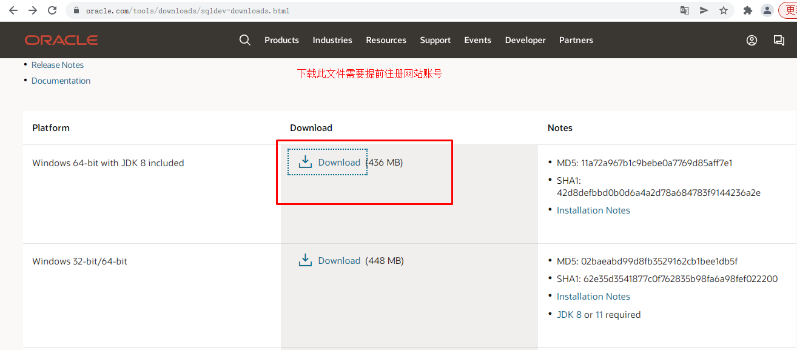


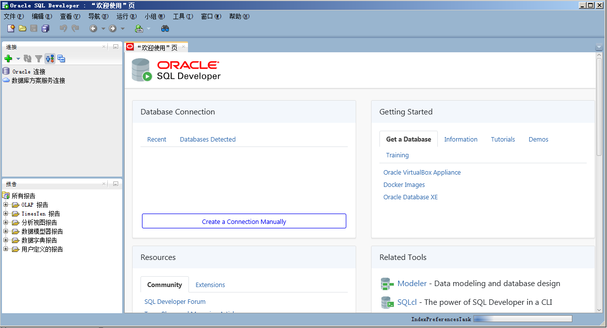


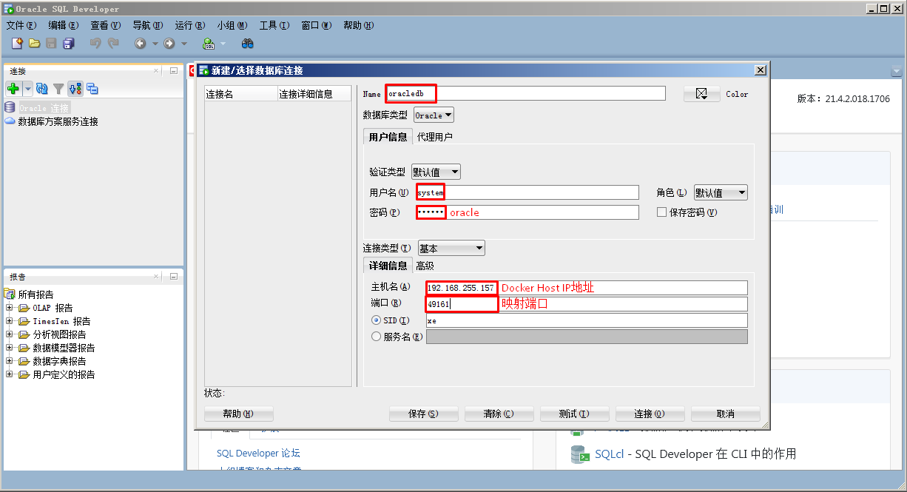


### Docker部署ES+Kibana

#### 6.1 获取参考资料

##### 6.1.1 ES部署参考资料

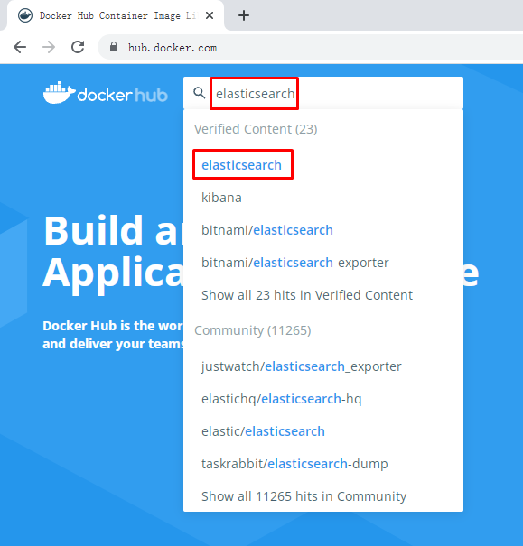


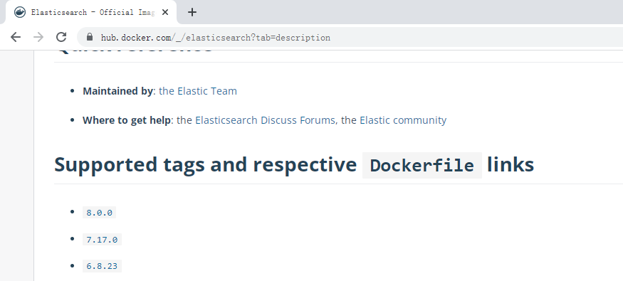


##### 6.1.2 Kibana部署参考资料


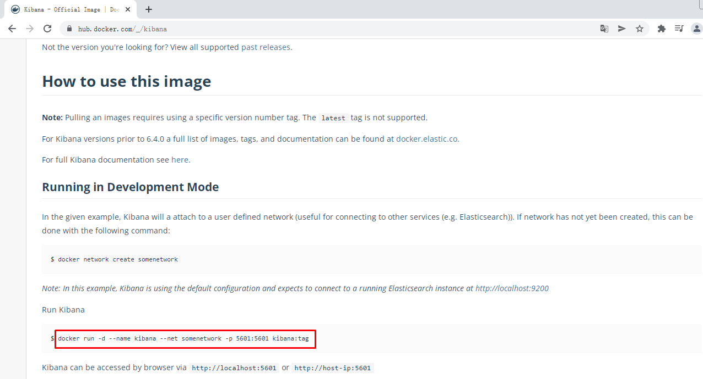


#### 6.2 ES部署


~~~powershell
### docker pull elasticsearch:7.17.0
~~~


~~~powershell
### mkdir -p /opt/es/config
### mkdir -p /opt/es/data
~~~


~~~powershell
### echo "http.host: 0.0.0.0" >> /opt/es/config/elasticsearch.yml
~~~


~~~powershell
### chmod -R 777 /opt/es/
~~~


~~~powershell
### docker run --name elasticsearch -p 9200:9200 -p 9300:9300 \
-e "discovery.type=single-node" \
-e ES_JAVA_OPTS="-Xms64m -Xmx512m" \
-v /opt/es/config/elasticsearch.yml:/usr/share/elasticsearch/config/elasticsearch.yml \
-v /opt/es/data:/usr/share/elasticsearch/data \
-v /opt/es/plugins:/usr/share/elasticsearch/plugins \
-d elasticsearch:7.17.0
~~~


~~~powershell
### docker ps
CONTAINER ID   IMAGE                 COMMAND                  CREATED          STATUS          PORTS                                                                                  NAMES
e1c306e6e5a3   elasticsearch:7.17.0   "/bin/tini -- /usr/l…"   22 seconds ago   Up 20 seconds   0.0.0.0:9200->9200/tcp, :::9200->9200/tcp, 0.0.0.0:9300->9300/tcp, :::9300->9300/tcp   elasticsearch
~~~


#### 6.3 Kibana部署


~~~powershell
### docker pull kibana:7.17.0
~~~


~~~powershell
### docker run --name kibana -e ELASTICSEARCH_HOSTS=http://192.168.255.157:9200 -p 5601:5601 \
-d kibana:7.17.0
~~~


~~~powershell
### docker ps
CONTAINER ID   IMAGE                  COMMAND                  CREATED         STATUS         PORTS                                                                                  NAMES
fb60e73f9cd5   kibana:7.17.0          "/bin/tini -- /usr/l…"   2 minutes ago   Up 2 minutes   0.0.0.0:5601->5601/tcp, :::5601->5601/tcp                                              kibana
~~~


### Docker部署Redis

#### 7.1 获取参考资料


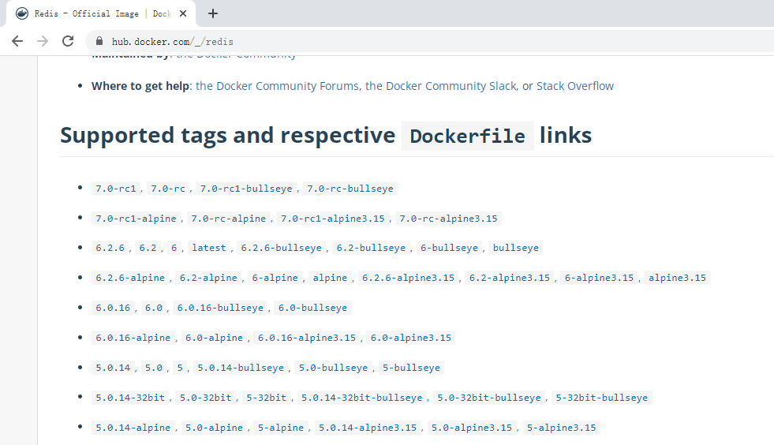


#### 7.2 运行Redis容器

~~~powershell
### mkdir -p /opt/redis/conf
~~~


~~~powershell
### touch /opt/redis/conf/redis.conf
~~~


~~~powershell
### docker run -p 6379:6379 --name redis -v /opt/redis/data:/data \
-v /opt/redis/conf:/etc/redis \
-d redis redis-server /etc/redis/redis.conf
~~~


~~~powershell
### docker ps
CONTAINER ID   IMAGE                  COMMAND                  CREATED          STATUS          PORTS                                                                                  NAMES
9bd2b39cd92a   redis                  "docker-entrypoint.s…"   44 seconds ago   Up 42 seconds   0.0.0.0:6379->6379/tcp, :::6379->6379/tcp                                              redis
~~~


#### 7.3 验证


~~~powershell
### wget -O /etc/yum.repos.d/epel.repo http://mirrors.aliyun.com/repo/epel-7.repo
~~~


~~~powershell
### yum -y install redis
~~~


~~~powershell
### redis-cli -h 192.168.255.157 -p 6379

192.168.255.157:6379> set test1 a
OK
192.168.255.157:6379> get test1
"a"
~~~


#### 7.4 Redis集群

安装redis-cluster；3主3从方式，从为了同步备份，主进行slot数据分片

~~~powershell
编辑运行多个redis容器脚本文件
### vim redis-cluster.sh
### cat redis-cluster.sh
for port in $(seq 8001 8006); \
do \
mkdir -p /mydata/redis/node-${port}/conf
touch /mydata/redis/node-${port}/conf/redis.conf
cat << EOF >/mydata/redis/node-${port}/conf/redis.conf
port ${port}
cluster-enabled yes
cluster-config-file nodes.conf
cluster-node-timeout 5000
cluster-announce-ip 192.168.255.157
cluster-announce-port ${port}
cluster-announce-bus-port 1${port}
appendonly yes
EOF
docker run -p ${port}:${port} -p 1${port}:1${port} --name redis-${port} \
-v /mydata/redis/node-${port}/data:/data \
-v /mydata/redis/node-${port}/conf/redis.conf:/etc/redis/redis.conf \
-d redis:5.0.7 redis-server /etc/redis/redis.conf; \
done
~~~


~~~powershell
执行脚本
### sh redis-cluster.sh
~~~


~~~powershell
查看已运行容器
### docker ps
CONTAINER ID   IMAGE         COMMAND                  CREATED              STATUS              PORTS                                                                                                NAMES
8d53864a98ce   redis:5.0.7   "docker-entrypoint.s…"   About a minute ago   Up About a minute   0.0.0.0:8006->8006/tcp, :::8006->8006/tcp, 6379/tcp, 0.0.0.0:18006->18006/tcp, :::18006->18006/tcp   redis-8006
e2b5da0f0605   redis:5.0.7   "docker-entrypoint.s…"   2 minutes ago        Up About a minute   0.0.0.0:8005->8005/tcp, :::8005->8005/tcp, 6379/tcp, 0.0.0.0:18005->18005/tcp, :::18005->18005/tcp   redis-8005
70e8e8f15aea   redis:5.0.7   "docker-entrypoint.s…"   2 minutes ago        Up 2 minutes        0.0.0.0:8004->8004/tcp, :::8004->8004/tcp, 6379/tcp, 0.0.0.0:18004->18004/tcp, :::18004->18004/tcp   redis-8004
dff8e4bf02b4   redis:5.0.7   "docker-entrypoint.s…"   2 minutes ago        Up 2 minutes        0.0.0.0:8003->8003/tcp, :::8003->8003/tcp, 6379/tcp, 0.0.0.0:18003->18003/tcp, :::18003->18003/tcp   redis-8003
c34dc4c423ef   redis:5.0.7   "docker-entrypoint.s…"   2 minutes ago        Up 2 minutes        0.0.0.0:8002->8002/tcp, :::8002->8002/tcp, 6379/tcp, 0.0.0.0:18002->18002/tcp, :::18002->18002/tcp   redis-8002
b8cb5feffb43   redis:5.0.7   "docker-entrypoint.s…"   2 minutes ago        Up 2 minutes        0.0.0.0:8001->8001/tcp, :::8001->8001/tcp, 6379/tcp, 0.0.0.0:18001->18001/tcp, :::18001->18001/tcp   redis-8001
~~~


~~~powershell
登录redis容器
### docker exec -it redis-8001 bash
root@b8cb5feffb43:/data#
~~~


~~~powershell
创建redis-cluster
root@b8cb5feffb43:/data### redis-cli --cluster create 192.168.255.157:8001 192.168.255.157:8002 192.168.255.157:8003 192.168.255.157:8004 192.168.255.157:8005 192.168.255.157:8006 --cluster-replicas 1
~~~


~~~powershell
输出：
>>> Performing hash slots allocation on 6 nodes...
Master[0] -> Slots 0 - 5460
Master[1] -> Slots 5461 - 10922
Master[2] -> Slots 10923 - 16383
Adding replica 192.168.255.157:8005 to 192.168.255.157:8001
Adding replica 192.168.255.157:8006 to 192.168.255.157:8002
Adding replica 192.168.255.157:8004 to 192.168.255.157:8003
>>> Trying to optimize slaves allocation for anti-affinity
[WARNING] Some slaves are in the same host as their master
M: abd07f1a2679fe77558bad3ff4b7ab70ec41efa5 192.168.255.157:8001
   slots:[0-5460] (5461 slots) master
M: 40e69202bb3eab13a8157c33da6240bb31f2fd6f 192.168.255.157:8002
   slots:[5461-10922] (5462 slots) master
M: 9a927abf3c2982ba9ffdb29176fc8ffa77a2cf03 192.168.255.157:8003
   slots:[10923-16383] (5461 slots) master
S: 81d0a4056328830a555fcd75cf523d4c9d52205c 192.168.255.157:8004
   replicates 9a927abf3c2982ba9ffdb29176fc8ffa77a2cf03
S: 8121a28519e5b52e4817913aa3969d9431bb68af 192.168.255.157:8005
   replicates abd07f1a2679fe77558bad3ff4b7ab70ec41efa5
S: 3a8dd5343c0b8f5580bc44f6b3bb5b4371d4dde5 192.168.255.157:8006
   replicates 40e69202bb3eab13a8157c33da6240bb31f2fd6f
Can I set the above configuration? (type 'yes' to accept): yes 输入yes
>>> Nodes configuration updated
>>> Assign a different config epoch to each node
>>> Sending CLUSTER MEET messages to join the cluster
Waiting for the cluster to join
.....
>>> Performing Cluster Check (using node 192.168.255.157:8001)
M: abd07f1a2679fe77558bad3ff4b7ab70ec41efa5 192.168.255.157:8001
   slots:[0-5460] (5461 slots) master
   1 additional replica(s)
S: 81d0a4056328830a555fcd75cf523d4c9d52205c 192.168.255.157:8004
   slots: (0 slots) slave
   replicates 9a927abf3c2982ba9ffdb29176fc8ffa77a2cf03
M: 40e69202bb3eab13a8157c33da6240bb31f2fd6f 192.168.255.157:8002
   slots:[5461-10922] (5462 slots) master
   1 additional replica(s)
S: 8121a28519e5b52e4817913aa3969d9431bb68af 192.168.255.157:8005
   slots: (0 slots) slave
   replicates abd07f1a2679fe77558bad3ff4b7ab70ec41efa5
M: 9a927abf3c2982ba9ffdb29176fc8ffa77a2cf03 192.168.255.157:8003
   slots:[10923-16383] (5461 slots) master
   1 additional replica(s)
S: 3a8dd5343c0b8f5580bc44f6b3bb5b4371d4dde5 192.168.255.157:8006
   slots: (0 slots) slave
   replicates 40e69202bb3eab13a8157c33da6240bb31f2fd6f
[OK] All nodes agree about slots configuration.
>>> Check for open slots...
>>> Check slots coverage...
[OK] All 16384 slots covered.
~~~


### Docker部署RabbitMQ

#### 8.1 获取参考资料


#### 8.2 部署RabbitMQ

> 部署带管理控制台的RabbitMQ


~~~powershell
### docker run -d --name rabbitmq -p 5671:5671 -p 5672:5672 -p 4369:4369 -p 25672:25672 -p 15671:15671 -p 15672:15672 -v /opt/rabbitmq:/var/lib/rabbitmq rabbitmq:management
~~~


~~~powershell
### docker ps
CONTAINER ID   IMAGE                 COMMAND                  CREATED          STATUS         PORTS                                                                                                                                                                                                                                             NAMES
97d28093faa4   rabbitmq:management   "docker-entrypoint.s…"   11 seconds ago   Up 6 seconds   0.0.0.0:4369->4369/tcp, :::4369->4369/tcp, 0.0.0.0:5671-5672->5671-5672/tcp, :::5671-5672->5671-5672/tcp, 0.0.0.0:15671-15672->15671-15672/tcp, :::15671-15672->15671-15672/tcp, 0.0.0.0:25672->25672/tcp, :::25672->25672/tcp, 15691-15692/tcp   rabbitmq
~~~


~~~powershell
端口说明：
4369, 25672 (Erlang发现&集群端口)
5672, 5671 (AMQP端口)
15672 (web管理后台端口)
61613, 61614 (STOMP协议端口)
1883, 8883 (MQTT协议端口)
~~~


## Docker Compose

### 使用Docker Compose必要性及定义

用容器运行一个服务,需要使用`docker run`命令。但如果我要运行多个服务呢?

假设我要运行一个web服务,还要运行一个db服务,那么是用一个容器运行,还是用多个容器运行呢?

一个容器运行多个服务会造成镜像的复杂度提高,**docker倾向于一个容器运行一个应用**。

那么复杂的架构就会需要很多的容器,并且需要它们之间有关联(容器之间的依赖和连接)就更复杂了。

这个复杂的问题需要解决,这就涉及到了**==容器编排==**的问题了。

- Compose
  - 编排
    - 是对多个容器进行启动和管理的方法
    - 例如：LNMT，先启动MySQL，再启动Tomcat，最后启动Nginx
- 服务架构的演进
  - 单体服务架构
  - 分布式服务架构
  - 微服务架构
  - 超微服务架构
- 容器编排工具
  - docker machine
    - 在虚拟机中部署docker容器引擎的工具，可以给一台没有安装过docker引擎的机器安装docker。
  - docker compose
    - 是一个用于定义和运行多容器Docker的应用程序工具
  - docker swarm
    - 是Docker Host主机批量管理及资源调度管理工具
  - mesos+marathon
    - mesos 对计算机计算资源进行管理和调度
    - marathon 服务发现及负载均衡的功能
    - 目前已经很少有人使用。
  - kubernetes
    - google开源的容器编排工具
    - 目前非常流行。

### Docker Compose参考资料

- 网址
  - https://docs.docker.com/compose/


- yaml格式-官方文档。https://yaml.org/


### Docker Compose最佳实践

#### 3.1 概念

- 工程（project）
  - 相当于1个应用，例如：要部署一个购物网站，这个购物网站就是一个工程。

- 服务 (Service)
  - 购物网站需要前台，后台，数据库，三个服务。

- 容器 (Container)
  - 1个服务可以对应多个容器。例如：购物网站的数据库可能是集群，那就可能要对应多个容器了。


#### 3.2 实践步骤

1.定义应用的Dockerfile文件，为了anywhere进行构建。（非必须）

2.使用docker-compose.yaml定义一套服务，这套服务可以一起在一个隔离环境中运行。

3.使用docker-compose up就可以启动整套服务。


### Docker Compose安装

[下载页面](https://github.com/docker/compose/releases)，打开页面后，可以从asset中找到下载地址。（打开很慢的，请自行科学上网）

~~~powershell
下载docker-compose二进制文件
### wget https://github.com/docker/compose/releases/download/v2.21.0/docker-compose-linux-x86_64

查看已下载二进制文件
### ll -h
-rw-r--r-- 1 root root 17M 12月  7 2021 docker-compose-Linux-x86_64

查看$PATH目录
### echo $PATH
/usr/local/sbin:/usr/local/bin:/usr/sbin:/usr/bin:/usr/java/latest/bin:/root/bin

移动二进制文件到$PATH中的任意一个目录，并更名为docker-compose
### mv docker-compose-Linux-x86_64 /root/bin/docker-compose

为二进制文件添加可执行权限
### chmod +x /root/bin/docker-compose

安装完成后，查看docker-compse版本
### docker-compose version
Docker Compose version v2.21.0

~~~


### Docker Compose应用案例

> 运行Python语言开发的网站

#### 5.1 网站文件准备

~~~powershell
创建网站对应的目录
[root@localhost ~]### mkdir flaskproject
[root@localhost ~]### cd flaskproject/
[root@localhost flaskproject]#
~~~


~~~powershell
[root@localhost flaskproject]### vim app.py
[root@localhost flaskproject]### cat app.py
import time

import redis
from flask import Flask

app = Flask(__name__)
cache = redis.Redis(host='redis', port=6379)


def get_hit_count():
    retries = 5
    while True:
        try:
            return cache.incr('hits')
        except redis.exceptions.ConnectionError as exc:
            if retries == 0:
                raise exc
            retries -= 1
            time.sleep(0.5)


@app.route('/')
def hello():
    count = get_hit_count()
    return 'Hello World! I have been seen {} times.\n'.format(count)
~~~


~~~powershell
[root@localhost flaskproject]### vim requirements.txt
[root@localhost flaskproject]### cat requirements.txt
flask
redis
~~~


#### 5.2 Dockerfile文件准备


~~~powershell
[root@localhost flaskproject]### vim Dockerfile
[root@localhost flaskproject]### cat Dockerfile
FROM python:3.7-alpine
WORKDIR /code
ENV FLASK_APP app.py
ENV FLASK_RUN_HOST 0.0.0.0
RUN apk add --no-cache gcc musl-dev linux-headers
COPY requirements.txt requirements.txt
RUN pip install -r requirements.txt
COPY . .
CMD ["flask", "run"]
~~~


#### 5.3 Compose文件准备


~~~powershell
[root@localhost flaskproject]### vim docker-compose.yaml
[root@localhost flaskproject]### cat docker-compose.yaml
version: '3'
services:
  web:
    build: .
    ports:
      - "5000:5000"
  redis:
    image: "redis:alpine"
~~~


#### 5.4 使用docker-compose up启动容器


~~~powershell
[root@localhost flaskproject]### ls
app.py  docker-compose.yaml  Dockerfile  requirements.txt
~~~


~~~powershell
[root@localhost flaskproject]### docker-compose up
~~~


~~~powershell
输出：
[+] Running 7/7
 ⠿ redis Pulled                                                                         15.8s
   ⠿ 59bf1c3509f3 Pull complete                                                          2.9s
   ⠿ 719adce26c52 Pull complete                                                          3.0s
   ⠿ b8f35e378c31 Pull complete                                                          5.8s
   ⠿ d034517f789c Pull complete                                                          6.5s
   ⠿ 3772d4d76753 Pull complete                                                          6.6s
   ⠿ 211a7f52febb Pull complete                                                          6.8s
Sending build context to Docker daemon     714B
Step 1/9 : FROM python:3.7-alpine
3.7-alpine: Pulling from library/python
59bf1c3509f3: Already exists
07a400e93df3: Already exists
bdabb07397e1: Already exists
cd0af01c7b70: Already exists
d0f18e022200: Already exists
Digest: sha256:5a776e3b5336827faf7a1c3a191b73b5b2eef4cdcfe8b94f59b79cb749a2b5d8
Status: Downloaded newer image for python:3.7-alpine
 ---> e72b511ad78e
Step 2/9 : WORKDIR /code
 ---> Running in 2b9d07bef719
Removing intermediate container 2b9d07bef719
 ---> 7d39e96fadf1
Step 3/9 : ENV FLASK_APP app.py
 ---> Running in 9bcb28bd632a
Removing intermediate container 9bcb28bd632a
 ---> 79f656a616d5
Step 4/9 : ENV FLASK_RUN_HOST 0.0.0.0
 ---> Running in 8470c2dbd6c2
Removing intermediate container 8470c2dbd6c2
 ---> e212ba688fcd
Step 5/9 : RUN apk add --no-cache gcc musl-dev linux-headers
 ---> Running in 6e9ca0766bc8
fetch https://dl-cdn.alpinelinux.org/alpine/v3.15/main/x86_64/APKINDEX.tar.gz
fetch https://dl-cdn.alpinelinux.org/alpine/v3.15/community/x86_64/APKINDEX.tar.gz
(1/13) Installing libgcc (10.3.1_git20211027-r0)
(2/13) Installing libstdc++ (10.3.1_git20211027-r0)
(3/13) Installing binutils (2.37-r3)
(4/13) Installing libgomp (10.3.1_git20211027-r0)
(5/13) Installing libatomic (10.3.1_git20211027-r0)
(6/13) Installing libgphobos (10.3.1_git20211027-r0)
(7/13) Installing gmp (6.2.1-r1)
(8/13) Installing isl22 (0.22-r0)
(9/13) Installing mpfr4 (4.1.0-r0)
(10/13) Installing mpc1 (1.2.1-r0)
(11/13) Installing gcc (10.3.1_git20211027-r0)
(12/13) Installing linux-headers (5.10.41-r0)
(13/13) Installing musl-dev (1.2.2-r7)
Executing busybox-1.34.1-r3.trigger
OK: 143 MiB in 49 packages
Removing intermediate container 6e9ca0766bc8
 ---> 273d4f04dfbc
Step 6/9 : COPY requirements.txt requirements.txt
 ---> daf51c54e8ba
Step 7/9 : RUN pip install -r requirements.txt
 ---> Running in 2aa2d30c5311
Collecting flask
  Downloading Flask-2.0.3-py3-none-any.whl (95 kB)
Collecting redis
  Downloading redis-4.1.3-py3-none-any.whl (173 kB)
Collecting Jinja2>=3.0
  Downloading Jinja2-3.0.3-py3-none-any.whl (133 kB)
Collecting itsdangerous>=2.0
  Downloading itsdangerous-2.0.1-py3-none-any.whl (18 kB)
Collecting click>=7.1.2
  Downloading click-8.0.3-py3-none-any.whl (97 kB)
Collecting Werkzeug>=2.0
  Downloading Werkzeug-2.0.3-py3-none-any.whl (289 kB)
Collecting deprecated>=1.2.3
  Downloading Deprecated-1.2.13-py2.py3-none-any.whl (9.6 kB)
Collecting packaging>=20.4
  Downloading packaging-21.3-py3-none-any.whl (40 kB)
Collecting importlib-metadata>=1.0
  Downloading importlib_metadata-4.11.1-py3-none-any.whl (17 kB)
Collecting wrapt<2,>=1.10
  Downloading wrapt-1.13.3-cp37-cp37m-musllinux_1_1_x86_64.whl (78 kB)
Collecting typing-extensions>=3.6.4
  Downloading typing_extensions-4.1.1-py3-none-any.whl (26 kB)
Collecting zipp>=0.5
  Downloading zipp-3.7.0-py3-none-any.whl (5.3 kB)
Collecting MarkupSafe>=2.0
  Downloading MarkupSafe-2.0.1-cp37-cp37m-musllinux_1_1_x86_64.whl (30 kB)
Collecting pyparsing!=3.0.5,>=2.0.2
  Downloading pyparsing-3.0.7-py3-none-any.whl (98 kB)
Installing collected packages: zipp, typing-extensions, wrapt, pyparsing, MarkupSafe, importlib-metadata, Werkzeug, packaging, Jinja2, itsdangerous, deprecated, click, redis, flask
Successfully installed Jinja2-3.0.3 MarkupSafe-2.0.1 Werkzeug-2.0.3 click-8.0.3 deprecated-1.2.13 flask-2.0.3 importlib-metadata-4.11.1 itsdangerous-2.0.1 packaging-21.3 pyparsing-3.0.7 redis-4.1.3 typing-extensions-4.1.1 wrapt-1.13.3 zipp-3.7.0
WARNING: Running pip as the 'root' user can result in broken permissions and conflicting behaviour with the system package manager. It is recommended to use a virtual environment instead: https://pip.pypa.io/warnings/venv
WARNING: You are using pip version 21.2.4; however, version 22.0.3 is available.
You should consider upgrading via the '/usr/local/bin/python -m pip install --upgrade pip' command.
Removing intermediate container 2aa2d30c5311
 ---> dd8f52b132f8
Step 8/9 : COPY . .
 ---> b36938a26cf5
Step 9/9 : CMD ["flask", "run"]
 ---> Running in 260cbfa02959
Removing intermediate container 260cbfa02959
 ---> fa04dfec6ff2
Successfully built fa04dfec6ff2
Successfully tagged flaskproject_web:latest

Use 'docker scan' to run Snyk tests against images to find vulnerabilities and learn how to fix them
[+] Running 3/3
 ⠿ Network flaskproject_default    Created                                               0.1s
 ⠿ Container flaskproject-redis-1  Created                                               0.1s
 ⠿ Container flaskproject-web-1    Created                                               0.1s
Attaching to flaskproject-redis-1, flaskproject-web-1
flaskproject-redis-1  | 1:C 15 Feb 2022 14:14:21.696 ### oO0OoO0OoO0Oo Redis is starting oO0OoO0OoO0Oo
flaskproject-redis-1  | 1:C 15 Feb 2022 14:14:21.696 ### Redis version=6.2.6, bits=64, commit=00000000, modified=0, pid=1, just started
flaskproject-redis-1  | 1:C 15 Feb 2022 14:14:21.696 ### Warning: no config file specified, using the default config. In order to specify a config file use redis-server /path/to/redis.conf
flaskproject-redis-1  | 1:M 15 Feb 2022 14:14:21.697 * monotonic clock: POSIX clock_gettime
flaskproject-redis-1  | 1:M 15 Feb 2022 14:14:21.698 * Running mode=standalone, port=6379.
flaskproject-redis-1  | 1:M 15 Feb 2022 14:14:21.698 ### WARNING: The TCP backlog setting of 511 cannot be enforced because /proc/sys/net/core/somaxconn is set to the lower value of 128.
flaskproject-redis-1  | 1:M 15 Feb 2022 14:14:21.698 ### Server initialized
flaskproject-redis-1  | 1:M 15 Feb 2022 14:14:21.698 ### WARNING overcommit_memory is set to 0! Background save may fail under low memory condition. To fix this issue add 'vm.overcommit_memory = 1' to /etc/sysctl.conf and then reboot or run the command 'sysctl vm.overcommit_memory=1' for this to take effect.
flaskproject-redis-1  | 1:M 15 Feb 2022 14:14:21.698 * Ready to accept connections
flaskproject-web-1    |  * Serving Flask app 'app.py' (lazy loading)
flaskproject-web-1    |  * Environment: production
flaskproject-web-1    |    WARNING: This is a development server. Do not use it in a production deployment.
flaskproject-web-1    |    Use a production WSGI server instead.
flaskproject-web-1    |  * Debug mode: off
flaskproject-web-1    |  * Running on all addresses.
flaskproject-web-1    |    WARNING: This is a development server. Do not use it in a production deployment.
flaskproject-web-1    |  * Running on http://172.18.0.2:5000/ (Press CTRL+C to quit)
~~~


#### 5.5 访问


# Devops

