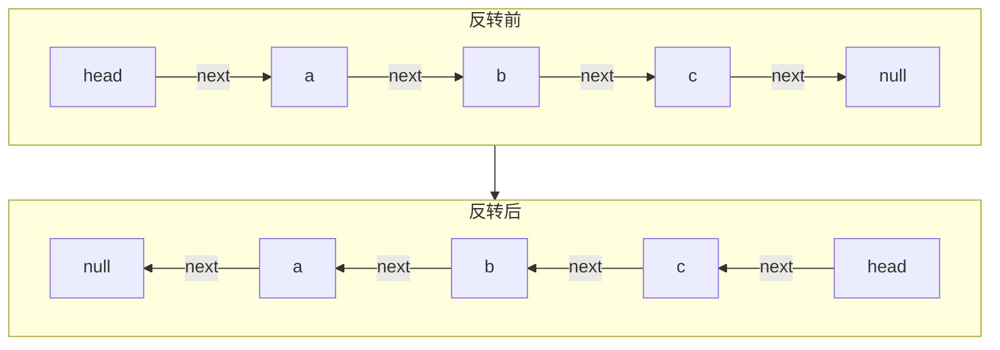
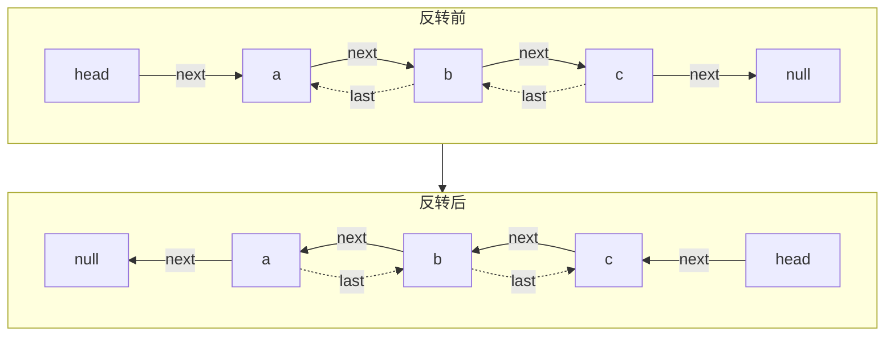
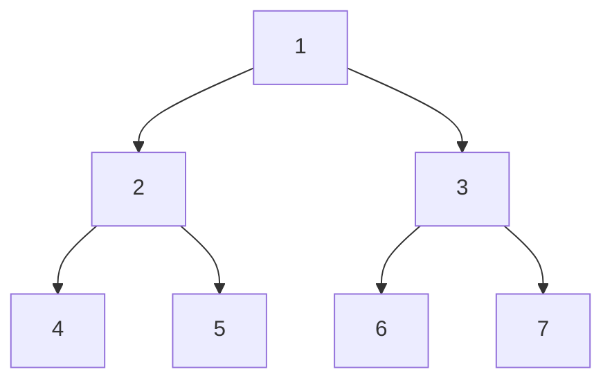

# 算法和数据结构

# 左老师源码地址

[GitHub - algorithmzuo/algorithm-primary: 算法和数据结构新手班](https://github.com/algorithmzuo/algorithm-primary)


# 算法入门

什么是算法，针对一个具体的问题，设计一个解决问题的处理流程，就是算法。同时还要求有评价处理流程的可量化指标。

**分类**

明确知道怎么算的流程。

明确知道怎么尝试的流程。比如，密码算法，虽然不知道密码是哪个，但可以通过算法把它尝试出来。

## 阶乘之和

给定一个参数N，N为大于1的自然数，求1!+2!+3!+......N!的结果。

算法1：

求出1的阶乘结果，在求出2的阶乘结果=1*2，再求出3的阶乘结果=1\*2\*3，以此类推然后再将它们加起来。

算法2：

求出1的阶乘，2的阶乘就是1的阶乘成2，3的阶乘就是2的阶乘乘以3，也就是再求每个阶乘时，可以直接使用上次运算结果，大大提高了效率。

代码如下：

~~~java
/**
 * 给定一个参数N，求1!+2!+3!+......N!的结果<br>
 *
 * @author namelessmyth
 * @version 1.0
 * @date 2023/1/11
 */
public class SumFactorial {

    public static int f1(int n) {
        int result = 0;
        for (int i = 1; i <= n; i++) {
            result += factorial(i);
        }
        return result;
    }

    private static int factorial(int n) {
        int result = 1;
        for (int i = 1; i <= n; i++) {
            result = result * i;
        }
        return result;
    }

    public static int f2(int n) {
        int result = 0;
        int temp = 1;
        for (int i = 1; i <= n; i++) {
            temp = temp * i;
            result = result + temp;
        }
        return result;
    }

    public static void main(String[] args) {
        long start = System.currentTimeMillis();
        System.out.println(f1(200000));
        long end = System.currentTimeMillis();
        System.out.println("f1.time:" + (end - start));

        System.out.println(f2(200000));
        System.out.println("f2.time:" + (System.currentTimeMillis() - end));
    }
}
~~~


# 位运算

## 打印任意整数的32位信息

代码：

```java
public class PrintBin32 {
    public static void print(int num) {
        StringBuffer sb = new StringBuffer();
        for (int i = 31; i >= 0; i--) {
            //从左到右，一位位的检查输入整数每一位上的数是否是1.
            sb.append(((1 << i) & num) == 0 ? "0" : "1");
        }
        System.out.println(sb);
    }

    public static void main(String[] args) {
        print(1);
        print(2);
        print(3);
    }
}

//执行结果
00000000000000000000000000000001
00000000000000000000000000000010
00000000000000000000000000000011
```

思路：

使用左移运算循环生成32个数，这些数每一位上分别是1.

使用与运算以及上面的32个数，检查输入的数每一个位置，是否是1

将结果累加起来。

解释：

在java中，任意一个整型都有32位的二进制信息，而且是有符号的。之所以打印的时候能打印出十进制是因为打印函数做了定制。

将1左移31位的含义。将第0位的1向左移动到31位，1移走之后的位置用0来填补空缺。

00000000000000000000000000000001 向左移31位之后将变成 10000000000000000000000000000000

代码中的循环会生成32个二进制数，每个二进制数据都有一个位置是1，用这个数去和输入的数做与运算。

与运算的含义：1和1与才是1，0和1，0和0与运算的结果都是0。32个位置中只要有1个位置是1和1返回结果就是1。

所以这个写法的意思是：从左到右，一位位的检查输入整数每一位上的数是否是1，然后累加结果。过程如下：

10000000000000000000000000000000与00000000000000000000000000000001的结果是0

01000000000000000000000000000000与00000000000000000000000000000001的结果是0

00100000000000000000000000000000与00000000000000000000000000000001与的结果是0

...... 以此类推：只有最后一次循环和1与的结果会是1

00000000000000000000000000000001和00000000000000000000000000000001与的结果是1

如果入参是1，打印出的结果是00000000000000000000000000000001

如果入参是3，最后的2次循环与运算结果如下：

00000000000000000000000000000010与00000000000000000000000000000011与的结果是1

00000000000000000000000000000001与00000000000000000000000000000011与的结果是1

所以打印结果为：00000000000000000000000000000011

其他复杂的数也是同理。int


## 左移的10进制含义

一个数向左移动x位，10进制中代表这个数乘以了2^x^。即 y << x = y * 2^x^

例如：

1<<2 代表 1* 2^2^ = 4，二进制为：0001 -> 0100

10 << 3 代表 10 * 2^3^ = 80，二进制为：00010000 -> 10000000


## 反码和补码

**原码 ：最高位是符号位，0代表正数，1代表负数，非符号位为该数字绝对值的二进制。**

**反码：正数的反码与原码一致，负数的反码是对原码按位取反，只是最高位（符号位）不变。** 

**补码：正数的补码与原码一致，负数的补码是对原码按位取反加1，符号位不变。**

32位信息，本来可以表示的范围是0~2^32^-1也就是最大值应该是4,294,967,295，但实际却只有一半。

那是因为整型中还有复数，所以第一位用来表示符号，所以实际只占了31位。Integer.MAX_VALUE为：2^31^-1

第一位符号位如果是0，代表这个数为非负数，后面的部分是这个数的值。

第一位符号位如果是1，代表这个数为负数，后面的部分取反+1是这个数的值。

例如：-1的32位表示是：11111111111111111111111111111111

例如：Integer.MIN_VALUE 的32位表示是：10000000000000000000000000000000。如果想知道10进制的数值，

首先去掉符号位是0000000000000000000000000000000，31个0，取反是1111111111111111111111111111111。

然后+1之后是10000000000000000000000000000000，32位数，即31位的位置上是1，用指数表示即：-2^31^


## 为什么负数要取反+1

因为 加减乘除在计算机底层的实现都是位运算，就是与或异或等等。为了实现正数和负数的加减乘除都可以用一套计算逻辑，才这么设计的。如果不取反+1，例如：-1设计成10000000000000000000000000000001，那在进行位运算就得为负数设计几套逻辑了。最终是为了提升计算性能。


## 位运算种类

或：运算符为“|”，有1就是1，没1则是0

且：运算符为“&”，都是1才是1，没有1就是0

异或：运算符为“^”，相同为0，不同为1


## 右移

右移分2种，一种是带符号的" >> "，还有一个种是不带符号的" >>> "。

### 带符号右移

操作符：" >> "，当1移动到右边之后，空位用符号位来补。例如：

10000000000000000000000000000000 >> 1 = 11000000000000000000000000000000

00000000000000000000000000010000 >> 1 = 00000000000000000000000000001000

### 不带符号右移

当1移动到右边之后，空位用0来补。例如：

10000000000000000000000000000000 >>> 1 = 01000000000000000000000000000000

00000000000000000000000000010000 >>> 1 = 00000000000000000000000000001000

从上述案例可以看出，对于正数来说这两者没区别，但是负数就有区别了。


## 取反负数

取反的运算符是"~"，任何一个整数的负数，在位运算中就代表：取反+1

例如：5的二进制是00000000000000000000000000000101，取反之后+1之后是11111111111111111111111111111011，正好是-5

### Integer.MIN_VALUE的负数

Integer.MIN_VALUE的负数是他自己。因为Integer.MIN_VALUE二进制是：10000000000000000000000000000000

取反之后是：01111111111111111111111111111111，再加1就变成自己了。

所以，如果真的要给Integer.MIN_VALUE取反，就应该考虑使用Long

### 0的负数

0的二进制是00000000000000000000000000000000，取反之后全是1，再+1就溢出32位了，所以截掉溢出的部分还是0.


# 排序

## 选择排序

### 思路

假设给定一个数组，长度为N，数组下标范围为0~N-1。首先从0~N-1的范围内找到最小值X，然后将他与0位置的数互换。然后再从1~N-1的范围找到最小值。将它与1位置的数互换，接着再在2~N-1的位置中找到最小值，将它与2位置的数互换，以此类推，整个数组就会从小到大排好序了。

### 代码

~~~java
package com.sjj.mashibing.algorithm.sort;

import java.util.Arrays;

/**
 * 选择排序<br>
 * 假设给定一个数组，长度为N，数组下标范围为0~N-1。首先从0~N-1的范围内找到最小值X，然后将他与0位置的数互换。
 * 然后再从1~N-1的范围找到最小值。将它与1位置的数互换，接着再在2~N-1的位置中找到最小值，将它与2位置的数互换，
 * 以此类推，整个数组就会从小到大排好序了。
 * @author namelessmyth
 * @version 1.0
 * @date 2023/1/12
 */
public class SelectSort {
    private static int[] s1(int[] input) {
        if (input == null || input.length == 0) {
            return input;
        }
        int n = input.length;
        for (int i = 0; i < n; i++) {
            //首先假设i位置就是最小值的位置
            int minIndex = i;
            for (int j = i + 1; j < n; j++) {
                //在i位置之后，如果找到比i位置更小的数，则更新索引，循环完了就知道最小的索引在哪里了。
                if (input[j] < input[minIndex]) {
                    minIndex = j;
                }
            }
            //交换最小值和i位置的值
            int temp = input[i];
            input[i] = input[minIndex];
            input[minIndex] = temp;
        }
        return input;
    }

    public static void main(String[] args) {
        int[] a1 = {4, 11, 65, 3, 215, 67, 231, 45, 1};
        System.out.println(Arrays.toString(s1(a1)));
    }
}
~~~


## 冒泡排序

### 思路

假设给定一个数组，长度为N，数组下标范围为0~N-1。首先从0~N-1的范围内，依次把每个相邻位置更大的数往后交换位置。

例如：给定数组[6, 3, 1, 2, 9, 4]，首先比对0和1位置的6和3，6比3大，则交换位置，

再比对第2和3位置上的6和1，6比1大，则继续交换位置。

以此类推，最大的数会被排到数组的最右面位置（N-1）。可以理解为最大值冒泡出来了。

然后再从0~N-2的范围内再重复上述步骤，接下来N-2位置上就会是第2大的值。

然后再是0~N-3，0~N-4，然后整个数组就从小到大排好序了。

### 代码

~~~java
package com.sjj.mashibing.algorithm.sort;

import java.util.Arrays;

/**
 * 冒泡排序<br>
 * 假设给定一个数组，长度为N，数组下标范围为0~N-1。首先从0~N-1的范围内，依次把每个相邻位置更大的数往后交换位置。
 * 例如：给定数组[6, 3, 1, 2, 9, 4]，首先比对0和1位置的6和3，6比3大，则交换位置，
 * 再比对第2和3位置上的6和1，6比1大，则继续交换位置。
 * 以此类推，最大的数会被排到数组的最右面位置（N-1）。可以理解为最大值冒泡出来了。
 * 然后再从0~N-2的范围内再重复上述步骤，接下来N-2位置上就会是第2大的值。
 * 然后再是0~N-3，0~N-4，然后整个数组就从小到大排好序了。
 *
 * @author namelessmyth
 * @version 1.0
 * @date 2023/1/12
 */
public class BubbleSort {
    private static int[] s1(int[] input) {
        if (input == null || input.length == 0) {
            return input;
        }
        int n = input.length;
        //第一层循环是数组的结束位置不断缩小，开始位置不变。
        for (int end = n - 1; end > 0; end--) {
            //第二层循环从第2个位置开始，不断的比较当前位置是否比前一个位置小，小则交换位置。
            for (int j = 1; j <= end; j++) {
                if (input[j] < input[j - 1]) {
                    swap(input, j - 1, j);
                }
            }
        }
        return input;
    }

    private static void swap(int[] input, int i, int j) {
        int temp = input[i];
        input[i] = input[j];
        input[j] = temp;
    }

    public static void main(String[] args) {
        int[] a1 = {4, 11, 65, 3, 215, 67, 231, 45, 1};
        System.out.println(Arrays.toString(s1(a1)));
    }
}
~~~


## 插入排序

### 说明

将1个数组从左到右（0~0，0~1，0~2 ... 0~N），逐个的扩大排序范围。逐渐将每个范围内的元素都排好序。

也可以理解为将每次扩大排序范围后的新元素插入到已经排好序的范围中。

例如：数组[4, 3, 1, 2, 5, 2, 1]。首先排序范围为0~0，因为只有1个元素，所以默认就是排好序了。

然后排序范围扩大为0~1，索引为1的元素就是新元素，拿他和0位置的元素比较，因为比0位置的4小，所以交换位置。[3, 4, 1, 2, 5, 2, 1]

在比较0~2，此时位置2为新元素，那他和0~1位置的元素依次比较，比1位置的4小所以交换位置数组变成[3, 1, 4, 2, 5, 2, 1]。

再和0位置进行比叫，因为比0位置的3还小，继续交换位置变为[1, 3, 4, 2, 5, 2, 1]。

以此类推，将每个范围都排好序后，一直扩大到0~N-1的范围，此时整个数组就都排好序了。

### 为什么叫插入排序

可以理解为打牌，先将手上拿的牌排好序了，然后每拿一张新牌，新牌都需要根据已经理好的顺序插入到对应位置中。

### 代码

~~~java
package com.sjj.mashibing.algorithm.sort;

import java.util.Arrays;

/**
 * 插入排序<br>
 *
 * @author namelessmyth
 * @version 1.0
 * @date 2023/1/14
 */
public class InsertSort {
    private static int[] s1(int[] input) {
        if (input == null || input.length == 0) {
            return input;
        }
        int n = input.length;
        //0~0, 0~1, 0~2 ... 0~N-1,变量是end
        for (int end = 1; end < n; end++) {
            //不断的扩大排序范围，然后从新元素也就是当前范围最后一个元素开发，不断的和前一个元素比较，如果比前面的小就交换位置
            int index = end;
            while (index >= 1 && input[index] < input[index - 1]) {
                //如果当前位置的值比前一个的值小就交换位置，否则也不用继续循环了，因为前面的范围是排好序的。
                swap(input, index - 1, index);
                index--;
            }
        }
        return input;
    }

    private static int[] s2(int[] input) {
        if (input == null || input.length == 0) {
            return input;
        }
        int n = input.length;
        //0~0, 0~1, 0~2 ... 0~N-1,变量是end
        for (int end = 1; end < n; end++) {
            //不断的扩大排序范围，然后将新元素不断的和前一个元素比较，如果比前面的小就交换位置
            for (int j = end; j >= 1 && input[j] < input[j - 1]; j--) {
                swap(input, j - 1, j);
            }
        }
        return input;
    }

    private static int[] s3(int[] input) {
        if (input == null || input.length == 0) {
            return input;
        }
        int n = input.length;
        for (int end = 1; end < n; end++) {
            //以当前位置和下一个位置的视角重新循环
            for (int pre = end - 1; pre >= 0 && input[pre] > input[pre + 1]; pre--) {
                swap(input, pre, pre + 1);
            }
        }
        return input;
    }

    private static void swap(int[] input, int i, int j) {
        int temp = input[i];
        input[i] = input[j];
        input[j] = temp;
    }

    public static void main(String[] args) {
        int[] a1 = {11, 4, 65, 3, 215, 67, 3, 45, 1};
        System.out.println(Arrays.toString(s1(a1)));
        System.out.println(Arrays.toString(s2(a1)));
        System.out.println(Arrays.toString(s3(a1)));
    }
}
~~~


## 归并排序

时间复杂度：O（N*logN）

### 实现思路-递归

1. 设计递归函数，不断的将要排序的数组拆分成左右各一半，分别将左右2边都排好序。

2. 再将已经排好序的左右2部分进行排序合并。合并时指针分别从左右2边的第一个元素开始，哪边的元素小就放到最终的结果数组中，然后下标往下移动一个。

3. 继续比较剩余的左右两边，哪个元素小，把小的逐个合并到最终的数组中去。然后指针继续移动至下一个。以此类推。
4. 直到最后一定会有一半先排好序。然后再给剩余的没排完序的数组继续排序。
5. 这样最终的结果就是排好序的。


**参考代码**

```java
	public static void mergeSort1(int[] arr) {
        if (arr == null || arr.length < 2) {
            return;
        }
        process(arr, 0, arr.length - 1);
    }

    // arr[L...R]范围上，请让这个范围上的数，有序！
    public static void process(int[] arr, int L, int R) {
        if (L == R) {
            return;
        }
        // int mid = (L + R) / 2
        int mid = L + ((R - L) >> 1);
        process(arr, L, mid);
        process(arr, mid + 1, R);
        merge(arr, L, mid, R);
    }

    public static void merge(int[] arr, int L, int M, int R) {
        int[] help = new int[R - L + 1];
        int i = 0;
        int p1 = L;
        int p2 = M + 1;
        while (p1 <= M && p2 <= R) {
            help[i++] = arr[p1] <= arr[p2] ? arr[p1++] : arr[p2++];
        }
        // 要么p1越界，要么p2越界
        // 不可能出现：共同越界
        while (p1 <= M) {
            help[i++] = arr[p1++];
        }
        while (p2 <= R) {
            help[i++] = arr[p2++];
        }
        for (i = 0; i < help.length; i++) {
            arr[L + i] = help[i];
        }
    }
```


### 实现思路-非递归

1. 首先将数组按照步长1，逐个分组合并排序。例如：数组[9, 5, 3, 1, 4, 2 ,6]可以拆分成[9, 5], [3, 1], [4, 2], [6]。排序结果为：[5, 9], [1, 3], [2, 4], [6]，即：[5, 9, 1, 3, 2, 4 ,6]
2. 再将数组按照步长2，逐个分组合并排序。例如：上例继续拆分成[5, 9, 1, 3], [2, 4 ,6]排序结果为[1, 3, 5, 9], [2, 4, 6]。
3. 综上，不断的扩大步长，直到步长超过数组长度之后，循环停止，此时整个数组已经排好序了。
4. 上例中，步长到4时，整个数组就排好序了[1, 2, 3, 4, 5, 6, 9]。到8时就超出数组长度了。


## 快速排序

**2区域分区-要求**

给定一个数组，要求将按数组的最后一个数重排，小于等于这个数的放左边，大于的放右边。不需要排序。

例如：给定数组[1, 3, 4, 7, 2, 6, 5]，要求按5重排，结果应为：[1, 3, 4, 2, 5, 6, 7]

要求时间复杂度：O（N）

**实现思路**

1. 首先定义一个左区域（小于等于最后数），还没开始前这个区域下标为-1
2. 然后从左到右遍历数组，如果遍历到的这个数小于等于最后的数，则将左区域下标+1，将当前值和左区域的值交换。
3. 如果遍历到的这个数大于 最后的数，则继续遍历数组下一个数。直到数组末尾。

**参考代码**

```java
	public static void swap(int[] input, int i, int j) {
        int temp = input[i];
        input[i] = input[j];
        input[j] = temp;
    }

    public static void sort(int[] arr) {
        if (arr != null) {
            int length = arr.length;
            int left = -1;
            int i = 0;
            while (i < length) {
                if (arr[i] <= arr[length - 1]) {
                    swap(arr, ++left, i);
                    i++;
                } else {
                    i++;
                }
            }
        }
    }

    public static void main(String[] args) {
        int[] arr = {7, 1, 3, 5, 4, 5, 1, 3};
        sort(arr);
        System.out.println(Arrays.toString(arr));
    }
```


**2区域分区-要求**

在上题的基础上，在增加一个等于的区域，要求小于的放左边，等于的放中间，大于的的放右边。

例如：给定数组[1, 3, 4, 7, 2, 6, 5, 3, 2, 3]，应该返回[1, 2, 2, 3, 3, 3, 4, 6, 7, 5]。

**解题思路**

1. 首先定义2个区域，左区域（小于最后数，初始下标-1），右区域（大于最后数，初始下标 length - 1）
2. 从左到右遍历数组，如果当前这个数小于最后的数，则将左区域右移1位，将当前值和左区域的值交换。
3. 如果当前这个数等于最后一个数，则继续遍历下一个数。
4. 如果当前这个值大于最后数，则右区域左移。交换当前值和右区域位置上的值。
5. 交换之后，不能处理下一个，继续下一次遍历，还要继续比对。
6. 直到当前处理的数和右区域撞上，终止遍历，将最后数和右区域第一个数交换。

**参考代码**

```java
    public static void sort2(int[] arr) {
        if (arr != null) {
            int length = arr.length;
            int left = -1;
            int right = length - 1;
            int i = 0;
            while (i < right) {
                if (arr[i] < arr[length - 1]) {
                    swap(arr, ++left, i++);
                } else if (arr[i] > arr[length - 1]) {
                    swap(arr, --right, i);
                } else {
                    i++;
                }
            }
            swap(arr, length - 1, right);
        }
    }
```


**快速排序-要求**

在上题的基础上，目前数组已经分成了3个区域，但除了相等的那个区其他2个区域并未有排序，现在要求实现真正的快速排序。

例如：给定数组[1, 3, 4, 7, 2, 6, 5, 3, 2, 3]，应该返回[1, 2, 2, 3, 3, 3, 4, 5, 6, 7]。

**解题思路**

1. 接着上题的思路，首先将数组分好3个区域。小于，等于，大于。
2. 对于大于和小于的，可以继续在区域内递归执行本方法，按照最后一个数分区。
3. 这样最终的结果就不仅仅分区而且还排好了次序。

**参考代码**

```java
	public static void quickSort1(int[] arr) {
        if (arr == null || arr.length < 2) {
            return;
        }
        process(arr, 0, arr.length - 1);
    }

    public static void process(int[] arr, int L, int R) {
        if (L >= R) {
            return;
        }
        //首先对当前数组进行分区，分出小于，等于，大于，3个区
        int[] equalE = partition(arr, L, R);
        process(arr, L, equalE[0] - 1);//处理左区域，小于
        process(arr, equalE[1] + 1, R);//处理右区域，大于
    }

    /**
     * 从L到R指定范围分区。
     * 返回相等区域的左边界和右边界
     */
    public static int[] partition(int[] arr, int L, int R) {
        int left = L - 1;//左区域下标，从左边界前面1位开始
        int right = R;//右区域下标，从右边界最后1位开始
        int i = L;//循环遍历下标
        while (i < right) {
            if (arr[i] < arr[R]) {
                swap(arr, ++left, i++);
            } else if (arr[i] > arr[R]) {
                swap(arr, --right, i);
            } else {
                i++;
            }
        }
        //循环完了之后，交换右边界最左侧和最后一位数
        swap(arr, right, R);
        return new int[] { left + 1, right };
    }
```


**快速排序-非递归**

上面的解题方法用的是递归，要求使用非递归方式实现快速排序。

**解题思路**

1. 设计一个任务类，内部包含左边界和右边界。
2. 将入参作为第一个任务放入栈中，只要栈中有任务就不断取出并执行上面的process方法。
3. 如果process方法返回了等于的区域的参数，就得到左区域和右区域，分别构造新的子任务放入栈中。
4. 循环处理栈中的所有任务，直到栈中没有任务可处理为止。

**参考代码**

```java
	public static void quickSort1(int[] arr) {
        if (arr == null || arr.length < 2) {
            return;
        }
        process(arr, 0, arr.length - 1);
    }

    public static void process(int[] arr, int L, int R) {
        if (L >= R) {
            return;
        }
        //首先对当前数组进行分区，分出小于，等于，大于，3个区
        int[] equalE = partition(arr, L, R);
        process(arr, L, equalE[0] - 1);//处理左区域，小于
        process(arr, equalE[1] + 1, R);//处理右区域，大于
    }

    /**
     * 从L到R指定范围分区。
     * 返回相等区域的左边界和右边界
     */
    public static int[] partition(int[] arr, int L, int R) {
        int left = L - 1;//左区域下标，从左边界前面1位开始
        int right = R;//右区域下标，从右边界最后1位开始
        int i = L;//循环遍历下标
        while (i < right) {
            if (arr[i] < arr[R]) {
                swap(arr, ++left, i++);
            } else if (arr[i] > arr[R]) {
                swap(arr, --right, i);
            } else {
                i++;
            }
        }
        //循环完了之后，交换右边界最左侧和最后一位数
        swap(arr, right, R);
        return new int[] { left + 1, right };
    }
```


# Java的Math.random()

这个函数的作用时在0到1的范围内（不包含1）等概率的随机生成一个小数double。在数学上是做不到等概率的，因为这里面的小数范围是无穷无尽的没有范围的。但计算机的浮点数他是有精度的，所以能做到。

检查Math.random()函数的结果是否是等概率的代码

## 将生成概率调整成X^2^

由上可知，Math.random()函数生成0.3的范围内的概率是30%，生成0.5范围的概率是50%。也就是说生成[0, X)的概率约等于X，那是否可以将这个概率调整成X^2^呢？

答案就是Math.max(Math.random(), Math.random())

解析：由于使用了max函数，这2个数只要有1个比x大，就会返回大的那个。所以要保证2个都在[0~X)的范围内，必须2个数都满足。

### 使用Math.min()的概率

如果用了min函数在[0~X)的范围内的概率是多少？即：Math.min(Math.random(), Math.random())

答：只要2个数其中有一个在x的范围，最终结果就是符合要求的。所以直接算不好算，我们可以先算出来2个都不在[0\~X)的范围内的概率，然后用1减就是想要的结果了。1个数不在[0~X)的范围内的概率是1-X，2个就是(1-X)^2^，最终结果就是：1-(1-X)^2^

代码验证

~~~java
/**
 * 将0~x的概率调整为X的次方<br>
 *
 * @author namelessmyth
 * @version 1.0
 * @date 2023/1/16
 */
public class RandonPower {
    /**
     * 将随机数的出现概率调整为平方
     *
     * @return
     */
    public static double x2() {
        //由于是最大值，必须要求2个随机数结果都小于x，整体结果才能小于x。否则只有有一个数比x大。他就返回大的那个数。
        return Math.max(Math.random(), Math.random());
    }

    /**
     * 如果是min，概率会是什么？
     *
     * @return
     */
    public static double x2Min() {
        //取最小值时，只要有一个数小于x，他就会返回x。所以直接算不好算，我们可以先算2个数都小于X的概率，然后用1-就是最终结果。
        //一个数不在x的概率是(1-x)，2个就是(1-x)的平方。所以最终结果就是1-(1-x)的平方
        return Math.min(Math.random(), Math.random());
    }

    public static void main(String[] args) {
        int total = 1000000;
        int count = 0;
        int countMin = 0;
        double x = 0.3;
        for (int i = 0; i < total; i++) {
            if (x2() < x) {
                count++;
            }
            if (x2Min() < x) {
                countMin++;
            }
        }
        System.out.println(Math.pow(x, 2) + ",实际小于X的概率：" + ((double) count / (double) total));
        System.out.println(1 - Math.pow(1 - x, 2) + ",用最小函数小于X的概率：" + ((double) countMin / (double) total));
    }
}
~~~


## 从1-5随机到1-7随机

**题意解析**

假设现在有一个随机函数f5()，它可以实现1-5之间等概率返回任意的一个整数。需要根据这个函数返回1-7之间的随机数。

要求：不能直接使用Math.random()方法。不能修改f5的代码。

**解题思路**

1. 首先，我们可以将f5改成等概率返回0和1。

   1. 按照题意，f5函数可能返回{1, 2, 3, 4, 5}中的任意一个数，返回他们的概率都是20%。那1和2的概率就是40%，4和5也是40%。

   2. 然后我们可以将1和2改成0，4和5改成1，遇到3就重做。这样就可以将f5函数改成等概率返回0和1。

   3. ```mermaid
      flowchart LR
      f5-->1
      f5-->2
      f5-->3
      f5-->4
      f5-->5
      
      1-->0
      2-->0
      3-->redo
      4-->11[1]
      5-->11[1]
      ```

   4. 参考代码

   5. ```java
      /**
       * 将f5函数调整成等概率返回0和1
       */
      public static int f7_01() {
          int res = 0;
          do {
              res = f5();
              //等于3重做
          } while (res == 3);
          //1,2改成0，3，5改成1
          return res < 3 ? 0 : 1;
      }
      ```

2. 接着，将函数改成等概率返回0到7中的任意数。

   1. 使用二机制思考，0-7即000，001，010，011，100，101，110，111。最大3位。

   2. 3位中每一位的0和1如果都是等概率，那整个数必然是等概率。

   3. 所以只要调用之前的函数3次，然后加起来，就能等概率得到0到7中的任意数

   4. 参考代码

   5. ```java
          public static int f7_02() {
              int res = 0;
              do {
                  //一共3位，每一位都是等概率，所以加起来就是等概率返回[0-7]
                  res = (f7_01() << 2) + (f7_01() << 1) + (f7_01() << 0);
                  //遇到0就重新计算
              } while (res == 7);
              return res;
          }
      ```

3. 然后，如果遇到7就重做，那就是等概率返回0-6，最后+1就是1-7

   1. 参考代码

   2. ```java
          public static int f7() {
              return f7_02() + 1;
          }
      ```

4. 

**完整代码**

```java
public class Randon15To17 {
    /**
     * Math.random() 是[0-1)的随机，不包括1 <br>
     * (int) (Math.random() * 5)是0-4的随机，+1就是1-5的随机
     *
     * @return 1-5的随机整数
     */
    public static int f5() {
        return (int) (Math.random() * 5) + 1;
    }

    public static int f7() {
        return f7_02() + 1;
    }

    /**
     * 将f5函数调整成等概率返回0和1
     */
    public static int f7_01() {
        int res = 0;
        do {
            res = f5();
            //等于3重做
        } while (res == 3);
        //1,2改成0，3，5改成1
        return res < 3 ? 0 : 1;
    }

    public static int f7_02() {
        int res = 0;
        do {
            //一共3位，每一位都是等概率，所以加起来就是等概率返回[0-7]
            res = (f7_01() << 2) + (f7_01() << 1) + (f7_01() << 0);
            //遇到0就重新计算
        } while (res == 7);
        return res;
    }

    public static int f7Math() {
        return (int) (Math.random() * 7) + 1;
    }

    public static void main(String[] args) {
        int total = 100000;
        //使用数组位数来统计1-5中每个数的生成概率
        int[] count5 = {0, 0, 0, 0, 0};
        int[] count7 = {0, 0, 0, 0, 0, 0, 0};
        int[] count7m = {0, 0, 0, 0, 0, 0, 0};
        for (int i = 0; i < total; i++) {
            count5[f5() - 1]++;
            count7[f7() - 1]++;
            count7m[f7Math() - 1]++;
        }
        System.out.println(total + "的总次数中，1-5每个数的生成次数：" + Arrays.toString(count5));
        System.out.println(total + "的总次数中，1-7每个数的生成次数：" + Arrays.toString(count7));
        System.out.println(total + "的总次数中，1-7每个数的生成次数：" + Arrays.toString(count7m));
    }
}
```


## 从3-19到17-56随机

**解决思路**

这道题跟上面的那道题是同类型的。首先先把返回3-19的函数封装成等概率返回0-1。[3-10]和[12-19]去掉11。

再写一个等概率返回[0-39]的函数，返回结果加上17就是[17-56]。

39的二机制是10 0111，需要6个二机制位。6个二进制位最大是63，如果大于39就重算。

## 遇到偶数怎么办

遇到偶数其实比单数更简单，都不需要排除中间那个数了，例如[1-8]，[1-4]和[5-8]本身就是等概率的。


## 从a-b到c-d随机

**解决思路**

这道题跟上面的也是同类型的。在Java中a和b，是可以转换成整型的。


## 从01不等概率到01等概率

**题意解析**

假设现在有一个函数f()能以固定概率p（不等概率）返回01的随机数，根据这个函数返回01等概率的随机数。不能修改f()的代码。

**解决思路**

假设0的概率是p，那1的概率就是1-p。只考虑1位这道题无法解，那就考虑2位二机制。

00概率是p^2^，11的概率就是(1-p)^2^，01和10的概率都是p*(1-p)

所以可以生成2位，过滤掉00和11，剩下的就是等概率。

**参考代码**

```java
/**
 * 从01不等概率到01等概率<br>
 *
 * @author namelessmyth
 * @version 1.0
 * @date 2023/1/24
 */
public class Randon01 {
    /**
     * 已知函数，回忆固定概率返回0和1之间的随机数。例如：84%
     */
    public static int x() {
        return Math.random() < 0.33 ? 0 : 1;
    }

    /**
     * 将x()函数转换成固定概率返回0和1
     */
    public static int y() {
        int res = 0;
        do {
            res = x();
        } while (res == x());
        //这里f函数至少执行2次。只有01，10会返回，11和00都不会返回。
        return res;
    }

    public static void main(String[] args) {
        int total = 100000;
        int[] count1 = {0, 0};
        int[] count2 = {0, 0};
        for (int i = 0; i < total; i++) {
            count1[x()]++;
            count2[y()]++;
        }
        System.out.println(total + "的总次数中，0，1每个数的生成次数：" + Arrays.toString(count1));
        System.out.println(total + "的总次数中，0，1每个数的生成次数：" + Arrays.toString(count2));
    }
}
```


## 对数器

对数器就是自己生成数据样本做比对的机器（或者说程序）。生成数据样本可以是随机也可以是暴力方式。总体目的还是控制程序bug，不依赖线上测试。

参考代码

```java
/**
 * 对数器-排序<br>
 * @author namelessmyth
 * @version 1.0
 * @date 2023/1/27
 */
public class SortLogar {
    /**
     * 按要求生成数组
     * @param maxLen 数组长度最大值
     * @param maxValue 数组元素最大值
     * @return
     */
    public static int[] lenRandomValueRandom(int maxLen, int maxValue) {
        int len = (int) (Math.random() * maxLen);
        int[] ans = new int[len];
        for (int i = 0; i < len; i++) {
            ans[i] = (int) (Math.random() * maxValue);
        }
        return ans;
    }

    /**
     * 数组复制方法
     */
    public static int[] copyArray(int[] arr) {
        int[] ans = new int[arr.length];
        for (int i = 0; i < arr.length; i++) {
            ans[i] = arr[i];
        }
        return ans;
    }

    // 检查数组是否排序成功，arr1和arr2一定等长
    public static boolean isSorted(int[] arr) {
        if (arr.length < 2) {
            return true;
        }
        int max = arr[0];
        for (int i = 1; i < arr.length; i++) {
            if (max > arr[i]) {
                return false;
            }
            max = Math.max(max, arr[i]);
        }
        return true;
    }

    public static void main(String[] args) {
        int maxLen = 5;
        int maxValue = 1000;
        int testTime = 10000;
        for (int i = 0; i < testTime; i++) {
            int[] arr1 = lenRandomValueRandom(maxLen, maxValue);
            //排序之前备份原始数组
            int[] tmp = copyArray(arr1);
            //执行选择排序
            SelectSort.s1(arr1);
            if (!isSorted(arr1)) {
                //如果出现问题，将错误数据比对并打印出来
                for (int j = 0; j < tmp.length; j++) {
                    System.out.print(tmp[j] + " ");
                }
                System.out.println("选择排序错了！");
                break;
            }
        }
    }
}
```


# 查找

## 二分法查找

### 在有序数组中找到指定的数

**介绍**

给定一个有序数组和一个要找的数，例如：{1, 2, 2, 3, 5, 7, 8, 9, 21, 3}，快速找到这个数是否在数组中存在或存在的位置。

例如：给5，应该返回true或者返回位置：4

例如：给10，应该返回false或者返回位置：-1

**思路**

首先找到数组中间位置的数，如果这个数比要找的数大，则继续在左边范围中查找。如果这个数比要找的数小，则继续在右边范围中查找。如果相等那就代表已找到直接返回。然后用同样的方式继续在缩小的范围中找。如果这个范围缩小到只有1个数还是和要找的数不相等。则代表要找的数在数组中不存在。

**代码**

~~~java
public class Dichotomy {
    public static int find(int[] input, int num) {
        int index = -1;
        if (input == null || input.length == 0) {
            return index;
        }
        //左边界
        int L = 0;
        //右边界
        int R = input.length - 1;
        while (L <= R) {
            int mid = (L + R) / 2;
            if (input[mid] == num) {
                return mid;
            } else if (input[mid] < num) {
                //如果要找的数比中间位置的数大，则缩小左边界
                L = mid + 1;
            } else {
                //如果要找的数比中间位置的数小，则缩小右边界
                R = mid - 1;
            }
        }
        return index;
    }

    public static void main(String[] args) {
        int[] input = {1, 2, 2, 5, 7, 8, 9, 21, 3};
        System.out.println(Arrays.toString(BubbleSort.sort(input)));
        System.out.println(find(input, 3));
        System.out.println(find(input, 4));
    }
}
~~~


### 在有序数组中找到>=num最左的位置

**介绍**

给定一个有序数组和一个要找的数num，找到数组中>=num最左边的位置。

例如：{1, 2, 2, 2, 5, 5, 9, 11, 21}，要找的数是2，则应当返回1；

例如：{1, 2, 2, 2, 5, 5, 9, 11, 21}，要找的数是9，则应当返回6；

**思路**

首先找到数组中间位置的数，如果这个数大于等于num，则记录这个数的索引，继续在左边范围中查找。如果这个数比要找的数小，则继续在右边范围中查找。然后用同样的方式继续在缩小的范围中找。满足条件则更新索引位置，直至s查找范围缩小到1个数。如果索引位置大于0，则直接返回这个位置。如果索引位置一直是-1，则代表数组中不存在<=num的位置。


### 在有序数组中找到<=num最右的位置

**介绍**

给定一个有序数组和一个要找的数num，找到数组中<=num最右边的位置。

例如：{1, 2, 2, 2, 5, 5, 9, 11, 21}，要找的数是2，则应当返回3；

例如：{1, 2, 2, 2, 5, 5, 9, 11, 21}，要找的数是9，则应当返回6；

**思路**

首先找到数组中间位置的数，如果这个数小于等于num，则记录这个数的索引，继续在左边范围中查找。如果这个数比要找的数小，则继续在右边范围中查找。然后用同样的方式继续在缩小的范围中找。满足条件则更新索引位置，直至s查找范围缩小到1个数。如果索引位置大于0，则直接返回这个位置。如果索引位置一直是-1，则代表数组中不存在<=num的位置。


## 局部最小值

**介绍**

给定一个无序数组，任意2个相邻位置的数不想等（不相邻的位置可能相等，例如：5，4，5）。如果数组内部有一个数，他既比左边的数小又比右边的数小，则返回任意一个这样的数的位置。如果是最左边数小于右边，则返回0。如果是最右边的数小于左边，则返回数组长度-1.

例如：{1, 2, 6, 3, 9, 6, 9, 7, 12}中，1，3，6，7都可以算是局部最小值，返回任意一个数的位置即可；

例如：{1, 2, 3, 2, 5, 11, 2, 21, 1}中，1，2，3，1都可以算是局部最小值，返回任意一个数的位置即可；

**思路**

首先找数组最左[0]和最右[N-1]，如果任意一边数比相邻的数小，则直接返回。但如果都不符合要求，那就是arr[0] > arr[1]，arr[N-2]<arr[N-1]的情况，两边都呈现下降趋势，所以可以断言数组内部一定会存在最小值。

接着找到数组中间位置arr[mid]。如果2边都比自己大则直接返回这个中间位置。如果2边有任意一边比这个中间位置大。则意味着这个范围内一定会存在最小值，要求是返回任意一个，所以可以直接砍掉另一半，在剩余的范围中继续找中间位置。以此类推，如果找到则直接返回位置。

**代码**

```java
**
 * 局部最小值<br>
 *
 * @author namelessmyth
 * @version 1.0
 * @date 2023/2/1
 */
public class LocalMinimum {
    public static int find(int[] input) {
        int index = -1;
        if (input == null || input.length == 0) {
            return index;
        }
        int length = input.length;
        if (length == 1) {
            return 0;
        } else if (input[0] < input[1]) {
            //最左就是最小值的情况
            return 0;
        } else if (input[length - 2] > input[length - 1]) {
            //最右就是最小值的情况
            return length - 1;
        }
        //排除了上面的情况后，下面数组长度一定至少3个，用二分法查找剩余范围内的局部最小值。
        int L = 1;
        int R = length - 2;
        while (L <= R) {
            int mid = (L + R) / 2;
            if (input[mid - 1] > input[mid] && input[mid] < input[mid + 1]) {
                index = mid;
                break;
            } else {
                //如果左边的值比中间值小，则去掉右半边。
                if (input[mid - 1] < input[mid]) {
                    R = mid - 1;
                } else {
                    L = mid + 1;
                }
            }
        }
        return index;
    }

    public static int[] randomArray(int lengthMax, int valueMax) {
        int length = (int) Math.random() * lengthMax;
        int[] arr = new int[length];
        if (length > 0) {
            arr[0] = (int) Math.random() * valueMax;
            for (int i = 1; i < length; i++) {
                do {
                    arr[i] = (int) Math.random() * valueMax;
                } while (arr[i] != arr[i - 1]);
            }
        }
        return arr;
    }

    /**
     * 检查结果的2边数值是否真的比自己大，大的话就是局部最小值。否则就不是。
     */
    public static boolean check(int[] arr, int minIndex) {
        if (arr.length == 0) {
            return minIndex == -1;
        }
        int left = minIndex - 1;
        int right = minIndex + 1;
        boolean leftBigger = left >= 0 ? arr[left] > arr[minIndex] : true;
        boolean rightBigger = right < arr.length ? arr[right] > arr[minIndex] : true;
        return leftBigger && rightBigger;
    }

    public static void printArray(int[] arr) {
        for (int num : arr) {
            System.out.print(num + " ");
        }
        System.out.println();
    }

    public static void main(String[] args) {
        System.out.println(find(new int[]{3, 2, 3, 2, 3}));
        System.out.println("对数器测试开始");
        int maxLen = 100;
        int maxValue = 400;
        int testTime = 1000000;
        for (int i = 0; i < testTime; i++) {
            int[] arr = randomArray(maxLen, maxValue);
            int ans = find(arr);
            if (!check(arr, ans)) {
                printArray(arr);
                System.out.println(ans);
                break;
            }
        }
        System.out.println("对数器测试结束");
    }
}
```


# 时间复杂度

时间复杂度是一个用来描述到底发生了几次常数操作的指标。接下来解释一下常数操作：


## 常数操作

如果某个操作和数据量没有关系，是固定时间的，这种操作就是常数操作。

整型的加减乘除，都是常数操作。例如：1+1，100万+100万，因为他们经历的过程是一样的，时间也是一样的。

在数组里面查找任意位数的数值也是常数操作。例如：有个数组长度是3亿，那找到第3个位置和第3000万个位置，时间是一样的。


## 时间复杂度

如果一个方法，随着这个方法要处理的数据增大处理时间也会增大，那就不是常数操作，这时候就会有时间复杂度了。

那冒泡排序举例，假如数组长度为5，元素下标为[0, 1, 2, 3, 4]。首先比较0~4的每个元素，再比较0~3之间的每个元素。。。

每次比较中，例如：0和1比大小，1和2比大小就是常数操作，因为时间是一样的。

第1轮要比较5次，第2轮要比较4次，第3轮要比较3次，以此类推。

假设数组长度为n，就要比较n-1, n-2, n-3, 直到1，求总次数可以用等差数列求和公式。

公式如下，其中a1是常数，d是公差（上例中就是1）
$$
S_n=na_1+\frac{n(n-1)}{2}*d,n \epsilon N^*
$$
将d=1代入到上面的公式，并最终拆分为如下公式：
$$
\frac{n^2}{2}-(\frac{1}{2}-a_1)n
$$
时间复杂度取公式里面的最高阶，所以这里面最高阶是n^2^所以冒泡排序的时间复杂度为O(n^2^)

**为什么时间复杂度只考虑最高阶？**

当n趋向于无穷大时，常数对这个表达式的影响可以忽略不计。

选择排序的复杂度：O(n^2^)，和冒泡排序类似。

二分法的复杂度：O(log~2~N)。因为二分法每次都会减半，如果数组长度是16那就是查4次，如果是64那就是查6次。

常数操作复杂度：O(1)。因为他和数据量无关。


**常见时间复杂度**

O(1) < O(log~2~N) < O(N) < O(N*log~2~N) < O(N^2^) < O(N^3^) < O(N^k^)) < O(2^n^) < O(3^n^) < O(k^n^) < O(N!)


# 数据结构

## 基本数据结构

按大类分，就2种，1.连续结构，2.跳转结构。

**连续结构**

例如：数组。数组中每个元素再内存中基本都是连续的。当数组长度很大时，例如：100亿，计算机可能会分配出好几个100万，1000万的连续区域，然后让他们首尾相连，这样寻址基本还是比较快的。

**跳转结构**

例如：链表。链表中每个元素都记录这下一个元素的引用地址，他们再内存中并不连续。还有二叉树，它每个元素都记录着下2个元素的引用地址。虽然我们可以把他想象成一个二叉树形形状，但实际他的每个元素在内存中并不连续。

**作用**

1）数据结构是存储、组织数据的方式

2）精心选择的数据结构可以带来更高的运行或者存储效率

3）数据结构是很多算法得以进行的载体


## 最基本数据结构

### 数组

便于寻址，不便于增删数据

### 链表

便于增删数据，不便于寻址


## 求数组指定范围内值的和

给定数组arr，范围左边界L，右边界R，求sum(arr, L, R)

常规办法时，每次统计的时候，都去数组中找到L到R之间的所有元素，然后将他们的值累加起来。

如果查询次数达到记几亿次有没有更好的办法？

### 建立预处理结果

给数组arr，提前建立一张正方形的表格，每个单元格中将所有可能范围值的和，然后每次统计从这个表格中直接获取。

例如：数组arr={3, 4, 2, 1, 6, 7, 8}，长度为7，我们建立一张7*7的表格如下：

第1行：0~0放0位置值的和，0~1放，0到1位置值的和......依次类推，0~N放0到N位置值得和

第2行：1~0左边界大于有边界，所以无效，1到1位置值的和为4......依次类推，1~N放1到N位置值得和

第N行：以此类推，此表格内将存放arr中将所有可能范围值的和

|      | 0    | 1    | 2    | 3    | 4    | 5    | 6    |
| ---- | ---- | ---- | ---- | ---- | ---- | ---- | ---- |
| 0    | 3    | 7    | 9    | 10   | 16   | 23   | 31   |
| 1    | X    | 4    | 6    | ...  | ...  | ...  | ...  |
| 2    | X    | X    | 2    | 3    | 9    | 16   | 24   |
| 3    | X    | X    | X    | 1    | ...  | ...  | ...  |
| 4    | X    | X    | X    | X    | 6    | ...  | ...  |
| 5    | X    | X    | X    | X    | X    | 7    | ...  |
| 6    | X    | X    | X    | X    | X    | X    | 8    |

但这个方案也有缺点，就是生成这个预处理结构本身就要占用资源（空间和时间）。数组长度越大，资源占用越长。是否有其他方案呢？

### 建立预处理前缀和

给数组arr，提前建立一个help数组，存放0到任意位置值得和。相当于上例中表格的第一行。这个数组的生成过程要比预处理结构简单很多。然后help[R] - help[L-1]就等于要求的结果。

例如：数组arr={3, 4, 2, 1, 6, 7, 8}，长度为7，我们建立help数组{3, 7, 9, 10, 16, 23, 31}
如果要求sum(arr, 2, 6)就只要help[6] - help[1] = 31 - 7 = 24 

这种方式虽然降低了预处理结构生成的资源开销，但是每次还是要做相减的，如果查询数量巨大无比，数组长度又相对较小时，时没有第一种方案好的。所以要评估到底采用哪种方案时，最好考虑预设的场景。


## 动态数组

 Java中有一个类ArrayList，当内部的固定数组长度不够时，可以动态改变数组大小来放入新的值。

### 扩容的时间复杂度

时间复杂度为：O(1)例如：数组长度初始为1，如果要加入100个数，他的扩容如下：

添加第1个数，不需要扩容，

添加第2个数，扩容为2，并把第一个数添加进去。

添加第3个数，扩容为4，并把前面2个数添加进去。

添加第4个数，不需要扩容。

添加第5个数，扩容为8。

所以总数就是1，2，4，8，16，是一个等比数量，时间复杂度为O(n)

均摊到每一个数上，时间复杂度约等于常数，所以ArrayList和固定数组在时间复杂度上的差距不大。


## 哈希表：HashMap

不管哈希表有多少条数据，从哈希表内部增删改查的时间复杂度都是O(1)，这是这个常数时间要比加减乘除大的多。

基础类型的数据，在哈希表内部是按值存储的。例如：Integer，Double，String等

对象类型，或者自定义类型，是按引用存储的。

参考代码：

```java
HashMap<Integer, String> map2 = new HashMap<>();
map2.put(1234567, "我是1234567");

Integer a = 1234567;
Integer b = 1234567;

System.out.println(a == b);
System.out.println(map2.containsKey(a));//结果true
System.out.println(map2.containsKey(b));//结果true

Node node1 = new Node(1);
Node node2 = new Node(1);
HashMap<Node, String> map3 = new HashMap<>();
map3.put(node1, "我进来了！");
System.out.println(map3.containsKey(node1));//结果true
System.out.println(map3.containsKey(node2));//结果false

HashMap<String, String> map4 = new HashMap<>();
String s1 = "金庸小说-神雕侠侣";//假设大小为27字节
String s2 = "小说正文。。。";//假设大小为5M
map4.put(s1, s2);//在HashMap的占用空间大约为：27字节+5M

HashMap<String, String> map5 = new HashMap<>();
Node node1 = new Node(1);//假设大小为27字节
Node node2 = new Node(2);//假设大小为5M
map4.put(s1, s2);//在HashMap的占用空间大约为：8字节+8字节=16字节，因为存的是引用地址
```

tip：如果重写hashCode()方法就能改变上面的情况了。


## 有序表：TreeMap

很多地方和HashMap相同，但是也有一些优点：

放到TreeMap中的数据会自动按key排序。看下面的案例

~~~java
TreeMap<Integer, String> treeMap1 = new TreeMap<>();

treeMap1.put(3, "我是3");
treeMap1.put(0, "我是3");
treeMap1.put(7, "我是3");
treeMap1.put(2, "我是3");
treeMap1.put(5, "我是3");
treeMap1.put(9, "我是3");
// 返回第一个值：0
System.out.println(treeMap1.firstKey());
// 返回最后一个值：9
System.out.println(treeMap1.lastKey());
// <=5 离5最近的key
System.out.println(treeMap1.floorKey(5));
// >=5 离5最近的key告诉我
System.out.println(treeMap1.ceilingKey(5));

~~~

缺点

TreeMap中增删改查的时间复杂度要比HashMap稍高，为O(log~2~N)

如果要用自定义类型作为Key，那必须要实现Comparable接口

~~~java
Node node3 = new Node(3);
Node node4 = new Node(4);
TreeMap<Node, String> treeMap2 = new TreeMap<>();
//如下代码执行会报异常ClassCastException：cannot be cast to java.lang.Comparable
treeMap2.put(node3, "我是node3");
treeMap2.put(node4, "我是node4");
~~~


## 链表

### 单双链表介绍

链表内部有很多节点Node，这个Node存着当前节点的值，还有下一个Node的内存引用next。

双链表就是比单链表多一个上一个节点的引用last。


### 单链表反转

什么是反转？反转就是将链表内部引用方向全部逆过来。

例如：单链表原先的顺序如果是，Head→a→b→c→d→null，反转之后就应该是Head→d→c→b→a→null



注意：这里的head指向不要忘记指向新首节点d，如果还指向a，那d，c，b就会被内存回收掉。


参考代码：

~~~java
public class ReverseList {
    public static class Node {
        public int value;
        public Node next;

        public Node(int data) {
            value = data;
        }
    }

    public static Node reverseLinkedList(Node head) {
        Node pre = null;
        Node next = null;
        while (head != null) {
            //1：暂存下节点（2节点）。2：暂存3节点。3.暂存null
            next = head.next;
            //1：将1指向null；2：将2指向1；将3指向2。
            head.next = pre;
            //1：pre指向1节点。2：pre指向2节点。3：pre指向3节点
            pre = head;
            //1：将head指向2节点。2：head指向3节点。3：head指向null，结束循环
            head = next;
        }
        //此时pre指向3节点
        return pre;
    }

    // for test
    public static Node generateRandomLinkedList(int len, int value) {
        int size = (int) (Math.random() * (len + 1));
        if (size == 0) {
            return null;
        }
        size--;
        Node head = new Node((int) (Math.random() * (value + 1)));
        Node pre = head;
        while (size != 0) {
            Node cur = new Node((int) (Math.random() * (value + 1)));
            pre.next = cur;
            pre = cur;
            size--;
        }
        return head;
    }

    // for test
    public static List<Integer> getLinkedListOriginOrder(Node head) {
        List<Integer> ans = new ArrayList<>();
        while (head != null) {
            ans.add(head.value);
            head = head.next;
        }
        return ans;
    }

    // for test
    public static boolean checkLinkedListReverse(List<Integer> origin, Node head) {
        for (int i = origin.size() - 1; i >= 0; i--) {
            if (!origin.get(i).equals(head.value)) {
                return false;
            }
            head = head.next;
        }
        return true;
    }

    // for test
    public static void main(String[] args) {
        int len = 50;
        int value = 100;
        int testTime = 100000;
        System.out.println("test begin!");
        for (int i = 0; i < testTime; i++) {
            Node node1 = generateRandomLinkedList(len, value);
            List<Integer> list1 = getLinkedListOriginOrder(node1);
            node1 = reverseLinkedList(node1);
            if (!checkLinkedListReverse(list1, node1)) {
                System.out.println("Oops1!");
            }
        }
        System.out.println("test finish!");
    }
}
~~~


### 双链表反转

双链表就是每个node比单链表多一个指向上一个节点的last引用，反转的时候要改变next和last2个引用的方向。如下图所示：



代码

```java
/**
     * 双链表反转
     * @param head 链表头引用
     */
    public static DoubleNode reverseDoubleList(DoubleNode head) {
        DoubleNode pre = null;
        DoubleNode next = null;
        while (head != null) {
            //1：暂存a的下节点b；2：暂存c节点；3.暂存null
            next = head.next;
            //1：将a下节点指向null；2：将b的下节点指向a；3：将c指向b。
            head.next = pre;
            //1：将a上节点指向b；2：将b指向c；3：将c指向null。
            head.last = next;
            //1：将pre指向a；2：将pre指向b；3：将pre指向c。
            pre = head;
            //1：将head指向b节点。2：head指向c节点。3：head指向null，结束循环
            head = next;
        }
        return pre;
    }
```


### 用单链表实现队列

队列的特点是先进先出，它主要有几个方法

offer方法，接收新元素到队列中。

poll方法，将最先进去的元素弹出。

peak方法，返回最先进去的元素，不弹出。

**实现思路**

1. 自定义一个队列对象，定义头（head）和尾（tail）2个单链表结构的Node属性。
2. 头（Head）指向最先进入队列的元素，尾（tail）指向最后进入队列的元素。
3. 队列没有元素时，首尾都指向空。队列只有1个元素时，那首尾都指向这个元素
4. 每当有新元素通过offer方法进入到队列中时，将其放到队列最后面（最后元素next指向新元素，尾也指向这个新元素）。
5. 每当第一个元素通过poll方法离开队列时，将元素内容返回，让头节点指向第二个元素。第一个元素自己会被jvm回收。

**参考代码**

```java
public static class Node<V> {
    public V value;
    public Node<V> next;

    public Node(V v) {
        value = v;
        next = null;
    }
}

public static class MyQueue<V> {
    private Node<V> head;
    private Node<V> tail;
    private int size;

    public MyQueue() {
        head = null;
        tail = null;
        size = 0;
    }

    public boolean isEmpty() {
        return size == 0;
    }

    public int size() {
        return size;
    }

    public void offer(V value) {
        Node<V> cur = new Node<V>(value);
        if (tail == null) {
            head = cur;
            tail = cur;
        } else {
            tail.next = cur;
            tail = cur;
        }
        size++;
    }

    // C/C++的同学需要做节点析构的工作
    public V poll() {
        V ans = null;
        if (head != null) {
            ans = head.value;
            head = head.next;
            size--;
        }
        if (head == null) {
            tail = null;
        }
        return ans;
    }

    // C/C++的同学需要做节点析构的工作
    public V peek() {
        V ans = null;
        if (head != null) {
            ans = head.value;
        }
        return ans;
    }
}
```


### 用单链表实现栈

队列的特点是先进后出

**实现思路**

1. 自定义一个栈对象，只需要定义1个头（head）单链表结构的Node属性。
2. 当第一个新元素进来时，将头（head）的next指向这个新元素。这个新元素的next指向null。
3. 每当有新元素进入时，让新元素的next指向老元素，将头（head）的next指向这个新元素。
4. 当有元素要出去时，先将head指向的那个元素内容返回，然后将head指向下一个元素。

**参考代码**

```java
public static class MyStack<V> {
    private Node<V> head;
    private int size;

    public MyStack() {
        head = null;
        size = 0;
    }

    public boolean isEmpty() {
        return size == 0;
    }

    public int size() {
        return size;
    }

    public void push(V value) {
        Node<V> cur = new Node<>(value);
        if (head == null) {
            head = cur;
        } else {
            cur.next = head;
            head = cur;
        }
        size++;
    }

    public V pop() {
        V ans = null;
        if (head != null) {
            ans = head.value;
            head = head.next;
            size--;
        }
        return ans;
    }

    public V peek() {
        return head != null ? head.value : null;
    }
}
```


### 用双链表实现双端队列

双端队列也是先进先出，不同的是它还可以从头上放头上出，或者从尾上放尾上出。

**实现思路**

1. 自定义一个双端队列对象MyDeque，里面分别维护链表Node对象，头和尾（head，tail）
2. 初始化时头和和尾都为空，当第一个元素进入时，头和尾都指向这个元素
3. 如果是往头上继续添加元素，通过head找到老元素，让新元素指向老元素，让head指向新元素
4. 如果是往尾上继续添加元素，通过tail找到老元素，让新元素指向老元素，让tail指向新元素。
5. 如果是从头上弹出元素，先将head指向的元素内容返回，然后将head指向自己的next。让last指向null。
6. 如果是从尾上弹出元素，先将tail指向的元素内容返回，然后将tail指向自己的last，让next指向null。

**参考代码**

```java
public class DoubleLinkedListToDeque {
    public static class Node<V> {
        public V value;
        public Node<V> last;
        public Node<V> next;

        public Node(V v) {
            value = v;
            last = null;
            next = null;
        }
    }

    public static class MyDeque<V> {
        private Node<V> head;
        private Node<V> tail;
        private int size;

        public MyDeque() {
            head = null;
            tail = null;
            size = 0;
        }

        public boolean isEmpty() {
            return size == 0;
        }

        public int size() {
            return size;
        }

        public void pushHead(V value) {
            Node<V> cur = new Node<>(value);
            if (head == null) {
                head = cur;
                tail = cur;
            } else {
                cur.next = head;
                head.last = cur;
                head = cur;
            }
            size++;
        }

        public void pushTail(V value) {
            Node<V> cur = new Node<>(value);
            if (head == null) {
                head = cur;
                tail = cur;
            } else {
                tail.next = cur;
                cur.last = tail;
                tail = cur;
            }
            size++;
        }

        public V pollHead() {
            V ans = null;
            if (head == null) {
                return ans;
            }
            size--;
            ans = head.value;
            if (head == tail) {
                head = null;
                tail = null;
            } else {
                head = head.next;
                head.last = null;
            }
            return ans;
        }

        public V pollTail() {
            V ans = null;
            if (head == null) {
                return ans;
            }
            size--;
            ans = tail.value;
            if (head == tail) {
                head = null;
                tail = null;
            } else {
                tail = tail.last;
                tail.next = null;
            }
            return ans;
        }

        public V peekHead() {
            V ans = null;
            if (head != null) {
                ans = head.value;
            }
            return ans;
        }

        public V peekTail() {
            V ans = null;
            if (tail != null) {
                ans = tail.value;
            }
            return ans;
        }
    }
}
```


### K个节点的组内逆序调整

题目链接：[25. K 个一组翻转链表 - 力扣（LeetCode）](https://leetcode.cn/problems/reverse-nodes-in-k-group/)

**题目解析**

给定一个链表和他的头，将每K个元素的链表元素反转。然后返回新的链表。要求设计一个只用 `O(1)` 额外内存空间的算法解决此问题

例如：链表[1, 2, 3, 4, 5, 6, 7]，K=3，就是每3个为一组，反转每个组内的元素顺序，最终应该得到的是：[3, 2, 1, 6, 5, 4, 7]

**解题思路**

1. 取出第1个元素和第k个元素，例如：1→2→3→4→5→6→7→8，根据1取出3。
2. 将head指向最后一个元素，接着将他们逆序重排。例如：(1→2→3)→4→5→6→7→8变成(3→2→1→null)4→5→6→7→8
3. 将上组的最后一个元素指向下一组的头元素。上例：3→2→1→4→5→6→7→8
4. 循环处理直到上组尾元素的下一个元素为空。
5. 循环过程中，首先将上组尾元素next一下，然后根据K取出尾元素。
6. 如果获取到的尾元素为空则代表剩余的元素已经不到K了，直接返回。
7. 如果不为空则继续逆序重排，并将上组的最后一个元素指向下一组的头元素。上例：3→2→1(6→5→4)→7→8
8. 将上组的尾元素从指向本组首元素改成本组的尾元素。上例：3→2→1→(6→5→4)→7→8。1本来指向4，现在改为指向6。
9. 将上组尾元素引用指向新的首节点，继续循环。

**参考代码**

```java
public class ReverseNodesInKGroupSjj {

    /**
     * 此类为单链表的节点，是题目的前置条件，不用提交。
     */
    public static class ListNode {
        public int val;
        public ListNode next;

        ListNode() {
        }

        ListNode(int val) {
            this.val = val;
        }

        ListNode(int val, ListNode next) {
            this.val = val;
            this.next = next;
        }
    }

    /**
     * 将给定的单链表头节点，每隔K元素逆序重拍
     *
     * @param head 给定单链表的头节点
     * @param k    每隔K个元素逆序重排
     * @return 重排之后新的单链表的头元素
     */
    public ListNode reverseKGroup(ListNode head, int k) {
        ListNode start = head;
        ListNode end = getGroupEnd(start, k);
        if (end != null) {
            head = end;
            reverse(start, end);
            ListNode lastEnd = start;
            while (lastEnd.next != null) {
                start = lastEnd.next;
                end = getGroupEnd(start, k);
                if (end == null) {
                    return head;
                }
                reverse(start, end);
                lastEnd.next = end;
                lastEnd = start;
            }
        }
        return head;
    }

    public ListNode getGroupEnd(ListNode start, int k) {
        while (--k > 0 && start != null) {
            start = start.next;
        }
        return start;
    }

    public void reverse(ListNode start, ListNode end) {
        end = end.next;
        ListNode cur = start;
        ListNode pre = null;
        ListNode next = null;
        while (cur != end) {
            //暂存当前节点的next节点
            next = cur.next;
            //将当前节点的下一个节点指向前一个
            cur.next = pre;
            // 前移pre指针
            pre = cur;
            // 迁移cur指针，继续处理下一个
            cur = next;
        }
        //将当前头节点的下一个节点从null指向组外的第一个节点。
        start.next = end;
    }

    public static void main(String[] args) {
        ListNode node1 = new ListNode(1);
        ListNode node2 = new ListNode(2);
        ListNode node3 = new ListNode(3);
        ListNode node4 = new ListNode(4);
        ListNode node5 = new ListNode(5);
        ListNode node6 = new ListNode(6);
        ListNode node7 = new ListNode(7);
        ListNode node8 = new ListNode(8);
        node1.next = node2;
        node2.next = node3;
        node3.next = node4;
        node4.next = node5;
        node5.next = node6;
        node6.next = node7;
        node7.next = node8;
        ListNode head = node1;
        new ReverseNodesInKGroupSjj().reverseKGroup(head, 3);
    }
}
```


### 两个链表相加

题目链接：https://leetcode.cn/problems/add-two-numbers

**解题思路**

1. 首先写一个获取2个链表长度的方法，区分出长的链表为L，短的为S，用长的来循环
2. 从第1个节点开始，首先获取每个节点当前的值。短的链表如果当前节点为空，则当成0。
3. 将2个节点的值相加，再加上进位。如果这个和大于等于10，则进位更新为1，否则还是0
4. 将这个和对10取余之后的值更新到长链表的节点值中。继续下一个处理下一个节点。
5. 如果处理到最后一个节点进位还是大于0，则需要在长链表的最后面新增一个节点，值为1
6. 结束循环，将长链表的head作为结果返回。

**参考代码**

```java
public class addTwoNumbersLinkList {
    /**
     * 此类为单链表的节点，是题目的前置条件，不用提交。
     */
    public static class ListNode {
        public int val;
        public ListNode next;
        ListNode() {}
        ListNode(int val) {
            this.val = val;
        }
        ListNode(int val, ListNode next) {
            this.val = val;
            this.next = next;
        }
    }

    /**
     * @param l1 链表1头节点
     * @param l2 链表2头节点
     * @return 重排之后新的单链表的头元素
     */
    public ListNode addTwoNumbers(ListNode l1, ListNode l2) {
        //任何一个为空，直接返回不做处理。
        if (l1 == null || l2 == null) {
            return l1 == null ? l2 : l1;
        }
        //得到每个链表的长度
        int s1 = getListSize(l1);
        int s2 = getListSize(l2);
        //判断长链表和短链表
        ListNode l = s1 >= s2 ? l1 : l2;
        ListNode s = l == l2 ? l1 : l2;

        ListNode head = l;//这个指针用于结果返回。等会循环之后，l会变所有不能用l
        int carry = 0;//进位
        while (l != null) {
            //同时获取2个链表的当前节点的值，短的需要判空。
            int v1 = l.val;
            int v2 = s == null ? 0 : s.val;

            v1 = v1 + v2 + carry; //求和
            carry = v1 / 10; //进位信息
            l.val = v1 % 10; //取余之后才是新的值

            if(l.next == null && carry > 0){
                //如果循环到最后一个，进位大于0，则补一个节点1
                l.next = new ListNode(1);
                return head;
            }
            l = l.next;
            //继续处理下一个，短的那个需要判断一下是否为空。
            if (s != null) {
                s = s.next == null ? null : s.next;
            }
        }
        return head;
    }

    public int getListSize(ListNode head) {
        int size = 0;
        while (head != null) {
            head = head.next;
            size++;
        }
        return size;
    }

    public static void main(String[] args) {
        ListNode node1 = new ListNode(1);
        ListNode node2 = new ListNode(2);
        ListNode node3 = new ListNode(3);
        node1.next = node2;
        node2.next = node3;

        ListNode node4 = new ListNode(4);
        ListNode node5 = new ListNode(5);
        ListNode node6 = new ListNode(6);
        ListNode node7 = new ListNode(9);
        ListNode node8 = new ListNode(9);

        node4.next = node5;
        node5.next = node6;
        node6.next = node7;
        node7.next = node8;
        ListNode result = new addTwoNumbersLinkList().addTwoNumbers(node1, node4);
        System.out.println(result);
    }
}
```


### 2个有序列表合并

题目链接：https://leetcode.cn/problems/merge-two-sorted-lists/

**解题思路**

1. 首先根据首节点值大小区分出小的链表为small，大的链表为big，返回值指向小链表。
2. 定义2个引用cur1和cur2分别指向大链表的首节点和小链表的2节点。pre引用指向小链表的首节点。
3. 开始循环，直到cur1和cur2任意一个指向null为止。
4. 循环过程中，cur1和cur2，谁小指向谁，谁小谁前进。然后pre前进。
5. 循环结束后，pre会停留在某个链表的尾部。这时候还需要将pre指向不为空的那个链表节点。

**参考代码**

```java
public ListNode mergeTwoLists(ListNode l1, ListNode l2) {
        //任何一个为空，直接返回不做处理。
        if (l1 == null || l2 == null) {
            return l1 == null ? l2 : l1;
        }
        //比较头节点大小，小的作为返回值头节点
        ListNode head = l1.val <= l2.val ? l1 : l2;

        ListNode small = head;
        ListNode big = head == l1 ? l2 : l1;

        ListNode pre = small;
        ListNode cur1 = small.next;//cur1从小链表的第2个开始
        ListNode cur2 = big;//cur2从大链表的第1个开始
        while (cur1 != null && cur2 != null) {
            //谁小指向谁，谁小谁往前进
            if (cur1.val <= cur2.val) {
                pre.next = cur1;
                cur1 = cur1.next;
            } else {
                pre.next = cur2;
                cur2 = cur2.next;
            }
            pre = pre.next;
        }
        //循环完了之后，pre停在某个链表的尾部需要链接上另一个
        pre.next = cur1 == null? cur2:cur1;
        return head;
    }

    public static void main(String[] args) {
        ListNode node1 = new ListNode(3);
        ListNode node2 = new ListNode(5);
        ListNode node3 = new ListNode(10);
        node1.next = node2;
        node2.next = node3;

        ListNode node4 = new ListNode(4);
        ListNode node5 = new ListNode(5);
        ListNode node6 = new ListNode(6);
        ListNode node7 = new ListNode(9);

        node4.next = node5;
        node5.next = node6;
        node6.next = node7;
        ListNode result = new MergeTwoLists().mergeTwoLists(node1, node4);
        System.out.println(result);
    }
```


## 位图

### 位图功能

当集合中每个数字的最大值是确定的时候。位图可以用来收集这些数字并且可以知道某个数字是否存在。

例如：如果我们要统计0到31在集合中是否存在时，通常的做法时将这些数字放入一个HashSet中，然后HashSet的方法来获取这个数字是否存在。但是一个整型数就要占用4个字节（byte），32位（bit），如果是32个整型数就要占用4*32字节。但如果用位图，也就是0~31个0，如果存在某个数，就将对应位置上的0改成1。例如，如果有0就第0位=1，如果有31就第31位=1，以此类推。这样就只占用32位，4字节。节省了32倍的空间。

接着上面的例子，如果我们用long可以节省64倍的空间。如果是long[10]，可以收集640以内的数字是否存在。


### 位图实现

**实现思路**

1. 定义1个类BitMap，成员变量为long数组。数组的最大长度由构造函数传入。

2. 构造函数逻辑：long数组长度=(最大值+64)/64。例如：如果最大值是63，数组长度为1；如果最大值是64，数组长度为2；以此类推，转换成位运算写法为：`(最大值 + 64) >> 6`

3. 当往数组中放入数字时的计算逻辑：

   1. 首先要确定这个放入的数是在数组哪个位置上的long的。index=放入的数/64。例如：如果是63，那就是第1个long，如果是64那就是第2个long。
   2. 定位到数组哪个long之后，还有继续定位是这个long64位上的哪1位。定位方式就是这个数对64取模。例如：如果是63，那就是63位；如果是64就是0位；位运算写法为：这个数 & 63。
   3. 为什么1个数对64取模就是这个数&63？
      1. 首先来看一组十进制案例：a%16的结果必然小于16也就是0到15，a%32的结果小于32，也就是0到31，同理a%64的结果必然是0到63。
      2. 转换成二进制再看：16的二进制是10000，2^4^，结果是0到1111；32的二进制是100000，2^5^，结果是0到11111；64二进制是1000000，2^6^，结果是0到111111；而这个数a，它前面的位数全变成了0。
      3. 从上面的分析中可以看出，任意数对1个数取模之后，相当于这个数与上这个数-1。2者结果相同。
   4. 为什么要用位运算代替除和取模？
      1. 因为计算机底层都是二进制，位运算的效率要比加、减、乘、除、取模的效率高得多的多。（至少大于10倍）
      2. 实际上加、减、乘、除、取模底层实现就是位运算。
   5. 找到long且找到long的第几位表示这个数后，还需要判断这个位置上的数。如果是1，那就不用操作；如果是0，那就要改成1。
   6. 上面的操作用位运算表示，就是或。如果找到的位置是第3位，那就是1左移3位或原来的数。

4. 从数组中删除某个数的计算逻辑：

   1. 同加入逻辑首先找到是第几个long，然后找到是long的第几位，再把这个地方的1改成0。其他位数不变。

   2. num & 63是位数，让1左移相应位数后再取反再与上原来的就可以实现这一操作。

5. 判断某个数是否在位图中存在：
   1. 同上先找到在long中是第几位，然后让1左移这个位数在和原来的数做与运算如果是0就代表不存在，不等于0就代表存在。


**参考代码**

```java
public class BitMap {
    //每一个long可以存放64以内的数，如果是10个long就是640.
    private long[] bits;

    public BitMap1(int max) {
        //将最大值是63以内就最少1个，如果是64就得2个，以此类推
        bits = new long[(max + 64) >> 6];//相当于除以64，2的6次方
    }

    public void add(int num) {
        // 先找到放入的数在数组中的哪个long里，num >> 6 即 num / 64；
        // 然后找到哪个long后再找是long的第几位，num % 64，即num & 63；
        // 然后将long对应位置上的数改成1，其他位置不变，即bits[num >> 6] = bits[num >> 6] | (1 << (num & 63))
        bits[num >> 6] |= (1L << (num & 63));
    }

    public void delete(int num) {
        // 同上，先找到是数组中哪个long，再找到是long中的哪一位，然后将这一位变成0。
        // num & 63是位数，让1左移相应位数后再取反再与上原来的就可以实现这一操作。
        bits[num >> 6] &= ~(1L << (num & 63));
    }

    public boolean contains(int num) {
        return (bits[num >> 6] & (1L << (num & 63))) != 0;
    }
}
```


### 位运算实现加减乘除

由于计算机底层都是二进制，所以使用位运算要比加减乘除快。但是自己在java中手写位运算来实现加减乘除是要比java自己的减乘除慢的。因为自己在java中手写的位运算，jvm还要将你写的代码做重新翻译，最终生成底层代码。


#### 加法

https://leetcode.cn/problems/sum-of-two-integers/

首先十进制中的加法是每一位上的数相加，然后还要加上进位信息。例如：46+16，首先第1位上的数相加是2，进位为1。第2位上的数相加位5再加进位信息就是6，所以46+16=62。

二进制也是如此。首先用异或来实现无进位相加，然后通过与之后左移1位来得到进位信息。不断的循环直到进位信息为空。

**参考代码**

```java
public static int add(int a, int b) {
    int sum = a;
    while (b != 0) {
        //循环直到进位信息为空
        sum = a ^ b;//无进位相加
        b = (a & b) << 1;//得到进位信息
        a = sum;//将结果给a，继续循环
    }
    return sum;
}
```


#### 减法

a - b 可以看成 a + (-b) 也就是加上b的相反数。那怎么得到相反数？取反运算加1。因为不能用加所以还得再次调用之前写的加方法。

**参考代码**

```java
    /**
     * 位运算-取反
     */
    public static int negNum(int n) {
        return add(~n, 1);
    }

    /**
     * 位运算-减法
     */
    public static int minus(int a, int b) {
        return add(a, negNum(b));
    }
```


#### 乘法

二进制的乘法运算同十进制。先来看看十进制是怎么相乘的。例如：76\*23=76\*3（个位）+76*2（十位）=1748。转换成二级制计算过程如下：用第一个数和下面那个数的每一位相乘，如果是0，那就全部是0，如果是1，那就是第一个数，然后把每个结果累加起来。

```
      0110111
     *0011010
---------------
     +0000000
    +0110111
   +0000000
  +0110111
 +0110111
---------------
 010110010110
```

**实现思路**

1. a乘以b，如果b等于0，则直接返回0。否则就开始循环，循环条件为b!=0
2. 如果b的最后一位是1，用位运算表示就是 b & 1 == 1，则将结果加上a，如果最后一位为0，则继续下面的处理。
3. 将a后面补0，也就是左移1位。
4. 将b去掉1位，也就是无符号右移1位。
5. 继续步骤2，直到不符合循环条件。

**参考代码：**

```java
public static int multi(int a, int b){
    int result = 0;
    while(b != 0){
        if((b & 1) != 0){//判断最后一位是1还是0
            result = add(result, a);//将结果累加
        }
        a <<= 1;//将a后面补0
        b >>>= 1;//开始下一位的计算
    }
    return result;
}
```

**b能否用 b>>=1？**

 b>>=1的写法是带符号右移，带符号的意思是，当它右移的过程最左侧的符号位保持不变。如果用了>>后，程序将会永远无法循环完。


#### 除法

leetcode题目链接：https://leetcode.cn/problems/divide-two-integers/

**解题思路**

首先分析一个案例，如果a/b=c，且b=01110，c=00110。c可以表示为2^2^+2^1^。那a = b * c = b * (2^2^+2^1^) 也就是 2^2^ * b + 2^1^ * b 也就是 b << 2 + b<< 1。然后换个角度，如果 a = 2^7^ * b + 2^5^ * b 那这里面的c等于多少？是不是就是2^7^+2^5^ = 128 + 32 = 160？讲到这里可以推断出a/b的计算方法，就是想法设法找到b前面要乘的哪些数。首先看最高位上b要乘以2的几次方才能最接近a，假设是2^7^，那就让a减掉2^7^ * b，然后再用剩余的数再看b要乘以2的几次方才能接近a，一直算到a=b为止。然后把得到的这些2的某次方加起来就是结果c了。

把上面说的（b要乘以2的几次方才能最接近a）步骤转换成位运算再看一遍。假设a=01101100，b=00000011，就是b要左移5位是01100000，才是最接近a的，01101100减掉01100000还剩00001100，然后b在左移2位就等于a了。所以可以得到 a = b * (2^5^+2^3^) ，也就是 c =  2^5^+2^3^ = a/b

**实现思路**

1. 用代码实现除法时，还需要做一些处理，如果是负数要先取反，因为后面的处理逻辑不支持负数。所以要转换成x，y。
2. 上述分析中，是用y左移去靠近x，但用代码实现时，实际使用x右移来靠近y。左移会有超出符号位的问题。例如：y=00011，左移3位之后，就变成负数了。
3. x右移靠近y，找到大于等于y的最大值，要从最大的位移值30开始。如果从最小的位移值开始，那可能第1个就大于b了。就找不到最大的值了。为什么最大只能位移30？int虽然是32位，但是最左侧第31位是符号位，所以从第0位到第30位最多只能位移30位。
4. 如果x左移i位大于等于y，首先将这次的结果合并到最终结果中去，将x减去y左移i之后的值，然后重新赋值给x
5. 由于最开始的时候，不管负数正数都转换成了绝对值，所以最终返回的时候还是需要根据正负处理结果的。例如：-18/3，先用18/3，得到6之后，判断有一个数是付的再将结果转换成负的。如果a和b是一正一负，那返回值就是负的，其他都是正的。
6. 如果除不尽怎么办？例如22/7，22是10110，7是00111。00111向右移动1位是01110小于等于10110，10110-01110=01000，此时结果中应该有个2^1^ 。接下来00111移动0位小于等于01000，所以结果中应当有2^0^ 。将01000-00111=1，00111无论怎么左移都不可能小于1，所以1就是余数，省略。10110除以00111等于3余1，
7. 算法中把所有负数都取了反，那系统的最小值怎么办？他是没办法取反的。所以遇到系统最小值时，需要做特殊处理
   1. 如果a和b都是系统最小值，那结果就是1
   2. 如果b是系统最小值，那就是被除数比除数小的情况，例如：5/9，那结果必然是0。
   3. 如果a，b都不是系统最小值，那就可以调用上面的算法。
   4. 如果a是系统最小，b不是。那逻辑如下：
      1. 首先给系统最小+1，让他可以调用上面的算法，先得到一个值。例如：假如-20就是系统最小值，那-20/5可以转换成-20+1=-19/5等于-3。再用这个-3*5=-15，-15和原来的-20差-5，再用-5/5等于-1，所以结果就是-3+-1=-4。


**参考代码**

```java
   public static boolean isNeg(int n) {
        return n < 0;
    }

    public static int div(int a, int b) {
        int x = isNeg(a) ? negNum(a) : a;
        int y = isNeg(b) ? negNum(b) : b;
        int res = 0;
        for (int i = 30; i >= 0; i = minus(i, 1)) {
            if ((x >> i) >= y) {
                res |= (1 << i);
                x = minus(x, y << i);
            }
        }
        return isNeg(a) ^ isNeg(b) ? negNum(res) : res;
    }

    public static int divide(int a, int b) {
        if (a == Integer.MIN_VALUE && b == Integer.MIN_VALUE) {
            return 1;
        } else if (b == Integer.MIN_VALUE) {
            return 0;
        } else if (a == Integer.MIN_VALUE) {
            if (b == negNum(1)) {
                //如果b是-1，那直接返回最大值，这是题目要求
                return Integer.MAX_VALUE;
            } else {
                int c = div(add(a, 1), b);
                return add(c, div(minus(a, multi(c, b)), b));
            }
        } else {
            return div(a, b);
        }
    }
```


## 比较器

### 数组

比较器是用于比较2个对象的大小的。当我们定义一个基础类型的数组时，我们调用排序方法，java会自动替我们按照jvm预定义好的规则来排序。例如：{1, 3, 4, 6, 2, 5}，调用Arrays.sort()方法后，会自动变成{1, 2, 3, 4, 5, 6}。这是jvm预先给int类型定义好了比较器。

但如果我们自己定义个类型，例如：学生类，Student，传给Arrays.sort()方法后会直接报错。因为此时jvm不知道如何给这个类排序。这时候我们就需要自定义比较器，实现comparator接口，在方法内部定义一种比较规则，例如：谁id大谁在前面。然后将这个比较器做为参数传给sort方法：`Arrays.sort(arr, new IdComparator());`此时就可以正常排序了。

同理，比较器也可以用在List的sort方法中：`list.sort(new IdComparator());`

```java
// 谁id大，谁放前！
public static class IdComparator implements Comparator<Student> {
    // 如果返回负数，认为第一个参数应该排在前面
    // 如果返回正数，认为第二个参数应该排在前面
    // 如果返回0，认为谁放前面无所谓
    @Override
    public int compare(Student o1, Student o2) {
        if (o1.id < o2.id) {
            return 1;
        } else if (o2.id < o1.id) {
            return -1;
        } else {
            return 0;
        }
    }
}
```


### 优先级队列

当往优先级队列中放入整型数时，他默认是按从小到大排序的。当调用peek方法，默认返回队列中的最小值。poll方法会按照从小到大的顺序依次返回。

如果想要改变这种默认的排序规则，就可以自定义比较器。在创建优先级队列时放入。参考代码如下：

同理，TreeSet也支持比较器。

```java
public class ShowComparator2 {

	public static class MyComparator implements Comparator<Integer> {

		// 负，第一个参数在前
		// 正，第二个参数在前
		// 0, 谁放前都行
		@Override
		public int compare(Integer o1, Integer o2) {
			if (o1 < o2) {
				return 1;
			} else if (o1 > o2) {
				return -1;
			} else {
				return 0;
			}
		}

	}

	public static class Student {
		public String name;
		public int id;
		public int age;

		public Student(String name, int id, int age) {
			this.name = name;
			this.id = id;
			this.age = age;
		}
	}

	// 谁id大，谁放前！
	public static class IdComparator implements Comparator<Student> {

		// 如果返回负数，认为第一个参数应该排在前面
		// 如果返回正数，认为第二个参数应该排在前面
		// 如果返回0，认为谁放前面无所谓
		@Override
		public int compare(Student o1, Student o2) {
			if (o1.id < o2.id) {
				return 1;
			} else if (o2.id < o1.id) {
				return -1;
			} else {
				return 0;
			}
		}
	}

	public static void main(String[] args) {
		String str1 = "abc";
		String str2 = "b";
		System.out.println(str1.compareTo(str2));
		PriorityQueue<Student> heap = new PriorityQueue<>(new IdComparator());
		Student s1 = new Student("张三", 5, 27);
		Student s2 = new Student("李四", 1, 17);
		Student s3 = new Student("王五", 4, 29);
		Student s4 = new Student("赵六", 3, 9);
		Student s5 = new Student("左七", 2, 34);
		heap.add(s1);
		heap.add(s2);
		heap.add(s3);
		heap.add(s4);
		heap.add(s5);
		System.out.println("=========");
		while (!heap.isEmpty()) {
			Student s = heap.poll();
			System.out.println(s.name + ", " + s.id + ", " + s.age);
		}
	}
}
```


### 字符String

字符的默认排序规则是按字典排序。也就是可以想象有一部字典定义了每个字母的顺序（ascii码）字典里排在前面的字母 < 字典里排在后面的字母。例如：abc < abd。

如果字符窜长度不一样，自动补0至一致。例如：abc如果和b比较，那系统会自动将b变成b00，所以abc < b00。abcd > abc


### 合并K个升序链表

leetcode链接：https://leetcode.cn/problems/merge-k-sorted-lists/

**解题思路**

1. 首先题目给的入参数组是每个链表的头结点，每个链表本身是按升序排列好的。
2. 可以使用前面讲到的优先级队列，先将每个链表的头结点放入队列中，自动弹出最小的节点。
3. 自动弹出的最小节点此时下一个节点并没有改变，可以下一个节点也放入队列中，让队列继续弹出最小的节点
4. 将之前弹出的链表元素的下一个节点指向新弹出的这个节点。然后继续吧这个节点的下一个节点再次放入队列。
5. 以此往复直到队列中没有值为止，得到的新队列就自动排好序了。

**参考代码**

```java
public class MergeKSortedLists {
    public static class ListNode {
        public int val;
        public ListNode next;
    }

    public static class ListNodeComparator implements Comparator<ListNode> {
        @Override
        public int compare(ListNode o1, ListNode o2) {
            return o1.val - o2.val;
        }
    }

    public ListNode mergeKLists(ListNode[] lists) {
        if (lists == null) {
            return null;
        }
        PriorityQueue<ListNode> heap = new PriorityQueue<>(new ListNodeComparator());
        for (int i = 0; i < lists.length; i++) {
            if (lists[i] != null) {
                // 将入参中每个链表的头结点放入到优先级队列中
                heap.add(lists[i]);
            }
        }
        if (heap.isEmpty()) {
            return null;
        }
        //先弹出最小的头结点
        ListNode head = heap.poll();
        ListNode pre = head;
        if (pre.next != null) {
            //将这个头结点的下一个节点也放入优先级队列中
            heap.add(pre.next);
        }
        while (!heap.isEmpty()) {
            //弹出队列中的最小值
            ListNode cur = heap.poll();
            //将之前弹出去的节点的next指向这个最小值
            pre.next = cur;
            //将当前的这个节点作为前一个节点。
            pre = cur;
            if (cur.next != null) {
                //将当前节点的next继续放入队列
                heap.add(cur.next);
            }
        }
        return head;
    }
}
```

**复杂度估算**

假设有M条链表，即头结点是M个。总共有N个节点数。

那优先级队列最大的节点数就是M，对大小为M的队列进行添加和弹出操作的复杂度是logM，由于有N个节点，所以要进行2N次添加和弹出操作。总的复杂度就是O(N * logM)


## 二叉树

**概念**

如下图，二叉树每个节点都有左右2个指针指向另一个节点。每个节点不能指向树中已存在的节点。同一个节点也不能被1个以上的节点指向。例如：下图中，4不能指向3也不能指向6。也不能有1个以上的节点指向6。




**参考代码**

```java
public class Node {
    public int value;
    public Node left;
    public Node right;

    public Node(int v) {
        value = v;
    }
}
```

### 先序、中序、后序

主要看头的位置，头在最前就是先序，头在中间就是中序，头在最后就是后序。

**先序**

二叉树中的每个节点如果都符合这个顺序：头、左、右。例如：1，2，4，5，3，6，7

**中序**

二叉树中的每个节点如果都符合这个顺序：左、头、右。例如：4，2，5，6，3，7，1

**后序**

二叉树中的每个节点如果都符合这个顺序：左、右、头。例如：4，5，2，6，7，3，1

**参考代码**

```java
    /**
    * 先序：头、左、右
    */
	public static void pre(Node head) {
		if (head == null) {
			return;
		}
		System.out.println(head.value);
		pre(head.left);
		pre(head.right);
	}
    /**
    * 中序：左、头、右
    */
	public static void in(Node head) {
		if (head == null) {
			return;
		}
		in(head.left);
		System.out.println(head.value);
		in(head.right);
	}
    /**
    * 后序：左、右、头
    */
	public static void pos(Node head) {
		if (head == null) {
			return;
		}
		pos(head.left);
		pos(head.right);
		System.out.println(head.value);
	}
```

### 递归序

观察上述代码可以发现如下规律：1.每个方法都有递归。2.每个方法都要先递归左节点，再递归有节点。3.遇到空都直接返回。4.区别是什么时候打印头。抽象出公共部分如下：

```java
	public static void f(Node head) {
		if (head == null) {
			return;
		}
        //1.先序
		f(head.left);
        //2.中序
		f(head.right);
        //3.后序
	}
```

按照上面的代码，第一部分遇到空就直接返回，但其实是进过方法的。再来看下面的图，我们来数数每个节点出现的次数：


1→2→2→2→1→3→3→3→1，发现每个节点都出现了3次。这个就是递归序，而先序、中序、后序其实都是递归序加工过来的。

先序就是第1次来到这个节点就打印。中序是第2次来到这个节点打印。后序是第3次到这个节点打印。

利用这个递归序，当第1次到达某个节点，进入并获取左节点信息，第2次进入节点，然后进入并获取右节点信息。此时第3次进入节点。已获取到左右节点的信息，可以统计左右节点信息。


### 判断两颗树是否相等

什么叫两棵树相等？就是假设有两棵树，他们的节点数相等，每个节点本身相等，子节点也相等。即为两棵树相等。

leetcode链接：https://leetcode.cn/problems/same-tree/

**参考代码**

```java
public boolean isSameTree(TreeNode p, TreeNode q) {
    boolean result = false;
    if (p == null && q == null) {
        //都为空
        return true;
    } else if (p == null || q == null) {
        //有一个为空
        return false;
    } else {
        //都不为空，当前节点值相等，左节点递归相等，右节点递归相等。
        result = (p.val == q.val) && isSameTree(p.left, q.left) && isSameTree(p.right, q.right);
    }
    return result;
}
```


### 判断二叉树是否对称

给你一个二叉树的根节点 `root` ， 检查它是否轴对称。轴对称的意思是，将根节点当成，轴的左边节点和相应位置的右节点相等。右节点和左节点相等。

leetcode链接：https://leetcode.cn/problems/symmetric-tree/

**解题思路**

这道题其实和上面的题类似，上面是左和左相等，这里是左和右相等。还有就是要找到递归的起始点。可以将root当成2棵树来对待或者将root的left和right当成2棵树。

**参考代码**

```java
	public boolean isSymmetric2(TreeNode root) {
        if (root == null) {
            return true;
        }
        //解法2：将根节点的左右节点当成2棵树。
        return isMirror(root.left, root.right);
    }

    public boolean isSymmetric(TreeNode root) {
        //直接从根节点开始将同一棵树当成2棵树。
        return isMirror(root, root);
    }

    public boolean isMirror(TreeNode p, TreeNode q) {
        boolean result = false;
        if (p == null && q == null) {
            //都为空
            return true;
        } else if (p == null || q == null) {
            //有一个为空
            return false;
        } else {
            //都不为空，当前节点值相等，左节点和右节点相等，右节点和左节点相等。
            result = (p.val == q.val) && isMirror(p.left, q.right) && isMirror(p.right, q.left);
        }
        return result;
    }
```


### 返回一棵树的最大深度

题目链接：https://leetcode.cn/problems/maximum-depth-of-binary-tree/

**参考代码**

```java
    public int maxDepth(TreeNode root) {
        if (root == null) {
            return 0;
        }
        //当前节点如果有子节点则继续递归判断，一直查到null为止，还要加上当前节点的1
        return Math.max(maxDepth(root.left), maxDepth(root.right)) + 1;
    }
```


### 用先序数组和中序数组重建一棵树

题目链接：https://leetcode.cn/problems/construct-binary-tree-from-preorder-and-inorder-traversal/

**解题思路**

1. 首先给定2个的数组，一个是先序数组，一个是中序数组。
2. 先序数组，第一个元素一定是头节点，通过这个头结点再去中序数组查找他的位置。
3. 找到之后，例如位置为find，那find左边的必然是左节点部分：0到（find-1），右边是右节点部分：（find+1）到尾部。
4. 通过在中序数组中找到的左右节点部分的长度，可以在先序数组中也定位到左右节点部分的长度以及范围。
5. 然后用同样的办法可以继续找到头结点和左右节点，这就是一个递归的过程了。

**参考代码**

```java
public class ConstructBinaryTreeFromPreorderAndInorderTraversal {
    private Map<Integer, Integer> indexMap;

    public TreeNode buildTree(int[] pre, int[] in) {
        if (pre == null || in == null || pre.length != in.length) {
            return null;
        }
        int n = pre.length;
        // 将中序数组元素缓存起来，便于后序访问，不然就要遍历，用空间换时间。
        indexMap = new HashMap<Integer, Integer>();
        for (int i = 0; i < n; i++) {
            indexMap.put(in[i], i);
        }
        return myBuildTree(pre, 0, n - 1, in, 0, n - 1);
    }

    public TreeNode myBuildTree(int[] pre, int pre_left, int pre_right, int[] in, int in_left, int in_right) {
        if (pre_left > pre_right) {
            return null;
        }
        // 先序遍历中的第一个节点就是头节点
        int pre_head = pre_left;
        // 根据先序数组中头结点的值找到在中序数组中头结点的位置
        int in_head = indexMap.get(pre[pre_head]);
        // 先把根节点建立出来
        TreeNode root = new TreeNode(pre[pre_head]);
        // 得到左子树中的节点数目
        int size_left = in_head - in_left;
        // 递归地构造左子树
        root.left = myBuildTree(pre, pre_left + 1, pre_left + size_left, in, in_left, in_head - 1);
        // 递归地构造右子树，并连接到根节点
        root.right = myBuildTree(pre, pre_left + size_left + 1, pre_right, in, in_head + 1, in_right);
        return root;
    }
}
```


### 按层遍历收集节点

题目链接：https://leetcode.cn/problems/binary-tree-level-order-traversal/

**解题思路**

1. 创建一个队列，将根节点加到队列中，队列中多少元素就执行多少次步骤2。直到队列中没元素为止。
2. 将队列中的元素弹出，加入元素的子节点。先加左再加右。
3. 弹出的元素，不断的依次加入到一个LinkedList中去。（逆序）

**参考代码**

```java
public class LevelOrderTraversal {
    public List<List<Integer>> levelOrderBottom(TreeNode root) {
        List<List<Integer>> result = new LinkedList<>();
        if (root != null) {
            result = new LinkedList<>();
            //使用先进先出队列来存储当前要处理的节点。
            Queue<TreeNode> q = new LinkedList<TreeNode>();
            q.add(root);
            while (!q.isEmpty()) {
                int size = q.size();
                //存放一层中的所有值。
                List<Integer> valList = new LinkedList<>();
                //队列中有多少值就执行多少遍
                for (int i = 0; i < size; i++) {
                    //弹出当前值，加入它的左右节点。
                    TreeNode node = q.poll();
                    valList.add(node.val);
                    if (node.left != null) {
                        q.add(node.left);
                    }
                    if (node.right != null) {
                        q.add(node.right);
                    }
                }
                result.add(0, valList);
            }
        }
        return result;
    }
}
```


### 判断平衡二叉树

题目链接：https://leetcode.cn/problems/balanced-binary-tree/

**解题思路**

1. 设计一个递归方法，得到当前节点的左右是否平衡和他们的高度。
2. 如果左右子节点是平衡的且高度不超过1，那这个节点就是平衡的。
3. 把根节点传入这个方法就能得到整课树是否平衡了。

**参考代码**

```java
public class BalancedBinaryTree {
    public static class Info {
        public boolean isBalanced;
        public int height;

        public Info(boolean i, int height){
            this.height = height;
            this.isBalanced = i;
        }
    }

    public Info process(TreeNode cur) {
        if (cur == null) {
            return new Info(true, 0);
        }
        Info left = process(cur.left);
        Info right = process(cur.right);
        int height = Math.max(left.height, right.height) + 1;
        boolean isBalanced = left.isBalanced && right.isBalanced && Math.abs(left.height - right.height) < 2;
        return new Info(isBalanced, height);
    }

    public boolean isBalanced(TreeNode root) {
        return process(root).isBalanced;
    }
}
```


### 判断搜索二叉树

题目链接：https://leetcode.cn/problems/validate-binary-search-tree/

**解题思路**

1. 设计一个递归方法，判断传进来的每一个二叉树节点，是否是搜索二叉树。
2. 如果当前节点为空，则是。如果当前节点的值比最小值小或者比最大值大则否。
3. 如果符合要求则继续检查左右子节点是否是搜索二叉树。如果是则当前节点也是。
4. 校验左树时，将当前值作为最大值。校验子节点是否大于最大值。
5. 校验右树时，将当前值作为最小值。校验子节点是否小于最小值。

**参考代码**

```java
    public boolean isValidBST(TreeNode root) {
        //return process(root).isBST;
        return isValidBST(root, Long.MIN_VALUE, Long.MAX_VALUE);
    }

    public boolean isValidBST(TreeNode node, long min, long max) {
        if (node == null) {
            return true;
        }
        if (node.val <= min || node.val >= max) {
            //校验当前节点的值是否比最小值小，比最大值大。
            return false;
        }
        // 继续校验左树的值是否小于头结点的值，校验右树的值是否大于头结点的值。
        return isValidBST(node.left, min, node.val) && isValidBST(node.right, node.val, max);
    }
```


### 能否组成路径和

题目链接：https://leetcode.cn/problems/path-sum/

参考代码：

```java
public class PathSum {
    public static boolean hasPathSum(TreeNode root, int sum) {
        if (root == null) {
            return false;
        }
        return process(root, sum);
    }

    public static boolean process(TreeNode cur, int rest) {
        if (cur.left == null && cur.right == null) {
            //如果左右节点都为空则只需要判断当前节点的值和入参是否相等。
            return cur.val == rest;
        }
        boolean ans = false;
        if (cur.left != null) {
            //如果左节点不为空，将要求的值减掉当前节点的值传给左节点继续递归。
            ans = process(cur.left, rest - cur.val);
        }
        boolean ansRight = false;
        if (cur.right != null) {
            //如果左节点不为空，就继续计算右节点。
            ansRight = process(cur.right, rest - cur.val);
        }
        //左右只要任一节点满足要求就是true
        ans |= ansRight;
        return ans;
    }

    public static boolean isSum = false;
    public static boolean hasPathSum2(TreeNode root, int sum) {
        if (root == null) {
            return false;
        }
        isSum = false;
        process(root, 0, sum);
        return isSum;
    }

    public static void process(TreeNode x, int preSum, int sum) {
        if (x.left == null && x.right == null) {
            if (x.val + preSum == sum) {
                isSum = true;
            }
            return;
        }
        // x是非叶节点
        preSum += x.val;
        if (x.left != null) {
            process(x.left, preSum, sum);
        }
        if (x.right != null) {
            process(x.right, preSum, sum);
        }
    }
}
```


### 收集达标路径和

题目链接：https://leetcode.cn/problems/path-sum-II/

参考代码：

```java
public class PathSum {
    public static boolean hasPathSum(TreeNode root, int sum) {
        if (root == null) {
            return false;
        }
        return process(root, sum);
    }

    public static boolean process(TreeNode cur, int rest) {
        if (cur.left == null && cur.right == null) {
            //如果左右节点都为空则只需要判断当前节点的值和入参是否相等。
            return cur.val == rest;
        }
        boolean ans = false;
        if (cur.left != null) {
            //如果左节点不为空，将要求的值减掉当前节点的值传给左节点继续递归。
            ans = process(cur.left, rest - cur.val);
        }
        boolean ansRight = false;
        if (cur.right != null) {
            //如果左节点不为空，就继续计算右节点。
            ansRight = process(cur.right, rest - cur.val);
        }
        //左右只要任一节点满足要求就是true
        ans |= ansRight;
        return ans;
    }

    public static boolean isSum = false;
    public static boolean hasPathSum2(TreeNode root, int sum) {
        if (root == null) {
            return false;
        }
        isSum = false;
        process(root, 0, sum);
        return isSum;
    }

    public static void process(TreeNode x, int preSum, int sum) {
        if (x.left == null && x.right == null) {
            if (x.val + preSum == sum) {
                isSum = true;
            }
            return;
        }
        // x是非叶节点
        preSum += x.val;
        if (x.left != null) {
            process(x.left, preSum, sum);
        }
        if (x.right != null) {
            process(x.right, preSum, sum);
        }
    }
}
```

