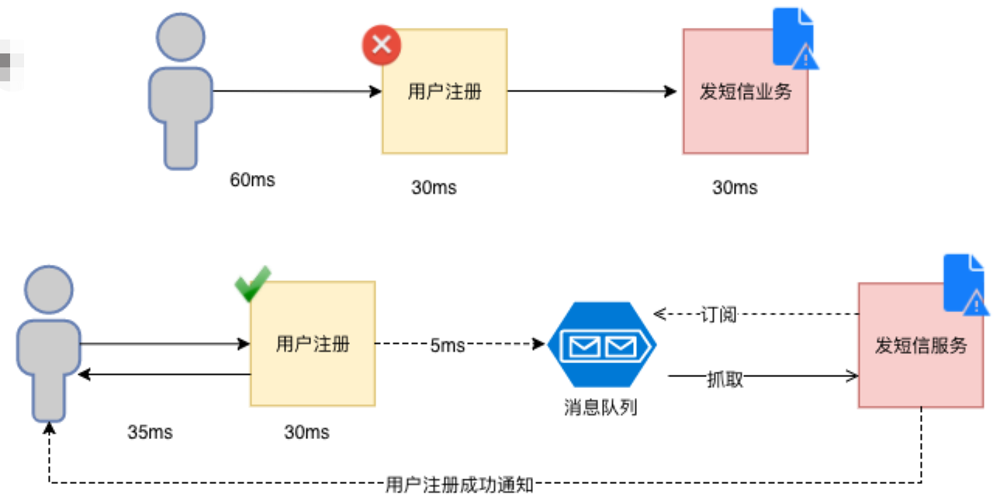
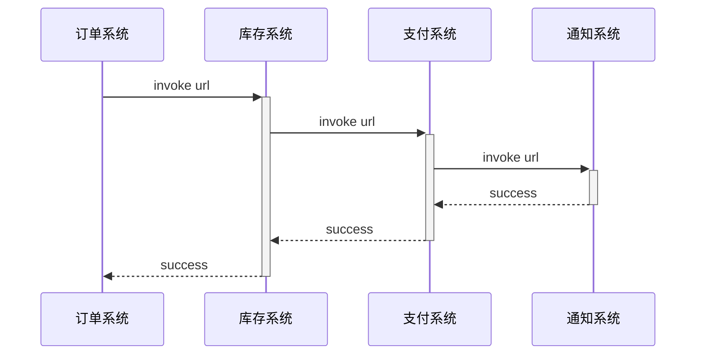
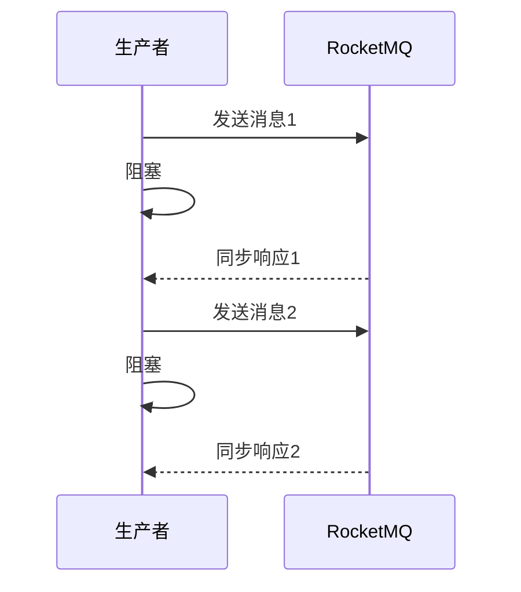
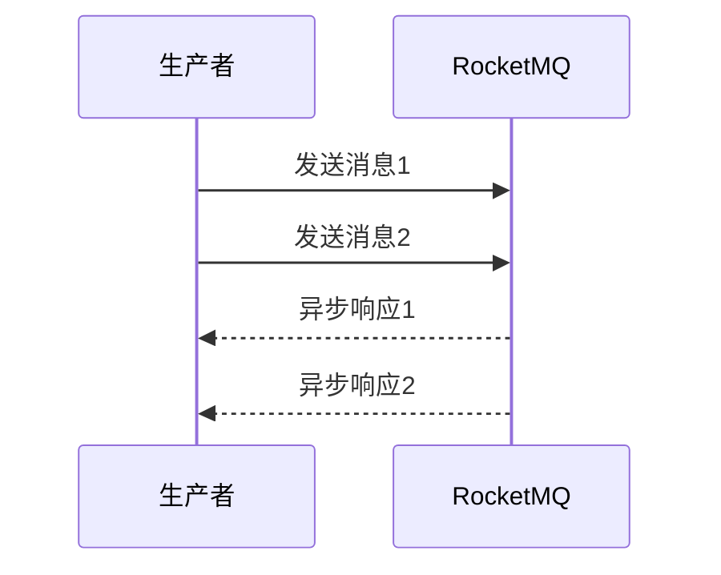
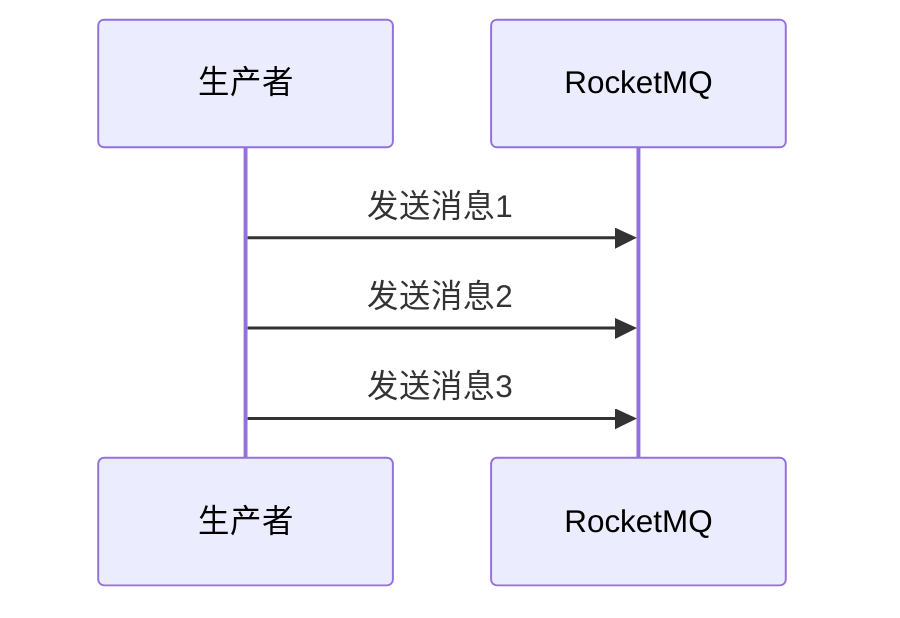

# MQ

## MQ介绍

MQ，MessageQueue，消息中间件

从世界上第一个MQ的诞生历程来看，它最初是为了解决通信的问题。

消息队列，又叫做消息中间件。是指用高效可靠的消息传递机制进行与平台无关的数据交流，并基于数据通信来进行分布式系统的集成。

通过提供消息传递和消息队列模型，可以在分布式环境下扩展进程的通信。

基于以上的描述，MQ具备几个主要特点:

1、是一个独立运行的服务。生产者发送消息，消费者接收消费，需要先跟服务器建立连接。

2、采用队列作为数据结构，有先进先出的特点。

3、具有发布订阅的模型，消费者可以获取自己需要的消息。

我们可以把MQ类比成邮局和邮差，它是用来帮我们存储和转发消息的。


## 适用场景

也可以认为是MQ的优势或者优点。

### 异步通信

同步的通信是什么样的?

发出一个调用请求之后，在没有得到结果之前，就不返回。由调用者主动等待这个调用的结果。

而异步是相反的，调用在发出之后，这个调用就直接返回了，所以没有返回结果。也就是说，当一个异步过程调用发出后，调用者不会马上得到结果。而是在调用发出后，被调用者通过状态、通知来通知调用者，或通过回调函数处理这个调用。

#### 案例一

如下图：用户注册和发短信是2个服务，如果分别要30ms，使用同步的方式用户需要等待60ms，才会返回成功。

但如果使用了MQ，假设往MQ发送消息是5ms，那用户只需要等待35ms即可完成业务。



#### 案例二

大家都用过手机银行的跨行转账功能。大家用APP的转账功能的时候，有一个实时模式，有一个非实时模式。

实时转账实际上是异步通信，因为这个里面涉及的机构比较多，调用链路比较长，本行做了一些列的处理之后，转发给银联或者人民银行的支付系统，再转发给接收行，接受行处理以后再原路返回。

所以转账以后会有一行小字提示:具体到账时间以对方行处理为准，也就是说转出行只保证了这个转账的消息发出。那为什么到账时间又这么快呢?很多时候我们转账之后，不用几秒钟对方就收到了。是因为大部分的MQ都有一个低延迟的特性，能在短时间内处理非常多的消息。

很多理财软件提现也是一样，先提交请求，到账时间不定。这个是用MQ实现系统间异步通信的一个场景。

异步通信不需要客户端等待，可以减少客服端性能消耗，大大地提升用户体验。


### 系统解耦

要将解耦，首先要理解什么是系统耦合。耦合是系统内部或者系统之间存在相互作用，相互影响，相互依赖。

在分布式系统中，一个业务流程涉及多个系统的时候，他们之间就会形成一个依赖关系。



以上面的注册功能为例，如果短信功能异常了，例如：欠费了，将引起用户注册失败，这就一种强耦合或者说依赖关系。

以12306网站退票为例，在传统的通信方式中，订单系统发生了退货的动作，那么要依次调用所有下游系统的API，比如调用库存系统的API恢复库存，因为这张火车票还要释放出去给其他乘客购买;调用支付系统的APIl，不论是支付宝微信还是银行卡，要把手续费扣掉以后，原路退回给消费者;调用通知系统API通知用户退货成功。

这个过程是串行执行的，如果在恢复库存的时候发生了异常，那么后面的代码都不会执行。由于这一系列的动作，恢复库存，资金退还，发送通知，本质上没有一个严格的先后顺序，也没有直接的依赖关系,也就是说，只要用户提交了退货的请求，后面的这些动作都是要完成的。库存有没有恢复成功，不影响资金的退还和发送通知。

如果把串行改成并行，我们有什么思路?

(多线程)

多线程或者线程池是可以实现的，但是每一个需要并行执行的地方都引入线程，又会带来线程或者线程池的管理问题。

所以，这种情况下，我们可以引入MQ实现系统之间依赖关系的解耦合引入MQ以后

~~~mermaid
flowchart LR
1[订单系统]-->2[消息队列]
2-->3[库存系统]
2-->4[支付系统]
2-->5[通知系统]
~~~

订单系统只需要把退货的消息发送到消息队列上，由各个下游的业务系统自己创建队列，然后监听队列消费消息。

1、如果其他系统做了网络迁移，以前需要在订单系统配置和修改IP、端口、接口地址，现在不需要，因为它不需要关心消费者在网络上的什么位置，只需要配置MQ服务器的地址。

2、如果某一个下游系统宕机了或者在停机升级，调用接口超时会导致订单系统业务逻辑失败。引入MQ以后没有任何影响，消息保存在MQ服务器，什么时候下游系统恢复了自己去消费就OK了。

3、假如下游业务系统运行正常，但是消费出了问题，比如改代码该出问题了或者数据库异常，生产者也不会受到影响。因为它只关心一件事情，就是消息有没有成功地发送到MQ服务器。

(如果要确保消费成功或者确保数据一致性肯定要靠其他的手段来解决，后面会说)引入MQ以后，实现了系统之间依赖关系的解耦，系统的可扩展性和可维护性得到了提升。


### 削峰填谷

在很多的电商系统里面，有一个瞬间流量达到峰值的情况，比如京东的618，淘宝的双11，可能会达到百万甚至千万级的并发。普通的硬件服务器一般只能支撑大概200~500的并发，然后就会向最初的12306一样，动不动就服务器崩溃。

如果通过堆硬件的方式去解决，那么在流量峰值过去以后就会出现巨大的资源浪费。那要怎么办呢?一个饭店，在国庆期间一天有几万个人想去吃饭，为什么它不马上扩张门店呢?它的实际做法是什么?首先肯定不能拒绝顾客，说没位置了回家吧(排队啊)。

如果说要保护我们的应用服务器和数据库，限流也是可以的，但是这样又会导致订单的丢失，没有达到我们的目的。

为了解决这个问题，我们就可以引入MQ。MQ既然是Queue，一定有队列的特性，

我们知道队列的特性是什么?

(先进先出FIFO)

先进先出，有一个排队的模型。这个饭店它就有排队的通道，不会因为想吃饭的人太多了就把饭店鸡煲或者把服务员累趴。而且它还可以线上排队，你都不用一直站着。

我们可以先把所有的流量承接下来，转换成MQ消息发送到消息队列服务器上，业务层就可以根据自己的消费速率去处理这些消息，处理之后再返回结果。

如果要处理快一点，大不了就是增加几个消费者。就像火车站在春运期间会多开几个窗口处理购票请求。


### 广播通信

也叫数据分发，用于实现一对多通信。以订单系统退货为例，如果新增了积分系统，需要获取订单状态变化信息，只需要增加队列监听就可以了,生产者没有任何代码修改。

使用MQ做数据分发好处，无论是新增系统，还是移除系统，代码改造工作量较小。所以使用MQ做数据的分发，可以提高团队开发的效率。


### 总结

1. 对于数据量大或者处理耗时长的操作，我们可以引入MQ实现异步通信，减少客户端的等待，提升响应速度，优化客户体验。

2. 对于改动影响大的系统之间，可以引入MQ实现解耦，减少系统之间的直接依赖，提升可维护性和可扩展性。

3. 对于会出现瞬间的流量峰值的系统，我们可以引入MQ实现流量削峰，达到保护应用和数据库的目的。

4. 一对多的广播通信


## 缺点

对于一些特定的业务场景，MQ对于优化我们的系统性能还是有很大的帮助的。我们讲了这么多好处,以后只要是系统之间通信我全部用MQ,不再考虑HTTP接口和RPC调用，可以吗?

肯定不行。下面我们分析一下使用MQ会带来的一些问题。

第一个就是运维成本的增加。既然要用MQ，必须要分配资源部署MQ，还要保证它时刻正常运行。

第二个是系统的可用性降低。原来是两个节点的通信，现在还需要独立运行一个服务。虽然一般的MQ都有很高的可靠性和低延迟的特性，但是一旦网络或者MQ服务器出现问题，就会导致请求失败，严重地影响业务。

第三个是系统复杂性提高。作为开发人员，要使用MQ，首先必须要理解相关的模型和概念，才能正确地配置和使用MQ。其次，使用MQ发送消息必须要考虑消息丢失和消息重复消费的问题。一旦消息没有被正确地消费，就会带来数据一致性的问题。

所以，我们在做系统架构，选择通信方式的时候一定要根据实际情况来分析，不要因为我们说了这么多的MQ能解决的问题，就盲目地引入MQ。


## MQ对比

Kafka、ActiveMQ、RabbitMQ、RocketMQ 有什么优缺点？

| 特性                     | ActiveMQ                                              | RabbitMQ                                           | RocketMQ                                                     | Kafka                                                        |
| ------------------------ | ----------------------------------------------------- | -------------------------------------------------- | ------------------------------------------------------------ | ------------------------------------------------------------ |
| 单机吞吐量               | 万级，相对其他MQ较低。                                | 万级，同ActiveMQ                                   | 10 万级，支撑高吞吐                                          | 10 几万级，吞吐量非常高，甚至有文献称，可以达到单机百万级TPS。 |
| topic 数量对吞吐量的影响 |                                                       |                                                    | topic 可以达到几百/几千的级别，吞吐量会有较小幅度的下降，这是 RocketMQ 的一大优势，在同等机器下，可以支撑大量的 topic | topic 从几十到几百个时候，吞吐量会大幅度下降，在同等机器下，Kafka 尽量保证 topic 数量不要过多，如果要支撑大规模的 topic，需要增加更多的机器资源 |
| 时效性                   | ms 级                                                 | 微秒级，延迟最低RabbitMQ 的一大特点                | ms 级                                                        | 延迟在 ms 级以内                                             |
| 可用性                   | 高，基于主从架构实现高可用                            | 同 ActiveMQ                                        | 非常高，分布式架构                                           | 非常高，分布式，一个数据多个副本，少数机器宕机，不会丢失数据，不会导致不可用 |
| 消息可靠性               | 有较低的概率丢失数据                                  | 基本不丢                                           | 经过参数优化配置，可以做到 0 丢失。支持事务                  | 同 RocketMQ。支持事务                                        |
| 功能支持                 | MQ 领域的功能极其完备                                 | 基于 erlang 开发，并发能力很强，性能极好，延时很低 | MQ 功能较为完善，还是分布式的，扩展性好                      | 功能较为简单，主要支持简单的 MQ 功能，在大数据领域的实时计算以及日志采集被大规模使用 |
| 资料文档                 | 多。没有专门写activemq的书，网上资料多                | 多。有一些不错的书，网上资料多                     | 少。没有专门写rocketmq的书，网上的资料良莠不齐，官方文档很简洁，但是对技术细节没有过多的描述 | 中，有kafka作者自己写的书，网上资料也有一些                  |
| 开发语言                 | java                                                  | Erlang                                             | java                                                         | Scala+Java                                                   |
| 支持协议                 | OpenWire、STOMP、REST、XMPP、AMQP                     | AMQP                                               | 自定义                                                       | 自定义（基于TCP）                                            |
| 消息存储                 |                                                       | 内存、磁盘。支持少量堆积                           | 磁盘。支持大量堆积                                           | 内存、磁盘、数据库。支持大量堆积                             |
| 集群方式                 | 支持简单集群模式，比如'主-备'，对高级集群模式支持不好 | 支持简单集群，'复制'模式，对高级集群模式支持不好   | 常用多对'Master-Slave' 模式，开源版本需手动切换Slave变成Master | 天然的‘Leader-Slave’无状态集群，每台服务器既是Master也是Slave |


## 零拷贝(Zero-Copy)

### 介绍

首先零拷贝并不是完全不需要拷贝，只是减少冗余[不必要]的拷贝。

零拷贝指的是计算机执行某些操作时，CPU不需要将数据从内核空间拷贝至用户空间。它可以减少数据拷贝和共享总线操作的次数，消除传输数据在存储器之间不必要的中间拷贝次数，从而有效地提高数据传输效率。同时也减少了用户进程地址空间和内核地址空间之间因为下文切换而带来的开销。

很多组件、框架中均使用了零拷贝技术。例如：Kafka、Rocketmq、Netty、Nginx、Apache。

### 传统数据传输

1. 用户进程调用read方法，等系统调用向操作系统发出IO请求，请求读取数据到自己的内存缓冲区中。自己进入阻塞状态。

2. 操作系统收到请求后，进一步将IO请求发送磁盘。

3. 磁盘驱动器收到内核的IO请求，把数据从磁盘读取到驱动器的缓冲中。此时不占用CPU。当驱动器的缓冲区被读满后，向内核发起中断信号告知自己缓冲区已满。

4. 内核收到中断，使用CPU时间将磁盘驱动器的缓存中的数据拷贝到内核缓冲区中。

5. 如果内核缓冲区的数据少于用户申请的读的数据，重复步骤3跟步骤4，直到内核缓冲区的数据足够多为止。

6. 将数据从内核缓冲区拷贝到用户缓冲区，同时从系统调用中返回。完成任务


### 加入DMA

以上是传统的IO模型，现在计算机采用的下面这种[DMA](https://baike.baidu.com/item/%E7%9B%B4%E6%8E%A5%E5%86%85%E5%AD%98%E8%AE%BF%E9%97%AE/6024586?fromtitle=DMA&fromid=2385376&fr=aladdin)参与的IO模式，CPU会将read指令发送给DMA，DMA会等到数据完全读入到内核空间才会通知CPU中断，然后CPU将数据返回到用户空间。这样，充分释放了CPU的计算性能。细节说明如下：

1.  用户进程调用read等系统调用向操作系统发出IO请求，请求读取数据到自己的内存缓冲区中。自己进入阻塞状态。
2.  操作系统收到请求后，进一步将IO请求发送DMA。然后让CPU干别的活去。
3.  DMA进一步将IO请求发送给磁盘。
4.  磁盘驱动器收到DMA的IO请求，把数据从磁盘读取到驱动器的缓冲中。当驱动器的缓冲区被读满后，向DMA发起中断信号告知自己缓冲区已满。
5.  DMA收到磁盘驱动器的信号，将磁盘驱动器的缓存中的数据拷贝到内核缓冲区中。此时不占用CPU。这个时候只要内核缓冲区的数据少于用户申请的读的数据，内核就会一直重复步骤3跟步骤4，直到内核缓冲区的数据足够多为止。
6.  当DMA读取了足够多的数据，就会发送中断信号给CPU。
7.  CPU收到DMA的信号，知道数据已经准备好，于是将数据从内核拷贝到用户空间，系统调用返回。


### 加入网络

进一步模拟真实场景，加入网络协议，可以发现这里面经过了四次copy。

1. 第一次：将磁盘文件，读取到操作系统内核缓冲区；
2. 第二次：将内核缓冲区的数据，copy到应用程序的用户缓冲区中；
3. 第三次：将应用程序的用户缓冲区中的数据，copy到socket网络发送缓冲区(属于操作系统内核缓冲区)；
4. 第四次：将socket buffer的数据，copy到网卡，由网卡进行网络传输。


举个例子：200M的数据，读取文件，再用socket发送出去，实际经过四次copy。2次cpu拷贝每次100ms ，2次DMS拷贝每次10ms。那传统网络传输的话：合计耗时至少有220ms。同时，read和send都属于系统调用，每次调用都牵涉到两次上下文切换。

总结下，传统的数据传送所消耗的成本：4次拷贝，4次上下文切换。4次拷贝，其中两次是DMA copy，两次是CPU copy。

### ZeroCopy

如下图：数据到内核空间后，直接到copy到SocketBuffer中，不再进入用户空间。


## APQP

### 历史

因为世界上第一个MQTIB实现了发布订阅(Publish/Subscribe)模型，消息的生产者和消费者可以完全解耦，这个特性引起了电信行业特别是新闻机构的注意。1994年路透社收购了Teknekron。

TIB的成功马上引起了业界大佬IBM的注意，他们研发了自己的IBM MQ (IBMWesphere——人民银行主导研发的二代支付系统用的就是IBM MQ)。后面微软也加入了这场战斗，研发了MSMQ。这个时候，每个厂商的产品是孤立的，大家都有自己的技术壁垒。比如一个应用订阅了IBM MQ的消息，如果有要订阅MSMQ的消息，因为协议、API不同，又要重复去实现。为什么大家都不愿意去创建标准接口，来实现不同的MQ产品的互通呢?跟现在微信里面不能打开淘宝页面是一个道理（商业竞争)。

JDBC协议大家非常熟悉吧?J2EE制定了JDBC的规范，那么那么各个数据库厂商自己去实现协议，提供jar包，在Java里面就可以使用相同的API做操作不同的数据库了。MQ产品的问题也是一样的，2001年的时候，SUN公司发布了JMS规范，它想要在各大厂商的MQ上面统一包装一层Java的规范,大家都只需要针对API编程就可以了，不需要关注使用了什么样的消息中间件，只要选择合适的MQ驱动。但是JMS只适用于Java语言，它是跟语言绑定的，没有从根本上解决这个问题(只是一个API)。

所以在2004年，几个大公司开始开发AMQP标准。2006年，AMQP规范发布了。

### AMQP是什么

AMQP的全称是：Advanced Message Queuing Protocol，高级消息队列协议。本质上是一种进程间传递异步消息的网络协议。它是跨语言和跨平台的，不管是什么样的MQ服务器，不管是什么语言的客户端，只要遵循AMQP协议，就可以实现消息的交互。真正地促进了消息队列的繁荣发展。

AMQP是一个工作于应用层的协议，最新的版本是1.0版本。可以使用 WireShark等工具对RabbitMQ通信的AMQP协议进行抓包。

既然它是一种协议或者规范，不是RabbitMQ专门设计的，市面上肯定还有很多其他实现了AMQP协议的消息中间件，比如: OpenAMQ、 Apache Qpid、RedhatEnterprise MRG、AMQP Infrastructure、OMQ、Zyre。


既然它是一种协议或者规范，不是为某一种MQ框架专门设计的，市面上肯定还有很多其他实现了AMQP协议的消息中间件，比如:
OpenAMQ、Apache Qpid、Redhat、Enterprise MRG、AMQP Infrastructure、∅MQ、zyre。


## 面试题

### 公共

#### MQ消息的重复

##### 第一类原因

MQ接收消息并存储后，但由于种种原因，没有给发送端返回消息。发送端存在重试机制，重复发送消息。

1. MQ可能出现问题宕机
2. MQ可能因为负载高响应变慢，返回“成功”结果时超时。
3. MQ返回结果时网络出现问题，导致应用发送端重试，而重试时网络恢复。

##### 第二类原因

MQ接收消息并存储后，进行向外的投递时，由于消费者成功处理完消息后，MQ没有及时更新投递状态造成的消费重复。

1. 消费者处理完消息后，应用出现问题。MQ不知道消息处理结果，再次投递。
2. 消费者处理完消息后，网络出现问题。MQ不知道消息处理结果，再次投递。
3. 消费者处理消息时间过长，MQ因为消息超时会再次投递。
4. 消费者处理完消息后，向MQ发送响应，此时MQ出现问题没有收到响应，再次投递。
5. 消费者处理完消息后，向MQ发送响应，MQ收到响应但没能更新投递状态成功，再次投递。

**如何解决**

主要是要求消费者来处理这种重复的情况，也就是要求消费者的消息处理是幂等操作。

**什么是幂等**

对于消息接收端的情况,幂等的含义是采用同样的输入多次调用处理函数,得到同样的结果。例如，一个SQL操作

update stat_table set count= 10 where id =1

这个操作多次执行,id等于1的记录中的 count字段的值都为10,这个操作就是幂等的,我们不用担心这个操作被重复。

再来看另外一个SQL操作

update stat_table set count= count +1 where id= 1;

这样的SQL操作就不是幂等的,一旦重复,结果就会产生变化。


### RabbitMQ

#### RabbitMQ 上的一个 queue 中存放的 message 是否有数量限制？ 

默认情况下一般是无限制，因为限制取决于机器的内存，但是消息过多会导致处理效率的下降。

可以通过参数来限制， x-max-length ：对队列中消息的条数进行限制 ，x-max-length-bytes ：对队列中消息的总量进行限制

#### RabbitMQ 概念里的 channel、exchange 和 queue 这些东东是逻辑概念，还是对应着进程实体？这些东东分别起什么作用？

queue 具有自己的 erlang 进程；exchange 内部实现为保存 binding 关系的查找表；channel 是实际进行路由工作的实体，即负责按照 routing_key 将 message 投递给queue 。由 AMQP 协议描述可知，channel 是真实 TCP 连接之上的虚拟连接，所有AMQP 命令都是通过 channel 发送的。


# Kafka

笔记对应的视频地址：https://www.mashibing.com/study?courseNo=407&sectionNo=713

## 简介

Kafka是由Apache软件基金会开发的一个开源流处理平台，由Scala和Java编写。Kafka是一种高吞吐量的分布式发布订阅消息系统，它可以收集并处理用户在网站中的所有动作流数据以及物联网设备的采样信息。

同时Kafka又提供了Kafka streaming插件包实现了实时在线流处理。相比较一些专业的流处理框架不同，Kafka Streaming计算是运行在应用端，具有简单、入门要求低、部署方便等优点。

### 优缺点

**优点**

高吞吐量。Kafka的吞吐量几乎是行业里最优秀的，在常规的机器配置下，一台机器可以达到每秒十几万的QPS，甚至有文献称单机写入TPS约在百万条/秒。

性能高。毫秒级的低延迟性能。

可用性很高。支持集群部署的，部分机器宕机可以继续运行

**缺点**

可能会丢数据。因为Kafka收到消息之后会写入一个磁盘缓冲区里，并没有直接落地到物理磁盘上去，所以要是机器本身故障了，可能会导致磁盘缓冲区里的数据丢失。还有就是消费失败不支持重试。

功能单一。主要是支持发送消息给他，然后从里面消费消息，其他就没有什么额外的高级功能了。所以基于Kafka有限的功能，可能适用的场景并不是很多

分区越多负载越大。Kafka单机超过64个队列/分区，Load会发生明显的飙高现象，队列越多，load越高，发送消息响应时间变长。

可能产生消息乱序。支持消息顺序，但是一台代理宕机后，就会产生消息乱序；


### 适用场景

结合Kafka的优缺点，以及查阅了Kafka技术在各大公司里的使用，基本行业里的一个标准，是把Kafka用在用户行为日志的采集和传输上，比如大数据团队要收集APP上用户的一些行为日志，这种日志就是用Kafka来收集和传输的。

因为那种日志适当丢失数据是没有关系的，而且一般量特别大，要求吞吐量要高，一般就是收发消息，不需要太多的高级功能，所以Kafka是非常适合这种场景的。

另一种常用场景就是大数据领域内的消息传输，可以这么说kafka是专为大数据而生的消息中间件。它在数据采集、传输、存储的过程中发挥着举足轻重的作用。


## 架构和概念

### 工作模式

消息队列是一种在分布式和大数据开发中不可或缺的中间件。在分布式开发或者大数据开发中通常使用消息队列进行缓冲、系统间解耦和削峰填谷等业务场景，常见的消息队列工作模式大致会分为两大类：

- **至多一次**：消息生产者将数据写入消息系统，然后由消费者负责去拉去消息服务器中的消息，一旦消息被确认消费之后（Ack） ，由消息服务器主动删除队列中的数据，这种消费方式一般只允许被一个消费者消费，并且消息队列中的数据不允许被重复消费。

- **没有限制**：同上诉消费形式不同，生产者发完数据以后，该消息可以被多个消费者同时消费，并且同一个消费者可以多次消费消息服务器中的同一个记录。主要是因为消息服务器一般可以长时间存储海量消息。消费者接收消息后回复的是接收的偏移量（Commit Offset）。下次消费者如果还要消费，可以从根据偏移量继续消费。


### 集群

#### Topic

Kafka集群由多个集群节点组成，每一个节点叫做broker，broker部署在一台单独的服务器上。

Kafka集群以Topic形式负责分类集群中的Record（消息）。每一个Record（消息）只属于一个Topic。


如上图：

1. 消费者往kafka集群发送一个消息。
2. 消息包含：key（消息主键），value（消息值），时间戳（消息产生时间）
3. 一个消息只能属于一个topic，消息在发送时生产者会指定topic。
4. 订阅该topic的消费者将接收到消息。一个消费者可以订阅多个topic

#### 分区

每个Topic底层都会对应一组分区的日志用于持久化Topic中的Record。同时在Kafka集群中，Topic的每一个日志的分区都一定会有1个Broker担当该分区的Leader，其他的Broker担当该分区的follower，Leader负责分区数据的读写操作，follower负责同步改分区的数据。这样如果分区的Leader宕机，改分区的其他follower会选取出新的leader继续负责该分区数据的读写。其中集群的中Leader的监控和Topic的部分元数据是存储在Zookeeper中。


如上图

1. 当一个生产者往Kafka发送消息时，首先根据生产者指定的key找到topic
2. 然后用key的hash值对分区数取余，找到对应的分区。
3. 由于副本因子为3，所以每个分区还会存在3分副本，并且每个分区会有一个leader
4. 图中分区0的leader是broker0，分区1的leader为broker2。即：kafka中每一个broker可能既是某个分区的leader又是某个分区的follower。
5. 假设broker0宕机，会发生什么？
   1. partition0失去leader，将无法正常读写，因为只有leader能够写数据。
   2. 此时zookeeper会监测到broker0的宕机，会从broker2和3中选举出新的leader
   3. 如果选中的是Broker2，则它上面的partition0变成leader。
   4. 如果broker0重新启动起来，由于他的数据不是最新的，所以只能是follower。

#### Zookeeper

zookeeper主要配套kafka集群使用，主要用于

1. 集群健康检测
2. 分区元数据信息存储。


#### 分区&日志

Kafka中所有消息是通过Topic为单位进行管理，每个Kafka中的Topic通常会有多个订阅者，负责订阅发送到改Topic中的数据。Kafka负责管理集群中每个Topic的一组日志分区数据。

生产者将数据发布到相应的Topic。负责选择将哪个记录分发送到Topic中的哪个Partition。例如可以round-robin方式完成此操作，然而这种仅是为了平衡负载。也可以根据某些语义分区功能（例如基于记录中的Key）进行此操作。

每组日志分区是一个有序的不可变的的日志序列，分区中的每一个Record都被分配了唯一的序列编号称为是offset，Kafka 集群会持久化所有发布到Topic中的Record信息，改Record的持久化时间是通过配置文件指定,默认是168小时（7天）。

log.retention.hours=168

Kafka底层会定期的检查日志文件，然后将过期的数据从log中移除，由于Kafka使用硬盘存储日志文件，因此使用Kafka长时间缓存一些日志文件是不存在问题的。


如上图

图中的数字代表分区中的offset，数字越小，说明在同一个分区当中进入的越早。

当如果跨分区这种顺序就无法保证了。

如果一定要确保一个topic中消息的写入顺序，可以对这个topic设定不分区。

#### 为什么要引入分区

通过这种机制，使得一个topic可以存储海量的数据（一台机器不够，可以扩充机器）

分区可存在多个副本，只有leader可写，其他只能读，提高了写的并发和性能


### 消费者

在消费者消费Topic中数据的时候，每个消费者会维护本次消费对应分区的偏移量，消费者会在消费完一个批次的数据之后，会将本次消费的偏移量提交给Kafka集群，因此对于每个消费者而言可以随意的控制改消费者的偏移量。因此在Kafka中，消费者可以从一个topic分区中的任意位置读取队列数据，由于每个消费者控制了自己的消费的偏移量，因此多个消费者之间彼此相互独立。

Kafka中对Topic实现日志分区的有以下目的：

- 首先，它们允许日志扩展到超出单个服务器所能容纳的大小。每个单独的分区都必须适合托管它的服务器，但是一个Topic可能有很多分区，因此它可以处理任意数量的数据。

- 其次每个服务器充当其某些分区的Leader，也可能充当其他分区的Follwer，因此群集中的负载得到了很好的平衡。


如上图1：

生产者正在不断地往topic0的某个分区中写入数据，此时offset已经到达21

此topic存在2个消费者A和B，他们的消费是彼此独立的。A消费到了offset15，B消费到了offset20。


#### 消费者组

消费者使用Consumer Group名称标记自己，karfka中每一个消费者都会属于一个消费者组。

发布到Topic的每条记录都会传递到订阅它的Consumer Group中的一个消费者实例。

如果所有Consumer实例都具有相同的Consumer Group，那么Topic中的记录会在该ConsumerGroup中的Consumer实例进行均分消费；（即1个topic被1个消费者组订阅，该消费者组包含不同的消费实例）

如果所有Consumer实例具有不同的Consumer Group，则每条记录将广播到所有Consumer Group进程。（即1个topic被多个消费者组订阅）

更常见的是，我们发现Topic具有少量的Consumer Group，每个Consumer Group可以理解为一个“逻辑的订阅者”。每个Consumer Group均由许多Consumer实例组成，以实现可伸缩性和容错能力。这无非就是发布-订阅模型，其中订阅者是消费者的集群而不是单个进程。这种消费方式Kafka会将Topic按照分区的方式均分给一个Consumer Group下的实例，如果ConsumerGroup下有新的成员介入，则新介入的Consumer实例会去接管ConsumerGroup内其他消费者负责的某些分区，同样如果一下ConsumerGroup下的有其他Consumer实例宕机，则由改ConsumerGroup其他实例接管。

由于Kafka的Topic的分区策略，因此Kafka仅提供分区中记录的有序性，也就意味着相同Topic的不同分区记录之间无顺序。因为针对于绝大多数的大数据应用和使用场景， 使用分区内部有序或者使用key进行分区策略已经足够满足绝大多数应用场景。但是，如果您需要记录全局有序，则可以通过只有一个分区Topic来实现，尽管这将意味着每个ConsumerGroup只有一个Consumer进程。这也可能降低kafka的吞吐量。

如上图2

kafka集群具备1个topic，4个分区分散在了2个broker上。有2个消费者组消费数据。

一个组有2个消费者：c1，c2。c1负责消费p0和p1，c2负责消费p2和p3。

另一个组有4个消费者，他们各自负责消费一个分区。

在消费者组内部，1个消息只有一个消费者消费。

站在消费者组的角度，一个消息被同时广播给了2个消费者组

如果消费者组中消费者数量超过了topic的分区数量会发生什么？答案是正常情况下多出来的这个消费者将接收不到数据，但当某个消费者宕机时，这个消费者就可以接管其负责的分区了。


### 高性能之道

Kafka的特性之一就是高吞吐率（吞代表写入，吐代表读取，高吞吐就是写入读取速度很高），但是Kafka的消息是保存或缓存在磁盘上的，一般认为在磁盘上读写数据是会降低性能的，但是Kafka即使是普通的服务器，Kafka也可以轻松支持每秒百万级的写入请求，超过了大部分的消息中间件，这种特性也使得Kafka在日志处理等海量数据场景广泛应用。Kafka会把收到的消息都写入到硬盘中，防止丢失数据。为了优化写入速度Kafka采用了两个技术：顺序写入和MMFile（MemoryMappedFile，内存映射文件）。

#### 顺序写入

因为硬盘是机械结构，每次读写都会寻址->写入，其中寻址是一个“机械动作”，它是最耗时的。所以硬盘最讨厌随机I/O，最喜欢顺序I/O。为了提高读写硬盘的速度，Kafka就是使用顺序I/O。这样省去了大量的内存开销以及节省了IO寻址的时间。但是单纯的使用顺序写入，Kafka的写入性能也不可能和内存进行对比，因此Kafka的数据并不是实时的写入硬盘中 。

#### MMFile

Kafka充分利用了现代操作系统分页存储来利用内存提高I/O效率。Memory Mapped Files(后面简称mmap)也称为内存映射文件，在64位操作系统中一般可以表示20G的数据文件，它的工作原理是直接利用操作系统的PageCache实现文件到物理内存的直接映射。完成MMP映射后，用户对内存的所有操作会被操作系统自动的刷新到磁盘上，极大地降低了IO使用率。


如上图：

1. 应用A和应用B，运行在用户空间，此时他们向Kafka传递文件。
2. kafka接收到文件后会利用操作系统底层的PageCache原理，将其写入到mmap中。而这个mmap是和磁盘有映射关系的。
3. 至于PageCache中的数据何时写入到磁盘中，这个有操作系统决定。
4. 文件写入PageCache后，kafka就会响应成功，不会等待文件写入到磁盘成功。

应用宕机是否会影响数据写入到磁盘？

不会，应用是运行在用户空间，不会影响内核空间的操作。

如果操作系统内核出现问题呢？

例如，kafka服务器停电了。如果真的发生确实会导致数据丢失。但这是一个小概率事件，任何应用都要面对这个问题。如果要解决这个问题，可以将mmap特性取消，使得数据直接写入磁盘。这种做法就是用性能来换取安全性。这就是一种取舍没有完美的解决方案。但即使改成磁盘写入，也可能发生写入一半中途断电的情况的。

#### Zero-Copy

请参考MQ公共知识中的[Zero-Copy介绍](#零拷贝(Zero-Copy))。


## 安装

### 安装流程

1. 安装JDK1.8+，配置JAVA_HOME  (CentOS 6.10 64bit)  
2. 配置主机名和IP映射
3. 关闭防火墙&&防火墙开机自启动
4. u同步时钟 ntpdate cn.pool.ntp.org **|** **ntp****[1-7].aliyun.com**
5. 安装&启动Zookeeper
6. 安装&启动|关闭Kafka


### Kafka安装

#### 下载

Zookeeper下载（3.7.1）：https://zookeeper.apache.org/releases.html

Kafka下载（3.5.0）：https://kafka.apache.org/downloads，由于Kafka依赖Scala，需要组要针对Scala选择安装版本


#### JDK安装

下载jdk1.8的rpm安装，放入到虚拟机的安装目录中，赋予当前用户执行权限

执行rpm -ga | grep jdk 查看是否之前已经安装jdk，如果安装了可以执行 rpm -e 'rpm -qa | grep jdk' 卸载

执行rpm -ivh jdk-xxxxxx.rpm 安装jdk。

执行java -version验证jdk是否安装成功。

echo $JAVA_HOME验证环境变量是否已经设置。如果没有的话

在当前用户的根目录下执行vi .bashrc，然后贴入如下代码保存

```bash
JAVA_HOME=/usr/java/latest
PATH=$PATH:$JAVA_HOME/bin
CLASSPATH=.
export JAVA_HOME
export PATH
export CLASSPATH
```

保存后执行source .bashrc让环境变量生效。

再次打印环境变量echo $JAVA_HOME


#### 主机名和ip映射

执行命令修改主机名：hostnamectl set-hostname dev-study

修改ip映射：vi /etc/hosts，加入如下文本保存

```tex
192.168.3.65 dev-study
```

使用ping命令验证映射是否设置成功：ping dev-study


#### 防火墙

执行命令查看防火墙状态：service iptables status

如果看到：Unit iptables.service could not be found.或者iptables: Firewall is not running代表防火墙没启动。

如果不是需要执行命令关闭防火墙：service iptables stop

这种方式只是临时关闭防火墙，下次服务器重启，防火墙还是会重新启动，要想彻底关闭可以执行：chkconfig iptables off

可以使用这个命令查看目前所有开机启动的服务：chkconfig --list


#### Zookeeper安装

将Zookeeper安装包上传到服务器某个目录下，赋予其足够的权限。

解压压缩包：tar -zxf apache-zookeeper-3.7.1-bin.tar.gz

新建Zookeeper的数据目录：mkdir -p /root/data/zkdata

进配置文件目录：cd /www/wwwroot/install/apache-zookeeper-3.7.1-bin/conf

创建新的配置文件：cp zoo_sample.cfg zoo.cfg

编辑配置文件，修改数据目录为刚刚创建的那个目录。vi zoo.cfg （dataDir=/root/data/zkdata）

保存并进入zk的bin目录：cd /www/wwwroot/install/apache-zookeeper-3.7.1-bin/bin

**启动zk**

./zkServer.sh start zoo.cfg，顺利的话会看到如下启动日志

```bash
ZooKeeper JMX enabled by default
Using config: /www/wwwroot/install/apache-zookeeper-3.7.1-bin/bin/../conf/zoo.cfg
Starting zookeeper ... STARTED
```

可以使用这个命令查看zk的状态：./zkServer.sh status zoo.cfg，看到如下信息代表zk状态正常

使用jps命令会看到一个名字为QuorumPeerMain的进程

```java
ZooKeeper JMX enabled by default
Using config: /www/wwwroot/install/apache-zookeeper-3.7.1-bin/bin/../conf/zoo.cfg
Client port found: 2181. Client address: localhost. Client SSL: false.
Mode: standalone
```

**关闭zk**

./zkServer.sh stop zoo.cfg


#### Kafka安装

解压kafka安装包：tar -xvf kafka_2.12-3.5.0.tgz

修改服务配置：vi config/server.properties

在监听地址中加入主机名：listeners=PLAINTEXT://dev-study:9092

修改日志地址确保日志目录可写入：log.dirs=./kafka-logs

修改connect链接地址：zookeeper.connect=dev-study:2181

保存退出：wq

**启动kafka**

cd /www/wwwroot/install/kafka_2.12-3.5.0

./bin/kafka-server-start.sh -daemon config/server.properties 

使用jps如果看到kafka进程代表启动成功

**关闭Kafka**

在根目录执行命令：./bin/kafka-server-stop.sh


### Kafka-Eagle

#### 简介

kafka eagle（英文kafka鹰） 是一款由国内公司开源的Kafka集群监控系统，可以用来监视kafka集群的broker状态、Topic信息、IO、内存、consumer线程、偏移量等信息，并进行可视化图表展示。独特的KQL还可以通过SQL在线查询kafka中的数据

#### 下载

下载地址：http://www.kafka-eagle.org/

下载后上传到服务器的待安装目录：/www/wwwroot/install


#### 安装

解压缩：tar -xvf kafka-eagle-bin-3.0.1.tar.gz

解压之后，进入目录内，还有一个压缩包：tar -xvf efak-web-3.0.1-bin.tar.gz

加入环境变量KE_HOME：vi ~/.bashrc

> KE_HOME=/www/wwwroot/install/kafka-eagle
>
> PATH=$PATH:$JAVA_HOME/bin:$KE_HOME/bin
>
> export KE_HOME

**设置修改**

vi conf/system-config.properties

~~~properties
efak.zk.cluster.alias=cluster1
cluster1.zk.list=dev-study:2181
#cluster2.zk.list=xdn10:2181,xdn11:2181,xdn12:2181
#cluster2.efak.offset.storage=zk

#在eagle中删除topic需要用到此密码
efak.topic.token=keadmin

#地址对应的数据库必须存在且服务可连接，eagle会自己创建数据库
efak.url=jdbc:mysql://127.0.0.1:3306/ke?useUnicode=true&characterEncoding=UTF-8&zeroDateTimeBehavior=convertToNull
efak.username=root
efak.password=root
~~~

**启动**

启动前，先确认Zookeeper和kafka服务已经可以正常访问。8048端口可访问

进入bin目录，执行./ke.sh start

如果启动成功，控制台会打印：

~~~java
Welcome to
    ______    ______    ___     __ __
   / ____/   / ____/   /   |   / //_/
  / __/     / /_      / /| |  / ,<   
 / /___    / __/     / ___ | / /| |  
/_____/   /_/       /_/  |_|/_/ |_|  
( Eagle For Apache Kafka® )

Version v3.0.1 -- Copyright 2016-2022
*******************************************************************
* EFAK Service has started success.
* Welcome, Now you can visit 'http://192.168.3.65:8048'
* Account:admin ,Password:123456
*******************************************************************
* <Usage> ke.sh [start|status|stop|restart|stats] </Usage>
* <Usage> https://www.kafka-eagle.org/ </Usage>
*******************************************************************
~~~

控制台会打印出登录页面的URL，已经管理员用户名和密码，使用这个登录系统。

#### 功能使用

##### dashboard

默认会进入dashboard（仪表盘）界面，这个界面会显示broker（集群节点），topic，Zookeeper，consumers（消费者组）信息

点击上面的数字，可以进入明细界面查看。

##### Topic

在这里可以对Topic进行增删改查的操作。

删除topic时需要输入system-config中的密码（efak.topic.token）

**mock**

这个功能主要用于模拟给topic发送消息。

先选择一个topic。然后输入要发送的消息，点send就能发出去。

##### Metadata

老版本叫manage，主要用于修改topic的配置，具体有哪些配置可以改。

可以进入界面，选择一个topic，然后在Topic Property Key中选择具体的配置项，填入新的值后，点submit

##### Consumers

这里只能查看消费者的状态，不能对消费者做操作。

##### Performance

这里主要罗列kafka的性能信息，如果有一些信息无法显示，需要kafka开启jmx端口。

##### Notification

当kafka符合某些预警条件时，可以通知管理员来关注。

AlertChannel：配置通知渠道，支持：邮箱，微信，钉钉。

AlertConsumer：配置通知条件，例如：消费者组消费topic01时，如果延迟达到某个阈值就触发告警。


### 集群安装

需要有3台CentOS虚拟机


## 常规操作

进行以下操作前，请先安装好Kafka

### Topic

Topic相关操作帮助：./bin/kafka-topics.sh --help

#### 创建topic

./bin/kafka-topics.sh --bootstrap-server dev-study:9092 --create --topic topic01 --partitions 3 --replication-factor 1

--partitions 3：代表会有3个分区

--replication-factor 1：代表副本因子为1，副本因子不能大于broker数量。因为是单机所以最大只能是1

命令执行成功会返回：Created topic topic01.


#### 订阅topic

./bin/kafka-console-consumer.sh --bootstrap-server dev-study:9092 --topic topic01 --group group01

--topic topic01：指定要订阅的topic名字

--group group01：指定消费者组名，不指定系统会默认给一个。

执行成功后，当前窗口会一直阻塞，等待消息接收。


#### 向topic发送消息

新开一个shell窗口，进入kafka根目录。

./bin/kafka-console-producer.sh --broker-list dev-study:9092 --topic topic01

 --boker-list dev-study:9092 指定消息的服务器

--topic topic01指定消息的topic

执行成功，会进入消息发送窗口，在这个窗口内发送任意消息回车，消费者那头都能接受到。

```bash
[root@dev-study kafka_2.12-3.5.0]# ./bin/kafka-console-producer.sh --broker-list dev-study:9092 --topic topic01
>this is a testmessage
>test msg 2
>test msg 3
>^C ctrl + C 退出
```


#### 同组多消费者

新建多个shell窗口，都订阅同一个topic和一个消费者组。然后从生产者那头发送消息。

测试结果：1个组内的3个消费者只有一个消费者能收到消息


## Java集成

### 基础API

本章主要介绍如何通过api的方式进行kafka的基本操作

#### maven依赖

```xml
    <dependencies>

        <dependency>
            <groupId>org.apache.kafka</groupId>
            <artifactId>kafka-streams</artifactId>
            <version>3.5.0</version>
        </dependency>

        <dependency>
            <groupId>log4j</groupId>
            <artifactId>log4j</artifactId>
            <version>1.2.17</version>
        </dependency>

        <dependency>
            <groupId>org.slf4j</groupId>
            <artifactId>slf4j-api</artifactId>
            <version>1.7.25</version>
        </dependency>

        <dependency>
            <groupId>org.slf4j</groupId>
            <artifactId>slf4j-log4j12</artifactId>
            <version>1.7.25</version>
        </dependency>

        <dependency>
            <groupId>org.apache.commons</groupId>
            <artifactId>commons-lang3</artifactId>
            <version>3.9</version>
        </dependency>

    </dependencies>
```


#### 打印Topic

项目位置：mashibing\MQ\kafka_mq

```java
@Slf4j
public class TopicDMLDemo {

    public static void main(String[] args) throws ExecutionException, InterruptedException {
        //配置连接参数，这里面出现的主机名，需要在hosts文件中配置好ip映射
        Properties props = new Properties();
        props.put(AdminClientConfig.BOOTSTRAP_SERVERS_CONFIG,
                "dev-study:9092");
        //创建与kafka服务器的客户端连接（注意关闭linux防火墙）
        KafkaAdminClient adminClient = (KafkaAdminClient) KafkaAdminClient.create(props);

        //查询所有的topics
        KafkaFuture<Set<String>> nameFutures = adminClient.listTopics().names();
        for (String name : nameFutures.get()) {
            log.info("topic-name:{}",name);
        }

        adminClient.close();
    }
}
```


#### Topic新增删除

在上面的代码的基础上修改

```java
	public static void main(String[] args) throws ExecutionException, InterruptedException {
        //配置连接参数，这里面出现的主机名，需要在hosts文件中配置好ip映射
        Properties props = new Properties();
        props.put(AdminClientConfig.BOOTSTRAP_SERVERS_CONFIG,
                "dev-study:9092");
        //创建与kafka服务器的客户端连接（注意关闭linux防火墙）
        KafkaAdminClient adminClient = (KafkaAdminClient) KafkaAdminClient.create(props);

        //查询所有的topics
        KafkaFuture<Set<String>> nameFutures = adminClient.listTopics().names();
        for (String name : nameFutures.get()) {
            log.info("topic-name:{}", name);
        }

        //创建Topics
        List<NewTopic> newTopics = Arrays.asList(new NewTopic("topic02", 3, (short) 1));

        //删除Topic
        // adminClient.deleteTopics(Arrays.asList("topic02"));

        //查看Topic详情
        DescribeTopicsResult describeTopics = adminClient.describeTopics(Arrays.asList("topic01"));
        Map<String, TopicDescription> tdm = describeTopics.all().get();
        for (Map.Entry<String, TopicDescription> entry : tdm.entrySet()) {
            log.info(entry.getKey() + "\t" + entry.getValue());
        }

        adminClient.close();
    }
```


#### 生产者

下面代码，将连接上topic并向服务器发送消息，此时如果有消费者，将会接收到消息。

```java
public class KafkaProducerDemo {
    public static void main(String[] args) throws InterruptedException {
        //1.创建链接参数
        Properties props = new Properties();
        props.put(ProducerConfig.BOOTSTRAP_SERVERS_CONFIG, "dev-study:9092");
        props.put(ProducerConfig.KEY_SERIALIZER_CLASS_CONFIG, StringSerializer.class.getName());
        props.put(ProducerConfig.VALUE_SERIALIZER_CLASS_CONFIG, StringSerializer.class.getName());

        //2.创建生产者
        KafkaProducer<String, String> producer = new KafkaProducer<String, String>(props);

        //3.封装消息队列
        for (Integer i = 0; i < 10; i++) {
            Thread.sleep(100);
            ProducerRecord<String, String> record = new ProducerRecord<>("topic01", "key" + i, "value" + i);
            producer.send(record);
        }

        producer.close();
    }
}
```


#### 消费者

以下为消费者代码，启动后将监听topic中的消息，可以启动多个。（在Idea的Run Configuration中勾选Allow Multiple Instance）

```java
ublic class KafkaConsumerDemo {
    public static void main(String[] args) {
        //1.创建Kafka链接参数
        Properties props = new Properties();
        props.put(ConsumerConfig.BOOTSTRAP_SERVERS_CONFIG, "dev-study:9092");
        props.put(ConsumerConfig.KEY_DESERIALIZER_CLASS_CONFIG, StringDeserializer.class.getName());
        props.put(ConsumerConfig.VALUE_DESERIALIZER_CLASS_CONFIG, StringDeserializer.class.getName());
        props.put(ConsumerConfig.GROUP_ID_CONFIG, "group01");

        //2.创建Topic消费者
        KafkaConsumer<String, String> consumer = new KafkaConsumer<String, String>(props);
        //3.订阅topic开头的消息队列
        consumer.subscribe(Pattern.compile("^topic.*$"));

        while (true) {
            //每隔1秒拉取一下消息
            ConsumerRecords<String, String> consumerRecords = consumer.poll(Duration.ofSeconds(1));
            Iterator<ConsumerRecord<String, String>> recordIterator = consumerRecords.iterator();
            while (recordIterator.hasNext()) {
                ConsumerRecord<String, String> record = recordIterator.next();
                String key = record.key();
                String value = record.value();
                long offset = record.offset();
                int partition = record.partition();
                System.out.println("key:" + key + ",value:" + value + ",partition:" + partition + ",offset:" + offset);
            }
        }
    }
}
```


如果启动多个消费者实例会打出如下日志，并且2个消费者接收到的数据不一样。

> 2023-07-13 22:09:58[INFO ][main]<init>(AppInfoParser.java:119) Kafka version: 3.5.0
> 2023-07-13 22:09:58[INFO ][main]<init>(AppInfoParser.java:120) Kafka commitId: c97b88d5db4de28d
> 2023-07-13 22:09:58[INFO ][main]<init>(AppInfoParser.java:121) Kafka startTimeMs: 1689257398509
> 2023-07-13 22:09:58[INFO ][main]subscribe(KafkaConsumer.java:1044) [Consumer clientId=consumer-group01-1, groupId=group01] Subscribed to pattern: '^topic.*$'
> 2023-07-13 22:09:58[INFO ][main]update(Metadata.java:287) [Consumer clientId=consumer-group01-1, groupId=group01] Cluster ID: WAPzz8N6QTWdtkLIQD77CA
> 2023-07-13 22:09:58[INFO ][main]onSuccess(AbstractCoordinator.java:906) [Consumer clientId=consumer-group01-1, groupId=group01] Discovered group coordinator dev-study:9092 (id: 2147483647 rack: null)
> 2023-07-13 22:09:58[INFO ][main]sendJoinGroupRequest(AbstractCoordinator.java:576) [Consumer clientId=consumer-group01-1, groupId=group01] (Re-)joining group
> 2023-07-13 22:09:58[INFO ][main]requestRejoin(AbstractCoordinator.java:1072) [Consumer clientId=consumer-group01-1, groupId=group01] Request joining group due to: need to re-join with the given member-id: consumer-group01-1-cd2bd321-05e8-46fe-96ae-561c7ca9ec27
> 2023-07-13 22:09:58[INFO ][main]requestRejoin(AbstractCoordinator.java:1072) [Consumer clientId=consumer-group01-1, groupId=group01] Request joining group due to: rebalance failed due to 'The group member needs to have a valid member id before actually entering a consumer group.' (MemberIdRequiredException)
> 2023-07-13 22:09:58[INFO ][main]sendJoinGroupRequest(AbstractCoordinator.java:576) [Consumer clientId=consumer-group01-1, groupId=group01] (Re-)joining group
> 2023-07-13 22:10:01[INFO ][main]handle(AbstractCoordinator.java:637) [Consumer clientId=consumer-group01-1, groupId=group01] Successfully joined group with generation Generation{generationId=4, memberId='consumer-group01-1-cd2bd321-05e8-46fe-96ae-561c7ca9ec27', protocol='range'}
> 2023-07-13 22:10:02[INFO ][main]handle(AbstractCoordinator.java:812) [Consumer clientId=consumer-group01-1, groupId=group01] Successfully synced group in generation Generation{generationId=4, memberId='consumer-group01-1-cd2bd321-05e8-46fe-96ae-561c7ca9ec27', protocol='range'}
> 2023-07-13 22:10:02[INFO ][main]invokeOnAssignment(ConsumerCoordinator.java:307) [Consumer clientId=consumer-group01-1, groupId=group01] Notifying assignor about the new Assignment(partitions=[topic01-2])
> 2023-07-13 22:10:02[INFO ][main]invokePartitionsAssigned(ConsumerCoordinator.java:319) [Consumer clientId=consumer-group01-1, groupId=group01] Adding newly assigned partitions: topic01-2
> 2023-07-13 22:10:02[INFO ][main]refreshCommittedOffsetsIfNeeded(ConsumerCoordinator.java:975) [Consumer clientId=consumer-group01-1, groupId=group01] Setting offset for partition topic01-2 to the committed offset FetchPosition{offset=0, offsetEpoch=Optional.empty, currentLeader=LeaderAndEpoch{leader=Optional[dev-study:9092 (id: 0 rack: null)], epoch=0}}


#### 自定义分区

消费者对应的分区，是由kafka按照规则自动分配，但是也可以指定分区。

代码大体同上，只是局部要修改

```java
public static void main(String[] args) {
        //1.创建Kafka链接参数
        Properties props = new Properties();
        props.put(ConsumerConfig.BOOTSTRAP_SERVERS_CONFIG, "CentOSA:9092,CentOSB:9092,CentOSC:9092");
        props.put(ConsumerConfig.KEY_DESERIALIZER_CLASS_CONFIG, StringDeserializer.class.getName());
        props.put(ConsumerConfig.VALUE_DESERIALIZER_CLASS_CONFIG, StringDeserializer.class.getName());
        //props.put(ConsumerConfig.GROUP_ID_CONFIG, "group01");

        //2.创建Topic消费者
        KafkaConsumer<String, String> consumer = new KafkaConsumer<String, String>(props);
        //2.订阅相关的Topics,手动指定消费分区，失去组管理特性
        List<TopicPartition> partitions = Arrays.asList(new TopicPartition("topic01", 0));
        consumer.assign(partitions);
        //指定消费分区的位置
        consumer.seekToBeginning(partitions);

        while (true) {
            ConsumerRecords<String, String> consumerRecords = consumer.poll(Duration.ofSeconds(1));
            Iterator<ConsumerRecord<String, String>> recordIterator = consumerRecords.iterator();
            while (recordIterator.hasNext()) {
                ConsumerRecord<String, String> record = recordIterator.next();
                String key = record.key();
                String value = record.value();
                long offset = record.offset();
                int partition = record.partition();
                System.out.println("key:" + key + ",value:" + value + ",partition:" + partition + ",offset:" + offset);
            }
        }
    }
```


### SpringBoot集成

本章主要讲述通过SpringBoot与kafka进行交互。

#### 初始化

##### pom文件

关键依赖：spring-kafka

```xml
<?xml version="1.0" encoding="UTF-8"?>
<project xmlns="http://maven.apache.org/POM/4.0.0"
         xmlns:xsi="http://www.w3.org/2001/XMLSchema-instance"
         xsi:schemaLocation="http://maven.apache.org/POM/4.0.0 http://maven.apache.org/xsd/maven-4.0.0.xsd">
    <parent>
        <artifactId>MQ</artifactId>
        <groupId>com.sjj.mashibing</groupId>
        <version>0.0.1-SNAPSHOT</version>
    </parent>
    <modelVersion>4.0.0</modelVersion>

    <groupId>com.sjj.mashibing.mq</groupId>
    <artifactId>kafka_spring</artifactId>

    <properties>
        <maven.compiler.source>8</maven.compiler.source>
        <maven.compiler.target>8</maven.compiler.target>
    </properties>

    <dependencyManagement>
        <dependencies>
            <!-- SpringBoot的依赖配置-->
            <dependency>
                <groupId>org.springframework.boot</groupId>
                <artifactId>spring-boot-dependencies</artifactId>
                <version>2.3.12.RELEASE</version>
                <type>pom</type>
                <scope>import</scope>
            </dependency>
        </dependencies>
    </dependencyManagement>

    <dependencies>
        <dependency>
            <groupId>org.springframework.boot</groupId>
            <artifactId>spring-boot-starter</artifactId>
        </dependency>

        <dependency>
            <groupId>org.springframework.kafka</groupId>
            <artifactId>spring-kafka</artifactId>
        </dependency>

        <dependency>
            <groupId>org.apache.kafka</groupId>
            <artifactId>kafka-streams</artifactId>
            <version>3.5.0</version>
        </dependency>

        <dependency>
            <groupId>org.springframework.boot</groupId>
            <artifactId>spring-boot-starter-test</artifactId>
            <scope>test</scope>
        </dependency>

    </dependencies>
    <build>
        <plugins>
            <plugin>
                <groupId>org.springframework.boot</groupId>
                <artifactId>spring-boot-maven-plugin</artifactId>
            </plugin>
        </plugins>
    </build>
</project>
```

##### Spring配置文件

```properties
spring.kafka.bootstrap-servers=dev-study:9092

spring.kafka.producer.retries=5
spring.kafka.producer.acks=all
spring.kafka.producer.batch-size=16384
spring.kafka.producer.buffer-memory=33554432
spring.kafka.producer.key-serializer=org.apache.kafka.common.serialization.StringSerializer
spring.kafka.producer.value-serializer=org.apache.kafka.common.serialization.StringSerializer
spring.kafka.producer.properties.enable.idempotence=true

spring.kafka.consumer.group-id=group01
spring.kafka.consumer.auto-offset-reset=earliest
spring.kafka.consumer.enable-auto-commit=true
spring.kafka.consumer.auto-commit-interval=100
spring.kafka.consumer.properties.isolation.level=read_committed
spring.kafka.consumer.key-deserializer=org.apache.kafka.common.serialization.StringDeserializer
spring.kafka.consumer.value-deserializer=org.apache.kafka.common.serialization.StringDeserializer

spring.kafka.streams.application-id=wordcount_id
spring.kafka.streams.client-id=SpringBootApp1
spring.kafka.streams.auto-startup=true
spring.kafka.streams.state-dir=D:/Workspace/idea/mashibing/mashibing/MQ/kafka_spring/stateDir
spring.kafka.streams.replication-factor=1
spring.kafka.streams.properties.processing.guarantee=exactly_once
        
```


##### 启动类

关键：@KafkaListeners

```java
@SpringBootApplication
public class KafkaSpringBootApplication {
    public static void main(String[] args) throws IOException {
        SpringApplication.run(KafkaSpringBootApplication.class, args);
        System.in.read();
    }

    /**
     * kafka消费者配置，监听主题
     */
    @KafkaListeners(value = {@KafkaListener(topics = {"topic01"})})
    public void listener(ConsumerRecord<?, ?> cr) {
        System.out.println("ConsumerRecord: " + cr);
    }
}
```

启动上述SpringBoot应用

```java
-XX:-BytecodeVerificationLocal -XX:-BytecodeVerificationRemote -XX:InitialHeapSize=1098907648 -XX:+ManagementServer -XX:MaxHeapSize=1098907648 -XX:+PrintCommandLineFlags -XX:TieredStopAtLevel=1 -XX:+UseCompressedClassPointers -XX:+UseCompressedOops -XX:+UseG1GC -XX:-UseLargePagesIndividualAllocation
.   ____          _            __ _ _
 /\\ / ___'_ __ _ _(_)_ __  __ _ \ \ \ \
( ( )\___ | '_ | '_| | '_ \/ _` | \ \ \ \
 \\/  ___)| |_)| | | | | || (_| |  ) ) ) )
  '  |____| .__|_| |_|_| |_\__, | / / / /
 =========|_|==============|___/=/_/_/_/
 :: Spring Boot ::       (v2.3.12.RELEASE)

INFO 2023-07-17 23:06:22 - group01: partitions assigned: [topic01-2, topic01-1, topic01-0]
```


#### 注解

##### Topic消费

往监听的topic中发送一条消息，测试是否能接收到消息，推荐使用eagle的topic mock功能。

如果正常的控制台应该会打印一行消息。


##### 消费转发

从一个topic中收到消息后，处理完直接发送到另一个topic中，参考代码如下：

以下代码可添加到上面的启动类中测试。

```java
    /**
     * 接收topic02，转发给topic03
     */
    @KafkaListeners(value = {@KafkaListener(topics = {"topic02"})})
    @SendTo(value = {"topic03"})
    public String listener02(ConsumerRecord<?, ?> cr) {
        System.out.println("ConsumerRecord: " + cr);
        return cr.value() + " resend topic";
    }
```


#### KafkaTemplate

##### 简单消息发送

新建一个单元测试类。

```java
@SpringBootTest(classes = {KafkaSpringBootApplication.class})
@RunWith(SpringRunner.class)
public class KafkaTempolateTests {
    @Autowired
    private KafkaTemplate kafkaTemplate;

    @Test
    public void testSend() {
        kafkaTemplate.send(new ProducerRecord<String,String>("topic01","key01","springboot-test-1"));
        System.out.println("send msg success!");
    }
}
```

新建后直接运行就可以在eagle的topic->KSQL中看到发送的消息了。切换到result页签。

select \* from topic01 where `partition` in (0,1,2) limit 10

##### 事务消息发送

在application.properties中加入下面的配置

```properties
spring.kafka.producer.transaction-id-prefix=transaction-id-
```

此时同样运行上面的代码会直接报错，需要在发送的代码中也加入事务。

> java.lang.IllegalStateException: No transaction is in process; possible solutions: run the template operation within the scope of a template.executeInTransaction() operation, start a transaction with @Transactional before invoking the template method, run in a transaction started by a listener container when consuming a record

在源代码基础上加入testSendTransaction()方法，测试成功。

```java
@SpringBootTest(classes = {KafkaSpringBootApplication.class})
@RunWith(SpringRunner.class)
public class KafkaTempolateTests {
    @Autowired
    private KafkaTemplate kafkaTemplate;

    @Test
    public void testSend() {
        kafkaTemplate.send(new ProducerRecord<String,String>("topic01","key1","msg-springboot-test-2"));
        System.out.println("send msg success!");
    }

    @Test
    public void testSendTransaction() {
        kafkaTemplate.executeInTransaction(new KafkaOperations.OperationsCallback() {
            @Override
            public Object doInOperations(KafkaOperations kafkaOperations) {
                return kafkaOperations.send(new ProducerRecord("topic01", "key2", "transaction001"));
            }
        });
        System.out.println("send msg success!");
    }
}
```


##### 结合业务

在实际的开发场景中，并不会直接在单元测试类中发送消息。而是通过业务层调用KafkaTemplate发送消息。

我们创建订单接口与订单服务。

~~~java
/**
 * 订单接口
 */
public interface IOrderService {
    public void saveOrder(String id,Object message);
}

/**
 * 订单Service
 */
@Transactional
@Service
public class OrderService implements IOrderService {
    @Autowired
    private KafkaTemplate kafkaTemplate;

    @Override
    public void saveOrder(String id, Object message) {
        kafkaTemplate.send(new ProducerRecord("topic01", id, message));
    }
}

@SpringBootTest(classes = {KafkaSpringBootApplication.class})
@RunWith(SpringRunner.class)
public class OrderServiceTests {
    @Autowired
    private IOrderService orderService;

    @Test
    public void testOrderService() {
        orderService.saveOrder("order", "订单JSON：{}");
    }
}
~~~


# RocketMQ

## 参考说明
本文内容主要来源于马士兵李瑾老师的视频教程（[RocketMQ基础实战版](https://www.mashibing.com/study?courseNo=1628&sectionNo=75223)），结合了老师的笔记以及根据自己的实践做了一些修改。


## 简介

### 发展历史

**前世**

MetaQ：2011年，阿里基于Kafka的设计使用Java完全重写并推出了MetaQ 1.0版本 。

2012年，阿里对MetaQ的存储进行了改进，推出MetaQ 2.0，同年阿里把Meta2.0从阿里内部开源出来，取名RocketMQ，为了命名上的规范以及版本上的延续，对外称为RocketMQ3.0。

**今生**

2016年，阿里宣布将开源分布式消息中间件RocketMQ捐赠给Apache，同时RocketMQ3也升级为RocketMQ4，现在RocketMQ主要维护的是4.x的版本，也是大家使用得最多的版本。

**未来**

2021年，RocketMQ在github上发布5.0预览版。RocketMQ 5.0定义为云原生的消息、事件、流的超融合平台。


### 优缺点

RocketMQ是MQ的一种，首先参考[MQ的优缺点](#适用场景)，

以下是RocketMQ相对于其他MQ的优缺点。

**优点**

- RocketMQ是阿里开源的消息中间件，久经沙场，非常靠谱。他几乎同时解决了Kafka和RabbitMQ的缺陷。

- 性能好，高吞吐量，单机可以达到10万QPS以上。

- 可以保证高可用性，性能很高，而且支持通过配置保证数据绝对不丢失，可以部署大规模的集群

- 支持各种高级的功能，比如说延迟消息、事务消息、消息回溯、死信队列、消息积压，等等

- 基于Java开发，有活跃的中文社区，很容易就可以阅读他的源码，甚至是修改他的源码。方便二次开发。

- 支持10亿级别的消息堆积，不会因为堆积导致性能下降


**缺点**

- 支持的客户端语言不多，目前是Java及c++，其中c++不成熟。所以对非Java开发者来说就是缺点了。

- 官方文档相对简单一些，但是Kafka和RabbitMQ的官方文档就非常的全面和详细，这可能是RocketMQ目前最大的缺点

- 没有在MQ核心中去实现JMS等接口，有些系统要迁移需要修改大量代码


### 角色介绍


#### NameServer

NameServer是整个RocketMQ的“大脑”，它是RocketMQ的服务注册中心，所以RocketMQ需要先启动NameServer再启动Rocket中的Broker。

Broker在启动时向所有NameServer注册（主要是服务器地址等），生产者在发送消息之前先从NameServer获取Broker服务器地址列表（消费者一样），然后根据负载均衡算法从列表中选择一台服务器进行消息发送。

#### 主机(Broker)

RocketMQ的核心，用于暂存和传输消息。

#### 生产者(Producer)

**生产者**：也称为消息发布者，负责生产并发送消息至RocketMQ。

#### 消费者(Consumer)

**消费者**：也称为消息订阅者，负责从RocketMQ接收并消费消息。

#### 消息(Message)

**消息**：生产或消费的数据，对于RocketMQ来说，消息就是字节数组。


### 基本概念

#### 主题(Topic)

标识RocketMQ中一类消息的逻辑名字，消息的逻辑管理单位。无论消息生产还是消费，都需要指定Topic。主题主要用于区分消息的种类：一个生产者可以发送消息给一个或者多个Topic，消息的消费者也可以订阅一个或者多个Topic消息。

例如：物料，BOM，供应商等。

#### 消息队列(Message Queue)

简称Queue或Q。消息物理管理单位。一个Topic将有若干个Q。（类似kafka中的分区）

无论生产者还是消费者，实际的生产和消费都是针对Q级别。例如Producer发送消息的时候，会预先选择（默认轮询）好该Topic下面的某一条Q发送；Consumer消费的时候也会负载均衡地分配若干个Q，只拉取对应Q的消息。

若一个Topic创建在不同的Broker，则不同的broker上都有若干Q，消息将物理地存储落在不同Broker结点上，具有水平扩展的能力。


#### 分组(Group)

**生产者：**标识发送同一类消息的Producer，通常发送逻辑一致。发送普通消息的时候，仅标识使用，并无特别用处。**主要作用用于事务消息**：

**消费者：**标识一类Consumer的集合名称，这类Consumer通常消费一类消息（也称为Consumer Group），且消费逻辑一致。同一个Consumer Group下的各个实例将共同消费topic的消息，起到负载均衡的作用。


#### 标签(Tag)

RocketMQ支持给在发送的时候给消息打tag，同一个topic的消息虽然逻辑管理是一样的。但是消费同一个topic时，如果你消费订阅的时候指定的是tagA，那么tagB的消息将不会投递。


#### 偏移量(Offset)

RocketMQ中，有很多offset的概念。一般我们只关心暴露到客户端的offset。不指定的话，就是指Message Queue下面的offset。

Message queue是无限长的数组。一条消息进来下标就会涨1,而这个数组的下标就是offset，Message queue中的max offset表示消息的最大offset

Consumer offset可以理解为标记Consumer Group在一条逻辑Message Queue上，消息消费到哪里即消费进度。但从源码上看，这个数值是消费过的最新消费的消息offset+1，即实际上表示的是**下次拉取的offset位置**。


## 安装

### windows安装

#### 环境要求

已安装JDK1.8+(64位)


#### 下载

下载链接：https://archive.apache.org/dist/rocketmq/ ，本文下载的是4.9.7

解压运行版本(Binary)，确保已经安装好了JDK1.8

解压后的目录如下：


#### 配置环境变量

变量名：ROCKETMQ_HOME

 变量值：MQ解压路径\MQ文件夹名


#### 启动

在RocketMQ的架构中，都是需要先启动NameServer再启动Broker的。所以先启动NameServer。

**启动NameServer**

使用cmd命令框执行进入至‘MQ文件夹\bin’下，然后执行‘start mqnamesrv.cmd’，启动NameServer。成功后会弹出提示框，此框勿关闭。


**启动Broker**

使用cmd命令框执行进入至‘MQ文件夹\bin’下，然后执行‘start mqbroker.cmd -n 127.0.0.1:9876 autoCreateTopicEnable=true’，启动Broker。成功后会弹出提示框，此框勿关闭。


#### 注意事项

内存不足的处理方式

RocketMQ默认的虚拟机内存较大，启动Broker如果因为内存不足失败，需要编辑如下两个配置文件，修改JVM内存大小。

编辑‘MQ文件夹\bin’下的runbroker.cmd和runserver. cmd修改默认JVM大小（Linux上对应同名sh文件）

runbroker.cmd      --broker的配置

runserver. cmd      --nameServer的配置

例如：配置以下参数将RocketMQ的启动JVM的 堆空间内存控制在512m，新生代控制   在256m。元空间初始128m，最大320m。


修改RocketMQ的存储路径

rocketmq取的默认路径是user.home路径，也就是用户的根目录，一般存储放在跟路径下的 /store目录。

 

源码中可以得到验证，如下图：


所以这里会有一个问题，RocketMQ很容易导致C盘空间不够，在使用过程中，创建一个主题默认就是要创建1G的文件，很可能会导致出问题。

所以在windows上容易导致C盘空间吃满。

解决方式有两种：

1、修改源码，比如：全局替换user.home参数为mq.store，然后重新打包

2、使用源码方式启动，源码启动时通过参数设置指定存储位置


### Linux安装

#### 环境要求

64bit Linux、64bit JDK 1.8+、4g+磁盘空间，以及3G以上内存。

本文是在Vmware虚拟机的CentOS7.9中安装的。在虚拟机中安装CentOS的步骤请自行百度。

配置地址时，使用的是主机名而不是IP，请在hosts文件中配置好。

#### 启动

在RocketMQ的架构中，都是需要先启动NameServer再启动Broker的。所以先启动NameServer。

- 启动NameServer

进入至‘MQ文件夹\bin’下，然后执行‘nohup sh mqnamesrv &’，启动NAMESERVER。

查看日志的命令：tail -f ~/logs/rocketmqlogs/namesrv.log


- 启动Broker

进入至‘MQ文件夹\bin’下，启动BROKER。

首次启动需要修改配置文件，增加外部访问地址，例如：conf/broker.conf

> brokerIP1=dev-study

启动命令如下：

nohup sh mqbroker -c ../conf/broker.conf -n dev-study:9876 autoCreateTopicEnable=true &  

这样启动的服务器客户端可以自动创建主题。

查看日志的命令：tail -100f ~/logs/rocketmqlogs/broker.log

> 2023-07-20 23:05:07 INFO main - Try to start service thread:FlushRealTimeService started:false lastThread:null
> 2023-07-20 23:05:07 INFO main - Try to start service thread:FlushDiskWatcher started:false lastThread:null
> 2023-07-20 23:05:07 INFO main - Try to start service thread:StoreStatsService started:false lastThread:null
> 2023-07-20 23:05:07 INFO main - Try to start service thread:FileWatchService started:false lastThread:null
> 2023-07-20 23:05:07 INFO FileWatchService - FileWatchService service started
> 2023-07-20 23:05:07 INFO main - Try to start service thread:PullRequestHoldService started:false lastThread:null
> 2023-07-20 23:05:07 INFO PullRequestHoldService - PullRequestHoldService service started
> 2023-07-20 23:05:07 INFO main - Try to start service thread:TransactionalMessageCheckService started:false lastThread:null
> 2023-07-20 23:05:07 INFO brokerOutApi_thread_1 - register broker[0]to name server dev-study:9876 OK
> 2023-07-20 23:05:07 INFO main - The broker[broker-a, dev-study:10911] boot success. serializeType=JSON and name server is dev-study:9876
> 2023-07-20 23:05:17 INFO BrokerControllerScheduledThread1 - dispatch behind commit log 0 bytes
> 2023-07-20 23:05:17 INFO BrokerControllerScheduledThread1 - Slave fall behind master: 0 bytes
> 2023-07-20 23:05:17 INFO brokerOutApi_thread_2 - register broker[0]to name server dev-study:9876 OK
> 2023-07-20 23:05:47 INFO brokerOutApi_thread_3 - register broker[0]to name server dev-study:9876 OK
> 2023-07-20 23:06:17 INFO BrokerControllerScheduledThread1 - dispatch behind commit log 0 bytes
> 2023-07-20 23:06:17 INFO BrokerControllerScheduledThread1 - Slave fall behind master: 0 bytes
> 2023-07-20 23:06:17 INFO brokerOutApi_thread_4 - register broker[0]to name server dev-study:9876 OK

#### 注意事项

RocketMQ需要开通的端口如下：

- rocketMQ自身占用9876 

- 非vip通道端口:10911 

- vip通道端口:10909 (只针对producer 而且4.5以后已经默认不开启了)


VIP通道其实就是多监听一个端口用于接受处理消息，因为默认端口通道可能很多在用，为了防止某些很重要的业务堵塞，就再开一个端口处理。这对于老版本的 RocketMQ 有消息接收队列的时候，作用可能大一点，对于目前的 RocketMQ 的设计，作用没那么大了。所以，这个默认就不开启了，留着只是为了兼容老版本。

2. 其他：

记得Linux上修改文件权限：命令如下：chmod -R 777 /home/linux

RocketMQ默认的虚拟机内存较大，启动Broker如果因为内存不足失败，需要编辑如下两个配置文件，修改JVM内存大小。（但是这个也仅仅是在测试环境中，RocketMQ在生产上最低要求至少8G内存<官方推荐>才能确保RocketMQ的效果）

编辑runbroker.sh和runserver.sh修改默认JVM大小（windows上对应cmd文件）

vi runbroker.sh      --broker的配置

vi runserver.sh      --nameServer的配置

```java
choose_gc_log_directory

JAVA_OPT="${JAVA_OPT} -server -Xms1g -Xmx1g"
choose_gc_options
JAVA_OPT="${JAVA_OPT} -XX:-OmitStackTraceInFastThrow"
JAVA_OPT="${JAVA_OPT} -XX:+AlwaysPreTouch"
JAVA_OPT="${JAVA_OPT} -XX:MaxDirectMemorySize=2g"
JAVA_OPT="${JAVA_OPT} -XX:-UseLargePages -XX:-UseBiasedLocking"
#JAVA_OPT="${JAVA_OPT} -Xdebug -Xrunjdwp:transport=dt_socket,address=9555,server=y,suspend=n"
JAVA_OPT="${JAVA_OPT} ${JAVA_OPT_EXT}"
JAVA_OPT="${JAVA_OPT} -cp ${CLASSPATH}"
```


### SpringBoot集成

#### Maven依赖，pom.xml

```xml
	<dependencyManagement>
        <dependencies>
            <!-- SpringBoot的依赖配置-->
            <dependency>
                <groupId>org.springframework.boot</groupId>
                <artifactId>spring-boot-dependencies</artifactId>
                <version>2.3.12.RELEASE</version>
                <type>pom</type>
                <scope>import</scope>
            </dependency>
        </dependencies>
    </dependencyManagement>

    <dependencies>
        <dependency>
            <groupId>org.springframework.boot</groupId>
            <artifactId>spring-boot-starter-web</artifactId>
        </dependency>

        <dependency>
            <groupId>org.apache.rocketmq</groupId>
            <artifactId>rocketmq-spring-boot-starter</artifactId>
            <version>2.2.3</version>
        </dependency>
    </dependencies>
```


#### 配置文件

```yaml
server:
  port: 80
spring:
  application:
    name: rocketmq_spring

#rocketmq配置信息
rocketmq:
  #nameservice服务器地址（多个以英文逗号隔开）
  name-server: dev-study:9876
  #生产者配置
  producer:
    #组名
    group: producer-spring
    #目的地（topic:tag）
    #topic（实测这个topic并没有用上）
    topic: topic-spring-yml
    send-message-timeout: 3000 # 消息发送超时时长，默认3s
    retry-times-when-send-failed: 3 # 同步发送消息失败重试次数，默认2
    retry-times-when-send-async-failed: 3 # 异步发送消息失败重试次数，默认2

```

#### 启动类

```java
@SpringBootApplication
public class RocketMQSpringApplication {
    public static void main(String[] args) {
        SpringApplication.run(RocketMQSpringApplication.class, args);
    }
}
```

#### 消息发送

生产者，controller

```java
@Slf4j
@RestController
@RequestMapping("/mq")
public class ProducerController {
    @Autowired
    private RocketMQTemplate rocketMQTemplate;//注入Mq
    private String TOPIC = "topic-spring";

    /**
     * 默认发送方法，无返回值
     *
     * @param content 消息内容
     * @return
     */
    @RequestMapping(value = "/convertAndSend", method = RequestMethod.GET)
    public String convertAndSend(String content) {
        rocketMQTemplate.convertAndSend(TOPIC, "message payload:" + content);
        return "发送成功";
    }

    /**
     * 同步发送，有返回值
     * @param content 消息内容
     * @return
     */
    @RequestMapping(value = "/syncSend", method = RequestMethod.GET)
    public String syncSend(String content) {
        SendResult result = rocketMQTemplate.syncSend(TOPIC, "message payload:" + content);
        return "发送成功:" + result;
    }

    /**
     * 异步发送，有返回值
     * @param content 消息内容
     * @return
     */
    @RequestMapping(value = "/asyncSend", method = RequestMethod.GET)
    public String asyncSend(String content) {
        //添加信息
        rocketMQTemplate.asyncSend(TOPIC, content, new SendCallback() {
            @Override
            public void onSuccess(SendResult sendResult) {
                log.info("异步消息发送成功:{}", sendResult);
            }

            @Override
            public void onException(Throwable throwable) {
                log.error("异步消息发送异常:{}", throwable);
            }
        });
        return "添加成功";
    }

    /**
     * 有序发送
     * @param content
     */
    @RequestMapping("sendSelector")
    public void sendSelector(String content) {
        rocketMQTemplate.setMessageQueueSelector(new MessageQueueSelector() {
            @Override
            public MessageQueue select(List<MessageQueue> list, Message message, Object o) {
                //可以自定义规则，取list的第几个，这里取第一个
                return list.get(1);
            }
        });
        rocketMQTemplate.syncSendOrderly(TOPIC, MessageBuilder.withPayload("Selector:" + content).build(),"key");
    }

    /**
     * 延迟消息
     * @param content
     */
    @RequestMapping("sendDelay")
    public void sendDelay(String content) {
        rocketMQTemplate.syncSend(TOPIC, MessageBuilder.withPayload("Delay:" + content).build(), 3000, 2);
    }
}
```

消费者

```java
@Slf4j
@Component
@RocketMQMessageListener(topic = "topic-spring", consumerGroup = "consumer-spring")
public class RocketMqConsumer implements RocketMQListener<String> {
    @Override
    public void onMessage(String message) {
        log.info("消费者收到信息：" + message);
    }
}
```


### 源码安装与调试

#### 下载

https://archive.apache.org/dist/rocketmq/4.9.7/   本文下载的版本：rocketmq-all-4.9.7-source-release.zip 

#### 环境要求

- JDK1.8(64位)

- Maven 3.2.x+，已经配置好阿里云仓库

#### IntelliJ IDEA导入

依次点击：File>Open，然后选中已经解压好的源代码路径。

载入后，确认Maven的路径是否正确，载入成功之后的图：


执行mvn install -Dmaven.test.skip=true命令，可以在右侧的Maven页签中双击，同时勾选Skip Test。


#### 启动RocketMQ源码

##### 启动NameServer

找到NameServer的启动类NamesrvStartup，然后点绿色箭头然后点Modify Run Configuration。

将ROCKETMQ_HOME加入到IDEA的环境变量中，同时在这个目录中创建conf、logs、store三个文件夹


从源码目录中的distribution目录下，将broker.conf、logback_broker.xml、logback_namesrv.xml复制到conf目录中


此时就可以通过启动类NamesrvStartup启动NameServer了。看到如下日志代表启动成功

> D:\ProgramFiles\Java\jdk1.8.0_351\bin\java.exe " ...
> The Name Server boot success. serializeType=JSON


##### 启动Broker

找到broker模块，同时找到启动类BrokerStartup.java，编辑启动参数

同NameServer，将ROCKETMQ_HOME加入到IDEA的环境变量中，在project argument中加入broker.conf文件地址。例如：-c xxx\broker.conf


然后通过启动类启动broker，成功的话会看到如下日志打印

> The broker[broker-a, 192.168.3.129:10911] boot success. serializeType=JSON


### 控制台(Dashboard)

官网文档：https://rocketmq.apache.org/zh/docs/4.x/deployment/03Dashboard


#### 环境要求

jdk1.8，Maven 3.2.x+

启动前确认：RocketMQ NameServer和Broker已安装且已经启动成功。


#### 下载

新版本地址（推荐）：https://rocketmq.apache.org/zh/download

老版本地址下载：https://codeload.github.com/apache/rocketmq-externals/zip/master

本文用的是RocketMQ Dashboard 1.0.0 新版本。

下载成功后解压到一个源代码目录。例如：D:\Workspace\idea\alibaba\rocketmq-dashboard-1.0.0

#### 修改配置

使用idea载入刚才下载好的源代码，然后在settings中确认maven配置正确。

打开src/main/resources/application.properties文件，进行如下配置

```properties
# dashboard服务启动之后的端口
server.port=8089
# 配置NameServer地址，如果多个可以以分号隔开
rocketmq.config.namesrvAddr=localhost:9876
```

#### 打包

执行mvn install -Dmaven.test.skip=true命令，可以在右侧的Maven页签的lifecycle中双击install，同时勾选Skip Test。

成功的话会在target目录生成jar包：rocketmq-dashboard-1.0.0.jar

#### 启动

启动之前，请先确保配置文件中对应的NameSever和Broker已经启动。否则dashboard启动起来也没读取不到内容。

启动有如下方式

- 通过打出来的jar包启动。cmd进入项目target目录，执行java -jar rocketmq-dashboard-1.0.0.jar
- 通过代码直接启动。通过启动类org.apache.rocketmq.dashboard.App启动

#### 访问

浏览器输入localhost:8089，成功后即可进行管理端查看。

#### 控制台使用

**运维**

- 你可以修改这个服务使用的namesrv的地址

- 你可以修改这个服务是否使用VIPChannel(如果你的mq server版本小于3.5.8，请设置不使用)


**驾驶舱**

- 查看broker的消息总量，左边的是最近5分钟的趋势图。

- 查看单一主题的消息量（总量/趋势图）


**集群**

- 查看集群的broker情况，分布情况，cluster与broker关系

- 查看broker具体信息/运行信息

- 查看broker配置信息


**主题页面**

- 展示所有的主题，可以通过搜索框进行过滤

- 筛选 普通/重试/死信 主题，重试为消息发送失败之后的重试主题。死信就是默认发送失败15次的消息。

- 添加/更新主题

l clusterName 创建在哪几个cluster上

l brokerName 创建在哪几个broker上

l topicName 主题名

l writeQueueNums 写队列数量

l readQueueNums 读队列数量

l perm //2是写 4是读 6是读写

- 状态 查询消息投递状态（投递到哪些broker/哪些queue/多少量等）

- 路由 查看消息的路由（现在你发这个主题的消息会发往哪些broker，对应broker的queue信息）

- CONSUMER管理（这个topic都被哪些group消费了，消费情况何如）

- topic配置（查看变更当前的配置）

- 发送消息（向这个主题发送一个测试消息）

- 重置消费位点(分为在线和不在线两种情况，不过都需要检查重置是否成功)

- 删除主题 （会删除掉所有broker以及namesrv上的主题配置和路由信息）


n **消费者页面**

- 展示所有的消费组，可以通过搜索框进行过滤

- 刷新页面/每隔五秒定时刷新页面

- 按照订阅组/数量/TPS/延迟 进行排序

- 添加/更新消费组

l clusterName 创建在哪几个集群上

l brokerName 创建在哪几个broker上

l groupName 消费组名字

l consumeEnable //是否可以消费 FALSE的话将无法进行消费

l consumeBroadcastEnable //是否可以广播消费

l retryQueueNums //重试队列的大小

l brokerId //正常情况从哪消费

l whichBrokerWhenConsumeSlowly//出问题了从哪消费

- 终端 在线的消费客户端查看，包括版本订阅信息和消费模式

- 消费详情 对应消费组的消费明细查看，这个消费组订阅的所有Topic的消费情况，每个queue对应的消费client查看（包括Retry消息）

- 配置 查看变更消费组的配置

- 删除 在指定的broker上删除消费组


n **生产者页面**

通过Topic和Group查询在线的消息生产者客户端

信息包含客户端主机 版本


**消息查询页面**

- 根据Topic和时间区间查询 *由于数据量大 最多只会展示2000条，多的会被忽略

- 根据Topic和Key进行查询

最多只会展示64条

- 根据消息主题和消息Id进行消息的查询

- 消息详情可以展示这条消息的详细信息，查看消息对应到具体消费组的消费情况（如果异常，可以查看具体的异常信息）。可以向指定的消费组重发消息


## 消息

### 普通消息

先使用RocketMQ提供的原生客户端的API，当然除了原生客户端外，SpringBoot、SpringCloudStream也进行了集成，但本质上这些也是基于原生API的封装，所以只需掌握原生API，其他的也会水到渠成。

**导入MQ客户端依赖**

```xml
	<dependencies>
        <dependency>
            <groupId>org.apache.rocketmq</groupId>
            <artifactId>rocketmq-client</artifactId>
            <version>4.9.7</version>
        </dependency>
        <dependency>
            <groupId>org.apache.rocketmq</groupId>
            <artifactId>rocketmq-common</artifactId>
            <version>4.9.7</version>
        </dependency>
        <dependency>
            <groupId>org.apache.rocketmq</groupId>
            <artifactId>rocketmq-acl</artifactId>
            <version>4.9.7</version>
        </dependency>
        <dependency>
            <groupId>org.apache.rocketmq</groupId>
            <artifactId>rocketmq-openmessaging</artifactId>
            <version>4.9.7</version>
        </dependency>
    </dependencies>
```


**消息发送者步骤**

1.创建消息生产者producer，并指定生产者组名

2.指定Nameserver地址

3.启动producer

4.创建消息对象，指定Topic、Tag和消息体

5.发送消息

6.关闭生产者producer


**消息消费者步骤**

1.创建消费者Consumer，指定消费者组名

2.指定Nameserver地址

3.订阅主题Topic和Tag

4.设置回调函数，处理消息

5.启动消费者consumer


**消息说明**

- msgId

消息的全局唯一标识（RocketMQ的ID生成是使用机器IP和消息偏移量的组成），由消息队列 MQ 系统自动生成，唯一标识某条消息。

- sendStatus

发送的标识：成功，失败等

- queueId

queueId是Topic的分区；Producer发送具体一条消息的时，对应选择的该Topic下的某一个Queue的标识ID。

- queueOffset

Message queue是无限长的数组。一条消息进来下标就会涨1,而这个数组的下标就是queueOffset，queueOffset是从0开始递增。


#### 消息发送方式

##### 同步发送

同步发送是指消息发送方发出数据后，同步等待，直到收到接收方发回响应之后才发下一个请求。这种可靠性同步地发送方式使用的比较广泛，比如：重要的消息通知，短信通知。




**代码演示**

```java
public class SyncProducer {
    public static void main(String[] args) throws Exception {
        //实例化消息生产者
        DefaultMQProducer producer = new DefaultMQProducer("producer_group_1");
        //设置nameserver的地址
        producer.setNamesrvAddr("dev-study:9876");
        //启动消息生产者
        producer.start();
        //创建消息并发送
        for (int i = 1; i <= 10; i++) {
            Message msg = new Message("TopicTest", "TagA", ("这是第" + i + "条消息").getBytes());
            SendResult result = producer.send(msg);
            System.out.println(result);
        }
        //如果不在发送消息，关闭Producer实例
        producer.shutdown();
    }
}
```

发送结果打印

~~~java
SendResult [sendStatus=SEND_OK, msgId=7F0000010EBC18B4AAC26BC9D3610000, offsetMsgId=C0A8030C00002A9F0000000000000000, messageQueue=MessageQueue [topic=TopicTest, brokerName=broker-a, queueId=0], queueOffset=0]
SendResult [sendStatus=SEND_OK, msgId=7F0000010EBC18B4AAC26BC9D37D0001, offsetMsgId=C0A8030C00002A9F00000000000000C1, messageQueue=MessageQueue [topic=TopicTest, brokerName=broker-a, queueId=1], queueOffset=0]
SendResult [sendStatus=SEND_OK, msgId=7F0000010EBC18B4AAC26BC9D37E0002, offsetMsgId=C0A8030C00002A9F0000000000000182, messageQueue=MessageQueue [topic=TopicTest, brokerName=broker-a, queueId=2], queueOffset=0]
SendResult [sendStatus=SEND_OK, msgId=7F0000010EBC18B4AAC26BC9D3820003, offsetMsgId=C0A8030C00002A9F0000000000000243, messageQueue=MessageQueue [topic=TopicTest, brokerName=broker-a, queueId=3], queueOffset=0]
SendResult [sendStatus=SEND_OK, msgId=7F0000010EBC18B4AAC26BC9D3850004, offsetMsgId=C0A8030C00002A9F0000000000000304, messageQueue=MessageQueue [topic=TopicTest, brokerName=broker-a, queueId=0], queueOffset=1]
SendResult [sendStatus=SEND_OK, msgId=7F0000010EBC18B4AAC26BC9D3860005, offsetMsgId=C0A8030C00002A9F00000000000003C5, messageQueue=MessageQueue [topic=TopicTest, brokerName=broker-a, queueId=1], queueOffset=1]
SendResult [sendStatus=SEND_OK, msgId=7F0000010EBC18B4AAC26BC9D3870006, offsetMsgId=C0A8030C00002A9F0000000000000486, messageQueue=MessageQueue [topic=TopicTest, brokerName=broker-a, queueId=2], queueOffset=1]
SendResult [sendStatus=SEND_OK, msgId=7F0000010EBC18B4AAC26BC9D38A0007, offsetMsgId=C0A8030C00002A9F0000000000000547, messageQueue=MessageQueue [topic=TopicTest, brokerName=broker-a, queueId=3], queueOffset=1]
SendResult [sendStatus=SEND_OK, msgId=7F0000010EBC18B4AAC26BC9D38B0008, offsetMsgId=C0A8030C00002A9F0000000000000608, messageQueue=MessageQueue [topic=TopicTest, brokerName=broker-a, queueId=0], queueOffset=2]
SendResult [sendStatus=SEND_OK, msgId=7F0000010EBC18B4AAC26BC9D38C0009, offsetMsgId=C0A8030C00002A9F00000000000006C9, messageQueue=MessageQueue [topic=TopicTest, brokerName=broker-a, queueId=1], queueOffset=2]

~~~

**通过dashboard查看发送结果**

点击"Topic"页签，找到“topicTest”点status，可以看到总共10条消息，分散在了4个MessageQueue中。


##### 异步发送

异步消息通常用在对响应时间敏感的业务场景，即发送端不能容忍长时间地等待Broker的响应。消息发送方在发送了一条消息后，不等接收方发回响应，接着进行第二条消息发送。发送方通过回调接口的方式接收服务器响应，并对响应结果进行处理。




**代码演示**

代码整体和同步方式相同，只是调用send方法时，需要在回调方法中处理发送结果。

```java
public class AsyncProducer {
    public static void main(String[] args) throws Exception{
        // 实例化消息生产者Producer
        DefaultMQProducer producer = new DefaultMQProducer("producer_group_1");
        // 设置NameServer的地址
        producer.setNamesrvAddr("dev-study:9876");
        // 启动Producer实例
        producer.start();
        for (int i = 0; i < 10; i++) {
            final int index = i;
            // 创建消息，并指定Topic，Tag和消息体
            Message msg = new Message("TopicTest", "TagAsync", "OrderID888",
                    "Hello world".getBytes(RemotingHelper.DEFAULT_CHARSET));
            // SendCallback接收异步返回结果的回调
            producer.send(msg, new SendCallback() {
                @Override
                public void onSuccess(SendResult sendResult) {
                    System.out.printf("%s%n", sendResult);
                }
                @Override
                public void onException(Throwable e) {
                    System.out.printf("%-10d Exception %s %n", index, e);
                    e.printStackTrace();
                }
            });
        }
        Thread.sleep(10000);
        // 如果不再发送消息，关闭Producer实例。
        producer.shutdown();
    }
}
```

**通过dashboard查看发送结果**

点击"Topic"页签，找到“topicTest”点status，可以看到在上面的基础上涨了10条，总共20条消息。


##### 单向发送

这种方式主要用在不特别关心发送结果的场景，例如日志发送。单向（Oneway）发送特点为发送方只负责发送消息，不等待服务器回应且没有回调函数触发，即只发送请求不等待应答。此方式发送消息的过程耗时非常短，一般在微秒级别。




**代码演示**

```java
public class OnewayProducer {
    public static void main(String[] args) throws Exception {
        // 实例化消息生产者Producer对象
        DefaultMQProducer producer = new DefaultMQProducer("group_test");
        // 设置NameServer的地址
        producer.setNamesrvAddr("dev-study:9876");
        // 启动Producer实例
        producer.start();
        for (int i = 0; i < 10; i++) {
            // 创建消息，并指定Topic，Tag和消息体
            Message msg = new Message("TopicTest" /* Topic */,
                    "TagOneWay" /* Tag */,
                    ("Hello RocketMQ " + i).getBytes(RemotingHelper.DEFAULT_CHARSET) /* Message body */
            );
            // 发送单向消息，没有任何返回结果
            producer.sendOneway(msg);
        }
        // 如果不再发送消息，关闭Producer实例。
        producer.shutdown();
    }
}
```

 **通过dashboard查看发送结果**

点击"Topic"页签，找到“topicTest”点status，可以看到在上面的基础上涨了10条，总共30条消息。

| 队列                                                         | 最小位点 | 最大位点 | 上次更新时间        |
| ------------------------------------------------------------ | -------- | -------- | ------------------- |
| MessageQueue [topic=TopicTest, brokerName=broker-a, queueId=3] | 0        | 6        | 2023-07-21 10:28:33 |
| MessageQueue [topic=TopicTest, brokerName=broker-a, queueId=2] | 0        | 7        | 2023-07-21 10:28:33 |
| MessageQueue [topic=TopicTest, brokerName=broker-a, queueId=1] | 0        | 8        | 2023-07-21 10:28:33 |
| MessageQueue [topic=TopicTest, brokerName=broker-a, queueId=0] | 0        | 9        | 2023-07-21 10:28:33 |


##### 消息发送权衡

| 发送方式     | 发送TPS | 发送结果反馈 | 可靠性   | 适用场景                                                     |
| ------------ | ------- | ------------ | -------- | ------------------------------------------------------------ |
| 同步可靠发送 | 快      | 有           | 不丢失   | 重要通知邮件、报名短信通知、营销短信系统等                   |
| 异步可靠发送 | 快      | 有           | 不丢失   | 用户视频上传后通知启动转码服务，转码完成后通知推送转码结果等 |
| 单向发送     | 最快    | 无           | 可能丢失 | 适用于某些耗时非常短，但对可靠性要求并不高的场景，例如日志收集 |


#### 消息消费方式

##### 负载均衡模式（集群消费）

消费者采用负载均衡方式消费消息，一个分组(Group)下的多个消费者共同消费队列消息，每个消费者处理的消息不同。一个Consumer Group中的各个Consumer实例分摊去消费消息，即一条消息只会投递到一个Consumer Group下面的一个实例。例如某个Topic有3个队列，其中一个Consumer Group有 3 个实例，那么每个实例只消费其中的1个队列。集群消费模式是消费者默认的消费方式。


**代码演示**

```java
public class BalanceConsumer {
    public static void main(String[] args) throws Exception {
        // 实例化消息生产者,指定组名
        DefaultMQPushConsumer consumer = new DefaultMQPushConsumer("group_consumer");
        // 指定Namesrv地址信息.
        consumer.setNamesrvAddr("dev-study:9876");
        // 订阅Topic,第二参数是tag，*代表全部。
        consumer.subscribe("TopicTest", "*");
        //负载均衡集群模式消费（默认就是集群，也可以不用设置）
        consumer.setMessageModel(MessageModel.CLUSTERING);
        // 注册回调函数，处理消息
        consumer.registerMessageListener(new MessageListenerConcurrently() {
            @Override
            public ConsumeConcurrentlyStatus consumeMessage(List<MessageExt> msgs,
                                                            ConsumeConcurrentlyContext context) {
                try {
                    for (MessageExt msg : msgs) {
                        String topic = msg.getTopic();
                        String msgBody = new String(msg.getBody(), "utf-8");
                        String tags = msg.getTags();
                        //Thread.sleep(1000);
                        System.out.println("收到消息：" + " topic :" + topic + " ,tags : " + tags + " ,msg : " + msgBody);
                    }
                } catch (Exception e) {
                    e.printStackTrace();
                    return ConsumeConcurrentlyStatus.RECONSUME_LATER;

                }
                return ConsumeConcurrentlyStatus.CONSUME_SUCCESS;
            }
        });
        //启动消息者
        consumer.start();
        System.out.printf("Consumer Started.%n");
    }
}
```

运行这个消费者类，会将之前的30条消息全部消费掉。

> Consumer Started.
> 收到消息： topic :TopicTest ,tags : TagA ,msg : 这是第2条消息
> 收到消息： topic :TopicTest ,tags : TagA ,msg : 这是第9条消息
> 收到消息： topic :TopicTest ,tags : TagA ,msg : 这是第4条消息
> 收到消息： topic :TopicTest ,tags : TagA ,msg : 这是第8条消息
> 收到消息： topic :TopicTest ,tags : TagAsync ,msg : Hello world
> 收到消息： topic :TopicTest ,tags : TagA ,msg : 这是第6条消息
> 收到消息： topic :TopicTest ,tags : TagA ,msg : 这是第1条消息
> 收到消息： topic :TopicTest ,tags : TagA ,msg : 这是第5条消息
> 收到消息： topic :TopicTest ,tags : TagA ,msg : 这是第3条消息
> 收到消息： topic :TopicTest ,tags : TagA ,msg : 这是第10条消息
> 收到消息： topic :TopicTest ,tags : TagA ,msg : 这是第7条消息
> 收到消息： topic :TopicTest ,tags : TagAsync ,msg : Hello world
> 收到消息： topic :TopicTest ,tags : TagAsync ,msg : Hello world
> 收到消息： topic :TopicTest ,tags : TagOneWay ,msg : Hello RocketMQ 0
> 收到消息： topic :TopicTest ,tags : TagAsync ,msg : Hello world
> 收到消息： topic :TopicTest ,tags : TagAsync ,msg : Hello world
> 收到消息： topic :TopicTest ,tags : TagAsync ,msg : Hello world
> 收到消息： topic :TopicTest ,tags : TagOneWay ,msg : Hello RocketMQ 5
> 收到消息： topic :TopicTest ,tags : TagOneWay ,msg : Hello RocketMQ 9
> 收到消息： topic :TopicTest ,tags : TagOneWay ,msg : Hello RocketMQ 6
> 收到消息： topic :TopicTest ,tags : TagAsync ,msg : Hello world
> 收到消息： topic :TopicTest ,tags : TagAsync ,msg : Hello world
> 收到消息： topic :TopicTest ,tags : TagAsync ,msg : Hello world
> 收到消息： topic :TopicTest ,tags : TagOneWay ,msg : Hello RocketMQ 7
> 收到消息： topic :TopicTest ,tags : TagOneWay ,msg : Hello RocketMQ 2
> 收到消息： topic :TopicTest ,tags : TagOneWay ,msg : Hello RocketMQ 3
> 收到消息： topic :TopicTest ,tags : TagAsync ,msg : Hello world
> 收到消息： topic :TopicTest ,tags : TagOneWay ,msg : Hello RocketMQ 4
> 收到消息： topic :TopicTest ,tags : TagOneWay ,msg : Hello RocketMQ 8
> 收到消息： topic :TopicTest ,tags : TagOneWay ,msg : Hello RocketMQ 1

此时，如果使用一模一样的代码，运行一个BalanceConsumer2，然后再让生产者发送10条消息，会看到平均每个消费者接收到了5条消息

> Consumer Started.
> 收到消息： topic :TopicTest ,tags : TagAsync ,msg : Hello world
> 收到消息： topic :TopicTest ,tags : TagAsync ,msg : Hello world
> 收到消息： topic :TopicTest ,tags : TagAsync ,msg : Hello world
> 收到消息： topic :TopicTest ,tags : TagAsync ,msg : Hello world
> 收到消息： topic :TopicTest ,tags : TagAsync ,msg : Hello world

打开dashboard的topic页签，选择 Consumer管理，会看到这个消费者各自消费了2个队列。

| Broker   | 队列 | 消费者终端                         | 代理者位点 | 消费者位点 | 差值 | 上次时间            |
| -------- | ---- | ---------------------------------- | ---------- | ---------- | ---- | ------------------- |
| broker-a | 0    | 192.168.3.129@12272#63386854055900 | 10         | 10         | 0    | 2023-07-21 12:00:02 |
| broker-a | 1    | 192.168.3.129@12272#63386854055900 | 12         | 12         | 0    | 2023-07-21 12:00:02 |
| broker-a | 2    | 192.168.3.129@12428#63302708439800 | 10         | 10         | 0    | 2023-07-21 12:00:02 |
| broker-a | 3    | 192.168.3.129@12428#63302708439800 | 8          | 8          | 0    | 2023-07-21 12:00:02 |


##### 广播消费


广播消费模式中消息将对一个Consumer Group下的各个Consumer实例都投递一遍。即使这些 Consumer属于同一个Consumer Group，消息也会被Consumer Group 中的每个Consumer都消费一次。实际上，是一个消费组下的每个消费者实例都获取到了topic下面的每个Message Queue去拉取消费。所以消息会投递到每个消费者实例。

**参考代码**

基本和集群模式差不多，只是设置消费模式时要用MessageModel.BROADCASTING。

~~~java
public class BroadcastComuser {
    public static void main(String[] args) throws Exception {
        // 实例化消息生产者,指定组名
        DefaultMQPushConsumer consumer = new DefaultMQPushConsumer("consumer_broadcast");
        // 指定Namesrv地址信息.
        consumer.setNamesrvAddr("dev-study:9876");//106.55.246.66
        // 订阅Topic
        consumer.subscribe("TopicTest", "*");
        //广播模式消费
        consumer.setMessageModel(MessageModel.BROADCASTING);
        // 如果非第一次启动，那么按照上次消费的位置继续消费
        consumer.setConsumeFromWhere(ConsumeFromWhere.CONSUME_FROM_FIRST_OFFSET);
        // 注册回调函数，处理消息
        consumer.registerMessageListener(new MessageListenerConcurrently() {
            @Override
            public ConsumeConcurrentlyStatus consumeMessage(List<MessageExt> msgs,
                                             ConsumeConcurrentlyContext context) {
                try {
                    for(MessageExt msg : msgs) {
                        String topic = msg.getTopic();
                        String msgBody = new String(msg.getBody(), "utf-8");
                        String tags = msg.getTags();
                        System.out.println("收到消息：" + " topic :" + topic + " ,tags : " + tags + " ,msg : " + msgBody);
                    }
                } catch (Exception e) {
                    e.printStackTrace();
                    return ConsumeConcurrentlyStatus.RECONSUME_LATER;
                }
                return ConsumeConcurrentlyStatus.CONSUME_SUCCESS;
            }
        });
        //启动消息者
        consumer.start();
        System.out.printf("Consumer Started.%n");
    }
}
~~~

启动2个相同的消费者程序，组相同，然后生产者发送10条消息。2个消费者都会消费到10条消息。

打开dashboard的topic页签，选择 Consumer管理，会看到这2个消费者终端相同，各自消费4个队列。

| Broker   | 队列 | 消费者终端            | 代理者位点 | 消费者位点 | 差值 | 上次时间            |
| -------- | ---- | --------------------- | ---------- | ---------- | ---- | ------------------- |
| broker-a | 0    | 192.168.3.129@DEFAULT | 13         | 0          | 13   | 1970-01-01 08:00:00 |
| broker-a | 1    | 192.168.3.129@DEFAULT | 15         | 0          | 15   | 1970-01-01 08:00:00 |
| broker-a | 2    | 192.168.3.129@DEFAULT | 11         | 0          | 11   | 1970-01-01 08:00:00 |
| broker-a | 3    | 192.168.3.129@DEFAULT | 11         | 0          | 11   | 1970-01-01 08:00:00 |


##### 消费权衡

**负载均衡模式：适用场景&注意事项** 

- 消费端集群化部署，每条消息只需要被处理一次。

- 由于消费进度在服务端维护，可靠性更高。

- 集群消费模式下，每一条消息都只会被分发到一台机器上处理。如果需要被集群下的每一台机器都处理，请使用广播模式。

- 集群消费模式下，不保证每一次失败重投的消息路由到同一台机器上，因此处理消息时不应该做任何确定性假设。

**广播模式：适用场景&注意事项** 

- 每条消息都需要被相同逻辑的多台机器处理。

- 消费进度在客户端维护，出现重复的概率稍大于集群模式。

- 广播模式下，消息队列 RocketMQ 保证每条消息至少被每台客户端消费一次，但是并不会对消费失败的消息进行失败重投，因此业务方需要关注消费失败的情况。

- 广播模式下，客户端每一次重启都会从最新消息消费。客户端在被停止期间发送至服务端的消息将会被自动跳过，请谨慎选择。

- 广播模式下，每条消息都会被大量的客户端重复处理，因此推荐尽可能使用集群模式。

- 目前仅 Java 客户端支持广播模式。

- 广播消费模式下不支持顺序消息。

- 广播消费模式下不支持重置消费位点。

- 广播模式下服务端不维护消费进度，所以消息队列 RocketMQ 控制台不支持消息堆积查询、消息堆积报警和订阅关系查询功能。


### 顺序消息

消息有序指的是可以按照消息的发送顺序来消费(FIFO)。RocketMQ可以严格的保证消息有序，可以分为分区有序或者全局有序。区别如下：

生产消息时在默认的情况下消息发送会采取Round Robin轮询方式把消息发送到不同的queue(分区队列)；而消费消息的时候从多个queue上拉取消息，这种情况发送和消费是不能保证顺序。但是如果控制发送的顺序消息只依次发送到同一个queue中，消费的时候只从这个queue上依次拉取，则就保证了顺序。当发送和消费参与的queue只有一个，则是全局有序；如果多个queue参与，则为分区有序，即相对每个queue，消息都是有序的。

- **全局有序**


- **分区有序**


#### 全局有序

全局有序比较简单，主要控制在于创建Topic指定只有一个队列，同步确保生产者与消费者都只有一个实例进行即可。


#### 分区有序

1. 生产者发送消息，使用自定义的消息队列选择策略，确保同一个数据发到同一个队列上。
2. 消费时开启负载均衡模式，确保一个消费者消费到的数据是有序的。
3. 消费异常时，不要放到重试队列，而是等一会儿再试。

举例说明：

在电商业务场景中，一个订单的流程是：创建、付款、推送、完成。在加入RocketMQ后，一个订单会分别产生对于这个订单的创建、付款、推送、完成等消息，如果我们把所有消息全部送入到RocketMQ中的一个主题中，这里该如何实现针对一个订单的消息顺序性呢！如下图：


要完成分区有序性，在生产者环节使用自定义的消息队列选择策略，确保订单号尾数相同的消息会被先后发送到同一个队列中(案例中主题有3个队列，生产环境中可设定成10个满足全部尾数的需求)，然后在消费端开启负载均衡模式，最终确保一个消费者拿到的消息对于一个订单来说是有序的。

##### 代码案例

###### 生产者代码

```java
public class ProducerInOrder {
    public static void main(String[] args) throws Exception {
        DefaultMQProducer producer = new DefaultMQProducer("OrderProducer");
        producer.setNamesrvAddr("dev-study:9876");
        producer.start();
        // 模拟订单生成列表
        List<Order> orderList = new ProducerInOrder().buildOrders();
        for (int i = 0; i < orderList.size(); i++) {
            String body = orderList.get(i).toString();
            Message msg = new Message("PartOrder", null, "KEY" + i, body.getBytes());
            SendResult sendResult = producer.send(msg, new MessageQueueSelector() {
                @Override
                public MessageQueue select(List<MessageQueue> mqs, Message msg, Object arg) {
                    Long id = (Long) arg;
                    //根据订单id对队列大小取模，确保同一个订单每次都会发送到同一个队列上。
                    long index = id % mqs.size();
                    return mqs.get((int) index);
                }
            }, orderList.get(i).getOrderId());//订单id
            System.out.println(String.format("SendResult status:%s, queueId:%d, body:%s",
                    sendResult.getSendStatus(),
                    sendResult.getMessageQueue().getQueueId(),
                    body));
        }
        producer.shutdown();
    }

    /**
     * 订单实体类
     */
    private static class Order {
        private long orderId;
        private String desc;

        public long getOrderId() {
            return orderId;
        }

        public void setOrderId(long orderId) {
            this.orderId = orderId;
        }

        public String getDesc() {
            return desc;
        }

        public void setDesc(String desc) {
            this.desc = desc;
        }

        @Override
        public String toString() {
            return "Order{" + "orderId=" + orderId + ", desc='" + desc + '\'' + '}';
        }
    }

    /**
     * 生成模拟订单数据  3个订单   每个订单4个状态
     * 每个订单 创建->付款->推送->完成
     */
    private List<Order> buildOrders() {
        List<Order> orderList = new ArrayList<Order>();
        Order orderDemo = new Order();
        orderDemo.setOrderId(001);
        orderDemo.setDesc("创建");
        orderList.add(orderDemo);

        orderDemo = new Order();
        orderDemo.setOrderId(002);
        orderDemo.setDesc("创建");
        orderList.add(orderDemo);

        orderDemo = new Order();
        orderDemo.setOrderId(001);
        orderDemo.setDesc("付款");
        orderList.add(orderDemo);

        orderDemo = new Order();
        orderDemo.setOrderId(003);
        orderDemo.setDesc("创建");
        orderList.add(orderDemo);

        orderDemo = new Order();
        orderDemo.setOrderId(002);
        orderDemo.setDesc("付款");
        orderList.add(orderDemo);

        orderDemo = new Order();
        orderDemo.setOrderId(003);
        orderDemo.setDesc("付款");
        orderList.add(orderDemo);

        orderDemo = new Order();
        orderDemo.setOrderId(002);
        orderDemo.setDesc("推送");
        orderList.add(orderDemo);

        orderDemo = new Order();
        orderDemo.setOrderId(003);
        orderDemo.setDesc("推送");
        orderList.add(orderDemo);

        orderDemo = new Order();
        orderDemo.setOrderId(002);
        orderDemo.setDesc("完成");
        orderList.add(orderDemo);

        orderDemo = new Order();
        orderDemo.setOrderId(001);
        orderDemo.setDesc("推送");
        orderList.add(orderDemo);

        orderDemo = new Order();
        orderDemo.setOrderId(003);
        orderDemo.setDesc("完成");
        orderList.add(orderDemo);

        orderDemo = new Order();
        orderDemo.setOrderId(001);
        orderDemo.setDesc("完成");
        orderList.add(orderDemo);
        return orderList;
    }
}
```

发送日志

```java
SendResult status:SEND_OK, queueId:1, body:Order{orderId=1, desc='创建'}
SendResult status:SEND_OK, queueId:2, body:Order{orderId=2, desc='创建'}
SendResult status:SEND_OK, queueId:1, body:Order{orderId=1, desc='付款'}
SendResult status:SEND_OK, queueId:3, body:Order{orderId=3, desc='创建'}
SendResult status:SEND_OK, queueId:2, body:Order{orderId=2, desc='付款'}
SendResult status:SEND_OK, queueId:3, body:Order{orderId=3, desc='付款'}
SendResult status:SEND_OK, queueId:2, body:Order{orderId=2, desc='推送'}
SendResult status:SEND_OK, queueId:3, body:Order{orderId=3, desc='推送'}
SendResult status:SEND_OK, queueId:2, body:Order{orderId=2, desc='完成'}
SendResult status:SEND_OK, queueId:1, body:Order{orderId=1, desc='推送'}
SendResult status:SEND_OK, queueId:3, body:Order{orderId=3, desc='完成'}
SendResult status:SEND_OK, queueId:1, body:Order{orderId=1, desc='完成'}
```


###### 消费者代码

消费时，同一个OrderId肯定是同一个队列。使用MessageListenerOrderly确保消费顺序。

```java
public class ConsumerInOrder {
    public static void main(String[] args) throws Exception {
        DefaultMQPushConsumer consumer = new DefaultMQPushConsumer("OrderConsumer2");
        consumer.setNamesrvAddr("dev-study:9876");
        consumer.setConsumeFromWhere(ConsumeFromWhere.CONSUME_FROM_LAST_OFFSET);
        consumer.subscribe("PartOrder", "*");
        consumer.registerMessageListener(new MessageListenerOrderly() {
            Random random = new Random();
            @Override
            public ConsumeOrderlyStatus consumeMessage(List<MessageExt> msgs, ConsumeOrderlyContext context) {
                context.setAutoCommit(true);
                for (MessageExt msg : msgs) {
                    // 可以看到每个queue有唯一的consume线程来消费, 订单对每个queue(分区)有序
                    System.out.println("consumeThread=" + Thread.currentThread().getName()
                            + ",queueId=" + msg.getQueueId() + ", content:" + new String(msg.getBody()));
                }
                try {
                    //模拟业务逻辑处理中...
                    TimeUnit.MILLISECONDS.sleep(random.nextInt(300));
                } catch (Exception e) {
                    e.printStackTrace();
                    //注意：处理异常时，先等一会再处理这批消息，而不是放到重试队列里，这样会破坏顺序。
                    return ConsumeOrderlyStatus.SUSPEND_CURRENT_QUEUE_A_MOMENT;
                }
                return ConsumeOrderlyStatus.SUCCESS;
            }
        });
        consumer.start();
        System.out.println("Consumer Started.");
    }
}
```

###### 注意事项

使用顺序消息：首先要保证消息是有序进入MQ的，同时consume消费消息失败时，不能返回reconsume——later，这样会导致乱序，所以应该返回suspend_current_queue_a_moment,意思是先等一会，一会儿再处理这批消息，而不是放到重试队列里。


### 延时消息

#### 概念

**延时消息：**Producer 将消息发送到消息队列 RocketMQ 服务端，但并不期望这条消息立马投递（被消费者消费），而是延迟一定时间后才投递到 Consumer 进行消费，该消息即延时消息。


#### 适用场景

消息生产和消费有时间间隔要求：例如，在电商交易中，超时未支付的订单，30分钟后会自动取消。在订单创建后向RocketMQ发送一条延时消息。这条消息将会在 30 分钟以后投递给消费者，消费者收到此消息后需要判断对应的订单是否已完成支付。 如支付未完成，则关闭订单。如已完成支付则忽略。

#### 使用要点

1. 生产者发送消息，设置延迟等级

#### 使用案例

Apache RocketMQ目前只支持固定精度的定时消息，因为如果要支持任意的时间精度，在Broker层面，必须要做消息排序，如果再涉及到持久化，那么消息排序要不可避免的产生巨大性能开销。（RocketMQ的商业版本Aliware MQ提供了任意时刻的定时消息功能，Apache的RocketMQ并没有，阿里并没有开源）

Apache RocketMQ发送延时消息是设置在每一个消息体上的，在创建消息时设定一个延时时间长度，消息将从当前发送时间点开始延迟固定时间之后才开始投递。

延迟消息的level，区分18个等级：level为1，表示延迟1秒后消费；level为2表示延迟5秒后消费；level为3表示延迟10秒后消费；以此类推；最大level为18表示延迟2个小时消费。具体标识如下：

| level | 1    | 2    | 3    | 4    | 5    | 6    | 7    | 8    | 9    |
| ----- | ---- | ---- | ---- | ---- | ---- | ---- | ---- | ---- | ---- |
| 延迟  | 1s   | 5s   | 10s  | 30s  | 1m   | 2m   | 3m   | 4m   | 5m   |
| level | 10   | 11   | 12   | 13   | 14   | 15   | 16   | 17   | 18   |
| 延迟  | 6m   | 7m   | 8m   | 9m   | 10m  | 20m  | 30m  | 1h   | 2h   |

 是这生产消息跟普通的生产消息类似，只需要在消息上设置延迟队列的level即可。消费消息跟普通的消费消息一致。

##### 生产者

```java
public class ScheduledMessageProducer {
    public static void main(String[] args) throws Exception {
        // 实例化一个生产者来产生延时消息
        DefaultMQProducer producer = new DefaultMQProducer("ScheduledProducer");
        // 设置NameServer的地址
        producer.setNamesrvAddr("dev-study:9876");
        // 启动Producer实例
        producer.start();
        int totalMessagesToSend = 10;
        for (int i = 0; i < totalMessagesToSend; i++) {
            Message message = new Message("ScheduledTopic", ("Hello scheduled message " + i).getBytes());
            // 设置延时等级3,这个消息将在10s之后投递给消费者(详看delayTimeLevel)
            message.setDelayTimeLevel(3);
            // 发送消息
            producer.send(message);
        }
        // 关闭生产者
        producer.shutdown();
    }
}
```

##### 消费者

```java
public class ScheduledMessageConsumer {
    public static void main(String[] args) throws Exception {
        // 实例化消费者
        DefaultMQPushConsumer consumer = new DefaultMQPushConsumer("ScheduledConsumer");
        // 指定Namesrv地址信息.
        consumer.setNamesrvAddr("dev-study:9876");
        // 订阅Topics
        consumer.subscribe("ScheduledTopic", "*");
        // 注册消息监听者
        consumer.registerMessageListener(new MessageListenerConcurrently() {
            @Override
            public ConsumeConcurrentlyStatus consumeMessage(List<MessageExt> messages, ConsumeConcurrentlyContext context) {
                for (MessageExt message : messages) {
                    System.out.println("Receive message[msgId=" + message.getMsgId() + "] "
                            + (System.currentTimeMillis() - message.getBornTimestamp()) + "ms later");
                }
                return ConsumeConcurrentlyStatus.CONSUME_SUCCESS;
            }
        });
        // 启动消费者
        consumer.start();
    }
}
```


查看消费者消息信息，打印消费延迟与生产时设定符合。

> Receive message[msgId=7F0000013D8818B4AAC27F7AC4E30000] 10066ms later
> Receive message[msgId=7F0000013D8818B4AAC27F7AC4EE0007] 10055ms later
> Receive message[msgId=7F0000013D8818B4AAC27F7AC4EA0003] 10059ms later
> Receive message[msgId=7F0000013D8818B4AAC27F7AC4EC0005] 10057ms later
> Receive message[msgId=7F0000013D8818B4AAC27F7AC4E80001] 10061ms later
> Receive message[msgId=7F0000013D8818B4AAC27F7AC4EA0002] 10059ms later
> Receive message[msgId=7F0000013D8818B4AAC27F7AC4ED0006] 10056ms later
> Receive message[msgId=7F0000013D8818B4AAC27F7AC4EB0004] 10060ms later
> Receive message[msgId=7F0000013D8818B4AAC27F7AC4F00009] 10055ms later
> Receive message[msgId=7F0000013D8818B4AAC27F7AC4EF0008] 10056ms later


### 批量消息

在高并发场景中，批量发送消息能显著提高传递消息发送时的性能（减少网络连接及IO的开销）。使用批量消息时的限制是这些批量消息应该有相同的topic，相同的waitStoreMsgOK（集群时会细讲），且不能是延时消息。

在发送批量消息时先构建一个消息对象集合，然后调用send(Collection msg)系列的方法即可。由于批量消息的4MB限制，所以一般情况下在集合中添加消息需要先计算当前集合中消息对象的大小是否超过限制，如果超过限制也可以使用分割消息的方式进行多次批量发送。

#### 使用案例

##### 一般批量发送(不考虑消息分割)

因为批量消息是一个Collection，所以送入消息可以是List，也可以使Set，这里为方便起见，使用List进行批量组装发送。

```java
public class BatchProducer {
    public static void main(String[] args) throws Exception {
        // 实例化消息生产者Producer
        DefaultMQProducer producer = new DefaultMQProducer("BatchProducer");
        // 设置NameServer的地址
        producer.setNamesrvAddr("dev-study:9876");
        // 启动Producer实例
        producer.start();

        String topic = "BatchTest";
        List<Message> messages = new ArrayList<>();
        messages.add(new Message(topic, "Tag", "OrderID001", "Hello world 1".getBytes()));
        messages.add(new Message(topic, "Tag", "OrderID002", "Hello world 2".getBytes()));
        messages.add(new Message(topic, "Tag", "OrderID003", "Hello world 3".getBytes()));
        messages.add(new Message(topic, "Tag", "OrderID004", "Hello world 4".getBytes()));
        messages.add(new Message(topic, "Tag", "OrderID005", "Hello world 5".getBytes()));
        messages.add(new Message(topic, "Tag", "OrderID006", "Hello world 6".getBytes()));
        try {
            producer.send(messages);
        } catch (Exception e) {
            e.printStackTrace();
        }
        // 如果不再发送消息，关闭Producer实例。
        producer.shutdown();
    }
}
```


##### 批量切分发送

如果消息的总长度可能大于4MB时，这时候最好把消息进行分割，案例中以1M大小进行消息分割。

```
我们需要发送10万元素的数组，这个量很大，怎么快速发送完。使用批量发送，同时每一批控制在1M左右确保不超过消息大小限制。
```

```java
public class SplitBatchProducer {

    public static void main(String[] args) throws Exception {
        // 实例化消息生产者Producer
        DefaultMQProducer producer = new DefaultMQProducer("BatchProducer");
        // 设置NameServer的地址
        producer.setNamesrvAddr("dev-study:9876");
        // 启动Producer实例
        producer.start();
        String topic = "BatchTest";
        //使用List组装
        List<Message> messages = new ArrayList<>(100 * 1000);
        //10万元素的数组
        for (int i = 0; i < 100 * 1000; i++) {
            messages.add(new Message(topic, "Tag", "OrderID" + i, ("Hello world " + i).getBytes()));
        }

        //把大的消息分裂成若干个小的消息（1M左右）
        ListSplitter splitter = new ListSplitter(messages);
        while (splitter.hasNext()) {
            List<Message> listItem = splitter.next();
            producer.send(listItem);
            Thread.sleep(100);
        }
        // 如果不再发送消息，关闭Producer实例。
        producer.shutdown();
        System.out.printf("Consumer Started.%n");
    }

}

class ListSplitter implements Iterator<List<Message>> {
    private int sizeLimit = 1000 * 1000;//1M
    private final List<Message> messages;
    private int currIndex;

    public ListSplitter(List<Message> messages) {
        this.messages = messages;
    }

    @Override
    public boolean hasNext() {
        return currIndex < messages.size();
    }

    @Override
    public List<Message> next() {
        int nextIndex = currIndex;
        int totalSize = 0;
        for (; nextIndex < messages.size(); nextIndex++) {
            Message message = messages.get(nextIndex);
            int tmpSize = message.getTopic().length() + message.getBody().length;
            Map<String, String> properties = message.getProperties();
            for (Map.Entry<String, String> entry : properties.entrySet()) {
                tmpSize += entry.getKey().length() + entry.getValue().length();
            }
            tmpSize = tmpSize + 20; // 增加日志的开销20字节
            if (tmpSize > sizeLimit) {
                if (nextIndex - currIndex == 0) {//单个消息超过了最大的限制（1M），否则会阻塞进程
                    nextIndex++; //假如下一个子列表没有元素,则添加这个子列表然后退出循环,否则退出循环
                }
                break;
            }
            if (tmpSize + totalSize > sizeLimit) {
                break;
            } else {
                totalSize += tmpSize;
            }
        }
        List<Message> subList = messages.subList(currIndex, nextIndex);
        currIndex = nextIndex;
        return subList;
    }
}
```


### 消息的过滤

在实际的开发应用中，对于一类消息尽可能使用一个Topic进行存储。如果在消费时要选择您想要的消息，这时可以使用RocketMQ的消息过滤功能，具体实现是利用消息的Tag和Key。

Key一般用于消息在业务层面的唯一标识。对发送的消息设置好 Key，以后可以根据这个 Key 来查找消息。比如消息异常，消息丢失，进行查找会很方便。RocketMQ 会创建专门的索引文件，用来存储 Key与消息的映射，由于底层实现是 Hash 索引，应尽量使 Key唯一，避免潜在的哈希冲突。

Tag可以理解为是二级分类。以淘宝交易平台为例，订单消息和支付消息属于不同业务类型的消息，分别创建OrderTopic 和PayTopic，其中订单消息根据不同的商品品类以不同的 Tag 再进行细分，如手机类、家电类、男装类、女装类、化妆品类，最后它们都被各个不同的系统所接收。通过合理的使用 Topic 和 Tag，可以让业务结构清晰，更可以提高效率。

Key和Tag的主要差别是使用场景不同，Key主要用于通过命令行命令查询消息，而Tag用于在消息端的代码中，用来进行服务端消息过滤。

使用Key一般使用mqadmin管理工具，具体位置在RocketMQ/bin目录下。具体文档见：https://github.com/apache/rocketmq/blob/master/docs/cn/operation.md 

#### Tag过滤

使用Tag过滤的方式是在消息生产时传入感兴趣的Tag标签，然后在消费端就可以根据Tag来选择您想要的消息。具体的操作是在创建Message的时候添加，一个Message只能有一个Tag。

##### 使用案例

生产者发送3条消息，分别打上三种tag标签。

```java
public class TagFilterProducer {
    public static void main(String[] args) throws Exception {
        DefaultMQProducer producer = new DefaultMQProducer("TagFilterProducer");

        producer.setNamesrvAddr("dev-study:9876");
        producer.start();
        //总共三种标签
        String[] tags = new String[]{"TagA", "TagB", "TagC"};

        for (int i = 0; i < 3; i++) {
            Message msg = new Message("Topic-Filter",
                    tags[i % tags.length],
                    "Hello world".getBytes(RemotingHelper.DEFAULT_CHARSET));
            SendResult sendResult = producer.send(msg);
            System.out.printf("%s%n", sendResult);
        }
        producer.shutdown();
    }
}
```

消费者消费时只选择TagA和TagB的消息。

```java
public class TagFilterConsumer {
    public static void main(String[] args) throws InterruptedException, MQClientException, IOException {
        DefaultMQPushConsumer consumer = new DefaultMQPushConsumer("TagFilterConsumer");
        //指定Namesrv地址信息.
        consumer.setNamesrvAddr("dev-study:9876");
        consumer.subscribe("Topic-Filter", "TagA || TagB");
        consumer.registerMessageListener(new MessageListenerConcurrently() {
            @Override
            public ConsumeConcurrentlyStatus consumeMessage(List<MessageExt> msgs, ConsumeConcurrentlyContext context) {
                try {
                    for (MessageExt msg : msgs) {
                        String topic = msg.getTopic();
                        String msgBody = new String(msg.getBody(), "utf-8");
                        String msgPro = msg.getProperty("a");
                        String tags = msg.getTags();
                        System.out.println("收到消息：topic :" + topic + " ,tags : " + tags + " ,a : "
                                + msgPro + " ,msg : " + msgBody);
                    }
                } catch (Exception e) {
                    e.printStackTrace();
                    return ConsumeConcurrentlyStatus.RECONSUME_LATER;
                }
                return ConsumeConcurrentlyStatus.CONSUME_SUCCESS;
            }
        });
        consumer.start();
        System.out.printf("Consumer Started.%n");
    }
}
```

日志打印：

> Consumer Started.
> 收到消息：topic :Topic-Filter ,tags : TagA ,a : null ,msg : Hello world
> 收到消息：topic :Topic-Filter ,tags : TagB ,a : null ,msg : Hello world

##### 注意事项

Tag过滤的形式非常简单，||代表或、*代表所有，所以使用Tag过滤这对于复杂的场景可能不起作用。在这种情况下，可以使用SQL表达式筛选消息。


#### Sql过滤

SQL特性可以通过发送消息时的属性来进行消息的过滤计算。具体的操作是使用SQL92标准的sql语句，前提是只有使用push模式的消费者才能用（消费的模式就是push）

##### SQL基本语法

**数值比较：**比如：>，>=，<，<=，BETWEEN，=；

**字符比较：**比如：=，<>，IN；

IS NULL 或者 IS NOT NULL；

**逻辑符号：**AND，OR，NOT；

**常量支持类型为：**

数值，比如：123，3.1415；

字符，比如：'abc'，必须用单引号包裹起来；

**NULL**，特殊的常量

布尔值，TRUE 或 FALSE

##### 注意事项

Sql过滤需要Broker开启这项功能（如果消费时使用SQL过滤抛出下面的异常错误，说明Sql92功能没有开启），需要修改Broker.conf配置文件。加入enablePropertyFilter=true 然后重启Broker服务。

> MQClientException: CODE: 1  DESC: The broker does not support consumer to filter message by SQL92

##### 使用案例

消息生产者

发送消息时加入消息属性，你能通过putUserProperty来设置消息的属性，以下案例中生产者发送10条消息，除了设置Tag之外，另外设置属性a的值。

```java
public class SqlFilterProducer {
    public static void main(String[] args) throws Exception {
        DefaultMQProducer producer = new DefaultMQProducer("SqlFilterProducer");
        producer.setNamesrvAddr("dev-study:9876");
        producer.start();

        String[] tags = new String[]{"TagA", "TagB", "TagC"};

        for (int i = 0; i < 10; i++) {
            Message msg = new Message("Topic-Filter",
                    tags[i % tags.length],
                    ("Hello RocketMQ " + i).getBytes(RemotingHelper.DEFAULT_CHARSET)
            );
            // 设置SQL过滤的属性
            msg.putUserProperty("a", String.valueOf(i));
            SendResult sendResult = producer.send(msg);
            System.out.printf("%s%n", sendResult);
        }
        producer.shutdown();
    }
}
```

消费者

用MessageSelector.bySql来使用sql筛选消息

```java
public class SqlFilterConsumer {
    public static void main(String[] args) throws Exception {
        DefaultMQPushConsumer consumer = new DefaultMQPushConsumer("SqlFilterConsumer");
        consumer.setNamesrvAddr("dev-study:9876");
        consumer.subscribe("Topic-Filter",
                MessageSelector.bySql("(TAGS is not null and TAGS in ('TagA', 'TagB'))" +
                        "and (a is not null and a between 0 and 3)"));
        consumer.registerMessageListener(new MessageListenerConcurrently() {
            @Override
            public ConsumeConcurrentlyStatus consumeMessage(List<MessageExt> msgs, ConsumeConcurrentlyContext context) {
                try {
                    for (MessageExt msg : msgs) {
                        String topic = msg.getTopic();
                        String msgBody = new String(msg.getBody(), "utf-8");
                        String msgPro = msg.getProperty("a");
                        String tags = msg.getTags();
                        System.out.println("收到消息：topic :" + topic + " ,tags : " + tags + " ,a : " + msgPro + " ,msg : " + msgBody);
                    }
                } catch (Exception e) {
                    e.printStackTrace();
                    return ConsumeConcurrentlyStatus.RECONSUME_LATER;
                }
                return ConsumeConcurrentlyStatus.CONSUME_SUCCESS;
            }
        });
        consumer.start();
        System.out.printf("Consumer Started.%n");
    }
}
```

消费结果，日志打印：

> Consumer Started.
> 收到消息： topic :Topic-Filter ,tags : TagA ,a : 0 ,msg : Hello RocketMQ 0
> 收到消息： topic :Topic-Filter ,tags : TagB ,a : 1 ,msg : Hello RocketMQ 1
> 收到消息： topic :Topic-Filter ,tags : TagA ,a : 3 ,msg : Hello RocketMQ 3


### Request-Reply消息

#### 什么是Request-Reply？

RocketMQ 中"Request-Reply"模式允许Producer发出消息后，以同步或异步的形式等Consumer消费并返回一个响应消息，达到类似RPC的调用过程。

RocketMQ从4.6.0版本开始支持这种模式。这种模式的流程如下图：


#### 与RPC的不同

RocketMQ的这种调用方式跟dubbo之类的RPC调用非常类似，那为什么不使用dubbo？而要使用RocketMQ的这种RPC调用呢？原因如下：

- 基于RocketMQ来实现RPC可以快速搭建服务的消息总线，实现自己的RPC框架。

- 基于RocketMQ来实现RPC可以方便的收集调用的相关信息，能够实现调用链路追踪和分析。

- 基于RocketMQ来实现RPC既可以解耦两个系统之间的依赖，也可以实现跨网络区域实现系统间的同步调用，这里RocketMQ扮演的是一个类似于网关的角色。

#### Request-Reply的实现逻辑


在以上图中，可以看到，使用RPC模式还是三方：Producer、Broker、Consumer。

在Producer中进行消息的发送时，可以随便指定Topic，但是需要送入reply_to_client、correlation_id两个关键信息。

reply_to_client记录着请求方的clientlD（用于Broker响应时确定client端）。

correlation_id是标识每次请求的，用于响应消息与请求的配对。

在进行发送消息时，也有两种模式，一种同步阻塞，另外一种异步非阻塞，这些跟之前普通消息的三种发送方式类似。

Broker端除了Producer发送时指定的Topic之外，还有一个Reply_Topic,这个以集群名_REPLY_TOPIC命名（不管RPC生产者主题有多少，这个在一个集群中只有一个），主要用于Consumer响应RPC消息的路由发现。

Consumer端除了消费监听之外，还需要加入一个消息的生产（用于RPC的响应消息），必须使用客户端提供的MessageUtil进行消息的包装，防止关键信息丢失从而导致Producer不能收到RPC消息响应。

#### 代码案例

生产者向RequestTopic主题发送RPC消息，使用同步阻塞方式。发送方法也不是send方法，而是request方法（该方法会封装reply_to_client、correlation_id等关键信息），同时方法也提供了Message的返回值。

```java
public class RequestProducer {
    public static void main(String[] args) throws MQClientException, InterruptedException {
        String producerGroup = "RPC";
        String topic = "RequestTopic";
        long ttl = 3000;//超时时间

        DefaultMQProducer producer = new DefaultMQProducer(producerGroup);
        // 设置NameServer的地址
        producer.setNamesrvAddr("dev-study:9876");
        producer.start();

        try {
            Message msg = new Message(topic, "", "Hello world".getBytes(RemotingHelper.DEFAULT_CHARSET));
            long begin = System.currentTimeMillis();
            Message retMsg = producer.request(msg, ttl);
            long cost = System.currentTimeMillis() - begin;
            System.out.printf("request to <%s> cost: %dms replyMessage: %s %n", topic, cost, retMsg);
        } catch (Exception e) {
            e.printStackTrace();
        }
        producer.shutdown();
    }
}
```

消费者接受主题消息发送RPC响应。收到响应后需要再做一次生产，使用工具类MessageUtil封装消息后进行响应消息发送。

```java
public class ResponseConsumer {
    public static void main(String[] args) throws InterruptedException, MQClientException {
        String producerGroup = "rpc-p";
        String consumerGroup = "rpc-c";
        String topic = "RequestTopic";

        // create a producer to send reply message
        DefaultMQProducer replyProducer = new DefaultMQProducer(producerGroup);
        replyProducer.setNamesrvAddr("dev-study:9876");
        replyProducer.start();

        // create consumer
        DefaultMQPushConsumer consumer = new DefaultMQPushConsumer(consumerGroup);
        consumer.setNamesrvAddr("dev-study:9876");
        consumer.setConsumeFromWhere(ConsumeFromWhere.CONSUME_FROM_LAST_OFFSET);

        // recommend client configs
        consumer.setPullTimeDelayMillsWhenException(0L);

        consumer.registerMessageListener(new MessageListenerConcurrently() {
            @Override
            public ConsumeConcurrentlyStatus consumeMessage(List<MessageExt> msgs, ConsumeConcurrentlyContext context) {
                for (MessageExt msg : msgs) {
                    try {
                        String replyTo = MessageUtil.getReplyToClient(msg);
                        byte[] replyContent = "reply message contents.".getBytes();
                        // create reply message with given util, do not create reply message by yourself
                        Message replyMessage = MessageUtil.createReplyMessage(msg, replyContent);

                        // send reply message with producer
                        SendResult replyResult = replyProducer.send(replyMessage, 3000);
                        System.out.printf("reply to %s , %s %n", replyTo, replyResult.toString());
                    } catch (MQClientException | RemotingException | MQBrokerException | InterruptedException e) {
                        e.printStackTrace();
                    }
                }
                return ConsumeConcurrentlyStatus.CONSUME_SUCCESS;
            }
        });

        consumer.subscribe(topic, "*");
        consumer.start();
        System.out.printf("Consumer Started.%n");
    }
}
```

RPC案例消息：

生产者打印如下，对比普通消息多了reply_to_client、correlation_id两个关键信息，reply_to_client记录着请求方的clientlD（用于Broker响应时确定client端）。而correlation_id是标识每次请求的，用于响应消息与请求的配对。


消费打如下，消费者同时需要响应RPC，对应的主题是DefaultCluster_REPLY_TOPIC。

 

在PRC方式中，生产者也可以使用异步方式发起，代码如下：

```java
public class AsyncRequestProducer {
    private static final InternalLogger log = ClientLogger.getLog();

    public static void main(String[] args) throws MQClientException, InterruptedException {
        String producerGroup = "RPC";
        String topic = "RequestTopic";
        long ttl = 3000;

        DefaultMQProducer producer = new DefaultMQProducer(producerGroup);
        // 设置NameServer的地址
        producer.setNamesrvAddr("dev-study:9876");
        producer.start();

        try {
            Message msg = new Message(topic, "", "Hello world".getBytes(RemotingHelper.DEFAULT_CHARSET));
            long begin = System.currentTimeMillis();
            producer.request(msg, new RequestCallback() {
                @Override
                public void onSuccess(Message message) {
                    long cost = System.currentTimeMillis() - begin;
                    System.out.printf("request to <%s> cost: %d replyMessage: %s %n", topic, cost, message);
                }
                @Override
                public void onException(Throwable e) {
                    System.err.printf("request to <%s> fail.", topic);
                }
            }, ttl);
        } catch (Exception e) {
            log.warn("", e);
        }
         /* shutdown after your request callback is finished */
//        producer.shutdown();
    }
}
```


### 分布式事务消息

#### 分布式事务的来龙去脉

```
业务场景：用户A转账100元给用户B，这个业务比较简单，具体的步骤：
1、用户A的账户先扣除100元 
2、再把用户B的账户加100元
如果在同一个数据库中进行，事务可以保证这两步操作，要么同时成功，要么同时不成功。这样就保证了转账的数据一致性。
但是在微服务架构中因为各个服务都是独立的模块，都是远程调用，没法在同一个事务中，所以就会遇到分布式事务问题。
```

#### RocketMQ中的处理方案

```
 RocketMQ分布式事务方式：把扣款业务和加钱业务异步化，扣款成功后，发送“扣款成功消息”到RocketMQ，加钱业务订阅“扣款成功消息”，再对用户B加钱（扣款消息中包含了源账户和目标账户ID，以及钱数）
对于扣款业务来说，需规定是先扣款还是先向MQ发消息
场景一：先扣款后向MQ发消息
先扣款再发送消息，万一发送消息失败了，那用户B就没法加钱
场景二：先向MQ发像消息，后扣款
扣款成功消息发送成功，但用户A扣款失败，可加钱业务订阅到了消息，用户B加了钱
问题所在，也就是没法保证扣款和发送消息，同时成功，或同时失败；导致数据不一致。
为了解决以上问题，RocketMq把消息分为两个阶段：半事务阶段和确认阶段
半事务阶段:
该阶段主要发一个消息到rocketmq，但该消息只储存在commitlog中，但consumeQueue中不可见，也就是消费端（订阅端）无法看到此消息
确认阶段（commit/rollback）:
该阶段主要是把半事务消息保存到consumeQueue中，即让消费端可以看到此消息，也就是可以消费此消息。如果是rollback就不保存。

整个流程：
1、A在扣款之前，先发送半事务消息
    2、发送预备消息成功后，执行本地扣款事务
        3、扣款成功后，再发送确认消息
        4、B消息端（加钱业务）可以看到确认消息，消费此消息，进行加钱
注意：上面的确认消息可以为commit消息，可以被订阅者消费；也可以是Rollback消息，即执行本地扣款事务失败后，提交rollback消息，即删除那个半事务消息，订阅者无法消费。这样就可以解决以下异常问题：
异常1：如果发送半事务消息失败，下面的流程不会走下去，这个是正常的。
        异常2：如果发送半事务消息成功，但执行本地事务失败。这个也没有问题，因为此半事务消息不会被消费端订阅到，消费端不会执行业务。 
        异常3：如果发送半事务消息成功，执行本地事务成功，但发送确认消息失败；这个就有问题了，因为用户A扣款成功了，但加钱业务没有订阅到确认消息，无法加钱。这里出现了数据不一致。

RocketMq如何解决上面的问题，核心思路就是【事务回查】，也就是RocketMq会定时遍历commitlog中的半事务消息。
```

对于异常3，发送半事务消息成功，本地扣款事务成功，但发送确认消息失败；因为RocketMq会进行回查半事务消息，在回查后发现业务已经扣款成功了，就补发“发送commit确认消息”；这样加钱业务就可以订阅此消息了。

这个思路其实把异常2也解决了，如果本地事务没有执行成功，RocketMQ回查业务，发现没有执行成功，就会发送RollBack确认消息，把消息进行删除。

同时还要注意的点是，RocketMQ不能保障消息的重复，所以在消费端一定要做幂等性处理。

除此之外，如果消费端发生消费失败，同时也需要做重试，如果重试多次，消息会进入死信队列，这个时候也需要进行特殊的处理。（一般就是把A已经处理完的业务进行回退）


```
如果本地事务执行了很多张表，那是不是我们要把那些表都要进行判断是否执行成功呢？这样是不是太麻烦了，而且和业务很耦合。
好的方案是设计一张Transaction表，将业务表和Transaction绑定在同一个本地事务中，如果扣款本地事务成功时，Transaction中应当已经记录该TransactionId的状态为「已完成」。当RocketMq事务回查时，只需要检查对应的TransactionId的状态是否是「已完成」就好，而不用关心具体的业务数据。
如果是银行业务，对数据要求性极高，一般A与B需要进行手动对账，手动补偿。
```

#### 分布式事务使用案例

本案例简化整体流程，使用A系统向B系统转100块钱为例进行讲解。

案例中消息发送方是A系统，消费订阅方是B系统。


**生产者案例代码：**


代码解释如下：

Ø 启动线程池进行定时的任务回查


Ø 设置生产者事务回查监听器


Ø 开启本地事务，同时发送半事务消息


Ø 如果半事务消息失败，则整个事务回滚。

**事务回查案例代码：**

Ø 事务回查是非常有必要的，因为生产者在发送完半事务消息后不能立马确认事务的执行状态，所以事务回查有两个方法，一个是本地事务方法，一个是事务回查方法，目的都是为了确保事务的提交或者回滚。


**消费者案例代码：**

Ø 消费者使用的尽最大可能性确保成功消费(重试机制+死信队列特殊处理)，所以B系统的处理比较简单，开启事务确保消费成功即可。

 


#### 使用限制

Ø 事务消息不支持延时消息和批量消息。

Ø 事务回查的间隔时间：BrokerConfig. transactionCheckInterval 通过Broker的配置文件设置好。

Ø 为了避免单个消息被检查太多次而导致半队列消息累积，我们默认将单个消息的检查次数限制为 15 次，但是用户可以通过 Broker 配置文件的 transactionCheckMax参数来修改此限制。如果已经检查某条消息超过 N 次的话（ N = transactionCheckMax ） 则 Broker 将丢弃此消息，并在默认情况下同时打印错误日志。用户可以通过重写 AbstractTransactionCheckListener 类来修改这个行为。、

Ø 事务消息将在 Broker 配置文件中的参数 transactionMsgTimeout 这样的特定时间长度之后被检查。当发送事务消息时，用户还可以通过设置用户属性 CHECK_IMMUNITY_TIME_IN_SECONDS 来改变这个限制，该参数优先于 transactionMsgTimeout 参数。

Ø 事务性消息可能不止一次被检查或消费。

Ø 事务性消息中用到了生产者群组，这种就是一种高可用机制，用来确保事务消息的可靠性。

Ø 提交给用户的目标主题消息可能会失败，目前这依日志的记录而定。它的高可用性通过 RocketMQ 本身的高可用性机制来保证，如果希望确保事务消息不丢失、并且事务完整性得到保证，建议使用同步的双重写入机制。

事务消息的生产者 ID 不能与其他类型消息的生产者 ID 共享。与其他类型的消息不同，事务消息允许反向查询、MQ服务器能通过它们的生产者 ID 查询到消费者。


## 存储设计

### Domain Model

领域模型（Domain Model）是对领域内的概念类或现实世界中对象的可视化表示。又称概念模型、领域对象模型、分析对象模型。它专注于分析问题领域本身，发掘重要的业务领域概念，并建立业务领域概念之间的关系。


#### Message

Message是RocketMQ消息引擎中的主体。messageId是全局唯一的。MessageKey是业务系统（生产者）生成的，所以如果要结合业务，可以使用MessageKey作为业务系统的唯一索引。


另外Message中的equals方法和hashCode主要是为了完成消息只处理一次（Exactly-Once）。

Exactly-Once是指发送到消息系统的消息只能被消费端处理且仅处理一次，即使生产端重试消息发送导致某消息重复投递，该消息在消费端也只被消费一次。

#### Topic

Tags是在同一Topic中对消息进行分类

subTopics==Message Queue,其实在内存逻辑中，subTopics是对Topics的一个拓展，尤其是在MQTT这种协议下，在Topic底下会有很多subTopics。

#### Queue

Queue是消息物理管理单位，比如在RocketMQ的控制台中，就可以看到每一个queue中的情况（比如消息的堆积情况、消息的TPS、QPS）

#### Offset

对于每一个Queue来说都有Offset,这个是消费位点。

#### Group

业务场景中，如果有一堆发送者，一堆消费者，所以这里使用Group的概念进行管理。

#### 对应关系

Message与 Topic是多对一的关系，一个Topic可以有多个Message.

Topic到Queue是一对多的关系，这个也是方便横向拓展，也就是消费的时候，这里可以有很多很多的Queue.

一个Queue只有一个消费位点(Offset)，所以Topic和Offset也是一对多的关系

Topic和Group也是多对多的关系。

#### 消费并发度

从上面模型可以看出，要解决消费并发，就是要利用Queue,一个Topic可以分出更多的queue,每一个queue可以存放在不同的硬件上来提高并发。

#### 热点问题(顺序、重复)

前面讲过要确保消息的顺序，生产者、队列、消费者最好都是一对一的关系。但是这样设计，并发度就会成为消息系统的瓶颈（并发度不够）

RocketMQ不解决这个矛盾的问题。理由如下：

1、 乱序的应用实际大量存在

2、 队列无序并不意味着消息无序

另外还有消息重复，造成消息重复的根本原因是：网络不可达（网络波动）。所以如果消费者收到两条一样的消息，应该是怎么处理？

RocketMQ不保证消息不重复，如果你的业务要严格确保消息不重复，需要在自己的业务端进行去重。

1、 消费端处理消息的业务逻辑保持幂等性

2、 确保每一条消息都有唯一的编号且保证消息处理成功与去重表的日志同时出现

### 消息存储结构

RocketMQ因为有高可靠性的要求(宕机不丢失数据)，所以数据要进行持久化存储。所以RocketMQ 采用文件进行存储。

#### 存储文件


Ø **commitLog**：消息存储目录

Ø **config**：运行期间一些配置信息

Ø **consumerqueue**：消息消费队列存储目录

Ø **index**：消息索引文件存储目录

Ø **abort**：如果存在改文件则Broker非正常关闭

Ø **checkpoint**：文件检查点，存储CommitLog文件最后一次刷盘时间戳、consumerqueue最后一次刷盘时间，index索引文件最后一次刷盘时间戳。

#### 消息存储结构


RocketMQ消息的存储是由ConsumeQueue和CommitLog配合完成 的，消息真正的物理存储文件是CommitLog，ConsumeQueue是消息的逻辑队列，类似数据库的索引文件，存储的是指向物理存储的地址。每 个Topic下的每个Message Queue都有一个对应的ConsumeQueue文件。

Ø **CommitLog****：**存储消息的元数据

Ø **ConsumerQueue****：**存储消息在CommitLog的索引

Ø **IndexFile****：**为了消息查询提供了一种通过key或时间区间来查询消息的方法，这种通过IndexFile来查找消息的方法不影响发送与消费消息的主流程


#### CommitLog

```
CommitLog 以物理文件的方式存放，每台 Broker 上的 CommitLog 被本机器所有 ConsumeQueue 共享，文件地址：$ {user.home} \store\$ { commitlog} \ $ { fileName}。在CommitLog 中，一个消息的存储长度是不固定的， RocketMQ采取一些机制，尽量向CommitLog 中顺序写 ，但是随机读。commitlog 文件默认大小为lG ，可通过在 broker 置文件中设置 mappedFileSizeCommitLog属性来改变默认大小。

Commitlog文件存储的逻辑视图如下，每条消息的前面4个字节存储该条消息的总长度。但是一个消息的存储长度是不固定的。

```

每个 CommitLog 文件的大小为 1G，一般情况下第一个 CommitLog 的起始偏移量为 0，第二个 CommitLog 的起始偏移量为 1073741824 （1G = 1073741824byte）。


每台Rocket只会往一个commitlog文件中写，写完一个接着写下一个。

indexFile 和 ComsumerQueue 中都有消息对应的物理偏移量，通过物理偏移量就可以计算出该消息位于哪个 CommitLog 文件上。

#### ConsumeQueue

```
ConsumeQueue 是消息的逻辑队列，类似数据库的索引文件，存储的是指向物理存储的地址。每个Topic下的每个 Message Queue 都有一个对应的 ConsumeQueue 文件， 文件地址在$ {$storeRoot} \consumequeue\$ {topicName} \$ { queueld} \$ {fileName}。


ConsumeQueue中存储的是消息条目，为了加速 ConsumeQueue 消息条目的检索速度与节省磁盘空间，每一个 Consumequeue条目不会存储消息的全量信息，消息条目如下：

ConsumeQueue 即为Commitlog 文件的索引文件， 其构建机制是 当消息到达 Commitlog 文件后 由专门的线程产生消息转发任务，从而构建消息消费队列文件（ConsumeQueue ）与下文提到的索引文件。
存储机制这样设计有以下几个好处：
1 ) CommitLog 顺序写 ，可以大大提高写入效率。
（实际上，磁盘有时候会比你想象的快很多，有时候也比你想象的慢很多，关键在如何使用，使用得当，磁盘的速度完全可以匹配上网络的数据传输速度。目前的高性能磁盘，顺序写速度可以达到600MB/s ，超过了一般网卡的传输速度，这是磁盘比想象的快的地方 但是磁盘随机写的速度只有大概lOOKB/s,和顺序写的性能相差 6000 倍！）
2 )虽然是随机读，但是利用操作系统的 pagecache 机制，可以批量地从磁盘读取，作为 cache 存到内存中，加速后续的读取速度。
3 ）为了保证完全的顺序写，需要 ConsumeQueue 这个中间结构 ，因为ConsumeQueue 里只存偏移量信息，所以尺寸是有限的，在实际情况中，大部分的 ConsumeQueue 能够被全部读入内存，所以这个中间结构的操作速度很快，可以认为是内存读取的速度。此外为了保证 CommitLog和ConsumeQueue 的一致性， CommitLog 里存储了 Consume Queues 、Message Key、 Tag 等所有信息，即使 ConsumeQueue 丢失，也可以通过 commitLog 完全恢复出来。
```

#### IndexFile

RocketMQ还支持通过MessageID或者MessageKey来查询消息；使用ID查询时，因为ID就是用broker+offset生成的（这里msgId指的是服务端的），所以很容易就找到对应的commitLog文件来读取消息。但是对于用MessageKey来查询消息，RocketMQ则通过构建一个index来提高读取速度。

```
index 存的是索引文件，这个文件用来加快消息查询的速度。消息消费队列 RocketMQ 专门为消息订阅构建的索引文件 ，提高根据主题与消息检索消息的速度 ，使用Hash索引机制，具体是Hash槽与Hash冲突的链表结构。（这里不做过多解释）

```

#### Config

config 文件夹中 存储着Topic和Consumer等相关信息。主题和消费者群组相关的信息就存在在此。

topics.json : topic 配置属性

subscriptionGroup.json :消息消费组配置信息。

delayOffset.json ：延时消息队列拉取进度。

consumerOffset.json ：集群消费模式消息消进度。

consumerFilter.json ：主题消息过滤信息。


#### 其他

abort ：如果存在 abort 文件说明 Broker 非正常闭，该文件默认启动时创建，正常退出之前删除

checkpoint ：文件检测点，存储 commitlog 文件最后一次刷盘时间戳、 consumequeue最后一次刷盘时间、 index 索引文件最后一次刷盘时间戳。

### 过期文件删除

```
由于 RocketMQ 操作 CommitLog，ConsumeQueue文件是基于内存映射机制并在启动的时候会加载 commitlog，ConsumeQueue 目录下的所有文件，为了避免内存与磁盘的浪费，不可能将消息永久存储在消息服务器上，所以需要引入一种机制来删除己过期的文件。
删除过程分别执行清理消息存储文件（ Commitlog ）与消息消费 队列文件（ ConsumeQueue 文件）， 消息消费队列文件与消息存储文件（ Commitlog ）共用一套过期文件机制。
RocketMQ 清除过期文件的方法是 ：如果非当前写文件在一定时间间隔内没有再次被更新，则认为是过期文件，可以被删除， RocketMQ 不会关注这个文件上的消息是否全部被消费。默认每个文件的过期时间为 42小时（不同版本的默认值不同，这里以4.4.0为例） ，通过在 Broker 配置文件中设置 fileReservedTime 来改变过期时间，单位为小时。
触发文件清除操作的是一个定时任务，而且只有定时任务，文件过期删除定时任务的周期由该删除决定，默认每10s执行一次。
```

#### 过期判断

```
文件删除主要是由这个配置属性：fileReservedTime：文件保留时间。也就是从最后一次更新时间到现在，如果超过了该时间，则认为是过期文件， 可以删除。
另外还有其他两个配置参数：
deletePhysicFilesInterval：删除物理文件的时间间隔（默认是100MS），在一次定时任务触发时，可能会有多个物理文件超过过期时间可被删除，因此删除一个文件后需要间隔deletePhysicFilesInterval这个时间再删除另外一个文件，由于删除文件是一个非常耗费IO的操作，会引起消息插入消费的延迟（相比于正常情况下），所以不建议直接删除所有过期文件。
destroyMapedFileIntervalForcibly：在删除文件时，如果该文件还被线程引用，此时会阻止此次删除操作，同时将该文件标记不可用并且纪录当前时间戳destroyMapedFileIntervalForcibly这个表示文件在第一次删除拒绝后，文件保存的最大时间，在此时间内一直会被拒绝删除，当超过这个时间时，会将引用每次减少1000，直到引用 小于等于 0为止，即可删除该文件.
```

#### 删除条件

```
1）指定删除文件的时间点， RocketMQ 通过 deleteWhen 设置一天的固定时间执行一次。删除过期文件操作， 默认为凌晨4点。
2）磁盘空间是否充足，如果磁盘空间不充足(DiskSpaceCleanForciblyRatio。磁盘空间强制删除文件水位。默认是85)，会触发过期文件删除操作。
另外还有RocketMQ的磁盘配置参数：
1:物理使用率大于diskSpaceWarningLevelRatio（默认90%可通过参数设置）,则会阻止新消息的插入。
2:物理磁盘使用率小于diskMaxUsedSpaceRatio(默认75%) 表示磁盘使用正常。
```


### 零拷贝与MMAP

#### 什么是零拷贝?

请参考MQ公共知识中的[Zero-Copy介绍](#零拷贝(Zero-Copy))。


#### mmap内存映射

硬盘上文件的位置和应用程序缓冲区(application buffers)进行映射（建立一种一一对应关系），由于mmap()将文件直接映射到用户空间，所以实际文件读取时根据这个映射关系，直接将文件从硬盘拷贝到用户空间，只进行了一次数据拷贝，不再有文件内容从硬盘拷贝到内核空间的一个缓冲区。

mmap内存映射将会经历：3次拷贝: 1次cpu copy，2次DMA copy；

打个比喻：200M的数据，读取文件，再用socket发送出去，如果是使用MMAP实际经过三次copy（1次cpu拷贝每次100ms ，2次DMS拷贝每次10ms）合计只需要120ms

从数据拷贝的角度上来看，就比传统的网络传输，性能提升了近一倍。

以及4次上下文切换


mmap()是在 **<sys/mman.h>** 中定义的一个函数，此函数的作用是创建一个新的 **虚拟内存** 区域，并将指定的对象映射到此区域。 **mmap** 其实就是通过 **内存映射** 的机制来进行文件操作。

Windows操作系统上也有虚拟机内存，如下图：


#### 代码


### RocketMQ中MMAP运用

如果按照传统的方式进行数据传送，那肯定性能上不去，作为MQ也是这样，尤其是RocketMQ，要满足一个高并发的消息中间件，一定要进行优化。所以RocketMQ使用的是MMAP。

RocketMQ一个映射文件大概是，commitlog 文件默认大小为lG。

这里需要注意的是，采用MappedByteBuffer这种内存映射的方式有几个限制，其中之一是一次只能映射1.5~2G 的文件至用户态的虚拟内存，这也是为何RocketMQ默认设置单个CommitLog日志数据文件为1G的原因了。

#### MMAP文件对应


#### RocketMQ源码中的MMAP运用

RocketMQ源码中，使用MappedFile这个类类进行MMAP的映射


 

### RocketMQ存储整体设计总结

#### **消息生产与消息消费相互分离**

Producer端发送消息最终写入的是CommitLog（消息存储的日志数据文件），Consumer端先从ConsumeQueue（消息逻辑队列）读取持久化消息的起始物理位置偏移量offset、大小size和消息Tag的HashCode值，随后再从CommitLog中进行读取待拉取消费消息的真正实体内容部分；

#### RocketMQ的CommitLog文件采用混合型存储

所有的Topic下的[消息队列](https://cloud.tencent.com/product/cmq?from=10680)共用同一个CommitLog的日志数据文件，并通过建立类似索引文件—ConsumeQueue的方式来区分不同Topic下面的不同MessageQueue的消息，同时为消费消息起到一定的缓冲作用（异步服务线生成了ConsumeQueue队列的信息后，Consumer端才能进行消费）。这样，只要消息写入并刷盘至CommitLog文件后，消息就不会丢失，即使ConsumeQueue中的数据丢失，也可以通过CommitLog来恢复。

#### RocketMQ每次读写文件的时候真的是完全顺序读写吗？

发送消息时，生产者端的消息确实是**顺序写入CommitLog**；订阅消息时，消费者端也是**顺序读取ConsumeQueue**，然而根据其中的起始物理位置偏移量offset读取消息真实内容却是**随机读取CommitLog**。 所以在RocketMQ集群整体的吞吐量、并发量非常高的情况下，随机读取文件带来的性能开销影响还是比较大的，RocketMQ怎么优化的，源码解读部分进行讲解。

### 消息发送时的重要方法/属性

#### 属性

```
org.apache.rocketmq.example.details. ProducerDetails类中

```

producerGroup：生产者所属组

defaultTopicQueueNums：默认主题在每一个Broker队列数量

sendMsgTimeout：发送消息默认超时时间，默认3s

compressMsgBodyOverHowmuch：消息体超过该值则启用压缩，默认4k

retryTimesWhenSendFailed：同步方式发送消息重试次数，默认为2，总共执行3次

retryTimesWhenSendAsyncFailed：异步方法发送消息重试次数，默认为2

retryAnotherBrokerWhenNotStoreOK：消息重试时选择另外一个Broker时，是否不等待存储结果就返回，默认为false

maxMessageSize：允许发送的最大消息长度，默认为4M

 

#### 方法

```
org.apache.rocketmq.example.details. ProducerDetails类中
```

//启动

void start() throws MQClientException;

//关闭

void shutdown();

//查找该主题下所有消息队列

List<MessageQueue> fetchPublishMessageQueues(final String topic) throws MQClientException;

 


##### 单向发送


//发送单向消息

void sendOneway(final Message msg) throws MQClientException, RemotingException,

  InterruptedException;

//选择指定队列单向发送消息

void sendOneway(final Message msg, final MessageQueue mq) throws MQClientException,

  RemotingException, InterruptedException;

##### 同步发送


//同步发送消息

SendResult send(final Message msg) throws MQClientException, RemotingException, MQBrokerException,

​    InterruptedException;

//同步超时发送消息

SendResult send(final Message msg, final long timeout) throws MQClientException,

​    RemotingException, MQBrokerException, InterruptedException;

//选择指定队列同步发送消息

SendResult send(final Message msg, final MessageQueue mq) throws MQClientException,

  RemotingException, MQBrokerException, InterruptedException;

##### 异步发送


//异步发送消息

void send(final Message msg, final SendCallback sendCallback) throws MQClientException,

​    RemotingException, InterruptedException;

//异步超时发送消息

void send(final Message msg, final SendCallback sendCallback, final long timeout)

  throws MQClientException, RemotingException, InterruptedException;

//选择指定队列异步发送消息

void send(final Message msg, final MessageQueue mq, final SendCallback sendCallback)

  throws MQClientException, RemotingException, InterruptedException;

### 消息消费时的重要方法/属性

```
org.apache.rocketmq.example.details. ComuserDetails类中
```

#### 属性


//消费者组

private String consumerGroup;   

//消息消费模式

private MessageModel messageModel = MessageModel.CLUSTERING;    

//指定消费开始偏移量（最大偏移量、最小偏移量、启动时间戳）开始消费

private ConsumeFromWhere consumeFromWhere = ConsumeFromWhere.CONSUME_FROM_LAST_OFFSET;

ConsumeFromTimestamp模式下只会在订阅组（消费者群组）第一次启动的时候，过滤掉小于当前系统时间戳的消息，后续如果进程停掉或者崩溃，但是又生产了新消息。下次启动消费者时，会继续消费停掉期间新生产的消息。后续行为和ConsumeFromLastOffset类似

 

//消费者最小线程数量

private int consumeThreadMin = 20;

//消费者最大线程数量

private int consumeThreadMax = 20;

//推模式下任务间隔时间

private long pullInterval = 0;

//推模式下任务拉取的条数,默认32条

private int pullBatchSize = 32;

//消息重试次数,-1代表16次

private int maxReconsumeTimes = -1;

//消息消费超时时间

private long consumeTimeout = 15;

#### 方法

void subscribe(final String topic, final MessageSelector selector) ：订阅消息，并指定队列选择器

void unsubscribe(final String topic)：取消消息订阅

Set<MessageQueue> fetchSubscribeMessageQueues(final String topic) :获取消费者对主题分配了那些消息队列

void registerMessageListener(final MessageListenerConcurrently messageListener)：注册并发事件监听器


void registerMessageListener(final MessageListenerOrderly messageListener)：注册顺序消息事件监听器


#### 消费确认(ACK)

业务实现消费回调的时候，当且仅当此回调函数返回ConsumeConcurrentlyStatus.CONSUME_SUCCESS，RocketMQ才会认为这批消息（默认是1条）是消费完成的中途断电，抛出异常等都不会认为成功——即都会重新投递。

返回ConsumeConcurrentlyStatus.RECONSUME_LATER，RocketMQ就会认为这批消息消费失败了。

如果业务的回调没有处理好而抛出异常，会认为是消费失败ConsumeConcurrentlyStatus.RECONSUME_LATER处理。

为了保证消息是肯定被至少消费成功一次，RocketMQ会把这批消息重发回Broker（topic不是原topic而是这个消费组的RETRY topic），在延迟的某个时间点（默认是10秒，业务可设置）后，再次投递到这个ConsumerGroup。而如果一直这样重复消费都持续失败到一定次数（默认16次），就会投递到DLQ死信队列。应用可以监控死信队列来做人工干预。

另外如果使用顺序消费的回调MessageListenerOrderly时，由于顺序消费是要前者消费成功才能继续消费，所以没有RECONSUME_LATER的这个状态，只有SUSPEND_CURRENT_QUEUE_A_MOMENT来暂停队列的其余消费，直到原消息不断重试成功为止才能继续消费

 

## 高可用集群

### 高可用机制


RocketMQ分布式集群是通过Master和Slave的配合达到高可用性的。

Master和Slave的区别：在Broker的配置文件中，参数 brokerId的值为0表明这个Broker是Master，大于0表明这个Broker是 Slave，同时brokerRole参数也会说明这个Broker是Master还是Slave。

Master角色的Broker支持读和写，Slave角色的Broker仅支持读，也就是 Producer只能和Master角色的Broker连接写入消息；Consumer可以连接 Master角色的Broker，也可以连接Slave角色的Broker来读取消息。

#### 集群部署模式

##### 1）单 master 模式

也就是只有一个 master 节点，称不上是集群，一旦这个 master 节点宕机，那么整个服务就不可用。

##### 2）多 master 模式

多个 master 节点组成集群，单个 master 节点宕机或者重启对应用没有影响。

优点：所有模式中性能最高（一个Topic的可以分布在不同的master，进行横向拓展）

在多主多从的架构体系下，无论使用客户端还是管理界面创建主题，一个主题都会创建多份队列在多主中（默认是4个的话，双主就会有8个队列，每台主4个队列，所以双主可以提高性能，一个Topic的分布在不同的master，方便进行横向拓展。

缺点：单个 master 节点宕机期间，未被消费的消息在节点恢复之前不可用，消息的实时性就受到影响。

##### 3）多master 多 slave 异步复制模式

而从节点(Slave)就是复制主节点的数据，对于生产者完全感知不到，对于消费者正常情况下也感知不到。（只有当Master不可用或者繁忙的时候，Consumer会被自动切换到从Slave 读。）

在多 master 模式的基础上，每个 master 节点都有至少一个对应的 slave。master节点可读可写，但是 slave只能读不能写，类似于 mysql 的主备模式。

优点： 一般情况下都是master消费，在 master 宕机或超过负载时，消费者可以从 slave 读取消息，消息的实时性不会受影响，性能几乎和多 master 一样。

缺点：使用异步复制的同步方式有可能会有消息丢失的问题。（Master宕机后，生产者发送的消息没有消费完，同时到Slave节点的数据也没有同步完）

##### 4）多master多 slave主从同步复制+异步刷盘（最优推荐）

**优点：**主从同步复制模式能保证数据不丢失。

**缺点：**发送单个消息响应时间会略长，性能相比异步复制低10%左右。

对数据要求较高的场景，主从同步复制方式，保存数据热备份，通过异步刷盘方式，保证rocketMQ高吞吐量。

##### 5）Dlegder（不推荐）

在RocketMQ4.5版本之后推出了Dlegder模式，但是这种模式一直存在严重的BUG，同时性能有可能有问题，包括升级到了4.8的版本后也一样，所以目前不讲这种模式。（类似于Zookeeper的集群选举模式）

#### 刷盘与主从同步

生产时首先将消息写入到 MappedFile,内存映射文件，然后根据刷盘策略刷写到磁盘。

大致的步骤可以理解成使用MMAP中的MappedByteBuffer中实际用flip().


RocketMQ的刷盘是把消息存储到磁盘上的，这样既能保证断电后恢复， 又可以让存储的消息量超出内存的限制。RocketMQ为了提高性能，会尽可能地保证磁盘的顺序写。消息在通过Producer写入RocketMQ的时候，有两种写磁盘方式，同步刷盘和异步刷盘。

##### 同步刷盘

SYNC_FLUSH（同步刷盘）：生产者发送的每一条消息都在保存到磁盘成功后才返回告诉生产者成功。这种方式不会存在消息丢失的问
 题，但是有很大的磁盘IO开销，性能有一定影响。

##### 异步刷盘

ASYNC_FLUSH（异步刷盘）：生产者发送的每一条消息并不是立即保存到磁盘，而是暂时缓存起来，然后就返回生产者成功。随后再异步的将缓存数据保存到磁盘，有两种情况：1是定期将缓存中更新的数据进行刷盘，2是当缓存中更新的数据条数达到某一设定值后进行刷盘。这种异步的方式会存在消息丢失（在还未来得及同步到磁盘的时候宕机），但是性能很好。默认是这种模式。


4.8.0版本中默认值下是异步刷盘，如下图：


##### 主从同步复制

集群环境下需要部署多个Broker，Broker分为两种角色：一种是master，即可以写也可以读，其brokerId=0，只能有一个；另外一种是slave，只允许读，其brokerId为非0。一个master与多个slave通过指定相同的brokerClusterName被归为一个broker set（broker集）。通常生产环境中，我们至少需要2个broker set。Slave是复制master的数据。一个Broker组有Master和Slave，消息需要从Master复制到Slave 上，有同步和异步两种复制方式。

主从同步复制方式（**Sync Broker**）：生产者发送的每一条消息都至少同步复制到一个slave后才返回告诉生产者成功，即“同步双写”

在同步复制方式下，如果Master出故障， Slave上有全部的备份数据，容易恢复，但是同步复制会增大数据写入延迟，降低系统吞吐量。

##### 主从异步复制

主从异步复制方式（**Async Broker**）：生产者发送的每一条消息只要写入master就返回告诉生产者成功。然后再“异步复制”到slave。

在异步复制方式下，系统拥有较低的延迟和较高的吞吐量，但是如果Master出了故障，有些数据因为没有被写 入Slave，有可能会丢失；

同步复制和异步复制是通过Broker配置文件里的brokerRole参数进行设置的，这个参数可以被设置成ASYNC_MASTER、 SYNC_MASTER、SLAVE三个值中的一个。

#### 配置参数及意义

brokerId=0代表主

brokerId=1代表从（大于0都代表从）

brokerRole=SYNC_MASTER 同步复制（主从）

brokerRole=ASYNC_MASTER异步复制（主从）

flushDiskType=SYNC_FLUSH  同步刷盘

flushDiskType=ASYNC_FLUSH 异步刷盘

#### 搭建双主双从同步复制+异步刷盘

##### NameServer集群

106.55.246.66     

94.191.83.120

##### Broker服务器

106.55.246.66      ------MasterA

94.191.83.120       ------MasterB

106.53.195.121      ------SlaveA

106.55.248.74      ------SlaveB

##### 配置文件

注意，因为RocketMQ使用外网地址，所以配置文件(MQ文件夹/conf/2m-2s-sync/)需要修改(同时修改nameserver地址为集群地址)：

注意如果机器内存不够，建议把启动时的堆内存改小，具体见《RocketMQ的安装.docx》中 --- 3、RocketMQ在Linux下的安装/注意事项

106.55.246.66       ------主A   

broker-a.properties   增加： brokerIP1=106.55.246.66

​                 namesrvAddr=106.55.246.66:9876;94.191.83.120:9876

 

94.191.83.120       ------主B

broker-b.properties   增加： brokerIP1=94.191.83.120

​             namesrvAddr=106.55.246.66:9876;94.191.83.120:9876

 

​                                  

106.53.195.121       ------从A

broker-a-s.properties   增加：brokerIP1=106.53.195.121

​             namesrvAddr=106.55.246.66:9876;94.191.83.120:9876

 

​                                  

106.55.248.74       ------从B

broker-b-s.properties   增加：brokerIP1=106.55.248.74

​              namesrvAddr=106.55.246.66:9876;94.191.83.120:9876

 

 

 不管是主还是从，如果属于一个集群，使用相同的brokerClusterName名称


##### 启动步骤

###### 启动NameServer

(记得关闭防火墙或者要开通9876端口)

1.启动NameServer集群，这里使用106.55.246.66和94.191.83.120两台作为集群即可。

1） 在机器A，启动第1台NameServer: 102服务器进入至‘MQ文件夹/bin’下：然后执行‘nohup sh mqnamesrv &’

查看日志的命令：tail -f ~/logs/rocketmqlogs/namesrv.log

 

 

  2） 在机器B，启动第2台NameServer: 103服务器进入至‘MQ文件夹/bin’下：然后执行‘nohup sh mqnamesrv &’ 

 查看日志的命令：tail -f ~/logs/rocketmqlogs/namesrv.log

 

###### 启动Broker

2.启动双主双从同步集群，顺序是先启动主，然后启动从。

  3）启动主A:   102服务器进入至‘MQ文件夹/bin’下：执行以下命令（autoCreateTopicEnable=true 测试环境开启，生产环境建议关闭）：

​    nohup sh mqbroker -c ../conf/2m-2s-sync/broker-a.properties autoCreateTopicEnable=true &

查看日志的命令：tail -f ~/logs/rocketmqlogs/broker.log

 

​    4）启动主B:   103服务器进入至‘MQ文件夹\bin’下：执行以下命令：

​    nohup sh mqbroker -c ../conf/2m-2s-sync/broker-b.properties autoCreateTopicEnable=true &

查看日志的命令：tail -f ~/logs/rocketmqlogs/broker.log

​    5）启动从A:   104服务器进入至‘MQ文件夹\bin’下：执行以下命令：

​    nohup sh mqbroker -c ../conf/2m-2s-sync/broker-a-s.properties autoCreateTopicEnable=true &

查看日志的命令：tail -f ~/logs/rocketmqlogs/broker.log

​    6）启动从B:   105服务器进入至‘MQ文件夹\bin’下：执行以下命令：

​    nohup sh mqbroker -c ../conf/2m-2s-sync/broker-b-s.properties autoCreateTopicEnable=true &

查看日志的命令：tail -f ~/logs/rocketmqlogs/broker.log

​    每台服务器查看日志：tail -f ~/logs/rocketmqlogs/broker.log

如果是要启动控制台，则需要重新打包：

进入‘\rocketmq-console\src\main\resources’文件夹，打开‘application.properties’进行配置。（多个NameServer使用;分隔）

rocketmq.config.namesrvAddr=106.55.246.66:9876;94.191.83.120:9876

进入‘\rocketmq-externals\rocketmq-console’文件夹，执行‘mvn clean package -Dmaven.test.skip=true’，编译生成。

在把编译后的jar包丢上服务器：

nohup java -jar rocketmq-console-ng-2.0.0.jar &

进入控制台[http://106.55.246.66:8089/#/cluster](#/cluster)

集群搭建成功。

 

 


### 消息生产的高可用机制


在创建Topic的时候，把Topic的多个Message Queue创建在多个Broker组上（相同Broker名称，不同 brokerId的机器组成一个Broker组），这样当一个Broker组的Master不可用后，其他组的Master仍然可用，Producer仍然可以发送消息。

RocketMQ目前不支持把Slave自动转成Master，如果机器资源不足， 需要把Slave转成Master，则要手动停止Slave角色的Broker，更改配置文件，用新的配置文件启动Broker。

#### 高可用消息生产流程


1、TopicA创建在双主中，BrokerA和BrokerB中，每一个Broker中有4个队列

2、选择队列是，默认是使用轮训的方式，比如发送一条消息A时，选择BrokerA中的Q4

3、如果发送成功，消息A发结束。

4、如果消息发送失败，默认会采用重试机制

```
retryTimesWhenSendFailed    同步模式下内部尝试发送消息的最大次数  默认值是2
retryTimesWhenSendAsyncFailed   异步模式下内部尝试发送消息的最大次数 默认值是2

```

 

5、如果发生了消息发送失败，这里有一个规避策略（默认配置）：

```
5.1、默认不启用Broker故障延迟机制（规避策略）：如果是BrokerA宕机，上一次路由选择的是BrokerA中的Q4，那么再次重发的队列选择是BrokerA中的Q1。但是这里的问题就是消息发送很大可能再次失败，引发再次重复失败，带来不必要的性能损耗。
注意，这里的规避仅仅只针对消息重试，例如在一次消息发送过程中如果遇到消息发送失败，规避 broekr-a，但是在下一次消息发送时，即再次调用 DefaultMQProducer 的 send 方法发送消息时，还是会选择 broker-a 的消息进行发送，只有继续发送失败后，重试时再次规避 broker-a。
为什么会默认这么设计？
1、  某一时间段，从NameServer中读到的路由中包含了不可用的主机
2、  不正常的路由信息也是只是一个短暂的时间而已。
生产者每隔30s更新一次路由信息，而NameServer认为broker不可用需要经过120s。

所以生产者要发送时认为broker不正常（从NameServer拿到）和实际Broker不正常有延迟。
5.2、启用Broker故障延迟机制：代码如下

开启延迟规避机制，一旦消息发送失败（不是重试的）会将 broker-a “悲观”地认为在接下来的一段时间内该 Broker 不可用，在为未来某一段时间内所有的客户端不会向该 Broker 发送消息。这个延迟时间就是通过 notAvailableDuration、latencyMax 共同计算的，就首先先计算本次消息发送失败所耗的时延，然后对应 latencyMax 中哪个区间，即计算在 latencyMax 的下标，然后返回 notAvailableDuration 同一个下标对应的延迟值。
这个里面涉及到一个算法，源码部分进行详细讲解。
比如：在发送失败后，在接下来的固定时间（比如5分钟）内，发生错误的BrokeA中的队列将不再参加队列负载，发送时只选择BrokerB服务器上的队列。
如果所有的 Broker 都触发了故障规避，并且 Broker 只是那一瞬间压力大，那岂不是明明存在可用的 Broker，但经过你这样规避，反倒是没有 Broker 可用来，那岂不是更糟糕了。所以RocketMQ默认不启用Broker故障延迟机制。
```

### 消息消费的高可用机制

#### 主从的高可用原理

在Consumer的配置文件中，并不需要设置是从Master读还是从Slave 读，当Master不可用或者繁忙的时候，Consumer会被自动切换到从Slave 读。有了自动切换Consumer这种机制，当一个Master角色的机器出现故障后，Consumer仍然可以从Slave读取消息，不影响Consumer程序。这就达到了消费端的高可用性。

Master不可用这个很容易理解，那什么是Master繁忙呢？

***这个繁忙其实是\******RocketMQ\******服务器的内存不够导致的。\***

```
源码分析：org.apache.rocketmq.store. DefaultMessageStore#getMessage方法
```


当前需要拉取的消息已经超过常驻内存的大小，表示主服务器繁忙，此时才建议从从服务器拉取。

#### 消息消费的重试

消费端如果发生消息失败，没有提交成功，消息默认情况下会进入重试队列中。


**注意重试队列的名字其实是跟消费群组有关，不是主题，因为一个主题可以有多个群组消费，所以要注意**


##### 顺序消息的重试

对于顺序消息，当消费者消费消息失败后，消息队列 RocketMQ 会自动不断进行消息重试（每次间隔时间为 1 秒），这时，应用会出现消息消费被阻塞的情况。因此，在使用顺序消息时，务必保证应用能够及时监控并处理消费失败的情况，避免阻塞现象的发生。

 所以玩顺序消息时。consume消费消息失败时，不能返回reconsume——later，这样会导致乱序，应该返回suspend_current_queue_a_moment,意思是先等一会，一会儿再处理这批消息，而不是放到重试队列里。

##### 无序消息的重试

对于无序消息（普通、定时、延时、事务消息），当消费者消费消息失败时，您可以通过设置返回状态达到消息重试的结果。无序消息的重试只针对集群消费方式生效；广播方式不提供失败重试特性，即消费失败后，失败消息不再重试，继续消费新的消息。

##### 重试次数

| **第几次重试** | **与上次重试的间隔时间** | **第几次重试** | **与上次重试的间隔时间** |
| -------------- | ------------------------ | -------------- | ------------------------ |
| 1              | 10 秒                    | 9              | 7 分钟                   |
| 2              | 30 秒                    | 10             | 8 分钟                   |
| 3              | 1 分钟                   | 11             | 9 分钟                   |
| 4              | 2 分钟                   | 12             | 10 分钟                  |
| 5              | 3 分钟                   | 13             | 20 分钟                  |
| 6              | 4 分钟                   | 14             | 30 分钟                  |
| 7              | 5 分钟                   | 15             | 1 小时                   |
| 8              | 6 分钟                   | 16             | 2 小时                   |

如果消息重试 16 次后仍然失败，消息将不再投递。如果严格按照上述重试时间间隔计算，某条消息在一直消费失败的前提下，将会在接下来的 4 小时 46 分钟之内进行 16 次重试，超过这个时间范围消息将不再重试投递。

注意： 一条消息无论重试多少次，这些重试消息的 Message ID 不会改变。

##### 重试配置

集群消费方式下，消息消费失败后期望消息重试，需要在消息监听器接口的实现中明确进行配置（三种方式任选一种）：

```
n  返回 RECONSUME_LATER （推荐）
```

n 返回 Null

n 抛出异常


集群消费方式下，消息失败后期望消息不重试，需要捕获消费逻辑中可能抛出的异常，最终返回CONSUME_SUCCESS，此后这条消息将不会再重试。

##### 自定义消息最大重试次数

消息队列 RocketMQ 允许 Consumer 启动的时候设置最大重试次数，重试时间间隔将按照如下策略：

n 最大重试次数小于等于 16 次，则重试时间间隔同上表描述。

n 最大重试次数大于 16 次，超过 16 次的重试时间间隔均为每次 2 小时。


消息最大重试次数的设置对相同 Group ID 下的所有 Consumer 实例有效。

  如果只对相同 Group ID 下两个 Consumer 实例中的其中一个设置了 MaxReconsumeTimes，那么该配置对两个 Consumer 实例均生效。

配置采用覆盖的方式生效，即最后启动的 Consumer 实例会覆盖之前的启动实例的配置

#### 死信队列

当一条消息初次消费失败，消息队列 RocketMQ 会自动进行消息重试；达到最大重试次数后，若消费依然失败，则表明消费者在正常情况下无法正确地消费该消息，此时，消息队列 RocketMQ 不会立刻将消息丢弃，而是将其发送到该消费者对应的特殊队列中。

在消息队列 RocketMQ 中，这种正常情况下无法被消费的消息称为死信消息（Dead-Letter Message），存储死信消息的特殊队列称为死信队列（Dead-Letter Queue）。

##### 死信特性

**死信消息具有以下特性：**

Ø 不会再被消费者正常消费。

Ø 有效期与正常消息相同，均为 3 天，3 天后会被自动删除。因此，请在死信消息产生后的 3 天内及时处理。

**死信队列具有以下特性：**

Ø 不会再被消费者正常消费。

Ø 一个死信队列对应一个 Group ID， 而不是对应单个消费者实例。

Ø 如果一个 Group ID 未产生死信消息，消息队列 RocketMQ 不会为其创建相应的死信队列。

Ø 一个死信队列包含了对应 Group ID 产生的所有死信消息，不论该消息属于哪个 Topic。

##### 查看死信消息

在控制台查询出现死信队列的主题信息


在消息界面根据主题查询死信消息

选择重新发送消息

一条消息进入死信队列，意味着某些因素导致消费者无法正常消费该消息，因此，通常需要您对其进行特殊处理。排查可疑因素并解决问题后，可以在消息队列 RocketMQ 控制台重新发送该消息，让消费者重新消费一次。

### 负载均衡

#### Producer负载均衡

Producer端，每个实例在发消息的时候，默认会轮询所有的message queue发送，以达到让消息平均落在不同的queue上。而由于queue可以散落在不同的broker，所以消息就发送到不同的broker下，如下图：

 

发布方会把第一条消息发送至 Queue 0，然后第二条消息发送至 Queue 1，以此类推。

#### Consumer负载均衡

##### 集群模式

在集群消费模式下，每条消息只需要投递到订阅这个topic的Consumer Group下的一个实例即可。RocketMQ采用主动拉取的方式拉取并消费消息，在拉取的时候需要明确指定拉取哪一条message queue。

而每当实例的数量有变更，都会触发一次所有实例的负载均衡，这时候会按照queue的数量和实例的数量平均分配queue给每个实例。

默认的分配算法是AllocateMessageQueueAveragely

还有另外一种平均的算法是AllocateMessageQueueAveragelyByCircle，也是平均分摊每一条queue，只是以环状轮流分queue的形式

如下图：


需要注意的是，集群模式下，queue都是只允许分配只一个实例，这是由于如果多个实例同时消费一个queue的消息，由于拉取哪些消息是consumer主动控制的，那样会导致同一个消息在不同的实例下被消费多次，所以算法上都是一个queue只分给一个consumer实例，一个consumer实例可以允许同时分到不同的queue。

通过增加consumer实例去分摊queue的消费，可以起到水平扩展的消费能力的作用。而有实例下线的时候，会重新触发负载均衡，这时候原来分配到的queue将分配到其他实例上继续消费。

但是如果consumer实例的数量比message queue的总数量还多的话，多出来的consumer实例将无法分到queue，也就无法消费到消息，也就无法起到分摊负载的作用了。所以需要控制让queue的总数量大于等于consumer的数量。

##### 广播模式

由于广播模式下要求一条消息需要投递到一个消费组下面所有的消费者实例，所以也就没有消息被分摊消费的说法。

在实现上，其中一个不同就是在consumer分配queue的时候，所有consumer都分到所有的queue。


# RabbitMQ

## 简介

### 优缺点

**优点**

RabbitMQ的优势在于可以保证数据不丢失，也能保证高可用性，即集群部署的时候部分机器宕机可以继续运行，然后支持部分高级功能，比如说死信队列，消息重试之类的。

**缺点**

吞吐量较低。一般就是每秒几万的级别，所以如果遇到特别特别高并发的情况下，支撑起来是有点困难的。

集群扩展麻烦。进行集群扩展的时候（也就是加机器部署），还比较麻烦

开发语言局限。这个缺陷较为致命，他的开发语言是erlang，国内很少有精通erlang语言的工程师，因此也没办法去阅读他的源代码，甚至修改他的源代码。现在行业里的一个情况是，很多BAT等一线互联网大厂都切换到使用更加优秀的RocketMQ了。但是很多中小型公司觉得RabbitMQ基本可以满足自己的需求还在继续使用中，因为中小型公司并不需要特别高的吞吐量，RabbitMQ已经足以满足他们的需求了，而且也不需要部署特别大规模的集群，也没必要去阅读和修改RabbitMQ的源码。


# ActiveMQ


# ZeroMQ