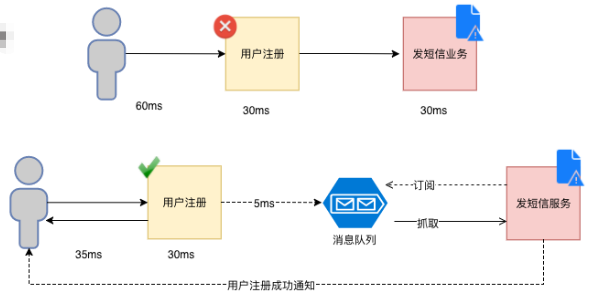
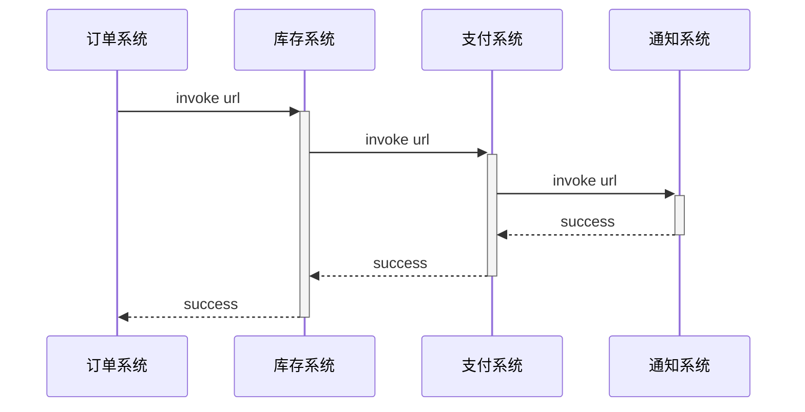
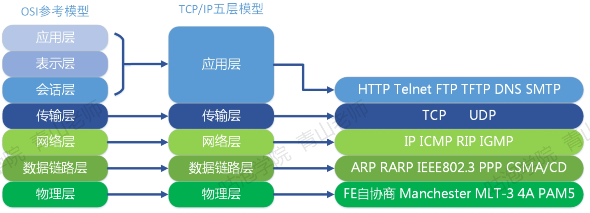

# 工作流

视频地址：https://www.mashibing.com/study?courseNo=376&sectionNo=20068&systemId=1&courseVersionId=1285

## 介绍

MQ，MessageQueue，消息中间件

从世界上第一个MQ的诞生历程来看，它最初是为了解决通信的问题。

消息队列，又叫做消息中间件。是指用高效可靠的消息传递机制进行与平台无关的数据交流，并基于数据通信来进行分布式系统的集成。

通过提供消息传递和消息队列模型，可以在分布式环境下扩展进程的通信。

基于以上的描述，MQ具备几个主要特点:

1、是一个独立运行的服务。生产者发送消息，消费者接收消费，需要先跟服务器建立连接。

2、采用队列作为数据结构，有先进先出的特点。

3、具有发布订阅的模型，消费者可以获取自己需要的消息。

我们可以把MQ类比成邮局和邮差，它是用来帮我们存储和转发消息的。


## 适用场景

### 异步通信

同步的通信是什么样的?

发出一个调用请求之后，在没有得到结果之前，就不返回。由调用者主动等待这个调用的结果。

而异步是相反的，调用在发出之后，这个调用就直接返回了，所以没有返回结果。也就是说，当一个异步过程调用发出后，调用者不会马上得到结果。而是在调用发出后，被调用者通过状态、通知来通知调用者，或通过回调函数处理这个调用。

#### 案例一

如下图：用户注册和发短信是2个服务，如果分别要30ms，使用同步的方式用户需要等待60ms，才会返回成功。

但如果使用了MQ，假设往MQ发送消息是5ms，那用户只需要等待35ms即可完成业务。



#### 案例二

大家都用过手机银行的跨行转账功能。大家用APP的转账功能的时候，有一个实时模式，有一个非实时模式。

实时转账实际上是异步通信，因为这个里面涉及的机构比较多，调用链路比较长，本行做了一些列的处理之后，转发给银联或者人民银行的支付系统，再转发给接收行，接受行处理以后再原路返回。

所以转账以后会有一行小字提示:具体到账时间以对方行处理为准，也就是说转出行只保证了这个转账的消息发出。那为什么到账时间又这么快呢?很多时候我们转账之后，不用几秒钟对方就收到了。是因为大部分的MQ都有一个低延迟的特性，能在短时间内处理非常多的消息。

很多理财软件提现也是一样，先提交请求，到账时间不定。这个是用MQ实现系统间异步通信的一个场景。

异步通信不需要客户端等待，可以减少客服端性能消耗，大大地提升用户体验。


### 系统解耦

要将解耦，首先要理解什么是系统耦合。耦合是系统内部或者系统之间存在相互作用，相互影响，相互依赖。

在分布式系统中，一个业务流程涉及多个系统的时候，他们之间就会形成一个依赖关系。



以上面的注册功能为例，如果短信功能异常了，例如：欠费了，将引起用户注册失败，这就一种强耦合或者说依赖关系。

以12306网站退票为例，在传统的通信方式中，订单系统发生了退货的动作，那么要依次调用所有下游系统的API，比如调用库存系统的API恢复库存，因为这张火车票还要释放出去给其他乘客购买;调用支付系统的APIl，不论是支付宝微信还是银行卡，要把手续费扣掉以后，原路退回给消费者;调用通知系统API通知用户退货成功。

这个过程是串行执行的，如果在恢复库存的时候发生了异常，那么后面的代码都不会执行。由于这一系列的动作，恢复库存，资金退还，发送通知，本质上没有一个严格的先后顺序，也没有直接的依赖关系,也就是说，只要用户提交了退货的请求，后面的这些动作都是要完成的。库存有没有恢复成功，不影响资金的退还和发送通知。

如果把串行改成并行，我们有什么思路?

(多线程)

多线程或者线程池是可以实现的，但是每一个需要并行执行的地方都引入线程，又会带来线程或者线程池的管理问题。

所以，这种情况下，我们可以引入MQ实现系统之间依赖关系的解耦合引入MQ以后

~~~mermaid
flowchart LR
1[订单系统]-->2[消息队列]
2-->3[库存系统]
2-->4[支付系统]
2-->5[通知系统]
~~~

订单系统只需要把退货的消息发送到消息队列上，由各个下游的业务系统自己创建队列，然后监听队列消费消息。

1、如果其他系统做了网络迁移，以前需要在订单系统配置和修改IP、端口、接口地址，现在不需要，因为它不需要关心消费者在网络上的什么位置，只需要配置MQ服务器的地址。

2、如果某一个下游系统宕机了或者在停机升级，调用接口超时会导致订单系统业务逻辑失败。引入MQ以后没有任何影响，消息保存在MQ服务器，什么时候下游系统恢复了自己去消费就OK了。

3、假如下游业务系统运行正常，但是消费出了问题，比如改代码该出问题了或者数据库异常，生产者也不会受到影响。因为它只关心一件事情，就是消息有没有成功地发送到MQ服务器。

(如果要确保消费成功或者确保数据一致性肯定要靠其他的手段来解决，后面会说)引入MQ以后，实现了系统之间依赖关系的解耦，系统的可扩展性和可维护性得到了提升。


### 削峰填谷

在很多的电商系统里面，有一个瞬间流量达到峰值的情况，比如京东的618，淘宝的双11，可能会达到百万甚至千万级的并发。普通的硬件服务器一般只能支撑大概200~500的并发，然后就会向最初的12306一样，动不动就服务器崩溃。

如果通过堆硬件的方式去解决，那么在流量峰值过去以后就会出现巨大的资源浪费。那要怎么办呢?一个饭店，在国庆期间一天有几万个人想去吃饭，为什么它不马上扩张门店呢?它的实际做法是什么?首先肯定不能拒绝顾客，说没位置了回家吧(排队啊)。

如果说要保护我们的应用服务器和数据库，限流也是可以的，但是这样又会导致订单的丢失，没有达到我们的目的。

为了解决这个问题，我们就可以引入MQ。MQ既然是Queue，一定有队列的特性，

我们知道队列的特性是什么?

(先进先出FIFO)

先进先出，有一个排队的模型。这个饭店它就有排队的通道，不会因为想吃饭的人太多了就把饭店鸡煲或者把服务员累趴。而且它还可以线上排队，你都不用一直站着。

我们可以先把所有的流量承接下来，转换成MQ消息发送到消息队列服务器上，业务层就可以根据自己的消费速率去处理这些消息，处理之后再返回结果。

如果要处理快一点，大不了就是增加几个消费者。就像火车站在春运期间会多开几个窗口处理购票请求。


### 广播通信

也叫数据分发，用于实现一对多通信。以订单系统退货为例，如果新增了积分系统，需要获取订单状态变化信息，只需要增加队列监听就可以了,生产者没有任何代码修改。

使用MQ做数据分发好处，无论是新增系统，还是移除系统，代码改造工作量较小。所以使用MQ做数据的分发，可以提高团队开发的效率。


### 总结

1. 对于数据量大或者处理耗时长的操作，我们可以引入MQ实现异步通信，减少客户端的等待，提升响应速度，优化客户体验。

2. 对于改动影响大的系统之间，可以引入MQ实现解耦，减少系统之间的直接依赖，提升可维护性和可扩展性。

3. 对于会出现瞬间的流量峰值的系统，我们可以引入MQ实现流量削峰，达到保护应用和数据库的目的。

4. 一对多的广播通信


## 缺点

对于一些特定的业务场景，MQ对于优化我们的系统性能还是有很大的帮助的。我们讲了这么多好处,以后只要是系统之间通信我全部用MQ,不再考虑HTTP接口和RPC调用，可以吗?

肯定不行。下面我们分析一下使用MQ会带来的一些问题。

第一个就是运维成本的增加。既然要用MQ，必须要分配资源部署MQ，还要保证它时刻正常运行。

第二个是系统的可用性降低。原来是两个节点的通信，现在还需要独立运行一个服务。虽然一般的MQ都有很高的可靠性和低延迟的特性，但是一旦网络或者MQ服务器出现问题，就会导致请求失败，严重地影响业务。

第三个是系统复杂性提高。为什么说复杂?作为开发人员，要使用MQ，首先必须要理解相关的模型和概念，才能正确地配置和使用MQ。其次，使用MQ发送消息必须要考虑消息丢失和消息重复消费的问题。一旦消息没有被正确地消费，就会带来数据一致性的问题。

所以，我们在做系统架构，选择通信方式的时候一定要根据实际情况来分析，不要因为我们说了这么多的MQ能解决的问题，就盲目地引入MQ。


## MQ对比

Kafka、ActiveMQ、RabbitMQ、RocketMQ 有什么优缺点？

| 特性                     | ActiveMQ                                              | RabbitMQ                                           | RocketMQ                                                     | Kafka                                                        |
| ------------------------ | ----------------------------------------------------- | -------------------------------------------------- | ------------------------------------------------------------ | ------------------------------------------------------------ |
| 单机吞吐量               | 万级，比 RocketMQ、Kafka 低一个数量级                 | 同 ActiveMQ                                        | 10 万级，支撑高吞吐                                          | 10 万级，高吞吐，一般配合大数据类的系统来进行实时数据计算、日志采集等场景 |
| topic 数量对吞吐量的影响 |                                                       |                                                    | topic 可以达到几百/几千的级别，吞吐量会有较小幅度的下降，这是 RocketMQ 的一大优势，在同等机器下，可以支撑大量的 topic | topic 从几十到几百个时候，吞吐量会大幅度下降，在同等机器下，Kafka 尽量保证 topic 数量不要过多，如果要支撑大规模的 topic，需要增加更多的机器资源 |
| 时效性                   | ms 级                                                 | 微秒级，这是 RabbitMQ 的一大特点，延迟最低         | ms 级                                                        | 延迟在 ms 级以内                                             |
| 可用性                   | 高，基于主从架构实现高可用                            | 同 ActiveMQ                                        | 非常高，分布式架构                                           | 非常高，分布式，一个数据多个副本，少数机器宕机，不会丢失数据，不会导致不可用 |
| 消息可靠性               | 有较低的概率丢失数据                                  | 基本不丢                                           | 经过参数优化配置，可以做到 0 丢失。支持事务                  | 同 RocketMQ。支持事务                                        |
| 功能支持                 | MQ 领域的功能极其完备                                 | 基于 erlang 开发，并发能力很强，性能极好，延时很低 | MQ 功能较为完善，还是分布式的，扩展性好                      | 功能较为简单，主要支持简单的 MQ 功能，在大数据领域的实时计算以及日志采集被大规模使用 |
| 资料文档                 | 多。没有专门写activemq的书，网上资料多                | 多。有一些不错的书，网上资料多                     | 少。没有专门写rocketmq的书，网上的资料良莠不齐，官方文档很简洁，但是对技术细节没有过多的描述 | 中，有kafka作者自己写的书，网上资料也有一些                  |
| 开发语言                 | java                                                  | Erlang                                             | java                                                         | Scala+Java                                                   |
| 支持协议                 | OpenWire、STOMP、REST、XMPP、AMQP                     | AMQP                                               | 自定义                                                       | 自定义（基于TCP）                                            |
| 消息存储                 |                                                       | 内存、磁盘。支持少量堆积                           | 磁盘。支持大量堆积                                           | 内存、磁盘、数据库。支持大量堆积                             |
| 集群方式                 | 支持简单集群模式，比如'主-备'，对高级集群模式支持不好 | 支持简单集群，'复制'模式，对高级集群模式支持不好   | 常用多对'Master-Slave' 模式，开源版本需手动切换Slave变成Master | 天然的‘Leader-Slave’无状态集群，每台服务器既是Master也是Slave |

 

## APQP

下面我们讲讲什么是AMQP协议。

### 历史

因为世界上第一个MQTIB实现了发布订阅(Publish/Subscribe)模型，消息的生产者和消费者可以完全解耦，这个特性引起了电信行业特别是新闻机构的注意。1994年路透社收购了Teknekron。

TIB的成功马上引起了业界大佬IBM的注意，他们研发了自己的IBM MQ (IBMWesphere——人民银行主导研发的二代支付系统用的就是IBM MQ)。后面微软也加入了这场战斗，研发了MSMQ。这个时候，每个厂商的产品是孤立的，大家都有自己的技术壁垒。比如一个应用订阅了IBM MQ的消息，如果有要订阅MSMQ的消息，因为协议、API不同，又要重复去实现。为什么大家都不愿意去创建标准接口，来实现不同的MQ产品的互通呢?跟现在微信里面不能打开淘宝页面是一个道理（商业竞争)。

JDBC协议大家非常熟悉吧?J2EE制定了JDBC的规范，那么那么各个数据库厂商自己去实现协议，提供jar包，在Java里面就可以使用相同的API做操作不同的数据库了。MQ产品的问题也是一样的，2001年的时候，SUN公司发布了JMS规范，它想要在各大厂商的MQ上面统一包装一层Java的规范,大家都只需要针对API编程就可以了，不需要关注使用了什么样的消息中间件，只要选择合适的MQ驱动。但是JMS只适用于Java语言，它是跟语言绑定的，没有从根本上解决这个问题(只是一个API)。

所以在2004年，几个大公司开始开发AMQP标准。2006年，AMQP规范发布了。

### AMQP是什么

AMQP的全称是：Advanced Message Queuing Protocol，高级消息队列协议。本质上是一种进程间传递异步消息的网络协议。它是跨语言和跨平台的，不管是什么样的MQ服务器，不管是什么语言的客户端，只要遵循AMQP协议，就可以实现消息的交互。真正地促进了消息队列的繁荣发展。

AMQP是一个工作于应用层的协议，最新的版本是1.0版本。可以使用 WireShark等工具对RabbitMQ通信的AMQP协议进行抓包。

既然它是一种协议或者规范，不是RabbitMQ专门设计的，市面上肯定还有很多其他实现了AMQP协议的消息中间件，比如: OpenAMQ、 Apache Qpid、RedhatEnterprise MRG、AMQP Infrastructure、OMQ、Zyre。



既然它是一种协议或者规范，不是为某一种MQ框架专门设计的，市面上肯定还有很多其他实现了AMQP协议的消息中间件，比如:
OpenAMQ、Apache Qpid、Redhat、Enterprise MRG、AMQP Infrastructure、∅MQ、zyre。


# Kafka

笔记对应的视频地址：https://www.mashibing.com/study?courseNo=407&sectionNo=713

## 简介

Kafka是由Apache软件基金会开发的一个开源流处理平台，由Scala和Java编写。Kafka是一种高吞吐量的分布式发布订阅消息系统，它可以收集并处理用户在网站中的所有动作流数据以及物联网设备的采样信息。

同时Kafka又提供了Kafka streaming插件包实现了实时在线流处理。相比较一些专业的流处理框架不同，Kafka Streaming计算是运行在应用端，具有简单、入门要求低、部署方便等优点。


## 架构和概念

### 工作模式

消息队列是一种在分布式和大数据开发中不可或缺的中间件。在分布式开发或者大数据开发中通常使用消息队列进行缓冲、系统间解耦和削峰填谷等业务场景，常见的消息队列工作模式大致会分为两大类：

- **至多一次**：消息生产者将数据写入消息系统，然后由消费者负责去拉去消息服务器中的消息，一旦消息被确认消费之后（Ack） ，由消息服务器主动删除队列中的数据，这种消费方式一般只允许被一个消费者消费，并且消息队列中的数据不允许被重复消费。

- **没有限制**：同上诉消费形式不同，生产者发完数据以后，该消息可以被多个消费者同时消费，并且同一个消费者可以多次消费消息服务器中的同一个记录。主要是因为消息服务器一般可以长时间存储海量消息。消费者接收消息后回复的是接收的偏移量（Commit Offset）。下次消费者如果还要消费，可以从根据偏移量继续消费。


### 集群

#### Topic

Kafka集群由多个集群节点组成，每一个节点叫做broker，broker部署在一台单独的服务器上。

Kafka集群以Topic形式负责分类集群中的Record（消息）。每一个Record（消息）只属于一个Topic。


如上图：

1. 消费者往kafka集群发送一个消息。
2. 消息包含：key（消息主键），value（消息值），时间戳（消息产生时间）
3. 一个消息只能属于一个topic，消息在发送时生产者会指定topic。
4. 订阅该topic的消费者将接收到消息。一个消费者可以订阅多个topic

#### 分区

每个Topic底层都会对应一组分区的日志用于持久化Topic中的Record。同时在Kafka集群中，Topic的每一个日志的分区都一定会有1个Broker担当该分区的Leader，其他的Broker担当该分区的follower，Leader负责分区数据的读写操作，follower负责同步改分区的数据。这样如果分区的Leader宕机，改分区的其他follower会选取出新的leader继续负责该分区数据的读写。其中集群的中Leader的监控和Topic的部分元数据是存储在Zookeeper中。


如上图

1. 当一个生产者往Kafka发送消息时，首先根据生产者指定的key找到topic
2. 然后用key的hash值对分区数取余，找到对应的分区。
3. 由于副本因子为3，所以每个分区还会存在3分副本，并且每个分区会有一个leader
4. 图中分区0的leader是broker0，分区1的leader为broker2。即：kafka中每一个broker可能既是某个分区的leader又是某个分区的follower。
5. 假设broker0宕机，会发生什么？
   1. partition0失去leader，将无法正常读写，因为只有leader能够写数据。
   2. 此时zookeeper会监测到broker0的宕机，会从broker2和3中选举出新的leader
   3. 如果选中的是Broker2，则它上面的partition0变成leader。
   4. 如果broker0重新启动起来，由于他的数据不是最新的，所以只能是follower。

#### Zookeeper

zookeeper主要配套kafka集群使用，主要用于

1. 集群健康检测
2. 分区元数据信息存储。


#### 分区&日志

Kafka中所有消息是通过Topic为单位进行管理，每个Kafka中的Topic通常会有多个订阅者，负责订阅发送到改Topic中的数据。Kafka负责管理集群中每个Topic的一组日志分区数据。

生产者将数据发布到相应的Topic。负责选择将哪个记录分发送到Topic中的哪个Partition。例如可以round-robin方式完成此操作，然而这种仅是为了平衡负载。也可以根据某些语义分区功能（例如基于记录中的Key）进行此操作。

每组日志分区是一个有序的不可变的的日志序列，分区中的每一个Record都被分配了唯一的序列编号称为是offset，Kafka 集群会持久化所有发布到Topic中的Record信息，改Record的持久化时间是通过配置文件指定,默认是168小时（7天）。

log.retention.hours=168

Kafka底层会定期的检查日志文件，然后将过期的数据从log中移除，由于Kafka使用硬盘存储日志文件，因此使用Kafka长时间缓存一些日志文件是不存在问题的。


如上图

图中的数字代表分区中的offset，数字越小，说明在同一个分区当中进入的越早。

当如果跨分区这种顺序就无法保证了。

如果一定要确保一个topic中消息的写入顺序，可以对这个topic设定不分区。

#### 为什么要引入分区

通过这种机制，使得一个topic可以存储海量的数据（一台机器不够，可以扩充机器）

分区可存在多个副本，只有leader可写，其他只能读，提高了写的并发和性能


### 消费者

在消费者消费Topic中数据的时候，每个消费者会维护本次消费对应分区的偏移量，消费者会在消费完一个批次的数据之后，会将本次消费的偏移量提交给Kafka集群，因此对于每个消费者而言可以随意的控制改消费者的偏移量。因此在Kafka中，消费者可以从一个topic分区中的任意位置读取队列数据，由于每个消费者控制了自己的消费的偏移量，因此多个消费者之间彼此相互独立。

Kafka中对Topic实现日志分区的有以下目的：

- 首先，它们允许日志扩展到超出单个服务器所能容纳的大小。每个单独的分区都必须适合托管它的服务器，但是一个Topic可能有很多分区，因此它可以处理任意数量的数据。

- 其次每个服务器充当其某些分区的Leader，也可能充当其他分区的Follwer，因此群集中的负载得到了很好的平衡。


如上图1：

生产者正在不断地往topic0的某个分区中写入数据，此时offset已经到达21

此topic存在2个消费者A和B，他们的消费是彼此独立的。A消费到了offset15，B消费到了offset20。


#### 消费者组

消费者使用Consumer Group名称标记自己，karfka中每一个消费者都会属于一个消费者组。

发布到Topic的每条记录都会传递到订阅它的Consumer Group中的一个消费者实例。

如果所有Consumer实例都具有相同的Consumer Group，那么Topic中的记录会在该ConsumerGroup中的Consumer实例进行均分消费；（即1个topic被1个消费者组订阅，该消费者组包含不同的消费实例）

如果所有Consumer实例具有不同的Consumer Group，则每条记录将广播到所有Consumer Group进程。（即1个topic被多个消费者组订阅）

更常见的是，我们发现Topic具有少量的Consumer Group，每个Consumer Group可以理解为一个“逻辑的订阅者”。每个Consumer Group均由许多Consumer实例组成，以实现可伸缩性和容错能力。这无非就是发布-订阅模型，其中订阅者是消费者的集群而不是单个进程。这种消费方式Kafka会将Topic按照分区的方式均分给一个Consumer Group下的实例，如果ConsumerGroup下有新的成员介入，则新介入的Consumer实例会去接管ConsumerGroup内其他消费者负责的某些分区，同样如果一下ConsumerGroup下的有其他Consumer实例宕机，则由改ConsumerGroup其他实例接管。

由于Kafka的Topic的分区策略，因此Kafka仅提供分区中记录的有序性，也就意味着相同Topic的不同分区记录之间无顺序。因为针对于绝大多数的大数据应用和使用场景， 使用分区内部有序或者使用key进行分区策略已经足够满足绝大多数应用场景。但是，如果您需要记录全局有序，则可以通过只有一个分区Topic来实现，尽管这将意味着每个ConsumerGroup只有一个Consumer进程。这也可能降低kafka的吞吐量。

如上图2

kafka集群具备1个topic，4个分区分散在了2个broker上。有2个消费者组消费数据。

一个组有2个消费者：c1，c2。c1负责消费p0和p1，c2负责消费p2和p3。

另一个组有4个消费者，他们各自负责消费一个分区。

在消费者组内部，1个消息只有一个消费者消费。

站在消费者组的角度，一个消息被同时广播给了2个消费者组

如果消费者组中消费者数量超过了topic的分区数量会发生什么？答案是正常情况下多出来的这个消费者将接收不到数据，但当某个消费者宕机时，这个消费者就可以接管其负责的分区了。


### 高性能之道

Kafka的特性之一就是高吞吐率（吞代表写入，吐代表读取，高吞吐就是写入读取速度很高），但是Kafka的消息是保存或缓存在磁盘上的，一般认为在磁盘上读写数据是会降低性能的，但是Kafka即使是普通的服务器，Kafka也可以轻松支持每秒百万级的写入请求，超过了大部分的消息中间件，这种特性也使得Kafka在日志处理等海量数据场景广泛应用。Kafka会把收到的消息都写入到硬盘中，防止丢失数据。为了优化写入速度Kafka采用了两个技术：顺序写入和MMFile（MemoryMappedFile，内存映射文件）。

#### 顺序写入

因为硬盘是机械结构，每次读写都会寻址->写入，其中寻址是一个“机械动作”，它是最耗时的。所以硬盘最讨厌随机I/O，最喜欢顺序I/O。为了提高读写硬盘的速度，Kafka就是使用顺序I/O。这样省去了大量的内存开销以及节省了IO寻址的时间。但是单纯的使用顺序写入，Kafka的写入性能也不可能和内存进行对比，因此Kafka的数据并不是实时的写入硬盘中 。

#### MMFile

Kafka充分利用了现代操作系统分页存储来利用内存提高I/O效率。Memory Mapped Files(后面简称mmap)也称为内存映射文件，在64位操作系统中一般可以表示20G的数据文件，它的工作原理是直接利用操作系统的PageCache实现文件到物理内存的直接映射。完成MMP映射后，用户对内存的所有操作会被操作系统自动的刷新到磁盘上，极大地降低了IO使用率。


如上图：

1. 应用A和应用B，运行在用户空间，此时他们向Kafka传递文件。
2. kafka接收到文件后会利用操作系统底层的PageCache原理，将其写入到mmap中。而这个mmap是和磁盘有映射关系的。
3. 至于PageCache中的数据何时写入到磁盘中，这个有操作系统决定。
4. 文件写入PageCache后，kafka就会响应成功，不会等待文件写入到磁盘成功。

应用宕机是否会影响数据写入到磁盘？

不会，应用是运行在用户空间，不会影响内核空间的操作。

如果操作系统内核出现问题呢？

例如，kafka服务器停电了。如果真的发生确实会导致数据丢失。但这是一个小概率事件，任何应用都要面对这个问题。如果要解决这个问题，可以将mmap特性取消，使得数据直接写入磁盘。这种做法就是用性能来换取安全性。这就是一种取舍没有完美的解决方案。但即使改成磁盘写入，也可能发生写入一半中途断电的情况的。

#### ZeroCopy

Kafka服务器在响应客户端读取的时候，底层使用ZeroCopy技术，直接将磁盘无需拷贝到用户空间，而是直接将数据通过内核空间传递输出，数据并没有抵达用户空间。

传统IO操作

- 用户进程调用read等系统调用向操作系统发出IO请求，请求读取数据到自己的内存缓冲区中。自己进入阻塞状态。

- 操作系统收到请求后，进一步将IO请求发送磁盘。

- 磁盘驱动器收到内核的IO请求，把数据从磁盘读取到驱动器的缓冲中。此时不占用CPU。当驱动器的缓冲区被读满后，向内核发起中断信号告知自己缓冲区已满。

- 内核收到中断，使用CPU时间将磁盘驱动器的缓存中的数据拷贝到内核缓冲区中。

- 如果内核缓冲区的数据少于用户申请的读的数据，重复步骤3跟步骤4，直到内核缓冲区的数据足够多为止。

- 将数据从内核缓冲区拷贝到用户缓冲区，同时从系统调用中返回。完成任务


以上是传统的IO模型，现在计算机采用的下面这种[DMA](https://baike.baidu.com/item/%E7%9B%B4%E6%8E%A5%E5%86%85%E5%AD%98%E8%AE%BF%E9%97%AE/6024586?fromtitle=DMA&fromid=2385376&fr=aladdin)参与的IO模式，CPU会将read指令发送给DMA，DMA会等到数据完全读入到内核空间才会通知CPU中断，然后CPU将数据返回到用户空间。这样，充分释放了CPU的计算性能。细节说明如下：

1.  用户进程调用read等系统调用向操作系统发出IO请求，请求读取数据到自己的内存缓冲区中。自己进入阻塞状态。
2.  操作系统收到请求后，进一步将IO请求发送DMA。然后让CPU干别的活去。
3.  DMA进一步将IO请求发送给磁盘。
4.  磁盘驱动器收到DMA的IO请求，把数据从磁盘读取到驱动器的缓冲中。当驱动器的缓冲区被读满后，向DMA发起中断信号告知自己缓冲区已满。
5.  DMA收到磁盘驱动器的信号，将磁盘驱动器的缓存中的数据拷贝到内核缓冲区中。此时不占用CPU。这个时候只要内核缓冲区的数据少于用户申请的读的数据，内核就会一直重复步骤3跟步骤4，直到内核缓冲区的数据足够多为止。
6.  当DMA读取了足够多的数据，就会发送中断信号给CPU。
7.  CPU收到DMA的信号，知道数据已经准备好，于是将数据从内核拷贝到用户空间，系统调用返回。


进一步模拟真实场景，加入网络协议，可以发现如下情况。数据加载内核空间后返回给应用的用户空间，然后再从用户空间重新copy到了内核空间的SocketBuffer中，然后通过网络协议传输给消费者（tcp，nio，socket等）。这里面经历了4次copy。


**ZeroCopy**，如下图：数据到内核空间后，直接到copy到SocketBuffer中，不再进入用户空间。


## 安装

### 安装流程

1. 安装JDK1.8+，配置JAVA_HOME  (CentOS 6.10 64bit)  
2. 配置主机名和IP映射
3. 关闭防火墙&&防火墙开机自启动
4. u同步时钟 ntpdate cn.pool.ntp.org **|** **ntp****[1-7].aliyun.com**
5. 安装&启动Zookeeper
6. 安装&启动|关闭Kafka


### Kafka安装

#### 下载

Zookeeper下载（3.7.1）：https://zookeeper.apache.org/releases.html

Kafka下载（3.5.0）：https://kafka.apache.org/downloads，由于Kafka依赖Scala，需要组要针对Scala选择安装版本


#### JDK安装

下载jdk1.8的rpm安装，放入到虚拟机的安装目录中，赋予当前用户执行权限

执行rpm -ga | grep jdk 查看是否之前已经安装jdk，如果安装了可以执行 rpm -e 'rpm -qa | grep jdk' 卸载

执行rpm -ivh jdk-xxxxxx.rpm 安装jdk。

执行java -version验证jdk是否安装成功。

echo $JAVA_HOME验证环境变量是否已经设置。如果没有的话

在当前用户的根目录下执行vi .bashrc，然后贴入如下代码保存

```bash
JAVA_HOME=/usr/java/latest
PATH=$PATH:$JAVA_HOME/bin
CLASSPATH=.
export JAVA_HOME
export PATH
export CLASSPATH
```

保存后执行source .bashrc让环境变量生效。

再次打印环境变量echo $JAVA_HOME


#### 主机名和ip映射

执行命令修改主机名：hostnamectl set-hostname dev-study

修改ip映射：vi /etc/hosts，加入如下文本保存

```tex
192.168.3.65 dev-study
```

使用ping命令验证映射是否设置成功：ping dev-study


#### 防火墙

执行命令查看防火墙状态：service iptables status

如果看到：Unit iptables.service could not be found.或者iptables: Firewall is not running代表防火墙没启动。

如果不是需要执行命令关闭防火墙：service iptables stop

这种方式只是临时关闭防火墙，下次服务器重启，防火墙还是会重新启动，要想彻底关闭可以执行：chkconfig iptables off

可以使用这个命令查看目前所有开机启动的服务：chkconfig --list


#### Zookeeper安装

将Zookeeper安装包上传到服务器某个目录下，赋予其足够的权限。

解压压缩包：tar -zxf apache-zookeeper-3.7.1-bin.tar.gz

新建Zookeeper的数据目录：mkdir -p /root/data/zkdata

进配置文件目录：cd /www/wwwroot/install/apache-zookeeper-3.7.1-bin/conf

创建新的配置文件：cp zoo_sample.cfg zoo.cfg

编辑配置文件，修改数据目录为刚刚创建的那个目录。vi zoo.cfg （dataDir=/root/data/zkdata）

保存并进入zk的bin目录：cd /www/wwwroot/install/apache-zookeeper-3.7.1-bin/bin

**启动zk**

./zkServer.sh start zoo.cfg，顺利的话会看到如下启动日志

```bash
ZooKeeper JMX enabled by default
Using config: /www/wwwroot/install/apache-zookeeper-3.7.1-bin/bin/../conf/zoo.cfg
Starting zookeeper ... STARTED
```

可以使用这个命令查看zk的状态：./zkServer.sh status zoo.cfg，看到如下信息代表zk状态正常

使用jps命令会看到一个名字为QuorumPeerMain的进程

```java
ZooKeeper JMX enabled by default
Using config: /www/wwwroot/install/apache-zookeeper-3.7.1-bin/bin/../conf/zoo.cfg
Client port found: 2181. Client address: localhost. Client SSL: false.
Mode: standalone
```

**关闭zk**

./zkServer.sh stop zoo.cfg


#### Kafka安装

解压kafka安装包：tar -xvf kafka_2.12-3.5.0.tgz

修改服务配置：vi config/server.properties

在监听地址中加入主机名：listeners=PLAINTEXT://dev-study:9092

修改日志地址确保日志目录可写入：log.dirs=./kafka-logs

修改connect链接地址：zookeeper.connect=dev-study:2181

保存退出：wq

**启动kafka**

cd /www/wwwroot/install/kafka_2.12-3.5.0

./bin/kafka-server-start.sh -daemon config/server.properties 

使用jps如果看到kafka进程代表启动成功

**关闭Kafka**

在根目录执行命令：./bin/kafka-server-stop.sh


### Kafka-Eagle

#### 简介

kafka eagle（英文kafka鹰） 是一款由国内公司开源的Kafka集群监控系统，可以用来监视kafka集群的broker状态、Topic信息、IO、内存、consumer线程、偏移量等信息，并进行可视化图表展示。独特的KQL还可以通过SQL在线查询kafka中的数据

#### 下载

下载地址：http://www.kafka-eagle.org/

下载后上传到服务器的待安装目录：/www/wwwroot/install


#### 安装

解压缩：tar -xvf kafka-eagle-bin-3.0.1.tar.gz

解压之后，进入目录内，还有一个压缩包：tar -xvf efak-web-3.0.1-bin.tar.gz

加入环境变量KE_HOME：vi ~/.bashrc

> KE_HOME=/www/wwwroot/install/kafka-eagle
>
> PATH=$PATH:$JAVA_HOME/bin:$KE_HOME/bin
>
> export KE_HOME

**设置修改**

vi conf/system-config.properties

~~~properties
efak.zk.cluster.alias=cluster1
cluster1.zk.list=dev-study:2181
#cluster2.zk.list=xdn10:2181,xdn11:2181,xdn12:2181
#cluster2.efak.offset.storage=zk

#在eagle中删除topic需要用到此密码
efak.topic.token=keadmin

#地址对应的数据库必须存在且服务可连接，eagle会自己创建数据库
efak.url=jdbc:mysql://127.0.0.1:3306/ke?useUnicode=true&characterEncoding=UTF-8&zeroDateTimeBehavior=convertToNull
efak.username=root
efak.password=root
~~~

**启动**

启动前，先确认Zookeeper和kafka服务已经可以正常访问。8048端口可访问

进入bin目录，执行./ke.sh start

如果启动成功，控制台会打印：

~~~java
Welcome to
    ______    ______    ___     __ __
   / ____/   / ____/   /   |   / //_/
  / __/     / /_      / /| |  / ,<   
 / /___    / __/     / ___ | / /| |  
/_____/   /_/       /_/  |_|/_/ |_|  
( Eagle For Apache Kafka® )

Version v3.0.1 -- Copyright 2016-2022
*******************************************************************
* EFAK Service has started success.
* Welcome, Now you can visit 'http://192.168.3.65:8048'
* Account:admin ,Password:123456
*******************************************************************
* <Usage> ke.sh [start|status|stop|restart|stats] </Usage>
* <Usage> https://www.kafka-eagle.org/ </Usage>
*******************************************************************
~~~

控制台会打印出登录页面的URL，已经管理员用户名和密码，使用这个登录系统。

#### 功能使用

##### dashboard

默认会进入dashboard（仪表盘）界面，这个界面会显示broker（集群节点），topic，Zookeeper，consumers（消费者组）信息

点击上面的数字，可以进入明细界面查看。

##### Topic

在这里可以对Topic进行增删改查的操作。

删除topic时需要输入system-config中的密码（efak.topic.token）

**mock**

这个功能主要用于模拟给topic发送消息。

先选择一个topic。然后输入要发送的消息，点send就能发出去。

##### Metadata

老版本叫manage，主要用于修改topic的配置，具体有哪些配置可以改。

可以进入界面，选择一个topic，然后在Topic Property Key中选择具体的配置项，填入新的值后，点submit

##### Consumers

这里只能查看消费者的状态，不能对消费者做操作。

##### Performance

这里主要罗列kafka的性能信息，如果有一些信息无法显示，需要kafka开启jmx端口。

##### Notification

当kafka符合某些预警条件时，可以通知管理员来关注。

AlertChannel：配置通知渠道，支持：邮箱，微信，钉钉。

AlertConsumer：配置通知条件，例如：消费者组消费topic01时，如果延迟达到某个阈值就触发告警。


### 集群安装

需要有3台CentOS虚拟机


## 常规操作

进行以下操作前，请先安装好Kafka

### Topic

Topic相关操作帮助：./bin/kafka-topics.sh --help

#### 创建topic

./bin/kafka-topics.sh --bootstrap-server dev-study:9092 --create --topic topic01 --partitions 3 --replication-factor 1

--partitions 3：代表会有3个分区

--replication-factor 1：代表副本因子为1，副本因子不能大于broker数量。因为是单机所以最大只能是1

命令执行成功会返回：Created topic topic01.


#### 订阅topic

./bin/kafka-console-consumer.sh --bootstrap-server dev-study:9092 --topic topic01 --group group01

--topic topic01：指定要订阅的topic名字

--group group01：指定消费者组名，不指定系统会默认给一个。

执行成功后，当前窗口会一直阻塞，等待消息接收。


#### 向topic发送消息

新开一个shell窗口，进入kafka根目录。

./bin/kafka-console-producer.sh --broker-list dev-study:9092 --topic topic01

 --boker-list dev-study:9092 指定消息的服务器

--topic topic01指定消息的topic

执行成功，会进入消息发送窗口，在这个窗口内发送任意消息回车，消费者那头都能接受到。

```bash
[root@dev-study kafka_2.12-3.5.0]# ./bin/kafka-console-producer.sh --broker-list dev-study:9092 --topic topic01
>this is a testmessage
>test msg 2
>test msg 3
>^C ctrl + C 退出
```


#### 同组多消费者

新建多个shell窗口，都订阅同一个topic和一个消费者组。然后从生产者那头发送消息。

测试结果：1个组内的3个消费者只有一个消费者能收到消息


## Java集成

### 基础API

本章主要介绍如何通过api的方式进行kafka的基本操作

#### maven依赖

```xml
    <dependencies>

        <dependency>
            <groupId>org.apache.kafka</groupId>
            <artifactId>kafka-streams</artifactId>
            <version>3.5.0</version>
        </dependency>

        <dependency>
            <groupId>log4j</groupId>
            <artifactId>log4j</artifactId>
            <version>1.2.17</version>
        </dependency>

        <dependency>
            <groupId>org.slf4j</groupId>
            <artifactId>slf4j-api</artifactId>
            <version>1.7.25</version>
        </dependency>

        <dependency>
            <groupId>org.slf4j</groupId>
            <artifactId>slf4j-log4j12</artifactId>
            <version>1.7.25</version>
        </dependency>

        <dependency>
            <groupId>org.apache.commons</groupId>
            <artifactId>commons-lang3</artifactId>
            <version>3.9</version>
        </dependency>

    </dependencies>
```


#### 打印Topic

项目位置：mashibing\MQ\kafka_mq

```java
@Slf4j
public class TopicDMLDemo {

    public static void main(String[] args) throws ExecutionException, InterruptedException {
        //配置连接参数，这里面出现的主机名，需要在hosts文件中配置好ip映射
        Properties props = new Properties();
        props.put(AdminClientConfig.BOOTSTRAP_SERVERS_CONFIG,
                "dev-study:9092");
        //创建与kafka服务器的客户端连接（注意关闭linux防火墙）
        KafkaAdminClient adminClient = (KafkaAdminClient) KafkaAdminClient.create(props);

        //查询所有的topics
        KafkaFuture<Set<String>> nameFutures = adminClient.listTopics().names();
        for (String name : nameFutures.get()) {
            log.info("topic-name:{}",name);
        }

        adminClient.close();
    }
}
```


#### Topic新增删除

在上面的代码的基础上修改

```java
	public static void main(String[] args) throws ExecutionException, InterruptedException {
        //配置连接参数，这里面出现的主机名，需要在hosts文件中配置好ip映射
        Properties props = new Properties();
        props.put(AdminClientConfig.BOOTSTRAP_SERVERS_CONFIG,
                "dev-study:9092");
        //创建与kafka服务器的客户端连接（注意关闭linux防火墙）
        KafkaAdminClient adminClient = (KafkaAdminClient) KafkaAdminClient.create(props);

        //查询所有的topics
        KafkaFuture<Set<String>> nameFutures = adminClient.listTopics().names();
        for (String name : nameFutures.get()) {
            log.info("topic-name:{}", name);
        }

        //创建Topics
        List<NewTopic> newTopics = Arrays.asList(new NewTopic("topic02", 3, (short) 1));

        //删除Topic
        // adminClient.deleteTopics(Arrays.asList("topic02"));

        //查看Topic详情
        DescribeTopicsResult describeTopics = adminClient.describeTopics(Arrays.asList("topic01"));
        Map<String, TopicDescription> tdm = describeTopics.all().get();
        for (Map.Entry<String, TopicDescription> entry : tdm.entrySet()) {
            log.info(entry.getKey() + "\t" + entry.getValue());
        }

        adminClient.close();
    }
```


#### 生产者

下面代码，将连接上topic并向服务器发送消息，此时如果有消费者，将会接收到消息。

```java
public class KafkaProducerDemo {
    public static void main(String[] args) throws InterruptedException {
        //1.创建链接参数
        Properties props = new Properties();
        props.put(ProducerConfig.BOOTSTRAP_SERVERS_CONFIG, "dev-study:9092");
        props.put(ProducerConfig.KEY_SERIALIZER_CLASS_CONFIG, StringSerializer.class.getName());
        props.put(ProducerConfig.VALUE_SERIALIZER_CLASS_CONFIG, StringSerializer.class.getName());

        //2.创建生产者
        KafkaProducer<String, String> producer = new KafkaProducer<String, String>(props);

        //3.封装消息队列
        for (Integer i = 0; i < 10; i++) {
            Thread.sleep(100);
            ProducerRecord<String, String> record = new ProducerRecord<>("topic01", "key" + i, "value" + i);
            producer.send(record);
        }

        producer.close();
    }
}
```


#### 消费者

以下为消费者代码，启动后将监听topic中的消息，可以启动多个。（在Idea的Run Configuration中勾选Allow Multiple Instance）

```java
ublic class KafkaConsumerDemo {
    public static void main(String[] args) {
        //1.创建Kafka链接参数
        Properties props = new Properties();
        props.put(ConsumerConfig.BOOTSTRAP_SERVERS_CONFIG, "dev-study:9092");
        props.put(ConsumerConfig.KEY_DESERIALIZER_CLASS_CONFIG, StringDeserializer.class.getName());
        props.put(ConsumerConfig.VALUE_DESERIALIZER_CLASS_CONFIG, StringDeserializer.class.getName());
        props.put(ConsumerConfig.GROUP_ID_CONFIG, "group01");

        //2.创建Topic消费者
        KafkaConsumer<String, String> consumer = new KafkaConsumer<String, String>(props);
        //3.订阅topic开头的消息队列
        consumer.subscribe(Pattern.compile("^topic.*$"));

        while (true) {
            //每隔1秒拉取一下消息
            ConsumerRecords<String, String> consumerRecords = consumer.poll(Duration.ofSeconds(1));
            Iterator<ConsumerRecord<String, String>> recordIterator = consumerRecords.iterator();
            while (recordIterator.hasNext()) {
                ConsumerRecord<String, String> record = recordIterator.next();
                String key = record.key();
                String value = record.value();
                long offset = record.offset();
                int partition = record.partition();
                System.out.println("key:" + key + ",value:" + value + ",partition:" + partition + ",offset:" + offset);
            }
        }
    }
}
```


如果启动多个消费者实例会打出如下日志，并且2个消费者接收到的数据不一样。

> 2023-07-13 22:09:58[INFO ][main]<init>(AppInfoParser.java:119) Kafka version: 3.5.0
> 2023-07-13 22:09:58[INFO ][main]<init>(AppInfoParser.java:120) Kafka commitId: c97b88d5db4de28d
> 2023-07-13 22:09:58[INFO ][main]<init>(AppInfoParser.java:121) Kafka startTimeMs: 1689257398509
> 2023-07-13 22:09:58[INFO ][main]subscribe(KafkaConsumer.java:1044) [Consumer clientId=consumer-group01-1, groupId=group01] Subscribed to pattern: '^topic.*$'
> 2023-07-13 22:09:58[INFO ][main]update(Metadata.java:287) [Consumer clientId=consumer-group01-1, groupId=group01] Cluster ID: WAPzz8N6QTWdtkLIQD77CA
> 2023-07-13 22:09:58[INFO ][main]onSuccess(AbstractCoordinator.java:906) [Consumer clientId=consumer-group01-1, groupId=group01] Discovered group coordinator dev-study:9092 (id: 2147483647 rack: null)
> 2023-07-13 22:09:58[INFO ][main]sendJoinGroupRequest(AbstractCoordinator.java:576) [Consumer clientId=consumer-group01-1, groupId=group01] (Re-)joining group
> 2023-07-13 22:09:58[INFO ][main]requestRejoin(AbstractCoordinator.java:1072) [Consumer clientId=consumer-group01-1, groupId=group01] Request joining group due to: need to re-join with the given member-id: consumer-group01-1-cd2bd321-05e8-46fe-96ae-561c7ca9ec27
> 2023-07-13 22:09:58[INFO ][main]requestRejoin(AbstractCoordinator.java:1072) [Consumer clientId=consumer-group01-1, groupId=group01] Request joining group due to: rebalance failed due to 'The group member needs to have a valid member id before actually entering a consumer group.' (MemberIdRequiredException)
> 2023-07-13 22:09:58[INFO ][main]sendJoinGroupRequest(AbstractCoordinator.java:576) [Consumer clientId=consumer-group01-1, groupId=group01] (Re-)joining group
> 2023-07-13 22:10:01[INFO ][main]handle(AbstractCoordinator.java:637) [Consumer clientId=consumer-group01-1, groupId=group01] Successfully joined group with generation Generation{generationId=4, memberId='consumer-group01-1-cd2bd321-05e8-46fe-96ae-561c7ca9ec27', protocol='range'}
> 2023-07-13 22:10:02[INFO ][main]handle(AbstractCoordinator.java:812) [Consumer clientId=consumer-group01-1, groupId=group01] Successfully synced group in generation Generation{generationId=4, memberId='consumer-group01-1-cd2bd321-05e8-46fe-96ae-561c7ca9ec27', protocol='range'}
> 2023-07-13 22:10:02[INFO ][main]invokeOnAssignment(ConsumerCoordinator.java:307) [Consumer clientId=consumer-group01-1, groupId=group01] Notifying assignor about the new Assignment(partitions=[topic01-2])
> 2023-07-13 22:10:02[INFO ][main]invokePartitionsAssigned(ConsumerCoordinator.java:319) [Consumer clientId=consumer-group01-1, groupId=group01] Adding newly assigned partitions: topic01-2
> 2023-07-13 22:10:02[INFO ][main]refreshCommittedOffsetsIfNeeded(ConsumerCoordinator.java:975) [Consumer clientId=consumer-group01-1, groupId=group01] Setting offset for partition topic01-2 to the committed offset FetchPosition{offset=0, offsetEpoch=Optional.empty, currentLeader=LeaderAndEpoch{leader=Optional[dev-study:9092 (id: 0 rack: null)], epoch=0}}


#### 自定义分区

消费者对应的分区，是由kafka按照规则自动分配，但是也可以指定分区。

代码大体同上，只是局部要修改

```java
public static void main(String[] args) {
        //1.创建Kafka链接参数
        Properties props = new Properties();
        props.put(ConsumerConfig.BOOTSTRAP_SERVERS_CONFIG, "CentOSA:9092,CentOSB:9092,CentOSC:9092");
        props.put(ConsumerConfig.KEY_DESERIALIZER_CLASS_CONFIG, StringDeserializer.class.getName());
        props.put(ConsumerConfig.VALUE_DESERIALIZER_CLASS_CONFIG, StringDeserializer.class.getName());
        //props.put(ConsumerConfig.GROUP_ID_CONFIG, "group01");

        //2.创建Topic消费者
        KafkaConsumer<String, String> consumer = new KafkaConsumer<String, String>(props);
        //2.订阅相关的Topics,手动指定消费分区，失去组管理特性
        List<TopicPartition> partitions = Arrays.asList(new TopicPartition("topic01", 0));
        consumer.assign(partitions);
        //指定消费分区的位置
        consumer.seekToBeginning(partitions);

        while (true) {
            ConsumerRecords<String, String> consumerRecords = consumer.poll(Duration.ofSeconds(1));
            Iterator<ConsumerRecord<String, String>> recordIterator = consumerRecords.iterator();
            while (recordIterator.hasNext()) {
                ConsumerRecord<String, String> record = recordIterator.next();
                String key = record.key();
                String value = record.value();
                long offset = record.offset();
                int partition = record.partition();
                System.out.println("key:" + key + ",value:" + value + ",partition:" + partition + ",offset:" + offset);
            }
        }
    }
```


### SpringBoot集成

本章主要讲述通过SpringBoot与kafka进行交互。

#### 初始化

##### pom文件

关键依赖：spring-kafka

```xml
<?xml version="1.0" encoding="UTF-8"?>
<project xmlns="http://maven.apache.org/POM/4.0.0"
         xmlns:xsi="http://www.w3.org/2001/XMLSchema-instance"
         xsi:schemaLocation="http://maven.apache.org/POM/4.0.0 http://maven.apache.org/xsd/maven-4.0.0.xsd">
    <parent>
        <artifactId>MQ</artifactId>
        <groupId>com.sjj.mashibing</groupId>
        <version>0.0.1-SNAPSHOT</version>
    </parent>
    <modelVersion>4.0.0</modelVersion>

    <groupId>com.sjj.mashibing.mq</groupId>
    <artifactId>kafka_spring</artifactId>

    <properties>
        <maven.compiler.source>8</maven.compiler.source>
        <maven.compiler.target>8</maven.compiler.target>
    </properties>

    <dependencyManagement>
        <dependencies>
            <!-- SpringBoot的依赖配置-->
            <dependency>
                <groupId>org.springframework.boot</groupId>
                <artifactId>spring-boot-dependencies</artifactId>
                <version>2.3.12.RELEASE</version>
                <type>pom</type>
                <scope>import</scope>
            </dependency>
        </dependencies>
    </dependencyManagement>

    <dependencies>
        <dependency>
            <groupId>org.springframework.boot</groupId>
            <artifactId>spring-boot-starter</artifactId>
        </dependency>

        <dependency>
            <groupId>org.springframework.kafka</groupId>
            <artifactId>spring-kafka</artifactId>
        </dependency>

        <dependency>
            <groupId>org.apache.kafka</groupId>
            <artifactId>kafka-streams</artifactId>
            <version>3.5.0</version>
        </dependency>

        <dependency>
            <groupId>org.springframework.boot</groupId>
            <artifactId>spring-boot-starter-test</artifactId>
            <scope>test</scope>
        </dependency>

    </dependencies>
    <build>
        <plugins>
            <plugin>
                <groupId>org.springframework.boot</groupId>
                <artifactId>spring-boot-maven-plugin</artifactId>
            </plugin>
        </plugins>
    </build>
</project>
```

##### Spring配置文件

```properties
spring.kafka.bootstrap-servers=dev-study:9092

spring.kafka.producer.retries=5
spring.kafka.producer.acks=all
spring.kafka.producer.batch-size=16384
spring.kafka.producer.buffer-memory=33554432
spring.kafka.producer.key-serializer=org.apache.kafka.common.serialization.StringSerializer
spring.kafka.producer.value-serializer=org.apache.kafka.common.serialization.StringSerializer
spring.kafka.producer.properties.enable.idempotence=true

spring.kafka.consumer.group-id=group01
spring.kafka.consumer.auto-offset-reset=earliest
spring.kafka.consumer.enable-auto-commit=true
spring.kafka.consumer.auto-commit-interval=100
spring.kafka.consumer.properties.isolation.level=read_committed
spring.kafka.consumer.key-deserializer=org.apache.kafka.common.serialization.StringDeserializer
spring.kafka.consumer.value-deserializer=org.apache.kafka.common.serialization.StringDeserializer

spring.kafka.streams.application-id=wordcount_id
spring.kafka.streams.client-id=SpringBootApp1
spring.kafka.streams.auto-startup=true
spring.kafka.streams.state-dir=D:/Workspace/idea/mashibing/mashibing/MQ/kafka_spring/stateDir
spring.kafka.streams.replication-factor=1
spring.kafka.streams.properties.processing.guarantee=exactly_once
        
```


##### 启动类

关键：@KafkaListeners

```java
@SpringBootApplication
public class KafkaSpringBootApplication {
    public static void main(String[] args) throws IOException {
        SpringApplication.run(KafkaSpringBootApplication.class, args);
        System.in.read();
    }

    /**
     * kafka消费者配置，监听主题
     */
    @KafkaListeners(value = {@KafkaListener(topics = {"topic01"})})
    public void listener(ConsumerRecord<?, ?> cr) {
        System.out.println("ConsumerRecord: " + cr);
    }
}
```

启动上述SpringBoot应用

```java
-XX:-BytecodeVerificationLocal -XX:-BytecodeVerificationRemote -XX:InitialHeapSize=1098907648 -XX:+ManagementServer -XX:MaxHeapSize=1098907648 -XX:+PrintCommandLineFlags -XX:TieredStopAtLevel=1 -XX:+UseCompressedClassPointers -XX:+UseCompressedOops -XX:+UseG1GC -XX:-UseLargePagesIndividualAllocation
.   ____          _            __ _ _
 /\\ / ___'_ __ _ _(_)_ __  __ _ \ \ \ \
( ( )\___ | '_ | '_| | '_ \/ _` | \ \ \ \
 \\/  ___)| |_)| | | | | || (_| |  ) ) ) )
  '  |____| .__|_| |_|_| |_\__, | / / / /
 =========|_|==============|___/=/_/_/_/
 :: Spring Boot ::       (v2.3.12.RELEASE)

INFO 2023-07-17 23:06:22 - group01: partitions assigned: [topic01-2, topic01-1, topic01-0]
```


#### 注解

##### Topic消费

往监听的topic中发送一条消息，测试是否能接收到消息，推荐使用eagle的topic mock功能。

如果正常的控制台应该会打印一行消息。


##### 消费转发

从一个topic中收到消息后，处理完直接发送到另一个topic中，参考代码如下：

以下代码可添加到上面的启动类中测试。

```java
    /**
     * 接收topic02，转发给topic03
     */
    @KafkaListeners(value = {@KafkaListener(topics = {"topic02"})})
    @SendTo(value = {"topic03"})
    public String listener02(ConsumerRecord<?, ?> cr) {
        System.out.println("ConsumerRecord: " + cr);
        return cr.value() + " resend topic";
    }
```


#### KafkaTemplate

##### 简单消息发送

新建一个单元测试类。

```java
@SpringBootTest(classes = {KafkaSpringBootApplication.class})
@RunWith(SpringRunner.class)
public class KafkaTempolateTests {
    @Autowired
    private KafkaTemplate kafkaTemplate;

    @Test
    public void testSend() {
        kafkaTemplate.send(new ProducerRecord<String,String>("topic01","key01","springboot-test-1"));
        System.out.println("send msg success!");
    }
}
```

新建后直接运行就可以在eagle的topic->KSQL中看到发送的消息了。切换到result页签。

select \* from topic01 where `partition` in (0,1,2) limit 10

##### 事务消息发送

在application.properties中加入下面的配置

```properties
spring.kafka.producer.transaction-id-prefix=transaction-id-
```

此时同样运行上面的代码会直接报错，需要在发送的代码中也加入事务。

> java.lang.IllegalStateException: No transaction is in process; possible solutions: run the template operation within the scope of a template.executeInTransaction() operation, start a transaction with @Transactional before invoking the template method, run in a transaction started by a listener container when consuming a record

在源代码基础上加入testSendTransaction()方法，测试成功。

```java
@SpringBootTest(classes = {KafkaSpringBootApplication.class})
@RunWith(SpringRunner.class)
public class KafkaTempolateTests {
    @Autowired
    private KafkaTemplate kafkaTemplate;

    @Test
    public void testSend() {
        kafkaTemplate.send(new ProducerRecord<String,String>("topic01","key1","msg-springboot-test-2"));
        System.out.println("send msg success!");
    }

    @Test
    public void testSendTransaction() {
        kafkaTemplate.executeInTransaction(new KafkaOperations.OperationsCallback() {
            @Override
            public Object doInOperations(KafkaOperations kafkaOperations) {
                return kafkaOperations.send(new ProducerRecord("topic01", "key2", "transaction001"));
            }
        });
        System.out.println("send msg success!");
    }
}
```


##### 结合业务

在实际的开发场景中，并不会直接在单元测试类中发送消息。而是通过业务层调用KafkaTemplate发送消息。

我们创建订单接口与订单服务。

~~~java
/**
 * 订单接口
 */
public interface IOrderService {
    public void saveOrder(String id,Object message);
}

/**
 * 订单Service
 */
@Transactional
@Service
public class OrderService implements IOrderService {
    @Autowired
    private KafkaTemplate kafkaTemplate;

    @Override
    public void saveOrder(String id, Object message) {
        kafkaTemplate.send(new ProducerRecord("topic01", id, message));
    }
}

@SpringBootTest(classes = {KafkaSpringBootApplication.class})
@RunWith(SpringRunner.class)
public class OrderServiceTests {
    @Autowired
    private IOrderService orderService;

    @Test
    public void testOrderService() {
        orderService.saveOrder("order", "订单JSON：{}");
    }
}
~~~


# RocketMQ

课程链接：https://www.processon.com/view/link/64b65e23cf023908bc04068f，老师：李瑾

## 简介

### 发展历史

**前世**

MetaQ：2011年，阿里基于Kafka的设计使用Java完全重写并推出了MetaQ 1.0版本 。

2012年，阿里对MetaQ的存储进行了改进，推出MetaQ 2.0，同年阿里把Meta2.0从阿里内部开源出来，取名RocketMQ，为了命名上的规范以及版本上的延续，对外称为RocketMQ3.0。

**今生**

2016年，阿里宣布将开源分布式消息中间件RocketMQ捐赠给Apache，同时RocketMQ3也升级为RocketMQ4，现在RocketMQ主要维护的是4.x的版本，也是大家使用得最多的版本。

**未来**

2021年，RocketMQ在github上发布5.0预览版。RocketMQ 5.0定义为云原生的消息、事件、流的超融合平台。因为尚未正式发布，目前不需要过多了解。


### 角色介绍


#### NameServer

NameServer是整个RocketMQ的“大脑”，它是RocketMQ的服务注册中心，所以RocketMQ需要先启动NameServer再启动Rocket中的Broker。

Broker在启动时向所有NameServer注册（主要是服务器地址等），生产者在发送消息之前先从NameServer获取Broker服务器地址列表（消费者一样），然后根据负载均衡算法从列表中选择一台服务器进行消息发送。

#### 主机(Broker)

RocketMQ的核心，用于暂存和传输消息。

#### 生产者(Producer)

**生产者**：也称为消息发布者，负责生产并发送消息至RocketMQ。

#### 消费者(Consumer)

**消费者**：也称为消息订阅者，负责从RocketMQ接收并消费消息。

#### 消息(Message)

**消息**：生产或消费的数据，对于RocketMQ来说，消息就是字节数组。


### 基本概念

#### 主题(Topic)

标识RocketMQ中一类消息的逻辑名字，消息的逻辑管理单位。无论消息生产还是消费，都需要指定Topic。主题主要用于区分消息的种类：一个生产者可以发送消息给一个或者多个Topic，消息的消费者也可以订阅一个或者多个Topic消息。

例如：物料，BOM，供应商等。

#### 消息队列(Message Queue)

简称Queue或Q。消息物理管理单位。一个Topic将有若干个Q。（类似kafka中的分区）

无论生产者还是消费者，实际的生产和消费都是针对Q级别。例如Producer发送消息的时候，会预先选择（默认轮询）好该Topic下面的某一条Q发送；Consumer消费的时候也会负载均衡地分配若干个Q，只拉取对应Q的消息。

若一个Topic创建在不同的Broker，则不同的broker上都有若干Q，消息将物理地存储落在不同Broker结点上，具有水平扩展的能力。

#### 分组(Group)

**生产者：**标识发送同一类消息的Producer，通常发送逻辑一致。发送普通消息的时候，仅标识使用，并无特别用处。**主要作用用于事务消息**：

**消费者：**标识一类Consumer的集合名称，这类Consumer通常消费一类消息（也称为Consumer Group），且消费逻辑一致。同一个Consumer Group下的各个实例将共同消费topic的消息，起到负载均衡的作用。

#### 标签(Tag)

RocketMQ支持给在发送的时候给消息打tag，同一个topic的消息虽然逻辑管理是一样的。但是消费同一个topic时，如果你消费订阅的时候指定的是tagA，那么tagB的消息将不会投递。

#### 偏移量(Offset)

RocketMQ中，有很多offset的概念。一般我们只关心暴露到客户端的offset。不指定的话，就是指Message Queue下面的offset。

Message queue是无限长的数组。一条消息进来下标就会涨1,而这个数组的下标就是offset，Message queue中的max offset表示消息的最大offset

Consumer offset可以理解为标记Consumer Group在一条逻辑Message Queue上，消息消费到哪里即消费进度。但从源码上看，这个数值是消费过的最新消费的消息offset+1，即实际上表示的是**下次拉取的****offset****位置**。


## 安装

### windows安装

#### 下载

下载链接：https://archive.apache.org/dist/rocketmq/ ，本文下载的是4.9.7

解压运行版本(Binary)，确保已经安装好了JDK1.8

解压后的目录如下：


#### 配置环境变量

变量名：ROCKETMQ_HOME

 变量值：MQ解压路径\MQ文件夹名


#### 启动

在RocketMQ的架构中，都是需要先启动NameServer再启动Broker的。所以先启动NameServer。

l 启动NameServer

使用cmd命令框执行进入至‘MQ文件夹\bin’下，然后执行‘start mqnamesrv.cmd’，启动NameServer。成功后会弹出提示框，此框勿关闭。


l  启动Broker

使用cmd命令框执行进入至‘MQ文件夹\bin’下，然后执行‘start mqbroker.cmd -n 127.0.0.1:9876 autoCreateTopicEnable=true’，启动Broker。成功后会弹出提示框，此框勿关闭。


#### 注意事项

l 弹出提示框‘错误: 找不到或无法加载主类 xxxxxx’的处理

打开‘MQ文件夹\bin’下的runbroker.cmd，然后将‘%CLASSPATH%’加上英文双引号。保存并重新执行start语句。


再次启动


l 内存不足的处理方式

RocketMQ默认的虚拟机内存较大，启动Broker如果因为内存不足失败，需要编辑如下两个配置文件，修改JVM内存大小。编辑‘MQ文件夹\bin’下的runbroker.cmd和runserver. cmd修改默认JVM大小（Linux上对应同名sh文件）

runbroker.cmd      --broker的配置

runserver. cmd      --nameServer的配置

例如：配置以下参数将RocketMQ的启动JVM的 堆空间内存控制在512m，新生代控制   在256m。元空间初始128m，最大320m。


l 修改RocketMQ的存储路径

rocketmq取的默认路径是user.home路径，也就是用户的根目录，一般存储放在跟路径下的 /store目录。

 

源码中可以得到验证，如下图：


所以这里会有一个问题，RocketMQ很容易导致C盘空间不够，在使用过程中，创建一个主题默认就是要创建1G的文件，很可能会导致出问题。

所以在windows上容易导致C盘空间吃满。

解决方式有两种：

1、修改源码，比如：全局替换user.home参数为mq.store，然后重新打包

2、使用源码方式启动，源码启动时通过参数设置指定存储位置


### 控制台插件

#### 环境要求

运行前确保：已经有jdk1.8，Maven(打包需要安装Maven 3.2.x)

#### 下载

老版本地址下载：https://codeload.github.com/apache/rocketmq-externals/zip/master

新版本地址：https://github.com/apache/rocketmq-dashboard

解压后如图(以下使用的是老版本，新版本参考老版本即可)


#### 启动

后端管理界面是：rocketmq-console

下载完成之后，进入‘\rocketmq-console\src\main\resources’文件夹，打开‘application.properties’进行配置。


进入‘\rocketmq-externals\rocketmq-console’文件夹，执行‘mvn clean package -Dmaven.test.skip=true’，编译生成。


编译成功之后，cmd命令进入‘target’文件夹，执行‘java -jar rocketmq-console-ng-2.0.0.jar’，启动‘rocketmq-console-ng-2.0.0.jar’。

  

浏览器中输入‘127.0.0.1:8089’，成功后即可进行管理端查看。


#### 控制台使用文档

n **运维页面**

Ø 你可以修改这个服务使用的namesrv的地址

Ø 你可以修改这个服务是否使用VIPChannel(如果你的mq server版本小于3.5.8，请设置不使用)


n **驾驶舱**

Ø 查看broker的消息量（总量/5分钟图）

Ø 查看单一主题的消息量（总量/趋势图）


n **集群**

Ø 查看集群的分布情况：cluster与broker关系、broker

Ø 查看broker具体信息/运行信息

Ø 查看broker配置信息


n **主题页面**

Ø 展示所有的主题，可以通过搜索框进行过滤

Ø 筛选 普通/重试/死信 主题

Ø 添加/更新主题

l clusterName 创建在哪几个cluster上

l brokerName 创建在哪几个broker上

l topicName 主题名

l writeQueueNums 写队列数量

l readQueueNums 读队列数量

l perm //2是写 4是读 6是读写

Ø 状态 查询消息投递状态（投递到哪些broker/哪些queue/多少量等）

Ø 路由 查看消息的路由（现在你发这个主题的消息会发往哪些broker，对应broker的queue信息）

Ø CONSUMER管理（这个topic都被哪些group消费了，消费情况何如）

Ø topic配置（查看变更当前的配置）

Ø 发送消息（向这个主题发送一个测试消息）

Ø 重置消费位点(分为在线和不在线两种情况，不过都需要检查重置是否成功)

Ø 删除主题 （会删除掉所有broker以及namesrv上的主题配置和路由信息）


n **消费者页面**

Ø 展示所有的消费组，可以通过搜索框进行过滤

Ø 刷新页面/每隔五秒定时刷新页面

Ø 按照订阅组/数量/TPS/延迟 进行排序

Ø 添加/更新消费组

l clusterName 创建在哪几个集群上

l brokerName 创建在哪几个broker上

l groupName 消费组名字

l consumeEnable //是否可以消费 FALSE的话将无法进行消费

l consumeBroadcastEnable //是否可以广播消费

l retryQueueNums //重试队列的大小

l brokerId //正常情况从哪消费

l whichBrokerWhenConsumeSlowly//出问题了从哪消费

Ø 终端 在线的消费客户端查看，包括版本订阅信息和消费模式

Ø 消费详情 对应消费组的消费明细查看，这个消费组订阅的所有Topic的消费情况，每个queue对应的消费client查看（包括Retry消息）

Ø 配置 查看变更消费组的配置

Ø 删除 在指定的broker上删除消费组


n **生产者页面**

通过Topic和Group查询在线的消息生产者客户端

信息包含客户端主机 版本


n **消息查询页面**

Ø 根据Topic和时间区间查询 *由于数据量大 最多只会展示2000条，多的会被忽略

Ø 根据Topic和Key进行查询

l 最多只会展示64条

Ø 根据消息主题和消息Id进行消息的查询

Ø 消息详情可以展示这条消息的详细信息，查看消息对应到具体消费组的消费情况（如果异常，可以查看具体的异常信息）。可以向指定的消费组重发消息


### Linux安装

#### 环境要求

64bit OS、64bit JDK 1.8+、4g+ free disk for Broker server

#### 启动

在RocketMQ的架构中，都是需要先启动NameServer再启动Broker的。所以先启动NameServer。

l 启动NameServer

进入至‘MQ文件夹\bin’下，然后执行‘nohup sh mqnamesrv &’，启动NAMESERVER。

查看日志的命令：tail -f ~/logs/rocketmqlogs/namesrv.log


l  启动Broker

进入至‘MQ文件夹\bin’下，启动BROKER。

修改配置文件增加外网地址(你启动加载哪个配置文件就修改哪个，比如修改broker.conf)

brokerIP1=192.168.56.101

启动命令如下：

nohup sh mqbroker -c ../conf/broker.conf -n 192.168.56.101:9876 autoCreateTopicEnable=true &  

这样启动的服务器客户端可以自动创建主题。

查看日志的命令：tail -f ~/logs/rocketmqlogs/broker.log


#### 注意事项

1. RocketMQ需要开通的端口：

l rocketMQ自身占用有9876 

l 非vip通道端口:10911 

l vip通道端口:10909 (只针对producer 而且4.5以后已经默认不开启了)

VIP通道其实就是多监听一个端口用于接受处理消息，因为默认端口通道可能很多在用，为了防止某些很重要的业务堵塞，就再开一个端口处理。这对于老版本的 RocketMQ 有消息接收队列的时候，作用可能大一点，对于目前的 RocketMQ 的设计，作用没那么大了。所以，这个默认就不开启了，留着只是为了兼容老版本。

2. 其他：

记得Linux上修改文件权限：命令如下：chmod -R 777 /home/linux

RocketMQ默认的虚拟机内存较大，启动Broker如果因为内存不足失败，需要编辑如下两个配置文件，修改JVM内存大小。（但是这个也仅仅是在测试环境中，RocketMQ在生产上最低要求至少8G内存<官方推荐>才能确保RocketMQ的效果）

编辑runbroker.sh和runserver.sh修改默认JVM大小（windows上对应cmd文件）

vi runbroker.sh      --broker的配置

vi runserver.sh      --nameServer的配置

JAVA_OPT="${JAVA_OPT} -server -Xms1024m -Xmx1024m -Xmn512m -XX:MetaspaceSize=128m -XX:MaxMetaspaceSize=320m"

#### 控制台插件

因为可视化插件是基于java打包的，所以启动过程和windows上是一样，修改端口号和打包可参考之前控制台插件

执行‘nohup java -jar rocketmq-console-ng-1.0.1.jar &’，启动‘rocketmq-console-ng-1.0.1.jar’。


### 源码安装与调试

#### 下载

http://rocketmq.apache.org/dowloading/releases/

#### 环境要求

l 64位系统

l JDK1.8(64位)

l Maven 3.2.x

#### IntelliJ IDEA导入


导入后执行Maven命令install

 mvn install -Dmaven.test.skip=true


验证下没问题

#### 启动RocketMQ源码

n 启动NameServer


如上图，中Value值是一个Rocket运行主目录（一般这个目录新建）

在Rocket运行主目录中创建conf、logs、store三个文件夹

然后从源码目录中distribution目录下的中将broker.conf、logback_broker.xml、logback_namesrv.xml复制到conf目录中


n 启动Broker

在broker模块找到broker模块，同时找到启动类BrokerStartup.java


需要修改配置文件broker.conf


**配置如下：**

\#nameServer

namesrvAddr=127.0.0.1:9876

autoCreateTopicEnable = true

storePathRootDir = F:\\RocketMQ\\store

\#commitLog存储路径

storePathCommitLog = F:\\RocketMQ\\store\\commitlog

\#消费队列存储路径

storePathConsumeQueue =F:\\RocketMQ\\store\\consumequeue

\#消息索引存储路径

storePathindex = F:\\RocketMQ\\store\\index

\#checkpoint文件存储路径

storeCheckpoint = F:\\RocketMQ\\store\\checkpoint

\#abort文件存储路径

abortFile = F:\\RocketMQ\\store\\abort

 

n 配置环境变量


n 最后检查下数据文件


n 启动的日志文件目录

启动过程中任何的日志信息已经写入


# RabbitMQ


# ActiveMQ


# ZeroMQ