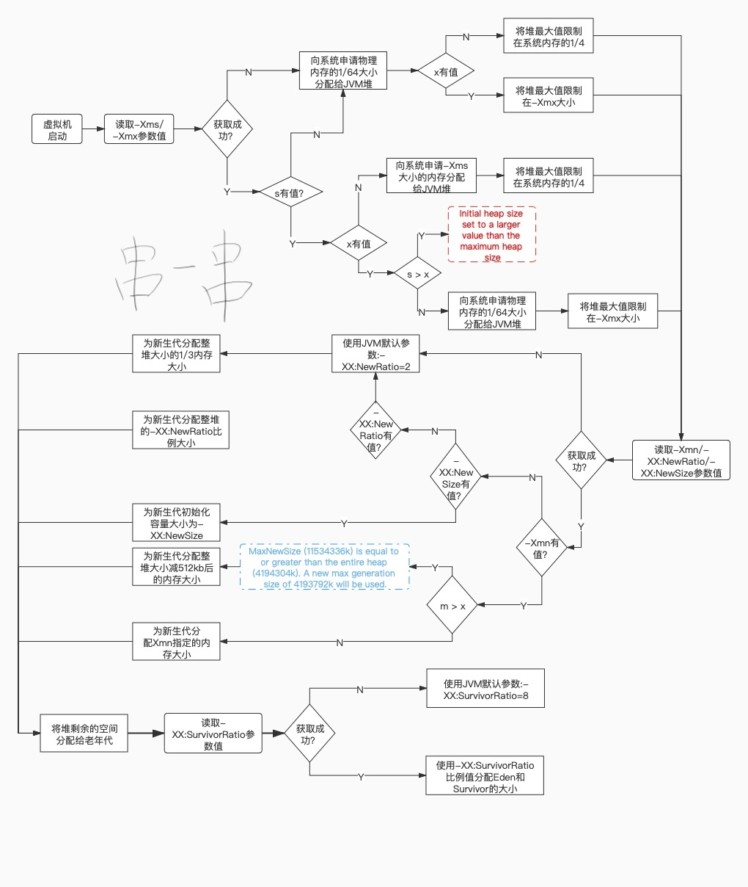
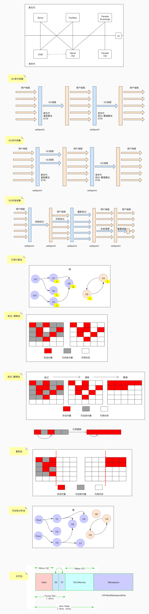

# 面试记录

## 网络

#### TCP和UDP的区别

TCP与UDP区别总结：

1、TCP面向连接（如打电话要先拨号建立连接）;UDP是无连接的，即发送数据之前不需要建立连接

2、TCP提供可靠的服务。也就是说，通过TCP连接传送的数据，无差错，不丢失，不重复，且按序到达;UDP尽最大努力交付，即不保证可靠交付
3、TCP面向字节流，实际上是TCP把数据看成一连串无结构的字节流;UDP是面向报文的
UDP没有拥塞控制，因此网络出现拥塞不会使源主机的发送速率降低（对实时应用很有用，如IP电话，实时视频会议等）
4、每一条TCP连接只能是点到点的;UDP支持一对一，一对多，多对一和多对多的交互通信
5、TCP首部开销20字节;UDP的首部开销小，只有8个字节

6、TCP的逻辑通信信道是全双工的可靠信道，UDP则是不可靠信道


#### http和https的区别

1、https协议需要到ca申请证书，一般免费证书较少，因而需要一定费用。
2、http是超文本传输协议，信息是明文传输，https则是具有安全性的ssl加密传输协议。
3、http和https使用的是完全不同的连接方式，用的端口也不一样，前者是80，后者是443。
4、http的连接很简单，是无状态的；HTTPS协议是由SSL+HTTP协议构建的可进行加密传输、身份认证的网络协议，比http协议安全。


#### 有没有排查解决过网络方面的问题。

没有


## 多线程

#### 讲一下JMM

##### 硬件层面原因

由于CPU和内存之间几个量级的速度差异。引入了告诉缓存，但由于CPU每个核心的高速缓存互相之间的不可见性。出现缓存一致性问题。解决缓存一致性问题有2个方案：总线锁和MESI协议。

总线锁虽然能解决可行性问题但是会带来性能问题。因为一个cpu在操作共享变量时其他cpu都是阻塞的。

MESI协议，当CPU0修改变量时如果发现当前变量是共享状态（S），会通知其他cpu先将这个共享变量置为失效状态I，等到其他cpu修改完毕并且回复CPU0时，CPU0才会将共享变量改成E独占状态。修改完成之后改成M状态。然后数据写入缓存行中。

这样做性能虽然比总线锁提高了。但是有个缺点是CPU需要在等待所有的Invalid ack之后才会进行下面的操作。这会让CPU产生一定的阻塞，无法充分利用CPU。这个时候就出来了写缓冲器和无效队列化。

虽然写缓冲器虽然进一步优化了性能，但还是会带来可见性问题。这就需要借助内存屏障来配合解决可见性问题。

##### JMM介绍

由于存在上述硬件层面问题。JMM规定了JVM和计算机内存的协同工作方式。例如：一个线程何时和如何看到另一个线程的修改过的共享变量的值。如何的同步的访问共享变量。JMM屏蔽了各种硬件和操作系统对系统内存的访问方式。让Java可以跨平台的实现多线程并发操作的一致性。

Volatile的解决可见性问题。当共享变量在修改时会使用写屏障，确保共享变量的值从高速缓存写入主存。当读取共享变量的时候会生成读屏障确保从主存中读取最新的值。

调用栈和本地变量存放在线程栈上，对象存放在堆上。

一个本地变量可能是原始类型，在这种情况下，它总是“呆在”线程栈上。

一个本地变量也可能是指向一个对象的一个引用。在这种情况下，引用（这个本地变量）存放在线程栈上，但是对象本身存放在堆上。

一个对象可能包含方法，这些方法可能包含本地变量。这些本地变量仍然存放在线程栈上，即使这些方法所属的对象存放在堆上。

一个对象的成员变量可能随着这个对象自身存放在堆上。不管这个成员变量是原始类型还是引用类型。

静态成员变量跟随着类定义一起也存放在堆上。


#### volatile是否可以保证原子性

不可以，要配合synchronize一起。


## Spring

#### Spring的钩子接口和应用

在bean的生命周期之中，Spring留给我们的一些回调方法，让我们可以Bean的生命周期之中执行我们的自定义方法和功能。

##### 可以影响多个Bean的

InstantiationAwareBeanPostProcessor

作用于**实例化**阶段的前后

BeanPostProcessor

作用于**初始化**阶段的前后

两个方法postProcessBeforeInitialization和postProcessBeforeInitialization对所有Bean都会拦截。

有多个的时候可以implement了PriorityOrdered和Ordered接口，按照这两个的顺序来排序（PriorityOrdered优先于Ordered）
InitializingBean.afterPropertiesSet

BeanFactoryPostProcessor

比执行时机更早。是一个可以对BeanFactory修改的方法。修改这个context的beanfactory的properties value

SpringBoot的自动装配还有Spring-Mybatis的适配都是靠这个来实现的

##### 影响单个Bean的

Aware系列接口，是专门用来获取Spring的一些内部对象和属性的。所有的Aware方法都是在初始化阶段之前调用的

具体来说分2组，一组是在初始化方法最前面调用的。还有一组是通过BeanPostProcess的before方法调用的。

BeanNameAware,
BeanClassLoaderAware,
BeanFactoryAware,

EnvironmentAware,
EmbeddedValueResolverAware,
ResourceLoaderAware,
ApplicationEventPublisherAware,
MessageSourceAware,
ApplicationContextAware,
ServletContextAware,

下面2个是生命周期接口，在

InitializingBean

在before和after之间的invokeInitMethods方法中调用，当BeanFactory 设置完所有的Bean属性之后才会调用

afterPropertiesSet方法里面可以添加自定义的初始化方法或者做一些资源初始化操作

DisposableBean在bean销毁时调用


#### InitializingBean的功能和使用场景

在before和after之间的invokeInitMethods方法中调用，当BeanFactory 设置完所有的Bean属性之后才会调用

afterPropertiesSet方法里面可以添加自定义的初始化方法或者做一些资源初始化操作


## JVM

#### new一个对象的内存分配过程



#### 有哪些方式能查看堆的使用情况

jconsole，jvisualvm，jmap，阿里的arthas


#### GC log是怎么分析的？

https://www.cnblogs.com/qlqwjy/p/7929414.html


#### 分代算法有哪些？

标记清除，标记整理，标记复制。并行，并发，串行。




## MySQL

#### MySQL索引建立原则

##### 离散度高

有个公式count(distinct(column_name))/count(*)，列的全部不同值和所有数据行的比例。数据行数相同的情况下，分子越大，列的离散度就越高。

简单来说，如果列的重复值越多，离散度就越低，重复值越少，离散度就越高。不建议在离散度低的字段上建立索引。

##### 查询条件

在用于where判断、order排序和join的(on) 、group by的字段上创建索引

##### 索引个数

索引并不是越多越好，会影响更新效率而且浪费空间。优先考虑联合索引并且尽量将离散度高的列放在最前面

##### 更新频率

不要给频繁更新的字段建立索引。会有页分裂问题。

##### 有序性

不建议给随机无序的字段建立索引。例如：UUID。


#### MySQL索引下推

假设有表tableA,字段有id，a，b，c 4个字段，a是字符型字段。b是数字型。有组合索引（a，b）

现有sql语句`select * from tableA where a like 'a%' and b = 3;`

进行查询时如果没有索引下推过程是这样的：

存储引擎会使用联合索引上符合a like 'a%' 的数据，可能有10条，这时候还需要回表10次查询出全部字段。返回给MySQL服务器。然后由MySQL服务器从10条数据中筛选出b = 3的1条。

如果有了索引下推是这样的：

存储引擎将使用索引数据中的a，b字段找到`a like 'a%' and b = 3`的1条记录，然后回表1次找到所有记录。返回给服务器

索引下推可以减少存储引擎查询基础表的次数，也可以减少MySQL服务器从存储引擎接收数据的次数


#### 聚集索引的叶子节点存的是什么？

聚集索引，叶子节点存的是整行数据，直接通过这个聚集索引的键值找到某行

非聚集索引，叶子节点存的是索引字段和聚集索引的键值，通过聚集索引键值找到表的某行


#### 介绍一下回表

非主键索引，先通过索引找到主键索引的键值，再通过主键值查出索引里面没有的数据，它比基于主键索引的查询多扫描了一棵索引树，这个过程就叫回表。

在二级索引里面，不管是单列索引还是联合索引，如果select的数据列只用从索引中就能够取得，不必从回表获取，这时候使用的索引就叫做覆盖索引，这样就避免了回表。

例如：组合索引a，b，但是select后面还有c字段。就需要回表了。


#### MySQL事务隔离级别

脏读，提交读，可重复读，序列化。

MySQL默认可重复读。如果sql语句中有锁则使用lbcc来实现，如果没锁就使用mvcc实现。


#### MySQL慢查询是怎么分析的

开启慢查询日志。有2种方式。

1、set动态修改参数（重启后失效)。

```sql
-- 1开启，О关闭，重启后失效
set @@global.slow_query_log=l;
-- 默认10秒，另开一个窗口后才会查到最新值
set @@global.long_query_time=3; 

show variables like '%long_query%';
show variables like '%slow_query%';
```

2、修改配置文件my.cnf。

以下配置定义了慢查询日志的开关、慢查询的时间、日志文件的存放路径。

slow_query_log= ON
long_query_time=2
slow_query_log_file =/var/lib/mysql/localhost-slow.log

慢查询模拟

-- 例如：不使用索引查询一张数据量500万的表。

select * from large_user where phone like '%3423%'

##### 日志内容分析

```sh
less /var/lib/mysql/localhost-slow.log

# Time: 2020-05-12T05:59:59.373938Z
# User@Host: root[root] [192.168.44.1]Id:30
# Query_time: 229.418907  Lock_time: 0.000275 Rows_sent: 0

SET timestamp=1589263199;
DELETE from test_data;
```

有了慢查询日志,怎么去还需要分析统计，比如哪条SQL语句的出现的慢查询次数最多，平均每次执行了多久?靠肉眼分析是不可能的

MySQL提供了mysqldumpslow的工具，在MySQL的bin目录下。

```sh
mysqldumpslow --help
#查询用时最多的10条慢SQL:
mysqldumpslow -s -t 10 -g 'select'/var/lib/mysql/localhost-slow.log

Reading mysql slow query log from /var/lib/mysql/localhost-slow.logCount: 1 Time=25.26s (25s) Lock=0.00s (0s) Rows=5000000.0 (500000092.168.8.1]
SELECT * FROM 'user_innodb`
Count: 1 Time=20.87s (20s) Lock=0.00s (0s) Rows=2499866.0 (249986692.168.8.1]
SELECT * FROM `user_innodb` where gender= N
Count: 2 Time=9.33s (18s) Lock=0.00s (0s) Rows=1.0 (2), root [root]
select * from user innodb where name='s'
```

Count代表这个SQL执行了多少次;

Time代表执行的时间，括号里面是累计时间;Lock表示锁定的时间，括号是累计;

Rows表示返回的记录数，括号是累计。

PS：有的时候查询慢，不一定是SQL语句的问题，也有可能是服务器状态的问题。我们需要掌握一些查看服务器和存储引擎状态的命令。


#### MySQL服务器CPU占用率高怎么解决？

首先使用top命令看看是否是MySQL的进程占用CPU过多。

如果是的话登录mysql执行show full processlist; 

如果是查询慢的话会打印出慢的SQL语句。

使用explain分析查询语句。根据不同的场景做不同的处理。

如果是全表扫描，考虑增加索引。

如果有索引，排查是否索引抑制的条件。

如果是排序问题。减少不必要的排序条件。如果要对上万条记录做排序，在并发升高后，cpu占用就会升高。


## Redis

#### Redis内存在什么情况下会满？

内存里面的数据超过指定的最大内存。例如：key没有指定过期时间但一直在往里面新增key。或者有过期时间！但是短时间加的速度很快也会导致内存占满。


#### Redis哨兵机制的原理

哨兵+主从实现Redis集群高可用
集群监控:负责监控Redis master和slave进程是否正常工作
消息通知:如果某个Redis实例有故障，哨兵负责发送消息给管理员进行报警
故障转移: master宕机后，Redis集群会自动将master身份转移到slave节点
配置中心:如果故障转移发生了，通知client客户端新的master地址


#### Redis主从同步原理

启动一台slave实例后，slave会发送一个psync命令给master，如果该slave是第一次连接到master，那么就会触发一个全量复制,master节点fork一个子进程生成RDB快照，在快照生成过程中，会把新的请求全部写到Redis缓冲池中，RDB文件生成之后，master会将文件发送到slave, slave拿到文件后写入本地磁盘，然后再加载到内存中，待RDB文件同步完成后，会通知master， master再将缓冲池中新的写命令发送到slave进行同步，待完成后slave正式进入集群对外提供服务


#### Redis淘汰策略

##### 淘汰策略

redis中还有很多Key没有设置过期时间，通过过期策略也不能保证内存不会满。所以还需要淘汰策略。

Redis当内存使用达到最大内存极限时，需要使用淘汰算法来决定清理掉哪些数据，以保证新数据的存入。


**最大内存设置**

redis.conf参数配置:

```properties
# 最大内存配置
# maxmemory <bytes> 
# 8种淘汰策略
# volatile-lru -> Evict using approximated LRU among the keys with an expire set.
# allkeys-lru -> Evict any key using approximated LRU.
# volatile-lfu -> Evict using approximated LFU among the keys with an expire set.
# allkeys-lfu -> Evict any key using approximated LFU.
# volatile-random -> Remove a random key among the ones with an expire set.
# allkeys-random -> Remove a random key, any key.
# volatile-ttl -> Remove the key with the nearest expire time (minor TTL)
# noeviction -> Don't evict anything, just return an error on write operations.
```

如果不设置maxmemory或者设置为0，32位系统最多使用3GB内存，64位系统不限制内存。

根据redis.conf的配置文件中，我们可以得出，主要分为如下8种淘汰机制。

按算法来分，有如下5种。

LRU，LFU，RANDOM，TTL，NoEviction。

##### LRU

**volatile-lru**

当内存不足以容纳新写入数据时，在设置了过期时间的键空间中，移除最近最少使用的key。

**allkeys-lru**

当内存不足以容纳新写入数据时，在键空间中，移除最近最少使用的key（这个是最常用的）。


##### LFU

**volatile-lfu**

当内存不足以容纳新写入数据时，在过期密集的键中，使用LFU算法进行删除key。

**allkeys-lfu**

当内存不足以容纳新写入数据时，使用LFU算法移除所有的key。


##### Random

**volatile-random**

当内存不足以容纳新写入数据时，在设置了过期的键中，随机删除一个key。

**allkeys-random**

当内存不足以容纳新写入数据时，随机删除一个或者多个key。


##### TTL

**volatile-ttl**

当内存不足以容纳新写入数据时，在设置了过期时间的键空间中，有更早过期时间的key优先移除。


##### noeviction

默认的淘汰策略。对于写请求不再提供服务，直接返回错误（DEL请求和部分特殊请求除外）。

当使用volatile-lru、volatile-random、volatile-ttl这三种策略时，如果没有key可以被淘汰，则和noeviction一样返回错误


