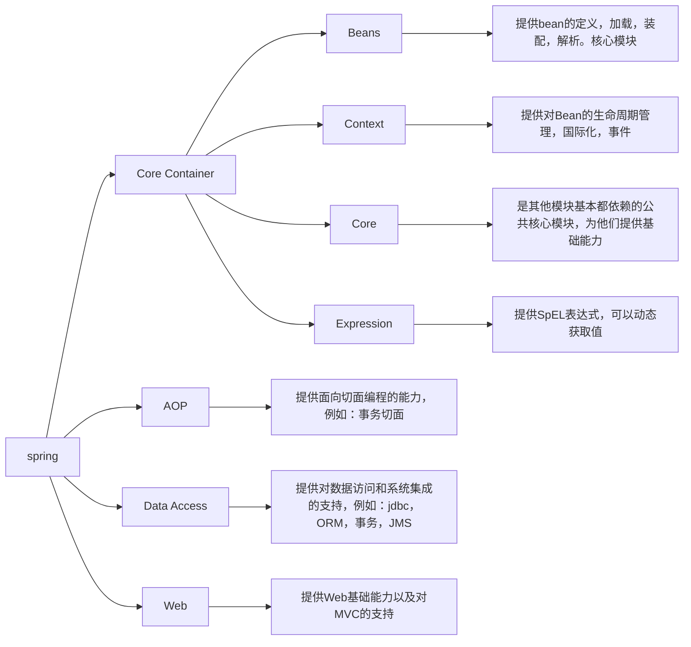
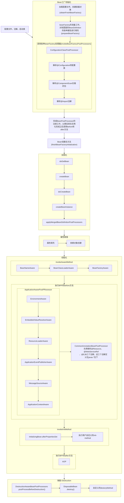
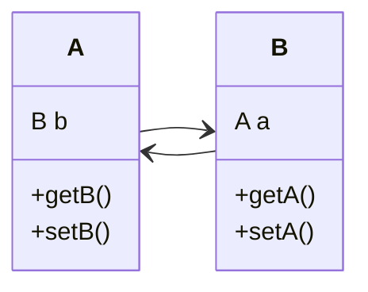
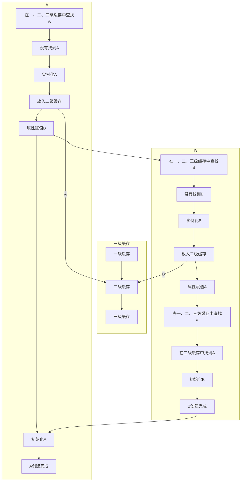
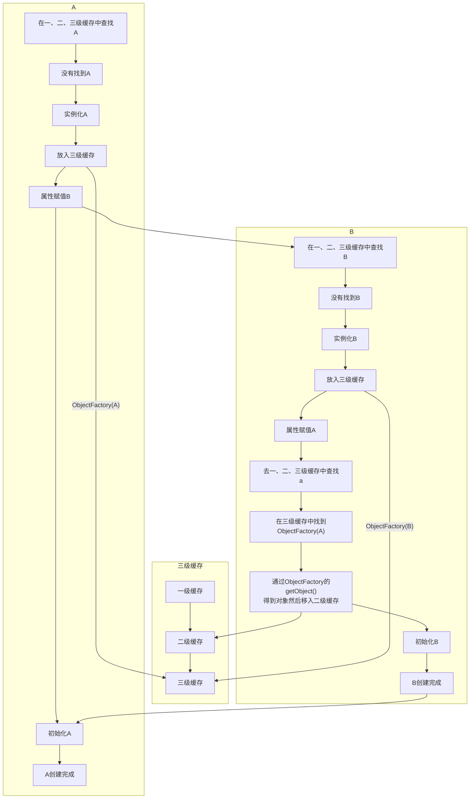
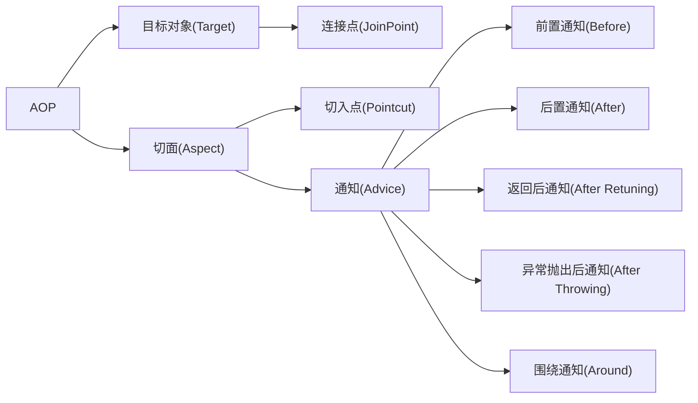

# Java面试题

# 文档说明

本文档主要整理了Java领域的所有面试题。目前尚未整理结束，还在持续更新中。如有问题，欢迎讨论交流。

| 编制人       | namelessmyth   |
| ------------ | -------------- |
| 编制日期     | 2021-07-07     |
| 编制单位     | 无             |
| 文档分类     | 求职-面试-Java |
| 版本号       | 1.2            |
| 最后更新人   | namelessmyth   |
| 最后更新日期 | 2023-09-19     |


## 文档更新记录

| 版本 | 编制/修改人  | 修改日期   | 备注（原因、进一步的说明等）               |
| ---- | ------------ | ---------- | ------------------------------------------ |
| 1.0  | namelessmyth | 2021-07-07 | 初稿，整理了本次找工作积累到的所有面试题   |
| 1.1  | namelessmyth | 2023-09-15 | 合并马士兵的面试笔记，重新整理目录结构     |
| 1.2  | namelessmyth | 2023-09-19 | 整理Spring部分，将简历和沟通部分拆分出去。 |
|      |              |            |                                            |
|      |              |            |                                            |
|      |              |            |                                            |
|      |              |            |                                            |


# 未分类

## 北京30K面试题

1、自我介绍，项目介绍，遇到的难点？产生原因？如何解决？
5、cms收集器过程，g1收集器原理，怎么实现可预测停顿的，region的大小结构？
6、
7、
8、
9、选举过程，会有脑裂问题么，raft算法，优缺点？
10、redis有序集合怎么实现的，跳表是什么？往跳表添加一个元素的过程获取分数的时间复杂度，为什么不用红黑树，红黑树有什么特点，左旋右旋操作？
11、锁升级过程，轻量锁可以变成偏向锁么？偏向锁可以变成无锁么？对象头结构，锁状态变化过程？

17、分布式事务出现过不一致吗？为什么？怎么解决？有什么方法避免？怎么监控？监控到怎么处理？什么时候需要人工接入？
18、io模型了解么？多路复用？selete，poll，epoll，epoll的结构？怎么注册事件？
19、你们用的什么消息中间件，kafka，为什么用kafka？kafka是怎么保证高吞吐量的？
20、kafka重平衡，重启服务怎么保证kafka不发生重平衡，有什么方案？
21、netty的原理和使用？tcp的连接过程？一台服务器能支持多少连接，为什么 ？tcp各个参数怎么设置？
22、Sping的AOP实现原理，以及对象生成方式的种类，单例的还是原型的？
23、讲讲调度接口是怎么实现的
24、分布式唯一ID是怎么实现的
25、设计模式，以及自己使用的场景
26、有没有用过分布式锁，怎么实现的，讲讲原理 
27、如何解决线上问题？cpu狂飙怎么办？频繁minor gc怎么办？可能造成的原因是什么？如何避免？
28、怎么理解分布式和微服务，为什么要拆分服务，会产生什么问题，怎么解决这些问题 ？
29、怎么理解高可用，如何保证高可用，有什么弊端，熔断机制，怎么实现 ？
30、对于高并发怎么看，怎么算高并发，你们项目有么，如果有会产生什么问题，怎么解决  
31、有没有做过压测的项目？首页接口优化是怎么做的？

数据pull模式，多久调用一次，这个时间是通过什么因素来抉择出来的，调用失败了如何补偿，补偿的机制是什么

集群部署策略是什么，集群运行状态如何监控，数据怎么采集的，采集后的存储和分析策略是什么

Nacos用来做注册中心的话，它是怎么贴合CAP理论的，C/A切换是怎么做的，配置属性是如何实现动态刷新的

你们项目的质量因素有哪些，模块之间划分的依据是什么，C&C是怎么设计的

项目峰值几万人:QPS和TPS是多少，有没有遇到过性能瓶颈，遇到性能瓶颈的告警机制是怎么设置的，流量激增的时候怎么自动扩容的

CPU、Memory、Load过高是如何监控、排查、修复的，遇到僵尸进程是如何处理的

单体项目、有容器、用的ssh:容器怎么进行管理的，高可用怎么做的

客户端多类、json通信:网关层怎么做的，怎么根据客户端类型做的转发，DDoS攻击怎么预防的

数据库∶用的什么架构，读写分离是怎么做的，主从切换是怎么切换的，切换之后VIP漂移是怎么做的

eureka如何处理高并发读写

mysql行锁没有释放怎么处理3.AQS底层是什么

new一个对象，几种内存分配方式

线程池有哪几种实现方式

netty的channel生命周期是怎么样的

springcloud gateway实现原理，画图出来

1234567 7个数字分别用二叉树平衡二叉树b树b+树画图出来

mysql读写分离，从库没有同步主库的数据原因有哪些

G1收集器与CMS收集器三色回收算法的区别是什么

G1收集器与CMS收集器的区别在哪里

hystris原理(动态代理)

inodb和mysiam的区别

spring哪几种注入方式

mybatis一对一，一对多标签分别是啥?

线程的底层是什么

MySQL源码看过吗

InnoDB存储引擎底层是如何实现的

MVCC的隐藏列是如何添加的，是持久化到磁盘上的，还是存于内存中的

InnoDB是通过什么方式加的行级锁

myisam为什么不支持行级锁，如果想让myisam支持行锁，应该怎么做

idb的存储结构是什么样子的，为什么表数据量过大会影响效率

一个区内的页，在磁盘上是如何存储的，区的大小是固定的吗?

当页发生分裂或合并时,大小会改变吗，会变换所在区吗


## Java

1.线上jvm环境 哪个命令 怎么写 可以查到每个类有多少个 占用多大
2.dump文件 用mat工具分析的时候 排在前面占用最多的不是自定义类 而是jdk自带的常用来 比如java.lang.string 怎么办？
3.Rerentranlock能不能替代Synchronized？
4.什么时候用乐观锁 什么时候用悲观锁 数据库的锁有哪些有了解吗？
5.Mysql分库以后，多个库的分页排序查询怎么做？
6.SpringCloud Alibaba 里面的nacos注册中心 怎么做的高可用？
7.Redis集群为什么选Redis Cluster而不选代理+哨兵+主从，选型的时候怎么考虑的？
8.G1收集器说一说，然后他的缺点是什么,什么时候选CMS什么时候选G1？
9.分布式事务怎么搞的，有没有落地？怎么落地的？具体点 方案
10.线上一共有多少服务 服务直接调用链路说一说， 多少台机器  QPS有多少 有没有压测 怎么做的
11.有没有做自动化测试，怎么做的 

1. dubbo原理

2. zk的zab芬布式协议,cap理论满足哪几种?

3. 使用ZK有遇到哪些问题?

4. 6．变时遇到的线上问题﹖轵迥解界X的9加行抑整个链路串起来，一个服务调用另一个服务?.．链路白慧;整个公布追踪怎c做的0险

5. oo的问题怎么解决?是在什么切壹卜士现的Jg.线程池做哪些事情
   1i.线棹池的潇程核4程教，最大线程等12Redis作为分布骛袭存的的1医，壁13．限流sentinel原理,sentinel日的闫克，
   i4．限溢算法5.hystrix和sentine1这别_..
   16．亚雾蓝控和预警是茹问做的?亚务指标是多少?QPs，业务大盘数据17.java锁countdownlatch戍用_-..L.....
   2￥~去‘蜚社梦港参强屋题-从力20.现在的myei的隔离报渤

6. mysql-innoDB的日善:.binlog，是服务器打得日志还是执行引擎打得日志22.m罗s用没有遇到过死锁的情浣
   23．用到过的设计模式
   24.平时有看什艺书?.
   25．在小组内处宇什之角色?是否是核心开发?二面:现场面试
   1.我齐络+项目经历
   2真体基系统展并来讲,技术架构,开发时常3．线程池考究点
   4.iute的Qs学人
   5．做这个项自遇到的问题l后.CRm数据黾级...
   7.MQ-消费者如何保证消息不丢失.
   8．为什公先落库再Ak,"设计惠想，为什么不等业务全部走完，再返回ACK9.m-生益者如何保证消息丕焉塞t .
   10.提高消是消葵职套额墨乒罗蠡一 “1i．菁虑分库分表噩
   12．数据库性能有问题通过社么方式看到有山)△老击到公店公表，加何进行拆分，拆分之后如何查询，轨迹表的Gdl， json的大13．真阵进讲分库分枣鹃诺
   小，T响应时便是贡复就堡口下为什人会产生性能影响导致慢sql14.原来没有分库岔季的情i
   15.mysqi不走索瓢的鲁禹.
   16.megl售如Y着新到讨幻读
   i18.Sri生事雾注解@ransactionai失效场景:为什么会生效
   20．针对@Transactionai失效场是,如何解决，二定要rivate_

7. dubbo多路复用，如佝保证一致性请求，生产者A，消费者B，C，D，确定返回结果，具体跟哪个消费者——对应22.JuC-AQS,茹何实现可童入


# 算法

## 排序

#### 两个有序char数组，找出不一致的那一个元素

例如：[a,b,c,d,e, f, g]，[a,b,c,d,f,g]


10万条数据，基于数组或者链表，如何占用最少内存排序


## 动态规划

#### 高楼扔鸡蛋

https://zhuanlan.zhihu.com/p/92288604


#### LeetCode 45 跳跃游戏 II

https://zhuanlan.zhihu.com/p/82831669


# 软件设计


### LRU

Least Recently Used，最近最少使用。判断最近被使用的时间，离目前最远的数据优先被淘汰。

Redis LRU对传统的LRU算法进行了改良，通过随机采样来调整算法的精度。如果淘汰策略是LRU，则根据配置的采样值maxmemory_samples(默认是5个)，随机从数据库中选择m个key，淘汰其中热度最低的 key对应的缓存数据。所以采样参数m配置的数值越大，就越能精确的查找到待淘汰的缓存数据,但是也消耗更多的CPU计算,执行效率降低。

问题：如何找出热度最低的数据?
Redis 中所有对象结构都有一个lru字段且使用了unsigned的低24位,这个字段用来记录对象的热度。对象被创建时会记录lru值。在被访问的时候也会更新lru的值。但并不是获取系统当前的时间戳，而是设置为全局变量server.Ilruclock的值。

### LFU

Least Frequently Used，最不常用，按照使用频率删除

同样使用lru字段，但是前16位表示多久时间未访问，后8位表示访问次数（默认五次），长时间未访问，则次数会减少，最少为0，类似于心悦等级，长时间不充钱，就会降低，当次数小于5时，每次访问次数都会+1，当访问次数大于5时，随着访问次数越来越多，访问次数+1的概率就越来越小，最多加到255次，就会直接返回；


lru如何用链表实现


#### LeetCode146 写一个LRU算法

解答：


#### Leetcode 1249 移除无效的括号

#### 示例 1：

#### 输入：s = “lee(to)de)”

#### 输出：“lee(to)de”

解答：http://t.zoukankan.com/coding-gaga-p-12920164.html


#### LeetCode1135 最低成本联通所有城市

想象一下你是个城市基建规划者，地图上有 N 座城市，它们按以 1 到 N 的次序编号。

给你一些可连接的选项 conections，其中每个选项 conections[i] = [city1, city2, cost] 表示将城市 city1 和城市 city2 连接所要的成本。（连接是双向的，也就是说城市 city1 和城市 city2 相连也同样意味着城市 city2 和城市 city1 相连）。

返回使得每对城市间都存在将它们连接在一起的连通路径（可能长度为 1 的）最小成本。该最小成本应该是所用全部连接代价的综合。如果根据已知条件无法完成该项任务，则请你返回 -1。

示例1：
输入：N = 3, conections = [[1,2,5],[1,3,6],[2,3,1]]
输出：6
解释：
选出任意 2 条边都可以连接所有城市，我们从中选取成本最小的 2 条

解答：参考[LeetCode1135](https://michael.blog.csdn.net/article/details/107796632)


paxos


raft


zxid


myid


epoch


有一栋100层高的大楼，给你两个完全相同的玻璃球，假设从某一层开始丢下玻璃球会摔碎,怎么利用手中的两个玻璃球，用什么最优策略(最坏情况下最少次数）知道这个临界的层是第几层


## 功能设计

#### 写个门票限时销售系统，架构图，业务流程图，随意发挥


#### 直播、会议、在线教育这种功能的解决方案有哪些？

这种功能一般不用Java来做，涉及转码，视频数据存储，还要铺网，基建都要几千万起。目前比较成熟的解决方案有：保利威，七牛，网易云信

#### 微信抢红包、红包雨实现


#### 如何设计秒杀系统？场景：100万并发、100个商品


#### 项目流量增大1000倍，项目如何架构升级

说了应用集群、拆分。缓存、搜索引擎。数据库集群，读写分离等）面试官说太简单了


#### 抛开所有组件，如何从文件中10万条手机号找出想要的那个


#### 设计一个商业停车场数据库表结构

然后进一步，划分公共的，公司的，公益的，如何计算收益


#### 系统设计一个系统，输入hash查询注册名称

1、数据查询接口:
现有一张数据表(数据内容有11亿条),表格中的内容举例如下:

| ID    | 注册号码    | 注册名称 |
| ----- | ----------- | -------- |
| 10036 | 18972303692 | 张三     |
| 27999 | 18672352674 | 李四     |
| 33394 | 13681473563 | 王五     |

经常被查询的数据量在200万条以内，200万条数据中会有1%的数据会经常变化成其他的数据，变化之后会稳定一段时间，时间从8小时到数天不等，其余的数据基本上不会改变，请开发一个系统，输入注册号码的hash值，就能够查询到注册名称和ID。(特别注意，为保护数据，不允许直接传入注册号码作为输入）。


#### 路由策略设计

场景:我们需要将2000w的商品信息缓存在redis中， key为uuid,value为商品基本信息。现有8台redis服务器，分成4组，每组两台(一主一从),每组存放的数据量为500w台。
设计一种路由策略。要求:
1、重复输入同一个uuid，路由到的redis服务组地址不变。
2、当数据量激增，增加redis机器时不会造成大规模的缓存雪崩。


#### 查询功能设计原则


# J2SE

## 基础

### 数据结构

链表和数组的区别以及应用


跳表时间复杂度


哈希冲突问题


如何知道一个链表有环？

思路

 如果一个链表无环，那么遍历链表一定可以遇到链表的终点；如果链表有环，那么遍历链表就永远在环内转下去。具体如下：

 1.设置快慢指针分别为fast和slow。开始，slow和fast都指向链表的头节点head。然后slow每次移动一步，fast每次移动两部，在链表中遍历。

 2.如果链表无环，fast指针在移动过程一定先遇到终点，直接返回null，表示链表无环。

 3.如果有环，fast和slow一定在环中相遇。相遇时，fast重新回到head位置，slow不动。接下来，fast指针每次移动一步，slow依然每次移动一步，继续遍历。

 4.fast和slow指针一定会再次相遇，并在第一个入环的节点处相遇，证明略。

```java
public Node getLoopNode(Node head){
    if (head == null || head.next == null || head.next.next == null){
        return null;
    }
    Node n1 = head.next; //n1 -> slow
    Node n2 = head.next.next; // n2 -> fast
    while (n1 != n2){
        if (n2.next == null || n2.next.next == null){
            return null;
        }
        n2 = n2.next.next;
        n1 = n1.next;
    }
    n2 = head; // n2 -> walk again from head
    while (n1 != n2){
        n1 = n1.next;
        n2 = n2.next;
    }
    return n1;
}
```


## 面向对象

#### HashMap的底层结构

#### HashMap1.8与1.7区别

    [参考答案1](https://blog.csdn.net/qq_36520235/article/details/82417949) ，[参考答案2](https://blog.csdn.net/weixin_44141495/article/details/108402128)

#### 只重写equals不重写hashcode会有什么问题？


## 多线程

### 基础

#### 原子性，可见性，有序性解释

#### 并发和并行

并发，指的是多个任务，在同一时间段内同时发生了。 

并行，指的是多个任务，在同一时间点上同时发生了。

并发的多个任务之间是互相抢占资源的。 

并行的多个任务之间是不互相抢占资源的.


#### 线程的创建方式有哪些

#### 线程的生命周期

#### 启动线程调用start还是run方法, 为什么?

#### Callable和Runnable有啥区别

Callable有返回值，另一个没有。


#### 有t1、t2、t3三个线程怎么确保他的顺序。

可以通过join()或者callable+future来得到返回值。


#### 线程什么时候抛出InterruptedException

调用interrupt方法时。
抛出InterruptedException应该怎么处理
抛出异常后会默认复位。必须做出明确的处理。不能仅仅打印日志


#### interrupt()的作用？线程复位及其方式

 interrupt()的作用是中断线程。将线程变量interrupt标记为true，

线程的复位就是将变量interrupt改为false，并且唤醒线程；

线程复位的方式有：抛出InterruptException异常，通过Thread.interrupted();


#### java如何停止一个线程，interrupt，interrupted，isInterrupted()区别


#### 讲一下JMM

##### 硬件层面原因

由于CPU和内存之间几个量级的速度差异。引入了告诉缓存，但由于CPU每个核心的高速缓存互相之间的不可见性。出现缓存一致性问题。解决缓存一致性问题有2个方案：总线锁和MESI协议。

总线锁虽然能解决可行性问题但是会带来性能问题。因为一个cpu在操作共享变量时其他cpu都是阻塞的。

MESI协议，当CPU0修改变量时如果发现当前变量是共享状态（S），会通知其他cpu先将这个共享变量置为失效状态I，等到其他cpu修改完毕并且回复CPU0时，CPU0才会将共享变量改成E独占状态。修改完成之后改成M状态。然后数据写入缓存行中。

这样做性能虽然比总线锁提高了。但是有个缺点是CPU需要在等待所有的Invalid ack之后才会进行下面的操作。这会让CPU产生一定的阻塞，无法充分利用CPU。这个时候就出来了写缓冲器和无效队列化。

虽然写缓冲器虽然进一步优化了性能，但还是会带来可见性问题。这就需要借助内存屏障来配合解决可见性问题。

##### JMM介绍

由于存在上述硬件层面问题。JMM规定了JVM和计算机内存的协同工作方式。例如：一个线程何时和如何看到另一个线程的修改过的共享变量的值。如何的同步的访问共享变量。JMM屏蔽了各种硬件和操作系统对系统内存的访问方式。让Java可以跨平台的实现多线程并发操作的一致性。

Volatile的解决可见性问题。当共享变量在修改时会使用写屏障，确保共享变量的值从高速缓存写入主存。当读取共享变量的时候会生成读屏障确保从主存中读取最新的值。

调用栈和本地变量存放在线程栈上，对象存放在堆上。

一个本地变量可能是原始类型，在这种情况下，它总是“呆在”线程栈上。

一个本地变量也可能是指向一个对象的一个引用。在这种情况下，引用（这个本地变量）存放在线程栈上，但是对象本身存放在堆上。

一个对象可能包含方法，这些方法可能包含本地变量。这些本地变量仍然存放在线程栈上，即使这些方法所属的对象存放在堆上。

一个对象的成员变量可能随着这个对象自身存放在堆上。不管这个成员变量是原始类型还是引用类型。

静态成员变量跟随着类定义一起也存放在堆上。


### 并发

#### 什么是线程安全

当多个线程访问某一个类（对象或方法）时，对象对应的公共数据区始终都能表现正确，那么这个类（对象或方法）就是线程安全的。

#### 对volatile的理解

#### 新建t1, t2, t3三个线程, 如何保证他们按顺序执行?

#### Synchronized加锁的范围有哪些?


#### synchronized和重入锁实现原理以及区别？


#### Synchronized在JDK1.6之后的优化


#### 多线程中wait()和sleep(), part()的区别

sleep是会设置超时时间的。超时自动进入就绪状态

park和sleep不会释放锁，wait会释放


#### sleep，join，yield的区别。

sleep：睡眠指定时间，睡眠期间不会释放锁，超时后让出CPU时间片；

yield，和sleep(0)作用类似，让出当前线程的时间片

join：让调用该方法的线程的执行结果对主线程可见，内部基于wait notify实现；


#### Java中的++操作是线程安全的么？

不是。原子性，可见性，有序性。++操作不符合原子性。

#### java如何实现多线程之间通讯和协作

#### 死锁的4个必要条件

#### 写个死锁

#### 怎么样唤醒一个阻塞的线程?

#### 是否能创建volatile数组？

可以，但volatile仅针对引用可见，数组中的数组不可见。

#### happens-Before介绍

#### ThreadLocal是什么?原理?

线程隔离机制，用于保证在多线程环境下对于共享变量的访问的安全性。

提供线程本地变量，如果创建一个ThreadLocal变量，那么访问这个变量的每个线程都会有这个变量的一个副本，在实际多线程操作的时候，操作的是自己本地内存中的变量，从而规避了线程安全问题

从实现上讲：每个线程内部都维护了一个map，而这个map的key就是threadLocal，而值就是我们set的那个值，每次线程在get的时候，都从自己的变量中取值，既然从自己的变量中取值，那就解决了线程安全问题，总体来讲，ThreadLocal这个变量的状态根本没有发生变化，他仅仅是充当一个key的角色，另外提供给每一个线程一个初始值。如果允许的话，我们自己就能实现一个这样的功能，只不过恰好JDK就已经帮我们做了这个事情。这个map的key是弱引用，而value是强引用。


#### ThreadLocal怎么共享父线程的变量

https://blog.csdn.net/hewenbo111/article/details/80487252


### JUC

#### ConcurrentHashMap实现原理


### 线程池

#### 线程池的Submit()和execute() 区别

#### 

#### 

#### 谈下ThreadLocal的内存泄漏问题, 怎么解决?

#### 线程池执行任务的过程原理

无论是哪种类型的线程池最终都会创建一个ThreadPoolExecutor（线程池执行器），只是不同的线程池传入的参数不一样。

每一个线程执行execute方法的过程

如果在运行的线程小于核心线程数，则通过addWorker方法将线程添加为核心线程。

​	添加成功直接返回继续处理下一个执行下一个线程。直到工作线程数大于等于核心线程数量。

​	如果添加失败则获取线程池的最新状态。

如果线程池正在执行，则尝试将当前线程加入到工作队列。加入成功后，再次获取线程池状态。

​	如果线程池没有正在运行。则将任务从阻塞队列移除。成功则执行拒绝策略。

​	如果线程数等于0，则添加一个空的工作线程。这段不知道什么场景会进来。

如果前面加入工作队列失败，则以非核心线程身份包装任务（false标志）

​	失败则执行拒绝策略

```java
public void execute(Runnable command) {
    if (command == null)
        throw new NullPointerException();
    //获取线程池状态及当前线程数记录，高3位记录状态，低29位记录线程数
    int c = ctl.get();   
    //如果线程数小于核心线程阈值
    if (workerCountOf(c) < corePoolSize) {
        //直接包装成Worker运行（true表示将任务以核心线程身份包装）
        if (addWorker(command, true))   
            return;
        c = ctl.get();   //如果上一步失败，则获取最新的状态
    }
    //如果线程池还在运行，则尝试将任务加入阻塞队列
    if (isRunning(c) && workQueue.offer(command)) {
        int recheck = ctl.get();   //加入成功后再检查线程池状态
        //如果加入后线程池没有在运行，将任务从队列中移除
        if (! isRunning(recheck) && remove(command))  
            //成功则执行拒绝策略
            reject(command);
        //如果当前线程数为0
        else if (workerCountOf(recheck) == 0)
            //则添加一个空的工作线程。这段不知道什么场景会进来。
            addWorker(null, false);
    }
    //如果前面加入工作队列失败，则以非核心线程身份包装任务（false标志）
    else if (!addWorker(command, false))
        //如果添加失败，则执行拒绝策略
        reject(command);  
}
```

addWorker添加工作线程的过程：

通过自旋做一些基础校验和当前线程数量，如果超出阈值则直接返回false

如果没有超出则使用CAS将工作线程数+1

然后将当前线程封装成Worker对象。

执行lock方法锁定，防止并发

将Worder对象加入到一个工作线程的Set里面

然后解锁。

如果成功添加则调用线程的start方法启动线程

Worker本身实现了Ruunable接口有一个run方法，Worker对象持有提交来的task和一个线程对象，这个线程对象根据Worker对象生成所以运行的是Worker的run方法，而Worker的run方法里又是调用了task的run方法。

```java
private boolean addWorker(Runnable firstTask, boolean core) {
    /**
        此处省略一段代码，大致工作是通过自旋检查当前线程数量是否小于阈值（否就返回false），
        CAS的检查线程池状态和CAS的将线程数+1。
    */
    boolean workerStarted = false;
    boolean workerAdded = false;
    Worker w = null;
    try {
        //根据任务包装Worker，Worker对象有一个线程对象也在此时根据Worker对象生成，Worker实现了Runnable接口
        w = new Worker(firstTask);   
        //获取Worker里生成的线程对象
        final Thread t = w.thread;   
        if (t != null) {
            final ReentrantLock mainLock = this.mainLock;
            mainLock.lock();
            try {
                //获取线程状态
                int rs = runStateOf(ctl.get());
                //检查线程池状态的合法性
                if (rs < SHUTDOWN ||(rs == SHUTDOWN && firstTask == null)) {
                    if (t.isAlive()) // 如果此刻线程就已经活跃，那么就是出错了
                        throw new IllegalThreadStateException();
                    workers.add(w);      //将生成的Worker对象放到Set集合
                    int s = workers.size();
                    if (s > largestPoolSize)
                        largestPoolSize = s;
                    workerAdded = true;  //记录Worker已经成功添加到集合
                }
            } finally {
                mainLock.unlock();
            }
            if (workerAdded) {
                t.start();     //如果Worker对象已经成功添加，则启动这个对象的线程
                workerStarted = true;  //记录任务已经开始执行
            }
        }
    } finally {
        if (! workerStarted)
            addWorkerFailed(w);   //如果最终发现任务没有标志为开始，则调用响应处理方法
    }
    return workerStarted;
}
```

在worker的run方法里预留了2个钩子方法，在before和after的时候可以执行自定义的业务

```java
final void runWorker(Worker w) {
        Thread wt = Thread.currentThread();
        Runnable task = w.firstTask;  //首先拿到提交的那个task
        w.firstTask = null;
        w.unlock(); // allow interrupts
        boolean completedAbruptly = true;
        try {
            //核心操作就是循环的getTask()，从阻塞队列里拿task来执行
            while (task != null || (task = getTask()) != null) {
                w.lock();
                //检查线程池状态
                if ((runStateAtLeast(ctl.get(), STOP) ||(Thread.interrupted() &&
                      runStateAtLeast(ctl.get(), STOP))) &&!wt.isInterrupted())
                    wt.interrupt();  //不合法就中断执行此任务的线程
                try {
                    beforeExecute(wt, task);
                    Throwable thrown = null;
                    try {
                        task.run();    //执行真实角色的run方法
                    } catch (RuntimeException x) {
                        thrown = x; throw x;
                    } catch (Error x) {
                        thrown = x; throw x;
                    } catch (Throwable x) {
                        thrown = x; throw new Error(x);
                    } finally {
                        afterExecute(task, thrown);
                    }
                } finally {
                    task = null;
                    w.completedTasks++;
                    w.unlock();
                }
            }
            completedAbruptly = false;
        } finally {
            processWorkerExit(w, completedAbruptly);
        }
    }
```


#### 什么是ReentrantLock?底层怎么实现锁的?

#### 什么是公平锁和非公平锁? 怎么体现? Synchronize属于公平还是非公平锁?

#### cas是什么, 会有什么问题? 如何解决?

#### Java中你

#### Semaphore的作用是什么?

#### 什么是线程池, 有哪些创建线程池的方式, 说说有哪些参数?

#### 线程池的作用，如何设置线程池大小。

#### 项目中的线程池怎么设置？

#### ConcurrentHashmap和JDK1.7和1.8的区别?

#### 线程间进行数据传递，有时候可以直接用对象进行传值，有时候要ThreadLocal，为什么不直接用ThreadLocal？

      ThreadLocal只能在同一个线程内部或者父子线程之间进行值传递，一开始就用它会有局限性。


#### 多线程环境下，如何保证2个线程不重复处理相同的数据。

1. 一个线程处理时，可以通过redis的setNx方法，存入业务主键，等到业务完成在通过del key命令删除。如果setNx返回错误代表另一个线程已经在处理了。
2. 当一个线程开始处理一个条数据，单独一个事务将这条记录改成处理中。如果没有修改成功代表已经有其他线程在处理了。等到业务结束，再将记录改成处理成功状态。
3. 给每个任务分配一个唯一ID，将所有待处理的任务加载到一个Map里面，key存任务ID，value存任务状态。当有线程处理任务时直接修改这个map的状态。如果处理成功则将key移除。


### 实战

#### 为什么下面的源码在多个生产者的时候会超？怎么解决？

有多个生产者时，当达到生产上限时，调用notify方法唤醒的可能不是消费者，而是其他生产者。

第一次达到生产上限时。可能会有多个生产者处在wait状态。

等消费者消费之后。通知生产者生产第二次达到生产上限，这个时候如果唤醒的还是生产者。那就会超过生产上限。

但第6行如果用while，唤醒之后还是会判断是否达到上限。就不会出现这个问题了。

```java
public void run() {
        int i = 0;
        while (true) {
            i++;
            synchronized (msg) { //同一把锁.
                if (msg.size() == maxSize) {
                    //如果生产满了
                    try {
                        System.out.println(String.format("已达到生产上限%s，停止生产！线程名称：%s", msg.size(), Thread.currentThread().getName()));
                        msg.wait(); //在这里等待，也在这里恢复执行。这时候msg已经达到5了
                    } catch (InterruptedException e) {
                        e.printStackTrace();
                    }
                    System.out.println(String.format("恢复生产，消息大小：%s，线程名称：%s", msg.size(), Thread.currentThread().getName()));
                }
                try {
                    Thread.sleep(1000);
                } catch (InterruptedException e) {
                    e.printStackTrace();
                }
                msg.add("消息-" + i);
                System.out.println(String.format("生产者生产：消息-%s，线程名称：%s，此时消息大小：%s", i, Thread.currentThread().getName(),msg.size()));
                msg.notify(); //唤醒处于阻塞状态下的线程
                //msg.notifyAll();
            }
        }
    }

 public static void main(String[] args) {
     Queue<String> queue = new LinkedList<>();
     int maxSize = 5;

     ProductIf p1 = new ProductIf(queue, maxSize);
     ProductIf p2 = new ProductIf(queue, maxSize);
     ProductIf p3 = new ProductIf(queue, maxSize);
     ProductIf p4 = new ProductIf(queue, maxSize);
     ProductIf p5 = new ProductIf(queue, maxSize);

     Consumer consumer = new Consumer(queue, maxSize);

     Thread t1 = new Thread(p1,"product-1");
     Thread t2 = new Thread(consumer);

     Thread t3 = new Thread(p2,"product-2");
     Thread t4 = new Thread(p3,"product-3");
     Thread t5 = new Thread(p4,"product-4");
     Thread t6 = new Thread(p5,"product-5");

     t1.start();
     t2.start();
     t3.start();
     t4.start();
     t5.start();
     t6.start();
 }
```

日志如下：

> 生产者生产：消息-3，线程名称：product-5，此时消息大小：4
> 生产者生产：消息-4，线程名称：product-5，此时消息大小：5
> 已达到生产上限5，停止生产！线程名称：product-5
> 已达到生产上限5，停止生产！线程名称：product-4
> 已达到生产上限5，停止生产！线程名称：product-3
> 已达到生产上限5，停止生产！线程名称：product-2
> 消费者消费：消息-1，线程名称：Thread-0
> 恢复生产，消息大小：4，线程名称：product-5
> 生产者生产：消息-5，线程名称：product-5，此时消息大小：5
> 已达到生产上限5，停止生产！线程名称：product-5
> 恢复生产，消息大小：5，线程名称：product-4
> 生产者生产：消息-1，线程名称：product-4，此时消息大小：6
> 生产者生产：消息-2，线程名称：product-4，此时消息大小：7

从日志看出product-5生产后达到上限5，唤醒了product-4继续生产，导致上限突破5


## JVM

#### 内存溢出，内存泄漏遇到过吗？什么场景产生的，怎么解决的？


#### jvm类加载器有哪些？

AppClassload：负责加载classpath指定的jar包，以及目录下的class文件。

ExtensionClassload：负责加载Java平台中具有扩展功能的jar包，例如：jre/lib/*.jar

BootstrapClassload：负责加载java平台的核心代码，例如：rt.jar

CustomClassload：自定义类加载器。


#### 自定义类加载器应用场景

比如，tomcat、jboss，都自定义了类加载器，确保每个war目录下的项目相互隔离


#### 双亲委派机制，优缺点


#### JVM内存中为什么会有新生代，老年代，新生代为什么有Eden跟Survivor?Survivor又有S0、S1

分为新生代老年代的原因：

如果不分新生代和老年代，每次GC都要扫描整个堆内存，扫描范围大，扫描效率低。

JVM垃圾收集采用分代回收算法，根据对象存活周期的不同将内存分为不同的分代。根据各个代的特点采用不同的垃圾回收算法。

分成Eden、Survivor。Survivor又有S0、S1的原因：

新生代大部分对象都是“朝生暮死”的，把这样的对象单独放在一个区，可以进一步缩小GC扫描范围和时间。每次扫描之后的存活对象会移动到Survivor区是为了避免因为空间不连续而产生空间碎片。Survivor要分成S0和S1也是同理，因为Survivor中垃圾对象被清除后也可能产生空间碎片。这是一种标记-复制算法的实现。


#### 请描述下JVM中的垃圾回收算法与垃圾回收器，各回收器的场景以及区别

垃圾回收算法：

1. 标记-清除

   第一遍扫描所有对象标记出可以回收的。第二遍将标记的对象清除。

   缺点：

   对象清除以后内存不连续会产生空间碎片

   标记和清除都比较耗时效率低

2. 标记-复制

   将内存划分为2块相等的区域，每次只使用其中一块。将存活的对象复制到另一块区域中，然后将原来的区域全部清除。

   优点：内存连续，不会有空间碎片。

   缺点：其中一块内存区域空间浪费了。

   适用于存活对象较少的场景。所以不适用于老年代。

3. 标记-整理

   第一遍标记过程同标记-清除算法，标记完了之后将存活对象往空间一端移动，然后清理掉端边界之外的内存。

   优点：不会有空间浪费，内存连续

   缺点：移动对象需要额外开销

垃圾回收器：

1. Serial/Serial Old

   基于标记-复制算法，单线程，执行时会暂停所有应用程序线程。新生代的叫Serial，老年代的叫Serial Old。最古老的垃圾收集器

2. ParNew

   基于标记-复制算法，多线程，执行时也会暂停所有应用程序线程。适用于新生代。

3. Parallel Scavenge/Parallel Old

   基于标记-复制算法，多线程，约等于ParNew收集器。只是这个更关注吞吐量。即减少垃圾收集时间（就是每次垃圾收集时间短，但是收集次数多），让用户代码获得更长的运行时间；

4. CMS

   基于标记-清除算法，多线程并发类收集器。更加关注停顿时间。降低了吞吐量。

5. G1

   基于标记整理算法，更加关注停顿时间。

   引入分区的思路，弱化了分代的概念。

   G1可以根据用户设置的暂停时间目标进行动态调整以满足目标。


#### 怎么去判断一个对象能够进行GC回收

引用计数

统计一个对象被强引用的次数，如果为0就是垃圾，可回收。但这种方式会有循环引用的问题JVM没有采用。

可达性分析

如果一个对象无法往上追溯到GC Root引用点的就是垃圾。

哪些可以作为GC Root引用点：

JVM stack中引用的对象 

方法区中静态引用指向的对象

方法区中常量引用指向的对象

Native方法中JNI引用指向的对象

Thread-活着的线程


#### JVM的参数有哪些，并说明参数作用

##### 标准参数

不会随着JDK版本变化而变化，例如：

-version
-help
-server
-cp

##### -X参数

非标准参数，也就是在JDK各个版本中可能会变动

-Xint

-Xcomp

-Xmixed

##### -XX参数

使用得最多的参数类型。非标准化参数，相对不稳定，主要用于JVM调优和Debug  

a.Boolean类型
格式：-XX:[+-]<name> +或-表示启用或者禁用name属性
比如：-XX:+UseConcMarkSweepGC 表示启用CMS类型的垃圾回收器
-XX:+UseG1GC 表示启用G1类型的垃圾回收器

b.非Boolean类型
格式：-XX<name>=<value>表示name属性的值是value
比如：-XX:MaxGCPauseMillis=500

##### 其他参数

这块也相当于是-XX类型参数的简化版

-Xms1000M 等价于-XX:InitialHeapSize=1000M

-Xmx1000M 等价于-XX:MaxHeapSize=1000M

-Xss100 等价于-XX:ThreadStackSize=100k


#### 一般会怎么进行JVM调优，怎么找问题并解决问题

##### 问题反馈

用户反馈：正式环境使用一段时间后发现功能响应时间明显变慢了。甚至是直接无响应了。

##### 问题发现

OOM，GC次数，吞吐量，平均GC时间，线程死锁，CPU占用率

##### 原因排查

OOM，可以通过手动或自动的方式导出一份dump文件。通过MAT工具载入分析到底是哪段代码导致了OOM。

CPU占用率高/线程死锁，可用jstack命令查看线程堆栈信息，找到出问题的线程。看是否代码有问题。

如果通过上述方式都没找到具体的代码问题。可通过gc日志做进一步分析其他问题。

也可以在压测环境，使用jvisualvm，jconsole，arthas观察JVM状态。

##### 解决问题

- 代码问题：

  排查出来是代码问题的，及时修改代码并测试部署。

- 架构问题：

  引入消息中间件，异步削峰

  引入缓存，减少对后端的访问。

  引入分布式锁（zk，redis）

  集群+负载均衡

- JVM问题：

  尝试修改堆内存大小

  切换垃圾收集器，JDK7以后，多核大内存可以考虑G1


#### 类的生命周期是怎么样的？请说下类的装载机制

类的生命周期

装载、链接、初始化、使用、卸载

装载机制

1) 通过一个类的全限定名获取定义此类的二进制字节流，装载方式有多种。

2) 将这个字节流所代表的静态存储结构转化为方法区的运行时数据结构

3) 将类文件字节码流静态存储结构放到JVM的方法区


#### new一个对象的内存分配过程


#### 请谈谈JVM内存模型

也叫运行时数据区，主要分为下面5个

##### 方法区

线程共享，主要存放：静态变量，类信息，常量，即时编译器编译后的代码

堆

线程共享，主要存放对象和数组。

##### 虚拟机栈

线程私有，每一个线程都对应一个栈，每调用一个方法都会往栈中压入一个栈帧。栈帧中包含局部变量表，返回值地址，动态链接，操作数栈。方法返回则会弹出栈帧。

##### 本地方法栈

线程私有，Native方法在这个地方存储。

##### 程序计数器

记录正在执行的线程信息和字节码指令信息。当cpu调度时可以衔接上。


#### JVM中heap的内存划分是什么样的

分为新生代，老年代，新生代又分为Eden和S0，S1区


#### 新生代、老年代垃圾回收过程以及原理

对象在被实例化之后，都是属于新生代Eden区。

如果往Eden区放的时候，有足够空间则放完结束。

但如果没有足够空间则会触发Minor GC，即清除掉可回收的对象。在判断一次Eden空间是否足够。

如果足够则放完结束。但如果还不足够。则会判断Survive区空间是否足够。

如果足够会将Eden区的存活对象移动到Survive区。对象空间申请结束。

如果不足够会继续判断老年代空间是否足够。

如果足够则将Survive区的存活对象复制到老年代。

如果老年代的空间都不足够了。则会触发Full GC，回收堆中所有可回收的对象。

如果Full GC结束之后仍然没有足够空间，则会抛出OOM异常。


#### 什么是内存泄露，什么是内存溢出，有什么区别

内存泄漏是指不再使用的对象无法得到及时的回收，持续占用内存空间，从而造成内存空间的浪费。

内存泄漏很容易导致内存溢出，但内存溢出不一定是内存泄漏导致的


#### 请说下JDK的引用分类

+ 强引用，只要gcroot可达，就不会被回收，会导致泄漏。
+ 软引用，内存不足时，会回收软引用对象
+ 弱引用，无论内存是否足够，只要 JVM 开始进行垃圾回收，那些被弱引用关联的对象都会被回收
+ 虚引用


#### Minor GC和full GC分别在什么时候发生

##### minor GC

对象刚创建时，如果Eden区空间不足则会触发minor GC

##### major GC

Major GC在很多参考资料中是等价于 Full GC 的。精确的讲：Major GC不包括元空间垃圾回收

##### Full GC

一次 Full GC 将会对年轻代、老年代、元空间以及堆外内存进行垃圾回收

触发Full GC的原因：

当老年代空间不足时

当老年代的空间使用率超过某阈值时

当元空间不足时（JDK1.7永久代不足）

当调用 System.gc() 也会安排一次 Full GC。


#### G1的回收过程


#### JVM有哪些调优命令，有哪些调优工具

##### jps

查看java进程id

##### jstat

用于监控java进程的各种资源和性能，命令行模式。

##### jstack

用于排查线程问题，例如：线程死锁

##### jinfo

查看jvm进程的参数

##### jmap

用来导出dump文件。分析oom问题原因。也可以查看jvm各种状态。

##### jconsole

图形化工具展现JVM运行情况。堆信息，类加载信息

##### jvisualvm

同上，只是各有千秋。还可以显示堆

##### arthas

Alibaba开源的Java诊断工具，采用命令行交互模式，是排查jvm相关问题的利器

##### mat

分析dump文件的工具。

##### heaphero

在线dump文件分析工具

##### GCViewer

本地分析GC日志的工具

##### gceasy

在线GC日志分析工具


#### 正式环境CPU100%，如何排查和解决问题

步骤一、找到最耗CPU的进程
 执行top -c ，显示进程运行信息列表

 键入P (大写p)，进程按照CPU使用率排序
步骤二：找到最耗CPU的线程
 top -Hp 10765 ，显示一个进程的线程运行信息列表

 键入P (大写p)，线程按照CPU使用率排序
步骤三：将线程PID转化为16进制(是因为堆栈里，线程id是用16进制表示的)
 printf “%x” pid
步骤四：查看堆栈，找到线程在干嘛
 jstack 10765 | grep ‘0x2a34’ -C5 --color

 打印进程堆栈

 通过线程id，过滤得到线程堆栈(看到了该线程正在执行代码的堆栈)


#### 如何排查正式环境的内存溢出问题


#### new一个对象的内存分配过程


#### 有哪些方式能查看堆的使用情况

jconsole，jvisualvm，jmap，阿里的arthas


#### GC log是怎么分析的？

https://www.cnblogs.com/qlqwjy/p/7929414.html


#### 分代算法原理

标记清除，标记整理，标记复制。并行，并发，串行。


# Spring

## Framework

### 概念理解

#### 对Spring框架的理解?

```mindmap
- 教程
- 语法指导
  - 普通内容
  - 提及用户
  - 表情符号 Emoji
    - 一些表情例子
  - 大标题 - Heading 3
```


##### Spring发展历史

1. 2002 年，Rod Johnson 发表了他的专著 “Expert One-On-One J2EE Design and Development”，提出了 Spring 框架的思想。
2. 2003 年，Johnson 和一些开发者创建了 Spring Framework 项目，并在 SourceForge 上发布了第一个版本。
3. 2004 年，Spring Framework 1.0 版本发布，包括核心容器、AOP 模块、DAO 模块、JDBC 模块和 Web 模块等组成部分。
4. 2006 年，Spring Framework 2.0 版本发布，增加了对注解的支持、Web Services 支持、异步执行能力等新特性。
5. 2009 年，Spring Framework 3.0 版本发布，引入了对 Java 5、Java 6 特性的支持，包括泛型、注解、并发等。
6. 2013 年，Spring Framework 4.0 版本发布，提供对 Java 8 的支持，包括 lambda 表达式、Stream API 等。
7. 2015 年，Spring Framework 4.2 版本发布，增加了对 WebSocket 和 STOMP 协议的支持。
8. 2017 年，Spring Framework 5.0 版本发布，对响应式编程提供了支持，并对代码库进行了大规模升级和剪裁，去掉了过时和不必要的模块和类。
9. 2022年，Spring Framework 6.0 版本发布

自从 2003 年发布以来，Spring Framework 在 Java 开发社区中变得越来越流行，并成为了多个企业级应用开发的首选框架之一。


##### 模块介绍

官网的Spring5模块结构图




spring beans

负责Bean的定义（BeanDefinition），Bean的装配（BeanFactory），Bean的解析（BeanDefinitionReader）。Spring是面向Bean编程的，所以Bean是Spring的核心主角。

Spring Context

spring-context模块构架于核心模块之上，扩展了BeanFactory，为它添加了Bean生命周期控制、框架事件体系及资源加载透明化等功能。此外，该模块还提供了许多企业级支持，如邮件访问、远程访问、任务调度等，ApplicationContext是该模块的核心接口，它的超类是BeanFactory。与BeanFactory不同，ApplicationContext实例化后会自动对所有的单实例Bean进行实例化与依赖关系的装配，使之处于待用状态。

Spring Core

这个模块是其他模块基本都依赖的公共核心模块，为他们提供基础能力。

Spring Expression

SpEL，Spring的一种表达式。用来动态的获取，值、对象等。例如：@value("#{'system.key.value'}")

Spring AOP

通过配置方式将面向切面编程技术集成到了框架之中；例如：事务切面

Spring aspects

模块集成自 AspectJ 框架，主要是为 Spring AOP 提供多种 AOP 实现方法。

Spring instrument

模块是基于 JAVA SE 中的 java.lang.instrument 进行设计的，应该算是AOP 的一个支援模块，主要作用是在 JVM 启用时，生成一个代理类，程序员通过代理类在运行时修改类的字节，从而改变一个类的功能，实现 AOP 的功能。在分类里，我把他分在了 AOP 模块下，在 Spring 官方文档里对这个地方也有点含糊不清。

Spring Data Access/Integration

此模块主要负责数据访问以及和其他系统的集成。例如：JDBC，ORM，事务，JMS的支持；在Spring源码中对应着很多子模块。

Spring Web

由 spring-web、spring-webmvc、spring-websocket和spring-webflux 4个模块组成。
spring-web 模块为 Spring 提供了最基础 Web 支持，主要建立于核心容器之上，通过 Servlet 或者 Listeners 来初始化 IOC 容器，也包含一些与 Web 相关的支持。
spring-webmvc 模块是一个的Web-Servlet 模 块 ， 实现了Spring MVC（model-view-Controller）的 Web 应用。
spring-websocket 模块主要是与 Web 前端的全双工通讯的协议。
spring-webflux 是一个新的非堵塞函数式 Reactive Web 框架，可以用来建立异步的，非阻塞，事件驱动的服务，并且扩展性非常好。

Spring messaging

从 Spring4 开始新加入的一个模块，主要职责是为 Spring 框架集成一些基础的报文传送应用。


#### 对SpringIoC的理解

IOC（Inversion of control），即：控制反转，是指创建对象的控制权的转移，以前创建对象的主动权和时机是由自己把控的，而现在这种权力转移到Spring容器中，并由容器根据配置文件去创建实例和管理各个实例之间的依赖关系，对象与对象之间松散耦合DI依赖注入和IOC控制反转是同一个概念的不同角度的描述，即：应用程序在运行时依赖IoC容器来动态注入对象需要的外部资源。

IOC是一种设计思想（思想的转变）。最大的作用就是解耦（降低耦合性），也利于功能的复用。

[Spring IoC的实现原理](#Spring的IoC实现原理)


#### 对Spring AOP的理解

[Spring中AOP的实现原理](#Spring中AOP的实现原理)


#### Spring Bean的生命周期

##### 本文作用

本文主要是为了说明Spring Bean的生命周期。这是一个高频面试题，这个问题即考察对Spring的微观了解，又考察对Spring的宏观认识，还考察对Spring源码的熟悉程度！

##### 宏观认识

Bean的生命周期宏观上可以表达为：

1. Bean工厂初始化（不熟的，这部分可以不提）
2. 实例化-Instantiation
3. 属性赋值-populate
4. 初始化-Initialization
5. 销毁-Destruction

有的人可能会疑惑，Bean工厂和Bean是两回事，为什么会和Bean的生命周期有关？

- Bean工厂中存放了BeanDefinition，这个就是Bean的定义，Bean就是根据这个实例化出来的。
- Bean工厂初始化的时候会调用一个特殊的后置处理器：ConfigurationClassPostProcessor。他会解析如下注解。
  - @Configuration的配置类
  - 解析@ComponentScan扫描的包
  - 解析@Import注解
- 从上可以看出，Bean工厂的实例化的过程和Bean的生命周期是有关系的。
- 下面就用这个完整的Bean生命周期流程图来说明。（使用mermaid语法绘制）



##### Spring源码

其实在Spring源码的BeanFactory这个类的注释中，Spring源码的作者已经告诉我们Bean完整的生命周期了。

下面就是Spring源码的摘录。大家本地有源码的朋友，可以把鼠标放到类名字上面去，就可以预览注释的实际效果了。

```java
/**
 * Bean工厂的根父类，定义获取bean及bean的各种属性。下面的注释中还列举了Bean的生命周期 <br>
 * The root interface for accessing a Spring bean container.
 *
 * <p>This is the basic client view of a bean container;
 * further interfaces such as {@link ListableBeanFactory} and
 * {@link org.springframework.beans.factory.config.ConfigurableBeanFactory}
 * are available for specific purposes.
 *
 * <p>This interface is implemented by objects that hold a number of bean definitions,
 * each uniquely identified by a String name. Depending on the bean definition,
 * the factory will return either an independent instance of a contained object
 * (the Prototype design pattern), or a single shared instance (a superior
 * alternative to the Singleton design pattern, in which the instance is a
 * singleton in the scope of the factory). Which type of instance will be returned
 * depends on the bean factory configuration: the API is the same. Since Spring
 * 2.0, further scopes are available depending on the concrete application
 * context (e.g. "request" and "session" scopes in a web environment).
 *
 * <p>The point of this approach is that the BeanFactory is a central registry
 * of application components, and centralizes configuration of application
 * components (no more do individual objects need to read properties files,
 * for example). See chapters 4 and 11 of "Expert One-on-One J2EE Design and
 * Development" for a discussion of the benefits of this approach.
 *
 * <p>Note that it is generally better to rely on Dependency Injection
 * ("push" configuration) to configure application objects through setters
 * or constructors, rather than use any form of "pull" configuration like a
 * BeanFactory lookup. Spring's Dependency Injection functionality is
 * implemented using this BeanFactory interface and its subinterfaces.
 *
 * <p>Normally a BeanFactory will load bean definitions stored in a configuration
 * source (such as an XML document), and use the {@code org.springframework.beans}
 * package to configure the beans. However, an implementation could simply return
 * Java objects it creates as necessary directly in Java code. There are no
 * constraints on how the definitions could be stored: LDAP, RDBMS, XML,
 * properties file, etc. Implementations are encouraged to support references
 * amongst beans (Dependency Injection).
 *
 * <p>In contrast to the methods in {@link ListableBeanFactory}, all of the
 * operations in this interface will also check parent factories if this is a
 * {@link HierarchicalBeanFactory}. If a bean is not found in this factory instance,
 * the immediate parent factory will be asked. Beans in this factory instance
 * are supposed to override beans of the same name in any parent factory.
 *
 * <p>Bean factory implementations should support the standard bean lifecycle interfaces
 * as far as possible. The full set of initialization methods and their standard order is:
 * <ol>
 * <li>BeanNameAware's {@code setBeanName}
 * <li>BeanClassLoaderAware's {@code setBeanClassLoader}
 * <li>BeanFactoryAware's {@code setBeanFactory}
 * <li>EnvironmentAware's {@code setEnvironment}
 * <li>EmbeddedValueResolverAware's {@code setEmbeddedValueResolver}
 * <li>ResourceLoaderAware's {@code setResourceLoader}
 * (only applicable when running in an application context)
 * <li>ApplicationEventPublisherAware's {@code setApplicationEventPublisher}
 * (only applicable when running in an application context)
 * <li>MessageSourceAware's {@code setMessageSource}
 * (only applicable when running in an application context)
 * <li>ApplicationContextAware's {@code setApplicationContext}
 * (only applicable when running in an application context)
 * <li>ServletContextAware's {@code setServletContext}
 * (only applicable when running in a web application context)
 * <li>{@code postProcessBeforeInitialization} methods of BeanPostProcessors
 * <li>InitializingBean's {@code afterPropertiesSet}
 * <li>a custom init-method definition
 * <li>{@code postProcessAfterInitialization} methods of BeanPostProcessors
 * </ol>
 *
 * <p>On shutdown of a bean factory, the following lifecycle methods apply:
 * <ol>
 * <li>{@code postProcessBeforeDestruction} methods of DestructionAwareBeanPostProcessors
 * <li>DisposableBean's {@code destroy}
 * <li>a custom destroy-method definition
 * </ol>
 *
 * @author Rod Johnson
 * @author Juergen Hoeller
 * @author Chris Beams
 * @since 13 April 2001
 * @see BeanNameAware#setBeanName
 * @see BeanClassLoaderAware#setBeanClassLoader
 * @see BeanFactoryAware#setBeanFactory
 * @see org.springframework.context.ResourceLoaderAware#setResourceLoader
 * @see org.springframework.context.ApplicationEventPublisherAware#setApplicationEventPublisher
 * @see org.springframework.context.MessageSourceAware#setMessageSource
 * @see org.springframework.context.ApplicationContextAware#setApplicationContext
 * @see org.springframework.web.context.ServletContextAware#setServletContext
 * @see org.springframework.beans.factory.config.BeanPostProcessor#postProcessBeforeInitialization
 * @see InitializingBean#afterPropertiesSet
 * @see org.springframework.beans.factory.support.RootBeanDefinition#getInitMethodName
 * @see org.springframework.beans.factory.config.BeanPostProcessor#postProcessAfterInitialization
 * @see DisposableBean#destroy
 * @see org.springframework.beans.factory.support.RootBeanDefinition#getDestroyMethodName
 */
public interface BeanFactory {
	//...... 此处省略代码细节	
}
```

根据这个注释，我们可以整理出一份简易文字版bean生命周期

1. BeanNameAware's setBeanName
2. BeanClassLoaderAware's setBeanClassLoader
3. BeanFactoryAware's setBeanFactory
4. EnvironmentAware's setEnvironment
5. EmbeddedValueResolverAware's setEmbeddedValueResolver
6. ResourceLoaderAware's setResourceLoader (only applicable when running in an application context)
7. ApplicationEventPublisherAware's setApplicationEventPublisher (only applicable when running in an application context)
8. MessageSourceAware's setMessageSource (only applicable when running in an application context)
9. ApplicationContextAware's setApplicationContext (only applicable when running in an application context)
10. ServletContextAware's setServletContext (only applicable when running in a web application context)
11. postProcessBeforeInitialization methods of BeanPostProcessors
12. InitializingBean's afterPropertiesSet
13. a custom init-method definition
14. postProcessAfterInitialization methods of BeanPostProcessors

在关闭bean工厂时，也就是销毁时，应用以下生命周期方法：

1. DestructionAwareBeanPostProcessors.postProcessBeforeDestruction()
2. DisposableBean的destroy方法
3. 自定义的destroy-method


##### 参考说明

https://zhuanlan.zhihu.com/p/622803858?utm_id=0

https://www.mashibing.com/study?courseNo=2154&sectionNo=36480&courseVersionId=1241


### 使用

#### 哪些场景会导致Spring配置的AOP事务失效

[文章参考](https://www.jianshu.com/p/5df09b132abd?utm_campaign=maleskine&utm_content=note&utm_medium=seo_notes&utm_source=recommendation)

本类方法内部调用。要新建一个类调用。

方法非public，不能被代理。

有些时候事务会配置默认的方法名开头，看一下方法名是否符合。

默认情况下，事务只会对 Error 与 RuntimeException 及其子类这些异常做出回滚。要做出如下配置：rollbackFor = Exception.class

如果是CGLIB代理，不能是final，否则无法生成代理类。

依赖数据库不支持事务。比如：MyISAM引擎。


#### Bean实现延迟加载的方式


#### Spring Framework中常用的注解有哪些？

Spring框架中常用的注解有：

1. @Autowired：自动装配，将需要的依赖注入到类中。通过使用不同的方式注入（如构造器注入、Setter注入、字段注入等）来指定要注入的实例对象。
2. @Component：声明一个组件，将会由Spring框架进行扫描，并将其实例化作为一个Bean纳入Spring容器管理。
3. @Controller：声明一个MVC控制器，标记该类为Spring的控制器，处理Web请求。
4. @Service：声明一个服务类，标记该类为Spring的服务类，用于处理业务逻辑。
5. @Repository：声明一个数据访问类，标记该类为Spring的数据访问类，用于进行数据库操作。
6. @Configuration：声明一个Java配置类，其内部包含了若干个@Bean注解用于声明Bean对象。
7. @Bean：声明一个Bean，用于在Java配置类中定义需要注入IOC容器中的Bean实例对象。
8. @RequestMapping：用于将HTTP请求映射到对应的控制器中的处理方法上。
9. @Value：用于将配置文件中的属性值注入到Spring Bean中的字段属性中。

以上是Spring框架中常用的注解，可以帮助开发者快速实现依赖注入、Bean管理、Spring MVC等功能。

#### Spring Framework中如何处理循环依赖问题？

1。什么是循环依赖 A--》 B    B--》 A

构造注入：是解决不了循环依赖的

设值注入：是可以解决循环依赖的--》 提前暴露

2。Spring中的循环依赖是怎么处理？

三级缓存

3。为什么要三级缓存？  

如果没有代理对象。二级缓存是足够的

二级缓存提前暴露的是 Bean的真实对象。但是后面我们返回的其实是代理对象

4。为什么Spring没有使用二级缓存来解决。

5。Spring中一级缓存能处理循环依赖吗？

Spring中一级缓存存储的是单例bean

6。Spring支持对原型对象的循环依赖的支持吗？

原型对象==》有很多个。那么我就需要缓存 原型对象。

Spring容器支持处理循环依赖，即A对象依赖了B对象，而B对象又依赖了A对象的情况。

当Spring容器在创建一个Bean实例时，会记录该Bean实例的创建过程，当发生了循环依赖时，Spring会将该Bean实例的先前创建请求暂存到一个“早期引用”中，这时Spring容器并未将完全构造的Bean实例提供给请求它的对象，而是返回一个代理对象，等到该Bean实例构造完成后，将“早期引用”中的Bean实例注入到对应的属性中。

要注意的是，Spring只能处理单例模式下的循环依赖，因为每个单例Bean在Spring容器只会被创建一次，而在原型模式下，每次请求新的Bean实例时，Spring容器都会进行一次完整的Bean实例化过程，这样循环依赖就不存在了。

当存在循环依赖时，Spring容器会抛出BeanCurrentlyInCreationException异常，表明当前Bean正在创建中，此时可以通过调整Bean的依赖关系，或使用构造器注入等方式解决循环依赖问题。


#### Spring中的单例是线程安全的么？

 不一定，因为安全与不安全取决于Bean的写法。
  Spring框架并没有对单例bean进行任何多线程的封装处理。关于单例bean的线程安全和并发问题需要开发者自行去搞定。但实际上，大部分的Spring  bean并没有可变的状态(比如Service类和DAO类)，所以在某种程度上说Spring的单例bean是线程安全的。如果你的bean有多种状态的话（比如 View Model  对象），就需要自行保证线程安全。最浅显的解决办法就是将多态bean的作用域由“singleton”变更为“prototype”。


#### Spring如何处理线程并发问题？

 在一般情况下，只有无状态的Bean才可以在多线程环境下共享，在Spring中，绝大部分Bean都可以声明为singleton作用域，因为Spring对一些Bean中非线程安全状态采用ThreadLocal进行处理，解决线程安全问题。
 ThreadLocal和线程同步机制都是为了解决多线程中相同变量的访问冲突问题。同步机制采用了“时间换空间”的方式，仅提供一份变量，不同的线程在访问前需要获取锁，没获得锁的线程则需要排队。而ThreadLocal采用了“空间换时间”的方式。
 ThreadLocal会为每一个线程提供一个独立的变量副本，从而隔离了多个线程对数据的访问冲突。因为每一个线程都拥有自己的变量副本，从而也就没有必要对该变量进行同步了。
 ThreadLocal提供了线程安全的共享对象，在编写多线程代码时，可以把不安全的变量封装进ThreadLocal。


#### Spring Bean的注入方式：

##### 基于XML的注入

[文章参考](https://blog.csdn.net/a745233700/article/details/89307518)。

- Set方法注入；
- 构造器注入：①通过index设置参数的位置；②通过type设置参数类型；
- 静态工厂注入；
- 实例工厂；

##### 基于注解的注入

@Resource

@Autowired


#### Spring的自动装配有哪些

在spring中，对象无需自己查找或创建与其关联的其他对象，由容器负责把需要相互协作的对象引用赋予各个对象，使用autowire来配置自动装载模式。

**在Spring框架xml配置中共有5种装配方式：**
 （1）no：默认的方式是不进行自动装配的，需要通过手工设置ref属性来进行装配bean。
 （2）byName：通过bean的名称进行自动装配，如果一个bean的 property 与另一bean 的name 相同，就进行自动装配。
 （3）byType：通过参数的数据类型进行自动装配。使用@autowire。
 （4）constructor：利用构造函数进行装配，并且构造函数的参数通过byType进行装配。
 （5）autodetect：自动探测，如果有构造方法，通过 construct的方式自动装配，否则使用  byType的方式自动装配。参考：https://www.yiibai.com/spring/spring-autowiring-by-autodetect.html

**在Spring框架中使用注解的装配方式：**
 使用@Autowired注解来自动装配指定的bean。在使用@Autowired注解之前需要在Spring配置文件进行配置：
 <context:annotation-config />。
 在启动spring  IoC时，容器自动装载了一个AutowiredAnnotationBeanPostProcessor后置处理器，当容器扫描到@Autowied、@Resource或@Inject时，就会在IoC容器自动查找需要的bean，并装配给该对象的属性。
 在使用@Autowired时，首先在容器中查询对应类型的bean：
 （1）如果查询结果刚好为一个，就将该bean装配给@Autowired指定的数据；
 （2）如果查询的结果不止一个，那么@Autowired会根据名称来查找；
 （3）如果上述查找的结果为空，那么会抛出异常。解决方法时，使用required=false。

**@Autowired可用于：构造函数、成员变量、Setter方法**
 **注：@Autowired和@Resource之间的区别**
 (1) @Autowired默认是按照类型装配注入的，默认情况下它要求依赖对象必须存在（可以设置它required属性为false）。
 (2) @Resource默认是按照名称来装配注入的，只有当找不到与名称匹配的bean才会按照类型来装配注入。

**自动装配类型：**
 （1）autowire byName (按名称自动装配)
 ①将查找其类中所有的set方法名，例如setCat，获得将set去掉并且首字母小写的字符串，即cat。
 ②去spring容器中寻找是否有此字符串名称id的对象。
 如果有，就取出注入；如果没有，就报空指针异常。

（2）autowire byType (按类型自动装配)
 使用autowire byType首先需要保证：同一类型的对象，在spring容器中唯一。如果不唯一，会报不唯一的异常。

（3）自动装配autowire
 首先尝试使用constructor进行自动装配，如果失败，再尝试使用byType进行自动装配

（4）constructor
 把与Bean的构造器入参具有相同类型的其他Bean自动装配到Bean构造器的对应入参中。


#### Spring事务处理有哪两种方式

 Spring事务的本质其实就是数据库对事务的支持，只不过Spring框架进行了封装，如果没有底层数据库对事务的支持，spring是无法提供事务功能的。
 Spring支持编程式事务管理和声明式事务管理两种方式：
 （1）编程式事务管理使用TransactionTemplate类，使用较少。
 （2）声明式事务管理建立在AOP之上的，使用较多。该方式本质是通过AOP功能对方法前后进行拦截，将事务处理的功能编织到拦截的方法中，也就是在目标方法开始之前加入一个事务，在执行完目标方法之后根据执行情况提交或者回滚事务。
 声明式事务最大的优点就是不需要在业务逻辑代码中掺杂事务管理的相关代码，只需在配置文件中做相关的事务规则声明或通过@Transactional注解的方式，便可以将事务规则应用到业务逻辑中。
 声明式事务管理要优于编程式事务管理，这正是spring倡导的非侵入式的开发方式，使业务代码不受污染，只要加上注解就可以获得完全的事务支持。唯一不足地方是，最细粒度只能作用到方法级别，无法做到像编程式事务那样可以作用到代码块级别。
 透彻的掌握 Spring 中@transactional 的使用
 https://www.ibm.com/developerworks/cn/java/j-master-spring-transactional-use/index.html


#### spring的事务传播行为

 spring事务的传播行为说的是，当多个事务同时存在的时候，spring如何处理这些事务的行为。
 （1）PROPAGATION_REQUIRED：如果当前没有事务，就创建一个新事务，如果当前存在事务，就加入该事务，该设置是最常用的设置。
 （2）PROPAGATION_SUPPORTS：支持当前事务，如果当前存在事务，就加入该事务，如果当前不存在事务，就以非事务执行。‘
 （3） PROPAGATION_MANDATORY：支持当前事务，如果当前存在事务，就加入该事务，如果当前不存在事务，就抛出异常。
 （4） PROPAGATION_REQUIRES_NEW：创建新事务，无论当前存不存在事务，都创建新事务。
 （5） PROPAGATION_NOT_SUPPORTED：以非事务方式执行操作，如果当前存在事务，就把当前事务挂起。
 （6） PROPAGATION_NEVER：以非事务方式执行，如果当前存在事务，则抛出异常。
 （7） PROPAGATION_NESTED：如果当前存在事务，则在嵌套事务内执行。如果当前没有事务，则按REQUIRED属性执行。

**我的总结：**
 （1）REQUIRED代表如果已经存在一个事务，就加入到这个事务中。如果当前没有事务，就新建一个事务，这是默认的事务传播设置。
 白话解释：如果马路上有车就搭车，如果马路上没有车就造一个车。
 （2）SUPPORTS代表如果已经存在一个事务，就加入到这个事务中。如果当前没有事务，就以非事务方式执行。
 白话解释：如果马路上有车就搭车，如果马路上没有车就自己走绿色环保。
 （3）MANDATORY代表如果已经存在一个事务，就加入到这个事务中。如果当前没有事务，就抛出异常。
 白话解释：如果马路上有车就搭车，如果马路上没有车就愤怒的爆炸。
 （4）REQUIRES_NEW代表新建事务，如果已经存在一个事务，就把这个事务挂起并创建新的事务。
 白话解释：如果马路上有车也不搭车，还要自己造车。
 （5）NOT_SUPPORTED代表如果已经存在一个事务，就把这个事务挂起。并以非事务方式执行操作。
 白话解释：如果马路上有车也不搭车，自己走绿色环保。
 （6）NEVER代表如果已经存在一个事务，则抛出异常。如果当前没有事务，以非事务方式执行。
 白话解释：马路上有车就愤怒的爆炸，一台车都没有时则自己走绿色环保。
 （7）NESTED代表创建当前事务的子事务。
 白话解释：水和鱼的关系，鱼（子事务）没有了但不影响水（父事务），但水（父事务）没有了则影响鱼（子事务）。


Spring中的隔离级别

 （1） ISOLATION_DEFAULT：这是个 PlatfromTransactionManager 默认的隔离级别，使用数据库默认的事务隔离级别。
 （2） ISOLATION_READ_UNCOMMITTED：读未提交，允许另外一个事务可以看到这个事务未提交的数据。
 （3） ISOLATION_READ_COMMITTED：读已提交，保证一个事务修改的数据提交后才能被另一事务读取，而且能看到该事务对已有记录的更新。
 （4） ISOLATION_REPEATABLE_READ：可重复读，保证一个事务修改的数据提交后才能被另一事务读取，但是不能看到该事务对已有记录的更新。
 （5） ISOLATION_SERIALIZABLE：一个事务在执行的过程中完全看不到其他事务对数据库所做的更新。


#### Spring框架中有哪些不同类型的事件？

 Spring 提供了以下5种标准的事件：
 （1）上下文更新事件（ContextRefreshedEvent）：在调用ConfigurableApplicationContext 接口中的refresh()方法时被触发。
 （2）上下文开始事件（ContextStartedEvent）：当容器调用ConfigurableApplicationContext的Start()方法开始/重新开始容器时触发该事件。
 （3）上下文停止事件（ContextStoppedEvent）：当容器调用ConfigurableApplicationContext的Stop()方法停止容器时触发该事件。
 （4）上下文关闭事件（ContextClosedEvent）：当ApplicationContext被关闭时触发该事件。容器被关闭时，其管理的所有单例Bean都被销毁。
 （5）请求处理事件（RequestHandledEvent）：在Web应用中，当一个http请求（request）结束触发该事件。
 如果一个bean实现了ApplicationListener接口，当一个ApplicationEvent 被发布以后，bean会自动被通知。


#### 常见Spring注解

 @Controller：只能用控制器类上
 @Service：只能用在业务类上
 @Repository：只能用在dao类上
 @Component：工具类的组件使用此注解
 @Bean：在方法上面使用@Bean注解代表声明一个创建bean的工厂方法，并且交给Spring容器管理；当使用此Bean时直接使用@Autowire进行注入即可。
 @Aspect：表明整个类是一个切面。
 @Component：标记该类是一个组件，spring扫描注解配置时，会标记这些类要生成bean
 @Pointcut：注解声明对应的方法为切入点。
 @Inject：和@Autowired注解一样，@Inject可以用来自动装配属性、方法和构造器；与@Autowired不同的是，@Inject没有required属性。因此@Inject注解所标注的依赖关系必须存在，如果不存在，则会抛出异常。
 @Named：相对于@Autowired对应的Qualifier，@Inject所对应的是@Named注解。

 @Component：是一个标识类是IOC容器的一个组件确保被扫描器识别,注入进来
 @Repossitory：声明dao层
 @Lazy(value=true) ：延迟加载
 @Configuration：起到配置定义的作用,细节就是@Bean创建了JavaBean的细节信息
 @ComponentScan(basePackages="")：扫包,也可以进行类扫描
 @Scope(scopeName=“singleton”)：单例
 @Scope(scopeName=“prototype”)：多例
 @Service：声明业务类
 @Autowrite：反射注入，如果找不到符合的JavaBean对象时,控制台会出现NoSuchBeanDefinitionException
 @Primary：当Spring不知道具体注入那个实现类对象,使用这个设置优先级
 @Qualifier：给service主键设置一个别名,注入指定别名的主键，适用于1个接口多个实现类
 @Resource官方：可以使用byName或byType形式进行注入
 @ImportResource(value=“ac.xml”)：在Java类中导入xml文件中的配置

 注解的分类

 注解分为两类：
 1、一类是使用Bean，即是把已经在xml文件中配置好的Bean拿来用，完成属性、方法的组装；比如@Autowired , @Resource，可以通过byTYPE（@Autowired）、byNAME（@Resource）的方式获取Bean；
 2、一类是注册Bean,@Component , @Repository , @ Controller , @Service ,  @Configration这些注解都是把你要实例化的对象转化成一个Bean，放在IoC容器中，等你要用的时候，它会和上面的@Autowired , @Resource配合到一起，把对象、属性、方法完美组装。


#### 延迟和立即加载的优点

 延迟实例化的优点（BeanFactory）
 应用启动的时候占用资源很少；对资源要求较高的应有，比较有优势
 立即实例化的优点（ApplicationContext）
 1.所有的Bean在启动的时候都加载，系统运行的速度快
 2.在启动的时候所有Bean都加载，就能在系统启动的时候尽早的发现系统中的配置问题
 3.建议web应用中，在启动的时候就把所有的Bean都加载了（把费时操作放到系统启动中完成）


#### Spring框架中工厂模式，单例模式，代理模式的应用

 **（1）工厂模式**：BeanFactory用来创建对象的实例。
  通常由应用程序直接使用new创建新的对象，为了将对象的创建和使用相分离，采用工厂模式,即应用程序将对象的创建及初始化职责交给工厂对象。一般情况下,应用程序有自己的工厂对象来创建bean.如果将应用程序自己的工厂对象交给Spring管理,那么Spring管理的就不是普通的bean,而是工厂Bean。

**（2）单例模式**：在spring配置文件中定义的bean默认为单例模式。
 1.饿汉模式
 将构造方法设为私有，并设置成员变量并初始化对象（立即加载）。通过静态方法返回初始化对象
 2.懒汉模式
 将构造方法设为私有，设置成员变量并不初始化（延迟加载），通过静态方法返回new出的对象，首先判断成员变量是否为空，然后为new出对象的代码加上锁，最后再判断一次成员变量是否为空，最后new出对象
 3.静态内部类实现
 静态内部类虽然保证了单例在多线程并发下的线程安全，但是在遇到序列化对象时，默认的方式运行得到的结果就是多例的
 4.static静态代码块实现
 5.内部枚举类实现

**（3）代理模式**：在AOP和remoting中被用的比较多。
 静态代理和动态代理本质区别：是否需要修改源代码（不包含测试类），就可以控制代理内容的变化。
 **A. 静态代理**：程序写好之后，想修改代理过程，就必须修改源代码。
 优点：可以做到在符合开闭原则的情况下对目标对象进行功能扩展。
 缺点：需要为每一个服务都得创建代理类，工作量太大，不易管理。同时接口一旦发生改变，代理类也得相应修改。

**B. 动态代理**：程序写好后，更改代理过程。只需要修改代理对象（分身）

**JDK动态代理**：代理类实现invocationHandler
 优点：相对于静态代理，动态代理大大减少了我们的开发任务，同时减少了对业务接口的依赖，降低了耦合度。
 缺点：需要被代理类实现接口。

**CGLIB动态代理**：CGLib采用了非常底层的字节码技术，其原理是通过字节码技术为一个类创建子类，并在子类中采用方法拦截的技术拦截所有父类方法的调用，顺势织入横切逻辑。但因为采用的是继承，所以不能对final修饰的类进行代理。
 **优点**：CGLIB创建的动态代理对象比JDK创建的动态代理对象的性能更高，对于单例的对象，因为无需频繁创建对象，用CGLIB合适。
 **缺点**：CGLIB创建代理对象时所花费的时间却比JDK多得多。
 JDK动态代理是需要根据接口创建出新的实现类，新的实现类是目标类的代理类。而CGLIB是根据父类创建出新的子类，新的子类就是父类的代理类，


#### 三种实现DI的方式

 • （1）构造器依赖注入：构造器依赖注入通过容器执行一个类的构造器来实现的，该类有一系列参数，每个参数代表一个对其他类的依赖。
 • （2）Setter方法注入：Setter方法注入是容器通过调用无参构造器或无参static工厂 方法实例化bean之后，调用该bean的setter方法，即实现了基于setter的依赖注入。
 （3）注解注入：使用@autowire注解进行注入

 （1）get/set方法注入
 （2）构造器注入
 （3）静态工厂方法注入
 （4）实例工厂方法注入


@autowired 和@resource区别

 1、共同点
 两者都可以写在字段和setter方法上。两者如果都写在字段上，那么就不需要再写setter方法。

 2、不同点
 （1）@Autowired
 @Autowired为Spring提供的注解，需要导入包org.springframework.beans.factory.annotation.Autowired;只按照byType注入。
 @Autowired注解是按照类型（byType）装配依赖对象，默认情况下它要求依赖对象必须存在，如果允许null值，可以设置它的required属性为false。如果我们想使用按照名称（byName）来装配，可以结合@Qualifier注解一起使用。
 （2）@Resource
  @Resource默认按照ByName自动注入，由J2EE提供，需要导入包javax.annotation.Resource。@Resource有两个重要的属性：name和type，而Spring将@Resource注解的name属性解析为bean的名字，而type属性则解析为bean的类型。所以，如果使用name属性，则使用byName的自动注入策略，而使用type属性时则使用byType自动注入策略。如果既不制定name也不制定type属性，这时将通过反射机制使用byName自动注入策略。


Spring怎么配置事务

 配置事务的方法有两种

基于XML的事务配置。

**基于注解方式的事务配置。**

@Transactional：直接在Java源代码中声明事务的做法让事务声明和将受其影响的代码距离更近了，而且一般来说不会有不恰当的耦合的风险，因为，使用事务性的代码几乎总是被部署在事务环境中。

```java
<?xml version="1.0" encoding="UTF-8"?>
<beans xmlns="http://www.springframework.org/schema/beans"xmlns:xsi="http://www.w3.org/2001/XMLSchema-instance"xmlns:aop="http://www.springframework.org/schema/aop"xmlns:tx="http://www.springframework.org/schema/tx"xsi:schemaLocation=" http://www.springframework.org/schema/beans http://www.springframework.org/schema/beans/spring-beans-2.5.xsd http://www.springframework.org/schema/tx http://www.springframework.org/schema/tx/spring-tx-2.5.xsd http://www.springframework.org/schema/aop http://www.springframework.org/schema/aop/spring-aop-2.5.xsd"><bean id="helloService" class="com.yintong.service.HelloService" /><bean id="txManager"class="org.springframework.jdbc.datasource.DataSourceTransactionManager"><property name="dataSource" ref="dataSource" /></bean><!-- 配置注解事务 --><tx:annotation-driventransaction-manager="txManager" />
</beans>
```


#### Spring的SpEL表达式的使用

- 在@Value注解中使用
- 在XML配置中使用
- 在代码中创建Expression对象，利用Expression对象来执行SpEL

https://blog.csdn.net/JokerLJG/article/details/124434854


### 类&接口

#### BeanFactoryPostProcessor和BeanPostProcessor区别

这2个都是Spring框架预留的后处理扩展接口，但是2者的调用时机不一样。功能也不一样。

##### BeanPostProcessor

BeanPostProcessor接口提供了两个方法，分别是初始化前和初始化后执行，具体这个初始化方法指的是什么方法，类似我们在定义bean时，定义了init-method所指定的方法<bean id = "xxx" class = "xxx" init-method = "init()">

这两个方法分别在init方法前后执行，需要注意一点，我们定义一个类实现了BeanPostProcessor，默认是会对整个Spring容器中所有的bean进行处理。

既然是默认全部处理，那么我们怎么确认我们需要处理的某个具体的bean呢？

可以看到方法中有两个参数。类型分别为Object和String，第一个参数是每个bean的实例，第二个参数是每个bean的name或者id属性的值。所以我们可以第二个参数，来确认我们将要处理的具体的bean。

##### BeanFactoryPostProcessor

调用时机上，BeanFactoryPostProcessor是在BeanFactory初始化之后，Bean实例化之前调用的，在refresh方法中是在invokeBeanFactoryPostProcessors方法中调用。而


#### ApplicationContext和BeanFactory的区别

BeanFactory和ApplicationContext是Spring的两大核心接口，都可以当做Spring的容器。

其中ApplicationContext是BeanFactory的子接口。

（1）两者具有继承关系
  BeanFactory：是Spring里面最底层的接口，包含了各种Bean的定义，读取bean配置文档，管理bean的加载、实例化，控制bean的生命周期，维护bean之间的依赖关系。ApplicationContext接口作为BeanFactory的子接口，除了提供BeanFactory所具有的功能外，还提供了更完整的框架功能：
 A.继承MessageSource，因此支持国际化。
 B.统一的资源文件访问方式。
 C.提供在监听器中注册bean的事件。
 D.同时加载多个配置文件。
 E.载入多个（有继承关系）上下文 ，使得每一个上下文都专注于一个特定的层次，比如应用的web层。

（2）两者实例化类的时机不同
  A.BeanFactroy采用的是延迟加载形式来注入Bean的，即只有在使用到某个Bean时(调用getBean())，才对该Bean进行加载实例化。这样，我们就不能发现一些存在的Spring的配置问题。如果Bean的某一个属性没有注入，BeanFacotry加载后，直至第一次使用调用getBean方法才会抛出异常。
  B.ApplicationContext，它是在容器启动时，一次性创建了所有的Bean。这样，在容器启动时，我们就可以发现Spring中存在的配置错误，这样有利于检查所依赖属性是否注入。 ApplicationContext启动后预载入所有的单实例Bean，通过预载入单实例bean  ,确保当你需要的时候，你就不用等待，因为它们已经创建好了。
 C.相对于基本的BeanFactory，ApplicationContext 唯一的不足是占用内存空间。当应用程序配置Bean较多时，程序启动较慢。

（3）BeanFactory通常以手写代码的方式被创建。
 ApplicationContext还能以声明的方式创建，如使用ContextLoader，在web.xml中进行配置，代码如下：

 org.springframework.web.context.ContextLoaderListener

 **继承关系：**
 public class ContextLoaderListener extends ContextLoader implements ServletContextListener {

（4）BeanFactory和ApplicationContext都支持BeanPostProcessor、BeanFactoryPostProcessor的使用，但**两者之间的区别是：**
 BeanFactory需要手动注册，代码如下：
 DefaultListableBeanFactory c;
 c.addBeanPostProcessor(beanPostProcessor);

**方法为public：**
 public void addBeanPostProcessor(BeanPostProcessor beanPostProcessor)

ApplicationContext则是自动注册。
 public abstract class AbstractApplicationContext extends DefaultResourceLoader
 implements ConfigurableApplicationContext {

```
protected void registerBeanPostProcessors(ConfigurableListableBeanFactory beanFactory) {PostProcessorRegistrationDelegate.registerBeanPostProcessors(beanFactory, this);
}
```

**BeanFactory：**
 是spring里面最底层的接口，提供了最简单的容器的功能，只提供实例化对象和获取对象
 applicationContext：
 应用上下文，继承了BeanFactory接口（上一个的子接口），提供了更多的功能
 1.ClassPathXmlApplicationContext 从 classpath 加载 spring 的配置文件
 2.FileSystemApplicationContext 从系统文件加载 spring 的配置文件
 3.AnnotationConfigApplicationContext 获取基于注解的 spring 容器对象
 4.XmlWebApplicationContext 在web环境中获取 spring 容器对象


#### ApplicationContext常见的3个实现类

 （1）FileSystemXmlApplicationContext ：此容器从一个XML文件中加载beans的定义，XML Bean 配置文件的全路径名必须提供给它的构造函数。用在直接从硬盘上某一个位置加载XML配置文件。
  （2）ClassPathXmlApplicationContext：此容器也从一个XML文件中加载beans的定义，这里，你需要正确设置classpath因为这个容器将在classpath里找bean配置。用在在类路径中加载XML配置文件，适用于Java类型的项目。
 （3）WebXmlApplicationContext：此容器加载一个XML文件，此文件定义了一个WEB应用的所有bean。用在在WEB环境中加载XML配置文件，适用于web类型的项目。


#### BeanFactory和FactoryBean的区别


#### InitializingBean的功能和使用场景

InitializingBean是一个Spring提供的一个扩展接口。接口需要实现在before和after之间的invokeInitMethods方法中调用，当BeanFactory 设置完所有的Bean属性之后才会调用

afterPropertiesSet方法里面可以添加自定义的初始化方法或者做一些资源初始化操作。

这个方法可以在Bean中为static修饰的静态成员变量赋值（我们知道如果直接用@Auowired注解是不能为static修饰的成员变量赋值的）。看过spring整合mybatis的源码的可以知道很多地方都用到这个方法，例如：SqlSessionFactoryBean.afterPropertiesSet()就是对它的巧妙应用


### 原理源码

#### Spring的IoC实现原理

##### 介绍

虽然问的是实现原理，但同一类型的题一般面试官会问一个。所以也可以讲下对IOC的理解。可以参考[对SpringIoC的理解](#对SpringIoC的理解)。讲了理解之后再讲实现。

##### 实现过程

IoC的核心组件是IOC容器，他会随着Spring的启动而自动初始化。过程中主要涉及依赖注入，动态代理技术，反射技术。

1. 在IOC容器启动时，读取并解析配置文件，注解中的Bean定义信息，将其封装成BeanDefinition对象存储在BeanFactory中
2. 对于单例非延迟加载的Bean，IOC容器初始化的时候会将其统一实例化好，放在缓存中。
3. 对于原型Bean，则是获取他的时候才会初始化。
4. 普通对象实例化时会用到反射技术，代理对象的实例化还会用到了动态代理技术。
5. Bean被实例化之后，需要给其属性进行赋值，属性的类型可能是另一个Bean，这个过程就是依赖注入。
6. 依赖注入完成以后，就是执行每一个Bean的初始化流程。这个流程中Spring定义了一些列的回调方法允许使用者扩展。

##### 源码层面

在源码层面，Spring IoC的核心组件是BeanFactory和BeanDefinition。BeanFactory是IoC容器的接口，它提供了管理和获取bean的方法。BeanDefinition是描述bean的元数据对象，包括bean的类型、作用域、依赖项和初始化参数等信息。BeanFactory通过BeanDefinition来创建、组装和管理bean。

在Spring中，BeanFactory和ApplicationContext之间的区别在于ApplicationContext在BeanFactory的基础上提供了更多的特性，例如国际化、事件机制、AOP和自动装配等功能。此外，ApplicationContext还可以管理生命周期和资源，提供了更方便的方法来管理Spring应用程序。

在源码中，Spring IoC通过使用反射、动态代理和BeanPostProcessor等技术来实现依赖注入和组件的创建和管理。在创建bean时，IoC容器会解析BeanDefinition，然后通过反射创建bean实例，设置bean的属性并执行初始化方法。对于需要注入其他bean的属性，容器会自动查找相应的bean实例并进行注入。在完成bean的创建和依赖注入后，容器将bean放入自己的容器中进行管理，同时可以根据需要进行销毁或重置。

[参考文章](https://zhuanlan.zhihu.com/p/523343141?utm_id=0)


#### 循环依赖，三级缓存，统一解答

##### 本文目的

本文主要说明什么是Spring的循环依赖。哪些场景的循环依赖Spring可以解决。如何解决的。同时讲解了Spring的三级缓存。

##### 类图



##### 什么是循环依赖

参考上面的类图，Spring要初始化A类，但A类中有一个类型为B的属性，所以此时要去创建类型B。但是B类中又有一个A类型的属性，所以反过来又需要初始化A，但A此时又没有初始化完成。这就是循环依赖问题。

这个例子中说的是AB型循环依赖，还有ABC型。就是A中有B，B中有C，但C中又有A。

如果不考虑Spring，循环依赖其实并不是问题，因为对象之间相互依赖是很正常的事情。但在Spring中，一个对象并不是简单new出来就可以了，而是会经过一系列的Bean的生命周期。正式因为Beand生命周期的存在，才会出现循环依赖问题。所以建议大家可以先了解下[Bean的生命周期](https://blog.csdn.net/namelessmyth/article/details/133139513?spm=1001.2014.3001.5501)。

##### 如何解决

首先并不是所有场景的循环依赖Spring都能解决的。Spring只能解决单例对象且set方法的循环依赖。构造器或者多例对象目前Spring无法解决。这种情况需要程序员自己避免或者向其他办法解决。

接下来正式介绍Spring解决循环依赖的机制，叫做三级缓存。

##### Spring三级缓存

三级缓存说穿了，其实就是Spring中一个类的三个Map，

- 一级缓存：singletonObjects；
- 二级缓存为：earlySingletonObjects；
- 三级缓存为：singletonFactories；

类名：DefaultSingletonBeanRegistry，源码参考如下：

~~~java
public class DefaultSingletonBeanRegistry extends SimpleAliasRegistry implements SingletonBeanRegistry {

	/**
	 * 一级缓存
	 * 用于保存BeanName和创建bean实例之间的关系
	 *
	 * Cache of singleton objects: bean name to bean instance. */
	private final Map<String, Object> singletonObjects = new ConcurrentHashMap<>(256);

	/**
	 * 三级缓存
	 * 用于保存BeanName和创建bean的工厂之间的关系
	 *
	 * Cache of singleton factories: bean name to ObjectFactory. */
	private final Map<String, ObjectFactory<?>> singletonFactories = new HashMap<>(16);

	/**
	 * 二级缓存
	 * 保存BeanName和创建bean实例之间的关系，与singletonFactories的不同之处在于，当一个单例bean被放到这里之后，那么当
	 * bean还在创建过程中，就可以通过getBean方法获取到，可以方便进行循环依赖的检测
	 *
	 * Cache of early singleton objects: bean name to bean instance. */
	private final Map<String, Object> earlySingletonObjects = new ConcurrentHashMap<>(16);
    
}
~~~

##### 三个缓存分别放的是什么？

一级缓存（singletonObjects）中放的是已经初始化完成的bean对象。

二级缓存（earlySingletonObjects）比 singletonObjects 多了一个 early，表示存放的是实例化结束但还没初始化的bean对象。

三级缓存（singletonFactories）中存的是ObjectFactory，表示的是用来创建AOP代理对象的函数式接口。


##### 如果只有二级缓存

如果不考虑AOP对象代理，其实只需要二级缓存足以解决问题。

我们先使用二级缓存来把解决流程演示一遍。

1. 首先创建A的Bean对象，先依次在一二三级缓存中找。显然第一次肯定是找不到。
2. 然后开始实例化A，实例化A结束后，会将A对象放入二级缓存中。此时A还没初始化。
3. 然后进行属性赋值，遇到B对象。
4. 同样的流程，先依次在一二三级缓存找。肯定也是找不到。
5. 开始实例化B，实例化B结束，放入二级缓存中。此时B也没初始化。
6. 然后进行属性赋值，遇到A对象。也是依次在一二三级缓存找
7. 此时由于A对象已经在二级缓存中存在，所以找到后，完成B的属性赋值
8. 接着继续B的初始化，然后初始化完成之后，放入一级缓存中。
9. 接着A的属性赋值和初始化也能结束了。放入一级缓存中。
10. 下面是用mermaid画的流程图。



##### 代理与三级缓存

既然二级缓存就能解决循环依赖，那为什么考虑了AOP代理之后就必须使用三级缓存了呢？首先要了解的一个知识就是Spring的AOP代理对象的产生是在填充属性后进入到初始化阶段才进行的，是通过后置处理器BeanPostProcessor来实现。如果用二级缓存来解决，那么就要在属性填充的时候，就要将代理对象生成好，放入二级缓存了。那这样就与Spring的Bean生命周期相悖了。所以这种方式不好，于是就引入了三级缓存以及ObjectFactory对象。

引入了三级缓存之后的流程。

1. 首先创建A的Bean对象，先依次在一二三级缓存中找。显然第一次肯定是找不到。
2. 然后开始实例化A，实例化A结束后，**那此时会将A放入三级缓存而不是二级缓存**。
3. **放入三级缓存中的A是一个函数式接口ObjectFactory对象。此时并没有调用接口方法**。
4. 然后进行属性赋值，遇到B对象。
5. 同样的流程，先依次在一二三级缓存找。肯定也是找不到。
6. 开始实例化B，实例化B结束，同样将ObjectFactory放入三级缓存中。
7. 然后进行属性赋值，遇到A对象。也是依次在一二三级缓存找。
8. 此时可以在三级缓存中找到A的ObjectFactory对象，找到后会调用ObjectFactory.getObject()方法，
9. 将生成的代理对象放到二级缓存中。同时删除三级缓存中的对象。
10. 接着继续B的初始化，然后初始化完成之后，放入一级缓存中。
11. 接着A的属性赋值和初始化也能结束了。放入一级缓存中。




###### 二级缓存在其中的作用

假设AB相互依赖，AC相互依赖。那么B实例化后，就该进行C的实例化，这时C就可以从二级缓存来获取A的实例引用了，就不需要再从三级缓存获取工厂让其生产实例。

即假设只有AB相互依赖，其他对象不依赖AB时，这里二级缓存是没用的，一级和三级缓存起作用。


##### 源码分析

接下来我们可以从Spring源码中印证上述想法的正确性。

###### 创建对象之前先从缓存中查找

AbstractBeanFactory.doGetBean()方法。第15行，先调用getSingleton方法去缓存中找。

```java
	/**
	 * 得到一个Bean实例的实例，
	 *
	 */
	protected <T> T doGetBean(
			String name, @Nullable Class<T> requiredType, @Nullable Object[] args, boolean typeCheckOnly)
			throws BeansException {

		/** 提取对应的beanName，这里需要转换的原因在于，当bean对象实现FactoryBean接口之后就会变成&beanName，同时如果存在别名，也需要把别名进行转换 */
		String beanName = transformedBeanName(name);
		Object bean;

		// Eagerly check singleton cache for manually registered singletons.
		/** 提前检查单例缓存中是否有手动注册的单例对象，跟循环依赖有关联 */
		Object sharedInstance = getSingleton(beanName);
		// 如果bean的单例对象找到了，且没有创建bean实例时要使用的参数
		if (sharedInstance != null && args == null) {
			if (logger.isTraceEnabled()) {
				if (isSingletonCurrentlyInCreation(beanName)) {
					logger.trace("Returning eagerly cached instance of singleton bean '" + beanName +
							"' that is not fully initialized yet - a consequence of a circular reference");
				}
				else {
					logger.trace("Returning cached instance of singleton bean '" + beanName + "'");
				}
			}
			// 返回对象的实例，当你实现了FactoryBean接口的对象，需要获取具体的对象的时候就需要此方法来进行获取了
			bean = getObjectForBeanInstance(sharedInstance, name, beanName, null);
		}

		else {
			// Fail if we're already creating this bean instance:
			// We're assumably within a circular reference.
			// 当对象都是单例的时候会尝试解决循环依赖的问题，但是原型模式下如果存在循环依赖的情况，那么直接抛出异常
			if (isPrototypeCurrentlyInCreation(beanName)) {
				throw new BeanCurrentlyInCreationException(beanName);
			}

			// Check if bean definition exists in this factory.
			// 如果bean定义不存在，就检查父工厂是否有
			BeanFactory parentBeanFactory = getParentBeanFactory();
			// 如果beanDefinitionMap中也就是在所有已经加载的类中不包含beanName，那么就尝试从父容器中获取
			if (parentBeanFactory != null && !containsBeanDefinition(beanName)) {
				// Not found -> check parent.
				// 获取name对应的规范名称【全类名】，如果name前面有'&'，则会返回'&'+规范名称【全类名】
				String nameToLookup = originalBeanName(name);
				// 如果父工厂是AbstractBeanFactory的实例
				if (parentBeanFactory instanceof AbstractBeanFactory) {
					// 调用父工厂的doGetBean方法，就是该方法。【递归】
					return ((AbstractBeanFactory) parentBeanFactory).doGetBean(
							nameToLookup, requiredType, args, typeCheckOnly);
				}
				else if (args != null) {
					// Delegation to parent with explicit args.
					// 如果有创建bean实例时要使用的参数
					// Delegation to parent with explicit args. 使用显示参数委派给父工厂
					// 使用父工厂获取该bean对象,通bean全类名和创建bean实例时要使用的参数
					return (T) parentBeanFactory.getBean(nameToLookup, args);
				}
				else if (requiredType != null) {
					// No args -> delegate to standard getBean method.
					// 没有创建bean实例时要使用的参数 -> 委托给标准的getBean方法。
					// 使用父工厂获取该bean对象,通bean全类名和所需的bean类型
					return parentBeanFactory.getBean(nameToLookup, requiredType);
				}
				else {
					// 使用父工厂获取bean，通过bean全类名
					return (T) parentBeanFactory.getBean(nameToLookup);
				}
			}
			// 如果不是做类型检查，那么表示要创建bean，此处在集合中做一个记录
			if (!typeCheckOnly) {
				// 为beanName标记为已经创建（或将要创建）
				markBeanAsCreated(beanName);
			}

			try {
				// 此处做了BeanDefinition对象的转换，当我们从xml文件中加载beandefinition对象的时候，封装的对象是GenericBeanDefinition,
				// 此处要做类型转换，如果是子类bean的话，会合并父类的相关属性
				RootBeanDefinition mbd = getMergedLocalBeanDefinition(beanName);
				// 检查mbd的合法性，不合格会引发验证异常
				checkMergedBeanDefinition(mbd, beanName, args);

				// Guarantee initialization of beans that the current bean depends on.
				// 如果存在依赖的bean的话，那么则优先实例化依赖的bean
				String[] dependsOn = mbd.getDependsOn();
				if (dependsOn != null) {
					// 如果存在依赖，则需要递归实例化依赖的bean
					for (String dep : dependsOn) {
						// 如果beanName已注册依赖于dependentBeanName的关系
						if (isDependent(beanName, dep)) {
							throw new BeanCreationException(mbd.getResourceDescription(), beanName,
									"Circular depends-on relationship between '" + beanName + "' and '" + dep + "'");
						}
						// 注册各个bean的依赖关系，方便进行销毁
						registerDependentBean(dep, beanName);
						try {
							// 递归优先实例化被依赖的Bean
							getBean(dep);
						}
						// 捕捉为找到BeanDefinition异常：'beanName'依赖于缺少的bean'dep'
						catch (NoSuchBeanDefinitionException ex) {
							throw new BeanCreationException(mbd.getResourceDescription(), beanName,
									"'" + beanName + "' depends on missing bean '" + dep + "'", ex);
						}
					}
				}

				// Create bean instance.
				// 创建bean的实例对象
				if (mbd.isSingleton()) {
					// 返回以beanName的(原始)单例对象，如果尚未注册，则使用singletonFactory创建并注册一个对象:
					sharedInstance = getSingleton(beanName, () -> {
						try {
							// 为给定的合并后BeanDefinition(和参数)创建一个bean实例
							return createBean(beanName, mbd, args);
						}
						catch (BeansException ex) {
							// Explicitly remove instance from singleton cache: It might have been put there
							// eagerly by the creation process, to allow for circular reference resolution.
							// Also remove any beans that received a temporary reference to the bean.
							// 显示地从单例缓存中删除实例：它可能是由创建过程急切地放在那里，以允许循环引用解析。还要删除
							// 接收到该Bean临时引用的任何Bean
							// 销毁给定的bean。如果找到相应的一次性Bean实例，则委托给destoryBean
							destroySingleton(beanName);
							// 重新抛出ex
							throw ex;
						}
					});
					// 从beanInstance中获取公开的Bean对象，主要处理beanInstance是FactoryBean对象的情况，如果不是
					// FactoryBean会直接返回beanInstance实例
					bean = getObjectForBeanInstance(sharedInstance, name, beanName, mbd);
				}
				// 原型模式的bean对象创建
				else if (mbd.isPrototype()) {
					// It's a prototype -> create a new instance.
					// 它是一个原型 -> 创建一个新实例
					// 定义prototype实例
					Object prototypeInstance = null;
					try {
						// 创建Prototype对象前的准备工作，默认实现将beanName添加到prototypesCurrentlyInCreation中
						beforePrototypeCreation(beanName);
						// 为mbd(和参数)创建一个bean实例
						prototypeInstance = createBean(beanName, mbd, args);
					}
					finally {
						// 创建完prototype实例后的回调，默认是将beanName从prototypesCurrentlyInCreation移除
						afterPrototypeCreation(beanName);
					}
					// 从beanInstance中获取公开的Bean对象，主要处理beanInstance是FactoryBean对象的情况，如果不是
					// FactoryBean会直接返回beanInstance实例
					bean = getObjectForBeanInstance(prototypeInstance, name, beanName, mbd);
				}

				else {
					// 指定的scope上实例化bean
					String scopeName = mbd.getScope();
					if (!StringUtils.hasLength(scopeName)) {
						throw new IllegalStateException("No scope name defined for bean ´" + beanName + "'");
					}
					// 从scopes中获取scopeName对于的Scope对象
					Scope scope = this.scopes.get(scopeName);
					// 如果scope为null
					if (scope == null) {
						// 抛出非法状态异常：没有名为'scopeName'的scope注册
						throw new IllegalStateException("No Scope registered for scope name '" + scopeName + "'");
					}
					try {
						// 从scope中获取beanName对应的实例对象
						Object scopedInstance = scope.get(beanName, () -> {
							// 创建Prototype对象前的准备工作，默认实现 将beanName添加到prototypesCurrentlyInCreation中
							beforePrototypeCreation(beanName);
							try {
								// 为mbd(和参数)创建一个bean实例
								return createBean(beanName, mbd, args);
							}
							finally {
								// 创建完prototype实例后的回调，默认是将beanName从prototypesCurrentlyInCreation移除
								afterPrototypeCreation(beanName);
							}
						});
						// 从beanInstance中获取公开的Bean对象，主要处理beanInstance是FactoryBean对象的情况，如果不是
						// FactoryBean会直接返回beanInstance实例
						bean = getObjectForBeanInstance(scopedInstance, name, beanName, mbd);
					}
					catch (IllegalStateException ex) {
						// 捕捉非法状态异常
						// 抛出Bean创建异常：作用域 'scopeName' 对于当前线程是不活动的；如果您打算从单个实例引用它，请考虑为此
						// beanDefinition一个作用域代理
						throw new BeanCreationException(beanName,
								"Scope '" + scopeName + "' is not active for the current thread; consider " +
								"defining a scoped proxy for this bean if you intend to refer to it from a singleton",
								ex);
					}
				}
			}
			catch (BeansException ex) {
				// 捕捉获取Bean对象抛出的Bean异常
				// 在Bean创建失败后，对缓存的元数据执行适当的清理
				cleanupAfterBeanCreationFailure(beanName);
				// 重新抛出ex
				throw ex;
			}
		}

		// Check if required type matches the type of the actual bean instance.
		// 检查requiredType是否与实际Bean实例的类型匹配
		// 如果requiredType不为null&&bean不是requiredType的实例
		if (requiredType != null && !requiredType.isInstance(bean)) {
			try {
				// 获取此BeanFactory使用的类型转换器，将bean转换为requiredType
				T convertedBean = getTypeConverter().convertIfNecessary(bean, requiredType);
				// 如果convertedBean为null
				if (convertedBean == null) {
					// 抛出Bean不是必要类型的异常
					throw new BeanNotOfRequiredTypeException(name, requiredType, bean.getClass());
				}
				// 返回convertedBean
				return convertedBean;
			}
			catch (TypeMismatchException ex) {
				if (logger.isTraceEnabled()) {
					logger.trace("Failed to convert bean '" + name + "' to required type '" +
							ClassUtils.getQualifiedName(requiredType) + "'", ex);
				}
				throw new BeanNotOfRequiredTypeException(name, requiredType, bean.getClass());
			}
		}
		// 将bean返回出去
		return (T) bean;
	}
```

###### 从一二三级缓存中依次查找对象

DefaultSingletonBeanRegistry.getSingleton()方法。从三级缓存中找到对象之后还会调用ObjectFactory的getObject()方法得到单例对象。放到二级缓存中，同时从三级缓存中移除。

```java
protected Object getSingleton(String beanName, boolean allowEarlyReference) {
		// Quick check for existing instance without full singleton lock
		// 从单例对象缓存（一级缓存）中获取beanName对应的单例对象
		Object singletonObject = this.singletonObjects.get(beanName);
		// 如果单例对象缓存中没有，并且该beanName对应的单例bean正在创建中
		if (singletonObject == null && isSingletonCurrentlyInCreation(beanName)) {
			// 从早期单例对象缓存（二级缓存）中获取单例对象（之所称成为早期单例对象，是因为earlySingletonObjects里的对象的都是通过提前曝光的ObjectFactory创建出来的，还未进行属性填充等操作）
			singletonObject = this.earlySingletonObjects.get(beanName);
			// 如果在早期单例对象缓存中也没有，并且允许创建早期单例对象引用
			if (singletonObject == null && allowEarlyReference) {
				// 如果为空，则锁定全局变量并进行处理
				synchronized (this.singletonObjects) {
					// Consistent creation of early reference within full singleton lock
					singletonObject = this.singletonObjects.get(beanName);
					if (singletonObject == null) {
						singletonObject = this.earlySingletonObjects.get(beanName);
						if (singletonObject == null) {
							// 当某些方法需要提前初始化的时候则会调用addSingletonFactory方法将对应的ObjectFactory初始化策略存储在singletonFactories
							ObjectFactory<?> singletonFactory = this.singletonFactories.get(beanName);
							if (singletonFactory != null) {
								// 如果存在单例对象工厂，则通过工厂创建一个单例对象
								singletonObject = singletonFactory.getObject();
								// 记录在缓存中，二级缓存和三级缓存的对象不能同时存在
								this.earlySingletonObjects.put(beanName, singletonObject);
								// 从三级缓存中移除
								this.singletonFactories.remove(beanName);
							}
						}
					}
				}
			}
		}
		return singletonObject;
	}
```

###### 对象实例化时放入到三级缓存中

AbstractAutowireCapableBeanFactory.doCreateBean()方法.对于符合循环依赖条件的bean，会往三级缓存中放入一个lambda表达式返回的ObjectFactory对象

```java
// ... 省略非关键代码
// 判断当前bean是否需要提前曝光：单例&允许循环依赖&当前bean正在创建中，检测循环依赖	
boolean earlySingletonExposure = (mbd.isSingleton() && this.allowCircularReferences &&
        isSingletonCurrentlyInCreation(beanName));
if (earlySingletonExposure) {
    if (logger.isTraceEnabled()) {
        logger.trace("Eagerly caching bean '" + beanName +
                "' to allow for resolving potential circular references");
    }
    // 为避免后期循环依赖，可以在bean初始化完成前将创建实例的ObjectFactory加入工厂
    addSingletonFactory(beanName, () -> getEarlyBeanReference(beanName, mbd, bean));

    synchronized (this.singletonObjects) {
        if (!this.singletonObjects.containsKey(beanName)) {
            //实例化后的对象先添加到三级缓存中，三级缓存对应beanName的是一个lambda表达式(能够触发创建代理对象的机制)
            this.singletonFactories.put(beanName, () -> getEarlyBeanReference(beanName, mbd, bean));
            this.registeredSingletons.add(beanName);
        }
    }

}

// Initialize the bean instance.
// 初始化bean实例
Object exposedObject = bean;
try {
    // 对bean的属性进行填充，将各个属性值注入，其中，可能存在依赖于其他bean的属性，则会递归初始化依赖的bean
    populateBean(beanName, mbd, instanceWrapper);
    // 执行初始化逻辑
    exposedObject = initializeBean(beanName, exposedObject, mbd);
}
catch (Throwable ex) {
    if (ex instanceof BeanCreationException && beanName.equals(((BeanCreationException) ex).getBeanName())) {
        throw (BeanCreationException) ex;
    }
    else {
        throw new BeanCreationException(
                mbd.getResourceDescription(), beanName, "Initialization of bean failed", ex);
    }
}
```

###### 何时放入一级缓存

AbstractBeanFactory的doGetBean()方法中。运行createBean方法后，会调用getSingleton方法。

```java
// 创建bean的实例对象
if (mbd.isSingleton()) {
    // 返回以beanName的(原始)单例对象，如果尚未注册，则使用singletonFactory创建并注册一个对象:
    sharedInstance = getSingleton(beanName, () -> {
        try {
            // 为给定的合并后BeanDefinition(和参数)创建一个bean实例
            return createBean(beanName, mbd, args);
        }
        catch (BeansException ex) {
            // Explicitly remove instance from singleton cache: It might have been put there
            // eagerly by the creation process, to allow for circular reference resolution.
            // Also remove any beans that received a temporary reference to the bean.
            // 显示地从单例缓存中删除实例：它可能是由创建过程急切地放在那里，以允许循环引用解析。还要删除
            // 接收到该Bean临时引用的任何Bean
            // 销毁给定的bean。如果找到相应的一次性Bean实例，则委托给destoryBean
            destroySingleton(beanName);
            // 重新抛出ex
            throw ex;
        }
    });
    // 从beanInstance中获取公开的Bean对象，主要处理beanInstance是FactoryBean对象的情况，如果不是
    // FactoryBean会直接返回beanInstance实例
    bean = getObjectForBeanInstance(sharedInstance, name, beanName, mbd);
}
```

这里的getSingleton方法和上面的不一样，如果从一级缓存没有找到，那么会调用addSingleton()方法将其加入到一级缓存中。

```java
	public Object getSingleton(String beanName, ObjectFactory<?> singletonFactory) {
		// 如果beanName为null，抛出异常
		Assert.notNull(beanName, "Bean name must not be null");
		// 使用单例对象的高速缓存Map作为锁，保证线程同步
		synchronized (this.singletonObjects) {
			// 从单例对象的高速缓存Map中获取beanName对应的单例对象
			Object singletonObject = this.singletonObjects.get(beanName);
			// 如果单例对象获取不到
			if (singletonObject == null) {
				// 如果当前在destorySingletons中
				if (this.singletonsCurrentlyInDestruction) {
					throw new BeanCreationNotAllowedException(beanName,
							"Singleton bean creation not allowed while singletons of this factory are in destruction " +
							"(Do not request a bean from a BeanFactory in a destroy method implementation!)");
				}
				// 如果当前日志级别时调试
				if (logger.isDebugEnabled()) {
					logger.debug("Creating shared instance of singleton bean '" + beanName + "'");
				}
				// 创建单例之前的回调,默认实现将单例注册为当前正在创建中
				beforeSingletonCreation(beanName);
				// 表示生成了新的单例对象的标记，默认为false，表示没有生成新的单例对象
				boolean newSingleton = false;
				// 有抑制异常记录标记,没有时为true,否则为false
				boolean recordSuppressedExceptions = (this.suppressedExceptions == null);
				// 如果没有抑制异常记录
				if (recordSuppressedExceptions) {
					// 对抑制的异常列表进行实例化(LinkedHashSet)
					this.suppressedExceptions = new LinkedHashSet<>();
				}
				try {
					// 从单例工厂中获取对象
					singletonObject = singletonFactory.getObject();
					// 生成了新的单例对象的标记为true，表示生成了新的单例对象
					newSingleton = true;
				}
				catch (IllegalStateException ex) {
					// Has the singleton object implicitly appeared in the meantime ->
					// if yes, proceed with it since the exception indicates that state.
					// 同时，单例对象是否隐式出现 -> 如果是，请继续操作，因为异常表明该状态
					// 尝试从单例对象的高速缓存Map中获取beanName的单例对象
					singletonObject = this.singletonObjects.get(beanName);
					// 如果获取失败，抛出异常
					if (singletonObject == null) {
						throw ex;
					}
				}
				// 捕捉Bean创建异常
				catch (BeanCreationException ex) {
					// 如果没有抑制异常记录
					if (recordSuppressedExceptions) {
						// 遍历抑制的异常列表
						for (Exception suppressedException : this.suppressedExceptions) {
							// 将抑制的异常对象添加到 bean创建异常 中，这样做的，就是相当于 '因XXX异常导致了Bean创建异常‘ 的说法
							ex.addRelatedCause(suppressedException);
						}
					}
					// 抛出异常
					throw ex;
				}
				finally {
					// 如果没有抑制异常记录
					if (recordSuppressedExceptions) {
						// 将抑制的异常列表置为null，因为suppressedExceptions是对应单个bean的异常记录，置为null
						// 可防止异常信息的混乱
						this.suppressedExceptions = null;
					}
					// 创建单例后的回调,默认实现将单例标记为不在创建中
					afterSingletonCreation(beanName);
				}
				// 生成了新的单例对象
				if (newSingleton) {
					// 将beanName和singletonObject的映射关系添加到该工厂的单例缓存中:
					addSingleton(beanName, singletonObject);
				}
			}
			// 返回该单例对象
			return singletonObject;
		}
	}

	/**
	 * 将beanName和singletonObject的映射关系添加到该工厂的单例缓存中
	 *
	 * Add the given singleton object to the singleton cache of this factory.
	 * <p>To be called for eager registration of singletons.
	 * @param beanName the name of the bean
	 * @param singletonObject the singleton object
	 */
	protected void addSingleton(String beanName, Object singletonObject) {
		synchronized (this.singletonObjects) {
			// 将映射关系添加到单例对象的高速缓存（一级缓存）中
			this.singletonObjects.put(beanName, singletonObject);
			// 移除beanName在单例工厂缓存中的数据（三级缓存）
			this.singletonFactories.remove(beanName);
			// 移除beanName在早期单例对象的高速缓存的数据（二级缓存）
			this.earlySingletonObjects.remove(beanName);
			// 将beanName添加到已注册的单例集中
			this.registeredSingletons.add(beanName);
		}
	}
```


#### 解释Spring的三级缓存

循环依赖和三级缓存相关问题，请参考[循环依赖，三级缓存，统一解答](#循环依赖，三级缓存，统一解答)。


#### Spring中AOP的实现原理

[参考文章](https://zhuanlan.zhihu.com/p/523107068)

##### 介绍，AOP是什么？

AOP称为面向切面编程，作为面向对象的一种补充，用于将那些与业务无关，但却对多个对象产生影响的那些公共行为和逻辑进行抽取并封装为一个可重用的模块，这个模块被命名为“切面（Aspect）”。切面可以减少系统中的重复代码，降低模块间的耦合度，同时提高系统的可维护性。可用于权限认证、日志、事务处理。

OOP面向对象其中一个优势就是继承，父类的代码可以被子类所复用，但平级关系类中使用相同的功能代码时会出现大量代码的重复，不利于各个模块的复用，这种情况可以使用AOP技术来解决。

#####  AOP概念



如上图，AOP有如下核心概念。

- **目标(Target)**：要被增强的方法所在的类，要被代理的目标对象。
- **连接点(JoinPoint)**：哪些方法需要被AOP增强，这些方法就叫做连接点。
- **切点(@Pointcut)**：切点是指表达式，用于匹配连接点。切点定义了哪些连接点与切面中的通知关联。
  - 例如：`@Pointcut("execution( * com.test.dao.*(..))")`
- **通知(Advice)**：在连接点进行具体操作的通知方式，分为前置、后置、异常、返回后、环绕这几种情况。
  - 前置通知(@Before)。在进入连接点方法之前执行，除非它抛出异常，否则不能中断执行流。使用@Before注解使用
  - 返回后通知(@AfterReturning)。连接点方法正常结束并且返回之后执行。如果抛异常不会执行。
  - 异常通知(@AfterThrowing)。连接点方法抛出异常之后执行。
  - 后置通知(@After)。无论连接点方法是通过什么方式退出的，正常返回或者抛出异常，都会执行。相当于finally。
  - 围绕通知(@Around)。前后都执行。最强大的Advice。
- **切面(@Aspect)**：在Spring AOP中，切面就是带有@Aspect注解的类。切面是AOP的核心，它是将要被织入到目标类连接点中的可重用模块。这些可重用模块一般封装了多个类的通用行为，含有一组或者多组API功能。例如：日志输出模块。
- **织入(Weaving)：**将增强处理添加到目标对象中，创建一个被增强代理对象的过程

##### 案例

```java
import org.aspectj.lang.JoinPoint;
import org.aspectj.lang.ProceedingJoinPoint;
import org.aspectj.lang.annotation.*;

@Aspect
public class AnnoAdvice {
    //切点
    @Pointcut("execution( * com.test.dao.*(..))")
    public void poincut(){}
    //前置通知
    @Before("poincut()")
    public void before(JoinPoint joinPoint){        //使用JoinPoint接口实例作为参数获得目标对象的类名和方法名
        System.out.print("这是前置通知！");
        System.out.print("目标类：" + joinPoint.getTarget());
        System.out.println("，被织入增强处理的目标方法为："+joinPoint.getSignature().getName());
    }
    //返回通知
    @AfterReturning("poincut()")
    public void afterReturning(JoinPoint joinPoint){//使用JoinPoint接口实例作为参数获得目标对象的类名和方法名
        System.out.print("这是返回通知（方法不出现异常时调用）！");
        System.out.println("被织入增强处理的目标方法为："+joinPoint.getSignature().getName());
    }
    /**
     * 环绕通知
     * ProceedingJoinPoint是JoinPoint子接口，表示可以执行目标方法
     * 1.必须是Object类型的返回值
     * 2.必须接收一个参数，类型为ProceedingJoinPoint
     * 3.必须throws Throwable
     */
    @Around("poincut()")
    public Object around(ProceedingJoinPoint point)throws Throwable{//使用ProceedingJoinPoint接口实例作为参数获得目标对象的类名和方法名
        System.out.println("这是环绕通知之前的部分！");
        //调用目标方法
        Object object = point.proceed();
        System.out.println("这是环绕通知之前的部分！");
        return object;
    }
    //异常通知
    @AfterThrowing("poincut()")
    public void afterException(){
        System.out.println("异常通知！");
    }
    //后置通知
    @After("poincut()")
    public void after(){
        System.out.println("这是后置通知！");
    }
}
```


在Spring中AOP的实现是依托IOC的，在Bean的初始化过程中

1。你们公司中对AOP的应用

2。在Spring中AOP的使用方式

3。AOP中的核心概念

4。SpringAOP的实现

核心概念讲解：


#### Spring Framework事务管理的实现原理是什么？

1。事务特性--》 事务的传播属性和事务的隔离级别  serviceA  事务管理a(){serviceB.b()}   serviceB   b();

serviceA  a(){proxy.b();}  b()

2。Spring中的事务的设计

3。基于AOP的事务实现


#### Spring Framework的事件机制是怎样的？

1.设计模式：发布订阅模式【观察者模式】

2。事件涉及到的核心概念：

&emsp;&emsp;Spring中的事件机制是基于观察者设计模式的实现。它包含三个核心组件：事件、事件监听器和事件发布器。

&emsp;&emsp;在Spring中，事件是一个普通的Java对象，通过继承 `ApplicationEvent`类来实现，它可以包含任意的数据。事件监听器是一个接口，只有一个方法 `onApplicationEvent()`，用来处理事件。事件发布器是 `ApplicationEventPublisher`接口的实现类，用来发布事件。

&emsp;&emsp;当一个事件发布器发布一个事件时，它会通知所有注册了对应事件类型的监听器。监听器会按照注册的顺序一次处理事件。如果事件处理抛出了异常，发布器会捕获并打印异常信息。

&emsp;&emsp;Spring事件机制的优点在于它可以实现模块之间的解耦合，一个模块只需要发布事件，而不需要知道哪些其他模块会对此事件进行处理。同时，使用Spring事件机制也可以实现事务的控制，例如在事件处理方法上添加 `@Transactional`注解，就可以保证整个事件在一个事务中执行。


#### Spring Framework中常用的设计模式有哪些？

Spring框架是一个基于多种设计模式的框架，以下是Spring中常用的几种设计模式：

1. 依赖注入（Dependency Injection）：也称为控制反转（Inversion of Control），通过控制反转，将对象的创建和依赖关系的管理交给Spring容器来处理，实现松散耦合和易于测试的目标。
2. AOP（Aspect-Oriented Programming）：面向切面编程，通过将横切关注点（如事务、安全、日志等）抽取出来，与业务代码分离，实现模块化开发、代码复用，提高系统的可维护性和可扩展性。
3. 工厂模式（Factory Pattern）：通过抽象工厂接口来统一管理对象的创建，增加新的实现类时不需要修改已有代码，只需要添加新的实现类，符合开闭原则。
4. 单例模式（Singleton Pattern）：通过单例模式确保一个类只有一个对象，提高系统性能和资源使用效率。
5. 模板方法模式（Template Method Pattern）：将一个操作中的算法框架固定，将具体实现延迟到子类中，实现了代码复用和扩展的目标。
6. 观察者模式（Observer Pattern）：定义一种一对多的关系，当一个对象的状态发生改变时，通知其他对象更新自己的状态，常用于事件处理等场景中。

通过以上常用的设计模式，Spring框架实现了松散耦合、面向切面、工厂化、可扩展、易于测试等优秀的特性，提高了系统的可维护性和可扩展性。


#### Spring的钩子接口和应用

在bean的生命周期之中，Spring留给我们的一些回调方法，让我们可以Bean的生命周期之中执行我们的自定义方法和功能。

##### 可以影响多个Bean的

InstantiationAwareBeanPostProcessor

作用于**实例化**阶段的前后

BeanPostProcessor

作用于**初始化**阶段的前后

两个方法postProcessBeforeInitialization和postProcessBeforeInitialization对所有Bean都会拦截。

有多个的时候可以implement了PriorityOrdered和Ordered接口，按照这两个的顺序来排序（PriorityOrdered优先于Ordered）
InitializingBean.afterPropertiesSet

BeanFactoryPostProcessor

比执行时机更早。是一个可以对BeanFactory修改的方法。修改这个context的beanfactory的properties value

SpringBoot的自动装配还有Spring-Mybatis的适配都是靠这个来实现的

##### 影响单个Bean的

Aware系列接口，是专门用来获取Spring的一些内部对象和属性的。所有的Aware方法都是在初始化阶段之前调用的

具体来说分2组，一组是在初始化方法最前面调用的。还有一组是通过BeanPostProcess的before方法调用的。

BeanNameAware,
BeanClassLoaderAware,
BeanFactoryAware,

EnvironmentAware,
EmbeddedValueResolverAware,
ResourceLoaderAware,
ApplicationEventPublisherAware,
MessageSourceAware,
ApplicationContextAware,
ServletContextAware,

下面2个是生命周期接口，在

InitializingBean

在before和after之间的invokeInitMethods方法中调用，当BeanFactory 设置完所有的Bean属性之后才会调用

afterPropertiesSet方法里面可以添加自定义的初始化方法或者做一些资源初始化操作

DisposableBean在bean销毁时调用


#### Spring框架中的设计模式

 （1）工厂模式：BeanFactory就是简单工厂模式的体现，用来创建对象的实例；
 （2）单例模式：Bean默认为单例模式。
 （3）代理模式：Spring的AOP功能用到了JDK的动态代理和CGLIB字节码生成技术；
 （4）模板方法：用来解决代码重复的问题。比如. RestTemplate, JmsTemplate, JpaTemplate。
 （5）观察者模式：定义对象键一种一对多的依赖关系，当一个对象的状态发生改变时，所有依赖于它的对象都会得到通知被制动更新，如Spring中listener的实现–ApplicationListener。


## SpringMVC

#### SpringMVC响应请求时无状态的，但是到了dao层，数据库连接池是有状态的，两者怎么管理的呢

每个请求会独占一个连接池的连接，用完就归还，多个请求之间不会相互影响，这样就保证了每个请求都是无状态的。


## SpringBoot

#### 自动装配原理


#### 自定义Starter

https://www.cnblogs.com/hello-shf/p/10864977.html


#### 谈谈对SpringBoot的理解

1.为什么会出现SpringBoot：

SSM：添加相关的依赖【依赖很大。版本兼容性问题】 添加各自的配置文件，还有添加相关的整合文件。web.xml中配置  每个项目都得干这些事情。---》有很多重复性的工作 --》约定由于配置--》SpringBoot【脚手架】

2.SpringBoot的发展

2014 1.x  2018  2.x  2022 3.x

3.从技术发展演变过程介绍SpringBoot ：Spring注解编程的发展

4.Spring和SpringBoot的关系

#### SpringBoot工作原理

SpringBoot：IoC  需要清楚Spring的加载过程

1。run方法干了什么事情 --》 IoC

2。SpringBootApplication注解做了什么事情  --》 通过EnableAutoConfiguration注解实现加载 META-INF/spring.factories 文件中的配置类

3。1和2是怎么关联的

BeanFactoryPostProcessor 完成对@Configuration注解的加载解析

#### @Import注解的作用

1。@Import注解的由来： xml  import标签--> 配置类转变 3.0 @Configuration @Import替换import标签的作用  3.1 扫描注解

2。@Import注解的作用：1。导入第三方的其他配置类  2。可以直接将某个Class的对象注入到容器中 @Import(User.class)  3. 动态注入，注入的类型如果实现了下面的接口。就不会把该类型的对象注入进去

ImportSelector：接口 ： 把selectImports方法返回的字符串数组的类型注入到容器中

ImportBeanDefinitionRegistrar：接口  在抽象方法中直接提供了注册器。我们在方法体中完成注入

ImportSelector 和 ImportBeanDefinitionRegistrar的区别

3。@Import注解的应用：SpringBoot的自动装配

#### SpringBoot中为什么用DeferredImportSelector?

为什么? 为什么要延迟加载？  本身逻辑代码是在BeanFactory的后置处理器中完成的

BeanFactory的后置处理器本身的作用就是要完善BeanDefinition的定义。所以我们需要在所有对应都完成了定义信息的加载后再去注入实例到容器中

#### SpringBoot和SpringMVC的关系

SpringBoot是一个基于Spring的脚手架工具。我们要创建一个Web项目。那么我们需要引入spring-boot-starter-web 这个依赖。在这个依赖中会完成相关的SpringMVC和Spring的关联配置

#### SpringBoot和Tomcat的关系

https://www.mashibing.com/course/1767

通过SpringBoot构建一个Web项目。默认依赖的Web容器就是Tomcat

#### SpringSecurity中是如何实现自定义认证的

1。回答具体的应用过程

2。SpringSecurity的工作原理：过滤器

https://www.mashibing.com/course/1834


# 常用框架

## MyBatis

#### MyBatis的查询流程

Configuration对象会在项目启动就加载好，根据全局配置文件和映射配置文件解析得到。

当有查询操作时，根据Mapper的类名和方法名去一个Map中找到映射类代理工厂（MapperProxyFactory），这个map会在解析配置文件的时候就初始化好了。

映射类代理工厂会调用MapperProxy的invoke方法然后调用MapperMethod的execute方法。

这里面会判断操作类型（insert/delete/update/select）执行不同的方法。如果是查询最终会调用sqlSession的selectList方法

这里会根据命名空间加方法ID获取到对应的封装sql语句的对象。还会有相应的参数配置，resultMap，resultType，缓存等等。

然后执行执行器（Executor）的查询方法，如果开启了二级缓存会先从二级缓存中查询。如果有一级缓存会从一级缓存中查询。

如果都没有才会调用数据库的查询方法进行查询。查询之前先放个站位符，查询成功之后会清空之前的缓存。

执行查询的时候会创建一个StatementHandler，然后通过他调用JDBC的statement执行查询操作。

查询出来的结果集会通过ResultSetHandler对象进行处理和封装。


#### 简述MyBatis的工作流程

1. 解析配置文件

   当Mybatis启动的时候，会加载2种配置文件，一种是全局配置文件，另一种是映射配置文件。全局配置文件决定Mybatis的整体行为模式。映射配置文件是应用程序向数据库发送的命令。解析完成之后会将配置文件信息封装成Configuration对象。

2. 提供数据访问接口

   会有一个SqlSessionFactoryBuilder对象使用之前的配置文件信息构建出SqlSessionFactory对象，然后由它负责创建SqlSession对象。SqlSession对象是数据库访问的总接口。在SqlSessionFactory对象创建的时候还会创建一个缓存（Map<Class, MapperProxyFactory>）

3. 执行SQL

   SqlSession内部有一个执行器executor对象负责对数据库的操作。然后还有一系列对象负责参数处理，sql执行，返回值解析。调用Mapper方法前，会根据Mapper的class从上面的缓存中找到对应的MapperProxyFactory，然后使用JDK动态代理创建代理类，然后根据根据statement ID找到要执行的SQL。


#### Mapper只有接口他的实现类如何生成？

1. 每一个Mapper 接口在SqlSessionFactory被build出来的时候，就已经注册到了一个缓存中（Map<Class<?>, MapperProxyFactory> knownMappers）
2. 调用getMapper方法的时候，可以通过Mapper的class找到MapperProxyFactory。
3. MapperProxyFactory会调用Jdk动态代理方法将Mapper接口实例化出来；


#### 如何找到执行的SQL语句？

1. 根据上面的描述实际执行的时Mapper接口的代理类方法。
2. 代理类方法还是会委托SqlSession的执行器去执行SQL；
3. SqlSession的执行器根据namespace和id找到SQL并执行；


#### Mapper接口中的方法定义能否通过方法签名重载？

不能，接口名+方法名会生成唯一标识的StatementId


#### #{}和${}的区别

#{}会在SQL拼接占位符，有预编译的功能，有效避免SQL注入问题

${}是会直接将值写入到SQL中，有SQL注入的问题。

#### MyBatis缓存

Mybatis缓存分一级和二级缓存。一级缓存是默认就开启的。

缓存的基类是PerpetualCache，Mybatis通过装饰器给他增加了很多其他的功能。例如：LruCache，FifoCache

##### 一级缓存

使用条件，在一个session中然后sql语句要一样。如果session执行了更新语句或者提交就会失效。

存储位置

在的SqlSession的executor中，是在SimpleExecutor/ReuseExecutor/BatchExecutor的父类BaseExecutor中

##### 二级缓存

开启方式

全局配置，默认是true。每一个mapper文件中也要开启。然后每一个sql里面也有声明是否使用二级缓存（查询默认true）

使用条件

配置项配置正确。

必须在一个命名空间里面

session必须正确。

失效场景

配置不正确，或者更新语句配置了刷新缓存。查询语句配置了不使用二级缓存

原理

当启用了二级缓存的时候，会对默认的Executeor对象进行装饰成CacheExecutor对象。这个对象在进行查询的时候，会首先判断Configuration类中的Map去查询是否有缓存，有的话就直接返回。


#### Mybatis二级缓存的问题，如何解决？


#### Mybatis插件原理


## Hibernate

#### Hibernate延迟加载

通过设置属性`lazy=true`进行设置是否需要懒加载

当Hibernate在查询数据的时候，懒加载的字段数据并没有加载到内存中，当程序调用对应字段的get方法或者真正对数据的操作时，对象才会加载到内存中，就实现了延迟加载，他节省了服务器的内存开销，从而提高了服务器的性能。


#### Hibernate中如何配置类的关系？

一对多 @OneToMany，多对一@ManyToOne


#### hibernate的三种状态

对象刚new出来是临时态

持久态：save/saveOrUpdate/get/load/list

游离态：session关闭后，持久态的对象就变成了游离态


# 中间件

## Tomcat

#### tomcat热部署，怎么做到的热加载？

​    

#### tomcat类加载机制?


# 分布式

## 消息队列

### MQ

#### MQ的优缺点？作用？

MQ的作用其实就是他的优点。

##### 优点

异步通信。

不同于同步通信，异步通信不需要客户端等待，可以减少客服端性能消耗，大大地提升用户体验。

解耦

如果A系统调用B，C，D的接口，要将B，C，D系统的地址配置在A系统中，还要定义每个方法的参数和返回值。如果变更还要修改A系统的代码或配置。使用MQ之后就只需要配置MQ的信息。系统的可扩展性和可维护性得到提升。

流量削峰

对于会出现短时流量峰值的系统，例如：淘宝双11，京东618。MQ可以将流量转换为队列消息，各系统可以根据自己的处理能力挨个处理。达到保护应用和数据库的目的。

广播通信

实现一对多通信，生产者系统消息发出后会自动发送给多个订阅系统。


##### 缺点

增加运维成本。MQ系统需要独立的资源部署和维护。

系统可用性降低。一旦网络或者MQ服务器出现问题。会导致关联所有系统业务不可用。

复杂性提高。开发人员要学习MQ的相关知识才能知道如何正确使用。需要考虑消息丢失和重复消费的问题。


#### ActiveMQ、RabbitMQ、Kafka、RocketMQ 有什么优缺点？

    ActiveMQ
    
    ActiveMQ是由Apache出品的一款开源消息中间件，旨在为应用程序提供高效、可扩展、稳定、安全的企业级消息通信。ActiveMQ实现了JMS 1.1 并提供了很多附加的特性，比如JMX管理、主从管理、消息组通信、消息优先级、延迟接收消息、虚拟接收者、消息持久化、消息队列监控等。早期很多公司选用，但是现在大家用的不多了，社区不是很活跃。
    
    RabbitMQ
    
    是一个由Erlang语言开发的基于AMQP标准的开源实现，在易用性、扩展性、高可用性等方面表现不俗，RabbitMQ最大的优势在于提供了比较灵活的消息路由策略、高可用性、可靠性以及丰富的插件、多种平台支持和完善的文档。不过，由于AMQP协议本身导致它的实现比较重量，从而使得与其他MQ (比如Kafka) 对比其吞吐量处于下风。erlang 语言阻止了大量的 Java 工程师去深入研究和改进它。目前中小公司采用的比较多。
    
    Kafka
    
    优点：目前应用最广泛的消息中间件，kafka功能强大，灵活度高，超高的吞吐量，ms 级的延迟，极高的可用性以及可靠性。支持分布式可任意扩展。大数据实时计算，日志采集首选kafka。几乎是全世界这个领域的事实性规范。
    
    缺点：需要投入更多的技术运维，它自身仅仅提供较少的核心功能；topic 数量上升到几百个以后吞吐量会大幅下降即可；存在消息重复消费问题，对数据准确性会造成极其轻微的影响。
    
    RocketMQ
    
    RocketMQ由阿里出品。是开源参照kafka的设计思路，根据自身的需要自行研发并开源，源代码可读性强，然后可以定制自己公司的MQ，并且 RocketMQ  有阿里巴巴的实际业务场景的实战考验。  缺点：灵活度不如kafka高，阿里只提供了MQ的核心能力，外围可以企业自由定制，适合具备一定研发实力的企业。
    
    | 特性                     | ActiveMQ                              | RabbitMQ                                           | RocketMQ                                                     | Kafka                                                        |
    | ------------------------ | ------------------------------------- | -------------------------------------------------- | ------------------------------------------------------------ | ------------------------------------------------------------ |
    | 单机吞吐量               | 万级，比 RocketMQ、Kafka 低一个数量级 | 同 ActiveMQ                                        | 10 万级，支撑高吞吐                                          | 10 万级，高吞吐，一般配合大数据类的系统来进行实时数据计算、日志采集等场景 |
    | topic 数量对吞吐量的影响 |                                       |                                                    | topic 可以达到几百/几千的级别，吞吐量会有较小幅度的下降，这是 RocketMQ 的一大优势，在同等机器下，可以支撑大量的 topic | topic 从几十到几百个时候，吞吐量会大幅度下降，在同等机器下，Kafka 尽量保证 topic 数量不要过多，如果要支撑大规模的 topic，需要增加更多的机器资源 |
    | 时效性                   | ms 级                                 | 微秒级，这是 RabbitMQ 的一大特点，延迟最低         | ms 级                                                        | 延迟在 ms 级以内                                             |
    | 可用性                   | 高，基于主从架构实现高可用            | 同 ActiveMQ                                        | 非常高，分布式架构                                           | 非常高，分布式，一个数据多个副本，少数机器宕机，不会丢失数据，不会导致不可用 |
    | 消息可靠性               | 有较低的概率丢失数据                  | 基本不丢                                           | 经过参数优化配置，可以做到 0 丢失                            | 同 RocketMQ                                                  |
    | 功能支持                 | MQ 领域的功能极其完备                 | 基于 erlang 开发，并发能力很强，性能极好，延时很低 | MQ 功能较为完善，还是分布式的，扩展性好                      | 功能较为简单，主要支持简单的 MQ 功能，在大数据领域的实时计算以及日志采集被大规模使用 |


​    

#### 什么是消息的有序性跟重复性问题，一般怎么处理？

    有序性：
    
    消费者消费消息的顺序应该和生产者的生产消息的顺序一致。处理方法：一个队列只有一个消费者，不同的业务消息发送到专用的队列中。
    
    重复性：
    
    同一个消息被消费者多次消费。处理方法：消费者必须实现幂等。可通过全局ID记录此消息是否消费过。避免重复消费


​    

4. 丢mq的时候另一台挂了怎么办?


### RabbitMQ

#### RabbitMq基本概念有哪些

     Broker：是指RabbitMQ提供的消息服务器。VHost：虚拟主机，为了解决服务相对独立的场景，提高了硬件资源利用率，也实现了资源的隔离和权限控制。Connection：无论是生产者发送消息，还是消费者接受消息， 都需要跟Broker建立一个TCP的长连接，就是Connection。Exchange：交换机，根据路由键路由消息给队列（可能是多个）Queue：队列，存生产者生产的消息的容器，RabbitMQ是使用数据库来存的。Consumer：消费者，消费消息，可以通过pull和push两种方式消费。Producer：生产者，生产消息Channel：应该是指一个TCP连接可以包含多个Channel，这样就不用使用多个TCP连接了，减少资源的消耗，channel是RabbitMQ原生API中最重要的接口。自定义交换机、队列、绑定关系这些都是调用的channel接口上的方法。

​    

#### RabbitMq消息路由有哪些路由方式

    1. Direct：直接类型，全字匹配routingKey才能收到
    
    2. Topic：主题类型，模糊匹配routingKey，`*` 表示一个单词，`#` 零个或多个单词。单词以.区分
    
    3. Fanout：广播类型，不需要路由键和续写键，消息被发送到所有与交换机绑定的队列


​        

#### 哪种场景下rabbitmq会丢失数据。

    生产者发送消息给rabbitmq服务器的时候。由于网络原因丢失；
    
    消息到达rabbitmq服务器后，如果开启了持久化磁盘且磁盘满了数据也可能会丢失，设置了队列的最大数量的时候，还有消费端拿到了消息，但是没有正常消费，刚拿到就挂了等等
    
    消费端接收到消息后异常了。也可能导致消息丢失。

#### MQ消息如何保证幂等？

#### RabbitMQ死信队列的使用和应用场景

##### 实现订单延迟关闭

###### 业务场景

假设有一个业务场景:

超过30分钟未付款的订单自动关闭,这个功能应该怎么实现?

思路:发一条跟订单相关的消息，30分钟以后被消费，在消费者的代码中查询订单数据，如果支付状态是未付款，就关闭订单。

问题来了，怎么实现在指定的时候之后消息才发给消费者呢?

RabbitMQ本身不支持延迟投递，总的来说有2种实现方案:

1、先存储到数据库，用定时任务扫描

2、利用RabbitMQ的死信队列(Dead Letter Queue）实现

定时任务比较容易实现,比如每隔1分钟扫描一次，查出30分钟之前未付款的订单，把状态改成关闭。但是如果瞬间要处理的数据量过大，比如10万条，把这些全部的数据查询到内存中逐条处理，也会给服务器带来很大的压力，影响正常业务的运行。
利用死信队列怎么实现呢?

这里我们要借助RabbitMQ消息的特性实现。

###### Message TTL(Time To Live)

队列的属性

首先，队列有一个消息过期属性。就像丰巢超过24小时就收费一样，通过设置这个属性，超过了指定时间的消息将会被丢弃。

这个属性叫：x-message-ttl

所有队列中的消息超过时间未被消费时，都会过期。不管是谁的包裹都一视同仁。

##### 死信

消息过期以后，如果没有任何配置，是会直接丢弃的。我们可以通过配置让这样的消息变成死信(Dead Letter)，在别的地方存储。

死信会去哪里?

队列在创建的时候可以指定一个死信交换机DLX (Dead Letter Exchange)。死信交换机绑定的队列被称为死信队列DLQ(Dead Letter Queue)，DLX实际上也是普通的交换机，DLQ也是普通的队列（例如替补球员也是普通球员)。

也就是说，如果消息过期了，队列指定了DLX，就会发送到DLX。如果DLX绑定了
DLQ，就会路由到DLQ。路由到DLQ之后，我们就可以消费了。

死信队列如何使用?

下面我们通过一个例子来演示死信队列的使用。

第一步︰声明原交换机(GP_ORI_USE_EXCHANGE ) 、原队列( GP_ORI_uSE_QUEUE )，相互绑定。指定原队列的死信交换机(GP_DEAD_LETTER_EXCHANGE)。


死信队列如何使用?

第一步︰声明原交换机(GP_ORI_USE_EXCHANGE ) 、原队列( GP_ORI_uSE_QUEUE )，相互绑定。指定原队列的死信交换机(GP_DEAD_LETTER_EXCHANGE)。

第二步:声明死信交换机 （ GP_DEAD_LETTER_EXCHANGE) 、死信队列(GP_DEAD_LETTER_QUEUE)，并且通过"#"绑定，代表无条件路由

3、最终消费者监听死信队列，在这里面实现检查订单状态逻辑。


## 定时调度

### Quarts

#### Quartz的核心组件有哪些？有什么作用

#### 请简单描述下Quartz的运行时序！

### Elastic-Job


### ZooKeeper	

Zk的分布式锁和Redis的分布式锁分别应用于什么场景。


## 事务

实现分布式事务方式有哪些？

AT、TCC、Saga、XA


seata


## 分库分表

#### 实现分布式ID的方案有哪些？

##### 雪花算法

一个64bit的长整型。


# 数据库

## MySQL

### 结构和流程

#### 查询语句的执行流程

连接层

客户端发送SQL到达服务端的连接层，每个连接都会有一个线程来处理，5.7版本的最大连接数是151，最大可修改为10万。超过一定时间不活动连接会自动释放，默认超时时间是8小时。

查询缓存

如果同样的sql之前已经执行过了会直接从缓存中读。但这个功能已经默认关闭了。8.0版本中已经彻底移除。

解析器

sql在这边做词法解析和语法解析

预处理器

在这里做语义解析。

优化器

一个sql可以有很多执行计划，优化器将会根据规则自动选择一个成本最小的。

执行引擎

根据执行计划，调用存储引擎的接口获取数据。

存储引擎

MySQL有很多存储引擎，不同的存储引擎，读写方式是不同的。存储引擎负责给服务器提供内存或者硬盘的数据的访问接口

MySQL5.5.5之前默认的存储引擎是MyISAM，之后默认的是InnoDB。


#### 更新语句的执行流程


#### Innodb的结构，磁盘页和缓存区是怎么配合的？

#### 缓冲区和磁盘数据不一致怎么办，服务器突然宕机了数据会丢失么？

#### 

#### Mysql字段char跟vachar的区别在哪

char长度固定， 即每条数据占用等长字节空间；适合用在身份证号码、手机号码等定。
varchar可变长度，可以设置最大长度；适合用在长度可变的属性。

按照查询速度： char> varchar


#### Mysql有哪些存储引擎？区别

innodb，5.5之后默认的存储引擎。支持表锁行锁，聚集索引，外键。不保存表的总行数。

MyISAM，只支持表锁、非聚集索引，不支持外键。会保存表的总行数。

csv，一般用于不同数据库中间同步数据

Memory，一般用于缓存

Archive，一般用于存不会修改的归档数据。


#### MySQL的binlog是在什么时候写入的？提交前提交后？


#### MySQL锁的类型

乐观锁和悲观锁。

范围分：表级锁和行级锁

性质分：共享锁，排他锁，意向锁

SELECT * FROM table_name WHERE 1=1 in share mode //共享锁 
SELECT * FROM table_name WHERE 1=1 for update //排他锁 

Innodb实现：记录锁，间隙锁，临建锁

当判断条件等于记录值时，使用记录锁；当判断条件在两个值区间时，使用间隙锁锁定这个区间；临键锁=记录锁+间隙锁；InnoDB默认临键锁；


### 事务和锁

#### 对ACID的理解

A，原子性。所有操作一起成功一起失败。不允许单个失败。

C，一致性。其他三个特性都是为了保证一致性。事务发生前后，数据库的约束不会发生改变。例如，唯一的字段不会出现重复。非空的字段不会出现空值等。

I，隔离性。当多个事务并发执行时，最终结果应该和挨个执行结果一致。即，事务之间相互独立互不影响。

D，持久性。事务结束之后的结果会存储到硬盘上。不会改变。


#### 事务并发产生的问题

脏读

能读到另一个事务还未提交的数据。

不可重复读

一个事物中2次查询，如果发生，修改和删除操作。导致2次结果不一致。

幻读

一个事物中2次查询，如果发生，新增操作。导致2次结果多出来了数据。


#### 事务的4个隔离级别

（1）RU，可以读取没有提交的数据，不能解决脏读、不可重复度和幻读的问题

（2）RC，读取提交后的数据，避免了脏读，没有解决不可重复读和幻读

（3）RR，可重复度，避免了脏读和不可重复度，不能解决幻读（InnoDB中的机制可以解决）

（4）Serialize，串行化读，线程一个一个的执行，不支持并发，效率低。


#### 例举Mysql的锁！并简单说明

##### 按锁的范围分

**表锁**

锁定整个表，前提是表内没有行锁

**自增锁**

一种特殊的表锁，用来防止自增字段重复，数据插入后就会释放，不需要等到事务提交才释放

**行锁**

锁定某一行数据，同时给表加入相应的意向锁。只有执行计划真正使用了索引才会加上行锁。

**间隙锁**

当使用范围查询时，会锁定一个区间以防止范围插入数据。

**临建锁**

行锁+间隙锁，目的是为了解决幻读。

##### 按锁的机制分

**共享锁**

又叫读锁，当一个事务获得共享锁时，允许其他事务同时也获取共享锁。但是不允许同时获得排他锁。同时会在表上加上意向共享锁。

**排他锁**

又叫写锁，当一个事务获得排他锁时，不允许其他事务同时也获取共享锁和排他锁。同时会在表上加上意向排他锁。


#### Mysql的innoDB是怎么解决幻读问题的？说下LBCC跟MVCC

MySQL的innoDB引擎默认隔离级别为RR，可重复读。

如果查询没有明确指定锁，MySQL会使用MVCC来解决幻读

如果查询指定了锁，则使用LBCC来解决

MVCC

MySQL每行记录都有两个隐藏列：创建版本号和删除版本号

- select：事务每次只能读到创建版本号小于等于此次系统版本号的记录，同时行的删除版本号不存在或者大于当前事务的版本号。
- update：插入一条新记录，并把当前系统版本号作为行记录的创建版本号，同时保存当前系统版本号到原有的行作为删除版本号。
- delete：把当前系统版本号作为行记录的删除版本号
- insert：把当前系统版本号作为行记录的版本号

LBCC

基于锁的并发控制，有记录锁，间隙锁，临键锁，当判断条件等于记录值时，使用记录锁；当判断条件在两个值区间时，使用间隙锁锁定这个区间；临键锁=记录锁+间隙锁；InnoDB默认临键锁；


#### 为什么innoDB的RR能解决幻读问题

- 在快照读读情况下，mysql通过mvcc来避免幻读。
- 在当前读读情况下，mysql通过临建锁来避免幻读

##### 快照读

简单的select，没有明确加锁的。就属于快照读，不加锁。

##### 当前读

加了锁的select，该有更新语句。例如：select * from table_name where  lock in share mode 

MVCC

MySQL每行记录都有两个隐藏列：创建版本号和删除版本号

- select：事务每次只能读到创建版本号小于等于此次系统版本号的记录，同时行的删除版本号不存在或者大于当前事务的版本号。
- update：插入一条新记录，并把当前系统版本号作为行记录的创建版本号，同时保存当前系统版本号到原有的行作为删除版本号。
- delete：把当前系统版本号作为行记录的删除版本号
- insert：把当前系统版本号作为行记录的版本号


### 索引

#### InnoDB 索引结构，为什么要用？

1.B+树只有叶子节点存放数据，非叶子节点可以有更多的空间存放关键字，从而使树变得更加矮胖，减少io次数。

2.B+树叶子节点上有链表，范围查找和全表扫描能力也更高，排序能力更强。

3.B+树数据都存在叶子节点，io次数相同，效率稳定。


#### 什么是覆盖索引，什么是索引下推

覆盖索引

查询时如果select中的字段全部在二级索引中，这时候就不需要根据主键在去找聚集索引了。

索引下推

5.6版本才推出的功能，如果查询条件中的列，存在索引时。MySQL会将这个列的判断条件传给存储引擎。让他直接来做判断。然后

将符合条件的数据返回给MySQL服务器，从而减少查询基础表的次数。


#### 哪些情况会导致索引失效

索引列使用了函数

索引列发生了隐式转换，例如：字符窜没有加单引号导致，强转成int

反式判断，例如 !=, <>, not in

is null is not null

like %出现在了最前面

联合主键没有出现第一个字段


#### 一张表里面有ID自增主键，当insert了17条记录之后，删除了第15.16.17条记录，把Mysql重启，再insert一条记录，这条记录的ID是

如果是MyISAM引擎，自增值保存在数据库文件中。答案是18

如果是InnoDB引擎，8.0版本之前都是存储在内存里。没有持久化。答案是15。

8.0之后的版本，自增值的变更记录在了redo log中。重启之后会恢复重启之前的值。答案是18.


#### 聚集索引，非聚集索引以及区别

聚集索引

聚集索引在一个表中只会有一个，是唯一且非空的。一般是主键索引

如果表里没有主键，则MySQL自动挑选表里的唯一且非空字段作为聚集索引。

如果还没有则MySQL会在表中创建一个唯一且非空的隐藏列作为聚集索引。

非聚集索引

普通索引，非主键索引

两者的区别

聚集索引是一级索引，非聚集索引是二级。

聚集索引查询不会回表，非聚集索引查询时先定位到主键值，然后在根据聚集索引查询，可能会回表


#### 索引创建注意点

尽量给离散度高的建立索引，而不是离散度低的。例如：性别

索引并不是越多越好，如果已经建立了A，B，C联合索引就不要在建A，B和A的索引了

一般建议给where和join on用到的字段建立索引

不要给经常变动的字段建立索引，会引起索引树频繁变动。

不要给不能排序的字段建立索引，例如：uuid


### 性能优化

#### 有没有关注过公司的慢SQL,怎么优化

首先看SQL语句中有没有使用函数等会导致索引失效的问题。

然后通过explain看函数是否走了索引。

然后再看索引建的是否合理，比如是否建立在了一个离散度很低的字段。

#### mysql优化的实践经验？


### 实战

#### MySQL 分表是怎么实现的？跨库join如何解决？数据量突增怎么解决？

#### 公司的数据库的主键一般怎么设计

一般会设计2个主键，一个业务主键一个逻辑主键即ID字段。一般采用自增。

也有部分系统用的uuid方式。这种方式比较适合用在分库分表的场景下。

#### 写一个再2018年5月发表博客文章最多的前十个人

9. 怎么知道哪句SQL语句执行慢？

   explain sql

   加索引，

   大字段剥离

   运算尽量不要放到SQL中

   分库分表

   加缓存

10. 分库分表之后如何分页。

#### MySQL索引建立原则

##### 离散度高

有个公式count(distinct(column_name))/count(*)，列的全部不同值和所有数据行的比例。数据行数相同的情况下，分子越大，列的离散度就越高。

简单来说，如果列的重复值越多，离散度就越低，重复值越少，离散度就越高。不建议在离散度低的字段上建立索引。

##### 查询条件

在用于where判断、order排序和join的(on) 、group by的字段上创建索引

##### 索引个数

索引并不是越多越好，会影响更新效率而且浪费空间。优先考虑联合索引并且尽量将离散度高的列放在最前面

##### 更新频率

不要给频繁更新的字段建立索引。会有页分裂问题。

##### 有序性

不建议给随机无序的字段建立索引。例如：UUID。


#### MySQL索引下推

假设有表tableA,字段有id，a，b，c 4个字段，a是字符型字段。b是数字型。有组合索引（a，b）

现有sql语句`select * from tableA where a like 'a%' and b = 3;`

进行查询时如果没有索引下推过程是这样的：

存储引擎会使用联合索引上符合a like 'a%' 的数据，可能有10条，这时候还需要回表10次查询出全部字段。返回给MySQL服务器。然后由MySQL服务器从10条数据中筛选出b = 3的1条。

如果有了索引下推是这样的：

存储引擎将使用索引数据中的a，b字段找到`a like 'a%' and b = 3`的1条记录，然后回表1次找到所有记录。返回给服务器

索引下推可以减少存储引擎查询基础表的次数，也可以减少MySQL服务器从存储引擎接收数据的次数


#### 聚集索引的叶子节点存的是什么？

聚集索引，叶子节点存的是整行数据，直接通过这个聚集索引的键值找到某行

非聚集索引，叶子节点存的是索引字段和聚集索引的键值，通过聚集索引键值找到表的某行


#### 介绍一下回表

非主键索引，先通过索引找到主键索引的键值，再通过主键值查出索引里面没有的数据，它比基于主键索引的查询多扫描了一棵索引树，这个过程就叫回表。

在二级索引里面，不管是单列索引还是联合索引，如果select的数据列只用从索引中就能够取得，不必从回表获取，这时候使用的索引就叫做覆盖索引，这样就避免了回表。

例如：组合索引a，b，但是select后面还有c字段。就需要回表了。


#### MySQL事务隔离级别

脏读，提交读，可重复读，序列化。

MySQL默认可重复读。如果sql语句中有锁则使用lbcc来实现，如果没锁就使用mvcc实现。


#### MySQL慢查询是怎么分析的

开启慢查询日志。有2种方式。

1、set动态修改参数（重启后失效)。

```sql
-- 1开启，О关闭，重启后失效
set @@global.slow_query_log=l;
-- 默认10秒，另开一个窗口后才会查到最新值
set @@global.long_query_time=3; 

show variables like '%long_query%';
show variables like '%slow_query%';
```

2、修改配置文件my.cnf。

以下配置定义了慢查询日志的开关、慢查询的时间、日志文件的存放路径。

slow_query_log= ON
long_query_time=2
slow_query_log_file =/var/lib/mysql/localhost-slow.log

慢查询模拟

-- 例如：不使用索引查询一张数据量500万的表。

select * from large_user where phone like '%3423%'

##### 日志内容分析

```sh
less /var/lib/mysql/localhost-slow.log

# Time: 2020-05-12T05:59:59.373938Z
# User@Host: root[root] [192.168.44.1]Id:30
# Query_time: 229.418907  Lock_time: 0.000275 Rows_sent: 0

SET timestamp=1589263199;
DELETE from test_data;
```

有了慢查询日志,怎么去还需要分析统计，比如哪条SQL语句的出现的慢查询次数最多，平均每次执行了多久?靠肉眼分析是不可能的

MySQL提供了mysqldumpslow的工具，在MySQL的bin目录下。

```sh
mysqldumpslow --help
#查询用时最多的10条慢SQL:
mysqldumpslow -s -t 10 -g 'select'/var/lib/mysql/localhost-slow.log

Reading mysql slow query log from /var/lib/mysql/localhost-slow.logCount: 1 Time=25.26s (25s) Lock=0.00s (0s) Rows=5000000.0 (500000092.168.8.1]
SELECT * FROM 'user_innodb`
Count: 1 Time=20.87s (20s) Lock=0.00s (0s) Rows=2499866.0 (249986692.168.8.1]
SELECT * FROM `user_innodb` where gender= N
Count: 2 Time=9.33s (18s) Lock=0.00s (0s) Rows=1.0 (2), root [root]
select * from user innodb where name='s'
```

Count代表这个SQL执行了多少次;

Time代表执行的时间，括号里面是累计时间;Lock表示锁定的时间，括号是累计;

Rows表示返回的记录数，括号是累计。

PS：有的时候查询慢，不一定是SQL语句的问题，也有可能是服务器状态的问题。我们需要掌握一些查看服务器和存储引擎状态的命令。


#### MySQL服务器CPU占用率高怎么解决？

首先使用top命令看看是否是MySQL的进程占用CPU过多。

如果是的话登录mysql执行show full processlist; 

如果是查询慢的话会打印出慢的SQL语句。

使用explain分析查询语句。根据不同的场景做不同的处理。

如果是全表扫描，考虑增加索引。

如果有索引，排查是否索引抑制的条件。

如果是排序问题。减少不必要的排序条件。如果要对上万条记录做排序，在并发升高后，cpu占用就会升高。


## Redis

#### Redis内存在什么情况下会满？

内存里面的数据超过指定的最大内存。例如：key没有指定过期时间但一直在往里面新增key。或者有过期时间！但是短时间加的速度很快也会导致内存占满。


#### Redis哨兵机制的原理

哨兵+主从实现Redis集群高可用
集群监控:负责监控Redis master和slave进程是否正常工作
消息通知:如果某个Redis实例有故障，哨兵负责发送消息给管理员进行报警
故障转移: master宕机后，Redis集群会自动将master身份转移到slave节点
配置中心:如果故障转移发生了，通知client客户端新的master地址


#### Redis主从同步原理

启动一台slave实例后，slave会发送一个psync命令给master，如果该slave是第一次连接到master，那么就会触发一个全量复制,master节点fork一个子进程生成RDB快照，在快照生成过程中，会把新的请求全部写到Redis缓冲池中，RDB文件生成之后，master会将文件发送到slave, slave拿到文件后写入本地磁盘，然后再加载到内存中，待RDB文件同步完成后，会通知master， master再将缓冲池中新的写命令发送到slave进行同步，待完成后slave正式进入集群对外提供服务


#### 请例举Redis常用的数据类型以及使用场景

String

缓存，分布式锁，分布式数据共享，计数器，全局ID。

Hash

String能干的他都能干，另外还有：存储对象类型数据，例如：购物车

List

列表，例如：通知列表，文章列表，公告列表等。

队列/栈

Set

抽奖，用户关注，点赞，签到打卡，商品标签等

ZSet

有顺序会动态变化的列表，例如，排行榜，百度热搜

bitmaps

在线用户统计。

GEO

用于计算地理位置


#### 请说明Redis基本数据类型底层的数据结构

String

SDS，简单动态字符窜。他是redis自己实现的一个字符窜格式。解决了C语言字符数据的种种不足。

例如：\0，必须要循环才能知道字符长度。

有三种编码格式。

int，存储8个字节的长整型，long，2^63^-1

embstr，存储小于44字节的字符

raw，存储大于44字节的字符


​    

Hash

ziplist+hashtable

满足如下条件就是ziplist，否则就是hashtable

1. 键值对数量<512
2. 每一个键值对都小于64字节


​    

List

quicklist+ziplist，quicklist是双向链表，里面每一个节点是ziplist


​    

Set

intset+hashtable

满足如下条件用intset，否则就是hashtable

每一个元素都必须是int

元素个数小于512（可配置）

hashtable中的value为空。


​    

ZSet

ziplist+skiplist，如果元素个数大于128，或者任意一个元素大于64字节就使用skiplist，否则默认使用ziplist


​    

#### redisKey的最大容量是多少，value存储最大容量是多少？

redisKey：512m；

String的value存储最大位512m，list中value存储最大为2^32-1（约40亿左右）


​    

#### Redis为什么快？

1、在内存中存储数据；

2、使用单线程；

3、IO多路复用；


​    

#### 为什么Redis用单线程就快

Redis本身是内存型数据库，速度本身要比磁盘快很多。性能瓶颈不在CPU，而是内存大小和网络。

使用单线程可以有效避免多线程的如下问题。线程创建销毁开销，上下文切换，并发资源竞争


#### Redis过期策略，淘汰策略

##### 过期策略

过期策略主要针对设置了过期时间的key，策略分为三类，立即策略、惰性策略和定期策略。

立即策略

含义：

也叫定时策略，在设置key的过期时间的同时，为该key创建一个定时器，让定时器在key的过期时间来临时，对key进行删除。

优点：

保证内存被尽快释放，减少无效的缓存占用内存。

缺点：

若过期key很多，删除这些key会占用很多的CPU时间，在CPU时间紧张的情况下，CPU不能把所有的时间用来做要紧的事儿，还需要去花时间删除这些key。

定时器的创建耗时，若为每一个设置过期时间的key创建一个定时器（将会有大量的定时器产生），性能影响严重。一般来说，是不会选择该策略模式。 

惰性策略

含义：

key过期的时候不删除，每次从数据库获取key的时候去检查是否过期，若过期，则删除，返回null。

写入Key的时候，当发现内存不足时，也会释放一部分内存空间（调用activeExpireCycle）

expire.c 123行

> activeExpireCycle(int type)

优点：

删除操作只发生在从数据库取出key的时候发生，而且只删除当前key，所以对CPU时间的占用是比较少的，而且此时的删除是已经到了非做不可的地步（如果此时还不删除的话，我们就会获取到了已经过期的key了）。

缺点：

若大量的key在超出过期时间后，但没有被访问过就不会被清除，那么可能发生内存泄露（无用的垃圾占用了大量的内存）。 

定期策略

含义：每隔一段时间对设置了过期时间的key进行检测，从里面随机挑选部分已过期key，从内存中删除。设置了过期时间的key存在redis的expire字典中。server.h 661行

优点：

通过限制删除操作的时长和频率，来减少删除操作对CPU时间的占用--处理"定时删除"的缺点

定期删除过期key--处理"惰性删除"的缺点。

缺点:

在内存友好方面，不如"定时删除"，因为是随机遍历一些key，因此存在部分key过期，但遍历key时，没有被遍历到，过期的key仍在内存中。

在CPU时间友好方面，不如"惰性删除"，定期删除也会暂用CPU性能消耗。

难点:

合理设置删除操作的执行时长（每次删除执行多长时间）和执行频率（每隔多长时间做一次删除）（这个要根据服务器运行情况来定了）

##### 总结

Redis同时使用了惰性策略和定期策略，并不会到期立即删除过期key


​    

##### 淘汰策略

redis中还有很多Key没有设置过期时间，通过过期策略也不能保证内存不会满。所以还需要淘汰策略。

Redis当内存使用达到最大内存极限时，需要使用淘汰算法来决定清理掉哪些数据，以保证新数据的存入。

主要分为如下六种淘汰机制。

从前缀针对的对象来分: volatile是针对设置了过期时间的 key，allkeys是针对所有key。

LRU，LFU，RANDOM，TTL。

###### volatile-lru

当内存不足以容纳新写入数据时，在设置了过期时间的键空间中，移除最近最少使用的key。

###### allkeys-lru

当内存不足以容纳新写入数据时，在键空间中，移除最近最少使用的key（这个是最常用的）。

###### volatile-lfu

当内存不足以容纳新写入数据时，在过期密集的键中，使用LFU算法进行删除key。

###### allkeys-lfu

当内存不足以容纳新写入数据时，使用LFU算法移除所有的key。

###### volatile-random

当内存不足以容纳新写入数据时，在设置了过期的键中，随机删除一个key。

###### allkeys-random

当内存不足以容纳新写入数据时，随机删除一个或者多个key。

###### volatile-ttl

当内存不足以容纳新写入数据时，在设置了过期时间的键空间中，有更早过期时间的key优先移除。

###### noeviction

默认的淘汰策略。对于写请求不再提供服务，直接返回错误（DEL请求和部分特殊请求除外）。

当使用volatile-lru、volatile-random、volatile-ttl这三种策略时，如果没有key可以被淘汰，则和noeviction一样返回错误


​    

#### Redis持久化的方式有哪些，有什么区别

    RDB
    
    RDB是Redis默认的持久化方案（注意如果开启了AOF，优先用AOF)。当满足一定条件的时候，会把当前内存中的数据写入磁盘，生成一个快照文件dump.rdb。Redis重启会通过加载dump.rdb文件恢复数据。
    
    RDB触发条件
    
    自动触发
    
    1. 配置规则触发。满足什么条件触发RDB，例如：save 900 1 #900秒内至少有一个key被修改
    2. shutdown触发，如果shutdown的时候，内存中还有key没有持久化就触发rdb。
    3. flushAll触发，但实际没啥意义，因为生成的rdb文件是空的
    
    手动触发
    
    1. save
    
        阻塞服务器直到服务器生成快照结束。生产环境不建议使用这个命令，可能会造成redis长时间阻塞。	
    
    2. bgsave
    
        在后台异步生成快照，不会阻塞。
    
    RDB优劣
    
    优势
    
    1. RDB是一个非常紧凑(compact)的文件，它保存了redis在某个时间点上的数据集。这种文件非常适合用于进行备份和灾难恢复。
    2. 生成RDB文件的时候，redis 主进程会 fork()一个子进程来处理所有保存工作，主进程不需要进行任何磁盘IO操作。
    3. RDB 在恢复大数据集时的速度比AOF的恢复速度要快。
    
    劣势
    
    1. RDB方式数据没办法做到实时持久化/秒级持久化。因为bgsave每次运行都要执行fork 操作创建子进程，频繁执行成本过高
    2. 在一定间隔时间做一次备份，所以如果redis意外down 掉的话，就会失去最后一次快照之后的所有修改（数据有丢失)。如果数据相对来说比较重要，希望将损失降到最小，则可以使用AOF方式进行持久。


​    

    AOF
    
    AOF: Redis 默认不开启。AOF 采用日志的形式来记录每个写操作，并追加到文件中。开启后，执行更改Redis数据的命令时，就会把命令写入到AOF文件中。写入频率可配置，默认每隔一秒写入一次。
    
    Redis重启时会根据日志文件的内容把写指令从前到后执行一次以完成数据的恢复工作。
    
    当文件越来越大时，如果满足一定条件，Redis会触发重写机制。用最小指令集来替换原来的AOF文件。
    
    AOF优劣
    
    优势
    
    AOF 持久化的方法提供了多种的同步频率，即使使用默认的同步频率每秒同步一次，Redis最多也就丢失1秒的数据而已。
    
    劣势
    
    1. 对于具有相同数据的的Redis，AOF文件通常会比RDF 文件体积更大(RDB存的是数据快照)。
    2. 虽然AOF提供了多种同步的频率，默认情况下，每秒同步一次的频率也具有较高的性能。
    3. 在高并发的情况下，RDB比AOF具好更好的性能保证。
    
    RDB和AOF比较
    
    如果可以接受一小段时间内数据的丢失，毫无疑问使用RDB是最好的。
    
    定时生成RDB快照(snapshot)非常便于进行数据库备份，并且RDB恢复数据集的速度也要比AOF恢复的速度要快。
    
    否则就使用AOF重写。但是一般情况下建议不要单独使用某一种持久化机制，而是2种一起用。在这种场景下，redis会优先使用aof文件来恢复原始数据。通常情况下，aof备份的数据要比rdb更完整。


​    

#### Redis高并发的缓存问题与解决方案？

    缓存雪崩
    
    当存在大量key同时过期，并且并发量较大的情况，redis中没有数据，请求全部落在数据库，造成缓存雪崩。
    
    解决方法通常是：使用分布式锁、限制同一个Key只能有一个线程去访问数据库、使用消息队列的方式、设置不同的过期时间
    
    缓存穿透
    
    大量的访问redis不存在的值，导致redis被打穿。形同虚设，叫做缓存穿透。
    
    解决方法：
    
    布隆过滤器
    
    缓存击穿
    
    同一个不存在的key不停的访问redis；
    
    解决方法：为key设置空串或者一种标识符进行拦截，比如&&；


​    

#### 什么是缓存数据一致性问题?怎么解决的？

    redis缓存的数据和db数据不一致，导致客户端读取的数据过时导致一致性问题；
    
    解决：
    
    一般说数据一致性都是指最终一致性。可以使用延迟双删在一定程度上解决数据一致性问题，
    
    即先删除redis，在更新db，然后再删除一遍redis。从而保证数据一致性。
    
    但在高并发的场景下，也不能完全避免数据一致性的问题。
    
    如果需要完全的一致性，可以使用锁的方式，但会大大降低系统的吞吐，还是要根据业务场景选择最合适的方案。


​    

#### Redis集群方案有哪些？用的是哪个？优势在哪里

    1.Sentinel哨兵集群
    
    2.Cluster集群
    
    3.Twemproxy	/Codis代理
    
    cluster集群，属于redis服务端提供的集群解决方案。
    
    优势：
    
    cluster既有主从复制，也有Sentinel的故障转移功能。
    
    cluster是无中心架构，配置比较少，运维成本低。
    
    cluster数据按照槽分布，可以通过动态调整槽位实现动态数据分布。
    
    cluster节点可以动态的扩展。


​    

#### redis中String的底层数据结构是什么？优势在哪里

    SDS：简单动态字符串；
    
    优势：
    
    存储了字符窜长度，不需要循环遍历来获得长度。
    
    可以通过长度来判断循环是否结束，而不是根据\0判断，更加可靠
    
    支持扩容，有空间预分配和惰性空间释放机制

#### 说说Redis的哈希槽概念

    Redis 集群没有使用一致性hash，而是引入了哈希槽（slot）的概念。
    
    Redis 集群有16384个哈希槽，每个key通过CRC16校验后对16384取模来决定放置哪个槽。
    
    集群的每个节点负责一部分hash槽。再通过上面得到槽位就将key放置到节点。
    
    使用哈希槽的好处就在于可以方便的添加或移除节点。不会造成集群不可用的状态。
    
    当需要增加节点时，只需要把其他节点的某些哈希槽挪到新节点就可以了；
    
    当需要移除节点时，只需要把移除节点上的哈希槽挪到其他节点就行了；
    
    在这一点上，我们以后新增或移除节点的时候不用先停掉所有的 redis 服务。

#### redis集群，为什么是16384个slot？

     (1)因为每秒钟，redis节点需要发送一定数量的ping消息作为心跳包，如果槽位为65536，这个ping消息的消息头太大了，浪费带宽。如果槽位为65536，发送心跳信息的消息头达8k，发送的心跳包过于庞大。
    
      在消息头中，有一个存储当前分片管理槽位的字节数组` myslots[CLUSTER_SLOTS]`。
    
     如果槽位为65536，这个数组将达到8KB（ 65536÷8÷1024=8kb）
    
      (2)redis的集群主节点数量基本不可能超过1000个。
      如上所述，集群节点越多，心跳包的消息体内携带的数据越多。如果节点过1000个，也会导致网络拥堵。因此redis作者，不建议redis cluster节点数量超过1000个。
      那么，对于节点数在1000以内的redis cluster集群，16384个槽位够用了。没有必要拓展到65536个。
      (3)槽位越小，节点少的情况下，压缩比高
      Redis主节点的配置信息中，它所负责的哈希槽是通过一张bitmap的形式来保存的，在传输过程中，会对bitmap进行压缩，但是如果bitmap的填充率slots / N很高的话(N表示节点数)，bitmap的压缩率就很低。
      如果节点数很少，而哈希槽数量很多的话，bitmap的压缩率就很低。

#### redis的分布式锁怎么实现

     setnx命令+lua脚本，同时加上redis的单线程命令执行
    
     redission封装的分布式锁，底层也属于lua脚本

#### redis主从复制过程以及原理

     首先slave与master建立连接，slave会在本地保存master的ip和端口，通过定时任务检测是否有master节点需要连接和复制；
    
     然后slave通过定时ping与master建立通信，告诉master自己存活；如果slave在成为master从节点之前有数据，则会删除自身数据，保证和master的一致性；
    
     通过RDB进行全量复制，在RDB过程中继续写入的命令会加入的缓存中，和RDB一起发送的slave节点；
    
     后续会根据偏移量等节点信息来进行增量复制；

#### Redis哨兵机制如何实现故障自动转移

     首先哨兵集群需要选举一个leader来进行redis节点的master节点选举与数据同步等操作；
    
     leader选举过程：通过raft算法进行选举，先到先得，少数服从多数；
    
     1、所有的sentinel初始都为跟随者，首先用random随机数为所有跟随者，设置一个倒计时时间，150ms~300ms，第一个倒计时结束的会成为候选者，候选者会发起投票，超过半数票给了自己，那么自己成为leader，后续所有操作由leader完成；
    
     2、leader记录操作日志并发给其他sentinel节点，没有同步到其他节点的日志，状态为uncommitted，等到超过了半数节点记录了日志，则变为committed，leader会通知其他节点日志已经提交，这样所有节点达成一致；
    
     3、节点只要收到了同步数据的消息，代表leader产生，就会取消倒计时；
    
     4、如果倒计时结束，还没有获得超过半数进行投票，那么重置倒计时，直至选出leader；
    
     5、如果倒计时一样，产生两个候选者，那么同时发出投票，先各自投自己一票，然后随机获取倒计时时间，发起新一轮选举，由于倒计时不一致，先获得更多投票的节点成为leader；
    
     选举出leader然后进行master选举：
    
     根据几条规则进行选举：节点是否存活、优先级、偏移量、进程id；
    
     1、通过心跳检测节点，超过时间，则认为节点出现故障，失去选举权；
    
     2、配置文件可以设置优先级，优先级高的成为master，默认一致；
    
     3、根据各节点记录的偏移量，偏移量最大的成为master；
    
     4、前边都相同，进程id最小的成为master；

#### 你对Redis rehash的理解

     dictht有两个，dictht[0]、dictht[1]
    
     dictht[0]会存储数据，dictht[1]开始不会创建；扩容因子默认5，dictEntry采用链式地址法进行存储，当hash碰撞时，在同一位置进行链式存储；当碰撞过多，链式地址存储数据过多，hash查找的优势也就不复存在；
    
     1、当发生rehash时，dictht[1]进行创建，大小为dictht[0]的2倍的2的N次方；
    
     2、dictht[0]的数据进行重新hash运算，获取新的位置信息，存放到dictht[1]中；
    
     3、数据迁移完成后，清除dictht[0]，然后把dictht[1]改为dictht[0]，再创建一个dictht[1]，用于下次rehash；

18. 设置了过期时间的key怎么从内存中删除的？

19. redis内存耗光会怎么样？

     这个问题其实就是问的淘汰策略，把8种淘汰策略都说出来就行了。让用户自行选择。默认是noeviction

20. lua脚本

21. redlock

22. 延迟双删


# 网络

#### TCP和UDP的区别

TCP与UDP区别总结：

1、TCP面向连接（如打电话要先拨号建立连接）;UDP是无连接的，即发送数据之前不需要建立连接

2、TCP提供可靠的服务。也就是说，通过TCP连接传送的数据，无差错，不丢失，不重复，且按序到达;UDP尽最大努力交付，即不保证可靠交付
3、TCP面向字节流，实际上是TCP把数据看成一连串无结构的字节流;UDP是面向报文的
UDP没有拥塞控制，因此网络出现拥塞不会使源主机的发送速率降低（对实时应用很有用，如IP电话，实时视频会议等）
4、每一条TCP连接只能是点到点的;UDP支持一对一，一对多，多对一和多对多的交互通信
5、TCP首部开销20字节;UDP的首部开销小，只有8个字节

6、TCP的逻辑通信信道是全双工的可靠信道，UDP则是不可靠信道


#### http和https的区别

1、https协议需要到ca申请证书，一般免费证书较少，因而需要一定费用。
2、http是超文本传输协议，信息是明文传输，https则是具有安全性的ssl加密传输协议。
3、http和https使用的是完全不同的连接方式，用的端口也不一样，前者是80，后者是443。
4、http的连接很简单，是无状态的；HTTPS协议是由SSL+HTTP协议构建的可进行加密传输、身份认证的网络协议，比http协议安全。


#### 有没有排查解决过网络方面的问题。

没有
