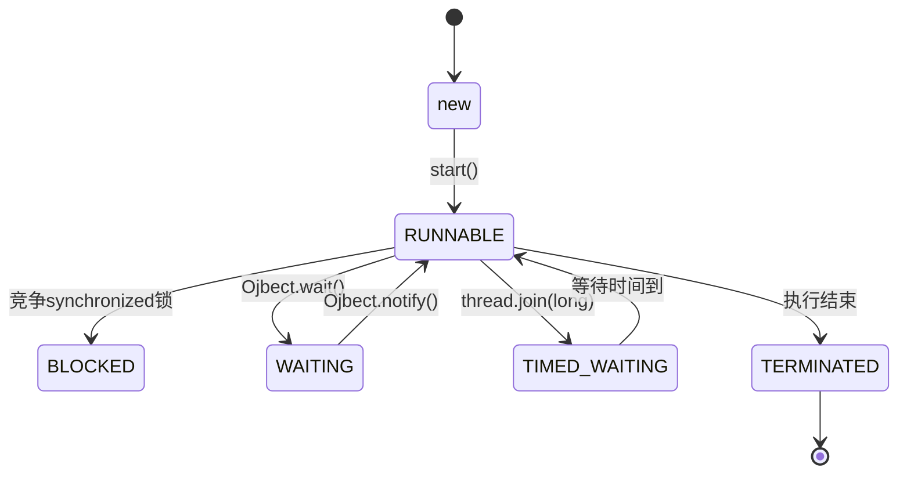
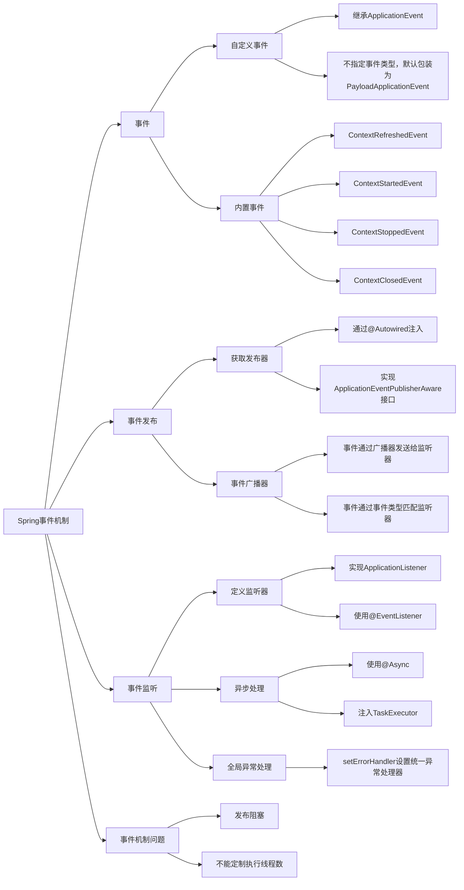
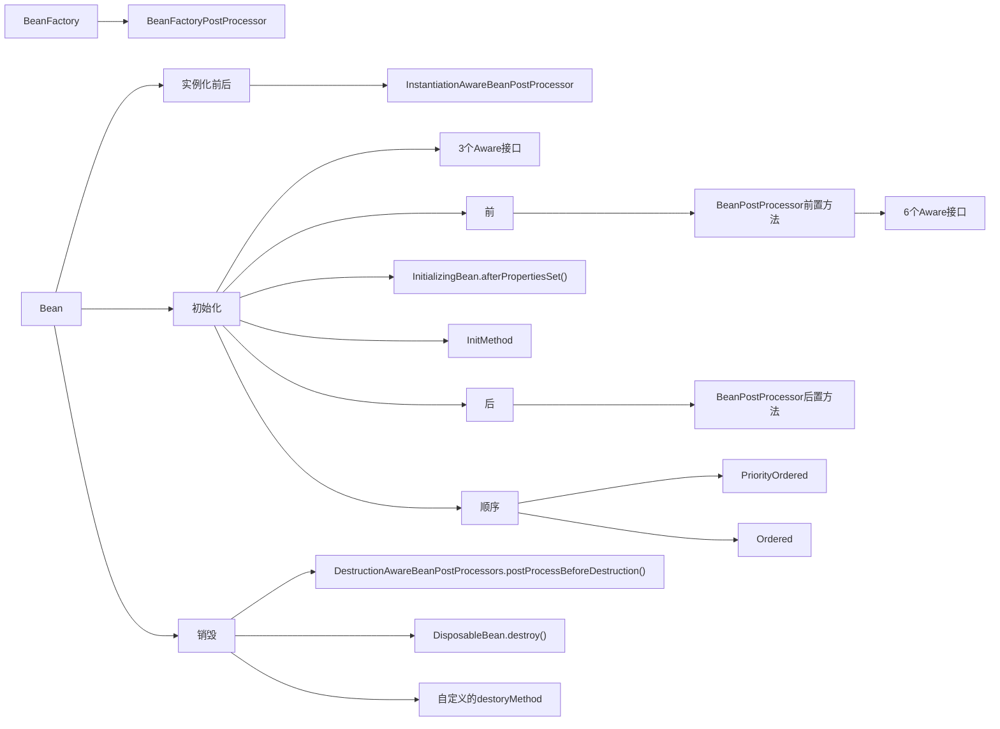
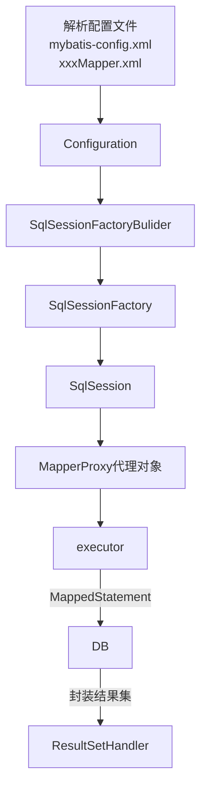
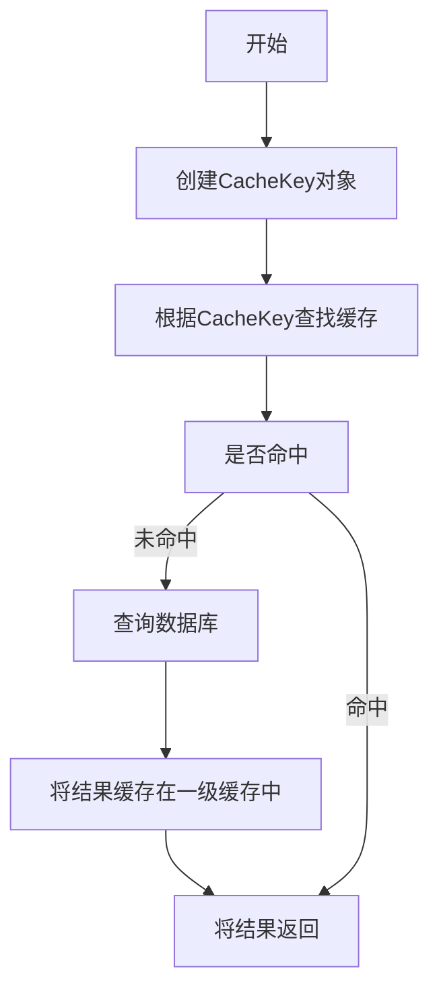
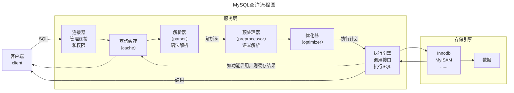

# Java面试题

# 文档说明

本文档主要整理了Java领域的所有面试题。目前尚未整理结束，还在持续更新中。如有问题，欢迎讨论交流。

| 编制人       | namelessmyth   |
| ------------ | -------------- |
| 编制日期     | 2021-07-07     |
| 编制单位     | 无             |
| 文档分类     | 求职-面试-Java |
| 版本号       | 1.4            |
| 最后更新人   | namelessmyth   |
| 最后更新日期 | 2023-10-15     |


## 更新记录

| 版本 | 编制/修改人  | 修改日期   | 备注（原因、进一步的说明等）                         |
| ---- | ------------ | ---------- | ---------------------------------------------------- |
| 1.0  | namelessmyth | 2021-07-07 | 初稿，整理了本次找工作积累到的所有面试题             |
| 1.1  | namelessmyth | 2023-09-15 | 合并马士兵的面试笔记，重新整理目录结构               |
| 1.2  | namelessmyth | 2023-09-19 | 整理Spring部分，将简历和沟通部分独立出去。           |
| 1.3  | namelessmyth | 2023-09-30 | 完成Spring Framework面试题的初步整理。               |
| 1.4  | namelessmyth | 2023-10-15 | 补充SpringBoot和SpringMVC面试题，将所有题目提升至3级 |
|      |              |            |                                                      |
|      |              |            |                                                      |


# J2SE

## 基础

### Arrays.sort()用的什么排序

JDK8中

数组长度为n，则1 <= n < 47 使用插入排序

数组长度为n，则47 <= n < 286 使用使用快速排序

数组长度为n，则286 < n 使用归并排序或快速排序（有一定顺序使用归并排序，毫无顺序使用快排）

https://blog.csdn.net/yuanchangliang/article/details/107755756


### 数据结构

链表和数组的区别以及应用


跳表时间复杂度


哈希冲突问题


如何知道一个链表有环？

思路

 如果一个链表无环，那么遍历链表一定可以遇到链表的终点；如果链表有环，那么遍历链表就永远在环内转下去。具体如下：

 1.设置快慢指针分别为fast和slow。开始，slow和fast都指向链表的头节点head。然后slow每次移动一步，fast每次移动两部，在链表中遍历。

 2.如果链表无环，fast指针在移动过程一定先遇到终点，直接返回null，表示链表无环。

 3.如果有环，fast和slow一定在环中相遇。相遇时，fast重新回到head位置，slow不动。接下来，fast指针每次移动一步，slow依然每次移动一步，继续遍历。

 4.fast和slow指针一定会再次相遇，并在第一个入环的节点处相遇，证明略。

```java
public Node getLoopNode(Node head){
    if (head == null || head.next == null || head.next.next == null){
        return null;
    }
    Node n1 = head.next; //n1 -> slow
    Node n2 = head.next.next; // n2 -> fast
    while (n1 != n2){
        if (n2.next == null || n2.next.next == null){
            return null;
        }
        n2 = n2.next.next;
        n1 = n1.next;
    }
    n2 = head; // n2 -> walk again from head
    while (n1 != n2){
        n1 = n1.next;
        n2 = n2.next;
    }
    return n1;
}
```


## 面向对象

### HashMap的底层结构

### HashMap1.8与1.7区别

    [参考答案1](https://blog.csdn.net/qq_36520235/article/details/82417949) ，[参考答案2](https://blog.csdn.net/weixin_44141495/article/details/108402128)

### 只重写equals不重写hashcode会有什么问题？

### Exception, Throwable, Error, RuntimeException的区别


## 多线程并发

### 并发和并行

并行(Parallel)，当系统有一个以上CPU时，当一个CPU执行一个进程时，另一个CPU可以执行另一个进程，两个进程互不抢占CPU资源，可以同时进行，这种方式我们称之为并行(Parallel)。

并发(Concurrent)，在操作系统中，是指一个时间段中有几个程序都处于已启动运行到运行完毕之间，目这几个程序都是在同一个处理器,上运行。

总结：

并发的多个任务之间是互相抢占资源的。 并发单核处理中也存在

并行的多个任务之间是不互相抢占资源的。并行只在多处理器中才会存在。


### 解释多线程上下文切换

**概念**

上下文切换是指CPU的控制权或者时间片从一个线程转到另一个线程，为了确保下一次恢复执行该线程时能够正确地运行，需要保存当前线程的上下文状态。

**线程和进程**

进程上下文切换与线程上下文切换最主要的区别就是线程的切换虚拟空间内存是相同的（因为都是属于自己的进程），但是，进程切换的虚拟空间内存则是不同的。线程上下文切换比进程上下文切换快的多。

**切换分类**

（1）主动切换或让步式上下文切换:

指执行线程时间片没到主动释放CPU，与锁竞争严重程度成正比，可通过减少锁竞争来避免；

（2）抢占式上下文切换:

指线程因分配的时间片用尽而被迫放弃CPU或者被其他优先级更高的线程所抢占，
一般由于线程数大于CPU可用核心数引起，可通过调整线程数，适当减少线程数来避免。

**上下文切换算法**

最简单最常用的就是基于时间片轮转调度算法。时间片轮转调度算法是非常公平的处理机分配方式，可以使就绪队列的每个进程每次仅运行一个时间片。 

原理：在时间片轮转调度算法中，系统根据先来先服务的原则，将所有的就绪进程排成一个就绪队列，并且每隔一段时间产生一次中断，激活系统中的进程调度程序，完成一次处理机调度，把处理机分配给就绪队列队首进程，让其执行指令。当时间片结束或进程执行结束，系统再次将CPU分配给队首进程。

**如何减少上下文切换**

（1）无锁并发编程。

多线程竞争时，会引起上下文切换，所以多线程处理数据时，可以用一些办法来避免使用锁，如将数据的ID按照Hash取模分段，不同的线程处理不同段的数据

（2）CAS算法。

  Java的Atomic包使用CAS算法来更新数据，而不需要加锁

（3）使用最少线程。

  避免创建不需要的线程，比如任务很少，但是创建了很多线程来处理，这样会造成大量线程都处于等待状态

（4）协程。

 在单线程里实现多任务的调度，并在单线程里维持多个任务间的切换。


### 对线程安全的理解

**线程安全是什么**

当多个线程访问一个对象时，如果不进行额外的同步控制或者其他的协调操作，调用这个对象的行为都可以获得正确的结果，我们就说这个对象是线程安全的。

线程安全也可以指某一段代码。例如：i++是不是线程安全的？答案：不是。

**原子性：** 提供互斥访问，同一时刻只能有一个线程对数据进行操作；例如：atomicXXX类，synchronized关键字的应用。

**有序性：** 一个线程观察其他线程中的指令执行顺序，由于指令重排序，该观察结果一般杂乱无序；例如，happens-before原则。

**可见性：** 一个线程对主内存的修改可以及时地被其他线程看到；例如：synchronized,volatile。

参考文章：[对线程安全的理解](https://zhuanlan.zhihu.com/p/446262986)


### 守护线程是什么

在Java中线程分2类：User Thread(用户线程)、Daemon Thread(守护线程)。一般默认创建的就是用户线程，用于执行用户级任务。守护线程也就是“后台线程”，一般用来执行后台任务，守护线程的典型应用是GC(垃圾回收器)。

这两种线程唯一的区别是，Java虚拟机退出时会等待所有<用户线程>都结束而不会等<守护线程>执行完。

**守护线程创建**

可以通过使用setDaemon(true)方法，使线程成为一个守护线程。我们需要在启动线程之前调用一个线程的setDaemon0方法。否则，就会抛出一个java.lang.lllegalThreadStateException。可以使用isDaemon()方法来检查线程是否是守护线程。


### JDK21中的虚拟线程

JDK21中的虚拟线程其实这就是协程。是在JDK19中引入，在JDK21中成为正式功能。

在以前的JDK中，Java的线程模型比较简单，在大多数操作系统中，主要采用的是基于轻量级进程实现的一对的线程模型，简单来说就是每一个Java线程对应一个操作系统中的轻量级进程，这种线程模型中的线程创建、析构及同步等动作，都需要进行系统调用。而系统调用则需要在用户态 (User Mode) 和内核态(Kernel Mode)中来回切换，所以性能开销还是很大的。

而新引入的虚拟线程，是JDK实现的轻量级线程，他可以避免上下文切换带来的的额外耗费。他的实现原理其实是JDK不再是每一个线程都一对一的对应一个操作系统的线程了，而是会将多个虚拟线程映射到少量操作系统线程中，通过有效的调度来避免那些上下文切换

在JDK21中，创建协程的方法，如下

Thread.startVirtualThread()

Executors.newVirtualThreadPerTaskExecutor()

性能对比：有人测试过，相同的代码逻辑从线程改成携程后，执行时间从100秒降为1.6秒。

原文链接：https://www.yuque.com/hollis666/vzy8n3/ac1a0q


### 线程的生命周期

#### 前言

线程的生命周期指的是线程从创建出来到最终消亡的整个过程，以及过程中的状态变化。

#### 线程状态图

以下图用mermaid语法绘制：



#### 状态变化说明

java线程对象的所有状态存放在**Thread类的内部类(State)**中：

1. 初始(NEW)
   1. 新创建了一个线程对象，但还没有调用start()方法
2. 运行(RUNNABLE)
   1. Java线程中将就绪(READY) 和运行中(RUNNING) 两种状笼统的称为“可运行"
   2. 就绪(READY)
      1. 线程对象创建后，其他线程(比如main线程调用了该对象的start()方法。该状态的线程位于可运行线程池中，等待被线程调度选中并分配cpu使用权
   3. 运行中 (RUNNING)
      1. 就绪(READY)的线程获得了cpu 时间片，开始执行程序代码
3. 阻塞(BLOCKED)
   1. 表示线程被锁阻塞时的状态。例如：多个线程竞争synchronized锁，有1个线程得到了锁，其他线程就是阻塞状态
4. 等待(WAITING)
   1. 线程暂停运行，等待其他线程唤醒之后再继续执行。
   2. 进入方法，例如：thread.join()，Ojbect.wait()，LockSupport.park()方法
   3. 唤醒方法，例如：Object.notify()或者Object.notifyAll()
5. 定时等待(TIMED_WAITING)
   1. 该状态不同于WAITING，它可以在指定的时间后自行恢复
   2. 进入方法，例如：Thread.sleep(long)，Object.wait(long)，thread.join(long)，LockSupport.parkNanos，LockSupport.parkUntil
6. 终止(TERMINATED)
   1. 表示该线程已经执行结束或者异常中断；
   2. 线程一旦终止,就不能再重启启动,否则报错(IllegalThreadStateException)

#### 补充说明

在Thread类中过时的方法(因为存在线程安全问题,所以弃用了

-  void suspend()：暂停当前线程
-  void resume()：恢复当前线程
-  void stop()：结束当前线程


### 线程的创建方式

在Java中，有如下方式可以创建线程

1. 继承Thread类创建线程
2. 实现Runnable接口创建线程
3. 通过Callable和FutureTask创建线程
4. 通过线程池创建


### Callable和Runnable的区别

Runnable接口和Callable接口都可以用来创建新线程，他们有如下不同：

1. 实现Runnable接口，需要实现run方法；实现Callable接口的话，需要实现call方法。
2. Runnable的run方法无返回值，Callable的call方法有返回值，类型为Obiect
3. Callable中可以抛出checked exception，Runnable不可以。
4. Callable和Runnable都可以应用于executors。而Thread类只支持Runnable。


### run和start的区别

start是用来启动线程的。线程获得CPU时间片后执行的是run方法中的代码。


### sleep和wait的区别

1. sleep是线程的静态方法，wait是Object对象方法。
2. sleep()方法可以在任何地方使用；而wait()方法则只能在同步方法或同步块中使用
3. wait()方法会释放对象锁，但sleep()方法不会；
4. wait后线程会进入到WAITING状态，直到被唤醒；sleep后进入到TIMED_WAITING状态。


### notify和notifyAll的区别

相同点

- 这2个方法都是用于唤醒waiting状态的线程，
- 唤醒的这些线程只是进入争夺队列，并不表示立即就可以获得CPU开始执行，因为wait方法被调用的时候线程已经释放了对象锁。
- notify和notifyAll因为也是操作对象的，所以把他们定义在Object类中。

区别是：

- 使用notifyAll可以唤醒所有处于waiting状态的线程，使其重新进入锁的争夺队列中，而notify只能唤醒一个。
- notifyAll可以把所有线程都唤醒，让他们都可以竞争锁，但是最终也只有一个可以获得锁并执行。


### 如何让多个线程按顺序执行

例如：有t1、t2、t3三个线程，怎么让他的顺序是t1, t2 , t3。

#### join()

#### future

可以通过join()或者callable+future来得到返回值。


### 如何让线程池按顺序执行

首先线程池设计出来就是用来提升并发处理性能的，他本身并不提供内部线程顺序执行的方法。这道题主要考察开发人员对线程池类型的掌握

#### 单线程线程池

单线程池中只有1个线程，自然提交进去的线程只能顺序执行。

#### 返回值依赖

线程提交到线程池时，有一个得到返回值的方法，可以让另一个线程必须得到上一个线程的返回值之后才开始执行。

```java
public class PoolSequential {
    public static void singleThreadPool() {
        ExecutorService executor = Executors.newSingleThreadExecutor();
        executor.submit(() -> System.out.println("t1..."));
        executor.submit(() -> System.out.println("t2..."));
        executor.submit(() -> System.out.println("t3..."));
        executor.shutdown();
    }

    public static void ScheduledExecutor() throws ExecutionException, InterruptedException {
        ScheduledExecutorService executor = Executors.newScheduledThreadPool(1);
        Callable t1 = new Callable() {
            @Override
            public Long call() throws Exception {
                System.out.println("t1...");
                return 0L;
            }
        };
        ScheduledFuture<?> future1 = executor.schedule(t1, 0, TimeUnit.MILLISECONDS);
        Callable t2 = new Callable() {
            @Override
            public Long call() throws Exception {
                System.out.println("t2...");
                return 0L;
            }
        };
        ScheduledFuture<?> future2 = executor.schedule(t2, (Long) future1.get(), TimeUnit.MILLISECONDS);

        Callable t3 = new Callable() {
            @Override
            public Long call() throws Exception {
                System.out.println("t3...");
                return 0L;
            }
        };
        ScheduledFuture<?> future3 = executor.schedule(t3, (Long) future2.get(), TimeUnit.MILLISECONDS);
        executor.shutdown();
    }

    public static void main(String[] args) throws ExecutionException, InterruptedException {
        singleThreadPool();
        System.out.println("...");
        ScheduledExecutor();
    }
}
```


### 线程什么时候抛出InterruptedException

调用interrupt方法时。
抛出InterruptedException应该怎么处理
抛出异常后会默认复位。必须做出明确的处理。不能仅仅打印日志


### interrupt()的作用？线程复位及其方式

 interrupt()的作用是中断线程。将线程变量interrupt标记为true，

线程的复位就是将变量interrupt改为false，并且唤醒线程；

线程复位的方式有：抛出InterruptException异常，通过Thread.interrupted();


### java如何停止一个线程，interrupt，interrupted，isInterrupted()区别


### 讲一下JMM

#### 硬件层面原因

由于CPU和内存之间几个量级的速度差异。引入了告诉缓存，但由于CPU每个核心的高速缓存互相之间的不可见性。出现缓存一致性问题。解决缓存一致性问题有2个方案：总线锁和MESI协议。

总线锁虽然能解决可行性问题但是会带来性能问题。因为一个cpu在操作共享变量时其他cpu都是阻塞的。

MESI协议，当CPU0修改变量时如果发现当前变量是共享状态（S），会通知其他cpu先将这个共享变量置为失效状态I，等到其他cpu修改完毕并且回复CPU0时，CPU0才会将共享变量改成E独占状态。修改完成之后改成M状态。然后数据写入缓存行中。

这样做性能虽然比总线锁提高了。但是有个缺点是CPU需要在等待所有的Invalid ack之后才会进行下面的操作。这会让CPU产生一定的阻塞，无法充分利用CPU。这个时候就出来了写缓冲器和无效队列化。

虽然写缓冲器虽然进一步优化了性能，但还是会带来可见性问题。这就需要借助内存屏障来配合解决可见性问题。

#### JMM介绍

由于存在上述硬件层面问题。JMM规定了JVM和计算机内存的协同工作方式。例如：一个线程何时和如何看到另一个线程的修改过的共享变量的值。如何的同步的访问共享变量。JMM屏蔽了各种硬件和操作系统对系统内存的访问方式。让Java可以跨平台的实现多线程并发操作的一致性。

Volatile的解决可见性问题。当共享变量在修改时会使用写屏障，确保共享变量的值从高速缓存写入主存。当读取共享变量的时候会生成读屏障确保从主存中读取最新的值。

调用栈和本地变量存放在线程栈上，对象存放在堆上。

一个本地变量可能是原始类型，在这种情况下，它总是“呆在”线程栈上。

一个本地变量也可能是指向一个对象的一个引用。在这种情况下，引用（这个本地变量）存放在线程栈上，但是对象本身存放在堆上。

一个对象可能包含方法，这些方法可能包含本地变量。这些本地变量仍然存放在线程栈上，即使这些方法所属的对象存放在堆上。

一个对象的成员变量可能随着这个对象自身存放在堆上。不管这个成员变量是原始类型还是引用类型。

静态成员变量跟随着类定义一起也存放在堆上。


### 并发

### 什么是线程安全

当多个线程访问某一个类（对象或方法）时，对象对应的公共数据区始终都能表现正确，那么这个类（对象或方法）就是线程安全的。

### 对volatile的理解

### 新建t1, t2, t3三个线程, 如何保证他们按顺序执行?

### Synchronized加锁的范围有哪些?


### synchronized和重入锁实现原理以及区别？


### Synchronized在JDK1.6之后的优化


### 多线程中wait()和sleep(), part()的区别

sleep是会设置超时时间的。超时自动进入就绪状态

park和sleep不会释放锁，wait会释放


### sleep，join，yield的区别。

sleep：睡眠指定时间，睡眠期间不会释放锁，超时后让出CPU时间片；

yield，和sleep(0)作用类似，让出当前线程的时间片

join：让调用该方法的线程的执行结果对主线程可见，内部基于wait notify实现；


### Java中的++操作是线程安全的么？

不是。原子性，可见性，有序性。++操作不符合原子性。

### java如何实现多线程之间通讯和协作

### 死锁的4个必要条件

### 写个死锁

### 怎么样唤醒一个阻塞的线程?

### 是否能创建volatile数组？

可以，但volatile仅针对引用可见，数组中的数组不可见。

### happens-Before介绍

### ThreadLocal是什么?原理?

线程隔离机制，用于保证在多线程环境下对于共享变量的访问的安全性。

提供线程本地变量，如果创建一个ThreadLocal变量，那么访问这个变量的每个线程都会有这个变量的一个副本，在实际多线程操作的时候，操作的是自己本地内存中的变量，从而规避了线程安全问题

从实现上讲：每个线程内部都维护了一个map，而这个map的key就是threadLocal，而值就是我们set的那个值，每次线程在get的时候，都从自己的变量中取值，既然从自己的变量中取值，那就解决了线程安全问题，总体来讲，ThreadLocal这个变量的状态根本没有发生变化，他仅仅是充当一个key的角色，另外提供给每一个线程一个初始值。如果允许的话，我们自己就能实现一个这样的功能，只不过恰好JDK就已经帮我们做了这个事情。这个map的key是弱引用，而value是强引用。


### ThreadLocal怎么共享父线程的变量

https://blog.csdn.net/hewenbo111/article/details/80487252


### JUC

### ConcurrentHashMap实现原理


### 线程池

### 线程池的Submit()和execute() 区别

### 

### 

### 谈下ThreadLocal的内存泄漏问题, 怎么解决?

### 线程池执行任务的过程原理

无论是哪种类型的线程池最终都会创建一个ThreadPoolExecutor（线程池执行器），只是不同的线程池传入的参数不一样。

每一个线程执行execute方法的过程

如果在运行的线程小于核心线程数，则通过addWorker方法将线程添加为核心线程。

​	添加成功直接返回继续处理下一个执行下一个线程。直到工作线程数大于等于核心线程数量。

​	如果添加失败则获取线程池的最新状态。

如果线程池正在执行，则尝试将当前线程加入到工作队列。加入成功后，再次获取线程池状态。

​	如果线程池没有正在运行。则将任务从阻塞队列移除。成功则执行拒绝策略。

​	如果线程数等于0，则添加一个空的工作线程。这段不知道什么场景会进来。

如果前面加入工作队列失败，则以非核心线程身份包装任务（false标志）

​	失败则执行拒绝策略

```java
public void execute(Runnable command) {
    if (command == null)
        throw new NullPointerException();
    //获取线程池状态及当前线程数记录，高3位记录状态，低29位记录线程数
    int c = ctl.get();   
    //如果线程数小于核心线程阈值
    if (workerCountOf(c) < corePoolSize) {
        //直接包装成Worker运行（true表示将任务以核心线程身份包装）
        if (addWorker(command, true))   
            return;
        c = ctl.get();   //如果上一步失败，则获取最新的状态
    }
    //如果线程池还在运行，则尝试将任务加入阻塞队列
    if (isRunning(c) && workQueue.offer(command)) {
        int recheck = ctl.get();   //加入成功后再检查线程池状态
        //如果加入后线程池没有在运行，将任务从队列中移除
        if (! isRunning(recheck) && remove(command))  
            //成功则执行拒绝策略
            reject(command);
        //如果当前线程数为0
        else if (workerCountOf(recheck) == 0)
            //则添加一个空的工作线程。这段不知道什么场景会进来。
            addWorker(null, false);
    }
    //如果前面加入工作队列失败，则以非核心线程身份包装任务（false标志）
    else if (!addWorker(command, false))
        //如果添加失败，则执行拒绝策略
        reject(command);  
}
```

addWorker添加工作线程的过程：

通过自旋做一些基础校验和当前线程数量，如果超出阈值则直接返回false

如果没有超出则使用CAS将工作线程数+1

然后将当前线程封装成Worker对象。

执行lock方法锁定，防止并发

将Worder对象加入到一个工作线程的Set里面

然后解锁。

如果成功添加则调用线程的start方法启动线程

Worker本身实现了Ruunable接口有一个run方法，Worker对象持有提交来的task和一个线程对象，这个线程对象根据Worker对象生成所以运行的是Worker的run方法，而Worker的run方法里又是调用了task的run方法。

```java
private boolean addWorker(Runnable firstTask, boolean core) {
    /**
        此处省略一段代码，大致工作是通过自旋检查当前线程数量是否小于阈值（否就返回false），
        CAS的检查线程池状态和CAS的将线程数+1。
    */
    boolean workerStarted = false;
    boolean workerAdded = false;
    Worker w = null;
    try {
        //根据任务包装Worker，Worker对象有一个线程对象也在此时根据Worker对象生成，Worker实现了Runnable接口
        w = new Worker(firstTask);   
        //获取Worker里生成的线程对象
        final Thread t = w.thread;   
        if (t != null) {
            final ReentrantLock mainLock = this.mainLock;
            mainLock.lock();
            try {
                //获取线程状态
                int rs = runStateOf(ctl.get());
                //检查线程池状态的合法性
                if (rs < SHUTDOWN ||(rs == SHUTDOWN && firstTask == null)) {
                    if (t.isAlive()) // 如果此刻线程就已经活跃，那么就是出错了
                        throw new IllegalThreadStateException();
                    workers.add(w);      //将生成的Worker对象放到Set集合
                    int s = workers.size();
                    if (s > largestPoolSize)
                        largestPoolSize = s;
                    workerAdded = true;  //记录Worker已经成功添加到集合
                }
            } finally {
                mainLock.unlock();
            }
            if (workerAdded) {
                t.start();     //如果Worker对象已经成功添加，则启动这个对象的线程
                workerStarted = true;  //记录任务已经开始执行
            }
        }
    } finally {
        if (! workerStarted)
            addWorkerFailed(w);   //如果最终发现任务没有标志为开始，则调用响应处理方法
    }
    return workerStarted;
}
```

在worker的run方法里预留了2个钩子方法，在before和after的时候可以执行自定义的业务

```java
final void runWorker(Worker w) {
        Thread wt = Thread.currentThread();
        Runnable task = w.firstTask;  //首先拿到提交的那个task
        w.firstTask = null;
        w.unlock(); // allow interrupts
        boolean completedAbruptly = true;
        try {
            //核心操作就是循环的getTask()，从阻塞队列里拿task来执行
            while (task != null || (task = getTask()) != null) {
                w.lock();
                //检查线程池状态
                if ((runStateAtLeast(ctl.get(), STOP) ||(Thread.interrupted() &&
                      runStateAtLeast(ctl.get(), STOP))) &&!wt.isInterrupted())
                    wt.interrupt();  //不合法就中断执行此任务的线程
                try {
                    beforeExecute(wt, task);
                    Throwable thrown = null;
                    try {
                        task.run();    //执行真实角色的run方法
                    } catch (RuntimeException x) {
                        thrown = x; throw x;
                    } catch (Error x) {
                        thrown = x; throw x;
                    } catch (Throwable x) {
                        thrown = x; throw new Error(x);
                    } finally {
                        afterExecute(task, thrown);
                    }
                } finally {
                    task = null;
                    w.completedTasks++;
                    w.unlock();
                }
            }
            completedAbruptly = false;
        } finally {
            processWorkerExit(w, completedAbruptly);
        }
    }
```


### 什么是ReentrantLock?底层怎么实现锁的?

### 什么是公平锁和非公平锁? 怎么体现? Synchronize属于公平还是非公平锁?

### cas是什么, 会有什么问题? 如何解决?

### Java中你

### Semaphore的作用是什么?

### 什么是线程池, 有哪些创建线程池的方式, 说说有哪些参数?

### 线程池的作用，如何设置线程池大小。

### 项目中的线程池怎么设置？

### ConcurrentHashmap和JDK1.7和1.8的区别?

### 线程间进行数据传递，有时候可以直接用对象进行传值，有时候要ThreadLocal，为什么不直接用ThreadLocal？

      ThreadLocal只能在同一个线程内部或者父子线程之间进行值传递，一开始就用它会有局限性。


### 多线程环境下，如何保证2个线程不重复处理相同的数据。

1. 一个线程处理时，可以通过redis的setNx方法，存入业务主键，等到业务完成在通过del key命令删除。如果setNx返回错误代表另一个线程已经在处理了。
2. 当一个线程开始处理一个条数据，单独一个事务将这条记录改成处理中。如果没有修改成功代表已经有其他线程在处理了。等到业务结束，再将记录改成处理成功状态。
3. 给每个任务分配一个唯一ID，将所有待处理的任务加载到一个Map里面，key存任务ID，value存任务状态。当有线程处理任务时直接修改这个map的状态。如果处理成功则将key移除。


### 实战

### 为什么下面的源码在多个生产者的时候会超？怎么解决？

有多个生产者时，当达到生产上限时，调用notify方法唤醒的可能不是消费者，而是其他生产者。

第一次达到生产上限时。可能会有多个生产者处在wait状态。

等消费者消费之后。通知生产者生产第二次达到生产上限，这个时候如果唤醒的还是生产者。那就会超过生产上限。

但第6行如果用while，唤醒之后还是会判断是否达到上限。就不会出现这个问题了。

```java
public void run() {
        int i = 0;
        while (true) {
            i++;
            synchronized (msg) { //同一把锁.
                if (msg.size() == maxSize) {
                    //如果生产满了
                    try {
                        System.out.println(String.format("已达到生产上限%s，停止生产！线程名称：%s", msg.size(), Thread.currentThread().getName()));
                        msg.wait(); //在这里等待，也在这里恢复执行。这时候msg已经达到5了
                    } catch (InterruptedException e) {
                        e.printStackTrace();
                    }
                    System.out.println(String.format("恢复生产，消息大小：%s，线程名称：%s", msg.size(), Thread.currentThread().getName()));
                }
                try {
                    Thread.sleep(1000);
                } catch (InterruptedException e) {
                    e.printStackTrace();
                }
                msg.add("消息-" + i);
                System.out.println(String.format("生产者生产：消息-%s，线程名称：%s，此时消息大小：%s", i, Thread.currentThread().getName(),msg.size()));
                msg.notify(); //唤醒处于阻塞状态下的线程
                //msg.notifyAll();
            }
        }
    }

 public static void main(String[] args) {
     Queue<String> queue = new LinkedList<>();
     int maxSize = 5;

     ProductIf p1 = new ProductIf(queue, maxSize);
     ProductIf p2 = new ProductIf(queue, maxSize);
     ProductIf p3 = new ProductIf(queue, maxSize);
     ProductIf p4 = new ProductIf(queue, maxSize);
     ProductIf p5 = new ProductIf(queue, maxSize);

     Consumer consumer = new Consumer(queue, maxSize);

     Thread t1 = new Thread(p1,"product-1");
     Thread t2 = new Thread(consumer);

     Thread t3 = new Thread(p2,"product-2");
     Thread t4 = new Thread(p3,"product-3");
     Thread t5 = new Thread(p4,"product-4");
     Thread t6 = new Thread(p5,"product-5");

     t1.start();
     t2.start();
     t3.start();
     t4.start();
     t5.start();
     t6.start();
 }
```

日志如下：

> 生产者生产：消息-3，线程名称：product-5，此时消息大小：4
> 生产者生产：消息-4，线程名称：product-5，此时消息大小：5
> 已达到生产上限5，停止生产！线程名称：product-5
> 已达到生产上限5，停止生产！线程名称：product-4
> 已达到生产上限5，停止生产！线程名称：product-3
> 已达到生产上限5，停止生产！线程名称：product-2
> 消费者消费：消息-1，线程名称：Thread-0
> 恢复生产，消息大小：4，线程名称：product-5
> 生产者生产：消息-5，线程名称：product-5，此时消息大小：5
> 已达到生产上限5，停止生产！线程名称：product-5
> 恢复生产，消息大小：5，线程名称：product-4
> 生产者生产：消息-1，线程名称：product-4，此时消息大小：6
> 生产者生产：消息-2，线程名称：product-4，此时消息大小：7

从日志看出product-5生产后达到上限5，唤醒了product-4继续生产，导致上限突破5


## JVM

### 内存溢出，内存泄漏遇到过吗？什么场景产生的，怎么解决的？


### jvm类加载器有哪些？

AppClassload：负责加载classpath指定的jar包，以及目录下的class文件。

ExtensionClassload：负责加载Java平台中具有扩展功能的jar包，例如：jre/lib/*.jar

BootstrapClassload：负责加载java平台的核心代码，例如：rt.jar

CustomClassload：自定义类加载器。


### 自定义类加载器应用场景

比如，tomcat、jboss，都自定义了类加载器，确保每个war目录下的项目相互隔离


### 双亲委派机制，优缺点


### JVM内存中为什么会有新生代，老年代，新生代为什么有Eden跟Survivor?Survivor又有S0、S1

分为新生代老年代的原因：

如果不分新生代和老年代，每次GC都要扫描整个堆内存，扫描范围大，扫描效率低。

JVM垃圾收集采用分代回收算法，根据对象存活周期的不同将内存分为不同的分代。根据各个代的特点采用不同的垃圾回收算法。

分成Eden、Survivor。Survivor又有S0、S1的原因：

新生代大部分对象都是“朝生暮死”的，把这样的对象单独放在一个区，可以进一步缩小GC扫描范围和时间。每次扫描之后的存活对象会移动到Survivor区是为了避免因为空间不连续而产生空间碎片。Survivor要分成S0和S1也是同理，因为Survivor中垃圾对象被清除后也可能产生空间碎片。这是一种标记-复制算法的实现。


### 请描述下JVM中的垃圾回收算法与垃圾回收器，各回收器的场景以及区别

垃圾回收算法：

1. 标记-清除

   第一遍扫描所有对象标记出可以回收的。第二遍将标记的对象清除。

   缺点：

   对象清除以后内存不连续会产生空间碎片

   标记和清除都比较耗时效率低

2. 标记-复制

   将内存划分为2块相等的区域，每次只使用其中一块。将存活的对象复制到另一块区域中，然后将原来的区域全部清除。

   优点：内存连续，不会有空间碎片。

   缺点：其中一块内存区域空间浪费了。

   适用于存活对象较少的场景。所以不适用于老年代。

3. 标记-整理

   第一遍标记过程同标记-清除算法，标记完了之后将存活对象往空间一端移动，然后清理掉端边界之外的内存。

   优点：不会有空间浪费，内存连续

   缺点：移动对象需要额外开销

垃圾回收器：

1. Serial/Serial Old

   基于标记-复制算法，单线程，执行时会暂停所有应用程序线程。新生代的叫Serial，老年代的叫Serial Old。最古老的垃圾收集器

2. ParNew

   基于标记-复制算法，多线程，执行时也会暂停所有应用程序线程。适用于新生代。

3. Parallel Scavenge/Parallel Old

   基于标记-复制算法，多线程，约等于ParNew收集器。只是这个更关注吞吐量。即减少垃圾收集时间（就是每次垃圾收集时间短，但是收集次数多），让用户代码获得更长的运行时间；

4. CMS

   基于标记-清除算法，多线程并发类收集器。更加关注停顿时间。降低了吞吐量。

5. G1

   基于标记整理算法，更加关注停顿时间。

   引入分区的思路，弱化了分代的概念。

   G1可以根据用户设置的暂停时间目标进行动态调整以满足目标。


### 怎么去判断一个对象能够进行GC回收

引用计数

统计一个对象被强引用的次数，如果为0就是垃圾，可回收。但这种方式会有循环引用的问题JVM没有采用。

可达性分析

如果一个对象无法往上追溯到GC Root引用点的就是垃圾。

哪些可以作为GC Root引用点：

JVM stack中引用的对象 

方法区中静态引用指向的对象

方法区中常量引用指向的对象

Native方法中JNI引用指向的对象

Thread-活着的线程


### JVM的参数有哪些，并说明参数作用

#### 标准参数

不会随着JDK版本变化而变化，例如：

-version
-help
-server
-cp

#### -X参数

非标准参数，也就是在JDK各个版本中可能会变动

-Xint

-Xcomp

-Xmixed

#### -XX参数

使用得最多的参数类型。非标准化参数，相对不稳定，主要用于JVM调优和Debug  

a.Boolean类型
格式：-XX:[+-]<name> +或-表示启用或者禁用name属性
比如：-XX:+UseConcMarkSweepGC 表示启用CMS类型的垃圾回收器
-XX:+UseG1GC 表示启用G1类型的垃圾回收器

b.非Boolean类型
格式：-XX<name>=<value>表示name属性的值是value
比如：-XX:MaxGCPauseMillis=500

#### 其他参数

这块也相当于是-XX类型参数的简化版

-Xms1000M 等价于-XX:InitialHeapSize=1000M

-Xmx1000M 等价于-XX:MaxHeapSize=1000M

-Xss100 等价于-XX:ThreadStackSize=100k


### 一般会怎么进行JVM调优，怎么找问题并解决问题

#### 问题反馈

用户反馈：正式环境使用一段时间后发现功能响应时间明显变慢了。甚至是直接无响应了。

#### 问题发现

OOM，GC次数，吞吐量，平均GC时间，线程死锁，CPU占用率

#### 原因排查

OOM，可以通过手动或自动的方式导出一份dump文件。通过MAT工具载入分析到底是哪段代码导致了OOM。

CPU占用率高/线程死锁，可用jstack命令查看线程堆栈信息，找到出问题的线程。看是否代码有问题。

如果通过上述方式都没找到具体的代码问题。可通过gc日志做进一步分析其他问题。

也可以在压测环境，使用jvisualvm，jconsole，arthas观察JVM状态。

#### 解决问题

- 代码问题：

  排查出来是代码问题的，及时修改代码并测试部署。

- 架构问题：

  引入消息中间件，异步削峰

  引入缓存，减少对后端的访问。

  引入分布式锁（zk，redis）

  集群+负载均衡

- JVM问题：

  尝试修改堆内存大小

  切换垃圾收集器，JDK7以后，多核大内存可以考虑G1


### 类的生命周期是怎么样的？请说下类的装载机制

类的生命周期

装载、链接、初始化、使用、卸载

装载机制

1) 通过一个类的全限定名获取定义此类的二进制字节流，装载方式有多种。

2) 将这个字节流所代表的静态存储结构转化为方法区的运行时数据结构

3) 将类文件字节码流静态存储结构放到JVM的方法区


### new一个对象的内存分配过程


### 请谈谈JVM内存模型

也叫运行时数据区，主要分为下面5个

#### 方法区

线程共享，主要存放：静态变量，类信息，常量，即时编译器编译后的代码

堆

线程共享，主要存放对象和数组。

#### 虚拟机栈

线程私有，每一个线程都对应一个栈，每调用一个方法都会往栈中压入一个栈帧。栈帧中包含局部变量表，返回值地址，动态链接，操作数栈。方法返回则会弹出栈帧。

#### 本地方法栈

线程私有，Native方法在这个地方存储。

#### 程序计数器

记录正在执行的线程信息和字节码指令信息。当cpu调度时可以衔接上。


### JVM中heap的内存划分是什么样的

分为新生代，老年代，新生代又分为Eden和S0，S1区


### 新生代、老年代垃圾回收过程以及原理

对象在被实例化之后，都是属于新生代Eden区。

如果往Eden区放的时候，有足够空间则放完结束。

但如果没有足够空间则会触发Minor GC，即清除掉可回收的对象。在判断一次Eden空间是否足够。

如果足够则放完结束。但如果还不足够。则会判断Survive区空间是否足够。

如果足够会将Eden区的存活对象移动到Survive区。对象空间申请结束。

如果不足够会继续判断老年代空间是否足够。

如果足够则将Survive区的存活对象复制到老年代。

如果老年代的空间都不足够了。则会触发Full GC，回收堆中所有可回收的对象。

如果Full GC结束之后仍然没有足够空间，则会抛出OOM异常。


### 什么是内存泄露，什么是内存溢出，有什么区别

内存泄漏是指不再使用的对象无法得到及时的回收，持续占用内存空间，从而造成内存空间的浪费。

内存泄漏很容易导致内存溢出，但内存溢出不一定是内存泄漏导致的


### 请说下JDK的引用分类

+ 强引用，只要gcroot可达，就不会被回收，会导致泄漏。
+ 软引用，内存不足时，会回收软引用对象
+ 弱引用，无论内存是否足够，只要 JVM 开始进行垃圾回收，那些被弱引用关联的对象都会被回收
+ 虚引用


### Minor GC和full GC分别在什么时候发生

#### minor GC

对象刚创建时，如果Eden区空间不足则会触发minor GC

#### major GC

Major GC在很多参考资料中是等价于 Full GC 的。精确的讲：Major GC不包括元空间垃圾回收

#### Full GC

一次 Full GC 将会对年轻代、老年代、元空间以及堆外内存进行垃圾回收

触发Full GC的原因：

当老年代空间不足时

当老年代的空间使用率超过某阈值时

当元空间不足时（JDK1.7永久代不足）

当调用 System.gc() 也会安排一次 Full GC。


### G1的回收过程


### JVM有哪些调优命令，有哪些调优工具

#### jps

查看java进程id

#### jstat

用于监控java进程的各种资源和性能，命令行模式。

#### jstack

用于排查线程问题，例如：线程死锁

#### jinfo

查看jvm进程的参数

#### jmap

用来导出dump文件。分析oom问题原因。也可以查看jvm各种状态。

#### jconsole

图形化工具展现JVM运行情况。堆信息，类加载信息

#### jvisualvm

同上，只是各有千秋。还可以显示堆

#### arthas

Alibaba开源的Java诊断工具，采用命令行交互模式，是排查jvm相关问题的利器

#### mat

分析dump文件的工具。

#### heaphero

在线dump文件分析工具

#### GCViewer

本地分析GC日志的工具

#### gceasy

在线GC日志分析工具


### 正式环境CPU100%，如何排查和解决问题

步骤一、找到最耗CPU的进程
 执行top -c ，显示进程运行信息列表

 键入P (大写p)，进程按照CPU使用率排序
步骤二：找到最耗CPU的线程
 top -Hp 10765 ，显示一个进程的线程运行信息列表

 键入P (大写p)，线程按照CPU使用率排序
步骤三：将线程PID转化为16进制(是因为堆栈里，线程id是用16进制表示的)
 printf “%x” pid
步骤四：查看堆栈，找到线程在干嘛
 jstack 10765 | grep ‘0x2a34’ -C5 --color

 打印进程堆栈

 通过线程id，过滤得到线程堆栈(看到了该线程正在执行代码的堆栈)


### 如何排查正式环境的内存溢出问题


### new一个对象的内存分配过程


### 有哪些方式能查看堆的使用情况

jconsole，jvisualvm，jmap，阿里的arthas


### GC log是怎么分析的？

https://www.cnblogs.com/qlqwjy/p/7929414.html


### 分代算法原理

标记清除，标记整理，标记复制。并行，并发，串行。


# Spring

## Framework

### 对Spring框架的理解?

#### Spring发展历史

1. 2002 年，Rod Johnson 发表了他的专著 “Expert One-On-One J2EE Design and Development”，提出了 Spring 框架的思想。
2. 2003 年，Johnson 和一些开发者创建了 Spring Framework 项目，并在 SourceForge 上发布了第一个版本。
3. 2004 年，Spring Framework 1.0 版本发布，包括核心容器、AOP 模块、DAO 模块、JDBC 模块和 Web 模块等组成部分。
4. 2006 年，Spring Framework 2.0 版本发布，增加了对注解的支持、Web Services 支持、异步执行能力等新特性。
5. 2009 年，Spring Framework 3.0 版本发布，引入了对 Java 5、Java 6 特性的支持，包括泛型、注解、并发等。
6. 2013 年，Spring Framework 4.0 版本发布，提供对 Java 8 的支持，包括 lambda 表达式、Stream API 等。
7. 2015 年，Spring Framework 4.2 版本发布，增加了对 WebSocket 和 STOMP 协议的支持。
8. 2017 年，Spring Framework 5.0 版本发布，对响应式编程提供了支持，并对代码库进行了大规模升级和剪裁，去掉了过时和不必要的模块和类。
9. 2022年，Spring Framework 6.0 版本发布

自从 2003 年发布以来，Spring Framework 在 Java 开发社区中变得越来越流行，并成为了多个企业级应用开发的首选框架之一。


#### 模块介绍

官网的Spring5模块结构图


##### spring beans

负责Bean的定义（BeanDefinition），Bean的装配（BeanFactory），Bean的解析（BeanDefinitionReader）。Spring是面向Bean编程的，所以Bean是Spring的核心主角。

##### Spring Context

spring-context模块构架于核心模块之上，扩展了BeanFactory，为它添加了Bean生命周期控制、框架事件体系及资源加载透明化等功能。此外，该模块还提供了许多企业级支持，如邮件访问、远程访问、任务调度等，ApplicationContext是该模块的核心接口，它的超类是BeanFactory。与BeanFactory不同，ApplicationContext实例化后会自动对所有的单实例Bean进行实例化与依赖关系的装配，使之处于待用状态。

##### Spring Core

这个模块是其他模块基本都依赖的公共核心模块，为他们提供基础能力。

##### Spring Expression

SpEL，Spring的一种表达式。用来动态的获取，值、对象等。例如：@value("#{'system.key.value'}")

##### Spring AOP

通过配置方式将面向切面编程技术集成到了框架之中；例如：事务切面

##### Spring aspects

模块集成自 AspectJ 框架，主要是为 Spring AOP 提供多种 AOP 实现方法。

##### Spring instrument

模块是基于 JAVA SE 中的 java.lang.instrument 进行设计的，应该算是AOP 的一个支援模块，主要作用是在 JVM 启用时，生成一个代理类，程序员通过代理类在运行时修改类的字节，从而改变一个类的功能，实现 AOP 的功能。在分类里，我把他分在了 AOP 模块下，在 Spring 官方文档里对这个地方也有点含糊不清。

##### Spring Data Access/Integration

此模块主要负责数据访问以及和其他系统的集成。例如：JDBC，ORM，事务，JMS的支持；在Spring源码中对应着很多子模块。

##### Spring Web

由 spring-web、spring-webmvc、spring-websocket和spring-webflux 4个模块组成。
spring-web 模块为 Spring 提供了最基础 Web 支持，主要建立于核心容器之上，通过 Servlet 或者 Listeners 来初始化 IOC 容器，也包含一些与 Web 相关的支持。
spring-webmvc 模块是一个的Web-Servlet 模 块 ， 实现了Spring MVC（model-view-Controller）的 Web 应用。
spring-websocket 模块主要是与 Web 前端的全双工通讯的协议。
spring-webflux 是一个新的非堵塞函数式 Reactive Web 框架，可以用来建立异步的，非阻塞，事件驱动的服务，并且扩展性非常好。

##### Spring messaging

从 Spring4 开始新加入的一个模块，主要职责是为 Spring 框架集成一些基础的报文传送应用。


### 对SpringIoC的理解

IOC（Inversion of control），即：控制反转，是指创建对象的控制权的转移，以前创建对象的主动权和时机是由自己把控的，而现在这种权力转移到Spring容器中，并由容器根据配置文件去创建实例和管理各个实例之间的依赖关系，对象与对象之间松散耦合DI依赖注入和IOC控制反转是同一个概念的不同角度的描述，即：应用程序在运行时依赖IoC容器来动态注入对象需要的外部资源。

IOC是一种设计思想（思想的转变）。最大的作用就是解耦（降低耦合性），也利于功能的复用。

[Spring IoC的实现原理](#Spring的IoC实现原理)


### Spring的IoC实现原理

#### 介绍

虽然问的是实现原理，但同一类型的题一般面试官会问一个。所以也可以讲下对IOC的理解。可以参考[对SpringIoC的理解](#对SpringIoC的理解)。讲了理解之后再讲实现。

#### 实现过程

IoC的核心组件是IOC容器，他会随着Spring的启动而自动初始化。过程中主要涉及依赖注入，动态代理技术，反射技术。

1. 在IOC容器启动时，读取并解析配置文件，注解中的Bean定义信息，将其封装成BeanDefinition对象存储在BeanFactory中
2. 对于单例非延迟加载的Bean，IOC容器初始化的时候会将其统一实例化好，放在缓存中。
3. 对于原型Bean，则是获取他的时候才会初始化。
4. 普通对象实例化时会用到反射技术，代理对象的实例化还会用到了动态代理技术。
5. Bean被实例化之后，需要给其属性进行赋值，属性的类型可能是另一个Bean，这个过程就是依赖注入。
6. 依赖注入完成以后，就是执行每一个Bean的初始化流程。这个流程中Spring定义了一些列的回调方法允许使用者扩展。

#### 源码层面

在源码层面，Spring IoC的核心组件是BeanFactory和BeanDefinition。BeanFactory是IoC容器的接口，它提供了管理和获取bean的方法。BeanDefinition是描述bean的元数据对象，包括bean的类型、作用域、依赖项和初始化参数等信息。BeanFactory通过BeanDefinition来创建、组装和管理bean。

在源码中，Spring IoC通过使用反射、动态代理和BeanPostProcessor等技术来实现依赖注入和组件的创建和管理。在创建bean时，IoC容器会解析BeanDefinition，然后通过反射创建bean实例，设置bean的属性并执行初始化方法。对于需要注入其他bean的属性，容器会自动查找相应的bean实例并进行注入。在完成bean的创建和依赖注入后，容器将bean放入自己的容器中进行管理，同时可以根据需要进行销毁或重置。

#### ClassPathXmlApplicationContext初始化流程

~~~mermaid
flowchart TB
prepareRefresh-->bf1

subgraph BeanFactory
direction LR
bf1[ObtainBeanFactory初始化]-->bf2[prepareBeanFactory准备]-->bf3[[postProcessBeanFactory]]-->bf4[invokeBeanFactoryPostProcessors]
end

subgraph Bean
bf4-->bean1[registerBeanPostProcessors]-->message>initMessageSource初始化国际化资源]-->app[initApplicationEventMulticaster初始化事件多播器]-->onrefresh[[onRefresh留给子类实现]]-->regListen[registerListeners]-->finishBeanFactoryInitialization
end

finishBeanFactoryInitialization-->finishRefresh-->reset[resetCommonCaches]
~~~

[参考文章](https://zhuanlan.zhihu.com/p/523343141?utm_id=0)


### Spring Bean的生命周期

#### 本文作用

本文主要是为了说明Spring Bean的生命周期。这是一个高频面试题，这个问题即考察对Spring的微观了解，又考察对Spring的宏观认识，还考察对Spring源码的熟悉程度！

#### 宏观认识

Bean的生命周期宏观上可以表达为：

1. Bean工厂初始化（不熟的，这部分可以不提）
2. 实例化-Instantiation
3. 属性赋值-populate
4. 初始化-Initialization
5. 销毁-Destruction

有的人可能会疑惑，Bean工厂和Bean是两回事，为什么会和Bean的生命周期有关？

- Bean工厂中存放了BeanDefinition，这个就是Bean的定义，Bean就是根据这个实例化出来的。
- Bean工厂初始化的时候会调用一个特殊的后置处理器：ConfigurationClassPostProcessor。他会解析如下注解。
  - @Configuration的配置类
  - 解析@ComponentScan扫描的包
  - 解析@Import注解
- 所以这个类可能会增加Bean的数量。
- 下面是完整的Bean生命周期流程图来说明。（使用mermaid语法绘制）


#### Spring源码

其实在Spring源码的BeanFactory这个类的注释中，Spring源码的作者已经告诉我们Bean完整的生命周期了。

下面就是Spring源码的摘录。大家本地有源码的朋友，可以把鼠标放到类名字上面去，就可以预览注释的实际效果了。

```java
/**
 * Bean工厂的根父类，定义获取bean及bean的各种属性。下面的注释中还列举了Bean的生命周期 <br>
 * The root interface for accessing a Spring bean container.
 *
 * <p>This is the basic client view of a bean container;
 * further interfaces such as {@link ListableBeanFactory} and
 * {@link org.springframework.beans.factory.config.ConfigurableBeanFactory}
 * are available for specific purposes.
 *
 * <p>This interface is implemented by objects that hold a number of bean definitions,
 * each uniquely identified by a String name. Depending on the bean definition,
 * the factory will return either an independent instance of a contained object
 * (the Prototype design pattern), or a single shared instance (a superior
 * alternative to the Singleton design pattern, in which the instance is a
 * singleton in the scope of the factory). Which type of instance will be returned
 * depends on the bean factory configuration: the API is the same. Since Spring
 * 2.0, further scopes are available depending on the concrete application
 * context (e.g. "request" and "session" scopes in a web environment).
 *
 * <p>The point of this approach is that the BeanFactory is a central registry
 * of application components, and centralizes configuration of application
 * components (no more do individual objects need to read properties files,
 * for example). See chapters 4 and 11 of "Expert One-on-One J2EE Design and
 * Development" for a discussion of the benefits of this approach.
 *
 * <p>Note that it is generally better to rely on Dependency Injection
 * ("push" configuration) to configure application objects through setters
 * or constructors, rather than use any form of "pull" configuration like a
 * BeanFactory lookup. Spring's Dependency Injection functionality is
 * implemented using this BeanFactory interface and its subinterfaces.
 *
 * <p>Normally a BeanFactory will load bean definitions stored in a configuration
 * source (such as an XML document), and use the {@code org.springframework.beans}
 * package to configure the beans. However, an implementation could simply return
 * Java objects it creates as necessary directly in Java code. There are no
 * constraints on how the definitions could be stored: LDAP, RDBMS, XML,
 * properties file, etc. Implementations are encouraged to support references
 * amongst beans (Dependency Injection).
 *
 * <p>In contrast to the methods in {@link ListableBeanFactory}, all of the
 * operations in this interface will also check parent factories if this is a
 * {@link HierarchicalBeanFactory}. If a bean is not found in this factory instance,
 * the immediate parent factory will be asked. Beans in this factory instance
 * are supposed to override beans of the same name in any parent factory.
 *
 * <p>Bean factory implementations should support the standard bean lifecycle interfaces
 * as far as possible. The full set of initialization methods and their standard order is:
 * <ol>
 * <li>BeanNameAware's {@code setBeanName}
 * <li>BeanClassLoaderAware's {@code setBeanClassLoader}
 * <li>BeanFactoryAware's {@code setBeanFactory}
 * <li>EnvironmentAware's {@code setEnvironment}
 * <li>EmbeddedValueResolverAware's {@code setEmbeddedValueResolver}
 * <li>ResourceLoaderAware's {@code setResourceLoader}
 * (only applicable when running in an application context)
 * <li>ApplicationEventPublisherAware's {@code setApplicationEventPublisher}
 * (only applicable when running in an application context)
 * <li>MessageSourceAware's {@code setMessageSource}
 * (only applicable when running in an application context)
 * <li>ApplicationContextAware's {@code setApplicationContext}
 * (only applicable when running in an application context)
 * <li>ServletContextAware's {@code setServletContext}
 * (only applicable when running in a web application context)
 * <li>{@code postProcessBeforeInitialization} methods of BeanPostProcessors
 * <li>InitializingBean's {@code afterPropertiesSet}
 * <li>a custom init-method definition
 * <li>{@code postProcessAfterInitialization} methods of BeanPostProcessors
 * </ol>
 *
 * <p>On shutdown of a bean factory, the following lifecycle methods apply:
 * <ol>
 * <li>{@code postProcessBeforeDestruction} methods of DestructionAwareBeanPostProcessors
 * <li>DisposableBean's {@code destroy}
 * <li>a custom destroy-method definition
 * </ol>
 *
 * @author Rod Johnson
 * @author Juergen Hoeller
 * @author Chris Beams
 * @since 13 April 2001
 * @see BeanNameAware#setBeanName
 * @see BeanClassLoaderAware#setBeanClassLoader
 * @see BeanFactoryAware#setBeanFactory
 * @see org.springframework.context.ResourceLoaderAware#setResourceLoader
 * @see org.springframework.context.ApplicationEventPublisherAware#setApplicationEventPublisher
 * @see org.springframework.context.MessageSourceAware#setMessageSource
 * @see org.springframework.context.ApplicationContextAware#setApplicationContext
 * @see org.springframework.web.context.ServletContextAware#setServletContext
 * @see org.springframework.beans.factory.config.BeanPostProcessor#postProcessBeforeInitialization
 * @see InitializingBean#afterPropertiesSet
 * @see org.springframework.beans.factory.support.RootBeanDefinition#getInitMethodName
 * @see org.springframework.beans.factory.config.BeanPostProcessor#postProcessAfterInitialization
 * @see DisposableBean#destroy
 * @see org.springframework.beans.factory.support.RootBeanDefinition#getDestroyMethodName
 */
public interface BeanFactory {
	//...... 此处省略代码细节	
}
```

根据这个注释，我们可以整理出一份简易文字版bean生命周期

1. BeanNameAware's setBeanName
2. BeanClassLoaderAware's setBeanClassLoader
3. BeanFactoryAware's setBeanFactory
4. EnvironmentAware's setEnvironment
5. EmbeddedValueResolverAware's setEmbeddedValueResolver
6. ResourceLoaderAware's setResourceLoader (only applicable when running in an application context)
7. ApplicationEventPublisherAware's setApplicationEventPublisher (only applicable when running in an application context)
8. MessageSourceAware's setMessageSource (only applicable when running in an application context)
9. ApplicationContextAware's setApplicationContext (only applicable when running in an application context)
10. ServletContextAware's setServletContext (only applicable when running in a web application context)
11. postProcessBeforeInitialization methods of BeanPostProcessors
12. InitializingBean's afterPropertiesSet
13. a custom init-method definition
14. postProcessAfterInitialization methods of BeanPostProcessors

在关闭bean工厂时，也就是销毁时，应用以下生命周期方法：

1. DestructionAwareBeanPostProcessors.postProcessBeforeDestruction()
2. DisposableBean的destroy方法
3. 自定义的destroy-method


#### 参考说明

https://zhuanlan.zhihu.com/p/622803858?utm_id=0

https://www.mashibing.com/study?courseNo=2154&sectionNo=36480&courseVersionId=1241


### Bean循环依赖，三级缓存

#### 本文目的

本文主要说明什么是Spring的循环依赖。哪些场景的循环依赖Spring可以解决。如何解决的。同时讲解了Spring的三级缓存。

#### 类图


#### 什么是循环依赖

参考上面的类图，Spring要初始化A类，但A类中有一个类型为B的属性，所以此时要去创建类型B。但是B类中又有一个A类型的属性，所以反过来又需要初始化A，但A此时又没有初始化完成。这就是循环依赖问题。

这个例子中说的是AB型循环依赖，还有ABC型。就是A中有B，B中有C，但C中又有A。

如果不考虑Spring，循环依赖其实并不是问题，因为对象之间相互依赖是很正常的事情。但在Spring中，一个对象并不是简单new出来就可以了，而是会经过一系列的Bean的生命周期。正式因为Beand生命周期的存在，才会出现循环依赖问题。所以建议大家可以先了解下[Bean的生命周期](https://blog.csdn.net/namelessmyth/article/details/133139513?spm=1001.2014.3001.5501)。

#### 如何解决

首先并不是所有场景的循环依赖Spring都能解决的。Spring只能解决单例对象且set方法的循环依赖。构造器或者多例对象目前Spring无法解决。这种情况需要程序员自己避免或者向其他办法解决。

接下来正式介绍Spring解决循环依赖的机制，叫做三级缓存。

#### Spring三级缓存

三级缓存说穿了，其实就是Spring中一个类的三个Map，

- 一级缓存：singletonObjects；
- 二级缓存为：earlySingletonObjects；
- 三级缓存为：singletonFactories；

类名：DefaultSingletonBeanRegistry，源码参考如下：

~~~java
public class DefaultSingletonBeanRegistry extends SimpleAliasRegistry implements SingletonBeanRegistry {

	/**
	 * 一级缓存
	 * 用于保存BeanName和创建bean实例之间的关系
	 *
	 * Cache of singleton objects: bean name to bean instance. */
	private final Map<String, Object> singletonObjects = new ConcurrentHashMap<>(256);

	/**
	 * 三级缓存
	 * 用于保存BeanName和创建bean的工厂之间的关系
	 *
	 * Cache of singleton factories: bean name to ObjectFactory. */
	private final Map<String, ObjectFactory<?>> singletonFactories = new HashMap<>(16);

	/**
	 * 二级缓存
	 * 保存BeanName和创建bean实例之间的关系，与singletonFactories的不同之处在于，当一个单例bean被放到这里之后，那么当
	 * bean还在创建过程中，就可以通过getBean方法获取到，可以方便进行循环依赖的检测
	 *
	 * Cache of early singleton objects: bean name to bean instance. */
	private final Map<String, Object> earlySingletonObjects = new ConcurrentHashMap<>(16);
    
}
~~~

#### 三个缓存分别放的是什么？

一级缓存（singletonObjects）中放的是已经初始化完成的bean对象。

二级缓存（earlySingletonObjects）比 singletonObjects 多了一个 early，表示存放的是实例化结束但还没初始化的bean对象。

三级缓存（singletonFactories）中存的是ObjectFactory，表示的是用来创建AOP代理对象的函数式接口。


#### 如果只有二级缓存

如果不考虑AOP对象代理，其实只需要二级缓存足以解决问题。

我们先使用二级缓存来把解决流程演示一遍。

1. 首先创建A的Bean对象，先依次在一二三级缓存中找。显然第一次肯定是找不到。
2. 然后开始实例化A，实例化A结束后，会将A对象放入二级缓存中。此时A还没初始化。
3. 然后进行属性赋值，遇到B对象。
4. 同样的流程，先依次在一二三级缓存找。肯定也是找不到。
5. 开始实例化B，实例化B结束，放入二级缓存中。此时B也没初始化。
6. 然后进行属性赋值，遇到A对象。也是依次在一二三级缓存找
7. 此时由于A对象已经在二级缓存中存在，所以找到后，完成B的属性赋值
8. 接着继续B的初始化，然后初始化完成之后，放入一级缓存中。
9. 接着A的属性赋值和初始化也能结束了。放入一级缓存中。
10. 下面是用mermaid画的流程图。


#### 代理与三级缓存

既然二级缓存就能解决循环依赖，那为什么考虑了AOP代理之后就必须使用三级缓存了呢？首先要了解的一个知识就是Spring的AOP代理对象的产生是在填充属性后进入到初始化阶段才进行的，是通过后置处理器BeanPostProcessor来实现。如果用二级缓存来解决，那么就要在属性填充的时候，就要将代理对象生成好，放入二级缓存了。那这样就与Spring的Bean生命周期相悖了。所以这种方式不好，于是就引入了三级缓存以及ObjectFactory对象。

引入了三级缓存之后的流程。

1. 首先创建A的Bean对象，先依次在一二三级缓存中找。显然第一次肯定是找不到。
2. 然后开始实例化A，实例化A结束后，**那此时会将A放入三级缓存而不是二级缓存**。
3. **放入三级缓存中的A是一个函数式接口ObjectFactory对象。此时并没有调用接口方法**。
4. 然后进行属性赋值，遇到B对象。
5. 同样的流程，先依次在一二三级缓存找。肯定也是找不到。
6. 开始实例化B，实例化B结束，同样将ObjectFactory放入三级缓存中。
7. 然后进行属性赋值，遇到A对象。也是依次在一二三级缓存找。
8. 此时可以在三级缓存中找到A的ObjectFactory对象，找到后会调用ObjectFactory.getObject()方法，
9. 将生成的代理对象放到二级缓存中。同时删除三级缓存中的对象。
10. 接着继续B的初始化，然后初始化完成之后，放入一级缓存中。
11. 接着A的属性赋值和初始化也能结束了。放入一级缓存中。


##### 二级缓存在其中的作用

假设AB相互依赖，AC相互依赖。那么B实例化后，就该进行C的实例化，这时C就可以从二级缓存来获取A的实例引用了，就不需要再从三级缓存获取工厂让其生产实例。

即假设只有AB相互依赖，其他对象不依赖AB时，这里二级缓存是没用的，一级和三级缓存起作用。


#### 源码分析

接下来我们可以从Spring源码中印证上述想法的正确性。

##### 创建对象之前先从缓存中查找

AbstractBeanFactory.doGetBean()方法。第15行，先调用getSingleton方法去缓存中找。

```java
	/**
	 * 得到一个Bean实例的实例，
	 *
	 */
	protected <T> T doGetBean(
			String name, @Nullable Class<T> requiredType, @Nullable Object[] args, boolean typeCheckOnly)
			throws BeansException {

		/** 提取对应的beanName，这里需要转换的原因在于，当bean对象实现FactoryBean接口之后就会变成&beanName，同时如果存在别名，也需要把别名进行转换 */
		String beanName = transformedBeanName(name);
		Object bean;

		// Eagerly check singleton cache for manually registered singletons.
		/** 提前检查单例缓存中是否有手动注册的单例对象，跟循环依赖有关联 */
		Object sharedInstance = getSingleton(beanName);
		// 如果bean的单例对象找到了，且没有创建bean实例时要使用的参数
		if (sharedInstance != null && args == null) {
			if (logger.isTraceEnabled()) {
				if (isSingletonCurrentlyInCreation(beanName)) {
					logger.trace("Returning eagerly cached instance of singleton bean '" + beanName +
							"' that is not fully initialized yet - a consequence of a circular reference");
				}
				else {
					logger.trace("Returning cached instance of singleton bean '" + beanName + "'");
				}
			}
			// 返回对象的实例，当你实现了FactoryBean接口的对象，需要获取具体的对象的时候就需要此方法来进行获取了
			bean = getObjectForBeanInstance(sharedInstance, name, beanName, null);
		}

		else {
			// Fail if we're already creating this bean instance:
			// We're assumably within a circular reference.
			// 当对象都是单例的时候会尝试解决循环依赖的问题，但是原型模式下如果存在循环依赖的情况，那么直接抛出异常
			if (isPrototypeCurrentlyInCreation(beanName)) {
				throw new BeanCurrentlyInCreationException(beanName);
			}

			// Check if bean definition exists in this factory.
			// 如果bean定义不存在，就检查父工厂是否有
			BeanFactory parentBeanFactory = getParentBeanFactory();
			// 如果beanDefinitionMap中也就是在所有已经加载的类中不包含beanName，那么就尝试从父容器中获取
			if (parentBeanFactory != null && !containsBeanDefinition(beanName)) {
				// Not found -> check parent.
				// 获取name对应的规范名称【全类名】，如果name前面有'&'，则会返回'&'+规范名称【全类名】
				String nameToLookup = originalBeanName(name);
				// 如果父工厂是AbstractBeanFactory的实例
				if (parentBeanFactory instanceof AbstractBeanFactory) {
					// 调用父工厂的doGetBean方法，就是该方法。【递归】
					return ((AbstractBeanFactory) parentBeanFactory).doGetBean(
							nameToLookup, requiredType, args, typeCheckOnly);
				}
				else if (args != null) {
					// Delegation to parent with explicit args.
					// 如果有创建bean实例时要使用的参数
					// Delegation to parent with explicit args. 使用显示参数委派给父工厂
					// 使用父工厂获取该bean对象,通bean全类名和创建bean实例时要使用的参数
					return (T) parentBeanFactory.getBean(nameToLookup, args);
				}
				else if (requiredType != null) {
					// No args -> delegate to standard getBean method.
					// 没有创建bean实例时要使用的参数 -> 委托给标准的getBean方法。
					// 使用父工厂获取该bean对象,通bean全类名和所需的bean类型
					return parentBeanFactory.getBean(nameToLookup, requiredType);
				}
				else {
					// 使用父工厂获取bean，通过bean全类名
					return (T) parentBeanFactory.getBean(nameToLookup);
				}
			}
			// 如果不是做类型检查，那么表示要创建bean，此处在集合中做一个记录
			if (!typeCheckOnly) {
				// 为beanName标记为已经创建（或将要创建）
				markBeanAsCreated(beanName);
			}

			try {
				// 此处做了BeanDefinition对象的转换，当我们从xml文件中加载beandefinition对象的时候，封装的对象是GenericBeanDefinition,
				// 此处要做类型转换，如果是子类bean的话，会合并父类的相关属性
				RootBeanDefinition mbd = getMergedLocalBeanDefinition(beanName);
				// 检查mbd的合法性，不合格会引发验证异常
				checkMergedBeanDefinition(mbd, beanName, args);

				// Guarantee initialization of beans that the current bean depends on.
				// 如果存在依赖的bean的话，那么则优先实例化依赖的bean
				String[] dependsOn = mbd.getDependsOn();
				if (dependsOn != null) {
					// 如果存在依赖，则需要递归实例化依赖的bean
					for (String dep : dependsOn) {
						// 如果beanName已注册依赖于dependentBeanName的关系
						if (isDependent(beanName, dep)) {
							throw new BeanCreationException(mbd.getResourceDescription(), beanName,
									"Circular depends-on relationship between '" + beanName + "' and '" + dep + "'");
						}
						// 注册各个bean的依赖关系，方便进行销毁
						registerDependentBean(dep, beanName);
						try {
							// 递归优先实例化被依赖的Bean
							getBean(dep);
						}
						// 捕捉为找到BeanDefinition异常：'beanName'依赖于缺少的bean'dep'
						catch (NoSuchBeanDefinitionException ex) {
							throw new BeanCreationException(mbd.getResourceDescription(), beanName,
									"'" + beanName + "' depends on missing bean '" + dep + "'", ex);
						}
					}
				}

				// Create bean instance.
				// 创建bean的实例对象
				if (mbd.isSingleton()) {
					// 返回以beanName的(原始)单例对象，如果尚未注册，则使用singletonFactory创建并注册一个对象:
					sharedInstance = getSingleton(beanName, () -> {
						try {
							// 为给定的合并后BeanDefinition(和参数)创建一个bean实例
							return createBean(beanName, mbd, args);
						}
						catch (BeansException ex) {
							// Explicitly remove instance from singleton cache: It might have been put there
							// eagerly by the creation process, to allow for circular reference resolution.
							// Also remove any beans that received a temporary reference to the bean.
							// 显示地从单例缓存中删除实例：它可能是由创建过程急切地放在那里，以允许循环引用解析。还要删除
							// 接收到该Bean临时引用的任何Bean
							// 销毁给定的bean。如果找到相应的一次性Bean实例，则委托给destoryBean
							destroySingleton(beanName);
							// 重新抛出ex
							throw ex;
						}
					});
					// 从beanInstance中获取公开的Bean对象，主要处理beanInstance是FactoryBean对象的情况，如果不是
					// FactoryBean会直接返回beanInstance实例
					bean = getObjectForBeanInstance(sharedInstance, name, beanName, mbd);
				}
				// 原型模式的bean对象创建
				else if (mbd.isPrototype()) {
					// It's a prototype -> create a new instance.
					// 它是一个原型 -> 创建一个新实例
					// 定义prototype实例
					Object prototypeInstance = null;
					try {
						// 创建Prototype对象前的准备工作，默认实现将beanName添加到prototypesCurrentlyInCreation中
						beforePrototypeCreation(beanName);
						// 为mbd(和参数)创建一个bean实例
						prototypeInstance = createBean(beanName, mbd, args);
					}
					finally {
						// 创建完prototype实例后的回调，默认是将beanName从prototypesCurrentlyInCreation移除
						afterPrototypeCreation(beanName);
					}
					// 从beanInstance中获取公开的Bean对象，主要处理beanInstance是FactoryBean对象的情况，如果不是
					// FactoryBean会直接返回beanInstance实例
					bean = getObjectForBeanInstance(prototypeInstance, name, beanName, mbd);
				}

				else {
					// 指定的scope上实例化bean
					String scopeName = mbd.getScope();
					if (!StringUtils.hasLength(scopeName)) {
						throw new IllegalStateException("No scope name defined for bean ´" + beanName + "'");
					}
					// 从scopes中获取scopeName对于的Scope对象
					Scope scope = this.scopes.get(scopeName);
					// 如果scope为null
					if (scope == null) {
						// 抛出非法状态异常：没有名为'scopeName'的scope注册
						throw new IllegalStateException("No Scope registered for scope name '" + scopeName + "'");
					}
					try {
						// 从scope中获取beanName对应的实例对象
						Object scopedInstance = scope.get(beanName, () -> {
							// 创建Prototype对象前的准备工作，默认实现 将beanName添加到prototypesCurrentlyInCreation中
							beforePrototypeCreation(beanName);
							try {
								// 为mbd(和参数)创建一个bean实例
								return createBean(beanName, mbd, args);
							}
							finally {
								// 创建完prototype实例后的回调，默认是将beanName从prototypesCurrentlyInCreation移除
								afterPrototypeCreation(beanName);
							}
						});
						// 从beanInstance中获取公开的Bean对象，主要处理beanInstance是FactoryBean对象的情况，如果不是
						// FactoryBean会直接返回beanInstance实例
						bean = getObjectForBeanInstance(scopedInstance, name, beanName, mbd);
					}
					catch (IllegalStateException ex) {
						// 捕捉非法状态异常
						// 抛出Bean创建异常：作用域 'scopeName' 对于当前线程是不活动的；如果您打算从单个实例引用它，请考虑为此
						// beanDefinition一个作用域代理
						throw new BeanCreationException(beanName,
								"Scope '" + scopeName + "' is not active for the current thread; consider " +
								"defining a scoped proxy for this bean if you intend to refer to it from a singleton",
								ex);
					}
				}
			}
			catch (BeansException ex) {
				// 捕捉获取Bean对象抛出的Bean异常
				// 在Bean创建失败后，对缓存的元数据执行适当的清理
				cleanupAfterBeanCreationFailure(beanName);
				// 重新抛出ex
				throw ex;
			}
		}

		// Check if required type matches the type of the actual bean instance.
		// 检查requiredType是否与实际Bean实例的类型匹配
		// 如果requiredType不为null&&bean不是requiredType的实例
		if (requiredType != null && !requiredType.isInstance(bean)) {
			try {
				// 获取此BeanFactory使用的类型转换器，将bean转换为requiredType
				T convertedBean = getTypeConverter().convertIfNecessary(bean, requiredType);
				// 如果convertedBean为null
				if (convertedBean == null) {
					// 抛出Bean不是必要类型的异常
					throw new BeanNotOfRequiredTypeException(name, requiredType, bean.getClass());
				}
				// 返回convertedBean
				return convertedBean;
			}
			catch (TypeMismatchException ex) {
				if (logger.isTraceEnabled()) {
					logger.trace("Failed to convert bean '" + name + "' to required type '" +
							ClassUtils.getQualifiedName(requiredType) + "'", ex);
				}
				throw new BeanNotOfRequiredTypeException(name, requiredType, bean.getClass());
			}
		}
		// 将bean返回出去
		return (T) bean;
	}
```

##### 从一二三级缓存中依次查找对象

DefaultSingletonBeanRegistry.getSingleton()方法。从三级缓存中找到对象之后还会调用ObjectFactory的getObject()方法得到单例对象。放到二级缓存中，同时从三级缓存中移除。

```java
protected Object getSingleton(String beanName, boolean allowEarlyReference) {
		// Quick check for existing instance without full singleton lock
		// 从单例对象缓存（一级缓存）中获取beanName对应的单例对象
		Object singletonObject = this.singletonObjects.get(beanName);
		// 如果单例对象缓存中没有，并且该beanName对应的单例bean正在创建中
		if (singletonObject == null && isSingletonCurrentlyInCreation(beanName)) {
			// 从早期单例对象缓存（二级缓存）中获取单例对象（之所称成为早期单例对象，是因为earlySingletonObjects里的对象的都是通过提前曝光的ObjectFactory创建出来的，还未进行属性填充等操作）
			singletonObject = this.earlySingletonObjects.get(beanName);
			// 如果在早期单例对象缓存中也没有，并且允许创建早期单例对象引用
			if (singletonObject == null && allowEarlyReference) {
				// 如果为空，则锁定全局变量并进行处理
				synchronized (this.singletonObjects) {
					// Consistent creation of early reference within full singleton lock
					singletonObject = this.singletonObjects.get(beanName);
					if (singletonObject == null) {
						singletonObject = this.earlySingletonObjects.get(beanName);
						if (singletonObject == null) {
							// 当某些方法需要提前初始化的时候则会调用addSingletonFactory方法将对应的ObjectFactory初始化策略存储在singletonFactories
							ObjectFactory<?> singletonFactory = this.singletonFactories.get(beanName);
							if (singletonFactory != null) {
								// 如果存在单例对象工厂，则通过工厂创建一个单例对象
								singletonObject = singletonFactory.getObject();
								// 记录在缓存中，二级缓存和三级缓存的对象不能同时存在
								this.earlySingletonObjects.put(beanName, singletonObject);
								// 从三级缓存中移除
								this.singletonFactories.remove(beanName);
							}
						}
					}
				}
			}
		}
		return singletonObject;
	}
```

##### 对象实例化时放入到三级缓存中

AbstractAutowireCapableBeanFactory.doCreateBean()方法.对于符合循环依赖条件的bean，会往三级缓存中放入一个lambda表达式返回的ObjectFactory对象

```java
// ... 省略非关键代码
// 判断当前bean是否需要提前曝光：单例&允许循环依赖&当前bean正在创建中，检测循环依赖	
boolean earlySingletonExposure = (mbd.isSingleton() && this.allowCircularReferences &&
        isSingletonCurrentlyInCreation(beanName));
if (earlySingletonExposure) {
    if (logger.isTraceEnabled()) {
        logger.trace("Eagerly caching bean '" + beanName +
                "' to allow for resolving potential circular references");
    }
    // 为避免后期循环依赖，可以在bean初始化完成前将创建实例的ObjectFactory加入工厂
    addSingletonFactory(beanName, () -> getEarlyBeanReference(beanName, mbd, bean));

    synchronized (this.singletonObjects) {
        if (!this.singletonObjects.containsKey(beanName)) {
            //实例化后的对象先添加到三级缓存中，三级缓存对应beanName的是一个lambda表达式(能够触发创建代理对象的机制)
            this.singletonFactories.put(beanName, () -> getEarlyBeanReference(beanName, mbd, bean));
            this.registeredSingletons.add(beanName);
        }
    }

}

// Initialize the bean instance.
// 初始化bean实例
Object exposedObject = bean;
try {
    // 对bean的属性进行填充，将各个属性值注入，其中，可能存在依赖于其他bean的属性，则会递归初始化依赖的bean
    populateBean(beanName, mbd, instanceWrapper);
    // 执行初始化逻辑
    exposedObject = initializeBean(beanName, exposedObject, mbd);
}
catch (Throwable ex) {
    if (ex instanceof BeanCreationException && beanName.equals(((BeanCreationException) ex).getBeanName())) {
        throw (BeanCreationException) ex;
    }
    else {
        throw new BeanCreationException(
                mbd.getResourceDescription(), beanName, "Initialization of bean failed", ex);
    }
}
```

##### 何时放入一级缓存

AbstractBeanFactory的doGetBean()方法中。运行createBean方法后，会调用getSingleton方法。

```java
// 创建bean的实例对象
if (mbd.isSingleton()) {
    // 返回以beanName的(原始)单例对象，如果尚未注册，则使用singletonFactory创建并注册一个对象:
    sharedInstance = getSingleton(beanName, () -> {
        try {
            // 为给定的合并后BeanDefinition(和参数)创建一个bean实例
            return createBean(beanName, mbd, args);
        }
        catch (BeansException ex) {
            // Explicitly remove instance from singleton cache: It might have been put there
            // eagerly by the creation process, to allow for circular reference resolution.
            // Also remove any beans that received a temporary reference to the bean.
            // 显示地从单例缓存中删除实例：它可能是由创建过程急切地放在那里，以允许循环引用解析。还要删除
            // 接收到该Bean临时引用的任何Bean
            // 销毁给定的bean。如果找到相应的一次性Bean实例，则委托给destoryBean
            destroySingleton(beanName);
            // 重新抛出ex
            throw ex;
        }
    });
    // 从beanInstance中获取公开的Bean对象，主要处理beanInstance是FactoryBean对象的情况，如果不是
    // FactoryBean会直接返回beanInstance实例
    bean = getObjectForBeanInstance(sharedInstance, name, beanName, mbd);
}
```

这里的getSingleton方法和上面的不一样，如果从一级缓存没有找到，那么会调用addSingleton()方法将其加入到一级缓存中。

```java
	public Object getSingleton(String beanName, ObjectFactory<?> singletonFactory) {
		// 如果beanName为null，抛出异常
		Assert.notNull(beanName, "Bean name must not be null");
		// 使用单例对象的高速缓存Map作为锁，保证线程同步
		synchronized (this.singletonObjects) {
			// 从单例对象的高速缓存Map中获取beanName对应的单例对象
			Object singletonObject = this.singletonObjects.get(beanName);
			// 如果单例对象获取不到
			if (singletonObject == null) {
				// 如果当前在destorySingletons中
				if (this.singletonsCurrentlyInDestruction) {
					throw new BeanCreationNotAllowedException(beanName,
							"Singleton bean creation not allowed while singletons of this factory are in destruction " +
							"(Do not request a bean from a BeanFactory in a destroy method implementation!)");
				}
				// 如果当前日志级别时调试
				if (logger.isDebugEnabled()) {
					logger.debug("Creating shared instance of singleton bean '" + beanName + "'");
				}
				// 创建单例之前的回调,默认实现将单例注册为当前正在创建中
				beforeSingletonCreation(beanName);
				// 表示生成了新的单例对象的标记，默认为false，表示没有生成新的单例对象
				boolean newSingleton = false;
				// 有抑制异常记录标记,没有时为true,否则为false
				boolean recordSuppressedExceptions = (this.suppressedExceptions == null);
				// 如果没有抑制异常记录
				if (recordSuppressedExceptions) {
					// 对抑制的异常列表进行实例化(LinkedHashSet)
					this.suppressedExceptions = new LinkedHashSet<>();
				}
				try {
					// 从单例工厂中获取对象
					singletonObject = singletonFactory.getObject();
					// 生成了新的单例对象的标记为true，表示生成了新的单例对象
					newSingleton = true;
				}
				catch (IllegalStateException ex) {
					// Has the singleton object implicitly appeared in the meantime ->
					// if yes, proceed with it since the exception indicates that state.
					// 同时，单例对象是否隐式出现 -> 如果是，请继续操作，因为异常表明该状态
					// 尝试从单例对象的高速缓存Map中获取beanName的单例对象
					singletonObject = this.singletonObjects.get(beanName);
					// 如果获取失败，抛出异常
					if (singletonObject == null) {
						throw ex;
					}
				}
				// 捕捉Bean创建异常
				catch (BeanCreationException ex) {
					// 如果没有抑制异常记录
					if (recordSuppressedExceptions) {
						// 遍历抑制的异常列表
						for (Exception suppressedException : this.suppressedExceptions) {
							// 将抑制的异常对象添加到 bean创建异常 中，这样做的，就是相当于 '因XXX异常导致了Bean创建异常‘ 的说法
							ex.addRelatedCause(suppressedException);
						}
					}
					// 抛出异常
					throw ex;
				}
				finally {
					// 如果没有抑制异常记录
					if (recordSuppressedExceptions) {
						// 将抑制的异常列表置为null，因为suppressedExceptions是对应单个bean的异常记录，置为null
						// 可防止异常信息的混乱
						this.suppressedExceptions = null;
					}
					// 创建单例后的回调,默认实现将单例标记为不在创建中
					afterSingletonCreation(beanName);
				}
				// 生成了新的单例对象
				if (newSingleton) {
					// 将beanName和singletonObject的映射关系添加到该工厂的单例缓存中:
					addSingleton(beanName, singletonObject);
				}
			}
			// 返回该单例对象
			return singletonObject;
		}
	}

	/**
	 * 将beanName和singletonObject的映射关系添加到该工厂的单例缓存中
	 *
	 * Add the given singleton object to the singleton cache of this factory.
	 * <p>To be called for eager registration of singletons.
	 * @param beanName the name of the bean
	 * @param singletonObject the singleton object
	 */
	protected void addSingleton(String beanName, Object singletonObject) {
		synchronized (this.singletonObjects) {
			// 将映射关系添加到单例对象的高速缓存（一级缓存）中
			this.singletonObjects.put(beanName, singletonObject);
			// 移除beanName在单例工厂缓存中的数据（三级缓存）
			this.singletonFactories.remove(beanName);
			// 移除beanName在早期单例对象的高速缓存的数据（二级缓存）
			this.earlySingletonObjects.remove(beanName);
			// 将beanName添加到已注册的单例集中
			this.registeredSingletons.add(beanName);
		}
	}
```


### Bean的作用域

Bean的作用域是指Bean在Spring整个框架中的某种行为模式，比如singleton单例作用域，就表示Bean在整个Spring中只有一份，它是全局共享的，当其他人修改了这个值之后，另一个人读取到的就是被修改的值。
Spring容器在初始化一个Bean的实例时，同时会指定该实例的作用域，Spring有六种作用域，其中有四种是基于Spring MVC 生效的，Bean的六种作用域：
1，singleton ： 单例作用域
2，prototype：原型作用域（多例作用域）
3，request：请求作用域
4，session：回话作用域
5，application：全局作用域
6，websocket： HTTP WebSocket 作用域

#### singleton（单例作用域）

● 官⽅说明：(Default) Scopes a single bean definition to a single object instance for each Spring IoC container.
● 描述：该作⽤域下的Bean在IoC容器中只存在⼀个实例：获取Bean（即通过applicationContext.getBean等⽅法获取）及装配Bean（即通过@Autowired注⼊）都是同⼀个对象。
● 场景：通常⽆状态的Bean使⽤该作⽤域。⽆状态表示Bean对象的属性状态不需要更新
● 备注：Spring默认选择该作⽤域

#### prototype（原型作用域（多例））

● 官⽅说明：Scopes a single bean definition to any number of object instances.
● 描述：每次对该作⽤域下的Bean的请求都会创建新的实例：获取Bean（即通过applicationContext.getBean等⽅法获取）及装配Bean（即通过@Autowired注⼊）都是新的对象实例。
● 场景：通常有状态的Bean使⽤该作⽤域

#### request（请求作用域）

● 官⽅说明：Scopes a single bean definition to the lifecycle of a single HTTP request. That is, each HTTP request has its own instance of a bean created off the back of a single bean definition. Only valid in the context of a web-aware Spring ApplicationContext.
● 描述：每次http请求会创建新的Bean实例，类似于prototype
● 场景：⼀次http的请求和响应的共享Bean
● 备注：限定SpringMVC中使⽤

#### session（回话作用域）

● 官⽅说明：Scopes a single bean definition to the lifecycle of an HTTP Session. Only valid in the context of a web-aware Spring ApplicationContext.
● 描述：在⼀个http session中，定义⼀个Bean实例
● 场景：⽤户回话的共享Bean, ⽐如：记录⼀个⽤户的登陆信息
● 备注：限定SpringMVC中使⽤

#### application（全局作用域）

● 官⽅说明：Scopes a single bean definition to the lifecycle of a ServletContext. Only valid in the context of a web-aware Spring ApplicationContext.
● 描述：在⼀个http servlet Context中，定义⼀个Bean实例
● 场景：Web应⽤的上下⽂信息，⽐如：记录⼀个应⽤的共享信息
● 备注：限定SpringMVC中使⽤

#### websocket（ HTTP WebSocket 作用域）

● 官⽅说明：Scopes a single bean definition to the lifecycle of a WebSocket. Only valid in the context of a web-aware Spring ApplicationContext.
● 描述：在⼀个HTTP WebSocket的⽣命周期中，定义⼀个Bean实例
● 场景：WebSocket的每次会话中，保存了⼀个Map结构的头信息，将⽤来包裹客户端消息
头。第⼀次初始化后，直到WebSocket结束都是同⼀个Bean。
● 备注：限定Spring WebSocket中使⽤


### Spring Bean的注入方式

[文章参考](https://blog.csdn.net/a745233700/article/details/89307518)。

#### 基于XML的注入

- 属性注入，需要提供Set方法。无参构造函数；
- 构造器注入；
- 静态工厂注入；
- 实例工厂；

构造函数注入存在循环依赖问题。构造函数灵活性不强，需要为属性赋null值。

#### 基于注解的注入

@Resource

@Autowired


### Spring自动装配方式

在spring中，对象无需自己查找或创建与其关联的其他对象，由容器负责把需要相互协作的对象引用赋予各个对象，使用autowire来配置自动装载模式。

**xml配置中共有5种装配方式：**
 （1）no：默认的方式是不进行自动装配的，需要通过手工设置ref属性来进行装配bean。
 （2）byName：通过bean的名称进行自动装配，如果一个bean的 property 与另一bean 的name 相同，就进行自动装配。
 （3）byType：通过参数的数据类型进行自动装配。使用@autowire。
 （4）constructor：利用构造函数进行装配，并且构造函数的参数通过byType进行装配。
 （5）autodetect：自动探测，如果有构造方法，通过 construct的方式自动装配，否则使用  byType的方式自动装配。参考：https://www.yiibai.com/spring/spring-autowiring-by-autodetect.html

**使用注解的装配方式：**
 使用@Autowired注解来自动装配指定的bean。在使用@Autowired注解之前需要在Spring配置文件进行配置：
 <context:annotation-config />。
 在启动spring  IoC时，容器自动装载了一个AutowiredAnnotationBeanPostProcessor后置处理器，当容器扫描到@Autowied、@Resource或@Inject时，就会在IoC容器自动查找需要的bean，并装配给该对象的属性。
 在使用@Autowired时，首先在容器中查询对应类型的bean：
 （1）如果查询结果刚好为一个，就将该bean装配给@Autowired指定的数据；
 （2）如果查询的结果不止一个，那么@Autowired会根据名称来查找；
 （3）如果上述查找的结果为空，那么会抛出异常。解决方法时，使用required=false。

**@Autowired可用于：构造函数、成员变量、Setter方法**
 **注：@Autowired和@Resource之间的区别**
 (1) @Autowired默认是按照类型装配注入的，默认情况下它要求依赖对象必须存在（可以设置它required属性为false）。
 (2) @Resource默认是按照名称来装配注入的，只有当找不到与名称匹配的bean才会按照类型来装配注入。

**自动装配类型：**
 （1）autowire byName (按名称自动装配)
 ①将查找其类中所有的set方法名，例如setCat，获得将set去掉并且首字母小写的字符串，即cat。
 ②去spring容器中寻找是否有此字符串名称id的对象。
 如果有，就取出注入；如果没有，就报空指针异常。

（2）autowire byType (按类型自动装配)
 使用autowire byType首先需要保证：同一类型的对象，在spring容器中唯一。如果不唯一，会报不唯一的异常。

（3）自动装配autowire
 首先尝试使用constructor进行自动装配，如果失败，再尝试使用byType进行自动装配

（4）constructor
 把与Bean的构造器入参具有相同类型的其他Bean自动装配到Bean构造器的对应入参中。


### 为什么不建议字段注入


### 延迟加载和立即加载

#### 引言

在使用Spring框架进行开发时，掌握加载策略是至关重要的。Spring框架提供了两种主要的加载策略：立即加载（Eager Loading）和延迟加载（Lazy  Loading）。这两种加载策略在不同的场景下有各自的优势和适用性。本文将深入探讨Spring框架中的立即加载和延迟加载，并解释它们的用途和使用方法。

#### 立即加载（Eager Loading）

立即加载是指在容器启动时就完成Bean的创建和初始化。当Spring容器启动时，会一次性创建所有配置的Bean，并将它们准备好供使用。这种加载策略适用于那些在应用程序启动时就需要被使用的Bean，如数据源、缓存、日志记录器等。立即加载确保了这些Bean在应用程序运行期间的可用性，但也可能导致资源的浪费，特别是对于那些在应用程序中很少被使用的Bean。 

在Spring中，可以通过在Bean定义中使用`@Component`、`@Service`、`@Repository`等注解或在配置文件中使用`<bean>`元素来实现立即加载。例如：

```java
@Component
public class DataSource {
    // ...
}
```

#### 延迟加载（Lazy Loading）

延迟加载是指在第一次访问时才完成Bean的创建和初始化。相比于立即加载，延迟加载策略可以提高应用程序的启动速度和性能，因为只有当需要使用某个Bean时才会进行创建和初始化操作。延迟加载适用于那些占用资源较多、初始化较慢、或者在应用程序运行时可能不被用到的Bean。

在Spring中，可以通过在Bean定义中使用`@Lazy`注解或在配置文件中使用`lazy-init="true"`属性来实现延迟加载。例如：

```java
@Component
@Lazy
public class HeavyResource {
    // ...
}
```

#### 如何选择加载策略

选择合适的加载策略需要根据具体的应用场景进行考虑。一般而言，对于那些应用程序启动时必须要使用的Bean，应该选择立即加载策略。而对于那些资源消耗较大、使用频率较低、或者在特定条件下才会被使用的Bean，延迟加载策略是更好的选择。

此外，还可以结合使用这两种加载策略，例如通过立即加载一部分关键的Bean，而将其他不太重要或不常用的Bean设置为延迟加载，以达到更好的性能和资源利用的平衡。


### 对Spring AOP的理解

[介绍，AOP是什么？](#介绍，AOP是什么？)


### Spring中AOP的实现原理

[Spring AOP原理剖析](https://zhuanlan.zhihu.com/p/523107068)，[76 张图，剖析 Spring AOP 源码](https://zhuanlan.zhihu.com/p/572503780)，[Spring源码之AOP源码解析](https://blog.csdn.net/CX610602108/article/details/105904591)

#### 介绍，AOP是什么？

AOP称为面向切面编程，作为面向对象的一种补充，用于将那些与业务无关，但却对多个对象产生影响的那些公共行为和逻辑进行抽取并封装为一个可重用的模块，这个模块被命名为“切面（Aspect）”。切面可以减少系统中的重复代码，降低模块间的耦合度，同时提高系统的可维护性。可用于权限认证、日志、事务处理。

OOP面向对象其中一个优势就是继承，父类的代码可以被子类所复用，但平级关系类中使用相同的功能代码时会出现大量代码的重复，不利于各个模块的复用，这种情况可以使用AOP技术来解决。

####  AOP概念


如上图，AOP有如下核心概念。

- **目标(Target)**：要被增强的方法所在的类，要被代理的目标对象。
- **连接点(JoinPoint)**：哪些方法需要被AOP增强，这些方法就叫做连接点。
- **切面(@Aspect)**：在Spring AOP中，切面就是带有@Aspect注解的类。切面是AOP的核心，它是将要被织入到目标类连接点中的可重用模块。这些可重用模块一般封装了多个类的通用行为，含有一组或者多组API功能。例如：日志输出模块。
- **切点(@Pointcut)**：切点是指表达式，用于匹配连接点。切点定义了哪些连接点与切面中的通知关联。
  - 例如：`@Pointcut("execution( * com.test.dao.*(..))")`
- **通知(Advice)**：在连接点进行具体操作的通知方式，分为前置、后置、异常、返回后、环绕这几种情况。
  - 前置通知(@Before)。在进入连接点方法之前执行，除非它抛出异常，否则不能中断执行流。使用@Before注解使用
  - 返回后通知(@AfterReturning)。连接点方法正常结束并且返回之后执行。如果抛异常不会执行。
  - 异常通知(@AfterThrowing)。连接点方法抛出异常之后执行。
  - 后置通知(@After)。无论连接点方法是通过什么方式退出的，正常返回或者抛出异常，都会执行。相当于finally。
  - 围绕通知(@Around)。前后都执行。最强大的Advice。
- **织入(Weaving)：**将增强处理添加到目标对象中，创建一个被增强代理对象的过程
- **引入（Introduction）：**允许我们向现有的类中添加新方法或者属性


#### AOP应用场景

1. 日志记录：通过AOP可以在方法执行前后记录日志，避免在每个方法中手动编写日志记录代码。
2. 事务管理：通过AOP可以在方法执行前后进行事务管理，避免在每个方法中手动编写事务管理代码。
3. 安全检查：通过AOP可以在方法执行前进行安全检查，例如检查用户是否有权限执行特定的方法。
4. 性能监控：通过AOP可以在方法执行前后进行性能监控，例如记录方法的执行时间、调用次数等指标。
5. 异常处理：通过AOP可以统一处理方法中抛出的异常，例如将异常转换为指定的错误码或错误信息。
6. 缓存管理：通过AOP可以在方法执行前后进行缓存管理，例如将方法的返回结果缓存起来以提高性能。
7. 参数验证：通过AOP可以在方法执行前对参数进行验证，例如：检查参数是否为空，是否合法，格式是否正确等。
8. 分布式追踪：通过AOP可以在方法执行前后进行分布式追踪，例如记录方法的调用链路、跟踪ID等信息。
9. 事件驱动：通过AOP可以在方法执行前后触发事件，例如在方法执行前发送一个通知或通知其他模块执行相应的操作。


#### 使用案例

文章参考：https://blog.csdn.net/weixin_45203607/article/details/120248631

**maven依赖，pom.xml**

```xml
    <!-- SpringBoot aop -->
    <dependency>
        <groupId>org.springframework.boot</groupId>
        <artifactId>spring-boot-starter-aop</artifactId>
    </dependency>
```

注意：不需要再添加aspectjweaver的依赖了，因为spring-boot-starter-aop中已包含，如果再添加老版本启动会报错。

**切面代码参考**

目标类

```java
@Service
public class TargetClass {

    public void method1() {
        System.out.println("连接点1");
    }
    
    public void method2() {
        System.out.println("连接点2");
    }
}
```

切面类

```java
import org.aspectj.lang.JoinPoint;
import org.aspectj.lang.ProceedingJoinPoint;
import org.aspectj.lang.annotation.*;

@Aspect
@Component
public class AspectTest {
    /**
    * 切点
    */
    @Pointcut("execution( * com.test.service.*(..))")
    public void poincut(){}
    
    /**
    * 前置通知
    */
    @Before("poincut()")
	public void before(JoinPoint joinPoint){
        System.out.println("前置通知");
        //获取目标方法的参数信息
        Object[] obj = joinPoint.getArgs();
        //AOP代理类的信息
        joinPoint.getThis();
        //代理的目标对象
        joinPoint.getTarget();
        //用的最多 通知的签名
        Signature signature = joinPoint.getSignature();
        //代理的是哪一个方法
        System.out.println("代理的是哪一个方法"+signature.getName());
        //AOP代理类的名字
        System.out.println("AOP代理类的名字"+signature.getDeclaringTypeName());
        //AOP代理类的类（class）信息
        signature.getDeclaringType();
        //获取RequestAttributes
        RequestAttributes requestAttributes = RequestContextHolder.getRequestAttributes();
        //请求
        HttpServletRequest request = (HttpServletRequest) requestAttributes.resolveReference(RequestAttributes.REFERENCE_REQUEST);
        //会话
        HttpSession session = (HttpSession) requestAttributes.resolveReference(RequestAttributes.REFERENCE_SESSION);
        //响应
        HttpServletResponse response = ((ServletRequestAttributes)requestAttributes).getResponse();
        //获取请求参数
        Enumeration<String> enumeration = request.getParameterNames();
        Map<String,String> parameterMap = new HashMap<>();
        while (enumeration.hasMoreElements()){
            String parameter = enumeration.nextElement();
            parameterMap.put(parameter,request.getParameter(parameter));
        }
        String str = JSON.toJSONString(parameterMap);
        if(obj.length > 0) {
            System.out.println("请求的参数信息为："+str);
        }
    }

    //返回通知
    @AfterReturning("poincut()")
    public void afterReturning(JoinPoint joinPoint){//使用JoinPoint接口实例作为参数获得目标对象的类名和方法名
        System.out.print("这是返回通知（方法不出现异常时调用）！");
        System.out.println("被织入增强处理的目标方法为："+joinPoint.getSignature().getName());
    }
    /**
     * 环绕通知
     * ProceedingJoinPoint是JoinPoint子接口，表示可以执行目标方法
     * 1.必须是Object类型的返回值
     * 2.必须接收一个参数，类型为ProceedingJoinPoint
     * 3.必须throws Throwable
     */
    @Around("poincut()")
    public Object around(ProceedingJoinPoint point)throws Throwable{//使用ProceedingJoinPoint接口实例作为参数获得目标对象的类名和方法名
        System.out.println("这是环绕通知之前的部分！");
        //调用目标方法
        Object object = point.proceed();
        System.out.println("这是环绕通知之前的部分！");
        return object;
    }
    //异常通知
    @AfterThrowing("poincut()")
    public void afterException(){
        System.out.println("异常通知！");
    }
    //后置通知
    @After("poincut()")
    public void after(){
        System.out.println("这是后置通知！");
    }
}
```

#### 源码分析

##### 流程图（mermaid）

https://www.processon.com/view/link/6512d5acef8960241ead31b9

##### 详细步骤解析

1. 从配置中的AOP配置，封装成BeanDefinition对象。aop的在xml中的配置是`<aop:config />`。

   1. 在IOC容器初始化时，是在obtainFreshBeanFactory()->loadBeanDefinitions()->parseBeanDefinitions() 方法中读取的。

   2. DefaultBeanDefinitionDocumentReader.parseBeanDefinitions()方法代码（第21行）

   3. ```java
      	/**
      	 * 解析文档中的根级元素:"import"、"alias"、"bean"。
      	 * Parse the elements at the root level in the document:
      	 * "import", "alias", "bean".
      	 * @param root the DOM root element of the document
      	 */
      	protected void parseBeanDefinitions(Element root, BeanDefinitionParserDelegate delegate) {
      		if (delegate.isDefaultNamespace(root)) {
      			//解析根节点下一级节点，循环处理
      			NodeList nl = root.getChildNodes();
      			for (int i = 0; i < nl.getLength(); i++) {
      				Node node = nl.item(i);
      				if (node instanceof Element) {
      					Element ele = (Element) node;
      					//Spring的配置文件是可以引入不同命名空间配置的。这里做了区分处理.
      					if (delegate.isDefaultNamespace(ele)) {
      						parseDefaultElement(ele, delegate);
      					}
      					else {
      						//非默认明明空间的处理。不同的命名空间调用不同的处理器。例如：<aop:config />
      						delegate.parseCustomElement(ele);
      					}
      				}
      			}
      		}
      		else {
      			delegate.parseCustomElement(root);
      		}
      	}
      ```

   4. 继续往里面点，找到ConfigBeanDefinitionParser.parse()就可以看到熟悉的aop元素解析了。

   5. ```java
      	public BeanDefinition parse(Element element, ParserContext parserContext) {
      		CompositeComponentDefinition compositeDef =
      				new CompositeComponentDefinition(element.getTagName(), parserContext.extractSource(element));
      		parserContext.pushContainingComponent(compositeDef);
      		// 注册自动代理模式创建器,AspectjAwareAdvisorAutoProxyCreator
      		configureAutoProxyCreator(parserContext, element);
      		// 解析aop:config子节点下的aop:pointcut，aop:advice，aop:aspect
      		List<Element> childElts = DomUtils.getChildElements(element);
      		for (Element elt: childElts) {
      			String localName = parserContext.getDelegate().getLocalName(elt);
      			if (POINTCUT.equals(localName)) {
      				parsePointcut(elt, parserContext);
      			}
      			else if (ADVISOR.equals(localName)) {
      				parseAdvisor(elt, parserContext);
      			}
      			else if (ASPECT.equals(localName)) {
      				parseAspect(elt, parserContext);
      			}
      		}
      
      		parserContext.popAndRegisterContainingComponent();
      		return null;
      	}
      ```

   6. 这个方法的第6行configureAutoProxyCreator也比较重要，这是在往IOC容器中注册自动代理模式创建器，AspectjAwareAdvisorAutoProxyCreator。这里是xml配置文件，如果是注解方式则是它的子类：AnnotationAwareAspectJAutoProxyCreator

   7. 这一步骤会将配置中涉及AOP的部分，解析成为BeanDefinition对象，并加入到BeanFactory中。

2. AOP相关的BeanPostProcessor注册到容器中以便后续调用。

   1. AbstractApplicationContext.registerBeanPostProcessors()方法内。

3. 遍历容器中所有的切面信息，然后将切面信息保存在缓存中。

   1. 这一块在处理时，会首先遍历容器中所有的类，然后判断是否切面，只有切面才会进入后面逻辑；

   2. 比如示例中类似AspectTest的就是一个切面类。然后获取每个Aspect的切面列表；

   3. 保存 Aspect 的切面列表到缓存 advisorsCache 中。

   4. 具体的实现是在创建Bean的方法中调用的，AbstractApplicationContext.finishBeanFactoryInitialization() -> AbstractAutowireCapableBeanFactory.createBean()

   5. ```java
      protected Object createBean(String beanName, RootBeanDefinition mbd, @Nullable Object[] args)
              throws BeanCreationException {
      
          if (logger.isTraceEnabled()) {
              logger.trace("Creating instance of bean '" + beanName + "'");
          }
          RootBeanDefinition mbdToUse = mbd;
      
          // Make sure bean class is actually resolved at this point, and
          // clone the bean definition in case of a dynamically resolved Class
          // which cannot be stored in the shared merged bean definition.
          // 锁定class，根据设置的class属性或者根据className来解析class
          Class<?> resolvedClass = resolveBeanClass(mbd, beanName);
          // 进行条件筛选，重新赋值RootBeanDefinition,并设置BeanClass属性
          if (resolvedClass != null && !mbd.hasBeanClass() && mbd.getBeanClassName() != null) {
              // 重新创建一个RootBeanDefinition对象
              mbdToUse = new RootBeanDefinition(mbd);
              // 设置BeanClass属性值
              mbdToUse.setBeanClass(resolvedClass);
          }
      
          // Prepare method overrides.
          // 验证及准备覆盖的方法,lookup-method  replace-method，当需要创建的bean对象中包含了lookup-method和replace-method标签的时候，会产生覆盖操作
          try {
              mbdToUse.prepareMethodOverrides();
          }
          catch (BeanDefinitionValidationException ex) {
              throw new BeanDefinitionStoreException(mbdToUse.getResourceDescription(),
                      beanName, "Validation of method overrides failed", ex);
          }
      
          try {
              // Give BeanPostProcessors a chance to return a proxy instead of the target bean instance.
              // 给BeanPostProcessors一个机会来返回代理来替代真正的实例，应用实例化前的前置处理器,用户自定义动态代理的方式，针对于当前的被代理类需要经过标准的代理流程来创建对象
              Object bean = resolveBeforeInstantiation(beanName, mbdToUse);
              if (bean != null) {
                  return bean;
              }
          }
          catch (Throwable ex) {
              throw new BeanCreationException(mbdToUse.getResourceDescription(), beanName,
                      "BeanPostProcessor before instantiation of bean failed", ex);
          }
      
          try {
              // 实际创建bean的调用
              Object beanInstance = doCreateBean(beanName, mbdToUse, args);
              if (logger.isTraceEnabled()) {
                  logger.trace("Finished creating instance of bean '" + beanName + "'");
              }
              return beanInstance;
          }
          catch (BeanCreationException | ImplicitlyAppearedSingletonException ex) {
              // A previously detected exception with proper bean creation context already,
              // or illegal singleton state to be communicated up to DefaultSingletonBeanRegistry.
              throw ex;
          }
          catch (Throwable ex) {
              throw new BeanCreationException(
                      mbdToUse.getResourceDescription(), beanName, "Unexpected exception during bean creation", ex);
          }
      }
      ```

   6. 第35行调用了resolveBeforeInstantiation方法。这个方法主要是在创建bean之前调用InstantiationAwareBeanPostProcessor后置处理器判断是否需要为这个类创建AOP,  也就是解析切面的过程。其主要代码如下：

   7. ```java
      	/**
      	 * 调用预实例化的postprocessor，处理是否有预实例化的快捷方式对于特殊的bean 
      	 */
      	@Nullable
      	protected Object resolveBeforeInstantiation(String beanName, RootBeanDefinition mbd) {
      		Object bean = null;
      		// 如果beforeInstantiationResolved值为null或者true，那么表示尚未被处理，进行后续的处理
      		if (!Boolean.FALSE.equals(mbd.beforeInstantiationResolved)) {
      			// Make sure bean class is actually resolved at this point.
      			// 确认beanclass确实在此处进行处理
      			// 判断当前mbd是否是合成的，只有在实现aop的时候synthetic的值才为true，并且是否实现了InstantiationAwareBeanPostProcessor接口
      			if (!mbd.isSynthetic() && hasInstantiationAwareBeanPostProcessors()) {
      				// 获取类型
      				Class<?> targetType = determineTargetType(beanName, mbd);
      				if (targetType != null) {
                          ////执行InstantiationAwareBeanPostProcessor类型的后置处理器,调用before方法
      					bean = applyBeanPostProcessorsBeforeInstantiation(targetType, beanName);
      					if (bean != null) {
      						bean = applyBeanPostProcessorsAfterInitialization(bean, beanName);
      					}
      				}
      			}
      			// 是否解析了
      			mbd.beforeInstantiationResolved = (bean != null);
      		}
      		return bean;
      	}
      ```

   8. applyBeanPostProcessorsBeforeInstantiation方法

   9. ```java
      	protected Object applyBeanPostProcessorsBeforeInstantiation(Class<?> beanClass, String beanName) {
      		for (BeanPostProcessor bp : getBeanPostProcessors()) {
      			if (bp instanceof InstantiationAwareBeanPostProcessor) {
      				InstantiationAwareBeanPostProcessor ibp = (InstantiationAwareBeanPostProcessor) bp;
      				Object result = ibp.postProcessBeforeInstantiation(beanClass, beanName);
      				if (result != null) {
      					return result;
      				}
      			}
      		}
      		return null;
      	}
      ```

   10. applyBeanPostProcessorsAfterInitialization方法

   11. ```java
       	public Object applyBeanPostProcessorsAfterInitialization(Object existingBean, String beanName)
       			throws BeansException {
       		//初始化结果对象为result，默认引用existingBean
       		Object result = existingBean;
       		//遍历该工厂创建的bean的BeanPostProcessors列表
       		for (BeanPostProcessor processor : getBeanPostProcessors()) {
       			//回调BeanPostProcessor#postProcessAfterInitialization来对现有的bean实例进行包装
       			Object current = processor.postProcessAfterInitialization(result, beanName);
       			//一般processor对不感兴趣的bean会回调直接返回result，使其能继续回调后续的BeanPostProcessor；
       			// 但有些processor会返回null来中断其后续的BeanPostProcessor
       			// 如果current为null
       			if (current == null) {
       				//直接返回result，中断其后续的BeanPostProcessor处理
       				return result;
       			}
       			//让result引用processor的返回结果,使其经过所有BeanPostProcess对象的后置处理的层层包装
       			result = current;
       		}
       		//返回经过所有BeanPostProcess对象的后置处理的层层包装后的result
       		return result;
       	}
       ```

   12. 将获取到的切面信息加入缓存的方法：buildAspectJAdvisors()

   13. ```java
       	/**
       	 * 寻找Aspect注解的面向对象，然后解析他的方法，通过注解来生成对应的通知器Advisor
       	 */
       	public List<Advisor> buildAspectJAdvisors() {
       		// 获取切面名字列表
       		List<String> aspectNames = this.aspectBeanNames;
       
       		// 缓存字段aspectNames没有值,注意实例化第一个单实例bean的时候就会触发解析切面
       		if (aspectNames == null) {
       			// 双重检查
       			synchronized (this) {
       				aspectNames = this.aspectBeanNames;
       				if (aspectNames == null) {
       					// 用于保存所有解析出来的Advisors集合对象
       					List<Advisor> advisors = new ArrayList<>();
       					// 用于保存切面的名称的集合
       					aspectNames = new ArrayList<>();
       					/**
       					 * AOP功能中在这里传入的是Object对象，代表去容器中获取到所有的组件的名称，然后再
       					 * 进行遍历，这个过程是十分的消耗性能的，所以说Spring会再这里加入了保存切面信息的缓存。
       					 * 但是事务功能不一样，事务模块的功能是直接去容器中获取Advisor类型的，选择范围小，且不消耗性能。
       					 * 所以Spring在事务模块中没有加入缓存来保存我们的事务相关的advisor
       					 */
       					String[] beanNames = BeanFactoryUtils.beanNamesForTypeIncludingAncestors(
       							this.beanFactory, Object.class, true, false);
       					// 遍历我们从IOC容器中获取处的所有Bean的名称
       					for (String beanName : beanNames) {
       						// 判断当前bean是否为子类定制的需要过滤的bean
       						if (!isEligibleBean(beanName)) {
       							continue;
       						}
       						// We must be careful not to instantiate beans eagerly as in this case they
       						// would be cached by the Spring container but would not have been weaved.
       						// 通过beanName去容器中获取到对应class对象
       						Class<?> beanType = this.beanFactory.getType(beanName, false);
       						if (beanType == null) {
       							continue;
       						}
       						// 判断当前bean是否使用了@Aspect注解进行标注
       						if (this.advisorFactory.isAspect(beanType)) {
       							aspectNames.add(beanName);
       							// 对于使用了@Aspect注解标注的bean，将其封装为一个AspectMetadata类型。
       							// 这里在封装的过程中会解析@Aspect注解上的参数指定的切面类型，如perthis
       							// 和pertarget等。这些被解析的注解都会被封装到其perClausePointcut属性中
       							AspectMetadata amd = new AspectMetadata(beanType, beanName);
       							// 判断@Aspect注解中标注的是否为singleton类型，默认的切面类都是singleton类型
       							if (amd.getAjType().getPerClause().getKind() == PerClauseKind.SINGLETON) {
       								// 将BeanFactory和当前bean封装为MetadataAwareAspect-
       								// InstanceFactory对象，这里会再次将@Aspect注解中的参数都封装
       								// 为一个AspectMetadata，并且保存在该factory中
       								MetadataAwareAspectInstanceFactory factory =
       										new BeanFactoryAspectInstanceFactory(this.beanFactory, beanName);
       								// 通过封装的bean获取其Advice，如@Before，@After等等，并且将这些
       								// Advice都解析并且封装为一个个的Advisor
       								List<Advisor> classAdvisors = this.advisorFactory.getAdvisors(factory);
       								// 如果切面类是singleton类型，则将解析得到的Advisor进行缓存，
       								// 否则将当前的factory进行缓存，以便再次获取时可以通过factory直接获取
       								if (this.beanFactory.isSingleton(beanName)) {
       									this.advisorsCache.put(beanName, classAdvisors);
       								}
       								else {
       									this.aspectFactoryCache.put(beanName, factory);
       								}
       								advisors.addAll(classAdvisors);
       							}
       							else {
       								// Per target or per this.
       								// 如果@Aspect注解标注的是perthis和pertarget类型，说明当前切面
       								// 不可能是单例的，因而这里判断其如果是单例的则抛出异常
       								if (this.beanFactory.isSingleton(beanName)) {
       									throw new IllegalArgumentException("Bean with name '" + beanName +
       											"' is a singleton, but aspect instantiation model is not singleton");
       								}
       								// 将当前BeanFactory和切面bean封装为一个多例类型的Factory
       								MetadataAwareAspectInstanceFactory factory =
       										new PrototypeAspectInstanceFactory(this.beanFactory, beanName);
       								// 对当前bean和factory进行缓存
       								this.aspectFactoryCache.put(beanName, factory);
       								advisors.addAll(this.advisorFactory.getAdvisors(factory));
       							}
       						}
       					}
       					this.aspectBeanNames = aspectNames;
       					return advisors;
       				}
       			}
       		}
       
       		if (aspectNames.isEmpty()) {
       			return Collections.emptyList();
       		}
       		// 通过所有的aspectNames在缓存中获取切面对应的Advisor，这里如果是单例的，则直接从advisorsCache
       		// 获取，如果是多例类型的，则通过MetadataAwareAspectInstanceFactory立即生成一个
       		List<Advisor> advisors = new ArrayList<>();
       		for (String aspectName : aspectNames) {
       			List<Advisor> cachedAdvisors = this.advisorsCache.get(aspectName);
       			// 如果是单例的Advisor bean，则直接添加到返回值列表中
       			if (cachedAdvisors != null) {
       				advisors.addAll(cachedAdvisors);
       			}
       			else {
       				// 如果是多例的Advisor bean，则通过MetadataAwareAspectInstanceFactory生成
       				MetadataAwareAspectInstanceFactory factory = this.aspectFactoryCache.get(aspectName);
       				advisors.addAll(this.advisorFactory.getAdvisors(factory));
       			}
       		}
       		return advisors;
       	}
       ```

   14. 

4. 接下来是创建Bean的后置处理。在这个步骤中会做下面这些事情。

   1. **获取所有的切面方法**：首先会从缓存中拿到所有的切面信息，和TargetClass的所有方法进行匹配，然后找到所有需要进行AOP增强的方法。
   2. **创建AOP代理对象**：结合TargetClass需要进行AOP的方法，选择 Cglib 或 JDK，创建 AOP 代理对象。
   3. **执行切面**：通过“责任链 + 递归”，去执行切面。
   4. 源码是从 doCreateBean()开始的。


### Spring事务启用方法

Spring的事务分2种使用方式，声明式和编程式。目前普遍采用的是声明式。

#### 声明式事务

[这篇文章](https://www.cnblogs.com/jtlgb/p/9882772.html)中详细的记录了之前的老项目通过xml配置文件来配置事务方式。补充一个SpringBoot中配置。

##### SpringBoot事务配置

在SpringBoot中，事务可使用全注解的配置方式，步骤如下：

1. 确认项目依赖中有aop的依赖。

2. 在@Configuration类中加入事务启用注解@EnableTransactionManagement

   1. ```java
      @SpringBootApplication(exclude = {DataSourceAutoConfiguration.class})
      @EnableAsync(proxyTargetClass = true)
      @EnableTransactionManagement
      @ComponentScan(value = {"com.ruoyi", "org.jeecg.modules.jmreport"})
      public class AgileExtApplication {
          public static void main(String[] args) {
              // System.setProperty("spring.devtools.restart.enabled", "false");
              SpringApplication.run(AgileExtApplication.class, args);
              System.out.println("(♥◠‿◠)ﾉﾞ  AgileExt-启动成功！   ლ(´ڡ`ლ)ﾞ  \n");
          }
      }
      ```

3. 在实际要使用事务的方法上加上注解@Transactional，此时事务已经生效。

4. 以上方式需要开发人工加上事务注解，也可以参考xml的事务切面全局事务配置类。

   1. ```java
      package com.study.config;
      
      import org.aspectj.lang.annotation.Aspect;
      import org.slf4j.Logger;
      import org.slf4j.LoggerFactory;
      import org.springframework.aop.Advisor;
      import org.springframework.aop.aspectj.AspectJExpressionPointcut;
      import org.springframework.aop.support.DefaultPointcutAdvisor;
      import org.springframework.beans.factory.annotation.Autowired;
      import org.springframework.context.annotation.Bean;
      import org.springframework.stereotype.Component;
      import org.springframework.transaction.PlatformTransactionManager;
      import org.springframework.transaction.TransactionDefinition;
      import org.springframework.transaction.TransactionManager;
      import org.springframework.transaction.interceptor.*;
      
      import java.util.Collections;
      import java.util.HashMap;
      import java.util.Map;
      
      /**
       * 配置全局事务
       */
      @Aspect
      @Configuration
      public class TransactionManagerConfig {
      
          private final static Logger logger = LoggerFactory.getLogger(TransactionManagerConfig.class);
          /**
           * 配置方法过期时间，默认-1,永不超时，单位毫秒
           */
          private static final int AOP_TIME_OUT = 50000;
          /**
           * Aop 切面切入点表达式
           */
          private static final String AOP_POINTCUT_EXPRESSION = "execution(* com.dw.study.service.impl.*.*(..)))";
      
          @Autowired
      //    private PlatformTransactionManager transactionManager;
          private TransactionManager transactionManager;
      
          @Bean
          public TransactionInterceptor txAdvice(){
              NameMatchTransactionAttributeSource source = new NameMatchTransactionAttributeSource();
      
              /** 查询方法， 只读事务，不做更新操作 */
              RuleBasedTransactionAttribute readOnlyTx = new RuleBasedTransactionAttribute();
              readOnlyTx.setReadOnly(true);
              readOnlyTx.setPropagationBehavior(TransactionDefinition.PROPAGATION_REQUIRED);
      
              /** 增、删、改 需要的事务 */
              RuleBasedTransactionAttribute requiredTx = new RuleBasedTransactionAttribute();
              /** 什么异常需要回滚 */
              requiredTx.setRollbackRules(Collections.singletonList(new RollbackRuleAttribute(Exception.class)));
              /** 当前存在事务就使用当前事务，当前不存在事务就创建一个新的事务 */
              requiredTx.setPropagationBehavior(TransactionDefinition.PROPAGATION_REQUIRED);
              requiredTx.setTimeout(AOP_TIME_OUT);
      
              Map<String, TransactionAttribute> methodMap = new HashMap<>();
      
              /** 可以提及事务或回滚事务的方法 */
              methodMap.put("add*", requiredTx);
              methodMap.put("save*", requiredTx);
              methodMap.put("creat*", requiredTx);
              methodMap.put("update*", requiredTx);
              methodMap.put("modify*", requiredTx);
              methodMap.put("edit*", requiredTx);
              methodMap.put("insert*", requiredTx);
              methodMap.put("delete*", requiredTx);
              methodMap.put("remove*", requiredTx);
              methodMap.put("repair*", requiredTx);
              methodMap.put("binding*", requiredTx);
      
              /** 其他方法无事务，只读 */
              methodMap.put("*", readOnlyTx);
              source.setNameMap(methodMap);
      
              TransactionInterceptor txAdvice = new TransactionInterceptor(transactionManager, source);
              return txAdvice;
          }
      
          @Bean(name = "txAdviceAdvisor")
          public Advisor txAdviceAdvisor(TransactionInterceptor txAdvice) {
              logger.info("===============================创建txAdviceAdvisor===================================");
              AspectJExpressionPointcut pointcut = new AspectJExpressionPointcut();
              pointcut.setExpression(AOP_POINTCUT_EXPRESSION);
              return new DefaultPointcutAdvisor(pointcut, txAdvice);
          }
      }
      ```


在SpringBoot中声明式事务最常见。在大部分场景下，该方法已经够用了。但在有些场景下，我们需要获取事务的状态，是执行成功了还是失败回滚了，那么使用声明式事务就不够用了，需要编程式事务。

Spring提供两种编程式事务管理方法，官方推荐第一种：

1. 使用TransactionTemplate 或 TransactionalOperator
2. 直接创建TransactionManager的实现

详细可参考[这篇文章](https://www.cnblogs.com/yydxxg/p/15004879.html)。


### Spring中事务的实现原理？

#### 什么是事务

一般所指的事务是数据库事务，是指一批不可分割的数据库操作序列，也是数据库并发控制的基本单位。其执行的结果必须使数据库从一种一致性状态到另一种一致性状态。事务必须满足[4个基本特性](#事务的4个基本特性)，即`ACID`（原子性、一致性、隔离性、持久性）。


#### Spring事务管理

Spring并不直接支持事务，只有当数据库支持事务时，Spring才支持。他只是通过AOP简化了开发人员使用事务的步骤。

Spring可通过xml和注解配置和一些关键类，确保bean中涉及数据库操作的方法执行符合事务的基本特性。

例如：一个业务调用了2个Service，他们分别操作了不同的数据表，必须确保这些数据一起成功或者一起失败。


#### Spring事务实现原理

首先介绍Spring中和事务实现密切相关的重要类。

##### 事务管理器

事务管理器的顶层接口是TransactionManager。以下是他的类图。


PlatformTransactionManager：平台事务管理器

ReactiveTransactionManager：响应式编程的事务管理器

Spring中事务关注的重点是：PlatformTransactionManager，以及有他的实现类

JtaTransactionManager：支持分布式事务（单个服务中的多数据源，默认只有weblogic和websphere2个实现）

DataSourceTransactionManager：单数据源事务管理器。平时用的最多的就是这个，是分析的重点。

```java
public interface PlatformTransactionManager extends TransactionManager {

	/**
     *      获取事务
	*/
	TransactionStatus getTransaction(@Nullable TransactionDefinition definition)
			throws TransactionException;

	/**
	 * 提交数据
	 */
	void commit(TransactionStatus status) throws TransactionException;

	/**
	 * 回滚数据
	 */
	void rollback(TransactionStatus status) throws TransactionException;

}
```

##### 事务定义

事务定义类为`TransactionDefinition`，在事务管理器获取事务时作为参数传入。它定义了事务的 传播属性，隔离级别，超时时间，是否只读等属性。

```java
public interface TransactionDefinition {

	/**
	 * 支持当前事务，若当前没有事务就创建一个事务
	 */
	int PROPAGATION_REQUIRED = 0;

	/**
	 * 如果当前存在事务，则加入该事务；如果当前没有事务，则以非事务的方式运行	
	 */
	int PROPAGATION_SUPPORTS = 1;

	/**
	 * 如果当前存在事务，则加入该事务；如果当前没有事务，则抛出异常
	 */
	int PROPAGATION_MANDATORY = 2;

	/**
	 * 创建一个新的事务，如果当前存在事务，则把当前事务挂起
	 */
	int PROPAGATION_REQUIRES_NEW = 3;

	/**
	 * 以非事务方式运行，如果当前存在事务，则把当前事务挂起
	 */
	int PROPAGATION_NOT_SUPPORTED = 4;

	/**
	 * 以非事务方式运行，如果当前存在事务，则抛出异常
	 */
	int PROPAGATION_NEVER = 5;

	/**
	 * 如果外层存在事务，就以嵌套事务运行，被嵌套的事务可以独立于外层事务进行提交或者回滚(保存点)，
	 * 如果外层不存在事务,行为跟PROPAGATION_REQUIRES_NEW
	 */
	int PROPAGATION_NESTED = 6;


	/**
	 * 使用数据库默认的隔离级别
	 */
	int ISOLATION_DEFAULT = -1;

	/**
	 * 读未提交
	 */
	int ISOLATION_READ_UNCOMMITTED = 1;  // same as java.sql.Connection.TRANSACTION_READ_UNCOMMITTED;

	/**
	 * 读已提交
	 */
	int ISOLATION_READ_COMMITTED = 2;  // same as java.sql.Connection.TRANSACTION_READ_COMMITTED;

	/**
	 * 可重复读
	 */
	int ISOLATION_REPEATABLE_READ = 4;  // same as java.sql.Connection.TRANSACTION_REPEATABLE_READ;

	/**
	 * 可串行化
	 */
	int ISOLATION_SERIALIZABLE = 8;  // same as java.sql.Connection.TRANSACTION_SERIALIZABLE;


	/**
	 * 使用默认的超时时间
	 */
	int TIMEOUT_DEFAULT = -1;


	/**
	 * 获取事务的传播行为
	 */
	default int getPropagationBehavior() {
		return PROPAGATION_REQUIRED;
	}

	/**
	 * 获取事务的隔离级别
	 */
	default int getIsolationLevel() {
		return ISOLATION_DEFAULT;
	}

	/**
	 * 获取事务的超时时间
	 */
	default int getTimeout() {
		return TIMEOUT_DEFAULT;
	}

	/**
	 * 是否为只读事务
	 */
	default boolean isReadOnly() {
		return false;
	}

	/**
	 * 获取当前事务的名称
	 */
	@Nullable
	default String getName() {
		return null;
	}

	static TransactionDefinition withDefaults() {
		return StaticTransactionDefinition.INSTANCE;
	}

}
```

TransactionDefinition的体系结构


DefaultTransactionDefinition：是事务定义的默认实现

DefaultTransactionAttribute：扩展了TransactionAttribute中的属性的实现

@Transactional:该组件会被解析加载为对应的 `TransactionDefinition`对象。


##### 事务的开启

在`PlatformTransactionManager`中获取事务的时候返回的是`TransactionStatus`对象。我们来看看这个对象。


子类中扩展了


##### 事务核心方法

事务核心方法： `AbstractPlatformTransactionManager.getTransaction()`

```java
	/**
	 * This implementation handles propagation behavior. Delegates to
	 * {@code doGetTransaction}, {@code isExistingTransaction}
	 * and {@code doBegin}.
	 * @see #doGetTransaction
	 * @see #isExistingTransaction
	 * @see #doBegin
	 */
	@Override
	public final TransactionStatus getTransaction(@Nullable TransactionDefinition definition)
			throws TransactionException {

		// Use defaults if no transaction definition given.
		// 如果没有事务定义信息则使用默认的事务管理器定义信息
		TransactionDefinition def = (definition != null ? definition : TransactionDefinition.withDefaults());

		// 获取事务
		Object transaction = doGetTransaction();
		boolean debugEnabled = logger.isDebugEnabled();

		// 判断当前线程是否存在事务，判断依据为当前线程记录的连接不为空且连接中的transactionActive属性不为空
		if (isExistingTransaction(transaction)) {
			// Existing transaction found -> check propagation behavior to find out how to behave.
			// 当前线程已经存在事务
			return handleExistingTransaction(def, transaction, debugEnabled);
		}

		// Check definition settings for new transaction.
		// 事务超时设置验证
		if (def.getTimeout() < TransactionDefinition.TIMEOUT_DEFAULT) {
			throw new InvalidTimeoutException("Invalid transaction timeout", def.getTimeout());
		}

		// No existing transaction found -> check propagation behavior to find out how to proceed.
		// 如果当前线程不存在事务，但是PropagationBehavior却被声明为PROPAGATION_MANDATORY抛出异常
		if (def.getPropagationBehavior() == TransactionDefinition.PROPAGATION_MANDATORY) {
			throw new IllegalTransactionStateException(
					"No existing transaction found for transaction marked with propagation 'mandatory'");
		}
		// PROPAGATION_REQUIRED，PROPAGATION_REQUIRES_NEW，PROPAGATION_NESTED都需要新建事务
		else if (def.getPropagationBehavior() == TransactionDefinition.PROPAGATION_REQUIRED ||
				def.getPropagationBehavior() == TransactionDefinition.PROPAGATION_REQUIRES_NEW ||
				def.getPropagationBehavior() == TransactionDefinition.PROPAGATION_NESTED) {
			//没有当前事务的话，REQUIRED，REQUIRES_NEW，NESTED挂起的是空事务，然后创建一个新事务
			SuspendedResourcesHolder suspendedResources = suspend(null);
			if (debugEnabled) {
				logger.debug("Creating new transaction with name [" + def.getName() + "]: " + def);
			}
			try {
				return startTransaction(def, transaction, debugEnabled, suspendedResources);
			}
			catch (RuntimeException | Error ex) {
				// 恢复挂起的事务
				resume(null, suspendedResources);
				throw ex;
			}
		}
		else {
			// Create "empty" transaction: no actual transaction, but potentially synchronization.
			// 创建一个空的事务
			if (def.getIsolationLevel() != TransactionDefinition.ISOLATION_DEFAULT && logger.isWarnEnabled()) {
				logger.warn("Custom isolation level specified but no actual transaction initiated; " +
						"isolation level will effectively be ignored: " + def);
			}
			boolean newSynchronization = (getTransactionSynchronization() == SYNCHRONIZATION_ALWAYS);
			return prepareTransactionStatus(def, null, true, newSynchronization, debugEnabled, null);
		}
	}
```

其中关键的方法：doGetTransaction()方法，有很多不同的实现类。我们来看下DataSourceTransactionManager的

```java
	/**
	 * 创建一个DataSourceTransactionObject当作事务，设置是否允许保存点，然后获取连接持有器ConnectionHolder
	 * 里面会存放JDBC的连接，设置给DataSourceTransactionObject,当然第一次是空的
	 *
	 * @return
	 */
	@Override
	protected Object doGetTransaction() {
		// 创建一个数据源事务对象
		DataSourceTransactionObject txObject = new DataSourceTransactionObject();
		// 是否允许当前事务设置保持点
		txObject.setSavepointAllowed(isNestedTransactionAllowed());
		/**
		 * TransactionSynchronizationManager 事务同步管理器对象(该类中都是局部线程变量)
		 * 用来保存当前事务的信息,我们第一次从这里去线程变量中获取 事务连接持有器对象 通过数据源为key去获取
		 * 由于第一次进来开始事务 我们的事务同步管理器中没有被存放.所以此时获取出来的conHolder为null
		 */
		ConnectionHolder conHolder =
				(ConnectionHolder) TransactionSynchronizationManager.getResource(obtainDataSource());
		// 非新创建连接则写false
		txObject.setConnectionHolder(conHolder, false);
		// 返回事务对象
		return txObject;
	}
```

然后事务管理的代码

```java
	/**
	 * Create a TransactionStatus for an existing transaction.
	 */
	private TransactionStatus handleExistingTransaction(
			TransactionDefinition definition, Object transaction, boolean debugEnabled)
			throws TransactionException {

		/**
		 * 判断当前的事务行为是不是PROPAGATION_NEVER的
		 * 表示为不支持事务,但是当前又存在一个事务,所以抛出异常
		 */
		if (definition.getPropagationBehavior() == TransactionDefinition.PROPAGATION_NEVER) {
			throw new IllegalTransactionStateException(
					"Existing transaction found for transaction marked with propagation 'never'");
		}

		/**
		 * 判断当前的事务属性不支持事务,PROPAGATION_NOT_SUPPORTED,所以需要先挂起已经存在的事务
		 */
		if (definition.getPropagationBehavior() == TransactionDefinition.PROPAGATION_NOT_SUPPORTED) {
			if (debugEnabled) {
				logger.debug("Suspending current transaction");
			}
			// 挂起当前事务
			Object suspendedResources = suspend(transaction);
			boolean newSynchronization = (getTransactionSynchronization() == SYNCHRONIZATION_ALWAYS);
			// 创建一个新的非事务状态(保存了上一个存在事务状态的属性)
			return prepareTransactionStatus(
					definition, null, false, newSynchronization, debugEnabled, suspendedResources);
		}

		/**
		 * 当前的事务属性状态是PROPAGATION_REQUIRES_NEW表示需要新开启一个事务状态
		 */
		if (definition.getPropagationBehavior() == TransactionDefinition.PROPAGATION_REQUIRES_NEW) {
			if (debugEnabled) {
				logger.debug("Suspending current transaction, creating new transaction with name [" +
						definition.getName() + "]");
			}
			// 挂起当前事务并返回挂起的资源持有器
			SuspendedResourcesHolder suspendedResources = suspend(transaction);
			try {
				// 创建一个新的非事务状态(保存了上一个存在事务状态的属性)
				return startTransaction(definition, transaction, debugEnabled, suspendedResources);
			}
			catch (RuntimeException | Error beginEx) {
				resumeAfterBeginException(transaction, suspendedResources, beginEx);
				throw beginEx;
			}
		}

		// 嵌套事务
		if (definition.getPropagationBehavior() == TransactionDefinition.PROPAGATION_NESTED) {
			// 不允许就报异常
			if (!isNestedTransactionAllowed()) {
				throw new NestedTransactionNotSupportedException(
						"Transaction manager does not allow nested transactions by default - " +
						"specify 'nestedTransactionAllowed' property with value 'true'");
			}
			if (debugEnabled) {
				logger.debug("Creating nested transaction with name [" + definition.getName() + "]");
			}
			// 嵌套事务的处理
			if (useSavepointForNestedTransaction()) {
				// Create savepoint within existing Spring-managed transaction,
				// through the SavepointManager API implemented by TransactionStatus.
				// Usually uses JDBC 3.0 savepoints. Never activates Spring synchronization.
				// 如果没有可以使用保存点的方式控制事务回滚，那么在嵌入式事务的建立初始简历保存点
				DefaultTransactionStatus status =
						prepareTransactionStatus(definition, transaction, false, false, debugEnabled, null);
				// 为事务设置一个回退点
				status.createAndHoldSavepoint();
				return status;
			}
			else {
				// Nested transaction through nested begin and commit/rollback calls.
				// Usually only for JTA: Spring synchronization might get activated here
				// in case of a pre-existing JTA transaction.
				// 有些情况是不能使用保存点操作
				return startTransaction(definition, transaction, debugEnabled, null);
			}
		}

		// Assumably PROPAGATION_SUPPORTS or PROPAGATION_REQUIRED.
		if (debugEnabled) {
			logger.debug("Participating in existing transaction");
		}
		if (isValidateExistingTransaction()) {
			if (definition.getIsolationLevel() != TransactionDefinition.ISOLATION_DEFAULT) {
				Integer currentIsolationLevel = TransactionSynchronizationManager.getCurrentTransactionIsolationLevel();
				if (currentIsolationLevel == null || currentIsolationLevel != definition.getIsolationLevel()) {
					Constants isoConstants = DefaultTransactionDefinition.constants;
					throw new IllegalTransactionStateException("Participating transaction with definition [" +
							definition + "] specifies isolation level which is incompatible with existing transaction: " +
							(currentIsolationLevel != null ?
									isoConstants.toCode(currentIsolationLevel, DefaultTransactionDefinition.PREFIX_ISOLATION) :
									"(unknown)"));
				}
			}
			if (!definition.isReadOnly()) {
				if (TransactionSynchronizationManager.isCurrentTransactionReadOnly()) {
					throw new IllegalTransactionStateException("Participating transaction with definition [" +
							definition + "] is not marked as read-only but existing transaction is");
				}
			}
		}
		boolean newSynchronization = (getTransactionSynchronization() != SYNCHRONIZATION_NEVER);
		return prepareTransactionStatus(definition, transaction, false, newSynchronization, debugEnabled, null);
	}
```

最后来看看 startTransaction() 方法

```java
	/**
	 * Start a new transaction.
	 */
	private TransactionStatus startTransaction(TransactionDefinition definition, Object transaction,
			boolean debugEnabled, @Nullable SuspendedResourcesHolder suspendedResources) {

		// 是否需要新同步
		boolean newSynchronization = (getTransactionSynchronization() != SYNCHRONIZATION_NEVER);
		// 创建新的事务
		DefaultTransactionStatus status = newTransactionStatus(
				definition, transaction, true, newSynchronization, debugEnabled, suspendedResources);
		// 开启事务和连接
		doBegin(transaction, definition);
		// 新同步事务的设置，针对于当前线程的设置
		prepareSynchronization(status, definition);
		return status;
	}
```

doBegin方法开启和连接事务

```java
	@Override
	protected void doBegin(Object transaction, TransactionDefinition definition) {
		// 强制转化事务对象
		DataSourceTransactionObject txObject = (DataSourceTransactionObject) transaction;
		Connection con = null;

		try {
			// 判断事务对象没有数据库连接持有器
			if (!txObject.hasConnectionHolder() ||
					txObject.getConnectionHolder().isSynchronizedWithTransaction()) {
				// 通过数据源获取一个数据库连接对象
				Connection newCon = obtainDataSource().getConnection();
				if (logger.isDebugEnabled()) {
					logger.debug("Acquired Connection [" + newCon + "] for JDBC transaction");
				}
				// 把我们的数据库连接包装成一个ConnectionHolder对象 然后设置到我们的txObject对象中去
				txObject.setConnectionHolder(new ConnectionHolder(newCon), true);
			}

			// 标记当前的连接是一个同步事务
			txObject.getConnectionHolder().setSynchronizedWithTransaction(true);
			con = txObject.getConnectionHolder().getConnection();

			// 为当前的事务设置隔离级别
			Integer previousIsolationLevel = DataSourceUtils.prepareConnectionForTransaction(con, definition);
			// 设置先前隔离级别
			txObject.setPreviousIsolationLevel(previousIsolationLevel);
			// 设置是否只读
			txObject.setReadOnly(definition.isReadOnly());

			// Switch to manual commit if necessary. This is very expensive in some JDBC drivers,
			// so we don't want to do it unnecessarily (for example if we've explicitly
			// configured the connection pool to set it already).
			// 关闭自动提交
			if (con.getAutoCommit()) {
				//设置需要恢复自动提交
				txObject.setMustRestoreAutoCommit(true);
				if (logger.isDebugEnabled()) {
					logger.debug("Switching JDBC Connection [" + con + "] to manual commit");
				}
				// 关闭自动提交
				con.setAutoCommit(false);
			}

			// 判断事务是否需要设置为只读事务
			prepareTransactionalConnection(con, definition);
			// 标记激活事务
			txObject.getConnectionHolder().setTransactionActive(true);

			// 设置事务超时时间
			int timeout = determineTimeout(definition);
			if (timeout != TransactionDefinition.TIMEOUT_DEFAULT) {
				txObject.getConnectionHolder().setTimeoutInSeconds(timeout);
			}

			// Bind the connection holder to the thread.
			// 绑定我们的数据源和连接到我们的同步管理器上，把数据源作为key,数据库连接作为value 设置到线程变量中
			if (txObject.isNewConnectionHolder()) {
				// 将当前获取到的连接绑定到当前线程
				TransactionSynchronizationManager.bindResource(obtainDataSource(), txObject.getConnectionHolder());
			}
		}

		catch (Throwable ex) {
			if (txObject.isNewConnectionHolder()) {
				// 释放数据库连接
				DataSourceUtils.releaseConnection(con, obtainDataSource());
				txObject.setConnectionHolder(null, false);
			}
			throw new CannotCreateTransactionException("Could not open JDBC Connection for transaction", ex);
		}
	}
```

注意：在上述doBegin方法源码中的第42行关闭了自动提交，同时第60行把连接绑定到本地线程中bindResource方法

##### 业务代码使用事务

业务代码使用事务的方式有如下2种，一种是编程式事务，另一种是AOP事务。

**编程式事务**

编程式事务要求开发人员手动使用事务管理器，创建事务，开始事务和结束事务。Spring只需要提前配置并实例化好事务管理器Bean，然后注入到Service中即可。参考如下案例代码：insertUser()方法为主要业务方法，其中调用了2个方法分别负责插入用户和插入业务日志。

```java
	@Autowired
	private UserDao userDao;

	@Autowired
	private PlatformTransactionManager txManager;

	@Autowired
	private LogService logService;

	@Transactional
	public void insertUser(User u) {

		// 1、创建事务定义
		DefaultTransactionDefinition definition = new DefaultTransactionDefinition();

		// 2、根据定义开启事务
		TransactionStatus status = txManager.getTransaction(definition);

		try {
			this.userDao.insert(u);
			Log log = new Log(System.currentTimeMillis() + "", System.currentTimeMillis() + "-" + u.getUserName());
			// this.doAddUser(u);
			this.logService.insertLog(log);
			// 3、提交事务
			txManager.commit(status);
		} catch (Exception e) {
			// 4、异常了，回滚事务
			txManager.rollback(status);
			throw e;
		}
	}
```

**AOP事务**

接下来是AOP事务，给事务方法加上@Transactional注解之后。来看看在Spring中这块是如何处理的。


通过Debug的方式可以看到，在调用@Transactional标记的方法之前，Spring自动创建了Cglib代理对象，调用的是代理对象的insertUser方法，处理的关键流程 `org.springframework.transaction.interceptor.TransactionInterceptor` 就是事务处理的Advisor。下面是的他的invoke方法。

```java
@Override
	@Nullable
	public Object invoke(MethodInvocation invocation) throws Throwable {
		// Work out the target class: may be {@code null}.
		// The TransactionAttributeSource should be passed the target class
		// as well as the method, which may be from an interface.
		Class<?> targetClass = (invocation.getThis() != null ? AopUtils.getTargetClass(invocation.getThis()) : null);

		// Adapt to TransactionAspectSupport's invokeWithinTransaction...
		return invokeWithinTransaction(invocation.getMethod(), targetClass, invocation::proceed);
	}
```

进入到TransactionAspectSupport.invokeWithinTransaction()方法中，其中第46行，会调用具体的业务方法完成事务操作。

```java
	@Nullable
	protected Object invokeWithinTransaction(Method method, @Nullable Class<?> targetClass,
			final InvocationCallback invocation) throws Throwable {

		// If the transaction attribute is null, the method is non-transactional.
		// 获取我们的事务属性源对象
		TransactionAttributeSource tas = getTransactionAttributeSource();
		// 通过事务属性源对象获取到当前方法的事务属性信息
		final TransactionAttribute txAttr = (tas != null ? tas.getTransactionAttribute(method, targetClass) : null);
		// 获取我们配置的事务管理器对象
		final TransactionManager tm = determineTransactionManager(txAttr);

		if (this.reactiveAdapterRegistry != null && tm instanceof ReactiveTransactionManager) {
			ReactiveTransactionSupport txSupport = this.transactionSupportCache.computeIfAbsent(method, key -> {
				if (KotlinDetector.isKotlinType(method.getDeclaringClass()) && KotlinDelegate.isSuspend(method)) {
					throw new TransactionUsageException(
							"Unsupported annotated transaction on suspending function detected: " + method +
							". Use TransactionalOperator.transactional extensions instead.");
				}
				ReactiveAdapter adapter = this.reactiveAdapterRegistry.getAdapter(method.getReturnType());
				if (adapter == null) {
					throw new IllegalStateException("Cannot apply reactive transaction to non-reactive return type: " +
							method.getReturnType());
				}
				return new ReactiveTransactionSupport(adapter);
			});
			return txSupport.invokeWithinTransaction(
					method, targetClass, invocation, txAttr, (ReactiveTransactionManager) tm);
		}

		PlatformTransactionManager ptm = asPlatformTransactionManager(tm);
		// 获取连接点的唯一标识  类名+方法名
		final String joinpointIdentification = methodIdentification(method, targetClass, txAttr);

		// 声明式事务处理
		if (txAttr == null || !(ptm instanceof CallbackPreferringPlatformTransactionManager)) {
			// Standard transaction demarcation with getTransaction and commit/rollback calls.
			// 创建TransactionInfo
			TransactionInfo txInfo = createTransactionIfNecessary(ptm, txAttr, joinpointIdentification);

			Object retVal;
			try {
				// This is an around advice: Invoke the next interceptor in the chain.
				// This will normally result in a target object being invoked.
				// 执行被增强方法,调用具体的业务处理逻辑
				retVal = invocation.proceedWithInvocation();
			}
			catch (Throwable ex) {
				// target invocation exception
				// 异常回滚
				completeTransactionAfterThrowing(txInfo, ex);
				throw ex;
			}
			finally {
				//清除事务信息，恢复线程私有的老的事务信息
				cleanupTransactionInfo(txInfo);
			}

			if (retVal != null && vavrPresent && VavrDelegate.isVavrTry(retVal)) {
				// Set rollback-only in case of Vavr failure matching our rollback rules...
				TransactionStatus status = txInfo.getTransactionStatus();

				if (status != null && txAttr != null) {
					retVal = VavrDelegate.evaluateTryFailure(retVal, txAttr, status);
				}
			}

			//成功后提交，会进行资源储量，连接释放，恢复挂起事务等操作
			commitTransactionAfterReturning(txInfo);
			return retVal;
		}

		else {
			// 编程式事务处理
			Object result;
			final ThrowableHolder throwableHolder = new ThrowableHolder();

			// It's a CallbackPreferringPlatformTransactionManager: pass a TransactionCallback in.
			try {
				result = ((CallbackPreferringPlatformTransactionManager) ptm).execute(txAttr, status -> {
					TransactionInfo txInfo = prepareTransactionInfo(ptm, txAttr, joinpointIdentification, status);
					try {
						Object retVal = invocation.proceedWithInvocation();
						if (retVal != null && vavrPresent && VavrDelegate.isVavrTry(retVal)) {
							// Set rollback-only in case of Vavr failure matching our rollback rules...
							retVal = VavrDelegate.evaluateTryFailure(retVal, txAttr, status);
						}
						return retVal;
					}
					catch (Throwable ex) {
						if (txAttr.rollbackOn(ex)) {
							// A RuntimeException: will lead to a rollback.
							if (ex instanceof RuntimeException) {
								throw (RuntimeException) ex;
							}
							else {
								throw new ThrowableHolderException(ex);
							}
						}
						else {
							// A normal return value: will lead to a commit.
							throwableHolder.throwable = ex;
							return null;
						}
					}
					finally {
						cleanupTransactionInfo(txInfo);
					}
				});
			}
			catch (ThrowableHolderException ex) {
				throw ex.getCause();
			}
			catch (TransactionSystemException ex2) {
				if (throwableHolder.throwable != null) {
					logger.error("Application exception overridden by commit exception", throwableHolder.throwable);
					ex2.initApplicationException(throwableHolder.throwable);
				}
				throw ex2;
			}
			catch (Throwable ex2) {
				if (throwableHolder.throwable != null) {
					logger.error("Application exception overridden by commit exception", throwableHolder.throwable);
				}
				throw ex2;
			}

			// Check result state: It might indicate a Throwable to rethrow.
			if (throwableHolder.throwable != null) {
				throw throwableHolder.throwable;
			}
			return result;
		}
	}
```

然后进入到createTransactionIfNecessary方法中

```java
	protected TransactionInfo createTransactionIfNecessary(@Nullable PlatformTransactionManager tm,
			@Nullable TransactionAttribute txAttr, final String joinpointIdentification) {

		// If no name specified, apply method identification as transaction name.
		// 如果没有名称指定则使用方法唯一标识，并使用DelegatingTransactionAttribute封装txAttr
		if (txAttr != null && txAttr.getName() == null) {
			txAttr = new DelegatingTransactionAttribute(txAttr) {
				@Override
				public String getName() {
					return joinpointIdentification;
				}
			};
		}

		TransactionStatus status = null;
		if (txAttr != null) {
			if (tm != null) {
				// 获取TransactionStatus事务状态信息
				status = tm.getTransaction(txAttr);
			}
			else {
				if (logger.isDebugEnabled()) {
					logger.debug("Skipping transactional joinpoint [" + joinpointIdentification +
							"] because no transaction manager has been configured");
				}
			}
		}
		// 根据指定的属性与status准备一个TransactionInfo，
		return prepareTransactionInfo(tm, txAttr, joinpointIdentification, status);
	}
```

其中第19行，进入 getTransaction()这个方法，开始事务。


核心的是doBegin方法。完成 自动提交的关闭和 本地线程 对象的存储


##### TransactionInterceptor

既然事务是通过TransactionInterceptor来创建的。那TransactionInterceptor是如何注入到容器中的？

首先来看看事务的开启注解@EnableTransactionManagement


可以看到这个注解导入了一个TransactionManagementConfigurationSelector类。


这个TransactionManagementConfigurationSelector的selectImports方法内部，引入了一个重要类，ProxyTransactionManagementConfiguration

```java
	@Override
	protected String[] selectImports(AdviceMode adviceMode) {
		switch (adviceMode) {
			case PROXY:
				return new String[] {AutoProxyRegistrar.class.getName(),
						ProxyTransactionManagementConfiguration.class.getName()};
			case ASPECTJ:
				return new String[] {determineTransactionAspectClass()};
			default:
				return null;
		}
	}
```

这个类是一个配置类，注册了事务的一些相关类，上文提到的TransactionInterceptor是其中之一。

```java
/**
 * 代理事务配置，注册事务需要用的一些类，而且Role=ROLE_INFRASTRUCTURE都是属于内部级别的
 */
@Configuration(proxyBeanMethods = false)
@Role(BeanDefinition.ROLE_INFRASTRUCTURE)
public class ProxyTransactionManagementConfiguration extends AbstractTransactionManagementConfiguration {

	/**
	 * 配置事务属性通知器，存放事务注解的方法相关的属性
	 * @return
	 */
	@Bean(name = TransactionManagementConfigUtils.TRANSACTION_ADVISOR_BEAN_NAME)
	@Role(BeanDefinition.ROLE_INFRASTRUCTURE)
	public BeanFactoryTransactionAttributeSourceAdvisor transactionAdvisor(
			TransactionAttributeSource transactionAttributeSource, TransactionInterceptor transactionInterceptor) {

		BeanFactoryTransactionAttributeSourceAdvisor advisor = new BeanFactoryTransactionAttributeSourceAdvisor();
		advisor.setTransactionAttributeSource(transactionAttributeSource);
		advisor.setAdvice(transactionInterceptor);
		if (this.enableTx != null) {
			advisor.setOrder(this.enableTx.<Integer>getNumber("order"));
		}
		return advisor;
	}

	@Bean
	@Role(BeanDefinition.ROLE_INFRASTRUCTURE)
	public TransactionAttributeSource transactionAttributeSource() {
		return new AnnotationTransactionAttributeSource();
	}

	/**
	 * 配置事务拦截器，实现了方法拦截器
	 */
	@Bean
	@Role(BeanDefinition.ROLE_INFRASTRUCTURE)
	public TransactionInterceptor transactionInterceptor(TransactionAttributeSource transactionAttributeSource) {
		TransactionInterceptor interceptor = new TransactionInterceptor();
		interceptor.setTransactionAttributeSource(transactionAttributeSource);
		if (this.txManager != null) {
			interceptor.setTransactionManager(this.txManager);
		}
		return interceptor;
	}
}
```

到这分析结束。


### Spring中事务的失效场景

[文章参考](https://baijiahao.baidu.com/s?id=1714667126401049636&wfr=spider&for=pc)

1. 类未被spring容器管理。例如：未用有效注解标记@Service。

2. 方法非public，不能被代理。

3. 方法为final或者static，无法被重写。

4. 同一个类内部方法内部调用。

   1. ```java
      @Service
      public class OrderServiceOrderServiceImpl implements OrderService
          public void update(Order order){
          	updateOrder(order);
      	}
      
          @Transactional
          public void updateOrder(Orderorder){
      		//todo
          }
      }
      
      ```

   2. updateOrder方法拥有事务的能力是因为spring aop生成代理了对象，但是这种方法直接调用了this对象的方法，所以updateOrder方法不会生成事务。如果有些场景，确实想在同一个类的某个方法中，调用它自己的另外一个方法，该怎么办呢?

      1. 将updateOrder方法放到新的Service类中。

      2. 在该Service类中注入自己。

      3. 使用AopContext.currentProxy()获取代理对象。

         1. ```java
                public Result saveTask(SynTask task) {
                    Result result = Result.getInstanceError();
                    if (!CacheUtils.putNx(Constants.CONCURRENT_CACHE, task.getDataKey(), new Date())) {
                        result.setMsg(String.format("您请求的数据正在处理中，请稍后再试！%s", task.getDataKey()));
                        return result;
                    }
                    try {
                        //一个任务一个事务
                        result = SpringUtils.getAopProxy(this).saveData(task,null);
                        CacheUtils.remove(Constants.CONCURRENT_CACHE, task.getDataKey());
                        if (Result.isSuccess(result)) {
                            saveAfter(task);
                        }
                    } catch (Exception e) {
                        log.error("saveDb.task:" + task.getDataKey(), e);
                        CacheUtils.remove(Constants.CONCURRENT_CACHE, task.getDataKey());
                        doException(task, e);
                    }
                    return result;
                }
            
            	public static <T> T getAopProxy(T invoker){
                    return (T) AopContext.currentProxy();
                }
            ```

         2. 

5. 自行使用多线程调用。例如：new Thread(() -> { xxxx }).start();

6. 指定了错误的传播属性。例如：Propagation.NOT_SUPPORTED

7. 抛出的异常，不是会回滚的异常。需要指定：@Transactional(rollbackFor = Exception.class)

8. 自行catch异常，未抛出，会导致异常无法回滚。

9. 嵌套事务回滚多了。

   1. 嵌套事务的默认规则是，一旦嵌套子事务发生异常，会导致事务整体回滚。
   2. 如果想只回滚当前事务，不影响其他事务，则可以在父方法内try catch子事务方法。


### Spring事务处理有哪两种方式

Spring事务的本质其实就是数据库对事务的支持，只不过Spring框架进行了封装，如果没有底层数据库对事务的支持，spring是无法提供事务功能的。Spring支持编程式事务管理和声明式事务管理两种方式

1.  编程式事务管理使用TransactionTemplate类，使用较少。
2.  声明式事务管理建立在AOP之上的，使用较多。

声明式事务本质是通过AOP功能对方法前后进行拦截，将事务处理的功能编织到拦截的方法中，也就是在目标方法开始之前加入一个事务，在执行完目标方法之后根据执行情况提交或者回滚事务。

声明式事务最大的优点就是不需要在业务逻辑代码中掺杂事务管理的相关代码，只需在配置文件中做相关的事务规则声明或通过@Transactional注解的方式，便可以将事务规则应用到业务逻辑中。

声明式事务管理要优于编程式事务管理，这正是spring倡导的非侵入式的开发方式，使业务代码不受污染，只要加上注解就可以获得完全的事务支持。唯一不足地方是，最细粒度只能作用到方法级别，无法做到像编程式事务那样可以作用到代码块级别。

透彻的掌握 Spring 中@Transactional 的使用

https://www.ibm.com/developerworks/cn/java/j-master-spring-transactional-use/index.html


### spring的事务传播行为

 spring事务的传播行为说的是，当多个事务同时存在的时候，spring如何处理这些事务的行为。
 （1）PROPAGATION_REQUIRED：如果当前没有事务，就创建一个新事务，如果当前存在事务，就加入该事务，该设置是最常用的设置。
 （2）PROPAGATION_SUPPORTS：支持当前事务，如果当前存在事务，就加入该事务，如果当前不存在事务，就以非事务执行。‘
 （3） PROPAGATION_MANDATORY：支持当前事务，如果当前存在事务，就加入该事务，如果当前不存在事务，就抛出异常。
 （4） PROPAGATION_REQUIRES_NEW：创建新事务，无论当前存不存在事务，都创建新事务。
 （5） PROPAGATION_NOT_SUPPORTED：以非事务方式执行操作，如果当前存在事务，就把当前事务挂起。
 （6） PROPAGATION_NEVER：以非事务方式执行，如果当前存在事务，则抛出异常。
 （7） PROPAGATION_NESTED：如果当前存在事务，则在嵌套事务内执行。如果当前没有事务，则按REQUIRED属性执行。

**我的总结：**
 （1）REQUIRED代表如果已经存在一个事务，就加入到这个事务中。如果当前没有事务，就新建一个事务，这是默认的事务传播设置。
 白话解释：如果马路上有车就搭车，如果马路上没有车就造一个车。
 （2）SUPPORTS代表如果已经存在一个事务，就加入到这个事务中。如果当前没有事务，就以非事务方式执行。
 白话解释：如果马路上有车就搭车，如果马路上没有车就自己走绿色环保。
 （3）MANDATORY代表如果已经存在一个事务，就加入到这个事务中。如果当前没有事务，就抛出异常。
 白话解释：如果马路上有车就搭车，如果马路上没有车就愤怒的爆炸。
 （4）REQUIRES_NEW代表新建事务，如果已经存在一个事务，就把这个事务挂起并创建新的事务。
 白话解释：如果马路上有车也不搭车，还要自己造车。
 （5）NOT_SUPPORTED代表如果已经存在一个事务，就把这个事务挂起。并以非事务方式执行操作。
 白话解释：如果马路上有车也不搭车，自己走绿色环保。
 （6）NEVER代表如果已经存在一个事务，则抛出异常。如果当前没有事务，以非事务方式执行。
 白话解释：马路上有车就愤怒的爆炸，一台车都没有时则自己走绿色环保。
 （7）NESTED代表创建当前事务的子事务。
 白话解释：水和鱼的关系，鱼（子事务）没有了但不影响水（父事务），但水（父事务）没有了则影响鱼（子事务）。


### Spring中的隔离级别

 （1） ISOLATION_DEFAULT：这是个 PlatfromTransactionManager 默认的隔离级别，使用数据库默认的事务隔离级别。
 （2） ISOLATION_READ_UNCOMMITTED：读未提交，允许另外一个事务可以看到这个事务未提交的数据。
 （3） ISOLATION_READ_COMMITTED：读已提交，保证一个事务修改的数据提交后才能被另一事务读取，而且能看到该事务对已有记录的更新。
 （4） ISOLATION_REPEATABLE_READ：可重复读，保证一个事务修改的数据提交后才能被另一事务读取，但是不能看到该事务对已有记录的更新。
 （5） ISOLATION_SERIALIZABLE：一个事务在执行的过程中完全看不到其他事务对数据库所做的更新。


### BeanFactory和FactoryBean

从字面意思区分，BeanFactory是Bean工厂，而FactroyBean是工厂Bean。

#### Bean Factory

在Spring中，Bean Factory是负责创建和管理Bean实例的核心容器。它是Spring框架的基础，提供了依赖注入和控制反转等重要特性。Bean Factory负责根据配置信息创建和维护Bean对象的生命周期。

Bean Factory的主要作用是将Bean的定义、依赖关系和配置信息解耦，使得应用程序的组件可以通过接口而不是直接依赖具体的实现类。它使用了延迟初始化和懒加载的策略，只有在需要时才会创建Bean实例。

#### FactoryBean

FactoryBean是一个特殊的Bean，它实现了Spring的FactoryBean接口。通过实现这个接口，我们可以自定义Bean的创建过程，灵活地控制Bean的实例化和配置。

FactoryBean的实现类本身是一个工厂，它负责产生其他Bean的实例。当我们在Spring配置文件中定义一个FactoryBean时，实际上创建的是这个工厂Bean本身。当需要使用这个Bean时，Spring容器会调用FactoryBean的getObject()方法来获取由工厂Bean产生的实例对象。

相比于普通的Bean，FactoryBean更加灵活和强大。我们可以在getObject()方法中编写自定义的逻辑来决定实例化哪个对象，并可以对其进行进一步的配置和处理。

#### 相同点：都是用来创建bean对象的

无论是beanFactory还是FactoryBean，**它们的共同点在于都是用来创建bean对象的。**beanFactory是Spring框架中的一个顶级接口，提供了创建和管理bean的基本功能。而FactoryBean则是一个扩展接口，通过实现该接口，我们可以对bean的创建过程进行更加灵活的控制。

那么，beanFactory和FactoryBean有哪些区别呢？下面我们详细对比一下它们的不同点。

#### 区别一：生命周期流程的“严格性”

使用beanFactory创建对象时，需要遵循严格的生命周期流程。它会按照预定的顺序执行各个生命周期阶段，包括实例化、属性填充、初始化和销毁等。这种**严格的生命周期管理确保了bean的正确创建和销毁，但也使得自定义对象的创建变得复杂。**

而在FactoryBean中，我们可以更加自由地定义对象的创建过程。通过实现FactoryBean接口，我们可以在getObject()方法中编写自定义的创建逻辑，从而实现更加灵活的对象创建方式。这使得我们能够**根据需求定制对象的创建过程，而不需要遵循严格的生命周期流程。**

#### 区别二：对象的管理方式

**使用beanFactory创建的对象由Spring容器负责管理，我们无需过多关心对象的创建和销毁。**Spring容器会在需要时自动创建bean，并在容器关闭时销毁它们。

而FactoryBean创建的对象**同样由Spring容器管理，**但我们**需要明确地将FactoryBean注册到容器中。**这意味着我们可以通过配置文件或编码的方式明确指定要创建的bean是一个FactoryBean。Spring容器会自动检测到FactoryBean接口，并调用其getObject()方法获取实际的bean对象。

#### 总结

通过上述的对比，我们可以看出，beanFactory和FactoryBean在创建对象的方式、生命周期管理和对象的管理方式等方面存在一些差异。

如果只需使用Spring提供的默认生命周期管理，那么直接使用beanFactory即可满足需求。但如果你希望自定义某个对象的创建过程，并将创建的对象交给Spring容器管理，那么FactoryBean将是一个更好的选择。通过实现FactoryBean接口，你可以灵活地控制对象的创建过程，满足个性化的需求。

好了，本期的技术分享就到这里啦！通过对比beanFactory和FactoryBean的区别，我们更深入地理解了Spring框架中的对象创建和管理机制。希望本文能给你带来一些启发和帮助。

#### 应用场景

生成AOP[代理对象](https://so.csdn.net/so/search?q=代理对象&spm=1001.2101.3001.7020)的ProxyFactoryBean

生成mapper代理对象的MapperFactoryBean

比如 MyBatis3 提供 mybatis-spring项目中的org.mybatis.spring.SqlSessionFactoryBean

```java
public class SqlSessionFactoryBean implements FactoryBean<SqlSessionFactory>, InitializingBean, ApplicationListener<ApplicationEvent> {
	// ...省略其他代码
	
	public SqlSessionFactory getObject() throws Exception {
        if (this.sqlSessionFactory == null) {
          afterPropertiesSet();
        }

		return this.sqlSessionFactory;
	}
    
    public void afterPropertiesSet() throws Exception {
        // buildSqlSessionFactory()方法会根据mybatis的配置进行初始化。
        this.sqlSessionFactory = buildSqlSessionFactory();
    }

}
```


### InitializingBean的功能和使用场景

InitializingBean是一个Spring提供的一个扩展接口。实现这个接口需要实现一个afterPropertiesSet方法。这个方法的调用时机：

- 在实例化以及属性赋值之后
- BeanPostProcessor和before和after方法之间
- invokeInitMethods方法之前调用

应用场景

afterPropertiesSet方法里面可以添加自定义的初始化方法或者做一些资源初始化操作。

这个方法可以在Bean中为static修饰的静态成员变量赋值（我们知道如果直接用@Auowired注解是不能为static修饰的成员变量赋值的）。

看过spring整合mybatis的源码的可以知道很多地方都用到这个方法，例如：SqlSessionFactoryBean.afterPropertiesSet()就是对它的巧妙应用


### 获取ApplicationContext的方式

#### 属性注入

@Autowired

```java
@Component
public class Test {
    @Autowired
    private ApplicationContext applicationContext;
}
```

该方式注入的实例对象在Java内存中加载顺序在静态代码块之后，所以无法使用在loadingcache等缓存操作中。

#### 构造器方法注入

    2、
    
    @Component
    public class Test{
        private ApplicationContext applicationContext;
     
        public Test(ApplicationContext applicationContext) {
            this.applicationContext = applicationContext;
        }
    }

 这种方式没使用过，在此仅做记录，有这种方式可以注入ApplicationContext实例对象。

#### 实现ApplicationContextAware接口

手动构建类实现接口，可以设置静态属性。

```java
@Component
public class SpringContextHolder implements ApplicationContextAware {
 
    private static ApplicationContext applicationContext;
 
    @Override
    public void setApplicationContext(ApplicationContext applicationContext) throws BeansException {
        if(this.applicationContext==null){
            this.applicationContext = applicationContext;
        }
    }
 
    public static ApplicationContext getApplicationContext() {
        return applicationContext;
    }
 
   /**
     * 通过name获取Bean
     *
     * @param name
     * @return Object 一个以所给名字注册的bean的实例
     * @throws BeansException
     */
    public static Object getBean(String name) throws BeansException {
        return getApplicationContext().getBean(name);
    }
    
    public static <T> T getBean(Class<T> clazz) {
		return context.getBean(clazz);
	}
 
	public static <T> T getBean(String name, Class<T> clazz) {
		return context.getBean(name, clazz);
	}
 
}
```

封装SpringContextUtil 工具类

```java
@Component
public class SpringContextUtil implements ApplicationContextAware {
    
    private static ApplicationContext applicationContext;
 
    @Override
    public void setApplicationContext(ApplicationContext applicationContext) throws BeansException {
        if(this.applicationContext==null){
            this.applicationContext = applicationContext;
        }
    }
 
    // 获取applicationContext
    public static ApplicationContext getApplicationContext() {
        return applicationContext;
    }
 
    /**
     * 通过name获取Bean
     *
     * @param name
     * @return Object 一个以所给名字注册的bean的实例
     * @throws BeansException
     */
    public static Object getBean(String name) throws BeansException {
        return getApplicationContext().getBean(name);
    }
 
    /**
     * 通过class获取Bean.
     * @param <T>
     * @param clazz
     * @return
     */
    public static <T> T getBean(Class<T> clazz){
        return getApplicationContext().getBean(clazz);
    }
 
    /**
     * 获取类型为requiredType的对象 如果bean不能被类型转换，相应的异常将会被抛出（BeanNotOfRequiredTypeException）
     *
     * @param name bean注册名
     * @param requiredType 返回对象类型
     * @return Object 返回requiredType类型对象
     * @throws BeansException
     */
    public <T> T getBean(String name, Class<T> requiredType) throws BeansException {
        return getApplicationContext().getBean(name, requiredType);
    }
 
    /**
     * 如果BeanFactory包含一个与所给名称匹配的bean定义，则返回true
     *
     * @param name
     * @return boolean
     */
    public boolean containsBean(String name) {
        return getApplicationContext().containsBean(name);
    }
 
    /**
     * 判断以给定名字注册的bean定义是一个singleton还是一个prototype。
     * 如果与给定名字相应的bean定义没有被找到，将会抛出一个异常（NoSuchBeanDefinitionException）
     *
     * @param name
     * @return boolean
     * @throws NoSuchBeanDefinitionException
     */
    public boolean isSingleton(String name) throws NoSuchBeanDefinitionException {
        return getApplicationContext().isSingleton(name);
    }
 
    /**
     * @param name
     * @return Class 注册对象的类型
     * @throws NoSuchBeanDefinitionException
     */
    public Class getType(String name) throws NoSuchBeanDefinitionException {
        return getApplicationContext().getType(name);
    }
 
    /**
     * 如果给定的bean名字在bean定义中有别名，则返回这些别名
     *
     * @param name
     * @return
     * @throws NoSuchBeanDefinitionException
     */
    public String[] getAliases(String name) throws NoSuchBeanDefinitionException {
        return getApplicationContext().getAliases(name);
    }
 
    /**
     * 获取配置文件配置项的值
     *
     * @param key 配置项key
     */
    public String getEnvironmentProperty(String key) {
        return getApplicationContext().getEnvironment().getProperty(key);
    }
 
    /**
     * 获取配置文件配置项的值，未获取到时返回默认值
     *
     * @param key 配置项key
     */
    public String getEnvironmentProperty(String key, String defaultVal) {
        return getEnvironmentProperty(key) == null ? defaultVal : getEnvironmentProperty(key);
    }
 
    /**
     * 获取spring.profiles.active
     */
    public String getActiveProfile() {
        return getApplicationContext().getEnvironment().getActiveProfiles()[0];
    }
 
}
```


### Spring中常用注解

参考[SpringBoot常用注解](#SpringBoot常用注解)


### @Import注解的作用与原理

@Import就是用来向Spring容器中导入bean的，可以导入实现了ImportSelector接口的类、实现了ImportBeanDefinitionRegistrar接口的类 ，也可以导入一个普通类。

被@Import标记的类里面如果有@Bean注解定义的bean也会被放入IOC容器中进行管理。

@Import的作用范围，可以作用于类、接口、枚举类。实际场景是用在标注了@Configuration的类上

接下来介绍@Import注解可以导入的类的区别

#### 普通类

如果@Import的是一个普通类，那直接会把这个类加入到Spring容器中。下面是案例。

定义普通java类

```java
package com.study.spring;

public class Normal {

	private String msg;

	public String getMsg() {
		return msg;
	}

	public void setMsg(String msg) {
		this.msg = msg;
	}
}
```

在@Configuration类上引入

```java
package com.study.spring;

import org.springframework.context.annotation.Configuration;
import org.springframework.context.annotation.Import;
import org.springframework.context.annotation.ComponentScan;

@Configuration
@Import(Normal.class)
@ComponentScan("com.study")
public class AppConfig {
   public static void main(String[] args) {
      AnnotationConfigApplicationContext ac = new AnnotationConfigApplicationContext(AppConfig.class);
      ac.start();
      NorMal normal = ac.getBean(NorMal.class);
      System.out.println(normal != null);
   }
}
```

运行的结果是输出true，证明Import注解起作用了


#### 实现了ImportSelector接口的类

https://blog.csdn.net/elim168/article/details/88131614

如果@Import的是实现了ImportSelector接口，那不会把这个类加入到Spring容器中。而是selectImports方法的返回值中的类。

先来看下这个接口源码

```java
public interface ImportSelector {

	/**
	 * 返回值就是要导入到容器中的组件全类名
	 */
	String[] selectImports(AnnotationMetadata importingClassMetadata);

	/**
	 * Return a predicate for excluding classes from the import candidates, to be
	 * transitively applied to all classes found through this selector's imports.
	 * <p>If this predicate returns {@code true} for a given fully-qualified
	 * class name, said class will not be considered as an imported configuration
	 * class, bypassing class file loading as well as metadata introspection.
	 * @return the filter predicate for fully-qualified candidate class names
	 * of transitively imported configuration classes, or {@code null} if none
	 * @since 5.2.4
	 */
	@Nullable
	default Predicate<String> getExclusionFilter() {
		return null;
	}

}
```

定义类实现这个接口。

```java
public class HelloImportSelector implements ImportSelector {

    @Override
    public String[] selectImports(AnnotationMetadata importingClassMetadata) {
        return new String[] {Normal.class.getName()};
    }

}
```

然后@Import

```java
package com.study.spring;

import org.springframework.context.annotation.Configuration;
import org.springframework.context.annotation.Import;
import org.springframework.context.annotation.ComponentScan;

@Configuration
@Import(HelloImportSelector.class)
@ComponentScan("com.study")
public class AppConfig {
   public static void main(String[] args) {
      AnnotationConfigApplicationContext ac = new AnnotationConfigApplicationContext(AppConfig.class);
      ac.start();
      NorMal normal = ac.getBean(NorMal.class);
      System.out.println(normal != null);
   }
}
```

可能会有疑问？这种方式这么复杂，它到底和直接在类上写@Component或者@Configuration有什么区别？

如果直接是固定的bean定义，那完全可以用上面的方式代替，但如果需要动态的带有逻辑性的定义bean，则使用ImportSelector还是很有用处的。因为在它的selectImports()你可以实现各种获取bean Class的逻辑，通过其参数AnnotationMetadata importingClassMetadata可以获取到@Import标注的Class的各种信息，包括其Class名称，实现的接口名称、父类名称、添加的其它注解等信息，通过这些额外的信息可以辅助我们选择需要定义为Spring bean的Class名称。现假设我们在HelloConfiguration上使用了@ComponentScan进行bean定义扫描，我们期望HelloImportSelector也可以扫描@ComponentScan指定的Package下HelloService实现类并把它们定义为bean，则HelloImportSelector和HelloConfiguration可以改为如下这样：
```java
public class HelloImportSelector implements ImportSelector {

    @Override
    public String[] selectImports(AnnotationMetadata importingClassMetadata) {
        Map<String, Object> annotationAttributes = importingClassMetadata.getAnnotationAttributes(ComponentScan.class.getName());
        String[] basePackages = (String[]) annotationAttributes.get("basePackages");
        ClassPathScanningCandidateComponentProvider scanner = new ClassPathScanningCandidateComponentProvider(false);
        TypeFilter helloServiceFilter = new AssignableTypeFilter(HelloService.class);
        scanner.addIncludeFilter(helloServiceFilter);
        Set<String> classes = new HashSet<>();
        for (String basePackage : basePackages) {
            scanner.findCandidateComponents(basePackage).forEach(beanDefinition -> classes.add(beanDefinition.getBeanClassName()));
        }
        return classes.toArray(new String[classes.size()]);
    }

}
```


#### 实现ImportBeanDefinitionRegistrar接口

https://blog.csdn.net/hsz2568952354/article/details/124172318

如果@Import的是实现了ImportBeanDefinitionRegistrar接口，那不会把这个类加入到Spring容器中。而是需要在接口方法中通过代码自行将需要的bean注入到容器中。方法参数中会比ImportSelector接口多一个BeanDefinitionRegistry参数，通过这个就可以将bean注入到容器中。例如：

```java
public class AttributeClassRegistrar implements ImportBeanDefinitionRegistrar {

    @Override
    public void registerBeanDefinitions(AnnotationMetadata importingClassMetadata, BeanDefinitionRegistry registry) {
        RootBeanDefinition beanDefinition = new RootBeanDefinition();
		beanDefinition.setBeanClass(Teacher.class);
		registry.registerBeanDefinition("teacher", beanDefinition);
        
        BeanDefinition definition = BeanDefinitionBuilder.genericBeanDefinition(
                RawWithAbstractObjectTypeFactoryBean.class).getBeanDefinition();
        definition.setAttribute(FactoryBean.OBJECT_TYPE_ATTRIBUTE, MyBean.class);
        registry.registerBeanDefinition("myBean", definition);
    }

}
```


#### Spring解析@import的时机

在IOC容器初始化过程中，在invokeBeanFactoryPostProcessors()方法中调用的，有一个BeanFactoryPostProcecessor叫做ConfigurationClassPostProcessor，这个类内部会调用到下面这个方法。第58行的processImports方法就是处理@import注解的。

```java
protected final SourceClass doProcessConfigurationClass(
			ConfigurationClass configClass, SourceClass sourceClass, Predicate<String> filter)
			throws IOException {
		// @Configuration继承了@Component
		if (configClass.getMetadata().isAnnotated(Component.class.getName())) {
			// Recursively process any member (nested) classes first
			// 递归处理内部类，因为内部类也是一个配置类，配置类上有@configuration注解，该注解继承@Component，if判断为true，调用processMemberClasses方法，递归解析配置类中的内部类
			processMemberClasses(configClass, sourceClass, filter);
		}

		// Process any @PropertySource annotations
		// 如果配置类上加了@PropertySource注解，那么就解析加载properties文件，并将属性添加到spring上下文中
		for (AnnotationAttributes propertySource : AnnotationConfigUtils.attributesForRepeatable(
				sourceClass.getMetadata(), PropertySources.class,
				org.springframework.context.annotation.PropertySource.class)) {
			if (this.environment instanceof ConfigurableEnvironment) {
				processPropertySource(propertySource);
			}
			else {
				logger.info("Ignoring @PropertySource annotation on [" + sourceClass.getMetadata().getClassName() +
						"]. Reason: Environment must implement ConfigurableEnvironment");
			}
		}

		// Process any @ComponentScan annotations
		// 处理@ComponentScan或者@ComponentScans注解，并将扫描包下的所有bean转换成填充后的ConfigurationClass
		// 此处就是将自定义的bean加载到IOC容器，因为扫描到的类可能也添加了@ComponentScan和@ComponentScans注解，因此需要进行递归解析
		Set<AnnotationAttributes> componentScans = AnnotationConfigUtils.attributesForRepeatable(
				sourceClass.getMetadata(), ComponentScans.class, ComponentScan.class);
		if (!componentScans.isEmpty() &&
				!this.conditionEvaluator.shouldSkip(sourceClass.getMetadata(), ConfigurationPhase.REGISTER_BEAN)) {
			for (AnnotationAttributes componentScan : componentScans) {
				// The config class is annotated with @ComponentScan -> perform the scan immediately
				// 解析@ComponentScan和@ComponentScans配置的扫描的包所包含的类
				// 比如 basePackages = com.mashibing, 那么在这一步会扫描出这个包及子包下的class，然后将其解析成BeanDefinition
				// (BeanDefinition可以理解为等价于BeanDefinitionHolder)
				Set<BeanDefinitionHolder> scannedBeanDefinitions =
						this.componentScanParser.parse(componentScan, sourceClass.getMetadata().getClassName());
				// Check the set of scanned definitions for any further config classes and parse recursively if needed
				// 通过上一步扫描包com.mashibing，有可能扫描出来的bean中可能也添加了ComponentScan或者ComponentScans注解.
				//所以这里需要循环遍历一次，进行递归(parse)，继续解析，直到解析出的类上没有ComponentScan和ComponentScans
				for (BeanDefinitionHolder holder : scannedBeanDefinitions) {
					BeanDefinition bdCand = holder.getBeanDefinition().getOriginatingBeanDefinition();
					if (bdCand == null) {
						bdCand = holder.getBeanDefinition();
					}
					// 判断是否是一个配置类，并设置full或lite属性
					if (ConfigurationClassUtils.checkConfigurationClassCandidate(bdCand, this.metadataReaderFactory)) {
						// 通过递归方法进行解析
						parse(bdCand.getBeanClassName(), holder.getBeanName());
					}
				}
			}
		}

		// Process any @Import annotations
		// 处理@Import注解
		processImports(configClass, sourceClass, getImports(sourceClass), filter, true);

		// Process any @ImportResource annotations
		// 处理@ImportResource注解，导入spring的配置文件
		AnnotationAttributes importResource =
				AnnotationConfigUtils.attributesFor(sourceClass.getMetadata(), ImportResource.class);
		if (importResource != null) {
			String[] resources = importResource.getStringArray("locations");
			Class<? extends BeanDefinitionReader> readerClass = importResource.getClass("reader");
			for (String resource : resources) {
				String resolvedResource = this.environment.resolveRequiredPlaceholders(resource);
				configClass.addImportedResource(resolvedResource, readerClass);
			}
		}

		// Process individual @Bean methods
		// 处理加了@Bean注解的方法，将@Bean方法转化为BeanMethod对象，保存再集合中
		Set<MethodMetadata> beanMethods = retrieveBeanMethodMetadata(sourceClass);
		for (MethodMetadata methodMetadata : beanMethods) {
			configClass.addBeanMethod(new BeanMethod(methodMetadata, configClass));
		}

		// Process default methods on interfaces
		// 处理接口的默认方法实现，从jdk8开始，接口中的方法可以有自己的默认实现，因此如果这个接口的方法加了@Bean注解，也需要被解析
		processInterfaces(configClass, sourceClass);

		// Process superclass, if any
		// 解析父类，如果被解析的配置类继承了某个类，那么配置类的父类也会被进行解析
		if (sourceClass.getMetadata().hasSuperClass()) {
			String superclass = sourceClass.getMetadata().getSuperClassName();
			if (superclass != null && !superclass.startsWith("java") &&
					!this.knownSuperclasses.containsKey(superclass)) {
				this.knownSuperclasses.put(superclass, configClass);
				// Superclass found, return its annotation metadata and recurse
				return sourceClass.getSuperClass();
			}
		}

		// No superclass -> processing is complete
		return null;
	}
```


### Spring的SpEL表达式的使用

- 在@Value注解中使用
- 在XML配置中使用
- 在代码中创建Expression对象，利用Expression对象来执行SpEL

https://blog.csdn.net/JokerLJG/article/details/124434854


### Spring事件机制

#### 参考文章

[聊透Spring事件机制](https://zhuanlan.zhihu.com/p/599880227)，[spring中的事件你真的懂吗？](https://zhuanlan.zhihu.com/p/547593002?utm_id=0)

#### 应用场景

例如：用户注册业务，当用户创建成功后，需要发邮件通知同时发送优惠卷给这个用户。参考代码如下：

```java
public void registerUser(UserModel user){
    //新增用户方法
    this.createUser(user);
    //发送邮件
    this.sendEmail(user);
    //发送优惠卷
    this.sendCoupon(user);
}
```

当功能开发测试通过后，如果后续业务有调整不发送优惠卷了，你会怎么怎么做？注释发送优惠卷的代码？那邮件也不需要发了呢？继续注释？然后又要发了呢？？就会来来回回修改代码。同时这么写的话还有一个问题，就是后面2个业务发生异常，还会导致用户注册失败。

使用事件机制就可以解决这个问题。当用户创建成功后可以广播一条用户注册成功的消息，后续业务A和B相当于一个监听者，只负责监听用户注册成功的消息，当听到有这个消息产生的时候，A和B就去做自己的事情。这里面注册器是感知不到A/B存在的，A和B也不用感知注册器的存在，A/B只用关注是否有人广播：`XXX注册成功了`的消息，当AB听到有人广播注册成功的消息，他们才做出反应，其他时间闲着休息。

当不想给用户发送优惠券的时候，只需要将B去掉就行了，此时基本上也不用测试，注册一下B的代码就行了。若注册成功之后需要更多业务，比如还需要给用户增加积分，只需新增一个监听者C，监听到注册成功消息后，负责给用户添加积分，此时根本不用去调整注册的代码，开发者和测试人员只需要确保监听者C中的正确性就可以了。

以上就是事件模式的作用。类似MQ的异步解耦，只是这个不需要额外安装消息中间件服务。

#### 概述

事件机制的几个概念：事件、发布器、监听器。事件是主体，发布器负责发布事件，监听器负责处理事件。



#### 自定义事件

流程


**定义自定义事件**

自定义一个事件在使用上很简单，继承ApplicationEvent即可:

```java
 // 事件需要继承ApplicationEvent 
public class MyApplicationEvent extends ApplicationEvent {
    private Long id;
    public MyApplicationEvent(Long id) {
        super(id);
        this.id = id;
    }

    public Long getId() {
        return id;
    }
}
```

**处理自定义事件**

事件发布了，谁负责处理事件呢？当然是监听器了，Spring要求监听器需要实现`ApplicationListener`接口，同时需要`通过泛型参数指定处理的事件类型`。有了监听器需要处理的事件类型信息，Spring在进行事件广播的时候，就能找到需要广播的监听器了，从而准确传递事件了。

```java
// 需要继承ApplicationListener，并指定事件类型
public class MyEventListener implements ApplicationListener<MyApplicationEvent> {
    // 处理指定类型的事件
    @Override
    public void onApplicationEvent(MyApplicationEvent event) {
        System.out.println(Thread.currentThread().getName() + "接受到事件:"+event.getSource());
    }
}
```

**发布自定义事件**

现在自定义事件已经有了，该如何进行发布呢？Spring提供了`ApplicationEventPublisher`进行事件的发布，我们平常使用最多的`ApplicationContext`也继承了该发布器，所以我们可以直接使用applicationContext进行事件的发布。

[获取ApplicationContext的方式](#获取ApplicationContext的方式)，以下为参考代码。

```java
@RestController
public class TestController {
   	@Autowired
   	private ApplicationContext applicationContext;
    
    @Autowired
    private ApplicationEventPublisher applicationEventPublisher;
 
  @GetMapping("/hello")
  public void hello() {
    System.out.println("业务完成，准备发送事件");
    applicationContext.publishEvent(new MyApplicationEvent(1L));
    applicationEventPublisher.publishEvent(new MyApplicationEvent(2L));
    System.out.println("事件发送完毕");
  }
}
```

除了`@Autowired`注入，Spring还提供了使用`ApplicationEventPublisherAware`获取 `ApplicationEventPublisher`的方式，如果实现了这个感知接口，Spring会在合适的时机，回调`setApplicationEventPublisher()`，将`applicationEventPublisher`传递给我们。


#### Spring内置事件

**ContextRefreshedEvent**

在`ConfigurableApplicationContext`的`refresh()`执行完成时，会发出`ContextRefreshedEvent`事件。refresh()是Spring最核心的方法，该方法内部完成的Spring容器的启动，是研究Spring的重中之重。在该方法内部，当Spring容器启动完成，会在finishRefresh()发出ContextRefreshedEvent事件，通知容器刷新完成。我们一起来看一下源码：

```java
// ConfigurableApplicationContext.java
public void refresh() throws BeansException, IllegalStateException {
    try {
        // ...省略部分非关键代码
        //完成普通单例Bean的实例化(非延迟的)
        this.finishBeanFactoryInitialization(beanFactory);

        // 初始化声明周期处理器,并发出对应的时间通知
        this.finishRefresh();
    }
}

protected void finishRefresh() {
    // ...省略部分非核心代码
    // 发布上下文已经刷新完成的事件
    this.publishEvent(new ContextRefreshedEvent(this));
}
```

其实这是Spring提供给我们的拓展点，此时容器已经启动完成，容器中的bean也已经创建完成，对应的属性、init()、Aware回调等，也全部执行。很适合我们做一些系统启动后的准备工作，此时我们就可以监听该事件，作为系统启动后初始预热的契机。其实Spring内部也是这样使用ContextRefreshedEvent的， 比如我们常用的Spring内置的调度器，就是在接收到该事件后，才进行调度器的执行的。

```java
public class ScheduledAnnotationBeanPostProcessor implements ApplicationListener<ContextRefreshedEvent> {
  	@Override
    public void onApplicationEvent(ContextRefreshedEvent event) {
      if (event.getApplicationContext() == this.applicationContext) {
        finishRegistration();
      }
    }
}
```

**ContextStartedEvent**

在`ConfigurableApplicationContext`的`start()`执行完成时，会发出ContextStartedEvent事件。

```java
@Override
public void start() {
    this.getLifecycleProcessor().start();
    this.publishEvent(new ContextStartedEvent(this));
}
```

`ContextRefreshedEvent`事件的触发是所有的单例bean创建完成后发布，此时实现了`Lifecycle`接口的bean还没有回调start()，当这些`start()`被调用后，才会发布`ContextStartedEvent`事件。

**ContextClosedEvent**

在`ConfigurableApplicationContext`的`close()`执行完成时，会发出ContextStartedEvent事件。此时IOC容器已经关闭，但尚未销毁所有的bean。

```java
@Override
public void close() {
    synchronized (this.startupShutdownMonitor) {
        this.doClose();
    }
}

protected void doClose() {
    // 发布ContextClosedEvent事件
    this.publishEvent(new ContextClosedEvent(this));
}
```

**ContextStoppedEvent**

在`ConfigurableApplicationContext`的`stop()`执行完成时，会发出ContextStartedEvent事件。

```java
@Override
public void stop() {
    this.getLifecycleProcessor().stop();
    this.publishEvent(new ContextStoppedEvent(this));
}
```


该事件在ContextClosedEvent事件触发之后才会触发，此时单例bean还没有被销毁，要先把他们都停掉才可以释放资源，销毁bean。


#### Spring事件原理

在上述章节，我们直接通过`applicationContext`发布了事件，同时也提到了，它之所以能发布事件，是因为它是`ApplicationEventPublisher`的子类，因此是具备事件发布能力的。但按照接口隔离原则，如果我们只需要进行事件发布，`applicationContext`提供的能力太多，还是推荐直接使用`ApplicationEventPublisher`进行操作。

##### 获取事件发布器

先来`ApplicationEventPublisher`的提供的能力，它是一个接口，结构如下：

```java
@FunctionalInterface
public interface ApplicationEventPublisher {
    //发布ApplicationEvent事件
    default void publishEvent(ApplicationEvent event) {
        publishEvent((Object) event);
    }

    //发布PayloadApplicationEvent事件
    void publishEvent(Object event);
}
```

通过源码我们发现`ApplicationEventPublisher`仅仅提供了事件发布的能力，支持自定义类型和`PayloadApplicationEvent`类型(如果没有定义事件类型，默认包装为该类型)。那我们如何获取该发布器呢，我们最常使用的`@Autowired`注入是否可以呢？

**通过@Autowired注入ApplicationEventPublisher**

通过debug，可以看到：是可以的。而且注入的就是ApplicationContext实例。也就是说注入`ApplicationContext`和注入`ApplicationEventPublisher`是等价的，都是一个ApplicationContext实例。

**通过ApplicationEventPublisherAware获取**

除了`@Autowired`注入，Spring还提供了使用`ApplicationEventPublisherAware`获取 `ApplicationEventPublisher`的方式，如果实现了这个感知接口，Spring会在合适的时机，回调`setApplicationEventPublisher()`，将`applicationEventPublisher`传递给我们。使用起来也很方便。代码所示：

```java
public class UserService implements ApplicationEventPublisherAware {
    private ApplicationEventPublisher applicationEventPublisher;

    public void login(String username, String password){
        // 1： 进行登录处理
        ...
        // 2： 发送登录事件，用于记录操作
        applicationEventPublisher.publishEvent(new UserLoginEvent(userId));
    }

    // Aware接口回调注入applicationEventPublisher
    @Override
    public void setApplicationEventPublisher(ApplicationEventPublisher applicationEventPublisher) {
            this.applicationEventPublisher = applicationEventPublisher;
    }
}
```

**区别**

通过`@Autowired`和`ApplicationEventPublisherAware`回调都能获取到事件发布器，两种有什么区别吗?  其实区别不大，主要是调用时机的细小差别，另外就是某些特殊场景下，@Autowired注入可能无法正常注入，实际开发中完成可以忽略不计。所以优先推荐小伙伴们使用ApplicationEventPublisherAware，如果觉得麻烦，使用@Autowired也未尝不可。

##### 事件的广播方式

现在已经知道，可以通过`ApplicationEventPublisher`发送事件了，那么这个事件发送后肯定是要分发给对应的监听器处理啊，谁处理这个分发逻辑呢？又是怎么匹配对应的监听器的呢？我们带着这两个问题来看`ApplicationEventMulticaster`。

**事件是如何广播的**

要探查事件是如何广播的，需要跟随事件发布后的逻辑一起看一下：

```java
@Override
public void publishEvent(ApplicationEvent event) {
    this.publishEvent(event, null);
}

protected void publishEvent(Object event, @Nullable ResolvableType eventType) {
    // ...省略部分代码
    if (this.earlyApplicationEvents != null) {
      this.earlyApplicationEvents.add(applicationEvent);
    }
    else {
      // 将事件广播给Listener
      this.getApplicationEventMulticaster().multicastEvent(applicationEvent, eventType);
    }
}

// 获取事件广播器
ApplicationEventMulticaster getApplicationEventMulticaster() throws IllegalStateException {
    if (this.applicationEventMulticaster == null) {
      throw new IllegalStateException("ApplicationEventMulticaster not initialized - " +
                                      "call 'refresh' before multicasting events via the context: " + this);
    }
    return this.applicationEventMulticaster;
}
```

  通过上面源码，我们发现发布器直接把事件转交给applicationEventMulticaster了，我们再去里面看一下广播器里面做了什么。

```java
// SimpleApplicationEventMulticaster.java
public void multicastEvent(final ApplicationEvent event, @Nullable ResolvableType eventType) {
    // ...省略部分代码
    // getApplicationListeners 获取符合的监听器
    for (ApplicationListener<?> listener : getApplicationListeners(event, type)) {
        // 执行每个监听器的逻辑
        invokeListener(listener, event);
    }
}

private void doInvokeListener(ApplicationListener listener, ApplicationEvent event) {
    try {
      // 调用监听器的onApplicationEvent方法进行处理
      listener.onApplicationEvent(event);
    }
}
```

看到这里，我们发现事件的分发逻辑：先找到匹配的监听器，然后逐个循环调用onApplicationEvent()进行事件处理。


##### 事件和监听器如何匹配

通过上述源码，我们发现通过getApplicationListeners(event, type)找到了所有匹配的监听器，我们继续跟踪看一下是如何匹配的。

```java
protected Collection<ApplicationListener<?>> getApplicationListeners(
      ApplicationEvent event, ResolvableType eventType) {
   // 省略缓存相关代码
   return retrieveApplicationListeners(eventType, sourceType, newRetriever);
}


private Collection<ApplicationListener<?>> retrieveApplicationListeners(
ResolvableType eventType, @Nullable Class<?> sourceType, @Nullable CachedListenerRetriever retriever) {
    // 1: 获取所有的ApplicationListener
    Set<ApplicationListener<?>> listeners;
    Set<String> listenerBeans;
    synchronized (this.defaultRetriever) {
        listeners = new LinkedHashSet<>(this.defaultRetriever.applicationListeners);
        listenerBeans = new LinkedHashSet<>(this.defaultRetriever.applicationListenerBeans);
    }

    for (ApplicationListener<?> listener : listeners) {
        // 2: 遍历判断是否匹配
        if (supportsEvent(listener, eventType, sourceType)) {
            if (retriever != null) {
                filteredListeners.add(listener);
            }
            allListeners.add(listener);
        }
    }
}

protected boolean supportsEvent(
  ApplicationListener<?> listener, ResolvableType eventType, @Nullable Class<?> sourceType) {
  GenericApplicationListener smartListener = (listener instanceof GenericApplicationListener ?
                                              (GenericApplicationListener) listener : new GenericApplicationListenerAdapter(listener));
  // supportsEventType 根据ApplicationListener的泛型, 和事件类型,看是否匹配
  // supportsSourceType 根据事件源类型，判断是否匹配
  return (smartListener.supportsEventType(eventType) && smartListener.supportsSourceType(sourceType));
}
```

通过源码跟踪，我们发现监听器匹配是根据事件类型匹配的，先获取容器中所有的监听器，在用supportsEvent()去判断对应的监听器是否匹配事件。这里匹配主要看两点，如果两者都匹配，就转发给处理器处理：

1. 判断事件类型和监听器上的泛型类型，是否匹配(子类也能匹配)。

2. 监听器是否支持事件源类型，默认情况下，都是支持的。

##### 事件监听器

监听器是负责处理事件的，在广播器将对应的事件广播给它之后，它正式上岗开始处理事件。

Spring默认的监听器是同步执行的，并且支持一个事件由多个监听器处理，并可通过`@Order`指定监听器处理顺序。

定义监听器的方式

**实现ApplicationListener定义监听器**

第一种方式定义的方式当然是通过直接继承`ApplicationListener`，同时不要忘记通过泛型指定事件类型，它可是将事件广播给监听器的核心匹配标志。注意：通过ApplicationListener定义的监听器，本质上是一个单事件监听器，也就是只能处理一种类型的事件。

```java
public class MyEventListener implements ApplicationListener<MyApplicationEvent> {
    @Override
    public void onApplicationEvent(MyApplicationEvent event) {
            System.out.println(Thread.currentThread().getName() + "接受到事件:"+event.getSource());
    }
}
```

**使用@EventListener定义监听器**

第二种方式我们还可以使用`@EventListener`标注方法为监听器，该注解标注的方法上，方法参数为事件类型，标注该监听器要处理的事件类型。

```java
@Component
public class AnnotationEventListener {
    // 使用@EventListener标注方法为监听器，参数类型为事件类型
    @EventListener
    public void onApplicationEvent(MyApplicationEvent event) {
        System.out.println(Thread.currentThread().getName() + "接受到事件:"+event.getSource());
    }

    @EventListener
    public void onApplicationEvent(PayloadApplicationEvent payloadApplicationEvent) {
        System.out.println(Thread.currentThread().getName() + "接受到事件:"+payloadApplicationEvent.getPayload());
    }
}
```

> 通过广播器分发事件的逻辑，我们知道事件只能分发给ApplicationListener类型的监听器实例处理，这里仅仅是标注了@EventListener的方法，也能被是识别成ApplicationListener类型的监听器吗？答案是肯定的，只是Spring在底层进行了包装，偷偷把@EventListener标注的方法包装成了`ApplicationListenerMethodAdapter`，它也是ApplicationListener的子类，这样就成功的把方法转换成ApplicationListener实例了。


##### 异步处理事件

我们知道事件在广播时是同步执行的，广播流程为：先找到匹配的监听器 -> 逐个调用onApplicationEvent()进行事件处理，整个过程是同步处理的。现在的系统动辄就要求毫秒计返回，QPS没有1000+你都不好意思出门，哪怕只有十个用户 。

除了性能问题，我们基于真实业务场景出发，考虑一下什么场景下，我们使用事件比较合适。个人使用最多的场景是：在执行某个业务时，需要通知别的业务方，该业务的执行情况时，会使用事件机制进行通知。就拿这个场景来说，我们考虑几个问题：

1. 我们是否关心监听者的执行时机？
2. 我们是否关心监听者的执行结果？

大多数情况下，其实我们并不关心的监听者什么时候执行，执行结果如何的。如果对执行结果有依赖，通常直接调用了，如果有可能，还能享受事务的便利，还借助事件干什么呢。所以这里其实有个需求，希望Spring事件的处理是异步的，那如何实现呢？

**通过注入taskExecutor**

通过前文的分析，我们知道事件的广播是由ApplicationEventMulticaster进行处理的，那我们去看看，是否支持异步处理呢。

```java
@Override
public void multicastEvent(final ApplicationEvent event, @Nullable ResolvableType eventType) {
    // 获取执行线程池
    Executor executor = getTaskExecutor();
    for (ApplicationListener<?> listener : getApplicationListeners(event, type)) {
        // 如果存在线程池，使用线程池异步执行
        if (executor != null) {
            executor.execute(() -> invokeListener(listener, event));
        }
        // 如果不存在线程池，同步执行
        else {
            invokeListener(listener, event);
        }
    }
}

// 获取线程池
protected Executor getTaskExecutor() {
    return this.taskExecutor;
}

// 设置线程池
public void setTaskExecutor(@Nullable Executor taskExecutor) {
    this.taskExecutor = taskExecutor;
}
```

通过源码我们发现，其实Spring提供了使用线程池异步执行的逻辑，前提是需要先设置线程池，只是这里设置线程池的方式稍微麻烦些，需要通过applicationEventMulticaster实例的setTaskExecutor()设置，下面我们试一下是否可行。

```java
public void applicationListenerTest(){
    AnnotationConfigApplicationContext context = new AnnotationConfigApplicationContext();
    context.register(AnnotationEventListener.class);
    context.refresh();
    ApplicationEventMulticaster multicaster = context.getBean(AbstractApplicationContext.APPLICATION_EVENT_MULTICASTER_BEAN_NAME, ApplicationEventMulticaster.class);
    if (multicaster instanceof SimpleApplicationEventMulticaster) {
        ((SimpleApplicationEventMulticaster) multicaster).setTaskExecutor(Executors.newFixedThreadPool(10));
    }
    System.out.printf("线程:[%s],时间:[%s],开始发布事件\n", new Date(), Thread.currentThread().getName());
    context.publishEvent(new MyApplicationEvent(1L));
    System.out.printf("线程:[%s],时间:[%s],发布事件完成\n", new Date(), Thread.currentThread().getName());
    context.stop();
}

public class AnnotationEventListener {
    @EventListener
    @Order(1)
    public void onApplicationEvent(MyApplicationEvent event) {
        Date start = new Date();
        Thread.sleep(3000);
        System.out.printf("线程:[%s],监听器1,接收时间:[%s],处理完成时间:[%s],接收到事件:%s\n", Thread.currentThread().getName(), start, new Date(), event.getSource());
    }

    @EventListener
    @Order(2)
    public void onApplicationEvent2(MyApplicationEvent event) {
        Date start = new Date();
        System.out.printf("线程:[%s],监听器2,接收时间:[%s],处理完成时间:[%s],接收到事件:%s\n", Thread.currentThread().getName(), start, new Date(), event.getSource());
    }
}

// 输出信息:
// 线程:[main],时间[22:57:13],开始发布事件
// 线程:[main],时间[22:57:13],，发布事件完成
// 线程:[pool-2-thread-1],监听器2,接收时间:[22:57:13]，处理完成时间:[22:57:13],接收到事件:1
// 线程:[pool-2-thread-2],监听器1,接收时间:[22:57:13]，处理完成时间:[22:57:16],接收到事件:1
```

经过测试发现：设置了线程池之后，监听器确实是异步执行的，并且是全局生效，对所有类型的监听器都适用。只是这里的设置稍显不便，需要先获取到applicationEventMulticaster这个bean之后，再使用内置方法设置。

**使用@Async异步注解**

通过注入线程池，是全局生效的。如果我们项目中有些事件需要异步处理，又有些事件需要同步执行的，怎么办，总不能告诉你的leader做不了吧。NO，那不是显得我很没有用。面对这种情况，我们可以借助@Async注解，使单个监听器异步执行。我们测试一下：

```java
// 使用@EnableAsync开启异步
@EnableAsync
public class AnnotationEventListener {

    @EventListener
    @Order(1)
    public void onApplicationEvent(MyApplicationEvent event) {
        Date start = new Date();
        Thread.sleep(3000);
        System.out.printf("线程:[%s],监听器1,接收时间:[%s],处理完成时间:[%s],接收到事件:%s\n", Thread.currentThread().getName(), start, new Date(), event.getSource());
    }

    @EventListener
    @Order(2)
    public void onApplicationEvent2(MyApplicationEvent event) {
        Date start = new Date();
        Thread.sleep(1000);
        System.out.printf("线程:[%s],监听器2,接收时间:[%s],处理完成时间:[%s],接收到事件:%s\n", Thread.currentThread().getName(), start, new Date(), event.getSource());
    }
}

// 输出信息:
// 线程:[main],时间[23:18:32],开始发布事件
// 线程:[main],监听器1,接收时间:[23:18:32]，处理完成时间:[23:18:35],接收到事件:1
// 线程:[main],时间[23:18:35],，发布事件完成
// 线程:[SimpleAsyncTaskExecutor-1],监听器2,接收时间:[23:18:35]，处理完成时间:[23:18:36],接收到事件:1
```

经过测试发现：在@Async的加持下，确实可以控制某个监听器异步执行。其实@Async也是使用了线程池执行的，对@Async感兴趣的同学可以自行查阅资料，这里我们不做展开了。

##### 全局异常处理

Spring事件的处理，默认是同步依次执行。那如果前面的监听器出现了异常，并且没有处理异常，会对后续的监听器还能顺利接收该事件吗？其实不能的，因为异常中断了事件的发送了。

如果我们设置了异步执行呢，还会有影响吗，对线程池有所了解的同学肯定可以给出答案：不会，因为不是一个线程执行，是不会互相影响的。

难道同步执行我们就要在每个监听器都try catch一下，避免相互影响吗，不能全局处理吗？当前可以了，贴心的Spring为了简化我们的开发逻辑，特意提供了ErrorHandler来统一处理，话不多说，我们赶紧来试一下吧。

```java
public class AnnotationEventListener {

    @EventListener
    @Order(1)
    public void onApplicationEvent(MyApplicationEvent event) {
        Date start = new Date();
        // 制造异常
        int i = 1/0;
        System.out.printf("线程:[%s],监听器1,接收时间:[%s],处理完成时间:[%s],接收到事件:%s\n", Thread.currentThread().getName(), start, new Date(), event.getSource());
    }

    @EventListener
    @Order(2)
    public void onApplicationEvent2(MyApplicationEvent event) {
        Date start = new Date();
        System.out.printf("线程:[%s],监听器2,接收时间:[%s],处理完成时间:[%s],接收到事件:%s\n", Thread.currentThread().getName(), start, new Date(), event.getSource());
    }
}

// 测试方法
public void applicationListenerTest() throws InterruptedException {
    AnnotationConfigApplicationContext context = new AnnotationConfigApplicationContext();
    context.register(AnnotationEventListener.class);
    context.refresh();
    ApplicationEventMulticaster multicaster = context.getBean(AbstractApplicationContext.APPLICATION_EVENT_MULTICASTER_BEAN_NAME, ApplicationEventMulticaster.class);
    if (multicaster instanceof SimpleApplicationEventMulticaster) {
      	// 简单打印异常信息
      	((SimpleApplicationEventMulticaster) multicaster).setErrorHandler(t -> System.out.println(t));
    }
   System.out.printf("线程:[%s],时间:[%s],开始发布事件\n", new Date(), Thread.currentThread().getName());
    context.publishEvent(new MyApplicationEvent(1L));
    System.out.printf("线程:[%s],时间:[%s],发布事件完成\n", new Date(), Thread.currentThread().getName());
    context.stop();
}

// 输出信息:
// 线程:[main],时间[23:35:15],开始发布事件
// java.lang.ArithmeticException: / by zero
// 线程:[main],监听器2,接收时间:[23:35:15]，处理完成时间:[23:35:15],接收到事件:1
// 线程:[main],时间[23:35:15],，发布事件完成
```

经过测试发现：设置了ErrorHandler之后，确实可以对异常进行统一的管理了，再也不用繁琐的try  catch了，今天又多了快乐划水五分钟的理由呢。老规矩，我们不光要做到知其然，还要做到知其所以然，我们探究一下为什么加了ErrorHandler之后，就可以全局处理呢？

```java
protected void invokeListener(ApplicationListener<?> listener, ApplicationEvent event) {
    // 获取ErrorHandler
    ErrorHandler errorHandler = getErrorHandler();
    // 如果ErrorHandler存在，监听器执行出现异常，交给errorHandler处理，不会传递向上抛出异常。
    if (errorHandler != null) {
        try {
            doInvokeListener(listener, event);
        }
        catch (Throwable err) {
            errorHandler.handleError(err);
        }
    }
    else {
        // 调用监听器处理
        doInvokeListener(listener, event);
    }
}
```

经过阅读源码，我们发现：Sring先查找是否配置了ErrorHandler，如果配置了，在发生异常的时候，把异常信息转交给errorHandler处理，并且不会在向上传递异常了。这样可以达到异常全局处理的效果了。

#### 事件机制问题

##### 发布阻塞

Spring发布事件的时候，由applicationEventMulticaster来处理分发逻辑，这是单线程处理，处理逻辑我们分析过，就是：找到事件对应的监听器(有缓存) -> 逐个分发给监听器处理(默认同步，可异步)。我们考虑一下这种设计会不会有性能问题了？同步执行的情况我们就不讨论了，对应的场景一定是事件发生频率较低，这种场景讨论性能没有意义。

我们主要讨论异步模式，无论是@Async还是注入线程池，本质都是：通过线程池执行，并且线程池的线程是所有监听器共同使用的(@Async对应的线程池供所有加了@Async的方法使用)。我们都清楚线程池的执行流程：先创建线程执行任务，之后会放到缓冲队列，最后可能直接拒绝。

基于共享线程池执行的监听器的模式，有什么问题呢？**最严重的问题**就是：监听器的执行速度会互相影响、甚至会发生阻塞。假如某一个监听器执行的很慢，把线程池中线程都占用了，此时其他的事件虽然发布但没有资源执行，只能在缓存队列等待线程释放，哪怕该事件的处理很快、很重要，也不行。

其实这里可以参考Netty的boss-work工作模型，广播器只负责分发事件，调度执行监听器的逻辑交给由具体的work线程负责会更合适。

##### 无法订制监听器执行线程数

正是由于每种事件产生的数量、处理逻辑、处理速度差异化可能很大，所以每个监听器都有适合自己场景的线程数，所以为每个监听器配置线程池就显得尤为重要。Spring事件机制，无法单独为事件(或者监听器)设置线程池，只能共用线程池，无法做到精准控制，线程拥堵或者线程浪费出现的几率极大。当然，我们也可以在监听器内部，接收到事件后使用自定义的线程池处理，但是我们更希望简单化配置就能支持。

重启异常丢失？

集群环境下是否会重复监听？


#### 案例

##### 电商订单创建

直接将这个注解标注在一个bean的方法上，那么这个方法就可以用来处理感兴趣的事件，使用更简单，如下，注册成功之后：来2个监听器：一个负责发送邮件、一个负责发送优惠券。

```java
import org.springframework.context.event.EventListener;
import org.springframework.stereotype.Component;
 
/**
 * 用户注册监听器
 */
@Component
public class UserRegisterListener {
    @EventListener
    public void sendMail(UserRegisterEvent event) {
        System.out.println(String.format("给用户【%s】发送注册成功邮件!", event.getUserName()));
    }
 
    @EventListener
    public void sendCoupon(UserRegisterEvent event) {
        System.out.println(String.format("给用户【%s】发送优惠券!", event.getUserName()));
    }
}
```


### Spring的钩子接口和应用

在[bean的生命周期](#Spring Bean的生命周期)之中，Spring留给我们的一些回调方法，让我们可以Bean的生命周期之中执行我们的自定义方法和功能。




#### 可以影响多个Bean的

InstantiationAwareBeanPostProcessor

作用于实例化阶段的前后

BeanPostProcessor

作用于初始化阶段的前后，两个方法postProcessBeforeInitialization和postProcessBeforeInitialization对所有Bean都会拦截。

有多个的时候可以implement了PriorityOrdered和Ordered接口，按照这两个的顺序来排序（PriorityOrdered优先于Ordered）

BeanFactoryPostProcessor

比实例化执行时机更早。是一个可以对BeanFactory修改的方法。修改这个context的beanfactory的properties value

SpringBoot的自动装配还有Spring-Mybatis的适配都是靠这个来实现的

#### 影响单个Bean的

Aware系列接口，是专门用来获取Spring的一些内部对象和属性的。所有的Aware方法都是在初始化阶段之前调用的

具体来说分2组，一组是在初始化方法最前面调用的。

BeanNameAware,
BeanClassLoaderAware,
BeanFactoryAware,

还有一组是通过BeanPostProcess的before方法调用的。

EnvironmentAware,
EmbeddedValueResolverAware,
ResourceLoaderAware,
ApplicationEventPublisherAware,
MessageSourceAware,
ApplicationContextAware,
ServletContextAware,

下面2个是生命周期接口，

在before和after之间的invokeInitMethods方法中调用，当BeanFactory 设置完所有的Bean属性之后才会调用

InitializingBean的afterPropertiesSet方法里面可以添加自定义的初始化方法或者做一些资源初始化操作

Bean销毁时

DestructionAwareBeanPostProcessors.postProcessBeforeDestruction()方法

单个bean：DisposableBean.destroy()方法，

单个bean：detroyMethod方法通过配置指定。


### Spring中的设计模式

#### 工厂模式

##### 简单工厂

又叫做静态工厂方法（StaticFactory Method）模式，但不属于23种GOF设计模式之一。

简单工厂模式的实质是由一个工厂类根据传入的参数，动态决定应该创建哪一个产品类。

Spring中的BeanFactory就是简单工厂模式的体现，根据传入一个唯一的标识来获得Bean对象，但是否是在传入参数后创建还是传入参数前创建这个要根据具体情况来定。

##### 工厂方法

定义一个用于创建对象的接口，让子类决定实例化哪一个类。Factory Method使一个类的实例化延迟到其子类。

Spring中的FactoryBean就是典型的工厂方法模式。

实现原理：实现了FactoryBean接口的bean是一类叫做factory的bean。其特点是，spring会在使用getBean()调用获得该bean时，会自动调用该bean的getObject()方法，所以返回的不是factory这个bean，而是这个bean.getOjbect()方法的返回值。 

典型的例子有Spring与MyBatis的结合。

SqlSessionFactoryBean实现了FactoryBean接口，所以返回的不是的他自己实例，而是它的 SqlSessionFactoryBean.getObject()的返回值也就是SqlSession。


#### 单例模式

保证一个类仅有一个实例，并提供一个访问它的全局访问点。

Spring中的单例模式完成了后半句话，即提供了全局的访问点BeanFactory。但没有从构造器级别去控制单例，我们依然可以创建该类的实例。Spring的单例指的是在他管理的IOC容器中是单例。


#### 代理模式

从结构上来看和Decorator模式类似，但Proxy是控制，更像是一种对功能的限制，而Decorator是增加职责。

Spring的AOP就是动态代理的具体实现，Spring也可以根据情况使用不同的动态代理实现，例如：JdkDynamicAopProxy和Cglib2AopProxy。


#### 适配器模式

`HandlerAdapter` 在 Spring MVC 中使用了适配器模式。`HandlerAdapter` 主要用于支持不同类型的处理器（如 Controller、HttpRequestHandler 或者 Servlet  等），让它们能够适配统一的请求处理流程。这样，Spring MVC 可以通过一个统一的接口来处理来自各种处理器的请求。在 Spring MVC  的工作流程中，`HandlerAdapter` 扮演了一个重要角色。以下是其工作原理的简化版：

1. 用户发起一个 HTTP 请求到 Spring MVC 应用。
2. `DispatcherServlet` 接收到请求后，首先会调用 `HandlerMapping`，寻找合适的处理器（Handler）来处理这个请求。
3. 找到合适的处理器后，`DispatcherServlet` 需要找到一个能够处理这个处理器的 `HandlerAdapter`。为此，它会遍历所有已注册的 `HandlerAdapter`，调用它们的 `supports` 方法，检查它们是否支持当前处理器。
4. 找到支持当前处理器的 `HandlerAdapter` 后，`DispatcherServlet` 会调用该 `HandlerAdapter` 的 `handle` 方法，将请求委托给处理器进行处理。
5. 处理器处理完请求后，会返回一个 `ModelAndView` 对象，`DispatcherServlet` 会将这个对象传递给适当的 `ViewResolver`，以解析视图并将响应返回给用户。

以下是一个简化的 `HandlerAdapter` 接口示例：

```java
public interface HandlerAdapter {
    boolean supports(Object handler);
    ModelAndView handle(HttpServletRequest request, HttpServletResponse response, Object handler) throws Exception;
}
```

Spring MVC 提供了一些内置的 `HandlerAdapter` 实现，如`RequestMappingHandlerAdapter`、`SimpleControllerHandlerAdapter`、`HttpRequestHandlerAdapter` 是 Spring MVC 中内置的几个 `HandlerAdapter` 实现，它们分别用于支持不同类型的处理器。

1. `RequestMappingHandlerAdapter`：支持基于注解的处理器，如使用 `@Controller` 和 `@RequestMapping` 注解的处理器方法。这是 Spring MVC 中最常用的处理器类型。
2. `SimpleControllerHandlerAdapter`：支持实现 `org.springframework.web.servlet.mvc.Controller` 接口的处理器。这是 Spring MVC 早期版本中的处理器类型，现在已经较少使用。
3. `HttpRequestHandlerAdapter`：支持实现 `org.springframework.web.HttpRequestHandler` 接口的处理器。这种类型的处理器主要用于处理静态资源，如图片、样式表等。

**自定义适配器**

要自定义一个 `HandlerAdapter`，你需要实现 `org.springframework.web.servlet.HandlerAdapter` 接口，并提供对你的自定义处理器的支持。下面是一个简单的自定义 `HandlerAdapter` 示例：

首先，创建一个自定义处理器：

```java
public class CustomHandler {
    public String handleRequest() {
        return "Hello, CustomHandler!";
    }
}
```

接着，实现一个自定义的 `HandlerAdapter`：

```java
import org.springframework.web.servlet.HandlerAdapter;
import org.springframework.web.servlet.ModelAndView;

import javax.servlet.http.HttpServletRequest;
import javax.servlet.http.HttpServletResponse;

public class CustomHandlerAdapter implements HandlerAdapter {
    @Override
    public boolean supports(Object handler) {
        return handler instanceof CustomHandler;
    }

    @Override
    public ModelAndView handle(HttpServletRequest request, HttpServletResponse response, Object handler) throws Exception {
        CustomHandler customHandler = (CustomHandler) handler;
        String result = customHandler.handleRequest();
        return new ModelAndView("customView", "message", result);
    }

    @Override
    public long getLastModified(HttpServletRequest request, Object handler) {
        return -1;
    }
}
```

要在 Spring MVC 应用中使用这个自定义的 `HandlerAdapter`，你需要将其注册到 `DispatcherServlet` 中。在基于 Java 配置的应用中，你可以这样做：

```java
import org.springframework.context.annotation.Configuration;
import org.springframework.web.servlet.HandlerAdapter;
import org.springframework.web.servlet.config.annotation.WebMvcConfigurationSupport;

@Configuration
public class WebMvcConfig extends WebMvcConfigurationSupport {
    @Override
    protected void addAdapters(List<HandlerAdapter> adapters) {
        adapters.add(new CustomHandlerAdapter());
        super.addAdapters(adapters);
    }
}
```

这样，你的自定义 `HandlerAdapter` 就会在 Spring MVC 应用中生效，并能处理 `CustomHandler` 类型的处理器。

SpringAOP中的AdvisorAdapter类，https://www.cnblogs.com/xcgShare/p/12190642.html


#### 装饰器模式

动态地给一个对象添加一些额外的职责。就增加功能来说，Decorator模式相比生成子类更为灵活。

Spring中用到的包装器模式在类名上有两种表现：一种是类名中含有Wrapper，另一种是类名中含有Decorator。基本上都是动态地给一个对象添加一些额外的职责。

#### 观察者模式

定义对象间的一种一对多的依赖关系，当一个对象的状态发生改变时，所有依赖于它的对象都得到通知并被自动更新。

Spring中观察者模式的体现就是其事件发布与监听机制。三个角色：

- Event事件（相当于消息），例如：ApplicationEvent继承自JDK的EventObject，Spring所有的事件都继承了ApplicationEvent，并且通过构造器参数source得到事件源。
- Listener监听者（相当于观察者）,例如：ApplicationListener，继承自JDK的EventListener，所有的监听器都要实现这个接口
  - 这个接口只有一个onApplicationEvent()方法，该方法接受一个ApplicationEvent或其子类对象作为参数，在方法体中，可以通过不同对Event类的判断来进行相应的处理。
- Publisher发送者（相当于被观察者）

```java
// Event事件
public class DemoEvent extends ApplicationEvent {
  private String message;

  public DemoEvent(Object source, String message) {
    super(source);
  }

  public String getMessage() {
    return this.message;
  }
}

// Listener监听者
@Component
public class DemoListener implements ApplicationListener {
  @Override
  public void onApplicationEvent(DemoEvent demoEvent) {
    String message = demoEvent.getMessage();
    System.out.println(message);
  }
}

// Publisher发送者
@Component
public class DemoPublisher {
  @Autowired
  private ApplicationContext applicationContext;

  public void publishEvent(DemoEvent demoEvent) {
    this.applicationContext.publishEvent(demoEvent);
  }
}
```


#### 模版方法模式

定义一个操作中的算法的骨架，而将一些步骤延迟到子类中。Template Method使得子类可以不改变一个算法的结构即可重定义该算法的某些特定步骤。

Template Method模式一般是需要继承的。这里想要探讨另一种对Template Method的理解。Spring中的JdbcTemplate，在用这个类时并不想去继承这个类，因为这个类的方法太多，但是我们还是想用到JdbcTemplate已有的稳定的、公用的数据库连接，那么我们怎么办呢？我们可以把变化的东西抽出来作为一个参数传入JdbcTemplate的方法中。但是变化的东西是一段代码，而且这段代码会用到JdbcTemplate中的变量。怎么办？那我们就用回调对象吧。在这个回调对象中定义一个操纵JdbcTemplate中变量的方法，我们去实现这个方法，就把变化的东西集中到这里了。然后我们再传入这个回调对象到JdbcTemplate，从而完成了调用。这可能是Template Method不需要继承的另一种实现方式吧。

以下是一个具体的例子：

JdbcTemplate执行execute方法：


类似的还有RedisTemplate、TransactionTemplate


#### 策略模式

Spring 的 BeanPostProcessor 就是基于策略模式实现的，通过在不同的时机调用不同的策略方法来实现对 bean 的后置处理。

Spring Aop支持JDK动态代理实现和cglib实现，AopProxy是策略接口，JdkDynamicAopProxy、CglibAopProxy是两个实现了AopProxy接口的策略类。

策略接口定义如下：

```java
public interface AopProxy {

    /**
     * Create a new proxy object.
     * <p>Uses the AopProxy's default class loader (if necessary for proxy creation):
     * usually, the thread context class loader.
     * @return the new proxy object (never {@code null})
     * @see Thread#getContextClassLoader()
     */
    Object getProxy();

    /**
     * Create a new proxy object.
     * <p>Uses the given class loader (if necessary for proxy creation).
     * {@code null} will simply be passed down and thus lead to the low-level
     * proxy facility's default, which is usually different from the default chosen
     * by the AopProxy implementation's {@link #getProxy()} method.
     * @param classLoader the class loader to create the proxy with
     * (or {@code null} for the low-level proxy facility's default)
     * @return the new proxy object (never {@code null})
     */
    Object getProxy(@Nullable ClassLoader classLoader);
}
```

策略模式中，策略一般通过策略类工厂来创建，在Spring源码中，可以看到AopProxyFactory是一个工厂类接口。

```java
public interface AopProxyFactory {

    /**
     * Create an {@link AopProxy} for the given AOP configuration.
     * @param config the AOP configuration in the form of an
     * AdvisedSupport object
     * @return the corresponding AOP proxy
     * @throws AopConfigException if the configuration is invalid
     */
    AopProxy createAopProxy(AdvisedSupport config) throws AopConfigException;

}
```

DefaultAopProxyFactory则是实现AopProxy的一个默认工厂类，用来创建AopProxy对象。如下图，策略实例在createAopProxy方法中创建。

（hasNoUserSuppliedProdyInterfaces方法则用于判断用哪种动态代理方式）

```java
public class DefaultAopProxyFactory implements AopProxyFactory, Serializable {

    @Override
    public AopProxy createAopProxy(AdvisedSupport config) throws AopConfigException {
        if (config.isOptimize() || config.isProxyTargetClass() || hasNoUserSuppliedProxyInterfaces(config)) {
            Class<?> targetClass = config.getTargetClass();
            if (targetClass == null) {
                throw new AopConfigException("TargetSource cannot determine target class: " +
                        "Either an interface or a target is required for proxy creation.");
            }
            if (targetClass.isInterface() || Proxy.isProxyClass(targetClass)) {
                return new JdkDynamicAopProxy(config);
            }
            return new ObjenesisCglibAopProxy(config);
        }
        else {
            return new JdkDynamicAopProxy(config);
        }
    }

    /**
     * Determine whether the supplied {@link AdvisedSupport} has only the
     * {@link org.springframework.aop.SpringProxy} interface specified
     * (or no proxy interfaces specified at all).
     */
    private boolean hasNoUserSuppliedProxyInterfaces(AdvisedSupport config) {
        Class<?>[] ifcs = config.getProxiedInterfaces();
        return (ifcs.length == 0 || (ifcs.length == 1 && SpringProxy.class.isAssignableFrom(ifcs[0])));
    }

}
```


#### 责任链模式

对于SpringMVC来说，他会通过一系列的拦截器来处理请求执行前，执行后，以及结束的response，核心的类是handlerExecutionChain ，它封装了 HandlerAdapter 和一系列的过滤器。

对于执行前的处理来说，DispatherServlet会先通过 handlerExecutionChain 获取所有的 HandlerIntercep然后再执行处理逻辑，如下代码所示:

```java
	protected void doDispatch(HttpServletRequest request, HttpServletResponse response) throws Exception {
		// 实际处理时所用的request，如果不是上传请求，则直接使用接收到的request，否则封装成上传类型的request
		HttpServletRequest processedRequest = request;
		// 处理请求的处理器链(包含处理器和对应的interceptor)
		HandlerExecutionChain mappedHandler = null;
		try{
			try {
				// 检测请求是否为上传请求，如果是则通过multipartResolver将其封装成MultipartHttpServletRequest对象
				processedRequest = checkMultipart(request);
				// 设置上传请求的标志
				multipartRequestParsed = (processedRequest != request);

				// Determine handler for the current request.
				// 获得请求对应的HandlerExecutionChain对象（HandlerMethod和HandlerInterceptor拦截器们）
				mappedHandler = getHandler(processedRequest);
				//  如果获取不到，则根据配置抛出异常或返回404错误
				if (mappedHandler == null) {
					noHandlerFound(processedRequest, response);
					return;
				}

				// Determine handler adapter for the current request.
				// 获得当前handler对应的HandlerAdapter对象
				HandlerAdapter ha = getHandlerAdapter(mappedHandler.getHandler());

				// Process last-modified header, if supported by the handler.
				// 处理GET、HEAD请求的Last-Modified,当浏览器第一次跟服务器请求资源时，服务器会在返回的请求头里包含一个last_modified的属性，
				// 代表资源最后时什么时候修改的，在浏览器以后发送请求的时候，会同时发送之前接收到的Last_modified.服务器接收到带last_modified的请求后，
				// 会跟实际资源的最后修改时间做对比，如果过期了返回新的资源，否则直接返回304表示未过期，直接使用之前缓存的结果即可
				String method = request.getMethod();
				boolean isGet = "GET".equals(method);
				if (isGet || "HEAD".equals(method)) {
					// 获取请求中服务器端最后被修改时间
					long lastModified = ha.getLastModified(request, mappedHandler.getHandler());
					if (new ServletWebRequest(request, response).checkNotModified(lastModified) && isGet) {
						return;
					}
				}

				// 执行响应的Interceptor的preHandler
				// 注意：该方法如果有一个拦截器的前置处理返回false，则开始倒序触发所有的拦截器的 已完成处理
				if (!mappedHandler.applyPreHandle(processedRequest, response)) {
					return;
				}

				// Actually invoke the handler.
				// 真正的调用handler方法，也就是执行对应的方法，并返回视图
				mv = ha.handle(processedRequest, response, mappedHandler.getHandler());

				// 如果需要异步处理，直接返回
				if (asyncManager.isConcurrentHandlingStarted()) {
					return;
				}

				// 当view为空时，根据request设置默认的view
				applyDefaultViewName(processedRequest, mv);
				// 执行响应的interceptor的postHandler方法
				mappedHandler.applyPostHandle(processedRequest, response, mv);
			}
			catch (Throwable err) {
				...
			}
			// 处理返回结果，包括处理异常、渲染页面、触发Interceptor的afterCompletion
			processDispatchResult(processedRequest, response, mappedHandler, mv, dispatchException);
		}
		catch (Exception ex) {
			// 已完成处理 拦截器
			triggerAfterCompletion(processedRequest, response, mappedHandler, ex);
		}
	}

	boolean applyPreHandle(HttpServletRequest request, HttpServletResponse response) throws Exception {
		// 获取拦截器数组
		HandlerInterceptor[] interceptors = getInterceptors();
		if (!ObjectUtils.isEmpty(interceptors)) {
			// 遍历拦截器数组
			for (int i = 0; i < interceptors.length; i++) {
				HandlerInterceptor interceptor = interceptors[i];
				// 前置处理
				if (!interceptor.preHandle(request, response, this.handler)) {
					// 已完成处理拦截器
					triggerAfterCompletion(request, response, null);
					// 返回false，前置处理失败
					return false;
				}
				// 标记interceptorIndex位置
				this.interceptorIndex = i;
			}
		}
		return true;
	}
```


#### 组合模式

组合模式在SpringMVC中用的比较多，其中的参数解析，响应值处理等模块就是使用了组合模式。拿参数解析模块举例：

类图如下:


可以发现，整体的参数解析模块中，由一个接口 HandlerMethodArgumentResolver 负责。其中父节点会实现该接口，同时对所有的具体的子接口进行聚合。其实这个里面不止用了组合模式，接口还提供了#supportsParamerter方法，去判断是否执行该resolver，这也是策略模式的一种。


### Spring线程并发问题处理？

 在一般情况下，只有无状态的Bean才可以在多线程环境下共享，在Spring中，绝大部分Bean都可以声明为singleton作用域，因为Spring对一些Bean中非线程安全状态采用ThreadLocal进行处理，解决线程安全问题。
 ThreadLocal和线程同步机制都是为了解决多线程中相同变量的访问冲突问题。同步机制采用了“时间换空间”的方式，仅提供一份变量，不同的线程在访问前需要获取锁，没获得锁的线程则需要排队。而ThreadLocal采用了“空间换时间”的方式。
 ThreadLocal会为每一个线程提供一个独立的变量副本，从而隔离了多个线程对数据的访问冲突。因为每一个线程都拥有自己的变量副本，从而也就没有必要对该变量进行同步了。
 ThreadLocal提供了线程安全的共享对象，在编写多线程代码时，可以把不安全的变量封装进ThreadLocal。


### Spring中的单例是线程安全的么？

非线程安全。

Spring中的非延迟加载单例是在应用启动时，此时是没有业务访问的，所以不涉及多线程同时访问问题。

Spring启动成功后，单例是否线程安全取决于Bean的写法。Spring框架没有对单例bean进行任何多线程的封装处理。

对于controller、service、dao这些类默认是单例，但其内部往往会定义方法，多线程调用同一个实例的方法时，每个线程都是一个独立的栈，每一个方法对应的是栈内部的栈帧，方法内部的局部变量，操作数栈，动态链接都存储在这个栈帧中，所以是线程安全的。如果多个方法同时访问操作同一个共享变量时，则可能出现线程安全问题。


### 举例说明Spring的应用场景

这道题最好结合自身的项目情况，举一些实际的使用案例。@Controller，@Service这些可以不用提。包括但不仅限于如下场景：

通过IOC容器来实现策略模式。例如：可以将实现类的Bean名字配置到配置文件或者数据库中通过Spring动态获取实现类。

通过AOP实现，统一参数校验，日志打印，缓存，全局异常处理等等

事务的应用。项目中事务切面的配置。

通过事件来异步解耦。例如：注册成功之后邮件通知，短信发送


### 如何统计Bean中某个方法的调用次数

https://www.yuque.com/hollis666/vzy8n3/mnnadn


## SpringMVC

### request是如何找到Controller的方法的

https://www.yuque.com/hollis666/vzy8n3/kdhprf


### SpringMVC的工作原理

https://cloud.fynote.com/share/s/IXvrMNIN


### SpringMVC响应请求时无状态的，但是到了dao层，数据库连接池是有状态的，两者怎么管理的呢

每个请求会独占一个连接池的连接，用完就归还，多个请求之间不会相互影响，这样就保证了每个请求都是无状态的。


### post为什么会发送两次请求

1. 预检请求：在跨域请求中，浏览器为了确保安全，会首先发送一个OPTIONS请求，也被称为预检请求。如果预检请求成功，浏览器才会发出实际的POST请求。
2. 代码问题：如果代码中不小心调用了两次POST请求，也会导致POST请求发送两次。
3. 浏览器行为：有些情况下，比如网络连接问题或者用户刷新页面，可能会导致浏览器重新发送POST请求。
4. 重定向：服务器在接收到POST请求后，如果返回了302等重定向状态，浏览器可能会再次发送POST请求到新的地址。

https://baijiahao.baidu.com/s?id=1777713292868376926&wfr=spider&for=pc


### SpringMVC常用注解

参考[SpringBoot常用注解](#SpringBoot常用注解)


## SpringBoot

### 谈谈对SpringBoot的理解

1.为什么会出现SpringBoot：

SSM：添加相关的依赖【依赖很大。版本兼容性问题】 添加各自的配置文件，还有添加相关的整合文件。web.xml中配置  每个项目都得干这些事情。---》有很多重复性的工作 --》约定由于配置--》SpringBoot【脚手架】

2.SpringBoot的发展

2014 1.x  2018  2.x  2022 3.x

3.从技术发展演变过程介绍SpringBoot ：Spring注解编程的发展

4.Spring和SpringBoot的关系


### SpringBoot与Spring的区别

https://www.yuque.com/hollis666/vzy8n3/meyfwphs8t6c3znd


### SpringBoot3.0新特性

这是一个非常非常重要的版本，意味着一个新的征程开始了！

这是自 4 年半前发布 2.0 版本以来，Spring Boot 的第一次重大修订。这也是第一个支持 Spring Framework 6.0 和 GraalVM 的 Spring Boot GA 版本。

由于这是 Spring Boot 的一个主要版本，因此升级现有应用程序可能比平时更复杂一些。官方整理了一份专门的迁移指南（迁移指南地址：https://github.com/spring-projects/spring-boot/wiki/Spring-Boot-3.0-Migration-Guide），以帮助升级现有的 Spring Boot 2.7 应用程序。如果你当前运行的是早期版本的 Spring Boot，建议先升级到 Spring Boot 2.7，然后再迁移到 Spring Boot 3.0。

新版本的亮点包括：

- **最低要求 Java 17 和 Java 19 支持** ：Spring Boot 3.0 要求 Java 17 作为最低版本。如果你当前使用的是 Java 8 或 Java 11，则需要先升级 JDK，然后才能开发 Spring Boot 3.0 应用程序。Spring Boot 3.0 运行良好，并已通过 JDK 19 测试。
- **支持用 GraalVM 生成原生镜像，取代了实验性的 Spring Native 项目** ：Spring Boot 3.0 应用程序现在可以转换为 GraalVM native images，这可以提供显着的内存和启动性能改进。支持 GraalVM Native Images 是整个 Spring 产品组合中的一项重大工程工作。要开始使用 GraalVM native images，可参阅更新后的 Spring Boot 参考文档。
- **通过 Micrometer 和 Micrometer 跟踪改进可观察性** ：Spring Boot 3.0 支持在 Micrometer 1.10 中引入的新的 observation APIs。新的 `ObservationRegistry` 接口可用于创建观测值，该 observations 为度量和跟踪提供了单个 API。Spring Boot 现在为您自动配置`ObservationRegistry`实例。并且，Spring Boot 现在为您自动配置 Micrometer Tracing。这包括对 Brave、opentelemeter、Zipkin 和 Wavefront 的支持。
- **支持具有 EE 9 baseline 的 Jakarta EE 10** ：对于所有依赖项，Spring Boot 3.0 已从 Java EE 迁移到 Jakarta EE api。

你可在 Spring Boot 的官方 wiki 中找到 3.0 版本的全面详细的新功能/新改进介绍，地址：https://github.com/spring-projects/spring-boot/wiki/Spring-Boot-3.0-Release-Notes。

可以在 start.spring.io上创建基于 Spring Boot 3.0 的项目了。


### SpringBoot自动装配

#### 前言

什么是自动装配？用过Spring的应该都知道，虽然后期Spring引入了注解功能，但开启某些特性或者功能的时候，还是不能完全省略xml配置文件。下面这些配置用过Spring的应该都很熟悉，几乎每个项目都有。

```xml
<?xml version="1.0" encoding="UTF-8"?>
<beans xmlns="http://www.springframework.org/schema/beans"
       xmlns:xsi="http://www.w3.org/2001/XMLSchema-instance"
       xmlns:context="http://www.springframework.org/schema/context"
       xsi:schemaLocation="http://www.springframework.org/schema/beans
       http://www.springframework.org/schema/beans/spring-beans.xsd
       http://www.springframework.org/schema/context
       http://www.springframework.org/schema/context/spring-context-3.0.xsd">
    <context:component-scan base-package="com.xxx" />
	<mvc:annotation-driven />
    <!-- 配置视图解析器 -->
    <bean id="viewResolver" class="org.springframework.web.servlet.view.InternalResourceViewResolver">
        <property name="prefix" value="/WEB-INF/jsp/"></property>
        <property name="suffix" value=".jsp"></property>
    </bean>
    
    <!--  文件模版引擎配置  -->
    <bean id="freemarkerConfiguration" class="org.springframework.ui.freemarker.FreeMarkerConfigurationFactoryBean">
        <property name="templateLoaderPath" value="classpath:tpl/"/>
        <property name="defaultEncoding" value="UTF-8"/>
    </bean>
    <bean id="freemarkEngine" class="com.kedacom.web.freemark.FreemarkEngine">
    	<property name="configuration" ref="freemarkerConfiguration"/>
    </bean>
    <!-- Spring RestTemplate config -->
    <bean id="httpClientFactory" class="org.springframework.http.client.SimpleClientHttpRequestFactory">
        <property name="connectTimeout" value="10000"/>
        <property name="readTimeout" value="10000"/>
    </bean>
    <bean id="restTemplate" class="org.springframework.web.client.RestTemplate">
    	<constructor-arg ref="httpClientFactory"/>
    </bean>
    
    <!-- 还会引入其他方面的配置，例如：数据库，事务，安全，邮件等等 -->
    <import resource="classpath*:/applicationContext-bean.xml"/>
    <import resource="classpath*:/applicationContext-orm.xml"/>
    <import resource="classpath*:/conf/application-security.xml"/>
    <import resource="classpath*:/conf/app-email.xml"/>
    <import resource="classpath*:/applicationContext-webservice.xml"/>
</beans>
```

而SpringBoot呢？只需要添加相关依赖，无需配置，通过 `main` 方法即可启动项目。如果要修改默认配置，可以局配置文件 `application.properties`或`application.yml`即可对项目进行定制化设置，比如：更换tomcat端口号，配置 JPA 属性等等。

而之所以如此简便就是得益于自动装配机制。

#### 介绍

什么是自动装配？自动装配其实在Spring Framework的后期版本中就实现了。Spring Boot只是在此基础上，使用SPI做了进一步优化。

SPI，全称为 Service Provider Interface，是一种服务发现机制。在JDK的JDBC中就已经使用过。Spring也是模仿JDK设计的。Spring的SPI机制规定：SpringBoot在启动时会扫描第三方 jar 包中的`META-INF/spring.factories`文件，将文件中配置的类型信息加载到 Spring容器中，并执行类中定义的各种操作。对于第三方jar 来说，只需要按照SpringBoot定义的标准，就能将自己的功能自动装配进 SpringBoot中。

有了自动装配，在Spring Boot中如果要引入一些新功能，只需要在依赖中引入一个starter和做一些简单配置即可。例如：要在项目中使用redis的话，只需要引入下面的starter。

```xml
<dependency>
    <groupId>org.springframework.boot</groupId>
    <artifactId>spring-boot-starter-data-redis</artifactId>
</dependency>
```

引入 starter 之后，我们通过少量注解和一些简单的配置就能使用第三方组件提供的功能了。

```yaml
spring:
    redis:
      host: 127.0.0.1 
      port: 6379
```

```java
	@Autowired
    private RedisTemplate<String,String> redisTemplate;
```

因此自动装配可以简单理解为：**通过starter、注解、配置等方式大大简化了Spring实现某些功能的步骤。**

#### 实现原理

##### @SpringBootApplication

那么SpringBoot是怎么实现自动装配的呢？我们在SpringBoot的启动类中基本都会用到这个注解`@SpringBootApplication`，我们可以看下他的源码：

```java
@Target(ElementType.TYPE)
@Retention(RetentionPolicy.RUNTIME)
@Documented
@Inherited
@SpringBootConfiguration
@EnableAutoConfiguration
@ComponentScan(excludeFilters = { @Filter(type = FilterType.CUSTOM, classes = TypeExcludeFilter.class),
		@Filter(type = FilterType.CUSTOM, classes = AutoConfigurationExcludeFilter.class) })
public @interface SpringBootApplication {
 
	@AliasFor(annotation = EnableAutoConfiguration.class)
	Class<?>[] exclude() default {};
 
	@AliasFor(annotation = EnableAutoConfiguration.class)
	String[] excludeName() default {};
 
	@AliasFor(annotation = ComponentScan.class, attribute = "basePackages")
	String[] scanBasePackages() default {};
 
	@AliasFor(annotation = ComponentScan.class, attribute = "basePackageClasses")
	Class<?>[] scanBasePackageClasses() default {};
 
	@AliasFor(annotation = ComponentScan.class, attribute = "nameGenerator")
	Class<? extends BeanNameGenerator> nameGenerator() default BeanNameGenerator.class;
 
	@AliasFor(annotation = Configuration.class)
	boolean proxyBeanMethods() default true;
}
```

在这个注解的上面几个注解中，其中上面4个是jdk的元注解，后面3个是重点：@SpringBootConfiguration，@EnableAutoConfiguration，@ComponentScan。

@ComponentScan：是Spring的注解，用来替换xml中的<context:component-scan />标签的。主要用于扫描被`@Component` `@Service`,`@Controller`注解的 bean的，这个注解默认会扫描启动类所在的包下所有的类。所以不指定basePackage也可以。

@SpringBootConfiguration：这个是Springboot的注解，我们可以把他看成优化版的@Configuration。看了它的源码就知道，它是在@Configuration注解的基础上加了一个@Indexed注解，用于优化Spring启动速度的。

@EnableAutoConfiguration这个注解就是自动装配的核心注解了。接下来，我们来详细分析下这个注解。

```java
@Target(ElementType.TYPE)
@Retention(RetentionPolicy.RUNTIME)
@Documented
@Inherited
@AutoConfigurationPackage
@Import(AutoConfigurationImportSelector.class)
public @interface EnableAutoConfiguration {
 
	String ENABLED_OVERRIDE_PROPERTY = "spring.boot.enableautoconfiguration";
 
	Class<?>[] exclude() default {};
 
	String[] excludeName() default {};

}
```

##### @EnableAutoConfiguration

@EnableAutoConfiguration的主要作用其实就是帮助springboot应用把所有符合条件的@Configuration配置都加载到当前SpringBoot的IoC容器中。

注解内部引用了@AutoConfigurationPackage注解以及导入了一个`AutoConfigurationImportSelector`类。

```java
@Target(ElementType.TYPE)
@Retention(RetentionPolicy.RUNTIME)
@Documented
@Inherited
@AutoConfigurationPackage
@Import(AutoConfigurationImportSelector.class)
public @interface EnableAutoConfiguration {
 
	String ENABLED_OVERRIDE_PROPERTY = "spring.boot.enableautoconfiguration";
 
	Class<?>[] exclude() default {};
 
	String[] excludeName() default {};

}
```

这个AutoConfigurationImportSelector类实现了DeferredImportSelector接口，是ImportSelector的子接口，所以根据[@Import注解的实现原理](#@Import注解的作用与原理)，实际会调用selectImports方法来实现导入。这个方法的返回值中的所有类都会被加入到IOC容器中，我们来看下方法源码：

```java
public String[] selectImports(AnnotationMetadata annotationMetadata) {
   if (!isEnabled(annotationMetadata)) {
      return NO_IMPORTS;
   }
	// 从配置文件（spring-autoconfigure-metadata.properties）中加载 AutoConfigurationMetadata
   AutoConfigurationMetadata autoConfigurationMetadata = AutoConfigurationMetadataLoader
         .loadMetadata(this.beanClassLoader);
	// 获取所有候选配置类EnableAutoConfiguration
   AutoConfigurationEntry autoConfigurationEntry = getAutoConfigurationEntry(
         autoConfigurationMetadata, annotationMetadata);
   return StringUtils.toStringArray(autoConfigurationEntry.getConfigurations());
}
```

重点关注第9行的getAutoConfigurationEntry方法。这个方法主要负责加载自动配置类。

```java
	protected AutoConfigurationEntry getAutoConfigurationEntry(AnnotationMetadata annotationMetadata) {
		//1.判断自动装配开关是否打开
        if (!isEnabled(annotationMetadata)) {
			return EMPTY_ENTRY;
		}
        //2.获取`EnableAutoConfiguration`注解中的属性
		AnnotationAttributes attributes = getAttributes(annotationMetadata);
        //3.加载当前项目类路径下 `META-INF/spring.factories` 文件中声明的配置类
		List<String> configurations = getCandidateConfigurations(annotationMetadata, attributes);
        //4.移除掉重复的
		configurations = removeDuplicates(configurations);
        //5.应用注解中的排除项
		Set<String> exclusions = getExclusions(annotationMetadata, attributes);
		checkExcludedClasses(configurations, exclusions);
		configurations.removeAll(exclusions);
        // 6.根据另一个配置文件中的配置，进一步过滤不符合条件的类
		configurations = getConfigurationClassFilter().filter(configurations);
		fireAutoConfigurationImportEvents(configurations, exclusions);
		return new AutoConfigurationEntry(configurations, exclusions);
	}
```

接下来详细分析一下这个方法的实现：

1. 判断自动装配开关是否打开。默认是打开的。`spring.boot.enableautoconfiguration=true`，可在 `application.properties` 或 `application.yml` 中设置。

2. 获取`EnableAutoConfiguration`注解中的属性，例如： `exclude` 和 `excludeName`。

3. 加载当前项目类路径下 `META-INF/spring.factories` 文件中声明的配置类。

   1. 注意：不光是SpringBoot自己的这个配置文件中的类，实际会加载项目中依赖的所有的这个文件。

   2. 如果你的项目引入了Mybatis-plus，可以清楚的看到，它的starter中也是有这个文件的。

   3. Maven: com.baomidou:mybatis-plus-boot-starter:3.5.1

   4. ```properties
      # Auto Configure
      org.springframework.boot.env.EnvironmentPostProcessor=\
        com.baomidou.mybatisplus.autoconfigure.SafetyEncryptProcessor
      org.springframework.boot.autoconfigure.EnableAutoConfiguration=\
        com.baomidou.mybatisplus.autoconfigure.IdentifierGeneratorAutoConfiguration,\
        com.baomidou.mybatisplus.autoconfigure.MybatisPlusLanguageDriverAutoConfiguration,\
        com.baomidou.mybatisplus.autoconfigure.MybatisPlusAutoConfiguration
      ```

4. 加载了这么多依赖包中的配置文件，肯定会有重复的。这部就是去重。

5. 在注解中会指定排除哪个类的，这一步就是应用排除项。例如：`@SpringBootApplication(exclude = {DataSourceAutoConfiguration.class})`

6. 根据另一个配置文件中的配置，进一步过滤不符合条件的类。

   1. 通过前面的步骤过滤了不少类，但还剩下很多类需要加载。

   2. 例如：Spring自己的配置文件中就有130多个配置类。难道全部都要加载？

      1. Maven: org.springframework.boot:spring-boot-autoconfigure:2.5.15中的配置。

      2. spring-boot-autoconfigure-2.5.15.jar!\META-INF\spring.factories

      3. ```properties
         # Auto Configure
         org.springframework.boot.autoconfigure.EnableAutoConfiguration=\
         org.springframework.boot.autoconfigure.admin.SpringApplicationAdminJmxAutoConfiguration,\
         org.springframework.boot.autoconfigure.aop.AopAutoConfiguration,\
         org.springframework.boot.autoconfigure.amqp.RabbitAutoConfiguration,\
         org.springframework.boot.autoconfigure.batch.BatchAutoConfiguration,\
         org.springframework.boot.autoconfigure.cache.CacheAutoConfiguration,\
         org.springframework.boot.autoconfigure.cassandra.CassandraAutoConfiguration,\
         org.springframework.boot.autoconfigure.context.ConfigurationPropertiesAutoConfiguration,\
         org.springframework.boot.autoconfigure.context.LifecycleAutoConfiguration,\
         org.springframework.boot.autoconfigure.context.MessageSourceAutoConfiguration,\
         org.springframework.boot.autoconfigure.context.PropertyPlaceholderAutoConfiguration,\
         org.springframework.boot.autoconfigure.couchbase.CouchbaseAutoConfiguration,\
         org.springframework.boot.autoconfigure.dao.PersistenceExceptionTranslationAutoConfiguration,\
         org.springframework.boot.autoconfigure.data.cassandra.CassandraDataAutoConfiguration,\
         org.springframework.boot.autoconfigure.data.cassandra.CassandraReactiveDataAutoConfiguration,\
         org.springframework.boot.autoconfigure.data.cassandra.CassandraReactiveRepositoriesAutoConfiguration,\
         org.springframework.boot.autoconfigure.data.cassandra.CassandraRepositoriesAutoConfiguration,\
         org.springframework.boot.autoconfigure.data.couchbase.CouchbaseDataAutoConfiguration,\
         org.springframework.boot.autoconfigure.data.couchbase.CouchbaseReactiveDataAutoConfiguration,\
         org.springframework.boot.autoconfigure.data.couchbase.CouchbaseReactiveRepositoriesAutoConfiguration,\
         org.springframework.boot.autoconfigure.data.couchbase.CouchbaseRepositoriesAutoConfiguration,\
         org.springframework.boot.autoconfigure.data.elasticsearch.ElasticsearchDataAutoConfiguration,\
         org.springframework.boot.autoconfigure.data.elasticsearch.ElasticsearchRepositoriesAutoConfiguration,\
         org.springframework.boot.autoconfigure.data.elasticsearch.ReactiveElasticsearchRepositoriesAutoConfiguration,\
         org.springframework.boot.autoconfigure.data.elasticsearch.ReactiveElasticsearchRestClientAutoConfiguration,\
         org.springframework.boot.autoconfigure.data.jdbc.JdbcRepositoriesAutoConfiguration,\
         org.springframework.boot.autoconfigure.data.jpa.JpaRepositoriesAutoConfiguration,\
         org.springframework.boot.autoconfigure.data.ldap.LdapRepositoriesAutoConfiguration,\
         org.springframework.boot.autoconfigure.data.mongo.MongoDataAutoConfiguration,\
         org.springframework.boot.autoconfigure.data.mongo.MongoReactiveDataAutoConfiguration,\
         org.springframework.boot.autoconfigure.data.mongo.MongoReactiveRepositoriesAutoConfiguration,\
         org.springframework.boot.autoconfigure.data.mongo.MongoRepositoriesAutoConfiguration,\
         org.springframework.boot.autoconfigure.data.neo4j.Neo4jDataAutoConfiguration,\
         org.springframework.boot.autoconfigure.data.neo4j.Neo4jReactiveDataAutoConfiguration,\
         org.springframework.boot.autoconfigure.data.neo4j.Neo4jReactiveRepositoriesAutoConfiguration,\
         org.springframework.boot.autoconfigure.data.neo4j.Neo4jRepositoriesAutoConfiguration,\
         org.springframework.boot.autoconfigure.data.r2dbc.R2dbcDataAutoConfiguration,\
         org.springframework.boot.autoconfigure.data.r2dbc.R2dbcRepositoriesAutoConfiguration,\
         org.springframework.boot.autoconfigure.data.redis.RedisAutoConfiguration,\
         org.springframework.boot.autoconfigure.data.redis.RedisReactiveAutoConfiguration,\
         org.springframework.boot.autoconfigure.data.redis.RedisRepositoriesAutoConfiguration,\
         org.springframework.boot.autoconfigure.data.rest.RepositoryRestMvcAutoConfiguration,\
         org.springframework.boot.autoconfigure.data.web.SpringDataWebAutoConfiguration,\
         org.springframework.boot.autoconfigure.elasticsearch.ElasticsearchRestClientAutoConfiguration,\
         org.springframework.boot.autoconfigure.flyway.FlywayAutoConfiguration,\
         org.springframework.boot.autoconfigure.freemarker.FreeMarkerAutoConfiguration,\
         org.springframework.boot.autoconfigure.groovy.template.GroovyTemplateAutoConfiguration,\
         org.springframework.boot.autoconfigure.gson.GsonAutoConfiguration,\
         org.springframework.boot.autoconfigure.h2.H2ConsoleAutoConfiguration,\
         org.springframework.boot.autoconfigure.hateoas.HypermediaAutoConfiguration,\
         org.springframework.boot.autoconfigure.hazelcast.HazelcastAutoConfiguration,\
         org.springframework.boot.autoconfigure.hazelcast.HazelcastJpaDependencyAutoConfiguration,\
         org.springframework.boot.autoconfigure.http.HttpMessageConvertersAutoConfiguration,\
         org.springframework.boot.autoconfigure.http.codec.CodecsAutoConfiguration,\
         org.springframework.boot.autoconfigure.influx.InfluxDbAutoConfiguration,\
         org.springframework.boot.autoconfigure.info.ProjectInfoAutoConfiguration,\
         org.springframework.boot.autoconfigure.integration.IntegrationAutoConfiguration,\
         org.springframework.boot.autoconfigure.jackson.JacksonAutoConfiguration,\
         org.springframework.boot.autoconfigure.jdbc.DataSourceAutoConfiguration,\
         org.springframework.boot.autoconfigure.jdbc.JdbcTemplateAutoConfiguration,\
         org.springframework.boot.autoconfigure.jdbc.JndiDataSourceAutoConfiguration,\
         org.springframework.boot.autoconfigure.jdbc.XADataSourceAutoConfiguration,\
         org.springframework.boot.autoconfigure.jdbc.DataSourceTransactionManagerAutoConfiguration,\
         org.springframework.boot.autoconfigure.jms.JmsAutoConfiguration,\
         org.springframework.boot.autoconfigure.jmx.JmxAutoConfiguration,\
         org.springframework.boot.autoconfigure.jms.JndiConnectionFactoryAutoConfiguration,\
         org.springframework.boot.autoconfigure.jms.activemq.ActiveMQAutoConfiguration,\
         org.springframework.boot.autoconfigure.jms.artemis.ArtemisAutoConfiguration,\
         org.springframework.boot.autoconfigure.jersey.JerseyAutoConfiguration,\
         org.springframework.boot.autoconfigure.jooq.JooqAutoConfiguration,\
         org.springframework.boot.autoconfigure.jsonb.JsonbAutoConfiguration,\
         org.springframework.boot.autoconfigure.kafka.KafkaAutoConfiguration,\
         org.springframework.boot.autoconfigure.availability.ApplicationAvailabilityAutoConfiguration,\
         org.springframework.boot.autoconfigure.ldap.embedded.EmbeddedLdapAutoConfiguration,\
         org.springframework.boot.autoconfigure.ldap.LdapAutoConfiguration,\
         org.springframework.boot.autoconfigure.liquibase.LiquibaseAutoConfiguration,\
         org.springframework.boot.autoconfigure.mail.MailSenderAutoConfiguration,\
         org.springframework.boot.autoconfigure.mail.MailSenderValidatorAutoConfiguration,\
         org.springframework.boot.autoconfigure.mongo.embedded.EmbeddedMongoAutoConfiguration,\
         org.springframework.boot.autoconfigure.mongo.MongoAutoConfiguration,\
         org.springframework.boot.autoconfigure.mongo.MongoReactiveAutoConfiguration,\
         org.springframework.boot.autoconfigure.mustache.MustacheAutoConfiguration,\
         org.springframework.boot.autoconfigure.neo4j.Neo4jAutoConfiguration,\
         org.springframework.boot.autoconfigure.netty.NettyAutoConfiguration,\
         org.springframework.boot.autoconfigure.orm.jpa.HibernateJpaAutoConfiguration,\
         org.springframework.boot.autoconfigure.quartz.QuartzAutoConfiguration,\
         org.springframework.boot.autoconfigure.r2dbc.R2dbcAutoConfiguration,\
         org.springframework.boot.autoconfigure.r2dbc.R2dbcTransactionManagerAutoConfiguration,\
         org.springframework.boot.autoconfigure.rsocket.RSocketMessagingAutoConfiguration,\
         org.springframework.boot.autoconfigure.rsocket.RSocketRequesterAutoConfiguration,\
         org.springframework.boot.autoconfigure.rsocket.RSocketServerAutoConfiguration,\
         org.springframework.boot.autoconfigure.rsocket.RSocketStrategiesAutoConfiguration,\
         org.springframework.boot.autoconfigure.security.servlet.SecurityAutoConfiguration,\
         org.springframework.boot.autoconfigure.security.servlet.UserDetailsServiceAutoConfiguration,\
         org.springframework.boot.autoconfigure.security.servlet.SecurityFilterAutoConfiguration,\
         org.springframework.boot.autoconfigure.security.reactive.ReactiveSecurityAutoConfiguration,\
         org.springframework.boot.autoconfigure.security.reactive.ReactiveUserDetailsServiceAutoConfiguration,\
         org.springframework.boot.autoconfigure.security.rsocket.RSocketSecurityAutoConfiguration,\
         org.springframework.boot.autoconfigure.security.saml2.Saml2RelyingPartyAutoConfiguration,\
         org.springframework.boot.autoconfigure.sendgrid.SendGridAutoConfiguration,\
         org.springframework.boot.autoconfigure.session.SessionAutoConfiguration,\
         org.springframework.boot.autoconfigure.security.oauth2.client.servlet.OAuth2ClientAutoConfiguration,\
         org.springframework.boot.autoconfigure.security.oauth2.client.reactive.ReactiveOAuth2ClientAutoConfiguration,\
         org.springframework.boot.autoconfigure.security.oauth2.resource.servlet.OAuth2ResourceServerAutoConfiguration,\
         org.springframework.boot.autoconfigure.security.oauth2.resource.reactive.ReactiveOAuth2ResourceServerAutoConfiguration,\
         org.springframework.boot.autoconfigure.solr.SolrAutoConfiguration,\
         org.springframework.boot.autoconfigure.sql.init.SqlInitializationAutoConfiguration,\
         org.springframework.boot.autoconfigure.task.TaskExecutionAutoConfiguration,\
         org.springframework.boot.autoconfigure.task.TaskSchedulingAutoConfiguration,\
         org.springframework.boot.autoconfigure.thymeleaf.ThymeleafAutoConfiguration,\
         org.springframework.boot.autoconfigure.transaction.TransactionAutoConfiguration,\
         org.springframework.boot.autoconfigure.transaction.jta.JtaAutoConfiguration,\
         org.springframework.boot.autoconfigure.validation.ValidationAutoConfiguration,\
         org.springframework.boot.autoconfigure.web.client.RestTemplateAutoConfiguration,\
         org.springframework.boot.autoconfigure.web.embedded.EmbeddedWebServerFactoryCustomizerAutoConfiguration,\
         org.springframework.boot.autoconfigure.web.reactive.HttpHandlerAutoConfiguration,\
         org.springframework.boot.autoconfigure.web.reactive.ReactiveWebServerFactoryAutoConfiguration,\
         org.springframework.boot.autoconfigure.web.reactive.WebFluxAutoConfiguration,\
         org.springframework.boot.autoconfigure.web.reactive.error.ErrorWebFluxAutoConfiguration,\
         org.springframework.boot.autoconfigure.web.reactive.function.client.ClientHttpConnectorAutoConfiguration,\
         org.springframework.boot.autoconfigure.web.reactive.function.client.WebClientAutoConfiguration,\
         org.springframework.boot.autoconfigure.web.servlet.DispatcherServletAutoConfiguration,\
         org.springframework.boot.autoconfigure.web.servlet.ServletWebServerFactoryAutoConfiguration,\
         org.springframework.boot.autoconfigure.web.servlet.error.ErrorMvcAutoConfiguration,\
         org.springframework.boot.autoconfigure.web.servlet.HttpEncodingAutoConfiguration,\
         org.springframework.boot.autoconfigure.web.servlet.MultipartAutoConfiguration,\
         org.springframework.boot.autoconfigure.web.servlet.WebMvcAutoConfiguration,\
         org.springframework.boot.autoconfigure.websocket.reactive.WebSocketReactiveAutoConfiguration,\
         org.springframework.boot.autoconfigure.websocket.servlet.WebSocketServletAutoConfiguration,\
         org.springframework.boot.autoconfigure.websocket.servlet.WebSocketMessagingAutoConfiguration,\
         org.springframework.boot.autoconfigure.webservices.WebServicesAutoConfiguration,\
         org.springframework.boot.autoconfigure.webservices.client.WebServiceTemplateAutoConfiguration
         ```

      4. 可以看到这里面其实有很多我们暂时用不到的类。例如：WebSocket相关的，mongodb相关的，ES相关的。等等。

   3. SpringBoot会从另一个配置文件中，加载上述类的加载条件：spring-autoconfigure-metadata.properties

      1. 例如上文提到的ES配置类，在这个文件中，有如下配置：

      2. ```properties
         org.springframework.boot.autoconfigure.data.elasticsearch.ElasticsearchDataAutoConfiguration=
         org.springframework.boot.autoconfigure.data.elasticsearch.ElasticsearchDataAutoConfiguration.AutoConfigureAfter=org.springframework.boot.autoconfigure.elasticsearch.ElasticsearchRestClientAutoConfiguration,org.springframework.boot.autoconfigure.data.elasticsearch.ReactiveElasticsearchRestClientAutoConfiguration
         org.springframework.boot.autoconfigure.data.elasticsearch.ElasticsearchDataAutoConfiguration.ConditionalOnClass=org.springframework.data.elasticsearch.core.ElasticsearchRestTemplate
         ```

      3. 其中ConditionalOnClass的意思就是只有当Classpath中存在这个类才会加载。

   4. 有兴趣的童鞋可以了解下，SpringBoot的所有条件注解。

      1. `@ConditionalOnBean`：当容器里有指定 Bean 的条件下
      2. `@ConditionalOnMissingBean`：当容器里没有指定 Bean 的情况下
      3. `@ConditionalOnSingleCandidate`：当指定 Bean 在容器中只有一个，或者虽然有多个但是指定首选 Bean
      4. `@ConditionalOnClass`：当类路径下有指定类的条件下
      5. `@ConditionalOnMissingClass`：当类路径下没有指定类的条件下
      6. `@ConditionalOnProperty`：指定的属性是否有指定的值
      7. `@ConditionalOnResource`：类路径是否有指定的值
      8. `@ConditionalOnExpression`：基于 SpEL 表达式作为判断条件
      9. `@ConditionalOnJava`：基于 Java 版本作为判断条件
      10. `@ConditionalOnJndi`：在 JNDI 存在的条件下差在指定的位置
      11. `@ConditionalOnNotWebApplication`：当前项目不是 Web 项目的条件下
      12. `@ConditionalOnWebApplication`：当前项目是 Web 项 目的条件下

7. 分析结束


##### selectImports方法没有走？

参考文章：https://zhuanlan.zhihu.com/p/458533586


#### 总结

1. SpringBoot通过`@EnableAutoConfiguration`开启自动装配
2. SpringBoot会加载所有Starter中`META-INF/spring.factories`文件中配置加载配置类
3. 通过spring-autoconfigure-metadata.properties加载配置类的过滤条件。


### 自定义Starter

这篇文章也写的不错，https://www.cnblogs.com/hello-shf/p/10864977.html


我们通过自定义Starter来加深对于自动装配的理解

#### 1.创建一个Maven项目，quick-starter

定义相关的依赖

```xml
<dependency>
    <groupId>org.springframework.boot</groupId>
    <artifactId>spring-boot-starter</artifactId>
    <version>2.1.6.RELEASE</version>
</dependency>
<dependency>
    <groupId>com.alibaba</groupId>
    <artifactId>fastjson</artifactId>
    <version>1.2.56</version>
    <!-- 可选 -->
    <optional>true</optional>
</dependency>
```

#### 2.定义Formate接口

定义的格式转换的接口，并且定义两个实现类

```java
public interface FormatProcessor {
    /**
     * 定义一个格式化的方法
     * @param obj
     * @param <T>
     * @return
     */
    <T> String formate(T obj);
}

```

```java
public class JsonFormatProcessor implements FormatProcessor {
    @Override
    public <T> String formate(T obj) {
        return "JsonFormatProcessor:" + JSON.toJSONString(obj);
    }
}
```

```java
public class StringFormatProcessor implements FormatProcessor {
    @Override
    public <T> String formate(T obj) {
        return "StringFormatProcessor:" + obj.toString();
    }
}
```

#### 3.定义相关的配置类

首先定义格式化加载的Java配置类

```java
@Configuration
public class FormatAutoConfiguration {

    @ConditionalOnMissingClass("com.alibaba.fastjson.JSON")
    @Bean
    @Primary // 优先加载
    public FormatProcessor stringFormatProcessor(){
        return new StringFormatProcessor();
    }

    @ConditionalOnClass(name="com.alibaba.fastjson.JSON")
    @Bean
    public FormatProcessor jsonFormatProcessor(){
        return new JsonFormatProcessor();
    }
}
```

定义一个模板工具类

```java
public class HelloFormatTemplate {

    private FormatProcessor formatProcessor;


    public HelloFormatTemplate(FormatProcessor processor){
        this.formatProcessor = processor;
    }

    public <T> String doFormat(T obj){
        StringBuilder builder = new StringBuilder();
        builder.append("Execute format : ").append("<br>");
        builder.append("Object format result:" ).append(formatProcessor.formate(obj));
        return builder.toString();
    }
}
```

再就是整合到SpringBoot中去的Java配置类

```java
@Configuration
@Import(FormatAutoConfiguration.class)
public class HelloAutoConfiguration {

    @Bean
    public HelloFormatTemplate helloFormatTemplate(FormatProcessor formatProcessor){
        return new HelloFormatTemplate(formatProcessor);
    }
}
```

#### 4.创建spring.factories文件

在resources下创建META-INF目录，再在其下创建spring.factories文件

```properties
org.springframework.boot.autoconfigure.EnableAutoConfiguration=\
  org.testedu.autoconfiguration.HelloAutoConfiguration
```

install 打包，然后就可以在SpringBoot项目中依赖改项目来操作了。

#### 5.测试

在SpringBoot中引入依赖

```xml
<dependency>
    <groupId>org.example</groupId>
    <artifactId>format-spring-boot-starter</artifactId>
    <version>1.0-SNAPSHOT</version>
</dependency>
```

在controller中使用

```
@RestController
public class UserController {

    @Autowired
    private HelloFormatTemplate helloFormatTemplate;

    @GetMapping("/format")
    public String format(){
        User user = new User();
        user.setName("BoBo");
        user.setAge(18);
        return helloFormatTemplate.doFormat(user);
    }
}
```

#### 6.自定义Starter关联配置信息

有些情况下我们可以需要用户在使用的时候动态的传递相关的配置信息，比如Redis的Ip，端口等等，这些信息显然是不能直接写到代码中的，这时我们就可以通过SpringBoot的配置类来实现。

首先引入依赖支持

```xml
<dependency>
    <groupId>org.springframework.boot</groupId>
    <artifactId>spring-boot-configuration-processor</artifactId>
    <version>2.2.6.RELEASE</version>
    <optional>true</optional>
</dependency>
```

然后创建对应的属性类

```java
@ConfigurationProperties(prefix = HelloProperties.HELLO_FORMAT_PREFIX)
public class HelloProperties {

    public static final String HELLO_FORMAT_PREFIX="test.hello.format";

    private String name;

    private Integer age;

    private Map<String,Object> info;

    public Map<String, Object> getInfo() {
        return info;
    }

    public void setInfo(Map<String, Object> info) {
        this.info = info;
    }

    public String getName() {
        return name;
    }

    public void setName(String name) {
        this.name = name;
    }

    public Integer getAge() {
        return age;
    }

    public void setAge(Integer age) {
        this.age = age;
    }
}
```

然后再Java配置类中关联

```java
@Configuration
@Import(FormatAutoConfiguration.class)
@EnableConfigurationProperties(HelloProperties.class)
public class HelloAutoConfiguration {

    @Bean
    public HelloFormatTemplate helloFormatTemplate(HelloProperties helloProperties,FormatProcessor formatProcessor){
        return new HelloFormatTemplate(helloProperties,formatProcessor);
    }
}
```

调整模板方法

```java
public class HelloFormatTemplate {

    private FormatProcessor formatProcessor;

    private HelloProperties helloProperties;

    public HelloFormatTemplate(HelloProperties helloProperties,FormatProcessor processor){
        this.helloProperties = helloProperties;
        this.formatProcessor = processor;
    }

    public <T> String doFormat(T obj){
        StringBuilder builder = new StringBuilder();
        builder.append("Execute format : ").append("<br>");
        builder.append("HelloProperties:").append(formatProcessor.formate(helloProperties.getInfo())).append("<br>");
        builder.append("Object format result:" ).append(formatProcessor.formate(obj));
        return builder.toString();
    }
}
```

增加提示

在这个工程的META-INF/下创建一个additional-spring-configuration-metadata.json，这个是设置属性的提示类型

```json
{
  "properties": [
    {
      "name": "mashibing.hello.format.name",
      "type": "java.lang.String",
      "description": "账号信息",
      "defaultValue": "root"
    },{
      "name": "mashibing.hello.format.age",
      "type": "java.lang.Integer",
      "description": "年龄",
      "defaultValue": 18
    }
  ]
}
```


```java
	protected AutoConfigurationEntry getAutoConfigurationEntry(AnnotationMetadata annotationMetadata) {
		if (!isEnabled(annotationMetadata)) {
			return EMPTY_ENTRY;
		}
		AnnotationAttributes attributes = getAttributes(annotationMetadata);
        // 加载当前系统下 META-INF/spring.factories 文件中声明的配置类
		List<String> configurations = getCandidateConfigurations(annotationMetadata, attributes);
        // 移除掉重复的
		configurations = removeDuplicates(configurations);
        // 移除掉显示排除的
		Set<String> exclusions = getExclusions(annotationMetadata, attributes);
		checkExcludedClasses(configurations, exclusions);
		configurations.removeAll(exclusions);
        // 过滤掉不需要载入的配置类
		configurations = getConfigurationClassFilter().filter(configurations);
		fireAutoConfigurationImportEvents(configurations, exclusions);
		return new AutoConfigurationEntry(configurations, exclusions);
	}
```


### SpringBoot的启动流程


### SpringBoot工作原理

SpringBoot：IoC  需要清楚Spring的加载过程

1。run方法干了什么事情 --》 IoC

2。SpringBootApplication注解做了什么事情  --》 通过EnableAutoConfiguration注解实现加载 META-INF/spring.factories 文件中的配置类

3。1和2是怎么关联的

BeanFactoryPostProcessor 完成对@Configuration注解的加载解析


### SpringBoot的main方法如何启动Web项目的

https://www.yuque.com/hollis666/vzy8n3/xc2sq4


### SpringBoot常用注解

#### Spring注解

##### @ComponentScan

配置包扫描路径，也可以进行类扫描。不然Spring不会自动扫描包下面的@Controller，@Service等注解。用来取代配置文件中的`<context:component-scan base-pacage="com.xxx" />`

默认包路径为注解所在类的包路径。也可以通过`basePackages="com.xxx"`来指定路径。

##### @Indexed

https://blog.csdn.net/securitit/article/details/110039718

Spring5.0中引入的注解，当应用中使用`<context:component-scan />`或`@ComponentScan`扫描的`package`包含的类越来越多的时候，Spring启动时模式注解解析时间就会变得越长。因此，Spring5.0引入@Indexed，为Spring模式注解添加索引。

当我们在项目中使用了 `@Indexed`之后，编译打包的时候会在项目中自动生成 `META-INT/spring.components`文件。当Spring应用上下文执行 `ComponentScan`扫描时，`META-INT/spring.components`将会被 `CandidateComponentsIndexLoader` 读取并加载，转换为 `CandidateComponentsIndex`对象，这样的话 `@ComponentScan`不在扫描指定的package，而是读取 `CandidateComponentsIndex`对象，从而达到提升性能的目的。

若要开启`@Indexed`索引功能，首先需要引入`spring-context-indexer`。

```xml
<dependency>
    <groupId>org.springframework</groupId>
    <artifactId>spring-context-indexer</artifactId>
    <version>${spring.version}</version>
    <optional>true</optional>
</dependency>
```

使用@Indexed注解


##### @Configuration

声明一个Java配置类，其内部包含了若干个@Bean注解用于声明Bean对象，相当于applicationContext.xml。


##### @Lazy

@Lazy(value=true)，配置bean的延迟加载。

##### @Value

用于将配置文件中的属性值注入到Spring Bean中的字段属性中。


##### @Autowired

自动装配，将需要的依赖注入到类中。通过使用不同的方式注入（如构造器注入、Setter注入、字段注入等）来指定要注入的实例对象。

##### @Qualifier

给service主键设置一个别名,注入指定别名的主键，适用于1个接口多个实现类


##### @autowired@resource区别

 **共同点**

 都可以将Bean注入到字段上，都可以写在字段和setter方法上。两者如果都写在字段上，那么就不需要再写setter方法。

 **不同点**

支持方不同，@Autowired为Spring提供的注解，必须添加Spring依赖才能使用。@Resource由JDK提供

作用域不同，@Autowired还可以用在构造器上，但@Resource不行。

匹配顺序不同，@Autowired在获取bean时，先byType再byName，如果通过类型匹配到多个在根据名字确定一个。@Resource则相反，默认先byName再byType，如果指定了type属性，才会通过type查找。


##### @Inject

和@Autowired注解一样，@Inject可以用来自动装配属性、方法和构造器；与@Autowired不同的是，@Inject没有required属性。因此@Inject注解所标注的依赖关系必须存在，如果不存在，则会抛出异常。

##### @Named

相对于@Autowired对应的Qualifier，@Inject所对应的是@Named注解。


##### @Bean

声明一个Bean，一般用于在@Configuration配置类中定义需要注入IOC容器中的Bean实例对象。


##### @Component

声明一个组件，将会由Spring框架进行扫描，并将其实例化作为一个Bean纳入Spring容器管理。


##### @Controller

声明一个MVC控制器，标记该类为Spring的控制器，处理Web请求。


##### @Service

声明一个服务类，标记该类为Spring的服务类，用于处理业务逻辑。


##### @Repository

声明一个数据访问类，标记该类为Spring的数据访问类，用于进行数据库操作。


##### @Conditional

配合@Bean使用，有条件的注册bean。注解内的Class必须实现Condition接口，并实现matches方法，方法返回true时才会注入bean

应用场景案例：

```java
/**
 * 定义一个 Condition 接口的实现
 */
public class MyCondition implements Condition {
    @Override
    public boolean matches(ConditionContext context, AnnotatedTypeMetadata metadata) {
        try{
            //如果类路径中存在某个类就返回true。
            Class.forName("com.bobo.test.test666");
            return true;
        }catch(ClassNotFoundException e){
            e.printStackTrace();
        }
        return false; // 默认返回false
    }
}
```


##### @Scope

@Scope(scopeName=“prototype”)：配置bean的作用域，多例


##### @Enable系列注解

@Enable系列注解基本都是通过内部的@Import注解实现动态导入相关联的类的。在Springboot中还可以搭配starter使用。

##### @EnableTransactionManagement

开启事务支持。

##### @EnableAsync

开启异步支持。在方法上标注后，该方法将在新线程中执行

##### @EnableScheduling

开启Spring的定时调度支持，开启后可配合@Scheduled实现方法的定时调度。

```java
@Scheduled(cron = "0 1 0 * * ?")
public void task1() {

}
```

##### @EnableWebSocket


##### @EnableCaching


**MVC注解**

##### @RequestMapping

用于将HTTP请求映射到对应的控制器中的处理方法上。

##### AOP注解

@Aspect：表明整个类是一个切面

@Pointcut：定义切点

@Before：前置通知

@Around：环绕通知

@After：后置通知

@AfterThrowing：异常通知

@AfterReturning：返回通知


#### SpringMVC注解

##### @RequestMapping

用来映射web请求（访问路径和参数），处理类和方法的。可以注解在类和方法上，注解在方法上的@RequestMapping路径会继承注解在类上的路径。同时支持Serlvet的request和response作为参数，也支持对request和response的媒体类型进行配置。其中有value(路径)，produces(定义返回的媒体类型和字符集)，method(指定请求方式)等属性。

注意
@GetMapping和@PostMapping是@RequestMapping的两种特例，一个是get方式请求，一个是post方式，此处不再描述。

##### @RequestParam

@RequestParam：将请求参数绑定到你控制器的方法参数上（是springmvc中接收普通参数的注解）

语法1：

@RequestParam(value=”参数名”,required=”true/false”,defaultValue=””)

value：参数名

required：是否包含该参数，默认为true，表示该请求路径中必须包含该参数，如果不包含就报错。

defaultValue：默认参数值，如果设置了该值，required=true将失效，自动为false,如果没有传该参数，就使用默认值

语法2：

@RequestParam("参数名")

```java
	@RequestMapping("/test3")
    @ResponseBody
    public String test3(@RequestParam(value="name",required=true,defaultValue="hello")String name3){
        System.out.println(name3);
        return name3;
    }
```

##### @PathVariable

@PathVariable 放置在参数前，用来接受路径参数。

```java
@RequestMapping(value = "user/{username}")
public String test(@PathVariable(value="username") String username) {
	return "user"+username;
}
```

这里的{username}就是我们定义的变量规则，username是变量的名字。例如：http://localhost/user/zhangsan，这时候username就等于`zhangsan`

@RequestParam和@PathVariable区别

前者是在url中以参数方式传输，后者在请求url路径中根据变量传输，二者的应用场景建议如下：

    1、当URL指向的是某一具体业务资源（或资源列表），例如个人博客或者用户时，使用@PathVariable
    2、当URL需要对资源或者资源列表进行过滤，筛选时，用@RequestParam

例如我们会这样设计URL：

    /blogs/{blogId} 这个对应的是@PathVariable
    /blogs?state=publish 这个对应的是@RequestParam

##### @ResponseBody

将返回值放在response体内。返回的是数据而不是页面。在异步请求返回json数据时使用。

##### @RequestBody

允许request的参数在request体中，而不是在直接链接在地址的后面。此注解放置在参数前。比如：直接以String接收前端传过来的json数据：

##### @RestController

1）组合注解，组合了@Controller和@ResponseBody，当我们只开发一个和页面交互数据的控制层的时候可以使用此注解。
2）使用此注解后，在方法层就不用添加@ResponseBody注解了，并且这个类中所有的方法都默认添加了@ResponseBody注解，都返回的是数据而不是界面。

##### @ControllerAdvice

类似@RestControllerAdvice

##### @RestControllerAdvice

作用是给Controller控制器添加统一的操作或处理，也可以理解成AOP的切面。同时也可以理解成@ControllerAdvice的子注解。

比较常见的用法是结合@ExceptionHandler用于全局异常的处理，但其作用不止于此。@ControllerAdvice拆开来就是Controller  Advice，关于Advice，在Spring的AOP中，是用来封装一个切面所有属性的，包括切入点和需要织入的切面逻辑。这里ControllerAdvice也可以这么理解，其抽象级别应该是用于对Controller进行切面环绕的，而具体的业务织入方式则是通过结合其他的注解来实现的。@ControllerAdvice是在类上声明的注解，其用法主要有三点：

1.结合方法型注解@ExceptionHandler，用于捕获Controller中抛出的指定类型的异常，从而达到不同类型的异常区别处理的目的。

2.结合方法型注解@InitBinder，用于request中自定义参数解析方式进行注册，从而达到自定义指定格式参数的目的。

3.结合方法型注解@ModelAttribute，表示其注解的方法将会在目标Controller方法执行之前执行。

```java
/**
 * 全局异常处理器
 * @author ruoyi
 */
@RestControllerAdvice
public class GlobalExceptionHandler {
    private static final Logger log = LoggerFactory.getLogger(GlobalExceptionHandler.class);

    /**
     * 权限校验异常（ajax请求返回json，redirect请求跳转页面）
     */
    @ExceptionHandler(AuthorizationException.class)
    public Object handleAuthorizationException(AuthorizationException e, HttpServletRequest request) {
        String requestURI = request.getRequestURI();
        log.error("请求地址'{}',权限校验失败'{}'", requestURI, e.getMessage());
        if (ServletUtils.isAjaxRequest(request)) {
            return AjaxResult.error(PermissionUtils.getMsg(e.getMessage()));
        } else {
            return new ModelAndView("error/unauth");
        }
    }

    /**
     * 系统异常
     */
    @ExceptionHandler(Exception.class)
    public AjaxResult handleException(Exception e, HttpServletRequest request) {
        String requestURI = request.getRequestURI();
        log.error("请求地址'{}',发生系统异常.", requestURI, e);
        return AjaxResult.error(e.getMessage());
    }

    @ExceptionHandler(Error.class)
    public AjaxResult handleException(Throwable e, HttpServletRequest request) {
        String requestURI = request.getRequestURI();
        log.error("请求地址'{}',发生系统错误.", requestURI, e);
        return AjaxResult.error(e.getMessage());
    }
}
```


#### SpringBoot注解

##### @SpringBootApplication

Springboot启动类注解，包含多个注解。

##### @SpringBootConfiguration

 这个注解就是 @Configuration 注解的变体，在它基础上加了一个@Indexed注解。只是用来修饰Spring Boot的配置类而已，或者可利于 Spring Boot 后续的扩展。

##### @EnableAutoConfiguration

自动装配注解，包含在@SpringBootApplication中。详细原理参考：[自动装配](@SpringBoot自动装配)。

##### **@AutoConfigureAfter**

用在自动配置类上面，表示该自动配置类需要在另外指定的自动配置类配置完之后。

如 Mybatis 的自动配置类，需要在数据源自动配置类之后。

```java
@AutoConfigureAfter(DataSourceAutoConfiguration.class)
public class MybatisAutoConfiguration {
}
```

##### **@AutoConfigureBefore**

 这个和@AutoConfigureAfter注解使用相反，表示该自动配置类需要在另外指定的自动配置类配置之前。

##### **@AutoConfigureOrder**

 Spring Boot 1.3.0中有一个新的注解@AutoConfigureOrder，用于确定配置加载的优先级顺序。

```less
  @AutoConfigureOrder(Ordered.HIGHEST_PRECEDENCE) // 自动配置里面的最高优先级
  @Configuration
  @ConditionalOnWebApplication // 仅限于web应用
  @Import(BeanPostProcessorsRegistrar.class) // 导入内置容器的设置
  public class EmbeddedServletContainerAutoConfiguration {
      @Configuration
      @ConditionalOnClass({ Servlet.class, Tomcat.class })
      @ConditionalOnMissingBean(value = EmbeddedServletContainerFactory.class, search = SearchStrategy.CURRENT)
      public static class EmbeddedTomcat {
         // ...
      }

      @Configuration
      @ConditionalOnClass({ Servlet.class, Server.class, Loader.class, WebAppContext.class })
      @ConditionalOnMissingBean(value = EmbeddedServletContainerFactory.class, search = SearchStrategy.CURRENT)
      public static class EmbeddedJetty {
         // ...
      }
}
```

##### @ConfigurationProperties

使用注解的方式将自定义的properties文件映射到实体bean中，比如config.properties文件。下面的例子将会读取yml文件中的slave数据源配置。如果spring.datasource.druid.slave的enable为true时才会注入bean，同时会将spring.datasource.druid.slave底下的属性都赋值到DataSource对象中。

```java
    @Bean
    @ConfigurationProperties("spring.datasource.druid.slave")
    @ConditionalOnProperty(prefix = "spring.datasource.druid.slave", name = "enabled", havingValue = "true")
    public DataSource slaveDataSource(DruidProperties druidProperties)
    {
        DruidDataSource dataSource = DruidDataSourceBuilder.create().build();
        return druidProperties.dataSource(dataSource);
    }
```

##### @Conditional系列

以下的注解是Springboot基于Spring的@Conditional注解衍生出来的

1. `@ConditionalOnBean`：当容器里有指定 Bean 的条件下
2. `@ConditionalOnMissingBean`：当容器里没有指定 Bean 的情况下
3. `@ConditionalOnSingleCandidate`：当指定 Bean 在容器中只有一个，或者虽然有多个但是指定首选 Bean
4. `@ConditionalOnClass`：当类路径下有指定类的条件下
5. `@ConditionalOnMissingClass`：当类路径下没有指定类的条件下
6. `@ConditionalOnProperty`：指定的属性是否有指定的值
7. `@ConditionalOnResource`：类路径是否有指定的值
8. `@ConditionalOnExpression`：基于 SpEL 表达式作为判断条件
9. `@ConditionalOnJava`：基于 Java 版本作为判断条件
10. `@ConditionalOnJndi`：在 JNDI 存在的条件下差在指定的位置
11. `@ConditionalOnNotWebApplication`：当前项目不是 Web 项目的条件下
12. `@ConditionalOnWebApplication`：当前项目是 Web 项 目的条件下
13. @ConditionalOnCloudPlatform：组合 @Conditional 注解，当指定的云平台激活时才开启配置
14. @ConditionalOnSingleCandidate：组合 @Conditional 注解，当指定的 class 在容器中只有一个 Bean，或者同时有多个但为首选时才开启配置


### SpringBoot中为什么用DeferredImportSelector?

为什么? 为什么要延迟加载？  本身逻辑代码是在BeanFactory的后置处理器中完成的

BeanFactory的后置处理器本身的作用就是要完善BeanDefinition的定义。所以我们需要在所有对应都完成了定义信息的加载后再去注入实例到容器中


### SpringBoot和SpringMVC的关系

SpringBoot是一个基于Spring的脚手架工具。我们要创建一个Web项目。那么我们需要引入spring-boot-starter-web 这个依赖。在这个依赖中会完成相关的SpringMVC和Spring的关联配置


### SpringBoot和Tomcat的关系

https://www.mashibing.com/course/1767

通过SpringBoot构建一个Web项目。默认依赖的Web容器就是Tomcat


### SpringBoot配置文件优先级

https://www.cnblogs.com/hans-hu/archive/2022/05/08/16247235.html


### SpringBoot如何确保Bean的加载顺序

从Bean初始化流程上来看，Bean有如下初始化时机：

1. Spring容器按照顺序主动去初始化该Bean
2. 被依赖的Bean，该Bean会先被初始化从。

有如下办法确保加载顺序。

**依赖**

A依赖B，则B一定会在A之前初始化好。

**@DependsOn注解**

```java
@Configuration
public class AppConfiguration {
    @Bean
	@DependsOn("beanB")
    public BeanA beanA(){
        return new BeanA();
    }
}

```


### @Async为什么不建议使用？

这个注解使用时存在如下问题：在没有自定义线程池的场景下，默认会采用SimpleAsyncTaskExecutor创建线程，线程池的大小为Integer的MAX_VALUE，相当于调用一次创建一个线程，缺乏线程重用机制。在并发大的场景下可能引发严重性能问题。下面是他的源代码：

```java
/**
 * {@link TaskExecutor} implementation that fires up a new Thread for each task,
 * executing it asynchronously.
 *
 * <p>Supports limiting concurrent threads through the "concurrencyLimit"
 * bean property. By default, the number of concurrent threads is unlimited.
 *
 * <p><b>NOTE: This implementation does not reuse threads!</b> Consider a
 * thread-pooling TaskExecutor implementation instead, in particular for
 * executing a large number of short-lived tasks.
 */
public class SimpleAsyncTaskExecutor extends CustomizableThreadCreator
		implements AsyncListenableTaskExecutor, Serializable {
    //省略不重要的方法
    
	@Override
	public void execute(Runnable task, long startTimeout) {
		Assert.notNull(task, "Runnable must not be null");
		Runnable taskToUse = (this.taskDecorator != null ? this.taskDecorator.decorate(task) : task);
		if (isThrottleActive() && startTimeout > TIMEOUT_IMMEDIATE) {
			this.concurrencyThrottle.beforeAccess();
			doExecute(new ConcurrencyThrottlingRunnable(taskToUse));
		}
		else {
			doExecute(taskToUse);
		}
	}
    
    /**
	 * 模板方法，用于实际执行任务.
	 * <p>默认实现创建一个新线程并启动它
	 */
	protected void doExecute(Runnable task) {
        //如果threadFactory为空则直接创建线程执行。
		Thread thread = (this.threadFactory != null ? this.threadFactory.newThread(task) : createThread(task));
		thread.start();
	}
    
}
```

#### 自定义线程池

有如下几种方式可以配置线程池，一种配置默认线程池，让所有@Async自动共享或者配置单独的线程池，使用@Async时指定线程池。

1. 使用配置文件中配置默认线程池

   1. application.properties参考配置，yml文件同理。

   2. ```properties
      spring.task.execution.pool.core-size=1
      spring.task.execution.pool.max-size=1
      spring.task.execution.pool.queue-capacity=10
      spring.task.execution.pool.keep-alive=60s
      spring.task.execution.pool.allow-core-thread-timeout=true
      spring.task.execution.shutdown.await-termination=false
      spring.task.execution.shutdown.await-termination-period=
      spring.task.execution.thread-name-prefix=asynctask-
      ```

   3. 配置解释

   4. > - `spring.task.execution.pool.core-size`：线程池创建时的初始化线程数，默认为8
      > - `spring.task.execution.pool.max-size`：线程池的最大线程数，默认为int最大值
      > - `spring.task.execution.pool.queue-capacity`：用来缓冲执行任务的队列，默认为int最大值
      > - `spring.task.execution.pool.keep-alive`：线程终止前允许保持空闲的时间
      > - `spring.task.execution.pool.allow-core-thread-timeout`：是否允许核心线程超时
      > - `spring.task.execution.shutdown.await-termination`：是否等待剩余任务完成后才关闭应用
      > - `spring.task.execution.shutdown.await-termination-period`：等待剩余任务完成的最大时间
      > - `spring.task.execution.thread-name-prefix`：线程名的前缀，设置好了之后可以方便我们在日志中查看处理任务所在的线程池

2. 通过实现接口配置默认线程池

   1. 实现AsyncConfigurer覆盖getAsyncExecutor()方法。**注意：这个方法的优先级比配置文件高**。

   2. ```java
      @Configuration
      @EnableAsync
      public class AsyncConfig implements AsyncConfigurer {
          public Executor getAsyncExecutor() {
              ThreadPoolTaskExecutor executor = new ThreadPoolTaskExecutor();
              executor.setCorePoolSize(3); //核心线程数
              executor.setMaxPoolSize(3);  //最大线程数
              executor.setQueueCapacity(1000); //队列大小
              executor.setKeepAliveSeconds(600); //线程最大空闲时间
              executor.setThreadNamePrefix("async-Executor-"); //指定用于新创建的线程名称的前缀。
              executor.setRejectedExecutionHandler(new ThreadPoolExecutor.CallerRunsPolicy()); // 拒绝策略（一共四种，此处省略）
              // 这一步千万不能忘了，否则报错： java.lang.IllegalStateException: ThreadPoolTaskExecutor not initialized
              executor.initialize();
              return executor;
          }
      }
      ```

   3. 

3. 单独配置线程池，使用@Async指定线程池

   1. 这种方式可以给每个async的方法指定单独的线程池，但缺点是开发得知道怎么去设置。

   2. ```java
      /**
      * 独立线程池配置
      */
      @Configuration
      public class TaskExecutorConfig {
          @Bean
          public TaskExecutor taskExecutor() {
              ThreadPoolTaskExecutor executor = new ThreadPoolTaskExecutor();
              // 设置核心线程数
              executor.setCorePoolSize(1);
              // 设置最大线程数
              executor.setMaxPoolSize(1);
              // 设置队列容量
              executor.setQueueCapacity(20);
              // 设置线程活跃时间（秒）
              executor.setKeepAliveSeconds(60);
              // 设置默认线程名称
              executor.setThreadNamePrefix("task-");
              // 设置拒绝策略
              executor.setRejectedExecutionHandler(new ThreadPoolExecutor.CallerRunsPolicy());
              // 等待所有任务结束后再关闭线程池
              executor.setWaitForTasksToCompleteOnShutdown(true);
              return executor;
          }
      }
      
      public class AsyncService {
          @Async("taskExecutor")
          public void task1() throws InterruptedException {
              TimeUnit.SECONDS.sleep(1L);
              log.info("task1 complete");
          }
      
      
          @Async("taskExecutor")
          public void task2() throws InterruptedException {
              TimeUnit.SECONDS.sleep(2L);
              log.info("task2 complete");
          }
      
          @Async("taskExecutor")
          public void task3() throws InterruptedException {
              TimeUnit.SECONDS.sleep(3L);
              log.info("task3 complete");
          }
      }
      ```

   3. 

下面是测试代码，大家可以用这个代码分别测试上述3种方式。

```java
@RestController
@RequestMapping("/async")
public class AsyncController {
    @Autowired
    AsyncService asyncService;

    @RequestMapping("/test")
    public String test() throws InterruptedException {
        asyncService.task1();
        asyncService.task2();
        asyncService.task3();
        return "success";
    }
}

@Service
@Slf4j
public class AsyncService {
    @Async
    public void task1() throws InterruptedException {
        TimeUnit.SECONDS.sleep(1L);
        log.info("task1 complete");
    }


    @Async
    public void task2() throws InterruptedException {
        TimeUnit.SECONDS.sleep(2L);
        log.info("task2 complete");
    }

    @Async
    public void task3() throws InterruptedException {
        TimeUnit.SECONDS.sleep(3L);
        log.info("task3 complete");
    }
}
```


## SpringSecurity

### SpringSecurity中是如何实现自定义认证的

1。回答具体的应用过程

2。SpringSecurity的工作原理：过滤器

https://www.mashibing.com/course/1834


# ORM框架

## MyBatis

### Mybatis和Hibernate的异同

相同

分类上Hibernate和Mybatis都是ORM框架，都可以和Spring整合。

底层他们都支持JDBC和JTA

执行机制上都有SessionFactory，然后创建session和事务来执行SQL。

不同

Hibernate是全自动，Mybatis是半自动。

Hibernate可以完全的通过对象关系模型实现对数据库的操作，拥有完整的JavaBean对象与数据库的映射结构来自动生成sql，可以做到简单功能基本可以完全不用写SQL。而mybatis仅有基本的对象字段映射，对象数据以及对象实际关系仍然需要通过手写sql来实现和管理。

Hibernate数据库移植性远大于mybatis

基于第一点，加上它强大的映射结构和hql语言，大大降低了对象与数据库（Oracle、MySQL等）的耦合性，而mybatis由于需要手写sql，因此与数据库的耦合性直接取决于程序员写sql的方法，如果sql不具通用性而用了很多某数据库特性的sql语句的话，移植性也会随之降低很多，成本很高。

Hibernate更复杂开发难度更高

Hibernate的开发难度大于MyBatis，主要由于Hibernate有着自己独立的机制，例如：HQL，相对复杂，学习周期比较长。

MyBatis则相对简单，并且MyBatis主要依赖于xml的书写，让开发者可以直接编写SQL更熟悉。

在sql优化上，mybatis更方便

由于mybatis的sql都是写在xml里，因此优化sql比hibernate方便很多。而hibernate的sql很多都是自动生成的，无法直接维护sql；虽有hql，但功能还是不及sql强大，见到报表等变态需求时，hql也歇菜，也就是说hql是有局限的；hibernate虽然也支持原生sql，但开发模式上却与orm不同，需要转换思维，因此使用上不是非常方便。总之写sql的灵活度上hibernate不及mybatis。

Hibernate缓存机制要比mybatis更好一些

Hibernate的二级缓存配置在SessionFactory生成配置文件中进行详细配置，然后再在具体的表对象映射中配置那种缓存。

MyBatis的二级缓存配置都是在每个具体的表对象映射中进行详细配置，这样针对不同的表可以自定义不同的缓冲机制，并且MyBatis可以在命名空间中共享相同的缓存配置和实例，通过Cache-ref来实现。

两者比较，因为Hibernate对查询对象有着良好的管理机制，用户无需关心SQL，所以在使用二级缓存时如果出现脏数据，系统会报出错误提示。  而MyBatis在这一方面使用二级缓存时需要特别小心，如果不能完全确定数据更新操作的波及范围，避免cache的盲目使用，否则，脏数据的出现会给系统的正常运行带来很大的隐患。


### Mybatis的优缺点

优点：

基于SQL语句编程，相当灵活，不会对应用程序或者数据库的现有设计造成任何影响，SQL写在XML里，解除sql与程序代码的耦合，便于统一管理；提供XML标签，支持编写动态SQL语句，并可重用。

与JDBC相比，减少了大量JDBC冗余代码，不需要手动开关连接；

很好的与各种数据库与数据源兼容（底层基于JDBC，所以只要JDBC支持的数据库MyBatis都支持）。

能够与Spring，SpringBoot很好的集成；

提供映射标签，支持对象与数据库的ORM字段关系映射；提供对象关系映射标签，支持对象关系组件维护。

当SQL存在性能问题时，优化SQL较为方便。

缺点

SQL语句的编写工作量较大，尤其当字段多、关联表多时，对开发人员编写SQL语句的功底有一定要求。

SQL语句容易依赖于数据库，导致数据库移植性相对较差，不能随意更换数据库。


### 与SpringBoot集成使用步骤

集成前提：

- 已安装好MySQL，存在表和数据
- 已搭建好SpringBoot项目，需要加入Mybatis

集成步骤

1. 加入Maven依赖：mybatis的starter，分页插件，数据库驱动，数据源

   1. 参考

   2. ```xml
          <!-- SpringBoot的依赖配置-->
          <dependency>
              <groupId>org.springframework.boot</groupId>
              <artifactId>spring-boot-dependencies</artifactId>
              <version>${spring.boot.version}</version>
              <type>pom</type>
              <scope>import</scope>
          </dependency>    
      
      	<!--mybatis依赖-->
          <dependency>
              <groupId>org.mybatis.spring.boot</groupId>
              <artifactId>mybatis-spring-boot-starter</artifactId>
              <version>${mybatis.version}</version>
          </dependency>
      
          <!-- pagehelper 分页插件 -->
          <dependency>
              <groupId>com.github.pagehelper</groupId>
              <artifactId>pagehelper-spring-boot-starter</artifactId>
              <version>${pagehelper.boot.version}</version>
          </dependency>
      
      	<!-- 阿里数据源 -->
      	<dependency>
              <groupId>com.alibaba</groupId>
              <artifactId>druid-spring-boot-starter</artifactId>
              <version>${druid.version}</version>
          </dependency>
      
          <!--oracle驱动-->
          <dependency>
              <groupId>cn.easyproject</groupId>
              <artifactId>ojdbc6</artifactId>
              <version>12.1.0.2.0</version>
          </dependency>
      
          <!--sqlserver驱动-->
          <dependency>
              <groupId>com.microsoft.sqlserver</groupId>
              <artifactId>sqljdbc4</artifactId>
              <version>4.0</version>
          </dependency>
      ```

2. yml配置文件加入相关配置，mybatis配置，数据源配置，分页配置

   1. ```yml
      # Spring配置
      spring:
        # 数据源配置
        datasource:
          type: com.alibaba.druid.pool.DruidDataSource
          driverClassName: oracle.jdbc.OracleDriver
          druid:
            # 主库数据源
            master:
              url: jdbc:oracle:thin:@localhost:1521/test1
              username: admin
              password: admin123
            # 从库数据源
            slave:
              # 从数据源开关/默认关闭
              enabled: true
              url: jdbc:oracle:thin:@localhost:1521/test2
              username: admin
              password: admin123
            # 初始连接数,正式环境可以改大点
            initialSize: 1
            # 最小连接池数量
            minIdle: 1
            # 最大连接池数量
            maxActive: 20
            # 配置获取连接等待超时的时间
            maxWait: 60000
            # 配置间隔多久才进行一次检测，检测需要关闭的空闲连接，单位是毫秒
            timeBetweenEvictionRunsMillis: 60000
            # 配置一个连接在池中最小生存的时间，单位是毫秒
            minEvictableIdleTimeMillis: 300000
            # 配置一个连接在池中最大生存的时间，单位是毫秒
            maxEvictableIdleTimeMillis: 900000
            # 配置检测连接是否有效
            validationQuery: SELECT 1 FROM DUAL
            testWhileIdle: true
            testOnBorrow: false
            testOnReturn: false
            webStatFilter:
              enabled: true
            statViewServlet:
              enabled: true
              # 设置白名单，不填则允许所有访问
              allow:
              url-pattern: /druid/*
              login-username: superadmin
              login-password: tartan
            filter:
              stat:
                enabled: true
                # 慢SQL记录
                log-slow-sql: true
                slow-sql-millis: 3000
                merge-sql: false
              wall:
                config:
                  multi-statement-allow: true
      # MyBatis
      mybatis:
        # 搜索指定包别名
        typeAliasesPackage: com.ruoyi.**.domain, com.test.**.domain
        # 配置mapper的扫描，找到所有的mapper.xml映射文件
        mapperLocations: classpath*:mapper/**/*Mapper.xml
        # 加载全局的配置文件
        configLocation: classpath:mybatis/mybatis-config.xml
      
      # PageHelper分页插件
      pagehelper:
        helperDialect: oracle
        supportMethodsArguments: true
        params: count=countSql
      ```

3. 创建实体类，在指定的包路径底下。

   1. 例如：用户

   2. ```java
      @Data
      public class User {
        private long id;
      
        private String username;
      
        private String password;
      }
      ```

4. 创建mapper接口。Mybatis支持通过XML来定义SQL语句，或者通过注解的方式。

   1. 例如UserMapper.java

   2. ```java
      @Repository
      public interface UserMapper {
        int insertUser(User user);
          
        void deleteUser(User user);
      
        User getUser(User user);
      }
      ```

5. 创建xml，在指定的位置下。

   1. UserMapper.xml

   2. ```xml
      <?xml version="1.0" encoding="UTF-8" ?>
      <!DOCTYPE mapper
      PUBLIC "-//mybatis.org//DTD Mapper 3.0//EN"
      "http://mybatis.org/dtd/mybatis-3-mapper.dtd">
      <mapper namespace="com.test.demo.mapper.UserMapper">
      
          <insert id="insertUser" parameterType="User">
              insert into user (id, username, password) 
              values (#{id}, #{username}, #{password})
          </insert>
      
          <select id="getUser" parameterType="User" resultType="User">
              select * from user
              where id = #{id}
          </select>
          
          <delete id="deleteUser" parameterType="User" resultType="User">
              delete from user
              where id = #{id}
          </delete>
      </mapper>
      ```

6. 创建service和Controller调用mapper。此处代码略。

7. 


### #{}和${}的区别

#{}会在SQL拼接占位符，有预编译的功能，类似idbc中的PreparedStatement，对于传入的参数，在预处理阶段会使用?代替，可以有效的避免SQL注入。

${}是会直接将值写入到SQL中，有SQL注入的问题。

所以我们在Mybatis中，能使用#{}的地方应尽量使用#{}，但是有一些情况是必须要用${}的，比如我们要把他用在order by、group by 等语句后面的时候。

```sql
order by ${orderBy} ${orderType}
group by ${groupBy}

select ${fieldNames} from ${tableName}
```


### Mybatis的动态SQL标签

建议参考[官网动态标签说明](https://mybatis.org/mybatis-3/zh/dynamic-sql.html)。主要有if、choose、when、otherwise、trim、where、set


### MyBatis的执行流程

先看一下Mybatis的执行流程图：




### Mybatis如何生成Mapper接口实现类？

1. 每一个Mapper 接口在SqlSessionFactory被build出来的时候，就已经注册到了一个缓存中（Map<Class<?>, MapperProxyFactory> knownMappers）
2. 调用getMapper方法的时候，可以通过Mapper的class找到MapperProxyFactory。
3. MapperProxyFactory会调用Jdk动态代理方法将Mapper接口实例化出来；


### Mybatis用的什么连接池？

MyBatis支持第三方连接池和内置3种连接池。

#### 内置连接池

在主配置文件mybatis-config.xml的dataSource标签中配置，用type属性表示了采用了哪种连接池方式：

- **POOLED：**传统的javax.sql.DataSource规范中的连接池，MyBatis有规范的实现；
- **UNPOOLED：**传统的获取连接的方式，也实现了javax.sql.DataSource接口，但没有使用池的思想，每次用都是重新获取连接；
- **JNDI：**采用[服务器](https://cloud.tencent.com/act/pro/promotion-cvm?from_column=20065&from=20065)提供的JNDI技术实现，来获取DataSource对象，不同服务器能拿到的DataSource不同。需要注意的是，这种方式若不是web或maven的war工程，是不能使用的。如Tomcat服务器采用的是dbcp连接池。

#### 第三方连接池

Mybatis也可以使用三方数据源，如Druid，Hikari，C3P0等等。

一般情况下，我们不会使用Mybatis内置的连接池，而是会用Hikari，如果要增加Sql监控功能的话也可以使用Druid，这是因为自带的数据库连接池如下缺点：

空闲连接占用资源。连接池维护一定数量的空闲连接，这些连接会占用系统的资源，如果连接池设置过大，那么会浪费系统资源，如果设置过小，则会导致系统并发请求时连接不够用，影响系统性能。

连接池大小调优困难。连接池的大小设置需要根据系统的并发请求量、数据库的性能和系统的硬件配置等因素综合考虑，而这些因素都是难以预测和调整的。

连接泄漏。如果应用程序没有正确关闭连接，那么连接池中的连接就会泄漏，导致连接池中的连接数量不断增加，最终导致系统崩溃

总的来说，专业的事情交给专业的组件来做，Mybatis功能的核心是ORM映射和缓存，数据库连接池这种东西市场上已经有比它做的更好的，我们直接用那些更好的就行了

配置方法

```xml
<bean id="dataSource" class="com.alibaba.druid.pool.DruidDataSource" init-method="init" destroy-method="close">
    <property name="url" value="jdbc:mysql://docker-study:3306/test?serverTimezone=UTC&" />
    <property name="username" value="root" />
    <property name="password" value="123456" />

    <property name="maxActive" value="20" />
    <property name="initialSize" value="1" />
    <property name="maxWait" value="60000" />
    <property name="minIdle" value="1" />
</bean>
```


### Mybatis延迟加载

Mybatis支持延迟加载：https://www.cnblogs.com/hopeofthevillage/p/11415738.html


### Mybatis如何实现字段映射？

Mybatis底层调用了JDBC执行SQL，执行结果存在ResultSet对象中。Mybatis会首先读出ResultSet中的所有数据。

遍历ResultSet中的每一行每一列根据如下规则匹配

使用列名映射。Mybatis默认使用列名按照驼峰命名规则来映射查询结果集中的列与Java对象中的属性。

使用别名映射。如果查询语句中使用了别名，则Mybatis会优先使用列别名来映射Java对象属性名，而不是列名。

使用ResultMap映射。ResultMap是Mybatis用来映射查询结果集和Java对象属性的关系。可以在映射文件3中定义ResultMap，指定Java对象和列之间的映射关系。通过ResultMap，可以实现复杂的字段映射关系和转换。

自定义TypeHandler映射。如果默认的字段映射方式无法满足需求，可以通过实现TypeHandler接口来自定4义字段映射规则。TypeHandler可以将查询结果集中的列类型转换为Java对象属性类型，并将Java对象属性类型转换为SQL类型。可以通过在映射文件中定义TypeHandler，来实现自定义映射。


### Mybatis分页实现

Mybatis实现分页有如下方法。

#### 手动实现分页

手工在SQL中编写分页语句，例如：mysql就是limit 1,5。这种方式在项目中并不常见。

#### PageHelper分页插件

这是国人写的分页插件，大家可以直接看[官方说明文档](https://pagehelper.github.io/docs/howtouse/)。

对于SpringBoot项目可以参考[这篇文章](https://blog.csdn.net/pjymyself/article/details/119203900)配置分页插件。

原理

PageHelper主要是用来做物理分页的。它是Mybatis的一个插件，实现MyBatis提供的Interceptor接口。

当我们在代码中使用 PageHelper,startPage(int pageNum，int pageSize) 设置分页参数之后，其实PageHelper会把他们存储到ThreadLocal中。

PageHelper会在执行器的query方法执行之前，会从ThreadLocal中再获取分页参数信息，页码和页大小，然后执行分页算法，计算需要返回的数据块的起始位置和大小。最后，PageHelper会通过修改SQL语句的方式，在SOL后面动态拼接上limit语句，限定查询的数据范围，从而实现物理分页的效果。并且在查询结束后再清除ThreadLocal中的分页参数。

#### 基于RowBounds实现分页

RowBounds是MyBatis中提供的一个分页查询类，可以设置offset和limit参数，用于分页。

```java
int offset = 19;// 偏移量
int limit = 5;//每页数据条数
RowBounds rowBounds = new RowBounds(offset，limit);
List<User> userList = sqlSession.selectList("getUsers"， null，rowBounds);
```

这种方式实际项目用的也比较少，因为还是需要手动计算分页参数。而且这种方式属于逻辑分页。会一次性将所有数据查出来，然后在内存中分页。


T


### 如何找到执行的SQL语句？

1. 根据上面的描述实际执行的时Mapper接口的代理类方法。
2. 代理类方法还是会委托SqlSession的执行器去执行SQL；
3. SqlSession的执行器根据namespace和id找到SQL并执行；


### Mapper接口中的方法定义能否通过方法签名重载？

不能，接口名+方法名会生成唯一标识的StatementId


### Mybatis插件原理

https://zhuanlan.zhihu.com/p/250558017


### MyBatis缓存

Mybatis缓存分一级和二级缓存。一级缓存是默认就开启的。

缓存的公共接口为Cache，基础类是PerpetualCache，Mybatis通过装饰器给他增加了很多其他的功能。例如：LruCache，FifoCache

#### 缓存类型

##### PerpetualCache

永久缓存，一旦存入就一直保持。一级缓存就是这个类型

##### BlockingCache

阻塞式缓存，内部使用了ConcurrentHashMap实现了锁，它会保证只有一个线程到缓存中查找指定 key 对应的数据。

假设 线程A 从数据库中查找到 keyA 对应的结果对象后，将结果对象放入到 BlockingCache 中，此时 线程 A 会释放 keyA 对应的锁，唤醒阻塞在该锁上的线程。其它线程即可从 BlockingCache 中获取 keyA 对应的数据，而不是再次访问数据库。

##### FifoCache 和 LruCache

在很多场景中，为了控制缓存的大小，系统需要按照一定的规则清理缓存。FifoCache 是先入先出版本的装饰器，当向缓存添加数据时，如果缓存项的个数已经达到上限，则会将缓存中最老（即最早进入缓存）的缓存项删除。

LruCache 是按照"近期最少使用算法"（Least Recently Used, LRU）进行缓存清理的装饰器，在需要清理缓存时，它会清除最近最少使用的缓存项。

##### SoftCache 和 WeakCache

使用java的软引用和弱引用实现的缓存。

#### 一级缓存

一级缓存默认开启，缓存**命中条件**：

- 在同一个session中
- sql语句一样，参数一样
- mappedStatment的id一样。
- 指定查询结果集的范围不等于statement。

一级缓存**失效条件**，

- MyBatis全局属性为Statement时，完成查询会清除缓存。`<setting name="localCacheScope" value="STATEMENT"/>`

- 当执行增删改方法时会清除清除缓存。
- 某个语句如果配置了flushCache=true属性，执行完会自动清除一级缓存。
- 未开启事务的场景下，每次查询都会创建一个SqlSession。
- session提交的时候。

由上可以推断，一级缓存的实际命中概率很低。因为一般的业务场景，查询完了基本都会做更新操作。或者就是单独一次查询。

**存储位置**

在SimpleExecutor/ReuseExecutor/BatchExecutor的公共父类BaseExecutor中，有一个属性`protected PerpetualCache localCache;`就是一级缓存。它实际是HashMap的简单实现。

**原理**

每次查询都会先创建CacheKey缓存key对象，然后用CacheKey从缓存中查询，查询不到再去数据库查询。



org.apache.ibatis.executor.BaseExecutor#query

```java
public <E> List<E> query(MappedStatement ms, Object parameter, RowBounds rowBounds, ResultHandler resultHandler, CacheKey key, BoundSql boundSql) throws SQLException {
    ErrorContext.instance().resource(ms.getResource()).activity("executing a query").object(ms.getId());
    // 检测当前Executor是否已经关闭
    if (closed) {
      throw new ExecutorException("Executor was closed.");
    }
    if (queryStack == 0 && ms.isFlushCacheRequired()) {
      // 非嵌套查询，并且select节点配置的flushCache属性为true时，才会清空一级缓存，flushCache配置项是影响一级缓存中结果对象存活时长的第一个方面
      clearLocalCache();
    }
    List<E> list;
    try {
      // 增加查询层数
      queryStack++;
      // 查询一级缓存
      list = resultHandler == null ? (List<E>) localCache.getObject(key) : null;
      if (list != null) {
        // 针对存储过程调用的处理，在一级缓存命中时，获取缓存中保存的输出类型参数，并设置到用户传入的实参对象中
        handleLocallyCachedOutputParameters(ms, key, parameter, boundSql);
      } else {
        // 调用doQuery方法完成数据库查询，并得到映射后的结果对象
        list = queryFromDatabase(ms, parameter, rowBounds, resultHandler, key, boundSql);
      }
    } finally {
      // 当前查询完成，查询层数减少
      queryStack--;
    }
    if (queryStack == 0) {
      // 在最外层的查询结束时，所有嵌套查询也已经完成，相关缓存项也已经完全记载，所以在此处触发DeferredLoad加载一级缓存中记录的嵌套查询的结果对象
      for (DeferredLoad deferredLoad : deferredLoads) {
        deferredLoad.load();
      }
      // issue #601
      // 加载完成后，清空deferredLoads集合
      deferredLoads.clear();
      if (configuration.getLocalCacheScope() == LocalCacheScope.STATEMENT) {
        // issue #482
        // 根据LocalCacheScope配置决定是否清空一级缓存
        clearLocalCache();
      }
    }
    return list;
  }
```

**存在问题**

在多个SqlSession或分布式的环境下，多个session操作同一笔数据时可能会引起脏数据问题，建议关闭一级缓存。

在和Spring整合时，如果没有开启事务，每次查询，spring都会关闭旧的sqlSession而创建新的sqlSession，所以没问题。

但如果开启了事务，spring使用threadLocal获取当前线程绑定的同一个sqlSession，因此此时一级缓存是有效的。


#### 二级缓存

二级缓存默认关闭，一般不建议开启，开启方式如下：

- 全局开关，一般不用改，默认是true。`<setting name="cacheEnabled" value="true"/>`
- 单个xml文件中配置cache或者cache-ref。例如：`<cache/>`
  - `type`：cache使用的类型，默认是`PerpetualCache`。
  - `eviction`： 定义回收的策略，常见的有FIFO，LRU。
  - `flushInterval`： 配置一定时间自动刷新缓存，单位是毫秒。
  - `size`： 最多缓存对象的个数。
  - `readOnly`： 是否只读，若配置可读写，则需要对应的实体类能够序列化。
  - `blocking`： 若缓存中找不到对应的key，是否会一直blocking，直到有对应的数据进入缓存。
  - `cache-ref`代表引用别的命名空间的Cache配置，两个命名空间的操作使用的是同一个Cache。
  - 例如：`<cache-ref namespace="mapper.StudentMapper"/>`
- 单个sql里面的开关。查询默认true。修改方式：`<select id="xxx" resultType="map" useCache="false">`

**命中条件**

- 二级缓存开启且配置正确
- 同一个命名空间中
- 需要等事务提交后才会放入缓存。

**失效场景**

配置不正确，或者更新语句配置了刷新缓存。

**存储位置**

Configuration对象的成员变量

```java
// Configuration
protected final Map<String, Cache> caches = new StrictMap<>("Caches collection");
```

**原理**

当启用了二级缓存的时候，会将默认的Executor对象装饰成CacheExecutor对象。在进入一级缓存的查询流程前，先在CachingExecutor进行二级缓存的查询，如果命中就直接返回。同时同一个namespace下的所有操作语句，都影响着同一个Cache，即二级缓存被多个SqlSession共享，是一个全局的变量。


Configuration类的newExecutor方法源码

```java
  public Executor newExecutor(Transaction transaction, ExecutorType executorType) {
    executorType = executorType == null ? defaultExecutorType : executorType; // ?
    executorType = executorType == null ? ExecutorType.SIMPLE : executorType;
    Executor executor;
    // 根据参数，选择合适的Executor实现
    if (ExecutorType.BATCH == executorType) {
      executor = new BatchExecutor(this, transaction);
    } else if (ExecutorType.REUSE == executorType) {
      executor = new ReuseExecutor(this, transaction);
    } else {
      executor = new SimpleExecutor(this, transaction);
    }
    // 根据配置决定是否开启二级缓存的功能
    if (cacheEnabled) {
      executor = new CachingExecutor(executor);
    }
    // 此处调用插件,通过插件可以改变Executor行为
    executor = (Executor) interceptorChain.pluginAll(executor);
    return executor;
  }
```

**存在问题**

在分布式环境下或者多个namespace操作同一张表时或者多表查询时可能产生脏数据。

#### 三级缓存

三级缓存也称为自定义缓存。是Mybatis为我们预留了自定义缓存的能力。

我们可以集成很多第三方组件来做缓存。例如：redis，Ehcache。

##### Redis

maven依赖

```xml
    <dependency>
       <groupId>org.springframework.boot</groupId>
        <artifactId>spring-boot-starter-data-redis</artifactId>
    </dependency>

    <!-- 网上部分文章都建议使用这个实现类，但其实这个实现类内部用的Jedis，且很多代码都写死的，建议自己写 -->
	<dependency>
        <groupId>org.mybatis.caches</groupId>
        <artifactId>mybatis-redis</artifactId>
        <version>1.0.0-beta2</version>
    </dependency>
```

Spring配置文件：application.yml

```properties
spring:
  redis:
    # redis数据库索引（默认为0）
    database: 0
    # redis服务器地址（默认localhost）
    host: localhost
    # redis端口
    port: 6379
    # redis访问密码（默认为空）
    password:
    # redis连接超时时间（单位为毫秒）
    timeout: 0

```

如果用了mybatis-redis这个实现类，则必须创建一个redis.properties加入如下配置

```properties
redis.host=localhost
redis.port=6379
redis.connectionTimeout=5000
redis.password= redis.database=0
```

建议自己实现Mybatis的Cache接口。

```java
public class RedisCache implements Cache {
    private static final Logger logger = LoggerFactory.getLogger(RedisCache.class);
    private final ReadWriteLock readWriteLock = new ReentrantReadWriteLock();
    private final String id; // cache instance id
    @Autowired
    private RedisTemplate redisTemplate;
    private static final long EXPIRE_TIME_IN_MINUTES = 30; // redis过期时间
    public RedisCache(String id) {
        if (id == null) {
            throw new IllegalArgumentException("Cache instances require an ID");
        }
        this.id = id;
    }
    @Override
    public String getId() {
        return id;
    }
    /**
     * Put query result to redis
     *
     * @param key
     * @param value
     */
    @Override
    @SuppressWarnings("unchecked")
    public void putObject(Object key, Object value) {
        RedisTemplate redisTemplate = getRedisTemplate();
        ValueOperations opsForValue = redisTemplate.opsForValue();
        opsForValue.set(key, value, EXPIRE_TIME_IN_MINUTES, TimeUnit.MINUTES);
        logger.debug("Put query result to redis");
    }
    /**
     * Get cached query result from redis
     *
     * @param key
     * @return
     */
    @Override
    public Object getObject(Object key) {
        RedisTemplate redisTemplate = getRedisTemplate();
        ValueOperations opsForValue = redisTemplate.opsForValue();
        logger.debug("Get cached query result from redis");
        return opsForValue.get(key);
    }
    /**
     * Remove cached query result from redis
     *
     * @param key
     * @return
     */
    @Override
    @SuppressWarnings("unchecked")
    public Object removeObject(Object key) {
        RedisTemplate redisTemplate = getRedisTemplate();
        redisTemplate.delete(key);
        logger.debug("Remove cached query result from redis");
        return null;
    }
    /**
     * Clears this cache instance
     */
    @Override
    public void clear() {
        RedisTemplate redisTemplate = getRedisTemplate();
        redisTemplate.execute((RedisCallback) connection -> {
            connection.flushDb();
            return null;
        });
        logger.debug("Clear all the cached query result from redis");
    }
    @Override
    public int getSize() {
        return 0;
    }
    @Override
    public ReadWriteLock getReadWriteLock() {
        return readWriteLock;
    }
    private RedisTemplate getRedisTemplate() {
        if (redisTemplate == null) {
            redisTemplate = ApplicationContextHolder.getBean("redisTemplate");
        }
        return redisTemplate;
    }
}
```

在mapper的xml中，配置自定义缓存实现类

```xml
<?xml version="1.0" encoding="UTF-8" ?>
<!DOCTYPE mapper
        PUBLIC "-//mybatis.org//DTD Mapper 3.0//EN"
        "http://mybatis.org/dtd/mybatis-3-mapper.dtd">
<mapper namespace="com.gem.study.mapper.UserMapper">
    <!-- 推荐 -->
    <cache type="com.gem.study.util.RedisCache"></cache>

    <!-- 不推荐 -->
    <cache type="org.mybatis.caches.redis.RedisCache"></cache>
    
    <select id="getUser" resultType="User">
        SELECT * FROM User WHERE id = #{id}
    </select>
</mapper>
```


### 介绍下对MyBatis源码的理解

这是一个比较宽泛的开放性题目，只要涉及源码的都可以说，说的越多越精确越好。包含但不仅限于如下部分，

SQL解析机制。映射文件、注解--》映射器解析 XMLMapperBuilder MapperAnnotationBuilder

SQL执行机制。SqlSession 接口--》Executor --》 SimpleExecutor ReuseExecutor 【Statement--JDBC】

结果映射机制。

插件原理。

缓存原理。一二级缓存，自定义缓存。


### 对Mybatis日志模块的理解

定位你对MyBatis框架的理解：

日志模块使用到了适配器模式，对于MyBatis中的数据库的相关操作通过代理模式实现了日志的监控

### 对SqlSessionFactory的理解

SqlSessionFactory：工厂模式：负责SqlSession对象的管理

全局的。我们应该对SqlSessionFactory做单例处理；

完成全局配置文件和映射文件的加载解析--》Configuration对象

### 对SqlSession的理解

SqlSession具体处理每个CRUD操作

1。生命周期：需要做数据库操作的时候会创建。不需要操作数据库就关闭

2。作用：完成数据库的操作

3。线程安全：SqlSession是线程不安全的 --》 单纯的MyBatis的应用。我们就不能把SqlSession作用成员变量来使用 在Spring环境中怎么处理的  SqlSessionTemplate

### 对MyBatis中的Executor的源码理解

Executor：执行器。具体执行SQL操作

Executor：Simple Reuse Batch

CachingExecutor：缓存的装饰

### MyBatis如何对占位符进行赋值？

SQL解析 ##### $ ==> ParameterHandler

### 如何解决MySQL的SqlSession的线程安全问题

在SqlSession中介绍了

### 对MyBatis的Configuration源码的理解

Configuration：全局配置。映射文件解析的内容都保存在Configuration中


## Hibernate

### Hibernate延迟加载

通过设置属性`lazy=true`进行设置是否需要懒加载

当Hibernate在查询数据的时候，懒加载的字段数据并没有加载到内存中，当程序调用对应字段的get方法或者真正对数据的操作时，对象才会加载到内存中，就实现了延迟加载，他节省了服务器的内存开销，从而提高了服务器的性能。


### Hibernate中如何配置类的关系？

一对多 @OneToMany，多对一@ManyToOne


### hibernate的三种状态

对象刚new出来是临时态

持久态：save/saveOrUpdate/get/load/list

游离态：session关闭后，持久态的对象就变成了游离态


## Bean Searcher

https://bs.zhxu.cn/guide/latest/introduction.html

专注高级查询。号称仅需 **一行代码** 便可实现下面的需求！比Mybatis快100倍。


# 中间件

### 消息队列

### 消息队列的好处和作用


### 消息队列使用场景


## Tomcat

### tomcat热部署，怎么做到的热加载？

​    

### tomcat类加载机制?


# 分布式

## 消息队列

### MQ

### MQ的优缺点？作用？

MQ的作用其实就是他的优点。

#### 优点

异步通信。

不同于同步通信，异步通信不需要客户端等待，可以减少客服端性能消耗，大大地提升用户体验。

解耦

如果A系统调用B，C，D的接口，要将B，C，D系统的地址配置在A系统中，还要定义每个方法的参数和返回值。如果变更还要修改A系统的代码或配置。使用MQ之后就只需要配置MQ的信息。系统的可扩展性和可维护性得到提升。

流量削峰

对于会出现短时流量峰值的系统，例如：淘宝双11，京东618。MQ可以将流量转换为队列消息，各系统可以根据自己的处理能力挨个处理。达到保护应用和数据库的目的。

广播通信

实现一对多通信，生产者系统消息发出后会自动发送给多个订阅系统。


#### 缺点

增加运维成本。MQ系统需要独立的资源部署和维护。

系统可用性降低。一旦网络或者MQ服务器出现问题。会导致关联所有系统业务不可用。

复杂性提高。开发人员要学习MQ的相关知识才能知道如何正确使用。需要考虑消息丢失和重复消费的问题。


### ActiveMQ、RabbitMQ、Kafka、RocketMQ 有什么优缺点？

    ActiveMQ
    
    ActiveMQ是由Apache出品的一款开源消息中间件，旨在为应用程序提供高效、可扩展、稳定、安全的企业级消息通信。ActiveMQ实现了JMS 1.1 并提供了很多附加的特性，比如JMX管理、主从管理、消息组通信、消息优先级、延迟接收消息、虚拟接收者、消息持久化、消息队列监控等。早期很多公司选用，但是现在大家用的不多了，社区不是很活跃。
    
    RabbitMQ
    
    是一个由Erlang语言开发的基于AMQP标准的开源实现，在易用性、扩展性、高可用性等方面表现不俗，RabbitMQ最大的优势在于提供了比较灵活的消息路由策略、高可用性、可靠性以及丰富的插件、多种平台支持和完善的文档。不过，由于AMQP协议本身导致它的实现比较重量，从而使得与其他MQ (比如Kafka) 对比其吞吐量处于下风。erlang 语言阻止了大量的 Java 工程师去深入研究和改进它。目前中小公司采用的比较多。
    
    Kafka
    
    优点：目前应用最广泛的消息中间件，kafka功能强大，灵活度高，超高的吞吐量，ms 级的延迟，极高的可用性以及可靠性。支持分布式可任意扩展。大数据实时计算，日志采集首选kafka。几乎是全世界这个领域的事实性规范。
    
    缺点：需要投入更多的技术运维，它自身仅仅提供较少的核心功能；topic 数量上升到几百个以后吞吐量会大幅下降即可；存在消息重复消费问题，对数据准确性会造成极其轻微的影响。
    
    RocketMQ
    
    RocketMQ由阿里出品。是开源参照kafka的设计思路，根据自身的需要自行研发并开源，源代码可读性强，然后可以定制自己公司的MQ，并且 RocketMQ  有阿里巴巴的实际业务场景的实战考验。  缺点：灵活度不如kafka高，阿里只提供了MQ的核心能力，外围可以企业自由定制，适合具备一定研发实力的企业。
    
    | 特性                     | ActiveMQ                              | RabbitMQ                                           | RocketMQ                                                     | Kafka                                                        |
    | ------------------------ | ------------------------------------- | -------------------------------------------------- | ------------------------------------------------------------ | ------------------------------------------------------------ |
    | 单机吞吐量               | 万级，比 RocketMQ、Kafka 低一个数量级 | 同 ActiveMQ                                        | 10 万级，支撑高吞吐                                          | 10 万级，高吞吐，一般配合大数据类的系统来进行实时数据计算、日志采集等场景 |
    | topic 数量对吞吐量的影响 |                                       |                                                    | topic 可以达到几百/几千的级别，吞吐量会有较小幅度的下降，这是 RocketMQ 的一大优势，在同等机器下，可以支撑大量的 topic | topic 从几十到几百个时候，吞吐量会大幅度下降，在同等机器下，Kafka 尽量保证 topic 数量不要过多，如果要支撑大规模的 topic，需要增加更多的机器资源 |
    | 时效性                   | ms 级                                 | 微秒级，这是 RabbitMQ 的一大特点，延迟最低         | ms 级                                                        | 延迟在 ms 级以内                                             |
    | 可用性                   | 高，基于主从架构实现高可用            | 同 ActiveMQ                                        | 非常高，分布式架构                                           | 非常高，分布式，一个数据多个副本，少数机器宕机，不会丢失数据，不会导致不可用 |
    | 消息可靠性               | 有较低的概率丢失数据                  | 基本不丢                                           | 经过参数优化配置，可以做到 0 丢失                            | 同 RocketMQ                                                  |
    | 功能支持                 | MQ 领域的功能极其完备                 | 基于 erlang 开发，并发能力很强，性能极好，延时很低 | MQ 功能较为完善，还是分布式的，扩展性好                      | 功能较为简单，主要支持简单的 MQ 功能，在大数据领域的实时计算以及日志采集被大规模使用 |


​    

### 什么是消息的有序性跟重复性问题，一般怎么处理？

    有序性：
    
    消费者消费消息的顺序应该和生产者的生产消息的顺序一致。处理方法：一个队列只有一个消费者，不同的业务消息发送到专用的队列中。
    
    重复性：
    
    同一个消息被消费者多次消费。处理方法：消费者必须实现幂等。可通过全局ID记录此消息是否消费过。避免重复消费


​    

4. 丢mq的时候另一台挂了怎么办?


### RabbitMQ

### RabbitMq基本概念有哪些

     Broker：是指RabbitMQ提供的消息服务器。VHost：虚拟主机，为了解决服务相对独立的场景，提高了硬件资源利用率，也实现了资源的隔离和权限控制。Connection：无论是生产者发送消息，还是消费者接受消息， 都需要跟Broker建立一个TCP的长连接，就是Connection。Exchange：交换机，根据路由键路由消息给队列（可能是多个）Queue：队列，存生产者生产的消息的容器，RabbitMQ是使用数据库来存的。Consumer：消费者，消费消息，可以通过pull和push两种方式消费。Producer：生产者，生产消息Channel：应该是指一个TCP连接可以包含多个Channel，这样就不用使用多个TCP连接了，减少资源的消耗，channel是RabbitMQ原生API中最重要的接口。自定义交换机、队列、绑定关系这些都是调用的channel接口上的方法。

​    

### RabbitMq消息路由有哪些路由方式

    1. Direct：直接类型，全字匹配routingKey才能收到
    
    2. Topic：主题类型，模糊匹配routingKey，`*` 表示一个单词，`#` 零个或多个单词。单词以.区分
    
    3. Fanout：广播类型，不需要路由键和续写键，消息被发送到所有与交换机绑定的队列


​        

### 哪种场景下rabbitmq会丢失数据。

    生产者发送消息给rabbitmq服务器的时候。由于网络原因丢失；
    
    消息到达rabbitmq服务器后，如果开启了持久化磁盘且磁盘满了数据也可能会丢失，设置了队列的最大数量的时候，还有消费端拿到了消息，但是没有正常消费，刚拿到就挂了等等
    
    消费端接收到消息后异常了。也可能导致消息丢失。

### MQ消息如何保证幂等？

### RabbitMQ死信队列的使用和应用场景

#### 实现订单延迟关闭

##### 业务场景

假设有一个业务场景:

超过30分钟未付款的订单自动关闭,这个功能应该怎么实现?

思路:发一条跟订单相关的消息，30分钟以后被消费，在消费者的代码中查询订单数据，如果支付状态是未付款，就关闭订单。

问题来了，怎么实现在指定的时候之后消息才发给消费者呢?

RabbitMQ本身不支持延迟投递，总的来说有2种实现方案:

1、先存储到数据库，用定时任务扫描

2、利用RabbitMQ的死信队列(Dead Letter Queue）实现

定时任务比较容易实现,比如每隔1分钟扫描一次，查出30分钟之前未付款的订单，把状态改成关闭。但是如果瞬间要处理的数据量过大，比如10万条，把这些全部的数据查询到内存中逐条处理，也会给服务器带来很大的压力，影响正常业务的运行。
利用死信队列怎么实现呢?

这里我们要借助RabbitMQ消息的特性实现。

##### Message TTL(Time To Live)

队列的属性

首先，队列有一个消息过期属性。就像丰巢超过24小时就收费一样，通过设置这个属性，超过了指定时间的消息将会被丢弃。

这个属性叫：x-message-ttl

所有队列中的消息超过时间未被消费时，都会过期。不管是谁的包裹都一视同仁。

#### 死信

消息过期以后，如果没有任何配置，是会直接丢弃的。我们可以通过配置让这样的消息变成死信(Dead Letter)，在别的地方存储。

死信会去哪里?

队列在创建的时候可以指定一个死信交换机DLX (Dead Letter Exchange)。死信交换机绑定的队列被称为死信队列DLQ(Dead Letter Queue)，DLX实际上也是普通的交换机，DLQ也是普通的队列（例如替补球员也是普通球员)。

也就是说，如果消息过期了，队列指定了DLX，就会发送到DLX。如果DLX绑定了
DLQ，就会路由到DLQ。路由到DLQ之后，我们就可以消费了。

死信队列如何使用?

下面我们通过一个例子来演示死信队列的使用。

第一步︰声明原交换机(GP_ORI_USE_EXCHANGE ) 、原队列( GP_ORI_uSE_QUEUE )，相互绑定。指定原队列的死信交换机(GP_DEAD_LETTER_EXCHANGE)。


死信队列如何使用?

第一步︰声明原交换机(GP_ORI_USE_EXCHANGE ) 、原队列( GP_ORI_uSE_QUEUE )，相互绑定。指定原队列的死信交换机(GP_DEAD_LETTER_EXCHANGE)。

第二步:声明死信交换机 （ GP_DEAD_LETTER_EXCHANGE) 、死信队列(GP_DEAD_LETTER_QUEUE)，并且通过"#"绑定，代表无条件路由

3、最终消费者监听死信队列，在这里面实现检查订单状态逻辑。


## 定时调度

### Quarts

### Quartz的核心组件有哪些？有什么作用

### 请简单描述下Quartz的运行时序！

### Elastic-Job


### ZooKeeper	

Zk的分布式锁和Redis的分布式锁分别应用于什么场景。


## 事务

实现分布式事务方式有哪些？

AT、TCC、Saga、XA


seata


## 分库分表

### 实现分布式ID的方案有哪些？

#### 雪花算法

一个64bit的长整型。


# 数据库

## 公共

### 事务4个基本特性

A，Atomicity，原子性，事务包含的一系列操作是一个整体，要么一起成功要么一起回滚。

C，Consistency，一致性，事务发生前后没有改变数据库约束和数据完整性。例如：主键约束，非空约束。

I，Isolation，隔离性，当前事务与其他同时发生的事务应当保持隔离，其结果应该被其他事务所影响，即使操作同一张表。

D，Durability，持久性，事务的操作结果一定持久保持下去。即使数据库故障也不能丢失。


### 事务并发问题

脏读（读未提交）。读到另一个事务未提交的数据。

不可重复读。由于其他事务提交了更新操作，导致当前事务多次读到的结果不一致。

幻读。由于其他事务提交了插入和删除操作。导致当前事务读到的数量不一致或者发生了不符合预期的结果。


### 事务隔离级别

读未提交，所有问题都会发生。一般不会使用

读已提交，可能发生不可重复读和幻读，解决脏读。

可重复读，解决不可重复读，可能发生幻读

序列化，解决幻读，所有问题都不会发生。性能最低。


### 数据库范式和反范式

#### 数据库三大范式

1. 表中的每一列必须具备原子性，即不可再分。
   1. 例如：地址这个字段可能包含国家，省市区等信息，严格按照第一范式就应该拆分成多个列分别存储。但实际也要结合业务。如果没有按照省，市，区查询的业务场景，那也可以设计成一列。
2. 表中的每一列必须和主键相关。而不是和主键的一部分相关。
   1. 首先表里得有主键，其次是当出现联合主键时，必须和主键的全部相关而不是一部分。
   2. 例如：设计一个订单信息表，因为订单中可能会有多种商品，所以要将订单编号和商品编号作为数据库表的联合主键。这样就产生一个问题：这个表中是以订单编号和商品编号作为联合主键。如果表中出现商品名称、单位、商品价格等信息不与该表的主键相关，而仅仅是与商品编号相关。这样就违反了第二范式的设计原则。
   3. 如果把这个订单信息表进行拆分，把商品信息分离到单独的表中，把订单项目表也分离到另一个表中，就对了。
3. 确保每列都和主键列直接相关，而不是间接相关。即非主键字段互相不能依赖。
   1. 反例：设计一张表，字段有：学生id，学生姓名，学生籍贯，院系，院系电话。
   2. 这里的院系电话就不是和主键学生id直接相关的，而是间接相关，它依赖的是院系这个字段。
   3. 所以符合范式的做法应该是，在这个表中放院系id，然后单独创建表存放：院系id，院系名称，院系电话。

#### 反范式

遵循了范式之后，每一张表只会存储一种类型的内容，所以就会经常有多表关联查询。这种在数据库不是特别大的场景下一般不会有什么问题。但在互联网业务场景中，比较典型的就是数据量大，并发高，并且通常查询的频率要远高于写入的频率，所以适当的做一些反范式，通过做一些字段的冗余，可以提升查询性能，降低响应时长，从而提升并发度。

我们可以在表中增加一些冗余字段，方便我们进行数据查询，而不再需要经常做多表join，但同时，这也会带来一个问题，那就是这些冗余字段之间的一致性如何保证，这个问题本来在遵守范式的设计中是不会有的，一旦做了反范式，那就需要开发者自行解决了。
反范式其实本质上是软件开发中一个比较典型的方案，那就是”用空间换时间"，通过做一些数据冗余，来提升查询速度。


### PK，UK，CK，FK，DF是什么

PK: Primary Key ，主键约束

UK: Unique Key，唯一约束

CK: check()，检查约束

FK: Foreign Key，外键约束

DF: default ，默认约束


## MySQL

### MySQL8.0新特性

https://juejin.cn/post/7156151435967594509


### 查询语句执行流程

流程图




连接层

连接器负责跟客户端建立连接、获取权限、维持和管理连接。

5.7版本的最大连接数是151，最大可修改为10万。超过一定时间不活动连接会自动释放，默认超时时间是8小时。

查询缓存

如果同样的sql之前已经执行过了会直接从缓存中读。但这个功能已经默认关闭了。8.0版本中已经彻底移除。

解析器

sql在这边做词法解析和语法解析

预处理器

在这里做语义解析。

优化器

一个sql可以有很多执行计划，优化器将会根据规则自动选择一个成本最小的。

执行引擎

根据执行计划，调用存储引擎的接口获取数据。

存储引擎

MySQL有很多存储引擎，不同的存储引擎，读写方式是不同的。存储引擎负责给服务器提供内存或者硬盘的数据的访问接口

MySQL5.5.5之前默认的存储引擎是MyISAM，之后默认的是InnoDB。


### 更新语句执行流程

这里的更新指：update、insert、delete。

基本流程同查询，区别在于执行引擎通过查询拿到要更新的数据之后。

1. 事务开始。

2. 将从磁盘中取到要更新的数据页放入BufferPool。

3. 执行器执行数据修改。（在执行器内部）

4. 记录修改前的数据到undo log

5. 记录修改后的数据到redo log，标记状态为prepared

6. 调用存储引擎接口，将数据更新记录到Buffer Pool中

7. 如果bin log开关开启，记录bin log

8. 提交事务

9. 将redolog中的记录状态改成已提交。


### 事务的2阶段提交

https://www.yuque.com/hollis666/vzy8n3/geuks1bbiwd39h1r


### Mysql的存储引擎及区别

innodb，5.5之后默认的存储引擎。支持表锁行锁，聚集索引，外键。不保存表的总行数。

MyISAM，只支持表锁、非聚集索引，不支持外键。会保存表的总行数。

csv，一般用于不同数据库中间同步数据

Memory，一般用于缓存

Archive，一般用于存不会修改的归档数据。


### Innodb和MyISAM的区别

1. InnoDB 支持事务，MyISAM 不支持事务。这是MySQL将默认存储引擎从MyISAM变成 InnoDB 的重要原因之一；

2. InnoDB 支持外键，而 MyISAM 不支持。对一个包含外键的 InnoDB 表转为 MYISAM 会失败；  

3. InnoDB 是聚集索引，MyISAM 是非聚集索引。聚簇索引的文件存放在主键索引的叶子节点上，因此 InnoDB 必须要有主键，通过主键索引效率很高。但是辅助索引需要两次查询，先查询到主键，然后再通过主键查询到数据。因此，主键不应该过大，因为主键太大，其他索引也都会很大。而 MyISAM 是非聚集索引，数据文件是分离的，索引保存的是数据文件的指针。主键索引和辅助索引是独立的。 
4. 5.6之前Innodb不支持全文索引，

4. InnoDB 不保存表的具体行数，执行 select count(*) from table 时需要全表扫描。而MyISAM 用一个变量保存了整个表的行数，执行上述语句时只需要读出该变量即可，速度很快；    

5. InnoDB 最小的锁粒度是行锁，MyISAM 最小的锁粒度是表锁。一个更新语句会锁住整张表，导致其他查询和更新都会被阻塞，因此并发访问受限。这也是 MySQL 将默认存储引擎从 MyISAM 变成 InnoDB 的重要原因之一；
6. 清空表时，Innodb是一行行删除，MyISAM会整表删除然后重建。


### MySQL数据只能存硬盘么？

不是的，MySQL建表时可以指定存储引擎等于Memory。他会将数据和索引存储到内存中。


### 大厂为什么不建议多表关联？

最主要的原因就是在数据量足够大的场景下join的效率比较低。

MySQL是使用了嵌套循环(Nested-Loop Join)的方式来实现关联查询的，简单点说就是要通过两层循环，用第一张表做外循环，第二张表做内循环，外循环的每一条记录跟内循环中的记录作比较，符合条件的就输出。

而具体到算法实现上主要有simple nested loop，block nested loop和index nested loop这三种。而且这三种的效率都没有特别高。

MySQL是使用了嵌套循环(Nested-Lop Join) 的方式来实现关联查询的，如果有2张表join的话，复杂度最高是O(n^2^)，3张表则是O(n^3^)随着表越多，表中的数据量越多，JOIN的效率会呈指数级下降.

PS：MySQL 8.0.18中新增了 hash join算法。


### Innodb数据表的行格式

在 innodb 引擎中数据是以页为基本单位读取的，而一个页中又包含多个行数据，那么对应地就会有不同的行格式来存储数据，innodb  中的行格式有四种：compact、redundant、dynamic、compressed。redundant 是 5.0  之前用的行格式。

默认行格式由innodb_default_row_format定义，其默认值为DYNAMIC。 如果未明确定义ROW_FORMAT表选项或指定了ROW_FORMAT = DEFAULT，则使用默认行格式。

```sql
-- 创建数据表时,显示指定行格式
CREATE TABLE 表名 (列的信息) ROW_FORMAT=行格式名称;
-- 创建数据表时,修改行格式
ALTER TABLE 表名 ROW_FORMAT=行格式名称;
-- 查看某数据表的行格式
show table status from 数据库名 like '<数据表名>';
```

原文链接：https://cloud.tencent.com/developer/article/2194819


### Innodb更新事务的实现流程

同[更新语句执行流程](#更新语句执行流程)

一次InnnoDB的update操作，涉及到BufferPool、BinLog、UndoLog、RedoLog以及物理磁盘，完整的一次操作过程基本如下:

1. 在Buffer Pool中读取数据：当InnoDB需要更新一条记录时，首先会在Buffer Pool中查找该记录是否在内存中，如果没有在内存中，则从磁盘读取该页到Buffer Pool中。
2. 记录UndoLog：在修改操作前，InnoDB会在Undo Log中记录修改前的数据。Undo Log是用来保证事务原子性和一致性的一种机制，用于在发生事务回滚等情况时，将修改操作回滚到修改前的状态，以达到事务的原子性和一致性。UndoLog的写入最开始写到内存中的，然后由1个后台线程定时刷新到磁盘中的。
3. 在Buffer Pool中更新：当执行update语句时，InnoDB会先更新已经读取到Buffer Pool中的数据，而不是直接写入磁盘。同时，InnoDB会将修改后的数据页状态设置为“脏页”（Dirty Page）状态，表示该页已经被修改但尚未写入磁盘
4. 记录RedoLog Buffer：InnoDB在Buffer Pool中记录修改操作的同时，InnoDB 会先将修改操作写入到redoLog buffer 中
5. 提交事务。在执行完所有修改操作后，事务被提交。在提交事务时，InnoDB会将Redo Log写入磁盘，以保证事务持久性
6. 写入磁盘。在提交过程后，lnnoDB会将Buffer Pool中的脏页写入磁盘，以保证数据的持久性。但是这个写入过程并不是立即执行的，是有一个后台线程异步执行的，所以可能会延迟写入，总之就是MYSQL会选择合适的时机把数据写入磁盘做持久化。
7. 记录Binlog。在提交过程中，lnnoDB会将事务提交的信息记录到Binlog中。Binlog是MySQL用来实现主从复制的一种机制，用于将主库上的事务同步到从库上。在Binlog中记录的信息包括: 事务开始的时间、数据库名表名、事务ID、SQL语句等。


### buffer pool介绍

https://www.yuque.com/hollis666/vzy8n3/cskzcn42f9dggat0

https://www.yuque.com/hollis666/vzy8n3/npkvvofcuc0g9n7m


### Mysql锁分类

**按操作分**：DML锁，DDL锁。

**按锁的粒度分**：表锁，行锁，页锁。

**按锁的机制分**：共享锁和排他锁。

**按锁的对象分**，记录锁，间隙锁，临建锁。

**按加锁方式分**：自动锁和显示锁。

**按使用方式分**：乐观锁和悲观锁。

接下来简单介绍

**表锁**

锁定整个表，前提是表内没有行锁

**行锁**

锁定某一行数据，同时给表加入相应的意向锁。只有执行计划真正使用了索引才会加上行锁。

**共享锁**

又叫读锁，当一个事务获得共享锁时，允许其他事务同时也获取共享锁。但是不允许同时获得排他锁。同时会在表上加上意向共享锁。

**排他锁**

又叫写锁，当一个事务获得排他锁时，不允许其他事务同时也获取共享锁和排他锁。同时会在表上加上意向排他锁。

**记录锁**

Record Lock，行锁的一种。锁的是索引记录。即使表没有定义索引，InnoDB也会创建一个隐藏的聚集索引，并使用这个索引来锁定记录。

**间隙锁**

Gap Lock，锁的是索引记录之间的间隙。当使用范围查询时，会锁定一个区间以防止范围插入数据。

**临建锁**

行锁+间隙锁，目的是为了解决幻读。

**自增锁**

一种特殊的表锁，用来防止自增字段重复，数据插入后就会释放，不需要等到事务提交才释放


### 乐观锁和悲观锁

https://www.yuque.com/hollis666/vzy8n3/ionc18


### MySQL乐观锁没有用任何锁？

https://www.yuque.com/hollis666/vzy8n3/vk7tpwcpzfh35d04


### 记录锁，间隙锁，临建锁

https://www.yuque.com/hollis666/vzy8n3/kfygzw


### MySQL意向锁

https://www.yuque.com/hollis666/vzy8n3/zf7nalngrigml547


### MySQL字典锁

https://www.yuque.com/hollis666/vzy8n3/ru6eaoolefdo0lor


### OnlineDDL是什么

https://www.yuque.com/hollis666/vzy8n3/lwxtmggon7ir4zzz


### Innodb加索引时会锁表么

在 MySQL 5.6 之前，lnnoD 索引构建期间会对表进行排它锁定，这意味着在索引构建期间，其他会话不能读取或修改表中的任何数据。这将导致长时间阻塞和性能问题。

自 MySQL 5.6 开始，lnnoDB 使用一种称为“Online DDL”的技术，允许在不阻塞其他会话的情况下创建或删除索引。Online DDL针对不同的操作，有多种实现方式，包括COPY，INSTANT以及INPLACE。

因为DDL有很多种操作，比如创建索引、增加字段、增加外键等，所以不同的操作支持的类型也不一样，具体支持方式可以在mysql官方可以看到 (https://dev.mysql.com/doc/refman/5.7/en/innodb-online-ddl-operations.html) ，拿索引创建举例:

| Operation                            | In Place | Rebuilds Table | Permits Concurrent DML | Only Modifies Metadata |
| ------------------------------------ | -------- | -------------- | ---------------------- | ---------------------- |
| Creating or adding a secondary index | Yes      | No             | Yes                    | No                     |
| Dropping an index                    | Yes      | No             | Yes                    | Yes                    |
| Renaming an index                    | Yes      | No             | Yes                    | Yes                    |
| Adding a `FULLTEXT` index            | Yes*     | No*            | No                     | No                     |
| Adding a `SPATIAL` index             | Yes      | No             | No                     | No                     |
| Changing the index type              | Yes      | No             | Yes                    | Yes                    |

从上表中可以看到，当我们创建、删除或者重命名一个索引的时候，是会用到in place的模式.

需要注意的是，虽然Online DDL 可以减少锁定时间和对性能的影响，但在索引构建期间仍然可能出现锁定和阻塞。例如，在添加索引时，如果表中有许多未提交的事务，则需要等待这些事务提交后才能开始索引构建。因此建议在非高峰期进行此类操作，以避免影响用户的正常使用。在进行任何DDL操作之前，最好进行充分的测试和规划，并且确保有备份和回滚计划，以防意外情况的发生


### MySQL自增ID

一张表里面有ID自增主键，insert了17条记录后，删除第15.16.17条记录，把Mysql直接重启，再insert一条记录，这条记录的ID是？

如果是MyISAM引擎，自增值保存在数据库文件中。答案是18

如果是InnoDB引擎，8.0版本之前都是存储在内存里。没有持久化。答案是15。

8.0之后的版本，自增值的变更记录在了redo log中。重启之后会恢复重启之前的值。答案是18.


### MySQL表的设计原则


### 为什么不建议使用外键

https://www.yuque.com/hollis666/vzy8n3/tm4gg1mwdsgaqy9a


### 缓冲区和磁盘数据不一致怎么办？

### 服务器突然宕机了数据会丢失么？


### Mysql中char和vachar的区别

char，最大长度255，一旦确定后长度固定， 即每行数据占用等长字节空间；存储时会自动使用空格来补足位数。适合用在身份证号码、手机号码等定长字符。

varchar，最大长度为65535，确定后可以存储在长度范围内的字符，只存储实际字符的内容。

按照查询速度： char > varchar


### binlog，redolog，undolog

https://www.yuque.com/hollis666/vzy8n3/tdlgfm


### binlog是何时写入？提交前提交后？

参考[更新语句执行流程](#更新语句执行流程)。提交前。


### binlog有哪几种格式？

https://www.yuque.com/hollis666/vzy8n3/pl5wcg4cmn8dgufn


### InnoDB怎么解决脏读，不可重复读，幻读问题？

MySQL的Innodb引擎默认隔离级别为RR，可重复读。已经解决脏读和不可重复读。

在Innodb中，通过MVCC解决脏读和不可重复读，通过MVCC+间隙锁解决幻读。

如果查询没有明确指定锁，MySQL会使用MVCC来解决幻读

如果查询指定了锁，则使用LBCC来解决

MVCC

MySQL每行记录都有两个隐藏列：创建版本号和删除版本号

- select：事务每次只能读到创建版本号小于等于此次系统版本号的记录，同时行的删除版本号不存在或者大于当前事务的版本号。
- update：插入一条新记录，并把当前系统版本号作为行记录的创建版本号，同时保存当前系统版本号到原有的行作为删除版本号。
- delete：把当前系统版本号作为行记录的删除版本号
- insert：把当前系统版本号作为行记录的版本号

LBCC

基于锁的并发控制，有记录锁，间隙锁，临键锁，当判断条件等于记录值时，使用记录锁；当判断条件在两个值区间时，使用间隙锁锁定这个区间；临键锁=记录锁+间隙锁；InnoDB默认临键锁；


### InnoDB的RR如何解决幻读问题？

InnoDB的RR只是解决了大部分的幻读问题，但不是所有都解决了。要想彻底解决幻读问题，需要使用序列化的隔离级别。

- 在快照读读情况下，mysql通过mvcc来避免幻读。RR中的快照读只有第一次会进行数据查询，后面都是直接
  读取快照，所以不会发生幻读
- 在当前读读情况下，mysql通过临建锁来避免幻读。通过临建锁将记录之间的间隙锁住，避免新数据插入。

**以下场景还是可能发生幻读**

如果两个事务，事务1先进行快照读，然后事务2插入了一条记录并提交，再在事务1中进行update，新插入的这条记录是可以更新出成功的，这就是发生了幻读。

还有一种场景，如果两个事务，事务1先进行快照读，然后事务2插入了一条记录并提交，在事务1中进行了当前读之后，再进行快照读也会发生幻读。


### 当前读和快照读

**快照读**

快照读，就是读取的是快照数据，即快照生成的那一刻的数据，像我们常用的普通的SELECT语句在不加锁情况下就是快照读。如:

select * from tableA where ....

**当前读**

当前读就是读取最新数据。加锁的 SELECT，或者对数据进行增删改都会进行当前读，比如:

```sql
SELECT * FROM tableA LOCK IN SHARE MODE;

SELECT * FROM tableA FOR UPDATE;

INSERT INTO tableA ...
DELETE FROM tableA ...
UPDATE tableA ...
```

在MySQL 中，只有READ COMMITTED 和 REPEATABLE READ这两种事务隔离级别才会使用快照读.

在RR 中，快照会在事务中第一次SELECT语句执行时生成，只有在本事务中对数据进行更改才会更新快照

在 RC 中，每次读取都会重新生成一个快照，总是读取行的最新版本。


### MySQL索引类型

lnnoDB存储引擎支持两种常见的索引数据结构: B+树索引、Hash索引，其中B+树索引是目前关系型数据库系统中最常见、最有效的索引。

数据库中的B+树索引分为聚集索引和非聚集索引。聚集索引就是按照每张表的主键构造一个B+树，B+树的叶子节点中记录着表中一行记录的所有值。只要找到这个叶子节点也就得到了这条记录的所有值。非聚簇索引的叶节点中不包含行记录的所有值。只包含索引值和主键的值。

根据索引的唯一性，有可以把索引分为唯一索引和普通索引。唯一索引要求索引的列值必须唯一，不能重复。

另外，在MySQL 5.6中还增加了全文索引，5.7版本之后通过使用ngram插件开始支持中文


### 为什么使用B+数实现索引

https://www.yuque.com/hollis666/vzy8n3/uh3cy1


### 如何保证唯一索引的唯一性

https://www.yuque.com/hollis666/vzy8n3/gliyvzp21uq8uakh


### 聚集索引和非聚集索引

https://www.yuque.com/hollis666/vzy8n3/le8gbo472cpxv63z


### MySQL索引失效场景

索引列使用了函数

索引列发生了隐式转换，例如：字符窜没有加单引号导致，强转成int

反式判断，例如 !=, <>, not in

is null is not null

like %出现在了最前面

联合主键没有出现第一个字段


### 聚集索引，非聚集索引以及区别

https://www.yuque.com/hollis666/vzy8n3/le8gbo472cpxv63z

聚集索引

聚集索引在一个表中只会有一个，是唯一且非空的。一般是主键索引

如果表里没有主键，则MySQL自动挑选表里的唯一且非空字段作为聚集索引。

如果还没有则MySQL会在表中创建一个唯一且非空的隐藏列作为聚集索引。

非聚集索引

普通索引，非主键索引

两者的区别

聚集索引是一级索引，非聚集索引是二级。

聚集索引查询不会回表，非聚集索引查询时先定位到主键值，然后在根据聚集索引查询，可能会回表


### MySQL索引建立原则

https://www.yuque.com/hollis666/vzy8n3/ygxb9f

#### 离散度高

有个公式count(distinct(column_name))/count(*)，列的全部不同值和所有数据行的比例。数据行数相同的情况下，分子越大，列的离散度就越高。

简单来说，如果列的重复值越多，离散度就越低，重复值越少，离散度就越高。不建议在离散度低的字段上建立索引。

#### 查询条件

在用于where判断、order排序和join的(on) 、group by的字段上创建索引

#### 索引个数

索引并不是越多越好，会影响更新效率而且浪费空间。优先考虑联合索引并且尽量将离散度高的列放在最前面

#### 更新频率

不要给频繁更新的字段建立索引。会有页分裂问题。

#### 有序性

不建议给随机无序的字段建立索引。例如：UUID。


### MySQL索引覆盖

https://www.yuque.com/hollis666/vzy8n3/gpg6mivy21wg0r55

查询时如果select中的字段全部在二级索引中，这时候就不需要根据主键在去找聚集索引了。


### MySQL索引下推

5.6版本才推出的功能，如果查询条件中的列，存在索引时。MySQL会将这个列的判断条件传给存储引擎。让他直接来做判断。然后

将符合条件的数据返回给MySQL服务器，从而减少查询基础表的次数。

假设有表tableA,字段有id，a，b，c 4个字段，a是字符型字段。b是数字型。有组合索引（a，b）

现有sql语句`select * from tableA where a like 'a%' and b = 3;`

进行查询时如果没有索引下推过程是这样的：

存储引擎会使用联合索引上符合a like 'a%' 的数据，可能有10条，这时候还需要回表10次查询出全部字段。返回给MySQL服务器。然后由MySQL服务器从10条数据中筛选出b = 3的1条。

如果有了索引下推是这样的：

存储引擎将使用索引数据中的a，b字段找到`a like 'a%' and b = 3`的1条记录，然后回表1次找到所有记录。返回给服务器

索引下推可以减少存储引擎查询基础表的次数，也可以减少MySQL服务器从存储引擎接收数据的次数


### 回表，如何减少回表次数

https://www.yuque.com/hollis666/vzy8n3/le8gbo472cpxv63z

非主键索引，先通过索引找到主键索引的键值，再通过主键值查出索引里面没有的数据，它比基于主键索引的查询多扫描了一棵索引树，这个过程就叫回表。

在二级索引里面，不管是单列索引还是联合索引，如果select的数据列只用从索引中就能够取得，不必从回表获取，这时候使用的索引就叫做覆盖索引，这样就避免了回表。

例如：组合索引a，b，但是select后面还有c字段。就需要回表了。


### MySQL索引的最左匹配

https://www.yuque.com/hollis666/vzy8n3/cc9mglopp4nigg59

https://www.yuque.com/hollis666/vzy8n3/nz5520o4qu5yohzv


### 聚集索引的叶子节点存的是什么？

聚集索引，叶子节点存的是整行数据，直接通过这个聚集索引的键值找到某行

非聚集索引，叶子节点存的是索引字段和聚集索引的键值，通过聚集索引键值找到表的某行


### 索引失效问题排查方法

https://www.yuque.com/hollis666/vzy8n3/gux80i


### Innodb数据页和B+树的关系

https://www.yuque.com/hollis666/vzy8n3/vebvlntlc6rnvuu0


### 页分裂和页合并

https://www.yuque.com/hollis666/vzy8n3/lq17kh7gaf8ayipw


### Order By的实现

https://www.yuque.com/hollis666/vzy8n3/caou56


### 更新同一条记录，可能会死锁么？

https://www.yuque.com/hollis666/vzy8n3/wbgxhl2d85zlome3


### 主键一定要自增么？

https://www.yuque.com/hollis666/vzy8n3/glycgnryk8953c24


### 主键自增用完了怎么办？

https://www.yuque.com/hollis666/vzy8n3/eob7raeqaenifzpp


### UUID和自增哪个更适合主键

https://www.yuque.com/hollis666/vzy8n3/uted9tvkngs62pmu


### 介绍MySQL的Hash Join

https://www.yuque.com/hollis666/vzy8n3/ci3ae75ktzkmz1dw

Hash Join是MySQL8.0.18推出的一种多表join算法。


### count(1), count(*), count(列名)

https://www.yuque.com/hollis666/vzy8n3/sckebi


### limit 0,10和limit 10000,10一样么

https://www.yuque.com/hollis666/vzy8n3/gtpc5u4i7xmy13el


### where条件的顺序影响索引么

假如有一个联合索引 (a,b) ，那么如下两个SQL的性能有差别么?
```sql
SELECT * FROM tableA WHERE a = 'value1' AND b ='value2';
SELECT * FROM tableA WHERE b = 'value2' AND a ='value1';
```

结论是没影响的，也就是说WHERE子句后面多个字段的先后顺序通常不会影响查询的结果。MySQL查询的WHERE子句只是用来过滤满足指定条件的行，而不涉及字段之间的顺序。

因为有查询优化器的存在，字段的先后顺序并不重要，不信的话可以explain看一下上面两个SQL的执行计划，都是可以命中(a,b)的联合索引的。


### MySQL死锁解决

https://www.yuque.com/hollis666/vzy8n3/ut71vg


### MySQL如何实现InsertOrUpdate

https://www.yuque.com/hollis666/vzy8n3/gal4lxk8ug9g2bwk


### MySQL是否支持emoji表情

支持，但是要选择utf8mb4。如果是mb3可能会无法解析。


### MySQL主键设计原则

一般会设计2个主键，一个业务主键一个逻辑主键即ID字段。一般采用自增。

也有部分系统用的uuid方式。这种方式比较适合用在分库分表的场景下。


### MySQL组提交

https://www.yuque.com/hollis666/vzy8n3/bb860tpuha0cuza2


### MySQL慢查询是怎么分析的

https://www.yuque.com/hollis666/vzy8n3/zhfa5g

开启慢查询日志。有2种方式。

1、set动态修改参数（重启后失效)。

```sql
-- 1开启，О关闭，重启后失效
set @@global.slow_query_log=l;
-- 默认10秒，另开一个窗口后才会查到最新值
set @@global.long_query_time=3; 

show variables like '%long_query%';
show variables like '%slow_query%';
```

2、修改配置文件my.cnf。

以下配置定义了慢查询日志的开关、慢查询的时间、日志文件的存放路径。

slow_query_log= ON
long_query_time=2
slow_query_log_file =/var/lib/mysql/localhost-slow.log

慢查询模拟

-- 例如：不使用索引查询一张数据量500万的表。

select * from large_user where phone like '%3423%'

**日志内容分析**

```sh
less /var/lib/mysql/localhost-slow.log

# Time: 2020-05-12T05:59:59.373938Z
# User@Host: root[root] [192.168.44.1]Id:30
# Query_time: 229.418907  Lock_time: 0.000275 Rows_sent: 0

SET timestamp=1589263199;
DELETE from test_data;
```

有了慢查询日志,怎么去还需要分析统计，比如哪条SQL语句的出现的慢查询次数最多，平均每次执行了多久?靠肉眼分析是不可能的

MySQL提供了mysqldumpslow的工具，在MySQL的bin目录下。

```sh
mysqldumpslow --help
#查询用时最多的10条慢SQL:
mysqldumpslow -s -t 10 -g 'select'/var/lib/mysql/localhost-slow.log

Reading mysql slow query log from /var/lib/mysql/localhost-slow.logCount: 1 Time=25.26s (25s) Lock=0.00s (0s) Rows=5000000.0 (500000092.168.8.1]
SELECT * FROM 'user_innodb`
Count: 1 Time=20.87s (20s) Lock=0.00s (0s) Rows=2499866.0 (249986692.168.8.1]
SELECT * FROM `user_innodb` where gender= N
Count: 2 Time=9.33s (18s) Lock=0.00s (0s) Rows=1.0 (2), root [root]
select * from user innodb where name='s'
```

Count代表这个SQL执行了多少次;

Time代表执行的时间，括号里面是累计时间;Lock表示锁定的时间，括号是累计;

Rows表示返回的记录数，括号是累计。

PS：有的时候查询慢，不一定是SQL语句的问题，也有可能是服务器状态的问题。我们需要掌握一些查看服务器和存储引擎状态的命令。


### MySQL服务器CPU占用率高怎么解决？

首先使用top命令看看是否是MySQL的进程占用CPU过多。

如果是的话登录mysql执行show full processlist; 

如果是查询慢的话会打印出慢的SQL语句。

使用explain分析查询语句。根据不同的场景做不同的处理。

如果是全表扫描，考虑增加索引。

如果有索引，排查是否索引抑制的条件。

如果是排序问题。减少不必要的排序条件。如果要对上万条记录做排序，在并发升高后，cpu占用就会升高。


### MySQL执行计划要关注哪些

https://www.yuque.com/hollis666/vzy8n3/fho0bamf4qpcril5


### 走了索引还是慢的原因

https://www.yuque.com/hollis666/vzy8n3/st7he2np7e9trg9k


### 执行计划Key有值还是慢咋办

https://www.yuque.com/hollis666/vzy8n3/upcggbxiyk11gudc


### 大规模数据库的优化办法

https://www.yuque.com/hollis666/vzy8n3/qimt8ayyqk8y5qc7


### SQL调优方法

https://www.yuque.com/hollis666/vzy8n3/mgpczmz7la99dkft


### MySQL如何选择驱动表

https://www.yuque.com/hollis666/vzy8n3/vs83kfhxbz19mkcg


### MySQL如何优化like查询

https://www.yuque.com/hollis666/vzy8n3/zrt2y30mhdgiremc


### MySQL大事务存在的问题

所谓大事务，一般是指事务中要执行的SQL很多，事务的时间比较长。

这样的事务会有如下问题：

1. 占用数据库连接。这个很容易理解，SQL多了，执行的就会很慢，那么大的事务就会很长时间占用数据库链接，但是因为数据库连接是有限的，被长事务占用后，就会导致其他事务可能无法获取连接，导致应用的吞吐量下降，影响系统可用性。
2. 难以回滚。由于大事务涉及的数据量较大，执行回滚操作可能会变得非常耗时。如果事务需要回滚或失败，可能需要花费很长时间才能完全回滚所有修改，这会对数据库的可用性和性能造成负面影响。
3. 锁竞争。大事务的话，写操作多了就可能要锁定许多数据。这可能导致其他并发事务在访问相同资源时遇到锁3竞争，从而导致性能下降和延迟增加。长时间的锁定还可能导致其他事务的等待和阻塞。
4. 日志空间占用。大事务会生成大量的日志，尤其是Binlog，当单个事务最大允许使用的Binlog文件的大小超过了max_binlog_cache_size时，会导致报错: Multi-statement transaction required more than max_binlog_cache_size' bytes of storage; increase this mysqld variable and try again

解决方案

拆分。把大事务拆分成一个个小事务。尽量把不需要放在事务中的操作挪到事务外面。例如：内存计算，IO操作，读操作，远程调用等。


### MySQL性能优化实际经验


### 数据量突增怎么解决？


### MySQL热点数据如何高效更新

https://www.yuque.com/hollis666/vzy8n3/rfqcbz190k9egley


### MySQL如何加密解密

https://www.yuque.com/hollis666/vzy8n3/xg32pfnstsrh9pdp


### 加密之后如何查询？

https://www.yuque.com/hollis666/vzy8n3/ri2ky6kb6pvxy656


### MySQL主从复制过程

https://www.yuque.com/hollis666/vzy8n3/hoi4ql


### MySQL并行复制原理

https://www.yuque.com/hollis666/vzy8n3/igarxy867n7bgq1q


### MySQL延迟复制原理

https://www.yuque.com/hollis666/vzy8n3/et8lo7l10rg7g7iy


### MySQL分库分表是怎么实现？


### 怎么解决主从复制延迟

https://www.yuque.com/hollis666/vzy8n3/weszn2kock8k8wld


### 分库分表时跨库join如何解决？


### MyISAM的索引结构

https://www.yuque.com/hollis666/vzy8n3/mcl4sn8mcutieesz


## MongoDB

https://juejin.cn/post/6844904186300071943


## Redis

### Redis内存在什么情况下会满？

内存里面的数据超过指定的最大内存。例如：key没有指定过期时间但一直在往里面新增key。或者有过期时间！但是短时间加的速度很快也会导致内存占满。


### Redis哨兵机制的原理

哨兵+主从实现Redis集群高可用
集群监控:负责监控Redis master和slave进程是否正常工作
消息通知:如果某个Redis实例有故障，哨兵负责发送消息给管理员进行报警
故障转移: master宕机后，Redis集群会自动将master身份转移到slave节点
配置中心:如果故障转移发生了，通知client客户端新的master地址


### Redis主从同步原理

启动一台slave实例后，slave会发送一个psync命令给master，如果该slave是第一次连接到master，那么就会触发一个全量复制,master节点fork一个子进程生成RDB快照，在快照生成过程中，会把新的请求全部写到Redis缓冲池中，RDB文件生成之后，master会将文件发送到slave, slave拿到文件后写入本地磁盘，然后再加载到内存中，待RDB文件同步完成后，会通知master， master再将缓冲池中新的写命令发送到slave进行同步，待完成后slave正式进入集群对外提供服务


### 请例举Redis常用的数据类型以及使用场景

String

缓存，分布式锁，分布式数据共享，计数器，全局ID。

Hash

String能干的他都能干，另外还有：存储对象类型数据，例如：购物车

List

列表，例如：通知列表，文章列表，公告列表等。

队列/栈

Set

抽奖，用户关注，点赞，签到打卡，商品标签等

ZSet

有顺序会动态变化的列表，例如，排行榜，百度热搜

bitmaps

在线用户统计。

GEO

用于计算地理位置


### 请说明Redis基本数据类型底层的数据结构

String

SDS，简单动态字符窜。他是redis自己实现的一个字符窜格式。解决了C语言字符数据的种种不足。

例如：\0，必须要循环才能知道字符长度。

有三种编码格式。

int，存储8个字节的长整型，long，2^63^-1

embstr，存储小于44字节的字符

raw，存储大于44字节的字符


​    

Hash

ziplist+hashtable

满足如下条件就是ziplist，否则就是hashtable

1. 键值对数量<512
2. 每一个键值对都小于64字节


​    

List

quicklist+ziplist，quicklist是双向链表，里面每一个节点是ziplist


​    

Set

intset+hashtable

满足如下条件用intset，否则就是hashtable

每一个元素都必须是int

元素个数小于512（可配置）

hashtable中的value为空。


​    

ZSet

ziplist+skiplist，如果元素个数大于128，或者任意一个元素大于64字节就使用skiplist，否则默认使用ziplist


​    

### redisKey的最大容量是多少，value存储最大容量是多少？

redisKey：512m；

String的value存储最大位512m，list中value存储最大为2^32-1（约40亿左右）


​    

### Redis为什么快？

1、在内存中存储数据；

2、使用单线程；

3、IO多路复用；


​    

### 为什么Redis用单线程就快

Redis本身是内存型数据库，速度本身要比磁盘快很多。性能瓶颈不在CPU，而是内存大小和网络。

使用单线程可以有效避免多线程的如下问题。线程创建销毁开销，上下文切换，并发资源竞争


### Redis过期策略，淘汰策略

#### 过期策略

过期策略主要针对设置了过期时间的key，策略分为三类，立即策略、惰性策略和定期策略。

立即策略

含义：

也叫定时策略，在设置key的过期时间的同时，为该key创建一个定时器，让定时器在key的过期时间来临时，对key进行删除。

优点：

保证内存被尽快释放，减少无效的缓存占用内存。

缺点：

若过期key很多，删除这些key会占用很多的CPU时间，在CPU时间紧张的情况下，CPU不能把所有的时间用来做要紧的事儿，还需要去花时间删除这些key。

定时器的创建耗时，若为每一个设置过期时间的key创建一个定时器（将会有大量的定时器产生），性能影响严重。一般来说，是不会选择该策略模式。 

惰性策略

含义：

key过期的时候不删除，每次从数据库获取key的时候去检查是否过期，若过期，则删除，返回null。

写入Key的时候，当发现内存不足时，也会释放一部分内存空间（调用activeExpireCycle）

expire.c 123行

> activeExpireCycle(int type)

优点：

删除操作只发生在从数据库取出key的时候发生，而且只删除当前key，所以对CPU时间的占用是比较少的，而且此时的删除是已经到了非做不可的地步（如果此时还不删除的话，我们就会获取到了已经过期的key了）。

缺点：

若大量的key在超出过期时间后，但没有被访问过就不会被清除，那么可能发生内存泄露（无用的垃圾占用了大量的内存）。 

定期策略

含义：每隔一段时间对设置了过期时间的key进行检测，从里面随机挑选部分已过期key，从内存中删除。设置了过期时间的key存在redis的expire字典中。server.h 661行

优点：

通过限制删除操作的时长和频率，来减少删除操作对CPU时间的占用--处理"定时删除"的缺点

定期删除过期key--处理"惰性删除"的缺点。

缺点:

在内存友好方面，不如"定时删除"，因为是随机遍历一些key，因此存在部分key过期，但遍历key时，没有被遍历到，过期的key仍在内存中。

在CPU时间友好方面，不如"惰性删除"，定期删除也会暂用CPU性能消耗。

难点:

合理设置删除操作的执行时长（每次删除执行多长时间）和执行频率（每隔多长时间做一次删除）（这个要根据服务器运行情况来定了）

#### 总结

Redis同时使用了惰性策略和定期策略，并不会到期立即删除过期key


​    

#### 淘汰策略

redis中还有很多Key没有设置过期时间，通过过期策略也不能保证内存不会满。所以还需要淘汰策略。

Redis当内存使用达到最大内存极限时，需要使用淘汰算法来决定清理掉哪些数据，以保证新数据的存入。

主要分为如下六种淘汰机制。

从前缀针对的对象来分: volatile是针对设置了过期时间的 key，allkeys是针对所有key。

LRU，LFU，RANDOM，TTL。

##### volatile-lru

当内存不足以容纳新写入数据时，在设置了过期时间的键空间中，移除最近最少使用的key。

##### allkeys-lru

当内存不足以容纳新写入数据时，在键空间中，移除最近最少使用的key（这个是最常用的）。

##### volatile-lfu

当内存不足以容纳新写入数据时，在过期密集的键中，使用LFU算法进行删除key。

##### allkeys-lfu

当内存不足以容纳新写入数据时，使用LFU算法移除所有的key。

##### volatile-random

当内存不足以容纳新写入数据时，在设置了过期的键中，随机删除一个key。

##### allkeys-random

当内存不足以容纳新写入数据时，随机删除一个或者多个key。

##### volatile-ttl

当内存不足以容纳新写入数据时，在设置了过期时间的键空间中，有更早过期时间的key优先移除。

##### noeviction

默认的淘汰策略。对于写请求不再提供服务，直接返回错误（DEL请求和部分特殊请求除外）。

当使用volatile-lru、volatile-random、volatile-ttl这三种策略时，如果没有key可以被淘汰，则和noeviction一样返回错误


​    

### Redis持久化的方式有哪些，有什么区别

    RDB
    
    RDB是Redis默认的持久化方案（注意如果开启了AOF，优先用AOF)。当满足一定条件的时候，会把当前内存中的数据写入磁盘，生成一个快照文件dump.rdb。Redis重启会通过加载dump.rdb文件恢复数据。
    
    RDB触发条件
    
    自动触发
    
    1. 配置规则触发。满足什么条件触发RDB，例如：save 900 1 #900秒内至少有一个key被修改
    2. shutdown触发，如果shutdown的时候，内存中还有key没有持久化就触发rdb。
    3. flushAll触发，但实际没啥意义，因为生成的rdb文件是空的
    
    手动触发
    
    1. save
    
        阻塞服务器直到服务器生成快照结束。生产环境不建议使用这个命令，可能会造成redis长时间阻塞。	
    
    2. bgsave
    
        在后台异步生成快照，不会阻塞。
    
    RDB优劣
    
    优势
    
    1. RDB是一个非常紧凑(compact)的文件，它保存了redis在某个时间点上的数据集。这种文件非常适合用于进行备份和灾难恢复。
    2. 生成RDB文件的时候，redis 主进程会 fork()一个子进程来处理所有保存工作，主进程不需要进行任何磁盘IO操作。
    3. RDB 在恢复大数据集时的速度比AOF的恢复速度要快。
    
    劣势
    
    1. RDB方式数据没办法做到实时持久化/秒级持久化。因为bgsave每次运行都要执行fork 操作创建子进程，频繁执行成本过高
    2. 在一定间隔时间做一次备份，所以如果redis意外down 掉的话，就会失去最后一次快照之后的所有修改（数据有丢失)。如果数据相对来说比较重要，希望将损失降到最小，则可以使用AOF方式进行持久。


​    

    AOF
    
    AOF: Redis 默认不开启。AOF 采用日志的形式来记录每个写操作，并追加到文件中。开启后，执行更改Redis数据的命令时，就会把命令写入到AOF文件中。写入频率可配置，默认每隔一秒写入一次。
    
    Redis重启时会根据日志文件的内容把写指令从前到后执行一次以完成数据的恢复工作。
    
    当文件越来越大时，如果满足一定条件，Redis会触发重写机制。用最小指令集来替换原来的AOF文件。
    
    AOF优劣
    
    优势
    
    AOF 持久化的方法提供了多种的同步频率，即使使用默认的同步频率每秒同步一次，Redis最多也就丢失1秒的数据而已。
    
    劣势
    
    1. 对于具有相同数据的的Redis，AOF文件通常会比RDF 文件体积更大(RDB存的是数据快照)。
    2. 虽然AOF提供了多种同步的频率，默认情况下，每秒同步一次的频率也具有较高的性能。
    3. 在高并发的情况下，RDB比AOF具好更好的性能保证。
    
    RDB和AOF比较
    
    如果可以接受一小段时间内数据的丢失，毫无疑问使用RDB是最好的。
    
    定时生成RDB快照(snapshot)非常便于进行数据库备份，并且RDB恢复数据集的速度也要比AOF恢复的速度要快。
    
    否则就使用AOF重写。但是一般情况下建议不要单独使用某一种持久化机制，而是2种一起用。在这种场景下，redis会优先使用aof文件来恢复原始数据。通常情况下，aof备份的数据要比rdb更完整。


​    

### Redis高并发的缓存问题与解决方案？

    缓存雪崩
    
    当存在大量key同时过期，并且并发量较大的情况，redis中没有数据，请求全部落在数据库，造成缓存雪崩。
    
    解决方法通常是：使用分布式锁、限制同一个Key只能有一个线程去访问数据库、使用消息队列的方式、设置不同的过期时间
    
    缓存穿透
    
    大量的访问redis不存在的值，导致redis被打穿。形同虚设，叫做缓存穿透。
    
    解决方法：
    
    布隆过滤器
    
    缓存击穿
    
    同一个不存在的key不停的访问redis；
    
    解决方法：为key设置空串或者一种标识符进行拦截，比如&&；

### 缓存雪崩

### 缓存穿透

### 缓存穿透


### 什么是缓存数据一致性问题?怎么解决的？

    redis缓存的数据和db数据不一致，导致客户端读取的数据过时导致一致性问题；
    
    解决：
    
    一般说数据一致性都是指最终一致性。可以使用延迟双删在一定程度上解决数据一致性问题，
    
    即先删除redis，在更新db，然后再删除一遍redis。从而保证数据一致性。
    
    但在高并发的场景下，也不能完全避免数据一致性的问题。
    
    如果需要完全的一致性，可以使用锁的方式，但会大大降低系统的吞吐，还是要根据业务场景选择最合适的方案。


​    

### Redis集群方案有哪些？用的是哪个？优势在哪里

    1.Sentinel哨兵集群
    
    2.Cluster集群
    
    3.Twemproxy	/Codis代理
    
    cluster集群，属于redis服务端提供的集群解决方案。
    
    优势：
    
    cluster既有主从复制，也有Sentinel的故障转移功能。
    
    cluster是无中心架构，配置比较少，运维成本低。
    
    cluster数据按照槽分布，可以通过动态调整槽位实现动态数据分布。
    
    cluster节点可以动态的扩展。


​    

### redis中String的底层数据结构是什么？优势在哪里

    SDS：简单动态字符串；
    
    优势：
    
    存储了字符窜长度，不需要循环遍历来获得长度。
    
    可以通过长度来判断循环是否结束，而不是根据\0判断，更加可靠
    
    支持扩容，有空间预分配和惰性空间释放机制

### 说说Redis的哈希槽概念

    Redis 集群没有使用一致性hash，而是引入了哈希槽（slot）的概念。
    
    Redis 集群有16384个哈希槽，每个key通过CRC16校验后对16384取模来决定放置哪个槽。
    
    集群的每个节点负责一部分hash槽。再通过上面得到槽位就将key放置到节点。
    
    使用哈希槽的好处就在于可以方便的添加或移除节点。不会造成集群不可用的状态。
    
    当需要增加节点时，只需要把其他节点的某些哈希槽挪到新节点就可以了；
    
    当需要移除节点时，只需要把移除节点上的哈希槽挪到其他节点就行了；
    
    在这一点上，我们以后新增或移除节点的时候不用先停掉所有的 redis 服务。

### redis集群，为什么是16384个slot？

     (1)因为每秒钟，redis节点需要发送一定数量的ping消息作为心跳包，如果槽位为65536，这个ping消息的消息头太大了，浪费带宽。如果槽位为65536，发送心跳信息的消息头达8k，发送的心跳包过于庞大。
    
      在消息头中，有一个存储当前分片管理槽位的字节数组` myslots[CLUSTER_SLOTS]`。
    
     如果槽位为65536，这个数组将达到8KB（ 65536÷8÷1024=8kb）
    
      (2)redis的集群主节点数量基本不可能超过1000个。
      如上所述，集群节点越多，心跳包的消息体内携带的数据越多。如果节点过1000个，也会导致网络拥堵。因此redis作者，不建议redis cluster节点数量超过1000个。
      那么，对于节点数在1000以内的redis cluster集群，16384个槽位够用了。没有必要拓展到65536个。
      (3)槽位越小，节点少的情况下，压缩比高
      Redis主节点的配置信息中，它所负责的哈希槽是通过一张bitmap的形式来保存的，在传输过程中，会对bitmap进行压缩，但是如果bitmap的填充率slots / N很高的话(N表示节点数)，bitmap的压缩率就很低。
      如果节点数很少，而哈希槽数量很多的话，bitmap的压缩率就很低。

### redis的分布式锁怎么实现

     setnx命令+lua脚本，同时加上redis的单线程命令执行
    
     redission封装的分布式锁，底层也属于lua脚本

### redis主从复制过程以及原理

     首先slave与master建立连接，slave会在本地保存master的ip和端口，通过定时任务检测是否有master节点需要连接和复制；
    
     然后slave通过定时ping与master建立通信，告诉master自己存活；如果slave在成为master从节点之前有数据，则会删除自身数据，保证和master的一致性；
    
     通过RDB进行全量复制，在RDB过程中继续写入的命令会加入的缓存中，和RDB一起发送的slave节点；
    
     后续会根据偏移量等节点信息来进行增量复制；

### Redis哨兵机制如何实现故障自动转移

     首先哨兵集群需要选举一个leader来进行redis节点的master节点选举与数据同步等操作；
    
     leader选举过程：通过raft算法进行选举，先到先得，少数服从多数；
    
     1、所有的sentinel初始都为跟随者，首先用random随机数为所有跟随者，设置一个倒计时时间，150ms~300ms，第一个倒计时结束的会成为候选者，候选者会发起投票，超过半数票给了自己，那么自己成为leader，后续所有操作由leader完成；
    
     2、leader记录操作日志并发给其他sentinel节点，没有同步到其他节点的日志，状态为uncommitted，等到超过了半数节点记录了日志，则变为committed，leader会通知其他节点日志已经提交，这样所有节点达成一致；
    
     3、节点只要收到了同步数据的消息，代表leader产生，就会取消倒计时；
    
     4、如果倒计时结束，还没有获得超过半数进行投票，那么重置倒计时，直至选出leader；
    
     5、如果倒计时一样，产生两个候选者，那么同时发出投票，先各自投自己一票，然后随机获取倒计时时间，发起新一轮选举，由于倒计时不一致，先获得更多投票的节点成为leader；
    
     选举出leader然后进行master选举：
    
     根据几条规则进行选举：节点是否存活、优先级、偏移量、进程id；
    
     1、通过心跳检测节点，超过时间，则认为节点出现故障，失去选举权；
    
     2、配置文件可以设置优先级，优先级高的成为master，默认一致；
    
     3、根据各节点记录的偏移量，偏移量最大的成为master；
    
     4、前边都相同，进程id最小的成为master；

### 你对Redis rehash的理解

     dictht有两个，dictht[0]、dictht[1]
    
     dictht[0]会存储数据，dictht[1]开始不会创建；扩容因子默认5，dictEntry采用链式地址法进行存储，当hash碰撞时，在同一位置进行链式存储；当碰撞过多，链式地址存储数据过多，hash查找的优势也就不复存在；
    
     1、当发生rehash时，dictht[1]进行创建，大小为dictht[0]的2倍的2的N次方；
    
     2、dictht[0]的数据进行重新hash运算，获取新的位置信息，存放到dictht[1]中；
    
     3、数据迁移完成后，清除dictht[0]，然后把dictht[1]改为dictht[0]，再创建一个dictht[1]，用于下次rehash；

18. 设置了过期时间的key怎么从内存中删除的？

19. redis内存耗光会怎么样？

     这个问题其实就是问的淘汰策略，把8种淘汰策略都说出来就行了。让用户自行选择。默认是noeviction

20. lua脚本

21. redlock

22. 延迟双删


# 微服务

## SpringCloudAlibaba

### SpringCloud核心组件介绍与使用

### 微服务如何保证事务的一致性


### GateWay

### gateway实现原理，画图


# 软件设计

## 功能设计

### 写个门票限时销售系统，架构图，业务流程图，随意发挥


### 直播、会议、在线教育这种功能的解决方案有哪些？

这种功能一般不用Java来做，涉及转码，视频数据存储，还要铺网，基建都要几千万起。目前比较成熟的解决方案有：保利威，七牛，网易云信

### 微信抢红包、红包雨实现


### 如何设计秒杀系统？场景：100万并发、100个商品


### 项目流量增大1000倍，项目如何架构升级

说了应用集群、拆分。缓存、搜索引擎。数据库集群，读写分离等）面试官说太简单了


### 抛开所有组件，如何从文件中10万条手机号找出想要的那个


### 设计一个商业停车场数据库表结构

然后进一步，划分公共的，公司的，公益的，如何计算收益


### 系统设计一个系统，输入hash查询注册名称

1、数据查询接口:
现有一张数据表(数据内容有11亿条),表格中的内容举例如下:

| ID    | 注册号码    | 注册名称 |
| ----- | ----------- | -------- |
| 10036 | 18972303692 | 张三     |
| 27999 | 18672352674 | 李四     |
| 33394 | 13681473563 | 王五     |

经常被查询的数据量在200万条以内，200万条数据中会有1%的数据会经常变化成其他的数据，变化之后会稳定一段时间，时间从8小时到数天不等，其余的数据基本上不会改变，请开发一个系统，输入注册号码的hash值，就能够查询到注册名称和ID。(特别注意，为保护数据，不允许直接传入注册号码作为输入）。


### 路由策略设计

场景:我们需要将2000w的商品信息缓存在redis中， key为uuid,value为商品基本信息。现有8台redis服务器，分成4组，每组两台(一主一从),每组存放的数据量为500w台。
设计一种路由策略。要求:
1、重复输入同一个uuid，路由到的redis服务组地址不变。
2、当数据量激增，增加redis机器时不会造成大规模的缓存雪崩。


### 查询功能设计原则


## 设计模式

### 单例模式

### 单例模式的介绍

### 写一个线程安全的单例模式


# 算法

## 数组

### 两个有序char数组，找出不一致的那一个元素

例如：[a, b, c, d, e, f, g]，[a, b, c, d, f, g]


10万条数据，基于数组或者链表，如何占用最少内存排序


## 链表

### 反转一个链表

例如：输入：1，2，3，4，5，输出：5，4，3，2，1

```java
public class ListNode {
	int val;
	ListNode next;
    
    public ListNode(int val){
        this.val = val;
    }
}

public class solution {
    public ListNode reverseList(ListNode head){
        
    }
}
```


### 使用链表来实现2数相加

用2个链表来表示2个数字，例如：

输入：2->4->3，5->6->4

输出：7->0->8

原因：342+465=807

```java
public class ListNode {
	int val;
	ListNode next;
    
    public ListNode(int val){
        this.val = val;
    }
}

public class solution {
    public ListNode addTwoNumbers(ListNode head){
        
    }
}
```


## 动态规划

### 高楼扔鸡蛋

https://zhuanlan.zhihu.com/p/92288604


### LeetCode 45 跳跃游戏 II

https://zhuanlan.zhihu.com/p/82831669


有一栋100层高的大楼，给你两个完全相同的玻璃球，假设从某一层开始丢下玻璃球会摔碎,怎么利用手中的两个玻璃球，用什么最优策略(最坏情况下最少次数）知道这个临界的层是第几层


### LRU

Least Recently Used，最近最少使用。判断最近被使用的时间，离目前最远的数据优先被淘汰。

Redis LRU对传统的LRU算法进行了改良，通过随机采样来调整算法的精度。如果淘汰策略是LRU，则根据配置的采样值maxmemory_samples(默认是5个)，随机从数据库中选择m个key，淘汰其中热度最低的 key对应的缓存数据。所以采样参数m配置的数值越大，就越能精确的查找到待淘汰的缓存数据,但是也消耗更多的CPU计算,执行效率降低。

问题：如何找出热度最低的数据?
Redis 中所有对象结构都有一个lru字段且使用了unsigned的低24位,这个字段用来记录对象的热度。对象被创建时会记录lru值。在被访问的时候也会更新lru的值。但并不是获取系统当前的时间戳，而是设置为全局变量server.Ilruclock的值。

### LFU

Least Frequently Used，最不常用，按照使用频率删除

同样使用lru字段，但是前16位表示多久时间未访问，后8位表示访问次数（默认五次），长时间未访问，则次数会减少，最少为0，类似于心悦等级，长时间不充钱，就会降低，当次数小于5时，每次访问次数都会+1，当访问次数大于5时，随着访问次数越来越多，访问次数+1的概率就越来越小，最多加到255次，就会直接返回；


lru如何用链表实现


### 移除无效的括号

示例 1：

输入：s = “lee(to)de)”

输出：“lee(to)de”

解答：http://t.zoukankan.com/coding-gaga-p-12920164.html


### LeetCode1135 最低成本联通所有城市

想象一下你是个城市基建规划者，地图上有 N 座城市，它们按以 1 到 N 的次序编号。

给你一些可连接的选项 conections，其中每个选项 conections[i] = [city1, city2, cost] 表示将城市 city1 和城市 city2 连接所要的成本。（连接是双向的，也就是说城市 city1 和城市 city2 相连也同样意味着城市 city2 和城市 city1 相连）。

返回使得每对城市间都存在将它们连接在一起的连通路径（可能长度为 1 的）最小成本。该最小成本应该是所用全部连接代价的综合。如果根据已知条件无法完成该项任务，则请你返回 -1。

示例1：
输入：N = 3, conections = [[1,2,5],[1,3,6],[2,3,1]]
输出：6
解释：
选出任意 2 条边都可以连接所有城市，我们从中选取成本最小的 2 条

解答：参考[LeetCode1135](https://michael.blog.csdn.net/article/details/107796632)


### paxos


### raft


### zxid


### myid


### epoch


# 开发工具

## Git

### rebase和merge的区别

[全网最通俗易懂的讲解: git rebase和git merge的原理和区别](https://juejin.cn/post/7026724793047220254)

简单记忆：

- 当我们拉取公共分支最新代码到自己分支的时候，建议使用rebase。
  - 命令为：`git pull -r`或`git pull --rebase`
  - 缺点就是 rebase 以后我就不知道我的当前分支最早是从哪个分支拉出来的了，因为基底变了。
  - 如果使用 merge ，多出无意义的一条提交记录。
- 当我们把自己分支代码提交到公共分支上的时候，建议使用merge。
  - 如果使用 rebase ，那么其他开发人员想看主分支的历史，就不是原来的历史了，历史已经被你篡改了。
  - 例如：主分支是master分支，我们自己的分支是dev1分支，我们在 dev1分支上写了很多垃圾代码。这时候我把 dev1分支通过 rebase 命令合并到 master 分支，那对于master分支来说，它之前到提交历史就没了，别的同事突然想看master分支以前的提交历史，其实就看不到了，发现只能看到我 dev1的提交历


# 网络

### TCP和UDP的区别

TCP与UDP区别总结：

1、TCP面向连接（如打电话要先拨号建立连接）;UDP是无连接的，即发送数据之前不需要建立连接

2、TCP提供可靠的服务。也就是说，通过TCP连接传送的数据，无差错，不丢失，不重复，且按序到达;UDP尽最大努力交付，即不保证可靠交付
3、TCP面向字节流，实际上是TCP把数据看成一连串无结构的字节流;UDP是面向报文的
UDP没有拥塞控制，因此网络出现拥塞不会使源主机的发送速率降低（对实时应用很有用，如IP电话，实时视频会议等）
4、每一条TCP连接只能是点到点的;UDP支持一对一，一对多，多对一和多对多的交互通信
5、TCP首部开销20字节;UDP的首部开销小，只有8个字节

6、TCP的逻辑通信信道是全双工的可靠信道，UDP则是不可靠信道


### http和https的区别

1、https协议需要到ca申请证书，一般免费证书较少，因而需要一定费用。
2、http是超文本传输协议，信息是明文传输，https则是具有安全性的ssl加密传输协议。
3、http和https使用的是完全不同的连接方式，用的端口也不一样，前者是80，后者是443。
4、http的连接很简单，是无状态的；HTTPS协议是由SSL+HTTP协议构建的可进行加密传输、身份认证的网络协议，比http协议安全。


### 有没有排查解决过网络方面的问题。

没有


# 反问

公司领导对这个岗位的期待以及岗位的具体工作。

如果能入职，需要为这个工作做什么准备。


# 待分类

## 北京30K面试题

1、自我介绍，项目介绍，遇到的难点？产生原因？如何解决？
5、cms收集器过程，g1收集器原理，怎么实现可预测停顿的，region的大小结构？
6、
7、
8、
9、选举过程，会有脑裂问题么，raft算法，优缺点？
10、redis有序集合怎么实现的，跳表是什么？往跳表添加一个元素的过程获取分数的时间复杂度，为什么不用红黑树，红黑树有什么特点，左旋右旋操作？
11、锁升级过程，轻量锁可以变成偏向锁么？偏向锁可以变成无锁么？对象头结构，锁状态变化过程？

17、分布式事务出现过不一致吗？为什么？怎么解决？有什么方法避免？怎么监控？监控到怎么处理？什么时候需要人工接入？
18、io模型了解么？多路复用？selete，poll，epoll，epoll的结构？怎么注册事件？
19、你们用的什么消息中间件，kafka，为什么用kafka？kafka是怎么保证高吞吐量的？
20、kafka重平衡，重启服务怎么保证kafka不发生重平衡，有什么方案？
21、netty的原理和使用？tcp的连接过程？一台服务器能支持多少连接，为什么 ？tcp各个参数怎么设置？
22、Sping的AOP实现原理，以及对象生成方式的种类，单例的还是原型的？
23、讲讲调度接口是怎么实现的
24、分布式唯一ID是怎么实现的
25、设计模式，以及自己使用的场景
26、有没有用过分布式锁，怎么实现的，讲讲原理 
27、如何解决线上问题？cpu狂飙怎么办？频繁minor gc怎么办？可能造成的原因是什么？如何避免？
28、怎么理解分布式和微服务，为什么要拆分服务，会产生什么问题，怎么解决这些问题 ？
29、怎么理解高可用，如何保证高可用，有什么弊端，熔断机制，怎么实现 ？
30、对于高并发怎么看，怎么算高并发，你们项目有么，如果有会产生什么问题，怎么解决  
31、有没有做过压测的项目？首页接口优化是怎么做的？

数据pull模式，多久调用一次，这个时间是通过什么因素来抉择出来的，调用失败了如何补偿，补偿的机制是什么

集群部署策略是什么，集群运行状态如何监控，数据怎么采集的，采集后的存储和分析策略是什么

Nacos用来做注册中心的话，它是怎么贴合CAP理论的，C/A切换是怎么做的，配置属性是如何实现动态刷新的

你们项目的质量因素有哪些，模块之间划分的依据是什么，C&C是怎么设计的

项目峰值几万人:QPS和TPS是多少，有没有遇到过性能瓶颈，遇到性能瓶颈的告警机制是怎么设置的，流量激增的时候怎么自动扩容的

CPU、Memory、Load过高是如何监控、排查、修复的，遇到僵尸进程是如何处理的

单体项目、有容器、用的ssh:容器怎么进行管理的，高可用怎么做的

客户端多类、json通信:网关层怎么做的，怎么根据客户端类型做的转发，DDoS攻击怎么预防的

数据库∶用的什么架构，读写分离是怎么做的，主从切换是怎么切换的，切换之后VIP漂移是怎么做的

eureka如何处理高并发读写

mysql行锁没有释放怎么处理3.AQS底层是什么

new一个对象，几种内存分配方式

线程池有哪几种实现方式

netty的channel生命周期是怎么样的

1234567 7个数字分别用二叉树平衡二叉树b树b+树画图出来

mysql读写分离，从库没有同步主库的数据原因有哪些

G1收集器与CMS收集器三色回收算法的区别是什么

G1收集器与CMS收集器的区别在哪里

hystris原理(动态代理)

inodb和mysiam的区别

spring哪几种注入方式

mybatis一对一，一对多标签分别是啥?

线程的底层是什么

InnoDB存储引擎底层是如何实现的

MVCC的隐藏列是如何添加的，是持久化到磁盘上的，还是存于内存中的

InnoDB是通过什么方式加的行级锁

myisam为什么不支持行级锁，如果想让myisam支持行锁，应该怎么做

idb的存储结构是什么样子的，为什么表数据量过大会影响效率

一个区内的页，在磁盘上是如何存储的，区的大小是固定的吗?

当页发生分裂或合并时,大小会改变吗，会变换所在区吗


## Java

1.线上jvm环境 哪个命令 怎么写 可以查到每个类有多少个 占用多大
2.dump文件 用mat工具分析的时候 排在前面占用最多的不是自定义类 而是jdk自带的常用来 比如java.lang.string 怎么办？
3.Rerentranlock能不能替代Synchronized？
4.什么时候用乐观锁 什么时候用悲观锁 数据库的锁有哪些有了解吗？
5.Mysql分库以后，多个库的分页排序查询怎么做？
6.SpringCloud Alibaba 里面的nacos注册中心 怎么做的高可用？
7.Redis集群为什么选Redis Cluster而不选代理+哨兵+主从，选型的时候怎么考虑的？
8.G1收集器说一说，然后他的缺点是什么,什么时候选CMS什么时候选G1？
9.分布式事务怎么搞的，有没有落地？怎么落地的？具体点 方案
10.线上一共有多少服务 服务直接调用链路说一说， 多少台机器  QPS有多少 有没有压测 怎么做的
11.有没有做自动化测试，怎么做的 

1. dubbo原理
2. zk的zab芬布式协议,cap理论满足哪几种?
3. 使用ZK有遇到哪些问题?
4. 6．变时遇到的线上问题﹖轵迥解界X的9加行抑整个链路串起来，一个服务调用另一个服务?.．链路白慧;整个公布追踪怎c做的0险
5. oo的问题怎么解决?是在什么切壹卜士现的Jg.线程池做哪些事情
   1i.线棹池的潇程核4程教，最大线程等12Redis作为分布骛袭存的的1医，壁13．限流sentinel原理,sentinel日的闫克，
   i4．限溢算法5.hystrix和sentine1这别_..
   16．亚雾蓝控和预警是茹问做的?亚务指标是多少?QPs，业务大盘数据17.java锁countdownlatch戍用_-..L.....
   2￥~去‘蜚社梦港参强屋题-从力20.现在的myei的隔离报渤
6. mysql-innoDB的日善:.binlog，是服务器打得日志还是执行引擎打得日志22.m罗s用没有遇到过死锁的情浣
   23．用到过的设计模式
   24.平时有看什艺书?.
   25．在小组内处宇什之角色?是否是核心开发?二面:现场面试
   1.我齐络+项目经历
   2真体基系统展并来讲,技术架构,开发时常3．线程池考究点
   4.iute的Qs学人
   5．做这个项自遇到的问题l后.CRm数据黾级...
   7.MQ-消费者如何保证消息不丢失.
   8．为什公先落库再Ak,"设计惠想，为什么不等业务全部走完，再返回ACK9.m-生益者如何保证消息丕焉塞t .
   10.提高消是消葵职套额墨乒罗蠡一 “1i．菁虑分库分表噩
   12．数据库性能有问题通过社么方式看到有山)△老击到公店公表，加何进行拆分，拆分之后如何查询，轨迹表的Gdl， json的大13．真阵进讲分库分枣鹃诺
   小，T响应时便是贡复就堡口下为什人会产生性能影响导致慢sql14.原来没有分库岔季的情i
   15.mysqi不走索瓢的鲁禹.
   16.megl售如Y着新到讨幻读
   i18.Sri生事雾注解@ransactionai失效场景:为什么会生效
   20．针对@Transactionai失效场是,如何解决，二定要rivate_
