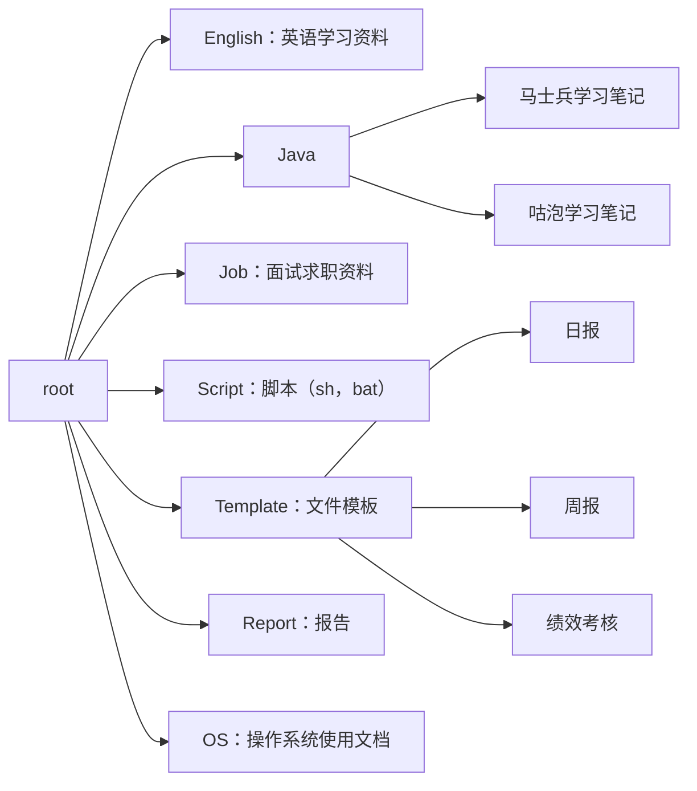

# Git-Doc

## 介绍
此项目主要用于分享：英语学习资料，Java学习资料，求职面试资料等内容。详细内容可参考[目录说明](#目录说明)。

文件格式主要以文档格式为主，例如：markdown，docx，xlsx等。markdown格式可以在线预览，其他格式需要下载后查看。

项目所有内容大家可随意下载、转发、评论。如果您觉得有用，欢迎收藏和加星哦（O(∩_∩)O。

## 目录说明

## 使用说明

1.  由于Git空间有限。本项目文件格式以文档格式为准。尽量避免上传大文件，例如：视频，安装文件等。
2.  使用Git管理文档的原因：

    - 博客网站并不能永久保存文档记录。如果仅通过博客网记录，博客网站也是有可能关停的。
    - 多设备文件同步。家里有多台电脑的，或者在公司编辑完后，在家里继续编辑。
    - Git能自动记录每个文件的提交历史。能够知道每次提交了什么。如果误删还能还原。
    - 总有一些内容是不能分享给所有人的。git可以管理权限，可以设置公开或者私有。文件在本地也有备份。
3.  **Markdown**格式介绍
    1.  大部分md文档可以使用浏览器直接预览，不需要额外装插件。其他格式需要下载才能浏览。
        1.  部分文档不能预览是因为被git服务器拦截，可能包含敏感词。
    2.  markdown格式更关注文档内容而不是文档格式。Word功能虽然更强大，但强大的代价是作者需要花时间在内容之外的地方。
    3.  代码语法着色功能强大，对技术人员更加友好。
    4.  自带mermaid语法，可以直接用文本，编写流程图，脑图，类图等。不需要用到第三方工具。
        1.  上面的章节（[目录说明](#目录说明)）就是用mermaid语法写的。
    5.  很多博客网站支持markdown语法，写好后更容易转发成博客。例如：CSDN。
    6.  [更多Markdown格式介绍](https://zhuanlan.zhihu.com/p/128106307)

## 参与贡献

1.  文档创建者：namelessmyth（Gem）

## 友情链接

下面是我的博客和其他内容分享主页，如果您觉得这些内容对你有用，欢迎（点赞+关注+收藏）哦，O(∩_∩)O

1.  CSDN博客：https://blog.csdn.net/namelessmyth
1.  Gitee主页：https://gitee.com/namelessmyth
1.  GitHub主页：https://github.com/namelessmyth

