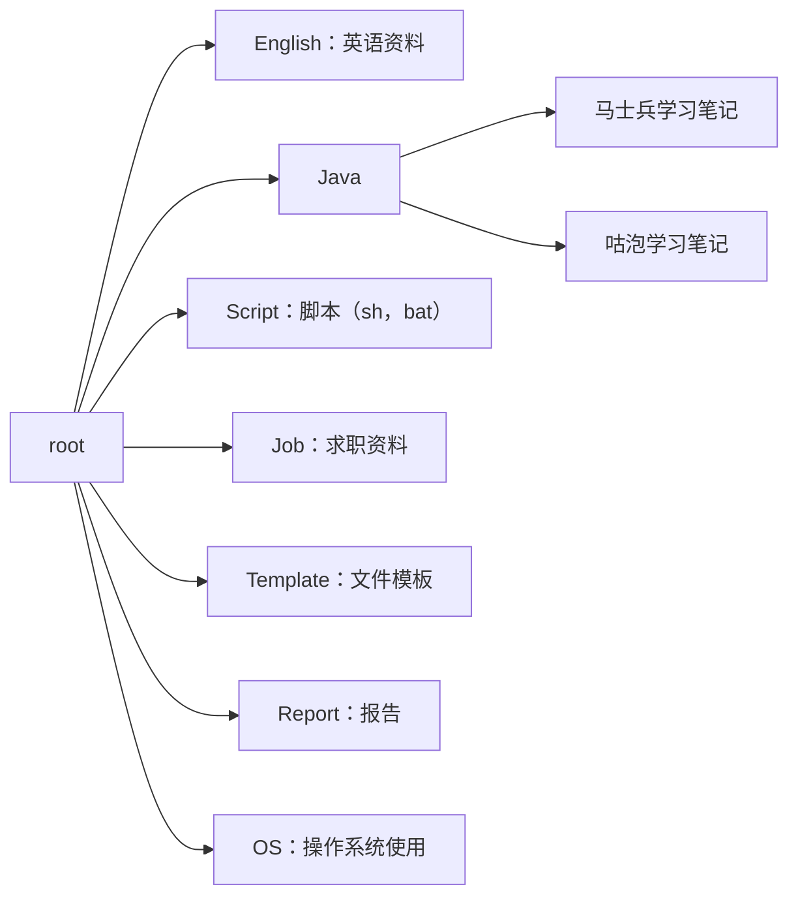

# Git-Doc

## 介绍
此项目主要存放：个人经验总结，学习笔记，心得分享，周期性报告等。目录内容参考[目录说明](#目录说明)。

文件格式主要以文档格式为主，例如：markdown，docx，xlsx等。

本项目所有内容大家可随意下载、转发、评论。如果您觉得有用，欢迎收藏+加星哦，O(∩_∩)O。

## 目录说明

## 使用说明

1.  由于Git空间有限超出要收费。本项目文件格式将以文档格式为准。尽量避免上传大文件，例如：视频。
2.  使用Git管理文档的原因：

    - 跨设备文件同步。例如：在家里电脑编辑完后，可能需要在公司电脑继续编辑。
    - Git能自动记录每个文件每1次的提交历史。能够知道每次学了什么。如果误删还能还原。
    - 本地和服务器都有备份且git没网也能提交。如果仅通过博客网记录，博客网站也是有可能关停的。
3.  项目中大部分文档格式为：**Markdown**
    1.  在Git网页中可以直接预览，不需要额外装插件。其他格式需要下载才能浏览。
    2.  自带mermaid语法，可以直接用文本，编写流程图，脑图，类图等。不需要在其他工具里画好在黏贴过来。
        1.  上一章节[目录说明](#目录说明)就是用mermaid语法写的。
    3.  支持导出Word，PDF，html文件等。同时markdown格式的文件，天然支持在线预览，不需要任何插件。
    4.  很多博客网站支持markdown语法，写好后可以直接发博客。例如：CSDN。
    5.  [更多Markdown格式介绍](https://zhuanlan.zhihu.com/p/128106307)

## 参与贡献

1.  文档创建者：namelessmyth（Gem）

## 友情链接

下面是我的博客和其他内容分享主页，如果您觉得这些内容对你有用，欢迎（点赞+关注+收藏）哦，O(∩_∩)O

1.  CSDN博客：https://blog.csdn.net/namelessmyth
1.  Gitee主页：https://gitee.com/namelessmyth
1.  GitHub主页：https://github.com/namelessmyth

