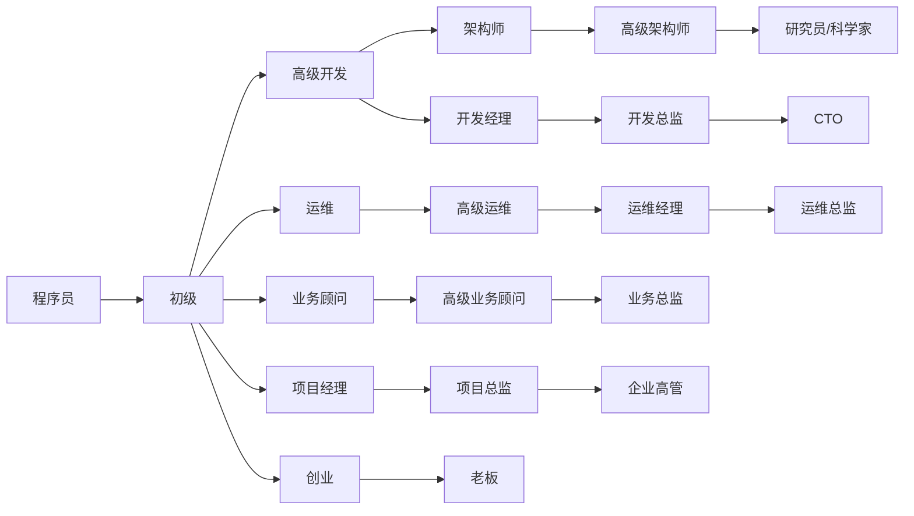
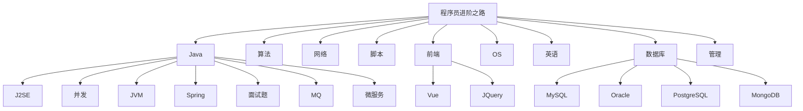

# 为什么会有这个知识库？

作为程序员的这一路上，一直有这样的困惑，不知道大家是否有同感？

- 觉得自己会的很多，但想要向领导或者同事展现自己的水平时，又不能清晰完整的说出。只有零散的知识点
- 写了很多年代码，但始终觉得自己知识不成体系，和架构师还有距离。
- 曾经写了很多文档或博客，但是四散各处，时间长了自己都忘了放哪里了，遇到难题还是依赖百度。

于是就有了这个知识库，知识库聚集了从业编程以来所有的原创文章、学习资料、经验总结等，分享给各位小伙伴。

分享的内容包括但不仅限于：Java基础、多线程并发、JVM、数据库，面试资料等等，详见：[快速链接](#快速链接)。

知识库名为：toBeTopCoder，即：**to be Top Coder**，意为：**「成为一名顶尖程序员」**。希望每一名程序员都能以此为目标并最终达成目标。

**赠人玫瑰手有余香。知识库会持续保持更新，欢迎收藏或加星**！O(∩_∩)O😄。

部分内容转载了他人的作品，转载部分会注明出处。如涉及侵权请联系我删除。

# 进阶之路

# 知识库地图

# 知识链接

点击下方标题中的链接，可快速打开关联文档。标注md的为markdown格式，支持在线预览。其他格式可能需要下载后查看。

**符号说明：**✅代表已整理结束；🙌代表整理中；↗️代表转载的他人作品

- Java
  - 面试题
    - [🙌J2SE](Java/Job/求职-面试题-J2SE.md)
    - 多线程并发
      - [✅Java线程生命周期说明](https://blog.csdn.net/namelessmyth/article/details/134794946?spm=1001.2014.3001.5501)
      - [✅CompletableFuture多线程编排利器](https://blog.csdn.net/namelessmyth/article/details/135026527?spm=1001.2014.3001.5501)
      - [✅面试题-多线程并发-md](Java/Job/求职-面试题-多线程并发.md)
    - [🙌JVM](Java/Job/求职-面试题-JVM.md)
    - Spring
      - [🙌面试题-Spring-md](Java/Job/求职-面试题-Spring.md)
      - [✅源码分析-Spring-Bean生命周期](https://blog.csdn.net/namelessmyth/article/details/133139513)
      - [✅源码分析-Spring-循环依赖-三级缓存](https://blog.csdn.net/namelessmyth/article/details/133179360)
    - [🙌MQ](Java/Job/求职-面试题-MQ.md)
    - [🙌数据库](Java/Job/求职-面试题-数据库.md)
- 数据库
  - MySQL
  - Oracle
  - PostgreSQL
  - MongoDB
  - SQL Server
- 前端
  - [🙌学习笔记-前端-md](docs/前端/学习笔记-前端-Gem.md)
  - TypeScript
  - VUE
  - JQuery
  - EasyUI
- 英语
  - 通用
    - [✅英语学习-语法-16种时态](https://blog.csdn.net/namelessmyth/article/details/134161822?spm=1001.2014.3001.5501)
    - [✅英语学习-通用总结-md](docs/English/英语学习-通用-Gem.md)
  - 美剧
    - [🙌英语学习-海贼王真人版-md](docs/English/英语学习-美剧-海贼王.md)
- 管理
  - 文件模版
    - [✅团队绩效考核模版](docs/Management/template/团队绩效考核-模版.xlsx)
    - 团队周报模版-开发
    - 人才招聘模版-开发
    - 个人周报模版
    - 概要设计模版
  - 管理工具
    - PingCode，25人以下免费
      - [官网](https://pingcode.com/)，
    - Worktile，10人以下免费
      - [官网](https://worktile.com/)
    - 禅道，免费版存在功能限制
      - [官网](https://www.zentao.net/)
    - Trello，基础版免费，付费版按项目数收费，推荐个人使用。
    - Redmine，开源免费，功能全面，但版本较老
- 企业管理系统
  - PLM
    - [Oracle Agile PLM](https://blog.csdn.net/namelessmyth/category_11361929.html?spm=1001.2014.3001.5482)
      - [✅AgilePLM数据库参数优化建议](https://blog.csdn.net/namelessmyth/article/details/122913931)
      - [✅AgilePLM-表结构分析-通用](https://blog.csdn.net/namelessmyth/article/details/124372370)
      - [✅AgilePLM-表结构分析-BOM](https://blog.csdn.net/namelessmyth/article/details/120217241)
      - [✅AgilePLM-问题解决-多列表值过多变-1](https://blog.csdn.net/namelessmyth/article/details/121971593)
      - [✅AgilePLM-解决方案-单点登录](https://blog.csdn.net/namelessmyth/article/details/121879705)
    - 西门子 Teamcenter
    - 达索 Enovia
    - PTC Windchill
  - ERP
    - SAP
    - Oracle
    - 金蝶
    - 用友
  - MES
  - SRM
  - MDM
  - OA
- 脚本
  - bat
  - sh
- OS
  - Windows
    - 使用
      - [✅Windows11重装与优化](https://blog.csdn.net/namelessmyth/article/details/132520445?spm=1001.2014.3001.5501)
      - [✅WindowsC盘减肥与瘦身](https://blog.csdn.net/namelessmyth/article/details/132600752?spm=1001.2014.3001.5501)
  - Linux
