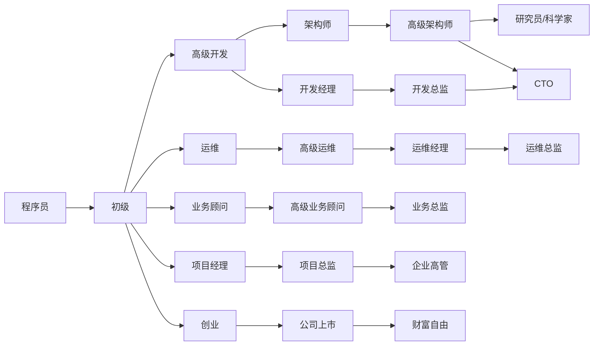

# 为什么会有这个知识库？🧐

知识库名为：beFreeCoder，即：**be a Free Coder**，意为：**「成为一名自由的程序员」**。希望每个程序员小伙伴都可以自由的追逐自己的目标，过上自己想要的生活，实现财务自由。🤩

这个知识库汇集了我在工作和学习中的精华总结，旨在给每一位程序员小伙伴分享：

- **原创Java技术文档和架构设计思想**：深入浅出，帮你构建坚实的技术根基。
- **多年技术管理经验总结及管理模板**：从实战出发，提供实用的管理知识和工具。
- **全面清晰的职业规划和Java求职面试资料**：无论你是初学者还是求职者，这里都有你需要的。
- **价值上千的英语学习资料**：助您突破语言障碍，拥抱全球机遇。

详细内容请见：[知识库地图](#知识库地图)。✅表示原创且已发布的内容，↗️表示转载内容，点击后会链接至原文。

**赠人玫瑰手有余香。知识库会持续保持更新，欢迎收藏、分享或加星！**😀😄😁💖💗💞。[更新记录](#更新记录)

**努力的意义**

人为什么要努力？想去的地方很远，想买的东西很贵，喜欢的人很优秀。父母的白发，孩子的期待，朋友的约定，周围人的嘲笑。以及，天生傲骨。😎

# 版本更新记录

Git本身也有[每次提交的记录](https://gitee.com/namelessmyth)，这里仅记录比较重要的知识库版本更新内容。

| 版本 | 更新人   | 更新日期   | 备注（更新原因、内容等）                                     |
| ---- | -------- | ---------- | ------------------------------------------------------------ |
| 1.0  | Gem Shen | 2023-08-01 | 在git上建立知识库，并提交自己已整理好的文档                  |
| 1.1  | Gem Shen | 2023-09-19 | 加入英语学习笔记，并持续更新                                 |
| 1.2  | Gem Shen | 2023-10-23 | 加入Spring，Mybatis面试题整理                                |
| 1.3  | Gem Shen | 2023-11-21 | 提交Oracle学习笔记                                           |
| 1.4  | Gem Shen | 2023-12-01 | 重构readme.md文件，建立知识库地图，方便搜索，参考[高手知识库](https://gitee.com/SnailClimb/JavaGuide) |
| 1.5  | Gem Shen | 2023-12-25 | 加入架构设计笔记，程序员进阶之路                             |
| 1.6  | Gem Shen | 2024-01-10 | 加入[好资源分享](#好资源分享)，持续分享GitHub上面的好项目。重新给知识库分类。 |
| 1.7  | Gem shen | 2024-01-17 | 知识库改名为beFreeCoder，修改readme.md文件                   |

# 程序员进阶之路😋

# 知识库地图

点击下方标题中的链接，可快速打开关联文档。标注md的为markdown格式，支持在线预览。

**符号说明**：✅代表已发布；🙌代表整理中；↗️代表转载的他人作品

转载部分会明确标识并链接至原文。如涉及侵权请联系我删除。

## 求职👨‍🔬

- 公司
  - 华为：[华为社招](https://career.huawei.com/reccampportal/portal5/social-recruitment.html)
  - 微软：[微软全球招聘网站](https://jobs.careers.microsoft.com/global/en/search)
  - 阿里：[集团招聘](https://talent.alibaba.com/?lang=zh)，[阿里巴巴社招](https://talent-holding.alibaba.com/off-campus/home?lang=zh)
  - 字节：[社招岗位](https://jobs.bytedance.com/experienced/position)
  - 腾讯：[社招岗位](https://careers.tencent.com/jobopportunity.html)

- 岗位
  - [↗️聊聊银行的信息科技岗（含各大银行薪资）](https://mp.weixin.qq.com/s/s_G9EYsW9FzzXL-5nsOOXQ)
- 面试题
  - [✅面试题-多线程并发-md](Java/Job/求职-面试题-多线程并发.md)
  - [🙌面试题-MQ-md](Java/Job/求职-面试题-MQ.md)
  - [🙌面试题-JVM-md](Java/Job/求职-面试题-JVM.md)
  - [🙌面试题-Spring-md](Java/Job/求职-面试题-Spring.md)
  - [🙌面试题-数据库-md](Java/Job/求职-面试题-数据库.md)

## 技术

### 架构设计🏢

- 综合
  - [✅通用系统架构图](https://www.processon.com/embed/65d313ef70c7c65e56e095ab)
  - [✅架构设计-亿级流量-Java-md](docs/Architecture/经验总结-架构设计-亿计流量.md)
- 设计模式
  - [🙌学习笔记-Java-设计模式-md](Java/mashibing/学习笔记-Java-设计模式.md)

  - [✅单例模式-博客](https://blog.csdn.net/namelessmyth/article/details/129819921?spm=1001.2014.3001.5501)

  - [✅代理模式-博客](https://blog.csdn.net/namelessmyth/article/details/129817251?spm=1001.2014.3001.5501)

  - [✅桥接模式-博客](https://blog.csdn.net/namelessmyth/article/details/129847300?spm=1001.2014.3001.5501)

### Java☕

- J2SE
- 多线程并发
  - [✅Java线程生命周期说明](https://blog.csdn.net/namelessmyth/article/details/134794946?spm=1001.2014.3001.5501)
  - [✅CompletableFuture多线程编排利器](https://blog.csdn.net/namelessmyth/article/details/135026527?spm=1001.2014.3001.5501)
- JVM
  - [🙌学习笔记-Java-jvm-md](Java/mashibing/学习笔记-Java-jvm-Gem.md)
- Spring
  - [✅源码分析-Spring-Bean生命周期](https://blog.csdn.net/namelessmyth/article/details/133139513)
  - [✅源码分析-Spring-循环依赖-三级缓存](https://blog.csdn.net/namelessmyth/article/details/133179360)
  - [✅源码分析-SpringBoot-自动装配](https://blog.csdn.net/namelessmyth/article/details/133717328?spm=1001.2014.3001.5501)
  - [✅源码分析-SpringBoot-事务](https://blog.csdn.net/namelessmyth/article/details/133386243?spm=1001.2014.3001.5501)
- Mybatis
  - [✅源码分析-Mybatis查询机制与工作原理](https://blog.csdn.net/namelessmyth/article/details/134017723?spm=1001.2014.3001.5501)
  - [✅Mybatis一对多关联查询，返回值Map，字段动态映射](https://blog.csdn.net/namelessmyth/article/details/126338505?spm=1001.2014.3001.5501)
  - [↗️MyBatis Plus 解决大数据量查询慢问题](https://blog.csdn.net/xhaimail/article/details/119386460)
- Netty
  - [✅学习笔记-Java-坦克大战-Netty-md](docs/Java/学习笔记-Java-坦克大战-Netty.md)

### 数据库

- 综合
    - [✅数据库-综合学习笔记-md](Java/mashibing/学习笔记-数据库-Gem.md)
    - [↗️数据库权威排名(外网，打开可能有点慢)](https://db-engines.com/en/ranking)
- MySQL
- Oracle
  - [✅listagg函数值超过4000的解决方案](https://blog.csdn.net/namelessmyth/article/details/123763750?spm=1001.2014.3001.5501)
  - [✅Oracle In 不能超过1000的解决方案](https://blog.csdn.net/namelessmyth/article/details/121065339?spm=1001.2014.3001.5501)
  - [✅Oracle最大连接数修改](https://blog.csdn.net/namelessmyth/article/details/120942025?spm=1001.2014.3001.5501)
- PostgreSQL
- MongoDB
- SQL Server
    - [↗️SQL SERVER 递归查询](https://www.cnblogs.com/willingtolove/p/10162587.html)

### MQ

- 综合
  - [🙌学习笔记-MQ-md](Java/mashibing/学习笔记-mq-Gem.md)

- RocketMQ
  - [✅RocketMQ-Dashboard-控制台-安装](https://blog.csdn.net/namelessmyth/article/details/131961549)

### 缓存

- 综合
  - [🙌学习笔记-缓存-md](Java/mashibing/学习笔记-缓存-Gem.md)
- Redis
  - [↗️Redis客户端Jedis、lettuce和Redisson对比](https://www.cnblogs.com/54chensongxia/p/13815761.html)

### 云原生

- docker，[官网](https://hub.docker.com/)
  - [✅Docker-安装(Windows, Linux)](https://blog.csdn.net/namelessmyth/article/details/132657994?spm=1001.2014.3001.5501)
  - [✅Docker-基本命令使用](https://blog.csdn.net/namelessmyth/article/details/132674435?spm=1001.2014.3001.5501)
  - [↗️开源容器管理工具-Portainer](https://zhuanlan.zhihu.com/p/403285855)
- 微服务
  - [🙌学习笔记-微服务-md](Java/mashibing/学习笔记-微服务-Gem.md)

### 编程基础

- 算法
    - [↗️算法数据结构-可视化](https://www.cs.usfca.edu/~galles/visualization/about.html)
- 网络

### 前端

- [🙌学习笔记-前端-md](docs/前端/学习笔记-前端-Gem.md)
- VUE，[官方文档](https://cn.vuejs.org/guide/quick-start.html)
- JQuery，[↗️菜鸟教程](https://www.runoob.com/jquery/jquery-tutorial.html)
- EasyUI，[官方文档](https://www.jeasyui.cn/document/index/index.html)

### 脚本

- bat
  - [✅使用bat脚本启动多个java应用](https://blog.csdn.net/namelessmyth/article/details/130229190?spm=1001.2014.3001.5501)
- sh
  - [✅一键启动脚本-RocketMQ-Karfka](https://blog.csdn.net/namelessmyth/article/details/135131612)

###  企业管理系统

- PLM
  - [Oracle Agile PLM](https://blog.csdn.net/namelessmyth/category_11361929.html?spm=1001.2014.3001.5482)
    - [✅AgilePLM-数据库参数优化建议](https://blog.csdn.net/namelessmyth/article/details/122913931)
    - [✅AgilePLM-表结构分析-通用](https://blog.csdn.net/namelessmyth/article/details/124372370)
    - [✅AgilePLM-表结构分析-BOM](https://blog.csdn.net/namelessmyth/article/details/120217241)
    - [✅AgilePLM-问题解决-多列表值过多变-1](https://blog.csdn.net/namelessmyth/article/details/121971593)
    - [✅AgilePLM-解决方案-单点登录](https://blog.csdn.net/namelessmyth/article/details/121879705)
    - [✅AgilePLM-通用自动赋值程序-安装使用说明](https://blog.csdn.net/namelessmyth/article/details/130597211?spm=1001.2014.3001.5501)
  - PTC Windchill，[官网](https://www.ptc.com/en/products/windchill)
  - 西门子 Teamcenter
  - 达索 Enovia
- ERP
  - 金蝶云星空，[官方Api中心](https://openapi.open.kingdee.com/ApiDoc)
  - U9C，[OpenApi](https://openapi.yyu9c.com/doc.html#/home)

## 管理

### 文件模板

- 绩效考核
  - [✅团队绩效考核模版](docs/Management/template/团队绩效考核-模版.xlsx)
- 人才招聘
    - [✅招聘模版-Java技术](docs/Management/template/招聘模板-Java技术.xlsx)

- 技术文档
    - 概要设计模版

- 汇报
    - [✅周报模版-项目开发组](docs/Management/template/周报模版-项目开发组.xlsx)
    - [🙌个人周报模版](docs/report/周期报告-2023-Gem.xlsx)

### 管理工具

- [JIRA](https://www.cnblogs.com/fireblackman/p/16080823.html)，著名的管理工具，但正版很贵。
- [TAPD](https://www.tapd.cn/)，腾讯项目管理工具，可集成在企业微信中。
- [PingCode](https://pingcode.com/)，25人以下免费。
- [Worktile](https://worktile.com/)，10人以下免费。
- [禅道](https://www.zentao.net/)，免费版存在功能限制。
- [Redmine](https://www.redmine.org/projects/redmine)，开源免费，功能全面，但版本较老。

### 管理心得

## 软件使用

### 开发工具

- IDEA
  - [✅Idea-常用插件推荐-md](docs\Software\IDE\软件使用-Idea-插件推荐.md)
  - [↗️Idea所有版本官网下载](https://www.jetbrains.com/idea/download/other.html)，[↗️Idea激活教程](https://blog.idejihuo.com/topics/jetbrains/idea)。

### 数据库工具

- 设计工具
  - [PDManer](https://gitee.com/robergroup/pdmaner/releases)，一款类似PowerDesigner的国产数据库设计工具。支持根据表结构自动导出不同数据库的建表脚本。支持自动生成Java实体类代码，Mybatis代码，MybatisPlus代码等。支持设置每张表可能都会有的公共字段，例如：创建日期，创建人，修改日期，修改人，租户号等。

- 客户端
  - [↗️Chat2DB集成AIGC，能够将自然语言转换为SQL](https://doc.sqlgpt.cn/zh/)
- SQL审核
  - [↗️开源SQL审核平台对比 Yearning vs Archery](https://zhuanlan.zhihu.com/p/666561369)

### BI&报表

- 开源
    - [Apache Superset](https://superset.apache.org/)，开源的大数据探索分析、可视化报表平台
    - [Grafana](https://grafana.com/zh-cn/grafana/)，[入门教程](https://cloud.tencent.com/developer/article/1807679)
        - 优点：支持多种常用大数据/多种数据源，dashboard 根据 SQL 或其他部件 SQL 生成，较为灵活
        - 缺点：需要用户掌握一定的数据开发能力，如SQL、Metrics概念等
    - [阿里-DataV](http://datav.jiaminghi.com/)。
        - 优势：开箱即用的组件库，开源免费，拥有中文社区文档与活跃作者支持较为方便；
        - 劣势：大屏需要定制化开发，有一定开发门槛；组件库需前端编码实现数据绑定，若需拖拽式等功能需要额外开发；
    - [DataEase](https://dataease.io/docs/v2/)，开源的数据可视化分析工具，支持丰富的数据源连接，能够通过拖拉拽方式快速制作图表。
    - [AJ-Report](https://gitee.com/anji-plus/report)，全开源的一个BI平台，酷炫大屏展示，能随时随地掌控业务动态，让每个决策都有数据支撑
    - [积木报表-JEECG](http://jimureport.com/)，免费的数据可视化报表，含报表和大屏设计，像搭建积木一样在线设计报表！
- 商业收费
    - [FineReport](https://www.finereport.com/)，国产超火的报表工具，功能强大但收费也不便宜。

### 运维工具

- 虚拟环境
    - [JumpServer](https://docs.jumpserver.org/zh/v3/)，广受欢迎的开源堡垒机

### 操作系统

- Linux
  - [✅Linux宝塔安装使用笔记](https://blog.csdn.net/namelessmyth/article/details/123979428?spm=1001.2014.3001.5501)
- Windows
  - [✅Windows11重装与优化](https://blog.csdn.net/namelessmyth/article/details/132520445?spm=1001.2014.3001.5501)
  - [✅WindowsC盘减肥与瘦身](https://blog.csdn.net/namelessmyth/article/details/132600752?spm=1001.2014.3001.5501)

### 工程工具

- Git，[官网下载](https://git-scm.com/download/win)
  - [↗️Git中clone, branch, fork的区别](#https://zhuanlan.zhihu.com/p/510797009)
  - [↗️Git中merge和rebase的区别](#https://juejin.cn/post/7026724793047220254)
- GitLab
  - [↗️使用Docker安装GitLab](https://blog.csdn.net/BThinker/article/details/124097795)

## 英语

- 通用
  - [🙌英语学习-原力英语-艾力-md](docs/English/英语学习-原力-艾力.md)
  - [✅英语学习-语法-16种时态](https://blog.csdn.net/namelessmyth/article/details/134161822?spm=1001.2014.3001.5501)
  - [✅英语学习-通用总结-md](docs/English/英语学习-通用-Gem.md)
- 美剧
    - [🙌英语学习-海贼王真人版-md](docs/English/英语学习-美剧-海贼王.md)

# 好资源分享

## GitHub

[JavaGuide](https://gitee.com/SnailClimb/JavaGuide)，

JavaGuide提供一个比较详细的学习路径，目录清晰，让你对于 Java 整体的知识体系有一个清晰认识。对于非 Java 初学者来说： 本文档更适合回顾知识，准备面试，让你搞清面试应该把重心放在哪些问题上。

[Awesome-CTO](https://github.com/kuchin/awesome-cto)，

你想成为CTO么？或者你想知道你们公司的CTO称职么？这个项目主要分享的是要成为CTO的相关能力和知识。维护者是一个国外公司的CTO。

[GitHub中文项目排行榜](https://github.com/GrowingGit/GitHub-Chinese-Top-Charts)，

GitHub中文排行榜，各语言分设「软件 | 资料」榜单，精准定位中文好项目。各取所需，高效学习。

[mall项目电商系统](https://github.com/macrozheng/mall)，

mall项目是一套电商系统，包括前台商城系统及后台管理系统，基于SpringBoot+MyBatis实现，采用Docker容器化部署。  前台商城系统包含首页门户、商品推荐、商品搜索、商品展示、购物车、订单流程、会员中心、客户服务、帮助中心等模块。  后台管理系统包含商品管理、订单管理、会员管理、促销管理、运营管理、内容管理、统计报表、财务管理、权限管理、设置等模块。

[Optimizer](https://github.com/hellzerg/optimizer)，

Optimizer是一个开源的 Windows 10/11系统优化工具，托管在GitHub 上，大小只有3MB。star数目一路上涨。

通过简单易用的界面，为用户提供一系列的系统优化、清理和配置功能。

缺点：启动时需要代理，否则fetching feed这一步会卡很久。 
