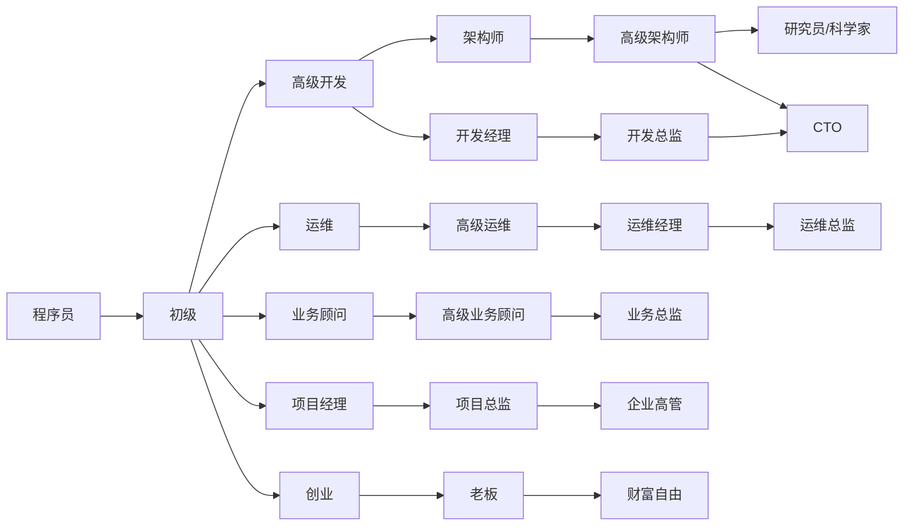
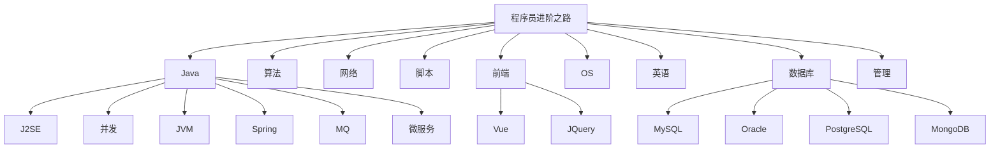

# 为什么会有这个知识库？🧐

知识库名为：toBeTopCoder，即：**to be Top Coder**，意为：**「成为一名顶尖程序员」**。希望每一名程序员都能达成自己的目标。🤩

人为什么要努力？想去的地方很远，想买的东西很贵，喜欢的人很优秀。父母的白发，孩子的期待，朋友的约定，周围人的嘲笑。以及，天生傲骨。😎

作为程序员的这一路上，一直有这样的困惑，不知道大家是否有同感🤔

- 觉得自己会的很多，但想要向领导或同事展现自己时，又不能清晰完整的说出，知识点比较零散
- 写了很多年代码，但始终觉得自己知识不成体系，和架构师还有距离。
- 曾经写了一些文档或博客，但是四散各处，时间长了自己都忘了放哪里了，遇到难题还是依赖百度。

于是就想整理一个知识库，聚集从事开发以来所有的原创文章、学习资料、经验总结等，分享给各位小伙伴同时自己也能有所沉淀。

分享的内容包括但不仅限于：架构设计，求职资料，Java基础、多线程并发、JVM、数据库等等，详见：[知识库地图](#知识库地图)。

**赠人玫瑰手有余香。知识库会持续保持更新，欢迎收藏或加星**！😀😄😁💖💗💞。[更新记录](#更新记录)

部分内容转载了他人的作品，转载部分会明确表示并链接至原文。如涉及侵权请联系我删除。

# 进阶之路😋

# 更新记录

Git本身也有[每次提交的记录](https://gitee.com/namelessmyth)，所以这里仅记录比较大的版本更新内容。

| 版本 | 修改人   | 修改日期   | 备注（原因、进一步的说明等）                                 |
| ---- | -------- | ---------- | ------------------------------------------------------------ |
| 1.0  | Gem Shen | 2023-08-01 | 在git上建立知识库，并提交自己已整理好的文档                  |
| 1.1  | Gem Shen | 2023-09-19 | 加入英语学习笔记，并持续更新                                 |
| 1.2  | Gem Shen | 2023-09-30 | 加入Spring面试题整理                                         |
| 1.3  | Gem Shen | 2023-10-23 | 加入Mybatis面试题整理                                        |
| 1.4  | Gem Shen | 2023-11-21 | 提交Oracle学习笔记                                           |
| 1.5  | Gem Shen | 2023-12-01 | 重写readme.md文件，建立知识库地图，方便搜索，参考[高手知识库](https://gitee.com/SnailClimb/JavaGuide) |
| 1.6  | Gem Shen | 2023-12-25 | 加入架构设计笔记。                                           |

# 知识库地图

点击下方标题中的链接，可快速打开关联文档。标注md的为markdown格式，支持在线预览。

**符号说明**：✅代表已发布；🙌代表整理中；↗️代表转载的他人作品

## 求职👨‍🔬

- 公司
  - 华为：[华为社招](https://career.huawei.com/reccampportal/portal5/social-recruitment.html)
  - 微软：[微软全球招聘网站](https://jobs.careers.microsoft.com/global/en/search)
  - 阿里：[集团招聘](https://talent.alibaba.com/?lang=zh)，[阿里巴巴社招](https://talent-holding.alibaba.com/off-campus/home?lang=zh)
  - 字节：[社招岗位](https://jobs.bytedance.com/experienced/position)
  - 腾讯：[社招岗位](https://careers.tencent.com/jobopportunity.html)

- 岗位
  - [↗️聊聊银行的信息科技岗（含各大银行薪资）](https://mp.weixin.qq.com/s/s_G9EYsW9FzzXL-5nsOOXQ)
- 面试题
  - [✅面试题-多线程并发-md](Java/Job/求职-面试题-多线程并发.md)
  - [🙌面试题-MQ-md](Java/Job/求职-面试题-MQ.md)
  - [🙌面试题-JVM-md](Java/Job/求职-面试题-JVM.md)
  - [🙌面试题-Spring-md](Java/Job/求职-面试题-Spring.md)
  - [🙌面试题-数据库-md](Java/Job/求职-面试题-数据库.md)

## 技术

### 架构设计🏢

- 综合
  - [🙌Java-架构设计-亿级流量-多级缓存-md](docs/Architecture/学习笔记-架构设计.md)
- 设计模式
  - [🙌学习笔记-Java-设计模式-md](Java/mashibing/学习笔记-Java-设计模式.md)

  - [✅单例模式-博客](https://blog.csdn.net/namelessmyth/article/details/129819921?spm=1001.2014.3001.5501)

  - [✅代理模式-博客](https://blog.csdn.net/namelessmyth/article/details/129817251?spm=1001.2014.3001.5501)

  - [✅桥接模式-博客](https://blog.csdn.net/namelessmyth/article/details/129847300?spm=1001.2014.3001.5501)

### Java☕

- J2SE
- 多线程并发
  - [✅Java线程生命周期说明](https://blog.csdn.net/namelessmyth/article/details/134794946?spm=1001.2014.3001.5501)
  - [✅CompletableFuture多线程编排利器](https://blog.csdn.net/namelessmyth/article/details/135026527?spm=1001.2014.3001.5501)
- JVM
  - [🙌学习笔记-Java-jvm-md](Java/mashibing/学习笔记-Java-jvm-Gem.md)
- Spring
  - [✅源码分析-Spring-Bean生命周期](https://blog.csdn.net/namelessmyth/article/details/133139513)
  - [✅源码分析-Spring-循环依赖-三级缓存](https://blog.csdn.net/namelessmyth/article/details/133179360)
  - [✅源码分析-SpringBoot-自动装配](https://blog.csdn.net/namelessmyth/article/details/133717328?spm=1001.2014.3001.5501)
  - [✅源码分析-SpringBoot-事务](https://blog.csdn.net/namelessmyth/article/details/133386243?spm=1001.2014.3001.5501)
- Mybatis
  - [✅源码分析-Mybatis查询机制与工作原理](https://blog.csdn.net/namelessmyth/article/details/134017723?spm=1001.2014.3001.5501)
  - [✅Mybatis一对多关联查询，返回值Map，字段动态映射](https://blog.csdn.net/namelessmyth/article/details/126338505?spm=1001.2014.3001.5501)
- Netty
  - [🙌学习笔记-Java-坦克大战-Netty-md](docs/Java/学习笔记-Java-坦克大战-Netty.md)

### 数据库

- 综合
    - [↗️数据库权威排名(国外网站，打开可能有点慢)](https://db-engines.com/en/ranking)
- MySQL
- Oracle
  - [✅listagg函数值超过4000的解决方案](https://blog.csdn.net/namelessmyth/article/details/123763750?spm=1001.2014.3001.5501)
  - [✅Oracle In 不能超过1000的解决方案](https://blog.csdn.net/namelessmyth/article/details/121065339?spm=1001.2014.3001.5501)
  - [✅Oracle最大连接数修改](https://blog.csdn.net/namelessmyth/article/details/120942025?spm=1001.2014.3001.5501)
- PostgreSQL
- MongoDB
- SQL Server

### MQ

- 综合
  - [🙌学习笔记-MQ-md](Java/mashibing/学习笔记-mq-Gem.md)

- RocketMQ
  - [✅RocketMQ-Dashboard-控制台-安装](https://blog.csdn.net/namelessmyth/article/details/131961549)

### 云原生

- docker，[官网](https://hub.docker.com/)
  - [✅Docker-安装(Windows, Linux)](https://blog.csdn.net/namelessmyth/article/details/132657994?spm=1001.2014.3001.5501)
  - [✅Docker-基本命令使用](https://blog.csdn.net/namelessmyth/article/details/132674435?spm=1001.2014.3001.5501)
  - [↗️开源容器管理工具-Portainer](https://zhuanlan.zhihu.com/p/403285855)
- 微服务
  - [🙌学习笔记-微服务-md](Java/mashibing/学习笔记-微服务-Gem.md)

### 编程基础

- 算法
    - [↗️算法数据结构-可视化](https://www.cs.usfca.edu/~galles/visualization/about.html)
- 网络

### 前端

- [🙌学习笔记-前端-md](docs/前端/学习笔记-前端-Gem.md)
- VUE，[官方文档](https://cn.vuejs.org/guide/quick-start.html)
- JQuery，[↗️菜鸟教程](https://www.runoob.com/jquery/jquery-tutorial.html)
- EasyUI，[官方文档](https://www.jeasyui.cn/document/index/index.html)

### 脚本

- bat
  - [✅使用bat脚本启动多个java应用](https://blog.csdn.net/namelessmyth/article/details/130229190?spm=1001.2014.3001.5501)
- sh
  - [✅一键启动脚本-RocketMQ-Karfka](https://blog.csdn.net/namelessmyth/article/details/135131612)

###  企业管理系统

- PLM
  - [Oracle Agile PLM](https://blog.csdn.net/namelessmyth/category_11361929.html?spm=1001.2014.3001.5482)
    - [✅AgilePLM-数据库参数优化建议](https://blog.csdn.net/namelessmyth/article/details/122913931)
    - [✅AgilePLM-表结构分析-通用](https://blog.csdn.net/namelessmyth/article/details/124372370)
    - [✅AgilePLM-表结构分析-BOM](https://blog.csdn.net/namelessmyth/article/details/120217241)
    - [✅AgilePLM-问题解决-多列表值过多变-1](https://blog.csdn.net/namelessmyth/article/details/121971593)
    - [✅AgilePLM-解决方案-单点登录](https://blog.csdn.net/namelessmyth/article/details/121879705)
    - [✅AgilePLM-通用自动赋值程序-安装使用说明](https://blog.csdn.net/namelessmyth/article/details/130597211?spm=1001.2014.3001.5501)
  - PTC Windchill，[官网](https://www.ptc.com/en/products/windchill)
  - 西门子 Teamcenter
  - 达索 Enovia
- ERP
  - 金蝶云星空，[官方Api中心](https://openapi.open.kingdee.com/ApiDoc)
  - U9C，[OpenApi](https://openapi.yyu9c.com/doc.html#/home)

### 软件使用

- 操作系统
  - Linux
    - [✅Linux宝塔安装使用笔记](https://blog.csdn.net/namelessmyth/article/details/123979428?spm=1001.2014.3001.5501)
  - Windows
    - [✅Windows11重装与优化](https://blog.csdn.net/namelessmyth/article/details/132520445?spm=1001.2014.3001.5501)
    - [✅WindowsC盘减肥与瘦身](https://blog.csdn.net/namelessmyth/article/details/132600752?spm=1001.2014.3001.5501)
- 工程工具
  - Git
    - [↗️Git中clone, branch, fork的区别](#https://zhuanlan.zhihu.com/p/510797009)
    - [↗️Git中merge和rebase的区别](#https://juejin.cn/post/7026724793047220254)

  - GitLab
    - [↗️使用Docker安装GitLab](https://blog.csdn.net/BThinker/article/details/124097795)

## 管理

- 文件模版
  - [✅团队绩效考核模版](docs/Management/template/团队绩效考核-模版.xlsx)
  - 团队周报模版-开发
  - 人才招聘模版-开发
  - 个人周报模版
  - 概要设计模版
- 管理工具
  - PingCode，25人以下免费，[官网](https://pingcode.com/)
  - Worktile，10人以下免费，[官网](https://worktile.com/)
  - 禅道，免费版存在功能限制，[官网](https://www.zentao.net/)
  - Trello，基础版免费，付费版按项目数收费，推荐个人使用。
  - Redmine，开源免费，功能全面，但版本较老

## 英语

- 通用
  - [✅英语学习-语法-16种时态](https://blog.csdn.net/namelessmyth/article/details/134161822?spm=1001.2014.3001.5501)
  - [✅英语学习-通用总结-md](docs/English/英语学习-通用-Gem.md)
- 美剧
  - [🙌英语学习-海贼王真人版-md](docs/English/英语学习-美剧-海贼王.md)
- 托福
    - [🙌英语学习-原力英语-艾力-md](docs/English/英语学习-原力-艾力.md)

# 好资源分享

## GitHub

[JavaGuide](https://gitee.com/SnailClimb/JavaGuide)，

JavaGuide提供一个比较详细的学习路径，目录清晰，让你对于 Java 整体的知识体系有一个清晰认识。对于非 Java 初学者来说： 本文档更适合回顾知识，准备面试，让你搞清面试应该把重心放在哪些问题上。

[Awesome-CTO](https://github.com/kuchin/awesome-cto)，

你想成为CTO么？或者你想知道你们公司的CTO称职么？这个项目主要分享的是要成为CTO的相关能力和知识。维护者是一个国外公司的CTO。
