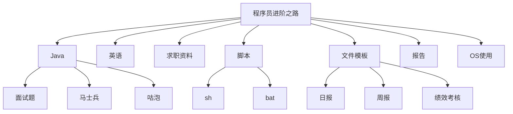

# 为什么会有这个知识库？

作为程序员的这一路上，一直有这样的困惑，不知道大家是否有同感？

- 觉得自己会的很多，想要向领导或者同事展现自己的水平，又不能清晰完整的说出。只有零散的知识点
- 写了很多年代码，但始终觉得自己知识不成体系，和架构师还有距离。
- 曾经写了很多文档或博客，但是四散各处，时间长了自己都忘了放哪里了。遇到难题还是依赖百度。

于是就有了知识库，这个知识库聚集了从业编程以来所有的原创文章、学习资料、经验总结等，分享给各位小伙伴。

分享的内容包括但不仅限于： Java基础、多线程并发、JVM、数据库，面试资料等等，详见[知识库地图](#知识库地图)。

知识库取名 **toBeTopCoder **，即 **to Be Top Coder **，意为「成为一名顶尖程序员」。希望每一名程序员都能达成这个目标。

赠人玫瑰手有余香。知识库会**持续保持更新，欢迎收藏或加星**！O(∩_∩)O😄。

部分内容转载了他人的作品，转载的部分会注明出处。如涉及侵权请联系我删除。

# 进阶之路

# 知识库地图

# 快速链接

- Java
  - 面试题
    - J2SE
    - JVM
    - 多线程并发
    - MQ
    - 数据库
  - 马士兵
- 英语
  - 通用
    - [通用学习总结-md](docs\English\英语学习-美剧-Gem.md)
  - 美剧
    - [海贼王真人版-学习总结-md](docs\English\英语学习-美剧-Gem.md)
