<p align="left">
<a href="https://blog.csdn.net/namelessmyth" target="_blank">

</a>
<a href="https://zhuanlan.zhihu.com/p/474433404" target="_blank">

</a>
<a href="#" target="_blank">
</a>
<a href="https://gitee.com/namelessmyth" target="_blank">
</a>
<a href="https://gitee.com/namelessmyth/document" target="_blank">
</a>
<a href="https://gitee.com/namelessmyth/document" target="_blank">
</a>
<a href="https://github.com/namelessmyth" target="_blank">
</a>
</p>


# 为什么会有这个知识库？

知识库名为：toBeTopCoder，即：**to be Top Coder**，意为：**「成为一名顶尖程序员」**。希望每一名程序员都能以此为目标并最终达成目标。😎

作为程序员的这一路上，一直有这样的困惑，不知道大家是否有同感？

- 觉得自己会的很多，但想要向领导或者同事展现自己的水平时，又不能清晰完整的说出。只有零散的知识点
- 写了很多年代码，但始终觉得自己知识不成体系，和架构师还有距离。
- 曾经写了很多文档或博客，但是四散各处，时间长了自己都忘了放哪里了，遇到难题还是依赖百度。

于是就有了这个知识库，知识库聚集了从业编程以来所有的原创文章、学习资料、经验总结等，分享给各位小伙伴。

分享的内容包括但不仅限于：Java基础、多线程并发、JVM、数据库，面试资料等等，详见：[快速链接](#快速链接)。

**赠人玫瑰手有余香。知识库会持续保持更新，欢迎收藏或加星**！O(∩_∩)O😄。

部分内容转载了他人的作品，转载部分会注明出处。如涉及侵权请联系我删除。


# 进阶之路

```mermaid
flowchart LR

root[程序员]
root-->dev[初级]-->sdev[高级开发]-->架构师-->高级架构师-->top["研究员/科学家"]
sdev-->开发经理-->开发总监-->CTO
dev-->运维-->高级运维-->运维经理-->运维总监
dev-->业务顾问-->高级业务顾问-->业务总监
dev-->项目经理-->项目总监-->企业高管
dev-->创业-->老板-->财富自由
```


# 知识库地图

```mermaid
flowchart TB

root[程序员进阶之路]

root-->Java["Java"]
Java-->J2SE
Java-->t["并发"]
Java-->JVM
Java-->Spring
Java-->MQ
Java-->cloud["微服务"]

root-->sf[算法]
root-->net["网络"]
root-->Script["脚本"]

root-->front["前端"]
front-->Vue
front-->JQuery

root-->os["OS"]
root-->English["英语"]

root-->db["数据库"]
db-->MySQL
db-->Oracle
db-->PostgreSQL
db-->MongoDB

root-->admin["管理"]
```



# 知识链接

点击下方标题中的链接，可快速打开关联文档。标注md的为markdown格式，支持在线预览。其他文档格式需要下载后查看。

**符号说明**：✅代表已整理结束；🙌代表整理中；↗️代表转载的他人作品

## Java

- J2SE
- 多线程并发
  - [✅Java线程生命周期说明](https://blog.csdn.net/namelessmyth/article/details/134794946?spm=1001.2014.3001.5501)
  - [✅CompletableFuture多线程编排利器](https://blog.csdn.net/namelessmyth/article/details/135026527?spm=1001.2014.3001.5501)
  - [✅面试题-多线程并发-md](Java/Job/求职-面试题-多线程并发.md)
- JVM
  - [🙌面试题-JVM-md](Java/Job/求职-面试题-JVM.md)

- Spring
  - [✅源码分析-Spring-Bean生命周期](https://blog.csdn.net/namelessmyth/article/details/133139513)
  - [✅源码分析-Spring-循环依赖-三级缓存](https://blog.csdn.net/namelessmyth/article/details/133179360)
  - [✅源码分析-SpringBoot-自动装配](https://blog.csdn.net/namelessmyth/article/details/133717328?spm=1001.2014.3001.5501)
  - [✅源码分析-SpringBoot-事务](https://blog.csdn.net/namelessmyth/article/details/133386243?spm=1001.2014.3001.5501)
  - [🙌面试题-Spring-md](Java/Job/求职-面试题-Spring.md)
- Mybatis
  - [✅源码分析-Mybatis查询机制与工作原理](https://blog.csdn.net/namelessmyth/article/details/134017723?spm=1001.2014.3001.5501)
  - [✅Mybatis一对多关联查询，返回值Map，字段动态映射](https://blog.csdn.net/namelessmyth/article/details/126338505?spm=1001.2014.3001.5501)


## 架构设计

- 设计模式
  - [✅单例模式](https://blog.csdn.net/namelessmyth/article/details/129819921?spm=1001.2014.3001.5501)

  - [✅代理模式](https://blog.csdn.net/namelessmyth/article/details/129817251?spm=1001.2014.3001.5501)

  - [✅桥接模式](https://blog.csdn.net/namelessmyth/article/details/129847300?spm=1001.2014.3001.5501)


## 数据库

- MySQL

- Oracle
  - [✅listagg函数值超过4000的解决方案](https://blog.csdn.net/namelessmyth/article/details/123763750?spm=1001.2014.3001.5501)
  - [✅Oracle In 不能超过1000的解决方案](https://blog.csdn.net/namelessmyth/article/details/121065339?spm=1001.2014.3001.5501)
  - [✅Oracle最大连接数修改](https://blog.csdn.net/namelessmyth/article/details/120942025?spm=1001.2014.3001.5501)

- PostgreSQL

- MongoDB

- SQL Server

- 面试题
  - [🙌数据库-面试题-md](Java/Job/求职-面试题-数据库.md)


## MQ

- RocketMQ
  - [✅RocketMQ, Dashboard, 控制台安装](https://blog.csdn.net/namelessmyth/article/details/131961549)
  - [🙌MQ-面试题-md](Java/Job/求职-面试题-MQ.md)


## 云原生

- docker，[官网](https://hub.docker.com/)
  - [✅Docker-安装(Windows, Linux)](https://blog.csdn.net/namelessmyth/article/details/132657994?spm=1001.2014.3001.5501)
  - [✅Docker-基本命令使用](https://blog.csdn.net/namelessmyth/article/details/132674435?spm=1001.2014.3001.5501)


## 前端

- [🙌学习笔记-前端-md](docs/前端/学习笔记-前端-Gem.md)
- TypeScript
- VUE，[官方文档](https://cn.vuejs.org/guide/quick-start.html)
- JQuery，[↗️菜鸟教程](https://www.runoob.com/jquery/jquery-tutorial.html)
- EasyUI，[官方文档](https://www.jeasyui.cn/document/index/index.html)


## 英语

- 通用
  - [✅英语学习-语法-16种时态](https://blog.csdn.net/namelessmyth/article/details/134161822?spm=1001.2014.3001.5501)
  - [✅英语学习-通用总结-md](docs/English/英语学习-通用-Gem.md)
- 美剧
  - [🙌英语学习-海贼王真人版-md](docs/English/英语学习-美剧-海贼王.md)
- 托福


## 管理

- 文件模版
  - [✅团队绩效考核模版](docs/Management/template/团队绩效考核-模版.xlsx)
  - 团队周报模版-开发
  - 人才招聘模版-开发
  - 个人周报模版
  - 概要设计模版
- 管理工具
  - PingCode，25人以下免费，[官网](https://pingcode.com/)
  - Worktile，10人以下免费，[官网](https://worktile.com/)
  - 禅道，免费版存在功能限制，[官网](https://www.zentao.net/)
  - Trello，基础版免费，付费版按项目数收费，推荐个人使用。
  - Redmine，开源免费，功能全面，但版本较老


##  企业管理系统

- PLM
  - [Oracle Agile PLM](https://blog.csdn.net/namelessmyth/category_11361929.html?spm=1001.2014.3001.5482)
    - [✅AgilePLM数据库参数优化建议](https://blog.csdn.net/namelessmyth/article/details/122913931)
    - [✅AgilePLM-表结构分析-通用](https://blog.csdn.net/namelessmyth/article/details/124372370)
    - [✅AgilePLM-表结构分析-BOM](https://blog.csdn.net/namelessmyth/article/details/120217241)
    - [✅AgilePLM-问题解决-多列表值过多变-1](https://blog.csdn.net/namelessmyth/article/details/121971593)
    - [✅AgilePLM-解决方案-单点登录](https://blog.csdn.net/namelessmyth/article/details/121879705)
    - [✅AgilePLM-通用自动赋值程序-安装使用说明](https://blog.csdn.net/namelessmyth/article/details/130597211?spm=1001.2014.3001.5501)
  - PTC Windchill，[官网](https://www.ptc.com/en/products/windchill)
  - 西门子 Teamcenter
  - 达索 Enovia
- ERP
  - 金蝶云星空，[官方Api中心](https://openapi.open.kingdee.com/ApiDoc)


## 脚本

- bat
  - [✅使用bat脚本启动多个java应用](https://blog.csdn.net/namelessmyth/article/details/130229190?spm=1001.2014.3001.5501)
- sh
    - [✅一键启动脚本-RocketMQ-Karfka](https://blog.csdn.net/namelessmyth/article/details/135131612)


## OS

- Linux
  - 使用
    - [✅Linux宝塔安装使用笔记](https://blog.csdn.net/namelessmyth/article/details/123979428?spm=1001.2014.3001.5501)
- Windows
  - 使用
    - [✅Windows11重装与优化](https://blog.csdn.net/namelessmyth/article/details/132520445?spm=1001.2014.3001.5501)
    - [✅WindowsC盘减肥与瘦身](https://blog.csdn.net/namelessmyth/article/details/132600752?spm=1001.2014.3001.5501)
