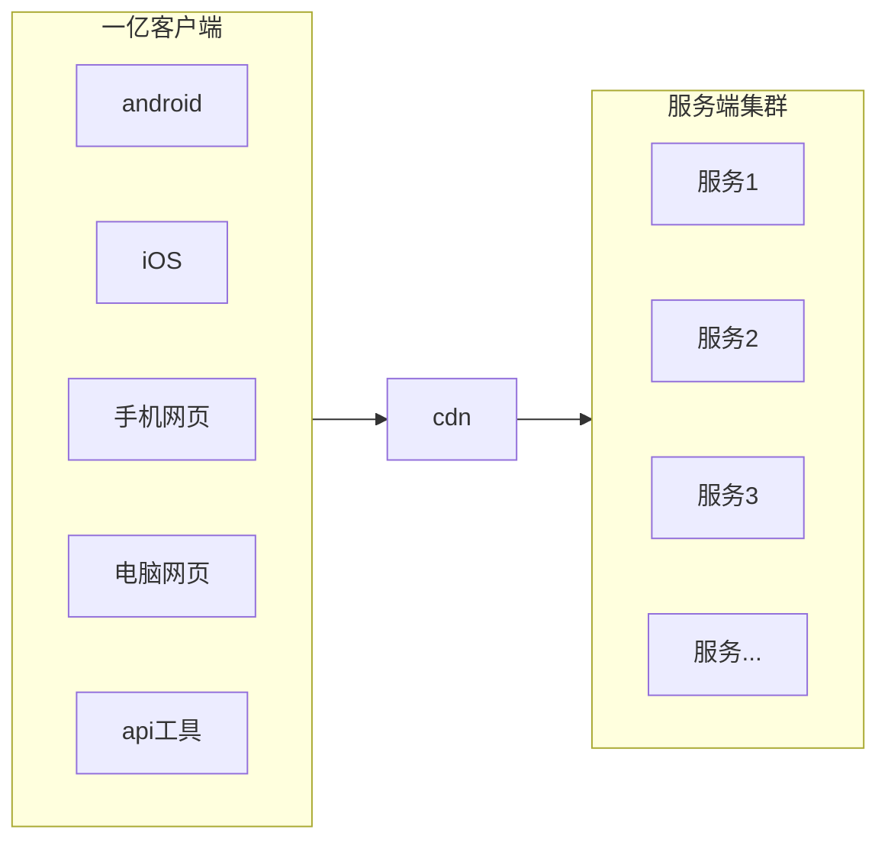
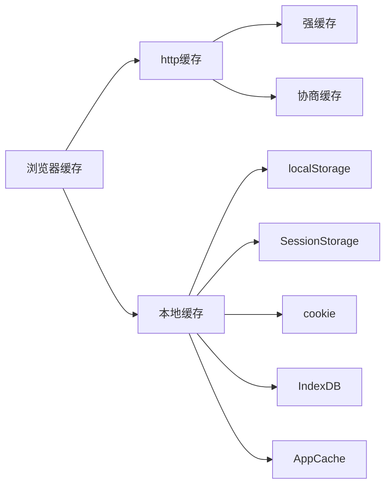
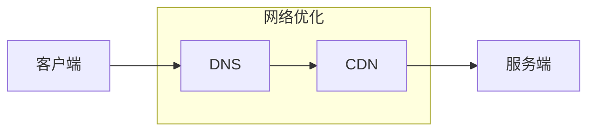
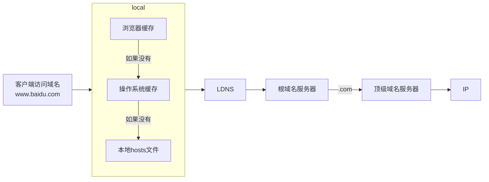
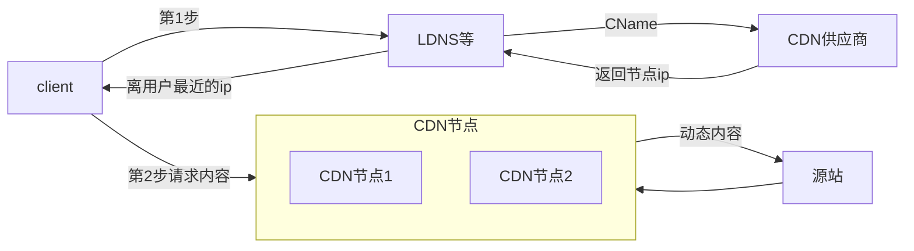
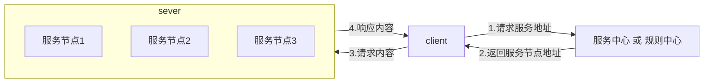
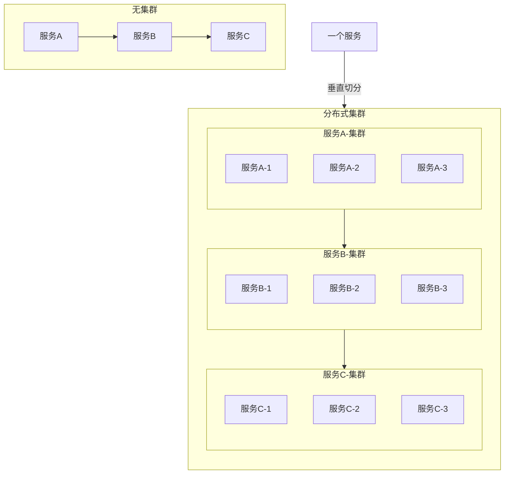

# 系统设计原则

## 架构设计图

一张价值10w的三高系统架构知识图谱：https://www.processon.com/view/link/60fb9421637689719d246739

秒杀系统的架构：https://www.processon.com/view/link/61148c2b1e08536191d8f92f


## 系统设计原则

### 迭代原则

#### 好系统是迭代出来的

在我们的技术生涯中，总是不断针对新的需求，去研发各种不同的系统，而不同的系统的设计是可以触类旁通的。在设计系统时，要根据项目背景、项目工期、不同的场景，做不同的设计。

一个系统并不是一下子就能设计的特别完美，在系统实施的过程中，一定是先解决当下最核心问题，预测并发现未来可能会出现的问题，一步一步解决最头疼的问题。

例如：项目上线时的预估用户量就1000，那单机架构也是可以支撑的。同时可以预留未来升级的可能性。

也就是说系统设计其实是一个不断迭代的过程，在迭代中发现问题并修复问题。即满足需求的系统是不断迭代优化出来的，这是一个持续的过程，包括国内BAT巨头的系统，也是经过了这个历程。淘宝也是从单机开始的。

#### 根据项目背景做设计

项目背景举例，例如：做电商的项目和做金融的项目，侧重点就不一样，金融侧重精确性，电商侧重高并发。

#### 对未来留有预案

话又说回来，如果一开始我们就站在了巨人的肩膀上，在前人的经验上，有一个好的系统基础架构设计，未来就更容易达到一个比较满意的目标。

一个好的系统架构设计要做到，解决现有的需求，完成现有的目标，把控进度和风险，预测和规划未来，但是也不要过度设计，让系统在迭代中演进和完善。

在工作中，我们作为一个架构师，要鼓励团队成员积极主动沟通，并推动系统演进，另外也要思考二八定律，将有限的资源，用到更有价值的需求上，以最小化且可行产品的方式迭代推进。

**总结** ：

- 好的系统都是迭代出来的。
- 先解决核心问题。
- 不要过度复杂化系统设计。
- 先行规划和设计是有必要的。
- 对现有问题有方案，对未来系统发展有预案。


### 无状态原则

#### 什么是无状态

无状态服务（Stateless service）是指：对单次请求的处理，不依赖于其他请求。

也就是说，处理一次请求所需的全部信息，要么都包含在这个请求里，要么可以从外部获取到（例如：配置文件，数据库，Redis），服务器本身不存储任何信息 ，也就是说：服务器是不保存请求的状态的，这就是无状态。

**反例**：处理这一次请求时还要去判断上一次请求。第2个请求依赖于第一个请求。这就是有状态的设计。

**案例**：每次请求都需要先鉴权，这算不算有状态？

例如：首先得先调用用户登录接口，登录成功有了token才能调用创建订单接口。

区分是否无状态，主要还是看服务器本地有没有存储token，如果没存那就是无状态的。如果存了，那就是有状态的。

#### 无状态原则的好处

由于服务器不保存任何信息，那么应用就能进行水平扩展。反过来，如果服务器存了请求的状态信息，那另一台服务器会因为就读取不到造成业务错误。

在实际生产环境中，一般是这样的：应用无状态，配置文件有状态。比如不同机房的服务，需要读取不同的数据源，那么这时候，就需要通过配置文件或配置中心来指定不同数据源的配置。


### 拆分原则

要实现用户的需求，是设计一个大而全的系统还是按照一定规则进行拆分的小系统？这个需要根据需求背景来权衡。

例如：做一个系统，用户量不大，就公司内部几百个人在使用，功能也很简单，并且开发者也就一个人，这时候就没必要进行系统拆分。

而如果是做一个类似于淘宝的秒杀系统，公司投入的资源很充足、业务功能复杂、用户量也特别大，那我们就需要进行系统拆分了。

总结拆分原则：高内聚、低耦合。

拆分前提：要对系统当前的状态有一个清晰的认识。基于一些重要信息去考虑拆分。可以考虑使用各种方式去埋点。例如：日志分析。可以在每个方法进入和退出时加入日志。或者安装监控系统。

**拆分维度**

#### **系统维度**

按照系统维度将一个大系统拆分成多个小系统。

比如拆分成：商品系统、购物车系统、支付系统、优惠券系统等等。这一点需要和产品经理配合。

例如：拆分出支付系统后，这个系统可以给很多其他系统使用，其他公司都可以调用。

例如：用户系统，每次用户系统有改动，都要连带商品系统，订单系统一起发布，风险较大，维护较麻烦。

#### **功能维度**

在系统维度进行拆分后，继续考虑是否要对其中的功能点进行拆分。

例如：优惠券系统，是否可以拆分成后台券创建系统、用户领券系统、用券系统（买衣服能用，买手机能用，满100能用，满200能用，用了同类卷不能用）等等。

#### **读写维度**

在某些场景下，可以考虑是否要将系统拆分成读和写2套系统。

首先要基于读写分析数据，根据读写比例特征进行拆分。

例如有一些功能，会进行大量的读写数据，然而读写比例失衡，读的量远远大于写，这种情况就可以考虑拆分成商品写服务、商品读服务。读服务就可以考虑使用缓存，来提升性能。如果某个服务写的量特别大时，需要考虑表分区、分库分表等等。

数据库的读写分离也可以看成是读写分离的一种情况。

#### **切面维度**

指的是在单个功能的纵向维度，考虑是否可以将系统拆分成多个地区的子系统。当请求过来时切一刀，不同地区的请求由不同的子系统去处理。这种方式一般用来处理静态数据。

例如：一些大型网站，全国各地的用户特别多，都来访问商品详情页，而商品详情页可以分为动态数据和静态数据，对于静态数据可以考虑使用CDN优化，使用多个地区服务来分担不同地区的用户请求。

CDN优化一般针对静态资源，对数据实时性要求不高。所以一般不考虑数据库的分布式。

#### **模块维度**

考虑系统中的模块是否可以单独拆分成公共模块。可根据公共基础模块或代码维护特征进行拆分。

例如：数据连接池模块、分库分表模块，综合消息队列模块。每个模块一般都是三层（controller，service，dao，web service dao）。

一些大厂的基础架构组，专门给其他开发组提供二方库。这些就是公共基础模块的典型案例。例如：阿里，很多小公司现在用的开源框架，druid，rocketMQ就是这个组开发的单独模块。

什么是二方库？

一些库在公司内部的其他项目中使用时就是二方库，如果给其他公司使用就是三方库。


### 服务化原则

在系统拆分好之后，考虑单个系统是用单节点实现还是多节点实现？

如果单节点无法满足性能要求，那拆分服务后，使用远程调用单节点服务是否能实现？

如果单节点满足不了要求，那么采用节点集群是不是就可以？集群要多少个节点？

集群是不是用nginx做负载均衡就能满足？如果调用方越来越多，是否考虑，使用服务的自动发现和注册功能。

当服务越来越多的时候，服务越来越不好管理的时候，还需要考虑服务隔离，防止有的服务访问量大，把整个系统拖垮。那么继续发展，流量越来越大，我们还有进行限流，黑白名单，由于网络的不稳定，我们还需要超时重试故障补偿等功能，这些都会影响服务的质量。还有：熔断，限流，降级等。

总结：单个服务完成功能，调用单机远程服务，调用集群服务手动注册服务  自动发现注册服务  服务治理。


## 业务设计原则

本章节主要讨论：每个功能在做业务设计时，基本都会考虑的设计原则。

### 防重原则

这里的防重指的是，防止重复提交。当请求响应时间变长，用户可能会多次点击同一个请求。

防重方法：不仅仅是前端要做防重处理，更重要的是后端。前端的防重有很多方式可以绕开。例如：新开一个浏览器页面，使用debug模式，通过api工具直接调用后台方法。

防重主要针对的是写操作，读不需要考虑防重。写操作也有些场景是不需要做防重控制的。例如：逻辑删除（数据库中根据某条数据的id将删除字段改成1）

首先系统必须能正确识别重复请求。例如：根据业务id判断，token判断等等。

针对重复请求做拒绝处理。


### 模块复用原则

当我们开发功能的时候，有复制粘贴欲望的时候，就应该思考一下，这个功能是否能复用。

总结起来，模块复用就是沉淀通用功能。例如：字典项功能，系统配置项功能，通知功能，定时任务功能，通用搜索功能。现在的很多低代码平台也是模块复用原则的一种体现。使用低代码平台时，只要涉及好业务对象，增删改查功能不用开发，通过配置就能使用。


### 可追溯原则

任何问题，要有据可查。这种有据可查不仅仅是写日志。有的系统还有历史记录功能，用户自己看历史记录都可以判断出来是不是自己操作问题。


### 反馈原则

系统的每个功能，但功能使用出现错误时，最好提供清晰明白的反馈信息。让用户一看就知道是自己哪里错了，怎么才能操作正确。

例如：用户名不存在，账号密码错误，用户无权限等等。

良好的反馈能很好地减少沟通成本，减轻开发人员沟通时间。提升用户满意度。


### 备份原则

备份主要是为了灾难恢复，让损失降低的到最小。

**代码备份**

Git，分支。备份所有发布版本，出现问题还能重新打包，部署。

**数据备份**

数据库的数据，可以使用运维备份（例如：数据库备份），操作记录也要注意备份（例如：日志，变更历史等等）。

**人员备份**

人员备份主要是为了不要因为某个人离职，对项目进度产生很大影响。

进行合理的代码review也是一种人员备份。避免出现某个开发思路很诡异或者随意使用团队没人会的第三方框架，导致新招来的交接人员可能会直接离职。

对于代码的低级问题对生产环境造成影响的。要对编写人，审核人，测试进行追责。

同时还可以采取**入库前代码review**。提交之后代码必须某个人审核通过才能入库。这样即使某个人离职了，审核人对他写的代码也熟悉。代码review工具推荐：[gerrit](https://zhuanlan.zhihu.com/p/21482554)。

在华为有这样一个挑刺制度，就是A写完代码，B来挑刺。B挑的刺越多绩效越高。还有一个制度叫做摇人，当你遇到功能不知道怎么开发时，可以通过摇人找人帮忙教你做。


# 软件质量评估标准

评估软件质量主要是为了从不同的维度，对某个人负责的项目进行评判。评估结果在部分公司涉及相关人员的绩效，晋升。

这里的相关人员指的是项目负责人、开发人员、测试人员、项目经理、产品经理等与软件开发和质量相关的人员。

既然要评判，就涉及评判标准。

以下是国际软件质量评价标准ISO/IEC 25010:2011弥补了ISO/IEC9126质量模型的不足，描述了8个质量特性和31个子特性。


## 1 功能性

在指定条件下使用时，产品或系统提供满足显性需求和隐形需求的功能的程度。

**注意：**功能性只关注功能是否满足显性和隐形需求，而不是功能规格说明。

显性需求（看得见，客户自己说的清的需求）

隐形需求是指用户在使用产品或系统时并没有明确表达出来的需求，通常是用户在实际使用中才会意识到的需求。软件功能性在满足隐形需求时，能够提供用户在实际使用中所需要的功能，而不仅仅是满足用户明确表达的需求。这包括用户体验的流畅性、易用性、稳定性等方面的需求。因此，软件功能性的满足程度不仅仅是满足用户明确表达的需求，还需要考虑用户的隐形需求。

例如：当用户使用一个电子商务网站时，他们的显性需求可能是能够浏览商品、添加商品到购物车、进行支付等。然而，隐形需求可能包括快速加载页面、清晰的商品展示图片、简单的购物流程、安全的支付系统等。如果网站能够满足这些隐形需求，用户体验会更好，用户更有可能选择在该网站购物，并且会更愿意在该网站上花费更多的时间和金钱。

另一个例子是移动应用程序。用户可能明确要求应用程序具有特定的功能，如聊天、社交分享等。然而，隐形需求可能包括应用程序响应速度快、界面设计简洁易用、不占用过多的手机内存等。如果应用程序能够满足这些隐形需求，用户会更愿意长时间使用该应用，并且更可能推荐给其他人。

### 1.1 功能完备性

> 功能集对指定的需求和用户目标的覆盖程度。

### 1.2 功能正确性

> 产品或系统提供具有所需精度的正确的结果的程度。

### 1.3 功能适合性

> 功能促使指定的需求和目标实现的程度。

**注：**不含任何不必要的步骤，只提供用户必要的步骤就可以完成任务。

和功能完备性的区别，例如：用户提了100个需求，实际做的功能也是100个那就是满足了完备性。适合性是指每个实际做出来的功能是80分还是90分。是否超出用户的期望。

### 1.4 功能的依从性

> 产品或系统遵从与功能相关的标准、约定或法规以及类似规定的程度。


## 2 性能效率

性能是指在指定条件下软件所使用的资源量。

注：资源可包括其他软件产品、系统的软件和硬件配置、以及原材料（如打印纸和存储介质）。

例如：软件依赖了多少开源组件依赖包，运行时会占用操作系统进程数。硬件指的是CPU使用率，内存占用，磁盘占用等等

### 2.1 时间特性

> 产品或系统执行其功能时，其响应时间、处理时间以及吞吐率满足需求的程度。

### 2.2 资源特性

> 产品或系统执行其功能时，所使用资源数量和类型满足需求的程度。

### 2.3 容量

> 产品或系统参数的最大限量满足需求的程度。

**注：**参数可包括存储数据项数量、并发用户数、通信带宽、交易吞吐量和数据库规模。


### 性能指标

#### 吞吐量

吞吐量是指单位时间内软件系统能接收和发出的数据量，主要体现系统处理请求的能力，这也是目前最常用的性能测试指标。

##### TPS

Transactions Per Second，每秒处理的事务数。TPS包括一条消息入和一条消息出，加上一次用户数据库访问。

QPS（每秒查询数）、TPS（）是吞吐量的常用量化指标，另外还有HPS（每秒HTTP请求数）。


##### QPS

Queries Per Second，每秒查询数。QPS主要针对查询服务性能指标，服务后面接的数据库中SQL的每秒执行条数。如果描述的是前端的每秒查询数，那就不包括插入、更新、删除操作了。不建议用QPS描述系统整体性能。


##### TPS&QPS

例如：将刷新淘宝页面当成一次事务，那这次事务中会有很多个查询（图片，商品信息）。具体要看事务是怎么定义的。

还有就是这里的事务和查询不要和数据库里的概念混淆起来，讨论QPS和TPS时并不和具体的底层实现强关联。而是在用户或者测试角度上的一件事和一次查询。

QPS和TPS并不能精确说明系统的性能高低，但可以用于衡量，程序或者配置修改后，系统的前后变化。


##### HPS

Hits Per Second，每秒HTTP请求数。Hit在性能测试中，一般都用来描述 HTTP Request。但是，也有一些人用它描述真正的客户在界面上的点击次数。


#### 并发数

关于并发数有很多概念，例如：并发用户数，并发连接数，并发请求数，并发线程数。

##### 并发用户数

即：单位时间内同时使用系统功能的用户数。

有两种常见的错误观点。一种错误观点是把并发用户数量理解为使用系统的全部用户的数量，理由是这些用户可能同时使用系统；还有一种比较接近正确的观点是把用户在线数量理解为并发用户数量。实际上，在线用户不一定会和其他用户发生并发，例如正在浏览网页的用户，对服务器是没有任何影响的。但是，用户在线数量是统计并发用户数量的主要依据之一。

并发主要是针对服务器而言，是否并发的关键是看用户操作是否对服务器产生了影响。因此，并发用户数量的正确理解为：在同一时刻与服务器进行了交互的在线用户数量。

##### 并发连接数

并发连接数指的是客户端向服务器发起请求，并建立了TCP连接。每秒钟服务器链接的总TCP数量，就是并发连接数。

有了并发连接，用户不一定会进行操作，仅仅维持连接对系统性能影响还是比较小的。

##### 并发请求数

和TPS类似，指的是单位时间内对服务器发起请求的数量。

##### 并发线程数


#### 响应时间

##### RT

Response Time，响应时间，简单理解为系统从输入到输出的时间间隔，宽泛的来说，他代表从客户端发起请求到服务端接受到请求并响应所有数据的时间差。一般取平均响应时间。 

[阿姆达尔定理](https://www.zhihu.com/tardis/zm/art/48022905?source_id=1005)：Gene Amdahl进行了一个富有洞察力的观察： 提升一个系统的一个部分的性能对整个系统有多大影响。这一观察被称为Amdahl's Law（阿姆达尔定律）

简单来说就是优化系统时应该第一考虑响应时间最长的那个。


## 3 兼容性

在共享相同的硬件或软件环境的条件下，产品、系统或组件能够与其他产品、系统或组件交换信息、并使用已交换的信息的程度。

简单理解：软件需要和兼容其他软件，不对其他软件产生负面影响，并且能够和其他软件交换信息，例如：是否支持导入导出功能。

### 3.1 共存性

> 在与其他产品共享通用的环境和资源的条件下，产品能够有效执行其所需的功能并且不会对其他产品造成负面影响的程度。

### 3.2 互操作性

> 两个或多个系统、产品或组件能够交换信息并使用已交换的信息的程度。

### 3.3 兼容性的依从性

> 产品或系统遵循与兼容性相关的标准、约定或法规以及类似规定的程度。


## 4 易用性

> 在指定的使用环境中，产品或系统在有效性、效率和满意度特性方面为了指定的目标可为指定用户使用的程度。

**注：**易用性既可以从它的子特性角度当作产品质量特性来进行指定或测量，也可以直接通过测度（使用质量的子集）来进行指定或测量。

简单来说：易用性是关于软件和用户之间的相互的。用户在使用软件时的操作是否简单、方便，是否符合用户的使用习惯，是否能够让用户达到预期的目标。

举个例子，假设有一个手机应用程序，它的设计使得用户可以在几步之内完成购物，支付和查看订单的操作，而且界面设计简洁明了，用户可以很容易地找到需要的功能，这样的应用就具有良好的易用性。另外，如果一个网站的导航清晰，用户可以快速找到他们需要的信息，也能够在网站上轻松地完成购物、预订等操作，那么这个网站也具有良好的易用性。

### 4.1 可辨识性

> 用户能够辨识产品或系统是否符合他们的要求的程度。

**注：**可辨识性将取决于通过对产品或系统的初步印象和/或任何相关文档来辨识产品或系统功能的能力。

产品或系统提供的信息可包括演示、教程、文档或网站的主页信息。

### 4.2 易学性

> 在指定的使用环境中，产品或系统在有效性，效率，抗风险和满意度特性方面为了学习使用该产品或系统这一指定的目标可为指定用户使用的程度。

**注：**易学性既可以被当作在指定的使用环境中产品或系统在有效性，效率、抗风险和满意度将性方面为了学习使用。该产品或系统这一指定的目标被指定用户使用的程度，也可以通过相当于ISO9241-110中定义的学习的适宜性的产品属性来进行指定或测量。

### 4.3 易操作性

> 产品或系统具有易于操作和控制的属性的程度。

**注：**易操作性相当于ISO9241-110中定义的可控性，（操作）容错性和与用户期望的符合性。

### 4.4 用户差错防御性

> 系统预防用户犯错的程度。

### 4.5 用户界面舒适性

> 用户界面提供令人愉悦和满意的交互的程度。

**注：**这涉及产品或系统旨在提高用户愉悦性和满意度的各种属性，诸如颜色的使用和图形化设计的自然性。

### 4.6 易访问性

> 在指定的使用环境中，为了达到指定的目标，产品或系统被具有最广泛的特征和能力的个体所使用的程度。

**注1：**能力的范围包括与年龄有关的能力障碍。

**注2：**对具有能力障碍的人而言，易访问性既可以被当作在指定的使用环境中产品或系统在有效性、效率、抗风险和满意度特性方面为了指定的目标被具有指定能力障碍的用户使用的程度，也可以通过支持易访问性的产品属性来进行指定或测量。

### 4.7 可用性的依从性

> 产品或系统遵循与易用性相关的标准、约定或法规以及类似规定的程度。


## 5 可靠性

容错，可恢复。多长时间可恢复。

### 5.1 可用性

可用性指的是：系统、产品或组件在需要使用时能够进行操作和访问的程度。

可用性可以通过系统、产品或组件在总时间中处于可用状态的百分比进行外部评估。因此，可用性是成熟性（控制失效的频率）、容错性和易恢复性（控制每个失效发生后的宕机时间长短）的组合。

#### 可用性指标

- MTBF（Mean Time Between Failure），系统可用时长。多少天内不发生故障。
- MTTR（Mean Time To Repair），系统从故障后到恢复正常所耗费的时间
- SLA（Service-Level Agreement），服务等级协议，用于评估服务可用性等级。计算公式是 MTBF/(MTBF+MTTR)

一般我们所说的可用性高于 99.99%，是指 SLA 高于 99.99%。


#### 影响因素

哪些因素会影响系统可用呢？

代码的复杂性，代码写的越复杂，测试想要覆盖所有的场景就越难，所以可靠性越低。

系统的实际运行环境。例如：环境的网络情况，温度控制，硬件兼容性等等。

用户的实际输入参数。用户可能会输入测试的时候没有覆盖到的参数。


#### 关联系统可用性

如果一个大系统有5个串联子系统构成，且每个子系统的可靠性都是99%，则系统整体的可靠性为5个99%相乘约等于95%。所以串联系统越多可靠性越低。

那如果改成并联，则是`1-(1-99%)*(1-99%)*(1-99%)*(1-99%)`，可以得出并联的情况下子系统越多越可靠。

并联的意思是一个系统的冗余从节点（集群）。A系统调用B系统时，B存在多个子节点，即使主节点挂了从节点会自动选举出新的主节点，系统依然可用。

这也是为什么可靠性要求越高，越要消除单点，化串联为并联。

生活案例：你出去买东西，一手交钱一手交货。你从网上买东西时，你先付钱，一段时间后才会给你发货，这就把交钱和交货分开了，它能不能发货不影响你付账。付钱的方式可以有多种：支付，微信，银行。发货的公司也可以有多家。但如果全中国只有一家送货公司，你可能就会担心付了钱可能会收不到货，选择一手交钱一手交货的方式了。


### 5.2 容错性

尽管存在硬件或软件故障，系统、产品或组件的运行符合预期的程度。


### 5.3 易恢复性

在发生中断或失效时，产品或系统能够恢复直接受影响的数据并重建期望的系统状态的程度。

**注：**在失效发生后，计算机系统有时会宕机一段时间，这段时间的长短由其易恢复性决定。


## 6 安全性

> 产品或系统保护信息和数据的程度，以使用户、其他产品或系统具有与其授权类型和授权级别一致的数据访问度。

**注1：**信息安全性不仅适用于存储在产品或系统中的数据或者通过产品或系统存储的数据，也适用于传输中的数据。

**注2：**存活性（在受到攻击时，产品或系统及时提供必要的服务，继续履行其任务的程度）包含在“易恢复性”中。

**注4：**信息安全性有利于可信性。

### 6.1 保密性

> 产品或系统确保数据只有在被授权时才能被访问的程度。

### 6.2 完整性

> 系统、产品或组件防止未授权访问、篡改计算机程序或数据的程度。

免疫性（产品或系统抗攻击的程度）包含在完整性中。

### 6.3 抗抵赖性

> 活动或事件发生后可以被证实且不可被否认的程度。

意思是对于用户已经提交或者审核通过的数据不能被轻易的改掉。

### 6.4 可核查性

> 实体的活动可以被唯一地追溯到该实体的程度。

### 6.5 真实性

> 对象或资源的身份标识能够被证实符合其声明的程度。

这段话换句话说是指软件所提供的信息或功能是否真实可靠，能够被证实和验证。

举例来说，一个网上购物平台声称其提供的商品都是正品，那么这个平台的真实性就在于其所销售的商品是否真的是正品。如果平台的商品被证实是假冒伪劣产品，那么它的真实性就受到了质疑。另外，一款防病毒软件声称能够有效清除所有病毒，那么它的真实性就在于其是否能够真正有效地清除病毒，如果用户使用后发现并不能如实承诺的话，那么这款软件的真实性也受到了质疑。因此，软件真实性的重要性在于用户能够信任软件所提供的信息和功能，而不会受到虚假或不可靠的影响。

### 6.6 信息安全性的依从性

> 产品或系统遵循与信息安全性相关的标准、约定或法规以及类似规定的程度。

这段话的意思是指产品或系统在信息安全方面遵循了相关的标准、约定、法规以及类似规定的程度。换句话说，产品或系统在设计、开发和运行过程中考虑了信息安全标准和法规的要求，并且符合这些要求的程度。

举例来说，一家公司的网络系统遵循了ISO 27001信息安全管理体系标准，这意味着该公司的信息安全管理体系已经通过了ISO 27001的认证，证明其信息安全控制措施符合国际标准。另外，一款支付软件符合了PCI DSS（Payment Card Industry Data Security Standard）的要求，这意味着该软件在处理支付信息时符合了行业标准的数据安全要求。

因此，这段话强调了产品或系统在信息安全方面的合规性，以确保其能够满足相关标准和法规的要求，保护用户和组织的信息安全。


## 7 可维护性

代码易读。功能设计符合公司规范，即使换个人来维护，也能轻易上手。

有的人可能会觉得软件可维护性越高，别人来能轻易上手，自己的可替换性就大就会显得自己不重要。

软件做得好，首先自己有成就感。然后别人看到了觉得你很牛。领导看到升职加薪机会更大，同事看到将来推荐你的机会更大。

> 产品或系统能够被预期的维护人员修改的有效性和效率的程度。

**注1：**修改包括纠正、改进或软件对环境、需求和功能规格说明变化的适应。修改包括那些由专业支持人员实施的，以及那些由业务或操作人员、最终用户实施的。

**注2：**维护性包括安装更新和安装升级。

**注3：**维护性可以被解释为便于维护活动的一种产品或系统固有能力，或者为了产品或系统维护的目标维护人员所经历的使用质量。

### 7.1 模块化

> 由多个独立组件组成的系统或计算机程序，其中一个组件的变更对其他组件的影响最小的程度。

### 7.2 可重用性

> 资产能够被用于多个系统，或其他资产建设的程度。

### 7.3 易分析性

> 可以评估预期变更（变更产品或系统的一个或多个部分）对产品或系统的影响、诊断产品的缺陷或失效原因、识别待修改部分的有效性和效率的程度。

**注：**实现包括为产品或系统提供机制，以分析其自身故障以及在失效或其他事件前提供报告。

### 7.4 易修改性

> 产品或系统可以被有效地、有效率地修改，且不会引人缺陷或降低现有产品质量的程度。

**注1：**实现包括编码、设计、文档和验证的变更。

**注2：**模块化和易分析性会影响到易修改性。

**注3：**易修改性是易改变性和稳定性的组合。

### 7.5 易测试性

> 能够为系统、产品或组件建立测试准则，并通过测试执行来确定测试准则是否被满足的有效性和效率的程度。

### 7.6 维护性的依从性

> 产品或系统遵循与维护性相关的标准、约定或法规以及类似规定的程度。


## 8 可移植性

> 系统、产品或组件能够从一种硬件、软件或其他运行（或使用）环境迁移到另一种环境的有效性和效率的程度。

**注：**可移植性可以被理解成产品或系统促进移植活动的一种固有能力，或移植人员为了产品或系统移植的目标体验到的使用质量。

简单理解：系统在一个地方用的很好，换一个地方也能用。

### 8.1 适应性

> 产品或系统能够有效地、有效率地适应不同的或演变的硬件、软件、或者其他运行（或使用）环境的程度。

**注1：**适应性包括内部能力（例如屏幕域、表、事务量、报告格式等）的可伸缩性。

**注2：**适应包括那些由专业支持人员实施的，以及那些由业务或操作人员，或最终用户实施的。

**注3：**如果系统能被最终用户所适应，那么适应性就相当于ISO9241-110中所定义的个性化的适宜性。

### 8.2 易安装性

> 在指定环境中，产品或系统能够成功地安装和／或卸载的有效性和效率的程度。

**注：**如果系统或产品能被最终用户所安装，那么易安装性会影响到所产生的功能合适性和易操作性。

### 8.3 易替换性

> 在相同的环境中，产品能够替换另一个相同用途的指定软件产品的程度。

**注1：**软件产品的新版本的易替换性在升级时对于用户来说是重要的。

**注2：**易替换性可包括易安装性和适应性的属性。鉴于其重要性，易替换性作为一个独立的子特性被引入。

**注3：**易替换性将降低锁定风险，因此其他软件产品可以代替当前产品，例如按标准文档格式使用。

### 8.4 可移植性的依从性

> 产品或系统遵循与可移植性相关的标准、约定或法规以及类似规定的程度。


## 9 经济性

这一点并不在国际软件质量评价标准中，但每一个软件企业实际都会考虑这个问题。毕竟软件的开发是要投入真金白银的。

指的是软件的成本是否合理，是否提供了良好的性价比。


# 客户端优化

从这章开始，将按照请求处理顺序逐一介绍每一个环节的优化方案。

本章主要讲解，请求在客户端时的优化。客户端分类：Android，iOS，手机浏览器，电脑浏览器，API调用工具等等。

如果我们的系统，要支持1亿流量的请求。那要如何优化才能使整个系统支撑的了如此大的请求量？





## 资源请求

资源请求指的是客户端从服务端请求各种的各种数据文件，例如：样式文件，脚本文件，图片，视频，文本等等。以及客户端向服务器提交的数据。这一部分的优化思路只要有：降低资源请求的大小，减少请求的次数。

减少请求的次数：客户端和服务器之间的连接需要经历3次握手，4次挥手。对于资源数目多、体积小，频繁创建http链接消耗比较较大。所以可以考虑将小资源合并。


### 图片优化

案例1：如果一张雪碧图中包含了很多小图片，那可以将这些小图片合并成一张大图，通过样式文件background-postition来定位显示。

案例2：一些简单的矢量图可以通过：`<svg >`标签画出来。[SVG在线编辑器](https://c.runoob.com/more/svgeditor/)。


### js优化

合并js文件。

可以将多个js文件打包成一个，一次下载。例如：使用Webpack，Webpack是一个现代JavaScript应用程序的静态模块打包器。它可以将多个js文件打包成一个bundle文件，然后在页面中引入这个bundle文件即可。通过Webpack配置文件可以指定需要打包的js文件和输出的bundle文件名。

压缩，删除无效字符，注释。

有很多js库都有2个版本，一个是用来开发调试的，一个是用来发布上线的。

1 减少体积，

2 代码安全（让别人看不懂）。语义合并。


### CSS优化

类似JS。可以进行语义合并。例如：原来10个按钮10个样式，可以改成1个class样式，然后让10个按钮使用这个class。


### http压缩

head中加参数：Accept-Encoding：gzip，deflate

**HTTP压缩的过程**

1. 浏览器发送Http request 给Web服务器, request 中有Accept-Encoding: gzip, deflate。 (告诉服务器， 浏览器支持gzip压缩)
2. Web服务器接到request后， 生成原始的Response, 其中有原始的Content-Type和Content-Length。
3. Web服务器通过Gzip，来对Response进行编码， 编码后header中有Content-Type和Content-Length(压缩后的大小)， 并且增加了Content-Encoding:gzip. 然后把Response发送给浏览器。
4. 浏览器接到Response后，根据Content-Encoding:gzip来对Response 进行解码。 获取到原始response后， 然后显示出网页。


### 第三方流量

对于静态文件，例如：图片，OSS，也可以放到第三方云服务器上，例如：阿里云。


### 减小cookie

cookie中的数据会和请求一起传给服务器。所以减小cookie可以降低请求大小。

可能有人会觉得只不过是个cookie而已，可能只有1kb大小，这能给服务器提升多少性能？

如果考虑1亿个客户端呢？某些国民级应用有8亿用户。那节约的流量轻松就到GB级别了。800,000,000 * 1kb


### 资源压缩

将资源压缩之后可以有效提供资源下载速率。客户端上传数据给服务器时也可以考虑压缩。

**图片压缩**

使用base64表达图片可以减少图片体积。再通过gzip压缩。

gzip 对文本文件的压缩  能压缩到原来的 40%以下。

**图片缩略图**

例如：在用户上传图片时，除了存用户上传的原图，可以[自动生成图片的缩略图](https://blog.csdn.net/administratop/article/details/121553828)。当用户浏览图片时，可以先展示缩略图，用户进一步操作之后再展示原图。这也是一种压缩方式。

案例1：淘宝的商品详情页，只有当鼠标放到图片上才会显示高清图。

案例2：在微信中发送图片默认都会压缩，只有点查看原图才会显示原版。


### 预先计算

可以考虑优化客户端，将一些计算处理尽可能的在客户端中完成。减少请求服务端的次数。

例如：在购物app中提交购物车时，后台会计算提交商品的价格。但也可以考虑将价格计算放到客户端完成。

在app启动时，可以先从后端请求一些计算规则类的文件存储在客户端。然后当用户选中商品时，根据缓存中的数据在客户端计算。

这么做的前提是允许预估价和实际价格不一致。因为一旦缓存了计算规则，存在修改的可能性。（虽然可能性较小）

有一部分客户看到价格后可能就不会下单了。所以这么做在业务上可以降低下单量和下单后的撤销，技术可以降低请求服务端的次数。


### 减少接口调用次数

案例：百度一开始接春晚时，前端要调用后端100个接口，后面优化至8个接口。春晚当天晚上可能有几亿用户使用，节约1kb也是一种很大的优化。


## 连接优化

### 长连接优化

可以考虑使用长连接技术减少连接创建和销毁的消耗。

http是针对请求和响应模式的，只要服务端给了响应，本次http连接结束。所以http其实没长短连接一说，连接是针对的tcp。

TCP是一个双向的通道，他可以保持一段时间的不关闭，所以他才有长短连接。

所以这个说法并不正确：http1.0 不支持长连接，http1.1 默认长连接。

#### 如何开启长连接

http1.1在发请求的时候，如果在请求头中默认包含这个参数，connection:keep-alive。后端给前端返回的时候也带这个参数，那就能复用这个tcp的长连接。keep-alive: timeout=60s

测试

使用postman调用www.baidu.com，你会发现在headers中默认就会带上这个参数。

案例：请求一个网页（baidu.com），网页中包含css、js、html，如果每次都要建立新的连接。那这些资源也会每次重新下载

长连接并不会一直不关闭，只要超过header里设置的超时时间没有发送接收数据，就会自动关闭。

在chrome中按F12，然后点Network，观察后台的请求，如果这个是一个长连接，那每次刷新连接id是不会变化的。


### 长轮询

长轮询指的是延长一次请求的处理时间。当客户端请求服务端时，服务端一直等到客户端想要的数据查到时才返回结果给客户端。如果一直等不到想要的数据，则一直等到请求超时。

这种方式大大减少了服务端和客户端的数据交互次数。降低了服务端一直疲于接收客户端请求的情况。

在使用长轮询的时候，可以同时使用长连接来延长单次请求的超时时间。

例如：仓库库存字段，这个字段需要确保他在界面上始终显示最新的（即使用户没刷新页面）。这个要怎么实现？

写个js方法，不断的调用后台？去查询后台的库存是多少？

这种方式能实现需求但是浪费了服务器的资源。这种时候就可以使用长轮询。

服务端如何实现有变化才会返回结果给客户端？

1. 当查询请求到达服务器端时，由服务器来循环查询数据库，如果没有变化，睡一会儿继续查，直到查到有变化才返回。
2. 上面的方法虽然能实现，但是会给数据库造成压力。可以考虑使用redis缓存。
3. 使用发布订阅模式。

#### 发布订阅模式实现长轮询

在Spring Boot中，可以使用异步的方式实现长轮询，即客户端发起请求后，服务端一直等待直到有数据需要返回给客户端。以下是一个简单的示例代码，演示了如何在Spring Boot中使用发布订阅模式实现长轮询：

首先，创建一个自定义事件类，用于包装需要传递的数据：

```java
public class LongPollingEvent {
    private String data;

    public LongPollingEvent(String data) {
        this.data = data;
    }

    public String getData() {
        return data;
    }
}
```

然后，创建一个事件发布者类，用于发布事件：

```java
@Component
public class LongPollingPublisher {
    @Autowired
    private ApplicationEventPublisher eventPublisher;

    public void publishData(String data) {
        LongPollingEvent event = new LongPollingEvent(data);
        eventPublisher.publishEvent(event);
    }
}
```

接下来，创建一个服务类，用于处理长轮询请求并等待数据：

```java
@Service
public class LongPollingService {
    private final Queue<DeferredResult<String>> subscribers = new ConcurrentLinkedQueue<>();

    @Autowired
    private LongPollingPublisher longPollingPublisher;

    public DeferredResult<String> waitForData() {
        DeferredResult<String> deferredResult = new DeferredResult<>();
        subscribers.add(deferredResult);
        deferredResult.onCompletion(() -> subscribers.remove(deferredResult));
        return deferredResult;
    }

    @EventListener
    public void handleLongPollingEvent(LongPollingEvent event) {
        String data = event.getData();
        for (DeferredResult<String> subscriber : subscribers) {
            subscriber.setResult(data);
        }
    }

    public void publishData(String data) {
        longPollingPublisher.publishData(data);
    }
}
```

最后，在控制器中使用服务类来处理长轮询请求：

```java
@RestController
public class LongPollingController {
    @Autowired
    private LongPollingService longPollingService;

    @GetMapping("/long-polling")
    public DeferredResult<String> longPolling() {
        return longPollingService.waitForData();
    }
}
```

在上面的示例中，我们创建了一个自定义事件类 `LongPollingEvent`，一个事件发布者类 `LongPollingPublisher`，一个服务类 `LongPollingService`，以及一个控制器 `LongPollingController`。当客户端发起长轮询请求时，控制器调用服务类的 `waitForData` 方法创建一个 `DeferredResult` 对象，并将其加入到订阅者队列中。当有数据需要返回时，服务类触发事件发布，发布者发布事件并传递数据，订阅者队列中的 `DeferredResult` 对象将被设置结果并返回给客户端。这样就实现了在Spring Boot中使用发布订阅模式实现长轮询的功能。


### 双工通信

netty，websocket（简写：ws协议）。

双工通信：前后端可以彼此交互。当服务器发现数据有变化时，可以主动向客户端发送数据。

connection: keep-alive

keep-alive: timeout=60s


## 资源缓存

使用缓存可以有效减少客户端访问服务端的次数，第一次从服务器获取后面就可以从缓存中读取。


### 缓存分类

**宏观分类**

缓存从宏观上分为私有缓存和共享缓存。

共享缓存就是那些能被各级代理缓存的缓存。

私有缓存就是用户专享的，各级代理不能缓存的缓存。

**微观分类**

- 浏览器缓存（本节讨论）
- 代理服务器缓存
- CDN缓存
- 服务器缓存



接下来讨论浏览器缓存。

### Http缓存

#### 强缓存

如果符合强缓存规则，浏览器不会向服务器发送请求，直接从缓存中读取资源。

在chrome控制台的Network选项卡中可以看到size显示from disk cache或from memory cache。

- from memory cache代表使用内存中的缓存。
- from disk cache则代表使用的是硬盘中的缓存。

浏览器读取缓存的顺序为memory > disk。在浏览器中，浏览器会在js和图片等文件解析执行后直接存入内存缓存中，那么当刷新页面时只需直接从内存缓存中读取；而css文件则会存入硬盘文件中，所以每次渲染页面都需要从硬盘读取缓存。

如何使用强缓存：在headers中，加入Cache-Control:public

**缓存位置**

- pubic（服务器，用于响应）: 各级都能缓存。

- private（服务器，用于响应）: 只能 客户端 缓存，中间各级不缓存。

- no-cache（请求，响应都能设置）：可以缓存，但是不能直接使用缓存，要去服务端验证一下。

- no-store（请求，响应都能设置）：哪都不要存。


**缓存有效期**，比较常用的是前2个。

- max-age，单位：秒，缓存可以存活的时间。

- s-maxage，单位：秒，在各级节点存活的时间，如果是客户端存储忽略。

- max-stale，单位：秒，表示最大容忍的过期时间。

- min-fresh，单位：秒，表示最小要留有N秒的新鲜度


**重新验证和加载设置**

must-revalidate：告诉浏览器、缓存服务器，本地副本过期前，可以使用本地副本；本地副本一旦过期，必须去源服务器进行有效性校验。

proxy-revalidate：与must-revalidate作用相同，但它仅适用于共享缓存（例如代理），并被私有缓存忽略。

no-transform: 不得对资源进行转换或转变。例如，非透明代理可以对图像格式进行转换，以便节省缓存空间或者减少缓慢链路上的流量。 no-transform指令不允许这样做。

only-if-cached: 表明客户端只接受已缓存的响应，并且不要向原始服务器检查是否有更新的拷贝。

**header使用案例**

Cache-Control: pulic, max-age=10, no-transform

**缓存更新不及时的处理**

更新文件名，加入版本号。例如：my-js.js。my-js-1.js。

url加入时间戳，例如：getUser.do?t=202102010101010

客户端和服务器要达成一致。上面加的参数不能是后台要处理的。

**Expires**

Expires也可以控制缓存。区别Expires是http1.0的产物，Cache-Control是http1.1的产物。

两者同时存在的话，Cache-Control优先级高于Expires


#### 协商缓存

协商缓存就是当强制缓存失效后，浏览器携带缓存标识向服务器发起请求，由服务器根据缓存标识决定是否使用缓存的过程。

这个过程涉及如下两个关键字段。

服务端：last-modified :  最后修改时间。

客户端：if-modified-since ：自己需要资源的时间。

第一次请求：浏览器会记住响应头的Last-Modified；

第二次及以后请求：浏览器会携带保存的Last-Modified分别作为If-Modified-Since放入请求头中携带过去，以此到服务端验证此次请求的资源是否过期或更新；服务端进行判断，若过期或更新，则返回新的资源，否则返回空即可，节省服务端消耗。

在浏览器第一次请求某一个URL时，服务器端的返回状态会是200，内容是你请求的资源，同时有一个Last-Modified的属性标记此文件在服务期端最后被修改的时间，

格式类似这样：Last-Modified:Tue, 24 Feb 2019 08:01:04 GMT

在缓存超出设置的有效期后，浏览器会发起第二次请求。

客户端第二次请求此URL时，根据HTTP协议的规定，浏览器会向服务器传送If-Modified-Since报头，询问该时间之后文件是否有被修改过，
格式类似这样：If-Modified-Since:Tue, 24 Feb 2019 08:01:04 GMT

如果服务器端的资源没有变化，则自动返回304（NotChanged）状态码，内容为空，这样就节省了传输数据量。当服务器端代码发生改变或者重启服务器时，则重新发出资源，返回和第一次请求时类似。从而保证不向客户端重复发出资源，也保证当服务器有变化时，客户端能够得到最新的资源。

注：如果If-Modified-Since的时间比服务器当前时间(当前的请求时间request_time)还晚，会认为是个非法请求

**这种方式的一些缺点**

- 负载均衡的服务器，各个服务器生成的 Last-Modified 可能有所不同 
- GMT 格式有最小单位，例如，如果在一秒内有更改将不能被识别 

**基于版本号**

为了解决上面的那个问题， HTTP/1.1 加了这组标记

版本号字段：Etag。

客户端在请求中：if-none-match

ETag  类似于文件指纹，是文件的一个唯一标识序列，当资源有变化时，Etag就会重新生成，If-None-Match 会将当前 ETag  发送给服务器，询问该资源 ETag 是否变动，有变动的话就将新的资源发送回来。并且 ETag 优先级比 Last-Modified 高

使用 ETag 就可以精确地识别资源的变动情况，就算是秒内的更新，也会让浏览器感知，能够更有效地利用缓存

#### 两种方式对比

首先在精确度上，Etag要优于Last-Modified，Last-Modified的时间单位是秒，如果某个文件在1秒内改变了多次，那么他们的Last-Modified其实并没有体现出来修改，但是Etag每次都会改变确保了精度；如果是负载均衡的服务器，各个服务器生成的Last-Modified也有可能不一致。

性能上，Etag要逊于Last-Modified，毕竟Last-Modified只需要记录时间，而Etag需要服务器通过算法来计算出一个hash值。

优先级上，服务器校验优先考虑Etag


### 本地缓存

本地缓存主要有以下几种，localStorage，sessionStorage和cookie，WebSql和IndexDB主要用在前端有大容量存储需求的页面上，例如，在线编辑浏览器或者网页邮箱。他们都可以将数据存储在浏览器，应该根据不同的场景进行使用。

#### Cookie

Cookie主要是由服务器生成，且前端也可以设置，保存在客户端本地的一个文件，通过response响应头的set-Cookie字段进行设置，且Cookie的内容自动在请求的时候被传递给服务器。如下：

```js
[HTTP/1.1 200 OK]
Server:[bfe/1.0.8.18]
Etag:["58860415-98b"]
Cache-Control:[private, no-cache, no-store, proxy-revalidate, no-transform]
Connection:[Keep-Alive]
Set-Cookie:[BDORZ=27315; max-age=86400; domain=.baidu.com; path=/]
Pragma:[no-cache]
Last-Modified:[Mon, 23 Jan 2017 13:24:37 GMT]
Content-Length:[2443]
Date:[Mon, 09 Apr 2018 09:59:06 GMT]
Content-Type:[text/html]
```

**Cookie包含的信息：**

它可以记录你的用户ID、密码、浏览过的网页、停留的时间等信息。当你再次来到该网站时，网站通过读取Cookies，得知你的相关信息，就可以做出相应的动作，如在页面显示欢迎你的标语，或者让你不用输入ID、密码就直接登录等等。一个网站只能读取它自己放置的信息，不能读取其他网站的Cookie文件。因此，Cookie文件还保存了host属性，即网站的域名或ip。

这些属性以名值对的方式进行保存，为了安全，它的内容大多进行了加密处理。Cookie文件的命名格式是：用户名@网站地址[数字].txt


**Cookie的优点：**

给用户更人性化的使用体验，如记住“密码功能”、老用户登录欢迎语

弥补了HTTP无连接特性

站点统计访问人数的一个依据


**Cookie的缺点：**

它无法解决多人共用一台电脑的问题，带来了不安全因素

Cookie文件容易被误删除

一人使用多台电脑

Cookies欺骗。修改host文件，可以非法访问目标站点的Cookie

容量有限制，不能超过4kb

在请求头上带着数据安全性差


#### localStorage

localStorage主要是前端开发人员，在前端设置，一旦数据保存在本地后，就可以避免再向服务器请求数据，因此减少不必要的数据请求，减少数据在浏览器和服务器间不必要地来回传递。

可以长期存储数据，没有时间限制，一天，一年，两年甚至更长，数据都可以使用。

localStorage中一般浏览器支持的是5M大小，这个在不同的浏览器中localStorage会有所不同

**优点：**

localStorage拓展了cookie的4k限制

localStorage可以将第一次请求的5M大小数据直接存储到本地，相比于cookie可以节约带宽

localStorage的使用也是遵循同源策略的，所以不同的网站直接是不能共用相同的localStorage

**缺点：**

需要手动删除，否则长期存在

浏览器大小不一，版本的支持也不一样

localStorage只支持string类型的存储，JSON对象需要转换

localStorage本质上是对字符串的读取，如果存储内容多的话会消耗内存空间，会导致页面变卡


#### sessionStorage

sessionStorage主要是前端开发人员，在前端设置，sessionStorage（会话存储），只有在浏览器被关闭之前使用，创建另一个页面时同意可以使用，关闭浏览器之后数据就会消失

存储上限限制：不同的浏览器存储的上限也不一样，但大多数浏览器把上限限制在5MB以下


#### websql

Web SQL 是在浏览器上模拟数据库，可以使用JS来操作SQL完成对数据的读写。它使用 SQL 来操纵客户端数据库的 API，这些 API 是异步的，规范中使用的方言是SQLlite。数据库还是在服务端，不建议使用，已废弃


#### indexDB

随着浏览器的功能不断增强，越来越多的网站开始考虑，将大量数据储存在客户端，这样可以减少从服务器获取数据，直接从本地获取数据。

现有的浏览器数据储存方案，都不适合储存大量数据：Cookie 的大小不超过4KB，且每次请求都会发送回服务器；LocalStorage 在 2.5MB 到 10MB  之间（各家浏览器不同），而且不提供搜索功能，不能建立自定义的索引。所以，需要一种新的解决方案，这就是 IndexedDB 诞生的背景。

通俗地说，IndexedDB 就是浏览器提供的本地数据库，它可以被网页脚本创建和操作。IndexedDB 允许储存大量数据，提供查找接口，还能建立索引。这些都是  LocalStorage 所不具备的。就数据库类型而言，IndexedDB 不属于关系型数据库（不支持 SQL 查询语句），更接近 NoSQL  数据库。


## 页面解析优化

### 正常解析流程

元素解析：css样式文件，Dom树渲染，布局好，绘制。

js脚本执行：如果已绘制好的某个元素发生变动，会发生回流和重绘。

#### 什么是回流？

当我们对 DOM 的修改引发了 DOM **几何尺寸的变化**（比如修改元素的宽、高或隐藏元素等）时，浏览器需要重新计算元素的*几何属性*（其他元素的几何属性和位置也会因此受到影响），然后再将计算的结果绘制出来。这个过程就是回流。也叫重排【重新排列布局，即打碎重组】

由本身的大小宽高改变，引发 *局部* 或 *全局* 的排版，会引发回流或局部回流

- 全局范围：从根节点 html 开始对整个渲染树进行重新布局。
- 局部范围：对渲染树的某部分或某一个渲染对象进行重新布局

#### 什么是重绘？

当我们对 DOM 的修改导致了样式的变化、却并未影响其几何属性（比如修改了颜色或背景色）时，浏览器不需重新计算元素的几何属性、直接为该元素绘制新的样式。这个过程叫做重绘。

只改变外观、风格，不影响布局，会引发重绘

重绘，将参数发生变化的后元素重新绘制并显示。


### 优化思路

回流和重绘是有性能损耗的。范围越大性能损耗越大。优化的目的就是要缩小回流和重绘的范围。

方法1：本来要调整dom的大小10次的，现在可以先将dom隐藏起来，等到第10次大小调整好了再显示出来。

方法2：将页面分成好几个块，局部某个块内的元素发生变化，只影响当前块，不会引起整个页面发生回流重绘。


### 虚拟DOM

虚拟DOM是一个JavaScript对象，它是对真实DOM的抽象表示。当数据发生变化时，前端框架（React，Vue）通过比较新旧虚拟DOM的差异，最终只更新必要的部分，从而避免了频繁地操作真实DOM而带来的性能问题。

#### 虚拟DOM优点

- 性能提升。虚拟DOM去更新真实DOM的时候是有算法优化的，只会更新必要的部分，减少了对真实DOM的更新次数。提升了性能。
- 更专注与业务。可以使得开发人员更加专注于业务逻辑的编写。业务数据变化之后相应的页面变化，可以由框架完成。
- 组件化开发。可以将一个完整的页面分成多个组件，每个组件都有自己独立的虚拟DOM，更够更好的复用和维护。
- 夸平台。虚拟DOM支持不同的浏览器，同一份代码可应用与多浏览器支持。

#### 虚拟DOM缺点

- 学习成本升高。需要学习新的前端框架与相关技术，并且了解虚拟DOM的操作API。
- 额外渲染成本。构建虚拟DOM客观需要额外的资源，在首次大量渲染虚拟DOM时，存在性能损耗。


## 页面加载优化

### 懒加载

懒加载指的是把页面中需要加载内容拆分成多个部分，一次尽量只加载满足业务需要的必要部分。

其他部分可以等用户有进一步操作时再接着加载。懒加载的思想也可以用在后端。例如：单例模式中的懒汉模式。

这样可以减少回流和重绘的范围，只涉及页面已经展现的部分。

界面组件举例：

- 树形组件，默认只加载第一级内容，用户点了之后在加载下一级。
- 还有折叠面板，标签页，边滚动边加载页面等等。
- 总体思路是：能少则少，到了不得不看具体数据的时候，才调用后端。

注意：一些不会变化的或者用户并不关心数据实时性的部分，可以只加载一次。


### 预加载

有一些页面之间存在普通的操作先后顺序，例如：页面B必然是通过页面A跳转过来的。用户点了页面A一般都会继续点页面B。

那在加载完页面A之后，可以提前加载页面B。这就是预加载。

#### 案例

1. 看在线视频的时候，下几秒的视频会预加载到本地缓存中。
2. 在移动应用程序中，当用户打开应用程序时，可以预加载一些常用的页面或功能模块，以提高用户体验，例如：待办。
3. 在电子商务网站中，当用户浏览某个商品的详情页面时，可以预加载相关的推荐商品页面，以提高用户的购物体验。
4. 在在线学习平台中，当用户打开课程列表页面时，可以预加载课程详情页面，以提高用户在浏览课程时的加载速度。
5. 在社交媒体应用程序中，当用户打开某个好友的个人主页时，可以预加载该好友的动态页面，以提高用户在浏览好友动态时的加载速度。

预加载的内容可能是同一个域名也可能是不同域名。

同一个域名下

拉取资源

不同域名，例如，网页打开时要分别访问：域名A，域名B，域名C的资源。

此时使用预加载，可以减少DNS域名解析时的损耗。大部分场景下，DNS解析都会很快。主流浏览器的DNS解析速度大概100ms左右。但在某些场景下也存在性能损耗。例如：当DNS要从根服务器开始递归解析时

我们在当前页面，可以完成对下一个页面域名的解析，而在下一个页面直接使用预解析之后的结果。

#### 实现方式

预解析打开

`<meta http-equiv="x-dns-prefetch-control" content="on">`

解析谁

`<link rel="dns-prefetch" href="//www.baidu.com">`

预解析关闭

`<meta http-equiv="x-dns-prefetch-control" content="off">`

拉取资源

- preload 针对当前页面，更早的去下载资源，从而提升当前页面的资源加载速度;
- prefetch 针对下一页，如果下个页面存在比较大的资源，当前页面处理完，浏览器闲置的时候，会去加载该资源；

案例

`<link rel="preload" href="xxxx.png" />`，`<link rel="prefetch" href="xxxx.js" />`

资源包含：音频，视频，图片，js，css，embed（嵌入外部资源），


### 客户端数据库

意思是将部分数据存在客户端不去服务端获取。一个用户1k，1000w个用户可以减少服务端10G的流量。

cookie算一个：但他存在过期时间，且浏览器请求后端时会自动将cookie带上。所以cookie并不适合做客户端数据库。

前文提到过的浏览器缓存

local storage：这里的数据会长久存在。

session storage：这个要登录才会有。当session结束时会自动销毁。

web sql：是一个前端的关系型数据库。

cache storage，存的是请求和响应的值。key是请求，value是响应。

Application Cache，用于缓存整个页面，实现页面的离线访问。可以大大减少服务器的压力。

上面说的内容需要Html5的支持，也需要浏览器自身功能支持。

在android客户端中有sqllite。也可以实现类似关系型数据库的功能。

参考代码

```javascript
if(!window.localStorage){
    alert("浏览器不支持window.localStorage！");
}
var storage = window.localStorage;
// 写入a字段
storage["a"]=1;
// 写入b段
storage.b=2;
// 写入c字段
storage.setltem("c",3);

var a = storage.a;
console.log("a:"+a);
```


### 动静分离

首先得区分出什么是静态数据，什么是动态数据。

静态页面：是指互联网中，几乎不变的页面(或者变化频率很低)。

动态页面：是指互联网中，不同用户不同场景访问，都不一样的页面。

数据不仅包括传统意义上的页面，也包括不和访问者相关或者业务相关的个性化数据。

例如：一篇文章，无论谁来看都是一样的，虽然文章内容是从数据库中查询出来的。但属于静态数据。

从数据库中查询的这部分数据也可以进行CDN优化和缓存优化。

区分出了动静数据，就可以进行动静分离的优化了：


#### 静态数据缓存

把静态数据放到离用户更近的地方（相对于服务器数据库来说）。例如：浏览器，cdn，服务端的cache。

浏览器缓存案例

打开系统的任务管理器和谷歌浏览器，然后逐步打开：百度，京东，淘宝，天猫这些大型网站，你会发现浏览器的内存占用会逐步升高。当关闭这些网站后，浏览器的内存占用就会逐渐降低。这就是因为每个网站都会使用浏览器缓存。

静态数据案例

打开京东的某一个商品详情页：https://item.jd.com/100057333255.html，大家会发现这个url是一个html类型的请求。

如果做成动态应该是：https://item.jd.com/page?itemId=123123这种形式，可以看出京东的商品详情页是做过静态化处理的。

参考实现：

当用户首次请求某个页面时，服务器会调用数据库将数据查询出来，然后会生成一个静态的html页面到服务器的目录中。

服务器例如：nginx，apache。然后将url和商品id做关联，第二次访问开始就可以直接访问静态资源，不用每次都访问数据库了。

在秒杀等高并发场景下，某个很热商品的并发访问量能达到几百万以上。如果每次都直接访问数据库会对数据库造成很大性能浪费。


#### 动态内容分离

虽然商品详情页大部分内容，谁来访问都一样。但还是会有一部分内容是需要动态显示的，可以将这部分内容分离出来。

例如：商品页面上部的已登录用户信息，购物车等等。但总体思想还是尽可能的多做静态化。

静态化资源中，尽量将和用户个性化相关的东西去掉。例如：cookie


### 其他方案

统一缓存管理服务：缓存做分发。

资金足够考虑使用CDN。


# 网络优化

本章主要介绍的是，请求从客户端发出去之后经过各个节点到达服务端之前，这个过程中的优化。



## DNS优化

### DNS是什么？

请求从客户端发出之后，第一个节点就是DNS。Domain Name System, 域名解析系统。说白了功能就是将域名解析成为ip地址。

#### 数据结构

它的数据结构可以理解成一个存储着域名和ip地址对应关系的分布式系统。

可以理解成一个web服务，后台挂着一个分布式数据库，提供crud功能。

[DNS图解（秒懂 + 史上最全）](https://blog.csdn.net/crazymakercircle/article/details/120521694)，[DNS域名详细解析过程](https://blog.csdn.net/bangshao1989/article/details/121913780)。


#### 记录类型

A（Address）：域名和IP的对应关系

CName（Canonicial Name）：域名和域名的对应关系，也叫别名记录，相当于给A记录中的域名起个小名

NS（Name Server）：域名和能解析此域名的解析服务器的对应关系。例如：客户端拿者域名A去DNS服务器B解析，但B无法解析，此时B会告诉A，DNS服务器C能解析，让A继续去C解析。


#### 域名

什么是域名呢？拿www.baidu.com举例

- 根域名 ：`.root` 或者 `.` ，根域名通常是省略的。上例完整的形式应该是 “www.baidu.com.”
- 顶级域名，如 `.com`，`.cn` ，`.org`，`.net`等。
  - com：公司企业，
  - cn：代表中国
  - org：非盈利组织，
  - edu：教育机构，
  - gov：政府部门，
  - int：国际组织，
  - mil：军事部门 ，
  - net：网络，
- 次级域名，如 `baidu.com` 里的 `baidu`，这个是用户可以注册购买的。
- 主机域名，比如 `image.baidu.com` 里的`image`，这个是用户可分配的。

结构：


### DNS服务器

有了域名结构，还需要有一个东西去解析域名，域名需要由遍及全世界的域名服务器去解析，域名服务器实际上就是装有域名系统的主机。由高向低进行层次划分，可分为以下几大类：

#### 根域名服务器

根域名服务器目前全球有13个（美国大概有10个，英国瑞典日本分别有1个）

所有的根服务器可以在这里查询：https://www.internic.net/domain/named.root

其中A是主根，其他的B，C，D。。。都是辅根。

注意：根域名服务器有13个，但实际的物理服务器不止13个，大概有1097个（2020年8月份统计），其中大概有100台服务器时一个ip地址。

我国虽然没有根服务器，但是我们有根服务器的镜像服务。

#### 顶级域名服务器

负责管理在该顶级域名服务器下注册的二级域名

#### 权限域名服务器

负责一个区的域名解析工作

#### 本地域名服务器

当一个主机发出DNS查询请求时，这个查询请求首先发给本地域名服务器(LDNS)

**关于分层， 需要注意的是:**

- 每个层的域名上都有自己的域名服务器，最顶层的是根域名服务器
- 每一级域名服务器都知道下级域名服务器的IP地址
- 为了容灾, 每一级至少设置两个或以上的域名服务器


### 域名解析流程



以上情况是教科书中写的流程。但实际情况如果每次找个ip都要走上述流程，效率并不高。所以实际情况会充分利用缓存，

浏览器缓存，如果浏览器缓存中没有则继续

操作系统，操作系统找hosts文件。如果没有则继续查找LDNS

#### LDNS

向本地域名解析服务系统发起域名解析的请求，如果在本地无法完成域名的解析，那么系统才回去域名解析服务系统进行解析

本地域名系统LDNS一般都是本地区的域名服务器。local dns (local name server)是客户端网络设置的一部分，要么是手工配置，要么从DHCP得到。一般local dns 在从网络上靠近客户端。

- 如果连接的校园网，那么域名解析系统就在你的校园机房里；

- 如果连接的是电信、移动或者联通的网络，那么本地域名解析服务器就在本地区，由各自的运营商来提供服务。

对于本地DNS服务器地址，Windows系统使用命令ipconfig就可以查看，在Linux和Mac系统下，直接使用命令cat /etc/resolv.conf来查看LDNS服务地址。也可以使用ifconfig命令。

LDNS一般都缓存了大部分的域名解析的结果，当然缓存时间也受域名失效时间控制，大部分的解析工作到这里就差不多已经结束了。可见LDNS负责了大部分的解析工作。

所以实际大部分情况不会绕到美国的根域名服务器。

##### `LDNS访问根域名服务器流程

1. 从"根域名服务器"查到"一级域名服务器"的NS记录和A记录（IP地址）
2. 从"一级域名服务器"查到"二级域名服务器"的NS记录和A记录（IP地址）
3. 从"二级域名服务器"查出"主机名"的IP地址


### DNS优化方案

1. 提前做好DNS缓存。让请求尽量不要去根服务器查找IP地址。
2. 通过DNS做负载负载均衡。1个域名对应多个ip。多个请求过来，可以分别访问ip1，ip2，ip3的服务器。
   1. 缺点：增减服务时存在时效性问题。例如：多个服务器挂了一个，用户还能访问到挂的那个，就会访问报错。
   2. 负载均衡算法比较简单，只能轮询，无法做高级配置。


## CDN优化

### 为什么用CDN

网络是存在带宽的，如果一个系统全国只有一个节点。当超大流量涌过来时（例如：亿级流量），在到达这个节点所在的机房前，就可能把这个地区甚至整个城市的网络阻塞。

例如：淘宝网早期，其流量能把整个城市的网络搞瘫了。所以亿级流量系统全国必须部署多个节点。


### CDN是什么？

CDN即：Content Delivery Network，内容分发网络。CDN就是采用更多的缓存服务器（CDN边缘节点），分布在用户访问相对集中的地区或网络中。当用户访问网站时，利用全局负载技术，将用户的访问指向距离最近的缓存服务器上，由缓存服务器响应用户请求。（有点像电商的本地仓）

#### CDN关键节点

源站：核心业务系统，所有信息的源头。

缓存（边缘）节点：存放静态资源。根据配置决定哪些资源要缓存。如果是动态资源还是会去源站获取。

同时缓存节点，启动时会对要缓存的静态进行初始化，提前内置好，并记录更新日期。在一定时间内不会去源站获取更新的值。超过这个时间则还是会去源站获取。查看是否有更新。


#### 优缺点

CDN节点数并不是越多越好。虽然CDN节点多了之后，会存在如下优点。

- 分担并发数，降低响应时间，减少网络拥堵。
- 中间环节变少，响应时间变少。

也存在如下缺点。

- CDN服务器越多，成本越高。
- CDN服务器越多，资源发布的成本越高。要同步更多的服务器。


### CDN优化原理

#### 总体流程



1. 通过LDNS将请求定位到CDN服务器
2. CDN服务器根据映射规则和请求位置信息返回ip
3. 客户端使用返回的ip请求CDN节点
4. CDN节点没有的内容去源站请求

**CDN在总体流程中的作用**

地址获取。将客户端发送的域名解析成ip地址。

内容请求。处理客户端的内容请求。


#### 就近分发实现

例如：用户访问www.testB.com，此时我们购买了A公司的CDN服务。分别有北京和杭州2个节点。

此时，我们通过CName，将www.testB.com映射到A公司部署的www.testA.com

当请求被映射到www.testA.com后，服务器内部A会根据用户的来源信息，进行如下处理。

如果用户来源等于北京，则路由到北京CDN节点，否则路由到杭州节点。

注意：以上只是举例，具体的规则是可以定制的。


#### 内容缓存

什么样的请求要走CDN节点？在CDN服务器中可以放入配置规则。动态请求还是会到源站。

例如：/xxx.html /xxx.png 缓存到cdn服务器。


#### 节点分配原则

- 将请求分配到多个节点，减少每个节点的并发数。
- 将请求分配到离用户最近的节点上。
  - 这里的最近不是指地理位置最近，而是网络拓扑图上最近。
  - 例如：在山东的某个城市，他和朝鲜的地理位置可能比访问山西更近，但实际不会访问
- 此类型优化只适合静态资源，动态资源即使放了cdn服务器还是得每次去源服务器获取最新的。


### CDN使用

#### CDN服务提供方

要提供CDN服务，需要强大的技术实力以及人力资源和成本的投入，所以一般软件公司不会选择自己开发CDN而是使用其他公司的CDN，目前国内能提供CDN服务的公司如下：

- 腾讯云CDN
- 阿里云CDN
- 百度云加速
- 华为云CDN
- 中移动云加速
- 网宿科技


#### CDN使用步骤

作为一个CDN的购买方或使用方，需要考虑以下步骤及注意事项：

1. 确定需求：首先需要明确系统对CDN的需求，包括带宽需求、内容分发的地域范围、安全性需求等。
2. 调研市场：对不同的CDN服务提供商进行调研，了解其服务范围、性能、价格、技术支持等方面的信息。
3. 与供应商沟通：与CDN服务提供商进行沟通，了解其服务合同、价格和技术支持等方面的细节。
4. 评估性能：评估不同CDN服务提供商的性能，并选择最适合系统需求的服务商。
5. 确定合同细节：与CDN服务提供商进行谈判，确定合同细节和价格，并签订合同。
6. 部署和测试：部署CDN服务并进行测试，确保其能够满足系统的需求。
7. 监控和维护：持续监控CDN服务的性能，并与供应商保持联系，及时解决出现的问题。
8. 安全考虑：确保CDN服务提供商有足够的安全措施来保护系统的数据和内容。
9. 考虑扩展性：考虑系统未来的扩展需求，选择支持灵活扩展的CDN服务提供商。
10. 成本控制：在选择CDN服务时，要考虑成本效益，并确保所选的CDN服务能够在预算范围内提供所需的性能和服务。

##### 静态资源发布

在使用CDN之后，系统发布时需要将静态资源同步给CDN服务器。这通常可以通过以下几种方式实现：

1. 手动同步：在系统发布时，管理员可以手动将静态资源上传到CDN服务器上。这种方式简单直接，但需要手动操作，不适合大规模的系统。（不常用）
2. 自动同步：可以编写脚本或使用专门的工具，将静态资源自动同步到CDN服务器上。这可以通过FTP、SCP、rsync等方式实现，也可以通过CDN提供的API接口进行自动同步。
3. 集成发布工具：一些发布工具或持续集成工具（如Jenkins、Travis CI等）提供了集成CDN同步的功能，可以在系统发布时自动将静态资源同步到CDN服务器上。

无论采用哪种方式，都需要确保静态资源同步到CDN服务器后，CDN能够及时更新缓存并生效，以确保用户能够快速访问到最新的静态资源。


#### 传统Java项目

对于传统的JavaWeb项目，即使没有使用前后端分离，也可以使用CDN来优化静态资源的传输，例如图片、样式表、JavaScript等。以下是使用CDN优化传统JavaWeb项目的步骤：

1. 静态资源托管：将项目中的静态资源（如图片、样式表、JavaScript等）上传到CDN服务提供商的服务器上，以便通过CDN进行分发。
2. CDN配置：在CDN服务提供商的控制台上配置CDN加速域名，并将静态资源关联到相应的域名上。
3. 修改页面引用：在项目的JSP页面中，将静态资源的引用路径修改为CDN加速域名下的路径，以便通过CDN进行加载。
4. 测试和验证：部署修改后的项目，通过浏览器访问页面，确保静态资源能够通过CDN进行加速加载。
5. 监控和优化：持续监控CDN加速效果，根据实际情况进行优化，例如根据CDN提供商的性能报告进行调整。

通过使用CDN优化静态资源的传输，可以减轻服务器负载，提高页面加载速度，提升用户体验。即使是传统的JavaWeb项目，也可以从CDN技术中受益。


## 多地址连接

多地址连接的意思是让客户端尽可能直接去访问实际提供服务的多个节点。

在这个方案中可以加入注册中心或者规则中心做中转但也可以不用。

关键在于客户端可以直接存储或者缓存要请求的服务节点的规则信息。



### 注册中心

注册中心类似CDN方案中的服务器，可以在注册中心中设置请求访问的映射规则。

使用注册中心的优势是，当某个服务节点启动之后，可以自动注册到注册中心。服务异常之后可以实时反馈到注册中心。

但缺点是注册中心服务器本身将承受很大的请求压力。可以考虑在客户端设置缓存，减少请求压力。

### 规则中心

规则中心和注册中心类似，只是少了服务节点的启动或者下线的自动注册功能。通过规则来计算用户的请求应该有哪台服务节点来处理。

使用注册中心的优势是，减少了服务节点与规则中心的交互。

缺点是通过规则计算出来的那台服务节点可能已经失效。同样也有请求压力大的问题。

### 用户自选

这个方案类似游戏选区，可以用户自己去选择要请求的服务器。

我们平时在下载文件时，也需要出现服务器的选择，可以选择离自己所在地区近的服务器。

优点：省下了注册中心和规则中心

缺点：不同的服务器之间需要做数据同步。服务节点有更新时需要同步客户端。


## 代理

### 代理是什么？

代理就相当于中间商，本来客户端和服务端是可以直接连接的。但在中间加了C，通过C作为中介进行连接。

在代理流程中，一个完整的请求流程是：client(客户端) > proxy(代理) > server(服务端)组成。

当客户端得到了服务器端的IP。这个IP不一定是真正提供服务的机器，只是他们对外提供的统一的IP。

代理还分正向代理和反向代理。


### 正向代理

正向代理：顺着请求的方向进行的代理。即代理服务器它是由客户端配置，为客户端服务，去请求目标服务器地址。

例如：有些公司上班不让访问QQ或者微信，QQ或微信的服务器被网管封了。有些小伙伴就用代理软件，本地客户端请求代理网站（没有被网管拉黑），然后通过代理中转去访问QQ和微信的服务器。


 正向代理的作用：

​    1. 访问原来无法访问的资源，如qq，微信，google

​    2. 可以做缓存，加速访问资源

​    3. 对客户端访问授权，上网进行认证，记录上网行为

       4. 对外隐藏用户信息，服务器不知道谁访问了他


### 反向代理

跟正向代理相反，它是为目标服务器进行服务的。用户访问的代理ip是同一个，但是这个ip对应的服务器节点可能是多个。

例如：nginx负载均衡。我们可以通过反向代理将很多并发用户的请求分流到不同的服务器节点上。


#### 反向代理实现方式

在[OSI网络7层模型](#OSI网络模型)中，http是属于第7层应用层，而tcp则是工作在第4层。

**tcp层实现**

如果要在第4层tcp层实现反向代理，可以根据客户端ip和端口进行转发。

**http层实现**

如果要在第7层http层实现反向代理，方法会更多，可以根据客户端协议（http，ftp），请求参数，请求方法（get，post），请求头（header里面的各种参数）cookie，正文里的各种参数，来进行转发。例如：可以判断用户请求的到底是png，jpg，mp4来进行转发。

**2种方式的区别**

在第4层实现，掌握的信息较少，实现起来更简单，运行效率更高。

在第7层实现，掌握的信息较多，可实现更复杂的需求，运行效率较低，无法处理加密信息。


#### Nginx负载均衡

Nginx一般在反向代理中用于实现负载均衡。

upstream

access_by_lua_file


#### 负载均衡算法

本章节主要讲当请求到达反向代理服务器后，要通过什么样的算法将请求分配到多个服务器节点。

##### 轮询

RR。Round Robin。就是挨个发。例如：第1个请求分到第1个，第2个请求分到第2个服务器。

适用于所有服务器硬件都差不多的场景。

- 优点：简单，均衡地分配请求到每台服务器。
- 缺点：如果服务器性能不均匀，会导致负载不均衡。

参考代码

```java
import java.util.List;
import java.util.concurrent.atomic.AtomicInteger;

public class RoundRobinLoadBalancer {
    private List<String> servers;
    private AtomicInteger currentIndex;

    public RoundRobinLoadBalancer(List<String> servers) {
        this.servers = servers;
        this.currentIndex = new AtomicInteger(0);
    }

    public String getNextServer() {
        int index = currentIndex.getAndIncrement() % servers.size();
        return servers.get(index);
    }
}
```

使用请求中的用户id对服务器数量取模。这样同样可以使同一个用户每次都会分到同一个服务器。

##### 加权

WRR。Weight Round Robin。按照权重不同进行分发，权重高的会分配到更多的服务器。

实现原理：比如两个服务器，一个权重是6 ，另一个权重是4。总权重是10

在1-10之间取随机数。如果取到1-6，那么找权重6的服务。如果取到7-10，找权重4的服务。

- 优点：
  - 能够根据服务器的性能给予不同的权重，实现负载均衡。
- 缺点：
  - 需要提前设置服务器的权重，不太灵活。
- 使用场景：
  - 服务器性能不均匀，需要根据性能给予不同的权重的场景。

##### 随机

如果有3台服务器，那就在1~3中去随机数。这种算法一般很少使用。

##### 一致性Hash算法

IP hash和URL hash都可以归类为一致性哈希算法的变种。它们的主要区别在于哈希的输入参数不同，以及在实际应用中的使用场景和优缺点略有不同。

- 优点：
  - 在服务器变更时能够最大限度地保持缓存的命中率，减少缓存的失效。
- 缺点：
  - 需要实现一致性哈希算法，复杂度较高。
- 使用场景：
  - 缓存场景、分布式存储场景等需要考虑缓存命中率的场景。

IP Hash

IP hash算法是一种基于客户端IP地址的哈希算法。它使用客户端的IP地址作为输入，将不同的IP地址映射到不同的服务器上。这样可以确保同一个IP地址的请求每次都会被路由到同一台服务器上，适用于需要保持用户会话一致性的场景。

- 优点：保持了用户会话的一致性，适用于需要保持用户状态的场景。
- 缺点：如果有大量用户在同一IP下访问，可能会导致某台服务器负载过高，不利于负载均衡。

哪些场景下，大量用户可能会在同一IP下？

1. 企业内部网络：
   - 在企业内部网络中，大量员工可能共享同一公网IP地址，尤其是在NAT（Network Address Translation）环境下。这可能导致大量员工在同一IP下访问企业内部或外部服务。
2. 公共网络：
   - 在一些公共网络环境中，例如学校、图书馆、咖啡厅等公共场所的公共WiFi网络，大量用户可能共享同一公网IP地址，因此在这些场所会出现大量用户在同一IP下访问的情况。
3. 移动网络：
   - 在移动网络环境中，由于运营商的NAT技术，大量用户可能共享同一公网IP地址，尤其是在3G、4G、5G网络中。因此，移动网络环境下也可能出现大量用户在同一IP下访问的情况。

```json
upstream backend{
    ip_hash;
    server 192.168.128.1:8080 ;
    server 192.168.128.2:8080 ;
    server 192.168.128.3:8080 down;
    server 192.168.128.4:8080 down;
}
server {
    listen 8081;
    server_name test.csdn.net;
    root /home/system/test.csdn.net/test;
    location ^~ /Upload/upload {
    proxy_pass http://backend;
 
    }
 
}
```

URL Hash

URL hash算法是一种基于请求URL的哈希算法。它使用请求的URL作为输入，将不同的URL映射到不同的服务器上。这样可以确保同一个URL的请求每次都会被路由到同一台服务器上，适用于需要缓存的场景。

- 优点：适用于缓存场景，可以确保相同的URL请求每次都会落到同一台服务器上，提高缓存命中率。
- 缺点：对于动态URL的场景，可能会导致某些服务器负载过高，不利于负载均衡。

案例1：有一个服务器集群A，需要对外提供文件下载，由于文件上传量巨大，没法存储到服务器磁盘中，所以用到了第三方云存储来做文件存储。服务器集群A收到客户端请求之后，需要从云存储中下载文件然后返回，为了省去不必要的网络带宽和下载耗时，在服务器集群A上做了一层临时缓存（缓存一个月）。由于是服务器集群，所以同一个资源多次请求，可能会到达不同的服务器上，导致不必要的多次下载，缓存命中率不高，以及一些资源时间的浪费。在此类场景下，为了使得缓存命中率提高，很适合使用url_hash策略，同一个url（也就是同一个资源请求）会到达同一台机器，一旦缓存住了资源，再此收到请求，就可以从缓存中读取，既减少了带宽，也减少的下载时间。

```json
upstream somestream {
    hash $request_uri;
    server 192.168.244.1:8080;
    server 192.168.244.2:8080;
    server 192.168.244.3:8080;
    server 192.168.244.4:8080;
}
server {
    listen 8081 default;
    server_name test.csdn.net;
    charset utf-8;
    location /get {
    proxy_pass http://somestream;

    }  
}
```


最少链接

Least connecitons。将请求路由到 最少链接的服务器上。

- 优点：
  - 根据服务器当前的连接数选择最空闲的服务器，能够实现负载均衡。
- 缺点：
  - 需要实时监控服务器的连接数，增加了系统的复杂度。
  - 空闲的服务器并不一定是最优的选择。
- 使用场景：
  - 服务器的连接数能够反映服务器负载情况的场景。

- 例如：服务器A：10，服务器B：5，服务器C：3。那这个时候请求过来就优先放到服务器C。
- 实现方案：可以使用redis的hash记录每个服务器正在处理的连接数，hset  key field value
- field是服务器节点标识，value用连接数。


### 两者的区别和联系

正向代理即是客户端代理, 代理客户端, 服务端不知道实际发起请求的客户端.


反向代理即是服务端代理, 代理服务端, 客户端不知道实际提供服务的服务端. 

正向代理中，proxy和client同属一个可访问的网络，对server透明。

反向代理中，proxy和server同属一个可访问的网络，对client透明。


### OSI网络模型

参考文献：https://zhuanlan.zhihu.com/p/143654140

OSI网络七层模型如下，它将计算机网络体系结构划分为7层，每层都为上一层提供了良好的接口


**各层传输协议、传输单元、主要功能性设备比较**

| 名称       | 传输协议                                     | 传输单元         | 主要功能设备/接口                              |
| ---------- | -------------------------------------------- | ---------------- | ---------------------------------------------- |
| 物理层     | IEEE 802.1A、IEEE 802.2                      | bit-flow 比特流  | 光纤、双绞线、中继器和集线器 & RJ-45(网线接口) |
| 数据链路层 | ARP、MAC、 FDDI、Ethernet、Arpanet、PPP、PDN | frame 帧         | 网桥、二层交换机                               |
| 网络层     | IP、ICMP、ARP、RARP                          | 数据包（packet） | 路由器、三层交换机                             |
| 传输层     | TCP、UDP                                     | Segment/Datagram | 四层交换机                                     |
| 会话层     | SMTP、DNS                                    | 报文             | QoS                                            |
| 表示层     | Telnet、SNMP                                 | 报文             | –                                              |
| 应用层     | FTP、TFTP、Telnet、HTTP、DNS                 | 报文             | –                                              |


# 服务集群方案

本章节主要讨论服务之间的集群方案

## 什么是集群

### 并行和并发

并行：在某个时间点，多个任务进行。例如：我们可以同时用耳朵来听歌，然后用眼睛看书。

并发：在某个时间点，只有一个任务进行。但在一个时间段，有多个任务同时进行。

并发是抢资源的，并行是不抢资源的。只有多核cpu才可能存在并行。宏观上并行和并发统称为并发。

### 集群介绍

把服务器主机想象成cpu，让一大堆任务在服务端可以并行执行的就是集群。

**集群缺点**

如果使用了某些负载均衡算法，可能出现数据不一致的问题。

例如：用户A先后发出修改和查询请求，如果这2个请求还被分配到了不同的服务器节点上。就可能会查询不一致。


## 集群种类

### 无状态节点集群

无状态节点集群是指集群中的节点在处理请求时不会保存任何状态信息，每个请求都是独立处理的。这意味着每个请求都可以被发送到任何一个节点上进行处理，而不需要考虑之前的请求状态。

无状态请求：请求到达服务器时，携带了服务端所需要的所有参数，服务端的内存不存储所有跟请求相关的任何数据。

有状态请求：处理请求需要用到服务器状态信息或者其他请求中的数据。即服务器内存中的数据。

可以考虑通过 公共存储，实现无状态。例如：redis，nacos，数据库

要确保无状态，还需要保证所有接口都是[幂等](https://zhuanlan.zhihu.com/p/425998517)的。

- 接口设计注意幂等。同一个请求请求一次和请求多次，结果是一致的。

- 例如：扣款接口，掉1次扣10元，掉10次也仍然是10元，不能是100元。

无状态集群中的接口需要幂等性是因为在处理请求时，无状态节点集群的节点可以随时进行动态扩展或收缩，请求可以被发送到任何一个节点上进行处理。在这种情况下，同一个请求可能会被发送到不同的节点上进行处理，如果接口不具备幂等性，可能会导致重复执行相同的操作，从而产生不一致的结果。

特点：

1. 可伸缩性：无状态节点集群可以根据负载情况动态添加或移除节点，以满足不同的请求量。
2. 高可用性：由于没有节点保存状态信息，当某个节点出现故障时，请求可以被重新分发到其他节点上进行处理，保证系统的可用性。
3. 简单性：无状态节点集群的节点可以是相互独立的，不需要进行复杂的同步和数据共享操作。

#### 协作问题

例如：每台服务器都会定时执行定时任务，发短信。要避免重复发短信。

**分布式锁**：在执行的时候锁定当前处理的记录，同时判断当前处理的这条数据是否存在锁，如果没锁才处理。

**外部唤醒**：将定时任务作为独立服务，由他来调用原来的反向代理服务去执行任务。这样1次只会有1台服务器被唤醒去处理任务。


### 单一服务节点集群

在某些种类的系统中，虽然存在很多服务器节点，运行着相同的程序，也组成了集群，但是不同的服务器处理的用户数据相互隔离，不互通。这种就是单一服务节点集群。例如：典型案例是游戏服务器集群。

这种类型的系统一般对响应时间要求即高。需要将数据存在内存中。而不是跨系统调用接口。

例如：某游戏角色买了哪些装备，从位置1移动到了位置2，发射了一颗子弹。如果每次移动都存储数据库或调用其他系统接口，响应时间根本跟不上。游戏的基本要求是每秒30桢，也就是30ms左右。

所以登录游戏时一般要选服务器。尤其是实时对战类游戏。还会使用长连接。

实现关键：

实现用户和服务器对应关系的映射。

手动选择服务器，或根据用户id分配服务器

这种方式也解决了有状态的问题。（虽然读取的是内存数据，但不需要共享数据，不会产生数据不一致）

缺点：容错性差。因为不同的服务器数据之间是隔离。一旦一台服务器崩溃，数据就会丢失，需要额外的去做数据备份


### 信息共享节点集群

多个服务节点连接同一个共享存储上。

协作：

通过数据库自带的锁就能解决定时任务重复的问题。不需要用分布式锁。

缺点：

压力都到了共享存储上，程序性能会受到共享存储的限制。存储容量，读写性能。故障的单点，瓶颈所在。

为了解决共享存储的性能压力，可以尽可能的将复杂逻辑放到服务端。或者使用分布式缓存。


### 信息一致节点集群

在信息共享节点集群的基础上，解决信息共享的缺点。让每个服务器节点拥有自己的独立存储。但存储之间要做数据同步。

最常用的是读写分离。增删改请求落到一台存储上，查询请求查另一台存储。这两台存储做数据同步。

存储之间：数据会有一致性问题。

强一致：发生增删改后，只要事务提交成功了，就立即能查询到结果。

弱一致：最终一致。中间会有一段时间是不一致的，但最终数据同步成功后，会达到一致

参考：分布式系统的[CAP原则](#CAP)


## 分布式系统

### 介绍

上面讨论的服务器集群节点运行的都是同一套代码。但有些场景下，不同的服务或者功能对服务器的性能要求是不一样的，有的功能比较占用服务器CPU资源，有的则是比较占用内存资源，有的是占用存储资源。我们将对性能要求不同的服务进行拆分。使得不同的服务器运行不同的程序代码。这就需要用到分布式系统。

分布式系统是由多个独立服务组成的系统，这些服务通过网络进行通信和协作，共同完成整个系统的各项任务。

#### 优点

1. 高性能：分布式系统可以利用多台服务器的资源来处理任务，可以提高整体系统的性能。
2. 可靠性：分布式系统具有容错性，可以通过备份和冗余机制来保证系统的可靠性。
3. 可伸缩性：系统可以根据需求进行扩展，可以动态地增加或减少服务器节点。
4. 资源共享：分布式系统可以实现资源的共享和协作，提高了系统的利用率。

#### 缺点

1. 复杂性：分布式系统的设计和实现比较复杂，需要考虑到网络通信、数据一致性、容错机制等方面的问题。
2. 一致性：分布式系统中的数据一致性是一个难点，需要通过一致性协议来解决。
3. 安全性：分布式系统中的数据传输和存储需要考虑到安全性问题，需要采取一定的安全措施。

微服务是分布式系统的一种解决方案。


#### 和集群的区别

一个服务➡️垂直切分（分布式）➡️服务分身或复制多份（集群）




### 服务高并发优化

首先，不要把高并发系统中的代码想象的太高大上，最初就是我们普通的业务代码。例如：if ... else ... for ...

当出现高并发请求时，首先大量的堆机器，先把流量撑住，然后再考虑架构设计。

项目上线 > 流量变大  > 加机器 > 优化架构(将一个巨石系统拆分) > 针对特殊请求沉淀技术（中间件）> 服务器节点越来越多 > devops

例如：一部分请求使用缓存，一部分使用MQ，

课程后面加代码实践。


### CAP

一个程序员越往上发展，设计和理论越显得重要。

一个公司的技术总监或者架构师，他们的突出能力应该是架构思维和提供解决方案的能力。写代码能力是开发工程师的能力。

#### CAP是什么？

C：一致性，A：可用性，P：分区容错性。这三者不可能同时满足，三者只能选二挑一。

选二挑一的意思是：从CAP的3个里面挑2个，一般是AP或CP，再从这2个中挑1个。

#### 一致性C

数据的一致性，从读、写角度。意思是读出来的数据应该与之前写入的数据一致。

一致性：写什么，就能读出什么。写：原子操作。

强一致性：写操作完成，后续的所有的读都能看到新数据。

弱一致性：写操作后，对该数据的读，可能是新值，也可能是旧值。

**最终一致性**：写后，读在一段时间内，可能读的是旧值，但是 最终，能读到新值。


#### 分区容错性P

##### 分区

分区指的是网络分区，多台服务器可以部署在多个网络区域内，每个区域包含一定数量的服务器。

例如：分区1网段：192.168.3.x，分区2网段：192.168.4.x。

##### 容错性

如果发生网络错误，使得分区间通信链路发生故障，依然不影响系统的正常运行。

站在用户角度，他是不知道他做的操作后台到底调用了多少个服务的，他按要求完成操作。如果数据出错那就是系统问题。

所以P在CAP中是必须要保证的。

##### 网络的8大谬误

https://zhuanlan.zhihu.com/p/539266533

1 网络总是可靠的。例如：网管调整网络参数，网络设备故障或停电。

2 没有延迟。（发出请求后等待响应的时间）

3 带宽无限。

4 网络总是安全的。

5 网络拓扑不会改变。（网络节点设备和通信介质构成的网络结构）

6 只有一个管理员。

7 传输代价为0：

8 网络是同构的。

P 必须保证。即使网络出现问题，我们的系统也要能正常使用。

##### 分区容错如何保证

以下方法可以结合使用，根据具体的系统需求和场景来保证分区容错性。

1. 副本机制：通过在不同的节点上保存数据的多个副本，当发生分区时，可以保证数据的可用性。常见的副本机制包括主从复制和多副本一致性算法。
2. 数据同步和一致性协议：采用一致性协议如Paxos、Raft等来保证分区发生时数据的一致性。
3. 容错算法：采用容错算法来处理分区发生时的数据一致性和可用性问题，如Gossip协议、Quorum算法等。
4. 负载均衡和故障转移：通过负载均衡和故障转移机制，将请求转发到可用的节点上，保证系统在分区发生时依然能够响应请求。
5. 分布式缓存和数据库：采用分布式缓存和数据库来提高系统的性能和可用性，当发生分区时，可以从本地缓存中获取数据。
   1. 例如：mysql，redis：slaveOf 。


#### 可用性

可用性：向未崩溃的节点发请求，总能收到响应。有数据就行，管它一不一致。


#### 为什么只能AP，CP？

例如：有2个服务器节点，分别存着a = 0，这时候其中一个被改成了 a=1。

如果要确保一致性，就必须让数据完成同步才允许查询，也就是说在完成数据同步之前，服务不可用。

如果允许查询就有可能查出来的数据不一致。这就是为什么A和P只能满足一个。

如何取舍？

看业务要求或者说容忍度。

（中间件去聊）

AP：web缓存，dns，cdn。（大部分情况下）

**比较好的策略**：

保证可用性和分区容错性，保证AP，兼顾C一致性（舍弃强一致性，保证最终一致性）。

电商场景：买东西送积分。先买东西，积分次日到账。红包同理。

如果保证强一致性，会对吞吐量造成负面影响。

A、B两系统，合起来完成一个业务。

A用10s，B用10s。一共 20s。10s。解耦方案：a事务结束后，发消息给MQ，B监听mq。

信息一致性方案

A和B事先建立数据同步机制，事务在a上完成后，自动同步给B。这个方案适合读多写少的场景。写得少意味着数据同步开销就小，就可以省下更多的资源给读。

前面所有内容：都是服务和服务之间的并发。接下来要介绍的是服务内的并发。


# 服务内并发优化

## 多进程

多进程的好处：每个进程之间，资源独立，具有很强的隔离性。一个进程出问题挂掉之后不会影响其他进程。

多进程方式启动java进程，`java -jar xxxx.jar`

如果物理机有限，但还是要考虑高可用，那就可以在一台服务器启多个进程多个端口来实现。

例如：两台物理机，可以部署a、b、c三个服务。

### 缺点

一旦服务器挂了，上面的进程也会全挂。

### 使用场景

多进程模型具体案例：

1. Web 服务器：在处理大量并发请求时，可以采用多进程模型，每个进程负责处理一个请求，提高系统的并发处理能力。例如，Apache HTTP Server就可以通过多进程模型来处理并发请求。
2. 数据处理：在需要并行处理大规模数据时，可以采用多进程模型，将数据分配给多个进程并行处理，提高数据处理的效率。例如，大规模数据的ETL（Extract, Transform, Load）过程中可以采用多进程模型来并行处理数据。
3. 游戏服务器：在需要处理大量玩家并发请求的游戏服务器中，可以采用多进程模型，每个进程负责处理一个玩家的请求，提高系统的并发处理能力，并且提高系统的可靠性，避免一个玩家的异常影响其他玩家。
4. 图像处理：在需要对大量图像进行处理时，可以采用多进程模型，将图像处理任务分配给多个进程并行处理，提高图像处理的效率。例如，批量图像压缩、裁剪等任务可以采用多进程模型来并行处理。


## 多线程

对于原先使用单线程的功能，可以考虑使用多线程来进行优化。

案例1：一个方法大体的逻辑是先计算，然后等待io。其实在等待IO的过程中，还可以再起一个线程计算下一个任务的。因为在等待IO的过程中，cpu资源是闲置的。

案例2：出租车计费，可以按时长计费（1min多少钱），也可以按里程计费（1公里多少钱）。

这两种计算方式可以使用多线程，不一定要第1种计算完了，在计算第2种。例如：使用future

目的

1 提高效率。

2 实现异步。提前释放主线程。（降低了响应时间，节省了保持客户端和服务连接的资源）

### 使用场景

以下任务可以考虑使用异步线程实现。

- 日志记录。log4j2和logback都支持异步线程。
- 第三方交互。
- 消息通知。
- 非主要业务。对数据一致性要求低的业务。


### 线程数计算

#### 公式一

线程数 = cpu核数  *  cpu利用率  * (1 + w/c)。

来源：《Java并发实践》

##### cpu利用率

取值：0-1之间。例如：50%。就是你想要多少CPU资源来处理你的任务

拿双核CPU举例：2个核心在1s内的时间占用分别是0.4s, 0.6s,   那CPU利用率就是(0.4+0.6)/2 = 50%

一般算线程数的时候，可以用100%。所以线程数 = cpu核数   * (1+w/c)。

##### w/c

w：等待时间，c：计算时间。wait/computer是等待时间和计算时间的比例

例如：2核CPU，等待2ms,  计算1ms，线程数  =  2*(1+2) = 6个线程。

直观的结论：等待时间相比计算时间的比例越大，线程数越高。

w/c：等待时间一般取决于程序中等待IO的时间，例如：写入日志，读取数据库等等。所以这部分时间越长说明CPU的空闲时间越长，就可以分配更多的线程数。IO密集型或者计算密集型也是这个计算公式，本质就是w/c比例不一样

可以通过在代码中打印日志来统计等待时间和计算时间。


#### 公式二

线程数 = cpu核数/(1-阻塞系数)。

阻塞系数：计算密集型：大于等于0，IO密集型：小于1。意思是程序越是偏向IO密集型则线程数可以设置的越大


#### 统一公式

cpu核数 * (1 + w/c) = cpu核数/(1-阻塞系数)

可以得出 阻塞系数 = w/w+c。

**实际以压测为准。就是在压力测试下，系统可以稳定运行并达到性能要求。**

线程数，qps，机器配置。


# 缓存设计

前面章节回顾，本章节开始将介绍如何使用缓存来提升服务能够处理的请求数。缓存并不仅限于redis。

分流：请求到达服务之前，尽量减少服务处理的请求数。

并发：请求到达服务之后，提升服务能够处理的请求数。

## 缓存介绍

### 缓存作用

导流，为了将原本复杂的操作请求（比如访问数据库）转移到简单的请求（访问缓存）上，。以减轻系统的负载并提高性能。通过缓存，可以有效地减少对数据库等资源的访问频率，提高系统的响应速度和稳定性。

例如：将一大堆执行耗时的sql执行一次后，放入缓存，后面再查询就快了。

这其实是一种空间换时间的做法。使用额外的缓存空间来节约每次查询的时间。

### 缓存类别

分布式缓存：redis，memcached，

本地缓存：localcache guava，EhCache

客户端缓存：浏览器缓存，手机端缓存

数据库缓存：如 Mysql 的 Query Cache，SQL Server的 Procedure Cache。


### 缓存内容

#### 用户数据

每个用户查询出来的数据都不一样要怎么缓存？可以使用用户id作为缓存的key。

例如：user_info_id_xxxx  :  姓名，年龄，xxx。用getKey的内存操作来替换下面的SQL。

select * from user where id = xxx。 硬盘IO


### 缓存收益与成本

本章节主要讨论什么情况下适合使用缓存，使用缓存能够得到的收益。

**缓存的收益**

缩短功能的响应时间。复杂的数据库操作变成简单的缓存操作。

**缓存位置**

介于请求方和提供方之间。

**缓存的成本**

硬件成本：缓存服务额外占用额外硬件资源，分布式缓存还需要占用网络带宽。

软件成本：额外的缓存查询逻辑，缓存数据更新，缓存问题解决。

#### 缓存命中率

计算key的时间，查询key的时间，转换值的时间。命中率P。

所有数据的查询时间 = 计算key的时间 + 查询key的时间 + 转换值的时间 + (1-p)*原始查询时间

可以看出，只要当使用缓存之后的时间远远小于不用缓存的原始查询时间，就可以使用缓存。

缓存的命中率越高则使用缓存的收益越高，应用的性能越好，抗并发的能力越强。


### 缓存适用场景

- 耗时特别长的查询（复杂sql）
- 读多写少的功能。反之，写的频率越高，命中率越低，使用缓存收益越小。


## 缓存键值设计

### 避免键重复

缓存是一个KV型的数据结构，这就意味着存在缓存键相互覆盖的问题。所以要尽量降低缓存键的碰撞概率。

#### 单向函数

可以考虑给key做单向函数处理。单向函数的特定是：给定输入，很容易，很快能计算出结果，但是通过结果，很难计算出输入。

各种加密函数都可以被认为是单向函数，他们都具备以下特点。

正向快速，逆向困难，输入敏感（输入值的一点点变化都会导致输出值变化），冲突避免（不同的原始值不会有相同的计算结果）。

（md4，md5，sha-0，sha-1，已过时不安全。）

例如：sha-256，冲突的概率极低。

查询key的速度主要取决于：数据库的物理位置 （内存，硬盘）。

上面的所有：都被中间件提供的api封装了。

#### 加前后缀

在实际的使用中，可以考虑给key加入前缀，由公司统一制定规范，例如：`前缀_业务关键信息_后缀`。 。

案例：某用户的订单信息：user_order_id_xxxx，user-order-id-xxxx，user+order+id+xxxx，

注意：设计前后缀时应尽量避免使用业务中可能出现的字符来作为key。


### 值类型

#### 对象

将对象类型的值存入缓存时，应考虑将其序列化处理，取出来时在反序列化。

缺点是需要额外序列化的时间。优点是通用。在redis或者其他缓存框架都支持。

如果不序列化，可能存在数据污染的问题。当某个客户端读的时候，另一个客户端可以对其进行操作，造成脏读。

总结：

无碰撞。高效生成。高效查询，高效转换。


## 缓存更新策略

缓存角色：缓存使用方，暂存方（缓存），数据提供方（缓存数据的来源）

缓存更新指的是：更新缓存中的数据使其与数据提供方的数据一致。

更新策略有如下几种：

### 被动更新

#### 有效期

给Key设置有效期，有效期没到期时，查询缓存中数据。到期后，重新查询并更新缓存中的值。流程如下：

1. 客户端查数据，如果缓存中没有，从提供方获取，写入缓存（有过期时间）。
2. 在过期时间内，所有的查询，都由缓存提供。所有的写，直接写数据库。
3. 过期时间到期后，缓存中的数据失效。重新回到第1步。

##### 缺点

在缓存的有效期内，如果数据库数据存在变化，则可能导致不一致

##### 适合场景

对数据准确性和实时性要求不高的场景。比如：商品不重要字段，例如：关注的人数，描述等。


### 主动更新

为什么要主动更新？对于重要数据如果不主动更新，查出来的数据可能会不一致。

例如：缓存内a=1，过期时间为10s，那在这期间，数据库被改成了a=2，这时从缓存中查出的还是a=1

接下来将介绍，当数据需要更新时，如何更新数据库和缓存中的数据。

思路：分别列出数据库和缓存的操作场景，再可能的组合情况罗列出来。一一考虑，这样就不会有遗漏。

数据库操作：更新。缓存操作：更新，删除。

#### 更新缓存，更新数据库

先改缓存，如果数据库异常回滚。但缓存是无法自动回滚的。此时客户端查询出来的数据不一致。

此方案数据不一致的风险较高，所以一般不采用。


#### 更新数据库，更新缓存

一般也不采用。先更新数据库，数据库成功之后在更新缓存。

场景一

考虑并发的场景。事务1要将0改成1，事务2要将1改成2。最终结果应该是2。

但更新缓存时，顺序可能会和更新数据库的顺序不一致，导致最终结果为1，和预期不符。

场景二

更新完数据库之后，如果缓存中的值要通过比较复杂的计算才能去更新。而且此时也没有客户端要查询。就会存在性能浪费。还不如把缓存直接删除。将来需要查询的时候再去统计。

场景三

如果更新数据库成功，但更新缓存异常。这样两边数据不一致。

这个场景有办法解决，把数据库更新和更新缓存放在一个事务方法内即可。发生异常回滚。


#### 删除缓存，更新数据库

一般不采用。当删除缓存后，查询请求如果在数据库更新好之前就过来，则缓存中存的还是旧值。而且大概率读比写快。


#### 延迟双删

延迟双删是在删除缓存，更新数据库的基础上增加1次删除缓存，共删除2次缓存。

当数据库更新好了之后，延迟一段时间再把缓存删掉。

##### 为什么要延时？

因为如果缓存中的这个值计算时间比较长，那在第一次删除后，如果来一个查询请求，这个查询请求可能会持续到第二次删除缓存之后，那查询出来的依然可能是旧值。

延迟的具体时间要根据查询时间来判断，要确保延迟时间大于查询这个值的时间。例如：如果查询这个值的时间是3s，那就设置4s。

##### 方案缺点

1. 延迟的时间会随着系统吞吐量下降而增大。例如：正常查询这个值的时间可能是3s，当系统负载变大时可能就变成5s了。
   1. 解决方案：将第二次删除缓存改成查询完成之后异步删除。
2. 删除的缓存key如果是热点数据，可能产生缓存穿透问题。
   1. 解决方案：同[缓存穿透](#缓存穿透)解决方案

##### 异常考虑

延时双删的几步操作中某一步失败这么办？

第一次删除缓存。

如果异常，直接终止操作，返回错误就可以了。

更新数据库

如果异常，事务会回滚。其他请求过来查询会重新过来取出去，没问题。

第二次删除缓存

如果异常，可以在程序中捕捉异常重试删除。重试删除可以考虑使用中间件。

- 借用中间件：消息队列，重发消息。
- 系统外订阅：使用canal订阅MySQL的binlog。当发现数据被更新后，触发程序去删除缓存key。

多次删除如果都异常，可以给管理员发邮件。如果非要解决，延时双删。再删除一次。

综上，使用这种方式会显著增加程序的复杂度，所以一般不会采用。推荐下面这种。


#### 更新数据库，删除缓存✔️

经常采用的方式。即：Cache-aside模式（旁路缓存策略）。先更新数据库，再去删除缓存。

在数据库更新完之前，从缓存中会查询到旧值。更新完之后，缓存中的值会被删除。会重新从数据库中查询到最新值。

方案缺陷

考虑这种场景：缓存中无数据，数据库有数据。此时事务A：查询，事务B：更新，按照下面顺序并发发生。

1. A先查缓存，无数据，去数据库读，此时是旧值。查询时间较长。

2. B将数据库更新为新值，然后删除缓存结束。

3. A查询结束将旧值写入缓存。此时缓存中为旧值。（对于同一个数据的读比写慢时才会发生）


可见，这种情况出现概率极低。

一般只会在企业管理系统的复杂查询上可能发生。但如果不用缓存优化，这些复杂查询的查询用时往往很高。所以要看业务上如何取舍了。


后面介绍的这两种方案，只有当并发非常大，大到必须用缓存来当主存的场景才会考虑。

### Read/Write Through

读和写都以缓存中的数据为主。查询和更新都先操作缓存的值。通过其他机制来保证缓存和数据库的一致。

程序启动时，需要将数据库的数据， 放到缓存中，不能等启动完成再放缓存中。否则可能会发生缓存中的数据是旧制的问题。

#### 方案缺陷

先更新缓存，在更新数据库的时候异常了，此时缓存中的数据就是不对的。可以考虑下面的方案解决。

#### Write Behind

基于上述方案，还是以缓存为主，但使用异步机制来保证缓存和数据库的一致。如果错误可以重试。

优点：降低了写操作的时间，提高了系统吞吐量。

缺点：如果缓存崩溃则更能丢失部分数据。


## 缓存清理机制

缓存的清理机制主要考虑满足什么样的条件可以删除缓存且如何删除。

### 为什么要清理？

理想情况，为了提升缓存命中率，需要尽可能多的将数据放入缓存。如果所有数据都放缓存，命中率就是100%。

但实际情况是缓存服务器的资源也是有限的，所以为了发挥缓存的最大作用就涉及到缓存清理了。


### 何时清理数据？

在什么条件下要开始清理数据呢？一般有如下条件：

#### 数据过期

已过期的数据，缓存本身会存在一种机制将其删除。例如：redis的过期策略。

#### 数量达到阈值

当系统中的所有缓存key的数量或大小，当达到一定阈值时 ，对缓存进行清理。

阈值：根据自己的业务来定。例如：总量1g，每个1m，那最大就是1024个，当达到800个80%时就执行清理。

Redis可以通过如下命令判断key占用的大小：

```sh
127.0.0.1:6379> MEMORY USAGE key1
(integer) 38
127.0.0.1:6379> MEMORY USAGE key2
(integer) 38
127.0.0.1:6379> MEMORY USAGE key3
(integer) 38
127.0.0.1:6379> INFO memory
# Memory
used_memory:998192
used_memory_human:974.14K
used_memory_rss:1015808
used_memory_rss_human:991.00K
used_memory_peak:1000000
used_memory_peak_human:976.56K
used_memory_peak_perc:99.82%
used_memory_overhead:985080
used_memory_startup:791696
used_memory_dataset:13112
used_memory_dataset_perc:20.21%
allocator_allocated:1009824
allocator_active:1015808
allocator_resident:1015808
total_system_memory:2097152
total_system_memory_human:2.00M
used_memory_lua:37888
used_memory_lua_human:37.00K
used_memory_scripts:0
used_memory_scripts_human:0B
number_of_cached_scripts:0
maxmemory:0
maxmemory_human:0B
maxmemory_policy:noeviction
allocator_frag_ratio:1.00
allocator_frag_bytes:0
allocator_rss_ratio:1.00
allocator_rss_bytes:0
rss_overhead_ratio:1.02
rss_overhead_bytes:0
mem_fragmentation_ratio:1.02
mem_fragmentation_bytes:15984
mem_not_counted_for_evict:0
mem_replication_backlog:0
mem_clients_slaves:0
mem_clients_normal:0
mem_aof_buffer:0
mem_allocator:jemalloc-5.1.0
active_defrag_running:0
lazyfree_pending_objects:0
```


### 什么数据要清理

读的不频繁。当清理一个数据的时候，发现它一直被访问，那未来可能也会继续被访问。就不会考虑清理

写入的时间较早。尽量清理写入时间较久的数据。


### 如何清理

#### 过期清理

给缓存设置一个过期时间，到期缓存自动清理。例如：redis，cookie

以下以Redis举例：

```sh
# redis 设置过期时间，单位秒
expire keyA 10
# redis 查看过期时间（秒，毫秒）
ttl test
pttl test
# redis 取消过期时间
persist keyA
# springboot 设置过期时间
redisTemplate.opsForValue().set("second","siweiWu",30, TimeUnit.SECONDS);

# cookie过期时间
set cookie   过期时间。
```

如果缓存不支持自动过期清理，可以考虑如下实现思路：

定时任务轮询。查询每个key的过期时间，是否快要到期，到期则delete

自动清理机制本质也是轮询，只是缓存自己实现了。


#### FIFO清理

fifo，先进先出，先进入缓存的数据先被清理

```java
package com.example.cachetest;

import java.util.LinkedList;
import java.util.Queue;

/**
 * 数据阈值,FIFO清理
 */
public class CacheThresholdTest {
    public static void main(String[] args) {
        Queue<String> queue = new LinkedList<>();
        for (int i = 0; i < 4; i++) {
            //循环往队列中加值。
            setCache(queue,""+i);
        }
    }

    public static void setCache(Queue<String> queue, String cache){
        int size = queue.size();
        if (size >= 3){
            //当队列值超过3个时，将先进的值拉出来。
            queue.poll();
        }
        queue.add(cache);
        System.out.println("缓存中的值如下：");
        for (String q: queue) {
            System.out.println(q);
        }
    }
}

```


#### LRU清理

LRU即Least Recently Used，挑选最近最少使用的数据淘汰。

Redis自带功能清理

##### volatile-lru

当内存不足以容纳新写入数据时，在设置了过期时间的键空间中，移除最近最少使用的key。

##### allkeys-lru

当内存不足以容纳新写入数据时，在键空间中，移除最近最少使用的key（这个是最常用的）。

##### 手动实现

如果使用的缓存不带的话，可以考虑如下实现思路

- 每当一个key被get的时候，记录一个系统时间。当清理的时候判断这个时间和当前系统时间的差值是不是超过一个阈值。
- 每当key被get的时候，就延长他的失效时间。那经常被访问的key就不会自动过期了。

还可以使用LinkedHashMap来实现，参考代码

```java
package com.sjj.mashibing.algorithm.lru;

import java.util.LinkedHashMap;
import java.util.Map;
import java.util.Objects;

public class LinkedHashMapLru {
    public static void main(String[] args) {
        // lru就用true，fifo就用false
        LinkedHashMap<String,String> map = new LinkedHashMap<String,String>(5, 0.75F, true){
            @Override
            protected boolean removeEldestEntry(Map.Entry<String, String> eldest) {
                //容量达到5就移除元素
                return this.size() > 4;
            }
        };

        map.put("1","aa");
        map.put("2","bb");
        map.put("3","cc");
        map.put("4","dd");
        System.out.println("原始值："+Objects.toString(map));

        map.get("2");
        System.out.println("2 读取之后："+Objects.toString(map));

        map.get("3");
        System.out.println("3 读取之后："+Objects.toString(map));

        map.put("5","ee");
        System.out.println("5 加入之后："+Objects.toString(map));
    }
}

```


#### LFU清理

Least Frequently Used，最不常用，按照使用频率删除访问次数最少得数据。

[LFU的5种Java实现方式](https://cloud.tencent.com/developer/article/1645636)

以下是Redis的配置

**volatile-lfu**

当内存不足以容纳新写入数据时，在设置了过期的键中，使用LFU算法进行删除key。

**allkeys-lfu**

当内存不足以容纳新写入数据时，使用LFU算法移除所有的key。


#### 随机清理

random：随机。随机删除缓存中的数据。一般很少使用。以下是Redis的随机策略

**volatile-random**

当内存不足以容纳新写入数据时，在设置了过期的键中，随机删除一个key。

**allkeys-random**

当内存不足以容纳新写入数据时，随机删除一个或者多个key。


### 软引用清理

使用Java的软引用，利用GC的机制，识别出要清理的缓存，自动清除。

可达性分析，判断某个对象是否被gc root引用。对象存在四种引用类型。

强：只要是存在强引用，哪怕自己oom，也不清理。（不能用）

软：当空间不足的时候，会被回收。（可采用）

弱：只要被发现，不管够不够都会被清理。

虚：任何时候都可能被清理，形同虚设的意思，用于跟踪回收对象，清理相关资源。

参考Java的GC设计，把值放到SoftReference包装中。参考代码如下

```java
package com.gem.j2se.reference;

import java.lang.ref.ReferenceQueue;
import java.lang.ref.SoftReference;
import java.util.Date;
import java.util.HashMap;
import java.util.Iterator;
import java.util.Map;

/**
 * 使用软引用实现<br>
 * 建议使用如下参数来执行本案例：-Xmx60m -XX:+PrintCommandLineFlags -Xloggc:gc.log -XX:+PrintGCDetails -XX:+PrintGCDateStamps
 *
 * @author namelessmyth
 * @version 1.0
 * @date 2024/1/6
 */
public class CacheSoftReferenceTest {
    public static void main(String[] args) throws Exception {
        System.out.println("开始执行：" + new Date());
        // 模拟缓存
        Map<Integer, SoftRefedStudent> map = new HashMap<Integer, SoftRefedStudent>();
        // 引用队列，存放软引用
        ReferenceQueue<Student> queue = new ReferenceQueue<Student>();
        for (int i = 0; i < 1000000; i++) {
            //创建很多个对象放入map中，模拟内存满的场景。
            Student p = new Student();
            map.put(i, new SoftRefedStudent(i, p, queue));
            //这个方法在内存没满还没开始回收的时候，返回的是空。
            SoftRefedStudent pollref = (SoftRefedStudent) queue.poll();
            //如果不为空，说明gc开始回收了，返回的是回收时的头对象。
            if (pollref != null) {
                //找出被软引用回收的对象，以key为标志，从map中移除
                System.out.println(new Date() + "回收对象：" + pollref.key);
                //从缓存中移除软引用。
                map.remove(pollref.key);

                Iterator<Map.Entry<Integer, SoftRefedStudent>> iterator = map.entrySet().iterator();
                while (iterator.hasNext()) {
                    Map.Entry entry = iterator.next();
                    if ((int) entry.getKey() == pollref.key) {
                        System.out.println("见鬼了居然还在：" + pollref.key);
                    }
                }
                System.out.println(i + "第2轮=====" + new Date());
            }
        }
        System.out.println("done");
    }
}

class Student {
    private String name;
    private int age;

    public String getName() {
        return name;
    }

    public void setName(String name) {
        this.name = name;
    }

    public int getAge() {
        return age;
    }

    public void setAge(int age) {
        this.age = age;
    }
}

class SoftRefedStudent extends SoftReference<Student> {
    public int key;

    /**
     * 当Student对象被回收后，SoftRefedStudent对象会被加入到queue中。
     * 第3个参数叫做ReferenceQueue，是用来存储封装的待回收Reference对象的
     */
    public SoftRefedStudent(int key, Student referent, ReferenceQueue<Student> q) {
        super(referent, q);
        this.key = key;
    }
}

```


### 清理总结

上面介绍了很多种缓存清理的方式，实际情况会混合着使用。

过期清理+数量阈值

过期清理能保证缓存存活一段时间后就被清理。防止：短期内，密集查询，导致缓存空间的急剧增大。

lru+软引用：保证热数据，最大限度的提高缓存命中率，p。

不建议：仅仅使用软引用。把缓存的清理交给GC，我们就失去了对它的控制。可能发生缓存击穿。

清理目的：节省空间，提升性能，提高缓存命中率，


## 缓存风险

虽然使用缓存存在诸多优点，但是在系统中，每增加一个环节，就会多一份风险。缓存也是有风险的。

### 缓存穿透

缓存中没有，数据库也没有。每次查询都会去数据库查询。给数据库造成压力。

解决方案：在第一次调用的时候，数据提供方返回一个空值，将空值放到缓存中。下次就不会再去查数据库。

布隆过滤器。

### 缓存雪崩

大量缓存突然失效，导致大量的请求，倾泻到数据库上，引起数据库压力骤增。

时效式清理：批量缓存，统一时间到期。缓存ttl=（固定时间，结合业务）+随机时间。

软引用清理：某个时间点，空间突然紧张，常用的缓存用强引用，不常用的用软引用。

### 缓存击穿

高频率的热点数据缓存，突然失效，大量请求倾泻到数据库上。

建议使用LRU。read write through，write behind.更新机制：无所谓。数据永远留在缓存当中。

### 缓存预热

read write through  or write behind虽然能避免缓存击穿。但在系统刚启动时，缓存中是啥都没有的。

不管是不是上面的2种方案，都建议在项目启动时给缓存进行预热：提前加载缓存，避免同一时间过期。

例如：计价规则，提前加载到缓存中。还有某些虽然不是热点数据，但是很多模块的公共数据。例如：字典

电商系统：热门商品，提前加入缓存。网约车中，计价规则提前加入缓存。

热门数据，加到缓存。

### 风险总结

遇到风险，分析原因，解决之。

原因：更新机制，清理机制。


## 缓存位置设计

硬件速度排名：CPU（L1> L2 > L3) > 内存 > 固态硬盘 > 机械硬盘 > 网络

缓存位置优化的目的就是要让缓存尽量靠前。

缓存来源：因为CPU的速度远大于内存和硬盘，如果没有缓存，CPU将花费很多时间在等待数据，于是有了L1 L2 L3缓存。

数字越小越靠近CPU，速度越快，容量越小。L1和L2是每个核心单独的，L3是多个核心共享的。

缓存的读取过程：从最快的L1开始，如果没有命中则L2，依此类推。同时消耗的时间也会延长。

思考：如何避免cpu资源浪费？

- 减少CPU等待时间-增加缓存。

- 让CPU尽量多做事情-多线程。


### 级联系统缓存位置

同硬件速度，在级联系统之间，缓存也是越靠前，性能越高，收益越大。所以要想系统性能好，缓存一定要趁早。

如下图：系统A调用系统B的接口，B又分别调用C和D的，则缓存放在A调用B的地方是最好的。

在设计缓存位置时应尽量避免，哪里加起来简单就加在哪里。

~~~mermaid
flowchart LR
A-->|缓存放这里最好|B-->C
B-->D
~~~

#### 前置和后置

上例中。A是调用方，B是被调用方，如果缓存放在调用方A处，则为前置缓存。好处是因为一旦缓存命中，可以直接省去1次网络通信。

如果缓存放在被调用方B处，则为后置缓存。好处是可以为多个调用方服务。便于资源重复利用。

实际到底用前置还是后置，需要根据实际情况综合考虑。

如果只有1个调用方或者调用的网络通信时间占比较大，则考虑前置缓存。

如果调用方较多或网络通信时间占比较小，则考虑后置缓存。

也可以考虑两端都做。


### 客户端缓存位置

什么是客户端，就是直接和客户打交道的模块。例如：电脑浏览器，手机浏览器，android端，iOS端，微信端等等。

对于一个要支撑亿级流量系统，客户端的缓存尤为重要。

在我们的印象中，在一些大促的日子里，例如：双11，618，春晚等等。客户端总会提前升级一下。

那升级的是什么呢？充分利用客户端的资源去减轻服务端的压力。例如：将一些计算能转移的都转移到客户端，降低服务端调用次数。

规律：随着一个系统的流量不断增大，会将越来越多的工作放到前端去完成。

案例1：打车软件下单请求并不是最高的，而是预估价格。所以使用打车软件时，当用户选择完出发地和目的地后，前端就可以根据路线计算预估价了。某些客户看到预估价可能就不打了或者切换其他方案。

案例2：秒杀系统，一般不是下单请求量最高，而是商品详情页。所以商品详情页会做成静态文件（扣除动态部分）缓存在CDN中。

对于不重要的请求可以进行降级。例如：打车的时候，有部分数据可以用来分析用户的行为。平时可能会存到数据库中，但流量高峰时则会降级。

案例3：百度的凤巢系统，平时用来做广告推荐的，在百度参加春晚的那一年，也被降级了。因为春晚当天的流量非常大。

浏览器缓存：代码，`var storage = window.localStorage;`

浏览器cookie。如果非必要，不要用cookie做缓存。因为cookie会随着请求一起传给服务器。


### 静态缓存

静态缓存主要指的是客户端给出的一些静态数据的缓存。什么样的数据可以做成静态缓存？

1. 静态页面。例如：京东的商品详情页面用的就是html+一个商品ID。这种数据可以放在apache服务器中。
2. 通过数据库查出来的数据。如果每个用户查出来的都一样。例如：物流信息-省市区。那也可以缓存。

**凡是与用户无关的具有较强通用性的数据，都可以作为静态数据缓存。**

例如：新闻的页面，第一次访问时，是通过页面生成模版生成的。这个apache和nginx都可以做，然后作为静态数据缓存。后面如果有其他用户要访问相同的新闻页面，就可以直接读缓存。

对于已经缓存的页面，后台如果更改数据，可以通过cache aside将缓存删除。

对于用户不同，数据经常会变化的动态数据则不适合做静态缓存。


### 服务器缓存

个性化的、动态的内容不值得缓存。但是这些数据的生成有一个过程。如果过程中存在可复用的部分，则可以考虑缓存。

例如：电商系统中，我的介绍，地址信息，商品评价


### 数据库缓存

数据库耗时比较久。所以对数据库进行缓存对系统性能提升帮助还是比较大的。

怎么做？注意：redis不属于数据库自己的，属于数据之外的。

1. 冗余字段，减少关联查询。订单表里 id，有用户姓名，商品名称。
2. 中间表。通过中间表记录多张表的字段，例如：Oracle的物化视图。
3. 历史表：将数据放到历史表中，以后的操作。例如：统计，可以查询历史表。相当于一次缓存。
   1. 新老数据如果要联合查询怎么办？新老数据可以都放历史表，统计数据单独剥离。

4. 查询缓存：不建议用。mysql8已抛弃。缓存sql和结果，如果是相同的sql则直接从缓存中得到结果。
   1. 查询缓存仅适用于不常修改的场景。否则一旦表被改了，还要找到哪些缓存用了这个表，然后去更新。


## 写缓存

前面讲的是读缓存，这章讲的是写缓存。写操作是调用方提供数据给被调用方。流量大的时候，被调用方可能会处理不过来。

所以写缓存的主要目的：削峰。不管调用方提供的数据有多少，尽量保证被调用方或者数据处理方的处理速率是固定的。

防止请求洪峰压垮系统。

### 写缓存收益

比较采用缓存和不采用缓存的时间差异：

无缓存：数据处理方时间。例如：10s。

有缓存后：写缓存时间2s，从缓存读取数据的时间，数据传递时间，数据处理方时间（不变）。

按这样分析，用了缓存之后，只是增加了时间，那采取缓存的收益收益在哪里呢？

收益在于：从用户角度。写完缓存可以直接返回2s。所以减少了用户响应时间，提升了系统吞吐量。

### 读缓存和写缓存区别

读缓存：用缓存的命中率，替换数据提供方的操作。能减少用户的请求时间，能减少系统的总处理时间。

写缓存：花费额外的时间，延迟数据处理方的操作，减少用户的等待。只能减少请求响应的时间，反而会增加系统的总处理时间。


### 写缓存实践

利用redis的发布订阅。调用方将要写的数据发给redis，已订阅的数据处理方接收数据，进行处理。

MQ，原理同上。

数据库。先保存要处理数据，剩下的业务可以异步处理。


目的：只要能减少用户的响应时间。就OK。

**适合场景：请求峰谷值变化明显、对实时性要求不高的场景。**


# 数据库设计

## 数据库优化理由

### 收益分析

收益：[阿姆达尔定理](https://www.zhihu.com/tardis/zm/art/48022905?source_id=1005)，大体意思是整个系统中哪一部分的处理时间占整体处理时间的比重越大，则优化这部分之后给系统带来的性能提升也就越大。而数据库相对于其他部分来说会有较多的磁盘IO，较多的处理时间，所以优化数据库将对整个系统带来毫秒级甚至秒级的提升。

### 数据库单点压力

为了方便多系统的数据共享，数据库往往被设计成单点。而服务更多的被设计成了集群，使其能够承受更多的并发计算，但是这些服务集群的压力都积累到了数据库上。所以数据库性能的提升对整体的性能提升相当重要。

### 数据积累

随着系统日积月累的使用，数据库中的数据也是逐渐增多的，则增删改查的性能也会逐渐降低。性能问题也会随着逐渐显现。


## 常见设计思路

1. 先设计数据表及其关系，再推导业务对象。
2. 反过来。先设计业务对象在推导数据库表和其关系。

这两种思路都可以，各有优缺点。

设计别扭的时候。多和产品沟通，是不是业务本身就不合理。例如：某个状态可以从1变成2，还能从3变成2。

### 数据冗余

指的是同样一份数据存在多个表，改一张表的时候还要同步更新其他表。

这种情况虽然反范式但也不是绝对不可以，在读请求远大于写请求的场景时也会用到。

一旦采用数据冗余，就会遇到数据不一致的情况，那要如何解决呢？当更新完主表后，可以采用异步的方式更新冗余表。例如：消息队列。

插入异常。设计的时候需要注意，一旦设计时采用了依赖。那插入数据B时需要先存在数据A，那插入就会异常。所以不建议依赖的设计。

删除异常。同上。要删除的表可能不止一张。


### 数据库范式

等级越高、越严格。

反范式，建议在范式的基础上进行修正，减少范式带来的负面影响。不代表彻底逃避。

第一范式：每个字段都是原子的，不能再拆分。即一个字段不要包含太多信息。

反例：json。先看设计是否合理，再选合适的存储组件。

第二范式：必须有主键（可以是联合主键），非主属性必须完全依赖于主键。而不是主键的一部分

反例：好友关系列表。主键：关注人id，被关注人Id，关注人头像。

第三范式：确保每列都和主键列直接相关，而不是间接相关。即非主键字段互相不能依赖。

反例：设计一张表，字段有：学生id，学生姓名，学生籍贯，院系，院系电话。

反范式：字段冗余。
如果你的系统是重业务的系统，对性能和并发的要求不高，最好用第三范式。

如果系统对某些查询较频繁，可以考虑冗余，反范式。


## 海量数据优化

随着时间推移，数据量逐渐增加，响应时间也会逐渐增加。

常用的方法：建索引。建议单独学习：mysql性能调优。

这里主要讨论：分库分表，读写分离，表分区。

### 分库分表

#### 分库分表目的

业务拆分：将一个庞大的系统拆分成功能独立的子系统。通过RPC和消息中间件来通信。这种拆分使得每个子系统都可以独立的扩展。

应对高并发：如果是读多写少，可以采用从库或者缓存。如果是写多读少那就可以考虑分库分表了。

业务隔离：将核心业务和非核心业务拆分开，避免非核心功能出现问题影响核心功能。资源投入也可以区分开。


#### 分的方式

例如：一个库里有两张表a，b。有如下多种维度。

- 不破坏表。a放一个库，b放一个库。
- 破坏表。垂直分和水平分。

##### 垂直分

按字段：字段1，字段2，字段3，字段4。

数据条数不变，字段数变少。

场景：某婚恋网站，用户表有几十个字段，但是用户最长查询的其实是，姓名，性别，年龄3个字段。那随着查询性能越来越低下后，可以采用垂直分表。

##### 水平分

按数据行分。字段不变，数据行数减少。

场景：某网站，需要查询一张表的所有字段。那随着时间增大，数据量越来越大，加索引也无法优化，则可以考虑水平分表。


#### 分的代价

路由操作：对于垂直拆分，原来的一张表被拆分成了多张表，甚至可能是多个库。需要路由来把请求分配到多张表上。

拼接操作：对于水平拆分，一张表的数据被拆分成了多张表，查询数据时需要将数据累加起来。

所以开发中：遇到问题，先用简单办法解决，简单的解决不了，再考虑复杂化。


#### 分库分表方法

##### 范围分表

范围路由：选取有序的列，按照一定的范围去划分。例如：主键id，1到100万，在一个库，100万到200万在另一个库。

使用这种方式，如果分段小：导致子表数量多，增加维护难度。如果分段大：有可能单表依然存在性能问题。

例如：表里总共有1亿数据，按一百万分会有100张表。如果按1千万分只有10张表，但可能依然会有性能问题。

**分表依据**

网上可能有各种文章，有的说是100万，有的说是500万，但其实都是不准的。

主要还是要看分表后，表的各方面的实际性能，能否满足系统要求。

**优缺点**

优点：可以平滑的扩充新表，只需增加子表的数据量，原有的数据不用动。

缺点：数据分布不均匀。某些表的数据可能会很小或很大。


##### Hash路由

hash路由：选取一个或多个列，进行hash运算。运算结果%10就能落到10个数据库中。

**优缺点**

优点：表数据分布均匀。

缺点：初始表的选取可能会有一些难。表数量太多维护困难，数量太少可能会有单标性能问题。加子表需要移动原表数据。


#### 分库分表问题

##### 分布式id问题

分库分表后需要全局id生成服务。不能再用单表的自增id。Oracle序列可以保证一个库内的全局。

分布式id注意点：

- 全局唯一（时间戳，机器号，序列号）；
- 高性能；性能太低拖慢所有系统速度。
- 高可用；一旦不可用，所有系统都不可用。
- 易使用，好接入；例如：使用一个jar，掉个方法。

实现方式

uuid，

独立数据库自增，

号段区分，每个系统一个号段。

redis自增，

雪花算法，

TinyID，滴滴

UIDGenerator，百度

leaf，美团。


##### 拆分维度问题

电商系统中的订单表：用户id，订单id，商品id。

如果按用户id为依据拆分。那同一个用户id就会在同一个库中，查询速度就会很快。

但如果按订单id来查询，那数据库可能就会分配到不同的库中，查询速度就会很低。

所以拆分依据：要根据自己公司的业务情况。看那个字段用的多。

上面的情况，本来是按用户id分的，后面要按订单id来查，有没有临时挽救方案呢？可以在redis中建立索引表、映射表

查询时，先根据用户ID去索引表里找到订单id，再去查询订单表。

dts，datax：增量同步。


##### join问题

商品、订单、用户。例如：如果要查询购买某个商品的女性用户，要怎么查？本来只要单库join就行，现在多库就不能join了。

1. 在代码层面做join。有的跨系统的查询。

2. es。通过canal将数据导入es。使用es查询。

目前：数据库越简单越好。 某些大厂的规定：禁止3张表以上做关联，禁用存储过程，禁用触发器。


##### 事务问题

原先一个库通过数据库自己的事务就能控制事务。现在涉及跨数据库如何控制？

MySQL的XA，jar包。不好用。

shardingsphere


##### 成本问题

钱的成本。多个服务器。人的成本。

所以非必要不分库。不要过度设计。一上来就考虑最复杂的解决方案。为了未来的完美，把自己累死在当下。

实在达不到业务要求再考虑分库，例如：1亿1张表，如果只有10ms，那就不用分。100w1张表如果是1min。那也得考虑分。


### 读写分离

我们来看下如下的发展过程：

最开始是1个库。2年后变成：10个库。4年后发现：又慢了。怎么办？把10个库继续拆分成20个？

可以考虑给10个库里的每一个，做读写分离。但有个前提：读多写少。

读写分离总体也是基于**分流**的思想。


#### 使用场景

数据库锁（分情况）对数据库并发有影响。

- X锁-写锁，只能我一人，其他人读、写都干不了。

- S锁，共享读锁，读操作可以并发，但写只能窜行。

场景：读多写少。不适用：读少写多（反而用途不大）。

读写分离就是：一主（写）多从（读）。写操作集中到一台主服务器，然后通过主从复制同步给从库，在从库上做查询。


#### 问题

路由问题：

select请求需要自动路由到从库 ; 

create update delete insert. X锁路由到写库。

通过mybatis插件可以实现。

主从复制的问题：

写主库同步给从库，会有时间差，如何高效同步到从库？

主库：binlog , 传给从库，写入从库的relayLog，解析relaylog。重现数据。

时间差问题：

编造一个业务场景：注册（主库），登录（查从库）。但是信息还没同步给从库，所以登录不了。

解决方案一：将注册后的第一次 查询 ，指到 主库上。比如说：注册完，写入redis，key是用户id，value=1。查询一次后就删掉key。
这种方式和业务耦合较大。

解决方案二：先在从库查，返回空后，再查一次主库，如果没有的话，那就真的没有了。这种方式最好是个别业务使用。都这么搞对主库的查询压力较大。

解决方案三：主业务用主库，非主业务用从库。

对于用户系统，注册登录，都走主库， 用户介绍、等非主业务走从库。

例如：微信，注册完用户就能直接登录，但改完头像就不是立即能看到的。


#### 实现

分库分表，读写分离。

读写分离：将读和写，分开。

分库分表：将数据，分开。

只是分配机制不同，都是将不同的sql分发到不同的机器上。

读写分离是将，select和update，delete，insert分配到不同的机器上。

分库分表是将，where id = 1和 id =2 分配到不同的机器上

都需要：AOP，拦截，判断，分发。

代码封装：dao抽象一层。夹层。tddl(Taobao Distributed Data Layer) 头都大了。

sharding-sphere：jar，前身是sharding-jdbc。

中间件封装：mycat2。


# 应用防护

## 介绍

本章所讨论的应用防护以流量为切入点，从熔断降级、流量控制、系统负载保护等多个维度来保障应用核心业务的稳定性。

分布式系统之间往往存在互相调用。例,如：当系统A调用系统B时，发现B经常故障，原因可能如下：

- 系统压力太大，负载过高。
- 数据库慢查询或者其他程序问题
- 系统受到恶意攻击

这时候就需要应用保护机制来降低这种由于其他系统问题导致的稳定运行风险，保证核心业务正常使用。


## 降级

### 什么是降级

降级就是为了解决资源不足和访问量增加的矛盾。在有限的资源下，为了能抗住大量的请求，就需要对系统做出一些牺牲，核心思想就是丢车保帅，优先保证核心业务稳定运行。


### 降级前提

对业务进行仔细的梳理和分析，区分出哪些是核心流程必须保证的，哪些是可以被降级的。


### 降的什么

降级到底降了什么？

**强一致性变成最终一致性**

分布式系统中，多数的系统功能其实并不需要强一致性。

强一致性要求多种资源的占用，减少强一致性就能释放更多资源。

一般利用消息中间件来削峰填谷，变强一致性为最终一致性，也能达到效果。

例如：关联服务异常，把请求缓存下来，给客户端返回一个中间态，事后再重试缓存的请求。


**干掉次要功能**

停止访问不重要的功能，从而释放出更多的资源。高峰期减少不必要的写入。

例如1：电商网站，评论功能流量大的时候就能停掉，当然能不直接干掉就别直接，最好能简化流程或者限流最好

例如2：论坛系统最主要的功能是看帖子，发帖子的使用频率也要低很多，当压力很大时就可以降级。


**简化功能流程**

当符合降级条件时，把一些功能简化。例如：关闭业务完成后的不重要短信通知或邮件通知。

停止读数据库，准确结果转为近似结果（读缓存）。静态结果（猜你喜欢），同步转异步（写多读少）。


**增加功能流程**

给一些增加验证码，数学题，拼图题等，滑块。来增加用户操作时间，降低请求数。


### 降级条件

当自身系统符合如下条件时可触发降级

1. 吞吐量阈值。
2. 响应时间阈值。

3. 异常次数阈值。
4. 监控系统检测到流量突增。
5. 数据库压力大，考虑返回缓存中的数据
6. 新上线功能做灰度测试，如果有问题随时关闭。


### 如何降级

- 在业务代码中判断一个配置项，根据配置项走入降级逻辑。
    - 系统提供后门接口。修改这个配置项的值。缺陷：这个接口一旦被黑客发现，可能被利用。
    - 推荐将这个配置放到公共存储中，例如：redis，配置中心，数据库。
- 独立降级系统。例如：Hystrix, sentinel。
    - 解决系统后门降级方式的缺点，将降级操作独立到一个单独的系统中
    - 可实现复杂的权限管理、批量操作等功能。通过注解配置降级时调用的方法。
    - 缺点：额外占用系统资源，独立系统运维，学习和使用成本。


## 熔断

### 熔断是什么

熔断和降级的区别是：降级的目的是应对系统自身的故障，而熔断的目的是应对所依赖外部系统的故障。

可以将熔断想象成电路上的保险丝，当电流过大时，就会熔断，从而避免电路上元器件的损坏。

服务熔断是指调用方访问服务时通过断路器做代理进行访问，断路器会持续观察服务返回的成功、失败的状态，当失败超过设置的阈值时断路器打开，请求就不能真正地访问到服务了。


如上图，A服务的一个功能需要调用B服务接口，B服务接口又需要调用C，D，F三个接口。当D服务接口发生故障响应很慢的时候，A服务和B服务的响应肯定也会被拖慢。进一步导致 AB 服务的线程都被卡在等待响应上，随着请求不断增多，AB服务的系统资源压力越来越大。这时就需要熔断机制了，即：B服务不再请求D服务的这个接口，而是立即返回错误，从而避免 AB服务被拖慢甚至拖死。

阈值怎么定？5次/1s--3次，先预估，上线观察，最后调优。

类似保险丝。

### 熔断策略

根据请求的失败率：熔断开关 打开。过一个时间窗口（10s），熔断开关关闭。开关再打开。--半

开。Fail Fast。

hystrix：yml。每20个请求，当失败率50%，打开开关，等过5s，开关关闭。

根据响应时间：sentinel。时间阈值，超过 熔断开关打开。


## 限流

https://blog.csdn.net/crazymakercircle/article/details/130035504

限流就是在保证系统可用的情况下尽可能多增加进入的人数，其余的人在排队等待，或者返回友好提示，保证里面的进行系统的用户可以正常使用，防止系统雪崩。

### 为什么限流

限流在很多场景中用来限制并发和请求量，比如说秒杀抢购，保护自身系统和下游系统不被巨型流量冲垮等。

以微博为例，例如某某明星公布了恋情，访问从平时的50万增加到了500万，以系统规划的能力，最多可以支撑**200万访问**，那么就要执行限流规则，保证系统的可用状态，不至于**服务器崩溃**，所有请求不可用。

### 生活中的限流

一个景区，平时可能根本没什么人前往，但是到了假期就人满为患，这时候景区管理人员就会实行一系列的政策来限制人流量，如果不限流会发生什么？

假设景区最大能容纳一万人，但放进去了三万人，那在里面的每个人都无法正常欣赏风景。体验相当不好，人挤人看到的全是人头甚至可能大小便失禁。。。最后景区还要被投诉。

限流算法很多。常见的是计数器算法、漏桶算法、令牌桶算法，下面逐一讲解。

### 基于请求限流

限制请求的总量

例如：直播间最大支持1000人，超过的进不来。

限制时间量。

例如：一个时间窗口内，例如：1秒，只接100个请求。

具体的阈值需要上线观察、调优。

例如：压测的时候，测试出来，1s 1万人。结果上线发现5k人就扛不住了。

提前压测。结果作为参考值。上线继续观察。

排队：其实是限流的一个变种。限流是达到阈值直接拒绝。

排队则是先缓冲。例如：MQ，长连接给用户响应。

就好像去餐厅吃饭，如果去吃饭的人非常多，餐厅服务员不会直接拒绝你，但是会告诉你前面还有多少人在排队，可能要等待多少时间。


### 基于资源的限流

上章节讲的基于请求的限流是基于外部的压力，而基于资源的限流则是要考虑系统内部影响性能的关键资源。

例如：连接数，线程数，请求队列。cpu参数等等。

难点：确定关键资源以及阈值。自己先根据经验确定一个值，然后经过测试，上线持续的调整。

池化技术：连接数，线程池。

队列大小：请求队列。10个。

cpu参数：perl。

tomcat:

```xml
<connector>
acceptCount: 如果tomca线程池满了，
maxConnections：最大链接数。
maxThread：最大线程数。
</connector>
```

固定时间窗口，例如，设定好，每秒1000个请求，但这1000个请求可能在1秒的最后一刻全部来了。这就是突刺问题。

滑动时间窗口

为了解决突刺问题，我们可以把时间间隔设置的足够小，小到只能处理1个请求。

### 漏桶算法

采用恒定的时间间隔向服务器释放请求。实现的时候需要有一个队列，当请求过来时，先将请求放入队列中，然后以一定的频率将请求释放给后面的服务。这样无论单位时间内有多少个请求过来，都可以以恒定的速率将请求释放给后面的服务。

漏桶也是有极限的，他的极限就是队列长度。如果队列满了也只能拒绝了。漏桶的缺点有：

- 服务器无法及时处理请求，导致请求拥堵。
- 如果请求量很小使用漏桶则是一种浪费。


### 令牌桶算法

令牌桶也是用来解决瞬间的突刺问题的，

漏桶和令牌桶

漏桶：限制平滑的流入：

令牌桶：可以容忍部分突刺。

### 限流框架

google开源工具包：guava ratelimiter

[Spring Boot整合Guava的RateLimiter实现接口限流](https://blog.csdn.net/MICHAELKING1/article/details/106058874)


## 节流

去抖。例如：在百度搜索框中输入关键字，每输入一个字都会去后台请求。那有没有办法可以减少服务器端的压力呢？

可以定义一个时间窗口，例如：1S，在这个时间内只处理最后一次事件并去服务端请求。

请求来-中间环节--处理完。

（应用保护）

序列化（字节流），对象。


## 隔离

隔离其实就是将系统和资源分开，一般是用于当某个系统出现故障时，避免故障不断扩散扩大。

### 数据隔离

首先将数据按重要性排序：非常重要，重要，次要，不重要。

如果公司业务量很大，可以考虑做物理隔离。但一旦做了物理隔离，也对应着系统要做业务拆分，类似前面提到的分库分表。

### 用户隔离

给重要的用户单独配置服务器。避免重要用户的操作被影响。例如：阿里就分A类，B类，C类用户。

重要用户每年是会付费的。所以他们对不同用户的保证是不一样的。

实现方案：根据用户的标识去路由。

### 线程池隔离

不同的线程调用的服务是不一样的。被调用的服务的响应时间也是不一样的。为了避免调用时间长的线程占用线程池的其他资源，可以采用线程池隔离。

可以将比较耗时间的且和主业务关系不大的线程单独放一个线程池，那即使处理时间再长也不会影响其他线程池了。

也可以将请求分类，将不同的请求分配给不同的线程池。

实现方案：线程池分配。hystrix。

### 信号量隔离

其实就是一个计数器，在请求过来时，去信号量中获取余量。请求处理完之后，再把信号量还回去。

一旦信号量达到阈值，就无法继续处理请求了。

实现方案：hystrix。

### 集群隔离

为了应对可能出现的流量高峰，例如：秒杀业务。可以将服务集群分组，单独分出一组服务器给核心业务。例如：商品和订单模块。把这个集群放到高网速高配置的机房。

通过注册中心实现。

### 机房隔离

服务和服务之间可能会存在依赖关系比较强，经常要互相调用的服务。例如：A，B，C，3个服务。

他们可能存在与多个机房中，且每个机房都会有A，B，C服务，此时可以让A，B，C只在同一个机房中互相调用。

例如：机房1的A服务只能调用机房1的服务B，调用不了机房2的服务B。这就是机房隔离。

实现方案：可通过局域网ip、路由来做限制。

### 读写隔离

可以理解为主从。写只能写主，查只能查从库。

create update delete \ select，参考读写分离。

### 动静隔离

把动态和静态数据分开，静态数据放到nginx，apache。动态数据放到tomcat上。

### 爬虫隔离

一些热门网站，爬虫和正常请求的比例是5:1，有些系统会因为爬虫请求过大而导致服务不可用。

所以可以采取一些方法识别出爬虫请求，并将其隔离。例如：openrestry user-agent。 

一般爬虫请求的特点：同一个ip短时间内频繁有规律的访问。

### 冷热隔离

提前预判冷热数据，例如：秒杀，抢购。对于热数据的读可以采用缓存。写：缓存+队列。

对于业务量不大的公司可以尽量不隔离，因为隔离意味着数据要拆分，需要付出一定代价。

只有当评估下来收益大于付出时，才考虑冷热隔离。


## 恢复

恢复主要指的是前面介绍的所有操作，如何撤销，将系统恢复到正常状态。

例如：撤出限流，消除降级，关闭熔断。

对于某些场景，并不适合直接全面恢复。例如：由于某个服务不可用产生了熔断。现在这个服务恢复了，怎么知道是不是真的恢复了呢？

可以考虑使用半开关。也就是释放一部分请求过去，如果正常再全部恢复。

还有一个原因是，当一个系统刚启动的时候，缓存是空的。如果这个时候大量请求涌过来，可能会让这个服务再度挂掉。所以需要半开关来让吞吐量慢慢爬升。让缓存预热。

其他原因：

1. 类实例创建，静态变量加载，反射调用创建实例。

## 灰度发布

https://www.jianshu.com/p/65b8c14c2e82。限流逐步提升：阈值。用户打标签（18以下用户10个，18以上 1万人。）


## 异地多活

### 异地多活是什么？

在不同地区部署机房以保证某一个机房故障，随时能够提供服务的要求。例如：整个机房停电。类似负载均衡。

不同于备份。备份是“死”的，无法实现如果某个机房停电，随时能提供服务的要求。

### 什么样的公司会用？

这个一般只有大公司才会使用，中小公司不太会使用。


### 异地多活分类

#### 同城异区

同城的优势是，可以实现像一个机房一样的网络传输速度。缺点是万一发生灾难，可能两个机房都不可用。

#### 跨城异地

跨城尽量不要选距离较近的城市。因为只有这样才能避免地震波及2个机房的问题。但城市太远会带来一个新的问题，就是网络延迟的增加。虽然光纤的速度是光速，但是中间要经过很多路由器，还要并网和出网等等。

质变：RTT。Round Trip Time 50ms。京广。 京沪：30ms。 。数据不一致

#### 跨国异地

会有多种原因，导致无法让系统提供正常服务。

- 延迟太高，例如：GitHub
- 政策原因，例如：谷歌无法在中国提供服务。
- 战争原因，例如：乌克兰和俄罗斯网络不互通。美国和叙利亚打仗时，把叙利亚的网站从dns解析中去掉了。

（隔离，例如：使用外国的账号是登录不了国内的服务的）

负载均衡。---dns cdn。分流。

数据不一致问题：

1. 保证核心业务多活。
   1. 例如：用户系统：注册，登录，修改用户信息。 广州 北京。
   2. 如果三个业务同时实现异地多活会出现如下问题。一个用户在广州注册，此时还没有同步到北京。
   3. 然后广州服务器挂了。那此时用户登录请求就会自动路由到北京去，但北京此时又没有接收到同步消息。
   4. 所以此用户就一直无法登录。
   5. 修改用户信息：根据时间合并。分布式ID。
   6. 1000万用户。每天注册 几万个。修改用户信息的呢 几千个。 1000w登录。
   7. 基于已有的数据。上天总是公平的。
2. 保证核心数据最终一致性。
   1. 自建网络。国字头。
   2. session数据。token。（数据量大，同步不值得。）

同步手段：

中间件的主从复制。mysql ，redis。

消息队列：订阅发布。

二次读取：

回源读取：

重新生成：

保证大部分用户：小部分用户忍。

异地多活设计步骤：

1。业务分级。

微信聊天和朋友圈。

广告收入。新闻网站。

公司、用户影响。

2。数据分类。

唯一性：手机号。额外存储。crud。

实时性：

可丢失性：session

可恢复性：session可恢复的？

3。 数据同步。

4。异常处理。

多通道同步：mysql主从复制+消息队列。两种方式走不同的网络。

同步和访问结合：

广州，北京。

A用户登录广州，生成 session，sessionID（带有广州气息的sessionID xxxxx1）。

session不同步给北京。

A访问北京的服务器：参数 sessionID（带有广州气息的sessionID xxxxx1）。

if(endWith(1)){

String session = http.调用（拿对应用户的session）；

sesson.set(K,V);

}

j2cache，nginx+lua


# 职业规划

## 架构师

### 什么是架构师？

对于一个公司而言，架构师引领着整个公司的技术方向，架构师的眼界和高度决定了一个公司的技术高度。

对一个技术团队而言，架构师的决策和技术方案，影响着工程师的开发模式和开发工作量。

一个好的架构师能让团队用最少的工作达到最好的效果。就是事半功倍。一个差的架构师可能就是事倍功半。

一个好的架构师是一个公司的宝贵财富，一个差的架构师是一个团队的噩梦。


### 架构师分类

首先架构师并没有全球统一的分类标准。不同公司，不同国家对架构师的分类可能都是不一样的。

#### 按照职责分

架构师分为：产品架构师，开发架构师，运维架构师。


**产品架构师**

负责整个产品的技术架构，当产品的业务规划和规则确定后，产品架构师需要开始设计产品，确定产品模块之间的架构，

和运维团队确定用户数，PV数（PageView，网页访问量）商品数，订单量等等非功能性的运维指标。

和产品经理确定功能需求，功能模块的划分。

和项目经理确认开发资源，测试资源。每种资源能安排多少人到项目上。

收集到所有相关信息后进行整体的架构设计。然后给销售，运营，开发，测试，运维确定目标。

还需要参与到产品的整个生命周期中去。从无到有到最后上线，版本升级。

这种架构师比较高端。


**开发架构师**

1. 负责开发基础框架，公共组件，通用服务等等可以让很多人使用的功能。
2. 对于开发成果需要承担海量数据存储，高性能，高并发，高可用等三高问题。
3. 负责核心功能开发。项目组疑难问题解决。以及其他具有技术挑战性的工作。


**运维架构师**

负责网络存储等运维工作，例如：负载均衡，多个数据库，多个存储，多个消息队列，多个日志如何归类如何存储等等。


#### 按照工作分

架构师分为：普通架构师，极客型架构师，助人型架构师，扫地僧架构师，布道型架构师。

**普通架构师**

负责系统架构设计，框架的实施落地，后期技术演化重构，核心代码编写等

**极客型架构师**

满足普通架构师的要求，对于某些技术领域有特别深入的研究，达到精通的程度。例如：阿里P7

**助人型架构师**

当团队成员遇到困难时，需要给予一定的帮助，帮助其他成员快速成长。

**扫地僧架构师**

每当系统出现故障，一般人搞不定时都需要他们出马。他们可能是随着公司的开发发展到壮大一直都在，所以他们对公司的整体技术架构非常清楚，所以他们是公司的定海神针。

**布道型架构师**

存在较好的个人影响力，以及坚定的技术信仰，乐于分享，在公司内部能推动推广自己的技术主张。这种类型的架构师也反面教材，也有一部分放弃学习，停止成长，出于自身的局限最终成为一个忽悠型架构师，阻碍公司发展的。


#### 关注点

### 功能


### 非功能


### 团队与组织管理


### 产品运营


### 产品未来


## 进大厂

### 大厂介绍

一线大厂：bat，字节，美团，华为，微软

二线大厂：京东(836)、网易(680)、拼多多(610)、百度(480)、快手(380)、携程(250)、贝壳(150)、滴滴(100)


### 面试内容

#### 算法

美国的大厂对于应届生基本主要考察这个。这个是程序员的基本功，相当于易筋经，不是短期突击就能突击出来的。


#### 架构设计

这是另一个国外大厂考核有经验程序猿的主要内容。也是需要长期积累的。

同样是设计一辆车，张三设计出来的可能是奥拓，李四设计出来的可能是奔驰。虽然功能类似都是设计理念，未来扩展，质量并不相同。

会通过一些实际的案例，要求面试者进行架构设计来达到业务要求。知识包括：设计模式，框架源码，技术选型等。

例如：设计架构支持春节红包雨，30秒内抢1亿的红包。红包数量：1000万，用户数：3000万。每个用户只能抢成功1次。


#### 面试八股

包含面试的常见内容，不同的厂可能问的内容不一定一样。但是这部分知识积累的越多越好。

例如：JVM，并发优化，Redis，MQ，设计模式，Spring源码


#### 项目应用

主要是看简历中项目经验中对于考察知识的实际应用。前面答得好


#### 加分项

这部分内容有的话加分，没有影响也不大。例如：云原生，大数据，AI。


## 大龄问题

