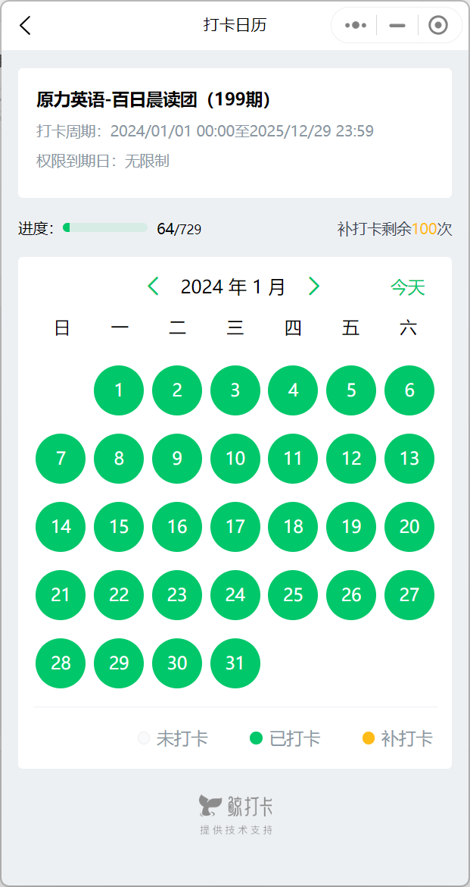
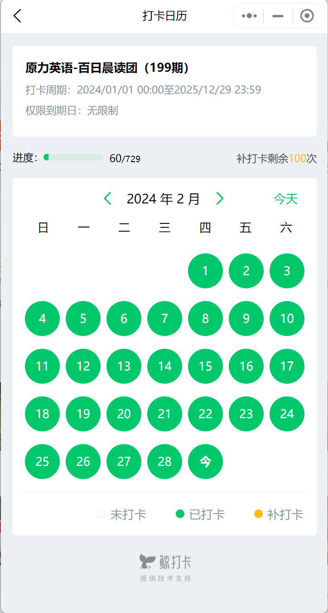
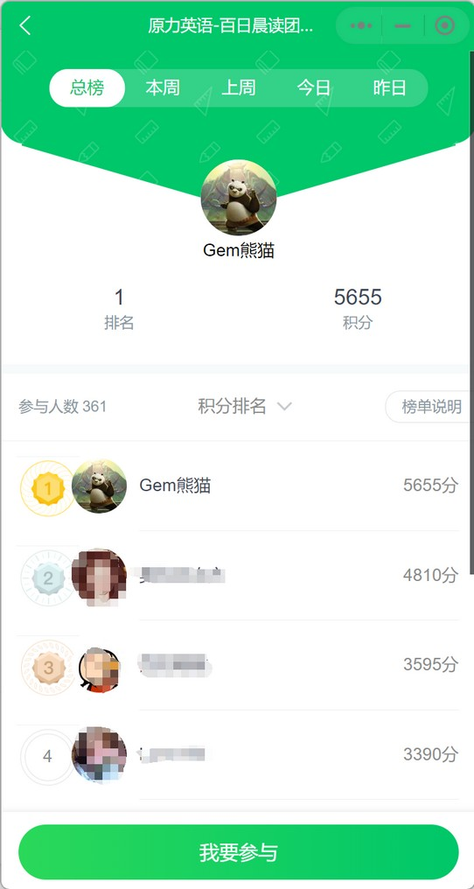
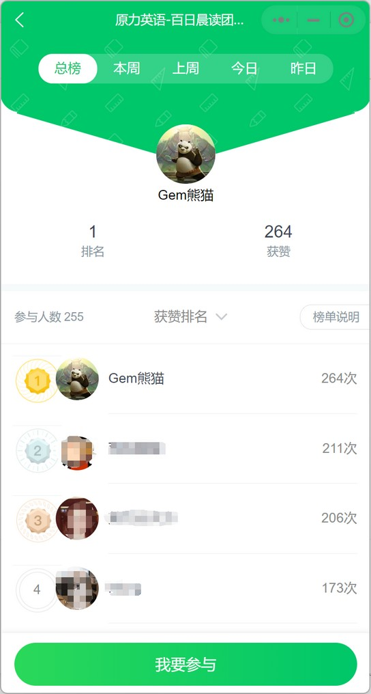
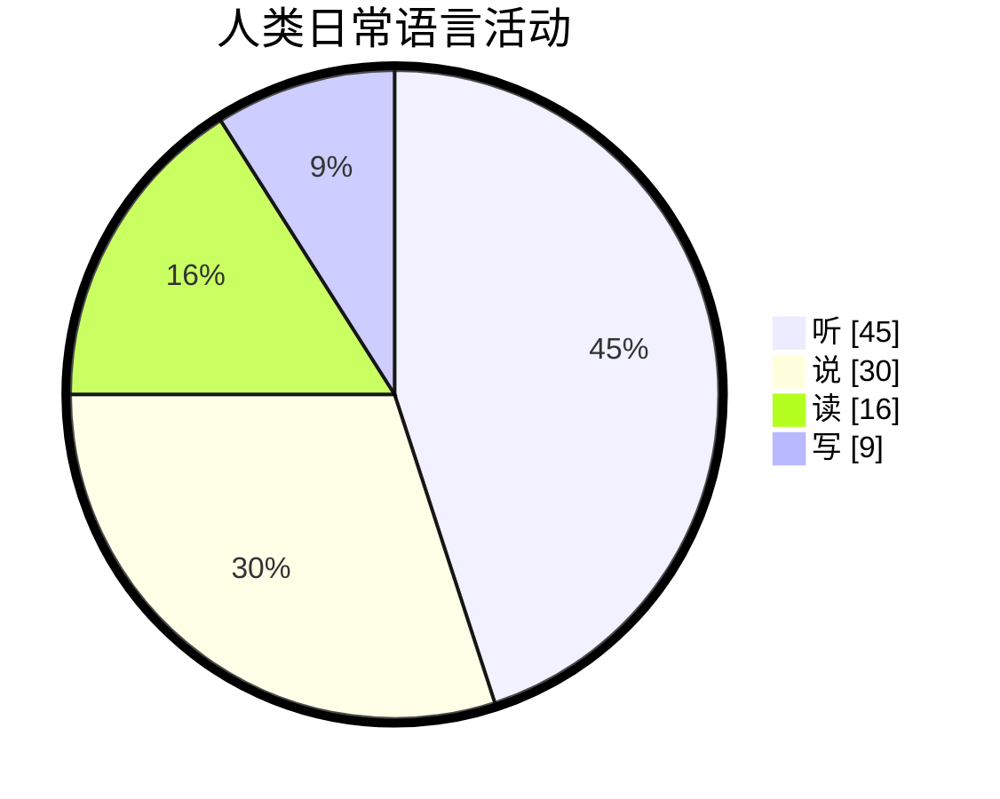

# 文档说明

本文档主要记录在原力英语跟着艾力老师学习到的所有英语知识。

部分英语学习的通用知识，还会总结在这篇文档中：[✅英语学习-通用总结-md](./英语学习-通用-Gem.md)。

关于托福英语的相关内容，总结在这篇文档中：[✅英语学习-托福-md](./英语学习-托福.md)。

本文档会不间断的更新，如果大家觉得写的不错，欢迎收藏、转载、点赞、加星（Star）哦。😀😄😁💖💗💞。

| 文档名称     | 原力艾力英语学习笔记 |
| ------------ | -------------------- |
| 文档分类     | 英语学习             |
| 版本号       | 1.6                  |
| 最后更新日期 | 2024-02-22           |
| 最后更新人   | Gem Shen             |
| 编制日期     | 2023-12-28           |
| 编制人       | Gem Shen             |

## 更新记录

| 版本 | 编制/修改人 | 修改日期   | 备注（原因、进一步的说明等）                           |
| ---- | ----------- | ---------- | ------------------------------------------------------ |
| 1.0  | Gem Shen    | 2023-12-28 | 初版                                                   |
| 1.1  | Gem Shen    | 2024-01-02 | 加入[托福学习规划](#学习规划)，[每日晨读](#每日晨读)。 |
| 1.2  | Gem Shen    | 2024-01-03 | 加入记忆章节，用于记忆学习过程中的词汇。               |
| 1.3  | Gem Shen    | 2024-01-10 | 补充英语[听力提升方法](#2.听力)。                      |
| 1.4  | Gem Shen    | 2024-01-27 | 加入词法-名词                                          |
| 1.5  | Gem Shen    | 2024-02-12 | 加入口语-英语面试，将单词记忆移动到扇贝生词本中        |
| 1.6  | Gem Shen    | 2024-02-22 | 将托福考试相关内容分离到单独的文档中。                 |

 

# 每日晨读学习

这里记录每天跟着艾力老师晨读的内容。思考太久跟不上直播速度。直播结束后再次整理消化。

## 2024-01

### 2024-01-01 星期一

Be faithfull in small things because it is in them that your strength lies.

leap year.闰年

My new year's resolution is to learn english well

Bless you! 祝福你

### 2024-01-02 星期二

happy new year.

Wish you + 名词.例如：wish you health and wealth.

bluetooth headset.蓝牙耳机

I have learnd to seek my happiness by limiting my desires, rather than in attemping to satisfy them.

我学会了通过限制欲望来寻求幸福而不是试图满足他们。

重音：I have learnd / to seek my happiness / by limiting my desires, rather than / in attemping to satisfy them.

pension：退休金，养老金

### 2024-01-03 星期三

Time and memory are true artists. They remould reality nearer to the heart's desire. 

时间和记忆是真正的艺术家。他们会将现实重塑的和内心的欲望更近。

句子结构：主系表。主谓宾+宾补。断句：

Time and memory are true artists./ They remould reality/ nearer to the heart's desire. 

how time flies.时光飞逝

What time is it now.现在几点了。

Time is money.时间就是金钱

virtual reality. 虚拟现实。

reality show. 真人秀

### 2024-01-04 星期四

Your ordinary acts of love and hope point to the extraordinary promise that every human life is of inestimable value.

你充满爱和希望的平凡行动指向了一个非凡的承诺：每一个人类都具备不可估量的价值。

asked me for a lift

### 2024-01-05 星期五

One's destination is never a place but a new way of seeings things.

一个人的目的地从来不是一个地方而是一种看待事物的新方式。

新概念2 Lesson 15 Good news

The secretary told me that Mr. Harmsworth would see me. I felt very nervous when I went into his office. He did not look up from his desk when l entered. After I had sat down, he said that business was very bad. He told me that the firm could not afford to pay such large salaries. Twenty people had already left.I knew that my turn had come.Mr. Harmsworth,' I said in a weak voice.Don't interrupt, he said.Then he smiled and told me I would receive an extra 1000 pounds a year!

Good news, bad news, fake news.

would see 过去将来时，Mrs已婚，miss未婚，Ms通称女士。

firm，某一领域的专业公司。company：综合大公司。

afford to do sth. 负担的起

salary 月薪, wage 周薪, annual pay 年薪, daily pay 日薪, 欧洲用周薪比较多。

my turn have com. 轮到我了。

### 2024-01-06 星期六

Enthusiasm is the mother of effort and without it nothing great was ever achieved.  -Ralph Waldo Emerson

Enthusiasm is the mother of effort, and without it nothing great was ever achieved.‧ 

Enthusiastic 热情的。passionate 有激情的

phychology today 今日心理学

### 2024-01-08 星期一

Don't judge each day by the harvest you reap but by the seeds that you plant.‧ Robert Louis Stevenson
不要以收获来评价每一天，而要以播下的种子来评价每一天。– 罗伯特·路易斯·史蒂文森

### 2024-01-09 星期二

A good painting to me has always been like a friend. It keeps me company, comforts and inspires. -Hedy Lamarr

一副好画总是像一位老朋友，它一直陪伴我，安慰我，激励我。–海迪·拉马尔

海迪·拉马尔，毕业于德意志剧院附属戏剧学校，美国女演员。20世纪40年代，她提出把控制信号切换成不同频率以防敌方干扰。这一思想启发了科学家George Antheil，开发出信号的同步功能。

keeps sb company, company是形容词，comforts and inspires是动词，省略了me，和keeps平行。

sth be like a friend. 某些东西就像一个朋友。

### 2024-01-10 星期三

The world of reality has its limits; the world of imagination is boundless. ‧ Jean-Jacques Rousseau 

现实世界有其范畴,想象的世界则有无限可能。– 让-雅克·卢梭

reality /riˈæləti/  n.真实

boundless /ˈbaʊndləs/  adj.无限的

### 2024-01-11 星期四

If you wish to succeed in life, make perseverance your bosom friend, experience your wise counselor, caution your elder brother, and hope your guardian genius.‧ Joseph Addison

如果你希望人生成功，当以恒心为知友，以经验为谋士，以谨慎为兄长，以希望为守护神。—约瑟夫·艾迪生
约瑟夫·艾迪生，英国散文家、诗人、辉格党政治家。曾在牛津大学求学和任教，并去欧洲大陆旅行多年。他与斯蒂尔合办《闲话报》(1710)和《旁观者》(1711)等刊物。为英国散文大师之一。写有诗篇《远征》、悲剧《卡托》以及文学评论文章等。
重点词汇注释 
perseverance /ˌpɜːrsəˈvɪrəns/  n.毅力，不屈不挠的精神
wise /waɪz/  adj.（行为或决定）明智的，高明的  v.了解，知道
counselor /ˈkaʊnsələr/  n.顾问，咨询师
guardian /ˈɡɑːrdiən/  n.监护人；守卫者，保护者  adj.守护的
genius /ˈdʒiːniəs/  n.天赋，天资；天才，智商很高的人 

新概念 Lesson19 Sold out

The play may begin at any moment,' I said.It may have begun already,' Susan answered.I hurried to the ticket office. 'May l have two tickets please ?' I asked.I'm sorry, we've sold out,' the girl said. What a pity!' Susan exclaimed.
Just then, a man hurried to the ticket office. Can I return these two tickets?' he asked.Certainly,' the girl said.
I went back to the ticket office at once. Could I have those two tickets please ?' I asked.
Certainly, 'the girl said, but they are for next Wednesday's performance. Do you still want them? I might as well have them,' I said sadly.

### 2024-01-12 星期五

You will find as you look back upon your life that the moments when you have truly lived are the moments when you have done things in the spirit of love. ‧ Henry Drummond

当你回顾你的生活时，你会发现，当你真正活过的时候，正是你怀着爱的精神去做事情的时候。–亨利·德拉蒙德
亨利·德拉蒙德是一位苏格兰传教士、生物学家、作家和讲师。他的布道“世界上最伟大的事情”很受欢迎，他把一种充满仁爱的品质称为世界上最伟大的事物。
重点词汇注释 
moment /ˈmoʊmənt/  n.片刻，瞬间；某一时刻；现在，目前  
truly /ˈtruːli/  adv.真实地，如实地；真正地，完全地
spirit /ˈspɪrɪt/  n.精神，心灵；情绪，心境  v.偷偷带走，秘密弄走

Lesson20 One man in a boat

Fishing is my favourite sport. I often fish for hours without catching anything. But this does not worry me.Some fishermen are unlucky. Instead of catching fish,they catch old boots and rubbish.I am even less lucky.lnever catch anything-not even old boots. After having spent whole mornings on the river, l always go homewith an empty bag.You must give up fishing!' myfriends say.lt's a waste of time.' But they don't realizeone important thing.I'm not really interested in fishing.l am only interested in sitting in a boat and doing nothingat all !

badminton：羽毛球

favourite  等价于 favorite

看到老外打喷嚏可以说：bless you

### 2024-01-13 星期六

Great nations write their autobiographies in three manuscripts - the book of their deeds, the book of their words and the book of their art.   -John Ruskin
伟大的民族将他们的自传写在三种手稿中——他们的行为之书，他们的话语之书和他们的艺术之书。– 约翰·拉斯金
约翰·拉斯金，英国作家、艺术家、艺术评论家，维多利亚时代艺术趣味的代言人。他一生为“美”而战斗。他的文字也非常优美，色彩绚丽，音调铿锵。如《现代画家》和《往昔》，都是散文中的佳作。

autobiography /ˌɔːtəbaɪˈɑːɡrəfi/  n.自传；自传体写作
manuscript /ˈmænjuskrɪpt/  n.手稿，原稿；手抄本，手写本  adj.手写的
deed /diːd/  n.行为，行动；契约，证书  v.立契转让

### 2024-01-14 星期日

To know how to grow old is the master work of wisdom, and one of the most difficult chapters in the great art of living. -
Herman Melville
知道如何变老是智慧的杰作，也是伟大的生活艺术中最困难的章节之一。–赫尔曼·梅尔维尔
赫尔曼·梅尔维尔，19 世纪美国最伟大的小说家、散文家和诗人之一，英国作家毛姆认为他的《白鲸》是世界十大文学名著之一，其文学史地位更在马克·吐温等人之上。梅尔维尔也被誉为美国的“莎士比亚”。
重点词汇注释
master /ˈmæstər/ adj. 精通的；最重要的，主要的；master work：杰作
Wisdom /ˈwɪzdəm/ n.智慧，才智；明智；学问，知识；普遍。
the great art of living：伟大生活艺术。

### 2024-01-15 星期一

The courage to imagine the otherwise is our greatest resource, adding color and suspense to all our life. -Daniel
J. Boorstin
敢于想象不一样的事情是我们最大的资源，它为我们的生活增添了色彩和悬念。–丹尼尔·J·布尔斯廷
丹尼尔·J·布尔斯廷是美国著名文学派史学家，也是曾获普利策奖的《美国人》三部曲的作者。1989 年，布尔斯廷因其一生对文学的卓越贡献，荣获美国国家图书奖。他曾任美国国会图书馆馆长达 12 年之久。
重点词汇注释
courage /ˈkɜː rɪdʒ/ n.勇气，胆量
otherwise adv/adj. 否则，不然；除此以外，在其他方面；不同地，另外地；以其他方式
Suspense /səˈspens/ n.焦虑，悬念，兴奋

### 2024-01-16 星期二

Love is always open arms. If you close your arms about love you will find that you are left holding only yourself. -Leo Buscaglia

爱是永远张开的双臂。如果你对爱合上双臂，你会发现只剩下了你自己。——利奥·巴斯卡利亚
利奥·巴斯卡利亚博士是世界著名的演说家和作家，他一生致力于推展广义的“爱”，美国的大众传播界称他为“拥抱博士”。代表作品有《彼此相爱》《生活、爱、学习》《爱》《开往天堂的9路巴士》等。

新概念Lesson 22 A glass envelop

My daughter, Jane, never dreamed of receiving aetter from a girl of her own age in Holland. Last year we were traveling across the Channel and Jane put a piece of paper with her name and address on it into a bottle. She threw the bottle into the sea. She never thought of it again, but ten months later, she received a letter from a girl in Holland. Both girls write to each other regularly now. However, they have decided to use the post office. Letters will cost a little more, but they will certainly travel faster.

### 2024-01-17 星期三

A leader takes people where they want to go. A great leader takes people where they don't necessarily want to go, but ought to be. -Rosalynn Carter

一个领导把人们带到他们想去的地方。一个伟大的领袖会把人们带到他们不一定想去但应该去的地方。– 罗莎琳·卡特
罗莎琳·卡特，美国前总统吉米·卡特妻子、美国前第一夫人。她是全球人权活动家，她对平等权利修正案的大力支持；赢得了一个由全国妇女组织颁发的优异奖。

重点词汇注释 

necessarily /ˌnesəˈserəli/  adv.必定，必然；必要地

ought /ɔːt/  v.应该（表义务、责任、必要等）；应该（表期望）

新概念Lesson 23 A new house

I had a letter from my sister yesterday. She lives in Nigeria.In her letter, she said that she would come to England next year. lf she comes, she will get a surprise. We are now living in a beautiful new house in the country. Work on it had begun before my sister left. The house was completed five months ago.In myletter, I told her that she could stay with us. Thehouse has many large rooms and there is a lovelygarden.It is a very modern house, so it looks strangeto some people. lt must be the only modern house inthe district.

### 2024-01-18 星期四

Wonder is the feeling of the philosopher, and philosophy begins in wonder.  ‧Plato 

惊奇是哲学家的感情，而哲学始于惊奇。– 柏拉图

philosopher /fəˈlɑːsəfər/  n.哲学家，哲人；思想深刻的人

新概念Lesson 22 A glass envelop

My daughter, Jane, never dreamed of receiving aetter from a girl of her own age in Holland. Last year we were traveling across the Channel and Jane put a piece of paper with her name and address on it into a bottle. She threw the bottle into the sea. She never thought of it again, but ten months later, she received a letter from a girl in Holland. Both girls write to each other regularly now. However, they have decided to use the post office. Letters will cost a little more, but they will certainly travel faster.

### 2024-01-19 星期五

Don't dwell on what went wrong. Instead, focus on what to do next. Spend your energies on moving forward toward finding the answer. -Denis Waitley
不要沉浸在过去的错误中, 相反你要关注下一步做些什么。把你的精力花在寻找答案上。–丹尼斯·维特利

丹尼斯·维特利，美国励志演说家、作家和顾问，是国际演讲名人堂中的一员。代表作品有《胜利的心理学》和《伟大的种子》和《胜利者的边缘》。

重点词汇注释

dwell /dwel/  v.居住，栖身 。dwell on：纠结于，长时间思考或谈论某事。

新概念，Lesson 25 Do the nglish speak English?

I arrived in London at last. The railway station was big, black and dark. i did not know the way to my hotel, so l asked a porter. i not only spoke English very carefully, but very clearly as well. The porter, however, could not understand me.l repeated my question several times and at last he understood. he answered me, but he spoke neither slowly nor clearly.'I am a foreigner,'i said. Then he spoke slowly, but i could not understand him.My teacher never spoke English like that! The porter and i looked at each other and smiled.Then he said something and l understood it.'You' soon learn English!' he said. I wonder. In England each person speaks a different language. The English understand each other, but l don't understand them!Do they speak English?

### 2024-01-21 星期日

The shoe that fits one person pinches another ; there is no recipe for living that suits all cases.

适合一个人的鞋子会夹痛另一个人的脚，不存在适合所有人的生活方式。-卡尔·荣格

#### 问答

当我在听老友记时，遇到个别句子要循环听几一遍，有时候都听不出来，他到底是什么发音的，这个要怎么提升?

听到第3遍听不出来的时候，就可以停止了，不用听这么多遍，直接拿原文出来跟读。听力听出来的主要原因还是跟读做少了。

2个月后就要开始找工作了，有没有迅速提升面试英语的方法。我主要找软件开发类工作。

学习b1阶段的课程，然后把面试稿写下来，让老师修改。

### 2024-01-22 星期一

The great awareness comes slowly, piece by piece. The path of spiritual growth is apath of lifelong learning.-M. Scott Peck

伟大的意识慢慢地，一点一点地到来。心灵成长之路是一条终身学习之路。-M·斯科特·派克

### 2024-01-23 星期二

There is only one corner of the universe you can be certain of improving, and that's your own self. ‧Aldous Huxley

宇宙中只有一个角落是你一定能让它变得更好的，那就是你自己。–阿道司·赫胥黎

阿道司·赫胥黎，英格兰作家。他在1932年创作的《美丽新世界》让他名留青史。著名作品有《铬黄》（1921）、《光秃秃的树叶》（1925）、《点对点》（1923）、《几个夏季之后》（1939）、《时间须静止》（1944）等。

重点词汇注释 

certain /ˈsɜːrt(ə)n/  adj.必然的，必定的  pron.某些，某几个  

### 2024-01-24 星期三

Let us learn to appreciate there will be times when the trees will be bare, and look forward to the time when we may pick the fruit. ‧Anton Chekhov

让我们学会欣赏，有时树木将是光秃秃的，并期待我们可能摘到果实的时候。– 安东·契诃夫

契诃夫，俄国作家，剧作家。他是俄国19世纪末期最后一位批判现实主义作家，20世纪世界现代戏剧的奠基人之一，与莫泊桑和欧·亨利并称为“世界三大短篇小说家”。代表作品有《变色龙》

重点词汇注释

appreciate /əˈpriːʃieɪt/  v.欣赏，鉴赏；理解，明白
bare /ber/  adj.赤裸的；光秃秃的  v.使暴露，使露出  adv.非常，许多
forward /ˈfɔːrwərd/  adv.向前；在船头，朝飞机头部  adj.向前的，前进的  n.（足球、篮球等运动的）前锋
fruit /fruːt/  n.水果；（植物的）果实；成果，结果，后果  

### 2024-01-25 星期四

Faith makes all things possible, love makes all things easy. ‧Dwight Lyman Moody

信念使一切成为可能……爱使一切都容易。—德怀特·莱曼·穆迪
德怀特·莱曼·穆迪，或译慕迪，美国著名布道家。在芝加哥有间闻名的慕迪圣经学院，就是用来纪念他的。
重点词汇注释 
Faith /feɪθ/  n.信任，信心，信念

### 2024-01-26 星期五

Be happy with what you have and are, be generous with both, and you won't have to hunt for happiness. ‧William E. Gladstone

对你所拥有的和已成为的感到高兴，对其慷慨，你就不必去寻找幸福。–威廉·E·格莱斯顿

威廉·尤尔特·格莱斯顿,英国政治家，曾作为自由党人四次出任英国首相（1868-1874、1880-1885、1886以及1892-1894）。格莱斯顿是美国总统伍德罗·威尔逊的偶像，始终被学者排名为最伟大的英国首相之一。

重点词汇注释

generous /ˈdʒenərəs/  adj.慷慨的，大方的；大量的

### 2024-01-27 星期六

When we are no longer able to change a situation - we are challenged to change ourselves.‧ Viktor E. Frankl

当我们无法改变的情况下,我们面临的挑战是改变我们自己。-维克多·弗兰克尔

Since then, Captain Fawcett has flown passengers to many unusual places

a block of flats 一栋公寓

a deserted car park 一个废弃的停车场

### 2024-01-28 星期日

He can who thinks he can , and he can't who thinks he can't .This is an inexorable, indisputable law.

认为自己能的人能，认为自己不能的人不能。这是一条不容改变、不容争辩的规律。 -巴勃罗·毕加索

巴勃罗·毕加索，西班牙画家、雕塑家，法国共产党党员。是现代艺术的创始人，西方现代派绘画的主要代表。代表作品:《格尔尼卡》《和平鸽》《亚威农少女》《生命》

### 2024-01-29 星期一

He can who thinks he can , and he can't who thinks he can't .This is an inexorable, indisputable law.

认为自己能的人能，认为自己不能的人不能。这是一条不容改变、不容争辩的规律。 -巴勃罗·毕加索

巴勃罗·毕加索，西班牙画家、雕塑家，法国共产党党员。是现代艺术的创始人，西方现代派绘画的主要代表。代表作品:《格尔尼卡》《和平鸽》《亚威农少女》《生命》

### 2024-01-30 星期二

You must live in the present, launch yourself on every wave, find your eternity in each moment. ‧Henry David Thoreau

你必须活在当下，把握每一个机会，在每分每秒中找到自己的永恒。 –亨利·戴维·梭罗

亨利·戴维·梭罗，美国作家、哲学家，超验主义代表人物。毕业于哈佛大学，他的著作《瓦尔登湖》在美国文学中被公认为最受读者欢迎的非虚构作品。 其他作品有政论《论公民的不服从义务》（1849）、《没有规则的生活》（1863），游记《马萨诸塞自然史》、《康科德及梅里马克河畔一周》、《缅因森林》等。

重点词汇注释 

launch yourself on every wave，直译：在每一波浪潮中放飞自己

launch，lunch：午餐

every：强调整体的每一个，each：强调个体。

eternity /ɪˈtɜːrnəti/  n.永恒，永久，无穷无尽的时间；

spare parts：备件

### 2024-01-31 星期三

Master books, but do not let them master you. Read to live, not live to read. ‧ Edward Bulwer-Lytton

成为书的主人，莫被书掌握；要为生而读，莫为读而生。– 爱德华·布尔沃·利顿  
爱德华·布尔沃·利顿  是英国政治家、诗人、小说家和文学批评家，毕业于剑桥大学。他的代表作品有《庞贝城的末日》、《撒克逊末代国王哈罗德》、长篇小说《卡克斯顿家族》。

我的翻译：成为书的主人，但不要被书掌控；读书是为了生活，但生活不仅仅是读书

### 2024年1月成果

打卡日历截图

## 2024-02

### 2024-02-01 星期四

Efficiency is doing things right; effectiveness is doing the right things. ‧Peter Drucker

效率是正确地做事,而效果是做正确的事情。-彼得·德鲁克

彼得·德鲁克，现代管理学之父，其著作影响了数代追求创新以及最佳管理实践的学者和企业家们，代表作品有《卓有成效管理者的实践》、《21世纪的管理挑战》、《管理未来》等。

### 2024-02-02 星期五

You can cut all the flowers but you cannot keep spring from coming. ‧Pablo Neruda

你可以削减所有的花朵,但你不能阻止春天的到来。– 巴勃罗·聂鲁达
巴勃罗·聂鲁达，智利著名诗人。1945年获得智利国家文学奖，并于同年加入了智利共产党，1950年获得加强国际和平奖。1971年10月获诺贝尔文学奖。他的代表作品有《二十首情诗和一支绝望的歌》、《邮差》、《漫歌》等。

你可以砍掉所有鲜花，但是你不可能阻止春天的到来。

### 2024-02-03 星期六

Only through art can we emerge from ourselves and know what another person sees. ‧Marcel Proust

只有通过艺术，我们才能走出自我，知道别人看到了什么。– 马塞尔·普鲁斯特
马塞尔·普鲁斯特是20世纪法国最伟大的小说家之一，意识流文学的先驱与大师，也是20世纪世界文学史上最伟大的小说家之一。他的代表作品有《欢乐与时日》、《追忆似水年华》（又译为《追寻逝去的时光》）。

重点词汇注释 
emerge /ɪˈmɜːrdʒ/  v.浮现，出现；显露，知悉

### 2024-02-04 星期日

Technological society has succeeded in multiplying the opportunities for pleasure, but it has great difficulty in generating joy. ‧Pope Paul VI

科技社会成功地增加了快乐的机会，但它却很难产生快乐。– 圣保罗六世

圣保罗六世，原名乔瓦尼·巴蒂斯塔·蒙蒂尼，1897年9月26日出生于意大利，意大利教皇（1963-78年在位），任期包括第二次梵蒂冈会议（1962-65年）的大部分时间和紧接着的后罗马时代。

重点词汇注释 

Technological /ˌteknəˈlɑːdʒɪk(ə)l/  adj.技术的，科技的，工艺的
multiply /ˈmʌltɪplaɪ/  v.大大增加，倍增  adv.多样地，多方面地
pleasure /ˈpleʒər/  n.快乐，满足，欣慰  adj.游乐的，非公务的  v.从……中获得乐趣

### 2024-02-05 星期一

Any life, however long and complicated it may be, actually consists of a single moment -the moment when a man knows forever more who he is.  ‧Jorge Luis Borges

任何人生，无论如何漫长复杂，实际上只组成于一个瞬间：那就是当你彻悟到自己究竟是谁的那一瞬间。–豪尔赫·路易斯·博尔赫斯

豪尔赫·路易斯·博尔赫斯，阿根廷作家、翻译家。他的作品被广泛译介到欧美国家，反映了世界的混沌性和文学的非现实感。著名作品有短篇集《虚构集》、《阿莱夫》、等，他被誉为作家中的考古学家。

**我的翻译**：任何人生，无论多么漫长和复杂，实际上都是组成于一个瞬间：就是当他开始知道自己是谁的瞬间。

重点词汇注释 

forever more：从接下来起直到永远，在句子里表示当他知道自己是谁并直到永远的每一刻才是真正的人生。

### 2024-02-06 星期二

Formal education will make you a living; self-education will make you a fortune.  ‧Jim Rohn

正规教育让你可以谋生;自我教育则可以给你带来财富。 –吉米·罗恩

吉米·罗恩，美国最杰出的商业哲学家，成功学之父、成功学创始人。代表作品：《快乐致富—获得财富与快乐的7个策略》。

重点词汇注释 

formal /ˈfɔːrm(ə)l/ adj.庄重的，合乎礼仪的；（语言）正式的，规范的

fortune /ˈfɔːrtʃən/  n.时运，命运；好运，机遇；财富，巨款  v.给予财富；偶然发生

make a living：谋生

make a fortune：发财致富

### 2024-02-07 星期三

Poetry is emotion put into measure. The emotion must come by nature, but the measure can be acquired by art. ‧Thomas Hardy

诗是衡量情感的尺度。情感必须来自自然，但尺度可以通过艺术获得。– 托马斯·哈代

我的翻译：诗是被放入衡量标准的情感。这种情感必须自然的流露，但衡量标准可以通过艺术获得。

托马斯·哈代，英国诗人、小说家，早、中期的创作以小说为主，成名作是他的第四部小说《远离尘嚣》，一生共发表了近20部长篇小说。

重点词汇注释 

Poetry /ˈpoʊətri/  n.诗歌（总称）。poem：具体的诗。poet：诗人。

emotion /ɪˈmoʊʃ(ə)n/  n.情感。EQ，Emotional Quotient，情商

come by nature：天生的

#### 问答

老友记第10期的跟读视频已上传给艾力老师（2024-1-29），艾力老师回复如下：

整体念的不错，但结尾辅音要念轻一点。托福是一个偏学术的考试，听老友记的意义不大，建议每周做2篇托福真题。

### 2024-02-08 星期四

Life is about not knowing, having to change, taking the moment and making the best of it, without knowing what's going to happen next. ‧Gilda Radner

生活就是未知，就是改变，就是把握当下，尽情享受，因为我们不知道接下来会发生什么。-格尔达·赖德娜

格尔达·赖德娜，美国演员、编剧，代表作《周六夜现场 第一季》、《The Rutles：All You Need Is Cash》、《阴谋诡计》等。

重点词汇注释

take the moment：把握当下，抓住时机。

make the best of it：尽量做到最好，尽情享受。

### 2024-02-09 星期五

The new year stands before us, like a chapter in a book, waiting to be written. We can help write that story by setting goals.  ‧Melody Beattie

新的一年就在我们面前，就像书中的一章，等待着被书写。我们可以通过设定目标来帮助书写这个故事。– 梅洛迪·贝蒂

梅洛迪·贝蒂，加拿大现象级畅销书作家，治愈百万人心灵的心理愈疗师。依赖共生问题研究专家，“依赖共生”（codependency）概念提出者。首部作品《放手》（Codependent No More）全球畅销 800 多万册，被翻译成 10 多种语言。

重点词汇注释

chapter /ˈtʃæptər/ n.章，回，篇；阶段，时期 v.把……分成章节

Goal /ɡoʊl/ n.球门；进球得分；目标，目的 v.射门，射门得分

### 2024-02-10 星期六

Be thankful for what you have; you'll end up having more . lf you concentrate on what you don't have, you will never, ever have enough.

对于你所拥有的心存感激，你会得到更多。如果你只专注于你所没有的，你将永远无法拥有足够的东西。-奥普拉·温弗瑞

奥普拉·温弗瑞，美国演员、制片人、主持人。2018年，获得第75届美国电影电视金球奖“终身成就奖”。代表作品《奥普拉脱口秀》、《紫色姐妹花》《人们在说话》

重点词汇注释

我的翻译：对于你所拥有的心存感激，你将得到更多。如果你对没有的念念不忘，那你将永远无法满足。

end up doing：最终做某事：指在一系列事件或行动之后，最终做出某种决定或采取某种行动。

never, ever：只用一个never就可以表达永远不会的意思，使用ever则更加强化了这种否定的程度。

### 2024-02-11 星期日

Speech is one of the marvels that characterize man, and also one of the most difficult spontaneous creations that have been accomplished by nature. ‧Maria Montessori

语言是体现人类特点的奇迹之一，也是大自然中最难自发产生的之一。–玛利娅·蒙台梭利

玛利娅·蒙台梭利，意大利幼儿教育家，意大利第一位女医生，蒙台梭利教育法的创始人。代表作品有《发现孩子》、《童年的秘密》、《有吸收力的心灵》等。

我的翻译：语言是刻画人类特征的奇迹之一，同样也是大自然很难自发完成的创造之一。

Marvel: 奇迹，惊奇，令人惊讶的人或事

spontaneous: 自发的

creation:创作，创造，创造物

### 2024-02-12 星期一

Happiness cannot be traveled to, owned, earned, worn or consumed. Happiness is the spiritual experience of living every minute with love, grace, and gratitude. ·Denis Waitley

幸福无法传送、拥有、赚取、磨损或消耗。幸福是一种在每一刻都带着爱、优雅和感激的生活的精神体验，-丹尼斯·维特利

丹尼斯·维特利，美国励志演说家、作家和顾问，是国际演讲名人堂中的一员。代表作品有《胜利的心理学》和《伟大的种子》和《胜利者的边缘》

幸福不能被转送、拥有、赚取、磨损或消耗。幸福是一种带着爱，优雅和感恩去活每一刻的精神体验。

traveled：旅行；传播；转送；

spiritual：/ˈspɪrɪtʃuəl/，心灵的，精神的。这个单词很难发音，发了N多遍还是识别黑色。

gratitude：/ˈɡrætɪtuːd/，感恩，感激；

grace：优雅；

### 2024-02-13 星期二

Don't let life discourage you; everyone who got where he is had to begin where he was. ‧Richard Evans

不要让生活使你灰心丧气；每个达到目标的人都曾从现状开始。–理查德·埃文斯

理查德·埃文斯，英国历史学家，以 19、20 世纪德国史的研究享誉学界。曾任剑桥大学钦定历史学讲座教授、剑桥大学沃尔夫森学院院长。著有《企鹅欧洲史·竞逐权力：1815—1914》等 18本著作，其中《死于汉堡》获沃尔夫森历史奖。

不要让生活使你气馁，每一个取得成就的人都必须从他所在的地方开始。

“where he is”指的是一个人目前的位置、状态或成就，“where he was”指的是一个人的起点或之前的位置。

### 2024-02-14 星期三

Time is too slow for those who wait, too swift for those who fear, too long for those who grieve, too short for those who rejoice, but for those who love, time is eternity. ‧Henry Van Dyke

时间对于等待的人来说太慢，对于害怕的人来说太快，对于悲伤的人来说太长，对于欢乐的人来说太短，但对于相爱的人来说，时间就是永恒。-亨利·范·戴克

亨利·范·戴克，美国作家、教育家，1899年到1923年在普林斯顿大学担任文学教授，曾就任荷兰、卢森堡公使。代表作品包括小说《勇敢的心》(A Brave Heart)、诗歌《时间是》(Time ls)等

grieve /ɡriːv/：（尤指因某人亡故而）感到悲痛；使伤心

rejoice /rɪˈdʒɔɪs/：非常高兴，深感欣喜；

eternity /ɪˈtɜːrnəti/：永恒久；永生；来世；死

### 2024-02-15 星期四

The miracle is not that we do this work, but that we are happy to do it. ‧Mother Teresa

奇迹不是来自于我们所做的,而是来自于我们乐于去做的心。-特蕾莎修女

特蕾莎修女，是世界著名的慈善工作者，主要替印度加尔各答的穷人服务。因其一生致力于消除贫困，于1979年得到诺贝尔和平奖。

奇迹不在于我们所做的，而在于我们为之感到快乐

miracle /ˈmɪrək(ə)l/：n. 奇迹，不可思议的事；

### 2024-02-16 星期五

Beauty surrounds us, but usually we need to be walking in a garden to know it. ‧Rumi

美包围着我们，但通常我们需要走到花园才知道这一点。 –鲁米

鲁米，天才诗人，被称为“属于整个人类的伟大的人文主义者、哲学家、诗人”。鲁米在波斯文学史上享有极高的声誉，他与菲尔多西、萨迪、哈菲兹齐名，有“诗坛四柱”之称。代表作品是《玛斯纳维》及《沙姆斯集》。

我的翻译：美包围着我们，但通常我们需要走在花园中才能知道这一点。

surround /səˈraʊnd/ v.围绕，环绕；（军队，警察等）包围

usually /ˈjuːʒəli/ adv. 通常地，经常地

need being walking：表示一种建议，强调了动作正在进行中。如果改成need to walk就没有了强调“走在花园中”这个动作正在进行时才能感受到美的意思了。

### 2024-02-17 星期六

We all have to start somewhere, and doing something is better than nothing at all. Start small so you don't get discouraged and give up. Remember it is all about consistency. ‧Khloe Kardashian

我们都得从某个地方开始，做点什么总比什么都不做好。从小事做起，这样你就不会灰心丧气而放弃。记住，这一切都关乎持之以恒。–科勒·卡戴珊

科勒·卡戴珊，美国演员、电台主持人、女企业家、模特。2009年，和 NBA 球星拉玛尔·奥多姆结为夫妻 。主要作品有《Kourtneyand Khloe Take Miami》《瑞秋·蕊秀》。

I did the TPO listening for TOEFL yesterday, and I did the 2-minute listening for 2 hours. Foreigners' pronunciation is much faster than mine, so I suppose I shouldn't slow down for the sake of high score

重点词汇注释

somewhere /ˈsʌmwer/ adv.在某处；到某处 n.某个地方

Consistency /kənˈsɪstənsi/ n.一致性，连贯性；黏稠度，平滑度

I did Tofel TPO listening yesterday and I took 2 hours to finish the 2-minutes listening. The pronunciation of foreigners is much faster than me. So I feel that I have to improve my speaking speed and make it closer to a native speaker.

### 2024-02-18 星期日

We cannot change anything unless we accept it. Condemnation does not liberate, it oppresses. ‧ Carl Jung

对于任何事物，要改变它就要先接受它。谴责不会解放而只会压迫。– 卡尔·荣格

卡尔·荣格，瑞士心理学家。他创立了荣格人格分析心理学理论，提出“情结”的概念，把人格分为内倾和外倾两种，主张把人格分为意识、个人无意识和集体无意识三层。主要著作有《人及其象征》《心理类型》。

重点词汇注释
Condemnation /kɑːndemˈneɪʃn/ n.谴责，严厉指责；非难的理由
Liberate /ˈlɪbəreɪt/ v.解放，解救；使自由，使摆脱约束
Oppress /əˈpres/ v.压迫，欺压；使压抑，使烦恼

Although the score is not high, but we can not give up, it is all about consistency. go on reciting : 

### 2024-02-19 星期一

The secret to so many artists living so long is that every painting is a new adventure.  So, you see, they're always looking ahead to something new and exciting.  The secret is not to look back. ‧Norman Rockwell

许多艺术家长寿的秘诀在于，每幅画都是一次新的冒险。所以，你看，他们总是期待着新的和令人兴奋的东西。秘诀就是不要回头看。–诺曼·洛克威尔

诺曼·洛克威尔，美国画家及插画家。他一生中的绘画作品大都经由《周六晚报》刊出，其中最知名的系列作品是在1940和50年代出现的，如《四大自由》。

重点词汇注释 

我的翻译：许多艺术家长寿的秘诀是：每一幅画作都是一次新的冒险。所以你看，他们总是期待着新的和令人兴奋的东西，就是不要回头看。

secret /ˈsiːkrət/  adj.秘密的，保密的  n.秘密，内情
adventure /ədˈventʃər/  n.冒险（经历），奇遇  v.冒险；大胆说出
look ahead  展望：思考未来将会发生的事情。
look back 回头看，回顾过去，

### 2024-02-20 星期二

To most men experience is like the stern lights of a ship, which illuminate only the track it has passed. ‧Samuel Taylor Coleridge

对大多数人来说，经验就像一艘船的尾灯，只照亮它所经过的航道。– 塞缪尔·泰勒·柯勒律治
塞缪尔·泰勒·柯勒律治，英国抒情诗人、评论家和哲学家。他与威廉·华兹华斯合著的《抒情歌谣》开创了英国浪漫主义运动，他的《文学传》（1817）是英国浪漫主义时期最重要的一般文学批评作品。他的代表作品有《克里斯塔贝尔》、《放逐：一首颂歌》、《午夜霜冻》、《古代水手的雾霾》等。

重点词汇注释

experience /ɪkˈspɪriəns/ 经验。这个单词的发音目前每次都要反复练习好几遍。
stern /stɜːrn/  n.船尾，艉部
illuminate /ɪˈluːmɪneɪt/  v.照射，照亮；阐明，解释
track /træk/ 踪迹，足迹，轨道，航道
passed /pæst/  v.经过，穿过；
Samuel Taylor Coleridge /'sæmjuəl 'teilə 'kəulridʒ/ 积累一定量人名的发音，在做英语听力时避免遇到人名，反应不过来是什么意思。

### 2024-02-21 星期三

Never bend your head. Always hold it high. Look the world straight in the eye.‧Helen Keller

永远不要低头。永远高举它。直视这个世界。– 海伦·凯勒

海伦·凯勒，19世纪美国盲聋哑作家和教育家。她在导师安妮·莎莉文的努力下，突破了识字关、语言关、写作关；先后学会了英、法、德、拉丁、希腊五种语言，出版了14部著作。

重点词汇注释

bend /bend/  v.弯曲（身体关节）；
hold it high：高举它。
Look ... straight in the eye：直视某物的眼睛。/streɪt/
Helen Keller /ˈhelən kelər/ 人名发音积累。

### 2024-02-22 星期四

Live daringly, boldly, fearlessly. Taste the relish to be found in competition - in having put forth the best within you. ‧Henry J. Kaiser

勇敢地、大胆地、无畏地生活。品尝在竞争中找到的乐趣——在你发挥出最好的一面时。-亨利 J·凯泽
亨利 J·凯泽，美国实业家，凯泽铝业、水泥、灰泥板、船厂等100多家公司的创始人。他之前从没造过船，一夜之间掌握造船技术精髓，成为“美国造船之父”。
重点词汇注释 
daringly /ˈderɪŋli/  adv. 大胆地；毅然地
boldly /ˈboʊldli/  adv.大胆地；冒失地
fearlessly /ˈfɪrləsli/ adv.无畏的；勇敢的
competition /ˌkɑːmpəˈtɪʃ(ə)n/  n.竞争；比赛
put forth：展现
Henry J. Kaiser /henri dʒeɪ ˈkaɪzər/ 人名发音积累

### 2024-02-23 星期五

The best portion of a good man's life: his little, nameless, unremembered acts of kindness and love. ‧William Wordsworth

一个善良人的生活的最美的部分:他那些微小、无名、不被记住的善举和爱。 – 威廉·华兹华斯
威廉·华兹华斯，英国浪漫主义诗人，曾当上桂冠诗人。其诗歌理论推动了英国诗歌的革新和浪漫主义运动的发展。其诗句“朴素生活，高尚思考（plain living and high thinking）”被作为牛津大学基布尔学院的格言 。代表作品有《她住在人迹罕至的地方》、《水仙花》等。

重点词汇注释 

portion /ˈpɔːrʃ(ə)n/  n.（某物的）一部分；
nameless /ˈneɪmləs/  adj.不可名状的，难以形容的；匿名的 
kindness /ˈkaɪndnəs/  n.友好，仁慈，善良；善行，善举
William Wordsworth /ˈwɪljəm wɜːrdzwərθ/ 人名发音积累

### 2024-02-24 星期六

We live in deeds, not years: in thoughts, not breaths; in feelings, not in figures on a dial. We should count time by heart-throbs. ‧Philip Bailey

我们的生活在于行动，而不是时间；在于思想，而不是呼吸；在于感觉，而不是表盘上的数字。我们应该按心灵的悸动来计算时间。–菲利普‧贝利 
菲利普‧贝利 ，英国诗人，以长篇诗词 Festus 为代表作，话题大胆且富有想像力，受到广大的回响，英国发行多达 10 几个版本，而美国的销售量更将近英国的 3 倍。

重点词汇注释 
figure /ˈfɪɡjər/  n.数字，数目，数值  v.（以重要地位）出现
dial /ˈdaɪəl/ n.钟面，仪表盘；调节器；
throb /θrɑːb/  v.（有规律地）抽动  n.（强烈有规律的）跳动
Philip Bailey /ˈfɪlɪp beɪli/ 人名发音积累

### 2024-02-25 星期日

No one has a greater asset for his business than a man's pride in his work. ‧ Hosea Ballou

一个人对自己工作的自豪感是他事业中最大的财富。–何西阿·巴卢 

何西阿·巴卢，美国的神学家和宗教家，他被认为是普世主义 （Universalism）的奠基人之一。代表作是《神的无限的公正与 爱》（"A Treatise on Atonement"）。 

重点词汇注释 

asset /ˈæset/ n. 资产，财产；有利条件； 
Business /ˈbɪznəs/ n. 商业，事业 
Pride /praɪd/ n.自豪（感）；v.以……自豪
Hosea Ballou /həʊˈzɪə bʌlʊ/ 人名发音积累

### 2024-02-26 星期一

Learning is the beginning of wealth. Learning is the beginning of health. Learning is the beginning of spirituality. Searching and learning is where the miracle process all begins. ‧Jim Rohn 

学习是财富的开始。学习是健康的开始。学习是灵性的开端。探索和学习是创造奇迹的起点。–吉米·罗恩 
吉米·罗恩，美国最杰出的商业哲学家，成功学之父、成功学创 始人。代表作品：《快乐致富——获得财富与快乐的 7 个策略》。 

重点词汇注释 

wealth /welθ/ n.财富；富有；大量 
Spirituality /ˌspɪrɪtʃuˈæləti/ n.灵性；精神性 
Miracle /ˈmɪrək(ə)l/ n.奇迹，不可思议的事
Jim Rohn /dʒɪm rɒn/ 人名发音积累

### 2024-02-27 星期二

Fitness is not about being better than someone else... It's about being better than you used to be. ‧Khloe Kardashian

健身不是要比别人强，而是要比过去的自己强。– 科勒·卡戴珊

科勒·卡戴珊，美国演员、电台主持人、女企业家、模特。2009年，和NBA球星拉玛尔·奥多姆结为夫妻 。主要作品有《Kourtney and Khloe Take Miami》《瑞秋·蕊秀》。

重点词汇注释 
Fitness /ˈfɪtnəs/ n.健康；健身；健美
Khloe Kardashian /ˈkloʊ kɑrˈdæʃiən/  科勒·卡戴珊

### 2024-02-28 星期三

True scholarship consists in knowing not what things exist, but what they mean; it is not memory but judgment.  ‧James Russell Lowell

真正的学识不在于知道事物存在什么，而在于知道它们的意义;这不是记忆，而是判断。 —詹姆士·拉塞尔·洛威尔

詹姆士·拉塞尔·洛威尔，美国作家、批评家、编辑及外交官。《比格罗诗稿》（The Biglow Papers）（1848年、1867年）是洛威尔最知名的作品，成为美国式幽默的杰出范例。

重点词汇注释 

scholarship /ˈskɑːlərʃɪp/  n. 奖学金；学问，学识。
consist in 在于，存在于。
exist /ɪɡˈzɪst/  v. 存在，实际上有；
judgment /ˈdʒʌdʒmənt/  n. 判断，看法；判断力
James Russell Lowell /dʒeɪmz ˈrʌsl ˈloʊəl/ 詹姆士·拉塞尔·洛威尔

### 2024-02-29 星期四

We always deceive ourselves twice about the people we love - first to their advantage, then to their disadvantage. ‧Albert Camus

对于所爱的人，我们总是欺骗自己两次—先是对他们有利，然后是对他们不利。–阿尔贝·加缪

阿尔贝·加缪，法国作家、哲学家，存在主义（有争议）文学  、“荒诞哲学”的代表人物。1957诺贝尔文学奖获得者；主要作品有《局外人》《鼠疫》等。

重点词汇注释 

deceive /dɪˈsiːv/  v.欺骗，蒙骗；
twice /twaɪs/  adv.两次；两倍
disadvantage /dɪsədˈvæntɪdʒ/ n. 不利条件，劣势；
Albert Camus /ˈælbərt ka:'mju/ 阿尔贝·加缪

### 2024年2月成果

打卡日历，排名截图

## 2024-03

### 2024-03-01 星期五

Your attitude, not your aptitude, will determine your altitude.  ‧ Zig Ziglar

决定你人生高度的，不是你的才能，而是你的态度。 – 齐格·齐格勒

齐格·齐格勒 是国际知名的演说家、作家；他的《与你在巅峰相会》一书，成为了无数公司、学校、教会的教科书，再版58次，创美国出版之最。其他代表作品有《登峰造极》《金克拉赢家销售心法 》《天长地久》

重点词汇注释 

attitude /ˈætɪtuːd/  n.态度，看法；
altitude /ˈæltɪtuːd/  n.海拔高度；高地；
aptitude /ˈæptɪtuːd/  n.天资，天赋；
Zig Ziglar /zɪɡ zɪɡlər/ 齐格·齐格勒

### 2024-03-02 星期六

Good leaders make people feel that they're at the very heart of things, not at the periphery. ‧Warren Bennis

优秀的领导者会让人们觉得他们是事情的核心，而不是边缘。–沃伦·本尼斯

沃伦·本尼斯，麻省理工学院博士，组织发展理论创始人，美国当代杰出领导理论大师。1993 年及 1996 年两度被《华尔街日报》誉为“管理学十大发言人”，被《福布斯》杂志称为“领导学大师们的院长”。

重点词汇注释

Periphery /pəˈrɪfəri/ n.外围，边缘；圆周；圆柱体表面
Warren Bennis /ˈwɔrən benis/ 沃伦·本尼斯

### 2024-03-03 星期日

The artist produces for the liberation of his soul. It is his nature to create as it is the nature of water to run down the
hill. ‧W. Somerset Maugham

艺术家为灵魂的解放而创作。创造是他的天性，就像水从山上流下来是他的天性一样。 –W·萨默塞特·毛姆

W·萨默塞特·毛姆，英国小说家、剧作家。毛姆短篇小说的标志就是冷静、客观和深刻地剖析与解读人性的弱点；代表作有《人生的枷锁》、《月亮和六便士》、《阿金》等。

重点词汇注释

produce /prəˈduː s/ v.产生，创作
Liberation /ˌlɪbəˈreɪʃ(ə)n/ n.解放；解脱
nature /ˈneɪtʃər/ n.性格，秉性，天性；
W. Somerset Maugham /ˈdʌbljuː sʌməset mɔ:m/ W·萨默塞特·毛姆

### 2024-03-04 星期一

Don't expect to build up the weak by pulling down the strong. ‧Calvin Coolidge

拉低强者并不会提高弱者。 -卡尔文·柯立芝

卡尔文·柯立芝，美国第 30 任总统，共和党籍政治家。他推行节约政府开支、减税和无限制地扶植私人大企业发展的政策，在工厂推行“泰罗制”，出现柯立芝繁荣时期。

不要指望通过拉低强者来提高弱者。

重点词汇注释

Calvin Coolidge /ˈkælvɪn kuːlɪdʒ/ 卡尔文·柯立芝
expect 通常用于对未来事件或行为的预期，而 hope 更常用于表达愿望或乐观态度。
the weak：弱者；the strong：强者
build up /bɪldʌp/ 增强：增加或提高某物的力量、数量或程度。
pull down：拉倒，减少数量或价值。

thinking about usage scenario

1. When I find myself constantly trying to discourage my friend from learning.
2. When a leader notices that some team members are trying to lower the standards of others.

### 2024-03-05 星期二

He will never have true friends who is afraid of making enemies. ‧William Hazlitt

害怕树敌的人永远不会有真正的朋友。– -威廉·哈兹里特

威廉·哈兹里特，英国散文家，评论家，画家。他热衷于争论，擅长撰写警句，漫骂和讽刺性的文字。他最著名的散文集是《席间闲谈》和《时代精神》。

重点词汇注释 
afraid /əˈfreɪd/  adj.害怕的；担心的
enemy /ˈenəmi/  n.敌人，反对者  adj.敌人的，敌方的
William Hazlitt /ˈwɪljəm 'hæzlɪt/ 威廉·哈兹里特

thinking about usage scenario
I and my friend are chatting in a coffee shop. we are talking about a mutual friend who always tries to avoid conflicts with colleagues at work, which results in him lacking genuine support and friendship within the team. 

### 2024-03-06 星期三

Life is the only real counselor; wisdom unfiltered through personal experience does not become a part of the moral tissue. ‧ Edith Wharton

生活是唯一真正的顾问;未经个人经验过滤的智慧不会成为道德组织的一部分。 – 伊迪丝·华顿

伊迪丝·华顿，美国女作家。主要作品有长篇小说《高尚的嗜好》《纯真年代》《四月里的阵雨》《马恩河》《战地英雄》等，1921年获得普利策文学奖。
重点词汇注释 

纸上得来终觉浅，绝知此事要躬行。

counselor /ˈkaʊnsələr/  n.顾问，辅导员  
wisdom /ˈwɪzdəm/  n.智慧。life wisdom：人生智慧
unfiltered /ʌnˈfɪltərd/  adj.未经过滤的
moral /ˈmɔːrəl/  adj.基于道德的，道义上的
tissue /ˈtɪʃuː/ n.纸巾，组织
Edith Wharton ['ɛdɪθ 'wɔːrtən] 伊迪丝·华顿

keep outputing
I'm trying to output today's golden sentence When discussing the importance of life experience and wisdom with friends or colleagues, We can quote this saying  from 

新概念

tired of doting sth：厌倦了做...
save up：存钱
Teheran /teˈrɑːn/ 德黑兰
for the first time in my life,I saw the sea. 
proud owner：骄傲的拥有者
springs and and a mattress.弹簧和床垫。springs的核心意思是触底反弹。

### 2024-03-07 星期四

Success is a lousy teacher. It seduces smart people into thinking they can't lose. ‧ Bill Gates

成功是个糟糕的老师。它诱使聪明人认为自己不会输。 – 比尔·盖茨
比尔·盖茨，企业家、慈善家、微软公司创始人、中国工程院外籍院士，曾任微软董事长、CEO和首席软件设计师；1995-2007年连续13年成为《福布斯》全球富翁榜首富。

过去的成功往往会让人产生自满和骄傲的情绪，导致他们忽视风险和可能的失败。因此，这句话提醒人们要保持谦逊和警惕，不要被过去的成功蒙蔽了双眼，要时刻警惕可能的失败和挑战。成功并不是一位好的老师，真正的教训来自于失败和挫折。

重点词汇注释 

success：n. 成功，successful：adj. 成功的
lousy /ˈlaʊzi/  adj.糟糕的，讨厌的（但本性可能不坏）
seduce /sɪˈduːs/  v.引诱，吸引。Don't seduce me with food
smart /smɑːrt/  adj.聪明的，明智的
can和can't，通过重读来区分，肯定时重读的是动词，否定是重读的是can't，t有时候听不出来。
Bill Gates /ˈbɪl ɡeɪts/ 比尔·盖茨

### 2024-03-08 星期五

When your dream is bigger than you are, you only have two choices: give up or get help. ‧ John C. Maxwell

当你的梦想远大于你的能力时，你只有两种选择:放弃或寻求帮助。 –约翰·麦斯威尔
约翰·麦斯威尔，被誉为美国的领导学权威，著名演说家，每年都会对福布斯500大企业的领导者，各国政府要员，及各阶层领导者演讲或培训。
重点词汇注释 
dream /driːm/  n.梦想；v.做梦。 I hope that your dream will come true. 
give up 放弃。Never give up 永不放弃。
John C. Maxwell /dʒɑːn siː ˈmækswel/ 约翰·麦斯威尔 

Happy Goddess Day and thanks to Mr. Ali, I could recite it when I punch in.🫶

### 2024-03-09 星期六

There is no greater harm than that of time wasted. ‧Michelangelo

没有比浪费时间更大的危害了。 – 米开朗基罗

米开朗基罗，意大利文艺复兴时期伟大的绘画家、雕塑家、建筑师和诗人，文艺复兴时期雕塑艺术最高峰的代表，与拉斐尔和达芬奇并称为文艺复兴三杰。代表作品有《大卫》《创世纪》、《西斯庭教堂天顶画》等。

重点词汇注释 
harm /hɑːrm/  n.v.伤害，损害。I don't want to harm you.
Michelangelo /ˌmaɪkəlˈændʒəˌləʊ/ 米开朗基罗
where there's a will, there's a way. 

考察

1. I want to realize my dream.
2. I dream of you every night.
3. Happy International Women's Day.

#### 学习心得

中文版

大家好，我是来自苏州的程序员：Gem Panda，今年 39 岁。我跟着艾力老师学习英语已经 69 天了。

从大学开始，我的英语一直没有学好。我多次尝试背单词，但总是坚持不到字母A就放弃了。我也参加了四级考试多次，但都没有通过。英语曾经一度成为我的噩梦。

直到我的孩子一天天长大，我重新拾起了曾经的目标——考托福。我不希望我的孩子像我一样，对学习英语产生恐惧，更不希望他看到一个躺平的父亲。艾力老师曾经教导我们，父母能给孩子最好的教育就是和他们一起学习。我希望我可以成为他的榜样。

在遇到艾力老师之前，我已经自学英语一年多了。我背了 5000 多个单词，也练习了几个月的听力，但仍然觉得没有达到托福考试的准入条件。

遇到艾力老师后，我的收获非常多。我明白了学好英语的关键在于有好的老师指导，并不断地进行反馈，也就是跟读和输出。而这正是我之前所缺乏的。每天跟随艾力老师晨读两个月后，我感觉英语水平有了很大的提升。一些以前反复听几十遍都听不懂的句子，现在终于可以听懂了。此刻，我坚信只要跟着艾力老师持续学习，考过托福不是梦想。

同时，在跟随艾力老师晨读的这段时间里，我几十年的晚睡晚起的习惯也改变了。我深深地感受到：一个如此优秀的人都可以如此努力，我实在找不到放弃的理由。

非常感谢艾力老师，同时也相信艾力老师能够实现梦想。

英语版

Hello everyone, my English name is Gem Panda. I am a programmer from Suzhou, and I am 39 years old. I have been studying English with Mr. Ali for 69 days.

Since university, my English has not been very good. I have tried to memorize vocabulary many times, but I always give up before I get to the letter A. I have also taken the CET-4 exam many times, but I have never passed. For a time, English was my nightmare.

Until my child grew up day by day, I picked up my previous goal again - to score 85 points on the TOEFL.Because I don't want my child to be like me, afraid of learning English, and I don't want my child to see a father lying flat. Mr. Ali once taught us that the best education parents can give their children is to learn with them. I hope I can be a role model for her.

Before I met Mr. Ali, I had been studying English by myself for more than a year. I had memorized more than 5,000 words and practiced listening for several months, but I still felt that I had not reached the entry level for the TOEFL exam.

After meeting Mr. Ali, I have gained a lot. I understand that the key to learning English well is to have a good teacher to guide you and to constantly give feedback, which means follow reading and output. This is exactly what I lacked before. After following Mr. Ali's morning reading for two months, I feel that my English level has improved a lot. Some sentences that could not be understood after listening to dozens of times before can finally be understood now. At this moment, I firmly believe that as long as I continue to study with Mr. Ali, passing the TOEFL is not a dream.

At the same time, during the time I have been following Mr. Ali's morning reading, my habit of staying up late and waking up late for decades has also changed. I deeply feel that such an excellent person can work so hard, and I really can't find a reason to give up. 

Thank you very much for Mr. Ali, and I also believe that Mr. Ali can realize his dream.

### 2024-03-11 星期一

A man who procrastinates in his choosing will inevitably have his choice made for him by circumstance. ‧ Hunter S. Thompson 

选择上拖延的人，无可避免地会迫于环境作出选择。-亨特·S·汤 普森 

亨特·S·汤普森，是一位美国记者、散文集、小说家美国作家，“刚 左”新闻（Gonzo Journalism）开创者，被《纽约时报》称为“Blog 精神教父”。 

重点词汇注释 

procrastinate /prəˈkræstɪneɪt/ v.拖延，耽搁。I always procrastinate in getting up.
choosing /ˈtʃuːzɪŋ/ 选择。choice n. 选择
Inevitably /ɪnˈevɪtəbli/ adv.不可避免地，必然地；
Circumstance /ˈsɜː rkəmstæns/ n.环境（人为）environment 环境（自然）
Hunter S. Thompson /ˈhʌntər es 'tɔmpsn/ 亨特·S·汤普森
Longtaitou Festival Dragon Head-Raising Day 龙抬头

### 2024-03-12 星期二

Gratitude can transform common days into thanksgivings, turn routine jobs into joy, and change ordinary opportunities into blessings. ‧ William Arthur Ward

心存感恩，再普通的日子也是感恩节，再寻常的工作也充满快乐，再一般的机会也会降临福泽。– 威廉·亚瑟·沃德
威廉·亚瑟·沃德 ，美国作家、学者、教师和牧师。 他一生著作100多部，代表作《信念的源泉》。

重点词汇注释 

Gratitude /ˈɡrætɪtuːd/  n.感恩。I'm grateful that I can learn English with Mr. Ali
transform /trænsˈfɔːrm/  v.使改观，使变形。transformer：变形金刚
ordinary /ˈɔːrd(ə)neri/  adj.平凡的。近义词，common：寻常的，常见的。runtine：日常的
blessings /ˈblesɪŋz/  n. 幸事，福祉  
William Arthur Ward /ˈwɪljəm ˈɑːrθər wɔːrd/ 威廉·亚瑟·沃德

新概念 reward for virtue

things got so bad 情况变得如此糟糕

### 2024-03-13 星期三

You cannot control the behavior of others, but you can always choose how you respond to it.        ‧ Roy T. Bennett        

你无法控制他人的行为，但你始终可以选择如何回应。—托尼.本尼特

托尼.本尼特是《心中的光》一书的作者。他喜欢分享积极的想法和创造性的见解，这些想法帮助无数人过上了成功和充实的生活。

重点词汇注释 

control my weight, control tower：控制塔, remote control：遥控器
the other：其他的，another：再来一个 others：
behavior /bɪˈheɪvjər/  n.行为，举止；态度；反应
choose /tʃuːz/  v.选择，情愿，决定
respond /rɪˈspɑːnd/  v.（口头或书面）回答，回应
Roy T. Bennett /rɔi tiː ˈbenɪt/ 托尼.本尼特

新概念 lesson 52 a pretty carpet

carpet：地毯，blanket：毯子
get sth in order
to make matters worse：使情况更糟的是
bookcase：书架

### 2024-03-14 星期四

Strive not to be a success, but rather to be of value. ‧Albert Einstein

不要努力去做一个成功的人，而应该努力去做一个有价值的人。— 阿尔伯特·爱因斯坦

阿尔伯特·爱因斯坦，美国和瑞士双国籍的犹太裔物理学家。他创立了狭义相对论、广义相对论等。他提出光量子假说，解决了光电效应问题，因此获得1921年诺贝尔物理学奖。

重点词汇注释 

不要努力去做一个成功的人，而应该努力去做一个有价值的人
Strive /straɪv/  v.努力，力争；等同于work hard. I strive to learn English from Mr. Ali.
be of value 等同于 be valuable 有价值 [be of 名词] 等同于 [be 形容词]
Albert Einstein /ˈælbərt ˈaɪnˌstaɪn/ 阿尔伯特·爱因斯坦
Seek not to acquire wealth, but rather to live a life of purpose.

### 2024-03-15 星期五

Instead of wondering when your next vacation is, maybe you should set up a life you don’t need to escape from.  ‧ Seth Godin

与其苦想下一个假期是什么时候，不如过一种不需要逃避的生活。–赛斯·高汀

赛斯·高汀，美国商业领域专著作者，演讲家，前雅虎营销副总裁，著有畅销书《许可营销》、《小就是大》、《紫牛》、《紫牛2：免费力量大》等等。

重点词汇注释 

Instead /ɪnˈsted/  adv.代替，顶替，反而
vacation /veɪˈkeɪʃ(ə)n/  n.（学校的）假期
escape /ɪˈskeɪp/  v.逃跑，逃脱；逃避，摆脱  n.逃跑，逃离；逃避现实，暂时解脱

# 学习规划

## 托福

## 一．学习阶段

托福是从**听、说、读、写**四方面进行英语能力全面考核的国际考试，原力课程从听说读写四个方面入手，可以从课表以及课程体系看到两者的适配程度之高。
如何利用原力课程达成目标：

1. A1、A2、B1、B2、C1必修课，从音标入手，纠正听说，逐步深入，打通读写。(托福高分冲刺的话，需要把C1课程也掌握的呦~)
2. **选修课新概念3**内容结合托福真题、模拟题进行练习
3. 听力/单词/阅读/口语练习贯穿备考整个阶段

## 二、学习时间规划表

1.课程更新时间表(适合学习时间不是很充足的童鞋)

|             | 周一         | 周二         | 周三         | 周四         | 周五         | 周六         | 周日         |
| ----------- | ------------ | ------------ | ------------ | ------------ | ------------ | ------------ | ------------ |
| 6:30~7:30   | 晨读         | 晨读         | 晨读         | 晨读         | 晨读         | 时事新闻     | 晨读答疑     |
| 19:00~20:00 | 系统方法课   | 复习         | 系统方法课   | 复习         | 系统方法课   | 复习         |              |
| 21:00~21:05 | 睡前名著故事 | 睡前名著故事 | 睡前名著故事 | 睡前名著故事 | 睡前名著故事 | 睡前名著故事 | 睡前名著故事 |

2.原力英语周计划表(适合学习时间相对充足的童鞋)

|             | 周一       | 周二       | 周三       | 周四       | 周五       | 周六       | 周日       |
| ----------- | ---------- | ---------- | ---------- | ---------- | ---------- | ---------- | ---------- |
| 6:30~7:30   | 晨读       | 晨读       | 晨读       | 晨读       | 晨读       | 时事新闻   | 晨读答疑   |
| 7:30~8:00   | 晨读打卡   | 晨读打卡   | 晨读打卡   | 晨读打卡   | 晨读打卡   | 晨读打卡   | 晨读打卡   |
| 12:00~12:30 | 闯关背单词 | 闯关背单词 | 闯关背单词 | 闯关背单词 | 闯关背单词 | 闯关背单词 | 闯关背单词 |
| 19:00~20:00 | 系统方法课 | 复习       | 系统方法课 | 复习       | 系统方法课 | 复习       | 复习       |
| 20:10~21:00 | 复习整理   | 老友记     | 复习整理   | 老友记     | 复习整理   | 老友记     | 老友记     |
| 21:10~21:20 | 课后练习   | 休息       | 课后练习   | 休息       | 课后练习   | 休息       | 休息       |
| 21:30~22:20 | 休息       | 休息       | 休息       | 休息       | 休息       | 休息       | 休息       |
| 22:30       | 睡前故事   | 睡前故事   | 睡前故事   | 睡前故事   | 睡前故事   | 睡前故事   | 睡前故事   |

周计划表只是推荐时间哈，同学可以参考一下，根据自己的具体时间来进行自己的学习安排~

## 三、学习方法

### 任何领域优秀要素

要在任何领域变得优秀必须具备如下要素 Excellent in any field

- scientific method (好方法) 
- excellent teacher (好老师) 
- instant feedback (有反馈)
- long-term effort (能坚持)

在开始必修课之前，不管咱们什么阶段，老师建议咱们先去看**艾力原力英语学习秘籍：这是艾力老师教给咱们的方法论（单词如何记、语法怎么学、听力如何练、口语怎么进步、阅读如何拓展、写作如何入门）**

(1) 重新认识英文的起源，了解英语学习的基本规则

(2) 熟练掌握26个字母的读音写法，学习北大艾力老师教授的正确的单词、语法、听说读写学习方法，从而提升学习效率，做到事半功倍

**查找路径：打开橙啦APP-学习-正在学习的课-原力英语-选修福利课—已授课程-零基础课程-艾力英语学习秘籍**

### 1.单词

我们可以选择单词书来背，也可以选择橙啦背单词的VIP词书进行背诵，选择对应的**托福**词书就可以啦。老师建议咱们单词书跟APP配合使用，效果会比较好。另外在写模拟题或者真题的过程中也要有积累单词的意识。

**查找路径：打开橙啦APP---点击练习---背单词---选择闯关模式---点击选择托福词书进行背诵**

#### 单词如何记

记忆规律

- 不要强度，要频率
- 兴奋和半饥饿状态

记忆方法

- 自然积累，培养语感
- 有效积累，阅读文章时记忆
- 有序积累，词汇深度

复习

- 使用app刷单词
- 速度文章，提升熟练度
- 输出倒逼输入

### 2.听力

#### 听力的重要性

据美国保罗·兰金(Paul Rankin)教授统计，在人类的日常语言活动中，“听”占人们日常语言活动的45%，"说”占30%，“读”占16%，“写”仅占9%

由此可见“听”在语言交流中的重要地位。提高听力不仅有利于说、读、写这三项技能的发展，还为
开展日常交际打下坚实的基础。

#### 核心原则

一句话说明听力提升的核心原则：听口不分家。不要单练听力，不练口语。

听力好的口语差不到哪里去，反过来口语好的人听力也差不到哪里去。

#### 听力4大障碍

中国人听力的4大障碍。

- 听不清(50%)
  - 听不清的意思是，别人正确发音了，可能语速也不快，但你就是听不清楚他说的是啥。
  - 原因是单词的实际发音与我们记忆的不一致导致的。例如：这个单词debut，如果不去看音标做跟读，很容易认为是/dɪˈbʌt/。
  - 每个单词在脑海中的记忆必须是正确。首先通过正确跟读解决自己发音的问题，才能听清别人说的。
    - 例如：debut /deɪˈbjuː/，chef /ʃef/，exit /ˈeksɪt/，today is the debut of this chef, let's go and find the exit.
  - 听懂日常话题交流：念对发音，做好跟读。
- 听不懂(35%)
  - 听不懂指的是，每个单词都听出来了，但是合在一起不知道什么意思。
  - 听不懂的主要原因是英语中的很多固定表达，习语，或者句子不懂其中的意思。
  - 解决办法：听懂高频话题交流，积累习惯表达。由听到说和写。
- 听不快(10%)
  - 听不快是指慢的时候能听懂，但老外一说快，就听不出来他说的是啥。
  - 原因：老外在实际口语中，会有各种连读，重读弱读等等情况。
  - 解决方案：针对一般考试，多和老外正式交流，做好影子跟读。
- 记不住(5%)
  - 记不住是指听到了之后，抓不住或者记不住对方的重点。
  - 解决方案：针对高级考试，翻译工作者: 速记符号。

#### 听力能力与考试提分

跟读模仿是基础

熟悉题型是关键

泛听别自欺欺人

精听要精益求精

#### 听力材料选择

- 新闻
  - VOA，BBC
- 电影
  - 所有的迪士尼电影（发音都很标准），例如：阿拉丁，美女与野兽，寻梦环游记。
  - 记录片类电影。
- 音乐
  - BillBoard (https://www.billboard.com/) ，美国音乐排行榜。
- 电视剧
  - 老友记，IT狂人
- 演讲
  - TED

A2部分：听口实战应用

B1部分：新闻美剧听说+专项词汇拓展

推荐：新概念3，新概念3选修课

#### "艾马式”听力练习法

注意: 材料选择一分钟以内最多五分钟

1. 盲听3遍
   1. 听完之后也可以选择直接听写，但是这个方法比较耗时间。
   2. 听写可以检查自己对单词的拼写。

2. 排除文本理解障碍
   1. 比对文本，查没听懂的地方
3. 朗读3遍
4. 有文本跟读纠音
   1. 将自己原音与标准读音对比
5. 无文本同步模仿跟读

### 3.口语

A1部分：完美发音基础+日常对话

A2部分：听口实战

B1部分：正式场景表达+新闻美剧听说

B2部分：全场景覆盖表达

C1部分：英语演讲训练

#### 口语提升方法

口语学习误区

没有语言环境、发音必须完美必须积累大量词汇

朗读材料

系统课、每日金句、新概念123、老友记

复述

课程回顾/金句改写文章转述/台词运用/多邻国练习

表达

回答问题/角色扮演/口头作文

### 4.阅读

B1部分：专项词汇拓展+原著拓展阅读

B2部分：经典外刊阅读

C1部分：高级别学术阅读

阅读刚开始要进行泛读跟精读结合。第一遍咱们先读个大概，划出不会的单词跟固定搭配，然后先不要急着查单词，根据上下语境先猜单词的大意。第二遍查单词的意思并且翻译全文。

阅读做题方法：先读题目，划出关键词，在文章中找出定位句，仔细梳理，划分句子主干，抛开迷惑成分。

#### 阅读怎么扩展

阅读的障碍，单词不知/语法不明/段落不清晰/篇章不理解

精读

精读内容：新概念1、晨读、系统课

要求：逐字理解、逐句翻译、大声朗读、举一反三

泛读内容

泛读内容：新概念234、每天睡前故事兴趣爱好拓展、外刊

要求：理解大意、小声默读、少查多猜、锻炼阅读耐力

推荐找书的网站：https://hub.lexile.com/find-a-book/search

### 5.写作

A2部分：读写专项训练
B2部分：学术写作训练

前期可以仿写晨读金句，金句里有很多素材可以积累，在考试的时候要选择合适的进行运用。如果咱们基础差的话，建议先从仿写句子开始，一天可以先写5句话的笔记，可以发给辅导老师，老师帮助你修改哦~

写作如何入门

误区：必须写很长很难，追求一次完美。

标准：语法准确、用词恰当、言之有物

法则：先讲观点，再给故事，最后写意义。

层次：抄写、改写、原创（从简单句开始、英文日记、书评）

### 6.语法

A1部分：基础词汇精讲+核心语法体系

A2部分：核心词汇扩充+语法进阶提升+读写专项训练

语法如何学习，可以查看艾力英语学习秘籍：语法如何学

体系第一。学习语法体系，不单摘。

不拘小节。

大量阅读。新概念1234，小王子，阶梯式阅读，考试阅读真题，晨读金句。

定期输出。仿写晨读金句、每天5句话日记、读书心得。

 

## 四、课程查找方式

### 1.必修课

必修课的查找方式以及晨读回放的查找方式：

必修课：登录橙啦app-点击“学习”-学习中的课-原力英语全能提升训练营（对应期数的班）-课程回放即可查看必修课回放哈 

晨读：打开橙啦APP—点击学习—原力英语全能提升训练营xx期—课程回放—直播：每日晨读+艾力看世界
 （请注意哦，每周六是外刊讲解是在艾力看世界哦）

必修课课表：参考`原力英语-艾力-课程表.jpg`

 

### 2.选修课

新概念选修课以及学习秘籍的查找方式

选修课：登录橙啦app-点击“学习”-学习中的课-原力英语选修福利课（对应期数的班）-课程回放即可查看选修课回放哈 ~

学习秘籍：打开橙啦APP---点击学习---原力英语全能提升训练营（对应期数的班）—课程回放—导学秘籍课：艾力原力英语学习秘籍 即可进入

## 五、必修课怎么学

在上课之前呢，老师建议咱们准备三个笔记本：**晨读+必修课+老友记**

### 1.晨读

每天的晨读不管是看直播还是录播一定每天坚持下去听下去，晨读金句选取的都是一些非常经典的名人名言，在讲解过程中会讲解短语、句型结构，同时带领我们进行拓展练习。

晨读安排（直播课）

时间：6:30~7:30，周一到周日

周一到周五还会讲解新概念二，周六外刊，周日答疑

### 2.必修课

跟随咱们每周一三五的学习节奏来就好啦,老师要明确的一点是，必修课学习一定要按部就班，课程要看会吸收、而不仅仅是追求量，把课程看完。

PS：同学在学习的时候一定要备个笔记本哈~

### 3.老友记

想提升口语能力老师建议咱们一定要跟着艾力老师学习老友记，老友记当中有非常多常见的口语表达方式。老师希望你坚持学习老友记，老友记导学课里面讲解了怎样通过三遍法提升自己的口语，如果你能坚持跟着老友记学习的话，你的口语提升会特别大。

这个是老师专门给咱们整理的老友记学习的方法：

学习方式

- 微信小程序学习（每天学一集）
  - 看视频片段
  - 听艾力老师音频讲解
  - 看下方文本(pdf)
- 如何打卡（根据自己喜好来选择)
  - 录音打卡
  - 笔记打卡
  - 视频打卡

学习方法

- 第一遍看剧情
- 第二遍学台词
  - 重点关注字幕 (中英文对不上的表达就是知识盲区，重点记笔记)
  - 输出，要活学活用(造句，运用在日常生活中）
- 第三遍练配音

  - 重点模仿语音语调、重读弱读
    - 这部分就是有的同学每个单词发音可以，但是句子缺少
      感觉的原因
  - 推荐软件
    - 英语流利说
    - 英语趣配音

PS：老友记是在微信小程序里学习的，APP中没有对应的课程哦~

## 五、托福考试

### 1.考试内容

托福考试，对阅读、听力、口语。写作能力进行综合测评。考试不遇到加试的话，一共3个小时，考试顺序为阅读、听力，休息10分钟，口语、写作。

#### 阅读

阅读文章节选自大学程度的教科书，涉及某个学科或主题。 阅读部分主要测试考生阅读并理解教科书和其他用英语写成的学术资料的能力。

内容：3-4篇文章，每篇文章有10个问题 

分数范围：0-30 分 

考试时长：54-72 分钟

考察要点：

阅读文章涵盖各种不同科目的内容。如果考生对某个主题不熟悉，不必担心，回答问题所需的信息全部包含在文章中。 

阅读文章可划分为三种基本类型： 解释说明型（exposition）、立论型（argumentation）、历史题材型（historical）。

 通常，一篇文章会对关于主题的信息从不同的角度或观点进行阐述。这一点我们在阅读过程中要特别注意。 通常题目中至少会有一道题考查考生是否理解全文的结构。

常见的文章结构大致有以下几种：分类（classification）、比较/对比（compare/contrast）、原因/结果（cause/effect）、问题/解决方法（problem/solution）。

在回答阅读部分的问题时，考生不需要知道任何特殊的背景知识，但文章会对比较难的单词或短语给出解释。 

阅读部分考察的4种题型：传统的单项选择，即题目带有4个选项，只有一个正确答案、多项选择题，即题目有多个选项，正确答案也不只一个、插入题，题目带有4个选项，只有一个正确答案，要求考生在文章中最合适的位置“插入一句话”总结题六选三，深入理解类题目，即题目有 4 个以上的选项，而且有不止一个正确答案。

#### 听力

听力考试的听力材料包括讲座,课堂讨论以及对话,主要测试考生在学术环境中理解口语的能力。在整个测试过程中,考生可以对回答问题时可能用到的内容做笔记。

内容：2-3 个Conversation和 3-4 个 lecture，每个Conversation包含5个问题，每个 lecture 包含6个问题。

分数范围：0-30 

考试时长：41-57 分钟

考察要点：

考试所选的讲座材料均真实反映了课堂上的听说情景。在一些讲座中，教授满堂灌输，偶尔有学生提问或提出意见;在另外一些讲座中，教授可能会通过提问题鼓励学生参与讨论。听力对话场景可能是学生与教授或助教在办公室的交谈，或者是学生和大学工作人员之间有关服务方面的对话办公室对话的内容通常与学术内容或课程要求有关。服务对话的内容是关于非学习的校园活动，如缴纳公寓住宿费、课程报名或者在图书馆询问信息。

听力部分包含四种题型:单项选择题：4 个选项，只有1个正确答案、多项选择题：多个选项,正确答案不止1个、排序题：排列时间的先后顺序,或排列某个过程的步骤、搭配题：将一些对象或文本与图表中的分类进行搭配，或在单元格里打钩排序题和搭配题在实际考试的时候，出现的几率不大。但是在新流出的TPO56-65里面，出现了排序题和搭配题，这类题目本质上还是细节题，考察的是考生有没有真正听懂文章里列举的例子。

#### 口语

考生应该在课堂内外成功应用英文与人交谈。口语部分考查考生在学术环境和校园生活中有效交谈的能力。

内容：4道试题，独立口语1道，综合口语3道。

分数范围：0-30 分 

考试时长：17 分钟

考察要点：第1道题是独立口语任务，题目内容涉及考生熟悉的话题。这道题要求考生依据自己的想法、观点和个人经历作答，也可利用任何与题目有关的想法、观点或经历来回答。 另外 3 道题是综合口语任务。回答这类题时，考生必须综合利用多种语言技能。要求考生首先读，听，然后用口语作答。考生可以记笔记，并利用这些笔记回答问题。和雅思不一样，托福口语部分一样是机考。考生利用带有麦克风的头戴式耳机回答所有口语题目。考生对麦克风讲话的内容将被录音。回答经数码技术处理后被传送至 ETS，然后由经认证的评分员评分。

#### 写作

在所有要求用英语写作的学术领域中，考试必须能够用清晰、有条理的方式陈述自己的观点，以此来考察学生的英文写作能力。

内容：两道题目，一道综合写作，一道独立写作。

分数范围：0-30分

考试时长：50分钟

考察要点：

通常考生需要用课上学到的知识写论文和作文。这要求考生能够将课堂，讲座内容与阅读教材和其他材料相结合，这种类型的写作被称为综合写作。在这种写作题型中，考生必须对听到和看到的材料做笔记，在写作前利用笔记组织信息准确地从原文材料中总结、释义和引用信息写出听到的信息与读到的信息之间是如何联系的。

考生还必须会写表达并支持自己观点的论文，这种类型被称为独立写作。在这种写作题型中，考生需要依据自身的只是和经历表达并支持一种观点。具体步骤如下：

1. 确定 1 个主题思想以及支持该思想的重要观点 
2. 计划如何组织论文（例如，利用提纲）
3. 利用推论、例证和细节展开论述 
4. 使用有条理的方式表达信息 
5. 运用有效的连接词（过渡词组）来连接观点，帮助读者理解思路的脉络
6. 运用语法和词汇有效表达 
7. 准确地使用语法和词汇；恰当地使用习惯用语
8. 遵循拼写，标点和格式的惯例

### 2.真题如何用

第一：真题很重要，我们可以在考前拿以往真题来熟悉考试试卷分布，我们都知道平时准备80%，考场只能发挥60%，所以一定要在平时备战的时候付出120%的努力，才能收获好的效果。

第二：真题怎么用。真题在我们打好单词和语法的基础后，在语法知识基本完备的情况下，去进行真题的练习。不要写完对完答案就结束，一定要对于错的题进行分析，是语法不熟悉还是固定搭配没有积累到，还是咱们的单词没记住。将错误的知识点写在卷子前面（可以拿纸记好，然后用胶带固定到卷子前面），便于复习。

复盘：学会总结归纳，写作口语经常练，多还原场景。

最后哦，一定要进行模拟练习，还原考场环境以及时长，在正式考试之前，最少进行5次模拟练习！！！

## 总结

结合考试内容老师给同学规划的具体学习内容为：

导学课—学习规划+A1-C1阶段必修课+新概念3选修课+晨读+睡前故事

**（注：必修课要反复听，要学会而不是简单的看完就行）**

最后呢，希望同学能够利用原力课程达成自己想要的目标，学习过程中遇到任何问题都随时跟老师沟通哦，以后的学习路上有老师相伴！

# 记忆

本章节用于记忆英语学习过程中出现的单词，词汇或表达。刚录入时忘记列 = 1，后续每天检查一遍自己是否记住。如果记住则记住列+1，如果忘记则忘记列+1，一直记忆到：[记住数] - [忘记数] >= 3 为止。

2024-02-05更新：此章节未背完的单词将加入扇贝单词生词本，扇贝会自动根据艾宾浩斯记忆曲线来管理背单词。后续这里只用于记忆扇贝无法管理的词组或句子。

## 老友记

| 英语单词                                     | 忘记 | 记住 | 位置 | 中文含义             |
| -------------------------------------------- | ---- | ---- | ---- | -------------------- |
| what I go through with carl                  | 1    | 5    | 1    | 我和卡尔经历过的     |
| cafeteria                                    | 2    | 5    | 1    | 自助食堂             |
| all of a sudden                              | 2    | 5    | 1    | 突然地               |
| stop cleansing my aura                       | 2    | 6    | 1    | 别在净化我的灵气     |
| to hell with her                             | 2    | 5    | 1    | 去她的               |
| episode                                      | 2    | 5    | 2.1  | 集                   |
| little ball of paper                         | 1    | 5    | 2.1  | 小纸团               |
| glare at                                     | 1    | 4    | 2.1  | 怒视                 |
| fluff a pillow                               | 1    | 4    | 2.1  | 拍枕头               |
| be like all chaotic and twirly               | 1    | 4    | 2.1  | 好像非常慌乱         |
| as far as I am concerned                     | 1    | 4    | 2.1  | 就我而言             |
| right about now                              | 1    | 4    | 2.2  | 此时此刻             |
| put sth in perspective                       | 1    | 4    | 2.2  | 客观看待某件事       |
| I don't have to be involved                  | 1    | 4    | 2.2  | 我不需要被卷入       |
| I mean presumably                            | 2    | 5    | 2.2  | 我觉得大概           |
| this is still ruined                         | 1    | 4    | 2.2  | 这仍然被搅乱了       |
| let your wrist go                            | 2    | 5    | 3.1  | 你手腕放松           |
| fist                                         | 2    | 5    | 联想 | 拳头                 |
| monthly statement                            | 1    | 4    | 3.2  | 月度对账单           |
| Satan's minions at work again                | 2    | 5    | 3.2  | 撒旦的奴才又开始作乱 |
| let's say                                    | 2    | 5    | 3.2  | 我们假设             |
| we are with you                              | 1    | 4    | 3.2  | 我们支持你           |
| giant karmic debt                            | 2    | 5    | 3.2  | 巨大的业债           |
| Hold on a second                             | 1    | 4    | 3    | 等一下               |
| have to live with the knowledge that         | 2    | 5    | 3.1  | 不得不接受这个事实   |
| sent sb to do sth                            | 1    | 4    | 3    | 送某人去做某事       |
| recessionary uplift                          | 2    | 5    | 3    | 经济衰退加剧         |
| the thing that's been missing from your hand | 2    | 5    | 3    | 手中那件思念已久东西 |
| you got way too much free time               | 1    | 4    | 4.1  | 你真是太闲了         |
| hockey tickets                               | 1    | 4    | 4.1  | 冰球门票             |
| Rangers - Penguins                           | 1    | 4    | 4.1  | 游骑兵队和企鹅队     |
| decide which one of you got to bring a date? | 1    | 4    | 4.1  | 决定谁可以带一个伴   |
| Mr the glass is half empty                   | 1    | 4    | 4.1  | 悲观的人             |
| pay check                                    | 1    | 4    | 4.2  | 工资单               |
| gang up on                                   | 1    | 4    | 5.1  | 联合起来对付         |
| hunger strike                                | 1    | 4    | 5.1  | 绝食抗议             |
| big glamour night                            | 1    | 4    | 5.1  | 丰富多彩的夜晚       |
| freakish coincidence                         | 4    | 7    | 5.2  | 奇特的巧合           |
| laundry room                                 | 1    | 4    | 5.2  | 洗衣房               |
| short, fat, bald men                         | 1    | 4    | 6.1  | 矮，胖，秃，         |
| openning line                                | 1    | 5    | 6.1  | 开场白               |
| out of my league                             | 2    | 5    | 6.1  | 高攀不上             |
| back me up                                   | 1    | 4    | 6.1  | 帮我壮壮胆           |
| nothing guys                                 | 1    | 4    | 6.1  | 一无是处的人         |
| beard                                        | 2    | 5    | 6.2  | 胡子                 |
| troll                                        | 2    | 5    | 6.2  | 轮唱                 |
| awful play                                   | 2    | 5    | 6.2  | 糟糕的表演           |
| be trapped in                                | 1    | 4    | 7.1  | 被困在               |
| an ATM vestibule                             | 2    | 5    | 7.1  | 提款室               |
| atrium                                       | 1    | 4    | 7.1  | 中庭，中厅           |
| eligible looters                             | 3    | 6    | 7.2  | 单身趁火打劫之徒     |
| you were seeing sb                           | 3    | 6    | 8.1  | 你和某人在约会       |
| every now and then                           | 1    | 4    | 8.2  | 时不时               |
| miniature golf course                        | 3    | 6    | 8.2  | 迷你高尔夫球场       |
| struck by lightning                          | 1    | 4    | 8.2  | 被雷劈中             |
| Debbie vibe                                  | 3    | 6    | 8.2  | 感应到黛比           |
| get a $100 advance                           | 1    | 4    | 9.1  | 预支100美金          |
| sort of                                      | 1    | 4    | 9.1  | 有点                 |
| we all chipped in                            | 2    | 5    | 9.2  | 我们一起凑的         |
| here you go                                  | 1    | 4    | 9.2  | 给你                 |
| grilled cheese fixings                       | 1    | 4    | 9.2  | 烤奶酪配菜           |
| Funyuns                                      | 2    | 5    | 9.2  | 洋葱味零食品牌       |
| in reverse                                   | 1    | 4    | 9.2  | 相反                 |
| desperate scramble                           | 4    | 7    | 10.1 | 拼命争夺             |
| for your information                         | 1    | 4    | 10.1 | 信息供您参考         |
| you wish                                     | 1    | 4    | 10.1 | 你想的美             |
| I'm sick of doing                            | 1    | 4    | 10.1 | 我受够了...做某事    |
| be a victim of this Dick Clark holiday       | 1    | 4    | 10.1 | 成为这个...的受害者  |
| make a pact                                  | 1    | 4    | 10.1 | 约定，达成协议       |
| I see where this is going                    | 1    | 4    | 10.2 | 我知道这是怎么回事了 |
| plunge us into a pit of depression           | 3    | 6    | 11.1 | 将我们推入沮丧的深渊 |
| huge throbbing pens                          | 1    | 4    | 11.1 | 他那巨大颤抖的笔     |

## 睡前故事

### 小王子

| 英语单词                                      | 忘记 | 记住 | 位置 | 中文含义               |
| --------------------------------------------- | ---- | ---- | ---- | ---------------------- |
| magnificent picture                           | 1    | 4    | 1-1  | 壮丽的插图             |
| primeval forest                               | 3    | 6    | 1-1  | 原始森林               |
| boa constrictor                               | 1    | 4    | 1-1  | 蟒蛇，王蛇             |
| ponder deeply                                 | 1    | 5    | 1-1  | 深思熟虑               |
| grown-ups                                     | 1    | 5    | 1-1  | 大人                   |
| arithmetic                                    | 2    | 5    | 1-1  | 算术                   |
| flow a little over all the parts of the world | 2    | 5    | 1-2  | 几乎飞遍了世界各地     |
| it is true that ...                           | 1    | 4    | 1-2  | 是真的，确实           |
| close at hand                                 | 2    | 5    | 1-2  | 近在手边               |
| have a accident with sth                      | 3    | 6    | 2-1  | ...发生故障            |
| I set myself to attempt                       | 1    | 4    | 2-1  | 我决定试一试           |
| from any human habitation                     | 2    | 5    | 2-1  | 远离任何人类居住地     |
| shipwrecked sailor                            | 2    | 5    | 2-1  | 遭船难的水手           |
| jump to my feet                               | 3    | 6    | 2-1  | 我跳了起来             |
| completely thunderstruck                      | 2    | 5    | 2-1  | 完全吓坏了             |
| I blinked my eyes hard                        | 3    | 6    | 2-1  | 我使劲眨了眨眼睛       |
| stare at                                      | 1    | 4    | 2-2  | 盯着                   |
| fairly start out of my head in astonishment   | 2    | 5    | 2-2  | 惊讶的...都要掉出来    |
| from any inhabited region                     | 1    | 4    | 2-2  | 荒无人烟的地方         |
| be straying uncertainly among the sands       | 1    | 4    | 2-2  | 在沙漠中迷失犹豫       |
| be fainting from fatigue                      | 1    | 4    | 2-2  | 因疲劳而晕倒           |
| nothing about him gave any suggestion         | 1    | 4    | 2-2  | 他身上没有任何迹象     |
| a matter of great consequence                 | 2    | 5    | 2-2  | 一件非常重要的事情     |
| if you please                                 | 1    | 4    | 2-2  | 如果您愿意             |
| When a mystery is too overpowering            | 1    | 4    | 2-2  | 当一个神秘力量过于强大 |
| fountain pen                                  | 1    | 4    | 2-2  | 钢笔                   |
| Absurd as it might seem to me                 | 2    | 5    | 2-2  | 虽然在我看来很荒谬     |
| little chap                                   | 2    | 5    | 2-2  | 小家伙                 |
| crossly                                       | 4    | 7    | 2-2  | （故意为难）发怒的     |

### 魔鬼的三根金发

睡前故事-安徒生童话

| 英语单词                  | 忘记 | 记住 | 位置       | 中文含义     |
| ------------------------- | ---- | ---- | ---------- | ------------ |
| give birth to a little son | 1 | 5 | 1 | 生了个小儿子 |
| with a caul on | 1 | 5 | 1 | 头上包着胎膜 |
| it is predicted that | 1 | 5 | 1 | 据(大家)预测 |
| soon afterwards | 1 | 5 | 1 | 不久之后 |
| have a bad heart | 4 | 8 | 1 | 心眼很坏 |
| consent | 1 | 5 | 1 | 同意 |
| unlooked-for suitor | 4 | 7 | 1 | 没有预料到的追求者 |
| make its way into | 2 | 5 | 2 | 逐渐进入 |
| chief city | 1 | 5 | 2 | 京城，主城 |
| metropolis | 2 | 6 | 联想 | 大都会，首都 |
| come to a stand-still | 4 | 7 | 2 | 停滞不前 |
| mill dam | 1 | 7 | 2 | 磨坊水坝 |
| miller's boy | 1 | 5 | 2 | 磨坊主的学徒 |
| by good luck | 1 | 5 | 2 | 正好，侥幸 |
| quite fresh and lively | 1 | 5 | 2 | 非常稚嫩和活泼 |
| foundling | 2 | 6 | 2 | 弃儿 |
| grew up in all goodness | 1 | 5 | 2 | 成长为一个具备所有美德 |
| mill folk | 1 | 5 | 2 | 磨坊夫妇 |
| tall youth | 1 | 5 | 2 | 高个年轻人 |
| a den of thieves | 1 | 4 | 4 | 贼窝 |
| out of pity | 1 | 5 | 4 | 出于同情 |
| wedding feast | 1 | 4 | 5 | 婚宴 |
| handsome and agreeable | 1 | 4 | 5 | 英俊和随和 |
| come to pass | 1 | 4 | 5 | 发生，通过 |
| quite another | 1 | 4 | 5 | 完全不同的 |
| see quite well | 1 | 4 | 5 | 看的很清楚 |
| entrusted | 1 | 4 | 5 | 委托，信托 |
| have everything quite so much your own way | 1 | 4 | 5 | 随心所欲地的拥有一切 |
| thereupon | 3 | 6 | 6 | 于是，随即 |
| take leave of | 1 | 4 | 6 | 告别并离开 |
| watchman | 1 | 4 | 6 | 看守人 |
| what his trade was | 1 | 4 | 6 | 他是做什么的 |
| do us a favor | 1 | 4 | 6 | 帮我们个忙 |
| market fountain | 1 | 4 | 6 | 市集上的喷泉 |
| put forth leaves | 2 | 5 | 6 | 植物长出新叶子 |
| sooty | 1 | 4 | 7 | 煤烟熏黑的 |
| arm-chair | 1 | 4 | 7 | 扶手椅 |
| wicked | 1 | 4 | 7 | 邪恶的 |
| folds of my dress | 1 | 4 | 8 | 我裙子的褶皱 |
| so far so good | 2 | 5 | 8 | 目前为止一切顺利 |
| there are three things besides | 1 | 4 | 8 | 此外还有3件事 |
| No sooner ... than he noticed that | 1 | 4 | 8 | 刚一 ... 就 |
| pry into | 1 | 4 | 8 | 窥探，试图了解不想让他知道的 |
| scold | 1 | 4 | 8 | 责骂，训斥 |
| put in order | 1 | 4 | 8 | 整理有序 |
| lap | 1 | 4 | 9 | 大腿 |
| louse him a little | 2 | 5 | 9 | 清除虱子 |
| if they did but know it | 1 | 4 | 9 |  |
| seize hold of | 2 | 5 | 9 | 紧紧抓住 |
| snored so that the windows shook | 1 | 4 | 9 | 鼾声震得窗户都在颤抖 |
| don't take it ill | 2 | 5 | 10 | 见怪，介意 |
| altogether | 2 | 5 | 10 | 完全，总共 |
| get a box on the ear | 1 | 5 | 10 | 得到一个耳光 |
| pick his lice | 3 | 6 | 10 | 挑虱子 |
| treat sb ill | 2 | 5 | 10 | 对她不好 |
| pluck out | 2 | 5 | 11 | 拔出 |
| old serpent | 2 | 5 | 11 | 魔王，毒蛇 |
| take care to remember | 1 | 4 | 11 | 牢牢记住 |
| well content | 3 | 6 | 11 | 称心如意 |
| ferry-man                 | 1    | 5 | 12 | 船夫         |
| luck-child                | 1    | 5 | 12 | 幸运之子     |
| be set free               | 1    | 5 | 12 | 被释放       |
| unfruitful                | 1    | 5 | 12 | 不结果实的   |
| gnawing at its root       | 1    | 5 | 12 |              |
| bear golden apples        | 1    | 5 | 12 | 结出金苹果 |
| give wine in plenty       | 1    | 5 | 12 | 溢满葡萄酒   |
| asses laden with gold     | 2    | 6    | 13 | 驮着金子的驴   |
| had prosper in everything | 1    | 5 | 13 | 办成了所有事 |
| content                   | 1    | 5    | 13 | 满意的       |
| son in law                | 1    | 5    | 13 |女婿|
| tremendous wealth | 1 | 5 | 13 | 巨额财富 |
| be rowed across the river | 1 | 5 | 13 | 被划船送过河 |
| fill your sacks | 1 | 5 | 13 | 装满你的袋子 |
| set out in all haste | 1        |5|13|急急忙忙出发|
| beckon          | 3 | 6 | 13 | 招手示意 |
| bade him get in | 2 | 5 | 13 | 叫他进来 |
| spring out | 1 | 5 | 13 | 跳出来跑了 |

## 晨读

| 英语单词               | 忘记 | 记住 | 位置     | 中文含义     |
| ---------------------- | ---- | ---- | -------- | ------------ |
| ask for a lift      | 2    | 5    | 晨读     | 请求搭便车 |
| Apart from a few words | 1    | 5    | 晨读     | 除了一些词   |
| circadian rhythm       | 1    | 4    | 晨读     | 昼夜节律     |
| tissues in your liver  | 1    | 4    | 晨读     | 肝脏中的组织 |
| way to go              | 1    | 4    | 晨读     | 就该这么做   |
| perseverance           | 1    | 4    | 晨读     | 毅力         |
| experience             | 1    | 4    | 晨读     | 经验         |
| as such | 2 | 5 | 晨读 | 因此，如此 |
| act as a tonic | 3 | 6 | 晨读 | 充当补药 |
| beg to differ | 3 | 6 | 晨读 | 礼貌地表示不同意 |
| bosom friend           | 1    | 4    | 24.01.15 | 知己，密友   |
| wise counselor         | 1    | 4    | 24.01.15 | 好参谋       |
| guardian genius        | 1    | 4    | 24.01.15 | 守护神       |
| rumination             | 5    | 8    | 24.01.15 | 沉思，反刍     |
| cognitive              | 2    | 5   | 24.01.15 | 认知的       |
| mull                   | 1    | 4    | 24.01.15 | 思索或思考   |
| hug me                 | 1    | 4   | 24.01.16 | 抱抱我       |
| reform and open policy | 1    | 4   | 24.01.16 | 改革开放政策  |
| glass envelope         | 1    | 4 | 24.01.16 | 玻璃信封      |
| red envelope           | 1    | 4  | 24.01.16 | 红包         |
| lucky money            | 1    | 4  | 24.01.16 | 压岁钱       |
| invitation             | 1    | 4   | 24.01.16 | 请帖         |
| region > district      | 1    | 4 | 24.01.17 | 自治区 高新区 |
| community              | 1    | 4 | 24.01.17 | 社区 |
| there will be times | 2 | 5 | 24.01.24 | 总会有这样的时候 |
| a block of flats | 1 | 4 | 24.01.27 | 一栋公寓 |
| a deserted car park | 1 | 4 | 24.01.27 | 一个废弃的停车场 |

## 语法

| 英语单词             | 忘记 | 记住 | 位置 | 中文含义       |
| -------------------- | ---- | ---- | ---- | -------------- |
| athlete              | 1    | 4    | 语法 | 运动员         |
| march into           | 1    | 4    | 语法 | 踏步进入       |
| shake all over       | 1    | 4    | 语法 | 全身抖动       |
| tremble like a leaf  | 1    | 4    | 语法 | 像树叶一样颤抖 |
| burglary             | 1    | 4    | 语法 | 入室盗窃       |
| rough up a colleague | 1    | 4    | 语法 | 粗暴对待同事   |
| in honor of          | 1    | 4    | 语法 | 为了纪念       |
| in fovor of          | 2    | 5    | 语法 | 支持；赞同     |
| pile                 | 1    | 4    | 语法 | 一堆，一叠     |
| hurricane            | 4    | 7    | 动词3  | 飓风           |

## 零散

| 英语单词                       | 忘记 | 记住 | 位置   | 中文含义       |
| ---------------------------- | ---- | ---- | ------ | -------------- |
| old dog                        | 1    | 4    | 朋友圈 | 老手           |
| top dog                        | 1    | 4    | 朋友圈 | 老大，一把手   |
| sad dog                        | 4    | 7    | 朋友圈 | 鲁莽，放荡的人 |
| hot dog                        | 1    | 4    | 朋友圈 | 热狗，太棒了   |
| yellow dog                     | 2    | 5    | 朋友圈 | 懦夫，小人     |
| Positive words, negative words | 1    | 4    | 联想   | 褒义词，贬义词 |
| anymore                        | 1    | 4    | 背单词 | 再也不         |
| for the chosen few             | 1    | 4    | 背单词 |                |
| just in case                   | 1    | 4    | 背单词 | 以防万一       |
| fellow countrymen              | 1    | 4    | 背单词 | 同胞           |
| Scripture                      | 2    | 5    | 背单词 | 圣经           |
| is adept at                    | 3    | 6    | 背单词 | 擅长           |
| pass the buck                  | 1    | 5    | 抖音   | 推卸责任       |
| profound                   | 3    | 6   | 抖音   | 深刻的         |
| in for a penny, in for a pound | 1    | 4    | 抖音   | 一不做，二不休 |
| boba tea                       | 1    | 4    | 口语   | 珍珠奶茶       |
| city pool                      | 1    | 4    | 口语   | 城市泳池       |
| the board and pieces           | 1    | 4    | 口语   | 棋盘和棋子     |

# 发音

## 基础

音素：元音，辅音

单词：重音，失去爆破，浊化，三单，过去式，过去分词。

句子：语调，重音，弱读，连读，缩读

段落：意群。

连读不了，可能是因为辅音念得太重了。

## 意群

意群指句子可以按照意思和语法结构分为若干段落每一个段落就称为一个意群。它是在意思上相对完整不能再分的一个词组。在语法上密切联系，不能再分的一个词组。

一般规则如下

1.冠词与名词划为同一意群

There is <u>an English novel</u> on the bookshelf.

<u>The film</u> we saw last tight is very interesting.

2.形容词与名词划为一个意群

Please pass me <u>that red-blue pencil</u>.

I have not <u>enough money</u> to buy it.

3.系动词与表语划为一个意群。

How to go there <u>is a problem</u>.

To rise early <u>is his custom</u>.

4.介词短语划为一个意群

There are some tall trees <u>in front of the building</u>.

Keep him <u>in the dark about the matter</u>.

5.动词不定式短语划为一个意群

I refused <u>to believe the evil rumor</u>.

Because he is ill, he feels unable <u>to do it</u>.

6.分词短语化为一个意群

They lived in a room <u>facing the south</u>.

A letter <u>posted today</u> will reach him the day after tomorrow.

7.动名词短语划为一个意群。

<u>Seeing him happy</u> made me happy too.

Have you finished <u>correcting the students' papers</u>?

8.动词及其主语或宾语划为一个意群。

<u>We can sing a song</u> in English.

<u>I received a letter from him</u> after a long silence.

9.副词与动词放在一起划为一个意群

He <u>has been working hard</u> since he came here.

Now that you are a big boy, you must behave better.

10.关系词与从句、连词与其后面部分划为一个意群

We should strike <u>while the iron is white hot.</u>

Take the medicine <u>before you go to bed.</u>

He said <u>that he would come to see you soon.</u>

Do you know <u>whose pen it is?</u>

She told a story <u>which moved us deeply</u>.

### 练习

Late in the afternoon, / the boys put up their tent / in the middle of a field. As soon as this was done, / they cooked a meal / over an open fire. They were all hungry / and the food smelt good. After a wonderful meal, / they told stories/ and sang songs / by the camp fire. But some time later / it began to rain. The boys felt tired / so they pet out the fire and crept into their tent. Their sleeping-bags were warm and comfortable, / so they all slept soundly. In the middle of the night, / two boys woke up / and began shouting. The tent was /full of water! They all / leapt out of their sleeping-bags / and hurried outside. It was raining heavily / and theyfound / that a stream had formed in the field. The streamwound its way / across the field / and then flowed rightunder their tent!

## 英音美音

无论是英音还是美音其实都存在很多口音，就像中文也存在方言。我们只需要先学好标准发音就可以了。

例如，美国也有纽约腔，红脖子发音，非洲口音，墨西哥口音等等。

### 英美发音区别-辅音R

在英音中，字母r出现在元音前才发音，比如read,write。

在美音中，无论字母r出现在元音前后何种情况它都发音, 相当于汉语中的卷舌音。

### 英美发音区别-元音

元音区别:

1. 在美音中，当/a/出现在/n/ /f/ /s/ /θ/前要发/æ/，而在英音中/a:/发音不变。
   1. class, dance, after, fast, path, chance
2. 在英音中很多词读作/ɒ/的，在美音中读作/a/。
   1. box, pot, hot, not
3. 在美音中，当/ju:/出现在/n/ /d/ /s/ /t/后时发成/u:/在英音中发音不变。(不是很普遍)
   1. Tuesday, duty, tune, news
4. 少数单词在英音和美音中要重读的音节不同
   1. adult, laboratory, advertisement, necessarily

### 英美发音区别-/t/

在美音当中，/t/在单词的中间常会被浊化成/d/,

比如writer听起来和rider的发音几乎没有区别。

再如：water out of matter letter

## 绕口令

Betty Botter bought some butter."But she said, "the butter is bitter.If I put it in my batter It will make my batter bitter.But a bit of better butter That would make my batter better."So she bought a bit of butter,Better than her bitter butter And she put it in her batter And the batter was not bitter.So it was better Betty Botter Bought a bit of better butter!

### 吸血鬼

Vicky, the vampire, doesn't have wavy hair.

维琪，吸血鬼，没有卷发。

My mother and my father went through thick and thin together

我的父母同甘共苦

### 数字

3, 333, 333

### 土拨鼠

How much wood would a woodchuck chuck if a woodchuck could chuck wood?

假如一只土拨鼠能够扔掉木头，它能扔掉多少木头呢?

A woodchuck would chuck all the wood if a woodchuck could chuck wood.

如果土拨鼠能扔木头，它会把所有的木头都扔了

# 口语

口语的问题

难听:发音不好听，有中式发音

忘词: 老是卡壳，语码混乱

短路:和老外说不了三句话，大脑突然一片空白

口语好的标准是什么？发音标准，用词准确，言之有物

托福口语评分标准

Delivery 表达呈现: 语音、语调、语流 发音标准

Language Use 遣词造句 - 用词准确

Topic Development 话题展开 -言之有物

母语陷阱

中文是一门以元音结尾的语言，但英语是以辅音结尾。

所以中国人再念what和book，but的时候会本能的加上a元音，whata，booka，buta

如何跳出母语陷阱?戏剧练习法

现在我们忘掉这个世界的存在，专注。

刚开始学口语一定要尽可能的慢且准确的去说英语，不要一上来就连声音链。

只有慢才能暴露问题。

辅音尾音母语陷阱，解决方法: 犹抱琵琶半遮面。

发音是外在
跟对老师一找到病因一方法正确+坚持练习，每个人都能掌握标准漂亮的发音W

表达技巧1:会使用口语词汇

你正在流口水：Your mouth is watering!

我老婆老是对我呼来唤去：My wife always bosses me around

口语词汇核心
Simple & useful(简单+实用)把简单词语使用到位

高考要求词汇3500

你在国外应付90%口语场景
需要多少词汇呢? 2700

口语没词，本质不是真的词汇量不够
你背的词可能远远超过口语所需的词汇量但你却一直读写背背背，词汇量就算上万你也一样开不了口因为读写背背背主要目的只是为了“认识”单词或者拿去做阅读而外国人从小就在实际情景中使用词汇
当年口语没学好，其实不能怪你你只是从没有正确系统地训练过口语表达!

Hello，Greetings!

before

My name is Wang Lu.My English name is Kate.

after

My name is Wanglu and you can call me Kate. (用活简单词)

兴趣爱好特长

before

I like reading books.I am good at time management /Maths.

after

I am fond of reading books.I excel at Time management/Maths

六、结束语:
before

Emmmm.That's all.

after

It's my pleasure meeting you

[问候] Greetings!

名字] My name is Wanglu and you can call me Kate.

(地点/现居地]Iam from Handan, Hebei. But I am

based in Beiiing now.

(学校] I go to school at Renmin University. My major is Law.

(工作]I am an IT engineer at Huawel

[擅长] I excel at time management / Maths

(爱好] And I am fond of reading books.

[结束语]Its my pleasure meeting you.

发音好听，表达流利是语言符号系统层面的口语好
而语言是用来表达思想的工具

思想:言之有物

## 句型

### 存在，有

There was once，曾今有。

例句：There was once a poor woman who gave birth to a little son ，曾经有一位贫穷的妇女，生了一个儿子。

### 预测

It is predicted that，据（大家）预测。

案例1

it was predicted that in his fourteenth year he would have King's daughter for his wife.

大家预测他十四岁那年将会迎娶国王的女儿。

It is prophesied that，有人预言（预言；受神启示而说（或写）；作为先知）

### 碰巧发生

it happened that：碰巧，恰好：表示某件事情发生正好在某个特定的时间或情况下。

案例1

lt happened that soon afterwards the King came into the village。

事有凑巧，没过多久国王就来到了村子。

### 似乎 ... 

#### there seems to be

there seems to be more ... than

But in our world there seems to be more bad relationships than good relationships.

但是，在我们的世界中，不良的人际关系要比良好的人际关系更多。

there seems to be more of a taboo about talking about money than about death

谈论金钱似乎比谈论死亡更忌讳

## 自我介绍

### 问候

#### Formal Greetings

较为正式的打招呼。

- Greetings!
- Good morning/afternoon/evening
  - 不要说Good Night. 晚安。(类似Goodbye.)
- It's nice to meet you. Glad to see you.

#### Informal greetings

口语化的打招呼（相对轻松的场合）

- Hey
- Hi
- Yo
- What's up?
- What's good? 
- How's it going? 近况如何
- 回复：Nothing much，没什么。

### 名字

**before**

My name is Wang Lu. My English name is Kate.

**after**

我们的英文名，使我们自己起，并不是真正意义上父母起的名字，所以可以这么说

My name is WangLu and I also go by Kate. (会使用简单词)

You can call me Kate.

### 地方和居住地

I am from Handan, Hebei. But I am based in Beiiing now.

我来自河北邯郸，但我现在住在北京。

注意：念中国的地名的时候就用中文的发音就行。不要用奇怪的口音就改变他的发音。

I was born and raised in England. 我出生并且在英国长大。born是bear的过去分词。

grow up = be raised。

I growed up in xinjiang and now live in beijing. 我在新疆长大但现在住在北京。

I have been living in Suzhou for 30 years. 

以下是中国常去旅游的国家及国籍的英文、音标和中文对照：

| 英文                 | 音标                        | 中文             |
| -------------------- | --------------------------- | ---------------- |
| Australia            | /ɔːˈstreɪliə/               | 澳大利亚         |
| Australian           | /ɔːˈstreɪliən/              | 澳大利亚人       |
| Austria              | /ˈɒstriə/                   | 奥地利           |
| Austrian             | /ˈɒstriən/                  | 奥地利人         |
| Belgium              | /ˈbɛldʒəm/                  | 比利时           |
| Belgian              | /ˈbɛldʒən/                  | 比利时人         |
| Brazil               | /brəˈzɪl/                   | 巴西             |
| Brazilian            | /brəˈzɪliən/                | 巴西人           |
| Cambodia             | /ˈkæmbəʊdɪə/                | 柬埔寨           |
| Cambodian            | /ˌkæmbəʊˈdiːən/             | 柬埔寨人         |
| Canada               | /ˈkænədə/                   | 加拿大           |
| Canadian             | /kəˈneɪdiən/                | 加拿大人         |
| Denmark              | /ˈdɛnmɑːk/                  | 丹麦             |
| Danish               | /ˈdeɪnɪʃ/                   | 丹麦人           |
| Egypt                | /ˈiːdʒɪpt/                  | 埃及             |
| Egyptian             | /ɪˈdʒɪpʃən/                 | 埃及人           |
| Finland              | /ˈfɪnlənd/                  | 芬兰             |
| Finnish              | /ˈfɪnɪʃ/                    | 芬兰人           |
| France               | /fræns/                     | 法国             |
| French               | /frentʃ/                    | 法国人           |
| Germany              | /ˈdʒɜːməni/                 | 德国             |
| German               | /ˈdʒɜːmən/                  | 德国人           |
| Greece               | /ɡriːs/                     | 希腊             |
| Greek                | /ɡriːk/                     | 希腊人           |
| India                | /ˈɪndiə/                    | 印度             |
| Indian               | /ˈɪndiən/                   | 印度人           |
| Indonesia            | /ˌɪndəˈniːʒə/               | 印度尼西亚       |
| Indonesian           | /ˌɪndəˈniːʒən/              | 印度尼西亚人     |
| Italy                | /ˈɪtəli/                    | 意大利           |
| Italian              | /ɪˈtæliən/                  | 意大利人         |
| Japan                | /dʒəˈpæn/                   | 日本             |
| Japanese             | /dʒəˈpæniz/                 | 日本人           |
| Malaysia             | /məˈleɪʒə/                  | 马来西亚         |
| Malaysian            | /məˈleɪʒən/                 | 马来西亚人       |
| Maldives             | /ˈmɔːlˌdaɪvz/               | 马尔代夫         |
| Maldivian            | /ˌmɔːlˈdiːviən/             | 马尔代夫人       |
| Mexico               | /ˈmɛksɪkoʊ/                 | 墨西哥           |
| Mexican              | /ˈmɛksɪkən/                 | 墨西哥人         |
| Nepal                | /ˈneɪpɔːl/                  | 尼泊尔           |
| Nepali               | /ˈneɪpəli/                  | 尼泊尔人         |
| Netherlands          | /ˈnɛðərləndz/               | 荷兰             |
| Dutch                | /dʌtʃ/                      | 荷兰人           |
| New Zealand          | /njuː ˈziːlənd/             | 新西兰           |
| New Zealander        | /njuː ˈziːləndər/           | 新西兰人         |
| Norway               | /ˈnɔːrweɪ/                  | 挪威             |
| Norwegian            | /ˌnɔːrˈwiːdʒən/             | 挪威人           |
| Pakistan             | /ˈpækɪstæn/                 | 巴基斯坦         |
| Pakistani            | /ˌpækɪˈstɑːni/              | 巴基斯坦人       |
| Philippines          | /ˈfɪləˌpinz/                | 菲律宾           |
| Filipino             | /ˌfɪləˈpinoʊ/               | 菲律宾人         |
| Russia               | /ˈrʌʃə/                     | 俄罗斯           |
| Russian              | /ˈrʌʃən/                    | 俄罗斯人         |
| Singapore            | /ˈsɪŋəpɔːr/                 | 新加坡           |
| Singaporean          | /ˌsɪŋəˈpɔːriən/             | 新加坡人         |
| South Korea          | /saʊθ kəˈriə/               | 韩国             |
| South Korean         | /saʊθ kəˈriən/              | 韩国人           |
| Spain                | /speɪn/                     | 西班牙           |
| Spanish              | /ˈspænɪʃ/                   | 西班牙人         |
| Sri Lanka            | /ˌsri ˈlæŋkə/               | 斯里兰卡         |
| Sri Lankan           | /ˌsri ˈlæŋkən/              | 斯里兰卡人       |
| Sweden               | /ˈswiːdən/                  | 瑞典             |
| Swedish              | /ˈswiːdɪʃ/                  | 瑞典人           |
| Switzerland          | /ˈswɪtsərlənd/              | 瑞士             |
| Swiss                | /swɪs/                      | 瑞士人           |
| Thailand             | /ˈtaɪlænd/                  | 泰国             |
| Thai                 | /taɪ/                       | 泰国人           |
| Turkey               | /ˈtɜːrki/                   | 土耳其           |
| Turkish              | /ˈtɜːrkɪʃ/                  | 土耳其人         |
| United Arab Emirates | /juːˈnaɪtɪd ˈærəb ˈɛmɪrɪts/ | 阿拉伯联合酋长国 |
| Emirati              | /ˌɛmɪˈrɑːti/                | 阿联酋人         |
| United Kingdom       | /juːˌnaɪtɪd ˈkɪŋdəm/        | 英国             |
| England              | */*ˈɪŋɡlənd/                | 英国             |
| British              | /ˈbrɪtɪʃ/                   | 英国人           |
| United States        | /juːˌnaɪtɪd steɪts/         | 美国             |
| America              | */*əˈmerɪkə/                | 美国             |
| American             | /əˈmerɪkən/                 | 美国人           |
| Vietnam              | */*ˌviːetˈnɑːm/             | 越南             |
| Vietnamese           | */*ˌviːetnəˈmiːz/           | 越南人           |

### 学校学历

I am a sophomore in Renmin University. 我是人民大学大二学生

I am in the sixth grade/a sixth-grader.

I've just finished my middle/high school

I am a freshman/sophomore /junior /senior in college.

大一，大二，大三，大四。

My major is Law. 我的专业是法律

I major in.../My major is...

I'm about to graduate.

I am a marketing graduate.(专业)

I have a degree in political science.

I have a B.A.(bachelor of arts) degress in eduation. 文学学士

I have a M.S.(master of science) degree in electrical engineering

I am a biology postgrad. 我是生物学研究生。

I'm currently taking a course in English. 我正在上一个英语的课程。

I'm taking a pottery/design course. 我正在上陶艺/设计课程

I have completed a 72-hour computer training. 我完成一个72小时的电脑培训

I attended a night school in order to stay current with the latest technological changes

### 工作

I work for Huawei as an IT engineer.我是华为的IT工程师

I work at/for 公司 in 部门

I work at/for OPPO in the marketing department.

I'm a 职位 at 工作地.

I'm a manager at a restaurant.

I'm a technical manager at a software house. 我是一家软件公司的技术经理

I work in 领域

I work in sales/fashion/manufacturing industry.

I work as a+职业

I work as a nurse/an accountant.

#### 经验

I have 3 years of experience in the field,

I have 10 years of teaching experience.

I worked in ...field for ...

I worked in the accounting field for 3 years.

### 兴趣爱好

I like reading books.

I am good at time management /Maths.

And I am fond of reading books

I excel at Time management/Maths

I really like running. 我很喜欢跑步

I enjoy tennis a lot. 我非常喜欢网球。

I am a big fan of go karting. 我是卡丁车的超级粉丝

I am a keen runner/football player. 我喜欢跑步/踢足球

I excel at many things, but getting over you wasn't one of them.

先给观点，再给例子支持观点。

I love the book Harry Potter because it was the first book l ever read in English.l got this book when l was 6 years old on birthday
party and this was the present from my father.

### 经历

BA原则，before after，之前怎么样，后来怎么样。

I used to be a shy person.

(解释)I was not fond of talking.

However, After learning with Ali, I become more confident/fearless.

I am even able to speak fluent English in front of the public.(解释)

表达观点

I dislike a kind of person who is pretentious. 我不喜欢那种装x的人。

解释

They try to be rich, important or different, but you do not think that they are.

这种人总是尽力让自己显得有钱，重要或者与众不同，但是你并不觉得他们就是这样。

### 年龄

l am 31 years old.

l am at my early 30s. 我30岁出头

l am at my late 30s. 我快40岁了

l am at my mid 30s. 我30多岁了

### 家庭

I have a sister.

I'm from a family of four.

We are a family of four.

I am one/the youngest of four siblings

I am an only child. 我是独生子女

### 趣事

Fun facts about me

备用话题

**An interesting fear** 有趣的恐惧

I'm allergic to bees. lf we are ever traveling together and you see me start running around in a panic.....it's because of a bee.

**A weird like or dislike** 奇怪的喜欢或不喜欢

I hate the smell of freshly cut grass.

**Facts about your pet**

I have 5 cats and 2 dogs.

I have 3 hamsters and 1 dog and 7 fishes.

A strange achievement or extraordinary experience.

I first traveled solo when l was 16.

### 结束语

before：Emmmm. That's all.

after：It's my pleasure meeting you.

### 范文

hello, everyone. (大家好)

very glad to be here.(非常高兴能来到这里给大家发言)

my name is ###, and I am ** years old. (我的名字是###,今年xx岁了)

now I am a__school student. (我现在是一名...学生)

my favourite subject is English. and I like sports very much. (我最喜欢的科目是英语,而且我很喜欢运动)

English brings lots of fun. and sports makse me happy. (英语带给我很多乐趣，而且运动使我快乐)

I like this sentence: "nothing is impossible.” (我最喜欢的一句话就是:-切皆有可能。)

so I always try my best to do everything well,and never give up easily. (所以我每一次总是尽力做好每一件事情，从来都不轻易说放弃)

so this is me ,i hope to make friends with you all. (这就是我,我希望和大家都能成为朋友)

### 我的作业

Greetings Mr. Ali, Nice to meet you.

My name is Shenjunjie and you can call me Gem.

I was born and raised in Suzhou, Jiangsu Province, China. 

I have been working as a Software technical manager for more than 10 years.

I like listening to music, watching Fighting Anime and playing table tennis.

I had learnt English myself for more than one year before I met Mr. Ali. 

But the results were far from ideal. 

I remember Mr. Ali saying that to be excellent in any field we have to have the following elements:

scientific method, excellent teacher, instant feedback, long-term effort. 

So I made this self introduction.

If there is anything I can do to improve, please let me know.

[视频作业](E:\resource\英语\原力英语-艾力\原力英语-自我介绍-艾力.mp4)

## 兴趣爱好

### 核心词汇

interests：兴趣

Hobbies：爱好

Free time activities：闲暇活动

#### 表达程度

really：非常，真的

quite：很，挺，相当

totally：完全地，整个地；

absolutely：极其，完全地；

a little：一点点的

例如：

l really like taking photos.

I quite enjoy jogging.

l absolutely hate going shopping.

#### 表达频率

always：总是，每次都是

often：经常

usually：通常

sometimes：有时

rarely：很少

never：从不

every (weekend/Saturday afternoon)

once/twice/three times a (once a week/twice a month /three times a year)

### 问题

#### 兴趣爱好

哪些问题是有关于兴趣爱好的？

- What do you like to do?
- What do you like doing?
- What do you do for fun?
- What's your hobby?
- Do you have any hobbies?
- What do you do in your free/spare time? 你空闲时做什么？
- What do you like to do at the weekend? 你周末喜欢做什么
- What kind of activities do you prefer?

to do是将来会做什么，doing是经常会做的。

I like to play the guitar/playing the guitar

I like to hike/hiking

I like to read books/reading books.

I like to listen to music/listening to music.

更多表达

I've always liked listening to inspiring speeches.

我一直喜欢听鼓舞人心的演讲。

I really go for authentic English podcasts.

我很喜欢纯正地道的英语播客。

I'm fond of imitating standard American English from VOA

我很喜欢模仿美国之音里面的标准美语。

l enjoy reciting a classic English sentence every day.

我喜欢每天背诵一句经典英文。classical：古典的

I am/get excited about learning with Ali.

我对跟艾力学习很有兴趣。

I'm crazy about classical Chinese poetry.

我迷上了中国古代诗词。

I have a passion for horror movies.

我酷爱恐怖电影。

I'm a big fan of collecting useful English sentence patterns

我很喜欢收集有用的英语句型。

#### 问频率

How often do you do your free time activity?

例句：

I like playing sports. l play football every Tuesday evening.

I absolutely hate going shopping. l only go shopping once or twice a year.

I really like taking photos, but I don't get the chance to do it often.

#### 问地点

Where do you do your hobby?

I like playing sports. l play football every Tuesday evening at the park near my house.

l enjoy having coffee with my friends. We go to a café in the city center once or twice aweek.

l really like taking wildlife photos in the forest, but l don't get the chance to do it often.

#### 问时间

When did you start?

I started playing tennis when l was ten.

I've been learning to paint for six months now.

I decide to do yoga 16 years ago.

#### 问原因

Why did you start doing it?

5.添加活动的起因

My French friend got me into climbing.

(=My friend introduced this activity to me, and l like it. )

I started to go hiking because l wanted to be healthy and keep fit.

6.添加你的感受

Likes

I like boxing because it's quite exciting.

I love doing yoga because it's so relaxing.

I really like writing stories because it's creative, and l like using, my imagination.

Why don't you like it?

Dislikes

I don' t like going jogging because it's tiring.

I hate watching TV because l find it boring.

l've been trying to learn English, but it's too hard.

### 自由活动

词汇积累 Free time and hobbies vocabulary

#### 室内活动

Indoor Activities

- watching TV
- reading
- cooking/baking
- listening to music
- playing a musical instrument 演奏乐器
- playing the guitar/piano/violin/drums/saxophone/trumpet/flute
  - 吉他、钢琴、小提琴、萨克斯管、喇叭、长笛
- playing computer/video/board games（棋盘游戏）
- sewing，缝纫，织毛衣
- Jigsaw puzzles，拼图游戏
- singing/dancing

#### 运动

Sports

playing soccer，足球。在美国football是橄榄球。

playing football/basketball/baseball/volleyball/tennis/badminton/golf

(going) swimming/hiking/jogging/biking/surfing/sailing/skiing/skating/fishing...

doing boxing/yoga/martial arts...(karate/judo/taekwondo)

### 社交活动

Social Activities

hanging out with friends

Playing with friends（错误用法，play有玩弄的意思）

relaxing with your family

going shopping

going to the cinema

eating out（相对随意）/dining out（相对正式隆重）

having coffee / boba tea with friends. 

flying kites

travelling

chatting online

### 创造性活动

Creative Activities

- taking photos / pictures
- painting/drawing
  - painting：用刷子画
  - drawing：用笔画
- writing stories/ fiction
- dog training/walking
- learning a new language
- collecting stamps/toys/coins/antiques/seashells

### 课后练习

When and why did you start doing it?

l started when l wgs.

l've been for

i decided to do because ...

... got me into ...

Why do you like your hobbies?

What are some activities you don't likedoing?

Why don't you like them?

Speaking sample

lreally like playing tennis.
l play every weekend at the park near my house,Sometimes l play with my roommate, or sometimeswith a friend.
My roommate got me into it, because he lovessports and he needed someone to play with.
I didn't like it at first, because it was hard and l lostall the time, but now l enjoy it, especially when lbeat myroommate!(BA原则)

I like taking photos
Once or twice a month, l go to different areasof the city and look for interesting pictures totake.
I've been interested in photography since l wasyoung, when my parents got me a camera formy birthday.
I like it because it's creative andl can expressmyself through my pictures.
Anyone can use a camera, but you need to useyour imagination to find good pictures.

Different people have different interests and hobbies. Some people like sports,others like reading books and still others like listening to music.Sports can make people healthy. Readingcan make people know more things in theworld.l myself like to listen to music.lthink good music is good food not only for our heart but also for our mind. lf we can keep our interests and hobbies in theright way, l think, we can have a full life.

## 购物

### 购物地点

store 商店

department store 百货商店（有很多部门，分类的）

shopping mall 购物中心

supermarket，超市(买日常生活用品)

retailer 零售商。

wholesaler：批发商。

bookstore：书店。

drugstore/pharmacy：药房。

grocery/grocer/grocerystore：杂货店

convenience store：(全天或长时间营业的)便利商店（711）

boutique：流行服饰商店（小的精品店）

liquor store：酒行，酒类专卖店

### 商品分类

sportswear ：体育服饰

sportswear department：体育用品部

sports goods：体育用品

casualwear：休闲服装

changing room：试衣间

electronic products：电子类产品

digital camera：数码照相机

digital video camera：数码摄像机

second-hand car：二手车

### 购物用品

shopping list 购物清单

shopping cart 购物车

price tag 价签

receipt 收据 /rɪˈsiːt/

invoice：发票，国外买东西默认不提供发票，需要主动要。

catalog 商品目录

label 标签

item 商品，物件

display 陈列，展示

bar code 条形码

delivery 送货（到达市区后）

shipping 运送（跨省，距离较远）

### 付款方式

do some shopping/go shopping 购物

window shopping 就是逛逛(只看不买)

online shopping 网上购物

latest style 最新款式

pay in cash 直接付款

pay with credit card 信用卡付款

pay with my phone

pay with wechat，用微信付钱

pay with alipay，用支付宝付钱。

pay by installment ，分期付款

down payment 头期款

check-out counter 结账处

cashier desk 收银台

customer service desk 服务台，问询处

### 价格

sale price：特价

promotion：推广，促销

special offers：特价优惠

discount：折扣

give/offer a 10% discount 打九折

50% off，打五折

on sale 降价出售

bargain 便宜货，

to bargain with... 和..讨价还价

It's a real / good bargain, / it's a good deal / buy.价格真便宜。

It's affordable/acceptable. 价格合理，可接受的。

The price is fair/reasonable. 价格合理

### 购物咨询

Asking for what you want

Where is the..? (单数及不可数名词)前文提到的单词都可以

Where are the...?(复数名词)

Where is the (bathroom /checkout /customer service desk)? 

请问洗手间/结账台/问询处在哪?

-Hello, do you need any help?

-Yes, I've found this blue jacket, but l can only find L and XL sizes.

-Do you have it in a medium?

-I'm afraid wè're sold out, but we do have the same style in brown. lt's just over here.

-Yes, that's nice, too, but l really like the blue one.

Do you have it in a medium?

Do you have this in a small size?

Do you have this top in green?

I'm looking for...

I'm looking for a formal dress to wear to a wedding.

I'm looking for some running shoes.

Do you have this/these in...(color/size/material)?

有这个颜色/尺寸/材质的吗?(比如有这个围巾有红的吗)

What (color/size/material) do you have this/these in?

这款都有哪些颜色/尺寸/材质的?

Do you have + brand name(品牌) + product(商品)? 有...牌子的...吗?

Do you have Nike athletic shoes? 你这有耐克的运动鞋吗?

We're sold out. 

We're out of stock at the moment.

Will you be getting any more in?

These are the last we have in stock.

### 谈价

Excuse me.

Yes?

I'm interested in buying these chairs, but l can't see a price tag.

Can you tell me how much they are?

Sure, let me check..

How much is/are...?

How much are these shoes?

How much is this tablet?

Can you tell me how much...are/is?

Can you tell me how much these trousers are?

Can you tell me how much this toothbrush is?

在欧美买东西很少砍价，尤其是日常生活用品。一般买房买车可能会砍价

例如：对方报100，你说50，他说：80，然后成交。

### 运货

delivery service

Do you offer a delivery service?

Can l have this delivered?

Can you deliver this to my house?

### 退换货

-What can I do for you?

-l bought these jeans last week, and l'd like toreturn them.

-Do you have your receipt? 

-Yes, here you are

-Was anything wrong with the jeans?

-No, no problem, they're just the wrong size.

They're too small.

-Would you like to exchange them for a larger size?

I can check if we have them in stock

-No, thank you.l decided that l don't like the style so much, either. ls it possible to get a refund?

-Of course. Do you have the card you paid with?

-Can't l get cash?

-l'm sorry, but we can only issue a refund to the card you paid with.

Alternatively, we can offer you gift vouchers for the same amount.

-Fine, put it on the card, then.

-No problem

Do you have your receipt?

Was anything wrong with...?

Would you like to exchange it for something else?

### 范文

Every weekend, l go shopping downtown with a friend, but it is more of a hobby than anythingelse.

I usually take a little cash, but l also have a credit card in case l need to charge something.

I just make sure l don't go into too much debt spending money l really don't have

I mainly visit department and clothing stores to check out the latest fashions.

If l find something on sale at an unbeatable price, l sometimes buy it.

l make sure to keep the receipt in case l have to returnthe item.

I really enjoy walking along the store fronts and gazing into the windows to see what the store is selling.

At other times, l like looking at the displays in stores orstrolling through shopping centers.

Sometimes, something like a shirt or jeans catches my eye, 

but i'm not a compulsive shopper, so I never buy the first thing l see.

Many times, l come home without buying a thing.

## 餐饮

### 就餐地点

restaurant：餐馆

eatery：饭馆，街边摊

diner：小饭店

snack bar：小吃店

buffet：自助餐（想吃多少吃多少，价格较贵）

cafeteria：自助餐厅，自助食堂（自助取餐，一般只能打一轮）

cafe：咖啡馆，小餐馆

### 就餐方式

fast food：快餐

take away：外带

eat out/dine out 出去吃

eat at home/dine in 在家吃

区别：dine要比eat正式，更有仪式感

make a booking/reservation 预约

book/reserve a table 订位子

waiter/waitress/Waitperson服务员

Customer顾客

a meal 一顿饭

diet 饮食(e.g.avegetarian diet) 素食主义着饮食

### 点菜

order dishes 点菜

menu 菜单

recommendation 推荐，招牌菜

specials 特色菜，what are you specials，你们的特色菜是啥？

ltalian/French/Chinese cuisine：意大利/法国/中国菜

course/dish：一道菜

salad 沙拉

（desert：沙漠）

wine list 红酒单

set menu 套餐

curry：咖喱

具体的菜名不一定要记住，到时候可以说：I'd like to have a picture menu.

- appetizer/starter：开胃菜
  - French Onion Soup：法式洋葱汤
  - Spring Rolls：春卷
  - Tomato Bruschetta：番茄普切塔，番茄面包
  - Caesar Salad：凯撒沙拉
- side dish 配菜
  - Mixed Green Salad：什锦蔬菜沙拉
  - Garden Vegetables：
  - French Fries：
  - Garlic Bread：大蒜面包：用黄油和大蒜调味后烤制的面包。
- main course/dish：主菜
  - Grilled Salmon with Dill Sauce：莳萝酱烤三文鱼
  - Roast Beef with Vegetables：蔬菜烤牛肉
  - Chicken and Mushroom Pie：鸡肉派
  - Marrakesh Vegetarian Curry：马拉喀什素食咖喱
  - Eggplant Lasagne：茄子烤宽面条
- Dessert：餐后甜点
  - Apple Pie with Cream：奶油苹果派
  - Lemon Meringue Pie：柠檬蛋白派
  - Vanilla lce Cream：香草冰淇淋
  - Crepe Suzette：法式甜点
  - Fruit Salad：水果沙拉

What can l get for you today? 我可以为您点点什么？

May l take your order now? 我可以为你点单么？

What would you all like to order? 你们想点点什么？

Are you all ready to order your food now? 你们已经准备好点一些食物了么？

What would you like to eat today? 你今天想吃点啥？

Can l get a cup of hot chocolate, please?
May l have a cup of hot chocolate, please?
I'll have a cup of hot chocolate, please.
I'd like to order a cup of hot chocolate, please.
Could l have a cup of hot chocolate, please?

-Hi! How can l help you?
-I would like to order a small seafood pizza.
-ls it for pickup? 要打包吗？
Yes, for pick up, please.
Your name, please?
Jim.
-And that's everything for today? 就是这些了么？还要点点别的么？
That's everything for today, yup.
So your total comes to $8.59. Cash?
-Yes.
-Here is your change. lt will take about 15 to 20minutes.
Okay. Thank you very much

点汉堡包

-What can l get for you?
-I'll have the cheeseburger.
-It's for here or to go, sir? 这里吃还是带走
-To go, please. And a combo, please. combo：套餐，combo no.1
..fries and a root beer? 来点薯条和根汁汽水？
-Fries and a root beer would be good
-That's everything?
-That's it.
Can I have a name for the order?
-Jim.
-It's $9.76.
-Thank you very much.
-Here's the cup. The straws are over there.(很多快餐店都是自助打饮料)
-Have a nice day.

### 味道

I'd like something [adj.].

tasty 美味的

delicious 味道好的

sweet 甜的

sour 酸的

bitter 苦的

hot 辣的

salty 咸的

spicy 辛辣的

tasteless 无味

greasy 油腻的

light 清淡的

### 付钱

bill 账单

service charge/fee 服务费

tips 小费（一般午餐是15%，晚餐是20%~25%，在美国服务员就靠小费为生）

change 找零

Keep the change.不用找零了。

It's on me./ Let me treat you. /lt's my treat. 我请客。

I will check out/ pick up the bill.我来买单。split the bill 分开付账

### 在水果摊

At the fruit stand

Hello, Mrs. white, how are you today?

Not too bad, Bob. How's business?  

Pretty good, l just sold out of all the strawberries 5 mins ago

I should have come earlier. So, what's good at this moment?

It's been sunny in the last weeks, which is good for the blueberries.The cherries are nice too.

Mm, l don't know Bob. The blueberries I bought from you last week were kind of mushy, and not very sweet. These cherries look good though.

Really? You should try these blueberries. The cultivated ones are nice and juicy. 精品的

Yes, there're better. How much are they?

They are 1.29 a pound, or you can get a box for 2.99.

-I'll take 2 boxes. Can l also have 2 pounds of cherries?

-Sure, would like some homemade strawberry jam? My wife made it yesterday.

No, thanks. l still have plenty at home. i'd like to get a couple of peaches though.

They are 69 cents each. i'll give you a half dozen for 4 bucks.

-That's very nice of you. l think that would be all for today. How much do l owe you? 我该付多少钱？

-Let me see.2 boxes of blueberries, 2 pounds of cherries, plus peaches, that'll be 14.68. Just give me 14 dollars.

Here you go. Thanks a lot Bob. See you next week.

-Have a good day, Mrs. White.

### 在蔬菜摊

At the Veggie stand

Good morning, Mrs. White. How can i help you?

Hello, John. Where's Mrs. Rogers?

My mom went down to Florida to see my grandmother. She'll be back next week.

l see. it's just that l asked her to save some red peppers for me. Last week theywere all gone when l got here.

Don't worry. l've got tones of them here today. How many do you need?
.About 6. How much are the cabbages?

They're 1.59 each.

l just walked by Rolters. The cabbages over there are only a dollar and 29 each.

You know, I'm a good customer. I come to you every week.

Sure, I'll give you the same price. How many would you like?I'll take 3 heads of cabbages and a bag of string beans.

Would you like some broad beans too? A Chinese chef told me they taste good in stew.

Well, l prefer peas in stew. There are nice in the salad too. Anyway l just can't get enough peas.

The peas are 2 dollars a pound. They are almost gone. How about l give the rest of them for 3 dollars?

All right. How much is it in total?

The total is 12.87... 7 dollars and 13 is your change. Thank you very much and have a nice day.

You too, bye.

## 面试

### Interview Preparation

1. Part 1 Make your answers more concise
   1. 让你答案更简洁
2. Part 2 Use signposting language
   1. 使用指示性词语
3. Part 3 How to Add Structures to Your Answers
   1. 如何让你的回答更加有结构
4. Part 4 Mirror Key Words
   1. 重复面试官的关键词
5. part 5 Keep Practicing
   1. 不断练习
6. 常见问题
   1. Tell me about yourself. 请介绍一下你自己。
      1. 介绍和工作相关的重点
   2. How do you handle stress and pressure?你是怎么处理内部或者外部的压力
      1. stress通常指的是一种心理或情绪上的压力，也可以指身体上的压力或负担，比如疾病、疼痛或其他身体不适
      2. pressure通常指的是外部的压力或者强制，可能是来自于他人、社会、环境或者工作等方面的压力
   3. What are your strengths and weaknesses? 你的强项和弱项？
      1. 和工作有关的优点和工作无关的弱点。
   4. What motivates you? 是什么激励了你
   5. Describe your work style. 描述一下你的工作风格
      1. 例如：是更喜欢自己研究一些东西，还是喜欢团队合作。
   6. What are your leadership style?
   7. What are your passions? 你的激情在哪里？
   8. Where do you see yourself five yearsfrom now?
   9. Can you tell me about a time when you demonstrated.
   10. Tell me about a time you dealt with a challenging situation at work.
   11. Why do you want this job?
   12. Why should we hire you?

### Part 1 Make your answers more concise

Concise means you don't waste words

Get right to the point.

Don't add anything unnecessary

Tell me a little about yourself.

Answer 1 反面案例

Well, l was born and raised in a big city in northern China.l studied engineering at university and then... so, after l graduated... l mean, l did a master's degree first, but then I worked for a small company in my hometown for one and a half years, which was great fun. After that...

Do you think this is a good answer for an interview? Why or why not?

这个答案语法都没有问题，但是并没有突出自己的成绩和亮点。应该多讲数字。例如：年纪前10，每一科的分数，拿到过什么奖项之类的。另外这段陈述只适用于应届毕业生，如果是一个有工作经验的。应该要讲述在上一个公司的突出业绩和积累的经验。

**Three things you should try to avoid**:

1. Including lots of unnecessary details.
2. Not speaking in full sentences.
3. Not having any clear direction.

Then your answer will be long and unfocused

**Part 1 How to be concise**?

Don't give your entire work history. The interviewers can get that from your CV if they want it.

Speak in full sentences with a clear beginning and end.

Think about what you want to highlight in your answer and put it at the beginning

Answer 2

I've always loved designing and building things, so l suppose it's natural that l became an engineer, I've worked in a variety of roles and companies, which l've learned a lot from, but now I'm ready for a new challenge.

结合前面讲的重点，你觉得这个介绍的优点是什么呢?

Concise and focused

回答的格式参考

l've always loved _________ so I suppose it's natural that  became an  ______  I've worked in a variety of roles and companies, which I've learned a lot from, but now I'm ready for a new challenge.

Inject Some Passion lnto Your Answer (可以结合你的经历来改写，使它成为你的介绍长段落）

Answer 3

I've always enjoyed writing and public speaking, even going back to high school. This led me to pursue writing-related passions, for exmple in college, where I was an editor for our school newspaper. In addition to writing. I got to learn how to manage a team and the writing. process. After college, I took a job at Nike as a social media manager, writing social content for the company blog, but I raised my hand to work on the communications plan for a product launch which is where I discovered my interest in product marketing. After switching to a product marketing role and managing the two most successful new product launches last year I realized I'm excited to take on a new role. I've learned I work best on products that I love and use and given that I'm a big user of your company's products. I jumped at the chance to apply when I saw the open posting.

中文翻译：

我一直喜欢写作和公开演讲，甚至可以追溯到高中时期。这使我追求了与写作相关的激情，比如在大学时期，我曾担任学校报纸的编辑。除了写作，我还学会了如何管理团队和写作流程。大学毕业后，我在耐克公司担任社交媒体经理，为公司博客撰写社交内容，但我主动请缨参与了产品发布的沟通计划，这让我发现了我对产品营销的兴趣。在转岗到产品营销角色并成功管理去年最成功的两次新产品发布后，我意识到我很兴奋地迎接新角色。我发现自己最擅长的是喜欢并使用的产品，考虑到我是贵公司产品的忠实用户，我一看到公开职位时就迫不及待地申请了。

Where do you see yourself five years from now?

Answer 1:

There are many things l could be doing. l'd like to have, you know, some sort of progress..what l mean is that l don't just want to be doing the same things l'm doing now, l like to be moving forward in my career. For example, er.. l definitely see myself in a better position than I am now.

Is it a good answer?

It's not bad, but it could be much better. The candidate doesn't make his point clear, he doesn't speak in full sentences, and he wastes words on unclear and unnecessary ideas.

Where do you see yourself five years from now?

Here is a better answer:

I don't know exactly, but the most important thing is that I continue to learn and grow in my career. I'm the kind of person who needs new challenges to stay focused. I might even start my own business, because that's something l've always wanted to
do at some point in my life.

This answer has a clear beginning and end and doesn't waste words.

### Part 2 Use signposting language

Signposting language means words and phrases which show your listener where you're going

Without signposting language, longer answers can lose focus and be hard to follow.

- Adding more information
  - and
  - also
  - as well as
  - another reason
- Giving example
  - like
  - such as 
  - for example
  - for instance
- Expressing Ideas
  - l think one important thing is
  - I guess one difference is ...
  - I suppose the main difference is ...
- Time phrases
  - now
  - at the moment
  - at the present
  - in the past
  - before
  - when I was younger
- Causes and solutions
  - the main reason is ...
  - because
  - I think the only answer is to ...
  - the best way to solve this is ...
- being clear
  - What I mean is....  
  - What I want to say is.....  
  - as I was saying

What are your strengths and weaknesses?

Answer 1:

l'm very good at working with other people, In my last job, l always tried to encourage my colleagues and create a good atmosphere. I suppose l can be a little bit careless sometimes. l'm not the kind of person who focuses on details. l'm very calm, and I can keep a cool head in very stressful situations.

This answer is much clearer and easier to follow

List of strengths & weaknesses

Strengths :

1 Creativity
2 Versatility
3 Flexibility
4 Focused
5 Taking Initiative

Weaknesses :

1 Self-criticism，自我批判
2 Insecure 缺乏安全感。
3 Too detail oriented
4 Public Speaking，公众演讲能力稍差。
5 Presentation Skills，展示技巧稍差。

What is your leadership style?

Answer 3:

l'm quite a hands-off manager, lf my team has a project, I'll keep an eye on things, but l don't need to be involved in every detail. l'm very approachable. l make sure my team know they can come to me with problems or questions at any time. l like to lead from the front. lf everyone's working late to meet a deadline, l make sure I'm there with them.

Answer 4 add the signposting language

First of all, l'm quite a hands-off manage. For instance, if my team has a project, l'll keep an eye on things, but l don't need to be involved in every detail. l'm also very approachable, in that l make sure my team know they can come to me with problems or questions at any time. Finally, l like to lead from the front. That means that if everyone's working late to meet a deadline, l make sure l'm there with them.

### Part 3 How to Add Stuctures to Your Answers

STAR method：Situation；Task；Action；Result

You start your answer by giving the cortext

What was the situation, and what did you have to do?(task).

Then, you talk about what you actually did(action), and what the result was.

**Situation**

Disclose details of the specific event：披露具体事件的细节

**Task**

Explain your responsiblity in that situation

解释一下你在那种情况下的具体任务或者职责。（出现一种情况后可能很多人都有自己的任务）

**Action**

Describe how you accomplished the task

描述一下你是如何完成任务的，你做了什么行动。

**Result**

Outline the impact of your actions

概述你的行动的影响，产生了什么什么样的结果。

Can you tell me about a time when you demonstrated excellent customer service ?

Answer:

There was one time when a customer's order hadn't arrived, and we didn't know what had happened to it **(situation)**, The customer was very unhappy,  and l had to try to solve the problem for him **(task)**. l arranged for a replacement to be sent, thinking we could find out what happened to the previous order later.**(Action)** In the end, the customer was happy that l could solve his problem quickly and simply **(result)**.

Tell me about a time you dealt with a challenging situation at work.

Answer 1:

Once, we realized three days before a project deadline that two of our teams were using incompatible software tools. As the project manager, l had to find a way to deal with this without causing any delays, I talked to both team leaders and we made a plan for one team to convert their work into a different format with help from some staff from other departments. it was very close, but we managed to get everything done on time.

### Part 4 Mirror Key Words

再现问题中的关键词

How do you think your values fit with our company culture ?

Answer: l think my values are a good fit for your company culture for two reasons. One... two

By using the same words and phrases, your answer will be relevant.

More importantly, it shows the interviewer that you're listening and that you care about the questions and the company.

Mirroring is powerful. We unconsciously mirror people when we like or respect them.

You should start by researching the company you're applying to

How do they describe themselves?

What adjectives do they use on their website or in their advertising?

Also, read the job advertisement carefully

Pay attention to the words they use to describe the candidate they're looking for, Use these words in your answers.

Why do you want this job?

如果一个公司的关键词是innovative和forward-looking，想招的面试者要具备creative和flexible的条件。我们应该如何去回答这个问题呢?

Answer:

Creativity is very important to me, and I've always wanted to work in an environment where l can innovate and find my own solutions to challenges. l also feel that your company will continue to evolve in the future, and I like the idea of contributing to that development.

虽然在答案中没有直接用到上面四个关键词，但是却包含了相关的内容。比如，虽然没说forward-looking，但是谈到了the company evolving in the future. lt shows thecandidate is in tune with the company's values.

灵魂拷问: Why should we hire you? 如果你申请的公司的关键词是commanding respect和long history.以及passion for helping others. 对于申请人的要求是great communication skills

Answer:

I believe that great customer service starts with good communication, which is a strength of mine. l also think that in customer service, you need to care about what you're doing. I care about helping others and as such I believe you would find me be a respectful and effective team member who can fit with the established traditions (对应history) of your company 

有把握的话，可以适当把关键词的意思稍稍换一个说法，在不经意间取得面试胜利。

### Part 5 Keep Practicing

Don't Memorize。不要死记硬背。

Be concise, use signposting language, use the STAR method to structure longer answers and mirror key words and phrases.

Practice, practice, practice!

lf you can, go beyond practicing solo. lt always helps to practice with other people to hear yourself say it and hear feedback from how other people are interpreting what you're saying

Asking a trusted colleague, friend, or family member to listen and react to your answer will help you hone it.

You can even ask them what they would say if they were being asked and try to put yourself in the interviewer's shoes to think about what you'd look for on the other side.

When life gets you down do you wanna know what you've gotta do!

## 社交

### 嘘寒问暖

How are you / How are you doing? 你好吗？您工作还顺利吧

I'm doing fine / ok/well /great/good / terrific.

How are you?
Not bad. 
So-so. 一般般的：表示事物或情况一般，不太好也不太坏。
The same as ever. 一如既往
I can't complain too much. 我不能抱怨太多

坏的：bad，awful.

How's it going? 近况如何
How's everything going? 进展顺利吗，你最近怎样，近来可好
How've you been? 你最近怎样？
Well, l'm still alive and kicking. 好吧，我还活得好好的。
So far so good.
All right.

#### 问事情

What's happening?
What's happening with you these days?
Anything interesting happening?
Not much.
Not much lately.

一般来说在国外，如果不是很熟，不要回答太消极的答案。因为会很尴尬，别人不会来帮你解决问题。

What's new?
What's up?
Nothing much.
Nothing in particular.
Nothing special

How do you feel today?
Pretty good.
feel like a new man.
Terrible. l've had a headache all morning

What's going on?
What are you up to?你最近在忙什么?
Nothing much.没忙什么。

### 进阶表达

1. Are you making progress?

2. Did you sleep soundly last night?
3. Have you gotten over your cold?
4. How come you look so tired? How come = why
5. Why are you in such a good mood?
6. I just stopped by to say hello.
7. What a pleasant surprise running into you!
8. l'm glad i ran into you. Where have you been hidinglately?
9. i've been thinking about you lately. Let's talk overcoffee.
10. You're just the man I want to see.
11. l haven't seen you for ages/in years/for a long time
12. It's nice to see you again. Have you changed jobs?
13. How was your trip to New York?
14. What has kept you so busy?
15. You just look fantastic today.

### 结实新朋友

A: Mary, this is Stone's brother, Jim.

B: l'm very glad/pleased to meet you.

C: lt's a pleasure to meet you.

B: How do you like China so far?/

What's your impression of China?/

What do you think of china?

C: lt's really different from what l expected.

B: Don't worry. You'll get used to it in no time

1. May l have your name, please?
2. l think l've seen you before. You look very familiar.
3. Say, don't l know you from somewhere?
4. l must have seen you somewhere before.
5. Haven't we met before?
6. We have talked of you often.
7. l didn't quite catch your name.
    I'm sorry. l didn't get your name.
8. -How do l address you?
    -Please call me Mary. That's my first name.
9. How many brothers and sisters do you have?
10. Where are you working now?
11. I've been looking forward to meeting you.
12. l've heard a great deal about you.
13. ls this your first trip to China?Have you ever been to Guangzhou?
14. What impressed you the most aboutShanghai?
15. May l ask where you are from?
16. 1 hope you're enjoying your stay here.
17. It always takes time to get used to a newplace.
18. Sorry, l couldn't help overhearing - did youmention something about...(礼貌的切入话题)

## 出行

### 词汇

#### 交通工具

departure 启程

arrival 到达

take off 起飞

land 降落

terminal 航站楼

flight number 航班号

airplane 飞机

check in 办理登机手续

single trip 单程

round/return trip 往返

domestic 国内的

international flight 国际航班

book the ticket 订票

first class 头等舱

economy class 经济舱

business class 商务舱

vacant seat 空座

duty-free/tax-free shop 免税店

highway 高速公路

express train 特快列车

train station 车站

light rail 轻轨

platform 站台

schedule/agenda 行程

public transport 公共交通

underground/subway/tube/metro 地铁

#### 旅行装备

rope 绳索

glove 手套

socks 袜子

helmet 头盔

insurance 保险

compass 指南针

life jacket 救生衣

route map 路线图

telescope 望远镜

first aid kit 急救箱

sunscreen 防晒霜

sleeping bag 睡袋

mosquito nets 蚊帐

walking boots 步行靴

souvenir 纪念品

tourist brochures/itinerary 游客手册

### 出国场景

#### 办理登机

-Where are you flying to today?
-l'm flying to Sydney, Australia.
-Can I have your passport please?
-Here you are.

#### 行李托运

-Do you have any luggage to check in?
-Yes, one bag/two bags.
-Put your suitcase here please.

#### 中转

-l have a stopover in Guangzhou.
Do l need to pick up my luggage there?
-lt'll go straight through to Sydney.

#### 行李超重

-This bag is overweight. The limit is 23 kilos.You either need to take some things out or pay for the excess.
-How much is the excess?
-lt's fifty dollars for a bag up to 23 kilos.
-That's expensive.i'l try to take some things out.

#### 选座

-Would you prefer a window,aisle or center seat?
-l prefer a window seat.
-Do you have any seats in the exit row? 安全出口那一排的座位
(Exit row seats have more legroom, so they'reoften more comfortable)

#### 登机证

Okay, everything appears to be in orderHere is your passport and boarding pass.

Your flight departs from Gate B42 and your seat is 6C

Boarding will commence at 11:15 pm. Enjoy your flight.

#### 航班延误

-I'm sorry, but the flight is delayed by at least twohours.

So, when do you expect the plane to leave?

-Right now, we expect it to depart at 10.30 pm. l do apologize for the inconvenience.

-Well, l guess there's nothing we can do.

-Thank you for your patience. You can check the departure boards for updated boarding times information.

#### 航班取消

-I'm sorry, but your flight has been cancelled due to bad weather.
-But l really need to be in Sydney tomorrow afternoon.
When's the next available flight? / Can you get me on another one?
-Let me see what we can do...
We do have a flight leaving tomorrow morning that l can switch you to.
What time in the morning?
-It leaves here at 7 am and arrives at 10.
-That will be fine.

#### 过安检

Going through Security
-ls this your bag?
-Yes, it is.
-We need to search it. Do you have any liquids?
-No, l don't think so.
-I'm afraid we need to take this bottle.
You're allowed containers up to 100ml maximum.
-Okay, sorry.l completely forgot.

要求快点过安检

-Excuse me, i'm really late for my flight, can l go to the front of the line?
-Okay, come forward quickly.
Make sure everything is out of your pockets, and please place laptops in a separate tray.
Stand on the marks on the floor and raise your arms.

#### 在飞机上

-Excuse me, sir. Would it be alright if we put your bag in the overhead locker?

-Well, I'd prefer to keep it with me.

-lt's just that you're sitting in an emergency exit row. We can't have anything on the floor.

-Okay, do what you must.

-also need to ask you to raise your window blind and make sure your seat back is in the upright position for take-off.

You can recline your seat and lean back and take your bag down once we're airborne.

#### 机上服务

Flight Service

What can l do for you?
It's very cold here. Can l get a blanket?

Excuse me, Miss 

Can l get a pillow?
Can l get a drink?

What would you like to drink/eat? 

I'll have (a soda, orange juice, some coffee/water/tea..)

I'll have the chicken/fish/beef.

想吐怎么办?

Can l get a (vomit|sickness) bag, please?

I feel airsick/seasick/carsick.

lovesick, homesick

#### 过海关

Going through the Customs

Common questions

1.Where do you live?

I live in china.

2.What's the purpose of your visit?

l am here to travel

l am here on business

l am going to visit my brother. 

He lives in Sydney.

3.How long do you plan to stay? About two weeks

4.Where will you be staying?
I'll be staying at a hotel.

5.Have you ever been to Australia before?
No, this is my first time.

6.Do you have anything to declare?

No, nothing.

Now please put your right thumb on the scanner.

Now look into the camera here

#### 酒店预订

dialogue 1

Leo: Plaza Hotel, good morning. Leo speaking

Mona: Ah yes, l'd like to book two rooms for myself and my father. Could you tell me the cost of a single room per night?

Leo: Certainly. A single room is 120 dollars American, per night.

Mona: Fine

Leo: And when would you like the rooms?

Mona: From the 25th to the 28th of September.

Leo: Arriving the 25th of September and leaving on the 28th? Three nights?

Mona: That's right.

Leo: Just a minute please

#### 酒店入住

-Hello, i'd like to check in.

-Do you have a reservation?

-I have a reservation under the name of Lily Green

-May I see your lD, please?

-Certainly. Here it is

-Yes, l see that here.l have you in a single /doublefamily room for three nights. ls that correct?

Yes, that's right.

Could l have a room on the upper/lower floors?

ls this a non-smoking room?

#### 酒店设施

Asking about facilities

-I need to go to the airport on Wednesday morning.

Do you offer a shuttle service?

-Yes, we do. What time is your flight?

-lt's at 11.30am.

We have shuttles to the airport every hour, so l think you could take the 8 am shuttle.

(A shuttle is a bus which drives between two places.)

-Perfect, thank you.

Do you offer...

Do you offer a shuttle service?

Do you offer 24-hour room service?

Do you offer a dry-cleaning service?

Do you offer conferencing facilities?

Also, l wanted to ask what kind of gym facilities you have?

We have a complete gym and a small swimming pool just down this corridor.

Wonderful! Thanks for your help.

One last thing: what's the WlFl password for the hotel?

-lt's ..

-And that works everywhere in the hotel?

-Yes, it does.

-Thank you very much.

#### 酒店问题

There's an issue with the heating.
Something's wrong with the sink in the bathroom.
I think there's a problem with the air-conditioner. lt's very loud.

#### 酒店退房 

Checking out

Hi, i'd like to check out please.
-Yes, of course. How was your stay?
-Very nice, thank you.

-Here's a copy of your bill. The room and tax are already paid, so these are just the extras.

-That seems fine. Can you put it on my credit card?

-Yes. l'll just do that now.

### 谈论旅行

I like traveling.

Do you plan to travel during the vacation?

What was your trip like?

Do you have any complaints about the trip?

Traveling holds a special attraction for me.

Did you take photos when you were traveling around the world?

I had two days for sightseeing in that beautiful city.

dialogue 1

Liz: You're already back from New York ,john. What was your trip like?

John: lt was just great.

Liz: Wasn't it too crowded(拥挤), busy, and nerve-racking(令人焦虑不安的)?

John: There were many people everywhere even at night. Especially in midtown, Manhattan, everyone seemed to be rushing about everywhere.

Liz: Where did you go in New York?

John: We visited the Statue of Liberty, the South Street Seaport Museum, the Metropolitan Museum of Art, and the Cloisters(修道院博物馆).

Liz: Did you go up to the top of the Empire State Building?

John: No, we wanted to, but we ran out of time and had to choose between the Cloisters and the Empire State Building. We ended up agreeing on the Cloisters.

Liz: What did you like best?

John: Everything was wonderful, but my favorite stop was Washington Square.

Liz: lt sounds like you really had a wonderful trip. l wish l could go.

# 语法

## 为什么要学语法？

晚上了不起，早上起不了，中午不起了。

你会发现在中文中，了不起，这三个字随便交换顺序都可以有不同的意思。

中文是强调意境的语言，意思到位形式(语法)灵活。

英文是强调形合的语言，必须形式 (语法)到位。

语法究竟是什么？语法就是2个，词法+句法。

词法：词法就是搞清楚10种词性及用法

- 名词 n.(noun)
- 代词 pron.(pronoun)
- 冠词 art.(article)
- 形容词 adj.(adjective)
- 动词 v.(verb)
- 副词 adv.(adverb)
- 数词 num.(numeral)
- 介词 prep.(preposition)
- 连词 conj.(conjunction)
- 感叹词 int.(interjection)

下文将逐一讲解。

## 词法

### 介词

#### 25个常用介词

25 Most Common Prepositions

1. of
2. in
3. to
4. for
5. with
6. on
7. at
8. from
9. by
10. about
11. as
12. into
13. like
14. through
15. after
16. over
17. between
18. out
19. against
20. during
21. without
22. before
23. under
24. around
25. among

#### as

1. 作为，当做
    1. She works as a director.
    2. Franch is known as the most beautiful language in the world.
2. 像，如同
    1. They were all dressed as clowns.
    2. The bomb was disguised as a package.
3. 当...时候
    1. he had often been ill as a child. 他小时候经常生病。

4. as 还可以作为连词

#### into

1. 进入(通常与动态动词连用)
    1. Hundreds of athletes marched into the stadium for the opening ceremony. 
    2. I wandered into the hotel bar and ordered a drink.
2. 转变成（进入一种状态）
    1. Jemma had grown into a beautiful woman.
    2. Our homework today is to translate a Chinese article into English
3. 热衷于（身心进入某件事里面）
    1. She is into yoga.

#### like

1. 像
    1. lt's nothing like what happened in the mid-Seventies.
2. 像...样(指人或事物的品质、特点) 
    1. What did she look like?
3. 例如
    1. It eats small animals like birds and mice
4. 像...一样
    1. I was shaking all over, trembling like a leaf

#### through

1.穿过，通过，从一端至另一端（从里面穿过，从表面穿过是across）

The thief got in through the window.

The hunter stalked the bear through the woods.

2.由于，因为，凭借

He became ill through overwork.

lt was through him that I missed my train. 正是因为他，我才误了火车。

3.从头到尾，从开始到结束，整段时间

He lay awake all through the night.

He has decided to prolong his visit through the weekend

#### after

1.在(一段时间) 之后

After the war, I went back to work on the farm. 

John was born not long after we moved to London.

2.追逐，追赶，追求

The police are after him for burglary.

Watch out, he’s only after your money.

3.由于，鉴于

After what he did to my family, l hate him.

He was fired from his job after roughing up a colleague.

4.模仿，仿照

He takes after his father.

This is a picture after Van Gogh. 这是一幅模仿梵高的画。

#### over

1.在...上面，在...之上，在正上方

Perry glanced at the clock over the door.

2.覆盖在.....上

She put her hands over her ears.

3.在某地方的另一头，与地点名词连用

Sandra’ s brother lives just over the road from our house.

4.超过，与数词连用
Over 50 percent of the company’s shares are owned by the government.

5.遍及，到处(通常是悬空的状态)

Children were rushing around madly all over the place.

6.控制，支配，驾驭

The king has ruled over the people for ten years.

7.在.....期间

Most hotels are fully booked over the holiday weekend.

#### between

1.在...之间

They planted a lot of trees between the two buildings

2.私下，暗中

Between ourselves, I know he wants to marry her. 我们私下谈谈（别告诉别人），我知道他想娶她。

3.来往于..之间

There is a path between the house and the road

4.由...分担 (分享)

Between them they landed the big fish. 他们共同把那条大鱼钓上了岸。

5.总共，总计

The three sites employ 12,500 people between them. 这三家工厂总共雇佣了12500名员工。

#### among

一般大于等于3个，用among

1.在...中间，被...包围

There’ s a lemon tree among birches in the backyard.

They strolled among the crowds.

2.属于...(某个群体)

A British woman was among the survivors.

You are among the fortunate.

3.在...中 (分配)，从..中 (选择)

The cost should be shared equally among the three of you.

Decide on five courses among all those the school offers.

#### up

核心意思：往上，从无到有。

#### against

**对立，对抗**

I'm against all forms of censorship. 

我反对一切形式的审查制度

**倚，靠，顶着**

The seats has no back against whick to lean.

那个位子没有背可以靠

**逆着**

We sailed against the wind.

**以...为背景**

The love story unfolds against a background of civil war.

这爱情故事以内战为背景展开

#### during

核心意思：在...期间，（尤指）某个时刻

During his visit to South Africa, the president met Archbishop Tutu
Fournier was killed in action during the First World War.

在...整个期间

There are extra flights to Colorado during the winter.

冬季有飞往科罗拉多的增开航班。

#### away

核心意思：远离

#### off

核心意思：断开

### 动词

#### look

look的核心意思是看。他可以和下面这些词搭配。

- for，寻找，为了某个目的去看，
    - He was looking for work as a builder
    - 他正在找一个建筑者的工作
- after，照顾，在某些人后面看着他。
    - lt's hard work looking after three children all day
- over，检查，把一样东西翻来覆去的看。
    - I had a few minutes before the meeting to look over what he'd written.
- forward，期待，往前看。后面跟doing sth
    - I'm looking forward to the holidays.
- at，看（look是不及物动词不能直接接名词）
    - They looked at the picture and laughed.
- down upon/on，鄙视蔑视（往下看）
    - I am tired of the way they look down on/upon us like we aren't good
        enough for them.
- up，查找（古代的文献都是放在比较高的地方）
    - I will look it up the dictionary.
- as if/as though/like，看起来像
    - She looked as if/though she hadn't slept all night.
- through，浏览（从头到尾的看）
    - She was looking through a magazine as she waited in the doctor's office.
- back，回顾
- around/about，四处看看
- out，小心（向外看）
- into，调查（看到事情里面去）
- to，期待（看向某人）

#### put

核心意思：放，侧重于简单的放置动作

- on，穿上（把一件东西放到皮肤表面上），涂抹，点火（把东西放在火上）
- off，脱掉，推迟。
- back，放回
- into，投入
- away，收起来（放到一边）
- aside，放一边，搁置。
- up，竖立，储存
- down，放下，贬低。
- out，扑灭

#### set

核心意思：有意放置。强调有意将物体放置在一个特定的位置或状态上。

set agaisnt：和什么作比较

set apart：使...突出

#### Call

核心意思：叫，发生某种声音。

at，停靠（船靠岸时会发生声音）

on，呼吁

in，请假

up，叫起。

up，召唤，叫起来。

for，呼吁，需求。

#### work

核心意思：工作，努力

work out，解决，进展，锻炼

work with，和谁打交道

work on，处理

#### get

核心意思：整，得

get up，起床

get on，继续，乘坐，进展，相处。

get off，离开，下班，请假，脱掉，逃脱。

get back，回到，重新获得，收回

get away，离开某个地方，逃脱

get down，趴下，记录下来，使...低落

#### try

核心意思：尝试

try on

试穿

try out

尝试

try for

试图获得

try out for

竞争某个职位或角色

#### send

核心意思：送出，发出

send back

送回去，邮寄回去。

send up

（送上去）促进

send away

送走

send down

（送下去）入刑

send for

请

#### think

核心意思：想

#### pick

核心意思：捡，拿起来

#### cut

核心意思：切

#### break

断开，打断，掰断

#### go

核心意思：走，去，做

go about：着手做，处理，从事（日常活动）

about指大约，周围。

go along：出席，去，进展

go ahead：（事情）开始，着手做

go against：违背（信念、意愿），对...不利

go away：（对别人）走开，离开，（对自己）出去。

go back：（对自己）回去，（对时间）追溯

go by：（时间）流逝，（自己）遵循

go down：（东西）下降，下跌；（自己）下跪

go up：上涨，上升；爆炸，炸上天了。（声音）响起

go for：选择，努力争取，喜欢。

go in：进去。

go into：从事，进入

go out：外出（娱乐，交际），交往，（蜡烛）熄灭，（比赛）出局。

go off：（打破原来的状态）响，（牛奶）变质

go on：继续做，持续做，发生，进而。on：持续，不断

go over：来回检查。go over and over：认真思考。

go through：经历，经受。

#### come

核心意思：来。

come across：偶然遇到，使产生...印象

come along：到来，一起来

come at：（朝着一个点来）扑向，逼近

come back：回来，（作品）重新流行

come down：下来，落下

come from：来自

come in：进来，收入，流行起来

come out：出版，发行，结果是

come over：来访，（专门）过来（比较正式），

come up：来到跟前，被提及。出现空缺。提出。

#### make

核心意思：做（无中生有，锦上添花：do）

make for：做成，造成

make into：把...转变成

make of：理解，看待。

make off：逃走，偷走

make out：看出，弄清楚

make up：组成，构成，化妆，编造，补足（从没了到重新有）。

#### turn

核心意思：调整

turn against：反对，反感，反目；

turn around：调转方向，复苏好转，改变

turn away：拒绝...进入。

turn back：返回，折返，

turn down：调小，调低，拒绝

turn into：变成，转变（主动）

turn off：关掉。丧失兴趣

turn on：打开，接通，产生兴趣。

turn out：结果是；关掉，熄灭；出席；赶走

turn over：翻转，翻身，移交

turn to：求助于，开始做/用

turn up：调高，出现

#### drop

核心意思：掉落，强调突然或快速

drop back：减少，退后，

drop behind：落后

drop by = drop in

drop in：顺道拜访

drop off：（意识掉线）打瞌睡。中途放下。减少。

drop out：退出（掉出来）。拒绝接受传统规范。

#### fall

掉下来，自然掉落。

fall about

about有围绕转圈的意思，fall about意思是捧腹大笑（掉下来转圈）

fall apart

散架，垮掉。（掉下来，摔得这一块那一块）

fall behind

落后，不能按时完成。（掉在后面）

fall down

摔倒，倒塌，失败（机构摔下来）

fall for

受骗，迷恋

fall in

塌陷，坠入爱河。（核心意思：内部掉下）

fall into

落入，偶然开始做（掉入某个事物的里面去）

fall off

（掉下并且脱离）

fall on/upon

掉在某人身上

fall out

再来一次自动跳到后面掉出去

fall over

自动掉下并🔄

fall through

常指计划，项目，没有达成。（本来到达一个点的，结果穿过去了）

#### keep

核心意思：保持，维持

keep at：坚持做，继续做（维持在某件事情上）

keep away：远离（和某人维持一段距离）

keep sb from doing：防止，阻止

keep back：隐瞒，保密（把某些东西保持在后面不让别人看到）

keep off：使不接近，避免谈论（保持不接触）

keep up：继续做（本来停了，继续跟上）；跟上，不落后（保持在排行榜的上方）

keep down

保持...在低水平。keep costs down

压制，镇压。keep slave down。

keep out of

不进入

#### agree

同意

agree with sb

agree to do sth

agree on sth

#### take

核心意思：拿

take after

与（某人）相像：指在外貌、体格、性格或性情上与某人相似。

#### give

核心意思：给

#### bring

核心意思：带来

#### throw

核心意思：扔

### 名词

#### 时间类

century：世纪

year：年

##### season：季节

spring：春天

summer：夏天

autumn：秋天

winter：冬天

##### month：月份

起源：希腊罗马神话

January：一月份，Jan.

February：二月份，Feb.

March：三月，Mar.

April：四月，Apr.

May：五月，May

June：六月，Jun.

July：七月，Jul.

August：八月，Aug

September：九月，Sep

October：十月，Oct

November：十一月，Nov

December：十二月，Dec

##### week：星期

北欧圣经故事

Monday：星期一

Tuesday：星期二

Wednesday：星期三

Thursday：星期四，起源于雷神索尔

Friday：星期五

Saturday：星期六

Sunday：星期天

what day is it today? 

Today is Sunday.

##### day：天

- morning：上午
- noon：中午
- afternoon：下午
- evening：晚上（6点到10点）
- night：夜晚（10点以后）

##### 节日

- New year：新年
- Spring Festival/Chinese New Year：春节
- Lantern Festival：元宵节
- Mothers'Day：母亲节
- Mid-Autumn Festival：中秋节
- Dragon Boat Festival：端午节
- Children's Day：儿童节
- Labor Day：劳动节
- National Day：国庆节
- Halloween：万圣节
- Thanksgiving：感恩节
- Christmas：圣诞节
- Festival：节日
- holiday：和节日有关的假期。
- break：寒暑假，休假。（和工作学习中断开）
- Vacation：工作后的假期

##### 问题

when is your birthday? Apirl 26th

what date is it today?  2023.3.1 January 23th, March 1st

##### 时分秒

hour：小时

minute：分钟

second：秒

#### 身体

head：头

hair：头发

forehead：前额

eyebrow：眉毛

eyelid：眼皮

eye：眼睛

nose：鼻子

Beard：胡子

mouse：嘴

tooth：牙齿

neck：脖子

shoulder：肩膀

chest：胸

breast：胸部，乳房

abdomen：腹部

abs：腹肌

waist：腰部

buns：臀部

leg：大腿

knee：膝盖

foot：脚

toe：脚趾

arm：手臂

elbow：肘

##### 内脏

heart：心

liver：肝

spleen：脾

lung：肺

kidney：肾脏

stomach：胃

intestine：肠

gallbladder：胆

pancreas：胰

##### 感受

my head hurts，我头疼

my leg hurts，我腿疼。

#### 服饰clothing

| 英语单词  | 忘记 | 记住 | 位置 | 中文含义 |
| --------- | ---- | ---- | ---- | -------- |
| Cap |  1   |     | 首饰 | 帽子 |
| hat |  1   |     | 首饰 | （常指带檐的）帽子 |
| eyeglasses |  1   |     | 首饰 | 眼镜，等同于glasses |
| Sunglasses |  1   |     | 首饰 | 太阳镜 |
| necktie |  1   |     | 首饰 | 领带 |
| bow tie |  1   |     | 首饰 | 蝴蝶结 |
| Scarf |  1   |     | 首饰 | 围巾，头巾 |
| Shirt |  1   |     | 衣服 | 衬衫，球衣 |
| T-shirt |  1   |     | 衣服 | T恤 |
| hawaiian shirt |  1   |     | 衣服 | 花衬衫；夏威夷衬衫 |
| polo shirt |  1   |     | 衣服 | 马球衫 |
| sleeveless shirt |  1   |     | 衣服 | 无袖衬衫 |
| long-sleeve top |  1   |     | 衣服 | 长袖上衣 |
| Suit |  1   |     | 衣服 | 西装套装 |
| jacket |  1   |     | 衣服 | 夹克 |
| jumper |  1   |     |衣服| <美>无袖连衣裙；<英>套头毛衣 |
| vest |  1   |     |衣服| <英> 背心，汗衫； <美>马甲，西装 |
| sweater |  1   |     |衣服| 毛衣 |
| blouse |  1   |     |衣服| （女式）短上衣，衬衫 |
| singlet |  1   |     |衣服| 汗衫；单衬衣 |
| cardigan |  1   |     |衣服| 羊毛衫 |
| blazer |  1   |     |衣服| 运动夹克，运动上衣 |
| swimsuit |  1   |     |衣服| 游泳衣 |
| bathrobe |  1   |     |衣服| 浴衣；睡衣 |
| trench coats | 1 | |衣服| 风衣 |
| Trousers |  1   |     | 裤子 | 裤子，长裤 |
| Jeans |  1   |     | 裤子 | 牛仔裤（不分男女） |
| Shorts |  1   |     | 裤子 | 短裤 |
| Cargo pants | 1 | | 裤子 | 货物裤 |
| Skirt |  1   |     |裙子| 女裙，半身裙 |
| Belt |  1   |     |裙子| 腰带 |
| Dress |  1   |     |裙子 | 连衣裙，套裙 |
| Evening dress |  1   |     |裙子| 晚礼服 |
| Shoes |  1   |     |鞋袜| 鞋 |
| Sport Shoes |  1   |     |鞋袜| 运动鞋 |
| Boots |  1   |     |鞋袜| 靴子 |
| Socks |  1   |     |鞋袜| 袜子 |
| business shoes |  1   |     |鞋袜| 商务鞋 |
| sandals |  1   |     |鞋袜| 凉鞋 |
| flip flops |  1   |     |鞋袜| 拖鞋 |
| high heels |  1   |     |鞋袜| 高跟鞋 |
| Gloves |  1   |     |手饰| 手套 |

#### 食物Food

##### 水果

| 英语单词 | 忘记 | 记住 | 位置 | 中文含义 |
| -------- | ---- | ---- | ---- | -------- |
| apple    | 1    |      | 水果 |          |
| pineapple | 1 | | 水果 | 菠萝, 凤梨 |
| lemon    | 1 |      | 水果 |          |
| orange | 1 |   | 水果 |   |
| grapes | 1 |   | 水果 | 葡萄 |
| peach | 1 |   | 水果 |   |
| banana | 1 |   | 水果 |   |
| kiwi | 1 | | 水果 | 奇异果，猕猴桃 |
| melon | 1 | | 水果 | 甜瓜 |
| watermelon | 1 |   | 水果 | 西瓜 |
| cantaloupe | 1 | | 水果 | 哈密瓜；香瓜 |
| cherry | 1 |   | 水果 | 樱桃 |
| berry | 1 | | 水果 | 浆果，莓 |
| raspberry | 1 |   | 水果 | 覆盆子，山莓 |
| strawberry | 1 |   | 水果 | 草莓 |
| blueberry | 1 |   | 水果 | 蓝莓 |
| blackberry | 1 | | 水果 | 黑莓 |
| mango | 1 |   | 水果 | 芒果 |
| pineapple | 1 |   | 水果 |   |
| banana | 1 |   | 水果 | */*bəˈnænə/ |
| apricot | 1 |   | 水果 | 杏子；杏黄色 |
| avocado | 1 |   | 水果 | 牛油果 |
| coconut | 1 |   | 水果 | 椰子 |
| grapefruit | 1 |   | 水果 | 西柚 |
| passion fruit | 1 |   | 水果 | 百香果 |
| dragon fruit | 1 | | 水果 | 火龙果 |
| Papaya | 1 |   | 水果 | 木瓜/pəˈpaɪə/ |
| plum | 1 |   | 水果 | 李子 |
| pomegranate | 1 |   | 水果 | 石榴 |
| rambutan | 1 |   | 水果 | 红毛丹果，毛荔枝 |
| tomato | 1 |   | 水果 | 番茄 |
| lime | 1 |   | 水果 | 酸橙，石灰 |
| pear | 1 |   | 水果 | 梨 |
| shaddock | 1 | | 水果 | 柚子 |
| loquat | 1 | | 水果 | 枇杷 |
| longan | 1 | | 水果 | 龙眼 |

##### 蔬菜

| 英语单词  | 忘记 | 记住 | 位置 | 中文含义 |
| --------- | ---- | ---- | ---- | -------- |
| Radish | 1 |   | 蔬菜 | 白萝卜 |
| Carrot | 1 | | 蔬菜 | 胡萝卜 |
| Broccol | 1 |   | 蔬菜 | 西兰花菜 |
| celery | 1 | | 蔬菜 | 芹菜 |
| Cabbage | 1 | | 蔬菜 | 卷心菜 |
| Pumpkin | 1 | | 蔬菜 | 南瓜 |
| Potato | 1 |   | 蔬菜 | 土豆 |
| Sweet Potato | 1 | | 蔬菜 | 红薯；芋头 |
| Cucumber | 1 | | 蔬菜 | 黄瓜 |
| Mushroon | 1 |   | 蔬菜 | 蘑菇 |
| cauliflower | 1 |   | 蔬菜 | 花椰菜，花菜 |
| spring onion | 1 |   | 蔬菜 | 葱 |
| Onion | 1 |   | 蔬菜 | 洋葱 |
| Eggplant | 1 |   | 蔬菜 | 架子 |
| pea | 1 | | 蔬菜 | 豌豆 |
| Garlic | 1 |   | 蔬菜 | 大蒜 |
| Asparagus | 1 |   | 蔬菜 | 芦笋 |
| corn | 1 |   | 蔬菜 | 玉米 |
| chili | 1 | | 蔬菜 | 红辣椒 |

##### 饮料

| 英语单词      | 忘记 | 记住 | 位置 | 中文含义            |
| ------------- | ---- | ---- | ---- | ------------------- |
| juice         | 1    |      | 饮料 | （水果和蔬菜的）汁  |
| cheese        | 1    |      | 饮料 | 奶酪                |
| butter        | 1    |      | 饮料 | 黄油，水果酱        |
| soda          | 1    |      | 饮料 | 苏打水              |
| sour cream    | 1    |      | 饮料 | 酸奶油              |
| ice cream     | 1    |      | 饮料 | 冰淇淋              |
| milk          | 1    |      | 饮料 | 牛(羊)奶，奶汁      |
| yogurt        | 1    |      | 饮料 | 酸奶，等同于yoghurt |
| coffee        | 1    |      | 饮料 | 咖啡                |
| tea           | 1    |      | 饮料 | 茶                  |
| milky tea     | 1    |      | 饮料 | 奶茶                |
| afternoon tea | 1    |      | 饮料 | 下午茶              |
| boba tea      | 1    |      | 饮料 | 珍珠奶茶            |

##### 菜

| 英语单词         | 忘记 | 记住 | 位置 | 中文含义    |
| ---------------- | ---- | ---- | ---- | ----------- |
| soup             | 1    |      | 菜   | 汤          |
| bread            | 1    |      | 菜   | 面包        |
| cereal           | 1    |      | 菜   | 麦片粥      |
| salad            | 1    |      | 菜   | 沙拉        |
| flour            | 1    |      | 菜   | 面粉        |
| noodles          | 1    |      | 菜   | 面条        |
| vegetable salad  | 1    |      |      | 蔬菜沙拉    |
| egg              | 1    |      |      | 鸡蛋        |
| meat             | 1    |      |      | 肉类        |
| bacon            | 1    |      | 菜   | 培根        |
| beef             | 1    |      |      | 牛肉        |
| chicken          | 1    |      |      | 鸡肉        |
| mutton           | 1    |      |      | 羊肉        |
| pork             | 1    |      |      | 猪肉        |
| sausage          | 1    |      |      | 香肠        |
| ham              | 1    |      |      | 火腿        |
| lobster          | 1    |      |      | 龙虾        |
| oyster           | 1    |      |      | 牡蛎        |
| seafood          | 1    |      |      | 海鲜        |
| fish             | 1    |      |      | 鱼          |
| shrimp/prawn     | 1    |      |      | 小虾        |
| caviar           | 1    |      |      | 鱼子酱      |
| burger/hamburger | 1    |      |      | 汉堡包      |
| popcorn          | 1    |      |      | 爆米花      |
| candy/Sweet      | 1    |      |      | (美/英)糖果 |
| hot dog          | 1    |      |      | 热狗        |
| chocolate        | 1    |      |      | 巧克力      |
| pizza            | 1    |      |      | /ˈpiːtsə/   |
| cookie/biscuit   | 1    |      |      | (美/英)饼干 |
| donut            | 1    |      |      | 甜甜卷      |
| potato chips     | 1    |      |      | (美)薯片    |
| crisp(s)         | 1    |      |      | (英)薯片    |
| honey            | 1    |      |      | 蜂蜜        |
| sandwich         | 1    |      |      | 三明治      |
| pie              | 1    |      |      | 派，馅饼    |
| cake             | 1    |      |      | 蛋糕        |

##### 调料

| 英语单词     | 忘记 | 记住 | 位置 | 中文含义       |
| ------------ | ---- | ---- | ---- | -------------- |
| pepper       | 1    |      | 调料 | 胡椒(粉)；甜椒 |
| sugar        | 1    |      | 调料 | 糖             |
| mustard      | 1    |      | 调料 | 芥末酱         |
| jam          | 1    |      | 调料 | 果酱           |
| salt         | 1    |      | 调料 | 盐             |
| sauce        | 1    |      | 调料 | 酱，调味汁     |
| soy sauce    | 1    |      | 调料 | 酱油           |
| Tomato sauce | 1    |      | 调料 | 番茄酱         |
| hoisin sauce | 1    |      | 调料 | 海鲜酱         |

#### 颜色

| 英语单词 | 忘记 | 记住 | 位置 | 中文含义       |
| -------- | ---- | ---- | ---- | -------------- |
| purple   | 1    |      |      | 紫色           |
| pink     |      |      |      | 粉红           |
| rainbow  |      |      |      | 彩虹；五颜六色 |
| red      |      |      |      | 红色           |
| green    |      |      |      | 绿色           |
| white    |      |      |      | 白色           |
| brown    |      |      |      |                |
| yellow   |      |      |      |                |
| orange   |      |      |      |                |
| black    |      |      |      |                |
| gray     |      |      |      |                |

##### 问题

what's your favorite color

#### 职业

| 英语单词            | 忘记 | 记住 | 位置 | 中文含义   |
| ------------------- | ---- | ---- | ---- | ---------- |
| worker              | 1    |      |      | 工人       |
| scientist           | 1    |      |      | 科学家     |
| driver              | 1    |      |      | 司机       |
| artist              | 1    |      |      | 艺术家     |
| inventor            | 1    |      |      | 发明家     |
| dentist             | 1    |      |      | 牙医       |
| actor/actress       | 1    |      |      | 演员       |
| athlete             | 1    |      |      | 运动员     |
| singer              | 1    |      |      | 歌手       |
| musician            | 1    |      |      | 音乐家     |
| farmer              | 1    |      |      | 农民       |
| engineer            | 1    |      |      | 工程师     |
| reporter            | 1    |      |      | 记者       |
| dancer              | 1    |      |      | 舞者       |
| painter             | 1    |      |      | 画家       |
| architect           | 1    |      |      | 架构师     |
| chef                | 1    |      |      | 主厨       |
| cook                | 1    |      |      | 厨师       |
| waiter              | 1    |      |      | 服务员     |
| bartender           | 1    |      |      | 酒保       |
| pilot               | 1    |      |      | 飞行员     |
| fight attendant     | 1    |      |      | 空中乘务员 |
| teacher             | 1    |      |      | 老师       |
| astronaut           | 1    |      |      | 宇航员     |
| doctor              | 1    |      |      | 医生(总称) |
| surgeon             | 1    |      |      | 外科医生   |
| nurse               | 1    |      |      | 护士       |
| businessman         | 1    |      |      | 商人       |
| entrepreneur        | 1    |      |      | 企业家     |
| secretary           | 1    |      |      | 秘书       |
| detective           | 1    |      |      | 侦探       |
| police offcer       | 1    |      |      | 警察       |
| handyman            | 1    |      |      |            |
| construction worker | 1    |      |      | 建筑工人   |
| bellhop             | 1    |      |      | 旅馆侍者   |
| boxer               | 1    |      |      |            |
| mailman             | 1    |      |      | 邮递员     |

##### 问题

what's your job？

what do you do？

I'm a teacher.

#### 学校

| 英语单词                | 忘记 | 记住 | 位置 | 中文含义         |
| ----------------------- | ---- | ---- | ---- | ---------------- |
| Maths                   | 1    |      | 学科 | 工人             |
| History                 | 1    |      | 学科 | 科学家           |
| Geography               | 1    |      | 学科 | 司机             |
| Biology                 | 1    |      | 学科 |                  |
| French                  | 1    |      | 学科 | 法语             |
| Chinese                 | 1    |      | 学科 | 语法             |
| Chemistry               | 1    |      | 学科 |                  |
| Physics                 | 1    |      | 学科 |                  |
| Music                   | 1    |      | 学科 |                  |
| Art                     | 1    |      | 学科 |                  |
| Economics               | 1    |      | 学科 | 经济学           |
| Computer Studies        | 1    |      | 学科 | 计算机           |
| P.E(physical education) | 1    |      | 学科 | 体育课           |
| a board                 | 1    |      | 用品 | 一块板           |
| blackboard              | 1    |      | 用品 | 黑板             |
| white board             | 1    |      | 用品 | 白板             |
| scissors                | 1    |      | 用品 |                  |
| rubber                  | 1    |      | 用品 |                  |
| pencil                  | 1    |      | 用品 | 铅笔             |
| pencil case             | 1    |      | 用品 | 铅笔盒           |
| ruler                   | 1    |      | 用品 | 尺子，直尺       |
| pen                     | 1    |      | 用品 | 钢笔             |
| school bag              | 1    |      | 用品 | school bag       |
| desk                    | 1    |      |      |                  |
| chair                   | 1    |      |      | 椅子(有靠背)     |
| stool                   | 1    |      |      | 凳子             |
| classroom               | 1    |      |      | 教室             |
| dormitory               | 1    |      |      | 宿舍             |
| dining-hall             | 1    |      |      | 食堂             |
| library                 | 1    |      |      | 图书馆           |
| Playground              | 1    |      |      | 操场(有娱乐设施) |
| school field/yard       | 1    |      |      | 学校操场         |
| office                  | 1    |      |      | 办公室           |

##### 问题

What's your favorite subject? 

My favorite subject is English !

#### 交通

| 英语单词 | 忘记 | 记住 | 位置 | 中文含义 |
| -------- | ---- | ---- | ---- | -------- |
| Airplane                | 1    |      | 交通工具 | 飞机             |
| Helicopter              | 1    |      | 交通工具 | 直升机           |
| Bus                     | 1    |      | 交通工具 | 公共汽车         |
| Taxi                    | 1    |      | 交通工具 | 出租车           |
| Lorry                   | 1    |      | 交通工具 | 卡车             |
| Train                   | 1    |      | 交通工具 | 火车             |
| Subway                  | 1    |      | 交通工具 | 地铁             |
| Motorbike               | 1    |      | 交通工具 | 摩托车           |
| Electric Motorcycle | 1 | | 交通工具 | 电摩 |
| electromobile | 1 | | 交通工具 | 电瓶车 |
| Bicycle                 | 1    |      | 交通工具 | 自行车           |
| Electric Bicycle | 1 | | 交通工具 | 电动自行车 |
| scooter | 1 | | 交通工具 | 滑板车 |
| electric scooter | 1 | | 交通工具 | 电动滑板车 |
| ship                    | 1    |      | 交通工具 | 船               |
| Boat                    | 1    |      | 交通工具 | 小船             |
| yacht                   | 1    |      | 交通工具 | 帆船，快艇       |
| Submarine               | 1    |      | 交通工具 | 潜水艇           |
| Internet cafe | 1 | | 地点 | 网吧 |
| bank | 1 | | 地点 | 银行 |
| church | 1 | | 地点 | 教堂 |
| post office | 1 | | 地点 | 邮局 |
| cinema | 1 | | 地点 | 电影院 |
| restaurant | 1 | | 地点 | 饭店 |
| gas station | 1 | | 地点 | 加油站 |
| hospital | 1 | | 地点 | 医院 |
| supermarket | 1 | | 地点 | 超市 |
| the beach | 1 | | 地点 | 沙滩 |
| an island | 1 | | 地点 | 岛 |

I come here by train/plane
I come here on foot.

#### 自然

| 英语单词    | 忘记 | 记住 | 位置 | 中文含义     |
| ----------- | ---- | ---- | ---- | ------------ |
| cat         | 1    |      | 宠物 | 猫           |
| dog         | 1    |      | 宠物 | 狗           |
| fish        | 1    |      | 宠物 | 鱼           |
| guinea pig  | 1    |      | 宠物 | 豚鼠，荷兰猪 |
| hamster     | 1    |      | 宠物 | 仓鼠         |
| rabbit      | 1    |      | 宠物 | 兔子         |
| parrot      | 1    |      | 宠物 | 鹦鹉         |
| tortoise    | 1    |      | 宠物 | 乌龟         |
| bull        | 1    |      | 动物 | 公牛         |
| ox          | 1    |      | 动物 | 去势公牛     |
| cow         | 1    |      | 动物 | 奶牛         |
| chick       | 1    |      | 动物 | 小鸡         |
| hen         | 1    |      | 动物 | 母鸡         |
| rooster     | 1    |      | 动物 | <美>公鸡     |
| turkey      | 1    |      | 动物 | 火鸡         |
| goose       | 1    |      | 动物 | 鹅           |
| duck        | 1    |      | 动物 | 鸭           |
| donkey      | 1    |      | 动物 | 驴           |
| horse       | 1    |      | 动物 | 马           |
| goat        | 1    |      | 动物 | 山羊         |
| sheep       | 1    |      | 动物 | 绵羊         |
| ram         | 1    |      | 动物 | 公羊；白羊   |
| pig         | 1    |      | 动物 | 猪           |
| anteater    | 1    |      | 动物 | 食蚁兽       |
| deer        | 1    |      | 动物 | 鹿           |
| bat         | 1    |      | 动物 |              |
| bear        | 1    |      | 动物 |              |
| beaver      | 1    |      | 动物 | 海狸         |
| fox         | 1    |      | 动物 |              |
| hedgehog    | 1    |      | 动物 | 刺猬         |
| moose(elk)  | 1    |      | 动物 | 麋，驼鹿     |
| mouse       | 1    |      | 动物 | 家鼠         |
| rat         | 1    |      | 动物 | 野鼠         |
| panda       | 1    |      | 动物 | 熊猫         |
| raccoon     | 1    |      | 动物 | 浣熊         |
| skunk       | 1    |      | 动物 | 臭鼬         |
| sloth       | 1    |      | 动物 | 树懒         |
| squirrel    | 1    |      | 动物 | 松鼠         |
| tiger       | 1    |      | 动物 | 老虎         |
| wolf        | 1    |      | 动物 | 狼           |
| ant         | 1    |      | 昆虫 | 蚂蚁         |
| bee         | 1    |      | 昆虫 | 蜜蜂         |
| beetle      | 1    |      | 昆虫 | 甲壳虫       |
| butterfly   | 1    |      | 昆虫 |              |
| caterpillar | 1    |      | 昆虫 |              |
| centipede   | 1    |      | 昆虫 | 蜈蚣         |
| cockroach   | 1    |      | 昆虫 | 蟑螂         |
| dragonfly   | 1    |      | 昆虫 | 蜻蜓         |
| fly         | 1    |      | 昆虫 | 苍蝇         |
| grasshopper | 1    |      | 昆虫 | 蚱蜢，蝗虫   |
| ladybug     | 1    |      | 昆虫 |              |
| mosquito    | 1    |      | 昆虫 |              |
| scorpion    | 1    |      | 昆虫 |              |
| snail       |      |      | 昆虫 | 蜗牛         |
| spider      |      |      | 昆虫 | 蜘蛛         |
| worm        |      |      | 昆虫 | 蠕虫         |

What your favorite animal?

Are you a dog person

My favorite animal is panda.

Which insect are you most afraid of ?

Which insect are you afraid of the most?

I am most afraid of the spider.

### 形容词

#### 语法顺序

注意：以下的内容非强制规则。

形容词排列顺序：大小、长短、形状+年龄、新旧+颜色+国籍、出处+材料+用途类别

一件漂亮的中式新的短装红羊毛外套

A beautiful short new red chinese woollen coat.

l love that really big old green antique car that is always parked at the end of the street.

[quality-size-age-color-qualifier]

My sister has a beautiful big white bulldog. 

[quality-size-color]

A wonderful old ltalian clock. 

[opinion-age-origin]

A big square blue box.

[size-shape- color]

A disgusting pink plastic ornament.

 [opinion-color- material]

Some new slim French trousers, [age-shape -origin]

My small new red sleeping bag.[size-age- color-purpose]

I bought a pair of black leather shoes. [color- material]

#### 形容词比较级

比较级

This house is bigger than that one.

He is taller than Mr. Hu.

比较级-特殊

My job is worse than yours.

比较级-3音节以上

This flower is more beautiful than that.

He is more intelligent than this boy.

最高级+the

This is the prettiest dress in the window. 

最高级-3音节以上

I lost my most comfortable shoes.

Jonathan is the most handsome man on campus.

#### 复合形容词

This is a four-foot table.

Daniel is a part-time worker.

This is an all-too-common error. 这是一个极其常见的错误。

Beware of the green-eyed monster. 小心嫉妒怪

He is a cold-blooded man.

We saw a man-eating shark!

Danny's dog is well-behaved.

You have to be open-minded about things

#### 外表

What is he like? 他是一个什么样子的人？问的是外表和性格。

he is tall, strong

What does he like? 他喜欢什么？

tall：高的

short：矮的

old：年老的

young：年轻的

beautiful/pretty：漂亮的

gorgeous：美丽动人的，华丽的

ugly：丑的

healthy：健康的

ill/sick：生病的

strong：强壮的

weak：虚弱的

fat：胖的

thin：瘦的

chubby：微胖的，丰满的

chubby girl：小胖妞

#### 性格

outgoing开朗的

shy害羞的

polite礼貌的

rude粗鲁的

hard-working勤奋的

lazy懒惰的

talkative爱说话的

loud大声的

quiet安静的

kind和善的

mean刻薄的

friendly友好的

unfriendly不友好的

honest诚实的

dishonest不诚实的

careful仔细的

careless粗心的

brave勇敢的

#### 情绪感受

How are feeling today?

| 英语单词      | 忘记 | 记住 | 位置 | 中文含义 |
| ------------- | ---- | ---- | ---- | -------- |
| Exhausted     | 1    |      | 情绪 |          |
| Furious       | 1    |      | 情绪 |          |
| Happy/unhappy | 1    |      | 情绪 |          |
| glad/Sad      | 1    |      | 情绪 |          |
| Crazy         | 1    |      | 情绪 |          |
| Relaxed       | 1    |      | 情绪 |          |
| Frightened    | 1    |      | 情绪 |          |
| Depressed     | 1    |      | 情绪 |          |
| Surprised     | 1    |      | 情绪 |          |
| In love       | 1    |      | 情绪 | 恋爱中   |
| Angry         | 1    |      | 情绪 |          |
| jealous       | 1    |      | 情绪 |          |
| Nervous       | 1    |      | 情绪 |          |
| shy           | 1    |      | 情绪 |          |
| Lonely        | 1    |      | 情绪 |          |
| upset         | 1    |      | 情绪 |          |
| afraid        | 1    |      | 情绪 |          |
| worried       | 1    |      | 情绪 |          |
| interested    | 1    |      | 情绪 |          |
| excited       | 1    |      | 情绪 |          |
| bored         | 1    |      | 情绪 |          |
| lively        | 1    |      | 情绪 |          |
| tired         | 1    |      | 情绪 |          |
| calm          | 1    |      | 情绪 |          |
| nervous       | 1    |      | 情绪 |          |
| mad           | 1    |      | 情绪 |          |
| comfortable   | 1    |      | 情绪 |          |
| uncomfortable | 1    |      | 情绪 |          |
| hopeful       | 1    |      | 情绪 |          |
| hopeless      | 1    |      | 情绪 |          |
| hungry        | 1    |      | 感受 |          |
| thirsty       | 1    |      | 感受 |          |
| full          | 1    |      | 感受 |          |
| busy          | 1    |      | 感受 |          |
| free          | 1    |      | 感受 |          |
| lucky         | 1    |      | 感受 |          |
| unlucky       | 1    |      | 感受 |          |

#### 天气

What is the weather like

| 英语单词     | 忘记 | 记住 | 位置 | 中文含义       |
| ------------ | ---- | ---- | ---- | -------------- |
| centigrade   | 1    |      | 温标 |                |
| Fahrenheit   | 1    |      | 温标 |                |
| snowy        |      |      | 天气 | 有雪的         |
| sunny        |      |      | 天气 | 晴朗的         |
| rainy        |      |      | 天气 | 有雨的         |
| cloudy       |      |      | 天气 | 多云的         |
| icy          |      |      | 天气 | 结冰的         |
| foggy        |      |      | 天气 | 有雾的         |
| windy        |      |      | 天气 | 有风的         |
| warm         |      |      | 天气 | 暖和的         |
| clear        |      |      |      | 晴朗的         |
| colorful     |      |      |      | 多彩的         |
| breezy       |      |      |      | 微风徐徐的     |
| lovely       |      |      |      | 令人愉快的     |
| hot          |      |      |      | 热的           |
| wet          |      |      |      | 潮湿的(海南)   |
| humid        |      |      |      | 湿润的(成都)   |
| bright       |      |      |      | 明亮的，明媚的 |
| nice         |      |      |      | 美好的         |
| cool         |      |      |      | 凉爽的         |
| gold         |      |      |      | 金黄的         |
| mild         |      |      |      | 温和的         |
| vivid        |      |      |      | (颜色)鲜艳的   |
| late autumn  |      |      |      | 未尾的(深秋)   |
| cold         |      |      |      | 冷的           |
| dry          |      |      |      | 干燥的         |
| chilly       |      |      |      | 寒冷的         |
| frosty       |      |      |      | 严寒的，结霜的 |
| early winter |      |      |      | 早期的(初冬)   |

#### 食物

what's the food like?这个食物什么味道？

It is ...

sweet甜的

salty咸的

sour酸的

spicy辣的

bitter苦的

juicy多汁的

rich油腻的

creamy奶油般柔滑的

crisp/crispy脆的

soft软的

yummy好吃的

delicious美味的

tasty可口的

fresh新鲜的

stale不新鲜的

horrible糟糕的

awful糟透的

special特别的

traditional传统的

famous著名的

#### 宠物

What's your pet like? 你的宠物怎么样？

clever：聪明的

furry：毛茸茸的

cute：可爱的

small/little：小的

large：大的

dirty：脏的

clean：干净的

loyal：

funny：好玩的

silly：笨笨的（褒义）

#### 地点

northwest：西北;西北部的

west：西;西方的

southwest：西南;西南部的

north：北;北方的

directions：方位

south：南;南方的

northeast：东北;东北部的

east：东;东方的

southeast：东南;东南部的

far远的

close近的

long长的

pleasant让人身心愉悦的
wonderful很棒的

amazing令人高兴的
short短的

same相同的

different不同的

awesome

enjoyable 

incredible

cheap便宜的

expensive贵的

fantastic非常好的

excellent很棒的

### 连词

conjunctions

#### 介绍

连词是一种虚词，用于连接单词、短语、从句或句子。在句子中不单独用作句子成分。

连词按其性质可分为并列连词和从属连词

##### 并列连词

并列连词主要是用来表示并列关系、转折关系、选择关系等。

并列连词用来连接属于同一层次并具有相同句法功能的词、短语或句子。由并列连词连接的句子叫并列句。

并列连词共有七个FANBOYS：for，and，nor，but，or，yet，so.

##### 从属连词

从属连词是连词的一种，用来引导名词性从句和状语从句

由从属连词所引导的句子叫从句，而含有从句的句子叫作复合句

#### for

因为，由于；等同于because。

I eat at the cafe every weekend, for they serve the best coffee in town.

He had a great desire to have a home of his own, for he had always lived with his grandmother.

#### and

和，而且，然后..

When he returned, she and Simon had already gone.

The cure for bad teaching is good teachers, and good teachers cost money.

#### nor

也不

She seemed neither surprised nor worried.

My mom was not happy, nor was she upset. She didn't care.

#### but

但是，可是

I want to go to the movies, but Sarah wants to go out to eat

Please excuse me, but there is something l must say

#### or

或者

Is your sister older or younger than you?

We can go to the movies or we can go out to eat.

#### yet

然而

It's a small car yet it's surprisingly spacious

lt is good, yet it could be improved.

#### so

所以

i have to wake up early, so l don' t stay out late.

John is struggling in his math class, so he hired a tutor.

#### when

当..时（时间点）

I loved history when l was at school.

When l met the Gills, l had been gardening for nearly ten years.

#### while

在...期间

While you were at school, the mailman delivered a package.

Three buses went by in the opposite direction, while l was waiting at the bus stop

#### since

如何区分，通过上下文区分。

自...以来

Cathy hasn't phoned since she went to Berlin.

It's twenty years since l've seen her.

只要

You can have a dog as long as you promise to take care of it.

As long as my heart still beats, l will go on working for the people.

#### until/til

直到...为止（肯定可以用till替换）

You're not going out until you've finished this. (不能用till替换)

He read until his guests arrived. (可以用till替换)

#### before

在..以前

Think carefully before you vote.

Before l went to church, l had a hair appointment

#### after

在...之后

Soon after we set off, the car started to make a strange noise.

I went to the post office immediately after l left you.

#### as

随着，当...时

As she grew older she gained in confidence

I saw him as l was coming into the building.

因为，由于

As it was getting late, l decided to book into a hotel

She may need some help as she's new.

照...方式

They did as I had asked.

Leave the papers as they are.

#### as soon as

立刻，一...就...

As soon as l saw her, l knew there was something wrong

He got married as soon as he graduated.

#### whenever

无论何时，每当

You can ask for help whenever you need it.

Whenever she comes, she brings a friend

#### if

如果

i'll pay you double if you get the work finished by Friday.

lf anyone calls, just say !'l be back in the office at four o'clock.

#### unless

除非

You can't get a job unless you have experience.

They threatened to kill him unless he did as they asked,

#### as long as

只要...就

We'll go as long as the weather is good.

只要天气好我们就去。

#### because

因为

I'm staying home tonight because Sarah canceled our plans.

I did it because he told me to.

#### since

因为，既然

Since we've got a few minutes to wait for the train, let's have a cup of coffee.

Susan must have come back home, since her coat is not in the wardrobe.

#### although

（一般在句首）虽然，尽管

Although the sun was shining it wasn't very warm.

Although l was only six, l can remember seeing it on TV

#### though

虽然，尽管

I don't drink milk, though l do pour milk in my coffee.

His clothes, though old and worn, looked clean and of good quality!

#### even if/though

即使，纵然

I'll get there, even if l have to walk.

I like her, even though she can be annoying at times.

#### while

虽然，尽管

While l am willing to help, l do not have much time available.

#### so that/in order that

以便，因此

She worked hard so that everything would be ready by 5 o'clock

He works hard in order that his family may be happy.

You must speak louder so that/in order that you can be heard by all!

#### like

像...一样

She acts like she owns the place.

Like l said (= as l said before) , you're always welcome to stay.

#### as if/though

好像，犹如

He looks as if/though he had been hit by lightning,

They completely ignore these facts as if they never existed,

#### such...that

如此..以致.

He is such a young boy that he can't go to school.

It is such nice weather that l would like to go to the beach.

### 副词

什么是副词?

副词是在句子中表示行为或状态特征的词，用以修饰动词、形容词、其他副词或全句，表示时间、地点、程度、方式等概念。

#### now

现在

Where are you living now?

#### then

那时

l've been invited too, so l'll see you then.

#### soon

很快

We'll be home soon.

#### ago

以前

The letter came a few days ago.

#### recently

近来

The bank recently opened a branch in Germany.

#### lately

最近

Have you seen her lately?

#### before

以前

l've been here before.

#### early

早，提前

lf you finish early you can go home.

**表地点**

#### here

在这

Put the box here.

#### there

在那

I hope we get there in time.

#### home

到家，在家

lt was a lovely day so l walked home.

#### upstairs/downstairs

在楼上/在楼下

I carried her bags upstairs/downstairs

#### anywhere

在任何地方

i can't see it anywhere.

#### everywhere

在各处

l saw her picture everywhere.

#### abroad

在国外

She worked abroad for a year.

#### aboard

在(船、飞机、火车...)上

Welcome aboard!

#### above

在上面，超过

A score of 70 or above will get you an 'A'.

#### below

在下面

They live on the floor below.

#### down

向下

He looked down at her.

#### up

向上

He jumped up from his chair.

#### out

出来，不在家

She shook the bag and some coins fell out.

#### in

在里面，进入

She looked up anxiously as he came in.

#### across

从一边到另一边

lt's too wide. We can't swim across

#### along

向前

I was just walking along singing to myself.

#### over

落下，翻转

Try not to knock that vase over.

#### around

周围

I could hear laughter all around.

#### away

离开

The beach is a mile away.

#### nearby

在附近

The car is parked nearby.

#### off

离开

I called him but he ran off.

#### inside/outside

在里面/在外面

We had to move inside when it started to rain.

#### indoors/outdoors

在室内/在室外

Try to avoid going outdoors in very cold or icy weather.

## 句法

### 五种简单句

主谓

主谓宾

主谓宾宾

you teach me english

主谓宾补

you make me sad. 你让我伤心

主系表

I feel bad. 我感觉很糟。

案例：

come.我来了

love you.我爱你

give you everything.我给了你一切。

You make me sad.你让我伤心

feel bad.我感觉很糟

为什么英文当中有且只有5种简单句?

及物动词
系动词
使役动词
谓语
不及物动词
双宾语动词

英文中有且只有5类动词

所以，英文中句子的基石是谓语

语言最初的目的，就是发出指令

同样是谓语动词，英汉大不同。英语有时态，而汉语没有。
过去
现在
将来
完成
汉语
(昨天) 吃
(明天) 吃
吃过了
英语
ate
eat / eating
will eat
have eaten

### 祈使句

#### be + adj	

be faithful in small things.

Be careful

be quiet

### 强调句

#### it is ... that

it is in them that your strength lies.

#### it's that

这就是，就是这个

例句：it's that Victoria's Secret model.就是那个维密的模特。

## 语气

语气：否定、疑问、被动、情态、虚拟、强调

肯定语气我爱你.I love you.

否定语气我不爱你.I do not love you. 

其中do是助动词

疑问语气你爱我吗? Do you love me ?

