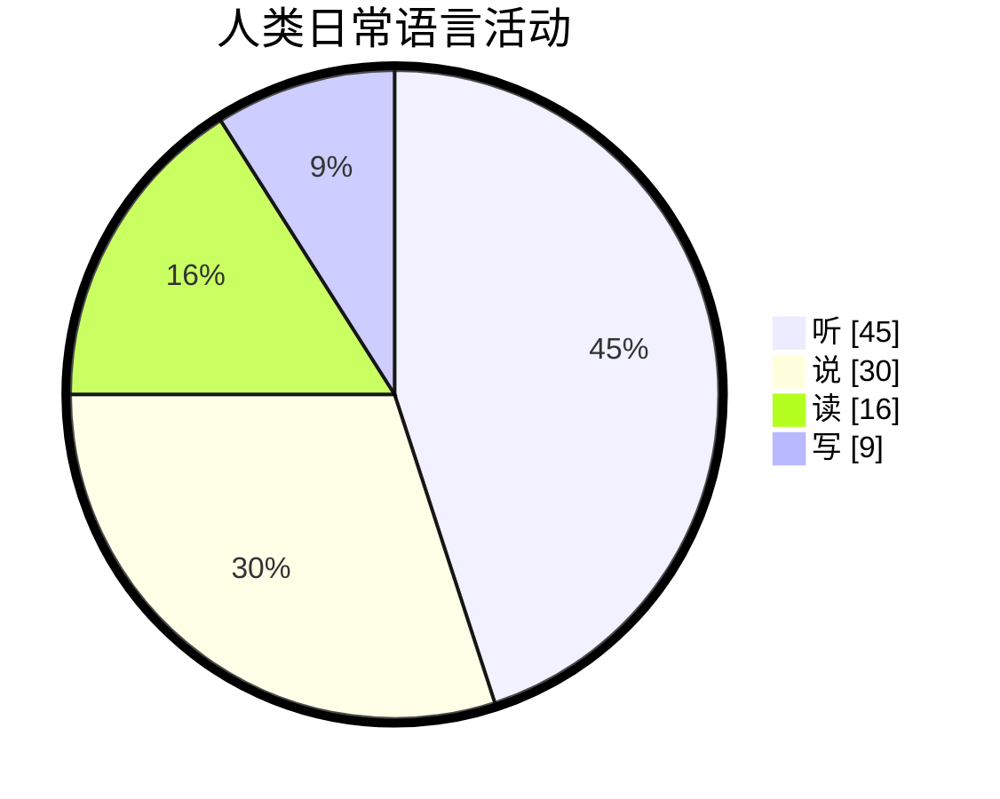

# 文档说明

本文档主要记录在原力英语跟着艾力老师学习到的所有英语知识。

部分英语学习的通用知识，还会总结在这篇文档中：[✅英语学习-通用总结-md](./英语学习-通用-Gem.md)。

本文档还会不间断的更新，如果大家觉得写的不错，欢迎收藏转载或加星哦。😀😄😁💖💗💞。

| 文档名称     | 原力艾力英语学习笔记 |
| ------------ | -------------------- |
| 文档分类     | 英语学习             |
| 版本号       | 1.3                  |
| 最后更新日期 | 2024-01-10           |
| 最后更新人   | Gem Shen             |
| 编制日期     | 2023-12-28           |
| 编制人       | Gem Shen             |

# 文档更新记录

| 版本 | 编制/修改人 | 修改日期   | 备注（原因、进一步的说明等）                           |
| ---- | ----------- | ---------- | ------------------------------------------------------ |
| 1.0  | Gem Shen    | 2023-12-28 | 初版                                                   |
| 1.1  | Gem Shen    | 2024-01-02 | 加入[托福学习规划](#学习规划)，[每日晨读](#每日晨读)。 |
| 1.2  | Gem Shen    | 2024-01-03 | 加入记忆章节，用于记忆学习过程中的词汇。               |
| 1.3  | Gem Shen    | 2024-01-10 | 补充英语[听力提升方法](#2.听力)。                      |
|      |             |            |                                                        |
|      |             |            |                                                        |

 

# 每日晨读

这里记录每天跟着艾力老师晨读的记录，有些内容可能暂时不知道怎么归类，思考太久跟不上直播速度。直播后再次整理消化。

## 2024-01

### 2024-01-01 星期一

Be faithfull in small things because it is in them that your strength lies.

leap year.闰年

My new year's resolution is to learn english well

Bless you! 祝福你

### 2024-01-02 星期二

happy new year.

Wish you + 名词.例如：wish you health and wealth.

bluetooth headset.蓝牙耳机

I have learnd to seek my happiness by limiting my desires, rather than in attemping to satisfy them.

我学会了通过限制欲望来寻求幸福而不是试图满足他们。

重音：I have learnd / to seek my happiness / by limiting my desires, rather than / in attemping to satisfy them.

pension：退休金，养老金

### 2024-01-03 星期三

Time and memory are true artists. They remould reality nearer to the heart's desire. 

时间和记忆是真正的艺术家。他们会将现实重塑的和内心的欲望更近。

句子结构：主系表。主谓宾+宾补。断句：

Time and memory are true artists./ They remould reality/ nearer to the heart's desire. 

how time flies.时光飞逝

What time is it now.现在几点了。

Time is money.时间就是金钱

virtual reality. 虚拟现实。

reality show. 真人秀

### 2024-01-04 星期四

Your ordinary acts of love and hope point to the extraordinary promise that every human life is of inestimable value.

你充满爱和希望的平凡行动指向了一个非凡的承诺：每一个人类都具备不可估量的价值。

asked me for a lift

### 2024-01-05 星期五

One's destination is never a place but a new way of seeings things.

一个人的目的地从来不是一个地方而是一种看待事物的新方式。

新概念2 Lesson 15 Good news

The secretary told me that Mr. Harmsworth would see me. I felt very nervous when I went into his office. He did not look up from his desk when l entered. After I had sat down, he said that business was very bad. He told me that the firm could not afford to pay such large salaries. Twenty people had already left.I knew that my turn had come.Mr. Harmsworth,' I said in a weak voice.Don't interrupt, he said.Then he smiled and told me I would receive an extra 1000 pounds a year!

Good news, bad news, fake news.

would see 过去将来时，Mrs已婚，miss未婚，Ms通称女士。

firm，某一领域的专业公司。company：综合大公司。

afford to do sth. 负担的起

salary 月薪, wage 周薪, annual pay 年薪, daily pay 日薪, 欧洲用周薪比较多。

my turn have com. 轮到我了。

### 2024-01-06 星期六

Enthusiasm is the mother of effort and without it nothing great was ever achieved.  -Ralph Waldo Emerson

Enthusiasm is the mother of effort, and without it nothing great was ever achieved.‧ 

Enthusiastic 热情的。passionate 有激情的

phychology today 今日心理学

### 2024-01-08 星期一

Don't judge each day by the harvest you reap but by the seeds that you plant.‧ Robert Louis Stevenson
不要以收获来评价每一天，而要以播下的种子来评价每一天。– 罗伯特·路易斯·史蒂文森

### 2024-01-09 星期二

A good painting to me has always been like a friend. It keeps me company, comforts and inspires. -Hedy Lamarr

一副好画总是像一位老朋友，它一直陪伴我，安慰我，激励我。–海迪·拉马尔

海迪·拉马尔，毕业于德意志剧院附属戏剧学校，美国女演员。20世纪40年代，她提出把控制信号切换成不同频率以防敌方干扰。这一思想启发了科学家George Antheil，开发出信号的同步功能。

keeps sb company, company是形容词，comforts and inspires是动词，省略了me，和keeps平行。

sth be like a friend. 某些东西就像一个朋友。

### 2024-01-10 星期三

The world of reality has its limits; the world of imagination is boundless. ‧ Jean-Jacques Rousseau 

现实世界有其范畴,想象的世界则有无限可能。– 让-雅克·卢梭

reality /riˈæləti/  n.真实

boundless /ˈbaʊndləs/  adj.无限的

### 2024-01-11 星期四

If you wish to succeed in life, make perseverance your bosom friend, experience your wise counselor, caution your elder brother, and hope your guardian genius.‧ Joseph Addison

如果你希望人生成功，当以恒心为知友，以经验为谋士，以谨慎为兄长，以希望为守护神。—约瑟夫·艾迪生
约瑟夫·艾迪生，英国散文家、诗人、辉格党政治家。曾在牛津大学求学和任教，并去欧洲大陆旅行多年。他与斯蒂尔合办《闲话报》(1710)和《旁观者》(1711)等刊物。为英国散文大师之一。写有诗篇《远征》、悲剧《卡托》以及文学评论文章等。
重点词汇注释 
perseverance /ˌpɜːrsəˈvɪrəns/  n.毅力，不屈不挠的精神
wise /waɪz/  adj.（行为或决定）明智的，高明的  v.了解，知道
counselor /ˈkaʊnsələr/  n.顾问，咨询师
guardian /ˈɡɑːrdiən/  n.监护人；守卫者，保护者  adj.守护的
genius /ˈdʒiːniəs/  n.天赋，天资；天才，智商很高的人 

新概念 Lesson19 Sold out

The play may begin at any moment,' I said.It may have begun already,' Susan answered.I hurried to the ticket office. 'May l have two tickets please ?' I asked.I'm sorry, we've sold out,' the girl said. What a pity!' Susan exclaimed.
Just then, a man hurried to the ticket office. Can I return these two tickets?' he asked.Certainly,' the girl said.
I went back to the ticket office at once. Could I have those two tickets please ?' I asked.
Certainly, 'the girl said, but they are for next Wednesday's performance. Do you still want them? I might as well have them,' I said sadly.

### 2024-01-12 星期五

You will find as you look back upon your life that the moments when you have truly lived are the moments when you have done things in the spirit of love. ‧ Henry Drummond

当你回顾你的生活时，你会发现，当你真正活过的时候，正是你怀着爱的精神去做事情的时候。–亨利·德拉蒙德
亨利·德拉蒙德是一位苏格兰传教士、生物学家、作家和讲师。他的布道“世界上最伟大的事情”很受欢迎，他把一种充满仁爱的品质称为世界上最伟大的事物。
重点词汇注释 
moment /ˈmoʊmənt/  n.片刻，瞬间；某一时刻；现在，目前  
truly /ˈtruːli/  adv.真实地，如实地；真正地，完全地
spirit /ˈspɪrɪt/  n.精神，心灵；情绪，心境  v.偷偷带走，秘密弄走

Lesson20 One man in a boat

Fishing is my favourite sport. I often fish for hours without catching anything. But this does not worry me.Some fishermen are unlucky. Instead of catching fish,they catch old boots and rubbish.I am even less lucky.lnever catch anything-not even old boots. After having spent whole mornings on the river, l always go homewith an empty bag.You must give up fishing!' myfriends say.lt's a waste of time.' But they don't realizeone important thing.I'm not really interested in fishing.l am only interested in sitting in a boat and doing nothingat all !

badminton：羽毛球

favourite  等价于 favorite

看到老外打喷嚏可以说：bless you

### 2024-01-13 星期六

Great nations write their autobiographies in three manuscripts - the book of their deeds, the book of their words and the book of their art.   -John Ruskin
伟大的民族将他们的自传写在三种手稿中——他们的行为之书，他们的话语之书和他们的艺术之书。– 约翰·拉斯金
约翰·拉斯金，英国作家、艺术家、艺术评论家，维多利亚时代艺术趣味的代言人。他一生为“美”而战斗。他的文字也非常优美，色彩绚丽，音调铿锵。如《现代画家》和《往昔》，都是散文中的佳作。

autobiography /ˌɔːtəbaɪˈɑːɡrəfi/  n.自传；自传体写作
manuscript /ˈmænjuskrɪpt/  n.手稿，原稿；手抄本，手写本  adj.手写的
deed /diːd/  n.行为，行动；契约，证书  v.立契转让

### 2024-01-14 星期日

To know how to grow old is the master work of wisdom, and one of the most difficult chapters in the great art of living. -
Herman Melville
知道如何变老是智慧的杰作，也是伟大的生活艺术中最困难的章节之一。–赫尔曼·梅尔维尔
赫尔曼·梅尔维尔，19 世纪美国最伟大的小说家、散文家和诗人之一，英国作家毛姆认为他的《白鲸》是世界十大文学名著之一，其文学史地位更在马克·吐温等人之上。梅尔维尔也被誉为美国的“莎士比亚”。
重点词汇注释
master /ˈmæstər/ adj. 精通的；最重要的，主要的；master work：杰作
Wisdom /ˈwɪzdəm/ n.智慧，才智；明智；学问，知识；普遍。
the great art of living：伟大生活艺术。

### 2024-01-15 星期一

The courage to imagine the otherwise is our greatest resource, adding color and suspense to all our life. -Daniel
J. Boorstin
敢于想象不一样的事情是我们最大的资源，它为我们的生活增添了色彩和悬念。–丹尼尔·J·布尔斯廷
丹尼尔·J·布尔斯廷是美国著名文学派史学家，也是曾获普利策奖的《美国人》三部曲的作者。1989 年，布尔斯廷因其一生对文学的卓越贡献，荣获美国国家图书奖。他曾任美国国会图书馆馆长达 12 年之久。
重点词汇注释
courage /ˈkɜː rɪdʒ/ n.勇气，胆量
otherwise adv/adj. 否则，不然；除此以外，在其他方面；不同地，另外地；以其他方式
Suspense /səˈspens/ n.焦虑，悬念，兴奋

### 2024-01-16 星期二

Love is always open arms. If you close your arms about love you will find that you are left holding only yourself. -Leo Buscaglia

爱永远张开双臂。如果你对爱合上双臂，你会发现只剩下了你自己。——利奥·巴斯卡利亚
利奥·巴斯卡利亚博士是世界著名的演说家和作家，他一生致力于推展广义的“爱”，美国的大众传播界称他为“拥抱博士”。代表作品有《彼此相爱》《生活、爱、学习》《爱》《开往天堂的9路巴士》等。

# 学习规划

## 托福

## 一．学习阶段

托福是从**听、说、读、写**四方面进行英语能力全面考核的国际考试，原力课程从听说读写四个方面入手，可以从课表以及课程体系看到两者的适配程度之高。
如何利用原力课程达成目标：

1. A1、A2、B1、B2、C1必修课，从音标入手，纠正听说，逐步深入，打通读写。(托福高分冲刺的话，需要把C1课程也掌握的呦~)
2. **选修课新概念3**内容结合托福真题、模拟题进行练习
3. 听力/单词/阅读/口语练习贯穿备考整个阶段

## 二、学习时间规划表

1.课程更新时间表(适合学习时间不是很充足的童鞋)

|             | 周一         | 周二         | 周三         | 周四         | 周五         | 周六         | 周日         |
| ----------- | ------------ | ------------ | ------------ | ------------ | ------------ | ------------ | ------------ |
| 6:30~7:30   | 晨读         | 晨读         | 晨读         | 晨读         | 晨读         | 时事新闻     | 晨读答疑     |
| 19:00~20:00 | 系统方法课   | 复习         | 系统方法课   | 复习         | 系统方法课   | 复习         |              |
| 21:00~21:05 | 睡前名著故事 | 睡前名著故事 | 睡前名著故事 | 睡前名著故事 | 睡前名著故事 | 睡前名著故事 | 睡前名著故事 |

 2.原力英语周计划表(适合学习时间相对充足的童鞋)

|             | 周一       | 周二       | 周三       | 周四       | 周五       | 周六       | 周日       |
| ----------- | ---------- | ---------- | ---------- | ---------- | ---------- | ---------- | ---------- |
| 6:30~7:30   | 晨读       | 晨读       | 晨读       | 晨读       | 晨读       | 时事新闻   | 晨读答疑   |
| 7:30~8:00   | 晨读打卡   | 晨读打卡   | 晨读打卡   | 晨读打卡   | 晨读打卡   | 晨读打卡   | 晨读打卡   |
| 12:00~12:30 | 闯关背单词 | 闯关背单词 | 闯关背单词 | 闯关背单词 | 闯关背单词 | 闯关背单词 | 闯关背单词 |
| 19:00~20:00 | 系统方法课 | 复习       | 系统方法课 | 复习       | 系统方法课 | 复习       | 复习       |
| 20:10~21:00 | 复习整理   | 老友记     | 复习整理   | 老友记     | 复习整理   | 老友记     | 老友记     |
| 21:10~21:20 | 课后练习   | 休息       | 课后练习   | 休息       | 课后练习   | 休息       | 休息       |
| 21:30~22:20 | 休息       | 休息       | 休息       | 休息       | 休息       | 休息       | 休息       |
| 22:30       | 睡前故事   | 睡前故事   | 睡前故事   | 睡前故事   | 睡前故事   | 睡前故事   | 睡前故事   |

周计划表只是推荐时间哈，同学可以参考一下，根据自己的具体时间来进行自己的学习安排~

## 三、学习方法

### 任何领域优秀要素

要在任何领域变得优秀必须具备如下要素 Excellent in any field

- scientific method (好方法) 
- excellent teacher (好老师) 
- instant feedback (有反馈)
- long-term effort (能坚持)

在开始必修课之前，不管咱们什么阶段，老师建议咱们先去看**艾力原力英语学习秘籍：这是艾力老师教给咱们的方法论（单词如何记、语法怎么学、听力如何练、口语怎么进步、阅读如何拓展、写作如何入门）**

(1) 重新认识英文的起源，了解英语学习的基本规则

(2) 熟练掌握26个字母的读音写法，学习北大艾力老师教授的正确的单词、语法、听说读写学习方法，从而提升学习效率，做到事半功倍

**查找路径：打开橙啦APP-学习-正在学习的课-原力英语-选修福利课—已授课程-零基础课程-艾力英语学习秘籍**

### 1.单词

我们可以选择单词书来背，也可以选择橙啦背单词的VIP词书进行背诵，选择对应的**托福**词书就可以啦。老师建议咱们单词书跟APP配合使用，效果会比较好。另外在写模拟题或者真题的过程中也要有积累单词的意识。

**查找路径：打开橙啦APP---点击练习---背单词---选择闯关模式---点击选择托福词书进行背诵**

#### 单词如何记

记忆规律

- 不要强度，要频率
- 兴奋和半饥饿状态

记忆方法

- 自然积累，培养语感
- 有效积累，阅读文章时记忆
- 有序积累，词汇深度

复习

- 使用app刷单词
- 速度文章，提升熟练度
- 输出倒逼输入

### 2.听力

#### 听力的重要性

据美国保罗·兰金(Paul Rankin)教授统计，在人类的日常语言活动中，“听”占人们日常语言活动的45%，"说”占30%，“读”占16%，“写”仅占9%

由此可见“听”在语言交流中的重要地位。提高听力不仅有利于说、读、写这三项技能的发展，还为
开展日常交际打下坚实的基础。

#### 核心原则

一句话说明听力提升的核心原则：听口不分家。不要单练听力，不练口语。

听力好的口语差不到哪里去，反过来口语好的人听力也差不到哪里去。

#### 听力4大障碍

中国人听力的4大障碍。

- 听不清(50%)
  - 听不清的意思是，别人正确发音了，可能语速也不快，但你就是不清楚他说的是啥
  - 每个单词在脑海中的记忆必须正确。首先通过正确跟读解决自己发音的问题，才能听清别人说的。
    - 例如：debut /deɪˈbjuː/，chef /ʃef/，exit /ˈeksɪt/，today is the debut of this chef, let's go and find the exit.
  - 听懂日常话题交流：念对发音，做好跟读。
- 听不懂(35%)
  - 听不懂指的是，每个单词都听出来了，但是合在一起不知道什么意思。
  - 听不懂的主要原因是英语中的很多固定表达，习语，或者句子不懂其中的意思。
  - 解决办法：听懂高频话题交流，积累习惯表达。由听到说和写。
- 听不快(10%)
  - 听不快是指慢的时候能听懂，但老外一说快，就听不出来他说的是啥。
  - 原因：老外在实际口语中，会有各种连读，重读弱读等等情况。
  - 解决方案：针对一般考试，多和老外正式交流，做好影子跟读。
- 记不住(5%)
  - 记不住是指听到了之后，抓不住或者记不住对方的重点。
  - 解决方案：针对高级考试，翻译工作者: 速记符号。

#### 听力能力与考试提分

跟读模仿是基础

熟悉题型是关键

泛听别自欺欺人

精听要精益求精

#### 听力材料选择

- 新闻
  - VOA，BBC
- 电影
  - 所有的迪士尼电影（发音都很标准），例如：阿拉丁，美女与野兽，寻梦环游记。
  - 记录片类电影。
- 音乐
  - BillBoard (https://www.billboard.com/) ，美国音乐排行榜。
- 电视剧
  - 老友记，IT狂人
- 演讲
  - TED

A2部分：听口实战应用

B1部分：新闻美剧听说+专项词汇拓展

推荐：新概念3，新概念3选修课

#### "艾马式”听力练习法

注意: 材料选择一分钟以内最多五分钟

1. 盲听3遍
   1. 听完之后也可以选择直接听写，但是这个方法比较耗时间。
   2. 听写可以检查自己对单词的拼写。

2. 排除文本理解障碍
   1. 比对文本，查没听懂的地方
3. 朗读3遍
4. 有文本跟读纠音
   1. 将自己原音与标准读音对比
5. 无文本同步模仿跟读

### 3.口语

A1部分：完美发音基础+日常对话

A2部分：听口实战

B1部分：正式场景表达+新闻美剧听说

B2部分：全场景覆盖表达

C1部分：英语演讲训练

#### 口语提升方法

口语学习误区

没有语言环境、发音必须完美必须积累大量词汇

朗读材料

系统课、每日金句、新概念123、老友记

复述

课程回顾/金句改写文章转述/台词运用/多邻国练习

表达

回答问题/角色扮演/口头作文

### 4.阅读

B1部分：专项词汇拓展+原著拓展阅读

B2部分：经典外刊阅读

C1部分：高级别学术阅读

阅读刚开始要进行泛读跟精读结合。第一遍咱们先读个大概，划出不会的单词跟固定搭配，然后先不要急着查单词，根据上下语境先猜单词的大意。第二遍查单词的意思并且翻译全文。

阅读做题方法：先读题目，划出关键词，在文章中找出定位句，仔细梳理，划分句子主干，抛开迷惑成分。

#### 阅读怎么扩展

阅读的障碍，单词不知/语法不明/段落不清晰/篇章不理解

精读

精读内容：新概念1、晨读、系统课

要求：逐字理解、逐句翻译、大声朗读、举一反三

泛读内容

泛读内容：新概念234、每天睡前故事兴趣爱好拓展、外刊

要求：理解大意、小声默读、少查多猜、锻炼阅读耐力

推荐找书的网站：https://hub.lexile.com/find-a-book/search

### 5.写作

A2部分：读写专项训练
B2部分：学术写作训练

前期可以仿写晨读金句，金句里有很多素材可以积累，在考试的时候要选择合适的进行运用。如果咱们基础差的话，建议先从仿写句子开始，一天可以先写5句话的笔记，可以发给辅导老师，老师帮助你修改哦~

写作如何入门

误区：必须写很长很难，追求一次完美。

标准：语法准确、用词恰当、言之有物

法则：先讲观点，再给故事，最后写意义。

层次：抄写、改写、原创（从简单句开始、英文日记、书评）

### 6.语法

A1部分：基础词汇精讲+核心语法体系

A2部分：核心词汇扩充+语法进阶提升+读写专项训练

语法如何学习，可以查看艾力英语学习秘籍：语法如何学

体系第一。学习语法体系，不单摘。

不拘小节。

大量阅读。新概念1234，小王子，阶梯式阅读，考试阅读真题，晨读金句。

定期输出。仿写晨读金句、每天5句话日记、读书心得。

 

## 四、课程查找方式

### 1.必修课

必修课的查找方式以及晨读回放的查找方式：

必修课：登录橙啦app-点击“学习”-学习中的课-原力英语全能提升训练营（对应期数的班）-课程回放即可查看必修课回放哈 

晨读：打开橙啦APP—点击学习—原力英语全能提升训练营xx期—课程回放—直播：每日晨读+艾力看世界
 （请注意哦，每周六是外刊讲解是在艾力看世界哦）

必修课课表：参考`原力英语-艾力-课程表.jpg`

 

### 2.选修课

新概念选修课以及学习秘籍的查找方式

选修课：登录橙啦app-点击“学习”-学习中的课-原力英语选修福利课（对应期数的班）-课程回放即可查看选修课回放哈 ~

学习秘籍：打开橙啦APP---点击学习---原力英语全能提升训练营（对应期数的班）—课程回放—导学秘籍课：艾力原力英语学习秘籍 即可进入

## 五、必修课怎么学

在上课之前呢，老师建议咱们准备三个笔记本：**晨读+必修课+老友记**

### 1.晨读

每天的晨读不管是看直播还是录播一定每天坚持下去听下去，晨读金句选取的都是一些非常经典的名人名言，在讲解过程中会讲解短语、句型结构，同时带领我们进行拓展练习。

晨读安排（直播课）

时间：6:30~7:30，周一到周日

周一到周五还会讲解新概念二，周六外刊，周日答疑

### 2.必修课

跟随咱们每周一三五的学习节奏来就好啦,老师要明确的一点是，必修课学习一定要按部就班，课程要看会吸收、而不仅仅是追求量，把课程看完。

PS：同学在学习的时候一定要备个笔记本哈~

### 3.老友记

想提升口语能力老师建议咱们一定要跟着艾力老师学习老友记，老友记当中有非常多常见的口语表达方式。老师希望你坚持学习老友记，老友记导学课里面讲解了怎样通过三遍法提升自己的口语，如果你能坚持跟着老友记学习的话，你的口语提升会特别大。

这个是老师专门给咱们整理的老友记学习的方法：

学习方式

- 微信小程序学习（每天学一集）
  - 看视频片段
  - 听艾力老师音频讲解
  - 看下方文本(pdf)
- 如何打卡（根据自己喜好来选择)
  - 录音打卡
  - 笔记打卡
  - 视频打卡

学习方法

- 第一遍看剧情
- 第二遍学台词
  - 重点关注字幕 (中英文对不上的表达就是知识盲区，重点记笔记)
  - 输出，要活学活用(造句，运用在日常生活中）
- 第三遍练配音

  - 重点模仿语音语调、重读弱读
    - 这部分就是有的同学每个单词发音可以，但是句子缺少
      感觉的原因
  - 推荐软件
    - 英语流利说
    - 英语趣配音

PS：老友记是在微信小程序里学习的，APP中没有对应的课程哦~

## 五、托福考试

### 1.考试内容

托福考试，对阅读、听力、口语。写作能力进行综合测评。考试不遇到加试的话，一共3个小时，考试顺序为阅读、听力，休息10分钟，口语、写作。

#### 阅读

阅读文章节选自大学程度的教科书，涉及某个学科或主题。 阅读部分主要测试考生阅读并理解教科书和其他用英语写成的学术资料的能力。

内容：3-4篇文章，每篇文章有10个问题 

分数范围：0-30 分 

考试时长：54-72 分钟

考察要点：

阅读文章涵盖各种不同科目的内容。如果考生对某个主题不熟悉，不必担心，回答问题所需的信息全部包含在文章中。 

阅读文章可划分为三种基本类型： 解释说明型（exposition）、立论型（argumentation）、历史题材型（historical）。

 通常，一篇文章会对关于主题的信息从不同的角度或观点进行阐述。这一点我们在阅读过程中要特别注意。 通常题目中至少会有一道题考查考生是否理解全文的结构。

常见的文章结构大致有以下几种：分类（classification）、比较/对比（compare/contrast）、原因/结果（cause/effect）、问题/解决方法（problem/solution）。

在回答阅读部分的问题时，考生不需要知道任何特殊的背景知识，但文章会对比较难的单词或短语给出解释。 

阅读部分考察的4种题型：传统的单项选择，即题目带有4个选项，只有一个正确答案、多项选择题，即题目有多个选项，正确答案也不只一个、插入题，题目带有4个选项，只有一个正确答案，要求考生在文章中最合适的位置“插入一句话”总结题六选三，深入理解类题目，即题目有 4 个以上的选项，而且有不止一个正确答案。

#### 听力

听力考试的听力材料包括讲座,课堂讨论以及对话,主要测试考生在学术环境中理解口语的能力。在整个测试过程中,考生可以对回答问题时可能用到的内容做笔记。

内容：2-3 个Conversation和 3-4 个 lecture，每个Conversation包含5个问题，每个 lecture 包含6个问题。

分数范围：0-30 

考试时长：41-57 分钟

考察要点：

考试所选的讲座材料均真实反映了课堂上的听说情景。在一些讲座中，教授满堂灌输，偶尔有学生提问或提出意见;在另外一些讲座中，教授可能会通过提问题鼓励学生参与讨论。听力对话场景可能是学生与教授或助教在办公室的交谈，或者是学生和大学工作人员之间有关服务方面的对话办公室对话的内容通常与学术内容或课程要求有关。服务对话的内容是关于非学习的校园活动，如缴纳公寓住宿费、课程报名或者在图书馆询问信息。

听力部分包含四种题型:单项选择题：4 个选项，只有1个正确答案、多项选择题：多个选项,正确答案不止1个、排序题：排列时间的先后顺序,或排列某个过程的步骤、搭配题：将一些对象或文本与图表中的分类进行搭配，或在单元格里打钩排序题和搭配题在实际考试的时候，出现的几率不大。但是在新流出的TPO56-65里面，出现了排序题和搭配题，这类题目本质上还是细节题，考察的是考生有没有真正听懂文章里列举的例子。

#### 口语

考生应该在课堂内外成功应用英文与人交谈。口语部分考查考生在学术环境和校园生活中有效交谈的能力。

内容：4道试题，独立口语1道，综合口语3道。

分数范围：0-30 分 

考试时长：17 分钟

考察要点：第1道题是独立口语任务，题目内容涉及考生熟悉的话题。这道题要求考生依据自己的想法、观点和个人经历作答，也可利用任何与题目有关的想法、观点或经历来回答。 另外 3 道题是综合口语任务。回答这类题时，考生必须综合利用多种语言技能。要求考生首先读，听，然后用口语作答。考生可以记笔记，并利用这些笔记回答问题。和雅思不一样，托福口语部分一样是机考。考生利用带有麦克风的头戴式耳机回答所有口语题目。考生对麦克风讲话的内容将被录音。回答经数码技术处理后被传送至 ETS，然后由经认证的评分员评分。

#### 写作

在所有要求用英语写作的学术领域中，考试必须能够用清晰、有条理的方式陈述自己的观点，以此来考察学生的英文写作能力。

内容：两道题目，一道综合写作，一道独立写作。

分数范围：0-30分

考试时长：50分钟

考察要点：

通常考生需要用课上学到的知识写论文和作文。这要求考生能够将课堂，讲座内容与阅读教材和其他材料相结合，这种类型的写作被称为综合写作。在这种写作题型中，考生必须对听到和看到的材料做笔记，在写作前利用笔记组织信息准确地从原文材料中总结、释义和引用信息写出听到的信息与读到的信息之间是如何联系的。

考生还必须会写表达并支持自己观点的论文，这种类型被称为独立写作。在这种写作题型中，考生需要依据自身的只是和经历表达并支持一种观点。具体步骤如下：

1. 确定 1 个主题思想以及支持该思想的重要观点 
2. 计划如何组织论文（例如，利用提纲）
3. 利用推论、例证和细节展开论述 
4. 使用有条理的方式表达信息 
5. 运用有效的连接词（过渡词组）来连接观点，帮助读者理解思路的脉络
6. 运用语法和词汇有效表达 
7. 准确地使用语法和词汇；恰当地使用习惯用语
8. 遵循拼写，标点和格式的惯例

### 2.真题如何用

第一：真题很重要，我们可以在考前拿以往真题来熟悉考试试卷分布，我们都知道平时准备80%，考场只能发挥60%，所以一定要在平时备战的时候付出120%的努力，才能收获好的效果。

第二：真题怎么用。真题在我们打好单词和语法的基础后，在语法知识基本完备的情况下，去进行真题的练习。不要写完对完答案就结束，一定要对于错的题进行分析，是语法不熟悉还是固定搭配没有积累到，还是咱们的单词没记住。将错误的知识点写在卷子前面（可以拿纸记好，然后用胶带固定到卷子前面），便于复习。

复盘：学会总结归纳，写作口语经常练，多还原场景。

最后哦，一定要进行模拟练习，还原考场环境以及时长，在正式考试之前，最少进行5次模拟练习！！！

## 总结

结合考试内容老师给同学规划的具体学习内容为：

导学课—学习规划+A1-C1阶段必修课+新概念3选修课+晨读+睡前故事

**（注：必修课要反复听，要学会而不是简单的看完就行）**

最后呢，希望同学能够利用原力课程达成自己想要的目标，学习过程中遇到任何问题都随时跟老师沟通哦，以后的学习路上有老师相伴！

# 记忆

本章节用于记忆英语学习过程中出现的单词，词汇或表达。刚录入时忘记列 = 1，后续每天检查一遍自己是否记住。如果记住则记住列+1，如果忘记则忘记列+1，一直记忆到：记住 - 忘记 > 3 为止。

## 老友记

| 英语单词                                     | 忘记 | 记住 | 位置 | 中文含义             |
| -------------------------------------------- | ---- | ---- | ---- | -------------------- |
| hump                                         | 1    | 5    | 1    | 驼背                 |
| hairpiece                                    | 1    | 5    | 1    | 假发                 |
| chalk                                        | 1    | 5    | 1    | 粉笔                 |
| what I go through with carl                  | 1    | 5    | 1    |                      |
| cafeteria                                    | 1    | 5    | 1    | 自助食堂             |
| all of a sudden                              | 1    | 5    | 1    | 突然                 |
| drift apart                                  | 2    | 6    | 1    | 渐行渐远             |
| stop cleansing my aura                       | 2    | 6    | 1    | 别在净化我的灵气     |
| Be murky                                     | 1    | 5    | 1    | 保持朦胧阴沉         |
| to hell with her                             | 1    | 5    | 1    | 去她的               |
| episode                                      | 1    | 5    | 2.1  | 集                   |
| are you through with that                    | 1    | 5    | 2.1  | 你喝完了？           |
| little ball of paper                         | 1    | 5    | 2.1  | 小纸团               |
| glare at                                     | 1    | 4    | 2.1  | 怒视                 |
| fluff a pillow                               | 1    | 4    | 2.1  | 拍枕头               |
| ammunition                                   | 2    | 5    | 2.1  | 把柄，弹药           |
| be like all chaotic and twirly               | 1    | 4    | 2.1  | 好像非常慌乱         |
| as far as I am concerned                     | 1    | 4    | 2.1  | 就我而言             |
| right about now                              | 1    | 4    | 2.2  | 此时此刻             |
| put sth in perspective                       | 1    | 4    | 2.2  | 客观看待某件事       |
| I don't have to be involved                  | 1    | 4    | 2.2  | 我不需要被卷入       |
| I mean presumably                            | 2    | 5    | 2.2  | 我觉得大概           |
| this is still ruined                         | 1    | 4    | 2.2  | 这仍然被搅乱了       |
| have a thing for                             | 1    | 4    | 2.2  | 挺喜欢               |
| let your wrist go                            | 1    | 4    | 3.1  | 你手腕放松           |
| fist                                         | 1    | 4    | 联想 | 拳头                 |
| take a puff                                  | 2    | 3    | 3.1  | 吸一口               |
| cigarette                                    | 1    | 4    | 3.1  | 香烟                 |
| cigar                                        | 1    | 4    | 联想 | 雪茄                 |
| monthly statement                            | 1    | 4    | 3.2  | 月度对账单           |
| Satan's minions at work again                | 2    | 4    | 3.2  | 撒旦的奴才又开始作乱 |
| let's say                                    | 2    | 3    | 3.2  | 我们假设             |
| we are with you                              | 1    | 4    | 3.2  | 我们支持你           |
| giant karmic debt                            | 2    | 3    | 3.2  | 巨大的业债           |
| Hold on a second                             | 1    | 4    | 3    | 等一下               |
| have to live with the knowledge that         | 2    | 3    | 3.1  | 不得不接受这个事实   |
| sent sb to do sth                            | 1    | 4    | 3    | 送某人去做某事       |
| recessionary uplift                          | 2    | 3    | 3    | 经济衰退加剧         |
| the thing that's been missing from your hand | 2    | 3    | 3    | 手中那件思念已久东西 |
| neurosis                                     | 2    | 3    | 3    | 神经病               |
| you got way too much free time               | 1    | 1    | 4.1  | 你真是太闲了         |
| hockey tickets                               | 1    | 1    | 4.1  | 冰球门票             |
| Rangers - Penguins                           | 1    | 1    | 4.1  | 游骑兵队和企鹅队     |
| decide which one of you got to bring a date? | 1    | 1    | 4.1  | 决定谁可以带一个伴   |
| Mr the glass is half empty                   | 1    | 1    | 4.1  | 悲观的人             |
| pay check                                    | 1    | 1    | 4.2  | 工资单               |

## 睡前故事

### 魔鬼的三根金发

睡前故事-安徒生童话

| 英语单词                  | 忘记 | 记住 | 位置       | 中文含义     |
| ------------------------- | ---- | ---- | ---------- | ------------ |
| give birth to a little son | 1 | 6 | 1 | 生了个小儿子 |
| with a caul on | 1 | 5 | 1 | 头上包着胎膜 |
| it is predicted that | 1 | 5 | 1 | 据(大家)预测 |
| soon afterwards | 1 | 5 | 1 | 不久之后 |
| have a bad heart | 4 | 8 | 1 | 心眼很坏 |
| prophecy | 3 | 8 | 1 | 预言 |
| consent | 1 | 5 | 1 | 同意 |
| unlooked-for suitor | 4 | 7 | 1 | 没有预料到的追求者 |
| make its way into | 1 | 6 | 2 | 逐渐进入 |
| chief city | 1 | 5 | 2 | 京城，主城 |
| metropolis | 2 | 6 | 联想 | 大都会，首都 |
| come to a stand-still | 4 | 6 | 2 | 停滞不前 |
| mill dam | 1 | 6 | 2 | 磨坊水坝 |
| miller's boy | 1 | 5 | 2 | 磨坊主的学徒 |
| by good luck | 1 | 5 | 2 | 正好，侥幸 |
| quite fresh and lively | 1 | 5 | 2 | 非常稚嫩和活泼 |
| foundling | 2 | 5 | 2 | 弃儿 |
| grew up in all goodness | 1 | 5 | 2 | 成长为一个具备所有美德 |
| mill folk | 1 | 5 | 2 | 磨坊夫妇 |
| tall youth | 1 | 5 | 2 | 高个年轻人 |
| a den of thieves | 1 | 4 | 4 | 贼窝 |
| out of pity | 1 | 5 | 4 | 出于同情 |
| wedding feast | 1 | 4 | 5 | 婚宴 |
| handsome and agreeable | 1 | 4 | 5 | 英俊和随和 |
| come to pass | 1 | 4 | 5 | 发生，通过 |
| quite another | 1 | 4 | 5 | 完全不同的 |
| see quite well | 1 | 4 | 5 | 看的很清楚 |
| entrusted | 1 | 4 | 5 | 委托，信托 |
| have everything quite so much your own way | 1 | 4 | 5 | 随心所欲地的拥有一切 |
| thereupon | 3 | 4 | 6 | 于是，随即 |
| take leave of | 1 | 4 | 6 | 告别并离开 |
| watchman | 1 | 4 | 6 | 看守人 |
| what his trade was | 1 | 4 | 6 | 他是做什么的 |
| do us a favor | 1 | 4 | 6 | 帮我们个忙 |
| market fountain | 1 | 4 | 6 | 市集上的喷泉 |
| put forth leaves | 2 | 4 | 6 | 植物长出新叶子 |
| sooty | 1 | 4 | 7 | 煤烟熏黑的 |
| arm-chair | 1 | 4 | 7 | 扶手椅 |
| wicked | 1 | 4 | 7 | 邪恶的 |
| folds of my dress | 1 |  | 8 | 我裙子的褶皱 |
| so far so good | 1 |  | 8 | 目前为止一切顺利 |
| there are three things besides | 1 |  | 8 |  |
| No sooner ... than he noticed that | 1 |  | 8 | 刚一 ... 就 |
| pry into | 1 |  | 8 | 窥探，试图了解不想让他知道的 |
| scold | 1 |  | 8 | 责骂，训斥 |
| put in order | 1 |  | 8 | 整理有序 |
| ferry-man                 | 1    | 5 | 12 | 船夫         |
| luck-child                | 1    | 5 | 12 | 幸运之子     |
| be set free               | 1    | 5 | 12 | 被释放       |
| oar                       | 2    | 6 | 12 | 船桨         |
| wherein                   | 1    | 5 | 12 | 在其中       |
| unfruitful                | 1    | 5 | 12 | 不结果实的   |
| gnawing at its root       | 1    | 5 | 12 |              |
| bear golden apples        | 1    | 5 | 12 | 结出金苹果 |
| give wine in plenty       | 1    | 5 | 12 | 溢满葡萄酒   |
| asses laden with gold     | 2    | 6    | 13 | 驮着金子的驴   |
| had prosper in everything | 1    | 5 | 13 | 办成了所有事 |
| content                   | 1    | 5    | 13 | 满意的       |
| son in law                | 1    | 5    | 13 |女婿|
| tremendous wealth | 1 | 5 | 13 | 巨额财富 |
| be rowed across the river | 1 | 5 | 13 | 被划船送过河 |
| fill your sacks | 1 | 5 | 13 | 装满你的袋子 |
| set out in all haste | 1        |5|13|急急忙忙出发|
| beckon          | 3 | 6 | 13 | 招手示意 |
| bade him get in | 2 | 5 | 13 | 叫他进来 |
| spring out | 1 | 5 | 13 | 跳出来跑了 |

## 晨读

| 英语单词               | 忘记 | 记住 | 位置 | 中文含义     |
| ---------------------- | ---- | ---- | ---- | ------------ |
| ask me for a lift      | 1    | 5    | 晨读 | 让我捎一段路 |
| Apart from a few words | 1    | 5    | 晨读 | 除了一些词   |
| circadian rhythm       | 1    | 4    | 晨读 | 昼夜节律     |
| tissues in your liver  | 1    | 4    | 晨读 | 肝脏中的组织 |
| way to go              | 1    | 4    | 晨读 | 就该这么做   |
| perseverance           | 1    | 4    | 晨读 | 毅力         |
| experience             | 1    | 2    | 晨读 | 经验         |
| bosom friend           | 1    | 4    | 晨读 | 知己，密友   |
| wise counselor         | 1    | 4    | 晨读 | 好参谋       |
| guardian genius        | 1    | 4    | 晨读 | 守护神       |
| rumination             | 3    | 1    | 晨读 | 沉思         |
| cognitive              | 2    | 2    | 晨读 | 认知的       |
| mull                   | 1    | 3    | 晨读 | 思索或思考   |

## 零散

| 英语单词                       | 忘记 | 记住 | 位置   | 中文含义       |
| ------------------------------ | ---- | ---- | ------ | -------------- |
| athlete                        | 1    | 3    | 语法   | 运动员         |
| march into                     | 1    | 4    | 语法   | 踏步进入       |
| shake all over                 | 1    | 4    | 语法   | 全身抖动       |
| tremble like a leaf            | 1    | 4    | 语法   | 像树叶一样颤抖 |
| burglary                       | 1    | 4    | 语法   | 入室盗窃       |
| rough up a colleague           | 1    | 4    | 语法   | 粗暴对待同事   |
| in honor of                    | 1    | 4    | 语法   | 为了纪念       |
| in fovor of                    | 2    | 3    | 语法   | 支持；赞同     |
| pile                           | 1    | 4    | 语法   | 一堆，一叠     |
| old dog                        | 1    | 5    | 朋友圈 | 老手           |
| top dog                        | 1    | 5    | 朋友圈 | 老大，一把手   |
| sad dog                        | 3    | 6    | 朋友圈 | 鲁莽，放荡的人 |
| hot dog                        | 1    | 6    | 朋友圈 | 热狗，太棒了   |
| yellow dog                     | 2    | 5    | 朋友圈 | 懦夫，小人     |
| Positive words, negative words | 1    | 5    | 联想   | 褒义词，贬义词 |
| anymore                        | 1    | 4    | 背单词 | 再也不         |
| pass the buck                  | 1    |      | 抖音   | 推卸责任       |

## 名句

Successful people don't have fewer problems. They have determined that nothing will stop them from going forward. -Ben Carson

成功的人遇到的问题并不是比较少，他们只是下决心不让任务事情阻止他们前进。一本·卡森

Everything that is happening at this moment is a result of the choices you've made in the past. -Deepak Chopra

此刻所发生的所有事，都是你过去选择的结果- 狄巴克·乔布拉

The best education the parents can give to their children is to learn with them.

父母能给孩子最好的教育，就是和他们一起学习。

Learn from yesterday, live for today, hope for tomorrow.
借鉴昨天，活在今天，憧憬明天。

Enthusiasm is the mother of effort, and without it nothing great was ever achieved.

热情是努力的母亲，没有他将一事无成

Don't judge each day by the harvest you reap but by the seeds that you plant.‧ Robert Louis Stevenson
不要以收获来评价每一天，而要以播下的种子来评价每一天。– 罗伯特·路易斯·史蒂文森

A good painting to me has always been like a friend. It keeps me company, comforts and inspires. -Hedy Lamarr

一副好画总是像一位老朋友，它一直陪伴我，安慰我，激励我。–海迪·拉马尔

You will find as you look back upon your life that the moments when you have really lived, are the moments when you have done things in a spirit of love.  -Henry Drummond

当你回顾生活时，你会发现，你真正活过的时候，是你怀着爱去做事情的时候。-亨利·德拉蒙德

The courage to imagine the otherwise is our greatest resource, adding color and suspense to all our life. -Daniel
J. Boorstin
敢于想象不一样事情的勇气是我们最大的资源，它为我们的人生增添了色彩和悬念。–丹尼尔·J·布尔斯廷

# 发音

## 基础

音素：元音，辅音

单词：重音，失去爆破，浊化，三单，过去式，过去分词。

句子：语调，重音，弱读，连读，缩读

段落：意群。

连读不了，可能是因为辅音念得太重了。

## 意群

意群指句子可以按照意思和语法结构分为若干段落每一个段落就称为一个意群。它是在意思上相对完整不能再分的一个词组。在语法上密切联系，不能再分的一个词组。

一般规则如下

1.冠词与名词划为同一意群

There is <u>an English novel</u> on the bookshelf.

<u>The film</u> we saw last tight is very interesting.

2.形容词与名词划为一个意群

Please pass me <u>that red-blue pencil</u>.

I have not <u>enough money</u> to buy it.

3.系动词与表语划为一个意群。

How to go there <u>is a problem</u>.

To rise early <u>is his custom</u>.

4.介词短语划为一个意群

There are some tall trees <u>in front of the building</u>.

Keep him <u>in the dark about the matter</u>.

5.动词不定式短语划为一个意群

I refused <u>to believe the evil rumor</u>.

Because he is ill, he feels unable <u>to do it</u>.

6.分词短语化为一个意群

They lived in a room <u>facing the south</u>.

A letter <u>posted today</u> will reach him the day after tomorrow.

7.动名词短语划为一个意群。

<u>Seeing him happy</u> made me happy too.

Have you finished <u>correcting the students' papers</u>?

8.动词及其主语或宾语划为一个意群。

<u>We can sing a song</u> in English.

<u>I received a letter from him</u> after a long silence.

9.副词与动词放在一起划为一个意群

He <u>has been working hard</u> since he came here.

Now that you are a big boy, you must behave better.

10.关系词与从句、连词与其后面部分划为一个意群

We should strike <u>while the iron is white hot.</u>

Take the medicine <u>before you go to bed.</u>

He said <u>that he would come to see you soon.</u>

Do you know <u>whose pen it is?</u>

She told a story <u>which moved us deeply</u>.

### 练习

Late in the afternoon, / the boys put up their tent / in the middle of a field. As soon as this was done, / they cooked a meal / over an open fire. They were all hungry / and the food smelt good. After a wonderful meal, / they told stories/ and sang songs / by the camp fire. But some time later / it began to rain. The boys felt tired / so they pet out the fire and crept into their tent. Their sleeping-bags were warm and comfortable, / so they all slept soundly. In the middle of the night, / two boys woke up / and began shouting. The tent was /full of water! They all / leapt out of their sleeping-bags / and hurried outside. It was raining heavily / and theyfound / that a stream had formed in the field. The streamwound its way / across the field / and then flowed rightunder their tent!

## 英音美音

无论是英音还是美音其实都存在很多口音，就像中文也存在方言。我们只需要先学好标准发音就可以了。

例如，美国也有纽约腔，红脖子发音，非洲口音，墨西哥口音等等。

### 英美发音区别-辅音R

在英音中，字母r出现在元音前才发音，比如read,write。

在美音中，无论字母r出现在元音前后何种情况它都发音, 相当于汉语中的卷舌音。

### 英美发音区别-元音

元音区别:

1. 在美音中，当/a/出现在/n/ /f/ /s/ /θ/前要发/æ/，而在英音中/a:/发音不变。
   1. class, dance, after, fast, path, chance
2. 在英音中很多词读作/ɒ/的，在美音中读作/a/。
   1. box, pot, hot, not
3. 在美音中，当/ju:/出现在/n/ /d/ /s/ /t/后时发成/u:/在英音中发音不变。(不是很普遍)
   1. Tuesday, duty, tune, news
4. 少数单词在英音和美音中要重读的音节不同
   1. adult, laboratory, advertisement, necessarily

### 英美发音区别-/t/

在美音当中，/t/在单词的中间常会被浊化成/d/,

比如writer听起来和rider的发音几乎没有区别。

再如：water out of matter letter

## 绕口令

Betty Botter bought some butter."But she said, "the butter is bitter.If I put it in my batter It will make my batter bitter.But a bit of better butterThat would make my batter better."So she bought a bit of butter,Better than her bitter butterAnd she put it in her batterAnd the batter was not bitter.So it was better Betty BotterBought a bit of better butter!

### 吸血鬼

Vicky, the vampire, doesn't have wavy hair.

维琪，吸血鬼，没有卷发。

My mother and my father went through thick and thin together

我的父母同甘共苦

### 数字

3, 333, 333

### 土拨鼠

How much wood would a woodchuck chuck if a woodchuck could chuck wood?

假如一只土拨鼠能够扔掉木头，它能扔掉多少木头呢?

A woodchuck would chuck all the wood if a woodchuck could chuck wood.

如果土拨鼠能扔木头，它会把所有的木头都扔了

# 词汇

## 背单词方法

### 本源法

### 结晶法

### 演化法

通过演化法掌握好60个前缀+400人词根+40个后缀
单词量就可以实现指数级暴涨
真正理解掌握上万词汇，而不是死记硬背

ject：扔

project，向前扔

reject，往回扔

-fuse：流

confuse，流到一起，混淆

profuse
pro - 向前: fuse -流
(向前流，各种支流汇入大海，水量就变大)- 大量，丰富

refuse
re - 向后; fuse - 流
(水流受到阻碍流回去) - 拒绝

defuse
de -向下; fuse - 流
(把水往下引，避免水灾) - 平息，缓和

曾几何时，你就是这么学英语的吧
get up: 起床
get to: 抵达...地方
get back: 回来
get off: 下车
get over: 渡过
get through: 通过
get into: 进入
get out: 出去get down: 趴下
get away: 滚!

老师指着黑板说，同学们这些都是固定搭配一定要给我记住!!考试要考!! ! !

方法(1)：使用250个动词+26个介词搭配撬动3500个口语写作表达会使你的英语更加地道，表达更加丰富

# 口语

口语的问题

难听:发音不好听，有中式发音

忘词: 老是卡壳，语码混乱

短路:和老外说不了三句话，大脑突然一片空白

口语好的标准是什么？发音标准，用词准确，言之有物

托福口语评分标准

Delivery 表达呈现: 语音、语调、语流 发音标准

Language Use 遣词造句 - 用词准确

Topic Development 话题展开 -言之有物

母语陷阱

中文是一门以元音结尾的语言，但英语是以辅音结尾。

所以中国人再念what和book，but的时候会本能的加上a元音，whata，booka，buta

如何跳出母语陷阱?戏剧练习法

现在我们忘掉这个世界的存在，专注。

刚开始学口语一定要尽可能的慢且准确的去说英语，不要一上来就连声音链。

只有慢才能暴露问题。

辅音尾音母语陷阱，解决方法: 犹抱琵琶半遮面。

发音是外在
跟对老师一找到病因一方法正确+坚持练习，每个人都能掌握标准漂亮的发音W

表达技巧1:会使用口语词汇

你正在流口水：Your mouth is watering!

我老婆老是对我呼来唤去：My wife always bosses me around

口语词汇核心
Simple & useful(简单+实用)把简单词语使用到位

高考要求词汇3500

你在国外应付90%口语场景
需要多少词汇呢? 2700

口语没词，本质不是真的词汇量不够
你背的词可能远远超过口语所需的词汇量但你却一直读写背背背，词汇量就算上万你也一样开不了口因为读写背背背主要目的只是为了“认识”单词或者拿去做阅读而外国人从小就在实际情景中使用词汇
当年口语没学好，其实不能怪你你只是从没有正确系统地训练过口语表达!

Hello，Greetings!

before

My name is Wang Lu.My English name is Kate.

after

My name is Wanglu and you can call me Kate. (用活简单词)

兴趣爱好特长

before

I like reading books.I am good at time management /Maths.

after

I am fond of reading books.I excel at Time management/Maths

六、结束语:
before

Emmmm.That's all.

after

It's my pleasure meeting you

[问候] Greetings!

名字] My name is Wanglu and you can call me Kate.

(地点/现居地]Iam from Handan, Hebei. But I am

based in Beiiing now.

(学校] I go to school at Renmin University. My major is Law.

(工作]I am an IT engineer at Huawel

[擅长] I excel at time management / Maths

(爱好] And I am fond of reading books.

[结束语]Its my pleasure meeting you.

发音好听，表达流利是语言符号系统层面的口语好
而语言是用来表达思想的工具

思想:言之有物

## 句型

### 存在，有

There was once，曾今有。

例句：There was once a poor woman who gave birth to a little son ，曾经有一位贫穷的妇女，生了一个儿子。

### 预测

It is predicted that，据（大家）预测。

案例1

it was predicted that in his fourteenth year he would have King's daughter for his wife.

大家预测他十四岁那年将会迎娶国王的女儿。

It is prophesied that，有人预言（预言；受神启示而说（或写）；作为先知）

### 碰巧发生

it happened that：碰巧，恰好：表示某件事情发生正好在某个特定的时间或情况下。

案例1

lt happened that soon afterwards the King came into the village。

事有凑巧，没过多久国王就来到了村子。

# 语法

## 为什么要学语法？

晚上了不起，早上起不了，中午不起了。

你会发现了不起这三个字随便交换顺序都可以有不同的意思。

中文是强调意境的语言，意思到位形式(语法)灵活。

英文是强调形合的语言，必须形式 (语法)到位。

语法究竟是什么？语法就是2个，词法+句法。

词法：词法就是搞清楚10种词性及用法

- 名词 n.(noun)
- 代词 pron.(pronoun)
- 冠词 art.(article)
- 形容词 adj.(adjective)
- 动词 v.(verb)
- 副词 adv.(adverb)
- 数词 num.(numeral)
- 介词 prep.(preposition)
- 连词 conj.(conjunction)
- 感叹词 int.(interjection)

下文将逐一讲解。

## 词法

### 介词

#### 25个常用介词

25 Most Common Prepositions

1. of
2. in
3. to
4. for
5. with
6. on
7. at
8. from
9. by
10. about
11. as
12. into
13. like
14. through
15. after
16. over
17. between
18. out
19. against
20. during
21. without
22. before
23. under
24. around
25. among

#### as

1. 作为，当做
    1. She works as a director.
    2. Franch is known as the most beautiful language in the world.
2. 像，如同
    1. They were all dressed as clowns.
    2. The bomb was disguised as a package.

#### into

1. 进入(通常与动态动词连用)
    1. Hundreds of athletes marched into the stadium for the opening ceremony. 
    2. I wandered into the hotel bar and ordered a drink.
2. 转变成（进入一种状态）
    1. Jemma had grown into a beautiful woman.
    2. Our homework today is to translate a Chinese article into English
3. 热衷于（身心进入某件事里面）
    1. She is into yoga.

#### like

1. 像
    1. lt's nothing like what happened in the mid-Seventies.
2. 像...样(指人或事物的品质、特点) 
    1. What did she look like?
3. 例如
    1. It eats small animals like birds and mice
4. 像...一样
    1. I was shaking all over, trembling like a leaf

#### through

1.穿过，通过，从一端至另一端（从里面穿过，从表面穿过是across）

The thief got in through the window.

The hunter stalked the bear through the woods.

2.由于，因为，凭借

He became ill through overwork.

lt was through him that I missed my train. 正是因为他，我才误了火车。

3.从头到尾，从开始到结束，整段时间

He lay awake all through the night.

He has decided to prolong his visit through the weekend

#### after

1.在(一段时间) 之后

After the war, I went back to work on the farm. 

John was born not long after we moved to London.

2.追逐，追赶，追求

The police are after him for burglary.

Watch out, he’s only after your money.

3.由于，鉴于

After what he did to my family, l hate him.

He was fired from his job after roughing up a colleague.

4.模仿，仿照

He takes after his father.

This is a picture after Van Gogh. 这是一幅模仿梵高的画。

#### over

1.在...上面，在...之上，在正上方

Perry glanced at the clock over the door.

2.覆盖在.....上

She put her hands over her ears.

3.在某地方的另一头，与地点名词连用

Sandra’ s brother lives just over the road from our house.

4.超过，与数词连用
Over 50 percent of the company’s shares are owned by the government.

5.遍及，到处(通常是悬空的状态)

Children were rushing around madly all over the place.

6.控制，支配，驾驭

The king has ruled over the people for ten years.

7.在.....期间

Most hotels are fully booked over the holiday weekend.

#### between

1.在...之间

They planted a lot of trees between the two buildings

2.私下，暗中

Between ourselves, I know he wants to marry her. 我们私下谈谈（别告诉别人），我知道他想娶她。

3.来往于..之间

There is a path between the house and the road

4.由...分担 (分享)

Between them they landed the big fish. 他们共同把那条大鱼钓上了岸。

5.总共，总计

The three sites employ 12,500 people between them. 这三家工厂总共雇佣了12500名员工。

#### among

一般大于等于3个，用among

1.在...中间，被...包围

There’ s a lemon tree among birches in the backyard.

They strolled among the crowds.

2.属于...(某个群体)

A British woman was among the survivors.

You are among the fortunate.

3.在...中 (分配)，从..中 (选择)

The cost should be shared equally among the three of you.

Decide on five courses among all those the school offers.

### 动词

#### look

look的核心意思是看。他可以和下面这些词搭配。

- for，寻找，为了某个目的去看，
    - He was looking for work as a builder
    - 他正在找一个建筑者的工作
- after，照顾，在某些人后面看着他。
    - lt's hard work looking after three children all day
- over，检查，把一样东西翻来覆去的看。
    - I had a few minutes before the meeting to look over what he'd written.
- forward，期待，往前看。后面跟doing sth
    - I'm looking forward to the holidays.
- at，看（look是不及物动词不能直接接名词）
    - They looked at the picture and laughed.
- down upon/on，鄙视蔑视（往下看）
    - I am tired of the way they look down on/upon us like we aren't good
        enough for them.
- up，查找（古代的文献都是放在比较高的地方）
    - I will look it up the dictionary.
- as if/as though/like，看起来像
    - She looked as if/though she hadn't slept all night.
- through，浏览（从头到尾的看）
    - She was looking through a magazine as she waited in the doctor's office.
- back，回顾
- around/about，四处看看
- out，小心（向外看）
- into，调查（看到事情里面去）
- to，期待（看向某人）

#### put

核心意思：放

- on，穿上（把一件东西放到皮肤表面上），涂抹，点火（把东西放在火上）
- off，脱掉，推迟。
- back，放回
- into，投入
- away，收起来（放到一边）
- aside，放一边，搁置。
- up，竖立，储存
- down，放下，贬低。
- out，扑灭

#### Call

核心意思：叫，发生某种声音。

at，停靠（船靠岸时会发生声音）

on，呼吁

in，请假

up，叫起。

up，召唤，叫起来。

for，呼吁，需求。

#### work

out，解决，进展，锻炼

with，和谁打交道

on，处理

#### Get

核心意思：整

get up，起床

on，继续，乘坐，进展，相处。

off，离开，下班，请假，脱掉，逃脱。

back，回到，重新获得，收回

away，离开某个地方，逃脱

get down，趴下，记录下来，使...低落

#### try

#### send

#### think

pick

核心意思：捡

## 句法

### 五种简单句

主谓

主谓宾

主谓宾宾

you teach me english

主谓宾补

you make me sad. 你让我伤心

主系表

I feel bad. 我感觉很糟。

案例：

come.我来了

love you.我爱你

give you everything.我给了你一切。

You make me sad.你让我伤心

feel bad.我感觉很糟

为什么英文当中有且只有5种简单句?

及物动词
系动词
使役动词
谓语
不及物动词
双宾语动词

英文中有且只有5类动词

所以，英文中句子的基石是谓语

语言最初的目的，就是发出指令

同样是谓语动词，英汉大不同。英语有时态，而汉语没有。
过去
现在
将来
完成
汉语
(昨天) 吃
(明天) 吃
吃过了
英语
ate
eat / eating
will eat
have eaten

### 祈使句

#### be + adj

be faithful in small things.

Be careful

be quiet

### 强调句

#### it is ... that

it is in them that your strength lies.

## 语气

语气：否定、疑问、被动、情态、虚拟、强调

肯定语气我爱你.I love you.

否定语气我不爱你.I do not love you. 

其中do是助动词

疑问语气你爱我吗? Do you love me ?

