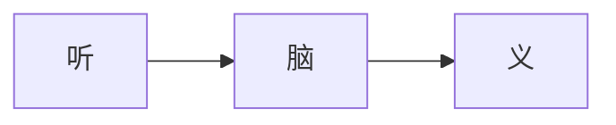
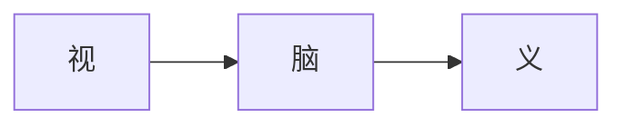
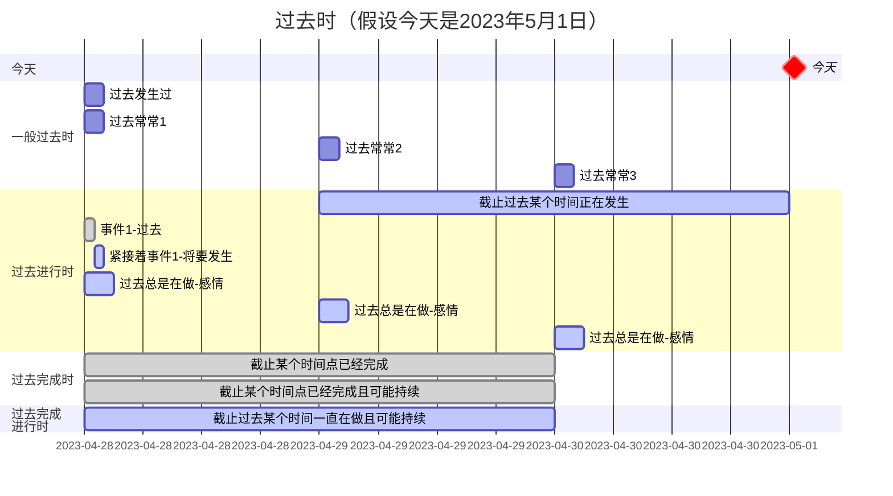
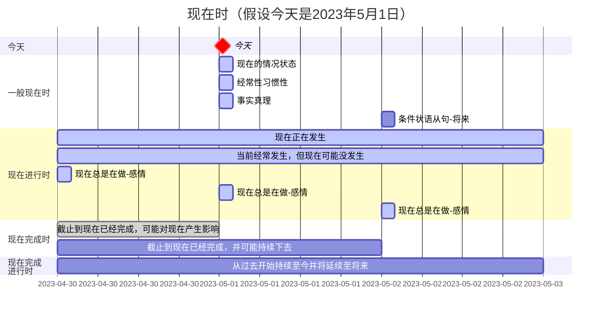
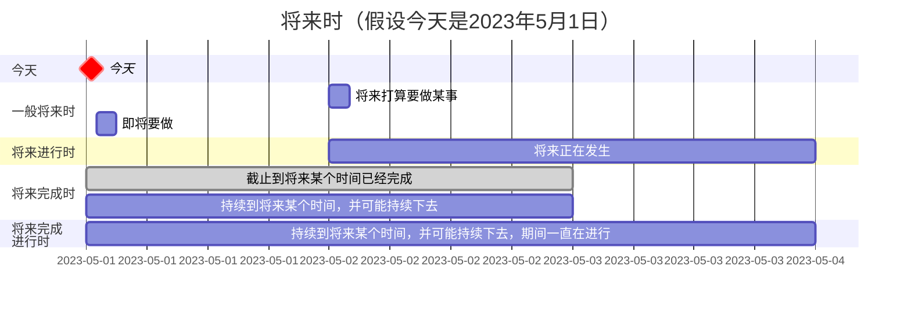
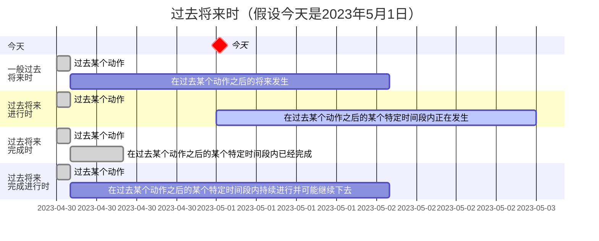

# 英语学习笔记

# 文档说明

本文档属于个人学习英语的经验总结，心得分享。如果对文档内容有任何问题，欢迎讨论交流。

| 文档名称     | 英语学习笔记  |
| ------------ | ------------- |
| 文档分类     | 学习笔记-英语 |
| 版本号       | 1.7           |
| 最后更新日期 | 2023-12-24    |
| 最后更新人   | Gem Shen      |
| 编制日期     | 2023-09-07    |
| 编制人       | Gem Shen      |

## 文档更新记录

| 版本 | 编制/修改人 | 修改日期   | 备注（原因、进一步的说明等）                                 |
| ---- | ----------- | ---------- | ------------------------------------------------------------ |
| 1.0  | Gem         | 2023-09-07 | 初版                                                         |
| 1.1  | Gem         | 2023-09-16 | 完成[音标](#音标)部分，内容大部分来源于小E英语               |
| 1.2  | Gem         | 2023-09-20 | 新增[说话腔调](#说话腔调)章节以及[音变规则](#音变规则)，例如：辅元连读，浊化，弱读，击穿等。 |
| 1.3  | Gem         | 2023-09-27 | 完成小e英语彩蛋课内容，加入大量[口语习语](#口语习语)的案例。 |
| 1.4  | Gem         | 2023-11-01 | 加入[英语16种时态总结](#英语时态)。                          |
| 1.5  | Gem         | 2023-11-03 | 加入[句子成分总结](#句子成分)，[英语句型总结](#英语句型)     |
| 1.6  | Gem         | 2023-11-09 | 补充[缩读规则](#缩读)                                        |
| 1.7  | Gem         | 2023-12-24 | 新增英语[培训机构](#培训机构)                                |

 

## 文档参考说明

文档听力口语部分内容主要有以下来源

- 小E老师听力口语课。根据视频内容整理而成。
- 扇贝听力口语App。根据教程内容整理而成。
- 互联网上的相关文章。在引用到的地方会对引用文章作说明并附上原文链接。

# 学习工具

## 手机App

### 扇贝

比较全面的app，包含听说读写各种分类功能。背单词不收费，其他高级功能要收费。

**扇贝单词**

主要用于背单词，里面的词汇书比较多。托福核心词汇，雅思词汇等等。

**扇贝听力口语**

这里面有很多听力素材：托福雅思，四六级，考验英语，VOA，电影英语等。

有很多种精听模式，例如：听音模式（盲听句子，自主默写），选词模式（听句子选词填入），拼写模式（听句子，拼写空缺单词30%，60%，90%），如果正常语速听不懂，可以选择0.5x速，0.8x速。

练听力的时候还有跟读模式，可以将自己的发音录下来，自己可以听一下哪里不标准，软件也会给你打分。有部分纠音的作用。

缺点：很多功能都只在手机端可用，电脑上的只具备一些基本功能。对于喜欢在电脑上学的童鞋不太友好。

部分听力素材的中文是机器翻译，翻译得并不是那么准确。

**扇贝阅读**

有很多不同难度的不同种类的阅读材料可以选择。例如：托福，四六级。在阅读的时候，如果有单词，词组或者句子不明白，只要通过手指按屏幕就可以知道。整篇文章读完之后，还会在巩固一遍句子中出现的单词或者词组。巩固的时候会将词组和原文的句子一起显示让你可以复习单词的含义以及在句子中的使用。

**扇贝口语**

### 有道翻译官

优点：屏幕取词，查词翻译比较实用，可以对手机上的任意英语进行翻译，且相对准确。

缺点：语音翻译不准确。经常听错。屏幕取词功能的二次查询做的不好。

### 词根词缀词典

没有第三方广告。词根词缀查询比较全面。背单词时比较有用。

### 微软翻译

 优点：语音翻译比较准确。练习听力听不懂单词不知道怎么拼写时，可以使用。

 缺点：语音翻译结果，无法再次查询。显示的词义没有其他字典多。

## 电脑软件

### 网易有道翻译

电脑版的划词功能比较实用，在操作系统的任意软件中（包含浏览器）只要选中英文就可以实时出现翻译和发音。

当软件出现不懂的英语时，只要选中就可以翻译，就不需要复制黏贴到翻译网站中翻译了。挺方便的。还有屏幕取词和截图翻译功能。

## 网站

[有道翻译网页版](https://dict.youdao.com/)，[百度翻译网页版](https://fanyi.baidu.com/?aldtype=16047#auto/zh)。

# 词汇

## 词组

#### wide awake

非常清醒（并警觉），记忆：在很宽的范围内保持清醒。

#### all the way

一直到底的，一路上；完全地，彻底地；达到最大程度或最高水平

#### go back to

返回某个地方; 回顾过去

#### grab information

获取信息。抓取信息。例如：Let me grab the information about the swimming。

#### the human version

人类体现，人类版本。

例句：Some psychologists believe war is the human version of instanctive animal behavior.

一些心理学家认为战争是动物的本能行为在人类身上的体现。 

#### come out

1．出现在公众视野中：指某物或某人开始公开出现或亮相。

· The new album will come out next month.

新专辑将于下个月发行。

2．变得明显：指某种情感或特质开始显露出来。

3．公开表态：指在公开场合或言论中表明自己的立场或观点。

4．结果是：指某事最终以某种结果结束。

5．首次亮相：指某人或某物首次公开亮相或登台。

#### all the time

一直

#### the thing is though

但问题是，尽管如此，

#### clear the air

消除误会，消除隔阂。

#### live up to your reputation

不辜负你的名誉

## 中英

### 表情

斜眼看人：sideways glance

眨眼睛/使眼色：wink

眨眼睛：blink

震惊：shock

盯着人看：stare

怒视：glare

### 数学符号

`=` equals, /ˈiːkwəlz/

`+` plus, /plʌs/。例如：`2+2=4`, 2 plus 2 equals 4

`−` minus, /ˈmaɪnəs/。

`÷` divided by。 例如：`4÷2=2` ，4 divided by 2 equals 2

`×` times。 例如：5X2=10, 5 times 2 equlas 10

### 标点符号

逗号，`,`，comma

句号，`.`，period/full stop

问号，`?`，question mark

感叹号，`!`，exclamation mark

冒号，`:`，colon

分号，`;`，semicolon

小括号，`()`，parenthesis

中括号，`[]`，brackets

大括号，`{}`，brace

连词符，`-`，hyphen

下划线，`_`，underscore/underline

删除线，~~删除线~~，strikethrough，line through。

单引号，`'`，apostrophe

省略号，`...`，ellipsis

正斜杠，`\`，forward slash/slash

反斜杠，`/`，backword slash/backslash

美元符号，`$`，dollar mark

星号，`*`，asterisk

井号，`#`，Number sign一般用来表示序数，美式英语里也称之为pound sign或者pound key

### 调料

调料品：seasonings

芝麻油/香油，sesame oil

麻油/辣椒油，chilli oil

酱油，soy sauce

老抽，dark soy sauce

生抽，light soy sauce

耗油，oyster sauce

花生油，peanut oil

大豆油，soybean oil

盐，salt

番茄酱，ketchup

辣酱，hot sauce

辣椒酱，chilli sauce

豆瓣酱，bean paste

芥末酱，mustard

烧烤酱，barbecue sauce

沙拉酱，salad dressing

醋，vinegar

糖，sugar

胡椒粉，pepper

辣椒粉，paprika

味精，Monosodium

料酒，cooking wine

香料，spices

土茴香，孜然，cumin

八角，star anise

香叶，bay leaf

### 表达数量

a couple of，两个（事物），几个（事物），一对

## 词义辨析

### 能力&才能

这些词都有能力、才能的意思，那么它们有什么区别呢？

#### Ability

Ability指的是人具备做某事的才能或者能力，包括智力和体力上的能力。这种能力可能是先天的，也可能是通过学习或锻炼等方法而获得的。

常用的搭配有ability in/for something，它的形容词形式也比较常见able，常用搭配是be able to do something。

其反义词是∶disability，inability，incapability，incapacity

例句如下：

She is a pianist of great ability.

她是一个能力超群的钢琴家。

I think he is able to finish the work.

我觉得他有能力完成工作。

#### capability

Capability指的是完成有难度的事情的能力和才能，意义与 ability 相同，可指人或物。

复数形式指潜在的能力。常用的搭配有capability to do something或者capability of something。

例句如下：

*The task is beyond his capabilities.*

*他不能胜任这项任务。*

*I don t think that boy has great capabilities.我认为那孩子没有多大潜力。The country has the capability to defeat the aggressor.*

*这个国家有能力击败任何侵略者。*

#### capacity

分辨完 ability 和 capability 的差别，再让我们来看capacity。

Capacity除了指做某事的能力之外，还可以指容量，常用的搭配有capacity of something或者capacity for doing something。

例句如下：

It's important to develop a child's capacity for learning. 

*发展一个小孩的学习能力很重要。*

The bottle has a capacity of 500ml.

*这个瓶子容量是500ml。*

#### competence

最后，我们来看competence。

Competence指的是能力、资格，特别是卓越的能力，等同于competency。

常用的搭配有competence in something/doing something。

例句如下：

A company's success is related to its managers' competence.

一个公司的成败跟它的管理者的能力紧密相关。

好了，希望通过我们的讲解，大家能对 ability , capability , capacity 和 competence之间的主要区别有了了解。我们现在来归纳一下它们的用法。

✅ ability和capability是同义词，没有区别，皆指做事情的能力

✅ capacity 侧重于指物体的容量或学习并掌握技能的能力

✅ competence是指按质按量完成既定任务或交付产品的能力，即"胜任工作"的能力，它更强调"胜任"而不是"有没有能力"

### 通用，公共

#### common

adj. 共同的，共享的；常见的，普遍的，一般的；普通的，平凡的；出于礼貌的，起码的；粗俗的，庸俗的
n. 公共用地，公地；校园公共食堂；<英，非正式>常识；（基督教教会适用于各种场合的）普通礼拜；平民

#### public

adj. 公众的，大众的；公共的，公用的；政府的，公众事务的；<英> 大学的，为大学的；（声明、事件等）公开的，公诸于众的；公开场合的，大庭广众的；上市的；众所周知的，广为人知的
n. 公众，大众（the public）；志趣相投（或从事同一类活动、具有共同特征）的群体；<非正式>（对某个艺术家、作家或表演家感兴趣的）读者，观众（one's public）

#### universal

dj. 普遍的，全体的，全世界的；通用的，万能的；（逻）全称的，总称的
n. 普遍原则，通用原理；普遍看法，普遍特征；（逻）全称命题；（哲）普遍，一般概念；（哲）共相；（语言学）普遍现象，通用规则

#### generic

adj. 一般的，通用的；（货物，尤指药品）没有牌子的，无商标的；属的，类的；（生）属的，类的
n. 无商标消费品，不受商标注册保护的消费品

#### general

adj. 总体的，普遍的；一般的，常规的；大致的，大概的；综合的，广泛的；首席的，总管的
n. 上将，将军；半军事化管理的宗教组织（如耶稣会修士、多明我会修士或救世军）的领袖；<古>大众，公众

### 各种学校

在美国，“college”和“university”经常互换使用的，不过College和University主要在课程和学位的类型上有所不同。

**University**：主要是提供本科和[研究生学位](https://www.zhihu.com/search?q=研究生学位&search_source=Entity&hybrid_search_source=Entity&hybrid_search_extra={"sourceType"%3A"answer"%2C"sourceId"%3A2250759172})

的公立或私立机构。 这些机构以其多样的环境而闻名，通常以规模庞大的校园和各种各样的课程提供为特色。 

**College**：主要指的是文理学院、[社区学院](https://www.zhihu.com/search?q=社区学院&search_source=Entity&hybrid_search_source=Entity&hybrid_search_extra={"sourceType"%3A"answer"%2C"sourceId"%3A2250759172})

或者[技术学院](https://www.zhihu.com/search?q=技术学院&search_source=Entity&hybrid_search_source=Entity&hybrid_search_extra={"sourceType"%3A"answer"%2C"sourceId"%3A2250759172})。与University相比，College通常拥有更少的学生群体、更亲密的校园和更少的课程。这些学校大部分是私立的，没有国家的资助。因为大多数College不太注重研究工作，甚至会有很强的宗教信仰。当然，有的时候College也是University的一个组成部分，比如UCSD就是由7个不同学院Colleges组成。“学院”对应的英文词很多，除了college之外，有institute，academy，school，conservatory，centre和[faculty](https://www.zhihu.com/search?q=faculty&search_source=Entity&hybrid_search_source=Entity&hybrid_search_extra={"sourceType"%3A"answer"%2C"sourceId"%3A2250759172})

等等。

**Institute**：主要是提供专注于专业和管理发展的课程。 这是一所具有良好学术和其他实践经验的专业院校，有自主性，但未被授权评审和授予[学位](https://www.zhihu.com/search?q=学位&search_source=Entity&hybrid_search_source=Entity&hybrid_search_extra={"sourceType"%3A"answer"%2C"sourceId"%3A2250759172})

。 从字面上看，高质量的College也会被称为Institute。  

**Academy**：这个词在早些时候很流行，但最近它的使用有所减少，通常是培训某种特定的技能发展。虽然我们看到学校和学院的名字中包含了“Academy”这个词，但如今这个词更多地用于某一特定领域的专门培训机构和场所，也用于各种有类似想法的人的协会和机构：如科学家、作家或[艺术家](https://www.zhihu.com/search?q=艺术家&search_source=Entity&hybrid_search_source=Entity&hybrid_search_extra={"sourceType"%3A"answer"%2C"sourceId"%3A2250759172})的学院。 如果我们看看这个词的用法，首先想到的是[电影艺术与科学学院](https://www.zhihu.com/search?q=电影艺术与科学学院&search_source=Entity&hybrid_search_source=Entity&hybrid_search_extra={"sourceType"%3A"answer"%2C"sourceId"%3A2250759172})Academy of Motion Picture Arts and Sciences，这是一个在好莱坞颁发[奥斯卡奖](https://www.zhihu.com/search?q=奥斯卡奖&search_source=Entity&hybrid_search_source=Entity&hybrid_search_extra={"sourceType"%3A"answer"%2C"sourceId"%3A2250759172})的机构。 印度也有类似的国防学院，比如[美国空军学院](https://www.zhihu.com/search?q=美国空军学院&search_source=Entity&hybrid_search_source=Entity&hybrid_search_extra={"sourceType"%3A"answer"%2C"sourceId"%3A2250759172})

US Air Force Academy和国防学院National Defense Academy。 

以前的上海和北京的[外语学院](https://www.zhihu.com/search?q=外语学院&search_source=Entity&hybrid_search_source=Entity&hybrid_search_extra={"sourceType"%3A"answer"%2C"sourceId"%3A2250759172})

用institute比较多一些，像[麻省理工学院](https://www.zhihu.com/search?q=麻省理工学院&search_source=Entity&hybrid_search_source=Entity&hybrid_search_extra={"sourceType"%3A"answer"%2C"sourceId"%3A2250759172})（MIT）也叫institute。美国的[西点军校](https://www.zhihu.com/search?q=西点军校&search_source=Entity&hybrid_search_source=Entity&hybrid_search_extra={"sourceType"%3A"answer"%2C"sourceId"%3A2250759172})用的是academy。而独立的[音乐学院](https://www.zhihu.com/search?q=音乐学院&search_source=Entity&hybrid_search_source=Entity&hybrid_search_extra={"sourceType"%3A"answer"%2C"sourceId"%3A2250759172})或大学多用conservatory或academy（[欧洲](https://www.zhihu.com/search?q=欧洲&search_source=Entity&hybrid_search_source=Entity&hybrid_search_extra={"sourceType"%3A"answer"%2C"sourceId"%3A2250759172})多用）。但是一所大学内的音乐学院或者音乐部门一般都叫做School of Music或College of Music。像西方有些[医学院](https://www.zhihu.com/search?q=医学院&search_source=Entity&hybrid_search_source=Entity&hybrid_search_extra={"sourceType"%3A"answer"%2C"sourceId"%3A2250759172})称之为medical centre。[英国大学](https://www.zhihu.com/search?q=英国大学&search_source=Entity&hybrid_search_source=Entity&hybrid_search_extra={"sourceType"%3A"answer"%2C"sourceId"%3A2250759172})的学院用school的会比较多一些，如London School of Economics，较小的学院会被称为faculty，如Faculty of Science、Faculty of Arts，而[神学院](https://www.zhihu.com/search?q=神学院&search_source=Entity&hybrid_search_source=Entity&hybrid_search_extra={"sourceType"%3A"answer"%2C"sourceId"%3A2250759172})则用seminary来形容。

各种“副”

"副"字在英语中可以用vice、deputy、assistant、associate、under、sub等词表示

表达"副"的含义用的最广泛的是Vice和Deputy。 

Vice 和Deputy 并无本质区别，在实际使用时究竟选用哪个，纯属搭配习惯。

一般来说，

vice与president、 premier、 chairman、 minister、 governor搭配；

deputy与director、 chief、head 、secretary、dean、mayor搭配。

 

似乎可以认为，Vice比Deputy的搭配级别要高。

如：

国家副主席（或大学副校长）=>Vice President

副主席（或系副主任等）=>Vice Chairman

副总理=>Vice Premier 

副部长=>Vice Minister

副省长=>Vice Governor

副领事=>Vice Consul

副校长（中小学）=>Vice Principal

 

以下情况常用Deputy：

副局长=>Deputy Director

副秘书长=>Deputy Secretary-General 

副书记=>Deputy Secretary

副市长=>Deputy Mayor 

副县长=>Deputy Chief Executive

副村长=>Deputy Village Head

副院长（学院）=>Deputy Dean

副总编 =>Deputy Editor-in-Chief

 

associate用作"副"时一般用于职称。

副教授=>Associate Professor 

副研究员=>Associate Research Fellow

副主编=>Associate Editor-in-Chief 

副编审=>Associate Senior Editor 

副研究馆员=>Associate Research Fellow 

副译审=>Associate Senior Translator 

副主任医师=>Associate Senior Doctor

 

Assistant 也可作"副"解释，

如：副经理=>Assistant Manager

 

但我们知道，assistant原本含义是"助理"。当我们把"副经理"译成assistant manager时，那么"经理助理"怎么译？另外，assistant manager和另一种副经理deputy manager之间有什么区别？

要弄清以上情况， 先得看看Assistant和Deputy在美国的用法，以美国联邦财政部金融管理局(Financial Management Service ) 为例，该局局长称作Commissioner，紧接着Commissioner的二号人物称 Deputy Commissioner, 相当于我们中国的第一副局长，然后是多名分管各个不同科室的副局长，如分管联邦金融事务的副局长(Assistant Commissioner, Federal Finance )、分管金融运营事务的副局长(Assistant Commissioner, Financial Operations)、分管政府部门会计事务的副局长(Assistant Commissioner, Governmentwide Accounting)，等等。无论是美国政府还是企业机构，几乎都是一样，即Deputy 作为第一副职，往往只设一个，而Assistant却可以有多个。比如，在一家美国公司里，既有Deputy General Manager，又有Assistant General Manager都译成"副总经理"，但其地位是前者--相当于我们的常务副总--高于后者。

至于比"副总经理"地位更低的"总经理助理"，则可译为：Assistant to General Manager。如：总经理私人助理--> Personal Assistant to GM、总经理特别助理--> Special Assistant to GM。

 

在我国的行政机构内，"助理"往往指的是未经过立法机关认可的副职，如"市长助理"，其职责和级别相当于副市长，但地位 

# 听力

## 提升方法

### 有效听力输入量积累

#### 有效的含义

每一次听，都要重复这个过程：听->脑->义。也就是：听到声音➡️进入脑部➡️在脑中产生正确含义。否则就是无效听力积累。

有效的方法

- 根据自己实际听力水平选择合适的听力材料
- 循序渐进，从低到高

#### 无效的例子

用眼睛来练听力，其实是：视-->脑-->义，看到视觉图像➡️进入脑部➡️在脑中产生正确含义。

通过看美剧字幕练听力或者听到单词想出他的拼写。都是通过视脑义去记忆。这种其实都是在练习阅读理解而不是听力。

还有把听力当成背景音乐，但其实根本不知道听的句子意思。这种会发生认知过载。

#### 认知过载

一个人的认知是有上限的，一旦输入的知识超过认知上限就会产生认知过载。一句话如果大部分单词都不知意思或者一段话大部分内容都不知道意思。如果还去不断的去重复，大脑就会判定会噪音，根本接受不了。重复在多次也是白搭。

#### 正确方法

挑自己能听懂的或者已经听过的材料练听力，例如：前一天刚学过的已经攻克过难点的材料。

### 关注正确的语言单位

#### 音素

语言是由音素构成的，听到的音素和储存在大脑中的音素相匹配才能正确识别

背单词，如果不记忆单词的发音，并不能积累音素

#### 语块

- 一连串的自然节奏语言
- 语言中固定或者半固定的语言节奏
- 不要过多的关注单个单词

#### 语感

对语言中的语块的掌握程度

#### 方法

想要正确的积累语言单位，首先要学好[音标](#音标)，然后需要学习口语中实际存在的[音变规则](#音变规则)。接下来就是大量的积累提升语感。

### 阅读能力是听力的上限

你永远也听不懂你读都读不懂的内容。就像好像你让一个小学生去听大学生的上课内容，就算他每个字都能听到，但是理解不了里面的意思。所以不可能听懂。听力里面也涉及单词储备，语法等知识，如果你不知道也是无法听懂的。所以积累必要的词汇和语法是很重要的

### 听写听读

很多英语大神都是靠听写听读这个方法练成的，但这个方法最大的问题是坚持。需要大量时间的积累。

### 考试重点

参加英语考试是有技巧的，要学会听一篇文章中的重点单词。还有就是在开始听之前，可以先看题目猜测这篇文章大体要讲什么。有了目的性的去听也要比盲听效率高很多，毕竟有很多题是选择题和判断题，你只需要从答案中选出正确的。

在听文章时都关注重点词。例如：名词，动词，形容词等。还有一些转折词，这都是作者要表达自己的观点时候了。例如：but，while，However，despite。

### 熟悉生活场景

老外的生活方式，思维方式都和我们不一样，去做同一件事的时候，例如：吃饭，看病，买东西都是不一样。我们有意识的去提前熟悉这些生活场景。积累这些场景下的常用词汇。当出现场景的时候，我们就可以做到心里有数了。例如：如果你提前知道这是一片关于购物的材料，而你又实现学了很多关于购物的词汇，但做题时或者练听力时你就可以从这些词汇范围里去搜索了。但如果你不知道，你就得从所有英语词汇中去搜索匹配内容。

### 提升托福听力的六大步骤

托福要拿到高分，要循序渐进，特别是在听力这个项目中，时间和努力是两项必要条件，缺一不可以。在以下内容中，我们就为大家整理了听力提高的六个步骤，考生可以用下面这个方法来对付听力考试。

　　1.High-quality extensive listening 是指高质量的泛听。泛听的最佳材料有两个：一个是National  Geographic（国家地理频道），另一个是Discovery（探索）。看的时候一定要有英文字幕，而不是随随便便听听即可。每天边听边看，养成习惯，会有很大收获。虽然有些考生认为泛听没有效果，关键开始因人而异，找到适合考生自己的听力训练方法，自然事半功倍。

　　2.Dictation 是指听写，将一篇听力录音中的原文全部听录下来，它是提高听力最有效的方法。对于准备新[托福考试](http://toefl.zhan.com/)的考生而言，最好的听写材料是老托福的lecture。对于基础比较薄弱的学生，材料也可以选定为新概念第二和第三册的美英版听写完，然后再来听写老托福的lecture。

　　3.Subconscious listening practice  是指“下意识的听力练习”。它是指为自己创造一个英文的环境，比如早晨一起床，我们就打开音箱播放英语，可以是托福的听力材料，可以是英文广播，也可以是一部英文电影等，这样做的好处是随时都可以听到英语，在潜移默化中不知不觉地加深对英语的敏感度。其实这点和泛听有点类似。

　　4.Summary 是“概述，大意”的意思，具体指学生在听到一篇听力材料后所进行的概括。考生不需要听懂材料的每一个细节，但要抓住说话人的思路和框架。这个训练对于托福听力至关重要。练习summary的方法很简单，可以托福听力讲座为材料，一边听一边记笔记，录音结束后，根据大脑记忆和笔记，对全文重点内容进行英文复述，反复练习，直到可以将一篇讲座顺畅复述出来为止。

　　5.Intensive listening  是指精听。我所说的“精听”步骤如下：一边听一边看原文，划出自己不认识或似曾相识但反应不过来的词;录音结束，开始查生词，写在原文的旁边，只要写出这个单词在这篇文章中的意思即可;将这篇材料当阅读文章快速精读一遍，彻底看懂;再一边看原文，一边放录音，嘴上要跟读，反复几遍，一直听到可以不看原文彻底听懂为止。精听材料有很多，我最推荐SSS(Scientific American’s Sixty-second Science)，它非常短，但信息量很大，更重要的是，它是[新托福](http://toefl.zhan.com/)听力出题的重要来源。

　　6.I Challenging  materials是指“有挑战性的材料”。备考托福听力挑战性的材料有这几类：一是美国大学上课的课堂录像或录音，现在很多美国大学已经将许多课堂录像放在了互联网上，这是一个极佳的挑战听力难度的材料。二是巴朗和Kaplan上的试题一定要做完，另外，如果觉得DELTA上的试题难度低，可以利用变速软件加2倍速来做，这样就会超越考试难度。

 　总之，在托福听力的备考过程中，掌握方法是非常关键的，以上的六个步骤希望大家融入到自己的复习过程中，让听力能力得以不断提升听力能力。

## 音标

音标总共48个，分元音和辅音2种。以下章节会分别讲解。

<table>
    <caption>音标汇总表</caption>
    <thead>
    	<tr>
        	<th>大分类</th><th>小分类</th><th>个数</th><th>音标</th>
        </tr>
    </thead>
    <tbody>
        <tr>
            <td rowspan=4>元音</td><td>单元音>前元音</td><td>4</td><td>[ɪ] [i:] [e] [æ]</td>
        </tr>
        <tr>
            <td>单元音>中元音</td><td>3</td><td>[ʌ] [ə] [ɜ:]</td>
        </tr>
        <tr>
            <td>单元音>后元音</td><td>5</td><td>[ɑ:] [ɒ] [ɔ:] [ʊ] [u:]</td>
        </tr>
        <tr>
            <td>双元音</td><td>8</td><td>[aɪ] [eɪ] [aʊ] [əʊ] [ɔɪ] [ɪə] [eə] [ʊə]</td>
        </tr>
        <tr>
            <td rowspan=6>辅音</td><td>爆破音</td><td>6</td><td>清辅音：[p] [t] [k]，浊辅音：[d] [b] [g]</td>
        </tr>
        <tr>
            <td>摩擦音</td><td>10</td><td>清辅音：[f] [θ] [s] [ʃ] [h]，浊辅音：[v] [ð] [z] [ʒ] [r]</td>
        </tr>
        <tr>
            <td>破擦音</td><td>6</td><td>清辅音：[tr] [ts] [tʃ]，浊辅音：[dr] [dz] [dʒ]</td>
        </tr>
        <tr>
            <td>鼻音</td><td>3</td><td>浊辅音：[m] [n] [η]</td>
        </tr>
        <tr>
            <td>舌边音</td><td>1</td><td>浊辅音：[l]</td>
        </tr>
        <tr>
            <td>半元音</td><td>2</td><td>浊辅音：[j] [w]</td>
        </tr>
    </tbody>
</table>

### 元音

[知乎-大概是最全的音标总结](https://zhuanlan.zhihu.com/p/79843578)

元音(Vowel)，又称母音，是[音素](https://baike.baidu.com/item/音素/5689615?fromModule=lemma_inlink)的一种，与辅音相对。元音是在发音过程中气流通过口腔而不受阻碍发出的音。

发元音时，气流从肺部通过[声门](https://baike.baidu.com/item/声门/4002352?fromModule=lemma_inlink)冲击声带，使声带发出均匀震动，然后震音气流不受阻碍地通过口腔，通过舌、唇的调节而发出不同的声音。发元音时声带必然震动的叫浊元音。有些语言发元音时声带不振动，发出清元音。

分类：

根据单个元音发音时是否需要进行舌位唇形变化，将元音分为：单元音和双元音。

#### 单元音

单元音共12个，按发音长短，分为短元音：/ʌ/ /ɒ/ /ə/ /ɪ/ /u/ /e/ /æ/，长元音：/ɑ:/ /ɔ:/ /u:/ /i:/ /ə:/

根据发音位置分为：前元音、中元音、后元音。下文将逐个讲解。

**前元音**：[ɪ] [i:] [e] [æ] 

##### [i:]

**e**

- he
- me
- be

**ea**

- eat
- sea
- seat

- dream

**ee**

- see
- week
- agree
- sweet，甜的

**ei**

- peice块
- thief小偷
- chief首领

**练习**

Sweet dreams. 做个好梦！ 

Steve keeps the cheese in the freezer. Steve将奶酪存放在冰箱里

##### [i]

i

- sit
- fish
- live

y

- family
- slowly
- bicycle

e

- ticket
- delay
- escape

**练习**

fish chips，炸鱼薯条

I swim like a fish. 我擅长游泳

##### [e]

e

- egg
- red
- bed

ea

- head
- bread
- heavy

练习

- best friend，/best/ /frend/
- East, west, home is best

##### [æ]

a

- dad
- hat
- glad

练习

- hand in hand，d in 连读

- The cat sat on the hat，sat on 连读 t 发 d

**中元音**

##### [ə:]

**发音方法**

美音：需要卷舌，带r音

英音：不带r音

er

- nervous /nə:(r)vəs/
- serve /sə:(r)v/

ur

- fur /fə:(r)/
- nurse /nə:(r)s/

ir

- sir /sə:(r)/
- skirt /skə:(r)t/

or

在w后发[ə:]

- worth
- worm

ear

后面接辅音发[ə:]

- earth
- early

练习

- urgent work
- the early bird catches the worm早起的鸟儿有虫吃

##### [ə]

##### [ʌ]

o

- love
- come
- mother

u

- number
- hurry
- but

练习

- just for fun

**后元音**

[ɔ]、[ɑ:]、

##### [a:]

ar

car

park

large

练习

car park

can you drive the large car to that bar

##### [ɒ]

o

body

nod

a 在w后

want

wash

wallet

美音 /a:/

练习

a hot dog

The clock stopped

##### [ɔ:]

**发音方法**

嘴唇向内收圆，口腔内上下垂直打开下颚向下拉想象口腔内含住一个鸡蛋的感觉，舌根向后缩，舌面下压tips：保持口腔姿势不变，发“哦”音 >声带振动

**拼读规律**

oar

- roar

- board

- soar

ore

- more

- store

- before

oor

- door

- floor

- more

aw

- law

- awful

- draw

au

- cause

- august

- taugust

or

- nor

- order

- border

**练习**

door to door

Paul slipped on the floor

##### [u:]

**发音方法**

嘴唇向前撅起，紧绷呈圆形口腔内上下垂直打开，下颚向下拉舌根向后缩，舌尖离开下齿内侧tips:保持口腔姿势不变，发“呜”音 >声带振动

**拼读规律**

o

lose

prove

movie

u

ruler

rule

polute

oo

food

noon

pool

练习

blue suit

He took the cooling pool for the swimming pool

##### [ʊ] [u]

拼读规律

oo

cook

look

took

u

put

push

bull

oul

- could
- would
- should

**练习**

- full of book
- the cook couldn't cook if he didn't look at a cook book

#### 双元音

双元音共8个，分别是 [ei]、[ai]、[ɔi]、[ɛə]、[uə]、[iə]、[au]、[əu]

#####  [ɔi]

**发音方法**

 [ɔ:]+[i]

**拼读规律**

oy

boy

joy

toy

oi

coin

join

voice

**练习**

key point

Boys will be boys. 男孩就是男孩

##### [iə]

**发音方法**

 [i]+[ə]，[iə]是单元音[i]和[ə]这两个元音的组合音。首先发[i]的音，嘴唇扁平，口腔放松，嘴微张然后很快的滑向[ə]音，发音过程中口型始终是半开的。发音时口型由小到大，音量由强到弱，由清晰到模糊。

英式音标中[ə]要扁平，没有卷舌音。美式发音中，凡是单词结尾加上r的都要卷舌发[r]。

**拼读规律**

**ear**

- hear /hiə(r)/
- near /niə(r)/
- tear /tiə(r)/

**ere**

- here /hiə(r)/ 这里
- sere /siə(r)/ 干枯的
- mere /miə(r)/ 仅仅的
- sincere /sinsiə(r)/ 真诚的

**eer**

- beer
- deer
- cheer

**短语句子**

burst into tears，突然哭起来

Everyone should be sincere，每个人都应该真诚。 	

##### [ɛə]&[eə]

**发音方法**

[eə]是单元音/e/和/ə/这两个元音的组合音。先发前元音/e/，嘴角轻扯，上下齿，自然分离大约1个手指的空间)然后很快滑向/a/音，发音过程中双唇半开口型由大变小，音量由强变弱。

英式发音发/ə/的时候不卷舌，美式发音单词词尾含有“r”需卷舌。

**拼读规律**

**are**

- care，照顾
- pare，削皮
- dare，敢

**air**

- air，/eə(r)/
- hair，/heə(r)/
- repair，/ri'peə(r)/

**ear**

- wear
- pear
- bear

**词组句子**

take care. 注意，小心。

I met an unfair affair. 我遇到一件不公平的事情。

##### [uə]

**发音方法**

/uə/是单元音/u/和/ə/这两个元音的组合音。首先发/u/的音，嘴唇横向呈正常宽度，双唇轻微发力，小幅度向前凸起

tips:保持口腔姿势不变，发“呜”音然后慢慢滑向/a/的音，发音时气息前长后短，音量由强变弱英式发音发/a/的时候不卷舌

美式发音单词词尾含有“r”需卷舌

**拼读规律**

**oor**

- poor
- boor，粗野的人
- moor，沼泽

**our**

- tour
- detour，绕道

**ure**

- sure，
- cure，治疗
- ensure，保证

**词组&句子**

pretty sure.

we‘re make plans for a tour.

### 辅音 

https://zhuanlan.zhihu.com/p/83088691

[辅音](https://link.zhihu.com/?target=https%3A//baike.baidu.com/item/%E8%BE%85%E9%9F%B3/5689893%3Ffr%3Daladdin)，又叫子音，是指气流受到阻碍而形成的音。专业的语言学解释为：声道紧闭，或声道变窄的程度达到气流无法排出，一旦排出就会产生可闻的摩擦，这样的音叫做辅音。发辅音时，至少要有2个发音器官参与发音，导致从肺部呼出的气流在口腔或鼻腔时受阻（发元音时气流不受任何阻碍）。根据发音时声带是否震动，辅音又分为清辅音和浊辅音。

清辅音（voiceless consonant)：发音时声带不振动（发音时摸一下咽喉部，没有震动）

浊辅音 (voiced consonant)：发音时声带振动（发音时摸一下咽喉部，有震动）

#### 爆破音

爆破音（plosive）共6个，是指发音器官在口腔中形成阻碍，然后气流冲破阻碍而发出的音。英语中有6个爆破音，即[p] [b] [t] [d] [k] [g]。

##### [p] [b]

**发音方法**

相似:

紧闭双唇，阻止气流流出

突然分开双唇，气流冲出口腔，气流受嘴唇阻碍被爆破

区别:

/p/是清辅音，声带不震动，只有气流流出

/b/是浊辅音，声带震动，但送气力量很弱

**拼读规律**

p和pp常发/p/

- pig
- keep
- cup
- apply
- happen
- supper

字母b及字母组合bb时常发/b/

- bus /bʌs/

- herb /h3:(r)b/
- bride /braid/
- rubbish 垃圾
- hobby 嗜好
- rubber 橡胶

练习

best friend.

Practise makes perfect. 熟能生巧

##### [t] [d]

**发音方法**

相似

嘴微张，舌尖轻触上齿龈内侧，憋住气

舌尖离开上齿龈内侧，向下沉:使气流冲出口腔，形成爆破音

区别

/t/是清辅音，声带不震动，只有气流流出

/d/是浊辅音，声带震动，但送气力量很弱

**拼读规律**

字母t和组合tt常发/t/

- tea
- time
- today
- little
- better
- butter

字母d和组合dd常发/d/

- date
- desk
- dear
- odd
- middle
- sudden

练习

a waste of time. 浪费时间

why did you do that. 你为什么要这么做

##### [k] [g]

**发音方法**

相似:

嘴微张，舌根部上抬，贴住软腭，阻碍气流通过

舌根部离开软腭，使气流冲出口腔，形成爆破音

区别:
/k/是清辅音，声带不震动，只有气流流出

/g/是浊辅音，声带震动，但送气力量很弱

**拼读规律**

字母c、k及字母组合ch、ck时常发/k/

- cafe，咖啡馆
- cake，蛋糕
- case，实例
- keep
- kid
- kind
- chasm，峡谷
- ache，疼痛
- anchor，锚

字母g及字母组合gg、gu、gh时常发/g/

- game
- girl
- great
- beggar，乞丐
- swagger，炫耀的
- luggage，行李
- catalogue，目录
- ghost，鬼
- rogue，流氓

练习

keep company. 保持陪伴。

Grandma gave the guests some eggs. 奶奶给了客人一些鸡蛋。

#### 摩擦音

摩擦音有一下这些：[f] [v] [θ] [ð] [s] [z] [ʃ] [ʒ] [h] [r]。摩擦音也叫擦音，由发音器官造成的缝隙使气流产生摩擦而发出的声音。

##### [f] [v]

**发音方法**

相似:

1) 双唇微张，上齿轻触下唇

2. 口腔中的气流从唇齿间的缝隙流出

区别:

/f/是清辅音，声带不震动，只有气流流出声

/v/是浊辅音，声带震动，但送气力量很弱，

**拼读规律**

字母f及字母组合ff、ph、gh时常发/f/

- five
- life
- face
- offer
- office
- off
- photo
- phone
- alpha 开端
- laugh
- cough 咳嗽
- enough

字母v常发/v/

- drive
- video
- visit

**练习**

- fresh fruit 新鲜水果
- leave me alone 别管我

#####  [s] [z]

**发音方法**

相似:
1. 嘴唇微张，将舌前端抬起，靠近上齿龈内侧，但不要贴住

2. 腔中的气流由舌尖与齿龈之间的缝隙中流出，伴有嘶嘶声

区别:

/s/是清辅音，声带不震动，只有气流流出

/z/是浊辅音，声带震动，但送气力量很弱

**拼读规律**

字母s,c及字母组合ss,sc时常发/s/

- sea
- say
- smile
- ice
- city
- nice
- pass
- lesson
- mass 群众 大量
- science
- scene 场面
- scent 气味

字母s、z时常发/z/

- is
- nose
- rose
- zoo
- zap 活力
- zero

练习

blue sky 蓝天

can you fix this broken zipper 你能修好这个坏掉的拉链吗？

##### [θ] [ð]

**发音方法**

相似:

舌尖置于上下齿之间，舌身平放

气流由舌尖和牙齿之间的缝隙泻出2

区别:

[θ]是清辅音，声带不震动，只有气流流出

[ð]是浊辅音，声带震动，但送气力量很弱

**拼读规律**

th

- tooth
- booth货摊
- health健康

th

- father
- weather
- feather

**练习**

take a deep breath

he is under the weather. 他身体不舒服。

##### [ʃ] [ʒ]

**发音方法**

相似

双唇略微向前突出，呈扁平状，舌前端抬起，靠近齿龈后部，但不要贴住

舌中部抬起，贴近上颚中部，形成狭长的通道，气流通过通道时摩擦

牙齿轻轻咬合

区别:

/ʃ/ 是清辅音，声带不震动，只有气流流出

/ʒ/ 是浊辅音，声带震动，但送气力量很弱

**拼读规律**

sh, su

- wish
- ship
- shut
- sure
- sugar
- pressure

si, su, ge

- vision 视力，视野；幻想，想象
- collision 碰撞
- decision 决定
- pleasure 快乐
- measure 测量
- casual 随便的

**练习**

main dish 主菜

what do you do in your leisure time.

##### [r]

**发音方法**

双唇撅起收圆舌尖卷起，靠近上颚中部，气流通过舌尖及口腔形成轻微的摩擦

[r]是浊辅音，声带振动

**拼读规律**

字母r及字母组合rr，wr时常发/r/

- rose
- rise
- radio
- sorry
- ferry 渡船
- arrive
- write
- wrap
- wrist

**练习**

a red car
Are you free tomorrow? 

##### [h]

**发音方法**

嘴唇横向呈正常宽度，嘴巴微张，让气流自由流出

舌头放松，平躺于口腔内，保持口腔姿势不变，发“喝”音 (只有气息 )

/h/是清辅音，声带不震动，只有气流流出

**拼读规律**

字母组合h时常发/h/

- him
- high
- hill

**练习**

opera house

It's my pleasure to help you.

#### 破擦音

破擦音是摩擦音和爆破音的组合。破擦音有：[tr] [dr] [ts] [dz] [tʃ] [dʒ]

##### [tr] [dr]

**发音方法**

相似:

舌尖抵住上齿龈内侧，堵住气流，嘴唇凸起，呈扁平状，舌尖略微下降，气流随之流出

区别

/tr/是清辅音，声带不震动，只有气流流出

/dr/是浊辅音，声带震动，但送气力量很弱

**拼读规律**

tr

- tree
- truth
- traffic

dr

- drive
- dream
- dress

练习

trick or treat 招待或是使坏？

It's like a dream come true. 就像梦想成真。

##### [ts] [dz]

**发音方法**

相似:

舌尖抵住上齿龈内侧，堵住气流，上下齿自然合拢

嘴唇张开不要太大，舌尖略微下降，气流随之流出

tips：保持口腔姿势不变，发“次”音（只有气息）

区别

/ts/是清辅音，声带不震动，只有气流流出

/dz/是浊辅音，声带震动，但送气力量很弱

**拼读规律**

ts

- pets
- hats
- goats 山羊（复数）

ds

- hands
- beds
- friends

**练习**

play cards 打扑克

the peazants doff their hats. 农夫们脱去他们的帽子。

##### [tʃ] [dʒ]

**发音方法**

相似:

嘴微张，舌尖轻触上齿龈内侧做好发/t/音的嘴型，憋住气

舌尖离开上齿龈内侧，向下沉，转向发[ʃ]的音使气流冲出口腔

区别

[tʃ]是清辅音，声带不震动，只有气流流出。

[dʒ]是浊辅音，声带震动，但送气力量很弱。

**拼读规律**
ch，tch

- chick
- china
- chase：追逐
- catch
- kitchen：厨房
- match：比赛

j，g，dge

- job
- joke
- just
- jacket
- page
- cage笼子
- danger，危险
- edge边缘
- bridge
- fridge冰箱
- badge：徽章

**练习**

enough chitchat /ˈtʃɪtˌtʃæt/ 中间的t失去爆破，不发音。别闲聊了

He pinned a badge on his jacket，pinned和a连读，他把一枚徽章别在他的夹克上

#### 鼻音

一共3个，分别是[m] [n] [η]

##### [m]

**发音方法**

双唇闭拢，舌头自然放平。气流从鼻腔流出，鼻腔震动，声带振动

/m/是浊辅音，声带震动

**拼读规律**

m，mm

- make
- most
- magic
- summer
- common：共同的
- grammar：语法

**练习**

minor mistake：小错误

we all scream for ice cream：我们都叫喊着要冰激凌。

##### [n]

**发音方法**

双唇微张，舌尖抵住上齿龈内侧，气流从鼻腔出来，鼻腔震动，声带震动

/n/是浊辅音，声带震动

**拼读规律**

n，nn，gn

- line
- nine
- sun
- sunny
- funny
- dinner
- design
- sign，标志，迹象
- foreign /ˈfɔːrən/

**练习**

run down the hill 跑下山。

I'll bear it in my mind. 我会记住的。

##### [η]

**发音方法**

打开双唇分离，牙床上下2舌根部上抬，贴住软腭，阻止气流从口腔流出

气流从鼻腔出来，鼻腔震动，声带震动

/n/是浊辅音，声带震动

**拼读规律**

n，ng

- think
- thank
- pink
- sing
- spring
- ring戒指

**练习**

global warming 全球变暖

the spring brings many charming things. 春天带来了很多迷人的东西。

#### 舌边音

##### [l]

**发音方法**

**出现在词首**，或其后紧跟元音：

双唇微张，上下齿自然分离舌尖上抬，抵住上齿龈内侧

舌面前侧高，后侧低。发声时，舌尖离开上齿内侧，气流泄出

/l/是浊辅音，声带震动，声音清晰

**出现在音节结尾时**:

双唇微张，上下齿自然分离。舌尖上抬，抵住上齿龈内侧。

发声时，舌根部后缩，气流从舌的两侧泄出。

tips：做好嘴形，朝着“呃”的方向发声

>/l/是浊辅音，声带震动>声音含糊

**拼读规律**

l，ll

- life
- lady
- lion
- wall
- well
- hill

**练习**

milk powder 奶粉

A little pill may cure a great ill. 一粒小药丸可以治愈大疾病。

#### 半元音

一共2个，分别是[j] [w]

##### [j]

**发音方法**

嘴角两侧略微向两边伸展，使嘴唇呈扁平状

舌前部向硬腭抬起，但不触碰。

气流从舌和硬聘的缝隙间通过，同时声带震动，发音短促

tips: /j/是半元音，发音时口型和元音/i:/有点相似，但/j/仍是个辅音。元音可单独成音可延长，半元音不可单独成音不可延长

>/j/是浊辅音，声带震动

**拼读规律**

y，i，u

- you
- yes
- yoga
- million
- billion
- rebellion：叛乱
- use
- student
- attitude

**练习**

year by year. 逐年，年年

The yellow bird has yelled for many years. 那只黄色的鸟歌唱好多年了。

##### [w]

**发音方法**

双唇收圆，向前突出，但不触碰舌后部向软聘抬起

气流从双唇间摩擦而过，同时声带需震动，发音短促

tips: /w/是半元音，和/u:/很相似，但元音可以单独成音可延长，半元音不能单独成音，不可延长

> /w/是浊辅音，声带震动

**拼读规律**

w，wh

- win
- wine
- window
- white
- while
- when

**练习**

fay away. 遥远的

Where there is a will, there is a way. 有志者事竟成。

### 音节

一个单词里，有几个元音音标，就有几个音节

每个单词里，都至少包含一个音节

tips: 请勿混滑 元音音标&元音字母

#### 案例

school，/skuːl/，1个音节，只有一个元音音标：/uː/

perhaps，/pərˈhæps/，2个音节，有2个元音音标：/ə/, /æ/

excited，/ɪkˈsaɪtɪd/，3个音节，有3个元音音标：/i/, /ai/, /i/

carefully，/ˈkerfəli/，3个音节，有3个元音音标：/e/, /ə/, /i/

### 重音

单音节词:绝大部分重读

双音节词:音节有重弱之分

多音节词:音节有重弱之分

重音符号:

- 单音节词无需重音符号
- 双音节&多音节词，根据重音符号 : perhaps，/pe(r)'haeps/

单词重音三原则

- 音调更高
- 声音更长
- 音量更响

tips：高 长 响

#### 案例

desk，桌子

driver，司机，/ˈdraɪvər/，总共2个音节，根据音标重音在第1个音节。

excited，/ɪkˈsaɪtɪd/，总共3个音节，根据音标重音在第2个音节。

international，/ˌ<u>ɪ</u>nt<u>ə</u>rˈn<u>æ</u>ʃ<u>ə</u>n<u>ə</u>l/，总共5个音节，根据音标重音在第3个音节。

## 单词发音

### s结尾

1) 当单词以清辅音结尾+s，读：/s/
   1) kicks
2) 当单词以浊辅音或者元音结尾+s,读：/z/
   1) bags
3) 当单词以发音/t/结尾时，末尾+s,读：/ts/
   1) hats
4) 当单词出现字母s/x/ch/sh/es结尾，读：/iz/
   1) kisses，/ˈkɪsɪz/

### ed结尾

**规则**

- 当单词以清辅音结尾+ed，读/t/
  - helped，/helpt/
- 当单词以浊辅音或者元音结尾+ed，读/d/
  - cleaned，/kliːnd/
- 当单词以/d/或者/t/结尾+ed，读 /id/
  - wanted，/ˈwɑːntɪd/

**练习**

danced，清辅音结尾，读/t/

hated，/t/结尾，读 /id/

agreed，元音结尾，读/d/

seemd，浊辅音结尾，读/d/

decide，以/d/结尾，读 /id/

### the

the有2个发音，/ðə; ði/

后面接辅音发ðə。例如：

- the book
- the girl
- face the music	勇于承担后果
- draw the line	加以限制
- wear the trousers	掌权当家 
- break the ice	打破沉默  

后面接元音发ði。例如：

- the egg，/ði eɡ/
- the umbrella，U虽然是元音字母，但是他的发音是/juː/第一个是/j/，是辅音，所以这里还是/ðə/

## 音变规则

英语中的音变现象源于一个“省力”(Economy)原则。牢记省力原则，让我们读英语时唇舌处于放松的状态，轻松的去读英语。

主要有连读、失音、弱化、浊化、同化、重音、缩读等形式。

### 分类

#### 失音

#### 失去爆破

由于失去爆破是失音的一种现象，摩擦音也会被失去，所以统称为失音。

注意：爆破音并不是完全失去，仍然形成阻碍，把气流堵在里面，但不爆破，直接发出相邻的辅音。

参考[爆破音+辅音](#爆破音+辅音)

#### 同化

音的同化也是一种连读的现象，两个词之间非常平滑的过渡，导致一个音受临音影响而变化。请参考[[j]同化](#[j]同化)

#### 击穿

[知乎-口语打卡14（击穿现象）](https://zhuanlan.zhihu.com/p/624467454)

—个单词以辅音音素结尾，遇到的下一个单词以字母 h 开头，这时候，h 的发音就会省略；这个辅音音素会直接和去掉 h 以后紧跟的元音音素进行连读。

出现这种现象是因为/h/是一个很轻的音，发音时声带不震动，所以/h/音总是被其后发音相对响亮的元音所掩盖。

[[h]击穿](#[h]击穿)，[th击穿](#th击穿)

#### 浊化

s后面的t浊化成d

steve：/sti:v/

s后面的k浊化成g

escape：/iskeip/

### [t]闪音(浊化)

闪音在有的地方也叫浊化。

**规则**

- 当字母“t”出现在两个元音之间
- 当字母“t”出现在字母I之前
- 当"t"在[s]之后。
- 当字母“t”处在非重音位置

闪音不仅存在于单词内部，也存在与单词与单词之间

**读法**

/t/会变成flap/t/，类似/d/，但是闪音的发音动作和标准/d/有区别

标准/d/：舌尖先贴上齿龈阻碍气流，再快速向下释

闪音: 舌尖先平放于牙床，舌尖快速抬起拍打上齿龈，再迅速落下，接后面的舌位。

**案例**

better，/ˈbetər/，但实际美国发音/ˈbedər/

bottle，/ˈbɑːt(ə)l/，但实际美国发音/ˈbɑːd(ə)l/

water

little

**练习**

- put it on，2个t都符合闪音规则，实际发音：/pudidɑn/

- not at all，2个t都符合闪音规则，实际发音：/nɑːdædɔːl/

- Get a better watar heater，所有t都符合闪音规则。get和a连读。

- get up，/ged ʌp/，起床，起立
- sit on，/sidɑn/，[视频链接](https://apppiagjo5r6056.h5.xiaoeknow.com/p/course/video/v_64a38c6ee4b04c10a3f3eae0?product_id=term_63e60228b5d8d_d1vpxz)。
  - sit on my bed
  - sit down please
  - sit on your lap
  - sit on your head. 坐在你头上 

### [s]清辅音浊化

/s/后面的[清辅音](https://www.baidu.com/s?ie=utf-8&wd=%E6%B8%85%E8%BE%85%E9%9F%B3&cl=3)要浊化。

- /k/浊化成/g/
  - scar
  - school
  - discussion。
- /t/浊化成/d/
  - stand
  - student
  - mistake
  - story
- /p/浊化成/b/
  - spring
  - spirit
  - expression

在美音中，当/t/出现在两个元音之间并且处于非重读位置的时候，/t/需要浊化近似于/d/的音。参考[[t]闪音(浊化)](#[t]闪音(浊化))

### nt不发音t

规则

- 当字母"t"处在字母"n"之后
- 上述组合处在非重音位置

"t"通常不发音，故叫做silent t

案例

- i<u>nt</u>erview，/ˈɪn~~t~~ərvjuː/
- ple<u>nt</u>y，/ˈplen~~t~~i/
- twe<u>nt</u>y，/ˈtwen~~t~~i/
- ninety，/ˈnaɪn~~t~~i/
- qua<u>nt</u>ity，/ˈkwɑːntə~~t~~i/
- center，/ˈsen~~t~~ər/，[视频链接](https://apppiagjo5r6056.h5.xiaoeknow.com/p/course/video/v_646d7112e4b0b0bc2be9c2a5?product_id=term_63e60228b5d8d_d1vpxz)
  - the health center. 健康中心
  - shopping center. 购物中心
  - city center. 市中心

练习

Orange Cou<u>nt</u>y，奥兰治县

Turn the printer on，打开打印机。

you want it. /juː wɑːni/. [视频链接](https://apppiagjo5r6056.h5.xiaoeknow.com/p/course/video/v_64658b6ce4b0b2d1c417c2bd?product_id=term_63e60228b5d8d_d1vpxz)

### tn&dn

[视频链接](https://apppiagjo5r6056.h5.xiaoeknow.com/p/course/video/v_63e5ffc0e4b0fc5d122faadc?product_id=term_63e60228b5d8d_d1vpxz)

也叫鼻腔爆破

**规则**

- 字母组合t_n 或 d_n 或 tn 或 dn
- 上述组合的发音处在非重音位置

`t_，d_，t，d`时常被弱化，只剩n，

**读法**

- 鼻腔爆破的发音动作和标准/n/有区别
- 鼻腔爆破就是原本应该发生在口腔中的爆破，被憋在了鼻腔中，取而代之的一个具有冲击力的鼻音，动静却不大，就像给枪口装了消声器的效果
- 发鼻腔爆破音时，保持/t/或者/d/的发音动作不变即舌尖一直抵于上齿龈，然后送气，这时就可以体会到憋气的感觉
- 让憋足的气流冲破鼻腔，爆破而出，发出/n/

**单词**

wri<u>tten</u>

co<u>tton</u>

moun<u>tain</u>

forgo<u>tten</u>

student，/stuː~~d~~n~~t~~/，[视频链接](https://apppiagjo5r6056.h5.xiaoeknow.com/p/course/video/v_64abfdfbe4b04c1004b932ef?product_id=term_63e60228b5d8d_d1vpxz)

**句子**

shor<u>ten</u> the cur<u>tain</u>，缩短窗帘

She has eaten the rotten food. 他吃了腐坏的食物。

### 辅元连读

连读规则：

- 以辅音结尾的单词+元音开头的单词
- 并且这2个单词处在同一个意群中

案例：

take it，/tei<u>k i</u>t/

hold on，/həʊl<u>d ɑ</u>ːn/

a frien<u>d o</u>f mine.

There i<u>s a</u> book unde<u>r i</u>t. 

Let me have a look at it.

I’d li<u>ke a</u>nother bow<u>l o</u>f rice. 

home is best，home is 可以连读成 /hoʊmis/ best

stand up，/stæn<u>d ʌ</u>(p)/，p可以不发音，[视频链接](https://apppiagjo5r6056.h5.xiaoeknow.com/p/course/video/v_6485da9ee4b0b0bc2bf22ea3?product_id=term_63e60228b5d8d_d1vpxz)

give up，/ɡɪ<u>v ʌ</u>(p)/

### [r]连读

[视频链接](https://apppiagjo5r6056.h5.xiaoeknow.com/p/course/video/v_63e5ffc8e4b07b0558338063?product_id=term_63e60228b5d8d_d1vpxz)

如果前一个词是以-r或者-re结尾，后一个词是以元音开头

这时的r或re不但要发/r/，而且还要与后面的元音拼起来连读

**案例**

far away，/fa:<u>r ə</u>ˈweɪ/

father and mother，/ˈfɑːðə<u>r ən</u>d ˈmʌðər/

He<u>re ar</u>e fou<u>r e</u>ggs. 这里有4个鸡蛋。

I looked fo<u>r i</u>t he<u>re an</u>d there. 我到处找他。

### [n]连读

[视频链接](https://apppiagjo5r6056.h5.xiaoeknow.com/p/course/video/v_63e5ffcae4b02685a441497e?product_id=term_63e60228b5d8d_d1vpxz)

如果前一个词是以结尾，后一个词是以元音开头
这时的n不但要发/n/，而且还要与后面的元音拼起来连读

**案例**

an apple，/ə<u>n ˈæ</u>p(ə)l/

half an hour，/hæ<u>f ə</u><u>n ˈaʊ</u>ər/，f和ən连读，n和aʊ连读

whe<u>n I</u> was young. 

I<u>t's an</u> old book.

I'<u>m an</u> English boy.

### [l]连读

[视频链接](https://apppiagjo5r6056.h5.xiaoeknow.com/p/course/video/v_63e5ffcbe4b02685a4414980?product_id=term_63e60228b5d8d_d1vpxz)

如果前一个词是以-l”或者“-II”结尾，后一个词是以元音开头

这时的“-I”或者不但要发/l/，而且还要与后面的元音拼起来连读

**案例**

feel unhappy. /fi:<u>l ʌn</u>ˈhæpi/

kill it. /kɪ<u>l i</u>t/

will ask you. /wɪ<u>l æ</u>sk juː/. 将要问你

When will I see you again. /wi<u>l ai</u> si:/. 我何时能再见到你。

Can you fee<u>l i</u>t. 你能感受到它么？

### 元音+元音

当前一个单词以某些元音结尾，下一个单词以元音开头

这两个音之间会增加半元音/w/或者/j/，使句子更加连贯流畅

### [w]加音

[视频链接](https://apppiagjo5r6056.h5.xiaoeknow.com/p/course/video/v_63e5ffcce4b030cacb134123?product_id=term_63e60228b5d8d_d1vpxz)

当前一个单词以/ʊ/或/u:/结尾，下一个单词以元音开头，并且这两个单词在后一个意群中

这两个单词可连读，在其间加入半元音/w/

tips: 这种现象不仅出现在单词与单词之间，也存在于单词内部

**案例**

going /ɡo<u>ʊɪ</u>ŋ/ 正在去

fluent /ˈfl<u>uːə</u>nt/ 流利

go out /ɡə<u>ʊ aʊ</u>t/ 出去

just do it /dʒʌst d<u>u:</u> it/ 去做吧

He gre<u>w u</u>p in beijing. 他在北京长大

Ho<u>w ol</u>d are you. 你多大了

### [j]加音

[视频链接](https://apppiagjo5r6056.h5.xiaoeknow.com/p/course/video/v_63e5ffcfe4b0fc5d122faaea?product_id=term_63e60228b5d8d_d1vpxz)

当前一个单词以/i:/或/i/结尾，下一个单词以元音开头，并且这两个单词在一个意群中

这两个单词可连读，其间加入半元音/j/

**案例**

I am. /a<u>i ə</u>m/

enjoy it. /ɪnˈdʒɔ<u>ɪ i</u>t/

stay awake. /ste<u>ɪ ə</u>ˈweɪk/ 保持清醒

try again. /tra<u>ɪ ə</u>ˈɡen/ 再试一次

I will b<u>e on</u> time. /b<u>i: ɒ</u>n/

These are my apples. /ma<u>i æ</u>plz/

hurry up，/hɜːri<u>j</u>ʌp /，[视频链接](https://apppiagjo5r6056.h5.xiaoeknow.com/p/course/video/v_6478b6f2e4b0b2d1c41ec5fc?product_id=term_63e60228b5d8d_d1vpxz)

### 辅音+辅音

[视频链接](https://apppiagjo5r6056.h5.xiaoeknow.com/p/course/video/v_63e5ffd1e4b02685a4414986?product_id=term_63e60228b5d8d_d1vpxz)

当前一个单词以辅音结尾，后一个辅音以相同辅音开头，并且这两个单词在同一个意群中

只发一个拖长的辅音。

**案例**

some milk. /sʌ<u>m m</u>ɪlk/

likes swimming. /laɪk<u>s ˈs</u>wɪmɪŋ/ 喜欢游泳

half full. /hæ<u>f f</u>ʊl/ 半满

gas station /ɡæ<u>s s</u>teɪʃ(ə)n/ 加油站

I received a gift fro<u>m m</u>y aunt. 我收到了小姨的礼物

There's something wrong wi<u>th th</u>e computer. 电脑出了问题

### 爆破音+辅音

当前一个单词以爆破音结尾（/p/ /b/ /t/ /d/ /k/ /g/） 后一个单词以辅音开头并且这两个单词在同一个意群中

前面的爆破音，只做口型，不发声

tips: 读出空间感，此规则不仅存在于单词与单词中也存在于单词内部

**案例**

breakfast，/bre~~k~~fəst/，只发f

postcard，/ˈpoʊs~~t~~kɑːrd/，只发k

help me，/hel~~p~~ mi:/

good morning，/ɡʊ<u>d m</u>ɔːrnɪŋ/

The firs<u>t l</u>esson is qui<u>te d</u>ifficult. 第一节课很难

The ol~~d~~ doctor has a ca~~t~~, too. 这位老医生也有只猫

What time. /wʌt ~~t~~aɪm/ [视频链接](https://apppiagjo5r6056.h5.xiaoeknow.com/p/course/video/v_646836a8e4b0b2d1c418dc20?product_id=term_63e60228b5d8d_d1vpxz)

bus stop. /bʌs ~~s~~tɑːp/

### [j]同化

[视频链接](https://apppiagjo5r6056.h5.xiaoeknow.com/p/course/video/v_63e5ffd3e4b0fc5d122faaf0?product_id=term_63e60228b5d8d_d1vpxz)

当前一个单词以/t/, /d/, /s/, /z/结尾，后面跟/j/这个音开头的单词，并且这两个单词在后一个意群中

两个音要连读

1) /t/+/j/=/tf/
2) /d/+/j/=/dʒ/
3) /s/+/j/=/ʃ/
4) /z/+/j/=/ʒ/

**案例**

1) /t/+/j/=/tf/
   1) let you know. /le<u>t j</u>u: nəʊ/
   2) Nice to meet you. /nais tu: mi:<u>t j</u>u:/
2) /d/+/j/=/dʒ/
   1) find your bag. /faɪn<u>d j</u>ʊr bæɡ/
   2) Di<u>d y</u>ou talk to him yet. 你还没和他谈话？
3) /s/+/j/=/ʃ/
   1) bless you. /ble<u>s j</u>u:/
4) /z/+/j/=/ʒ/
   1) How's your ... /haʊ<u>z j</u>ʊr/

### [h]击穿

[视频链接](https://apppiagjo5r6056.h5.xiaoeknow.com/p/course/video/v_63e5ffd3e4b0fc5d122faaf0?product_id=term_63e60228b5d8d_d1vpxz)

符合以下条件，前后单词可连读，/h/不发音，即被击穿

- 当单词辅音结尾，下一个单词以/h/开头时（该单词弱读时）

- 这两个单词在同一个意群中

常被击穿的词：has/have/had；he/him/his/her

**案例**

#### home

at home：/æ<u>d</u> əʊm/ t闪音

#### him

- tell ~~h~~im：/tel im/

- give him time：/givim taim/ [视频链接](https://apppiagjo5r6056.h5.xiaoeknow.com/p/course/video/v_6476c362e4b0b2d1c41de8a0?product_id=term_63e60228b5d8d_d1vpxz)
- call him：/kɔːlim/
- I like him：/ai laɪkim/
- miss ~~h~~im：/mis im/
- with him：/ɡəʊ wɪθim/，辅元连读，[视频链接](https://apppiagjo5r6056.h5.xiaoeknow.com/p/course/video/v_64803e63e4b0cf39e6d50a47?product_id=term_63e60228b5d8d_d1vpxz)
  - go with him
  - stay with him
  - talking with him
  - dance with him
- take him away，/teikiməwei/，[视频链接](https://apppiagjo5r6056.h5.xiaoeknow.com/p/course/video/v_64f73d19e4b04c1014b5b8ba?product_id=term_63e60228b5d8d_d1vpxz)
  - take him away from this. 把他从这里拿走
  - take him away to the closet. 把他带走去衣柜里。
  - could take him away forever. 能把永远他带走么。

#### he

Where is he ?  /we<u>r i</u>z i:/ [r]连读+击穿

I think he's waiting for her. /ai θɪŋk ~~h~~i:z wei<u>d</u>in  fɔːr ~~h~~ɜːr/ t闪音

what wil(l he) [wili]do?

Ha(s he) done it before?

#### her

- let ~~h~~er go ->/le<u>d</u> ɜːr go/
- like her. /laik ~~h~~ər/ [视频链接](https://apppiagjo5r6056.h5.xiaoeknow.com/p/course/video/v_64644560e4b0b0bc2be65e37?product_id=term_63e60228b5d8d_d1vpxz)
- sound like ~~h~~er or ac~~t~~ like ~~h~~er. 
- tell her. /tel ~~h~~ər/ [视频链接](https://apppiagjo5r6056.h5.xiaoeknow.com/p/course/video/v_646836a6e4b0b2d1c418dc1e?product_id=term_63e60228b5d8d_d1vpxz)
- I miss her./mis ~~h~~er/
- can he. /kæni:/，[视频链接](https://apppiagjo5r6056.h5.xiaoeknow.com/p/course/video/v_64a38c71e4b064a8136d5c42?product_id=term_63e60228b5d8d_d1vpxz)
  - /kæni:/ sing.
  - /kæni:/ drive.
  - /kæni:/ talk.
- take her away，/teikərəwei/，[视频链接](https://apppiagjo5r6056.h5.xiaoeknow.com/p/course/video/v_65029b12e4b064a83741cc19?product_id=term_63e60228b5d8d_d1vpxz)

### th击穿

th 的击穿现象，一般发生在单词 them 上。当我们的语流足够快时，就可以将 them 的 th 省略不读，直接发后面的/əm/。

e.g. pick 'em; show 'em

案例：

like them -> like em

ask them -> ask em

The soldier set 'em free.

I bet you're gonna like ~~th~~em. 我打赌你会喜欢他们的

注意：'em的缩写一般只用于非正式文体中，属于口头表达，写作时千万不能用。

注意：**可以击穿并不意味着一定要击穿**，如想要强调时，可以根据自己想表达的意思选择击穿或者不击穿。

through

案例：When the human body loses a little bit of blood ~~th~~rough a minor wound. 

th被击穿，blood的d和 rough 连读，发音/druː/

翻译：当人们的身体由于一个小伤口而少量失血时。

### 重读

[视频链接](https://apppiagjo5r6056.h5.xiaoeknow.com/p/course/video/v_63e5ffd6e4b0fc5d122faaf4?product_id=term_63e60228b5d8d_d1vpxz)

#### 实词

在句子中携带了较为重要的信息如：名词，实意动词，形容词，副词，数词等

#### 功能词

不含重要信息，通常在句中不重读如：连词，代词，be动词，助动词，情态动词，介词，冠词等

#### 重读规则

1) 规则重读：不作任何个人感情的强调，实词重读
   1) 相较而言，多个实词同时出现，最后一个实词读音最重
2) 逻辑重读：根据个人感情的侧重点不同，重音落在你想强调的单词上

#### **案例**

a **sunny day**.

**catch** a **cold**.

**Put** the **book** on the **desk**.

根据自己的想法去强调

**I** want to go. **我**要走

I **want** to go. 我**要**走

I want to **go**. 我要**走**

### 弱读

[视频链接](https://apppiagjo5r6056.h5.xiaoeknow.com/p/course/video/v_63e5ffd9e4b07b055833806c?product_id=term_63e60228b5d8d_d1vpxz)

我们在看音标时会发现，某些单词有2个读音，后面那个发音就是弱读音。例如：

- for /fɔːr; fər/
- to /tuː; tə/
- can /kæn; kən/
- at /æt; ət/

#### 弱读规则

- 在句中，不含重要信息的词，通常会被弱读。如：功能词，介词，连词，代词，情态动词，be动词等
- 被弱读的单词，元音会变成 /ə/

#### 常见弱读单词

| 冠词            | 介词              | 代词              | 连词           | Be动词         | 助动词             |
| --------------- | ----------------- | ----------------- | -------------- | -------------- | ------------------ |
| an /æn; ən/     | at /æt; ət/       | us /ʌs; əs/       | and /ænd; ənd/ | is /ɪz; z; s;/ | do /duː; də/       |
| some /sʌm; səm/ | to /kæn; kən/     | you /juː; jʊ; jə/ | but /bʌt; bət/ | am /æm; əm/    | does /dʌz/         |
| the /ðə; ði/    | of /ʌv; əv/       | them /ðem; ðəm/   | or /ɔːr; ə/    | are /ɑːr; ər/  | has /hæz; həz/     |
|                 | from /frʌm; frəm/ | we /wi; wə/       |                | was/wʌz; wəz/  | have /hæv; həv/    |
|                 | for /fɔːr; fər/   | that /ðæt ðət/    |                | were/wɜːr; wə/ | could /kʊd; kəd/   |
|                 | as /æz; əz/       |                   |                |                | should /ʃʊd; ʃəd   |
|                 | in /ɪn; ən/       |                   |                |                | can /kæn; kən/     |
|                 |                   |                   |                |                | would /wʊd wəd əd/ |
|                 |                   |                   |                |                |                    |

**弱读案例**

#### an

an apple. /ə<u>n æ</u>p(ə)l/

Here's an idea. /hɪr<u>z ə</u> <u>n aɪ</u>ˈdiːə/ 这里有个想法

#### at

- look at me. /lʊk ə~~t~~ mi:/

- be good at. /bi: ɡʊ<u>d ə</u>t/

- I'm happy to stay at home. /aim hæpi t<u>ə</u> steɪ <u>j</u>ə<u>t ~~h~~oʊ</u>m/

#### of

one of them. /wʌ<u>n ə</u>v ðəm/

one of us. /wʌ<u>n ə</u>v əs/ [视频链接](https://apppiagjo5r6056.h5.xiaoeknow.com/p/course/video/v_646320f6e4b0b2d1c416bb5c?product_id=term_63e60228b5d8d_d1vpxz)

part of /pa:<u>t ə</u>v/ t闪音/d/

sort of /sɔːr<u>t ə</u>v/ 有点，某种程度上

#### can

I can't go，实际发音：/ai kæn ɡoʊ/ [nt组合](#tn&dn)t不发音，can有2个读音，否定时强读。

I can go，实际发音：/ai kən ɡoʊ/，can有2个读音，肯定时弱读

#### and

[视频链接](https://apppiagjo5r6056.h5.xiaoeknow.com/p/course/video/v_64658b6de4b0b0bc2be6e5a3?product_id=term_63e60228b5d8d_d1vpxz)

you and me. 

Boys and girls. /bɔɪzən ɡɜːrls/

come and go. /kʌmən ɡoʊ/ 来来去去

#### are

we are in./wə ~~ə~~r in/ 我们进来了

#### that

[视频链接1](https://www.bilibili.com/video/BV1CA411Z7eY/?spm_id_from=333.337.search-card.all.click&vd_source=cbae38ae3b5a4c826df018bbf1c10a9d)，[视频链接2](https://apppiagjo5r6056.h5.xiaoeknow.com/p/course/video/v_63e5ffdae4b02685a441498d?product_id=term_63e60228b5d8d_d1vpxz)

做指示代词时，强读/ðæt/，其他情况都可弱读/ðət/，另外结尾的t如果符合失爆规则，还可以省略。

**that作指示代词，读/ðæt/**

Why did you do that. /du ðæt/

你为什么要这样做？

I know that he'll read that book that I told you about.

第一个that是连词，第三个that是关系代词，可弱读/ðət/。第二个that是关系代词，读/ðæt/

**that作关系代词，可读/ðət/**

The car that she ordered is red.

The man that I met said 'hello' to me. /ðət/ /tə/

我碰到的那位男士，对我说你好。

**that作连词时，可读/ðət/**

He said that he liked it

### to,do

[视频链接](https://apppiagjo5r6056.h5.xiaoeknow.com/p/course/video/v_63e5ffdae4b02685a441498d?product_id=term_63e60228b5d8d_d1vpxz)

#### to

to的后面接辅音时，读/tə/

to的后面接元音时，读/tu:/

- I went to a canteen to eat. 我去了一家餐厅吃东西。二个都是：/tu:/
- How to smile. /haʊ tə/. t发闪音/d/.  [视频链接](https://apppiagjo5r6056.h5.xiaoeknow.com/p/course/video/v_6470342ee4b0f2aa7deff54c?product_id=term_63e60228b5d8d_d1vpxz)
  - How to smile. 怎么笑
  - How to speak. 怎么说
  - How to think. 怎么想
- like to. /laidə/. /tə/弱读，t闪音/d/，/k/不发音 [视频链接](https://apppiagjo5r6056.h5.xiaoeknow.com/p/course/video/v_6470342de4b0cf39e6cf90e4?product_id=term_63e60228b5d8d_d1vpxz)
  - We like to have fun. 我们喜欢玩的开心。
- need to. /ni:də/
  - I /ni:də/ pay.
  - I /ni:də/ think.
  - /ni:də/ finish. 需要完成

#### do

do的后面接辅音时，读/də/

do的后面接元音时，读/duː/

#### **案例**

Jack goes to work to earn money. 通过工作来赚钱。第一个：/tə/，第二个：/tu:/

Where do I go. 我该去哪里？/wer du: ɡoʊ/ [[w]加音](#[w]加音)

Do you understand ? 读/də/

I know that. 读/ðæt/

### 缩读

[视频链接](https://apppiagjo5r6056.h5.xiaoeknow.com/p/course/video/v_63e5ffdde4b07b0558338070?product_id=term_63e60228b5d8d_d1vpxz)，本章节内容不适用于写作和书面语，仅适用于听力和口语。

**of == a**

#### kind of

kinda /ˈkaɪndə/ = kind of 有一点

I kinda like running. 我有一点喜欢跑步。

[视频链接](https://apppiagjo5r6056.h5.xiaoeknow.com/p/course/video/v_6476c363e4b0cf39e6d1b4a0?product_id=term_63e60228b5d8d_d1vpxz)，发音：/kaindəv/，辅元连读，of弱读

That's kind of perfect. 那有点完美

She's kind of strange. 她有点陌生。

kind of small. 有点小

kind of cute. 有点可爱

kind of fun. 有点有趣

#### out of

outta /ˈaʊtə/ = out of

Get outta here. 离开这里/走开

#### sort of

sorta=sort of “有几分”、“可以说是”

I feel sorta bad for him.我其实有点为他难过

#### lots of

lotsa = lots of “很多”

I need lotsa money. 我有很多钱。

#### cup of

cuppa = cup of “一杯”

Would you like a cuppa tea？ 你想要一杯茶吗？

**to == a**

#### want to

[视频链接](https://apppiagjo5r6056.h5.xiaoeknow.com/p/course/video/v_6476c365e4b0b0bc2bed123e?product_id=term_63e60228b5d8d_d1vpxz)

wanna，想要，/ˈwɑnə/ = want to

I wanna go home. 我想回家。

I wanna see you now. 我现在就想见你。

I wanna know. 我想知道。

I wanna talk. 我想谈谈

I wanna go back. 我想要回去

#### going to

gonna，/'ɡɒnə/ = going to

I'm gonna do it. 我将要做。d<u>o i</u>t 符合[[w]加音](#[w]加音)

What are you gonna do about it？你要怎样呢？

#### I'm going to

I'mma=I'm going to “我要去”

I'mma talk to my father.我要和父亲聊聊。

#### got to

gotta /ˈɡɑː<u>t</u>ə/ [闪音]([t]闪音)= got to 

You gotta be kidding. 你一定在开玩笑。

You gotta let me go.你得让我走了。

#### need to

needa = need to “需要做”

You needa tell me. 你得告诉我。

#### ought to

oughta = ought to “应当”、“应该”

You oughta call your mom.你应该给你妈妈打电话。

#### have to

hafta= have to，必须，不得不，/ˈhæftə/

We hafta go.我们必须要走了。

**have == a**

#### should have

（1）shoulda = should have “本应该…”

We never shoulda talked about this.我们根本就不该提的。

#### would have

（2）woulda = would have ”本可以”

I woulda gone, but I was ill.我本可以走的，但我生病了。

#### could have

（3）coulda=could have 本能够；本可能

You coulda just let it go. 你可以随他去就好了。

#### might have

（4）mighta = might have “可能”

She mighta gone to the bank.她可能去了银行。

#### must have

（5）musta=must have “肯定”

Someone musta stolen my credit card. 肯定有人偷了我的信用卡。

#### let me

lemme /'lemi/ = let me

Lemme show you how it works. 让我向你展示这是怎么回事。

#### give me

gimme /ˈɡɪmi/ = give me

gimm<u>e a</u> break. [[j]加音](#[j]加音) 让我休息一下。

#### tell them

tell'em = tell them

I should tell'em the truth. 我应该告诉他们真相。

#### isn't it

innit= isn't it “不是吗”

It's a wonderful book, innit? 这本书很不错，对吧～

#### don't know

dunno /dəˈnoʊ/ = don't know

I dunno. 我不知道。

#### because

cuz=coz=cos=cause=because “因为”

I don't like them cuz they're unfriendly. 我不喜欢他们因为他们不友好。

#### 案例

# 口语

## 说话腔调

### 断句

[视频链接](https://apppiagjo5r6056.h5.xiaoeknow.com/p/course/video/v_63e5ffdce4b030cacb13412d?product_id=term_63e60228b5d8d_d1vpxz)

**断句规则**

1) 意群。按照语义和语法的关系把句子分为小段，每一段就是一个意群
2) 断句-意群停顿。意群和意群之间可以有一定的停顿整个意群读下来就像一个长单词一样
3) 在连接词之后，当使用连接词（例如"and""but"、"or等）连接两个句子时，通常在连接词之后停顿
4) 在名词短语或动词短语之间，在较长的名词短语或动词短语之间，可以适当地停顿。
>tips：根据说话者的情况而定，并非一定要停顿意群间的停顿，但若是要停顿，则必须是在意群之间
>
>说句子尽量不要一个一个的蹦词。

**案例**

Repeating after tapes/ is very important/ for beginners. 跟读录音带对于初学者很重要。

My mother/ listens to music /in the evening/, plays tennis/ in the afternoon/, and cleans the house/ in the morning

She studied hard/ and she passed the exam.

She is a talented/ and hardworking/ musician.

### 语调

#### 降调

[视频链接](https://apppiagjo5r6056.h5.xiaoeknow.com/p/course/video/v_63e5ffdee4b0fc5d122faafc?product_id=term_63e60228b5d8d_d1vpxz)

语调，即说话的腔调，是一句话里声调高低、扣扬轻重的变化。

英语的基本语调包括升调和降调，降升调、升降调和平调等。

- 用不同的语调说句子就会有不同的意思。
- 语调的变化体现在元音发音上而非辅音。

降调：通常表“结束“，”肯定“，常见于陈述句、特殊疑问句和感叹句中。

**案例**

I got it↘️. 

There's a cup on the desk↘️.

What's your name↘️.

Who are you↘️.

Where is my umbrella↘️.

Ho<u>w o</u>l<u>d ar</u>e you↘️.

Wha<u>t a</u> beau<u>t</u>iful girl↘️.

How ho<u>t</u> the day is ↘️! t符合[失爆](#爆破音+辅音)规则，day is 可以连读，但分开更能表达感情。

#### 升调

[视频链接](https://apppiagjo5r6056.h5.xiaoeknow.com/p/course/video/v_63e5ffdee4b0fc5d122faafc?product_id=term_63e60228b5d8d_d1vpxz)

常见于:

一般疑问句，

祈使句（表鼓励、态度亲切或客气）

选择疑问句（or 之前的选项）

并列选项（and之前的选项）

**案例**

一般疑问句，答案一般是和否。

is  this your pen ?

Are you happy today ?

Could you do me a favor ?

祈使句（表鼓励、态度亲切或客气）

Help yourself, please↗️. 请自便。

Stand up, please↗️. 请站起来

选择疑问句

Is your dress white↗️, yellow↗️ or red↘️ ?

并列选项（and之前的选项）

I like to run↗️, to swim↗️ and to play baskball↘️.

## 口语习语

#### apple

[视频链接](https://apppiagjo5r6056.h5.xiaoeknow.com/p/course/video/v_64606fb0e4b0f2aa7de9f05b?product_id=term_63e60228b5d8d_d1vpxz)

an apple = /æn næ pəl/

two apples = /tu: wæpəlz/

three apples = /θri jæpelz/

four apples = /fɔ: ræpelz/

five apples = /fai væpelz/

#### give him a 

[视频链接](https://apppiagjo5r6056.h5.xiaoeknow.com/p/course/video/v_646320ffe4b0f2aa7deaeb1b?product_id=term_63e60228b5d8d_d1vpxz)

发音：/givimə/，说明：give him a 连在一起读，h不发音，v和i连读，m和a连读

give him a chance，/givimə tʃæns/，给他一个机会。

give him a car，/givimə kɑːr/，给他俩车。

give him a bottle，/givimə bɑːt(ə)l/，给他个瓶子。注意：美音发bɑːd(ə)l。

#### give him some

[视频链接](https://apppiagjo5r6056.h5.xiaoeknow.com/p/course/video/v_64b3ab61e4b064a82f7e298b?product_id=term_63e60228b5d8d_d1vpxz)，/givimsəm/，h击穿，have a：辅元连读

 /givimsəm/ food，给他一些食物

/givimsəm/ money，给他一些钱

/givimsəm/ water，给他一些水

/givimsəm/ juice，给他一些果汁

/givimsəm/ air，给他一些空气

#### give me a

[视频链接](https://apppiagjo5r6056.h5.xiaoeknow.com/p/course/video/v_64cc848ee4b064a82f05a2ec?product_id=term_63e60228b5d8d_d1vpxz)，/gimi:ə/，辅元连读

 /gimi:ə/ hug，给我一个拥抱

 /gimi:ə/ year，给我一年

 /gimi:ə/ break，让我休息吧。

 /gimi:ə/ ride，载我一程吧。

#### get out of

[视频链接](https://apppiagjo5r6056.h5.xiaoeknow.com/p/course/video/v_646320fce4b0b2d1c416bb6a?product_id=term_63e60228b5d8d_d1vpxz)

发音：/gedaʊdəv/。说明：t发音d，3个单词连读。

例子：

get out of my head. 滚出我的脑袋，表示想要摆脱某种思绪或者情感，通常用于表达对某人或某事的厌烦。

get out of my room. 

get out of here.

#### should have been

[视频链接](https://apppiagjo5r6056.h5.xiaoeknow.com/p/course/video/v_646320fde4b0b0bc2be5e199?product_id=term_63e60228b5d8d_d1vpxz)

发音：/ʃudəvbin/

例如：you should have been a doctor. 你本应该是一个医生

I should have been there. 我本应该在哪里。

I should have been told. 我本应该被告知。

#### stay up all night

[视频链接](https://apppiagjo5r6056.h5.xiaoeknow.com/p/course/video/v_64606fbee4b09d72379421c6?product_id=term_63e60228b5d8d_d1vpxz)

发音：/sdeijʌ bɔ: nait/，说明p发音b，整词连读 

例句：

I stay up all night. 我整晚熬夜。歌曲《Dancing With Your Ghost》歌词。

Don't stay up all night. t省略，不发音

We're going to stay up all night. /wər ɡənə sdeijʌ bɔ: nait/ 我们准备整晚熬夜

#### write it on

[视频链接](https://apppiagjo5r6056.h5.xiaoeknow.com/p/course/video/v_64606fbbe4b0b2d1c415bd20?product_id=term_63e60228b5d8d_d1vpxz)

发音：/raididʌn/，说明：t发音d，整词连读

例句：

write it on the board. /raididʌn/ the board. 把它写在这个板子上。

write it on my hand. /raididʌn/ my hand. 把它写在我手上。

write it on a piece of paper. /raididʌn ə piːsəf peɪpər/. 把它写在一张纸上。piece和of连读。

write it on your skin. /raididʌn ə piːsəf peibə/. 把它写在你的皮肤上。

#### where does he

[视频链接](https://apppiagjo5r6056.h5.xiaoeknow.com/p/course/video/v_64606fbde4b0b2d1c415bd22?product_id=term_63e60228b5d8d_d1vpxz)

发音：/weərdʌzi/，说明：h不发音，does和e连读

例句

where does he live，/weərdʌzi liv/，他住哪

where does he go，/weərdʌzi ɡoʊ/，他去哪

where does he work，/weərdʌzi wɜːrk/，他在哪里工作

where does he come from，/weərdʌzi kʌm frəm/，他在哪里工作

#### all I need is

[视频链接](https://apppiagjo5r6056.h5.xiaoeknow.com/p/course/video/v_64606fbae4b0cf39e6c989e3?product_id=term_63e60228b5d8d_d1vpxz)

发音：/ɔːlai ni:diz/，说明：all和I连读，need和is连读。

例句

all I need is someone. 我只需要一个人

all I need is you. 我只需要你

all I need is transport.  我只需要交通工具

all I need is a phone. /ɔːlai ni:dizə foʊn/ is和a连读。我只需要一部手机

all I need is one minute.  我只需要一分钟。

#### I hope you are

[视频链接](https://apppiagjo5r6056.h5.xiaoeknow.com/p/course/video/v_64606fb8e4b0f2aa7de9f061?product_id=term_63e60228b5d8d_d1vpxz)

发音：/ai həʊ pju:ər/，说明：hope和you连读，you和are连读。are发/ər/

例句

I hope you are okay. 我希望你好好的。我希望你没事。

I hope you are happy. 我希望你快乐。

I hope you are joking. 我希望你在开玩笑。

#### get him out of

[视频链接](https://apppiagjo5r6056.h5.xiaoeknow.com/p/course/video/v_64606fb7e4b0b2d1c415bd1d?product_id=term_63e60228b5d8d_d1vpxz)

发音：/gedi maudəv/，说明：h不发音，get和im连读，m和out连读。t发/d/，最后一个/v/有时候都会被省略。

例句

get him out of here. 让他离开这

get him out of my house. 让他离开我家

get him out of your life. 让他离开你的生活

get him out of that chair. /gedi maudəv ðæ tʃer/ 让他离开那把椅子。

#### What is he going to

[视频链接](https://apppiagjo5r6056.h5.xiaoeknow.com/p/course/video/v_64606fb6e4b0cf39e6c989e1?product_id=term_63e60228b5d8d_d1vpxz)

实际的口语发音：/wʌtsi: ɡənə/，

说明：going to [缩读](#缩略语)为 gonna，h被[击穿](#[h]击穿)不发音，ts 和 i: [辅元连读](#辅元连读)。

例句

what's he gonna become. 他将有成为什么

what's he gonna say. 他将要说什么？

what's he gonna talk about. 他将要谈论什么？

what's he gonna tell me. 他将要告诉我什么？

what's he gonna care. 他会关心什么？

#### make a, have a

[视频链接](https://apppiagjo5r6056.h5.xiaoeknow.com/p/course/video/v_646320f8e4b0b2d1c416bb63?product_id=term_63e60228b5d8d_d1vpxz)

实际的口语发音：a和前面的动词连读，/meɪkə/，/hævə/，[辅元连读](#辅元连读)。

例句

make a wish.

I make a joke. 我开了个玩笑

have a good time. 玩的愉快

have a look.

have a nice day.

#### I can't go

I can't go，实际发音是/ai kæn ɡoʊ/ [nt组合](#tn&dn)t不发音，can有2个读音，否定时强度，肯定时弱读。

#### When I was young

[视频链接](https://apppiagjo5r6056.h5.xiaoeknow.com/p/course/video/v_6464455ee4b0cf39e6cb040e?product_id=term_63e60228b5d8d_d1vpxz)

/wenaiwəz/

When I was young. I'd listen to the radio.

I recall when I was young.

When I was ten.

When I was little.

When I was hungry

#### he

[视频链接](https://apppiagjo5r6056.h5.xiaoeknow.com/p/course/video/v_64abfdfee4b04c10cd6c5a28?product_id=term_63e60228b5d8d_d1vpxz)

Could he /kʊdi:/

Could he pass. 他能过么？

Could he be ready. 他能准备好么？

Does he /dʌzi:/

Does he seem okay to you ?你觉得他看起来还好么？

Can he /kæni:/

can he ? dad , can he?

Can he hear me?

#### But I

/bʌdai/ 

[视频链接](https://apppiagjo5r6056.h5.xiaoeknow.com/p/course/video/v_64658b69e4b0b0bc2be6e59e?product_id=term_63e60228b5d8d_d1vpxz)

/bʌdai like it/. 但是我喜欢它

/bʌdai I do.但是我做了。

/bʌdai miss her/ 但是我想念他

/bʌdai can help/ 但是我可以帮忙

/bʌdai want you/ 但是我想要你

Try to forget but i won't let go.

There's a girl,but I let her get away.

But I can't stop to keep myself from thinking.

#### Does he have

[视频链接](https://apppiagjo5r6056.h5.xiaoeknow.com/p/course/video/v_64658b6be4b0b0bc2be6e5a1?product_id=term_63e60228b5d8d_d1vpxz)

/dʌzi:æv/

Does he have many frient

Does he have office hour. 他有办公时间么？

#### put it in

[视频链接](https://apppiagjo5r6056.h5.xiaoeknow.com/p/course/video/v_646d7113e4b0cf39e6ce626e?product_id=term_63e60228b5d8d_d1vpxz)，/pudidin/ 音变规则：[闪音](#[t]闪音)，[辅元连读](#辅元连读)

put it in the box. 放在盒子里。

put it in your mouse. 放在你嘴里。

put it in room. 

put it in the book.

put it in there.

#### put him in

[视频链接](https://apppiagjo5r6056.h5.xiaoeknow.com/p/course/video/v_646d7113e4b0cf39e6ce626e?product_id=term_63e60228b5d8d_d1vpxz)，/pudimin/ 音变规则：[闪音](#[t]闪音)，[辅元连读](#辅元连读)

/pudimin/ there. 把他放在那里。

/pudimin/ the bag. 把他放在袋里。

/pudimin/ my car，把他放在我车里。

/pudimin/ the bathroom.，把他放在卫生间

#### put her in

[视频链接](https://apppiagjo5r6056.h5.xiaoeknow.com/p/course/video/v_646d7113e4b0cf39e6ce626e?product_id=term_63e60228b5d8d_d1vpxz)，/pudərin/，将她放在。。。

音变规则：[t闪音发d](#[t]闪音)，[辅元连读](#辅元连读)，h击穿不发音。

/pudərin/ your office. 把她放在你办公室。

/pudərin/ the bed. 把她放在床上。

/pudərin/ the hole，把她放在洞里。

/pudərin/ your room.，把她放在你的房间

/pudərin/ the car. 把她放在你车里

#### It's an empty

[视频链接](https://apppiagjo5r6056.h5.xiaoeknow.com/p/course/video/v_646d7110e4b0b0bc2be9c2a3?product_id=term_63e60228b5d8d_d1vpxz)

/itsə nemti/，n和后面的连读，p发不发音

It's an empty house.

It's an empty apartment.

It's an empty track.

It's an empty water glass.

#### Can I have a

[视频链接](https://apppiagjo5r6056.h5.xiaoeknow.com/p/course/video/v_646d7115e4b0b0bc2be9c2ab?product_id=term_63e60228b5d8d_d1vpxz)，/kənaiəvə/，我能有。。。

发音说明：n和后面的[连读](#[n]连读)，[h不发音](#[h]击穿)。have[弱读](#弱读)

/kənaiəvə/ party. 我能办个party么

/kənaiəvə/ dog. 我能有只狗么

/kənaiəvə/ bite. 我能咬一口么

/kənaiəvə/ story. 我能有一个故事么？（听故事）

#### Can I have some

[视频链接](https://apppiagjo5r6056.h5.xiaoeknow.com/p/course/video/v_646d7115e4b0b0bc2be9c2ab?product_id=term_63e60228b5d8d_d1vpxz)，/kənaiævsəm/，我能有一些

/kənaiævsəm/ money，我能有一些钱么？

/kənaiævsəm/ milk. 我能喝一些牛奶么？

/kənaiævsəm/ ice cream. 我能吃一些冰激凌？

/kənaiævsəm/ more coffee. 我能喝更多一些咖啡么？

/kənaiævsəm/ melon. 我能吃一些瓜？

#### if you

/ifjuː/ [视频链接](https://apppiagjo5r6056.h5.xiaoeknow.com/p/course/video/v_647182a2e4b0f2aa7df06a1c?product_id=term_63e60228b5d8d_d1vpxz)

if you miss the train i'm on.

if you wanna go then I'll be so lonely.

Speak up if you want some bady.

if you go.

if you like.

if you miss he.

#### We‘re in

[视频链接](https://apppiagjo5r6056.h5.xiaoeknow.com/p/course/video/v_647182a4e4b0b0bc2beb632b?product_id=term_63e60228b5d8d_d1vpxz)，发音：/wə ~~ə~~<u>r i</u>n/ = /wərin/，we are in，

we，弱化发音：/wə/；are，弱化发音：/~~ə~~r/；are in，辅元连读。

We're in there.

We're in New York.

#### You can have some

[视频链接](https://apppiagjo5r6056.h5.xiaoeknow.com/p/course/video/v_647182a3e4b09d7237976016?product_id=term_63e60228b5d8d_d1vpxz)，发音：/ju:cənævsəm/

can弱化/kən/，some弱化/səm/，have弱化/həv/，整体连读

You can have some of mine. /ju:cənævsəməf main/, 你可以喝些我的。 

/ju:cənævsəm/ cake. 你可以吃些蛋糕。

/ju:cənævsəm/ orange juice. 你可以吃些橙汁。这里的/ɔrɪndʒ/要和前面的m连读

/ju:cənævsəm/ control. 你可以拥有一些控制力。

#### where am I going to 

[视频链接](https://apppiagjo5r6056.h5.xiaoeknow.com/p/course/video/v_6476c363e4b0cf39e6d1b4a0?product_id=term_63e60228b5d8d_d1vpxz)，/wərmai'gənə/

/wərmai'gənə/ go. 我要去哪里？

/wərmai'gənə/ put the star. 我要把星星放哪里？

/wərmai'gənə/ get the money. 我要在哪里得到钱

/wərmai'gənə/ hear. 我要在哪里听？

/wərmai'gənə/ put him. 我要把他放哪里？

#### She's an egg

[视频链接](https://apppiagjo5r6056.h5.xiaoeknow.com/p/course/video/v_6485da9ce4b0b2d1c42309c5?product_id=term_63e60228b5d8d_d1vpxz)，/ʃizə neɡ/，an弱化/ən/，辅元连读

Order me an egg. 给我点个鸡蛋。

It's just en egg. /its dʒʌsdən eɡ/这只是个蛋。

#### What else does he

[视频链接](https://apppiagjo5r6056.h5.xiaoeknow.com/p/course/video/v_6485da9fe4b0b2d1c42309c7?product_id=term_63e60228b5d8d_d1vpxz)，/wʌdels dʌzi:/，他还...什么？

/wʌdels dʌzi:/ do，他还做了什么？

/wʌdels dʌzi:/ say，他还说了什么？

/wʌdels dʌzi:/ tell you，他还对你说了什么？

/wʌdels dʌzi:/ need to sign，他还需要签署什么

#### He hasn't been

[视频链接](https://apppiagjo5r6056.h5.xiaoeknow.com/p/course/video/v_649be84fe4b04c10d0aa34d7?product_id=term_63e60228b5d8d_d1vpxz)，/hiːæznbɪn/，h击穿不发音，连读。

/hiːæznbɪn/ the same，他从来不会一样。

/hiːæznbɪn/ here，他从来不在这里/他还没到这里。

/hiːæznbɪn/ there，他从来不在那里。

/hiːæznbɪn/ alone，他从来不孤独。

/hiːæznbɪn/ for a long time，他很久没来了。

/hiːæznbɪn/ anywhere，他没有去任何地方。

#### you don't even

[视频链接](https://apppiagjo5r6056.h5.xiaoeknow.com/p/course/video/v_649be850e4b064a8136cce17?product_id=term_63e60228b5d8d_d1vpxz)，/juːdoʊniːv(ə)n/，t击穿不发音，连读。

/juːdoʊniːv(ə)n/ care，你甚至都不在乎。

/juːdoʊniːv(ə)n/ see it，他从来不在这里/他还没到这里。

/juːdoʊniːv(ə)n/ understand，你甚至都不明白。

/juːdoʊniːv(ə)n/ smile，你甚至都没笑。

/juːdoʊniːv(ə)n/ know him，你甚至都不认识他。

#### get up at

[视频链接](https://apppiagjo5r6056.h5.xiaoeknow.com/p/course/video/v_649be850e4b064a8136cce17?product_id=term_63e60228b5d8d_d1vpxz)，/gedʌbə~~t~~/，t浊化d，p浊化b，at弱读/ə~~t~~/，t失爆。

/gedʌbə~~t~~/ 2:00，2点起床。

/gedʌbə~~t~~/ 5:00 in the morning，2点起床。

/gedʌbə~~t~~/ 4:30，2点起床。

#### sick of

[视频链接](https://apppiagjo5r6056.h5.xiaoeknow.com/p/course/video/v_64abfdfde4b0694cbdc18d20?product_id=term_63e60228b5d8d_d1vpxz)，/sɪkəv/，of弱读，辅元连读

I'm sick of waiting.我讨厌等待。

I'm sick of girls. 我讨厌女孩

I'm sick of be angry. 我讨厌生气

I'm sick of school. 我厌恶学校

#### she has got a

[视频链接](https://apppiagjo5r6056.h5.xiaoeknow.com/p/course/video/v_64abfdfde4b0694cbdc18d20?product_id=term_63e60228b5d8d_d1vpxz)，/ʃiːzɡɑːdə/，of弱读，辅元连读

/ʃiːzɡɑːdə/ boyfriend. 她有一个男朋友。

/ʃiːzɡɑːdə/ secret. 她有一个秘密。

/ʃiːzɡɑːdə/ point. 她有一个观点。

/ʃiːzɡɑːdə/ kid. 她有一个孩子。

/ʃiːzɡɑːdə/ gift. 她有一个礼物。

#### does anyone have a

[视频链接](https://apppiagjo5r6056.h5.xiaoeknow.com/p/course/video/v_64ae8f13e4b064a8373bc6f1?product_id=term_63e60228b5d8d_d1vpxz)，/dʌz eniwʌnəvə/，have弱读，h击穿，have a：辅元连读

 /dʌz eniwʌnəvə/ pencil，有人有铅笔么？

/dʌz eniwʌnəvə/ pen，有人有钢笔么？

/dʌz eniwʌnəvə/ picture，有人有图片么？

/dʌz eniwʌnəvə/ question，有人有问题么？

/dʌz eniwʌnəv/ plan，有人有计划么？

/dʌz eniwʌnəv/ camera，有人有相机么？

#### How am i gonna

[视频链接](https://apppiagjo5r6056.h5.xiaoeknow.com/p/course/video/v_64b3ac2be4b064a863b274c8?product_id=term_63e60228b5d8d_d1vpxz)，/hauə mai gənə/  我将如何...

/hauə mai gənə/ cook，我要如何做饭？

/hauə mai gənə/ home，我要如何回家。

/hauə mai gənə/ make this pizza，我要如何做披萨。

/hauə mai gənə/ know，我要如何知道？

/hauə mai gənə/ help her，我要如何帮助他？

#### Can I give you a

[视频链接](https://apppiagjo5r6056.h5.xiaoeknow.com/p/course/video/v_64c33deae4b04c1014b24911?product_id=term_63e60228b5d8d_d1vpxz)，/kænai givju:ə/，辅元连读，

/kænai givju:ə/ kiss，我能给你一个吻么？

/kænai givju:ə/ hand，我能给你一只手么（搭把手）？

/kænai givju:ə/ little tip，我能给你一些建议么？

/kænai givju:ə/ hug，我能给你一个拥抱么？

#### get her out of

[视频链接](https://apppiagjo5r6056.h5.xiaoeknow.com/p/course/video/v_64c33efce4b064a82f05545b?product_id=term_63e60228b5d8d_d1vpxz)，/gedəraʊdəv/，t闪音/d/，h击穿，辅元连读，of弱读/əv/。

/gedəraʊdəv/ here，让她离开这里

/gedəraʊdəv/ my sight，让她离开我的视线。

/gedəraʊdəv/ there，让她远离那里。

/gedəraʊdəv/ my head，让她离开我的脑海。

/gedəraʊdəv/ my way，让她别挡我的道。

#### we are in a

[视频链接](https://apppiagjo5r6056.h5.xiaoeknow.com/p/course/video/v_64cc848be4b064a82f05a2ea?product_id=term_63e60228b5d8d_d1vpxz)，/wərɪnə/，我们在。。。里面

we弱读/wə/，are弱读/ər/，整体连读。

/wərɪnə/ game？

/wərɪnə/ war. 我们在一场战争里。

/wərɪnə/ meeting. 我们在开一个会议。

/wərɪnə/ a hole. 我们在一个洞里。

/wərɪnə/ a group.  我们在一个组里。

/wərɪnə/ a pub. 我们在一个酒馆里。

#### thought it‘d be

[视频链接](https://apppiagjo5r6056.h5.xiaoeknow.com/p/course/video/v_64cc848be4b064a82f05a2ea?product_id=term_63e60228b5d8d_d1vpxz)，/θɔːdibi:/，本以为它（这）。。。

/θɔːdibi:/ fun，本以为这很酷

/θɔːdibi:/ so easy，本以为很简单

/θɔːdibi:/ more，本以为有更多的

/θɔːdibi:/ bigger，本以为更大

/θɔːdibi:/ dangerous，本以为危险

#### Why does he

[视频链接](https://apppiagjo5r6056.h5.xiaoeknow.com/p/course/video/v_64cc848be4b064a82f05a2ea?product_id=term_63e60228b5d8d_d1vpxz)，/waɪdʌzi:/，他为什么。。。

he，h击穿不发音，整体连读。

/waɪdʌzi:/ do that，他为什么做那个？

/waɪdʌzi:/ talk again，他为什么又说一遍？

/waɪdʌzi:/ look like that，他为什么长得这样？

/waɪdʌzi:/ look sad，他为什么看起来悲伤？

/waɪdʌzi:/ have to lie，他为什么不得不撒谎呢？

#### this is our

[视频链接](https://apppiagjo5r6056.h5.xiaoeknow.com/p/course/video/v_64cc848be4b064a82f05a2ea?product_id=term_63e60228b5d8d_d1vpxz)，/ðɪsizaʊər/，这是我们的。。。

/ðɪsizaʊər/ time，这是我们的时间

/ðɪsizaʊər/ ship，这是我们的船

/ðɪsizaʊər/ life，这是我们的人生

/ðɪsizaʊər/ song，这是我们的歌

/ðɪsizaʊər/ day，这是我们的日子

I was at

[视频链接](https://apppiagjo5r6056.h5.xiaoeknow.com/p/course/video/v_64fadd35e4b0694ce9e84f40?product_id=term_63e60228b5d8d_d1vpxz)，/aiwəzə(~~t~~)/， 我(曾/刚刚/当时)在，

/aiwəzə/ home. 我当时在家

/aiwəzə/ the library. 我曾在图书馆

/aiwəzə/ that party. 我曾在那个派对

/aiwəzə/ the door. 我曾在门口

/aiwəzə/ work. 我曾在工作。

#### a real pain in the neck.

真让人头疼，真让人讨厌。neck是脖子的意思，但翻译成脖子疼并不合适。

That barking dog is a real pain in the neck. 那只狂叫的狗很令人讨厌。

My neighbor always plays loud music late at night, this is a pain in the neck.

我的邻居总是在深夜播放大声的音乐，这真的很让人讨厌。

These mosquitoes are such a pain in the neck.

这些蚊子真令人讨厌。

### 段落

#### 追梦的意义

Those times when you ge<u>t u</u>p early↗️ an~~d~~ you work hard↗️, 

those times when you stay<u>(j)</u> u~~p~~ late↗️ an~~d~~ you work hard↗️, 

those times when you don'~~t~~ feel like working↘️, you're too tired. 

You don'~~t~~ wan~~t~~ to push yourself bu<u>t y</u>ou d<u>o i</u>t anyway. 

Tha<u>t i</u>s actually↗️ the dream↘️. 闪音t

那些你很早爬起来努力的时光；那些你熬夜刻苦学习的日子；那些你因为太累而不想继续努力，并且不想强迫自己却仍咬牙坚持的时光，这才是追梦的意义。

## 名句记忆

| 中文                                                   | 忘记 | 记忆 | 英文                                                         |
| ------------------------------------------------------ | ---- | ---- | ------------------------------------------------------------ |
| 黑夜和困难永远也战胜不了日出和希望。                   |      | 1    | There was never a night or a problem that could defeat sunrise or hope. |
| 无论你现在是谁曾经做过什么，你都可以成为你想成为的人。 |      |      | Regardless of who you are or what you have been, you can be what you want to be. |
| 没有什么比温柔更有力量，也没有什么比真正的力量更温柔   |      |      | Nothing is so strong as gentleness, nothing so gentle as real strength. |
|                                                        |      |      |                                                              |
|                                                        |      |      |                                                              |
|                                                        |      |      |                                                              |
|                                                        |      |      |                                                              |
|                                                        |      |      |                                                              |
|                                                        |      |      |                                                              |

# 语法

## 句子成分

一个句子要完整，就必须包含所具备的基础成分，主要分为8大基础成分：主语，谓语，宾语，定语，状语，补语，表语，同位语。

分辨句子成分的顺口溜：

主谓宾、定状补，句子成分要清楚。

句子主干主谓宾，枝叶部分定状补。

定语用在主宾前，谓前为状谓后补。

状语有时位主前，逗号分开心有数。

补语从后说前谓，定语才和后宾配。

介宾短语多状补，不能充当宾主谓。

还有助词的地得，帮助区分定状补。

的定地状与得补，语言标志定是非。

### 主语

主语即“动作的发出者”（主谓宾结构中）或者“表述的对象”（主系表结构中），一般放在句首，有时也放在中间或者句尾。充当主语的可以是名词、代词；也可以是短语、不定式；甚至可以是整个句子。所以，在找主语的时候，脑子里一定要有这些认知。

**能当主语的有哪些？**

如下这些能做主语：名词/代词/数词，不定式/名词化短语，从句，it形式主语。

#### 名词做主语

CeIebrities'marriage is but a tool for marketing hype.

名人的婚姻不过是营销炒作的工具。

#### 代词做主语

We are not lovers any more, but we still care about each other.

我们不再是恋人，但我们仍然关心彼此。

#### 数词做主语

A billion is not a big deal for Jack Ma.

十亿对马云来说是不算什么。

#### 不定式做主语

To break up is their final decision.

分手是他们最终的决定。

To post her attitude online is all she can do.

她能做的只是在网上表明自己的态度。

#### 动名词做主语

Keeping composed is the basis to overcome difficulties.

保持镇定是克服困难的基础。

#### 从句做主语

从句做主语的句子，就是我们学过的“主语从句”。主语从句可以由连词that/whether引导；也可以由关系代词what/who/which引导；还可以由连接副词how/when/why/where引导。

Whether she will keep it a secret is unknown us all.

她是否会保守秘密我们都不知道。

What she has is nothing but money.

她穷得只剩下钱了。

How they got separated is a serious problem they need to rethink.

他们分手的原因是他们双方都要反思的重要问题。

#### it形式主语

有时为了避免头重脚轻，经常会借助“it”充当形式主语，而真正的主语则放在句尾

（1）用"that"引导的主语从句

原句：That he will pass the exam is certain.

改句：It is certain that he will pass the exam.（通常用这种句式）

主语：he will pass the exam

（2）“疑问句“须用it做形式主语

Is it funny that the tall man and the short girl are a coule?

高个子男孩和矮个子女孩居然是夫妻。是不是很有趣呢？

#### There be的主语在中间

“there be…”比较特殊。在这种句型中，主语的位置在中间。比如：

There are six beautiful French ladies walking on the street.

大街上有六位漂亮的法国女郎在散步。

主语： six beautiful French ladies

### 谓语

谓语是句子的灵魂，主要用来“陈述主语的状态”或者“表明主语发出的动作”。

谓语分类：简单谓语，复合谓语

（1）简单谓语：由一个动词或者一个动词短语构成谓语；

#### 动词做谓语

I love my girlfriend.

我爱我的女朋友。

#### 动词短语做谓语

My boss stayed up late last night.

我的老板昨晚熬夜了。

（2）复合谓语：

#### 助动词+动词做渭语

I don't like your pants.

我不喜欢你的裤子。

#### 情态动词+动词做渭语

You should drink some water.

你应该喝一些水。

I have never seen such a barefaced guy like you！

我从未见过如此厚颜无耻之徒。

#### 系动词+表语做谓语

系表结构做渭语

I feel anxious in front of you.

我在你面前紧张。

He turned out to be fine.

结果他没事儿。

They appear to be angry.

他们似乎很生气。

#### 情态动词+系动词做谓语

You should be serious.

你应该严肃点。

We will be successful in the future.

我们将来会成功的。

### 宾语

含义：宾语与主语相对，表示动作的承受者。

宾语分直接宾语和间接宾语。

例如：My boy friend told me a ghost story last night.

昨晚，我男朋友给我讲了个鬼故事。

间接宾语：me

直接宾语：a ghost story

哪些词可以做宾语？

名词、代词、数词以及句子都可以做宾语（宾语从句）

#### 代词做宾语

I fancy you.

我喜欢你。

#### 名词做宾语

I like playing basketball.

我喜欢打篮球。

#### 数词做宾语

How many do you want? — I want two. 你要几个？－ 我要两个。

How much milk do you want? — A bottle. 你要多少牛奶？— 一瓶。

I want to fight with ten of them.

我要打他们十个！

#### 名词化形容词作宾语

They sent the injured to the hospital.

他们把伤员送到医院。

#### 不定式作宾语

They asked to see my passport. 

他们要求看我的护照。

#### 动名词做宾语

I enjoy working with you. 我和你们一道工作很愉快。

#### 从句做宾语

No body knows who can pass the exam.

没有人知道谁能考过。

Did you write down what he said? 

你把他的话写下了没有？

### 定语

“定语”是为了限定句中某个的成分。定语在所修饰的词前，就被称为前置定语；反之，则为后置定语。

形容词、数词、代词、从句（定语从句）等成分基本都可以做定语（动词除外）。

#### 副词做定语

The iPad there is mine.

那个iPad是我的。there是定语。

#### 不定式做定语

The boy to take the ball is my son.

去拿球的男孩是我的儿子。

#### 分词做定语

The boy left is my friend.

留下来的男孩是我的朋友。

#### 形容词做定语

She is a lovely girl.

她是一个可爱的女孩儿。

#### 数词做定语

I have two girl friends.

我有两个女朋友。

#### 介词短语做定语

The girl in pink is my daughter.

穿粉色衣服的是我女儿。

#### 名词做定语

I have a pencil box.

我有一个铅笔盒。

#### 从句做定语

He is the teacher who teaches us math.

他就是那个教我们数学的老师。

### 状语

状语传递的信息包括：时间、地点、原因、目的、结果、方式、程度等，其使用的目的就是使表达更为丰满、具体。

英语中的副词、不定式、介词、名词、从句等都可以做状语。

如何判定哪些成分是“状语”？关键就看这个词/词组/从句是否在修饰动词or形容词or副词or整个句子。

#### 副词做状语

He is very fat.

他非常胖。

#### 不定式做状语

I come all the way to see you.

我大老远来看你

#### 介词短语做状语

Which couple of superstars will get divorced in the future ?

哪一对明星夫妻将来会离婚?这里的状语是in the future

### 表语

表语存在于英语中的“主系表结构”中，主要用来解释说明主语的性质、状态、特性等。

同样，做表语的可以是名词、形容词、副词介词短语、不定式等或者由整个从句充当表语（即表语从句）。

#### 名词做表语

The tall man is a basketball player

这个高个子男人是个篮球运动员。

#### 形容词做表语

He is handsome.

他很帅。

#### 数词做表语

She is number one.

她是第一名。

#### 副词做表语

I am behind you.

我在你身后(支持你)。

#### 动词ing做表语

His work is sleeping

他的工作就是睡觉

#### 介词短语做表语

Everything is under control.切尽在掌握

#### 不定式做表语

My plan is to find a job this month.我的计划就是这个月找个工作

#### 从句做表语

This is what I told you.

这就是我之前告诉过你的

### 补语

补语，意在补充说明主语or宾语，分别称为“主语补足语”及“宾语补足语”，而后者使用更为频繁。

#### 主语补足语

He died **young**.

他英年早逝

We are born **equal**.

我们生来平等

Beef can be eaten **raw**.

牛肉能生吃。

#### 宾语补足语

##### 不定式做宾补

Your wife won' t allow us to play cards.

你媳妇儿不会允许我们打牌的。

##### 名词做宾补

They elected me **the president**.

他们选我当总统

##### 形容词做宾补

I find learning to drive **easy**.

我发现学车简单。

##### 副词做宾补

My wife locked me **out**.

我妻子把我锁在外面了。

##### 现在分词做宾补

I smell something **burning** in the kitchen.

我闻到厨房里有东西烧焦了。

##### 过去分词做宾补

I find my son **seated** in the corner.

我发现我儿子坐在角落里

### 同位语

#### 什么是同位语？

一个名词（或其它形式）对另一个名词或代词进行解释或补充说明，这个名词（或其它形式）就是同位语。

我们来举一个《权利的游戏》中的例子。在这部剧里面，当龙妈出场时都是酱紫的：

丹尼莉丝坦·坦格利安家族的风暴降生·格利安一世·不焚者·弥林女王·安达尔人和先民的女王·七国统治者暨全境守护者·草原上的卡丽熙·打碎镣铐者·龙之母

这后面一大串念死人的头衔，就是**同位语。**这里面的每个名词或是短语，都是通过对龙妈的来历、经历以及是否婚育来解释和说明**丹尼莉丝坦**究竟是个什么样的女子，让其对手带来一种不耐烦不寒而栗的感觉。

而，龙妈的侄子·男朋友·动手杀了自己的人·囧雪君，往往给我们这样的感觉：

The fact **that Snow knows nothing** sometimes makes us laugh.

囧雪什么都不懂的这个事实有时候让我们忍俊不禁。

#### 同位语的作用

通过仔细品味上述的例子，我们来思考两个问题：

第一：同位语的作用是什么？

第二：同位语解释和说明的名词有什么特点？

同位语的作用，正如我们刚刚在例子中所分析的，是对名词起到**解释说明**的作用。就像龙妈一连串的身份，是对丹尼莉丝坦这个名字的补充；囧雪啥也不懂，是对the fact（事实）这个名词的解释。当然在这里，有些同学开始有点和**定语(表修饰)**，**补语(补充说明宾语/主语)**混淆。这里我给大家介绍一个简单粗暴而又实际好用的小技巧：同位语和其说明的名词是可以**等同**，他们中间是可以画等于号。

#### 同位语用法

 (以最常见的名词，代词或其他名词形式的短语或句子为例，其他类型，如副词，动词等的同位语在最后）**：**

(下**加粗**为同位语，*斜体*为被同位语解释说明的对象）

**>>**同位语可分为**限制性同位语**和**非限制性同位语**。

**限制性同位语**可以**缩小**被说明事物的范围，**无逗号**隔开。

*Tom's uncle* **Jim** is a teacher. Tom的叔叔Jim是老师**。**

此处Jim没有用逗号隔开，为uncle的限定性同位语，说明Tom的uncle不只一个，Jim这个同位语起到缩小uncle范围的作用，把uncle范围缩小到了Jim。

**非限制性同位语**则**无法缩小**被说明事物范围，通常用**逗号**隔开的即为非限定性同位语。

*Tom's uncle* **，Jim** ，is a teacher. Tom的叔叔，Jim,是老师。

此处Jim用逗号隔开，为uncle的非限定性同位语，说明Tom的uncle只有一个，Jim这个同位语并没有起到缩小uncle的范围，这里只是补充说明了uncle的名字。

**>>**同位语除了可以说明对象的全部内容以外，还能说明其**部分内容**

*We* **chinese people** are hardworking. 我们中国人很勤奋。

Tom likes various kinds of *fruits*, especially **tropical fruit.** Tom喜欢很多种类的水果，特别是热带水果。

**>>**同位语不会影响被说明对象的数量

*The policemen* **each** have a gun. 每个警察都有一把枪。

*The policemen* **each** has a gun. (错误）

*France*, **one of my favourite countries**, is very amazing. 法国，我最喜欢的国家之一，非常棒。

*France*, **one of my favourite countries**,are very amazing. (错误）

**>>** 出现namely, for instance, for example, that is ,especially, particularly, chiefly, mostly, mainly 等词时，后面基本都是跟同位语

Only *one student* passed the exam, namely **John**. 只有一个学生通过了考试，也就是John.

*Some vegetables*-for instance, **tomatoes**- can help cure certain diseases. 一些蔬菜，如西红柿，可以帮助治疗某些疾病。

**>>**同位语为逗号隔开的多个部分组成时，开头结尾使用破折号

*The seasons* of the years – **spring, summer, autumn, and winter** – make a cycle. 一年四季 – 春、夏、秋、冬 ―― 形成一个循环。

**>>** 句子作同位语，先行词通常为news，idea，fact，promise，question，doubt，thought，hope，message，suggestion，words（消息), possibility, decision等

The *idea* **that I can be a millionaire** is impossible. 我会成为百万富翁这个想法是不可能的。

\>>少数情况下，同位语会放在句首，这时候需要用逗号隔开

**The biggest city in China**, *Hulun Buir* is a city of low population density. 中国最大的城市，呼伦贝尔，是一个低密度人口城市。

\>>有时候同位语放在句末可以起强调作用

The bus arrived and *two men-* **one with red hair, the other with yellow hair-** got off.

公交车到了，两个男人,一个红头发，另一个绿头发,下了车。

The bus arrived and *two men* got off- **one with red hair, the other with green hair**.公交车到了，两个男人下了车，一个红头发，另一个绿头发。

**其他类型同位语**

**>>** 动词作同位语

They always *murmur* in meetings—that is, **speak in a very low voice.** 他们总在会议上嘀咕，也就是经常会小声说话。

**>>**副词作同位语

Our teacher often asks us to speak *so*-**slowly, loudly and clearly**.我们老师经常让我们慢慢地，大声地，清晰地发言。

\>>介词短语作同位语

Put it *here*, **on the table**.把它放这，这个桌子上。

\>>动词不定式或分词作同位语

They received *the order* **to reduce expenses**. 他们接到了减少开支的命令。

He finally got *a job* last Tuesday **driving a taxi**. 他上周二终于找到了一份开出租的工作。

### 参考说明

本文内容来源于如下文章并在此基础上做了合并和修改。

https://zhuanlan.zhihu.com/p/352580780

https://zhuanlan.zhihu.com/p/106370646

https://zhuanlan.zhihu.com/p/52542110

## 英语句型

基本句型一： Ｓ +Ｖ（主+谓）

基本句型二： Ｓ +link-Ｖ +Ｐ（主+系+表）

基本句型三： Ｓ +Ｖ +Ｏ（主+谓+宾）

基本句型四： Ｓ +Ｖ +IO +Ｏ（主+谓+间宾+直宾）

基本句型五： Ｓ +Ｖ +Ｏ +Ｃ（主+谓+宾+宾补）

### 主+谓(S+V)

此句型的句子有一个共同特点，即句子的谓语动词都能表达完整的意思。这类动词叫做不及物动词，后面可以跟副词、介词短语、状语从句等。例如：

1. Time flies.

2. The moon rose. 
3. The man cooked
4. We all eat, and drink.  

5. Everybody laughed.  
6. I woke very soon.  
7. They talked for half an hour.   
8. He walked yesterday .
9. He is playing
10. They have gone

### 主+系+表(S+link-V+P)

 此句型句子谓语动词不能独立表达完整的意思，必须加上一个表明主语身份或状态的表语构成复合谓语，才能表达完整的意思。这类动词叫做连系动词。系动词分两类：

(1)表示状态的连系动词。这些词有：be, look, seem, appear, smell, taste, sound, keep, remain, 等等。

(2)表示转变或结果的系动词。这些词有：become, get, grow, turn, go, come, prove等。 

1. This is an English dictionary. 
2. The dinner smells good. 
3. He felt happy.
4. Everything looks different.
5. He is tall and strong. 
6. The book is interesting. 
7. The weather became warmer. 
8. His face turned red.

### 主+谓+宾(S+V+O)

 此句型句子的共同特点是：谓语动词都具有实义，都是主语产生的动作，但不能表达完整的意思，必须跟有一个宾语，即动作的承受者，才能使意思完整。这类动词叫做及物动词。

1. Who knows the answer?   
2. She laugh at her.   
3. He understands English.  
4. He made cakes.        
5. They ate some apples. 
6. Danny likes donuts. 
7. I want to have a cup of tea.   
8. He said Good morning. 

### 主+谓+间宾+直宾(S+V+IO+O)

 此句型的句子有一个共同特点：谓语动词必须跟有两个宾语才能表达完整的意思。这两个宾语一个是动作的直接承受者，另一个是动作的间接承受者。通常这一间接承受者用一个介词来连接，当动作的间接承受者在动作的直接承受者之前时，这一介词往往被省略。

1. She passed him a new dress.        
2. She cooked her husband a delicious meal.   
3. He brought you a dictionary.    
4. He bought her nothing.       
5. I showed him my pictures.     
6. I gave him a hand.     
7. I told me how to run the machine.   
8. He showed me that the bus was late. 

### 主+谓+宾+宾补(S+V+O+C）

 此句型的句子的共同特点是：动词虽然是及物动词，但是只跟一个宾语还不能表达完整的意思，必须加上个补充成分来补足宾语，才能使意思完整。

1. We keep the table clean.      
2. They painted the door green.     
3. They call supper dinner.      
4. They found the house dirty.        
5. What makes him sad?           
6. We saw him out.        
7. He asked me to come back soon.    
8. I saw them getting on the bus. 

### 主语+谓语+宾语+状语

He put the coffee on the table. I Iooked at him in panic.

### 主语+谓语+状语

在很多情形中，作谓语的不及物动词后面跟上状语意思才完整

1. The pen writes smoothly. 
2. The sun rises in the east. 
3. The accident happened yesterday.

### there be 句型

There are many customers in the shop.

be 为谓语动词，there be 后面的名词为句子的主语，此结构中的be还可以用其他词代替，如live ,exist,stand,lie,remain,go,come等

There is **a little man**, and he had a little gun. (*A Little Man*)

There were **two birds** sat on a stone. （*Two Birds*）

### 定语+谓语+状语

这种句型口语中会出现，说话时一般都会有说话对象，可以省略主语

Better work faster. 最好干快点。

### 表+主+系

there you are，你在这里。

## 英语从句

https://zhuanlan.zhihu.com/p/23502612

https://zhuanlan.zhihu.com/p/359059703

## 英语时态

### 前言

学了这么多年英语，大家是不是对英语的各种时态依然“傻傻分不清楚”？其实时态是有规律的，今天就用这篇文章，结合表格、甘特图、案例给大家将时态说清楚。

对于时态的正确理解，有助于提升阅读理解能力和听力能力。

注意：本文中的图用的是mermaid的甘特图语法，由于CSDN目前对这一语法版本的支持不是很新，所以本文中的甘特图的显示可能会有点变形。我另外也上传了截图。

### 总体说明

英语的时态总共有16种，他们可以分为2个部分，时态可以拆分为“时”和"态"。

- “**时**”包含：过去，现在，将来，过去将来。主要强调的是动作的发生时间。
- “**态**”包含：一般，进行，完成，完成进行。主要强调的是动作的状态。

将他们分别组合就出现了16种时态，见下表。

|          | 一般           | 进行           | 完成           | 完成进行           |
| -------- | -------------- | -------------- | -------------- | ------------------ |
| 过去     | 一般过去时     | 过去进行时     | 过去完成时     | 过去完成进行时     |
| 现在     | 一般现在时     | 现在进行时     | 现在完成时     | 现在完成进行时     |
| 将来     | 一般将来时     | 将来进行时     | 将来完成时     | 将来完成进行时     |
| 过去将来 | 一般过去将来时 | 过去将来进行时 | 过去将来完成时 | 过去将来完成进行时 |

接下来将按时间维度分成4个部分，分别介绍每一种时态。

### 过去时

#### 一般过去时
**(did; was/were) **

**①表示过去某个时间发生的动作或情况。**

例：I bought some fruits yesterday.

我昨天买了一些水果。

例：I watched TV just now.

我刚刚在看电视

**②表示过去习惯性动作。**

would/ used to do：过去常常......

例：The old man would sit on a bench in the quiet park and look at others for hours without doing anything or talking to anybody.

老人过去常常坐在宁静的公园里的一条长椅上，看着其他的人，一坐就是数个小时，什么也不干，也不和任何人交谈。 

例：He used to visit his mother once a week.

他以前总是每周看望一次他的母亲。

#### 过去进行时

**(was/ were doing)**

**①表示在过去一个具体的时间正在发生的动作。** 

例：Mary was listening to light music 10 minutes ago.

10分钟前，玛丽正在听轻音乐。 

I was watching TV when you came in.

当年进来的时候我正在看电视。

**②表示过去某个时间段内一直在发生的事情。**

例：I was travelling in London last summer vacation.

去年暑假我在伦敦旅行。

**③过去进行时可以表示过去将来的含义。**

**瞬时动词的过去进行时一定表示过去将来的含义。**

例：Then she said she was leaving.

然后她说她要离开了。

**持续动词的过去进行时只有在有过去将来的时间状语或过去将来的语境下才能表示过去将来。**

例：She said that she was travelling the next day.

她说她第二天要去旅行。

**④过去进行时和频度副词连用可以表示说话者或褒义或贬义的感情色彩。**

例：When he lived in country，he was always helping the poor.

住在乡下时，他总是帮助穷人。

#### 过去完成时

**(had done)**

**①表示在过去的某个时间或动作以前已经完成的动作或已经存在的状态。就是我们常说的"过去的过去"。** 

Until then, his family hadn't heard from him for six months. 
到那时为止，他家里已经有六个月没得到他的消息了。

**②表示从过去的过去开始，持续到过去的动作或情况，并且有可能会继续延续下去。此时经常用延续性动词。**

By the time I left the school, he had taught the class for 3 years.

到我毕业时,他已经教那个班三年了.

#### 过去完成进行时

**had been doing**

**表示从过去的过去开始，持续到过去的动作或情况，期间一直有规律的在进行、不曾间断，并且有可能会继续延续下去。此时经常用延续性动词。**

例：The old clock had been being taken apart of and fixed up again for several times by my 10-year old son before I came back home.

我回到家之前，我10岁大的儿子已经把这个旧钟表拆卸并重新组装了好几回了。

### 现在时

#### 一般现在时

**(do/does; is/am/are)**

**①表示现在的情况、状态和特征。**

例：He is a student. 他是一个学生。

**② 表示经常性、习惯性动作。**

例：He always helps others. 他总是帮助别人。

例：I often watch TV. 我经常看电视

**③ 客观事实和普遍真理。**

例：The earth moves the sun. 地球绕着太阳转。

**④ 表示一个按规定、计划或安排要发生的动作。（常用于列车、客车、飞机或轮船时刻表）**

例：The next train leaves at 3 o'clock this afternoon. 
下一趟火车今天下午3点开车。

**⑤ 主将从现：在时间、条件和让步状语从句中经常用一般现在表示将的来事情。** 

例：If it rains tomorrow, we will stay at home.

如果明天下雨，我们会待在家里。

#### 现在进行时

**(am/is/are doing)**

**①表示此时此刻正在发生的事情。**

例：He is listning to the music now.

他现在正在听音乐。

例：I am watching TV.

我正在看电视

**②表示目前一段时间内一直在做的事情，但不一定此时此刻正在做。**

例：I am studying computer this term.

这个学期我一直在学习计算机。

**③现在进行时可以表示将来的含义。**

**瞬时动词的进行一定表将来。**

例：I am leaving.

我要离开了。

**持续动词的进行只有有将来的时间状语或有将来语境中才表将来。**

例：I am travelling next month.

下个月我要去旅行。

**④现在进行时与频度副词连用，表示说话者或褒义或贬义的感情色彩。**

例：He is always helping others.

他总是帮助别人。（褒义）

#### 现在完成时

**(have/has done)**

**①表示动作到现在为止已经完成或刚刚完成，强调对现在产生的影响。** 

例：I bought a new house, but I haven't sold my old one yet, so at the moment I have two houses.

我买了一所新房子，但是还没有卖掉旧的，所以现在我又两所房子。

例：I have finished my homework.

我完成了我的作业.

**②表示从过去某时刻开始，持续到现在的动作或情况，并且有可能会继续延续下去。此时经常用延续性动词。**

时间状语常用since加一个过去的时间点，或for加一段时间，或by加一个现在时间。 

例：Great as Newton was, many of his ideas have been challenged today and are being modified by the work of scientists of our time. 
虽然牛顿是个伟大的人物，但他的许多见解直到今天还在受到挑战，并且被现代科学家的工作所修正。

#### 现在完成进行时

**(have/has been doing)**

**表示某一动作开始于过去某一时间，延续或重复地出现至今，或将继续延续至将来。** 

例：We have been working on this project for over a month now.

到目前为止，我们一直在处理那个项目，已经花了一个多月时间了。

**表示动作从过去某一时间开始一直延续到过去将来某一时间，并且有可能继续延续下去。**

例：He told me that by the end of the year he would have lived there for thirty years.

他告诉我，到那年年底为止他将已经在那里住了三十年了。

### 将来时

#### 一般将来时

**①基本结构是will do。** 

例：We will send her a glass hand-made craft as her birthday gift.

我们将送给她一个玻璃的手工制品，作为给她的生日礼物。 

**②表示“打算…，要…”时，可用 am/is/are going to do。** 

例：This is just what I am going to say.

这正是我想说的。

**③ 表示“即将、正要”时，可用am/is/are about to do。强调近期内或马上要做的事。** 

例：Don't worry, I am about to make a close examination on you.

别担心，我马上就给你做一次仔细的检查。

**④"be to do"的2种用法：**

**a) 表示“按计划、安排即将发生某事或打算做某事”。** 

例：She is to be seen in the lab on Monday.

星期一你准会在实验室见到她。

**b) 该做或不该做的事情（语气上接近于should, must, ought to, have to），表示一种命令、规劝性语气。** 

例：You are to go to bed and keep quiet, kids. Our guests are arriving in less than 5 minutes.

孩子们，你们必须 上床睡觉，不准吵闹。我们的客人5分钟之内就要到了。

#### 将来进行时

**(will be doing)**

**强调在将来的某个具体时间正在发生的动作或存在的状态。 **

例：Don't worry, you won't miss her. She will be wearing a red T-shirt and a white skirt at that time.

别担心，你不会认不出她的。她到时会穿一件红色的T恤衫和一条白色的短裙。

#### 将来完成时

**(will have done)**

**①表示一个动作到将来某个时间为止已经完成，强调对将来那个时间产生的影响。**

例：Pick me up at 8 o'clock,I will have had breakfast by then.
早上8点钟你来接我,到时我已经吃完早饭了.

**②表示一个动作延续到将来某个时间，并且有可能继续延续下去。**

例：The conference will have lasted a full week by the time it ends. 
会议从开始到结束将持续整整一个星期。

#### 将来完成进行时

**(will have been doing)**

**表示一个动作延续到将来某个时间，期间一直有规律在进行、不曾间断，并且有可能继续延续下去。** 

例：By the end of next month, the project will have been being worked for 3 years.

到下个月底为止，这项工程就已经不停地进行了3年了。

### 过去将来时

注意：过去将来时是2种时间的组合。一般会有2个动词，一个动词发生在过去另一个动作发生在这个动作之后的将来。

#### 一般过去将来时

**(would do/should do)**

**表示从过去的某个时间看将要发生的事。** 

例：I said on Thursday I should see my friend the next day.

我星期四说我将于第二天拜访我的朋友。

例：Yestday he told me he would go to the zoo next Sunday.

他昨天告诉我他下周天会去动物园.

#### 过去将来进行时

**( would be doing )**

**强调在过去将来的某个具体时间正在发生的动作或存在的状态。** 

例：The government promised that a new highway would be being built next July.

政府承诺说第二年7月将有一条新的高速公路正在修建。

说明：承诺这个动作发生在过去，修建告诉公路发生在将来且在指定的时间内正在发生。

#### 过去将来完成时

**(would have done)**

**表示到过去将来某一时间已经完成的动作，并且对过去将来那一时间点产生影响。**

例：I believed by the end of that year an advanced version of that software would have been developed, but I was wrong.

我坚信到那年年底为止，那个软件的新版本将被开发出来。但是我错了。

#### 过去将来完成进行时

**(would have been doing)**

**表示动作从过去某一时间开始一直延续到过去将来某一时间，期间一直有规律在进行、不曾间断，并且有可能继续延续下去。**

例：They said that by the end of the following month, the project would have been being worked for 3 years.

他们说到第二个月底为止，这项工程就已经不停地进行了3年了。

###  例句

did+be doing=was/were doing（was watching）

**一般过去将来时**：主体动作发生在过去，客体动作是将来可能要发生的动作
do+would=would do（主体动作told，did形式）

**现在完成时**：截止到现在已经完成了的动作对现在造成的影响.
do+have done= have done（have finished）

He had lived here for 20 years by the end of last year.
截止到去年末，他已经在这里居住了20年了
**过去完成时**：过去的过去发生的动作对过去赵成的影响
did+have done=had done

The students have been being taught by me for 10 years.
我教这些学生已经十年了。
**现在完成进行时**：（既强调动作又强调影响）截止到现在已经完成且未来还会进行的动作
do+have been doing=have been doing

I had been teaching here before you came to the city.
在你来这个城市之前我就在这教学了
**过去完成进行时**：did+have been doing=had been doing

We will be having a meeting at this time next Sunday.
下周天的这个时候我们将正在开会
**将来进行时**：发生在将来，正在进行的动作
will+be doing=will be doing

He said we would be having a meeting at this time next Sunday.

他说下星期天这个时候我们要开会。
**过去将来进行时**：would+be doing=would be doing

I will have finished the book by the end of this year.
我将在今年年底前完成这本书。
**将来完成时**：将来以前发生的动作对将来造成的影响
will+have done=will have done

He told us that he would have finished the book by the end of this year.
他告诉我们他将在今年年底完成这本书。
**过去将来完成时**：would have done

By next summer，he will have been teaching here for 30 years.
到明年夏天，他将在这里教书30年。
**将来完成进行时**：will+have been doing=will have been doing

He told us he would been teaching here for 30 years by next summer.
他告诉我们到明年夏天他将在这里教书30年。
**过去将来完成进行时**：would+have been doing=would have been doing

## 冠词

### the

定冠词the的12种用法

**一、用于上文提到过的或者交谈双方都知道的人、事、物的名词或代词前。**例如：

1、He has a car. The car is blue.(他有一辆车，这辆车是蓝色的。)

说明：句中the car特指上句提到过的a car。

2、Open the window, please.(请打开那扇窗户。）

说明：对话双方都知道句中the window所指的窗户。

**二、用于世界上独一无二的事物前。**例如：

The earth revolves around the sun.(地球绕着太阳转。)

说明：句中地球the earth和太阳the sun都是自然界中独一无二的存在。

**三、用于单数可数名词前，可以表示一类人或者事物。**例如：

1、The tiger is dangerous to other animals.(老虎对其它动物来说非常危险。)

说明：句中the tiger表示的是老虎这个种类。

2、The car goes faster than the bike.(汽车比自行车快。）

说明：句中the car和the bike都表示一类交通工具。

**四、用于序数词和形容词的最高级、特指的比较级前。**例如：

1、The game is on the sixth of June.(比赛在六月六日举行。)

2、Mike is the tallest boy in his class.(迈克是他班里最高的男孩。)

3、She likes the bigger of the two cars in her family.(她喜欢她家里两辆车中比较大的那辆。)

**五、用于“play+the+乐器”结构中。**例如：

1、She always plays the piano after school every day.(她每天放学后总是弹钢琴。)

2、He likes playing the violin.(他喜欢拉小提琴。)

**六、用于形容词或分词前，用来表示一类人或事物。**例如：

1、I think the rich should help the poor.(我认为富人应该帮助穷人。)

说明：句中the加形容词rich,poor表示富人和穷人。

2、The nurses are looking after the wounded.(护士正在照看伤员。)

说明：句中the加过去分词wounded表示伤员这一类人。

**七、用于“the+姓氏复数”，表示一家人或者夫妇两人。**例如：

1、The Browns will go to New York next month.(布朗一家人下个月要去纽约。)

2、The Greens want their son to give the girl a hand.(格林夫妇想要他们的儿子帮一下那个女孩。)

**八、用于某些由普通名词构成的专有名词前以及表示河海山川、国家政党的专有名词前。**例如：

1、the Great Wall(长城)，the Red Cross(红十字会)，the World Cup(世界杯)

2、the Himalayas(喜马拉雅山脉)，the Pacific Ocean(太平洋)

3、the Communist Party of China(中国共产党)

**九、用于表示时间、地点和方位的名词前。**例如：

1、in the morning(在早上)

2、at the airport(在机场)

3、in the east(在东方)

**十、用于“动词+sb.+介词+the+身体部位”结构里。**例如：

1、A book fell off the desk and hit him on the foot.(一本书从书桌上掉下来，砸在他的脚上。）

2、He caught her by the arm for help.(他抓住她的手臂求救。)

**十一、用于句型“the + 比较级...，the + 比较级...”结构中，表示“越……，就越......”。**例如：

1、The harder you study, the greater progress you'll make.(你越努力学习，你取得的进步就越大。)

2、The more you eat, the fatter you'll get.(你吃得越多，你就会变得越胖。)

**十二、用于一些固定短语中。**例如：

1、in the end(最终)

2、at the same time(同时)

3、all the best(万事如意)

 来自 <https://baijiahao.baidu.com/s?id=1734844633996578862&wfr=spider&for=pc>

## 代词

Pronoun

### 人称代词

Personal Pronoun

人称代词是指为避免重复，而用来代替前面所提到过的表示人、 动物、事物的词

我 I/me | 你 you/you | 他 he/him | 她 she/her | 它 it/it

我们 we/us | 你们 you/you | 他们 they/them

**用法**

1、人称代词的宾语在句中作动词或介词的宾语

Please tell me where she has gone. 请告诉我她去哪里了 (me 作动词宾语)

I heard him coming with them. 我听说他和他们一起来 (him 作宾语，them 作介词宾语)

2、人称代词作主语时，其后的谓语动词要和主语保持一致

在现在时中，助动词 be 有不同形式：I 后用 am，he/she/it 后用 is, you/we/they 后用 are

在过去时中，I/he/she/it 后用 was，you/we/they 后用 were

My teacher is very kind. 我的老师很和蔼

They were complaining about her when she was passing the door. 当她从门口走过时，他们正在抱怨她

在现在时中，助动词 have 有不同形式：I/we/you/they 后要用 have，he/she/it 后用 has

She has done her job. 她的工作已经完成了

They have never been to Shanghai. 他们从来没去过上海

在一般现在时中，第三人称 he/she/it 作主语时，实义动词作谓语要在词尾加 -s

He who laughs at last laughs best. 笑到最后的人才笑得最开心

### 物主代词

物语代词有两种形式：形容词性物主代词和名词性物主代词。物主代词也就是人称代词的所有格，表示所属，同时有指代作用。

我的 my/mine | 我们的 our/ours

你的 your/yours | 你们的 your/yours

他的 his/his | 她的 her/hers | 它的 it/its | 他们的 their/theirs

their 除了表示他们的，还可以用来表示单数，像 他 或者 她。不想指明性别时，就可以用 their 来替代 his、her

Each passenger must show their ID. 每个乘客都必须展示他们的身份证

Everyone should write their name on the form. 每个人应该在表格上写他们的名字

Someone left their bag on the table! 有人把他们的包留在了桌子上

**用法**

1、形容词性物主代词属于限定词，相当于名词加“'s”，在句子中只能作定语，与 own 连用，还可以表示强调

Jack's English is so poor, but his French is quite well. 杰克的英语很差劲，但法语却很棒

She saw it with her own eyes. 那是她亲眼所见

2、名词性物主代词具有名词的性质，在句子中可以作主语、宾语和表语

Our room is bigger than theirs. 我们的房间比他们的大

I love my motherland as much as you love yours. 我爱我的祖国就像你爱你的祖国一样深

This is not my shirt, mine is white. 这不是我的衬衫，我的是白色的

A friend of mine is coming here soon. 我的一个朋友马上就要来了

3、冠词 a/an/the 和 this/that/some 等词不能再加物主代词或所有格

a my family (错误) | my a family (错误)

I like my math class. (正确) | I like the math class. (正确)

### 反身代词

反身代词是表示反身或强调的代词

第一人称：myself 我自己 | ourselves 我们自己

第二人称：yourself 你自己 | yourselves 你们自己

第三人称：himself 他自己 | herself 她自己 | itself 它自己 | themselves 他们自己

不定人称：oneself 某人自己

**用法**

1、表示某人自己时，反身代词可以作动词或介词的宾语或是表语

I saw myself in the mirror. 我在镜子里看见了我自己

He'll be himself again soon. 他一会儿就好了

2、表示强调时，反身代词放在名词、代词(主格)之后或句末作同位语，此时反身代词要重读

I myself can make it. 我自己能搞定

Lily cooked supper herself. 莉莉自己做晚饭

3、反身代词常用于某些习惯用语或固定结构中

by oneself 独自 | for oneself 为自己 | enjoy oneself 玩得愉快

My grandson can ride a bike by himself. 我的孙子能自己骑自行车

I could not dress myself up at that time. 那个时候我不能打扮我自己

Please help yourself to some fish. 请你随便吃点鱼

### 关系代词

关系代词是用来引导定语从句的代词。关系代词有 who、 whose、whom、that、which。它们在句中可用作主语、表语、宾语、定语。在语句中，它们还可以代表着从句所修饰的那个名词或代词

The girl who came this morning is Tom's sister. 今天早上来的那个女孩是汤姆的妹妹

This is my teacher whose name is Li hua. 这是我的老师，他叫李华

**用法**

1、关系代词用来引导定语从句，它代表先行词，同时在从句中作一定的句子成分

The boy with whom I talk is my brother. 跟我说话的男孩是我弟弟

2、关系代词有主格、宾格和所有格之分，并有指人和指物之分。在限定性定语从句中， that 既可指人也可指物

指人： 主格 who | 宾格 whom | 所有格 whose

指物： 主格 which | 宾格 that | 所有格 whose/of which

指人或指物： 主格 that | 宾格 that | 所有格 whose/of which

This is the chair whose leg is broken. 这就是那个折了腿的椅子

She came back for the pencil box which she had forgotten. 她回来取她丢下的文具盒

3、关系代词 which 的先行词可以是一个句子

He said he had been to Beijing, which was a lie. 他说他去过北京，纯属谎言

### 疑问代词

疑问代词是表示疑问的代词，它们在疑问句或疑问分句中用作疑问词，在句子中用来构成特殊疑问句。

表示“who/whom 谁、whose 谁的、what 什么、which 哪个或哪些”等词叫疑问代词

**Who** are you? 你是**谁**？

**Whose** coat is this? 这是**谁的**外套？

**What** is that? 那是**什么**？

**Which** book do you want? 你想要**哪**本书？

whom 是 who 的宾格，在书面语中，它作动词宾语或介词宾语，在口语中作宾语时，可用 who 代替，但在介词后只能用 whom

Who(m) did you know in the school? 人在学校认识了谁？(作动词宾语)

Who(m) are you talking with? 你正在和谁说话？ (作介词宾语)

To whom did you speak in the park? 你在公园里和谁讲话了？(作介词宾语，置于介词后)

who、whom、what、which 还可以与 ever 构成复合疑问代词(没有 whoseever)，用于加强语句

I hate whoever lies. 我痛恨任何一个说谎的人

I trust whomever you trust. 你信任的人我都信任

Whatever you say, facts are facts. 不管你说什么，事实总是事实

You may choose whichever you like. 你喜欢哪一个就选哪一个

### 指示代词

指示代词是用来指示或标识人或事物的代词。它与定冠词和人称代词一样，都具有指定的含义。它们所指代的对象取决于说话者和听话者共同熟悉的语言环境。

常见的指示代词有：“this 这个、that 那个、these 这些、those 那些、it 它、such 这样的、same 同样的、so 如此”等

**性质**

多种指示代词有单复数之分，并具有名词和形容词性质

**单数**

this 这个：This is an old desk. (名词性) | This desk is old. (形容词性)

that 那个：That is my book. (名词性) | That building is tall. (形容词性)

**复数**

these 这些：These are my sisters. (名词性) | These girls are lovely. (形容词性)

those 那些：Those are some photos.  (名词性) | Those pictures are beautiful.  (形容词性)

**单算数同行**

such 这样的: 

Such is her way./Such are the results  (名词性)

She is such a kind friend./Such birds fly away.  (形容词性)

so 如此：So does everyone./So do some birds. (只有名词性)

#### this 和 that

this(these) 表示时间或空间上较近的人或物

This is a rhino. 这是一头犀牛 | I am lazy these days. 我这些日子很懒

that(those)表示时间或空间上较远的人或物

That is not a snake. 那不是一条蛇 | Those are roses. 那些是玫瑰花

this(these)指下文中将要提到的事物，that(those)指上文中提到的事物

This is what he said: Don't go out! 这就是他说的，不要出去

I was ill, that's why I missed the meeting. 我病了，这就是为什么我没参加会议的原因

**用法**

指示代词在作主语时，可指物，也可指人，但作其他句子成分时只能指物，不能指人

That is my father. (正确，that 作主语，指人)

He is going to find this girl. (正确，this 作限定词)

He is going to wait this. (错误，this 作宾语时，不能指人)

I sell this. (正确，this指物，可作宾语)

### 不定代词

indefinite pronoun

没有明确指定，用来代指名词或形容词的词，叫做不定代词，通常用来表示不确定的人、事物或模糊的数量

普通不定代词： some/any/no、somebody/anybody/nobody、someone/anyone/no one、something/anything/nothing、one/none

个体不定代词：every、each、other、another、either、neither、both、all、who、everybody、everyone、everything

数量不定代词：many、much、few/a few、little/a little、several、enough、half、certain

这些不定代词大都可以代替名词和形容词，在句中作主语、宾语、表语或定语。但是，none 以及由 some、any、no 等构成的复合不定代词只能作主语、宾语或表语。而 every 和 no 则只能作定语

Do you have a new bag? Yes, I have one. 你有新书包吗？是的，我有一个

I have nothing to say. 我没什么要说的

That's all I want. 这就是我想要的

Everybody knows he is a bad guy. 每个人都知道他很坏

No word about him has been heard in the past years. 过去这些年没有听到关于他的只言片语

#### one、that 和 it

one 表示泛指；that 表示特指，与所指名词为同类，但不是同一个；it 表示特指，与所指名词为同一个

She can't find her pen. She thinks she must buy one. 她找不到她的笔了，她想她该去买一支了

The picture you have is more beautiful than that I have. 你的图片比我的好看

She couldn't find her purse. She didn't know where she had put it. 她找不到她的钱包了。她不知道她把它放哪儿了

### 相互代词

相互代词就是表示相互关系的代词，即谓语动词所表示的动作在二者之间相互作用或状态共存于二者之间

在英语中，只有 each other 和 one another 这两组，在运用中，这两组词没有太大区别，一般认为 one another 比 each other 更正式一些

He put all the books beside each other. 他把所有的书并列摆放起来

The girls often borrow each other's/one another's books. 女孩们经常借彼此的书

# 高分美剧

适合练习英语听力的美剧

1. 摩登家庭(喜剧，家庭)
    1. 忘年国际家庭。年过半百的杰-普里奇特娶了第二任妻子，一位来自异国哥伦比亚的妙龄女郎歌莉娅-德尔加多-普里奇特。两人年龄相差悬殊，妻子歌莉娅几乎可以做杰-普里奇特的女儿，这时常让杰-普里奇特倍感压力，但是大大咧咧的歌莉娅不时的安慰他，说她跟他结婚，是因为她自己想要一个恬静安稳的生活。这种生活正是歌莉娅那放荡不羁的前夫所不能给予的，所以她带着她和前夫所生的孩子曼尼-德尔加多同杰-普里奇特组成家庭。由于双方来自两个不同的国家，文化背景不同，为此一家人在生活中时常碰撞出火花。
    2. 另类同志家庭。这是由一对男同志组成的家庭。一方是杰-普里奇特的儿子米切尔-普里奇特，身为律师的他，理智隐忍，因为同志身份一直与父亲有所隔阂。另一方则名叫卡梅伦-塔克，是一位热心而容易感情泛滥的家庭主男。这对夫夫，领养了一个越南女儿，初为人夫的两人为此心力交瘁。
    3. 美国传统家庭。一对般配夫妻，丈夫外出工作，妻子在屋持家，再加上几个孩子，俨然一个美国传统的中产阶级家庭。杰伊-普里奇特的女儿克莱尔-邓菲则是这类家庭中的贤惠主妇，她决心要做一位好母亲，时刻严格要求自己的三个孩子，但是常常事与愿违。而丈夫费尔-邓菲却貌似有所开窍，他试着扮演一位酷爸爸，扬言知道青春歌舞片《歌舞青春》( High School Musical)中所有的舞蹈。但是到了真要耍酷的时候，他又时常掉链子。他们的三个孩子也并非善主，时值青春叛逆期的大女儿海莉-邓菲，举止谈吐老陈的二女儿亚历克斯-邓菲和傻头傻脑的小儿子鲁克-邓菲，他们屡生事端，让为人父母的焦头烂额。
2. 黑袍纠察队(喜剧，动作，科幻)
    1. 在《黑袍纠察队》这部剧的世界中，超能力者被大众公认为英雄，这些超能力者由一家强大的公司——沃特国际公司所拥有，该公司将他们商品化并通过宣传营销超能力者来牟利。但是在英雄形象的背后，大多数超人类性情傲慢腐败。该剧集的故事主要集中在两个群体：黑袍纠察队和超英七人组，前者是想要严惩堕落超人类的英勇“男孩们”（The Boys），而后者是沃特国际公司旗下的超级英雄团队（The Sevens）。黑袍纠察队由比利·布彻（Billy Butcher）领导，他鄙视所有的超人类；超英七人组由极其自负、喜怒无常的祖国人（Homelander）领导。随着两大阵营之间的冲突接踵而至，该剧的故事也围绕着两位黑袍纠察队的成员展开：休·坎贝尔（Hugh Campbell），大家常称呼他为“休伊”（Hughie），他的女朋友被超英七人组的火车头（A-Train）在高速移动过程中撞成了肉泥，随后为了给女友复仇，休伊加入了黑袍纠察队。另一位值得注目的角色是来自超英七人组的星光（Starlight），其真实姓名为安妮·詹纽瑞（Annie January），她是一个年轻而充满希望的超人类，不同于众多腐败阴暗的其他超级英雄，星光在休伊和其他事件的影响下逐渐知道了沃特国际公司的黑暗阴谋，并且决定追求探索超人类背后的一个个真相。
3. 女子监狱(剧情 喜剧 犯罪)
    1. 剧主要讲述了Piper（Taylor Schilling）在大学里结识了女毒贩Alex Vause（Laura Prepon）后入狱发生的故事。
    2. 描述了主人公Piper（Taylor Schilling）在大学里结识了一名女毒贩Alex Vause（Laura Prepon），在交往过程中，主人公Piper曾帮女毒贩运黑钱过关。10年后，女主角结识了男人Larry Bloom，并与之相爱。谁知噩耗传来，警方逮捕女毒贩Alex Vause，Piper遭到牵连，因10年前运黑钱事件被判入狱服刑15个月。Piper的社会经验很少，面对糟糕的新环境有些不知所措。在联邦女子监狱内，她将第一次领略什么是「监狱文化」——这里有敌意，有包容，有眼泪，有欢笑，也有爱。她虽然得到了一群性格坦率的女囚犯的认可，但她的牢狱生活绝不会一帆风顺。
4. 老友记(喜剧 爱情)
    1. 《老友记》是一部美国电视情景喜剧，由大卫·克莱恩和玛塔·卡芙曼创作，珍妮佛·安妮斯顿、柯特妮·考克斯、丽莎·库卓、马特·勒布朗、马修·派瑞和大卫·史威默主演。故事以生活在纽约曼哈顿的六个老友为中心，描述他们携手走过的十年风雨历程。全剧共10季236集，于1994年9月22日至2004年5月6日在全国广播公司（NBC）播映。
    2. 《老友记》是史上最受欢迎的电视剧之一，全十季收视均列年度前十，在全球各地热播和重映。《老友记》亦广受好评，获得第54届艾美奖喜剧类最佳剧集奖，提名黄金时段艾美奖累计62次.詹姆斯·伯罗斯1993年拍摄了第一季《老友记》，该剧一炮而红，其后十年《老友记》每年一季，成为一代美国人的记忆，在美国媒体《好莱坞报道》2015年评选出的100部最受欢迎美剧中名列第一。
5. 生活大爆炸(喜剧)
    1. 主人公谢尔顿·库珀Sheldon Cooper（吉姆·帕森斯饰）和莱纳德·霍夫斯塔特Leonard Hofstadter（约翰尼·盖尔克奇饰）是一对好朋友，他们的智商绝对高人一等，因为他们对量子物理学理论可以倒背如流，无论你问他们什么问题，都难不倒他们。但是说到日常生活，这两个不修边幅的男孩就彻底没了脾气，生活中柴米油盐这些看似简单的事情，却让他们有迷失在太空里一样的感觉，他们所掌握的那些科学原理在这里根本没有用武之地。直到有一天，隔壁搬来一位美貌性感的女孩佩妮Penny（卡蕾·措科饰），顿时吸引了莱纳德Leonard的目光。佩妮Penny是个梦想成为演员的女孩，但一直没有能成功，平时只能在快餐店打工，她个性开朗，待人友善，是位与莱纳德Leonard、谢尔顿Sheldon截然不同的追求时尚的年轻人，最重要的是她刚刚变成单身。
    2. 莱纳德Leonard和谢尔顿Sheldon还有两个好朋友。自认为是花花公子的霍华德·沃洛维茨Howard Wolowitz（西蒙·赫尔伯格饰），他称自己是加州理工学院的"卡萨诺瓦"（1725-1798，意大利冒险家，以所写的包括他的许多风流韵事的《自传》而著称，后来该词被引申为"风流浪子，好色之徒"），能用六种语言泡妞，参与负责美国的火星探索计划，其实霍华德Howard不过是个喜欢拿一些过时的手段泡妞的家伙，很多时候他的泡妞手法都让对方感到恶心。来自印度的拉杰什·库斯拉帕里Rajesh Koothrappali（昆瑙·内亚饰）患有严重的“与异性交往障碍症”，有异性在场的时候他就无法说话，只有在喝醉以后才能自在地与女孩交流。一个美女和四个科学阿宅的故事就这样在笑声中悄然开始上演。
6. 破产姐妹(喜剧)
    1. 《破产姐妹》（2 Broke Girls），是由迈克尔·帕特里克·金与惠特妮·卡明联手打造，华纳兄弟电视出品，由凯特·戴琳斯、贝丝·比厄主演的情景喜剧。该剧于2011年9月19日在CBS电视网（哥伦比亚广播公司）首播。
    2. 该剧讲述两个身份背景完全不同的都市女孩共同打拼的故事。麦克斯·布莱克（凯特·戴琳斯扮演）出身贫寒，在纽约布鲁克林的一家小餐馆当着服务员。卡洛琳·钱宁（贝丝·比厄饰）本是一名家境优渥的富家女，由于父亲涉嫌操纵庞氏骗局锒铛入狱而家道中落。性格迥异的两人成为了同事兼室友，在餐馆打工的同时为开店卖小蛋糕的梦想共同打拼。
7. 权力的游戏(剧情 奇幻 冒险)
    1. 《权力的游戏》（Game of Thrones），是美国HBO电视网制作推出的一部中世纪史诗奇幻题材的电视剧。该剧改编自美国作家乔治·R·R·马丁的奇幻小说《冰与火之歌》系列。由戴维·贝尼奥夫、D·B·威斯、艾伦·泰勒等人执导，大卫·贝尼奥夫和D·B·威斯编剧，乔治·马丁担任剧本顾问，彼特·丁拉基、琳娜·海蒂、艾米莉亚·克拉克、基特·哈灵顿等人主演 。
    2. 2015年，第67届艾美奖中《权力的游戏》破纪录斩获12项大奖，包揽了最佳剧情、导演、编剧、男配等大奖 。2016年，被选为2016美国电影学会十佳剧集。2018年，获得第70届艾美奖最佳剧集奖。
8. 良医(剧情)
    1. 该剧根据同名韩剧 《Good Doctor》改编，由弗莱迪·海默饰演患有自闭症的主角Shaun Murphy肖恩·墨菲，他虽然不擅长社交，不过有着具有魅力的诚实及率直。有着学者症候群患者的他经历了麻烦的童年，并成为了一个天才医生。尼古拉斯·冈萨雷斯饰演Neil Melendez尼尔·梅伦德斯医生，是外科驻院医生的上司。安东尼娅·托马斯饰演Claire Browne克莱尔·布朗，她是个意志坚强﹑有爱心﹑聪明的驻院医生，当她在面对自己的挑战时，与Shaun形成了一种特殊的联系。卓库·莫度饰演Jared Kalu贾里德·卡鲁，是医院的驻院医生。 希尔·哈勃饰演Marcus Andrews马库斯·安德鲁斯医生，医院外科主管。Irene Keng饰演Elle McLean医生，是位驻院医生。Richard Schiff饰演Aaron Glassman医生，San Jose St. Bonaventure医院的院长，他本质是好人，但并非是个老好人。他在Shaun 16岁时就开始指导他，他对Shaun就像儿子一样，所以当他提出招揽Shaun时，比起在公，其实更因为是在私的关系。Beau Garrett饰演Jessica Preston，医院董事之一，是Aaron Glassman的朋友，在招募Shaun来一事Jessica站在Aaron的一边。
9. 

# 培训机构

以下资料来源于网络，本人目前还未参与过任何一家的英语培训，仅供参考。

| 机构名称 | 价格(每年) | 介绍                                                         | 老师                 |
| -------- | ---------- | ------------------------------------------------------------ | -------------------- |
| 新东方   | 1万~3万    | 在国内比较有名，定位中高端，适合需要短期提升英语水平的人且预算充足的人。托福：vip小班课（25800），直播大班课（7980），录播课+8小时1v1（15580），有88折券 | 以中教为主，少数外教 |
| Cambly   | 5千~1万    | 很多博主推荐过，优势：价格透明，可以按（月/季度/年）付费。几万名外教任选，每个老师都有详细自我介绍，线上外教1v1沟通，可以学到英语思维，外国的风土人情等等。缺点：和菲教相比价格偏贵，优秀的老师不一定能持续约到，大部分外教不会中文，适合有一定英语基础的学生，由于是国外网站，上课存在卡和掉线的问题。 | 美英澳加，不固定     |
| 必克英语 | 1万~2万    | 教学内容个性化定制，根据每个人情况针对性教学与报价。可以固定老师学习。缺点：课程种类和覆盖范围较窄，限制学习者的学习深度。官网比较简单，价格不透明。 | 欧美固定外教         |
| 阿卡索   | 15元/节    | 1v1外教，性价比高，网上差评较多。                            | 菲为主，含英美       |
| 51talk   | 2万~3万    | 国内知名在线英语培训机构，专注于1v1互联网学习模式            | 菲为主，含英美       |
| 流利说   | 2百~2千    | AI录播课，线上，适合自律且学习能力强的学生。                 | 无真人外教           |
| 沪江英语 | 1万~2万    | 主要是线上录播课，适合自学能力强且自律的学生                 |                      |

# 考试

此章节主要说明关于英语考试的内容，例如：托福雅思，四六级等。

## 考雅思/托福的目的

现在越来越多的没有打算出国的学生，在备考雅思/托福，甚至有不少上班族，每天工作到深夜，回家还要复习刷题。

看到这里，不少人可能会疑惑： **我又不出国，考雅思/托福有什么用呢？** 其实用处可大着呢！

**对于学生，可以免修公共英语课**

（暨南大学研究生网公共英语课免修规定）

如果你选择在国内读研究生，入学之前，能取得一个还不错的雅思/托福成绩，那你就有可能**免修公共英语课**！

随着国内对雅思/托福成绩的认可度不断提高，近年来，浙江大学、武汉大学、暨南大学等许多国内高校都把托福、雅思成绩作为了非英语专业研究生公共英语免修的申请条件之一。这可以让你免修一门若干学分的课程，节省出大把的时间和精力，去谈谈恋爱多做一些自己喜欢的事情，也未尝不可啊。毕竟校园里的时光总是宝贵又短暂的。

**获得国外交流机会**

（同济大学经济与管理学院交流项目要求）

对于选择在国内读研的同学来说，一个不错的雅思/托福成绩，还能帮助你**获得去往海外交流学习的机会。**

越来越多的国内高校与国外的知名院校、科研机构签署了校际合作协议。许多高校还为学生出国交流设立奖学金，资助优秀学生参加学校组织的各类国际交流合作项目和相关活动。

这些国际交流项目，可是许多人挤破头都想进的。因为对于学生来说，如果能获得一个这样的交流机会，不仅能去看更大的世界，体验不同的生活，还能为之后的升学或者就业加分。但大多数国际交流项目在申请时，都要求提交雅思/托福成绩，**作为能在国外生活、学习的语言能力的证明**，有些项目甚至明确表示提交雅思/托福成绩的学生会被**优先选拔**。

所以，想去交流啊？还不快考雅思/托福去！

**更好的职业发展**

看到这里，估计不少人心里想，“我毕业以后要直接就业，不读研啊，雅思/托福成绩对我来说没有用啊。”

那你就真的out啦！随着雅思/托福在中国的认可程度不断提高，企业也越来越重视雅思/托福成绩！以**银行**为例，由于工作稳定，薪酬福利高，对于招聘人员的专业限制比较宽泛，受到了不少应届生的青睐。

那么银行对英语的要求是什么呢？

（中国工商银行总行2019年校园招聘要求）

还有不少企业特别是**外企**，虽然没有在招聘公告中明确提出对于雅思/托福成绩的要求，但流利的英语听说读写能力也是应聘候选人需要具备的条件之一。相对于几乎人人都拥有的四六级证书，在全球范围内广受认可的雅思/托福成绩更能为你的英语能力提供具有分量的证明，让你在应聘过程中更具竞争力。

（雀巢中国官网招聘要求）

### 考公务员

如今，**公务员**这个铁饭碗的竞争力越来越大，很多人都希望能考上公务员，得到这份体面又稳定的工作。

近年来国家公务员考录里都出现了**雅思、托福的成绩要求**，而且要求雅思托福成绩的岗位比重在大幅上升，且要求不低。

  注：以上表格中的信息采集自2020年国考职位表。

越来越多的省，市，中央国家机关开始对申请者雅思和托福水平提出了要求，或是将其作为一个加分项。

而像**海关，海事，外经贸**等这种涉及外语交流的， 对英语的要求则更高。更别说**外交部，翻译局**的高级翻译了。

连公务员都开始把雅思托福成绩作为门槛，在国际化程度日益加深的今天，考雅思和托福的好处远比你想得要多！

**提高英语能力**

但也有一些人，并没有什么明确的目的，他们只是希望在准备雅思/托福的过程中，可以从听说读写四个方面不断精进自己的英语水平，达到新的高度。

英语确实正在扮演着越来越重要的角色，不论是在生活中，还是在职场上。在这样一个快速发展，充斥着竞争的时代，不进步、不努力提升自己就会被很快淘汰。

有同学曾经和核桃说过，考雅思的时候，被折磨却也乐在其中；有时想放弃却又莫名坚持了下来。拿到满意的成绩之后，他能明显感觉自己的英语能力有了全面的提高，看英文电影时可以丢掉字幕了，与外国朋友交流时也更加自信了。**他觉得没考过雅思/托福，没拥有过那些努力备考的日子，人生是不完整的。**

## 雅思托福对比

|          | 托福                                                         | 雅思                                   |
| -------- | ------------------------------------------------------------ | -------------------------------------- |
| 出题机构 | Education Testing Service简称ETS[美国教育考试服务中心]| British Council简称BC 英国文化教育协会 |
| 考试口音   | 美音为主                 | 英音为主，多国口音  |
| 考试形式   | 机考                                                         | 纸笔或机考                               |
| 考试范围   | 学术英文的使用能力为主                                       | 日常和学术两个语境中，对于英文的使用能力 |
| 题目特征   | 除阅读外，其余三门科目都涉及听力的考察，写作口语的考试需要从该部分的听力材料中获取必要信息即“得听力者，得托福” | 听说读写四门科目分开考察互不影响         |
| 适用范围   | 留学为主                                                     | 留学/移民/工作                           |
| 申请院校   | 美国/日本为主/国内保研                                       | 全球适用                                 |
| 考试得分   | 单科 30，总分 120                                            | 单科 9.0，总分为各科平均分               |
| 常用分数线 | 有效分 80-90较高分数 100 +                                   | 有效分 6.0较高分数 7.0                   |
| 考试费用   | RMB 2100+                                                    | RMB 2200+                                |

## 托福

[20个托福自学备考网站，亲测好用](https://zhuanlan.zhihu.com/p/558949745)

### 网站

#### 国外网站

[BestMyTest](https://www.bestmytest.com/toefl)

Best MyTest 是一个专门提供网课学习的网站，曾在2018年美国TOEFL网课网站排名中位居榜首。网站上有超过2000份与托福相关的复习材料，比如托福练习题，模拟测试，教学课程等等。

除了资料外，网站还建立了一套独家的 TOEFL Tutor 系统，通过精准的学习记录跟踪，确保你的托福学习一直保持在正确的方向上。针对口语和写作部分的练习，网站还会提供非常详细的分析反馈。

[learn4good](https://www.learn4good.com/languages/spec_english_toefl.htm)

Learn4Good 是准备托福考试的热门网站之一。本网站建立的初衷就是为了给大家解决托福考试相关问题。通过 Learn4Good，你可以看到托福考试结构、得分、问题和经验分享等等。

这个完全免费的托福学习网站还提供模考测试，并且收录了托福写作部分的话题，托福词汇的完整列表等等资料。除了提供所有托福材料外，Learn4Good 还提供世界各地的托福学习课程链接。

[托福 iBT 在线练习考试-PDF 下载 (toeflibtcourse.com)](https://toeflibtcourse.com/)

本网站基本上是为所有托福考试专门设计的。网站按照听说读写的板块分类，想学什么就点什么。例如点击闭读部分，网站就会为你呈现与阅读相关的所有内容，包括阅读理解的免费样本书PDF下载。此外，该网站还包含词汇练习、拼写、写作要点等内容，还有一些其他关于留学签证的信息参考。

#### 国内网站

[托福考满分](https://toefl.kmf.com/)

[小站托福](https://top.zhan.com/toefl/)

### 考试说明

托福2023年7月26日后考试改革说明

托福备考的热门网站之一。通过Learn4Good这个网站，可以看到托福**考试结构、评分标准、考试经验分享等**。

虽然网站看上去有点古老，但它**不仅完全免费，还提供模拟考试，**并且收录了托福写作部分话题、托福词汇的完整列表等资料，是同学们日常练习的

### 听力提升

https://www.zhihu.com/question/20407472

https://zhuanlan.zhihu.com/p/34607714

听力确实是个磨人的小妖精，语篇长，话题学术，且无法提前看到题目（我们属鱼的可还能活）

个人觉得听力80%靠能力，20%靠技巧，相较于题型、笔记等，更重要的是如何练习提升听力能力，掌握了“术”之后，选择合适的“器”才能起作用。

如何判断自己的“术”是否精进呢？

先试着做一套题。

**考试通常包含三种听力材料，对话、学术讲座、包含讨论的学术对话。**

后面两种听力材料会稍难一些，可以先用难的测试一下自己。在自我检测的时候，主要考量以下几点：

> 1.听材料的时候，能否跟上节奏，把握每句的大致意思。
> 2.听完后，能否总结出材料的大致内容，不会出现大段遗忘的情况。
> 3.做每道题时，是否知道考点出自材料的哪一部分。
> 4.辨析选项时，能否有思路地排除错误选项or得出正确选项。

如果以上几点都能做到，可以直接去学习做题技巧，类似于笔记怎么记呀、题型有哪些呀，或者无脑刷题也不会有太大偏差（只是提升效率很低）。如果还做不到，建议从能力训练开始。

#### 听力能力

训练方法有非常多，基本遵循着一种，坚持练习和有效反思，就能提升。

**我个人练习的方法：**如果第一遍做新题的时候没有一种掌控感（基本全都听清楚），就回去进行听写。如果有能力的话，强烈建议加快倍速，个人感觉坚持加快倍速真的很有用，如果长期习惯了1.5倍速（可以从1.2倍速起步），再听原速真的是感到相当幸福了，感觉是一字一句念给你听。

app上就有[分句精听](https://www.zhihu.com/search?q=分句精听&search_source=Entity&hybrid_search_source=Entity&hybrid_search_extra={"sourceType"%3A"answer"%2C"sourceId"%3A798743321})

的功能，有全套的TPO听力材料（可能也许还是缺了一点点），且换句，调速更方便。这个就看自己喜好去下载就行。

当然练习的时候不必把自己限制在一个倍速内，如果某一句话在某一速度下听写有难度，可以逐步放慢速度，直到听清为止。

不过上面这个方法也有一个问题，可能某些句子听多少遍都听不懂。

这是因为，听力跟不上可能有几种原因。

> ①单词没有学过；
> ②单词发音对不上，可能句子中有连音，也可能自己学的是错的；
> ③句子结构太复杂，[从句](https://www.zhihu.com/search?q=从句&search_source=Entity&hybrid_search_source=Entity&hybrid_search_extra={"sourceType"%3A"answer"%2C"sourceId"%3A798743321})

> 套从句就lost；
> ④材料篇幅太长，属鱼的记不住（比如我）

上面的听写方法只能应对后两种原因，对于前两种，不知道就是不知道，听不清就是听不清。

如果遇到这种情况，就需要在听写之前再加几个步骤。

在做了一遍新题后，先不要对答案，读原文script。

通读原文后，对照着题目找出每一道题的出题点，再做一遍题目（建议保留第一遍做的选项。

此时，再对照答案，可以看出哪部分是因为“听不出”而选错的，哪部分是因为“听不懂”而选错的。

对于两类错误答案，在分析反思时应该有不同的处理。

如果是“听不出”，可以反复播放对应的听力段落，锻炼读音、连音、语句结构等导致出错的方面。

如果是“听不懂”，可以返回原文文本，积累不认识的单词。

说到这里，还有一点想提醒大家。**做听力时，并不需要每一个词语都能听懂。**

对于出题者来说，多数考生没有考试材料的背景信息，题目才算比较公平，所以许多学术背景的听力材料都会选择千奇百怪的知识点作为主题。

考试并不希望考生 understood before listening, 但考生应该 understood after listening. 所以，在练习时，不需字字句句都掌握（性价比也不高），**但是考点出现的相关句子一定要掌握。**

#### **题目反思**

回到对于做过题目的反思（最重要，划重点）。

不反思，无进步，这一点对于能力提升非常非常非常重要。

个人的习惯是分析完当天模考题目之后再回去分析几篇之前出错的篇目（建议这一遍加快倍速，但量力而行）。认真做笔记。 听力结束后，先不要做题看题，先去看你的笔记。

这里说一说我总结出的一个方法，大家自己可以根据自己的习惯和喜好来尝试。

**一，看着笔记，根据对文段（lecture）的理解，先划结构。是总分，还是并列？等等。**

**二，（重点来了），猜题猜考点。**

拿笔把自己认为的，很有可能会作为题目出现的信息点标记出来，最好再猜一下考法。（有的时候不一定会是作为题目，这个信息点作为题肢或者是[干扰项](https://www.zhihu.com/search?q=干扰项&search_source=Entity&hybrid_search_source=Entity&hybrid_search_extra={"sourceType"%3A"answer"%2C"sourceId"%3A798743321})

出现也是一种胜利），然后做题。看看自己是否猜的准确（用另一种颜色的笔标记）。

这样站在出题者的立场来做题，慢慢地会摸索出一些规律，不求所有的题目都踩对，但对重要[节点](https://www.zhihu.com/search?q=节点&search_source=Entity&hybrid_search_source=Entity&hybrid_search_extra={"sourceType"%3A"answer"%2C"sourceId"%3A798743321})

会有更强的敏感性。

其他高人也总结过譬如开头、结尾、举例、对比、重复等节点容易出题，但我在做题时总是忘记，只能靠[实践出真知](https://www.zhihu.com/search?q=实践出真知&search_source=Entity&hybrid_search_source=Entity&hybrid_search_extra={"sourceType"%3A"answer"%2C"sourceId"%3A798743321})

了。

用这个方法，逐渐会感受到对材料的掌控，练到后期会比较舒服，已经很清楚题目要考的到底是什么，自己就不会再去附会或者是过度推理了。

如果有朋友像我一样是用电脑复习、做笔记的，建议听写和反思建一个文件夹就好，还可以根据每一句话分析错因（嗯很多时候错因是没听见），或者是对应到自己学到的方法，这样复习效率会高一些。

能力的问题讲完了，我们再来说说**技巧**。个人觉得听力能依靠的技巧不多，多数情况听力都是跟着材料的节奏走，技巧没有内化的话也基本用不上。不过有两点是我在练习时关注过的，内化后也确实有用。

#### **题型相关**

在教听力时，教给小朋友的就是区分题型的方法。

然后发现没什么用。

考试的时候也没时间区分题型，基本大部分题目就靠暴力拆解。

不过了解题型，对听材料时获取信息很有帮助，知道有哪些题型，就大概能够预判哪些语段内容会覆盖考点。

**托福听力大致有六类题型：主旨题、例子作用题、例子细节题、对比题、结尾题、重听题。**

主旨题基本开门见山，例子作用能在主要话题与展开讨论的转折处找到，细节和对比则在讨论过程中，结尾…就是结尾。

做题时不必遵照区分题型、运用解题方法的步骤来进行（也没这个时间），了解题型也是为了培养对信息的敏感度，听材料时知道哪些内容必须获取，做题时知道应该[回溯](https://www.zhihu.com/search?q=回溯&search_source=Entity&hybrid_search_source=Entity&hybrid_search_extra={"sourceType"%3A"answer"%2C"sourceId"%3A798743321})

哪一部分寻找答案。如果对题型的了解完全内化了，那么运用不同题型的解题技巧来答题也是可行的。

#### **笔记相关**

起初我对记笔记也感到非常无力。全力记下全部内容，后来发现做题的时候根本用不着笔记，也看不清自己写了啥，有时候还影响我集中注意力去听。后来干脆不记了，但分数不稳定，脑子记住多少都靠缘分。

后来换了一种方式，概括来说就是，笔记只记重要的内容（[逻辑](https://www.zhihu.com/search?q=逻辑&search_source=Entity&hybrid_search_source=Entity&hybrid_search_extra={"sourceType"%3A"answer"%2C"sourceId"%3A798743321})上的因果转折并列等，例子，术语，观点态度），关注文章的结构（总分，[线性](https://www.zhihu.com/search?q=线性&search_source=Entity&hybrid_search_source=Entity&hybrid_search_extra={"sourceType"%3A"answer"%2C"sourceId"%3A798743321})，对比，并列等），如此笔记才能够派上用场。

什么是重点内容，联系刚才所说的题型，开头、举例、对比、转折、结尾等，容易出考点，另外也要靠能力锻炼时磨出来的敏锐度，把握到出题的共性。后期比较神的时候，听到某一段就会自动提起精神，自个儿提醒[考点](https://www.zhihu.com/search?q=考点&search_source=Entity&hybrid_search_source=Entity&hybrid_search_extra={"sourceType"%3A"answer"%2C"sourceId"%3A798743321})来了考点来了。

与此同时，结构对于做题也有帮助，因为无论是什么结构，每一小板块一般只有一道题。

关于不同类型材料的结构，在这里简单地总结一下

1. **Conversation**

无论是男学生、女学生、男老师、女老师、图书管理员、食堂员工（这倒是没见过），对话一般都遵循这样的结构：

- 先打招呼，以示礼貌，长短不一，这部分不是很重要
- 其中一个人表明来意，可能是讨论问题的，也可能是处理事务的，偶尔会直接陈述，但通常以问题的形式抛给对方
- 两个人开始讨论如何处理这个问题。这里一般会有几个来回，他们可能先一起讨论一下当下形势（这个词有点大），然后提出一个方案。通常第一个解决办法不会直接被接受，因为接受了对话就结束了。所以就会有不接受的原因，以及进一步的讨论和解决方案
- 最后有一个可行的解决方案，然后两人可能道别（or not

这几个步骤里，①很少出题，②④通常出一题，③出题点会多一些。

**2.Lecture**

Lecture的出现形式，可能是教授一个人滔滔不绝，也可能有学生加入一起表演，但结构通常如下：

- 引入话题。有些教授会开门见山，也有教授废话多一些，委婉引入。然后教授抛出这堂课教授的主要内容，通常会有一小段定义。
- 详细讲解。通常教授会分点进行论述，个人经验，可以在这部分找到三个分点，并且会有例子对应。
- 简单总结。课堂最后的收尾。

那么对于Lecture，常见的出题点会出现在最初的话题引入、三个分论点、总结处出现。有时会再加一道单句重复的题目，

所以记笔记的时候，要锻炼自己整理结构的能力，小结构之间的转换，尽量用明显的符号分隔出来，这样做题回顾时才能尽快定位到需要的信息。

最重要的是，不要追求一字一句记录。

一旦记笔记影响到自己听下一句的内容，就马上停笔转到下一句，听完整材料内容是最最首要的。

**大家的私信我看啦，网盘一直失效，实在没时间一一发送，需要免费资料的朋友见评论区，是我当时备考的一些托福资料，包括TOP[口语解析](https://www.zhihu.com/search?q=口语解析&search_source=Entity&hybrid_search_source=Entity&hybrid_search_extra={"sourceType"%3A"answer"%2C"sourceId"%3A798743321})****，写作替换词，写作思路，口语写作精选[词组](https://www.zhihu.com/search?q=词组&search_source=Entity&hybrid_search_source=Entity&hybrid_search_extra={"sourceType"%3A"answer"%2C"sourceId"%3A798743321})**

**等。希望对大家有帮助喔！**

听说读写中，个人觉得听力是最依靠真实能力的，即使有快速提升的方法，也仅是在能力提升的方法上比较讨巧，省却了无用功的时间。就坚持练习和反思吧，that’s the only magic.
