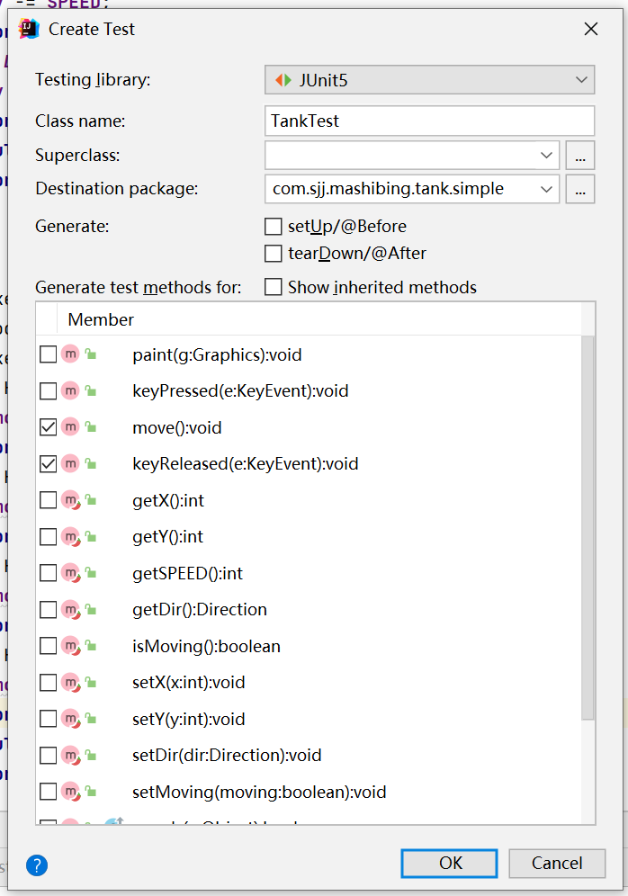
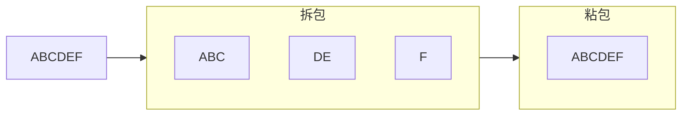
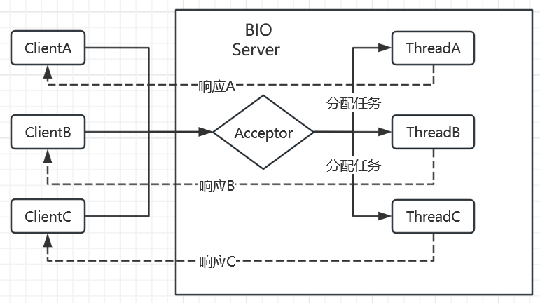
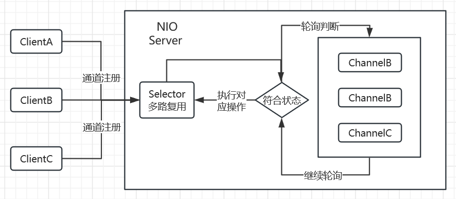
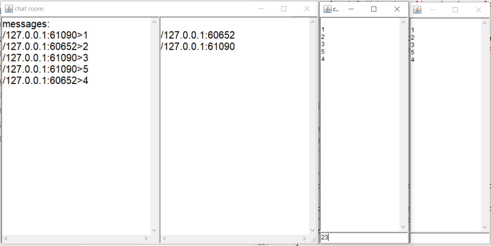
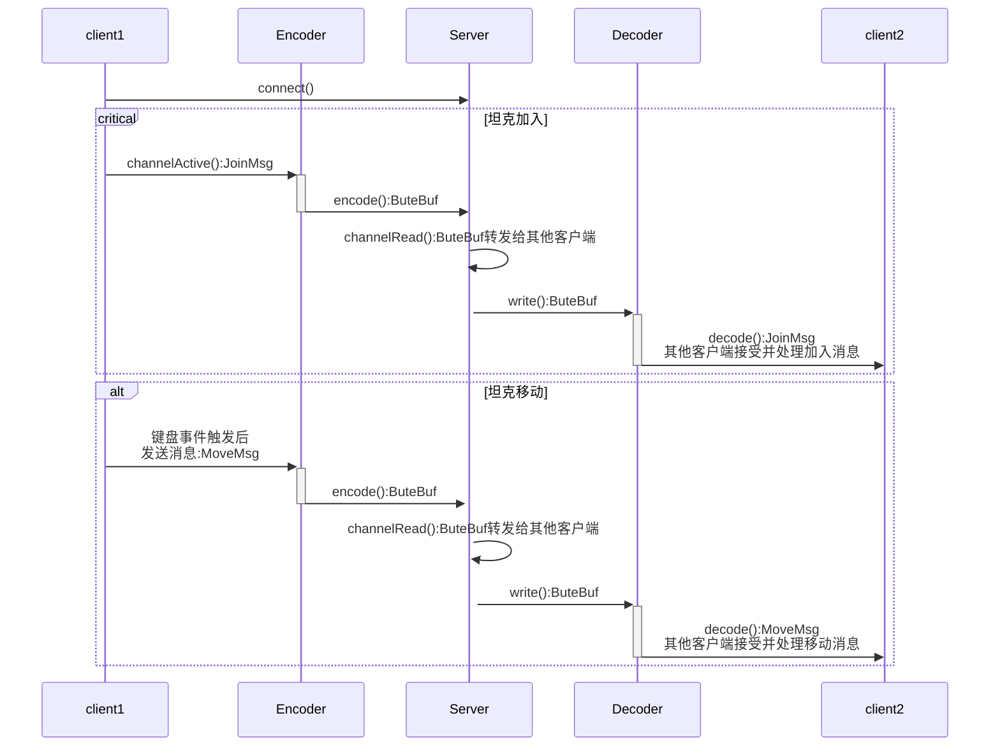

# 坦克大战

## 参考说明

本文内容主要参考了马士兵老师的视频教程（[Java经典实战项目-坦克大战](https://www.mashibing.com/study?courseNo=406&sectionNo=13324&systemId=1&courseVersionId=1307)），结合了老师的讲课内容以及自己的实践做了一些修改。


## 项目目的

坦克大战项目通过一个联机对战游戏的手把手，一行一行，从0到1的开发过程，让开发者精准的理解和运用JavaSE，设计模式，TCP/IP，多线程，NIO等基础知识。真正理解项目的开发过程，并体会项目开发的难点和痛点。只有做项目，才是对所学知识的真正检验。


## 环境说明

开发工具：idea2023，jdk：1.8，Maven：3.6.3

### maven依赖

```xml
<?xml version="1.0" encoding="UTF-8"?>
<project xmlns="http://maven.apache.org/POM/4.0.0" xmlns:xsi="http://www.w3.org/2001/XMLSchema-instance"
         xsi:schemaLocation="http://maven.apache.org/POM/4.0.0 https://maven.apache.org/xsd/maven-4.0.0.xsd">
    <modelVersion>4.0.0</modelVersion>
    <groupId>com.xxx</groupId>
    <artifactId>xxx</artifactId>
    <version>0.0.1-SNAPSHOT</version>
    <name>xxx</name>

    <properties>
        <java.version>1.8</java.version>
    </properties>

    <dependencies>

        <dependency>
            <groupId>cn.hutool</groupId>
            <artifactId>hutool-all</artifactId>
            <version>5.8.21</version>
        </dependency>

        <dependency>
            <groupId>org.projectlombok</groupId>
            <artifactId>lombok</artifactId>
            <version>1.18.28</version>
        </dependency>

        <!-- log4j2-slf4j-适配器 -->
        <dependency>
            <groupId>org.apache.logging.log4j</groupId>
            <artifactId>log4j-slf4j-impl</artifactId>
            <version>2.20.0</version>
        </dependency>

        <!-- log4j2 日志核心 -->
        <dependency>
            <groupId>org.apache.logging.log4j</groupId>
            <artifactId>log4j-core</artifactId>
            <version>2.20.0</version>
        </dependency>
        
        <dependency>
            <groupId>io.netty</groupId>
            <artifactId>netty-all</artifactId>
            <version>4.1.96.Final</version>
        </dependency>

        <!-- 单元测试，Junit5 -->
        <dependency>
            <groupId>org.junit.jupiter</groupId>
            <artifactId>junit-jupiter-engine</artifactId>
            <version>5.9.3</version>
            <scope>test</scope>
        </dependency>
    </dependencies>

    <build>
        <plugins>
            <plugin>
                <groupId>org.springframework.boot</groupId>
                <artifactId>spring-boot-maven-plugin</artifactId>
            </plugin>
        </plugins>
    </build>

</project>
```

### 日志配置

src/main/resources/log4j2.xml

```xml
<?xml version="1.0" encoding="UTF-8" ?>
<!-- log4j2配置文件 -->
<!-- monitorInterval="30" 自动加载配置文件的间隔时间，不低于10秒；生产环境中修改配置文件，是热更新，无需重启应用
 status="info" 日志框架本身的输出日志级别，可以修改为info, -->
<Configuration status="warn" monitorInterval="30">
    <!-- 集中配置属性,使用时通过:${LOG_HOME} -->
    <properties>
        <!-- 当前项目名称，供下方引用 -->
        <property name="PROJECT_NAME" value="tank-battle"/>
        <!-- 默认日志格式-包名自动缩减(同步异步通用) -->
        <property name="LOG_PATTERN" value="%d{yyyy-MM-dd HH:mm:ss.SSS}|%-5level|%-5t|%logger{1.}: %msg%n"/>
        <!-- 日志格式-打印代码的精确位置信息，类，方法，行。（建议同步使用）。异步如果打印位置信息，会有严重性能问题 -->
        <property name="LOG_PATTERN_ALL" value="%d{yyyy-MM-dd HH:mm:ss.SSS}|%-5level|%-5t|%location: %msg%n"/>
        <!-- 日志主目录。如果想把日志输出到tomcat底下时使用。 -->
        <property name="LOG_HOME">${web:rootDir}/WEB-INF/logs</property>
    </properties>

    <!-- 日志打印输出方式 -->
    <Appenders>
        <Console name="STDOUT" target="SYSTEM_OUT">
            <PatternLayout charset="UTF-8" Pattern="${LOG_PATTERN}"/>
        </Console>

        <RollingFile name="FileLog" fileName="logs/${PROJECT_NAME}.log" filePattern="logs/${PROJECT_NAME}-%d_%i.log">
            <PatternLayout charset="UTF-8" Pattern="${LOG_PATTERN}"/>
            <Policies>
                <!-- 每天生成一个，同时如果超过10MB还会再生成 -->
                <TimeBasedTriggeringPolicy/>
                <SizeBasedTriggeringPolicy size="50 MB"/>
            </Policies>
            <DefaultRolloverStrategy max="99"/>
        </RollingFile>
    </Appenders>

    <!-- 将代码路径与上面的日志打印关联起来 -->
    <Loggers>
        <!-- 当前项目日志 -->
        <Logger name="com.sjj" level="INFO" additivity="false">
            <AppenderRef ref="STDOUT"/>
            <AppenderRef ref="FileLog"/>
        </Logger>

        <!-- 第三方依赖项目日志 -->
        <logger name="org.springframework" level="info"/>
        <logger name="org.jboss.netty" level="warn"/>

        <!--日志级别以及优先级排序: OFF > FATAL > ERROR > WARN > INFO > DEBUG > TRACE > ALL -->
        <!-- 根节点日志，除了上面配置的之外的日志 -->
        <Root level="WARN">
            <AppenderRef ref="STDOUT"/>
            <AppenderRef ref="FileLog"/>
        </Root>
    </Loggers>
</Configuration>
```


### 单元测试

确认项目已加入Junit5依赖，就是如下这段。

```xml
        <dependency>
            <groupId>org.junit.jupiter</groupId>
            <artifactId>junit-jupiter-engine</artifactId>
            <version>5.9.3</version>
            <scope>test</scope>
        </dependency>
```

新建单元测试类的步骤。

1. 在要创建单元测试的功能类上，依次点Code > generate > Test
2. 然后在弹出的窗口中，选择Junit版本为5，测试类名，测试方法等。然后点确定。
3. 
4. IDEA会自动根据功能类的路径在test目录中创建相同路径但以Test结尾的测试类。并且会自动生成勾选方法的默认测试代码。
5. 根据程序的输入和输出，编写单元测试代码。
6. 点击方法左边的绿色三角形就可以执行单元测试用例了。

为什么要进行单元测试？

1. 方法内部可以很复杂，如果靠肉眼观察，比较耗时间。单元测试可以根据入参和返回值测试方法是否达到要求。
2. 代码是开发人员写的，最了解代码逻辑的还是开发人员。测试人员测试不到代码细节。
3. 在一个大的功能中，可能会有很多方法，每个方法都要写Main方法来一个个测试比较复杂，而且也不知道测了哪些场景。

为什么有的公司不做单元测试。

1. 代码业务可能比较简单，程序员读代码不是很费力。
2. 写单元测试需要额外花时间，程序员工作比较忙，没时间写。


## 开发说明

### 总体流程

1. 使用awt实现一个简易版单机坦克大战。
2. 使用设计模式优化简易版
3. 使用Netty实现联机版坦克大战。


### bug分级

1. 编译错误
2. 运行时异常
   1. 同步日志中的异常，定位到错误代码行。
3. 运行没异常，结果不对（不符合预期）。
   1. 需要分析代码，分析日志。必要时还需要增加日志打印关键值。
4. 运行没异常，结果有时对有时不对。
   1. 需要比对正常情况和异常情况的日志的区别。
   2. 最好能找到必然重现条件。


## 单机简易版

1. 创建项目主Frame并显示

2. 绘制矩形方块

   1. 覆盖paint方法

3. 模拟动画效果，每隔一定时间重新绘制一个新的

   1. 循环调用repaint方法。
   2. repaint方法内部会调用update和paint方法，先更新绘制参数，然后重新绘制。

4. 让方块可以响应键盘操作。

   1. Frame.addKeyListener()方法，参数用内部类
   2. 为什么用内部类？高内聚，低耦合。
   3. 这种用法属于[观察者模式](#6.1 观察者模式)。
   4. 为什么不使用方法内部类（匿名内部类）？
      1. 类内部使用更加方便，例如：内部类访问更加方便的访问包装类的变量。
      2. 一种设计习惯，并不是绝对不能用。
   5. 内部类继承KeyAdapter，实现keyPressed方法。
      1. 为什么不实现KeyListener接口？实现接口要实现接口的所有方法，但其实并不是所有方法都有必要去实现。继承的这个类已经实现了接口方法。所以继承这个类之后只要实现自己想要的方法即可。
      2. 虽然叫KeyAdapter，但并不属于[适配器模式](#5.4 适配器模式)。

5. 根据不同的键盘响应，向不同的方向移动。

   1. 截止目前的代码，一共2个类：

   2. ```java
      @Slf4j
      public class Main {
          public static void newFrame() {
              Frame f = new Frame("tank war");
              f.setLocation(400,100);
              f.setSize(800,600);
              f.setVisible(true);
          }
      
          public static void main(String[] args) {
              log.info("tank war starting ...");
              Frame f = new TankFrame();
      
              for (; ; ) {
                  try {
                      TimeUnit.MILLISECONDS.sleep(25);
                      f.repaint();
                  } catch (InterruptedException e) {
                      log.error("paint-InterruptedException:", e);
                  }
              }
          }
      }
      
      @Slf4j
      public class TankFrame extends Frame {
          private int x = 100;
          private int y = 100;
          private final int SPEED = 5;
      
          public TankFrame() throws HeadlessException {
              this.setTitle("tank war");
              this.setLocation(400, 100);
              this.setSize(800, 600);
              this.setVisible(true);
              this.addKeyListener(new TankKeyListener());
          }
      
          /**
           * 覆盖此方法后，会在frame创建时就执行。
           * @param g
           */
          @Override
          public void paint(Graphics g) {
              g.fillRect(x, y, 50, 50);
          }
      
          /**
           * 继承的这个类已经实现了接口方法。所以继承这个类之后只要实现自己想要的方法即可
           */
          private class TankKeyListener extends KeyAdapter {
              @Override
              public void keyPressed(KeyEvent e) {
                  int keycode = e.getKeyCode();
                  switch (keycode) {
                      case KeyEvent.VK_LEFT:
                          x -= SPEED;
                          break;
                      case KeyEvent.VK_RIGHT:
                          x += SPEED;
                          break;
                      case KeyEvent.VK_UP:
                          y -= SPEED;
                          break;
                      case KeyEvent.VK_DOWN:
                          y += SPEED;
                          break;
                      default:
                          break;
                  }
              }
          }
      }
      ```

6. 考虑如果有多辆坦克怎么办？基于面向对象思想重新设计。

   1. 名词，抽象成类
   2. 动词，抽象成方法。
   3. 抽象出坦克类，封装坐标，速度，键盘响应事件。

7. 考虑坦克的炮筒和子弹要和行进方向一致？

   1. 设计一个坦克方向属性，当按下键盘是改变这个值。方向使用枚举类。
   2. 为什么不用int？使用int，例如：4个方向，1，2，3，4。但是阻止不了调用方set一个5。
   3. 这种错误，如果方法考虑不周，要等到运行时，才能发现。
   4. 如果使用枚举，编译的时候，就无法set第5个值。
   5. 和界面上的字段为什么有的要使用下拉框而不全部使用文本框是一个道理。

8. 给坦克指定图片，不再使用黑色长方形。

   1. 使用之前可以用单元测试，测试读取图片方法是否正确。

   2. 测试坦克的图片是否可以随着方向键自动旋转。（炮管要朝着运行方向）

   3. 将之前的绘制黑色长方形方法替换成绘制坦克图片。

   4. ```java
      private final static String tankNormal = "images/GoodTank1.png";
      
      public void paint(Graphics g) throws IOException {
              //g.fillRect(x, y, 50, 50);
              //使用坦克图片，绘制坦克
              BufferedImage tankL = ImageIO.read(this.getClass().getClassLoader().getResourceAsStream(tankNormal));
              g.drawImage(tankL, x, y, null);
          }
      ```

   5. 

9. 优化坦克图片加载

   1. 目前坦克的paint方法是每隔25ms调用一次，也就是说坦克图片的加载每秒中要加载40次
   2. 这里面存在性能问题，因为实际上坦克图片一旦加载成功了，后面一般情况下是不会变的。所以不需要加载这么多次。
   3. 考虑新建一个资源管理类，统一的维护坦克的上下左右的图片。其他三个方向的也只需要加载一次，然后旋转3次就可以了

### 解决图形闪烁问题

1. 闪烁的原因是图形数据是一点点传给显卡的显存然后显示的，由于显示器本身存在刷新频率，所以会将图形一点点的刷新显示

2. 解决方法是使用双缓冲覆盖update方法，repaint方法会先调用update然后调用paint方法。

3. 在调用paint方法让其显示到屏幕上之前，可以通过update方法将图形先在内存中画好。

```java
  /**
    * 用于解决图形闪烁问题。现在内存中画好图形，再让显卡一次性加载到现存中显示。
    * 如果把图形一点点传给显存，就会出现图片一点点刷新，也就是闪烁问题。
    * @param g Graphics 显卡的画笔
    */
   @Override
   public void update(Graphics g) {
       if (offScreenImage == null) {
           //创建一个和窗口一样大的Image对象（内存中）
           offScreenImage = this.createImage(GAME_WIDTH, GAME_HEIGHT);
       }
       //得到内存中的画笔（Graphics对象）
       Graphics gOffScreen = offScreenImage.getGraphics();
       Color c = gOffScreen.getColor();
       gOffScreen.setColor(Color.BLACK);
       gOffScreen.fillRect(0, 0, GAME_WIDTH, GAME_HEIGHT);
       gOffScreen.setColor(c);
       //在内存中先把这个图形画好
       paint(gOffScreen);
       //传给显卡显存的画笔，让图形显示到显示器上
       g.drawImage(offScreenImage, 0, 0, null);
   }
```


### 加入敌方坦克，让坦克发射子弹

1. 定义Group枚举类，区分我方（good），敌方（bad）

2. 创建一个子弹类，定义属性：坐标，长宽，方向等等

3. 在资源管理器中预加载子弹的图片。

4. 定义子弹绘制方法paint，并且在主窗口绘制时调用。

5. 定义子弹的移动方法，在绘制完了之后调用移动方法，移动方向和坦克方向一致。

6. 当按下ctrl键之后才让坦克发射子弹。

   1. 新建坦克的发射子弹方法（fire），创建子弹并加入到主窗口中。
   2. 在坦克的ctrl键释放事件中，调用刚刚创建的发射子弹方法。（避免按着键不松，一直不停的发射子弹）
   3. 在主窗口的绘制方法（paint）中加入子弹的绘制方法。
   4. 流程：主窗口显示>按下ctrl键>触发键盘事件>调用子弹发射方法>创建子弹对象>加入到主窗口的子弹列表中>每秒40次调用主窗口的paint方法>调用子弹的paint方法>不断改变子弹坐标方向>出现子弹发射出去的效果。

7. 降低主窗口和坦克子弹之间的耦合度

   1. 耦合度排行：继承最强 > 接口实现 > 成员变量 > 方法局部变量
   2. 将主窗口改成成为单例模式，其他对象需要时可以在方法中调用。

   

### 子弹性能问题解决

1. 打出的子弹都放在list中，没有销毁只是超出屏幕边界看不见，会越来越多直至内存溢出。

2. 在子弹中新增属性living，用于标记子弹是否已超出边界。

3. ```java
       /**
        * 检查子弹是否超出窗口边界
        */
       public void boundCheck() {
           if (x < 0 || x > TankFrame.GAME_WIDTH || y < 30 || y > TankFrame.GAME_HEIGHT) {
               living = false;
           }
       }
   ```

4. 在坦克的移动move方法中可以做边界检查，超出边界后就将living改成false。

5. 在主窗口的paint方法中做出判断，如果子弹living=false就不在绘制且从list中移除。

6. ```java
       public void paint(Graphics g) {
           try {
               Color c = g.getColor();
               g.setColor(Color.WHITE);
               g.drawString("bullets: " + bullets.size(), 10, 50);
               g.setColor(c);
   
               mytank.paint(g);
               enemy.paint(g);
               for (int i = 0; i < bullets.size(); i++) {
                   Bullet b = bullets.get(i);
                   if (b.isLiving()) {
                       bullets.get(i).paint(g);
                   } else {
                       //如果子弹超出边界则不在打印，且需要移除。否则可能内存泄露。
                       bullets.remove(i);
                   }
               }
           } catch (IOException e) {
               log.error("坦克绘制异常：", e);
           }
       }
   ```

7. 


### 当子弹打到坦克时出现中弹效果。

1. 需要判断出子弹是否触碰到了坦克的边缘，这个在游戏中叫碰撞检测。涉及很多形状不规则物体。
2. 在这个游戏里可以简单把坦克和子弹当成长方形，需要判断2个长方形是否相交。
3. 还需要考虑子弹的发出方，自己坦克，盟友，敌人。只有被敌人的子弹打中才会出现爆炸效果。
4. 在子弹和坦克的类中增加长方形rect属性，用于判断是否相撞。
5. 当绘制子弹时加入碰撞方法，检查子弹是否和坦克相撞，如果相撞则清除坦克和子弹


### 让敌方坦克自己动

1. 将玩家控制的坦克和敌方坦克分成2个类。

2. 敌方坦克不需要响应键盘事件，移动完了之后随机切换移动方向，同时随机发射子弹。

3. 坦克移动超出边界问题。使用临时变量记录新的坐标，校验新坐标是否超出边界，不超出在修改坐标。

4. ```java
       public void move() {
           int xNew = x;
           int yNew = y;
           switch (dir) {
               case LEFT:
                   xNew = x - SPEED;
                   break;
               case RIGHT:
                   xNew = x + SPEED;
                   break;
               case UP:
                   yNew = y- SPEED;
                   break;
               case DOWN:
                   yNew = y + SPEED;
                   break;
               default:
                   break;
           }
           if(boundCheck(xNew, yNew)){
               setX(xNew);
               setY(yNew);
           }
       }
   
   	/**
        * 检查对象是否超出窗口边界
        */
       public boolean boundCheck(int x, int y) {
           if (x < 0 || x > TankFrame.GAME_WIDTH - WIDTH || y < 30 || y > TankFrame.GAME_HEIGHT - HEIGHT) {
               log.info("坐标超出边界，x:{}，y:{}", x, y);
               return false;
           }
           return true;
       }
   ```

### 加入更多敌方坦克。

1. 将TankFrame中的敌方坦克改成List<Tank>，初始化时计算坐标循环加载
2. 循环子弹时，每一个子弹需要循环判断是否击中每一辆坦克。（也可以判断是否击中玩家坦克）
3. 为了防止多个敌方坦克互相残杀，在子弹的碰撞方法中需要考虑group，不一样时才算击中。


### 子弹打中坦克时出现爆炸效果

1. 新增一个类Explode，初始化加载16张爆炸图片。在TankFrame中也新增List<Explode>属性。
2. 在Explode中新增paint方法，每次调用都会按照顺序绘制1张爆炸图片，同时step+1
3. 当坦克被击中后就往TankFrame中，新增一个Explode的对象。
4. 在TankFrame的paint方法中，循环List<Explode>属性，调用explode的paint方法，
5. 当step达到数组的最大值时，爆炸效果绘制完毕，从List<Explode>中移除，下次就不会继续绘制了。


### 加入声音效果

1. Awt对于声音的支持并不是很好，所以声音播放仅做锦上添花只用。
2. 新增Audio类，用于加载和播放音乐。
3. 在Explode类的构造方法中，新建新的线程播放爆炸声"audio/explode.wav"
4. 在主窗口创建之前，新建线程循环播放背景音乐。"audio/war1.wav"
5. 在坦克移动和发射子弹时也新建线程，播放对应的音乐


## 设计模式优化版

将之前做好的保留，复制到一个新的包下，使用设计模式逐步优化代码。

### 使用策略模式切换开火策略

1. 将配置项放入到配置文件config-tank.properties中。新增配置读取类ConfigUtil来读取配置项。
2. 新增开火[策略模式](#6.3 策略模式)接口以及他的几个实现类：默认开火策略，往2个方向开火策略，往4个方向开火策略
3. 重构老的fire方法，读取配置文件中的配置项的值，使用反射反射出接口的实际实现类，调用实现类的fire方法。

```java
public void fire() {
   new Thread(() -> new Audio("audio/tank_fire.wav").play()).start();
   FireStrategy fs = ReflectUtil.newInstance(ConfigUtil.getStr("tank.player.fire.strategy"));
   fs.fire(this);
}
   
/**
* 往2个方向开火<br>
*
* @author namelessmyth
* @version 1.0
* @date 2023/8/8
*/
public class Fire2Dir implements FireStrategy{
    @Override
    public void fire(TankPlayer tank) {
        //根据坦克坐标计算子弹坐标，使子弹出现在坦克中部。
        int bX = tank.getX() + TankPlayer.WIDTH / 2 - Bullet.WIDTH / 2;
        int bY = tank.getY() + TankPlayer.HEIGHT / 2 - Bullet.HEIGHT / 2;
        TankFrame.INSTANCE.bullets.add(new Bullet(tank.getId(), bX, bY, tank.getDir(), tank.getGroup(), null));
        TankFrame.INSTANCE.bullets.add(new Bullet(tank.getId(), bX, bY, tank.getDir().getOpposite(), tank.getGroup(), null));
    }
}

/**
 * 往4个方向开火<br>
 *
 * @author namelessmyth
 * @version 1.0
 * @date 2023/8/8
 */
public class Fire4Dir implements FireStrategy{
    @Override
    public void fire(TankPlayer tank) {
        //根据坦克坐标计算子弹坐标，使子弹出现在坦克中部。
        int bX = tank.getX() + TankPlayer.WIDTH / 2 - Bullet.WIDTH / 2;
        int bY = tank.getY() + TankPlayer.HEIGHT / 2 - Bullet.HEIGHT / 2;
        for (Dir d : Dir.values()) {
            TankFrame.INSTANCE.bullets.add(new Bullet(tank.getId(), bX, bY, d, tank.getGroup(), null));
        }
    }
}
```


### 游戏对象公共抽象类

1. 目前tankFrame东西还比较少，后续考虑加入其他元素。例如：墙，河，草丛，地雷。

2. 他们每一个类都会有x，y坐标，长宽，paint方法等。然后还要考虑坦克撞墙了怎么办？子弹撞墙怎么办？

3. 考虑如下问题如何解决？

   1. 对于后续的元素加入如何能让代码更加优雅
   2. 参考开闭原则，如何能让后续元素的新增不修改TankFrame的代码，而是新增代码？
   3. 如何能让后续的功能新增对目前已经实现好的功能，影响最小化？

4. 设计一个公共抽象类游戏对象（AbstractGameObject），封装公共属性和方法

   1. 所有游戏对象都继承这个类。例如：坦克，子弹，爆炸，以及后续的游戏对象。

   2. ```java
      /**
       * 游戏对象的公共父类<br>
       *
       * @author namelessmyth
       * @version 1.0
       * @date 2023/8/9
       */
      @Data
      @ToString
      public abstract class AbstractGameObject {
          private UUID id = UUID.randomUUID();
          private UUID playerId;
          /** 坐标 */
          private int x, y;
      
          public abstract void paint(Graphics g) throws IOException;
      }
      ```

   3. 将原来的不同种类的List改成同一个list。初始化的时候都加入到这个list中。

   4. paint的时候，循环这个list，调用各自的paint方法。

   5. ```java
      @Slf4j
      public class TankFrame extends Frame {
          public static final int GAME_WIDTH = ConfigUtil.getInt("frame.main.width");
          public static final int GAME_HEIGHT = ConfigUtil.getInt("frame.main.height");
          public static final int ENEMY_SIZE = ConfigUtil.getInt("tank.enemy.size");
          Random r = new Random();
          Image offScreenImage = null;
          TankPlayer myTank;
          public List<AbstractGameObject> objects;
      
          public static final TankFrame INSTANCE = new TankFrame();
      
          private TankFrame() throws HeadlessException {
              //创建游戏的主Frame
              this.setTitle("tank war");
              this.setSize(GAME_WIDTH, GAME_HEIGHT);
              this.setLocation(400, 100);
              //加入主窗口的键盘事件监听，让键盘可以控制坦克
              this.addKeyListener(new TankKeyListener());
      
              initGameObjects();
              log.info("tank war Main frame initialization completed");
          }
      
          private void initGameObjects() {
              myTank = new TankPlayer(GAME_WIDTH / 2 - 100, GAME_HEIGHT - 70, Dir.UP, Group.GOOD, this);
      
              objects = new ArrayList<>();
              int gap = GAME_WIDTH / ENEMY_SIZE;
              for (int i = 0; i < ENEMY_SIZE; i++) {
                  Tank tank = new Tank(gap * i, 30, Dir.DOWN, Group.BAD, this);
                  add(tank);
              }
          }
      
          public void add(AbstractGameObject go){
              objects.add(go);
          }
      
          public void remove(AbstractGameObject go){
              objects.remove(go);
          }
      
          @Override
          public void paint(Graphics g) {
              try {
                  myTank.paint(g);
      
                  for (int i = 0; i < objects.size(); i++) {
                      objects.get(i).paint(g);
                  }
              } catch (IOException e) {
                  log.error("TankFrame绘制异常：", e);
              }
          }
      
          /**
           * 用于解决图形闪烁问题。现在内存中画好图形，再让显卡一次性加载到现存中显示。
           * 如果把图形一点点传给显存，就会出现图片一点点刷新，也就是闪烁问题。
           * @param g Graphics 显卡的画笔
           */
          @Override
          public void update(Graphics g) {
              if (offScreenImage == null) {
                  //创建一个和窗口一样大的Image对象（内存中）
                  offScreenImage = this.createImage(GAME_WIDTH, GAME_HEIGHT);
              }
              //得到内存中的画笔（Graphics对象）
              Graphics gOffScreen = offScreenImage.getGraphics();
              Color c = gOffScreen.getColor();
              gOffScreen.setColor(Color.BLACK);
              gOffScreen.fillRect(0, 0, GAME_WIDTH, GAME_HEIGHT);
              gOffScreen.setColor(c);
              //在内存中先把这个图形画好
              paint(gOffScreen);
              //传给显卡显存的画笔，让图形显示到显示器上
              g.drawImage(offScreenImage, 0, 0, null);
          }
      
          /**
           * 继承的这个类已经实现了接口方法。所以继承这个类之后只要实现自己想要的方法即可
           */
          private class TankKeyListener extends KeyAdapter {
              @Override
              public void keyPressed(KeyEvent e) {
                  myTank.keyPressed(e);
              }
      
              @Override
              public void keyReleased(KeyEvent e) {
                  myTank.keyReleased(e);
              }
          }
      }
      ```

5. 做到这里，新的问题产生了。对象和对象之间的碰撞要如何实现？

   1. 例如：子弹要和坦克、墙进行不同的碰撞，坦克要和地雷，墙进行不同的碰撞
   2. 如何实现比较好？使用2层循环将每个对象都调用一遍碰撞方法？


### 职责链模式-游戏对象相互碰撞

1. 哪2个对象之间可以碰撞，后续会随着对象的增多而不断增多。

   1. 例如：目前已知子弹和坦克可以碰撞，后续如果新增了墙。那子弹也可以和墙碰撞。

2. 新增一个碰撞接口Collider，将任意2个对象之间的碰撞规则设计成接口方法。后续可以不断的新增实现类。

3. 已知子弹和坦克可以碰撞，那可以定义一个实现类BulletTankCollider实现Collider接口。

   1. ```java
      public class BulletTankCollider implements Collider{
          @Override
          public void collide(GameObject go1, GameObject go2) {
              if (go1 instanceof Tank && go2 instanceof Bullet) {
                  ((Bullet) go2).collideWith((Tank) go1);
              } else if (go1 instanceof Bullet && go2 instanceof Tank) {
                  ((Bullet) go1).collideWith((Tank) go2);
              }
          }
      }
      ```

4. 在TankFrame中定义一个List<Collider> colliders属性，通过读取配置文件加载所有实现类。

   1. ```java
      private void initColliders() {
              String collidersStr = ConfigUtil.getStr("object.collider.chain");
              if (StrUtil.isNotBlank(collidersStr)) {
                  List<String> strs = StrUtil.split(collidersStr, ",");
                  colliders = new ArrayList<>(strs.size());
                  for (String str : strs) {
                      colliders.add(ReflectUtil.newInstance(str));
                  }
              }
          }  
      ```

5. 在循环所有游戏对象时，再加一层子循环，对于任意2个游戏对象都要调用所有的碰撞实现类。

6. ```java
       @Override
       public void paint(Graphics g) {
           try {
               myTank.paint(g);
   
               for (int i = 0; i < objects.size(); i++) {
                   GameObject go = objects.get(i);
                   if (CollUtil.isNotEmpty(colliders)) {
                       for (int i1 = i + 1; i1 < objects.size(); i1++) {
                           GameObject go1 = objects.get(i1);
                           for (Collider c : colliders) {
                               c.collide(go, go1);
                           }
                       }
                   }
                   go.paint(g);
               }
           } catch (IOException e) {
               log.error("TankFrame绘制异常：", e);
           }
       }
   ```

7. 上面的代码还是有一些问题，考虑如下场景。

   1. 假设我们用2层循环再做碰撞时，当前循环到了一个子弹。这个子弹再和坦克碰撞完了之后可能已经die了。

   2. 但是按照程序的逻辑，还会继续往下循环，子弹还会继续和下一辆坦克或者其他对象继续碰撞。

   3. 所以当这个对象之间的碰撞何时应该停止，何时应该继续还是需要一些额外处理的。

   4. 新增一个类CollideChain，管理碰撞类之间的继续处理规则。

   5. 优化每一个碰撞方法，返回true表示可以继续碰撞，返回false代表终止碰撞。外层循环也要判断当前对象是否已经die。

   6. CollideChain自己也要实现Collider接口，此为[职责链模式](#6.4 职责链模式)

   7. ```java
      @Slf4j
      @Data
      public class CollideChain implements Collider{
          private List<Collider> colliders;
      
          public CollideChain() {
              super();
              initColliders();
          }
      
          private void initColliders() {
              String collidersStr = ConfigUtil.getStr("object.collider.chain");
              if (StrUtil.isNotBlank(collidersStr)) {
                  List<String> strs = StrUtil.split(collidersStr, ",");
                  colliders = new ArrayList<>(strs.size());
                  for (String str : strs) {
                      colliders.add(ReflectUtil.newInstance(str));
                  }
              }
              log.info("init Collider is over.{}", colliders);
          }
      
          @Override
          public boolean collide(GameObject go1, GameObject go2) {
              if (CollUtil.isNotEmpty(getColliders())) {
                  for (Collider collider : getColliders()) {
                      if (!collider.collide(go1, go2)) {
                          return false;
                      }
                  }
              }
              return true;
          }
      }
      
          /**
          * tankFrame调用职责链管理类
          */
      	@Override
          public void paint(Graphics g) {
              try {
                  myTank.paint(g);
      
                  for (int i = 0; i < objects.size(); i++) {
                      GameObject go = objects.get(i);
                      if (!go.isLiving()) {
                          //如果在上一次碰撞中已经die则不处理。
                          continue;
                      }
                      for (int i1 = i + 1; i1 < objects.size(); i1++) {
                          GameObject go1 = objects.get(i1);
                          if (!collideChain.collide(go, go1)) {
                              break;
                          }
                      }
                      go.paint(g);
                  }
              } catch (IOException e) {
                  log.error("TankFrame绘制异常：", e);
              }
          }
      ```

   8. 


### MVC，门面模式，中介者模式

考虑这个问题：如果后续要将游戏改成android版或者网页版，如何能尽最大可能重用现有代码？

可以参考MVC模式，将视图层和模型层分开。游戏中TankFrame就是负责视图展现的。而Tank，Bullet，Wall都是模型，用来给视图提供数据支撑的。考虑将所有的模型封装到一个统一GameModel类中。这样TankFram只需要跟GameModel打交道，不需要和具体的模型耦合在一起了。这也是[门面模式](#5.5 外观模式)的体现。

从一个角度，每个游戏对象之间还有复杂的交互，例如：子弹和坦克，墙有交互；坦克和坦克、墙、子弹有交互。如果后续要增加一个元素要考虑这个新的元素与已有元素之间如何交互。随着元素的不断增多，这种相互之间的交互会越来越复杂。同时这种交互的代码如果写在每个对象里面。那每次新增元素都要改动到老元素。所以可以由这个GameModel中介来统一和所有元素交互，那后续新增元素就不用改动那么复杂了。这是[中介者模式](#6.11 中介者模式)的体现。

```java
package com.sjj.mashibing.tank.pattern;

import com.sjj.mashibing.tank.domain.Dir;
import com.sjj.mashibing.tank.domain.Group;
import com.sjj.mashibing.tank.pattern.chainCollider.CollideChain;
import com.sjj.mashibing.tank.pattern.gameObj.GameObject;
import com.sjj.mashibing.tank.pattern.gameObj.Tank;
import com.sjj.mashibing.tank.pattern.gameObj.TankPlayer;
import com.sjj.mashibing.tank.pattern.gameObj.Wall;
import com.sjj.mashibing.tank.util.ConfigUtil;
import lombok.Data;
import lombok.ToString;
import lombok.extern.slf4j.Slf4j;

import java.awt.*;
import java.io.IOException;
import java.io.Serializable;
import java.util.ArrayList;
import java.util.List;
import java.util.UUID;

/**
 * 封装所有游戏的model对象-让View层不用和每个Model直接对接<br>
 * 设计模式-门面模式-中介者模式<br>
 * @author namelessmyth
 * @version 1.0
 * @date 2023/8/9
 */
@Data
@Slf4j
@ToString
public class GameModel implements Serializable {
    private static final long serialVersionUID = -8488675236010379054L;
    public static final int ENEMY_SIZE = ConfigUtil.getInt("tank.enemy.size");

    TankPlayer myTank;
    List<GameObject> objects;
    CollideChain collideChain = new CollideChain();

    public GameModel() {
        initGameObjects();
    }

    private void initGameObjects() {
        objects = new ArrayList<>();

        myTank = new TankPlayer(TankFrame.GAME_WIDTH / 2 - 100, TankFrame.GAME_HEIGHT - 70, Dir.UP, Group.GOOD);
        add(myTank);

        int gap = TankFrame.GAME_WIDTH / ENEMY_SIZE;
        for (int i = 0; i < ENEMY_SIZE; i++) {
            Tank tank = new Tank(gap * i, 30, Dir.DOWN, Group.BAD);
            add(tank);
        }
        add(new Wall(300, 300, 240, 40));
    }

    public void paint(Graphics g) {
        try {
            Color c = g.getColor();
            g.setColor(Color.WHITE);
            g.drawString("objects: " + objects.size(), 10, 45);
            g.setColor(c);

            for (int i = 0; i < objects.size(); i++) {
                GameObject go = objects.get(i);
                if (!go.isLiving()) {
                    //如果在上一次碰撞中已经die则不处理。
                    continue;
                }
                for (int i1 = i + 1; i1 < objects.size(); i1++) {
                    GameObject go1 = objects.get(i1);
                    if (!collideChain.collide(go, go1)) {
                        break;
                    }
                }
                go.paint(g);
            }
        } catch (IOException e) {
            log.error("TankFrame绘制异常：", e);
        }
    }

    public void add(GameObject go) {
        objects.add(go);
    }

    public void remove(GameObject go) {
        objects.remove(go);
    }
}

```


### 存盘功能，序列化

要求：当按下键盘S键时自动将当前游戏进度，存储到硬盘上。按下L键时，自动加载之前保存的进度。

实现思路：基于上述优化，所有的游戏对象都已经放到了GameModel中，可以使用Java的序列化机制，将游戏数据都存到一个文件中。然后当用户按下L键的时候，再从这个文件中反序列化成GameModel中。

```java
    public void save() {
        File file = FileUtil.file("tankBattle.dat");
        try {
            IoUtil.writeObj(new FileOutputStream(file), true, getGm());
        } catch (FileNotFoundException e) {
            log.error("save game exception.", e);
        }
        log.info("save game successfully!");
    }

    public void Load() {
        File file = FileUtil.file("tankBattle.dat");
        try {
            setGm(IoUtil.readObj(new FileInputStream(file)));
        } catch (FileNotFoundException e) {
            log.error("save game exception.", e);
        }
        log.info("load game successfully!");
    }

    /**
     * 继承的这个类已经实现了接口方法。所以继承这个类之后只要实现自己想要的方法即可
     */
    private class TankKeyListener extends KeyAdapter {
        @Override
        public void keyPressed(KeyEvent e) {
            int keycode = e.getKeyCode();
            switch (keycode) {
                default:
                    getGm().getMyTank().keyPressed(e);
                    break;
            }
        }

        @Override
        public void keyReleased(KeyEvent e) {
            int keycode = e.getKeyCode();
            switch (keycode) {
                case KeyEvent.VK_S:
                    save();
                    break;
                case KeyEvent.VK_L:
                    Load();
                    break;
                default:
                    getGm().getMyTank().keyReleased(e);
                    break;
            }
        }
    }
```

至此，单机版功能基本完成。


## 联机版预热

### 网络基础

#### TCP/UDP的区别

UDP速度更快，但可能会丢包，用来发送游戏数据时，可能会发生游戏人物闪现的问题。

TCP不会丢包，但可能出现顿和卡的问题。因为当网络不好的情况下，服务器可能没接收到客户端的数据，客户端会一直卡在这等服务器响应。


##### 拆包与粘包

数据在经过网络传输时并不是完全按照我们肉眼看到的整体进行传输的。TCP会根据TCP缓冲区的实际情况进行包的划分，一个完整的包可能会被TCP拆分成多个包进行发送，也有可能把多个小的包封装成一个大的数据包发送。

例如：一个字符窜“ABCDEF”，可能会被拆分成3个包进行传输。这个就是拆包。然后客户端在接收时要按照拆的顺序进行组合，这个过程就是粘包。



TCP在传输时是可以保证顺序的。但是UDP就不能保证了，所以UDP的粘包比较麻烦。UDP是基于报文发送的，从UDP的帧结构可以看出，在UDP首部采用了16bit来指示UDP数据报文的长度，因此在应用层能很好的将不同的数据报文区分开，从而避免粘包和拆包的问题。

**粘包、拆包发生原因**

发生TCP粘包或拆包有很多原因，现列出常见的几点，

- 要发送的数据大于TCP发送缓冲区剩余空间大小，将会发生拆包。
- 待发送数据大于MSS（最大报文长度），TCP在传输前将进行拆包。
- 要发送的数据小于TCP发送缓冲区的大小，TCP将多次写入缓冲区的数据一次发送出去，将会发生粘包。
- 接收数据端的应用层没有及时读取接收缓冲区中的数据，将发生粘包。

**粘包、拆包解决办法**

通过以上分析，我们清楚了粘包或拆包发生的原因，那么如何解决这个问题呢？解决问题的关键在于如何给每个数据包添加边界信息，常用的方法有如下几个：

- 发送端给每个数据包添加包首部，首部中应该至少包含数据包的长度，这样接收端在接收到数据后，通过读取包首部的长度字段，便知道每一个数据包的实际长度了。
- 发送端将每个数据包封装为固定长度（不够的可以通过补0填充），这样接收端每次从接收缓冲区中读取固定长度的数据就自然而然的把每个数据包拆分开来。
- 可以在数据包之间设置边界，如添加特殊符号，这样，接收端通过这个边界就可以将不同的数据包拆分开。


#### BIO、NIO、AIO

Java目前总共有3种网络编程IO模型：BIO、NIO、AIO，他们之间的对比表如下：

|          | BIO                                                          | NIO                                                          | AIO                                                          |
| -------- | ------------------------------------------------------------ | ------------------------------------------------------------ | ------------------------------------------------------------ |
| IO模型   | 同步阻塞                                                     | 同步非阻塞（多路复用）                                       | 异步非阻塞                                                   |
| 编程难度 | 简单                                                         | 复杂                                                         | 复杂                                                         |
| 可靠性   | 差                                                           | 好                                                           | 好                                                           |
| 吞吐量   | 低                                                           | 高                                                           | 高                                                           |
| 应用场景 | 适用于连接数目比较小且固定的架构，对服务器资源要求比较高，并发局限于应用中 | 适用于连接数目多且连接比较短（轻操作）的架构，比如聊天服务器，弹幕系统，服务器间通讯等。编程比较复杂，JDK1.4 开始支持。 | 适用于连接数目多且连接比较长（重操作）的架构，比如相册服务器，充分调用 OS 参与并发操作 |

##### BIO

Blocking IO，还有一种叫法：OIO（Old IO），即同步阻塞式IO，JDK1.4 以前的唯一选择。服务器会有一个线程以阻塞的方式等待客户端的连接（accept方法），当有一个客户端连接进入后会创建线程来处理（也可以是线程池）。线程建立后如果客户端如果没有数据可读，线程会一直响应。处理结束返回响应给客户端。处理流程如下图：




最原始的BIO（非新建线程），参考代码如下：

当服务器通过ServerSocket绑定ip和端口，通过accept()方法阻塞等待客户端连接。

当有客户端连接进来后。使用getInputStream()读取客户端数据。如果没数据会阻塞。

```java
public class Server {
    public static void main(String[] args) throws IOException {
        ServerSocket ss = new ServerSocket();
        ss.bind(new InetSocketAddress("localhost", 8888));
        System.out.println("start...");
        //这个方法会一直阻塞，直到有连接进来。
        boolean started = true;
        while (started) {
            Socket s = ss.accept();
            //走到这里说明已经有连接进来了。
            BufferedReader br = new BufferedReader(new InputStreamReader(s.getInputStream()));
            //读取连接中传过来的数据。
            String line = br.readLine();
            //接收完客户端的数据才会释放和关闭。
            System.out.println("read:" + line);
            s.close();
            System.out.println("end...");
        }
    }
}

public class Client {
    public static void main(String[] args) throws IOException {
        Socket s = new Socket("localhost",8888);
        //走到这里说明tcp连接已经建立上。
        BufferedWriter bw = new BufferedWriter(new OutputStreamWriter(s.getOutputStream()));
        //向服务器写数据。
        bw.write("hello server..");
        bw.flush();
        bw.close();
        s.close();
    }
}
```

以生活场景举例：一个饭店有100张桌子，假设一张桌子只能坐一个人。那这个饭店最多接待100个客人。这个饭店只有1个接待员。当客人1到来时，接待员需要接待这个客人入座消费完后，才能接待下一个客人。所以问题就来了，如果其中一个客人来了之后消费很久，接待员就一直无法接待后面的客人了。下面代码就是模拟当client建立了连接之后，不写入数据只是等待。那服务器就会一直阻塞。此时服务器无法响应其他请求。

```java
public class Client {
    public static void main(String[] args) throws IOException {
        Socket s = new Socket("localhost",8888);
        //走到这里说明tcp连接已经建立上。
        BufferedWriter bw = new BufferedWriter(new OutputStreamWriter(s.getOutputStream()));
        /*
        bw.write("hello server..");
        bw.flush();
        bw.close();
        s.close();
        */
        System.in.read();
    }
}
```

所以这种模式存在很大问题。早就被淘汰了，实际的BIO场景是当服务器接收到连接之后，会新建线程来处理。继续用上面的饭店例子来理解，就是有一个总接待员（总管），总管接到客人后，交由其他接待员招待客人。来一个客人就需要一个接待员来给他提供服务。直至客人消费完毕。参考代码如下。

```java
public class ServerThread {
    public static void main(String[] args) throws IOException {
        ServerSocket ss = new ServerSocket();
        ss.bind(new InetSocketAddress("localhost", 8888));
        System.out.println("start...");
        //这个方法会一直阻塞，直到有连接进来。
        boolean started = true;
        while (started) {
            Socket s = ss.accept();
            System.out.println("socket accept:" + s);
            //这里也可以是线程池。
            new Thread(() -> {
                try {
                    //走到这里说明已经有连接进来了。
                    BufferedReader br = new BufferedReader(new InputStreamReader(s.getInputStream()));
                    //读取连接中传过来的数据。
                    String line = br.readLine();
                    //接收完客户端的数据才会释放和关闭。
                    System.out.println("read:" + line);
                    s.close();
                    System.out.println("end...");
                } catch (Exception e) {
                    e.printStackTrace();
                }
            }).start();
        }
    }
}
```

上述代码是简易写法，实际场景是用的线程池。有多少个并发请求就得有多少个线程来处理这些请求。这种模式的问题就是比较占用系统资源。好比饭店有多少客人就得有多少接待员。如果一下子来500个人客人，那就得有500个接待员+1个总管。但实际饭店的接待员比例是少于客人数量的。总结一下BIO存在如下问题：

1. 按请求来创建独立的线程，与对应的客户端进行数据 Read，业务处理，数据 Write。
2. 当并发数较大时，需要创建大量线程来处理连接，系统资源占用较大。否则就会存在等待。
3. 连接建立后，如果当前线程暂时没有数据可读，则线程就阻塞在 Read 操作上，造成线程资源浪费。


##### NIO

NIO，Non-Blocking IO，还有一种叫法是New IO，同步非阻塞式IO。JDK1.4 开始支持。

**基本介绍**

1. NIO 有三大核心部分：Channel（通道）、Buffer（缓冲区）、Selector（选择器） 。
2. NIO 是面向缓冲区，或者面向块编程的。数据读取到一个它稍后处理的缓冲区，需要时可在缓冲区中前后移动，这就增加了处理过程中的灵活性，使用它可以提供非阻塞式的高伸缩性网络编程。
3. Java NIO 的非阻塞模式，使一个线程从某通道发送请求或者读取数据，但是它仅能得到目前可用的数据，如果目前没有数据可用时，就什么都不会获取，而不是保持线程阻塞，所以直至数据变的可以读取之前，该线程可以继续做其他的事情。非阻塞写也是如此，一个线程请求写入一些数据到某通道，但不需要等待它完全写入，这个线程同时可以去做别的事情。
4. 通俗理解：NIO 是可以做到用一个线程来处理多个操作的。假设有 10000 个请求过来,根据实际情况，可以分配 50 或者 100 个线程来处理。不像之前的阻塞 IO 那样，非得分配 10000 个。



**举例说明**

继续用上面的饭店案例。当有客人来到饭店时，将有总管接待客人入座。有的客人来一会儿就走，有的客人需要时间看菜单。此时总管并不会直接派接待员去服务。他会一直在饭店门口、客人1、客人2、客人3之间轮流询问（轮询）。如果某个客人要点单了，他就会叫接待员点单。下单成功后，再通知厨师做饭。可见NIO模型更接近现实。资源利用率更高。


##### AIO

Asynchoronous IO，异步非阻塞IO。 在JDK1.7中引入。AIO 引入异步通道的概念，采用了 Proactor 模式，简化了程序编写，有效的请求才启动线程，它的特点是先由操作系统完成后才通知服务端程序启动线程去处理，一般适用于连接数较多且连接时间较长的应用。

目前来说 AIO 的应用还不是很广泛。Netty 之前也尝试使用过 AIO，不过又放弃了。这是因为，Netty 使用了 AIO 之后，在 Linux 系统上的性能并没有多少提升。


### Netty

#### 简介

基于Java NIO的网络编程框架，支持多种协议 如 FTP，SMTP，HTTP 以及各种二进制和基于文本的传统协议。

#### 为什么用Netty

这个问题等同于Netty的优势。

1）使用简单：封装了JAVA NIO 的很多细节，使用更简单；
2）功能强大：预置了多种编解码功能，支持多种主流协议；实现了零拷贝。
3）扩展性强：可以通过 ChannelHandler 对通信框架进行灵活地扩展；
4）性能优异：通过与其他业界主流的 NIO 框架对比，Netty 的综合性能最优；
5）运行稳定：Netty 修复了已经发现的所有 NIO 的 bug，让开发人员可以专注于业务本身；
6）社区活跃：Netty 是活跃的开源项目，版本迭代周期短，bug 修复速度快。

目前很多知名框架都在使用Netty。例如：

Dubbo： 阿里开源的高性能RPC框架
RocketMQ： 阿里出品的高性能消息队列
Spark： 炙手可热的大数据处理引擎，底层使用Netty
Elasticsearch： 分布式多用户的全文搜索引擎
Apache Cassandra：开源分布式搜索数据库
Flink:分布式高性能高可用的流处理框架
Netty-SocketIO的java服务端实现
Spring5：使用Netty作为http协议框架
Play：简单易用的http服务器
Grpc:google开源的高性能rpc通信框架
Infinispan：针对缓存的高并发键值对数据存储
HornetQ：支持集群和多种协议，可嵌入、高性能的异步消息系统
Vert.x轻量级高性能能JVM应用平台


#### 核心类

##### Channel

 NioServerSocketChannel
 通道对象，可以读取和写入数据

##### EventLoopGroup

 封装EventLoop事件循环，一个EventLoop对应一个线程。
 默认会启动CPU核心数*2的线程数
 负责监听网络事件并调用事件处理器进行相关 I/O 操作的处理

##### ChannelFuture

 Netty 是异步非阻塞的，所有的 I/O 操作都为异步
 可以通过他的 addListener() 方法注册一个ChannelFutureListener，当事件发生时，监听就会自动触发返回结果。
 还可以通过 ChannelFuture 接口的 sync()方法让异步的操作变成同步的。

##### ChannelPipeline

 Channel的处理链，通过addLast()添加ChannelHandler

##### ServerBootstrap

 服务器启动辅助类

##### ChannelHandlerContext

 Channel上下文对象，可以获取channel和服务器信息

##### ByteBuf

 网络数据的基本单位，字节容器，封装了Java NIO的ByteBuffer

##### ByteToMessageDecoder

 解码器，接收消息时使用
MessageToByteEncoder
 编码器，发送消息时使用


#### 面试题

https://blog.csdn.net/crazymakercircle/article/details/124588880


#### 入门案例

以下是服务器端的入门代码案例。可以先用之前写的client连接，会打印出日志。`a client connected:[id: 0x57df00b8, L:/127.0.0.1:8888 - R:/127.0.0.1:55266]`

```java
@Slf4j
public class ServerSimple {
    public static void main(String[] args) throws Exception {
        //总管线程组
        EventLoopGroup bossGroup = new NioEventLoopGroup(1);
        //接待员线程
        EventLoopGroup workerGroup = new NioEventLoopGroup(2);
        //服务器启动辅助类
        ServerBootstrap b = new ServerBootstrap();
        //放在第一位的是总管线程组，第二位的就是接待员线程组。
        b.group(bossGroup, workerGroup);
        //异步全双工
        b.channel(NioServerSocketChannel.class);
        //接收到客户端连接的处理，相当于BIO的accept
        b.childHandler(new ChannelInitializer<SocketChannel>() {
            @Override
            protected void initChannel(SocketChannel sc) throws Exception {
                log.info("a client connected:{}", sc);
                sc.pipeline().addLast(new MyChildHandler());
            }
        });
        b.bind(8888).sync();
    }
}

@Slf4j
class MyChildHandler extends ChannelInboundHandlerAdapter {
    /**
     * 读取通道内的数据
     *
     * @param ctx
     * @param msg
     * @throws Exception
     */
    @Override
    public void channelRead(ChannelHandlerContext ctx, Object msg) throws Exception {
        ByteBuf buf = (ByteBuf) msg;
        log.info("channelRead.msg:{}", buf);
        ctx.writeAndFlush(msg);
        log.info("channelRead.writeAndFlush:{}", msg);
    }

    /**
     * 异常处理
     *
     * @param ctx
     * @param cause
     * @throws Exception
     */
    @Override
    public void exceptionCaught(ChannelHandlerContext ctx, Throwable cause) throws Exception {
        log.error("exceptionCaught:", cause);
        super.exceptionCaught(ctx, cause);
    }
}
```

然后使用Netty写一个入门客户端案例：

```java
public class ClientSimple {
    public static void main(String[] args) throws Exception {
        EventLoopGroup group = new NioEventLoopGroup(1);
        Bootstrap b = new Bootstrap();
        b.group(group);
        b.channel(NioSocketChannel.class);
        b.handler(new ChannelInitializer<SocketChannel>() {
            @Override
            protected void initChannel(SocketChannel ch) throws Exception {
                ch.pipeline().addLast(new MyClientHandler());
            }
        });
        ChannelFuture cf = b.connect("localhost", 8888).sync();
        //直到服务器被关闭，否则一直阻塞。
        cf.channel().closeFuture().sync();
        group.shutdownGracefully();
    }
}

@Slf4j
class MyClientHandler extends ChannelInboundHandlerAdapter {
    /**
     * 读取通道内的数据
     * @param ctx
     * @param msg
     * @throws Exception
     */
    @Override
    public void channelRead(ChannelHandlerContext ctx, Object msg) throws Exception {
        ByteBuf buf = (ByteBuf) msg;
        log.info("channelRead.msg:{}", buf);
    }

    /**
     * 连接刚建立时的事件处理
     * @param ctx
     */
    @Override
    public void channelActive(ChannelHandlerContext ctx) throws Exception {
        ByteBuf b = Unpooled.copiedBuffer("mashibing".getBytes(StandardCharsets.UTF_8));
        ctx.writeAndFlush(b);
        log.info("channelActive.msg:{}", b);
    }

    /**
     * 异常处理
     *
     * @param ctx
     * @param cause
     * @throws Exception
     */
    @Override
    public void exceptionCaught(ChannelHandlerContext ctx, Throwable cause) throws Exception {
        super.exceptionCaught(ctx, cause);
    }
}

```

此时客户端和服务端都会有日志打印：

> // 客户端日志
>
> 2023-08-15 22:54:17.106|INFO |nioEventLoopGroup-2-1|com.sjj.mashibing.tank.netty.MyClientHandler.channelActive(ClientSimple.java:65): channelActive.msg:UnpooledHeapByteBuf(freed)
> 2023-08-15 22:54:17.117|INFO |nioEventLoopGroup-2-1|com.sjj.mashibing.tank.netty.MyClientHandler.channelRead(ClientSimple.java:54): channelRead.msg:PooledUnsafeDirectByteBuf(ridx: 0, widx: 9, cap: 2048)
>
> // 服务端日志
>
> 2023-08-15 22:54:17.103|INFO |nioEventLoopGroup-3-1|com.sjj.mashibing.tank.netty.ServerSimple$1.initChannel(ServerSimple.java:28): a client connected:[id: 0x21e82024, L:/127.0.0.1:8888 - R:/127.0.0.1:60635]
> 2023-08-15 22:54:17.115|INFO |nioEventLoopGroup-3-1|com.sjj.mashibing.tank.netty.MyChildHandler.channelRead(ServerSimple.java:48): channelRead.msg:PooledUnsafeDirectByteBuf(ridx: 0, widx: 9, cap: 2048)
> 2023-08-15 22:54:17.117|INFO |nioEventLoopGroup-3-1|com.sjj.mashibing.tank.netty.MyChildHandler.channelRead(ServerSimple.java:50): channelRead.writeAndFlush:PooledUnsafeDirectByteBuf(freed)


### 聊天室

#### 本章节目的

 - 通过一个简易的聊天室案例，讲述Netty的基本使用。同时分享案例代码。
 - 项目中用到了log4j2，junit5，同时分享这些基础组件的使用。
 - 项目中用到了awt，属于古董技术，只是用来做界面。非重点不用关注。


#### 功能介绍

简易版聊天室程序。主要用于练习Netty的使用。聊天室功能如下：

1. 聊天室支持多客户端，每个客户端都可以看到其他客户端的消息。
2. 点击关闭按钮时，关闭当前客户端，同时在服务端的客户端列表中也删除。
3. 系统UI非重点，一切从简。

#### 开发步骤

1. 首先写一个聊天室的界面(ChatFrame.java)

   1. 参考坦克大战的界面部分，设置好聊天室的长宽和坐标。

   2. 界面包含2个输入部分，中间文本域显示当前聊天室的所有聊天内容。底部文本框输入当前用户的聊天内容

   3. 聊天室窗口初始化时，需要与服务端建立连接。

   4. 当用户输入完聊天内容后回车，需要将聊天内容通过Netty客户端发送给服务端。

   5. 当用户关闭窗口时，关闭当前客户端，同时在服务端的客户端列表中也删除。

   6. ```java
      /**
       * 聊天室客户端-界面<br>
       *
       * @author namelessmyth
       * @version 1.0
       * @date 2023/8/15
       */
      @Slf4j
      public class ChatFrame extends Frame {
          public static final int GAME_WIDTH = ConfigUtil.getInt("chat.frame.width");
          public static final int GAME_HEIGHT = ConfigUtil.getInt("chat.frame.height");
          TextArea ta = new TextArea();
          TextField tf = new TextField();
      
          public static final ChatFrame INSTANCE = new ChatFrame();
      
          public static void main(String[] args) throws Exception {
              INSTANCE.setVisible(true);
              ChatClient.connect();
          }
      
          private ChatFrame() throws HeadlessException {
              //创建游戏的主Frame
              this.setTitle("chat room");
              this.setSize(GAME_WIDTH, GAME_HEIGHT);
              this.setLocation(800, 100);
              this.add(ta, BorderLayout.CENTER);
              this.add(tf, BorderLayout.SOUTH);
      
              tf.addActionListener(new ActionListener() {
                  @Override
                  public void actionPerformed(ActionEvent e) {
                      ChatClient.send(tf.getText());
                      tf.setText("");
                  }
              });
      
              this.addWindowListener(new WindowAdapter() {
                  @Override
                  public void windowClosing(WindowEvent e) {
                      ChatClient.close();
                      System.exit(0);
                  }
              });
              log.info("chat room Main frame initialization completed");
          }
      
          public void updateText(String text) {
              ta.setText(ta.getText() + Constants.LINE_SEPERATOR + text);
          }
      }
      ```

2. 编写Netty客户端与服务端进行消息通信(ChatClient.java)。

   1. 参考上面的描述，客户端需要实现如下方法。

      1. connect()，与服务端建立连接的方法
      2. send()，向服务端发送聊天消息的方法。
      3. channelRead，读取服务端信息更新客户端聊天内容方法
      4. 参考代码如下

   2. ```java
      @Slf4j
      public class ChatClient {
          private static SocketChannel channel;
      
          /**
           * 与服务端建立连接的方法
           */
          public static void connect() {
              EventLoopGroup group = new NioEventLoopGroup(1);
              try {
                  Bootstrap b = new Bootstrap();
                  b.group(group);
                  b.channel(NioSocketChannel.class);
                  b.handler(new ChannelInitializer<SocketChannel>() {
                      @Override
                      protected void initChannel(SocketChannel ch) throws Exception {
                          channel = ch;
                          ch.pipeline().addLast(new MyClientHandler());
                      }
                  });
                  ChannelFuture cf = b.connect("localhost", 8888).sync();
                  //直到服务器被关闭，否则一直阻塞。
                  cf.channel().closeFuture().sync();
                  log.info("the chat client has been closed.");
              } catch (Exception e) {
                  log.error("ChatClient.connect.Exception.", e);
              } finally {
                  group.shutdownGracefully();
              }
          }
      
          /**
           * 向服务端发送聊天消息的方法
           * @param msg 聊天内容
           */
          public static void send(String msg) {
              channel.writeAndFlush(Unpooled.copiedBuffer(msg.getBytes()));
              log.info("client.send().{}", msg);
          }
      
          /**
           * 关闭客户端方法，向服务端发送特定消息告知其删除本客户端。
           */
          public static void close() {
              send("__88__");
              channel.close();
          }
      }
      
      @Slf4j
      class MyClientHandler extends ChannelInboundHandlerAdapter {
          /**
           * 读取服务端数据
           * @param msg 服务端数据
           */
          @Override
          public void channelRead(ChannelHandlerContext ctx, Object msg) throws Exception {
              ByteBuf buf = (ByteBuf) msg;
              String text = buf.toString(StandardCharsets.UTF_8);
              ChatFrame.INSTANCE.updateText(text);
              log.info("channelRead.msg:{}", text);
          }
      
          /**
           * 连接刚建立时的事件处理
           */
          @Override
          public void channelActive(ChannelHandlerContext ctx) throws Exception {
              log.info("connected to server.");
          }
      
          /**
           * 异常处理
           */
          @Override
          public void exceptionCaught(ChannelHandlerContext ctx, Throwable cause) throws Exception {
              log.error("chat client exceptionCaught:", cause);
              super.exceptionCaught(ctx, cause);
          }
      }
      ```

3. 聊天室服务端(ChatServer.java)。

   1. 服务端需要记录所有的客户端。（可能有多个）

   2. 当某个客户端发来消息之后，需要将消息转发给所有客户端。

   3. 当接收到特殊消息时（客户端关闭），需要将客户端从列表中移除。

   4. ```java
      @Slf4j
      public class ChatServer {
          static ChannelGroup clients = new DefaultChannelGroup(GlobalEventExecutor.INSTANCE);
      
          public static void main(String[] args) throws Exception {
              //总管线程组
              EventLoopGroup bossGroup = new NioEventLoopGroup(1);
              //接待员线程
              EventLoopGroup workerGroup = new NioEventLoopGroup(2);
              //服务器启动辅助类
              ServerBootstrap b = new ServerBootstrap();
              //放在第一位的是总管线程组，第二位的就是接待员线程组。
              b.group(bossGroup, workerGroup);
              //异步全双工
              b.channel(NioServerSocketChannel.class);
              //接收到客户端连接的处理，相当于BIO的accept
              b.childHandler(new ChannelInitializer<SocketChannel>() {
                  @Override
                  protected void initChannel(SocketChannel sc) throws Exception {
                      log.info("a client connected:{}", sc);
                      sc.pipeline().addLast(new MyChildHandler());
                  }
              });
              b.bind(8888).sync();
          }
      }
      
      @Slf4j
      class MyChildHandler extends ChannelInboundHandlerAdapter {
          @Override
          public void channelActive(ChannelHandlerContext ctx) throws Exception {
              ChatServer.clients.add(ctx.channel());
          }
      
          /**
           * 读取客户端通道内的数据
           * @param msg 客户端消息
           * @throws Exception
           */
          @Override
          public void channelRead(ChannelHandlerContext ctx, Object msg) throws Exception {
              ByteBuf buf = (ByteBuf) msg;
              String str = buf.toString(StandardCharsets.UTF_8);
              log.info("channelRead().input,string:{},buf:{}", str, buf);
              if (StrUtil.equalsIgnoreCase(str, "__88__")) {
                  ChatServer.clients.remove(ctx.channel());
                  ctx.close();
                  log.info("The chat client has been closed:{}", ctx.channel());
              } else {
                  ChatServer.clients.writeAndFlush(msg);
                  log.info("ChatServer.clients.writeAndFlush:{}", msg);
              }
          }
      
          /**
           * 异常处理
           *
           * @param ctx
           * @param cause
           * @throws Exception
           */
          @Override
          public void exceptionCaught(ChannelHandlerContext ctx, Throwable cause) throws Exception {
              log.error("exceptionCaught:", cause);
              ChatServer.clients.remove(ctx.channel());
              ctx.close();
          }
      }
      ```

   5. 补充服务端关闭的处理（仅思路，未实现）。

      1. 通知客户端，服务器准备关闭。
      2. 拒绝新的连接接入
      3. 等待所有客户端都处理完成。
      4. 开始关闭流程，发送消息给客户端，客户端自动处理。
      5. 确认所有客户端断开。
      6. server保存现有的工作数据。
      7. 停止线程组
      8. 退出。 

   6. 服务端UI

      1. 为了可以方便的看到所有客户端的连接情况和消息，以及后续进一步实现服务端的关闭效果考虑在服务端实现UI

      2. 新增一个ServerFrame类，实现服务端UI，服务端左边显示消息，右边显示客户端的连接情况。

      3. ServerFrame类初始化时自动启动服务端。服务端接收消息时打印到消息窗口中。

      4. 有客户端连上或者关闭时显示到右边的窗口中。

      5. 实现效果如下图（图1是服务端，图2，3是2个客户端）

      6. 

      7. 参考代码如下。（只需要修改服务端代码，客户端不变）

      8. ```java
         @Slf4j
         public class ServerFrame extends Frame {
             public static final int GAME_WIDTH = ConfigUtil.getInt("server.frame.width");
             public static final int GAME_HEIGHT = ConfigUtil.getInt("server.frame.height");
             TextArea tmsg = new TextArea("messages:");
             TextArea tclient = new TextArea("clients:");
         
             public static final ServerFrame INSTANCE = new ServerFrame();
         
             public static void main(String[] args) throws Exception {
                 INSTANCE.setVisible(true);
                 ChatServer.start();
             }
         
             private ServerFrame() throws HeadlessException {
                 //创建游戏的主Frame
                 this.setTitle("chat room");
                 this.setSize(GAME_WIDTH, GAME_HEIGHT);
                 this.setLocation(100, 100);
         
                 tmsg.setFont(new Font("Calibri",Font.PLAIN,20));
                 tclient.setFont(new Font("Calibri",Font.PLAIN,20));
         
                 Panel p = new Panel(new GridLayout(1, 2));
                 p.add(tmsg);
                 p.add(tclient);
                 this.add(p);
         
                 this.addWindowListener(new WindowAdapter() {
                     @Override
                     public void windowClosing(WindowEvent e) {
                         System.exit(0);
                     }
                 });
                 log.info("Server Main frame initialization completed");
             }
         
             public void updateMsg(String text) {
                 tmsg.setText(tmsg.getText() + Constants.LINE_SEPERATOR + text);
             }
         
             public void updateClient(String text) {
                 tclient.setText(tclient.getText() + Constants.LINE_SEPERATOR + text);
             }
         }
         
         @Slf4j
         public class ChatServer {
             static ChannelGroup clients = new DefaultChannelGroup(GlobalEventExecutor.INSTANCE);
         
             public static void start(){
                 //总管线程组
                 EventLoopGroup bossGroup = new NioEventLoopGroup(1);
                 //接待员线程
                 EventLoopGroup workerGroup = new NioEventLoopGroup(2);
                 try {
                     //服务器启动辅助类
                     ServerBootstrap b = new ServerBootstrap();
                     //放在第一位的是总管线程组，第二位的就是接待员线程组。
                     b.group(bossGroup, workerGroup);
                     //异步全双工
                     b.channel(NioServerSocketChannel.class);
                     //接收到客户端连接的处理，相当于BIO的accept
                     b.childHandler(new ChannelInitializer<SocketChannel>() {
                         @Override
                         protected void initChannel(SocketChannel sc) throws Exception {
                             log.info("a client connected:{}", sc);
                             sc.pipeline().addLast(new MyChildHandler());
                         }
                     });
                     log.info("chat server has been started");
                     ChannelFuture cf = b.bind(8888).sync();
                     cf.channel().closeFuture().sync();
                 } catch (Exception e) {
                     log.error("ChatServer.exception", e);
                 } finally {
                     bossGroup.shutdownGracefully();
                     workerGroup.shutdownGracefully();
                     log.info("chat server has been closed");
                 }
             }
         }
         
         @Slf4j
         class MyChildHandler extends ChannelInboundHandlerAdapter {
             @Override
             public void channelActive(ChannelHandlerContext ctx) throws Exception {
                 ServerFrame.INSTANCE.updateClient("client connected:"+ctx.channel().remoteAddress());
                 ChatServer.clients.add(ctx.channel());
             }
         
             /**
              * 读取客户端通道内的数据
              *
              * @param msg 客户端消息
              * @throws Exception
              */
             @Override
             public void channelRead(ChannelHandlerContext ctx, Object msg) throws Exception {
                 ByteBuf buf = (ByteBuf) msg;
                 String str = buf.toString(StandardCharsets.UTF_8);
                 log.info("channelRead().input,string:{},buf:{}", str, buf);
                 if (StrUtil.equalsIgnoreCase(str, "__88__")) {
                     ChatServer.clients.remove(ctx.channel());
                     ctx.close();
                     ServerFrame.INSTANCE.updateClient("client closed>"+ctx.channel().remoteAddress());
                     log.info("The chat client has been closed:{}", ctx.channel());
                 } else {
                     ChatServer.clients.writeAndFlush(msg);
                     ServerFrame.INSTANCE.updateMsg(ctx.channel().remoteAddress() + ">" + str);
                     log.info("ChatServer.clients.writeAndFlush:{}", msg);
                 }
             }
         
             /**
              * 异常处理
              *
              * @param ctx
              * @param cause
              * @throws Exception
              */
             @Override
             public void exceptionCaught(ChannelHandlerContext ctx, Throwable cause) throws Exception {
                 log.error("ChatServer.exceptionCaught:", cause);
                 ChatServer.clients.remove(ctx.channel());
                 ctx.close();
             }
         }
         ```

      9. 启动顺序。先启动ServerFrame，然后启动ChatFrame，ChatFrame可以启动多个。

      10. 多个客户端发送消息都会在服务端显示。


## 联机版-Netty

### 整体时序图




### 初始版本

新建一个新的包，将聊天室的代码复制过来。改成TankServer，TankClient，TankFrame。

我们平时在做SpringBoot项目开发时，可能习惯于定义一个大对象，然后序列化成json字符窜。然后通过中间件服务器传给对方接口。

使用JSON序列化，在rest接口调用时可能并没有多大问题。因为这种方式主要用于企业内部局域网内，多个系统之间的接口调用。这些系统一般都是运行在tomcat内部，语言也一般都是Java。但是在做网络编程时或者RPC调用时存在如下缺点：

- 无法跨语言。序列化主要是java的技术，RPC和网络通信时可能出现其他语言
- 序列化后码流太大。
- 序列化性能较低。

综上，使用序列化在网络编程中并不是最优方案。在Netty中可以通过定义编解码器，来实现消息出站和入站的编码和解码工作。

新建TankMsg类封装消息对象。然后定义TankMsgDecoder和TankMsgEncoder作为编解码器。

```java
/**
 * 坦克大战消息编码器<br>
 * 用于客户端向服务器发送消息时使用。
 * @author namelessmyth
 * @version 1.0
 * @date 2023/8/16
 */
public class TankMsgEncoder extends MessageToByteEncoder<TankMsg> {
    @Override
    protected void encode(ChannelHandlerContext channelHandlerContext, TankMsg tankMsg, ByteBuf byteBuf) throws Exception {
        byteBuf.writeInt(tankMsg.getX());
        byteBuf.writeInt(tankMsg.getY());
    }
}


/**
 * 坦克大战消息解码器<br>
 * 用于服务端接收客户端消息时使用。
 *
 * @author namelessmyth
 * @version 1.0
 * @date 2023/8/16
 */
public class TankMsgDecoder extends ByteToMessageDecoder {
    @Override
    protected void decode(ChannelHandlerContext channelHandlerContext, ByteBuf byteBuf, List<Object> list) throws Exception {
        if (byteBuf.readableBytes() < 8) {
            return;
        }
        int x = byteBuf.readInt();
        int y = byteBuf.readInt();

        list.add(new TankMsg(x, y));
    }
}


```


### 单元测试

Netty提供了EmbeddedChannel来模拟真实场景。可以通过Junit5来测试刚刚写的encode和decode

```java
package com.sjj.mashibing.tank.netty;

import io.netty.buffer.ByteBuf;
import io.netty.buffer.Unpooled;
import io.netty.channel.embedded.EmbeddedChannel;
import org.junit.jupiter.api.Test;

import static org.junit.jupiter.api.Assertions.*;

class TankMsgTest {

    @Test
    void encode() {
        EmbeddedChannel channel = new EmbeddedChannel();
        channel.pipeline().addLast(new TankMsgEncoder());
        //模拟出站数据
        channel.writeOutbound(new TankMsg(123, 34));
        //读取刚刚写出去的数据
        ByteBuf buf = channel.readOutbound();
        int x = buf.readInt();
        int y = buf.readInt();

        assertEquals(x, 123);
    }

    @Test
    void decode() {
        EmbeddedChannel channel = new EmbeddedChannel();
        channel.pipeline().addLast(new TankMsgDecoder());
        //模拟写入入站请求
        ByteBuf buf = Unpooled.buffer();
        buf.writeInt(3);
        buf.writeInt(4);
        channel.writeInbound(buf);
        //读取刚刚入站数据
        TankMsg msg = channel.readInbound();
        assertEquals(msg.getX(), 3);
    }
}
```


### 统一消息编解码

之前定义的是坦克的加入消息，现在要加入的是坦克的移动消息，后续可能还会加入其他对象的消息。如果每个对象都要定义一个编解码是不是太繁琐了，要如何解决？我们可以定义一个消息的公共类定义公共属性和公共方法，同时加入消息类型字段（MsgType）来区分不通种类的消息。这个字段可以定义成枚举类，防止非法录入。

#### 编码器修改

由于加入了消息类型，所以和消息长度类似，要把类型写在内容外面。

```java
public class TankMsgEncoder extends MessageToByteEncoder<Msg> {
    @Override
    protected void encode(ChannelHandlerContext channelHandlerContext, Msg msg, ByteBuf byteBuf) throws Exception {
        byte [] bs = msg.toBytes();
        byteBuf.writeInt(bs.length);
        byteBuf.writeInt(msg.getMsgType().ordinal());
        byteBuf.writeBytes(bs);
    }
}
```


#### 解码器修改

解码器之前只是针对坦克的加入消息，所以可以明确算出长度。现在要做成公用的所以长度就不确定了。不能判断固定长度。而且还要考虑进入方法时可能消息还没有完全传完。需要根据当前可读的长度和消息总长度做比对，如果小于则返回。


### 坦克移动

定义新的消息对象TankMoveMsg，大部分同加入消息，但是消息类型位MsgType.*MOVE*。handle方法，首先判断消息中的坦克和当前坦克是否是同一辆，如果是则直接过滤不处理。否则就从当前游戏对象中找到这两坦克，然后根据消息对象中的值修改他的位置，移动信息等。当坦克移动时，或者从移动变为静止时，将这个消息发送给服务端。服务端再转发给其他客户端对象。

消息对象

```java
@Data
@ToString(callSuper = true)
@Slf4j
@NoArgsConstructor
public class TankMoveMsg extends TankMsg implements Constants {
    private MsgType msgType = MsgType.MOVE;

    public TankMoveMsg(TankPlayer player) {
        super();
        BeanUtil.copyProperties(player, this);
    }

    @Override
    public void handle() {
        TankPlayer myTank = TankFrame.INSTANCE.getGm().getMyTank();
        if (getId() == null || getId().equals(myTank.getId())) {
            log.info("Ignore self messages");
            return;
        }
        Tank t = TankFrame.INSTANCE.getGm().findTankById(getId());
        if (t != null) {
            BeanUtil.copyProperties(this, t, new String[]{"id"});
            log.info("Successfully moved tank:{}", t);
        } else {
            log.warn("No tanks found in GameObject:{}", this);
        }
    }
}
```

修改TankFrame，当用户按下键盘按键且我方坦克确实发生移动或者静止后，将坦克的位置，方向，是否移动等信息发送给服务端。

```java
@Override
public void keyReleased(KeyEvent e) {
    int keycode = e.getKeyCode();
    switch (keycode) {
        case KeyEvent.VK_S:
            save();
            break;
        case KeyEvent.VK_L:
            Load();
            break;
        default:
            boolean result = getGm().getMyTank().keyReleased(e);
            if (result) {
                TankClient.send(new TankMoveMsg(TankFrame.INSTANCE.getGm().getMyTank()));
            }
            break;
    }
}
```

客户端接收到服务器转发的消息后，调用消息自身的handle方法。更新坦克的信息。


### 坦克发射子弹

创建新的子弹消息类型和类，BulletMsg。包含子弹的位置，是否移动等属性，可从基础类继承。

当某个客户端发射子弹时，向服务器发送子弹消息。服务器收到后转发给其他客户端。

客户端收到消息后判断是否自己客户端发送的消息，如果不是就调用消息的handle方法。

根据id从GameObject中找到对象。如果没找到就加入到GameObject中。更新rect。


### 坦克被子弹击中

创建新的消息类，坦克阵亡的消息（TankDieMsg）子弹阵亡消息（BulletDieMsg）。

当某一个客户端发生子弹和坦克相撞事件时，向服务器发送阵亡消息。服务器收到后转发给其他客户端。

客户端收到消息后判断是否自己客户端发送的消息，如果不是就调用消息的handle方法。

根据id从GameObject中找到对象。调用GameObject的die方法。