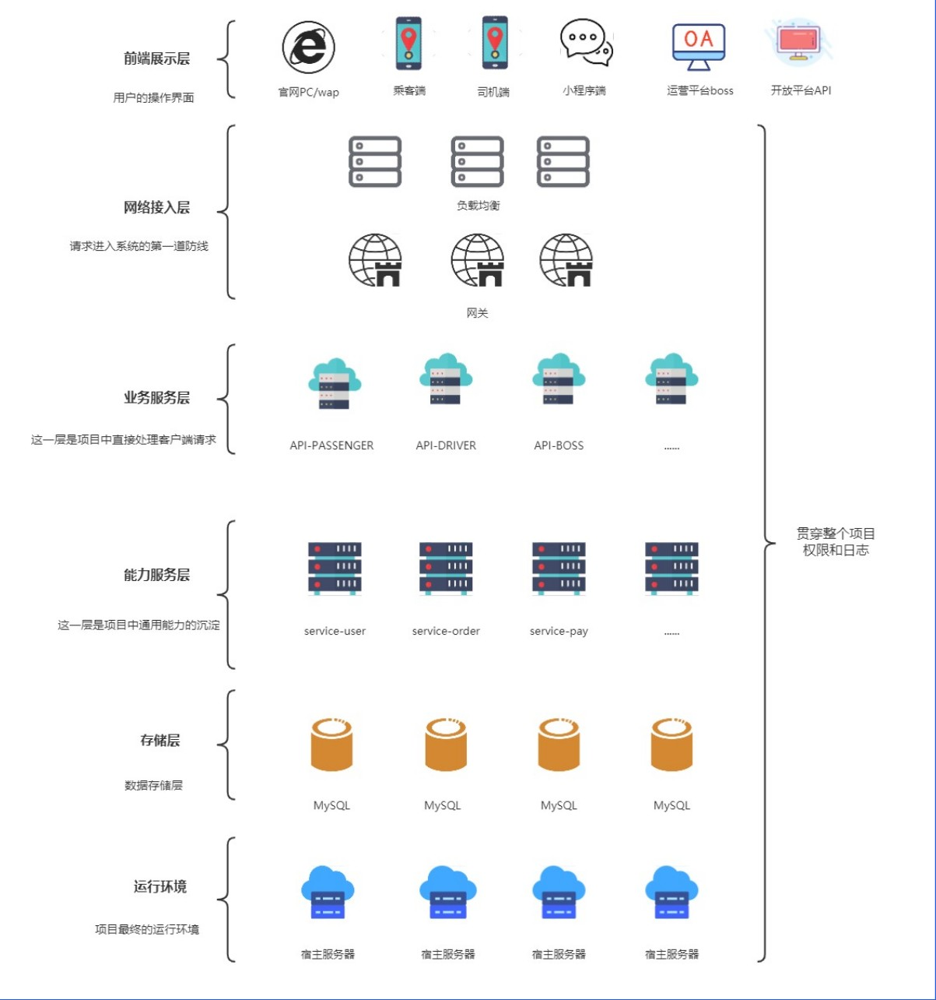

# 项目实战-飞滴出行

# 项目总览

## 功能模块

以下是整个系统要实现的功能模块：

- 乘客端功能
    - 注册/登录
    - 预估价格
    - 乘客下单
    - 系统派单
    - 乘客支付
    - 乘客评价
- 司机端功能
    - 注册/登录
    - 司机听单
    - 司机抢单
    - 订单流转
    - 发起收款
- BOSS端功能
    - 用户管理
    - 司机管理
    - 车辆管理
    - 司机和车辆关系管理

## 业务架构

### 架构图

### 架构介绍

- 前端展示层
    - 官网PC/wap
    - 乘客端
    - 司机端
    - 小程序端
    - 运营平台boss
    - 开放平台API
- 网络接入层（请求进入系统的第一道防线，鉴权，黑名单限制，屏蔽非法请求）
    - 网关
    - 负载均衡
- 业务服务层（直接处理客户端请求）
    - api-passenger（乘客）
    - api-driver（司机）
    - api-boss（管理员）
    - ...以上每个服务，都支持集群
- 能力服务层（通用能力服务）
    - service-user
        - 查询用户信息（例如：是否在黑名单里，权限校验，状态等等）
    - service-order
        - 创建，查询，取消订单
    - service-pay
    - ...上述服务集群
    - 中间件
- 存储层（数据库）
    - MySQL
- 运行环境
    - 宿主服务器
    - Vmware，docker，K8s等
- 贯穿整个项目
    - 日志
    - 权限

## 项目技术

前       端：uni-app（Vue）

数 据  库：MySQL

缓       存：Redis

注册中心：Nacos

配置中心：Nacos

网       关：Spring Cloud Gateway

熔断限流：Spring Cloud Alibaba Sentinel

服务监控：Spring Cloud Sleuth、Spring Cloud zipkin

分布式锁：Redisson

分布式事物：Alibaba 的 Seata

服务通信：SSE (server sent event)

## 网约车国家标准

具体参考：网络预约出租汽车-总体技术要求.pdf

国家要求网约车平台定时上报信息给监管部门，并且规定了报文格式和报文字段。设计表时可做参考。例如：

CompanyId，V32，公司(/平台)标识(部平台统一分配网约车平台公司标识)

Source，F8，消息来源标识(部平台统一分配消息的数据链路来源标识)

IPCType，业务接口代码,见具体接口定义

## 项目设计原则

### 单一职责原则

每一个微服务只应负担一个职责。

例如：订单服务，地图服务。虽然业务上这个功能紧密相连。但如果放在一起会带来服务耦合。开发，维护，发布时可能会互相影响。

如果分成2个服务，地图服务还可以作为公共服务给更多服务调用。

### 高内聚原则

关系紧密的行为应该放在一起。

例如：订单管理服务，订单金额统计服务。订单金额统计时和订单信息紧密相连。基本只要改一个另一个都要评估是否受影响。而且这个行为用到的数据源也是一样，像这样的服务就适合放在一起的。

### 低耦合原则

一个服务的变更维护不要影响其他服务。

### 粒度把控原则

### AKF原则