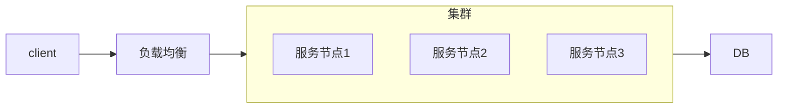
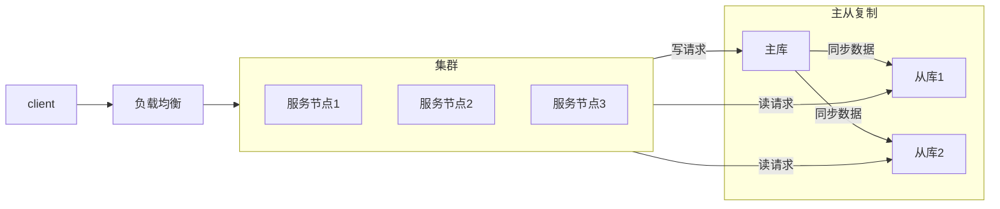
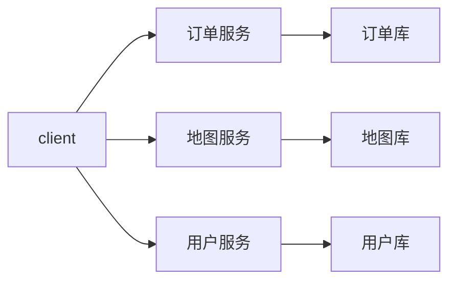
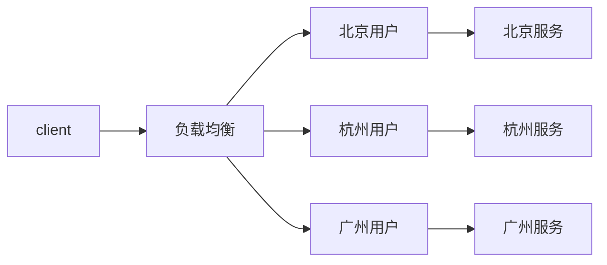
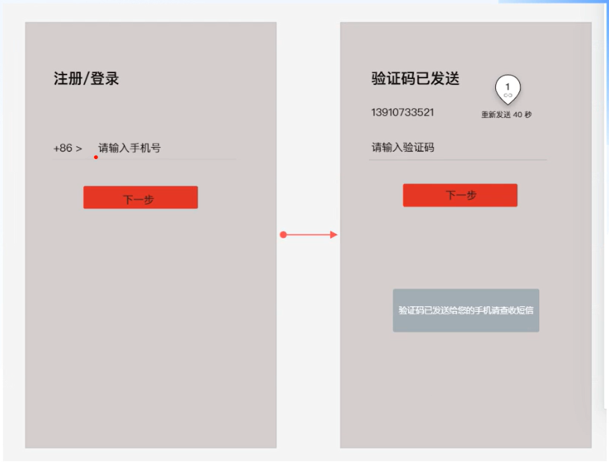
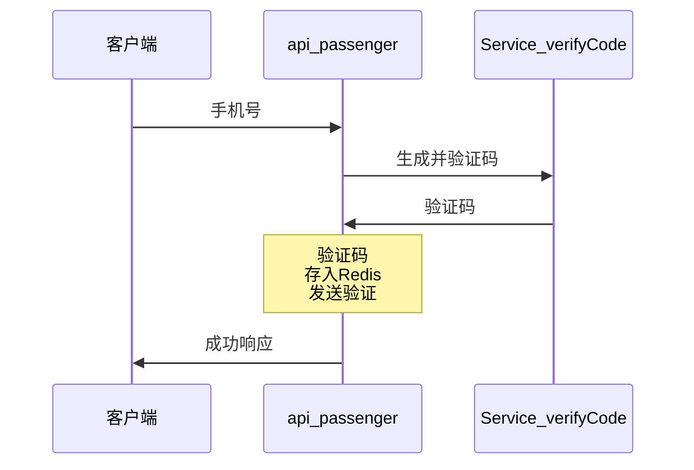

# 项目实战-飞滴出行

# 项目总览

## 功能模块

以下是整个系统要实现的功能模块：

- 乘客端功能
    - 注册/登录
    - 预估价格
    - 乘客下单
    - 系统派单
    - 乘客支付
    - 乘客评价
- 司机端功能
    - 注册/登录
    - 司机听单
    - 司机抢单
    - 订单流转
    - 发起收款
- BOSS端功能
    - 用户管理
    - 司机管理
    - 车辆管理
    - 司机和车辆关系管理

## 技术架构

### 架构图

### 架构介绍

- 前端展示层
    - 官网PC/wap
    - 乘客端
    - 司机端
    - 小程序端
    - 运营平台boss
    - 开放平台API
- 网络接入层（请求进入系统的第一道防线，鉴权，黑名单限制，屏蔽非法请求）
    - 网关
    - 负载均衡
- 业务服务层（直接处理客户端请求）
    - api-passenger（乘客）
    - api-driver（司机）
    - api-boss（管理员）
    - ...以上每个服务，都支持集群
- 能力服务层（通用能力服务）
    - service-user
        - 查询用户信息（例如：是否在黑名单里，权限校验，状态等等）
    - service-order
        - 创建，查询，取消订单
    - service-pay
    - ...上述服务集群
    - 中间件
- 存储层（数据库）
    - MySQL
- 运行环境
    - 宿主服务器
    - Vmware，docker，K8s等
- 贯穿整个项目
    - 日志
    - 权限

### 项目技术

前       端：uni-app（Vue）

数 据  库：MySQL

缓       存：Redis

注册中心：Nacos

配置中心：Nacos

网       关：Spring Cloud Gateway

熔断限流：Spring Cloud Alibaba Sentinel

服务监控：Spring Cloud Sleuth、Spring Cloud zipkin

分布式锁：Redisson

分布式事物：Alibaba 的 Seata

服务通信：SSE (server sent event)

### 网约车国家标准

具体参考：网络预约出租汽车-总体技术要求.pdf

国家要求网约车平台定时上报信息给监管部门，并且规定了报文格式和报文字段。设计表时可做参考。

例如：

CompanyId，V32，公司(/平台)标识(部平台统一分配网约车平台公司标识)

Source，F8，消息来源标识(部平台统一分配消息的数据链路来源标识)

IPCType，业务接口代码,见具体接口定义

### 服务设计原则

#### 单一职责原则

每一个微服务所承担的职责应尽可能担一。

例如：订单服务，地图服务。虽然业务上这个功能紧密相连。但如果放在一起会带来服务耦合。开发，维护，发布时可能会互相影响。

如果分成2个服务，地图服务还可以作为公共服务给更多服务调用。

#### 高内聚原则

高内聚是指应该尽量将关系紧密的功能和模块放在一起，使它们形成一个紧密耦合的单元。该单元内部的各个部分相互依赖，协同完成一定的功能。这样对外部模块的影响和干扰相对较小，能够提高系统的可靠性和可维护性，减少系统出现故障的概率。

例如：订单管理服务，订单金额统计服务。订单金额统计时和订单信息紧密相连。每次只要改订单管理都可能会影响统计服务。这2个行为依赖的数据源也是一样的，像这样的服务就适合放在一起的。如果分成2个服务就变成了网络调用，而且改一个还得通知另一个及时修改，反而更容易出错和不好维护。

#### 低耦合原则

低耦合是指各个服务之间相互独立，彼此之间的耦合度尽可能地低，每个模块之间的关联程度尽量小。

低耦合是为了提高系统的灵活性和可扩展性，降低系统中某个模块发生变化对其他模块造成的影响，从而减少系统维护和扩展的难度。

#### 粒度把控原则

首先粒度把控没有绝对的标准，适合最重要。每次考虑服务拆分或者确定服务边界时，都应该考虑这么设计之后结果，是否已最大可能符合高内聚低耦合的原则。同时也要考虑业务和项目背景

例如：设计订单服务时，哪些功能应该包含在这个服务中，哪些又应该拆分到另一个服务中。有些公司就会将订单和地图服务绑定在一起，因为他们并没有其他服务要用到地图，拆分成2个会增加开发和维护成本，所以这样做对他们最好。但有些公司就不会放在一起。

#### AKF划分原则

##### 背景

当我们需要分布式系统提供更强的性能时，该怎样扩展系统呢？

什么时候该加机器？什么时候该重构代码？扩容时，究竟该选择哈希算法还是最小连接数算法，才能有效提升性能？

在面对Scalability（可扩展性或可伸缩性）问题时，我们必须有一个系统的方法论，才能应对日益复杂的分布式系统。而AKF划分原则就是来处理这个的，它定义了扩展系统的 3 个维度，我们可以综合使用它们来优化性能。

##### 介绍

AKF 立方体，它在《The Art of Scalability》一书中被首次提出，旨在提供一个系统化的扩展思路。AKF 把系统扩展分为以下三个维度：

X 轴：直接水平复制应用进程来扩展系统。

Y 轴：将功能拆分出来扩展系统。

Z 轴：通常是指基于用户进行数据分片和分治。

##### X轴

这个方向的扩展是指将同样的服务和数据放在多个并行的服务器节点上，加入负载均衡，当任意一个节点出现故障，系统仍然可以访问。提升整体服务的可用性和吞吐量问题。有个前提是：服务属于无状态服务。

优点：

开发成本近乎为零，实施起来速度快！搭建好负载均衡后，只要在新的服务器上复制程序，就可以让新的服务节点分担请求流量，而且不会影响事务的处理。

缺点：

只能扩展无状态服务，会对数据库造成压力，当单个服务节点或者数据库出现性能瓶颈时，就需要从其他轴开始优化了。

##### Y轴

当沿着X轴扩展系统，性能逐渐到达瓶颈。也可以一开始就按照Y轴进行拆分。此时可以考虑拆分系统功能，使得各服务的功能、职责更细，从而提升系统的效率。拆分的时候有2个维度，按动词拆或者按名词拆。

###### 按动词拆

例如：按服务的读写操作进行拆分，将数据库改为主从复制结构，主库支持读写（也可以只支持写），从库只支持读SQL。这样，主库的压力就会明显下降，系统整体性能得以提升。同时如果读的性能出现瓶颈，也可以从X轴的方向继续扩展读库。即增加从库1，从库2，从库3...如下图：

###### 按名词拆

例如：将一个大服务，拆分成订单服务，地图服务，用户服务等等小服务。每一个服务都有自己的独立数据库。当单个小服务吞吐量及可用性不足时继续沿X轴扩展。即增加订单服务1，2，3...

缺点：

Y轴的扩展比X轴的扩展成本大很多，需要重构代码。上线部署与维护也更复杂。

如果把一个服务拆分成多个服务也涉及服务间的API调用。

把服务拆分之后的单个服务依然可能存在性能问题。

##### Z轴

Z轴扩展通常是指基于请求和用户独特的需求，进行系统划分。可用来扩展数据库也可用于扩展服务。

###### 扩展服务

针对请求用户的地域，例如：北京的用户由北京的服务处理，杭州的用户由杭州服务器处理。

或者按用户组，例如：乘客一个服务，司机一个服务。

###### 扩展数据库

数据库分片，在做某些查询的时候，查询指令被送给每一个分片，然后分别查询，最终获得的结果聚合之后返回。

常见的分片方式

- 业务数据按时间分表，例如：按照年月
- 业务数据按用户user_id的模数或hash进行划分

## 开发总览

### 开发流程

1. 需求评审
2. 接口设计
   1. 接口文档由后端人员设计好之后，前端开发人员需要根据接口设计前端代码，测试人员需要根据接口设计测试用例。
   2. 一旦接口细节存在变更，就需要同步通知相关的工作人员，因为他也要配套的修改他们的任务要求。
   3. 据调查，大公司做开发时有50%的时间都在处理这种变更
3. 研发人员进行开发
4. 各研发部门进行联调
5. 测试人员介入测试
6. 上线运维

### 接口设计风格-Restful

首先Restful是一种非强制性的系统架构设计风格。REST全称是Representational State Transfer，中文意思是表述层状态转移。

RESTful理念就是使用Web的现有特征和能力， 更好地使用现有Web标准中的一些准则和约束。

表述层指的Web服务中请求，包含URI，请求参数，方法等。在做接口设计时应尽可能使用

#### 要素

##### 协议

http，https。考虑服务到底要在哪个协议下访问。

##### 域名

指的是主机域名，应尽量设计的清晰可以体现应用的工功能。例如：map.baidu.com，image.baidu.com

##### 路径

跟在顶级域名后面的部分，最好和要操作的资源的关联，操作哪个资源就是谁。例如：www.baidu.com/user，www.baidu.com/course

##### 版本

这个因为某些功能会存在多个版本并存的情况，例如v2新版本上线，上线之后的使用/v2/的url

此时老功能也依然可用，继续使用/v1/的链接。直至统计下来v1已经完全没人使用了，再完全停用。

可以是：www.baidu.com/user/v2/，也可以是：www.baidu.com/v2/user/，

##### 动作

新增：post

修改(全量)：put

修改(增量)：patch

查询：get

删除：delete，

#### 案例

**案例1-查询1号用户的A课程的详细信息**

- ✖A、/api/users/1/courses?course_id=A
  - 用户id直接就在URL里面，不安全。想看另一个用户直接改URL就行。
- ✖B、/api/users/me/courses?course_id=A
  - me加的很不合理
- ✖C、/api/courses?course_id=A&user_id=1
  - 同A：不安全。
- ✔D、/api/courses?course_id=A
  - 如何获取是哪个用户？当用户登录成功后，浏览器header里面会有token，通过请求头传给服务端，服务端解析token获得用户。
  - method为get，查询参数可以放在请求参数中。
- ✖E、/api/schools/A/courses
  - 设计不合理，想看的是课程，但在前面的是学校school

**案例2-增删改查一个用户信息**

错误的设计: 

没必要，不用写。create，delete，show

/api/accounts/create
/api/accounts/delete
/api/accounts/show
/api/accounts/update

正确的做法:

post /api/accounts/，新增内容在body体里。
delete /api/accouts/1/，下面url一样，只是方法不一样。
get /api/accounts/1/获取1号用户信息
put /api/accounts/1/，修改1号用户信息

**案例3-从1号用户，转账500，给2号用户**

错误设计:post /api/accounts/1/transfer/500/to/2

如果不看题目直接看这个url，你会发现很难精确的识别出哪个是用户id，哪个是转账金额。

正确的设计:post /api/transaction?from=1&to=2&money=500,

这个虽然是正确答案，但在这个案例中并不是最优答案，因为用户可以通过这个url猜出含义，并恶意使用。最好还是放在body中。

**url设计案例**

下面2个关于API的服务，哪个URL设计的更合理。

www.xxx.com/api/courses

api.xxx.com/courses

API是一个系统提供给外部调用的接口。这个主要考虑：未来是否要将api服务独立出来放到一个单独的服务器上。

如果存在这种可能，那就是后面那个设计更好。

#### 状态码和提示信息

##### http状态码

200：代表成功。
404：代表请求不存在

##### message

是对状态码的说明。

##### 消息体

具体接口要响应的数据。例如：查询结果。

有的设计会将状态码或者message放在消息体里。客户端需要解析消息体才能知道成功和失败。

#### 翻页设计

方式一：/api/courses?page=1&pageSize=10

当前页码，每页显示多少条。

缺点：当前在看第一页，这个时候数据库第一页多了一条数据，所以当翻第2页的时候，又会看到第一页的内容。

所以这种设计适用于业务上可以接受这种情况或者数据不会经常变化的场景。

方式二：/api/courses?max_id=1000

每次查询用数据id来定位，第一次查询id1到100，第二次查询100到200，依次类推。

即使数据存在新增也不会在以后的id范围内。所以不会存在上面的问题。

这种翻页查询一般是配合手机端，用户不断的下滑来查询数据的场景。

每次查询时，可以返回next_id，如果next_id为空或者小于固定的大小。就代表没数据了。

缺点：无法定位页数。也不知道一页多少页。

### 开发工具

#### Apifox

[下载地址](https://apifox.com/)

##### 介绍

Apifox = Postman + Swagger + Mock + JMeter，他是一个API 设计、开发、测试一体化协作平台。他可以很好的解决前端开发人员，后端开发人员，测试人员，之间的协作问题。提升开发效率。

##### 设计阶段

### 开发环境搭建

首先通过Git或者源码zip包的方式获取到项目源代码

使用idea载入online-taxi-public目录

载入后请及时修改Maven的安装目录：File | Settings | Build, Execution, Deployment | Build Tools | Maven

改好之后，idea会自动下载依赖包，请稍等片刻

#### 注意事项

- SpringBoot的版本和SpringCloud的版本是有[配套关系](https://spring.io/projects/spring-cloud)的，请勿随意修改大版本。
- 在“端口管理.md”中记录着所有服务的端口号，如果你要启动项目，请确保端口号没有冲突。

# 乘客中心服务

## 注册登录

### 业务流程

**App**

1. 未注册用户首次登录时需要注册，注册前会弹出一个“服务协议及隐私政策”窗口，用户点“同意”后继续第2步
2. 弹出授权使用地理位置和手机存储的对话框，用户授权了以后，继续第3步。
3. 输入用户手机号，点下一步。
   1. 前端校验手机号的合法性。
   2. 调用后端接口，发送验证码给手机号。
   3. 
4. 等待用户输入验证码。如果超时可以重新发送

### 时序图

#### 实现说明

验证码过期时间，可以用redis的ttl功能实现。

生成验证码作为独立服务的好处：

- 验证码是很多模块都可能用到的公共功能，独立出来大家都能调用。
- 如果后续验证码从数字变成字母，只要改这个模块就可以了。
- 独立出来之后，可以生成全局唯一的验证码。降低验证码的重复性。

## 短信发送功能

通过调用阿里，腾讯的短信通服务接口可以实现。

[腾讯短信服务](https://cloud.tencent.com/act/pro/csms?fromSource=gwzcw.5679192.5679192.5679192&utm_medium=cpc&utm_id=gwzcw.5679192.5679192.5679192&bd_vid=10502392365468823329)，[阿里短信服务](https://www.aliyun.com/product/sms?spm=5176.21213303.J_qCOwPWspKEuWcmp8qiZNQ.2.202f2f3dw6a17Z&scm=20140722.S_card@@%E4%BA%A7%E5%93%81@@125575.S_card0.ID_card@@%E4%BA%A7%E5%93%81@@125575-RL_%E7%9F%AD%E4%BF%A1-LOC_search~UND~card~UND~item-OR_ser-V_3-P0_0)

