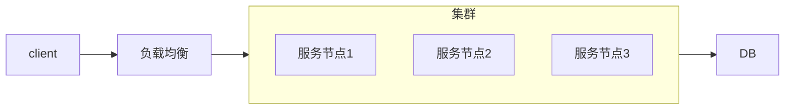
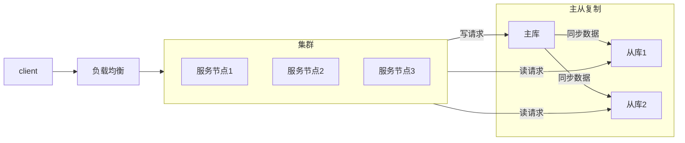
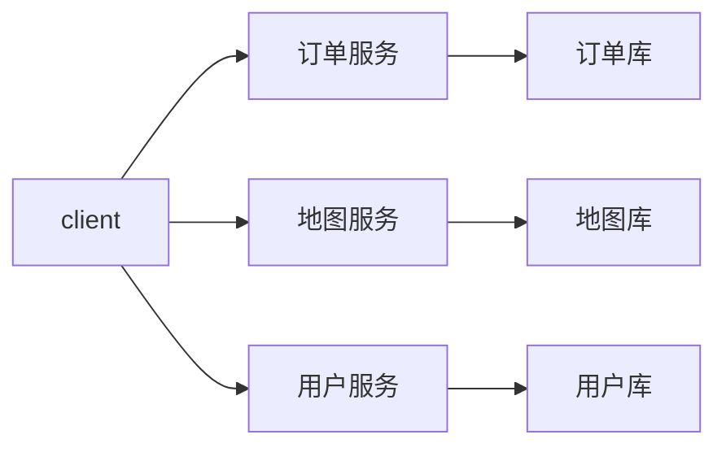
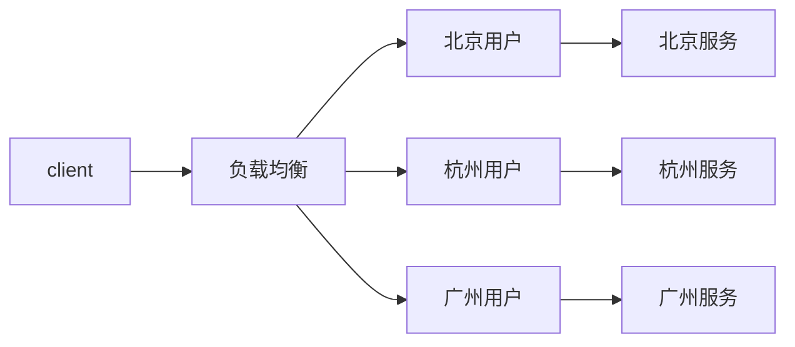
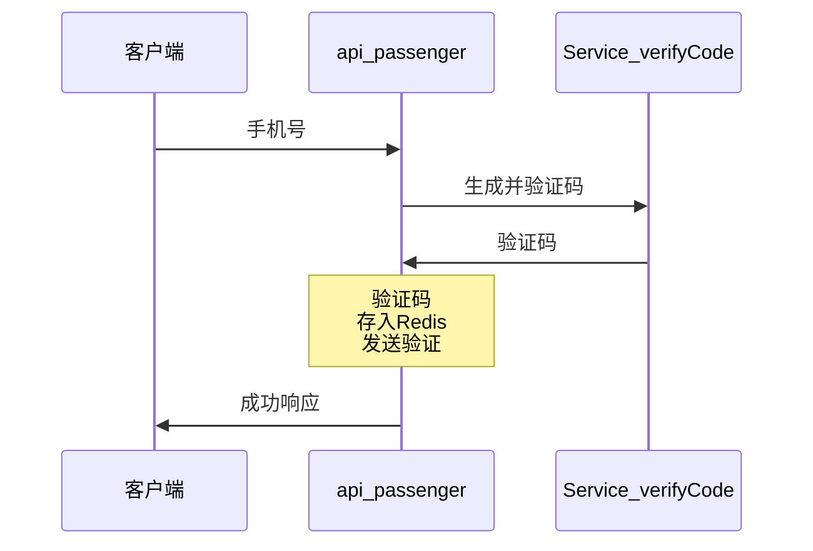
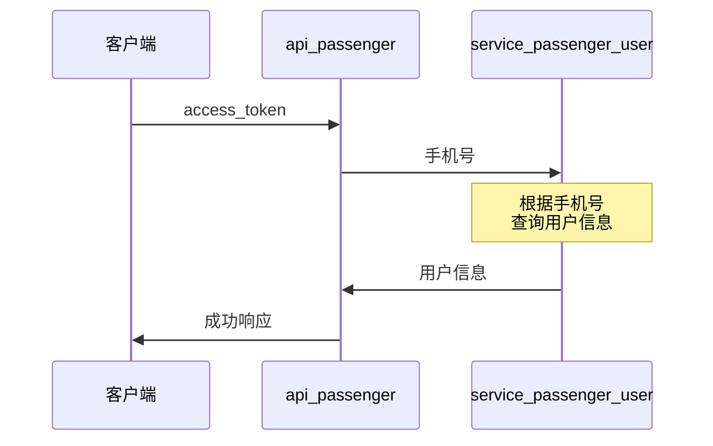
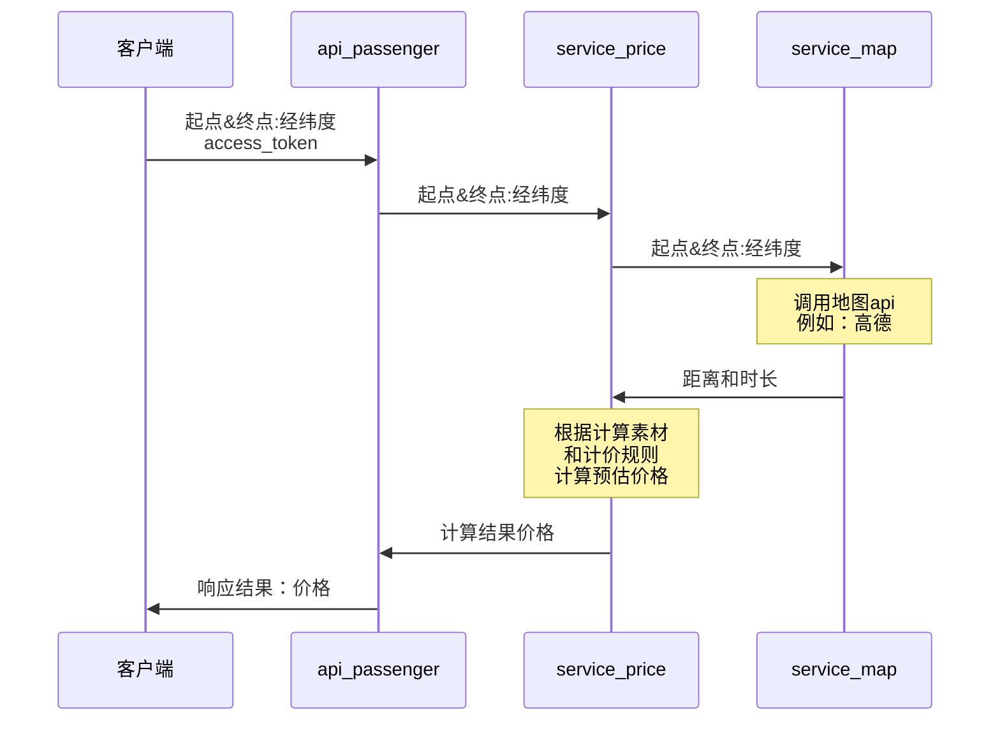
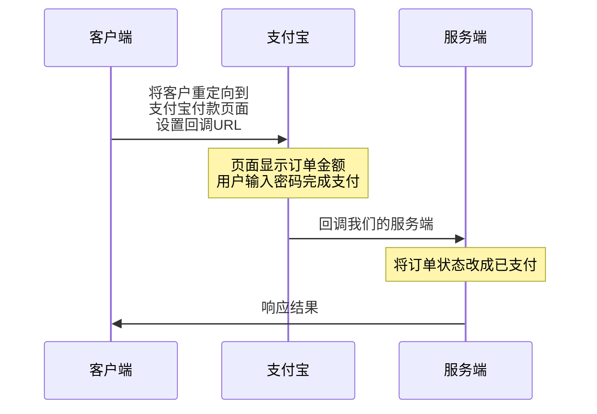
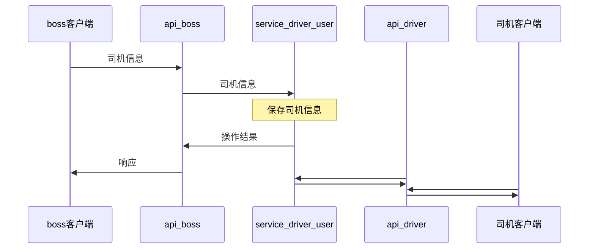
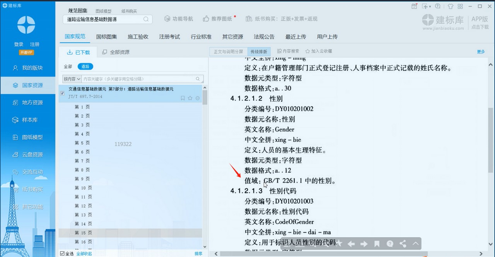

# 项目实战-飞滴出行

# 项目总览

## 功能模块

以下是整个系统要实现的功能模块：

- 乘客端功能
    - 注册/登录
    - 预估价格
    - 乘客下单
    - 系统派单
    - 乘客支付
    - 乘客评价
- 司机端功能
    - 注册/登录
    - 司机听单
    - 司机抢单
    - 订单流转
    - 发起收款
- BOSS端功能
    - 用户管理
    - 司机管理
    - 车辆管理
    - 司机和车辆关系管理


## 技术架构

### 架构图


### 架构介绍

- 前端展示层
    - 官网PC/wap
    - 乘客端
    - 司机端
    - 小程序端
    - 运营平台boss
    - 开放平台API
- 网络接入层（请求进入系统的第一道防线，鉴权，黑名单限制，屏蔽非法请求）
    - 网关
    - 负载均衡
- 业务服务层（直接处理客户端请求）
    - api-passenger（乘客）
    - api-driver（司机）
    - api-boss（管理员）
    - ...以上每个服务，都支持集群
- 能力服务层（通用能力服务）
    - service-user
        - 查询用户信息（例如：是否在黑名单里，权限校验，状态等等）
    - service-order
        - 创建，查询，取消订单
    - service-pay
    - ...上述服务集群
    - 中间件
- 存储层（数据库）
    - MySQL
- 运行环境
    - 宿主服务器
    - Vmware，docker，K8s等
- 贯穿整个项目
    - 日志
    - 权限


### 项目技术

前       端：uni-app（Vue）

数 据  库：MySQL

缓       存：Redis

注册中心：Nacos

配置中心：Nacos

网       关：Spring Cloud Gateway

熔断限流：Spring Cloud Alibaba Sentinel

服务监控：Spring Cloud Sleuth、Spring Cloud zipkin

分布式锁：Redisson

分布式事物：Alibaba 的 Seata

服务通信：SSE (server sent event)


### 国家标准

#### 网约车国家标准

具体参考：网络预约出租汽车-总体技术要求.pdf

国家要求网约车平台定时上报信息给监管部门，并且规定了报文格式和报文字段。设计表时可做参考。

例如：

CompanyId，V32，公司(/平台)标识(部平台统一分配网约车平台公司标识)

Source，F8，消息来源标识(部平台统一分配消息的数据链路来源标识)

IPCType，业务接口代码,见具体接口定义


#### 违法收集个人信息

[App违法违规收集使用个人信息行为认定方法](http://www.cac.gov.cn/2019-12/27/c_1578986455686625.htm)


### 服务设计原则

#### 单一职责原则

每一个微服务所承担的职责应尽可能担一。

例如：订单服务，地图服务。虽然业务上这个功能紧密相连。但如果放在一起会带来服务耦合。开发，维护，发布时可能会互相影响。

如果分成2个服务，地图服务还可以作为公共服务给更多服务调用。


#### 高内聚原则

高内聚是指应该尽量将关系紧密的功能和模块放在一起，使它们形成一个紧密耦合的单元。该单元内部的各个部分相互依赖，协同完成一定的功能。这样对外部模块的影响和干扰相对较小，能够提高系统的可靠性和可维护性，减少系统出现故障的概率。

例如：订单管理服务，订单金额统计服务。订单金额统计时和订单信息紧密相连。每次只要改订单管理都可能会影响统计服务。这2个行为依赖的数据源也是一样的，像这样的服务就适合放在一起的。如果分成2个服务就变成了网络调用，而且改一个还得通知另一个及时修改，反而更容易出错和不好维护。


#### 低耦合原则

低耦合是指各个服务之间相互独立，彼此之间的耦合度尽可能地低，每个模块之间的关联程度尽量小。

低耦合是为了提高系统的灵活性和可扩展性，降低系统中某个模块发生变化对其他模块造成的影响，从而减少系统维护和扩展的难度。


#### 粒度把控原则

首先粒度把控没有绝对的标准，适合最重要。每次考虑服务拆分或者确定服务边界时，都应该考虑这么设计之后结果，是否已最大可能符合高内聚低耦合的原则。同时也要考虑业务和项目背景

例如：设计订单服务时，哪些功能应该包含在这个服务中，哪些又应该拆分到另一个服务中。有些公司就会将订单和地图服务绑定在一起，因为他们并没有其他服务要用到地图，拆分成2个会增加开发和维护成本，所以这样做对他们最好。但有些公司就不会放在一起。


#### AKF划分原则

##### 背景

当我们需要分布式系统提供更强的性能时，该怎样扩展系统呢？

什么时候该加机器？什么时候该重构代码？扩容时，究竟该选择哈希算法还是最小连接数算法，才能有效提升性能？

在面对Scalability（可扩展性或可伸缩性）问题时，我们必须有一个系统的方法论，才能应对日益复杂的分布式系统。而AKF划分原则就是来处理这个的，它定义了扩展系统的 3 个维度，我们可以综合使用它们来优化性能。

##### 介绍

AKF 立方体，它在《The Art of Scalability》一书中被首次提出，旨在提供一个系统化的扩展思路。AKF 把系统扩展分为以下三个维度：

X 轴：直接水平复制应用进程来扩展系统。

Y 轴：将功能拆分出来扩展系统。

Z 轴：通常是指基于用户进行数据分片和分治。


##### X轴

这个方向的扩展是指将同样的服务和数据放在多个并行的服务器节点上，加入负载均衡，当任意一个节点出现故障，系统仍然可以访问。提升整体服务的可用性和吞吐量问题。有个前提是：服务属于无状态服务。



优点：

开发成本近乎为零，实施起来速度快！搭建好负载均衡后，只要在新的服务器上复制程序，就可以让新的服务节点分担请求流量，而且不会影响事务的处理。

缺点：

只能扩展无状态服务，会对数据库造成压力，当单个服务节点或者数据库出现性能瓶颈时，就需要从其他轴开始优化了。


##### Y轴

当沿着X轴扩展系统，性能逐渐到达瓶颈。也可以一开始就按照Y轴进行拆分。此时可以考虑拆分系统功能，使得各服务的功能、职责更细，从而提升系统的效率。拆分的时候有2个维度，按动词拆或者按名词拆。

###### 按动词拆

例如：按服务的读写操作进行拆分，将数据库改为主从复制结构，主库支持读写（也可以只支持写），从库只支持读SQL。这样，主库的压力就会明显下降，系统整体性能得以提升。同时如果读的性能出现瓶颈，也可以从X轴的方向继续扩展读库。即增加从库1，从库2，从库3...如下图：



###### 按名词拆

例如：将一个大服务，拆分成订单服务，地图服务，用户服务等等小服务。每一个服务都有自己的独立数据库。当单个小服务吞吐量及可用性不足时继续沿X轴扩展。即增加订单服务1，2，3...




缺点：

Y轴的扩展比X轴的扩展成本大很多，需要重构代码。上线部署与维护也更复杂。

如果把一个服务拆分成多个服务也涉及服务间的API调用。

把服务拆分之后的单个服务依然可能存在性能问题。


##### Z轴

Z轴扩展通常是指基于请求和用户独特的需求，进行系统划分。可用来扩展数据库也可用于扩展服务。

###### 扩展服务

针对请求用户的地域，例如：北京的用户由北京的服务处理，杭州的用户由杭州服务器处理。

或者按用户组，例如：乘客一个服务，司机一个服务。

###### 扩展数据库

数据库分片，在做某些查询的时候，查询指令被送给每一个分片，然后分别查询，最终获得的结果聚合之后返回。

常见的分片方式

- 业务数据按时间分表，例如：按照年月
- 业务数据按用户user_id的模数或hash进行划分




## 开发总览

### 开发流程

1. 需求评审
2. 接口设计
   1. 架构师或后端人员设计接口文档，设计时需要叫上前端和测试人员一起。
   2. 通过统一的工具，例如：apifox，设计好接口具体参数和返回值。
   3. 前端开发人员根据接口设计前端代码，测试人员根据接口设计设计测试用例。
   4. 为什么要使用统一的工具？
      1. 接口设计好后，接口细节是比较容易出现变更的。
      2. 一旦变更，就需要同步通知相关的工作人员，因为他也要配套的修改他们的任务要求。
      3. 这就涉及大量的沟通时间。据调查，大公司做开发时有50%的时间都在处理这种变更
3. 研发人员进行开发
4. 各研发部门进行联调
5. 测试人员介入测试
6. 上线运维


### 接口设计风格-Restful

首先Restful是一种非强制性的系统架构设计风格。REST全称是Representational State Transfer，中文意思是表述层状态转移。

RESTful理念就是使用Web的现有特征和能力， 更好地使用现有Web标准中的一些准则和约束。

表述层指的Web服务中请求，包含URI，请求参数，方法等。在做接口设计时应尽可能使用

#### 要素

##### 协议

http，https。考虑服务到底要在哪个协议下访问。

##### 域名

指的是主机域名，应尽量设计的清晰可以体现应用的工功能。例如：map.baidu.com，image.baidu.com

##### 路径

跟在顶级域名后面的部分，最好和要操作的资源的关联，操作哪个资源就是谁。例如：www.baidu.com/user，www.baidu.com/course

##### 版本

这个因为某些功能会存在多个版本并存的情况，例如v2新版本上线，上线之后的使用/v2/的url

此时老功能也依然可用，继续使用/v1/的链接。直至统计下来v1已经完全没人使用了，再完全停用。

可以是：www.baidu.com/user/v2/，也可以是：www.baidu.com/v2/user/，

##### 动作

新增：post

修改(全量)：put

修改(增量)：patch

查询：get

删除：delete，


#### 案例

**案例1-查询1号用户的A课程的详细信息**

- ✖A、/api/users/1/courses?course_id=A
  - 用户id直接就在URL里面，不安全。想看另一个用户直接改URL就行。
- ✖B、/api/users/me/courses?course_id=A
  - me加的很不合理
- ✖C、/api/courses?course_id=A&user_id=1
  - 同A：不安全。
- ✔D、/api/courses?course_id=A
  - 如何获取是哪个用户？当用户登录成功后，浏览器header里面会有token，通过请求头传给服务端，服务端解析token获得用户。
  - method为get，查询参数可以放在请求参数中。
- ✖E、/api/schools/A/courses
  - 设计不合理，想看的是课程，但在前面的是学校school


**案例2-增删改查一个用户信息**

错误的设计: 

没必要，不用写。create，delete，show

/api/accounts/create
/api/accounts/delete
/api/accounts/show
/api/accounts/update

正确的做法:

post /api/accounts/，新增内容在body体里。
delete /api/accouts/1/，下面url一样，只是方法不一样。
get /api/accounts/1/获取1号用户信息
put /api/accounts/1/，修改1号用户信息


**案例3-从1号用户，转账500，给2号用户**

错误设计:post /api/accounts/1/transfer/500/to/2

如果不看题目直接看这个url，你会发现很难精确的识别出哪个是用户id，哪个是转账金额。

正确的设计:post /api/transaction?from=1&to=2&money=500,

这个虽然是正确答案，但在这个案例中并不是最优答案，因为用户可以通过这个url猜出含义，并恶意使用。最好还是放在body中。


**url设计案例**

下面2个关于API的服务，哪个URL设计的更合理。

www.xxx.com/api/courses

api.xxx.com/courses

API是一个系统提供给外部调用的接口。这个主要考虑：未来是否要将api服务独立出来放到一个单独的服务器上。

如果存在这种可能，那就是后面那个设计更好。


#### 状态码和提示信息

##### http状态码

200：代表成功。
404：代表请求不存在

##### message

是对状态码的说明。

##### 消息体

具体接口要响应的数据。例如：查询结果。

有的设计会将状态码或者message放在消息体里。客户端需要解析消息体才能知道成功和失败。


#### 翻页设计

方式一：/api/courses?page=1&pageSize=10

当前页码，每页显示多少条。

缺点：当前在看第一页，这个时候数据库第一页多了一条数据，所以当翻第2页的时候，又会看到第一页的内容。

所以这种设计适用于业务上可以接受这种情况或者数据不会经常变化的场景。


方式二：/api/courses?max_id=1000

每次查询用数据id来定位，第一次查询id1到100，第二次查询100到200，依次类推。

即使数据存在新增也不会在以后的id范围内。所以不会存在上面的问题。

这种翻页查询一般是配合手机端，用户不断的下滑来查询数据的场景。

每次查询时，可以返回next_id，如果next_id为空或者小于固定的大小。就代表没数据了。

缺点：无法定位页数。也不知道一页多少页。


### 开发工具

#### Apifox

[下载地址](https://apifox.com/)

##### 介绍

Apifox = Postman + Swagger + Mock + JMeter，他是一个API 设计、开发、测试一体化协作平台。他可以很好的解决前端开发人员，后端开发人员，测试人员，之间的协作问题。提升开发效率。


#### RDM

全名：Redis Desktop Manager，Redis客户端，[下载地址](http://www.downza.cn/soft/351339.html)。


#### 墨刀

[官网](https://modao.cc/usergrowth/prototype/v8.html)，相当于中文版的Axure。墨刀是一款在线原型设计与协同工具，借助墨刀，产品经理、设计师、开发、销售、运营及创业者等用户群体，能够搭建为产品原型，演示项目效果。墨刀同时也是协作平台，项目成员可以协作编辑、审阅，不管是产品想法展示，还是向客户收集产品反馈，向投资人进行Demo展示，或是在团队内部协作沟通、项目管理

免费版

支持产品设计、工作流、原型预览、Sketch标注插件、移动端演示，可免费创建3个项目，每个项目20个页面，以及总共50MB素材容量。 


#### PDManer

一款类似PowerDesigner的国产数据库设计工具。支持根据表结构自动导出不同数据库的建表脚本。支持自动生成Java实体类代码，Mybatis代码，MybatisPlus代码等。支持设置每张表可能都会有的公共字段，例如：创建日期，创建人，修改日期，修改人，租户号等。[下载地址](https://gitee.com/robergroup/pdmaner/releases)。


### 开发环境

#### 代码载入

1. 首先通过Git或者源码zip包的方式获取到项目源代码
2. 使用idea载入online-taxi-public目录
3. 载入后请及时修改Maven的安装目录：File | Settings | Build, Execution, Deployment | Build Tools | Maven
4. 改好之后，idea会自动下载依赖包，请稍等片刻（不改也会下载但是会下载到C盘）
5. 项目为微服务项目，启动需要依赖如下公共组件，请确保他们已经启动。
   1. nacos服务器地址，在子项目的application.yml中配置：`spring.cloud.nacos.discovery.server-addr`
   2. Redis服务器地址，在子项目的application.yml中配置：`spring.redis.host`

#### 注意事项

- SpringBoot的版本和SpringCloud的版本是有[配套关系](https://spring.io/projects/spring-cloud)的，请勿随意修改大版本。
- 在“端口管理.md”中记录着所有服务的端口号，如果你要启动项目，请确保端口号没有冲突。


#### Mybatis-Plus

介绍一下Mybatis-Plus的[引入步骤](https://www.mashibing.com/study?courseNo=1537&sectionNo=76305&callbackUrl=/subject/studyline/1?courseId=18870&courseVersionId=2128)。


### 父项目公共依赖

父项目的公共依赖请参考根目录：pom.xml

大体有如下依赖包：

- json-lib，主要用于转json
- lombok
- java-jwt，生成和解析JWT
- internal-common
  - jackson-core，主要用于转json
  - jackson-databind
  - jackson-annotations
- spring-cloud-alibaba-dependencies
- spring-cloud-dependencies


### 公共功能

这里主要介绍每个项目都会考虑的公共功能。

#### 拦截器

拦截器启用步骤：

1. 写一个类实现HandlerInterceptor接口，在preHandle中编写拦截方法业务。
2. 写一个标注@Configuration的类，实现WebMvcConfigurer接口
3. 使用Bean注解声明刚刚新增的拦截器类。在addInterceptors方法中注册拦截器实例，并定义拦截的URL。

参考代码

```java
@Configuration
public class InterceptorConfig implements WebMvcConfigurer {

    @Bean
    public JwtInterceptor jwtInterceptor(){
        return new JwtInterceptor();
    }

    @Override
    public void addInterceptors(InterceptorRegistry registry) {
        registry.addInterceptor(jwtInterceptor())
                // 拦截的路径
                .addPathPatterns("/**")
                // 不拦截的路径
                .excludePathPatterns("/noauthTest")
                .excludePathPatterns("/verification-code")
                .excludePathPatterns("/verification-code-check")
                .excludePathPatterns("/token-refresh")
                .excludePathPatterns("/test-real-time-order/**")
                .excludePathPatterns("/error");

    }
}
```


##### Token校验

适用范围：出特殊请求外，所有的请求都要校验请求头中的token是否正确。如果不正确需要通知客户端重新登陆。

实现方式：实现拦截器接口HandlerInterceptor

```java
public class JwtInterceptor implements HandlerInterceptor {

    @Autowired
    private StringRedisTemplate stringRedisTemplate;

    @Override
    public boolean preHandle(HttpServletRequest request, HttpServletResponse response, Object handler) throws Exception {
        boolean result = true;
        String resutltString = "";
        //从请求头中取出访问token。
        String token = request.getHeader("Authorization");
        // 解析token
        TokenResult tokenResult = JwtUtils.checkToken(token);

        if (tokenResult == null) {
            resutltString = "access token invalid";
            result = false;
        } else {
            // 如果客户端传入的token有效，则继续查询redis
            String phone = tokenResult.getPhone();
            String identity = tokenResult.getIdentity();
            // 按照相同的规则计算得到key
            String tokenKey = RedisPrefixUtils.generatorTokenKey(phone, identity, TokenConstants.ACCESS_TOKEN_TYPE);
            // 根据key从redis中取出token
            String tokenRedis = stringRedisTemplate.opsForValue().get(tokenKey);
            if ((StringUtils.isBlank(tokenRedis)) || (!token.trim().equals(tokenRedis.trim()))) {
                //如果Redis中不存在token或者token不一致则报错
                resutltString = "access token invalid";
                result = false;
            }
        }

        if (!result) {
            // 将错误信息返回给客户端
            PrintWriter out = response.getWriter();
            out.print(JSONObject.fromObject(ResponseResult.fail(resutltString)).toString());
        }

        return result;
    }
}
```


#### 短信发送功能

可通过调用阿里，腾讯的短信通服务接口可以实现。

[腾讯短信服务](https://cloud.tencent.com/act/pro/csms?fromSource=gwzcw.5679192.5679192.5679192&utm_medium=cpc&utm_id=gwzcw.5679192.5679192.5679192&bd_vid=10502392365468823329)，[阿里短信服务](https://www.aliyun.com/product/sms?spm=5176.21213303.J_qCOwPWspKEuWcmp8qiZNQ.2.202f2f3dw6a17Z&scm=20140722.S_card@@%E4%BA%A7%E5%93%81@@125575.S_card0.ID_card@@%E4%BA%A7%E5%93%81@@125575-RL_%E7%9F%AD%E4%BF%A1-LOC_search~UND~card~UND~item-OR_ser-V_3-P0_0)


### 数据库

#### MySQL规范

详见：[阿里巴巴Java开发手册-1.7.1-黄山版](E:\resource\文档\开发文档\阿里巴巴Java开发手册-1.7.1-黄山版-2022最新版.pdf)，建表规约


# 乘客中心

## 注册登录

### 业务流程

**App**

1. 未注册用户首次登录时需要注册，注册前会弹出一个“服务协议及隐私政策”窗口，用户点“同意”后继续第2步
2. 弹出授权使用地理位置和手机存储的对话框，用户授权了以后，继续第3步。
3. 输入用户手机号，点下一步。
   1. 前端校验手机号的合法性。
   2. 调用后端接口，发送验证码给手机号。
   3. 
4. 等待用户输入验证码。如果超时可以重新发送


### 验证码生成

#### 功能时序图



##### 实现说明

验证码过期时间，可以用redis的ttl功能实现。

生成验证码作为独立服务的好处：

- 验证码是很多模块都可能用到的公共功能，独立出来大家都能调用。
- 如果后续验证码从数字变成字母，只要改这个模块就可以了。
- 独立出来之后，可以生成全局唯一的验证码。降低验证码的重复性。


#### 开发流程

具体代码请在idea中查看，这里列出实现流程：

1. 先后启动： [service-verificationcode](D:\Workspace\idea\mashibing\online-taxi-public-2022\online-taxi-public\service-verificationcode) ， [api-passenger](D:\Workspace\idea\mashibing\online-taxi-public-2022\online-taxi-public\api-passenger)项目。
   1. 启动后可以去nacos的服务列表中确认，服务是否已正确注册。
2. 当用户输入完手机号点下一步时，调用后台请求。请求地址：/verification-code（使用ApiFox模拟）
3. 请求通过URL映射，到达 [api-passenger](D:\Workspace\idea\mashibing\online-taxi-public-2022\online-taxi-public\api-passenger) 项目的 VerificationCodeController.verificationCode() 
4. 调用Service方法进行处理，verificationCodeService.generatorCode()。
   1. 使用Feign调用接口生成验证码，ServiceVefificationcodeClient.getNumberCode()。
      1. 根据服务名去从nacos中找到对应的服务："service-verificationcode"
      2. 进入 [service-verificationcode](D:\Workspace\idea\mashibing\online-taxi-public-2022\online-taxi-public\service-verificationcode) 项目的 NumberCodeController.numberCode方法
      3. 通过Math.random() 计算得到6位验证码。
   2. 根据用户手机号生成redis的key，RedisPrefixUtils.generatorKeyByPhone();
      1. key生成规则："verification-code-"+"1"+手机号。
      2. 第2位是用于区分乘客还是司机的。如果是司机就是"2"。
   3. 将新的key和验证码存入redis中。stringRedisTemplate.opsForValue().set(...)
      1. 相比RedisTemplate，StringRedisTemplate做了对String类型做了优化，针对字符类型性能更高
      2. RedisTemplate在存对象时会额外记录1个@Class属性。同时还需要自定义反序列方式。
5. 请求处理成功，返回：ResponseResult.success()。


### 验证码校验

验证码生成成功后，会发消息给用户，用户输入验证码后系统校验是否正确。

校验正确则自动登陆。如果手机号不存在则自动注册。


#### 实现流程

1. 先后启动：[service-verificationcode](D:\Workspace\idea\mashibing\online-taxi-public-2022\online-taxi-public\service-verificationcode)，[service-passenger-user](D:\Workspace\idea\mashibing\online-taxi-public-2022\online-taxi-public\service-passenger-user)，[api-passenger](D:\Workspace\idea\mashibing\online-taxi-public-2022\online-taxi-public\api-passenger)项目。
2. 用户输入验证码点下一步，调用后台校验验证码。请求地址：/verification-code-check（使用ApiFox模拟）
3. 请求通过URL映射，到达[api-passenger](D:\Workspace\idea\mashibing\online-taxi-public-2022\online-taxi-public\api-passenger)项目的VerificationCodeController.checkVerificationCode() 
4. 调用Service方法进行处理，verificationCodeService.checkCode()。
   1. 根据用户手机号生成redis的key，`RedisPrefixUtils.generatorKeyByPhone();`
      1. key生成规则同验证码生成规则。
   2. 用得到的新key去redis中查询。`stringRedisTemplate.opsForValue().get(key);`
   3. 如果没有查询到验证码或者查询到的验证码和之前生成的不一致，会报错。
   4. 验证码校验通过，使用Feign调用接口登录或注册。ServicePassengerUserClient.loginOrRegister()
      1. 通过Nacos，调用[service-passenger-user](D:\Workspace\idea\mashibing\online-taxi-public-2022\online-taxi-public\service-passenger-user)项目的UserController.loginOrRegister()方法
      2. 使用Mybatis-Plus连接MySQL查询Passenger_User表中是否有用户信息。
      3. 如果没有查询到用户信息，则自动构建用户信息并插入到用户表中。
   5. 生成Access Token。JwtUtils.generatorToken(..., TokenConstants.ACCESS_TOKEN_TYPE)
   6. 生成Refresh Token。JwtUtils.generatorToken(..., TokenConstants.REFRESH_TOKEN_TYPE)
   7. 将2种token存入redis，并返回Token给客户端。（[为什么要有2个token](#双Token设计)）


### Token存储

关于token的存储有多种方案，可以存在客户端也可以存在服务端，例如：redis，下面分析一下利弊。

#### 客户端存储token

优势

1. 减轻服务器负担：客户端将token发给服务器后，服务可直接校验有效性，不需要再从其他服务器上获取token。同时降低服务器的空间占用。
2. 减少网络请求：客户端存储token可以减少对服务器的频繁网络请求，提高系统的性能和响应速度。

劣势：

1. 安全性较低：客户端存储token存在一定的安全风险，因为token可能被窃取或篡改，导致用户信息泄露或身份验证失败。
2. 需要额外的处理逻辑：客户端存储token需要额外的处理逻辑来管理token的有效性和更新，增加了开发和维护的成本。

#### Redis存储token

优势

1. 提高安全性：将token存储在Redis中可以提高安全性，因为Redis具有较高的安全性和数据保护能力，可以有效防止token被盗取或篡改。
2. 方便管理和维护：Redis提供了丰富的数据管理和维护功能，可以方便地对token进行有效性验证、更新和删除。

劣势

1. 增加网络请求：将token存储在Redis中会增加对服务器的网络请求，可能影响系统的性能和响应速度。
2. 需要额外的存储成本：Redis作为一个独立的存储服务，需要额外的存储成本和维护成本，增加了系统的总体成本。

综上所述，客户端和Redis中存储token各有利弊，开发者需要根据具体的业务需求和安全考虑来选择合适的存储方式。本项目采用的是服务端存储。


#### 双Token设计

**为什么要有双token？**

如果仅是一个token，失效时间为30分钟，那用户就需要每隔30分钟就重新登陆。对用户很不友好

**其他解决方案**

除了双token方案外还有其他解决方案可以解决token失效问题。例如：

通过拦截器，每次只要接收到请求就刷新token。当这个方案的缺陷是会增加刷新token的次数和请求的处理时间。

**双token方案**

1. 当用户第一次登陆成功，给用户生成2个token（访问token，刷新token）。
2. 其中刷新Token的失效日期要比访问token长。
3. 当访问token过期后，服务端会返回错误给客户端，客户端可以使用刷新token请求一个专用于刷新token的请求。
   1. 请求地址：`/token-refresh`
4. 请求校验刷新token是否有效，如果有效，则重新生成2个新token


## 用户信息

### 头像存储

头像可以存在用户表中，也可以存在单独的图像表中（例如：头像图，身份证图，驾驶证图）

这里我们采用前者。

### 用户信息查询

#### 时序图




## 价格

### 预估价格

#### 业务流程

1. 在app上通过地图api获取到起点和终点的经纬度。
2. 通过地图api获取起点和终点的距离和时长
3. 配置数据准备好：计价规则、车型。
4. 根据（距离、时长、计价规则、车型）计算最终预估价格


#### 时序图



#### 地图接口

高德路径规划接口：https://lbs.amap.com/api/webservice/guide/api/direction


#### 开发注意事项

##### 金额计算

在Java中进行金额计算时，有一些重要的注意事项：

1. 使用BigDecimal：建议使用BigDecimal类来进行金额计算，而不是使用double或float。因为double和float类型在表示小数时可能会出现精度丢失，导致计算结果不准确。而BigDecimal可以保证精确的小数计算，避免了精度丢失的问题。
2. 设置精度：在使用BigDecimal进行金额计算时，需要根据实际需求设置合适的精度，以确保计算结果的准确性。
3. 使用字符串初始化BigDecimal：在创建BigDecimal对象时，建议使用字符串来初始化，而不是直接使用double类型，以避免精度丢失。
4. 避免使用浮点数比较：在比较金额时，应该避免使用浮点数比较，因为浮点数的精度问题可能导致比较结果不准确。应该使用compareTo方法来比较BigDecimal对象的值。
5. 使用setScale方法：在需要对金额进行精度调整时，应该使用setScale方法来设置小数位数，而不是直接进行除法运算或四舍五入操作。


##### BigDecimal使用注意

1. 使用静态final变量：在使用BigDecimal类时，可以将常用的BigDecimal对象定义为静态final变量，以避免重复创建对象，提高性能。
2. 使用setScale方法：在需要对BigDecimal对象进行精度调整时，可以使用setScale方法而不是直接进行除法运算，这样可以提高性能。
3. 避免使用BigDecimal的构造方法：避免使用BigDecimal的构造方法，尽量使用valueOf方法来创建BigDecimal对象，因为valueOf方法会使用缓存机制来提高性能。
4. 使用StringBuilder来拼接字符串：在需要将BigDecimal对象转换为字符串时，可以使用StringBuilder来拼接字符串，而不是直接使用加号操作符，这样可以提高性能。
5. 使用适当的精度：在进行数值计算时，可以根据实际需求选择合适的精度，避免使用过高的精度，以提高性能。
6. 避免使用BigDecimal的equals方法：避免使用BigDecimal的equals方法来比较两个BigDecimal对象的值，可以使用compareTo方法来替代，因为compareTo方法比equals方法更高效。
7. 避免使用BigDecimal的divide方法：在需要进行除法运算时，可以使用multiply方法和setScale方法来代替divide方法，以提高性能。


## 订单

### 订单支付

当乘客的订单完成以后，就涉及到支付了。乘客打开已完成订单，然后点支付，把钱打给第三方支付软件成功后，将订单改成已支付状态。

#### 时序图




#### 支付宝沙箱环境

https://opendocs.alipay.com/common/02kkv7，沙箱环境是支付宝平台为开发者提供的安全且低门槛的测试环境，比起正式环境少了很多调用条件，可以让调用方在上线前进行联调测试，提前发现并解决问题。


# 司机中心

司机中心设计的功能有：

- 司机的增删改查，禁用。出车功能：点了出车才能接单。
- 车辆的增删改差，禁用。
- 司机和车辆的绑定和解绑。一个司机解除当前的车辆绑定后才能绑定新的车
- 字典维护。例如：车辆品牌，车辆类型等

以下将逐一介绍重点功能


## 司机信息管理

### 系统模块

新增前端：boss客户端。后台管理系统，供管理员使用，进行数据录入，参数配置等。

新增微服务：api-boss，boss客户端的后台。

新增微服务：service-driver-user，用于管理司机用户信息。

新增前端：司机客户端。供司机使用。

新增微服务：api-driver。司机客户端对应的后端。


### 司机保存

支持录入和编辑司机信息。

#### 时序图



#### 字典设计

详细的字典项可以参考"网约车-监管信息交互平台-总体技术要求.pdf"中的40页：驾驶员基本信息请求报文格式。

##### 司机注册地行政区

具体的值可以参考高德行政区查询接口（子集行政区传3）：https://lbs.amap.com/api/webservice/guide/api/district

将高德接口的行政区插入到数据库中的方法：`DicDistrictController.initDicDistrict()`

##### 驾驶员性别

技术方案中写的是：见 JT/T 697.7-2014中 4.1.2.1.3，可以使用软件“建标库”查询。

点国家资源 > 规范图集，搜索关键字 JT/T 697.7



然后使用值域中的GB/T 2261.1 去百度搜索可以搜索到性别的值。

##### 驾驶员民族

可以使用同样的方法在建标库中查询。然后将值写入到字典表中。

TIPS：将数据写入数据库时，可以使用notepad++的列模式或者批量替换行首`^`或行尾`$`，编辑SQL语句。


## 司机位置管理

当乘客打开app，叫车时，系统需要根据乘客的所在位置自动找到他周围的所有司机，然后将这个订单分配给其中一个。

这里就必须知道司机的位置了，否则系统无法找到乘客附近的司机。

司机的位置可以通过高德地图提供的[猎鹰轨迹服务](https://lbs.amap.com/api/track/lieying-rumen)提供。

### 猎鹰轨迹服务

高德的猎鹰轨迹服务的大体使用步骤如下

- 创建服务。通过Apifox调用高德的创建服务接口：https://tsapi.amap.com/v1/track/service/add
  - key，需要自己在高德控制台中申请。例如：8d30fb1481b310324acccc7fd36bf5c1
  - name，填写要使用猎鹰轨迹接口的系统服务名称。例如：飞滴出行Service
  - 调用成功后，会返回服务ID，下面的步骤会用到。
- 在已创建的服务下创建终端。通过apifox调用高德的[终端接口创建接口](https://tsapi.amap.com/v1/track/terminal/add)
  - key，同上。
  - sid，上面步骤返回的服务id。
  - name，车辆名称
  - 调用成功会返回终端id（tid）。这个tid需要记录下来，调用终端其他接口时需要提供。
- 要显示车辆的运行轨迹，需要首先创建轨迹。调用[创建轨迹接口](https://tsapi.amap.com/v1/track/trace/add)。
  - 请求参数：上面介绍过的key，sid，tid。还有1个轨迹名称。
  - 返回值。轨迹id（trid）。
- 车辆在移动过程中，每隔一段时间需要上传轨迹点。调用[轨迹点上传接口](https://tsapi.amap.com/v1/track/point/upload)。
  - 请求参数：上面介绍过的key，sid，tid，trid。还有车辆点位信息point。是一个对象
    - location：经纬度信息。测试时可通过[坐标拾取器](https://lbs.amap.com/tools/picker)获得。
    - locatetime：点位上传时间点。
    - 其他字段可参考[官网网页](https://lbs.amap.com/api/track/lieying-kaifa/api/track-sdk)。
- 车辆轨迹上传成功后，就可以使用高德的[周边搜索接口](https://tsapi.amap.com/v1/track/terminal/aroundsearch)搜到刚刚的终端了。
  - 请求参数：上面介绍过的key，sid。还有如下center参数，就是乘客的经纬度。
    - radius，搜索半径（单位：米）。例如：如果是5000就是在乘客半径5000米的圆内搜索司机。
  - 返回值。在中心附近的所有终端。


# 性能测试

## 测试工具

### Jmeter

#### 下载安装

1. 打开[官网下载页面](https://jmeter.apache.org/download_jmeter.cgi)，下载Binaries中对应的zip包。本文用的（5.6.3）
2. 下载完成后解压，找到bin目录中的jmeter.bat，双击。
3. 双击后，首先会出现一个黑色的命令行窗口，然后会出现软件的操作界面。
4. 软件语言默认英文，想要切换成中文的可以选择：Options > Choose Language > Chinese simplified
5. 打开后，左侧默认会有一个测试计划Test Plan。你可以将他改成实际测试功能的名字。

#### 并发测试步骤

1. 配置测试计划的线程组。在Test Plan上右击，选择：add > Threads(User) > Threads Group

   1. Thread Properties，这里是线程的参数。
   2. Number of Threads (User)，以用户为维度，总共要用多少个线程来执行测试。
   3. Ramp-up period (seconds)，逐步增加周期，默认是1秒，意思是在1秒内创建出10个线程。
      1. 注意：在负载测试的时候，尽量把ramp up设置大一些，让性能曲线平缓，容易找到瓶颈点
   4. loop count，每个线程循环执行的次数，默认1次【线程的迭代次数、重复发起请求的次数】。
      1. 如果设置为永远，那么 jmeter 将以最大的可能去发送请求，以此测试出最大并发数。
   5. 案例说明。Number of Threads：10，Ramp-up period：10，loop count：2
      1. 在10s内启动并运行10个线程，相当于每秒启动1个线程，每个线程运行2次。
      2. 总共会启动10个线程，会发出20个请求访问系统。

2. 创建Http请求。在线程组上右击，选择：add > Sampler > Http request

   1. Server name or ip，填入请求地址。例如：localhost
   2. Port Number，请求端口号。例如：8080
   3. Http Request，path，请求路径。例如：/jmeter/query/${cond}

3. 创建用户参数。在线程组上右击，选择：add > Pre Processors > User parameters

   1. 把每个线程当成每个用户，这个功能可不同的用户设置不同的请求参数。
   2. 在下方点：Add Variable，然后填入参数名：cond
   3. 点：Add User，会多出来User_2，User_3等等。
   4. 注意：如果前面设置了10个线程，这里只配了3个User，那参数会轮着来。例如：第1个线程参数1，第2个线程参数2，第3个线程参数3，第4个线程参数1，第5个线程参数2，以此类推。

4. 创建响应结果监听。在线程组上右击，选择：add > Listener > View Results Tree

5. 点工具栏中的执行按钮（一个绿色的三角）。执行结果会显示在View Results Tree中。

   1. 失败结果

      1. ```js
         Thread Name:Thread Group 1-10
         Sample Start:2024-02-18 18:57:23 CST
         Load time:0
         Connect Time:0
         Latency:0
         Size in bytes:1121
         Sent bytes:0
         Headers size in bytes:0
         Body size in bytes:1121
         Sample Count:1
         Error Count:1
         Data type ("text"|"bin"|""):text
         Response code:Non HTTP response code: java.net.URISyntaxException
         Response message:Non HTTP response message: Illegal character in path at index 35: http://localhost:8080/jmeter/query/{cond}
         // 这个错是因为{cond}要改成${cond}
         
         HTTPSampleResult fields:
         ContentType: 
         DataEncoding: null
         ```

   2. 成功结果

      1. ```js
         Thread Name:Thread Group 1-1
         Sample Start:2024-02-18 18:59:36 CST
         Load time:103
         Connect Time:0
         Latency:103
         Size in bytes:162
         Sent bytes:133
         Headers size in bytes:161
         Body size in bytes:1
         Sample Count:1
         Error Count:0
         Data type ("text"|"bin"|""):text
         Response code:200
         Response message:
         
         
         HTTPSampleResult fields:
         ContentType: text/plain;charset=UTF-8
         DataEncoding: UTF-8
         
         ```

   3. 


#### 批量数据插入

Jmeter还可以用于往数据库中批量插入数据。[原文链接](https://www.cnblogs.com/lixuefang69/p/10623663.html)，大体步骤如下：

1. 启动jmeter
2. 测试计划导入mysql驱动jar包
3. 添加线程组
4. 添加JDBC Connection Configuration【连接数据库】
5. 添加随机变量
6. 添加JDBC Request【进行不同数据库不同query type操作】
7. 添加监听器【分析结果数据】

