# 流程图(Flowcharts)

## Basic Syntax

Flowcharts are composed of **nodes** (geometric shapes) and **edges** (arrows or lines). The Mermaid code defines how nodes and edges are  made and accommodates different arrow types, multi-directional arrows,  and any linking to and from subgraphs.

WARNING

If you are using the word "end" in a Flowchart node, capitalize the entire word or any of the letters (e.g., "End" or "END"), or apply this [workaround](https://github.com/mermaid-js/mermaid/issues/1444#issuecomment-639528897). Typing "end" in all lowercase letters will break the Flowchart.

### A node (default) 

##### Code:

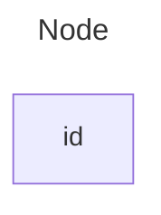

INFO

The id is what is displayed in the box.

TIP

Instead of `flowchart` one can also use `graph`.

### A node with text 

It is also possible to set text in the box that differs from the id. If  this is done several times, it is the last text found for the node that  will be used. Also if you define edges for the node later on, you can  omit text definitions. The one previously defined will be used when  rendering the box.

##### Code:

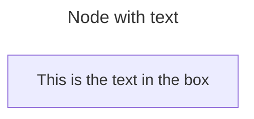

#### Unicode text 

Use `"` to enclose the unicode text.

##### Code:

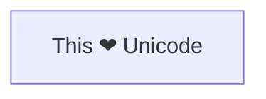

#### Markdown formatting 

Use double quotes and backticks "` text `" to enclose the markdown text.

##### Code:

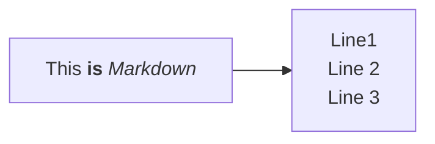

### Direction 

This statement declares the direction of the Flowchart.

This declares the flowchart is oriented from top to bottom (`TD` or `TB`).

##### Code:

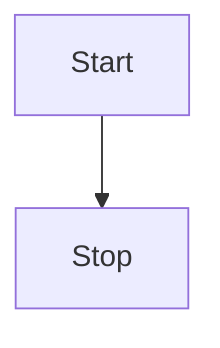

This declares the flowchart is oriented from left to right (`LR`).

##### Code:

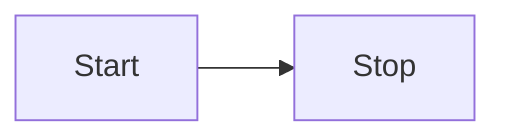

Possible FlowChart orientations are:

- TB - Top to bottom
- TD - Top-down/ same as top to bottom
- BT - Bottom to top
- RL - Right to left
- LR - Left to right

## Node shapes 

### A node with round edges 

##### Code:

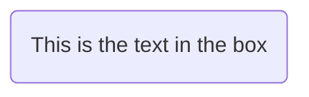

### A stadium-shaped node

##### Code:

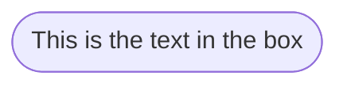

### A node in a subroutine shape 

##### Code:

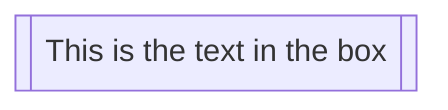

### A node in a cylindrical shape 

##### Code:

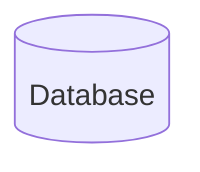

### A node in the form of a circle 

##### Code:

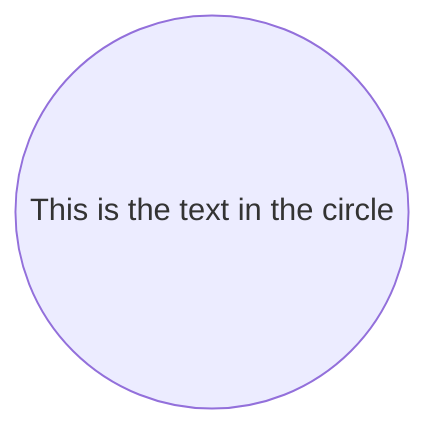

### A node in an asymmetric shape 

##### Code:

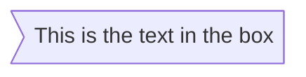

Currently only the shape above is possible and not its mirror. *This might change with future releases.*

### A node (rhombus) 

##### Code:

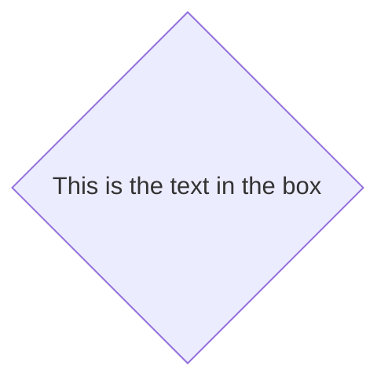

### A hexagon node 

##### Code:

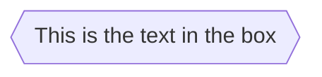

### Parallelogram 

##### Code:

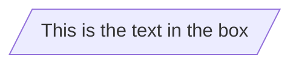

### Parallelogram alt 

##### Code:

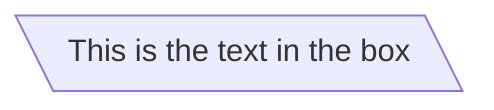

### Trapezoid 

##### Code:

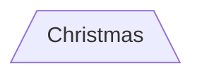

### Trapezoid alt 

##### Code:

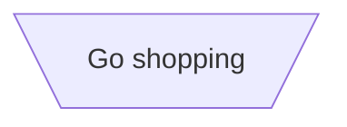

### Double circle 

##### Code:

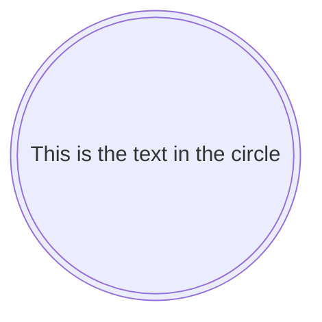

## Links between nodes 

Nodes can be connected with links/edges. It is possible to have different types of links or attach a text string to a link.

### A link with arrow head 

##### Code:

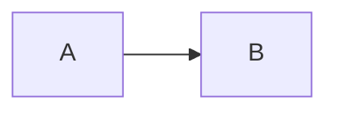

### An open link 

##### Code:

```mermaid
flowchart LR
    A --- B
```

### Text on links 

##### Code:

```mermaid
flowchart LR
    A-- This is the text! ---B
```

or

##### Code:

```mermaid
flowchart LR
    A---|This is the text|B
```

### A link with arrow head and text 

##### Code:

```mermaid
flowchart LR
    A-->|text|B
```

or

##### Code:

```mermaid
flowchart LR
    A-- text -->B
```

### Dotted link 

##### Code:

```mermaid
flowchart LR
   A-.->B;
```

### Dotted link with text 

##### Code:

```mermaid
flowchart LR
   A-. text .-> B
```

### Thick link 

##### Code:

```mermaid
flowchart LR
   A ==> B
```

### Thick link with text 

##### Code:

```mermaid
flowchart LR
   A == text ==> B
```

### An invisible link 

This can be a useful tool in some instances where you want to alter the default positioning of a node.

##### Code:

```mermaid
flowchart LR
    A ~~~ B
```

### Chaining of links 

It is possible declare many links in the same line as per below:

##### Code:

```mermaid
flowchart LR
   A -- text --> B -- text2 --> C
```

It is also possible to declare multiple nodes links in the same line as per below:

##### Code:

```mermaid
flowchart LR
   a --> b & c--> d
```

You can then describe dependencies in a very expressive way. Like the one-liner below:

##### Code:

```mermaid
flowchart TB
    A & B--> C & D
```

If you describe the same diagram using the the basic syntax, it will take  four lines. A word of warning, one could go overboard with this making  the flowchart harder to read in markdown form. The Swedish word `lagom` comes to mind. It means, not too much and not too little. This goes for expressive syntaxes as well.

##### Code:

```mermaid
flowchart TB
    A --> C
    A --> D
    B --> C
    B --> D
```

### New arrow types 

There are new types of arrows supported as per below:

##### Code:

```mermaid
flowchart LR
    A --o B
    B --x C
```

### Multi directional arrows 

There is the possibility to use multidirectional arrows.

##### Code:

```mermaid
flowchart LR
    A o--o B
    B <--> C
    C x--x D
```

### Minimum length of a link 

Each node in the flowchart is ultimately assigned to a rank in the rendered  graph, i.e. to a vertical or horizontal level (depending on the  flowchart orientation), based on the nodes to which it is linked. By  default, links can span any number of ranks, but you can ask for any  link to be longer than the others by adding extra dashes in the link  definition.

In the following example, two extra dashes are added in the link from node *B* to node *E*, so that it spans two more ranks than regular links:

##### Code:

```mermaid
flowchart TD
    A[Start] --> B{Is it?}
    B -->|Yes| C[OK]
    C --> D[Rethink]
    D --> B
    B ---->|No| E[End]
```

> **Note** Links may still be made longer than the requested number of ranks by the rendering engine to accommodate other requests.

When the link label is written in the middle of the link, the extra dashes  must be added on the right side of the link. The following example is  equivalent to the previous one:

##### Code:

```mermaid
flowchart TD
    A[Start] --> B{Is it?}
    B -- Yes --> C[OK]
    C --> D[Rethink]
    D --> B
    B -- No ----> E[End]
```

For dotted or thick links, the characters to add are equals signs or dots, as summed up in the following table:

| Length            |   1    |    2    |    3     |
| ----------------- | :----: | :-----: | :------: |
| Normal            | `---`  | `----`  | `-----`  |
| Normal with arrow | `-->`  | `--->`  | `---->`  |
| Thick             | `===`  | `====`  | `=====`  |
| Thick with arrow  | `==>`  | `===>`  | `====>`  |
| Dotted            | `-.-`  | `-..-`  | `-...-`  |
| Dotted with arrow | `-.->` | `-..->` | `-...->` |

## Special characters that break syntax 

It is possible to put text within quotes in order to render more troublesome characters. As in the example below:

##### Code:

```mermaid
flowchart LR
    id1["This is the (text) in the box"]
```

### Entity codes to escape characters 

It is possible to escape characters using the syntax exemplified here.

##### Code:

```mermaid
flowchart LR
    A["A double quote:#quot;"] --> B["A dec char:#9829;"]
```

Numbers given are base 10, so `#` can be encoded as `#35;`. It is also supported to use HTML character names.

## Subgraphs 

```txt
subgraph title
    graph definition
end
```

An example below:

##### Code:

```mermaid
flowchart TB
    c1-->a2
    subgraph one
    a1-->a2
    end
    subgraph two
    b1-->b2
    end
    subgraph three
    c1-->c2
    end
```

You can also set an explicit id for the subgraph.

##### Code:

```mermaid
flowchart TB
    c1-->a2
    subgraph ide1 [one]
    a1-->a2
    end
```

### flowcharts 

With the graphtype flowchart it is also possible to set edges to and from subgraphs as in the flowchart below.

##### Code:

```mermaid
flowchart TB
    c1-->a2
    subgraph one
    a1-->a2
    end
    subgraph two
    b1-->b2
    end
    subgraph three
    c1-->c2
    end
    one --> two
    three --> two
    two --> c2
```

### Direction in subgraphs 

With the graphtype flowcharts you can use the direction statement to set the direction which the subgraph will render like in this example.

##### Code:

```mermaid
flowchart LR
  subgraph TOP
    direction TB
    subgraph B1
        direction RL
        i1 -->f1
    end
    subgraph B2
        direction BT
        i2 -->f2
    end
  end
  A --> TOP --> B
  B1 --> B2
```

#### Limitation 

If any of a subgraph's nodes are linked to the outside, subgraph direction will be ignored. Instead the subgraph will inherit the direction of the parent graph:

##### Code:

```mermaid
flowchart LR
    subgraph subgraph1
        direction TB
        top1[top] --> bottom1[bottom]
    end
    subgraph subgraph2
        direction TB
        top2[top] --> bottom2[bottom]
    end
    %% ^ These subgraphs are identical, except for the links to them:

    %% Link *to* subgraph1: subgraph1 direction is maintained
    outside --> subgraph1
    %% Link *within* subgraph2:
    %% subgraph2 inherits the direction of the top-level graph (LR)
    outside ---> top2
```

## Markdown Strings 

The "Markdown Strings" feature enhances flowcharts and mind maps by  offering a more versatile string type, which supports text formatting  options such as bold and italics, and automatically wraps text within  labels.

##### Code:

```mermaid
%%{init: {"flowchart": {"htmlLabels": false}} }%%
flowchart LR
subgraph "One"
  a("`The **cat**
  in the hat`") -- "edge label" --> b{{"`The **dog** in the hog`"}}
end
subgraph "`**Two**`"
  c("`The **cat**
  in the hat`") -- "`Bold **edge label**`" --> d("The dog in the hog")
end
```

Formatting:

- For bold text, use double asterisks (`**`) before and after the text.
- For italics, use single asterisks (`*`) before and after the text.
- With traditional strings, you needed to add `<br>` tags for text to wrap in nodes. However, markdown strings automatically wrap text when it becomes too long and allows you to start a new line  by simply using a newline character instead of a `<br>` tag.

This feature is applicable to node labels, edge labels, and subgraph labels.

## Interaction 

It is possible to bind a click event to a node, the click can lead to  either a javascript callback or to a link which will be opened in a new  browser tab.

INFO

This functionality is disabled when using `securityLevel='strict'` and enabled when using `securityLevel='loose'`.

```js
click nodeId callback
click nodeId call callback()
```

- nodeId is the id of the node
- callback is  the name of a javascript function defined on the page displaying the  graph, the function will be called with the nodeId as parameter.

Examples of tooltip usage below:

html

```html
<script>
  const callback = function () {
    alert('A callback was triggered');
  };
</script>
```

The tooltip text is surrounded in double quotes. The styles of the tooltip are set by the class `.mermaidTooltip`.

##### Code:

```mermaid
flowchart LR
    A-->B
    B-->C
    C-->D
    click A callback "Tooltip for a callback"
    click B "https://www.github.com" "This is a tooltip for a link"
    click C call callback() "Tooltip for a callback"
    click D href "https://www.github.com" "This is a tooltip for a link"
```

> **Success** The tooltip functionality and the ability to link to urls are available from version 0.5.2.

?> Due to limitations with how Docsify handles JavaScript callback  functions, an alternate working demo for the above code can be viewed at [this jsfiddle](https://jsfiddle.net/Ogglas/2o73vdez/7).

Links are opened in the same browser tab/window by default. It is possible to change this by adding a link target to the click definition (`_self`, `_blank`, `_parent` and `_top` are supported):

##### Code:


```
flowchart LR
    A-->B
    B-->C
    C-->D
    D-->E
    click A "https://www.github.com" _blank
    click B "https://www.github.com" "Open this in a new tab" _blank
    click C href "https://www.github.com" _blank
    click D href "https://www.github.com" "Open this in a new tab" _blank
```

Beginner's tip—a full example using interactive links in a html context:

```html
<body>
  <pre class="mermaid">
    flowchart LR
        A-->B
        B-->C
        C-->D
        click A callback "Tooltip"
        click B "https://www.github.com" "This is a link"
        click C call callback() "Tooltip"
        click D href "https://www.github.com" "This is a link"
  </pre>

  <script>
    const callback = function () {
      alert('A callback was triggered');
    };
    const config = {
      startOnLoad: true,
      flowchart: { useMaxWidth: true, htmlLabels: true, curve: 'cardinal' },
      securityLevel: 'loose',
    };
    mermaid.initialize(config);
  </script>
</body>
```

### Comments 

Comments can be entered within a flow diagram, which will be ignored by the  parser. Comments need to be on their own line, and must be prefaced with `%%` (double percent signs). Any text after the start of the comment to the next newline will be treated as a comment, including any flow syntax

##### Code:

```mermaid
flowchart LR
%% this is a comment A -- text --> B{node}
   A -- text --> B -- text2 --> C
```

## Styling and classes 

### Styling links 

It is possible to style links. For instance, you might want to style a  link that is going backwards in the flow. As links have no ids in the  same way as nodes, some other way of deciding what style the links  should be attached to is required. Instead of ids, the order number of  when the link was defined in the graph is used, or use default to apply  to all links. In the example below the style defined in the linkStyle  statement will belong to the fourth link in the graph:

```css
linkStyle 3 stroke:#ff3,stroke-width:4px,color:red;
```

It is also possible to add style to multiple links in a single statement, by separating link numbers with commas:

```css
linkStyle 1,2,7 color:blue;
```

### Styling line curves 

It is possible to style the type of curve used for lines between items, if the default method does not meet your needs. Available curve styles  include `basis`, `bumpX`, `bumpY`, `cardinal`, `catmullRom`, `linear`, `monotoneX`, `monotoneY`, `natural`, `step`, `stepAfter`, and `stepBefore`.

In this example, a left-to-right graph uses the `stepBefore` curve style:

```css
%%{ init: { 'flowchart': { 'curve': 'stepBefore' } } }%%
graph LR
```

For a full list of available curves, including an explanation of custom curves, refer to the [Shapes](https://github.com/d3/d3-shape/blob/main/README.md#curves) documentation in the [d3-shape](https://github.com/d3/d3-shape/) project.

### Styling a node 

It is possible to apply specific styles such as a thicker border or a different background color to a node.

##### Code:

```mermaid
flowchart LR
    id1(Start)-->id2(Stop)
    style id1 fill:#f9f,stroke:#333,stroke-width:4px
    style id2 fill:#bbf,stroke:#f66,stroke-width:2px,color:#fff,stroke-dasharray: 5 5
```

#### Classes 

More convenient than defining the style every time is to define a class of  styles and attach this class to the nodes that should have a different  look.

A class definition looks like the example below:

```css
    classDef className fill:#f9f,stroke:#333,stroke-width:4px;
```

Also, it is possible to define style to multiple classes in one statement:

```css
    classDef firstClassName,secondClassName font-size:12pt;
```

Attachment of a class to a node is done as per below:

```css
    class nodeId1 className;
```

It is also possible to attach a class to a list of nodes in one statement:

```css
    class nodeId1,nodeId2 className;
```

A shorter form of adding a class is to attach the classname to the node using the `:::`operator as per below:

##### Code:

```mermaid
flowchart LR
    A:::someclass --> B
    classDef someclass fill:#f96
```

This form can be used when declaring multiple links between nodes:

##### Code:

```mermaid
flowchart LR
    A:::foo & B:::bar --> C:::foobar
    classDef foo stroke:#f00
    classDef bar stroke:#0f0
    classDef foobar stroke:#00f
```

### CSS classes 

It is also possible to predefine classes in CSS styles that can be applied from the graph definition as in the example below:

**Example style**

```html
<style>
  .cssClass > rect {
    fill: #ff0000;
    stroke: #ffff00;
    stroke-width: 4px;
  }
</style>
```

**Example definition**

##### Code:

```mermaid
flowchart LR
    A-->B[AAA<span>BBB</span>]
    B-->D
    class A cssClass
```

### Default class 

If a class is named default it will be assigned to all classes without specific class definitions.

```css
    classDef default fill:#f9f,stroke:#333,stroke-width:4px;
```

## Basic support for fontawesome 

It is possible to add icons from fontawesome.

The icons are accessed via the syntax fa:#icon class name#.

##### Code:

```mermaid
flowchart TD
    B["fa:fa-twitter for peace"]
    B-->C[fa:fa-ban forbidden]
    B-->D(fa:fa-spinner)
    B-->E(A fa:fa-camera-retro perhaps?)
```

Mermaid is compatible with Font Awesome up to version 5, Free icons only. Check that the icons you use are from the [supported set of icons](https://fontawesome.com/v5/search?o=r&m=free).

## Graph declarations with spaces between vertices and link and without semicolon 

- In graph declarations, the statements also can now end without a  semicolon. After release 0.2.16, ending a graph statement with semicolon is just optional. So the below graph declaration is also valid along  with the old declarations of the graph.
- A single space is allowed between vertices and the link. However there should not be any  space between a vertex and its text and a link and its text. The old  syntax of graph declaration will also work and hence this new feature is optional and is introduced to improve readability.

Below is the new declaration of the graph edges which is also valid along with the old declaration of the graph edges.

##### Code:

```mermaid
flowchart LR
    A[Hard edge] -->|Link text| B(Round edge)
    B --> C{Decision}
    C -->|One| D[Result one]
    C -->|Two| E[Result two]
```

## Configuration 

### Renderer 

The layout of the diagram is done with the renderer. The default renderer is dagre.

Starting with Mermaid version 9.4, you can use an alternate renderer named elk.  The elk renderer is better for larger and/or more complex diagrams.

The *elk* renderer is an experimental feature. You can change the renderer to elk by adding this directive:

```css
%%{init: {"flowchart": {"defaultRenderer": "elk"}} }%%
```

INFO

Note that the site needs to use mermaid version 9.4+ for this to work and  have this featured enabled in the lazy-loading configuration.

### Width 

It is possible to adjust the width of the rendered flowchart.

This is done by defining **mermaid.flowchartConfig** or by the CLI to use a JSON file with the configuration. How to use the CLI is described in the mermaidCLI page. mermaid.flowchartConfig can be set to a JSON string with config parameters or the corresponding  object.

javascript

```js
mermaid.flowchartConfig = {
    width: 100%
}
```


# 甘特图(Gantt Diagram)

[Gantt diagrams](https://mermaid.js.org/syntax/gantt.html) 

> A Gantt chart is a type of bar chart, first developed by Karol Adamiecki  in 1896, and independently by Henry Gantt in the 1910s, that illustrates a project schedule and the amount of time it would take for any one  project to finish. Gantt charts illustrate number of days between the  start and finish dates of the terminal elements and summary elements of a project.

## A note to users 

Gantt Charts will record each scheduled task as one continuous bar that  extends from the left to the right. The x axis represents time and the y records the different tasks and the order in which they are to be  completed.

It is important to remember that when a date, day, or  collection of dates specific to a task are "excluded", the Gantt Chart  will accommodate those changes by extending an equal number of days,  towards the right, not by creating a gap inside the task. As shown here 

However, if the excluded dates are between two tasks that are set to start  consecutively, the excluded dates will be skipped graphically and left  blank, and the following task will begin after the end of the excluded  dates. As shown here 

A Gantt chart is useful for tracking the amount of time it would take  before a project is finished, but it can also be used to graphically  represent "non-working days", with a few tweaks.

Mermaid can render Gantt diagrams as SVG, PNG or a MarkDown link that can be pasted into docs.

##### Code:

```mermaid
gantt
    title A Gantt Diagram
    dateFormat YYYY-MM-DD
    section Section
        A task          :a1, 2014-01-01, 30d
        Another task    :after a1, 20d
    section Another
        Task in Another :2014-01-12, 12d
        another task    :24d
```

## Syntax 

##### Code:

```mermaid
gantt
    dateFormat  YYYY-MM-DD
    title       Adding GANTT diagram functionality to mermaid
    excludes    weekends
    %% (`excludes` accepts specific dates in YYYY-MM-DD format, days of the week ("sunday") or "weekends", but not the word "weekdays".)

    section A section
    Completed task            :done,    des1, 2014-01-06,2014-01-08
    Active task               :active,  des2, 2014-01-09, 3d
    Future task               :         des3, after des2, 5d
    Future task2              :         des4, after des3, 5d

    section Critical tasks
    Completed task in the critical line :crit, done, 2014-01-06,24h
    Implement parser and jison          :crit, done, after des1, 2d
    Create tests for parser             :crit, active, 3d
    Future task in critical line        :crit, 5d
    Create tests for renderer           :2d
    Add to mermaid                      :1d
    Functionality added                 :milestone, 2014-01-25, 0d

    section Documentation
    Describe gantt syntax               :active, a1, after des1, 3d
    Add gantt diagram to demo page      :after a1  , 20h
    Add another diagram to demo page    :doc1, after a1  , 48h

    section Last section
    Describe gantt syntax               :after doc1, 3d
    Add gantt diagram to demo page      :20h
    Add another diagram to demo page    :48h
```

It is possible to set multiple dependencies separated by space:

##### Code:

```mermaid
gantt
    apple :a, 2017-07-20, 1w
    banana :crit, b, 2017-07-23, 1d
    cherry :active, c, after b a, 1d
```

### Title 

The `title` is an *optional* string to be displayed at the top of the Gantt chart to describe the chart as a whole.

### Section statements 

You can divide the chart into various sections, for example to separate  different parts of a project like development and documentation.

To do so, start a line with the `section` keyword and give it a name. (Note that unlike with the [title for the entire chart](https://mermaid.js.org/syntax/gantt.html#title), this name is *required*.

### Milestones 

You can add milestones to the diagrams. Milestones differ from tasks as  they represent a single instant in time and are identified by the  keyword `milestone`. Below is an example on how to use  milestones. As you may notice, the exact location of the milestone is  determined by the initial date for the milestone and the "duration" of  the task this way: *initial date*+*duration*/2.

##### Code:

```mermaid
gantt
    dateFormat HH:mm
    axisFormat %H:%M
    Initial milestone : milestone, m1, 17:49, 2m
    Task A : 10m
    Task B : 5m
    Final milestone : milestone, m2, 18:08, 4m
```

## Setting dates 

`dateFormat` defines the format of the date **input** of your gantt elements. How these dates are represented in the rendered chart **output** are defined by `axisFormat`.

### Input date format 

The default input date format is `YYYY-MM-DD`. You can define your custom `dateFormat`.

```markdown
dateFormat YYYY-MM-DD
```

The following formatting options are supported:

| Input      | Example        | Description                                            |
| ---------- | -------------- | ------------------------------------------------------ |
| `YYYY`     | 2014           | 4 digit year                                           |
| `YY`       | 14             | 2 digit year                                           |
| `Q`        | 1..4           | Quarter of year. Sets month to first month in quarter. |
| `M MM`     | 1..12          | Month number                                           |
| `MMM MMMM` | January..Dec   | Month name in locale set by `dayjs.locale()`           |
| `D DD`     | 1..31          | Day of month                                           |
| `Do`       | 1st..31st      | Day of month with ordinal                              |
| `DDD DDDD` | 1..365         | Day of year                                            |
| `X`        | 1410715640.579 | Unix timestamp                                         |
| `x`        | 1410715640579  | Unix ms timestamp                                      |
| `H HH`     | 0..23          | 24 hour time                                           |
| `h hh`     | 1..12          | 12 hour time used with `a A`.                          |
| `a A`      | am pm          | Post or ante meridiem                                  |
| `m mm`     | 0..59          | Minutes                                                |
| `s ss`     | 0..59          | Seconds                                                |
| `S`        | 0..9           | Tenths of a second                                     |
| `SS`       | 0..99          | Hundreds of a second                                   |
| `SSS`      | 0..999         | Thousandths of a second                                |
| `Z ZZ`     | +12:00         | Offset from UTC as +-HH:mm, +-HHmm, or Z               |

More info in: https://day.js.org/docs/en/parse/string-format/

### Output date format on the axis 

The default output date format is `YYYY-MM-DD`. You can define your custom `axisFormat`, like `2020-Q1` for the first quarter of the year 2020.

```markdown
axisFormat %Y-%m-%d
```

The following formatting strings are supported:

| Format | Definition                                                   |
| ------ | ------------------------------------------------------------ |
| %a     | abbreviated weekday name                                     |
| %A     | full weekday name                                            |
| %b     | abbreviated month name                                       |
| %B     | full month name                                              |
| %c     | date and time, as "%a %b %e %H:%M:%S %Y"                     |
| %d     | zero-padded day of the month as a decimal number [01,31]     |
| %e     | space-padded day of the month as a decimal number [ 1,31]; equivalent to %_d |
| %H     | hour (24-hour clock) as a decimal number [00,23]             |
| %I     | hour (12-hour clock) as a decimal number [01,12]             |
| %j     | day of the year as a decimal number [001,366]                |
| %m     | month as a decimal number [01,12]                            |
| %M     | minute as a decimal number [00,59]                           |
| %L     | milliseconds as a decimal number [000, 999]                  |
| %p     | either AM or PM                                              |
| %S     | second as a decimal number [00,61]                           |
| %U     | week number of the year (Sunday as the first day of the week) as a decimal number [00,53] |
| %w     | weekday as a decimal number [0(Sunday),6]                    |
| %W     | week number of the year (Monday as the first day of the week) as a decimal number [00,53] |
| %x     | date, as "%m/%d/%Y"                                          |
| %X     | time, as "%H:%M:%S"                                          |
| %y     | year without century as a decimal number [00,99]             |
| %Y     | year with century as a decimal number                        |
| %Z     | time zone offset, such as "-0700"                            |
| %%     | a literal "%" character                                      |

More info in: https://github.com/d3/d3-time-format/tree/v4.0.0#locale_format

### Axis ticks (v10.3.0+) 

The default output ticks are auto. You can custom your `tickInterval`, like `1day` or `1week`.

```markdown
tickInterval 1day
```

The pattern is:

```javascript
/^([1-9][0-9]*)(millisecond|second|minute|hour|day|week|month)$/;
```

More info in: https://github.com/d3/d3-time#interval_every

Week-based `tickInterval`s start the week on sunday by default. If you wish to specify another weekday on which the `tickInterval` should start, use the `weekday` option:

##### Code:

```
gantt
  tickInterval 1week
  weekday monday
```

WARNING

`millisecond` and `second` support was added in vMERMAID_RELEASE_VERSION

## Output in compact mode 

The compact mode allows you to display multiple tasks in the same row.  Compact mode can be enabled for a gantt chart by setting the display  mode of the graph via preceeding YAML settings.

##### Code:

```mermaid
---
displayMode: compact
---
gantt
    title A Gantt Diagram
    dateFormat  YYYY-MM-DD

    section Section
    A task           :a1, 2014-01-01, 30d
    Another task     :a2, 2014-01-20, 25d
    Another one      :a3, 2014-02-10, 20d
```

## Comments 

Comments can be entered within a gantt chart, which will be ignored by the  parser. Comments need to be on their own line and must be prefaced with `%%` (double percent signs). Any text after the start of the comment to the  next newline will be treated as a comment, including any diagram syntax.

##### Code:

```mermaid
gantt
    title A Gantt Diagram
    %% This is a comment
    dateFormat YYYY-MM-DD
    section Section
        A task          :a1, 2014-01-01, 30d
        Another task    :after a1, 20d
    section Another
        Task in Another :2014-01-12, 12d
        another task    :24d
```

## Styling 

Styling of the Gantt diagram is done by defining a number of CSS classes.  During rendering, these classes are extracted from the file located at  src/diagrams/gantt/styles.js

### Classes used 

| Class                 | Description                                                  |
| --------------------- | ------------------------------------------------------------ |
| grid.tick             | Styling for the Grid Lines                                   |
| grid.path             | Styling for the Grid's borders                               |
| .taskText             | Task Text Styling                                            |
| .taskTextOutsideRight | Styling for Task Text that exceeds the activity bar towards the right. |
| .taskTextOutsideLeft  | Styling for Task Text that exceeds the activity bar, towards the left. |
| todayMarker           | Toggle and Styling for the "Today Marker"                    |

### Sample stylesheet 

```css
.grid .tick {
  stroke: lightgrey;
  opacity: 0.3;
  shape-rendering: crispEdges;
}
.grid path {
  stroke-width: 0;
}

#tag {
  color: white;
  background: #fa283d;
  width: 150px;
  position: absolute;
  display: none;
  padding: 3px 6px;
  margin-left: -80px;
  font-size: 11px;
}

#tag:before {
  border: solid transparent;
  content: ' ';
  height: 0;
  left: 50%;
  margin-left: -5px;
  position: absolute;
  width: 0;
  border-width: 10px;
  border-bottom-color: #fa283d;
  top: -20px;
}
.taskText {
  fill: white;
  text-anchor: middle;
}
.taskTextOutsideRight {
  fill: black;
  text-anchor: start;
}
.taskTextOutsideLeft {
  fill: black;
  text-anchor: end;
}
```

## Today marker 

You can style or hide the marker for the current date. To style it, add a value for the `todayMarker` key.

```css
todayMarker stroke-width:5px,stroke:#0f0,opacity:0.5
```

To hide the marker, set `todayMarker` to `off`.

```tex
todayMarker off
```

## Configuration 

It is possible to adjust the margins for rendering the gantt diagram.

This is done by defining the `ganttConfig` part of the configuration object. How to use the CLI is described in the [mermaidCLI](https://mermaid.js.org/config/mermaidCLI.html) page.

mermaid.ganttConfig can be set to a JSON string with config parameters or the corresponding object.

```javascript
mermaid.ganttConfig = {
  titleTopMargin: 25,
  barHeight: 20,
  barGap: 4,
  topPadding: 75,
  sidePadding: 75,
};
```

### Possible configuration params: 

| Param           | Description                                                  | Default value |
| --------------- | ------------------------------------------------------------ | ------------- |
| mirrorActor     | Turns on/off the rendering of actors below the diagram as well as above it | false         |
| bottomMarginAdj | Adjusts how far down the graph ended. Wide borders styles with css could  generate unwanted clipping which is why this config param exists. | 1             |

## Interaction 

It is possible to bind a click event to a task. The click can lead to  either a javascript callback or to a link which will be opened in the  current browser tab. **Note**: This functionality is disabled when using `securityLevel='strict'` and enabled when using `securityLevel='loose'`.

```
click taskId call callback(arguments)
click taskId href URL
```

- taskId is the id of the task
- callback is  the name of a javascript function defined on the page displaying the  graph, the function will be called with the taskId as the parameter if  no other arguments are specified.

Beginner's tip—a full example using interactive links in an html context:

```html
<body>
  <pre class="mermaid">
    gantt
      dateFormat  YYYY-MM-DD

      section Clickable
      Visit mermaidjs         :active, cl1, 2014-01-07, 3d
      Print arguments         :cl2, after cl1, 3d
      Print task              :cl3, after cl2, 3d

      click cl1 href "https://mermaidjs.github.io/"
      click cl2 call printArguments("test1", "test2", test3)
      click cl3 call printTask()
  </pre>

  <script>
    const printArguments = function (arg1, arg2, arg3) {
      alert('printArguments called with arguments: ' + arg1 + ', ' + arg2 + ', ' + arg3);
    };
    const printTask = function (taskId) {
      alert('taskId: ' + taskId);
    };
    const config = {
      startOnLoad: true,
      securityLevel: 'loose',
    };
    mermaid.initialize(config);
  </script>
</body>
```

## Examples 

### Bar chart (using gantt chart) 

##### Code:

```mermaid
gantt
    title Git Issues - days since last update
    dateFormat X
    axisFormat %s
    section Issue19062
    71   : 0, 71
    section Issue19401
    36   : 0, 36
    section Issue193
    34   : 0, 34
    section Issue7441
    9    : 0, 9
    section Issue1300
    5    : 0, 5
```


# 状态图(State Diagram)

## Choice 

Sometimes you need to model a choice between two or more paths, you can do so using <<choice>>.

> "A state diagram is a type of diagram used in computer  science and related fields to describe the behavior of systems. State  diagrams require that the system described is composed of a finite  number of states; sometimes, this is indeed the case, while at other  times this is a reasonable abstraction." Wikipedia

Mermaid can render state diagrams. The syntax tries to be compliant with the  syntax used in plantUml as this will make it easier for users to share  diagrams between mermaid and plantUml.

##### Code:

```mermaid
---
title: Simple sample
---
stateDiagram-v2
    [*] --> Still
    Still --> [*]

    Still --> Moving
    Moving --> Still
    Moving --> Crash
    Crash --> [*]
```

Older renderer:

##### Code:

```mermaid
stateDiagram
    [*] --> Still
    Still --> [*]

    Still --> Moving
    Moving --> Still
    Moving --> Crash
    Crash --> [*]
```

In state diagrams systems are described in terms of *states* and how one *state* can change to another *state* via a *transition.* The example diagram above shows three states: **Still**, **Moving** and **Crash**. You start in the **Still** state. From **Still** you can change to the **Moving** state. From **Moving** you can change either back to the **Still** state or to the **Crash** state. There is no transition from **Still** to **Crash**. (You can't crash if you're still.)

## States 

A state can be declared in multiple ways. The simplest way is to define a state with just an id:

##### Code:

```mermaid
stateDiagram-v2
    stateId
```

Another way is by using the state keyword with a description as per below:

##### Code:

```mermaid
stateDiagram-v2
    state "This is a state description" as s2
```


Another way to define a state with a description is to define the state id followed by a colon and the description:

##### Code:

```mermaid
stateDiagram-v2
    s2 : This is a state description
```

## Transitions 

Transitions are path/edges when one state passes into another. This is represented using text arrow, "-->".

When you define a transition between two states and the states are not  already defined, the undefined states are defined with the id from the  transition. You can later add descriptions to states defined this way.

##### Code:

```mermaid
stateDiagram-v2
    s1 --> s2
```

It is possible to add text to a transition to describe what it represents:

##### Code:

```mermaid
stateDiagram-v2
    s1 --> s2: A transition
```

## Start and End 

There are two special states indicating the start and stop of the diagram.  These are written with the [*] syntax and the direction of the  transition to it defines it either as a start or a stop state.

##### Code:

mermaid

```mermaid
stateDiagram-v2
    [*] --> s1
    s1 --> [*]
```


## Composite states 

In a real world use of state diagrams you often end up with diagrams that  are multidimensional as one state can have several internal states.  These are called composite states in this terminology.

In order to define a composite state you need to use the state keyword followed by  an id and the body of the composite state between {}. See the example  below:

##### Code:

```mermaid
stateDiagram-v2
    [*] --> First
    state First {
        [*] --> second
        second --> [*]
    }
```


You can do this in several layers:

##### Code:

```mermaid
stateDiagram-v2
    [*] --> First

    state First {
        [*] --> Second

        state Second {
            [*] --> second
            second --> Third

            state Third {
                [*] --> third
                third --> [*]
            }
        }
    }
```

You can also define transitions also between composite states:

##### Code:

```mermaid
stateDiagram-v2
    [*] --> First
    First --> Second
    First --> Third

    state First {
        [*] --> fir
        fir --> [*]
    }
    state Second {
        [*] --> sec
        sec --> [*]
    }
    state Third {
        [*] --> thi
        thi --> [*]
    }
```

*You can not define transitions between internal states belonging to different composite states*

## Choice 

Sometimes you need to model a choice between two or more paths, you can do so using <<choice>>.

##### Code:

```mermaid
stateDiagram-v2
    state if_state <<choice>>
    [*] --> IsPositive
    IsPositive --> if_state
    if_state --> False: if n < 0
    if_state --> True : if n >= 0
```


## Forks 

It is possible to specify a fork in the diagram using `<<fork>> <<join>>`.

##### Code:

```mermaid
   stateDiagram-v2
    state fork_state <<fork>>
      [*] --> fork_state
      fork_state --> State2
      fork_state --> State3

      state join_state <<join>>
      State2 --> join_state
      State3 --> join_state
      join_state --> State4
      State4 --> [*]
```


## Notes 

Sometimes nothing says it better than a Post-it note. That is also the case in state diagrams.

Here you can choose to put the note to the *right of* or to the *left of* a node.

##### Code:

```mermaid
    stateDiagram-v2
        State1: The state with a note
        note right of State1
            Important information! You can write
            notes.
        end note
        State1 --> State2
        note left of State2 : This is the note to the left.
```


## Concurrency 

As in plantUml you can specify concurrency using the -- symbol.

##### Code:

```mermaid
stateDiagram-v2
    [*] --> Active

    state Active {
        [*] --> NumLockOff
        NumLockOff --> NumLockOn : EvNumLockPressed
        NumLockOn --> NumLockOff : EvNumLockPressed
        --
        [*] --> CapsLockOff
        CapsLockOff --> CapsLockOn : EvCapsLockPressed
        CapsLockOn --> CapsLockOff : EvCapsLockPressed
        --
        [*] --> ScrollLockOff
        ScrollLockOff --> ScrollLockOn : EvScrollLockPressed
        ScrollLockOn --> ScrollLockOff : EvScrollLockPressed
    }
```

## Setting the direction of the diagram 

With state diagrams you can use the direction statement to set the direction which the diagram will render like in this example.

##### Code:

```mermaid
stateDiagram
    direction LR
    [*] --> A
    A --> B
    B --> C
    state B {
      direction LR
      a --> b
    }
    B --> D
```


## Comments 

Comments can be entered within a state diagram chart, which will be ignored by  the parser. Comments need to be on their own line, and must be prefaced  with `%%` (double percent signs). Any text after the start of the comment to the next newline will be treated as a comment, including any diagram syntax

##### Code:

```mermaid
stateDiagram-v2
    [*] --> Still
    Still --> [*]
%% this is a comment
    Still --> Moving
    Moving --> Still %% another comment
    Moving --> Crash
    Crash --> [*]
```


## Styling with classDefs 

As with other diagrams (like flowcharts), you can define a style in the  diagram itself and apply that named style to a state or states in the  diagram.

**These are the current limitations with state diagram classDefs:**

1. Cannot be applied to start or end states
2. Cannot be applied to or within composite states

*These are in development and will be available in a future version.*

You define a style using the `classDef` keyword, which is short for "class definition" (where "class" means something like a *CSS class*) followed by *a name for the style,* and then one or more *property-value pairs*. Each *property-value pair* is a *[valid CSS property name](https://www.w3.org/TR/CSS/#properties)* followed by a colon (`:`) and then a *value.*

Here is an example of a classDef with just one property-value pair:

```css
    classDef movement font-style:italic;
```

where

- the *name* of the style is `movement`
- the only *property* is `font-style` and its *value* is `italic`

If you want to have more than one *property-value pair* then you put a comma (`,`) between each *property-value pair.*

Here is an example with three property-value pairs:

```css
    classDef badBadEvent fill:#f00,color:white,font-weight:bold,stroke-width:2px,stroke:yellow
```

where

- the *name* of the style is `badBadEvent`
- the first *property* is `fill` and its *value* is `#f00`
- the second *property* is `color` and its *value* is `white`
- the third *property* is `font-weight` and its *value* is `bold`
- the fourth *property* is `stroke-width` and its *value* is `2px`
- the fifth *property* is `stroke` and its *value* is `yellow`

### Apply classDef styles to states 

There are two ways to apply a `classDef` style to a state:

1. use the `class` keyword to apply a classDef style to one or more states in a single statement, or
2. use the `:::` operator to apply a classDef style to a state as it is being used in a  transition statement (e.g. with an arrow to/from another state)

#### 1. `class` statement 

A `class` statement tells Mermaid to apply the named classDef to one or more classes. The form is:


```css
    class [one or more state names, separated by commas] [name of a style defined with classDef]
```

Here is an example applying the `badBadEvent` style to a state named `Crash`:


```css
class Crash badBadEvent
```

Here is an example applying the `movement` style to the two states `Moving` and `Crash`:

```css
class Moving, Crash movement
```

Here is a diagram that shows the examples in use. Note that the `Crash` state has two classDef styles applied: `movement` and `badBadEvent`

##### Code:

```mermaid
   stateDiagram
   direction TB

   accTitle: This is the accessible title
   accDescr: This is an accessible description

   classDef notMoving fill:white
   classDef movement font-style:italic
   classDef badBadEvent fill:#f00,color:white,font-weight:bold,stroke-width:2px,stroke:yellow

   [*]--> Still
   Still --> [*]
   Still --> Moving
   Moving --> Still
   Moving --> Crash
   Crash --> [*]

   class Still notMoving
   class Moving, Crash movement
   class Crash badBadEvent
   class end badBadEvent
```

#### 2. `:::` operator to apply a style to a state 

You can apply a classDef style to a state using the `:::` (three colons) operator. The syntax is

```txt
[state]:::[style name]
```

You can use this in a diagram within a statement using a class. This includes the start and end states. For example:

##### Code:

```mermaid
stateDiagram
   direction TB

   accTitle: This is the accessible title
   accDescr: This is an accessible description

   classDef notMoving fill:white
   classDef movement font-style:italic;
   classDef badBadEvent fill:#f00,color:white,font-weight:bold,stroke-width:2px,stroke:yellow

   [*] --> Still:::notMoving
   Still --> [*]
   Still --> Moving:::movement
   Moving --> Still
   Moving --> Crash:::movement
   Crash:::badBadEvent --> [*]
```

## Spaces in state names 

Spaces can be added to a state by first defining the state with an id and then referencing the id later.

In the following example there is a state with the id **yswsii** and description **Your state with spaces in it**. After it has been defined, **yswsii** is used in the diagram in the first transition (`[*] --> yswsii`) and also in the transition to **YetAnotherState** (`yswsii --> YetAnotherState`).
 (**yswsii** has been styled so that it is different from the other states.)

##### Code:

```mermaid
stateDiagram
    classDef yourState font-style:italic,font-weight:bold,fill:white

    yswsii: Your state with spaces in it
    [*] --> yswsii:::yourState
    [*] --> SomeOtherState
    SomeOtherState --> YetAnotherState
    yswsii --> YetAnotherState
    YetAnotherState --> [*]
```
