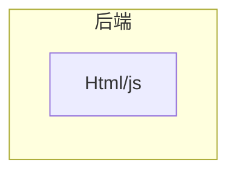
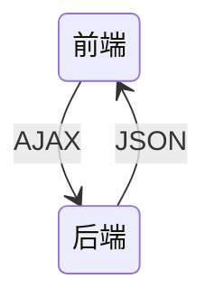
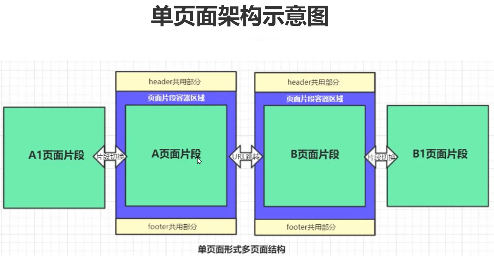
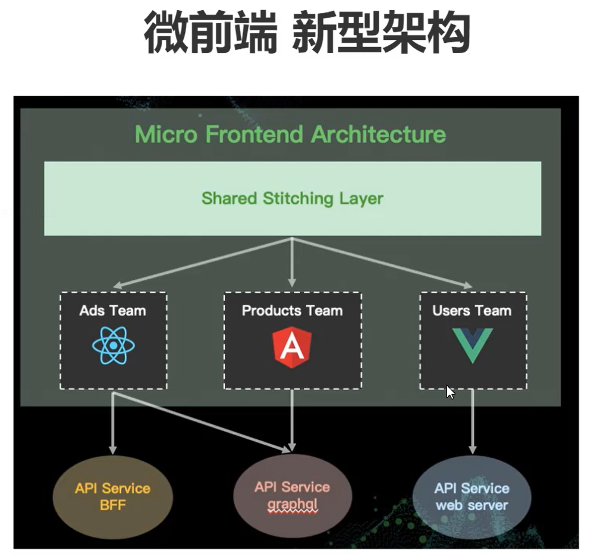

# 文档说明

本文档主要前端开发相关内容。文档目前还在持续更新中，欢迎关注、收藏、点赞、加星喔😄O(∩_∩)O~。

| 文档名称     | 学习笔记-前端 |
| ------------ | ------------- |
| 文档分类     | 学习笔记-Java |
| 版本号       | 1.1           |
| 最后更新人   | Gem Shen      |
| 最后更新日期 | 2023-12-19    |
| 编制人       | Gem Shen      |
| 编制日期     | 2023-02-18    |


# 文档更新记录

| 版本 | 编制/修改人 | 修改日期   | 备注（原因、进一步的说明等） |
| ---- | ----------- | ---------- | ---------------------------- |
| 1.0  | Gem Shen    | 2023-02-18 | 初稿                         |
| 1.1  | Gem Shen    | 2023-12-19 | 加入TypeScript相关内容       |
|      |             |            |                              |
|      |             |            |                              |
|      |             |            |                              |
|      |             |            |                              |
|      |             |            |                              |


# 前端公共

## 后端为什么要了解前端？

作为后端工程师，是否没有必要了解前端的开发技术了？并不是。

当你和前端进行联调，或是线上遇到问题的时候，懂一些前端可以帮助你们更快定位到问题，减少沟通成本。

当你成为管理层的时候，懂得前端技术才能更好地管理各个细分领域的技术人。

当你成为架构师的时候，更需要提升自身技术广度，而不仅仅是深度。


## 架构演进

### 无架构

在最开始，前端并没有什么架构，都是一些html和js嵌入在后端的动态页面中执行。例如：Servlet



### MVC架构

然后，后端出现了MVC架构，将视图层，控制层，数据层分离了。这个架构的缺点是非常依赖开发环境，前端要调整一个界面问题，需要本地搭建好后端的开发环境。


### 多页面架构

接着，前后端分离架构出现了，前端代码从后端代码中独立了出来。这一切还要得益于ajax技术的发展。但是这种方式还是存在缺点，前端缺乏独立部署的能力，整体依赖后端环境。



### 单页面架构

nodejs的出现解决了这个问题，它具备各种打包构建工具，同时还给前端带来了多元化的开发方式。出现了单页面架构。

- 打包：gulp、webpack、vite ...
- 框架：vue、react、angular ...
- UI库：Antd / Element UI / iview ...

优势

切换页面无刷新浏览器，用户体验好

组件化的开发方式，极大的提高了代码的复用率



如上图所示，每个页面都会包含一些公共部分，这些公共部分就可以实现组件化（以前更多是用后端技术实现的），每次只需要加载不同的部分（如上图中的A1和A，B1和B）

这种架构的缺点是：不利于seo ，首次渲染会出现较长时间的白屏 (可解决)。不利于SEO是因为界面部分很多都是JS动态生成的，还有就是每个界面在首次显示时需要CPU的密集计算。

这种架构下还是有很多工作需要后端来完成，比如连数据库读取数据。

### 大前端时代

到这个阶段，诞生了一些服务端开发框架，前端已经不再局限于界面显示

后端框架 express koa ...

包管理工具 npm yarn

node 版本管理工具 nvm

弊端

过于灵活的实现导致了前端应用拆分过多，维护困难

往往一个功能或需求会跨两三个项目进行开发

### 微前端架构



与技术栈无关，拆分之后的每个模块都可以使用自己的技术，例如：vue，react，JQuery等等。

主框架不限制接入应用的技术栈，微应用具备完全的自主权

独立开发 独立部署

增量更新，只需要更新改动的应用，其他应用不受影响。每个应用都有一个独立的沙箱环境

微应用仓库独立，前后端可独立开发，主框架自动完成同步更新每个微应用之前的状态隔离，运行时状态不共享


# TypeScript

开始之前请先自行安装好nodejs（[下载地址](https://nodejs.org/en/download/)）。IDE任选：HBuilder，Vscode，IDEA都可以

## 工具插件

### 安装配置

在本地新建一个目录ts-one，然后进入命令行界面，执行npm init -y

执行成功会在根目录创建一个package.json

```json
{
  "name": "ts-one",
  "version": "1.0.0",
  "description": "",
  "main": "index.js",
  "scripts": {
    "test": "echo \"Error: no test specified\" && exit 1"
  },
  "keywords": [],
  "author": "",
  "license": "ISC"
}

```


#### Typescript安装

没有安装过typescript的执行这个命令安装： npm i typescript -g

可以使用这个命令查看typescript是否已经安装成功：tsc -h

如果报如下的错误：

>  tsc : 无法加载文件 C:\Users\Administrator\AppData\Roaming\npm\tsc.ps1，因为在此系统上禁止运行脚本。有关详细信息，请参阅：https:/go.microsoft.com/fwlink/?LinkID=135170 中的 about_Execution_Policies。
> 所在位置 行:1 字符: 1

可以按如下步骤解决：

在终端执行：get-ExecutionPolicy，显示Restricted

在终端执行：set-ExecutionPolicy RemoteSigned

在终端执行：get-ExecutionPolicy，显示RemoteSigned

此时在执行tsc -h 应该就可以正常显示了。

在根目录创建src文件夹，并在其中创建index.ts文件，在里面写入如下内容：

```typescript
let str:String = 'hello world';
```

然后在控制台中输入如下命令来编译ts文件`tsc .\src\index.ts`。编译成功会生成js文件。js文件内容如下

```javascript
var str = 'hello world';
```


#### 编译错误查看

有没有什么办法可以快速的知道自己写的ts代码，会不会有编译错误呢？

可以通过typescript官网：https://www.typescriptlang.org/play

当输入：let str:String = 2; 会在右侧Errors页签中提示如下错误：

> Type 'number' is not assignable to type 'String'.


#### Webpack安装

在命令行里执行：`npm i webpack webpack-cli webpack-dev-server -D`


#### ts-loader安装

前面在介绍`TypeScript`的时候，使用的是`tsc`来编译我们的`TypeScript`文件。但是在真实项目开发的时候，不会直接使用`tsc`来编译`TypeScript`文件。一般会结合`webpack`等构建工具来使用。

在`webpack`中，编译`ts`文件有两种方式。

1. 使用`ts-loader`编译。
2. 使用`babel-loader`编译。

下文介绍的是ts-loader作为编译工具，首先需要先安装一下。

在命令行里执行：`npm i ts-loader typescript -D`


#### 插件安装

**html-webpack**插件

用于自动生成index.html

在命令行里执行：`npm i html-webpack-plugin -D`

**CleanWebpackPlugin**插件

每次成功构建之后自动清空dist目录

在命令行里执行：`npm i clean-webpack-plugin -D`

**webpack-merge**插件

用于合并配置文件

在命令行里执行：`npm i webpack-merge`


#### webpack配置文件

在项目根目录下创建config目录，并在这里面创建如下4个文件

**webpack.base.config.js**，webpack公共配置文件

```javascript
const path = require('path')
const HtmlWebpackPlugin = require('html-webpack-plugin')

module.exports = {
    //指定入口文件
	entry: {
		'app': './src/index.ts'
	},
    //指定输出文件
	output: {
		filename: './bundle.js',
		path: path.resolve('dist')
	},
    //要解析的扩展名
	resolve: {
		extensions: ['.js', '.ts', 'tsx']
	},
	module: {
        //指定ts-loader作为编译器以及他要作用的文件名格式。
		rules: [{
			test: /\.tsx?$/i,
			use: [{
				loader: 'ts-loader'
			}],
			exclude: /node_modules/
		}]
	},
	plugins: [
        //引入html插件自动生成index.html
		new HtmlWebpackPlugin({
			template: './src/tpl/index.html'
		})
	]
}
```

**webpack.config.js**，配置文件入口

```javascript
//引入配置文件合并插件
const {merge} = require('webpack-merge')
const baseConfig = require('./webpack.base.config')
const devConfig = require('./webpack.dev.config')
const proConfig = require('./webpack.pro.config')

//由这个变量决定到底是哪个环境
let config = process.NODE_ENV === 'development' ? devConfig : proConfig;

module.exports = merge(baseConfig, config);
```

**webpack.dev.config.js**，开发环境配置文件

```javascript
module.exports = {
    devtool: 'cheap-module-eval-source-map',
    devServer: {
        port: 3000
    }
}
```

**webpack.pro.config.js**，生产环境配置文件

```javascript
const { CleanWebpackPlugin } = require('clean-webpack-plugin')

module.exports = {
    plugins: [
        new CleanWebpackPlugin()
    ]
}
```

package.json内容修改如下：

```json
{
  "name": "ts-one",
  "version": "1.0.0",
  "description": "",
  "main": "index.js",
  "scripts": {
    "test": "echo \"Error: no test specified\" && exit 1",
    "start": "webpack serve --mode=development --config ./config/webpack.config.js", 
    "build": "webpack --mode=production --config ./config/webpack.config.js"
  },
  "keywords": [],
  "author": "",
  "license": "ISC",
  "devDependencies": {
    "clean-webpack-plugin": "^4.0.0-alpha.0",
    "html-webpack-plugin": "^5.3.1",
    "ts-loader": "^9.2.3",
    "typescript": "^4.3.2",
    "webpack": "^5.38.1",
    "webpack-cli": "^4.7.2",
    "webpack-dev-server": "^3.11.2",
    "webpack-merge": "^5.10.0"
  }
}
```

在src目录底下创建tpl目录，创建index.html文件，文件内容如下：

```html
<!DOCTYPE html>
<html lang="en">
<head>
    <meta charset="UTF-8">
    <title>ts-one</title>
</head>
<body>
    <div class="app"></div>
</body>
</html>
```

使用IDE编辑index.ts文件，加入如下代码：

```ts
let str:string = 'hello world';

document.querySelectorAll(".app")[0].innerHTML = str;
```

#### 项目启动

在项目根目录的控制台窗口中执行：npm run start

```cmd
PS D:\Workspace\nodejs\ts-one> npm run start

> ts-one@1.0.0 start
> webpack serve --mode=development --config ./config/webpack.config.js

i ｢wds｣: Project is running at http://localhost:8080/
i ｢wds｣: webpack output is served from /
i ｢wds｣: Content not from webpack is served from D:\Workspace\nodejs\ts-one
i ｢wdm｣: asset ./bundle.js 407 KiB [emitted] (name: app)
asset index.html 201 bytes [emitted]
runtime modules 432 bytes 3 modules
modules by path ./node_modules/ 366 KiB
  modules by path ./node_modules/webpack-dev-server/ 21.2 KiB 12 modules
  modules by path ./node_modules/url/ 63.5 KiB 7 modules
  modules by path ./node_modules/html-entities/lib/*.js 61 KiB 5 modules
  modules by path ./node_modules/webpack/hot/ 2.1 KiB 3 modules
  modules by path ./node_modules/call-bind/*.js 1.59 KiB 2 modules
  modules by path ./node_modules/has-symbols/*.js 2.13 KiB 2 modules
  modules by path ./node_modules/function-bind/*.js 2.12 KiB 2 modules
  + 13 modules
./src/index.ts 96 bytes [built] [code generated]
./util.inspect (ignored) 15 bytes [built] [code generated]
webpack 5.89.0 compiled successfully in 1307 ms
i ｢wdm｣: Compiled successfully.
```

此时使用浏览器访问：http://localhost:8080/，顺利的话应该能看到hello world。

#### 项目构建

在package.json文件下加入下面这段命令。

```json
"build": "webpack --mode=production --config ./config/webpack.config.js"
```

然后在项目根目录下执行：npm run build

```cmd
PS D:\Workspace\nodejs\ts-one> npm run build

> ts-one@1.0.0 build
> webpack --mode=production --config ./config/webpack.config.js

asset index.html 179 bytes [emitted]
asset ./bundle.js 84 bytes [emitted] [minimized] (name: app)
./src/index.ts 96 bytes [built] [code generated]
webpack 5.89.0 compiled successfully in 1099 ms
```

执行成功会发现项目根目录多了一个dist目录，目录里面有bundle.js和index.html文件

直接用浏览器打开index.html文件，看到的效果和刚才启动服务器的结果应该是一样的。


## 基本语法

### 数据类型

ES6九种数据类型

- Boolean
- Number
- String
- Array
- Function
- Object
- Symbol
- undefined
- null

TS新增数据类型：

- void
- any
- never
- 元祖
- 枚举
- 高级类型


### 类型注解

类型注解相当于java中的类型声明。let后面的是变量名，: 后面的是变量类型，=后面是值。

如果值和声明的类型不一致，编译的时候会报错。

```ts
let num: number = 1;
let str: string = "hello";

//数组类型
let arr: number[] = [1,2,3];
let arr1: Array<number> = [1,2,3];

//元祖类型，第一个元素必须是number，第二个必须是string，不允许有第三个
let tuple: [number, string] = [1,"hello ts"]

//函数（x和y代表入参，类型是number，不写就是any，编译会报错。返回值可以不写，编译器自动推断。
let add = (x: number, y: number ) => x+y;

//函数，定义和函数体分开
let compiler:(x:number, y:number)=>number
compiler = (a,b)=>a+b;

//对象
let obj: {x:number, y:number} = {x:1, y:2};
obj.x = 3

//undefined、null是所有类型的子类型。
let ud: undefined = undefined;
let nl: null = null;

//void
let func=()=>{}

//any 声明时没有类型就是any
let x;
x = [];
x = {}

//never 代表永远不会有返回值,一般是抛出异常或者死循环。
let error =()=>{
    throw new Error('error');
}

let enless = ()=>{
    while(true){}
}
```


### 交叉索引类型

所谓的高级类型就是指TS为了保障语言的灵活性所引入的一些语言特性。 这些特性将帮助我们应对复杂多变的开发场景。本节课我们就来学习交叉类型和索引类型。

#### 交叉类型

交叉类型是将多个类型合并为一个类型。新的类型具有所有类型的特性。所以交叉类型特别适合对象混入（mixin）的场景。

```ts
interface Person{
    run():void;
}

interface Teacher{
   goto():void;
}

let ative:Person & Teacher = {
   run(){},
   goto(){}
};
```

交叉类型同 "&" 进行连接。 此时的 ative 变量就应该具备两个接口类型所拥有的成员方法。 这里需要注意的是虽然从名称上看交叉类型给人的感觉是类型的交替。 但实际上它是取所有类型的并集。 接下来我们在看联合类型。

#### 联合类型

关于联合类型我们在前面的课程中已经多次提过了。这里我们正式明确下它的概念。所谓的联合类型就是指**什么的类型并不确定，可以为多个类型中的一个**。

```ts
const n:string|number = 1;
```

这里变量 n 的类型是string 和 number 的联合类型，那么它的取值就可以是数字和字符串。 这里我们顺便介绍下字面量类型。

有的时候我们不仅需要限定一个变量的类型，而且还需要限定变量的取值在某一个特定的范围内。

```ts
const m:"m"| 2 = 2;
```

比如我们这里设置了一个变量m，它的类型是字面量的联合类型。 也就是 m 的取值只能是字符串的 "m" 和 2 里面的一种。

接下来我们在讲讲对象的联合类型，回归到上节课讲的案例中来，我们给两个类都新增加了一个实例方法toString。

```ts
enum Type {obj, arr}
class IsObject{
    toOjbect(){
      console.log("hello object");
    }
    toString(){
      console.log("hello toString"); 
   }
}

class IsArray{
    toArray(){
     console.log("hello Array");
    }
    toString(){
      console.log("hello toString"); 
   }
}

function getType(type:Type){
  let target = type === Type.obj ? new IsObject() : new IsArray();
  return target;
}

getType(Type.obj);
```

当我们在 TypeScript Playground 中把鼠标指向taget 查看其类型的时候输出：let target：isObject | isArray。

```ts
function getType(type:Type){
  let target = type === Type.obj ? new IsObject() : new IsArray();
  target.toString();
  return target;
}
```

此时当我们调用target.toString 并不会报错。

```ts
function getType(type:Type){
  let target = type === Type.obj ? new IsObject() : new IsArray();
  target.toObject();
  return target;
}
```

调用toObject 会报编译错误这是为什么？  如果一个对象被确认是联合类型，当它的类型未被确认的情况下只能访问所有类型的共有成员。 isObject / isArray 的共有成员是toString。 如果我们访问非共有成员方法就会报错。

那么这个时候有趣的事情又发生了，联合类型看起来好像是取所有类型的并集，然而在这种情况下只能访问所有联合类型的交集。所以这里我们要区分下这个概念。

总结：交叉类型适合做对象的混入。 联合类型可以使类型具有不确定性可以增强代码的灵活性。

#### 索引类型

在JavaScript中我们经常会遇到这样一种场景从对象中去获取一些属性的值，然后建立一个集合。

```ts
let obj = {
   x: 1,
   y: 2,
   n: 3,
   m: 4
}
```

我们通过JavaScript来实现下这个需求：

```ts
let obj = {
   x: 1,
   y: 2,
   n: 3,
   m: 4
}

function getValue(obj:any, keys:string[]){
     return keys.map(key=>{
            return obj[key];
      });
}

console.log(getValue(obj, ["x","n"]));
```

这里我们定义了一个名为 getValue 的函数，它接收两个参数 any 类型的对象， 字符串类型的数组。 通过keys.map 获取 x，n 这两个属性的值。

如果我们随意的去指定两个不存在的属性呢？

```ts
getValue(obj, ["a","b"]);

//输出: [undefined, undefined] 
```

此时并不会报错，那么如何使用TS 对这种现象进行约束呢？  这里我们就要利用到索引类型。 要了解索引类型我们首先要了解下其他的概念。

##### 1.索引类型的查询操作符 keyof T

keyof T 表示类型 T 所有公共属性的字面量联合类型。 举个简单例子说明下:

```ts
interface Person {
    name: string;
    age: number;
}

let person: keyof Person; // 'name' | 'age'
```

##### 2.索引访问操作符 T[K]

T[K] 这个的含义就是对象T的属性K 所代表的类型。我们再来举个例子：

```ts
interface Person {
    name: string;
    age: number;
}

let person: Person = {
    name: 'Jarid',
    age: 35
};

let personProps:Person['age']; 
```

这里我们指定 personProps 的类型是Person.age的类型，那么 personProps 类型就为 number。

##### 3. T extend U

表示泛型变量可以通过继承某个类型获得某些属性。 清楚了这三个概念我们就来改造下 getValue 这个函数。

首先我们想把getValue 改造成一个泛型函数，我们需要做一些约束。这个约束就是keys里面的元素，一定是obj 的属性。如何做这种约束呢？

```ts
let obj = {
   x: 1,
   y: 2,
   n: 3,
   m: 4
}

function getValue<T>(obj:T, keys:string[]){
     return keys.map(key=>{
            return obj[key];
      });
}

getValue(obj, ["x","n"]);
```

我们先来定义一个泛型变量T ，来约束obj 。 然后再来定义一个泛型变量K , 用他来约束 keys 数组。

```ts
let obj = {
   x: 1,
   y: 2,
   n: 3,
   m: 4
}

function getValue<T, k>(obj:T, keys:K[]){
     return keys.map(key=>{
            return obj[key];
      });
}

getValue(obj, ["x","n"]);

```

然后我们给 K 来做个类型约束。 让他继承obj 所有类型的联合类型。

```ts
let obj = {
   x: 1,
   y: 2,
   n: 3,
   m: 4
}

function getValue<T, K extends keyof T>(obj:T, keys:K[]){
     return keys.map(key=>{
            return obj[key];
      });
}

console.log(getValue(obj, ["x","y"]));


```

然后我们来设置下返回值：

```ts
let obj = {
   x: 1,
   y: 2,
   n: 3,
   m: 4
}

function getValue<T, K extends keyof T>(obj:T, keys:K[]):T[K][]{
     return keys.map(key=>{
            return obj[key];
      });
}

console.log(getValue(obj, ["x","y"]));

```

首先返回值的类型是个数组，数组的成员的类型就是T[k] 对应的类型。 这样我们就通过一个索引类型把getValue改造完毕了。

```ts
getValue(obj, ["a","b"]); 
```

这个时候当我们指定一个非obj 的属性，编译器就会报错。

```ts
Type '"a"' is not assignable to type '"x" | "n" | "y" | "m"'.
Type '"b"' is not assignable to type '"x" | "n" | "y" | "m"'.
```

由此可见索引类型可以实现对对象属性的查询和访问。 然后在配合泛型约束就能够使我们使用对象，对象属性 / 以及属性值之间的约束关系。


### 映射类型

TypeScript提供了从旧类型中创建新类型的一种方式 — **映射类型** 。 在映射类型里，新类型以相同的形式去转换旧类型里每个属性。 例如，你可以让每个属性成为 只读类型或可选的。

示例代码:

```ts
interface obj {
   x: number
   y: string
   n: any
}
```

如果我们让obj 中的成员属性变为只读怎么办？ 有一个特别简单的方法。

#### Readonly 接口

```ts
type ReadonlyObj = Readonly<obj>;
```

首先定义一个类型别名, 类型别名的值是TS内置的泛型接口，传入的值就是obj。  当我们通过TypeScript Playground 去查看ReadonlyObj的类型跟我们刚刚定义的接口成员 obj 是一致的，但是成员变成了只读。

那么这种内置的接口是如何实现的呢？我们来看下相关的源码：

```ts
type Readonly<T> = {
  readonly [P in keyof T]: T[P];
}
```

我们来看下Readonly 的实现， 首先这是一个泛型接口而且是一个可索引类型的泛型接口。 它的索引签名是 P in keyof T。 其中keyof T 就是一个索引类型的查询操作符，它表示 T 所有属性的联合类型（x | y | n） 这种格式的属性列表。  这里的P in 相当于 for in 操作，类型变量 P 它会依次绑定到每个属性。

索引签名的返回值就是一个索引访问操作符了。 这里的 T[P]  T 表示传入的对象 P 表示依次绑定的属性。 最后前面在加上  readonly 映射原始类型的所有属性，就把所有的属性变成了只读。   

```ts
type Readonly<对象> = {
  readonly 属性列表[0]: 结果类型;
  readonly 属性列表[1]: 结果类型;
  readonly 属性列表[2]: 结果类型;
}
```

以上就是内置接口 Readonly 的实现了。


#### Partial 接口

如果我们想要把一个接口的属性都变成可选的怎么办？

```ts
type PartialObj = Partial<obj>;
```

使用内置的 Partial 接口，这样新的类型就能把成员变成可选。

源码如下：

```ts
type Partial<T> = {
    [P in keyof T]?: T[P];
}
```

这个跟刚刚只读的实现几乎是一样的，只不过加上了 "?" 把属性变成了可选。  然后我们在介绍一种 pick 接口，他能抽取obj的一些子集。

#### pick 接口

它接收两个参数，第一个参数就是obj，第二个参数就是我们要抽取的属性key。

```ts
interface obj {
   x: number
   y: string
   n: any
}
type PickObj = Pick<obj, "x" | "y">;
```

这样接口的x / y 成员就能被单独的抽取出来，形成一个新的类型。

源码实现：

```ts
type Pick<T, K extends keyof T> = {
   [P in k]: T[P];
}
```

第一个参数T 表示我们要抽取的对象，第二个参数是 K有个约束就是 K一定要是来自变量T属性字面量的联合类型。  然后新的属性的类型通过in 从 K 属性列表中选取。

以上的三种接口TS 成为同态， 意思就是他们只会作用与 obj 接口属性而不会引入新的属性。下面我们在介绍一个新的映射类型，他会创建新的属性。

#### Record 接口

Record创建了一个拥有 Keys类型的属性和对应值的 Type 的对象。

```ts
interface obj {
   x: number
   y: string
   n: any
}

type RecordObj = Record<"a" | "b", obj>;

let obj:RecordObj = {
    a:{x:1,y:"1",n:2},
    b:{x:2,y:"3",n:4}
}
```

这里我们需要预定义一些新的属性 a / b ， 第二个参数是来自一个我们已知的类型。 这样新的类型就有一些属性由Record 第一个参数指定，类型由 Record 第二个参数指定。  这种类型就是一种非同态的类型。

可以看到Record类型的好处是简明的。当我们想要去限制属性时，也就是Record类型大显身手的时候。下面的示例是我们在Record中使用联合字符串去限制属性键。

```ts
type roles = 'tester' | 'developer' | 'manager'

const staffCount: Record<roles, number> = {
  tester: 10,
  developer: 20,
  manager: 1
}

```

在示例中，我们使用联合类型约束定义了一个类型。如果我们尝试去访问一个不在联合类型中的属性时，VS Code 编译器会进行提示。当我们维护一个复杂类型的时候这非常有用，因为编译器会阻止这类错误的发生。

另一个有用的功能是keys可以是枚举。在下面的例子中，我们使用staffTypes枚举作为Record类型的限制值，因此可读性更好。请注意，尽在TypeScript2.9之后才支持枚举。因此，在2.9版本之前，key的类型被限制为string类型。


#### Record类型 和 keyof 组合

通过使用 `keyof`从现有类型中获取所有的属性，并和字符串组合，我们可以做如下事情：

```ts
interface Staff {
  name:string,
  salary:number,
}
  
 type StaffJson = Record<keyof Staff, string>

  const product: StaffJson = {
    name: 'John',
    salary:'3000'
  }

```

当你想要保留现有类型的属性但将值类型转换为其他类型时，这很便捷。

源码实现：

```ts
 type Record<K extends keyof any, T> = {               
    [P in K]: T;                                          
 };
```

K extends keyof any 约束K必须为联合类型, 每个属性([P in K]),都转为T类型。

映射类型本质上是一种预设类型的泛型接口，通常还会集合到索引类型获取对象的属性，和属性值。从而把一个对象变成我们想要的结构。


### 声明文件

当我们在使用第三方库的时候，很多第三方库不是用TS 写的， 它们是通过原生的JavaScript或者是浏览器 / 或者是node 提供的 run time 对象。  如果我们直接使用TS 肯定就会报错编译不通过。  假设一个场景我们要使用第三方的工具库jQuery。

之前的方式是在html 中通过script 标签引入jQuery。 这样就能全局使用jQuery，我们通常会通过jQuery(".app") 去获取对应的DOM对象。

但是在TS 中并不知道jQuery是什么东西：

```ts
jQuery(".app")
```

当我们直接使用会报错：

```ts
Cannot find name 'jQuery'.
```

所以我们需要通过一个关键字 来告诉TS 这个变量已经在其他地方被定义了，你直接使用就可以了。

```ts
declare let jQuery:(selector:string) => any;

jQuery(".app");
```

这样就不会再报错了。通常我们会把这个声明语句放在一个单独文件中去它是以  .d.ts 结尾的。 这个就是声明文件 d 就代表声明。

这里大家要注意的是：declare let jQuery 并没有真的定义一个变量的实现，只是定义了全局变量jQuery的类型，仅仅会用于编译时的检查，并不是实现功能的真正代码。 有了这个文件我们就能享受TS 带来的红利，在使用时就能获得代码补全，接口提示等功能。

一般来说默认情况下TS 会解析项目中的所有TS文件当然也包含以 .d.ts 结尾的文件。 所以将我们把jQuery.d.ts的类型声明文件放在项目中的时候，所有的.ts 文件都可以获得jQuery的类型定义。  

那当我们使用第三方库的时候是不是还要给它改装，从头到尾去写声明文件呢？这么大的工作量谁还敢去使用第三方工具库，直接放弃得了。  别找急我们有第三方的声明文件。 社区或者官方早就给我们写好了。 比如jQuery：

#### 安装jQuery类型文件

```ts
npm install --save @types/jquery
```


> https://www.npmjs.com/package/@types/jquery

注意跟我们刚刚说的一样 @types  仅仅只有类型定义，并没有具体的实现。 与普通的npm 模块不同@types 是统一由DefinitelyTyped 这个组织来管理的。

> https://github.com/DefinitelyTyped/DefinitelyTyped

这个组织一直在创建针对不同库都提供高质量声明文件的社区。 

当我们安装@types jQuery了之后来测试下：

```ts
jQuery().addClass()
```


此时当我们去使用 jQuery 就获得代码补全/提示的功能了，里面有非常丰富的实例方法。

如果我们在使用第三方库不确定他有没有声明文件怎么办？ 你可以去[TypeSearch](https://www.typescriptlang.org/dt/search)中搜素下。


除了在TypeSearch 中找到这些常用库的定义 ，现在很多库都是源代码只带 @types 定义。 也就说你用 npm install 安装某个库的时候，他的类型定义就包含其中，这样我们就能一次安装双重搞定。

比如说有一个库redux 它就是直接提供了定义文件和源代码。

```ts
npm install --save redux
```

然后在他的源码目录中就可以看到一个index.d.ts 的类型声明文件了。


大家可能会好奇 TS 是怎么知道这些类型声明文件 它们是怎么样被加载进来的呢？ 默认情况下所有课件的@types 包都会在编译过程中被包含进来。 所有 node_modules -> @types文件夹下以及它们子文件下的包都会自动的被加载进来。


# VUE

## 介绍

### 如何快速了解

从官网了解最直接最权威。地址：https://cn.vuejs.org/，可以从快速上手开始。

目前主流：Vue3，Vue2将于 2023 年 12 月 31 日停止维护

核心原理：template（组件），数据（响应式），虚拟DOM（编译器）。

不需要知道实现原理，首先先从这个框架是如何配合工作使用的。


### DSL

DSL是领域特定语言的缩写，与JavaScript这种通用语言编译器相对，它只针对某一个特殊应用场景工作

类似中英翻译，它将源代码翻译为目标代码，其转换的标准流程过程包括：词法分析、语法分析、语义分析、中间代码生成、优化、目标代码生成等，此外，前述流程并非是严格必须的

#### vue中的DSL

- 词法+语法+语义分析
- 生成token流
- 生成模板ast
- 将ast转化为js ast
- 将ast转化为render函数

```js
const code = ``
const tokens = tokenize(code) // 词法+语法+语义分析，生成token流
const tAst = parse(tokens) // 生成ast
const jsAst = transform(tAst) // 将ast转化为jsAst
const renderCode = generate(jsAst) // 将jsAst转化为render函数
```


# JQuery


# ExtJs

2014年接触过，目前已经没见多少项目在用了。

