# 文档说明

本文档主要前端开发相关内容。文档目前还在持续更新中，欢迎关注、收藏、点赞、加星喔😄O(∩_∩)O~。

| 文档名称     | 学习笔记-前端 |
| ------------ | ------------- |
| 文档分类     | 学习笔记-Java |
| 版本号       | 1.1           |
| 最后更新人   | Gem Shen      |
| 最后更新日期 | 2023-12-19    |
| 编制人       | Gem Shen      |
| 编制日期     | 2023-02-18    |


# 文档更新记录

| 版本 | 编制/修改人 | 修改日期   | 备注（原因、进一步的说明等） |
| ---- | ----------- | ---------- | ---------------------------- |
| 1.0  | Gem Shen    | 2023-02-18 | 初稿                         |
| 1.1  | Gem Shen    | 2023-12-19 | 加入TypeScript相关内容       |
|      |             |            |                              |
|      |             |            |                              |
|      |             |            |                              |
|      |             |            |                              |
|      |             |            |                              |


# 前端公共

## 后端为什么要了解前端？

作为后端工程师，是否没有必要了解前端的开发技术了？并不是。

当你和前端进行联调，或是线上遇到问题的时候，懂一些前端可以帮助你们更快定位到问题，减少沟通成本。

当你成为管理层的时候，懂得前端技术才能更好地管理各个细分领域的技术人。

当你成为架构师的时候，更需要提升自身技术广度，而不仅仅是深度。


## 架构演进

### 无架构

在最开始，前端并没有什么架构，都是一些html和js嵌入在后端的动态页面中执行。例如：Servlet

```mermaid
flowchart LR
subgraph 后端
	front["Html/js"]
end
```

### MVC架构

然后，后端出现了MVC架构，将视图层，控制层，数据层分离了。这个架构的缺点是非常依赖开发环境，前端要调整一个界面问题，需要本地搭建好后端的开发环境。


### 多页面架构

接着，前后端分离架构出现了，前端代码从后端代码中独立了出来。这一切还要得益于ajax技术的发展。但是这种方式还是存在缺点，前端缺乏独立部署的能力，整体依赖后端环境。

```mermaid
stateDiagram
    前端 --> 后端: AJAX
    后端 --> 前端: JSON
```



### 单页面架构

nodejs的出现解决了这个问题，它具备各种打包构建工具，同时还给前端带来了多元化的开发方式。出现了单页面架构。

- 打包：gulp、webpack、vite ...
- 框架：vue、react、angular ...
- UI库：Antd / Element UI / iview ...

优势

切换页面无刷新浏览器，用户体验好

组件化的开发方式，极大的提高了代码的复用率


如上图所示，每个页面都会包含一些公共部分，这些公共部分就可以实现组件化（以前更多是用后端技术实现的），每次只需要加载不同的部分（如上图中的A1和A，B1和B）

这种架构的缺点是：不利于seo ，首次渲染会出现较长时间的白屏 (可解决)。不利于SEO是因为界面部分很多都是JS动态生成的，还有就是每个界面在首次显示时需要CPU的密集计算。

这种架构下还是有很多工作需要后端来完成，比如连数据库读取数据。

### 大前端时代

到这个阶段，诞生了一些服务端开发框架，前端已经不再局限于界面显示

后端框架 express koa ...

包管理工具 npm yarn

node 版本管理工具 nvm

弊端

过于灵活的实现导致了前端应用拆分过多，维护困难

往往一个功能或需求会跨两三个项目进行开发

### 微前端架构


与技术栈无关，拆分之后的每个模块都可以使用自己的技术，例如：vue，react，JQuery等等。

主框架不限制接入应用的技术栈，微应用具备完全的自主权

独立开发 独立部署

增量更新，只需要更新改动的应用，其他应用不受影响。每个应用都有一个独立的沙箱环境

微应用仓库独立，前后端可独立开发，主框架自动完成同步更新每个微应用之前的状态隔离，运行时状态不共享


# TypeScript

开始之前请先自行安装好nodejs（[下载地址](https://nodejs.org/en/download/)）。IDE任选：HBuilder，Vscode，IDEA都可以

## 工具插件

### 安装配置

在本地新建一个目录ts-one，然后进入命令行界面，执行npm init -y

执行成功会在根目录创建一个package.json

```json
{
  "name": "ts-one",
  "version": "1.0.0",
  "description": "",
  "main": "index.js",
  "scripts": {
    "test": "echo \"Error: no test specified\" && exit 1"
  },
  "keywords": [],
  "author": "",
  "license": "ISC"
}

```


#### Typescript安装

没有安装过typescript的执行这个命令安装： npm i typescript -g

可以使用这个命令查看typescript是否已经安装成功：tsc -h

如果报如下的错误：

>  tsc : 无法加载文件 C:\Users\Administrator\AppData\Roaming\npm\tsc.ps1，因为在此系统上禁止运行脚本。有关详细信息，请参阅：https:/go.microsoft.com/fwlink/?LinkID=135170 中的 about_Execution_Policies。
> 所在位置 行:1 字符: 1

可以按如下步骤解决：

在终端执行：get-ExecutionPolicy，显示Restricted

在终端执行：set-ExecutionPolicy RemoteSigned

在终端执行：get-ExecutionPolicy，显示RemoteSigned

此时在执行tsc -h 应该就可以正常显示了。

在根目录创建src文件夹，并在其中创建index.ts文件，在里面写入如下内容：

```typescript
let str:String = 'hello world';
```

然后在控制台中输入如下命令来编译ts文件`tsc .\src\index.ts`。编译成功会生成js文件。js文件内容如下

```javascript
var str = 'hello world';
```


#### 编译错误查看

有没有什么办法可以快速的知道自己写的ts代码，会不会有编译错误呢？

可以通过typescript官网：https://www.typescriptlang.org/play

当输入：let str:String = 2; 会在右侧Errors页签中提示如下错误：

> Type 'number' is not assignable to type 'String'.


#### Webpack安装

在命令行里执行：`npm i webpack webpack-cli webpack-dev-server -D`


#### ts-loader安装

前面在介绍`TypeScript`的时候，使用的是`tsc`来编译我们的`TypeScript`文件。但是在真实项目开发的时候，不会直接使用`tsc`来编译`TypeScript`文件。一般会结合`webpack`等构建工具来使用。

在`webpack`中，编译`ts`文件有两种方式。

1. 使用`ts-loader`编译。
2. 使用`babel-loader`编译。

下文介绍的是ts-loader作为编译工具，首先需要先安装一下。

在命令行里执行：`npm i ts-loader typescript -D`


#### 插件安装

**html-webpack**插件

用于自动生成index.html

在命令行里执行：`npm i html-webpack-plugin -D`

**CleanWebpackPlugin**插件

每次成功构建之后自动清空dist目录

在命令行里执行：`npm i clean-webpack-plugin -D`

**webpack-merge**插件

用于合并配置文件

在命令行里执行：`npm i webpack-merge`


#### webpack配置文件

在项目根目录下创建config目录，并在这里面创建如下4个文件

**webpack.base.config.js**，webpack公共配置文件

```javascript
const path = require('path')
const HtmlWebpackPlugin = require('html-webpack-plugin')

module.exports = {
    //指定入口文件
	entry: {
		'app': './src/index.ts'
	},
    //指定输出文件
	output: {
		filename: './bundle.js',
		path: path.resolve('dist')
	},
    //要解析的扩展名
	resolve: {
		extensions: ['.js', '.ts', 'tsx']
	},
	module: {
        //指定ts-loader作为编译器以及他要作用的文件名格式。
		rules: [{
			test: /\.tsx?$/i,
			use: [{
				loader: 'ts-loader'
			}],
			exclude: /node_modules/
		}]
	},
	plugins: [
        //引入html插件自动生成index.html
		new HtmlWebpackPlugin({
			template: './src/tpl/index.html'
		})
	]
}
```

**webpack.config.js**，配置文件入口

```javascript
//引入配置文件合并插件
const {merge} = require('webpack-merge')
const baseConfig = require('./webpack.base.config')
const devConfig = require('./webpack.dev.config')
const proConfig = require('./webpack.pro.config')

//由这个变量决定到底是哪个环境
let config = process.NODE_ENV === 'development' ? devConfig : proConfig;

module.exports = merge(baseConfig, config);
```

**webpack.dev.config.js**，开发环境配置文件

```javascript
module.exports = {
    devtool: 'cheap-module-eval-source-map',
    devServer: {
        port: 3000
    }
}
```

**webpack.pro.config.js**，生产环境配置文件

```javascript
const { CleanWebpackPlugin } = require('clean-webpack-plugin')

module.exports = {
    plugins: [
        new CleanWebpackPlugin()
    ]
}
```

package.json内容修改如下：

```json
{
  "name": "ts-one",
  "version": "1.0.0",
  "description": "",
  "main": "index.js",
  "scripts": {
    "test": "echo \"Error: no test specified\" && exit 1",
    "start": "webpack serve --mode=development --config ./config/webpack.config.js", 
    "build": "webpack --mode=production --config ./config/webpack.config.js"
  },
  "keywords": [],
  "author": "",
  "license": "ISC",
  "devDependencies": {
    "clean-webpack-plugin": "^4.0.0-alpha.0",
    "html-webpack-plugin": "^5.3.1",
    "ts-loader": "^9.2.3",
    "typescript": "^4.3.2",
    "webpack": "^5.38.1",
    "webpack-cli": "^4.7.2",
    "webpack-dev-server": "^3.11.2",
    "webpack-merge": "^5.10.0"
  }
}
```

在src目录底下创建tpl目录，创建index.html文件，文件内容如下：

```html
<!DOCTYPE html>
<html lang="en">
<head>
    <meta charset="UTF-8">
    <title>ts-one</title>
</head>
<body>
    <div class="app"></div>
</body>
</html>
```

使用IDE编辑index.ts文件，加入如下代码：

```ts
let str:string = 'hello world';

document.querySelectorAll(".app")[0].innerHTML = str;
```

#### 项目启动

在项目根目录的控制台窗口中执行：npm run start

```cmd
PS D:\Workspace\nodejs\ts-one> npm run start

> ts-one@1.0.0 start
> webpack serve --mode=development --config ./config/webpack.config.js

i ｢wds｣: Project is running at http://localhost:8080/
i ｢wds｣: webpack output is served from /
i ｢wds｣: Content not from webpack is served from D:\Workspace\nodejs\ts-one
i ｢wdm｣: asset ./bundle.js 407 KiB [emitted] (name: app)
asset index.html 201 bytes [emitted]
runtime modules 432 bytes 3 modules
modules by path ./node_modules/ 366 KiB
  modules by path ./node_modules/webpack-dev-server/ 21.2 KiB 12 modules
  modules by path ./node_modules/url/ 63.5 KiB 7 modules
  modules by path ./node_modules/html-entities/lib/*.js 61 KiB 5 modules
  modules by path ./node_modules/webpack/hot/ 2.1 KiB 3 modules
  modules by path ./node_modules/call-bind/*.js 1.59 KiB 2 modules
  modules by path ./node_modules/has-symbols/*.js 2.13 KiB 2 modules
  modules by path ./node_modules/function-bind/*.js 2.12 KiB 2 modules
  + 13 modules
./src/index.ts 96 bytes [built] [code generated]
./util.inspect (ignored) 15 bytes [built] [code generated]
webpack 5.89.0 compiled successfully in 1307 ms
i ｢wdm｣: Compiled successfully.
```

此时使用浏览器访问：http://localhost:8080/，顺利的话应该能看到hello world。

#### 项目构建

在package.json文件下加入下面这段命令。

```json
"build": "webpack --mode=production --config ./config/webpack.config.js"
```

然后在项目根目录下执行：npm run build

```cmd
PS D:\Workspace\nodejs\ts-one> npm run build

> ts-one@1.0.0 build
> webpack --mode=production --config ./config/webpack.config.js

asset index.html 179 bytes [emitted]
asset ./bundle.js 84 bytes [emitted] [minimized] (name: app)
./src/index.ts 96 bytes [built] [code generated]
webpack 5.89.0 compiled successfully in 1099 ms
```

执行成功会发现项目根目录多了一个dist目录，目录里面有bundle.js和index.html文件

直接用浏览器打开index.html文件，看到的效果和刚才启动服务器的结果应该是一样的。


## 基本语法

### 数据类型

ES6九种数据类型

- Boolean
- Number
- String
- Array
- Function
- Object
- Symbol
- undefined
- null

TS新增数据类型：

- void
- any
- never
- 元祖
- 枚举
- 高级类型


### 类型注解

类型注解相当于java中的类型声明。let后面的是变量名，: 后面的是变量类型，=后面是值。

如果值和声明的类型不一致，编译的时候会报错。

```ts
let num: number = 1;
let str: string = "hello";

//数组类型
let arr: number[] = [1,2,3];
let arr1: Array<number> = [1,2,3];

//元祖类型，第一个元素必须是number，第二个必须是string，不允许有第三个
let tuple: [number, string] = [1,"hello ts"]

//函数（x和y代表入参，类型是number，不写就是any，编译会报错。返回值可以不写，编译器自动推断。
let add = (x: number, y: number ) => x+y;

//函数，定义和函数体分开
let compiler:(x:number, y:number)=>number
compiler = (a,b)=>a+b;

//对象
let obj: {x:number, y:number} = {x:1, y:2};
obj.x = 3

//undefined、null是所有类型的子类型。
let ud: undefined = undefined;
let nl: null = null;

//void
let func=()=>{}

//any 声明时没有类型就是any
let x;
x = [];
x = {}

//never 代表永远不会有返回值,一般是抛出异常或者死循环。
let error =()=>{
    throw new Error('error');
}

let enless = ()=>{
    while(true){}
}
```


### 交叉索引类型

所谓的高级类型就是指TS为了保障语言的灵活性所引入的一些语言特性。 这些特性将帮助我们应对复杂多变的开发场景。本节课我们就来学习交叉类型和索引类型。

#### 交叉类型

交叉类型是将多个类型合并为一个类型。新的类型具有所有类型的特性。所以交叉类型特别适合对象混入（mixin）的场景。

```ts
interface Person{
    run():void;
}

interface Teacher{
   goto():void;
}

let ative:Person & Teacher = {
   run(){},
   goto(){}
};
```

交叉类型同 "&" 进行连接。 此时的 ative 变量就应该具备两个接口类型所拥有的成员方法。 这里需要注意的是虽然从名称上看交叉类型给人的感觉是类型的交替。 但实际上它是取所有类型的并集。 接下来我们在看联合类型。

#### 联合类型

关于联合类型我们在前面的课程中已经多次提过了。这里我们正式明确下它的概念。所谓的联合类型就是指**什么的类型并不确定，可以为多个类型中的一个**。

```ts
const n:string|number = 1;
```

这里变量 n 的类型是string 和 number 的联合类型，那么它的取值就可以是数字和字符串。 这里我们顺便介绍下字面量类型。

有的时候我们不仅需要限定一个变量的类型，而且还需要限定变量的取值在某一个特定的范围内。

```ts
const m:"m"| 2 = 2;
```

比如我们这里设置了一个变量m，它的类型是字面量的联合类型。 也就是 m 的取值只能是字符串的 "m" 和 2 里面的一种。

接下来我们在讲讲对象的联合类型，回归到上节课讲的案例中来，我们给两个类都新增加了一个实例方法toString。

```ts
enum Type {obj, arr}
class IsObject{
    toOjbect(){
      console.log("hello object");
    }
    toString(){
      console.log("hello toString"); 
   }
}

class IsArray{
    toArray(){
     console.log("hello Array");
    }
    toString(){
      console.log("hello toString"); 
   }
}

function getType(type:Type){
  let target = type === Type.obj ? new IsObject() : new IsArray();
  return target;
}

getType(Type.obj);
```

当我们在 TypeScript Playground 中把鼠标指向taget 查看其类型的时候输出：let target：isObject | isArray。

```ts
function getType(type:Type){
  let target = type === Type.obj ? new IsObject() : new IsArray();
  target.toString();
  return target;
}
```

此时当我们调用target.toString 并不会报错。

```ts
function getType(type:Type){
  let target = type === Type.obj ? new IsObject() : new IsArray();
  target.toObject();
  return target;
}
```

调用toObject 会报编译错误这是为什么？  如果一个对象被确认是联合类型，当它的类型未被确认的情况下只能访问所有类型的共有成员。 isObject / isArray 的共有成员是toString。 如果我们访问非共有成员方法就会报错。

那么这个时候有趣的事情又发生了，联合类型看起来好像是取所有类型的并集，然而在这种情况下只能访问所有联合类型的交集。所以这里我们要区分下这个概念。

总结：交叉类型适合做对象的混入。 联合类型可以使类型具有不确定性可以增强代码的灵活性。

#### 索引类型

在JavaScript中我们经常会遇到这样一种场景从对象中去获取一些属性的值，然后建立一个集合。

```ts
let obj = {
   x: 1,
   y: 2,
   n: 3,
   m: 4
}
```

我们通过JavaScript来实现下这个需求：

```ts
let obj = {
   x: 1,
   y: 2,
   n: 3,
   m: 4
}

function getValue(obj:any, keys:string[]){
     return keys.map(key=>{
            return obj[key];
      });
}

console.log(getValue(obj, ["x","n"]));
```

这里我们定义了一个名为 getValue 的函数，它接收两个参数 any 类型的对象， 字符串类型的数组。 通过keys.map 获取 x，n 这两个属性的值。

如果我们随意的去指定两个不存在的属性呢？

```ts
getValue(obj, ["a","b"]);

//输出: [undefined, undefined] 
```

此时并不会报错，那么如何使用TS 对这种现象进行约束呢？  这里我们就要利用到索引类型。 要了解索引类型我们首先要了解下其他的概念。

##### 1.索引类型的查询操作符 keyof T

keyof T 表示类型 T 所有公共属性的字面量联合类型。 举个简单例子说明下:

```ts
interface Person {
    name: string;
    age: number;
}

let person: keyof Person; // 'name' | 'age'
```

##### 2.索引访问操作符 T[K]

T[K] 这个的含义就是对象T的属性K 所代表的类型。我们再来举个例子：

```ts
interface Person {
    name: string;
    age: number;
}

let person: Person = {
    name: 'Jarid',
    age: 35
};

let personProps:Person['age']; 
```

这里我们指定 personProps 的类型是Person.age的类型，那么 personProps 类型就为 number。

##### 3. T extend U

表示泛型变量可以通过继承某个类型获得某些属性。 清楚了这三个概念我们就来改造下 getValue 这个函数。

首先我们想把getValue 改造成一个泛型函数，我们需要做一些约束。这个约束就是keys里面的元素，一定是obj 的属性。如何做这种约束呢？

```ts
let obj = {
   x: 1,
   y: 2,
   n: 3,
   m: 4
}

function getValue<T>(obj:T, keys:string[]){
     return keys.map(key=>{
            return obj[key];
      });
}

getValue(obj, ["x","n"]);
```

我们先来定义一个泛型变量T ，来约束obj 。 然后再来定义一个泛型变量K , 用他来约束 keys 数组。

```ts
let obj = {
   x: 1,
   y: 2,
   n: 3,
   m: 4
}

function getValue<T, k>(obj:T, keys:K[]){
     return keys.map(key=>{
            return obj[key];
      });
}

getValue(obj, ["x","n"]);

```

然后我们给 K 来做个类型约束。 让他继承obj 所有类型的联合类型。

```ts
let obj = {
   x: 1,
   y: 2,
   n: 3,
   m: 4
}

function getValue<T, K extends keyof T>(obj:T, keys:K[]){
     return keys.map(key=>{
            return obj[key];
      });
}

console.log(getValue(obj, ["x","y"]));


```

然后我们来设置下返回值：

```ts
let obj = {
   x: 1,
   y: 2,
   n: 3,
   m: 4
}

function getValue<T, K extends keyof T>(obj:T, keys:K[]):T[K][]{
     return keys.map(key=>{
            return obj[key];
      });
}

console.log(getValue(obj, ["x","y"]));

```

首先返回值的类型是个数组，数组的成员的类型就是T[k] 对应的类型。 这样我们就通过一个索引类型把getValue改造完毕了。

```ts
getValue(obj, ["a","b"]); 
```

这个时候当我们指定一个非obj 的属性，编译器就会报错。

```ts
Type '"a"' is not assignable to type '"x" | "n" | "y" | "m"'.
Type '"b"' is not assignable to type '"x" | "n" | "y" | "m"'.
```

由此可见索引类型可以实现对对象属性的查询和访问。 然后在配合泛型约束就能够使我们使用对象，对象属性 / 以及属性值之间的约束关系。


### 映射类型

TypeScript提供了从旧类型中创建新类型的一种方式 — **映射类型** 。 在映射类型里，新类型以相同的形式去转换旧类型里每个属性。 例如，你可以让每个属性成为 只读类型或可选的。

示例代码:

```ts
interface obj {
   x: number
   y: string
   n: any
}
```

如果我们让obj 中的成员属性变为只读怎么办？ 有一个特别简单的方法。

#### Readonly 接口

```ts
type ReadonlyObj = Readonly<obj>;
```

首先定义一个类型别名, 类型别名的值是TS内置的泛型接口，传入的值就是obj。  当我们通过TypeScript Playground 去查看ReadonlyObj的类型跟我们刚刚定义的接口成员 obj 是一致的，但是成员变成了只读。

那么这种内置的接口是如何实现的呢？我们来看下相关的源码：

```ts
type Readonly<T> = {
  readonly [P in keyof T]: T[P];
}
```

我们来看下Readonly 的实现， 首先这是一个泛型接口而且是一个可索引类型的泛型接口。 它的索引签名是 P in keyof T。 其中keyof T 就是一个索引类型的查询操作符，它表示 T 所有属性的联合类型（x | y | n） 这种格式的属性列表。  这里的P in 相当于 for in 操作，类型变量 P 它会依次绑定到每个属性。

索引签名的返回值就是一个索引访问操作符了。 这里的 T[P]  T 表示传入的对象 P 表示依次绑定的属性。 最后前面在加上  readonly 映射原始类型的所有属性，就把所有的属性变成了只读。   

```ts
type Readonly<对象> = {
  readonly 属性列表[0]: 结果类型;
  readonly 属性列表[1]: 结果类型;
  readonly 属性列表[2]: 结果类型;
}
```

以上就是内置接口 Readonly 的实现了。


#### Partial 接口

如果我们想要把一个接口的属性都变成可选的怎么办？

```ts
type PartialObj = Partial<obj>;
```

使用内置的 Partial 接口，这样新的类型就能把成员变成可选。

源码如下：

```ts
type Partial<T> = {
    [P in keyof T]?: T[P];
}
```

这个跟刚刚只读的实现几乎是一样的，只不过加上了 "?" 把属性变成了可选。  然后我们在介绍一种 pick 接口，他能抽取obj的一些子集。

#### pick 接口

它接收两个参数，第一个参数就是obj，第二个参数就是我们要抽取的属性key。

```ts
interface obj {
   x: number
   y: string
   n: any
}
type PickObj = Pick<obj, "x" | "y">;
```

这样接口的x / y 成员就能被单独的抽取出来，形成一个新的类型。

源码实现：

```ts
type Pick<T, K extends keyof T> = {
   [P in k]: T[P];
}
```

第一个参数T 表示我们要抽取的对象，第二个参数是 K有个约束就是 K一定要是来自变量T属性字面量的联合类型。  然后新的属性的类型通过in 从 K 属性列表中选取。

以上的三种接口TS 成为同态， 意思就是他们只会作用与 obj 接口属性而不会引入新的属性。下面我们在介绍一个新的映射类型，他会创建新的属性。

#### Record 接口

Record创建了一个拥有 Keys类型的属性和对应值的 Type 的对象。

```ts
interface obj {
   x: number
   y: string
   n: any
}

type RecordObj = Record<"a" | "b", obj>;

let obj:RecordObj = {
    a:{x:1,y:"1",n:2},
    b:{x:2,y:"3",n:4}
}
```

这里我们需要预定义一些新的属性 a / b ， 第二个参数是来自一个我们已知的类型。 这样新的类型就有一些属性由Record 第一个参数指定，类型由 Record 第二个参数指定。  这种类型就是一种非同态的类型。

可以看到Record类型的好处是简明的。当我们想要去限制属性时，也就是Record类型大显身手的时候。下面的示例是我们在Record中使用联合字符串去限制属性键。

```ts
type roles = 'tester' | 'developer' | 'manager'

const staffCount: Record<roles, number> = {
  tester: 10,
  developer: 20,
  manager: 1
}

```

在示例中，我们使用联合类型约束定义了一个类型。如果我们尝试去访问一个不在联合类型中的属性时，VS Code 编译器会进行提示。当我们维护一个复杂类型的时候这非常有用，因为编译器会阻止这类错误的发生。

另一个有用的功能是keys可以是枚举。在下面的例子中，我们使用staffTypes枚举作为Record类型的限制值，因此可读性更好。请注意，尽在TypeScript2.9之后才支持枚举。因此，在2.9版本之前，key的类型被限制为string类型。


#### Record类型 和 keyof 组合

通过使用 `keyof`从现有类型中获取所有的属性，并和字符串组合，我们可以做如下事情：

```ts
interface Staff {
  name:string,
  salary:number,
}
  
 type StaffJson = Record<keyof Staff, string>

  const product: StaffJson = {
    name: 'John',
    salary:'3000'
  }

```

当你想要保留现有类型的属性但将值类型转换为其他类型时，这很便捷。

源码实现：

```ts
 type Record<K extends keyof any, T> = {               
    [P in K]: T;                                          
 };
```

K extends keyof any 约束K必须为联合类型, 每个属性([P in K]),都转为T类型。

映射类型本质上是一种预设类型的泛型接口，通常还会集合到索引类型获取对象的属性，和属性值。从而把一个对象变成我们想要的结构。


### 声明文件

当我们在使用第三方库的时候，很多第三方库不是用TS 写的， 它们是通过原生的JavaScript或者是浏览器 / 或者是node 提供的 run time 对象。  如果我们直接使用TS 肯定就会报错编译不通过。假设一个场景我们要使用第三方的工具库jQuery。

之前的方式是在html 中通过script 标签引入jQuery。 这样就能全局使用jQuery，我们通常会通过jQuery(".app") 去获取对应的DOM对象。

但是在TS 中并不知道jQuery是什么东西：

```ts
jQuery(".app")
```

当我们直接使用会报错：

```ts
Cannot find name 'jQuery'.
```

所以我们需要通过一个关键字 来告诉TS 这个变量已经在其他地方被定义了，你直接使用就可以了。

```ts
declare let jQuery:(selector:string) => any;

jQuery(".app");
```

这样就不会再报错了。通常我们会把这个声明语句放在一个单独文件中去它是以  .d.ts 结尾的。 这个就是声明文件 d 就代表声明。

这里大家要注意的是：declare let jQuery 并没有真的定义一个变量的实现，只是定义了全局变量jQuery的类型，仅仅会用于编译时的检查，并不是实现功能的真正代码。 有了这个文件我们就能享受TS 带来的红利，在使用时就能获得代码补全，接口提示等功能。

一般来说默认情况下TS 会解析项目中的所有TS文件当然也包含以 .d.ts 结尾的文件。 所以将我们把jQuery.d.ts的类型声明文件放在项目中的时候，所有的.ts 文件都可以获得jQuery的类型定义。  

那当我们使用第三方库的时候是不是还要给它改装，从头到尾去写声明文件呢？这么大的工作量谁还敢去使用第三方工具库，直接放弃得了。  别找急我们有第三方的声明文件。 社区或者官方早就给我们写好了。 比如jQuery：

#### 安装jQuery类型文件

```ts
npm install --save @types/jquery
```


> https://www.npmjs.com/package/@types/jquery

注意跟我们刚刚说的一样 @types  仅仅只有类型定义，并没有具体的实现。 与普通的npm 模块不同@types 是统一由DefinitelyTyped 这个组织来管理的。

> https://github.com/DefinitelyTyped/DefinitelyTyped

这个组织一直在创建针对不同库都提供高质量声明文件的社区。 

当我们安装@types jQuery了之后来测试下：

```ts
jQuery().addClass()
```


此时当我们去使用 jQuery 就获得代码补全/提示的功能了，里面有非常丰富的实例方法。

如果我们在使用第三方库不确定他有没有声明文件怎么办？ 你可以去[TypeSearch](https://www.typescriptlang.org/dt/search)中搜素下。


除了在TypeSearch 中找到这些常用库的定义 ，现在很多库都是源代码只带 @types 定义。 也就说你用 npm install 安装某个库的时候，他的类型定义就包含其中，这样我们就能一次安装双重搞定。

比如说有一个库redux 它就是直接提供了定义文件和源代码。

```ts
npm install --save redux
```

然后在他的源码目录中就可以看到一个index.d.ts 的类型声明文件了。


大家可能会好奇 TS 是怎么知道这些类型声明文件 它们是怎么样被加载进来的呢？ 默认情况下所有课件的@types 包都会在编译过程中被包含进来。 所有 node_modules -> @types文件夹下以及它们子文件下的包都会自动的被加载进来。


# Vue2

## 介绍

Vue (读音 /vjuː/，类似于 view) 是一套用于构建用户界面的渐进式框架。与其它大型框架不同的是，Vue 被设计为可以自底向上逐层应用。Vue 的核心库只关注视图层，不仅易于上手，还便于与第三方库或既有项目整合。另一方面，当与现代化的工具链以及各种支持类库结合使用时，Vue 也完全能够为复杂的单页应用提供驱动。

如果想要快速了解Vue，不需要先了解他的实现原理，首先先从这个框架是如何在工作中使用的开始。

Vue是MVVM框架


它对初学者更加友好（相对于react），它是初创公司的首选框架，它是轻量级的，有很多根据Vue拓展的独立的功能或库


## 概念特性

### 入门案例

首先参考如下步骤，创建一个简单的入门案例，然后从这个案例中学习Vue的基本概念。

在本地创建一个项目根目录：vue-one，在根目录下再创建src源代码目录，并在其中创建如下文件。

**vue.js**

可以从下面地址直接引入vue.js文件（本文版本：v2.7.15），也可以下载到本地之后引入。下文采取的是本地引入。

开发环境：`<script src="https://cdn.jsdelivr.net/npm/vue@2/dist/vue.js"></script>`

生产环境：`<script src="https://cdn.jsdelivr.net/npm/vue@2"></script>`

**hello-world.html**

注意：如果引入本地vue.js文件，请将下载的vue.js文件放到引入地址对应的目录下。

```html
<!DOCTYPE html>
<html>
	<head>
		<meta charset="utf-8">
		<title></title>
	</head>
	<body>
        <!-- 根对象 --><!-- {{ message }}是模版 -->
		<div id="app">{{ message }}</div>
		<script src="vue.dev.js"></script>
		<script>
            //数据对象绑定，谁用了我，我改变了要通知谁
			var vm = new Vue({
				el:"#app",
				data:{
					message:"hello world"
				},
			})

            //加入下面这段，显示的就是：hello world2
			//vm.message = "hello world2";
		</script>
	</body>
</html>
```

使用浏览器打开demo.html，会看到页面显示：hello world。


### JS对比案例

都说Vue是一个渐进式框架，对初学者友好。那这一点体现在哪里呢？下面将分别用js和Vue实现同一个功能，并从中对比出来Vue的优势。

我开发一个页面，默认显示0，按加按钮使数字加1，按减按钮将数字减1。

JS实现：

```html
<!DOCTYPE html>
<html lang="en">
<head>
    <meta charset="UTF-8">
    <meta name="viewport" content="width=device-width, initial-scale=1.0">
    <title>Document</title>
</head>
<body>
    <h1>
        0
    </h1>
    <button>按我加1</button>
    <button id="btn">按我减1</button>
    <script>
       var elH1 = document.getElementsByTagName("h1")[0];
       var elBtn = document.getElementsByTagName("button")[0];
       var elBtn2 = document.getElementById("btn");
       var num = 0;
       elBtn.onclick = function() {
        num ++;
        elH1.innerHTML = num;
       }

       elBtn2.onclick = function() {
        num--;
        elH1.innerHTML = num;
        console.log(num)
       }
    </script>
</body>
</html>
```

可以看到，js需要通过方法读取到元素的值，当按钮点击后，需要修改变量的值，同时还要写到元素中去。接下来是Vue的实现：

```html
<!DOCTYPE html>
<html lang="en">
<head>
    <meta charset="UTF-8">
    <meta name="viewport" content="width=device-width, initial-scale=1.0">
    <title>Document</title>
</head>
<body>
    <div id="app">
        <h1>{{a}}</h1>
        <button @click="add">按我加1</button>
        <button @click="minus">按我减1</button>
    </div>
    <script src="../js/vue.dev.js"></script>
    <script>
        new Vue({
            // 挂载点
            el:'#app',
            // 数据
            data:{
                a: 0
            },
            // 方法
            methods: {
                add() {
                    this.a++
                },
                minus() {
                    this.a--
                }
            },
        })
    </script>
</body>
</html>
```

基于MVVM，Vue只需要将元素和变量进行绑定，变量的值改变之后元素的显示会自动改变，明显减少了代码量和复杂度。这就是为什么他对初学者比较友好的原因。同时目前介绍的这种使用方式是基于传统html和js的，老项目如果使用Vue，不需要做大量改动，所以是渐进式的。


### Vue对象

#### 检查vue是否引用成功

在第一行代码中直接alert(Vue)，如果弹出来一个function就代表引入成功。反之就需要检查地址是否书写正确。

```html
<body>
    <script src="../js/vue.js"></script>
    <script>
        alert(Vue)
    </script>
</body>
```

#### 入参说明

```html
<body>
    <div id="app">
        {{a}}
    </div>
    <script src="js/vue.js"></script>
    <script>
        var vue = new Vue({
            // 挂载点，所有的Vue的方法和属性都必须在对应的挂载根标签内部使用
            el: '#app',
            // 数据管理中心，所有的Vue的数据都在data对象中
            data:{
                a: 100
            },
            // 方法，对应的Vue事件方法清单
            methods:{

            },
            // 下面这个是Vue对象中不存在的会报错。
            content:{
                b: 200
            }
        })
    </script>
</body>
```

#### 插值语法

插值语法是通过一对{{ }}进行书写，内部是对data数据管理中心的属性进行渲染，也可以是表达式

moustache（胡子）是双大括号的学名，也叫（胡子语法）

内部也可以存放表达式

`{{a >= 100 ? 20 : 10}}`

注意，表达式支持简单，比如简单判断，比如三元表达式，不可以使用if等等复杂判断

~~{{if(a>200){a=100}else{a=300}}}~~

上面的写法是错误的，因为不支持使用复杂判断


### 生命周期

#### 什么是生命周期

VUE的组件从创建到销毁的整个过程就是生命周期。其作用就是在特定的时间点执行特定的操作。

例如：组件创建完毕后，可以在created 生命周期函数中发起Ajax 请求，从而初始化 data 数据


#### 生命周期图解


#### 分类解析

**4大阶段**

- 初始化
- 挂载
- 更新
- 销毁

**8个方法**

| **钩子函数**   | **触发的行为**                                               | **在此阶段可以做的事情**                            |
| -------------- | ------------------------------------------------------------ | --------------------------------------------------- |
| beforeCreadted | vue实例的挂载元素$el和数据对象data都为undefined，还未初始化。 | 加loading事件                                       |
| created        | vue实例的数据对象data有了，$el还没有                         | 结束loading、请求数据为mounted渲染做准备            |
| beforeMount    | vue实例的$el和data都初始化了，但还是虚拟的dom节点，具体的data.filter还未替换。 |                                                     |
| mounted        | vue实例挂载完成，data.filter成功渲染                         | 配合路由钩子使用                                    |
| beforeUpdate   | data更新时触发                                               |                                                     |
| updated        | data更新时触发                                               | 数据更新时，做一些处理（此处也可以用watch进行观测） |
| beforeDestroy  | 组件销毁时触发                                               |                                                     |
| destroyed      | 组件销毁时触发，vue实例解除了事件监听以及和dom的绑定（无响应了），但DOM节点依旧存在 | 组件销毁时进行提示                                  |


#### 测试代码

在src目录中创建lifecycle.html，内容如下：

```html
<!DOCTYPE html>
<html>
<head>
	<meta charset="utf-8">
	<title></title>
</head>
<body>
<!-- 根对象 --><!-- {{ message }}是模版 -->
<div id="app">{{ message }}</div>
<script src="vue.dev.js"></script>
<script>
	//数据对象绑定，谁用了我，我改变了要通知谁
	var vm = new Vue({
		el:"#app",
		data:{
			message:"lifecycle test"
		},beforeCreate: function() {
			console.group('------beforeCreate创建前状态------');
			console.log("%c%s", "color:red" , "el     : " + this.$el); //undefined
			console.log("%c%s", "color:red","data   : " + this.$data); //undefined
			console.log("%c%s", "color:red","message: " + this.message)
		},
		created: function() {
			console.group('------created创建完毕状态------');
			console.log("%c%s", "color:red","el     : " + this.$el); //undefined
			console.log("%c%s", "color:red","data   : " + this.$data); //已被初始化
			console.log("%c%s", "color:red","message: " + this.message); //已被初始化
		},
		beforeMount: function() {
			console.group('------beforeMount挂载前状态------');
			console.log("%c%s", "color:red","el     : " + (this.$el)); //已被初始化
			console.log(this.$el);
			console.log("%c%s", "color:red","data   : " + this.$data); //已被初始化
			console.log("%c%s", "color:red","message: " + this.message); //已被初始化
		},
		mounted: function() {
			console.group('------mounted 挂载结束状态------');
			console.log("%c%s", "color:red","el     : " + this.$el); //已被初始化
			console.log(this.$el);
			console.log("%c%s", "color:red","data   : " + this.$data); //已被初始化
			console.log("%c%s", "color:red","message: " + this.message); //已被初始化
		},
		beforeUpdate: function () {
			console.group('beforeUpdate 更新前状态===============》');
			console.log("%c%s", "color:red","el     : " + this.$el);
			console.log(this.$el);
			console.log("%c%s", "color:red","data   : " + this.$data);
			console.log("%c%s", "color:red","message: " + this.message);
		},
		updated: function () {
			console.group('updated 更新完成状态===============》');
			console.log("%c%s", "color:red","el     : " + this.$el);
			console.log(this.$el);
			console.log("%c%s", "color:red","data   : " + this.$data);
			console.log("%c%s", "color:red","message: " + this.message);
		},
		beforeDestroy: function () {
			console.group('beforeDestroy 销毁前状态===============》');
			console.log("%c%s", "color:red","el     : " + this.$el);
			console.log(this.$el);
			console.log("%c%s", "color:red","data   : " + this.$data);
			console.log("%c%s", "color:red","message: " + this.message);
		},
		destroyed: function () {
			console.group('destroyed 销毁完成状态===============》');
			console.log("%c%s", "color:red","el     : " + this.$el);
			console.log(this.$el);
			console.log("%c%s", "color:red","data   : " + this.$data);
			console.log("%c%s", "color:red","message: " + this.message)
		}
	})
</script>
</body>
</html>
```

使用浏览器打开lifecycle.html，会看到页面显示：lifecycle test。按f12，打开控制台，观察日志打印。

上文参考链接：https://juejin.cn/post/7024074527420203044


## 基本使用

### 指令

指令的英文：directive，vue指令的作用是通过带有v-的特殊属性，实现对dom的响应式加载

#### v-if

v-if的作用是通过一个布尔表达式进行对dom的上树和下树的渲染

基本使用：如下2个p元素，只有true的那个会显示：

```html
<p v-if="false">我是第一行dom元素</p>
<p v-if="true">我是第二行dom元素</p>
```


实际工作中，不会直接使用布尔值进行判断，通常会是一个变量。可以通过后台请求返回。

```html
<body>
    <div id="app">
        <p v-if="boo">我是第一行dom元素</p>
        <p v-if="!boo">我是第二行dom元素</p>
    </div>
    <script src="js/vue.js"></script>
    <script>
        var vue = new Vue({
            el: '#app',
            data:{
                boo: false
            }
        })
    </script>
</body>

```

第二种情况是通过使用表达式进行逻辑判断

```html
<body>
<div id="app">
    	//当boo的值等于100的时候再显示
        <p v-if="boo == 100">我是第一行dom元素</p>
        <button @click="add">按我加1</button>
    </div>
    <script src="js/vue.js"></script>
    <script>
        var vue = new Vue({
            el: '#app',
            data:{
                boo: 95
            },
            methods:{
                add(){
                    this.boo++
                }
            }
        })
    </script>
</body>

```

v-if的显示根本原理一个是通过对值的隐式转换，一个就是通过对表达式的判断得出的布尔值得来的

将案例进行深入演变：

```html
<body>
    <div id="app">
        <h2>{{boo}}</h2>
        <p v-if='boo >= 0 && boo <= 5'>我是5</p>
        <p v-if='boo >= 6 && boo <= 10'>我是10</p>
        <p v-if='boo >= 11 && boo <= 15'>我是15</p>
        <p v-if='boo >= 16 && boo <= 20'>我是20</p>
        <p v-if="boo > 20">我是大于20</p>
        <button @click="add">按我加1</button>
    </div>
    <script src="js/vue.js"></script>
    <script>
        var vue = new Vue({
            el: '#app',
            data:{
                boo: 0
            },
            methods:{
                add(){
                    this.boo++
                }
            }
        })
    </script>
</body>
```

上面的代码还可以通过v-else-if和v-else进行分支判断：

```html
<p v-if='boo >= 0 && boo <= 5'>我是5</p>
<p v-else-if='boo >= 6 && boo <= 10'>我是10</p>
<p v-else-if='boo >= 11 && boo <= 15'>我是15</p>
<p v-else-if='boo >= 16 && boo <= 20'>我是20</p>
<p v-else="boo > 20">我是大于20</p>
```

需要注意的是v-else的使用前提是必须先有v-if并且中间不允许有任何的元素间隔，下面的案例就是错误的。

```html
<p v-if='boo >= 0 && boo <= 5'>我是5</p>
<div></div>
<p v-else="boo > 20">我是大于20</p>
```

上面的代码写法是错误的，因为div不能再v-if和v-else之间进行拆分，正确的写法：

```html
<p v-if='boo >= 0 && boo <= 5'>我是5</p>
<p v-else="boo > 20">我是大于20</p>
```

#### v-show

v-show和v-if的显示情况类似，但是原理不一样，v-show是通过控制元素的display属性，对元素的显示和隐藏进行逻辑判断，但元素本身还是在Dom树中的。

```html
<body>
    <div id="app">
        <p v-show='boo >= 5'>我是5</p>
        <button @click="add">按我加1</button>
    </div>
    <script src="js/vue.js"></script>
    <script>
        var vue = new Vue({
            el: '#app',
            data:{
                boo: 0
            },
            methods:{
                add(){
                    this.boo++
                }
            }
        })
    </script>
</body>
```

实际效果：


使用场景

v-show和v-if的使用场景区分是如果页面切换的特别频繁使用v-show，如果页面的涉及范围特别大并且不是特别频繁的切换使用v-if，因为主要区分是涉及到页面的加载性能。


#### v-for

##### v-for遍历数组

v-for是vue的循环指令，作用是遍历数组（对象）的每一个值。

v-for还有index和key属性

`<li v-for="(item,index) in arr" :key="index">{{index}}-{{item}}</li>`

item指的是被遍历的数组（对象）的每一个值，item的命名不是规定的，可以自定义命名

index指的是每一项被遍历的值的下标索引值

key是用来给每一项值加元素标识，作用是为了区分元素，为了实现最小量的更新

使用案例：

```html
<!DOCTYPE html>
<html lang="en">
<head>
    <meta charset="UTF-8">
    <meta name="viewport" content="width=device-width, initial-scale=1.0">
    <title>Document</title>
</head>
<body>
    <div id="app">
        <ul>
            <li v-for="(item,index) in arr" :key="index">{{index}}-{{item}}</li>
        </ul>
    </div>
    <script src = "../js/vue.dev.js"></script>
    <script>
        var vue = new Vue({
            el: "#app",
            data: {
                arr: [
                    '苹果',
                    '橘子',
                    '香蕉',
                    '草莓'
                ]
            }
        })
    </script>
</body>
</html>
```

显示效果：


##### v-for遍历对象

`<li v-for="(item,key,index) in obj" :key="index">{{index}}-{{key}}:{{item}}</li>`

上面的v-for一共有三个参数

item表示对象的内容，

key表示的是对象key键值名称

index表示的是当前obj的下标索引值

案例代码：

```html
<!DOCTYPE html>
<html lang="en">
<head>
    <meta charset="UTF-8">
    <meta name="viewport" content="width=device-width, initial-scale=1.0">
    <title>Document</title>
</head>
<body>
    <div id="app">
        <ul>
            <li v-for="(item,key,index) in obj" :key="index">{{index}}-{{key}}:{{item}}</li>
        </ul>
    </div>
    <script src = "../js/vue.dev.js"></script>
    <script>
        var vue = new Vue({
            el: "#app",
            data: {
                obj:{
                    name: '小明',
                    age: '17岁',
                    height: '175cm',
                    sex: '男',
                    hobby: '打篮球'
                }
            }
        })
    </script>
</body>
</html>
```


##### v-for遍历数组对象

实际工作中我们更多的是用v-for遍历Json数组，数组中每个元素都是对象

```html
<!DOCTYPE html>
<html lang="en">
<head>
    <meta charset="UTF-8">
    <meta name="viewport" content="width=device-width, initial-scale=1.0">
    <title>Document</title>
    <style>
        table,td,th{
            border: 1px solid #111;
            border-collapse: collapse;
        }
    </style>
</head>
<body>
    <div id="app">
        <table>
            <tr>
                <th>姓名</th>
                <th>年龄</th>
                <th>性别</th>
                <th>身高</th>
            </tr>
            <tr v-for="(item,index) in arr">
                <!-- JOSN中的姓名 -->
                <td>{{item.name}}</td>
                <!-- JOSN中的年龄 -->
                <td>{{item.age}}</td>
                <!-- JOSN中的性别 -->
                <td>{{item.sex}}</td>
                <!-- JOSN中的身高 -->
                <td>{{item.height}}</td>
            </tr>
        </table>
    </div>
    <script src = "../js/vue.dev.js"></script>
    <script>
        var vue = new Vue({
            el: "#app",
            data: {
                arr: [
                    {name:'小明',age: '17',sex:'男',height: '168'},
                    {name:'小红',age: '18',sex:'女',height: '165'},
                    {name:'小周',age: '19',sex:'男',height: '178'},
                    {name:'小刚',age: '20',sex:'男',height: '167'}
                ]
            }
        })
    </script>
</body>
</html>
```

显示效果：


##### v-for嵌套遍历

v-for还可以进行嵌套遍历，就是多层for循环

```html
<!DOCTYPE html>
<html lang="en">
<head>
    <meta charset="UTF-8">
    <meta name="viewport" content="width=device-width, initial-scale=1.0">
    <title>Document</title>
    <style>
        table,td,th{
            border: 1px solid #111;
            border-collapse: collapse;
        }
    </style>
</head>
<body>
    <div id="app">
        <table>
            <tr v-for="i in number" :key="i">
                <td v-for="j in i" :key="j">{{i}}X{{j}}={{i*j}}</td>
            </tr>
        </table>
    </div>
    <script src = "../js/vue.dev.js"></script>
    <script>
        var vue = new Vue({
            el: "#app",
            data: {
                number:[1,2,3,4,5,6,7,8,9]
            }
        })
    </script>
</body>
</html>
```

显示效果：


#### v-html, v-text

v-html和v-text都是渲染文本的指令，只是使用场景有所不同

v-text和双大括号插值：{{}}类似，都是将数据以文本的方式输出（即使里面包含html语法）他两的区别是

- 使用{{}}，页面会有一个很短暂的时间输出解析之前的值。但是v-text不会。
- 使用{{}}，如果他周围还有其他其他值也会一起输出，例如`---{{a}}---`。v-text则只会输出变量的值。

v-html就和上面的不同点是：他将作为innerHTML属性输出，如果包含html语法则输出html元素。

v-html和v-text类似的是v-html也不允许在元素中间随意插值。

参考代码：

```html
<!DOCTYPE html>
<html lang="en">
<head>
    <meta charset="UTF-8">
    <meta name="viewport" content="width=device-width, initial-scale=1.0">
    <title>Document</title>
    <style>

    </style>
</head>
<body>
    <div id="app">
        <p>-----------{{a}}------------</p>
        <p v-text="a">--------------------</p>
        <p v-html='a'>--------------</p>
    </div>
    <script src = "../js/vue.dev.js"></script>
    <script>
        var vue = new Vue({
            el: "#app",
            data: {
                a:'<h1>我是要插值的内容</h1>'
            }
        })
    </script>
</body>
</html>
```

显示效果：


#### v-cloak

可以使用 v-cloak 指令设置样式，这些样式会在 Vue 实例编译结束时，从绑定的 HTML 元素上被移除。

当网络较慢，网页还在加载 Vue.js ，而导致 Vue 来不及渲染，这时页面就会显示出 Vue 源代码。我们可以使用 v-cloak 指令配合CSS来解决这一问题。

在简单项目中，使用  v-cloak 指令是解决屏幕闪动的好方法。但在大型、工程化的项目中（webpack、vue-router）只有一个空的 div 元素，元素中的内容是通过路由挂载来实现的，这时我们就不需要用到 v-cloak 指令。

参考代码：

```html
<!DOCTYPE html>
<html lang="en">
<head>
    <meta charset="UTF-8">
    <meta name="viewport" content="width=device-width, initial-scale=1.0">
    <title>Document</title>
    <style>
        [v-clock]{
            display: none;
        }
    </style>
</head>
<body>
    <div id="app" v-clock>
        {{a}}
    </div>
    <script src = "../js/vue.dev.js"></script>
    <script>
        var vue = new Vue({
            el: "#app",
            data: {
                a:'我是渲染的指令-v-cloak'
            }
        })
    </script>
</body>
</html>
```


#### v-once

v-once的作用是只会渲染对应元素一次，数据更新不会引起视图的更新，目的是为了优化页面的性能

案例：

```html
<!DOCTYPE html>
<html lang="en">
<head>
    <meta charset="UTF-8">
    <meta name="viewport" content="width=device-width, initial-scale=1.0">
    <title>Document</title>
    <style>
        
    </style>
</head>
<body>
    <div id="app" v-clock>
        <h2 v-once>{{a}}</h2>
        <button @click="add">按我加1</button>
        <button @click="minus">按我减1</button>
    </div>
    <script src = "../js/vue.dev.js"></script>
    <script>
        var vue = new Vue({
            el: "#app",
            data: {
                a: 100
            },
            // 事件方法
            methods:{
                add() {
                    this.a ++
                    console.log(this.a)
                },
                minus() {
                    this.a --
                    console.log(this.a)
                }
            }
        })
    </script>
</body>
</html>
```

页面打开后会发现，点击按钮并不会导致页面显示值的变化，但是变量的值还是在变化。

使用场景通常是没有动态的元素内容，比如一些文章，一些固定标题


#### v-pre

v-pre属性的作用是跳过该元素编译过程，直接显示元素内部的文本，特点就是跳过大量的没有指令的节点。目的就是优化页面的加载性能。

```html
<!DOCTYPE html>
<html lang="en">
<head>
    <meta charset="UTF-8">
    <meta name="viewport" content="width=device-width, initial-scale=1.0">
    <title>Document</title>
    <style>
        
    </style>
</head>
<body>
    <div id="app" v-clock>
        <h2 v-pre>{{a}}</h2>
    </div>
    <script src = "../js/vue.dev.js"></script>
    <script>
        var vue = new Vue({
            el: "#app",
            data: {
                a: 100
            }
        })
    </script>
</body>
</html>
```


#### v-on

v-on的作用是给元素添加事件监听，可以简写为@。

JavaScript的元素的事件监听都可以在vue中使用。例如：

| 事件名称 | 方法         |
| -------- | ------------ |
| 点击     | onclick      |
| 双击     | ondblclick   |
| 鼠标移上 | onmouseenter |
| 鼠标离开 | onmouseleave |
| 鼠标滑过 | onmousemove  |
| 鼠标移除 | onmouseout   |
| 失去焦点 | onblur       |
| 聚焦     | onfocus      |
| 键盘事件 | onkeydown    |

在vue中的使用是一律去除前面on，然后加v-on：或者@。

例如：单击是`@click`或`v-on:click`

需要注意的是：

- 所有事件调用的方法都必须写在vue的methods中，不允许写在其他地方。
- 不允许使用JavaScript的事件方法调用Vue的方法。例如：`onclick="add"`
- 如果method中存在多个重名方法，那最下面的会覆盖上面的。
- 方法是支持传入参数的。例如：add(5)。如果不定义参数，默认的入参是event

参考代码：

```html
<!DOCTYPE html>
<html lang="en">
<head>
    <meta charset="UTF-8">
    <meta name="viewport" content="width=device-width, initial-scale=1.0">
    <title>Document</title>
    <style>
        
    </style>
</head>
<body>
    <div id="app" v-clock>
        <h2 >{{a}}</h2>
        <button @click="add">点击加1</button>
    </div>
    <script src = "../js/vue.dev.js"></script>
    <script>
        var vue = new Vue({
            el: "#app",
            data: {
                a: 100
            },
            methods:{
                add(event) {
                    console.log(event)
                }
            }
        })
    </script>
</body>
</html>
```


#### v-bind

v-bind属性的作用是将普通的html属性变为动态属性，让属性具有动态能力。

例如：``这段代码的意图是将url当成一个变量是的图片可以动态显示。但实际不会。需要改成这样才行：``。此时vue会编译带有v-bind的属性，然后返回编译后结果。

可以将v-bind:简写为：也就是：``。

需要注意的是动态的class必须要使用{}去包裹，值可以有多个，值的参数是一个布尔值

```html
<!DOCTYPE html>
<html lang="en">
<head>
    <meta charset="UTF-8">
    <meta name="viewport" content="width=device-width, initial-scale=1.0">
    <title>Document</title>
    <style>
        p{
            width: 200px;
            height: 200px;
            background: blue;
        }
        .red{
            background:red;
        }
        .pink{
            background: pink;
        }
    </style>
</head>
<body>
    <div id="app" v-clock>
        <div>
            <p :style="{width:b+'px'}">
                {{a}}
            </p>
        </div>
        <button @click="add">点击加1</button>
        <button @click="minus">点击减1</button>
    </div>
    <script src = "../js/vue.dev.js"></script>
    <script>
        var vue = new Vue({
            el: "#app",
            data: {
                a: 0,
                b: 100
            },
            methods:{
                add(event) {
                    this.b ++
                },
                minus(){
                    this.a --
                }
            }
        })
    </script>
</body>
</html>
```


#### v-model

v-model属性是使用在表单元素中的，作用是实现表单和数据的双向绑定。

vue是mvvm框架，其核心之一就是双向数据绑定。当html元素和变量进行绑定时，当变量改变html元素的值也会自动改变，而v-model的作用就是实现另一半，即当html元素值改变时自动修改变量的值。

```html
<!DOCTYPE html>
<html lang="en">
<head>
    <meta charset="UTF-8">
    <meta name="viewport" content="width=device-width, initial-scale=1.0">
    <title>Document</title>
    <style>
    </style>
</head>
<body>

    <div id="app" v-clock>
        <h2>问卷调查</h2>
        <p>
            姓名：<input type="text" v-model="name">
        </p>
        <p>
            性别：
            <input type="radio" name="sex" value="男" v-model="sex">男
            <input type="radio" name="sex" value="女" v-model="sex">女
        </p>
        <p>
            爱好：
            <input type="checkbox" name="hobby" value="打篮球" v-model="hobby">打篮球
            <input type="checkbox" name="hobby" value="跳舞" v-model="hobby">跳舞
            <input type="checkbox" name="hobby" value="读书" v-model="hobby">读书
        </p>
        <p>
            籍贯：
            <select name="native" id="" v-model="native">
                <option value="河北">河北</option>
                <option value="河南">河南</option>
                <option value="山东">山东</option>
                <option value="山西">山西</option>
                <option value="湖南">湖南</option>
                <option value="湖北">湖北</option>
            </select>
        </p>
        <p>
            您填写的表单内容为：姓名：{{name}}，性别：{{sex}}，爱好：{{hobby}}，籍贯：{{native}}        
        </p>
        <button @click="submit">提交</button>
    </div>
    <script src = "../js/vue.dev.js"></script>
    <script>
        var vue = new Vue({
            el: "#app",
            data: {
                name: '',
                sex: '男',
                hobby: [],
                native: '河北'
            },
            methods:{
                submit() {
                    //汇总信息提交到后端
                    let obj = {
                        name: this.name,
                        sex: this.sex,
                        hobboy: this.hobby,
                        native: this.native
                    }
                    console.log(obj)
                }
            }
        })
    </script>
</body>
</html>
```


页面打开后会发现，当姓名，性别，爱好这些界面元素的值发生变化时，变量的值也自动变了。


# Vue3

Vue3 在2022年9月份发布了稳定的正式版本,围绕它的设计一直都是很有热点的话题。趁此机会我们就系统性的来学习下Vue3，关于它的优劣我们学完之后自然就知道怎么去衡量了。


## 新特性

### Vue3缺点

1. vue3将不再支持IE11，Vue 在 2.X 版本仍然支持 IE11，如果你想使用类似 Vue 3 的新特性，可以等等 Vue 2.7 版本。这次的 RFC 宣布，将会对 2.7 版本做向后兼容，移植 3.x 的部分新功能，以保证两个版本之间相似的开发体验。
2. 对于习惯了Vue2.0开发模式的开发者来说，增加了心智负担，对开发者代码组织能力有体验


## 性能提升

### 更快

与 Vue2 相比 Vue3 进一步压榨运行时性能。

* Object.definePropery  vs Proxy
* Virtual DOM 重构
* 更多编译时优化

首要的细节Vue3.0 把数据对象侦测的API 从Object.defineProperty去劫持 getter and setter 换成 proxy，那从这里就能观测到初始性能有实际性的提升。

因为 Object.defineProperty 在转化数据对象属性为getter、sette其实是一个相当昂贵的操作，因为JavaScript引擎它喜欢你对象的结构越稳定越好，你把对象的结构不停的在改变的话对它而言可优化性就变低了。proxy的优点是对你的原始对象做了一个真正的proxy   是真正的在对象层面做了proxy不会去改变对象的结构。

**Virtual DOM 重构**

整个Virtual DOM 用typescript重写了，初始性能和组件的启动性能比之前快了将近一倍。

**更多编译时优化**

Slot 默认编译为函数 这样就使得父子组件不存在更新的强耦合，然后生成Vnode 的函数尽量让他参数一致化。

在编译时给每一个VNode 带着关于他类型跟children类型的信息。这些都可以帮助 run time 变得更快。

但这些优化还不够！还可以做得更好，Virtual DOM这个东西没学过的同学可能有误解以为它是为了操作更快而产生的，其实不是，Virtual DOM是一个抽象层。他的作用是能让你用纯JavaScript去描述你的界面 你的UI是什么样子。 他的核心价值在于给你更加强大灵活性 以及表达力。

#### 传统vdom的性能瓶颈

反过来它付出的代价是，每次数据更新 Virtual DOM 理论上是要重新创建  Virtual DOM 树状的数据结构，然后算法需要从头到尾把旧的 tree  和新的 tree 进行一次彻底的遍历比对。

虽然Vue 通过数据侦测能在组件层面最小化你要更新的点，但是组件这个粒度还是相对比较粗的 ，虽然Vue能够保证触发更新组件最小化，但在单个组件内部仍需要遍历改组件的整个vdom tree树。

#### 传统vdom的性能瓶颈：二

举个例子:

比如说有这样一个模板，左边是一个模板，右边是在每次数据更新的时候我们的算法要实际进行的操作。这个过程中就是从上到下 先要去diff  div 看下他的新的VNode 跟旧的 Vnode 是不是同一个div，如果是同一个我们要去看它的id 有没有变。 然后在去看它的children 它的这些子节点有没有变，这些子节点顺序有没有发生改变。 顺序改变之后还要去看这个元素的节点发生改变没有，这个节点的class 发生改变没有 text 发生改变没有。

实际上你可以看到在我们模板中只有message是动态会改变的。但每次都需要去遍历整个vdom tree 来进行比对。

这个算法 react 推出来的时候大家都在质疑，这样更新渲染会不会很慢。 但现在的JavaScript引擎够快，当然这个够快是相对而言，就是说在大多数情况下你可能在16毫秒内完成你的更新。但是在你的应用足够大的情况下 16ms 不是总是够的。

#### 传统vdom的性能瓶颈：三

那么传统的 vdom 为什么要使用这种不效率的算法呢？

究其原因是因为最初的 vdom 不是从模板编译而来，比如 react 它的 vdom 是从jsx编译过来。jsx 只是JavaScript的一个语法延伸，它具备JavaScript的一切动态性。

比如上面的 render function 如果你想光分析这段JavaScript，其实唯一可以变的就是在 i == 2 的时候 message 的值会发生改变。你是很难很难做到这一点的，没有一个很稳妥的办法可以分析出这个信息。

那么react 对于这个问题的优化解决方案是什么？

就是时间分片，就是说我承认了我的这个框架在使用的时候会消耗大量的JavaScript的CPU时间，它的策略是我会把这些CPU的时间切分到一帧一帧。从而不会去影响我用户的操作

#### Vue3为什么不抛弃Virtual DOM?

Virtual DOM有这么多的问题那在Vue3里面会不会抛弃呢？

答案是不会因为几个原因：

* 高级场景下手写 render function获得更强的表达力
* 生成代码更简洁
* 兼容Vue2.x （现有的生态都依赖于Virtual DOM）

#### Vue3 会做什么改进？

你要知道Vue特有的东西底层是Virtual DOM，上层是包含大量有价值的静态信息模板。 这点跟react 完全不一样。 同样一个组件你一眼就能看出除了这个message 其他所有的节点都是不会变的。 这就是一个包含可以推测的优化信息量的不同。

所以Vue3 的目的是要找到一个运行时的算法 既可以兼容render function，又可以最大化利用静态模板信息。

Vue2.x选择的方式是首先兼容 render function 的写法，然后再 VDOM tree 设置规则把永远不会变化的node 标注为静态节点 Vnode 存储在内存中。 两个新旧 tree 在比对的时候静态节点就会直接复用内存中的Vnode。

在Vue3里面找到了一种比Vue2更加压榨性能的思路。

#### 最简单的情况

我们先把整个模板看成静态 Vnode 的。 然后去分析他里面那些东西会动，最简单的情况在做个模板中一眼就能看出来，只有这一个插值 message 会变，除了这插值之外其他的节点结构是完全不会改变的。 而在Virtual DOM中最耗时的操作就是两个children 数组的比对。 这个操作在这种情况下完全没有必要。 所以理想的算是只要check 下这个message 值改变没有。

而在Vue 中能改变模板节点结构的还有两个结构性指令 v-if  v-for。

#### 结构性指令 v-if

如果你在模板中使用v-if 那就说明模板可能会有节点结构变化， 节点结构变化是vdom的算法核心。

但是我们把它切分下，理想的情况下我们只要check 下这个v-if的值变了没有，然后在check 下里面的这message的值变了没有。我们把它切分成内外两个部分。

#### 结构性指令 v-if: 二

现在这种做法的颗粒度增强 不再是以节点作为最小单元。  而是外层部分把内层部分当成一个子节点。外层是一个block  内层也是一个block 这个时候我们发现外部的节点结构是不会发生改变的，内部的节点结构也是不会发生改变的。

换言之我们把整个模板切分成了两块，这两块各自的节点结构是完全不会变的，那么v-for 也是同样的道理。

#### 结构性指令 v-for

我们把它切分下变成两块，外层是一个节点结构不会变化的block，内层的block 我们把它当成fragment。 而在每一个fragment 内部他的节点结构又是固定的。 所以我们就发现了其实动态的节点结构发生变化只可能是在使用了v-if、 v-for 这样的所谓的结构性指令的情况下才会出现。

所以我们一结构性指令为边界。把模块切分成一个一个的静态的块，英文名字叫block tree 。

#### block tree

大体的意思就是说，一个动态的模板我们会把它切分成相对内部是静态的块，那这样的话每一个静态的块内部只需要以一个Array的数组去追踪它内部的动态内容。这样就能极大程度上的减少无谓的遍历比对操作。

我们把Vue2 vs Vue3 前后模板模式对比来看下。

#### Before

在之前当message 的值发生改变，我们需要拿到新旧的vom 进行非常耗时的遍历比对操作。

#### After

优化之后用block 的方式， 分析之后这个模板就只有一个单独的block ，这个block内部唯一的动态节点就是message，所以我们的更新操作实际上只要去check message 的值改变没有。

这样的策略就把我们更新的性能由模板的整体大小相关，彻底转变成了你有多少动态内容相关。 之前在同样一个复杂业务场景下做个策略，Vue3的更新性能比Vue2 快了将近6倍。

好了性能优化我们就讲到这接下来我们去看看Vue3.0 Compiler 优化细节。

> Vue3模板编译之后的Render Function
>
> 网页地址：[https://vue-next-template-explorer.netlify.app/](https://vue-next-template-explorer.netlify.app/)

示例：

```html
<div>
   <span>static</span>
   <span>{{message}}</span>
</div>
```

两个节点一个span中文本内容是静态的，一个span中的内容是动态绑定的。

**生成的渲染函数:**

```js
import { createVNode as _createVNode, toDisplayString as _toDisplayString, openBlock as _openBlock, createBlock as _createBlock } from "vue"

export function render(_ctx, _cache) {
  return (_openBlock(), _createBlock("div", null, [
    _createVNode("span", null, "static"),
    _createVNode("span", null, _toDisplayString(_ctx.message), 1 /* TEXT */)
  ]))
}
```

这是一个默认生成的渲染函数，可以看到这个根节点 div 它是被做成了一个block。

```js
 _createVNode("span", null, "static")
```

然后这个是一个普通的完全静态的span。

```js
 _createVNode("span", null, _toDisplayString(_ctx.message), 1 /* TEXT */)
```

这边是一个带有动态绑定的span，它的内容是动态绑定到组件的message这个属性上面。 这里有个数字，这个叫 PatchFlags  **，** 这个flag就是编译时生成的一个标记。

我们的项目在运行时运行的时候首先会知道这个div 是一个 block，这个block 中只有带 patchFlag 的node 才会被真正的追踪。

也就是说当我们后续要更新的时候，Vue就是知道了，这个div 静态的 span 不用管。  直接跳到动态有flag 标记的node 节点上去，通过flag的信息我们知道在整个节点上面我们唯一要做的就是比较 text 里面文字内容的变动。 我们不用管他们可能存在的任何属性或者其他绑定的变化。

举一些更具体的例子：如果我们加上大量的静态的内容

```html
<div>
  <span>static</span>
  <span>static</span>
  <span>static</span>
  <span>static</span>
  <span>{{message}}</span>
  <span>static</span>
  <span>static</span>
  <span>static</span>
</div>
```

生成的渲染函数：

```js
import { createVNode as _createVNode, toDisplayString as _toDisplayString, openBlock as _openBlock, createBlock as _createBlock } from "vue"

export function render(_ctx, _cache) {
  return (_openBlock(), _createBlock("div", null, [
    _createVNode("span", null, "static"),
    _createVNode("span", null, "static"),
    _createVNode("span", null, "static"),
    _createVNode("span", null, "static"),
    _createVNode("span", null, _toDisplayString(_ctx.message), 1 /* TEXT */),
    _createVNode("span", null, "static"),
    _createVNode("span", null, "static"),
    _createVNode("span", null, "static")
  ]))
}
```

那在一个之前的Virtual DOM的算法下，需要把所有的 span 全部都过一遍，而且所有的 span 都需要去看它旧的props 和新的 props 有没有变。 虽然 JavaScript 做这些事情很快，但是当你的应用越来越大的时候，不可避免的会占用你更多的更新时间。

在新版本的优化下，看到这边是一个block 就直接看它里面有没有任何带这些动态的东西。然后就只要把这些动态的节点过一遍就行。那这样就节省了很多更新时所消耗的性能时间。

甚至是在一个block里面不管你嵌套的多深我们是不需要遍历这个 div 只需要去寻找到这个动态的节点 span 的。

```html
<div>
  <span>static</span>
  <span>static</span>
  <span>static</span>
  <span>static</span>
  <div>
    <span>{{message}}</span>
  </div>
  <span>static</span>
  <span>static</span>
  <span>static</span>
</div>
```

因为所有 block 中的动态节点都是跟根节点的 block 绑定起来的。 在数据更新的时候我们只要走到根节点 div 的 block 就可以跳转到动态的节点上。 根本不需要把其他不会变的节点在遍历一遍。

这样 Virtual DOM 中最最耗时的最最浪费性能的一部分就被我们解决掉了。

那另外一个优化就比如说我们这边有个静态的 id 绑定，我们可以看到这个 id 是完全静态不会变的，所以patchFlag也没有变化，也就是说对于run time 来说这个 id 在与不在都没区别，我们只有会在创建的时候创建一次后面的更新就不用去管它了。

```html
<span id="foo">{{message}}</span>
```

那如果我们把它做成一个动态的绑定。

```html
<div>
  <span>static</span>
  <span>static</span>
  <span>static</span>
  <span>static</span>
  <span :id="foo" class = "count">{{message}}</span>
  <span>static</span>
  <span>static</span>
  <span>static</span>
</div>
```

生成的渲染函数

```js
import { createVNode as _createVNode, toDisplayString as _toDisplayString, openBlock as _openBlock, createBlock as _createBlock } from "vue"

export function render(_ctx, _cache) {
  return (_openBlock(), _createBlock("div", null, [
    _createVNode("span", null, "static"),
    _createVNode("span", null, "static"),
    _createVNode("span", null, "static"),
    _createVNode("span", null, "static"),
    _createVNode("span", {
      id: _ctx.foo,
      class: "count"
    }, _toDisplayString(_ctx.message), 9 /* TEXT, PROPS */, ["id"]),
    _createVNode("span", null, "static"),
    _createVNode("span", null, "static"),
    _createVNode("span", null, "static")
  ]))
}
```

做成动态绑定之后就可以看到这边的 patchFlag 变了，这个 patchFlag 就已经告诉我们说，这个节点不光有文字的变化，还有 props 的变化。那哪个 props 会变呢？ id 。

那这意味这我们在加另外一个静态的class绑定，这个class 绑定是没有包含在动态 props 的清单里面的。换言之 当我们在 diff 的时候会看这个 id 变了没有， 根本不用管这个 class。

所以这就保证了我们在通过编译时的分析，我们在动态更新的时候永远只会关注那些真正会变的东西。这样就既跳出了 Virtual DOM 更新时的性能瓶颈， 又依然保留了可以手写render function的灵活性。

这样就等于说我们既拥有react的灵活性，又保留了基于模板的性能保证。

大家肯定很好奇我们讲了这么多 block 的好处，那他具体是怎么实现的呢？ 怎么能快速找到要更新的动态清单？

**查看 hoisteStatic 模式**

```js
import { createVNode as _createVNode, toDisplayString as _toDisplayString, openBlock as _openBlock, createBlock as _createBlock } from "vue"

const _hoisted_1 = /*#__PURE__*/_createVNode("span", null, "static", -1 /* HOISTED */)
const _hoisted_2 = /*#__PURE__*/_createVNode("span", null, "static", -1 /* HOISTED */)
const _hoisted_3 = /*#__PURE__*/_createVNode("span", null, "static", -1 /* HOISTED */)
const _hoisted_4 = /*#__PURE__*/_createVNode("span", null, "static", -1 /* HOISTED */)
const _hoisted_5 = /*#__PURE__*/_createVNode("span", null, "static", -1 /* HOISTED */)
const _hoisted_6 = /*#__PURE__*/_createVNode("span", null, "static", -1 /* HOISTED */)
const _hoisted_7 = /*#__PURE__*/_createVNode("span", null, "static", -1 /* HOISTED */)

export function render(_ctx, _cache) {
  return (_openBlock(), _createBlock("div", null, [
    _hoisted_1,
    _hoisted_2,
    _hoisted_3,
    _hoisted_4,
    _createVNode("span", {
      id: _ctx.foo,
      class: "count"
    }, _toDisplayString(_ctx.message), 9 /* TEXT, PROPS */, ["id"]),
    _hoisted_5,
    _hoisted_6,
    _hoisted_7
  ]))
}
```

它内部使用是一个叫 hoistStatic 机制， 听名字就知道就是把静态不变的节点提升出去。 大家可以看到这里所有静态不会变的span 都被拿到了 render function体之外，也就是说他们会在你应用启动的时候创建一次。

然后这些虚拟节点在每次被创建的时候被不停的复用，那在不停复用的情况下也就表达另外一个信息他们就不需要被不停的创建新的节点在遍历比对了，这样做是毫无意义的。 那这在大型项目中优化运行时的内存占用是很明显的。

### 更好的逻辑组合方式

如果你用过 Vue2 刚开始一定会被它 options API 简洁的代码组织方式所吸引，但是当组件复杂度提升原有的"简洁性"又会成为负担。接下来我们看下Vue3 做了什么改变。

Vue3 compostion API 示例：

```js
const app = {
    setup() {
      //data
     const count = ref(0);
     //computed
     const plusOne = computed(() => count.value + 1);
     //method
     const increname = () => count.value++;
     //watch
     watch(() => count.value * 2, v => console.log(v));
     //lifecycle
     onMounted(() => console.log('onmounted'));
     //暴露给模板或渲染函数
     return {
	count
     };
  }
}

```

这个示例代码中有一些新的函数API, 这个ref  会创建一个值，这个值会包含这个数字 0 。这个值其实就是一个wrapper 包装对象，然后你要取到这个值就通过count.value 来取。 那这个好处是什么？就是即使你这个count 包含是一个原始类型的值你也可以把它在函数之间传来传去，传来传去的同时每当你用这个 .value 来取它值的时候，还还会被追踪依赖。 然后你在去改这个 .value 的值它又会触发更新。

然后你可以直接创建一个计算属性，计算属性返回的也是值的包装。

然后方法也很简单就是一个函数，你把值一改这就是你的方法。

然后你可以watch ，watch 你去计算一个表达式的值，当这个值变化就触发回调。

这些都跟Vue2 Options 选项一一对应的，这个就是data 、这个就是computed 、这个就是method、这个就是watch、然后lifecycle也是 mounted 直接这样注入。

最后你可以选择暴露哪些东西给你的模板，这个就跟你在data 里面返回一个对象是一样的。 你可以能会觉得这个不就是把Vue2的选项API换成了函数吗？ 到底有什么好处。

总结几点：

1.**更好的TypeScript 类型推断支持**

为什么？ 因为TS 不是以你给我一个对象我根据你对象里面的一些属性来推导它另一些属性的值。它不是以这样一个前提去设计的，但是如果你是一些这样的代码，TS 对于函数的参数和返回值的支持是非常非常好的。也是说在源码内部这个函数接口的类型声明都已经帮你做好了，所以你在写代码的时候这个即是JavaScript代码 也是TypeScript 代码。  你用TypeScript 去写这个跟你用JavaScript去写这个是一模一样的你不需要任何的手动类型声明。而且他给你完美的类型推导完美的自动补全。

2.**更灵活的逻辑复用能力**

我们想要让同一套逻辑要在多个组件之间复用，Vue2.0 里面有几种不同的方案。

minxin 侦听鼠标位置：

```js
const mousePositionMixin = {
     data() {
      return {
	 x: 0,
	 y: 0
	}
     },
     mounted() {
        window.addEventListener('mousemove', this.updata);
     },
     destroyed() {
	window.addEventListener('mousemove', this.update);
     },
    methods: {
       updata(e) {
	 this.x = e.pageX;
	 this.y = e.pageY;
       }
    }
}

```

mixin 很简单跟你单独写个组件没什么区别，你需要有data 需要在组件挂载的时候绑定事件，需要在组件销毁的时候移除事件，需要有个update方法更新数据。  虽然说mixin 很简单很直观但是你会发现当你mixin用太多的时候，很显而易见的问题。 首先命名空间冲突，你怎么保证多个mixin 不会恰好占用同一个属性。  然后模板数据来源不清晰。

比如说当你单独用着一个mixin的时候你会知道，x 是从它这来，y 是从他这来。但是你mixin 一多的话你是不会声明那个属性是从哪个mixin注入的。 那你mixin 一多就会造成数据来源不清晰的问题。

还有一种复用的方案高阶组件(Higher-order Component)

```js
const listen = WithMousePosition({
    props:['x','y'],
    template:`<div>Mouse Position:x {{ x }} / y: {{ y }}</div>`
})
```

这个我们应该在Vue里面用的比较少，在react中用的比较多。 高阶组件就是说用一个父组件去承载这个逻辑的这个内容。然后让这个父组件把这个最终得出的数据以props的形式传递给里面的子组件。  等于说你每次要用到这个逻辑的时候就用外面这个高阶组件把你真正要写的组件包一下。 那你真正要写的组件就以props的形式接收外面传进来的数据，在Vue2里面引入高阶组件是作为mixin的一个替代品的。

但是实际上他比mixin更糟糕当你多个高阶组件一起用的时候 props 命名空间依然会有冲突，props 来源不清晰我并不知道props 是哪个高阶组件传进来的。最后高阶组件嵌的越多额外的组件实例消耗也就越多，这就是一个无谓的性能消耗。

还有一个逻辑复用的办法(Renderless Components) 作用域插槽

```html
<mouse v-slot="{x,y}">
  Mouse Position: x {{ x }} / y {{ y }}
</mouse>
```

这个跟react 的Render Props是等同的概念，作用域插槽还是用一个组件去承载逻辑，但是它把数据传回给调用者的方式是通过以作用域插槽的方式传回来。 所以我们可以写一个mouse 的组件，组件里面包含了mouse 的逻辑，然后它会去渲染一个default slot  然后把 x，y 以参数的形式传递给这个default slot。

作用域插槽是一个很好的逻辑复用方式，因为他没有命名空间的冲突，数据来源也清晰，是从哪个组件来的，怎么注入进来到你的模板里的都很清晰。 唯一的缺点就是有额外的组件实例性能消耗，因为你依然用的是以组件为承载逻辑的单元。

如果用composition API来写会怎么样呢？

```javascript
function useMousePosition(){
  const x = ref(0);
  const y = ref(0);

  const updata = e =>{
	x.value = e.pageX;
	y.value = e.pageY;
  }
 
 onMounted(() => { 
    window.addEventListener('mousemove', updata);
  })

 onUnmounted(() => {
    window.removeEventListener('mousemove', updata);
  })
 
  return {x, y}
}
```

我们怎么样把这个逻辑抽出来，我们首先会定义两个值x，y。 然后定义一个method 方法 update 把它数据更新下， 然后注入 onMounted、onUnMounted的钩子，最后我们把要暴露给组件的数据当做返回值给它返回出去。这样我们所有的逻辑都很干净的抽在了一个函数里面。

使用的时候也很简单：

```javascript
new Vue({
   template:`
     <div>
       Mouse Position: x {{ x }} / y {{ y }}
     </div>
	`
  setup(){
   const { x, y }  = useMousePosition();
      return{
	 x,
	 y,
      }
   }
});
```

我们调用useMousePosition的时候就会获得x，y ，然后直接给它返回出去在模板中使用。 我们可以看到这样没有命名空间的问题，你完全可以在解构出来的时候给它重命名，也很清楚你的x，y 是从哪个函数中来的。 而且也没有额外的组件性能消耗。 如果单从逻辑复用的角度来讲它解决了我们刚刚所有方案的问题。

这是Composition API 基于函数进行逻辑上的复用。

**3. tree shaking 更友好**

在 Vue 3 中，全局和内部 API 都经过了重构因此，全局 API 包括（reative、ref、computed、watch、nextTick...）在实例开发中作为 ES 模块通过 export 单独引入，这使得它们对 tree-shaking 非常友好。没有被使用的 API 的相关代码可以在最终打包时被移除。这样Vue本身的尺寸就是动态的了，你使用的功能越少打包出来的 bundler size 也就越小。

同时，基于函数 API 所写的代码也有更好的压缩效率，因为所有的函数名和 setup 函数体内部的变量名都可以被压缩，但对象和 class 的属性/方法名却不可以。

#### Vue3新特性

> 详细文档 https://vue3js.cn/docs/zh/

composition API 包含

* ref & reactive
* 新的生命周期函数
* computed 和 watch
* Hooks

其他

* Tleport 新内置组件
* Suspense 新内置组件

#### script-setup 与 ref-sugar   提案

> ref : RFC中文
>
> [https://www.yuque.com/docs/share/33cc8c75-6a61-4187-ad1a-6c13ed8cd85c#lUBuB](https://www.yuque.com/docs/share/33cc8c75-6a61-4187-ad1a-6c13ed8cd85c#lUBuB)
>
> ref : RFC英文
>
> [https://github.com/vuejs/rfcs/blob/script-setup/active-rfcs/0000-script-setup.md](https://github.com/vuejs/rfcs/blob/script-setup/active-rfcs/0000-script-setup.md)
>
> Ref-sugar 提案的批评观点
>
> [https://zhuanlan.zhihu.com/p/287842109](https://zhuanlan.zhihu.com/p/287842109)


# JQuery


# ExtJs

2014年接触过，目前已经没见多少项目在用了。

